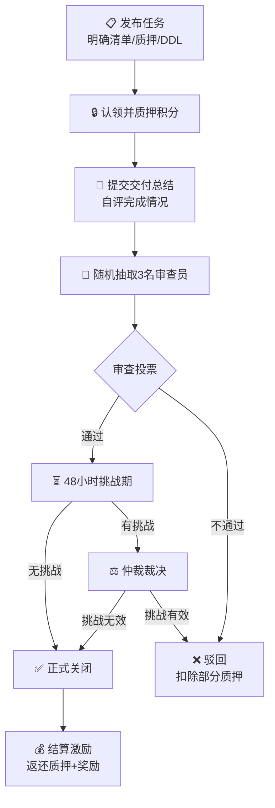
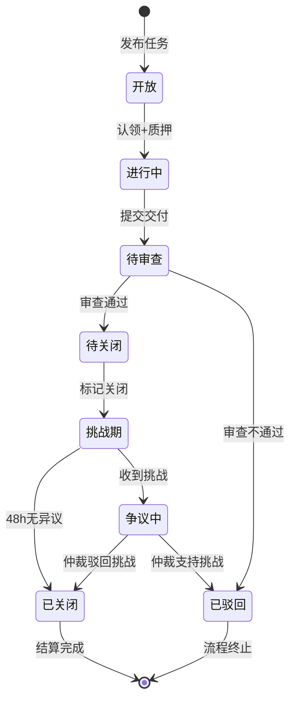
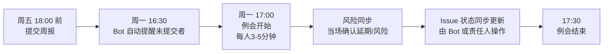
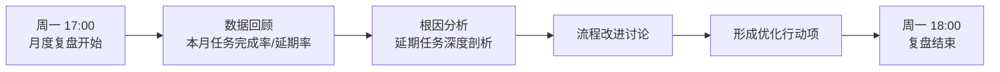
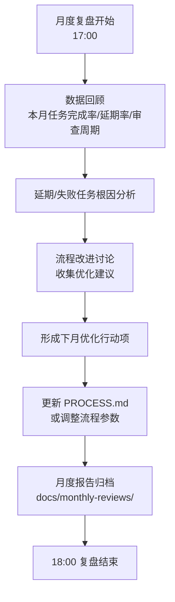
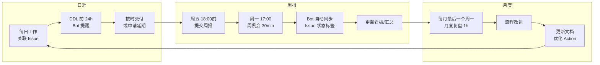
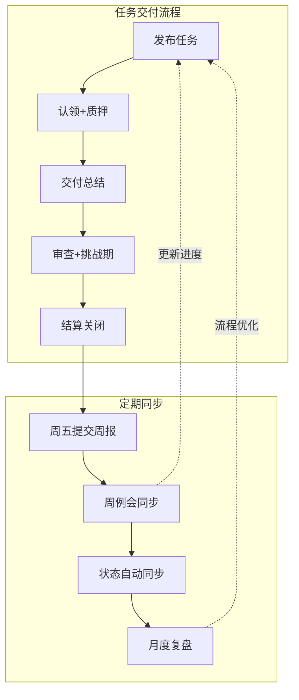

# 定期同步状态原则
每周例会，每人三到五分钟；使用 weekly-status report 

1. 做了什么(对应github 哪些内容)，与整体目标的关系是什么，完成了分解目标的百分比

2. 遇到什么问题，从技术和非技术两方面写；技术上卡到哪里了；非技术方面 满足安旭老师的运营规划

3. 还有那些没做的，下一步计划是什么，包括个人的分解目标(to-do list, ddl，交付物)

4. 如果是个人遇到问题，一定要在例会上，第一时间说明

5. 承诺的交付物必须在ddl 前完成

# 去中心化 区块链式 任务交付策略
## 核心业务流程



## 任务生命周期


### 0. 角色定义
+ **发起人（Initiator）**：创建 Issue 描述需求的人（可以是任何人, 目前是袁老师）。
+ **执行人（Executor）**：认领任务并负责交付的人。
+ **验证人（Reviewer）**：被随机抽取负责审查交付成果的人（共 3 名）。
+ **仲裁委员会（Arbitration Committee）**：试运行期间的临时治理主体（由 2-3 名核心成员组成），仅在挑战期争议无法解决时介入。

---

### 第一阶段：任务发布与挂牌（类“交易广播”）
1. **创建标准化 Issue**：发起人必须使用仓库内的 `TASK_REQUEST` 模板创建 Issue。
2. **核心要素挂牌**：标题注明 `[TASK]`，正文必须明确：
    - **交付清单**（Checklist）：必须细化为可勾选的子项。
    - **难度/权重**：预估工时与对应的**质押积分**（例如：低难度需质押 10 分，高难度 50 分）。
    - **截止时间（DDL）**：精确到具体日期（例如：2026-08-30 23:59 UTC+8）。

---

### 第二阶段：认领与权益质押（类 PoS 锁定）
3. **资格确认**：任何人可评论 `/assign` 认领，但认领即视为**同意质押相应积分**。
4. **即时锁定**：执行人必须在认领后 **12 小时内**，在 Issue 评论区明确回复“确认质押 X 积分，承诺 DDL 前交付”。（仓库管理员在 `ledger/` 账本中手动或通过 Bot 记录该质押冻结）。
5. **生效**：质押锁定后，任务进入 `In Progress` 状态。

---

### 第三阶段：执行与交付自省（类“区块打包”）
6. **交付总结**：执行人在 DDL 前，必须使用 `DELIVERY_SUMMARY` 模板在 Issue 下提交总结，必须诚实自评：
    - ✅ **完全达标项**（列出具体证据链接）。
    - ⚠️ **有条件完成项**（必须注明前置依赖条件，未满足则不计数）。
    - ❌ **未完成项及归因**（客观原因，不可模糊）。
    - 若延期，需在此阶段提出并**追加 20% 的惩罚性质押**以申请延期（最多延期一次）。

---

### 第四阶段：随机多签验证（类“共识验证”）
7. **触发审查**：交付总结提交后，进入 Review 队列。
8. **随机指派**：由自动化脚本（或仲裁委员会手动抽取）从**活跃贡献者池**中随机指定 **3 名验证人**。_规则：执行人不可自荐，且需回避与其有密切协作的关联人_。
9. **标准化审查清单**：3 名验证人必须在 **48 小时内**，使用 `REVIEW_CHECKLIST` 逐项独立发表审查意见：
    - 交付物与清单一致性；
    - 未完成项的理由是否充分；
    - 整体质量评分（1-5 分）。
    - **最终票型**：✅ 通过 / ❌ 不通过（附证据）。
10. **判定逻辑（少数服从多数）**：
    - **3 票通过**：进入下一阶段。
    - **2 票通过 vs 1 票不通过**：执行人需按不通过意见进行**最小必要修正**，修正后无需再投票，直接进入下一阶段（视为有条件通过）。
    - **≥2 票不通过**：任务**驳回**，执行人质押积分扣除 50% 归入公共池。

---

### 第五阶段：挑战期（类“区块最终确定性”）
11. **标记关闭但不结算**：3 名验证人意见达成一致后，Issue 暂时标记为 `Ready to Close`，但**并不立即关闭**，而是进入 **48 小时挑战窗口期**。
12. **全局异议权**：仓库内**任何非参与方成员**均可在此窗口期内发起挑战（回复 `/object`），并附上客观证据（如代码编译失败、逻辑漏洞等）。
    - **无挑战**：48 小时后，由验证人正式执行 `Close Issue`。
    - **存在有效挑战**：Issue 重新变更为 `Disputed`。执行人与挑战者进行 **24 小时举证辩论**，若无法达成一致，提交至仲裁委员会进行终裁。若终裁认定挑战有效，执行人扣除全部质押积分奖励给挑战者；若挑战无效，挑战者扣除 1 单位信誉积分。

---

### 第六阶段：结算、存证与激励（类“智能合约执行”）
13. **积分结算**：Issue 正式 Closed 后，触发结算：
    - 返还执行人全部质押积分；
    - 从公共池中奖励执行人 **等额积分** 作为完成激励；
    - 奖励 3 名验证人各 **（质押总额的 10%）** 作为审查激励。
14. **不可篡改存证**：每次状态变更（认领、交付、投票、挑战、关闭），执行人需将关键证据（Issues 链接、Commit SHA）汇总提交至仓库 `/ledger/task_audit.log` 文件中，通过 Git 本身的历史记录实现**时间戳固化**。

---

## 补充治理规则（试运行专享）
+ **紧急熔断**：试运行期间，若流程因 Bug 或恶意行为陷入死锁，仲裁委员会拥有**一票终决权**（此权力将在机制稳定运行 3 个月后移除）。
+ **积分初始分配**：初期由仲裁委员会为前 10 名核心成员空投 100 初始积分，供质押使用（新成员通过完成小任务赚取初始积分）。
+ **流程迭代**：针对本流程的修改建议，必须走完一整套上述的“发布-认领-审查”流程，实现**元治理**（即流程自举）。

# 定期同步状态操作规范 
## 一、整体框架
| 维度 | 具体规定 |
| --- | --- |
| **同步频率** | 每周一次，固定时间：**每周一 17:00-17:30** |
| **同步形式** | 周例会，每人 3-5 分钟，半小时内完成 |
| **月度复盘** | **每月最后一个周一**，例会延长至 1 小时（17:00-18:00） |
| **同步载体** | 仓库 `docs/weekly-reports/`
 目录下存放周报 Markdown 文件 |
| **自动化联动** | GitHub Action 定期提醒 + 周报提交后自动更新 Issue 状态 |
| **复盘周期** | 每月最后一个周一进行月度复盘 |

## 二、周报模板（必填）
每位成员在例会前（**周五 18:00 前**）需将周报提交至 `docs/weekly-reports/YYYY-MM-DD-姓名.md`

```plain
# 周报 - YYYY-MM-DD（本周覆盖范围：上周二 ~ 本周一）

## 一、本周完成（做了什么）

| 关联 Issue | 具体工作 | 与整体目标的关系 | 分解目标完成度 |
|------------|----------|------------------|----------------|
| #XX | 完成了 XXX 功能 | 属于 XX 里程碑的子项 | 75% |
| #YY | 修复了 YYY Bug | 保障系统稳定性 | 100% |

> 如无关联 Issue，需说明理由。

## 二、遇到的问题

### 技术方面
- [ ] 卡点描述（如：XX 接口超时，尚未定位原因）
- [ ] 需要协助的技术决策

### 非技术方面
- [ ] 人员协调、资源不足等问题
- [ ] 是否符合安旭老师的运营规划（如与规划不符，请说明偏差）

## 三、未完成事项与下周计划

### 未完成事项
| 原计划 | 未完成原因 | 新的完成时间 |
|--------|------------|--------------|
| XXX | 依赖前置任务延期 | YYYY-MM-DD |

### 下周计划（本周二 ~ 下周一）
| 分解目标 | DDL | 交付物 |
|----------|-----|--------|
| 完成 XXX 模块开发 | YYYY-MM-DD | PR 链接 |
| 撰写 YYY 设计文档 | YYYY-MM-DD | doc 链接 |

## 四、风险说明（必填）

> 如遇任何可能导致延期的问题，必须在此说明，不得隐瞒。

- [ ] 是否存在延期风险？ 是 / 否
- [ ] 如存在，风险原因：___________
- [ ] 需要的支持：___________

## 五、耗时统计（可选，用于工时评估）

本周总投入：____ 小时
```

## 三、周例会流程


### 月度复盘流程（每月最后一个周一）：


## 四、GitHub Action 自动化联动
### 1. 周报提交提醒（每周五 10:00 及周一 16:30）
#### 提醒 1：周五提醒提交周报

```plain
name: 'Weekly Report Reminder - Friday'
on:
  schedule:
    - cron: '0 2 * * 5'  # 每周五 10:00（北京时间）

jobs:
  remind:
    runs-on: ubuntu-latest
    steps:
      - name: 'Create Reminder Issue'
        uses: actions/github-script@v7
        with:
          script: |
            const body = `
            ## 📋 周报提交提醒

            请各位在今日 18:00 前提交本周周报：
            - 文件路径：\`docs/weekly-reports/YYYY-MM-DD-姓名.md\`
            - 模板参考：\`docs/weekly-report-template.md\`

            ⏰ 下周一 17:00 召开周例会，请提前做好准备。
            `;
            await github.rest.issues.create({
              owner: context.repo.owner,
              repo: context.repo.repo,
              title: `[周报提醒] ${new Date().toISOString().slice(0,10)} 周报提交`,
              body: body,
              labels: ['weekly-report', 'reminder']
            });
```

#### 提醒 2：周一例会前半小时催交

```plain
name: 'Weekly Report Reminder - Monday'
on:
  schedule:
    - cron: '30 8 * * 1'  # 每周一 16:30（北京时间）

jobs:
  remind:
    runs-on: ubuntu-latest
    steps:
      - name: 'Check and Remind'
        uses: actions/github-script@v7
        with:
          script: |
            const body = `
            ## ⏰ 例会即将开始

            提醒：今日 17:00 将召开周例会，请确保已提交周报。

            **未提交周报的成员**，请在会前补交：
            - 文件路径：\`docs/weekly-reports/YYYY-MM-DD-姓名.md\`

            如未提交，请在例会时说明原因。
            `;
            await github.rest.issues.create({
              owner: context.repo.owner,
              repo: context.repo.repo,
              title: `[例会提醒] ${new Date().toISOString().slice(0,10)} 17:00 周例会`,
              body: body,
              labels: ['meeting-reminder']
            });
```

### 2. 周报提交后自动生成汇总看板

```plain
name: 'Weekly Report Aggregator'
on:
  push:
    paths:
      - 'docs/weekly-reports/*.md'

jobs:
  aggregate:
    runs-on: ubuntu-latest
    steps:
      - name: 'Checkout'
        uses: actions/checkout@v4
      - name: 'Generate Summary'
        run: |
          echo "## 本周周报汇总" > docs/weekly-summary.md
          echo "生成时间：$(date -u '+%Y-%m-%d %H:%M UTC')" >> docs/weekly-summary.md
          echo "" >> docs/weekly-summary.md
          echo "| 成员 | 完成度 | 风险 | 下周关键任务 |" >> docs/weekly-summary.md
          echo "|------|--------|------|--------------|" >> docs/weekly-summary.md
          # 此处可扩展为调用 Python 脚本解析所有周报
      - name: 'Commit Summary'
        run: |
          git config user.name 'github-actions[bot]'
          git config user.email 'github-actions[bot]@users.noreply.github.com'
          git add docs/weekly-summary.md
          git commit -m "Auto: update weekly summary $(date +%Y%m%d)" || echo "No changes"
          git push
```

### 3. Issue 状态自动同步

```plain
name: 'Sync Issue Status from Weekly Report'
on:
  push:
    paths:
      - 'docs/weekly-reports/*.md'

jobs:
  sync:
    runs-on: ubuntu-latest
    steps:
      - name: 'Checkout'
        uses: actions/checkout@v4
      - name: 'Parse and Update Issues'
        uses: actions/github-script@v7
        with:
          script: |
            // 解析本周新增的周报，提取关联 Issue 和完成度
            // 自动更新对应 Issue 的标签（如：progress-75%）
            // 以及里程碑进度
```

### 4. DDL 前 24 小时自动提醒

```plain
name: 'DDL Reminder'
on:
  schedule:
    - cron: '0 1 * * *'  # 每天 9:00（北京时间）

jobs:
  check-ddl:
    runs-on: ubuntu-latest
    steps:
      - name: 'Check Issues with DDL'
        uses: actions/github-script@v7
        with:
          script: |
            // 查询所有带有 DDL 标签且未关闭的 Issue
            // 如果 DDL 在未来 24 小时内，在 Issue 下评论提醒
            // 如果已超过 DDL，在 Issue 下评论预警并@执行人
```

## 五、月度复盘机制
**每月最后一个周一**，例会延长至 1 小时（17:00-18:00）。



**月度复盘模板**：

```plain
# 月度复盘 - YYYY-MM

复盘日期：YYYY-MM-DD（当月最后一个周一）

## 一、本月数据总览
| 指标 | 本月 | 环比上月 | 同比（如有） |
|------|------|----------|--------------|
| 任务总数 | XX | +/-X | +/-X |
| 按时完成率 | XX% | +/-X% | +/-X% |
| 平均审查周期 | X 天 | +/-X | +/-X |
| 延期任务数 | XX | +/-X | +/-X |
| 延期任务占比 | XX% | +/-X% | +/-X% |

## 二、延期/失败任务分析
| Issue | 延期天数 | 根因分类 | 改进措施 | 责任人 |
|-------|----------|----------|----------|--------|
| #XX | 5 天 | 依赖阻塞 | 增加依赖前置提醒 | XXX |
| #YY | 3 天 | 需求变更 | 需求确认前置 | XXX |

## 三、流程改进项（下月执行）
- [ ] 改进项 1（责任人：XXX，DDL：MM-DD）
- [ ] 改进项 2

## 四、下月关键里程碑
| 里程碑 | 预期完成时间 | 涉及 Issue | 负责人 |
|--------|--------------|------------|--------|
| 模块 A 联调完成 | MM-DD | #XX,#YY | XXX |
| 模块 B 上线 | MM-DD | #ZZ | XXX |
```

## 六、最终闭环关系图


## 七、操作检查清单
**每位成员每周需要做的事情：**

| 时间 | 动作 | 检查项 |
| --- | --- | --- |
| 周五 18:00 前 | 提交周报 | 模板必填项全部填写，关联 Issue 编号正确 |
| 周一 17:00 | 参加周例会 | 准备好 3-5 分钟口头汇报，重点说明风险 |
| 例会结束后 | 更新相关 Issue | 将例会中确认的 DDL/状态同步到对应 Issue |

**管理员/值班人每周需要做的事情：**

| 时间 | 动作 | 检查项 |
| --- | --- | --- |
| 周五 10:00 | 检查 Bot 提醒是否正常 | 确认提醒 Issue 已创建 |
| 周五 18:00 | 检查未提交周报的成员 | 私信催促 |
| 周一 16:30 | 发送例会前催交通知 | 确认 Bot 提醒已触发 |
| 周一 17:00 | 主持例会并计时 | 确保 17:30 准时结束（非复盘周） |
| 每月最后一个周一 | 主持月度复盘 | 提前准备数据，确保 18:00 结束 |

## 八、与任务交付流程的衔接
周报中的“关联 Issue”字段直接将日常工作与任务交付流程绑定。例会中的风险同步为任务交付提供**提前预警**，避免到 DDL 才发现问题。

## 九、本规范的“元规则”
本规范本身的执行情况，也需要被定期检查和改进。**每季度最后一周的月度复盘中**，团队需花 15 分钟讨论：“这套定期同步机制是否有效？需要做哪些调整？”

在 `docs/process-meta/` 下记录每次流程调整的决策和原因，保持整个协作体系的自进化能力。



  
 周报中的“关联 Issue”字段直接将日常工作与任务交付流程绑定。例会中的风险同步为任务交付提供**提前预警**，避免到 DDL 才发现问题。

