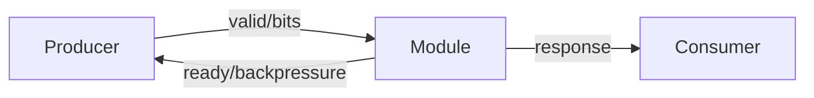
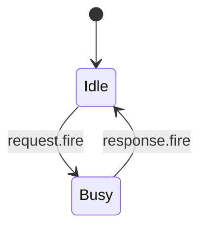

# Analyze XiangShan Kunminghu Skill Usage

This document explains how to ask questions that use the `$analyze-xiangshan-kunminghu` skill. The skill analyzes OpenXiangShan XiangShan Kunminghu source code and related design/course documents, then produces a code-grounded microarchitecture explanation for the requested module.

## What The User Inputs

Ask for one module, pipeline stage, instruction flow, or subsystem at a time. The prompt should identify the target as precisely as possible:

```text
Use $analyze-xiangshan-kunminghu to analyze backend/regcache.
```

```text
Use $analyze-xiangshan-kunminghu to analyze mem/lsqueue LoadQueue replay logic on branch kunminghu-v2.
```

```text
Use $analyze-xiangshan-kunminghu to analyze cache/dcache LoadPipe and include load/store instruction categories.
```

```text
Use $analyze-xiangshan-kunminghu to analyze XSCache coupledL2 MSHR and generate Mermaid diagrams.
```

If no branch is specified, the default target is:

```text
OpenXiangShan/XiangShan.git branch kunminghu-v2
```

You may override the branch or source location:

```text
Analyze frontend/BPU/Tage on kunminghu-v3.
```

```text
Analyze /path/to/local/XiangShan/src/main/scala/xiangshan/backend/issue.
```

## Recommended Prompt Pattern

Use this structure for reliable results:

```text
Use $analyze-xiangshan-kunminghu to analyze <module-or-path>.
Branch/source: <kunminghu-v2 | kunminghu-v3 | local path>.
Focus: <interfaces | algorithm | FSM | data path | control path | exceptions | load/store flow | speculative path>.
Output: include Mermaid diagrams and code anchors.
```

Example:

```text
Use $analyze-xiangshan-kunminghu to analyze backend/regcache.
Branch/source: kunminghu-v2.
Focus: who/why/how/from what/to what, microarchitecture parameters, storage structures, bypass/data path, control signals, and speculative recovery.
Output: include Mermaid interface and data-path diagrams.
```

## Supported Analysis Targets

Backend:

- `backend/decode`
- `backend/rename`
- `backend/dispatch`
- `backend/issue`
- `backend/exu`
- `backend/fu`
- `backend/datapath`
- `backend/regcache`
- `backend/rob`
- `backend/ctrlblock`

Frontend:

- `frontend/icache`
- `frontend/IFU.scala`
- `frontend/NewFtq.scala`
- `frontend/IBuffer.scala`
- `frontend/BPU.scala`
- branch predictors such as FTB, Tage, ITTAGE, SC, Bim, and RAS
- ITLB/MMU-related instruction fetch paths

Memory and cache:

- `mem/pipeline`
- `mem/lsqueue`
- `mem/sbuffer`
- `mem/mdp`
- `mem/prefetch`
- `mem/vector`
- `cache/dcache`
- `cache/mmu`
- `cache/wpu`
- `cache/CacheInstruction.scala`

XSCache:

- `coupledL2`
- `openLLC`
- `xscache/chi`
- `xscache/common`
- L2/L3 MSHR, directory, data storage, request arbiters, refill/writeback paths, CHI request/data/response channels

## What The Skill Outputs

For each requested module, the answer should be in English by default and should include these sections when relevant:

- Scope and source version: branch/path, files inspected, module boundary.
- Theory-to-code mapping: XiangShanLab superscalar/out-of-order concepts mapped to concrete Scala/Chisel classes, bundles, queues, tables, signals, and pipeline stages.
- Design intent vs effective code: Design Doc/course explanation separated from behavior verified in source code.
- Microarchitecture parameters: who owns the parameter, where it is defined, how it changes widths, entry counts, port counts, features, or algorithms.
- Interaction interfaces: module inputs/outputs, Decoupled/Valid handshakes, redirect/flush channels, wakeup/writeback ports, MMU/cache request-response paths.
- Why the module exists: correctness, bandwidth, latency, ordering, speculation, or recovery problem solved by the module.
- Who/why/how/from what/to what: updater ownership, motivation, algorithm, signal origin, and signal destination.
- Storage structures: registers, queues, buffers, arrays, tables, valid bits, pointers, snapshots, and replacement metadata.
- Queue/buffer capacity logic: empty, full, almost-full, enqueue/dequeue/fire conditions, and backpressure propagation.
- Algorithms: arbitration, selection, replacement, replay, redirect, dependency tracking, forwarding, merge/split, permission check, miss handling, or exception priority.
- FSM analysis: state registers, transition conditions, outputs by state, ready/valid interaction, entry and exit conditions.
- Control path: mux selects, valid/ready/fire, arbiters, FSM transitions, stalls, flushes, cancels, replays, redirects, wakeup, commit, and pipeline control signals.
- Data path: payload movement, pipeline registers, arrays, muxes, bypass/forwarding, writeback/refill paths, and transforms.
- Exception/interrupt/debug/privilege behavior: detection, priority, propagation, and recovery paths.
- Dynamic operation: normal path, speculative path, and recovery path.
- Mermaid diagrams: module-interface diagram and key data-path diagram; FSM diagram when the module has explicit states.
- Code anchors: file paths, class/module names, and concise line references when available.

## Memory Instruction Flow Requirements

For `mem`, `cache`, and XSCache questions, the answer should expand all relevant load/store-class instruction categories:

- scalar integer load/store
- floating-point load/store
- vector load/store
- AMO, LR, and SC
- prefetch
- fence and fence.i
- CBO/CMO operations
- misaligned memory operations
- uncache/MMIO operations

The explanation should trace both `mem` and `cache` directory modules on the effective path. If the request reaches L2/L3/coherence behavior, the explanation should also include XSCache modules.

## Diagram Expectations

For nontrivial modules, the answer should include Mermaid diagrams like:



For explicit state machines:



Diagrams must be based on effective code, not generic CPU textbook structure.

## Example User Questions

```text
Use $analyze-xiangshan-kunminghu to analyze backend/regcache.
```

```text
Use $analyze-xiangshan-kunminghu to analyze backend/issue IssueQueue.
Focus on wakeup/select, arbitration, queue full/empty, and speculative replay.
```

```text
Use $analyze-xiangshan-kunminghu to analyze frontend FTQ.
Focus on predictor update, redirect recovery, branch prediction storage, and interface diagrams.
```

```text
Use $analyze-xiangshan-kunminghu to analyze mem/lsqueue for load replay.
Expand scalar, vector, AMO/LR/SC, fence, CBO, prefetch, MMIO, and exception paths.
```

```text
Use $analyze-xiangshan-kunminghu to analyze cache/dcache LoadPipe.
Focus on DTLB, miss handling, refill path, store-load forwarding, replay, and privilege checks.
```

```text
Use $analyze-xiangshan-kunminghu to analyze XSCache coupledL2 MSHR.
Focus on directory lookup, request merge, CHI channels, FSM, data path, and replacement.
```

## Expected Assistant Behavior

When the user inputs a question, the assistant should:

1. Read the `$analyze-xiangshan-kunminghu` skill.
2. Inspect only the relevant skill references for the requested subsystem.
3. Inspect the actual XiangShan, Design Doc, XiangShanLab, and XSCache source/doc files needed for the answer.
4. State the analyzed branch/path.
5. Produce the module analysis using the skill contract.
6. Prefer effective source code over documentation when they differ.
7. Clearly mark unknown or unverified behavior instead of guessing.

## Language

The skill generates analysis in English by default. If Chinese output is needed, ask explicitly:

```text
Use $analyze-xiangshan-kunminghu to analyze backend/regcache. Output in Chinese.
```
