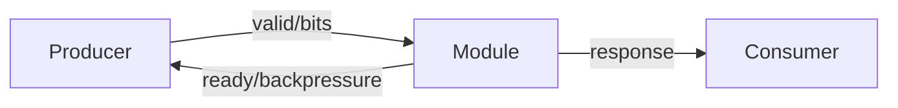
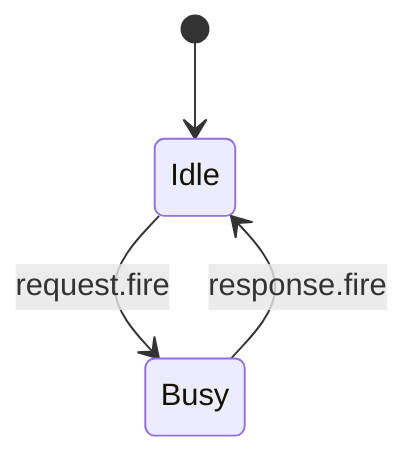

# Analyze XiangShan Kunminghu Skill Usage

This document explains how to ask questions that use the `$analyze-xiangshan-kunminghu` skill. The skill analyzes OpenXiangShan XiangShan Kunminghu source code and related design/course documents, then produces a code-grounded microarchitecture explanation for the requested module.

## What The User Inputs

Ask for one module, pipeline stage, instruction flow, or subsystem at a time. The prompt should identify the target as precisely as possible:

```text
Use $analyze-xiangshan-kunminghu to analyze backend/regcache.
```

```text
Use $analyze-xiangshan-kunminghu to analyze mem/lsqueue LoadQueue replay logic on branch kunminghu-v2.
```

```text
Use $analyze-xiangshan-kunminghu to analyze cache/dcache LoadPipe and include load/store instruction categories.
```

```text
Use $analyze-xiangshan-kunminghu to analyze XSCache coupledL2 MSHR and generate Mermaid and waveform-draw diagrams.
```

If no branch is specified, the default target is:

```text
https://github.com/OpenXiangShan/XiangShan.git branch kunminghu-v2
```

You may override the branch or commit. XiangShan source is fetched or inspected directly from `https://github.com/OpenXiangShan/XiangShan.git`; use a local path only when explicitly required:

```text
Analyze frontend/BPU/Tage on kunminghu-v3.
```

```text
Analyze /path/to/local/XiangShan/src/main/scala/xiangshan/backend/issue.
```

## Recommended Prompt Pattern

Use this structure for reliable results:

```text
Use $analyze-xiangshan-kunminghu to analyze <module-or-path>.
Branch/source: <kunminghu-v2 | kunminghu-v3 | commit SHA | explicit local path only if required>.
Focus: <interfaces | chiselAIA | chiselIOPMP | AXI master/slave | AXI protocol signals | predictor paper principle | pipeline stages | algorithm | FSM state rationale | control-signal rationale | scenario examples | index/allocation | data path | control path | exceptions | load/store flow | speculative path>.
Output: include Mermaid diagrams, waveform-draw handshake timing diagrams, and code anchors.
```

Example:

```text
Use $analyze-xiangshan-kunminghu to analyze backend/regcache.
Branch/source: kunminghu-v2.
Focus: who/why/how/from what/to what, microarchitecture parameters, storage structures, bypass/data path, control signals, and speculative recovery.
Output: include Mermaid interface and data-path diagrams plus waveform-draw handshake timing diagrams.
```

## Supported Analysis Targets

Backend:

- `backend/decode`
- `backend/rename`
- `backend/dispatch`
- `backend/issue`
- `backend/exu`
- `backend/fu`
- `backend/datapath`
- `backend/regcache`
- `backend/rob`
- `backend/ctrlblock`

Frontend:

- `frontend/icache`
- `frontend/IFU.scala`
- `frontend/NewFtq.scala`
- `frontend/IBuffer.scala`
- `frontend/BPU.scala`
- branch predictors such as FTB, Tage, ITTAGE, SC, Bim, and RAS
- ITLB/MMU-related instruction fetch paths

Memory and cache:

- `mem/pipeline`
- `mem/lsqueue`
- `mem/sbuffer`
- `mem/mdp`
- `mem/prefetch`
- `mem/vector`
- `cache/dcache`
- `cache/mmu`
- `cache/wpu`
- `cache/CacheInstruction.scala`

XSCache:

- `coupledL2`
- `openLLC`
- `xscache/chi`
- `xscache/common`
- L2/L3 MSHR, directory, data storage, request arbiters, refill/writeback paths, CHI request/data/response channels


## Weekly Source Sync

The skill performs a guarded weekly sync check for local documentation/course inputs before source inspection, unless the user explicitly asks not to sync. XiangShan source code itself is fetched or inspected directly from `https://github.com/OpenXiangShan/XiangShan.git`. It uses:

```bash
skills/analyze-xiangshan-kunminghu/scripts/weekly_sync.py
```

Behavior:

- Runs at most once every 7 days by default; use `--force` only when explicitly requested.
- Fetches configured git repositories and fast-forwards only clean worktrees with `git pull --ff-only`.
- Never runs destructive commands such as reset, clean, or checkout.
- Records status for `/nfs/home/yuanmiaomiao/XiangShanLab/xiangshan-course/docs/课程体系4：实现篇-香山高性能处理器微架构优化/中级-基于代码进行分析/` without overwriting generated or edited course-analysis files.
- Does not make local XiangShan source authoritative; the source revision comes from `https://github.com/OpenXiangShan/XiangShan.git`.
- Reports missing or dirty repositories in the analysis scope.


## Code Deep-Dive Output

Generated module code-analysis Markdown should be saved to:

`/nfs/home/yuanmiaomiao/XiangShanLab/xiangshan-course/docs/课程体系4：实现篇-香山高性能处理器微架构优化/中级-高性能香山处理器代码深入解析/`

Use the helper when saving generated analysis:

```bash
skills/analyze-xiangshan-kunminghu/scripts/save_analysis.py --module <ModuleName> --input <markdown-file>
```

The helper refuses to overwrite an existing file unless replacement is explicitly requested. Report the saved absolute path in the final response.

## What The Skill Outputs

For each requested module, the answer should be in English by default and should include these sections when relevant:

- Scope and source version: GitHub URL, branch/commit, source commit, files inspected, module boundary.
- Theory-to-code mapping: XiangShanLab superscalar/out-of-order concepts mapped to concrete Scala/Chisel classes, bundles, queues, tables, signals, and pipeline stages.
- Predictor paper principle: for predictor modules, paper-search-agent MCP search results, paper algorithm summary, citation/identifier, and XiangShan code mapping.
- Design intent vs effective code: Design Doc/course explanation separated from behavior verified in source code.
- Microarchitecture parameters: who owns the parameter, where it is defined, how it changes widths, entry counts, port counts, features, or algorithms.
- Interaction interfaces: module inputs/outputs, Decoupled/Valid handshakes, AXI/TL/APB channels, redirect/flush channels, wakeup/writeback ports, interrupt lines, MMU/cache request-response paths, with exact Chisel line numbers and core code for each key port and connection.
- Why the module exists: correctness, bandwidth, latency, ordering, speculation, or recovery problem solved by the module.
- Who/why/how/from what/to what: updater ownership, motivation, algorithm, signal origin, and signal destination.
- Storage structures: registers, queues, buffers, arrays, tables, valid bits, pointers, snapshots, and replacement metadata.
- Queue/buffer capacity logic: empty, full, almost-full, enqueue/dequeue/fire conditions, and backpressure propagation.
- Pipeline stage analysis: for memory/cache/XSCache content, each stage's concrete work, payload/control registers, valid/ready or enable condition, FSM/valid-state effect, index/allocation calculation, stall/flush/replay behavior, and output handoff.
- Algorithms: arbitration, selection, replacement, allocation/free index choice, replay, redirect, dependency tracking, forwarding, merge/split, permission check, miss handling, or exception priority, with exact Chisel line numbers and core code from the analyzed commit.
- FSM analysis: state registers, why each state exists, example scenarios, transition conditions, outputs by state, ready/valid interaction, entry and exit conditions.
- Control path: mux selects, valid/ready/fire, arbiters, FSM transitions, stalls, flushes, cancels, replays, redirects, wakeup, commit, and pipeline control signals; for every key control signal, include why it exists and a concrete scenario where it changes behavior.
- Data path: payload movement, pipeline registers, arrays, muxes, bypass/forwarding, writeback/refill paths, and transforms, with exact Chisel line numbers and core code.
- Exception/interrupt/debug/privilege behavior: detection, priority, propagation, and recovery paths, including chiselAIA APLIC/IMSIC and chiselIOPMP permission behavior when present.
- AXI bus behavior: master/slave roles, AW/W/B/AR/R channels, valid/ready fire, `id`, `addr`, `len`, `size`, `burst`, `data`, `strb`, `last`, `resp`, outstanding tracking, backpressure, and protocol-control scenarios.
- Dynamic operation: normal path, speculative path, and recovery path.
- Diagrams: Mermaid module-interface and key data-path diagrams; FSM diagram when the module has explicit states; waveform-draw timing diagrams for important handshake, valid/ready, request/response, enqueue/dequeue, grant/accept, or pipeline-valid paths.
- Source evidence: analyzed commit, file paths, class/module names, exact line references, and concise Chisel core code snippets for algorithms, ports, connections, and datapaths.
- Saved Markdown path under the code deep-dive course directory when a module analysis file is generated.

## Memory Instruction Flow Requirements

For `mem`, `cache`, and XSCache questions, the answer should expand all relevant load/store-class instruction categories. For every relevant category and module, explicitly describe the pipeline stages, what each stage does, how the state machine or implicit valid/status lifecycle advances, and which index/allocation algorithm selects entries, sets, banks, ways, beats, replay slots, MSHR/miss entries, PTW entries, or queue slots:

- scalar integer load/store
- floating-point load/store
- vector load/store
- AMO, LR, and SC
- prefetch
- fence and fence.i
- CBO/CMO operations
- misaligned memory operations
- uncache/MMIO operations

The explanation should trace both `mem` and `cache` directory modules on the effective path. If the request reaches L2/L3/coherence behavior, the explanation should also include XSCache modules.

## Diagram Expectations

For nontrivial modules, the answer should include Mermaid diagrams like:



For explicit state machines:



Diagrams must be based on effective code, not generic CPU textbook structure.


For every requested module with handshake or valid-like control, the answer should also include one or more waveform-draw timing diagrams. Use fenced `waveform-draw` blocks with WaveDrom-compatible JSON:

```waveform-draw
{
  "signal": [
    { "name": "clk", "wave": "p......" },
    { "name": "req.valid", "wave": "01..0.." },
    { "name": "req.ready", "wave": "0.10..." },
    { "name": "req.fire", "wave": "0..10.." },
    { "name": "req.bits", "wave": "x=..x..", "data": ["uop0"] },
    { "name": "resp.valid", "wave": "0....10" }
  ],
  "config": { "hscale": 1 }
}
```

The timing diagram should show real signal names when possible, payload stability during stalls, the exact `fire` or accept condition, response latency, and flush/cancel/replay masking when relevant.

## Example User Questions

```text
Use $analyze-xiangshan-kunminghu to analyze backend/regcache.
```

```text
Use $analyze-xiangshan-kunminghu to analyze backend/issue IssueQueue.
Focus on wakeup/select, arbitration, queue full/empty, and speculative replay.
```

```text
Use $analyze-xiangshan-kunminghu to analyze frontend FTQ.
Focus on predictor update, redirect recovery, branch prediction storage, and interface diagrams.
```

```text
Use $analyze-xiangshan-kunminghu to analyze frontend Tage.
Focus on paper-backed TAGE principle, lookup/update/recovery algorithm, folded-history index/tag calculation, provider/alternate selection, useful-bit allocation, scenario examples, and XiangShan code mapping.
```

```text
Use $analyze-xiangshan-kunminghu to analyze mem/lsqueue for load replay.
Expand scalar, vector, AMO/LR/SC, fence, CBO, prefetch, MMIO, and exception paths.
```

```text
Use $analyze-xiangshan-kunminghu to analyze cache/dcache LoadPipe.
Focus on each LoadPipe pipeline stage, DTLB, set/bank/way/beat index calculation, FSM/valid-state behavior, miss handling, refill path, store-load forwarding, replay, and privilege checks.
```

```text
Use $analyze-xiangshan-kunminghu to analyze XSCache coupledL2 MSHR.
Focus on pipeline stages, directory lookup, MSHR index allocation and merge policy, request merge, CHI channels, FSM, data path, and replacement.
```

## Expected Assistant Behavior

When the user inputs a question, the assistant should:

1. Read the `$analyze-xiangshan-kunminghu` skill.
2. Inspect only the relevant skill references for the requested subsystem.
3. Inspect the actual XiangShan, Design Doc, XiangShanLab, and XSCache source/doc files needed for the answer.
4. State the analyzed branch/path.
5. Produce the module analysis using the skill contract.
6. Prefer effective source code over documentation when they differ.
7. Clearly mark unknown or unverified behavior instead of guessing.

## Language

The skill generates analysis in English by default. If Chinese output is needed, ask explicitly:

```text
Use $analyze-xiangshan-kunminghu to analyze backend/regcache. Output in Chinese.
```

```text
Use $analyze-xiangshan-kunminghu to analyze chiselAIA AXIRegIMSIC.
Focus on APLIC/IMSIC boundary, AXI master/slave role, AW/W/B/AR/R handshakes, interrupt delivery, CSR privilege interaction, backpressure, protocol control signals, source line evidence, and waveform-draw timing diagrams.
```

```text
Use $analyze-xiangshan-kunminghu to analyze chiselIOPMP permission check path.
Focus on protected AXI/TL/APB path, config port, permission match algorithm, allow/deny response, master/slave roles, protocol control signals, source line evidence, and scenario examples.
```
