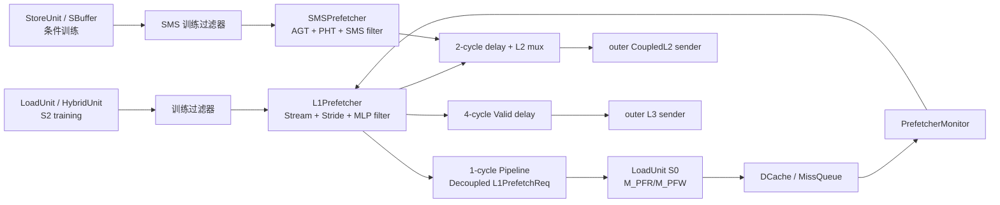
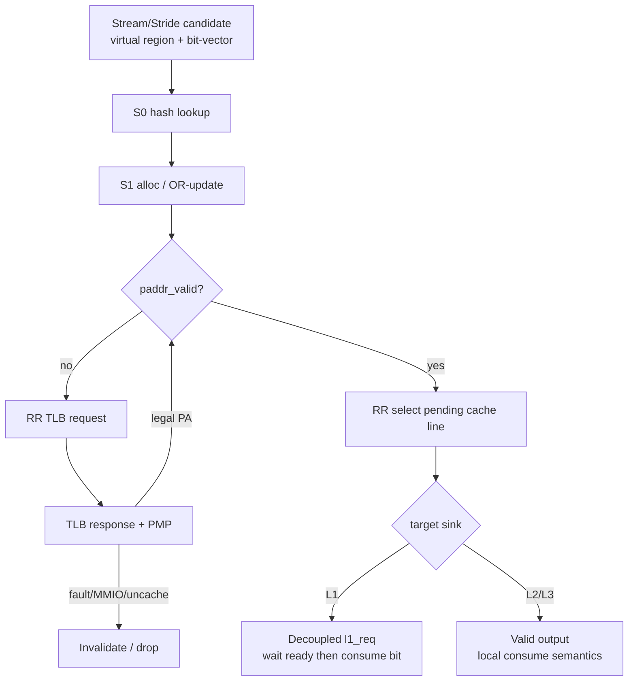
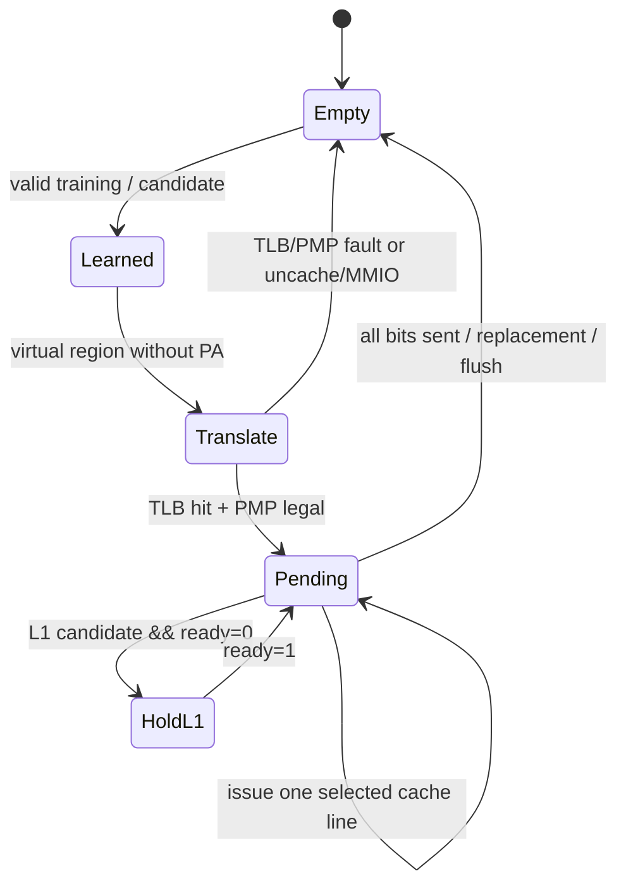

# 昆明湖 V2 MemBlock Prefetcher 源码解析：SMS、L1 Stream/Stride 与访存层级接口

> 分析对象：Kunminghu V2 后端 `MemBlock` 中的硬件数据预取（hardware prefetch）子系统。本文只讨论由 load/store 训练、向 L1 DCache / 外部 L2 / L3 发出请求的实现；软件 `PREFETCH.*` 指令、L2 内部的 BOP/VBOP/TP 算法以及前端 ICache 预取不在本文范围内。
>
> 最重要的源码结论：常规昆明湖 V2 配置会同时实例化 `SMSPrefetcher` 和 `L1Prefetcher`。前者在本基线中**实际只向 L2 发请求**；其 AGT 直接生成端与 SMS stride 生成端虽有实现，却分别被固定 `valid := false.B` 与 `io_stride_en := false.B` 关断。后者将 stream/stride 候选经多级过滤、DTLB/PMP 后，既可送 L1 DCache，也可送 L2（并具备 L3 接口）。这不是由模块名推断，而是由输出 `valid` 和 `ready` 的逐级连线得出的结论。

## 1. 范围、基线与证据等级

| 项目 | 本文采用的事实 | 证据 / 说明 |
| --- | --- | --- |
| 源码树 | `/home/yanyusong/xs-memory-env/XiangShan` | 分支 `kunminghu-v2`，提交 `e12436c7cba86b195deec24981976d78bc263661`。 |
| 配置语义 | `XSCoreParams.prefetcher` 的默认值为 `Some(SMSParams())` | [Parameters.scala:208](/home/yanyusong/xs-memory-env/XiangShan/src/main/scala/xiangshan/Parameters.scala:208)。若某个派生配置把它设为 `None`，本文两类实例都不会生成。 |
| 默认 L1D | 64 KiB、4-way，故 64 B cache line 时一个 1 KiB region 为 16 条 cache line | [Configs.scala:460](/home/yanyusong/xs-memory-env/XiangShan/src/main/scala/top/Configs.scala:460)、[L1PrefetchComponent.scala:20](/home/yanyusong/xs-memory-env/XiangShan/src/main/scala/xiangshan/mem/prefetch/L1PrefetchComponent.scala:20)。第二项是代码常量；cache line 大小仍以当前 elaboration 参数为准。 |
| Design Doc 基线 | 本地未找到 `XiangShan-Design-Doc` checkout | 因而本文不把课程材料当作官方设计说明；所有“已证实”结论都以当前 Scala 源码为准。 |
| 同步检查 | 按 `xiangshan-code-analyzer` 的 weekly sync 脚本执行 | 本轮返回“距上次同步 2.72 天，小于 7 天，跳过”；未改变源码或课程仓库。 |
| 证据等级 | **已证实** = 当前 elaborated 路径上的赋值/握手；**条件路径** = 由参数或 CSR 决定；**待波形验证** = 跨模块无背压接口的实际接收、竞争频率或时序占比 | 本文会显式使用这些词，避免把性能意图写成已发生的周期行为。 |

本文中的“fire”仅用于 `Decoupled` 接口的 `valid && ready`。对于 `ValidIO`，只有 `valid`，**不能**将其称为 fire 或据此断言下游必然接收。

## 2. Theory-to-Code Mapping

| 理论概念 | 本实现中的模块 / 状态 | 输入、输出与关键约束 | 源码证据 |
| --- | --- | --- | --- |
| 区域型空间预取 | `SMSPrefetcher`：AGT、PHT、`PrefetchFilter` | 以 1 KiB region 的访问 bit-vector 训练，PHT 生成 region 候选，filter 将候选逐 cache line 送 L2 | [SMSPrefetcher.scala:1219](/home/yanyusong/xs-memory-env/XiangShan/src/main/scala/xiangshan/mem/prefetch/SMSPrefetcher.scala:1219)、[SMSPrefetcher.scala:989](/home/yanyusong/xs-memory-env/XiangShan/src/main/scala/xiangshan/mem/prefetch/SMSPrefetcher.scala:989) |
| PC-stride 预取 | `L1StridePrefetcher` / `StrideMetaArray` | 以 PC hash 查 meta，匹配且置信度饱和才生成后继地址；只允许正、非零、非一的 stride | [L1StridePrefetcher.scala:82](/home/yanyusong/xs-memory-env/XiangShan/src/main/scala/xiangshan/mem/prefetch/L1StridePrefetcher.scala:82) |
| 流式区域预取 | `L1StreamPrefetcher` / `StreamBitVectorArray` | 记录 region 内 block 位图与访问计数，达到阈值后批量构造 L1/L2/L3 深度候选 | [L1StreamPrefetcher.scala:55](/home/yanyusong/xs-memory-env/XiangShan/src/main/scala/xiangshan/mem/prefetch/L1StreamPrefetcher.scala:55)、[L1StreamPrefetcher.scala:342](/home/yanyusong/xs-memory-env/XiangShan/src/main/scala/xiangshan/mem/prefetch/L1StreamPrefetcher.scala:342) |
| 训练去重与年龄顺序 | `TrainFilter`、`SMSTrainFilter` | 多条 load 训练输入按 ROB 年龄重排；同一 block hash 去重，避免同拍重复样本污染表项 | [L1PrefetchComponent.scala:185](/home/yanyusong/xs-memory-env/XiangShan/src/main/scala/xiangshan/mem/prefetch/L1PrefetchComponent.scala:185)、[SMSPrefetcher.scala:1117](/home/yanyusong/xs-memory-env/XiangShan/src/main/scala/xiangshan/mem/prefetch/SMSPrefetcher.scala:1117) |
| 多级过滤与安全地址生成 | `MutiLevelPrefetchFilter`、SMS `PrefetchFilter` | 候选先以虚拟 region 进入表项，单独经 DTLB 与 PMP；PF/GPF/AF、MMIO、PBMT uncache、PMP load fault 均丢弃 | [L1PrefetchComponent.scala:650](/home/yanyusong/xs-memory-env/XiangShan/src/main/scala/xiangshan/mem/prefetch/L1PrefetchComponent.scala:650)、[SMSPrefetcher.scala:1055](/home/yanyusong/xs-memory-env/XiangShan/src/main/scala/xiangshan/mem/prefetch/SMSPrefetcher.scala:1055) |
| 预取有用性反馈 | DCache 的 prefetch flag、`PrefetcherMonitor`、MissQueue 性能事件 | demand 使用预取 line 时可清来源标记；monitor 收集 timely/useful/late/pollution 等观测，输出 `pf_ctrl` | [DCacheWrapper.scala:1178](/home/yanyusong/xs-memory-env/XiangShan/src/main/scala/xiangshan/cache/dcache/DCacheWrapper.scala:1178)、[DCacheWrapper.scala:1395](/home/yanyusong/xs-memory-env/XiangShan/src/main/scala/xiangshan/cache/dcache/DCacheWrapper.scala:1395) |

## 3. 顶层实例化：谁存在、谁真的能发出请求

`MemBlock` 的两个 `Option` 都由同一个 `coreParams.prefetcher.map` 建立：当配置为 `Some(SMSParams())` 时，先匹配到 `SMSPrefetcher`，随后无条件（对任意 `PrefetcherParams`）建立 `L1Prefetcher`；当为 `None` 时，两者均不存在。[MemBlock.scala:442](/home/yanyusong/xs-memory-env/XiangShan/src/main/scala/xiangshan/mem/MemBlock.scala:442) [MemBlock.scala:460](/home/yanyusong/xs-memory-env/XiangShan/src/main/scala/xiangshan/mem/MemBlock.scala:460)



图中每个箭头表达的接口语义并不相同：`L1Prefetcher → LoadUnit` 是 `Decoupled`，可以由 `ready` 施加背压；到 outer L2/L3 的发射端是 `Valid` 类接口，不能从这个文件单独推出端到端保留语义。

### 3.1 接口契约矩阵：valid、ready 与 payload 到哪里去

| 源 → 目的 | 主信号 | 协议 | `valid` 的含义 | `ready/fire` 的含义与限制 |
| --- | --- | --- | --- | --- |
| Load/Hybrid → SMS/L1 trainer | `ld_in` / `stride_train` | `ValidIO` | 本拍有一条可训练访问 | 没有上游 ready；训练 filter/下游算法需自行承受同拍输入。 |
| L1Prefetcher → MemBlock → LDU/HYU | `l1_req: Decoupled[L1PrefetchReq]` | `Decoupled` | filter 选出一条合法 L1 candidate | `fire=valid&&ready`；filter 在 ready 低时保持，而 MemBlock 将各执行单元可接收条件 OR 成一个 ready。 |
| SMS / L1Prefetcher → MemBlock outer | `l2_req: Valid[L2PrefetchReq]` | `ValidIO` | 本地候选已通过该 prefetcher 的输出门控 | 没有返回 ready；上游不能得知外部 L2 当拍是否收下。 |
| L1Prefetcher → outer L3 | `l3_req: Valid[UInt]` | `ValidIO` | 本地 L3 candidate 有效 | 同上；且默认 Stream L3 gate 为低。 |
| SMS/L1 filter → MemBlock DTLB | `tlb_req` / `tlb_resp` | TLB request/response | 需要转换 virtual region 或接收翻译结果 | filter 自己保存 entry 与 response source，不能与 LoadUnit 的 no-translate request 混为同一操作。 |
| MemBlock → CoupledL2 receiver | `addr_valid`、`addr`、`pf_source` | `PrefetchRecv` | bridge 向 receiver 推送一条物理地址候选 | bundle 无 ready；receiver queue 的淘汰行为不能反馈给 MemBlock。 |

顶层定义本身也清楚区分了这些接口：`PrefetcherIO` 的 `l1_req` 是 `DecoupledIO`，而 `l2_req/l3_req` 是 `ValidIO`。[BasePrefecher.scala:65](/home/yanyusong/xs-memory-env/XiangShan/src/main/scala/xiangshan/mem/prefetch/BasePrefecher.scala:65)

### 3.2 三个容易混淆的“有模块”状态

| 代码对象 | 是否被实例化 | 本基线能否产生实际请求 | 原因 |
| --- | --- | --- | --- |
| `L1Prefetcher` 的 Stream | 是 | 可以，受 CSR、monitor、DTLB/PMP、DCache 接受条件共同限制 | 输出同时接到 L1、L2、L3 接口；stream 在与 stride 同时候选时优先。[L1PrefetchComponent.scala:846](/home/yanyusong/xs-memory-env/XiangShan/src/main/scala/xiangshan/mem/prefetch/L1PrefetchComponent.scala:846) |
| `L1Prefetcher` 的 Stride | 是 | 可以，受 `L1D_PF_ENABLE_STRIDE` 及其训练/置信度条件限制 | `MemBlock` 以 miss 或 stride-prefetch hit 的首发 load 为 stride 训练源。[MemBlock.scala:470](/home/yanyusong/xs-memory-env/XiangShan/src/main/scala/xiangshan/mem/MemBlock.scala:470) |
| SMS PHT 生成 | 是 | 可以到 L2 | `pht_gen_valid` 受 `io_pht_en` 控制，filter 的 L2 输出再受 `io.enable` 和 PMEM 范围控制。[SMSPrefetcher.scala:1312](/home/yanyusong/xs-memory-env/XiangShan/src/main/scala/xiangshan/mem/prefetch/SMSPrefetcher.scala:1312) [SMSPrefetcher.scala:1329](/home/yanyusong/xs-memory-env/XiangShan/src/main/scala/xiangshan/mem/prefetch/SMSPrefetcher.scala:1329) |
| SMS AGT 的直接生成 | 是 | **否** | `ActiveGenerationTable` 内直接把 `s2_pf_gen_req.valid := false.B`；AGT 仍可为 PHT 更新提供输入，但不直接发起预取。[SMSPrefetcher.scala:542](/home/yanyusong/xs-memory-env/XiangShan/src/main/scala/xiangshan/mem/prefetch/SMSPrefetcher.scala:542) |
| SMS 的 `StridePF` | 是 | **否** | `MemBlock` 固定 `sms.io_stride_en := false.B`，故其生成 valid 不会出现。[MemBlock.scala:453](/home/yanyusong/xs-memory-env/XiangShan/src/main/scala/xiangshan/mem/MemBlock.scala:453) |
| SMS → L1 | 接口存在 | **否** | 顶层固定 `io.l1_req.valid := false.B`，即使同时填了 bits 也不会握手。[SMSPrefetcher.scala:1333](/home/yanyusong/xs-memory-env/XiangShan/src/main/scala/xiangshan/mem/prefetch/SMSPrefetcher.scala:1333) |
| Store prefetch | 可由编译期参数纳入 | 默认不纳入有效路径 | 默认 `EnableStorePrefetchAtIssue`、`AtCommit`、`SMS`、`SPB` 都是 `false`。[Parameters.scala:235](/home/yanyusong/xs-memory-env/XiangShan/src/main/scala/xiangshan/Parameters.scala:235) |

这里的“否”不是算法代码不存在，而是当前代码中的常量赋值使该输出没有 `valid`。写性能结论时应把它与“候选被 DTLB/PMP 丢弃”区分开。

## 4. 控制面：`spfctl`、固定延迟与 monitor

`NewCSR` 将 `spfctl` 的各字段逐项映射到 `io.status.custom.pf_ctrl`。[NewCSR.scala:1341](/home/yanyusong/xs-memory-env/XiangShan/src/main/scala/xiangshan/backend/fu/NewCSR/NewCSR.scala:1341) 下表的 reset 值是当前硬件复位值，并非软件必须保持的策略。

| `spfctl` 位 / 字段 | reset | 消费位置和真实效果 |
| --- | --- | --- |
| `L1D_PF_ENABLE` bit 2 | 1 | `MemBlock` 以两拍 `GatedRegNextN` 后作为 SMS 和 L1 的共同总开关。[MemBlock.scala:441](/home/yanyusong/xs-memory-env/XiangShan/src/main/scala/xiangshan/mem/MemBlock.scala:441) |
| `L1D_PF_ENABLE_STRIDE` bit 16 | 1 | 使能整个 `L1Prefetcher`（名称虽为 stride，当前代码中 stream 也受这个外层 enable 约束）。[MemBlock.scala:465](/home/yanyusong/xs-memory-env/XiangShan/src/main/scala/xiangshan/mem/MemBlock.scala:465) |
| `L2_PF_RECV_ENABLE` bit 18 | 1 | SMS `io.enable` 的附加条件；L1 Prefetcher 的内部 enable 不读取这一位。[MemBlock.scala:447](/home/yanyusong/xs-memory-env/XiangShan/src/main/scala/xiangshan/mem/MemBlock.scala:447) |
| `L1D_PF_ENABLE_PHT/AGT` bit 5/4 | 1 / 1 | 控制 SMS PHT/AGT；但 AGT direct path 仍被固定 valid 关闭，不能仅凭 bit 4=1 推断其会发包。 |
| `L1D_PF_ACTIVE_THRESHOLD/STRIDE` bits 9:6 / 15:10 | 12 / 30 | 输入 SMS AGT 的激活参数；不等价于 L1 Stream 的固定 active 阈值。 |
| `L1D_PF_TRAIN_ON_HIT` bit 3 | 0 | 为 0 时 SMS load 训练只取首发且 miss 的样本；为 1 时接受全部有效样本。[MemBlock.scala:955](/home/yanyusong/xs-memory-env/XiangShan/src/main/scala/xiangshan/mem/MemBlock.scala:955) |
| `L2_PF_ENABLE` bit 1 | 1 | outer L2 sender 的 `l2_pf_en` 在两拍后传出；它不反向为 SMS/L1 内部候选提供 `ready`。[MemBlock.scala:640](/home/yanyusong/xs-memory-env/XiangShan/src/main/scala/xiangshan/mem/MemBlock.scala:640) |

`L1Prefetcher` 还把 `dcache.io.pf_ctrl` 接入自己的 `PrefetcherMonitor` 控制面，并采样 `io.l2PfqBusy`。[MemBlock.scala:467](/home/yanyusong/xs-memory-env/XiangShan/src/main/scala/xiangshan/mem/MemBlock.scala:467) `PrefetcherMonitor` 自身维护 `depth`、`flush`、`enable`、`confidence` 等寄存器，并断言 depth 不能为零。[PrefetcherMonitor.scala:50](/home/yanyusong/xs-memory-env/XiangShan/src/main/scala/xiangshan/mem/prefetch/PrefetcherMonitor.scala:50) 因此应将其描述为“反馈控制器”，不能在无波形的情况下把每个计数器变化解释成一次成功预取。

## 5. 输入训练：从访存流水线到算法表项

### 5.1 Load / Hybrid 训练的来源与筛选

LoadUnit 在 S2 后注册两套训练信息。两者都排除实际 uncache 访问；SMS 那套还允许硬件预取遇到 TLB miss 的特例，而 L1 那套不额外要求 miss。[LoadUnit.scala:1480](/home/yanyusong/xs-memory-env/XiangShan/src/main/scala/xiangshan/mem/pipeline/LoadUnit.scala:1480)

| 接收者 | `MemBlock` 有效条件 | PC 修正 | 用途 |
| --- | --- | --- | --- |
| SMS `pf.io.ld_in(i)` | `train_on_hit ? source.valid : source.valid && isFirstIssue && miss` | 对 pointer chasing 从 issue PC 的相应拍取值 | 更新 AGT/PHT/stride 相关状态；当前有效生成以 PHT 为主。 |
| L1 `pf.io.ld_in(i)`（stream） | `source.valid && isFirstIssue` | 直接传递 L1 training bundle | 更新 Stream bit-vector array。 |
| L1 `stride_train(i)` | `source.valid && isFirstIssue && (miss || meta_prefetch 是 stride)` | 针对 pointer chasing 再校正 PC | 更新 PC-stride meta array。 |
| SMS `st_in` | 仅条件性 store prefetch 配置/路径会接入 | 由 StoreUnit / SBuffer 供给 | 默认参数关闭，不能当作普通 KHV2 的训练来源。 |

前两条的代码分别见 [MemBlock.scala:955](/home/yanyusong/xs-memory-env/XiangShan/src/main/scala/xiangshan/mem/MemBlock.scala:955)、[MemBlock.scala:970](/home/yanyusong/xs-memory-env/XiangShan/src/main/scala/xiangshan/mem/MemBlock.scala:970)，stride 条件见 [MemBlock.scala:473](/home/yanyusong/xs-memory-env/XiangShan/src/main/scala/xiangshan/mem/MemBlock.scala:473)。`isFirstIssue` 的存在很重要：重放本身不能无界地反复训练相同访问。

### 5.2 L1 训练队列：容量、去重与背压

`L1Prefetcher` 内有两套 `TrainFilter`：stride filter 深度 6，stream filter 深度 4；每套均以环形 enqueue/dequeue 指针和 `valids` 保存 `PrefetchReqBundle`。[L1PrefetchComponent.scala:846](/home/yanyusong/xs-memory-env/XiangShan/src/main/scala/xiangshan/mem/prefetch/L1PrefetchComponent.scala:846) 输入先按 ROB 年龄重排，再以 `block_hash_tag` 与本拍/既存条目比较去重；队首用 `Decoupled` 输出，只有 `train_req.fire` 才弹出。[L1PrefetchComponent.scala:173](/home/yanyusong/xs-memory-env/XiangShan/src/main/scala/xiangshan/mem/prefetch/L1PrefetchComponent.scala:173)

这给出三个可验证的行为边界：

1. 同一 cache block 的并行训练不会承诺全部进入算法；去重命中后可能不分配。
2. `enable` 为低或下游算法不消费时，队列是否积压取决于 `ready`；不能从训练 input 的 valid 反推“已学习”。
3. `flush` 经寄存器后清空 valid 与指针，因此 flush 边沿与最末一条训练是否被吸收需要仿真按周期核对。

### 5.3 地址单位与别名

L1 预取 request 不是完整虚拟地址：它携带 `{paddr, alias, confidence, is_store, pf_source}`，LoadUnit 只以 `Cat(alias, paddr(DCacheSameVPAddrLength-1, 0))` 形成 DCache 索引用地址。[L1PrefetchInterface.scala:53](/home/yanyusong/xs-memory-env/XiangShan/src/main/scala/xiangshan/mem/prefetch/L1PrefetchInterface.scala:53) `pf_source` 编码为 `NULL=0`、`CLEAR=1`、`STRIDE=2`、`STREAM=3`、`STORE=4`。[L1PrefetchInterface.scala:30](/home/yanyusong/xs-memory-env/XiangShan/src/main/scala/xiangshan/mem/prefetch/L1PrefetchInterface.scala:30)

因此，“已经有物理地址”不等于可以跳过正确的 VIPT/alias 处理；L1 filter 先完成自己的 DTLB/PMP 处理，再带上 alias 交给 LoadUnit。

## 6. L1Prefetcher：Stream、Stride 与 Multi-level filter

### 6.1 公共 region 编码与存储规模

`HasL1PrefetchHelper` 固定 `REGION_SIZE=1024`，`BIT_VEC_WIDTH=REGION_SIZE/blockBytes`，为 L1/L2/L3 维护总共 32 个 MLP filter entries，其中 L1 16 个、L2/L3 16 个。[L1PrefetchComponent.scala:18](/home/yanyusong/xs-memory-env/XiangShan/src/main/scala/xiangshan/mem/prefetch/L1PrefetchComponent.scala:18) 对常规 64 B line，这正好是 16 bit region 位图；代码实际把 region bit 放在 `vaddr[REGION_TAG_OFFSET-1:BLOCK_OFFSET]`。[L1PrefetchComponent.scala:44](/home/yanyusong/xs-memory-env/XiangShan/src/main/scala/xiangshan/mem/prefetch/L1PrefetchComponent.scala:44)

| 子模块 | 主状态 | 容量 / 替换 | 关键地址索引 |
| --- | --- | --- | --- |
| `StrideMetaArray` | PC、last address、stride、confidence | 10 entries，PLRU | `pc_hash_tag`；并非完整 PC 比较，存在 hash alias 的可能。 |
| `StreamBitVectorArray` | region tag、bit vector、访问计数、方向 | 16 entries，PLRU | region tag 及相邻 region 匹配。 |
| `MutiLevelPrefetchFilter` | region tag、bit/sent vector、sink、alias、是否有 PA、source | L1 16 + L2/L3 16，PLRU | `region_hash_tag` 做查找；源代码通过断言约束一次最多命中一个。 |

表内容量来自 [L1StridePrefetcher.scala:40](/home/yanyusong/xs-memory-env/XiangShan/src/main/scala/xiangshan/mem/prefetch/L1StridePrefetcher.scala:40)、[L1StreamPrefetcher.scala:164](/home/yanyusong/xs-memory-env/XiangShan/src/main/scala/xiangshan/mem/prefetch/L1StreamPrefetcher.scala:164) 与 [L1PrefetchComponent.scala:33](/home/yanyusong/xs-memory-env/XiangShan/src/main/scala/xiangshan/mem/prefetch/L1PrefetchComponent.scala:33)。hash tag 是性能优化，故“表项命中”不应在文档中措辞为数学上完整地址相等。

### 6.2 Stream：何时成为 active，发多远

Stream entry 在访问到此前未置位的 block 时更新 bit vector/计数；达到 active threshold 或满足邻居触发条件后，后续阶段才构造预取请求。[L1StreamPrefetcher.scala:282](/home/yanyusong/xs-memory-env/XiangShan/src/main/scala/xiangshan/mem/prefetch/L1StreamPrefetcher.scala:282) 对该模块常量，active threshold 是 `BIT_VEC_WIDTH - 4`，在 64 B line 下是 12。[L1StreamPrefetcher.scala:16](/home/yanyusong/xs-memory-env/XiangShan/src/main/scala/xiangshan/mem/prefetch/L1StreamPrefetcher.scala:16)

生成阶段的固定深度为：L1 64 B（2 条 line）、L2 640 B（4 条 line）、L3 640 B（8 条 line），对应的候选组大小由 L1/L2/L3 生成代码的 bit-vector 决定。[L1StreamPrefetcher.scala:259](/home/yanyusong/xs-memory-env/XiangShan/src/main/scala/xiangshan/mem/prefetch/L1StreamPrefetcher.scala:259) [L1StreamPrefetcher.scala:342](/home/yanyusong/xs-memory-env/XiangShan/src/main/scala/xiangshan/mem/prefetch/L1StreamPrefetcher.scala:342) 这表示“生成时向前看的距离”，不是一个必定在固定周期后到达 cache 的延迟保证。

### 6.3 Stride：置信度要求与输出阶段

Stride meta 更新时，零、一和负 stride 不满足有效生成条件；同一 PC hash 的连续匹配提升饱和置信度，不匹配则降低或替换 stride。仅当 stride 有效、匹配且 confidence 达到最大才可产生候选。[L1StridePrefetcher.scala:82](/home/yanyusong/xs-memory-env/XiangShan/src/main/scala/xiangshan/mem/prefetch/L1StridePrefetcher.scala:82) `StrideMetaArray` 之后将地址移位形成 L1/L2 请求，流水级分别寄存，不应将接口名称当作零周期组合路径。[L1StridePrefetcher.scala:190](/home/yanyusong/xs-memory-env/XiangShan/src/main/scala/xiangshan/mem/prefetch/L1StridePrefetcher.scala:190)

### 6.4 Multi-level filter 的五条并行职能

注释与实现把 filter 划分为 enqueue、TLB、实际 L1、L2、L3 五条相互独立的流水路径。[L1PrefetchComponent.scala:361](/home/yanyusong/xs-memory-env/XiangShan/src/main/scala/xiangshan/mem/prefetch/L1PrefetchComponent.scala:361)

| 阶段 / 路径 | 状态改变 | 握手与危害防护 |
| --- | --- | --- |
| S0 lookup | 查找 hash-tag 命中或 PLRU 替换位 | 同一 hash 的前一级 allocation 会抑制冲突候选。 |
| S1 allocate/update | 把请求位图 OR 入命中项，或分配新项 | 通过断言保证同一 entry 不能同时被错误的分配/更新/发包破坏。 |
| TLB → PMP | RR arbiter 选一个无 PA 的 entry，发送 virtual region | TLB response 三拍后映射回 entry；fault、uncache、MMIO、PMP fault 时使 entry 无效。 |
| L1 output | RR 选 pending line，并将 sent bit 置位 | `io.l1_req` 是 `Decoupled`；当 `ready=0` 时 S1 保持请求，真正 `fire` 后才清待发送 bit。 |
| L2/L3 output | RR 选候选并在输出 valid 时更新 sent 状态 | 对外只有 `ValidIO`，代码没有等价的 receiver-ready，因此不能把 local valid 叙述为端到端交付。 |

这三类安全丢弃条件在 L1 filter 中集中出现：page/access fault、PBMT uncache、PMP mmio 与 PMP load fault。[L1PrefetchComponent.scala:650](/home/yanyusong/xs-memory-env/XiangShan/src/main/scala/xiangshan/mem/prefetch/L1PrefetchComponent.scala:650) 对 L1 路径而言，物理内存范围 `PmemRanges`、局部 enable 与 `pf_ctrl.enable` 也同时参与输出 valid。[L1PrefetchComponent.scala:846](/home/yanyusong/xs-memory-env/XiangShan/src/main/scala/xiangshan/mem/prefetch/L1PrefetchComponent.scala:846)



### 6.5 L1 输出的优先级、backpressure 与时间示例

在 `L1Prefetcher` 顶层，stream 的 L1 与 L2/L3 候选都优先于 stride（`Mux(stream.valid, stream.bits, stride.bits)`）。[L1PrefetchComponent.scala:846](/home/yanyusong/xs-memory-env/XiangShan/src/main/scala/xiangshan/mem/prefetch/L1PrefetchComponent.scala:846) L1 output 上，若 filter 已给出候选但 LoadUnit 回 `ready=0`，filter 的 S1 valid 和 bits 会保持；只有 `s1_pf_fire` 时才更新对应 bit。[L1PrefetchComponent.scala:699](/home/yanyusong/xs-memory-env/XiangShan/src/main/scala/xiangshan/mem/prefetch/L1PrefetchComponent.scala:699)

下面是**接口协议示意**，不是从仿真 FST 抄录的实测波形：

```waveform-draw
{
  "signal": [
    {"name":"clk","wave":"p......."},
    {"name":"filter l1 candidate","wave":"010....."},
    {"name":"LoadUnit l1_req.ready","wave":"0011...."},
    {"name":"l1_req.valid","wave":"0011...."},
    {"name":"l1_req.fire","wave":"0001...."},
    {"name":"pending bit","wave":"1...0..."}
  ],
  "config": {"hscale": 1}
}
```

它强调的可验证性质是：背压期间 request 的 payload 不能换成另一个 entry，且 pending bit 不能在真正 `fire` 前被消耗；这是后文验证表中的 `F_HOLD_BACKPRESSURE`。

## 7. SMSPrefetcher：PHT 是当前有效的 L2 生成源

### 7.1 参数、流水与有效生成选择

`SMSParams` 固定 region 大小 1024 B，StridePF 16 entries、AGT 16 entries、PHT 64 entries / 2 ways、PHT history 2、SMS filter 16 entries、训练 filter 8 entries。[SMSPrefetcher.scala:42](/home/yanyusong/xs-memory-env/XiangShan/src/main/scala/xiangshan/mem/prefetch/SMSPrefetcher.scala:42) 顶层的四个主要模块是 `SMSTrainFilter`、`ActiveGenerationTable`、`StridePF`、`PatternHistoryTable` 与 `PrefetchFilter`。[SMSPrefetcher.scala:1229](/home/yanyusong/xs-memory-env/XiangShan/src/main/scala/xiangshan/mem/prefetch/SMSPrefetcher.scala:1229)

```text
load/store training
  -> SMSTrainFilter (ROB 年龄重排、block hash 去重)
  -> AGT 查找 / 更新 / eviction
  -> PHT lookup 或 update
  -> PHT 的 current/increment/decrement candidate arbiter
  -> SMS PrefetchFilter (region 位图、TLB、PMP、逐 line 仲裁)
  -> l2_req ValidIO (source = Prefetch2L2SMS)
```

PHT 生成的 `pht_gen_valid` 受 PHT enable 控制；顶层先选 AGT/stride（若任一有效），否则选 PHT bits，并断言 AGT 与 stride 不可同时有效。[SMSPrefetcher.scala:1312](/home/yanyusong/xs-memory-env/XiangShan/src/main/scala/xiangshan/mem/prefetch/SMSPrefetcher.scala:1312) 但在当前基线，AGT/stride 的有效位实际都不会为真，故有效生成源是 PHT。

### 7.2 PHT 内部仲裁与并发边界

PHT 将 AGT eviction 更新与 AGT lookup 放入两个可覆盖队列；代码令 eviction 输入优先于 lookup，并以单个 RAM 写口的占用来产生等待条件。[SMSPrefetcher.scala:635](/home/yanyusong/xs-memory-env/XiangShan/src/main/scala/xiangshan/mem/prefetch/SMSPrefetcher.scala:635) 它可能产生 current、increment、decrement 三类 region candidate，并通过 arbiter 输出；输入 0、1、2 的顺序决定同拍竞争时的固定优先顺序。[SMSPrefetcher.scala:884](/home/yanyusong/xs-memory-env/XiangShan/src/main/scala/xiangshan/mem/prefetch/SMSPrefetcher.scala:884)

这说明两个常见误读都不成立：

- “AGT 使能位为 1，所以 AGT 会直接发预取”不成立：direct request 的 valid 被常量关闭。
- “每次 AGT lookup 都会立刻读出一个 PHT 并发包”不成立：队列、单写口、lookup/eviction 仲裁和 filter 都可能延迟或合并它。

### 7.3 SMS PrefetchFilter：translation、PMP 和逐 line 发射

SMS filter 的每个 entry 保存 region tag/address、requested bits、`filter_bits`、alias、`paddr_valid`、方向和 debug source；共 16 entries、PLRU 替换。[SMSPrefetcher.scala:911](/home/yanyusong/xs-memory-env/XiangShan/src/main/scala/xiangshan/mem/prefetch/SMSPrefetcher.scala:911) 它先给没有 PA 的 region 发送 `isPrefetch=true` 的 DTLB request；TLB/PMP 后，将 PF/GPF/AF、MMIO、PBMT uncache、PMP load fault 的条目清除。[SMSPrefetcher.scala:971](/home/yanyusong/xs-memory-env/XiangShan/src/main/scala/xiangshan/mem/prefetch/SMSPrefetcher.scala:971) [SMSPrefetcher.scala:1055](/home/yanyusong/xs-memory-env/XiangShan/src/main/scala/xiangshan/mem/prefetch/SMSPrefetcher.scala:1055)

对于已合法转换的 entry，它计算 `pending_req_vec = region_bits & ~filter_bits`，用 first/last one（取决于递减模式）一次选择一条 cache line；被 arbiter 选中后更新 `filter_bits`。[SMSPrefetcher.scala:989](/home/yanyusong/xs-memory-env/XiangShan/src/main/scala/xiangshan/mem/prefetch/SMSPrefetcher.scala:989) 因此一个 1 KiB region 候选不等于一条宽请求：它会被拆成多次单 line local valid。

最终输出是：

```scala
io.l2_req.valid := pf_filter.io.l2_pf_addr.valid && io.enable && is_valid_address
io.l2_req.bits.source := MemReqSource.Prefetch2L2SMS.id.U
io.l1_req.valid := false.B
```

对应源码在 [SMSPrefetcher.scala:1327](/home/yanyusong/xs-memory-env/XiangShan/src/main/scala/xiangshan/mem/prefetch/SMSPrefetcher.scala:1327) 与 [SMSPrefetcher.scala:1339](/home/yanyusong/xs-memory-env/XiangShan/src/main/scala/xiangshan/mem/prefetch/SMSPrefetcher.scala:1339)。这正是本文将 SMS 写成“L2 预取器”而不是“L1 SMS 预取器”的代码依据。

## 8. 从 L1 request 到 DCache / MissQueue：不占用 ROB，也不是普通 load

### 8.1 MemBlock 广播与 LoadUnit 的入口优先级

`L1Prefetcher.io.l1_req` 先通过一拍 `Pipeline`，再把同一份 `valid/bits` 广播到每个 LoadUnit 和 HybridUnit。[MemBlock.scala:498](/home/yanyusong/xs-memory-env/XiangShan/src/main/scala/xiangshan/mem/MemBlock.scala:498) [MemBlock.scala:559](/home/yanyusong/xs-memory-env/XiangShan/src/main/scala/xiangshan/mem/MemBlock.scala:559) 这不是复制成多条独立队列：最终 `ready` 是各单元 `canAcceptHigh/LowConfPrefetch` 的 OR，且不同端口会覆写低置信度。[MemBlock.scala:574](/home/yanyusong/xs-memory-env/XiangShan/src/main/scala/xiangshan/mem/MemBlock.scala:574)

LoadUnit S0 的固定优先级从高到低为：misalignment buffer、super replay、fast replay、LSQ replay、**高置信硬件预取**、vector issue、整数/软件预取 first issue、MMIO、NC、load-to-load forward、**低置信硬件预取**。[LoadUnit.scala:300](/home/yanyusong/xs-memory-env/XiangShan/src/main/scala/xiangshan/mem/pipeline/LoadUnit.scala:300) 因而“某个 L1 prefetch request 有 `valid`”只意味着它参与了仲裁；只有该端口的 source select、DCache ready 与无 kill 条件同时满足时才进入 LoadUnit。

本默认路径中真正注入 L1D 的是 Stream/Stride 的读预取，故命令是 `M_PFR`。LoadUnit 的通用逻辑也支持 `is_store` 映射为 `M_PFW`，但 SMS 的 `is_store := true.B` 位于已硬关的 `io.l1_req.valid := false.B` 接口上，且 StorePrefetch 四个默认参数均为 `false`；不能由 `M_PFW` 分支存在就声称默认启用 store prefetch。[LoadUnit.scala:406](/home/yanyusong/xs-memory-env/XiangShan/src/main/scala/xiangshan/mem/pipeline/LoadUnit.scala:406) [Parameters.scala:235](/home/yanyusong/xs-memory-env/XiangShan/src/main/scala/xiangshan/Parameters.scala:235)

| 行为 | 硬件预取在 LoadUnit 中的实现 | 与普通 demand load 的差异 |
| --- | --- | --- |
| 地址使用 | 采用 `L1PrefetchReq.getVaddr()`，即 alias + PA 的 cache 索引部分 | 不从 RS uop 的完整 VA 重新走正常翻译。 |
| DTLB | `no_translate=true` 且 `kill`，但保留信号供 PMP 检查 | 预取器前级已经发过自己的 DTLB/PMP；这里不是第二次普通翻译。 |
| DCache command | `prf_rd → M_PFR`，`prf_wr → M_PFW`，否则才是 `M_XRD` | DCache 可按 `instrtype=DCACHE_PREFETCH_SOURCE` 和 `pf_source` 区分。 |
| SBuffer / UBuffer / LSQ forward | `s1_prf` 时均不发出 | 不参与 store-to-load forwarding、LSQ forwarding 或 uncache buffer 路径。 |
| 异常和提交 | 硬件预取没有来自 ROB 的 destination / completion；TLB no-query 条件抑制异常向量 | 预取失败是内部丢弃/kill，不向软件提交 load exception。 |

以上前两行的直接代码见 [LoadUnit.scala:338](/home/yanyusong/xs-memory-env/XiangShan/src/main/scala/xiangshan/mem/pipeline/LoadUnit.scala:338)、[LoadUnit.scala:401](/home/yanyusong/xs-memory-env/XiangShan/src/main/scala/xiangshan/mem/pipeline/LoadUnit.scala:401)、[LoadUnit.scala:406](/home/yanyusong/xs-memory-env/XiangShan/src/main/scala/xiangshan/mem/pipeline/LoadUnit.scala:406)；后两行见 [LoadUnit.scala:963](/home/yanyusong/xs-memory-env/XiangShan/src/main/scala/xiangshan/mem/pipeline/LoadUnit.scala:963) 与 [LoadUnit.scala:1022](/home/yanyusong/xs-memory-env/XiangShan/src/main/scala/xiangshan/mem/pipeline/LoadUnit.scala:1022)。所以，“不进入 ROB”是从没有 uop completion/写回路径且 load forwarding 被排除这一组代码事实归纳出来的，不是在猜测其微架构意图。

### 8.2 DCache flag、useful/late 与 MissQueue 的边界

DCache wrapper 从多个 LoadPipe 的 metadata/write port 维护 prefetch 标记，并将 monitor 输出回接给 `L1Prefetcher`。[DCacheWrapper.scala:1211](/home/yanyusong/xs-memory-env/XiangShan/src/main/scala/xiangshan/cache/dcache/DCacheWrapper.scala:1211) [DCacheWrapper.scala:1395](/home/yanyusong/xs-memory-env/XiangShan/src/main/scala/xiangshan/cache/dcache/DCacheWrapper.scala:1395) 预取来源有 `STREAM`、`STRIDE` 等编码；当**非预取 demand** 命中一条硬件预取 line 时，LoadPipe 将来源更新为 `CLEAR`，并记 FDP useful。[LoadPipe.scala:577](/home/yanyusong/xs-memory-env/XiangShan/src/main/scala/xiangshan/cache/dcache/loadpipe/LoadPipe.scala:577)

这给出“useful”的一个明确实现定义：需求访问确实命中先前带硬件预取来源的 line。它不等于“PHT/stream 给过候选”，也不等于“外层 L2 最终接收”。

MissQueue 对 prefetch 的处理还要区分：

- 同 block 的 demand 追上已分配 prefetch 时会形成 late prefetch 相关状态；需求方优先处理并可清除 entry 的 `prefetch` 标记。[MissQueue.scala:184](/home/yanyusong/xs-memory-env/XiangShan/src/main/scala/xiangshan/cache/dcache/mainpipe/MissQueue.scala:184) [MissQueue.scala:940](/home/yanyusong/xs-memory-env/XiangShan/src/main/scala/xiangshan/cache/dcache/mainpipe/MissQueue.scala:940)
- 预取不能无限作为二次 merge 请求；代码对 late PF 有专门的忽略处理。[MissQueue.scala:594](/home/yanyusong/xs-memory-env/XiangShan/src/main/scala/xiangshan/cache/dcache/mainpipe/MissQueue.scala:594)
- 只有部分高编号 MSHR 被预留给普通 PF，所以预取可因资源竞争被拒绝或重放。[MissQueue.scala:787](/home/yanyusong/xs-memory-env/XiangShan/src/main/scala/xiangshan/cache/dcache/mainpipe/MissQueue.scala:787)

`naive useful`、FDP useful、timely、late、pollution 是不同的计数语义，不能混成单个“命中率”。例如 LoadPipe 同时维护 naive 的 total/late/useful 等指标。[LoadPipe.scala:500](/home/yanyusong/xs-memory-env/XiangShan/src/main/scala/xiangshan/cache/dcache/loadpipe/LoadPipe.scala:500) 因此若后续要以 FST/计数器给出准确率，必须先标明选用哪一组定义。

## 9. 外部 L2/L3：仲裁、Valid-only 接口与实际接收边界

### 9.1 MemBlock 内的源仲裁

SMS 和 L1Prefetcher 的 L2 request 都先延迟两拍；同拍时 `Mux(l1_pf_to_l2.valid, ...)` 明确让 L1 Stream/Stride 覆盖 SMS。代码还记录 `sms_block_by_l1pf` 性能事件。[MemBlock.scala:631](/home/yanyusong/xs-memory-env/XiangShan/src/main/scala/xiangshan/mem/MemBlock.scala:631) 这是一条**固定优先级**，不是公平 RR 仲裁；SMS 被遮蔽的候选是否可在下一拍重新出现要看其上游 filter/arbiter 自身状态，不能根据此 Mux 推断保证进展。

L3 外发只取 L1Prefetcher 的 `l3_req` 并延迟四拍。[MemBlock.scala:648](/home/yanyusong/xs-memory-env/XiangShan/src/main/scala/xiangshan/mem/MemBlock.scala:648) 但 Stream 模块把 L3 的常量使能默认设为 `false`。[L1StreamPrefetcher.scala:413](/home/yanyusong/xs-memory-env/XiangShan/src/main/scala/xiangshan/mem/prefetch/L1StreamPrefetcher.scala:413) 因此“有 L3 sender 连线”不等同于“默认会产生 L3 request”。

### 9.2 到 CoupledL2 的协议不是 Decoupled

`KunminghuV2Config` 的 L2 配置在 `prefetcher.nonEmpty` 时加入 PrefetchReceiver；因此对本文默认 `Some(SMSParams())` 的配置，以下 receiver 链路是 elaboration 范围内的组件。[Configs.scala:317](/home/yanyusong/xs-memory-env/XiangShan/src/main/scala/top/Configs.scala:317) 最小配置若把 prefetcher 设为 `None`，则不能把本节 receiver 路径套用到该配置。

外层 `PrefetchRecv` 只有 `addr`、`pf_source`、`addr_valid`、`l2_pf_en`，没有 `ready`。[Common.scala:400](/home/yanyusong/xs-memory-env/XiangShan/coupledL2/src/main/scala/coupledL2/Common.scala:400) `CoupledL2` 将 bridge 的 `addr_valid/addr/pf_source` 逐项接给 `Prefetcher.io.recv_addr`。[CoupledL2.scala:383](/home/yanyusong/xs-memory-env/XiangShan/coupledL2/src/main/scala/coupledL2/CoupledL2.scala:383)

`PrefetchReceiver` 随即由 `enable && recv_addr.valid` 产生内部 request，并没有保存寄存器或上游回压；其 TLB request 在该 receiver 中硬关。[PrefetchReceiver.scala:48](/home/yanyusong/xs-memory-env/XiangShan/coupledL2/src/main/scala/coupledL2/prefetch/PrefetchReceiver.scala:48) L2 接收总使能应看 `l2_pf_master_en && l2_pf_recv_en` 的两拍寄存器，而不能把每一拍携带的 `l2_pf_en` 写成 receiver 的唯一门控。[Prefetcher.scala:241](/home/yanyusong/xs-memory-env/XiangShan/coupledL2/src/main/scala/coupledL2/prefetch/Prefetcher.scala:241)

后端 receiver request 再经 Arbiter、prefetch queue、Pipe 才输出；该 queue 明确“always ready”，满且不能出队时推进 head、丢弃最旧项以保留最新请求。[Prefetcher.scala:183](/home/yanyusong/xs-memory-env/XiangShan/coupledL2/src/main/scala/coupledL2/prefetch/Prefetcher.scala:183) [Prefetcher.scala:209](/home/yanyusong/xs-memory-env/XiangShan/coupledL2/src/main/scala/coupledL2/prefetch/Prefetcher.scala:209) 最终 SinkA 也要等正常 A 通道无有效需求及 task ready 才接收，并转换为 `Hint/PREFETCH_READ`。[SinkA.scala:94](/home/yanyusong/xs-memory-env/XiangShan/coupledL2/src/main/scala/coupledL2/SinkA.scala:94)

**可证实边界**：MemBlock 本地可以产生 `addr_valid`，receiver 路径无上游 ready，queue 饱和时会丢最旧项。**不能仅凭这些代码证实的结论**：每个 L1/SMS 候选最终被 L2 Slice 接收、发出内存读，或在多少周期后完成。后者需要对 `prefetch_req_fromL1/selectL1`、queue enq/deq、SinkA ready 等信号做波形/计数器验证。[Prefetcher.scala:379](/home/yanyusong/xs-memory-env/XiangShan/coupledL2/src/main/scala/coupledL2/prefetch/Prefetcher.scala:379)

## 10. 时序、状态生命周期、flush / redirect / atomic

预取器没有一个统一的“request FSM”。更准确的描述是多个表项各自经历 `invalid → allocated/training → waiting-translation → physical/pending-lines → issued-or-dropped`。其中 L1 filter 的 L1 发射可因 `ready=0` 停在 hold 状态；SMS/L2/L3 Valid-only 输出则没有相同的等待语义。



这个图是按源码状态归纳的生命周期图，不暗示所有 SMS 表都直接采用同一个 FSM 寄存器。

| 事件 | L1 Prefetcher 的可见代码行为 | SMS 的可见代码行为 | 不应过度推断的部分 |
| --- | --- | --- | --- |
| DTLB miss | entry 保留为无 PA，后续由 arbiter 再次申请 | filter 也保留并等待转换；response 对应关系有两拍前 request 断言 | 不代表一定最终完成翻译。 |
| PF/GPF/AF/PMP/MMIO/PBMT uncache | invalid/drop，不能进入 L1/L2/L3 request | 同类条件 drop | 不产生架构异常给软件。 |
| `pf_ctrl.flush` | TrainFilter/MLP/stream/stride 的 valid 按寄存器化 flush 清除 | SMS IO 没有直接 flush 输入 | 不能把 L1 flush 外推成 SMS 被同拍清空。 |
| 后端 redirect | `MemBlock` 给 DTLB 广播 redirect，但未发现 `redirect` 直接连到 L1/SMS prefetcher | 同左 | 不应声称“所有预取一定在 redirect 当拍取消”。 |
| atomic 状态 | 强制所有 LoadUnit 的 `prefetch_req.valid := false.B` | 该语句只直接覆盖 L1 注入到 LoadUnit 的 valid | 不能仅由此证明 SMS/L2 sender 的所有内部表项同步清空。 |

atomic 的精确代码位于 [MemBlock.scala:1833](/home/yanyusong/xs-memory-env/XiangShan/src/main/scala/xiangshan/mem/MemBlock.scala:1833)。L1 filter 的 flush 路径和 filter valid reset 在 [L1PrefetchComponent.scala:823](/home/yanyusong/xs-memory-env/XiangShan/src/main/scala/xiangshan/mem/prefetch/L1PrefetchComponent.scala:823)；SMS `PrefetcherIO` 并没有 flush 字段可接。[BasePrefecher.scala:65](/home/yanyusong/xs-memory-env/XiangShan/src/main/scala/xiangshan/mem/prefetch/BasePrefecher.scala:65)

## 11. 三类跨边界：虚拟页、cache line、特权/异常

| 边界 | 代码如何处理 | 需要避免的错误结论 |
| --- | --- | --- |
| 虚拟页 | 1 KiB region 小于 4 KiB 页；L1/SMS filter 以 virtual region 发 DTLB，收到 PA 后再组成候选地址。跨相邻 region 时 SMS 显式计算 cross-page，不能直接复用原 PA。 | 不要因 region 较小就跳过 DTLB/PMP；每个待转换 region 仍可能 fault 或映射到不连续 PA。 |
| cache line | stream/SMS 以 bit vector 汇集多条 line，但各 arbiter 每次只选一条 pending bit；发后置 sent/filter bit。 | 不要把一个 region candidate 写成“单个 1 KiB cache request”。 |
| cache alias | L1 request 用 PA 低位加 alias 作为 DCache 索引地址。 | 不要以“有 PA”断言能忽略 alias。 |
| MMIO / uncache | L1 与 SMS filter 都在前级 drop；LoadUnit 对 `s1_prf` 屏蔽 NC/forwarding。 | 不要将硬件预取送进 uncache buffer 或宣称其访问 I/O。 |
| 页/访问异常 | filter drop；LoadUnit 的 no-translate 路径不产生普通 load exception vector。 | 不要把预取 fault 作为 ROB exception 或 Difftest trap。 |
| 特权/PMP | 预取器各有专用 DTLB port 与对应 PMP response。 | 不要把 LoadUnit 的 DTLB port 当成 SMS/L1 filter 的翻译端口。 |

专用端口分配见 [MemBlock.scala:1213](/home/yanyusong/xs-memory-env/XiangShan/src/main/scala/xiangshan/mem/MemBlock.scala:1213)：SMS 接 `PrefetcherDTLBPortIndex`，L1 Stream/Stride 接 load-DTLB 分组后的附加 stream port。L1 与 SMS 的安全丢弃代码分别见 [L1PrefetchComponent.scala:650](/home/yanyusong/xs-memory-env/XiangShan/src/main/scala/xiangshan/mem/prefetch/L1PrefetchComponent.scala:650) 与 [SMSPrefetcher.scala:1055](/home/yanyusong/xs-memory-env/XiangShan/src/main/scala/xiangshan/mem/prefetch/SMSPrefetcher.scala:1055)。

## 12. 可观察性、ChiselDB 与 Difftest coverage

| 观察项 | 代码位置 | 能证明什么 | 不能证明什么 |
| --- | --- | --- | --- |
| `L2PrefetchTrace` / `StreamPrefetchTrace` | [MemBlock.scala:642](/home/yanyusong/xs-memory-env/XiangShan/src/main/scala/xiangshan/mem/MemBlock.scala:642) | MemBlock 在 L2 sender 前看到本地 valid，且区分 L1 与 SMS 路径 | 不能单独证明 CoupledL2 最终消费。 |
| `L1SMSMissTrace` | [SMSPrefetcher.scala:1345](/home/yanyusong/xs-memory-env/XiangShan/src/main/scala/xiangshan/mem/prefetch/SMSPrefetcher.scala:1345) | SMS local L2 request 及 debug source | 不等价于 L1 fill 或 demand useful。 |
| DCache/MissQueue perf | [MissQueue.scala:1288](/home/yanyusong/xs-memory-env/XiangShan/src/main/scala/xiangshan/cache/dcache/mainpipe/MissQueue.scala:1288) | naive/FDP late、total、allocate/merge 等趋势 | 同名 useful 与 FDP useful 的定义不必相同。 |
| `DiffRefillEvent` | [MissQueue.scala:1306](/home/yanyusong/xs-memory-env/XiangShan/src/main/scala/xiangshan/cache/dcache/mainpipe/MissQueue.scala:1306) | refill 有数据且完成时可向 Difftest 侧发缓存 refill 事件 | 事件没有“由哪种 prefetcher 产生”的 source 字段，不能据此归因到 SMS/stream/stride。 |

在 `mem/prefetch/` 中未发现直接的 `DifftestModule` 或把 AGT/PHT/stream/stride 表项作为架构状态比较的连线。故 Difftest 的正确表述是：它可见部分 cache refill 类事件，但不直接验证预取训练表、候选 filter、monitor 计数或单个预取请求的下游命运。

代码库中的 `scripts/xiangshan.py` 会把 `softprefetchtest-riscv64-xs.bin` 纳入一组工作负载。[xiangshan.py:345](/home/yanyusong/xs-memory-env/XiangShan/scripts/xiangshan.py:345) 这是软件 Zicbop/soft-prefetch 覆盖，不应当成 SMS/Stream/Stride 硬件预取器的专用回归。

## 13. 验证特别注意

下表是按当前实现列出的面向仿真、断言和波形的检查项；它们不是“已经通过”的测试结果。

| ID | 检查重点 | 可观察信号 / 预期 | 代码依据 |
| --- | --- | --- | --- |
| F_RESET_IDLE | reset/flush 后 train filter、MLP、stream/stride array 没有陈旧 valid；monitor depth 非零 | `valids` 清零、无 `l1_req/l2_req` | [L1PrefetchComponent.scala:173](/home/yanyusong/xs-memory-env/XiangShan/src/main/scala/xiangshan/mem/prefetch/L1PrefetchComponent.scala:173)、[PrefetcherMonitor.scala:53](/home/yanyusong/xs-memory-env/XiangShan/src/main/scala/xiangshan/mem/prefetch/PrefetcherMonitor.scala:53) |
| F_HOLD_BACKPRESSURE | L1 `l1_req.ready=0` 时选中 entry 的 valid/bits/index 保持，不能提前消费 pending bit | 下一个 fire 前 payload 不变 | [L1PrefetchComponent.scala:725](/home/yanyusong/xs-memory-env/XiangShan/src/main/scala/xiangshan/mem/prefetch/L1PrefetchComponent.scala:725) |
| C_SAME_ENTRY_RW | 同一个 MLP entry 不得在发包时又被 allocate/update 破坏 bit vector | 命中源码已有 hazard assert；仿真不得触发 | [L1PrefetchComponent.scala:753](/home/yanyusong/xs-memory-env/XiangShan/src/main/scala/xiangshan/mem/prefetch/L1PrefetchComponent.scala:753) |
| F_TLB_RESPONSE_MATCH | TLB response 必须匹配两拍前的 arbiter request；fault/MMIO/uncache/PMP 不得形成输出 | `resp.fire` 对应 one-hot，drop 后 entry invalid | [SMSPrefetcher.scala:1092](/home/yanyusong/xs-memory-env/XiangShan/src/main/scala/xiangshan/mem/prefetch/SMSPrefetcher.scala:1092)、[L1PrefetchComponent.scala:650](/home/yanyusong/xs-memory-env/XiangShan/src/main/scala/xiangshan/mem/prefetch/L1PrefetchComponent.scala:650) |
| C_MULTI_HIT_UPDATE | stream / AGT / PHT / filter 同拍多命中、多更新必须保持 one-hot | 观察内置 `PopCount`/one-hot assert | [L1StreamPrefetcher.scala:92](/home/yanyusong/xs-memory-env/XiangShan/src/main/scala/xiangshan/mem/prefetch/L1StreamPrefetcher.scala:92)、[SMSPrefetcher.scala:1092](/home/yanyusong/xs-memory-env/XiangShan/src/main/scala/xiangshan/mem/prefetch/SMSPrefetcher.scala:1092) |
| P_SMS_BLOCKED_BY_L1 | 两路同拍到 L2 时记录 L1 固定优先、SMS 被遮蔽；检查长期进展而非只看一拍 | `sms_block_by_l1pf` 与 SMS filter pending bits | [MemBlock.scala:658](/home/yanyusong/xs-memory-env/XiangShan/src/main/scala/xiangshan/mem/MemBlock.scala:658) |
| F_VALID_ONLY_LOSS | 压满 CoupledL2 prefetch queue，确认 upstream 无 ready、队列是否按代码丢最旧 | queue head 移动、enq/deq/receiver 请求 | [Prefetcher.scala:183](/home/yanyusong/xs-memory-env/XiangShan/coupledL2/src/main/scala/coupledL2/prefetch/Prefetcher.scala:183) |
| F_ATOMIC_GATE | atomic 状态时不应由 LoadUnit 向 DCache 发硬件预取 | `loadUnits[*].prefetch_req.valid=0` | [MemBlock.scala:1839](/home/yanyusong/xs-memory-env/XiangShan/src/main/scala/xiangshan/mem/MemBlock.scala:1839) |
| F_TRAIN_REPLAY | 同一 demand 的 replay 不应无限训练；检查 `isFirstIssue` 与 miss/pre-hit 条件 | L1 stream/stride 与 SMS 的 input valid | [MemBlock.scala:955](/home/yanyusong/xs-memory-env/XiangShan/src/main/scala/xiangshan/mem/MemBlock.scala:955) |
| P_USEFUL_DEFINITION | 分别统计 naive 与 FDP useful/late，检查 demand hit 后 `pf_source` 是否清成 `CLEAR` | DCache flag / monitor 计数 | [LoadPipe.scala:577](/home/yanyusong/xs-memory-env/XiangShan/src/main/scala/xiangshan/cache/dcache/loadpipe/LoadPipe.scala:577) |

## 14. 已证实结论、条件结论与待补证问题

### 已证实

1. 默认 `Some(SMSParams())` 的普通 Kunminghu V2 配置会创建 SMS 与 L1 Prefetcher；minimal 类配置可以完全关闭它们。
2. 当前基线的 SMS 外发有效链路为 **PHT → SMS filter → DTLB/PMP → L2**；SMS AGT direct、SMS stride direct、SMS → L1 都被固定逻辑关闭。
3. L1 Stream 与 L1 Stride 都有实际输出路径，但共享外层 `L1D_PF_ENABLE_STRIDE` gate；stream 同拍优先于 stride。
4. L1 output 到 LoadUnit 是带背压的 `Decoupled`，L2/L3 外发及 outer receiver 不是等价的端到端 `Decoupled` 协议。
5. 预取的合法地址过滤发生在预取器专用 DTLB/PMP 路径，fault、MMIO、PBMT uncache 不作为普通 load 异常提交。
6. DCache/MissQueue 有 source flag、late/useful、allocate/merge 等观测，但其计数定义必须逐组解释。

### 条件结论

1. 更改 `spfctl`、`Constantin` 或编译期 StorePrefetch 参数会改变实际有效链路；本文只描述当前 reset/default 和源代码常量所形成的路径。
2. L3 sender 存在，但 Stream 的 L3 默认常量关闭；必须在实际 elaboration/waveform 中确认是否被改写。
3. AGT 虽不 direct-generate，仍训练、evict 并影响 PHT lookup 选择；不可把它简单删称为“完全无效”。

### 待波形或定量测试补证

1. 特定工作负载下 SMS 被 L1 固定优先遮蔽的频率与是否饥饿。
2. receiver/queue/SinkA 竞争下，从 `addr_valid` 到最终 L2 request 的交付率、丢弃率、等待周期。
3. monitor 的各指标对 `enable/flush/depth` 的实际动态影响，以及控制面延迟的工作负载相关行为。
4. 具体 cache line 大小、配置覆写与 L3 gate 在目标仿真配置中的最终 elaboration 值。

## 15. 建议的源码阅读入口

| 目标 | 首选文件 | 下一跳 |
| --- | --- | --- |
| 总线/实例化/CSR 接线 | [MemBlock.scala](/home/yanyusong/xs-memory-env/XiangShan/src/main/scala/xiangshan/mem/MemBlock.scala:439) | `NewCSR.scala`、DCacheWrapper、LoadUnit |
| L1 Stream/Stride | [L1PrefetchComponent.scala](/home/yanyusong/xs-memory-env/XiangShan/src/main/scala/xiangshan/mem/prefetch/L1PrefetchComponent.scala:846) | `L1StreamPrefetcher.scala`、`L1StridePrefetcher.scala`、`L1PrefetchInterface.scala` |
| SMS | [SMSPrefetcher.scala](/home/yanyusong/xs-memory-env/XiangShan/src/main/scala/xiangshan/mem/prefetch/SMSPrefetcher.scala:1219) | AGT、PHT、SMS filter、SMSTrainFilter 均在同文件 |
| L1 接入 DCache | [LoadUnit.scala](/home/yanyusong/xs-memory-env/XiangShan/src/main/scala/xiangshan/mem/pipeline/LoadUnit.scala:300) | `DCacheWrapper.scala`、`LoadPipe.scala`、`MissQueue.scala` |
| 外层 L2 接收 | [CoupledL2.scala](/home/yanyusong/xs-memory-env/XiangShan/coupledL2/src/main/scala/coupledL2/CoupledL2.scala:383) | `PrefetchReceiver.scala`、`Prefetcher.scala`、`SinkA.scala` |

这条阅读顺序能始终沿着 `valid/ready/fire` 或明确的寄存器状态走，不需要根据类名猜测某项算法是否在当前配置中真的生效。
