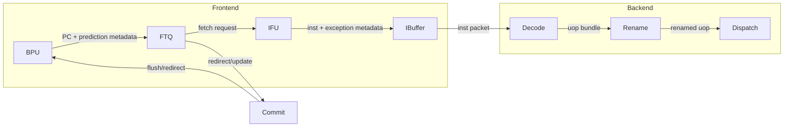
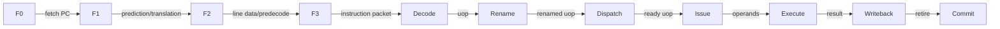

# Diagram Requirements

Use this file whenever producing an analysis for a module with multiple interfaces, pipeline stages, queues, arrays, arbiters, FSMs, or cross-module interactions.

## Required Diagrams

Generate these diagrams unless the user asks for prose only:

1. Key data-path diagram: show payload movement through pipeline stages, queues, arrays, muxes, bypass/forwarding paths, and output/writeback/refill paths.
2. Module-interface diagram: show neighboring modules and major IO bundles/signals, including valid/ready handshakes, redirect/flush/cancel/replay paths, wakeup/writeback paths, and parameter-generated port groups.
3. FSM diagram: generate `stateDiagram-v2` when the module has an explicit FSM or state-like queue entry lifecycle worth visualizing.
4. Handshake timing diagram: generate one or more `waveform-draw` timing diagrams for each requested module's important Decoupled, Valid, pipeline-valid, request/response, enqueue/dequeue, grant/accept, or stall/backpressure interface.

## Data-Path Diagram Rules

Use `flowchart LR` by default.

Include:
- Input producers and output consumers.
- Pipeline stage names such as s0/s1/s2 when present in code.
- Queues, tables, SRAM/data arrays, tag arrays, replacement metadata, and registers.
- Mux/select points using node labels like `Mux: source select`, `PriorityMux`, `Mux1H`, or `Arbiter`.
- Main payload fields: pc, uop, psrc/pdest, data, addr, mask, tag, way, set, robIdx, ftqIdx, lqIdx, sqIdx, exception metadata.
- Control qualifiers on edges when important: `valid`, `ready`, `fire`, `wen`, `ren`, `hit`, `miss`, `replay`, `redirect`, `flush`, `cancel`.

Avoid:
- Drawing every temporary wire.
- Drawing documentation-only blocks that are not instantiated in effective code.
- Mixing control-only and data-only edges without labels.

## Module-Interface Diagram Rules

Use `flowchart LR`.

Show:
- The requested module in the center.
- Upstream producers on the left and downstream consumers on the right.
- Feedback/control sources above or below: redirect, commit, wakeup, load cancel, cache miss/refill, TLB exception, predictor update, CSR/trap.
- Interface names and direction: `Decoupled req`, `Valid resp`, `Vec readPorts`, `writePorts`, `wakeup`, `redirect`, `flush`.
- Parameterized multiplicity: label edges with values or expressions such as `RenameWidth`, `LoadPipelineWidth`, `getIntExuRCReadSize`, `nWays`, `nSets` when known.

## Top-Level and End-to-End Mermaid Rules

Use these rules when the request asks for a top-level module map, complete signal chain, frontend/backend overview, or full pipeline:

1. Draw two separate diagrams, not one overloaded figure:
   - `Top-Level Module Connectivity`: module/subsystem boundaries and only the most important bundled interfaces.
   - `Frontend/Backend Pipeline Stages`: stage-to-stage timing and payload progression.
2. Keep module connectivity sparse. Between any pair of modules, draw no more than three edges. Combine related signals into one labeled edge such as `req/resp`, `valid/ready/fire`, or `redirect/flush/update`; do not create one edge for every signal.
3. If the graph would exceed three useful edges or become difficult to read, split it into multiple Mermaid subgraphs/figures: `Frontend`, `Fetch/ICache`, `Backend`, `Memory/Cache`, and `Commit/Redirect` are recommended boundaries. Each subgraph must remain independently understandable and cross-subgraph links must stay bundled.
4. The stage graph must use names proven by source code. Show Frontend stages such as `F0`, `F1`, `F2`, and `F3` when those stages exist, followed by the actual Backend stages such as Decode, Rename, Dispatch, Issue, Execute, Writeback, and Commit. If the implementation uses `s0/s1/s2/s3`, `B0/B1`, or another naming scheme, preserve the source names and map them in prose.
5. Label each stage edge with the payload/control group crossing it, for example `fetch PC + prediction`, `inst + predecode`, `uop + rename map`, `ready uop`, `result + wakeup`, or `commit/redirect`. Keep stage graph edges chronological and do not turn feedback paths into fake forward pipeline stages.

Example module graph:



Example stage graph:



## FSM Diagram Rules

Use `stateDiagram-v2` for explicit state machines.

Include:
- Reset/initial state.
- State names exactly as code names when possible.
- Transition labels from code conditions.
- Terminal or loop conditions for ready/valid backpressure.
- Cancel/flush/redirect/replay/miss transitions.

If the module has no explicit FSM but uses valid bits/status fields as an implicit state machine, either:
- draw a compact state diagram for an entry lifecycle, or
- state that no explicit FSM exists and describe the valid/status lifecycle in the Storage Structures section.


## waveform-draw Handshake Timing Rules

Use fenced code blocks with `waveform-draw` as the info string. Configure VS Code's Markdown Preview WaveDrom extension to recognize this identifier; see `references/vscode-waveform.md`. Use strict WaveDrom-compatible signal JSON so the diagram renders in the Markdown Preview.

Each timing diagram should include:
- `clk` as the first signal.
- Producer-side `valid` or the closest valid-like signal, such as `req.valid`, `enq.valid`, `stage.valid`, `wen`, `ren`, `grant`, or `resp.valid`.
- Consumer-side `ready` when the interface has backpressure.
- `fire`, `accept`, `deq.fire`, `enq.fire`, or the exact code-equivalent condition when present.
- `bits`, `payload`, or the most important payload field, marked stable across stalled cycles.
- Stall or bubble condition when the module can block or inject bubbles.
- `flush`, `redirect`, `cancel`, `replay`, `miss`, or exception signal when it changes whether an accepted transfer remains effective.
- Response timing when request and response are separated by registered stages, queues, SRAM latency, refill latency, or arbitration.

Prefer compact diagrams that show one normal transaction and one interesting corner case:
- ready low while valid stays high and payload holds stable.
- valid high and ready high causing `fire`.
- response valid after the module's actual latency.
- cancel/flush/replay invalidating or masking a transaction.
- simultaneous enqueue/dequeue, request/grant, or arbitration winner/loser behavior when relevant.

If a module has no explicit ready/valid handshake, still draw the closest timing relationship for its control signals. For example, show `ren`, registered `addr`, `data`, `wen`, valid bits, and cancel/mask timing. State in prose that the module has no Decoupled backpressure.

Example:

```waveform-draw
{
  "signal": [
    { "name": "clk", "wave": "p......" },
    { "name": "req.valid", "wave": "01..0.." },
    { "name": "req.ready", "wave": "0.10..." },
    { "name": "req.fire", "wave": "0..10.." },
    { "name": "req.bits", "wave": "x=..x..", "data": ["uop0"] },
    { "name": "resp.valid", "wave": "0....10" },
    { "name": "flush", "wave": "0......" }
  ],
  "config": { "hscale": 1 }
}
```

waveform-draw diagram labels must use real signal names from the inspected code when possible. If a label is simplified, explain the mapping in prose before or after the diagram.

## Mermaid Syntax Constraints

- Use fenced code blocks with `mermaid` info string.
- Keep node labels short and ASCII-friendly unless quoting exact signal names.
- Quote labels containing punctuation if needed.
- Prefer stable, readable node IDs: `Decode`, `Rename`, `IssueQ`, `DataArray`, `Arbiter`, `RegFile`, `DCache`.
- Do not include line references inside Mermaid nodes; put code anchors in prose.

## waveform-draw Syntax Constraints

- Use valid JSON inside the fenced block.
- Keep signal names short but recognizable.
- Prefer `0`, `1`, `.`, `x`, and `=` wave characters for readable valid/ready timing.
- Use `data` labels for payload names, not long prose.
- Do not put code line references inside waveform-draw signal names or data labels.
- Do not use comments, trailing commas, JavaScript expressions, or Markdown prose inside the JSON block; the VS Code preview extension parses it as JSON.
- Preview with `Markdown: Open Preview to the Side` or `Markdown: Open Preview`; the source editor itself remains plain text.
