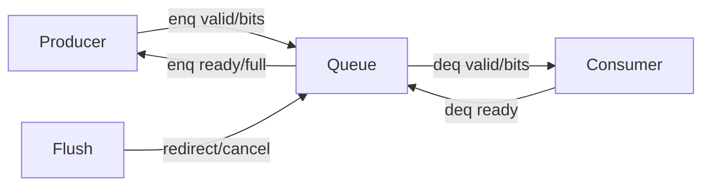

# Queue and Buffer Empty/Full Analysis

Use this file for every queue, buffer, table with valid entries, miss queue, replay queue, store/load queue, FTQ, ROB, issue queue, free list, uncache buffer, misalign buffer, writeback queue, page-table-walk queue, prefetch queue, or cache-control queue.

## Required Coverage

For every queue/buffer-like structure, provide:

| Structure | Capacity parameter | Occupancy state | Empty condition | Full/almost-full condition | Enqueue allowed when | Dequeue/free when | Backpressure target |
| --- | --- | --- | --- | --- | --- | --- | --- |

Also explain:
- Pointer scheme: head/tail/enqPtr/deqPtr, circular flags, free list allocation, valid vector, count register, one-hot mask, or age matrix.
- Multi-port behavior: allocation width, deallocation width, read/write conflict, bank conflict, port contention, same-entry write conflicts, and loser/retry behavior.
- Flush/cancel behavior: redirect, exception, replay, commit, load cancel, probe, refill, reset, and whether entries are held, cleared, retried, or redirected.
- Empty/full edge cases: simultaneous enq/deq, wrap-around, almost-full threshold, reserved slots, empty dequeue attempt, full enqueue attempt, `canAccept`, `allowEnqueue`, `ready`, `valid`.
- Who observes capacity: dispatch, rename, issue, LSQ, MemBlock, DCache, frontend, ROB, CSR/cache-control path.

## Search Terms

Search for:
- Capacity: `Size`, `Entries`, `BufferSize`, `QueueSize`, `nEntries`, `numEntries`, `depth`, `capacity`
- State: `valid`, `validVec`, `allocated`, `free`, `empty`, `full`, `almostFull`, `allowEnqueue`, `canAccept`, `ready`, `fire`, `enq`, `deq`, `head`, `tail`, `ptr`, `count`, `PopCount`, `freeMask`, `allocMask`
- Helpers: `Queue`, `XSQueue`, `CircularQueuePtr`, `HasCircularQueuePtrHelper`, `FreeList`, `AgeDetector`, `RRArbiter`, `Arbiter`

## Analysis Procedure

1. Identify the capacity parameter and where it is defined.
2. Identify occupancy representation: count, valid vector, free list, pointers, state enum, or external queue module.
3. Derive empty condition from code, not assumption.
4. Derive full/almost-full/backpressure conditions from code.
5. Trace enqueue path: producer, valid condition, ready condition, allocation index, data written.
6. Trace dequeue/free path: consumer, valid condition, ready/fire, free index, state cleared.
7. Check simultaneous enq/deq behavior, multi-port conflicts, port/bank/entry contention, and which requester wins, stalls, retries, replays, or is dropped.
8. Trace flush/cancel/replay/redirect behavior with a concrete scenario: trigger signal, affected entries, held/cleared state, retry or redirect target, and downstream observer.
9. State who consumes full/empty: which upstream ready/stall or downstream valid is affected, what transaction is blocked, and what event makes progress resume.

## Diagram Recommendation

For nontrivial queues/buffers, include a compact Mermaid interface diagram and a waveform-draw enqueue/dequeue timing diagram:

Replace generic node names with real module names and include capacity parameter labels. Also include a waveform-draw block showing enq.valid, enq.ready, enq.fire, deq.valid, deq.ready, deq.fire, full/empty or flush/cancel behavior when those signals exist.
