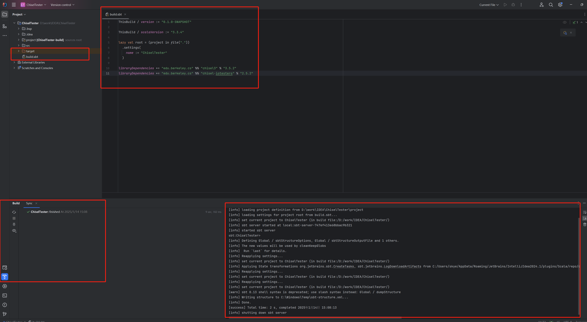

<!-- # 第二章 Chisel 环境和工程实践 -->
# Chapter 2: The Chisel Environment and Engineering Practices

***

<!-- # 0. Chisel 工程实践（环境 + 模板 + 编译） -->
# 0. Chisel Engineering Practice (Environment + Template + Compilation)

<!-- ## 0.1 官方推荐学习资源 -->
## 0.1 Officially Recommended Learning Resources

<!--
```plain
Chisel 训练营：
https://github.com/freechipsproject/chisel-bootcamp

在线运行环境（Jupyter）：
https://mybinder.org/v2/gh/freechipsproject/chisel-bootcamp/master

Chisel3 仓库：
https://github.com/freechipsproject/chisel3

官方文档：
https://www.chisel-lang.org/chisel3/

在线编辑器（直接跑代码）：
https://scastie.scala-lang.org/XWLf0m6vRS2gfXi7pcnaeQ

工程模板（直接克隆新建项目）：
https://github.com/chipsalliance/chisel-template.git
```
-->

```plain
Chisel Bootcamp:
https://github.com/freechipsproject/chisel-bootcamp

Online execution environment (Jupyter):
https://mybinder.org/v2/gh/freechipsproject/chisel-bootcamp/master

Chisel3 repository:
https://github.com/freechipsproject/chisel3

Official documentation:
https://www.chisel-lang.org/chisel3/

Online editor (run code directly):
https://scastie.scala-lang.org/XWLf0m6vRS2gfXi7pcnaeQ

Project template (clone directly to create a new project):
https://github.com/chipsalliance/chisel-template.git
```

<!-- ## 0.2 快速开始：克隆官方模板 -->
## 0.2 Quick Start: Clone the Official Template

```bash
git clone https://github.com/chipsalliance/chisel-template.git
cd chisel-template
sbt run
```

<!-- ## 0.3 项目配置文件 build.sbt（直接可用） -->
## 0.3 Project Configuration File build.sbt (Ready to Use)

<!-- 这是你文档里给出的**标准Chisel/Rocketchip环境配置**，可直接复制使用。 -->
This is the **standard Chisel/Rocketchip environment configuration** provided in the source document; it can be copied and used directly.

```scala
organization := "edu.berkeley.cs"
version := "3.0"
name := "mychisel"
scalaVersion := "2.12.10"

idePackagePrefix := Some("mychisel")

// chisel3
libraryDependencies += "edu.berkeley.cs" %% "chisel3" % "3.5.2"
libraryDependencies += "edu.berkeley.cs" %% "chisel-iotesters" % "2.5.2"

// rocketchip
libraryDependencies += "edu.berkeley.cs" %% "rocketchip" % "1.2.6"

// testchipip
scalacOptions += "-Xsource:2.11"

publishMavenStyle := true
publishArtifact in Test := false
pomIncludeRepository := { x => false }

publishTo := {
  val v = version.value
  val nexus = "https://oss.sonatype.org/"
  if (v.trim.endsWith("SNAPSHOT"))
    Some("snapshots" at nexus + "content/repositories/snapshots")
  else
    Some("releases" at nexus + "service/local/staging/deploy/maven2")
}

resolvers ++= Seq(
  Resolver.sonatypeRepo("snapshots"),
  Resolver.sonatypeRepo("releases"),
  Resolver.mavenLocal
)

libraryDependencies += "edu.berkeley.cs" %% "testchipip" % "1.0-020719-SNAPSHOT"
```

<!-- ## 0.4 Windows 环境搭建 -->
## 0.4 Setting Up the Windows Environment

<!-- 参考资料： -->
Reference:

```plain
https://www.bilibili.com/read/cv6205889/
```

<!-- 需要安装： -->
Install the following:

<!-- 1. JDK 1.8 -->
1. JDK 1.8
<!-- 2. Scala 2.12.10 -->
2. Scala 2.12.10
<!-- 3. sbt 1.5+ -->
3. sbt 1.5+
<!-- 4. VSCode + metals 插件 -->
4. VSCode + Metals plugin



<!-- build.sbt -->
build.sbt

```bash
ThisBuild / version := "0.1.0-SNAPSHOT"

ThisBuild / scalaVersion := "3.3.4"

lazy val root = (project in file("."))
  .settings(
    name := "ChiselTester"
  )

libraryDependencies += "edu.berkeley.cs" %% "chisel3" % "3.5.2"
libraryDependencies += "edu.berkeley.cs" %% "chisel-iotesters" % "2.5.2"
```

<!-- ## 0.5 最简 Makefile 编译脚本 -->
## 0.5 Minimal Makefile Build Script

```makefile
all: compile run

compile:
    sbt compile

run:
    sbt run

test:
    sbt test

clean:
    sbt clean
```

<!-- ## 0.6 第一个实践工程：HelloChisel -->
## 0.6 First Practice Project: HelloChisel

<!-- 创建文件 `src/main/scala/Hello.scala` -->
Create the file `src/main/scala/Hello.scala`.

```scala
import chisel3._

class Hello extends Module {
  val io = IO(new Bundle {
    val in  = Input(UInt(4.W))
    val out = Output(UInt(4.W))
  })
  io.out := io.in
}

object Elaborate extends App {
  chisel3.Driver.execute(args, () => new Hello())
}
```

<!-- 运行： -->
Run:

```bash
sbt run
```

<!-- 生成 Verilog 输出。 -->
This generates the Verilog output.

***


<!-- > 更新: 2026-07-13 16:09:53  -->
> Updated: 2026-07-13 16:09:53
<!-- > 原文: <https://bosc.yuque.com/staff-xmw8rg/fb7qy3/lw7lrmz8pqbcp3s4> -->
> Source: <https://bosc.yuque.com/staff-xmw8rg/fb7qy3/lw7lrmz8pqbcp3s4>
