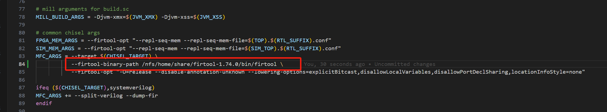

<!-- # 第七章 Chisel 常见语法错误 -->
# Chapter 7: Common Syntax Errors in Chisel

<!-- ## Chisel 高频真实报错排查手册 -->
## A Troubleshooting Guide to Frequent Real-World Chisel Errors

<!-- 本节汇总**工业开发 100% 高频 Chisel 报错**，每条包含：报错原文、错误原因、错误代码、标准修复方案，适合快速排错、复盘避坑。 -->
This section summarizes the **most frequent Chisel errors encountered in production development**. Each entry includes the original error message, root cause, faulty code, and a standard fix, making it suitable for rapid troubleshooting and postmortem review.

<!-- ### 1.1 模块实例化未包裹 Module() -->
### 1.1 Module Instantiation Not Wrapped in `Module()`

<!-- **报错信息**：`Error: attempted to instantiate a Module without wrapping it in Module().` -->
**Error message**: `Error: attempted to instantiate a Module without wrapping it in Module().`

<!-- **错误根源**：Chisel 所有自定义 Module 必须用 `Module(...)` 包裹，直接 new 会触发检查报错。 -->
**Root cause**: Every custom Chisel `Module` must be wrapped in `Module(...)`; calling `new` directly triggers a check failure.

```scala
// <!-- 错误写法 -->
// Incorrect form
val a = new MyModule()

// <!-- 正确写法 -->
// Correct form
val a = Module(new MyModule())
```

<!-- ### 1.2 Vec 整体赋值遗漏下标（最经典批量报错） -->
### 1.2 Missing an Index When Assigning to an Entire `Vec` (The Classic Bulk-Assignment Error)

<!-- **报错信息**：`Sink and Source have different types` -->
**Error message**: `Sink and Source have different types`

<!-- **错误根源**：`Vec[T]` 是数组类型，不能直接用单个元素赋值；循环批量赋值忘记加 `(i)` 下标。 -->
**Root cause**: `Vec[T]` is an array type and cannot be assigned a single element directly; a loop performing bulk assignment omitted the `(i)` index.

```scala
// <!-- 错误写法 -->
// Incorrect form
val a = Vec(8, new MyBundle)
val b = new MyBundle
a := b

// <!-- 正确写法 -->
// Correct form
val a = Vec(8, new MyBundle)
val b = new MyBundle
// <!-- 必须指定下标 -->
// The index must be specified.
a(0) := b
```

<!-- ### 1.3 信号位宽不匹配 -->
### 1.3 Signal Width Mismatch

<!-- **报错信息**：`waymask width does not equal nWays, waymask width: 32, nWays: 4` -->
**Error message**: `waymask width does not equal nWays, waymask width: 32, nWays: 4`

<!-- **错误根源**：左右信号位宽不一致，大数赋小数、位宽参数填错、参数不匹配。 -->
**Root cause**: The widths of the left- and right-hand signals differ. Typical causes include assigning a wider value to a narrower one, specifying the wrong width parameter, or using incompatible parameters.

```scala
// <!-- 错误写法 -->
// Incorrect form
val a = UInt(32.W)
val b = UInt(4.W)
a := b

// <!-- 正确写法（位宽对齐） -->
// Correct form (align the widths)
val a = UInt(32.W)
val b = UInt(4.W)
// <!-- 或 padTo(32.W) -->
// Alternatively, use padTo(32.W).
a := b.zext
```

<!-- ### 1.4 数组下标越界（参数分支不匹配） -->
### 1.4 Array Index Out of Bounds (Mismatched Parameter Branches)

<!-- **报错信息**：`IndexOutOfBoundsException: 8 is out of bounds (min 0, max 5)` -->
**Error message**: `IndexOutOfBoundsException: 8 is out of bounds (min 0, max 5)`

<!-- **错误根源**：编译期参数分支不一致，部分宏/参数开启后，数组长度变化，但循环范围未同步修改，导致下标越界。 -->
**Root cause**: Compile-time parameter branches are inconsistent. When some macro or parameter changes the array length, the loop bounds are not updated accordingly, causing an out-of-bounds index.

<!-- **典型场景**：`HasMptCheck` 开启后 `MemReqWidth` 变化，导致后续分支代码越界执行。 -->
**Typical scenario**: Enabling `HasMptCheck` changes `MemReqWidth`, so a later branch executes with an out-of-range index.

```scala
// <!-- 错误：分支不全导致越界 -->
// Incorrect: incomplete branches cause an out-of-bounds access.
val resp_pte_sector = VecInit((0 until MemReqWidth).map(i => {
  if (xxx) {...}
  else if (yyy) {...}
  // <!-- 缺少参数适配分支，导致超索引执行 -->
  // A parameter-adaptation branch is missing, so execution can exceed the index range.
}))

// <!-- 正确：所有参数宏严格对齐循环范围 -->
// Correct: align the loop bounds with every parameter branch.
val resp_pte_sector = VecInit((0 until (
  if (HasBitmapCheck) MemReqWidth / 2
  else if (HasMptCheck) MemReqWidth - 1
  else MemReqWidth
)).map(i => {
  // <!-- 逻辑 -->
  // Logic
}))
```

<!-- ### 1.5 Bundle 层级赋值错误（直接赋值 bits） -->
### 1.5 Incorrect Assignment at the `Bundle` Level (Assigning Directly to `bits`)

<!-- **报错信息**：`Sink (AnonymousBundle) and Source (UInt) have different types.` -->
**Error message**: `Sink (AnonymousBundle) and Source (UInt) have different types.`

<!-- **错误根源**：对 `resp.bits` 直接赋值基础类型，未指定内部字段。 -->
**Root cause**: A primitive value is assigned directly to `resp.bits` instead of targeting one of its fields.

```scala
// <!-- 错误写法 -->
// Incorrect form
io.resp.bits := 0.U

// <!-- 正确写法 -->
// Correct form
io.resp.bits.value := 0.U
```

<!-- ### 1.6 RegInit 非法 Vec 初始化 -->
### 1.6 Invalid `Vec` Initialization with `RegInit`

<!-- **报错信息**：`vec type 'Bool(false)' must be a Chisel type, not hardware` -->
**Error message**: `vec type 'Bool(false)' must be a Chisel type, not hardware`

<!-- **错误根源**：`RegInit()` 不支持直接传入 `Vec(xx, 常量.B)`，不能用硬件常量直接初始化向量寄存器。 -->
**Root cause**: `RegInit()` does not accept `Vec(xx, constant.B)` directly; a hardware constant cannot be used to initialize a vector register in this form.

```scala
// <!-- 错误写法 -->
// Incorrect form
val reg_vec = RegInit(Vec(PtwWidth, false.B))

// <!-- 正确写法（类型对齐初始化） -->
// Correct form (initialize with an aligned type)
val reg_vec = RegInit(0.U.asTypeOf(Vec(PtwWidth, Bool())))
```

<!-- ### 1.7 Bundle 字段名写错/结构体用错 -->
### 1.7 Misspelled `Bundle` Field or Wrong Structure

<!-- **报错信息**：`Right Record missing field (mptLevel)` -->
**Error message**: `Right Record missing field (mptLevel)`

<!-- **错误根源**：手写 typo，将 `MptRespBundle` 写成 `MptReqBundle`，结构体字段不对称，缺少成员。 -->
**Root cause**: A hand-written typo uses `MptReqBundle` where `MptRespBundle` was intended, so the structures do not match and a field is missing.

<!-- **解决方案**：统一输入输出 Bundle，严格核对字段名、结构体名称。 -->
**Solution**: Keep input and output bundles consistent, and carefully verify field names and bundle type names.

<!-- ### 1.8 端口未完全初始化（sink not fully initialized） -->
### 1.8 Port Not Fully Initialized (`sink not fully initialized`)

<!-- **报错信息**：`sink "io_xxx" not fully initialized` -->
**Error message**: `sink "io_xxx" not fully initialized`

<!-- **错误根源**：新增 IO 端口、新增 Bundle 字段，代码中未赋值、未连接；仲裁器输出悬空也会报该抽象错误。 -->
**Root cause**: A newly added IO port or `Bundle` field is not assigned or connected. An unconnected arbiter output can produce the same abstract error.

<!-- **工程特征**：arbiter 未连、prefetch 模块新增字段未初始化，报错信息极其抽象，不提示具体位置。 -->
**Engineering symptom**: The arbiter is not connected or a newly added field in a prefetch module is uninitialized; the error is extremely abstract and does not identify the exact location.

<!-- **解决方案**：新增 IO 必须全部赋值、默认兜底赋值，禁止悬空。 -->
**Solution**: Assign every new IO, including a safe default assignment where needed; never leave a port floating.

<!-- ### 1.9 Option 枚举对象取值错误 -->
### 1.9 Incorrect Access to an `Option` Enumeration Object

<!-- **报错信息**：`value xxx is not a member of Option[XXX]` -->
**Error message**: `value xxx is not a member of Option[XXX]`

<!-- **错误根源**：配置参数由 `OptionWrapper` 生成，返回 `Option[Object]`，不能直接点取内部子对象。 -->
**Root cause**: The configuration parameter is generated by `OptionWrapper` and returns `Option[Object]`; its nested object cannot be selected directly with dot notation.

```scala
// <!-- 错误写法 -->
// Incorrect form
ZicfilpFlag.ZicfilpJalr

// <!-- 正确写法（get 取出 Option 实例） -->
// Correct form (use `get` to retrieve the `Option` value)
ZicfilpFlag.get.ZicfilpJalr
```

<!-- ### 1.10 隐蔽报错定位优化方案（工程进阶） -->
### 1.10 Improving the Diagnosis of Opaque Errors (Advanced Engineering)

<!-- 针对 Chisel 抽象、不精准的报错（如 not fully initialized 无法定位具体端口），可手动指定高版本 firtool 优化报错信息，在 Makefile 中修改： -->
For abstract and imprecise Chisel errors (for example, when `not fully initialized` does not identify the port), specify a newer `firtool` manually to improve diagnostics by editing the `Makefile`:

```makefile
MFC_ARGS = --target $(CHISEL_TARGET) \
--firtool-binary-path /nfs/home/share/firtool-1.74.0/bin/firtool \
--firtool-opt "-O=release --disable-annotation-unknown --lowering-options=explicitBitcast,disallowLocalVariables,disallowPortDeclSharing,locationInfoStyle=none"
```

<!-- **优化效果**：精准打印未初始化端口、类型不匹配位置、位宽错误具体行列，大幅提升排错效率。 -->
**Result**: The tool prints the exact locations of uninitialized ports, type mismatches, and width errors, greatly improving troubleshooting efficiency.




<!-- ## 报错速查总口诀 -->
## Quick Error-Checking Mnemonic

<!-- * 1. 模块必包 Module，直接 new 必报错 -->
* 1. Every module must be wrapped in `Module`; direct `new` causes an error.
<!-- * 2. Vec 赋值必带下标，整体赋值必失配 -->
* 2. A `Vec` assignment must include an index; assigning the whole vector causes a type mismatch.
<!-- * 3. 位宽严格对齐，宽窄互赋必报错 -->
* 3. Align widths strictly; assigning between mismatched widths causes an error.
<!-- * 4. 分支参数统一长度，不然下标越界 -->
* 4. Keep parameter branches the same length, or an index can go out of bounds.
<!-- * 5. Bundle 分层赋值，不能直赋 bits 整体 -->
* 5. Assign `Bundle` fields hierarchically; do not assign directly to the entire `bits` value.
<!-- * 6. RegInit 初始化必须用类型转换对齐 -->
* 6. `RegInit` initialization must use a type conversion to align the type.
<!-- * 7. Option 配置必须 .get 取值 -->
* 7. Use `.get` to access an `Option` configuration value.
<!-- * 8. 新增 IO 全兜底，杜绝悬空未初始化 -->
* 8. Fully initialize every new IO and eliminate floating, uninitialized ports.
<!-- * 9. 结构体不能写混 req/resp -->
* 9. Do not mix up request and response structures.


<!-- > 更新: 2026-05-22 10:44:39
> 原文: <https://bosc.yuque.com/staff-xmw8rg/fb7qy3/osk7b4r8x3cif695> -->

> Updated: 2026-05-22 10:44:39
> Original: <https://bosc.yuque.com/staff-xmw8rg/fb7qy3/osk7b4r8x3cif695>
