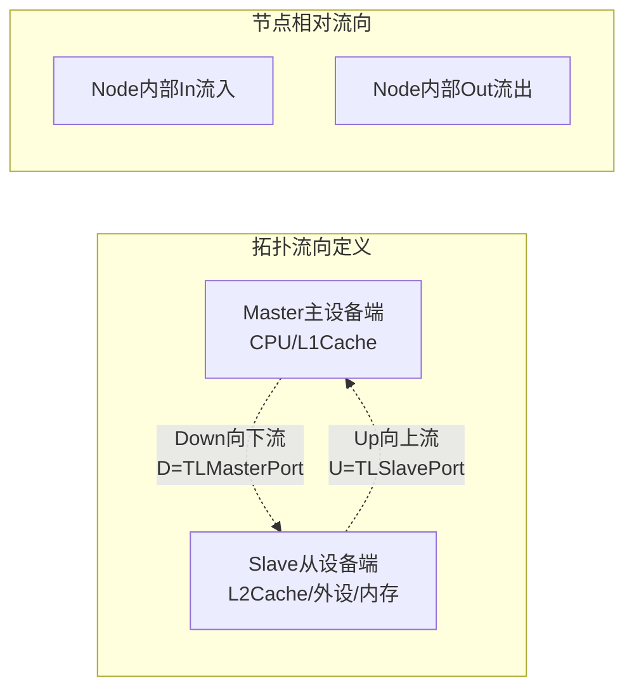
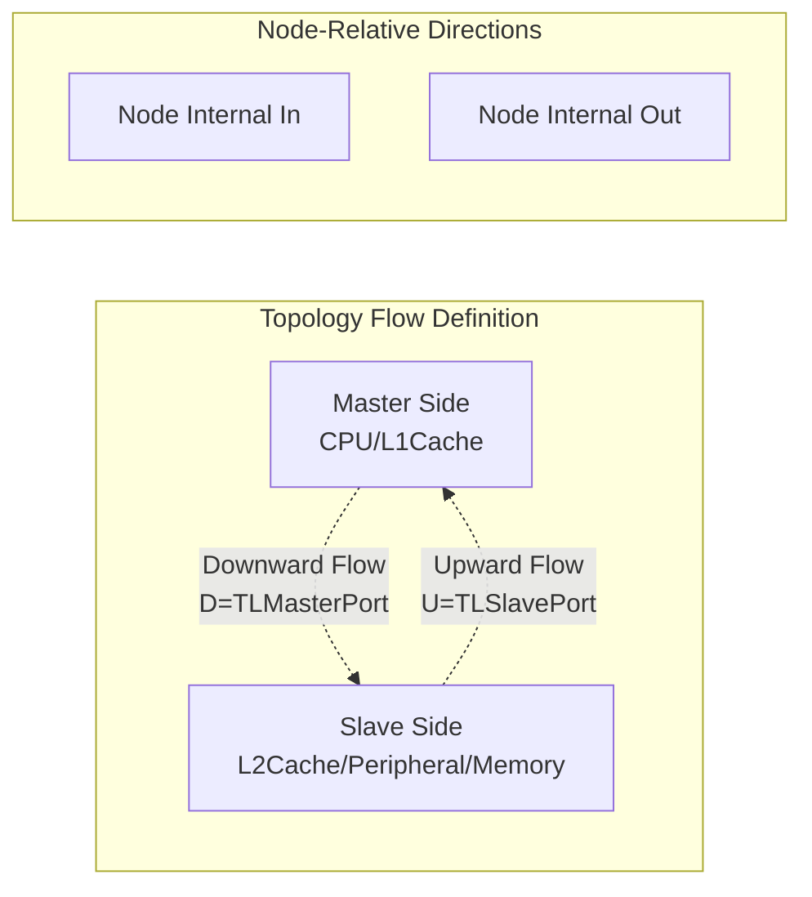

<!-- # 第十一章 Diplomacy 框架与TileLink 协议扩展 -->
# Chapter 11: The Diplomacy Framework and TileLink Protocol Extensions

<!-- ## 前言 -->
## Preface

<!-- 在RISC-V开源处理器（香山、BOOM等）的总线架构设计中，Diplomacy与TileLink是核心互联组合。多数开发者难以理清二者关系，核心误区为混淆框架与协议的层级定位。 -->
In the bus architectures of open-source RISC-V processors such as XiangShan and BOOM, Diplomacy and TileLink form the core interconnect combination. Many developers find their relationship difficult to understand because they confuse the framework layer with the protocol layer.

<!-- 二者核心定位区分： -->
Their core roles are distinct:

<!-- * **Diplomacy**：通用懒加载DAG拓扑参数协商框架，属于底层通用骨架。仅定义模块连线规则、双向参数传递机制、自动参数协商逻辑，不绑定任何具体总线协议，独立于TileLink、AXI等总线标准。 -->
* **Diplomacy**: A general lazy-loaded DAG topology and parameter-negotiation framework that serves as the generic lower-level skeleton. It defines only module connection rules, bidirectional parameter propagation, and automatic negotiation logic; it is not tied to a specific bus protocol and is independent of standards such as TileLink and AXI.
<!-- * **TileLink**：基于Diplomacy框架实现的片上总线协议，属于上层业务实现。依托Diplomacy的拓扑与协商能力，定义专属总线参数、节点规则、传输通道与硬件信号，最终生成可综合的总线电路。 -->
* **TileLink**: An on-chip bus protocol implemented on top of Diplomacy, forming the upper-layer functional implementation. It relies on Diplomacy's topology and negotiation capabilities to define TileLink-specific bus parameters, node rules, channels, and hardware signals, ultimately generating a synthesizable bus circuit.

<!-- 该架构的核心价值：摒弃传统手动配置总线位宽、端口参数、互联规则的开发方式，通过拓扑自动协商机制，实现模块互联后参数自动对齐、总线电路自动生成，大幅降低总线适配与接线错误风险。 -->
The key value of this architecture is that it replaces the traditional practice of manually configuring bus widths, port parameters, and interconnect rules. Topology-level automatic negotiation aligns parameters after modules are connected and generates the bus circuitry automatically, greatly reducing bus-adaptation and wiring errors.

<!-- ## 整体分层架构 -->
## Overall Layered Architecture

<!-- ### 1.1 架构总览 -->
### 1.1 Architecture Overview

<!-- 整套Diplomacy+TileLink架构分为五层，从全局参数配置到底层RTL硬件生成逐层依赖、逐层落地，完整架构流程如下： -->
The complete Diplomacy + TileLink architecture has five layers. They depend on one another from global parameter configuration down to RTL hardware generation, as shown in the complete flow below:

<!-- ### 1.2 各层级核心职责 -->
### 1.2 Core Responsibilities of Each Layer

<!-- 1. **CDE全局参数层**：芯片全局配置中心，通过Config、Field、Parameters机制统一定义缓存容量、总线位宽、最大传输长度、设备ID范围等基础硬件参数，为全芯片模块提供统一参数基准。 -->
1. **CDE global-parameter layer**: The chip-wide configuration center. Through `Config`, `Field`, and `Parameters`, it defines fundamental hardware parameters such as cache capacity, bus width, maximum transfer length, and device-ID ranges, providing a common parameter baseline for all modules.
<!-- 2. **LazyModule分层载体**：架构分层核心载体，严格拆分两大执行阶段。预协商阶段完成拓扑搭建与参数运算，RTL阶段待参数完全稳定后再实例化硬件电路，规避参数未初始化导致的电路错误。 -->
2. **LazyModule layering carrier**: The core carrier for architectural layering, with two strictly separated execution stages. The pre-negotiation stage builds the topology and computes parameters; the RTL stage instantiates hardware only after all parameters have stabilized, avoiding circuits that depend on uninitialized parameters.
<!-- 3. **Diplomacy通用框架**：总线互联基础骨架，定义标准化拓扑节点、双向参数流动模型、自定义参数协商接口，提供无协议依赖的通用互联能力。 -->
3. **Diplomacy general framework**: The foundational bus-interconnect skeleton. It defines standardized topology nodes, a bidirectional parameter-flow model, and a custom negotiation interface, providing protocol-independent interconnect capability.
<!-- 4. **TileLink协议扩展层**：协议落地核心层，为Diplomacy通用骨架填充TileLink专属规则，包含总线参数体系、拓扑节点、协商逻辑、硬件通道定义。 -->
4. **TileLink protocol-extension layer**: The layer where the protocol is realized. It fills the Diplomacy skeleton with TileLink-specific rules, including the bus-parameter hierarchy, topology nodes, negotiation logic, and hardware-channel definitions.
<!-- 5. **RTL生成层**：硬件落地层，将协商完成的标准化总线参数，转换为可综合的总线时序逻辑、IO端口电路，最终输出Verilog代码。 -->
5. **RTL-generation layer**: The hardware realization layer. It converts the negotiated, standardized bus parameters into synthesizable bus timing logic and I/O-port circuitry, and finally emits Verilog code.


<!-- ## TileLink对Diplomacy的核心扩展机制 -->
## TileLink's Core Extension Mechanisms for Diplomacy

<!-- Diplomacy为无协议空框架，仅提供互联与协商模板；TileLink基于该模板完成四项核心扩展，实现总线协议的完整落地，具体包含参数体系、拓扑节点、协议适配、硬件总线四大模块。 -->
Diplomacy is a protocol-agnostic framework that supplies only interconnect and negotiation templates. TileLink uses those templates to implement four core extensions and fully realize the bus protocol: a parameter hierarchy, topology nodes, protocol adaptation, and the hardware bus.

<!-- 1. 构建完整的TileLink总线参数层级体系，定义设备、端口、协商、硬件四级参数 -->
1. Build a complete TileLink bus-parameter hierarchy with device, port, negotiation, and hardware parameter levels.
<!-- 2. 派生TileLink专属拓扑节点，适配主从设备、适配、多路互联等总线场景 -->
2. Derive TileLink-specific topology nodes for master/slave devices, adapters, and multi-way interconnect scenarios.
<!-- 3. 实现TLImp协议适配层，完成TileLink协议与Diplomacy框架的类型绑定 -->
3. Implement the `TLImp` protocol-adaptation layer, binding TileLink protocol types to the Diplomacy framework.
<!-- 4. 定义TileLink五通道硬件总线结构，实现协议参数到硬件信号的映射 -->
4. Define TileLink's five-channel hardware-bus structure and map protocol parameters to hardware signals.

<!-- ### 2.1 TileLink四级参数体系 -->
### 2.1 TileLink's Four-Level Parameter Hierarchy

<!-- TileLink采用分层参数设计，从单体设备属性逐步迭代为最终硬件参数，层级递进、逐层约束，完整覆盖总线协商全流程。 -->
TileLink uses a hierarchical parameter design: individual device attributes are progressively refined into final hardware parameters. Each level constrains the next, covering the complete bus-negotiation process.

<!-- #### 2.1.1 单体设备参数 -->
#### 2.1.1 Individual Device Parameters

<!-- 用于描述单个总线设备的固有属性，是总线参数的最小单元。 -->
These describe the intrinsic properties of an individual bus device and are the smallest units of bus parameters.

<!-- * **TLMasterParameters**：定义CPU、L1缓存等主设备的请求能力、Source ID范围、可访问地址空间、传输规格等属性。 -->
* **TLMasterParameters**: Define request capabilities, Source ID ranges, accessible address spaces, transfer specifications, and other properties of masters such as CPUs and L1 caches.
<!-- * **TLSlaveParameters**：定义内存、外设、L2缓存等从设备的响应能力、地址映射、缓存属性、访问权限等属性。 -->
* **TLSlaveParameters**: Define response capabilities, address mappings, cache attributes, access permissions, and other properties of slaves such as memories, peripherals, and L2 caches.

<!-- #### 2.1.2 端口集合参数 -->
#### 2.1.2 Port-Collection Parameters

<!-- 对多个同类型单体设备参数进行聚合，形成模块对外的标准化端口参数，是拓扑互联的基础入参。 -->
These aggregate parameters for multiple devices of the same type into standardized port parameters exposed by a module; they are the basic inputs to topology interconnection.

```scala
// 主设备端口参数：所有发起请求的设备集合 / Master-port parameters: the set of all devices that issue requests
class TLMasterPortParameters private(
  val masters:       Seq[TLMasterParameters], // 多个主设备集合 / Collection of multiple masters
  val channelBytes:  TLChannelBeatBytes,      // 总线单拍传输字节数 / Bytes transferred per bus beat
  val minLatency:    Int,                     // 总线最小传输延迟 / Minimum bus transfer latency
  val echoFields:    Seq[BundleFieldBase],
  val requestFields: Seq[BundleFieldBase],
  val responseKeys:  Seq[BundleKeyBase]) extends SimpleProduct

// 从设备端口参数：所有接收请求的设备集合 / Slave-port parameters: the set of all devices that receive requests
class TLSlavePortParameters private(
  val slaves:         Seq[TLSlaveParameters], // 多个从设备集合 / Collection of multiple slaves
  val channelBytes:   TLChannelBeatBytes,
  val endSinkId:      Int,                    // 从设备最大Sink ID / Maximum Sink ID of the slaves
  val minLatency:     Int,
  val responseFields: Seq[BundleFieldBase],
  val requestKeys:    Seq[BundleKeyBase]) extends SimpleProduct
```

<!-- #### 2.1.3 协商边参数（核心） -->
#### 2.1.3 Negotiated Edge Parameters (Core)

<!-- 主从设备完成拓扑互联后，框架自动融合两端端口参数，生成唯一的边参数，存储本次互联的所有协商规则与对齐结果，是总线参数收敛的核心载体。 -->
After the master and slave devices are interconnected in the topology, the framework automatically combines the two port-parameter sets and produces a unique edge parameter. This parameter stores all negotiation rules and alignment results for the interconnect and is the primary carrier through which bus parameters converge.

```scala
case class TLEdgeParameters(
  master: TLMasterPortParameters,
  slave:  TLSlavePortParameters,
  params:  Parameters,
  sourceInfo: SourceInfo) extends FormatEdge
{
  // 自动对齐主从设备最大传输规格 / Automatically align the maximum transfer specifications of master and slave devices
  val maxTransfer = max(master.maxTransfer, slave.maxTransfer)
  // 基于主从参数，协商生成最终硬件总线参数 / Negotiate final hardware-bus parameters from the master and slave parameters
  val bundle = TLBundleParameters(master, slave) 
}
```

<!-- 核心特性：总线位宽、传输规格、通道功能等核心硬件参数，均由框架自动协商生成，无需人工硬编码。 -->
Key property: core hardware parameters such as bus width, transfer specifications, and channel capabilities are generated by framework negotiation, with no manual hard-coding required.

<!-- #### 2.1.4 硬件总线参数 -->
#### 2.1.4 Hardware-Bus Parameters

<!-- 由协商边参数推导生成，是最终硬件总线信号的配置基准，直接决定总线的物理形态。 -->
These are derived from the negotiated edge parameters and serve as the configuration baseline for the final hardware-bus signals, directly determining the bus's physical form.

```scala
case class TLBundleParameters(
  addressBits: Int,  // 地址线位宽（由从设备最大地址推导） / Address-line width (derived from the slave's maximum address)
  dataBits:    Int,  // 数据线位宽 / Data-line width
  sourceBits:  Int,  // 主设备Source ID位宽 / Source-ID width for masters
  sinkBits:    Int,  // 从设备Sink ID位宽 / Sink-ID width for slaves
  sizeBits:    Int,  // 传输大小配置位宽 / Width of the transfer-size field
  echoFields:     Seq[BundleFieldBase],
  requestFields:  Seq[BundleFieldBase],
  responseFields: Seq[BundleFieldBase],
  hasBCE: Boolean)   // 缓存一致性通道使能标志 / Enable flag for cache-coherence channels

// 主从参数自动对齐协商核心逻辑 / Core logic for automatically aligning master and slave parameters
def apply(master: TLMasterPortParameters, slave: TLSlavePortParameters) =
    new TLBundleParameters(
      addressBits = log2Up(slave.maxAddress + 1),
      dataBits    = slave.beatBytes * 8,
      sourceBits  = log2Up(master.endSourceId),
      sinkBits    = log2Up(slave.endSinkId),
      hasBCE = master.anySupportProbe && slave.anySupportAcquireB)
```

<!-- #### 2.1.5 参数层级依赖关系 -->
#### 2.1.5 Parameter-Hierarchy Dependencies

<!-- 四级参数逐层依赖、逐级收敛，完整串联从设备属性到硬件电路的转化流程： -->
The four parameter levels depend on one another and converge step by step, linking the complete transformation from device attributes to hardware circuitry:

<!-- 层级逻辑：**单体设备属性 → 端口聚合参数 → 互联协商收敛 → 硬件配置参数 → 物理总线电路** -->
Layering logic: **individual device attributes → aggregated port parameters → interconnect negotiation convergence → hardware configuration parameters → physical bus circuitry**


<!-- ### 2.2 TLImp协议适配核心 -->
### 2.2 TLImp Protocol-Adaptation Core

<!-- TLImp是TileLink适配Diplomacy框架的核心适配器，用于绑定Diplomacy的泛型模板与TileLink专属协议类型，解决通用框架无协议定义的问题。 -->
`TLImp` is the core adapter that lets TileLink use the Diplomacy framework. It binds Diplomacy's generic templates to TileLink-specific protocol types, solving the problem that the generic framework has no protocol definitions of its own.

<!-- 核心类型绑定关系： -->
Core type bindings:

<!-- * D（向下传输参数）= TLMasterPortParameters -->
* D (downward parameters) = `TLMasterPortParameters`
<!-- * U（向上传输参数）= TLSlavePortParameters -->
* U (upward parameters) = `TLSlavePortParameters`
<!-- * EO/EI（内外双向边参数）= TLEdgeOut / TLEdgeIn -->
* EO/EI (outward/inward edge parameters) = `TLEdgeOut` / `TLEdgeIn`
<!-- * B（硬件总线）= TLBundle -->
* B (hardware bus) = `TLBundle`

```scala
object TLImp extends NodeImp[TLMasterPortParameters, TLSlavePortParameters, TLEdgeOut, TLEdgeIn, TLBundle]
{
  // 生成向外、向内双向协商边参数 / Generate negotiated edge parameters in both outward and inward directions
  def edgeO(pd: TLMasterPortParameters, pu: TLSlavePortParameters, p: Parameters, sourceInfo: SourceInfo) = new TLEdgeOut(pd, pu, sourceInfo)
  def edgeI(pd: TLMasterPortParameters, pu: TLSlavePortParameters, p: Parameters, sourceInfo: SourceInfo) = new TLEdgeIn (pd, pu, sourceInfo)
  // 基于协商边参数生成标准化硬件总线 / Generate the standardized hardware bus from negotiated edge parameters
  def bundleO(eo: TLEdgeOut) = TLBundle(eo.bundle)
  def bundleI(ei: TLEdgeIn)  = TLBundle(ei.bundle)
}
```

<!-- ### 2.3 TileLink拓扑节点体系 -->
### 2.3 TileLink Topology-Node Hierarchy

<!-- TileLink继承Diplomacy四大基础节点，绑定TLImp协议规则，衍生出适配总线场景的专属节点，覆盖所有总线互联拓扑。 -->
TileLink extends Diplomacy's four foundational node types, binds the `TLImp` protocol rules, and derives bus-specific nodes that cover all bus-interconnect topologies.

```scala
// 主设备节点：主动发起总线请求（CPU/L1Cache） / Master node: actively issues bus requests (CPU/L1 cache)
case class TLClientNode(portParams: Seq[TLMasterPortParameters])(implicit valName: ValName) extends SourceNode(TLImp)(portParams) with TLFormatNode

// 从设备节点：被动响应总线请求（内存/外设/L2） / Slave node: passively responds to bus requests (memory/peripheral/L2)
case class TLManagerNode(portParams: Seq[TLSlavePortParameters])(implicit valName: ValName) extends SinkNode(TLImp)(portParams) with TLFormatNode

// 适配器节点：一对一互联，仅修改参数、不改变拓扑（缓存核心节点） / Adapter node: one-to-one interconnect; modifies parameters without changing topology (a core cache node)
case class TLAdapterNode(
  clientFn:  TLMasterPortParameters => TLMasterPortParameters = { s => s },
  managerFn: TLSlavePortParameters  => TLSlavePortParameters  = { s => s })(
  implicit valName: ValName)
  extends AdapterNode(TLImp)(clientFn, managerFn) with TLFormatNode

// 交叉开关节点：多对多互联，实现总线仲裁与多路分发 / Nexus (crossbar) node: many-to-many interconnect for bus arbitration and fan-out
case class TLNexusNode(
  clientFn:        Seq[TLMasterPortParameters] => TLMasterPortParameters,
  managerFn:       Seq[TLSlavePortParameters]  => TLSlavePortParameters)(
  implicit valName: ValName)
  extends NexusNode(TLImp)(clientFn, managerFn) with TLFormatNode
```

<!-- #### 2.3.1 节点继承关系 -->
#### 2.3.1 Node-Inheritance Relationships


<!-- ### 2.4 TLBundle硬件总线结构 -->
### 2.4 TLBundle Hardware-Bus Structure

<!-- TLBundle是TileLink协议的最终硬件载体，框架根据协商参数`hasBCE`自动裁剪总线通道，兼顾基础传输与缓存一致性场景。 -->
`TLBundle` is the final hardware carrier of the TileLink protocol. Based on the negotiated `hasBCE` parameter, the framework automatically prunes bus channels to support both basic transfers and cache-coherent scenarios.

<!-- * 完整一致性场景（hasBCE=true）：包含A、B、C、D、E五组通道 -->
* Full-coherence scenario (`hasBCE = true`): includes all five channel groups, A, B, C, D, and E.
<!-- * 基础传输场景（hasBCE=false）：仅保留A、D两组基础传输通道 -->
* Basic-transfer scenario (`hasBCE = false`): retains only the two basic channels, A and D.

<!-- 各通道核心功能： -->
Core function of each channel:

<!-- * A通道：主设备发起读写、预取等总线请求 -->
* A channel: Masters issue bus requests such as reads, writes, and prefetches.
<!-- * D通道：从设备返回数据、传输响应与状态信息 -->
* D channel: Slaves return data, transfer responses, and status information.
<!-- * B/C/E通道：专属缓存一致性通道，完成缓存查询、数据失效、一致性应答等操作 -->
* B/C/E channels: Dedicated cache-coherence channels for cache probes, data invalidation, coherence acknowledgements, and related operations.

<!-- ## 参数双向流向与自动协商机制 -->
## Bidirectional Parameter Flow and Automatic Negotiation

<!-- 双向参数流动与自定义协商是Diplomacy+TileLink架构的核心能力，通过Up/Down双向参数传输、clientFn/managerFn自定义修改，实现总线参数的精准适配与自动对齐。 -->
Bidirectional parameter flow and custom negotiation are central capabilities of the Diplomacy + TileLink architecture. Up/Down parameter propagation combined with custom `clientFn`/`managerFn` transformations provides precise bus-parameter adaptation and automatic alignment.



<!-- ### 3.1 双向参数流向定义 -->
### 3.1 Definition of Bidirectional Parameter Flow

<!-- 核心规则： -->
Core rules:

<!-- * **Down向下流**：参数由主设备向从设备传输，对应Master端口参数，通过`clientFn(dFn)`自定义修改 -->
* **Downward flow**: Parameters travel from masters to slaves, corresponding to master-port parameters and customizable through `clientFn(dFn)`.
<!-- * **Up向上流**：参数由从设备向主设备传输，对应Slave端口参数，通过`managerFn(uFn)`自定义修改 -->
* **Upward flow**: Parameters travel from slaves to masters, corresponding to slave-port parameters and customizable through `managerFn(uFn)`.

<!--

-->


<!-- ### 3.2 完整参数协商全流程 -->
### 3.2 Complete Parameter-Negotiation Flow

<!-- 从全局参数加载到最终硬件生成，整套协商流程全自动执行，无需人工干预参数对齐，完整流程如下： -->
From loading global parameters to generating the final hardware, the entire negotiation flow runs automatically without manual parameter alignment:

<!-- #### 流程分步解析 -->
#### Step-by-Step Flow

<!-- 1. **参数初始化**：加载CDE全局配置，构造主、从设备标准化端口参数，定义设备固有能力； -->
1. **Parameter initialization**: Load the global CDE configuration, construct standardized master and slave port parameters, and define intrinsic device capabilities.
<!-- 2. **节点参数挂载**：将端口参数注入对应拓扑节点，适配器节点绑定自定义参数修改函数； -->
2. **Attach node parameters**: Inject port parameters into the corresponding topology nodes and bind custom parameter-transformation functions to adapter nodes.
<!-- 3. **拓扑搭建**：通过`:=`运算符完成模块互联，仅记录拓扑关系，不执行参数计算与硬件生成； -->
3. **Build the topology**: Connect modules with the `:=` operator. This records topology relationships only; it does not compute parameters or generate hardware.
<!-- 4. **参数自动采集**：Diplomacy遍历DAG拓扑，自动收集上下游双向流动参数； -->
4. **Automatic parameter collection**: Diplomacy traverses the DAG topology and automatically collects parameters flowing in both directions between upstream and downstream nodes.
<!-- 5. **自定义参数协商**：通过clientFn、managerFn修改流经的双向参数，实现缓存属性、传输规格的定制适配； -->
5. **Custom parameter negotiation**: Use `clientFn` and `managerFn` to transform the bidirectional parameters in flight, customizing cache attributes and transfer specifications.
<!-- 6. **协商边生成**：每一条拓扑连线生成唯一Edge参数，固化本次互联的所有协商规则； -->
6. **Generate negotiated edges**: Each topology connection produces a unique edge parameter that records all negotiation rules for that interconnect.
<!-- 7. **硬件参数收敛**：基于Edge参数推导总线位宽、通道配置，生成最终硬件参数； -->
7. **Converge hardware parameters**: Derive the bus width and channel configuration from the edge parameters to produce the final hardware parameters.
<!-- 8. **硬件实例化**：根据收敛后的参数生成TLBundle总线信号，开发者基于总线信号编写业务逻辑。 -->
8. **Instantiate hardware**: Generate `TLBundle` bus signals from the converged parameters; developers then implement business logic against those signals.

<!-- ### 3.3 各类节点协商规则 -->
### 3.3 Negotiation Rules for Each Node Type

<!-- * **TLAdapterNode适配器节点**：一对一透传拓扑，不改变连线数量，核心用于参数修正与属性适配，是缓存模块的核心节点； -->
* **`TLAdapterNode` adapter**: A one-to-one pass-through topology that does not change the number of connections. It primarily corrects parameters and adapts attributes, making it a core node for cache modules.
<!-- * **TLNexusNode交叉开关节点**：支持多对多拓扑，可聚合多路输入参数、统一收敛后分发至各路输出，用于总线仲裁、多路互联场景； -->
* **`TLNexusNode` crossbar**: Supports many-to-many topologies, aggregates multiple input parameter sets, converges them, and distributes the results to each output for bus arbitration and multi-way interconnects.
<!-- * **TLClientNode/TLManagerNode端点节点**：作为总线拓扑端点，无协商修改能力，仅提供自身固有端口参数。 -->
* **`TLClientNode`/`TLManagerNode` endpoints**: Serve as bus-topology endpoints. They do not modify negotiated parameters and provide only their intrinsic port parameters.

<!-- ## 拓展：BundleBridge通用无协议互联 -->
## Extension: Generic Protocol-Agnostic Interconnect with BundleBridge

<!-- TileLink为带严格协议的总线互联架构，适用于片上数据传输场景；而BundleBridge为Diplomacy提供的无协议通用互联框架，适用于处理器流水线、执行单元、发射队列等纯数据传输、无协议约束的场景。 -->
TileLink is a strictly specified bus-interconnect architecture for on-chip data transfers. `BundleBridge`, by contrast, is Diplomacy's protocol-agnostic interconnect framework for pure data movement without protocol constraints, such as processor pipelines, execution units, and issue queues.

<!-- 核心特性：无需总线参数协商，仅校验两端Bundle信号类型一致性，即可完成自动连线，实现极简模块互联。 -->
Key property: no bus-parameter negotiation is required. Once the two endpoint `Bundle` signal types are checked for compatibility, the framework can connect them automatically, enabling minimal module interconnects.

```scala
// 自定义流水线输入、输出信号 / Custom pipeline input and output signals
class ExuInput extends Bundle
class ExuOutput extends Bundle

// 发射队列信号分发节点实现 / Issue-queue signal-distribution node implementation
class ReservationStation(implicit p: Parameters) extends SimpleLazyModule {
  val issue_node = BundleBridgeNexusNode(Some(() => Decoupled(new ExuInput)))
  val wakeup_node = BundleBridgeNexusNode[DecoupledIO[ExuOutput]]()
}
```

<!-- ## 核心问题解析 -->
## Analysis of Core Questions

<!-- ### 问题1：协商参数的定义与传入机制 -->
### Question 1: Defining and Supplying Negotiated Parameters

<!-- #### 1. 参数定义方式 -->
#### 1. Parameter-Definition Methods

<!-- * 全局静态参数：基于CDE Config+Field机制统一配置，包含总线位宽、最大传输长度、MHSR数量等全局固定参数； -->
* Global static parameters: Configured uniformly through the CDE `Config` + `Field` mechanism, including fixed global parameters such as bus width, maximum transfer length, and the number of MHSRs.
<!-- * 设备业务参数：通过代码手动构造TLMasterPortParameters、TLSlavePortParameters，定义单设备与端口的业务能力。 -->
* Device functional parameters: Construct `TLMasterPortParameters` and `TLSlavePortParameters` in code to define the capabilities of individual devices and ports.

<!-- #### 2. 参数传入协商流程 -->
#### 2. Parameter-Supply and Negotiation Flow

<!-- * 端点节点：创建节点时直接传入固化的端口参数，作为拓扑初始参数； -->
* Endpoint nodes: Pass fixed port parameters when creating a node; these become the initial topology parameters.
<!-- * 适配器节点：无固定入参，通过clientFn、managerFn动态修改拓扑中流经的参数； -->
* Adapter nodes: Have no fixed inputs; `clientFn` and `managerFn` dynamically transform parameters flowing through the topology.
<!-- * 全流程自动采集：拓扑搭建完成后，Diplomacy自动遍历所有节点与连线，收集双向参数并纳入mapParams协商流程。 -->
* Automatic collection: Once the topology is built, Diplomacy traverses all nodes and connections, collects bidirectional parameters, and feeds them into the `mapParams` negotiation flow.

<!-- ### 问题2：Diplomacy整体架构解析 -->
### Question 2: Overall Diplomacy Architecture

<!-- Diplomacy是一套基于懒加载机制、支持双向参数协商的DAG模块互联框架，整体分层架构如下： -->
Diplomacy is a lazy-loading DAG module-interconnect framework that supports bidirectional parameter negotiation. Its layered architecture is as follows:

<!-- 1. **底层基类层**：BaseNode定义所有拓扑节点的通用基础属性与端口管理能力； -->
1. **Low-level base-class layer**: `BaseNode` defines common attributes and port-management capabilities for all topology nodes.
<!-- 2. **核心能力层**：MixedNode实现双向参数流动能力，衍生出Source、Sink、Adapter、Nexus四大核心节点； -->
2. **Core-capability layer**: `MixedNode` implements bidirectional parameter flow and gives rise to the four core node types: Source, Sink, Adapter, and Nexus.
<!-- 3. **协商核心层**：内置参数缓存与mapParamsD/U协商接口，支持自定义函数完成参数对齐与修正； -->
3. **Negotiation-core layer**: Provides parameter caching and `mapParamsD/U` negotiation interfaces, allowing custom functions to align and correct parameters.
<!-- 4. **协议适配层**：通过NodeImp通用泛型接口，支持TileLink、AXI等各类总线协议适配接入； -->
4. **Protocol-adaptation layer**: Uses the generic `NodeImp` interface to integrate bus protocols such as TileLink and AXI.
<!-- 5. **双阶段执行层**：区分拓扑预协商与RTL实例化阶段，保障参数完全收敛后再生成硬件电路。 -->
5. **Two-stage execution layer**: Separates topology pre-negotiation from RTL instantiation, ensuring that hardware is generated only after parameters have fully converged.

<!-- ## 六、全文总结 -->
## 6. Summary

<!-- 1. **架构层级关系**：Diplomacy是通用模块互联与参数协商骨架，TileLink是基于该骨架实现的标准化片上总线协议，二者分层协作、解耦设计。 -->
1. **Architectural layering**: Diplomacy is the generic skeleton for module interconnection and parameter negotiation; TileLink is the standardized on-chip bus protocol built on that skeleton. They cooperate across layers with a decoupled design.
<!-- 2. **核心运行链路**：CDE全局配置 → 设备端口参数构造 → 拓扑互联搭建 → 双向参数协商修正 → 边参数收敛固化 → 硬件总线自动生成。 -->
2. **Core execution path**: Global CDE configuration → construct device port parameters → build the interconnect topology → negotiate and correct parameters in both directions → converge and commit edge parameters → generate the hardware bus automatically.
<!-- 3. **核心定制能力**：clientFn管控主设备向下传输参数，managerFn管控从设备向上传输参数，是总线属性定制、参数适配的核心入口。 -->
3. **Core customization**: `clientFn` controls parameters sent downward by masters, while `managerFn` controls parameters sent upward by slaves. They are the primary entry points for bus-property customization and parameter adaptation.
<!-- 4. **架构核心优势**：摆脱人工硬编码总线参数与接线的模式，通过自动化协商机制实现参数精准对齐，大幅提升总线开发效率与电路可靠性，广泛应用于RISC-V高端处理器总线架构设计。 -->
4. **Core architectural advantage**: By eliminating manually hard-coded bus parameters and wiring, automatic negotiation aligns parameters precisely, greatly improving bus-development efficiency and circuit reliability. The approach is widely used in bus architectures for high-end RISC-V processors.


<!-- > 更新: 2026-05-21 19:04:22  -->
> Updated: 2026-05-21 19:04:22
<!-- > 原文: <https://bosc.yuque.com/staff-xmw8rg/fb7qy3/zgx8lu6ocmnhv4pc> -->
> Original: <https://bosc.yuque.com/staff-xmw8rg/fb7qy3/zgx8lu6ocmnhv4pc>
