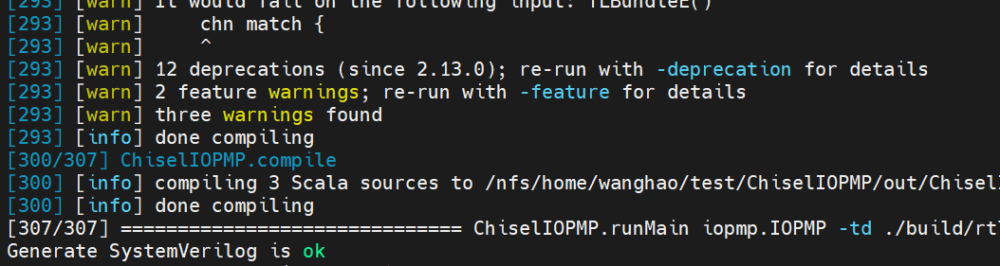
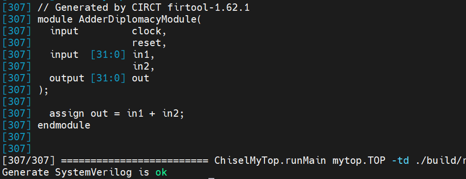
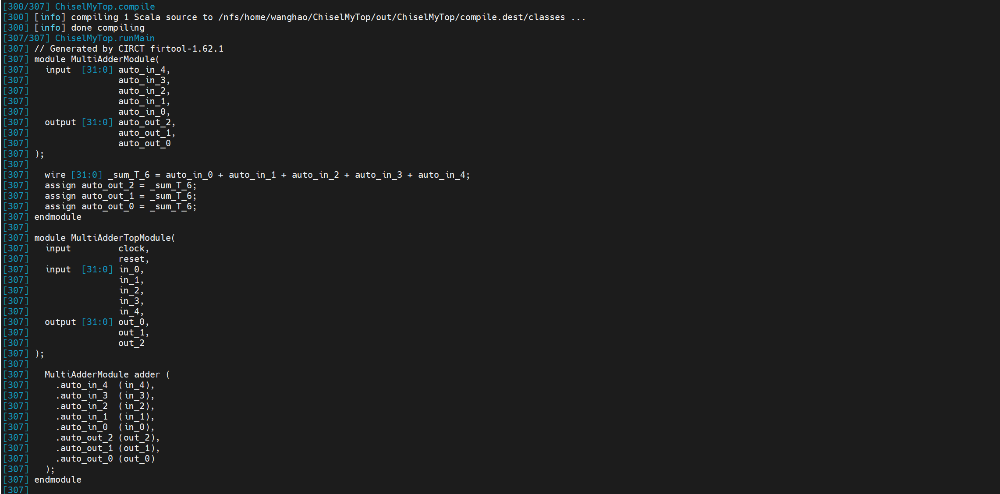

<!-- # 第十三章 Diplomacy 编程实践  -->
# Chapter 13: Programming Practices with Diplomacy

<!-- # 1.diplomacy简介 -->
# 1. Introduction to Diplomacy

<!-- 就笔者目前了解而言，Diplomacy 是 Chisel 硬件设计语言中用于构建**可参数化、可组装片上系统 (SoC)** 的框架。它的核心思想是：将模块间复杂的**连线工作**和**协议协商**，从手写、易错的硬件描述中剥离出来，提升至一个由框架管理的、类型安全的“连接层”进行声明与自动生成。 -->
Based on the author’s current understanding, Diplomacy is a framework in the Chisel hardware-design language for building **parameterizable and composable systems-on-chip (SoCs)**. Its central idea is to remove the complex **wiring** and **protocol negotiation** between modules from hand-written, error-prone hardware descriptions and express them in a type-safe “connection layer” managed and generated automatically by the framework.

<!-- 你可以将其理解为硬件模块间的“外交协议”系统。每个模块通过声明自己的接口“需求”与“承诺”（即参数），由框架在最终生成电路之前，进行全局的“谈判”，自动协商出所有互连细节（如位宽、时钟、协议转换），并确保连接的正确性。这使设计者能够专注于模块本身的**功能逻辑**，而非繁琐且易错的**连接逻辑**，极大地提升了复杂、可配置 SoC 的设计效率和可靠性。 -->
You can think of it as a system of “diplomatic protocols” between hardware modules. Each module declares its interface “requirements” and “commitments” (parameters); before generating the final circuit, the framework conducts a global “negotiation,” automatically resolving interconnect details such as widths, clocks, and protocol conversions while ensuring that the connections are valid. This lets designers focus on the module’s **functional logic** instead of tedious, error-prone **connection logic**, greatly improving the efficiency and reliability of complex, configurable SoC designs.

<!-- 当然，上述术语过于专业化，这里举一个十分简单的例子。 -->
The terminology above is rather specialized, so here is a very simple example.

***

<!-- <font style="color:#8A8F8D;">假设你接到一个任务：制作一个模块，该模块有多个输入端口（例如多个 </font><code><font style="color:#8A8F8D;">input [31:0] in</font></code><font style="color:#8A8F8D;">），但并未告知具体数量——可能是两个，也可能是八个。同时，它也有多个输出端口，同样，数量也未确定。模块的功能是：将所有输入相加，然后将结果广播到每一个输出端口。</font> -->
<font style="color:#8A8F8D;">Suppose you are asked to build a module with multiple input ports (for example, multiple </font><code><font style="color:#8A8F8D;">input [31:0] in</font></code><font style="color:#8A8F8D;"> ports), but the exact number is unspecified: there may be two or eight. It also has multiple output ports, whose count is likewise unspecified. The module must add all inputs and broadcast the result to every output port.</font>

***

<!-- 这是一个非常简单的任务。但你有没有发现，如果使用 Verilog 或常规的 Chisel 来编写，我们几乎无从下手，因为端口数量是未知的。这种情况在很大程度上会阻碍开发进程。当然，一个加法器很简单，可以先随意写一个，等确定了端口数量后再修改也不难。但在实际的 CPU 开发中，这就变得有些恼人了。以香山处理器为例，它是一个多核架构，但在实际应用中，我们可能需要根据不同的情况来确定核心数量。如果没有 Diplomacy 这样的手段，纯粹依靠手动修改各种参数、配置，将是一项巨大的挑战。 -->
This is a very simple task. However, if you try to write it in Verilog or ordinary Chisel, you may find almost nowhere to start because the port count is unknown. This can seriously hinder development. An adder is simple enough to write provisionally and revise once the port count is known, but the issue becomes troublesome in real CPU development. XiangShan, for example, is a multicore architecture whose core count may need to vary by application. Without a mechanism such as Diplomacy, manually changing all parameters and configurations would be a major challenge.

<!-- <font style="background-color:#FBF5CB;">因此，Diplomacy 框架的一大优势在于：当功能需求明确（如加法操作），但具体参数未知（如端口数量，即加数的个数）时，我们仍然可以基于这个框架进行功能上的开发。</font> -->
<font style="background-color:#FBF5CB;">One major advantage of Diplomacy is that when the functional requirement is clear (such as addition) but concrete parameters are unknown (such as the number of ports, or addends), you can still develop the functionality on top of the framework.</font>

<!-- 以上例子是基于笔者的目前水平，对 Diplomacy 相对于基础 Chisel 或 Verilog 的优势的理解。它的优点肯定不止于此，待笔者进一步深入学习后，再对此进行补充。 -->
The example above reflects the author’s current understanding of Diplomacy’s advantages over basic Chisel or Verilog. There are certainly more benefits; they will be added after further study.

<!-- 所以，本笔记的学习路径大致如下： -->
The learning path in these notes is therefore roughly as follows:

<!-- 1. 配置好 Diplomacy 环境，能够正确地将使用 Diplomacy 框架编写的 Chisel 代码转化为 SystemVerilog。 -->
1. Set up a Diplomacy environment and correctly convert Chisel code written with the Diplomacy framework to SystemVerilog.
<!-- 2. 通过一个简单的加法器例子（即上面所举的例子）来理解 Diplomacy 的基本用法和优势。 -->
2. Use a simple adder example (the one above) to understand Diplomacy’s basic usage and advantages.
<!-- 3. 持续更新中…… -->
3. Continuously updated...

<!-- # 2.环境准备 -->
# 2. Environment Setup

<!-- 参考网络上的教程： -->
Refer to the following online tutorial:

<!-- [浅析Diplomacy参数协商框架设计——Chisel敏捷设计与参数化探索](https://zhuanlan.zhihu.com/p/633327505) -->
[An Analysis of the Diplomacy Parameter-Negotiation Framework: Agile Chisel Design and Parameterization](https://zhuanlan.zhihu.com/p/633327505)

<!-- 参考网络上的教程《浅析Diplomacy参数协商框架设计——Chisel敏捷设计与参数化探索》时，其方法依赖于在现有的 Chipyard 生态中集成 Diplomacy 库，以便调用相关API。然而，对于不熟悉 Chisel 或相关库操作的使用者来说，这种方式可能会遇到各种阻碍导致失败（笔者本人就暂未能成功）。因此，这里我们将直接使用一个现成的、更易上手的环境。 -->
The method in the online tutorial [An Analysis of the Diplomacy Parameter-Negotiation Framework: Agile Chisel Design and Parameterization](https://zhuanlan.zhihu.com/p/633327505) depends on integrating the Diplomacy library into an existing Chipyard ecosystem so that its APIs can be called. For users unfamiliar with Chisel or the related library operations, this approach can encounter obstacles and fail (the author has not yet managed to make it work). We will therefore use an existing environment that is easier to get started with.

<!-- 依据的项目环境是： -->
The project environment used here is:

```plain
 git clone https://github.com/OpenXiangShan/ChiselIOPMP
```

<!-- 我们将采用 ChiselIOPMP 项目的环境。与基于 Chipyard 的方案不同，ChiselIOPMP 是一个独立的 Chisel 项目。它的环境搭建不涉及在大型框架中手动配置子模块依赖，而是通过项目自带的 Makefile 脚本自动处理整个构建流程（包括获取依赖）。这类似于香山处理器的开发环境基于 rocket-chip 的方式，本项目也采用了这种方式。 -->
We will use the environment from the ChiselIOPMP project. Unlike the Chipyard-based approach, ChiselIOPMP is a standalone Chisel project. Setting it up does not require manually configuring submodule dependencies inside a large framework; the project’s Makefile scripts handle the entire build process automatically, including fetching dependencies. This is similar to how XiangShan’s development environment is based on rocket-chip, and this project follows the same approach.

<!-- 搭建步骤非常简单，只需克隆项目仓库，并执行以下命令来初始化项目环境并同步所需的子模块（如 rocket-chip 等）即可。 -->
The setup is simple: clone the repository and run the following commands to initialize the project environment and synchronize required submodules such as rocket-chip.

```plain
cd IopmpSystem/
make init
```

<!-- 初始化项目环境后，执行以下命令即可运行环境： -->
After initializing the project environment, run the following command:

```plain
make verilog
```

<!-- 当看到成功生成 Verilog 的提示时，表明环境已准备就绪。现在，你已经能够顺利地将使用 Diplomacy 框架编写的 Chisel 代码转换为 Verilog 代码。 -->
When the output indicates that Verilog was generated successfully, the environment is ready. You can now convert Chisel code written with the Diplomacy framework into Verilog.



<!-- 生成的 Verilog 代码位于以下目录中： -->
The generated Verilog code is located in:

```plain
ls ./build/rtl/
```

<!-- # 3.清洗环境 -->
# 3. Cleaning the Environment

<!-- 本项目实现了一个IOPMP（输入输出物理内存保护）模块。对于初学者而言，直接基于这样一个较为复杂的项目来学习新的框架，可能显得过于复杂和激进。因此，我们建议采取循序渐进的方式，先通过一些简单的示例来逐步掌握Diplomacy框架。为此，我们将暂时搁置IOPMP的相关内容，从编写简单的示例代码开始，由浅入深地展开学习。待后续能力建立起来之后，再回头研究此处的IOPMP实现也为时不晚。 -->
This project implements an IOPMP (Input/Output Physical Memory Protection) module. For beginners, learning a new framework directly from such a complex project may be too difficult and aggressive. We recommend a gradual approach: first master Diplomacy through simple examples, temporarily set aside the IOPMP material, and learn from simple code toward more complex cases. Once your skills have developed, you can return to study the IOPMP implementation.

<!-- 首先，清理所有与 IOPMP 相关的原始内容，并将项目转变为我们自己的学习项目： -->
First, remove the original IOPMP-related content and turn the project into our own learning project:

```plain
cd ..
# 清理原始项目的构建输出和源代码
# Remove the original project’s build output and source code.
rm -rf ./IopmpSystem/out/
rm -rf ./IopmpSystem/build/
rm -rf ./IopmpSystem/README.md
rm -rf ./IopmpSystem/src/main/scala/*
# 当然，有强迫症的我也想顺便把各种项目名也改一下
# For completeness, also rename the various project identifiers.
sed -i '37s/$(TIME_CMD) mill -i $(TOP).runMain iopmp.IOPMP /$(TIME_CMD) mill -i $(TOP).runMain mytop.TOP /' ./IopmpSystem/Makefile
sed -i '6s/TOP = IopmpSystem/TOP = TwoToOneXbarSystem/' ./IopmpSystem/Makefile
sed -i '15s/@echo "IopmpSystem Makefile Commands:"/@echo "TwoToOneXbarSystem Makefile Commands:"/' ./IopmpSystem/Makefile
sed -i 's/IopmpSystem/TwoToOneXbarSystem/g' ./IopmpSystem/build.sc
# 重命名项目目录
# Rename the project directory.
mv IopmpSystem/ TwoToOneXbarSystem/
```

<!-- 现在，项目已经完全转变为一个名为 `TwoToOneXbarSystem` 的、属于我们自己的简易学习项目了。 -->
The project has now become our own simple learning project named `TwoToOneXbarSystem`.

<!-- 接下来，在相应的位置创建我们自己的 Scala 源文件： -->
Next, create our own Scala source file in the appropriate location:

```plain
touch TwoToOneXbarSystem/src/main/scala/mytop.scala
```

<!-- 现在，我们只需要在这个文件中编写自己的简单项目代码，就可以开始体验 Diplomacy 框架了。 -->
We can now write a simple project in this file and start experimenting with the Diplomacy framework.

<!-- 编辑 `TwoToOneXbarSystem/src/main/scala/mytop.scala` 的代码为： -->
Edit `TwoToOneXbarSystem/src/main/scala/mytop.scala` as follows:

```plain
package mytop

import chisel3._
import chisel3.util._
import org.chipsalliance.cde.config.Parameters
import freechips.rocketchip.diplomacy._
import freechips.rocketchip.util._
import _root_.circt.stage.ChiselStage
import chisel3.experimental.SourceInfo

class AdderDiplomacyModule()(implicit p: Parameters) extends LazyModule {
  lazy val module = new AdderDiplomacyModuleImp(this)
}

class AdderDiplomacyModuleImp(outer: AdderDiplomacyModule)
    extends LazyModuleImp(outer) {
  val in1 = IO(Input(UInt(32.W)))
  val in2 = IO(Input(UInt(32.W)))
  val out = IO(Output(UInt(32.W)))
  out := in1 + in2
}

object TOP extends App {
  println(
    ChiselStage.emitSystemVerilog(
      LazyModule(new AdderDiplomacyModule()(Parameters.empty)).module,
      firtoolOpts = Array("-disable-all-randomization", "-strip-debug-info")
    )
  )
}
```

```plain
cd TwoToOneXbarSystem/
make verilog
```



<!-- 成功输出verilog代码，环境搭建成功。 -->
The Verilog code was generated successfully, so the environment setup is complete.

<!-- 下面这个是一个使用diplomacy框架稍微完善一点的教程： -->
The following is a slightly more complete tutorial using the Diplomacy framework:

```plain
package mytop

import chisel3._
import chisel3.util._
import org.chipsalliance.cde.config.Parameters
import freechips.rocketchip.diplomacy._
import freechips.rocketchip.util._
import _root_.circt.stage.ChiselStage
import chisel3.experimental.SourceInfo

class MultiAdderModule()(implicit p: Parameters) extends LazyModule {
  val node = new NexusNode(MultiAdderNodeImp)(
    { _ => },
    { _ => }
  )
  lazy val module = new MultiAdderModuleImp(this)
}

class MultiAdderModuleImp(outer: MultiAdderModule)
    extends LazyModuleImp(outer) {
  // compute sum of all inward edges
  val sum = Wire(UInt(32.W))
  sum := outer.node.in.map(_._1).reduce(_ + _)

  // copy sum to all outward edges
  outer.node.out.foreach({ case (out, _) =>
    out := sum
  })
}
// Chage one
class MultiAdderTopModule()(implicit p: Parameters) extends LazyModule {
  val inputNodes = new SourceNode(MultiAdderNodeImp)(Seq.fill(5)(()))
  val outputNodes = new SinkNode(MultiAdderNodeImp)(Seq.fill(3)(()))
  val adder = LazyModule(new MultiAdderModule)

  outputNodes :*= adder.node
  adder.node :=* inputNodes

  lazy val module = new LazyModuleImp(this) {
    // connect input to IO
    inputNodes.out.zipWithIndex.foreach({ case ((wire, _), i) =>
      val in = IO(Input(UInt(32.W))).suggestName(s"in_${i}")
      wire := in
    })

    // connect output to IO
    outputNodes.in.zipWithIndex.foreach({ case ((wire, _), i) =>
      val out = IO(Output(UInt(32.W))).suggestName(s"out_${i}")
      out := wire
    })
  }
}

object MultiAdderNodeImp extends SimpleNodeImp[Unit, Unit, Unit, UInt] {
  override def edge(
      pd: Unit,
      pu: Unit,
      p: Parameters,
      sourceInfo: SourceInfo
  ): Unit = ()
  override def bundle(ei: Unit): UInt = UInt(32.W)
  override def render(e: Unit): RenderedEdge =
    RenderedEdge(colour = "#000000" /* black */ )
}

object TOP extends App {
  val top = LazyModule(new MultiAdderTopModule()(Parameters.empty))
  println(
    ChiselStage.emitSystemVerilog(
      top.module,
      firtoolOpts = Array("-disable-all-randomization", "-strip-debug-info")
    )
  )
  os.write.over(os.pwd / "dump.graphml", top.graphML)
}

```

<!-- 上面的代码运行的结果是： -->
The result of running the code above is:



```plain
package mytop

import chisel3._
import chisel3.util._
import org.chipsalliance.cde.config.Parameters
import freechips.rocketchip.diplomacy._
import freechips.rocketchip.util._
import _root_.circt.stage.ChiselStage
import chisel3.experimental.SourceInfo
import freechips.rocketchip.amba.axi4._
import device._

object MultiAdderNodeImp extends SimpleNodeImp[Int, Int, Int, UInt] {
  override def edge(
      pd: Int,
      pu: Int,
      p: Parameters,
      sourceInfo: SourceInfo
  ): Int = {
    println(s"Negotiation: upstream wants ${pu} bits, downstream wants ${pd} bits")
    val negotiated = if (pu < pd) pu else pd
    println(s"Negotiated result: ${negotiated} bits")
    negotiated
  }
  
  override def bundle(ei: Int): UInt = {
    println(s"Generating hardware: UInt(${ei}.W)")
    UInt(ei.W)
  }
  
  override def render(e: Int): RenderedEdge =
    RenderedEdge(colour = "#000000", label = s"${e}-bit")
}

class MultiAdderModule()(implicit p: Parameters) extends LazyModule {

  
  val node = new NexusNode(MultiAdderNodeImp)(
    { inParams =>
      println(s"Adder module received upstream params: ${inParams}")
      32
    },
    { outParams =>
      println(s"Adder module received downstream params: ${outParams}")
      32
    }
  )

  val outer = this
  lazy val module = new LazyModuleImp(outer){
    val inputs = outer.node.in.map { case (data, edgeParams) =>
      val width = edgeParams
      println(s"Input port width: ${width} bits")
      data
    }

    val outputs = outer.node.out.map { case (data, edgeParams) =>
      val width = edgeParams
      println(s"Output port width: ${width} bits")
      data
    }

    val sum = inputs.reduce(_ + _)
    outputs.foreach(_ := sum)

    printf(s"Adder inputs: ${inputs.length}, outputs: ${outputs.length}\n")
    printf(s"Result: 0x%x\n", sum)
  }
}

case class AXI4EdgeParameters(
  master: AXI4MasterPortParameters,
  slave:  AXI4SlavePortParameters,
  params: Parameters,
  sourceInfo: SourceInfo)
{
  val bundle = AXI4BundleParameters(master, slave)
}

class MultiAdderTopModule(
  //edge: AXI4EdgeParameters
  )(implicit p: Parameters) extends LazyModule {
  //val axiBus = AXI4Xbar()
  //val dmac = LazyModule(new AXI4DMAC(Seq(AddressSet(0x40003000L, 0xfff))))
  //val node = AXI4MasterNode(List(edge.master))
  //dmac.node := axiBus

  val adder = LazyModule(new MultiAdderModule)

  //AXI4SlaveNode
  val outputNodes = new SinkNode(MultiAdderNodeImp)( 
    Seq(16, 32, 64)
  )

  //AXI4MasterNode
  val inputNodes = new SourceNode(MultiAdderNodeImp)(
    Seq(8, 16, 32, 64, 128)
  )
  

  
  adder.node :=* inputNodes
  outputNodes :*= adder.node
  
  
  lazy val module = new LazyModuleImp(this) {
    inputNodes.out.zipWithIndex.foreach { case ((wire, edgeParams), i) =>
      val width = edgeParams
      val in = IO(Input(UInt(width.W))).suggestName(s"in_${i}_${width}bit")
      wire := in
      
      printf(s"Input port ${i}: width=${width}, value=0x%x\n", in)
    }
    
    outputNodes.in.zipWithIndex.foreach { case ((wire, edgeParams), i) =>
      val width = edgeParams
      val out = IO(Output(UInt(width.W))).suggestName(s"out_${i}_${width}bit")
      out := wire
    }
  }
}

object TOP extends App {
  println("=" * 50)
  println("Starting Diplomacy parameter negotiation")
  println("=" * 50)
  implicit val p: Parameters = Parameters.empty
  val top = LazyModule(new MultiAdderTopModule())

  //OR:val top = LazyModule(new MultiAdderTopModule()(Parameters.empty))
  
  println("\n" + "=" * 50)
  println("Generating hardware")
  println("=" * 50)
  
  println(
    ChiselStage.emitSystemVerilog(
      top.module,
      firtoolOpts = Array("-disable-all-randomization", "-strip-debug-info")
    )
  )

}
```


<!-- > 更新: 2026-05-25 16:41:13
> 原文: <https://bosc.yuque.com/staff-xmw8rg/fb7qy3/am9lh4y7vh5y36wm> -->
> Updated: 2026-05-25 16:41:13
> Original: <https://bosc.yuque.com/staff-xmw8rg/fb7qy3/am9lh4y7vh5y36wm>
