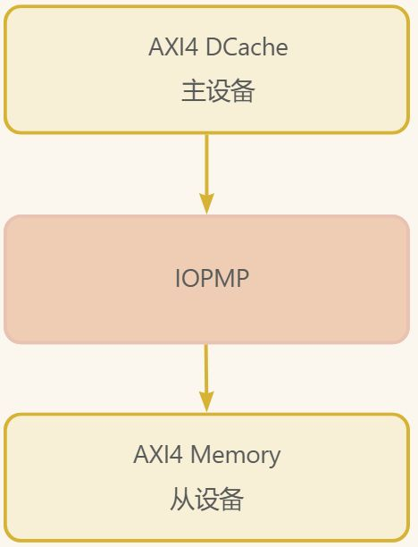

# 第十四章 Diplomacy 实战演练一

参考：

<https://zhuanlan.zhihu.com/p/659308008>

<https://zhuanlan.zhihu.com/p/633327505>

# 题目

TODO: 需要增加 这几个项目的代码解析 和 开源源码

围绕iopmp、dcache、memory、dmac选3个方向出题。（参考Xiangshan SimMMIO.scala）

1是单数据流通路

2是2to1xbar，且带位宽转换和协议转换（最难），需要用tlxbar

3是2to1 xbar方向通路

1. dcache->iopmp（bypass,apb悬空）->memory
2. axi\_master(64bit)->xbar->dmac（cfg-64bit）

axi\_master(64bit)->xbar->apb\_master(32bit)->iopmp(cfg-32bit)

dmac(256bit)->iopmp(data-256bit)->memory(64bit)

3. dmac->xbar->memory

dcache->xbar->memory

# Diplomacy 编程实践

## 前言

:::danger
🎯 **欢迎学习！你的 SoC 硬件“积木”搭建指南**

如果你第一次接触 **Diplomacy 框架**，看到“节点”、“连接”这些术语可能会觉得有些复杂。别担心！

本教程的目标是，带领你像搭积木一样，用 **Diplomacy** 轻松构建可工作的处理器子系统。你将能掌握：

1. **理解抽象**：明白 Diplomacy 如何用“声明式连接”替代繁琐的连线。
2. **动手实践**：亲手搭建“单数据流”与“多主共享”两个经典系统。
3. **学会调试**：掌握查看波形、验证数据通路的核心方法。
4. **建立信心**：获得构建更复杂系统（如多级互联、带权限检查）的基石。

让我们一起，从一行连接代码开始，揭开高性能 SoC 互联设计的神秘面纱。

:::

**案例演进关系**：

* **案例一**是**单数据流通路**，就像一条没有岔路的单车道路。它帮助你理解最基础的“模块-节点-连接”概念和 AXI4 协议流。
* **案例二**是**多主设备共享通路**，引入了 **Xbar（交叉开关）** 这个“交通枢纽”，就像一座立交桥，让多条车道（主设备）有序地驶向同一个目的地（内存）。这是在案例一基础上，学习如何处理并发和仲裁。

:::info
**新手建议**：如果你是 Diplomacy 完全的新手，**强烈建议从案例一开始**。案例一中的每一个概念都是案例二的基础。当你理解了案例一中“`:=`连接符是什么意思”、“数据到底怎么流”之后，再看案例二的 Xbar 就会豁然开朗。

:::

# 案例一：单数据流通路

## 1.1 题目要求

让我们从最简单的“单车道”开始。这个案例的目标是构建一条从 Dcache 发起，经过 IOPMP，最终到达 Memory 的**点对点数据通路**：`dcache -> iopmp（bypass,apb悬空） -> memory`

**系统要求**：

* 一个主设备：数据缓存（dcache），**发起者**。像 CPU 的“手”，主动向内存发起读写请求。
* 一个从设备：内存（memory），**响应者**。像仓库，接收请求，存入或取出数据。
* 一个桥接设备：IOPMP（I/O内存保护单元），**安全检查站/直通通道**。在案例一中设为“直通”(bypass)，不检查，只转发。
* 使用AXI4总线协议
* IOPMP的APB配置接口悬空（不连接）
* 实现完整的读写通路

## 1.2 系统架构设计

基于我们提供的代码，系统架构如下：



**模块功能**：

1. **AXI4 Dcache**：数据缓存模拟器，作为AXI4主设备发起读写请求
2. **AXI4 IOPMP**：I/O内存保护单元，在bypass模式下透明转发请求
3. **AXI4 Memory**：内存模拟器，作为AXI4从设备响应请求
4. **外部控制接口**：用于测试平台控制Dcache发起请求
5. **APB配置接口**：IOPMP的配置总线，本案例中悬空

## 1.3 代码深度解析

### 1.3.1 顶层系统设计（IopmpSystemLazy）

这是系统的核心集成模块，完整展示了Diplomacy的单数据流通路连接，也是案例一最核心部分的代码：

```scala
// 文件：IopmpSystemLazy.scala
class IopmpSystemLazy(
  numBridge: Int = 1,
  memDepth: Int = 1024
)(implicit p: Parameters) extends LazyModule {

  // 1. 实例化“积木块”Dcache模块
  val dcache = LazyModule(new DcacheLazy())

  // 2. 实例化“积木块”IOPMP模块
  val iopmp = LazyModule(new IopmpLazy(numBridge))

  // 3. 实例化“积木块”Memory模块
  val memory = LazyModule(new MemoryLazy(depth = memDepth))

  // 4. 【核心】Diplomacy连接：声明数据流向 dcache -> iopmp -> memory
  iopmp.slaveNodes(0) := dcache.masterNode // 规则: 从设备 := 主设备
  memory.slaveNode := iopmp.masterNodes(0)

  lazy val module = new Imp // 5. 硬件实现在这里
}
```

:::info
**核心思想**：记住 Diplomacy 的连接公式 <code>**下游 := 上游**</code>。

* <code>**:=**</code>**操作符** 读作“连接到”。
* **数据流向** 是**从右向左**流，即从 `上游`流到 `下游`。
* 谁是上游？**数据的生产者、请求的发起者**是上游（通常是 Master）。
* 谁是下游？**数据的消费者、请求的接收者**是下游（通常是 Slave）。

所以 `iopmp.slaveNodes(0) := dcache.masterNode`的含义是：**IOPMP 的从端口（下游）接收来自 Dcache 主端口（上游）的数据**。这两行代码就等价于画出了上面的系统架构图！

:::

**Diplomacy核心要点**：

1. **模块化设计**：每个功能模块独立实例化为LazyModule
2. **节点明确分工**：
   * `dcache.masterNode`：主设备节点，发起请求
   * `iopmp.slaveNodes(0)`：从设备节点，接收来自Dcache的请求
   * `iopmp.masterNodes(0)`：主设备节点，转发请求到Memory
   * `memory.slaveNode`：从设备节点，接收来自IOPMP的请求
3. **拓扑清晰**：使用`:=`操作符建立链式连接关系

### 1.3.2 连接方向语义

Diplomacy的连接操作符`:=`有明确的流向语义：

```scala
// 语法：下游 := 上游
// 语义：数据从上游流向下游

iopmp.slaveNodes(0) := dcache.masterNode  // 数据：Dcache -> IOPMP
memory.slaveNode := iopmp.masterNodes(0)  // 数据：IOPMP -> Memory
```

**连接解释**：

1. 第一行：IOPMP的从设备节点接收来自Dcache主设备节点的数据
2. 第二行：Memory的从设备节点接收来自IOPMP主设备节点的数据
3. 数据流向：Dcache → IOPMP → Memory

## 1.4 模块实现细节

### 1.4.1 Dcache模块实现

Dcache模块实现了完整的AXI4主设备功能：

**核心设计**：

```scala
class DcacheLazy(...)(implicit p: Parameters) extends LazyModule {
  val masterNode = AXI4MasterNode(Seq(AXI4MasterPortParameters(
    Seq(AXI4MasterParameters(
      name = "dcache",
      id = IdRange(0, IopmpParams.axi_idNum)
    ))
  )))

  lazy val module = new Imp

  class Imp extends LazyModuleImp(this) {
    // 六状态状态机
    object State extends ChiselEnum {
      val sIdle, sReadAddr, sReadData, sWriteAddr, sWriteData, sWriteResp = Value
    }
    val state = RegInit(State.sIdle)

    // 外部控制接口
    val io = IO(new Bundle {
      val req_valid = Input(Bool())
      val req_ready = Output(Bool())
      // ... 其他信号
    })

    // 获取AXI4 Bundle
    val (masterBundle, masterEdge) = masterNode.out.head

    // 状态机实现
    switch(state) {
      is(State.sIdle) {
        when(io.req_valid) {
          // 保存请求参数
          req_addr_reg := io.req_addr
          req_write_reg := io.req_write
          // ... 其他参数

          // 根据读写类型进入不同状态
          when(io.req_write) {
            state := State.sWriteAddr
          }.otherwise {
            state := State.sReadAddr
          }
        }
      }
      // ... 其他状态处理
    }

    // AXI4通道信号赋值
    masterBundle.ar.valid := state === State.sReadAddr
    masterBundle.ar.bits.addr := req_addr_reg
    // ... 其他信号

    // 控制信号
    io.req_ready := state === State.sIdle
    io.busy := state =/= State.sIdle
  }
}
```

**关键特性**：

1. **六状态状态机**：精确控制AXI4协议的5个独立通道
2. **外部控制接口**：通过简单的握手信号控制复杂的AXI4操作
3. **ID管理**：为每个事务分配唯一的ID，支持乱序响应
4. **突发传输支持**：支持多拍数据的突发传输

### 1.4.2 IOPMP模块设计

IOPMP模块在bypass模式下作为透明桥接器：

**设计原理**：

```scala
class IopmpLazy(numBridge: Int)(implicit p: Parameters) extends LazyModule {
  // 从设备节点数组（接收来自主设备的请求）
  val slaveNodes = Seq.tabulate(numBridge) { i =>
    AXI4SlaveNode(Seq(AXI4SlavePortParameters(
      Seq(AXI4SlaveParameters(
        address = Seq(AddressSet(0x0, (1L << IopmpParams.axi_addrBits) - 1)),
        regionType = RegionType.UNCACHED,
        executable = false,
        supportsRead = TransferSizes(1, IopmpParams.axi_beatByte),
        supportsWrite = TransferSizes(1, IopmpParams.axi_beatByte)
      )),
      beatBytes = IopmpParams.axi_beatByte
    )))
  }

  // 主设备节点数组（向从设备转发请求）
  val masterNodes = Seq.tabulate(numBridge) { i =>
    AXI4MasterNode(Seq(AXI4MasterPortParameters(
      Seq(AXI4MasterParameters(
        name = s"iopmp_master_$i",
        id = IdRange(0, IopmpParams.axi_idNum)
      ))
    )))
  }

  // APB配置节点
  val apb_s = AXI4SlaveNode(Seq(AXI4SlavePortParameters(
    Seq(AXI4SlaveParameters(
      address = Seq(AddressSet(IopmpParams.regcfg_base, IopmpParams.regcfg_mask)),
      supportsRead = TransferSizes(1, 4),
      supportsWrite = TransferSizes(1, 4)
    )),
    beatBytes = 4
  )))

  // 内部连接：在bypass模式下，slaveNode直接连接到masterNode
  (masterNodes zip slaveNodes).foreach { case (master, slave) =>
    master := slave
  }
}
```

**bypass模式实现**：

* 当IOPMP工作在bypass模式时，不进行权限检查
* 从设备节点接收的请求直接转发到主设备节点
* APB配置接口可以悬空，不影响数据通路

### 1.4.3 Memory模块实现

Memory模块实现了较完整的AXI4从设备功能：

**核心设计**：

```scala
class MemoryLazy(...)(implicit p: Parameters) extends LazyModule {
  val slaveNode = AXI4SlaveNode(Seq(AXI4SlavePortParameters(
    Seq(AXI4SlaveParameters(
      address = Seq(address),
      regionType = RegionType.UNCACHED,
      executable = false,
      supportsRead = TransferSizes(1, beatBytes),
      supportsWrite = TransferSizes(1, beatBytes),
      interleavedId = Some(0)
    )),
    beatBytes = beatBytes
  )))

  lazy val module = new Imp

  class Imp extends LazyModuleImp(this) {
    val (slaveBundle, slaveEdge) = slaveNode.in.head

    // 使用Chisel Mem实现存储
    val mem = Mem(depth, UInt(IopmpParams.axi_dataBits.W))

    // 读通道状态机
    object ReadState extends ChiselEnum {
      val sIdle, sRead = Value
    }
    val readState = RegInit(ReadState.sIdle)

    // 写通道状态机
    object WriteState extends ChiselEnum {
      val sIdle, sWriteData, sWriteResp = Value
    }
    val writeState = RegInit(WriteState.sIdle)

    // 读状态机实现
    switch(readState) {
      is(ReadState.sIdle) {
        when(slaveBundle.ar.fire) {
          // 从内存读取数据
          readDataBuf := mem.read(slaveBundle.ar.bits.addr >> log2Ceil(beatBytes).U)
          readValid := true.B
          readState := ReadState.sRead
        }
      }
      // ... 其他状态处理
    }

    // 写状态机实现
    switch(writeState) {
      is(WriteState.sIdle) {
        when(slaveBundle.aw.fire) {
          writeState := WriteState.sWriteData
        }
      }
      is(WriteState.sWriteData) {
        when(slaveBundle.w.fire) {
          // 写入内存
          mem.write(writeAddrIndex, slaveBundle.w.bits.data)
          writeCount := writeCount + 1.U

          when(slaveBundle.w.bits.last || writeCount === writeLen) {
            writeState := WriteState.sWriteResp
            writeRespValid := true.B
          }
        }
      }
      // ... 其他状态处理
    }

    // 调试接口
    val debug = IO(new Bundle {
      val mem_addr = Input(UInt(memAddrWidth.W))
      val mem_rdata = Output(UInt(IopmpParams.axi_dataBits.W))
    })
    debug.mem_rdata := mem.read(debug.mem_addr)
  }
}
```

**关键特性**：

1. **双独立状态机**：读通道和写通道使用独立的状态机，支持全双工操作
2. **突发传输支持**：正确处理AXI4突发传输，支持地址递增模式
3. **异步调试接口**：提供直接访问内存的接口，便于验证
4. **正确响应生成**：按照AXI4协议生成正确的响应信号

## 1.5 Diplomacy连接模式详解

### 1.5.1 链式连接拓扑

本案例采用最简单的链式连接：


在Diplomacy中表示为：

```plain
iopmp.slaveNodes(0) := dcache.masterNode
memory.slaveNode := iopmp.masterNodes(0)
```

### 1.5.2 参数自动协商

当建立连接时，Diplomacy自动执行参数协商：

1. **位宽对齐**：确保Dcache、IOPMP、Memory的`beatBytes`一致
2. **ID空间分配**：协调主设备的ID范围，避免冲突
3. **地址映射**：验证Memory的地址空间在Dcache可访问范围内
4. **协议特性协商**：确认支持的传输大小、突发类型等是否兼容

### 1.5.3 编译时错误检查

Diplomacy在编译时检查常见错误：

1. **节点角色不匹配**：尝试将主设备节点连接到主设备节点
2. **参数不兼容**：位宽、ID范围等参数不匹配
3. **地址空间冲突**：多个从设备地址重叠
4. **连接方向错误**：数据流向不符合物理连接

## 1.6 系统包装与接口暴露

### 1.6.1 顶层包装器（IopmpSystemWrapper）

为了方便使用，系统提供了顶层包装器：

```scala
class IopmpSystemWrapper(...)(implicit p: Parameters) extends LazyModule {
  val system = LazyModule(new IopmpSystemLazy(numBridge, memDepth))

  lazy val module = new LazyModuleImp(this) {
    // 1. APB配置接口
    val apb_s = IO(new APBSlaveBundle(IopmpParams.regcfg_addrBits, IopmpParams.regcfg_dataBits))
    apb_s <> system.module.apb_s

    // 2. 中断输出
    val int = IO(Output(Bool()))
    int := system.module.int

    // 3. Dcache控制接口
    val dcache_ctrl = IO(new Bundle {
      // ... 与dcache_io相同的结构
    })
    dcache_ctrl <> system.module.dcache_io

    // 4. Memory调试接口
    val mem_debug = IO(new Bundle {
      val mem_addr = Input(UInt(log2Ceil(memDepth).W))
      val mem_rdata = Output(UInt(IopmpParams.axi_dataBits.W))
    })
    mem_debug <> system.module.mem_debug

    // 5. 系统状态
    val status = IO(new Bundle {
      val dcache_busy = Output(Bool())
      val iopmp_int = Output(Bool())
    })
    status <> system.module.status
  }
}
```

### 1.6.2 Verilog生成入口

系统提供了Verilog生成入口：

```scala
object IopmpSystem extends App {
  implicit val p: Parameters = Parameters.empty

  val top = LazyModule(new IopmpSystemWrapper(numBridge = 1, memDepth = 1024))

  ChiselStage.emitSystemVerilog(
    top.module,
    args = Array("--dump-fir"),
    firtoolOpts = Array(
      "-disable-all-randomization",
      "-strip-debug-info",
      "--disable-annotation-unknown",
      "--lowering-options=explicitBitcast,disallowLocalVariables,disallowPortDeclSharing,locationInfoStyle=none",
      "--split-verilog",
      "-o=./build/iopmp_system"
    )
  )
}
```

## 1.7 测试与验证建议

### 1.7.1 验证策略

1. **单元测试**：单独测试每个模块的功能
2. **集成测试**：验证完整数据通路的正确性
3. **边界测试**：测试地址边界、数据边界等特殊情况
4. **性能测试**：测试突发传输、并发访问等场景

### 1.7.2 调试支持

在硬件模块中添加调试信息：

```scala
// 在Dcache模块中添加调试打印
when(masterBundle.ar.fire) {
  printf(p"[DCache] AR request: addr=0x${Hexadecimal(masterBundle.ar.bits.addr)}, " +
         p"id=${masterBundle.ar.bits.id}, len=${masterBundle.ar.bits.len}\n")
}

// 在Memory模块中添加调试打印
when(slaveBundle.ar.fire) {
  printf(p"[Memory] Read request: addr=0x${Hexadecimal(slaveBundle.ar.bits.addr)}\n")
}
when(slaveBundle.w.fire) {
  printf(p"[Memory] Write data: addr=0x${Hexadecimal(writeAddr)}, " +
         p"data=0x${Hexadecimal(slaveBundle.w.bits.data)}\n")
}
```

### 1.7.3 测试用例示例

```plain
// 简单的读写测试
// 1. 向地址0x1000写入数据0x12345678
// 2. 从地址0x1000读取数据，验证是否为0x12345678
// 3. 使用Memory调试接口直接读取验证

// 突发传输测试
// 1. 发起长度为4的突发写操作
// 2. 发起长度为4的突发读操作
// 3. 验证所有数据正确
```

## 1.8 扩展性设计

当前系统可轻松扩展：

```scala
// 添加第二个主设备
val dcache2 = LazyModule(new DcacheLazy())
// 需要修改IOPMP以支持多个主设备
// iopmp.slaveNodes(1) := dcache2.masterNode

// 添加第二个从设备
val memory2 = LazyModule(new MemoryLazy(depth = 512))
// 需要修改IOPMP以支持多个从设备
// memory2.slaveNode := iopmp.masterNodes(1)

// 修改IOPMP工作模式
// 通过APB配置接口设置IOPMP为非bypass模式
// 启用权限检查功能
```

## 1.9 常见问题与解决方案

### 问题1：连接方向错误

**现象**：编译错误，提示节点角色不匹配

**解决**：检查`:=`操作符左右两边的节点角色

```scala
// 正确：Slave := Master
iopmp.slaveNodes(0) := dcache.masterNode

// 错误：Master := Slave
dcache.masterNode := iopmp.slaveNodes(0)  // 编译错误
```

### 问题2：参数不匹配

**现象**：编译错误，提示参数无法合并

**解决**：检查连接模块的参数配置

```scala
// 确保所有模块的beatBytes一致
val dcache = LazyModule(new DcacheLazy(beatBytes = 8))
val iopmp = LazyModule(new IopmpLazy(numBridge = 1))  // 内部使用IopmpParams.axi_beatByte
val memory = LazyModule(new MemoryLazy(beatBytes = 8))

// 确保IopmpParams.axi_beatByte与其他模块一致
```

### 问题3：地址空间冲突

**现象**：多个从设备响应同一地址空间

**解决**：明确划分地址空间

```scala
// 为不同从设备分配不同的地址空间
val memory1 = LazyModule(new MemoryLazy(
  address = AddressSet(0x80000000L, 0x0fffffffL)  // 256MB空间
))

val memory2 = LazyModule(new MemoryLazy(
  address = AddressSet(0x90000000L, 0x0fffffffL)  // 与memory1重叠，错误！
))
```

### 问题4：ID空间耗尽

**现象**：主设备ID范围不足

**解决**：合理分配ID范围

```scala
val dcache = LazyModule(new DcacheLazy())
// Dcache内部使用IdRange(0, IopmpParams.axi_idNum)

// 确保IopmpParams.axi_idNum足够大
object IopmpParams {
  val axi_idNum = 256  // 支持256个不同的ID
}
```

##


> 更新: 2026-06-23 14:24:14  
> 原文: <https://bosc.yuque.com/staff-xmw8rg/fb7qy3/umli5i56isuyxnox>
