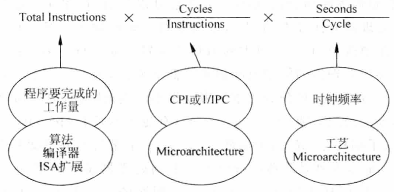

# 2. 为什么需要超标量

[附件: 为什么需要超标量？——从性能瓶颈到架构革新.pptx](./attachments/kOzN-DCAcFxAkkWD/为什么需要超标量？——从性能瓶颈到架构革新.pptx)

> 本文全面解析超标量架构如何突破单发射流水线的性能瓶颈，深入剖析高算力场景下的性能需求，并揭示香山处理器采用超标量设计的内在逻辑。

# 2.1核心背景：处理器性能的永恒追求

处理器设计的核心目标之一是提升指令执行的吞吐量（Throughput）和降低执行延迟（Latency）。从单周期、多周期到流水线处理器，每一次架构演进都是对性能的迭代优化，但单发射流水线（非超标量）最终会遇到难以突破的性能天花板——这也是**超标量（Superscalar）架构**诞生的根本原因。

## 2.1.1 性能优化的三个维度

根据计算机体系结构经典理论，程序执行时间由三个因素决定：



**执行时间 = 指令总数 × CPI × 时钟周期时间**

> 执行时间 = 指令总数 (Total Instructions) × (周期数/指令) × (秒/周期)

其中：

* **指令总数**：由程序的工作负载、算法选择和编译器优化决定
* **CPI**：每指令周期数，与IPC互为倒数，是微架构效率的核心指标
* **时钟周期时间**：由工艺制程和电路设计决定

超标量架构通过**降低CPI（提高IPC）** 来提升性能，这与单纯提高频率相比具有更好的能效比。

## 2.1.2 核心性能指标

在深入探讨超标量架构之前，我们首先明确一下核心性能指标：

| 指标 | 全称 | 定义 | 重要性 |
| --- | --- | --- | --- |
| **IPC** | Instructions Per Cycle | 每时钟周期执行的指令数 | 衡量处理器并行能力的核心指标 |
| **CPI** | Cycles Per Instruction | 每执行一条指令需要的时钟周期数 | 与 IPC 互为倒数（IPC = 1/CPI） |

**超标量架构的核心价值**在于突破单发射流水线的 IPC 上限（IPC ≤ 1），通过\*\*"横向扩展"硬件资源\*\*、并行执行多条指令，将 IPC 提升至大于 1，最终满足高算力场景的需求。

# 2.2 单发射流水线的性能天花板

单发射流水线（比如经典的 MIPS 5 级流水线：取指 IF→译码 ID→执行 EX→访存 MEM→写回 WB）是 “时间复用” 硬件资源的典范：**<font style="color:rgb(0, 0, 0);background-color:rgba(0, 0, 0, 0);">同一个硬件单元（如 ALU、访存单元）在不同时钟周期处理不同指令</font>**。但它的性能存在无法突破的瓶颈：

## 2.2.1 理想场景下的 IPC 上限 = 1

即使单发射流水线完全无冲突、无停顿（stall），每一个时钟周期也只能发射（Issue）、执行一条指令，因此 IPC 的理论最大值为 1。这意味着：无论时钟频率多高，单发射处理器的指令吞吐量都被 “每周期 1 条指令” 的规则锁死。

## 2.2.2 实际场景下的 IPC 远低于 1

真实程序执行时，流水线会因\*\*<font style="color:rgb(0, 0, 0);background-color:rgba(0, 0, 0, 0);">结构冲突、数据冲突、控制冲突</font>\*\*（后续章节会详细讲解）产生大量停顿，导致实际 IPC 远低于 1。

我们通过一个具体例子说明：

### <font style="color:rgb(0, 0, 0);background-color:rgba(0, 0, 0, 0);">示例 1：单发射流水线的停顿（数据冲突导致）</font>

<font style="color:rgb(0, 0, 0);background-color:rgba(0, 0, 0, 0);">考虑如下 RISC-V 指令序列（计算</font><code><font style="color:rgb(0, 0, 0);background-color:rgba(0, 0, 0, 0);">a = b + c; d = a + e</font></code><font style="color:rgb(0, 0, 0);background-color:rgba(0, 0, 0, 0);">）：</font>

```plain
addi x1, x0, 10    ; x1 = 10 (b)
addi x2, x0, 20    ; x2 = 20 (c)
add x3, x1, x2     ; x3 = x1 + x2 (a = b + c)
addi x4, x0, 30    ; x4 = 30 (e)
add x5, x3, x4     ; x5 = x3 + x4 (d = a + e)
```

<font style="color:rgb(0, 0, 0);background-color:rgba(0, 0, 0, 0);">在单发射 5 级流水线中：</font>

* <font style="color:rgb(0, 0, 0);background-color:rgba(0, 0, 0, 0);">第 4 周期：</font><code><font style="color:rgb(0, 0, 0);background-color:rgba(0, 0, 0, 0);">add x3, x1, x2</font></code><font style="color:rgb(0, 0, 0);background-color:rgba(0, 0, 0, 0);"> 进入执行阶段（EX），但</font><code><font style="color:rgb(0, 0, 0);background-color:rgba(0, 0, 0, 0);">add x5, x3, x4</font></code><font style="color:rgb(0, 0, 0);background-color:rgba(0, 0, 0, 0);"> 若想在第 5 周期进入 ID 阶段，会发现</font><code><font style="color:rgb(0, 0, 0);background-color:rgba(0, 0, 0, 0);">x3</font></code><font style="color:rgb(0, 0, 0);background-color:rgba(0, 0, 0, 0);">尚未写回（WB 阶段在第 6 周期）—— 这是</font>**<font style="color:rgb(0, 0, 0);background-color:rgba(0, 0, 0, 0);">RAW 数据冲突</font>**<font style="color:rgb(0, 0, 0);background-color:rgba(0, 0, 0, 0);">（写后读）。</font>
* <font style="color:rgb(0, 0, 0);background-color:rgba(0, 0, 0, 0);">为了保证结果正确，流水线必须停顿 1 个周期，等待</font><code><font style="color:rgb(0, 0, 0);background-color:rgba(0, 0, 0, 0);">x3</font></code><font style="color:rgb(0, 0, 0);background-color:rgba(0, 0, 0, 0);">写回后，</font><code><font style="color:rgb(0, 0, 0);background-color:rgba(0, 0, 0, 0);">add x5</font></code><font style="color:rgb(0, 0, 0);background-color:rgba(0, 0, 0, 0);">才能继续执行。</font>

<font style="color:rgb(0, 0, 0);background-color:rgba(0, 0, 0, 0);">最终这条 5 条指令的序列，实际执行周期数远大于 5，IPC≈5/7≈0.71（而非理想的 1）。</font>

### <font style="color:rgb(0, 0, 0);background-color:rgba(0, 0, 0, 0);">示例 2：单发射流水线的停顿（结构冲突导致）</font>

<font style="color:rgb(0, 0, 0);background-color:rgba(0, 0, 0, 0);">若处理器只有 1 个 ALU（算术逻辑单元），同时遇到如下指令序列：</font>

```plain
add x1, x2, x3     ; 需要ALU
sub x4, x5, x6     ; 需要ALU
mul x7, x8, x9     ; 需要ALU
```

三条指令都依赖 ALU，单发射流水线只能串行执行，每一条指令都要等待前一条释放 ALU，完全无法并行，IPC 被硬件资源的 “串行复用” 锁死。

## 2.2.3 单纯提升时钟频率的局限性

<font style="color:rgb(0, 0, 0);background-color:rgba(0, 0, 0, 0);">有人会问：“既然单发射 IPC 上限是 1，那提升时钟频率不就能提升性能了吗？” 但实际中：</font>

* <font style="color:rgb(0, 0, 0);background-color:rgba(0, 0, 0, 0);">高频带来</font>**<font style="color:rgb(0, 0, 0);background-color:rgba(0, 0, 0, 0);">功耗爆炸</font>**<font style="color:rgb(0, 0, 0);background-color:rgba(0, 0, 0, 0);">（功耗与频率的三次方成正比）；</font>
* <font style="color:rgb(0, 0, 0);background-color:rgba(0, 0, 0, 0);">分支预测错误的代价剧增：若流水线从 5 级加深到 20 级，一次分支预测错误可能会冲刷 20 级流水线，远高于 5 级的代价，反而拉低实际 IPC。</font>

<font style="color:rgb(0, 0, 0);background-color:rgba(0, 0, 0, 0);">因此，“高频 + 单发射” 的路线存在边际效应递减，无法持续满足性能需求。</font>

# <font style="color:rgb(0, 0, 0);background-color:rgba(0, 0, 0, 0);">2.3 高算力场景需要更高的 IPC</font>

<font style="color:rgb(0, 0, 0);background-color:rgba(0, 0, 0, 0);">随着应用场景的演进，单发射流水线的性能完全无法满足需求，典型场景包括：</font>

## <font style="color:rgb(0, 0, 0);background-color:rgba(0, 0, 0, 0);">2.3.1 科学计算 / 高性能计算（HPC）</font>

<font style="color:rgb(0, 0, 0);background-color:rgba(0, 0, 0, 0);">比如矩阵乘法、流体力学模拟等，这类程序包含大量 “无相关性” 的算术指令，天然具备并行执行的潜力。</font>

#### <font style="color:rgb(0, 0, 0);background-color:rgba(0, 0, 0, 0);">示例 3：矩阵乘法的并行潜力</font>

<font style="color:rgb(0, 0, 0);background-color:rgba(0, 0, 0, 0);">假设计算</font><code><font style="color:rgb(0, 0, 0);background-color:rgba(0, 0, 0, 0);">C = A × B</font></code><font style="color:rgb(0, 0, 0);background-color:rgba(0, 0, 0, 0);">（2×2 矩阵），核心指令序列（简化）：</font>

```plain
# 计算C[0][0] = A[0][0]*B[0][0] + A[0][1]*B[1][0]
mul x1, x10, x20   ; x1 = A[0][0]*B[0][0]
mul x2, x11, x21   ; x2 = A[0][1]*B[1][0]
add x3, x1, x2     ; x3 = C[0][0]

# 计算C[0][1] = A[0][0]*B[0][1] + A[0][1]*B[1][1]
mul x4, x10, x22   ; x4 = A[0][0]*B[0][1]
mul x5, x11, x23   ; x5 = A[0][1]*B[1][1]
add x6, x4, x5     ; x6 = C[0][1]
```

在单发射流水线中，<code><font style="color:rgb(0, 0, 0);background-color:rgba(0, 0, 0, 0);">mul x1</font></code>和<code><font style="color:rgb(0, 0, 0);background-color:rgba(0, 0, 0, 0);">mul x2</font></code>必须串行执行；但这两条乘法指令无任何数据相关性，完全可以并行执行 —— 超标量架构正是利用这种 “指令级并行（ILP）”，将多条无冲突指令在同一周期发射到多个 ALU / 乘法器执行，大幅提升吞吐量。

## <font style="color:rgb(0, 0, 0);background-color:rgba(0, 0, 0, 0);">2.3.2 服务器 / 云计算场景</font>

<font style="color:rgb(0, 0, 0);background-color:rgba(0, 0, 0, 0);">服务器需要同时处理成千上万个并发请求，每个请求都包含大量指令（如内存访问、逻辑判断、数据计算）。单发射处理器的吞吐量不足，会导致请求响应延迟增加、系统吞吐率下降 —— 超标量是提升服务器处理器算力的核心手段。</font>

## <font style="color:rgb(0, 0, 0);background-color:rgba(0, 0, 0, 0);">2.3.3 多媒体 / 嵌入式高性能场景</font>

<font style="color:rgb(0, 0, 0);background-color:rgba(0, 0, 0, 0);">比如视频编解码、AI 推理（如 CNN 卷积计算），这类场景包含大量 SIMD（单指令多数据）指令和并行算术运算，单发射流水线无法充分利用硬件资源，必须通过超标量提升并行度。</font>

# <font style="color:rgb(0, 0, 0);background-color:rgba(0, 0, 0, 0);">2.4 超标量的核心解决思路：空间复用硬件资源</font>

<font style="color:rgb(0, 0, 0);background-color:rgba(0, 0, 0, 0);">超标量架构的本质是空间复用、硬件资源 ：在同一个时钟周期内，通过多个独立的功能单元（如多 ALU、多 Load/Store 单元、多乘法器），并行发射和执行多条无冲突的指令。</font>

## <font style="color:rgb(0, 0, 0);background-color:rgba(0, 0, 0, 0);"> 2.4.1 超标量 vs 单发射：核心差异  </font>

| 维度 | 单发射流水线（非超标量） | 超标量流水线 |
| --- | --- | --- |
| 硬件资源 | 单套核心功能单元（1 个 ALU、1 个访存单元） | 多套功能单元（2+ ALU、2 + 访存单元、多乘除法器） |
| 发射能力 | 每周期发射 1 条指令 | 每周期发射 N 条指令（N≥2，如 2 发射、4 发射） |
| 理想情况下的IPC | 1 | N |
| 资源复用方式 | 时间复用（不同周期用同一单元） | 时间、空间复用（同一周期用不同单元） |

## <font style="color:rgb(0, 0, 0);background-color:rgba(0, 0, 0, 0);">2.4.2 示例 4：超标量解决单发射的资源冲突</font>

<font style="color:rgb(0, 0, 0);background-color:rgba(0, 0, 0, 0);">回到 2.2.2 的结构冲突示例，若超标量处理器配备 2 个 ALU，指令序列：</font>

```plain
add x1, x2, x3     ; 发射到ALU1
sub x4, x5, x6     ; 发射到ALU2（同一周期）
mul x7, x8, x9     ; 发射到乘法器（同一周期，若有独立乘法器）
```

微观视角下，三条指令可在\*\*<font style="color:rgb(0, 0, 0);background-color:rgba(0, 0, 0, 0);">同一个时钟周期</font>\*\*发射并执行，IPC 直接提升至 3（理想情况），吞吐量是单发射的 3 倍。

## 2.4.3 超标量的“并行前提”：解决指令相关性

超标量的并行执行并非无条件 —— 只有指令间无冲突（结构、数据、控制冲突）时，才能并行发射。因此，超标量架构通常配套\*\*<font style="color:rgb(0, 0, 0);background-color:rgba(0, 0, 0, 0);">乱序执行、寄存器重命名、分支预测</font>\*\*等技术（后续章节会讲解），目的是最大化挖掘程序中的 “指令级并行（ILP）”，让更多指令满足并行执行的条件。

# 2.5 香山架构视角：为什么香山选择超标量

<font style="color:rgb(0, 0, 0);background-color:rgba(0, 0, 0, 0);">香山（XiangShan）是面向服务器 / 高性能计算的 RISC-V 处理器，其设计目标是提供比肩 x86/ARM 高端处理器的算力，这决定了它必须采用超标量架构：</font>

1. **<font style="color:rgb(0, 0, 0);background-color:rgba(0, 0, 0, 0);">算力需求匹配</font>**<font style="color:rgb(0, 0, 0);background-color:rgba(0, 0, 0, 0);">：服务器场景需要高 IPC（香山主流版本为 6 发射 / 8 发射乱序超标量），单发射完全无法满足 TB 级数据处理、高并发请求的需求；</font>
2. **<font style="color:rgb(0, 0, 0);background-color:rgba(0, 0, 0, 0);">RISC-V 生态的定位</font>**<font style="color:rgb(0, 0, 0);background-color:rgba(0, 0, 0, 0);">：香山作为 RISC-V 高性能架构的标杆，需要通过超标量 + 乱序执行，证明 RISC-V 在高性能领域的可行性；</font>
3. **<font style="color:rgb(0, 0, 0);background-color:rgba(0, 0, 0, 0);">能效比优势</font>**<font style="color:rgb(0, 0, 0);background-color:rgba(0, 0, 0, 0);">：超标量的 “横向扩展” 相比 “高频单发射” 更符合 RISC-V 的能效比目标 —— 香山通过合理的多发射设计（而非盲目加深流水线），在提升 IPC 的同时控制功耗。</font>

<font style="color:rgb(0, 0, 0);background-color:rgba(0, 0, 0, 0);">比如香山的流水线划分（后续 8.a 章节讲解）中，专门设计了 “多发射队列”“重命名寄存器堆”“多端口功能单元” 等模块，核心都是为了支撑超标量的并行执行，最大化挖掘指令级并行。</font>

# <font style="color:rgb(0, 0, 0);background-color:rgba(0, 0, 0, 0);">2.6 总结：超标量的核心价值</font>

<font style="color:rgb(0, 0, 0);background-color:rgba(0, 0, 0, 0);">超标量架构的诞生，是处理器设计从 “纵向加深流水线（提升频率）” 到 “横向扩展并行度（提升 IPC）” 的关键转向：</font>

* <font style="color:rgb(0, 0, 0);background-color:rgba(0, 0, 0, 0);">突破单发射 IPC=1 的天花板，充分利用程序中的指令级并行（ILP）；</font>
* <font style="color:rgb(0, 0, 0);background-color:rgba(0, 0, 0, 0);">相比单纯提升频率，超标量的能效比更高，更适合现代芯片的功耗约束；</font>
* <font style="color:rgb(0, 0, 0);background-color:rgba(0, 0, 0, 0);">适配高算力场景（HPC、服务器、AI）的需求，成为高性能处理器的标配架构。</font>

<font style="color:rgb(0, 0, 0);background-color:rgba(0, 0, 0, 0);">后续章节（如单发射 vs 多发射、乱序执行、Tomosulo 算法等），都会围绕 “如何让超标量架构更高效地并行执行指令” 展开 —— 这也是香山架构设计的核心逻辑之一。</font>

<font style="color:rgb(0, 0, 0);background-color:rgba(0, 0, 0, 0);"></font>


> 更新: 2026-06-03 15:36:56  
> 原文: <https://bosc.yuque.com/staff-xmw8rg/fb7qy3/gszwug0p01w7f6ux>
