<!--
# 13. ROB

乱序处理器的核心矛盾是：指令可以乱序执行，但结果必须按序提交。ROB 就是解决这个矛盾的"秩序守护者"——它记录每条指令的状态，确保即使指令乱序完成，最终的效果也和顺序执行一模一样。

📋 读完本章，你将能够：

* ✅ 理解 ROB 的压缩机制与多 uop 聚合
* ✅ 掌握 ROB 提交的完整流程与约束条件
* ✅ 认识 ROB 异常处理的优先级与陷入机制
* ✅ 了解 Replay 的触发场景与回退策略

***

## 13.1 整体定位：ROB 是什么？

你可以把 ROB 想象成一座**档案柜**：

* 每条指令入队时在 ROB 中占一个位置（按程序顺序排列）
* 指令乱序执行、乱序写回，但写回时只更新 ROB 中的状态（标记为"已完成"）
* 只有 ROB 头部连续的"已完成"指令才能被**提交**——真正生效

ROB 的核心职责：**保证精确中断和按序提交**。没有 ROB，乱序处理器就无法在异常发生时恢复到一致的机器状态。

***

## 13.2 ROB Compress（ROB 压缩）

### 13.2.1 为什么需要压缩？

一条复杂指令（如向量指令、融合指令）可能在 Dispatch 阶段被拆分为**多个微操作**。如果每个 uop 都在 ROB 中占一项，ROB 的空间会很快耗尽，严重限制指令窗口大小。

ROB 压缩的核心思想：**一条指令的多个 uop 共享同一个 ROB 项**，用计数器跟踪完成进度。

### 13.2.2 uopNum 计数器

每个 ROB 项维护一个 <code>**uopNum**</code> 字段，记录**还有多少个 uop 未写回**：

```scala
// RobBundles.scala — uopNum 字段
val uopNum = UInt(log2Up(MaxUopSize + 1).W)

//判断是否已全部写回
def isWritebacked: Bool = !uopNum.orR
def isUopWritebacked: Bool = !uopNum.orR
```

| **状态** | **uopNum 值** | **含义** |
| --- | --- | --- |
| 刚入队 | 等于该指令的 uop 总数 | 所有 uop 都还没写回 |
| 部分 uop 写回 | 递减 | 剩余 uop 数 |
| 全部写回 | 0 | 该指令执行完毕，可以提交 |

在提交阶段，<code>**uopNum === 0.U**</code> 也被用来判断是否可提交：

```scala
// RobBundles.scal — 提交时判断写回完成
robCommitEntry.commit_w := robEntry.uopNum === 0.U
```

### 13.2.3 realDestSize

```scala
// RobBundles.scala — realDestSize 字段
val realDestSize = UInt(log2Up(MaxUopSize + 1).W)

// 提交时传递 realDestSize
robCommitEntry.realDestSize := robEntry.realDestSize
```

为什么 <code>**realDestSize**</code> 可能小于 uop 总数？因为有些 uop 不写目标寄存器（如条件失败的 CSR 位操作、向量指令中不产生结果的微操作），它们仍需计入 <code>**uopNum**</code>（因为需要等写回来确认完成），但不占有效的目标寄存器。

| **字段** | **含义** | **比喻** |
| --- | --- | --- |
| <code>**uopNum**</code> | 剩余未写回的 uop 数（递减至0表示完成） | 还有几个快递没到 |
| <code>**realDestSize**</code> | 真正有效的目标寄存器数量 | 其中有几个是你要的 |
| <code>**valid**</code> | 该 ROB 项是否有效 | 柜子这个格有人占了 |

### 13.2.4 入队时的初始化

ROB 项在入队时由 <code>**connectEnq**</code> 函数初始化核心字段

```scala
// RobBundles.scala — 入队初始化
def connectEnq(robEntry: RobEntryBundle, robEnq: EnqRobUop): Unit = {
  robEntry.wflags      := robEnq.wfflags
  robEntry.commitType  := robEnq.commitType
  robEntry.ftqIdx      := robEnq.ftqPtr
  robEntry.ftqOffset   := robEnq.ftqOffset
  robEntry.isRVC       := robEnq.isRVC
  robEntry.needVTB     := robEnq.isVset || robEnq.vpu.isVleff  // VSET/VLEFF 需要写 VTypeBuffer
  robEntry.isHls       := robEnq.isHls
  robEntry.rfWen       := robEnq.rfWen           // 是否写整数 RF
  robEntry.fpWen       := robEnq.dirtyFs         // 是否脏浮点状态
  robEntry.dirtyVs     := robEnq.dirtyVs         // 是否脏向量状态
  robEntry.needFlush   := robEnq.hasException || robEnq.flushPipe  // 异常或冲刷
  // ... debug fields
}
```

***

## 13.3 ROB Commit（ROB 提交）

### 13.3.1 提交条件

ROB 头部的指令可以被提交，需要满足以下条件：

| **条件** | **代码表示** | **说明** |
| --- | --- | --- |
| valid | <code>**robEntry.valid**</code> | 该 ROB 项有效（有指令占用） |
| writebacked | <code>**robEntry.uopNum===0.U**</code>（即<code>**isWritebacke**</code>） | 所有 uop 已写回 |
| 无异常 | <code>**!robEntry.needFlush**</code> | 该指令没有触发异常也不需要冲刷 |
| 前方无阻塞 | <code>**!hasBlockBackward && !hasWaitForward**</code> | 没有未处理的阻塞 |

```scala
// RobBundles.scala — 写回完成判断
def isWritebacked: Bool = !uopNum.orR
//提交写回判断
robCommitEntry.commit_w := robEntry.uopNum === 0.U
//阻塞标志
val hasBlockBackward = RegInit(false.B)
val hasWaitForward = RegInit(false.B)
```

### 13.3.2 提交流程

```plain
ROB 头部检查（deqPtr 指向的 CommitWidth 项）
    │
    ├──→ hasBlockBackward？ ──→ 是 ──→ 阻塞入队，等待
    │
    ├──→ 有异常？(needFlush) ──→ 是 ──→ 暂停提交，触发异常处理
    │
    ├──→ 全部写回？(uopNum=0) ──→ 否 ──→ 等待写回
    │
    └──→ 满足条件 ──→ 是 ──→ 每周期最多提交 CommitWidth 条指令
                              │
                              ├──→ 通知 Rab：更新架构寄存器映射，释放旧 PRF
                              ├──→ 通知 LSQ：Store 可以真正写入内存
                              ├──→ 通知 CSR：fflags/vxsat 累加
                              ├──→ 通知 VTypeBuffer：向量配置生效
                              └──→ 释放 ROB 项，推进 deqPtr
```

提交时 RAB 接收的信息：

```scala
// Rob.scala — RabCommitIO
val rabCommits = Output(new RabCommitIO)
val vlCommits  = Output(new VlCommitBundle(RabCommitWidth))
```

### 13.3.3 提交宽度

香山的 ROB 每周期可以提交 <code>**CommitWidth**</code> 条指令。实际提交数受限于：

* 头部连续的已写回项数量
* 是否遇到异常或特殊指令
* LSQ 的 Store 提交带宽

ROB 采用 **8 Bank 分体**设计加速提交读取：

```scala
// Rob.scala
val bankNum = 8
assert(RobSize % bankNum == 0, "RobSize % bankNum must be 0")
// Bank 分体：按 robIdx 低位交错
val robBanks = VecInit((0 until bankNum).map(i =>
  VecInit(robEntries.zipWithIndex.filter(_._2 % bankNum == i).map(_._1))
))
//Bank 读取：当前行 + 下一行预取
val robBanksRdataThisLine = VecInit(robBanks.map { case bank =>
  Mux1H(robBanksRaddrThisLine, bank)
})
val robBanksRdataNextLine = VecInit(robBanks.map { case bank =>
  val shiftBank = bank.drop(1) :+ bank(0)
  Mux1H(robBanksRaddrThisLine, shiftBank)
})
```

### 13.3.4 提交时的副作用

提交不只是"打个勾"，还会触发一系列**架构状态更新**：

| **副作用** | **目标** | **信号/接口** | **说明** |
| --- | --- | --- | --- |
| 寄存器映射更新 | Rab → 架构 RAT | <code>**rabCommits**</code> | 确认物理寄存器归属 |
| 旧寄存器释放 | FreeList | 通过 RAB 间接释放 | 释放被覆盖的旧物理寄存器 |
| Store 提交 | LSQ / SBuffer | <code>**io.lsq**</code> | Store 数据真正写入内存 |
| fflags 累加 | CSR | <code>**io.csr**</code> | 浮点异常标志累积 |
| vxsat 累加 | CSR | <code>**io.csr**</code> | 向量饱和标志累积 |
| VTYPE 更新 | VTypeBuffer | <code>**commitVType**</code> | 向量配置生效 |

```scala
// Rob.scala — RAB 实例化（ROB 内部集成）
val rab = Module(new RenameBuffer(RabSize))
val vtypeBuffer = Module(new VTypeBuffer(VTypeBufferSize))
```

***

## 13.4 ROB Exception（ROB 异常处理）

### 13.4.1 为什么异常必须按序处理？

乱序处理器中，指令可能乱序发现异常。但 RISC-V 规范要求：**只有程序顺序上第一条发生异常的指令才应该被处理**，后续指令的异常应该被忽略。

这就像排队看病——即使你比别人先查出问题，也必须按挂号顺序叫号。

### 13.4.2 异常检测来源

ROB 从多个写回端口收集异常信息：

```scala
// Rob.scala— 各类写回信号分类
val exuWBs       = io.exuWriteback                                    // 所有执行单元写回
val exceptionWBs = io.writeback.filter(x => x.bits.exceptionVec.nonEmpty).toSeq  // 有异常向量的写回
val redirectWBs  = io.writeback.filter(x => x.bits.redirect.nonEmpty).toSeq       // 有重定向的写回
val csrWBs       = io.exuWriteback.filter(x => x.bits.params.hasCSR).toSeq        // CSR 写回
val fflagsWBs    = io.exuWriteback.filter(x => x.bits.fflags.nonEmpty).toSeq      // 浮点异常写回
val vxsatWBs     = io.exuWriteback.filter(x => x.bits.vxsat.nonEmpty).toSeq       // 向量饱和写回
val branchWBs    = io.exuWriteback.filter(_.bits.params.hasBrhFu).toSeq            // 分支写回
```

| **来源** | **信号** | **异常类型** |
| --- | --- | --- |
| **执行单元写回** | <code>**exceptionWBs**</code> | 非法指令、断点、ECALL 等 |
| **Load/Store 写回** | <code>**exceptionWBs**</code> | 缺页、访问权限、地址不对齐 |
| **CSR 写回** | <code>**csrWBs**</code> | CSR 权限异常 |
| **分支/跳转写回** | <code>**redirectWBs**</code> | 误推测重定向 |

### 13.4.3 异常处理流程



异常生成由 <code>**ExceptionGen**</code> 模块处理：

> *// Rob.scala 中实例化（对应 ExceptionGen.scala）*
>
> *收集多个写回端口的异常信息，按 RobPtr 排序找出最早的异常*

### 13.4.4 needFlush 与 hasException

```scala
// RobBundles.scala— 入队时设置 needFlush
robEntry.needFlush := robEnq.hasException || robEnq.flushPipe
```

<code>**needFlush**</code> 涵盖两种情况：

* **hasException**：指令产生了异常，需要触发异常处理
* **flushPipe**：指令需要冲刷流水线（如 CSR 写入、FENCE），但不一定有异常

### 13.4.5 中断安全

中断是特殊的"异常"——它不是由当前指令触发的，但在提交时需要检查。ROB 中每个项有一个 <code>**interrupt_safe**</code> 标志：

```scala
// RobBundles.scala
val interrupt_safe = Bool()
// 提交时传递
robCommitEntry.interrupt_safe := robEntry.interrupt_safe
```

* 某些指令（如 CSR 指令、FENCE 指令）在完成前会修改处理器状态，不能被打断
* 只有 <code>**interrupt_safe**</code> 的指令之间才能响应中断
* 中断的优先级低于异常——如果同一条指令既有异常又有中断挂起，优先处理异常

### 13.4.6 向量异常的特殊处理

向量指令的异常处理特别复杂——一条向量指令可能已经部分执行（修改了部分向量寄存器元素），需要额外机制来恢复：

```scala
// Rob.scala — 向量异常模块交互
val fromVecExcpMod = Input(new Bundle {
  val busy = Bool()     // 向量异常处理模块忙，阻塞入队
})
val toVecExcpMod = Output(new Bundle {
  val logicPhyRegMap = Vec(RabCommitWidth, ValidIO(new RegWriteFromRab))
  val excpInfo = ValidIO(new VecExcpInfo)
})
```

当入队时，向量异常模块忙会阻止新的指令入队：

```scala
// Rob.scala
io.enq.canAccept := allowEnqueue && !hasBlockBackward && rab.io.canEnq && vtypeBuffer.io.canEnq && !io.fromVecExcpMod.busy
```

***

## 13.5 Replay（重放）

### 13.5.1 什么是 Replay？

某些指令执行失败不是因为程序错误，而是因为**暂时性的资源冲突**——比如 TLB 缺失、Store 地址还未计算出来等。这些情况下，指令需要**重新发射**，而不是触发异常。

这就像快递送到了但家里没人——不是地址错了，只是暂时收不了，改天再送。

### 13.5.2 Replay 的触发场景

| **场景** | **原因** | **Replay 方式** |
| --- | --- | --- |
| TLB 缺失 | 页表项不在 TLB 中，需要从内存加载 | 等 TLB 填充完成后重新发射 |
| Store 地址未就绪 | Load 指令依赖的 Store 地址还没算出来 | 等 Store 地址就绪后重新发射 |
| MMIO 访问 | 访问内存映射 IO，需要特殊处理 | 串行化处理 |

### 13.5.3 Replay 的实现

Replay 在 ROB 中与 flushPipe 共享同一条处理路径。执行单元在写回时通过 <code>**replayInst**</code> 标志通知 ROB，ROB 在头部检测到该标志后触发冲刷：

```scala
// Rob.scala — Replay 检测
val deqHasReplayInst = deqNeedFlushAndHitExceptionGenState && exceptionDataRead.bits.replayInst
//  Replay 与 flushPipe 共用 isFlushPipe 路径
val isFlushPipe = deqPtrEntry.commit_w && (deqHasFlushPipe || deqHasReplayInst)
```

ROB 检测到 Replay 后的处理：

```scala
// Rob.scala 触发冲刷输出
io.flushOut.valid := (state === s_idle) && deqPtrEntryValid
  && (intrEnable || deqHasException && (...) || isFlushPipe) && !lastCycleFlush
// 关键：Replay 使用 flushAfter（冲刷该指令之后，从该指令重新执行）
io.flushOut.bits.level := Mux(
  deqHasReplayInst || intrEnable || deqHasException || needModifyFtqIdxOffset,
  RedirectLevel.flush,       // flush：包含该指令，全部冲掉
  RedirectLevel.flushAfter   // flushAfter：该指令保留，冲掉之后的
)
```

Replay 的性能计数器：

```scala
// Rob.scala
XSPerfAccumulate("replay_inst_num", io.flushOut.valid && isFlushPipe && deqHasReplayInst)
```

:::danger
🚨注意\
Replay 的代价很高——相当于一次小规模的流水线冲刷。因此处理器会尽量减少 Replay 的发生，比如通过 Store-to-Load Forwarding 避免地址未就绪的 Replay。

:::

***

## 13.6 ROB Bank（ROB 分体）

### 13.6.1 为什么 ROB 需要分 Bank？

ROB 的大小通常在 200 项以上，每项都有多个字段需要读写。尤其是在提交阶段，需要同时读取 ROB 头部连续 <code>**CommitWidth**</code> 项的信息——如果用单体 SRAM 实现，读端口数量将导致面积爆炸。

### 13.6.2 分 Bank 策略

香山将 ROB 分为 **8 个 Bank**，按 ROB 索引的低位交错分配：

```scala
// Rob.scala
val bankNum = 8
assert(RobSize % bankNum == 0, "RobSize % bankNum must be 0")

//  Bank 分体：按 robIdx 低位交错
val robBanks = VecInit((0 until bankNum).map(i =>
  VecInit(robEntries.zipWithIndex.filter(_._2 % bankNum == i).map(_._1))
))
```

```scala
Bank 0: ROB[0], ROB[8],  ROB[16], ...
Bank 1: ROB[1], ROB[9],  ROB[17], ...
Bank 2: ROB[2], ROB[10], ROB[18], ...
...
Bank 7: ROB[7], ROB[15], ROB[23], ...
```

### 13.6.3 分 Bank 的关键约束

CommitWidth 通常为 6~8，而 Bank 数为 8。这保证了一个有趣的设计约束：

***连续 CommitWidth 项一定分布在不同的 Bank 中。***

这意味着提交时**每个 Bank 最多被读一次**——没有 Bank 冲突，不需要仲裁，提交逻辑的时序显著改善。

### 13.6.4 Bank 读取机制：当前行 + 下一行预取

ROB 的 Bank 读取采用"行"的概念——<code>**deqPtr**</code> 高位指向当前行，8 个 Bank 并行提供当前行的 8 项数据：

```scala
// Rob.scala — 行地址计算
val bankNumWidth = log2Up(bankNum)
val deqPtrWidth = deqPtr.value.getWidth
val highDeqPtrThisLine = deqPtr.value(deqPtrWidth - 1, bankNumWidth)  // 行号
val highDeqPtrNextLine = Mux(highDeqPtrThisLine === highDeqPtrMax, 0.U, highDeqPtrThisLine + 1.U)

// 当前行和下一行的 ROB 索引
val robIdxThisLine = VecInit((0 until bankNum).map(i =>
                                                   Cat(highDeqPtrThisLine, i.U(bankNumWidth.W))))
val robIdxNextLine = VecInit((0 until bankNum).map(i =>
                                                   Cat(highDeqPtrNextLine, i.U(bankNumWidth.W))))
```

Bank 内使用 one-hot 地址读取，避免解码延迟：

```scala
// Rob.scala — one-hot 行内地址
val eachBankEntrieNum = robBanks(0).length
val robBanksRaddrThisLine = RegInit(1.U(eachBankEntrieNum.W))
val robBanksRaddrNextLine = Wire(UInt(eachBankEntrieNum.W))
// — 当前行读 + 下一行预读
val robBanksRdataThisLine = VecInit(robBanks.map { case bank =>
  Mux1H(robBanksRaddrThisLine, bank)    // 当前行的 Bank 数据
})
val robBanksRdataNextLine = VecInit(robBanks.map { case bank =>
  val shiftBank = bank.drop(1) :+ bank(0)  // 下一行错位（循环缓冲区）
  Mux1H(robBanksRaddrThisLine, shiftBank)
})
```

行地址在提交完成后自动推进（移位 one-hot）：

```scala
// Rob.scala — 行地址推进
.elsewhen(allCommitted || io.commits.isWalk && !changeBankAddrToDeqPtr) {
  robBanksRaddrNextLine := Mux(robBanksRaddrThisLine.head(1) === 1.U, 1.U, robBanksRaddrThisLine << 1)
}
```

### 13.6.5 提交时的 Bank 数据锁存

读取的 Bank 数据锁存到 <code>**robDeqGroup**</code> 寄存器中，供提交逻辑使用：

```scala
// Rob.scala — 锁存 + 更新
val robDeqGroup = Reg(Vec(bankNum, new RobCommitEntryBundle))
val rawInfo = VecInit((0 until CommitWidth).map(i =>
  robDeqGroup(deqPtrVec(i).value(bankAddrWidth - 1, 0)))).toSeq
val commitInfo = VecInit((0 until CommitWidth).map(i =>
  robDeqGroup(deqPtrVec(i).value(bankAddrWidth - 1, 0)))).toSeq
for (i <- 0 until CommitWidth) {
  connectCommitEntry(robDeqGroup(i), robBanksRdataThisLineUpdate(i))
  when(allCommitted) {
    connectCommitEntry(robDeqGroup(i), robBanksRdataNextLineUpdate(i))
  }
}
```

### 13.6.6 分 Bank 的优势与代价

| **优势** | **代价** |
| --- | --- |
| 每个 Bank 读端口数减少 | 写回时需要路由到正确 Bank |
| 提交无 Bank 冲突（8 Bank ≥ CommitWidth） | 入队时需要计算目标 Bank |
| 单 Bank 面积减小 | Bank 间指针管理更复杂 |
| one-hot 寻址避免解码延迟 | 行切换逻辑增加复杂度 |

***

## 13.7 ROB Timing Pressure（ROB 时序压力）

### 13.7.1 关键时序路径

| **路径** | **描述** | **严重程度** |
| --- | --- | --- |
| 写回 → 状态更新 | 多个写回端口同时匹配并更新同一 ROB 项 | 🔴 极高 |
| 提交 → 读取头部 | 读取连续 CommitWidth 项的信息（Bank 读取 + 锁存） | 🔴 极高 |
| 异常检测 → 冲刷 | ExceptionGen 输出 + deqPtr 比较 + flushOut 生成 | 🟡 中等 |
| Rab 提交 → 架构 RAT 更新 | 提交时同步更新寄存器映射（通过 Rab 间接完成） | 🟡 中等 |

### 13.7.2 优化策略一：ROB 与 Rab 分离

ROB 负责指令的**生命周期管理**（有效、写回、异常），而 **Rab（Rename Archive Buffer）** 负责寄存器映射的**架构态更新**。两者解耦后：

* ROB 只需维护轻量的状态位，提交时通知 Rab 即可
* Rab 独立管理寄存器映射的提交与回滚，不与 ROB 的写回逻辑竞争时序

```scala
// Rob.scala — Rab 作为 ROB 内部子模块实例化
val rab = Module(new RenameBuffer(RabSize))

//  Rab 与 ROB 解耦连接
rab.io.redirect.valid := io.redirect.valid
rab.io.req.zip(io.enq.req).map { case (dest, src) =>
  dest.bits := src.bits
  dest.valid := src.valid && io.enq.canAccept
}

// 提交时 ROB 只传递 commitSize，Rab 自行计算映射更新
rab.io.fromRob.commitSize := Mux(deqVlsExceptionNeedCommit, deqVlsExceptionCommitSize, commitSizeSum)
rab.io.fromRob.walkSize := walkSizeSum

// Walk 结束需等待 Rab 也完成
state_next := Mux(
  io.redirect.valid || RegNext(io.redirect.valid), s_walk,
  Mux(state === s_walk && walkFinished && rab.io.status.walkEnd && vtypeBuffer.io.status.walkEnd, s_idle, state)
)
```

### 13.7.3 优化策略二：写回端口合并

ROB 需要接收所有执行单元的写回，端口数量可能多达 20+。香山通过**按 ROB 项逐个匹配**的方式聚合写回：

```scala
// Rob.scala — 每个 ROB 项独立处理所有写回端口
for (i <- 0 until RobSize) {
  val canWbSeq = exuWBs.map(wb => wb.valid && wb.bits.robIdx.value === i.U)
  val wbCnt = Mux1H(canWbSeq, io.writebackNums.map(_.bits))

  // 多个写回同时命中同一 ROB 项时，uopNum 一次性减去总数
  when(robEntries(i).valid) {
    robEntries(i).uopNum := robEntries(i).uopNum - wbCnt
  }
}
```

### 13.7.4 优化策略三：Walk 路径优化

当发生冲刷（redirect）时，ROB 需要从当前指针回退到重定向点，逐项释放。这就是"Walk"过程。Walk 的速度直接影响恢复时间：

**普通方式**：每周期 Walk <code>**CommitWidth**</code> 项

**Snapshot 加速**：利用快照快速恢复指针，跳过大量项

```scala
// Rob.scala— Snapshot 生成
val snapshots = SnapshotGenerator(snapshotPtrVec, snptEnq, io.snpt.snptDeq, io.redirect.valid, io.snpt.flushVec)

//  Walk 指针初始化时使用 Snapshot
val walkPtrVec_next: Vec[RobPtr] = Mux(io.redirect.valid,
  Mux(io.snpt.useSnpt, snapPtrVecForWalk, deqPtrVecForWalk),  // ← 有 Snapshot 则从快照点开始 Walk
  Mux((state === s_walk) && !walkFinished, VecInit(walkPtrVec.map(_ + CommitWidth.U)), walkPtrVec)
)
val walkPtrTrue_next: RobPtr = Mux(io.redirect.valid,
  Mux(io.snpt.useSnpt, snapshots(io.snpt.snptSelect)(0), deqPtrVec_next(0)),
  Mux((state === s_walk) && !walkFinished, walkPtrVec_next.head, walkPtrTrue)
)
```

**Walk 宽度计算**：Walk 时 <code>**realDestSize**</code> 决定释放速度：

```scala
// Rob.scala — 提交/Walk 的大小计算
val realDestSizeSeq = VecInit(robDeqGroup.zip(hasCommitted).map {
  case (r, h) => Mux(h, 0.U, r.realDestSize)   // 已提交的不再计
})
val walkDestSizeSeq = VecInit(robDeqGroup.zip(donotNeedWalk).map {
  case (r, d) => Mux(d, 0.U, r.realDestSize)    // 跳过的不计
})
val commitSizeSum = PriorityMuxDefault(commitSizeSumCond.reverse.zip(commitSizeSumSeq.reverse), 0.U)
val walkSizeSum   = PriorityMuxDefault(walkSizeSumCond.reverse.zip(walkSizeSumSeq.reverse), 0.U)
```

### 13.7.5 优化策略四：VTypeBuffer 独立管理

向量配置信息（VTYPE、VL）的提交逻辑与普通寄存器不同，香山将其独立为 VTypeBuffer，避免与 ROB 的主提交路径竞争时序：

```scala
// Rob.scala — VTypeBuffer 独立实例化
val vtypeBuffer = Module(new VTypeBuffer(VTypeBufferSize))

// VTypeBuffer 独立连接
vtypeBuffer.io.redirect.valid := io.redirect.valid
vtypeBuffer.io.req.zip(io.enq.req).map { case (sink, source) =>
  sink.valid := source.valid && io.enq.canAccept
  sink.bits := source.bits
}

// 提交和 Walk 的 VType 计数独立计算
private val commitIsVTypeVec = VecInit(io.commits.commitValid.zip(io.commits.info).map {
  case (valid, info) => io.commits.isCommit && valid && info.needVTB
})
private val walkIsVTypeVec = VecInit(io.commits.walkValid.zip(walkInfo).map {
  case (valid, info) => io.commits.isWalk && valid && info.needVTB
})
vtypeBuffer.io.fromRob.commitSize := PopCount(commitIsVTypeVec)
vtypeBuffer.io.fromRob.walkSize := PopCount(walkIsVTypeVec)

// Walk 结束需同时等 VTypeBuffer 完成
state_next := Mux(...,
  Mux(state === s_walk && walkFinished && rab.io.status.walkEnd && vtypeBuffer.io.status.walkEnd, s_idle, state)
)
```

### 13.7.6 优化策略五：提交阻塞的精细控制

提交路径有多个阻塞源，需要精细管理以减少不必要的停顿：

```scala
// Rob.scala — 多种提交阻塞条件
val misPredBlock = misPredBlockCounter(0)            // 误预测写回后阻塞2拍
val deqFlushBlock = deqFlushBlockCounter(0)           // deqPtr 异常冲刷阻塞
val blockCommit = misPredBlock || lastCycleFlush || hasWFI || io.redirect.valid ||
  (deqNeedFlush && !deqHasFlushed) || deqFlushBlock || criticalErrorState || traceBlock

io.commits.isCommit := state === s_idle && !blockCommit
```

***

## 13.8 总结

## <font style="color:rgb(0, 0, 0);background-color:rgba(0, 0, 0, 0);">✅</font><font style="color:rgb(0, 0, 0);background-color:rgba(0, 0, 0, 0);"> 核心要点总结</font>

* **ROB Compress**：多 uop 共享同一 ROB 项，<code>**uopNum**</code> 计数器跟踪写回进度；<code>**realDestSize**</code> 标识有效目标数量（用于 RAB 提交/释放）；全部 uop 写回后（<code>**uopNum === 0**</code>）才可提交
* **ROB Commit**：头部连续已写回项按序提交；<code>**blockCommit**</code> 汇聚 7 种阻塞源（misPred/lastFlush/WFI/redirect/deqFlush/criticalError/traceBlock）；提交触发 RAB 映射更新、旧寄存器释放、Store 提交、fflags/vxsat 累加；<code>**CommitWidth**</code> 受头部连续项数和阻塞条件限制
* **ROB Exception**：异常必须按序处理——只有程序顺序上第一条异常指令触发陷入；<code>**interrupt_safe**</code> 标志控制中断响应时机；<code>**needFlush**</code> 涵盖异常和 flushPipe 两种场景
* **Replay**：暂时性资源冲突导致指令重放（TLB 缺失、Store 地址未就绪、MMIO）；Replay 与 flushPipe 共用 <code>**isFlushPipe**</code> 处理路径；代价等于一次流水线冲刷；**不包含 RegCache Bank 冲突**
* **ROB Bank**：8 Bank 交错分配，<code>**CommitWidth ≤ bankNum**</code> 保证提交无 Bank 冲突；当前行 + 下一行预取实现流水化；one-hot 行内寻址避免解码延迟；<code>**robDeqGroup**</code> 锁存提交数据
* **ROB Timing Pressure**：ROB 使用 Reg（非 SRAM）实现；关键路径在写回状态更新和提交头部读取；优化策略包括 ROB/Rab 分离（逻辑解耦物理共处）、多写回端口按项聚合（非 Bank 合并）、Snapshot 加速 Walk + donotNeedWalk 跳过优化、VTypeBuffer 独立管理、提交阻塞精细控制

核心原则：ROB 的设计围绕\*\*"秩序与恢复"\*\*展开——秩序是指按序提交保证精确中断，恢复是指冲刷后快速回到一致状态。压缩和分 Bank 是在"秩序"约束下追求性能的工程手段，Walk 优化（Snapshot + donotNeedWalk）和 Rab/VTypeBuffer 分离是在"恢复"约束下追求速度的关键技术。

*


> 更新: 2026-07-02 11:08:23
> 原文: <https://bosc.yuque.com/staff-xmw8rg/fb7qy3/ct6fo45fnprgwops>
-->

# 13. ROB

The central tension in an out-of-order processor is that instructions may execute out of order, while their effects must be committed in order. The reorder buffer (ROB) records each instruction's state so that out-of-order completion still produces the same architectural result as in-order execution.

:::info
**After this chapter, you will be able to:**

* Understand ROB compression and aggregation of multiple uops.
* Follow the complete ROB commit flow and its constraints.
* Understand ROB exception priority and trap entry.
* Identify Replay triggers and rollback behavior.

:::

***

## 13.1 Overall Position: What Is the ROB?

Think of the ROB as a filing cabinet. Each instruction occupies one entry when enqueued in program order. Instructions execute and write back out of order, but writeback only marks their ROB state complete. Only a contiguous sequence of completed entries at the head can **commit**, making the effects architectural. This provides precise traps and in-order commit; without it, an out-of-order processor could not recover a consistent state after an exception.

***

## 13.2 ROB Compression

### 13.2.1 Why Compress the ROB?

A complex instruction, such as a vector or fused instruction, may be split into multiple micro-operations during Dispatch. Giving every uop a separate ROB entry would consume the window quickly. Compression lets all uops from one instruction share one entry while a counter tracks completion.

### 13.2.2 The `uopNum` Counter

Each entry has a `uopNum` field recording how many uops have not written back:

```scala
val uopNum = UInt(log2Up(MaxUopSize + 1).W)
def isWritebacked: Bool = !uopNum.orR
def isUopWritebacked: Bool = !uopNum.orR
```

| **State** | **`uopNum`** | **Meaning** |
| --- | --- | --- |
| Newly enqueued | Total uop count | No uop has written back |
| Partial writeback | Decreasing | Number of uops still outstanding |
| Complete writeback | 0 | The instruction is complete and may commit |

Commit uses the same condition:

```scala
robCommitEntry.commit_w := robEntry.uopNum === 0.U
```

### 13.2.3 `realDestSize`

```scala
val realDestSize = UInt(log2Up(MaxUopSize + 1).W)
robCommitEntry.realDestSize := robEntry.realDestSize
```

`realDestSize` can be smaller than the uop count because some uops do not write a destination register. They still count in `uopNum`, because completion must be observed, but do not consume a valid destination slot.

| **Field** | **Meaning** |
| --- | --- |
| `uopNum` | Remaining uops; zero means complete |
| `realDestSize` | Number of genuinely valid destination registers |
| `valid` | Whether the ROB entry is occupied |

### 13.2.4 Enqueue Initialization

`connectEnq` initializes the key fields when an entry is allocated:

```scala
def connectEnq(robEntry: RobEntryBundle, robEnq: EnqRobUop): Unit = {
  robEntry.wflags      := robEnq.wfflags
  robEntry.commitType  := robEnq.commitType
  robEntry.ftqIdx      := robEnq.ftqPtr
  robEntry.ftqOffset   := robEnq.ftqOffset
  robEntry.isRVC       := robEnq.isRVC
  robEntry.needVTB     := robEnq.isVset || robEnq.vpu.isVleff
  robEntry.isHls       := robEnq.isHls
  robEntry.rfWen       := robEnq.rfWen
  robEntry.fpWen       := robEnq.dirtyFs
  robEntry.dirtyVs     := robEnq.dirtyVs
  robEntry.needFlush   := robEnq.hasException || robEnq.flushPipe
}
```

***

## 13.3 ROB Commit

### 13.3.1 Commit Conditions

The head entry may commit only when it is valid, all of its uops have written back, it does not request a flush, and there is no older blocking condition:

| **Condition** | **Code** | **Meaning** |
| --- | --- | --- |
| Valid | `robEntry.valid` | The entry is occupied |
| Written back | `robEntry.uopNum === 0.U` (`isWritebacked`) | All uops have written back |
| No exception or flush request | `!robEntry.needFlush` | No exception or flush request |
| No older block | `!hasBlockBackward && !hasWaitForward` | No unresolved blocking condition |

```scala
def isWritebacked: Bool = !uopNum.orR
robCommitEntry.commit_w := robEntry.uopNum === 0.U
val hasBlockBackward = RegInit(false.B)
val hasWaitForward = RegInit(false.B)
```

### 13.3.2 Commit Flow

```plain
Inspect the CommitWidth entries beginning at the ROB head (deqPtr)
    │
    ├──→ hasBlockBackward? ──→ yes ──→ block commit and wait
    ├──→ exception/needFlush? ──→ yes ──→ stop and enter exception handling
    ├──→ all uops written back (uopNum=0)? ──→ no ──→ wait for writeback
    └──→ all conditions satisfied ──→ commit up to CommitWidth entries
                                      │
                                      ├──→ notify Rab: update the architectural map and free old PRFs
                                      ├──→ notify LSQ: allow Stores to reach memory
                                      ├──→ notify CSR: accumulate fflags/vxsat
                                      ├──→ notify VTypeBuffer: make vector configuration effective
                                      └──→ free ROB entries and advance deqPtr
```

The ROB exports commit information to the rename archive buffer:

```scala
val rabCommits = Output(new RabCommitIO)
val vlCommits  = Output(new VlCommitBundle(RabCommitWidth))
```

### 13.3.3 Commit Width

The ROB can commit `CommitWidth` instructions per cycle. The actual count is limited by contiguous completed entries at the head, exceptions or special instructions, and LSQ Store bandwidth. XiangShan uses eight interleaved banks, so a contiguous commit group reads different banks:

```scala
val bankNum = 8
assert(RobSize % bankNum == 0, "RobSize % bankNum must be 0")
val robBanks = VecInit((0 until bankNum).map(i =>
  VecInit(robEntries.zipWithIndex.filter(_._2 % bankNum == i).map(_._1))
))
```

### 13.3.4 Commit Side Effects

| **Side effect** | **Target** | **Signal/interface** | **Meaning** |
| --- | --- | --- | --- |
| Register-map update | Rab -> architectural RAT | `rabCommits` | Confirm physical-register ownership |
| Free old register | FreeList | Through Rab | Release the overwritten physical register |
| Store commit | LSQ / SBuffer | `io.lsq` | Allow Store data to reach memory |
| Accumulate `fflags` | CSR | `io.csr` | Accumulate floating-point exception flags |
| Accumulate `vxsat` | CSR | `io.csr` | Accumulate vector saturation flags |
| Update VTYPE | VTypeBuffer | `commitVType` | Make vector configuration effective |

```scala
val rab = Module(new RenameBuffer(RabSize))
val vtypeBuffer = Module(new VTypeBuffer(VTypeBufferSize))
```

***

## 13.4 ROB Exception Handling

### 13.4.1 Why Must Exceptions Be In Order?

Instructions can discover exceptions out of order, but RISC-V requires the first faulting instruction in program order to be handled; exceptions from younger instructions are ignored. This is like a clinic queue: an earlier registration is called first even if a later patient was examined sooner.

### 13.4.2 Sources of Exception Information

The ROB classifies writeback ports by their metadata:

```scala
val exuWBs       = io.exuWriteback
val exceptionWBs = io.writeback.filter(x => x.bits.exceptionVec.nonEmpty).toSeq
val redirectWBs  = io.writeback.filter(x => x.bits.redirect.nonEmpty).toSeq
val csrWBs       = io.exuWriteback.filter(x => x.bits.params.hasCSR).toSeq
val fflagsWBs    = io.exuWriteback.filter(x => x.bits.fflags.nonEmpty).toSeq
val vxsatWBs     = io.exuWriteback.filter(x => x.bits.vxsat.nonEmpty).toSeq
val branchWBs    = io.exuWriteback.filter(_.bits.params.hasBrhFu).toSeq
```

| **Source** | **Signal** | **Exception/event** |
| --- | --- | --- |
| Execution-unit writeback | `exceptionWBs` | Illegal instruction, breakpoint, ECALL, and so on |
| Load/store writeback | `exceptionWBs` | Page fault, access fault, misalignment |
| CSR writeback | `csrWBs` | CSR permission fault |
| Branch/jump writeback | `redirectWBs` | Misprediction redirect |

### 13.4.3 Exception Flow


`ExceptionGen` collects exception information from all writeback ports, orders candidates by `RobPtr`, and selects the oldest exception.

### 13.4.4 `needFlush` and `hasException`

```scala
robEntry.needFlush := robEnq.hasException || robEnq.flushPipe
```

`needFlush` covers two cases: `hasException` means that the instruction raised an exception, while `flushPipe` means that it requests a flush, such as a CSR write or FENCE, without necessarily raising an exception.

### 13.4.5 Interrupt Safety

An interrupt is an asynchronous exception checked at commit. Each ROB entry has an `interrupt_safe` flag:

```scala
val interrupt_safe = Bool()
robCommitEntry.interrupt_safe := robEntry.interrupt_safe
```

CSR and FENCE instructions can change processor state before completion and cannot be interrupted arbitrarily. Interrupts are accepted only between entries marked `interrupt_safe`; exceptions have priority when both are pending.

### 13.4.6 Vector Exceptions

A vector instruction may have modified only some elements when it faults, so recovery needs extra coordination:

```scala
val fromVecExcpMod = Input(new Bundle { val busy = Bool() })
val toVecExcpMod = Output(new Bundle {
  val logicPhyRegMap = Vec(RabCommitWidth, ValidIO(new RegWriteFromRab))
  val excpInfo = ValidIO(new VecExcpInfo)
})
```

When the vector-exception module is busy, the ROB blocks new enqueues:

```scala
io.enq.canAccept := allowEnqueue && !hasBlockBackward && rab.io.canEnq &&
  vtypeBuffer.io.canEnq && !io.fromVecExcpMod.busy
```

***

## 13.5 Replay

### 13.5.1 What Is Replay?

Some instructions fail because of a temporary resource conflict rather than a program error, such as a TLB miss or a Store address that is not ready. They must be issued again instead of raising an exception.

### 13.5.2 Replay Triggers

| **Scenario** | **Cause** | **Replay action** |
| --- | --- | --- |
| TLB miss | The page-table entry is not in the TLB | Reissue after the TLB is filled |
| Store address not ready | A Load depends on a Store address still being computed | Reissue after the address is available |
| MMIO access | Memory-mapped I/O needs special handling | Serialize the access |

### 13.5.3 Replay Implementation

Replay shares the `flushPipe` path. A writeback marks `replayInst`; when the ROB head sees it, it flushes and re-executes the instruction:

```scala
val deqHasReplayInst = deqNeedFlushAndHitExceptionGenState && exceptionDataRead.bits.replayInst
val isFlushPipe = deqPtrEntry.commit_w && (deqHasFlushPipe || deqHasReplayInst)

io.flushOut.valid := (state === s_idle) && deqPtrEntryValid &&
  (intrEnable || deqHasException && (...) || isFlushPipe) && !lastCycleFlush
io.flushOut.bits.level := Mux(
  deqHasReplayInst || intrEnable || deqHasException || needModifyFtqIdxOffset,
  RedirectLevel.flush,
  RedirectLevel.flushAfter
)
```

```scala
XSPerfAccumulate("replay_inst_num", io.flushOut.valid && isFlushPipe && deqHasReplayInst)
```

:::danger
Replay is expensive because it costs roughly a small pipeline flush. The design tries to avoid it, for example by using Store-to-Load forwarding when a Store address is not ready.

:::

***

## 13.6 ROB Banks

### 13.6.1 Why Bank the ROB?

An ROB normally has more than 200 entries, each with many fields. Commit must read `CommitWidth` consecutive head entries simultaneously. A monolithic SRAM would require too many read ports and excessive area.

### 13.6.2 Bank Distribution

XiangShan uses eight banks and interleaves entries by the low bits of the ROB index:

```scala
val bankNum = 8
assert(RobSize % bankNum == 0, "RobSize % bankNum must be 0")
val robBanks = VecInit((0 until bankNum).map(i =>
  VecInit(robEntries.zipWithIndex.filter(_._2 % bankNum == i).map(_._1))
))
```

```plain
Bank 0: ROB[0], ROB[8],  ROB[16], ...
Bank 1: ROB[1], ROB[9],  ROB[17], ...
Bank 2: ROB[2], ROB[10], ROB[18], ...
...
Bank 7: ROB[7], ROB[15], ROB[23], ...
```

### 13.6.3 Bank Constraint

`CommitWidth` is normally 6-8 and the bank count is 8. Thus any contiguous group of `CommitWidth` entries is distributed across different banks. Each bank is read at most once per commit group; no arbitration is needed.

### 13.6.4 Current-Line Read and Next-Line Prefetch

The high bits of `deqPtr` select the current row, and the eight banks provide its entries in parallel:

```scala
val bankNumWidth = log2Up(bankNum)
val deqPtrWidth = deqPtr.value.getWidth
val highDeqPtrThisLine = deqPtr.value(deqPtrWidth - 1, bankNumWidth)
val highDeqPtrNextLine = Mux(highDeqPtrThisLine === highDeqPtrMax, 0.U,
  highDeqPtrThisLine + 1.U)
val robIdxThisLine = VecInit((0 until bankNum).map(i =>
  Cat(highDeqPtrThisLine, i.U(bankNumWidth.W))))
val robIdxNextLine = VecInit((0 until bankNum).map(i =>
  Cat(highDeqPtrNextLine, i.U(bankNumWidth.W))))
```

One-hot in-bank addresses avoid decoder delay:

```scala
val eachBankEntrieNum = robBanks(0).length
val robBanksRaddrThisLine = RegInit(1.U(eachBankEntrieNum.W))
val robBanksRaddrNextLine = Wire(UInt(eachBankEntrieNum.W))
val robBanksRdataThisLine = VecInit(robBanks.map(bank =>
  Mux1H(robBanksRaddrThisLine, bank)))
val robBanksRdataNextLine = VecInit(robBanks.map { bank =>
  val shiftBank = bank.drop(1) :+ bank(0)
  Mux1H(robBanksRaddrThisLine, shiftBank)
})
```

The one-hot row address advances after a commit group:

```scala
.elsewhen(allCommitted || io.commits.isWalk && !changeBankAddrToDeqPtr) {
  robBanksRaddrNextLine := Mux(robBanksRaddrThisLine.head(1) === 1.U,
    1.U, robBanksRaddrThisLine << 1)
}
```

### 13.6.5 Latching Bank Data at Commit

Read data is latched in `robDeqGroup` for use by commit logic:

```scala
val robDeqGroup = Reg(Vec(bankNum, new RobCommitEntryBundle))
val rawInfo = VecInit((0 until CommitWidth).map(i =>
  robDeqGroup(deqPtrVec(i).value(bankAddrWidth - 1, 0))))
val commitInfo = VecInit((0 until CommitWidth).map(i =>
  robDeqGroup(deqPtrVec(i).value(bankAddrWidth - 1, 0))))
for (i <- 0 until CommitWidth) {
  connectCommitEntry(robDeqGroup(i), robBanksRdataThisLineUpdate(i))
  when(allCommitted) {
    connectCommitEntry(robDeqGroup(i), robBanksRdataNextLineUpdate(i))
  }
}
```

### 13.6.6 Benefits and Costs

| **Benefit** | **Cost** |
| --- | --- |
| Fewer read ports per bank | Writeback must route to the correct bank |
| No commit-time bank conflicts (8 banks >= `CommitWidth`) | Enqueue must calculate the destination bank |
| Smaller area per bank | More complex inter-bank pointer management |
| One-hot addressing avoids decoder delay | More complex line-switch logic |

***

## 13.7 ROB Timing Pressure

### 13.7.1 Critical Paths

| **Path** | **Description** | **Severity** |
| --- | --- | --- |
| Writeback -> state update | Multiple writeback ports match and update one ROB entry | Very high |
| Commit -> head read | Read and latch `CommitWidth` consecutive entries | Very high |
| Exception detection -> flush | `ExceptionGen`, `deqPtr` comparison, and `flushOut` generation | Medium |
| Rab commit -> architectural RAT update | Register-map update through Rab at commit | Medium |

### 13.7.2 Optimization 1: Separate ROB and Rab

The ROB manages instruction lifetime (valid, writeback, and exceptions), while the Rename Archive Buffer (Rab) manages architectural register-map updates. Decoupling them lets the ROB keep lightweight status bits and notify Rab at commit; Rab independently handles mapping commit and rollback.

```scala
val rab = Module(new RenameBuffer(RabSize))
rab.io.redirect.valid := io.redirect.valid
rab.io.req.zip(io.enq.req).map { case (dest, src) =>
  dest.bits := src.bits
  dest.valid := src.valid && io.enq.canAccept
}
rab.io.fromRob.commitSize := Mux(deqVlsExceptionNeedCommit,
  deqVlsExceptionCommitSize, commitSizeSum)
rab.io.fromRob.walkSize := walkSizeSum
```

### 13.7.3 Optimization 2: Aggregate Writeback by ROB Entry

The ROB may receive more than twenty writeback ports. XiangShan matches all writebacks against each entry, so multiple uops hitting one entry decrement `uopNum` together:

```scala
for (i <- 0 until RobSize) {
  val canWbSeq = exuWBs.map(wb => wb.valid && wb.bits.robIdx.value === i.U)
  val wbCnt = Mux1H(canWbSeq, io.writebackNums.map(_.bits))
  when(robEntries(i).valid) {
    robEntries(i).uopNum := robEntries(i).uopNum - wbCnt
  }
}
```

### 13.7.4 Optimization 3: Walk Path

After a redirect, the ROB walks from the current pointer back to the redirect point and releases entries. The ordinary path walks `CommitWidth` entries per cycle. Snapshots restore a pointer quickly and skip many entries:

```scala
val snapshots = SnapshotGenerator(snapshotPtrVec, snptEnq, io.snpt.snptDeq,
  io.redirect.valid, io.snpt.flushVec)
val walkPtrVec_next: Vec[RobPtr] = Mux(io.redirect.valid,
  Mux(io.snpt.useSnpt, snapPtrVecForWalk, deqPtrVecForWalk),
  Mux((state === s_walk) && !walkFinished,
    VecInit(walkPtrVec.map(_ + CommitWidth.U)), walkPtrVec))
```

`realDestSize` determines how many physical destinations are released during Walk, while `donotNeedWalk` excludes entries that require no walk.

```scala
val realDestSizeSeq = VecInit(robDeqGroup.zip(hasCommitted).map {
  case (r, h) => Mux(h, 0.U, r.realDestSize)
})
val walkDestSizeSeq = VecInit(robDeqGroup.zip(donotNeedWalk).map {
  case (r, d) => Mux(d, 0.U, r.realDestSize)
})
val commitSizeSum = PriorityMuxDefault(commitSizeSumCond.reverse.zip(commitSizeSumSeq.reverse), 0.U)
val walkSizeSum = PriorityMuxDefault(walkSizeSumCond.reverse.zip(walkSizeSumSeq.reverse), 0.U)
```

### 13.7.5 Optimization 4: Independent VTypeBuffer

VTYPE and VL commit differently from ordinary registers. XiangShan gives them a dedicated VTypeBuffer so vector-configuration handling does not compete with the main ROB path:

```scala
val vtypeBuffer = Module(new VTypeBuffer(VTypeBufferSize))
vtypeBuffer.io.redirect.valid := io.redirect.valid
vtypeBuffer.io.fromRob.commitSize := PopCount(commitIsVTypeVec)
vtypeBuffer.io.fromRob.walkSize := PopCount(walkIsVTypeVec)
```

Walk completes only after both Rab and VTypeBuffer report `walkEnd`.

### 13.7.6 Optimization 5: Fine-Grained Commit Blocking

```scala
val misPredBlock = misPredBlockCounter(0)
val deqFlushBlock = deqFlushBlockCounter(0)
val blockCommit = misPredBlock || lastCycleFlush || hasWFI || io.redirect.valid ||
  (deqNeedFlush && !deqHasFlushed) || deqFlushBlock || criticalErrorState || traceBlock
io.commits.isCommit := state === s_idle && !blockCommit
```

***

## 13.8 Summary

* **ROB compression**: Multiple uops share one entry; `uopNum` tracks writeback progress and `realDestSize` counts valid destinations. Commit is allowed only after `uopNum === 0`.
* **ROB commit**: Contiguous completed head entries commit in order. `blockCommit` combines misprediction, last-flush, WFI, redirect, deq-flush, critical-error, and trace blocking. Commit updates Rab, frees old registers, commits Stores, and accumulates `fflags`/`vxsat`.
* **ROB exceptions**: Only the oldest program-order exception enters the trap path. `interrupt_safe` controls interrupt timing, and `needFlush` covers both exceptions and explicit flush requests.
* **Replay**: Temporary conflicts such as TLB misses, incomplete Store addresses, and MMIO cause reissue. Replay shares `isFlushPipe`; a RegCache bank conflict is not Replay.
* **ROB banks**: Eight-way interleaving, current-line plus next-line prefetch, one-hot addressing, and `robDeqGroup` latching remove commit bank conflicts.
* **Timing pressure**: Critical paths are writeback state updates and head reads. ROB/Rab separation, per-entry writeback aggregation, Snapshot plus `donotNeedWalk`, an independent VTypeBuffer, and fine-grained blocking reduce the cost.

The design principle is **order and recovery**: in-order commit provides precise traps, while efficient flushing restores a consistent state quickly. Compression and bank interleaving pursue performance within the ordering constraint; Snapshot/`donotNeedWalk` and Rab/VTypeBuffer separation accelerate recovery.

> Updated: 2026-07-02 11:08:23
> Original: <https://bosc.yuque.com/staff-xmw8rg/fb7qy3/ct6fo45fnprgwops>
