# 6. Dispatch Queue

:::info

## <font style="color:rgb(0, 0, 0);background-color:rgba(0, 0, 0, 0);">🧭</font><font style="color:rgb(0, 0, 0);background-color:rgba(0, 0, 0, 0);"> 学习目标</font>

* **✅**\*\* 理解 Dispatch 模块在流水线中的角色和整体结构\*\*
* **✅**\*\* 掌握指令进入派发队列的准入条件\*\*
* **✅**\*\* 搞懂派发决策的完整判定逻辑\*\*
* **✅**\*\* 认识时序压力的来源及其优化策略\*\*

:::

***

## 6.1 整体定位：Dispatch 是什么？

你可以把香山的后端流水线想象成一条**快递分拣中心**：

* **Decode（译码）**：拆包——把原始指令翻译成微操作（uop）
* **Rename（重命名）**：贴标签——给每个操作数换上物理寄存器编号
* **Dispatch（派发）**：分拣上路——根据 uop 的类型和系统资源状况，把它送到正确的发射队列（Issue Queue）

Dispatch 就是那个**站在十字路口的交通指挥员**，它决定了每一条 uop 能不能走、往哪走、什么时候走。

体来说，Dispatch 承担三件核心工作：

### 1. 能不能走——源就绪检查 + 资源就绪检查

Dispatch 内部维护了 5 张 BusyTable，检查每条 uop 的所有源操作数是否就绪：

```scala
// Dispatch.scala
val intBusyTable  = Module(new BusyTable(..., IntPhyRegs, IntWB()))
val fpBusyTable   = Module(new BusyTable(..., FpPhyRegs, FpWB()))
val vecBusyTable  = Module(new BusyTable(..., VfPhyRegs, VfWB()))
val v0BusyTable   = Module(new BusyTable(..., V0PhyRegs, V0WB()))
val vlBusyTable   = Module(new VlBusyTable(..., VlPhyRegs, VlWB()))
```

同时检查目标发射队列是否有空位（<code>**IQValidNumVec**</code>），以及 ROB / LSQ 是否有空间。任何一项不满足，uop 就不能走。

### 2. 往哪走——根据 fuType 路由到对应发射队列

Dispatch 根据 uop 的 fuType 确定它应该进入哪个 Issue Queue：

```scala
// Dispatch.scala  uopSelIQ 路由逻辑
u := Mux(renameIn(i).valid,
         Mux(fuTypeOH(i).asUInt.orR,          // 多队列 fuType → 负载均衡选择
      Mux1H(fuTypeOH(i), minIQSelAll)(...),
      Mux1H(fuTypeOHSingle(i), uopSelIQSingle)  // 单队列 fuType → 直接映射
     ),
         0.U.asTypeOf(u)
        )
```

例如：<code>**fuType=alu**</code> → 整数 IQ，<code>**fuType=fmac**</code> → 浮点 IQ，<code>**fuType=vialuF**</code> → 向量 IQ。

### 3. 什么时候走——反压与流控

如果下游 IQ 满了、ROB 没空位、或者 LSQ 无法接纳访存指令，Dispatch 会反压 Rename，阻止新 uop 进入：

```scala
// Dispatch.scala  uopSelIQ 路由逻辑
u := Mux(renameIn(i).valid,
         Mux(fuTypeOH(i).asUInt.orR,          // 多队列 fuType → 负载均衡选择
      Mux1H(fuTypeOH(i), minIQSelAll)(...),
      Mux1H(fuTypeOHSingle(i), uopSelIQSingle)  // 单队列 fuType → 直接映射
     ),
         0.U.asTypeOf(u)
        )
```

***

### Dispatch 的 IO 全景

从 Dispatch.scala 的 IO 定义可以看清它的"十字路口"角色：

| **方向** | **IO** | **含义** |
| --- | --- | --- |
| 上游（来自 Rename） | <code>**fromRename**</code> | 接收重命名后的 uop |
| 下游（去发射队列） | <code>**toIssueQueues**</code> | 分发到各 Issue Queue |
| 下游（去 ROB） | <code>**enqRob**</code> | 分配 ROB 表项 |
| 下游（去 LSQ） | <code>**lsqEnqIO**</code> | 访存指令入 LSQ |
| 反馈（写回） | <code>**wbPregsInt/Fp/Vec/V0/Vl**</code> | BusyTable 清忙 |
| 反馈（唤醒） | <code>**wakeUpInt/Fp/Vec**</code> | BusyTable 快速唤醒 |
| 反馈（IQ 容量） | <code>**IQValidNumVec**</code> | 各 IQ 剩余容量 |

Dispatch 不是一个简单的"转发站"，而是一个**资源感知的智能调度器**：它同时追踪源就绪状态、下游容量、写回唤醒等多路信息，在正确的时间把 uop 送到正确的地方。

***

## 6.2 Dispatch Structure（派发结构）

### 6.2.1 宏观数据流

```plain
Rename ──→ Dispatch ──┬──→ Issue Queue (Int/ALU)
                       ├──→ Issue Queue (FP)
                       ├──→ Issue Queue (Vec/VF)
                       ├──→ Issue Queue (MemAddr/LS)
                       ├──→ ROB (重排序缓冲)
                       └──→ LSQ (访存队列)
```

Dispatch 模块**同时与多个下游模块交互**，这就像一个快递分拣员要同时盯着多条传送带——每条带子的容量和速度都不一样，必须统筹兼顾。

### 6.2.2 核心子模块

| **模块** | **职责** | **比喻** |
| --- | --- | --- |
| BusyTable（×4）+ VlBusyTable（×1） | 跟踪物理寄存器的"忙/闲"状态，判断源操作数是否就绪 | 库存清单——查查快递到了没 |
| RegCacheTagTable | 跟踪整数寄存器的 RegCache 标签，加速旁路唤醒 | VIP 快速通道标识 |
| LSQ 入队控制 | 控制访存指令入 LSQ 队列 | 仓库入口管理员 |
| IQ 负载均衡器 | 为可复制的功能单元选择最空闲的 Issue Queue | 哪条通道最空走哪条 |

从代码中可以看到子模块的实例化（Dispatch.scala）：

```scala
val rcTagTable   = Module(new RegCacheTagTable(numRegSrcInt * renameWidth))
val intBusyTable = Module(new BusyTable(numRegSrcInt * renameWidth, ..., IntPhyRegs, IntWB()))
val fpBusyTable  = Module(new BusyTable(numRegSrcFp  * renameWidth, ..., FpPhyRegs, FpWB()))
val vecBusyTable = Module(new BusyTable(numRegSrcVf  * renameWidth, ..., VfPhyRegs, VfWB()))
val v0BusyTable  = Module(new BusyTable(numRegSrcV0  * renameWidth, ..., V0PhyRegs, V0WB()))
val vlBusyTable  = Module(new VlBusyTable(numRegSrcVl * renameWidth, ..., VlPhyRegs, VlWB()))
```

### 6.2.3 IQ 选择与负载均衡

这是 Dispatch 中最精巧的部分之一。对于**只有唯一对应 IQ 的功能单元**（如除法器），派发目标是确定的；但对于**有多个副本的功能单元**（如多个 ALU Issue Queue），Dispatch 采用**负载均衡算法**——谁最空，就派给谁。

**第一步：比较矩阵——两两比较各 IQ 的有效条目数**

```scala
// Dispatch.scala
val compareMatrix = Wire(Vec(iqNum, Vec(iqNum, Bool())))
for (i <- 0 until iqNum) {
  for (j <- 0 until iqNum) {
    if (i == j) compareMatrix(i)(j) := false.B
    else if (i < j) compareMatrix(i)(j) := 
      issueQueueCountAddEnq(exuidx(i)) < issueQueueCountAddEnq(exuidx(j))
    else compareMatrix(i)(j) := !compareMatrix(j)(i)
  }
}
```

<code>**compareMatrix(i)(j) = true**</code> 表示第 i 个 IQ 比第 j 个 IQ 空。

<code>**issueQueueCountAddEnq**</code> 是当前条目数加上本轮即将入队的数量，提前预判。

**第二步：排序——统计每个 IQ 比几个 IQ 更空**

```scala
// Dispatch.scala
// i=0 → 最空, i=iqNum-1 → 最满
IQSortWire(i) := compareMatrix.map(x => 
  PopCount(x) === (iqNum - 1 - i).U)
```

**第三步：分段更新——3 周期间隔的增量排序**

```scala
// Dispatch.scala
val updateInterval = 3  // 每次更新 3 个区间的排序
val segmentNum = (iqNum - 1) / updateInterval + 1
for (segIdx <- 0 until segmentNum) {
  // 在已排序的 IQSort 上做局部重新比较
  val compareMatrixNew = Wire(Vec(realNum, Vec(realNum, Bool())))
  // ... 对 IQSortValidCnt + IQSortValidCntAddEnq 重新比较 ...
  IQSortUpdate(startNum + i) := Mux1H(newIQSort(i), IQSort.drop(startNum).take(realNum))
}
```

为什么需要分段更新？因为全量排序是组合逻辑，IQ 数量多时路径太长。分段后每段最多比较 <code>**updateInterval=3**</code> 个，降低关键路径延迟。

**第四步：路由——根据排序结果分配 uop**

```scala
// Dispatch.scala
uopSelIQ.zipWithIndex.map{ case (u, i) => {
  when(io.toRenameAllFire) {
    u := Mux(renameIn(i).valid,
      Mux(fuTypeOH(i).asUInt.orR,           // 多队列 fuType
        Mux1H(fuTypeOH(i), minIQSelAll)(    // → 负载均衡选择
          Mux1H(fuTypeOH(i), popFuTypeOH(i))),
        Mux1H(fuTypeOHSingle(i), uopSelIQSingle)  // 单队列 fuType → 直接映射
      ),
      0.U.asTypeOf(u)
    )
  }
}}
```

* **单队列 fuType**（如 div）：直接映射到唯一的 IQ（<code>**uopSelIQSingle**</code>）
* **多队列 fuType**（如 alu）：从 <code>**minIQSelAll**</code> 中取最空的 IQ，轮转分配避免扎堆

:::warning
❤️新手建议\
当前阶段你只需要理解"IQ 负载均衡 = 选最空的队列"这个核心思想。排序矩阵的具体更新策略（分段更新、3 周期间隔等）是时序优化的细节，不必深究。

:::

***

## 6.3 Dispatch Enq Condition（入队条件）

一条 uop 要成功从 Rename 进入 Dispatch 并最终入队，需要经过**层层关卡**。你可以把它想象成乘坐飞机的安检流程——每一道门都要通过，任何一道卡住就只能等待。

### 6.3.1 入队条件总览

从源码（Dispatch.scala）可以看到完整的 ready 信号：

```scala
fromRenameUpdate(i).valid := fromRename(i).valid 
&& allowDispatch(i)        // LSQ 有空间
&& !uopBlockByIQ(i)        // 目标 IQ 有空闲入队口
&& thisCanActualOut(i)     // 前方无阻塞、ROB 可接收
&& lsqCanAccept            // LSQ 全局可接纳
&& !fromRename(i).bits.isMove         // 非Move指令（Move跳过Dispatch）
&& !fromRename(i).bits.hasException   // 无异常（异常直接走ROB）
&& !fromRenameUpdate(i).bits.singleStep

fromRename(i).ready := allowDispatch(i) 
&& !uopBlockByIQ(i) 
&& thisCanActualOut(i) 
&& lsqCanAccept
```

相比原文的"三道关卡"，实际上还有更多条件。但最核心的三道确实是：

| **关卡** | **条件变量** | **含义** | **比喻** |
| --- | --- | --- | --- |
| LSQ 容量 | <code>**allowDispatch(i)**</code><br/> + <code>**lsqCanAccept**</code> | LSQ 有空间容纳本条访存指令 | 仓库满了就别再往里塞 |
| IQ 容量 | <code>**!uopBlockByIQ(i)**</code> | 目标 IQ 有空闲入队口 | 传送带满了就等着 |
| 下游反压 | <code>**thisCanActualOut(i)**</code> | 前方无阻塞、可实际输出 | 跑道清空了才能起飞 |

### 6.3.2 allowDispatch 详解

<code>**allowDispatch**</code> 不是简单的"LSQ 有空间就行"，而是一个**链式传递的流量计算**——第 i 条 uop 的允许条件依赖于第 i-1 条。这就像排队买票，前面的人买完了才轮到你。

**第一步：分类——判断每条 uop 是标量访存还是向量访存**

```scala
// Dispatch.scala
val isLoadVec   = VecInit(fromRename.map(x => x.valid && FuType.isLoad(x.bits.fuType)))
val isStoreVec  = VecInit(fromRename.map(x => x.valid && FuType.isStore(x.bits.fuType)))
val isVLoadVec  = VecInit(fromRename.map(x => x.valid && FuType.isVLoad(x.bits.fuType)))
val isVStoreVec = VecInit(fromRename.map(x => x.valid && FuType.isVStore(x.bits.fuType)))
```

**第二步：保守估计每条指令消耗的 LSQ flow 数**

```scala
// Dispatch.scala
val conserveFlows = VecInit(isVlsType.zip(isLSType).zipWithIndex.map { 
  case ((isVlsTypeItem, isLSTypeItem), index) =>
    Mux(
      isVlsTypeItem,
      Mux(isUnitStride(index), VecMemUnitStrideMaxFlowNum.U, 16.U), // 向量unit-stride=2, 其他向量=16
      Mux(isLSTypeItem, 1.U, 0.U)  // 标量访存=1, 非访存=0
    )
})
```

| **指令类型** | **保守 flow 数** | **原因** |
| --- | --- | --- |
| 非访存指令 | 0 | 不占 LSQ |
| 标量 Load/Store | 1 | 确定只占 1 个 flow |
| 向量 unit-stride | 2 | 地址已知后才能确定是否拆分，保守估 2 |
| 其他向量访存 | 16 | 最坏情况，全拆分 |

**第三步：链式计算——累计 flow 不能超过 LSQ 剩余容量**

从代码逻辑来看，<code>**allowDispatch**</code> 逐条检查：前 i 条指令的累计 flow 数不能超过对应的 LSQ 队列空闲数（<code>**lqFreeCount**</code> / <code>**sqFreeCount**</code>），同时满足链式传递（前一条允许，后一条才能允许）。

同时还有结构性限制——每类访存指令有最大并发入队数：

```scala
// Dispatch.scala
val loadBlockVec      = VecInit(loadCntVec.map(_ > numLoadDeq.U))      // 标量Load并发上限
val storeAMOBlockVec  = VecInit(storeAMOCntVec.map(_ > numStoreAMODeq.U)) // 标量Store并发上限
val vloadBlockVec     = VecInit(vloadCntVec.map(_ > numVLoadDeq.U))    // 向量Load并发上限
val lsStructBlockVec  = VecInit(...)  // 三者任一超限则阻塞
```

> ***小技巧**\_\_**：向量 unit-stride 指令的 flow 之所以设为 2 而非 1，是因为这类指令的拆分情况只有在地址计算完成后才能确定。Dispatch 阶段无法获知地址，所以做了保守估计。源码注释也明确说明了这一点（Dispatch.scala）：***
>
> ***// There is no way to calculate the 'flow' for 'unit-stride' exactly:***
>
> ***// Whether 'unit-stride' needs to be split can only be known after obtaining the address.***

### 6.3.3 uopBlockByIQ 详解

这个信号判断目标 IQ 的入队口是否被占满。每个 IQ 有 <code>**numEnq**</code> 个入队口，如果分配给该 IQ 的 uop 数量超过了 <code>**numEnq**</code>，超出的 uop 就会被阻塞：

```scala
// Dispatch.scala
val uopBlockMatrix = Wire(Vec(renameWidth, Vec(issueQueueNum, Bool())))
val uopBlockMatrixForAssign = allIssueParams.zipWithIndex.map { case (issue, iqidx) => {
  // uopSelIQMatrix(_)(iqidx) = 分配到该 IQ 的 uop 累计数量
  val result = uopSelIQMatrix.map(_(iqidx)).map(x => 
    Mux(io.toIssueQueues(temp).ready,
      x > issue.numEnq.U,   // IQ ready：超过入队口数才阻塞
      x.orR                   // IQ not ready：有任何uop要入队就阻塞
    )
  )
  temp = temp + issue.numEnq
  result
}}.transpose
 
uopBlockMatrix.zip(uopBlockMatrixForAssign).map(x => x._1 := VecInit(x._2))
uopBlockByIQ := uopBlockMatrix.map(_.reduce(_ || _))  // 任一IQ阻塞则整体阻塞
```

核心逻辑：

* **IQ ready 时**：只有当累计入队数 > numEnq 时才阻塞（正常分批入队）
* **IQ not ready 时**：只要有任何 uop 想入该 IQ 就阻塞（IQ 可能已满反压）

最终 <code>**uopBlockByIQ(i) = true**</code> 表示第 i 条 uop 被某个 IQ 阻塞，必须等待。

### 6.3.4 thisCanActualOut 详解

<code>**thisCanActualOut**</code> 处理的是"虽然各项条件都满足了，但实际输出仍有阻塞"的情况——通常是 ROB 入队口的竞争或者反压传播。

三道关卡的关系是**串联**：任何一道为 false，uop 就必须在 Rename 阶段等待，<code>**fromRename(i).ready**</code> 拉低，反压上游。***<font style="background-color:rgba(0, 0, 0, 0);">op</font>***

***

## 6.4 Dispatch Condition（派发条件）

入队条件回答了"能不能进"，而派发条件回答了"能不能出"——即 uop 能否真正从 Dispatch 阶段离开，进入后续流水级。

### 6.4.1 thisCanActualOut 三要素

```scala
thisCanActualOut(i) := 
  !blockedByWaitForward(i)    // ① 没有被 waitForward 阻塞
  && notBlockedByPrevious(i)  // ② 没有被前方的 blockBackward 阻塞
  && io.enqRob.canAccept      // ③ ROB 有空间
```

让我们逐一拆解：

#### ① blockedByWaitForward

某些指令被标记为 <code>**waitForward**</code>，意味着它需要等待前序写回结果才能派发。如果 ROB 不为空（说明前面还有未提交的指令），这类指令就必须等待：

```scala
// Dispatch.scala
blockedByWaitForward(0) := !io.enqRob.isEmpty && isWaitForward(0)
blockedByWaitForward(i) := blockedByWaitForward(i-1) 
  || (!io.enqRob.isEmpty || Cat(fromRename.take(i).map(_.valid)).orR) 
  && isWaitForward(i)
```

* 第 0 路：ROB 非空 + 自身是 waitForward → 阻塞
* 第 i 路：前一路已阻塞，或（ROB 非空/前序有有效指令）+ 自身是 waitForward → 阻塞

这就像你点了外卖，但被告知"前面还有订单在处理，请稍等"——必须等前面清空了才能轮到你。

> ***⚠️**\_\_\*\* 注意：原文写的是"必须等前面清空了才能轮到你"，这个比喻有一定误导性。\*\**<code>_**waitForward**_</code>*\*\* 不是等前面全部清空，而是等 ROB 中已有的指令（可能包含自己依赖的写回）完成。实际上 \*\**<code>_**waitForward**_</code>*\*\* 指令需要的是"前序指令已写回"，而 \*\**<code>_**!io.enqRob.isEmpty**_</code>*\*\* 只是一个保守的快速判断——只要 ROB 非空就先等，避免乱序派发后出错。\*\**

#### ② notBlockedByPrevious

某些指令被标记为 <code>**blockBackward**</code>，意味着它会阻止后面的指令通过。典型的例子是 <code>**fence**</code> 和 <code>**fence.i**</code> 指令——它们要求所有前序指令完成后才能继续：

```scala
// Dispatch.scala
val nextCanOut = VecInit((0 until RenameWidth).map(i => !isBlockBackward(i)))
val notBlockedByPrevious = VecInit((0 until RenameWidth).map(i => 
  if (i == 0) true.B  
  else Cat((0 until i).map(j => nextCanOut(j))).andR  // 所有前序都不阻塞
))
```

* 第 0 路：永远不被前序阻塞
* 第 i 路：从第 0 路到第 i-1 路中，**任何一条**是 blockBackward，第 i 路就被阻塞

这就像高速公路上的收费站——只要前面有一辆车停下来缴费，后面的车全得等。

#### ③ enqRob.canAccept

ROB（重排序缓冲）是所有指令的最终归宿，如果 ROB 满了，所有指令都无法派发。这是最后的、也是最基础的瓶颈。

```scala
// Rob.scala — canAccept 的判断逻辑
io.enq.canAccept := !full && !walkHasException
```

ROB 满了或正在 walk（异常恢复遍历）时，<code>**canAccept**</code> 拉低，反压整个 Dispatch。

### 6.4.2 派发条件的完整判定图



***

## 6.5 Timing Pressure（时序压力）

时序压力是处理器设计中一个"看不见但无处不在"的敌人。Dispatch 模块处于流水线的关键路径上，因为它的决策逻辑涉及**大量条件判断和资源查询**，必须在单个时钟周期内完成。

### 6.5.1 关键时序路径

| **路径** | **描述** | **延迟来源** |
| --- | --- | --- |
| **BusyTable 查询** | 查询所有源操作数的就绪状态 | 多表并行读取 + 结果聚合 |
| **IQ 负载均衡** | 比较各 IQ 有效条目数并排序 | 比较矩阵 + 排序网络 |
| **LSQ 容量查询** | 检查 Load/Store Queue 剩余空间 | 跨模块通信 |
| **allowDispatch 链** | 6 条 uop 串行传递的链式依赖 | 组合逻辑链 |

### 6.5.2 IQ 负载均衡的时序优化

IQ 排序是时序最紧张的路径之一。如果每周期都重新排序所有 IQ，比较矩阵的规模会是 O(N²)，随 IQ 数量增长急剧恶化。

香山采用了**分段更新策略**来缓解这一问题：

```scala
// Dispatch.scala
val IQSortUpdate = Wire(Vec(iqNum, Vec(iqNum, Bool())))
val updateInterval = 3  // 每段最多处理 3 个 IQ 的排序
val segmentNum = (iqNum - 1) / updateInterval + 1
 
for (segIdx <- 0 until segmentNum) {
  val realNum = Seq(iqNum - segIdx * updateInterval, updateInterval).min
  val startNum = segIdx * updateInterval
  val endNum   = startNum + realNum
 
  // 只在当前段内做局部比较（基于上一拍的 IQSort 排序结果）
  val compareMatrixNew = Wire(Vec(realNum, Vec(realNum, Bool())))
  for (i <- 0 until realNum) {
    for (j <- 0 until realNum) {
      if (i == j) compareMatrixNew(i)(j) := false.B
      else if (i < j) compareMatrixNew(i)(j) := 
        IQSortValidCnt(startNum+i) + IQSortValidCntAddEnq(startNum+i) <
        IQSortValidCnt(startNum+j) + IQSortValidCntAddEnq(startNum+j)
      else compareMatrixNew(i)(j) := !compareMatrixNew(j)(i)
    }
  }
 
  // 段内重新排序，映射回原始 IQ 索引
  val newIQSort = Wire(Vec(realNum, Vec(realNum, Bool())))
  for (i <- 0 until realNum) {
    newIQSort(i) := compareMatrixNew.map(x => PopCount(x) === (realNum - 1 - i).U)
    IQSortUpdate(startNum + i) := Mux1H(newIQSort(i), IQSort.drop(startNum).take(realNum))
  }
}
```

这就像图书馆整理书架——不需要每次把所有书重新排列，只需要对一小部分进行调整，其余保持不变。每段内最多 3 个 IQ 做比较，将 O(N²) 的比较网络缩减为 O(segmentSize²)。

同时，路由选择也根据是否开启负载均衡优化采用不同策略：

```scala
// Dispatch.scala
val minIQSel_ith = (if (enableDispatchIQBalanceOpt) 
  IQSortUpdate(i % iqNum)   // 优化开启：用分段更新结果
else 
  IQSort(i % iqNum)          // 优化关闭：用上一拍寄存器值
)
```

### 6.5.3 IQ 有效条目数的延迟补偿

IQ 的有效条目数从 Issue Queue 传到 Dispatch 需要经过 RegNext，存在**一拍延迟**。如果不做补偿，Dispatch 可能基于过时的计数做决策，导致多个 uop 扎堆分配到同一个 IQ。

优化分两层：

**第一层：预估本周期入队数，提前计入 IQ 计数**

```scala
// Dispatch.scala
val needAppendIQValidNumVec = Wire(Vec(exuNum, UInt(RenameWidth.U.getWidth.W)))
 
allExuParams.zipWithIndex.map { case (exuParams, iqDeqIdx) => {
  val iqidx = allIssueParams.indexWhere(_.exuBlockParams.contains(exuParams))
  // 本周期被选中要入该 IQ 的 uop 数
  val selIQNum = PopCount(uopSelIQ.zipWithIndex.map { case (u, i) => 
    u(iqidx) && FuType.FuTypeOrR(fromRename(i).bits.fuType, exuParams.fuConfigs.map(_.fuType))
  })
  // 开启优化时才计入
  needAppendIQValidNumVec(iqDeqIdx) := (if (enableDispatchIQBalanceOpt) selIQNum else 0.U)
}}
 
// IQ 计数 = 上拍的实际计数 + 本拍预估入队数
val issueQueueCount = VecInit(io.IQValidNumVec.zip(needAppendIQValidNumVec)
  .map(x => RegNext(x._1 + x._2)))
// 再加一次本拍预估，用于负载均衡比较
val issueQueueCountAddEnq = VecInit(issueQueueCount.zip(needAppendIQValidNumVec)
  .map(x => x._1 + x._2))
```

**第二层：maxIQSize 预留 +6 的余量**

```scala
// Dispatch.scala
// + 6 because that need add 3 cycle enqNum
val maxIQSize = allIssueParams.map(_.numEntries).max + (if (enableDispatchIQBalanceOpt) 6 else 0)
```

<code>**+6**</code> 是因为 IQ 计数从 IQ 传到 Dispatch 有多拍延迟，期间可能已入队但未反映在计数中。6 = RenameWidth（最多 6 条 uop 同拍入队），作为安全余量。

这就像餐厅等位——不仅看当前排了多少人，还要算上正在进场的客人，才能做出更准确的分配决策。

### 6.5.4 派发阻塞的性能计数

Dispatch 模块内置了丰富的性能计数器，用于定位阻塞来源：

```scala
// Dispatch.scala（性能计数部分）
XSPerfAccumulate("stall_cycle_rob",    stall_rob)              // ROB 满导致阻塞
XSPerfAccumulate("stall_cycle_iq",     dispatchBlock && uopBlockByIQ.asUInt.orR)   // IQ 满导致阻塞
XSPerfAccumulate("stall_cycle_lsq",    ...)                    // LSQ 满导致阻塞
XSPerfAccumulate("stall_cycle_waitfwd",...)                    // waitForward 阻塞
XSPerfAccumulate("stall_cycle_blockbk",...)                    // blockBackward 阻塞
```

这些计数器可以在仿真后通过 XSPerf 工具汇总，快速定位 Dispatch 阶段的热点瓶颈。

:::warning
❤️新手建议\
*\*\*Timing Pressure 的优化细节较为复杂，初学者只需理解核心思想：用"预估+分段"换"全量+实时"，在精度和时序之间取折衷。具体的参数（如 \*\**<code>_**updateInterval=3**_</code>*\*\*、补偿余量 \*\**<code>_**+6**_</code>***）属于工程调优的范畴，可在后续深入学习中逐步掌握***

:::

***

## 6.6 总结

## <font style="color:rgb(0, 0, 0);background-color:rgba(0, 0, 0, 0);">✅</font><font style="color:rgb(0, 0, 0);background-color:rgba(0, 0, 0, 0);"> 核心要点总结</font>

* **Dispatch Structure**：Dispatch 是流水线的交通指挥员，核心子模块包括 5 张 BusyTable（intBusyTable / fpBusyTable / vecBusyTable / v0BusyTable / vlBusyTable）、RegCacheTagTable、LsqEnqCtrl 和 IQ 负载均衡器
* **Dispatch Enq Condition**：入队需满足完整条件链——LSQ 有空间（allowDispatch + lsqCanAccept）、目标 IQ 有空闲入队口（!uopBlockByIQ）、前方无阻塞且 ROB 可接收（thisCanActualOut = !blockedByWaitForward && notBlockedByPrevious && enqRob.canAccept），此外还需满足 !isMove、!hasException 等
* **allowDispatch 机制**：非简单的"LSQ 有空间即可"，而是基于保守 flow 估计的链式流量计算——标量访存 flow=1、向量 unit-stride flow=2、其他向量访存 flow=16，逐条累计不超过 LSQ 剩余容量
* **Timing Pressure**：通过分段排序更新（updateInterval=3，每段最多 3 个 IQ 同时更新，每周期所有段并行）和入队预估补偿（needAppendIQValidNumVec 提前计入本拍入队数 + maxIQSize 预留 +6 余量），在精度与时序间取得平衡


> 更新: 2026-07-01 15:05:53  
> 原文: <https://bosc.yuque.com/staff-xmw8rg/fb7qy3/veqhs3fuui2mwdxq>
