<!--
Original Chinese source retained in full for review.

# 7. Issue Queue

在上一章，我们看到了 Dispatch 如何把 uop 分配到各个发射队列。那么 uop 进入 Issue Queue 之后呢？它们要在这里**排队等待"登机"**——直到所有操作数就绪、功能单元空闲，才能被发射出去执行。

:::info
🎯读完本章，你将能够：

* ✅ 理解 Age Matrix 如何在多条就绪指令中选出"最老"的那条
* ✅ 掌握源操作数就绪检查的完整机制（含唤醒与取消）
* ✅ 认识 Issue Queue 的关键时序路径及优化策略

:::

***

## 7.1 整体定位：Issue Queue 是什么？

你可以把 Issue Queue 想象成一个**候机大厅**：

* uop 从 Dispatch 抵达，就像旅客办完值机进入候机区
* 每个 uop 需要等自己的"行李"（源操作数）到齐
* 登机口（功能单元）数量有限，必须按优先级排序
* **Age Matrix** 就是那个叫号系统——优先叫最老的人登机

Issue Queue 的核心职责就一句话：**在所有源操作数就绪且功能单元可用的 uop 中，选出最老的那条发射出去。**

***

## 7.2 Age Matrix（年龄矩阵）

### 7.2.1 为什么需要 Age Matrix？

当 Issue Queue 中有多条 uop 同时就绪时，选谁发射？最直觉的策略是**选最老的**——因为它进入流水线最早，对性能的影响最大。Age Matrix 就是用来回答"谁比谁更老"这个问题的数据结构。

你可以把它想象成一张**围棋棋盘**——每个格子记录"第 i 条指令是否比第 j 条指令更老"。

### 7.2.2 矩阵结构

Age Matrix 是一个 **N×N 的布尔矩阵**（N = 队列项数），其中：

* <code>**age(i)(j) = true**</code>：第 i 项比第 j 项**更老**（先进入队列）
* <code>**age(i)(j) = false**</code>：第 i 项比第 j 项**更年轻**
* 对角线恒为 <code>**true**</code>（自己与自己比较恒真，作为中性元素不影响选择逻辑）

香山通过只存储上三角矩阵来节省逻辑复杂度：

```scala
// AgeDetector.scala
val age = Seq.fill(numEntries)(Seq.fill(numEntries)(RegInit(false.B)))
val nextAge = Seq.fill(numEntries)(Seq.fill(numEntries)(Wire(Bool())))
 
// 只使用上三角，下三角通过对称性推导
def get_age(row: Int, col: Int): Bool = {
  if (row < col)
    age(row)(col)           // 上三角：直接读寄存器
  else if (row == col)
    true.B                  // 对角线：恒为 true
  else
    !age(col)(row)          // 下三角：取反上三角对称位置
}
```

### 7.2.3 矩阵更新规则

当新指令入队时，矩阵需要更新。核心逻辑可以归纳为三条规则（AgeDetector.scala）

```scala
for ((row, i) <- nextAge.zipWithIndex) {
  for ((elem, j) <- row.zipWithIndex) {
    if (i == j) {
      elem := true.B                          // 对角线恒真
    }
    else if (i < j) {                          // 只处理上三角
      when (isEnq(i) && isEnq(j)) {
        // 规则1：两者同时入队，按端口号决定长幼
        val sel = io.enq.map(_(i))
        val result = (0 until numEnq).map(k => isEnqNport(j, k))
        elem := !ParallelMux(sel, result)
      }.elsewhen (isEnq(i)) {
        // 规则2：i 入队 → i 比所有现有项都年轻
        elem := false.B
      }.elsewhen (isEnq(j)) {
        // 规则3：j 入队 → 所有现有项都比 j 老
        elem := true.B
      }.otherwise {
        elem := get_age(i, j)                  // 默认：不变
      }
    }
    else {
      elem := !nextAge(j)(i)                   // 下三角取反
    }
    // 仅在 i 或 j 发生入队时才更新寄存器
    age(i)(j) := Mux(isEnq(i) | isEnq(j), elem, age(i)(j))
  }
}
```

| **场景** | **规则** | **比喻** |
| --- | --- | --- |
| 新指令 i 入队 | i 比所有现有项都年轻 | 新来的排最后 |
| 新指令 j 入队 | 所有现有项都比 j 老 | 老住户排前面 |
| 两个同时入队 | 按入队端口号决定长幼 | 同一架飞机到的，按排队序号排 |

同时入队的细微规则：如果 i 从端口 k 入队，则检查 j 是否从端口 0..k-1 入队。若 j 从更小的端口入队，则 j 比 i 老（age(i,j)=false）；否则 i 比 j 老（age(i,j)=true）。**端口号小的被认定为"更老"**。

### 7.2.4 选出最老就绪指令

有了年龄矩阵，选出最老就绪指令的逻辑（AgeDetector.scala）：

```scala
def getOldestCanIssue(get: (Int, Int) => Bool, canIssue: UInt): UInt = {
  VecInit((0 until numEntries).map(i => {
    // 对每个 i：检查"i 比所有 j 都老，或者 j 不可发射"是否全部成立
    // 再结合"i 本身可发射"
    (VecInit((0 until numEntries).map(j => get(i, j))).asUInt | ~canIssue).andR & canIssue(i)
  })).asUInt
}
```

拆解这个表达式的含义：

```plain
对每个 entry i：
  对所有 j：age(i,j) || !canIssue(j)  ← i 比 j 老，或者 j 不参赛
  全部为真 && canIssue(i)             ← 且 i 本身可发射 → i 是最老可发射的
```

\_\*\*\*\*\_结果是一个 one-hot 向量，唯一标识最老的可发射指令。

> ***💡****\*\* \*\*****关键点**\_\_**：我们只和"参赛选手"（canIssue=1）比较年龄，没参赛的自动忽略（***<code>_**~canIssue**_</code>*\*\* 使其对 AND 结果无影响）。就像选拔赛：只有上场的人才有成绩，没上场的不管。\*\**

### 7.2.5 NewAgeDetector：简化版

香山还提供了简化版的 NewAgeDetector，核心区别在于入队信号的形式：

```scala
// NewAgeDetector.scala
class NewAgeDetector(numEntries: Int, numEnq: Int, numDeq: Int)(implicit p: Parameters) extends XSModule {
  val io = IO(new Bundle {
    val enq = Vec(numEnq, Input(Bool()))      // ← Bool，不是 one-hot UInt
    val canIssue = Vec(numDeq, Input(UInt(numEntries.W)))
    val out = Vec(numDeq, Output(UInt(numEntries.W)))
  })
  // ...
}
```

| **特性** | **AgeDetector** | **NewAgeDetector** |
| --- | --- | --- |
| 入队信号 | <code>**UInt(numEntries.W)**</code> one-hot | <code>**Bool**</code> 仅标记是否入队 |
| 同时入队的长幼判定 | 按端口号精确区分 | 不区分，按入队槽位隐含序 |
| 寄存器更新逻辑 | 更复杂但更精确 | 更简单 |
| 适用场景 | 需要精确区分入队顺序 | 入队顺序不敏感的场景 |

:::warning
❤️新手建议\
当前阶段你只需理解：Age Matrix = 年龄棋盘 + 更新规则 + 选最老逻辑。两种 AgeDetector 的选择是工程权衡，初学者不必纠结于何时用哪个。

:::

***

## 7.3 Source Ready Check（源操作数就绪检查）

### 7.3.1 为什么就绪检查这么复杂？

一条 uop 能否发射，取决于**所有源操作数是否就绪**。听起来简单，但在乱序处理器中，操作数就绪状态是**动态变化**的：

* 后端写回可以让操作数变成就绪 ✅
* Load 取消可以让已就绪的操作数变回未就绪 ❌
* IQ 间旁路唤醒可以让操作数提前就绪 ⚡

你可以把这想象成**快递追踪系统**——包裹的状态不断更新：发货了、到中转站了、签收了，甚至可能被退回。你不能只看某一刻的状态，必须持续跟踪。

### 7.3.2 三级就绪判定

在 Issue Queue 中，每条 uop 的源操作数状态由**三级信号**逐级修正：

```plain
┌─────────────────┐    ┌──────────────┐    ┌──────────────┐
│  第一级：初始   	│───→│  第二级：唤醒	│───→│  第三级：取消 │
│ (Dispatch写入)	│    │ (WB/IQ唤醒)	│    │ (Load/OG取消)│
└─────────────────┘    └──────────────┘    └──────────────┘
```

**第一级：初始状态（Dispatch 写入）**

uop 入队时，Dispatch 会根据 BusyTable 的查询结果设置每个源操作数的初始就绪状态：

```scala
// Dispatch.scala — IQ 写入时携带 srcState
IQSelUop(temp).bits.srcState(j) := PriorityMux(oh, allSrcState)(j)
  .zip(selSrcState).filter(_._2 == true).map(_._1).foldLeft(false.B)(_ || _).asUInt
IQSelUop(temp).bits.srcStateVl := PriorityMux(oh, allSrcStateVl)
```

如果源操作数对应的物理寄存器已经在写回端口上出现，初始就是就绪的；否则标记为"忙"。

**第二级：唤醒更新（Wakeup）**

当其他指令写回结果时，等待同一物理寄存器的 uop 会被唤醒。唤醒来源有两类：

| **唤醒来源** | **说明** | **比喻** |
| --- | --- | --- |
| **WB 唤醒** | 来自写回通路，延迟确定 | 正常快递到站通知 |
| **IQ 唤醒** | 来自其他 IQ 的快速旁路 | 加急件，提前通知 |

值得注意的是，**跨调度域的唤醒需要额外延迟**。比如 VF（向量浮点）Exu 的唤醒信号到达 Int/Mem IQ 时，需要延迟 1 周期，因为时序对齐不同。这就像跨时区的电话会议——需要等对方上班时间才能接通。

**第三级：取消修正（Cancel）**

这是最容易忽视但最关键的环节。唤醒是预测性的——写回可能发生在误推测路径上，或者 Load 指令发现地址冲突需要取消。因此需要取消机制来撤回错误的唤醒：

| **取消类型** | **场景** | **比喻** |
| --- | --- | --- |
| **og0Cancel** | 发射当拍发现功能单元冲突 | 登机了但发现座位被占 |
| **og1Cancel** | 发射次拍发现异常/误推测 | 起飞后发现走错方向 |
| **ldCancel** | Load 地址违约定向 | 快递签收后发现送错了 |

:::warning
💡核心思想\
就绪检查的本质是\*\*"乐观预测 + 悲观修正"\*\*：先大胆假设唤醒是对的（乐观），等真出了问题再撤回（悲观）。这种设计让处理器在常见情况下跑得更快，只在罕见情况下付出回退代价。

:::

### 7.3.3 canIssue 的最终判定

一条 uop 最终能否发射，需要同时满足四个条件：

```scala
// Entries.scala 中的 canIssue 判定逻辑（简化）
canIssue = srcReady          // 源操作数全部就绪
  && !issued                  // 尚未被发射过
  && valid                    // 该项有效
  && fuBusyTableIdle          // 目标功能单元可用
```

其中 **FuBusyTable** 是最后一道关卡——即使操作数都就绪了，如果目标功能单元正在被其他长延迟指令占用（比如除法器要 20 多拍），依然不能发射。这就像行李齐了、人也到了，但登机口还没空出来——还得等。

### 7.3.4 就绪检查的完整流程



***

## 7.4 Issue Queue Timing Pressure（发射队列时序压力）

时序压力是 Issue Queue 设计中**最核心的工程挑战**。Issue Queue 处于处理器关键路径上，从唤醒到发射必须在极短的时钟周期内完成，而这恰恰涉及大量组合逻辑。

### 7.4.1 关键时序路径

| **路径** | **描述** | **严重程度** |
| --- | --- | --- |
| **Age Matrix → 选最老** | N×N 矩阵的 AND-OR 逻辑树 | 🔴 极高 |
| **Wakeup → srcReady** | 位比较 + 状态更新 | 🟡 中等 |
| **srcReady → canIssue → deqSel** | 多级组合逻辑串联 | 🔴 极高 |
| **FuBusyTable 查询** | 表查找 + 结果聚合 | 🟡 中等 |

其中 **Age Matrix 选最老**是时序最紧张的路径——对每条指令 i，需要和所有 N-1 条其他指令比较，当 N=32 时，这意味着 32 个 32-bit 向量的 AND 操作，组合逻辑深度与 N 成正比。

### 7.4.2 优化策略一：Entry 分类与分层选择

香山将 Issue Queue 的 Entry 分为两类，每类内部再分简/繁：

```scala
// Entries.scala
val enqEntries          = Seq.fill(EnqEntryNum)(Module(EnqEntry(isComp = true)(p, params)))
val othersEntriesSimp   = Seq.fill(SimpEntryNum)(Module(OthersEntry(isComp = false)(p, params)))
val othersEntriesComp   = Seq.fill(CompEntryNum)(Module(OthersEntry(isComp = true)(p, params)))
val othersEntries       = othersEntriesSimp ++ othersEntriesComp
```

| **Entry 类型** | **数量** | **特点** | **比喻** |
| --- | --- | --- | --- |
| **EnqEntry** | <code>**numEnq**</code>（通常2） | 刚入队的指令，在入队口直接等待 | VIP 快速通道 |
| **SimpEntry** | <code>**numSimp**</code> | 简单指令专用，源操作数少 | 普通通道 |
| **CompEntry** | <code>**numComp**</code> | 复杂指令专用，源操作数多 | 特殊通道 |

**核心思想**：EnqEntry 作为快速通道，让刚入队的指令无需等待转移就能参与发射选择；OthersEntry 按简/繁分类，减少每类 AgeDetector 的规模。

### 7.4.3 优化策略二：FuBusyTable 分频查询

功能单元的忙闲状态如果放在一张大表中查询，会形成很长的组合逻辑链。香山按功能单元拆分查询：

```scala
// FuBusyTableRead.scala — 按需查询
class FuBusyTableRead(numRead: Int, fuConfigs: Seq[FuConfig])(implicit p: Parameters) extends XSModule {
  // 每个源独立查询功能单元忙闲状态
  // 查询结果生成 mask，与 srcReady 做 AND
}
```

| **FuBusyTable** | **覆盖范围** | **启用条件** |
| --- | --- | --- |
| <code>**fuBusyTable**</code> | 所有功能单元 | 通用 |
| <code>**intWbBusyTable**</code> | 整数写回 | 延迟确定时 |
| <code>**fpWbBusyTable**</code> | 浮点写回 | 延迟确定时 |
| <code>**vfWbBusyTable**</code> | 向量写回 | 延迟确定时 |
| <code>**v0WbBusyTable**</code> | V0 写回 | 延迟确定时 |
| <code>**vlWbBusyTable**</code> | VL 写回 | 延迟确定时 |

每种类型独立查询、独立生成 mask，最终通过简单的 AND 合并。这就像把一本厚厚的电话簿拆成按姓氏首字母分册——查得更快。

### 7.4.4 优化策略三：EnqEntry 延迟唤醒

刚入队的指令其源操作数状态可能还未完全稳定——唤醒信号需要时间传播。香山为 EnqEntry 设计了延迟唤醒通道，分多档响应：

> *// EnqEntry.scala — 延迟唤醒机制*
>
> *enqEntry 在入队后需等待唤醒信号传播完成才能正确判断 srcReady。分 1 周期和 2 周期两档补偿入队当拍来不及传播的信号*

| **延迟档位** | **唤醒内容** | **作用** |
| --- | --- | --- |
| 1 周期 | 延迟的 WB/IQ 唤醒 + og0Cancel + ldCancel | 补偿入队当拍来不及传播的信号 |
| 2 周期 | 再延迟 1 拍的 WB/IQ 唤醒 + og0Cancel + ldCancel | 补偿跨调度域的长延迟信号 |

这就像快递分拣中心的"缓冲区"——刚到的包裹先不急着处理，等信息系统同步完再动手，避免出错。

### 7.4.5 优化策略四：MultiWakeupQueue 延迟管理

对于有 IQ 唤醒能力的 Issue Queue，发射后的指令需要经过**多级流水线**才能写回结果。每级流水都可能被冲刷或取消。<code>**MultiWakeupQueue**</code> 就是管理这种延迟唤醒的专用模块：

```scala
// MultiWakeupQueue.scala
class MultiWakeupQueue(numEntries: Int, numLevels: Int, ...)(implicit p: Parameters) extends XSModule {
  // 按延迟分级管理唤醒信号
  // 不同功能单元延迟不同，唤醒信号在不同周期生效
  // 收到 redirect 信号时自动清除无效唤醒
  // loadDependency 在每级左移一位，精确跟踪违约定向信息
}
```

| **能力** | **说明** |
| --- | --- |
| **按延迟分级** | 不同功能单元延迟不同，唤醒信号在不同周期生效 |
| **冲刷感知** | 收到 redirect 信号时自动清除无效唤醒 |
| **Load 依赖传递** | <code>**loadDependency**</code>在每级左移一位，精确跟踪违约定向信息 |

:::warning
❤️新手建议\
Timing Pressure 的四项优化策略可以归结为一个核心思想：**分而治之 + 延迟缓冲**。把大问题拆成小问题（分层选择、分频查询），把急问题变成缓问题（延迟唤醒、队列管理）。具体参数是工程调优的结果，初学者抓住思想即可。

:::

***

## 7.5 总结

### ✅ 核心要点总结

* **Age Matrix**：N×N 布尔矩阵记录长幼关系，逻辑上只使用上三角；选最老指令 = 找"比所有其他就绪指令都老"的那条（one-hot 输出）；同时入队按端口号论长幼
* **Source Ready Check**：三级机制——初始状态（BusyTable 查询写入 srcState）→ 唤醒更新（WB/IQ Wakeup，跨域有延迟）→ 取消修正（og0/og1/ld Cancel）；canIssue = srcReady && !issued && valid && FuBusyTable 空闲
* **Timing Pressure**：核心瓶颈在 Age Matrix 的 O(N²) 选择逻辑；四项优化策略——Entry 分类分层选择（EnqEntry 快速通道 + OthersEntry 简繁分类）、FuBusyTable 分频查询、EnqEntry 延迟唤醒、MultiWakeupQueue 延迟管理

核心原则：Issue Queue 的设计就是在"选得对"（正确性）和"选得快"（时序）之间不断权衡——用分层、延迟、分治等手段，把大规模问题拆成小规模问题，在精度和速度之间取折衷。

##


> 更新: 2026-07-01 16:00:11  
> 原文: <https://bosc.yuque.com/staff-xmw8rg/fb7qy3/pa0nl7vrrdwrodsc>
-->

# 7. Issue Queue

<!-- 在上一章，我们看到了 Dispatch 如何把 uop 分配到各个发射队列。那么 uop 进入 Issue Queue 之后呢？它们要在这里**排队等待"登机"**——直到所有操作数就绪、功能单元空闲，才能被发射出去执行。 -->
In the previous chapter, we saw how Dispatch distributes uops to the Issue Queues. What happens after a uop enters an Issue Queue? It **queues for boarding** until all operands are ready and the functional unit is available, then it can be issued for execution.

:::info
<!-- 🎯读完本章，你将能够： -->
🎯 After reading this chapter, you will be able to:

<!-- * ✅ 理解 Age Matrix 如何在多条就绪指令中选出"最老"的那条 -->
* ✅ Understand how the Age Matrix selects the oldest instruction among multiple ready instructions
<!-- * ✅ 掌握源操作数就绪检查的完整机制（含唤醒与取消） -->
* ✅ Master the complete source-operand readiness mechanism, including wakeup and cancellation
<!-- * ✅ 认识 Issue Queue 的关键时序路径及优化策略 -->
* ✅ Recognize the critical Issue Queue timing paths and their optimization strategies

:::

***

<!-- ## 7.1 整体定位：Issue Queue 是什么？ -->
## 7.1 Overall Positioning: What Is the Issue Queue?

<!-- 你可以把 Issue Queue 想象成一个**候机大厅**： -->
You can think of the Issue Queue as an **airport departure lounge**:

<!-- * uop 从 Dispatch 抵达，就像旅客办完值机进入候机区 -->
* A uop arrives from Dispatch like a passenger entering the lounge after check-in
<!-- * 每个 uop 需要等自己的"行李"（源操作数）到齐 -->
* Each uop waits for its "luggage" (source operands) to arrive
<!-- * 登机口（功能单元）数量有限，必须按优先级排序 -->
* There are only a limited number of gates (functional units), so requests must be prioritized
<!-- * **Age Matrix** 就是那个叫号系统——优先叫最老的人登机 -->
* The **Age Matrix** is the boarding-call system that calls the oldest passenger first

The Issue Queue has one core responsibility: **among uops whose source operands are ready and whose functional units are available, issue the oldest one.**

***

<!-- ## 7.2 Age Matrix（年龄矩阵） -->
## 7.2 Age Matrix

<!-- ### 7.2.1 为什么需要 Age Matrix？ -->
### 7.2.1 Why Is an Age Matrix Needed?

When multiple uops in the Issue Queue become ready at the same time, which one should issue? The intuitive strategy is to **choose the oldest**, because it entered the pipeline first and has the greatest performance impact. The Age Matrix is the data structure that answers "which one is older than which?"

You can picture it as a **Go board**, where each cell records whether instruction i is older than instruction j.

<!-- ### 7.2.2 矩阵结构 -->
### 7.2.2 Matrix Structure

The Age Matrix is an **N x N Boolean matrix** (N is the number of queue entries):

<!-- * <code>**age(i)(j) = true**</code>：第 i 项比第 j 项**更老**（先进入队列） -->
* <code>**age(i)(j) = true**</code>: entry i is **older** than entry j (it entered the queue first)
<!-- * <code>**age(i)(j) = false**</code>：第 i 项比第 j 项**更年轻** -->
* <code>**age(i)(j) = false**</code>: entry i is **younger** than entry j
<!-- * 对角线恒为 <code>**true**</code>（自己与自己比较恒真，作为中性元素不影响选择逻辑） -->
* The diagonal is always <code>**true**</code> (self-comparison is always true and acts as a neutral element in the selection logic)

XiangShan reduces logic complexity by storing only the upper triangle:

<!--
```scala
// AgeDetector.scala
val age = Seq.fill(numEntries)(Seq.fill(numEntries)(RegInit(false.B)))
val nextAge = Seq.fill(numEntries)(Seq.fill(numEntries)(Wire(Bool())))

// 只使用上三角，下三角通过对称性推导 / Store only the upper triangle; derive the lower triangle by symmetry
def get_age(row: Int, col: Int): Bool = {
  if (row < col)
    age(row)(col)           // 上三角：直接读寄存器 / upper triangle: read the register directly
  else if (row == col)
    true.B                  // 对角线：恒为 true / diagonal: always true
  else
    !age(col)(row)          // 下三角：取反上三角对称位置 / lower triangle: invert the symmetric upper-triangle entry
}
```
-->
```scala
// AgeDetector.scala
val age = Seq.fill(numEntries)(Seq.fill(numEntries)(RegInit(false.B)))
val nextAge = Seq.fill(numEntries)(Seq.fill(numEntries)(Wire(Bool())))

// Store only the upper triangle; derive the lower triangle by symmetry.
def get_age(row: Int, col: Int): Bool = {
  if (row < col)
    age(row)(col)           // Upper triangle: read the register directly.
  else if (row == col)
    true.B                  // Diagonal: always true.
  else
    !age(col)(row)          // Lower triangle: invert the symmetric upper entry.
}
```

<!-- ### 7.2.3 矩阵更新规则 -->
### 7.2.3 Matrix Update Rules

When a new instruction is enqueued, the matrix must be updated. The core logic can be summarized by three rules (`AgeDetector.scala`):

<!--
```scala
for ((row, i) <- nextAge.zipWithIndex) {
  for ((elem, j) <- row.zipWithIndex) {
    if (i == j) {
      elem := true.B                          // 对角线恒真 / diagonal is always true
    }
    else if (i < j) {                          // 只处理上三角
      when (isEnq(i) && isEnq(j)) {
        // 规则1：两者同时入队，按端口号决定长幼 / Rule 1: if both enqueue together, port order determines age
        val sel = io.enq.map(_(i))
        val result = (0 until numEnq).map(k => isEnqNport(j, k))
        elem := !ParallelMux(sel, result)
      }.elsewhen (isEnq(i)) {
        // 规则2：i 入队 → i 比所有现有项都年轻 / Rule 2: if i enqueues, i is younger than all existing entries
        elem := false.B
      }.elsewhen (isEnq(j)) {
        // 规则3：j 入队 → 所有现有项都比 j 老 / Rule 3: if j enqueues, all existing entries are older than j
        elem := true.B
      }.otherwise {
        elem := get_age(i, j)                  // 默认：不变 / default: unchanged
      }
    }
    else {
      elem := !nextAge(j)(i)                   // 下三角取反 / invert the lower triangle
    }
    // 仅在 i 或 j 发生入队时才更新寄存器 / update the register only when i or j enqueues
    age(i)(j) := Mux(isEnq(i) | isEnq(j), elem, age(i)(j))
  }
}
```
-->
```scala
for ((row, i) <- nextAge.zipWithIndex) {
  for ((elem, j) <- row.zipWithIndex) {
    if (i == j) {
      elem := true.B                          // Diagonal is always true.
    }
    else if (i < j) {
      // Only the upper triangle is updated directly.
      when (isEnq(i) && isEnq(j)) {
        // Rule 1: port order determines age when both enqueue together.
        val sel = io.enq.map(_(i))
        val result = (0 until numEnq).map(k => isEnqNport(j, k))
        elem := !ParallelMux(sel, result)
      }.elsewhen (isEnq(i)) {
        // Rule 2: a newly enqueued i is younger than all existing entries.
        elem := false.B
      }.elsewhen (isEnq(j)) {
        // Rule 3: all existing entries are older than a newly enqueued j.
        elem := true.B
      }.otherwise {
        elem := get_age(i, j)                  // Otherwise, keep the old age.
      }
    }
    else {
      elem := !nextAge(j)(i)                   // Invert the lower triangle.
    }
    // Update the register only when i or j enqueues.
    age(i)(j) := Mux(isEnq(i) | isEnq(j), elem, age(i)(j))
  }
}
```

<!-- | **场景** | **规则** | **比喻** | -->
<!-- | --- | --- | --- | -->
<!-- | 新指令 i 入队 | i 比所有现有项都年轻 | 新来的排最后 | -->
<!-- | 新指令 j 入队 | 所有现有项都比 j 老 | 老住户排前面 | -->
<!-- | 两个同时入队 | 按入队端口号决定长幼 | 同一架飞机到的，按排队序号排 | -->
| **Scenario** | **Rule** | **Analogy** |
| --- | --- | --- |
| New instruction i enqueues | i is younger than every existing entry | New arrivals go to the back |
| New instruction j enqueues | Every existing entry is older than j | Long-time residents go first |
| Two instructions enqueue together | Port order determines age | Passengers on the same flight are ordered by queue number |

<!-- 同时入队的细微规则：如果 i 从端口 k 入队，则检查 j 是否从端口 0..k-1 入队。若 j 从更小的端口入队，则 j 比 i 老（age(i,j)=false）；否则 i 比 j 老（age(i,j)=true）。**端口号小的被认定为"更老"**。 -->
For simultaneous enqueues, if i enters through port k, check whether j enters through ports 0..k-1. If j uses a lower-numbered port, j is older than i (`age(i,j)=false`); otherwise i is older (`age(i,j)=true`). **Lower port numbers are considered older.**

<!-- ### 7.2.4 选出最老就绪指令 -->
### 7.2.4 Selecting the Oldest Ready Instruction

Given the age matrix, the logic for selecting the oldest ready instruction is as follows (`AgeDetector.scala`):

<!--
```scala
def getOldestCanIssue(get: (Int, Int) => Bool, canIssue: UInt): UInt = {
  VecInit((0 until numEntries).map(i => {
    // 对每个 i：检查"i 比所有 j 都老，或者 j 不可发射"是否全部成立 / For each i, check that i is older than every j or j cannot issue
    // 再结合"i 本身可发射" / Also require that i itself can issue
    (VecInit((0 until numEntries).map(j => get(i, j))).asUInt | ~canIssue).andR & canIssue(i)
  })).asUInt
}
```
-->
```scala
def getOldestCanIssue(get: (Int, Int) => Bool, canIssue: UInt): UInt = {
  VecInit((0 until numEntries).map(i => {
    // i must be older than every competing j, and i itself must be issuable.
    (VecInit((0 until numEntries).map(j => get(i, j))).asUInt | ~canIssue).andR & canIssue(i)
  })).asUInt
}
```

<!-- 拆解这个表达式的含义： -->
The expression can be read as follows:

```plain
For each entry i:
  for every j: age(i,j) || !canIssue(j)  <- i is older than j, or j is not competing
  all true && canIssue(i)                <- i itself can issue, so i is the oldest issuable entry
```

<!-- \_\*\*\*\*\_结果是一个 one-hot 向量，唯一标识最老的可发射指令。 -->
The result is a one-hot vector uniquely identifying the oldest issuable instruction.
<!--

> ***💡****\*\* \*\*****关键点**\_\_**：我们只和"参赛选手"（canIssue=1）比较年龄，没参赛的自动忽略（***<code>_**~canIssue**_</code>*\*\* 使其对 AND 结果无影响）。就像选拔赛：只有上场的人才有成绩，没上场的不管。\*\**

-->
<!-- ### 7.2.5 NewAgeDetector：简化版 -->
> **Key point:** Age is compared only with the "competitors" (`canIssue=1`); nonparticipants are ignored because `~canIssue` has no effect on the AND result. As in a selection trial, only those on the field receive scores.
### 7.2.5 NewAgeDetector: Simplified Version

XiangShan also provides a simplified `NewAgeDetector`; the key difference is the form of the enqueue signal:

<!--
```scala
// NewAgeDetector.scala
class NewAgeDetector(numEntries: Int, numEnq: Int, numDeq: Int)(implicit p: Parameters) extends XSModule {
  val io = IO(new Bundle {
    val enq = Vec(numEnq, Input(Bool()))      // ← Bool，不是 one-hot UInt / Bool, not one-hot UInt
    val canIssue = Vec(numDeq, Input(UInt(numEntries.W)))
    val out = Vec(numDeq, Output(UInt(numEntries.W)))
  })
  // ...
}
```
-->
```scala
// NewAgeDetector.scala
class NewAgeDetector(numEntries: Int, numEnq: Int, numDeq: Int)(implicit p: Parameters) extends XSModule {
  val io = IO(new Bundle {
    val enq = Vec(numEnq, Input(Bool()))      // Bool, not a one-hot UInt.
    val canIssue = Vec(numDeq, Input(UInt(numEntries.W)))
    val out = Vec(numDeq, Output(UInt(numEntries.W)))
  })
  // ...
}
```

<!-- | **特性** | **AgeDetector** | **NewAgeDetector** | -->
<!-- | --- | --- | --- | -->
<!-- | 入队信号 | <code>**UInt(numEntries.W)**</code> one-hot | <code>**Bool**</code> 仅标记是否入队 | -->
<!-- | 同时入队的长幼判定 | 按端口号精确区分 | 不区分，按入队槽位隐含序 | -->
<!-- | 寄存器更新逻辑 | 更复杂但更精确 | 更简单 | -->
<!-- | 适用场景 | 需要精确区分入队顺序 | 入队顺序不敏感的场景 | -->
| **Feature** | **AgeDetector** | **NewAgeDetector** |
| --- | --- | --- |
| Enqueue signal | One-hot <code>**UInt(numEntries.W)**</code> | <code>**Bool**</code> indicating only whether an enqueue occurs |
| Age ordering for simultaneous enqueues | Precisely distinguishes ports | No distinction; order is implicit in the enqueue slot |
| Register-update logic | More complex but more precise | Simpler |
| Use case | When enqueue order must be distinguished precisely | When enqueue order is not significant |

:::warning
<!-- ❤️新手建议\
当前阶段你只需理解：Age Matrix = 年龄棋盘 + 更新规则 + 选最老逻辑。两种 AgeDetector 的选择是工程权衡，初学者不必纠结于何时用哪个。 -->
❤️**Beginner's tip**\
For now, remember only: Age Matrix = an age board + update rules + oldest-selection logic. Choosing between the two AgeDetectors is an engineering trade-off; beginners do not need to worry about when to use each one.

:::

***

<!-- ## 7.3 Source Ready Check（源操作数就绪检查） -->
## 7.3 Source Ready Check

<!-- ### 7.3.1 为什么就绪检查这么复杂？ -->
### 7.3.1 Why Is Readiness Checking So Complicated?

Whether a uop can issue depends on **all source operands being ready**. That sounds simple, but in an out-of-order processor operand readiness **changes dynamically**:

<!-- * 后端写回可以让操作数变成就绪 ✅ -->
* Backend writeback can make an operand ready ✅
<!-- * Load 取消可以让已就绪的操作数变回未就绪 ❌ -->
* A Load cancellation can make a ready operand not ready again ❌
<!-- * IQ 间旁路唤醒可以让操作数提前就绪 ⚡ -->
* Cross-IQ bypass wakeup can make an operand ready early ⚡

Think of this as a **package-tracking system**: a package's status keeps changing from shipped, to in transit, to delivered, and possibly returned. You cannot inspect only one moment; you must track it continuously.

<!-- ### 7.3.2 三级就绪判定 -->
### 7.3.2 Three-Level Readiness Determination

In the Issue Queue, each uop's source-operand state is refined by **three levels of signals**:

```plain
┌─────────────────┐    ┌──────────────┐    ┌──────────────┐
│  Level 1: initial 	│───→│  Level 2: wakeup	│───→│  Level 3: cancel │
│ (Dispatch write)	│    │ (WB/IQ wakeup)	│    │ (Load/OG cancel)│
└─────────────────┘    └──────────────┘    └──────────────┘
```

<!-- **第一级：初始状态（Dispatch 写入）** -->
**Level 1: Initial State (Dispatch Write)**

When a uop is enqueued, Dispatch sets each source operand's initial readiness according to the BusyTable query:

<!--
```scala
// Dispatch.scala — IQ 写入时携带 srcState
IQSelUop(temp).bits.srcState(j) := PriorityMux(oh, allSrcState)(j)
  .zip(selSrcState).filter(_._2 == true).map(_._1).foldLeft(false.B)(_ || _).asUInt
IQSelUop(temp).bits.srcStateVl := PriorityMux(oh, allSrcStateVl)
```
-->
```scala
// Dispatch.scala - IQ write carries srcState.
IQSelUop(temp).bits.srcState(j) := PriorityMux(oh, allSrcState)(j)
  .zip(selSrcState).filter(_._2 == true).map(_._1).foldLeft(false.B)(_ || _).asUInt
IQSelUop(temp).bits.srcStateVl := PriorityMux(oh, allSrcStateVl)
```

If the physical register for a source operand is already present on a writeback port, it starts ready; otherwise it is marked busy.

<!-- **第二级：唤醒更新（Wakeup）** -->
**Level 2: Wakeup Update**

When another instruction writes back a result, uops waiting for the same physical register are woken up. There are two wakeup sources:

<!-- | **唤醒来源** | **说明** | **比喻** | -->
<!-- | --- | --- | --- | -->
<!-- | **WB 唤醒** | 来自写回通路，延迟确定 | 正常快递到站通知 | -->
<!-- | **IQ 唤醒** | 来自其他 IQ 的快速旁路 | 加急件，提前通知 | -->
| **Wakeup source** | **Description** | **Analogy** |
| --- | --- | --- |
| **WB wakeup** | From the writeback path, with deterministic latency | Normal arrival notification |
| **IQ wakeup** | Fast bypass from another IQ | An express notification |

Note that **wakeup across scheduling domains needs extra latency**. For example, a wakeup from a VF (vector floating-point) Exu reaching an Int/Mem IQ is delayed by one cycle because timing alignment differs. It is like a cross-time-zone conference call: you must wait until the other side is working.

<!-- **第三级：取消修正（Cancel）** -->
**Level 3: Cancellation Correction**

This is the most easily overlooked but most critical stage. Wakeup is predictive: writeback may occur on a mis-speculated path, or a Load may discover an address conflict and need cancellation. A cancellation mechanism therefore retracts an incorrect wakeup:

<!-- | **取消类型** | **场景** | **比喻** | -->
<!-- | --- | --- | --- | -->
<!-- | **og0Cancel** | 发射当拍发现功能单元冲突 | 登机了但发现座位被占 | -->
<!-- | **og1Cancel** | 发射次拍发现异常/误推测 | 起飞后发现走错方向 | -->
<!-- | **ldCancel** | Load 地址违约定向 | 快递签收后发现送错了 | -->
| **Cancellation type** | **Scenario** | **Analogy** |
| --- | --- | --- |
| **og0Cancel** | Functional-unit conflict discovered in the issue cycle | You boarded but found the seat occupied |
| **og1Cancel** | Exception or mis-speculation discovered in the next cycle | You took off and then found the wrong direction |
| **ldCancel** | Load address violation redirect | The package was delivered to the wrong address |

:::warning
<!-- 💡核心思想\
就绪检查的本质是\*\*"乐观预测 + 悲观修正"\*\*：先大胆假设唤醒是对的（乐观），等真出了问题再撤回（悲观）。这种设计让处理器在常见情况下跑得更快，只在罕见情况下付出回退代价。 -->
💡 **Core idea**\
Readiness checking is essentially **"optimistic prediction + pessimistic correction"**: assume a wakeup is correct, then retract it if a real problem appears. This makes common cases faster and pays a recovery cost only in rare cases.

:::

<!-- ### 7.3.3 canIssue 的最终判定 -->
### 7.3.3 Final `canIssue` Determination

For a uop to issue, four conditions must all hold:

<!--
```scala
// Entries.scala 中的 canIssue 判定逻辑（简化） / simplified canIssue logic
canIssue = srcReady          // 源操作数全部就绪 / all source operands ready
  && !issued                  // 尚未被发射过 / not issued yet
  && valid                    // 该项有效 / entry is valid
  && fuBusyTableIdle          // 目标功能单元可用 / target functional unit is available
```
-->
```scala
// Entries.scala - simplified canIssue logic.
canIssue = srcReady
  && !issued                  // Not issued yet.
  && valid                    // Entry is valid.
  && fuBusyTableIdle          // Target functional unit is available.
```

**FuBusyTable** is the final gate. Even when all operands are ready, a uop cannot issue if the target functional unit is occupied by another long-latency instruction (a divider may take more than 20 cycles). It is like having the passenger and luggage ready while the gate is still occupied.

<!-- ### 7.3.4 就绪检查的完整流程 -->
### 7.3.4 Complete Readiness-Checking Flow


***

<!-- ## 7.4 Issue Queue Timing Pressure（发射队列时序压力） -->
## 7.4 Issue Queue Timing Pressure

Timing pressure is the **central engineering challenge** in Issue Queue design. The Issue Queue lies on a critical processor path: wakeup through issue must complete within a very short clock period, yet it involves substantial combinational logic.

<!-- ### 7.4.1 关键时序路径 -->
### 7.4.1 Critical Timing Paths

<!-- | **路径** | **描述** | **严重程度** | -->
<!-- | --- | --- | --- | -->
<!-- | **Age Matrix → 选最老** | N×N 矩阵的 AND-OR 逻辑树 | 🔴 极高 | -->
<!-- | **Wakeup → srcReady** | 位比较 + 状态更新 | 🟡 中等 | -->
<!-- | **srcReady → canIssue → deqSel** | 多级组合逻辑串联 | 🔴 极高 | -->
<!-- | **FuBusyTable 查询** | 表查找 + 结果聚合 | 🟡 中等 | -->
| **Path** | **Description** | **Severity** |
| --- | --- | --- |
| **Age Matrix -> oldest selection** | AND-OR logic tree over the N x N matrix | 🔴 Very high |
| **Wakeup -> `srcReady`** | Bit comparisons plus state updates | 🟡 Medium |
| **`srcReady` -> `canIssue` -> `deqSel`** | Several levels of cascaded combinational logic | 🔴 Very high |
| **FuBusyTable lookup** | Table lookup and result aggregation | 🟡 Medium |

The **Age Matrix oldest-selection** path is the tightest: each instruction i must be compared with all N-1 other instructions. At N=32, this means AND operations over 32 32-bit vectors, with combinational depth proportional to N.

<!-- ### 7.4.2 优化策略一：Entry 分类与分层选择 -->
### 7.4.2 Optimization 1: Entry Classification and Hierarchical Selection

XiangShan divides Issue Queue entries into two classes, each further split into simple and complex entries:

```scala
// Entries.scala
val enqEntries          = Seq.fill(EnqEntryNum)(Module(EnqEntry(isComp = true)(p, params)))
val othersEntriesSimp   = Seq.fill(SimpEntryNum)(Module(OthersEntry(isComp = false)(p, params)))
val othersEntriesComp   = Seq.fill(CompEntryNum)(Module(OthersEntry(isComp = true)(p, params)))
val othersEntries       = othersEntriesSimp ++ othersEntriesComp
```

<!-- | **Entry 类型** | **数量** | **特点** | **比喻** | -->
<!-- | --- | --- | --- | --- | -->
<!-- | **EnqEntry** | <code>**numEnq**</code>（通常2） | 刚入队的指令，在入队口直接等待 | VIP 快速通道 | -->
<!-- | **SimpEntry** | <code>**numSimp**</code> | 简单指令专用，源操作数少 | 普通通道 | -->
<!-- | **CompEntry** | <code>**numComp**</code> | 复杂指令专用，源操作数多 | 特殊通道 | -->
| **Entry type** | **Count** | **Characteristic** | **Analogy** |
| --- | --- | --- | --- |
| **EnqEntry** | <code>**numEnq**</code> (usually 2) | Newly enqueued instructions wait directly at the enqueue port | VIP express lane |
| **SimpEntry** | <code>**numSimp**</code> | For simple instructions with few source operands | Regular lane |
| **CompEntry** | <code>**numComp**</code> | For complex instructions with many source operands | Special lane |

**Core idea**: EnqEntry is a fast path that lets newly enqueued instructions participate in issue selection without waiting for transfer. OthersEntry is split into simple and complex classes, reducing the size of each AgeDetector.

<!-- ### 7.4.3 优化策略二：FuBusyTable 分频查询 -->
### 7.4.3 Optimization 2: Partitioned FuBusyTable Lookups

Looking up all functional-unit busy states in one large table would create a long combinational chain. XiangShan partitions the lookup by functional-unit type:

<!--
```scala
// FuBusyTableRead.scala — 按需查询
class FuBusyTableRead(numRead: Int, fuConfigs: Seq[FuConfig])(implicit p: Parameters) extends XSModule {
  // 每个源独立查询功能单元忙闲状态 / Query functional-unit busy state independently for each source
  // 查询结果生成 mask，与 srcReady 做 AND / Generate a mask from the result and AND it with srcReady
}
```
-->
```scala
// FuBusyTableRead.scala - query on demand.
class FuBusyTableRead(numRead: Int, fuConfigs: Seq[FuConfig])(implicit p: Parameters) extends XSModule {
  // Query functional-unit busy state independently for each source.
  // Generate a mask from the result and AND it with srcReady.
}
```

<!-- | **FuBusyTable** | **覆盖范围** | **启用条件** | -->
<!-- | --- | --- | --- | -->
<!-- | <code>**fuBusyTable**</code> | 所有功能单元 | 通用 | -->
<!-- | <code>**intWbBusyTable**</code> | 整数写回 | 延迟确定时 | -->
<!-- | <code>**fpWbBusyTable**</code> | 浮点写回 | 延迟确定时 | -->
<!-- | <code>**vfWbBusyTable**</code> | 向量写回 | 延迟确定时 | -->
<!-- | <code>**v0WbBusyTable**</code> | V0 写回 | 延迟确定时 | -->
<!-- | <code>**vlWbBusyTable**</code> | VL 写回 | 延迟确定时 | -->
| **FuBusyTable** | **Coverage** | **Enabled when** |
| --- | --- | --- |
| <code>**fuBusyTable**</code> | All functional units | General use |
| <code>**intWbBusyTable**</code> | Integer writeback | Latency is deterministic |
| <code>**fpWbBusyTable**</code> | Floating-point writeback | Latency is deterministic |
| <code>**vfWbBusyTable**</code> | Vector writeback | Latency is deterministic |
| <code>**v0WbBusyTable**</code> | V0 writeback | Latency is deterministic |
| <code>**vlWbBusyTable**</code> | VL writeback | Latency is deterministic |

Each type is queried independently and generates its own mask; the masks are finally combined with simple AND operations. It is like splitting a thick phone book into volumes by surname initial for faster lookup.

<!-- ### 7.4.4 优化策略三：EnqEntry 延迟唤醒 -->
### 7.4.4 Optimization 3: Delayed EnqEntry Wakeup

The source-operand state of a newly enqueued instruction may not yet be stable because wakeup signals need time to propagate. XiangShan gives EnqEntry a delayed-wakeup path with multiple response levels:

> *// EnqEntry.scala — delayed-wakeup mechanism*
>
> *After enqueue, enqEntry must wait for wakeup propagation to complete before determining srcReady correctly. One-cycle and two-cycle levels compensate for signals that cannot propagate in the enqueue cycle.*

<!-- | **延迟档位** | **唤醒内容** | **作用** | -->
<!-- | --- | --- | --- | -->
<!-- | 1 周期 | 延迟的 WB/IQ 唤醒 + og0Cancel + ldCancel | 补偿入队当拍来不及传播的信号 | -->
<!-- | 2 周期 | 再延迟 1 拍的 WB/IQ 唤醒 + og0Cancel + ldCancel | 补偿跨调度域的长延迟信号 | -->
| **Delay level** | **Wakeup content** | **Purpose** |
| --- | --- | --- |
| 1 cycle | Delayed WB/IQ wakeup + og0Cancel + ldCancel | Compensate signals that cannot propagate in the enqueue cycle |
| 2 cycles | WB/IQ wakeup + og0Cancel + ldCancel delayed by one more cycle | Compensate long-latency cross-domain signals |

<!-- 这就像快递分拣中心的"缓冲区"——刚到的包裹先不急着处理，等信息系统同步完再动手，避免出错。 -->
This is like a parcel center's buffer: do not process a package immediately after arrival; wait for the information system to synchronize to avoid errors.

<!-- ### 7.4.5 优化策略四：MultiWakeupQueue 延迟管理 -->
### 7.4.5 Optimization 4: MultiWakeupQueue Delay Management

For an Issue Queue with IQ wakeup capability, an issued instruction passes through **multiple pipeline stages** before writing back its result. Each stage may be flushed or canceled. <code>**MultiWakeupQueue**</code> is the dedicated module that manages this delayed wakeup:

<!--
```scala
// MultiWakeupQueue.scala
class MultiWakeupQueue(numEntries: Int, numLevels: Int, ...)(implicit p: Parameters) extends XSModule {
  // 按延迟分级管理唤醒信号 / Manage wakeup signals by latency level
  // 不同功能单元延迟不同，唤醒信号在不同周期生效 / Different functional units have different latency; wakeups take effect in different cycles
  // 收到 redirect 信号时自动清除无效唤醒 / Clear invalid wakeups when a redirect is received
  // loadDependency 在每级左移一位，精确跟踪违约定向信息 / Shift loadDependency left one bit per level to track violation redirects precisely
}
```
-->
```scala
// MultiWakeupQueue.scala
class MultiWakeupQueue(numEntries: Int, numLevels: Int, ...)(implicit p: Parameters) extends XSModule {
  // Manage wakeup signals by latency level.
  // Different functional units have different latency; wakeups take effect in different cycles.
  // Clear invalid wakeups when a redirect is received.
  // Shift loadDependency left one bit per level to track violation redirects precisely.
}
```

<!-- | **能力** | **说明** | -->
<!-- | --- | --- | -->
<!-- | **按延迟分级** | 不同功能单元延迟不同，唤醒信号在不同周期生效 | -->
<!-- | **冲刷感知** | 收到 redirect 信号时自动清除无效唤醒 | -->
<!-- | **Load 依赖传递** | <code>**loadDependency**</code>在每级左移一位，精确跟踪违约定向信息 | -->
| **Capability** | **Description** |
| --- | --- |
| **Latency levels** | Different functional units have different latency, so wakeups take effect in different cycles |
| **Flush awareness** | Automatically clear invalid wakeups when a redirect is received |
| **Load-dependency propagation** | Shift <code>**loadDependency**</code> left one bit at each level to track violation redirects precisely |

:::warning
<!-- ❤️新手建议\
Timing Pressure 的四项优化策略可以归结为一个核心思想：**分而治之 + 延迟缓冲**。把大问题拆成小问题（分层选择、分频查询），把急问题变成缓问题（延迟唤醒、队列管理）。具体参数是工程调优的结果，初学者抓住思想即可。 -->
❤️**Beginner's tip**\
The four Timing Pressure optimizations share one idea: **divide and conquer + delay buffering**. Break a large problem into smaller ones (hierarchical selection and partitioned lookup), and turn urgent work into delayed work (delayed wakeup and queue management). The exact parameters are engineering-tuning results; beginners only need the concept.

:::

***

<!-- ## 7.5 总结 -->
## 7.5 Summary

<!-- ### ✅ 核心要点总结 -->
### ✅ Key Takeaways

<!-- * **Age Matrix**：N×N 布尔矩阵记录长幼关系，逻辑上只使用上三角；选最老指令 = 找"比所有其他就绪指令都老"的那条（one-hot 输出）；同时入队按端口号论长幼 -->
* **Age Matrix**: An N x N Boolean matrix records age relations, with only the upper triangle used logically. Select the oldest by finding the entry older than every other ready entry (one-hot output); simultaneous enqueues use port order.
<!-- * **Source Ready Check**：三级机制——初始状态（BusyTable 查询写入 srcState）→ 唤醒更新（WB/IQ Wakeup，跨域有延迟）→ 取消修正（og0/og1/ld Cancel）；canIssue = srcReady && !issued && valid && FuBusyTable 空闲 -->
* **Source Ready Check**: Three levels: initial state (`srcState` from the BusyTable query) -> wakeup update (WB/IQ wakeup, with cross-domain latency) -> cancellation correction (og0/og1/ld cancel). `canIssue = srcReady && !issued && valid && FuBusyTable idle`.
<!-- * **Timing Pressure**：核心瓶颈在 Age Matrix 的 O(N²) 选择逻辑；四项优化策略——Entry 分类分层选择（EnqEntry 快速通道 + OthersEntry 简繁分类）、FuBusyTable 分频查询、EnqEntry 延迟唤醒、MultiWakeupQueue 延迟管理 -->
* **Timing Pressure**: The main bottleneck is the Age Matrix's O(N^2) selection logic. Four optimizations are used: hierarchical Entry selection (EnqEntry fast path plus simple/complex OthersEntry classes), partitioned FuBusyTable lookups, delayed EnqEntry wakeup, and MultiWakeupQueue delay management.

<!-- 核心原则：Issue Queue 的设计就是在"选得对"（正确性）和"选得快"（时序）之间不断权衡——用分层、延迟、分治等手段，把大规模问题拆成小规模问题，在精度和速度之间取折衷。 -->
Core principle: Issue Queue design continually balances **selecting correctly** (correctness) against **selecting quickly** (timing). Hierarchy, delay, and divide-and-conquer techniques break large problems into smaller ones and trade precision for speed.


<!-- > 更新: 2026-07-01 16:00:11
> 原文: <https://bosc.yuque.com/staff-xmw8rg/fb7qy3/pa0nl7vrrdwrodsc> -->
> Updated: 2026-07-01 16:00:11
> Source: <https://bosc.yuque.com/staff-xmw8rg/fb7qy3/pa0nl7vrrdwrodsc>
