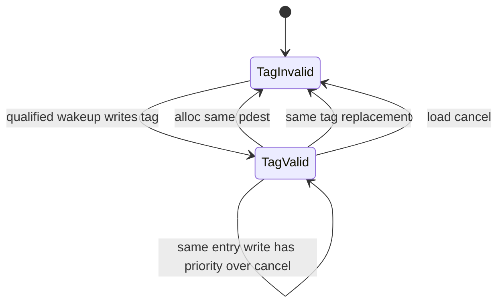
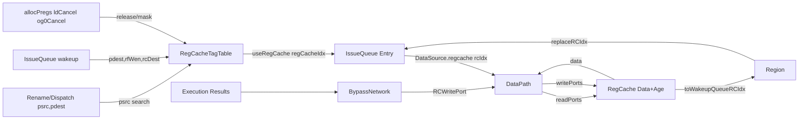
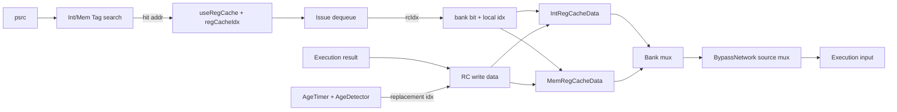
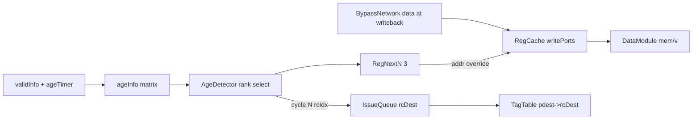

# backend/regcache 分析

## 1. Scope

- 分析目标：`backend/regcache`
- 源码路径：`/nfs/home/yuanmiaomiao/XiangShanLab/xiangshan-code/XiangShan_src/main/scala/xiangshan`
- 分支说明：用户未指定分支，skill 默认目标是 Kunminghu v2；本地 `XiangShan_src` 是源码快照而非完整 git checkout，无法从目录验证分支名。本文按本地 Kunminghu 风格源码快照分析。
- 主要源码文件：
  - `backend/regcache/RegCache.scala`
  - `backend/regcache/RegCacheDataModule.scala`
  - `backend/regcache/RegCacheTagTable.scala`
  - `backend/regcache/RegCacheTagModule.scala`
  - `backend/regcache/RegCacheAgeTimer.scala`
  - `backend/regcache/AgeDetector.scala`
  - `backend/datapath/DataPath.scala`
  - `backend/datapath/BypassNetwork.scala`
  - `backend/dispatch/Dispatch.scala`
  - `backend/issue/IssueQueue.scala`
  - `backend/issue/EntryBundles.scala`
  - `backend/issue/EnqEntry.scala`
  - `backend/Region.scala`
- 课程资料：`11.PhysicalRegisterCache.md`、`8.BypassNetwork.md`
- Design Doc：本地未发现 `XiangShan-Design-Doc` checkout，未做独立 Design Doc 验证。

RegCache 是后端整数数据路径中的小容量物理寄存器结果缓存。它不保存架构态，也不替代物理寄存器堆；它缓存近期写回结果，让后续消费者在命中时以 `DataSource.regcache` 读数，减少 RF 读端口压力。

## 2. Theory-to-Code Mapping

| Theory concept | Course source | Code artifact | Concrete signal/state | How XiangShan implements it | Difference from textbook model |
| --- | --- | --- | --- | --- | --- |
| RAW 数据转发与旁路 | `8.BypassNetwork.md` | `BypassNetwork`, `DataSource` | `readForward/readBypass/readRegCache/readReg` | IssueQueue 决定每个源的 `DataSource`，BypassNetwork 用 `Mux1H` 选择 forward/bypass/regcache/RF/imm/zero | RegCache 是“短期保存的写回值”，不是当拍组合旁路 |
| 物理寄存器局部缓存 | `11.PhysicalRegisterCache.md` | `RegCache`, `RegCacheDataModule` | `mem`, `v`, `readPorts`, `writePorts` | 执行结果写 RF 的同时也写 RegCache data array | 命中不保证；miss 仍回退到 RF 路径 |
| Tag lookup | `11.PhysicalRegisterCache.md` | `RegCacheTagTable`, `RegCacheTagModule` | `tag`, `valid`, `loadDependency`, `readPorts.valid/addr` | Dispatch 用 `psrc` 查 Int/Mem 两张 tag 表，命中后产生 `useRegCache/regCacheIdx` | tag 表和 data array 分离，tag 失效即可屏蔽旧 data |
| 结构冲突 | `8.BypassNetwork.md` | port-count params, asserts | `getExuRCReadSize`, `getExuRCWriteSize`, same-write asserts | RegCache 端口数按 Exu 参数生成；同 entry 多写被 assert 为非法 | 不做动态仲裁；依赖 replacement 和端口映射避免冲突 |
| 替换算法 | `11.PhysicalRegisterCache.md` | `RegCacheAgeTimer`, `RegCacheAgeDetector` | `ageTimer`, `ageInfo`, `rowOnesSum` | age timer 生成年龄比较矩阵，detector 选第 1 老、第 2 老... entry | 不是完整 cache LRU；是 2-bit age + extra tie breaker + rank 选择 |
| 推测和取消 | `11.PhysicalRegisterCache.md` | `RegCacheTagTable`, Issue entry | `allocPregs`, `ldCancel`, `og0Cancel`, `replaceRC` | tag 可乐观写入，后续由 alloc/load cancel/replacement 清除；IssueEntry 也清除 stale rcIdx | RegCache 不参与精确状态，错误值通过 tag/useRegCache 失效屏蔽 |

## 3. Design Intent vs Effective Code

- 课程/设计意图：RegCache 缓存最近写回的整数结果，减少昂贵 RF 读端口竞争；RegCache 被分成 IntRegCache 和 MemRegCache 两个 bank set；TagTable 负责 `pdest -> rcIdx` 映射，AgeTimer 负责 replacement。
- 有效源码行为：`RegCache` 只在 `DataPath` 的 int scheduler 分支实例化；`RegCacheTagTable` 在 dispatch 中实例化；replacement index 从 RegCache 先送给 IssueQueue，再作为 wakeup `rcDest` 回到 TagTable 和后续 issue entry。
- 未验证项：未本地验证 XiangShan Design Doc 对 RegCache 的描述；本文以有效 Scala/Chisel 源码为准。

## 4. Microarchitecture Parameters

| Parameter | Defined in | Value/expression | Enters through | Affects what |
| --- | --- | --- | --- | --- |
| `IntRegCacheSize` | `Parameters.scala` | default `24` | `RegCache`, `RegCacheTagTable` | Int bank entries |
| `MemRegCacheSize` | `Parameters.scala` | default `12` | `RegCache`, `RegCacheTagTable` | Mem bank entries |
| `RegCacheSize` | `Parameters.scala` | `IntRegCacheSize + MemRegCacheSize` | global params | total address space |
| `RegCacheIdxWidth` | `Parameters.scala` | `log2Up(RegCacheSize)` | read/write/tag bundles | `rcIdx` width |
| `regCacheRepSize` | `RegCache.scala` | `max(log2Up(IntRegCacheSize+1), log2Up(MemRegCacheSize+1))` | replacement wires | bank-internal replacement width |
| `getIntExuRCReadSize` | `BackendParams.scala` | sum of `numIntSrc` for int exus | RegCache/DataPath | number of int-side logical read slots |
| `getMemExuRCReadSize` | `BackendParams.scala` | sum of `numIntSrc` for mem exus reading int RF | RegCache/DataPath | number of mem-side logical read slots |
| `getExuRCReadSize` | `BackendParams.scala` | int + mem read size | `RegCacheIO.readPorts` | total RegCache read ports |
| `getIntExuRCWriteSize` | `BackendParams.scala` | count of ALU wakeup sources | data/tag/age write ports | Int write ports |
| `getMemExuRCWriteSize` | `BackendParams.scala` | count of load wakeup sources reading int RF | data/tag/age write ports | Mem write ports |
| `needReadRegCache` | `ExeUnitParams.scala` | `regCacheEn && (isIntExeUnit || isMemExeUnit && readIntRf)` | DataPath/BypassNetwork | whether an exu can consume RegCache |
| `needWriteRegCache` | `ExeUnitParams.scala` | int or mem wakeup source writing int result | BypassNetwork/IssueQueue | whether an exu allocates RegCache slot |

Important invariant: `RegCache.scala` requires `RegCacheIdxWidth == regCacheRepSize + 1`; `rcIdx` is interpreted as `[bankBit | bankLocalIdx]`.

## 5. Boundary and Interfaces

| Signal/bundle | Direction | From what | To what | Why it exists |
| --- | --- | --- | --- | --- |
| `RegCache.io.readPorts` | in/out | DataPath from issued uops | RegCache data arrays | read cached operand data by `rcIdx` |
| `RegCache.io.writePorts` | in | BypassNetwork via DataPath | RegCache data arrays and age timer | write execution result into replacement slot |
| `RegCache.io.toWakeupQueueRCIdx` | out | AgeDetector replacement selection | Region -> IssueQueue `replaceRCIdx` | tell wakeup path which slot this producer will occupy |
| `RegCacheTagTable.io.readPorts` | in/out | Dispatch `psrc` lookup | dispatch update fields | detect whether source can use RegCache |
| `RegCacheTagTable.io.wakeupFromIQ` | in | IssueQueue wakeup | TagTable write/update | create `pdest -> rcDest` mapping |
| `RegCacheTagTable.io.allocPregs` | in | Dispatch/Rename allocated int pdest | TagTable release | invalidate stale tag when same physical register is reallocated |
| `RegCacheTagTable.io.ldCancel` | in | mem load cancel | TagTable write mask and release | prevent/cancel invalid load-produced data |
| `RegCacheTagTable.io.og0Cancel` | in | execute/datapath cancel | TagTable write mask | prevent canceled 0-lat value from becoming valid |
| `BypassNetwork.io.toDataPath` | out | selected exu writeback data | DataPath -> RegCache write ports | data payload for RegCache update |

There is no Decoupled ready/valid on RegCache arrays. Validity is encoded by `ren/wen`, tag valid bits, data valid assertions, and issue entry metadata. RegCache does not directly backpressure dispatch/issue; a miss just means the source remains `DataSource.reg` rather than `regcache`.

## 6. Effective Instantiation Path

```text
Dispatch
  -> RegCacheTagTable(numRegSrcInt * renameWidth)
     -> IntRCTagTable: RegCacheTagModule
     -> MemRCTagTable: RegCacheTagModule

Region
  -> dataPath.io.toWakeupQueueRCIdx
  -> issueQueue.io.replaceRCIdx
  -> issueQueue.wakeup.bits.rcDest

DataPath, only param.isIntSchd
  -> RegCache
     -> IntRegCache: RegCacheDataModule
     -> MemRegCache: RegCacheDataModule
     -> IntRegCacheAgeTimer
     -> MemRegCacheAgeTimer
     -> RegCacheAgeDetector per bank

BypassNetwork
  -> io.toDataPath: RCWritePort
  -> DataPath.io.fromBypassNetwork
  -> RegCache.io.writePorts
```

Key anchors: `RegCache.scala`, `RegCacheTagTable.scala`, `RegCacheTagModule.scala`, `RegCacheDataModule.scala`, `RegCacheAgeTimer.scala`, `AgeDetector.scala`, `DataPath.scala`, `BypassNetwork.scala`, `Dispatch.scala`, `IssueQueue.scala`, `EntryBundles.scala`, `EnqEntry.scala`, `Region.scala`.

## 7. Why This Module Exists

- Without RegCache, consumers that miss same-cycle forward/bypass must use RF read ports. In a wide OoO backend, RF read ports are expensive and create structural pressure.
- RegCache creates a small, local, recently-written data store for integer operands. It targets temporal locality: recently produced values are likely to be consumed soon.
- It also decouples tag availability from data storage: dispatch can decide `useRegCache` from tag lookup, while DataPath later reads data by `rcIdx`.

## 8. Index and Address Calculation

| Index/address | Definition site | Inputs | Calculation | Width/range | Reset/first-use behavior | Consumer/effect |
| --- | --- | --- | --- | --- | --- | --- |
| Global `rcIdx` | `RegCache.scala`, `RegCacheTagTable.scala` | bank bit + bank-local idx | `Cat(0, IntRegCacheRepRCIdx(i))` or `Cat(1, MemRegCacheRepRCIdx(i))` | `RegCacheIdxWidth` | replacement comes from age detector reset state | carried as `toWakeupQueueRCIdx`, `rcDest`, issue `rcIdx` |
| Bank bit | `RegCache.scala` read path | `r_in.addr(RegCacheIdxWidth-1)` | `0` selects Int, `1` selects Mem | 1 bit | captured by `RegEnable` when `ren` | selects `Mux(mem.data, int.data)` and ren gating |
| Bank-local data read idx | `RegCache.scala` | `r_in.addr(RegCacheIdxWidth-2,0)` | low bits of global `rcIdx` | `RegCacheIdxWidth-1` | address held by `RegEnable(r_in.addr, r_in.ren)` | `RegCacheDataModule.mem(r.addr)` and AgeTimer read port |
| Bank-local data write idx | `RegCache.scala` | delayed `toWakeupQueueRCIdx` | `RegNextN(io.toWakeupQueueRCIdx, 3)` then low bits | `RegCacheIdxWidth-1` | first real writes use replacement chosen 3 cycles earlier | data array update and age timer update |
| Tag lookup result idx | `RegCacheTagModule.scala` | `matchOH` | `OHToUInt(matchOH)` | bank-local width | invalid lookup returns addr from OHToUInt but valid=false | `RegCacheTagTable` wraps with bank bit |
| Tag table global lookup addr | `RegCacheTagTable.scala` | int/mem valid + local addr | `Mux(r_int.valid, Cat(0,r_int.addr), Cat(1,r_mem.addr))` | `RegCacheIdxWidth` | suppressed by `matchAlloc` on allocation collision | dispatch `regCacheIdx` update |
| Tag/data write local idx | `RegCacheTagTable.scala`, `RegCacheDataModule.scala` | `w.addr` | compare each entry `i`: `w.wen && w.addr === i.U` | local entry range | no write until `wen` | `wenOH`, `Mux1H` select payload |
| AgeTimer entry idx | `RegCacheAgeTimer.scala` | read/write port addr | per entry OR of `(ren && addr===i)` / `(wen && addr===i)` | local entry range | timers reset by quarter group | age update and age comparison |
| AgeDetector replacement idx | `AgeDetector.scala` | `rowOnesSum` rank | entry with `rowOnesSum == numEntries - idx` | `log2Up(numEntries)` | age matrix reset all true; first stable choice follows timer/validInfo | replacement slots for each write port |
| Load dependency slot | `RegCacheTagTable.scala` | `deqPortIdx`, load exu idx | if matching load exu index then `1.U`, else `originalDep << 1` | `LoadPipelineWidth x LoadDependencyWidth` | new tag write seeds dependency | `LoadShouldCancel` release condition |

## 9. Algorithms

| Algorithm | Owner | Inputs/requesters | Initial state | First transaction behavior | Simultaneous-request scenario | Cases/priority/arbitration | Losing request behavior | State update | Output/effect |
| --- | --- | --- | --- | --- | --- | --- | --- | --- | --- |
| Tag search | `RegCacheTagModule` | all read ports, `ren/tag` | `v=false`; `tag` undefined but ignored | first search misses until a tag update sets `v` | multiple reads are independent; each has full compare fanout | `matchOH = v && tag==r.tag`; assert at most one hit | no losing read; miss returns `valid=false` | no state update | local addr via `OHToUInt`, valid hit |
| Tag update/release | `RegCacheTagModule` | write ports, cancelVec | all entries invalid | first valid write sets entry valid/tag/dep | multiple writes to same addr are illegal; asserted | write has priority over cancel; cancel over dependency shift | losing write is illegal; no hardware arbitration | write sets `v=true`; cancel sets `v=false`; otherwise dep shifts | maintains tag table |
| TagTable write qualification | `RegCacheTagTable` | wakeup ports, load cancel, og0 cancel | no valid tags until writes | first qualified wakeup creates `pdest -> rcDest` mapping | all wakeup ports can assert; port order maps to Int then Mem write ports | `w.wen = valid && rfWen && !LoadShouldCancel && !og0Cancel` | unqualified wakeup is masked | updates tag module write ports | only valid non-canceled results searchable |
| TagTable release qualification | `RegCacheTagTable` | `allocPregs`, same-tag write, ldCancel | entries invalid | first release after valid entry clears it | alloc/replacement/load cancel OR together | `(alloc || rep || ldCancel) && valid` | not a competition; any reason releases | tag valid cleared in TagModule if no same-cycle write to same entry | stale mappings removed |
| Data update/search | `RegCacheDataModule` | read ports, write ports | `v=false`; mem undefined | first write sets `v` and data | multiple reads independent; multiple writes same addr illegal; read+write same addr uses reg-array semantics without bypass | write updates entry; read asserts if `ren && !v(addr)` | same-address multi-write illegal | `v=true`, `mem=wData`; never clears | data returned to DataPath |
| Age update | `RegCacheAgeTimer` | read reqs, write reqs, validInfo | timers initialized by quarter; extra timer 0..3 | first cycle computes age from reset timers and valid bits | many read/write ports can target same entry; OR collapsed | write priority > read hold > valid saturated at 3 > increment | no losing read/write; multiple to same entry collapse | ageTimer updated every cycle | ageInfo matrix for detector |
| Replacement selection | `RegCacheAgeDetector` | ageInfo matrix | age regs reset true | first output depends on reset age matrix then next cycles follow ageInfo | one output per write port selects rank 1,2,... oldest | `rowOnesSum == numEntries-idx`; assert exactly one | duplicate rank illegal by assert | age matrix registered from ageInfo | replacement local idx |
| Operand source mux | `BypassNetwork` | DataSource booleans | combinational | first valid uop selects one data source | multiple DataSource bits should be one-hot by construction | `Mux1H` order includes forward/bypass/bypass2/zero/v0/reg/regcache/imm | multiple true would be illegal/ambiguous for Mux1H discipline | no state update | exu source operand |
| RC write port construction | `BypassNetwork` | exu results with `needWriteRegCache` | `bypassIntWenVec` reset by GatedValidRegNext semantics | valid exu result appears as RC write one cycle later | each eligible exu owns one RC write slot; no arbitration | `wen=RegNext(valid && intWen)`, data from bypass data vec | no losing requester; port count equals eligible exus | registered wen/tag | data write request to RegCache |

## 10. Exception / Interrupt / Debug / Privilege

RegCache does not detect architectural exceptions, interrupts, debug-mode entry, or privilege violations. Its relevant recovery paths are data-validity cancellation paths:

- `LoadShouldCancel` masks tag update and releases existing tags whose `loadDependency` matches cancel metadata.
- `og0Cancel` masks 0-lat canceled wakeup tag update.
- `allocPregs` releases stale tag mappings when rename allocates a physical destination with the same tag.
- Debug-only `diffRcIdx` checks that writeback-time RC index equals the index sent to wakeup three cycles earlier.

## 11. State Machines

There is no explicit `Enum` FSM. The important implicit states are valid-bit lifecycles.



Data entries have a simpler lifecycle: reset `v=false`, first write sets `v=true`, subsequent writes replace content, there is no clear path in `RegCacheDataModule`; stale data is hidden by tag validity and issue metadata.

## 12. Control Path

### Dispatch/tag control

Dispatch builds `readAddr` from `fromRename.bits.psrc` and `readValid` from `fromRename.valid && SrcType.isXp(srcType)`. For integer source positions only, it drives `rcTagTable.io.readPorts.ren/tag`; returned `valid/addr` updates `fromRenameUpdate.bits.useRegCache/regCacheIdx`. If `allocPregs` simultaneously allocates the same physical register, `matchAlloc` suppresses a hit, so the request keeps RF path.

### IssueEntry control

Issue entries maintain `useRegCache` and `regCacheIdx`. On IQ wakeup from a RegCache-writing source, if the source is integer (`SrcType.isXp`), `wakeupRC` sets `useRegCache` and updates `regCacheIdx` to `wakeup.bits.rcDest`. If the old `regCacheIdx` is replaced by a new wakeup (`replaceRC`) or load cancel occurs, old `useRegCache` is cleared unless the same cycle also has a new `wakeupRC`. The assignment `old && !(cancel || replace) || wakeupRC` gives new wakeup priority for setting.

### DataPath/Bypass control

DataPath reads RegCache only when `issue.valid && issue.bits.dataSources(idx).readRegCache`. RegCache read data is placed in `s1_RCReadData` and passed to BypassNetwork. BypassNetwork then selects RegCache data only if the uop's `DataSource` remains `regcache`; otherwise forward/bypass/RF/imm/zero paths are selected.

### Replacement control

RegCache continuously computes replacement candidates from AgeTimer. It sends candidates as `toWakeupQueueRCIdx` to IssueQueue immediately. The same candidates are delayed by three cycles and override `writePorts.addr` when the actual RC write arrives. This aligns slot allocation metadata with writeback data.

## 13. Pipeline Signals

| Stage | Valid/control | Payload registers | Work done | Stall/flush/replay behavior | Output to |
| --- | --- | --- | --- | --- | --- |
| Dispatch lookup | `readValid`, `rcTagTable.readPorts.ren` | `psrc` | search tag table | no stall from RegCache; miss uses RF | `useRegCache/regCacheIdx` |
| Issue residency | wakeup/load cancel/replace | `srcStatus.useRegCache/regCacheIdx` | update source metadata | cancel clears old RC availability | issue dequeue bundle |
| Issue dequeue | `DataSource.regcache` | `rcIdx` | requests RegCache read in DataPath | no RegCache ready signal | `RegCache.readPorts` |
| RegCache read | registered `ren`, `addr` | `in_addr` | bank-local data read | invalid data read asserts | `s1_RCReadData` |
| Bypass operand mux | `DataSource` bits | source data vectors | select final operand | one-hot discipline expected | execution input |
| RegCache write | `wen`, delayed addr | exu data/tag | update data, age, tag | cancel masks tag update; data may still be written but unsearchable if tag not valid | future tag/data searches |

## 14. Data Path

Normal consumer path:

1. Rename produces `psrc`.
2. Dispatch searches RegCacheTagTable with `psrc`.
3. Hit produces `regCacheIdx=[bankBit|localIdx]` and `useRegCache=true`.
4. IssueQueue entry stores this metadata.
5. On issue, `DataSource` becomes `regcache` when the source is otherwise a register read and `useRegCache` is still true.
6. DataPath reads RegCache by `rcIdx`.
7. BypassNetwork selects `fromDPsRCData(exuIdx)(srcIdx)` as operand.

Producer path:

1. AgeDetector chooses replacement index before data write.
2. Region routes `toWakeupQueueRCIdx` to `IssueQueue.replaceRCIdx`.
3. IssueQueue wakeup writes `rcDest` into wakeup metadata.
4. BypassNetwork later emits `RCWritePort` data/tag/wen.
5. RegCache delays the chosen `rcIdx` three cycles and writes data to that slot.
6. TagTable uses wakeup `pdest/rcDest` to update searchable mapping.

## 15. Diagrams

### Module Interface



### Data Path



### Replacement Timing




### Handshake / Valid-like Timing

RegCache has no Decoupled `ready` on the data arrays. The diagrams below therefore draw the valid-like enable timing that replaces a ready/valid handshake: `ren`, `wen`, tag hit `valid`, payload stability, and cancel masking.

#### Dispatch Tag Lookup

```waveform-draw
{
  "signal": [
    { "name": "clk", "wave": "p....." },
    { "name": "fromRename.valid", "wave": "010..." },
    { "name": "SrcType.isXp", "wave": "010..." },
    { "name": "rcTag.read.ren", "wave": "010..." },
    { "name": "rcTag.read.tag", "wave": "x=x...", "data": ["psrc"] },
    { "name": "allocPregs.match", "wave": "0.10.." },
    { "name": "tagHit.raw", "wave": "0.10.." },
    { "name": "read.valid", "wave": "0.0..." },
    { "name": "useRegCache", "wave": "0.0..." },
    { "name": "regCacheIdx", "wave": "x=x...", "data": ["ignored"] }
  ],
  "config": { "hscale": 1 }
}
```

This is the `RegCacheTagTable` lookup path in `Dispatch.scala`: `read.ren` comes from `fromRename.valid && SrcType.isXp`, and `matchAlloc` suppresses a raw tag hit when rename allocates the same physical register in the same cycle.

#### RegCache Data Read

```waveform-draw
{
  "signal": [
    { "name": "clk", "wave": "p......" },
    { "name": "issue.valid", "wave": "010...." },
    { "name": "readRegCache", "wave": "010...." },
    { "name": "r_in.ren", "wave": "010...." },
    { "name": "r_in.addr", "wave": "x=x....", "data": ["rcIdx"] },
    { "name": "in_addr", "wave": "x.=x...", "data": ["rcIdx"] },
    { "name": "bank.ren", "wave": "0.10..." },
    { "name": "bank.addr", "wave": "x.=x...", "data": ["local"] },
    { "name": "r_in.data", "wave": "x..=x..", "data": ["data"] },
    { "name": "BN.readRegCache", "wave": "0..10.." }
  ],
  "config": { "hscale": 1 }
}
```

DataPath asserts `r_in.ren` only for issued sources whose `DataSource` is `regcache`. `RegCache.scala` captures `addr` with `RegEnable`, gates the bank `ren` with `GatedValidRegNext`, and BypassNetwork consumes the returned data in the next operand-select stage.

#### Producer Slot Allocation And Data Write

```waveform-draw
{
  "signal": [
    { "name": "clk", "wave": "p........." },
    { "name": "age.out", "wave": "=.........", "data": ["rcN"] },
    { "name": "toWakeupQueueRCIdx", "wave": "=.........", "data": ["rcN"] },
    { "name": "wakeup.valid", "wave": "010......." },
    { "name": "wakeup.bits.rcDest", "wave": "x=x......", "data": ["rcN"] },
    { "name": "exu.valid", "wave": "0..10....." },
    { "name": "BN.forwardIntWen", "wave": "0..10....." },
    { "name": "RC.write.wen", "wave": "0...10...." },
    { "name": "delayToRCIdx", "wave": "x...=x....", "data": ["rcN"] },
    { "name": "RC.write.addr", "wave": "x...=x....", "data": ["rcN"] },
    { "name": "RC.write.data", "wave": "x...=x....", "data": ["result"] }
  ],
  "config": { "hscale": 1 }
}
```

The replacement index is exposed to IssueQueue before the data write. The same index is delayed by `RegNextN(..., 3)` and overwrites the actual data-array write address when BypassNetwork supplies the registered write port.

#### Tag Write Mask And Cancel

```waveform-draw
{
  "signal": [
    { "name": "clk", "wave": "p......." },
    { "name": "wakeup.valid", "wave": "01010..." },
    { "name": "rfWen", "wave": "01010..." },
    { "name": "ldCancel", "wave": "0.10...." },
    { "name": "og0Cancel", "wave": "0...10.." },
    { "name": "tag.wen", "wave": "01000..." },
    { "name": "cancelVec", "wave": "0.1.0..." },
    { "name": "tag.v", "wave": "0.10...." },
    { "name": "read.hit", "wave": "0..0...." }
  ],
  "config": { "hscale": 1 }
}
```

TagTable writes only when `wakeup.valid && rfWen && !LoadShouldCancel && !og0Cancel`. Existing mappings are released by allocation, same-tag replacement, or load cancel; data array contents may remain, but a cleared tag valid bit prevents future lookup from using stale data.


## 16. Storage Structures

| Structure | Who owns/updates | Reset/initial value | Update timing/condition | Update index calculation | Updated content | Release timing/condition | Release index calculation | Released/replaced/cleared content | Search/read/probe timing | Search/read/probe index calculation | Search result/content | Read/write port conflict scenarios | Valid set/clear/hold | Collision priority | Empty/full/almost-full | Flush/cancel/replay effect | Purpose |
| --- | --- | --- | --- | --- | --- | --- | --- | --- | --- | --- | --- | --- | --- | --- | --- | --- | --- |
| Data array `mem` | `RegCacheDataModule` | undefined data, `v=false` | any write port with `wen && addr==i` | bank-local `addr(RegCacheIdxWidth-2,0)` compared to each entry | `data`; debug tag if enabled | no explicit release | N/A | none; old data remains | every read port reads `mem(r.addr)` | bank-local read addr | data value | multi-write same addr asserted illegal; read/write same addr has no explicit bypass, so behavior is register read plus write update; correctness relies on tag/useRegCache timing | `v` set true on write; never cleared; holds otherwise | write over non-write; no cancel clear | no full; replacement overwrites | tag cancel hides stale data | cached operand data |
| Data valid `v` | `RegCacheDataModule` | all false | write entry | same as data write | `v(i)=true` | no explicit clear | N/A | none | read asserts `v(r.addr)` when `ren` | read addr | validity for assert/age validInfo | read invalid is illegal/assert; same-cycle first write and read same addr has no explicit bypass guarantee | set on write, hold forever | write wins | no empty output; all false after reset | no flush input | informs AgeTimer and debug correctness |
| Tag `tag` | `RegCacheTagModule` | undefined, `v=false` | write port `wenOH.orR` | entry `i` where `w.wen && w.addr==i` | physical `pdest` tag | release via `cancelVec(i)` when no same-cycle write | same entry `i` | valid cleared, tag data remains ignored | each read compares all valid tags | `matchOH = v && tag==r.tag` | hit valid + local addr | multi-write same addr asserted illegal; same tag multi-hit asserted illegal; read during write to same semantic tag sees current registered state, new tag visible next cycle | set on write; clear on cancel; hold otherwise | write priority over cancel over dep shift | no full; replacement update overwrites | alloc/replace/ldCancel release tag | searchable mapping |
| Tag valid `v` | `RegCacheTagModule` | all false | tag write | write addr | `true` | `cancelVec(i)` and no write | cancel entry | `false` | read compares only valid entries | all entries fanout compare | hit/miss | duplicate valid same tag illegal by read assert | set write, clear cancel, hold otherwise | write beats cancel | empty if all false, not exported | same as tag release | prevent stale data search |
| `loadDependency` | `RegCacheTagModule` | undefined until write | tag write | write addr | shifted load dependency vector | effectively released when `v=false`; value not cleared | cancel entry | ignored if invalid | `ldCancelVec` checks every entry | full vector per entry | cancel predicate | same-entry write beats dependency shift | updated on write; shifts when any bit set and no write/cancel | write > cancel > shift | N/A | `LoadShouldCancel` clears tag valid | track load cancellation |
| AgeTimer `ageTimer` | `RegCacheAgeTimer` | quarter-group values 0/1/2/3 | every cycle | each entry `i` | age counter next value | no release | N/A | none | detector probes all entries | entry index matrix | relative age info | multiple read/write same entry collapse by OR; write priority over read | always updated | write > read hold > saturate if valid age=3 > increment | no full | no flush | replacement age basis |
| Age extra `ageTimerExtra` | `RegCacheAgeTimer` | 0,1,2,3 | every cycle | quarter group | increments by 1 | no release | N/A | none | used in age compare | `row/(numEntries/4)` | tie-break low bits | no ports | always cycles | N/A | N/A | no flush | tie breaker between quarters |
| Age matrix `age` | `RegCacheAgeDetector` | all true | every cycle from `ageInfo` | row/col pair | upper matrix relation | no release | N/A | overwritten next cycle | row sum probes all cols | `get_age(row,col)` | rank counts | no external port conflict | registers update every cycle | matrix update feeds next rank | N/A | no flush | replacement rank selection |
| Issue src `useRegCache/regCacheIdx` | Issue entry status | initialized from dispatch/enqueue status | dispatch hit or IQ wakeup | source index in uop | use bit + rcIdx | load cancel or replacement of same rcIdx | source index | `useRegCache=false` | issue output checks source | source operand index | `DataSource.regcache` and rcIdx | multiple wakeups use `Mux1H`; assumes wakeup OH discipline; new wakeup can replace stale rcIdx | set by dispatch/wakeup; clear by cancel/replace; hold otherwise | new wakeup sets even if old canceled | N/A | load cancel/replay affects clear | carry RegCache availability to issue |
| `toWakeupQueueRCIdx` pipeline | `RegCache`/Region/IssueQueue | from age detector; delayed regs reset by RegNextN implementation | every cycle candidate generated | output slot index = write port index | global rcIdx | no release | N/A | overwritten every cycle | wakeup consumes as `rcDest` | issue queue replace port order | replacement metadata | port count equals write sources; no dynamic arbitration | continuously updated | Int ports first, Mem ports later | N/A | debug checks 3-cycle alignment | align allocation metadata with data write |

## 17. Critical Signal Deep Dives

### `toWakeupQueueRCIdx`

- Definition: `RegCache.scala` constructs one output per RegCache write port.
- Producer: `RegCacheAgeDetector` output, with bank bit prepended.
- Consumer: `Region.scala` routes to `IssueQueue.replaceRCIdx`; `IssueQueue.scala` writes it into `wakeup.bits.rcDest`; `RegCache.scala` delays it three cycles for actual data write addr.
- Why needed: tag update and issue wakeup must know the RegCache slot before actual data write arrives.

### `rcDest`

- Producer: IssueQueue wakeup path from `replaceRCIdx`.
- Consumer: TagTable write address and IssueEntry `regCacheIdx` wakeup update.
- Meaning: destination RegCache slot, not physical register number.
- Timing: aligned with wakeup metadata; data write uses the same index after three-cycle delay.

### `useRegCache`

- Producer: dispatch tag hit, or later IQ wakeup for a producer that will write RegCache.
- Consumer: IssueEntry output chooses `DataSource.regcache`; DataPath uses `readRegCache` to read data.
- Clear conditions: load cancel or same slot replacement (`replaceRC`) unless a new wakeup sets it.

### `cancelVec`

- Producer: RegCacheTagTable OR of alloc same tag, replace same tag, load cancel.
- Consumer: TagModule per-entry valid clear.
- Priority: inside TagModule, same-entry write has priority over cancel.

## 18. Dynamic Operation

### Normal consumer path

A renamed uop reaches dispatch with integer `psrc`. Dispatch searches both Int and Mem tag tables. If exactly one valid tag matches and `matchAlloc` is false, dispatch records `useRegCache=true` and the banked `regCacheIdx`. IssueEntry later issues the uop with `DataSource.regcache`; DataPath reads RegCache; BypassNetwork selects RegCache data as the execution operand.

### Normal producer path

AgeDetector continuously picks replacement slots. The selected slot is sent to IssueQueue and becomes wakeup `rcDest`. When the execution result reaches BypassNetwork, it forms a RegCache write port. RegCache uses the three-cycle delayed replacement index as data write address; TagTable writes `pdest -> rcDest` when wakeup is valid and not canceled.

### Speculative/cancel path

A load-produced value can be advertised before all later cancellation conditions are known. `LoadShouldCancel` prevents new tag writes and releases old matching entries. `og0Cancel` masks canceled 0-lat writes. Rename allocation of the same physical register releases stale tag mappings. IssueEntry also clears stale `useRegCache` if its recorded slot is replaced.

### Port conflict path

RegCache does not arbitrate same-entry multi-write conflicts. Tag/Data modules assert that two write ports cannot write the same local entry in the same cycle. Replacement selection is intended to produce distinct ranks for simultaneous write ports; if rank uniqueness breaks, AgeDetector or write modules assert. Multiple reads are provisioned by generated read ports; limited-port contention is handled before RegCache by DataPath/issue parameterization, not by RegCache ready/backpressure.


## Code Anchors

| Behavior | File and line anchors |
| --- | --- |
| RegCache bank split, read address capture, bank mux, and 3-cycle write-index delay | `backend/regcache/RegCache.scala:37`, `RegCache.scala:65`, `RegCache.scala:74`, `RegCache.scala:113` |
| Data array valid bit, read assertion, and same-entry multi-write assertion | `backend/regcache/RegCacheDataModule.scala:45`, `RegCacheDataModule.scala:51`, `RegCacheDataModule.scala:59` |
| Tag compare, write priority, cancel priority, and load-dependency shift | `backend/regcache/RegCacheTagModule.scala:56`, `RegCacheTagModule.scala:74`, `RegCacheTagModule.scala:82` |
| Dispatch-side tag lookup and `useRegCache/regCacheIdx` update | `backend/dispatch/Dispatch.scala:400`, `Dispatch.scala:489`, `Dispatch.scala:493` |
| TagTable write mask and cancel vector | `backend/regcache/RegCacheTagTable.scala:64`, `RegCacheTagTable.scala:80`, `RegCacheTagTable.scala:88`, `RegCacheTagTable.scala:105` |
| DataPath RegCache instance, read-port construction, read data routing, and write-port connection | `backend/datapath/DataPath.scala:300`, `DataPath.scala:301`, `DataPath.scala:313`, `DataPath.scala:333` |
| BypassNetwork operand source mux and RC write-port generation | `backend/datapath/BypassNetwork.scala:188`, `BypassNetwork.scala:216`, `BypassNetwork.scala:302`, `BypassNetwork.scala:321` |
| Issue entry `useRegCache/regCacheIdx` set/clear on wakeup, replacement, and load cancel | `backend/issue/EntryBundles.scala:412`, `backend/issue/EnqEntry.scala:111` |
| Region routes replacement RC index to issue queues and checks 3-cycle debug alignment | `backend/Region.scala:295`, `Region.scala:304` |
| Age timer and replacement rank selection | `backend/regcache/RegCacheAgeTimer.scala:47`, `RegCacheAgeTimer.scala:61`, `backend/regcache/AgeDetector.scala:56`, `AgeDetector.scala:63` |


## 19. Summary

RegCache is a small, banked, non-architectural cache for recent integer writeback data. Its main state is data valid/data arrays, tag valid/tag/load-dependency arrays, age timers, and issue-entry RegCache metadata. Its key control path is dispatch tag search plus wakeup/replacement update of `useRegCache/regCacheIdx`. Its key data path is BypassNetwork result -> RegCache write and RegCache read -> BypassNetwork operand mux. The most important corner case is stale slot reuse: replacement and cancellation must clear tag/issue metadata so old consumers do not read newly overwritten data.

## 验证特别注意

> 本节依据 `tools/verification-driver/skills` 中的 FSM、冲突、前向进展、索引/哈希、缓存结构、异常/虚拟化和性能瓶颈规则生成。每个期望必须以当前 `kunminghu-v2` 有效 Chisel 为准。

| Verification ID | 风险 / 不变量 | 定向激励 | 期望观察 | Checker / Coverage |
| --- | --- | --- | --- | --- |
| `C_MULTI_WRITE_SAME_ENTRY` | 多个写端口同拍覆盖同一 RegCache entry | 强制两个 write port 选择相同 slot | 触发源码断言或唯一合法优先级，tag/data 不分裂；证据 [backend/regcache/RegCacheDataModule.scala:45-75](https://github.com/OpenXiangShan/XiangShan/blob/kunminghu-v2/src/main/scala/xiangshan/backend/regcache/RegCacheDataModule.scala#L45-L75) | Multi-write assertion；tag/data scoreboard |
| `REGCACHE_INVALID_READ` | 读取 invalid/stale slot 造成错误操作数 | tag miss、替换取消和 load cancel 后立即读取旧 slot | invalid 读取被断言/屏蔽，不能伪造 hit；证据 [backend/regcache/RegCacheDataModule.scala:45-65](https://github.com/OpenXiangShan/XiangShan/blob/kunminghu-v2/src/main/scala/xiangshan/backend/regcache/RegCacheDataModule.scala#L45-L65) | Valid-bit checker；stale-slot reuse cover |
| `REGCACHE_TAG_DATA_ALIGN` | 流水化写索引导致 tag 与 data 落入不同 entry | 连续三拍写不同 pdest/slot，并插入 cancel/replace | 写 tag、写 data 与延迟后的 index 对齐；证据 [backend/regcache/RegCache.scala:65-120](https://github.com/OpenXiangShan/XiangShan/blob/kunminghu-v2/src/main/scala/xiangshan/backend/regcache/RegCache.scala#L65-L120) | Pipeline metadata scoreboard |
| `C_SAME_ENTRY_RW` | 同拍读写/替换同一 slot 的旁路与命中错误 | read、write、replace 同时指向同 entry | tag 命中、取消和替换优先级符合源码；证据 [backend/regcache/RegCacheTagModule.scala:50-95](https://github.com/OpenXiangShan/XiangShan/blob/kunminghu-v2/src/main/scala/xiangshan/backend/regcache/RegCacheTagModule.scala#L50-L95) | Storage conflict checker；RAW/replace cross |
| `H_SAME_INDEX_DIFF_TAG` | 不同 pdest 竞争或重复占用 slot | 制造相同低位索引不同 tag，并允许多个 slot 出现同 tag | TagTable 的 hit vector、写入和无效化保持 one-hot/可解释；证据 [backend/regcache/RegCacheTagTable.scala:55-105](https://github.com/OpenXiangShan/XiangShan/blob/kunminghu-v2/src/main/scala/xiangshan/backend/regcache/RegCacheTagTable.scala#L55-L105) | Tag uniqueness checker；multi-hit cover |
| `REGCACHE_AGE_ORDER` | 年龄矩阵不传递或替换项不唯一 | 读写多个 entry、让计时器饱和并跨组比较 | 年龄更新优先级和 replacement one-hot 断言成立；证据 [backend/regcache/RegCacheAgeTimer.scala:51-98](https://github.com/OpenXiangShan/XiangShan/blob/kunminghu-v2/src/main/scala/xiangshan/backend/regcache/RegCacheAgeTimer.scala#L51-L98)、[backend/regcache/AgeDetector.scala:63-70](https://github.com/OpenXiangShan/XiangShan/blob/kunminghu-v2/src/main/scala/xiangshan/backend/regcache/AgeDetector.scala#L63-L70) | Age-order checker；rank uniqueness cover |
| `RESOURCE_CONTENTION` | 所有 slot/读写端口繁忙时覆盖活跃值 | 填满有效 entry 并持续产生多读多写 | 替换只选代码给出的最老/无效项，阻塞不造成架构错误 | Occupancy/arbiter checker；port-pressure cross |
| `PB_RECOVERY_THROUGHPUT` | 低命中率或端口冲突导致旁路网络长期拥塞 | 冷热 pdest 阶段切换并注入持续写回 | miss/stale hit 不破坏正确性，命中率和端口压力恢复 | Performance checker；hit-rate/stall coverage |

### 通用判定原则

- `valid && !ready` 期间 payload 必须稳定；只有 `fire` 才能推进指针、状态或训练一次。
- flush/redirect/replay 的胜负关系必须按代码优先级检查；错误路径不得提交、写表、训练预测器或暴露异常/数据。
- 资源填满后必须验证可排空；重复冲突、retry 或 redirect 不得形成 deadlock/livelock，并检查低优先级旧请求是否饥饿。
- 环形指针必须覆盖最大值到零的 wrap；表索引必须构造 same-index/different-tag 和同拍 read/write 冲突组。
- 性能覆盖至少记录占用率、反压周期、redirect 恢复延迟、重试次数和恢复后的持续吞吐。
