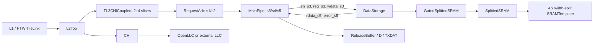
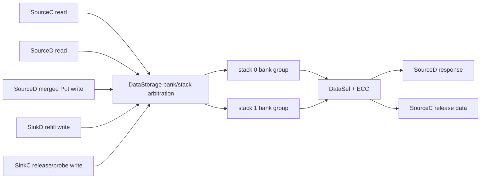

<!--
# Cache DataStorage：Kunminghu V2 的 CoupledL2 与 HuanCun 数据阵列源码分析

> 本文以用户指定的 Kunminghu V2 源码为唯一行为依据，分析缓存数据阵列 `DataStorage`。Design Doc 仅用于核对设计意图，结论均回链到 Chisel 源码；没有把 Design Doc 的描述当作实现事实。

## 1. 范围、版本与有效实例

### 1.1 本次基线

| 项目 | 基线 | 工作树情况 | 用途 |
| --- | --- | --- | --- |
| 主源码 | `/home/yanyusong/xs-memory-env/XiangShan`，`kunminghu-v2@e12436c7cba86b195deec24981976d78bc263661` | 已有 `difftest` 修改及 `src/main/resources/aia/` 未跟踪内容；本文未修改它们 | Kunminghu V2 配置、顶层、CoupledL2 与 HuanCun 源码 |
| CoupledL2 子模块 | `fb5469838c8902b6cb33992c0a30ee3d446e4453` | clean | 当前 Kmh V2 有效 L2 数据阵列 |
| HuanCun 子模块 | `65ef077373ecf398b4cecdea06b65ef9b8d79044` | clean | 非 CHI HuanCun L3 的对照实现 |
| Design Doc | `/home/yanyusong/XiangShan-Design-Doc`，`kunminghu-v2@58d9e2ad11f044cb6f8887d9687d9e110696d1aa` | clean | 设计意图与源码追溯矩阵 |

完成前已按当前分析 skill 执行周同步检查；状态文件显示距离上次同步不足七天，故安全跳过网络同步。源码与 Design Doc 是不同提交，所以下文在两者不完全对应时始终以源码为准。

### 1.2 先判定哪一个 DataStorage 真正在 Kunminghu V2 中生效

`KunminghuV2Config` 设置了 1 MiB、8 way、4 bank 的 L2，并通过 `WithCHI` 令 `EnableCHI=true`。[`Configs.scala:477-485`](</home/yanyusong/xs-memory-env/XiangShan/src/main/scala/top/Configs.scala:477>) `L2Top` 在 `enableCHI` 为真时构造的是 `TL2CHICoupledL2`，其每个 slice 由 `tl2chi.Slice` 实例化，而该 slice 明确实例化 `coupledL2.DataStorage`。[`L2Top.scala:111-145`](</home/yanyusong/xs-memory-env/XiangShan/src/main/scala/xiangshan/L2Top.scala:111>) [`CoupledL2.scala:419-455`](</home/yanyusong/xs-memory-env/XiangShan/coupledL2/src/main/scala/coupledL2/CoupledL2.scala:419>) [`tl2chi/Slice.scala:52-61`](</home/yanyusong/xs-memory-env/XiangShan/coupledL2/src/main/scala/coupledL2/tl2chi/Slice.scala:52>)

这使下表成为本文最重要的范围约束。

| 候选模块 | 是否为当前 `KunminghuV2Config` 的有效实例 | 证据 | 本文处理方式 |
| --- | --- | --- | --- |
| `coupledL2.DataStorage` | 是，作为每个 CHI CoupledL2 slice 的 L2 数据阵列 | 配置开启 CHI；`L2Top` 选择 `TL2CHICoupledL2`；slice 接入 `DataStorage` | 主分析对象 |
| `huancun.DataStorage` | 否。它属于 `L3CacheParamsOpt` 有效时构造的 HuanCun L3；该参数只在 `!EnableCHI` 时存在 | `L3CacheConfig` 对 HuanCun/OpenLLC 使用互斥 `Option.when`；SoC 还要求两者至多一个存在。[`Configs.scala:333-382`](</home/yanyusong/xs-memory-env/XiangShan/src/main/scala/top/Configs.scala:333>) [`SoC.scala:150-152`](</home/yanyusong/xs-memory-env/XiangShan/src/main/scala/system/SoC.scala:150>) | 作为同仓库、非 CHI 方案的结构和仲裁对照，不冒充当前默认路径 |
| `openLLC.DataStorage` | CHI 且 `!useExternalLLC` 时，LLC 方向会实例化 OpenLLC，而非 HuanCun | 顶层仅从 `L3CacheParamsOpt` 构造 HuanCun；CHI 内部 LLC 情形构造 OpenLLC，并把 L2 CHI 路由到它。若选外部 LLC，则走另一路外部接口；两种情况下都不使 HuanCun 成为当前 CHI 的有效 LLC。[`Top.scala:111-121`](</home/yanyusong/xs-memory-env/XiangShan/src/main/scala/top/Top.scala:111>) [`Top.scala:372-385`](</home/yanyusong/xs-memory-env/XiangShan/src/main/scala/top/Top.scala:372>) [`Top.scala:505-545`](</home/yanyusong/xs-memory-env/XiangShan/src/main/scala/top/Top.scala:505>) | 仅用于说明边界，不展开其独立实现；它的读写接口与 HuanCun 的五请求接口也不同。[`openLLC/DataStorage.scala:43-96`](</home/yanyusong/xs-memory-env/XiangShan/openLLC/src/main/scala/openLLC/DataStorage.scala:43>) |

因此，题目中的“重点关注 coupledL2 和 huancun”在本文被落实为：**CoupledL2 是 Kmh V2 的有效 L2 实现；HuanCun 是可比较但未由这一默认 CHI 配置实例化的 L3 代码。** 这一点避免了把不同协议与不同层级的端口/时序混在一起。

### 1.3 Design Doc 到代码的追溯矩阵

下表把文档压缩成原子意图，不复制原文。状态“部分”表示源代码无法单独证明物理宏时序或所有上游条件。

| ID | Design Doc 意图 | 当前源码对应关系 | 状态 |
| --- | --- | --- | --- |
| D1 | CoupledL2 数据 SRAM 是单端口，MainPipe 在 s3 访问 | `DataStorage` 只暴露一个 `ValidIO[DSRequest]`，构造时传入 `singlePort=true`；`tl2chi.Slice` 把 MainPipe s3 的三组信号直接接入。[`DataStorage.scala:50-80`](</home/yanyusong/xs-memory-env/XiangShan/coupledL2/src/main/scala/coupledL2/DataStorage.scala:50>) [`tl2chi/Slice.scala:89-91`](</home/yanyusong/xs-memory-env/XiangShan/coupledL2/src/main/scala/coupledL2/tl2chi/Slice.scala:89>) | 已验证 |
| D2 | ReqArb/MainPipe 形成 s1 至 s5 的流水 | RequestArb 在 s1/s2 交接任务，MainPipe 的 s3 产生 DS 请求、s4/s5 保存后续状态。[`RequestArb.scala:199-217`](</home/yanyusong/xs-memory-env/XiangShan/coupledL2/src/main/scala/coupledL2/RequestArb.scala:199>) [`MainPipe.scala:744-853`](</home/yanyusong/xs-memory-env/XiangShan/coupledL2/src/main/scala/coupledL2/tl2chi/MainPipe.scala:744>) | 已验证 |
| D3 | s3 发起的数据读在 s5 使用 | DataStorage 标注 `s3 read -> s4 pass -> s5 destination`；slice 在 s5 输入侧回接 `rdata/error`，MainPipe 在 s5 使用它们。[`DataStorage.scala:119-122`](</home/yanyusong/xs-memory-env/XiangShan/coupledL2/src/main/scala/coupledL2/DataStorage.scala:119>) [`tl2chi/Slice.scala:121-126`](</home/yanyusong/xs-memory-env/XiangShan/coupledL2/src/main/scala/coupledL2/tl2chi/Slice.scala:121>) [`MainPipe.scala:850-907`](</home/yanyusong/xs-memory-env/XiangShan/coupledL2/src/main/scala/coupledL2/tl2chi/MainPipe.scala:850>) | 已验证；这是模块内路径，不是端到端 L1 访问延迟 |
| D4 | MCP2 使 SRAM 请求需跨两拍保持 | MainPipe 生成两拍 `req_s3.valid` 保持；DataStorage 断言请求/写数据保持，且禁止相邻的实际 `en`。[`MainPipe.scala:491-500`](</home/yanyusong/xs-memory-env/XiangShan/coupledL2/src/main/scala/coupledL2/tl2chi/MainPipe.scala:491>) [`DataStorage.scala:124-131`](</home/yanyusong/xs-memory-env/XiangShan/coupledL2/src/main/scala/coupledL2/DataStorage.scala:124>) | 已验证，且代码约束比意图描述更具体 |
| D5 | 替换时需要读旧数据并在后续阶段交给缓冲/写回路径 | s3 的 replacement 条件读 DS，s5 写入 ReleaseBuffer 并向 MSHR 汇报 DS 错误；Directory 同时排除尚未回填完成的 way。[`MainPipe.scala:476-530`](</home/yanyusong/xs-memory-env/XiangShan/coupledL2/src/main/scala/coupledL2/tl2chi/MainPipe.scala:476>) [`MainPipe.scala:880-887`](</home/yanyusong/xs-memory-env/XiangShan/coupledL2/src/main/scala/coupledL2/tl2chi/MainPipe.scala:880>) [`Directory.scala:255-345`](</home/yanyusong/xs-memory-env/XiangShan/coupledL2/src/main/scala/coupledL2/Directory.scala:255>) | 部分验证：完整 MSHR 状态机不在本章逐状态展开 |

被作为意图来源的 Design Doc 位于 [`DataStorage.md:1-3`](</home/yanyusong/XiangShan-Design-Doc/docs/zh/cache/l2cache/DataStorage.md:1>) 与 [`ReqArb_MainPipe.md:1-3`](</home/yanyusong/XiangShan-Design-Doc/docs/zh/cache/l2cache/ReqArb_MainPipe.md:1>)。上表的“代码对应关系”而非 Design Doc 文句才是本文结论的依据。

## 2. 理论映射与总体数据路径

课程中的[流水线](</home/yanyusong/XiangShanLab/xiangshan-course/docs/4-xiangshan-microarchitecture-analysis/1-superscalar-basic-knowledge/1_Single_Cycle_vs_Multi_Cycle_vs_Pipeline.md>)与[结构冲突](</home/yanyusong/XiangShanLab/xiangshan-course/docs/4-xiangshan-microarchitecture-analysis/1-superscalar-basic-knowledge/3_Structural_Hazards_vs_Data_Hazards_vs_Control_Hazards.md>)在这里不是“指令级 RAW/WAR/WAW”问题，而是多个一致性事务争用有限数据阵列端口和固定时序窗口的问题。

| 理论概念 | CoupledL2 中的实际实体 | 与抽象教材模型的差异 |
| --- | --- | --- |
| 流水级间寄存 | RequestArb s1/s2 与 MainPipe s3/s4/s5 | 阶段携带的是 cache task、目录结果、MSHR 信息和 line 数据，不是 ROB 指令。 |
| 结构冲突 | 单端口 DataStorage、MCP2、RequestArb 的 `ds_mcp2_stall` | 不能把 `dataSRAMSplit=4` 当成四个读写端口；真正可开始的 DS 访问受 `en` 的相邻周期断言限制。 |
| 背压/保持 | HuanCun 的各 `DecoupledIO.ready`；CoupledL2 上游的 RequestArb 气泡 | CoupledL2 的 DS 自身没有 `ready`，所以不能以 `req.valid` 单独推断“已接受”。 |
| 旁路 | HuanCun 的 refill/put buffer 由外部模块管理；CoupledL2 的 ReleaseBuffer/RefillBuffer | 这些是缓存事务数据缓冲，不是 ALU 到寄存器的 forwarding。CoupledL2 DataStorage 未实现可证明的同周期 RAW 旁路。 |
| 有效性/替换 | Directory meta/tag、MSHR 与 replacer | 两个 DataStorage 都是 payload 阵列，没有本地 cache-line valid 位、tag 查找或空满队列。 |

### 2.1 Kunminghu V2 有效路径图
-->
# Cache DataStorage: CoupledL2 and HuanCun Data-Array Source Analysis for Kunminghu V2

> This analysis uses the user-specified Kunminghu V2 source tree as its sole behavioral authority for the `DataStorage` cache data array. The Design Doc is used only to check design intent; every conclusion is traced back to Chisel source code, and no Design Doc statement is treated as an implementation fact.

## 1. Scope, Version, and Effective Instance

### 1.1 Analysis Baseline

| Item | Baseline | Worktree State | Purpose |
| --- | --- | --- | --- |
| Main source tree | `/home/yanyusong/xs-memory-env/XiangShan`, `kunminghu-v2@e12436c7cba86b195deec24981976d78bc263661` | Contains existing `difftest` changes and untracked `src/main/resources/aia/` content; neither is modified here | Kunminghu V2 configuration, top level, CoupledL2, and HuanCun source |
| CoupledL2 submodule | `fb5469838c8902b6cb33992c0a30ee3d446e4453` | clean | Effective L2 data array for the current Kmh V2 configuration |
| HuanCun submodule | `65ef077373ecf398b4cecdea06b65ef9b8d79044` | clean | Comparative non-CHI HuanCun L3 implementation |
| Design Doc | `/home/yanyusong/XiangShan-Design-Doc`, `kunminghu-v2@58d9e2ad11f044cb6f8887d9687d9e110696d1aa` | clean | Design intent and source-traceability matrix |

Before this analysis, the current analysis skill's weekly synchronization check was run. Its state file showed that the last synchronization was less than seven days ago, so network synchronization was safely skipped. The source tree and Design Doc are different commits; where they do not fully match, the source code takes precedence throughout this document.

### 1.2 Determine Which `DataStorage` Is Effective in Kunminghu V2

`KunminghuV2Config` configures a 1 MiB, 8-way, 4-bank L2 and sets `EnableCHI=true` through `WithCHI`. [`Configs.scala:477-485`](</home/yanyusong/xs-memory-env/XiangShan/src/main/scala/top/Configs.scala:477>) When `enableCHI` is true, `L2Top` constructs `TL2CHICoupledL2`. Each of its slices is instantiated by `tl2chi.Slice`, which explicitly instantiates `coupledL2.DataStorage`. [`L2Top.scala:111-145`](</home/yanyusong/xs-memory-env/XiangShan/src/main/scala/xiangshan/L2Top.scala:111>) [`CoupledL2.scala:419-455`](</home/yanyusong/xs-memory-env/XiangShan/coupledL2/src/main/scala/coupledL2/CoupledL2.scala:419>) [`tl2chi/Slice.scala:52-61`](</home/yanyusong/xs-memory-env/XiangShan/coupledL2/src/main/scala/coupledL2/tl2chi/Slice.scala:52>)

This makes the following table the most important scope constraint in this chapter.

| Candidate Module | Effective Instance under the Current `KunminghuV2Config` | Evidence | Treatment in This Chapter |
| --- | --- | --- | --- |
| `coupledL2.DataStorage` | Yes, as the L2 data array for every CHI CoupledL2 slice | The configuration enables CHI; `L2Top` selects `TL2CHICoupledL2`; the slice connects `DataStorage` | Primary analysis target |
| `huancun.DataStorage` | No. It belongs to the HuanCun L3 constructed when `L3CacheParamsOpt` is present; that parameter exists only when `!EnableCHI` | `L3CacheConfig` uses mutually exclusive `Option.when` definitions for HuanCun and OpenLLC; the SoC also requires at most one of them. [`Configs.scala:333-382`](</home/yanyusong/xs-memory-env/XiangShan/src/main/scala/top/Configs.scala:333>) [`SoC.scala:150-152`](</home/yanyusong/xs-memory-env/XiangShan/src/main/scala/system/SoC.scala:150>) | Structural and arbitration comparison for a non-CHI implementation in the same repository; not presented as the current default path |
| `openLLC.DataStorage` | With CHI and `!useExternalLLC`, the LLC-side implementation is OpenLLC rather than HuanCun | The top level constructs HuanCun only from `L3CacheParamsOpt`; the CHI-internal LLC case constructs OpenLLC and routes L2 CHI to it. An external LLC uses a separate external interface, so neither case makes HuanCun the effective LLC for the current CHI configuration. [`Top.scala:111-121`](</home/yanyusong/xs-memory-env/XiangShan/src/main/scala/top/Top.scala:111>) [`Top.scala:372-385`](</home/yanyusong/xs-memory-env/XiangShan/src/main/scala/top/Top.scala:372>) [`Top.scala:505-545`](</home/yanyusong/xs-memory-env/XiangShan/src/main/scala/top/Top.scala:505>) | Used only to establish the boundary; its read/write interface also differs from HuanCun's five-request interface. [`openLLC/DataStorage.scala:43-96`](</home/yanyusong/xs-memory-env/XiangShan/openLLC/src/main/scala/openLLC/DataStorage.scala:43>) |

Accordingly, the request to focus on coupledL2 and huancun is applied here as follows: **CoupledL2 is the effective Kmh V2 L2 implementation, whereas HuanCun is comparable L3 code that this default CHI configuration does not instantiate.** This avoids conflating ports and timing from different protocol layers.

### 1.3 Design-Document-to-Code Traceability Matrix

The table reduces the Design Doc to atomic intents without reproducing its text. A status of "Partial" means that the source alone cannot prove physical macro timing or every upstream condition.

| ID | Design Doc Intent | Corresponding Current Source | Status |
| --- | --- | --- | --- |
| D1 | The CoupledL2 data SRAM is single port, and MainPipe accesses it in s3 | `DataStorage` exposes only one `ValidIO[DSRequest]` and is constructed with `singlePort=true`; `tl2chi.Slice` directly connects the three MainPipe s3 signal groups. [`DataStorage.scala:50-80`](</home/yanyusong/xs-memory-env/XiangShan/coupledL2/src/main/scala/coupledL2/DataStorage.scala:50>) [`tl2chi/Slice.scala:89-91`](</home/yanyusong/xs-memory-env/XiangShan/coupledL2/src/main/scala/coupledL2/tl2chi/Slice.scala:89>) | Verified |
| D2 | ReqArb and MainPipe form an s1-to-s5 pipeline | RequestArb hands off tasks between s1 and s2; MainPipe creates the DS request in s3 and retains subsequent state in s4/s5. [`RequestArb.scala:199-217`](</home/yanyusong/xs-memory-env/XiangShan/coupledL2/src/main/scala/coupledL2/RequestArb.scala:199>) [`MainPipe.scala:744-853`](</home/yanyusong/xs-memory-env/XiangShan/coupledL2/src/main/scala/coupledL2/tl2chi/MainPipe.scala:744>) | Verified |
| D3 | A data read launched in s3 is used in s5 | DataStorage annotates the path as `s3 read -> s4 pass -> s5 destination`; the slice returns `rdata/error` at the s5 input, and MainPipe consumes them in s5. [`DataStorage.scala:119-122`](</home/yanyusong/xs-memory-env/XiangShan/coupledL2/src/main/scala/coupledL2/DataStorage.scala:119>) [`tl2chi/Slice.scala:121-126`](</home/yanyusong/xs-memory-env/XiangShan/coupledL2/src/main/scala/coupledL2/tl2chi/Slice.scala:121>) [`MainPipe.scala:850-907`](</home/yanyusong/xs-memory-env/XiangShan/coupledL2/src/main/scala/coupledL2/tl2chi/MainPipe.scala:850>) | Verified; this is an internal module path, not end-to-end L1 access latency |
| D4 | MCP2 requires an SRAM request to remain stable for two cycles | MainPipe holds `req_s3.valid` for two cycles; DataStorage asserts stability of the request/write data and disallows adjacent actual `en` pulses. [`MainPipe.scala:491-500`](</home/yanyusong/xs-memory-env/XiangShan/coupledL2/src/main/scala/coupledL2/tl2chi/MainPipe.scala:491>) [`DataStorage.scala:124-131`](</home/yanyusong/xs-memory-env/XiangShan/coupledL2/src/main/scala/coupledL2/DataStorage.scala:124>) | Verified; the code constraint is more specific than the intent description |
| D5 | Replacement must read victim data and later hand it to a buffer/writeback path | The s3 replacement condition reads DS, s5 writes ReleaseBuffer and reports DS errors to MSHR; Directory simultaneously excludes ways whose refills have not completed. [`MainPipe.scala:476-530`](</home/yanyusong/xs-memory-env/XiangShan/coupledL2/src/main/scala/coupledL2/tl2chi/MainPipe.scala:476>) [`MainPipe.scala:880-887`](</home/yanyusong/xs-memory-env/XiangShan/coupledL2/src/main/scala/coupledL2/tl2chi/MainPipe.scala:880>) [`Directory.scala:255-345`](</home/yanyusong/xs-memory-env/XiangShan/coupledL2/src/main/scala/coupledL2/Directory.scala:255>) | Partially verified: this chapter does not expand the full MSHR state machine state by state |

The Design Doc used as the intent source is at [`DataStorage.md:1-3`](</home/yanyusong/XiangShan-Design-Doc/docs/zh/cache/l2cache/DataStorage.md:1>) and [`ReqArb_MainPipe.md:1-3`](</home/yanyusong/XiangShan-Design-Doc/docs/zh/cache/l2cache/ReqArb_MainPipe.md:1>). The "Corresponding Current Source" column, rather than a Design Doc sentence, is the basis of the conclusions here.

## 2. Theory Mapping and Overall Data Path

The course concepts of [pipelining](</home/yanyusong/XiangShanLab/xiangshan-course/docs/4-xiangshan-microarchitecture-analysis/1-superscalar-basic-knowledge/1_Single_Cycle_vs_Multi_Cycle_vs_Pipeline.md>) and [structural hazards](</home/yanyusong/XiangShanLab/xiangshan-course/docs/4-xiangshan-microarchitecture-analysis/1-superscalar-basic-knowledge/3_Structural_Hazards_vs_Data_Hazards_vs_Control_Hazards.md>) do not describe instruction-level RAW/WAR/WAW hazards here. They describe multiple coherence transactions contending for finite data-array ports and fixed timing windows.

| Theoretical Concept | Concrete CoupledL2 Entity | Difference from the Abstract Textbook Model |
| --- | --- | --- |
| Inter-stage pipeline registers | RequestArb s1/s2 and MainPipe s3/s4/s5 | Stages carry cache tasks, directory results, MSHR information, and line data rather than ROB instructions. |
| Structural hazard | Single-port DataStorage, MCP2, and RequestArb's `ds_mcp2_stall` | `dataSRAMSplit=4` must not be read as four read/write ports; actual DS accesses that can start are constrained by the assertion on adjacent `en` cycles. |
| Backpressure/hold | HuanCun's `DecoupledIO.ready` interfaces and bubbles inserted upstream by CoupledL2 RequestArb | CoupledL2 DS itself has no `ready`, so `req.valid` alone cannot prove acceptance. |
| Bypass | HuanCun refill/put buffers managed by external modules; CoupledL2 ReleaseBuffer/RefillBuffer | These are cache-transaction data buffers, not ALU-to-register forwarding. CoupledL2 DataStorage has no provable same-cycle RAW bypass. |
| Validity/replacement | Directory meta/tag, MSHR, and replacer | Both DataStorage modules are payload arrays; neither owns a cache-line valid bit, tag lookup, or an occupancy queue. |

### 2.1 Effective Kunminghu V2 Data Path



<!--
图中每个 L2 slice 各有自己的 DataStorage；`4` 是当前配置的 bank 数，不是单个 DataStorage 的四个独立访问口。L2Top 将 `L2NBanks` 传给 BankBinder，并把 `BankBitsKey` 设为 `log2Ceil(L2NBanks)`；CoupledL2 再逐 slice 创建模块。[`L2Top.scala:125-145`](</home/yanyusong/xs-memory-env/XiangShan/src/main/scala/xiangshan/L2Top.scala:125>) [`CoupledL2.scala:419-455`](</home/yanyusong/xs-memory-env/XiangShan/coupledL2/src/main/scala/coupledL2/CoupledL2.scala:419>)
-->
Each L2 slice in the diagram has its own DataStorage. `4` is the bank count of the current configuration, not four independent access ports on one DataStorage. L2Top passes `L2NBanks` to BankBinder and sets `BankBitsKey` to `log2Ceil(L2NBanks)`; CoupledL2 then creates a module for each slice. [`L2Top.scala:125-145`](</home/yanyusong/xs-memory-env/XiangShan/src/main/scala/xiangshan/L2Top.scala:125>) [`CoupledL2.scala:419-455`](</home/yanyusong/xs-memory-env/XiangShan/coupledL2/src/main/scala/coupledL2/CoupledL2.scala:419>)

<!--
## 3. CoupledL2 DataStorage：模块契约与结构

### 3.1 Who / Why / How / From / To

| 项目 | Who | Why | How | From | To |
| --- | --- | --- | --- | --- | --- |
| `io.en` | MainPipe 产生，DataStorage 消费 | 指示本拍真正发出的 SRAM 读/写，供时钟门控使用 | 单 bit，接到 `GatedSplittedSRAM.io_en` | `mainPipe.io.toDS.en_s3` | 所有 width-split 小 SRAM 的统一门控 |
| `io.req` | MainPipe 产生，DataStorage 消费 | 给出已决定的 cache line 位置和读/写方向 | `ValidIO[DSRequest]`，字段仅 `way/set/wen`，无 `ready` | `mainPipe.io.toDS.req_s3` | `Cat(way,set)` 行索引、`ren/wen` |
| `io.wdata` | SinkC/RefillBuffer/ReleaseBuffer 经 MainPipe 选择 | 写入完整 cache line | `DSBlock`，无 byte mask | `mainPipe.io.toDS.wdata_s3` | ECC 编码后进入 SRAM 写端 |
| `io.rdata` | DataStorage 产生，MainPipe 消费 | 返回完整 cache line | 无单独 valid；以同一事务的 s5 时序解释 | SRAM read response | `mainPipe.io.toDS.rdata_s5` |
| `io.error` | DataStorage 产生，MainPipe/错误路径消费 | 上报 data ECC decode error | 四个 ECC bank error 或合，再与两拍读请求对齐 | SRAM encoded read response | `error_s5`、`dsResp.dataError`、下游 response corrupt |

端口定义和三组 slice 连线可直接见 [`DataStorage.scala:50-66`](</home/yanyusong/xs-memory-env/XiangShan/coupledL2/src/main/scala/coupledL2/DataStorage.scala:50>) 与 [`tl2chi/Slice.scala:89-126`](</home/yanyusong/xs-memory-env/XiangShan/coupledL2/src/main/scala/coupledL2/tl2chi/Slice.scala:89>)。

下面的图强调边界：Directory 做 tag/状态判断，MainPipe 做来源收敛，DataStorage 只执行已经选定的 payload 读写。
-->
## 3. CoupledL2 DataStorage: Module Contract and Structure

### 3.1 Who / Why / How / From / To

| Item | Who | Why | How | From | To |
| --- | --- | --- | --- | --- | --- |
| `io.en` | Produced by MainPipe and consumed by DataStorage | Marks an SRAM read/write that is actually issued this cycle, for clock gating | One bit connected to `GatedSplittedSRAM.io_en` | `mainPipe.io.toDS.en_s3` | Uniform gating for all width-split SRAM instances |
| `io.req` | Produced by MainPipe and consumed by DataStorage | Supplies the selected cache-line location and read/write direction | `ValidIO[DSRequest]`, containing only `way/set/wen` and no `ready` | `mainPipe.io.toDS.req_s3` | `Cat(way,set)` row index and `ren/wen` |
| `io.wdata` | Selected by MainPipe from SinkC, RefillBuffer, or ReleaseBuffer | Writes a complete cache line | `DSBlock`, with no byte mask | `mainPipe.io.toDS.wdata_s3` | SRAM write port after ECC encoding |
| `io.rdata` | Produced by DataStorage and consumed by MainPipe | Returns a complete cache line | No separate valid; interpreted by the s5 timing of the same transaction | SRAM read response | `mainPipe.io.toDS.rdata_s5` |
| `io.error` | Produced by DataStorage and consumed by MainPipe/error paths | Reports data-ECC decode errors | OR of the four ECC-bank errors, aligned with the two-cycle read request | SRAM encoded read response | `error_s5`, `dsResp.dataError`, and downstream response `corrupt` |

The port definitions and the three slice connection groups are directly visible in [`DataStorage.scala:50-66`](</home/yanyusong/xs-memory-env/XiangShan/coupledL2/src/main/scala/coupledL2/DataStorage.scala:50>) and [`tl2chi/Slice.scala:89-126`](</home/yanyusong/xs-memory-env/XiangShan/coupledL2/src/main/scala/coupledL2/tl2chi/Slice.scala:89>).

The following diagram emphasizes the boundary: Directory performs tag/state decisions, MainPipe converges the sources, and DataStorage only executes the selected payload reads and writes.

```mermaid
flowchart LR
  DIR[Directory: hit, way, meta] --> MP[MainPipe s3]
  MSHR[MSHR / RefillBuffer] --> MP
  SC[SinkC release data] --> MP
  MP -->|way, set, wen| IDX[Cat(way, set)]
  MP -->|wdata: whole line| ENC[4-way data ECC encode]
  IDX --> ARRAY[GatedSplittedSRAM]
  ENC --> ARRAY
  ARRAY --> DEC[strip ECC parity and OR error]
  DEC -->|whole line, error| MP5[MainPipe s5]
```

<!--
### 3.2 参数、容量、索引与地址

`L2CacheConfig` 的 set 计算是 `size / banks / ways / 64`。带入 Kmh V2 的 1 MiB、4 bank、8 way、64 B line，得到每 slice `sets=512`。[`Configs.scala:278-330`](</home/yanyusong/xs-memory-env/XiangShan/src/main/scala/top/Configs.scala:278>) 因而有以下**此配置下的推导值**：

| 量 | 源码定义 | Kmh V2 下的值 | 含义 |
| --- | --- | --- | --- |
| `sets` | `size / banks / ways / 64` | 512 | 单 slice 的 set 数 |
| `ways` | `L2CacheConfig` 默认 8 | 8 | 每 set 的路数 |
| `blocks` | `sets * ways` | 4096 | DataStorage 的扁平 SRAM 行数 |
| `blockBytes` / `blockBits` | `L2Param` 默认 64 B；`blockBits=blockBytes*8` | 64 B / 512 bit | 每次 DS 读写的粒度 |
| `channelBytes.d` / `beatSize` | 默认 32 B；`blockBytes / beatBytes` | 32 B / 2 | 一条 line 对外可分为两个 beat，但 DS 本身不按 beat 寻址 |
| `wayBits` / `setBits` | `log2Ceil(ways/sets)` | 3 / 9 | `DSRequest` 字段宽度 |
| `dataBankSplit` / `dataSRAMSplit` | 代码常量 | 4 / 4 | 前者是 ECC 编解码块数，后者是物理位宽切分数 |
| `wordBits` / `bankWords` / `dataBankBits` | 64 / `blockBits / wordBits / dataBankSplit` / `wordBits*bankWords` | 64 / 2 / 128 bit | 每个 ECC 数据块的未编码有效数据宽度 |

参数定义见 [`L2Param.scala:65-75`](</home/yanyusong/xs-memory-env/XiangShan/coupledL2/src/main/scala/coupledL2/L2Param.scala:65>) 和 [`CoupledL2.scala:38-100`](</home/yanyusong/xs-memory-env/XiangShan/coupledL2/src/main/scala/coupledL2/CoupledL2.scala:38>)。所以每 slice payload 容量为 `512 x 8 x 64 B = 256 KiB`，四个 slice 合计为 1 MiB；这是从此配置推导出来的，不是 DataStorage 类的固定常数。

DataStorage 不把 `way` 作为底层 SRAM 的 way mask，而是计算 `arrayIdx = Cat(way, set)`，并以 `set=blocks, way=1` 构造底层阵列。[`DataStorage.scala:69-86`](</home/yanyusong/xs-memory-env/XiangShan/coupledL2/src/main/scala/coupledL2/DataStorage.scala:69>) 也就是说，逻辑 cache 的 `(way,set)` 被压平为 0 至 4095 的行号；tag 匹配、选 way 和 replacement 不在这个模块中。

外部物理地址到 slice/set 的分解也不由 DataStorage 直接做。CoupledL2 的 `parseAddress` 先跳过 `offsetBits + bankBits` 再取得 set；在当前的 64 B line、4 slice、512 set 推导下，字节 offset 为 6 bit、slice interleave 为 2 bit、每 slice set 为 9 bit。这个位段推导描述的是当前参数下的地址布局，不应外推到换 bank 数、line size 或配置覆写后的构建。[`CoupledL2.scala:186-205`](</home/yanyusong/xs-memory-env/XiangShan/coupledL2/src/main/scala/coupledL2/CoupledL2.scala:186>)

### 3.3 真实 SRAM 结构与 ECC

实现链是：`DataStorage -> GatedSplittedSRAM -> SplittedSRAM -> utility.sram.SRAMTemplate`。`GatedSplittedSRAM` 把 `dataSplit=4` 传给 `SplittedSRAM`；后者创建四个 data split SRAM，并把同一个读或写请求分发到全部 split 后再拼接。[`DataStorage.scala:69-109`](</home/yanyusong/xs-memory-env/XiangShan/coupledL2/src/main/scala/coupledL2/DataStorage.scala:69>) [`GatedSplittedSRAM.scala:14-76`](</home/yanyusong/xs-memory-env/XiangShan/coupledL2/src/main/scala/coupledL2/utils/GatedSplittedSRAM.scala:14>) [`SplittedSRAM.scala:42-75`](</home/yanyusong/xs-memory-env/XiangShan/coupledL2/src/main/scala/coupledL2/utils/SplittedSRAM.scala:42>)

因此必须区分两个名字相近但作用不同的量：

1. `dataBankSplit=4`：把 512-bit line 分为四份 128-bit 数据，分别用 `cacheParams.dataCode.encode` 编码；读回时抽出有效数据并对四份 `decode(...).error` 或运算。
2. `dataSRAMSplit=4`：为了物理位宽组织而同时使用四个小 SRAM。统一的 `io_en` 被用于全部小 SRAM 的时钟门控；源码注释还明确说 DataStorage 对这些小 SRAM 同时读写。

这不是四个能接收独立事务的 bank。DataStorage 仍只有一个请求端口，底层实例仍是 `singlePort=true`。Kmh V2 配置开启 data SECDED，但此模块从 decode 结果只取 `error`，没有把解码后的“已纠正数据”送回 `rdata`；所以这里能证实的是**错误检测与上报**，不能仅凭本文件断言数据已经在此处完成纠错。[`Configs.scala:311-316`](</home/yanyusong/xs-memory-env/XiangShan/src/main/scala/top/Configs.scala:311>) [`DataStorage.scala:88-117`](</home/yanyusong/xs-memory-env/XiangShan/coupledL2/src/main/scala/coupledL2/DataStorage.scala:88>)
-->
### 3.2 Parameters, Capacity, Indexing, and Addressing

`L2CacheConfig` computes the set count as `size / banks / ways / 64`. Substituting the Kmh V2 values of 1 MiB, 4 banks, 8 ways, and 64 B lines gives `sets=512` per slice. [`Configs.scala:278-330`](</home/yanyusong/xs-memory-env/XiangShan/src/main/scala/top/Configs.scala:278>) The following values are therefore **derived for this configuration**:

| Quantity | Source Definition | Value for Kmh V2 | Meaning |
| --- | --- | --- | --- |
| `sets` | `size / banks / ways / 64` | 512 | Set count in one slice |
| `ways` | `L2CacheConfig` default of 8 | 8 | Ways per set |
| `blocks` | `sets * ways` | 4096 | Flattened SRAM row count of DataStorage |
| `blockBytes` / `blockBits` | `L2Param` default of 64 B; `blockBits=blockBytes*8` | 64 B / 512 bit | Granularity of each DS read/write |
| `channelBytes.d` / `beatSize` | Default 32 B; `blockBytes / beatBytes` | 32 B / 2 | A line can be split into two external beats, but DS itself is not beat-addressed |
| `wayBits` / `setBits` | `log2Ceil(ways/sets)` | 3 / 9 | Widths of `DSRequest` fields |
| `dataBankSplit` / `dataSRAMSplit` | Code constants | 4 / 4 | The former is the ECC encode/decode partition count; the latter is the physical data-width split count |
| `wordBits` / `bankWords` / `dataBankBits` | 64 / `blockBits / wordBits / dataBankSplit` / `wordBits*bankWords` | 64 / 2 / 128 bit | Unencoded payload width of each ECC data partition |

The parameter definitions are in [`L2Param.scala:65-75`](</home/yanyusong/xs-memory-env/XiangShan/coupledL2/src/main/scala/coupledL2/L2Param.scala:65>) and [`CoupledL2.scala:38-100`](</home/yanyusong/xs-memory-env/XiangShan/coupledL2/src/main/scala/coupledL2/CoupledL2.scala:38>). Thus, each slice has `512 x 8 x 64 B = 256 KiB` of payload capacity, and the four slices total 1 MiB. This is derived from this configuration, not a fixed constant of the DataStorage class.

DataStorage does not use `way` as a lower-level SRAM way mask. Instead, it computes `arrayIdx = Cat(way, set)` and constructs the underlying array with `set=blocks, way=1`. [`DataStorage.scala:69-86`](</home/yanyusong/xs-memory-env/XiangShan/coupledL2/src/main/scala/coupledL2/DataStorage.scala:69>) In other words, the logical cache tuple `(way,set)` is flattened to row numbers 0 through 4095; tag matching, way selection, and replacement are outside this module.

DataStorage also does not directly decompose an external physical address into slice/set. CoupledL2's `parseAddress` skips `offsetBits + bankBits` before extracting the set. For the current 64 B line, 4-slice, 512-set configuration, this derives a 6-bit byte offset, a 2-bit slice interleave, and a 9-bit set within each slice. This bit-field derivation describes the current parameterization and must not be extrapolated to builds with different bank counts, line sizes, or configuration overrides. [`CoupledL2.scala:186-205`](</home/yanyusong/xs-memory-env/XiangShan/coupledL2/src/main/scala/coupledL2/CoupledL2.scala:186>)

### 3.3 Physical SRAM Structure and ECC

The implementation chain is `DataStorage -> GatedSplittedSRAM -> SplittedSRAM -> utility.sram.SRAMTemplate`. `GatedSplittedSRAM` passes `dataSplit=4` to `SplittedSRAM`; the latter creates four data-split SRAMs, broadcasts the same read or write request to all splits, and then concatenates the results. [`DataStorage.scala:69-109`](</home/yanyusong/xs-memory-env/XiangShan/coupledL2/src/main/scala/coupledL2/DataStorage.scala:69>) [`GatedSplittedSRAM.scala:14-76`](</home/yanyusong/xs-memory-env/XiangShan/coupledL2/src/main/scala/coupledL2/utils/GatedSplittedSRAM.scala:14>) [`SplittedSRAM.scala:42-75`](</home/yanyusong/xs-memory-env/XiangShan/coupledL2/src/main/scala/coupledL2/utils/SplittedSRAM.scala:42>)

Two similarly named quantities with different roles must therefore be distinguished:

1. `dataBankSplit=4`: splits a 512-bit line into four 128-bit data partitions, each encoded with `cacheParams.dataCode.encode`; reads extract the payload data and OR the four `decode(...).error` values.
2. `dataSRAMSplit=4`: uses four small SRAMs concurrently for physical data-width organization. The common `io_en` clocks gates all of them; the source comment explicitly states that DataStorage reads/writes these small SRAMs simultaneously.

This does not create four banks that can accept independent transactions. DataStorage still has one request port and the underlying instances still use `singlePort=true`. Kmh V2 enables data SECDED, but this module takes only `error` from the decode result and does not return decoded "corrected data" through `rdata`. What can be established here is therefore **error detection and reporting**, not that correction has already been completed in this module. [`Configs.scala:311-316`](</home/yanyusong/xs-memory-env/XiangShan/src/main/scala/top/Configs.scala:311>) [`DataStorage.scala:88-117`](</home/yanyusong/xs-memory-env/XiangShan/coupledL2/src/main/scala/coupledL2/DataStorage.scala:88>)

<!--
## 4. CoupledL2 的流水、握手与生命周期

### 4.1 s1 到 s5 的阶段表

| 阶段 | 进入 DataStorage 前后的动作 | 握手/停顿关系 | 与 DS 的关系 |
| --- | --- | --- | --- |
| s1 | RequestArb 在 MSHR、C、B、A 等来源中选任务，并向 Directory 发起读取 | 选择和 Directory ready 共同影响 `s1_fire` | 未访问 DS |
| s2 | 任务寄存到 `task_s2`；非 AHint 的 `s1_fire` 在下一拍形成 `ds_mcp2_stall` | `s2_ready := !ds_mcp2_stall`，保守地为可能访问 DS 的任务插入气泡 | 为 MCP2 留出间隔 |
| s3 | Directory 结果、Refill/Release buffer 响应汇入 MainPipe；计算 `ren`、`wen`、way、set、wdata 并驱动同一 DS 请求通道 | `en_s3` 才是实际 SRAM 访问的单拍使能；`req_s3.valid` 会保持两拍 | `req.bits.wen` 决定最终是读还是写 |
| s4 | `task_s4`、`ren_s4`、`need_write_releaseBuf_s4` 等寄存 | 可在无额外缓存数据需求且通道发出时提前结束 | 数据路径的中间时序级 |
| s5 | 使用 `rdata_s5/error_s5`，选择输出数据；必要时写 ReleaseBuffer 并把 DS 错误反馈 MSHR | 依赖前面保持的任务身份；DS 输出本身没有 valid | 读取结果的消费点 |

RequestArb 的 MCP2 气泡、MainPipe 的 s3 请求生成、以及 s4/s5 寄存分别见 [`RequestArb.scala:199-208`](</home/yanyusong/xs-memory-env/XiangShan/coupledL2/src/main/scala/coupledL2/RequestArb.scala:199>)、[`MainPipe.scala:469-517`](</home/yanyusong/xs-memory-env/XiangShan/coupledL2/src/main/scala/coupledL2/tl2chi/MainPipe.scala:469>)、[`MainPipe.scala:744-853`](</home/yanyusong/xs-memory-env/XiangShan/coupledL2/src/main/scala/coupledL2/tl2chi/MainPipe.scala:744>)。

### 4.2 MCP2：`en` 与 `req.valid` 不是同一个概念

DataStorage 的接口注释和断言给出三项必须同时满足的协议：

1. DataStorage 内部的 `ren = io.req.valid && !io.req.bits.wen` 与 `wen = io.req.valid && io.req.bits.wen` 互斥，因而一个 DS 请求只能成为读或写。
2. 实际访问使能 `io.en` 不得连续两个周期为高。
3. 若上一拍实际访问，则当前 `req` 必须保持；上一拍是写时，`wdata` 也必须保持。

相应实现与断言在 [`DataStorage.scala:84-131`](</home/yanyusong/xs-memory-env/XiangShan/coupledL2/src/main/scala/coupledL2/DataStorage.scala:84>)。MainPipe 的移位寄存器把 `req_s3.valid` 拉成两拍，而 `en_s3` 只在实际 s3 数据操作时置位。[`MainPipe.scala:491-507`](</home/yanyusong/xs-memory-env/XiangShan/coupledL2/src/main/scala/coupledL2/tl2chi/MainPipe.scala:491>) 因此，**两拍 `req.valid` 是同一笔事务的稳定窗口，不是两笔连续 SRAM 操作。**
-->
## 4. CoupledL2 Pipeline, Handshake, and Lifecycle

### 4.1 Stage Table from s1 to s5

| Stage | Actions Before/After DataStorage | Handshake/Stall Relation | Relation to DS |
| --- | --- | --- | --- |
| s1 | RequestArb selects a task from MSHR, C, B, A, and other sources and starts a Directory read | Selection and Directory `ready` jointly affect `s1_fire` | No DS access |
| s2 | The task is registered into `task_s2`; an `s1_fire` other than AHint forms `ds_mcp2_stall` in the next cycle | `s2_ready := !ds_mcp2_stall`, conservatively inserting a bubble for a task that may access DS | Reserves the MCP2 interval |
| s3 | Directory results and Refill/Release-buffer responses converge in MainPipe; it calculates `ren`, `wen`, way, set, and wdata and drives the shared DS request channel | `en_s3` is the one-cycle enable for a real SRAM access; `req_s3.valid` remains asserted for two cycles | `req.bits.wen` determines the final read or write direction |
| s4 | Registers such as `task_s4`, `ren_s4`, and `need_write_releaseBuf_s4` | May finish early when no additional cached data is needed and the channel has issued | Intermediate data-path timing stage |
| s5 | Uses `rdata_s5/error_s5` and selects output data; writes ReleaseBuffer if needed and returns DS errors to MSHR | Depends on the identity of the task retained earlier; DS outputs have no valid signal | Consumption point for the read result |

The RequestArb MCP2 bubble, MainPipe s3 request generation, and s4/s5 registers are respectively shown in [`RequestArb.scala:199-208`](</home/yanyusong/xs-memory-env/XiangShan/coupledL2/src/main/scala/coupledL2/RequestArb.scala:199>), [`MainPipe.scala:469-517`](</home/yanyusong/xs-memory-env/XiangShan/coupledL2/src/main/scala/coupledL2/tl2chi/MainPipe.scala:469>), and [`MainPipe.scala:744-853`](</home/yanyusong/xs-memory-env/XiangShan/coupledL2/src/main/scala/coupledL2/tl2chi/MainPipe.scala:744>).

### 4.2 MCP2: `en` and `req.valid` Are Not the Same Concept

DataStorage interface comments and assertions establish three protocol requirements that must all hold:

1. Within DataStorage, `ren = io.req.valid && !io.req.bits.wen` and `wen = io.req.valid && io.req.bits.wen` are mutually exclusive, so a DS request can only be a read or a write.
2. The actual access enable `io.en` must not be high in two adjacent cycles.
3. If an actual access occurred in the preceding cycle, the current `req` must remain stable; if that access was a write, `wdata` must also remain stable.

The corresponding implementation and assertions are in [`DataStorage.scala:84-131`](</home/yanyusong/xs-memory-env/XiangShan/coupledL2/src/main/scala/coupledL2/DataStorage.scala:84>). MainPipe's shift register holds `req_s3.valid` for two cycles, whereas `en_s3` is asserted only for an actual s3 data operation. [`MainPipe.scala:491-507`](</home/yanyusong/xs-memory-env/XiangShan/coupledL2/src/main/scala/coupledL2/tl2chi/MainPipe.scala:491>) Therefore, **the two-cycle `req.valid` is one transaction's stability window, not two consecutive SRAM operations.**

```waveform-draw
{
  "signal": [
    {"name": "clk", "wave": "p......"},
    {"name": "MainPipe.toDS.en_s3", "wave": "0100000"},
    {"name": "MainPipe.toDS.req_s3.valid", "wave": "0110000"},
    {"name": "MainPipe.toDS.req_s3.bits.wen", "wave": "0000000"},
    {"name": "DataStorage.io.rdata", "wave": "x...=..", "data": ["one DSBlock"]},
    {"name": "MainPipe task stage", "wave": "x=.=...", "data": ["s3", "s5"]}
  ]
}
```

<!--
这是根据源码构造的协议示意，不是 FST 采样波形。它表达的是一次读在 s3 产生一个 `en`、请求字段跨 s3/s4 保持、MainPipe 在 s5 才把无 valid 标记的 `rdata` 与同一任务配对。连续第二笔实际访问必须另隔一个 `en=0` 周期；RequestArb 的 `ds_mcp2_stall` 是上游为此设置的保守节流。[`RequestArb.scala:199-204`](</home/yanyusong/xs-memory-env/XiangShan/coupledL2/src/main/scala/coupledL2/RequestArb.scala:199>)

### 4.3 正常读写、替换与释放数据的流向

| 事务类 | MainPipe s3 判定 | DataStorage 操作 | s5/后续去向 |
| --- | --- | --- | --- |
| L2 命中的 A 类 Get/AcquireBlock | `need_data_a` | 读已命中的 `(way,set)` 整条 line | s5 从 `rdata_s5` 选择数据，形成 D 或 TXDAT 等响应 |
| B 类 snoop 需返回/转发数据 | `need_data_b` | 读目标 line | 结果参与 snoop 对应通道或 ReleaseBuffer 路径 |
| CMO 命中且为 dirty | `need_data_cmo` | 读脏 line | s5 可写入 ReleaseBuffer，供后续释放/写回链使用 |
| SinkC release data | `wen_c` | 将 `bufResp.data` 整条写入已决定的 `(way,set)` | Directory/meta 的状态动作在模块外，不由 DS 自行置 valid |
| MSHR refill，且无需先替换 | `wen_mshr` 的 refill 条件 | 把 RefillBuffer 数据整条写入 | 目录、MSHR 继续完成回填与可见性管理 |
| 需要 replacement 的 refill | `need_data_mshr_repl` | 先读 victim | s5 将旧 data 写 ReleaseBuffer；后续 MSHR 任务再把 refill data 写回 DS |

这些 `ren/wen` 条件、way/set 和写数据 mux 都集中在 MainPipe 中，而不是散落在 DataStorage 内部。[`MainPipe.scala:469-517`](</home/yanyusong/xs-memory-env/XiangShan/coupledL2/src/main/scala/coupledL2/tl2chi/MainPipe.scala:469>) 在 s5，`rdata_s5` 会写给 ReleaseBuffer，`dsResp` 同时带走 `dataError`。[`MainPipe.scala:850-907`](</home/yanyusong/xs-memory-env/XiangShan/coupledL2/src/main/scala/coupledL2/tl2chi/MainPipe.scala:850>)

这里有一个重要分工：Directory 的 tag match 与 `meta.state != INVALID` 才构成 hit，并给出实际 way；replacement 时还排除同 set 中正在 `blockRefill` 或 `dirHit` 的 MSHR way，并在无 free way 时形成 retry。[`Directory.scala:250-315`](</home/yanyusong/xs-memory-env/XiangShan/coupledL2/src/main/scala/coupledL2/Directory.scala:250>) [`Directory.scala:255-288`](</home/yanyusong/xs-memory-env/XiangShan/coupledL2/src/main/scala/coupledL2/Directory.scala:255>) DataStorage 只收到结论 `(way,set)`，不查 tag、不分配/释放 line，也不维护 replacement state。

### 4.4 冲突、旁路、错误与 reset

| 情形 | 可以从源码确认的行为 | 不能外推的部分 |
| --- | --- | --- |
| 两个上游事务争用 DS | DS 只有一条 Valid 请求和单端口 SRAM；RequestArb/MainPipe 必须先仲裁，DS 内没有赢家选择器 | 不要从 DataStorage 推断 A/B/C/MSHR 的完整仲裁优先级 |
| 相邻周期 DS 访问 | `io.en` 连续高触发断言；RequestArb 对非 AHint 任务设置 MCP2 stall | 不能把整个 L2 的所有事务吞吐率都简化为每两拍一笔，很多任务不访问 DS |
| 同地址读写 | DS 内部按 `req.bits.wen` 强制读写互斥；若 MainPipe 的原始 `ren` 与 `wen` 条件意外同时为真，`req.bits.wen := wen` 会令 DS 走写而不是读 | MainPipe 没有在这段代码中显式断言其原始 `ren/wen` 条件绝不重叠；应在验证中检查这种歧义不会出现在合法任务，并对相邻同索引读写补测宏行为 |
| ECC | 四段 decode error 或运算，并延迟到读结果时刻；MainPipe 合并为 `dataError/l2Error` | 不要称为“DataStorage 已校正数据”，因为输出数据没有接入 decode 后的 correction 值 |
| reset/flush | DataStorage IO 无 valid、flush、invalidate、resetDone；构造没有传入 `shouldReset=true` | 不能假定 reset 后 data RAM 清零；line 有效性应由 Directory meta 和上层协议决定 |

`GatedSplittedSRAM` 的默认 `bypassWrite=false` 被原样传递；该 DS 还使用 single-port 实例。没有一条本模块级连线能证明同周期 RAW forwarding，因此文档应保守地写成“正常调度禁止并发读写”，而不是“写优先旁路”。[`GatedSplittedSRAM.scala:14-45`](</home/yanyusong/xs-memory-env/XiangShan/coupledL2/src/main/scala/coupledL2/utils/GatedSplittedSRAM.scala:14>) [`SplittedSRAM.scala:45-92`](</home/yanyusong/xs-memory-env/XiangShan/coupledL2/src/main/scala/coupledL2/utils/SplittedSRAM.scala:45>)

DataStorage 对不符合 MCP2 的输入放置的是 Chisel `assert`，这在仿真/形式验证中是检测机制，不是运行时的恢复状态机。ECC 路径则是硬件可见的错误上报：`io.toDS.error_s5` 进入 `dataError_s5`、`l2Error_s5`，并进入 `dsResp.bits.dataError`。[`MainPipe.scala:850-887`](</home/yanyusong/xs-memory-env/XiangShan/coupledL2/src/main/scala/coupledL2/tl2chi/MainPipe.scala:850>)

### 4.5 延迟与吞吐的边界

| 指标 | 代码可证明的结论 | 不应声称的结论 |
| --- | --- | --- |
| DS 读数据路径 | 读在 s3 发起，DataStorage/SplittedSRAM 使用 `readMCP2=true`，底层设定 `latency=2`，结果由 MainPipe s5 使用 | 不是“任意 L1 load 固定 2 周期”；仲裁、Directory、MSHR、外部 CHI 都在此路径之外 |
| DS 可开始访问的密度 | 实际 `en` 禁止背靠背；对访问 DS 的任务，源码的保守调度上界是每两拍至多启动一笔 | 不是所有 cache request 的整体吞吐率 |
| 请求字段保持 | `req.valid/bits` 与写数据保持两拍 | 不是同一 transaction 被数组执行两次 |
| 数据粒度 | DS 读写完整 64 B line；对外链路的 32 B beat 在其他模块拆装 | 不是 DS 拥有两条独立 32 B port |

底层 `SplittedSRAM` 明确在 `readMCP2` 时把 SRAM template latency 设为 2。[`SplittedSRAM.scala:45-54`](</home/yanyusong/xs-memory-env/XiangShan/coupledL2/src/main/scala/coupledL2/utils/SplittedSRAM.scala:45>) 将这个局部时序误写成处理器 load-to-use 延迟，会漏掉 L1、TileLink、Directory、MSHR、CHI 和返回通道。
-->
This is a protocol illustration derived from the source code, not an FST sample waveform. It shows that one read produces one `en` in s3, request fields remain stable across s3/s4, and MainPipe does not pair the untagged `rdata` with that task until s5. A second consecutive actual access must be separated by an `en=0` cycle; RequestArb's `ds_mcp2_stall` is the conservative upstream throttle for this purpose. [`RequestArb.scala:199-204`](</home/yanyusong/xs-memory-env/XiangShan/coupledL2/src/main/scala/coupledL2/RequestArb.scala:199>)

### 4.3 Data Flow for Normal Reads/Writes, Replacement, and Release Data

| Transaction Class | MainPipe s3 Decision | DataStorage Operation | s5/Subsequent Destination |
| --- | --- | --- | --- |
| L2-hit A-channel Get/AcquireBlock | `need_data_a` | Reads the entire hit line at `(way,set)` | s5 selects `rdata_s5` to form D, TXDAT, or another response |
| B-channel snoop requiring returned/forwarded data | `need_data_b` | Reads the target line | The result participates in the snoop's corresponding channel or ReleaseBuffer path |
| CMO hit on a dirty line | `need_data_cmo` | Reads the dirty line | s5 may write it to ReleaseBuffer for the subsequent release/writeback chain |
| SinkC release data | `wen_c` | Writes the complete `bufResp.data` to the selected `(way,set)` | Directory/meta state actions are outside the module; DS does not set validity itself |
| MSHR refill with no prior replacement required | Refill condition of `wen_mshr` | Writes the complete RefillBuffer data | Directory and MSHR continue refill completion and visibility management |
| Refill requiring replacement | `need_data_mshr_repl` | Reads the victim first | s5 writes old data to ReleaseBuffer; a later MSHR task writes refill data back to DS |

These `ren/wen` predicates, the way/set selection, and the write-data mux are centralized in MainPipe rather than distributed inside DataStorage. [`MainPipe.scala:469-517`](</home/yanyusong/xs-memory-env/XiangShan/coupledL2/src/main/scala/coupledL2/tl2chi/MainPipe.scala:469>) In s5, `rdata_s5` is written to ReleaseBuffer and `dsResp` carries `dataError` at the same time. [`MainPipe.scala:850-907`](</home/yanyusong/xs-memory-env/XiangShan/coupledL2/src/main/scala/coupledL2/tl2chi/MainPipe.scala:850>)

An important division of responsibility follows: Directory's tag match together with `meta.state != INVALID` forms a hit and yields the actual way. During replacement it also excludes MSHR ways in the same set that are `blockRefill` or `dirHit`, and forms a retry when no free way exists. [`Directory.scala:250-315`](</home/yanyusong/xs-memory-env/XiangShan/coupledL2/src/main/scala/coupledL2/Directory.scala:250>) [`Directory.scala:255-288`](</home/yanyusong/xs-memory-env/XiangShan/coupledL2/src/main/scala/coupledL2/Directory.scala:255>) DataStorage receives only the concluded `(way,set)`; it does not look up tags, allocate/release lines, or maintain replacement state.

### 4.4 Conflicts, Bypass, Errors, and Reset

| Situation | Behavior Established by the Source | What Must Not Be Extrapolated |
| --- | --- | --- |
| Two upstream transactions contend for DS | DS has one Valid request and a single-port SRAM; RequestArb/MainPipe must arbitrate first, and DS contains no winner selector | Do not infer the complete A/B/C/MSHR arbitration priority from DataStorage |
| DS accesses in adjacent cycles | Consecutive high `io.en` triggers an assertion; RequestArb applies an MCP2 stall to non-AHint tasks | Do not reduce the throughput of all L2 transactions to one every two cycles; many tasks do not access DS |
| Read/write at the same address | DS enforces read/write exclusivity using `req.bits.wen`; if MainPipe's original `ren` and `wen` predicates unexpectedly overlap, `req.bits.wen := wen` makes DS write rather than read | This MainPipe code does not explicitly assert that its raw `ren/wen` predicates never overlap. Verification should ensure no legal task has this ambiguity and should test macro behavior for adjacent reads/writes of the same index |
| ECC | The four decode errors are ORed and delayed to the read-result time; MainPipe combines them into `dataError/l2Error` | Do not claim "DataStorage-corrected data," because the output does not use a post-decode correction value |
| reset/flush | DataStorage IO has no valid, flush, invalidate, or resetDone, and construction does not pass `shouldReset=true` | Do not assume the data RAM is zeroed after reset; line validity must come from Directory metadata and the upper-level protocol |

The default `bypassWrite=false` of `GatedSplittedSRAM` is passed through unchanged, and this DS uses a single-port instance. No module-level connection proves same-cycle RAW forwarding, so the documentation should conservatively state "normal scheduling prohibits concurrent reads and writes," not "write-priority bypass." [`GatedSplittedSRAM.scala:14-45`](</home/yanyusong/xs-memory-env/XiangShan/coupledL2/src/main/scala/coupledL2/utils/GatedSplittedSRAM.scala:14>) [`SplittedSRAM.scala:45-92`](</home/yanyusong/xs-memory-env/XiangShan/coupledL2/src/main/scala/coupledL2/utils/SplittedSRAM.scala:45>)

DataStorage places a Chisel `assert` on MCP2-nonconforming inputs. This is a detection mechanism in simulation/formal verification, not a runtime recovery state machine. The ECC path is hardware-visible error reporting: `io.toDS.error_s5` enters `dataError_s5`, `l2Error_s5`, and `dsResp.bits.dataError`. [`MainPipe.scala:850-887`](</home/yanyusong/xs-memory-env/XiangShan/coupledL2/src/main/scala/coupledL2/tl2chi/MainPipe.scala:850>)

### 4.5 Latency and Throughput Boundaries

| Metric | Conclusion Proven by the Code | Claim That Should Not Be Made |
| --- | --- | --- |
| DS read-data path | A read starts in s3; DataStorage/SplittedSRAM use `readMCP2=true`, the lower level sets `latency=2`, and MainPipe s5 consumes the result | This is not "every L1 load takes a fixed two cycles"; arbitration, Directory, MSHR, external CHI, and return paths are outside it |
| Density of startable DS accesses | Actual `en` cannot be back-to-back; for tasks accessing DS, the source's conservative scheduling upper bound is at most one launch per two cycles | This is not the aggregate throughput of every cache request |
| Request-field stability | `req.valid/bits` and write data remain stable for two cycles | This does not mean the array executes the same transaction twice |
| Data granularity | DS reads/writes a complete 64 B line; 32 B external beats are assembled/disassembled by other modules | This does not mean DS owns two independent 32 B ports |

The lower-level `SplittedSRAM` explicitly sets SRAM-template latency to 2 when `readMCP2` is enabled. [`SplittedSRAM.scala:45-54`](</home/yanyusong/xs-memory-env/XiangShan/coupledL2/src/main/scala/coupledL2/utils/SplittedSRAM.scala:45>) Calling this local timing processor load-to-use latency would omit L1, TileLink, Directory, MSHR, CHI, and the return channel.

<!--
## 5. HuanCun DataStorage：非 CHI L3 对照

### 5.1 接口与组织

HuanCun DataStorage 的接口不是 CoupledL2 的单 `ValidIO`。它有五类逻辑请求：`sourceC_raddr`、`sinkD_waddr`、`sourceD_raddr`、`sourceD_waddr`、`sinkC_waddr`，均为 `DecoupledIO[DSAddress]`，并输出对应的 SourceC/SourceD read data 和统一的 ECC 信息。[`huancun/DataStorage.scala:28-41`](</home/yanyusong/xs-memory-env/XiangShan/huancun/src/main/scala/huancun/DataStorage.scala:28>) `DSAddress` 包含 `(way,set,beat,write,noop)`，`DSData` 的粒度是一个 `beatBytes` 数据和 `corrupt` 位。[`huancun/Common.scala:194-205`](</home/yanyusong/xs-memory-env/XiangShan/huancun/src/main/scala/huancun/Common.scala:194>)
-->
## 5. HuanCun DataStorage: Non-CHI L3 Comparison

### 5.1 Interface and Organization

HuanCun DataStorage does not use CoupledL2's single `ValidIO` interface. It has five logical request classes: `sourceC_raddr`, `sinkD_waddr`, `sourceD_raddr`, `sourceD_waddr`, and `sinkC_waddr`, all `DecoupledIO[DSAddress]`, and it produces the corresponding SourceC/SourceD read data plus unified ECC information. [`huancun/DataStorage.scala:28-41`](</home/yanyusong/xs-memory-env/XiangShan/huancun/src/main/scala/huancun/DataStorage.scala:28>) `DSAddress` contains `(way,set,beat,write,noop)`, while `DSData` represents one `beatBytes` datum and a `corrupt` bit. [`huancun/Common.scala:194-205`](</home/yanyusong/xs-memory-env/XiangShan/huancun/src/main/scala/huancun/Common.scala:194>)



<!--
源码固定 `nrStacks=2`、`bankBytes=8`、`rowBytes=nrStacks*beatBytes`、`nrBanks=rowBytes/bankBytes`，并使用 single-port `SRAMWrapper` 阵列。注释说明当没有 stack 冲突时，一行可由 `nrStacks` 并行访问。[`huancun/DataStorage.scala:43-83`](</home/yanyusong/xs-memory-env/XiangShan/huancun/src/main/scala/huancun/DataStorage.scala:43>) HuanCun 参数默认 `blockBytes=64`、`channelBytes=32`，因而该默认条件下有 `rowBytes=64 B`、`nrBanks=8`。[`HCCacheParameters.scala:83-99`](</home/yanyusong/xs-memory-env/XiangShan/huancun/src/main/scala/huancun/HCCacheParameters.scala:83>) 不过 HuanCun 的实际参数在其非 CHI 构建中可被配置覆写，所以不要把这些值说成 Kmh V2 有效 LLC 的固定事实。

### 5.2 地址映射、ready 与固定优先级

HuanCun 将 `Cat(way,set,beat)` 重排为内部地址，低 `stackBits` 决定 `stackIdx`，其余部分为 `innerIndex`。每个请求的 `ready` 同时受两项控制：该 stack 还没有被更高优先级请求占用，且 `stackRdy(stackIdx)` 为真。[`huancun/DataStorage.scala:103-132`](</home/yanyusong/xs-memory-env/XiangShan/huancun/src/main/scala/huancun/DataStorage.scala:103>) 这和 CoupledL2 没有 `ready` 的接口形成直接差别：在 HuanCun 中，落选者会通过 Decoupled 协议保持 payload 并等候。

请求列表的顺序、`foldLeft` 累积 `bankSum` 和每 bank 的 `PriorityMux` 共同给出了同一 stack/bank 冲突时的固定优先级：

| 优先级 | 请求 | 功能 |
| --- | --- | --- |
| 1 | `sourceC_req` | 向外发送 Release/Probe 类数据时读取 DS |
| 2 | `sinkC_req` | 从内侧 C 通道写入 release/probe 数据 |
| 3 | `sinkD_wreq` | 从外侧 D 通道写入 refill 数据 |
| 4 | `sourceD_wreq` | PutBuffer 合并后写回一个 beat |
| 5 | `sourceD_rreq` | 向内侧 D 响应读取一个 beat |

这是**冲突 stack 的仲裁顺序**，不是五条物理独立端口。优先级和 ready 的源码位于 [`huancun/DataStorage.scala:134-177`](</home/yanyusong/xs-memory-env/XiangShan/huancun/src/main/scala/huancun/DataStorage.scala:134>)。不同 `stackIdx` 的请求可同时获得机会，但如果开启 SRAM 二分频，`stackRdy` 会在访问后按周期计数进行节流。[`huancun/DataStorage.scala:162-205`](</home/yanyusong/xs-memory-env/XiangShan/huancun/src/main/scala/huancun/DataStorage.scala:162>)

`noop` 不是可以忽略的仲裁项：它会让 `bankEn=0`，却仍以有效请求的 `bankSel` 参与 `bankSum`。因此一个高优先级 `noop` 在同一 stack 上仍可能使低优先级真实访问得不到 `ready`。这是从组合式 mask 关系得到的源码结论，应在 HuanCun 验证中专门覆盖，而不要凭直觉把 `noop` 当作“零影响”。[`huancun/DataStorage.scala:120-152`](</home/yanyusong/xs-memory-env/XiangShan/huancun/src/main/scala/huancun/DataStorage.scala:120>)

### 5.3 读写来源、更新与数据冒险

HuanCun Slice 把模块边界连接得很直接：SinkD 写、SourceC 读、SourceD 读/写和 SinkC 写都进入 DataStorage；可选控制口会先经 `ctrl_arb`，且控制请求被接到 Chisel `Arbiter` 的 `in(0)`。[`huancun/Slice.scala:46-57`](</home/yanyusong/xs-memory-env/XiangShan/huancun/src/main/scala/huancun/Slice.scala:46>) [`huancun/Slice.scala:105-124`](</home/yanyusong/xs-memory-env/XiangShan/huancun/src/main/scala/huancun/Slice.scala:105>) 本文不把库 Arbiter 的展开优先级当作本仓库已直接展开的事实；需要时应在 generated RTL 中核验它与 DataStorage 内部固定优先级的组合效果。

| 生命周期动作 | 进入 DS 的路径 | DataStorage 自身做什么 | 模块外责任 |
| --- | --- | --- | --- |
| 命中返回/外侧 release 数据 | SourceD/SourceC read | 以 `(way,set,beat)` 读取并经 `DataSel` 回送 | SourceD/SourceC 决定协议消息与多 beat 进度 |
| refill 保存 | SinkD write | 写入对应 beat | MSHR 决定是否 `save_data_in_bs`，SinkD 决定 backpressure |
| C release/probe 数据保存 | SinkC write | 写入对应 beat | inclusive/noninclusive SinkC、Directory/MSHR 决定状态与回收 |
| PutPartial 合并 | SourceD write | 写回合并后的 beat | SourceD 用 PutBuffer mask 合并读到的数据与 put data |
| replacement/释放 | 非本模块独立状态 | 只能按给定地址读或写 payload | Directory/MSHR 持有 valid/tag/replacement 和事务完成状态 |

SourceD 读请求逐 beat 输出 `(way,set,beat)`，并在需要时把 PutBuffer 的掩码数据同读数据合并后写回。[`huancun/SourceD.scala:93-109`](</home/yanyusong/xs-memory-env/XiangShan/huancun/src/main/scala/huancun/SourceD.scala:93>) [`huancun/SourceD.scala:250-279`](</home/yanyusong/xs-memory-env/XiangShan/huancun/src/main/scala/huancun/SourceD.scala:250>) SinkD 在将 refill 保存到 DS 前检查 `sourceD_r_hazard` 的同 `(set,way)` 危险，防止 SourceD 正在读取的 line 与回填写碰撞。[`huancun/SinkD.scala:41-87`](</home/yanyusong/xs-memory-env/XiangShan/huancun/src/main/scala/huancun/SinkD.scala:41>) Slice 将同一 hazard 同时连给 SinkC 和 SinkD。[`huancun/Slice.scala:585-595`](</home/yanyusong/xs-memory-env/XiangShan/huancun/src/main/scala/huancun/Slice.scala:585>)

和 CoupledL2 一样，HuanCun 的读 data 输出没有单独 response valid。消费者以请求 `fire` 加已知 `sramLatency` 对齐：例如 SourceD 把 `bs_raddr.fire` 延迟 `sramLatency` 后入队 `bs_rdata`。因此分析波形时应以 request fire、延迟寄存器和上游 task 一起定位数据，不能仅凭数据总线变化判定一个新读返回。[`huancun/SourceD.scala:231-238`](</home/yanyusong/xs-memory-env/XiangShan/huancun/src/main/scala/huancun/SourceD.scala:231>)

HuanCun DataStorage 的 data ECC 把 ECC 阵列按 stack 组织，`DataSel` 在读返回时计算 `corrupt`，再将地址和 `ERR_DATA` 放到 `io.ecc`。它也只负责检测/报告；模块中没有看到以已纠正数据回写阵列的逻辑。[`huancun/DataStorage.scala:211-262`](</home/yanyusong/xs-memory-env/XiangShan/huancun/src/main/scala/huancun/DataStorage.scala:211>) [`huancun/DataStorage.scala:272-301`](</home/yanyusong/xs-memory-env/XiangShan/huancun/src/main/scala/huancun/DataStorage.scala:272>) Slice 再把 data ECC 汇入控制接口。[`huancun/Slice.scala:603-612`](</home/yanyusong/xs-memory-env/XiangShan/huancun/src/main/scala/huancun/Slice.scala:603>)

### 5.4 HuanCun 时序仅能作为替代配置参考

HuanCun 定义 `sramLatency = 1 + 1 + (sramClkDivBy2 ? 3 : 1)`。[`huancun/HuanCun.scala:76-79`](</home/yanyusong/xs-memory-env/XiangShan/huancun/src/main/scala/huancun/HuanCun.scala:76>) 非 CHI `L3CacheConfig` 设置 `sramClkDivBy2=true` 与 `sramDepthDiv=4`。[`Configs.scala:346-368`](</home/yanyusong/xs-memory-env/XiangShan/src/main/scala/top/Configs.scala:346>) 因而若采用该参数，公式给出 5 个 L3 时钟级的局部 SRAM 路径；这**不是**当前 Kmh V2 CHI 配置的 LLC 延迟，也不是 CPU load latency。它只说明 HuanCun 代码为何需要 `stackRdy` 和更多流水寄存。
-->
The source fixes `nrStacks=2`, `bankBytes=8`, `rowBytes=nrStacks*beatBytes`, and `nrBanks=rowBytes/bankBytes`, and uses a single-port `SRAMWrapper` array. A source comment says that, without a stack conflict, one row can be accessed in parallel by `nrStacks`. [`huancun/DataStorage.scala:43-83`](</home/yanyusong/xs-memory-env/XiangShan/huancun/src/main/scala/huancun/DataStorage.scala:43>) HuanCun parameters default to `blockBytes=64` and `channelBytes=32`, which yields `rowBytes=64 B` and `nrBanks=8` under those defaults. [`HCCacheParameters.scala:83-99`](</home/yanyusong/xs-memory-env/XiangShan/huancun/src/main/scala/huancun/HCCacheParameters.scala:83>) Actual HuanCun parameters can be overridden in a non-CHI build, so these values must not be described as fixed facts about the effective Kmh V2 LLC.

### 5.2 Address Mapping, `ready`, and Fixed Priority

HuanCun rearranges `Cat(way,set,beat)` into an internal address. The low `stackBits` select `stackIdx`, and the remainder forms `innerIndex`. Each request's `ready` is controlled by two conditions: no higher-priority request has occupied that stack, and `stackRdy(stackIdx)` is true. [`huancun/DataStorage.scala:103-132`](</home/yanyusong/xs-memory-env/XiangShan/huancun/src/main/scala/huancun/DataStorage.scala:103>) This differs directly from CoupledL2's interface without `ready`: in HuanCun, an unselected requester holds its payload and waits under the Decoupled protocol.

The request-list order, `foldLeft` accumulation of `bankSum`, and each bank's `PriorityMux` together establish fixed priority when requests conflict on the same stack/bank:

| Priority | Request | Function |
| --- | --- | --- |
| 1 | `sourceC_req` | Reads DS when sending Release/Probe-class data outward |
| 2 | `sinkC_req` | Writes release/probe data from the inner C channel |
| 3 | `sinkD_wreq` | Writes refill data from the outer D channel |
| 4 | `sourceD_wreq` | Writes back one beat after PutBuffer merging |
| 5 | `sourceD_rreq` | Reads one beat for an inner D response |

This is the arbitration order for a **conflicting stack**, not five physically independent ports. The source for priority and `ready` is [`huancun/DataStorage.scala:134-177`](</home/yanyusong/xs-memory-env/XiangShan/huancun/src/main/scala/huancun/DataStorage.scala:134>). Requests on distinct `stackIdx` values can obtain service concurrently, but when SRAM clock divide-by-two is enabled, `stackRdy` throttles accesses by counting cycles after an access. [`huancun/DataStorage.scala:162-205`](</home/yanyusong/xs-memory-env/XiangShan/huancun/src/main/scala/huancun/DataStorage.scala:162>)

`noop` is not an ignorable arbitration item: it sets `bankEn=0` but still contributes the valid request's `bankSel` to `bankSum`. Therefore, a high-priority `noop` on the same stack can still prevent a lower-priority real access from receiving `ready`. This is a source-derived result of the combinational mask relation and should be covered explicitly in HuanCun verification rather than treating `noop` intuitively as having "zero effect." [`huancun/DataStorage.scala:120-152`](</home/yanyusong/xs-memory-env/XiangShan/huancun/src/main/scala/huancun/DataStorage.scala:120>)

### 5.3 Read/Write Sources, Updates, and Data Hazards

The HuanCun Slice connects module boundaries directly: SinkD writes, SourceC reads, SourceD reads/writes, and SinkC writes all enter DataStorage. An optional control port first passes through `ctrl_arb`, and the control request connects to `in(0)` of a Chisel `Arbiter`. [`huancun/Slice.scala:46-57`](</home/yanyusong/xs-memory-env/XiangShan/huancun/src/main/scala/huancun/Slice.scala:46>) [`huancun/Slice.scala:105-124`](</home/yanyusong/xs-memory-env/XiangShan/huancun/src/main/scala/huancun/Slice.scala:105>) This chapter does not treat the library Arbiter's elaborated priority as a fact directly expanded in this repository; where needed, generated RTL should verify its combined effect with DataStorage's internal fixed priority.

| Lifecycle Action | Path into DS | What DataStorage Does | Responsibility Outside the Module |
| --- | --- | --- | --- |
| Hit response / outer release data | SourceD/SourceC read | Reads `(way,set,beat)` and returns it through `DataSel` | SourceD/SourceC decide protocol messages and multi-beat progress |
| Refill storage | SinkD write | Writes the corresponding beat | MSHR decides `save_data_in_bs`; SinkD controls backpressure |
| C-channel release/probe data storage | SinkC write | Writes the corresponding beat | inclusive/noninclusive SinkC and Directory/MSHR decide state and reclamation |
| PutPartial merge | SourceD write | Writes back the merged beat | SourceD merges data read from DS with put data using the PutBuffer mask |
| Replacement/release | Not independent state in this module | Can only read or write payload at the supplied address | Directory/MSHR own validity, tag, replacement, and transaction-completion state |

SourceD read requests emit `(way,set,beat)` one beat at a time and, when needed, merge PutBuffer-masked data with the read data before writing it back. [`huancun/SourceD.scala:93-109`](</home/yanyusong/xs-memory-env/XiangShan/huancun/src/main/scala/huancun/SourceD.scala:93>) [`huancun/SourceD.scala:250-279`](</home/yanyusong/xs-memory-env/XiangShan/huancun/src/main/scala/huancun/SourceD.scala:250>) Before storing a refill to DS, SinkD checks the same-`(set,way)` `sourceD_r_hazard`, preventing a collision between a line currently read by SourceD and a refill write. [`huancun/SinkD.scala:41-87`](</home/yanyusong/xs-memory-env/XiangShan/huancun/src/main/scala/huancun/SinkD.scala:41>) Slice connects the same hazard to both SinkC and SinkD. [`huancun/Slice.scala:585-595`](</home/yanyusong/xs-memory-env/XiangShan/huancun/src/main/scala/huancun/Slice.scala:585>)

Like CoupledL2, HuanCun read-data outputs have no separate response valid. Consumers align them using request `fire` and the known `sramLatency`: for example, SourceD delays `bs_raddr.fire` by `sramLatency` before enqueuing `bs_rdata`. Waveform analysis must therefore locate data using request fire, delay registers, and the upstream task together; a data-bus change alone does not identify a new read return. [`huancun/SourceD.scala:231-238`](</home/yanyusong/xs-memory-env/XiangShan/huancun/src/main/scala/huancun/SourceD.scala:231>)

HuanCun DataStorage organizes its data-ECC arrays by stack. `DataSel` computes `corrupt` on read return and places the address plus `ERR_DATA` on `io.ecc`. It likewise only detects/reports errors; the module contains no observed logic that writes corrected data back to the array. [`huancun/DataStorage.scala:211-262`](</home/yanyusong/xs-memory-env/XiangShan/huancun/src/main/scala/huancun/DataStorage.scala:211>) [`huancun/DataStorage.scala:272-301`](</home/yanyusong/xs-memory-env/XiangShan/huancun/src/main/scala/huancun/DataStorage.scala:272>) Slice then merges data ECC into its control interface. [`huancun/Slice.scala:603-612`](</home/yanyusong/xs-memory-env/XiangShan/huancun/src/main/scala/huancun/Slice.scala:603>)

### 5.4 HuanCun Timing Is Only a Reference for an Alternative Configuration

HuanCun defines `sramLatency = 1 + 1 + (sramClkDivBy2 ? 3 : 1)`. [`huancun/HuanCun.scala:76-79`](</home/yanyusong/xs-memory-env/XiangShan/huancun/src/main/scala/huancun/HuanCun.scala:76>) The non-CHI `L3CacheConfig` sets `sramClkDivBy2=true` and `sramDepthDiv=4`. [`Configs.scala:346-368`](</home/yanyusong/xs-memory-env/XiangShan/src/main/scala/top/Configs.scala:346>) With those parameters, the formula gives a local SRAM path of five L3 clock stages. This is **not** LLC latency for the current Kmh V2 CHI configuration and not CPU load latency; it only explains why the HuanCun code needs `stackRdy` and additional pipeline registers.

<!--
## 6. CoupledL2 与 HuanCun 的对照结论

| 维度 | CoupledL2 DataStorage：Kmh V2 有效 L2 | HuanCun DataStorage：非 CHI L3 对照 |
| --- | --- | --- |
| 当前配置中的地位 | 每个 `tl2chi.Slice` 一份，实际有效 | `EnableCHI=true` 时不实例化；HuanCun 由非 CHI L3 参数驱动 |
| 请求接口 | 单 `ValidIO[DSRequest]`，无 ready | 五组 `DecoupledIO[DSAddress]`，每组有 ready |
| 地址粒度 | `(way,set)` 整条 64 B line | `(way,set,beat)`，按 beat 访问 |
| 内部并发模型 | 单端口；四个 data split 同步工作 | 两 stack 的 bank group；不同 stack 可尝试并行，同 stack 固定优先级 |
| 读时序 | MCP2，s3 发起、s5 消费；实际 `en` 不可相邻 | `sramLatency` 参数化；二分频时 stack 还受 `stackRdy` 节流 |
| 冲突处理 | 上游 RequestArb/MainPipe 先仲裁和插入气泡 | DS 内根据 stack/bank 给 ready 和 PriorityMux 选择 |
| 有效性与替换 | Directory/MSHR 外置 | Directory/MSHR/Sink/Source 外置 |
| ECC | 四份数据编码，OR 后上报 error | bank/stack ECC，通过 `DataSel` 和 `io.ecc` 上报 |
| RAW 结论 | 不存在可证实的 DS 内旁路 | 同样不应从单个 DataStorage 文件外推同地址 old/new 宏语义；上游 hazard 负责关键危险 |

差异的根源不是“一个实现更新、另一个实现落后”，而是协议层级、有效配置和存储端口模型不同。尤其不能把 HuanCun 的五个 Decoupled 端口解释成 CoupledL2 的性能能力，也不能把 CoupledL2 的 MCP2 间隔套用到 HuanCun。

## 7. 跨边界：地址、未缓存与数据粒度

| 边界 | DataStorage 可见的输入 | 源码能证实的范围 | 不应归因给 DataStorage 的事 |
| --- | --- | --- | --- |
| 虚拟地址/页边界 | CoupledL2 只见 `(way,set,wen)`；HuanCun 只见 `(way,set,beat,write,noop)` | 两者都没有 vaddr、ASID、TLB 或 page fault 端口，因此不能由它们决定地址翻译或跨页拆分 | VA-to-PA 翻译、别名消解、页异常 |
| cache line/beat | CoupledL2 的 `DSBlock` 是 whole line，HuanCun 带 `beat` | CoupledL2 不含 beat write mask；HuanCun 的 SourceD/SinkD 在模块外管理逐 beat 进度 | 上游未对齐访问拆分、总线 beat 打包、请求合并策略 |
| MMIO | DS 接口没有 memory type 或 MMIO 字段 | CHI L2 的 `mmioNode` 从 L2Top 单独接到 `mmio_port`；顶层 CHI 也有到 MMIO bridge 的地址路由 | PMA/PBMT/MMIO 判定、设备访问顺序、把事务送入/绕开缓存 |
| line 有效性/回收 | 只有已选 way/set/beat 和 payload | Directory 用 tag 和 meta valid 求 hit，MSHR/Directory 管 replacement/retry | 将 raw data RAM 内容当作 reset 后或 invalidate 后的有效 cache line |

CoupledL2 DS bundle 的字段可见于 [`DataStorage.scala:26-65`](</home/yanyusong/xs-memory-env/XiangShan/coupledL2/src/main/scala/coupledL2/DataStorage.scala:26>)，HuanCun 对应字段见 [`huancun/Common.scala:194-205`](</home/yanyusong/xs-memory-env/XiangShan/huancun/src/main/scala/huancun/Common.scala:194>)。L2Top 的独立 MMIO 连接在 [`L2Top.scala:79-82`](</home/yanyusong/xs-memory-env/XiangShan/src/main/scala/xiangshan/L2Top.scala:79>) 和 [`L2Top.scala:137-145`](</home/yanyusong/xs-memory-env/XiangShan/src/main/scala/xiangshan/L2Top.scala:137>)。这证明分类不在 DataStorage 边界，而不等同于证明每种平台地址在所有配置下都必然绕过它。

## 8. 验证计划与观测点

本次是静态源码分析，未生成 FST 或 elaborated RTL；下表给出应补齐的仿真、断言或波形验证。重点是把可见源码约束与未证实的宏/时序语义分开。

| ID | 触发/场景 | 应观测的信号或断言 | 期望结论 |
| --- | --- | --- | --- |
| C1 | 两个连续可能访问 DS 的 CoupledL2 任务 | `RequestArb.ds_mcp2_stall`、`s2_ready`、`MainPipe.toDS.en_s3` | 后一任务被气泡延后，`en_s3` 不连续为 1；命中 `DataStorage` 的 MCP2 断言即为 bug |
| C2 | 单次读和单次写各一笔 | `req_s3.valid/bits`、`wdata_s3`、`en_s3`、s5 的 `rdata/error` | `req` 保持两拍；写数据在规定窗口稳定；读在同一任务 s5 解释 |
| C3 | 同一 MainPipe task 的 `ren && wen` 条件，以及相邻同 `(way,set)` 读写 | MainPipe 原始 `ren/wen`、`req_s3.bits.wen`、生成 RTL 的 SRAM read/write response | 合法任务不应出现歧义的 `ren && wen`；DS 同拍只走一个方向。相邻同索引读写的 old/new 值仍需由生成 RTL/宏验证 |
| C4 | replacement victim 加 refill | `need_data_mshr_repl`、`releaseBufWrite`、后续 `dsWen`、Directory `replResp` | 旧 victim 先进入 ReleaseBuffer，回填数据在后续任务写 DS；无 free way 时应 retry |
| C5 | data ECC fault injection | encoded bank read、`DataStorage.error`、`MainPipe.dsResp.dataError`、D/TXDAT corrupt | 四段任一 decode error 可到 s5 和 MSHR/通道错误路径；验证是否还有系统级恢复策略 |
| C6 | reset 后首次请求与 CMO/invalidate | Directory meta valid、DS `rdata`、写入/失效相关任务 | 不读取 raw SRAM 就判为命中；reset/CMO 后有效性应来自 Directory/协议，而非 DS 清零 |
| H1 | 非 CHI HuanCun 同 stack 同拍五类请求 | 五个 `*.ready`、`bankEn`、`sel_req` | 观察 `SourceC > SinkC > SinkD > SourceD write > SourceD read` 的固定冲突优先级，落选请求保持 |
| H2 | 非 CHI HuanCun 不同 stack 访问且开/关 `sramClkDivBy2` | `stackRdy`、`debug_stack_used`、各 request fire | 无冲突时可利用两个 stack；二分频时 ready 相位会限制可发起访问 |
| H3 | 非 CHI HuanCun 高优先级 `noop` 与低优先级真实访问同 stack | `bankSel`、`bankEn`、`bankSum`、低优先级 `ready` | 验证 `noop` 是否仍保留冲突 mask 并造成阻塞，防止实现/文档对 noop 语义理解错误 |
| B1 | 跨 page、跨 line、未对齐和 MMIO 测试 | L2 TLB/MMIO route、DS request bundle | DS 只应看到已解析的 set/way/beat；确认拆分、PMA/PBMT/MMIO 分类发生在其边界外 |
| B2 | 以当前 `KunminghuV2Config` elaboration | instance tree、`EnableCHI`、`L3CacheParamsOpt`、`OpenLLCParamsOpt` | 证实有效 DS 为 CoupledL2 L2；HuanCun 不被意外纳入当前 CHI 实例树 |

## 9. 已知不确定性与阅读边界

1. 本文没有运行 elaboration 或工艺 SRAM 宏仿真；single-port macro 的物理 read-during-write 语义、最终 macro 个数和门控时序需要以生成 RTL/综合网表/波形补证。
2. DataStorage 使用 `dataCode.decode(...).error`，但没有把 correction 值作为 `rdata`。系统是否在其他位置执行纠错、重试或 poison 处理，超出本模块能证明的范围。
3. `KunminghuV2Config` 是本文的有效配置。替换其 bank 数、line size、ECC、外部 LLC 或 non-CHI 选项后，容量、地址切分、时序和实例树均可能改变。
4. HuanCun 的分析是代码对照而非当前 CHI Kmh V2 的行为证明；当前 CHI 顶层的 LLC 数据阵列应另行分析 `openLLC/DataStorage.scala`。
5. 文中所有“s3/s5”“两拍”“优先级”都指向给出的源码行；没有 FST 证据时，本文明确称为源码推导或验证计划，而不是实测波形结论。
-->
## 6. CoupledL2 and HuanCun: Comparative Conclusions

| Dimension | CoupledL2 DataStorage: Effective Kmh V2 L2 | HuanCun DataStorage: Non-CHI L3 Comparison |
| --- | --- | --- |
| Role in the current configuration | One instance per `tl2chi.Slice`; actually effective | Not instantiated when `EnableCHI=true`; HuanCun is driven by non-CHI L3 parameters |
| Request interface | One `ValidIO[DSRequest]`, no `ready` | Five `DecoupledIO[DSAddress]` groups, each with `ready` |
| Address granularity | Whole 64 B line at `(way,set)` | `(way,set,beat)`, accessed by beat |
| Internal concurrency model | Single port; four data splits operate in lockstep | Two-stack bank groups; distinct stacks may attempt parallelism, while one stack uses fixed priority |
| Read timing | MCP2: launched in s3 and consumed in s5; actual `en` cannot be adjacent | Parameterized `sramLatency`; stacks are additionally throttled by `stackRdy` under clock divide-by-two |
| Conflict handling | Upstream RequestArb/MainPipe arbitrate first and insert bubbles | DS produces `ready` and chooses with PriorityMux according to stack/bank |
| Validity and replacement | Externalized to Directory/MSHR | Externalized to Directory/MSHR/Sink/Source |
| ECC | Four data partitions encoded; ORed error is reported | Bank/stack ECC reported through `DataSel` and `io.ecc` |
| RAW conclusion | No provable bypass inside DS | The old/new macro semantics for the same address likewise must not be inferred from the DataStorage file alone; upstream hazards protect critical cases |

The difference does not mean that one implementation is newer or older. It stems from different protocol layers, effective configurations, and storage-port models. In particular, HuanCun's five Decoupled ports must not be read as CoupledL2 performance capacity, and CoupledL2's MCP2 interval must not be applied to HuanCun.

## 7. Cross-Boundary Concerns: Addresses, Uncached Accesses, and Data Granularity

| Boundary | Inputs Visible to DataStorage | What the Source Establishes | What Must Not Be Attributed to DataStorage |
| --- | --- | --- | --- |
| Virtual address/page boundary | CoupledL2 sees only `(way,set,wen)`; HuanCun sees only `(way,set,beat,write,noop)` | Neither has vaddr, ASID, TLB, or page-fault ports, so neither can decide address translation or cross-page splitting | VA-to-PA translation, alias resolution, page faults |
| Cache line/beat | CoupledL2's `DSBlock` is a whole line; HuanCun carries `beat` | CoupledL2 has no beat write mask; HuanCun SourceD/SinkD manage per-beat progress outside this module | Upstream unaligned-access splitting, bus-beat packing, request-merging policy |
| MMIO | DS interfaces contain no memory-type or MMIO field | The CHI L2 `mmioNode` is independently connected from L2Top to `mmio_port`; top-level CHI also has address routing to an MMIO bridge | PMA/PBMT/MMIO classification, device-access ordering, sending a transaction into or around the cache |
| Line validity/reclamation | Only selected way/set/beat and payload | Directory uses tag and valid metadata to determine a hit; MSHR/Directory handle replacement/retry | Treating raw data-RAM contents as a valid cache line after reset or invalidate |

The CoupledL2 DS bundle fields are visible in [`DataStorage.scala:26-65`](</home/yanyusong/xs-memory-env/XiangShan/coupledL2/src/main/scala/coupledL2/DataStorage.scala:26>), and the HuanCun counterparts are in [`huancun/Common.scala:194-205`](</home/yanyusong/xs-memory-env/XiangShan/huancun/src/main/scala/huancun/Common.scala:194>). L2Top's independent MMIO connections are in [`L2Top.scala:79-82`](</home/yanyusong/xs-memory-env/XiangShan/src/main/scala/xiangshan/L2Top.scala:79>) and [`L2Top.scala:137-145`](</home/yanyusong/xs-memory-env/XiangShan/src/main/scala/xiangshan/L2Top.scala:137>). This proves that classification is outside the DataStorage boundary, not that every platform address necessarily bypasses it in every configuration.

## 8. Verification Plan and Observation Points

This is a static source-code analysis; no FST or elaborated RTL was generated. The following table lists simulation, assertion, or waveform work still needed, with emphasis on separating visible source constraints from unproven macro/timing semantics.

| ID | Trigger/Scenario | Signals or Assertions to Observe | Expected Conclusion |
| --- | --- | --- | --- |
| C1 | Two consecutive CoupledL2 tasks that may access DS | `RequestArb.ds_mcp2_stall`, `s2_ready`, `MainPipe.toDS.en_s3` | The latter task is delayed by a bubble; `en_s3` is not continuously 1. A triggered DataStorage MCP2 assertion is a bug. |
| C2 | One read and one write | `req_s3.valid/bits`, `wdata_s3`, `en_s3`, and s5 `rdata/error` | `req` remains stable for two cycles; write data is stable in its required window; the read is interpreted in s5 of the same task. |
| C3 | `ren && wen` for one MainPipe task, plus adjacent reads/writes of the same `(way,set)` | Raw MainPipe `ren/wen`, `req_s3.bits.wen`, generated RTL SRAM read/write responses | A legal task should not produce ambiguous `ren && wen`; DS takes only one direction per cycle. Old/new values for adjacent accesses to the same index still require generated RTL/macro validation. |
| C4 | Replacement victim plus refill | `need_data_mshr_repl`, `releaseBufWrite`, subsequent `dsWen`, Directory `replResp` | The old victim enters ReleaseBuffer first; refill data is written to DS by a later task; no free way should retry. |
| C5 | Data-ECC fault injection | Encoded-bank read, `DataStorage.error`, `MainPipe.dsResp.dataError`, D/TXDAT `corrupt` | Any one partition's decode error reaches s5 and the MSHR/channel error paths; verify whether system-level recovery also exists. |
| C6 | First request after reset and CMO/invalidate | Directory meta valid, DS `rdata`, write/invalidate-related tasks | A raw SRAM read must not by itself be treated as a hit; validity after reset/CMO comes from Directory/protocol rather than DS zeroing. |
| H1 | Five non-CHI HuanCun request types in the same stack/cycle | Five `*.ready`, `bankEn`, `sel_req` | Observe fixed conflict priority `SourceC > SinkC > SinkD > SourceD write > SourceD read`; unselected requests hold. |
| H2 | Non-CHI HuanCun accesses to distinct stacks with `sramClkDivBy2` enabled/disabled | `stackRdy`, `debug_stack_used`, each request fire | Two stacks can be used when conflict-free; clock divide-by-two limits launchable accesses through ready phase. |
| H3 | A high-priority non-CHI HuanCun `noop` and a lower-priority real access in the same stack | `bankSel`, `bankEn`, `bankSum`, lower-priority `ready` | Verify whether `noop` retains the conflict mask and blocks, avoiding an implementation/document misunderstanding of noop semantics. |
| B1 | Cross-page, cross-line, unaligned, and MMIO tests | L2 TLB/MMIO route, DS request bundle | DS should see only resolved set/way/beat; confirm splitting and PMA/PBMT/MMIO classification happen outside its boundary. |
| B2 | Elaboration using the current `KunminghuV2Config` | Instance tree, `EnableCHI`, `L3CacheParamsOpt`, `OpenLLCParamsOpt` | Confirm that CoupledL2 L2 is the effective DS and that HuanCun does not unexpectedly enter the current CHI instance tree. |

## 9. Known Uncertainties and Reading Boundaries

1. This work did not run elaboration or process-SRAM-macro simulation. The physical read-during-write semantics of the single-port macro, final macro count, and gating timing require generated RTL, a synthesized netlist, or waveform evidence.
2. DataStorage uses `dataCode.decode(...).error` but does not use the correction value as `rdata`. Whether the system corrects, retries, or poison-processes elsewhere is beyond what this module can prove.
3. `KunminghuV2Config` is the effective configuration in this chapter. Changing its bank count, line size, ECC, external LLC, or non-CHI options can change capacity, address partitioning, timing, and the instance tree.
4. The HuanCun analysis is a code comparison, not behavioral proof for current CHI Kmh V2. The LLC data array at the current CHI top level should be analyzed separately in `openLLC/DataStorage.scala`.
5. Every use of "s3/s5," "two cycles," or "priority" refers to the cited source lines. Without FST evidence, this document explicitly calls them source-derived conclusions or verification plans rather than measured waveform conclusions.
