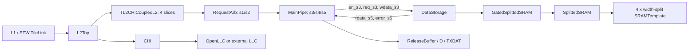
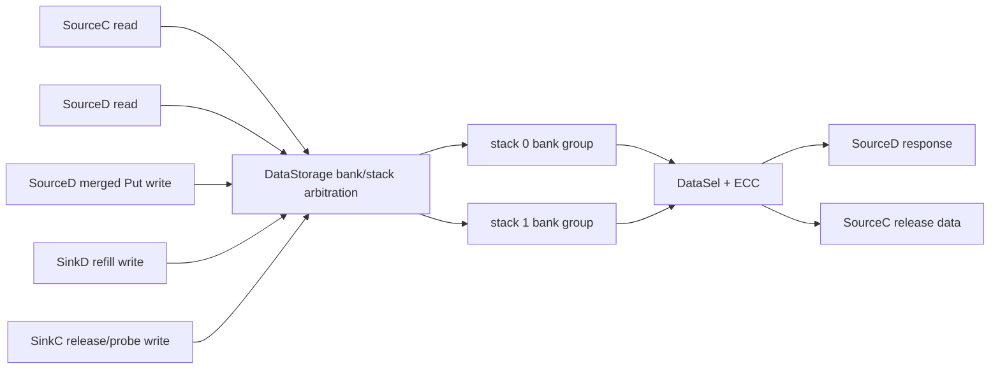

# Cache DataStorage：Kunminghu V2 的 CoupledL2 与 HuanCun 数据阵列源码分析

> 本文以用户指定的 Kunminghu V2 源码为唯一行为依据，分析缓存数据阵列 `DataStorage`。Design Doc 仅用于核对设计意图，结论均回链到 Chisel 源码；没有把 Design Doc 的描述当作实现事实。

## 1. 范围、版本与有效实例

### 1.1 本次基线

| 项目 | 基线 | 工作树情况 | 用途 |
| --- | --- | --- | --- |
| 主源码 | `/home/yanyusong/xs-memory-env/XiangShan`，`kunminghu-v2@e12436c7cba86b195deec24981976d78bc263661` | 已有 `difftest` 修改及 `src/main/resources/aia/` 未跟踪内容；本文未修改它们 | Kunminghu V2 配置、顶层、CoupledL2 与 HuanCun 源码 |
| CoupledL2 子模块 | `fb5469838c8902b6cb33992c0a30ee3d446e4453` | clean | 当前 Kmh V2 有效 L2 数据阵列 |
| HuanCun 子模块 | `65ef077373ecf398b4cecdea06b65ef9b8d79044` | clean | 非 CHI HuanCun L3 的对照实现 |
| Design Doc | `/home/yanyusong/XiangShan-Design-Doc`，`kunminghu-v2@58d9e2ad11f044cb6f8887d9687d9e110696d1aa` | clean | 设计意图与源码追溯矩阵 |

完成前已按当前分析 skill 执行周同步检查；状态文件显示距离上次同步不足七天，故安全跳过网络同步。源码与 Design Doc 是不同提交，所以下文在两者不完全对应时始终以源码为准。

### 1.2 先判定哪一个 DataStorage 真正在 Kunminghu V2 中生效

`KunminghuV2Config` 设置了 1 MiB、8 way、4 bank 的 L2，并通过 `WithCHI` 令 `EnableCHI=true`。[`Configs.scala:477-485`](</home/yanyusong/xs-memory-env/XiangShan/src/main/scala/top/Configs.scala:477>) `L2Top` 在 `enableCHI` 为真时构造的是 `TL2CHICoupledL2`，其每个 slice 由 `tl2chi.Slice` 实例化，而该 slice 明确实例化 `coupledL2.DataStorage`。[`L2Top.scala:111-145`](</home/yanyusong/xs-memory-env/XiangShan/src/main/scala/xiangshan/L2Top.scala:111>) [`CoupledL2.scala:419-455`](</home/yanyusong/xs-memory-env/XiangShan/coupledL2/src/main/scala/coupledL2/CoupledL2.scala:419>) [`tl2chi/Slice.scala:52-61`](</home/yanyusong/xs-memory-env/XiangShan/coupledL2/src/main/scala/coupledL2/tl2chi/Slice.scala:52>)

这使下表成为本文最重要的范围约束。

| 候选模块 | 是否为当前 `KunminghuV2Config` 的有效实例 | 证据 | 本文处理方式 |
| --- | --- | --- | --- |
| `coupledL2.DataStorage` | 是，作为每个 CHI CoupledL2 slice 的 L2 数据阵列 | 配置开启 CHI；`L2Top` 选择 `TL2CHICoupledL2`；slice 接入 `DataStorage` | 主分析对象 |
| `huancun.DataStorage` | 否。它属于 `L3CacheParamsOpt` 有效时构造的 HuanCun L3；该参数只在 `!EnableCHI` 时存在 | `L3CacheConfig` 对 HuanCun/OpenLLC 使用互斥 `Option.when`；SoC 还要求两者至多一个存在。[`Configs.scala:333-382`](</home/yanyusong/xs-memory-env/XiangShan/src/main/scala/top/Configs.scala:333>) [`SoC.scala:150-152`](</home/yanyusong/xs-memory-env/XiangShan/src/main/scala/system/SoC.scala:150>) | 作为同仓库、非 CHI 方案的结构和仲裁对照，不冒充当前默认路径 |
| `openLLC.DataStorage` | CHI 且 `!useExternalLLC` 时，LLC 方向会实例化 OpenLLC，而非 HuanCun | 顶层仅从 `L3CacheParamsOpt` 构造 HuanCun；CHI 内部 LLC 情形构造 OpenLLC，并把 L2 CHI 路由到它。若选外部 LLC，则走另一路外部接口；两种情况下都不使 HuanCun 成为当前 CHI 的有效 LLC。[`Top.scala:111-121`](</home/yanyusong/xs-memory-env/XiangShan/src/main/scala/top/Top.scala:111>) [`Top.scala:372-385`](</home/yanyusong/xs-memory-env/XiangShan/src/main/scala/top/Top.scala:372>) [`Top.scala:505-545`](</home/yanyusong/xs-memory-env/XiangShan/src/main/scala/top/Top.scala:505>) | 仅用于说明边界，不展开其独立实现；它的读写接口与 HuanCun 的五请求接口也不同。[`openLLC/DataStorage.scala:43-96`](</home/yanyusong/xs-memory-env/XiangShan/openLLC/src/main/scala/openLLC/DataStorage.scala:43>) |

因此，题目中的“重点关注 coupledL2 和 huancun”在本文被落实为：**CoupledL2 是 Kmh V2 的有效 L2 实现；HuanCun 是可比较但未由这一默认 CHI 配置实例化的 L3 代码。** 这一点避免了把不同协议与不同层级的端口/时序混在一起。

### 1.3 Design Doc 到代码的追溯矩阵

下表把文档压缩成原子意图，不复制原文。状态“部分”表示源代码无法单独证明物理宏时序或所有上游条件。

| ID | Design Doc 意图 | 当前源码对应关系 | 状态 |
| --- | --- | --- | --- |
| D1 | CoupledL2 数据 SRAM 是单端口，MainPipe 在 s3 访问 | `DataStorage` 只暴露一个 `ValidIO[DSRequest]`，构造时传入 `singlePort=true`；`tl2chi.Slice` 把 MainPipe s3 的三组信号直接接入。[`DataStorage.scala:50-80`](</home/yanyusong/xs-memory-env/XiangShan/coupledL2/src/main/scala/coupledL2/DataStorage.scala:50>) [`tl2chi/Slice.scala:89-91`](</home/yanyusong/xs-memory-env/XiangShan/coupledL2/src/main/scala/coupledL2/tl2chi/Slice.scala:89>) | 已验证 |
| D2 | ReqArb/MainPipe 形成 s1 至 s5 的流水 | RequestArb 在 s1/s2 交接任务，MainPipe 的 s3 产生 DS 请求、s4/s5 保存后续状态。[`RequestArb.scala:199-217`](</home/yanyusong/xs-memory-env/XiangShan/coupledL2/src/main/scala/coupledL2/RequestArb.scala:199>) [`MainPipe.scala:744-853`](</home/yanyusong/xs-memory-env/XiangShan/coupledL2/src/main/scala/coupledL2/tl2chi/MainPipe.scala:744>) | 已验证 |
| D3 | s3 发起的数据读在 s5 使用 | DataStorage 标注 `s3 read -> s4 pass -> s5 destination`；slice 在 s5 输入侧回接 `rdata/error`，MainPipe 在 s5 使用它们。[`DataStorage.scala:119-122`](</home/yanyusong/xs-memory-env/XiangShan/coupledL2/src/main/scala/coupledL2/DataStorage.scala:119>) [`tl2chi/Slice.scala:121-126`](</home/yanyusong/xs-memory-env/XiangShan/coupledL2/src/main/scala/coupledL2/tl2chi/Slice.scala:121>) [`MainPipe.scala:850-907`](</home/yanyusong/xs-memory-env/XiangShan/coupledL2/src/main/scala/coupledL2/tl2chi/MainPipe.scala:850>) | 已验证；这是模块内路径，不是端到端 L1 访问延迟 |
| D4 | MCP2 使 SRAM 请求需跨两拍保持 | MainPipe 生成两拍 `req_s3.valid` 保持；DataStorage 断言请求/写数据保持，且禁止相邻的实际 `en`。[`MainPipe.scala:491-500`](</home/yanyusong/xs-memory-env/XiangShan/coupledL2/src/main/scala/coupledL2/tl2chi/MainPipe.scala:491>) [`DataStorage.scala:124-131`](</home/yanyusong/xs-memory-env/XiangShan/coupledL2/src/main/scala/coupledL2/DataStorage.scala:124>) | 已验证，且代码约束比意图描述更具体 |
| D5 | 替换时需要读旧数据并在后续阶段交给缓冲/写回路径 | s3 的 replacement 条件读 DS，s5 写入 ReleaseBuffer 并向 MSHR 汇报 DS 错误；Directory 同时排除尚未回填完成的 way。[`MainPipe.scala:476-530`](</home/yanyusong/xs-memory-env/XiangShan/coupledL2/src/main/scala/coupledL2/tl2chi/MainPipe.scala:476>) [`MainPipe.scala:880-887`](</home/yanyusong/xs-memory-env/XiangShan/coupledL2/src/main/scala/coupledL2/tl2chi/MainPipe.scala:880>) [`Directory.scala:255-345`](</home/yanyusong/xs-memory-env/XiangShan/coupledL2/src/main/scala/coupledL2/Directory.scala:255>) | 部分验证：完整 MSHR 状态机不在本章逐状态展开 |

被作为意图来源的 Design Doc 位于 [`DataStorage.md:1-3`](</home/yanyusong/XiangShan-Design-Doc/docs/zh/cache/l2cache/DataStorage.md:1>) 与 [`ReqArb_MainPipe.md:1-3`](</home/yanyusong/XiangShan-Design-Doc/docs/zh/cache/l2cache/ReqArb_MainPipe.md:1>)。上表的“代码对应关系”而非 Design Doc 文句才是本文结论的依据。

## 2. 理论映射与总体数据路径

课程中的[流水线](</home/yanyusong/XiangShanLab/xiangshan-course/docs/4-xiangshan-microarchitecture-analysis/1-superscalar-basic-knowledge/1_Single_Cycle_vs_Multi_Cycle_vs_Pipeline.md>)与[结构冲突](</home/yanyusong/XiangShanLab/xiangshan-course/docs/4-xiangshan-microarchitecture-analysis/1-superscalar-basic-knowledge/3_Structural_Hazards_vs_Data_Hazards_vs_Control_Hazards.md>)在这里不是“指令级 RAW/WAR/WAW”问题，而是多个一致性事务争用有限数据阵列端口和固定时序窗口的问题。

| 理论概念 | CoupledL2 中的实际实体 | 与抽象教材模型的差异 |
| --- | --- | --- |
| 流水级间寄存 | RequestArb s1/s2 与 MainPipe s3/s4/s5 | 阶段携带的是 cache task、目录结果、MSHR 信息和 line 数据，不是 ROB 指令。 |
| 结构冲突 | 单端口 DataStorage、MCP2、RequestArb 的 `ds_mcp2_stall` | 不能把 `dataSRAMSplit=4` 当成四个读写端口；真正可开始的 DS 访问受 `en` 的相邻周期断言限制。 |
| 背压/保持 | HuanCun 的各 `DecoupledIO.ready`；CoupledL2 上游的 RequestArb 气泡 | CoupledL2 的 DS 自身没有 `ready`，所以不能以 `req.valid` 单独推断“已接受”。 |
| 旁路 | HuanCun 的 refill/put buffer 由外部模块管理；CoupledL2 的 ReleaseBuffer/RefillBuffer | 这些是缓存事务数据缓冲，不是 ALU 到寄存器的 forwarding。CoupledL2 DataStorage 未实现可证明的同周期 RAW 旁路。 |
| 有效性/替换 | Directory meta/tag、MSHR 与 replacer | 两个 DataStorage 都是 payload 阵列，没有本地 cache-line valid 位、tag 查找或空满队列。 |

### 2.1 Kunminghu V2 有效路径图



图中每个 L2 slice 各有自己的 DataStorage；`4` 是当前配置的 bank 数，不是单个 DataStorage 的四个独立访问口。L2Top 将 `L2NBanks` 传给 BankBinder，并把 `BankBitsKey` 设为 `log2Ceil(L2NBanks)`；CoupledL2 再逐 slice 创建模块。[`L2Top.scala:125-145`](</home/yanyusong/xs-memory-env/XiangShan/src/main/scala/xiangshan/L2Top.scala:125>) [`CoupledL2.scala:419-455`](</home/yanyusong/xs-memory-env/XiangShan/coupledL2/src/main/scala/coupledL2/CoupledL2.scala:419>)

## 3. CoupledL2 DataStorage：模块契约与结构

### 3.1 Who / Why / How / From / To

| 项目 | Who | Why | How | From | To |
| --- | --- | --- | --- | --- | --- |
| `io.en` | MainPipe 产生，DataStorage 消费 | 指示本拍真正发出的 SRAM 读/写，供时钟门控使用 | 单 bit，接到 `GatedSplittedSRAM.io_en` | `mainPipe.io.toDS.en_s3` | 所有 width-split 小 SRAM 的统一门控 |
| `io.req` | MainPipe 产生，DataStorage 消费 | 给出已决定的 cache line 位置和读/写方向 | `ValidIO[DSRequest]`，字段仅 `way/set/wen`，无 `ready` | `mainPipe.io.toDS.req_s3` | `Cat(way,set)` 行索引、`ren/wen` |
| `io.wdata` | SinkC/RefillBuffer/ReleaseBuffer 经 MainPipe 选择 | 写入完整 cache line | `DSBlock`，无 byte mask | `mainPipe.io.toDS.wdata_s3` | ECC 编码后进入 SRAM 写端 |
| `io.rdata` | DataStorage 产生，MainPipe 消费 | 返回完整 cache line | 无单独 valid；以同一事务的 s5 时序解释 | SRAM read response | `mainPipe.io.toDS.rdata_s5` |
| `io.error` | DataStorage 产生，MainPipe/错误路径消费 | 上报 data ECC decode error | 四个 ECC bank error 或合，再与两拍读请求对齐 | SRAM encoded read response | `error_s5`、`dsResp.dataError`、下游 response corrupt |

端口定义和三组 slice 连线可直接见 [`DataStorage.scala:50-66`](</home/yanyusong/xs-memory-env/XiangShan/coupledL2/src/main/scala/coupledL2/DataStorage.scala:50>) 与 [`tl2chi/Slice.scala:89-126`](</home/yanyusong/xs-memory-env/XiangShan/coupledL2/src/main/scala/coupledL2/tl2chi/Slice.scala:89>)。

下面的图强调边界：Directory 做 tag/状态判断，MainPipe 做来源收敛，DataStorage 只执行已经选定的 payload 读写。

```mermaid
flowchart LR
  DIR[Directory: hit, way, meta] --> MP[MainPipe s3]
  MSHR[MSHR / RefillBuffer] --> MP
  SC[SinkC release data] --> MP
  MP -->|way, set, wen| IDX[Cat(way, set)]
  MP -->|wdata: whole line| ENC[4-way data ECC encode]
  IDX --> ARRAY[GatedSplittedSRAM]
  ENC --> ARRAY
  ARRAY --> DEC[strip ECC parity and OR error]
  DEC -->|whole line, error| MP5[MainPipe s5]
```

### 3.2 参数、容量、索引与地址

`L2CacheConfig` 的 set 计算是 `size / banks / ways / 64`。带入 Kmh V2 的 1 MiB、4 bank、8 way、64 B line，得到每 slice `sets=512`。[`Configs.scala:278-330`](</home/yanyusong/xs-memory-env/XiangShan/src/main/scala/top/Configs.scala:278>) 因而有以下**此配置下的推导值**：

| 量 | 源码定义 | Kmh V2 下的值 | 含义 |
| --- | --- | --- | --- |
| `sets` | `size / banks / ways / 64` | 512 | 单 slice 的 set 数 |
| `ways` | `L2CacheConfig` 默认 8 | 8 | 每 set 的路数 |
| `blocks` | `sets * ways` | 4096 | DataStorage 的扁平 SRAM 行数 |
| `blockBytes` / `blockBits` | `L2Param` 默认 64 B；`blockBits=blockBytes*8` | 64 B / 512 bit | 每次 DS 读写的粒度 |
| `channelBytes.d` / `beatSize` | 默认 32 B；`blockBytes / beatBytes` | 32 B / 2 | 一条 line 对外可分为两个 beat，但 DS 本身不按 beat 寻址 |
| `wayBits` / `setBits` | `log2Ceil(ways/sets)` | 3 / 9 | `DSRequest` 字段宽度 |
| `dataBankSplit` / `dataSRAMSplit` | 代码常量 | 4 / 4 | 前者是 ECC 编解码块数，后者是物理位宽切分数 |
| `wordBits` / `bankWords` / `dataBankBits` | 64 / `blockBits / wordBits / dataBankSplit` / `wordBits*bankWords` | 64 / 2 / 128 bit | 每个 ECC 数据块的未编码有效数据宽度 |

参数定义见 [`L2Param.scala:65-75`](</home/yanyusong/xs-memory-env/XiangShan/coupledL2/src/main/scala/coupledL2/L2Param.scala:65>) 和 [`CoupledL2.scala:38-100`](</home/yanyusong/xs-memory-env/XiangShan/coupledL2/src/main/scala/coupledL2/CoupledL2.scala:38>)。所以每 slice payload 容量为 `512 x 8 x 64 B = 256 KiB`，四个 slice 合计为 1 MiB；这是从此配置推导出来的，不是 DataStorage 类的固定常数。

DataStorage 不把 `way` 作为底层 SRAM 的 way mask，而是计算 `arrayIdx = Cat(way, set)`，并以 `set=blocks, way=1` 构造底层阵列。[`DataStorage.scala:69-86`](</home/yanyusong/xs-memory-env/XiangShan/coupledL2/src/main/scala/coupledL2/DataStorage.scala:69>) 也就是说，逻辑 cache 的 `(way,set)` 被压平为 0 至 4095 的行号；tag 匹配、选 way 和 replacement 不在这个模块中。

外部物理地址到 slice/set 的分解也不由 DataStorage 直接做。CoupledL2 的 `parseAddress` 先跳过 `offsetBits + bankBits` 再取得 set；在当前的 64 B line、4 slice、512 set 推导下，字节 offset 为 6 bit、slice interleave 为 2 bit、每 slice set 为 9 bit。这个位段推导描述的是当前参数下的地址布局，不应外推到换 bank 数、line size 或配置覆写后的构建。[`CoupledL2.scala:186-205`](</home/yanyusong/xs-memory-env/XiangShan/coupledL2/src/main/scala/coupledL2/CoupledL2.scala:186>)

### 3.3 真实 SRAM 结构与 ECC

实现链是：`DataStorage -> GatedSplittedSRAM -> SplittedSRAM -> utility.sram.SRAMTemplate`。`GatedSplittedSRAM` 把 `dataSplit=4` 传给 `SplittedSRAM`；后者创建四个 data split SRAM，并把同一个读或写请求分发到全部 split 后再拼接。[`DataStorage.scala:69-109`](</home/yanyusong/xs-memory-env/XiangShan/coupledL2/src/main/scala/coupledL2/DataStorage.scala:69>) [`GatedSplittedSRAM.scala:14-76`](</home/yanyusong/xs-memory-env/XiangShan/coupledL2/src/main/scala/coupledL2/utils/GatedSplittedSRAM.scala:14>) [`SplittedSRAM.scala:42-75`](</home/yanyusong/xs-memory-env/XiangShan/coupledL2/src/main/scala/coupledL2/utils/SplittedSRAM.scala:42>)

因此必须区分两个名字相近但作用不同的量：

1. `dataBankSplit=4`：把 512-bit line 分为四份 128-bit 数据，分别用 `cacheParams.dataCode.encode` 编码；读回时抽出有效数据并对四份 `decode(...).error` 或运算。
2. `dataSRAMSplit=4`：为了物理位宽组织而同时使用四个小 SRAM。统一的 `io_en` 被用于全部小 SRAM 的时钟门控；源码注释还明确说 DataStorage 对这些小 SRAM 同时读写。

这不是四个能接收独立事务的 bank。DataStorage 仍只有一个请求端口，底层实例仍是 `singlePort=true`。Kmh V2 配置开启 data SECDED，但此模块从 decode 结果只取 `error`，没有把解码后的“已纠正数据”送回 `rdata`；所以这里能证实的是**错误检测与上报**，不能仅凭本文件断言数据已经在此处完成纠错。[`Configs.scala:311-316`](</home/yanyusong/xs-memory-env/XiangShan/src/main/scala/top/Configs.scala:311>) [`DataStorage.scala:88-117`](</home/yanyusong/xs-memory-env/XiangShan/coupledL2/src/main/scala/coupledL2/DataStorage.scala:88>)

## 4. CoupledL2 的流水、握手与生命周期

### 4.1 s1 到 s5 的阶段表

| 阶段 | 进入 DataStorage 前后的动作 | 握手/停顿关系 | 与 DS 的关系 |
| --- | --- | --- | --- |
| s1 | RequestArb 在 MSHR、C、B、A 等来源中选任务，并向 Directory 发起读取 | 选择和 Directory ready 共同影响 `s1_fire` | 未访问 DS |
| s2 | 任务寄存到 `task_s2`；非 AHint 的 `s1_fire` 在下一拍形成 `ds_mcp2_stall` | `s2_ready := !ds_mcp2_stall`，保守地为可能访问 DS 的任务插入气泡 | 为 MCP2 留出间隔 |
| s3 | Directory 结果、Refill/Release buffer 响应汇入 MainPipe；计算 `ren`、`wen`、way、set、wdata 并驱动同一 DS 请求通道 | `en_s3` 才是实际 SRAM 访问的单拍使能；`req_s3.valid` 会保持两拍 | `req.bits.wen` 决定最终是读还是写 |
| s4 | `task_s4`、`ren_s4`、`need_write_releaseBuf_s4` 等寄存 | 可在无额外缓存数据需求且通道发出时提前结束 | 数据路径的中间时序级 |
| s5 | 使用 `rdata_s5/error_s5`，选择输出数据；必要时写 ReleaseBuffer 并把 DS 错误反馈 MSHR | 依赖前面保持的任务身份；DS 输出本身没有 valid | 读取结果的消费点 |

RequestArb 的 MCP2 气泡、MainPipe 的 s3 请求生成、以及 s4/s5 寄存分别见 [`RequestArb.scala:199-208`](</home/yanyusong/xs-memory-env/XiangShan/coupledL2/src/main/scala/coupledL2/RequestArb.scala:199>)、[`MainPipe.scala:469-517`](</home/yanyusong/xs-memory-env/XiangShan/coupledL2/src/main/scala/coupledL2/tl2chi/MainPipe.scala:469>)、[`MainPipe.scala:744-853`](</home/yanyusong/xs-memory-env/XiangShan/coupledL2/src/main/scala/coupledL2/tl2chi/MainPipe.scala:744>)。

### 4.2 MCP2：`en` 与 `req.valid` 不是同一个概念

DataStorage 的接口注释和断言给出三项必须同时满足的协议：

1. DataStorage 内部的 `ren = io.req.valid && !io.req.bits.wen` 与 `wen = io.req.valid && io.req.bits.wen` 互斥，因而一个 DS 请求只能成为读或写。
2. 实际访问使能 `io.en` 不得连续两个周期为高。
3. 若上一拍实际访问，则当前 `req` 必须保持；上一拍是写时，`wdata` 也必须保持。

相应实现与断言在 [`DataStorage.scala:84-131`](</home/yanyusong/xs-memory-env/XiangShan/coupledL2/src/main/scala/coupledL2/DataStorage.scala:84>)。MainPipe 的移位寄存器把 `req_s3.valid` 拉成两拍，而 `en_s3` 只在实际 s3 数据操作时置位。[`MainPipe.scala:491-507`](</home/yanyusong/xs-memory-env/XiangShan/coupledL2/src/main/scala/coupledL2/tl2chi/MainPipe.scala:491>) 因此，**两拍 `req.valid` 是同一笔事务的稳定窗口，不是两笔连续 SRAM 操作。**

```waveform-draw
{
  "signal": [
    {"name": "clk", "wave": "p......"},
    {"name": "MainPipe.toDS.en_s3", "wave": "0100000"},
    {"name": "MainPipe.toDS.req_s3.valid", "wave": "0110000"},
    {"name": "MainPipe.toDS.req_s3.bits.wen", "wave": "0000000"},
    {"name": "DataStorage.io.rdata", "wave": "x...=..", "data": ["one DSBlock"]},
    {"name": "MainPipe task stage", "wave": "x=.=...", "data": ["s3", "s5"]}
  ]
}
```

这是根据源码构造的协议示意，不是 FST 采样波形。它表达的是一次读在 s3 产生一个 `en`、请求字段跨 s3/s4 保持、MainPipe 在 s5 才把无 valid 标记的 `rdata` 与同一任务配对。连续第二笔实际访问必须另隔一个 `en=0` 周期；RequestArb 的 `ds_mcp2_stall` 是上游为此设置的保守节流。[`RequestArb.scala:199-204`](</home/yanyusong/xs-memory-env/XiangShan/coupledL2/src/main/scala/coupledL2/RequestArb.scala:199>)

### 4.3 正常读写、替换与释放数据的流向

| 事务类 | MainPipe s3 判定 | DataStorage 操作 | s5/后续去向 |
| --- | --- | --- | --- |
| L2 命中的 A 类 Get/AcquireBlock | `need_data_a` | 读已命中的 `(way,set)` 整条 line | s5 从 `rdata_s5` 选择数据，形成 D 或 TXDAT 等响应 |
| B 类 snoop 需返回/转发数据 | `need_data_b` | 读目标 line | 结果参与 snoop 对应通道或 ReleaseBuffer 路径 |
| CMO 命中且为 dirty | `need_data_cmo` | 读脏 line | s5 可写入 ReleaseBuffer，供后续释放/写回链使用 |
| SinkC release data | `wen_c` | 将 `bufResp.data` 整条写入已决定的 `(way,set)` | Directory/meta 的状态动作在模块外，不由 DS 自行置 valid |
| MSHR refill，且无需先替换 | `wen_mshr` 的 refill 条件 | 把 RefillBuffer 数据整条写入 | 目录、MSHR 继续完成回填与可见性管理 |
| 需要 replacement 的 refill | `need_data_mshr_repl` | 先读 victim | s5 将旧 data 写 ReleaseBuffer；后续 MSHR 任务再把 refill data 写回 DS |

这些 `ren/wen` 条件、way/set 和写数据 mux 都集中在 MainPipe 中，而不是散落在 DataStorage 内部。[`MainPipe.scala:469-517`](</home/yanyusong/xs-memory-env/XiangShan/coupledL2/src/main/scala/coupledL2/tl2chi/MainPipe.scala:469>) 在 s5，`rdata_s5` 会写给 ReleaseBuffer，`dsResp` 同时带走 `dataError`。[`MainPipe.scala:850-907`](</home/yanyusong/xs-memory-env/XiangShan/coupledL2/src/main/scala/coupledL2/tl2chi/MainPipe.scala:850>)

这里有一个重要分工：Directory 的 tag match 与 `meta.state != INVALID` 才构成 hit，并给出实际 way；replacement 时还排除同 set 中正在 `blockRefill` 或 `dirHit` 的 MSHR way，并在无 free way 时形成 retry。[`Directory.scala:250-315`](</home/yanyusong/xs-memory-env/XiangShan/coupledL2/src/main/scala/coupledL2/Directory.scala:250>) [`Directory.scala:255-288`](</home/yanyusong/xs-memory-env/XiangShan/coupledL2/src/main/scala/coupledL2/Directory.scala:255>) DataStorage 只收到结论 `(way,set)`，不查 tag、不分配/释放 line，也不维护 replacement state。

### 4.4 冲突、旁路、错误与 reset

| 情形 | 可以从源码确认的行为 | 不能外推的部分 |
| --- | --- | --- |
| 两个上游事务争用 DS | DS 只有一条 Valid 请求和单端口 SRAM；RequestArb/MainPipe 必须先仲裁，DS 内没有赢家选择器 | 不要从 DataStorage 推断 A/B/C/MSHR 的完整仲裁优先级 |
| 相邻周期 DS 访问 | `io.en` 连续高触发断言；RequestArb 对非 AHint 任务设置 MCP2 stall | 不能把整个 L2 的所有事务吞吐率都简化为每两拍一笔，很多任务不访问 DS |
| 同地址读写 | DS 内部按 `req.bits.wen` 强制读写互斥；若 MainPipe 的原始 `ren` 与 `wen` 条件意外同时为真，`req.bits.wen := wen` 会令 DS 走写而不是读 | MainPipe 没有在这段代码中显式断言其原始 `ren/wen` 条件绝不重叠；应在验证中检查这种歧义不会出现在合法任务，并对相邻同索引读写补测宏行为 |
| ECC | 四段 decode error 或运算，并延迟到读结果时刻；MainPipe 合并为 `dataError/l2Error` | 不要称为“DataStorage 已校正数据”，因为输出数据没有接入 decode 后的 correction 值 |
| reset/flush | DataStorage IO 无 valid、flush、invalidate、resetDone；构造没有传入 `shouldReset=true` | 不能假定 reset 后 data RAM 清零；line 有效性应由 Directory meta 和上层协议决定 |

`GatedSplittedSRAM` 的默认 `bypassWrite=false` 被原样传递；该 DS 还使用 single-port 实例。没有一条本模块级连线能证明同周期 RAW forwarding，因此文档应保守地写成“正常调度禁止并发读写”，而不是“写优先旁路”。[`GatedSplittedSRAM.scala:14-45`](</home/yanyusong/xs-memory-env/XiangShan/coupledL2/src/main/scala/coupledL2/utils/GatedSplittedSRAM.scala:14>) [`SplittedSRAM.scala:45-92`](</home/yanyusong/xs-memory-env/XiangShan/coupledL2/src/main/scala/coupledL2/utils/SplittedSRAM.scala:45>)

DataStorage 对不符合 MCP2 的输入放置的是 Chisel `assert`，这在仿真/形式验证中是检测机制，不是运行时的恢复状态机。ECC 路径则是硬件可见的错误上报：`io.toDS.error_s5` 进入 `dataError_s5`、`l2Error_s5`，并进入 `dsResp.bits.dataError`。[`MainPipe.scala:850-887`](</home/yanyusong/xs-memory-env/XiangShan/coupledL2/src/main/scala/coupledL2/tl2chi/MainPipe.scala:850>)

### 4.5 延迟与吞吐的边界

| 指标 | 代码可证明的结论 | 不应声称的结论 |
| --- | --- | --- |
| DS 读数据路径 | 读在 s3 发起，DataStorage/SplittedSRAM 使用 `readMCP2=true`，底层设定 `latency=2`，结果由 MainPipe s5 使用 | 不是“任意 L1 load 固定 2 周期”；仲裁、Directory、MSHR、外部 CHI 都在此路径之外 |
| DS 可开始访问的密度 | 实际 `en` 禁止背靠背；对访问 DS 的任务，源码的保守调度上界是每两拍至多启动一笔 | 不是所有 cache request 的整体吞吐率 |
| 请求字段保持 | `req.valid/bits` 与写数据保持两拍 | 不是同一 transaction 被数组执行两次 |
| 数据粒度 | DS 读写完整 64 B line；对外链路的 32 B beat 在其他模块拆装 | 不是 DS 拥有两条独立 32 B port |

底层 `SplittedSRAM` 明确在 `readMCP2` 时把 SRAM template latency 设为 2。[`SplittedSRAM.scala:45-54`](</home/yanyusong/xs-memory-env/XiangShan/coupledL2/src/main/scala/coupledL2/utils/SplittedSRAM.scala:45>) 将这个局部时序误写成处理器 load-to-use 延迟，会漏掉 L1、TileLink、Directory、MSHR、CHI 和返回通道。

## 5. HuanCun DataStorage：非 CHI L3 对照

### 5.1 接口与组织

HuanCun DataStorage 的接口不是 CoupledL2 的单 `ValidIO`。它有五类逻辑请求：`sourceC_raddr`、`sinkD_waddr`、`sourceD_raddr`、`sourceD_waddr`、`sinkC_waddr`，均为 `DecoupledIO[DSAddress]`，并输出对应的 SourceC/SourceD read data 和统一的 ECC 信息。[`huancun/DataStorage.scala:28-41`](</home/yanyusong/xs-memory-env/XiangShan/huancun/src/main/scala/huancun/DataStorage.scala:28>) `DSAddress` 包含 `(way,set,beat,write,noop)`，`DSData` 的粒度是一个 `beatBytes` 数据和 `corrupt` 位。[`huancun/Common.scala:194-205`](</home/yanyusong/xs-memory-env/XiangShan/huancun/src/main/scala/huancun/Common.scala:194>)



源码固定 `nrStacks=2`、`bankBytes=8`、`rowBytes=nrStacks*beatBytes`、`nrBanks=rowBytes/bankBytes`，并使用 single-port `SRAMWrapper` 阵列。注释说明当没有 stack 冲突时，一行可由 `nrStacks` 并行访问。[`huancun/DataStorage.scala:43-83`](</home/yanyusong/xs-memory-env/XiangShan/huancun/src/main/scala/huancun/DataStorage.scala:43>) HuanCun 参数默认 `blockBytes=64`、`channelBytes=32`，因而该默认条件下有 `rowBytes=64 B`、`nrBanks=8`。[`HCCacheParameters.scala:83-99`](</home/yanyusong/xs-memory-env/XiangShan/huancun/src/main/scala/huancun/HCCacheParameters.scala:83>) 不过 HuanCun 的实际参数在其非 CHI 构建中可被配置覆写，所以不要把这些值说成 Kmh V2 有效 LLC 的固定事实。

### 5.2 地址映射、ready 与固定优先级

HuanCun 将 `Cat(way,set,beat)` 重排为内部地址，低 `stackBits` 决定 `stackIdx`，其余部分为 `innerIndex`。每个请求的 `ready` 同时受两项控制：该 stack 还没有被更高优先级请求占用，且 `stackRdy(stackIdx)` 为真。[`huancun/DataStorage.scala:103-132`](</home/yanyusong/xs-memory-env/XiangShan/huancun/src/main/scala/huancun/DataStorage.scala:103>) 这和 CoupledL2 没有 `ready` 的接口形成直接差别：在 HuanCun 中，落选者会通过 Decoupled 协议保持 payload 并等候。

请求列表的顺序、`foldLeft` 累积 `bankSum` 和每 bank 的 `PriorityMux` 共同给出了同一 stack/bank 冲突时的固定优先级：

| 优先级 | 请求 | 功能 |
| --- | --- | --- |
| 1 | `sourceC_req` | 向外发送 Release/Probe 类数据时读取 DS |
| 2 | `sinkC_req` | 从内侧 C 通道写入 release/probe 数据 |
| 3 | `sinkD_wreq` | 从外侧 D 通道写入 refill 数据 |
| 4 | `sourceD_wreq` | PutBuffer 合并后写回一个 beat |
| 5 | `sourceD_rreq` | 向内侧 D 响应读取一个 beat |

这是**冲突 stack 的仲裁顺序**，不是五条物理独立端口。优先级和 ready 的源码位于 [`huancun/DataStorage.scala:134-177`](</home/yanyusong/xs-memory-env/XiangShan/huancun/src/main/scala/huancun/DataStorage.scala:134>)。不同 `stackIdx` 的请求可同时获得机会，但如果开启 SRAM 二分频，`stackRdy` 会在访问后按周期计数进行节流。[`huancun/DataStorage.scala:162-205`](</home/yanyusong/xs-memory-env/XiangShan/huancun/src/main/scala/huancun/DataStorage.scala:162>)

`noop` 不是可以忽略的仲裁项：它会让 `bankEn=0`，却仍以有效请求的 `bankSel` 参与 `bankSum`。因此一个高优先级 `noop` 在同一 stack 上仍可能使低优先级真实访问得不到 `ready`。这是从组合式 mask 关系得到的源码结论，应在 HuanCun 验证中专门覆盖，而不要凭直觉把 `noop` 当作“零影响”。[`huancun/DataStorage.scala:120-152`](</home/yanyusong/xs-memory-env/XiangShan/huancun/src/main/scala/huancun/DataStorage.scala:120>)

### 5.3 读写来源、更新与数据冒险

HuanCun Slice 把模块边界连接得很直接：SinkD 写、SourceC 读、SourceD 读/写和 SinkC 写都进入 DataStorage；可选控制口会先经 `ctrl_arb`，且控制请求被接到 Chisel `Arbiter` 的 `in(0)`。[`huancun/Slice.scala:46-57`](</home/yanyusong/xs-memory-env/XiangShan/huancun/src/main/scala/huancun/Slice.scala:46>) [`huancun/Slice.scala:105-124`](</home/yanyusong/xs-memory-env/XiangShan/huancun/src/main/scala/huancun/Slice.scala:105>) 本文不把库 Arbiter 的展开优先级当作本仓库已直接展开的事实；需要时应在 generated RTL 中核验它与 DataStorage 内部固定优先级的组合效果。

| 生命周期动作 | 进入 DS 的路径 | DataStorage 自身做什么 | 模块外责任 |
| --- | --- | --- | --- |
| 命中返回/外侧 release 数据 | SourceD/SourceC read | 以 `(way,set,beat)` 读取并经 `DataSel` 回送 | SourceD/SourceC 决定协议消息与多 beat 进度 |
| refill 保存 | SinkD write | 写入对应 beat | MSHR 决定是否 `save_data_in_bs`，SinkD 决定 backpressure |
| C release/probe 数据保存 | SinkC write | 写入对应 beat | inclusive/noninclusive SinkC、Directory/MSHR 决定状态与回收 |
| PutPartial 合并 | SourceD write | 写回合并后的 beat | SourceD 用 PutBuffer mask 合并读到的数据与 put data |
| replacement/释放 | 非本模块独立状态 | 只能按给定地址读或写 payload | Directory/MSHR 持有 valid/tag/replacement 和事务完成状态 |

SourceD 读请求逐 beat 输出 `(way,set,beat)`，并在需要时把 PutBuffer 的掩码数据同读数据合并后写回。[`huancun/SourceD.scala:93-109`](</home/yanyusong/xs-memory-env/XiangShan/huancun/src/main/scala/huancun/SourceD.scala:93>) [`huancun/SourceD.scala:250-279`](</home/yanyusong/xs-memory-env/XiangShan/huancun/src/main/scala/huancun/SourceD.scala:250>) SinkD 在将 refill 保存到 DS 前检查 `sourceD_r_hazard` 的同 `(set,way)` 危险，防止 SourceD 正在读取的 line 与回填写碰撞。[`huancun/SinkD.scala:41-87`](</home/yanyusong/xs-memory-env/XiangShan/huancun/src/main/scala/huancun/SinkD.scala:41>) Slice 将同一 hazard 同时连给 SinkC 和 SinkD。[`huancun/Slice.scala:585-595`](</home/yanyusong/xs-memory-env/XiangShan/huancun/src/main/scala/huancun/Slice.scala:585>)

和 CoupledL2 一样，HuanCun 的读 data 输出没有单独 response valid。消费者以请求 `fire` 加已知 `sramLatency` 对齐：例如 SourceD 把 `bs_raddr.fire` 延迟 `sramLatency` 后入队 `bs_rdata`。因此分析波形时应以 request fire、延迟寄存器和上游 task 一起定位数据，不能仅凭数据总线变化判定一个新读返回。[`huancun/SourceD.scala:231-238`](</home/yanyusong/xs-memory-env/XiangShan/huancun/src/main/scala/huancun/SourceD.scala:231>)

HuanCun DataStorage 的 data ECC 把 ECC 阵列按 stack 组织，`DataSel` 在读返回时计算 `corrupt`，再将地址和 `ERR_DATA` 放到 `io.ecc`。它也只负责检测/报告；模块中没有看到以已纠正数据回写阵列的逻辑。[`huancun/DataStorage.scala:211-262`](</home/yanyusong/xs-memory-env/XiangShan/huancun/src/main/scala/huancun/DataStorage.scala:211>) [`huancun/DataStorage.scala:272-301`](</home/yanyusong/xs-memory-env/XiangShan/huancun/src/main/scala/huancun/DataStorage.scala:272>) Slice 再把 data ECC 汇入控制接口。[`huancun/Slice.scala:603-612`](</home/yanyusong/xs-memory-env/XiangShan/huancun/src/main/scala/huancun/Slice.scala:603>)

### 5.4 HuanCun 时序仅能作为替代配置参考

HuanCun 定义 `sramLatency = 1 + 1 + (sramClkDivBy2 ? 3 : 1)`。[`huancun/HuanCun.scala:76-79`](</home/yanyusong/xs-memory-env/XiangShan/huancun/src/main/scala/huancun/HuanCun.scala:76>) 非 CHI `L3CacheConfig` 设置 `sramClkDivBy2=true` 与 `sramDepthDiv=4`。[`Configs.scala:346-368`](</home/yanyusong/xs-memory-env/XiangShan/src/main/scala/top/Configs.scala:346>) 因而若采用该参数，公式给出 5 个 L3 时钟级的局部 SRAM 路径；这**不是**当前 Kmh V2 CHI 配置的 LLC 延迟，也不是 CPU load latency。它只说明 HuanCun 代码为何需要 `stackRdy` 和更多流水寄存。

## 6. CoupledL2 与 HuanCun 的对照结论

| 维度 | CoupledL2 DataStorage：Kmh V2 有效 L2 | HuanCun DataStorage：非 CHI L3 对照 |
| --- | --- | --- |
| 当前配置中的地位 | 每个 `tl2chi.Slice` 一份，实际有效 | `EnableCHI=true` 时不实例化；HuanCun 由非 CHI L3 参数驱动 |
| 请求接口 | 单 `ValidIO[DSRequest]`，无 ready | 五组 `DecoupledIO[DSAddress]`，每组有 ready |
| 地址粒度 | `(way,set)` 整条 64 B line | `(way,set,beat)`，按 beat 访问 |
| 内部并发模型 | 单端口；四个 data split 同步工作 | 两 stack 的 bank group；不同 stack 可尝试并行，同 stack 固定优先级 |
| 读时序 | MCP2，s3 发起、s5 消费；实际 `en` 不可相邻 | `sramLatency` 参数化；二分频时 stack 还受 `stackRdy` 节流 |
| 冲突处理 | 上游 RequestArb/MainPipe 先仲裁和插入气泡 | DS 内根据 stack/bank 给 ready 和 PriorityMux 选择 |
| 有效性与替换 | Directory/MSHR 外置 | Directory/MSHR/Sink/Source 外置 |
| ECC | 四份数据编码，OR 后上报 error | bank/stack ECC，通过 `DataSel` 和 `io.ecc` 上报 |
| RAW 结论 | 不存在可证实的 DS 内旁路 | 同样不应从单个 DataStorage 文件外推同地址 old/new 宏语义；上游 hazard 负责关键危险 |

差异的根源不是“一个实现更新、另一个实现落后”，而是协议层级、有效配置和存储端口模型不同。尤其不能把 HuanCun 的五个 Decoupled 端口解释成 CoupledL2 的性能能力，也不能把 CoupledL2 的 MCP2 间隔套用到 HuanCun。

## 7. 跨边界：地址、未缓存与数据粒度

| 边界 | DataStorage 可见的输入 | 源码能证实的范围 | 不应归因给 DataStorage 的事 |
| --- | --- | --- | --- |
| 虚拟地址/页边界 | CoupledL2 只见 `(way,set,wen)`；HuanCun 只见 `(way,set,beat,write,noop)` | 两者都没有 vaddr、ASID、TLB 或 page fault 端口，因此不能由它们决定地址翻译或跨页拆分 | VA-to-PA 翻译、别名消解、页异常 |
| cache line/beat | CoupledL2 的 `DSBlock` 是 whole line，HuanCun 带 `beat` | CoupledL2 不含 beat write mask；HuanCun 的 SourceD/SinkD 在模块外管理逐 beat 进度 | 上游未对齐访问拆分、总线 beat 打包、请求合并策略 |
| MMIO | DS 接口没有 memory type 或 MMIO 字段 | CHI L2 的 `mmioNode` 从 L2Top 单独接到 `mmio_port`；顶层 CHI 也有到 MMIO bridge 的地址路由 | PMA/PBMT/MMIO 判定、设备访问顺序、把事务送入/绕开缓存 |
| line 有效性/回收 | 只有已选 way/set/beat 和 payload | Directory 用 tag 和 meta valid 求 hit，MSHR/Directory 管 replacement/retry | 将 raw data RAM 内容当作 reset 后或 invalidate 后的有效 cache line |

CoupledL2 DS bundle 的字段可见于 [`DataStorage.scala:26-65`](</home/yanyusong/xs-memory-env/XiangShan/coupledL2/src/main/scala/coupledL2/DataStorage.scala:26>)，HuanCun 对应字段见 [`huancun/Common.scala:194-205`](</home/yanyusong/xs-memory-env/XiangShan/huancun/src/main/scala/huancun/Common.scala:194>)。L2Top 的独立 MMIO 连接在 [`L2Top.scala:79-82`](</home/yanyusong/xs-memory-env/XiangShan/src/main/scala/xiangshan/L2Top.scala:79>) 和 [`L2Top.scala:137-145`](</home/yanyusong/xs-memory-env/XiangShan/src/main/scala/xiangshan/L2Top.scala:137>)。这证明分类不在 DataStorage 边界，而不等同于证明每种平台地址在所有配置下都必然绕过它。

## 8. 验证计划与观测点

本次是静态源码分析，未生成 FST 或 elaborated RTL；下表给出应补齐的仿真、断言或波形验证。重点是把可见源码约束与未证实的宏/时序语义分开。

| ID | 触发/场景 | 应观测的信号或断言 | 期望结论 |
| --- | --- | --- | --- |
| C1 | 两个连续可能访问 DS 的 CoupledL2 任务 | `RequestArb.ds_mcp2_stall`、`s2_ready`、`MainPipe.toDS.en_s3` | 后一任务被气泡延后，`en_s3` 不连续为 1；命中 `DataStorage` 的 MCP2 断言即为 bug |
| C2 | 单次读和单次写各一笔 | `req_s3.valid/bits`、`wdata_s3`、`en_s3`、s5 的 `rdata/error` | `req` 保持两拍；写数据在规定窗口稳定；读在同一任务 s5 解释 |
| C3 | 同一 MainPipe task 的 `ren && wen` 条件，以及相邻同 `(way,set)` 读写 | MainPipe 原始 `ren/wen`、`req_s3.bits.wen`、生成 RTL 的 SRAM read/write response | 合法任务不应出现歧义的 `ren && wen`；DS 同拍只走一个方向。相邻同索引读写的 old/new 值仍需由生成 RTL/宏验证 |
| C4 | replacement victim 加 refill | `need_data_mshr_repl`、`releaseBufWrite`、后续 `dsWen`、Directory `replResp` | 旧 victim 先进入 ReleaseBuffer，回填数据在后续任务写 DS；无 free way 时应 retry |
| C5 | data ECC fault injection | encoded bank read、`DataStorage.error`、`MainPipe.dsResp.dataError`、D/TXDAT corrupt | 四段任一 decode error 可到 s5 和 MSHR/通道错误路径；验证是否还有系统级恢复策略 |
| C6 | reset 后首次请求与 CMO/invalidate | Directory meta valid、DS `rdata`、写入/失效相关任务 | 不读取 raw SRAM 就判为命中；reset/CMO 后有效性应来自 Directory/协议，而非 DS 清零 |
| H1 | 非 CHI HuanCun 同 stack 同拍五类请求 | 五个 `*.ready`、`bankEn`、`sel_req` | 观察 `SourceC > SinkC > SinkD > SourceD write > SourceD read` 的固定冲突优先级，落选请求保持 |
| H2 | 非 CHI HuanCun 不同 stack 访问且开/关 `sramClkDivBy2` | `stackRdy`、`debug_stack_used`、各 request fire | 无冲突时可利用两个 stack；二分频时 ready 相位会限制可发起访问 |
| H3 | 非 CHI HuanCun 高优先级 `noop` 与低优先级真实访问同 stack | `bankSel`、`bankEn`、`bankSum`、低优先级 `ready` | 验证 `noop` 是否仍保留冲突 mask 并造成阻塞，防止实现/文档对 noop 语义理解错误 |
| B1 | 跨 page、跨 line、未对齐和 MMIO 测试 | L2 TLB/MMIO route、DS request bundle | DS 只应看到已解析的 set/way/beat；确认拆分、PMA/PBMT/MMIO 分类发生在其边界外 |
| B2 | 以当前 `KunminghuV2Config` elaboration | instance tree、`EnableCHI`、`L3CacheParamsOpt`、`OpenLLCParamsOpt` | 证实有效 DS 为 CoupledL2 L2；HuanCun 不被意外纳入当前 CHI 实例树 |

## 9. 已知不确定性与阅读边界

1. 本文没有运行 elaboration 或工艺 SRAM 宏仿真；single-port macro 的物理 read-during-write 语义、最终 macro 个数和门控时序需要以生成 RTL/综合网表/波形补证。
2. DataStorage 使用 `dataCode.decode(...).error`，但没有把 correction 值作为 `rdata`。系统是否在其他位置执行纠错、重试或 poison 处理，超出本模块能证明的范围。
3. `KunminghuV2Config` 是本文的有效配置。替换其 bank 数、line size、ECC、外部 LLC 或 non-CHI 选项后，容量、地址切分、时序和实例树均可能改变。
4. HuanCun 的分析是代码对照而非当前 CHI Kmh V2 的行为证明；当前 CHI 顶层的 LLC 数据阵列应另行分析 `openLLC/DataStorage.scala`。
5. 文中所有“s3/s5”“两拍”“优先级”都指向给出的源码行；没有 FST 证据时，本文明确称为源码推导或验证计划，而不是实测波形结论。
