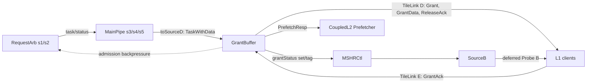
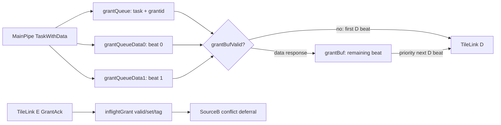

<!--
# Cache-GrantBuffer：Kunminghu V2 CoupledL2 响应缓冲与 GrantAck 生命周期

> 结论先行：<code>GrantBuffer</code> 是 Kunminghu V2 的 CoupledL2 Slice 内、面向上游 TileLink D/E 通道的响应整形和资源预留单元。它把 MainPipe 的 <code>TaskWithData</code> 分成 D 通道 FIFO、两条数据 beat FIFO、可选预取响应 FIFO 与 GrantAck 等待表；它并不拥有目录、数据 SRAM 或 MSHR。其最重要的正确性责任是：从 Grant/GrantData 被 <code>d_task.fire</code> 接收起，到 E 通道 GrantAck 到达前，保守地保留相应 cache block 的 <code>set/tag</code>，使同地址 Probe 不会越过该未完成的授权。这个保护窗口可能早于 D 真正对 L1 发出，因而是代码可见的保守顺序约束，而不是把类注释直接当成时序事实。[GrantBuffer.scala:265-290](/home/yanyusong/xs-memory-env/XiangShan/coupledL2/src/main/scala/coupledL2/GrantBuffer.scala:265)

## 1. 范围与证据

### 1.1 分析基线

| 项目 | 本文采用的基线 | 说明 |
| --- | --- | --- |
| XiangShan 源码 | <code>/home/yanyusong/xs-memory-env/XiangShan</code>，<code>kunminghu-v2@e12436c7cba86b195deec24981976d78bc263661</code> | 用户指定的本地 checkout；工作树原有 <code>difftest</code> 修改和 <code>src/main/resources/aia/</code> 未跟踪内容，本文未修改、未把它们作为证据。 |
| 相关子模块 | <code>coupledL2@fb5469838c8902b6cb33992c0a30ee3d446e4453</code>；<code>huancun@65ef077373ecf398b4cecdea06b65ef9b8d79044</code> | 对应本地 checkout 在本文分析时的 submodule 指针。 |
| Design Doc | <code>/home/yanyusong/XiangShan-Design-Doc</code>，<code>kunminghu-v2@58d9e2ad11f044cb6f8887d9687d9e110696d1aa</code> | 仅用于定位设计意图；所有实现结论均由上表源码行号支撑。 |
| XiangShanLab | <code>/home/yanyusong/XiangShanLab@680010a3cf7cc72900345600b99709bc337a52bf</code> | 用于课程概念和本课程目录风格。 |
| 同步检查 | skill 的 <code>weekly_sync.py</code> 返回 <code>skip: last sync 2.88 days ago &lt; 7 days</code> | 按 skill 要求执行；没有执行 reset、clean 或 pull。 |
| 目标 | <code>coupledL2/GrantBuffer.scala</code> 及其有效连接 | 重点追到 <code>tl2chi/Slice</code>、<code>RequestArb</code>、<code>MSHRCtl</code>、<code>SourceB</code>、<code>MainPipe</code> 和顶层配置。 |

### 1.2 Kunminghu V2 的有效实例链

<code>KunminghuV2Config</code> 组合 1 MB、4 bank 的 L2 配置，并叠加 <code>WithCHI</code>；后者将 <code>EnableCHI</code> 置为真。因此 <code>L2Top</code> 选择的是 <code>TL2CHICoupledL2</code>，不是 TL-to-TL 变体。[Configs.scala:477-485](/home/yanyusong/xs-memory-env/XiangShan/src/main/scala/top/Configs.scala:477) [L2Top.scala:111-146](/home/yanyusong/xs-memory-env/XiangShan/src/main/scala/xiangshan/L2Top.scala:111)

<code>CoupledL2Base</code> 按 <code>enableCHI</code> 为每个 bank 创建 <code>tl2chi.Slice</code>；该 Slice 在本地实例化 <code>GrantBuffer</code>，将 <code>MainPipe.io.toSourceD</code> 接为输入，并把反压、在飞 Grant 状态和预取响应接回相邻模块。[CoupledL2.scala:419-452](/home/yanyusong/xs-memory-env/XiangShan/coupledL2/src/main/scala/coupledL2/CoupledL2.scala:419) [tl2chi/Slice.scala:39-43](/home/yanyusong/xs-memory-env/XiangShan/coupledL2/src/main/scala/coupledL2/tl2chi/Slice.scala:39) [tl2chi/Slice.scala:65-67](/home/yanyusong/xs-memory-env/XiangShan/coupledL2/src/main/scala/coupledL2/tl2chi/Slice.scala:65) [tl2chi/Slice.scala:101-133](/home/yanyusong/xs-memory-env/XiangShan/coupledL2/src/main/scala/coupledL2/tl2chi/Slice.scala:101)

向 L1 的外侧 D/E 并非直接裸连：Slice 明确以 <code>io.in.d &lt;&gt; inBuf.d(grantBuf.io.d)</code> 把 GrantBuffer 的 D 接到 inner buffer，并以 <code>grantBuf.io.e &lt;&gt; inBuf.e(io.in.e)</code> 把 L1 返回的 E 接回 GrantBuffer。图中的 D/E 箭头因此表示该内侧 buffer 两端的有效通路，而不是省略掉的另一套响应实现。[tl2chi/Slice.scala:196-203](/home/yanyusong/xs-memory-env/XiangShan/coupledL2/src/main/scala/coupledL2/tl2chi/Slice.scala:196)

~~~mermaid
flowchart LR
  RA[RequestArb s1/s2] --&gt;|task/status| MP[MainPipe s3/s4/s5]
  MP --&gt;|toSourceD: TaskWithData| GB[GrantBuffer]
  GB --&gt;|TileLink D: Grant, GrantData, ReleaseAck...| L1[L1 clients]
  L1 --&gt;|TileLink E: GrantAck| GB
  GB --&gt;|block A/B/C and MSHR entrance| RA
  GB --&gt;|grantStatus set/tag| MC[MSHRCtl]
  MC --&gt;|grantStatus| SB[SourceB]
  SB --&gt;|deferred Probe B| L1
  GB --&gt;|PrefetchResp| PF[CoupledL2 Prefetcher]
~~~

图中的每一条有效连线均可在 [tl2chi/Slice.scala:65-67](/home/yanyusong/xs-memory-env/XiangShan/coupledL2/src/main/scala/coupledL2/tl2chi/Slice.scala:65)、[tl2chi/Slice.scala:95-105](/home/yanyusong/xs-memory-env/XiangShan/coupledL2/src/main/scala/coupledL2/tl2chi/Slice.scala:95)、[tl2chi/Slice.scala:130-173](/home/yanyusong/xs-memory-env/XiangShan/coupledL2/src/main/scala/coupledL2/tl2chi/Slice.scala:130) 和 [tl2chi/Slice.scala:196-203](/home/yanyusong/xs-memory-env/XiangShan/coupledL2/src/main/scala/coupledL2/tl2chi/Slice.scala:196) 找到。

### 1.3 <code>huancun</code> 的边界：相关代码，不是本模块的有效实现

在给定 checkout 的 <code>huancun/src/main/scala</code> 中没有 <code>GrantBuffer</code> 类。其上行 D 通道实现是另一个模块 <code>huancun.SourceD</code>：它自身从 banked store/旁路读取数据，经过 s1--s4 管线后用 <code>TLArbiter.lowest</code> 发送 D；其 E 通道由独立 <code>SinkE</code> 接受。[SourceD.scala:30-56](/home/yanyusong/xs-memory-env/XiangShan/huancun/src/main/scala/huancun/SourceD.scala:30) [SourceD.scala:73-125](/home/yanyusong/xs-memory-env/XiangShan/huancun/src/main/scala/huancun/SourceD.scala:73) [SourceD.scala:275-280](/home/yanyusong/xs-memory-env/XiangShan/huancun/src/main/scala/huancun/SourceD.scala:275) [SinkE.scala:27-35](/home/yanyusong/xs-memory-env/XiangShan/huancun/src/main/scala/huancun/SinkE.scala:27)

这个差别有实际配置依据：顶层只在 <code>soc.L3CacheParamsOpt</code> 存在时才实例化 <code>HuanCun</code>；而 L3 配置在 <code>EnableCHI</code> 为真时将该 option 置空、转而配置 OpenLLC。因此，Kunminghu V2 默认的 CHI 路径不能用 <code>huancun.SourceD</code> 替代 GrantBuffer 的行为。[Top.scala:104-123](/home/yanyusong/xs-memory-env/XiangShan/src/main/scala/top/Top.scala:104) [Configs.scala:333-375](/home/yanyusong/xs-memory-env/XiangShan/src/main/scala/top/Configs.scala:333) [Configs.scala:477-485](/home/yanyusong/xs-memory-env/XiangShan/src/main/scala/top/Configs.scala:477)

## 2. 理论、设计意图与有效代码

### 2.1 Theory-to-Code Mapping

课程中的流水线概念强调以级间寄存器和握手隔离长路径；GrantBuffer 对应的不是处理器指令流水线，而是 L2 响应出口的弹性流水段。它通过 FIFO、<code>valid</code> 位和 <code>ready</code> 将 MainPipe 的响应生产与 L1 的 D/E 消费解耦。[课程：单周期、多周期与流水线](/home/yanyusong/XiangShanLab/xiangshan-course/docs/4-xiangshan-microarchitecture-analysis/1-superscalar-basic-knowledge/1_Single_Cycle_vs_Multi_Cycle_vs_Pipeline.md) [GrantBuffer.scala:112-120](/home/yanyusong/xs-memory-env/XiangShan/coupledL2/src/main/scala/coupledL2/GrantBuffer.scala:112)

| 理论概念 | 课程含义 | 有效代码实体 | 实现方式与教材模型的差异 |
| --- | --- | --- | --- |
| 流水化与背压 | 相邻阶段通过寄存器/控制隔离，资源不足时保持状态 | <code>grantQueue</code>、<code>grantBufValid</code>、<code>io.d.ready</code> | 本模块没有命名 s0/s1；D 输出由 FIFO 头项或单拍寄存器驱动，D 停顿时其 payload 由 FIFO/寄存器保持。 |
| 结构冲突 | 多个事务争用有限队列、端口或状态项 | <code>noSpaceForSinkReq</code>、<code>noSpaceWaitSinkEForSinkReq</code> | 不只看已入队数量，还把前级在飞、将来可能占用 GrantBuffer 的状态计入，属于保守的信用预留。 |
| 一致性排序 | 授权尚未被接收方确认时，不能让冲突 Probe 越过 | <code>inflightGrant</code>、<code>GrantStatus</code>、<code>SourceB</code> | 没有用全局地址 CAM 重排所有响应；只按 <code>set/tag</code> 标记 GrantAck 未到的块，并阻塞/延后同地址 Probe。 |
| 多 beat 传输 | 宽 cache line 被拆为多个总线 beat | <code>grantQueueData0/1</code> 与 <code>grantBuf</code> | 当前实现明确 <code>require(beatSize == 2)</code>，并非通用的任意 beat 计数器。 |
| 预取是非架构状态 | 预取完成不等于 CPU 指令提交 | <code>pftRespQueue</code>、<code>PrefetchResp</code> | 该响应只交给 L2 预取器；没有写 ROB、PRF 或提交接口。 |

### 2.2 Design Doc 到源码追踪矩阵

下表仅把已逐条映射的 Design Doc 意图用于解释；状态列中的“部分”表示不能从当前 Chisel 得到完整时序或所有前提。

| ID | Design Doc 位置 | 原子意图 | 代码关系 | 状态与差异 |
| --- | --- | --- | --- | --- |
| D1 | <code>docs/zh/cache/l2cache/upstream/GrantBuffer.md</code>，“基本功能” | 将 D 响应和预取响应分流，Grant/GrantData 等待 E GrantAck | D FIFO 的入队条件见 [GrantBuffer.scala:162-172](/home/yanyusong/xs-memory-env/XiangShan/coupledL2/src/main/scala/coupledL2/GrantBuffer.scala:162)，预取 FIFO 见 [GrantBuffer.scala:234-261](/home/yanyusong/xs-memory-env/XiangShan/coupledL2/src/main/scala/coupledL2/GrantBuffer.scala:234)，在飞表写/清见 [GrantBuffer.scala:265-290](/home/yanyusong/xs-memory-env/XiangShan/coupledL2/src/main/scala/coupledL2/GrantBuffer.scala:265)。 | 已验证。 |
| D2 | 同页，“阻塞 MainPipe 入口” | 已占用与管线中潜在占用共同决定 A/B/C 和 MSHR 阻塞 | 管线状态计数与阈值为 [GrantBuffer.scala:292-326](/home/yanyusong/xs-memory-env/XiangShan/coupledL2/src/main/scala/coupledL2/GrantBuffer.scala:292)，RequestArb 消费它们见 [RequestArb.scala:114-141](/home/yanyusong/xs-memory-env/XiangShan/coupledL2/src/main/scala/coupledL2/RequestArb.scala:114)。 | 已验证；实际占用上界是参数 <code>mshrsAll</code>，不是文档中独立硬编码的常数。 |
| D3 | 同页，“不同数据宽度处理” | 两个 32 B beat 的 GrantData 连续发送，第二 beat 暂存 | <code>beatSize=blockBytes/beatBytes</code>，当前参数为 64/32；实现要求等于 2，并以 <code>grantBufValid</code> 保存后一 beat。[CoupledL2.scala:46-56](/home/yanyusong/xs-memory-env/XiangShan/coupledL2/src/main/scala/coupledL2/CoupledL2.scala:46) [L2Param.scala:65-75](/home/yanyusong/xs-memory-env/XiangShan/coupledL2/src/main/scala/coupledL2/L2Param.scala:65) [GrantBuffer.scala:178-217](/home/yanyusong/xs-memory-env/XiangShan/coupledL2/src/main/scala/coupledL2/GrantBuffer.scala:178)。 | 已验证。 |
| D4 | 同页，“提前唤醒” | refill hint 比 GrantData 更早送到 L1 | 代码中有效 <code>l1Hint</code> 是 MainPipe 内 <code>CustomL1Hint</code> 的输出，而 GrantBuffer 到 MainPipe 的 hint 连线被注释掉。[tl2chi/MainPipe.scala:856-878](/home/yanyusong/xs-memory-env/XiangShan/coupledL2/src/main/scala/coupledL2/tl2chi/MainPipe.scala:856) [tl2chi/Slice.scala:125-128](/home/yanyusong/xs-memory-env/XiangShan/coupledL2/src/main/scala/coupledL2/tl2chi/Slice.scala:125)。 | 部分验证：GrantBuffer 负责容量预留，但当前有效代码不证明它生成 hint。 |

### 2.3 设计文档差异与不应外推的结论

1. 类注释把“生成 L1 early wake-up hint”列为 GrantBuffer 职责，但其 IO 没有 <code>l1Hint</code> 端口；当前连线中相关 GrantBuffer hint 已注释。本文因此把 hint 的生产者归为 MainPipe，而不把注释当硬件事实。[GrantBuffer.scala:53-83](/home/yanyusong/xs-memory-env/XiangShan/coupledL2/src/main/scala/coupledL2/GrantBuffer.scala:53) [tl2chi/MainPipe.scala:856-878](/home/yanyusong/xs-memory-env/XiangShan/coupledL2/src/main/scala/coupledL2/tl2chi/MainPipe.scala:856)。
2. 代码中的 <code>PriorityEncoder</code>、<code>Queue</code> 和 Chisel <code>Arbiter</code> 的展开 RTL 由库生成。本章只把本仓库中可见的选择输入、阈值、连接和显式断言作为证据；FIFO 内部指针复位实现、标准仲裁器的逐门级优先级和跨 slice 最终时序需以生成 RTL/波形补证。

## 3. 模块契约：Who / Why / How / From / To

| 对象 | Who | Why | How | From what | To what |
| --- | --- | --- | --- | --- | --- |
| <code>d_task</code> | MainPipe 生产，GrantBuffer 消费 | 把 L2 主流水线的上行响应与 L1 D 通道解耦 | <code>DecoupledIO(TaskWithData)</code>；GrantBuffer 将 <code>ready</code> 固定为真，但通过更早的入口预留确保不溢出 | <code>MainPipe.io.toSourceD</code> | task FIFO、数据 FIFO、预取 FIFO、在飞 Grant 表。 |
| <code>d</code> | GrantBuffer 生产，L1 client 消费 | 输出 TileLink D 响应 | <code>valid=grantBufValid || deqValid</code>；先发缓冲的第二 beat | FIFO 头项或 <code>grantBuf</code> | 上游 L1 的 Grant/GrantData/ReleaseAck/AccessAckData 响应端。 |
| <code>e</code> | L1 client 生产，GrantBuffer 消费 | 标识 Grant 的接收完成，解除 Probe 屏障 | <code>e.ready := true.B</code>，以 <code>e.bits.sink</code> 清有效位 | TileLink E GrantAck | <code>inflightGrant</code> 对应 entry。 |
| <code>inflightGrant</code> | GrantBuffer 更新，MSHRCtl/SourceB 观察 | 防止未确认 Grant 的同地址 Probe 先到 | first-free index 写 <code>set/tag</code>；E fire 清 valid | Grant/GrantData 或 merged-A 输入；E <code>sink</code> | <code>grantStatus</code>，再到 SourceB 的 Probe 等待表。 |
| <code>pftRespQueue</code> | GrantBuffer 更新，Prefetcher 消费 | 将 HintAck 的预取完成事件与 D 通道分开 | 有预取配置时建立 10 项 flow FIFO | <code>HintAck &amp;&amp; fromL2pft</code> | <code>prefetchResp</code>。 |
| <code>toReqArb</code> | GrantBuffer 生产，RequestArb 消费 | 在真正入队前阻止可预见的资源超量或 Grant/Probe 冲突 | 管线预测占用 + FIFO count + in-flight count 的阈值比较 | <code>pipeStatusVec</code>、<code>status_s1</code>、内部状态 | A/B/C 入口 ready 与 MSHR task ready。 |

接口声明可直接见 [GrantBuffer.scala:59-83](/home/yanyusong/xs-memory-env/XiangShan/coupledL2/src/main/scala/coupledL2/GrantBuffer.scala:59)，<code>TaskBundle</code> 中 <code>channel</code> 的 A/B/C 位定义及 task 的 <code>set/tag/sourceId/mshrId</code> 字段见 [Common.scala:37-79](/home/yanyusong/xs-memory-env/XiangShan/coupledL2/src/main/scala/coupledL2/Common.scala:37)。

### 3.1 D/E 与预取接口的实际字段

<code>toTLBundleD</code> 将 task 的 <code>opcode/param/sourceId/denied</code> 传给 D，固定 <code>size=offsetBits</code>，将分配的 <code>grant_id</code> 放在 <code>sink</code>，并让 <code>corrupt=task.corrupt || task.denied</code>。这说明此模块不重新做地址翻译、权限判定或 data ECC 判定；它只转换已携带结果的 task。[GrantBuffer.scala:85-98](/home/yanyusong/xs-memory-env/XiangShan/coupledL2/src/main/scala/coupledL2/GrantBuffer.scala:85)

~~~scala
d.opcode := task.opcode
d.source := task.sourceId
d.sink   := grant_id
d.denied := task.denied
d.corrupt := task.corrupt || task.denied
~~~

对预取路径，输出 payload 仅有 <code>tag/set/vaddr/pfSource</code>。它没有 D 通道 data、GrantAck 或 CPU 提交语义。[GrantBuffer.scala:234-258](/home/yanyusong/xs-memory-env/XiangShan/coupledL2/src/main/scala/coupledL2/GrantBuffer.scala:234)

## 4. 参数、地址和存储结构

### 4.1 Kunminghu V2 配置下的容量

<code>L2CacheConfig("1MB", ways=8, banks=4)</code> 计算每个 bank 的 sets 为 <code>1024 KiB / 4 / 8 / 64 B = 512</code>；<code>L2Param</code> 没有覆写 <code>mshrs</code>，故采用其默认值 16。每一个 Slice 的 GrantBuffer 因而有 16 项 task FIFO、16 项 data0 FIFO、16 项 data1 FIFO 和 16 项 in-flight Grant 表；这是每 Slice 的容量，不应误写成所有 bank 共享一个 16 项队列。配置给出 4 个 bank，因此预期每 bank 各有一份 Slice/GrantBuffer；本文未额外执行 elaboration 来把最终生成 RTL 的实例数当作已测事实。[Configs.scala:278-330](/home/yanyusong/xs-memory-env/XiangShan/src/main/scala/top/Configs.scala:278) [Configs.scala:481-485](/home/yanyusong/xs-memory-env/XiangShan/src/main/scala/top/Configs.scala:481) [L2Param.scala:65-75](/home/yanyusong/xs-memory-env/XiangShan/coupledL2/src/main/scala/coupledL2/L2Param.scala:65) [CoupledL2.scala:127-135](/home/yanyusong/xs-memory-env/XiangShan/coupledL2/src/main/scala/coupledL2/CoupledL2.scala:127)

| 结构 | 参数/容量 | 占用表示 | reset 或初态 | update | release/clear | search/probe | 对谁反压 |
| --- | --- | --- | --- | --- | --- | --- | --- |
| <code>grantQueue</code> | <code>entries=mshrsAll=16</code> | Chisel Queue 内部状态；外部可见 <code>count</code> | Queue 实现来自 Chisel 库；本文件未展开其指针 RTL | D 类 task 入队 | D 消费且 <code>!grantBufValid</code> 时 dequeue | FIFO 头，不按地址 search | 通过预测 <code>noSpaceForSinkReq</code> 反压入口，而非在 <code>d_task.ready</code> 上反压。 |
| <code>grantQueueData0/1</code> | 各 16 项 | 与 task FIFO 同步入/出队 | 同上 | 将 <code>DSBlock</code> 拆成第 0/1 beat | 跟随 task dequeue | FIFO 头 | 同上。 |
| <code>grantBuf</code> | 1 个 DSBeat 加 task/id | <code>grantBufValid</code> | <code>false</code>，payload 零初始化 | 首 beat 发出时存另一 beat | 存放 beat 在 <code>io.d.ready</code> 时清 valid | 无地址 search | 使 task FIFO 在第二 beat 待发时不 dequeue。 |
| <code>inflightGrant</code> | <code>grantBufInflightSize=mshrsAll=16</code> | 16 个 <code>Valid(set,tag)</code> | 所有 valid 为 false | Grant/GrantData 或 mergeA 的 <code>d_task.fire</code> | <code>io.e.fire</code> 按 <code>e.bits.sink</code> 清 valid | SourceB 用 set/tag 比较 | A/C/MSHR 容量预留，B 同地址冲突屏障。 |
| <code>pftRespQueue</code> | <code>pftQueueLen=10</code>，仅 <code>prefetchOpt</code> 存在时 | Queue count | Queue 库实现 | <code>HintAck &amp;&amp; fromL2pft</code> | <code>prefetchResp.ready</code> | FIFO 头 | 阈值达到 10/9 时阻止入口；另有“不得 full”的断言。 |

存储结构的构造、reset、数据拆分和 FIFO count 来源见 [GrantBuffer.scala:112-120](/home/yanyusong/xs-memory-env/XiangShan/coupledL2/src/main/scala/coupledL2/GrantBuffer.scala:112)、[GrantBuffer.scala:167-176](/home/yanyusong/xs-memory-env/XiangShan/coupledL2/src/main/scala/coupledL2/GrantBuffer.scala:167)、[GrantBuffer.scala:186-209](/home/yanyusong/xs-memory-env/XiangShan/coupledL2/src/main/scala/coupledL2/GrantBuffer.scala:186) 和 [GrantBuffer.scala:234-261](/home/yanyusong/xs-memory-env/XiangShan/coupledL2/src/main/scala/coupledL2/GrantBuffer.scala:234)。

### 4.2 索引与地址计算

1. <strong>in-flight 分配索引。</strong> <code>inflight_insertIdx = PriorityEncoder(inflightGrant.map(!_.valid))</code> 选最低编号的空项；这个编号写入 grantQueue 的 <code>grantid</code>，最终作为 D 的 <code>sink</code>。E 的 <code>sink</code> 再反查同一表项。因此 <code>sink</code> 是本模块的回收索引，不是物理地址，也不是 MSHR id。[GrantBuffer.scala:158-166](/home/yanyusong/xs-memory-env/XiangShan/coupledL2/src/main/scala/coupledL2/GrantBuffer.scala:158) [GrantBuffer.scala:265-290](/home/yanyusong/xs-memory-env/XiangShan/coupledL2/src/main/scala/coupledL2/GrantBuffer.scala:265)。
2. <strong>Probe 冲突键。</strong> 表项只保存 <code>set/tag</code>；B 入口把 <code>status_s1.b_set/b_tag</code> 与所有 valid 表项并行比较。它不使用 <code>sourceId</code>、<code>mshrId</code> 或 beat 编号，因此粒度是 L2 Slice 的 cache block 标识。[GrantBuffer.scala:28-33](/home/yanyusong/xs-memory-env/XiangShan/coupledL2/src/main/scala/coupledL2/GrantBuffer.scala:28) [GrantBuffer.scala:319-324](/home/yanyusong/xs-memory-env/XiangShan/coupledL2/src/main/scala/coupledL2/GrantBuffer.scala:319)。
3. <strong>D size 与数据 beat。</strong> <code>offsetBits=log2Ceil(blockBytes)</code>，本配置为 6；<code>beatSize=blockBytes/beatBytes=64/32=2</code>。D 的 <code>size</code> 固定使用 offsetBits，而全 block 的两个 32 B payload 由连续 D beat 表达。[CoupledL2.scala:46-56](/home/yanyusong/xs-memory-env/XiangShan/coupledL2/src/main/scala/coupledL2/CoupledL2.scala:46) [GrantBuffer.scala:85-98](/home/yanyusong/xs-memory-env/XiangShan/coupledL2/src/main/scala/coupledL2/GrantBuffer.scala:85) [GrantBuffer.scala:178-217](/home/yanyusong/xs-memory-env/XiangShan/coupledL2/src/main/scala/coupledL2/GrantBuffer.scala:178)。
4. <strong>预取 payload。</strong> pft FIFO 没有独立分配指针或按地址 merge；它是 FIFO，保存 task 已经算出的 <code>tag/set/vaddr/pfSource</code>。它不做虚拟地址到物理地址的翻译。[GrantBuffer.scala:234-258](/home/yanyusong/xs-memory-env/XiangShan/coupledL2/src/main/scala/coupledL2/GrantBuffer.scala:234)。

### 4.3 多端口/同周期冲突的代码可证明范围

<code>grantQueue</code> 与两个 data FIFO 共用完全相同的 enqueue valid 和 dequeue ready；这保证 GrantBuffer 在本模块边界同时推进三个 FIFO，未看到绕开某一 data FIFO 的独立 dequeue 路径。[GrantBuffer.scala:162-171](/home/yanyusong/xs-memory-env/XiangShan/coupledL2/src/main/scala/coupledL2/GrantBuffer.scala:162) [GrantBuffer.scala:194-196](/home/yanyusong/xs-memory-env/XiangShan/coupledL2/src/main/scala/coupledL2/GrantBuffer.scala:194)。

当 <code>grantBufValid</code> 为真时，<code>grantQueue.io.deq.ready</code> 必为假，故不会在同一拍既发送残留第二 beat 又出队下一 task；当第二 beat 被 D 接收后，下一拍才允许新 dequeue。相反，单 beat 响应不置 <code>grantBufValid</code>，可在 D 每拍 ready 时持续 dequeue。[GrantBuffer.scala:194-217](/home/yanyusong/xs-memory-env/XiangShan/coupledL2/src/main/scala/coupledL2/GrantBuffer.scala:194)。

对于 <code>inflightGrant</code>，分配索引来自本拍开始时的 invalid mask；合法 E GrantAck 对应的是此前已分配的 sink，正常情况下不会与一个此前 invalid 的分配项相同。源码没有对 “<code>e.fire</code> 指向 invalid entry” 断言，只检查 sink 小于表容量；该异常协议输入和标准 Queue 的同地址读写语义应由生成 RTL/形式验证确认。[GrantBuffer.scala:158-159](/home/yanyusong/xs-memory-env/XiangShan/coupledL2/src/main/scala/coupledL2/GrantBuffer.scala:158) [GrantBuffer.scala:267-288](/home/yanyusong/xs-memory-env/XiangShan/coupledL2/src/main/scala/coupledL2/GrantBuffer.scala:267)。

## 5. 响应流水、数据路径与握手

### 5.1 从 MainPipe 到 D/E/Prefetch 的阶段表

| 阶段/状态 | 输入与寄存器 | 工作 | valid/ready 与停顿 | 输出 |
| --- | --- | --- | --- | --- |
| MainPipe s3/s4/s5 | <code>TaskBundle</code>、目录/数据结果；<code>d_s3/d_s4/d_s5</code> | 决定何时生成 D 类 task；三个候选送到 <code>toSourceD</code> 仲裁 | 对应 status 同时被导出，以便 GrantBuffer 做容量预测 | <code>TaskWithData</code> 到 GrantBuffer。 |
| GrantBuffer 接收 | <code>d_task.bits.task/data</code> | D 类 task 写 task FIFO 和两个 beat FIFO；HintAck 可写预取 FIFO；Grant 类写 in-flight 表 | <code>d_task.ready := true.B</code>，安全性依赖前级的 <code>toReqArb</code> 预留；若 FIFO 真满且仍有 d_task.valid，断言失败 | FIFO、in-flight、pft FIFO。 |
| D 第一个 beat | FIFO 头 <code>deqTask/deqData/deqId</code> | 无数据 opcode 直接发；有数据 opcode 发选定首 beat，并锁存另一 beat | 只有 <code>io.d.ready &amp;&amp; !grantBufValid</code> 才 dequeue | <code>io.d</code>。 |
| D 残留 beat | <code>grantBuf(task,data,grantid)</code> | 优先把保存的 beat 发出 | <code>grantBufValid &amp;&amp; io.d.ready</code> 清 valid；本拍不取新 FIFO 头 | <code>io.d</code>。 |
| E 回执 | <code>io.e.bits.sink</code> | 清相应 in-flight valid | <code>e.ready=true</code>，所以有效 E 必 fire | <code>grantStatus</code> 中该项消失。 |
| 预取响应 | <code>pftRespQueue</code> 头 | 将 tag/set/vaddr/pfSource 交给 Prefetcher | <code>deq.ready=resp.ready</code>；下游停顿时 FIFO 保持 | <code>prefetchResp</code>。 |

MainPipe 的 D 候选和其可见 stage status 由 [tl2chi/MainPipe.scala:620-685](/home/yanyusong/xs-memory-env/XiangShan/coupledL2/src/main/scala/coupledL2/tl2chi/MainPipe.scala:620)、[tl2chi/MainPipe.scala:744-905](/home/yanyusong/xs-memory-env/XiangShan/coupledL2/src/main/scala/coupledL2/tl2chi/MainPipe.scala:744)、[tl2chi/MainPipe.scala:945-961](/home/yanyusong/xs-memory-env/XiangShan/coupledL2/src/main/scala/coupledL2/tl2chi/MainPipe.scala:945) 给出；其输出接到 GrantBuffer 的实线连接见 [tl2chi/Slice.scala:65-67](/home/yanyusong/xs-memory-env/XiangShan/coupledL2/src/main/scala/coupledL2/tl2chi/Slice.scala:65)。

### 5.2 D 通道两 beat 数据路径

~~~mermaid
flowchart LR
  MP[MainPipe TaskWithData] --&gt; GQT[grantQueue: task + grantid]
  MP --&gt; Q0[grantQueueData0: beat 0]
  MP --&gt; Q1[grantQueueData1: beat 1]
  GQT --&gt; SEL{grantBufValid?}
  Q0 --&gt; SEL
  Q1 --&gt; SEL
  SEL --&gt;|no, first D beat| D[TileLink D]
  SEL --&gt;|data task| GB[grantBuf: remaining beat]
  GB --&gt;|priority next D beat| D
  E[TileLink E GrantAck] --&gt; IF[inflightGrant valid/set/tag]
  IF --&gt; SB[SourceB conflict defer]
~~~

核心实现如下。注意 <code>isKeyword</code> 会交换“直接发送”和“保存”的 data0/data1 选择；源码没有在 GrantBuffer 内解释该字段的协议语义，因此本文只陈述它确实改变 beat 选择，不能把它解释成一般 TileLink beat 排序规则。[GrantBuffer.scala:198-217](/home/yanyusong/xs-memory-env/XiangShan/coupledL2/src/main/scala/coupledL2/GrantBuffer.scala:198)。

~~~scala
when(deqValid && io.d.ready && !grantBufValid && deqTask.opcode(0)) {
  grantBufValid := true.B
  grantBuf.data := Mux(deqTask.isKeyword.getOrElse(false.B), deqData(0), deqData(1))
}
io.d.valid := grantBufValid || deqValid
io.d.bits := Mux(grantBufValid,
  toTLBundleD(grantBuf.task, grantBuf.data.data, grantBuf.grantid),
  toTLBundleD(deqTask,
    Mux(deqTask.isKeyword.getOrElse(false.B), deqData(1).data, deqData(0).data), deqId))
~~~

### 5.3 D 反压与两 beat 示例

以下图是由 [GrantBuffer.scala:194-217](/home/yanyusong/xs-memory-env/XiangShan/coupledL2/src/main/scala/coupledL2/GrantBuffer.scala:194) 的寄存器更新规则抽象出的合法时序，不是实测波形。<code>d_task.ready</code> 虽恒为真，但 d_task 能否安全出现由更早的入口阻塞规则保证。

~~~waveform-draw
{
  "signal": [
    { "name": "clk", "wave": "p....." },
    { "name": "d_task.valid", "wave": "010000" },
    { "name": "d_task.ready", "wave": "111111" },
    { "name": "grantQueue.deq.valid", "wave": "010111" },
    { "name": "io.d.ready", "wave": "110111" },
    { "name": "io.d.valid", "wave": "010111" },
    { "name": "grantBufValid", "wave": "001100" },
    { "name": "io.d.bits.data", "wave": "x=.=..", "data": ["beat0", "beat1", "next"] }
  ],
  "config": { "hscale": 1 }
}
~~~

在 <code>io.d.ready=0</code> 时，当前 FIFO 头或 <code>grantBuf</code> 仍驱动同一 payload，且 dequeue 不会 fire；在 ready 恢复后才推进。这是 Decoupled 数据稳定性应检查的直接对象。

## 6. 状态生命周期、算法与控制路径

### 6.1 隐式状态机

GrantBuffer 没有 <code>Enum</code> FSM；其状态机由 FIFO valid、<code>grantBufValid</code> 和 in-flight valid 向量组成。

~~~mermaid
stateDiagram-v2
  [*] --&gt; Empty
  Empty --&gt; Queued: d_task valid / D-class enqueue
  Queued --&gt; SendSingle: opcode(0)=0 and d.ready
  Queued --&gt; SendFirst: opcode(0)=1 and d.ready
  SendSingle --&gt; Empty: dequeue
  SendFirst --&gt; SecondBeatHeld: grantBufValid := true
  SecondBeatHeld --&gt; Queued: d.ready / grantBufValid := false

  state GrantAckLifecycle {
    [*] --&gt; NoGrant
    NoGrant --&gt; AwaitAck: d_task.fire / Grant or GrantData or mergeA
    AwaitAck --&gt; NoGrant: e.fire indexed by e.bits.sink
  }
~~~

| 状态 | 含义 | 进入 | 保持/阻塞 | 退出 | 为什么需要它 |
| --- | --- | --- | --- | --- | --- |
| Queue empty/nonempty | 等待或保存 D 类响应 | 合格 d_task enqueue | D 不 ready 或有残留 beat 时 FIFO 头保持 | dequeue fire | 把 MainPipe 与 L1 D 速度隔离。 |
| <code>grantBufValid=1</code> | 一个有数据 task 的另一 beat 待发 | 头项 data task 的第一 beat 被 D 接收 | D ready 低时保持；同时禁止 grantQueue dequeue | D 接收该 beat | 防止一个 D beat 被覆盖，也维持两个 beat 与同一 task/id 的配对。 |
| <code>inflightGrant(i).valid=1</code> | sink=i 的 Grant/GrantData 已被 GrantBuffer 接收、尚未收到 E；D 可能仍在 FIFO 中 | Grant/GrantData/mergeA 的 d_task fire，选到 i | 直到 E fire；同地址 Probe 被阻止/延后 | <code>e.bits.sink=i</code> 的 E fire | 保守地保证授权确认与 Probe 顺序。 |
| pft FIFO nonempty | 预取完成事件待预取器消费 | HintAck 且 fromL2pft | <code>prefetchResp.ready=0</code> 时保持 | 预取响应 fire | 预取控制与 D 通道解耦。 |

显式 reset 和状态更新的证据在 [GrantBuffer.scala:118-120](/home/yanyusong/xs-memory-env/XiangShan/coupledL2/src/main/scala/coupledL2/GrantBuffer.scala:118)、[GrantBuffer.scala:186-209](/home/yanyusong/xs-memory-env/XiangShan/coupledL2/src/main/scala/coupledL2/GrantBuffer.scala:186)、[GrantBuffer.scala:267-290](/home/yanyusong/xs-memory-env/XiangShan/coupledL2/src/main/scala/coupledL2/GrantBuffer.scala:267)。

### 6.2 算法 A：响应分类与 merged-A 重写

普通 <code>HintAck</code> 不进入 D FIFO；非 HintAck 进入。若 <code>mergeA</code> 为真，GrantBuffer 从 <code>aMergeTask</code> 逐字段重建 <code>mergeAtask</code>，使同一个 d_task 能同时承担预取响应和合并后的 A 响应；此时 D FIFO 的 task 选择 <code>mergeAtask</code>。[GrantBuffer.scala:122-159](/home/yanyusong/xs-memory-env/XiangShan/coupledL2/src/main/scala/coupledL2/GrantBuffer.scala:122) [GrantBuffer.scala:162-171](/home/yanyusong/xs-memory-env/XiangShan/coupledL2/src/main/scala/coupledL2/GrantBuffer.scala:162)。

~~~scala
grantQueue.io.enq.valid := io.d_task.valid &&
  (dtaskOpcode =/= HintAck || io.d_task.bits.task.mergeA)
grantQueue.io.enq.bits.task := Mux(io.d_task.bits.task.mergeA,
  mergeAtask, io.d_task.bits.task)
~~~

这不是动态地址 merge 查找器：merge 的判定和 <code>aMergeTask</code> 的生成发生在 RequestBuffer/MSHR 路径，GrantBuffer 只消费已带来的 <code>mergeA</code> 与 payload。其来源可由 Slice 的 <code>aMergeTask</code> 接线和 GrantBuffer 的输入字段确认。[tl2chi/Slice.scala:107-114](/home/yanyusong/xs-memory-env/XiangShan/coupledL2/src/main/scala/coupledL2/tl2chi/Slice.scala:107) [tl2chi/Slice.scala:130-140](/home/yanyusong/xs-memory-env/XiangShan/coupledL2/src/main/scala/coupledL2/tl2chi/Slice.scala:130)。

### 6.3 算法 B：GrantAck 表与同地址 Probe 顺序

在 d_task fire 时，Grant/GrantData/mergeA 将当前 task 的 <code>set/tag</code> 写入最低编号空 entry。表项随后原样输出为 <code>grantStatus</code>；Slice 接到 MSHRCtl，MSHRCtl 接到 SourceB。SourceB 对 incoming Probe 的 <code>set/tag</code> 形成冲突掩码：冲突时新 Probe entry 的 <code>rdy</code> 置 false、记下等待的 Grant entry；GrantStatus 失效后下一拍才把 <code>rdy</code> 置真。该路径说明“阻塞 Probe”不仅是 RequestArb B 入口的比较，还包括已进入 SourceB 后的等待机制。[GrantBuffer.scala:265-283](/home/yanyusong/xs-memory-env/XiangShan/coupledL2/src/main/scala/coupledL2/GrantBuffer.scala:265) [tl2chi/Slice.scala:130-134](/home/yanyusong/xs-memory-env/XiangShan/coupledL2/src/main/scala/coupledL2/tl2chi/Slice.scala:130) [tl2chi/MSHRCtl.scala:174-178](/home/yanyusong/xs-memory-env/XiangShan/coupledL2/src/main/scala/coupledL2/tl2chi/MSHRCtl.scala:174) [SourceB.scala:79-117](/home/yanyusong/xs-memory-env/XiangShan/coupledL2/src/main/scala/coupledL2/SourceB.scala:79)。

### 6.4 算法 C：前瞻容量预留和入口阻塞

GrantBuffer 并非等到 FIFO 的 <code>enq.ready</code> 拉低才反压。它将 Slice 看到的五项状态拼接为 <code>RequestArb.status_vec ++ MainPipe.status_vec_toD</code>，丢掉该 vector 的第一个元素后，用 <code>PopCount</code> 计数可能产生 D 响应的 A/C 流水项；再加已占用 FIFO count 或 in-flight count。这样，尚未抵达 GrantBuffer 的响应也预先消耗信用。[tl2chi/Slice.scala:65-67](/home/yanyusong/xs-memory-env/XiangShan/coupledL2/src/main/scala/coupledL2/tl2chi/Slice.scala:65) [RequestArb.scala:278-288](/home/yanyusong/xs-memory-env/XiangShan/coupledL2/src/main/scala/coupledL2/RequestArb.scala:278) [tl2chi/MainPipe.scala:945-961](/home/yanyusong/xs-memory-env/XiangShan/coupledL2/src/main/scala/coupledL2/tl2chi/MainPipe.scala:945)。

| 信用 | 计算式 | 用途 |
| --- | --- | --- |
| D 响应空间，Sink 请求 | <code>PopCount(pipe.tail: fromA || fromC) + grantQueueCnt &gt;= mshrsAll</code> | 阻塞 A 和 C；A 还受 E/prefetch 信用限制。 |
| E 等待空间，Sink 请求 | <code>PopCount(pipe.tail: fromA) + PopCount(inflight.valid) &gt;= mshrsAll</code> | 阻塞 A，避免 GrantAck 等待表溢出。 |
| D/E 空间，MSHR 请求 | 同上，阈值改为 <code>mshrsAll - 1</code> | 留出一个名额，阻塞 MSHR task 进入 RequestArb。 |
| 预取响应空间 | <code>PopCount(pipe.tail: fromA) + pftQueue.count &gt;= 10</code>；MSHR 阈值为 9 | 当前实现简单地阻塞所有入口，非只阻塞 prefetch。 |
| B 冲突 | 任一 valid in-flight 的 set/tag 匹配 <code>status_s1.b_set/b_tag</code> | 阻塞 B 的 RequestArb 入口。 |

对应实现和输出分派为 [GrantBuffer.scala:292-326](/home/yanyusong/xs-memory-env/XiangShan/coupledL2/src/main/scala/coupledL2/GrantBuffer.scala:292)。RequestArb 把 block 与 MSHR/MainPipe/TX 条件做 OR，随后在 <code>sinkValids</code> 中按 C、B、A 排序接受请求；因此 GrantBuffer 仅是总入口阻塞原因之一，而不是唯一仲裁器。[RequestArb.scala:111-155](/home/yanyusong/xs-memory-env/XiangShan/coupledL2/src/main/scala/coupledL2/RequestArb.scala:111)。

### 6.5 场景矩阵

| 场景 | 触发 | 竞争资源/请求者 | 赢家与受阻者 | 状态更新 | 恢复/下游 | 证据 |
| --- | --- | --- | --- | --- | --- | --- |
| 单 beat ReleaseAck/无数据 D | FIFO 头 <code>opcode(0)=0</code>、D ready | D 与 FIFO 头 | 头项发出；不占 <code>grantBuf</code> | task/data 三 FIFO 一同 dequeue | 下一项可继续竞争 D | [GrantBuffer.scala:194-217](/home/yanyusong/xs-memory-env/XiangShan/coupledL2/src/main/scala/coupledL2/GrantBuffer.scala:194) |
| GrantData 两 beat | FIFO 头 <code>opcode(0)=1</code>、D ready | D、残留 beat 寄存器 | 第一 beat 先发，第二 beat 优先于下一 FIFO 项 | <code>grantBufValid</code> 置位，再于第二 beat fire 清除 | D ready 恢复后发第二 beat，再接纳下一个 FIFO 头 | 同上 |
| D 下游反压 | <code>io.d.valid &amp;&amp; !io.d.ready</code> | L1 D sink 与 GrantBuffer | 没有 dequeue 或清 <code>grantBufValid</code> | FIFO/残留 beat 保持 | D ready 后继续 | [GrantBuffer.scala:194-211](/home/yanyusong/xs-memory-env/XiangShan/coupledL2/src/main/scala/coupledL2/GrantBuffer.scala:194) |
| GrantAck 未到时同地址 Probe | B 入口 set/tag 命中 valid in-flight | 新 B、未确认 Grant | B 被 RequestArb 阻塞；若已进 SourceB 则 entry wait | in-flight 保持；E fire 后清 | SourceB 检测到等待项失效后置 rdy | [GrantBuffer.scala:319-324](/home/yanyusong/xs-memory-env/XiangShan/coupledL2/src/main/scala/coupledL2/GrantBuffer.scala:319) [SourceB.scala:79-117](/home/yanyusong/xs-memory-env/XiangShan/coupledL2/src/main/scala/coupledL2/SourceB.scala:79) |
| GrantAck 收到 | <code>e.fire</code> | E 与 in-flight entry | E 无 backpressure | <code>inflightGrant(e.sink).valid:=false</code> | 解除 B 冲突；恢复 E 信用 | [GrantBuffer.scala:285-290](/home/yanyusong/xs-memory-env/XiangShan/coupledL2/src/main/scala/coupledL2/GrantBuffer.scala:285) |
| D FIFO 将满 | pipeline 预测数 + queue count 达 16 | 新 A/C、已有/在飞响应 | A/C 的 s1 入口被 block | 不接受更多可产 D 响应任务 | 随 D dequeue 降低 queue count 后恢复 | [GrantBuffer.scala:295-304](/home/yanyusong/xs-memory-env/XiangShan/coupledL2/src/main/scala/coupledL2/GrantBuffer.scala:295) |
| MSHR 保留最后一项 | 同类预测数达到 15 | MSHR task 与可能的 sink 请求 | MSHR task blocked | 无新 MSHR task fire | 低于 15 后恢复 | [GrantBuffer.scala:302-307](/home/yanyusong/xs-memory-env/XiangShan/coupledL2/src/main/scala/coupledL2/GrantBuffer.scala:302) [RequestArb.scala:111-120](/home/yanyusong/xs-memory-env/XiangShan/coupledL2/src/main/scala/coupledL2/RequestArb.scala:111) |
| 预取响应近满 | pft FIFO count + A 管线预测达到 10/9 | 所有入口与预取响应 | 当前逻辑将 A/B/C/MSHR 一同阻塞 | pft FIFO 保持直至 prefetcher ready | pft dequeue 后恢复；这是性能保守点 | [GrantBuffer.scala:308-326](/home/yanyusong/xs-memory-env/XiangShan/coupledL2/src/main/scala/coupledL2/GrantBuffer.scala:308) |
| redirect/flush | 在 GrantBuffer 中搜索 <code>redirect</code>/<code>flush</code> 未发现接口或状态更新 | 无 | 不存在本模块级 kill | 不清 FIFO/in-flight | L2 coherence response 不是 CPU 错路径队列；更上游 task 生成/系统 reset 另行处理 | [GrantBuffer.scala:59-345](/home/yanyusong/xs-memory-env/XiangShan/coupledL2/src/main/scala/coupledL2/GrantBuffer.scala:59) |

## 7. 延迟与吞吐

这里的时间起点定义为 <code>MainPipe.io.toSourceD.fire</code>，终点分开报告为 <code>GrantBuffer.io.d.fire</code>、<code>io.e.fire</code> 和 <code>prefetchResp.fire</code>。源码没有给出时钟频率或从 CPU issue/commit 到这些事件的固定周期数，故不能把它们写成“某条 load 固定 X 周期”。

| 路径 | 起点 | 终点 | 可证实的最佳情况 | 可变因素 | 吞吐/瓶颈 | 置信度 |
| --- | --- | --- | --- | --- | --- | --- |
| 无数据 D 响应 | d_task valid 且被接收 | <code>io.d.fire</code> | FIFO 为空或 flow 行为允许时由 Queue 实现决定；本模块只证明 D ready 时可 dequeue | MainPipe 仲裁、FIFO 状态、D ready、顶层 slice D 选择 | 受一个 D Decoupled 接口限制；精确“每拍一项”需库 Queue/RTL 证明 | 中等 |
| GrantData 两 beat | 同上 | 两次 <code>io.d.fire</code> | D 连续 ready 时第一 beat 置残留、下一拍发残留 | D backpressure、MainPipe 输入仲裁、顶层 hint-guided slice 选择 | 单 slice 的两个 beat 占连续 D 传输；残留有效时禁止 dequeue 新 task | 高（本模块局部） |
| GrantAck 生命周期 | d_task fire 写 in-flight | E fire 清 entry | 无固定界；完全取决于 L1 E 回执 | L1 protocol/下游停顿 | 同时最多 16 个未确认 Grant；满时 A/MSHR 入口被挡 | 高（容量），低（周期数） |
| 预取响应 | HintAck 入 pft FIFO | <code>prefetchResp.fire</code> | 无固定界；取决于 Prefetcher ready | pft FIFO 排队、Prefetcher backpressure | 10 项 FIFO；达到阈值会扩大为 Slice 入口反压 | 高（容量），低（周期数） |

顶层还可能通过 hint-guided grant 对各 slice 的 D 进行选择：如果 hint 预测的 slice 当期没有 D，有 <code>releaseSourceD</code> 放开其他 slice。这个选择在 GrantBuffer 外部，所以本章不把“一个 Slice 的 D ready”误写为“必然能从顶层出 D”。[CoupledL2.scala:405-452](/home/yanyusong/xs-memory-env/XiangShan/coupledL2/src/main/scala/coupledL2/CoupledL2.scala:405)。

## 8. 异常、架构可见性与跨边界代码解析

### 8.1 异常与 Difftest 边界

GrantBuffer 传播已经在 task 中形成的 <code>denied</code>/<code>corrupt</code>，并使 denied 同时导致 D <code>corrupt</code>；它不产生 page fault、PMP/PMA、PBMT、异常优先级、ROB 提交或 Difftest event。[GrantBuffer.scala:85-98](/home/yanyusong/xs-memory-env/XiangShan/coupledL2/src/main/scala/coupledL2/GrantBuffer.scala:85)。在本模块及其直接 CoupledL2 文件中搜索 <code>difftest</code>/<code>DiffTest</code> 没有 GrantBuffer 生产者；<code>grantQueue</code>、<code>inflightGrant</code>、pft FIFO 属于微架构状态，不应被称为 RISC-V 架构状态。

| 状态/信号 | 分类 | 架构可见性 | 依据 |
| --- | --- | --- | --- |
| D <code>denied/corrupt</code> | 协议响应结果 | 由 L1/更上层转换为访问结果；本文不越过 D 接口声称其最终 trap | 本模块只赋值/转发。 |
| <code>inflightGrant</code> | 微架构一致性状态 | 非提交状态；用于 Probe 排序 | [GrantBuffer.scala:265-283](/home/yanyusong/xs-memory-env/XiangShan/coupledL2/src/main/scala/coupledL2/GrantBuffer.scala:265)。 |
| grant/pft FIFO | 微架构缓冲状态 | 非架构状态 | [GrantBuffer.scala:112-120](/home/yanyusong/xs-memory-env/XiangShan/coupledL2/src/main/scala/coupledL2/GrantBuffer.scala:112)。 |
| pft response | 预取器控制事件 | 不等于 CPU load/store commit | [GrantBuffer.scala:234-258](/home/yanyusong/xs-memory-env/XiangShan/coupledL2/src/main/scala/coupledL2/GrantBuffer.scala:234)。 |

### 8.2 跨边界代码解析

GrantBuffer 的输入已经是以 <code>set/tag</code> 和完整 <code>DSBlock</code> 表示的 L2 内部 response；它不接收 virtual address request，也不包含 page splitter、TLB、MMIO bridge 或字节 fragment assembler。因此下表区分“可由本模块证明的边界”与“必须回溯上游/旁路模块才能证明的行为”。

| 边界 | 本模块能够证明 | 本模块不能证明，需继续检查 | 对 GrantBuffer 的实际影响 |
| --- | --- | --- | --- |
| 虚拟页 | 没有 TLB/PMP/PMA/PBMT 输入，也没有地址切分状态 | 请求怎样被分成两次翻译、权限如何合并，应查 L1/MMU/Prefetch 路径 | GrantBuffer 只传 task 给出的 <code>set/tag/denied/corrupt</code>，不能把一条 D 响应解释为已完成两页检查。 |
| cache line | <code>blockBytes=64</code>、<code>beatBytes=32</code>、<code>beatSize=2</code>；一个已经形成的 block response 被分两 D beat | 跨两个 64 B cache line 的原请求怎样拆成两个 MSHR/如何合并，应查 LoadMisalignBuffer、L1 DCache/MissQueue 或请求产生者 | 这里的“两 beat”是同一 64 B line 的总线分段，不等于跨 line 访问。 |
| MMIO/uncache | GrantBuffer 无 MMIO 分类/commit gate；它只在 D 中传播 denied/corrupt | TileLink MMIO 请求到 CHI 的转换、side-effect ordering 和取消，应查 <code>tl2chi/MMIOBridge</code> 及 L1 uncache 路径 | 不应声称 MMIO 会进入 GrantBuffer 或可被其 redirect 取消。 |

对于 “跨 line + D backpressure” 的可验证组合，应构造两个分别到达 GrantBuffer 的合法 response：第一个的第二 beat 被 <code>grantBuf</code> 保存并因 D ready 低保持；第二个只能停在 FIFO，不能覆盖第一块的残留 beat。这个结论来自本模块的 <code>grantBufValid</code> 与 dequeue 条件，而不是对上游 split 算法的假设。[GrantBuffer.scala:194-217](/home/yanyusong/xs-memory-env/XiangShan/coupledL2/src/main/scala/coupledL2/GrantBuffer.scala:194)。

## 9. 验证特别注意

| Verification ID | 风险/不变量 | 定向激励 | 预期观察 | 检查器/覆盖与源码 |
| --- | --- | --- | --- | --- |
| F_RESET_IDLE | 显式 valid 状态复位为零 | reset 后不送 task；再送首个 GrantData | <code>inflightGrant.valid</code>、<code>grantBufValid</code> 初始为 0；首 transaction 使用空 slot | FSM/occupancy checker；[GrantBuffer.scala:118-120](/home/yanyusong/xs-memory-env/XiangShan/coupledL2/src/main/scala/coupledL2/GrantBuffer.scala:118) [GrantBuffer.scala:186-192](/home/yanyusong/xs-memory-env/XiangShan/coupledL2/src/main/scala/coupledL2/GrantBuffer.scala:186)。 |
| F_HOLD_BACKPRESSURE | D 停顿不得丢/改 payload | enqueue GrantData 后让 <code>io.d.ready</code> 连续为 0，再恢复 | 当前 D bits 和残留 beat 稳定；无额外 dequeue；恢复后正好一次 fire/beat | handshake checker + data scoreboard；[GrantBuffer.scala:194-217](/home/yanyusong/xs-memory-env/XiangShan/coupledL2/src/main/scala/coupledL2/GrantBuffer.scala:194)。 |
| F_RESP_AND_REPLAY | 两 beat 不能重复或乱序 | D 连续 ready；分别覆盖 <code>isKeyword=0/1</code> | 每 task 输出两次 D fire，第二次来自 grantBuf，data0/data1 选择与源码 Mux 一致 | beat-order scoreboard；[GrantBuffer.scala:198-217](/home/yanyusong/xs-memory-env/XiangShan/coupledL2/src/main/scala/coupledL2/GrantBuffer.scala:198)。 |
| C_SAME_ENTRY_RW | E ack 与新 Grant 的 entry 生命周期不能出现错误清除 | 让 E fire 与新的 d_task fire 同拍，覆盖同/不同 sink 编号和非法 invalid sink | 合法不同项各自更新；非法同项/invalid E 必显式报错或由 assertion/scoreboard 捕获 | storage-conflict checker；[GrantBuffer.scala:267-288](/home/yanyusong/xs-memory-env/XiangShan/coupledL2/src/main/scala/coupledL2/GrantBuffer.scala:267)。 |
| RESOURCE_CONTENTION | 预测占用必须先于真实 FIFO 满反压 | 保持 D 不 ready，填满 grantQueue 并在 RequestArb/ MainPipe 各阶段制造 A/C 任务 | <code>blockA_s1/blockC_s1/blockMSHRReqEntrance</code> 在相应阈值出现；不会触发 “GrantBuf full and RECEIVE new task” | occupancy + forward-progress checker；[GrantBuffer.scala:174-176](/home/yanyusong/xs-memory-env/XiangShan/coupledL2/src/main/scala/coupledL2/GrantBuffer.scala:174) [GrantBuffer.scala:295-326](/home/yanyusong/xs-memory-env/XiangShan/coupledL2/src/main/scala/coupledL2/GrantBuffer.scala:295)。 |
| H_SAME_INDEX_DIFF_TAG | in-flight grant 的 Probe 检查不能把同 set 不同 tag 误阻塞 | 写一个 in-flight set/tag，发送相同 set 不同 tag 的 B；再发同 tag B | 前者不因 GrantBuffer blockB；后者 block 或 SourceB wait | address-match checker；[GrantBuffer.scala:319-324](/home/yanyusong/xs-memory-env/XiangShan/coupledL2/src/main/scala/coupledL2/GrantBuffer.scala:319) [SourceB.scala:79-97](/home/yanyusong/xs-memory-env/XiangShan/coupledL2/src/main/scala/coupledL2/SourceB.scala:79)。 |
| P_DEADLOCK_ALL_STALL | pft queue 近满和 D 停顿后必须可恢复 | 阻塞 prefetchResp.ready 和 D ready，达到 pft/MSHR 阈值后依次释放 | 入口先被阻塞；释放预取器/D 后 count 降、block 去除、请求继续 | forward-progress + performance checker；[GrantBuffer.scala:308-343](/home/yanyusong/xs-memory-env/XiangShan/coupledL2/src/main/scala/coupledL2/GrantBuffer.scala:308)。 |
| F_REQ_AND_FLUSH | 本模块无 redirect/flush 接口，不可臆造 kill | 向系统施加 redirect/flush，同时观察 GrantBuffer ports | 除 reset/上游不产生 d_task 外，本模块无直接清空条件；测试应验证系统集成而非期待本模块 flush | scope/assertion checker；[GrantBuffer.scala:59-345](/home/yanyusong/xs-memory-env/XiangShan/coupledL2/src/main/scala/coupledL2/GrantBuffer.scala:59)。 |

## 10. 动态运行示例

以一个 L1 DCache AcquireBlock 缺失的 refill 为例：

1. MSHR 完成所需下游交互后，MainPipe 在 s3/s4/s5 之一生成 D 类 response；其候选最终由 <code>toSourceD</code> 的 arbiter 发送，Slice 把该 Decoupled 接到 GrantBuffer。[tl2chi/MainPipe.scala:620-685](/home/yanyusong/xs-memory-env/XiangShan/coupledL2/src/main/scala/coupledL2/tl2chi/MainPipe.scala:620) [tl2chi/MainPipe.scala:1023-1031](/home/yanyusong/xs-memory-env/XiangShan/coupledL2/src/main/scala/coupledL2/tl2chi/MainPipe.scala:1023) [tl2chi/Slice.scala:65-67](/home/yanyusong/xs-memory-env/XiangShan/coupledL2/src/main/scala/coupledL2/tl2chi/Slice.scala:65)。
2. GrantBuffer 把 task 和两个 32 B beat 同步写入三个 FIFO；同拍在 first-free in-flight slot 记录该 line 的 set/tag，并让 grantid 成为将来的 D sink。[GrantBuffer.scala:158-176](/home/yanyusong/xs-memory-env/XiangShan/coupledL2/src/main/scala/coupledL2/GrantBuffer.scala:158) [GrantBuffer.scala:265-275](/home/yanyusong/xs-memory-env/XiangShan/coupledL2/src/main/scala/coupledL2/GrantBuffer.scala:265)。
3. D ready 时先发送首 beat，同时把另一 beat 和相同 grantid 放进 <code>grantBuf</code>；下一次 D ready 优先发送残留 beat。D 被阻塞则这两个有效状态都保持。[GrantBuffer.scala:194-217](/home/yanyusong/xs-memory-env/XiangShan/coupledL2/src/main/scala/coupledL2/GrantBuffer.scala:194)。
4. 在 E GrantAck 到达前，任何同 set/tag 的 B Probe 在 RequestArb 入口被 <code>blockB_s1</code> 拦住；若 Probe 已进入 SourceB，其 entry 也会等待对应 GrantStatus 无效。这个顺序点防止 L1 尚未确认授权时接收冲突 Probe。[GrantBuffer.scala:319-324](/home/yanyusong/xs-memory-env/XiangShan/coupledL2/src/main/scala/coupledL2/GrantBuffer.scala:319) [SourceB.scala:79-117](/home/yanyusong/xs-memory-env/XiangShan/coupledL2/src/main/scala/coupledL2/SourceB.scala:79)。
5. L1 返回带相同 sink 的 E，GrantBuffer 清对应 entry；资源信用与 Probe 屏障在下一组合逻辑评估中解除。[GrantBuffer.scala:285-290](/home/yanyusong/xs-memory-env/XiangShan/coupledL2/src/main/scala/coupledL2/GrantBuffer.scala:285)。

### 10.1 已确认与待补证

<strong>已确认：</strong> Kunminghu V2 的有效 L2 链是 CHI CoupledL2；GrantBuffer 以 16 项参数化资源（每 Slice）进行 D/GrantAck/预取响应管理；它通过 set/tag 在飞表保护 Probe 顺序，并以“管线预测占用 + 实际占用”提前反压。

<strong>待补证：</strong> 标准 Chisel Queue 的具体 reset/pointer/同地址读写 RTL；MainPipe 使用的标准 Chisel <code>Arbiter</code> 在三份 D 候选同时 valid 时的库级优先级；顶层 hint-guided grant 对端到端 D 延迟的实际周期数；以及是否存在违反 E 指向有效 in-flight slot 假设的协议激励。以上均适合在生成 Verilog、FST 波形或形式属性中继续验证。
-->

# Cache-GrantBuffer: CoupledL2 Response Buffering and the GrantAck Lifetime in Kunminghu V2

> **Conclusion first.** `GrantBuffer` is the response-shaping and resource-reservation unit for the upstream TileLink D/E channels inside a Kunminghu V2 CoupledL2 Slice. It separates MainPipe `TaskWithData` traffic into a D-channel task FIFO, two data-beat FIFOs, an optional prefetch-response FIFO, and a GrantAck wait table. It owns neither the directory, the data SRAM, nor MSHRs. Its central correctness obligation is conservative ordering: from acceptance of a Grant/GrantData at `d_task.fire` until the matching E-channel GrantAck arrives, it retains the cache block `set/tag` so that a same-address Probe cannot pass an unacknowledged grant. The protection interval can start before D is actually issued to L1, so it is a source-visible conservative ordering rule rather than a timing claim inferred from a class comment. [GrantBuffer.scala:265](</home/yanyusong/xs-memory-env/XiangShan/coupledL2/src/main/scala/coupledL2/GrantBuffer.scala:265>)

## 1. Scope and Evidence

### 1.1 Analysis Baseline

| Item | Baseline | Notes |
| --- | --- | --- |
| XiangShan source | `/home/yanyusong/xs-memory-env/XiangShan`, `kunminghu-v2@e12436c7cba86b195deec24981976d78bc263661` | User-specified local checkout. Existing `difftest` edits and untracked `src/main/resources/aia/` content were left untouched and were not used as evidence. |
| Related submodules | `coupledL2@fb5469838c8902b6cb33992c0a30ee3d446e4453`; `huancun@65ef077373ecf398b4cecdea06b65ef9b8d79044` | Submodule pointers in that checkout when this analysis was performed. |
| Design document | `/home/yanyusong/XiangShan-Design-Doc`, `kunminghu-v2@58d9e2ad11f044cb6f8887d9687d9e110696d1aa` | Used only to locate design intent; implementation claims are supported by source locations. |
| XiangShanLab | `/home/yanyusong/XiangShanLab@680010a3cf7cc72900345600b99709bc337a52bf` | Used for course concepts and local document conventions. |
| Synchronization check | `weekly_sync.py` returned `skip: last sync 2.88 days ago < 7 days` | No reset, clean, or pull was performed. |
| Focus | `coupledL2/GrantBuffer.scala` and effective wiring | The analysis follows `tl2chi/Slice`, `RequestArb`, `MSHRCtl`, `SourceB`, `MainPipe`, and top-level configuration. |

### 1.2 Active Kunminghu V2 Instantiation Chain

`KunminghuV2Config` combines a 1 MiB, four-bank L2 configuration with `WithCHI`, which sets `EnableCHI`. `L2Top` consequently instantiates `TL2CHICoupledL2`, not the TileLink-to-TileLink variant. [Configs.scala:477](</home/yanyusong/xs-memory-env/XiangShan/src/main/scala/top/Configs.scala:477>) [L2Top.scala:111](</home/yanyusong/xs-memory-env/XiangShan/src/main/scala/xiangshan/L2Top.scala:111>)

`CoupledL2Base` creates one `tl2chi.Slice` per bank when CHI is enabled. Each Slice locally instantiates `GrantBuffer`, connects `MainPipe.io.toSourceD` to its input, and routes its backpressure, in-flight-Grant state, and prefetch response to adjacent modules. [CoupledL2.scala:419](</home/yanyusong/xs-memory-env/XiangShan/coupledL2/src/main/scala/coupledL2/CoupledL2.scala:419>) [Slice.scala:65](</home/yanyusong/xs-memory-env/XiangShan/coupledL2/src/main/scala/coupledL2/tl2chi/Slice.scala:65>)

The outward D/E connection is not a bare direct wire: the Slice connects GrantBuffer D through the inner buffer and returns L1 E to GrantBuffer through that buffer. Therefore the D/E arrows below denote the effective inner-buffer path, not a separate response implementation. [Slice.scala:196](</home/yanyusong/xs-memory-env/XiangShan/coupledL2/src/main/scala/coupledL2/tl2chi/Slice.scala:196>)

### 1.3 HuanCun Boundary

The specified `huancun/src/main/scala` contains no `GrantBuffer` class. Its upstream D-channel implementation is a distinct `huancun.SourceD`, which reads data from a banked store/bypass path, pipelines through s1--s4, and transmits D through `TLArbiter.lowest`; its E channel is accepted by a separate `SinkE`. [SourceD.scala:30](</home/yanyusong/xs-memory-env/XiangShan/huancun/src/main/scala/huancun/SourceD.scala:30>) [SinkE.scala:27](</home/yanyusong/xs-memory-env/XiangShan/huancun/src/main/scala/huancun/SinkE.scala:27>)

This distinction is configuration-relevant. The top level creates HuanCun only when `soc.L3CacheParamsOpt` is present, while the CHI configuration disables that option and configures OpenLLC instead. The default Kunminghu V2 CHI path must therefore not substitute `huancun.SourceD` behavior for GrantBuffer. [Top.scala:104](</home/yanyusong/xs-memory-env/XiangShan/src/main/scala/top/Top.scala:104>) [Configs.scala:333](</home/yanyusong/xs-memory-env/XiangShan/src/main/scala/top/Configs.scala:333>)

## 2. Theory, Design Intent, and Effective Code

GrantBuffer is an elastic L2 response stage, not an instruction pipeline. FIFOs, valid bits, and ready signals decouple MainPipe response production from L1 D/E consumption. [GrantBuffer.scala:112](</home/yanyusong/xs-memory-env/XiangShan/coupledL2/src/main/scala/coupledL2/GrantBuffer.scala:112>)

| Concept | Course-level meaning | Effective code object | Important difference from a simplified model |
| --- | --- | --- | --- |
| Pipelining and backpressure | Adjacent stages preserve state when downstream resources are unavailable | `grantQueue`, `grantBufValid`, `io.d.ready` | There are no named s0/s1 stages. D is driven by a FIFO head or one-cycle residual-beat register. |
| Structural contention | Multiple transactions contend for bounded queues, ports, or state | `noSpaceForSinkReq`, `noSpaceWaitSinkEForSinkReq` | Admission considers both queued work and pipeline work that may consume GrantBuffer soon: conservative credit reservation. |
| Coherence ordering | A conflicting Probe must not pass an unacknowledged grant | `inflightGrant`, `GrantStatus`, `SourceB` | There is no global address-CAM response reorderer; valid `set/tag` records hold only blocks awaiting GrantAck. |
| Multi-beat transfer | A wide line is divided into bus beats | `grantQueueData0/1`, `grantBuf` | This implementation explicitly requires `beatSize == 2`; it is not a generic arbitrary-beat counter. |
| Prefetch is non-architectural state | Prefetch completion is not CPU instruction retirement | `pftRespQueue`, `PrefetchResp` | The event is sent only to the L2 prefetcher, with no ROB, PRF, or commit interface. |

The Design Doc agrees with three source-backed aspects: D and prefetch responses are split, Grant/GrantData wait for E GrantAck, and predicted occupancy gates admission. Its early-wake-up-hint claim is only partially supported: active `l1Hint` comes from `CustomL1Hint` in MainPipe, while the GrantBuffer-to-MainPipe hint wiring is commented out. [GrantBuffer.scala:162](</home/yanyusong/xs-memory-env/XiangShan/coupledL2/src/main/scala/coupledL2/GrantBuffer.scala:162>) [MainPipe.scala:856](</home/yanyusong/xs-memory-env/XiangShan/coupledL2/src/main/scala/coupledL2/tl2chi/MainPipe.scala:856>) [Slice.scala:125](</home/yanyusong/xs-memory-env/XiangShan/coupledL2/src/main/scala/coupledL2/tl2chi/Slice.scala:125>)

## 3. Module Contract

| Object | Producer / consumer | Purpose | Mechanism | From | To |
| --- | --- | --- | --- | --- | --- |
| `d_task` | Produced by MainPipe; consumed by GrantBuffer | Decouple L2 main-pipeline upstream responses from L1 D | `DecoupledIO(TaskWithData)`; `ready` is tied high and earlier admission reservation prevents overflow | `MainPipe.io.toSourceD` | Task FIFO, data FIFOs, prefetch FIFO, in-flight Grant table |
| `d` | Produced by GrantBuffer; consumed by L1 client | Emit TileLink D responses | `valid = grantBufValid || deqValid`; residual second beat has priority | FIFO head or `grantBuf` | Grant, GrantData, ReleaseAck, and AccessAckData endpoint at L1 |
| `e` | Produced by L1 client; consumed by GrantBuffer | Acknowledge receipt of a Grant and release the Probe barrier | `e.ready := true.B`; `e.bits.sink` clears the table entry | TileLink E GrantAck | Corresponding `inflightGrant` entry |
| `inflightGrant` | Updated by GrantBuffer; observed by MSHRCtl/SourceB | Prevent same-address Probe from arriving before grant acknowledgement | First free index records `set/tag`; E fire clears valid | Grant/GrantData or merged-A input; E sink | `grantStatus`, then SourceB's Probe waiting logic |
| `pftRespQueue` | Updated by GrantBuffer; consumed by prefetcher | Separate HintAck prefetch-completion events from D | Ten-entry flow FIFO when the prefetch option exists | `HintAck && fromL2pft` | `prefetchResp` |
| `toReqArb` | Produced by GrantBuffer; consumed by RequestArb | Stop foreseeable response-table overflow or Grant/Probe conflict before actual enqueue | Predicted pipeline occupancy plus FIFO/in-flight thresholds | `pipeStatusVec`, `status_s1`, local state | A/B/C admission ready and MSHR-task ready |

`toTLBundleD` transfers task `opcode`, `param`, `sourceId`, and `denied`, fixes `size = offsetBits`, places the allocated `grant_id` in `sink`, and sets `corrupt = task.corrupt || task.denied`. GrantBuffer does not redo address translation, permission checks, or data-ECC evaluation. [GrantBuffer.scala:85](</home/yanyusong/xs-memory-env/XiangShan/coupledL2/src/main/scala/coupledL2/GrantBuffer.scala:85>)

## 4. Capacity, Addressing, and Storage

With `L2CacheConfig("1MB", ways = 8, banks = 4)`, each bank has `1024 KiB / 4 / 8 / 64 B = 512` sets. `L2Param` leaves `mshrs` at its default of 16. Every Slice GrantBuffer therefore has sixteen task entries, sixteen data0 entries, sixteen data1 entries, and sixteen in-flight Grant entries. These are per-Slice capacities, not one 16-entry queue shared by all banks. [Configs.scala:278](</home/yanyusong/xs-memory-env/XiangShan/src/main/scala/top/Configs.scala:278>) [L2Param.scala:65](</home/yanyusong/xs-memory-env/XiangShan/coupledL2/src/main/scala/coupledL2/L2Param.scala:65>)

| Structure | Capacity / representation | Initialization and update | Release / lookup / backpressure |
| --- | --- | --- | --- |
| `grantQueue` | `entries = mshrsAll = 16`; Chisel Queue state, externally visible `count` | Enqueue D-class task | Dequeue only when D consumes and no residual beat is pending. FIFO-head only; entry prediction rather than `d_task.ready` applies admission pressure. |
| `grantQueueData0/1` | 16 entries each | Enqueue/dequeue in lockstep with task FIFO; split `DSBlock` into beats 0/1 | Follow task dequeue; FIFO-head access. |
| `grantBuf` | One `DSBeat` plus task/id, guarded by `grantBufValid` | Reset valid false; save the remaining beat when the first is sent | Clear when stored beat sees `io.d.ready`; prevents task-FIFO dequeue while a second beat remains. |
| `inflightGrant` | `grantBufInflightSize = mshrsAll = 16` `Valid(set,tag)` entries | Reset all valid bits false; write on Grant/GrantData/merge-A `d_task.fire` | E fire indexed by `e.bits.sink` clears valid. SourceB compares set/tag; the table reserves A/C/MSHR capacity and blocks same-address B. |
| `pftRespQueue` | Ten entries, only with `prefetchOpt` | Enqueue `HintAck && fromL2pft` | Dequeue on `prefetchResp.ready`; thresholds 10/9 block admission, with an explicit not-full assertion. |

The in-flight insert index is `PriorityEncoder(inflightGrant.map(!_.valid))`. That index is saved as the task's `grantid`, becomes the D `sink`, and is looked up again by E `sink`; it is a local reclamation index, neither a physical address nor an MSHR ID. [GrantBuffer.scala:158](</home/yanyusong/xs-memory-env/XiangShan/coupledL2/src/main/scala/coupledL2/GrantBuffer.scala:158>)

The module can prove no general same-cycle Queue-pointer behavior or library Arbiter gate-level priority. Such details require generated RTL or waveform evidence. The source does prove explicit residual-beat and in-flight valid-state updates.

## 5. Response Pipeline, Data Path, and Handshakes

| Stage / state | Input and stored state | Action | Valid/ready and stall behavior | Output |
| --- | --- | --- | --- | --- |
| MainPipe s3/s4/s5 | `TaskBundle`, directory/data results, `d_s3/d_s4/d_s5` | Decide whether to generate D-class work and arbitrate it into `toSourceD` | Its status is exported so GrantBuffer can predict capacity | `TaskWithData` to GrantBuffer |
| GrantBuffer receive | `d_task.bits.task/data` | Enqueue D task and two data beats; possibly enqueue HintAck prefetch response; record Grant state | `d_task.ready := true.B`; correctness relies on earlier `toReqArb` reservation; receiving while full is asserted illegal | FIFOs, in-flight table, prefetch FIFO |
| First D beat | FIFO head `deqTask/deqData/deqId` | Send data-less response directly, or select first data beat and retain the other | FIFO dequeues only on `io.d.ready && !grantBufValid` | `io.d` |
| Residual D beat | `grantBuf(task,data,grantid)` | Send stored beat before any newer FIFO head | `grantBufValid && io.d.ready` clears valid; no new head is taken in that cycle | `io.d` |
| E acknowledgement | `io.e.bits.sink` | Clear the matching in-flight valid bit | `e.ready = true`, so a valid E always fires | Corresponding `grantStatus` entry disappears |
| Prefetch response | `pftRespQueue` head | Send tag/set/vaddr/pfSource to prefetcher | Holds in FIFO under downstream stall | `prefetchResp` |

If D deasserts ready, the FIFO head or residual beat holds; neither dequeue nor clearing `grantBufValid` occurs. A two-beat GrantData sends the first beat, sets `grantBufValid`, and sends the stored second beat on the next successful D handshake. This is the directly supported two-beat contract. [GrantBuffer.scala:194](</home/yanyusong/xs-memory-env/XiangShan/coupledL2/src/main/scala/coupledL2/GrantBuffer.scala:194>)

## 6. State Lifecycle, Algorithms, and Control

The implicit states are: an empty/nonempty D FIFO; `grantBufValid = 1` while the remaining data beat waits; a valid in-flight Grant entry between D-task acceptance and E fire; and a nonempty prefetch-response FIFO. These states provide decoupling, beat pairing, GrantAck ordering, and prefetch-control isolation.

### 6.1 Response Classification and Merged-A Rewrite

GrantBuffer classifies D-class tasks by task channel and opcode. A merged-A task may be rewritten into a ReleaseAck-like response while retaining its assigned `grantid`; D-class tasks enter the three lockstep queues, whereas `HintAck && fromL2pft` enters the prefetch FIFO. The task/beat queues must remain paired so an arriving D response cannot use metadata from one task with data from another.

### 6.2 GrantAck Table and Same-Address Probe Ordering

At Grant or GrantData acceptance, a free in-flight entry captures the task's `set/tag`; E fire clears `inflightGrant(e.sink).valid`. Before clearing, a Sink B request whose `set/tag` matches any valid record is blocked at RequestArb. A Probe already accepted into SourceB also waits for the corresponding GrantStatus to become invalid. This is a conservative barrier: the record is created at `d_task.fire`, not necessarily at the external L1 D fire. [GrantBuffer.scala:265](</home/yanyusong/xs-memory-env/XiangShan/coupledL2/src/main/scala/coupledL2/GrantBuffer.scala:265>) [SourceB.scala:79](</home/yanyusong/xs-memory-env/XiangShan/coupledL2/src/main/scala/coupledL2/SourceB.scala:79>)

### 6.3 Look-Ahead Capacity Reservation

GrantBuffer does not wait for a FIFO's `enq.ready` to go low. It combines `RequestArb.status_vec` and `MainPipe.status_vec_toD`, counts pipeline items that may generate D responses, then adds actual FIFO/in-flight occupancy. Work not yet at GrantBuffer therefore consumes reservation credit early.

| Credit / conflict | Source-derived condition | Admission effect |
| --- | --- | --- |
| D-response room for Sink request | `PopCount(pipe.tail: fromA || fromC) + grantQueueCnt >= mshrsAll` | Block A and C; A also observes E/prefetch credits. |
| E-wait room for Sink request | `PopCount(pipe.tail: fromA) + PopCount(inflight.valid) >= mshrsAll` | Block A to avoid overflow of the GrantAck wait table. |
| D/E room for MSHR request | Same formulas with threshold `mshrsAll - 1` | Reserve one slot and block MSHR work at RequestArb. |
| Prefetch-response room | `PopCount(pipe.tail: fromA) + pftQueue.count >= 10`; MSHR threshold 9 | Current logic conservatively blocks all admission, not just prefetch. |
| B conflict | Any valid in-flight set/tag matches `status_s1.b_set/b_tag` | Block Sink B at RequestArb. |

RequestArb ORs these block reasons with MSHR/MainPipe/TX conditions and accepts C, then B, then A. GrantBuffer is thus one admission blocker, not the only arbitration authority. [RequestArb.scala:111](</home/yanyusong/xs-memory-env/XiangShan/coupledL2/src/main/scala/coupledL2/RequestArb.scala:111>)

## 7. Key Scenarios

| Scenario | Result grounded in source |
| --- | --- |
| Data-less ReleaseAck or other one-beat D response | FIFO head is sent and all three lockstep queues dequeue together; no `grantBuf` occupancy. |
| Two-beat GrantData | First beat is sent, second beat is saved in `grantBuf`, and the saved beat has priority over the next task. |
| D downstream backpressure | FIFO/residual-beat payload holds; no dequeue and no residual valid clear occur. |
| Same-address Probe before GrantAck | Sink B is blocked at RequestArb, or an existing SourceB entry waits until GrantStatus disappears. |
| E GrantAck | Valid E has no backpressure and clears `inflightGrant(e.sink)`, restoring B visibility and E credit. |
| D FIFO predicted full | A/C s1 admission is blocked before a new D-producing task could overrun the queues. |
| Last MSHR slot | MSHR task admission is blocked at the 15-entry threshold, preserving a potential sink-request slot. |
| Prefetch response nearly full | The present design blocks A/B/C/MSHR together until prefetch consumption reduces occupancy. |
| Redirect or flush | GrantBuffer has no local redirect/flush port or state update; it neither creates nor proves a local kill action. |

## 8. Latency, Throughput, Exceptions, and Boundaries

The relevant time origins are `MainPipe.io.toSourceD.fire`; destination events are reported separately as `GrantBuffer.io.d.fire`, `io.e.fire`, and `prefetchResp.fire`. Source code supplies no fixed frequency or CPU issue/commit-to-event latency, so the path must not be described as a fixed number of load cycles.

| Path | Source-proven behavior | Main variable / bottleneck |
| --- | --- | --- |
| Data-less D response | D can dequeue when ready; exact empty-queue flow timing depends on the Chisel Queue implementation | MainPipe arbitration, FIFO state, D ready, top-level Slice-D selection |
| Two-beat GrantData | With consecutive D readiness, first beat captures residual and following readiness sends it | D backpressure and residual-beat priority; no new task dequeues while residual valid |
| GrantAck lifetime | No fixed cycle bound; up to sixteen unacknowledged grants per Slice | L1 E protocol and downstream stall |
| Prefetch response | No fixed cycle bound; ten-entry FIFO can expand into Slice admission backpressure | Prefetcher ready and FIFO occupancy |

GrantBuffer forwards already-formed task `denied/corrupt`, with denied also making D corrupt. It does not generate page faults, PMP/PMA/PBMT outcomes, trap priority, ROB commit state, or Difftest events. Its queues and GrantAck table are microarchitectural coherence state, not RISC-V architectural state. [GrantBuffer.scala:85](</home/yanyusong/xs-memory-env/XiangShan/coupledL2/src/main/scala/coupledL2/GrantBuffer.scala:85>)

The module receives L2-internal responses expressed as `set/tag` and a complete `DSBlock`. It has no virtual-address input, page splitter, TLB, MMIO bridge, or byte-fragment assembler. Its two beats are the 32-B transport pieces of one 64-B cache line, not evidence of a cross-line access. MMIO routing and side-effect ordering require study of `tl2chi/MMIOBridge` and the L1 uncache path; they must not be attributed to GrantBuffer.

## 9. Verification Priorities

| ID | Risk / invariant | Directed stimulus | Required observation |
| --- | --- | --- | --- |
| `F_RESET_IDLE` | Explicit valid state resets cleanly | Reset, then send first GrantData | `inflightGrant.valid` and `grantBufValid` start at zero; first transaction uses an idle slot. |
| `F_HOLD_BACKPRESSURE` | D stall must not drop or change payload | Enqueue GrantData, hold `io.d.ready=0`, then release | Current D bits and residual beat stay stable; exactly one fire per beat after release. |
| `F_RESP_AND_REPLAY` | Two beats cannot duplicate or reorder | Keep D ready and cover `isKeyword=0/1` | Each task produces two D fires; second comes from `grantBuf` with the source mux ordering. |
| `C_SAME_ENTRY_RW` | E acknowledgement and new Grant must not clear the wrong table entry | Coincide E fire with new `d_task.fire`, including legal/illegal sink cases | Legal different entries update independently; bad same/invalid cases must be covered by assertion or scoreboard. |
| `RESOURCE_CONTENTION` | Predicted occupancy blocks before physical FIFO overflow | Hold D unready and create A/C work across RequestArb/MainPipe | Block signals rise at documented thresholds; full-while-receiving assertion remains unreachable. |
| `H_SAME_INDEX_DIFF_TAG` | Probe matching must include both set and tag | Create in-flight set/tag, then B with same set/different tag and same tag | Only same tag blocks/waits. |
| `P_DEADLOCK_ALL_STALL` | Prefetch/D stalls must recover | Hold prefetch response and D until thresholds, then release them | Admission falls first, then count/block signals recover and work progresses. |
| `F_REQ_AND_FLUSH` | No invented local flush behavior | Exercise system redirect/flush and inspect GrantBuffer ports | No direct local clear condition exists apart from reset/upstream absence; integration needs separate proof. |

## 10. Example Runtime Sequence

For a refill after an L1 DCache `AcquireBlock` miss:

1. Once its downstream work completes, an MSHR causes MainPipe to produce a D-class response from one of s3/s4/s5; `toSourceD` arbitrates candidates and the Slice connects that Decoupled transaction to GrantBuffer.
2. GrantBuffer writes the task and both 32-B beats to its three lockstep FIFOs. In the same cycle it records the line `set/tag` in the first free in-flight slot and uses that index as the future D `sink`.
3. When D is ready, the first beat leaves and the remaining beat plus the same grant ID is saved in `grantBuf`. The next D-ready event gives the residual beat priority. Both valid states hold under D backpressure.
4. Until an E GrantAck arrives, a B Probe for that same `set/tag` is stopped by `blockB_s1`; an already-admitted SourceB entry also waits for GrantStatus to become invalid. This prevents a conflicting Probe from reaching L1 before the grant is acknowledged.
5. L1 returns E with the same sink index. GrantBuffer clears the entry; resource credit and the Probe barrier are removed in the following combinational evaluation.

### 10.1 Confirmed and Open Points

**Confirmed:** the active L2 chain is CHI CoupledL2; GrantBuffer uses parameterized 16-entry per-Slice resources for D, GrantAck, and prefetch-response management; an in-flight `set/tag` table protects Probe ordering; and predicted plus actual occupancy provides early backpressure.

**Still to verify dynamically:** exact Chisel Queue reset/pointer and same-address read/write RTL; library-level priority of MainPipe's Chisel `Arbiter` when all three D candidates are valid; real end-to-end D latency under top-level hint-guided Slice selection; and behavior under any stimulus that violates the assumption that E refers to a valid in-flight slot. These belong in generated Verilog, FST-waveform, or formal verification work.
