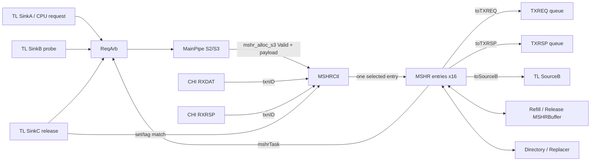
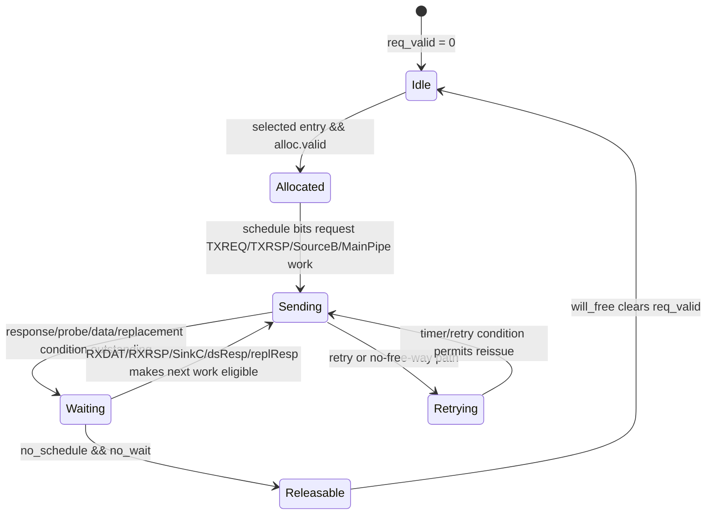

# 香山昆明湖 V2：CoupledL2 `MSHRCtl` 源码分析

> 本文以用户指定的 Kunminghu-v2 源码为准，分析 L2 缓存未命中状态控制器（Miss Status Holding Register Controller，`MSHRCtl`）如何分配、调度、回收 MSHR，并把它与 HuanCun 中职责等价但命名不同的实现区分开。设计文档只用于定位设计意图；每一项机制均给出本地 RTL/Chisel 代码依据。

## 1. 范围、版本与结论

| 项目 | 本文采用的事实 |
| --- | --- |
| 主源码 | `/home/yanyusong/xs-memory-env/XiangShan`，`kunminghu-v2`，提交 `e12436c7cba86b195deec24981976d78bc263661` |
| CoupledL2 子模块 | `fb5469838c8902b6cb33992c0a30ee3d446e4453` |
| HuanCun 子模块 | `65ef077373ecf398b4cecdea06b65ef9b8d79044` |
| 设计文档基线 | `/home/yanyusong/XiangShan-Design-Doc`，`kunminghu-v2`，提交 `58d9e2ad11f044cb6f8887d9687d9e110696d1aa` |
| 当前有效实现 | `KunminghuV2Config` 叠加 `WithCHI`，故实例化的是 CoupledL2 的 `tl2chi/MSHRCtl.scala`，不是 `tl2tl` 分支 |
| 当前 L2 形状 | 1 MiB、8-way、4 bank、64 B block；据配置公式每 bank 为 512 sets |
| HuanCun 的定位 | HuanCun 没有名为 `MSHRCtl` 的类；其等价的全局分配/冲突控制是 `MSHRAlloc`，并由 `Slice` 和各个 MSHR entry 协作实现 |

当前配置的选择链是：[`WithCHI`](</home/yanyusong/xs-memory-env/XiangShan/src/main/scala/top/Configs.scala:477>) 把 `EnableCHI` 设为真，[`KunminghuV2Config`](</home/yanyusong/xs-memory-env/XiangShan/src/main/scala/top/Configs.scala:481>) 采用该 fragment；[`L2Top`](</home/yanyusong/xs-memory-env/XiangShan/src/main/scala/xiangshan/L2Top.scala:111>) 因而选择 `TL2CHICoupledL2`。所以本文的逐信号结论以 [`coupledL2/tl2chi/MSHRCtl.scala`](</home/yanyusong/xs-memory-env/XiangShan/coupledL2/src/main/scala/coupledL2/tl2chi/MSHRCtl.scala:30>) 为中心；[`tl2tl/MSHRCtl.scala`](</home/yanyusong/xs-memory-env/XiangShan/coupledL2/src/main/scala/coupledL2/tl2tl/MSHRCtl.scala:29>) 只作为非 CHI 变体比较。

核心结论是：`MSHRCtl` 本身不是单个未命中事务的状态机，而是 **每 Slice 的 MSHR entry 池管理器和多通道任务汇聚点**。具体 entry 中保存请求、目录结果、schedule/wait 位和响应进度；`MSHRCtl` 只在空闲 entry 中选一个、把同一 entry 的响应准确送回去、对各 entry 的输出做仲裁，并向请求入口反馈容量压力。一个有效默认配置的 Slice 有 16 个 entry；这是容量上限，不代表每条外部 CHI 通道都能每拍输送 16 个事务。

### 1.1 设计文档到源码的可追溯矩阵

| 设计文档主题 | 本文对应的源码事实 | 状态 |
| --- | --- | --- |
| MSHR 由主流水线在 miss 时申请、完成后释放 | entry 在 `alloc.valid` 时锁存请求，在 `will_free` 时清除 `req_valid` | 已由 [`MSHR.scala`](</home/yanyusong/xs-memory-env/XiangShan/coupledL2/src/main/scala/coupledL2/tl2chi/MSHR.scala:132>)、[`MSHR.scala`](</home/yanyusong/xs-memory-env/XiangShan/coupledL2/src/main/scala/coupledL2/tl2chi/MSHR.scala:1303>) 验证 |
| `MSHRCtl` 从 idle MSHR 中挑选一个 entry | `idle` 向量、`ParallelPriorityMux` 和 one-hot `selectedMSHROH` 构成选择器 | 已由 [`MSHRCtl.scala`](</home/yanyusong/xs-memory-env/XiangShan/coupledL2/src/main/scala/coupledL2/tl2chi/MSHRCtl.scala:94>) 验证 |
| schedule/wait 状态决定 entry 是否仍在工作 | `FSMState` 定义 schedule/wait 位，`no_schedule && no_wait` 是 `will_free` 条件 | 已由 [`Common.scala`](</home/yanyusong/xs-memory-env/XiangShan/coupledL2/src/main/scala/coupledL2/Common.scala:312>)、[`MSHR.scala`](</home/yanyusong/xs-memory-env/XiangShan/coupledL2/src/main/scala/coupledL2/tl2chi/MSHR.scala:1303>) 验证 |
| entry 向请求、响应、探测与主流水线发出任务 | `toTXREQ`、`toTXRSP`、`toSourceB`、`mshrTask` 分别由独立仲裁器汇聚 | 已由 [`MSHRCtl.scala`](</home/yanyusong/xs-memory-env/XiangShan/coupledL2/src/main/scala/coupledL2/tl2chi/MSHRCtl.scala:168>) 验证 |

设计文档中可对应的章节是 [`MSHR.md`](</home/yanyusong/XiangShan-Design-Doc/docs/zh/cache/l2cache/MSHR.md:1>)。上表只记录文档主题与代码落点，不以文档文字替代源码证据。

## 2. 从缓存理论到本实现

一个 MSHR 的理论职责是：在 cache miss 尚未填回时记住该 cache line 的未完成事务，阻止资源被过早复用，并在数据/权限/探测/写回条件齐备后继续原请求。昆明湖代码将其拆成两个层级：

| 理论对象 | CoupledL2 中的代码实体 | 可观察含义 |
| --- | --- | --- |
| 未命中表项 | [`MSHR`](</home/yanyusong/xs-memory-env/XiangShan/coupledL2/src/main/scala/coupledL2/tl2chi/MSHR.scala:51>) | 保存 `req_valid`、请求、目录结果和进度位 |
| 空表项分配器 | [`MSHRCtl`](</home/yanyusong/xs-memory-env/XiangShan/coupledL2/src/main/scala/coupledL2/tl2chi/MSHRCtl.scala:94>) | 找 idle entry，产生 `mshr_alloc_ptr`，计算 full 条件 |
| 入口 miss 判断 | [`MainPipe`](</home/yanyusong/xs-memory-env/XiangShan/coupledL2/src/main/scala/coupledL2/tl2chi/MainPipe.scala:232>) | 在 S3 根据请求来源、命中/替换结果形成 `need_mshr_s3` |
| 长时数据暂存 | [`MSHRBuffer`](</home/yanyusong/xs-memory-env/XiangShan/coupledL2/src/main/scala/coupledL2/MSHRBuffer.scala:25>) | 以 MSHR id 和 beat 为索引，保存 refill/release 数据 |
| 目录/替换协作 | [`Directory`](</home/yanyusong/xs-memory-env/XiangShan/coupledL2/src/main/scala/coupledL2/Directory.scala:94>) 与 entry 的 `dirResult` | 保存 victim、way、hit/replacement 结果，并在需要时重试 |
| 结构冲突防护 | `mshrFull`、`a_mshrFull`、TX 队列 `noSpace` | 分别限制入口 A/B 与已被外部发送队列占满的任务 |

这不是“一个 miss 只等一个 read response”的简化模型。CHI entry 还可能需要处理 `RXRSP`、`RXDAT`、snoop/probe、Release、替换重试和 CMO/DCT 相关任务；因此 entry 的完成由一组位条件决定，而不是一个固定周期的 `done` 脉冲。

## 3. 模块边界与数据通路

[`tl2chi/Slice`](</home/yanyusong/xs-memory-env/XiangShan/coupledL2/src/main/scala/coupledL2/tl2chi/Slice.scala:39>) 把 `ReqArb`、`MainPipe`、`MSHRCtl`、目录/数据阵列、refill/release buffer 和 CHI 收发模块放进同一个 Slice。该布局说明 `MSHRCtl` 只管理已经进入 L2 slice 的事务；它不负责前端虚实地址转换，也不承担全芯片的 MMIO 路由。



### 3.1 `MSHRCtl` 接口按角色划分

| 接口组 | 方向 | 关键载荷或握手 | 代码依据 |
| --- | --- | --- | --- |
| 主流水线分配 | `fromMainPipe.mshr_alloc_s3` | `Valid[MSHRRequest]`，并非 Decoupled；返回 `mshr_alloc_ptr` | [`MSHRCtl.scala`](</home/yanyusong/xs-memory-env/XiangShan/coupledL2/src/main/scala/coupledL2/tl2chi/MSHRCtl.scala:30>) |
| 入口反压 | `toReqArb.blockA/blockB/blockC/blockG` | A 在保留一个 entry 后提前阻塞；B 到满才阻塞 | [`MSHRCtl.scala`](</home/yanyusong/xs-memory-env/XiangShan/coupledL2/src/main/scala/coupledL2/tl2chi/MSHRCtl.scala:162>) |
| entry 到主流水线 | `mshrTask` | 多个 entry 的后续任务经 `FastArbiter` 汇聚 | [`MSHRCtl.scala`](</home/yanyusong/xs-memory-env/XiangShan/coupledL2/src/main/scala/coupledL2/tl2chi/MSHRCtl.scala:174>) |
| entry 到 CHI | `toTXREQ`、`toTXRSP` | 每类通道各有仲裁，之后再被 Slice/顶层连接到 CHI | [`MSHRCtl.scala`](</home/yanyusong/xs-memory-env/XiangShan/coupledL2/src/main/scala/coupledL2/tl2chi/MSHRCtl.scala:168>) |
| entry 到 TL B | `toSourceB` | probe 相关 SourceB 任务独立仲裁 | [`MSHRCtl.scala`](</home/yanyusong/xs-memory-env/XiangShan/coupledL2/src/main/scala/coupledL2/tl2chi/MSHRCtl.scala:172>) |
| CHI 返回 | `rxdat`、`rxrsp` | 根据返回的 `mshrId` 定向到 active entry；这组 entry 输入没有 ready 反压 | [`MSHRCtl.scala`](</home/yanyusong/xs-memory-env/XiangShan/coupledL2/src/main/scala/coupledL2/tl2chi/MSHRCtl.scala:139>) |
| C 通道 Release 返回 | `resp_sinkC` | 不是按 id，而是 active + `w_c_resp` + set/tag 匹配 | [`MSHRCtl.scala`](</home/yanyusong/xs-memory-env/XiangShan/coupledL2/src/main/scala/coupledL2/tl2chi/MSHRCtl.scala:124>) |
| 数据阵列/替换器返回 | `dsResp`、`replResp` | 以 `mshrId` 路由 | [`MSHRCtl.scala`](</home/yanyusong/xs-memory-env/XiangShan/coupledL2/src/main/scala/coupledL2/tl2chi/MSHRCtl.scala:145>) |

`MSHRCtl` 内部有 `mshrTask` 和四条外部动作输出，但它不是这些任务的最终执行者。以 TXREQ 为例，Slice 连接 [`TXREQ`](</home/yanyusong/xs-memory-env/XiangShan/coupledL2/src/main/scala/coupledL2/tl2chi/Slice.scala:69>)，而多个 slice 的 TXREQ 又会在 [`TL2CHICoupledL2`](</home/yanyusong/xs-memory-env/XiangShan/coupledL2/src/main/scala/coupledL2/tl2chi/TL2CHICoupledL2.scala:132>) 继续仲裁。因此后文的“可每拍发一个”只描述 `MSHRCtl` 的某一输出端口，不代表端到端 CHI 带宽。

### 3.2 Slice 局部 id 与全局 CHI TxnID

entry 内部使用的是 Slice 局部 id。顶层 [`TL2CHICoupledL2`](</home/yanyusong/xs-memory-env/XiangShan/coupledL2/src/main/scala/coupledL2/tl2chi/TL2CHICoupledL2.scala:99>) 在 cacheable CHI 请求上把前缀、slice id 和 slice 内 txn id 编码为全局 `TxnID`；返回时再按该编码将消息选回 slice 并恢复局部 id，见 [`TL2CHICoupledL2.scala`](</home/yanyusong/xs-memory-env/XiangShan/coupledL2/src/main/scala/coupledL2/tl2chi/TL2CHICoupledL2.scala:158>)。因此第 7 节所说的 `txnID -> mshrId` 是 **已进入目标 Slice 后的局部路由**，而不是忽略多 bank 的全局 id 路由。

CHI snoop 也不是直接送到 `MSHRCtl`：[`RXSNP`](</home/yanyusong/xs-memory-env/XiangShan/coupledL2/src/main/scala/coupledL2/tl2chi/RXSNP.scala:43>) 经 Slice 的 RequestArb/SinkB 路径进入 MainPipe；Slice 同时把 `MSHRCtl.msInfo` 提供给该路径，连线见 [`Slice.scala`](</home/yanyusong/xs-memory-env/XiangShan/coupledL2/src/main/scala/coupledL2/tl2chi/Slice.scala:93>)。这说明 `MSHRCtl` 既处理已归属 entry 的返回，也向入站 snoop 路径暴露在途事务信息以处理冲突；它并不亲自解析所有 snoop。

## 4. 容量、ID、地址与存储索引

### 4.1 可由当前配置推出的数量

[`L2Param`](</home/yanyusong/xs-memory-env/XiangShan/coupledL2/src/main/scala/coupledL2/L2Param.scala:65>) 给出 `mshrs = 16` 默认值；当前 [`L2CacheConfig`](</home/yanyusong/xs-memory-env/XiangShan/src/main/scala/top/Configs.scala:278>) 没有覆盖该字段。[`CoupledL2`](</home/yanyusong/xs-memory-env/XiangShan/coupledL2/src/main/scala/coupledL2/CoupledL2.scala:127>) 将该值命名为 `mshrsAll`，并把 id 总宽度设为 `log2Up(idsAll)`，其中 `idsAll = 256`。

| 项目 | 值/关系 | 不应混淆的点 |
| --- | --- | --- |
| 每 Slice entry 数 | `mshrsAll = 16` | 这是 entry 数，不是 id 总线宽度 |
| 当前 L2 bank 数 | `L2CacheConfig("1MB", 4, ...)` 的 `banks = 4` | 可据此推导实例级最多有 `4 x 16` 个 entry；是否同时占满取决于各 slice 的流量和全局接口压力 |
| `mshrBits` | `log2Up(256) = 8` | 接口可携带 8 位 transaction/id 空间；在本控制器内被选择的 entry 编号仍是 0--15 |
| 选中指针 | `OHToUInt(selectedMSHROH)` | one-hot selector 定义“哪个 entry”，不是用 8 位宽度重新扩大 16 项表 |
| cache block | L2 参数默认 `blockBytes = 64` | `MSHRBuffer` 再以 entry id、beat 索引存储数据 |

`MSHRStatus` 中用于 C 通道匹配的字段包括 `set`、`reqTag`、`metaTag`、`needsRepl`、`w_c_resp` 与 `will_free`，定义见 [`Common.scala`](</home/yanyusong/xs-memory-env/XiangShan/coupledL2/src/main/scala/coupledL2/Common.scala:196>)。这说明 entry 不只记“miss 地址”；它还需携带替换时的 victim tag 和等待何种返回的状态。

### 4.2 MSHR buffer 的索引和并发写语义

[`MSHRBuffer`](</home/yanyusong/xs-memory-env/XiangShan/coupledL2/src/main/scala/coupledL2/MSHRBuffer.scala:25>) 的寄存器数组形状是 `mshrsAll x beatSize x data`。写端以 MSHR id 筛选并按 beat mask 更新，读端是带使能的寄存器读：

| 操作 | 键 | 代码可证明的行为 |
| --- | --- | --- |
| refill 数据写入 | `RXDAT` 的 `txnID`，被转换为 `mshrId` | [`RXDAT.scala`](</home/yanyusong/xs-memory-env/XiangShan/coupledL2/src/main/scala/coupledL2/tl2chi/RXDAT.scala:57>) 把 `txnID` 作为 id，并向 refill buffer 发出 beat 写入 |
| release 数据写入 | C 返回匹配出的 entry id 或 nested writeback id | [`MSHRCtl.scala`](</home/yanyusong/xs-memory-env/XiangShan/coupledL2/src/main/scala/coupledL2/tl2chi/MSHRCtl.scala:183>) 选择写入 id 和数据 |
| 同 entry 多写 | 同拍最多允许两个 write port 命中该 id；三个及以上触发断言 | [`MSHRBuffer.scala`](</home/yanyusong/xs-memory-env/XiangShan/coupledL2/src/main/scala/coupledL2/MSHRBuffer.scala:51>) |
| 两个写端同时命中时 | 数据/mask 经 `PriorityMux` 选择 | 这是明确的静态优先级结果，不能把它概括成“无冲突地合并”；写端安排必须保证协议语义 |

Slice 对 release buffer 连接了 nested writeback、SinkC 和 MainPipe 三个写入来源，见 [`Slice.scala`](</home/yanyusong/xs-memory-env/XiangShan/coupledL2/src/main/scala/coupledL2/tl2chi/Slice.scala:145>)。`MSHRBuffer` 的断言只排除了三个端口同时写同一 entry；它没有在这里建立一个独立的“数据有效位”。数据是否可消费由各 entry 的状态和事务协议保证。

## 5. 分配：从 MainPipe S3 到一个 entry

### 5.1 两段式容量判断

`MainPipe` 在 S3 产生 `mshr_alloc_s3`。该信号是 `Valid`，所以不能像普通 Decoupled 接口那样把“`valid && ready`”称为 allocation fire。容量许可发生在更早的请求接纳路径：`MSHRCtl` 把 active entry 数与流水线中尚未变为 active entry 的请求数一起计算。

```text
pipeReqCount = PopCount(pipeStatusVec.valid)
mshrCount    = PopCount(mshrs.status.valid)
mshrFull     = (mshrCount + pipeReqCount >= 16)
a_mshrFull   = (mshrCount + pipeReqCount >= 15)
```

以上关系来自 [`MSHRCtl.scala`](</home/yanyusong/xs-memory-env/XiangShan/coupledL2/src/main/scala/coupledL2/tl2chi/MSHRCtl.scala:106>)。较早的 `a_mshrFull` 特意为 B/probe 类请求保留一个位置：`blockA := a_mshrFull`，而 `blockB := mshrFull`。这是一种来源优先级/死锁回避策略，而不是 A 请求有 15 个物理 entry。

| 时点 | 主要信号 | 发生的事情 |
| --- | --- | --- |
| 请求接纳 | `toReqArb.blockA/blockB` | ReqArb 看到容量压力，避免把无法容纳的任务继续送进流水线 |
| MainPipe S2 | `taskFromArb_s2` | 接收仲裁后的任务并形成流水线状态 | 
| MainPipe S3 | `need_mshr_s3`、`mshr_alloc_s3.valid` | 对 A miss、需要的 B/probe 或 cache alias 等条件构造 `MSHRRequest` | 
| MSHRCtl 组合选择 | `idle`、`selectedMSHROH`、`mshr_alloc_ptr` | 从 `!status.valid` entry 中选出一个 one-hot entry | 
| entry 时钟更新 | `io.alloc.valid` | 被选中的 entry 锁存请求、目录结果、初始进度状态 |

`need_mshr_s3` 的具体判定及 payload 构造在 [`MainPipe.scala`](</home/yanyusong/xs-memory-env/XiangShan/coupledL2/src/main/scala/coupledL2/tl2chi/MainPipe.scala:264>)。分配 payload 带有目录结果、任务、错误信息和 `initState`，不是只有一个地址。

`MSHRCtl` 的 block 信号只是入口准入的一部分。[`RequestArb`](</home/yanyusong/xs-memory-env/XiangShan/coupledL2/src/main/scala/coupledL2/RequestArb.scala:145>) 在可接纳的 C、B、A 任务中采用 C > B > A 的优先级，并把已锁存的 MSHR task 作为另一条受保护的输入路径。因此不能只从 `blockA/blockB` 推导每个入口最终的发射顺序；还必须观察 `RequestArb` 的目录读、grant buffer 和 TX 队列阻塞条件。

### 5.2 空闲选择器与 ID 优先级

```scala
idle(i)                 := !mshrs(i).io.status.valid
selectedMSHROH          := ParallelPriorityMux(idle -> (1 << i))
mshrs(i).io.alloc.valid := selectedMSHROH(i) && mshr_alloc_s3.valid
```

上面的伪摘录对应 [`MSHRCtl.scala`](</home/yanyusong/xs-memory-env/XiangShan/coupledL2/src/main/scala/coupledL2/tl2chi/MSHRCtl.scala:94>) 和 [`MSHRCtl.scala`](</home/yanyusong/xs-memory-env/XiangShan/coupledL2/src/main/scala/coupledL2/tl2chi/MSHRCtl.scala:130>)。`ParallelPriorityMux` 的输入按 entry 编号递增构造，而该工具对前面的有效输入取优先级，定义见 [`ParallelMux.scala`](</home/yanyusong/xs-memory-env/XiangShan/utility/src/main/scala/utility/ParallelMux.scala:88>)。因此空闲时优先选择较小编号的 MSHR；这和后文 task 输出的 round-robin 仲裁是两种不同策略。

```wavedrom
{ "signal": [
  { "name": "clk", "wave": "p....." },
  { "name": "ReqArb accepts request", "wave": "01...." },
  { "name": "MainPipe.mshr_alloc_s3.valid", "wave": "0.10.." },
  { "name": "selectedMSHROH[k]", "wave": "0.10.." },
  { "name": "MSHR[k].alloc.valid", "wave": "0.10.." },
  { "name": "MSHR[k].status.valid", "wave": "0..1.." },
  { "name": "mshr_alloc_ptr", "wave": "x.3...", "data": ["k"] }
] }
```

该时序图表达的是信号依赖关系，不声称 S3 分配到 CHI 返回之间存在固定周期。`mshr_alloc_s3.valid` 只在已经由上游容量控制允许的情况下有意义；若观察波形，应同时检查 `pipeStatusVec`，否则会漏掉 `mshrFull` 中计入的在途流水线请求。

## 6. entry 的状态、调度与释放

### 6.1 entry 内部保存什么

每个 [`MSHR`](</home/yanyusong/xs-memory-env/XiangShan/coupledL2/src/main/scala/coupledL2/tl2chi/MSHR.scala:70>) 有寄存器化的 `req_valid`、请求、`dirResult`、`state`、各类已收到/等待标志、timer 和 beat 计数。分配时 [`MSHR.scala`](</home/yanyusong/xs-memory-env/XiangShan/coupledL2/src/main/scala/coupledL2/tl2chi/MSHR.scala:132>) 写入这些寄存器；复位时 `req_valid` 为假，因此 status 不会把未分配 entry 当作 active。

`FSMState` 的字段定义在 [`Common.scala`](</home/yanyusong/xs-memory-env/XiangShan/coupledL2/src/main/scala/coupledL2/Common.scala:312>)。字段可按职责分组：

| 位组 | 代表字段 | 由代码可知的职责 |
| --- | --- | --- |
| schedule/待发操作 | `s_acquire`、`s_rprobe`、`s_pprobe`、`s_release`、`s_probeack`、`s_refill`、`s_retry`、`s_cmometaw` | 记录还会阻止 entry 回收的发送/后续操作 |
| 等待返回 | `w_c_resp`、`w_d_resp`、CHI 下的 `wcompack` 等 | 记录某类 response 尚未满足 |
| CHI 专有进度 | `s_rcompack`、`cbwrdata`、`reissue`、`dct` | 支撑 CHI 回复、重发和 DCT 相关动作 |

不要把这些位笼统地解释为传统 enum FSM 的“状态编号”。源码使用的是多个可并行更新的布尔状态；在释放条件中，`no_schedule` 和 `no_wait` 都要求相应位回到不再阻塞的取值。因而应以具体任务的置位/清位路径解释它们，而非假定一个线性状态转移图。



此图是由多位条件归纳出的生命周期图：实际硬件没有一个名为 `Idle/Allocated/...` 的 enum 寄存器。`will_free` 的精确定义是 [`MSHR.scala`](</home/yanyusong/xs-memory-env/XiangShan/coupledL2/src/main/scala/coupledL2/tl2chi/MSHR.scala:1303>) 中的 `no_schedule && no_wait`；同一段代码在成立时清除 `req_valid`。

### 6.2 一个普通 A miss 的证据链

1. `MainPipe` 的 S3 判断当前任务需要 MSHR，并将目录结果和请求放进 `mshr_alloc_s3`，见 [`MainPipe.scala`](</home/yanyusong/xs-memory-env/XiangShan/coupledL2/src/main/scala/coupledL2/tl2chi/MainPipe.scala:264>)。
2. `MSHRCtl` 根据 `!status.valid` 选择一个 entry，把相同 `MSHRRequest` 送给所有 entry，但只有被选择者看到 `alloc.valid`，见 [`MSHRCtl.scala`](</home/yanyusong/xs-memory-env/XiangShan/coupledL2/src/main/scala/coupledL2/tl2chi/MSHRCtl.scala:124>)。
3. entry 用自己的固定 `io.id` 形成 CHI `txnID`，见 [`MSHR.scala`](</home/yanyusong/xs-memory-env/XiangShan/coupledL2/src/main/scala/coupledL2/tl2chi/MSHR.scala:364>)，以后到达的 RXDAT/RXRSP 因而可以回到同一 entry。
4. entry 的待发动作通过 `toTXREQ` 等端口竞争输出；外部响应会更新 schedule/wait 位、beat 计数、数据和错误标志，见 [`MSHR.scala`](</home/yanyusong/xs-memory-env/XiangShan/coupledL2/src/main/scala/coupledL2/tl2chi/MSHR.scala:1145>) 和 [`MSHR.scala`](</home/yanyusong/xs-memory-env/XiangShan/coupledL2/src/main/scala/coupledL2/tl2chi/MSHR.scala:1184>)。
5. 只有所有仍阻塞释放的 schedule/wait 条件消失，entry 才由 `will_free` 回到空闲池。

### 6.3 retry 不等于立刻重发

对于替换失败或无可用 way 的路径，entry 中有 retry 计数和 timer。源码将 retry 阈值和周期定义为 3、20，并在 [`MSHR.scala`](</home/yanyusong/xs-memory-env/XiangShan/coupledL2/src/main/scala/coupledL2/tl2chi/MSHR.scala:92>) 注明其目的是避免反复 retry 时的潜在死锁；实际重试/等待条件的更新在 [`MSHR.scala`](</home/yanyusong/xs-memory-env/XiangShan/coupledL2/src/main/scala/coupledL2/tl2chi/MSHR.scala:1256>)。因此性能分析不应把“收到 retry”计为一个固定一拍的重新发送。

## 7. 响应路由、任务仲裁与背压

### 7.1 返回为什么能回到正确 entry

| 返回来源 | 路由键 | 控制器行为 | 关键限制 |
| --- | --- | --- | --- |
| CHI `RXDAT` | 顶层全局 TxnID 先选 slice，slice 内 `txnID -> mshrId` | active 且局部 id 相等的 entry 接收 `rxdat` | [`RXDAT.scala`](</home/yanyusong/xs-memory-env/XiangShan/coupledL2/src/main/scala/coupledL2/tl2chi/RXDAT.scala:57>) 明确赋值；全局编解码见第 3.2 节 |
| CHI `RXRSP` | 顶层全局 TxnID 先选 slice，slice 内 `txnID -> mshrId` | active 且局部 id 相等的 entry 接收 `rxrsp` | [`RXRSP.scala`](</home/yanyusong/xs-memory-env/XiangShan/coupledL2/src/main/scala/coupledL2/tl2chi/RXRSP.scala:38>) |
| Directory/替换器 | `mshrId` | `dsResp`、`replResp` 用 id 定向 | [`MSHRCtl.scala`](</home/yanyusong/xs-memory-env/XiangShan/coupledL2/src/main/scala/coupledL2/tl2chi/MSHRCtl.scala:145>) |
| TL SinkC | set/tag 和等待位 | active、`w_c_resp`、set 相等且 tag 相等才匹配；替换时匹配 `metaTag` | [`MSHRCtl.scala`](</home/yanyusong/xs-memory-env/XiangShan/coupledL2/src/main/scala/coupledL2/tl2chi/MSHRCtl.scala:124>) |

SinkC 是唯一不直接使用 MSHR id 的这一类返回。其匹配向量还用于 `releaseBufWriteId` 的 `ParallelPriorityMux` 选择，见 [`MSHRCtl.scala`](</home/yanyusong/xs-memory-env/XiangShan/coupledL2/src/main/scala/coupledL2/tl2chi/MSHRCtl.scala:183>)。这里 **没有** 对 `resp_sinkC_match_vec` 的 `PopCount <= 1` 本地断言；紧随其后的 `PopCount <= 1` 断言保护的是 `nestedwbData`。因此“同一 C 返回只能有一个 active entry 认领”应作为协议不变量和波形验证点，而不能误称为这段硬件已显式检查的断言。

### 7.2 四类输出仲裁

`MSHRCtl` 为 TXREQ、TXRSP、SourceB 和 MainPipe task 分别实例化快速仲裁器，见 [`MSHRCtl.scala`](</home/yanyusong/xs-memory-env/XiangShan/coupledL2/src/main/scala/coupledL2/tl2chi/MSHRCtl.scala:168>)。其底层 [`FastArbiter`](</home/yanyusong/xs-memory-env/XiangShan/utility/src/main/scala/utility/FastArbiter.scala:30>) 在 `out.fire` 时更新 pending mask，并以轮转选择生成下一项；某 input 的 `ready` 只有在它被 grant 且输出 ready 时才有效。

| 输出 | 仲裁粒度 | 直接效果 |
| --- | --- | --- |
| `toTXREQ` | 多个 entry 的 CHI request | 同一拍最多选择一个 entry 给本 Slice 的 TXREQ 接口；未 ready 时获选 entry 保持等待 |
| `toTXRSP` | 多个 entry 的 CHI response | 与 TXREQ 独立，不能用一个通道的吞吐推导另一个通道 |
| `toSourceB` | 多个 entry 的 TL probe | B 通道任务不和 TXREQ 共用同一 arbiter |
| `mshrTask` | 多个 entry 的后续主流水线任务 | entry 内部先选一种 task，entry 之间再做 round-robin 风格仲裁 |

一个 entry 面向 MainPipe 的候选任务使用 `ParallelPriorityMux`，其排列可由 [`MSHR.scala`](</home/yanyusong/xs-memory-env/XiangShan/coupledL2/src/main/scala/coupledL2/tl2chi/MSHR.scala:977>) 直接读出：`grant`、`release`、`cbwrdata`、`probeack`、`dct`、`cmometaw`。这是 **entry 内的静态任务优先级**；不要把它和 `FastArbiter` 的跨 entry 轮转公平性混为一谈。

### 7.3 背压如何穿过边界

| 位置 | 反压/保持证据 | 分析含义 |
| --- | --- | --- |
| `FastArbiter` | input ready 受 grant 和 `out.ready` 共同控制 | 下游停住时，entry 的相应动作不会被错误地当作已发出 |
| TXREQ | entry 队列大小为 `mshrsAll`，`noSpace` 时限制 MSHR 请求 | [`TXREQ.scala`](</home/yanyusong/xs-memory-env/XiangShan/coupledL2/src/main/scala/coupledL2/tl2chi/TXREQ.scala:44>) |
| TXRSP | 同样有队列容量和较早的空间阈值 | [`TXRSP.scala`](</home/yanyusong/xs-memory-env/XiangShan/coupledL2/src/main/scala/coupledL2/tl2chi/TXRSP.scala:47>) |
| MSHR entry | `io.txreq.fire`、`io.txrsp.fire`、`io.source_b.fire` 才更新对应发送进度 | [`MSHR.scala`](</home/yanyusong/xs-memory-env/XiangShan/coupledL2/src/main/scala/coupledL2/tl2chi/MSHR.scala:1029>) |

这里的关键边界是：入口分配采用 `Valid`，任务输出采用 Decoupled。调试波形时必须分别看分配信号和各 output 的 `fire`；把二者混为“所有 MSHR 操作都 ready/valid”会误判卡顿位置。

## 8. 冲突、嵌套写回和前进性

### 8.1 已实现的冲突处理

| 场景 | 条件/优先级 | 代码中的处理 | 可验证观察点 |
| --- | --- | --- | --- |
| 普通 A 请求耗尽 entry | `a_mshrFull`，即 active+pipe 到 15 | `blockA` 提前拉高，留出一个 entry 给 B | `mshrCount`、`pipeReqCount`、`blockA` |
| B/probe 也耗尽 entry | `mshrFull` 到 16 | `blockB` 拉高 | `blockB` 与 selected one-hot |
| 多个空闲 entry | `idle` 向量 | 低编号优先分配 | `selectedMSHROH` |
| 多 entry 争外部动作 | 多个 `toTXREQ`/task valid | FastArbiter 只 grant 一个，并在 output fire 后轮转 | `out.valid/ready/fire`、input ready |
| SinkC 对同一 set/tag 返回 | `w_c_resp` 与 set/tag 匹配 | 由 `ParallelPriorityMux` 选 release buffer id；多匹配没有这里的专门断言，必须作为协议检查 | `resp_sinkC_match_vec` |
| nested writeback | MSHR entry 报告 nestedwb | 控制器汇聚 nested 写入并选择 release buffer 写源 | [`MSHRCtl.scala`](</home/yanyusong/xs-memory-env/XiangShan/coupledL2/src/main/scala/coupledL2/tl2chi/MSHRCtl.scala:183>) |
| 替换 retry | retry 条件、计数、timer | entry 保持 active，按 backoff 规则重试/等待 | retry state、timer、`req_valid` |
| 一个 entry 完成 | `no_schedule && no_wait` | `will_free` 清 `req_valid`，重新进入 idle 池 | `status.willFree`、`status.valid` |

### 8.2 `l2Miss` 不是全体 MSHR 的“有效位”

[`MSHRCtl.scala`](</home/yanyusong/xs-memory-env/XiangShan/coupledL2/src/main/scala/coupledL2/tl2chi/MSHRCtl.scala:118>) 中的 `l2Miss` 只统计 active entry 中来源是 A、且原请求是 CPU Load/Store 的子集。它可用于性能统计，但不能替代 `mshrCount` 判断容量，更不能拿来判断 B/probe、CMO 或其他类型 entry 是否在途。

### 8.3 同地址冲突与 late-prefetch merge 的职责边界

`MSHRCtl` 的分配器只看 entry 是否 idle，不在这里对每个新 A 请求做通用 set/tag 冲突裁决。该职责在 [`RequestBuffer`](</home/yanyusong/xs-memory-env/XiangShan/coupledL2/src/main/scala/coupledL2/RequestBuffer.scala:108>)：它从 `msInfo` 取在途 entry，使用 set、请求 tag、以及必要时 replacement `metaTag` 形成冲突掩码，并排除 `willFree` entry。对于满足条件的 late prefetch，RequestBuffer 形成带 id 的 `aMergeTask`，见 [`RequestBuffer.scala`](</home/yanyusong/xs-memory-env/XiangShan/coupledL2/src/main/scala/coupledL2/RequestBuffer.scala:153>)；`MSHRCtl` 再按该 id 仅把 merge task 交给一个 entry，见 [`MSHRCtl.scala`](</home/yanyusong/xs-memory-env/XiangShan/coupledL2/src/main/scala/coupledL2/tl2chi/MSHRCtl.scala:154>)。

这一区分避免两个错误结论：一是不能说 `MSHRCtl` 本身支持任意 secondary miss merge；二是不能因为 `mshrFull` 尚未拉高就假定同地址请求一定可以新分配。实际是否阻塞、合并或等待还受 RequestBuffer 的地址冲突和同 set 可用 way 约束。

### 8.3 释放条件的安全含义

entry 释放没有直接依赖“收到最后一个 data beat”这一件事。RXDAT/RXRSP/SinkC/目录/替换器都可能解除或创建后续任务；最终统一由 `no_schedule && no_wait` 决定。这样可以避免数据到达但 Release、ProbeAck 或 CompAck 尚未完成时过早复用同一 id。相反，若在仿真中看到 `req_valid` 长期为真，应从尚未清除的具体 schedule/wait 位追查，而非仅检查 data 返回。

## 9. HuanCun 的等价实现：相同目标，不同控制形态

`huancun` 中没有 `class MSHRCtl`。它把全局 idle 选择、A/B/C 入口优先级、同粒度冲突屏蔽和目录读请求集中在 [`MSHRAlloc.scala`](</home/yanyusong/xs-memory-env/XiangShan/huancun/src/main/scala/huancun/MSHRAlloc.scala:29>)，而每个 entry 的状态处理分别在 [`BaseMSHR.scala`](</home/yanyusong/xs-memory-env/XiangShan/huancun/src/main/scala/huancun/BaseMSHR.scala:8>) 与 inclusive/noninclusive `MSHR.scala` 中实现。

| 维度 | 当前有效 CoupledL2 CHI | HuanCun 等价结构 |
| --- | --- | --- |
| 全局控制模块 | `tl2chi/MSHRCtl` | `MSHRAlloc` + `Slice` wiring |
| 默认 entry 参数 | `mshrsAll = 16` 每 Slice | `mshrs = 14`，`mshrsAll = mshrs + 2 = 16`，见 [`HCCacheParameters.scala`](</home/yanyusong/xs-memory-env/XiangShan/huancun/src/main/scala/huancun/HCCacheParameters.scala:83>) |
| 入口来源策略 | 对 A 提前保留一项，B 满时阻塞 | C 优先于 B，B 优先于 A；另有 B/C 特殊 entry |
| entry 选择 | `!status.valid` 的低编号优先 | regular MSHR 也从 availability 向量中选；另有 `abc`/`bc`/`c` 专用分支 |
| 同地址/同集合防冲突 | SinkC 返回用 set/tag 定向；entry 内管理 pending 状态 | `get_match_vec` 在 `block_granularity` 上检测 MSHR 冲突，见 [`MSHRAlloc.scala`](</home/yanyusong/xs-memory-env/XiangShan/huancun/src/main/scala/huancun/MSHRAlloc.scala:71>) |
| 目录读取 | MainPipe/entry 与 L2 directory 协作 | Allocator 明确产生 `dirRead` 与 one-hot id |

HuanCun `Slice` 直接要求 `mshrsAll == mshrs + 2` 并实例化 inclusive 或 noninclusive entry，见 [`huancun/Slice.scala`](</home/yanyusong/xs-memory-env/XiangShan/huancun/src/main/scala/huancun/Slice.scala:94>)。`MSHRAlloc` 的接纳顺序可由 [`MSHRAlloc.scala`](</home/yanyusong/xs-memory-env/XiangShan/huancun/src/main/scala/huancun/MSHRAlloc.scala:110>) 看到：C 的可接纳条件先决，B 被 C 抑制，A 又被 B/C 抑制。这和 CoupledL2 用 `blockA` 留空位的做法目标相近，都是保障 probe/release 类进度，但实现和入口契约不同。

不能把 HuanCun 的 14+2 直接套到当前 KMHv2 CHI L2：[`Configs.scala`](</home/yanyusong/xs-memory-env/XiangShan/src/main/scala/top/Configs.scala:346>) 只在 `!EnableCHI` 的配置路径建立 HuanCun L3；当前有效配置的 `EnableCHI = true`。本节用于理解两套源码的对应关系，不宣称 HuanCun `MSHRAlloc` 正在当前 CHI L2 datapath 中运行。

HuanCun 的释放也值得作为语义差异保留：noninclusive entry 以 `no_wait && no_schedule` 形成 `will_free`，但 `MSHRAlloc` 的空闲判断仍看 `!status.valid`，所以 `will_free` 是当前拍的释放预告而非同拍可重用许可，见 [`noninclusive/MSHR.scala`](</home/yanyusong/xs-memory-env/XiangShan/huancun/src/main/scala/huancun/noninclusive/MSHR.scala:1425>) 和 [`Common.scala`](</home/yanyusong/xs-memory-env/XiangShan/huancun/src/main/scala/huancun/Common.scala:186>)。这是 HuanCun 不能直接套用 CoupledL2 “entry 清 `req_valid` 后回收”时序描述的具体原因。

### 9.1 CoupledL2 的 `tl2tl` 变体为何不作为主结论

CoupledL2 另有 [`tl2tl/MSHRCtl.scala`](</home/yanyusong/xs-memory-env/XiangShan/coupledL2/src/main/scala/coupledL2/tl2tl/MSHRCtl.scala:29>)，它复用相近的 idle 选择、`mshrFull/a_mshrFull` 容量策略和 task 仲裁框架；区别是它把返回/发送接到 TileLink 的 SinkD、SourceC/SourceA 等路径，而非 CHI 的 RXDAT/RXRSP、TXREQ/TXRSP。当前 `WithCHI` 配置不会实例化该实现，故它只能用来说明 CoupledL2 的协议适配边界，不能作为本章的行为证据。

## 10. 地址边界、MMIO 和异常范围

| 边界问题 | 在 MSHRCtl 可见的证据 | 结论和追踪边界 |
| --- | --- | --- |
| 虚实地址转换 | `MSHRCtl` 接口只接收 L2 task/`MSHRRequest`，状态匹配使用 set/tag；没有 TLB/PTW 或虚拟页字段端口 | 地址翻译在进入本模块前完成；本文不能从 MSHRCtl 推导 TLB miss 的时延 |
| 跨 cache line 请求 | entry 形成 CHI 地址时将 tag、set 和块内零拼接；数据缓冲按 beat 管理 | [`MSHR.scala`](</home/yanyusong/xs-memory-env/XiangShan/coupledL2/src/main/scala/coupledL2/tl2chi/MSHR.scala:385>) 显示 MSHR 持有 cache-line 粒度事务。未在 `MSHRCtl`/`MSHR` 中找到跨行拆分逻辑，拆分必须发生在上游或协议输入边界 |
| MMIO/不可缓存访问 | `L2Top` 有独立的 MMIO 连接，而 `MSHRCtl` IO 没有 MMIO 通道 | MSHRCtl 不应被解释为 MMIO 重放器；MMIO 的具体路由需沿 [`L2Top.scala`](</home/yanyusong/xs-memory-env/XiangShan/src/main/scala/xiangshan/L2Top.scala:129>) 外部继续追踪 |
| 错误/deny/corrupt | 分配 payload 保存 `denied`/`corrupt`，entry 在返回路径更新相关状态 | 错误可随 entry 生命周期保存，但最终 architectural exception 的处理不在本控制器接口内 |
| CMO/CHI 特有动作 | state 中有 `cmometaw`、`cbwrdata`、`dct` 等位 | 这些任务会参与 entry 的完成条件和 MainPipe task 优先级，不能在普通 load miss 模型中忽略 |

这一节刻意把“代码没有给出”的部分标成跨模块边界，而不是根据缓存常识补写行为。要验证跨行、MMIO 或异常最终可见性，需要再把波形追到 L1/LSU、MMIO bridge 或 CHI 互连。

## 11. 延迟与吞吐的可证实边界

| 指标 | 可以从代码确认的上限/关系 | 不能从静态代码直接给出的量 |
| --- | --- | --- |
| 新 entry 分配 | 一个 `selectedMSHROH`，故本 Slice 一拍至多分配一个 entry；必须受 ReqArb 和容量门控许可 | 特定工作负载的连续分配率 |
| 在途 entry | 当前参数为每 Slice 16；配置有 4 个 bank，可推导实例容量上界为 64 | 各 bank 是否会同时吃满、跨 slice 流量分布 |
| 每类输出 | TXREQ、TXRSP、SourceB、mshrTask 各自的 arbiter 在其接口上每拍至多 grant 一个 | 外部 CHI、queue、目录、数据阵列和顶层仲裁造成的实际带宽 |
| 返回到释放 | 由所有 schedule/wait 位满足后 `will_free` 决定 | miss 往返、snoop、替换、retry 的固定 cycle 数；源码中不存在可直接引用的常量延迟 |
| 数据缓冲 | 每 MSHR entry 有 beat 维度的存储 | 同拍读写的最终可见 cycle，需针对具体读写端口波形验证 |

可用于波形统计的生命周期边界是：`mshr_alloc_s3.valid`/被选 entry 的 `alloc.valid` 为起点候选，`status.willFree` 为释放候选，`status.valid` 清零为可重用结果。对外发射应单独用对应 Decoupled 通道的 `fire` 计数，不能把 allocation 周期当作 TXREQ 发射周期。

## 12. 建议的验证清单

下面的项目来自实现中的真实状态、断言和握手，适合转成 ChiselTest、波形检索或形式化 cover/assert，而不是只检查“最终是否读到数据”。

| 编号 | 场景 | 应检查的信号/性质 | 代码依据 |
| --- | --- | --- | --- |
| V1 | 复位后空池 | 所有 entry 的 `status.valid=0`，`req_valid=0` | [`MSHR.scala`](</home/yanyusong/xs-memory-env/XiangShan/coupledL2/src/main/scala/coupledL2/tl2chi/MSHR.scala:78>) |
| V2 | 首次 miss | `mshr_alloc_s3.valid` 只使一个 `alloc.valid` 为真，且 ptr 与该 entry 一致 | [`MSHRCtl.scala`](</home/yanyusong/xs-memory-env/XiangShan/coupledL2/src/main/scala/coupledL2/tl2chi/MSHRCtl.scala:94>) |
| V3 | 15/16 项压力 | 第 15 项压力时 A 被 block；第 16 项压力时 B 也被 block | [`MSHRCtl.scala`](</home/yanyusong/xs-memory-env/XiangShan/coupledL2/src/main/scala/coupledL2/tl2chi/MSHRCtl.scala:106>) |
| V4 | 下游 TX backpressure | `toTXREQ.valid && !ready` 时该任务不应被当作已发；`txreq.fire` 前 schedule 不应错误完成 | [`FastArbiter.scala`](</home/yanyusong/xs-memory-env/XiangShan/utility/src/main/scala/utility/FastArbiter.scala:30>)、[`MSHR.scala`](</home/yanyusong/xs-memory-env/XiangShan/coupledL2/src/main/scala/coupledL2/tl2chi/MSHR.scala:1029>) |
| V5 | 返回乱序 | 不同 txnID 的 RXDAT/RXRSP 必须更新各自 id 的 entry/beat，而不能根据到达顺序归属 | [`RXDAT.scala`](</home/yanyusong/xs-memory-env/XiangShan/coupledL2/src/main/scala/coupledL2/tl2chi/RXDAT.scala:57>)、[`RXRSP.scala`](</home/yanyusong/xs-memory-env/XiangShan/coupledL2/src/main/scala/coupledL2/tl2chi/RXRSP.scala:38>) |
| V6 | SinkC 同地址返回 | 检查 `resp_sinkC_match_vec` 最多一个命中，且匹配 entry 的 set/tag/wait 位一致；这是协议性质，不是此处已有断言 | [`MSHRCtl.scala`](</home/yanyusong/xs-memory-env/XiangShan/coupledL2/src/main/scala/coupledL2/tl2chi/MSHRCtl.scala:124>) |
| V7 | 同 entry buffer 多写 | 两个匹配写端的静态优先级符合预期；三个匹配写端触发保护断言 | [`MSHRBuffer.scala`](</home/yanyusong/xs-memory-env/XiangShan/coupledL2/src/main/scala/coupledL2/MSHRBuffer.scala:51>) |
| V8 | retry/无 way | entry 不提前释放，timer/retry 进度最终允许继续或暴露长期停滞 | [`MSHR.scala`](</home/yanyusong/xs-memory-env/XiangShan/coupledL2/src/main/scala/coupledL2/tl2chi/MSHR.scala:1256>) |
| V9 | completion | 只有 `no_schedule && no_wait` 后才观察到 `will_free` 和 `req_valid` 清除 | [`MSHR.scala`](</home/yanyusong/xs-memory-env/XiangShan/coupledL2/src/main/scala/coupledL2/tl2chi/MSHR.scala:1303>) |
| V10 | HuanCun 对照配置 | 在 `EnableCHI=true` 的仿真中不应把 HuanCun `MSHRAlloc` 当作 L2 MSHR 控制器的活跃实例 | [`Configs.scala`](</home/yanyusong/xs-memory-env/XiangShan/src/main/scala/top/Configs.scala:346>) |

本次交付是静态源码分析，未声称已经跑过包含这些覆盖点的 RTL 仿真。若要量化某条 miss 的实际周期，下一步应在真实 workload 波形中固定 MSHR id，连续观察 allocation、每次任务 `fire`、RXDAT/RXRSP、`will_free`，并同时记录 TX 队列与目录接口的 backpressure。

## 13. 小结

在昆明湖 V2 的默认 CHI 配置中，`coupledL2/tl2chi/MSHRCtl` 负责 16-entry Slice 局部 MSHR 池的选择、容量保留、响应归属和多输出仲裁；entry 本身负责细粒度协议进度，并仅在所有 schedule/wait 阻塞解除后释放。A 请求在 15 项压力时提前被阻塞而 B 可继续使用最后一项，是该控制器最关键的资源优先级事实。HuanCun 的 `MSHRAlloc` 实现了相似的资源保护目标，但具有专用 B/C entry 和 C>B>A 入口优先级，不能误称为当前 CHI L2 的运行模块。

后续做 trace 关联时，建议以 `mshr_alloc_ptr`/`txnID` 固定一个 entry 身份，而不是仅以 PC 或地址判断；同一地址在 retry、nested writeback 或多个数据 beat 的情况下会跨越多个不同的握手事件。
