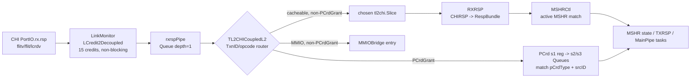
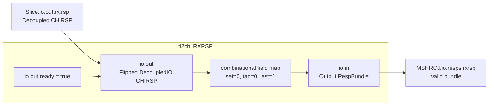
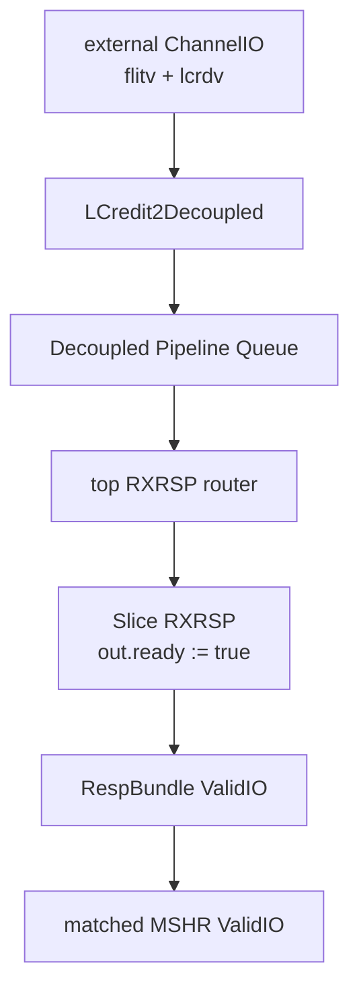
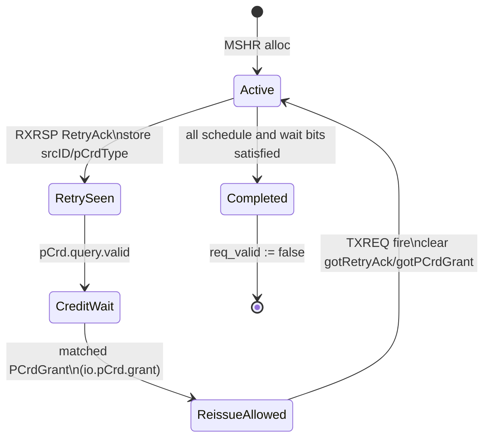

<!--
# Cache-RXRSP：昆明湖 V2 CoupledL2 的 CHI 无数据响应接收路径

> 结论先行：`coupledL2/tl2chi/RXRSP` 本体不是 FIFO、流水级或状态机，而是一个无状态的 `CHIRSP -> RespBundle` 组合适配器。它把已经由顶层恢复过的 `txnID` 交给 `MSHRCtl` 作 MSHR 索引，并永久给本 Slice 的输入 `ready`。端到端的接收节流、跨 Slice/MMIO 分流、PCredit 授予和队列容量，都在它的上游 `TL2CHICoupledL2` 与 `LinkMonitor` 中完成。
-->

# Cache-RXRSP: CHI Data-less Response Reception in Kunminghu V2 CoupledL2

> **Conclusion first.** `coupledL2/tl2chi/RXRSP` is neither a FIFO, a pipeline stage, nor a state machine. It is a stateless combinational adapter from `CHIRSP` to `RespBundle`. It passes the `txnID` restored by the top level to `MSHRCtl` as the MSHR index and holds the input `ready` of this Slice permanently high. End-to-end receive throttling, Slice/MMIO demultiplexing, PCredit grants, and queue capacity are handled upstream in `TL2CHICoupledL2` and `LinkMonitor`.

<!--
## 1. 范围、方法与版本基线

本文只分析昆明湖 V2 的 **CHI 模式 CoupledL2** 中的 `RXRSP` 有效实现及其必要上下游；不把同名或相近概念的 `huancun.HuanCun`、`tl2tl` 分支混入结论。分析方法是从实例化、连线、握手、状态更新逐段追踪，所有行为性结论均以本地源码为依据。

| 项目 | 本次分析使用的基线 |
| --- | --- |
| XiangShan 超仓 | `/home/yanyusong/xs-memory-env/XiangShan`，`kunminghu-v2`，`e12436c7cba86b195deec24981976d78bc263661` |
| `coupledL2` 子模块 | `fb5469838c8902b6cb33992c0a30ee3d446e4453`，工作树干净 |
| `huancun` 子模块 | `65ef077373ecf398b4cecdea06b65ef9b8d79044` |
| 设计文档参考 | `/home/yanyusong/XiangShan-Design-Doc`，`kunminghu-v2`，`58d9e2ad11f044cb6f8887d9687d9e110696d1aa` |
| 已知未触碰的源码改动 | 超仓已有 `difftest` 修改及 `src/main/resources/aia/` 未跟踪内容；本文未修改它们 |
| 周同步检查 | skill 的受保护同步检查在本次运行前 0.22 天已完成，因此按其规则跳过；本次仍直接核验了用户指定的源码 checkout 与提交 |

`KunminghuV2Config` 将 `EnableCHI` 设为真，并以 `L2CacheConfig("1MB", ..., banks = 4, tp = false)` 构造标准配置；`L2Top` 因而选择 `TL2CHICoupledL2` 而非 `TL2TLCoupledL2`。这说明下面的链路是默认昆明湖 V2 配置的有效路径，而不是未被选择的备选实现：[Configs.scala](/home/yanyusong/xs-memory-env/XiangShan/src/main/scala/top/Configs.scala:477)、[L2Top.scala](/home/yanyusong/xs-memory-env/XiangShan/src/main/scala/xiangshan/L2Top.scala:112)。

本文没有运行仿真或读取 FST；时序图是依据 Chisel 连线和寄存器/Queue 结构推导的控制示意，不把它表述为实测波形。
-->

## 1. Scope, Method, and Version Baseline

This note analyzes only the effective `RXRSP` implementation in the Kunminghu V2 **CHI-mode CoupledL2** and the upstream/downstream logic required to understand it. Same-named or related objects such as `huancun.HuanCun` and the `tl2tl` branch are excluded from the conclusions. The analysis follows instantiation, wiring, handshakes, and state updates step by step; every behavioral conclusion is grounded in the local source tree.

| Item | Baseline used in this analysis |
| --- | --- |
| XiangShan super-repository | `/home/yanyusong/xs-memory-env/XiangShan`, `kunminghu-v2`, `e12436c7cba86b195deec24981976d78bc263661` |
| `coupledL2` submodule | `fb5469838c8902b6cb33992c0a30ee3d446e4453`, clean worktree |
| `huancun` submodule | `65ef077373ecf398b4cecdea06b65ef9b8d79044` |
| Design-document reference | `/home/yanyusong/XiangShan-Design-Doc`, `kunminghu-v2`, `58d9e2ad11f044cb6f8887d9687d9e110696d1aa` |
| Known source changes left untouched | Existing `difftest` changes and untracked `src/main/resources/aia/` in the super-repository; this note did not modify them |
| Weekly synchronization check | The skill's protected sync check had completed 0.22 days before this run, so it was skipped under that rule; the user-specified checkout and commits were still verified directly |

`KunminghuV2Config` sets `EnableCHI` to true and constructs the standard configuration with `L2CacheConfig("1MB", ..., banks = 4, tp = false)`. `L2Top` therefore selects `TL2CHICoupledL2` rather than `TL2TLCoupledL2`. The path described below is consequently the active path of the default Kunminghu V2 configuration, not an unselected alternative: [Configs.scala](/home/yanyusong/xs-memory-env/XiangShan/src/main/scala/top/Configs.scala:477), [L2Top.scala](/home/yanyusong/xs-memory-env/XiangShan/src/main/scala/xiangshan/L2Top.scala:112).

No simulation was run and no FST was read. The timing diagrams are control sketches derived from Chisel wiring and register/Queue structure, not measured waveforms.

<!--
## 2. 模块定位：Who、Why、From、To、How

### 2.1 谁实例化、服务什么问题

`BaseCoupledL2Imp` 根据 `enableCHI` 为每个 bank 生成一个 `tl2chi.Slice`，并将 `BankBitsKey` 与 `SliceIdKey` 传入该 Slice：[CoupledL2.scala](/home/yanyusong/xs-memory-env/XiangShan/coupledL2/src/main/scala/coupledL2/CoupledL2.scala:419)。一个 Slice 在 CHI 下行侧实例化唯一的 `RXRSP`、`RXDAT`、`RXSNP` 等模块，其中 `RXRSP` 专门承接 CHI RSP 通道的**无数据**响应：[Slice.scala](/home/yanyusong/xs-memory-env/XiangShan/coupledL2/src/main/scala/coupledL2/tl2chi/Slice.scala:44)。

它解决的问题不是查询目录或搬运 cache line，而是把下游已完成/重试类的响应和原来的 MSHR 重新关联。关联键是内层事务 ID：`RXRSP` 把 `CHIRSP.txnID` 放入 `RespBundle.mshrId`，`MSHRCtl` 只对匹配且仍活跃的 MSHR 拉高 `valid`：[RXRSP.scala](/home/yanyusong/xs-memory-env/XiangShan/coupledL2/src/main/scala/coupledL2/tl2chi/RXRSP.scala:38)、[MSHRCtl.scala](/home/yanyusong/xs-memory-env/XiangShan/coupledL2/src/main/scala/coupledL2/tl2chi/MSHRCtl.scala:142)。

### 2.2 有效数据和控制路径

```mermaid
flowchart LR
  EXT[CHI PortIO.rx.rsp\nflitv/flit/lcrdv] -- > LM[LinkMonitor\nLCredit2Decoupled\n15 credits, non-blocking]
  LM -- > P[rxrspPipe\nQueue depth=1]
  P -- > R{TL2CHICoupledL2\nTxnID/opcode router}
  R -- >|cacheable, non-PCrdGrant| S[chosen tl2chi.Slice]
  R -- >|MMIO, non-PCrdGrant| MMIO[MMIOBridge entry]
  R -- >|PCrdGrant| PC[PCrd s1 reg -> s2/s3 Queues\nmatch pCrdType + srcID]
  S -- > A[RXRSP\nCHIRSP -> RespBundle]
  A -- > C[MSHRCtl\nactive MSHR match]
  C -- > M[MSHR state / TXRSP / MainPipe tasks]
  PC -- > M
```

从模块 IO 方向看，`RXRSP.io.out` 使用 `Flipped(DecoupledIO(new CHIRSP))`，所以名称虽为 `out`，对 `RXRSP` 本体而言却是**输入**；`io.in` 才是向 `MSHRCtl` 输出的普通 `RespBundle`。Slice 的两条连线把这一方向固定下来：`rxrsp.io.out <> io.out.rx.rsp` 和 `mshrCtl.io.resps.rxrsp := rxrsp.io.in`：[Slice.scala](/home/yanyusong/xs-memory-env/XiangShan/coupledL2/src/main/scala/coupledL2/tl2chi/Slice.scala:130)、[Slice.scala](/home/yanyusong/xs-memory-env/XiangShan/coupledL2/src/main/scala/coupledL2/tl2chi/Slice.scala:207)。

| 问题 | 源码中的回答 |
| --- | --- |
| Who | 每个启用 CHI 的 CoupledL2 Slice 各有一个 `RXRSP`。 |
| Why | 把无数据 CHI RSP 的协议字段转换为 MSHR 可消费的 `RespInfoBundle`，并按内层事务 ID 唤醒相应状态。 |
| From | 上游是顶层已完成 Link Credit 接收、一级 Queue 和 TxnID 恢复的 `io.out.rx.rsp`。 |
| To | `MSHRCtl.io.resps.rxrsp`，再扇出到编号相等的活跃 MSHR。 |
| How | 组合字段复制；不查 tag、不读写 DataStorage、不保存 payload、无本地反压。 |

### 2.3 为什么不是 `huancun.HuanCun` 的 RXRSP

`coupledL2` 确实从 `huancun` 导入 `BankBitsKey`、TPmeta 类型等共享参数/Bundle 定义：[CoupledL2.scala](/home/yanyusong/xs-memory-env/XiangShan/coupledL2/src/main/scala/coupledL2/CoupledL2.scala:34)。但 `huancun.HuanCun` 本身是另一套基于 TileLink 的 `LazyModule`，其参数域是 `HCCacheParamsKey`，MSHR 总数甚至定义为 `cacheParams.mshrs + 2`：[HuanCun.scala](/home/yanyusong/xs-memory-env/XiangShan/huancun/src/main/scala/huancun/HuanCun.scala:35)、[HuanCun.scala](/home/yanyusong/xs-memory-env/XiangShan/huancun/src/main/scala/huancun/HuanCun.scala:180)。在该子模块中没有本路径使用的 `CHIRSP`/`RXRSP` 实现。

因此，本文只把 `huancun` 当作 CoupledL2 的类型和参数依赖来说明边界；不把 `HCCacheParameters` 的默认 `mshrs = 14` 套用到 CoupledL2。CoupledL2 自己的 `L2Param` 默认是 `mshrs = 16`：[HCCacheParameters.scala](/home/yanyusong/xs-memory-env/XiangShan/huancun/src/main/scala/huancun/HCCacheParameters.scala:83)、[L2Param.scala](/home/yanyusong/xs-memory-env/XiangShan/coupledL2/src/main/scala/coupledL2/L2Param.scala:65)。
-->

## 2. Module Placement: Who, Why, From, To, and How

### 2.1 Who instantiates it and what problem it serves

`BaseCoupledL2Imp` creates one `tl2chi.Slice` per bank when `enableCHI` is set and passes `BankBitsKey` and `SliceIdKey` to that Slice: [CoupledL2.scala](/home/yanyusong/xs-memory-env/XiangShan/coupledL2/src/main/scala/coupledL2/CoupledL2.scala:419). On its CHI downstream side, each Slice instantiates one `RXRSP`, `RXDAT`, `RXSNP`, and related module; `RXRSP` specifically handles **data-less** responses on the CHI RSP channel: [Slice.scala](/home/yanyusong/xs-memory-env/XiangShan/coupledL2/src/main/scala/coupledL2/tl2chi/Slice.scala:44).

The problem is not directory lookup or cache-line movement. It is to associate a completed/retry-class response from the downstream with its original MSHR. The association key is the inner transaction ID: `RXRSP` places `CHIRSP.txnID` in `RespBundle.mshrId`, and `MSHRCtl` raises `valid` only for a matching MSHR that is still active: [RXRSP.scala](/home/yanyusong/xs-memory-env/XiangShan/coupledL2/src/main/scala/coupledL2/tl2chi/RXRSP.scala:38), [MSHRCtl.scala](/home/yanyusong/xs-memory-env/XiangShan/coupledL2/src/main/scala/coupledL2/tl2chi/MSHRCtl.scala:142).

### 2.2 Effective data and control path



Regarding module I/O direction, `RXRSP.io.out` uses `Flipped(DecoupledIO(new CHIRSP))`. Although it is named `out`, it is therefore an **input** from the perspective of the `RXRSP` body; `io.in` is the ordinary `RespBundle` output to `MSHRCtl`. The two Slice connections make this direction explicit: `rxrsp.io.out <> io.out.rx.rsp` and `mshrCtl.io.resps.rxrsp := rxrsp.io.in`: [Slice.scala](/home/yanyusong/xs-memory-env/XiangShan/coupledL2/src/main/scala/coupledL2/tl2chi/Slice.scala:130), [Slice.scala](/home/yanyusong/xs-memory-env/XiangShan/coupledL2/src/main/scala/coupledL2/tl2chi/Slice.scala:207).

| Question | Answer from the source |
| --- | --- |
| Who | Each CHI-enabled CoupledL2 Slice has one `RXRSP`. |
| Why | Convert data-less CHI RSP protocol fields into an `RespInfoBundle` consumable by MSHR logic and wake the matching state by inner transaction ID. |
| From | `io.out.rx.rsp` after top-level Link Credit reception, a first Queue, and TxnID restoration. |
| To | `MSHRCtl.io.resps.rxrsp`, which fans out to the active MSHR with the equal index. |
| How | Combinational field copies; no tag lookup, DataStorage access, payload storage, or local backpressure. |

### 2.3 Why this is not `huancun.HuanCun`'s RXRSP

`coupledL2` does import shared parameter/Bundle definitions such as `BankBitsKey` and TPmeta types from `huancun`: [CoupledL2.scala](/home/yanyusong/xs-memory-env/XiangShan/coupledL2/src/main/scala/coupledL2/CoupledL2.scala:34). However, `huancun.HuanCun` is a separate TileLink-based `LazyModule`; its parameter domain is `HCCacheParamsKey`, and its MSHR count is even defined as `cacheParams.mshrs + 2`: [HuanCun.scala](/home/yanyusong/xs-memory-env/XiangShan/huancun/src/main/scala/huancun/HuanCun.scala:35), [HuanCun.scala](/home/yanyusong/xs-memory-env/XiangShan/huancun/src/main/scala/huancun/HuanCun.scala:180). That submodule has no `CHIRSP`/`RXRSP` implementation used by this path.

Accordingly, this note uses `huancun` only to explain the type and parameter dependency boundary; it does not apply the default `mshrs = 14` of `HCCacheParameters` to CoupledL2. CoupledL2's own `L2Param` defaults to `mshrs = 16`: [HCCacheParameters.scala](/home/yanyusong/xs-memory-env/XiangShan/huancun/src/main/scala/huancun/HCCacheParameters.scala:83), [L2Param.scala](/home/yanyusong/xs-memory-env/XiangShan/coupledL2/src/main/scala/coupledL2/L2Param.scala:65).

<!--
## 3. 设计文档与现行源码的逐项对照

本地 Design Doc 将 RXRSP 概括为“接收无数据 RSP、以 `txnID` 对应 MSHR、交给 MSHRCtl”，并列出若干响应类别：[Design-Doc RXRSP.md](/home/yanyusong/XiangShan-Design-Doc/docs/zh/cache/l2cache/downstream/RXRSP.md:1)。下表只把它作为意图线索；最终结论按当前源码修正。

| 设计意图的简述 | 当前源码证据 | 结论 |
| --- | --- | --- |
| 无数据 RSP 要送给 MSHRCtl | Slice 直连 `RXRSP.in -> MSHRCtl.resps.rxrsp`，且 refill buffer 的写端来自 `RXDAT` 而非 RXRSP：[Slice.scala](/home/yanyusong/xs-memory-env/XiangShan/coupledL2/src/main/scala/coupledL2/tl2chi/Slice.scala:135)、[Slice.scala](/home/yanyusong/xs-memory-env/XiangShan/coupledL2/src/main/scala/coupledL2/tl2chi/Slice.scala:165) | 已验证；RXRSP 不携带/写入 data beat。 |
| `txnID` 用于识别 MSHR | 顶层先去除 MMIO/Slice 路由位，RXRSP 再把恢复值复制给 `mshrId`，MSHRCtl 用它与 entry 下标比较：[TL2CHICoupledL2.scala](/home/yanyusong/xs-memory-env/XiangShan/coupledL2/src/main/scala/coupledL2/tl2chi/TL2CHICoupledL2.scala:120)、[RXRSP.scala](/home/yanyusong/xs-memory-env/XiangShan/coupledL2/src/main/scala/coupledL2/tl2chi/RXRSP.scala:39) | 部分修正：外部 TxnID 不是直接的 MSHR 下标，必须先恢复内层 ID。 |
| `PCrdGrant` 可由 RXRSP 处理 | `RXRSP.scala` 的旧注释列出它，但顶层用 `!isPCrdGrant` 排除所有 Slice，并改走独立 PCredit 队列/授予线：[RXRSP.scala](/home/yanyusong/xs-memory-env/XiangShan/coupledL2/src/main/scala/coupledL2/tl2chi/RXRSP.scala:32)、[TL2CHICoupledL2.scala](/home/yanyusong/xs-memory-env/XiangShan/coupledL2/src/main/scala/coupledL2/tl2chi/TL2CHICoupledL2.scala:235) | 文档意图与当前有效连线不完全一致；不能把 PCrdGrant 写成普通 Slice RXRSP payload。 |
| Issue C 额外有 `RespSepData` | 适配器没有 opcode 过滤；MSHR 在 `ifAfterIssueC` 条件内消费 `RespSepData`：[MSHR.scala](/home/yanyusong/xs-memory-env/XiangShan/coupledL2/src/main/scala/coupledL2/tl2chi/MSHR.scala:1184) | 已验证，但它是下游 MSHR 的协议语义，不是 RXRSP 本体的分支。 |
-->

## 3. Itemized Comparison of the Design Document and Current Source

The local Design Doc summarizes RXRSP as receiving data-less RSPs, associating them with an MSHR by `txnID`, and handing them to MSHRCtl; it also lists several response classes: [Design-Doc RXRSP.md](/home/yanyusong/XiangShan-Design-Doc/docs/zh/cache/l2cache/downstream/RXRSP.md:1). The table below uses that document only as an intent clue; the final conclusions are corrected against the current source.

| Short design intent | Current source evidence | Conclusion |
| --- | --- | --- |
| Data-less RSPs are sent to MSHRCtl | Slice directly connects `RXRSP.in -> MSHRCtl.resps.rxrsp`; the refill-buffer write port comes from `RXDAT`, not RXRSP: [Slice.scala](/home/yanyusong/xs-memory-env/XiangShan/coupledL2/src/main/scala/coupledL2/tl2chi/Slice.scala:135), [Slice.scala](/home/yanyusong/xs-memory-env/XiangShan/coupledL2/src/main/scala/coupledL2/tl2chi/Slice.scala:165) | Verified; RXRSP does not carry or write data beats. |
| `txnID` identifies an MSHR | The top level first removes the MMIO/Slice routing bits; RXRSP copies the restored value to `mshrId`, and MSHRCtl compares it with the entry index: [TL2CHICoupledL2.scala](/home/yanyusong/xs-memory-env/XiangShan/coupledL2/src/main/scala/coupledL2/tl2chi/TL2CHICoupledL2.scala:120), [RXRSP.scala](/home/yanyusong/xs-memory-env/XiangShan/coupledL2/src/main/scala/coupledL2/tl2chi/RXRSP.scala:39) | Partially refined: the external TxnID is not directly an MSHR index; the inner ID must be restored first. |
| `PCrdGrant` can be handled by RXRSP | An old comment in `RXRSP.scala` lists it, but the top level excludes all Slices with `!isPCrdGrant` and uses a separate PCredit queue/grant path: [RXRSP.scala](/home/yanyusong/xs-memory-env/XiangShan/coupledL2/src/main/scala/coupledL2/tl2chi/RXRSP.scala:32), [TL2CHICoupledL2.scala](/home/yanyusong/xs-memory-env/XiangShan/coupledL2/src/main/scala/coupledL2/tl2chi/TL2CHICoupledL2.scala:235) | The document intent and effective wiring differ; PCrdGrant must not be described as an ordinary Slice RXRSP payload. |
| Issue C additionally has `RespSepData` | The adapter does not filter opcodes; MSHR consumes `RespSepData` under `ifAfterIssueC`: [MSHR.scala](/home/yanyusong/xs-memory-env/XiangShan/coupledL2/src/main/scala/coupledL2/tl2chi/MSHR.scala:1184) | Verified, but this is downstream MSHR protocol semantics, not a branch in RXRSP itself. |

<!--
## 4. 接口、字段和握手契约

### 4.1 CHIRSP 到 RespBundle 的精确映射

`CHIRSP` 含有 `qos`、`tgtID`、`srcID`、`txnID`、`opcode`、`respErr`、`resp`、`fwdState`、`dbID`、`pCrdType`、`traceTag` 等字段：[Message.scala](/home/yanyusong/xs-memory-env/XiangShan/coupledL2/src/main/scala/coupledL2/tl2chi/chi/Message.scala:555)。`RespBundle` 则由 `valid/mshrId/set/tag/respInfo` 组成：[Common.scala](/home/yanyusong/xs-memory-env/XiangShan/coupledL2/src/main/scala/coupledL2/Common.scala:277)。适配代码先把整个 `respInfo` 清零，再显式覆写少数 CHI 字段：

```scala
io.in.valid := io.out.valid
io.in.mshrId := io.out.bits.txnID
io.in.set := 0.U(setBits.W)
io.in.tag := 0.U(tagBits.W)
io.in.respInfo := 0.U.asTypeOf(io.in.respInfo.cloneType)
io.in.respInfo.chiOpcode.get := io.out.bits.opcode
io.in.respInfo.txnID.get := io.out.bits.txnID
io.in.respInfo.srcID.get := io.out.bits.srcID
io.in.respInfo.dbID.get := io.out.bits.dbID
io.in.respInfo.respErr.get := io.out.bits.respErr
io.in.respInfo.last := true.B
```

摘自 [RXRSP.scala](/home/yanyusong/xs-memory-env/XiangShan/coupledL2/src/main/scala/coupledL2/tl2chi/RXRSP.scala:38)。完整映射如下。

| `CHIRSP` 输入 | `RespBundle` 输出 | 用途或结果 |
| --- | --- | --- |
| `valid` | `valid` | 完全直通。 |
| `txnID` | `mshrId`、`respInfo.txnID` | 前者供 MSHRCtl 路由，后者保留给 MSHR 协议处理。 |
| `opcode` | `respInfo.chiOpcode` | MSHR 用它区分 `Comp`、`RetryAck` 等。 |
| `srcID` | `respInfo.srcID` | 用于保存将来 CompAck/PCredit 的目标信息。 |
| `dbID` | `respInfo.dbID` | 用于后续 CompAck 或写数据事务的 ID。 |
| `resp` | `respInfo.resp` | 保留协议响应属性。 |
| `pCrdType` | `respInfo.pCrdType` | RetryAck 场景保存为 PCredit 查询键。 |
| `respErr` | `respInfo.respErr` | MSHR 的 RXRSP 分支显式检查 `NDERR`。 |
| `traceTag` | `respInfo.traceTag` | 在相应 MSHR 路径保存。 |
| `qos/tgtID/fwdState/cBusy/tagOp` | 不复制 | 清零初始化后不进入 `RespInfoBundle` 的有效 CHI 载荷。 |
| 地址、数据、`dataID` | 无对应输入 | RXRSP 不是 data refill 路径。 |

`last := true.B` 只是把该无数据响应包装成一个完成单元，不能解释为“数据多 beat 已全部收齐”。Data beat 的 `first/last` 处理属于独立的 `RXDAT` 路径，Slice 也只把 `rxdat.io.refillBufWrite` 接入 refill buffer：[RXDAT.scala](/home/yanyusong/xs-memory-env/XiangShan/coupledL2/src/main/scala/coupledL2/tl2chi/RXDAT.scala:35)、[Slice.scala](/home/yanyusong/xs-memory-env/XiangShan/coupledL2/src/main/scala/coupledL2/tl2chi/Slice.scala:166)。

### 4.2 `valid/ready/fire` 的分层含义

```mermaid
flowchart LR
  U["Slice.io.out.rx.rsp<br/>Decoupled CHIRSP"] -- > I
  subgraph X["tl2chi.RXRSP"]
    I["io.out<br/>Flipped DecoupledIO CHIRSP"] -- > MAP["combinational field map<br/>set=0, tag=0, last=1"]
    MAP -- > O["io.in<br/>Output RespBundle"]
    R["io.out.ready = true"] -- > I
  end
  O -- > M["MSHRCtl.io.resps.rxrsp<br/>Valid bundle"]
```

```mermaid
flowchart TB
  A[external ChannelIO\nflitv + lcrdv] -- > B[LCredit2Decoupled]
  B -- > C[Decoupled Pipeline Queue]
  C -- > D[top RXRSP router]
  D -- > E[Slice RXRSP\nout.ready := true]
  E -- > F[RespBundle ValidIO]
  F -- > G[matched MSHR ValidIO]
```

| 边界 | 协议与 `fire` | 可否反压 | 关键事实 |
| --- | --- | --- | --- |
| 外部 CHI `rx.rsp` | `ChannelIO` 使用 `flitv/flit/lcrdv`，不是 Chisel `Decoupled` | 通过 L-Credit 归还间接节流 | `ChannelIO` 的字段定义见 [LinkLayer.scala](/home/yanyusong/xs-memory-env/XiangShan/coupledL2/src/main/scala/coupledL2/tl2chi/chi/LinkLayer.scala:28)。 |
| LinkMonitor 内部 | `LCredit2Decoupled` 以 `accept = lcreditInflight != 0 && flitv` 接收 | 有；`lcrdv` 还受 RUN、credit pool 与内部 `out.ready` 约束 | RXRSP 用 15 credit、`blocking = false`：[LinkLayer.scala](/home/yanyusong/xs-memory-env/XiangShan/coupledL2/src/main/scala/coupledL2/tl2chi/chi/LinkLayer.scala:151)、[LinkLayer.scala](/home/yanyusong/xs-memory-env/XiangShan/coupledL2/src/main/scala/coupledL2/tl2chi/chi/LinkLayer.scala:397)。 |
| `rxrspPipe` | 普通 Decoupled `fire` | 有 | 默认 `Pipeline` 是一个 `Queue(entries = 1, pipe = true, flow = false)`：[Pipeline.scala](/home/yanyusong/xs-memory-env/XiangShan/utility/src/main/scala/utility/Pipeline.scala:22)。 |
| 顶层分流到 Slice | 普通 Decoupled | cacheable 时由被选 Slice ready 决定 | 正常 Slice RXRSP 最终恒 ready；MMIO 走自己的 ready。 |
| `RXRSP -> MSHRCtl` | 只有 `valid/bits`，没有 `ready` | 不可 | `RespBundle` 不是 `DecoupledIO`；后续 MSHR response 端也是 `ValidIO`：[MSHR.scala](/home/yanyusong/xs-memory-env/XiangShan/coupledL2/src/main/scala/coupledL2/tl2chi/MSHR.scala:45)。 |

模块本体的终点尤其容易误读：

```scala
io.out.ready := true.B
```

这只保证**已经被顶层送到本 Slice 的普通 RXRSP**不会被 RXRSP 本体阻塞；它不代表外部链路永远无条件接受。外部是否可接收仍受 LinkMonitor 的链路状态、L-Credit、一级 Pipeline、顶层路由和 MMIO ready 共同决定：[TL2CHICoupledL2.scala](/home/yanyusong/xs-memory-env/XiangShan/coupledL2/src/main/scala/coupledL2/tl2chi/TL2CHICoupledL2.scala:243)。
-->

## 4. Interface, Fields, and Handshake Contract

### 4.1 Exact `CHIRSP` to `RespBundle` mapping

`CHIRSP` contains fields such as `qos`, `tgtID`, `srcID`, `txnID`, `opcode`, `respErr`, `resp`, `fwdState`, `dbID`, `pCrdType`, and `traceTag`: [Message.scala](/home/yanyusong/xs-memory-env/XiangShan/coupledL2/src/main/scala/coupledL2/tl2chi/chi/Message.scala:555). `RespBundle` consists of `valid/mshrId/set/tag/respInfo`: [Common.scala](/home/yanyusong/xs-memory-env/XiangShan/coupledL2/src/main/scala/coupledL2/Common.scala:277). The adapter first clears the entire `respInfo`, then explicitly overwrites only a few CHI fields:

```scala
io.in.valid := io.out.valid
io.in.mshrId := io.out.bits.txnID
io.in.set := 0.U(setBits.W)
io.in.tag := 0.U(tagBits.W)
io.in.respInfo := 0.U.asTypeOf(io.in.respInfo.cloneType)
io.in.respInfo.chiOpcode.get := io.out.bits.opcode
io.in.respInfo.txnID.get := io.out.bits.txnID
io.in.respInfo.srcID.get := io.out.bits.srcID
io.in.respInfo.dbID.get := io.out.bits.dbID
io.in.respInfo.respErr.get := io.out.bits.respErr
io.in.respInfo.last := true.B
```

Excerpted from [RXRSP.scala](/home/yanyusong/xs-memory-env/XiangShan/coupledL2/src/main/scala/coupledL2/tl2chi/RXRSP.scala:38). The complete mapping is:

| `CHIRSP` input | `RespBundle` output | Purpose or result |
| --- | --- | --- |
| `valid` | `valid` | Passed through unchanged. |
| `txnID` | `mshrId`, `respInfo.txnID` | The former routes to MSHRCtl; the latter remains available to MSHR protocol handling. |
| `opcode` | `respInfo.chiOpcode` | MSHR uses it to distinguish `Comp`, `RetryAck`, and other classes. |
| `srcID` | `respInfo.srcID` | Retained for a future CompAck/PCredit destination. |
| `dbID` | `respInfo.dbID` | ID for a later CompAck or data-write transaction. |
| `resp` | `respInfo.resp` | Preserves protocol response attributes. |
| `pCrdType` | `respInfo.pCrdType` | Saved as the PCredit lookup key for RetryAck. |
| `respErr` | `respInfo.respErr` | The MSHR RXRSP branch explicitly checks `NDERR`. |
| `traceTag` | `respInfo.traceTag` | Saved by the corresponding MSHR path. |
| `qos/tgtID/fwdState/cBusy/tagOp` | Not copied | After zero initialization they are not valid CHI payload in `RespInfoBundle`. |
| Address, data, `dataID` | No corresponding input | RXRSP is not the data-refill path. |

`last := true.B` packages this data-less response as one completion unit; it must not be read as “all data beats have arrived.” `first/last` handling for data beats belongs to the separate `RXDAT` path, and Slice connects only `rxdat.io.refillBufWrite` to the refill buffer: [RXDAT.scala](/home/yanyusong/xs-memory-env/XiangShan/coupledL2/src/main/scala/coupledL2/tl2chi/RXDAT.scala:35), [Slice.scala](/home/yanyusong/xs-memory-env/XiangShan/coupledL2/src/main/scala/coupledL2/tl2chi/Slice.scala:166).

### 4.2 Layered meaning of `valid/ready/fire`





| Boundary | Protocol and `fire` | Can it backpressure? | Key fact |
| --- | --- | --- | --- |
| External CHI `rx.rsp` | `ChannelIO` uses `flitv/flit/lcrdv`, not Chisel `Decoupled` | Indirectly throttled by returning L-Credits | `ChannelIO` fields are defined in [LinkLayer.scala](/home/yanyusong/xs-memory-env/XiangShan/coupledL2/src/main/scala/coupledL2/tl2chi/chi/LinkLayer.scala:28). |
| Inside LinkMonitor | `LCredit2Decoupled` accepts with `accept = lcreditInflight != 0 && flitv` | Yes; `lcrdv` also depends on RUN, the credit pool, and internal `out.ready` | RXRSP uses 15 credits and `blocking = false`: [LinkLayer.scala](/home/yanyusong/xs-memory-env/XiangShan/coupledL2/src/main/scala/coupledL2/tl2chi/chi/LinkLayer.scala:151), [LinkLayer.scala](/home/yanyusong/xs-memory-env/XiangShan/coupledL2/src/main/scala/coupledL2/tl2chi/chi/LinkLayer.scala:397). |
| `rxrspPipe` | Ordinary Decoupled `fire` | Yes | The default `Pipeline` is `Queue(entries = 1, pipe = true, flow = false)`: [Pipeline.scala](/home/yanyusong/XiangShan/utility/src/main/scala/utility/Pipeline.scala:22). |
| Top-level routing to a Slice | Ordinary Decoupled | For cacheable traffic, the selected Slice's `ready` decides | A normal Slice RXRSP is ultimately always ready; MMIO has its own ready. |
| `RXRSP -> MSHRCtl` | Only `valid/bits`, no `ready` | No | `RespBundle` is not `DecoupledIO`; the downstream MSHR response port is also `ValidIO`: [MSHR.scala](/home/yanyusong/xs-memory-env/XiangShan/coupledL2/src/main/scala/coupledL2/tl2chi/MSHR.scala:45). |

The endpoint of the module itself is easy to misread:

```scala
io.out.ready := true.B
```

This guarantees only that a **normal RXRSP already routed by the top level to this Slice** is not blocked by the RXRSP body. It does not mean that the external link always accepts traffic unconditionally. External acceptance still depends jointly on LinkMonitor link state, L-Credit, the first Pipeline, top-level routing, and MMIO ready: [TL2CHICoupledL2.scala](/home/yanyusong/xs-memory-env/XiangShan/coupledL2/src/main/scala/coupledL2/tl2chi/TL2CHICoupledL2.scala:243).

<!--
## 5. TxnID 恢复、Slice 选择与地址边界

### 5.1 外层 TxnID 不是直接的 MSHR 编号

顶层发送 CHI 请求时，为 cacheable 请求加上 `[0][SliceID][InnerTxnID]` 形式的路由头；MMIO 则使用 `[1][InnerTxnID]`。回程的 `getSliceID` 从头部取 Slice，`restoreTXNID` 清掉该头部后才交给 Slice：[TL2CHICoupledL2.scala](/home/yanyusong/xs-memory-env/XiangShan/coupledL2/src/main/scala/coupledL2/tl2chi/TL2CHICoupledL2.scala:101)。

```scala
def getSliceID(txnID: UInt): UInt =
  if (banks <= 1) 0.U else txnID.tail(1).head(bankBits)

def restoreTXNID(txnID: UInt): UInt = {
  val mmio = txnID.head(1).asBool
  Mux(mmio || (banks <= 1).B,
    Cat(0.U(1.W), txnID.tail(1)),
    Cat(0.U(1.W), 0.U(bankBits.W), txnID.tail(bankBits + 1)))
}
```

摘自 [TL2CHICoupledL2.scala](/home/yanyusong/xs-memory-env/XiangShan/coupledL2/src/main/scala/coupledL2/tl2chi/TL2CHICoupledL2.scala:119)。对于标准四 bank 配置，`bankBits = log2Ceil(4) = 2`；因此 cacheable 回程头部占 1 个类型位加 2 个 Slice 位。CHI `TXNID_WIDTH` 仍由 `CHIIssue` 参数决定，不能仅从本篇四 bank 配置推成一个固定位宽：[Message.scala](/home/yanyusong/xs-memory-env/XiangShan/coupledL2/src/main/scala/coupledL2/tl2chi/chi/Message.scala:222)。

经过恢复后，顶层只将非 MMIO、非 `PCrdGrant` 的 flit 送给所选 Slice：

```scala
s.io.out.rx.rsp.valid := rxrsp.valid &&
  rxrspSliceID === i.U && !rxrspIsMMIO && !isPCrdGrant
s.io.out.rx.rsp.bits := rxrsp.bits
s.io.out.rx.rsp.bits.txnID := restoreTXNID(rxrsp.bits.txnID)
```

摘自 [TL2CHICoupledL2.scala](/home/yanyusong/xs-memory-env/XiangShan/coupledL2/src/main/scala/coupledL2/tl2chi/TL2CHICoupledL2.scala:234)。随后 `RXRSP` 才把该恢复值赋给 `mshrId`。

每个 CoupledL2 Slice 的 `mshrBits` 被定义为 `log2Up(idsAll)`，而 `idsAll = 256`，即该 Bundle 的 MSHR ID 宽度为 8 bit；活跃条目数却由 `cacheParams.mshrs` 决定：[CoupledL2.scala](/home/yanyusong/xs-memory-env/XiangShan/coupledL2/src/main/scala/coupledL2/CoupledL2.scala:127)。因此“8 bit 能表示 256 个 ID”不等价于“每个 Slice 有 256 个活跃 MSHR”。

### 5.2 为什么 `set/tag` 被清零

CoupledL2 的正常地址分解参数是 `setBits = log2Ceil(cacheParams.sets)`、`offsetBits = log2Ceil(blockBytes)`、`tagBits = fullTagBits - bankBits`：[CoupledL2.scala](/home/yanyusong/xs-memory-env/XiangShan/coupledL2/src/main/scala/coupledL2/CoupledL2.scala:53)。但 CHIRSP 定义中没有地址字段，RXRSP 也明确将 `set/tag` 置零。因此它无法、也不应该在收到 RSP 时重新做：

- 虚拟地址到物理地址转换；
- 页边界或 VIPT alias 判定；
- cache-line 跨越和 beat 位置计算；
- directory set/tag/way 查询；
- DataStorage 或 refill buffer 写入。

这里的“地址关联”只经 TxnID 完成。真正携带 data beat 的 RXDAT 走另外的端口和 refill buffer；真正用 set/tag 匹配 Release 的是 `SinkC` 路径，而非 RXRSP：[MSHRCtl.scala](/home/yanyusong/xs-memory-env/XiangShan/coupledL2/src/main/scala/coupledL2/tl2chi/MSHRCtl.scala:124)。
-->

## 5. TxnID Restoration, Slice Selection, and Address Boundaries

### 5.1 The outer TxnID is not a direct MSHR number

When the top level sends a CHI request, a cacheable request receives a routing header of the form `[0][SliceID][InnerTxnID]`; MMIO uses `[1][InnerTxnID]`. On the return path, `getSliceID` extracts the Slice from the header and `restoreTXNID` removes the header before passing the ID to the Slice: [TL2CHICoupledL2.scala](/home/yanyusong/xs-memory-env/XiangShan/coupledL2/src/main/scala/coupledL2/tl2chi/TL2CHICoupledL2.scala:101).

```scala
def getSliceID(txnID: UInt): UInt =
  if (banks <= 1) 0.U else txnID.tail(1).head(bankBits)

def restoreTXNID(txnID: UInt): UInt = {
  val mmio = txnID.head(1).asBool
  Mux(mmio || (banks <= 1).B,
    Cat(0.U(1.W), txnID.tail(1)),
    Cat(0.U(1.W), 0.U(bankBits.W), txnID.tail(bankBits + 1)))
}
```

Excerpted from [TL2CHICoupledL2.scala](/home/yanyusong/xs-memory-env/XiangShan/coupledL2/src/main/scala/coupledL2/tl2chi/TL2CHICoupledL2.scala:119). For the standard four-bank configuration, `bankBits = log2Ceil(4) = 2`; the cacheable return header therefore contains one type bit and two Slice bits. `CHI TXNID_WIDTH` is still determined by `CHIIssue` parameters and cannot be inferred as a fixed width from the four-bank configuration alone: [Message.scala](/home/yanyusong/xs-memory-env/XiangShan/coupledL2/src/main/scala/coupledL2/tl2chi/chi/Message.scala:222).

After restoration, the top level sends only non-MMIO, non-`PCrdGrant` flits to the selected Slice:

```scala
s.io.out.rx.rsp.valid := rxrsp.valid &&
  rxrspSliceID === i.U && !rxrspIsMMIO && !isPCrdGrant
s.io.out.rx.rsp.bits := rxrsp.bits
s.io.out.rx.rsp.bits.txnID := restoreTXNID(rxrsp.bits.txnID)
```

Excerpted from [TL2CHICoupledL2.scala](/home/yanyusong/xs-memory-env/XiangShan/coupledL2/src/main/scala/coupledL2/tl2chi/TL2CHICoupledL2.scala:234). Only then does `RXRSP` assign the restored value to `mshrId`.

Each CoupledL2 Slice defines `mshrBits` as `log2Up(idsAll)`, with `idsAll = 256`, so the Bundle's MSHR ID width is 8 bits; the number of active entries is instead determined by `cacheParams.mshrs`: [CoupledL2.scala](/home/yanyusong/xs-memory-env/XiangShan/coupledL2/src/main/scala/coupledL2/CoupledL2.scala:127). Thus “an 8-bit field can represent 256 IDs” does not mean “each Slice has 256 active MSHRs.”

### 5.2 Why `set/tag` are cleared

The normal CoupledL2 address decomposition is `setBits = log2Ceil(cacheParams.sets)`, `offsetBits = log2Ceil(blockBytes)`, and `tagBits = fullTagBits - bankBits`: [CoupledL2.scala](/home/yanyusong/xs-memory-env/XiangShan/coupledL2/src/main/scala/coupledL2/CoupledL2.scala:53). But `CHIRSP` has no address fields, and RXRSP explicitly sets `set/tag` to zero. It therefore cannot and should not redo any of the following when an RSP arrives:

- virtual-to-physical address translation;
- page-boundary or VIPT-alias checks;
- cache-line crossing and beat-position calculation;
- directory set/tag/way lookup;
- DataStorage or refill-buffer writes.

The only “address association” here is through TxnID. RXDAT, which carries data beats, uses a separate port and refill buffer; `SinkC`, not RXRSP, matches Release messages using set/tag: [MSHRCtl.scala](/home/yanyusong/xs-memory-env/XiangShan/coupledL2/src/main/scala/coupledL2/tl2chi/MSHRCtl.scala:124).

<!--
## 6. 自顶向下的阶段、状态与存储资源

### 6.1 代表性阶段表

| 阶段 | 模块/边界 | 输入条件 | 动作 | 输出或阻塞点 |
| --- | --- | --- | --- | --- |
| R0 | CHI 链路 | `flitv` 且尚有已发出的 L-Credit | `LCredit2Decoupled` 解码 flit | Link 未 RUN 或 credit 耗尽时不能继续接收。 |
| R1 | LinkMonitor 内部 | `accept` | 形成内部 `Decoupled(CHIRSP)` | RXRSP 使用 non-blocking 模式，本级不存 payload Queue。 |
| R2 | `rxrspPipe` | 入队/出队握手 | 单项 Queue 保存并转发 RSP | 下游不 ready 时占用唯一 entry。 |
| R3 | 顶层 RXRSP router | `txnID` 与 opcode 可用 | 区分 cacheable/MMIO/PCrdGrant，并对普通路径恢复 TxnID | 非 PCrdGrant 的 ready 由目标 Slice 或 MMIO 给出。 |
| R4 | Slice `RXRSP` | 普通 cacheable RSP 已路由至本 Slice | 组合复制字段，`set/tag=0`，`last=1` | 本体无 Queue、恒 `ready`。 |
| R5 | `MSHRCtl` | `status.valid && mshrId == i` | 仅向匹配活跃 MSHR 发 `ValidIO` | 没有 ready；失配或已释放 entry 不会消费它。 |
| R6 | 目标 MSHR | opcode/状态 guard 满足 | 更新等待位、重试状态或 CompAck 所需 ID | 后续 `TXRSP/MainPipe/TXREQ` 仍通过各自握手完成。 |

R2 的 `Pipeline` 默认深度为 1，故本路径存在一个明确的上游缓冲级；但它不属于 `RXRSP` 本体。外部链路状态、L-Credit 归还和 R2 是否空闲都会影响实际观测延迟，不能把“RXRSP 无状态”简化为端到端零周期。

### 6.2 状态、reset、set/clear/hold

| 位置 | 状态或存储 | reset / 初始化 | RXRSP 到达时的变化 | 保持或释放条件 |
| --- | --- | --- | --- | --- |
| `RXRSP` | 无 `Reg`、无 `Queue`、无 FSM | 无本地状态 | 纯组合映射 | 不适用。 |
| `LCredit2Decoupled` | `lcreditInflight`、`lcreditPool` | 分别初始化为 0 和 15 | `accept` 回收 inflight credit；`lcreditOut` 发出 credit | 仅 RUN 时允许归还；不保存非阻塞 payload：[LinkLayer.scala](/home/yanyusong/xs-memory-env/XiangShan/coupledL2/src/main/scala/coupledL2/tl2chi/chi/LinkLayer.scala:151)。 |
| `rxrspPipe` | 一项 Queue | Queue 自身复位 | 接收一个 CHIRSP，再等待出队 | full 时向上游施加 ready 压力。 |
| MSHR | `req_valid`、`state`、Retry/PCrd 寄存器、CompAck ID 等 | `req_valid=false`；`state` 的各 element 初始为 true | 由 opcode 分支置相应 `w_*` 标志 | `no_schedule && no_wait` 后清 `req_valid`：[MSHR.scala](/home/yanyusong/xs-memory-env/XiangShan/coupledL2/src/main/scala/coupledL2/tl2chi/MSHR.scala:78)、[MSHR.scala](/home/yanyusong/xs-memory-env/XiangShan/coupledL2/src/main/scala/coupledL2/tl2chi/MSHR.scala:1303)。 |
| PCredit 路径 | `pCrdGrant* _s1` 寄存器，S2/S3 Queue | s1 是 `RegNext`；Queue 依实现复位 | PCrdGrant 先寄存一拍，后按 key 进入队列 | 仅有命中的 MSHR/MMIO query 才使 S3 队首出队。 |

MSHRCtl 的入口容量也要和响应路径区分。它有 `mshrsAll` 个 MSHR，`mshrFull` 将流水中待分配请求和活跃 MSHR 一起计算；A 通道还保留一个 entry 给 B 通道：[MSHRCtl.scala](/home/yanyusong/xs-memory-env/XiangShan/coupledL2/src/main/scala/coupledL2/tl2chi/MSHRCtl.scala:106)。这会阻止**新的 miss 分配**，但并不会让已经到达的 RXRSP 获得一个新的 response-side ready。

### 6.3 PCredit 队列的容量与仲裁

顶层把所有 MMIO entry 的 query 和各 Slice MSHR 的 query 拼为 `mshrPCrdQuerys`，定义两级 FIFO：

```scala
val pCrdQueue_s2 = Module(new Queue(new PCrdGranted,
  entries = mshrEntryCount - 2))
val pCrdQueue_s3 = Module(new Queue(new PCrdGranted, entries = 2))
```

摘自 [TL2CHICoupledL2.scala](/home/yanyusong/xs-memory-env/XiangShan/coupledL2/src/main/scala/coupledL2/tl2chi/TL2CHICoupledL2.scala:187)。payload 只有 `{pCrdType, srcID}`，不依赖 TxnID；S3 队首必须与某个等待中的 query 的两个字段同时相等才会授予：[TL2CHICoupledL2.scala](/home/yanyusong/xs-memory-env/XiangShan/coupledL2/src/main/scala/coupledL2/tl2chi/TL2CHICoupledL2.scala:194)。多个命中由 `FastArbiter` 选择一个 winner，其选择是基于上一笔 fire 的轮转状态，不是硬编码的 MMIO 优先：[FastArbiter.scala](/home/yanyusong/xs-memory-env/XiangShan/utility/src/main/scala/utility/FastArbiter.scala:30)。

按源码内建的 `KunminghuV2Config` 且没有额外覆盖 `L2Param` 时：4 个 Slice，每个默认 16 MSHR，MMIO bridge 默认 16 entry，因此 `mshrEntryCount = 4 * 16 + 16 = 80`，S2/S3 的容量是 78/2。这个数字是配置推导，不是硬编码常数；若 CLI/YAML 再覆盖 bank、MSHR 或 MMIO 参数，必须重新展开计算。

一个值得单独验证的协议约束是：顶层对 `PCrdGrant` 的 `rxrsp.ready` 直接为真，而 S2 enqueue 的 `ready` 没有进入该 ready 方程：[TL2CHICoupledL2.scala](/home/yanyusong/xs-memory-env/XiangShan/coupledL2/src/main/scala/coupledL2/tl2chi/TL2CHICoupledL2.scala:219)。源码没有在这里给出“FIFO 已满”的阻断或断言；这只能说明正确性依赖外部 PCredit 流量不超出可吸收能力，不能据此直接断言存在或不存在丢失。
-->

## 6. Top-down Stages, State, and Storage Resources

### 6.1 Representative stage table

| Stage | Module/boundary | Input condition | Action | Output or blocking point |
| --- | --- | --- | --- | --- |
| R0 | CHI link | `flitv` and an already-issued L-Credit is available | `LCredit2Decoupled` decodes the flit | Reception cannot continue when the link is not RUN or credits are exhausted. |
| R1 | Inside LinkMonitor | `accept` | Forms an internal `Decoupled(CHIRSP)` | RXRSP uses non-blocking mode; this stage has no payload Queue. |
| R2 | `rxrspPipe` | Enqueue/dequeue handshake | A one-entry Queue stores and forwards the RSP | If downstream is not ready, the only entry remains occupied. |
| R3 | Top-level RXRSP router | `txnID` and opcode are available | Distinguishes cacheable/MMIO/PCrdGrant and restores TxnID on ordinary paths | For non-PCrdGrant traffic, `ready` comes from the target Slice or MMIO. |
| R4 | Slice `RXRSP` | A normal cacheable RSP has been routed to this Slice | Combinationally copies fields, `set/tag=0`, `last=1` | No Queue in the body; `ready` is constant. |
| R5 | `MSHRCtl` | `status.valid && mshrId == i` | Sends a `ValidIO` only to the matching active MSHR | There is no ready; a mismatch or released entry does not consume it. |
| R6 | Target MSHR | Opcode/state guards are satisfied | Updates wait bits, retry state, or IDs needed for CompAck | Later `TXRSP/MainPipe/TXREQ` transfers still require their own handshakes. |

The default `Pipeline` at R2 has depth 1, so this path has one explicit upstream buffering stage; it is not part of the `RXRSP` body. External link state, L-Credit return, and whether R2 is idle all affect observed latency. “RXRSP is stateless” must not be simplified to end-to-end zero cycles.

### 6.2 State, reset, set/clear/hold

| Location | State or storage | Reset/initialization | Change when RXRSP arrives | Hold or release condition |
| --- | --- | --- | --- | --- |
| `RXRSP` | No `Reg`, Queue, or FSM | No local state | Pure combinational mapping | Not applicable. |
| `LCredit2Decoupled` | `lcreditInflight`, `lcreditPool` | Initialized to 0 and 15 respectively | `accept` recycles an inflight credit; `lcreditOut` emits a credit | Return is allowed only in RUN; non-blocking payload is not stored: [LinkLayer.scala](/home/yanyusong/xs-memory-env/XiangShan/coupledL2/src/main/scala/coupledL2/tl2chi/chi/LinkLayer.scala:151). |
| `rxrspPipe` | One-entry Queue | Reset by the Queue | Receives one CHIRSP, then waits for dequeue | Full asserts ready pressure upstream. |
| MSHR | `req_valid`, `state`, Retry/PCrd registers, CompAck IDs, and so on | `req_valid=false`; each `state` element starts true | Opcode branches set the corresponding `w_*` flags | `req_valid` clears after `no_schedule && no_wait`: [MSHR.scala](/home/yanyusong/xs-memory-env/XiangShan/coupledL2/src/main/scala/coupledL2/tl2chi/MSHR.scala:78), [MSHR.scala](/home/yanyusong/xs-memory-env/XiangShan/coupledL2/src/main/scala/coupledL2/tl2chi/MSHR.scala:1303). |
| PCredit path | `pCrdGrant* _s1` registers, S2/S3 Queues | s1 is `RegNext`; Queues reset according to their implementation | PCrdGrant is registered for one cycle, then enters the Queues by key | The S3 head dequeues only when an MSHR/MMIO query matches. |

MSHRCtl's admission capacity must also be distinguished from the response path. It has `mshrsAll` MSHRs, and `mshrFull` counts both pending allocations in the pipeline and active MSHRs; one entry is reserved for the B channel: [MSHRCtl.scala](/home/yanyusong/xs-memory-env/XiangShan/coupledL2/src/main/scala/coupledL2/tl2chi/MSHRCtl.scala:106). This blocks **new miss allocation**, but it does not give an already-arrived RXRSP a new response-side `ready`.

### 6.3 PCredit queue capacity and arbitration

The top level concatenates the queries from all MMIO entries and all Slice MSHRs into `mshrPCrdQuerys` and defines two FIFO levels:

```scala
val pCrdQueue_s2 = Module(new Queue(new PCrdGranted,
  entries = mshrEntryCount - 2))
val pCrdQueue_s3 = Module(new Queue(new PCrdGranted, entries = 2))
```

Excerpted from [TL2CHICoupledL2.scala](/home/yanyusong/xs-memory-env/XiangShan/coupledL2/src/main/scala/coupledL2/tl2chi/TL2CHICoupledL2.scala:187). The payload is only `{pCrdType, srcID}` and does not depend on TxnID. The S3 head is granted only when both fields equal a waiting query: [TL2CHICoupledL2.scala](/home/yanyusong/xs-memory-env/XiangShan/coupledL2/src/main/scala/coupledL2/tl2chi/TL2CHICoupledL2.scala:194). Multiple matches are resolved by `FastArbiter`; its winner rotates from the previous `fire`, rather than using hard-coded MMIO priority: [FastArbiter.scala](/home/yanyusong/XiangShan/utility/src/main/scala/utility/FastArbiter.scala:30).

With the built-in `KunminghuV2Config` and no additional `L2Param` overrides, there are four Slices with 16 MSHRs each and an MMIO bridge with 16 entries. Thus `mshrEntryCount = 4 * 16 + 16 = 80`, and S2/S3 capacities are 78/2. This is derived from configuration, not a hard-coded constant; if CLI/YAML overrides banks, MSHRs, or MMIO parameters, the calculation must be redone.

One protocol constraint deserves separate verification: top-level `rxrsp.ready` for `PCrdGrant` is tied directly high, while S2 enqueue `ready` is not included in that equation: [TL2CHICoupledL2.scala](/home/yanyusong/xs-memory-env/XiangShan/coupledL2/src/main/scala/coupledL2/tl2chi/TL2CHICoupledL2.scala:219). The source provides neither a full-FIFO block nor an assertion here. This only shows that correctness relies on external PCredit traffic staying within absorbable capacity; it does not by itself prove either loss or no loss.

<!--
## 7. opcode 语义：适配器不筛选，MSHR 才消费

`RXRSP` 本体没有对 opcode 的 `when`。以下表格描述的是 R4 后目标 MSHR 的可见状态行为，而不是把这些分支误归到适配器内部。

| RSP opcode | 有效路径 | MSHR 可见动作 | 重要限制 |
| --- | --- | --- | --- |
| `Comp` | 顶层 -> Slice RXRSP -> MSHRCtl -> MSHR | 读侧 guard 满足时置 `w_grantfirst/w_grantlast/w_grant`，记录读 CompAck 的 `srcID/dbID`；独立写回侧 guard 可置 `w_releaseack` | 两个 `when` 不是 `elsewhen`，同一 Comp 在两个 guard 均真时可同时更新两组状态：[MSHR.scala](/home/yanyusong/xs-memory-env/XiangShan/coupledL2/src/main/scala/coupledL2/tl2chi/MSHR.scala:1200)。 |
| `CompDBIDResp` | 同上 | 置 `w_releaseack`，保存写侧 `srcID/dbID/traceTag` | 后续 CopyBackWrData/CompAck 使用这些寄存器。 |
| `RetryAck` | 同上 | 保存 `srcID/pCrdType`、置 `gotRetryAck` | 随后 query 为 `gotRetryAck && !gotPCrdGrant`，尚不能立即重发：[MSHR.scala](/home/yanyusong/xs-memory-env/XiangShan/coupledL2/src/main/scala/coupledL2/tl2chi/MSHR.scala:128)。 |
| `PCrdGrant` | 顶层独立路径 | 不进入 Slice RXRSP；匹配后拉高 `io.pCrd.grant`，MSHR 置 `gotPCrdGrant` 并清 `s_reissue` | RXRSP 源码中的注释已过时，不能以它覆盖实际顶层 `!isPCrdGrant` 连线。 |
| `RespSepData` | 普通 cacheable 路径 | 仅在 Issue C 及以后编译条件下，置 `w_grant`、累计 `w_replResp/denied`、记录读侧 CompAck ID | data 本身仍不在 RXRSP；名称中的 `SepData` 不把数据搬入本模块。 |
| `CompData` | RXDAT，而非 RXRSP | RXDAT 更新 data/beat/错误相关状态并可能写 refill buffer | 不应将它作为 RXRSP 输入案例。 |
| 其他未在 MSHR 分支中匹配的 cacheable opcode | 仍可穿过 RXRSP 适配器 | 在所跟踪的 RXRSP 分支中没有相应状态更新 | 本体没有 unexpected-opcode assert；合法 opcode 集依赖外部协议和事务相位。 |

`RespErrEncodings` 定义了 `OK`、`EXOK`、`DERR`、`NDERR`：[Message.scala](/home/yanyusong/xs-memory-env/XiangShan/coupledL2/src/main/scala/coupledL2/tl2chi/chi/Message.scala:202)。RXRSP 如实转存 `respErr`，但 MSHR 的上述 RXRSP 分支只把 `NDERR` 变成 `denied/w_replResp` 的输入；与 RXDAT 处理 `DERR` 并累积 `corrupt` 的路径不同：[MSHR.scala](/home/yanyusong/xs-memory-env/XiangShan/coupledL2/src/main/scala/coupledL2/tl2chi/MSHR.scala:1185)。这是当前实现的精确可见行为，不能在本模块层面臆测更高层的软件异常或 Difftest 结果。

### 7.1 RetryAck + PCrdGrant 的状态链

```mermaid
stateDiagram-v2
  [*] -- > Active: MSHR alloc
  Active -- > RetrySeen: RXRSP RetryAck\nstore srcID/pCrdType
  RetrySeen -- > CreditWait: pCrd.query.valid
  CreditWait -- > ReissueAllowed: matched PCrdGrant\n(io.pCrd.grant)
  ReissueAllowed -- > Active: TXREQ fire\nclear gotRetryAck/gotPCrdGrant
  Active -- > Completed: all schedule and wait bits satisfied
  Completed -- > [*]: req_valid := false
```

`RetryAck` 和 `io.pCrd.grant` 的状态更新在不同逻辑块中，因此可以同周期出现；不过重发条件读取的是寄存器状态，最早在随后周期满足。重发 TXREQ fire 后代码重新置 `s_reissue` 并清两个 `got*` 标志：[MSHR.scala](/home/yanyusong/xs-memory-env/XiangShan/coupledL2/src/main/scala/coupledL2/tl2chi/MSHR.scala:269)、[MSHR.scala](/home/yanyusong/xs-memory-env/XiangShan/coupledL2/src/main/scala/coupledL2/tl2chi/MSHR.scala:1245)。
-->

## 7. Opcode Semantics: The Adapter Does Not Filter; MSHR Consumes

The `RXRSP` body has no opcode `when`. The table below describes the state behavior visible in the target MSHR after R4; these branches must not be attributed to the adapter itself.

| RSP opcode | Effective path | MSHR-visible action | Important limitation |
| --- | --- | --- | --- |
| `Comp` | Top level -> Slice RXRSP -> MSHRCtl -> MSHR | When the read-side guard is true, set `w_grantfirst/w_grantlast/w_grant` and record the read CompAck `srcID/dbID`; an independent writeback guard may set `w_releaseack` | The two `when` statements are not `elsewhen`; one Comp can update both state groups in the same cycle when both guards are true: [MSHR.scala](/home/yanyusong/xs-memory-env/XiangShan/coupledL2/src/main/scala/coupledL2/tl2chi/MSHR.scala:1200). |
| `CompDBIDResp` | Same | Set `w_releaseack` and save write-side `srcID/dbID/traceTag` | Later CopyBackWrData/CompAck uses these registers. |
| `RetryAck` | Same | Save `srcID/pCrdType` and set `gotRetryAck` | The subsequent query is `gotRetryAck && !gotPCrdGrant`; retransmission cannot happen immediately: [MSHR.scala](/home/yanyusong/xs-memory-env/XiangShan/coupledL2/src/main/scala/coupledL2/tl2chi/MSHR.scala:128). |
| `PCrdGrant` | Separate top-level path | Does not enter Slice RXRSP; after a match, raises `io.pCrd.grant`, sets `gotPCrdGrant`, and clears `s_reissue` in the MSHR | The RXRSP source comment is stale and cannot override the actual top-level `!isPCrdGrant` wiring. |
| `RespSepData` | Ordinary cacheable path | Under Issue C and later compile conditions, set `w_grant`, accumulate `w_replResp/denied`, and record read-side CompAck IDs | Data itself is still not in RXRSP; `SepData` in the name does not move data into this module. |
| `CompData` | RXDAT, not RXRSP | RXDAT updates data/beat/error state and may write the refill buffer | It must not be treated as an RXRSP input case. |
| Other cacheable opcodes not matched in an MSHR branch | May still pass through the RXRSP adapter | No corresponding state update in the RXRSP branches traced here | The body has no unexpected-opcode assertion; the legal opcode set depends on the external protocol and transaction phase. |

`RespErrEncodings` defines `OK`, `EXOK`, `DERR`, and `NDERR`: [Message.scala](/home/yanyusong/xs-memory-env/XiangShan/coupledL2/src/main/scala/coupledL2/tl2chi/chi/Message.scala:202). RXRSP faithfully stores `respErr`, but the MSHR RXRSP branches above use only `NDERR` as input to `denied/w_replResp`. This differs from RXDAT, which handles `DERR` and accumulates `corrupt`: [MSHR.scala](/home/yanyusong/xs-memory-env/XiangShan/coupledL2/src/main/scala/coupledL2/tl2chi/MSHR.scala:1185). This is the precise behavior visible in the current implementation; higher-level software exceptions or Difftest results cannot be inferred at this module boundary.

### 7.1 RetryAck + PCrdGrant state chain



The state updates for `RetryAck` and `io.pCrd.grant` are in different logic blocks and can therefore occur in the same cycle; the retransmission condition reads registered state and becomes true no earlier than the following cycle. After TXREQ fires for the retransmission, the code sets `s_reissue` again and clears both `got*` flags: [MSHR.scala](/home/yanyusong/xs-memory-env/XiangShan/coupledL2/src/main/scala/coupledL2/tl2chi/MSHR.scala:269), [MSHR.scala](/home/yanyusong/xs-memory-env/XiangShan/coupledL2/src/main/scala/coupledL2/tl2chi/MSHR.scala:1245).

<!--
## 8. 典型动态场景和冲突行为

### 8.1 普通 cacheable `CompDBIDResp`

1. 下游 CHI 在 RSP channel 给出回程 flit；LinkMonitor 以 L-Credit 接收，RSP 进入一项 `rxrspPipe`。
2. 顶层从编码 TxnID 取得 Slice，清除头部后令该 Slice 的 `io.out.rx.rsp.valid` 为真。
3. Slice 的 RXRSP 同周期将恢复后的 TxnID 变成 `mshrId`，并把 `CompDBIDResp` 字段填入 `RespInfoBundle`；其 `ready=true`。
4. MSHRCtl 仅让 `status.valid` 且下标相等的 MSHR 看到 `rxrsp.valid`。
5. 目标 MSHR 置 `w_releaseack`，保存写侧 `srcID/dbID/traceTag`；是否能真正释放 entry 还取决于所有其他 `s_*` 和 `w_*` 位。[MSHR.scala](/home/yanyusong/xs-memory-env/XiangShan/coupledL2/src/main/scala/coupledL2/tl2chi/MSHR.scala:1232)

### 8.2 `RetryAck` 后取得 PCredit 并重发

1. `RetryAck` 是普通 non-PCrdGrant RSP，仍经 Slice RXRSP 送到命中 MSHR。
2. MSHR 锁存 `srcID/pCrdType`，置 `gotRetryAck`，使 `pCrd.query.valid` 成立。
3. 后续 `PCrdGrant` 在顶层被截获，延迟一拍进入 S2 FIFO；不看它的 TxnID。
4. S3 队首与 query 的 `(pCrdType, srcID)` 精确匹配时，仲裁器只向一个 MSHR/MMIO entry 发 `grant`。
5. 目标 MSHR 置 `gotPCrdGrant`，清 reissue 已发送位；满足 TXREQ 条件后重新发请求。该 TXREQ 的完成仍依赖它的 Decoupled `fire`，而不是 RXRSP 的 `fire`。

### 8.3 已释放、错误或越界的内层 TxnID

MSHRCtl 对每个 entry 的条件是：

```scala
m.io.resps.rxrsp.valid := m.io.status.valid &&
  io.resps.rxrsp.valid && (io.resps.rxrsp.mshrId === i.U)
```

摘自 [MSHRCtl.scala](/home/yanyusong/xs-memory-env/XiangShan/coupledL2/src/main/scala/coupledL2/tl2chi/MSHRCtl.scala:145)。

因此错误/过期/无活跃条目的恢复后 ID 仍可能在 RXRSP 本体被接受，但不会给任何 MSHR 拉高 valid。此处没有 orphan-ID 的 assert、重试或 backpressure；正确性依赖请求发出时的 TxnID 分配和下游回程遵守协议。验证时应把它作为显式负例，而不是将“恒 ready”误读为“任何响应都被正确完成”。

### 8.4 MMIO 与 cacheable 的分界

外部 TxnID 的最高位为 1 时，顶层不向任何 Slice 发 valid，而是把恢复后的 TxnID 送给 `MMIOBridge`：[TL2CHICoupledL2.scala](/home/yanyusong/xs-memory-env/XiangShan/coupledL2/src/main/scala/coupledL2/tl2chi/TL2CHICoupledL2.scala:240)。MMIOBridge 再按 entry ID 分发 RSP，并对未找到 ready entry 设断言：[MMIOBridge.scala](/home/yanyusong/xs-memory-env/XiangShan/coupledL2/src/main/scala/coupledL2/tl2chi/MMIOBridge.scala:373)。所以普通 `Slice.RXRSP` 不能承担或解释 MMIO 的 `RetryAck/ReadReceipt/Comp` 完成逻辑。

### 8.5 PCredit 的两个可观察冲突

- **队首阻塞**：S3 只在队首 key 命中至少一个等待 query 时 `deq.ready` 才能推进。一个尚无消费者的 key 可以阻塞其后的可匹配 grant。
- **容量与无条件接受的组合**：顶层 `PCrdGrant` 的 ready 不依赖 S2 FIFO `enq.ready`。应以协议 credit 计数和 burst 测试验证不发生 FIFO 溢出，而不是从源码直接推断发生了丢失。
-->

## 8. Typical Dynamic Scenarios and Conflicts

### 8.1 Ordinary cacheable `CompDBIDResp`

1. The downstream CHI presents a return flit on the RSP channel. LinkMonitor accepts it with an L-Credit, and the RSP enters one `rxrspPipe` entry.
2. The top level obtains the Slice from the encoded TxnID, removes the header, and asserts that Slice's `io.out.rx.rsp.valid`.
3. In the same cycle, Slice RXRSP turns the restored TxnID into `mshrId` and fills `RespInfoBundle` with the `CompDBIDResp` fields; its `ready` is true.
4. MSHRCtl exposes `rxrsp.valid` only to the MSHR whose `status.valid` is true and whose index matches.
5. The target MSHR sets `w_releaseack` and stores write-side `srcID/dbID/traceTag`; actual entry release also depends on all other `s_*` and `w_*` bits: [MSHR.scala](/home/yanyusong/xs-memory-env/XiangShan/coupledL2/src/main/scala/coupledL2/tl2chi/MSHR.scala:1232).

### 8.2 Obtain PCredit and retransmit after `RetryAck`

1. `RetryAck` is an ordinary non-PCrdGrant RSP and still reaches the matching MSHR through Slice RXRSP.
2. The MSHR latches `srcID/pCrdType`, sets `gotRetryAck`, and asserts `pCrd.query.valid`.
3. The following `PCrdGrant` is intercepted at the top level and enters the S2 FIFO one cycle later; its TxnID is not consulted.
4. When the S3 head exactly matches `(pCrdType, srcID)` in a query, the arbiter grants only one MSHR/MMIO entry.
5. The target MSHR sets `gotPCrdGrant` and clears the reissue-sent bit; once TXREQ conditions are met, it sends the request again. Completion of this TXREQ still depends on its own Decoupled `fire`, not RXRSP `fire`.

### 8.3 Released, erroneous, or out-of-range inner TxnID

MSHRCtl uses the following condition for each entry:

```scala
m.io.resps.rxrsp.valid := m.io.status.valid &&
  io.resps.rxrsp.valid && (io.resps.rxrsp.mshrId === i.U)
```

Excerpted from [MSHRCtl.scala](/home/yanyusong/xs-memory-env/XiangShan/coupledL2/src/main/scala/coupledL2/tl2chi/MSHRCtl.scala:145).

Consequently, an erroneous, stale, or inactive restored ID may still be accepted by the RXRSP body, but it raises `valid` for no MSHR. There is no orphan-ID assertion, retry, or backpressure here; correctness relies on TxnID allocation when the request is sent and on protocol-compliant downstream returns. Verification should make this an explicit negative case rather than misreading “always ready” as “every response completes correctly.”

### 8.4 MMIO versus cacheable boundary

When the highest bit of the external TxnID is 1, the top level asserts no valid for any Slice and instead sends the restored TxnID to `MMIOBridge`: [TL2CHICoupledL2.scala](/home/yanyusong/xs-memory-env/XiangShan/coupledL2/src/main/scala/coupledL2/tl2chi/TL2CHICoupledL2.scala:240). MMIOBridge dispatches the RSP by entry ID and asserts when no ready entry is found: [MMIOBridge.scala](/home/yanyusong/xs-memory-env/XiangShan/coupledL2/src/main/scala/coupledL2/tl2chi/MMIOBridge.scala:373). Ordinary `Slice.RXRSP` therefore cannot handle or explain MMIO `RetryAck/ReadReceipt/Comp` completion.

### 8.5 Two observable PCredit conflicts

- **Head-of-line blocking:** S3 can advance `deq.ready` only when its head key matches at least one waiting query. A key with no consumer can block a later grant that would match.
- **Capacity combined with unconditional acceptance:** Top-level `PCrdGrant.ready` does not depend on S2 FIFO `enq.ready`. Protocol credit counts and burst tests should verify that the FIFO cannot overflow; source inspection alone cannot infer that data is lost.

<!--
## 9. 跨边界分析：地址、缓存行、flush、错误和可观测性

### 9.1 页边界与 cache-line 边界

RXRSP 输入 `CHIRSP` 没有地址，适配输出又把 `set/tag` 固定为零。故“某条 load 是否跨页”“某次 access 是否跨 line”“哪个 beat 是最后一拍”等问题在这里没有可观察输入，不能把上游访存模块的规则归因于 RXRSP。该模块唯一可靠的关联对象是回程事务 ID。

这也解释了为什么 RXRSP 不写 refill buffer：data/beat 与 cache-line 回填从 `RXDAT` 进入，`Slice` 的 refill buffer 写口直接来自 `rxdat.io.refillBufWrite`：[Slice.scala](/home/yanyusong/xs-memory-env/XiangShan/coupledL2/src/main/scala/coupledL2/tl2chi/Slice.scala:165)。

### 9.2 L2 flush 与核内 redirect

RXRSP 没有 redirect、flush 或取消输入。Slice 有可选的 `l2Flush`/`l2FlushDone` 连接，顶层在所有 Slice flush 完成且 CPU halt 时通知 LinkMonitor 退出 coherency：[Slice.scala](/home/yanyusong/xs-memory-env/XiangShan/coupledL2/src/main/scala/coupledL2/tl2chi/Slice.scala:217)、[TL2CHICoupledL2.scala](/home/yanyusong/xs-memory-env/XiangShan/coupledL2/src/main/scala/coupledL2/tl2chi/TL2CHICoupledL2.scala:278)。这是一条 cache/link 生命周期边界，不能等同于核心流水线 redirect；本文也没有在 RXRSP 中发现可把其中任一事件重命名为“响应取消”的逻辑。

### 9.3 错误、异常与 Difftest

- `NDERR` 通过 `respErr` 到达 MSHR，并参与 `denied/w_replResp`；RXRSP 本体只传递，不能单独产生异常。
- `DERR` 在 RXRSP 分支里没有像 RXDAT 那样被显式累积为 `corrupt`。需要通过端到端事务和上游/下游接口确认体系结构可见后果。
- 对 `coupledL2/src/main/scala/coupledL2/tl2chi` 的静态扫描未发现 `Difftest` 实例或端口。因此本模块没有可直接引用的 Difftest 提交点；若要验证软件可见错误，应从 MSHR 后续 TileLink D 响应和 SoC difftest 连接继续追踪，不能在本篇凭空标记一条 Difftest 事件。
-->

## 9. Cross-boundary Analysis: Addresses, Lines, Flush, Errors, and Observability

### 9.1 Page and cache-line boundaries

The RXRSP input `CHIRSP` has no address, and the adapted output fixes `set/tag` at zero. Questions such as whether a load crosses a page, whether an access crosses a line, or which beat is last have no observable input here; rules from upstream memory-access modules must not be attributed to RXRSP. The only reliable association in this module is the return transaction ID.

This also explains why RXRSP does not write the refill buffer: data/beat and cache-line refill enter through `RXDAT`, whose `Slice` refill-buffer write port is directly connected to `rxdat.io.refillBufWrite`: [Slice.scala](/home/yanyusong/xs-memory-env/XiangShan/coupledL2/src/main/scala/coupledL2/tl2chi/Slice.scala:165).

### 9.2 L2 flush and in-core redirect

RXRSP has no redirect, flush, or cancel input. Slice has optional `l2Flush`/`l2FlushDone` connections, and the top level tells LinkMonitor to leave coherency after all Slices have flushed and the CPU is halted: [Slice.scala](/home/yanyusong/xs-memory-env/XiangShan/coupledL2/src/main/scala/coupledL2/tl2chi/Slice.scala:217), [TL2CHICoupledL2.scala](/home/yanyusong/xs-memory-env/XiangShan/coupledL2/src/main/scala/coupledL2/tl2chi/TL2CHICoupledL2.scala:278). This is a cache/link lifetime boundary, not a core-pipeline redirect; this analysis found no RXRSP logic that renames either event as “response cancellation.”

### 9.3 Errors, exceptions, and Difftest

- `NDERR` reaches MSHR through `respErr` and participates in `denied/w_replResp`; RXRSP only forwards it and cannot generate an exception by itself.
- The RXRSP branch does not explicitly accumulate `DERR` as `corrupt` in the way RXDAT does. The architectural consequence must be established through an end-to-end transaction and upstream/downstream interfaces.
- A static scan of `coupledL2/src/main/scala/coupledL2/tl2chi` found no `Difftest` instance or port. This module therefore has no directly referenceable Difftest commit point; software-visible errors must be traced through later MSHR TileLink D responses and the SoC Difftest connection, rather than inventing a Difftest event here.

<!--
## 10. 延迟、吞吐与资源边界

| 维度 | 源码可证明的结论 | 不能从本模块直接推出的结论 |
| --- | --- | --- |
| RXRSP 本体延迟 | 无寄存器/Queue，组合映射；到达 Slice 后可同周期形成 `RespBundle.valid` | 外部 CHI flit 到 MSHR 状态变化的总周期数。 |
| 入站最小缓冲 | LinkMonitor 后有一项 `Pipeline` Queue，`flow=false`，没有组合 bypass | 具体仿真配置下的波形延迟，仍取决于链路 RUN/credit 和上下游 fire。 |
| 稳态吞吐上限 | 单一 RXRSP channel 与一项可 pipe 的 Queue，接口层面最多一 flit/周期；正常 Slice 适配器不主动阻塞 | 任何 workload 的实际 IPC/MPKI 或端到端带宽。 |
| MSHR 处理 | 一个回程 flit 只会匹配一个本 Slice entry；MSHR response 是 ValidIO，不能反压 | TXRSP/MainPipe 堵塞是否造成系统级死锁，需更大范围验证。 |
| Retry/PCredit | grant 需要两级队列、key 匹配和仲裁；可能出现 HOL | 不经仿真/形式检查不能量化 stall 概率。 |

特别注意，MSHR 在普通 RXRSP 到达时有断言：若它已不再等待 D response，非 PCrdGrant 的 RXRSP 不应再进入该 entry：[MSHR.scala](/home/yanyusong/xs-memory-env/XiangShan/coupledL2/src/main/scala/coupledL2/tl2chi/MSHR.scala:1372)。这说明 RXRSP 接收吞吐高于完成路径吞吐时，事务相位正确性仍必须由协议保证。
-->

## 10. Latency, Throughput, and Resource Boundaries

| Dimension | What the source proves | What cannot be derived directly from this module |
| --- | --- | --- |
| RXRSP body latency | No register/Queue, only combinational mapping; `RespBundle.valid` can form in the same cycle after arrival at the Slice | Total cycles from an external CHI flit to MSHR state change. |
| Minimum inbound buffering | One `Pipeline` Queue follows LinkMonitor, with `flow=false` and no combinational bypass | Waveform latency for a particular simulation configuration; it still depends on link RUN/credit and upstream/downstream fire. |
| Steady-state throughput ceiling | One RXRSP channel and one pipe-capable Queue; at the interface, at most one flit per cycle, and the normal Slice adapter does not actively block | Actual IPC/MPKI or end-to-end bandwidth for any workload. |
| MSHR handling | One return flit matches at most one entry in this Slice; MSHR response is `ValidIO` and cannot backpressure | Whether TXRSP/MainPipe congestion causes a system-level deadlock; broader validation is required. |
| Retry/PCredit | Grant requires two Queues, key matching, and arbitration; head-of-line blocking is possible | Stall probability without simulation or formal checking. |

There is also an MSHR assertion on ordinary RXRSP arrival: if the MSHR no longer waits for a D response, a non-PCrdGrant RXRSP must not enter that entry: [MSHR.scala](/home/yanyusong/xs-memory-env/XiangShan/coupledL2/src/main/scala/coupledL2/tl2chi/MSHR.scala:1372). Thus, when RXRSP receive throughput exceeds completion-path throughput, protocol correctness must still preserve the transaction phase.

<!--
## 11. 源码导出的时序示意

以下是一次普通 cacheable `Comp` 的**示意**。`P0/P1/P2` 表示内部握手位置，并非对外 CHI 固定拍数；R2 到 R3 至少经过 `Pipeline` 的一个 Queue entry。

```json
{
  "signal": [
    {"name": "clk", "wave": "p......."},
    {"name": "linkMonitor.io.in.rx.rsp.valid", "wave": "01......"},
    {"name": "rxrspPipe.io.in.fire", "wave": "01......"},
    {"name": "rxrspPipe.io.out.valid", "wave": "001....."},
    {"name": "top cacheable route valid", "wave": "001....."},
    {"name": "Slice.RXRSP.io.out.ready", "wave": "11111111"},
    {"name": "Slice.RXRSP.io.in.valid", "wave": "001....."},
    {"name": "MSHRCtl -> MSHR[i] rxrsp.valid", "wave": "001....."},
    {"name": "opcode", "wave": "x.3.....", "data": ["Comp"]},
    {"name": "restored mshrId == i", "wave": "001....."}
  ]
}
```

`PCrdGrant` 是不同的支路：普通 Slice valid 必为低，s1 寄存后才尝试入 S2 FIFO。

```json
{
  "signal": [
    {"name": "clk", "wave": "p......."},
    {"name": "top rxrsp.valid", "wave": "001....."},
    {"name": "isPCrdGrant", "wave": "001....."},
    {"name": "Slice rx.rsp.valid", "wave": "00000000"},
    {"name": "pCrdGrantValid_s1", "wave": "0001...."},
    {"name": "pCrdQueue_s2.enq.valid", "wave": "0001...."},
    {"name": "matching MSHR pCrd.query.valid", "wave": "000011.."},
    {"name": "matching MSHR io.pCrd.grant", "wave": "000001.."}
  ]
}
```
-->

## 11. Timing Sketches Derived from the Source

The following is an **illustration** of an ordinary cacheable `Comp`. `P0/P1/P2` indicate internal handshake positions, not fixed external CHI cycles; R2 to R3 necessarily crosses at least one `Pipeline` Queue entry.

```json
{
  "signal": [
    {"name": "clk", "wave": "p......."},
    {"name": "linkMonitor.io.in.rx.rsp.valid", "wave": "01......"},
    {"name": "rxrspPipe.io.in.fire", "wave": "01......"},
    {"name": "rxrspPipe.io.out.valid", "wave": "001....."},
    {"name": "top cacheable route valid", "wave": "001....."},
    {"name": "Slice.RXRSP.io.out.ready", "wave": "11111111"},
    {"name": "Slice.RXRSP.io.in.valid", "wave": "001....."},
    {"name": "MSHRCtl -> MSHR[i] rxrsp.valid", "wave": "001....."},
    {"name": "opcode", "wave": "x.3.....", "data": ["Comp"]},
    {"name": "restored mshrId == i", "wave": "001....."}
  ]
}
```

`PCrdGrant` follows a different branch: ordinary Slice valid is necessarily low, and only after the s1 register does it attempt to enter the S2 FIFO.

```json
{
  "signal": [
    {"name": "clk", "wave": "p......."},
    {"name": "top rxrsp.valid", "wave": "001....."},
    {"name": "isPCrdGrant", "wave": "001....."},
    {"name": "Slice rx.rsp.valid", "wave": "00000000"},
    {"name": "pCrdGrantValid_s1", "wave": "0001...."},
    {"name": "pCrdQueue_s2.enq.valid", "wave": "0001...."},
    {"name": "matching MSHR pCrd.query.valid", "wave": "000011.."},
    {"name": "matching MSHR io.pCrd.grant", "wave": "000001.."}
  ]
}
```

<!--
## 12. 验证特别注意

下表将源码约束转成可执行的定向验证点。它们既覆盖常规完成，也覆盖 valid/ready、队列、错误、重试和边界条件。

| ID | 定向场景 / 建议观测 | 期望或必须检查的性质 | 源码依据 |
| --- | --- | --- | --- |
| V1 | reset 后启动链路，检查 RXRSP L-Credit | `lcreditInflight=0`、pool 为 15；未进入 RUN 不应随意归还 credit | [LinkLayer.scala](/home/yanyusong/xs-memory-env/XiangShan/coupledL2/src/main/scala/coupledL2/tl2chi/chi/LinkLayer.scala:151) |
| V2 | 普通 cacheable `Comp/CompDBIDResp` | 被选 Slice 的 RXRSP `ready` 恒高；恢复后 TxnID 必准确命中活跃 MSHR | [RXRSP.scala](/home/yanyusong/xs-memory-env/XiangShan/coupledL2/src/main/scala/coupledL2/tl2chi/RXRSP.scala:54) |
| V3 | 已释放/非法内层 TxnID | 不得误唤醒任意 entry；记录该响应被适配器接受但 MSHRCtl 无 consumer 的事实 | [MSHRCtl.scala](/home/yanyusong/xs-memory-env/XiangShan/coupledL2/src/main/scala/coupledL2/tl2chi/MSHRCtl.scala:145) |
| V4 | 同一个 MSHR 的 `Comp` 在读侧与写回侧 guard 都真 | 两组状态更新可同拍发生；不能按 `elsewhen` 的互斥预期编写 checker | [MSHR.scala](/home/yanyusong/xs-memory-env/XiangShan/coupledL2/src/main/scala/coupledL2/tl2chi/MSHR.scala:1200) |
| V5 | `RetryAck` 后以同/异周期送 `PCrdGrant` | 仅 `(pCrdType,srcID)` 匹配者得 grant；TXREQ 重发只在两个 got 位齐备后出现 | [TL2CHICoupledL2.scala](/home/yanyusong/xs-memory-env/XiangShan/coupledL2/src/main/scala/coupledL2/tl2chi/TL2CHICoupledL2.scala:195) |
| V6 | S3 队首 key 无 consumer，而后面存在可匹配 key | 观察队首阻塞，确认 checker 不错误假设可越过队首 | [TL2CHICoupledL2.scala](/home/yanyusong/xs-memory-env/XiangShan/coupledL2/src/main/scala/coupledL2/tl2chi/TL2CHICoupledL2.scala:211) |
| V7 | 连续 PCrdGrant 填满 S2 FIFO | 检查外部协议/credit 上限保证不会超过容量；顶层 ready 不依赖 enqueue ready | [TL2CHICoupledL2.scala](/home/yanyusong/xs-memory-env/XiangShan/coupledL2/src/main/scala/coupledL2/tl2chi/TL2CHICoupledL2.scala:224) |
| V8 | `NDERR` 与 `DERR` 的无数据响应 | 前者应进入 MSHR 的 denied/replResp 路径；后者不能被误判成 RXDAT corrupt 行为 | [MSHR.scala](/home/yanyusong/xs-memory-env/XiangShan/coupledL2/src/main/scala/coupledL2/tl2chi/MSHR.scala:1185) |
| V9 | MMIO header bit 为 1 的 RSP | 不得进入任何 Slice RXRSP；必须命中 MMIO entry，断言不触发 | [MMIOBridge.scala](/home/yanyusong/xs-memory-env/XiangShan/coupledL2/src/main/scala/coupledL2/tl2chi/MMIOBridge.scala:404) |
| V10 | L2 flush + CPU halt 后的 link exit | 观察 link 状态退场时没有把 RXRSP 当作 core redirect 取消；确认未完成事务的系统级处理 | [TL2CHICoupledL2.scala](/home/yanyusong/xs-memory-env/XiangShan/coupledL2/src/main/scala/coupledL2/tl2chi/TL2CHICoupledL2.scala:278) |
| V11 | TXRSP 或 MainPipe 后续拥塞，同时输入多个 RXRSP | 验证 RXRSP 仍遵循其无反压契约，且 MSHR 的 `w_d_resp` 相位断言不被破坏 | [MSHR.scala](/home/yanyusong/xs-memory-env/XiangShan/coupledL2/src/main/scala/coupledL2/tl2chi/MSHR.scala:1373) |
-->

## 12. Verification Notes

The table turns source constraints into executable directed checks. It covers ordinary completion as well as valid/ready behavior, queues, errors, retries, and boundary conditions.

| ID | Directed scenario / suggested observation | Expected or required property | Source |
| --- | --- | --- | --- |
| V1 | Start the link after reset and inspect RXRSP L-Credit | `lcreditInflight=0`, pool is 15; do not return credits freely before RUN | [LinkLayer.scala](/home/yanyusong/xs-memory-env/XiangShan/coupledL2/src/main/scala/coupledL2/tl2chi/chi/LinkLayer.scala:151) |
| V2 | Ordinary cacheable `Comp/CompDBIDResp` | Selected Slice RXRSP `ready` stays high; restored TxnID accurately hits an active MSHR | [RXRSP.scala](/home/yanyusong/xs-memory-env/XiangShan/coupledL2/src/main/scala/coupledL2/tl2chi/RXRSP.scala:54) |
| V3 | Released/illegal inner TxnID | Do not spuriously wake any entry; record that the adapter accepted the response while MSHRCtl had no consumer | [MSHRCtl.scala](/home/yanyusong/xs-memory-env/XiangShan/coupledL2/src/main/scala/coupledL2/tl2chi/MSHRCtl.scala:145) |
| V4 | One MSHR's `Comp` makes both read-side and writeback guards true | Both state groups may update in one cycle; a checker must not assume `elsewhen` mutual exclusion | [MSHR.scala](/home/yanyusong/xs-memory-env/XiangShan/coupledL2/src/main/scala/coupledL2/tl2chi/MSHR.scala:1200) |
| V5 | Send `PCrdGrant` in the same or a later cycle after `RetryAck` | Only the `(pCrdType,srcID)` match receives grant; TXREQ retransmission appears only after both `got` bits are ready | [TL2CHICoupledL2.scala](/home/yanyusong/xs-memory-env/XiangShan/coupledL2/src/main/scala/coupledL2/tl2chi/TL2CHICoupledL2.scala:195) |
| V6 | S3 head key has no consumer while a later key would match | Observe head-of-line blocking; do not let a checker assume it can skip the head | [TL2CHICoupledL2.scala](/home/yanyusong/xs-memory-env/XiangShan/coupledL2/src/main/scala/coupledL2/tl2chi/TL2CHICoupledL2.scala:211) |
| V7 | Fill the S2 FIFO with consecutive PCrdGrant messages | Check that external protocol/credit limits stay within capacity; top-level ready does not depend on enqueue ready | [TL2CHICoupledL2.scala](/home/yanyusong/xs-memory-env/XiangShan/coupledL2/src/main/scala/coupledL2/tl2chi/TL2CHICoupledL2.scala:224) |
| V8 | Data-less responses with `NDERR` and `DERR` | The former enters MSHR's denied/replResp path; the latter must not be mistaken for RXDAT corrupt behavior | [MSHR.scala](/home/yanyusong/xs-memory-env/XiangShan/coupledL2/src/main/scala/coupledL2/tl2chi/MSHR.scala:1185) |
| V9 | RSP with MMIO header bit 1 | It must enter no Slice RXRSP; it must hit an MMIO entry without triggering an assertion | [MMIOBridge.scala](/home/yanyusong/xs-memory-env/XiangShan/coupledL2/src/main/scala/coupledL2/tl2chi/MMIOBridge.scala:404) |
| V10 | Link exit after L2 flush and CPU halt | Ensure RXRSP is not treated as a core-redirect cancellation; check system-level handling of unfinished transactions | [TL2CHICoupledL2.scala](/home/yanyusong/xs-memory-env/XiangShan/coupledL2/src/main/scala/coupledL2/tl2chi/TL2CHICoupledL2.scala:278) |
| V11 | Feed multiple RXRSP messages while TXRSP or MainPipe is congested later | Verify the no-backpressure contract and that the MSHR `w_d_resp` phase assertion remains intact | [MSHR.scala](/home/yanyusong/xs-memory-env/XiangShan/coupledL2/src/main/scala/coupledL2/tl2chi/MSHR.scala:1373) |

<!--
## 13. 总结

1. **RXRSP 的职责极窄**：它以组合逻辑将无数据 CHI RSP 变成 `RespBundle`，以恢复后的 TxnID 关联 MSHR，且不直接访问地址、目录、数据阵列或 refill buffer。
2. **正确的完整路径比模块注释更重要**：`PCrdGrant` 在顶层被截获并经 `{pCrdType,srcID}` 队列/仲裁授予，不进入 Slice RXRSP；普通 cacheable RSP 才走 RXRSP -> MSHRCtl。
3. **反压不在 MSHR response 接口上**：Slice RXRSP 永久 ready，而 MSHRCtl/MSHR response 为 ValidIO。端到端接受能力主要受 Link Credit、一级 Pipeline、顶层路由、MMIO 和 PCredit 队列协议影响。
4. **地址类问题不属于此模块**：其 `set/tag` 固定为零，缺少地址/data 字段；页、line、beat 和 Difftest 的体系结构可见后果必须在请求、RXDAT、MSHR 后续任务或 SoC 边界继续证明。
-->

## 13. Summary

1. **RXRSP has a very narrow responsibility:** combinationally convert a data-less CHI RSP into a `RespBundle`, associate the MSHR through the restored TxnID, and never access addresses, the directory, the data array, or the refill buffer directly.
2. **The complete path matters more than a module comment:** `PCrdGrant` is intercepted at the top level and granted through a `{pCrdType,srcID}` queue/arbitration path; it does not enter Slice RXRSP. Ordinary cacheable RSPs take RXRSP -> MSHRCtl.
3. **Backpressure is not present on the MSHR response interface:** Slice RXRSP is permanently ready, while MSHRCtl/MSHR response is `ValidIO`. End-to-end acceptance is dominated by Link Credit, the first Pipeline, top-level routing, MMIO, and PCredit queue protocol.
4. **Address-related questions are outside this module:** `set/tag` are fixed at zero and there are no address/data fields. Architectural effects involving pages, lines, beats, and Difftest must be proven at the request, RXDAT, later MSHR-task, or SoC boundary.
