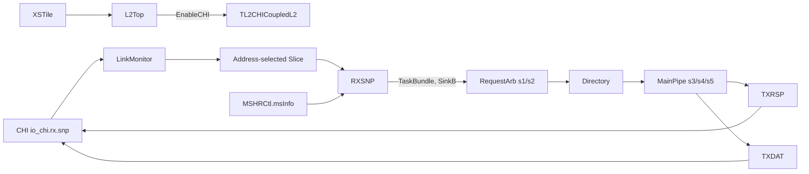
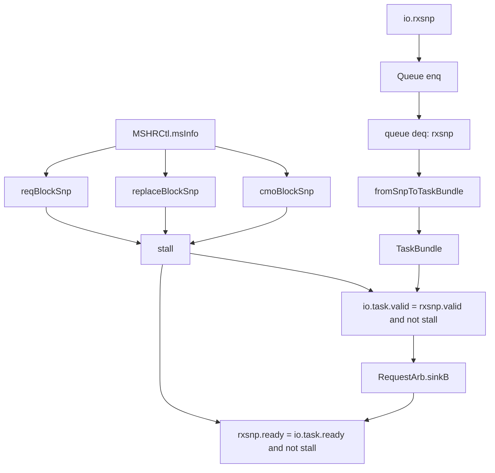

<!--
# Cache-RXSNP：Kunminghu V2 CoupledL2 的 CHI Snoop 接收与一致性冲突控制

> **结论先行。** Kunminghu V2 在 `WithCHI` 配置下选择 `TL2CHICoupledL2`；每个 L2 Slice 的 `RXSNP` 接收 CHI `rx.snp`，先经一个深度为 2、`flow = false` 的 Chisel `Queue`，再把 CHI Snoop 转成内部 `TaskBundle` 的 B 类任务，送入 `RequestArb.sinkB`。它不是“完成 Snoop”的数据通路：其核心职责是以 MSHR 状态快照判断同块 request、替换和 CMO 是否可嵌套；若不可嵌套，保持队首不出队并通过 `ready` 反压。目录查找、是否要 probe/forward、数据读取、响应编码和 CHI 输出分别由 `RequestArb`、`MainPipe`、`TXRSP`、`TXDAT` 完成。
>
> 本文以 `/home/yanyusong/xs-memory-env/XiangShan` 的实际 Scala 源码为行为依据。官方 Design Doc 仅用于定位设计意图，单列为版本敏感的对照，**不作为代码结论的证据**。

## 1. 分析范围、版本与证据规则

| 项目 | 本文采用的事实 | 依据与边界 |
| --- | --- | --- |
| XiangShan 主仓 | `kunminghu-v2`，`e12436c7cba86b195deec24981976d78bc263661` | 工作树已有 `difftest` 修改和 `src/main/resources/aia/` 未跟踪内容；本文只读分析，未改动它们。 |
| CoupledL2 子模块 | `fb5469838c8902b6cb33992c0a30ee3d446e4453` | RXSNP 的有效实现位于此子模块的 `tl2chi/RXSNP.scala`。 |
| 独立 HuanCun 仓 | `huancun`，`65ef077373ecf398b4cecdea06b65ef9b8d79044` | 已检查其 `SinkB`：它接收 TileLink `TLBundleB`，不是 CHI `CHISNP`。本文不把它的逻辑投射到 RXSNP。 |
| Design Doc | `Kunminghu-v2`，`58d9e2ad11f044cb6f8887d9687d9e110696d1aa` | 与代码仓版本不同；所有文档映射均以“意图/对照”而非实现事实处理。 |
| 参数口径 | `KunminghuV2Config` | 该配置为 1 MiB、8-way、4 bank；参数值仍应以实际 elaboration 为最终口径。 |

### 1.1 `coupledL2` 与 `huancun` 的命名边界

`L2Param.scala` 从 `huancun` 导入若干参数/字段类型，例如 `AliasKey`、`CacheParameters`、`IsHitKey` 与 `PrefetchKey`；这说明两者有类型层依赖，而不是 RXSNP 的实现在 `huancun` 中。[`L2Param.scala:26`](/home/yanyusong/xs-memory-env/XiangShan/coupledL2/src/main/scala/coupledL2/L2Param.scala:26)

相反，独立 `huancun` 的 `SinkB` 明确接收 `TLBundleB`，仅把 TL 的 `address/opcode/param/size` 组为其 `MSHRRequest`。这是一条不同协议、不同 bundle 的路径，不能用来解释 CHI RXSNP。[`huancun/SinkB.scala:28`](/home/yanyusong/xs-memory-env/XiangShan/huancun/src/main/scala/huancun/SinkB.scala:28)

```scala
// huancun/SinkB.scala:28-46，作为“不是 RXSNP”的对照
class SinkB(edge: TLEdgeOut) extends HuanCunModule {
  val b = Flipped(DecoupledIO(new TLBundleB(edge.bundle)))
  val alloc = DecoupledIO(new MSHRRequest)
}
io.b.ready := io.alloc.ready
io.alloc.valid := io.b.valid
val (tag, set, off) = parseAddress(io.b.bits.address)
```

在本次代码基线中对 `huancun/src/main/scala` 搜索 `RXSNP`、`CHISNP`、`TL2CHICoupledL2` 没有命中；这是一次范围排除结果，不是对其它版本的断言。

### 1.2 阅读和验证口径

1. `valid && ready` 的同拍握手在本文记作 `fire`，与源码中的 `rxsnp.fire`、`io.sinkB.fire` 用法一致。
2. “阻塞”必须区分两层：RXSNP 自己的 MSHR 冲突 `stall`，以及下游 `RequestArb.sinkB.ready` 产生的资源/仲裁反压。
3. 仅当源码对周期寄存器边界有明确证据时才写 `s1`、`s2`、`s3` 等；不把它们压缩成未经证明的固定总延迟。
4. Chisel `Queue` 的 RAM/寄存器实现、reset 优先级和同时读写细节不在本仓 RXSNP 源码中展开，本文只断言实例化参数与其已连接的握手，不虚构内部指针实现。

## 2. 从昆明湖顶层到 RXSNP 的有效实例化路径

`KunminghuV2Config` 先放入 `L2CacheConfig("1MB", inclusive = true, banks = 4, tp = false)`，再叠加 `WithCHI`；后者把 `EnableCHI` 置为 true。[`Configs.scala:477`](/home/yanyusong/xs-memory-env/XiangShan/src/main/scala/top/Configs.scala:477) [`Configs.scala:481`](/home/yanyusong/xs-memory-env/XiangShan/src/main/scala/top/Configs.scala:481)

`L2Top` 读取这个开关，在 `enableCHI` 时构造 `TL2CHICoupledL2`；并把 `BankBitsKey` 设为 `log2Ceil(coreParams.L2NBanks)`。`XSTile` 则把 `L2Top` 放在核旁并把 L1 DCache、ICache、PTW 接入它。[`L2Top.scala:111`](/home/yanyusong/xs-memory-env/XiangShan/src/main/scala/xiangshan/L2Top.scala:111) [`XSTile.scala:40`](/home/yanyusong/xs-memory-env/XiangShan/src/main/scala/xiangshan/XSTile.scala:40)

```scala
// L2Top.scala:120-131
case BankBitsKey => log2Ceil(coreParams.L2NBanks)
...
if (enableCHI) Some(LazyModule(new TL2CHICoupledL2()(new Config(config))))
else Some(LazyModule(new TL2TLCoupledL2()(new Config(config))))
```

在 CHI 分支中，`L2Top` 把外部 `io.chi` 与 L2 的 `io_chi` 直接相连。因而下图中的 CHI 输入不是由 CPU Load/Store pipeline 直接发给 RXSNP 的接口，而是 L2 的下游一致性端口。[`L2Top.scala:367`](/home/yanyusong/xs-memory-env/XiangShan/src/main/scala/xiangshan/L2Top.scala:367)

```mermaid
flowchart LR
  XT[XSTile] --&gt; LT[L2Top]
  LT --&gt;|EnableCHI| CL2[TL2CHICoupledL2]
  CHI[CHI io_chi.rx.snp] --&gt; LM[LinkMonitor]
  LM --&gt; DEMUX[按地址选择 Slice]
  DEMUX --&gt; RX[RXSNP]
  MSHR[MSHRCtl.msInfo] --&gt; RX
  RX --&gt;|TaskBundle, SinkB| RA[RequestArb s1/s2]
  RA --&gt; DIR[Directory]
  DIR --&gt; MP[MainPipe s3/s4/s5]
  MP --&gt; RSP[TXRSP]
  MP --&gt; DAT[TXDAT]
  RSP --&gt; CHI
  DAT --&gt; CHI
```

`TL2CHICoupledL2` 先从 `LinkMonitor.io.in.rx.snp` 取得 Decoupled 的 Snoop，再以 `rxsnp.bits.addr` 的 bank 位选择一个 Slice；`ready` 仅由被选中 Slice 返回。随后 Slice 把该端口接到本地 `rxsnp.io.rxsnp`。[`TL2CHICoupledL2.scala:158`](/home/yanyusong/xs-memory-env/XiangShan/coupledL2/src/main/scala/coupledL2/tl2chi/TL2CHICoupledL2.scala:158) [`TL2CHICoupledL2.scala:267`](/home/yanyusong/xs-memory-env/XiangShan/coupledL2/src/main/scala/coupledL2/tl2chi/TL2CHICoupledL2.scala:267) [`Slice.scala:207`](/home/yanyusong/xs-memory-env/XiangShan/coupledL2/src/main/scala/coupledL2/tl2chi/Slice.scala:207)

```scala
// TL2CHICoupledL2.scala:158-165
val rxsnp = Wire(DecoupledIO(new CHISNP))
val rxsnpSliceID = (rxsnp.bits.addr >> (offsetBits - 3))(bankBits - 1, 0)
s.io.out.rx.snp.valid := rxsnp.valid && rxsnpSliceID === i.U
s.io.out.rx.snp.bits := rxsnp.bits
rxsnp.ready := Cat(... s.io.out.rx.snp.ready ...).orR
```

## 3. 参数、地址和请求粒度

### 3.1 本配置下可由源码推导的静态参数

| 参数 | 源码值/公式 | KunminghuV2Config 下的结果 | RXSNP 相关性 |
| --- | --- | --- | --- |
| L2 总容量 | `L2CacheConfig("1MB", ...)` | 1 MiB | 配置前提，而非单个 Slice 容量。 |
| ways | `ways` 默认 8 | 8 | 影响 `wayMask` 宽度。 |
| banks | `banks = 4` | 4，`bankBits = log2Ceil(4) = 2` | CHI Snoop 按地址 bank 位选择 Slice。 |
| 每 Slice sets | `nKB * 1024 / banks / ways / 64` | `1024*1024/(4*8*64)=512`，故 `setBits=9` | `parseAddress` 生成 `task.set`。 |
| line | `blockBytes = 64` | 64 B，`offsetBits=6` | RXSNP 的 `task.size = log2Up(blockBytes)=6`。 |
| CHI data beat | `channelBytes.d = 32` | 32 B，`beatSize=64/32=2` | 数据响应由 TXDAT 分两 beat 发出。 |
| 每 Slice MSHR | `mshrs = 16` 默认值，`mshrsAll = cacheParams.mshrs` | 16 | RXSNP 读取 `Vec(mshrsAll, MSHRInfo)`。 |

配置公式与取值见 [`Configs.scala:278`](/home/yanyusong/xs-memory-env/XiangShan/src/main/scala/top/Configs.scala:278)、[`Configs.scala:295`](/home/yanyusong/xs-memory-env/XiangShan/src/main/scala/top/Configs.scala:295)、[`L2Param.scala:65`](/home/yanyusong/xs-memory-env/XiangShan/coupledL2/src/main/scala/coupledL2/L2Param.scala:65)；宽度派生见 [`CoupledL2.scala:47`](/home/yanyusong/xs-memory-env/XiangShan/coupledL2/src/main/scala/coupledL2/CoupledL2.scala:47) 与 [`CoupledL2.scala:118`](/home/yanyusong/xs-memory-env/XiangShan/coupledL2/src/main/scala/coupledL2/CoupledL2.scala:118)。这是依据配置表达式的计算，未替代一次实际 elaboration。

### 3.2 地址重建和 Slice / set / tag 解释

`CHISNP` 带 `addr`、`srcID`、`txnID`、`fwdNID`、`fwdTxnID`、`opcode`、`retToSrc`、`traceTag` 等字段；其 bundle 中没有 `vaddr`、ASID、PMP 或 MMIO 属性字段。[`Message.scala:479`](/home/yanyusong/xs-memory-env/XiangShan/coupledL2/src/main/scala/coupledL2/tl2chi/chi/Message.scala:479)

RXSNP 明确将 CHI SNP 地址补低 3 位，然后通过 `parseAddress` 提取内部 `tag/set/off`。`parseAddress` 在提取 set 前跳过 offset 和 bank bits；因此本配置下：

| 逻辑字段 | 对完整地址的位区间 | 代码依据 |
| --- | --- | --- |
| CHI `addr` | 完整地址右移 3 位后的表示 | `Cat(snp.addr, 0.U(3.W))`。 |
| block offset | `PA[5:0]` | `offsetBits=6`，`parseAddress` 返回低 offset 位。 |
| Slice bank | `PA[7:6]` | `rxsnp.bits.addr[4:3]`，等价于完整地址 `PA[7:6]`。 |
| Slice 内 set | `PA[16:8]` | 512 sets，`setBits=9`，且 parse 前跳过 offset+bank。 |
| tag | `PA[fullAddressBits-1:17]` 的 Slice 内表示 | 宽度随实际 `fullAddressBits` 而定；源码不在此处固定为某一常数。 |

```scala
// RXSNP.scala:131-145
task.channel := "b010".U
val snpFullAddr = Cat(snp.addr, 0.U(3.W))
task.tag := parseAddress(snpFullAddr)._1
task.set := parseAddress(snpFullAddr)._2
task.off := parseAddress(snpFullAddr)._3
task.size := log2Up(cacheParams.blockBytes).U
```

上表的 `PA` 是便于描述“送入此模块的完整地址位”的记号；RXSNP 源码本身不进行 VA->PA 翻译，也没有证据证明该输入来自某条特定 CPU 指令。

## 4. RXSNP 模块边界与接口契约

| 接口/状态 | 方向（相对 RXSNP） | 谁驱动/消费 | 作用与限制 |
| --- | --- | --- | --- |
| `io.rxsnp: DecoupledIO[CHISNP]` | 输入 | Slice 的 `io.out.rx.snp` | 接收 LinkMonitor 后、已按 Slice 路由的 CHI Snoop。 |
| `io.task: DecoupledIO[TaskBundle]` | 输出 | `RequestArb.sinkB` | 输出 B 类内部任务；`task.channel = b010`，所以 `TaskBundle.fromB` 为真。 |
| `io.msInfo: Vec(mshrsAll, ValidIO[MSHRInfo])` | 输入 | `MSHRCtl` | 只读快照，用来计算 stall / nesting；RXSNP 不拥有 MSHR 状态。 |
| 本地 `Queue(CHISNP, 2, flow=false)` | 内部 | 外部 SNP 入队、RXSNP 队首出队 | 至多缓冲 2 个输入项；`flow=false` 的库内部旁路时序本文不作未证实推断。 |
| `stallCnt` | 内部 | RXSNP 自增/清零 | 对本地队首连续未前进的观察计数与断言，不是请求 ID。 |

接口声明、队列和转换函数见 [`RXSNP.scala:28`](/home/yanyusong/xs-memory-env/XiangShan/coupledL2/src/main/scala/coupledL2/tl2chi/RXSNP.scala:28)。Slice 将 `msInfo` 接入 RXSNP，并将 `task` 接至 `RequestArb.sinkB` 的证据见 [`Slice.scala:82`](/home/yanyusong/xs-memory-env/XiangShan/coupledL2/src/main/scala/coupledL2/tl2chi/Slice.scala:82) 与 [`Slice.scala:93`](/home/yanyusong/xs-memory-env/XiangShan/coupledL2/src/main/scala/coupledL2/tl2chi/Slice.scala:93)。

`TaskBundle` 的 `channel(1)` 即 `fromB`；这里的“B”是 CoupledL2 内部上行通道标记，RXSNP 用它让后续流水识别 Snoop 来源，不等同于独立 HuanCun 的 `SinkB` 模块。[`Common.scala:37`](/home/yanyusong/xs-memory-env/XiangShan/coupledL2/src/main/scala/coupledL2/Common.scala:37)

## 5. 输入缓冲、握手和前进条件

### 5.1 两层 Decoupled 握手

```scala
// RXSNP.scala:37-40, 110-115
val queue = Module(new Queue(io.rxsnp.bits.cloneType, 2, flow = false))
rxsnp <> queue.io.deq
queue.io.enq <> io.rxsnp

task := fromSnpToTaskBundle(rxsnp.bits)
val stall = reqBlockSnp || replaceBlockSnp || cmoBlockSnp
io.task.valid := rxsnp.valid && !stall
rxsnp.ready := io.task.ready && !stall
```

这段连接要分开读：

1. 外部 `io.rxsnp` 与 Queue `enq` 握手，决定是否还能吸收下一个 CHI Snoop。
2. `rxsnp` 是 Queue 的 `deq` 端，`rxsnp.fire` 才表示**队首**已经被 RXSNP 送入下游；它不是原始 CHI 输入的 `fire`。
3. `stall=1` 时，RXSNP 将队首 `task.valid` 和 `rxsnp.ready` 同时压低，队首保持不动；外部仍可能在 Queue 尚有余量时再入队，直至该深度为 2 的 Queue 满。
4. `stall=0` 但 `RequestArb.sinkB.ready=0` 时，同样不会有 `rxsnp.fire`，原因是下游资源/仲裁反压，而不是 RXSNP 的三类 MSHR 冲突。

### 5.2 `stallCnt` 是进展监测，不是协议 credit

```scala
// RXSNP.scala:117-129
val stallCnt = RegInit(0.U(64.W))
when(rxsnp.fire) { stallCnt := 0.U }
.elsewhen(rxsnp.valid && !rxsnp.ready) { stallCnt := stallCnt + 1.U }

assert(stallCnt <= 28000.U, "stallCnt full! maybe there is a deadlock! ...")
assert(!(stall && rxsnp.fire))
```

该计数器在内部队首前进时归零；队首 `valid` 但未 `ready` 时累加，并在 28000 处断言。因此它适合暴露长期无进展的仿真/形式问题。它不证明“28000 个周期内一定可恢复”，也不代表 CHI L-Credit 数量。

`RXSNP(lCreditNum: Int = 4)` 的形参只在类声明处出现，在本文件没有被消费；不能据此写成队列深度或运行时 credit 限额。真正把 CHI link 转为 Decoupled 的代码位于 LinkMonitor 的 `LCredit2Decoupled(io.out.rx.snp, io.in.rx.snp, ...)`，在 RXSNP 的模块边界之外。[`RXSNP.scala:28`](/home/yanyusong/xs-memory-env/XiangShan/coupledL2/src/main/scala/coupledL2/tl2chi/RXSNP.scala:28) [`LinkLayer.scala:397`](/home/yanyusong/xs-memory-env/XiangShan/coupledL2/src/main/scala/coupledL2/tl2chi/chi/LinkLayer.scala:397)

## 6. 三类 MSHR 冲突与可嵌套条件

RXSNP 对所有有效 `msInfo` 并行计算掩码，再用 `orR` 得出三种阻塞。它没有从多项中选“优先 MSHR”；这些条件只是存在性检查。

### 6.1 同请求地址的在途 MSHR：`reqBlockSnp`

```scala
// RXSNP.scala:57-63
val reqBlockSnpMask = VecInit(io.msInfo.map(s =>
  s.valid && s.bits.set === task.set && s.bits.reqTag === task.tag && (
    s.bits.w_grantfirst ||
    s.bits.aliasTask.getOrElse(false.B) && !s.bits.w_rprobeacklast
  ) && (s.bits.blockRefill || s.bits.w_releaseack) && !s.bits.willFree
)).asUInt
val reqBlockSnp = reqBlockSnpMask.orR
```

它比较的是进入 RXSNP 后的 `task.set/tag` 和 MSHR 的**请求**标签 `reqTag`。只有同时满足以下条件才阻塞：

- MSHR 有效、同 set、同 `reqTag`；
- 已见第一笔 grant，或 alias 任务仍未等到 replacement probe 最后一拍 ACK；
- 回填仍被 `blockRefill` 阻挡，或还在等 release ACK；
- MSHR 本周期不会释放。

因此“同地址 Snoop 一律阻塞”是错误的。源码允许许多同址时段继续嵌套；具体前后关系必须同时观察 `w_grantfirst`、`blockRefill`、`w_releaseack`、`willFree`，不能只按请求地址判断。

### 6.2 CMO / 替换目标块：`cmoBlockSnp` 与 `replaceBlockSnp`

```scala
// RXSNP.scala:76-87
val cmoBlockSnpMask = VecInit(io.msInfo.map(s =>
  s.valid && s.bits.dirHit && isValid(s.bits.meta.state) &&
  !s.bits.s_cmoresp && (!s.bits.s_release || !s.bits.w_rprobeacklast || !s.bits.s_cmometaw) &&
  !s.bits.willFree
)).asUInt

val replaceBlockSnpMask = VecInit(io.msInfo.map(s =>
  s.valid && s.bits.set === task.set && s.bits.metaTag === task.tag && !s.bits.dirHit &&
  isValid(s.bits.meta.state) && s.bits.s_cmoresp && s.bits.w_replResp &&
  (!s.bits.w_rprobeacklast || s.bits.w_releaseack || !RegNext(s.bits.w_replResp)) && !s.bits.willFree
)).asUInt
```

`cmoBlockSnpMask` 没有比较 `task.set/tag`，它表达的是有效 directory-hit CMO 事务尚未完成各类调度/等待时的全局 Snoop 入口约束。`replaceBlockSnpMask` 则比较 `task` 与 `metaTag`，即比较即将替换的旧块，而不是 MSHR 原请求块。两者均以 `willFree` 排除本周期完成的 MSHR。

### 6.3 允许嵌套替换释放：不是“无冲突”的简单情况

当替换路径已满足可嵌套条件，`replaceNestSnpMask` 会把旧 metadata、是否带替换数据、以及 replacement MSHR index 搬到 `TaskBundle`：

```scala
// RXSNP.scala:91-108, 166-171
val replaceNestSnpMask = VecInit(io.msInfo.map(s =>
  s.valid && s.bits.set === task.set && s.bits.metaTag === task.tag &&
  (!s.bits.dirHit || !s.bits.s_cmoresp) && s.bits.meta.state =/= INVALID &&
  RegNext(s.bits.w_replResp) && s.bits.w_rprobeacklast && !s.bits.w_releaseack
)).asUInt

assert(!rxsnp.valid || PopCount(replaceNestSnpMask) <= 1.U)
task.snpHitRelease := replaceNestSnpMask.orR
task.snpHitReleaseIdx := PriorityEncoder(replaceNestSnpMask)
task.snpHitReleaseMeta := replaceNestSnpMeta
```

关键点如下：

- `replaceNestSnpMask` 本身不进入 `stall`；命中时标记 task 后继续送入 RequestArb。
- `PopCount <= 1` 是源码明确的唯一性不变量，支撑 `PriorityEncoder` 选择一个 `snpHitReleaseIdx`，以及 `ParallelOR` 取得对应 `MetaEntry`。
- `snpHitReleaseWithData` 由嵌套掩码与 `replaceDataMask` 相与；后续 RequestArb 因此可以从 ReleaseBuffer 读出正确来源的数据。
- 这并不证明任意两个独立 MSHR 不会同时匹配；断言正是用来检测该假设被破坏的保护。

`MSHRInfo` 中这些字段由 MSHR 对外镜像：`blockRefill`、`metaTag`、`w_grantfirst`、`s_release`、`w_releaseack`、`w_replResp`、`w_rprobeacklast`、`replaceData` 与 `releaseToClean` 的定义见 [`Common.scala:236`](/home/yanyusong/xs-memory-env/XiangShan/coupledL2/src/main/scala/coupledL2/Common.scala:236)，实际赋值见 [`MSHR.scala:1341`](/home/yanyusong/xs-memory-env/XiangShan/coupledL2/src/main/scala/coupledL2/tl2chi/MSHR.scala:1341)。RXSNP 读取它们，不写它们。

## 7. RequestArb：RXSNP 离开队首后的第二道门

RXSNP 的 `io.task` 接到 `RequestArb.sinkB`。RequestArb 将 channel 请求按 `C > B > A` 固定顺序选择：`sinkValids` 的顺序是 C、B、A；`sinkB.ready` 还要求不存在可进入的 C。该结论来自真实 ready 逻辑，不是从模块名猜测的优先级。[`RequestArb.scala:132`](/home/yanyusong/xs-memory-env/XiangShan/coupledL2/src/main/scala/coupledL2/RequestArb.scala:132)

```scala
// RequestArb.scala:145-161
val sinkValids = VecInit(Seq(
  io.sinkC.valid && !block_C,
  io.sinkB.valid && !block_B,
  io.sinkA.valid && !block_A
)).asUInt
val sink_ready_basic = io.dirRead_s1.ready && resetFinish && !mshr_task_s1.valid && s2_ready
io.sinkB.ready := sink_ready_basic && !block_B && !sinkValids(0)
val chnl_task_s1 = ParallelPriorityMux(sinkValids, Seq(C_task, B_task, A_task))
```

### 7.1 SinkB 的完整反压来源

| 类别 | 对 `sinkB.ready` 的影响 | 直接依据 |
| --- | --- | --- |
| RXSNP 局部一致性冲突 | `stall=1` 使 `io.task.valid=0`，队首不向 RequestArb 暴露 | `RXSNP.scala:112-115`。 |
| MSHR 容量 | `MSHRCtl.blockB_s1 := mshrFull` | B 会用最后一个 MSHR；A 在只剩一个时已被提前限制。 |
| MainPipe 地址冲突 | s2/s3 比较 set，s4/s5 比较 set+tag，形成 `blockB_s1` | 同一流水在途资源冲突。 |
| TXRSP/TXDAT 容量 | 两个 TX 模块的 `blockSinkBReqEntrance` 合入 `block_B` | 预留可能将来进入 TX 的容量，避免到 s3/s5 才无处存放。 |
| Directory / reset / mshrTask | `dirRead_s1.ready`、`resetFinish`、`!mshr_task_s1.valid`、`s2_ready` 是共同前提 | 既可能来自资源，也可能来自初始化或 MSHR task 占用。 |
| 仲裁 | 有可接收 SinkC 时 B 不 ready | C 高于 B。 |

MSHR 的“为 B 保留一项”要精确解释：`a_mshrFull` 在占用达到 `mshrsAll-1` 时阻塞 A，`mshrFull` 在达到 `mshrsAll` 时才阻塞 B；它不是 RXSNP 有 16 项专属 MSHR。[`MSHRCtl.scala:106`](/home/yanyusong/xs-memory-env/XiangShan/coupledL2/src/main/scala/coupledL2/tl2chi/MSHRCtl.scala:106) [`MSHRCtl.scala:162`](/home/yanyusong/xs-memory-env/XiangShan/coupledL2/src/main/scala/coupledL2/tl2chi/MSHRCtl.scala:162)

MainPipe 的 B 阻塞在 s2/s3 只比较 set、到 s4/s5 再比较 set+tag，表明它保护的是不同流水级可能访问的共享资源；不要把它误写为 RXSNP 的 MSHR nesting 判断。[`MainPipe.scala:924`](/home/yanyusong/xs-memory-env/XiangShan/coupledL2/src/main/scala/coupledL2/tl2chi/MainPipe.scala:924)

## 8. Snoop 在主流水中的后续处理

### 8.1 请求阶段表

| 阶段 | 输入/状态 | 真实动作 | 可能停止的原因 |
| --- | --- | --- | --- |
| Link -> Slice | `CHISNP` Decoupled | LinkMonitor 转换、按 `addr` 选 Slice | 被选 Slice 的 `ready=0`。 |
| RXSNP ingress | Queue enq/deq | 缓冲 2 项；构造 `TaskBundle` | Queue 满、三类 RXSNP `stall`、或 RequestArb 未 ready。 |
| RequestArb s1 | `sinkB` | C/B/A 仲裁；给 Directory 发 set/tag 读请求 | C 优先、`block_B`、目录未 ready、reset 未完成、MSHR task 或 s2 冲突。 |
| RequestArb s2 | `task_s2` 寄存器 | 需要嵌套 release 数据时向 ReleaseBuffer 发读 | `ds_mcp2_stall` 防止连续 DS 使用；数据来源由 `snpHitRelease*` 决定。 |
| MainPipe s3 | Directory 结果 + task | 计算 probe、forward、data、metadata 更新与是否分配 MSHR | 需要上游 pProbe 或 forward 时，Snoop 不在 s3 直接结束。 |
| MainPipe s4/s5 | Task / data pipeline regs | data 响应经过锁存、仲裁进入 TXDAT；控制响应可经 TXRSP | DataStorage、输出通道与前级状态影响具体停留。 |
| TXRSP / TXDAT | queue + out ready | 转为 CHI RSP / DAT flit | CHI 输出未 ready；队列占用可向入口反压。 |

RequestArb 的 s1/s2 寄存器边界及 Directory read 的 `set/tag` 见 [`RequestArb.scala:174`](/home/yanyusong/xs-memory-env/XiangShan/coupledL2/src/main/scala/coupledL2/RequestArb.scala:174) 和 [`RequestArb.scala:199`](/home/yanyusong/xs-memory-env/XiangShan/coupledL2/src/main/scala/coupledL2/RequestArb.scala:199)。

### 8.2 什么情况要为 Snoop 分配 MSHR

`MainPipe` 不会因为 `fromB` 就无条件分配 MSHR。B 任务只在需要向上游发 pProbe，或需要 DCT forwarding 时进入 MSHR：

```scala
// MainPipe.scala:272-299
val expectFwd = isSnpXFwd(req_s3.chiOpcode.get)
val canFwd = nestable_dirResult_s3.hit && !(...tagErr || ...error)
val doFwd = expectFwd && canFwd
val need_pprobe_s3_b = need_pprobe_s3_b_snpStable ||
  need_pprobe_s3_b_snpToB || need_pprobe_s3_b_snpToN || need_pprobe_s3_b_snpNDERR
val need_dct_s3_b = doFwd
val need_mshr_s3_b = need_pprobe_s3_b || need_dct_s3_b
io.toMSHRCtl.mshr_alloc_s3.valid := task_s3.valid && !mshr_req_s3 && need_mshr_s3
```

几个可验证的分支：

- `SnpOnce*`、`SnpQuery`、`SnpStash*` 在 directory hit、状态为 `TRUNK`、且有上游 clients 时需要 `toT` pProbe。
- `SnpToB` 或 `SnpCleanShared` 的条件同样要求 `TRUNK` 与 clients。
- `SnpUnique*`、`SnpCleanInvalid`、`SnpMakeInvalid*` 只要 hit 且有 clients 就需要 `toN` pProbe。
- tag error 且 hit 时也需要 `need_pprobe_s3_b_snpNDERR`。
- forward 是否可能不仅看 opcode，还必须看 `nestable_dirResult` 命中且没有 tag/directory error。

上述条件逐项位于 [`MainPipe.scala:258`](/home/yanyusong/xs-memory-env/XiangShan/coupledL2/src/main/scala/coupledL2/tl2chi/MainPipe.scala:258)。这比“所有转发 Snoop 都直接返回 data”更精确。

### 8.3 不分配 MSHR 的直接响应

`task_s3.valid && !mshr_req_s3 && !need_mshr_s3` 时，MainPipe 生成 `sink_resp_s3`。对于 `fromB`，它将原 `srcID` 作为回复的 `tgtID`、保持 `txnID`，根据 `doFwd/doRespData` 在 `SnpResp`、`SnpRespFwded`、`SnpRespData`、`SnpRespDataFwded` 间选择，并用 `txChannel` 选择 TXRSP 或 TXDAT。[`MainPipe.scala:421`](/home/yanyusong/xs-memory-env/XiangShan/coupledL2/src/main/scala/coupledL2/tl2chi/MainPipe.scala:421)

```scala
// MainPipe.scala:439-456
sink_resp_s3.bits.tgtID.foreach(_ := task_s3.bits.srcID.get)
sink_resp_s3.bits.txnID.foreach(_ := task_s3.bits.txnID.get)
sink_resp_s3.bits.chiOpcode.foreach(_ := MuxLookup(Cat(doFwd, doRespData), SnpResp)(Seq(
  Cat(false.B, false.B) -> SnpResp,
  Cat(true.B, false.B)  -> SnpRespFwded,
  Cat(false.B, true.B)  -> SnpRespData,
  Cat(true.B, true.B)   -> SnpRespDataFwded
)))
sink_resp_s3.bits.txChannel := Cat(doRespData, !doRespData, false.B)
```

源码紧随其后有 `srcID should be fixed. FIX THIS!!!` 的 TODO。因此本文只陈述当前赋值，不宣称该 ID 映射已被协议证明为最终正确实现。

`doRespData` 或 `doFwd` 时会请求 DataStorage；若嵌套释放命中且 metadata 为 `TRUNK`，也会请求数据。[`MainPipe.scala:469`](/home/yanyusong/xs-memory-env/XiangShan/coupledL2/src/main/scala/coupledL2/tl2chi/MainPipe.scala:469) 直接带数据的 B 回复因 timing 原因会先锁存到后级：源码把 `txdat_s3_latch = true`，注释明确指出从 directory 到数据判断的组合路径过长。[`MainPipe.scala:626`](/home/yanyusong/xs-memory-env/XiangShan/coupledL2/src/main/scala/coupledL2/tl2chi/MainPipe.scala:626)

## 9. 数据、控制和响应路径

### 9.1 CHISNP 到 TaskBundle 的字段迁移

| Task 字段 | RXSNP 赋值 | 解释 |
| --- | --- | --- |
| `channel` | `b010` | 后续 `fromB=true`。 |
| `tag/set/off` | `parseAddress(Cat(snp.addr, 0.U(3.W)))` | CHI 地址补齐后三段解析。 |
| `size` | `log2Up(blockBytes)` | 一个 cache line 粒度。 |
| `wayMask` | all-ones | 具体路由 Directory / replacement 决定。 |
| `mshrTask` | false | 初始 Snoop 不是 MSHR 回送 task。 |
| `snpHitRelease*` | 来自 replace-nest masks | 向 RequestArb / MainPipe 传达嵌套释放上下文。 |
| `srcID/txnID/fwdNID/fwdTxnID/chiOpcode/retToSrc/traceTag` | 从 `CHISNP` 复制 | 供后续 CHI 响应、forward 及追踪使用。 |
| `tgtID/dbID/pCrdType` | 0 | RXSNP 初始化；MainPipe / MSHR 在后续路径填写使用值。 |
| `alias/vaddr/isKeyword` | 0/false | 初始 Snoop 任务不携带上游 L1 的这些语义。 |

完整赋值可在 [`RXSNP.scala:131`](/home/yanyusong/xs-memory-env/XiangShan/coupledL2/src/main/scala/coupledL2/tl2chi/RXSNP.scala:131) 审核。因为函数从 `WireInit(0.U.asTypeOf(new TaskBundle))` 开始，`denied/corrupt` 初值也为 0；RXSNP 不在入口直接生成 CHI 错误响应。

### 9.2 TXRSP 和 TXDAT 的反压与错误编码

TXRSP 采用 `mshrsAll` 深度、`flow=false` 的 response queue；它统计 s2--s5 里可能到达 TXRSP 的 B/MSHR task 加上已有 queue count，满时给 `blockSinkBReqEntrance`。MainPipe path 优先于 MSHR path，且 `pipeRsp.ready := true.B`。[`TXRSP.scala:47`](/home/yanyusong/xs-memory-env/XiangShan/coupledL2/src/main/scala/coupledL2/tl2chi/TXRSP.scala:47)

TXDAT 也以前瞻 `inflightCnt` 决定是否阻塞 SinkB，但其 task、两段 data 队列均为 `mshrsAll` 深度，并将一条 64 B block 拆为 `beatSize=2` 逐 beat 输出。[`TXDAT.scala:47`](/home/yanyusong/xs-memory-env/XiangShan/coupledL2/src/main/scala/coupledL2/tl2chi/TXDAT.scala:47) [`TXDAT.scala:82`](/home/yanyusong/xs-memory-env/XiangShan/coupledL2/src/main/scala/coupledL2/tl2chi/TXDAT.scala:82)

| 输出 | 输入的错误位 | CHI `respErr` 映射 | 代码依据 |
| --- | --- | --- | --- |
| TXRSP | `task.denied` | `true -> NDERR`，否则 `OK` | `toCHIRSPBundle`。 |
| TXDAT | `task.corrupt` | `true -> DERR`，否则 `OK` | `toCHIDATBundle` 前赋值。 |

MainPipe 会把 directory tag/data error 合并为 channel 错误：非 MSHR（且非特定嵌套 data）任务的 `denied` 加上 `tagError_s3`，`corrupt` 加上 `dataError_s3`；这才是 RXSNP 后续可见的错误来源。[`MainPipe.scala:616`](/home/yanyusong/xs-memory-env/XiangShan/coupledL2/src/main/scala/coupledL2/tl2chi/MainPipe.scala:616) [`TXRSP.scala:81`](/home/yanyusong/xs-memory-env/XiangShan/coupledL2/src/main/scala/coupledL2/tl2chi/TXRSP.scala:81) [`TXDAT.scala:100`](/home/yanyusong/xs-memory-env/XiangShan/coupledL2/src/main/scala/coupledL2/tl2chi/TXDAT.scala:100)

## 10. 状态、所有权与释放条件

| 状态/存储 | 所有者 | RXSNP 的使用方式 | 更新/释放证据 |
| --- | --- | --- | --- |
| RXSNP Queue | RXSNP 内部的 Chisel `Queue` | 入 CHI Snoop，取队首转换任务 | 源码仅显式给出 `entries=2, flow=false` 与 enq/deq 连接；队列实现细节需要 Chisel 库/生成 RTL。 |
| `stallCnt` | RXSNP | 对队首停顿计数 | `rxsnp.fire` 清零，`valid&&!ready` 递增。 |
| `TaskBundle` | RXSNP 生成，后续 pipeline 寄存 | 携带地址、CHI 事务字段和嵌套释放标记 | RXSNP 不持久保存 task；队首可用时组合生成。 |
| `MSHRInfo` | MSHR / MSHRCtl | RXSNP 只读冲突快照 | MSHR 以 `req_valid` 表示有效，并在全部 schedule/wait 完成时清除。 |
| `FSMState` | MSHR | RXSNP 经 `MSHRInfo` 间接读取部分字段 | `s_*` 表示待调度，`w_*` 表示待回应/等待。 |
| ReleaseBuffer | Slice / RequestArb / MainPipe | 仅在 `snpHitReleaseWithData` 时通过 MSHR index 读取 | 后续数据路径，不是 RXSNP 自己的 buffer。 |

MSHR 的完成条件是所有 `s_*` 调度位与 `w_*` 等待位满足，再将 `req_valid := false.B`；同一周期 `will_free` 被导出到 `MSHRInfo.willFree`。这解释了 RXSNP 各冲突式均排除 `willFree` 的原因。[`MSHR.scala:1303`](/home/yanyusong/xs-memory-env/XiangShan/coupledL2/src/main/scala/coupledL2/tl2chi/MSHR.scala:1303) [`MSHR.scala:1341`](/home/yanyusong/xs-memory-env/XiangShan/coupledL2/src/main/scala/coupledL2/tl2chi/MSHR.scala:1341)

`RequestArb` 在普通 B task 的 s2 阶段只有在 `snpHitReleaseWithData` 为真时，才将 ReleaseBuffer read id 选为 `snpHitReleaseIdx`；否则用普通 `mshrId`。这将 RXSNP 的唯一性断言与真正的数据读取路径接起来。[`RequestArb.scala:262`](/home/yanyusong/xs-memory-env/XiangShan/coupledL2/src/main/scala/coupledL2/RequestArb.scala:262)

## 11. 时序、吞吐与不可作出的承诺

### 11.1 可从代码确认的时序边界

- RXSNP 只有入口 Queue 和组合 stall/转换，没有命名为 `s0/s1` 的 RXSNP 专属寄存级。
- RequestArb 把 channel task 经 s1 选择后寄存为 `task_s2`；Directory 读请求使用该 s1 task。
- MainPipe 从 `task_s3` 做 Snoop 判断；数据回复因 `txdat_s3_latch=true` 可经 s4/s5。
- TXDAT 将 64 B line 按 `beatSize=2` 发出；一条 Snoop data reply 不是一个单 beat 的固定延迟事件。

### 11.2 不应写成固定 latency 的原因

端到端时间至少受以下条件影响：RXSNP Queue 占用、三类 MSHR stall、SinkC 优先级、Directory ready、`resetFinish`、s2 DataStorage 限制、MainPipe 同 set/tag 保护、是否需要 pProbe/DCT、DataStorage 读、TX queue 预留和 CHI out ready。源代码没有给出“RXSNP request fire 后 N 周期必答”的常数，因此本文不制造固定 cycle 表。

最小可观察吞吐结论是：RXSNP 的外部入口最多有 2 项缓冲；当队首可前进时，新的输入是否还能被接收还依赖 Queue 的 enq ready；当 `sinkB` 被 C 或资源阻塞时，队首停留，外部最终被反压。它不是“每周期必接收一条 Snoop”的保证。

## 12. 跨边界代码解析

RXSNP 位于下游 CHI Snoop 路径，和昆明湖 CPU 访存模块的边界必须说清楚。下面表格只描述在本模块及其直接连接中能看见的事实；“未见”不代表系统其它模块不存在该能力。

| 边界 | RXSNP 所见输入/动作 | 代码结论 | 不可推断部分 |
| --- | --- | --- | --- |
| 虚拟页 / 地址翻译 | `CHISNP` 中没有 `vaddr`/ASID/PMP；RXSNP 直接拼 `addr` 并 parse | RXSNP 不做 VA->PA、页跨界拆分或权限检查。 | 不从此文件推断上游 TLB/PMP 的具体实现或时序。 |
| cache line | `task.size=log2Up(blockBytes)`，地址补低 3 位；`offsetBits=6` | 每个输入 task 按当前 L2 block size（64 B）表达；无“一个 Snoop 拆两条 line task”的本地状态。 | CHI 发起端是否保证请求对齐是协议/接口级问题，非本模块的断言。 |
| bank / Slice | 顶层以 `addr` 选 Slice；`parseAddress` 跳过 bank bits | 每个 RXSNP 只看已选 Slice 内的 tag/set。 | 不把 `task.tag/set` 与完整 PA 不含 bank 的格式混为同一个位串。 |
| MMIO / uncache | RXSNP 无 `mmio`、`memAttr` 或 `uncache` 分支；`rx.snp` 只路由到 Slices | RXSNP 没有本地 MMIO bridge 或 uncache redirect。 | 不能据此说整个 CoupledL2 不支持 MMIO；`L2Top` 的 mmio 路径是另一接口。 |
| CPU redirect / exception / privilege | RXSNP IO 只有 `rxsnp/task/msInfo` | 没有 redirect、flush、CSR、trap 或 interrupt 输入。 | 不把后端指令取消语义强加到外部 coherent Snoop。 |

`L2Top` 的 TLB/PMP/MMIO 接口在 L2 顶层另有连线，而 `RXSNP` 的 IO 声明不含这些字段；这正是边界分开的源码依据。[`L2Top.scala:360`](/home/yanyusong/xs-memory-env/XiangShan/src/main/scala/xiangshan/L2Top.scala:360) [`RXSNP.scala:31`](/home/yanyusong/xs-memory-env/XiangShan/coupledL2/src/main/scala/coupledL2/tl2chi/RXSNP.scala:31)

## 13. Reset、CMO、错误、Difftest 与恢复语义

### 13.1 Reset

RXSNP 显式初始化的本地状态只有 `stallCnt = RegInit(0.U(64.W))`。其 Queue 的 reset 行为由 Chisel `Queue` 实现决定，RXSNP.scala 没有展开，所以不能仅凭本文件写“队列复位后可同拍 bypass”。[`RXSNP.scala:117`](/home/yanyusong/xs-memory-env/XiangShan/coupledL2/src/main/scala/coupledL2/tl2chi/RXSNP.scala:117)

此外，RequestArb 在 reset 后倒数各 set 并以 `resetFinish` 阻塞 channel 请求；即使 RXSNP 已有队首，`sinkB.ready` 仍会在该阶段为低。[`RequestArb.scala:78`](/home/yanyusong/xs-memory-env/XiangShan/coupledL2/src/main/scala/coupledL2/RequestArb.scala:78) [`RequestArb.scala:153`](/home/yanyusong/xs-memory-env/XiangShan/coupledL2/src/main/scala/coupledL2/RequestArb.scala:153) MainPipe 也有独立的 `resetFinish/resetIdx` 初始化序列，但 RXSNP 的 IO 没有连接一个来自 MainPipe 的 reset/flush 控制；不要把两者合写为 RXSNP 的本地 reset FSM。[`MainPipe.scala:127`](/home/yanyusong/xs-memory-env/XiangShan/coupledL2/src/main/scala/coupledL2/tl2chi/MainPipe.scala:127)

### 13.2 CMO / flush

RXSNP 没有独立的 cancel 或 flush 输入。与 CMO 的直接交互有两条：

- `cmoBlockSnp` 读取 MSHR CMO 进度并可能阻塞 RXSNP；
- Slice 把 `rxsnp.io.task.valid` 与 MainPipe 的 Snoop-in-flight 组合为 `snpBlockcmo`，供 CMO-all 路径避免与在途 Snoop 交叠。

```scala
// Slice.scala:224-227
cmoAll.snpBlockcmo := Cat(
  mainPipe.io.snpBlockcmo.getOrElse(false.B),
  rxsnp.io.task.valid)
```

这里是 **CMO 被 Snoop 状态协调**，不是“CMO flush 清空 RXSNP Queue”。未找到 RXSNP 的 queue flush/cancel 控制，故应在波形或生成 RTL 中进一步验证 reset/CMO 重叠场景。

### 13.3 错误与异常

RXSNP 没有异常/特权/CSR 状态机。其可见的错误路径是 Directory/metadata error 在 MainPipe 变成 `denied/corrupt`，最终由 TXRSP/TXDAT 编码为 `NDERR/DERR`。这应与 CPU pipeline 的 trap 或 page fault 分开验证，不能把它称为“RXSNP 触发指令异常”。

### 13.4 Difftest

在本次基线对 `coupledL2/src/main/scala/coupledL2` 搜索 `difftest` / `DiffTest` 没有直接命中，因此 RXSNP 没有可从该目录证明的专属 Difftest 导出端口或比较器。验证应以 CHI/Slice/Directory/MSHR 的接口波形、断言和 cache-coherence test 为主；若需要全核 Difftest 关联，必须从系统 test harness 另行建立映射，不能在本文凭空指定 signal。

## 14. Design Doc 意图与当前代码的可追溯对照

官方文档 [`RXSNP.md:3`](/home/yanyusong/XiangShan-Design-Doc/docs/zh/cache/l2cache/downstream/RXSNP.md:3) 将 RXSNP 概括为“转换 Snoop 为内部任务、在不可嵌套 MSHR 时阻塞”。下面是**独立从源码重建**后的对照；不复制文档流程图。

| Design Doc 的意图点 | 当前代码对应 | 判定 | 需要保留的差异/边界 |
| --- | --- | --- | --- |
| 将 RX Snoop 转内部任务后给 RequestArb | RXSNP `fromSnpToTaskBundle`，Slice `reqArb.io.sinkB <> rxsnp.io.task` | 已验证 | 实际端口叫 `sinkB`，不是一个名为“SinkB”的 CHI 模块。 |
| 同请求地址 MSHR 在特定回填/ACK 时段阻塞 Snoop | `reqBlockSnpMask` 同时依赖 `w_grantfirst`、`blockRefill/w_releaseack`、`willFree` | 已验证 | 不能简化为“收到首个 CompData 后一直等 MSHR 结束”；源码条件更细。 |
| 替换旧块与 CMO 的 probe/release 状态影响 Snoop | `replaceBlockSnpMask`、`cmoBlockSnpMask`、`replaceNestSnpMask` | 已验证 | CMO mask 是全局型条件，替换 mask 才按 `metaTag` 对址。 |
| 可以嵌套替换释放 | task 写入 `snpHitRelease*`，RequestArb 选 ReleaseBuffer index | 已验证 | 必须满足 `PopCount(replaceNestSnpMask)<=1`；这是带不变量保护的限定路径。 |
| TXRSP/TXDAT 对入口施加流控 | 两个模块将 `blockSinkBReqEntrance` 接入 RequestArb | 已验证 | `inflightCnt` 注释承认可能有 false-positive backpressure；不能宣传为最紧凑容量计算。 |
| 文档称默认 CHI E.b | 当前 `CHIIssue` 默认是 `Issue.B` | 版本不一致 | RXSNP 的字段/事务支持需以实际 elaboration 参数与当前源码为准，不能按文档默认值反推。 |
| 文档图中的总体流程 | 可映射为 LinkMonitor -> Slice -> RXSNP -> RequestArb -> MainPipe -> TX | 仅作概念参照 | 图本身不代替该 commit 的信号和优先级证据。 |

关于 CoupledL2 的模块层级、默认参数与 Snoop 事务种类，Design Doc 可帮助读者定位主题，但版本不同且部分叙述比源码抽象；本文的 tag/set、mask、ready 及 response 结论一律回到 Scala 代码。上述 issue 差异可分别在 Design Doc 的“默认 E.b”说明和当前 `CHIIssue` 默认定义中复查。[`CoupledL2.md:13`](/home/yanyusong/XiangShan-Design-Doc/docs/zh/cache/l2cache/CoupledL2.md:13) [`CoupledL2.md:39`](/home/yanyusong/XiangShan-Design-Doc/docs/zh/cache/l2cache/CoupledL2.md:39) [`Message.scala:30`](/home/yanyusong/xs-memory-env/XiangShan/coupledL2/src/main/scala/coupledL2/tl2chi/chi/Message.scala:30)

## 15. 理论概念到源码的映射

| 理论概念 | 本模块中的可观测实现 | 不应过度延伸的地方 |
| --- | --- | --- |
| 弹性流水 / backpressure | Queue 的 enq/deq 与 `task.valid/ready` 两层 Decoupled。 | Queue 深度 2 不代表每周期必接受，也不代表 CHI credit 数。 |
| 非阻塞缓存 / MSHR | 16-entry MSHR 通过 `MSHRInfo` 给并行 Snoop 冲突判断；非冲突 Snoop 可继续。 | 不是所有 Snoop 都 bypass MSHR；probe/forward 需要 MSHR。 |
| 结构冲突 | Directory、MainPipe、TX queues、MSHR full 和 C > B > A 仲裁都会使 `sinkB.ready` 变低。 | 这不是 CPU data hazard，也不应套用发射队列的 RAW/WAW 解释。 |
| 一致性序列化 | 同块 request/replacement/CMO 用 MSHR schedule/wait 字段界定可嵌套窗口。 | 不能只按 opcode 或地址做静态判断。 |
| 进展监测 | `stallCnt` 和 replace-nest 唯一性断言。 | 断言失败是 bug 信号，不是性能 SLA。 |

课程中“有限队列必须描述 valid/full/ready、谁写入、谁读取、何时清空”的读法适用于这里；但所有具体队列和 MSHR 结论已在本章回链至源码。[`Frontend-BPU.md:242`](/home/yanyusong/XiangShanLab/xiangshan-course/docs/4-xiangshan-microarchitecture-analysis/3-xiangshan-source-code-analysis/frontend/Frontend-BPU.md:242)

## 16. 关键信号关系图与时序示意

### 16.1 RXSNP 模块接口与队首控制关系

```mermaid
flowchart TD
  IN[io.rxsnp] --&gt; ENQ[Queue enq]
  ENQ --&gt; HEAD[queue deq: rxsnp]
  HEAD --&gt; MAP[fromSnpToTaskBundle]
  MINFO[MSHRCtl.msInfo] --&gt; RB[reqBlockSnp]
  MINFO --&gt; REP[replaceBlockSnp]
  MINFO --&gt; CMO[cmoBlockSnp]
  RB --&gt; STALL[stall]
  REP --&gt; STALL
  CMO --&gt; STALL
  STALL --&gt; TV[io.task.valid = rxsnp.valid && !stall]
  STALL --&gt; RR[rxsnp.ready = io.task.ready && !stall]
  MAP --&gt; TB[TaskBundle]
  TB --&gt; TV
  TV --&gt; ARB[RequestArb.sinkB]
  ARB --&gt; RR
```

### 16.2 Queue 入队、队首出队与局部 stall 的波形读法

下面的 WaveDrom 是由实际信号关系画出的**示意**，不是从仿真导出的逐 cycle trace。它假定 Queue 尚有空位，因此两个输入可以先后入队；`fire` 是 `valid && ready` 的派生观察值。真实 waveform 应同时采集 `io.rxsnp`（入队）和 `rxsnp`（队首）以免混淆二者，并在 VS Code 的 Markdown Preview 中查看 `waveform-draw` 渲染结果。

```waveform-draw
{"signal":[{"name":"clk","wave":"p......"},{"name":"io.rxsnp.valid","wave":"0110000"},{"name":"io.rxsnp.ready","wave":"0111000"},{"name":"queue.io.enq.fire","wave":"0110000"},{"name":"rxsnp.valid","wave":"0011110"},{"name":"stall","wave":"0010000"},{"name":"io.task.ready","wave":"0001110"},{"name":"io.task.valid","wave":"0001110"},{"name":"rxsnp.ready","wave":"0001110"},{"name":"rxsnp.fire","wave":"0001100"}]}
```

第 1 个队首有效窗口中 `stall=1`，即使 `rxsnp.valid=1`，`io.task.valid` 和 `rxsnp.ready` 都为 0；后来 conflict 消失且 downstream ready 后，才发生队首 fire。若 `stall=0` 但 `io.task.ready=0`，表现同样是队首不 fire，但根因应从 RequestArb 的 `block_B` / 仲裁继续追踪。图中不画 Queue 的 `full/empty`，因为这两个内部实现细节不是 RXSNP.scala 显式端口；满边界应以生成 RTL 或 Chisel Queue 库验证。

## 17. 建议的场景驱动阅读与验证

| 场景 | 刺激/前置 | 必看信号或状态 | 预期的代码级结论 |
| --- | --- | --- | --- |
| S1：首个 Snoop | resetFinish 后送一条无冲突 `rx.snp` | Queue enq/deq，`io.task.fire`，`sinkB.fire` | task 的 `channel=b010`，地址按补 3 位解析；不是直接跳到 TX。 |
| S2：同 request 块、首个 grant 前 | 构造同 set/tag 有效 MSHR，改变 `w_grantfirst/blockRefill/w_releaseack` | `reqBlockSnpMask`、`stall` | 只在完整布尔式为真时阻塞；验证窗口而不是地址比较本身。 |
| S3：替换旧块冲突 | MSHR 的 `metaTag` 与 Snoop 对齐，切换 `w_replResp/w_rprobeacklast/w_releaseack` | `replaceBlockSnpMask`、`replaceNestSnpMask` | 要么 block，要么生成 `snpHitRelease*`；不允许两项 nest mask 同时命中。 |
| S4：CMO 与 Snoop | 有效 CMO MSHR，逐步释放 schedule/wait 位 | `cmoBlockSnpMask`、`snpBlockcmo` | CMO 未完成时限制入口；不要期望 RXSNP queue 被 flush。 |
| S5：SinkC 抢占 | B 与 C 同时 valid 且均不 block | `sinkC.ready/sinkB.ready`、`sinkValids` | C 先进入，B 等待。 |
| S6：TXRSP/TXDAT 压力 | 填充 queue 和 s2--s5 status | `inflightCnt`、`blockSinkBReqEntrance`、`sinkB.ready` | 入口提前被阻塞，避免 MainPipe response 无 buffer 可去。 |
| S7：需 pProbe / forwarding | 选择 `SnpUnique*`、forward opcode、hit + clients 等组合 | `need_pprobe_s3_b`、`need_dct_s3_b`、MSHR alloc | 不是 s3 立即 response，而是给 Snoop 分配/使用 MSHR path。 |
| S8：direct control vs data reply | 选择 `doRespData=0/1` | `toTXRSP/toTXDAT`、`chiOpcode`、TX out | 无 data 走 TXRSP；data/forward data 走 TXDAT，data path 可经 s4/s5。 |
| S9：错误编码 | 注入 tag/data error 的 directory 结果 | `denied/corrupt`、`respErr` | tag 类错误到 TXRSP NDERR；data 类错误到 TXDAT DERR。 |
| S10：长期无进展 | 保持队首 valid 且其 ready 低 | `stallCnt` | 计数递增并在阈值触发断言；需要进一步定位局部/下游根因。 |

## 18. 验证特别注意

| ID | 风险 | 触发方法 | 应检查的性质 | 相关源码 |
| --- | --- | --- | --- |
| `RXSNP_RESET_GATE` | reset 后误把 Queue 中的项送进未初始化目录 | deassert reset 后立刻拉高 SNP | `RequestArb.resetFinish=0` 时 `sinkB.ready=0`；不把外部 enq 与队首 fire 混同 | [`RequestArb.scala:78`](/home/yanyusong/xs-memory-env/XiangShan/coupledL2/src/main/scala/coupledL2/RequestArb.scala:78) |
| `RXSNP_STALL_HOLD` | local conflict 时队首丢失/重复 | 任一三类 mask 拉高且输入持续 valid | `io.task.valid=0`、内部 `rxsnp.ready=0`、无 `rxsnp.fire` | [`RXSNP.scala:110`](/home/yanyusong/xs-memory-env/XiangShan/coupledL2/src/main/scala/coupledL2/tl2chi/RXSNP.scala:110) |
| `RXSNP_REQ_WINDOW` | 同址 MSHR 过早或过晚阻塞 | 系统枚举 `w_grantfirst/blockRefill/w_releaseack/willFree` | 实际 `reqBlockSnpMask` 等于源码布尔式，不以 PC 或只以地址 scoreboard 代替 | [`RXSNP.scala:57`](/home/yanyusong/xs-memory-env/XiangShan/coupledL2/src/main/scala/coupledL2/tl2chi/RXSNP.scala:57) |
| `RXSNP_REPL_UNIQUE` | 两个 replacement MSHR 同时给同一 Snoop 提供 metadata | 人为制造两个同 `metaTag/set` 的候选 | `PopCount(replaceNestSnpMask)<=1`；不允许 PriorityEncoder 静默掩盖多重命中 | [`RXSNP.scala:91`](/home/yanyusong/xs-memory-env/XiangShan/coupledL2/src/main/scala/coupledL2/tl2chi/RXSNP.scala:91) |
| `RXSNP_RELEASE_DATA` | nested release 读错 buffer entry | nest with/without `replaceData` | `snpHitReleaseIdx` 与唯一命中 MSHR 一致；有 data 时 ReleaseBuffer read 使用该 index | [`RequestArb.scala:262`](/home/yanyusong/xs-memory-env/XiangShan/coupledL2/src/main/scala/coupledL2/RequestArb.scala:262) |
| `RXSNP_PRIORITY_CBA` | B 在 C 同时到达时被错误抢占 | B、C 同时 valid，无 capacity block | C fire，B 不 ready；释放 C 后 B 能继续 | [`RequestArb.scala:145`](/home/yanyusong/xs-memory-env/XiangShan/coupledL2/src/main/scala/coupledL2/RequestArb.scala:145) |
| `RXSNP_MSHR_RESERVE` | A 占用最后一个为 B 预留的 entry，或 B 在 full 时仍进入 | 逐步填满 MSHR 与 pipe status | A 在 `mshrsAll-1` 受阻，B 仅在 full 受阻 | [`MSHRCtl.scala:106`](/home/yanyusong/xs-memory-env/XiangShan/coupledL2/src/main/scala/coupledL2/tl2chi/MSHRCtl.scala:106) |
| `RXSNP_TX_CAPACITY` | MainPipe 后段响应无空间或前瞻计数漏算 | 让 s2--s5 与 TX queue 同时积压 | `blockSinkBReqEntrance` 及时降低 `sinkB.ready`；接受可能的 false-positive backpressure | [`TXRSP.scala:57`](/home/yanyusong/xs-memory-env/XiangShan/coupledL2/src/main/scala/coupledL2/tl2chi/TXRSP.scala:57) [`TXDAT.scala:68`](/home/yanyusong/xs-memory-env/XiangShan/coupledL2/src/main/scala/coupledL2/tl2chi/TXDAT.scala:68) |
| `RXSNP_ERR_ENCODE` | tag/data 错误跑错 CHI error 编码 | 注入 directory tagErr/dataErr 的命中 Snoop | `denied -> NDERR`、`corrupt -> DERR`；不当作 CPU trap | [`MainPipe.scala:618`](/home/yanyusong/xs-memory-env/XiangShan/coupledL2/src/main/scala/coupledL2/tl2chi/MainPipe.scala:618) |
| `RXSNP_FORWARD_PROGRESS` | 局部或下游环路长期无进展 | 分别卡住 MSHR、Directory、TX out、SinkC | `stallCnt` 递增；恢复任何关键 ready 后队首最终 fire。若未恢复，按 `block_B` 分解根因 | [`RXSNP.scala:117`](/home/yanyusong/xs-memory-env/XiangShan/coupledL2/src/main/scala/coupledL2/tl2chi/RXSNP.scala:117) |
| `RXSNP_QUEUE_COLLISION` | Queue 同周期 enq/deq/reset 行为与假设不一致 | 同拍入/出、满边界、reset 交叠 | 以 Chisel Queue 生成 RTL / library 测试确认；本文件不足以证明实现细节 | [`RXSNP.scala:38`](/home/yanyusong/xs-memory-env/XiangShan/coupledL2/src/main/scala/coupledL2/tl2chi/RXSNP.scala:38) |

## 19. 可复现的源码检查入口

以下文件构成最小证据集，读者可按此顺序复查：

1. [`Configs.scala`](/home/yanyusong/xs-memory-env/XiangShan/src/main/scala/top/Configs.scala:278)：KunminghuV2 的 L2 参数和 `WithCHI`。
2. [`L2Top.scala`](/home/yanyusong/xs-memory-env/XiangShan/src/main/scala/xiangshan/L2Top.scala:111)：CHI CoupledL2 的实例化与顶层端口连接。
3. [`TL2CHICoupledL2.scala`](/home/yanyusong/xs-memory-env/XiangShan/coupledL2/src/main/scala/coupledL2/tl2chi/TL2CHICoupledL2.scala:158)：`rx.snp` 路由至 Slice。
4. [`Slice.scala`](/home/yanyusong/xs-memory-env/XiangShan/coupledL2/src/main/scala/coupledL2/tl2chi/Slice.scala:39)：RXSNP、RequestArb、MSHRCtl、MainPipe、TX 模块的连接。
5. [`RXSNP.scala`](/home/yanyusong/xs-memory-env/XiangShan/coupledL2/src/main/scala/coupledL2/tl2chi/RXSNP.scala:28)：入口 Queue、冲突掩码、TaskBundle 转换、进展断言。
6. [`RequestArb.scala`](/home/yanyusong/xs-memory-env/XiangShan/coupledL2/src/main/scala/coupledL2/RequestArb.scala:132)：C/B/A 优先级和 sinkB 反压。
7. [`MainPipe.scala`](/home/yanyusong/xs-memory-env/XiangShan/coupledL2/src/main/scala/coupledL2/tl2chi/MainPipe.scala:258)：Snoop probe/forward、直接应答、错误和 TX 分流。
8. [`MSHR.scala`](/home/yanyusong/xs-memory-env/XiangShan/coupledL2/src/main/scala/coupledL2/tl2chi/MSHR.scala:1303)：MSHR 释放与 `msInfo` 状态来源。
9. [`TXRSP.scala`](/home/yanyusong/xs-memory-env/XiangShan/coupledL2/src/main/scala/coupledL2/tl2chi/TXRSP.scala:47) 和 [`TXDAT.scala`](/home/yanyusong/xs-memory-env/XiangShan/coupledL2/src/main/scala/coupledL2/tl2chi/TXDAT.scala:47)：输出缓冲、入口容量保护与错误编码。

## 20. 总结

RXSNP 是 Kunminghu V2 CHI CoupledL2 中一个很小但不能孤立理解的控制入口：它用 2-entry Queue 解耦上游 Snoop 到达，用 MSHR 的 request/replacement/CMO 快照精确决定何时停住队首或携带 nested-release 上下文前进。真正的一致性动作在后续 RequestArb、Directory、MainPipe、MSHR 和 TX 端共同完成。

最容易造成误读的三点是：把独立 `huancun/SinkB` 当作 RXSNP、把 `rxsnp.fire` 当作外部 CHI 输入 fire、以及把任何同地址 MSHR 都当成无条件阻塞。按本 commit 的代码，三者都不成立。验证应优先覆盖 MSHR 状态窗口、C>B>A 仲裁、TX 前瞻容量以及嵌套 replacement 的唯一性断言。
-->

# Cache-RXSNP: CHI Snoop Reception and Coherence-Conflict Control in Kunminghu V2 CoupledL2

> **Conclusion first.** With `WithCHI`, Kunminghu V2 selects `TL2CHICoupledL2`. Each L2 Slice uses `RXSNP` to receive CHI `rx.snp`, buffer it in a two-entry Chisel `Queue` with `flow = false`, convert the CHI Snoop into an internal B-channel `TaskBundle`, and send it to `RequestArb.sinkB`. RXSNP does not complete the Snoop data path itself. It decides, from MSHR-state snapshots, whether a request, replacement, or CMO for the same block can be nested. When it cannot, it retains the queue head and backpressures through `ready`. Directory lookup, probe/forward decisions, data reads, response encoding, and CHI output belong to `RequestArb`, `MainPipe`, `TXRSP`, and `TXDAT` respectively.

This article uses the checked-out Scala sources under `/home/yanyusong/xs-memory-env/XiangShan` as behavioral evidence. The official Design Doc is used only to locate design intent and is not evidence for code-level conclusions.

## 1. Scope, Version, and Evidence Rules

| Item | Baseline used here | Evidence and boundary |
| --- | --- | --- |
| XiangShan main repository | `kunminghu-v2`, `e12436c7cba86b195deec24981976d78bc263661` | The worktree already contains `difftest` changes and untracked `src/main/resources/aia/` content; this is a read-only analysis. |
| CoupledL2 submodule | `fb5469838c8902b6cb33992c0a30ee3d446e4453` | The active RXSNP implementation is `tl2chi/RXSNP.scala`. |
| Stand-alone HuanCun repository | `huancun`, `65ef077373ecf398b4cecdea06b65ef9b8d79044` | Its `SinkB` receives TileLink `TLBundleB`, not CHI `CHISNP`; its logic is not projected onto RXSNP. |
| Design Doc | `Kunminghu-v2`, `58d9e2ad11f044cb6f8887d9687d9e110696d1aa` | It differs from the source revision, so every document mapping is treated as intent or comparison, not RTL fact. |
| Parameter interpretation | `KunminghuV2Config` | The configuration is 1 MiB, 8-way, and four-bank; elaboration remains the final authority for parameter values. |

### 1.1 Naming Boundary Between `coupledL2` and `huancun`

`L2Param.scala` imports parameter and field types such as `AliasKey`, `CacheParameters`, `IsHitKey`, and `PrefetchKey` from `huancun`. That is a type-level dependency; it does not put the RXSNP implementation in HuanCun. [`L2Param.scala:26`](/home/yanyusong/xs-memory-env/XiangShan/coupledL2/src/main/scala/coupledL2/L2Param.scala:26)

Conversely, the stand-alone HuanCun `SinkB` explicitly receives `TLBundleB` and packages TileLink `address`, `opcode`, `param`, and `size` into an `MSHRRequest`. It is a different protocol and bundle path, so it cannot explain CHI RXSNP. [`huancun/SinkB.scala:28`](/home/yanyusong/xs-memory-env/XiangShan/huancun/src/main/scala/huancun/SinkB.scala:28)

The baseline contains no `RXSNP`, `CHISNP`, or `TL2CHICoupledL2` hit below `huancun/src/main/scala`. This is a scope-exclusion result for this revision, not a claim about other versions.

### 1.2 Reading and Validation Conventions

1. This article calls same-cycle `valid && ready` a `fire`, consistent with `rxsnp.fire` and `io.sinkB.fire` in the source.
2. Two kinds of blocking must remain separate: RXSNP's local MSHR-conflict `stall`, and resource/arbitration backpressure from `RequestArb.sinkB.ready`.
3. Names such as `s1`, `s2`, and `s3` are used only where the source establishes register boundaries; they are not compressed into an unproven fixed end-to-end latency.
4. The Chisel `Queue` implementation, reset precedence, and simultaneous read/write details are outside RXSNP.scala. Only its instantiation parameters and connected handshakes are asserted here.

## 2. Effective Instantiation Path from the Kunminghu Top Level

`KunminghuV2Config` adds `L2CacheConfig("1MB", inclusive = true, banks = 4, tp = false)` and then `WithCHI`; the latter sets `EnableCHI` true. [`Configs.scala:477`](/home/yanyusong/xs-memory-env/XiangShan/src/main/scala/top/Configs.scala:477) [`Configs.scala:481`](/home/yanyusong/xs-memory-env/XiangShan/src/main/scala/top/Configs.scala:481)

`L2Top` reads that switch, constructs `TL2CHICoupledL2` when `enableCHI` is true, and sets `BankBitsKey` to `log2Ceil(coreParams.L2NBanks)`. `XSTile` places `L2Top` beside the core and connects the L1 DCache, ICache, and PTW. [`L2Top.scala:111`](/home/yanyusong/xs-memory-env/XiangShan/src/main/scala/xiangshan/L2Top.scala:111) [`XSTile.scala:40`](/home/yanyusong/xs-memory-env/XiangShan/src/main/scala/xiangshan/XSTile.scala:40)

On the CHI branch, `L2Top` directly connects external `io.chi` to the L2 `io_chi`. Therefore, the CHI input below is an L2 downstream-coherence port, not an interface driven directly from the CPU load/store pipeline. [`L2Top.scala:367`](/home/yanyusong/xs-memory-env/XiangShan/src/main/scala/xiangshan/L2Top.scala:367)



`TL2CHICoupledL2` obtains the Decoupled Snoop from `LinkMonitor.io.in.rx.snp`, selects a Slice from the bank bits of `rxsnp.bits.addr`, and receives `ready` only from the selected Slice. The Slice then connects that port to local `rxsnp.io.rxsnp`. [`TL2CHICoupledL2.scala:158`](/home/yanyusong/xs-memory-env/XiangShan/coupledL2/src/main/scala/coupledL2/tl2chi/TL2CHICoupledL2.scala:158) [`TL2CHICoupledL2.scala:267`](/home/yanyusong/xs-memory-env/XiangShan/coupledL2/src/main/scala/coupledL2/tl2chi/TL2CHICoupledL2.scala:267) [`Slice.scala:207`](/home/yanyusong/xs-memory-env/XiangShan/coupledL2/src/main/scala/coupledL2/tl2chi/Slice.scala:207)

## 3. Parameters, Addressing, and Request Granularity

### 3.1 Static Parameters Derivable from This Configuration

| Parameter | Source value or formula | Result under `KunminghuV2Config` | RXSNP relevance |
| --- | --- | --- | --- |
| Total L2 capacity | `L2CacheConfig("1MB", ...)` | 1 MiB | A configuration premise, not one Slice's capacity. |
| Ways | default `ways = 8` | 8 | Determines `wayMask` width. |
| Banks | `banks = 4` | 4, `bankBits = log2Ceil(4) = 2` | CHI Snoops select a Slice by address bank bits. |
| Sets per Slice | `nKB * 1024 / banks / ways / 64` | `1024*1024/(4*8*64)=512`, so `setBits=9` | `parseAddress` produces `task.set`. |
| Line size | `blockBytes = 64` | 64 B, `offsetBits=6` | RXSNP sets `task.size = log2Up(blockBytes)=6`. |
| CHI data beat | `channelBytes.d = 32` | 32 B, `beatSize=64/32=2` | TXDAT returns data in two beats. |
| MSHRs per Slice | default `mshrs = 16`, `mshrsAll = cacheParams.mshrs` | 16 | RXSNP reads `Vec(mshrsAll, MSHRInfo)`. |

The formulas and values come from [`Configs.scala:278`](/home/yanyusong/xs-memory-env/XiangShan/src/main/scala/top/Configs.scala:278), [`Configs.scala:295`](/home/yanyusong/xs-memory-env/XiangShan/src/main/scala/top/Configs.scala:295), [`L2Param.scala:65`](/home/yanyusong/xs-memory-env/XiangShan/coupledL2/src/main/scala/coupledL2/L2Param.scala:65), [`CoupledL2.scala:47`](/home/yanyusong/xs-memory-env/XiangShan/coupledL2/src/main/scala/coupledL2/CoupledL2.scala:47), and [`CoupledL2.scala:118`](/home/yanyusong/xs-memory-env/XiangShan/coupledL2/src/main/scala/coupledL2/CoupledL2.scala:118). These are configuration-derived calculations, not a replacement for elaboration.

### 3.2 Address Reconstruction and Slice / Set / Tag Meaning

`CHISNP` carries fields including `addr`, `srcID`, `txnID`, `fwdNID`, `fwdTxnID`, `opcode`, `retToSrc`, and `traceTag`; its bundle has no `vaddr`, ASID, PMP, or MMIO-attribute field. [`Message.scala:479`](/home/yanyusong/xs-memory-env/XiangShan/coupledL2/src/main/scala/coupledL2/tl2chi/chi/Message.scala:479)

RXSNP appends three low zero bits to the CHI SNP address and invokes `parseAddress` to derive internal `tag`, `set`, and `off`.

| Logical field | Full-address bit range | Evidence |
| --- | --- | --- |
| CHI `addr` | full address shifted right by 3 | `Cat(snp.addr, 0.U(3.W))` |
| Block offset | `PA[5:0]` | `offsetBits=6` |
| Slice bank | `PA[7:6]` | `rxsnp.bits.addr[4:3]` |
| Set within Slice | `PA[16:8]` | 512 sets, `setBits=9`, after skipping offset and bank bits |
| Tag | Slice-local representation of `PA[fullAddressBits-1:17]` | Width depends on elaborated `fullAddressBits` |

`PA` is notation for the full address delivered to this module. RXSNP performs neither VA-to-PA translation nor any attribution to a particular CPU instruction.

## 4. RXSNP Module Boundary and Interface Contract

| Interface or state | Direction relative to RXSNP | Driver or consumer | Role and limit |
| --- | --- | --- | --- |
| `io.rxsnp: DecoupledIO[CHISNP]` | Input | Slice `io.out.rx.snp` | Receives LinkMonitor-processed, Slice-routed CHI Snoops. |
| `io.task: DecoupledIO[TaskBundle]` | Output | `RequestArb.sinkB` | Emits an internal B task; `task.channel = b010`, therefore `TaskBundle.fromB` is true. |
| `io.msInfo: Vec(mshrsAll, ValidIO[MSHRInfo])` | Input | `MSHRCtl` | Read-only snapshot used for stall and nesting decisions; RXSNP does not own MSHR state. |
| Local `Queue(CHISNP, 2, flow=false)` | Internal | External Snoops enqueue; RXSNP dequeues its head | Buffers at most two entries; library-internal bypass timing is not inferred. |
| `stallCnt` | Internal | Incremented and cleared by RXSNP | Observes and asserts sustained failure of the local queue head to progress; it is not a request ID. |

`TaskBundle.channel(1)` is `fromB`. This B is a CoupledL2 internal upstream-channel marker, not the separate HuanCun module called `SinkB`. [`Common.scala:37`](/home/yanyusong/xs-memory-env/XiangShan/coupledL2/src/main/scala/coupledL2/Common.scala:37)

## 5. Input Buffering, Handshakes, and Progress

### 5.1 Two Decoupled Handshakes

The connections must be read as two layers.

1. External `io.rxsnp` handshakes with the Queue `enq`; this decides whether another CHI Snoop can be absorbed.
2. `rxsnp` is the Queue `deq`. Only `rxsnp.fire` means the **queue head** entered the downstream path; it is not the original CHI input fire.
3. With `stall=1`, RXSNP lowers both head `task.valid` and `rxsnp.ready`, retaining the head. More external inputs may enqueue until the two-entry Queue becomes full.
4. With `stall=0` and `RequestArb.sinkB.ready=0`, `rxsnp.fire` also does not occur, but the cause is downstream resource or arbitration backpressure rather than one of the three RXSNP MSHR conflicts.

### 5.2 `stallCnt` Is Progress Monitoring, Not a Protocol Credit

`stallCnt` is cleared when the internal queue head fires, increments when its `valid` is high and `ready` low, and is asserted against an upper limit of 28000. It exposes prolonged lack of progress in simulation or formal work; it neither proves recovery within 28000 cycles nor represents CHI L-Credit capacity.

`RXSNP(lCreditNum: Int = 4)` is not consumed elsewhere in this file, so it must not be described as Queue depth or a run-time credit limit. The CHI-link-to-Decoupled conversion is in LinkMonitor's `LCredit2Decoupled(io.out.rx.snp, io.in.rx.snp, ...)`, outside the RXSNP boundary. [`RXSNP.scala:28`](/home/yanyusong/xs-memory-env/XiangShan/coupledL2/src/main/scala/coupledL2/tl2chi/RXSNP.scala:28) [`LinkLayer.scala:397`](/home/yanyusong/xs-memory-env/XiangShan/coupledL2/src/main/scala/coupledL2/tl2chi/chi/LinkLayer.scala:397)

## 6. Three MSHR Conflict Classes and Nesting Conditions

RXSNP computes masks for every valid `msInfo` entry in parallel and reduces them with `orR` into three stalls. It does not select a preferred MSHR; these are existence checks.

### 6.1 In-flight MSHR for the Same Request Address: `reqBlockSnp`

`reqBlockSnpMask` compares incoming `task.set/tag` with the MSHR's **request** tag, `reqTag`. It blocks only when the MSHR is valid and same-set/same-request-tag, has observed the first grant or has an alias task still waiting for the final replacement-probe ACK, remains blocked on refill or ReleaseAck, and will not free this cycle. Thus, "a same-address Snoop always blocks" is false. The relevant window is the full Boolean expression over `w_grantfirst`, `blockRefill`, `w_releaseack`, and `willFree`, not just the address.

### 6.2 CMO and Replacement-Target Blocks: `cmoBlockSnp` and `replaceBlockSnp`

`cmoBlockSnpMask` does not compare `task.set/tag`; it is a global Snoop-entry constraint while an eligible directory-hit CMO has unfinished scheduling or waiting state. `replaceBlockSnpMask` compares the task with `metaTag`, the block about to be replaced rather than the MSHR's original request block. Both exclude an MSHR that will free in the current cycle.

### 6.3 Permitted Nested Replacement Release

When the replacement path meets its nesting conditions, `replaceNestSnpMask` carries old metadata, replacement-data presence, and the replacement-MSHR index into the `TaskBundle`.

- `replaceNestSnpMask` does not itself enter `stall`; a hit marks the task and permits it to continue to RequestArb.
- `PopCount(replaceNestSnpMask) <= 1` is an explicit uniqueness invariant supporting `PriorityEncoder` for `snpHitReleaseIdx` and `ParallelOR` for the corresponding `MetaEntry`.
- `snpHitReleaseWithData` intersects the nesting mask with `replaceDataMask`, allowing RequestArb to read data from the correct ReleaseBuffer source.
- The assertion is a guard against multiple independent MSHRs matching, not proof that such a condition can never arise.

The fields are mirrored from the MSHR through `MSHRInfo`; RXSNP reads them and does not write them. [`Common.scala:236`](/home/yanyusong/xs-memory-env/XiangShan/coupledL2/src/main/scala/coupledL2/Common.scala:236) [`MSHR.scala:1341`](/home/yanyusong/xs-memory-env/XiangShan/coupledL2/src/main/scala/coupledL2/tl2chi/MSHR.scala:1341)

## 7. RequestArb: The Second Gate After the Queue Head

RXSNP's `io.task` connects to `RequestArb.sinkB`. RequestArb chooses channel tasks in fixed `C > B > A` order: `sinkValids` is ordered C, B, A, and `sinkB.ready` also requires that no eligible C task exists. This is a statement about actual ready logic, not an inference from module names. [`RequestArb.scala:132`](/home/yanyusong/xs-memory-env/XiangShan/coupledL2/src/main/scala/coupledL2/RequestArb.scala:132)

### 7.1 Sources of SinkB Backpressure

| Category | Effect on `sinkB.ready` |
| --- | --- |
| RXSNP local coherence conflict | `stall=1` drives `io.task.valid=0`, hiding the head from RequestArb. |
| MSHR capacity | `MSHRCtl.blockB_s1 := mshrFull`; B may use the final MSHR, while A is constrained one entry earlier. |
| MainPipe address conflict | s2/s3 compare sets; s4/s5 compare set plus tag. |
| TXRSP/TXDAT capacity | Both `blockSinkBReqEntrance` signals contribute to `block_B`, reserving output capacity before s3/s5. |
| Directory, reset, and MSHR task | `dirRead_s1.ready`, `resetFinish`, `!mshr_task_s1.valid`, and `s2_ready` are common prerequisites. |
| Arbitration | An eligible SinkC task prevents B from becoming ready. |

The B reservation means exactly that `a_mshrFull` blocks A at `mshrsAll-1` occupied entries while `mshrFull` blocks B only at `mshrsAll`. It does not give RXSNP a private set of 16 MSHRs. [`MSHRCtl.scala:106`](/home/yanyusong/xs-memory-env/XiangShan/coupledL2/src/main/scala/coupledL2/tl2chi/MSHRCtl.scala:106)

## 8. Subsequent Snoop Handling in the Main Pipeline

| Stage | Action | Reasons it may stop |
| --- | --- | --- |
| Link to Slice | LinkMonitor converts and routes `CHISNP` by address | The selected Slice returns `ready=0`. |
| RXSNP ingress | Queue enqueues/dequeues two entries and constructs `TaskBundle` | Queue full, any RXSNP stall, or RequestArb not ready. |
| RequestArb s1 | Arbitrates C/B/A and issues a Directory set/tag read | C priority, `block_B`, directory not ready, reset, MSHR task, or s2 conflict. |
| RequestArb s2 | Holds `task_s2`; reads ReleaseBuffer when nested-release data is needed | `ds_mcp2_stall` and the selected data source. |
| MainPipe s3 | Uses Directory result to decide probes, forwarding, data, metadata updates, and MSHR allocation | Required upstream pProbe or DCT forwarding prevents direct completion. |
| MainPipe s4/s5 | Pipelines data responses to TXDAT; control responses may enter TXRSP | DataStorage, output channels, and upstream-stage state affect residence time. |
| TXRSP / TXDAT | Converts to CHI RSP/DAT flits | CHI output not ready; queue occupancy propagates backpressure. |

### 8.1 When a Snoop Allocates an MSHR

`fromB` does not imply unconditional MSHR allocation. MainPipe allocates for B only when an upstream pProbe or DCT forwarding is needed. Typical `SnpOnce*`, `SnpQuery`, and `SnpStash*` cases require a `toT` pProbe for a directory hit in `TRUNK` with upstream clients. `SnpToB` and `SnpCleanShared` have similar `TRUNK`-and-clients conditions, while `SnpUnique*`, `SnpCleanInvalid`, and `SnpMakeInvalid*` require a `toN` pProbe when hit with clients. A hit tag error can also require pProbe. Forwarding additionally requires a nestable directory hit without tag or directory error. [`MainPipe.scala:258`](/home/yanyusong/xs-memory-env/XiangShan/coupledL2/src/main/scala/coupledL2/tl2chi/MainPipe.scala:258)

### 8.2 Direct Responses Without an MSHR

When `task_s3.valid && !mshr_req_s3 && !need_mshr_s3`, MainPipe emits `sink_resp_s3`. For `fromB`, it uses the incoming `srcID` as reply `tgtID`, preserves `txnID`, selects among `SnpResp`, `SnpRespFwded`, `SnpRespData`, and `SnpRespDataFwded` using `doFwd/doRespData`, and selects TXRSP or TXDAT with `txChannel`. [`MainPipe.scala:421`](/home/yanyusong/xs-memory-env/XiangShan/coupledL2/src/main/scala/coupledL2/tl2chi/MainPipe.scala:421)

The source contains a TODO about the `srcID` mapping. This text describes the current assignment only and does not claim that it has been proven final protocol behavior. A data or forwarded-data response requests DataStorage, and a data response is latched through later stages because the directory-to-data decision path is long. [`MainPipe.scala:469`](/home/yanyusong/xs-memory-env/XiangShan/coupledL2/src/main/scala/coupledL2/tl2chi/MainPipe.scala:469) [`MainPipe.scala:626`](/home/yanyusong/xs-memory-env/XiangShan/coupledL2/src/main/scala/coupledL2/tl2chi/MainPipe.scala:626)

## 9. Data, Control, and Response Paths

| Task field | RXSNP assignment | Meaning |
| --- | --- | --- |
| `channel` | `b010` | Makes downstream `fromB` true. |
| `tag/set/off` | `parseAddress(Cat(snp.addr, 0.U(3.W)))` | Parses the completed CHI address. |
| `size` | `log2Up(blockBytes)` | One cache-line granularity. |
| `wayMask` | All ones | Directory/replacement determines the concrete way. |
| `mshrTask` | false | An initial Snoop is not an MSHR-return task. |
| `snpHitRelease*` | Replacement-nest masks | Passes nested-release context to RequestArb and MainPipe. |
| CHI identifiers and controls | Copied from `CHISNP` | Used by later CHI response, forwarding, and tracing. |
| `tgtID/dbID/pCrdType` | Zero | Initialized by RXSNP; later stages assign values when needed. |
| `alias/vaddr/isKeyword` | Zero or false | The initial Snoop has none of these upstream-L1 meanings. |

RXSNP starts from a zeroed `TaskBundle`, so `denied/corrupt` initially are zero. It does not create a CHI error response at ingress. [`RXSNP.scala:131`](/home/yanyusong/xs-memory-env/XiangShan/coupledL2/src/main/scala/coupledL2/tl2chi/RXSNP.scala:131)

TXRSP uses an `mshrsAll`-deep `flow=false` response queue and predicts B/MSHR tasks that may reach TXRSP from s2 through s5. TXDAT similarly uses an `inflightCnt` gate, `mshrsAll`-deep task/data queues, and sends a 64 B block in `beatSize=2` beats. [`TXRSP.scala:47`](/home/yanyusong/xs-memory-env/XiangShan/coupledL2/src/main/scala/coupledL2/tl2chi/TXRSP.scala:47) [`TXDAT.scala:47`](/home/yanyusong/xs-memory-env/XiangShan/coupledL2/src/main/scala/coupledL2/tl2chi/TXDAT.scala:47)

| Output | Input error bit | CHI `respErr` mapping |
| --- | --- | --- |
| TXRSP | `task.denied` | `true -> NDERR`, otherwise `OK` |
| TXDAT | `task.corrupt` | `true -> DERR`, otherwise `OK` |

Directory tag/data errors are merged in MainPipe before they become the channel error visible on this path; they are not generated by RXSNP. [`MainPipe.scala:616`](/home/yanyusong/xs-memory-env/XiangShan/coupledL2/src/main/scala/coupledL2/tl2chi/MainPipe.scala:616)

## 10. State, Ownership, and Release Conditions

| State or storage | Owner | RXSNP use | Update or release evidence |
| --- | --- | --- | --- |
| RXSNP Queue | Chisel `Queue` inside RXSNP | Enqueues CHI Snoops and dequeues the head for conversion | Only `entries=2`, `flow=false`, and enq/deq wiring are explicit here. |
| `stallCnt` | RXSNP | Counts head stalls | Cleared by `rxsnp.fire`; incremented by `valid && !ready`. |
| `TaskBundle` | Constructed by RXSNP, registered later | Carries address, CHI fields, and nested-release marks | RXSNP does not persist it; it is combinational from an available head. |
| `MSHRInfo` | MSHR / MSHRCtl | Read-only conflict snapshot | `req_valid` controls validity; the MSHR clears when schedules and waits complete. |
| `FSMState` | MSHR | RXSNP observes selected mirrored fields | `s_*` denotes work to schedule; `w_*` denotes a response/wait condition. |
| ReleaseBuffer | Slice / RequestArb / MainPipe | Read later for `snpHitReleaseWithData` | It is not a buffer owned by RXSNP. |

MSHR completion clears `req_valid` after all schedule and wait conditions are satisfied and exports same-cycle `will_free` through `MSHRInfo.willFree`; this is why every RXSNP conflict expression excludes `willFree`. [`MSHR.scala:1303`](/home/yanyusong/xs-memory-env/XiangShan/coupledL2/src/main/scala/coupledL2/tl2chi/MSHR.scala:1303)

## 11. Timing, Throughput, and What Cannot Be Promised

RXSNP has only an ingress Queue and combinational stall/conversion logic, not named `s0/s1` pipeline registers of its own. RequestArb selects a channel task in s1 and registers it as `task_s2`; MainPipe evaluates Snoop behavior from `task_s3`; data replies may traverse s4/s5 because `txdat_s3_latch=true`; TXDAT sends a 64 B line in two beats.

End-to-end time depends on Queue occupancy, all three MSHR stalls, SinkC priority, Directory ready, `resetFinish`, s2 DataStorage availability, MainPipe set/tag protection, pProbe/DCT need, DataStorage read time, TX queue reservation, and CHI output ready. The sources provide no constant such as "RXSNP request fire is answered in N cycles," so this document intentionally does not invent one.

The smallest observable throughput statement is that the external ingress has at most two buffered entries. Even while its head can advance, accepting a new input depends on Queue enqueue ready; when `sinkB` is blocked by C or another resource, the head stays and external backpressure eventually follows. There is no guarantee of one Snoop accepted every cycle.

## 12. Cross-Boundary Interpretation

| Boundary | RXSNP-visible input or action | Code-level conclusion | Not inferred here |
| --- | --- | --- | --- |
| Virtual page / translation | `CHISNP` lacks `vaddr`, ASID, and PMP; RXSNP concatenates and parses `addr` | No VA-to-PA conversion, page-crossing split, or permission check occurs in RXSNP. | Upstream TLB/PMP implementation or timing. |
| Cache line | `task.size=log2Up(blockBytes)`, three address bits restored, `offsetBits=6` | Each task represents the current 64 B L2 block; no local state splits one Snoop into two line tasks. | Whether the CHI initiator guarantees alignment. |
| Bank / Slice | The top level selects Slice by `addr`; `parseAddress` skips bank bits | Each RXSNP sees only tag/set within its selected Slice. | Equating `task.tag/set` with a whole-PA bit string that omits bank bits. |
| MMIO / uncache | No `mmio`, `memAttr`, or `uncache` branch exists | RXSNP has no local MMIO bridge or uncache redirect. | Whole-system MMIO support; `L2Top` has a separate MMIO interface. |
| CPU redirect / exception / privilege | IO contains only `rxsnp/task/msInfo` | No redirect, flush, CSR, trap, or interrupt input exists. | Projecting backend instruction-cancellation semantics onto an external coherent Snoop. |

## 13. Reset, CMO, Errors, Difftest, and Recovery

### 13.1 Reset

The only explicitly initialized local RXSNP state is `stallCnt = RegInit(0.U(64.W))`. Queue reset behavior belongs to Chisel `Queue`, so RXSNP.scala alone does not establish same-cycle post-reset bypass. [`RXSNP.scala:117`](/home/yanyusong/xs-memory-env/XiangShan/coupledL2/src/main/scala/coupledL2/tl2chi/RXSNP.scala:117)

RequestArb counts down sets after reset and blocks channel requests using `resetFinish`; thus, `sinkB.ready` stays low during that phase even when RXSNP holds a valid head. MainPipe has a separate initialization sequence, but no RXSNP IO connects a MainPipe reset or flush control. [`RequestArb.scala:78`](/home/yanyusong/xs-memory-env/XiangShan/coupledL2/src/main/scala/coupledL2/RequestArb.scala:78) [`MainPipe.scala:127`](/home/yanyusong/xs-memory-env/XiangShan/coupledL2/src/main/scala/coupledL2/tl2chi/MainPipe.scala:127)

### 13.2 CMO / Flush

RXSNP has no independent cancel or flush input. Its direct CMO interactions are `cmoBlockSnp`, which observes CMO MSHR progress and may block RXSNP, and `snpBlockcmo`, which combines `rxsnp.io.task.valid` with MainPipe Snoop-in-flight state so CMO-all avoids overlap. This coordinates CMO with Snoop state; it is not a CMO flush of the RXSNP Queue. Reset/CMO overlap therefore needs waveform or generated-RTL validation.

### 13.3 Errors and Exceptions

RXSNP has no exception, privilege, or CSR state machine. Its visible error path is a Directory/metadata error converted by MainPipe to `denied/corrupt`, then encoded by TXRSP/TXDAT as `NDERR/DERR`. This must be validated separately from CPU traps or page faults.

### 13.4 Difftest

No direct `difftest` or `DiffTest` hit exists in the baseline under `coupledL2/src/main/scala/coupledL2`; therefore, no RXSNP-specific Difftest export or comparator is established from that directory. Validation should use CHI/Slice/Directory/MSHR waveforms, assertions, and coherence tests. A full-core Difftest mapping must be built from the system test harness rather than invented here.

## 14. Design-Doc Traceability and Current-Code Comparison

| Design intent | Current-code counterpart | Assessment | Boundary |
| --- | --- | --- | --- |
| Convert RX Snoop to an internal task for RequestArb | `fromSnpToTaskBundle`; Slice connects `reqArb.io.sinkB <> rxsnp.io.task` | Verified | The port is named `sinkB`, not a CHI module called SinkB. |
| Same-request MSHR blocks a Snoop during selected refill/ACK windows | `reqBlockSnpMask` uses `w_grantfirst`, `blockRefill/w_releaseack`, and `willFree` | Verified | It cannot be reduced to waiting unconditionally from first CompData until MSHR completion. |
| Replacement and CMO probe/release state influence Snoops | `replaceBlockSnpMask`, `cmoBlockSnpMask`, `replaceNestSnpMask` | Verified | The CMO mask is global; only replacement checks `metaTag` for address matching. |
| Nested replacement release is allowed | `snpHitRelease*` and RequestArb's ReleaseBuffer index | Verified | Requires `PopCount(replaceNestSnpMask)<=1`. |
| TXRSP/TXDAT apply ingress flow control | `blockSinkBReqEntrance` enters RequestArb | Verified | `inflightCnt` may conservatively produce false-positive backpressure. |
| Default CHI E.b stated by the document | Current `CHIIssue` default is `Issue.B` | Version mismatch | Use current elaboration and source parameters. |
| Overall document flow | LinkMonitor -> Slice -> RXSNP -> RequestArb -> MainPipe -> TX | Conceptual only | The diagram does not replace signal and priority evidence for this commit. |

## 15. Mapping Theory to Source

| Theory concept | Observable implementation | Do not overextend it |
| --- | --- | --- |
| Elastic pipeline / backpressure | Queue enq/deq and `task.valid/ready` form two Decoupled layers. | Depth two does not mean one acceptance per cycle or CHI-credit count. |
| Non-blocking cache / MSHR | A 16-entry MSHR state vector enables parallel Snoop conflict checks. | Not all Snoops bypass MSHRs; probes and forwarding require one. |
| Structural conflict | Directory, MainPipe, TX queues, MSHR full, and C > B > A arbitration lower `sinkB.ready`. | This is not a CPU RAW/WAW data-hazard explanation. |
| Coherence serialization | MSHR schedule/wait fields define nesting windows for request, replacement, and CMO. | Opcode or address alone cannot decide the result. |
| Progress monitoring | `stallCnt` and replacement-nest uniqueness assertion. | Assertion failure is a bug indicator, not a performance SLA. |

## 16. Signal Relations and Timing Interpretation



The WaveDrom source in the retained Chinese review copy is illustrative rather than a measured cycle trace. In its first valid-head window, `stall=1` forces both `io.task.valid` and `rxsnp.ready` low. A later head fire requires the conflict to disappear and the downstream to become ready. If `stall=0` but `io.task.ready=0`, the observable lack of a head fire is the same, but the root cause is RequestArb `block_B` or arbitration. The Queue's internal `full/empty` behavior must be checked in generated RTL or the Chisel Queue library.

## 17. Scenario-Driven Reading and Validation

| Scenario | Stimulus or precondition | Observe | Expected code-level conclusion |
| --- | --- | --- | --- |
| S1: first Snoop | Send conflict-free `rx.snp` after `resetFinish` | Queue enq/deq, `io.task.fire`, `sinkB.fire` | `channel=b010`; address is parsed after restoring three bits; no direct jump to TX. |
| S2: same request block | Vary `w_grantfirst/blockRefill/w_releaseack` on same set/tag MSHR | `reqBlockSnpMask`, `stall` | Block only when the complete Boolean expression is true. |
| S3: replacement conflict | Match `metaTag` and vary replacement states | `replaceBlockSnpMask`, `replaceNestSnpMask` | Either block or create `snpHitRelease*`; never two nest-mask hits. |
| S4: CMO and Snoop | Progress an active CMO MSHR | `cmoBlockSnpMask`, `snpBlockcmo` | CMO constrains entry; do not expect a queue flush. |
| S5: SinkC preemption | Present eligible B and C together | `sinkC.ready/sinkB.ready`, `sinkValids` | C enters first and B waits. |
| S6: TX pressure | Fill queues and s2--s5 status | `inflightCnt`, `blockSinkBReqEntrance` | Ingress blocks early enough to reserve response capacity. |
| S7: pProbe / forwarding | Exercise `SnpUnique*`, forward opcodes, hit plus clients | pProbe/DCT signals, MSHR allocation | The response is not necessarily direct from s3. |
| S8: control versus data reply | Toggle `doRespData` | TXRSP/TXDAT, `chiOpcode`, TX output | Control uses TXRSP; data/forwarded data uses TXDAT. |
| S9: error encoding | Inject Directory tag/data error | `denied/corrupt`, `respErr` | Tag error maps to TXRSP `NDERR`; data error maps to TXDAT `DERR`. |
| S10: prolonged stall | Keep valid head with ready low | `stallCnt` | It increments and asserts at threshold; then decompose the local/downstream cause. |

## 18. Verification Points

| ID | Risk and property |
| --- | --- |
| `RXSNP_RESET_GATE` | While `RequestArb.resetFinish=0`, `sinkB.ready=0`; do not confuse external enqueue with a queue-head fire. |
| `RXSNP_STALL_HOLD` | With any local conflict mask high, `io.task.valid=0`, internal `rxsnp.ready=0`, and no `rxsnp.fire`. |
| `RXSNP_REQ_WINDOW` | `reqBlockSnpMask` must match its full source Boolean expression, not a PC- or address-only scoreboard. |
| `RXSNP_REPL_UNIQUE` | `PopCount(replaceNestSnpMask)<=1`; PriorityEncoder must not silently hide multiple matches. |
| `RXSNP_RELEASE_DATA` | `snpHitReleaseIdx` must match the unique replacement MSHR; data uses that ReleaseBuffer index. |
| `RXSNP_PRIORITY_CBA` | An eligible C wins over simultaneous B; B continues after C clears. |
| `RXSNP_MSHR_RESERVE` | A blocks at `mshrsAll-1`; B blocks only when full. |
| `RXSNP_TX_CAPACITY` | `blockSinkBReqEntrance` lowers `sinkB.ready` before an unbufferable response, allowing conservative false positives. |
| `RXSNP_ERR_ENCODE` | Tag/data errors map to `NDERR/DERR`, not CPU traps. |
| `RXSNP_FORWARD_PROGRESS` | `stallCnt` grows during local or downstream stalls; restoring a necessary ready should let the head fire. |
| `RXSNP_QUEUE_COLLISION` | Same-cycle enq/deq/reset behavior must be confirmed against generated Queue RTL or library tests. |

## 19. Reproducible Source-Review Entry Points

1. [`Configs.scala`](/home/yanyusong/xs-memory-env/XiangShan/src/main/scala/top/Configs.scala:278): Kunminghu V2 L2 parameters and `WithCHI`.
2. [`L2Top.scala`](/home/yanyusong/xs-memory-env/XiangShan/src/main/scala/xiangshan/L2Top.scala:111): CHI CoupledL2 instantiation and top-level port connection.
3. [`TL2CHICoupledL2.scala`](/home/yanyusong/xs-memory-env/XiangShan/coupledL2/src/main/scala/coupledL2/tl2chi/TL2CHICoupledL2.scala:158): `rx.snp` routing to a Slice.
4. [`Slice.scala`](/home/yanyusong/xs-memory-env/XiangShan/coupledL2/src/main/scala/coupledL2/tl2chi/Slice.scala:39): RXSNP, RequestArb, MSHRCtl, MainPipe, and TX connections.
5. [`RXSNP.scala`](/home/yanyusong/xs-memory-env/XiangShan/coupledL2/src/main/scala/coupledL2/tl2chi/RXSNP.scala:28): ingress Queue, conflict masks, conversion, and progress assertion.
6. [`RequestArb.scala`](/home/yanyusong/xs-memory-env/XiangShan/coupledL2/src/main/scala/coupledL2/RequestArb.scala:132): C/B/A priority and SinkB backpressure.
7. [`MainPipe.scala`](/home/yanyusong/xs-memory-env/XiangShan/coupledL2/src/main/scala/coupledL2/tl2chi/MainPipe.scala:258): Snoop probe/forward, direct responses, errors, and TX split.
8. [`MSHR.scala`](/home/yanyusong/xs-memory-env/XiangShan/coupledL2/src/main/scala/coupledL2/tl2chi/MSHR.scala:1303): MSHR release and `msInfo` state source.
9. [`TXRSP.scala`](/home/yanyusong/xs-memory-env/XiangShan/coupledL2/src/main/scala/coupledL2/tl2chi/TXRSP.scala:47) and [`TXDAT.scala`](/home/yanyusong/xs-memory-env/XiangShan/coupledL2/src/main/scala/coupledL2/tl2chi/TXDAT.scala:47): output buffers, ingress-capacity protection, and error encoding.

## 20. Summary

RXSNP is a small but non-isolated control ingress in the Kunminghu V2 CHI CoupledL2. Its two-entry Queue decouples Snoop arrival, while request/replacement/CMO MSHR snapshots decide precisely when to retain the head or advance it with nested-release context. Coherence actions themselves are completed jointly by RequestArb, Directory, MainPipe, MSHR, and TX.

The three most common misreadings are treating stand-alone `huancun/SinkB` as RXSNP, treating `rxsnp.fire` as the external CHI-input fire, and treating every same-address MSHR as an unconditional stall. None follows from this commit. Validation should prioritize MSHR-state windows, C > B > A arbitration, TX look-ahead capacity, and the nested-replacement uniqueness assertion.
