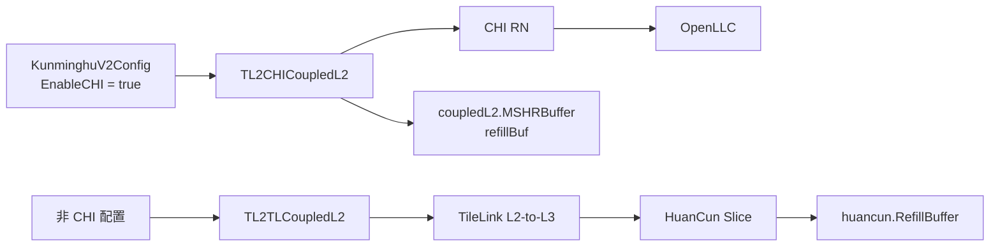
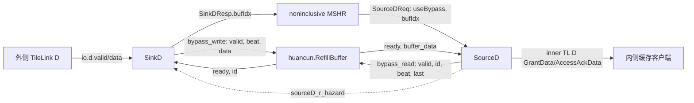
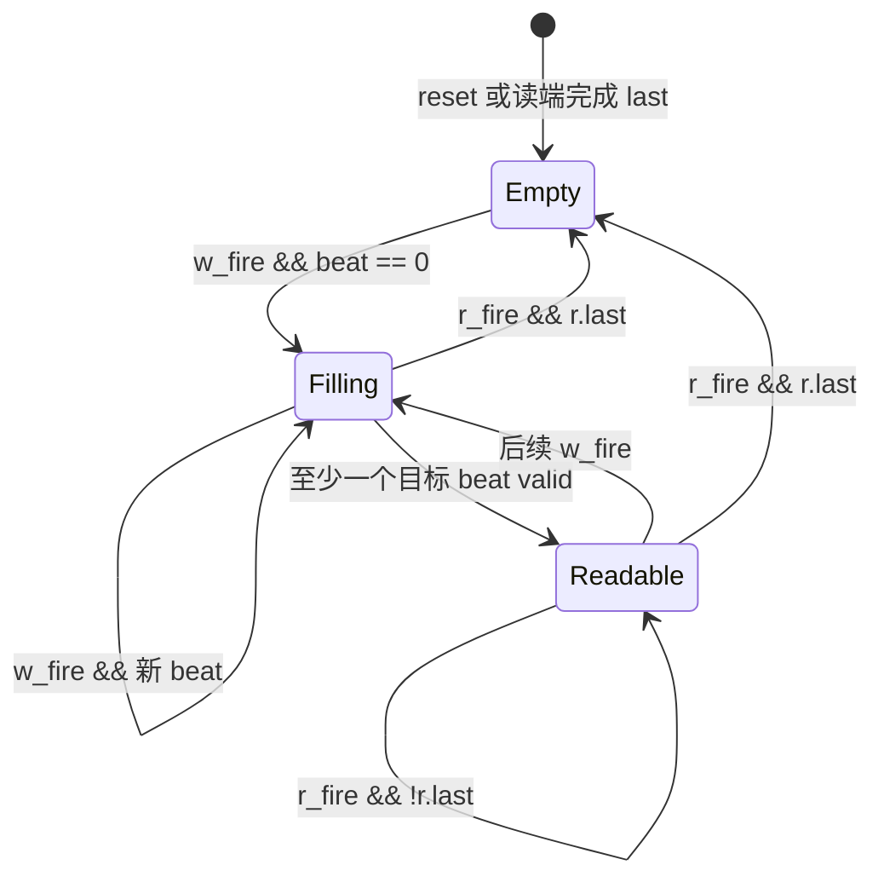
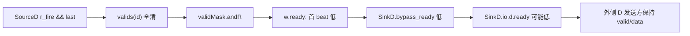
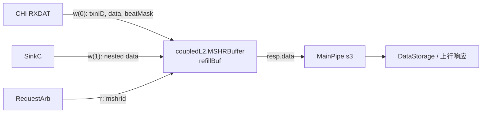

# 香山昆明湖 V2：Cache RefillBuffer 源码分析

> 本文以本地 `kunminghu-v2` 源码为行为依据，分析缓存回填数据在 **HuanCun** 与 **CoupledL2** 中实际采用的两套不同存储。它们都被称为 refill buffer，但不是同一个 Chisel 类、没有直接硬件连线，也不能共用同一套生命周期描述。

## 1. 范围、基线与结论

### 1.1 源码基线

| 项目 | 基线 | 本文用途 |
| --- | --- | --- |
| XiangShan 顶层 | `kunminghu-v2` @ `e12436c7cba86b195deec24981976d78bc263661` | 配置、顶层连接和 L2 选择 |
| `coupledL2` 子模块 | `fb5469838c8902b6cb33992c0ee3d446e4453` | 默认 CHI 昆明湖 V2 的 L2 refill storage |
| `huancun` 子模块 | `65ef077373ecf398b4cecdea06b65ef9b8d79044` | 具有 `class RefillBuffer` 的 HuanCun 内部实现 |
| Design Doc | `kunminghu-v2` @ `58d9e2ad11f044cb6f8887d9687d9e110696d1aa` | 仅用于术语和设计意图对照，不能替代本地源码证据 |

本次阅读的关键源码包括：[Configs.scala](/home/yanyusong/xs-memory-env/XiangShan/src/main/scala/top/Configs.scala:333)、[Top.scala](/home/yanyusong/xs-memory-env/XiangShan/src/main/scala/top/Top.scala:111)、[L2Top.scala](/home/yanyusong/xs-memory-env/XiangShan/src/main/scala/xiangshan/L2Top.scala:112)、[huancun/RefillBuffer.scala](/home/yanyusong/xs-memory-env/XiangShan/huancun/src/main/scala/huancun/RefillBuffer.scala:7)、[huancun/Slice.scala](/home/yanyusong/xs-memory-env/XiangShan/huancun/src/main/scala/huancun/Slice.scala:70)、[coupledL2/MSHRBuffer.scala](/home/yanyusong/xs-memory-env/XiangShan/coupledL2/src/main/scala/coupledL2/MSHRBuffer.scala:25) 和两种 CoupledL2 Slice。

### 1.1.1 关键证据索引与短代码

| 主题 | 源码基线 | 精确位置 | 证明的事实 |
| --- | --- | --- | --- |
| 默认配置选择 | XiangShan `e12436c7` | [Configs.scala:477](/home/yanyusong/xs-memory-env/XiangShan/src/main/scala/top/Configs.scala:477), [L2Top.scala:130](/home/yanyusong/xs-memory-env/XiangShan/src/main/scala/xiangshan/L2Top.scala:130) | KmhV2 的 `EnableCHI` 为真，选择 CHI CoupledL2 |
| HuanCun 实例和连接 | huancun `65ef0773` | [Slice.scala:80](/home/yanyusong/xs-memory-env/XiangShan/huancun/src/main/scala/huancun/Slice.scala:80) | 唯一 `RefillBuffer` 位于同一 Slice 的 SinkD/SourceD 之间 |
| HuanCun valid 生命周期 | huancun `65ef0773` | [RefillBuffer.scala:34](/home/yanyusong/xs-memory-env/XiangShan/huancun/src/main/scala/huancun/RefillBuffer.scala:34), [RefillBuffer.scala:51](/home/yanyusong/xs-memory-env/XiangShan/huancun/src/main/scala/huancun/RefillBuffer.scala:51) | 每 beat valid，读最后 beat 清整项 |
| CoupledL2 回填存储 | coupledL2 `fb546983` | [tl2chi/Slice.scala:53](/home/yanyusong/xs-memory-env/XiangShan/coupledL2/src/main/scala/coupledL2/tl2chi/Slice.scala:53), [MSHRBuffer.scala:49](/home/yanyusong/xs-memory-env/XiangShan/coupledL2/src/main/scala/coupledL2/MSHRBuffer.scala:49) | `refillBuf` 是两写端 `MSHRBuffer`，不是 HuanCun 类 |

```scala
// src/main/scala/top/Configs.scala
class WithCHI extends Config((_, _, _) => {
  case EnableCHI => true
})
```

```scala
// huancun/src/main/scala/huancun/Slice.scala
val refillBuffer = Module(new RefillBuffer)
refillBuffer.io.r <> sourceD.io.bypass_read
refillBuffer.io.w <> sinkD.io.bypass_write
```

```scala
// huancun/src/main/scala/huancun/RefillBuffer.scala
r.ready := valids(r.id)(r.beat)
when (r.valid && r.ready && rlast) {
  valids(r.id).foreach(_ := false.B)
}
```

```scala
// coupledL2/src/main/scala/coupledL2/MSHRBuffer.scala
val wens = VecInit(io.w.map(w => w.valid && w.bits.id === i.U)).asUInt
val w_data = PriorityMux(wens, io.w.map(_.bits.data))
val w_beatSel = PriorityMux(wens, io.w.map(_.bits.beatMask))
```

### 1.2 结论先行：默认配置与源码对象必须分开

`KunminghuV2Config` 叠加 `WithCHI`，后者将 `EnableCHI` 设为真；同一配置同时给出 1 MB、4 bank 的 L2 参数。[`KunminghuV2Config`](/home/yanyusong/xs-memory-env/XiangShan/src/main/scala/top/Configs.scala:477) 的有效 L2 选择因此是 `TL2CHICoupledL2`，而不是 TileLink 版 `TL2TLCoupledL2`。[`L2Top`](/home/yanyusong/xs-memory-env/XiangShan/src/main/scala/xiangshan/L2Top.scala:111)

另一方面，`L3CacheConfig` 只在 `!EnableCHI` 时构造 `L3CacheParamsOpt`（HuanCun 参数），只在 `EnableCHI` 时构造 `OpenLLCParamsOpt`；SoC 还要求两种 LLC 参数至多存在一种。[`Configs.scala`](/home/yanyusong/xs-memory-env/XiangShan/src/main/scala/top/Configs.scala:346) [`SoC.scala`](/home/yanyusong/xs-memory-env/XiangShan/src/main/scala/system/SoC.scala:146) `Top` 只对 `L3CacheParamsOpt` 实例化 `HuanCun`。[`Top.scala`](/home/yanyusong/xs-memory-env/XiangShan/src/main/scala/top/Top.scala:111)

因此：

1. **默认 `KunminghuV2Config` 的有效 L2 refill storage** 是 CHI CoupledL2 Slice 中变量名为 `refillBuf` 的 `MSHRBuffer`，由 `RXDAT` 和 `SinkC` 写入。[`tl2chi/Slice.scala`](/home/yanyusong/xs-memory-env/XiangShan/coupledL2/src/main/scala/coupledL2/tl2chi/Slice.scala:53) [`tl2chi/Slice.scala`](/home/yanyusong/xs-memory-env/XiangShan/coupledL2/src/main/scala/coupledL2/tl2chi/Slice.scala:165)
2. **源码中真正名为 `huancun.RefillBuffer` 的类** 是非 CHI、HuanCun L3 配置下每个 HuanCun Slice 内的短路径旁路存储，连接为 `SinkD -> RefillBuffer -> SourceD`。[`huancun/Slice.scala`](/home/yanyusong/xs-memory-env/XiangShan/huancun/src/main/scala/huancun/Slice.scala:80)
3. CoupledL2 里没有 `class RefillBuffer`；HuanCun 的该类也没有被 CoupledL2 或 OpenLLC 直接实例化。两者跨模块只可能经所选配置的 TileLink/CHI 系统连接，而不是共享一个 buffer 实例。

下图给出这个配置边界。实线是已由顶层连接验证的实例/接口路径；灰色说明是未在默认 CHI 实例树中同时出现的替代路径。



### 1.3 术语对照

| 名称 | 代码位置 | 谁拥有 entry | 写入/读取方式 | 有效位与释放 | 在默认 KmhV2 CHI 配置中 |
| --- | --- | --- | --- | --- | --- |
| `huancun.RefillBuffer` | [RefillBuffer.scala](/home/yanyusong/xs-memory-env/XiangShan/huancun/src/main/scala/huancun/RefillBuffer.scala:28) | 从 `mshrs / 2` 个动态空槽分配 | `SinkD` 按 beat 写，`SourceD` 按 beat 读 | 每 beat `valid`；读到 `last` 清整项 | 不实例化为 HuanCun L3 |
| `coupledL2.MSHRBuffer`（`refillBuf`） | [MSHRBuffer.scala](/home/yanyusong/xs-memory-env/XiangShan/coupledL2/src/main/scala/coupledL2/MSHRBuffer.scala:39) | 一个 entry 固定对应一个 MSHR ID | `ValidIO` 多写端带 `beatMask`，单读端 | 没有 buffer-local valid/free/clear | CHI Slice 实例化并使用 |

这里的“默认”仅指上述 `KunminghuV2Config` 的源码配置求值；不同 Config、参数覆盖或外部集成需要重新检查 elaboration，不能从本文推断其实际芯片构建选项。

## 2. 理论、Design Doc 与有效源码的对应关系

### 2.1 课程概念映射

| 理论概念 | 对应代码现象 | 本文结论 |
| --- | --- | --- |
| 有限资源引起的结构冒险 | HuanCun 用 `validMask` 判断空槽，满时首 beat 的 `w.ready` 变低；CoupledL2 则由 MSHR 控制器而非 buffer 自身限制容量 | 回填存储的瓶颈并不总在同一个模块，必须区分“存储位”与“MSHR 名额” |
| 多周期流水与旁路 | HuanCun 的 `SinkD` 可把外侧 D data 写入 buffer，`SourceD` 不必等待数据先写入 BankedStore | 旁路缩短的是外侧 Grant 到内侧 GrantData 的数据路径，不等同于降低整个 miss 延迟 |
| valid/ready 的背压传播 | `SourceD` 读不到某个 beat 会停住；HuanCun buffer 满会经 `SinkD.io.d.ready` 向外侧 D 反压 | 延迟是握手和仲裁相关的变量，不是一个固定 cycle 常数 |

相关的课程基础可见：[结构冒险、数据冒险与控制冒险](/home/yanyusong/XiangShanLab/xiangshan-course/docs/4-xiangshan-microarchitecture-analysis/1-superscalar-basic-knowledge/3_Structural_Hazards_vs_Data_Hazards_vs_Control_Hazards.md:1)、[单周期、多周期与流水线](/home/yanyusong/XiangShanLab/xiangshan-course/docs/4-xiangshan-microarchitecture-analysis/1-superscalar-basic-knowledge/1_Single_Cycle_vs_Multi_Cycle_vs_Pipeline.md:1) 和 [LoadStore-DCache](/home/yanyusong/XiangShanLab/xiangshan-course/docs/4-xiangshan-microarchitecture-analysis/3-xiangshan-source-code-analysis/memory/LoadStore-DCache.md:1)。这些文档解释概念；本页的信号行为仅由下列源码链接支撑。

### 2.2 Design Doc 可追溯矩阵

Design Doc 被用作术语索引，未复制其叙述。每个会影响本文结论的意图都在本地源码中单独寻找证据。

| ID | Design Doc 中的原子意图 | 当前源码证据 | 关系 | 状态 |
| --- | --- | --- | --- | --- |
| D1 | CoupledL2 中有名为 RefillBuffer 的回填保存单元，[CoupledL2.md](/home/yanyusong/XiangShan-Design-Doc/docs/zh/cache/l2cache/CoupledL2.md:13) | 当前 `coupledL2` 使用 `MSHRBuffer`，Slice 局部变量仍为 `refillBuf`。[MSHRBuffer.scala](/home/yanyusong/xs-memory-env/XiangShan/coupledL2/src/main/scala/coupledL2/MSHRBuffer.scala:39) [`tl2chi/Slice.scala`](/home/yanyusong/xs-memory-env/XiangShan/coupledL2/src/main/scala/coupledL2/tl2chi/Slice.scala:53) | 术语对应，类名/组织不同 | 已验证，版本命名差异 |
| D2 | CHI `RXDAT` 将回填数据导入 RefillBuffer，[RXDAT.md](/home/yanyusong/XiangShan-Design-Doc/docs/zh/cache/l2cache/downstream/RXDAT.md:3) | `RXDAT` 用 `txnID` 作 ID，按 `first/last` 生成 `beatMask`，并接到 `refillBuf.io.w(0)`。[RXDAT.scala](/home/yanyusong/xs-memory-env/XiangShan/coupledL2/src/main/scala/coupledL2/tl2chi/RXDAT.scala:57) [`tl2chi/Slice.scala`](/home/yanyusong/xs-memory-env/XiangShan/coupledL2/src/main/scala/coupledL2/tl2chi/Slice.scala:165) | 数据流对应 | 已验证 |
| D3 | 请求仲裁在回填数据仍未写入 DataStorage 时可选择 refill 数据，[ReqArb_MainPipe.md](/home/yanyusong/XiangShan-Design-Doc/docs/zh/cache/l2cache/ReqArb_MainPipe.md:35) | `RequestArb` 对上行 GrantData 或 replacement Release 产生 `refillBufRead_s2`。[RequestArb.scala](/home/yanyusong/xs-memory-env/XiangShan/coupledL2/src/main/scala/coupledL2/RequestArb.scala:219) | 控制选择对应 | 已验证 |
| D4 | SinkC 嵌套数据可影响 refill 数据路径，[SinkC.md](/home/yanyusong/XiangShan-Design-Doc/docs/zh/cache/l2cache/upstream/SinkC.md:9) | 两种 Slice 都把 `SinkC` 接为 `refillBuf` 的第二写端口。[tl2chi/Slice.scala](/home/yanyusong/xs-memory-env/XiangShan/coupledL2/src/main/scala/coupledL2/tl2chi/Slice.scala:165) [`tl2tl/Slice.scala`](/home/yanyusong/xs-memory-env/XiangShan/coupledL2/src/main/scala/coupledL2/tl2tl/Slice.scala:123) | 接口对应；同 ID 同拍写入的最终优先级需要波形验证 | 部分验证 |
| D5 | 文档中的 CoupledL2 RefillBuffer 等同于 `huancun.RefillBuffer` | 本地代码中仅 HuanCun 有 `class RefillBuffer`，CoupledL2 为 `MSHRBuffer`，两者接口和生命周期不同 | 不可等同 | 版本/模块边界差异 |

**Design Doc 差异结论。** 当前 HuanCun 子模块上的 `RefillBuffer` 不能作为 CoupledL2 文档中“RefillBuffer”的直接实现证据；反过来，CoupledL2 的 `MSHRBuffer` 也不能套用 HuanCun 的动态空槽和 per-beat valid 规则。后续章节分别展开。

## 3. HuanCun `RefillBuffer`：模块契约与连接

### 3.1 Who / Why / How / From / To

| 问题 | 源码答案 |
| --- | --- |
| 谁拥有 | 每个 HuanCun `Slice` 实例化一个 `RefillBuffer`；`SinkD` 是写生产者，`SourceD` 是读消费者。[Slice.scala](/home/yanyusong/xs-memory-env/XiangShan/huancun/src/main/scala/huancun/Slice.scala:70) |
| 为什么存在 | 源码注释说明其目标是减少 outer grant 到 inner grant 的延迟，让 refill data 不必先经过 SRAM。[RefillBuffer.scala](/home/yanyusong/xs-memory-env/XiangShan/huancun/src/main/scala/huancun/RefillBuffer.scala:24) |
| 如何工作 | 以 `(buffer-id, beat)` 直接访问 `Mem`，每 beat 独立 valid；SinkD 写入后 SourceD 可按 beat 取走。[RefillBuffer.scala](/home/yanyusong/xs-memory-env/XiangShan/huancun/src/main/scala/huancun/RefillBuffer.scala:34) |
| 从哪里来 | 外侧 TileLink D 回包在 `SinkD` 通过 `bypass_write` 写入；该端的 beat 来自 `edge.count(io.d)`。[SinkD.scala](/home/yanyusong/xs-memory-env/XiangShan/huancun/src/main/scala/huancun/SinkD.scala:41) |
| 到哪里去 | MSHR 保存 `SinkD` 返回的 `bufIdx`，随后 SourceD 用 `SourceDReq.bufIdx` 发 `bypass_read`，最后从内侧 D 通道发出数据响应。[noninclusive/MSHR.scala](/home/yanyusong/xs-memory-env/XiangShan/huancun/src/main/scala/huancun/noninclusive/MSHR.scala:1395) [`SourceD.scala`](/home/yanyusong/xs-memory-env/XiangShan/huancun/src/main/scala/huancun/SourceD.scala:100) |



### 3.2 参数、索引与数据存储

HuanCun 参数由 `HCCacheParameters` 提供；`beatSize`、`mshrsAll`、`bufBlocks` 和 `bufIdxBits` 的定义见 [HuanCun.scala](/home/yanyusong/xs-memory-env/XiangShan/huancun/src/main/scala/huancun/HuanCun.scala:45)。

| 项目 | 源码公式 | 影响 | 通用 `HCCacheParameters` 默认值下的推导 |
| --- | --- | --- | --- |
| 一个 cache line 的 beat 数 | `beatSize = blockBytes / beatBytes` | 每 entry 的 `Vec` 深度、beat mask/计数范围 | `64 / 32 = 2` |
| MSHR 总数 | `mshrsAll = mshrs + 2` | `bufIdxBits` 宽度，包含额外 B/C MSHR 语义 | `14 + 2 = 16` |
| RefillBuffer 槽数 | `bufBlocks = mshrs / 2` | `Mem` 第一维和 valid 向量长度 | `14 / 2 = 7` |
| buffer ID 宽度 | `bufIdxBits = log2Ceil(mshrsAll)` | r/w 接口 ID 宽度 | `log2Ceil(16) = 4` |
| 写 beat | `edge.count(io.d)` 的 `beat` | SinkD 按外侧 D burst 的 beat 写入 | 由 TileLink 传输决定 |
| 读 beat | `startBeat(off) | counter` | SourceD 从任务 offset 开始逐 beat 读取 | `startBeat` 为 `offset >> log2Up(beatBytes)` |

通用参数默认值中的 `blockBytes=64`、`mshrs=14` 和 D channel `channelBytes=32` 见 [HCCacheParameters.scala](/home/yanyusong/xs-memory-env/XiangShan/huancun/src/main/scala/huancun/HCCacheParameters.scala:83)。这些数字是参数类默认值，不是“默认 CHI Kunminghu V2 已 elaboration 的 HuanCun 实例”。实际非 CHI HuanCun 配置可覆盖它们。

`buffer` 是 `Mem(bufBlocks, Vec(beatSize, DSData))`；`valids` 是 reset 清零的二维寄存器向量，数据本体不 reset。[RefillBuffer.scala](/home/yanyusong/xs-memory-env/XiangShan/huancun/src/main/scala/huancun/RefillBuffer.scala:34) `DSData` 含 data 和 corrupt 字段。[Common.scala](/home/yanyusong/xs-memory-env/XiangShan/huancun/src/main/scala/huancun/Common.scala:202)

`bufIdxBits` 可以大于实际 `bufBlocks` 的地址所需位数，因此一个重要的系统不变量是：**SourceD 只能拿到此前由该 buffer 成功分配并通过 SinkD response 写回 MSHR 的 ID。** 模块内部没有对任意 4-bit `r.id` 做范围检查或 tag 匹配；这不是可以由 buffer 自身纠正的错误输入。

### 3.3 自定义读写接口与握手

`SourceDBufferRead` 和 `SinkDBufferWrite` 不是标准 `DecoupledIO`；它们把 `valid` 作为输入、`ready` 作为输出。[RefillBuffer.scala](/home/yanyusong/xs-memory-env/XiangShan/huancun/src/main/scala/huancun/RefillBuffer.scala:7) 本文用下列派生事件描述状态更新：

- `w_fire = io.w.valid && io.w.ready`
- `r_fire = io.r.valid && io.r.ready`

| 端口 | 生产者 -> 消费者 | 输入字段 | `ready` 的精确定义 | `fire` 后果 |
| --- | --- | --- | --- | --- |
| `w` | `SinkD -> RefillBuffer` | `valid, beat, data` | 首 beat 为寄存后的“非全满”；续 beat 恒为真 | 断言目标 beat 先前无效，然后写 `data` 并置该 beat valid |
| `w.id` | `RefillBuffer -> SinkD/MSHR` | 无 | 首 beat 输出寄存后的 `freeIdx`；续 beat 保持第一次成功写入的 ID | `SinkDResp.bufIdx` 将它传给 MSHR |
| `r` | `SourceD -> RefillBuffer` | `valid, id, beat, last` | 精确等于 `valids(id)(beat)` | 返回 `buffer(id)(beat)`；若 `last` 同时成立，清掉该 ID 的所有 beat valid |

读侧 `ready` 的语义是“该 beat 已存在”，不是“下游有空位”；SourceD 自己用一个 2-entry queue 接住命中的数据，并以断言要求命中时该 queue 可入队。[SourceD.scala](/home/yanyusong/xs-memory-env/XiangShan/huancun/src/main/scala/huancun/SourceD.scala:85) 反之，写侧非首 beat 的 `ready` 恒真，依赖上游遵守“续 beat 只能属于已经成功接受的首 beat”的协议。

## 4. HuanCun `RefillBuffer`：存储算法与隐式生命周期

### 4.1 搜索、更新、释放、替换

| 操作 | Owner / 输入 | 组合或时序规则 | 状态变化 | 代码依据 |
| --- | --- | --- | --- | --- |
| 搜索/读 | `SourceD` 给出 `id, beat` | `buffer(id)(beat)` 直接读，`ready := valids(id)(beat)` | 无 | [RefillBuffer.scala:44](/home/yanyusong/xs-memory-env/XiangShan/huancun/src/main/scala/huancun/RefillBuffer.scala:44) |
| 首 beat 安全检查 | `SourceD` 的读请求 | `r.valid && r.beat === 0` 时断言 `r.ready` | 无；失败为断言，而非重试 | [RefillBuffer.scala:47](/home/yanyusong/xs-memory-env/XiangShan/huancun/src/main/scala/huancun/RefillBuffer.scala:47) |
| 空槽选择 | 写首 beat | `validMask` 对每项做 beat-valid OR；`PriorityEncoder(~validMask)` 选最低编号空项 | 无，候选 ID 经寄存器输出 | [RefillBuffer.scala:56](/home/yanyusong/xs-memory-env/XiangShan/huancun/src/main/scala/huancun/RefillBuffer.scala:56) |
| 写入 | `SinkD` 的 `w_fire` | 目标 beat 原先必须无效；写 `DSData` 并置该 beat valid | 一个 beat 从 0 变 1 | [RefillBuffer.scala:65](/home/yanyusong/xs-memory-env/XiangShan/huancun/src/main/scala/huancun/RefillBuffer.scala:65) |
| 释放 | `r_fire && r.last` | 清该 `id` 的所有 beat valid | 整项恢复为空 | [RefillBuffer.scala:51](/home/yanyusong/xs-memory-env/XiangShan/huancun/src/main/scala/huancun/RefillBuffer.scala:51) |
| 替换/驱逐 | 无 | 没有 tag、way、地址比较、LRU 或 victim 选择 | 不存在；满时只回压 | [RefillBuffer.scala:34](/home/yanyusong/xs-memory-env/XiangShan/huancun/src/main/scala/huancun/RefillBuffer.scala:34) |
| reset/flush | reset 只作用于 `RegInit(valids)` | reset 后所有 beat invalid；没有模块级 flush/redirect/cancel 输入 | 数据阵列可保留未初始化/旧值，但 invalid 后不可合法读取 | [RefillBuffer.scala:34](/home/yanyusong/xs-memory-env/XiangShan/huancun/src/main/scala/huancun/RefillBuffer.scala:34) |

`wlast` 在源码中由 `w.beat.andR` 定义，但没有参与释放或任何其它状态更新。[RefillBuffer.scala](/home/yanyusong/xs-memory-env/XiangShan/huancun/src/main/scala/huancun/RefillBuffer.scala:39) 因而不能把“最后一个外侧写 beat 到达”误写成 entry 自动释放条件；真正释放条件只在读端的 `r.last` 握手。

下面是针对**单个 entry**的抽象状态图。它是对 valid 向量的解释，不是源码中显式枚举的 FSM。`Filling` 与 `Readable` 可以交叠，因为每个 beat 的 valid 独立，后续 beat 可以仍在到达，而先到达的 beat 已可被读取。



这个图也暴露出两个协议责任：

- SourceD 不可在第一数据 beat 尚未有效时把它当作合法旁路数据。源码会对 `beat == 0` 的失配直接断言。
- SourceD 的 `last` 必须与这次任务实际消费的最后 beat 一致。模块不会检查其它 beat 是否都被读取，就会把整个 entry 的 valid 清零。

### 4.2 分配、满状态与反压

`validMask` 的每一位代表一个 entry 中“至少有一个 beat 有效”。因此 entry 不是只有在所有 beat 到齐后才占用，而是**首个已写 beat 就占用**。`freeIdx` 固定选择最低编号空项，既没有 round-robin，也没有年龄/公平策略。[RefillBuffer.scala](/home/yanyusong/xs-memory-env/XiangShan/huancun/src/main/scala/huancun/RefillBuffer.scala:56)

首 beat 上，`w.ready` 使用 `RegNext(!validMask.andR, true.B)`，而 `w.id` 用同样方式寄存 `freeIdx`；后续 beat 用 `RegEnable` 保持首 beat 被接受时的 ID。[RefillBuffer.scala](/home/yanyusong/xs-memory-env/XiangShan/huancun/src/main/scala/huancun/RefillBuffer.scala:59) 可从源码直接得到：

- 所有 entry 均有至少一个有效 beat 时，下一次首 beat 观察到的 `w.ready` 为低。
- 续 beat 的 `w.ready` 没有再检查满状态；它依赖已建立的同一 entry 所有权。
- `r.last` 清 valid 与新的首 beat 分配同拍时，`freeIdx` 仍看到时钟边沿前的 validMask。因此该刚释放 entry 不能在同一拍被重新选中，下一拍才可成为空槽。这是对寄存器更新顺序的源码推导，不是单独的 assert。

反压传播路径不是 buffer 单独决定的。`SinkD` 只有在 `inner_grant && needData && bypass_write.ready` 时得到 `bypass_ready`，再把它并入外侧 `io.d.ready` 的计算；如果同时需写 BankedStore，还必须满足 BankedStore 地址端和同地址安全条件。[SinkD.scala](/home/yanyusong/xs-memory-env/XiangShan/huancun/src/main/scala/huancun/SinkD.scala:53)



当 `cache && inner_grant` 同时为真时，`SinkD` 必须同时满足旁路 buffer 与 BankedStore 的写入条件；因此 RefillBuffer 满能阻塞本来还需写入 DataStorage 的回填。[SinkD.scala](/home/yanyusong/xs-memory-env/XiangShan/huancun/src/main/scala/huancun/SinkD.scala:57) 这是一种有意识的同步写入约束，不是 RefillBuffer 做了 cache replacement。

### 4.3 MSHR、旁路资格与 ID 传递

HuanCun 内，buffer 本身不保存地址、set、tag 或 MSHR 状态；这些由 MSHR 和 SourceD 任务携带。

1. `Slice` 按外侧 D response 的 source 选择对应 MSHR status，并向 `SinkD` 提供 `will_grant_data` 和 `will_save_data`。[Slice.scala](/home/yanyusong/xs-memory-env/XiangShan/huancun/src/main/scala/huancun/Slice.scala:586)
2. noninclusive MSHR 只有在 miss/权限/Probe dirty/错误/Put 等条件允许时令 `od.useBypass` 为真；该逻辑不是无条件旁路。[noninclusive/MSHR.scala](/home/yanyusong/xs-memory-env/XiangShan/huancun/src/main/scala/huancun/noninclusive/MSHR.scala:1145)
3. SinkD 在 first 或 last 外侧 D 握手时产生 response，并把当前 `bypass_write.id` 带入 `SinkDResp.bufIdx`。[SinkD.scala](/home/yanyusong/xs-memory-env/XiangShan/huancun/src/main/scala/huancun/SinkD.scala:64)
4. noninclusive MSHR 收到该 response 后，对非 Put 请求把 `bufIdx` 写回 `req.bufIdx`；其 status 的 `will_grant_data` 也由 `source_d.useBypass` 推导。[noninclusive/MSHR.scala](/home/yanyusong/xs-memory-env/XiangShan/huancun/src/main/scala/huancun/noninclusive/MSHR.scala:1395) [`noninclusive/MSHR.scala`](/home/yanyusong/xs-memory-env/XiangShan/huancun/src/main/scala/huancun/noninclusive/MSHR.scala:1487)
5. SourceD 用该任务的 `bufIdx`、`startBeat(off) | counter` 和 `s1_last` 驱动 `bypass_read`。[SourceD.scala](/home/yanyusong/xs-memory-env/XiangShan/huancun/src/main/scala/huancun/SourceD.scala:73)

inclusive MSHR 明确令 `od.useBypass := false.B` 且 `will_grant_data := false.B`，所以这里的 HuanCun RefillBuffer 旁路只在 noninclusive 路径有实际数据消费者。[inclusive/MSHR.scala](/home/yanyusong/xs-memory-env/XiangShan/huancun/src/main/scala/huancun/inclusive/MSHR.scala:425) [`inclusive/MSHR.scala`](/home/yanyusong/xs-memory-env/XiangShan/huancun/src/main/scala/huancun/inclusive/MSHR.scala:581)

### 4.4 SourceD 的读取阶段与请求仲裁

SourceD 的 stage 1 把一个任务锁住到 `busy`，并以 `s1_counter` 推进 beat；它只有在被选中数据源真正命中时才使 `s1_valid` 前进。旁路路径的命中条件是 `io.bypass_read.valid && io.bypass_read.ready`，而 `io.task.ready := !busy`。[SourceD.scala](/home/yanyusong/xs-memory-env/XiangShan/huancun/src/main/scala/huancun/SourceD.scala:73)

命中数据进入 2-entry `s1_queue`，在 stage 2 等待内侧 `io.d.ready` 后作为 D data 发出；因此 RefillBuffer 的 `ready` 本身不能代表最终内侧 D 已接受，SourceD 的 queue 和 D channel 仍可能形成后续背压。[SourceD.scala](/home/yanyusong/xs-memory-env/XiangShan/huancun/src/main/scala/huancun/SourceD.scala:88) [`SourceD.scala`](/home/yanyusong/xs-memory-env/XiangShan/huancun/src/main/scala/huancun/SourceD.scala:153)

多个 MSHR 不会同时直连 RefIllBuffer 的读口：`Slice` 将所有 `source_d` task 汇总给一个 `arbTasks(..., latch = true)`。[Slice.scala](/home/yanyusong/xs-memory-env/XiangShan/huancun/src/main/scala/huancun/Slice.scala:431) 当输入数为 `mshrsAll` 时，C MSHR 的真实有效请求优先于 B/C MSHR，二者优先于 ABC MSHR 组；ABC 组使用 `LatchFastArbiter`。[Slice.scala](/home/yanyusong/xs-memory-env/XiangShan/huancun/src/main/scala/huancun/Slice.scala:465)

这给出两项可验证的控制结论：

- 同一时刻只有被仲裁出的 SourceD task 可以获得 `io.task.fire`，故 HuanCun `RefillBuffer` 没有多个并行读端口仲裁器。
- ABC 组内部存在仲裁，然而 C/B 请求在这个出口有更高优先级。源码没有在该处给出“连续高优先级请求下 ABC 必定最终服务”的公平性保证，应作为 starvation/forward-progress 波形检查项。

### 4.5 同地址读写、错误和未实现恢复接口

对于相同 `(id, beat)` 的同拍读写，RefillBuffer 没有 forwarding mux，也没有定义 read-first/write-first 的外部可见策略。合法写要求目标 beat 当前 invalid，合法读要求它当前 valid；两条条件在协议层排除了对同一 beat 的合法同拍 RAW 访问。[RefillBuffer.scala](/home/yanyusong/xs-memory-env/XiangShan/huancun/src/main/scala/huancun/RefillBuffer.scala:44) [`RefillBuffer.scala`](/home/yanyusong/xs-memory-env/XiangShan/huancun/src/main/scala/huancun/RefillBuffer.scala:65) 因此应验证调度没有形成该竞争，而不要臆测 SRAM 的同拍语义。

`SinkD` 将外侧 `denied` 写入 MSHR response，但写入 buffer 的 `DSData.corrupt` 在此路径被置为 `false.B`；SourceD 最终把内侧 D 的 `corrupt` 设成 `denied`。[SinkD.scala](/home/yanyusong/xs-memory-env/XiangShan/huancun/src/main/scala/huancun/SinkD.scala:65) [`SinkD.scala`](/home/yanyusong/xs-memory-env/XiangShan/huancun/src/main/scala/huancun/SinkD.scala:75) [`SourceD.scala`](/home/yanyusong/xs-memory-env/XiangShan/huancun/src/main/scala/huancun/SourceD.scala:153) 本页只确认这段局部传播，未从这些文件推出完整 TileLink error recovery 或软件可见异常路径。

模块也没有 `flush`、core redirect、取消、重放或特权输入端。它是物理 cache 侧的短期数据存储；这些恢复语义若存在，只能由上游请求协议、MSHR 状态机或更外层缓存控制实现，不能归因给 RefillBuffer。

## 5. HuanCun 动态时序、吞吐与场景

### 5.1 正常动态路径

以一个允许旁路的 noninclusive MSHR 回填为例，源码能够支持下列事件顺序：

1. 外侧 D 回包到达 `SinkD.io.d`。`edge.count` 产生 `first`、`last` 和当前 `beat`；带数据的回包被断言为对齐的完整 cache-line 大小。[SinkD.scala](/home/yanyusong/xs-memory-env/XiangShan/huancun/src/main/scala/huancun/SinkD.scala:41)
2. MSHR status 令 `inner_grant` 为真后，`SinkD` 把 `bypass_write.valid/beat/data` 驱动到 RefillBuffer。首个可接受 beat 获得空槽 ID，并逐 beat 设置 valid。[SinkD.scala](/home/yanyusong/xs-memory-env/XiangShan/huancun/src/main/scala/huancun/SinkD.scala:57) [`RefillBuffer.scala`](/home/yanyusong/xs-memory-env/XiangShan/huancun/src/main/scala/huancun/RefillBuffer.scala:59)
3. `SinkDResp.bufIdx` 随 response 回到 MSHR；MSHR 生成的 `SourceDReq` 带着 `useBypass` 和该 ID 进入 SourceD 仲裁路径。[SinkD.scala](/home/yanyusong/xs-memory-env/XiangShan/huancun/src/main/scala/huancun/SinkD.scala:64) [`noninclusive/MSHR.scala`](/home/yanyusong/xs-memory-env/XiangShan/huancun/src/main/scala/huancun/noninclusive/MSHR.scala:1395)
4. SourceD s1 请求目标 beat。若对应 valid 已置位，`s1_bypass_hit` 让该 beat 进入 `s1_queue`；若尚未到达，s1 停在同一 counter，等待 RefillBuffer 的 `ready` 变高。[SourceD.scala](/home/yanyusong/xs-memory-env/XiangShan/huancun/src/main/scala/huancun/SourceD.scala:100) [`SourceD.scala`](/home/yanyusong/xs-memory-env/XiangShan/huancun/src/main/scala/huancun/SourceD.scala:120)
5. SourceD s2 仅在内侧 D ready 后从 `s1_queue` 发出数据。任务最后 beat 的 `r_fire` 触发 RefillBuffer 清该 entry 的全部 valid，槽随后才能被下一次首 beat 重新分配。[SourceD.scala](/home/yanyusong/xs-memory-env/XiangShan/huancun/src/main/scala/huancun/SourceD.scala:153) [`RefillBuffer.scala`](/home/yanyusong/xs-memory-env/XiangShan/huancun/src/main/scala/huancun/RefillBuffer.scala:51)

下图是时序**示意**，并不声称固定 cycle 数。信号名均来自对应 Chisel IO/局部信号；普通传输由两个端点同时为高表示，源码没有单独的 `fire` 端口。

```waveform-draw
{
  "signal": [
    {"name": "clk", "wave": "p......."},
    {"name": "SinkD.io.d.valid", "wave": "011....."},
    {"name": "SinkD.io.d.ready", "wave": "011....."},
    {"name": "SinkD.io.bypass_write.valid", "wave": "011....."},
    {"name": "RefillBuffer.io.w.ready", "wave": "011....."},
    {"name": "SourceD.io.bypass_read.valid", "wave": "00011..."},
    {"name": "RefillBuffer.io.r.ready", "wave": "00011..."},
    {"name": "SourceD.s2_d.valid", "wave": "000011.."},
    {"name": "SourceD.s2_d.ready", "wave": "000011.."}
  ]
}
```

下面是 buffer 满导致的首 beat stall 示意。`SinkD.io.d.valid` 必须持续保持有效 payload，直至 `SinkD.io.d.ready` 恢复；这个保持义务来自 Decoupled 的外层 D 接口，而不是 RefillBuffer 自己提供的 retry 信号。

```waveform-draw
{
  "signal": [
    {"name": "clk", "wave": "p......."},
    {"name": "SinkD.io.d.valid", "wave": "011111.."},
    {"name": "RefillBuffer.io.w.ready", "wave": "000011.."},
    {"name": "SinkD.io.bypass_write.valid", "wave": "000011.."},
    {"name": "SinkD.io.d.ready", "wave": "000011.."},
    {"name": "SourceD.io.bypass_read.valid", "wave": "011....."},
    {"name": "RefillBuffer.io.r.ready", "wave": "011....."}
  ]
}
```

这两段 JSON 使用课程仓库已约定的 `waveform-draw` fence；在 VS Code 的 Markdown Preview 中由 WaveDrom 扩展渲染。它们用于检查握手关系，不替代真实仿真波形。

### 5.2 延迟和吞吐边界

| 路径 | 起始事件 | 结束事件 | 固定延迟？ | 主要变量/瓶颈 | 源码依据 |
| --- | --- | --- | --- | --- | --- |
| HuanCun 写入 buffer | `SinkD.io.d.valid` | `w_fire` 写入一个 beat | 否 | 首 beat 的寄存器式可用性、buffer 满、BankedStore 写端、同址 hazard | [SinkD.scala:53](/home/yanyusong/xs-memory-env/XiangShan/huancun/src/main/scala/huancun/SinkD.scala:53) [`RefillBuffer.scala:59`](/home/yanyusong/xs-memory-env/XiangShan/huancun/src/main/scala/huancun/RefillBuffer.scala:59) |
| buffer 到 SourceD s1 | `bypass_read.valid` | `s1_bypass_hit` | 否 | 目标 beat valid；未到达时 s1 不前进 | [RefillBuffer.scala:44](/home/yanyusong/xs-memory-env/XiangShan/huancun/src/main/scala/huancun/RefillBuffer.scala:44) [`SourceD.scala:120`](/home/yanyusong/xs-memory-env/XiangShan/huancun/src/main/scala/huancun/SourceD.scala:120) |
| SourceD 到内侧 D | s1 命中 | `s2_d` 由内侧接受 | 否 | 2-entry queue、`s2_full` 和内侧 `io.d.ready` | [SourceD.scala:88](/home/yanyusong/xs-memory-env/XiangShan/huancun/src/main/scala/huancun/SourceD.scala:88) [`SourceD.scala`](/home/yanyusong/xs-memory-env/XiangShan/huancun/src/main/scala/huancun/SourceD.scala:153) |
| 空槽回收 | 任务最后 beat 读命中 | 所有该项 valid 清零 | 单个状态更新点，但分配可见性跨拍 | `r.valid && r.ready && r.last`；同拍不能立刻重新分配 | [RefillBuffer.scala:51](/home/yanyusong/xs-memory-env/XiangShan/huancun/src/main/scala/huancun/RefillBuffer.scala:51) |

所以可确认的吞吐结论是“只要 beat 已有效、SourceD s1 queue 可接受且内侧 D 持续 ready，SourceD 才能按其 stage 控制推进”；不能从该 buffer 单独推导固定的 miss latency 或全系统每周期回填带宽。

### 5.3 场景矩阵

| 场景 | 触发/资源 | 代码的赢家、阻塞或恢复 | 状态结果 | 未由源码保证的部分 |
| --- | --- | --- | --- | --- |
| 首 beat 未到而 SourceD 请求 beat 0 | `r.valid && beat==0 && !r.ready` | 断言失败 | 不应被当作可恢复的普通 stall | 上游为何过早发 task 需波形追踪 |
| 后续 beat 未到 | `r.valid && !r.ready`，但 beat 非 0 | s1 不通过 `s1_bypass_hit`，counter 不增 | entry 保持已有 valid，等待写入 | 没有 timeout/replay 路径 |
| 所有槽占用 | `validMask.andR` | 下一首 beat 的 `w.ready` 低，`SinkD` 可反压外侧 D | 直到某个 SourceD 最后读释放 | 无驱逐、无可见 almost-full 输出 |
| partial refill 与先行消费 | 部分 beat valid | SourceD 可读已经有效的目标 beat，未到 beat 仍停 | 每 beat valid 独立；`last` 时整项清理 | 正常任务必须正确安排 `last` |
| 同一 beat 同拍读写 | 同 `(id,beat)` | 没有 forwarding；合法读/写前置条件彼此排斥 | 协议应禁止 | RAM 同拍语义未定义为接口保证 |
| last 读和新首 beat 同拍 | 同时释放/分配 | 分配看边沿前 validMask | 新分配不会看到本拍释放项 | 需要仿真确认实际波形上的一个 bubble |
| SourceD 输出被内侧阻塞 | `s2_d.ready=0` | `s1_queue` 暂存；其断言要求命中时能入队 | 可能向 s1 形成反压 | 长时间阻塞下的 forward progress 依赖内侧客户端 |
| C/B 与 ABC MSHR 同时出 SourceD task | `arbTasks` 多请求 | C、B/C 高于 ABC；ABC 走 latch arbiter | 低优先级请求保留等待 | 连续高优先级下的 ABC 公平性未在此处证明 |

## 6. 默认 CHI CoupledL2 的对应实现：`MSHRBuffer`

### 6.1 存储契约与 HuanCun 的根本差异

CoupledL2 的 `MSHRBuffer` 用 `Reg(Vec(mshrsAll, Vec(beatSize, UInt(...))))` 建立每 MSHR 一个 data block；注释直接说明“一项对应一个 MSHR”。[MSHRBuffer.scala](/home/yanyusong/xs-memory-env/XiangShan/coupledL2/src/main/scala/coupledL2/MSHRBuffer.scala:39) 它没有 HuanCun 那样的 `valids`、空槽选择、`ready`、entry clear 或 tag/address 比较。

| 方面 | HuanCun `RefillBuffer` | CoupledL2 `MSHRBuffer` |
| --- | --- | --- |
| entry 取得 | `PriorityEncoder(~validMask)` 分配动态槽 | 直接以 MSHR ID 索引 |
| 数据完成度 | per-beat valid，读口以 `ready` 表示 hit | `beatMask` 只选择本次写入哪些 beat，没有 buffer-local valid |
| 写回压 | 首 beat 可满而回压 | `ValidIO` 写端无 ready，容量必须由 MSHR 生命周期限制 |
| 释放 | SourceD `r_fire && last` 清整项 | 无 buffer-local clear；MSHR 释放后 entry 可被后续写覆盖 |
| 读时序 | 组合数据 + valid-ready hit | `r.valid` 时 `RegEnable` 输出一拍寄存的数据 |
| 核心风险 | 首 beat/最后 beat 协议和动态槽耗尽 | 同 ID 多写优先级、MSHR 生命周期与数据 ready 对齐 |

读取端是 `Flipped(ValidIO(new MSHRBufRead))`，`rdata` 在 `io.r.valid` 时经 `RegEnable` 进入 `io.resp.data`。[MSHRBuffer.scala](/home/yanyusong/xs-memory-env/XiangShan/coupledL2/src/main/scala/coupledL2/MSHRBuffer.scala:41) 两种 Slice 再以 `RegNext(refillBuf.io.r.valid)` 对齐 MainPipe 的 s3 response valid。[tl2chi/Slice.scala](/home/yanyusong/xs-memory-env/XiangShan/coupledL2/src/main/scala/coupledL2/tl2chi/Slice.scala:115) [`tl2tl/Slice.scala`](/home/yanyusong/xs-memory-env/XiangShan/coupledL2/src/main/scala/coupledL2/tl2tl/Slice.scala:100)

### 6.2 CHI 和 TileLink 两条实际写入路径

默认 KmhV2 取 CHI 分支。`tl2chi/Slice` 用 `new MSHRBuffer(wPorts = 2)` 生成 `refillBuf`，并连接 `w(0) = rxdat.io.refillBufWrite`、`w(1) = sinkC.io.refillBufWrite`，读端来自 `RequestArb`。[tl2chi/Slice.scala](/home/yanyusong/xs-memory-env/XiangShan/coupledL2/src/main/scala/coupledL2/tl2chi/Slice.scala:53) [`tl2chi/Slice.scala`](/home/yanyusong/xs-memory-env/XiangShan/coupledL2/src/main/scala/coupledL2/tl2chi/Slice.scala:165)

- `RXDAT` 对每一个 CHI data beat 把 `txnID` 放进 ID，把 incoming data 扩展为 block payload，并用 `Cat(last, first)` 产生 beat mask；其 `io.out.ready` 恒为真。[RXDAT.scala](/home/yanyusong/xs-memory-env/XiangShan/coupledL2/src/main/scala/coupledL2/tl2chi/RXDAT.scala:35) [`RXDAT.scala`](/home/yanyusong/xs-memory-env/XiangShan/coupledL2/src/main/scala/coupledL2/tl2chi/RXDAT.scala:57)
- 非 CHI 的 `tl2tl/Slice` 同样有两个写端，但 `w(0)` 来自 `RefillUnit`，`w(1)` 来自 `SinkC`。[tl2tl/Slice.scala](/home/yanyusong/xs-memory-env/XiangShan/coupledL2/src/main/scala/coupledL2/tl2tl/Slice.scala:118) `RefillUnit` 在 first beat 寄存数据、在 last beat 拼出完整 block 后才写 `refillBuf`，并显式假定同一 block 的 beat 连续且不交织。[RefillUnit.scala](/home/yanyusong/xs-memory-env/XiangShan/coupledL2/src/main/scala/coupledL2/tl2tl/RefillUnit.scala:59) [`RefillUnit.scala`](/home/yanyusong/xs-memory-env/XiangShan/coupledL2/src/main/scala/coupledL2/tl2tl/RefillUnit.scala:81)



`RequestArb` 只在一个 MSHR task 需要回填数据时使 `refillBufRead_s2.valid` 为真：上行 GrantData/AccessAckData 一类任务需读取，replacement 的 release/refill 数据路径也会读取；ID 即 `task_s2.bits.mshrId`。[RequestArb.scala](/home/yanyusong/xs-memory-env/XiangShan/coupledL2/src/main/scala/coupledL2/RequestArb.scala:219)

### 6.3 容量、写冲突与 snoop 约束

CoupledL2 的 `MSHRBuffer` 本身没有 full/empty 信号。MSHRCtl 把 pipe 中请求数和有效 MSHR 数相加，以 `mshrsAll` 或 `mshrsAll - 1` 判满，再分别阻塞 SinkB 或 SinkA；所以容量控制在 MSHR 分配层，而不在 data buffer 内。[tl2chi/MSHRCtl.scala](/home/yanyusong/xs-memory-env/XiangShan/coupledL2/src/main/scala/coupledL2/tl2chi/MSHRCtl.scala:106) [`tl2tl/MSHRCtl.scala`](/home/yanyusong/xs-memory-env/XiangShan/coupledL2/src/main/scala/coupledL2/tl2tl/MSHRCtl.scala:99)

对于每个 `MSHRBuffer` entry，源码收集全部写端的 `w.valid && w.bits.id === i`，再以两次 `PriorityMux` 选择一份完整 data 和一份 beat mask；被选 mask 中的 beat 才会写入。[MSHRBuffer.scala](/home/yanyusong/xs-memory-env/XiangShan/coupledL2/src/main/scala/coupledL2/MSHRBuffer.scala:49) 这带来精确而重要的边界：

- 当前 refill buffer 是 `wPorts = 2`，`assert(PopCount(wens) <= 2.U)` 并不会禁止**恰好两个**写端在同一拍命中相同 MSHR ID。
- 当这种冲突发生时，代码没有把两个 writer 的 beat mask 合并；它只通过 `PriorityMux` 选择一组 data/mask。源码在本模块内没有显式报错、仲裁 ready 或合并器。
- 本文不在未检查生成 Verilog/仿真的前提下声明两个端口哪个获胜；能确定的是“优先选择”的结构存在且错误的同 ID 双写必须由上游调度避免或由验证发现。
- 同拍读写同一个 MSHR ID 同样没有 forwarding 或冲突 assert；`rdata` 是对寄存器数组的读，`resp` 在 `r.valid` 时寄存。[MSHRBuffer.scala](/home/yanyusong/xs-memory-env/XiangShan/coupledL2/src/main/scala/coupledL2/MSHRBuffer.scala:64)

CHI 的同地址 snoop 是已写入代码的相关保护场景。`RXSNP` 在注释和 `reqBlockSnpMask` 中表达：当 refill 数据仍在 CoupledL2 的 refill storage、尚未稳定进入 DataStorage 等阶段时，对应地址的 snoop 会被阻塞。[RXSNP.scala](/home/yanyusong/xs-memory-env/XiangShan/coupledL2/src/main/scala/coupledL2/tl2chi/RXSNP.scala:43) 这是 **CoupledL2 `MSHRBuffer`** 的一致性控制，不能误归给 HuanCun 的 `RefillBuffer`，后者没有 probe IO。

## 7. 异常、Difftest 与架构可见性

### 7.1 本模块不是指令提交边界

两套 refill storage 都不携带 PC、ROB ID、提交位或 RISC-V 异常 cause；它们是 cache 数据通路中的微结构状态。HuanCun RefillBuffer 的接口只含 id、beat、data、valid/ready/last；CoupledL2 MSHRBuffer 的接口只含 MSHR id、data、beatMask、valid。[RefillBuffer.scala](/home/yanyusong/xs-memory-env/XiangShan/huancun/src/main/scala/huancun/RefillBuffer.scala:7) [`MSHRBuffer.scala`](/home/yanyusong/xs-memory-env/XiangShan/coupledL2/src/main/scala/coupledL2/MSHRBuffer.scala:25)

因此，本文能够确认的可见结果仅到：HuanCun SourceD 发出内侧 TileLink D data，或 CoupledL2 MainPipe/上行路径消费回填数据。某条 load 是否最终写回寄存器、是否触发 trap、是否在 ROB commit，必须继续沿 L1/LSU/核心返回路径追踪，不能由 refill buffer 的存在推出。

### 7.2 denied/corrupt 的局部证据

| 路径 | 已确认的局部行为 | 不应越界推断 |
| --- | --- | --- |
| HuanCun | SinkD 把 `io.d.bits.denied` 填入 `SinkDResp.denied`；noninclusive MSHR 记录 `bad_grant`；SourceD 的内侧 D `corrupt` 取 `s2_req.denied`。[SinkD.scala](/home/yanyusong/xs-memory-env/XiangShan/huancun/src/main/scala/huancun/SinkD.scala:65) [`noninclusive/MSHR.scala`](/home/yanyusong/xs-memory-env/XiangShan/huancun/src/main/scala/huancun/noninclusive/MSHR.scala:1395) [`SourceD.scala`](/home/yanyusong/xs-memory-env/XiangShan/huancun/src/main/scala/huancun/SourceD.scala:153) | 不能据此确认软件异常类型、优先级或 commit 时机 |
| CHI CoupledL2 | RXDAT 从 `respErr`、data check、poison 产生 MSHR response 的 `denied/corrupt`。[RXDAT.scala](/home/yanyusong/xs-memory-env/XiangShan/coupledL2/src/main/scala/coupledL2/tl2chi/RXDAT.scala:40) | 不能据此确认该数据一定进入/不进入 DataStorage 或最终指令结果 |

### 7.3 Difftest 边界

对 `huancun` 与 `coupledL2` 的相关 Scala/test 目录搜索 `difftest`、`RefillBuffer`、`refillBuf`，未发现这两个存储的直接 Difftest producer、consumer 或专用单测命名。这只说明本次选定路径没有直连 hook，**不代表整机没有通过 load/store 架构结果间接验证这些路径**。

| 项目 | 直接 Difftest 可观察性 | 应如何验证 |
| --- | --- | --- |
| HuanCun `RefillBuffer.valids`、动态槽 ID | 无 | RTL 断言、波形和 valid-vector reference model |
| CoupledL2 `MSHRBuffer` 的 beatMask/data | 无 | MSHR ID/beat scoreboard、同 ID 双写覆盖 |
| 指令级 load/store 结果 | 不在本模块 | 通过完整系统 load/store、异常和提交 trace 对照；需沿 LSU/ROB 另行追踪 |

## 8. 跨边界代码解析

Refill storage 所在层已是物理 cache/一致性数据路径。下面的表区分“代码明确实现”与“此模块不拥有”，避免把地址翻译或 MMIO 语义错误塞进 buffer。

| 边界 | 本模块中观察到的事实 | 结论与待追踪点 |
| --- | --- | --- |
| 虚拟页边界 | HuanCun `RefillBuffer` 的 IO 和存储没有 VA、PPN、ASID、权限、PMP/PMA/PBMT 字段；CoupledL2 `MSHRBuffer` 同样只见 MSHR ID/data/mask | 页跨越、翻译、权限及 fault recovery 不由它们实现。应在 L1/LSU/TLB 请求生成路径验证，本文不能声称支持或拒绝页跨越 |
| cache-line / beat 边界 | HuanCun 用 `blockBytes/beatBytes` 得到 beat 数；SinkD 对带数据的外侧 D 回包断言 `size == log2Up(blockBytes)`；SourceD 用 `startBeat(off)` 和 `totalBeats(size)` 选 beat。[HuanCun.scala](/home/yanyusong/xs-memory-env/XiangShan/huancun/src/main/scala/huancun/HuanCun.scala:45) [`SinkD.scala`](/home/yanyusong/xs-memory-env/XiangShan/huancun/src/main/scala/huancun/SinkD.scala:55) [`SourceD.scala`](/home/yanyusong/xs-memory-env/XiangShan/huancun/src/main/scala/huancun/SourceD.scala:80) | Buffer 按单 line 的 beat 存/取，不含跨 line 合并或地址拆分；SourceD 代码还标注 unaligned 支持为 TODO。跨 line 请求应在更上游拆分或受协议限制，需独立验证 |
| MMIO/uncache | 两个 buffer 类没有 memory-type、MMIO、commit 或 uncache request 输入 | 不能说它们缓存或旁路 MMIO。默认 CHI 顶层对地址做 MMIO/LLC 路由，但该层细节不构成 RefillBuffer 的 MMIO 语义证据。[Top.scala](/home/yanyusong/xs-memory-env/XiangShan/src/main/scala/top/Top.scala:514) |
| Probe/snoop | HuanCun buffer 无 probe IO；noninclusive MSHR 的 `useBypass` 受 `probe_dirty` 等约束。CHI CoupledL2 则由 RXSNP 阻塞某些 refill 期间 snoop。[noninclusive/MSHR.scala](/home/yanyusong/xs-memory-env/XiangShan/huancun/src/main/scala/huancun/noninclusive/MSHR.scala:1145) [`RXSNP.scala`](/home/yanyusong/xs-memory-env/XiangShan/coupledL2/src/main/scala/coupledL2/tl2chi/RXSNP.scala:57) | 两种一致性控制属于不同模块，验证时要分开观察 |

## 9. 验证特别注意

下表把状态、握手、竞争和进度风险转成可执行的检查目标。`fire` 均是对应源码 valid/ready 的派生合取，不是假设存在一个独立 wire。

| Verification ID | 风险/不变量 | 定向激励 | 期望观察 | 必需 checker / coverage | 证据 |
| --- | --- | --- | --- | --- | --- |
| `F_RESET_IDLE` | reset 后所有 HuanCun beat valid 为 0；不可读取旧 data | reset 后立即对随机 id/beat 尝试读，再启动合法首 beat refill | `r.ready=0`；合法首 beat 分配后才可读 | valid-vector occupancy model；首请求覆盖 | [RefillBuffer.scala:34](/home/yanyusong/xs-memory-env/XiangShan/huancun/src/main/scala/huancun/RefillBuffer.scala:34) |
| `F_FIRST_REQUEST` | beat 0 必须命中 | 在写首 beat 前、后各发送 SourceD beat 0 | 前者触发 first-beat assert，后者返回有效 data | assertion coverage；ID/beat scoreboard | [RefillBuffer.scala:47](/home/yanyusong/xs-memory-env/XiangShan/huancun/src/main/scala/huancun/RefillBuffer.scala:47) |
| `RESOURCE_CONTENTION` | buffer 满只能阻塞新首 beat，不能错误重用已有 entry | 填满每个 entry 的至少一个 beat，再给新的 `SinkD.io.d.valid` | `w.ready`/`SinkD.io.d.ready` 低；读完一个 entry last 后才能恢复分配 | occupancy checker；满-释放-再分配覆盖 | [RefillBuffer.scala:56](/home/yanyusong/xs-memory-env/XiangShan/huancun/src/main/scala/huancun/RefillBuffer.scala:56) [`SinkD.scala`](/home/yanyusong/xs-memory-env/XiangShan/huancun/src/main/scala/huancun/SinkD.scala:57) |
| `PB_BACKPRESSURE_AMPLIFICATION` | 外侧 D valid 在 buffer/BankedStore 阻塞期间必须稳定，不能双写 | 固定 `bypass_write.ready=0` 或 BankedStore ready=0，保持外侧 D valid | `io.d.ready=0`，payload 保持；恢复后每 beat 恰好写一次 | Decoupled hold checker；write-count scoreboard | [SinkD.scala:53](/home/yanyusong/xs-memory-env/XiangShan/huancun/src/main/scala/huancun/SinkD.scala:53) |
| `C_SAME_ENTRY_RW` | 同一 `(id,beat)` 不可依赖未定义 forwarding | 在读/写同一 beat 的边界制造并发任务 | 合法调度不得同时满足读 hit 与对有效 beat 写入；若出现应暴露协议错误 | storage conflict checker；assertion coverage | [RefillBuffer.scala:44](/home/yanyusong/xs-memory-env/XiangShan/huancun/src/main/scala/huancun/RefillBuffer.scala:44) [`RefillBuffer.scala`](/home/yanyusong/xs-memory-env/XiangShan/huancun/src/main/scala/huancun/RefillBuffer.scala:65) |
| `PB_LAST_RELEASE_ALLOC` | last 读和新首 beat 同拍时，刚释放 entry 不得提前被重分配 | 对一个满 buffer 同拍发 `r_fire && last` 与新 `w` 首 beat | 分配使用边沿前 mask；释放槽下一拍才可选 | allocation/valid-vector reference model | [RefillBuffer.scala:51](/home/yanyusong/xs-memory-env/XiangShan/huancun/src/main/scala/huancun/RefillBuffer.scala:51) [`RefillBuffer.scala`](/home/yanyusong/xs-memory-env/XiangShan/huancun/src/main/scala/huancun/RefillBuffer.scala:56) |
| `P_STARVE_OLD_LOW_NEW_HIGH` | C/B 高优先级 SourceD task 持续到来时 ABC 任务是否有进度 | 保持一个 ABC `source_d` task valid，同时连续注入 C/B task | 记录 ABC 最终 service，或确认/量化其无界等待 | arbiter grant age monitor；forward-progress coverage | [Slice.scala:465](/home/yanyusong/xs-memory-env/XiangShan/huancun/src/main/scala/huancun/Slice.scala:465) |
| `F_REQ_AND_FLUSH` | RefillBuffer 自身无 flush/redirect 输入，不能假定自动清理 | 在上游 cache-control/CMO/redirect 活动时观察 buffer valid 与 MSHR task | 本模块不应产生本地 flush 清理；上游必须避免取消任务读出陈旧 ID | cross-module flush/replay checker；该模块内“无输入”覆盖 | [RefillBuffer.scala:28](/home/yanyusong/xs-memory-env/XiangShan/huancun/src/main/scala/huancun/RefillBuffer.scala:28) |
| `C_MULTI_WRITE_SAME_ENTRY` | CoupledL2 两个 writer 同拍同 MSHR ID 时不得静默丢失必需 beat | 驱动 RXDAT 与 SinkC 同拍命中同 ID，覆盖重叠/不重叠 mask | 观察 `PriorityMux` 实际选择和下游正确性；不得假设 mask 自动合并 | MSHR ID + beat scoreboard；冲突覆盖；生成 RTL 波形 | [MSHRBuffer.scala:49](/home/yanyusong/xs-memory-env/XiangShan/coupledL2/src/main/scala/coupledL2/MSHRBuffer.scala:49) |
| `C_READ_WRITE_MSHRBUF` | CoupledL2 同拍读写无 forwarding 规范 | 使 `refillBufRead_s2` 和一个写端命中同 ID | 对齐 `RegEnable` 读 data 与 MainPipe valid，确认 MSHR 调度禁止错误消费 | read/write conflict checker | [MSHRBuffer.scala:64](/home/yanyusong/xs-memory-env/XiangShan/coupledL2/src/main/scala/coupledL2/MSHRBuffer.scala:64) |
| `CHI_SNP_REFILL` | refill 尚未进入 DataStorage 时同地址 snoop 必须受约束 | 在 CHI RXDAT 首 beat 后、DS write 前送同地址 snoop | `reqBlockSnpMask` 覆盖对应 MSHR，行为符合 RXSNP 控制 | coherence state scoreboard；snoop/refill cross coverage | [RXSNP.scala:43](/home/yanyusong/xs-memory-env/XiangShan/coupledL2/src/main/scala/coupledL2/tl2chi/RXSNP.scala:43) |
| `E_DENIED_DATA` | denied/corrupt 信息不应被错误地当作正常 GrantData | 对 HuanCun SinkD 和 CHI RXDAT 注入错误 response | MSHR/SourceD 的局部 denied/corrupt 连线与源码一致；架构异常由后续路径检查 | error-field scoreboard；end-to-end exception trace | [SinkD.scala:65](/home/yanyusong/xs-memory-env/XiangShan/huancun/src/main/scala/huancun/SinkD.scala:65) [`RXDAT.scala`](/home/yanyusong/xs-memory-env/XiangShan/coupledL2/src/main/scala/coupledL2/tl2chi/RXDAT.scala:81) |

## 10. 总结与未决问题

### 已确认

- 在 `kunminghu-v2@e12436c7` 的默认 CHI 配置中，CoupledL2 的实际 refill data storage 是 `MSHRBuffer`，而非 `huancun.RefillBuffer`。
- HuanCun 的 `RefillBuffer` 是非 CHI HuanCun Slice 内 `SinkD -> SourceD` 的逐 beat 旁路，动态分配 `mshrs/2` 槽，以每 beat valid 判定可读，并在读端最后 beat 握手时清整项。
- CoupledL2 的 `MSHRBuffer` 是固定 MSHR-ID 映射的寄存器数组，容量与释放由 MSHR 控制层承担；其双写端同 ID 冲突没有在 buffer 内合并。
- HuanCun 的 buffer 满、SourceD queue、MSHR SourceD task 优先级，以及 CHI CoupledL2 的 refill/snoop 约束都是独立的吞吐或正确性边界。

### 需要 waveform、生成 Verilog 或更上游路径继续确认

- CoupledL2 `PriorityMux` 在两个 writer 同拍命中同 ID 时的实际获胜端和系统是否永远避免该情况。
- HuanCun C/B 高优先级 SourceD task 持续到来时，ABC 任务是否具备有界前进保证。
- HuanCun `r.last` 与任务 size/offset 在全部支持的请求类型中的精确对应，以及 entry 清空是否可能早于其它需要的 beat。
- flush/CMO/redirect、PMP/PMA/PBMT/MMIO、TL error 到架构 trap/commit 的完整路径。这些在本页分析的 cache buffer IO 中没有直接实现，必须沿 MSHR、LSU、L1 和 ROB 继续追踪。
