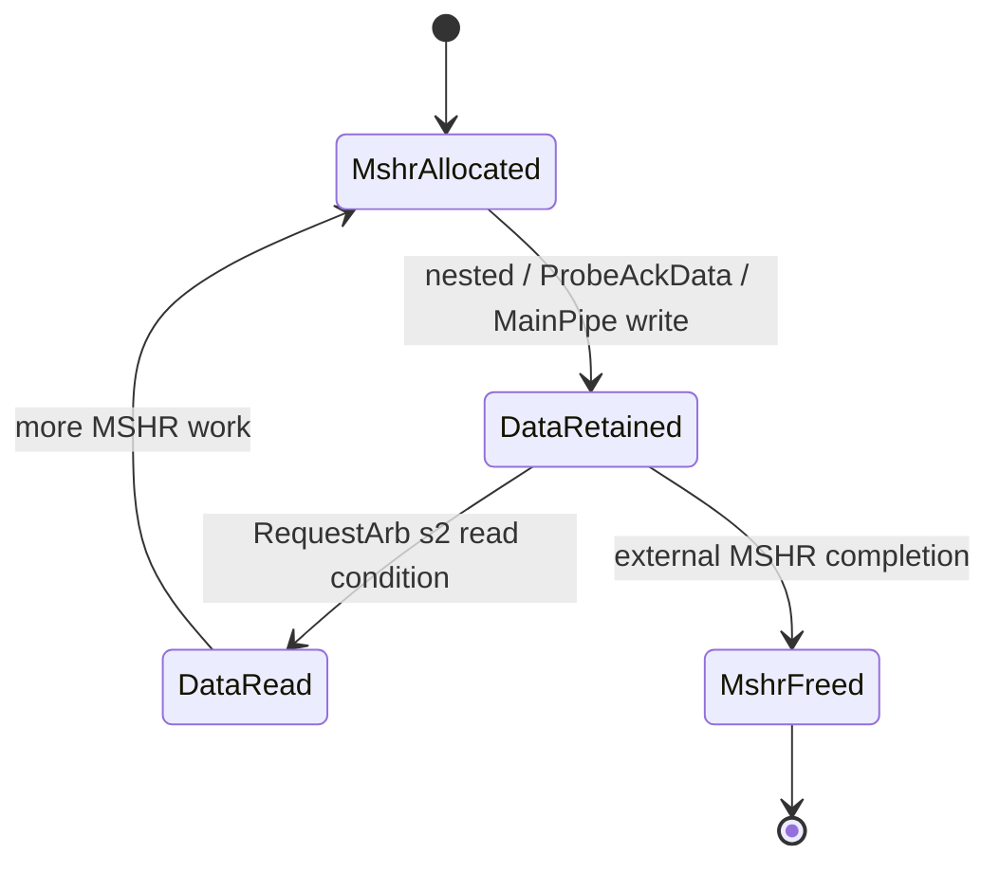

<!--
# 香山昆明湖 V2：CoupledL2 ReleaseBuffer 源码分析

> **结论先行。** 在当前 `KunminghuV2Config` 的有效硬件配置中，ReleaseBuffer 位于 CHI 版 `coupledL2` 的每个 `tl2chi.Slice` 内；源码中它不是一个名为 `ReleaseBuffer` 的专用类，而是 `new MSHRBuffer(wPorts = 3)` 的逻辑角色名。它以 **MSHR ID 直接索引**保存完整 cache line 的 release/probe 数据，没有独立的 valid、满/空、分配或释放协议。条目的生命周期由外部 MSHR 控制。`huancun` 的 `inclusive.SinkC.releaseBuf` 确实是显式带 valid 位的缓存池，但 Kunminghu V2 启用 CHI 后并不实例化 HuanCun；它只能作为同名机制的对照，不能画成 V2 的实际下游。

## 1. 分析范围、版本和证据边界

| 项目 | 本文采用的事实 | 代码依据 |
| --- | --- | --- |
| 顶层配置 | `KunminghuV2Config` 配置 1 MiB、4 bank、inclusive 的 L2，并通过 `WithCHI` 打开 CHI | [Configs.scala:477](/home/yanyusong/xs-memory-env/XiangShan/src/main/scala/top/Configs.scala:477)、[Configs.scala:481](/home/yanyusong/xs-memory-env/XiangShan/src/main/scala/top/Configs.scala:481) |
| 实际 L2 实现 | `L2Top` 在 `enableCHI` 时实例化 `TL2CHICoupledL2`，而不是 TL2TL 版 | [L2Top.scala:112](/home/yanyusong/xs-memory-env/XiangShan/src/main/scala/xiangshan/L2Top.scala:112)、[L2Top.scala:130](/home/yanyusong/xs-memory-env/XiangShan/src/main/scala/xiangshan/L2Top.scala:130) |
| 本文主对象 | `coupledL2/tl2chi/Slice.scala` 的 `releaseBuf = new MSHRBuffer(wPorts = 3)` | [Slice.scala:52](/home/yanyusong/xs-memory-env/XiangShan/coupledL2/src/main/scala/coupledL2/tl2chi/Slice.scala:52)、[Slice.scala:55](/home/yanyusong/xs-memory-env/XiangShan/coupledL2/src/main/scala/coupledL2/tl2chi/Slice.scala:55) |
| HuanCun 的地位 | 仅作同名/同职责实现对照，不属于默认 Kunminghu V2 CHI 实例 | [Configs.scala:333](/home/yanyusong/xs-memory-env/XiangShan/src/main/scala/top/Configs.scala:333)、[Top.scala:111](/home/yanyusong/xs-memory-env/XiangShan/src/main/scala/top/Top.scala:111) |
| 源码基线 | XiangShan `kunminghu-v2`：`e12436c7cba86b195deec24981976d78bc263661`；`coupledL2`：`fb5469838c8902b6cb33992c0a30ee3d446e4453`；`huancun`：`65ef077373ecf398b4cecdea06b65ef9b8d79044` | 本次本地 checkout 读取结果 |
| Design Doc 基线 | `XiangShan-Design-Doc` 的 `kunminghu-v2` checkout：`58d9e2ad11f044cb6f8887d9687d9e110696d1aa` | 仅作术语/意图对照，行为以左列源码为准 |

本次按本目录 `analyze-xiangshan-kunminghu` skill 执行了同步检查。课程仓库工作区已有未提交内容，因此同步脚本仅执行 fetch，不对其工作树执行 pull 或覆盖。本页所有行为性结论均回链到用户指定的 `XiangShan` checkout；官方 Design Doc 与课程的 XSCache 章节只用于建立术语和待验证的问题，未作为行为结论的唯一依据，也没有照抄其文字。

### 1.1 为什么 HuanCun 不能当作 V2 的 ReleaseBuffer

这个边界是本题最容易产生的误读。

`KunminghuV2Config` 通过 `WithCHI` 令 `EnableCHI` 为真。此时 `L2Top` 选择 `TL2CHICoupledL2`；`L3CacheConfig` 则只在 `!EnableCHI` 时构造 `L3CacheParamsOpt` / HuanCun 参数，在 CHI 分支构造的是 `OpenLLCParamsOpt`。顶层只有在 `L3CacheParamsOpt` 存在时才 `new HuanCun`，CHI 分支把每个 L2 的 CHI 连接路由到 OpenLLC。[Top.scala:514](/home/yanyusong/xs-memory-env/XiangShan/src/main/scala/top/Top.scala:514)--[Top.scala:545](/home/yanyusong/xs-memory-env/XiangShan/src/main/scala/top/Top.scala:545) 因此，以下两个对象不能混为一个物理模块：

| 名称 | 源码位置 | 是否是当前 Kunminghu V2 CHI 的有效实例 | 本文用途 |
| --- | --- | --- | --- |
| `coupledL2.tl2chi.Slice.releaseBuf` | [tl2chi/Slice.scala:55](/home/yanyusong/xs-memory-env/XiangShan/coupledL2/src/main/scala/coupledL2/tl2chi/Slice.scala:55) | 是 | 主分析对象 |
| `huancun.inclusive.SinkC.releaseBuf` | [inclusive/SinkC.scala:14](/home/yanyusong/xs-memory-env/XiangShan/huancun/src/main/scala/huancun/inclusive/SinkC.scala:14) | 否 | 显式 valid-buffer 对照 |
| `huancun.noninclusive.SinkC.buffer` | [noninclusive/SinkC.scala:10](/home/yanyusong/xs-memory-env/XiangShan/huancun/src/main/scala/huancun/noninclusive/SinkC.scala:10) | 否 | 同职责、不同名称的双消费者对照 |

## 2. 从缓存理论到代码：本文要验证什么

课程 [XSCache.md](/home/yanyusong/XiangShanLab/xiangshan-course/docs/xiangshan-microarchitecture/Beginner_Implementation_and_Principles_of_the_High_Performance_Xiangshan_Processor/15_XSCache.md) 把非阻塞缓存中的数据暂存、MSHR 和一致性消息区分开来。落到当前代码，不能把“buffer”理解成一个必然独立分配、独立释放的 FIFO：CoupledL2 的 ReleaseBuffer 是 MSHR 上下文的 data sidecar；HuanCun 的同名对象才是显式可见容量和 valid 状态的缓存池。

| 理论问题 | CoupledL2 中应看的代码 | 本文结论 |
| --- | --- | --- |
| 数据存在哪里 | `MSHRBuffer.buffer` | 二维寄存器阵列，第一维就是 MSHR ID |
| 谁拥有条目 | `MSHRCtl` / `MSHR.status` | MSHR 分配、匹配和释放拥有条目，ReleaseBuffer 不拥有 |
| 哪些数据进入 | `SinkC`、`MainPipe`、nested writeback | 三路写端口：nested、ProbeAckData、MainPipe s5 的 DataStorage 旧行 |
| 谁读取 | `RequestArb` s2 | 仅在 probe data / snoop hit-release 等条件满足时发起单读 |
| 怎样返回 | `MSHRBuffer.RegEnable` + `Slice.RegNext` | s2 发读，s3 提供 data 和单独的 valid 标记 |
| 哪里可能反压 | 入口 `SinkC`、`RequestArb`、MSHR/DS 仲裁 | ReleaseBuffer 本体没有 ready，反压发生在其外部 |

### 2.1 Design Doc 到源码的可追踪矩阵

下面的“设计意图”是对官方 Design Doc 中模块/阶段命名的概括，不复制原文。最后一列以本地源码为准。

| Design Doc 中可识别的意图 | 本地代码证据 | 结论 |
| --- | --- | --- |
| ReleaseBuffer 保存 release/probe 相关数据 | [MSHRBuffer.scala:39](/home/yanyusong/xs-memory-env/XiangShan/coupledL2/src/main/scala/coupledL2/MSHRBuffer.scala:39)、[tl2chi/Slice.scala:145](/home/yanyusong/xs-memory-env/XiangShan/coupledL2/src/main/scala/coupledL2/tl2chi/Slice.scala:145) | 已验证；实现类名是通用 `MSHRBuffer`，并非专用 `ReleaseBuffer` 类 |
| ReqArb 的 s2 阶段选择并读取 release 数据 | [RequestArb.scala:243](/home/yanyusong/xs-memory-env/XiangShan/coupledL2/src/main/scala/coupledL2/RequestArb.scala:243)、[RequestArb.scala:265](/home/yanyusong/xs-memory-env/XiangShan/coupledL2/src/main/scala/coupledL2/RequestArb.scala:265) | 已验证；CHI 的具体条件是 `readProbeDataDown`、`useProbeData` 或 snoop hit-release-with-data |
| ProbeAckData 写入 ReleaseBuffer 前需要关联 MSHR | [SinkC.scala:160](/home/yanyusong/xs-memory-env/XiangShan/coupledL2/src/main/scala/coupledL2/SinkC.scala:160)、[MSHRCtl.scala:124](/home/yanyusong/xs-memory-env/XiangShan/coupledL2/src/main/scala/coupledL2/tl2chi/MSHRCtl.scala:124)、[MSHRCtl.scala:183](/home/yanyusong/xs-memory-env/XiangShan/coupledL2/src/main/scala/coupledL2/tl2chi/MSHRCtl.scala:183) | 已验证；按 set/tag 和 `w_c_resp` 匹配，再得到写 ID |
| MainPipe 可把 DataStorage 的替换旧行暂存起来 | [MainPipe.scala:470](/home/yanyusong/xs-memory-env/XiangShan/coupledL2/src/main/scala/coupledL2/tl2chi/MainPipe.scala:470)、[MainPipe.scala:880](/home/yanyusong/xs-memory-env/XiangShan/coupledL2/src/main/scala/coupledL2/tl2chi/MainPipe.scala:880) | 已验证；写发生在 MainPipe s5 条件成立时 |
| CMO 使用 probe/旧数据的情形 | [RequestArb.scala:256](/home/yanyusong/xs-memory-env/XiangShan/coupledL2/src/main/scala/coupledL2/RequestArb.scala:256)、[MainPipe.scala:518](/home/yanyusong/xs-memory-env/XiangShan/coupledL2/src/main/scala/coupledL2/tl2chi/MainPipe.scala:518) | 部分验证；代码表明 CMO 可以形成需要 release data 的条件，具体事务进度仍由 MSHR 状态机决定 |

## 3. 配置、容量、地址和索引

### 3.1 V2 默认参数推导

`L2CacheConfig` 的 set 数公式为 `size / banks / ways / 64`，并向 `L2Param` 传入 `ways` 和 `sets`；没有覆盖 `blockBytes`、D 通道 beat 宽度或 `mshrs`。`L2Param` 默认给出 64 B line、32 B data beat 和 16 个 MSHR。由此得到下表。

| 参数 | 来源 | Kunminghu V2 的值 | 对 ReleaseBuffer 的含义 |
| --- | --- | --- | --- |
| L2 容量 | `L2CacheConfig("1MB")` | 1 MiB | 全 L2 容量，不等于单个 buffer 容量 |
| bank 数 | `banks = 4` | 4 | 每 bank 一个 CHI `Slice`，因此四个相互独立的 ReleaseBuffer |
| associativity | `ways` 默认值 | 8 | 每 bank `512 set x 8 way x 64 B = 256 KiB` |
| line 大小 | `L2Param.blockBytes` | 64 B | ReleaseBuffer 的一个完整逻辑条目 |
| D beat 大小 | `L2Param.channelBytes.d` | 32 B | 一行两 beat |
| `beatSize` | `blockBytes / beatBytes` | 2 | `RequestArb` 也显式 `require(beatSize == 2)` |
| `mshrsAll` | `cacheParams.mshrs` | 16 | Buffer 的第一维深度 |

证据分别见 [Configs.scala:278](/home/yanyusong/xs-memory-env/XiangShan/src/main/scala/top/Configs.scala:278)、[Configs.scala:295](/home/yanyusong/xs-memory-env/XiangShan/src/main/scala/top/Configs.scala:295)、[L2Param.scala:65](/home/yanyusong/xs-memory-env/XiangShan/coupledL2/src/main/scala/coupledL2/L2Param.scala:65)、[CoupledL2.scala:45](/home/yanyusong/xs-memory-env/XiangShan/coupledL2/src/main/scala/coupledL2/CoupledL2.scala:45)、[CoupledL2.scala:127](/home/yanyusong/xs-memory-env/XiangShan/coupledL2/src/main/scala/coupledL2/CoupledL2.scala:127) 和 [RequestArb.scala:276](/home/yanyusong/xs-memory-env/XiangShan/coupledL2/src/main/scala/coupledL2/RequestArb.scala:276)。

因此，按默认参数计算，一个 Slice 的 ReleaseBuffer 原始数据容量是：

```text
16 MSHR entries x 2 beats/entry x 32 B/beat = 1024 B
```

四个 bank 合计为 4 KiB 的寄存器数据容量。它是与 MSHR 并行度绑定的暂存容量，不是一个可以向 CPU 报告为“缓存容量”的独立存储层。

### 3.2 地址解析和 MSHR ID 不要混淆

L2 任务会从 C 通道物理地址解析 tag/set/offset，例如 `SinkC.toTaskBundle` 通过 `parseAddress(c.address)` 填入 `task.tag`、`task.set`、`task.off`。[SinkC.scala:67](/home/yanyusong/xs-memory-env/XiangShan/coupledL2/src/main/scala/coupledL2/SinkC.scala:67) 同时把可选的 `vaddr` 清为零。这些 tag/set 用于目录查找和 `MSHRCtl` 的 C 响应匹配；**ReleaseBuffer 的数组下标却不是 set、way 或 byte offset，而是 MSHR ID。**

```scala
val buffer = Reg(Vec(mshrsAll, Vec(beatSize, UInt((beatBytes * 8).W))))
...
val rdata = buffer(io.r.bits.id).asUInt
```

上述代码来自 [MSHRBuffer.scala:47](/home/yanyusong/xs-memory-env/XiangShan/coupledL2/src/main/scala/coupledL2/MSHRBuffer.scala:47) 和 [MSHRBuffer.scala:64](/home/yanyusong/xs-memory-env/XiangShan/coupledL2/src/main/scala/coupledL2/MSHRBuffer.scala:64)。这带来两个容易遗漏的约束：

1. `mshrBits` 的宽度由 `idsAll = 256` 推得 8 bit，而物理数组只有 `mshrsAll = 16` 项。[CoupledL2.scala:127](/home/yanyusong/xs-memory-env/XiangShan/coupledL2/src/main/scala/coupledL2/CoupledL2.scala:127) 没有对 ID 越界的局部断言。
2. 正确性来自 `MSHRCtl` 对每个实际 MSHR 的固定编号 `i.U`、分配选择和响应匹配，而不是来自 Buffer 自己的边界检查。[MSHRCtl.scala:106](/home/yanyusong/xs-memory-env/XiangShan/coupledL2/src/main/scala/coupledL2/tl2chi/MSHRCtl.scala:106)、[MSHRCtl.scala:132](/home/yanyusong/xs-memory-env/XiangShan/coupledL2/src/main/scala/coupledL2/tl2chi/MSHRCtl.scala:132)

验证时应专门覆盖“8 bit 信号传入 16-entry 存储”的约束，不能仅因类型宽度足够就认为该索引安全。

## 4. CoupledL2 ReleaseBuffer 的实际结构

### 4.1 实例、接口和存储体

有效的 CHI Slice 同时实例化两个同类的 MSHR buffer：`refillBuf(wPorts = 2)` 保存 refill 数据，`releaseBuf(wPorts = 3)` 保存本文关注的数据。

```scala
val refillBuf  = Module(new MSHRBuffer(wPorts = 2))
val releaseBuf = Module(new MSHRBuffer(wPorts = 3))
```

来源：[tl2chi/Slice.scala:52](/home/yanyusong/xs-memory-env/XiangShan/coupledL2/src/main/scala/coupledL2/tl2chi/Slice.scala:52)。通用实现的接口和寄存器阵列如下：

```scala
val r = Flipped(ValidIO(new MSHRBufRead))
val resp = new MSHRBufResp
val w = Vec(wPorts, Flipped(ValidIO(new MSHRBufWrite)))

val buffer = Reg(Vec(mshrsAll, Vec(beatSize, UInt((beatBytes * 8).W))))
```

来源：[MSHRBuffer.scala:25](/home/yanyusong/xs-memory-env/XiangShan/coupledL2/src/main/scala/coupledL2/MSHRBuffer.scala:25)--[MSHRBuffer.scala:47](/home/yanyusong/xs-memory-env/XiangShan/coupledL2/src/main/scala/coupledL2/MSHRBuffer.scala:47)。

| 接口 | 类型与字段 | 从谁到谁 | 语义 | 是否存在 ready |
| --- | --- | --- | --- | --- |
| `r` | `ValidIO[MSHRBufRead(id)]` | `RequestArb` -> ReleaseBuffer | 提交一次按 MSHR ID 的读取请求 | 否 |
| `resp` | `MSHRBufResp(data: DSBlock)` | ReleaseBuffer -> `Slice` / MainPipe | 被寄存的完整 line 数据 | 否，且没有 self-valid |
| `w(0..2)` | `ValidIO[MSHRBufWrite(id, data, beatMask)]` | 三个写源 -> ReleaseBuffer | 按 ID 与 beat mask 更新一条 line | 否 |

`ValidIO` 不是 `DecoupledIO`。这意味着一次 `valid` 不能等待本体给出的 `ready`，模块也不会替写者积压请求。上游必须在本周期就满足资源、同 ID 冲突和数据先后条件。

### 4.2 它不维护自己的生命周期

`buffer` 用的是普通 `Reg`，没有 `RegInit`；只有读响应寄存器在 `r.valid` 为真时装入 `rdata`，否则保持上一笔成功读到的值：

```scala
val rdata = buffer(io.r.bits.id).asUInt
io.resp.data.data := RegEnable(rdata, 0.U.asTypeOf(rdata), io.r.valid)
```

来源：[MSHRBuffer.scala:64](/home/yanyusong/xs-memory-env/XiangShan/coupledL2/src/main/scala/coupledL2/MSHRBuffer.scala:64)。因此该模块本身具有以下性质：

| 机制 | CoupledL2 ReleaseBuffer 是否实现 | 正确性责任落点 |
| --- | --- | --- |
| entry valid / empty / full | 否 | MSHR 的 `status.valid`、入口仲裁和 MSHR 满判断 |
| allocate / free | 否 | `MSHRCtl` 分配、`MSHR` 状态机释放 |
| reset 清数据 | 否 | 复位后不得以未写过的数据作为有效数据读取 |
| read response valid | 不在 `resp` 中 | `Slice` 用 `RegNext(releaseBuf.io.r.valid)` 另行生成 |
| 读写同 ID bypass | 否 | 使用者不得依赖同周期写后读转发 |

所以本文图中的“数据已可读”是由外围协议保证的逻辑状态，并不是 ReleaseBuffer 内部的一个 flip-flop。把它当 FIFO 分析会错误地推导出不存在的 full、free 或 backpressure 信号。

### 4.3 写入规则和同周期冲突

对每一个 MSHR entry，通用模块从所有写端口生成命中向量，并以一个 `PriorityMux` 同时选择 data 和 beat mask：

```scala
val wens = VecInit(io.w.map(w => w.valid && w.bits.id === i.U)).asUInt
assert(PopCount(wens) <= 2.U, "triple write to the same MSHR buffer entry")
val w_data = PriorityMux(wens, io.w.map(_.bits.data))
val w_beatSel = PriorityMux(wens, io.w.map(_.bits.beatMask))
```

来源：[MSHRBuffer.scala:49](/home/yanyusong/xs-memory-env/XiangShan/coupledL2/src/main/scala/coupledL2/MSHRBuffer.scala:49)。实际更新按被选中的 mask 逐 beat 写入。[MSHRBuffer.scala:56](/home/yanyusong/xs-memory-env/XiangShan/coupledL2/src/main/scala/coupledL2/MSHRBuffer.scala:56)

| 场景 | 本体行为 | 必须注意的后果 |
| --- | --- | --- |
| 不同 ID 的多个写 | 每个 entry 独立求 `wens`，可并行更新 | 没有全局单写端口限制 |
| 同 ID 的三写 | 触发 `PopCount(wens) <= 2` 断言 | 没有 retry/ready；这是上游不变量 |
| 同 ID 的恰两写 | `PriorityMux` 仅选择一个端口的 data **以及** mask | 不会合并两个写端口的不重叠 beat mask |
| 同 ID 的读写 | 没有 bypass/冲突断言 | 应按寄存器读旧值建模，验证中不得假设写后转发 |
| 空闲周期读 | `resp` 保持旧数据 | 必须同时看外部 valid，不能只看 data 总线 |

CHI Slice 的接线顺序就是 `w(0)`、`w(1)`、`w(2)` 的优先顺序输入顺序：

```scala
releaseBuf.io.w <> VecInit(Seq(
  nestedWriteReleaseBuf,
  sinkCWriteReleaseBuf,
  mpWriteReleaseBuf
))
```

来源：[tl2chi/Slice.scala:145](/home/yanyusong/xs-memory-env/XiangShan/coupledL2/src/main/scala/coupledL2/tl2chi/Slice.scala:145)--[tl2chi/Slice.scala:163](/home/yanyusong/xs-memory-env/XiangShan/coupledL2/src/main/scala/coupledL2/tl2chi/Slice.scala:163)。因 `PriorityMux` 按传入序列优先，冲突时应以 `nested > SinkC ProbeAckData > MainPipe` 作为当前实现的优先级，并对这个假设加波形/断言验证。源中某些 MSHR 内部注释使用过旧的端口编号时，应以这个有效实例接线为准。

## 5. 三路写入、单路读取和流水线

### 5.1 三个写源

| 端口 | `valid` 的直接来源 | ID 的来源 | data 来源 | mask | 对应场景 |
| --- | --- | --- | --- | --- | --- |
| `w(0)` | `mshrCtl.io.nestedwbDataId.valid` | `nestedwbDataId.bits` | `mainPipe.io.nestedwbData` | 全 beat | 嵌套 writeback 数据 |
| `w(1)` | `sinkC.io.releaseBufWrite.valid` | 由 `MSHRCtl.releaseBufWriteId` 覆盖 | SinkC 拼接的 ProbeAckData 两 beat | 全 beat | 上游 ProbeAckData 返回 |
| `w(2)` | `mainPipe.io.releaseBufWrite.valid` | `task_s5.mshrId` | `DataStorage` 读出的旧行 | 全 beat | 替换、probe/CMO 等需要保留旧数据的路径 |

`w(0)` 和 `w(1)` 的具体接线在 [tl2chi/Slice.scala:150](/home/yanyusong/xs-memory-env/XiangShan/coupledL2/src/main/scala/coupledL2/tl2chi/Slice.scala:150)--[tl2chi/Slice.scala:157](/home/yanyusong/xs-memory-env/XiangShan/coupledL2/src/main/scala/coupledL2/tl2chi/Slice.scala:157)，`w(2)` 直接来自 MainPipe。[tl2chi/Slice.scala:158](/home/yanyusong/xs-memory-env/XiangShan/coupledL2/src/main/scala/coupledL2/tl2chi/Slice.scala:158)

普通 C `Release/ReleaseData` 不能直接等同于一次 `releaseBuf.io.w`：CoupledL2 SinkC 先将它放入自己的 `dataBuf` / `taskBuf`，在 last beat 后通过 task 送往 RequestArb。[SinkC.scala:50](/home/yanyusong/xs-memory-env/XiangShan/coupledL2/src/main/scala/coupledL2/SinkC.scala:50)--[SinkC.scala:145](/home/yanyusong/xs-memory-env/XiangShan/coupledL2/src/main/scala/coupledL2/SinkC.scala:145) CHI MainPipe 形成新 MSHR 的条件来自 A 或 B 类型任务，而非普通 C request。[MainPipe.scala:235](/home/yanyusong/xs-memory-env/XiangShan/coupledL2/src/main/scala/coupledL2/tl2chi/MainPipe.scala:235)--[MainPipe.scala:299](/home/yanyusong/xs-memory-env/XiangShan/coupledL2/src/main/scala/coupledL2/tl2chi/MainPipe.scala:299) 因而 `w(0)` 的“nested writeback”是已有 MSHR 关联下的专门路径，不能以它代表所有 C ReleaseData。

**ProbeAckData 路径。** SinkC 在第一 beat 用寄存器保存数据；最后一个 beat 到来时，才拉高 `releaseBufWrite.valid`，并将两 beat 拼成完整 line。它暂时给出零 ID，理由已写在源码注释中：真实 ID 由 MSHRCtl 依据地址与等待 C 响应的 MSHR 比较后提供。

```scala
val probeAckDataBuf = RegEnable(io.c.bits.data, 0.U(...),
  io.c.valid && io.c.bits.opcode === ProbeAckData && first)
io.releaseBufWrite.valid := io.c.valid && io.c.bits.opcode === ProbeAckData && last
io.releaseBufWrite.bits.id := 0.U(mshrBits.W)
io.releaseBufWrite.bits.data.data := Cat(io.c.bits.data, probeAckDataBuf)
io.releaseBufWrite.bits.beatMask := Fill(beatSize, true.B)
```

来源：[SinkC.scala:160](/home/yanyusong/xs-memory-env/XiangShan/coupledL2/src/main/scala/coupledL2/SinkC.scala:160)--[SinkC.scala:167](/home/yanyusong/xs-memory-env/XiangShan/coupledL2/src/main/scala/coupledL2/SinkC.scala:167)。

**MainPipe 路径。** MainPipe s3 会在 refill/release 数据之间选择，并根据 replacement、probe、CMO 等条件形成 `need_write_releaseBuf`。这个信号与任务一起向后传到 s5；s5 条件成立才生成 `releaseBufWrite`。因此不能把“s3 看见 release data”与“s5 把旧行写进 ReleaseBuffer”混成同一笔必然同时发生的事务。

```scala
io.releaseBufWrite.valid := task_s5.valid && need_write_releaseBuf_s5
io.releaseBufWrite.bits.id := task_s5.bits.mshrId
io.releaseBufWrite.bits.data.data := rdata_s5
io.releaseBufWrite.bits.beatMask := Fill(beatSize, true.B)
```

来源：[MainPipe.scala:470](/home/yanyusong/xs-memory-env/XiangShan/coupledL2/src/main/scala/coupledL2/tl2chi/MainPipe.scala:470)--[MainPipe.scala:526](/home/yanyusong/xs-memory-env/XiangShan/coupledL2/src/main/scala/coupledL2/tl2chi/MainPipe.scala:526)、[MainPipe.scala:744](/home/yanyusong/xs-memory-env/XiangShan/coupledL2/src/main/scala/coupledL2/tl2chi/MainPipe.scala:744)--[MainPipe.scala:883](/home/yanyusong/xs-memory-env/XiangShan/coupledL2/src/main/scala/coupledL2/tl2chi/MainPipe.scala:883)。

### 5.2 RequestArb 的读条件和 s2 -> s3 时序

唯一的 ReleaseBuffer 读请求来自 RequestArb：

```scala
io.releaseBufRead_s2.valid := task_s2.valid && Mux(
  mshrTask_s2,
  task_s2.bits.readProbeDataDown ||
    mshrTask_s2_a_upwards && task_s2.bits.useProbeData,
  snpHitReleaseNeedData
)
io.releaseBufRead_s2.bits.id := Mux(
  task_s2.bits.snpHitRelease,
  task_s2.bits.snpHitReleaseIdx,
  task_s2.bits.mshrId
)
```

来源：[RequestArb.scala:265](/home/yanyusong/xs-memory-env/XiangShan/coupledL2/src/main/scala/coupledL2/RequestArb.scala:265)--[RequestArb.scala:274](/home/yanyusong/xs-memory-env/XiangShan/coupledL2/src/main/scala/coupledL2/RequestArb.scala:274)。它不是“所有 ReleaseData 都读取”的泛化条件，而是 MSHR 向下读 probe data、某些上行任务采用 probe data，或 CHI snoop 命中已有 release data 时才读取。

Slice 将读请求连到 buffer，并把读 valid 再寄存一拍送到 MainPipe s3：

```scala
releaseBuf.io.r := reqArb.io.releaseBufRead_s2
mainPipe.io.releaseBufResp_s3.valid := RegNext(releaseBuf.io.r.valid, false.B)
mainPipe.io.releaseBufResp_s3.bits := releaseBuf.io.resp.data
```

来源：[tl2chi/Slice.scala:121](/home/yanyusong/xs-memory-env/XiangShan/coupledL2/src/main/scala/coupledL2/tl2chi/Slice.scala:121)--[tl2chi/Slice.scala:124](/home/yanyusong/xs-memory-env/XiangShan/coupledL2/src/main/scala/coupledL2/tl2chi/Slice.scala:124)、[tl2chi/Slice.scala:145](/home/yanyusong/xs-memory-env/XiangShan/coupledL2/src/main/scala/coupledL2/tl2chi/Slice.scala:145)--[tl2chi/Slice.scala:146](/home/yanyusong/xs-memory-env/XiangShan/coupledL2/src/main/scala/coupledL2/tl2chi/Slice.scala:146)。

| 流水位置 | 代码动作 | ReleaseBuffer 相关事实 |
| --- | --- | --- |
| SinkC C 通道 | 接收 Release / ProbeAck 消息，按 `edgeIn.count` 获取 first/last/beat | 32 B beat 的完整 line 需要两 beat；ProbeAckData 在 last 时写 `w(1)` |
| RequestArb s1 | 从 C、B、A 中选任务 | C 优先于 B，B 优先于 A；均受 directory 和 block 条件限制 |
| RequestArb s2 | 根据任务条件置 `releaseBufRead_s2.valid` | 产生单读，ID 为 MSHR ID 或 snoop hit 的 release index |
| MainPipe s3 | 取得 `releaseBufResp_s3` | `RegEnable` 的读数据与 `RegNext(valid)` 对齐；MainPipe 以该 valid 选择 release 数据 |
| MainPipe s4/s5 | 传递 DataStorage 结果和写回任务 | s5 可能把旧行送 `w(2)`，但不是每个 s3 读都会写 |
| MSHR 完成 | 状态机等待各事务结束后 `will_free` | Buffer 不清零，下一次同 ID 的完整写覆盖数据 |

RequestArb 对 DataStorage 请求施加了一拍 `ds_mcp2_stall`，所以即便 buffer 的读响应固定经过寄存，也不能由此推断连续访问或整个事务的固定总延迟。[RequestArb.scala:199](/home/yanyusong/xs-memory-env/XiangShan/coupledL2/src/main/scala/coupledL2/RequestArb.scala:199)--[RequestArb.scala:208](/home/yanyusong/xs-memory-env/XiangShan/coupledL2/src/main/scala/coupledL2/RequestArb.scala:208)

### 5.3 实际数据流

```mermaid
flowchart LR
    C["L1 DCache / TileLink C"] --&gt; SC["coupledL2 SinkC\nRelease ingress staging"]
    SC --&gt;|"ReleaseData task"| RA["RequestArb s1/s2"]
    SC --&gt;|"ProbeAckData last\nfull line"| MCTL["MSHRCtl\nset/tag + w_c_resp match"]
    MCTL --&gt;|"MSHR ID"| RB["ReleaseBuffer\nMSHRBuffer: 16 x 2 beats"]
    MP["MainPipe s5\nDataStorage old line"] --&gt;|"w(2)"| RB
    NW["nested writeback"] --&gt;|"w(0)"| RB
    RA --&gt;|"r.valid + MSHR ID"| RB
    RB --&gt;|"registered data"| S3["Slice / MainPipe s3"]
    S3 --&gt; DS["DataStorage write/read selection"]
    S3 --&gt; TX["CHI TXDAT / TXREQ path as task requires"]
```

这里 `SinkC` 的 `ReleaseData task` 与 `ProbeAckData` 的直写路径是不同的：前者在 SinkC 的 ingress data/task buffer 中形成任务，后者在最后 beat 直接产生 `releaseBufWrite`。两者都不能仅凭“C 通道带数据”而假设相同的时序。

### 5.4 时序波形：ProbeAckData 写后读取

下面是事件关系示意，使用的每个信号均来自当前源码。它不是对所有事务的固定周期承诺：从写入到读请求之间可能隔任意多次仲裁/状态机等待；ReleaseBuffer 没有 ready。

```waveform-draw
{
  "signal": [
    {"name": "clk", "wave": "p......."},
    {"name": "SinkC c: ProbeAckData last", "wave": "0.10...."},
    {"name": "sinkC.io.releaseBufWrite.valid", "wave": "0.10...."},
    {"name": "releaseBuf.io.w(1).valid", "wave": "0.10...."},
    {"name": "reqArb.io.releaseBufRead_s2.valid", "wave": "0...10.."},
    {"name": "mainPipe.io.releaseBufResp_s3.valid", "wave": "0....10."},
    {"name": "MainPipe s3 consumes selected data", "wave": "0....10."}
  ],
  "config": {"hscale": 1}
}
```

`releaseBufResp_s3.valid` 比 s2 read valid 晚一拍，正对应 `RegNext(releaseBuf.io.r.valid)`。在这张图之外，MainPipe s5 的 `w(2)` 是另一类“DataStorage 旧行暂存”写入；两者不应被解释为同一端口对同一 entry 的必经连锁。

## 6. MSHR 绑定、分配和释放

### 6.1 C 响应如何找到正确的 buffer entry

MSHRCtl 建立 `mshrsAll` 个 MSHR，并按其序号给每个 MSHR 固定 ID。其 C 响应匹配条件是：MSHR 有效、正在等待 C response、set 相等、tag 相等；对替换场景使用 `metaTag`，其余使用 `reqTag`。

```scala
val resp_sinkC_match_vec = mshrs.map { mshr =>
  val status = mshr.io.status.bits
  val tag = Mux(status.needsRepl, status.metaTag, status.reqTag)
  mshr.io.status.valid && status.w_c_resp &&
    io.resps.sinkC.set === status.set && io.resps.sinkC.tag === tag
}
...
io.releaseBufWriteId := ParallelPriorityMux(
  resp_sinkC_match_vec, (0 until mshrsAll).map(i => i.U))
```

来源：[MSHRCtl.scala:124](/home/yanyusong/xs-memory-env/XiangShan/coupledL2/src/main/scala/coupledL2/tl2chi/MSHRCtl.scala:124)--[MSHRCtl.scala:149](/home/yanyusong/xs-memory-env/XiangShan/coupledL2/src/main/scala/coupledL2/tl2chi/MSHRCtl.scala:149)、[MSHRCtl.scala:183](/home/yanyusong/xs-memory-env/XiangShan/coupledL2/src/main/scala/coupledL2/tl2chi/MSHRCtl.scala:183)--[MSHRCtl.scala:184](/home/yanyusong/xs-memory-env/XiangShan/coupledL2/src/main/scala/coupledL2/tl2chi/MSHRCtl.scala:184)。

这解释了为什么 SinkC 给出的 `releaseBufWrite.bits.id := 0.U` 不是最终 ID：Slice 在接线时将其替换成上面的 match 结果。若同周期出现多个满足条件的匹配，`ParallelPriorityMux` 会选一个；设计预期是活动 MSHR 的地址/等待状态不允许这种歧义，验证必须把“最多一个匹配”作为协议不变量检查，而非把优先选择当作正确恢复机制。

### 6.2 MSHR 满、入口优先级和可达性

MSHRCtl 将流水线在途请求数和已有效 MSHR 数相加形成 `mshrFull`，并保留最后一个空 MSHR 不分给 A 通道：

```scala
val mshrFull = pipeReqCount + mshrCount >= mshrsAll.U
val a_mshrFull = pipeReqCount + mshrCount >= (mshrsAll-1).U
...
io.toReqArb.blockC_s1 := false.B
io.toReqArb.blockB_s1 := mshrFull
io.toReqArb.blockA_s1 := a_mshrFull
```

来源：[MSHRCtl.scala:106](/home/yanyusong/xs-memory-env/XiangShan/coupledL2/src/main/scala/coupledL2/tl2chi/MSHRCtl.scala:106)--[MSHRCtl.scala:123](/home/yanyusong/xs-memory-env/XiangShan/coupledL2/src/main/scala/coupledL2/tl2chi/MSHRCtl.scala:123)、[MSHRCtl.scala:162](/home/yanyusong/xs-memory-env/XiangShan/coupledL2/src/main/scala/coupledL2/tl2chi/MSHRCtl.scala:162)--[MSHRCtl.scala:166](/home/yanyusong/xs-memory-env/XiangShan/coupledL2/src/main/scala/coupledL2/tl2chi/MSHRCtl.scala:162)。

RequestArb 侧的 C/B/A 选择顺序是 C 高于 B，高于 A：

```scala
val sinkValids = VecInit(Seq(
  io.sinkC.valid && !block_C,
  io.sinkB.valid && !block_B,
  io.sinkA.valid && !block_A
)).asUInt
...
io.sinkA.ready := sink_ready_basic && !block_A && !sinkValids(1) && !sinkValids(0)
io.sinkB.ready := sink_ready_basic && !block_B && !sinkValids(0)
io.sinkC.ready := sink_ready_basic && !block_C
```

来源：[RequestArb.scala:132](/home/yanyusong/xs-memory-env/XiangShan/coupledL2/src/main/scala/coupledL2/RequestArb.scala:132)--[RequestArb.scala:161](/home/yanyusong/xs-memory-env/XiangShan/coupledL2/src/main/scala/coupledL2/RequestArb.scala:161)。这是真正的 backpressure/公平性边界；ReleaseBuffer 本体并不参与 ready 协商。

### 6.3 逻辑生命周期图

```mermaid
stateDiagram-v2
    [*] --&gt; 无MSHR拥有者
    无MSHR拥有者 --&gt; MSHR有效: MSHRCtl 选择空闲 i 并分配
    MSHR有效 --&gt; 数据可用_逻辑: w(0) nested / w(1) ProbeAckData / w(2) DS旧行
    数据可用_逻辑 --&gt; s2读请求: RequestArb 条件满足
    s2读请求 --&gt; s3使用数据: RegEnable + RegNext(valid)
    s3使用数据 --&gt; MSHR有效: 其他 CHI/目录/数据操作继续
    MSHR有效 --&gt; 无MSHR拥有者: MSHR no_schedule && no_wait / will_free
```

`数据可用_逻辑` 不是 `MSHRBuffer` 内的真实状态寄存器。MSHR 的状态与等待条件才决定是否可读、是否可复用；ReleaseBuffer 不会在 `will_free` 时自动清零。有关 MSHR 释放的 `will_free`/`req_valid` 更新可见 [MSHR.scala:1303](/home/yanyusong/xs-memory-env/XiangShan/coupledL2/src/main/scala/coupledL2/tl2chi/MSHR.scala:1303)--[MSHR.scala:1331](/home/yanyusong/xs-memory-env/XiangShan/coupledL2/src/main/scala/coupledL2/tl2chi/MSHR.scala:1331)。

## 7. HuanCun 中的显式 ReleaseBuffer：对照而非实际 V2 路径

### 7.1 Inclusive SinkC 的缓冲池

HuanCun inclusive 的 SinkC 真的定义了名为 `releaseBuf` 的寄存器池，并单独维护 per-beat 与 per-entry valid：

```scala
val releaseBuf = Reg(Vec(bufBlocks, Vec(blockBytes / beatBytes, UInt((beatBytes * 8).W))))
val beatValids = RegInit(VecInit(... false.B ...))
val bufValids = RegInit(VecInit(... false.B ...))
val bufFull = Cat(bufValids).andR
val insertIdx = PriorityEncoder(bufValids.map(b => !b))
```

来源：[inclusive/SinkC.scala:9](/home/yanyusong/xs-memory-env/XiangShan/huancun/src/main/scala/huancun/inclusive/SinkC.scala:9)--[inclusive/SinkC.scala:18](/home/yanyusong/xs-memory-env/XiangShan/huancun/src/main/scala/huancun/inclusive/SinkC.scala:18)。其容量参数为 `bufBlocks = mshrs / 2`。[HuanCun.scala:69](/home/yanyusong/xs-memory-env/XiangShan/huancun/src/main/scala/huancun/HuanCun.scala:69)

| 生命周期阶段 | Inclusive HuanCun 的源码动作 | 与 CoupledL2 的差异 |
| --- | --- | --- |
| 接收首 beat | 选 `insertIdx`，分配 MSHR request / 记录索引 | CoupledL2 ReleaseBuffer 不在此处分配 slot |
| 接收多 beat | first 用 `insertIdx`，后续用 `insertIdxReg` 写入 `releaseBuf` 和 `beatValids` | CoupledL2 SinkC 用自己的 ingress `dataBuf`，ProbeAckData 才直写 MSHRBuffer |
| 行完整 | last 时才置 `bufValids(insertIdxReg)` | CoupledL2 不存在相应 buffer valid bit |
| 消费 | 任务驱动 banked-store 或 drop，按 beat 读 `releaseBuf` | CoupledL2 由 RequestArb s2 用 MSHR ID 读整行 |
| 回收 | 最后一次 store 或 drop 后清 `bufValids/beatValids` | CoupledL2 由 MSHR 生命周期外部复用 ID |

HuanCun 的 C 通道 ready 会把缓冲区满和 MSHR 资源纳入判断；只有数据型请求在 buffer 满时因 `noSpace` 被阻塞。首 beat 至最后 beat 的写入、以及 last 才置 entry valid 的证据在 [inclusive/SinkC.scala:44](/home/yanyusong/xs-memory-env/XiangShan/huancun/src/main/scala/huancun/inclusive/SinkC.scala:44)--[inclusive/SinkC.scala:95](/home/yanyusong/xs-memory-env/XiangShan/huancun/src/main/scala/huancun/inclusive/SinkC.scala:95)。消费后清除的条件见 [inclusive/SinkC.scala:97](/home/yanyusong/xs-memory-env/XiangShan/huancun/src/main/scala/huancun/inclusive/SinkC.scala:97)--[inclusive/SinkC.scala:140](/home/yanyusong/xs-memory-env/XiangShan/huancun/src/main/scala/huancun/inclusive/SinkC.scala:140)。

它还保留了 `io.release` 结构端口，但当前 inclusive MSHR 形成的普通带数据 C 任务走 banked store，任务的 `release` 为 false；不能仅因端口存在，就宣称它是当前 inclusive 主路径的常规向下直通 release。[inclusive/MSHR.scala:218](/home/yanyusong/xs-memory-env/XiangShan/huancun/src/main/scala/huancun/inclusive/MSHR.scala:218)、[inclusive/MSHR.scala:451](/home/yanyusong/xs-memory-env/XiangShan/huancun/src/main/scala/huancun/inclusive/MSHR.scala:451)

### 7.2 Noninclusive SinkC 的等价双消费者 Buffer

HuanCun noninclusive 路径没有叫 `releaseBuf` 的变量，而有结构上更接近“release data buffer”的 `buffer`，并分别跟踪 save 和向下 through/release 两类消费：

```scala
val buffer = Reg(Vec(sinkCbufBlocks, Vec(beats, UInt((beatBytes * 8).W))))
val beatValsSave = RegInit(...)
val beatValsThrough = RegInit(...)
```

来源：[noninclusive/SinkC.scala:10](/home/yanyusong/xs-memory-env/XiangShan/huancun/src/main/scala/huancun/noninclusive/SinkC.scala:10)。它的 entry 只有在所需的 save 与 release 两条消费者都完成，或明确 drop 后才回收；重复 ProbeAckData 的地址匹配/清理和超时泄漏断言也在这一路实现中。[noninclusive/SinkC.scala:34](/home/yanyusong/xs-memory-env/XiangShan/huancun/src/main/scala/huancun/noninclusive/SinkC.scala:34)、[noninclusive/SinkC.scala:115](/home/yanyusong/xs-memory-env/XiangShan/huancun/src/main/scala/huancun/noninclusive/SinkC.scala:115)、[noninclusive/SinkC.scala:153](/home/yanyusong/xs-memory-env/XiangShan/huancun/src/main/scala/huancun/noninclusive/SinkC.scala:153)--[noninclusive/SinkC.scala:183](/home/yanyusong/xs-memory-env/XiangShan/huancun/src/main/scala/huancun/noninclusive/SinkC.scala:183)。

这说明“ReleaseBuffer”在香山不同 LLC 设计中是一个职责名，不保证同一类、同一 lifecycle 或同一数据流。对 Kunminghu V2 的结论必须回到第 4--6 节的 CoupledL2 实例。

### 7.3 HuanCun 对照波形

```waveform-draw
{
  "signal": [
    {"name": "clk", "wave": "p......."},
    {"name": "SinkC c.valid", "wave": "0110...."},
    {"name": "SinkC c.ready", "wave": "1111...."},
    {"name": "first", "wave": "0100...."},
    {"name": "last", "wave": "0001...."},
    {"name": "inclusive beatValids[insertIdx]", "wave": "0.111..."},
    {"name": "inclusive bufValids[insertIdx]", "wave": "0...1..."}
  ],
  "config": {"hscale": 1}
}
```

这是 HuanCun inclusive 的行为示意：entry 的“完整有效”在 last 后才置位。它特意放在本节，避免把 HuanCun 的 `bufValids` 误套到 CoupledL2 `MSHRBuffer`。

## 8. 回压、吞吐和冲突的边界

### 8.1 哪些地方真的能停住事务

| 层次 | 机制 | 代码可证实的效果 |
| --- | --- | --- |
| CoupledL2 SinkC ingress | `full` 与 C handshake | Release 的首 beat 在 ingress 满时停住；代码假定两 beat 连续、不交错 |
| RequestArb s1 | C > B > A，directory ready 和 block 条件 | C 不被 B/A 抢占；B/A 可被高优先级一致性请求延迟 |
| MSHRCtl | `mshrFull`、A 预留一项 | 满时阻塞 B，A 在剩最后一项时也阻塞；C 仍由其他冲突逻辑协调 |
| RequestArb s2 | `ds_mcp2_stall` | 非 AHint 的 DS 访问间插一拍，限制连续进管 |
| MSHRBuffer | 无 ready、无队列 | 不产生 backpressure；前述层级必须阻止不合法发射 |
| HuanCun DataStorage | bank 仲裁 | SourceC read 优先于 SinkC write；同 bank 冲突会让 SinkC 的 banked-store 等待，[DataStorage.scala:134](/home/yanyusong/xs-memory-env/XiangShan/huancun/src/main/scala/huancun/DataStorage.scala:134) |

CoupledL2 SinkC 内部还存在与 ReleaseBuffer 不同的 ingress `dataBuf` / `taskBuf`。它有 `bufBlocks`、`beatValids`、`taskValids` 与 round-robin task arbiter，主要用于接住 C ReleaseData，不能拿它的 `full` 直接解释为 ReleaseBuffer full。[SinkC.scala:50](/home/yanyusong/xs-memory-env/XiangShan/coupledL2/src/main/scala/coupledL2/SinkC.scala:50)--[SinkC.scala:65](/home/yanyusong/xs-memory-env/XiangShan/coupledL2/src/main/scala/coupledL2/SinkC.scala:65)、[SinkC.scala:186](/home/yanyusong/xs-memory-env/XiangShan/coupledL2/src/main/scala/coupledL2/SinkC.scala:186)

### 8.2 可证明的延迟与不可证明的延迟

| 关系 | 代码结论 | 不应推导出的结论 |
| --- | --- | --- |
| s2 read -> s3 valid | 固定相差一个 `RegNext` | 不能据此声称从 L1 C 请求到 CHI 发送总是固定 N cycle |
| ProbeAckData first -> last | 当前参数下为同一 64 B line 的两 beat，并假设不交错 | 不意味着任意上游都能任意分段或跨行交织 |
| s5 DS data -> `w(2)` | 同一 s5 条件下写出 | 不意味着该数据立刻被下一阶段事务读取 |
| MSHR buffer 容量 | 16 entries / Slice 的原始数据阵列 | 不等于可独立接受 16 条不受事务状态约束的 Release 请求 |

## 9. 跨边界语义：地址、异常、MMIO、CMO 与 Difftest

### 9.1 虚实地址、跨 cache line 与一致性消息边界

ReleaseBuffer 的入口不是 CPU 的 load/store 微操作，也没有 TLB/PMP/PMA/PBMT 接口。`SinkC.toTaskBundle` 使用 `c.address` 解析 tag/set/offset 并将可选 `vaddr` 置零。[SinkC.scala:67](/home/yanyusong/xs-memory-env/XiangShan/coupledL2/src/main/scala/coupledL2/SinkC.scala:67)--[SinkC.scala:104](/home/yanyusong/xs-memory-env/XiangShan/coupledL2/src/main/scala/coupledL2/SinkC.scala:67) 因此：

- 页面跨越和 VA alias 的处理已经在到达这一 C 通道之前完成；本文对象不应被描述为能自行翻译或合并跨页 CPU 访存。
- 64 B line / 32 B beat，且 `RequestArb` 明确要求 `beatSize == 2`。SinkC 的注释明确假设由 DCache 的 TLArbiter 保证一条 block 的两个 beat 连续、不与其他地址交错。[SinkC.scala:63](/home/yanyusong/xs-memory-env/XiangShan/coupledL2/src/main/scala/coupledL2/SinkC.scala:63)--[SinkC.scala:65](/home/yanyusong/xs-memory-env/XiangShan/coupledL2/src/main/scala/coupledL2/SinkC.scala:63)
- 因而跨 line 请求必须在上游分解为多个 cache-line 一致性事务；ReleaseBuffer 只保存一个完整 line 的 coherence data。

### 9.2 MMIO、异常与 flush

`L2Top` 为 CHI L2 单独连接 `mmioNode`，而不是将 MMIO 混入 ReleaseBuffer 的 C 通道；该 buffer 没有对 MMIO 地址属性的判断。[L2Top.scala:141](/home/yanyusong/xs-memory-env/XiangShan/src/main/scala/xiangshan/L2Top.scala:141)--[L2Top.scala:146](/home/yanyusong/xs-memory-env/XiangShan/src/main/scala/xiangshan/L2Top.scala:141) 因此不能把 MMIO/uncache 事务的取消或排序规则归给 ReleaseBuffer。

对于错误，SinkC 会按 opcode 将输入的 `corrupt` 转为 task 的 `corrupt` 或 `denied` 字段。[SinkC.scala:82](/home/yanyusong/xs-memory-env/XiangShan/coupledL2/src/main/scala/coupledL2/SinkC.scala:82)--[SinkC.scala:83](/home/yanyusong/xs-memory-env/XiangShan/coupledL2/src/main/scala/coupledL2/SinkC.scala:83) MainPipe 会将 DataStorage error 送回 MSHR 响应通路；ReleaseBuffer 本身没有 exception state、error bit 或 recovery FSM。[tl2chi/Slice.scala:125](/home/yanyusong/xs-memory-env/XiangShan/coupledL2/src/main/scala/coupledL2/tl2chi/Slice.scala:125)--[tl2chi/Slice.scala:126](/home/yanyusong/xs-memory-env/XiangShan/coupledL2/src/main/scala/coupledL2/tl2chi/Slice.scala:126)、[MainPipe.scala:885](/home/yanyusong/xs-memory-env/XiangShan/coupledL2/src/main/scala/coupledL2/tl2chi/MainPipe.scala:885)--[MainPipe.scala:887](/home/yanyusong/xs-memory-env/XiangShan/coupledL2/src/main/scala/coupledL2/tl2chi/MainPipe.scala:887)。

CMO/flush 相关条件可让 MainPipe 需要保存 release 数据，但当前 `MSHRBuffer` 没有“flush entry”或“reset on CMO”的接口。应把 CMO 事务完成、目录/数据写回、MSHR `will_free` 视为外部协议链；不要把通用 cache flush 或核内 Redirect/异常清除强行投射为 ReleaseBuffer 的局部行为。

### 9.3 Difftest 边界

在本文追踪的 `MSHRBuffer`、CHI Slice、SinkC、RequestArb 与 MainPipe 接口中，没有发现 Difftest 专用信号。这里的关键可观测性来自 Chisel 断言和协议波形，例如同 ID 三写断言、nested writeback 至多一个断言、MSHR 匹配/valid 关系。这个结论只描述本模块边界，不宣称整个 XiangShan 系统没有 Difftest。

## 10. 三个可执行的事务走读

### 10.1 ProbeAckData 回来后被用于后续数据路径

1. 上游在 C 通道提交两 beat `ProbeAckData`；`SinkC` 在 first 暂存第一 beat，并在 last 将当前 beat 与暂存 beat 拼成完整 line。
2. `MSHRCtl` 以 C 地址的 tag/set 和 `status.w_c_resp` 找到活动 MSHR，输出 `releaseBufWriteId`；Slice 将它覆盖到 `w(1)` 的 ID。
3. 以后当这个 MSHR 的 `readProbeDataDown` 或相关 `useProbeData` 条件成立时，RequestArb s2 提交该 ID 的读请求。
4. 下一拍，Slice 以 `releaseBufResp_s3.valid` 指示读数据有效；MainPipe 在 s3 使用它，不应依赖 `resp` 总线的裸值。

### 10.2 MainPipe 保存替换/CMO 所需的旧行

1. RequestArb / MainPipe 根据目录、替换、probe 或 CMO 条件决定需要从 DataStorage 获取旧 line。
2. MainPipe 在 s3--s5 传递该任务与数据；只有 `task_s5.valid && need_write_releaseBuf_s5` 时，s5 才把整 line 经 `w(2)` 写到对应的 MSHR ID。
3. 后续发往 CHI 的任务若命中 RequestArb 的 release read 条件，再从同一 MSHR ID 读出这份数据。

该流程说明“ReleaseBuffer”主要解决的是 MSHR 所需的 data retention，而不是作为 C 通道入口 FIFO。

### 10.3 Nested writeback

1. 某 MSHR 产生 nested writeback data 时，MSHRCtl 汇总 `nestedwbData` 并选出唯一 ID。
2. Slice 将它作为 `w(0)` 写进 ReleaseBuffer，mask 为全 beat。
3. 同周期若它与其他写源命中同一 ID，必须满足三写断言，并遵守 `PriorityMux` 的端口优先级；不应依赖自动 mask 合并。

## 11. 验证特别注意

| 用例 / 检查 | 应观察的信号或断言 | 预期 | 风险点 |
| --- | --- | --- | --- |
| `RB_RESET_MSHR_OWNER` | `mshr.status.valid`、`releaseBuf.io.r.valid` | 新分配 ID 在完整写入前不得作为有效读源 | `buffer` 无 `RegInit`，旧/未知数据不能被 valid 掩盖失效 |
| `RB_PROBEACK_MATCH` | SinkC `resp`、`releaseBufWriteId`、各 MSHR set/tag/`w_c_resp` | ProbeAckData 只写到唯一等待它的 MSHR | 多匹配时 `ParallelPriorityMux` 会隐藏歧义，需显式检测 |
| `RB_PORT_CONFLICT` | `releaseBuf.io.w(0..2)` 的 valid/id/mask | 同 ID 三写触发断言；两写只选一个端口 | 非重叠 mask 也不会自动合并 |
| `RB_READ_WRITE_SAME_ID` | `r.valid/id` 与 `w.valid/id` 同周期 | 不把读结果当作写后转发 | 代码没有 bypass 或 collision assertion |
| `RB_ID_RANGE` | 所有 `r/w.bits.id` | 在有效 MSHR ID 范围内 | 8 bit ID 进入 16-entry array，没有本地越界断言 |
| `RB_S2_S3_ALIGNMENT` | `releaseBufRead_s2.valid`、`releaseBufResp_s3.valid/data` | valid 晚一拍，data 使用与它同拍 | `resp` 本身无 valid，裸观察会误判陈旧值 |
| `RB_C_PRIORITY` | `sinkA/B/C.valid/ready` | C > B > A，且 valid/载荷在回压下保持 | 一致性请求拥塞下的饥饿与稳定性 |
| `RB_MSHR_FULL` | `mshrFull`、`a_mshrFull`、block A/B/C | B 满时阻塞，A 留一项，C 受其它逻辑协调 | 不要把“C 未直接 block”误解为永不阻塞 |
| `RB_TWO_BEAT_ATOMICITY` | C `first/last/beat`、`probeAckDataBuf` | 两 beat 连续且不交错，last 才形成完整 ProbeAckData 写 | 任意交错/少 beat 都会破坏拼接假设 |
| `RB_CMO_ERROR` | `need_write_releaseBuf_s5`、`corrupt/denied`、`dsResp` | CMO/替换数据写入与错误状态传播保持对应 | ReleaseBuffer 不携带独立 error bit |
| `HC_INCLUSIVE_FULL` | HuanCun `bufFull/noSpace/insertIdxReg/bufValids` | 满时有数据首 beat 被回压，last 后 entry 才可消费 | 仅对非 CHI HuanCun 对照路径有效 |
| `HC_NOINCLUSIVE_DUAL_CONSUMER` | `beatValsSave/beatValsThrough`、save/release fire | 两个消费者均完成后才回收 | save-only/release-only、drop 和重复 ProbeAckData 漏测 |

建议的断言补强方向：

```scala
// 在测试或 bind checker 中表达协议，不应改写业务语义
assert(PopCount(resp_sinkC_match_vec) <= 1.U)
when (releaseBuf.io.r.valid) {
  assert(releaseBuf.io.r.bits.id < mshrsAll.U)
}
```

第一条检查地址/等待状态是否产生歧义，第二条补足 MSHRBuffer 未自行覆盖的数组索引约束。它们是验证建议，不代表当前源码已包含这两条断言。

## 12. 最终归纳

Kunminghu V2 的 CoupledL2 ReleaseBuffer 可以精确地描述为：**每个 CHI L2 Slice 内、按 MSHR ID 索引、三写一读、以完整 cache line 为主要粒度的寄存器数据旁存。**

- 它的存储容量和复用随 MSHR 而定，不能用 FIFO 的 full/empty/allocate/free 模型解释。
- `ProbeAckData` 由 SinkC 收齐两 beat 后写入；MainPipe s5 也可把 DataStorage 旧行写入；nested writeback 是第三写源。
- RequestArb s2 只在特定 probe/release 需求下读取，Slice 在 s3 给出对齐的 valid 与数据。
- 真正的阻塞、MSHR 匹配、条目释放和错误处理位于 SinkC、RequestArb、MSHRCtl、MainPipe 和 MSHR 状态机之间。
- HuanCun 的 explicit `releaseBuf` 是值得比较的另一种设计，但在当前 CHI Kunminghu V2 配置中不在实际路径上。

后续若要做波形验证，应以稳定的 MSHR ID 跟踪一次 ProbeAckData 或 CMO/replacement 事务，连续观察 `SinkC --&gt; MSHRCtl match --&gt; releaseBuf w/r --&gt; MainPipe s3/s5 --&gt; MSHR will_free`，而不是只凭 PC 或单个 C 通道 `valid` 推断条目生命周期。
-->

# XiangShan Kunminghu V2: CoupledL2 ReleaseBuffer Source Analysis

> **Main conclusion.** In the active `KunminghuV2Config` hardware, each CHI `coupledL2.tl2chi.Slice` has a ReleaseBuffer role implemented as `new MSHRBuffer(wPorts = 3)`, rather than as a class literally named `ReleaseBuffer`. It stores whole cache lines of release/probe data indexed directly by MSHR ID. It has no local valid, full/empty, allocation, or release protocol; external MSHR control owns the entry lifecycle. HuanCun has explicit valid-buffer implementations with a similar purpose, but those are comparison designs, not the active default CHI path.

## 1. Scope, Version, and Evidence Boundary

| Item | Source-grounded fact | Evidence |
| --- | --- | --- |
| Top-level configuration | `KunminghuV2Config` selects a 1 MiB, four-bank, inclusive L2 and enables CHI. | [Configs.scala:477](</home/yanyusong/xs-memory-env/XiangShan/src/main/scala/top/Configs.scala:477>) |
| Live L2 implementation | `L2Top` instantiates `TL2CHICoupledL2` when `enableCHI` is true. | [L2Top.scala:112](</home/yanyusong/xs-memory-env/XiangShan/src/main/scala/xiangshan/L2Top.scala:112>) |
| Subject of this page | `tl2chi.Slice` defines `releaseBuf = new MSHRBuffer(wPorts = 3)`. | [Slice.scala:52](</home/yanyusong/xs-memory-env/XiangShan/coupledL2/src/main/scala/coupledL2/tl2chi/Slice.scala:52>) |
| HuanCun's role | HuanCun is not instantiated by the default CHI configuration. | [Configs.scala:333](</home/yanyusong/xs-memory-env/XiangShan/src/main/scala/top/Configs.scala:333>), [Top.scala:111](</home/yanyusong/xs-memory-env/XiangShan/src/main/scala/top/Top.scala:111>) |

Behavioral statements below are tied to the supplied XiangShan checkout. Design Doc material and the XSCache course text establish terms and questions, but do not replace implementation evidence.

### 1.1 Why HuanCun cannot be treated as the V2 ReleaseBuffer

With `EnableCHI=true`, `L2Top` selects CHI CoupledL2 and `L3CacheConfig` chooses the CHI-side OpenLLC configuration rather than `L3CacheParamsOpt` / HuanCun. Top-level code creates HuanCun only when `L3CacheParamsOpt` exists. The following objects therefore must not be drawn as one physical module:

| Object | Location | Active in current KmhV2 CHI | Use here |
| --- | --- | --- | --- |
| `coupledL2.tl2chi.Slice.releaseBuf` | [tl2chi/Slice.scala:55](</home/yanyusong/xs-memory-env/XiangShan/coupledL2/src/main/scala/coupledL2/tl2chi/Slice.scala:55>) | Yes | Primary subject |
| `huancun.inclusive.SinkC.releaseBuf` | [inclusive/SinkC.scala:14](</home/yanyusong/xs-memory-env/XiangShan/huancun/src/main/scala/huancun/inclusive/SinkC.scala:14>) | No | Explicit-valid-buffer comparison |
| `huancun.noninclusive.SinkC.buffer` | [noninclusive/SinkC.scala:10](</home/yanyusong/xs-memory-env/XiangShan/huancun/src/main/scala/huancun/noninclusive/SinkC.scala:10>) | No | Same role, different dual-consumer design |

## 2. From Cache Theory to the Code Under Test

For a non-blocking cache, temporary data storage, MSHRs, and coherence messages are distinct concepts. The current CoupledL2 ReleaseBuffer is an MSHR-context data sidecar, not a FIFO that allocates and frees entries itself. HuanCun's same-named storage is the implementation with an explicit capacity and valid-state pool.

| Theoretical question | CoupledL2 code to inspect | Result |
| --- | --- | --- |
| Where is the data held? | `MSHRBuffer.buffer` | A two-dimensional register array whose first index is MSHR ID. |
| Who owns an entry? | `MSHRCtl` and `MSHR.status` | MSHR allocation, matching, and release own it; ReleaseBuffer does not. |
| What enters? | `SinkC`, `MainPipe`, nested writeback | Three write ports: nested data, ProbeAckData, and a DataStorage victim line from MainPipe s5. |
| Who reads it? | `RequestArb` s2 | One read port, used only for probe-data and snoop hit-release conditions. |
| How is it returned? | `MSHRBuffer.RegEnable` plus `Slice.RegNext` | Read request at s2; data and separately generated valid at s3. |
| Where can backpressure arise? | SinkC, RequestArb, MSHR, and DataStorage arbitration | The buffer itself has no `ready`. |

### 2.1 Design Doc traceability

| Recognizable design intent | Local evidence | Result |
| --- | --- | --- |
| Preserve release/probe-related data. | [MSHRBuffer.scala:39](</home/yanyusong/xs-memory-env/XiangShan/coupledL2/src/main/scala/coupledL2/MSHRBuffer.scala:39>), [Slice.scala:145](</home/yanyusong/xs-memory-env/XiangShan/coupledL2/src/main/scala/coupledL2/tl2chi/Slice.scala:145>) | Verified; it uses generic `MSHRBuffer`, not a dedicated class. |
| ReqArb s2 selects and reads release data. | [RequestArb.scala:243](</home/yanyusong/xs-memory-env/XiangShan/coupledL2/src/main/scala/coupledL2/RequestArb.scala:243>) | Verified for `readProbeDataDown`, `useProbeData`, and snoop hit-release conditions. |
| ProbeAckData needs an MSHR association before writing. | [SinkC.scala:160](</home/yanyusong/xs-memory-env/XiangShan/coupledL2/src/main/scala/coupledL2/SinkC.scala:160>), [MSHRCtl.scala:124](</home/yanyusong/xs-memory-env/XiangShan/coupledL2/src/main/scala/coupledL2/tl2chi/MSHRCtl.scala:124>) | Verified: set/tag and `w_c_resp` matching yield the write ID. |
| MainPipe can preserve a victim line. | [MainPipe.scala:470](</home/yanyusong/xs-memory-env/XiangShan/coupledL2/src/main/scala/coupledL2/tl2chi/MainPipe.scala:470>) | Verified: s5 writes under the appropriate condition. |
| CMO can need probe/old data. | [RequestArb.scala:256](</home/yanyusong/xs-memory-env/XiangShan/coupledL2/src/main/scala/coupledL2/RequestArb.scala:256>) | Partly verified; detailed progress remains MSHR-state-machine behavior. |

## 3. Configuration, Capacity, Address, and Indexing

### 3.1 Default V2 parameter derivation

`L2CacheConfig` derives sets as `size / banks / ways / 64`. The default `L2Param` uses 64-byte lines, 32-byte D-channel beats, and 16 MSHRs.

| Parameter | KmhV2 value | Meaning for ReleaseBuffer |
| --- | --- | --- |
| L2 capacity | 1 MiB | Whole-L2 capacity, not one buffer's capacity |
| Banks | 4 | One CHI Slice, thus one independent ReleaseBuffer, per bank |
| Associativity | 8 ways | Each bank holds `512 sets x 8 ways x 64 B = 256 KiB` |
| Line size | 64 B | One whole logical buffer item |
| D beat size | 32 B | Two beats per line |
| `beatSize` | 2 | Required explicitly by RequestArb |
| `mshrsAll` | 16 | First dimension of the register array |

One Slice therefore has `16 MSHR entries x 2 beats x 32 B = 1024 B` of raw ReleaseBuffer data; all four banks total 4 KiB. This is transient capacity coupled to MSHR concurrency, not a separately reportable cache level.

### 3.2 Do not confuse physical address fields with MSHR ID

`SinkC.toTaskBundle` parses a C-channel physical address into tag/set/offset for directory lookup and MSHR C-response matching. ReleaseBuffer instead indexes as `buffer(io.r.bits.id)`: its index is an MSHR ID, not set, way, byte offset, or a physical address field. The interface ID width follows `idsAll = 256` (eight bits) while the physical array has only 16 entries, so safety depends on MSHRCtl allocating and matching only real MSHR numbers. There is no local out-of-range assertion.

## 4. Actual CoupledL2 ReleaseBuffer Structure

### 4.1 Instance, interface, and storage array

The CHI Slice instantiates both `refillBuf = new MSHRBuffer(wPorts = 2)` and `releaseBuf = new MSHRBuffer(wPorts = 3)`. The generic buffer has a `ValidIO` read request, an unqualified data response, and `wPorts` `ValidIO` writes. Its storage is:

```scala
val buffer = Reg(Vec(mshrsAll, Vec(beatSize, UInt((beatBytes * 8).W))))
```

| Interface | Direction | Meaning | `ready` present? |
| --- | --- | --- | --- |
| `r: ValidIO[MSHRBufRead(id)]` | `RequestArb -> ReleaseBuffer` | One MSHR-ID read request | No |
| `resp: MSHRBufResp(data: DSBlock)` | ReleaseBuffer -> Slice/MainPipe | Registered complete-line data | No, and no self-valid |
| `w(0..2): ValidIO[MSHRBufWrite(id, data, beatMask)]` | Three writers -> ReleaseBuffer | Update selected line beats by ID and mask | No |

`ValidIO` is not `DecoupledIO`: a producer cannot wait for local `ready`, and no internal queue accumulates requests.

### 4.2 It has no independent lifetime management

The array is an uninitialized `Reg`. `RegEnable` loads the response only when `r.valid` is high; otherwise response data retains the previous successful read. Consequently:

| Mechanism | Implemented locally? | Actual owner |
| --- | --- | --- |
| Entry valid, empty, or full | No | MSHR `status.valid`, ingress arbitration, and MSHR-full logic |
| Allocate and free | No | MSHRCtl allocation and MSHR state release |
| Reset data | No | Protocol must never treat unwritten data as valid after reset |
| Read-response valid | No | Slice generates `RegNext(releaseBuf.io.r.valid)` separately |
| Same-ID read-after-write bypass | No | Consumers must not depend on it |

### 4.3 Write rules and same-cycle conflicts

For every entry, `MSHRBuffer` creates one hit bit per write port. It asserts that at most two writers target a given entry, then uses `PriorityMux` to select both data and beat mask. The implications are:

| Scenario | Local behavior | Consequence |
| --- | --- | --- |
| Writes to different IDs | Each entry computes its own hit vector and can update independently. | No global single-write limitation. |
| Three writes to one ID | `PopCount(wens) <= 2` assertion fires. | No retry or local backpressure. |
| Exactly two writes to one ID | One port's data **and** mask win. | Non-overlapping masks are not automatically merged. |
| Read and write to one ID | No bypass or collision assertion. | Model the read as old data unless external scheduling proves otherwise. |
| Idle read cycle | `resp` holds an old value. | Observe external valid together with data. |

In the active Slice wiring, port order is `nestedWriteReleaseBuf`, `sinkCWriteReleaseBuf`, then `mpWriteReleaseBuf`. `PriorityMux` therefore makes the current implementation priority `nested > SinkC ProbeAckData > MainPipe` on a conflict. Validate that inference with an assertion or waveform, rather than treating stale comments as authority.

## 5. Three Writes, One Read, and the Pipeline

### 5.1 The three write sources

| Port | Direct valid source | ID source | Data source | Mask | Typical case |
| --- | --- | --- | --- | --- | --- |
| `w(0)` | `mshrCtl.io.nestedwbDataId.valid` | `nestedwbDataId.bits` | `mainPipe.io.nestedwbData` | All beats | Nested writeback |
| `w(1)` | `sinkC.io.releaseBufWrite.valid` | MSHRCtl overwrites it with `releaseBufWriteId` | SinkC's two-beat ProbeAckData line | All beats | Upstream ProbeAckData |
| `w(2)` | `mainPipe.io.releaseBufWrite.valid` | `task_s5.mshrId` | Old line read from DataStorage | All beats | Replacement, probe, or CMO retention |

An ordinary TileLink C `Release` or `ReleaseData` is not automatically a ReleaseBuffer write. SinkC initially stages it in its own `dataBuf` / `taskBuf` and emits a task after the last beat. The nested writeback path is specialized to an already-associated MSHR and must not be generalized to all C releases.

For ProbeAckData, SinkC captures the first beat; on the last beat it concatenates both beats into a line and raises `releaseBufWrite.valid`. SinkC supplies a placeholder zero ID because MSHRCtl matches the address against the MSHR awaiting the C response and supplies the real ID.

MainPipe chooses among refill and release data at s3, carries `need_write_releaseBuf` forward, and only writes at s5 when `task_s5.valid && need_write_releaseBuf_s5`. Seeing release data in s3 does not imply that an s5 buffer write must occur in the same transaction.

### 5.2 RequestArb read conditions and s2-to-s3 timing

The only ReleaseBuffer read originates in RequestArb. It is valid for MSHR downwards probe-data reads, selected upward tasks that use probe data, or a snoop hit-release that needs data. It is not a blanket read for every ReleaseData transaction. The read ID is either the MSHR ID or the snoop-hit release index.

Slice wires this request into the buffer and aligns data to MainPipe s3 through:

```scala
mainPipe.io.releaseBufResp_s3.valid := RegNext(releaseBuf.io.r.valid, false.B)
mainPipe.io.releaseBufResp_s3.bits := releaseBuf.io.resp.data
```

| Pipeline position | Code action | Relevant fact |
| --- | --- | --- |
| SinkC C channel | Receives release/probe messages and derives first/last/beat. | A 64-byte line is two 32-byte beats; ProbeAckData writes only on `last`. |
| RequestArb s1 | Chooses a task from C, B, and A. | C has priority over B and B over A, subject to directory/blocking conditions. |
| RequestArb s2 | Computes `releaseBufRead_s2.valid`. | Issues a single-ID read when the task conditions require it. |
| MainPipe s3 | Receives `releaseBufResp_s3`. | `RegEnable` data and delayed valid are aligned for selection. |
| MainPipe s4/s5 | Carries DataStorage results and writeback work. | s5 can produce `w(2)` but does not do so for every read. |
| MSHR completion | MSHR state progresses to `will_free`. | Buffer bits are not cleared; a later full write for the reused ID overwrites them. |

The separate `ds_mcp2_stall` placed by RequestArb limits DataStorage scheduling, so this local registered read must not be turned into a fixed end-to-end transaction latency claim.

### 5.3 Actual data path

```mermaid
flowchart LR
  C[L1 DCache / TileLink C] --> SC[CoupledL2 SinkC ingress staging]
  SC -->|ReleaseData task| RA[RequestArb s1/s2]
  SC -->|ProbeAckData last: whole line| CTL[MSHRCtl set/tag and C-response match]
  CTL -->|MSHR ID| RB[ReleaseBuffer: MSHRBuffer, 16 x 2 beats]
  MP[MainPipe s5 DataStorage victim] -->|w(2)| RB
  NW[nested writeback] -->|w(0)| RB
  RA -->|read valid and MSHR ID| RB
  RB -->|registered data| S3[Slice / MainPipe s3]
  S3 --> DS[DataStorage selection]
  S3 --> TX[CHI TXDAT / TXREQ as required]
```

`ReleaseData` task formation and direct ProbeAckData writing are different SinkC paths. Do not infer identical timing from the mere fact that both carry C-channel data.

### 5.4 ProbeAckData write-then-read timing

For a two-beat ProbeAckData response, the first beat is staged, the last beat constructs and writes a full line after MSHRCtl provides the matching ID, then a later qualifying RequestArb s2 task reads that ID. The delayed `releaseBufResp_s3.valid` identifies when MainPipe may use the data. A raw `resp` value alone does not establish such a transaction.

## 6. MSHR Binding, Allocation, and Release

### 6.1 How a C response finds the correct entry

MSHRCtl evaluates C response set/tag information and an active MSHR's `w_c_resp` condition. The matching MSHR produces `releaseBufWriteId`, which overwrites SinkC's placeholder ID. The buffer itself only receives that selected numeric ID; it neither matches addresses nor discovers a coherence transaction.

### 6.2 MSHR-full policy, ingress priority, and reachability

ReleaseBuffer cannot independently say that it is full. MSHR occupancy drives `mshrFull`, `a_mshrFull`, and request blocking rules. B traffic can be blocked when MSHRs are full, A keeps one reserve entry, and C is coordinated through other logic. Absence of a direct C-side buffer-full signal does not mean C traffic is unconditionally serviceable.

### 6.3 Logical lifecycle



The state diagram describes protocol ownership, not internal ReleaseBuffer state. In particular, `MshrFreed` does not clear the register entry.

## 7. Explicit HuanCun Release Buffers: Comparison Only

### 7.1 Inclusive SinkC buffer pool

HuanCun inclusive SinkC owns an explicit release buffer with valid tracking, allocation, full detection, and a recovery path after its consumers finish. This makes buffer capacity visible locally. It is useful for contrasting designs, but not a block on the default CHI Kunminghu V2 netlist.

### 7.2 Noninclusive SinkC dual-consumer buffer

The noninclusive counterpart uses a buffer whose beats may have separate save and release consumption. Its lifetime waits for both consumers where required. Its name and control contract differ from CHI `MSHRBuffer`, so their signals cannot be equated by name alone.

### 7.3 HuanCun comparison timing

The HuanCun waveforms in the Chinese source show explicit allocation/backpressure and later reclamation. The CHI path instead ties storage lifetime to a fixed MSHR ID; a valid waveform for one should not be used as proof of the other.

## 8. Backpressure, Throughput, and Conflict Boundaries

### 8.1 Where a transaction can really stall

`MSHRBuffer` has no `ready`, queue, full bit, or internal arbiting mechanism. Stalls occur at the request ingress, directory and DataStorage arbitration, MSHR allocation, SinkC's own staging, and downstream channel handshakes. A `valid` at a buffer port therefore does not imply a Decoupled `fire`; it means the source assumes the relevant surrounding invariant holds.

### 8.2 What latency is and is not established

The buffer's read data is register-enabled at the read request and Slice delays the associated valid to s3. This establishes local pipeline alignment. It does not establish fixed latency for an L1 request, a probe, a CMO, or a full CHI transaction, because those involve arbitration, MSHR state, Directory, DataStorage, and external channels.

## 9. Cross-Boundary Semantics: Address, Exceptions, MMIO, CMO, and Difftest

### 9.1 Virtual/physical address, cache-line boundary, and coherence-message boundary

SinkC derives task address fields from a physical C-channel address. ReleaseBuffer holds data indexed by MSHR ID and is line-granular once its writers supply a full beat mask. It neither performs virtual-address translation nor detects a cache-line crossing; those are defined before or outside its local interface.

### 9.2 MMIO, exceptions, and flush

SinkC maps input `corrupt` into task `corrupt` or `denied` depending on opcode, while MainPipe returns DataStorage error through its MSHR-response path. ReleaseBuffer has no exception bit or recovery FSM. CMO/flush may make MainPipe retain release data, but no `flush entry` or `reset on CMO` interface exists in `MSHRBuffer`; transaction completion and eventual `will_free` remain external protocol behavior.

### 9.3 Difftest boundary

No Difftest-specific signal appears at the ReleaseBuffer, CHI Slice, SinkC, RequestArb, or MainPipe interfaces traced here. Appropriate local observability comes from Chisel assertions and transaction waveforms. This is a module-boundary conclusion, not a statement that XiangShan as a whole lacks Difftest.

## 10. Three Executable Transaction Walkthroughs

### 10.1 ProbeAckData returned and later used

1. Upstream submits two `ProbeAckData` beats; SinkC stores the first and forms a full line on the last.
2. MSHRCtl matches C tag/set and `status.w_c_resp`, then supplies `releaseBufWriteId` for `w(1)`.
3. A later MSHR condition such as `readProbeDataDown` or `useProbeData` makes RequestArb s2 read the same ID.
4. One cycle later, `releaseBufResp_s3.valid` qualifies the data for MainPipe s3; bare `resp` data is insufficient evidence.

### 10.2 MainPipe retains a replacement or CMO victim line

1. RequestArb/MainPipe determines from directory, replacement, probe, or CMO conditions that DataStorage's old line is needed.
2. The task and data move through s3 to s5.
3. Only `task_s5.valid && need_write_releaseBuf_s5` writes the full line on `w(2)` under that MSHR ID.
4. A later qualifying ReleaseBuffer read retrieves it for the relevant CHI task.

### 10.3 Nested writeback

1. An MSHR produces nested writeback data and MSHRCtl selects a unique ID.
2. Slice writes full-line data on `w(0)`.
3. A same-cycle collision with another writer must obey the three-write assertion and priority behavior; mask merging cannot be assumed.

## 11. Verification Points Requiring Special Attention

| Check | Signals/assertions to observe | Expected property | Risk |
| --- | --- | --- | --- |
| `RB_RESET_MSHR_OWNER` | `mshr.status.valid`, `releaseBuf.io.r.valid` | A new ID is not read as valid before a complete write. | Buffer data has no `RegInit`. |
| `RB_PROBEACK_MATCH` | SinkC response, `releaseBufWriteId`, MSHR set/tag/`w_c_resp` | ProbeAckData reaches exactly one waiting MSHR. | `ParallelPriorityMux` can mask ambiguity. |
| `RB_PORT_CONFLICT` | all `w(0..2)` valid/ID/mask fields | Three same-ID writes assert; two writes select only one source. | Non-overlapping masks are not merged. |
| `RB_READ_WRITE_SAME_ID` | same-cycle r/w ID | No consumer treats read as write-after-read forwarding. | No bypass or collision assertion. |
| `RB_ID_RANGE` | every r/w ID | ID remains in real MSHR range. | Eight-bit ID addresses a 16-entry array. |
| `RB_S2_S3_ALIGNMENT` | `releaseBufRead_s2.valid`, s3 valid/data | Valid is delayed one cycle and qualifies its matching data. | Raw response may be stale. |
| `RB_C_PRIORITY` | Sink A/B/C valid/ready | C > B > A with stable payload during backpressure. | Starvation/stability under coherence pressure. |
| `RB_MSHR_FULL` | `mshrFull`, `a_mshrFull`, A/B/C blocking | Occupancy policy matches MSHR reservations. | No direct buffer-full reasoning. |
| `RB_TWO_BEAT_ATOMICITY` | C first/last/beat, `probeAckDataBuf` | Two beats form a complete line only on last. | Interleaving or missing beat breaks concatenation. |
| `RB_CMO_ERROR` | release write condition, corrupt/denied, `dsResp` | Retention and error propagation remain associated. | Buffer has no independent error bit. |
| `HC_INCLUSIVE_FULL` | HuanCun `bufFull/noSpace/insertIdxReg/bufValids` | A full comparison buffer backpressures a data first beat. | Applies only to non-CHI HuanCun. |
| `HC_NOINCLUSIVE_DUAL_CONSUMER` | `beatValsSave/beatValsThrough`, save/release fire | Reclamation waits for required consumers. | Save-only/release-only/drop cases. |

Useful bind/test assertions are:

```scala
assert(PopCount(resp_sinkC_match_vec) <= 1.U)
when (releaseBuf.io.r.valid) {
  assert(releaseBuf.io.r.bits.id < mshrsAll.U)
}
```

They document desired protocol checks; they are not claimed to be present in the current implementation.

## 12. Final Summary

The Kunminghu V2 CoupledL2 ReleaseBuffer is precisely a per-CHI-L2-Slice, MSHR-ID-indexed, three-write/one-read register data sidecar operating primarily on complete cache lines.

- Its capacity and reuse follow MSHR ownership, not FIFO full/empty/allocate/free semantics.
- SinkC writes a complete two-beat ProbeAckData line, MainPipe s5 can retain a DataStorage victim line, and nested writeback supplies the third source.
- RequestArb s2 reads only under specific probe/release conditions; Slice supplies data and an aligned valid at s3.
- Blocking, MSHR matching, entry release, and error handling live across SinkC, RequestArb, MSHRCtl, MainPipe, and the MSHR state machine.
- HuanCun's explicit release buffers are valuable comparisons but are not active in this CHI Kunminghu V2 configuration.

For waveform validation, track one stable MSHR ID across `SinkC -> MSHRCtl match -> releaseBuf write/read -> MainPipe s3/s5 -> MSHR will_free`, rather than inferring entry lifetime from a PC or one C-channel `valid` signal.
