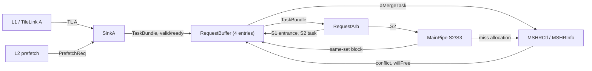
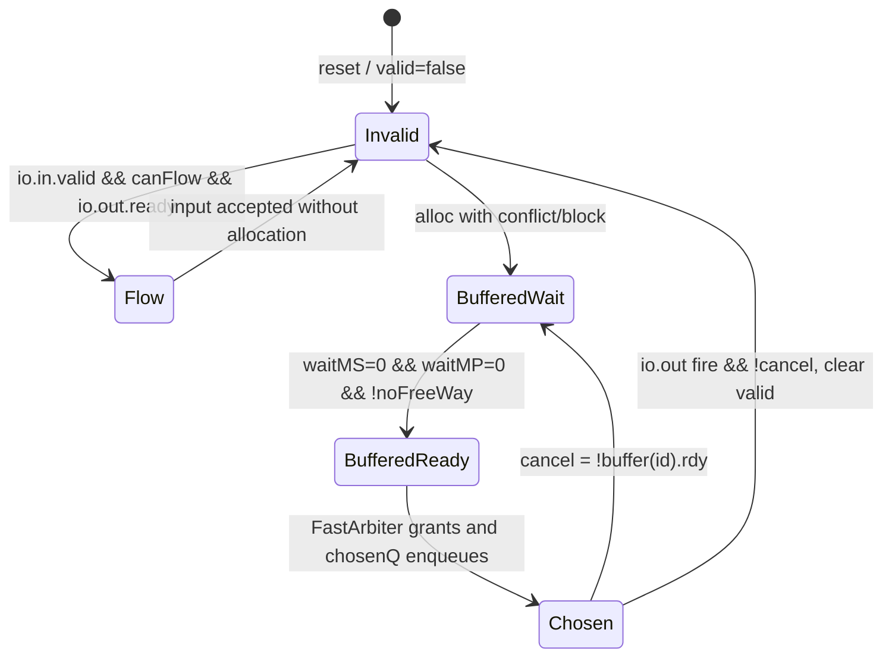
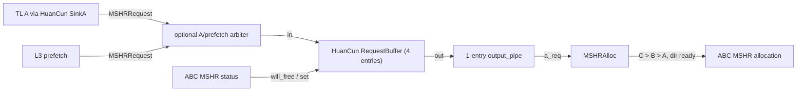

<!--
# Cache-RequestBuffer：昆明湖 V2 的 CoupledL2 与 HuanCun 请求缓冲分析

## 1. 范围、配置与证据

本文分析用户指定本地 checkout 中的缓存请求缓冲，而不是按名称猜测模块职责。所有“行为”结论以 Chisel/Scala 为准；Design Doc 仅用于定位意图。

| 项目 | 本次基线 |
| --- | --- |
| XiangShan 顶层仓库 | kunminghu-v2，提交 e12436c7cba86b195deec24981976d78bc263661 |
| CoupledL2 子模块 | 提交 fb5469838c8902b6cb33992c0a30ee3d446e4453 |
| HuanCun 子模块 | 提交 65ef077373ecf398b4cecdea06b65ef9b8d79044 |
| Design Doc | /home/yanyusong/XiangShan-Design-Doc，提交 58d9e2ad11f044cb6f8887d9687d9e110696d1aa |
| 每周同步检查 | 2026-08-17 执行；距上次检查 2.89 天，按技能规则跳过网络同步 |

### 1.1. 哪个 RequestBuffer 是 Kunminghu V2 的有效路径

KunminghuV2Config 组合了 WithCHI；WithCHI 将 EnableCHI 置为 true。L2Top 随后以 enableCHI 选择 TL2CHICoupledL2，而非 TL2TLCoupledL2。因此标准 Kunminghu V2 配置的主分析对象是 CoupledL2 的 tl2chi Slice 中的 RequestBuffer。

源码证据：[Configs.scala:477](/home/yanyusong/xs-memory-env/XiangShan/src/main/scala/top/Configs.scala:477)、[Configs.scala:481](/home/yanyusong/xs-memory-env/XiangShan/src/main/scala/top/Configs.scala:481)、[L2Top.scala:112](/home/yanyusong/xs-memory-env/XiangShan/src/main/scala/xiangshan/L2Top.scala:112)。

~~~scala
class WithCHI extends Config((_, _, _) => {
  case EnableCHI => true
})
class KunminghuV2Config(n: Int = 1) extends Config(
  L2CacheConfig("1MB", inclusive = true, banks = 4, tp = false)
    ++ new DefaultConfig(n) ++ new WithCHI
)
// L2Top
if (enableCHI) Some(LazyModule(new TL2CHICoupledL2()(new Config(config))))
else Some(LazyModule(new TL2TLCoupledL2()(new Config(config))))
~~~

HuanCun 不是这条 V2+CHI 默认路径中的 LLC：配置对 L3CacheParamsOpt 使用 !EnableCHI 条件，顶层也只在该 Option 非空时实例化 HuanCun。故第 6 节仍分析同一仓库中的 HuanCun RequestBuffer，但将其标为“可选 TL LLC 变体”，不把它叙述成标准 V2+CHI 的已展开硬件。

源码证据：[Configs.scala:219](/home/yanyusong/xs-memory-env/XiangShan/src/main/scala/top/Configs.scala:219)、[Top.scala:111](/home/yanyusong/xs-memory-env/XiangShan/src/main/scala/top/Top.scala:111)。

### 1.2. 实例数、深度与不应混淆的相近模块

| 子系统 | 有效实例位置 | 实参 | 每个 bank 的实例数 | 本文地位 |
| --- | --- | --- | --- | --- |
| CoupledL2 tl2chi | [tl2chi/Slice.scala:60](/home/yanyusong/xs-memory-env/XiangShan/coupledL2/src/main/scala/coupledL2/tl2chi/Slice.scala:60) | 默认 flow=true，entries=4 | 一个 | V2+CHI 主路径 |
| CoupledL2 tl2tl | [tl2tl/Slice.scala:40](/home/yanyusong/xs-memory-env/XiangShan/coupledL2/src/main/scala/coupledL2/tl2tl/Slice.scala:40) | 默认 flow=true，entries=4 | 一个 | 非 CHI 备用外侧协议 |
| HuanCun | [huancun/Slice.scala:128](/home/yanyusong/xs-memory-env/XiangShan/huancun/src/main/scala/huancun/Slice.scala:128) | 显式 entries=4，flow 默认 true | 一个 | 可选 TL LLC 变体 |

CoupledL2 与 HuanCun 都按 bank 创建 Slice，不能把源码中两个 Slice 类简单相加成某次 elaboration 的实例数。CoupledL2 的选择和 bank 展开见 [CoupledL2.scala:419](/home/yanyusong/xs-memory-env/XiangShan/coupledL2/src/main/scala/coupledL2/CoupledL2.scala:419)；HuanCun 的 bank 数来自 node.in.size，见 [HuanCun.scala:253](/home/yanyusong/xs-memory-env/XiangShan/huancun/src/main/scala/huancun/HuanCun.scala:253)。

下列名字相似的结构不属于本文所说的 A 请求 RequestBuffer：

| 结构 | 排除原因 | 证据 |
| --- | --- | --- |
| CoupledL2 PrefetchReqBuffer | BOP 预取过滤/地址检查队列；并非 TaskBundle A 入口 | [BestOffsetPrefetch.scala:409](/home/yanyusong/xs-memory-env/XiangShan/coupledL2/src/main/scala/coupledL2/prefetch/BestOffsetPrefetch.scala:409) |
| MSHRBuffer、GrantBuffer | 分别保存按 MSHR 编号的数据 beat、发送 D 响应；不是请求入口 | [MSHRBuffer.scala:47](/home/yanyusong/xs-memory-env/XiangShan/coupledL2/src/main/scala/coupledL2/MSHRBuffer.scala:47)、[GrantBuffer.scala:114](/home/yanyusong/xs-memory-env/XiangShan/coupledL2/src/main/scala/coupledL2/GrantBuffer.scala:114) |
| HuanCun RefillBuffer | SinkD 到 SourceD 的 refill 数据旁路 | [huancun/Slice.scala:80](/home/yanyusong/xs-memory-env/XiangShan/huancun/src/main/scala/huancun/Slice.scala:80) |
| tl2tl ProbeQueue | 该提交中 prbq.io 直接接 DontCare，未进入有效 TL2TL 数据路径 | [tl2tl/Slice.scala:54](/home/yanyusong/xs-memory-env/XiangShan/coupledL2/src/main/scala/coupledL2/tl2tl/Slice.scala:54) |

## 2. 理论、设计意图与源码的分层

### 2.1. Theory-to-Code Mapping

| 概念 | 课程层含义 | 本模块的代码实现 | 与通用教材模型的差异 |
| --- | --- | --- | --- |
| 结构冲突 | 有限队列、端口、MSHR 使请求无法同时前进 | full、waitMS、waitMP、noFreeWay、RequestArb 的 ready | 这里调度的是物理/一致性缓存任务，不是指令 issue queue |
| 非阻塞 cache | 未完成 miss 不必停住所有后续请求 | CoupledL2 的多个 MSHR 状态输入和 4 项 RequestBuffer；HuanCun 的 wait_table | “非阻塞”受同 set/同组冲突、MSHR 容量、下游 ready 约束 |
| 预取投机 | 预取可以在需求到达前发起且不产生架构写回 | CoupledL2 Hint 去重与需求 Acquire 升级合并 | 预取可被 drop；不是普通地址请求的通用合并 |
| 顺序约束 | 共享存储资源需要避免相互覆盖 | CoupledL2 的同 set waitMP/noFreeWay；HuanCun 的 buffer_dep_mask | HuanCun 的 flow 旁路不检查 buffer_dep_mask，不能宣称全路径严格 FIFO |

课程材料仅用于定义“结构冲突”和“流水化缓冲”的概念；对应的有效结构为本文第 4--6 节的队列、位图和握手，未将 RequestBuffer 等同于后端的 ROB、LSQ 或指令提交机制。

### 2.2. Design Doc 到源码的可追溯矩阵

| ID | Design Doc 位置与原子意图 | 源码关系 | 状态 |
| --- | --- | --- | --- |
| D1 | cache/l2cache/ReqBuf：暂时阻塞的 A 请求先缓冲，可直接通行的请求不占 buffer | CoupledL2 的 canFlow/doFlow 直通条件与 alloc 条件 | 已验证，[RequestBuffer.scala:179](/home/yanyusong/xs-memory-env/XiangShan/coupledL2/src/main/scala/coupledL2/RequestBuffer.scala:179) |
| D2 | 同地址需求 Acquire 可升级尚未完成的 prefetch MSHR | mergeAMask 选择 MSHR，aMergeTask 经 Slice 送 MSHRCtl | 已验证，[RequestBuffer.scala:153](/home/yanyusong/xs-memory-env/XiangShan/coupledL2/src/main/scala/coupledL2/RequestBuffer.scala:153)、[tl2chi/Slice.scala:140](/home/yanyusong/xs-memory-env/XiangShan/coupledL2/src/main/scala/coupledL2/tl2chi/Slice.scala:140) |
| D3 | 满时允许融合/重复预取的接收 | CoupledL2 io.in.ready 包含 mergeA 和 dup | 已验证，[RequestBuffer.scala:205](/home/yanyusong/xs-memory-env/XiangShan/coupledL2/src/main/scala/coupledL2/RequestBuffer.scala:205) |
| D4 | waitMP、waitMS、同 set way 限制 | 4 位 waitMP、MSHR 位图、s2+s3+MSHR 计数 | 已验证，[RequestBuffer.scala:167](/home/yanyusong/xs-memory-env/XiangShan/coupledL2/src/main/scala/coupledL2/RequestBuffer.scala:167)、[RequestBuffer.scala:251](/home/yanyusong/xs-memory-env/XiangShan/coupledL2/src/main/scala/coupledL2/RequestBuffer.scala:251) |
| D5 | ReqArb S1/S2 与 MainPipe S3/S4/S5 的流水意图 | RequestBuffer 实际收到 RequestArb S1 entrance 与 MainPipe S2/S3 回压；本文件不由此推导完整响应周期 | 部分验证，[RequestArb.scala:191](/home/yanyusong/xs-memory-env/XiangShan/coupledL2/src/main/scala/coupledL2/RequestArb.scala:191)、[MainPipe.scala:930](/home/yanyusong/xs-memory-env/XiangShan/coupledL2/src/main/scala/coupledL2/tl2chi/MainPipe.scala:930) |
| D6 | 文档对“RequestBuffer”描述的合并语义可泛化到 HuanCun | HuanCun 只检查 buffer 内重复预取，不检查 MSHR，也没有 aMergeTask | 版本/实现不匹配，[huancun/RequestBuffer.scala:58](/home/yanyusong/xs-memory-env/XiangShan/huancun/src/main/scala/huancun/RequestBuffer.scala:58) |

### 2.3. 设计文档差异与边界

Design Doc 与源代码提交不同。D1--D4 仅可用于 CoupledL2，不能复制到 HuanCun：后者没有 mainPipeBlock、waitMP、noFreeWay 或 MSHR prefetch 升级端口。D5 的五级说明只证明相邻模块的命名和接口方向；固定的“请求到响应 N 周期”需通过 elaborated Verilog 或 waveform 量测，本文不臆测该数字。

## 3. 顶层连接与模块契约

### 3.1. CoupledL2 tl2chi 的数据通路

~~~mermaid
flowchart LR
  L1["L1 / TileLink A"] --&gt;|TL A| SinkA
  PF["L2 prefetch"] --&gt;|PrefetchReq| SinkA
  SinkA --&gt;|TaskBundle, valid/ready| RB["RequestBuffer (4 entries)"]
  MSHR["MSHRCtl / MSHRInfo"] --&gt;|conflict, willFree| RB
  MP["MainPipe S2/S3"] --&gt;|same-set block| RB
  RA["RequestArb"] --&gt;|S1 entrance, S2 task| RB
  RB --&gt;|TaskBundle| RA
  RB --&gt;|aMergeTask| MSHR
  RA --&gt;|S2| MP
  MP --&gt;|miss allocation| MSHR
~~~

实际连线见 [tl2chi/Slice.scala:58](/home/yanyusong/xs-memory-env/XiangShan/coupledL2/src/main/scala/coupledL2/tl2chi/Slice.scala:58) 和 [tl2chi/Slice.scala:93](/home/yanyusong/xs-memory-env/XiangShan/coupledL2/src/main/scala/coupledL2/tl2chi/Slice.scala:93)。

~~~scala
val reqArb = Module(new RequestArb())
val mainPipe = Module(new MainPipe())
val reqBuf = Module(new RequestBuffer())
val mshrCtl = Module(new MSHRCtl())
reqArb.io.sinkA <> reqBuf.io.out
reqBuf.io.in <> sinkA.io.task
reqBuf.io.mshrInfo := mshrCtl.io.msInfo
reqBuf.io.mainPipeBlock := mainPipe.io.toReqBuf
mshrCtl.io.aMergeTask := reqBuf.io.aMergeTask
~~~

### 3.2. CoupledL2 RequestBuffer 的 Who / Why / How / From / To

| 对象 | Who | Why | How | From what | To what |
| --- | --- | --- | --- | --- | --- |
| RequestBuffer | Slice 拥有；构造参数默认 entries=4、flow=true | 吸收无法安全进入 A 路的任务，同时为可直通任务省去占位 | RegInit buffer + FastArbiter + 1 项 chosenQ | SinkA.task | RequestArb.sinkA 或 MSHRCtl.aMergeTask |
| io.in | SinkA 驱动，RequestBuffer 驱动 ready | 将 L1 A 和可选 prefetch 统一成 TaskBundle | DecoupledIO | SinkA 的 TL A / PrefetchReq 变换 | buffer/直通/合并/丢弃分支 |
| mshrInfo | MSHRCtl 产生 | 阻止尚未释放、地址冲突的 request 抢占一致性状态 | conflictMask、mergeAMask、willFree 清位 | 每项 MSHRInfo | waitMS、mergeA、noFreeWay |
| mainPipeBlock 与 s1Entrance | MainPipe 和 RequestArb 产生 | 防止相同 set 的目录/元数据写窗口交叠 | waitMP 移位计时和 s1_Block 重置 | S2/S3、S1 入口状态 | entry.rdy |
| io.out | RequestBuffer 产生，RequestArb 消费 | 将已获准 A 请求送进目录读取仲裁 | chosenQ/deq 或 canFlow Mux | ready entry 或当前 in | RequestArb S1/S2 |

接口声明位于 [CoupledL2 RequestBuffer.scala:73](/home/yanyusong/xs-memory-env/XiangShan/coupledL2/src/main/scala/coupledL2/RequestBuffer.scala:73)。

~~~scala
val in = Flipped(DecoupledIO(new TaskBundle))
val out = DecoupledIO(new TaskBundle)
val mshrInfo = Vec(mshrsAll, Flipped(ValidIO(new MSHRInfo)))
val aMergeTask = ValidIO(new AMergeTask)
val mainPipeBlock = Input(Vec(2, Bool()))
val taskFromArb_s2 = Flipped(ValidIO(new TaskBundle()))
~~~

### 3.3. RequestArb 的下游优先级不是 RequestBuffer 的内部优先级

RequestBuffer 自己只在多个 ready buffer 项之间使用 FastArbiter。离开它以后，RequestArb 在 SinkC、SinkB、SinkA 三类外来任务之间采用 C > B > A；MSHR task 还拥有独立的 S0/S1 寄存入口。因此 A 请求即使从 RequestBuffer 出队，仍可能因 C/B、MSHR task、目录或 MSHR 容量而被反压。

源码证据：[RequestArb.scala:145](/home/yanyusong/xs-memory-env/XiangShan/coupledL2/src/main/scala/coupledL2/RequestArb.scala:145)、[RequestArb.scala:153](/home/yanyusong/xs-memory-env/XiangShan/coupledL2/src/main/scala/coupledL2/RequestArb.scala:153)、[MSHRCtl.scala:110](/home/yanyusong/xs-memory-env/XiangShan/coupledL2/src/main/scala/coupledL2/tl2chi/MSHRCtl.scala:110)。

~~~scala
val sinkValids = VecInit(Seq(
  io.sinkC.valid && !block_C,
  io.sinkB.valid && !block_B,
  io.sinkA.valid && !block_A
)).asUInt
io.sinkA.ready := sink_ready_basic && !block_A &&
  !sinkValids(1) && !sinkValids(0)
~~~

## 4. 参数、地址与索引

### 4.1. 参数所有者和当前 V2 配置推导

| 参数/值 | 所有者 | 影响 |
| --- | --- | --- |
| entries=4 | CoupledL2 RequestBuffer 类默认；HuanCun Slice 显式覆写 | buffer 仅有 4 个主 entry |
| flow=true | 两个 RequestBuffer 的默认参数 | 空的输出暂存器时允许输入直通 |
| L2 size=1MB，ways=8，banks=4 | KunminghuV2Config 调用 L2CacheConfig；其 ways 默认 8 | 每 bank sets = 1MiB / 4 / 8 / 64B = 512（配置表达式，仍以 elaboration 为准） |
| CoupledL2 mshrs=16 | L2Param 默认值，V2 这段配置未覆写 | waitMS 的位数和 noFreeWay 的统计输入数 |
| HuanCun mshrs | HCCacheParameters 参数 | RequestBuffer 仅观察普通 ABC MSHR；不要未 elaboration 就将默认 14 写成某平台实值 |

证据：[L2Param.scala:65](/home/yanyusong/xs-memory-env/XiangShan/coupledL2/src/main/scala/coupledL2/L2Param.scala:65)、[Configs.scala:278](/home/yanyusong/xs-memory-env/XiangShan/src/main/scala/top/Configs.scala:278)、[HCCacheParameters.scala:83](/home/yanyusong/xs-memory-env/XiangShan/huancun/src/main/scala/huancun/HCCacheParameters.scala:83)。

### 4.2. 地址到 tag/set/off

CoupledL2 SinkA 对 TileLink A 地址调用 parseAddress，形成 TaskBundle 的 tag、set、off；slice 的 bank bits 在 set 之前从地址中略过。HuanCun SinkA 同样在进入其 RequestBuffer 前将 TL A 转成 MSHRRequest。

源码证据：[CoupledL2.scala:186](/home/yanyusong/xs-memory-env/XiangShan/coupledL2/src/main/scala/coupledL2/CoupledL2.scala:186)、[SinkA.scala:54](/home/yanyusong/xs-memory-env/XiangShan/coupledL2/src/main/scala/coupledL2/SinkA.scala:54)、[huancun/HuanCun.scala:147](/home/yanyusong/xs-memory-env/XiangShan/huancun/src/main/scala/huancun/HuanCun.scala:147)、[huancun/SinkA.scala:85](/home/yanyusong/xs-memory-env/XiangShan/huancun/src/main/scala/huancun/SinkA.scala:85)。

~~~scala
// CoupledL2
val set = offset >> (offsetBits + bankBits)
val tag = set >> setBits
(ZeroExt(tag, tagBits), set(setBits - 1, 0), offset(offsetBits - 1, 0))

// SinkA
task.tag := parseAddress(a.address)._1
task.set := parseAddress(a.address)._2
task.off := parseAddress(a.address)._3
~~~

CoupledL2 的 sameAddr 使用 Cat(tag,set)，因此 conflict/duplicate/merge 的地址粒度是该 slice 内的 cache line 身份，off 不参与比较。它不等于对任意字节范围做合并。HuanCun 的 set_conflict 更宽松/保守地比较 set 的低 block_granularity 位，不比较 tag。

~~~scala
def sameAddr(a: TaskBundle, b: TaskBundle): Bool =
  Cat(a.tag, a.set) === Cat(b.tag, b.set)
def set_conflict(set_a: UInt, set_b: UInt): Bool =
  set_a(block_granularity - 1, 0) === set_b(block_granularity - 1, 0)
~~~

证据：[CoupledL2 RequestBuffer.scala:108](/home/yanyusong/xs-memory-env/XiangShan/coupledL2/src/main/scala/coupledL2/RequestBuffer.scala:108)、[HuanCun RequestBuffer.scala:47](/home/yanyusong/xs-memory-env/XiangShan/huancun/src/main/scala/huancun/RequestBuffer.scala:47)。

### 4.3. 分配索引和优先级

| 选择器 | 计算 | 消费者 | 同时请求时的规则 |
| --- | --- | --- | --- |
| CoupledL2 insertIdx | PriorityEncoder(buffer.map(!valid)) | 选定 RegInit buffer entry | 选当前空项中的优先编码项；满时不分配 |
| CoupledL2 mergeAId | OHToUInt(mergeAMask) | aMergeTask.bits.id | 无本地 one-hot 断言；正确性依赖前段冲突协议使匹配目标不歧义 |
| HuanCun insert_idx | PriorityEncoder(~valids.asUInt) | Mem、valids、wait_table、dep matrix | 选当前空项中的优先编码项 |
| HuanCun MSHRSelector | ParallelPriorityMux(idle) | abc MSHR alloc | 分配普通空闲 MSHR 的优先编码项；C/B/A 接收优先级在 MSHRAlloc |

证据：[CoupledL2 RequestBuffer.scala:208](/home/yanyusong/xs-memory-env/XiangShan/coupledL2/src/main/scala/coupledL2/RequestBuffer.scala:208)、[HuanCun RequestBuffer.scala:66](/home/yanyusong/xs-memory-env/XiangShan/huancun/src/main/scala/huancun/RequestBuffer.scala:66)、[MSHRAlloc.scala:29](/home/yanyusong/xs-memory-env/XiangShan/huancun/src/main/scala/huancun/MSHRAlloc.scala:29)。

## 5. CoupledL2：Kunminghu V2+CHI 的有效 RequestBuffer

### 5.1. 可见阶段与数据/控制流

| 阶段 | payload/状态 | 完成的工作 | 阻塞、取消或重试 | 输出 |
| --- | --- | --- | --- | --- |
| ingress（组合） | io.in.bits TaskBundle | 计算冲突、merge、dup、noFreeWay、canFlow | full、MSHR conflict、MainPipe block、way 饱和 | 直通、buffer 分配、aMergeTask 或 drop |
| buffer entry | valid/rdy/task/waitMP/waitMS | 保存不能安全直通的任务 | waitMS、waitMP、s1_Block、noFreeWay | FastArbiter 输入 |
| issue select | 多个 ready entry | FastArbiter 轮转选择一项，写入 chosenQ | chosenQ.enq.ready | chosenQ 的 entry ID 与 payload |
| chosenQ / output | 一项 ChosenQBundle | 在 RequestArb ready 前持有候选；若 entry 后来不 ready 则 cancel | cancel 时不清 buffer valid | io.out 或回到以后重选 |
| RequestArb S1/S2 与 MainPipe S2/S3 | TaskBundle | 下游目录读、A/B/C/MSHR 仲裁；同 set 信息回灌 | C/B 优先、MSHR full、目录与数据端口约束 | mainPipeBlock、s1Entrance、taskFromArb_s2 |

RequestBuffer 本身没有 response、TLB、异常或提交端口；response latency 属于 MainPipe/MSHR/GrantBuffer/CHI 路径，不能从该模块的 entry 深度推导。

### 5.2. 冲突算法和等待位图

MSHR 地址冲突要求相同 set，且 tag 等于正在请求的 reqTag，或处在 replacement/release 窗口时等于 metaTag；willFree 的 MSHR 不再阻塞。这个向量被写进 waitMS，随后每拍清除将释放 MSHR 的位。

源码证据：[CoupledL2 RequestBuffer.scala:112](/home/yanyusong/xs-memory-env/XiangShan/coupledL2/src/main/scala/coupledL2/RequestBuffer.scala:112)、[CoupledL2 RequestBuffer.scala:217](/home/yanyusong/xs-memory-env/XiangShan/coupledL2/src/main/scala/coupledL2/RequestBuffer.scala:217)、[CoupledL2 RequestBuffer.scala:257](/home/yanyusong/xs-memory-env/XiangShan/coupledL2/src/main/scala/coupledL2/RequestBuffer.scala:257)。

~~~scala
def addrConflict(a: TaskBundle, s: MSHRInfo): Bool = {
  a.set === s.set && (a.tag === s.reqTag ||
    a.tag === s.metaTag && s.needRelease)
}
def conflictMask(a: TaskBundle): UInt = VecInit(io.mshrInfo.map(s =>
  s.valid && addrConflict(a, s.bits) && !s.bits.willFree)).asUInt

val willFreeMask = VecInit(io.mshrInfo.map(
  s => s.valid && s.bits.willFree)).asUInt
waitMSUpdate := e.waitMS & (~willFreeMask).asUInt
~~~

waitMP 的初始 4 位编码记录 S1/S2/S3 对同 set A 的阻塞时间，之后右移；到达重新检查点时重新采样 conflictMask。若本拍有 A 从输出发射或 B/C/MSHR 进入 S1 且 set 相同，s1_Block 会把等待重新压入。MainPipe 的 s23Block 只对可能写 meta 的任务施加同 set 限制。

证据：[CoupledL2 RequestBuffer.scala:221](/home/yanyusong/xs-memory-env/XiangShan/coupledL2/src/main/scala/coupledL2/RequestBuffer.scala:221)、[CoupledL2 RequestBuffer.scala:268](/home/yanyusong/xs-memory-env/XiangShan/coupledL2/src/main/scala/coupledL2/RequestBuffer.scala:268)、[MainPipe.scala:914](/home/yanyusong/xs-memory-env/XiangShan/coupledL2/src/main/scala/coupledL2/tl2chi/MainPipe.scala:914)。

~~~scala
e.waitMP := e.waitMP >> 1
when(e.waitMP(1) === 0.U && e.waitMP(0) === 1.U) {
  waitMSUpdate := conflictMask(e.task)
}
when(s1_Block) {
  e.waitMP := (e.waitMP >> 1) | "b0100".U
}
e.rdy := !waitMSUpdate.orR && !e.waitMP &&
  !s1_Block && !noFreeWay(e.task)
~~~

### 5.3. 同 set way 保护

noFreeWayForSet 统计三类可能占用同一 set way 的 A 工作：有效且 fromA 的 MSHR、当前 S2 中的非 MSHR A、以及其寄存到 S3 的副本；总数达到 cacheParams.ways 时拒绝直通或令 entry 不 ready。它是“没有肯定空余 way”的保守门槛，不是 RequestBuffer 自己选 victim way 的算法。

~~~scala
val sameSetCnt = PopCount(VecInit(io.mshrInfo.map(
  s => s.valid && s.bits.set === set && s.bits.fromA) :+
  sameSet_s2 :+ sameSet_s3).asUInt)
val noFreeWay = sameSetCnt >= cacheParams.ways.U
~~~

证据：[CoupledL2 RequestBuffer.scala:167](/home/yanyusong/xs-memory-env/XiangShan/coupledL2/src/main/scala/coupledL2/RequestBuffer.scala:167)、[CoupledL2 RequestBuffer.scala:177](/home/yanyusong/xs-memory-env/XiangShan/coupledL2/src/main/scala/coupledL2/RequestBuffer.scala:177)。真正的 wayMask 在输出端被填成所有 way，由 Directory/后续阶段选择，而不是被该计数器直接选定，见 [CoupledL2 RequestBuffer.scala:307](/home/yanyusong/xs-memory-env/XiangShan/coupledL2/src/main/scala/coupledL2/RequestBuffer.scala:307)。

### 5.4. 直通、分配、预取 drop 与需求升级

| 输入分类 | 条件 | 处理 | 为什么 |
| --- | --- | --- | --- |
| 普通、无冲突 | flow 且非 full、非 conflict、chosenQ 空、无 MainPipe block、仍有 way，且 out.ready | doFlow，组合直通 | 不占 4 项资源 |
| 普通、暂不能直通 | !full 且不满足 doFlow | alloc 到空 entry | 吸收后等待安全窗口 |
| 同地址重复 prefetch | Hint 且与 MSHR 中 isAcqOrPrefetch 或 buffer 内同 tag/set 相同 | dup；握手允许但不 alloc | 限制无效预取流量 |
| 迟到需求 Acquire | 命中未完成 prefetch MSHR，且满足权限/状态限制 | 产生 aMergeTask 到目标 MSHR | 用已有预取 transaction 服务需求 |
| full 的普通请求 | !mergeA 且 !dup | io.in.ready 低 | 不覆盖有效 entry |

源码证据：[CoupledL2 RequestBuffer.scala:179](/home/yanyusong/xs-memory-env/XiangShan/coupledL2/src/main/scala/coupledL2/RequestBuffer.scala:179)、[CoupledL2 RequestBuffer.scala:184](/home/yanyusong/xs-memory-env/XiangShan/coupledL2/src/main/scala/coupledL2/RequestBuffer.scala:184)、[CoupledL2 RequestBuffer.scala:205](/home/yanyusong/xs-memory-env/XiangShan/coupledL2/src/main/scala/coupledL2/RequestBuffer.scala:205)。

~~~scala
val canFlow = flow.B && !full && !conflict(in) && !chosenQValid &&
  !Cat(io.mainPipeBlock).orR && !noFreeWay(in)
val doFlow = canFlow && io.out.ready
val dup = isPrefetch && dupMask.orR
io.in.ready := !full || doFlow || mergeA || dup
val alloc = !full && io.in.valid && !doFlow && !dup && !mergeA
~~~

需求升级不是任意同地址合并。mergeAMask 还要求 MSHR 是 prefetch、未 willFree、未 dirHit/未 s_refill、输入为 AcquireBlock 或 AcquirePerm、尚未 mergeA，并排除输入 NtoT 而 MSHR param 为 NtoB 的组合。目标 ID 由 OHToUInt 编码后经 MSHRCtl 定向到对应 MSHR。

证据：[CoupledL2 RequestBuffer.scala:153](/home/yanyusong/xs-memory-env/XiangShan/coupledL2/src/main/scala/coupledL2/RequestBuffer.scala:153)、[tl2chi/MSHRCtl.scala:154](/home/yanyusong/xs-memory-env/XiangShan/coupledL2/src/main/scala/coupledL2/tl2chi/MSHRCtl.scala:154)。

### 5.5. 存储结构：search、update、release、replace 与端口冲突

| 结构 | search/read | update | release | replace | 同拍冲突结论 |
| --- | --- | --- | --- | --- | --- |
| buffer: RegInit Vec[ReqEntry] | 所有 entry 并行送 FastArbiter；dup 也并行读 task | alloc 写唯一 insertIdx，置 valid/rdy/task/waitMP/waitMS | chosenQ.deq.fire 且非 cancel 清该 id 的 valid | 无“替换有效项”；只选 invalid slot | alloc 只选本拍开始时 invalid 的 entry；deq 清的是 valid entry，故不会同拍 WAW 同一 entry |
| chosenQ: Queue depth 1 | deq.bits 给 output/cancel 判定 | issueArb 输出 enq | deq.ready 为 out.ready 或 cancel | 无替换 | cancel 时 chosenQ 可被消费，但 buffer.valid 不清，任务以后可重选 |
| waitMS/waitMP/rdy | 仅 valid entry 更新 | 分配时初始化；valid 时每拍重算 | entry valid 清后不再消费 | 无 | alloc 目标旧 valid=0，valid-entry update 不写该目标，避免状态写冲突 |

源码证据：[CoupledL2 RequestBuffer.scala:100](/home/yanyusong/xs-memory-env/XiangShan/coupledL2/src/main/scala/coupledL2/RequestBuffer.scala:100)、[CoupledL2 RequestBuffer.scala:232](/home/yanyusong/xs-memory-env/XiangShan/coupledL2/src/main/scala/coupledL2/RequestBuffer.scala:232)、[CoupledL2 RequestBuffer.scala:293](/home/yanyusong/xs-memory-env/XiangShan/coupledL2/src/main/scala/coupledL2/RequestBuffer.scala:293)。

buffer 是寄存器 Vec，不是显式单端口 SRAM；源码没有有限读端口仲裁器或同址 RAM bypass 条件。若综合结果将其改写为存储宏，端口行为需要以生成 Verilog/综合约束补证。满时即便 chosenQ 在同拍成功发出，alloc 仍要求旧 full 为低，所以普通请求不会同拍复用刚释放的 buffer 项；它只能在下一拍分配。该结论来自 full/alloc 未引用 io.out.fire。

### 5.6. FastArbiter 的同时 ready entry 行为

FastArbiter 用 pendingMask 保存上次未被选择的 valid 项，随后从 rrGrantMask 覆盖的 pending 项中选择；若该集合没有可用项，则选 valid 的 first one。被选项的 ready 仅在 grant 且 output ready 时成立。因此它不是“固定最低 index 优先”：连续竞争时会围绕已发射项轮转。

~~~scala
val pendingMask = RegEnable(valids & (~chosenOH).asUInt, 0.U(n.W), io.out.fire)
val rrSelOH = MaskToOH(rrGrantMask & pendingMask)
val firstOneOH = MaskToOH(valids)
chosenOH := Mux(rrValid, rrSelOH, firstOneOH)
io.in.map(_.ready).zip(chosenOH.asBools).foreach {
  case (rdy, grant) => rdy := grant && io.out.ready
}
~~~

证据：[FastArbiter.scala:30](/home/yanyusong/xs-memory-env/XiangShan/utility/src/main/scala/utility/FastArbiter.scala:30)。相同 set 的另一项还会被 io.out.valid 条件的 pipeBlockOut 临时屏蔽，见 [CoupledL2 RequestBuffer.scala:233](/home/yanyusong/xs-memory-env/XiangShan/coupledL2/src/main/scala/coupledL2/RequestBuffer.scala:233)。

### 5.7. 隐式状态机和握手时序

~~~mermaid
stateDiagram-v2
  [*] --&gt; Invalid: reset / valid=false
  Invalid --&gt; Flow: io.in.valid && canFlow && io.out.ready
  Flow --&gt; Invalid: input accepted without allocation
  Invalid --&gt; BufferedWait: alloc with conflict/block
  BufferedWait --&gt; BufferedReady: waitMS=0 && waitMP=0 && !noFreeWay
  BufferedReady --&gt; Chosen: FastArbiter grants and chosenQ enqueues
  Chosen --&gt; BufferedWait: cancel = !buffer(id).rdy
  Chosen --&gt; Invalid: io.out fire && !cancel, clear valid
~~~

reset 时 buffer 整体零化，故 valid/rdy/wait 位均为零；chosenQ 由 Chisel Queue 自身复位。模块没有 redirect、flush 或 exception 输入，所以不存在“在 RequestBuffer 内响应前端 redirect”的逻辑；coherence/retry 的恢复通过 wait 位、cancel 与上游 ready/valid 表达。

~~~waveform-draw
{
  "signal": [
    { "name": "clk", "wave": "p......" },
    { "name": "io.in.valid", "wave": "0101000" },
    { "name": "io.in.ready", "wave": "0111111" },
    { "name": "canFlow", "wave": "0100000" },
    { "name": "doFlow", "wave": "0100000" },
    { "name": "io.mainPipeBlock", "wave": "0001000" },
    { "name": "alloc", "wave": "0001000" },
    { "name": "buffer(0).valid", "wave": "0001110" },
    { "name": "chosenQ.io.deq.valid", "wave": "0000100" },
    { "name": "io.out.ready", "wave": "0111111" },
    { "name": "io.out.valid", "wave": "0100100" }
  ],
  "config": { "hscale": 1 }
}
~~~

图中第一个请求是直通，第二个请求因 mainPipeBlock 分配到 buffer；它是条件关系图而非固定 pipeline 延迟图。源码依据见 [CoupledL2 RequestBuffer.scala:179](/home/yanyusong/xs-memory-env/XiangShan/coupledL2/src/main/scala/coupledL2/RequestBuffer.scala:179) 和 [CoupledL2 RequestBuffer.scala:299](/home/yanyusong/xs-memory-env/XiangShan/coupledL2/src/main/scala/coupledL2/RequestBuffer.scala:299)。

### 5.8. CoupledL2 场景矩阵

| 场景 | 精确触发 | 胜者/阻塞者 | 状态变化与恢复 | 下游观察者 |
| --- | --- | --- | --- | --- |
| 无冲突 A | canFlow && out.ready | 当前输入直通 | 不写 buffer | RequestArb.sinkA |
| 同地址 MSHR | conflictMask 非零 | 新任务入 buffer，不能发射 | waitMS 等 willFree 清位后 rdy 重算 | MSHRCtl 状态、FastArbiter |
| MainPipe 同 set | mainPipeBlock 或 s1Entrance 同 set | 新/旧项等待 | waitMP 移位，S1 冲突重新注入 | MainPipe、RequestArb |
| 同 set way 饱和 | s2+s3+fromA MSHR >= ways | A 不直通/entry 不 ready | 占用减少后 noFreeWay 变低 | Directory 后续 way 选择 |
| 迟到 Acquire 命中 prefetch MSHR | mergeAMask | mergeA，不分配 entry | Valid aMergeTask 送目标 MSHR | MSHRCtl、目标 MSHR |
| 重复 Hint | isPrefetch && dupMask.orR | 该 Hint 被接收但不 alloc | 无 buffer 状态改变 | perf drop_prefetch；无 response |
| chosenQ 过期 | !buffer(chosen id).rdy | chosenQ 项被 cancel | buffer.valid 保持，待后续重选 | io.out 不展示该项 |
| A 与 B/C 同拍 | RequestArb sinkValids 中 B/C valid | B/C 优先；A ready 低 | RequestBuffer/chosenQ 保持 | RequestArb |

对应源代码：[CoupledL2 RequestBuffer.scala:153](/home/yanyusong/xs-memory-env/XiangShan/coupledL2/src/main/scala/coupledL2/RequestBuffer.scala:153)、[CoupledL2 RequestBuffer.scala:279](/home/yanyusong/xs-memory-env/XiangShan/coupledL2/src/main/scala/coupledL2/RequestBuffer.scala:279)、[CoupledL2 RequestBuffer.scala:297](/home/yanyusong/xs-memory-env/XiangShan/coupledL2/src/main/scala/coupledL2/RequestBuffer.scala:297)、[RequestArb.scala:155](/home/yanyusong/xs-memory-env/XiangShan/coupledL2/src/main/scala/coupledL2/RequestArb.scala:155)。

### 5.9. 延迟与吞吐

| 路径 | 起点/终点 | 源码可证实的性能结论 | 变量项 |
| --- | --- | --- | --- |
| 直通 | io.in.valid 到 io.out.valid | 当 canFlow 且 out.ready 时是本模块内组合直通，不经过 buffer | 下游 RequestArb ready、MSHR/目录/MainPipe/way 条件 |
| 缓冲发射 | alloc 到 io.out.fire | 至少经过 entry 选择与 chosenQ；不能从本模块推出固定周期数 | waitMS、waitMP、noFreeWay、仲裁、chosenQ cancel、下游 ready |
| 接收吞吐 | io.in | 单一 Decoupled 输入，最多一 task/周期；4 项只是吸收容量 | full；满时普通输入不被接收 |
| 输出吞吐 | io.out | FastArbiter 单输出，理论上最多一 task/周期 | 同 set 屏蔽、RequestArb C/B/MSHR 优先、目录与 MSHR |

因此“每周期一条”仅是本模块在所有条件满足时的上界，不是端到端 L2 hit、miss、CHI 响应或软件 load 指令的吞吐承诺。

## 6. HuanCun：可选 TL LLC 变体的 RequestBuffer

### 6.1. 边界、上游与下游

~~~mermaid
flowchart LR
  TLA["TL A via HuanCun SinkA"] --&gt;|MSHRRequest| AArb["optional A/prefetch arbiter"]
  PF["L3 prefetch"] --&gt;|MSHRRequest| AArb
  AArb --&gt;|in| HRB["HuanCun RequestBuffer (4 entries)"]
  HMSHR["ABC MSHR status"] --&gt;|will_free / set| HRB
  HRB --&gt;|out| OP["1-entry output_pipe"]
  OP --&gt;|a_req| MA["MSHRAlloc"]
  MA --&gt;|C > B > A, dir ready| ABC["ABC MSHR allocation"]
~~~

HuanCun Slice 的实际连线为 SinkA/可选二输入 Arbiter 到 RequestBuffer，再到 MSHRAlloc.a_req；RequestBuffer 仅被接入 abc_mshr 的 status，MSHRAlloc 自己则检查全部 mshrsAll。

证据：[huancun/Slice.scala:127](/home/yanyusong/xs-memory-env/XiangShan/huancun/src/main/scala/huancun/Slice.scala:127)、[huancun/Slice.scala:145](/home/yanyusong/xs-memory-env/XiangShan/huancun/src/main/scala/huancun/Slice.scala:145)、[huancun/Slice.scala:168](/home/yanyusong/xs-memory-env/XiangShan/huancun/src/main/scala/huancun/Slice.scala:168)。

~~~scala
val a_req_buffer = Module(new RequestBuffer(entries = 4))
a_req_buffer.io.in <> alloc_A_arb.io.out
mshrAlloc.io.a_req <> a_req_buffer.io.out
abc_mshr.zipWithIndex.foreach {
  case (mshr, i) => a_req_buffer.io.mshr_status(i) := mshr.io.status
}
~~~

### 6.2. 状态、分配与释放

HuanCun 的类默认 entries=16，但唯一有效 Slice 实例覆写为 4。其 payload Mem、wait_table、buffer_dep_mask 没有 Reset 初值；安全性依赖 valids 在复位时全为 0，且仅 valid 行会被读取/更新。rdys 也复位为 0。

~~~scala
val buffer = Mem(entries, new MSHRRequest)
val valids = RegInit(VecInit(Seq.fill(entries){ false.B }))
val wait_table = Reg(Vec(entries, UInt(mshrs.W)))
val buffer_dep_mask = Reg(Vec(entries, Vec(entries, Bool())))
val rdys = RegInit(VecInit(Seq.fill(entries){ false.B }))
~~~

证据：[HuanCun RequestBuffer.scala:8](/home/yanyusong/xs-memory-env/XiangShan/huancun/src/main/scala/huancun/RequestBuffer.scala:8)、[HuanCun RequestBuffer.scala:16](/home/yanyusong/xs-memory-env/XiangShan/huancun/src/main/scala/huancun/RequestBuffer.scala:16)。

| 操作 | 源码规则 | 关键含义 |
| --- | --- | --- |
| full/接收 | full = 所有 valids 为 1；io.in.ready = !full | 满时即使本拍有 entry 发向 output_pipe，普通输入也不能同拍接收 |
| alloc | 非 full、in.valid、不是已成功 flow、不是 dup | PriorityEncoder 选择空项，写 request、wait_table、dep 行，置 valid |
| MSHR 等待解除 | wait_table & ~free_mask | will_free 是“下拍释放”，该拍即可让等待位消失 |
| buffer 内依赖解除 | 任一 issueArb.out.fire 后，所有行清 chosen 列 | 后继在前驱进入 output_pipe 后即可解除本地依赖，不等 MSHRAlloc 真正 accept |
| release | issueArb.io.in(i).fire 清 valids(i) | 主 buffer 的有效项转移到 1 项 output_pipe；full 不计 output_pipe |

证据：[HuanCun RequestBuffer.scala:28](/home/yanyusong/xs-memory-env/XiangShan/huancun/src/main/scala/huancun/RequestBuffer.scala:28)、[HuanCun RequestBuffer.scala:39](/home/yanyusong/xs-memory-env/XiangShan/huancun/src/main/scala/huancun/RequestBuffer.scala:39)、[HuanCun RequestBuffer.scala:63](/home/yanyusong/xs-memory-env/XiangShan/huancun/src/main/scala/huancun/RequestBuffer.scala:63)、[HuanCun RequestBuffer.scala:77](/home/yanyusong/xs-memory-env/XiangShan/huancun/src/main/scala/huancun/RequestBuffer.scala:77)。

### 6.3. 冲突域、预取去重和 flow 的限制

HuanCun 的 conflict_mask 从输入 mshr_status（长度 mshrs，不含额外 BC/C 项）构造，条件是相同低 block_granularity 位 set 且未 will_free。分配时 assert 冲突数不超过一。buffer_dep_mask 则记录现有 buffer 中的同组 entry。

~~~scala
val conflict_mask = (0 until mshrs) map { i =>
  val s = io.mshr_status(i)
  s.valid && set_conflict(s.bits.set, in_set) && !s.bits.will_free
}
val req_deps = (0 until entries) map { i =>
  valids(i) && set_conflict(buffer(i).set, in_set)
}
rdys(insert_idx) := !conflict && !Cat(req_deps).orR
~~~

证据：[HuanCun RequestBuffer.scala:47](/home/yanyusong/xs-memory-env/XiangShan/huancun/src/main/scala/huancun/RequestBuffer.scala:47)、[HuanCun RequestBuffer.scala:63](/home/yanyusong/xs-memory-env/XiangShan/huancun/src/main/scala/huancun/RequestBuffer.scala:63)。

这里的 dup 不是 CoupledL2 的 MSHR 需求升级：它仅检查现有 buffer 中 tag+set 相等的预取，非满时会被接收但不 alloc；没有更新旧 entry，也没有 aMergeTask。满时 io.in.ready 已经为低，故该重复预取不会被接收。

更重要的是，flow 分支只检查 output_pipe.valid、io.in.valid 和 full，不检查 dup、conflict 或 req_deps。若下游 ready 为高，输入可以绕过尚存 buffer 的同组依赖；若下游 ready 为低，alloc 才会将它留在 buffer。因此“buffer 内入队路径维持同组依赖”是可证实的，但“所有 buffered 与 flow 请求严格同组 FIFO”不是本源码可证实的结论。

~~~scala
val no_ready_entry = !output_pipe.valid
io.out.bits := Mux(no_ready_entry && flow.B, io.in.bits, output_pipe.bits)
io.out.valid := (flow.B && no_ready_entry && io.in.valid && !full) |
  output_pipe.valid
io.in.ready := !full
val alloc = !full && io.in.valid &&
  !(flow.B && no_ready_entry && io.out.ready) && !dup
~~~

证据：[HuanCun RequestBuffer.scala:39](/home/yanyusong/xs-memory-env/XiangShan/huancun/src/main/scala/huancun/RequestBuffer.scala:39)、[HuanCun RequestBuffer.scala:67](/home/yanyusong/xs-memory-env/XiangShan/huancun/src/main/scala/huancun/RequestBuffer.scala:67)。

~~~waveform-draw
{
  "signal": [
    { "name": "clk", "wave": "p......" },
    { "name": "io.in.valid", "wave": "0101000" },
    { "name": "io.in.ready", "wave": "0111111" },
    { "name": "output_pipe.valid", "wave": "0000110" },
    { "name": "io.out.ready", "wave": "0110011" },
    { "name": "io.out.valid", "wave": "0101110" },
    { "name": "alloc", "wave": "0001000" },
    { "name": "valids(insert_idx)", "wave": "0001110" }
  ],
  "config": { "hscale": 1 }
}
~~~

该图刻画“下游不 ready 时 flow 输入转为 alloc，output_pipe 随后保持”的条件，不将它表示为固定周期响应。

### 6.4. HuanCun 下游 MSHRAlloc 的二次仲裁

RequestBuffer.out 仅代表到达 MSHRAlloc.a_req；真正 A 接收还必须有普通 ABC MSHR 空位、无全体 MSHR 同组冲突，且 C/B 没有 valid。C 高于 B，B 高于 A。这个全局仲裁补上了 RequestBuffer 仅观察 abc_mshr 的局部信息。

~~~scala
val can_accept_a = mshrFree && !conflict_a &&
  !io.c_req.valid && !io.b_req.valid
io.a_req.ready := dirRead.ready && can_accept_a
request.bits := Mux(io.c_req.valid, io.c_req.bits,
  Mux(io.b_req.valid, io.b_req.bits, io.a_req.bits))
~~~

证据：[MSHRAlloc.scala:79](/home/yanyusong/xs-memory-env/XiangShan/huancun/src/main/scala/huancun/MSHRAlloc.scala:79)、[MSHRAlloc.scala:116](/home/yanyusong/xs-memory-env/XiangShan/huancun/src/main/scala/huancun/MSHRAlloc.scala:116)。

### 6.5. 两个实现的关键差异

| 维度 | CoupledL2 V2+CHI | HuanCun 变体 |
| --- | --- | --- |
| 标准 V2 配置中的状态 | 已展开主路径 | EnableCHI 下未由 L3CacheParamsOpt 展开 |
| payload | TaskBundle | MSHRRequest |
| MSHR conflict | tag+set / replacement tag，观察 mshrsAll | 同组 set，观察 abc MSHR；下游再全局检查 |
| MainPipe 协作 | mainPipeBlock、s1Entrance、taskFromArb_s2、waitMP | 无这些接口 |
| way 保护 | noFreeWay 使用 s2+s3+MSHR 与 ways | 本模块无等价计数 |
| 预取处理 | MSHR/buffer dup drop + late prefetch Acquire 升级 | 仅 buffer 内预取 dup 抑制 |
| 本地顺序 | 同 set 的 MainPipe/way 保护 + cancel | buffer_dep_mask 只覆盖 buffered 路径；flow 有明确旁路限制 |
| 输出暂存 | chosenQ depth 1，cancel 可保留主 entry | output_pipe depth 1，主 entry 在进入它时释放 |

## 7. 跨边界代码解析

RequestBuffer 已位于 L1/预取到外层 cache 的物理 TaskBundle/MSHRRequest 边界之后。它不持有页表状态、PMP/PMA 异常、ROB 索引或 response 合并器；以下表格区分“本模块明确做什么”和“只能在上游/旁路中确认什么”。

| 边界 | 在 RequestBuffer 边界可证实的行为 | 邻近有效代码与不应越界的结论 | 失败/恢复 |
| --- | --- | --- | --- |
| 虚拟页 | 没有翻译或权限输入；只消费已拆成 tag/set/off 的任务 | LoadMisalignBuffer 生成两个 splitLoadReq，并在第二片 fault 时保存第二片异常地址；但它不是 RequestBuffer 的子模块 | RequestBuffer 不会合并两页；redirect 清理由 LoadMisalignBuffer 完成 |
| cache line | CoupledL2 的 sameAddr 只比较 tag+set；不同 line 是独立 TaskBundle/entry/MSHR 竞争者 | 本模块没有按 mask/off 拆片或 response 拼接代码，不能将跨 line access 描述为 RequestBuffer 内原子事务 | 每片可能独立 hit/miss、被不同 MSHR/entry 阻塞；合并逻辑需在上游/下游另证 |
| MMIO/uncache | V2 CHI 顶层把 cacheable managerNode 与 mmioNode/MMIOBridge 分开；RequestBuffer 在 Slice 里而非 MMIOBridge | MMIOBridge 的 regionType 是 UNCACHED，且自身有独立状态寄存器和 CHI 事务 ID 路径 | 不把 MMIO side effect、retry 或 commit gate 归给 RequestBuffer |

页跨越和 redirect 的上游证据：[LoadMisalignBuffer.scala:172](/home/yanyusong/xs-memory-env/XiangShan/src/main/scala/xiangshan/mem/lsqueue/LoadMisalignBuffer.scala:172)、[LoadMisalignBuffer.scala:504](/home/yanyusong/xs-memory-env/XiangShan/src/main/scala/xiangshan/mem/lsqueue/LoadMisalignBuffer.scala:504)、[LoadMisalignBuffer.scala:610](/home/yanyusong/xs-memory-env/XiangShan/src/main/scala/xiangshan/mem/lsqueue/LoadMisalignBuffer.scala:610)、[LoadMisalignBuffer.scala:625](/home/yanyusong/xs-memory-env/XiangShan/src/main/scala/xiangshan/mem/lsqueue/LoadMisalignBuffer.scala:625)。MMIO 旁路证据：[TL2CHICoupledL2.scala:40](/home/yanyusong/xs-memory-env/XiangShan/coupledL2/src/main/scala/coupledL2/tl2chi/TL2CHICoupledL2.scala:40)、[TL2CHICoupledL2.scala:65](/home/yanyusong/xs-memory-env/XiangShan/coupledL2/src/main/scala/coupledL2/tl2chi/TL2CHICoupledL2.scala:65)、[MMIOBridge.scala:51](/home/yanyusong/xs-memory-env/XiangShan/coupledL2/src/main/scala/coupledL2/tl2chi/MMIOBridge.scala:51)。

具体组合例：一个非对齐 load 被 LoadMisalignBuffer 拆成 low/high 两个请求时，high 片若落入 uncache/MMIO，会在该 buffer 里被转成 loadAddrMisaligned 处理，而非让 RequestBuffer 把“一个 cacheable 低片 + 一个 MMIO 高片”视为同一条可合并请求。这个结论只针对已展示的 split-load path；普通 aligned request 的页/line 行为还需要相应 DCache/TLB waveform 才能覆盖。

## 8. 异常、投机、Difftest 与可见性

两个 RequestBuffer 文件均没有 exception、interrupt、privilege、redirect、commit 或 difftest IO，也没有 DiffTest 实例。它们是缓存内部的投机/一致性调度状态：CoupledL2 prefetch 可以被 drop 或升级，HuanCun prefetch 可以因 dup 不入队；这些均不直接代表 RISC-V 架构状态或已提交 load/store。

可观察的错误/异常需要沿 DCache/TLB/MMIO/response 路径继续追踪。本文唯一引用的跨页/redirect 状态属于 MemBlock 的 LoadMisalignBuffer，不是 RequestBuffer 产生或消费的信号。若要把某个 RequestBuffer entry 与软件指令 ROB 身份关联，下一步应在 FST/波形中从 L1 TL source ID、ReqSource、MSHR ID 和下游 response 反向追踪，不能仅按 PC 或 tag/set 推断。

## 9. 验证特别注意

| Verification ID | 风险/不变量 | 定向激励 | 期望观察 | Checker / coverage | 源码依据 |
| --- | --- | --- | --- | --- | --- |
| RB_RESET_FIRST | reset 后无陈旧有效项；首请求不会读未初始化有效 payload | 复位释放后发送一条无冲突 A | CoupledL2 buffer.valid 全 0；HuanCun valids/rdys 全 0；首任务可 flow 或正确 alloc | occupancy checker、handshake checker | CoupledL2 [RequestBuffer.scala:100](/home/yanyusong/xs-memory-env/XiangShan/coupledL2/src/main/scala/coupledL2/RequestBuffer.scala:100)，HuanCun [RequestBuffer.scala:16](/home/yanyusong/xs-memory-env/XiangShan/huancun/src/main/scala/huancun/RequestBuffer.scala:16) |
| RB_CPL_FLOW_HOLD | 直通只在 canFlow；out.ready 低时不得虚假丢失输入 | 连续 A；第一条无冲突，第二条施加 mainPipeBlock 或 out.ready=0 | doFlow 只在 valid&&ready；第二条 alloc 或保持上游 valid | ready/valid payload-stability checker | [CoupledL2 RequestBuffer.scala:179](/home/yanyusong/xs-memory-env/XiangShan/coupledL2/src/main/scala/coupledL2/RequestBuffer.scala:179) |
| RB_CPL_WAIT_RELEASE | waitMS 只能在对应 willFree 后解除 | 分配同 tag/set 冲突 A；保持 MSHR valid，后置 willFree | entry.rdy 保持低；willFree 后 waitMS 位清，再满足其他条件才可发射 | bitmask scoreboard、forward-progress checker | [CoupledL2 RequestBuffer.scala:257](/home/yanyusong/xs-memory-env/XiangShan/coupledL2/src/main/scala/coupledL2/RequestBuffer.scala:257) |
| RB_CPL_WAY_LIMIT | 同 set all-way 保守保护不能越界 | 令同 set fromA MSHR + S2/S3 数达到 ways | noFreeWay 为 1，禁止 flow/ready；释放一个占用后可恢复 | set-occupancy assertion、coverage | [CoupledL2 RequestBuffer.scala:167](/home/yanyusong/xs-memory-env/XiangShan/coupledL2/src/main/scala/coupledL2/RequestBuffer.scala:167) |
| RB_CPL_MERGE_DUP | 需求升级与预取 drop 不得混淆或双响应 | 先发 prefetch miss，再发同地址 Acquire；另发同地址 Hint | Acquire 只产生一个 aMergeTask；Hint 不 alloc；满时 merge/dup 可接收 | merge target scoreboard、no-double-response checker | [CoupledL2 RequestBuffer.scala:153](/home/yanyusong/xs-memory-env/XiangShan/coupledL2/src/main/scala/coupledL2/RequestBuffer.scala:153)、[CoupledL2 RequestBuffer.scala:205](/home/yanyusong/xs-memory-env/XiangShan/coupledL2/src/main/scala/coupledL2/RequestBuffer.scala:205) |
| RB_CPL_CANCEL | chosenQ cancel 不得错误清主 entry | 让 FastArbiter 选中某项后重新引入 waitMS/waitMP，使 rdy 变低 | chosenQ 可被消费，buffer(id).valid 仍为 1，之后可重选 | storage conflict checker、liveness checker | [CoupledL2 RequestBuffer.scala:297](/home/yanyusong/xs-memory-env/XiangShan/coupledL2/src/main/scala/coupledL2/RequestBuffer.scala:297) |
| RB_HC_FULL_DEQ | HuanCun full 时不得同拍复用刚转移的 slot | 填满 4 项，同拍让 issueArb 发一项并给第五项 valid | io.in.ready 仍低；下一拍才可能接受第五项 | occupancy checker、PB_RECOVERY_THROUGHPUT coverage | [HuanCun RequestBuffer.scala:39](/home/yanyusong/xs-memory-env/XiangShan/huancun/src/main/scala/huancun/RequestBuffer.scala:39) |
| RB_HC_FLOW_DEP | HuanCun flow 不检查 buffer_dep_mask 的事实必须被覆盖 | 预装同组 buffered entry，再让 output_pipe 空、下游 ready 高并输入同组任务 | 验证该输入可走 flow；不能把 property 写成全路径同组 FIFO | directed waveform、property review | [HuanCun RequestBuffer.scala:41](/home/yanyusong/xs-memory-env/XiangShan/huancun/src/main/scala/huancun/RequestBuffer.scala:41) |
| RB_HC_STATUS_SCOPE | 本地 ABC status 与 MSHRAlloc 全局 status 范围不能混用 | 保持 BC/C MSHR 占用并尝试 A 请求 | RequestBuffer 局部等待不必命中该状态；MSHRAlloc 仍以全局冲突/优先级反压 A | interface scoreboard、C/B/A priority coverage | [huancun/Slice.scala:178](/home/yanyusong/xs-memory-env/XiangShan/huancun/src/main/scala/huancun/Slice.scala:178)、[MSHRAlloc.scala:119](/home/yanyusong/xs-memory-env/XiangShan/huancun/src/main/scala/huancun/MSHRAlloc.scala:119) |
| RB_BOUNDARY_MMIO | 跨页/uncache 片段不可被错误当成 cache RequestBuffer 的单一事务 | 制造跨页非对齐 load，令高片 mmio/nc 或 fault；并加入 redirect | split buffer 负责异常/redirect 清理，RequestBuffer 只看到合法 cache 侧 task | cross-boundary scoreboard、flush checker | [LoadMisalignBuffer.scala:214](/home/yanyusong/xs-memory-env/XiangShan/src/main/scala/xiangshan/mem/lsqueue/LoadMisalignBuffer.scala:214)、[LoadMisalignBuffer.scala:610](/home/yanyusong/xs-memory-env/XiangShan/src/main/scala/xiangshan/mem/lsqueue/LoadMisalignBuffer.scala:610) |

## 10. 结论与待验证项

1. 标准 Kunminghu V2+CHI 的 A RequestBuffer 是 CoupledL2 tl2chi/Slice 中的 4 项实现。它以 waitMS、waitMP、noFreeWay、chosenQ 和 MSHR prefetch 升级共同控制进入 RequestArb 的时机。
2. HuanCun RequestBuffer 是同仓库的不同实现，真实 Slice 也为 4 项，但使用 MSHRRequest、wait_table、buffer_dep_mask 与 output_pipe；它不具有 CoupledL2 的 MSHR 合并和 MainPipe 同 set/way 协作逻辑。
3. 两者都不是响应队列、TLB、异常处理器或架构提交结构；对跨页、跨 line、MMIO、响应周期和软件可见顺序的结论必须继续沿 DCache/TLB/MSHR/response 路径验证。
4. 最优先的波形/形式化检查是 CoupledL2 的 mergeA one-hot 目标、chosenQ cancel 后重发、HuanCun full 同拍释放限制，以及 HuanCun flow 与同组 buffer 依赖的交叉情况。
-->

# Cache-RequestBuffer: CoupledL2 and HuanCun Request-Buffer Analysis for Kunminghu V2

## 1. Scope, Configuration, and Evidence

This article analyzes cache request buffers in the user-supplied local checkout instead of inferring a module's role from its name. Chisel/Scala is the source of every behavioral conclusion; the Design Doc only helps identify design intent.

| Item | Baseline |
| --- | --- |
| XiangShan top-level repository | `kunminghu-v2`, commit `e12436c7cba86b195deec24981976d78bc263661` |
| CoupledL2 submodule | commit `fb5469838c8902b6cb33992c0a30ee3d446e4453` |
| HuanCun submodule | commit `65ef077373ecf398b4cecdea06b65ef9b8d79044` |
| Design Doc | `/home/yanyusong/XiangShan-Design-Doc`, commit `58d9e2ad11f044cb6f8887d9687d9e110696d1aa` |
| Weekly synchronization check | Run on 2026-08-17; the prior check was 2.89 days earlier, so network synchronization was skipped by the skill rule. |

### 1.1 Which RequestBuffer Is Active in Kunminghu V2?

`KunminghuV2Config` combines `WithCHI`; `WithCHI` sets `EnableCHI` true. `L2Top` then selects `TL2CHICoupledL2` rather than `TL2TLCoupledL2`. Therefore, the primary object for standard Kunminghu V2 is `RequestBuffer` in the CoupledL2 `tl2chi` Slice. [`Configs.scala:477`](/home/yanyusong/xs-memory-env/XiangShan/src/main/scala/top/Configs.scala:477) [`Configs.scala:481`](/home/yanyusong/xs-memory-env/XiangShan/src/main/scala/top/Configs.scala:481) [`L2Top.scala:112`](/home/yanyusong/xs-memory-env/XiangShan/src/main/scala/xiangshan/L2Top.scala:112)

HuanCun is not the LLC on this default V2+CHI path: `L3CacheParamsOpt` is conditional on `!EnableCHI`, and the top level instantiates HuanCun only when that option exists. [`Configs.scala:219`](/home/yanyusong/xs-memory-env/XiangShan/src/main/scala/top/Configs.scala:219) [`Top.scala:111`](/home/yanyusong/xs-memory-env/XiangShan/src/main/scala/top/Top.scala:111) Section 6 still analyzes HuanCun's RequestBuffer as an optional TileLink-LLC variant, not as elaborated default V2+CHI hardware.

### 1.2 Instance Count, Depth, and Similar but Different Structures

| Subsystem | Effective instantiation | Arguments | Instances per bank | Status here |
| --- | --- | --- | --- | --- |
| CoupledL2 `tl2chi` | [tl2chi/Slice.scala:60](/home/yanyusong/xs-memory-env/XiangShan/coupledL2/src/main/scala/coupledL2/tl2chi/Slice.scala:60) | default `flow=true`, `entries=4` | One | V2+CHI primary path |
| CoupledL2 `tl2tl` | [tl2tl/Slice.scala:40](/home/yanyusong/xs-memory-env/XiangShan/coupledL2/src/main/scala/coupledL2/tl2tl/Slice.scala:40) | default `flow=true`, `entries=4` | One | Non-CHI external-protocol alternative |
| HuanCun | [huancun/Slice.scala:128](/home/yanyusong/xs-memory-env/XiangShan/huancun/src/main/scala/huancun/Slice.scala:128) | explicit `entries=4`, default `flow=true` | One | Optional TL LLC variant |

Both CoupledL2 and HuanCun create Slices by bank. Their similarly named Slice classes cannot simply be added to obtain the instance count for one elaboration. [`CoupledL2.scala:419`](/home/yanyusong/xs-memory-env/XiangShan/coupledL2/src/main/scala/coupledL2/CoupledL2.scala:419) [`HuanCun.scala:253`](/home/yanyusong/xs-memory-env/XiangShan/huancun/src/main/scala/huancun/HuanCun.scala:253)

The CoupledL2 `PrefetchReqBuffer`, `MSHRBuffer`, `GrantBuffer`, HuanCun `RefillBuffer`, and the inactive `tl2tl` `ProbeQueue` are not the A-request RequestBuffer discussed here. They filter prefetches, store MSHR data beats, send D responses, bypass refill data, or are connected to `DontCare`, respectively. [`BestOffsetPrefetch.scala:409`](/home/yanyusong/xs-memory-env/XiangShan/coupledL2/src/main/scala/coupledL2/prefetch/BestOffsetPrefetch.scala:409) [`MSHRBuffer.scala:47`](/home/yanyusong/xs-memory-env/XiangShan/coupledL2/src/main/scala/coupledL2/MSHRBuffer.scala:47) [`GrantBuffer.scala:114`](/home/yanyusong/xs-memory-env/XiangShan/coupledL2/src/main/scala/coupledL2/GrantBuffer.scala:114) [`huancun/Slice.scala:80`](/home/yanyusong/xs-memory-env/XiangShan/huancun/src/main/scala/huancun/Slice.scala:80) [`tl2tl/Slice.scala:54`](/home/yanyusong/xs-memory-env/XiangShan/coupledL2/src/main/scala/coupledL2/tl2tl/Slice.scala:54)

## 2. Theory, Design Intent, and Source Layers

### 2.1 Theory-to-Code Mapping

| Concept | Course-level meaning | Implementation | Difference from a generic textbook model |
| --- | --- | --- | --- |
| Structural conflict | Finite queues, ports, and MSHRs can prevent simultaneous progress. | `full`, `waitMS`, `waitMP`, `noFreeWay`, and RequestArb ready. | This schedules physical/coherence cache tasks, not an instruction issue queue. |
| Non-blocking cache | One incomplete miss need not stop every later request. | CoupledL2 MSHR state plus four RequestBuffer entries; HuanCun `wait_table`. | Same-set/group conflicts, MSHR capacity, and downstream ready still constrain progress. |
| Prefetch speculation | A prefetch may start before a demand and does not cause architectural writeback. | CoupledL2 Hint deduplication and demand Acquire upgrade. | A prefetch can be dropped; this is not generic address-request merging. |
| Ordering constraint | Shared resources need protection from overlapping updates. | CoupledL2 same-set `waitMP/noFreeWay`; HuanCun `buffer_dep_mask`. | HuanCun flow bypass does not inspect `buffer_dep_mask`, so strict FIFO ordering cannot be claimed for every path. |

Course material defines structural conflict and pipelined buffering, but this RequestBuffer is not a ROB, LSQ, or instruction-commit mechanism.

### 2.2 Design-Doc Traceability

| ID | Atomic design intent | Source relation | Status |
| --- | --- | --- | --- |
| D1 | Temporarily blocked A requests are buffered; directly passable requests avoid occupancy. | CoupledL2 `canFlow/doFlow` and allocation conditions. | Verified. [`RequestBuffer.scala:179`](/home/yanyusong/xs-memory-env/XiangShan/coupledL2/src/main/scala/coupledL2/RequestBuffer.scala:179) |
| D2 | A same-address demand Acquire can upgrade an incomplete prefetch MSHR. | `mergeAMask` selects an MSHR; `aMergeTask` reaches MSHRCtl through Slice. | Verified. [`RequestBuffer.scala:153`](/home/yanyusong/xs-memory-env/XiangShan/coupledL2/src/main/scala/coupledL2/RequestBuffer.scala:153) [`tl2chi/Slice.scala:140`](/home/yanyusong/xs-memory-env/XiangShan/coupledL2/src/main/scala/coupledL2/tl2chi/Slice.scala:140) |
| D3 | Full buffer may still accept a merge or duplicate prefetch. | CoupledL2 `io.in.ready` includes `mergeA` and `dup`. | Verified. [`RequestBuffer.scala:205`](/home/yanyusong/xs-memory-env/XiangShan/coupledL2/src/main/scala/coupledL2/RequestBuffer.scala:205) |
| D4 | `waitMP`, `waitMS`, and same-set way limits govern admission. | Four-bit `waitMP`, MSHR bitmaps, and s2+s3+MSHR accounting. | Verified. [`RequestBuffer.scala:167`](/home/yanyusong/xs-memory-env/XiangShan/coupledL2/src/main/scala/coupledL2/RequestBuffer.scala:167) [`RequestBuffer.scala:251`](/home/yanyusong/xs-memory-env/XiangShan/coupledL2/src/main/scala/coupledL2/RequestBuffer.scala:251) |
| D5 | RequestArb S1/S2 and MainPipe S3/S4/S5 form the pipeline intent. | RequestBuffer receives S1 entrance and S2/S3 backpressure. | Partially verified; no fixed response latency follows. [`RequestArb.scala:191`](/home/yanyusong/xs-memory-env/XiangShan/coupledL2/src/main/scala/coupledL2/RequestArb.scala:191) [`MainPipe.scala:930`](/home/yanyusong/xs-memory-env/XiangShan/coupledL2/src/main/scala/coupledL2/tl2chi/MainPipe.scala:930) |
| D6 | RequestBuffer merge semantics generalize to HuanCun. | HuanCun checks only buffer-resident duplicate prefetches and has no `aMergeTask`. | Version/implementation mismatch. [`huancun/RequestBuffer.scala:58`](/home/yanyusong/xs-memory-env/XiangShan/huancun/src/main/scala/huancun/RequestBuffer.scala:58) |

The Design Doc revision differs from the source revision. D1--D4 apply only to CoupledL2, not HuanCun, which lacks `mainPipeBlock`, `waitMP`, `noFreeWay`, and an MSHR-prefetch-upgrade interface. The five-stage naming only establishes interface direction; an exact request-to-response time needs elaborated Verilog or measured waveform evidence.

## 3. Top-Level Connections and Module Contract

### 3.1 CoupledL2 `tl2chi` Data Path

The actual wiring is at [tl2chi/Slice.scala:58](/home/yanyusong/xs-memory-env/XiangShan/coupledL2/src/main/scala/coupledL2/tl2chi/Slice.scala:58) and [tl2chi/Slice.scala:93](/home/yanyusong/xs-memory-env/XiangShan/coupledL2/src/main/scala/coupledL2/tl2chi/Slice.scala:93).

### 3.2 Who, Why, How, From, and To

| Object | Who | Why | How | From | To |
| --- | --- | --- | --- | --- | --- |
| RequestBuffer | Owned by Slice; default `entries=4`, `flow=true` | Holds tasks that cannot safely enter A path, while avoiding occupancy for flow-through tasks. | `RegInit` buffer, FastArbiter, and one-entry `chosenQ`. | `SinkA.task` | `RequestArb.sinkA` or `MSHRCtl.aMergeTask` |
| `io.in` | SinkA drives it; RequestBuffer drives ready. | Normalizes L1 A and optional prefetch as TaskBundle. | DecoupledIO. | Transformed TL A / PrefetchReq. | Buffer, flow, merge, or drop branches. |
| `mshrInfo` | Produced by MSHRCtl. | Blocks a request from preempting unreleased/conflicting coherence state. | `conflictMask`, `mergeAMask`, and `willFree` clearing. | Each MSHRInfo. | `waitMS`, mergeA, `noFreeWay`. |
| `mainPipeBlock` and `s1Entrance` | MainPipe and RequestArb. | Avoids overlapping directory/metadata-write windows for one set. | `waitMP` shifting and S1-block reinjection. | S2/S3 and S1 entrance state. | Entry `rdy`. |
| `io.out` | Produced by RequestBuffer; consumed by RequestArb. | Delivers approved A tasks to directory-read arbitration. | chosenQ/dequeue or `canFlow` mux. | Ready entry or current input. | RequestArb S1/S2. |

The interface is declared at [CoupledL2 RequestBuffer.scala:73](/home/yanyusong/xs-memory-env/XiangShan/coupledL2/src/main/scala/coupledL2/RequestBuffer.scala:73).

### 3.3 Downstream Priority Is Not Internal Buffer Priority

RequestBuffer uses FastArbiter only among ready buffer entries. After it, RequestArb arbitrates external SinkC, SinkB, and SinkA tasks with C > B > A, while MSHR tasks have a separate S0/S1 register entrance. An A that leaves RequestBuffer can still be backpressured by C/B, an MSHR task, the directory, or MSHR capacity. [`RequestArb.scala:145`](/home/yanyusong/xs-memory-env/XiangShan/coupledL2/src/main/scala/coupledL2/RequestArb.scala:145) [`RequestArb.scala:153`](/home/yanyusong/xs-memory-env/XiangShan/coupledL2/src/main/scala/coupledL2/RequestArb.scala:153) [`MSHRCtl.scala:110`](/home/yanyusong/xs-memory-env/XiangShan/coupledL2/src/main/scala/coupledL2/tl2chi/MSHRCtl.scala:110)

## 4. Parameters, Addresses, and Indexing

### 4.1 Parameter Ownership and Current V2 Derivation

| Parameter or value | Owner | Effect |
| --- | --- | --- |
| `entries=4` | CoupledL2 class default; HuanCun Slice explicitly overrides it | Four main buffer entries. |
| `flow=true` | Default for both RequestBuffers | Input can bypass when the output holding register is empty. |
| L2 size 1 MiB, 8 ways, 4 banks | `KunminghuV2Config` and default `L2CacheConfig` | Sets per bank = `1MiB / 4 / 8 / 64B = 512`, subject to elaboration. |
| CoupledL2 `mshrs=16` | L2Param default, not overridden in V2 configuration | Width of `waitMS` and input to `noFreeWay`. |
| HuanCun MSHRs | `HCCacheParameters` | RequestBuffer observes normal ABC MSHRs only; do not report default 14 as a platform fact without elaboration. |

Sources: [`L2Param.scala:65`](/home/yanyusong/xs-memory-env/XiangShan/coupledL2/src/main/scala/coupledL2/L2Param.scala:65), [`Configs.scala:278`](/home/yanyusong/xs-memory-env/XiangShan/src/main/scala/top/Configs.scala:278), and [`HCCacheParameters.scala:83`](/home/yanyusong/xs-memory-env/XiangShan/huancun/src/main/scala/huancun/HCCacheParameters.scala:83).

### 4.2 Address to Tag / Set / Off

CoupledL2 SinkA applies `parseAddress` to TileLink A and creates `TaskBundle.tag/set/off`; Slice bank bits are skipped before the set. HuanCun SinkA likewise converts TL A to `MSHRRequest` before HuanCun RequestBuffer. [`CoupledL2.scala:186`](/home/yanyusong/xs-memory-env/XiangShan/coupledL2/src/main/scala/coupledL2/CoupledL2.scala:186) [`SinkA.scala:54`](/home/yanyusong/xs-memory-env/XiangShan/coupledL2/src/main/scala/coupledL2/SinkA.scala:54) [`huancun/HuanCun.scala:147`](/home/yanyusong/xs-memory-env/XiangShan/huancun/src/main/scala/huancun/HuanCun.scala:147) [`huancun/SinkA.scala:85`](/home/yanyusong/xs-memory-env/XiangShan/huancun/src/main/scala/huancun/SinkA.scala:85)

CoupledL2 `sameAddr` compares `Cat(tag,set)`, so conflict, duplicate, and merge granularity is the cache-line identity within the Slice; `off` is not compared. It is not arbitrary byte-range merging. HuanCun `set_conflict` compares low `block_granularity` set bits and does not compare tag. [`CoupledL2 RequestBuffer.scala:108`](/home/yanyusong/xs-memory-env/XiangShan/coupledL2/src/main/scala/coupledL2/RequestBuffer.scala:108) [`HuanCun RequestBuffer.scala:47`](/home/yanyusong/xs-memory-env/XiangShan/huancun/src/main/scala/huancun/RequestBuffer.scala:47)

### 4.3 Allocation Index and Priority

| Selector | Computation | Consumer | Rule for simultaneous candidates |
| --- | --- | --- | --- |
| CoupledL2 `insertIdx` | `PriorityEncoder(buffer.map(!valid))` | Selected `RegInit` buffer entry | Selects the priority-encoded empty entry; full means no allocation. |
| CoupledL2 `mergeAId` | `OHToUInt(mergeAMask)` | `aMergeTask.bits.id` | No local one-hot assertion; prior conflict protocol must make target unambiguous. |
| HuanCun `insert_idx` | `PriorityEncoder(~valids.asUInt)` | Memory, valids, wait table, dependency matrix | Selects the priority-encoded empty entry. |
| HuanCun MSHRSelector | `ParallelPriorityMux(idle)` | ABC MSHR allocation | Picks a priority-encoded idle normal MSHR; C/B/A input priority belongs to MSHRAlloc. |

## 5. CoupledL2: Active RequestBuffer for Kunminghu V2+CHI

### 5.1 Visible Stages and Data/Control Flow

| Stage | Payload/state | Work | Block, cancel, or retry | Output |
| --- | --- | --- | --- | --- |
| Combinational ingress | `io.in.bits` TaskBundle | Computes conflict, merge, duplicate, `noFreeWay`, and `canFlow`. | Full, MSHR conflict, MainPipe block, or way saturation. | Flow-through, buffer allocation, `aMergeTask`, or drop. |
| Buffer entry | `valid/rdy/task/waitMP/waitMS` | Holds a task that cannot safely flow. | `waitMS`, `waitMP`, `s1_Block`, `noFreeWay`. | FastArbiter input. |
| Issue selection | Multiple ready entries | FastArbiter selects one and writes `chosenQ`. | `chosenQ.enq.ready`. | `chosenQ` entry ID and payload. |
| `chosenQ` / output | One `ChosenQBundle` | Holds a candidate until RequestArb accepts it. | If source entry becomes not ready, it cancels without clearing buffer validity. | `io.out` or later reselection. |
| RequestArb S1/S2 and MainPipe S2/S3 | TaskBundle | Directory read and A/B/C/MSHR arbitration; same-set information feeds back. | C/B priority, MSHR full, directory and data-port constraints. | `mainPipeBlock`, `s1Entrance`, `taskFromArb_s2`. |

RequestBuffer has no response, TLB, exception, or commit port. Response latency belongs to MainPipe, MSHR, GrantBuffer, and CHI; entry depth cannot derive it.

### 5.2 Conflict Algorithm and Wait Bitmaps

MSHR address conflict requires the same set and either the MSHR's active `reqTag` or its `metaTag` in a replacement/release window. An MSHR with `willFree` does not block. The vector initializes `waitMS` and clears bits each cycle for MSHRs that will release. [`CoupledL2 RequestBuffer.scala:112`](/home/yanyusong/xs-memory-env/XiangShan/coupledL2/src/main/scala/coupledL2/RequestBuffer.scala:112) [`CoupledL2 RequestBuffer.scala:217`](/home/yanyusong/xs-memory-env/XiangShan/coupledL2/src/main/scala/coupledL2/RequestBuffer.scala:217) [`CoupledL2 RequestBuffer.scala:257`](/home/yanyusong/xs-memory-env/XiangShan/coupledL2/src/main/scala/coupledL2/RequestBuffer.scala:257)

The initial four-bit `waitMP` encoding represents the duration of same-set A blocking across S1/S2/S3 and then shifts. At its recheck point it resamples `conflictMask`. A same-set A leaving output, or B/C/MSHR entering S1, reinjects a wait through `s1_Block`. MainPipe `s23Block` applies same-set restriction only to tasks that might write metadata. [`CoupledL2 RequestBuffer.scala:221`](/home/yanyusong/xs-memory-env/XiangShan/coupledL2/src/main/scala/coupledL2/RequestBuffer.scala:221) [`CoupledL2 RequestBuffer.scala:268`](/home/yanyusong/xs-memory-env/XiangShan/coupledL2/src/main/scala/coupledL2/RequestBuffer.scala:268) [`MainPipe.scala:914`](/home/yanyusong/xs-memory-env/XiangShan/coupledL2/src/main/scala/coupledL2/tl2chi/MainPipe.scala:914)

### 5.3 Same-Set Way Protection

`noFreeWay` conservatively counts `fromA` MSHRs and s2/s3 A-path tasks for a set against `ways`. It prevents flow and entry readiness when that set has no safe way capacity. It is a structural-resource protection, not proof that every physical way is already allocated on a specific cycle.

### 5.4 Flow, Allocation, Prefetch Drop, and Demand Upgrade

| Case | Winner/blocker | State transition | Downstream observer |
| --- | --- | --- | --- |
| Conflict-free A | `canFlow && out.ready` | Current input flows; no buffer write. | `RequestArb.sinkA` |
| Same-address MSHR | Nonzero `conflictMask` | Task buffers and waits for `willFree` to clear `waitMS`. | MSHRCtl state, FastArbiter |
| MainPipe same set | `mainPipeBlock` or same-set `s1Entrance` | New or old entry waits through shifted/reinjected `waitMP`. | MainPipe, RequestArb |
| Same-set way saturation | s2+s3+fromA MSHR count reaches ways | No flow or ready until occupancy drops. | Later directory way selection |
| Late Acquire matches prefetch MSHR | `mergeAMask` | Emits `aMergeTask`; no entry allocation. | MSHRCtl and selected MSHR |
| Duplicate Hint | `isPrefetch && dupMask.orR` | Hint is accepted but not allocated. | Drop-prefetch performance event; no response |
| Stale chosenQ entry | selected `buffer(id).rdy` goes low | chosenQ cancels but buffer remains valid for future selection. | `io.out` hides it |
| A with B/C | RequestArb has B/C valid | B/C win and A remains held. | RequestArb |

The relevant conditions are in [`CoupledL2 RequestBuffer.scala:153`](/home/yanyusong/xs-memory-env/XiangShan/coupledL2/src/main/scala/coupledL2/RequestBuffer.scala:153), [`CoupledL2 RequestBuffer.scala:279`](/home/yanyusong/xs-memory-env/XiangShan/coupledL2/src/main/scala/coupledL2/RequestBuffer.scala:279), [`CoupledL2 RequestBuffer.scala:297`](/home/yanyusong/xs-memory-env/XiangShan/coupledL2/src/main/scala/coupledL2/RequestBuffer.scala:297), and [`RequestArb.scala:155`](/home/yanyusong/xs-memory-env/XiangShan/coupledL2/src/main/scala/coupledL2/RequestArb.scala:155).

### 5.5 Storage, Search, Update, Release, Replacement, and Port Conflicts

The CoupledL2 buffer entry retains a task plus validity and readiness state. `waitMS` tracks per-MSHR release, `waitMP` tracks same-set pipeline exclusion, and `noFreeWay` protects the shared way domain. The FastArbiter yields one selected entry; `chosenQ` preserves the selected identity until handoff. A cancel deliberately does not release the main entry, preventing data loss when eligibility changes after selection.

### 5.6 Simultaneous Ready Entries in FastArbiter

FastArbiter selects at most one ready entry for the one-output path. Its arbitration is internal to RequestBuffer and must not be confused with RequestArb's C > B > A input priority. Observe both selection and the downstream `io.out.fire`; a selection blocked or canceled does not mean the source entry was released.

### 5.7 Implicit State Machine and Handshake Timing

This is an explanation of visible control, not a separately encoded enum in the source. The retained WaveDrom sketch is illustrative: it should be read with `valid`, `ready`, entry status, cancel, and downstream RequestArb conditions rather than as a measured fixed-latency trace.

### 5.8 Scenario Matrix

The table in Section 5.4 is the scenario matrix: it covers direct flow, MSHR conflict, same-set MainPipe pressure, way saturation, demand merge, duplicate-prefetch drop, cancellation, and B/C preemption. Those cases jointly demonstrate why `entries=4` cannot be interpreted as four independent FIFO slots.

### 5.9 Latency and Throughput

| Path | Start/end | Source-confirmed statement | Variables |
| --- | --- | --- | --- |
| Flow-through | `io.in.valid` to `io.out.valid` | Combinational within this module only when `canFlow && out.ready`; it does not use the main buffer. | RequestArb ready, MSHR/directory/MainPipe/way conditions. |
| Buffered issue | Allocation to `io.out.fire` | Passes at least entry selection and chosenQ; no fixed cycle count follows. | `waitMS`, `waitMP`, `noFreeWay`, arbitration, cancel, downstream ready. |
| Input acceptance | `io.in` | One Decoupled task per cycle at most; four entries are absorption capacity. | Full; ordinary input is not accepted when full. |
| Output issue | `io.out` | One FastArbiter output means one task per cycle at most. | Same-set masking, RequestArb C/B/MSHR priority, directory and MSHR state. |

"One per cycle" is an all-conditions-satisfied upper bound for this module, not a promise about L2 hits, misses, CHI response traffic, or software load throughput.

## 6. HuanCun: Optional TileLink LLC RequestBuffer Variant

### 6.1 Boundary, Upstream, and Downstream

HuanCun Slice connects SinkA and an optional two-input A/prefetch arbiter to RequestBuffer, then to `MSHRAlloc.a_req`. RequestBuffer observes only `abc_mshr` status; MSHRAlloc checks all `mshrsAll`. [`huancun/Slice.scala:127`](/home/yanyusong/xs-memory-env/XiangShan/huancun/src/main/scala/huancun/Slice.scala:127) [`huancun/Slice.scala:145`](/home/yanyusong/xs-memory-env/XiangShan/huancun/src/main/scala/huancun/Slice.scala:145) [`huancun/Slice.scala:168`](/home/yanyusong/xs-memory-env/XiangShan/huancun/src/main/scala/huancun/Slice.scala:168)

### 6.2 State, Allocation, and Release

The HuanCun class default is 16 entries, but the effective Slice instance overrides it to four. Payload memory, `wait_table`, and `buffer_dep_mask` have no reset initialization; safety depends on reset `valids = 0` and accessing/updating only valid rows. `rdys` reset to zero. [`HuanCun RequestBuffer.scala:8`](/home/yanyusong/xs-memory-env/XiangShan/huancun/src/main/scala/huancun/RequestBuffer.scala:8) [`HuanCun RequestBuffer.scala:16`](/home/yanyusong/xs-memory-env/XiangShan/huancun/src/main/scala/huancun/RequestBuffer.scala:16)

| Operation | Source rule | Important meaning |
| --- | --- | --- |
| Full / accept | `full` means all valids; `io.in.ready = !full` | When full, an input cannot be accepted in the same cycle in which one main entry moves into `output_pipe`. |
| Allocate | Not full, input valid, not successfully flowing, not duplicate | PriorityEncoder selects empty slot and writes request, wait table, dependency row, and valid. |
| Release MSHR wait | `wait_table & ~free_mask` | `will_free` means a release next cycle and removes the wait bit in the current update. |
| Release buffer dependency | Any `issueArb.out.fire` clears the selected dependency column in all rows. | A successor can release local dependency once predecessor enters `output_pipe`, not only when MSHRAlloc accepts it. |
| Release main entry | `issueArb.io.in(i).fire` clears `valids(i)` | Main occupancy transfers to the one-entry `output_pipe`; `full` excludes `output_pipe`. |

### 6.3 Conflict Domain, Prefetch Deduplication, and Flow Limit

HuanCun builds `conflict_mask` from `mshr_status` entries for the same low `block_granularity` set bits that are not `will_free`, and asserts no more than one conflict at allocation. `buffer_dep_mask` records existing buffered entries in the same group. [`HuanCun RequestBuffer.scala:47`](/home/yanyusong/xs-memory-env/XiangShan/huancun/src/main/scala/huancun/RequestBuffer.scala:47) [`HuanCun RequestBuffer.scala:63`](/home/yanyusong/xs-memory-env/XiangShan/huancun/src/main/scala/huancun/RequestBuffer.scala:63)

Its duplicate case is not CoupledL2 demand upgrading: it only matches tag+set prefetches already in the buffer. A non-full duplicate prefetch is accepted without allocation, does not update the existing entry, and does not make `aMergeTask`; a full input is already held by `io.in.ready=0` and cannot be accepted.

More importantly, the flow branch checks `output_pipe.valid`, `io.in.valid`, and `full`, but does not check duplicate, conflict, or `req_deps`. With downstream ready high, an input can bypass an existing same-group buffered dependency; only when downstream ready is low will it allocate and obey buffer dependency. Thus the buffered allocation path maintains same-group dependency, but strict same-group FIFO across all buffered and flow paths is not established by this source. [`HuanCun RequestBuffer.scala:39`](/home/yanyusong/xs-memory-env/XiangShan/huancun/src/main/scala/huancun/RequestBuffer.scala:39) [`HuanCun RequestBuffer.scala:67`](/home/yanyusong/xs-memory-env/XiangShan/huancun/src/main/scala/huancun/RequestBuffer.scala:67)

### 6.4 Downstream MSHRAlloc Second Arbitration

RequestBuffer `out` means only that a request reached `MSHRAlloc.a_req`. Actual A acceptance also requires an idle normal ABC MSHR, no same-group conflict across all MSHRs, and no valid C or B request. C outranks B, B outranks A. This global arbitration complements RequestBuffer's local visibility of only `abc_mshr` status. [`MSHRAlloc.scala:79`](/home/yanyusong/xs-memory-env/XiangShan/huancun/src/main/scala/huancun/MSHRAlloc.scala:79) [`MSHRAlloc.scala:116`](/home/yanyusong/xs-memory-env/XiangShan/huancun/src/main/scala/huancun/MSHRAlloc.scala:116)

### 6.5 Key Differences Between the Implementations

| Dimension | CoupledL2 V2+CHI | HuanCun variant |
| --- | --- | --- |
| Status in standard V2 | Elaborated primary path | Not elaborated under `EnableCHI` because `L3CacheParamsOpt` is absent |
| Payload | `TaskBundle` | `MSHRRequest` |
| MSHR conflict | Tag+set / replacement tag over `mshrsAll` | Grouped set over ABC MSHRs; downstream repeats global check |
| MainPipe cooperation | `mainPipeBlock`, `s1Entrance`, `taskFromArb_s2`, `waitMP` | No corresponding interfaces |
| Way protection | `noFreeWay` counts s2+s3+MSHR against ways | No equivalent local count |
| Prefetch behavior | MSHR/buffer duplicate drop plus late-prefetch Acquire upgrade | Only buffer-resident prefetch duplicate suppression |
| Local order | Same-set MainPipe/way protection plus cancel | `buffer_dep_mask` only on buffered path; flow has explicit bypass limit |
| Output holding | One-entry `chosenQ`, cancel retains main entry | One-entry `output_pipe`, main entry releases when transferred |

## 7. Cross-Boundary Code Analysis

RequestBuffer sits after the L1/prefetch-to-external-cache physical `TaskBundle` or `MSHRRequest` boundary. It holds no page-table state, PMP/PMA exception state, ROB index, or response merger.

| Boundary | Behavior provable at RequestBuffer | Nearby code and limit | Failure/recovery |
| --- | --- | --- | --- |
| Virtual page | No translation or permission input; consumes already split tag/set/off task. | `LoadMisalignBuffer` creates split load requests and stores second-fragment exception address, but is not a RequestBuffer child. | RequestBuffer does not merge pages; LoadMisalignBuffer owns redirect cleanup. |
| Cache line | CoupledL2 `sameAddr` compares only tag+set. | No mask/off splitting or response reassembly exists here. | Each fragment may independently hit/miss or be blocked by a different MSHR/entry. |
| MMIO/uncache | V2 CHI separates cacheable manager node from `mmioNode/MMIOBridge`; RequestBuffer is in Slice, not MMIOBridge. | MMIOBridge has `UNCACHED` region type, private state, and CHI transaction-ID path. | MMIO side effects, retry, and commit gating do not belong to RequestBuffer. |

Upstream page-crossing/redirect references are [`LoadMisalignBuffer.scala:172`](/home/yanyusong/xs-memory-env/XiangShan/src/main/scala/xiangshan/mem/lsqueue/LoadMisalignBuffer.scala:172), [`LoadMisalignBuffer.scala:504`](/home/yanyusong/xs-memory-env/XiangShan/src/main/scala/xiangshan/mem/lsqueue/LoadMisalignBuffer.scala:504), [`LoadMisalignBuffer.scala:610`](/home/yanyusong/xs-memory-env/XiangShan/src/main/scala/xiangshan/mem/lsqueue/LoadMisalignBuffer.scala:610), and [`LoadMisalignBuffer.scala:625`](/home/yanyusong/xs-memory-env/XiangShan/src/main/scala/xiangshan/mem/lsqueue/LoadMisalignBuffer.scala:625). The MMIO bypass is evidenced by [`TL2CHICoupledL2.scala:40`](/home/yanyusong/xs-memory-env/XiangShan/coupledL2/src/main/scala/coupledL2/tl2chi/TL2CHICoupledL2.scala:40), [`TL2CHICoupledL2.scala:65`](/home/yanyusong/xs-memory-env/XiangShan/coupledL2/src/main/scala/coupledL2/tl2chi/TL2CHICoupledL2.scala:65), and [`MMIOBridge.scala:51`](/home/yanyusong/xs-memory-env/XiangShan/coupledL2/src/main/scala/coupledL2/tl2chi/MMIOBridge.scala:51).

For example, when LoadMisalignBuffer splits an unaligned load into low/high requests and the high fragment is uncacheable/MMIO or faults, that buffer handles `loadAddrMisaligned`; RequestBuffer does not merge a cacheable low fragment and MMIO high fragment into one transaction. This conclusion is limited to the shown split-load path; other page/line behavior needs corresponding DCache/TLB waveform proof.

## 8. Exceptions, Speculation, Difftest, and Visibility

Neither RequestBuffer has exception, interrupt, privilege, redirect, commit, or Difftest IO, nor a DiffTest instance. They hold speculative/coherence scheduling state: a CoupledL2 prefetch may be dropped or upgraded, and a HuanCun prefetch may be withheld from allocation by deduplication. Neither behavior directly represents committed RISC-V architectural state.

Errors and exceptions must be followed through DCache, TLB, MMIO, and response paths. The page-crossing/redirect state cited above belongs to MemBlock's LoadMisalignBuffer, not RequestBuffer. To relate a RequestBuffer entry to a software instruction, trace backward and forward in waveform/FST using L1 TL source ID, `ReqSource`, MSHR ID, and downstream response, not PC or tag/set alone.

## 9. Verification Notes

| Verification ID | Risk / invariant | Directed stimulus | Expected observation |
| --- | --- | --- | --- |
| `RB_RESET_FIRST` | No stale valid entry after reset; first request does not read uninitialized valid payload. | Send conflict-free A after reset deassertion. | CoupledL2 `buffer.valid` and HuanCun `valids/rdys` are zero; first task flows or allocates correctly. |
| `RB_CPL_FLOW_HOLD` | Flow only occurs under `canFlow`; `out.ready=0` cannot falsely lose input. | Continuous A; block second request with `mainPipeBlock` or `out.ready=0`. | `doFlow` requires handshake; second request allocates or stays valid upstream. |
| `RB_CPL_WAIT_RELEASE` | `waitMS` clears only for matching `willFree`. | Allocate same tag/set conflict; delay `willFree`. | Entry stays unready; after release, wait bit clears and remaining conditions govern issue. |
| `RB_CPL_WAY_LIMIT` | Same-set all-way guard cannot be exceeded. | Make same-set fromA MSHR plus S2/S3 count reach ways. | `noFreeWay=1`, no flow/ready; admission returns after one use is released. |
| `RB_CPL_MERGE_DUP` | Demand upgrade and prefetch drop are not confused or double-responded. | Prefetch miss followed by same-address Acquire; separate same-address Hint. | One `aMergeTask` for Acquire; Hint does not allocate; full can still accept valid merge/dup cases. |
| `RB_CPL_CANCEL` | chosenQ cancel cannot clear its main entry. | Select an entry, then reintroduce `waitMS/waitMP`. | chosenQ cancels; `buffer(id).valid` stays high and can be selected later. |
| `RB_HC_FULL_DEQ` | HuanCun cannot reuse a slot in the cycle it transfers a full-buffer entry. | Fill four entries, issue one, and present a fifth in the same cycle. | `io.in.ready` remains low; fifth can arrive no earlier than the next cycle. |
| `RB_HC_FLOW_DEP` | HuanCun flow's omission of `buffer_dep_mask` is covered rather than assumed away. | Preload same-group buffered entry, empty `output_pipe`, downstream ready, then send same-group task. | Input can flow; property must not assert strict all-path same-group FIFO. |
| `RB_HC_STATUS_SCOPE` | Local ABC status and global MSHRAlloc status are not conflated. | Occupy BC/C MSHRs then attempt A. | Local wait need not see the status; MSHRAlloc still applies global conflict/priority backpressure. |
| `RB_BOUNDARY_MMIO` | Cross-page or uncache fragment is not treated as one cache RequestBuffer transaction. | Unaligned cross-page load with high fragment MMIO/NC or fault, plus redirect. | Split buffer owns exception/redirect cleanup; RequestBuffer sees only legal cache-side tasks. |

Suggested checkers are occupancy, ready/valid payload-stability, bitmask scoreboards, progress/liveness, set-occupancy, merge-target, storage-conflict, and cross-boundary scoreboards. The retained Chinese review copy contains direct source anchors for each row.

## 10. Conclusions and Open Validation Items

1. The standard Kunminghu V2+CHI A RequestBuffer is the four-entry CoupledL2 `tl2chi/Slice` implementation. `waitMS`, `waitMP`, `noFreeWay`, `chosenQ`, and MSHR prefetch upgrade jointly control the point at which a request enters RequestArb.
2. HuanCun RequestBuffer is a different same-repository implementation. Its active Slice is also four entries, but it uses `MSHRRequest`, `wait_table`, `buffer_dep_mask`, and `output_pipe`; it does not have CoupledL2's MSHR merge or MainPipe same-set/way cooperation.
3. Neither is a response queue, TLB, exception handler, or architectural commit structure. Cross-page, cross-line, MMIO, response-cycle, and software-visible ordering claims require continued evidence along DCache/TLB/MSHR/response paths.
4. Highest-priority waveform/formal checks are the CoupledL2 mergeA one-hot target, reselection after chosenQ cancellation, HuanCun full same-cycle release behavior, and the interaction between HuanCun flow and same-group buffer dependency.
