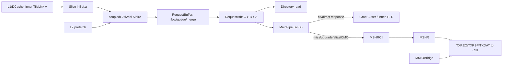

<!--
# 0. Cache-SinkA：昆明湖 V2 缓存请求入口的源码分析

> 本文的结论以用户指定的本地源码为证据，而不是以设计文档或已有课程章节替代源码。分析对象是 `KunminghuV2Config` 的有效配置：它启用 CHI，因此本文的主对象是 `coupledL2/tl2chi/SinkA`；`huancun/SinkA` 作为同名、但在该默认配置下不 elaboration 的替代 TL-L3 路径单列对照。文中的 `fire` 一律指 `valid && ready`。

## 1. 范围、基线与阅读方法

### 1.1. 源码基线

| 项目 | 本次固定基线 | 用途 |
| --- | --- | --- |
| XiangShan 主仓 | `kunminghu-v2 @ e12436c7cba86b195deec24981976d78bc263661` | 配置、`L2Top`、MemBlock 与顶层连接 |
| CoupledL2 子仓 | `fb5469838c8902b6cb33992c0a30ee3d446e4453` | KMHv2 默认有效的 L2 SinkA/CHI 实现 |
| HuanCun 子仓 | `65ef077373ecf398b4cecdea06b65ef9b8d79044` | 非 CHI 备选 L3 的同名 SinkA |
| 参考设计文档 | `XiangShan-Design-Doc/docs/zh/cache/l2cache/upstream/SinkA.md` 与 `CoupledL2.md` | 只用于提出待核对的问题，不作为实现证据 |

主仓工作树已有与本题无关的 `difftest` 修改和 `src/main/resources/aia/` 未跟踪项；本次未改动这些内容。`coupledL2` 与 `huancun` 子仓在核查时干净。课程中已有的 [15_XSCache.md](/home/yanyusong/XiangShanLab/xiangshan-course/docs/xiangshan-microarchitecture/Beginner_Implementation_and_Principles_of_the_High_Performance_Xiangshan_Processor/15_XSCache.md:1) 标明其依据的是 V3 源码，因此本文不会把其中的 V3 行号或结论当作 V2 证据。

### 1.2. 有效模块选择

`KunminghuV2Config` 组合了 `L2CacheConfig` 和 `WithCHI`，见 [Configs.scala:481](/home/yanyusong/xs-memory-env/XiangShan/src/main/scala/top/Configs.scala:481)。`L2Top` 在 `EnableCHI` 为真时构造 `TL2CHICoupledL2`，否则才构造 `TL2TLCoupledL2`，见 [L2Top.scala:111](/home/yanyusong/xs-memory-env/XiangShan/src/main/scala/xiangshan/L2Top.scala:111)。同一配置还使 `L3CacheParamsOpt` 为空、改选 OpenLLC 参数，见 [Configs.scala:333](/home/yanyusong/xs-memory-env/XiangShan/src/main/scala/top/Configs.scala:333)。

所以有两个容易混淆、但必须分开的事实：

1. `coupledL2/tl2chi/SinkA` 是本配置的运行时请求入口。
2. `huancun/SinkA` 是非 CHI、经 `TL2TLCoupledL2 -> L3` 的可选实现；它值得分析，因为同名模块处理带数据 Put 的方式完全不同，但它不是当前 CHI 路径的下一级。

### 1.3. 阅读边界

本文把 SinkA 放进完整请求路径阅读：`TL A -> SinkA -> 队列/仲裁 -> Directory/MainPipe -> MSHR -> CHI 或 TL 响应`。不会将 SinkA 误称为 TLB、PMP、异常产生器或 MMIO 判定器；这些功能的证据在别的模块。对于源码没有证明的跨模块保证，本文明确标为“未在 SinkA 局部证明”。

## 2. 关键源码证据索引

### 2.1. CoupledL2 主路径

| 证据 | 直接观察到的事实 | 对本文结论的作用 |
| --- | --- | --- |
| [coupledL2/SinkA.scala:30](/home/yanyusong/xs-memory-env/XiangShan/coupledL2/src/main/scala/coupledL2/SinkA.scala:30) | IO 是 inner `TLBundleA` 输入、`TaskBundle` 输出，且可选连接预取和 CMO-all | 定义入口的职责边界 |
| [coupledL2/SinkA.scala:37](/home/yanyusong/xs-memory-env/XiangShan/coupledL2/src/main/scala/coupledL2/SinkA.scala:37) | `PutFullData`、`PutPartialData` 被断言禁止 | 不能把 CoupledL2 SinkA 描述为 Put 数据缓存器 |
| [coupledL2/SinkA.scala:54](/home/yanyusong/xs-memory-env/XiangShan/coupledL2/src/main/scala/coupledL2/SinkA.scala:54) | A 被翻译为 `TaskBundle`，携带 tag/set/off、opcode、param、source、user 字段 | 建立输入语义与下游任务字段的对应 |
| [tl2chi/Slice.scala:93](/home/yanyusong/xs-memory-env/XiangShan/coupledL2/src/main/scala/coupledL2/tl2chi/Slice.scala:93) | `SinkA -> RequestBuffer -> RequestArb -> MainPipe` 被显式连接 | 确定有效主链路 |
| [RequestBuffer.scala:71](/home/yanyusong/xs-memory-env/XiangShan/coupledL2/src/main/scala/coupledL2/RequestBuffer.scala:71) | RequestBuffer 共有 4 entries，能 bypass、入队、合并或去重 | 说明 SinkA 后不是无条件直通 |
| [RequestArb.scala:132](/home/yanyusong/xs-memory-env/XiangShan/coupledL2/src/main/scala/coupledL2/RequestArb.scala:132) | 对 A/B/C 的入口阻塞和优先级在这里集中实现 | 说明 A 为什么会被 B/C 抢占 |
| [tl2chi/MainPipe.scala:142](/home/yanyusong/xs-memory-env/XiangShan/coupledL2/src/main/scala/coupledL2/tl2chi/MainPipe.scala:142) | S2/S3 接收任务、读目录、决定是否分配 MSHR | 连接“入口任务”与“命中/缺失处理” |
| [tl2chi/MSHRCtl.scala:94](/home/yanyusong/xs-memory-env/XiangShan/coupledL2/src/main/scala/coupledL2/tl2chi/MSHRCtl.scala:94) | MSHR 满度与保留槽形成对 A 的反压 | 解释较早的资源性阻塞 |

### 2.2. HuanCun 对照路径

| 证据 | 直接观察到的事实 | 与 CoupledL2 的差异 |
| --- | --- | --- |
| [huancun/SinkA.scala:28](/home/yanyusong/xs-memory-env/XiangShan/huancun/src/main/scala/huancun/SinkA.scala:28) | A 输入之外还暴露 MSHR 分配与两组 put-buffer pop 口 | 这里确实接收带数据请求 |
| [huancun/SinkA.scala:45](/home/yanyusong/xs-memory-env/XiangShan/huancun/src/main/scala/huancun/SinkA.scala:45) | 用 `edgeIn.count` 获取 `first/last/count` | 多 beat Put 由 SinkA 局部管理 |
| [huancun/SinkA.scala:87](/home/yanyusong/xs-memory-env/XiangShan/huancun/src/main/scala/huancun/SinkA.scala:87) | 首 beat 的 ready 依赖 alloc ready 与 put-buffer 空间 | 与 CoupledL2 单一 task ready 不同 |
| [huancun/Slice.scala:127](/home/yanyusong/xs-memory-env/XiangShan/huancun/src/main/scala/huancun/Slice.scala:127) | `sinkA.alloc` 经 RequestBuffer 与 MSHRAlloc 进入 MSHR | HuanCun 的入口先分配 MSHR 请求 |
| [huancun/MSHRAlloc.scala:57](/home/yanyusong/xs-memory-env/XiangShan/huancun/src/main/scala/huancun/MSHRAlloc.scala:57) | 每周期至多分配一个，且有 C > B > A 规则 | 高优先级一致性事务同样可压住 A |

## 3. 从缓存原理到当前代码

### 3.1. 原理与代码映射

| 缓存原理 | 本实现里的落点 | 可观察的代码事实 |
| --- | --- | --- |
| Decoupled 背压 | `a.valid/a.ready`，再到 `task.valid/task.ready` | CoupledL2 在 [SinkA.scala:132](/home/yanyusong/xs-memory-env/XiangShan/coupledL2/src/main/scala/coupledL2/SinkA.scala:132) 把 A 与预取仲裁成一个任务口 |
| 非阻塞访问 | RequestBuffer、MainPipe 与多 MSHR 允许不同请求交叠 | RequestBuffer 会对同地址、同 set/way 压力和 MSHR 冲突建模，而不是简单 FIFO，见 [RequestBuffer.scala:105](/home/yanyusong/xs-memory-env/XiangShan/coupledL2/src/main/scala/coupledL2/RequestBuffer.scala:105) |
| 目录访问 | RequestArb 发 `dirRead`，MainPipe 消费目录结果 | [tl2chi/Slice.scala:84](/home/yanyusong/xs-memory-env/XiangShan/coupledL2/src/main/scala/coupledL2/tl2chi/Slice.scala:84) 将 directory read 与 arbiter 相连 |
| 一致性优先级 | C/B 不能被普通 A 永久堵住 | RequestArb 对 C、B、A 做固定优先级，见 [RequestArb.scala:145](/home/yanyusong/xs-memory-env/XiangShan/coupledL2/src/main/scala/coupledL2/RequestArb.scala:145) |
| 多 beat 写数据 | 首 beat 分配资源，后续 beat 落入同一行 buffer | 仅 HuanCun SinkA 有 `putBuffer/beatVals`，见 [huancun/SinkA.scala:48](/home/yanyusong/xs-memory-env/XiangShan/huancun/src/main/scala/huancun/SinkA.scala:48) |
| MMIO 与 cacheable 分流 | MMIO 走专门的 bridge，不进入 cache Slice 的 SinkA | [MMIOBridge.scala:51](/home/yanyusong/xs-memory-env/XiangShan/coupledL2/src/main/scala/coupledL2/tl2chi/MMIOBridge.scala:51) 声明 `UNCACHED` manager |

### 3.2. 不应由原理倒推的内容

“缓存都有 PutBuffer”不适用于当前 CoupledL2 SinkA；其 Put 在接口处已经被断言禁止。反过来，“SinkA 只是元数据适配器”也不适用于 HuanCun SinkA；它需要保存多 beat 数据。这里的差异来自当前代码的上下游协议选择，而非 SinkA 这个名称本身。

## 4. 设计意图与有效硬件的区分

### 4.1. 已验证的有效行为

标准 KMHv2 配置的有效 SinkA 是 `coupledL2.tl2chi.SinkA`。它接收缓存侧 inner TL A，转换为 `TaskBundle`，经过 RequestBuffer/RequestArb，再由 MainPipe 根据目录结果决定直答或 MSHR 路径。CHIP 顶层把各 Slice 的 TX 请求和 MMIO bridge 的请求仲裁到 CHI，见 [TL2CHICoupledL2.scala:132](/home/yanyusong/xs-memory-env/XiangShan/coupledL2/src/main/scala/coupledL2/tl2chi/TL2CHICoupledL2.scala:132)。

### 4.2. 源码存在但默认不应当作有效行为的 CMO-all

CoupledL2 SinkA 中有 `sIDLE/sCMOREQ/sWAITLINE/sWAITMSHR/sDONE` 五态逻辑，见 [SinkA.scala:41](/home/yanyusong/xs-memory-env/XiangShan/coupledL2/src/main/scala/coupledL2/SinkA.scala:41)。但这些 IO、寄存器和状态转移都包在 `cacheParams.enableL2Flush` 的 `Option` 内。`L2CacheConfig` 的 `enableFlush` 默认值为 false，且 `KunminghuV2Config` 调用时没有覆写，见 [Configs.scala:278](/home/yanyusong/xs-memory-env/XiangShan/src/main/scala/top/Configs.scala:278) 与 [Configs.scala:481](/home/yanyusong/xs-memory-env/XiangShan/src/main/scala/top/Configs.scala:481)。

因此后文会解释其代码语义和验证方式，但不会声称它是默认 KMHv2 配置中已 elaboration 的接口。

### 4.3. HuanCun 的状态

HuanCun SinkA 的代码是完整实现，不是伪代码；不过它在此配置里不是同一请求链的下一级。用它解释当前 CoupledL2 的 Put 行为会造成错误。本文仅把它用作“切换到非 CHI/L3 配置时，名称相同模块如何改变职责”的对照。

## 5. 参数、容量与地址几何

### 5.1. 默认 KMHv2 CoupledL2 几何

`KunminghuV2Config` 选择 1 MiB、4 banks 的 L2，见 [Configs.scala:481](/home/yanyusong/xs-memory-env/XiangShan/src/main/scala/top/Configs.scala:481)。`L2CacheConfig` 默认 8 ways，并按 `capacity / banks / ways / 64` 计算每 bank 的 set 数，见 [Configs.scala:278](/home/yanyusong/xs-memory-env/XiangShan/src/main/scala/top/Configs.scala:278)。据此可得到下表；这些数字是该配置的派生值，不是 SinkA 文件内写死的常数。

| 项目 | 值 | 推导/源码 |
| --- | ---: | --- |
| 总容量 | 1 MiB | `KunminghuV2Config` 的 L2 参数 |
| banks | 4 | 同上，因此 `bankBits = 2` |
| 每 bank ways | 8 | `L2CacheConfig` 默认值 |
| line/block | 64 B | 参数和默认 `blockBytes`，见 [L2Param.scala:65](/home/yanyusong/xs-memory-env/XiangShan/coupledL2/src/main/scala/coupledL2/L2Param.scala:65) |
| 每 bank sets | 512 | `1 MiB / 4 / 8 / 64 B` |
| `offsetBits` | 6 | `log2(64)` |
| `setBits` | 9 | `log2(512)` |
| MSHR | 16 | `L2Param` 默认与 `cacheParams.mshrs`，见 [L2Param.scala:113](/home/yanyusong/xs-memory-env/XiangShan/coupledL2/src/main/scala/coupledL2/L2Param.scala:113) |
| RequestBuffer | 4 entries | [RequestBuffer.scala:71](/home/yanyusong/xs-memory-env/XiangShan/coupledL2/src/main/scala/coupledL2/RequestBuffer.scala:71) |

`TL2CHICoupledL2` 的 manager 端 beatBytes 为 32，见 [TL2CHICoupledL2.scala:43](/home/yanyusong/xs-memory-env/XiangShan/coupledL2/src/main/scala/coupledL2/tl2chi/TL2CHICoupledL2.scala:43)。这与 64 B cache block 相配，因而该默认路径一个 block 是两个 32 B beat；这是参数关系，不能据此断言任意 TL A 消息都在 SinkA 内组装为两个 beat。

### 5.2. HuanCun 参数化而非当前默认实例值

HuanCun 的默认参数定义为 `ways = 4`、`sets = 128`、`blockBytes = 64`、`mshrs = 14`、D channel bytes = 32，见 [HCCacheParameters.scala:83](/home/yanyusong/xs-memory-env/XiangShan/huancun/src/main/scala/huancun/HCCacheParameters.scala:83)。实际 HuanCun 实例还可被配置覆盖，因此本文不会把这些“类型默认值”冒充为 CHI KMHv2 的活跃 L3 数值。

## 6. 模块边界、接口与责任

### 6.1. CoupledL2 SinkA 接口表

| 端口 | 方向 | 谁驱动/谁消费 | 字段或握手 | 责任 |
| --- | --- | --- | --- | --- |
| `io.a` | 输入，`Flipped(Decoupled[TLBundleA])` | Slice 中的 `inBuf.a` 驱动，SinkA 消费 | `valid/ready`，A 的地址/opcode/param/source/user | 接入 cacheable TL A |
| `io.prefetchReq` | 可选输入 | Prefetcher 驱动 | `PrefetchReq` | 与 CPU A 合并到同一个 `task` 出口 |
| `io.task` | 输出，`Decoupled[TaskBundle]` | RequestBuffer 消费 | `valid/ready` | 输出规范化的内部请求 |
| `io.cmoAll*` | 可选输入/输出 | Slice/MainPipe/MSHR 控制 | flush、MSHR valid、line done、snoop block | 仅 `enableL2Flush` 时的全 L2 flush 协作 |

Slice 的连接不是推测：`sinkA.io.a <> inBuf.a(io.in.a)` 位于 [tl2chi/Slice.scala:196](/home/yanyusong/xs-memory-env/XiangShan/coupledL2/src/main/scala/coupledL2/tl2chi/Slice.scala:196)，`sinkA.io.task <> reqBuf.io.in` 位于 [tl2chi/Slice.scala:107](/home/yanyusong/xs-memory-env/XiangShan/coupledL2/src/main/scala/coupledL2/tl2chi/Slice.scala:107)。

### 6.2. HuanCun SinkA 接口表

| 端口 | 方向 | 作用 | 关键条件 |
| --- | --- | --- | --- |
| `a` | TL A 输入 | 接收 Get/Acquire/Put 等 A 请求 | `first` beat 要取得 alloc 许可 |
| `alloc` | `MSHRRequest` 输出 | 把首 beat 的元数据交给 RequestBuffer/MSHRAlloc | `a.valid && first && !noSpace` |
| `task` | 输入 | 名义上的 MSHR 回流任务口 | 当前实现将 `ready := false` |
| `d_pb_pop/a_pb_pop` | 输入 | SourceD/SourceA 请求某个 put-buffer beat | `ready` 只在目标 `beatVals` 有效时为真 |
| `d_pb_data/a_pb_data` | 输出 | 将保存的 Put 数据交给两个消费者 | pop fire 后寄存输出 |

`task.ready := false.B` 位于 [huancun/SinkA.scala:41](/home/yanyusong/xs-memory-env/XiangShan/huancun/src/main/scala/huancun/SinkA.scala:41)。Slice 虽然把它接入仲裁，见 [huancun/Slice.scala:426](/home/yanyusong/xs-memory-env/XiangShan/huancun/src/main/scala/huancun/Slice.scala:426)，但当前 MSHR 将此类 task valid 置为 false。它是一个不可达的遗留接口，不能当成正常工作数据通道。

### 6.3. 谁、为什么、如何、从哪里到哪里

| 问题 | CoupledL2 的答案 |
| --- | --- |
| 谁发起？ | L1/DCache 等上游经 inner TileLink A 发起；Slice 把 A 从 `io.in.a` 交给 SinkA。 |
| 为什么有 SinkA？ | 把协议消息收敛成内部 `TaskBundle`，从而让 RequestBuffer、Directory、MSHR 不必直接理解所有 TL A 端口细节。 |
| 如何传递？ | `parseAddress` 拆地址，复制 opcode/param/source/user 字段；A/预取按优先级形成一个 Decoupled task。 |
| 到哪里结束？ | 命中可经 MainPipe/GrantBuffer 回 inner D；需下级事务则分配 MSHR，经 CHI TX 请求发出。SinkA 本身不产生最终响应。 |

## 7. 为什么入口要这样分层

### 7.1. 解耦协议与缓存控制

`fromTLAtoTaskBundle` 将 `TLBundleA` 拆成 tag/set/off，并保留 alias、vaddr、request source、keyword 等 user 字段，见 [SinkA.scala:54](/home/yanyusong/xs-memory-env/XiangShan/coupledL2/src/main/scala/coupledL2/SinkA.scala:54)。这个转换不是地址翻译：它使用的已是 A 的 `address`，只是在 L2 几何下切片。

### 7.2. 入口缓冲不是普通 FIFO

RequestBuffer 同时检查同地址 MSHR 冲突、同 set 可用 way、MainPipe block，并允许普通 A 与迟到预取合并或丢弃重复预取，见 [RequestBuffer.scala:105](/home/yanyusong/xs-memory-env/XiangShan/coupledL2/src/main/scala/coupledL2/RequestBuffer.scala:105) 和 [RequestBuffer.scala:153](/home/yanyusong/xs-memory-env/XiangShan/coupledL2/src/main/scala/coupledL2/RequestBuffer.scala:153)。这避免一个尚未完成的 line 事务被第二个相同请求绕过。

### 7.3. 先服务一致性相关流量

RequestArb 的 C > B > A 局部优先级并不是 TileLink 全局通道优先级的机械复述，而是当前 Slice 为避免 Release/Probe 等高依赖事务被普通新请求堵塞而作的入口规则。它的代价是 A 在持续 B/C 流量下可以等待；这是明确的吞吐-进度权衡。

## 8. 动态请求路径

### 8.1. 普通 CoupledL2 A 请求

1. 上游保持 `io.in.a.valid`，直到 `SinkA.a.ready` 使 A fire。
2. SinkA 在同一拍组合构造 `TaskBundle`；它本身没有 A 请求寄存器队列。
3. RequestBuffer 要么 flow-through，要么占用一条 entry；若资源/冲突不满足，A 会因反压停在上游。
4. RequestArb 在 S1 选 A 并发起 directory read；若 C/B 有效或任一 block 条件成立，A 不进入。
5. MainPipe 在 S2/S3 取任务和目录结果，判断 hit、权限升级、miss、alias 或 CMO 是否需要 MSHR。
6. 无需 MSHR 的响应经 MainPipe/GrantBuffer 回 inner D；需要下级一致性操作则分配一个 MSHR，MSHR 再经 CHI 通道发请求并等待返回。

### 8.2. A 与预取同时到达

有效逻辑为：

```scala
task.valid := (a.valid && !cmoAllBlock) || prefetchReq.valid || cmoAllValid
a.ready := task.ready && !cmoAllBlock
prefetchReq.ready := task.ready && !a.valid
```

以上条件来自 [coupledL2/SinkA.scala:132](/home/yanyusong/xs-memory-env/XiangShan/coupledL2/src/main/scala/coupledL2/SinkA.scala:132)。因此只要 A valid，预取 `ready` 就是 false；A 具有严格优先级。注意 `a.valid` 即使因下游不 ready 而持续为真，也会持续压住预取，这是有效的 backpressure 语义，不是“每拍轮询”。

### 8.3. CMO-all 条件路径

若 `enableL2Flush` 被另行打开，SinkA 从 `sIDLE` 在 `l2Flush && !mshrValid` 时进入 `sCMOREQ`；任务 fire 后等待当前 line 完成；line 完成时扫描 way/set，若有 MSHR 或 snoop block 则进入 `sWAITMSHR`，最终 `sDONE` 等待 flush 撤销，见 [SinkA.scala:187](/home/yanyusong/xs-memory-env/XiangShan/coupledL2/src/main/scala/coupledL2/SinkA.scala:187)。Slice 将 MainPipe 的 `cmoLineDone`、所有 MSHR valid 和 snoop 阻塞接回 SinkA，见 [tl2chi/Slice.scala:217](/home/yanyusong/xs-memory-env/XiangShan/coupledL2/src/main/scala/coupledL2/tl2chi/Slice.scala:217)。

### 8.4. HuanCun 带数据 Put 路径

HuanCun 的首个带数据 beat 选取空 `bufIdx` 并锁存为 `insertIdxReg`；每个 fire 的数据、mask、corrupt 写入 `putBuffer`，对应 `beatVals` 置位，见 [huancun/SinkA.scala:56](/home/yanyusong/xs-memory-env/XiangShan/huancun/src/main/scala/huancun/SinkA.scala:56)。首 beat 同时向 `alloc` 发 `MSHRRequest`；后续 beat 不再重复分配，只填同一行。

## 9. 地址、bank、cache line 与跨边界

### 9.1. CoupledL2 的地址拆分

`parseAddress` 的源码为先右移 `offsetBits + bankBits` 取得 set，再右移 `setBits` 取得 tag，低 `offsetBits` 作为 off，见 [CoupledL2.scala:186](/home/yanyusong/xs-memory-env/XiangShan/coupledL2/src/main/scala/coupledL2/CoupledL2.scala:186)。`restoreAddress` 会把 bank bits 插回 tag/set 与 off 之间，见 [CoupledL2.scala:197](/home/yanyusong/xs-memory-env/XiangShan/coupledL2/src/main/scala/coupledL2/CoupledL2.scala:197)。

对第 5.1 节的默认几何，`parseAddress/restoreAddress` 使用的逻辑字段可写成：

```text
高位 tag | set = address[16:8] | bank 字段位于 address[7:6] | off = address[5:0]
```

这只描述 `parseAddress` 的本地字段关系和该 4-bank、64 B-line、每 bank 512 set 的配置；没有在本文追到 diplomacy 的最终 BankBinder/hash 选择逻辑，故不能把 `address[7:6]` 直接宣称为顶层物理 Slice 路由位。tag 的总宽度也由实际地址宽度决定，本文不把它硬编码成某个常数。

### 9.2. 物理地址与虚拟页边界

SinkA 没有 TLB 表项、PTE、页大小比较器或 vaddr-to-paddr 翻译状态。它可以从 TL user 字段转抄 `VaddrKey`，见 [SinkA.scala:79](/home/yanyusong/xs-memory-env/XiangShan/coupledL2/src/main/scala/coupledL2/SinkA.scala:79)，但 tag/set/off 由 A 的 `address` 切出。因此下列结论有明确边界：

- 可以确认：SinkA 以进入 TL A 的地址作为 cache 索引依据。
- 不能确认：SinkA 完成了虚拟页跨越拆分、TLB miss 重放或权限检查。
- 上游线索：MemBlock 中 DCache、Uncache、PTW 都在 L2 前组成节点，见 [MemBlock.scala:261](/home/yanyusong/xs-memory-env/XiangShan/src/main/scala/xiangshan/mem/MemBlock.scala:261)；但这不足以把具体页异常归因给 SinkA。

### 9.3. cache line 与多 beat 边界

CoupledL2 SinkA 不含一个 `beatVals` 阵列，也没有将 A 的多个 data beat 合成一个 line 的状态机；原因与第 6 节的 Put 禁止断言一致。它可以传递 line 内 `off`，后续 line 级访问由 Directory/DataStorage/MSHR 处理。若上游将不适合 cache path 的大传输送来，不能从本模块推断它会自动拆分；应以 TileLink 边界或上游实现继续证明。

### 9.4. MMIO 与 uncache 边界

`TL2CHICoupledL2` 专门实例化 `MMIOBridge`，见 [TL2CHICoupledL2.scala:65](/home/yanyusong/xs-memory-env/XiangShan/coupledL2/src/main/scala/coupledL2/tl2chi/TL2CHICoupledL2.scala:65)。该 bridge 声明 `RegionType.UNCACHED`、仅支持 1--8 B Get/Put，见 [MMIOBridge.scala:51](/home/yanyusong/xs-memory-env/XiangShan/coupledL2/src/main/scala/coupledL2/tl2chi/MMIOBridge.scala:51)，并在 CHI TxnID 的最高位标识 MMIO，见 [TL2CHICoupledL2.scala:101](/home/yanyusong/xs-memory-env/XiangShan/coupledL2/src/main/scala/coupledL2/tl2chi/TL2CHICoupledL2.scala:101)。这说明 MMIO 不是由 Slice 内的 SinkA 当作普通 cache line 处理。

## 10. 核心算法与仲裁

### 10.1. CoupledL2 输入选择

有预取时，SinkA 采用 A 优先、预取次之的优先级 mux；无预取时，`task <> a`。它不自行 round-robin，也不存储请求。这一层只决定谁取得下游 task 槽位。

### 10.2. RequestBuffer 的四种结果

| 结果 | 触发条件概念 | 对 A 的可见效果 |
| --- | --- | --- |
| flow-through | 队列未满、无同址/way/主流水冲突且下游允许 | 当拍可向 RequestArb 推进 |
| allocate | 不能直通、存在空 entry | `TaskBundle` 被保存，等待可发射 |
| merge A | 迟到的普通 A 与适格 prefetch/同址项合并 | 不另占 entry，等待项转换为更有价值的请求 |
| duplicate prefetch | 相同预取已存在 | 丢弃重复预取，不额外消耗资源 |

这些分支由 [RequestBuffer.scala:153](/home/yanyusong/xs-memory-env/XiangShan/coupledL2/src/main/scala/coupledL2/RequestBuffer.scala:153) 到 [RequestBuffer.scala:230](/home/yanyusong/xs-memory-env/XiangShan/coupledL2/src/main/scala/coupledL2/RequestBuffer.scala:230) 的 `mergeAMask`、`doFlow`、`alloc` 与 ready 逻辑共同决定。不能只用 `full` 来解释 SinkA 的 backpressure。

### 10.3. RequestArb 的 C > B > A

RequestArb 将 SinkC、SinkB、SinkA 的 valid 组成优先级选择，并让 A ready 额外要求 B/C 均不 valid，见 [RequestArb.scala:145](/home/yanyusong/xs-memory-env/XiangShan/coupledL2/src/main/scala/coupledL2/RequestArb.scala:145)。A 还受 MSHRCtl、MainPipe、GrantBuffer 聚合出的 `block_A` 限制，见 [RequestArb.scala:132](/home/yanyusong/xs-memory-env/XiangShan/coupledL2/src/main/scala/coupledL2/RequestArb.scala:132)。

因此以下顺序必须区分：

1. SinkA 内部是 `A > prefetch`。
2. RequestArb 入口是 `C > B > A`。
3. MSHR 内部还可有其自身任务仲裁。

这三层优先级服务不同对象，不能合并成一句“TileLink A 优先级”。

### 10.4. MSHR 保留和分配

CHI MSHRCtl 的 A 满条件使用 `a_mshrFull`，将最后一个空 MSHR 留给 SinkB；只有达到普通 MSHR 阈值时才先堵 A，见 [tl2chi/MSHRCtl.scala:94](/home/yanyusong/xs-memory-env/XiangShan/coupledL2/src/main/scala/coupledL2/tl2chi/MSHRCtl.scala:94)。这不是减少总容量的错误，而是保证 snoop/Probe 相关 B 流量仍有进度空间。

### 10.5. HuanCun MSHRAlloc

HuanCun 的 `MSHRAlloc` 明确断言每周期至多一条 alloc，按 C、B、A 优先级选择，并让 A 同时满足没有 B/C valid、没有冲突、存在可用 ABC MSHR，见 [huancun/MSHRAlloc.scala:57](/home/yanyusong/xs-memory-env/XiangShan/huancun/src/main/scala/huancun/MSHRAlloc.scala:57)。这与 CoupledL2 的队列后仲裁结构不同，但同样把一致性进度放在普通 A 前面。

## 11. 状态、队列与生命周期

### 11.1. CoupledL2 SinkA 本体

在默认 `enableL2Flush = false` 的 elaboration 下，CoupledL2 SinkA 对普通 A 没有私有请求 RAM：输入一旦没有下游 ready，就靠 Decoupled 协议由上游保持；下游 RequestBuffer 才承担暂存。若开启 CMO-all，SinkA 额外拥有 `set`、`way` 和五态 FSM 寄存器，见 [SinkA.scala:41](/home/yanyusong/xs-memory-env/XiangShan/coupledL2/src/main/scala/coupledL2/SinkA.scala:41)。

### 11.2. CoupledL2 RequestBuffer entry 生命周期

| 状态性字段 | 建立时机 | 清除/更新时机 | 意义 |
| --- | --- | --- | --- |
| `valid` | `alloc` 成功 | 被选中并真正 deq fire | entry 是否占用 |
| `rdy` | 新入队后根据依赖计算 | 前序项或 MSHR 释放后重算 | 能否送到 RequestArb |
| `waitMP` | 需等待 MainPipe/同 set 阶段 | 流水推进后移位/清除 | 防止不安全重叠 |
| `waitMS` | 需等待 MSHR | `willFree` 反馈 | 防止与未完成事务冲突 |
| `task` | alloc 时写入 | merge A 可改写请求属性 | 保存完整内部请求 |

字段定义和更新分别见 [RequestBuffer.scala:71](/home/yanyusong/xs-memory-env/XiangShan/coupledL2/src/main/scala/coupledL2/RequestBuffer.scala:71)、[RequestBuffer.scala:205](/home/yanyusong/xs-memory-env/XiangShan/coupledL2/src/main/scala/coupledL2/RequestBuffer.scala:205)、[RequestBuffer.scala:251](/home/yanyusong/xs-memory-env/XiangShan/coupledL2/src/main/scala/coupledL2/RequestBuffer.scala:251)。

### 11.3. HuanCun PutBuffer 生命周期

| 阶段 | 触发 | 状态变化 |
| --- | --- | --- |
| 空闲 | `beatVals(row)` 全 0 | `bufVals(row)` 为 0，可被 `PriorityEncoder` 选择 |
| 首 beat 分配 | `a.fire && first && hasData` | 锁存 row index，写数据/mask/corrupt，置对应 beat valid |
| 后续 beat 填充 | `a.fire && !first && hasData` | 用 `insertIdxReg` 写相同行的下一个 count |
| 被 SourceA/SourceD 取用 | 对应 pop fire | 从保存行读出目标 beat；last pop 清整行 valid |
| 泄漏告警 | row 0 连续有效 800 周期 | 仅 `assert`，不是自动释放 |

源码没有在 SinkA 内部对同一 `bufIdx` 的 `a_pb_pop` 与 `d_pb_pop` 做显式互斥仲裁，见 [huancun/SinkA.scala:118](/home/yanyusong/xs-memory-env/XiangShan/huancun/src/main/scala/huancun/SinkA.scala:118)。应由 MSHR 调度保证不发生不安全的双消费者竞争；这是需波形或断言补证的跨模块假设。

## 12. 流水级、时延与吞吐

### 12.1. CoupledL2 请求阶段表

| 阶段 | 主要模块 | 关键行为 | 可能停顿点 |
| --- | --- | --- | --- |
| 入口 | SinkA | A/预取选择、字段转换 | `task.ready`、CMO block |
| 缓冲 | RequestBuffer | bypass/入队/合并/去重 | 满、同址/同 set、MainPipe/way 压力 |
| S1 | RequestArb | C/B/A 仲裁并发 directory read | B/C valid、block A、目录 reset |
| S2 | RequestArb -> MainPipe | 锁存任务、管理目录访问时序 | S2 ready、mcp2 stall |
| S3 | MainPipe | 消费目录结果，判 hit/miss/权限/alias，申请 MSHR | MSHR alloc、替换/数据端口条件 |
| S4/S5 | MainPipe | 数据返回、元数据写、向 SourceD/CHI 形成输出 | 输出通道 ready、数据 SRAM、GrantBuffer |

S2/S3 寄存任务的实际代码位于 [MainPipe.scala:142](/home/yanyusong/xs-memory-env/XiangShan/coupledL2/src/main/scala/coupledL2/tl2chi/MainPipe.scala:142)，S4/S5 的任务寄存器和通道输出在 [MainPipe.scala:744](/home/yanyusong/xs-memory-env/XiangShan/coupledL2/src/main/scala/coupledL2/tl2chi/MainPipe.scala:744)。因此“入口 fire 后一拍必有最终响应”显然不成立；最短路径仍受后级阶段和 output ready 约束。

### 12.2. 吞吐的正确表述

在无冲突、下游 ready、目录/数据端口可用的条件下，SinkA 可以每拍接收一项 A；但这是入口接受率，不是每拍完成一项 miss。连续 miss 的可持续接受率还受 4-entry RequestBuffer、A 可用 MSHR 数、同 set way 压力、CHI credit/后级响应和 B/C 优先级限制。性能结论应分别测量 A fire、RequestBuffer occupancy、RequestArb A fire、MSHR alloc 和最终 D/CHI fire。

### 12.3. HuanCun 多 beat 吞吐

HuanCun 对带数据事务的首 beat 有条件 ready，后续 beat 则 `a.ready := true.B`，见 [huancun/SinkA.scala:87](/home/yanyusong/xs-memory-env/XiangShan/huancun/src/main/scala/huancun/SinkA.scala:87)。这体现了“首拍成功后优先完整收下既有事务”的设计；验证时必须确认上游只会在首拍已 fire 后送后续 beat，不能仅观察后续 beat ready 为真。

## 13. 控制信号、冲突与优先级

### 13.1. CoupledL2 控制点

| 条件 | 直接影响 | 结果 |
| --- | --- | --- |
| `a.valid` 与预取同时为真 | `prefetchReq.ready` | 预取不 fire，A 先进入 |
| `cmoAllBlock` | `a.ready` 和 task valid | CMO-all 扫描时阻止普通 A |
| RequestBuffer `full` 且不能 flow/merge/dup | `io.in.ready` | A backpressure |
| 同地址 MSHR 冲突 | RequestBuffer rdy/flow | 新 A 等待已有事务 |
| 同 set 无可用 way | RequestBuffer flow/入队决策 | 防止 unsafe way/替换重叠 |
| B/C valid 或 block_A | RequestArb A ready | A 不能进入 directory pipeline |
| A MSHR 阈值达到 | `blockA_s1` | 为 B 预留资源 |

### 13.2. HuanCun 控制点

| 条件 | 直接影响 | 结果 |
| --- | --- | --- |
| `hasData && full` | `noSpace` | 仅带数据 A 的首 beat 被反压 |
| `first && !io.alloc.ready` | `a.ready` | 不能启动新多 beat 事务 |
| 非包含式 `ProbeHelper.full` | `sinkA.alloc` 通路 | Probe 相关资源满时阻止 A alloc |
| C/B 申请存在 | MSHRAlloc A ready | A 不分配 MSHR |
| 同 block-granularity set 冲突 | MSHRAlloc A ready | A 等待相冲突事务 |

## 14. 数据路径与跨边界代码解析

### 14.1. L1/DCache 到 CoupledL2

MemBlock 先构造 DCache、Uncache、PTW 与缓冲节点，见 [MemBlock.scala:261](/home/yanyusong/xs-memory-env/XiangShan/src/main/scala/xiangshan/mem/MemBlock.scala:261)。SinkA 接收到的是经过这些上游连接后的 TileLink A。它只转换缓存请求，不负责 LoadQueue、StoreQueue、TLB 或缓存控制指令的原始执行语义。

### 14.2. CoupledL2 到 CHI

在 MainPipe 判断需要 MSHR 后，MSHRCtl 将 MSHR 的请求汇聚；Slice 将 MSHR 与 MainPipe 等通道连接到 TXREQ/TXRSP/TXDAT，见 [tl2chi/Slice.scala:130](/home/yanyusong/xs-memory-env/XiangShan/coupledL2/src/main/scala/coupledL2/tl2chi/Slice.scala:130)。顶层把每个 Slice 的 TXREQ 与 MMIO request 仲裁并接入 LinkMonitor/CHI port，见 [TL2CHICoupledL2.scala:132](/home/yanyusong/xs-memory-env/XiangShan/coupledL2/src/main/scala/coupledL2/tl2chi/TL2CHICoupledL2.scala:132) 和 [TL2CHICoupledL2.scala:267](/home/yanyusong/xs-memory-env/XiangShan/coupledL2/src/main/scala/coupledL2/tl2chi/TL2CHICoupledL2.scala:267)。

外来 CHI snoop 不从 SinkA 进入：顶层将 RXSNP 按 slice ID 分发，见 [TL2CHICoupledL2.scala:158](/home/yanyusong/xs-memory-env/XiangShan/coupledL2/src/main/scala/coupledL2/tl2chi/TL2CHICoupledL2.scala:158)，Slice 交给 RXSNP/SinkB 路径。它和 A 的竞争最终由 RequestArb 的 B > A 体现。

### 14.3. HuanCun TL-L3 路径

非 CHI 时，`L2Top` 的 `memory_port` 会接向 L3 一侧，见 [L2Top.scala:130](/home/yanyusong/xs-memory-env/XiangShan/src/main/scala/xiangshan/L2Top.scala:130)；Top 仅在 `L3CacheParamsOpt` 有值时实例化 HuanCun，见 [Top.scala:111](/home/yanyusong/xs-memory-env/XiangShan/src/main/scala/top/Top.scala:111)。HuanCun 的 `HuanCun` 顶层为各 bank 创建 Slice 并连接 node in/out，见 [HuanCun.scala:361](/home/yanyusong/xs-memory-env/XiangShan/huancun/src/main/scala/huancun/HuanCun.scala:361)。这就是为什么两份 SinkA 都存在，却不能在默认 CHI trace 中串联。

## 15. 异常、错误、调试、特权与 Difftest

### 15.1. 错误与响应状态

SinkA 的 A-to-task 转换会把 A 的 `corrupt` 复制到内部 task，见 [SinkA.scala:72](/home/yanyusong/xs-memory-env/XiangShan/coupledL2/src/main/scala/coupledL2/SinkA.scala:72)。MainPipe 在 S3 读取 directory/meta error，并把 tag/data error 映射到 MSHR 分配任务的 `denied/corrupt`，见 [MainPipe.scala:221](/home/yanyusong/xs-memory-env/XiangShan/coupledL2/src/main/scala/coupledL2/tl2chi/MainPipe.scala:221) 和 [MainPipe.scala:295](/home/yanyusong/xs-memory-env/XiangShan/coupledL2/src/main/scala/coupledL2/tl2chi/MainPipe.scala:295)。这说明错误处理发生在 SinkA 之后的缓存管线，不应把 SinkA 本体说成 ECC 检查器。

HuanCun PutBuffer 为每个 beat 保存 `corrupt`，见 [huancun/SinkA.scala:59](/home/yanyusong/xs-memory-env/XiangShan/huancun/src/main/scala/huancun/SinkA.scala:59)。它只保存/转交，不在这里决定异常架构语义。

### 15.2. MMIO、PMA/PBMT 与特权边界

MMIOBridge 从 user keys 读取 `MemBackTypeMM` 和 `MemPageTypeNC`，并以 non-cacheable CHI 属性发出请求，见 [MMIOBridge.scala:118](/home/yanyusong/xs-memory-env/XiangShan/coupledL2/src/main/scala/coupledL2/tl2chi/MMIOBridge.scala:118) 和 [MMIOBridge.scala:255](/home/yanyusong/xs-memory-env/XiangShan/coupledL2/src/main/scala/coupledL2/tl2chi/MMIOBridge.scala:255)。这正是 cache SinkA 与 MMIO 路径分离的源码依据。

SinkA 本身没有 CSR 口、特权级输入或异常输出。因此页权限、PMP、SvPBMT 判定等要到发起端和 MMIO/地址路由模块分析，不能在本文虚构一条 SinkA 内部异常状态机。

### 15.3. Difftest 关联

针对 `coupledL2/SinkA.scala`、`tl2chi/Slice.scala` 和 `huancun/SinkA.scala` 的源码搜索未找到 `Difftest` 直接实例或连线。SinkA 是微结构接口转换器，不直接提交 ISA 可见状态；适合其验证的是断言、性能计数、TileLink/CHI 波形和端到端 load/store 测试。若端到端 Difftest 失败，应把它用作复现入口，而不是误以为 SinkA 有独立 difftest compare point。

## 16. CSR、配置开关与运行时控制

### 16.1. 配置期控制

`EnableCHI` 决定哪套 L2/L3 结构 elaboration；`enableL2Flush` 决定 CMO-all 相关 IO/FSM 是否存在；`cacheParams` 决定 bank、set、way、MSHR 等几何。它们是 Scala elaboration/config 参数，不是 SinkA 在周期内读取的 CSR。

### 16.2. 运行期可见控制

当 flush 功能被启用时，`l2Flush`、MSHR valid、snoop block 和 `cmoLineDone` 在 Slice/SinkA/MainPipe 之间形成运行期控制环。标准配置没有该 `Option` 硬件，因此不能把“存在 CMO 源码”当成当前可软件驱动的 CSR 功能。

### 16.3. 性能观察

SinkA 有 A、预取和 CMO 相关性能计数代码，见 [SinkA.scala:225](/home/yanyusong/xs-memory-env/XiangShan/coupledL2/src/main/scala/coupledL2/SinkA.scala:225)。这些计数有助于定位入口占用，但它们不是 CSR 配置接口，也不能单独证明请求完成。

## 17. 图解与时序

### 17.1. 默认 KMHv2 的数据流

```mermaid
flowchart LR
  L1["L1/DCache: inner TileLink A"] --&gt; IB["Slice inBuf.a"]
  IB --&gt; SA["coupledL2 tl2chi SinkA"]
  PF["L2 prefetch"] --&gt; SA
  SA --&gt; RB["RequestBuffer: flow/queue/merge"]
  RB --&gt; RA["RequestArb: C > B > A"]
  RA --&gt; DIR["Directory read"]
  RA --&gt; MP["MainPipe S2-S5"]
  MP --&gt;|"hit/direct response"| GB["GrantBuffer / inner TL D"]
  MP --&gt;|"miss/upgrade/alias/CMO"| MC["MSHRCtl"]
  MC --&gt; MSHR["MSHR"]
  MSHR --&gt; CHI["TXREQ/TXRSP/TXDAT -> CHI"]
  MMIO["MMIOBridge"] --&gt; CHI
```

### 17.2. 请求优先级与反压时序

```waveform-draw
{
  "signal": [
    {"name":"clk", "wave":"p....."},
    {"name":"a.valid", "wave":"1..0.."},
    {"name":"prefetchReq.valid", "wave":"1.1..."},
    {"name":"task.ready", "wave":"01.1.."},
    {"name":"a.ready", "wave":"01.1.."},
    {"name":"prefetchReq.ready", "wave":"0..1.."},
    {"name":"a.fire", "wave":"010..."},
    {"name":"prefetchReq.fire", "wave":"0001.."}
  ]
}
```

第 0 拍 A 与预取同时 valid 但 task 不 ready；第 1 拍只有 A fire；A 消失后，第 3 拍预取才 fire。该图对应 [SinkA.scala:132](/home/yanyusong/xs-memory-env/XiangShan/coupledL2/src/main/scala/coupledL2/SinkA.scala:132) 的优先级，而不是泛化的总线规范示意。

### 17.3. HuanCun 多 beat Put 时序

```waveform-draw
{
  "signal": [
    {"name":"clk", "wave":"p....."},
    {"name":"a.valid", "wave":"111000"},
    {"name":"first", "wave":"100000"},
    {"name":"last", "wave":"001000"},
    {"name":"io.alloc.ready", "wave":"011111"},
    {"name":"a.ready", "wave":"011111"},
    {"name":"a.fire", "wave":"011000"},
    {"name":"beatVals[row]", "wave":"001111"}
  ]
}
```

这个图强调的是首 beat 没有 `alloc.ready` 时不能开始；一旦首 beat fire，后续 beat 的 ready 由代码固定为 true。图中没有宣称具体一个 block 的 beat 数，因为这由参数决定。

### 17.4. 条件 CMO-all 状态机

```mermaid
stateDiagram-v2
  [*] --&gt; sIDLE
  sIDLE --&gt; sCMOREQ: l2Flush && !mshrValid
  sCMOREQ --&gt; sWAITLINE: task.fire
  sWAITLINE --&gt; sCMOREQ: cmoLineDone && next line && !mshrValid && !snpBlockcmo
  sWAITLINE --&gt; sWAITMSHR: cmoLineDone && (mshrValid || snpBlockcmo)
  sWAITMSHR --&gt; sCMOREQ: !mshrValid && !snpBlockcmo
  sWAITLINE --&gt; sDONE: cmoLineDone && final set/way
  sDONE --&gt; sIDLE: !l2Flush
```

此状态图只在 `enableL2Flush` 打开时存在，不能作为默认配置波形的预期。

## 18. 设计文档追溯与差异处理

### 18.1. 追溯矩阵

| 设计文档中的待核对意图 | 本地代码证据 | 判断 |
| --- | --- | --- |
| SinkA 接收 A 与预取并形成内部请求 | [SinkA.scala:54](/home/yanyusong/xs-memory-env/XiangShan/coupledL2/src/main/scala/coupledL2/SinkA.scala:54)、[SinkA.scala:94](/home/yanyusong/xs-memory-env/XiangShan/coupledL2/src/main/scala/coupledL2/SinkA.scala:94) | 已验证；但 A 只限非 Put 类型 |
| A 比预取优先 | [SinkA.scala:132](/home/yanyusong/xs-memory-env/XiangShan/coupledL2/src/main/scala/coupledL2/SinkA.scala:132) | 已验证，且是严格 valid 优先 |
| 请求经 RequestBuffer、目录、主流水处理 | [tl2chi/Slice.scala:93](/home/yanyusong/xs-memory-env/XiangShan/coupledL2/src/main/scala/coupledL2/tl2chi/Slice.scala:93)、[MainPipe.scala:142](/home/yanyusong/xs-memory-env/XiangShan/coupledL2/src/main/scala/coupledL2/tl2chi/MainPipe.scala:142) | 已验证 |
| 缺失/权限/一致性事务由 MSHR 承接 | [MainPipe.scala:232](/home/yanyusong/xs-memory-env/XiangShan/coupledL2/src/main/scala/coupledL2/tl2chi/MainPipe.scala:232)、[MSHRCtl.scala:131](/home/yanyusong/xs-memory-env/XiangShan/coupledL2/src/main/scala/coupledL2/tl2chi/MSHRCtl.scala:131) | 已验证 |
| 全 L2 flush 由 SinkA 扫描 | [SinkA.scala:187](/home/yanyusong/xs-memory-env/XiangShan/coupledL2/src/main/scala/coupledL2/SinkA.scala:187) | 源码存在，但默认配置不 elaboration |

### 18.2. 有意不照抄的部分

设计文档可帮助定位“SinkA、请求缓冲、目录、MSHR”这些概念，但本文件的细节都重新在用户给出的 V2 checkout 中核对。例如，HuanCun 是否为当前链路、Put 是否能进入 CoupledL2 SinkA、CMO 是否默认有效，若只阅读高层描述都很容易得出错误答案；本文件按 `Configs -> L2Top -> Slice -> SinkA` 的实际选择关系处理。

### 18.3. 版本差异风险

设计文档目录和当前源码都使用“Kunminghu”相关命名，但没有证据保证它们逐行同版。任何没有落到本地源码链接的设计意图都只作为待验证假设，不能作为此文结论。

## 19. 可复现实验场景

### 19.1. 场景表

| 场景 | 建议驱动 | 必看信号/状态 | 预期证据 |
| --- | --- | --- | --- |
| 普通 Get/Acquire | 单个 cacheable A，保持 valid 至 fire | `sinkA.io.a`, `sinkA.io.task`, RequestBuffer in/out | A fire 后任务携带相同 opcode/source 与切分地址 |
| A 与预取冲突 | 同拍拉高 A 和 prefetch valid | `a.ready`, `prefetchReq.ready`, `task.bits` | A 先 fire；A valid 消失前预取不 fire |
| RequestBuffer 满 | 制造四条无法下发的不同请求 | `buffer.valid`, `io.in.ready`, `doFlow` | 第五条被反压，除非 flow/merge/dup 条件成立 |
| 同地址冲突 | 先让一条 miss 占 MSHR，再发同 tag/set A | `mshrValid`, conflict mask, entry `waitMS` | 后者不越过未完成事务 |
| B/C 抢占 A | 同拍给 B/C 与 A | `sink[A/B/C].valid/ready`, `chnl_task_s1` | C 优于 B，B 优于 A |
| A MSHR 预留 | 占用接近 MSHR 总数，再发 A 与 B | `a_mshrFull`, `blockA_s1` | A 先被堵，B 仍有入口余量 |
| CMO-all（非默认） | 仅在重新配置 enableL2Flush 后拉高 flush | `state`, set/way, `cmoLineDone`, `snpBlockcmo` | 扫描在 MSHR/snoop 条件下正确等待 |
| HuanCun PutBuffer | 非 CHI 配置中送多 beat Put | `first/last/count`, `insertIdxReg`, `beatVals`, pop | 首 beat alloc，后续 beat 同 row，last pop 清 row |
| HuanCun 双 pop | 令 A/D pop 指向同 `bufIdx` | 两组 pop valid/ready/fire、beatVals | 验证 MSHR 是否保证互斥；SinkA 局部未证明 |

### 19.2. 波形观察身份

普通 A 用 `(source, tag, set, off, opcode)` 追踪；单用 PC 不足以区分不同 cache line 或重放。MSHR 路径再加入 `mshrId`。对于 HuanCun Put，加入 `bufIdx` 与 beat `count`；这样才能看出数据是否从首 beat 分配的同一 buffer row 被消费。

## 20. 结论

1. 在默认 `KunminghuV2Config` 中，缓存单元的有效 SinkA 是 `coupledL2/tl2chi/SinkA`，不是 HuanCun SinkA。
2. 它的核心职责是把 cacheable inner TL A/可选预取转换为 `TaskBundle`，并用 Decoupled backpressure 接到 RequestBuffer；它不保存 Put 数据，且显式拒绝 TL Put。
3. 请求能否前进由三层控制共同决定：SinkA 的 A-over-prefetch、RequestBuffer 的冲突/容量处理、RequestArb 的 C > B > A 与 MSHR 保留策略。
4. 地址在此处做的是 L2 tag/set/off 切分而不是地址翻译；页、特权、异常和 MMIO 判定须到上游/bridge 路径找证据。
5. HuanCun SinkA 的 PutBuffer、多 beat 控制和首 beat alloc 展示了替代 TL-L3 配置下同名模块的另一套职责，不能混入默认 CHI 时序。

## 21. 验证特别注意

| 验证点 | 必须检查的性质 | 常见误判 |
| --- | --- | --- |
| A/预取优先级 | A valid 持续时预取不得 fire，即使 task 后来 ready | 只看 task.valid，不看两个 ready/fire |
| A 握手 | `a.fire` 才代表请求被 SinkA 接受 | 把 `a.valid` 当作已经进入 L2 |
| RequestBuffer 满 | ready 的例外必须同时检查 flow、mergeA、dup | 只看到 `full` 就断言必反压 |
| 同址与同 set | 后请求不得绕开活跃 MSHR/unsafe way | 用不同 source 误以为一定可并行 |
| C/B 抢占 | 对 A 的停顿要同时记录 B/C valid 与 `blockA_s1` | 将所有 A stall 归咎于 MSHR 满 |
| MSHR 保留 | 接近满度时 B 仍应有资源，A 可先被阻塞 | 将 A 可用数误当成总 MSHR 数 |
| 默认 CMO | 默认 KMHv2 波形不应期待 CMO-all state/IO | 看到源码 FSM 就认为它被 elaboration |
| MMIO | MMIO 请求应走 MMIOBridge，而不是 Slice SinkA | 把 `UNCACHED` 访问当 cache miss |
| HuanCun Put | 首 beat 未 fire 前，后续 beat 不能被当成有效事务 | 只因后续 beat ready 为真就忽略协议前提 |
| HuanCun pop | 同 `bufIdx` A/D 双 pop 的互斥需要跨模块验证 | 将 SinkA 的两组端口误认为自带仲裁 |
| 错误传播 | 检查 `corrupt/denied` 从目录、CHI 返回到 D 的路径 | 把 SinkA 中的字段拷贝误认为错误已处理 |
| Difftest 复现 | 用端到端 ISA 结果配合 TL/CHI 波形定位 | 寻找不存在的 SinkA 专属 compare 点 |

上述检查应至少覆盖“请求接受、队列占用、仲裁、MSHR 分配、最终响应”五个阶段；只截取 SinkA 单点波形无法证明一条 cache transaction 的正确完成。
-->

# Cache-SinkA: Source Analysis of the Kunminghu V2 Cache-Request Ingress

> The conclusions in this article are based on the supplied local source tree, not substituted from the Design Doc or another course chapter. The active configuration is `KunminghuV2Config`: it enables CHI, so the primary subject is `coupledL2/tl2chi/SinkA`. `huancun/SinkA` is analyzed separately as a same-named alternative TileLink-L3 path that is not elaborated by the default configuration. Throughout this article, `fire` means `valid && ready`.

## 1. Scope, Baseline, and Reading Method

### 1.1 Source Baseline

| Item | Fixed baseline | Purpose |
| --- | --- | --- |
| XiangShan main repository | `kunminghu-v2 @ e12436c7cba86b195deec24981976d78bc263661` | Configuration, `L2Top`, MemBlock, and top-level connections. |
| CoupledL2 submodule | `fb5469838c8902b6cb33992c0a30ee3d446e4453` | The active KMHv2 L2 SinkA/CHI implementation. |
| HuanCun submodule | `65ef077373ecf398b4cecdea06b65ef9b8d79044` | Same-named SinkA in the non-CHI alternative L3. |
| Reference documentation | `XiangShan-Design-Doc/docs/zh/cache/l2cache/upstream/SinkA.md` and `CoupledL2.md` | Used only to formulate questions for verification, not as implementation evidence. |

The main worktree already contains unrelated `difftest` modifications and untracked `src/main/resources/aia/` files; this article does not alter them. The checked CoupledL2 and HuanCun submodules were clean. Existing course material in [15_XSCache.md](/home/yanyusong/XiangShanLab/xiangshan-course/docs/xiangshan-microarchitecture/Beginner_Implementation_and_Principles_of_the_High_Performance_Xiangshan_Processor/15_XSCache.md:1) identifies V3 sources, so its line numbers and conclusions are not used as V2 evidence here.

### 1.2 Selecting the Active Module

`KunminghuV2Config` combines `L2CacheConfig` with `WithCHI`. [`Configs.scala:481`](/home/yanyusong/xs-memory-env/XiangShan/src/main/scala/top/Configs.scala:481) `L2Top` constructs `TL2CHICoupledL2` when `EnableCHI` is true and `TL2TLCoupledL2` otherwise. [`L2Top.scala:111`](/home/yanyusong/xs-memory-env/XiangShan/src/main/scala/xiangshan/L2Top.scala:111) The same configuration leaves `L3CacheParamsOpt` empty and selects OpenLLC parameters. [`Configs.scala:333`](/home/yanyusong/xs-memory-env/XiangShan/src/main/scala/top/Configs.scala:333)

Two facts must therefore remain separate:

1. `coupledL2/tl2chi/SinkA` is the run-time request ingress for this configuration.
2. `huancun/SinkA` is an optional non-CHI implementation on a `TL2TLCoupledL2 -> L3` path. It is useful because its handling of data-bearing Put requests is fundamentally different, but it is not the next level on the current CHI path.

### 1.3 Reading Boundary

SinkA is read within the complete request path: `TL A -> SinkA -> queue/arbitration -> Directory/MainPipe -> MSHR -> CHI or TL response`. It is not described as a TLB, PMP, exception producer, or MMIO classifier; evidence for those roles lies elsewhere. A cross-module guarantee absent from SinkA-local code is explicitly left unproven here.

## 2. Key Source-Evidence Index

### 2.1 CoupledL2 Primary Path

| Evidence | Direct observation | Role in this analysis |
| --- | --- | --- |
| [coupledL2/SinkA.scala:30](/home/yanyusong/xs-memory-env/XiangShan/coupledL2/src/main/scala/coupledL2/SinkA.scala:30) | IO comprises inner `TLBundleA` input and `TaskBundle` output, with optional prefetch and CMO-all connections. | Defines the ingress boundary. |
| [coupledL2/SinkA.scala:37](/home/yanyusong/xs-memory-env/XiangShan/coupledL2/src/main/scala/coupledL2/SinkA.scala:37) | `PutFullData` and `PutPartialData` are asserted forbidden. | CoupledL2 SinkA is not a Put-data buffer. |
| [coupledL2/SinkA.scala:54](/home/yanyusong/xs-memory-env/XiangShan/coupledL2/src/main/scala/coupledL2/SinkA.scala:54) | An A message becomes a `TaskBundle` carrying tag/set/off, opcode, param, source, and user fields. | Connects ingress semantics to downstream task fields. |
| [tl2chi/Slice.scala:93](/home/yanyusong/xs-memory-env/XiangShan/coupledL2/src/main/scala/coupledL2/tl2chi/Slice.scala:93) | `SinkA -> RequestBuffer -> RequestArb -> MainPipe` is explicit. | Establishes the effective main chain. |
| [RequestBuffer.scala:71](/home/yanyusong/xs-memory-env/XiangShan/coupledL2/src/main/scala/coupledL2/RequestBuffer.scala:71) | The four-entry RequestBuffer can bypass, enqueue, merge, or deduplicate. | SinkA's output is not unconditionally a bypass path. |
| [RequestArb.scala:132](/home/yanyusong/xs-memory-env/XiangShan/coupledL2/src/main/scala/coupledL2/RequestArb.scala:132) | A/B/C admission blocking and priority are centralized here. | Explains why B/C can preempt A. |
| [tl2chi/MainPipe.scala:142](/home/yanyusong/xs-memory-env/XiangShan/coupledL2/src/main/scala/coupledL2/tl2chi/MainPipe.scala:142) | S2/S3 receive tasks, read the directory, and decide MSHR allocation. | Connects ingress tasks to hit/miss handling. |
| [tl2chi/MSHRCtl.scala:94](/home/yanyusong/xs-memory-env/XiangShan/coupledL2/src/main/scala/coupledL2/tl2chi/MSHRCtl.scala:94) | MSHR fullness and reserved entries backpressure A. | Explains early resource blocking. |

### 2.2 HuanCun Comparison Path

| Evidence | Direct observation | Difference from CoupledL2 |
| --- | --- | --- |
| [huancun/SinkA.scala:28](/home/yanyusong/xs-memory-env/XiangShan/huancun/src/main/scala/huancun/SinkA.scala:28) | Besides A input, it exposes MSHR allocation and two PutBuffer pop interfaces. | It does receive data-bearing requests. |
| [huancun/SinkA.scala:45](/home/yanyusong/xs-memory-env/XiangShan/huancun/src/main/scala/huancun/SinkA.scala:45) | `edgeIn.count` supplies `first/last/count`. | SinkA locally manages multi-beat Puts. |
| [huancun/SinkA.scala:87](/home/yanyusong/xs-memory-env/XiangShan/huancun/src/main/scala/huancun/SinkA.scala:87) | First-beat ready depends on allocation ready and PutBuffer space. | Not the single task-ready relationship of CoupledL2. |
| [huancun/Slice.scala:127](/home/yanyusong/xs-memory-env/XiangShan/huancun/src/main/scala/huancun/Slice.scala:127) | `sinkA.alloc` reaches an MSHR through RequestBuffer and MSHRAlloc. | HuanCun first allocates an MSHR request. |
| [huancun/MSHRAlloc.scala:57](/home/yanyusong/xs-memory-env/XiangShan/huancun/src/main/scala/huancun/MSHRAlloc.scala:57) | At most one allocation occurs per cycle under C > B > A priority. | Higher-priority coherence traffic can also suppress A. |

## 3. From Cache Principles to Current Code

| Cache principle | Corresponding implementation | Observable source fact |
| --- | --- | --- |
| Decoupled backpressure | `a.valid/a.ready`, then `task.valid/task.ready` | CoupledL2 arbitrates A and prefetch into one task port. [`SinkA.scala:132`](/home/yanyusong/xs-memory-env/XiangShan/coupledL2/src/main/scala/coupledL2/SinkA.scala:132) |
| Non-blocking access | RequestBuffer, MainPipe, and multiple MSHRs overlap requests | RequestBuffer models same-address, same-set/way, and MSHR conflicts instead of behaving as a FIFO. [`RequestBuffer.scala:105`](/home/yanyusong/xs-memory-env/XiangShan/coupledL2/src/main/scala/coupledL2/RequestBuffer.scala:105) |
| Directory access | RequestArb issues `dirRead`; MainPipe consumes its result | Slice connects directory read and arbitration. [`tl2chi/Slice.scala:84`](/home/yanyusong/xs-memory-env/XiangShan/coupledL2/src/main/scala/coupledL2/tl2chi/Slice.scala:84) |
| Coherence priority | C/B must not be indefinitely blocked by ordinary A | RequestArb uses fixed C, B, A priority. [`RequestArb.scala:145`](/home/yanyusong/xs-memory-env/XiangShan/coupledL2/src/main/scala/coupledL2/RequestArb.scala:145) |
| Multi-beat write data | A first beat obtains resources; later beats fill one row | Only HuanCun SinkA has `putBuffer/beatVals`. [`huancun/SinkA.scala:48`](/home/yanyusong/xs-memory-env/XiangShan/huancun/src/main/scala/huancun/SinkA.scala:48) |
| MMIO/cacheable split | MMIO uses a dedicated bridge rather than Slice SinkA | `MMIOBridge` declares an `UNCACHED` manager. [`MMIOBridge.scala:51`](/home/yanyusong/xs-memory-env/XiangShan/coupledL2/src/main/scala/coupledL2/tl2chi/MMIOBridge.scala:51) |

The statement that every cache has a PutBuffer is false for the current CoupledL2 SinkA, whose interface rejects Puts. The reverse statement that every SinkA is only a metadata adapter is false for HuanCun SinkA, which stores multi-beat data. The distinction follows from current upstream/downstream protocol choices, not the module name.

## 4. Design Intent Versus Active Hardware

### 4.1 Verified Active Behavior

The active SinkA in standard KMHv2 is `coupledL2.tl2chi.SinkA`. It receives cache-side inner TL A, converts it to `TaskBundle`, passes it through RequestBuffer/RequestArb, and lets MainPipe use directory results to choose a direct response or MSHR path. The CHI top level arbitrates Slice TX requests with MMIO-bridge requests. [`TL2CHICoupledL2.scala:132`](/home/yanyusong/xs-memory-env/XiangShan/coupledL2/src/main/scala/coupledL2/tl2chi/TL2CHICoupledL2.scala:132)

### 4.2 CMO-all Exists in Source but Is Not Active by Default

CoupledL2 SinkA contains a five-state `sIDLE/sCMOREQ/sWAITLINE/sWAITMSHR/sDONE` machine. [`SinkA.scala:41`](/home/yanyusong/xs-memory-env/XiangShan/coupledL2/src/main/scala/coupledL2/SinkA.scala:41) However, its IO, registers, and transitions are inside the `cacheParams.enableL2Flush` `Option`. `L2CacheConfig` defaults `enableFlush` to false, and `KunminghuV2Config` does not override it. [`Configs.scala:278`](/home/yanyusong/xs-memory-env/XiangShan/src/main/scala/top/Configs.scala:278) [`Configs.scala:481`](/home/yanyusong/xs-memory-env/XiangShan/src/main/scala/top/Configs.scala:481)

The logic and its validation method are still documented below, but it is not claimed to be an elaborated interface in the default KMHv2 configuration.

### 4.3 HuanCun Status

HuanCun SinkA is complete code, not pseudocode, but it is not the next component on this configuration's request path. It is a comparison showing how the responsibility of a same-named module changes when switching to a non-CHI/L3 configuration; it must not be used to explain current CoupledL2 Put behavior.

## 5. Parameters, Capacity, and Address Geometry

### 5.1 Default KMHv2 CoupledL2 Geometry

`KunminghuV2Config` selects a 1 MiB, four-bank L2. [`Configs.scala:481`](/home/yanyusong/xs-memory-env/XiangShan/src/main/scala/top/Configs.scala:481) `L2CacheConfig` defaults to eight ways and computes sets per bank as `capacity / banks / ways / 64`. [`Configs.scala:278`](/home/yanyusong/xs-memory-env/XiangShan/src/main/scala/top/Configs.scala:278) The values below are configuration-derived, not hard-coded constants in SinkA.

| Item | Value | Derivation or source |
| --- | ---: | --- |
| Total capacity | 1 MiB | L2 parameters in `KunminghuV2Config` |
| Banks | 4 | Therefore `bankBits = 2` |
| Ways per bank | 8 | `L2CacheConfig` default |
| Line/block | 64 B | Parameter default `blockBytes`. [`L2Param.scala:65`](/home/yanyusong/xs-memory-env/XiangShan/coupledL2/src/main/scala/coupledL2/L2Param.scala:65) |
| Sets per bank | 512 | `1 MiB / 4 / 8 / 64 B` |
| `offsetBits` | 6 | `log2(64)` |
| `setBits` | 9 | `log2(512)` |
| MSHRs | 16 | `L2Param` default and `cacheParams.mshrs`. [`L2Param.scala:113`](/home/yanyusong/xs-memory-env/XiangShan/coupledL2/src/main/scala/coupledL2/L2Param.scala:113) |
| RequestBuffer | 4 entries | [`RequestBuffer.scala:71`](/home/yanyusong/xs-memory-env/XiangShan/coupledL2/src/main/scala/coupledL2/RequestBuffer.scala:71) |

The manager-side `beatBytes` of `TL2CHICoupledL2` is 32. [`TL2CHICoupledL2.scala:43`](/home/yanyusong/xs-memory-env/XiangShan/coupledL2/src/main/scala/coupledL2/tl2chi/TL2CHICoupledL2.scala:43) With a 64 B block, the parameter relationship is two 32 B beats per block. It does not prove that every TL A message is assembled as two beats inside SinkA.

### 5.2 HuanCun Parameters Are Not Current Default Instance Values

HuanCun defaults to `ways = 4`, `sets = 128`, `blockBytes = 64`, `mshrs = 14`, and 32-byte D-channel beats. [`HCCacheParameters.scala:83`](/home/yanyusong/xs-memory-env/XiangShan/huancun/src/main/scala/huancun/HCCacheParameters.scala:83) A concrete HuanCun instance can override them, so these type defaults are not presented as active CHI-KMHv2 L3 values.

## 6. Module Boundaries, Interfaces, and Responsibility

### 6.1 CoupledL2 SinkA Interface

| Port | Direction | Driver or consumer | Fields/handshake | Responsibility |
| --- | --- | --- | --- | --- |
| `io.a` | Input, `Flipped(Decoupled[TLBundleA])` | Slice `inBuf.a` drives it; SinkA consumes it | `valid/ready`, A address/opcode/param/source/user | Admits cacheable TL A. |
| `io.prefetchReq` | Optional input | Prefetcher | `PrefetchReq` | Merges with CPU A into the single task output. |
| `io.task` | Output, `Decoupled[TaskBundle]` | RequestBuffer | `valid/ready` | Emits a normalized internal request. |
| `io.cmoAll*` | Optional input/output | Slice/MainPipe/MSHR control | flush, MSHR valid, line done, Snoop block | Coordinates whole-L2 flush only when `enableL2Flush` is enabled. |

The Slice wiring is explicit: `sinkA.io.a <> inBuf.a(io.in.a)` at [tl2chi/Slice.scala:196](/home/yanyusong/xs-memory-env/XiangShan/coupledL2/src/main/scala/coupledL2/tl2chi/Slice.scala:196), and `sinkA.io.task <> reqBuf.io.in` at [tl2chi/Slice.scala:107](/home/yanyusong/xs-memory-env/XiangShan/coupledL2/src/main/scala/coupledL2/tl2chi/Slice.scala:107).

### 6.2 HuanCun SinkA Interface

| Port | Direction | Purpose | Key condition |
| --- | --- | --- | --- |
| `a` | TL A input | Receives Get, Acquire, Put, and related A requests | A first beat must obtain allocation permission. |
| `alloc` | `MSHRRequest` output | Delivers first-beat metadata to RequestBuffer/MSHRAlloc | `a.valid && first && !noSpace` |
| `task` | Input | Nominal MSHR return-task port | Current code holds `ready := false`. |
| `d_pb_pop/a_pb_pop` | Input | SourceD/SourceA requests a PutBuffer beat | `ready` only when the selected `beatVals` bit is valid. |
| `d_pb_data/a_pb_data` | Output | Returns saved Put data to two consumers | Output is registered after pop fire. |

`task.ready := false.B` is at [huancun/SinkA.scala:41](/home/yanyusong/xs-memory-env/XiangShan/huancun/src/main/scala/huancun/SinkA.scala:41). Slice connects it to arbitration, but the current MSHR makes tasks of this type invalid. It is an unreachable legacy interface, not a normal data path.

### 6.3 Who, Why, How, From, and To

| Question | CoupledL2 answer |
| --- | --- |
| Who initiates it? | Upstream L1/DCache clients use inner TileLink A; Slice passes `io.in.a` to SinkA. |
| Why have SinkA? | It reduces a protocol message to `TaskBundle`, preventing RequestBuffer, Directory, and MSHR from understanding every TL A port detail. |
| How is it transferred? | `parseAddress` splits the address; opcode/param/source/user fields are copied; A and prefetch form one Decoupled task by priority. |
| Where does it end? | A hit may return through MainPipe/GrantBuffer on inner D. A lower-level transaction allocates an MSHR and leaves through CHI TX. SinkA does not create the final response. |

## 7. Why the Ingress Is Layered This Way

`fromTLAtoTaskBundle` splits `TLBundleA` into tag/set/off and retains user fields including alias, vaddr, request source, and keyword. [`SinkA.scala:54`](/home/yanyusong/xs-memory-env/XiangShan/coupledL2/src/main/scala/coupledL2/SinkA.scala:54) This is not address translation: it slices the already-present A `address` according to L2 geometry.

RequestBuffer is not an ordinary FIFO. It checks same-address MSHR conflicts, same-set available ways, and MainPipe blocks; it can merge a normal A with a late prefetch or discard a duplicate prefetch. [`RequestBuffer.scala:105`](/home/yanyusong/xs-memory-env/XiangShan/coupledL2/src/main/scala/coupledL2/RequestBuffer.scala:105) [`RequestBuffer.scala:153`](/home/yanyusong/xs-memory-env/XiangShan/coupledL2/src/main/scala/coupledL2/RequestBuffer.scala:153) This prevents a second request from bypassing an unfinished line transaction.

The local C > B > A priority of RequestArb is not a mechanical restatement of global TileLink channel priority. It protects high-dependency Release/Probe transactions from ordinary requests. The tradeoff is deliberate: sustained B/C traffic can delay A.

## 8. Dynamic Request Paths

### 8.1 Ordinary CoupledL2 A Request

1. The upstream holds `io.in.a.valid` until `SinkA.a.ready` allows an A fire.
2. SinkA constructs `TaskBundle` combinationally in that cycle; it has no private ordinary-A request RAM.
3. RequestBuffer either flows the task through or allocates an entry. If a resource or conflict condition fails, Decoupled backpressure holds A upstream.
4. RequestArb selects A in S1 and initiates a directory read only when no higher-priority C/B task or block condition wins.
5. MainPipe consumes the task and directory result in S2/S3 to decide hit, permission upgrade, miss, alias, or CMO behavior and whether an MSHR is needed.
6. No-MSHR responses return through MainPipe/GrantBuffer on inner D; lower-level coherence work allocates an MSHR, which issues and waits through CHI.

### 8.2 Simultaneous A and Prefetch

`SinkA.scala:132` implements:

```scala
task.valid := (a.valid && !cmoAllBlock) || prefetchReq.valid || cmoAllValid
a.ready := task.ready && !cmoAllBlock
prefetchReq.ready := task.ready && !a.valid
```

Therefore any valid A forces prefetch `ready` low; A has strict priority. An A held valid because downstream is not ready continues to suppress prefetch. This is normal backpressure semantics, not per-cycle polling.

### 8.3 Conditional CMO-all Path

With `enableL2Flush` explicitly enabled, SinkA leaves `sIDLE` for `sCMOREQ` on `l2Flush && !mshrValid`, waits after task fire for the current line, scans way/set on line completion, waits in `sWAITMSHR` if MSHRs or Snoop blocking remain, and reaches `sDONE` before waiting for flush deassertion. [`SinkA.scala:187`](/home/yanyusong/xs-memory-env/XiangShan/coupledL2/src/main/scala/coupledL2/SinkA.scala:187) Slice returns `cmoLineDone`, all-MSHR-valid, and Snoop-block state to SinkA. [`tl2chi/Slice.scala:217`](/home/yanyusong/xs-memory-env/XiangShan/coupledL2/src/main/scala/coupledL2/tl2chi/Slice.scala:217)

### 8.4 HuanCun Data-Bearing Put Path

For a first data-bearing beat, HuanCun selects an empty `bufIdx` and latches it in `insertIdxReg`. Each fire stores data, mask, and corrupt into `putBuffer` and sets the matching `beatVals` bit. [`huancun/SinkA.scala:56`](/home/yanyusong/xs-memory-env/XiangShan/huancun/src/main/scala/huancun/SinkA.scala:56) The first beat simultaneously emits an `alloc` `MSHRRequest`; later beats do not allocate again and instead fill the same row.

## 9. Address, Bank, Cache Line, and Cross-Boundary Limits

`parseAddress` shifts by `offsetBits + bankBits` for the set, shifts the set by `setBits` for the tag, and uses low `offsetBits` as off. [`CoupledL2.scala:186`](/home/yanyusong/xs-memory-env/XiangShan/coupledL2/src/main/scala/coupledL2/CoupledL2.scala:186) `restoreAddress` puts bank bits back between tag/set and off. [`CoupledL2.scala:197`](/home/yanyusong/xs-memory-env/XiangShan/coupledL2/src/main/scala/coupledL2/CoupledL2.scala:197)

For the default four-bank, 64-B-line, 512-set-per-bank geometry, the local relation is:

```text
high tag | set = address[16:8] | bank field = address[7:6] | off = address[5:0]
```

This is only the local `parseAddress/restoreAddress` relation. It does not prove the final Diplomacy BankBinder/hash routing, nor does it fix total tag width without the elaborated address width.

SinkA has no TLB entries, PTEs, page-size comparator, or vaddr-to-paddr translation state. It may copy `VaddrKey` from TL user fields, but derives tag/set/off from A `address`. [`SinkA.scala:79`](/home/yanyusong/xs-memory-env/XiangShan/coupledL2/src/main/scala/coupledL2/SinkA.scala:79) Page boundary, privilege, PBMT/PMA, and physical-address formation must be proven upstream. Likewise, SinkA neither assembles arbitrary cross-line accesses nor decides MMIO: cacheable A reaches Slice SinkA, while `UNCACHED` traffic uses MMIOBridge.

## 10. Core Algorithms and Arbitration

| Mechanism | Code-level behavior | Consequence |
| --- | --- | --- |
| CoupledL2 input selection | A wins over prefetch whenever `a.valid` is true. | Prefetch waits while a real A is presented. |
| RequestBuffer outcomes | Flow-through, allocation, demand merge into prefetch MSHR, or duplicate-prefetch drop. | Full does not imply unconditional rejection. |
| RequestArb priority | C > B > A at the local ingress. | A may wait behind coherence traffic. |
| MSHR reservation | A stops one entry before B stops. | The final MSHR remains available for B. |
| HuanCun MSHRAlloc | At most one allocation per cycle, with C > B > A and directory/conflict checks. | A allocation can be delayed even after SinkA accepts the first beat. |

## 11. State, Queues, and Lifetime

### 11.1 CoupledL2 SinkA Itself

Under default `enableL2Flush = false`, CoupledL2 SinkA has no private ordinary-A request RAM. When downstream is not ready, Decoupled semantics require the upstream to hold the request; RequestBuffer performs the actual temporary storage. If CMO-all is enabled, SinkA additionally owns set/way registers and the five-state FSM. [`SinkA.scala:41`](/home/yanyusong/xs-memory-env/XiangShan/coupledL2/src/main/scala/coupledL2/SinkA.scala:41)

### 11.2 CoupledL2 RequestBuffer Entry Lifetime

| Stateful field | Set when | Cleared or updated when | Meaning |
| --- | --- | --- | --- |
| `valid` | Allocation succeeds | Entry is chosen and the real dequeue fires | Entry occupancy. |
| `rdy` | Computed after enqueue | Recomputed after preceding entry or MSHR release | Eligibility for RequestArb. |
| `waitMP` | MainPipe/same-set stages must clear | Shifted or cleared as the pipeline advances | Prevents unsafe overlap. |
| `waitMS` | An MSHR must finish first | `willFree` feedback | Prevents conflict with unfinished transaction. |
| `task` | Allocation writes it | A merge can update request attributes | Stored internal request. |

Definitions and updates are at [`RequestBuffer.scala:71`](/home/yanyusong/xs-memory-env/XiangShan/coupledL2/src/main/scala/coupledL2/RequestBuffer.scala:71), [`RequestBuffer.scala:205`](/home/yanyusong/xs-memory-env/XiangShan/coupledL2/src/main/scala/coupledL2/RequestBuffer.scala:205), and [`RequestBuffer.scala:251`](/home/yanyusong/xs-memory-env/XiangShan/coupledL2/src/main/scala/coupledL2/RequestBuffer.scala:251).

### 11.3 HuanCun PutBuffer Lifetime

| Stage | Trigger | State change |
| --- | --- | --- |
| Idle | All `beatVals(row)` are zero | `bufVals(row)` is zero and `PriorityEncoder` can select it. |
| First-beat allocation | `a.fire && first && hasData` | Latches row index, stores data/mask/corrupt, and sets the beat valid bit. |
| Later-beat fill | `a.fire && !first && hasData` | Uses `insertIdxReg` to fill the next count in the same row. |
| SourceA/SourceD consumption | Matching pop fire | Reads the requested beat; last pop clears all row valid bits. |
| Leak warning | Row 0 remains valid for 800 cycles | An assertion only, not automatic release. |

SinkA has no explicit local arbitration that prevents `a_pb_pop` and `d_pb_pop` from consuming the same `bufIdx` concurrently. [`huancun/SinkA.scala:118`](/home/yanyusong/xs-memory-env/XiangShan/huancun/src/main/scala/huancun/SinkA.scala:118) MSHR scheduling must ensure safe exclusivity; this is a cross-module assumption requiring waveform or assertion evidence.

## 12. Pipeline, Latency, and Throughput

| Stage | Main module | Key behavior | Possible stop point |
| --- | --- | --- | --- |
| Ingress | SinkA | Selects A/prefetch and converts fields | `task.ready`, CMO block. |
| Buffer | RequestBuffer | Bypass, enqueue, merge, or deduplicate | Full, same-address/set conflict, MainPipe/way pressure. |
| S1 | RequestArb | Arbitrates C/B/A and starts directory read | B/C valid, block A, directory reset. |
| S2 | RequestArb -> MainPipe | Registers task and manages directory timing | S2 ready, MCP2 stall. |
| S3 | MainPipe | Uses directory result; chooses hit/miss/permission/alias and MSHR allocation | MSHR allocation, replacement, data-port conditions. |
| S4/S5 | MainPipe | Returns data, writes metadata, forms SourceD/CHI output | Output ready, SRAM, GrantBuffer. |

Actual task registers are visible at [`MainPipe.scala:142`](/home/yanyusong/xs-memory-env/XiangShan/coupledL2/src/main/scala/coupledL2/tl2chi/MainPipe.scala:142) and later task/output registers at [`MainPipe.scala:744`](/home/yanyusong/xs-memory-env/XiangShan/coupledL2/src/main/scala/coupledL2/tl2chi/MainPipe.scala:744). An ingress fire therefore cannot mean a final response one cycle later.

With no conflicts, downstream ready, and usable directory/data ports, SinkA can accept one A per cycle. That is ingress acceptance rate, not miss-completion rate. Sustainable miss acceptance also depends on four RequestBuffer entries, A-available MSHRs, same-set way pressure, CHI credits and responses, and B/C priority. Measure A fire, RequestBuffer occupancy, RequestArb A fire, MSHR allocation, and final D/CHI fire separately.

For HuanCun data-bearing requests, the first beat has conditional ready, while later beats set `a.ready := true.B`. [`huancun/SinkA.scala:87`](/home/yanyusong/xs-memory-env/XiangShan/huancun/src/main/scala/huancun/SinkA.scala:87) This favors finishing an accepted transaction, but verification must ensure the upstream sends later beats only after the first beat fires.

## 13. Control Signals, Conflicts, and Priority

| CoupledL2 condition | Direct effect | Result |
| --- | --- | --- |
| A and prefetch valid together | `prefetchReq.ready` | Prefetch does not fire; A enters first. |
| `cmoAllBlock` | `a.ready` and task valid | Ordinary A is blocked during CMO-all scan. |
| RequestBuffer full without flow/merge/dup | `io.in.ready` | A backpressure. |
| Same-address MSHR conflict | RequestBuffer eligibility/flow | New A waits for the active transaction. |
| No usable same-set way | RequestBuffer flow/allocation decision | Avoids unsafe way/replacement overlap. |
| B/C valid or `block_A` | RequestArb A ready | A cannot enter the directory pipeline. |
| A MSHR threshold reached | `blockA_s1` | Reserves an entry for B. |

| HuanCun condition | Direct effect | Result |
| --- | --- | --- |
| `hasData && full` | `noSpace` | Only a data-bearing A first beat is backpressured. |
| `first && !io.alloc.ready` | `a.ready` | A new multi-beat transaction cannot start. |
| Non-inclusive `ProbeHelper.full` | `sinkA.alloc` path | Probe resources prevent A allocation. |
| C/B allocation request present | MSHRAlloc A ready | A does not obtain an MSHR. |
| Same block-granularity set conflict | MSHRAlloc A ready | A waits for the conflicting transaction. |

## 14. Data Path and Cross-Boundary Code

MemBlock builds DCache, Uncache, PTW, and buffer nodes before SinkA sees TileLink A. [`MemBlock.scala:261`](/home/yanyusong/xs-memory-env/XiangShan/src/main/scala/xiangshan/mem/MemBlock.scala:261) SinkA converts cacheable traffic after those connections; it does not own original LoadQueue, StoreQueue, TLB, or cache-operation execution semantics.

When MainPipe decides an MSHR is necessary, MSHRCtl aggregates MSHR requests; Slice connects MSHR/MainPipe paths to TXREQ/TXRSP/TXDAT. [`tl2chi/Slice.scala:130`](/home/yanyusong/xs-memory-env/XiangShan/coupledL2/src/main/scala/coupledL2/tl2chi/Slice.scala:130) The top level arbitrates Slice TXREQ and MMIO requests into LinkMonitor/CHI. [`TL2CHICoupledL2.scala:132`](/home/yanyusong/xs-memory-env/XiangShan/coupledL2/src/main/scala/coupledL2/tl2chi/TL2CHICoupledL2.scala:132) [`TL2CHICoupledL2.scala:267`](/home/yanyusong/xs-memory-env/XiangShan/coupledL2/src/main/scala/coupledL2/tl2chi/TL2CHICoupledL2.scala:267)

Incoming CHI Snoops do not enter SinkA. The top level distributes RXSNP by Slice ID, [`TL2CHICoupledL2.scala:158`](/home/yanyusong/xs-memory-env/XiangShan/coupledL2/src/main/scala/coupledL2/tl2chi/TL2CHICoupledL2.scala:158) and Slice feeds RXSNP/SinkB. Its contention with A appears later as RequestArb B > A priority.

In a non-CHI build, `L2Top.memory_port` can connect to L3, and `Top` instantiates HuanCun only when `L3CacheParamsOpt` is present. [`L2Top.scala:130`](/home/yanyusong/xs-memory-env/XiangShan/src/main/scala/xiangshan/L2Top.scala:130) [`Top.scala:111`](/home/yanyusong/xs-memory-env/XiangShan/src/main/scala/top/Top.scala:111) HuanCun builds a Slice per bank and connects node in/out. [`HuanCun.scala:361`](/home/yanyusong/xs-memory-env/XiangShan/huancun/src/main/scala/huancun/HuanCun.scala:361) This is why both SinkA implementations exist but must not be chained in a default CHI trace.

## 15. Exceptions, Errors, Debug, Privilege, and Difftest

SinkA copies A `corrupt` into its internal task. [`SinkA.scala:72`](/home/yanyusong/xs-memory-env/XiangShan/coupledL2/src/main/scala/coupledL2/SinkA.scala:72) MainPipe reads directory/meta error in S3 and maps tag/data errors to `denied/corrupt` on MSHR-allocation tasks. [`MainPipe.scala:221`](/home/yanyusong/xs-memory-env/XiangShan/coupledL2/src/main/scala/coupledL2/tl2chi/MainPipe.scala:221) [`MainPipe.scala:295`](/home/yanyusong/xs-memory-env/XiangShan/coupledL2/src/main/scala/coupledL2/tl2chi/MainPipe.scala:295) Thus SinkA is not an ECC checker. HuanCun PutBuffer preserves `corrupt` per beat but does not decide architectural exception meaning. [`huancun/SinkA.scala:59`](/home/yanyusong/xs-memory-env/XiangShan/huancun/src/main/scala/huancun/SinkA.scala:59)

MMIOBridge reads `MemBackTypeMM` and `MemPageTypeNC` user keys and emits non-cacheable CHI attributes. [`MMIOBridge.scala:118`](/home/yanyusong/xs-memory-env/XiangShan/coupledL2/src/main/scala/coupledL2/tl2chi/MMIOBridge.scala:118) [`MMIOBridge.scala:255`](/home/yanyusong/xs-memory-env/XiangShan/coupledL2/src/main/scala/coupledL2/tl2chi/MMIOBridge.scala:255) That is source evidence for separation from cache SinkA. SinkA has no CSR port, privilege input, or exception output, so page permission, PMP, and SvPBMT must be analyzed at their originating and routing modules.

No direct `Difftest` instances or wires were found in `coupledL2/SinkA.scala`, `tl2chi/Slice.scala`, or `huancun/SinkA.scala`. SinkA converts microarchitectural interfaces rather than committing ISA-visible state. Use assertions, performance counters, TileLink/CHI waveforms, and end-to-end load/store tests; use a full-system Difftest failure as a reproduction entry, not as evidence of a SinkA-specific compare point.

## 16. CSR, Configuration Switches, and Run-Time Control

`EnableCHI` chooses which L2/L3 structure is elaborated; `enableL2Flush` decides whether CMO-all IO/FSM exists; and `cacheParams` determines bank, set, way, and MSHR geometry. These are Scala elaboration/configuration parameters, not cycle-by-cycle CSRs read by SinkA.

When flush is enabled, `l2Flush`, MSHR validity, Snoop block, and `cmoLineDone` form a run-time control loop across Slice, SinkA, and MainPipe. The default configuration does not contain that Option hardware, so the presence of CMO source code is not proof of a currently software-driven CSR feature.

SinkA includes A, prefetch, and CMO-related performance counters. [`SinkA.scala:225`](/home/yanyusong/xs-memory-env/XiangShan/coupledL2/src/main/scala/coupledL2/SinkA.scala:225) They help locate ingress activity but are neither CSR configuration interfaces nor proof of completion.

## 17. Diagrams and Timing

### 17.1 Default KMHv2 Data Flow



The retained WaveDrom source shows A and prefetch timing: when both are valid, only A can fire; prefetch can fire only after A validity clears. The HuanCun waveform shows that a first beat cannot start without allocation ready, while later beats are accepted after a first-beat fire. Neither drawing claims a fixed line beat count outside the configured parameters.

The retained state diagram is conditional: it exists only when `enableL2Flush` is enabled and cannot be an expected waveform for the default configuration.

## 18. Design-Doc Traceability and Difference Handling

| Intent to check from Design Doc | Local source evidence | Assessment |
| --- | --- | --- |
| SinkA receives A and prefetch and creates an internal request | [`SinkA.scala:54`](/home/yanyusong/xs-memory-env/XiangShan/coupledL2/src/main/scala/coupledL2/SinkA.scala:54), [`SinkA.scala:94`](/home/yanyusong/xs-memory-env/XiangShan/coupledL2/src/main/scala/coupledL2/SinkA.scala:94) | Verified, but A is restricted to non-Put types. |
| A is prioritized over prefetch | [`SinkA.scala:132`](/home/yanyusong/xs-memory-env/XiangShan/coupledL2/src/main/scala/coupledL2/SinkA.scala:132) | Verified as strict valid priority. |
| Request travels through RequestBuffer, directory, and main pipeline | [`tl2chi/Slice.scala:93`](/home/yanyusong/xs-memory-env/XiangShan/coupledL2/src/main/scala/coupledL2/tl2chi/Slice.scala:93), [`MainPipe.scala:142`](/home/yanyusong/xs-memory-env/XiangShan/coupledL2/src/main/scala/coupledL2/tl2chi/MainPipe.scala:142) | Verified. |
| Miss, permission, and coherence work are handled by MSHR | [`MainPipe.scala:232`](/home/yanyusong/xs-memory-env/XiangShan/coupledL2/src/main/scala/coupledL2/tl2chi/MainPipe.scala:232), [`MSHRCtl.scala:131`](/home/yanyusong/xs-memory-env/XiangShan/coupledL2/src/main/scala/coupledL2/tl2chi/MSHRCtl.scala:131) | Verified. |
| SinkA scans a whole-L2 flush | [`SinkA.scala:187`](/home/yanyusong/xs-memory-env/XiangShan/coupledL2/src/main/scala/coupledL2/SinkA.scala:187) | Code exists, but default configuration does not elaborate it. |

The Design Doc can identify concepts such as SinkA, request buffer, directory, and MSHR, but this article independently verifies details in the supplied V2 checkout. Whether HuanCun is active, whether Put can enter CoupledL2 SinkA, and whether CMO is enabled by default cannot be safely inferred from high-level prose. Any intent without a local-source link is a hypothesis, not a conclusion.

## 19. Reproducible Test Scenarios

| Scenario | Suggested drive | Observe | Expected evidence |
| --- | --- | --- | --- |
| Ordinary Get/Acquire | One cacheable A, held valid until fire | `sinkA.io.a`, `sinkA.io.task`, RequestBuffer in/out | Fired task preserves opcode/source and sliced address. |
| A versus prefetch | Assert A and prefetch valid together | `a.ready`, `prefetchReq.ready`, `task.bits` | A fires first; prefetch does not fire while A remains valid. |
| Full RequestBuffer | Create four distinct requests unable to issue | `buffer.valid`, `io.in.ready`, `doFlow` | A fifth request backpressures unless flow/merge/dup applies. |
| Same-address conflict | Hold a miss in an MSHR, then send same tag/set A | MSHR status, conflict mask, entry `waitMS` | Later request does not bypass the unfinished transaction. |
| B/C preempt A | Present B/C and A together | `sink[A/B/C].valid/ready`, `chnl_task_s1` | C precedes B, B precedes A. |
| A MSHR reservation | Fill near capacity, then send A and B | `a_mshrFull`, `blockA_s1` | A blocks first, leaving B admission room. |
| CMO-all, non-default | Enable `enableL2Flush`, assert flush | state, set/way, `cmoLineDone`, `snpBlockcmo` | Scan waits correctly for MSHR/Snoop conditions. |
| HuanCun PutBuffer | Send multi-beat Put under a non-CHI configuration | `first/last/count`, `insertIdxReg`, `beatVals`, pop | First beat allocates, later beats share the row, last pop clears it. |
| HuanCun double pop | Point A/D pops to the same `bufIdx` | Both pop valid/ready/fire signals | Verify MSHR-enforced exclusion; SinkA alone does not prove it. |

Use `(source, tag, set, off, opcode)` to trace an ordinary A, not PC alone. Add `mshrId` for the MSHR path and `bufIdx` plus beat `count` for HuanCun Put, so that consumption can be tied to the row allocated by the first beat.

## 20. Conclusion

1. In default `KunminghuV2Config`, the active cache-unit SinkA is `coupledL2/tl2chi/SinkA`, not HuanCun SinkA.
2. Its core role is to convert cacheable inner TL A and optional prefetch into `TaskBundle`, then use Decoupled backpressure toward RequestBuffer. It does not store Put data and explicitly rejects TileLink Puts.
3. Progress is jointly controlled by A-over-prefetch selection in SinkA, conflict/capacity handling in RequestBuffer, and C > B > A plus MSHR-reservation policy in RequestArb.
4. Address handling here is L2 tag/set/off splitting, not translation. Pages, privilege, exceptions, and MMIO decisions require evidence from upstream or bridge paths.
5. HuanCun SinkA's PutBuffer, multi-beat control, and first-beat allocation demonstrate different responsibilities in an alternate TL-L3 configuration and must not be mixed into default CHI timing.

## 21. Verification Notes

| Checkpoint | Required property | Common misreading |
| --- | --- | --- |
| A/prefetch priority | A held valid prevents prefetch fire even when task later becomes ready. | Observing only `task.valid` without both ready/fire pairs. |
| A handshake | Only `a.fire` means SinkA accepted the request. | Treating `a.valid` as entry into L2. |
| RequestBuffer full | Ready exceptions must include flow, `mergeA`, and `dup`. | Treating `full` as unconditional backpressure. |
| Same address/set | A later request cannot bypass active MSHR or unsafe way state. | Assuming different source implies safe parallelism. |
| C/B preemption | Record B/C valid and `blockA_s1` along with A stall. | Attributing every A stall to MSHR fullness. |
| MSHR reservation | Near full capacity, B retains admission while A may block. | Treating A-available MSHRs as total MSHR count. |
| Default CMO | Default KMHv2 waveforms lack CMO-all state and IO. | Assuming elaboration because the FSM appears in source. |
| MMIO | MMIO uses MMIOBridge rather than Slice SinkA. | Treating `UNCACHED` access as a cache miss. |
| HuanCun Put | Later beats are meaningful only after a first-beat fire. | Ignoring the protocol precondition because later-beat ready is high. |
| HuanCun pop | Same-`bufIdx` A/D pop exclusion requires cross-module proof. | Assuming SinkA's two ports arbitrate internally. |
| Error propagation | Follow `corrupt/denied` from directory and CHI back to D. | Treating SinkA field copy as completed error handling. |
| Difftest reproduction | Use end-to-end ISA results with TL/CHI waveform evidence. | Looking for a nonexistent SinkA-specific compare point. |

These checks should cover request acceptance, queue occupancy, arbitration, MSHR allocation, and final response. A waveform restricted to SinkA alone cannot prove complete correctness of a cache transaction.
