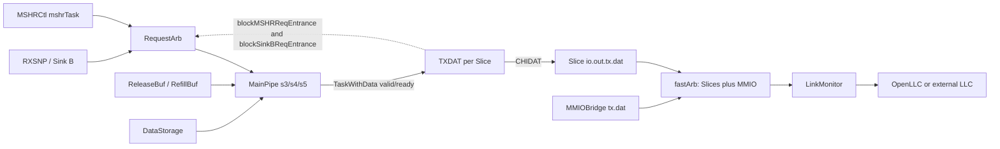

<!--
# 香山昆明湖 V2：CoupledL2 的 TXDAT 源码分析

> 本文分析的是 Kunminghu V2 在 CHI 模式下、每个 CoupledL2 Slice 内的 <code>TXDAT</code> 子模块。它不是 Tag/Data SRAM，也不是 L2 的 MSHR；它负责把 MainPipe 已经形成的 <code>TaskWithData</code> 缓冲、按 CHI DAT 拍宽拆分，并向下游 CHI TXDAT 通道发送。

## 1. 范围、源码基线与结论

### 1.1 本文回答的问题

| 问题 | 代码答案 |
| --- | --- |
| Who | 每个 CHI Slice 各实例化一个 TXDAT；MainPipe 是唯一的 Slice 内输入，RequestArb 接收其资源回压。 |
| Why | CHI DAT 需要携带一个完整缓存行中的数据拍、错误信息和事务元数据；MainPipe 不应因外部链路停顿而长期占住流水级。 |
| How | 一个 task FIFO 加两个 data-beat FIFO 先接收 <code>TaskWithData</code>；取出后由 <code>beatValids</code> 把缓存行逐拍转换为 <code>CHIDAT</code>。 |
| From | 直接来源是 <code>MainPipe.io.toTXDAT</code>；其上游可为 RXSNP 的带数据响应或 MSHR 派发的 CopyBack、SnpRespData、CompData 类任务。 |
| To | Slice 的 <code>io.out.tx.dat</code>，再经所有 Slice 与 MMIO 的外层仲裁、LinkMonitor，最终成为物理 CHI TXDAT flit。 |

本次只对这个路径的实际代码作结论，不把设计文档文字当作证据。本文还检查了 HuanCun 的配置分支：在本节的 CHI 配置中，HuanCun 不是 TXDAT 的直接下游。

### 1.2 固定的源码基线

| 项目 | 值 |
| --- | --- |
| 香山源码根目录 | <code>/home/yanyusong/xs-memory-env/XiangShan</code> |
| 父仓库分支与提交 | <code>kunminghu-v2 @ e12436c7cba86b195deec24981976d78bc263661</code> |
| coupledL2 子模块提交 | <code>fb5469838c8902b6cb33992c0a30ee3d446e4453</code> |
| huancun 子模块提交 | <code>65ef077373ecf398b4cecdea06b65ef9b8d79044</code> |
| 分析配置 | [KunminghuV2Config](/home/yanyusong/xs-memory-env/XiangShan/src/main/scala/top/Configs.scala:481)，1 MiB、4 bank、inclusive、CHI 使能 |
| 参考文档基线 | <code>/home/yanyusong/XiangShan-Design-Doc</code>，<code>kunminghu-v2 @ 58d9e2ad11f044cb6f8887d9687d9e110696d1aa</code> |
| 本地 skill 同步 | 执行 skill 的 weekly sync 检查；距上次同步不足 7 天，脚本按规则跳过网络更新。 |

源码工作树中已有 <code>difftest</code> 和 <code>src/main/resources/aia/</code> 的无关改动；本文未修改它们，也不以它们为分析依据。

### 1.3 先给出可验证的结论

1. TXDAT 是<strong>每 Slice 的、面向 CHI DAT 的发送侧缓冲与分拍器</strong>。它不访问 Tag Array/Data Array，不维护 coherence 状态，也不直接分配/释放 MSHR。
2. 在当前配置的静态参数下，缓存行是 64 B、下行数据拍是 32 B，因此一个数据行由两个 TXDAT 输出拍构成。这个“两个”来自参数计算，不是 TXDAT 写死的常数。
3. 每个已取出的 task 由 <code>beatValids</code> 保持；只有 <code>io.out.fire</code> 才清除一个 beat。外部 ready 低时，<code>valid</code>、任务元数据、数据和待发 beat 都保持。
4. TXDAT 的回压不是只看本地 FIFO。它把 MainPipe/RequestArb 中可能很快进入 TXDAT 的在途请求加到 FIFO 计数，分别在 <code>mshrsAll</code> 和 <code>mshrsAll - 2</code> 阈值阻塞 Sink B 与 MSHR 入口。源码自己标注该估算可能产生保守的 false positive。
5. HuanCun 虽为工程依赖的一部分，但 CHI 配置下 <code>L3CacheParamsOpt</code> 与 <code>OpenLLCParamsOpt</code> 互斥；TXDAT 的 CHI 对端是 OpenLLC 或外部 LLC 链路，不应画成直接连入 HuanCun。
6. TXDAT 没有 flush、redirect 或取消输入。不能仅从现有代码证明 L2 flush 完成时其内部 FIFO 必为空；这应作为波形/断言验证项，而不是补写成既成事实。

## 2. 理论概念到源码对象

本节只保留理解本模块所需的缓存概念。作为课程背景，可参照 [LoadStore-DCache.md](/home/yanyusong/XiangShanLab/xiangshan-course/docs/4-xiangshan-microarchitecture-analysis/3-xiangshan-source-code-analysis/memory/LoadStore-DCache.md:1) 中对缓存流水线和数据通路的说明；下面每个行为均回到 L2 源码。

| 概念 | 在 TXDAT 中的具体实现 | 不能由这里推出的内容 |
| --- | --- | --- |
| 非阻塞缓存的资源保留 | <code>inflightCnt</code> 将已排队与 s2--s5 的潜在 TXDAT 请求相加，再反压两个 RequestArb 入口。 | 不代表 TXDAT 本身是 MSHR，也不能据此推导某个 MSHR 的完整生命周期。 |
| Decoupled 握手 | 输入、输出均为 <code>DecoupledIO</code>；输入以 <code>io.in.ready</code> 表示可接收，输出仅在 <code>io.out.fire</code> 后消费一个 beat。 | 不应把 valid 单独当作一次传输。 |
| 一条 cache line 的分拍 | <code>DSBlock</code> 先被拆为 <code>Vec(beatSize, DSBeat)</code>，取出后使用 <code>PriorityEncoderOH</code> 逐 beat 发送。 | 这不是跨 cache-line 拼接，也不是虚实地址翻译。 |
| 事务协议字段 | <code>TaskBundle</code> 中预先携带 txnID、DBID、opcode、resp 等；TXDAT 只把它们填入 <code>CHIDAT</code>。 | TXDAT 不决定上游为何选择某个 opcode 或 DBID。 |
| 链路级停顿 | Slice 出口之后仍可由外层仲裁、LinkMonitor 的链路状态/L-credit/source-ready 阻塞。 | 单独查看 TXDAT 不能给出固定端到端延迟。 |

## 3. 有效层级与真实数据路径

### 3.1 为什么本节确实走 CHI TXDAT

XiangShan 的 [L2Top.scala](/home/yanyusong/xs-memory-env/XiangShan/src/main/scala/xiangshan/L2Top.scala:120) 在 <code>EnableCHI</code> 为真时选择 <code>TL2CHICoupledL2</code>，否则选择 TileLink 版本。当前 [KunminghuV2Config](/home/yanyusong/xs-memory-env/XiangShan/src/main/scala/top/Configs.scala:481) 通过 <code>WithCHI</code> 使能这一分支。因此本文不混用 <code>tl2tl</code> 实现的接口或时序。

在 [CoupledL2.scala](/home/yanyusong/xs-memory-env/XiangShan/coupledL2/src/main/scala/coupledL2/CoupledL2.scala:419) 中，CHI 模式为每个 bank 生成一个 <code>tl2chi.Slice</code>。每个 Slice 在 [Slice.scala](/home/yanyusong/xs-memory-env/XiangShan/coupledL2/src/main/scala/coupledL2/tl2chi/Slice.scala:44) 实例化独立的 <code>TXDAT</code>。

~~~mermaid
flowchart LR
  B["RXSNP / Sink B"] --&gt; RA["RequestArb"]
  M["MSHRCtl 的 mshrTask"] --&gt; RA
  RA --&gt; MP["MainPipe (s3/s4/s5)"]
  RB["ReleaseBuf / RefillBuf"] --&gt; MP
  DS["DataStorage"] --&gt; MP
  MP --&gt;|"TaskWithData<br/>valid/ready"| TD["TXDAT<br/>每 Slice 一份"]
  TD -. "blockMSHRReqEntrance<br/>blockSinkBReqEntrance" .-> RA
  TD --&gt;|"CHIDAT"| SO["Slice.io.out.tx.dat"]
  SO --&gt; FA["fastArb<br/>Slice 0...N + MMIO"]
  MM["MMIOBridge.tx.dat"] --&gt; FA
  FA --&gt; LM["LinkMonitor"]
  LM --&gt;|"CHI TXDAT flit"| HN["OpenLLC 或外部 LLC"]
~~~

图中实线是代码连接，虚线是资源回压。MSHRCtl 不直接连 TXDAT：它先把每项 <code>tasks.mainpipe</code> 经 [MSHRCtl.scala](/home/yanyusong/xs-memory-env/XiangShan/coupledL2/src/main/scala/coupledL2/tl2chi/MSHRCtl.scala:168) 送入 RequestArb，再经 MainPipe 形成发送任务。

### 3.2 Slice 内连接和边界

[Slice.scala](/home/yanyusong/xs-memory-env/XiangShan/coupledL2/src/main/scala/coupledL2/tl2chi/Slice.scala:65) 给出了最重要的三条连接：

~~~scala
val status_vec_toTX = reqArb.io.status_vec_toTX.get ++ mainPipe.io.status_vec_toTX
txdat.io.in <> mainPipe.io.toTXDAT
txdat.io.pipeStatusVec := status_vec_toTX
...
reqArb.io.fromTXDAT.foreach(_ := txdat.io.toReqArb)
~~~

这说明：

- <code>io.in</code> 的唯一主动生产者是 MainPipe；
- TXDAT 看到的五个流水状态由 RequestArb 的 s1/s2 与 MainPipe 的 s3/s4/s5 拼接；
- 回压不是直接拉低 MainPipe 输出，而是先交给 RequestArb 控制新的 MSHR/Sink B 入口。

Slice 在 [Slice.scala](/home/yanyusong/xs-memory-env/XiangShan/coupledL2/src/main/scala/coupledL2/tl2chi/Slice.scala:207) 将 <code>txdat.io.out</code> 接到 <code>io.out.tx.dat</code>。这也是 TXDAT 的模块边界：它不知道其他 Slice 或 MMIO 的存在。

### 3.3 HuanCun、OpenLLC 和本模块的关系

<code>coupledL2/L2Param.scala</code> 的确 import 了 HuanCun 的参数类型，例如 [L2Param.scala](/home/yanyusong/xs-memory-env/XiangShan/coupledL2/src/main/scala/coupledL2/L2Param.scala:26) 的 <code>CacheParameters</code>/<code>AliasKey</code>。这只是共享的缓存参数/Bundle 体系，不能证明 TXDAT 的下游就是 HuanCun。

实际拓扑由配置决定。 [Configs.scala](/home/yanyusong/xs-memory-env/XiangShan/src/main/scala/top/Configs.scala:346) 让 <code>L3CacheParamsOpt</code> 与 <code>OpenLLCParamsOpt</code> 依 <code>EnableCHI</code> 互斥；[Top.scala](/home/yanyusong/xs-memory-env/XiangShan/src/main/scala/top/Top.scala:372) 在 CHI、非外置 LLC 情况下创建 OpenLLC。故本配置中的下游应写为“CHI LinkMonitor 之后的 OpenLLC/外部 LLC”，而不是 HuanCun。

## 4. 参数、容量与接口

### 4.1 当前配置下的尺寸推导

[L2CacheConfig](/home/yanyusong/xs-memory-env/XiangShan/src/main/scala/top/Configs.scala:278) 的集合数公式是：

~~~text
l2sets = 容量字节 / bank 数 / way 数 / 64
~~~

当前配置为 1 MiB、4 bank；默认 ways 是 8。因此每个 Slice 的集合数是 <code>1 MiB / 4 / 8 / 64 B = 512</code>，每 Slice 8 way。TXDAT 不使用 set/way 来查找数据，但它接收的 task 来自这个 L2 的数据通路。

[L2Param.scala](/home/yanyusong/xs-memory-env/XiangShan/coupledL2/src/main/scala/coupledL2/L2Param.scala:65) 默认给出 <code>blockBytes = 64</code>、<code>channelBytes = 32</code>、<code>mshrs = 16</code>；[CoupledL2.scala](/home/yanyusong/xs-memory-env/XiangShan/coupledL2/src/main/scala/coupledL2/CoupledL2.scala:50) 计算 <code>beatSize = blockBytes / beatBytes</code>。因此静态配置下：

| 参数 | 值 | 对 TXDAT 的影响 |
| --- | ---: | --- |
| <code>blockBytes</code> | 64 B | 一项 <code>TaskWithData.data</code> 是一个缓存行。 |
| <code>beatBytes</code> | 32 B | 一项 CHIDAT 的 <code>data</code> 宽度要求为 256 bit。 |
| <code>beatSize</code> | 2 | TXDAT 需要为每个 task 发两个 beat。 |
| <code>mshrsAll</code> | 16 | task FIFO 和两个 data FIFO 的 entries 都是 16；资源门限分别是 16 与 14。 |

<strong>限定：</strong>这些是本次固定配置的静态推导。其他 Config/YAML/命令行参数可改变 cache 参数，不能把 512 set、两个 beat 或 16 entries 误写成 TXDAT 的硬编码。

### 4.2 TXDAT 的 I/O 和任务承载物

[TXDAT.scala](/home/yanyusong/xs-memory-env/XiangShan/coupledL2/src/main/scala/coupledL2/tl2chi/TXDAT.scala:33) 定义了：

| 端口 | 方向 | 类型/关键字段 | 含义 |
| --- | --- | --- | --- |
| <code>io.in</code> | 输入 | <code>DecoupledIO[TaskWithData]</code> | MainPipe 送来的事务元数据和完整行数据。 |
| <code>io.out</code> | 输出 | <code>DecoupledIO[CHIDAT]</code> | 当前待发的一个 CHI DAT beat。 |
| <code>pipeStatusVec</code> | 输入 | 5 个 <code>Valid[PipeStatusWithCHI]</code> | s1--s5 中可能进入 TXDAT 的在途资源估算。 |
| <code>toReqArb</code> | 输出 | 两个阻塞位 | 对 RequestArb 施加 Sink B/MSHR 入场限制。 |

<code>TaskWithData</code> 是 <code>TaskBundle</code> 加 <code>DSBlock</code>；其定义见 [GrantBuffer.scala](/home/yanyusong/xs-memory-env/XiangShan/coupledL2/src/main/scala/coupledL2/GrantBuffer.scala:35)。任务中已经携带 <code>set/tag/off</code>、<code>mshrTask</code> 和 CHI 可选字段；TXDAT 不重新查询 directory。

输出 bundle 的字段布局在 [Message.scala](/home/yanyusong/xs-memory-env/XiangShan/coupledL2/src/main/scala/coupledL2/tl2chi/chi/Message.scala:509)：目标/源 Node ID、TxnID、HomeNID、opcode、resp/respErr、DBID、CCID、DataID、BE、data、dataCheck、poison 都在 <code>CHIDAT</code> 内。

## 5. TXDAT 内部结构与隐式状态机

### 5.1 三个 lock-step FIFO

[TXDAT.scala](/home/yanyusong/xs-memory-env/XiangShan/coupledL2/src/main/scala/coupledL2/tl2chi/TXDAT.scala:49) 实例化一个 task FIFO 和两个 <code>DSBeat</code> FIFO：

~~~scala
val queue = Module(new Queue(new TaskBundle(), entries = mshrsAll, flow = true))
val queueData0 = Module(new Queue(new DSBeat(), entries = mshrsAll, flow = true))
val queueData1 = Module(new Queue(new DSBeat(), entries = mshrsAll, flow = true))

queue.io.enq.valid := io.in.valid
io.in.ready := queue.io.enq.ready
queueData0.io.enq.valid := io.in.valid
queueData1.io.enq.valid := io.in.valid
~~~

<code>io.in.bits.data</code> 被转换为 <code>Vec(beatSize, DSBeat)</code>，索引 0 和 1 分别写入两个 data FIFO。三个 FIFO 的深度、入队 valid 和出队 ready 都相同，设计意图是 lock-step。

但需要把“设计意图”和“已被本模块断言的事实”分开：

- 代码只以 task FIFO 的 <code>enq.ready</code> 驱动 <code>io.in.ready</code>；
- 本模块没有显式断言两个 data FIFO 的 <code>enq.ready</code> 与 task FIFO 相同；
- 三者的 queue type、depth、valid 和 dequeueReady 相同，正常工作时应同进同出；
- 因此“任一 FIFO 不同相”应列为验证属性，不能仅凭相同写法认定绝对不可能。

另外，输入处有 [TXDAT.scala](/home/yanyusong/xs-memory-env/XiangShan/coupledL2/src/main/scala/coupledL2/tl2chi/TXDAT.scala:42) 的断言：

~~~scala
assert(!io.in.valid || io.in.bits.task.toTXDAT, "txChannel is wrong for TXDAT")
assert(!io.in.valid || io.in.ready, "TXDAT should never be full")
~~~

第二条不是“FIFO 永远不会满”的硬件保证，而是对上游资源预留机制的协议要求：上游若在 TXDAT 未 ready 时仍给 valid，仿真会报错。

### 5.2 不是显式 Enum，但可还原为两个状态

TXDAT 没有 <code>Enum</code> 状态寄存器。状态由 <code>beatValids</code> 推导：

~~~mermaid
stateDiagram-v2
  [*] --&gt; Idle: reset / beatValids = 0
  Idle --&gt; Resident: queue.io.deq.fire\n所有 beatValids 置 1，锁存 taskR
  Resident --&gt; Resident: io.out.valid && !io.out.ready\n保持 taskR 与 beatValids
  Resident --&gt; Resident: io.out.fire 且仍有 beat\n清除 PriorityEncoderOH 选择的一个 bit
  Resident --&gt; Idle: io.out.fire 清除最后一个 beat
~~~

对应代码在 [TXDAT.scala](/home/yanyusong/xs-memory-env/XiangShan/coupledL2/src/main/scala/coupledL2/tl2chi/TXDAT.scala:82)：

~~~scala
val taskValid = beatValids.asUInt.orR
val dequeueReady = !taskValid
when (queue.io.deq.fire) {
  beatValids.foreach(_ := true.B)
  taskR.task := queue.io.deq.bits
  taskR.data := Cat(queueData1.io.deq.bits.data, queueData0.io.deq.bits.data).asTypeOf(new DSBlock)
}
...
when (io.out.fire) {
  beatValids := VecInit(next_beatsOH.asBools)
}
~~~

状态含义如下：

| 隐式状态 | 判定 | 可做的事 | 不可做的事 |
| --- | --- | --- | --- |
| Idle | <code>beatValids.orR == 0</code> | 接受 task FIFO 的出队，锁存一整行。 | 对外宣布一个 DAT beat 有效。 |
| Resident | 至少一个 <code>beatValids</code> 为 1 | 持续输出当前选择的 beat，等 <code>out.fire</code>。 | 从 task FIFO 取下一行；<code>dequeueReady</code> 为假。 |

这也解释了源码中 <code>dequeueReady</code> 旁的 “may introduce bubble?” 注释：前一行最后一个 beat 的 fire 之后，下一拍才满足 <code>!taskValid</code> 并允许下一项出队。本文不将其量化成固定空拍数，因为 Chisel Queue 的同周期 <code>flow</code> 行为和最终生成 RTL 仍需波形确认；可以直接证明的是不允许两个 resident task 重叠。

### 5.3 beat 选择、顺序与一个完整缓存行

[TXDAT.scala](/home/yanyusong/xs-memory-env/XiangShan/coupledL2/src/main/scala/coupledL2/tl2chi/TXDAT.scala:109) 用 <code>PriorityEncoderOH</code> 选中待发集合中的一个 beat，并清掉同一 one-hot 位：

~~~scala
val next_beat = ParallelPriorityMux(
  beatsOH, data.asTypeOf(Vec(beatSize, UInt((beatBytes * 8).W)))
)
val selOH = PriorityEncoderOH(beatsOH)
val next_beatsOH = beatsOH & ~selOH
~~~

初始化后两个 valid bit 都为 1；优先编码器选择最低编号的仍有效 entry，第二次 fire 发送余下 entry。<code>taskR.data</code> 使用 <code>Cat(queueData1, queueData0)</code> 重构 <code>DSBlock</code>，随后按 <code>Vec(beatSize,...)</code> 的索引选择。故模块的意图是先发送低编号 beat、再发送高编号 beat；精确的字节 lane 打包可在 elaboration/波形中再核对，不应只凭手工比特串臆测。

## 6. 资源回压：为什么 FIFO 尚未满也会拒绝新请求

### 6.1 估算公式

TXDAT 在 [TXDAT.scala](/home/yanyusong/xs-memory-env/XiangShan/coupledL2/src/main/scala/coupledL2/tl2chi/TXDAT.scala:61) 不只读取 <code>queue.io.count</code>：

~~~scala
val inflightCnt =
  PopCount(Cat(pipeStatus_s3_s5.map(s =>
    s.valid && s.bits.toTXDAT && (s.bits.fromB || s.bits.mshrTask)))) +
  PopCount(Cat(pipeStatus_s2.map(s =>
    s.valid && Mux(s.bits.mshrTask, s.bits.toTXDAT, s.bits.fromB)))) +
  queueCnt

val noSpaceForSinkBReq = inflightCnt >= mshrsAll.U
val noSpaceForMSHRReq  = inflightCnt >= (mshrsAll - 2).U
~~~

五个状态的来源在 [Slice.scala](/home/yanyusong/xs-memory-env/XiangShan/coupledL2/src/main/scala/coupledL2/tl2chi/Slice.scala:65) 已明确：RequestArb 两项加 MainPipe 三项。MainPipe 对 TX 通道 status 的赋值见 [MainPipe.scala](/home/yanyusong/xs-memory-env/XiangShan/coupledL2/src/main/scala/coupledL2/tl2chi/MainPipe.scala:963)，而 TXDAT 自己也写下 “may be imprecise” 和 “false positive back pressure” 的注释。

所以应按下表理解，而不是把它称为精确 FIFO full：

| 达到的门限 | 直接输出 | RequestArb 的作用 | 当前 16-entry 配置下 |
| --- | --- | --- | ---: |
| <code>inflightCnt >= mshrsAll</code> | <code>blockSinkBReqEntrance</code> | 阻止新的 Sink B 请求进入。 | 16 |
| <code>inflightCnt >= mshrsAll - 2</code> | <code>blockMSHRReqEntrance</code> | 更早阻止新的 MSHR task 进入，保留 2 项裕量。 | 14 |

[RequestArb.scala](/home/yanyusong/xs-memory-env/XiangShan/coupledL2/src/main/scala/coupledL2/RequestArb.scala:112) 实际读取该 block 信息。<strong>“为什么正好保留 2 项”没有在 TXDAT 中给出证明。</strong>源码可证明它留了两个名额，可观察到它保守，不能把推测的微架构动机写成定论。

### 6.2 回压场景矩阵

| 场景 | 可由代码确认的结果 | 应观察的信号 |
| --- | --- | --- |
| 输出链路 ready 低 | <code>taskValid</code> 仍为真，<code>beatValids</code> 不改变，任务不出队下一项。 | <code>io.out.valid</code>、<code>io.out.ready</code>、<code>beatValids</code>、<code>queue.io.deq.ready</code> |
| task FIFO 已占用但在途少 | <code>queueCnt</code> 占用会计入 <code>inflightCnt</code>。 | <code>queue.io.count</code>、两个 block 位 |
| MSHR 在途使计数到 14 | 即便本地 FIFO 没满，也会 block MSHR entry。 | <code>blockMSHRReqEntrance</code>、RequestArb 的 mshr task ready |
| Sink B 在途使计数到 16 | block Sink B entry。 | <code>blockSinkBReqEntrance</code>、<code>rxsnp.io.task</code> 的握手 |
| input valid 且 ready 为低 | TXDAT 断言失败，说明上游未遵守其资源预留协议。 | 输入断言、<code>io.in.valid/ready</code> |

## 7. MainPipe 如何产生 TXDAT 任务

### 7.1 允许进入 TXDAT 的任务类别

MainPipe 在 [MainPipe.scala](/home/yanyusong/xs-memory-env/XiangShan/coupledL2/src/main/scala/coupledL2/tl2chi/MainPipe.scala:180) 明确列出 MSHR 的带数据类型：

| 来源 | 代码识别的类型 | 数据来源路径 |
| --- | --- | --- |
| MSHR | <code>SnpRespData</code>、<code>SnpRespDataPtl</code>、<code>SnpRespDataFwded</code>、<code>CompData</code>、<code>CopyBackWrData</code> | MainPipe 的已捕获数据、ReleaseBuf/RefillBuf 或数据阵列响应，随阶段而异。 |
| 直接 RXSNP | 需要 <code>doRespData</code> 的 SnpRespData/SnpRespDataFwded | MainPipe 读 DataStorage 后形成 <code>TaskWithData</code>。 |

MSHR 对应的任务构造位置可进一步追到 [MSHR.scala](/home/yanyusong/xs-memory-env/XiangShan/coupledL2/src/main/scala/coupledL2/tl2chi/MSHR.scala:564)、[MSHR.scala](/home/yanyusong/xs-memory-env/XiangShan/coupledL2/src/main/scala/coupledL2/tl2chi/MSHR.scala:620) 和 [MSHR.scala](/home/yanyusong/xs-memory-env/XiangShan/coupledL2/src/main/scala/coupledL2/tl2chi/MSHR.scala:850)。这些位置说明 TXDAT 消费的是已经被 MSHR/coherence 决策过的任务，而不是自行作目录判断。

### 7.2 s3/s4/s5 以及 MainPipe 内部合流

MainPipe 有三个 TXDAT 候选：<code>txdat_s3</code>、<code>txdat_s4</code>、<code>txdat_s5</code>。它们分别携带 <code>task + data + corrupt</code>，见 [MainPipe.scala](/home/yanyusong/xs-memory-env/XiangShan/coupledL2/src/main/scala/coupledL2/tl2chi/MainPipe.scala:670)、[MainPipe.scala](/home/yanyusong/xs-memory-env/XiangShan/coupledL2/src/main/scala/coupledL2/tl2chi/MainPipe.scala:801) 和 [MainPipe.scala](/home/yanyusong/xs-memory-env/XiangShan/coupledL2/src/main/scala/coupledL2/tl2chi/MainPipe.scala:897)。

| 阶段出口 | 已确认事实 |
| --- | --- |
| s3 | MSHR 的带数据任务可以成为 s3 候选；直接 snoop 路径受 <code>txdat_s3_latch</code> 控制。 |
| s4 | 从 s3 锁存的 task/data 继续生成 TXDAT 候选，常用于普通直接 snoop 的后续发送。 |
| s5 | 可接收 DataStorage 的读数据，因而是普通直接 snoop 拿到阵列数据后的重要出口。 |
| 合流 | [MainPipe.scala](/home/yanyusong/xs-memory-env/XiangShan/coupledL2/src/main/scala/coupledL2/tl2chi/MainPipe.scala:1023) 用输入顺序 <code>Seq(txdat_s5, txdat_s4, txdat_s3)</code> 调用标准 Chisel <code>Arbiter</code>。 |

本仓库没有 Chisel 标准 <code>Arbiter</code> 的实现源码。因此可以记录输入顺序，不能仅凭这段项目代码声称其 tie-breaking 一定是哪一种优先级；应在生成 RTL 或波形中验证同周期多 valid 时的 chosen。

### 7.3 TXDAT 与 GrantBuffer 的边界

GrantBuffer 接受 MainPipe 的 <code>toSourceD</code>，用于向上游 TileLink D 通道响应；TXDAT 接受同一个 MainPipe 的 <code>toTXDAT</code>，用于下游 CHI DAT。 [Slice.scala](/home/yanyusong/xs-memory-env/XiangShan/coupledL2/src/main/scala/coupledL2/tl2chi/Slice.scala:65) 同时展示了这两个连接。它们是并列出口，不应把 L1 返回数据误当成 TXDAT 的数据来源。

## 8. 从 TaskWithData 到 CHIDAT 的字段转换

### 8.1 所有权和填充规则

[TXDAT.scala](/home/yanyusong/xs-memory-env/XiangShan/coupledL2/src/main/scala/coupledL2/tl2chi/TXDAT.scala:131) 中的 <code>toCHIDATBundle</code> 是字段映射的唯一集中点：

~~~scala
dat.tgtID := task.tgtID.get
dat.srcID := task.srcID.get
dat.txnID := task.txnID.get
dat.homeNID := task.homeNID.get
dat.dbID := task.dbID.get
dat.opcode := task.chiOpcode.get
dat.ccID := task.off >> ChunkOffsetWidth
dat.dataID := ParallelPriorityMux(beatsOH, ...)
dat.resp := task.resp.get
dat.setFwdState(task.fwdState.get)
~~~

| CHIDAT 字段 | 取值来源 | TXDAT 的职责 |
| --- | --- | --- |
| tgtID/srcID/txnID/homeNID/dbID/opcode/resp/fwdState/traceTag | task 中预填的 CHI 字段 | 转抄；不改变事务所有权。 |
| ccID | <code>task.off >> ChunkOffsetWidth</code> | 将原请求偏移映射到 CHI chunk 位置。源注释明确要求匹配原始请求 Addr[5:4]。 |
| dataID | 当前 <code>beatsOH</code> 的优先选择 | 表示当前包最低地址字节的 Addr[5:4]；32 B beat、16 B chunk 下，两个 beat 的候选值为 0 和 2。 |
| be | 除 CopyBackWrData 的特定 I resp 与 WriteDataCancel 外全 1 | 对需要取消数据的类型将 BE 清零。 |
| data | 选中的 32 B beat，经 BE 展开掩码 | BE 为零时输出数据也被 <code>deassertData</code> 清零。 |

这段代码依赖 <code>task.xxx.get</code>。因此上游 MainPipe/MSHR 必须只把已经具有 CHI 字段的 task 路由进 TXDAT；入口的 <code>task.toTXDAT</code> 断言只检查通道归属，不逐字段检查 Option 是否已定义。

### 8.2 错误、校验与 poison

| 条件 | 输出行为 | 源码 |
| --- | --- | --- |
| <code>task.corrupt</code> 为 1 | <code>respErr = DERR</code>，若 poison 启用则 poison 各位都为 1。 | [TXDAT.scala](/home/yanyusong/xs-memory-env/XiangShan/coupledL2/src/main/scala/coupledL2/tl2chi/TXDAT.scala:102) |
| <code>enableDataCheck</code> 且方法为 1 | 对每个 byte 形成 odd parity。 | [TXDAT.scala](/home/yanyusong/xs-memory-env/XiangShan/coupledL2/src/main/scala/coupledL2/tl2chi/TXDAT.scala:141) |
| 方法为 2 | 使用 <code>SECDEDCode.encode</code>。 | [TXDAT.scala](/home/yanyusong/xs-memory-env/XiangShan/coupledL2/src/main/scala/coupledL2/tl2chi/TXDAT.scala:144) |
| 当前 L2 配置 | <code>dataCheck = Some("oddparity")</code> 且 <code>enablePoison = true</code>。 | [Configs.scala](/home/yanyusong/xs-memory-env/XiangShan/src/main/scala/top/Configs.scala:306) |

源码注释明确写明该路径不会对 WriteBack/SnpX 产生带 NDERR 的 CompData。因此本文只确认 <code>DERR/OK</code> 的赋值，不额外推导其他 RespErr 编码。

## 9. Slice 之外：仲裁与链路级 backpressure

### 9.1 多 Slice 和 MMIO 汇聚

每个 Slice 的 TXDAT 输出并不直接到物理端口。 [TL2CHICoupledL2.scala](/home/yanyusong/xs-memory-env/XiangShan/coupledL2/src/main/scala/coupledL2/tl2chi/TL2CHICoupledL2.scala:154) 以如下候选顺序做外层 <code>fastArb</code>：

~~~scala
fastArb(slices.map(_.io.out.tx.dat) :+ mmio.io.tx.dat, txdat, Some("txdat"))
~~~

候选顺序是 Slice 0 到最后一个 Slice，再是 MMIO。 [FastArbiter.scala](/home/yanyusong/xs-memory-env/XiangShan/utility/src/main/scala/utility/FastArbiter.scala:30) 只在 <code>out.fire</code> 更新轮转状态，并只向被选中的输入给 ready。可确认其是随成功传输推进的轮转式服务；本地代码未给出形式化公平断言或有界饥饿证明。

MMIO 的 <code>tx.dat</code> 参与外层仲裁，但<strong>不进入各 Slice 的 TXDAT FIFO，也不计入 Slice 的 inflightCnt</strong>。例如 [MMIOBridge.scala](/home/yanyusong/xs-memory-env/XiangShan/coupledL2/src/main/scala/coupledL2/tl2chi/MMIOBridge.scala:282) 在得到 DBID 后可产生 <code>NonCopyBackWrData</code>。不要把 cacheable Slice 的 TxnID 编码规则误套到这个 MMIO DAT flit。

### 9.2 LinkMonitor 的两种发送契约

外层 txdat 在 [TL2CHICoupledL2.scala](/home/yanyusong/xs-memory-env/XiangShan/coupledL2/src/main/scala/coupledL2/tl2chi/TL2CHICoupledL2.scala:267) 接到 LinkMonitor。 [LinkLayer.scala](/home/yanyusong/xs-memory-env/XiangShan/coupledL2/src/main/scala/coupledL2/tl2chi/chi/LinkLayer.scala:383) 按 <code>cacheParams.txSourceReady</code> 选择：

| 配置 | 包装器 | 对 TXDAT 可见的后果 |
| --- | --- | --- |
| <code>txSourceReady = false</code>，当前 L2CacheConfig 默认 | <code>Decoupled2LCredit</code> | 可用 L-credit 和链路状态共同决定是否接受 flit。 |
| <code>txSourceReady = true</code> | <code>Decoupled2Source</code> | 还要遵守 source-ready / <code>lcrdy.dat.rdy</code>。 |

LinkMonitor 也通过 [LinkLayer.scala](/home/yanyusong/xs-memory-env/XiangShan/coupledL2/src/main/scala/coupledL2/tl2chi/chi/LinkLayer.scala:358) 的 <code>setSrcID</code> 使用 nodeID 覆盖物理链路出口的 srcID。故 TXDAT 内填入的 task srcID 与最终物理 flit 可见 srcID 的关系，应以 LinkMonitor 后的波形为准。

## 10. 延迟、吞吐与握手示意

### 10.1 能从源码给出的上下界

| 区间 | 可确认的事实 | 不可确认的固定周期数 |
| --- | --- | --- |
| MainPipe 到 TXDAT 输入 | 三个 s3/s4/s5 候选经 MainPipe Arbiter 后，再与 TXDAT input ready 握手。 | 同周期多候选的精确仲裁优先级、每类任务起始级。 |
| TXDAT 入队到首拍 | 必须先有 <code>queue.io.deq.fire</code> 锁存 <code>taskR</code>，才有 resident task。 | Queue flow 的零/一周期细节须看最终 RTL。 |
| resident task 内部 | 每个成功 <code>io.out.fire</code> 发一个 32 B beat；完整 64 B 行最少需要两个成功 fire。 | 外部 ready/credit 是否连续。 |
| 相邻 task | 代码不允许前一个 resident task 尚有 beat 时取下一 task。 | 交界处的精确气泡数需生成 RTL/波形确认。 |
| 到物理 CHI | 外层 fastArb、LinkMonitor 链路状态和 credit/source-ready 都可增加等待。 | 端到端固定 latency。 |

因此，在已 resident、<code>io.out.ready</code> 连续为 1 的条件下，TXDAT 的数据面可做到每成功传输一拍发送 32 B；一条 64 B line 至少两次成功握手。不要把这句话扩展为“每两个周期可无气泡发送一个 line”，源码中 <code>dequeueReady</code> 的注释正提示这一点需要验证。

### 10.2 一个基于真实信号的 waveform-draw 场景

下面展示一个两 beat task：输入接收，随后出队；第一次输出在 ready 为低时保持，之后两次 fire 依次发完两个 beat。它是关系图，不是未经 RTL 仿真的绝对周期承诺。

~~~waveform-draw
{
  "signal": [
    { "name": "clk",                    "wave": "p......" },
    { "name": "io.in.valid",            "wave": "0100000" },
    { "name": "io.in.ready",            "wave": "0111111" },
    { "name": "queue.io.deq.fire",      "wave": "0001000" },
    { "name": "io.out.valid",           "wave": "0001110" },
    { "name": "io.out.ready",           "wave": "0000111" },
    { "name": "io.out.fire",            "wave": "0000011" },
    { "name": "beatValids",             "wave": "x..=.=x", "data": ["11", "10", "00"] },
    { "name": "selected DataID",        "wave": "x...=.=x", "data": ["beat 0", "beat 1"] }
  ]
}
~~~

波形必须验证的保持性质是：

~~~text
io.out.valid && !io.out.ready
  => 下一拍 taskR、io.out.bits、beatValids 均保持
~~~

在当前 RTL 中，只有 <code>queue.io.deq.fire</code> 写 taskR/置 beatValids，只有 <code>io.out.fire</code> 清 beatValids；这是上述性质的代码依据。

## 11. 跨边界解析：地址、cache line、MMIO 与 flush

### 11.1 地址和页边界

TXDAT 的 <code>TaskBundle</code> 输入已经是 L2/CHI 侧 task。它在本模块中只使用 <code>task.off</code> 计算 <code>ccID</code>，没有 TLB 请求、虚拟地址翻译、PMP/PMA 查询或 page-crossing 拆分逻辑。因此：

- 虚实地址翻译和页边界处理属于更上游的访存/缓存入口路径；
- TXDAT 不把跨页请求拆成多个任务；
- 不能从 TXDAT 的 <code>task.off</code> 推导原始虚拟地址。

这不是遗漏功能的断言，而是模块边界观察：I/O 定义和 <code>toCHIDATBundle</code> 的所有读字段均可在 [TXDAT.scala](/home/yanyusong/xs-memory-env/XiangShan/coupledL2/src/main/scala/coupledL2/tl2chi/TXDAT.scala:33) 与 [TXDAT.scala](/home/yanyusong/xs-memory-env/XiangShan/coupledL2/src/main/scala/coupledL2/tl2chi/TXDAT.scala:131) 检查。

### 11.2 cache-line 边界

TXDAT 接收一个 <code>DSBlock</code>，按照 <code>beatSize</code> 将<strong>同一条缓存行</strong>序列化为 CHIDAT beat。它既不合并两条 line，也不检测跨 line 地址。这里的两拍是 “64 B line 内的 2 个 32 B beat”，不是跨 cache-line 处理。

### 11.3 MMIO/uncache 边界

MMIO 的 data 写请求在 [MMIOBridge.scala](/home/yanyusong/xs-memory-env/XiangShan/coupledL2/src/main/scala/coupledL2/tl2chi/MMIOBridge.scala:282) 自己构造 TXDAT，并只在 [TL2CHICoupledL2.scala](/home/yanyusong/xs-memory-env/XiangShan/coupledL2/src/main/scala/coupledL2/tl2chi/TL2CHICoupledL2.scala:154) 的外层 fastArb 与 Slice TXDAT 相遇。因此 TXDAT 不负责：

- 判断一个访问是否 MMIO/uncache；
- 分配 MMIO entry；
- 给 MMIO data 写入 DBID 或非 cacheable opcode。

### 11.4 CMO/flush 边界

CoupledL2 将 <code>l2Flush</code> 传给各 Slice，见 [CoupledL2.scala](/home/yanyusong/xs-memory-env/XiangShan/coupledL2/src/main/scala/coupledL2/CoupledL2.scala:459)；Slice 再把它交给 SinkA 的 CMO-all 流程，见 [Slice.scala](/home/yanyusong/xs-memory-env/XiangShan/coupledL2/src/main/scala/coupledL2/tl2chi/Slice.scala:217)。TXDAT I/O 没有 flush 输入，也未见清空其 queue/beatValids 的分支。

因此测试必须额外确认：flush 开始、flush done、TXDAT queue drain 三者的时序关系。特别是，当前代码不足以单独证明 <code>l2FlushDone</code> 时 TXDAT 一定为空。

## 12. 设计文档可追溯性与差异

以下表格只用于交叉检查，不复制或替代源码分析。参考文档是 [TXDAT.md](/home/yanyusong/XiangShan-Design-Doc/docs/zh/cache/l2cache/downstream/TXDAT.md:1) 与 [CoupledL2.md](/home/yanyusong/XiangShan-Design-Doc/docs/zh/cache/l2cache/CoupledL2.md:1)。

| 设计文档主题 | 本仓库代码证据 | 结论 |
| --- | --- | --- |
| TXDAT 有发送缓冲 | [TXDAT.scala](/home/yanyusong/xs-memory-env/XiangShan/coupledL2/src/main/scala/coupledL2/tl2chi/TXDAT.scala:49) 的三 FIFO 和 [TXDAT.scala](/home/yanyusong/xs-memory-env/XiangShan/coupledL2/src/main/scala/coupledL2/tl2chi/TXDAT.scala:82) 的 resident task。 | 已验证，且源码细化为 task FIFO + 两个 data FIFO。 |
| 按流水状态回压 MSHR/Sink B | [TXDAT.scala](/home/yanyusong/xs-memory-env/XiangShan/coupledL2/src/main/scala/coupledL2/tl2chi/TXDAT.scala:61)、[RequestArb.scala](/home/yanyusong/xs-memory-env/XiangShan/coupledL2/src/main/scala/coupledL2/RequestArb.scala:112)。 | 已验证；代码明确警告估算可能不精确且保守。 |
| 64 B line / 32 B CHI data beat | [L2Param.scala](/home/yanyusong/xs-memory-env/XiangShan/coupledL2/src/main/scala/coupledL2/L2Param.scala:65)、[CoupledL2.scala](/home/yanyusong/xs-memory-env/XiangShan/coupledL2/src/main/scala/coupledL2/CoupledL2.scala:50)。 | 在本文锁定配置下为两个 beat；不是所有可能配置的永恒常数。 |
| corrupt 到 CHI error/poison | [TXDAT.scala](/home/yanyusong/xs-memory-env/XiangShan/coupledL2/src/main/scala/coupledL2/tl2chi/TXDAT.scala:102)、[TXDAT.scala](/home/yanyusong/xs-memory-env/XiangShan/coupledL2/src/main/scala/coupledL2/tl2chi/TXDAT.scala:169)。 | 已验证为 DERR 与可选 poison/dataCheck 的实现。 |

需要特别记录的差异/限制：

1. 设计文档层面的“容量控制”容易被读成精确占用计数；源码中两处 TODO 明确它可能不精确并产生 false positive。
2. MainPipe 的 TX status 赋值也写有 “may be inaccurate, but it works” 注释，[MainPipe.scala](/home/yanyusong/xs-memory-env/XiangShan/coupledL2/src/main/scala/coupledL2/tl2chi/MainPipe.scala:971)。这要求验证关注保守停顿、吞吐损失与不溢出，而不是假定计数无误差。
3. 文档不应把 HuanCun 画为当前 CHI TXDAT 的直接接收者；配置代码表明该路径使用 OpenLLC/外部 LLC 分支。

## 13. 验证特别注意

| ID | 覆盖场景 | 可检查断言/观测 | 目的 |
| --- | --- | --- | --- |
| V1 | reset 后首项输入 | <code>beatValids == 0</code>；首个 <code>queue.deq.fire</code> 后变为全 1。 | 确认隐式 Idle 到 Resident 转换。 |
| V2 | 输出被长时间反压 | 当 <code>out.valid && !out.ready</code> 时 taskR、CHIDAT bits、beatValids 稳定，且无新 dequeue。 | 防止重复/丢失/错拍发送。 |
| V3 | 两 beat 正常发送 | 两次且仅两次 <code>out.fire</code> 后回到 idle；dataID 顺序与配置的 beat 位置一致。 | 验证完整 line 被拆而不重发。 |
| V4 | 三 FIFO lock-step | 每次 input fire 三个 FIFO 都接受；每次 dequeue 三个 FIFO 都同时出队。 | 覆盖代码未显式断言的 ready 一致性假设。 |
| V5 | 计数门限 14/16 | 分别观察 MSHR 和 Sink B block 位，且 RequestArb 不再接受对应入口。 | 验证保守资源预留而非仅 FIFO full。 |
| V6 | s3/s4/s5 同时候选 | 记录 MainPipe output 的实际 granted 源；与生成 RTL 的 Arbiter 行为比对。 | 补足项目树外 Chisel Arbiter 的优先级未知项。 |
| V7 | 多 Slice 加 MMIO 同时 valid | 观察 fastArb 只给一个 ready，并在连续 fire 后检查轮转。 | 覆盖 Slice 间和 MMIO 间公平性/无丢失。 |
| V8 | corrupt、CopyBackWrData、WriteDataCancel | 检查 DERR、poison/dataCheck、BE/data 清零条件。 | 验证 CHIDAT 字段完整性。 |
| V9 | L-credit/source-ready 停顿恢复 | credit 或 lcrdy 不可用期间 TXDAT 逐级回压；恢复后能最终 drain。 | 覆盖 LinkMonitor 引入的链路级停顿。 |
| V10 | CMO flush 与已排队 DAT | 记录 flush start/done、queue count、out.fire 的先后。 | 验证 TXDAT 无显式 flush 接口时的系统级收敛。 |

建议波形至少保留下列层级：<code>Slice.txdat.io.in</code>、<code>Slice.txdat.queue.io.count</code>、<code>beatValids</code>、<code>Slice.io.out.tx.dat</code>、外层 <code>txdat</code>、LinkMonitor TXDAT、<code>lcrdy.dat</code>（若启用）。观察时以 transaction identity（TxnID、DBID、opcode、DataID）串联，不要只按 PC 或 valid 搜索。

## 14. 小结与待确认项

TXDAT 的核心职责很窄但位于关键边界：它把 MainPipe 已经决定好的 cache-coherence 数据任务，锁存为一条完整的 L2 数据行，然后以 CHI DAT 字段和数据拍形式向外发送。它通过 “FIFO 占用 + 管线预测” 的保守计数提前阻止新的 Sink B 和 MSHR 流入，避免违反输入永远 ready 的断言。

以下内容已经由本仓库源码确认：每 Slice 实例、MainPipe 输入、三 FIFO、<code>beatValids</code> 状态、字段映射、corrupt/BE 处理、RequestArb 回压、外层 Slice/MMIO 合流及 LinkMonitor 下行。

以下内容应保留为待仿真/生成 RTL 验证，而不是在课程文字中伪造确定性：

- Chisel 标准 <code>Arbiter</code> 在 s3/s4/s5 同时 valid 时的实际 tie-breaking；
- <code>Queue(flow = true)</code> 造成的首项和相邻 task 精确周期数；
- 三 FIFO ready 是否在所有生成配置下严格同步；
- l2FlushDone 与 TXDAT FIFO 清空的严格关系；
- 在真实链路 credit、外层仲裁竞争下的端到端吞吐与最大等待。
-->

# XiangShan Kunminghu V2: CoupledL2 TXDAT Source Analysis

> This page analyzes the per-Slice `TXDAT` block in Kunminghu V2's CHI CoupledL2. It is neither a tag/data SRAM nor an L2 MSHR. It buffers a `TaskWithData`, serializes its cache line into CHI DAT beats, and transmits those beats on the downstream CHI TXDAT channel.

## 1. Scope, Source Baseline, and Conclusion

### 1.1 Questions answered here

| Question | Code-grounded answer |
| --- | --- |
| Who? | Each CHI Slice instantiates one TXDAT. MainPipe is its only intra-Slice input; RequestArb receives its resource-pressure feedback. |
| Why? | CHI DAT carries cache-line data, error information, and transaction metadata. Buffering prevents an externally stalled link from holding MainPipe pipeline stages indefinitely. |
| How? | One task FIFO and two data-beat FIFOs accept a `TaskWithData`; `beatValids` then controls conversion of the resident line into CHIDAT beats. |
| From? | `MainPipe.io.toTXDAT`, produced for data-bearing RXSNP responses or MSHR-dispatched CopyBack, SnpRespData, CompData, and related tasks. |
| To? | `Slice.io.out.tx.dat`, then outer Slice/MMIO arbitration and LinkMonitor, finally a physical CHI TXDAT flit. |

Only the actual code path is treated as behavioral evidence. HuanCun is not drawn as TXDAT's direct consumer in this CHI configuration.

### 1.2 Fixed source baseline

| Item | Value |
| --- | --- |
| XiangShan root | `/home/yanyusong/xs-memory-env/XiangShan` |
| Parent checkout | `kunminghu-v2 @ e12436c7cba86b195deec24981976d78bc263661` |
| `coupledL2` checkout | `fb5469838c8902b6cb33992c0a30ee3d446e4453` |
| `huancun` checkout | `65ef077373ecf398b4cecdea06b65ef9b8d79044` |
| Configuration | [KunminghuV2Config](</home/yanyusong/xs-memory-env/XiangShan/src/main/scala/top/Configs.scala:481>): 1 MiB, four banks, inclusive, CHI enabled |
| Design Doc reference | `/home/yanyusong/XiangShan-Design-Doc`, `kunminghu-v2 @ 58d9e2ad11f044cb6f8887d9687d9e110696d1aa` |

### 1.3 Verifiable conclusions first

1. TXDAT is a **per-Slice CHI-DAT transmit buffer and beat serializer**. It does not access tag/data arrays, own coherence state, or allocate/free MSHRs.
2. Under this configuration a line is 64 B and a downstream data beat is 32 B, so one line produces two TXDAT output beats. This is a parameter derivation, not a TXDAT hard-coded constant.
3. A dequeued task remains resident under `beatValids`; only `io.out.fire` removes a beat. While ready is low, valid, task metadata, data, and pending-beat state hold.
4. TXDAT pressure considers both local FIFO occupancy and requests potentially about to enter through MainPipe/RequestArb. It blocks Sink B and MSHR entrances at thresholds `mshrsAll` and `mshrsAll - 2`; comments explicitly allow conservative false positives.
5. CHI configuration makes `L3CacheParamsOpt` and `OpenLLCParamsOpt` mutually exclusive. TXDAT leads to OpenLLC or an external LLC link, not directly to HuanCun.
6. TXDAT exposes no flush, redirect, or cancellation input. Code alone does not prove that its queues are empty when an L2 flush completes.

## 2. Mapping Theory to Code Objects

| Concept | TXDAT implementation | What cannot be inferred here |
| --- | --- | --- |
| Resource reservation in a non-blocking cache | `inflightCnt` adds queued work and potentially TXDAT-bound s2--s5 work, then backpressures two RequestArb entrances. | TXDAT is not an MSHR and does not reveal a full MSHR lifetime. |
| Decoupled handshake | Both input and output are `DecoupledIO`; input admission is `io.in.ready`, and a beat is consumed only at `io.out.fire`. | `valid` alone is not a transfer. |
| Cache-line beat serialization | `DSBlock` becomes `Vec(beatSize, DSBeat)` and `PriorityEncoderOH` chooses one resident beat at a time. | No cross-line assembly or virtual-to-physical translation occurs here. |
| Transaction protocol fields | `TaskBundle` already contains TxnID, DBID, opcode, response, and related fields; TXDAT maps them to CHIDAT. | It does not decide which opcode or DBID upstream chose. |
| Link-level stall | Outer arbitration and LinkMonitor's link status, credit, or source-ready can stall the path after Slice output. | TXDAT alone cannot establish fixed end-to-end latency. |

## 3. Effective Hierarchy and the Actual Data Path

### 3.1 Why this path is CHI TXDAT

When `EnableCHI` is true, [L2Top.scala](</home/yanyusong/xs-memory-env/XiangShan/src/main/scala/xiangshan/L2Top.scala:120>) selects `TL2CHICoupledL2`; `KunminghuV2Config` enables that branch with `WithCHI`. CHI mode creates a `tl2chi.Slice` per bank, and each Slice instantiates its own TXDAT. The TileLink (`tl2tl`) implementation must not be mixed into this timing discussion.



MainPipe is the direct TXDAT producer. MSHRCtl sends per-MSHR work first to RequestArb and then through MainPipe; it does not directly drive TXDAT.

### 3.2 Connections and boundary inside a Slice

```scala
val status_vec_toTX = reqArb.io.status_vec_toTX.get ++ mainPipe.io.status_vec_toTX
txdat.io.in <> mainPipe.io.toTXDAT
txdat.io.pipeStatusVec := status_vec_toTX
reqArb.io.fromTXDAT.foreach(_ := txdat.io.toReqArb)
```

This establishes that MainPipe is the sole active input source, that TXDAT sees the five pipeline status stages formed from RequestArb s1/s2 and MainPipe s3/s4/s5, and that resource feedback goes to RequestArb rather than directly deasserting a MainPipe output. Slice connects `txdat.io.out` to `io.out.tx.dat`; TXDAT has no knowledge of other Slices or MMIO.

### 3.3 HuanCun, OpenLLC, and this module

`L2Param.scala` imports HuanCun parameter types because the project shares cache parameters and Bundles. That import does not identify TXDAT's downstream block. Configuration makes HuanCun `L3CacheParamsOpt` mutually exclusive with CHI's `OpenLLCParamsOpt`; in CHI/non-external-LLC mode, top-level code creates OpenLLC. The correct downstream label is therefore ``CHI LinkMonitor then OpenLLC/external LLC``.

## 4. Parameters, Capacity, and Interface

### 4.1 Current-configuration dimensions

The set formula is `l2sets = capacity bytes / banks / ways / 64`. With 1 MiB, four banks, and eight ways, each Slice has 512 sets. TXDAT does not perform set/way lookup, but its tasks originate in that L2 data path.

| Parameter | Value | TXDAT effect |
| --- | ---: | --- |
| `blockBytes` | 64 B | One `TaskWithData.data` is one cache line. |
| `beatBytes` | 32 B | CHIDAT data is 256 bits per beat. |
| `beatSize` | 2 | TXDAT emits two beats for one resident task. |
| `mshrsAll` | 16 | Task FIFO and both data FIFOs have 16 entries; resource thresholds are 16 and 14. |

These values are static derivations for the selected configuration only. A different Config/YAML/command-line override can change them.

### 4.2 TXDAT I/O and task payload

| Port | Direction | Type/key fields | Meaning |
| --- | --- | --- | --- |
| `io.in` | Input | `DecoupledIO[TaskWithData]` | MainPipe transaction metadata plus a whole line. |
| `io.out` | Output | `DecoupledIO[CHIDAT]` | One current CHI DAT beat. |
| `pipeStatusVec` | Input | Five `Valid[PipeStatusWithCHI]` values | Estimates pipeline-resident work that can enter TXDAT. |
| `toReqArb` | Output | Two block bits | Limits Sink B and MSHR admission in RequestArb. |

`TaskWithData` combines `TaskBundle` with a `DSBlock`. Task fields already carry `set/tag/off`, MSHR identity, and optional CHI fields. TXDAT does not repeat a directory lookup. `CHIDAT` includes target/source node IDs, TxnID, HomeNID, opcode, response/error, DBID, CCID, DataID, byte enables, data, data check, and poison.

## 5. TXDAT Internal Structure and Implicit State Machine

### 5.1 Three lock-step FIFOs

TXDAT constructs one task Queue and two `DSBeat` Queues, each with `entries = mshrsAll` and `flow = true`. Input valid feeds all three enqueue paths, while `io.in.ready` is driven from the task FIFO's enqueue-ready. The line is split into beat 0 and beat 1 for the data FIFOs; dequeue readiness is shared to preserve lock-step operation.

The intended design is synchronized enqueue/dequeue, but distinguish intent from explicitly asserted fact:

- task-FIFO `enq.ready` alone drives `io.in.ready`;
- no local assertion proves the two data FIFO enqueue-readies always equal task-FIFO ready;
- their type, depth, valid, and dequeue-ready are structurally identical;
- readiness equivalence across generated configurations is therefore a verification property, not an unqualified source proof.

### 5.2 Not an explicit enum, but two states can be reconstructed

`beatValids` represents an implicit two-state machine:

| Reconstructed state | `beatValids` | Event and effect |
| --- | --- | --- |
| Idle | all bits clear | A queue dequeue transfers a task/data line into resident registers and initializes pending beats. |
| Resident | one or more bits set | CHIDAT presents the selected beat; `io.out.fire` clears exactly that beat. Clearing the final bit returns to Idle. |

The resident task and data must remain stable while `io.out.valid && !io.out.ready`. This is the relevant protocol meaning of a stalled outgoing beat.

### 5.3 Beat choice, order, and one complete cache line

The `DSBlock` is divided according to parameterized `beatSize`. `PriorityEncoderOH(beatValids)` chooses a pending beat, and a successful output handshake clears its bit. Under the current 64-B/32-B parameters, a full line emits two 32-B CHIDAT beats. This is serialization within one cache line, not cross-cache-line processing.

## 6. Resource Backpressure: Why a Non-full FIFO Can Reject Work

### 6.1 Estimation formula

TXDAT adds local queued count to a view of status-vector work that could soon enter. That conservative `inflightCnt` protects an always-ready input assertion. It controls two gates:

| Gate | Threshold | Practical purpose |
| --- | --- | --- |
| `blockSinkBReqEntrance` | `mshrsAll` | Prevent more Sink B admission when estimated TXDAT demand consumes all entries. |
| `blockMSHRReqEntrance` | `mshrsAll - 2` | Reserve capacity earlier for MSHR-side demand. |

Comments identify the accounting as potentially inaccurate and capable of false-positive blocking. The correct claim is conservative protection against overflow, not exact queue occupancy.

### 6.2 Backpressure scenario matrix

| Scenario | Local observation | Required interpretation |
| --- | --- | --- |
| FIFO nearly empty, multiple tasks in s2--s5 | `inflightCnt` can still reach a gate threshold. | Rejection is conservative future-reservation pressure, not local FIFO full. |
| Output CHI link blocked | Resident `beatValids` holds; local queues fill; gates eventually assert. | Backpressure propagates via RequestArb toward ingress. |
| Count estimate overstates future work | A block bit may assert although the queue would not physically overflow. | Expected performance cost; verify no functional loss. |
| Count estimate understates demand | The always-ready input invariant would be at risk. | Target with assertions and generated-RTL tests. |

## 7. How MainPipe Produces TXDAT Tasks

### 7.1 Task classes allowed into TXDAT

Data-bearing tasks include RXSNP response flows and MSHR-directed CHI operations such as CopyBack, SnpRespData, CompData, and related response/writeback forms. Upstream task construction decides coherence opcode, DBID, TxnID, and response fields; TXDAT only buffers and maps them.

### 7.2 s3/s4/s5 and MainPipe convergence

RequestArb supplies selected work to MainPipe. MainPipe combines directory results, RefillBuffer/ReleaseBuffer data, and DataStorage results across s3/s4/s5, then emits `TaskWithData` when the required data and CHI fields are available. TXDAT's pipeline-status view contains those stages specifically so it can reserve capacity before its visible input fires.

### 7.3 Boundary between TXDAT and GrantBuffer

GrantBuffer is an upstream-facing response-side store governed by its own handshake/lifetime. TXDAT is a downstream CHI DAT serializer. Although both may carry complete cache-line data, they differ in interface direction, ownership, and the transaction acknowledgement semantics; neither should be described as the other's queue.

## 8. Field Conversion from `TaskWithData` to `CHIDAT`

### 8.1 Ownership and fill rules

| CHIDAT field family | TXDAT source/behavior |
| --- | --- |
| Transaction routing (`TxnID`, `DBID`, target/source/HomeNID, CCID) | Copied or selected from task fields prepared upstream. |
| Operation and response (`opcode`, `resp`, `respErr`) | Derived from task CHI fields; TXDAT does not invent coherence meaning. |
| Beat identity (`DataID`) | Encodes the selected cache-line beat according to CHI mapping. |
| Data and byte enables | Current `DSBeat` plus opcode-dependent BE behavior. |
| Data integrity (`dataCheck`, `poison`) | Produced by the configured code/check path when applicable. |

### 8.2 Error, check, and poison behavior

TXDAT maps task corruption/error state into the CHI DERR/poison/data-check behavior implemented in its source. For operations such as CopyBackWrData and WriteDataCancel, data and byte-enable handling follows the specific opcode path. This establishes local field conversion, not an architectural exception or software-visible error outcome.

## 9. Beyond a Slice: Arbitration and Link-level Backpressure

### 9.1 Multiple Slices and MMIO aggregation

Each Slice produces its own `io.out.tx.dat`. At the parent level, fast arbitration combines all Slice outputs with `MMIOBridge.tx.dat`. Only one producer receives ready in a given arbitration decision; fairness and exact tie behavior must be tested at that outer layer rather than inferred from one TXDAT instance.

### 9.2 The two LinkMonitor send contracts

LinkMonitor applies CHI link-level availability conditions such as L-credit and source-ready. A TXDAT beat can be valid at Slice output yet be stalled downstream. Such a stall eventually holds resident state, fills queues, and causes TXDAT feedback to restrict RequestArb ingress.

## 10. Latency, Throughput, and Handshake Illustration

### 10.1 Bounds established by source

| Quantity | Established result | Not established |
| --- | --- | --- |
| Line serialization | Two successful `out.fire` events for a 64-B line at 32-B beats. | A fixed wall-clock interval between the fires. |
| Resident beat progress | Exactly one selected beat clears per output handshake. | That the link is ready every cycle. |
| Queue capacity | 16 task/data entries per Slice under this configuration. | Exact usable throughput after conservative pipeline reservation. |
| Admission control | Gates can assert before local FIFO full. | Exact count equivalence under all traffic and generated configurations. |

### 10.2 Signal-based waveform scenario

The waveform-draw examples in the Chinese source are code-derived illustrations. In a normal two-beat transfer, one queued task becomes resident, `beatValids` starts with both bits set, the priority encoder chooses one beat, and each `out.fire` clears a single bit. If `out.ready` falls, selected beat, task metadata, and data must remain stable until the handshake succeeds.

## 11. Cross-boundary Reading: Address, Cache Line, MMIO, and Flush

### 11.1 Address and page boundary

Address translation and page-boundary classification occur before this TXDAT interface. Tasks arrive with the needed physical/coherence metadata. TXDAT does not perform a translation, PMP/PMA/PBMT check, or page-crossing decision.

### 11.2 Cache-line boundary

TXDAT serializes one `DSBlock` according to `beatSize`. It neither merges two lines nor detects a cross-line address. In this configuration, two beats mean two 32-B portions of one 64-B cache line.

### 11.3 MMIO/uncache boundary

MMIO data writes construct their own TXDAT traffic in `MMIOBridge` and meet Slice TXDAT only in outer `fastArb`. TXDAT therefore does not classify MMIO/uncache requests, allocate MMIO entries, or select MMIO DBID/non-cacheable opcodes.

### 11.4 CMO/flush boundary

CoupledL2 sends `l2Flush` to each Slice and Slice uses it for SinkA's CMO-all flow. TXDAT I/O contains no flush signal and source shows no branch clearing its queues or `beatValids`. Tests must therefore check the ordering of flush start, flush done, and TXDAT drain; this module alone cannot prove `l2FlushDone` implies TXDAT empty.

## 12. Design Doc Traceability and Differences

| Design Doc topic | Repository evidence | Conclusion |
| --- | --- | --- |
| TXDAT has transmit buffering | [TXDAT.scala:49](</home/yanyusong/xs-memory-env/XiangShan/coupledL2/src/main/scala/coupledL2/tl2chi/TXDAT.scala:49>) and resident-task logic | Verified as one task FIFO plus two data FIFOs. |
| Pipeline-state feedback blocks MSHR/Sink B | [TXDAT.scala:61](</home/yanyusong/xs-memory-env/XiangShan/coupledL2/src/main/scala/coupledL2/tl2chi/TXDAT.scala:61>), [RequestArb.scala:112](</home/yanyusong/xs-memory-env/XiangShan/coupledL2/src/main/scala/coupledL2/RequestArb.scala:112>) | Verified; source warns the estimate is deliberately conservative/inexact. |
| 64-B line and 32-B CHI beat | [L2Param.scala:65](</home/yanyusong/xs-memory-env/XiangShan/coupledL2/src/main/scala/coupledL2/L2Param.scala:65>) | Two beats in this configuration, not an eternal constant. |
| Corrupt-to-CHI error/poison | [TXDAT.scala:102](</home/yanyusong/xs-memory-env/XiangShan/coupledL2/src/main/scala/coupledL2/tl2chi/TXDAT.scala:102>) | Verified local DERR and optional poison/dataCheck conversion. |

Important limitations are that capacity control is not exact occupancy, MainPipe's TX status also carries an accuracy caveat, and HuanCun must not be drawn as this CHI TXDAT's receiver.

## 13. Verification Priorities

| ID | Scenario | Check | Purpose |
| --- | --- | --- | --- |
| V1 | First item after reset | `beatValids == 0`, then all bits set after first dequeue. | Validate implicit Idle-to-Resident transition. |
| V2 | Long output backpressure | `taskR`, CHIDAT bits, and `beatValids` stable while `out.valid && !out.ready`; no new dequeue. | Prevent duplicate, lost, or misordered beats. |
| V3 | Normal two-beat line | Exactly two `out.fire` events, correct DataID order, then Idle. | Validate line split without replay. |
| V4 | Three FIFO lock-step | Every input fire enqueues all three; every dequeue advances all three. | Cover readiness equivalence not locally asserted. |
| V5 | 14/16 thresholds | Observe MSHR/Sink B block bits and RequestArb admission. | Validate conservative reservation, not merely FIFO full. |
| V6 | Simultaneous s3/s4/s5 candidates | Compare MainPipe granted source with generated RTL arbitration. | Resolve arbiter priority uncertainty. |
| V7 | Many Slices plus MMIO valid | One `ready` per fastArb choice; check rotation after fires. | Cover aggregation fairness/no loss. |
| V8 | Corrupt, CopyBackWrData, WriteDataCancel | Check DERR, poison/dataCheck, BE/data rules. | Validate CHIDAT field conversion. |
| V9 | Credit/source-ready stall and recovery | Propagate pressure and eventually drain after restoration. | Cover LinkMonitor-level stall. |
| V10 | CMO flush with queued DAT | Record flush start/done, queue count, and `out.fire`. | Establish system-level convergence. |

Use transaction identity (`TxnID`, `DBID`, opcode, `DataID`) to correlate waveforms across `Slice.txdat.io.in`, queue count, `beatValids`, `Slice.io.out.tx.dat`, outer TXDAT, LinkMonitor, and `lcrdy.dat` where enabled. Do not search only by PC or valid.

## 14. Summary and Open Items

TXDAT has a narrow but important role: it retains a MainPipe-selected cache-coherence data task as a complete L2 line, then sends the line as CHI DAT fields and beats. Conservative ``FIFO occupancy plus pipeline prediction`` blocks future Sink B and MSHR admission before the always-ready input contract is endangered.

Verified by repository source are the per-Slice instance, MainPipe input, three FIFOs, `beatValids` state, field mapping, corrupt/BE handling, RequestArb feedback, outer Slice/MMIO aggregation, and LinkMonitor downstream connection.

The following remain simulation/generated-RTL questions rather than facts to invent in the course text:

- exact standard-Chisel Arbiter tie breaking when s3/s4/s5 are all valid;
- first-item and adjacent-task cycle timing introduced by `Queue(flow = true)`;
- strict three-FIFO ready equivalence in all generated configurations;
- exact relationship between `l2FlushDone` and TXDAT queue drain;
- end-to-end throughput and maximum wait under real link credit and outer-arbiter contention.
