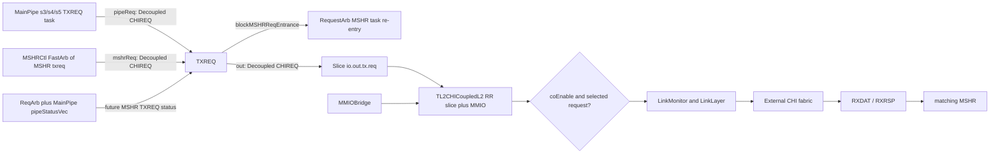
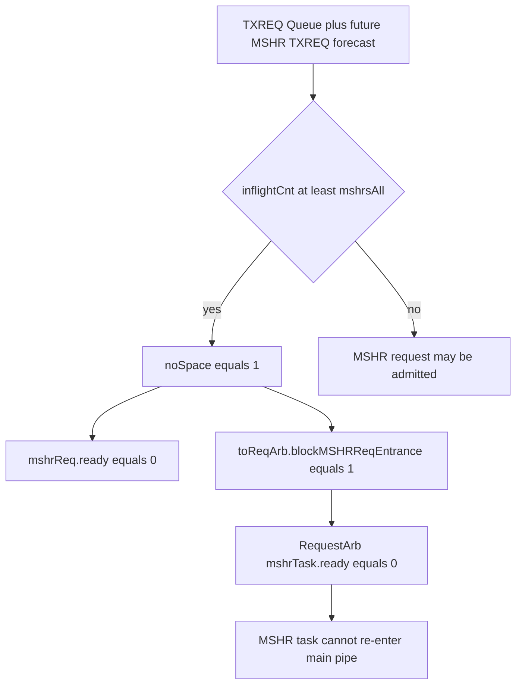

# Cache-TXREQ：昆明湖 V2 CoupledL2 CHI 请求发送子模块源码解析

> 结论先行：`TXREQ` 是 `coupledL2/tl2chi` 每个 Slice 的 **CHI 请求汇合、缓冲与发射边界**。它并不决定一次访问应使用哪条 CHI opcode，也不维护独立的 miss 状态机；它从主流水线与 MSHR 接收已经构造好的 `CHIREQ`，以“主流水线优先”的规则写入一个深度为 `mshrsAll` 的队列，结合流水线中尚未抵达队列的 MSHR 请求做保守容量预测，并在出队前补全 `tgtID`、块大小和完整物理地址。真正的请求语义由 `MainPipe` / `MSHR` 生成，跨 Slice 与 MMIO 的公平仲裁在 `TL2CHICoupledL2` 顶层完成。

## 1. 范围、版本与证据规则

### 1.1 本文分析对象

| 项目 | 本文采用的事实 | 证据与边界 |
|---|---|---|
| 目标模块 | `coupledL2/src/main/scala/coupledL2/tl2chi/TXREQ.scala` | 当前 checkout 中的 `TXREQ` 实现。 |
| 构建层级 | `TL2CHICoupledL2 -> tl2chi.Slice -> TXREQ` | `CoupledL2` 仅在 `enableCHI` 时实例化 `tl2chi.Slice`，并将 `sliceId` 接到 Slice；见 [CoupledL2.scala:419-455](/home/yanyusong/xs-memory-env/XiangShan/coupledL2/src/main/scala/coupledL2/CoupledL2.scala#L419-L455)。 |
| 源码基线 | XiangShan `kunminghu-v2`，提交 `e12436c7cba86b195deec24981976d78bc263661` | 本文所有“已确认”结论只针对这个本地 checkout；工作树原有 `difftest` 修改和 `src/main/resources/aia/` 未跟踪内容没有被修改。 |
| 设计文档基线 | XiangShan-Design-Doc `kunminghu-v2`，提交 `58d9e2ad11f044cb6f8887d9687d9e110696d1aa` | 仅作为术语和设计意图的交叉核对，不能替代源码；其提交与源码存在时间差。 |
| `huancun` | 用作架构分支对照，而非 TXREQ 的实现依据 | 当前 `huancun/src/main/scala` 没有名为 `TXREQ` / `toTXREQ` 的模块；其向下请求端是 TileLink `SourceA`。 |
| Difftest | TXREQ、Slice、MSHRCtl、MSHR、TL2CHICoupledL2 的直接源码搜索未发现 `DiffTest` 引用 | TXREQ 队列占用与 CHI 发射属于微架构状态，不能直接当作 Difftest 的架构可见事件；需要用断言、波形或 CHI monitor 验证。 |

本分析执行 skill 要求的周同步检查，结果为“距上次同步约 2.9 天，小于 7 天”，因此没有进行网络更新。源码和设计文档的 URL / commit 记录如下，便于复现：

| 仓库 | URL | 分支 / 提交 |
|---|---|---|
| XiangShan | `https://github.com/OpenXiangShan/XiangShan.git` | `kunminghu-v2` / `e12436c7cba86b195deec24981976d78bc263661` |
| XiangShan-Design-Doc | `https://github.com/OpenXiangShan/XiangShan-Design-Doc.git` | `kunminghu-v2` / `58d9e2ad11f044cb6f8887d9687d9e110696d1aa` |

### 1.2 三类结论的使用方式

本文特意分开以下三层，防止把课程概念或设计文档措辞误写成 RTL 行为。

| 层次 | 本文如何使用 | 例子 |
|---|---|---|
| 课程概念 | 说明“非阻塞”“MSHR”“按 cache block 发送”的分析坐标 | 课程中把非阻塞描述为能在 miss 等待期间重叠独立请求，但同时受 MSHR、端口、冲突和缓冲限制；见 [15_XSCache.md:80-96](/home/yanyusong/XiangShanLab/xiangshan-course/docs/xiangshan-microarchitecture/Beginner_Implementation_and_Principles_of_the_High_Performance_Xiangshan_Processor/15_XSCache.md#L80-L96)。 |
| 设计文档意图 | 确认模块名称、协议分层和要检查的路径 | 文档称 TXREQ 为下行 CHI 请求控制点，但不把图中的信号名视为本版本 RTL 信号。 |
| 当前有效代码 | 决定“已确认”的端口、优先级、状态更新和反压结论 | 例如 `pipeReq` 优先于 `mshrReq` 是 [TXREQ.scala:71-75](/home/yanyusong/xs-memory-env/XiangShan/coupledL2/src/main/scala/coupledL2/tl2chi/TXREQ.scala#L71-L75) 的直接赋值。 |

## 2. 从概念、设计意图到代码的可追踪映射

### 2.1 理论到代码

| 概念 | 当前实现位置 | 本文的代码级解释 |
|---|---|---|
| 非阻塞缓存 | [MSHRCtl.scala:106-122](/home/yanyusong/xs-memory-env/XiangShan/coupledL2/src/main/scala/coupledL2/tl2chi/MSHRCtl.scala#L106-L122)、[TXREQ.scala:47-69](/home/yanyusong/xs-memory-env/XiangShan/coupledL2/src/main/scala/coupledL2/tl2chi/TXREQ.scala#L47-L69) | 并行 MSHR 和请求队列允许多个下行事务在不同阶段共存；`noSpace` 又会反压 MSHR task，因此不是无条件接收。 |
| MSHR 的请求生命周期 | [MSHR.scala:132-157](/home/yanyusong/xs-memory-env/XiangShan/coupledL2/src/main/scala/coupledL2/tl2chi/MSHR.scala#L132-L157)、[MSHR.scala:264-296](/home/yanyusong/xs-memory-env/XiangShan/coupledL2/src/main/scala/coupledL2/tl2chi/MSHR.scala#L264-L296) | MSHR 被分配后保存请求与状态；它可产生初次 acquire、RetryAck 后的重发、或 release 类 TXREQ。TXREQ 只接受这些已形成的 `CHIREQ`。 |
| Cache block 粒度 | [TXREQ.scala:79-81](/home/yanyusong/xs-memory-env/XiangShan/coupledL2/src/main/scala/coupledL2/tl2chi/TXREQ.scala#L79-L81)、[CoupledL2.scala:38-58](/home/yanyusong/xs-memory-env/XiangShan/coupledL2/src/main/scala/coupledL2/CoupledL2.scala#L38-L58) | TXREQ 把 `size` 写成 `log2Ceil(blockBytes)`，而不是沿用上游任意请求大小；下行 CHI 请求的语义单位是当前 L2 的块。 |
| Decoupled 背压 | [TXREQ.scala:34-35](/home/yanyusong/xs-memory-env/XiangShan/coupledL2/src/main/scala/coupledL2/tl2chi/TXREQ.scala#L34-L35)、[TXREQ.scala:78-80](/home/yanyusong/xs-memory-env/XiangShan/coupledL2/src/main/scala/coupledL2/tl2chi/TXREQ.scala#L78-L80) | 三个端口都是 `DecoupledIO`；一次传输只在 `valid && ready` 时发生。`out` 的 `ready` 来自下游，不能从 `out.valid` 单独推断已发射。 |

### 2.2 Design Doc 追踪矩阵

设计文档位置为 [CoupledL2.md](/home/yanyusong/XiangShan-Design-Doc/docs/zh/cache/l2cache/CoupledL2.md) 和 [downstream/TXREQ.md](/home/yanyusong/XiangShan-Design-Doc/docs/zh/cache/l2cache/downstream/TXREQ.md)。以下矩阵只记录其能够被本 checkout 检验的主张。

| ID | 文档意图（转述） | 源码核对 | 状态 | 代码结论 / 差异 |
|---|---|---|---|---|
| D1 | 每个 Slice 有下行 CHI TXREQ 控制器 | [Slice.scala:40-73](/home/yanyusong/xs-memory-env/XiangShan/coupledL2/src/main/scala/coupledL2/tl2chi/Slice.scala#L40-L73)、[Slice.scala:196-213](/home/yanyusong/xs-memory-env/XiangShan/coupledL2/src/main/scala/coupledL2/tl2chi/Slice.scala#L196-L213) | 已验证 | 每个 CHI Slice 实例化 TXREQ，`txreq.out` 接到 `io.out.tx.req`。 |
| D2 | MainPipe 和 MSHR 请求经队列缓冲后下行 | [TXREQ.scala:34-38](/home/yanyusong/xs-memory-env/XiangShan/coupledL2/src/main/scala/coupledL2/tl2chi/TXREQ.scala#L34-L38)、[TXREQ.scala:47-81](/home/yanyusong/xs-memory-env/XiangShan/coupledL2/src/main/scala/coupledL2/tl2chi/TXREQ.scala#L47-L81) | 已验证 | 两个 `Decoupled[CHIREQ]` 输入、一个 Queue、一个输出。 |
| D3 | MainPipe 请求无条件接收 | [TXREQ.scala:44-45](/home/yanyusong/xs-memory-env/XiangShan/coupledL2/src/main/scala/coupledL2/tl2chi/TXREQ.scala#L44-L45)、[TXREQ.scala:71-75](/home/yanyusong/xs-memory-env/XiangShan/coupledL2/src/main/scala/coupledL2/tl2chi/TXREQ.scala#L71-L75) | 已验证但需限界 | `pipeReq.ready := true.B`，安全性依赖预留容量及 `inflightCnt <= mshrsAll` 断言；不是下游永久无阻塞。 |
| D4 | MainPipe 优先，阻塞另一类请求 | [TXREQ.scala:71-75](/home/yanyusong/xs-memory-env/XiangShan/coupledL2/src/main/scala/coupledL2/tl2chi/TXREQ.scala#L71-L75) | 已验证 | `Mux(pipeReq.valid, ...)` 选 MainPipe；同时有效时给的是 **MSHR** 反压，而不是给 MainPipe 反压。 |
| D5 | 以 S1--S5 潜在请求和队列占用计算 in-flight | [Slice.scala:69-73](/home/yanyusong/xs-memory-env/XiangShan/coupledL2/src/main/scala/coupledL2/tl2chi/Slice.scala#L69-L73)、[RequestArb.scala:290-299](/home/yanyusong/xs-memory-env/XiangShan/coupledL2/src/main/scala/coupledL2/RequestArb.scala#L290-L299)、[MainPipe.scala:963-975](/home/yanyusong/xs-memory-env/XiangShan/coupledL2/src/main/scala/coupledL2/tl2chi/MainPipe.scala#L963-L975)、[TXREQ.scala:51-67](/home/yanyusong/xs-memory-env/XiangShan/coupledL2/src/main/scala/coupledL2/tl2chi/TXREQ.scala#L51-L67) | 部分验证 | 实际公式统计 S2--S5 的 MSHR-to-TXREQ，再加一个预留、由 `s2ReturnCredit` 归还；`pipeStatus_s1` 本身并未参与公式。源码注释承认可保守误报。 |
| D6 | `noSpace` 反压到 MSHR 的较早入口 | [TXREQ.scala:67-69](/home/yanyusong/xs-memory-env/XiangShan/coupledL2/src/main/scala/coupledL2/tl2chi/TXREQ.scala#L67-L69)、[Slice.scala:96-104](/home/yanyusong/xs-memory-env/XiangShan/coupledL2/src/main/scala/coupledL2/tl2chi/Slice.scala#L96-L104)、[RequestArb.scala:111-120](/home/yanyusong/xs-memory-env/XiangShan/coupledL2/src/main/scala/coupledL2/RequestArb.scala#L111-L120) | 已验证 | `blockMSHRReqEntrance` 进入 `RequestArb.mshrTask.ready` 的合取条件。 |
| D7 | 固定深度 16 | [TXREQ.scala:47-48](/home/yanyusong/xs-memory-env/XiangShan/coupledL2/src/main/scala/coupledL2/tl2chi/TXREQ.scala#L47-L48)、[CoupledL2.scala:116-143](/home/yanyusong/xs-memory-env/XiangShan/coupledL2/src/main/scala/coupledL2/CoupledL2.scala#L116-L143)、[L2Param.scala:65-81](/home/yanyusong/xs-memory-env/XiangShan/coupledL2/src/main/scala/coupledL2/L2Param.scala#L65-L81)、[Configs.scala:297-328](/home/yanyusong/xs-memory-env/XiangShan/src/main/scala/top/Configs.scala#L297-L328) | 配置条件下已验证 | 模块深度是参数 `mshrsAll=cacheParams.mshrs`；默认链为 16。标准 `KunminghuV2Config` 选择 1MB、4 banks 且没有在该构造链覆写 `mshrs`，但外部配置 / elaboration 仍可覆盖，不能写成所有实例的常数。 |
| D8 | MSHR 的 acquire / reissue 可直达 TXREQ | [MSHRCtl.scala:168-169](/home/yanyusong/xs-memory-env/XiangShan/coupledL2/src/main/scala/coupledL2/tl2chi/MSHRCtl.scala#L168-L169)、[MSHR.scala:264-296](/home/yanyusong/xs-memory-env/XiangShan/coupledL2/src/main/scala/coupledL2/tl2chi/MSHR.scala#L264-L296) | 已验证 | MSHR 先经 `fastArb` 汇聚，再成为 TXREQ 的 `mshrReq`；RetryAck 与 P-Credit 条件满足后可重发。 |
| D9 | 写回 / 踢出经 MainPipe 走 TXREQ | [MainPipe.scala:160-195](/home/yanyusong/xs-memory-env/XiangShan/coupledL2/src/main/scala/coupledL2/tl2chi/MainPipe.scala#L160-L195)、[MainPipe.scala:616-686](/home/yanyusong/xs-memory-env/XiangShan/coupledL2/src/main/scala/coupledL2/tl2chi/MainPipe.scala#L616-L686) | 已验证 | `pipeReq` 只覆盖已判定的 WriteClean / WriteBack / WriteEvict / Evict 等 TXREQ 任务，不应泛化为“所有 MainPipe 任务”。 |
| D10 | TXREQ 最终进入 CHI 总线 | [Slice.scala:196-213](/home/yanyusong/xs-memory-env/XiangShan/coupledL2/src/main/scala/coupledL2/tl2chi/Slice.scala#L196-L213)、[TL2CHICoupledL2.scala:129-148](/home/yanyusong/xs-memory-env/XiangShan/coupledL2/src/main/scala/coupledL2/tl2chi/TL2CHICoupledL2.scala#L129-L148) | 部分验证 | 本地 TXREQ 先到 Slice 输出；顶层仍需跨 Slice/MMIO RR、`coEnable` gate 和 LinkMonitor，设计图需补上该边界。 |
| D11 | PCredit 的 CAM / 分配属于 TXREQ | [TXREQ.scala:32-42](/home/yanyusong/xs-memory-env/XiangShan/coupledL2/src/main/scala/coupledL2/tl2chi/TXREQ.scala#L32-L42)、[MSHR.scala:1238-1249](/home/yanyusong/xs-memory-env/XiangShan/coupledL2/src/main/scala/coupledL2/tl2chi/MSHR.scala#L1238-L1249)、[TL2CHICoupledL2.scala:175-226](/home/yanyusong/xs-memory-env/XiangShan/coupledL2/src/main/scala/coupledL2/tl2chi/TL2CHICoupledL2.scala#L175-L226) | 差异 / 非 TXREQ 职责 | TXREQ 没有 P-Credit I/O；应作为相邻 MSHR / 顶层协议边界，而不能归为 TXREQ 内部功能。 |
| D12 | 地址重建与目的节点选择 | [TXREQ.scala:79-81](/home/yanyusong/xs-memory-env/XiangShan/coupledL2/src/main/scala/coupledL2/tl2chi/TXREQ.scala#L79-L81)、[NetworkLayer.scala:26-38](/home/yanyusong/xs-memory-env/XiangShan/coupledL2/src/main/scala/coupledL2/tl2chi/chi/NetworkLayer.scala#L26-L38)、[CoupledL2.scala:179-205](/home/yanyusong/xs-memory-env/XiangShan/coupledL2/src/main/scala/coupledL2/CoupledL2.scala#L179-L205) | 源码新增事实 | TXREQ 选择 `tgtID`，强制 block size，并按 `sliceId` 恢复地址中的 bank 位。 |

### 2.3 必须避免的文档到代码误译

`hasDirty`、`goToN` 不是本 checkout 的字面信号名。与其对应的代码侧材料分别是目录/状态中的 `meta.dirty`、`gotDirty`，以及对 CHI snoop opcode 的 `isSnpToN(req.chiOpcode)` 判断；见 [MSHR.scala:172-175](/home/yanyusong/xs-memory-env/XiangShan/coupledL2/src/main/scala/coupledL2/tl2chi/MSHR.scala#L172-L175) 和 [Opcode.scala:196-202](/home/yanyusong/xs-memory-env/XiangShan/coupledL2/src/main/scala/coupledL2/tl2chi/chi/Opcode.scala#L196-L202)。`snpHitRelease` 是 `TaskBundle` 字段，由 RX Snoop 路径依据同地址 replacement MSHR 产生，不由 TXREQ 产生；见 [Common.scala:122-128](/home/yanyusong/xs-memory-env/XiangShan/coupledL2/src/main/scala/coupledL2/Common.scala#L122-L128) 与 [RXSNP.scala:166-171](/home/yanyusong/xs-memory-env/XiangShan/coupledL2/src/main/scala/coupledL2/tl2chi/RXSNP.scala#L166-L171)。

## 3. 模块边界、角色和数据路径

### 3.1 Who / Why / How / From / To

| 问题 | 代码结论 |
|---|---|
| Who | `TXREQ` 是每个 `tl2chi.Slice` 内的模块；其 I/O 为 `pipeReq`、`mshrReq`、`out`、`pipeStatusVec`、`toReqArb` 和 `sliceId`，见 [TXREQ.scala:32-42](/home/yanyusong/xs-memory-env/XiangShan/coupledL2/src/main/scala/coupledL2/tl2chi/TXREQ.scala#L32-L42)。 |
| Why | 把两类已构造 CHI 请求汇合，隔离主流水线 / MSHR 与外部 CHI `ready`，并避免 MSHR 重注入请求超过可容纳事务数。 |
| How | 一个 `Queue(new CHIREQ, entries = mshrsAll, flow = false)` 保存已接收请求；前端以流水线请求优先的 mux 写入，后端通过 `out <> queue.deq` 发出，见 [TXREQ.scala:47-80](/home/yanyusong/xs-memory-env/XiangShan/coupledL2/src/main/scala/coupledL2/tl2chi/TXREQ.scala#L47-L80)。 |
| From | `MainPipe.toTXREQ -> pipeReq`；`MSHRCtl.toTXREQ -> mshrReq`。连接在 [Slice.scala:69-73](/home/yanyusong/xs-memory-env/XiangShan/coupledL2/src/main/scala/coupledL2/tl2chi/Slice.scala#L69-L73)。 |
| To | `TXREQ.out -> Slice.io.out.tx.req -> TL2CHICoupledL2` 的全局仲裁 -> LinkMonitor / CHI 端口；前两段见 [Slice.scala:196-213](/home/yanyusong/xs-memory-env/XiangShan/coupledL2/src/main/scala/coupledL2/tl2chi/Slice.scala#L196-L213)，全局段见 [TL2CHICoupledL2.scala:129-148](/home/yanyusong/xs-memory-env/XiangShan/coupledL2/src/main/scala/coupledL2/tl2chi/TL2CHICoupledL2.scala#L129-L148)。 |



上图中 `pipeStatusVec` 是预测占用的旁路，不承载 `CHIREQ` payload。`TXREQ.out` 也不是最终外部 CHI 接受完成点：顶层仲裁、`coEnable` 和 LinkLayer 仍可能通过 `ready` / credit 把压力传回。

### 3.2 接口与握手契约

| 接口 | 方向 | 载荷 / 作用 | `valid` 与 `ready` 的已确认规则 |
|---|---|---|---|
| `pipeReq` | 输入 | 主流水线的 `CHIREQ` | `pipeReq.ready := true.B`；代码还断言只要 `pipeReq.valid` 就必须同时 `ready`。这使 TXREQ 不把自身容量反压到该端口，容量由更早的 `toReqArb` 预测回压保护。 |
| `mshrReq` | 输入 | MSHR 直接生成的 acquire / retry / release 类 `CHIREQ` | 仅当 `!pipeReq.valid && !noSpace` 时 ready；与 `pipeReq` 同周期有效时，不能 fire。 |
| `out` | 输出 | 进入 Slice 外部 CHI TXREQ 通道的 `CHIREQ` | `out <> queue.deq`，所以 fire 条件是队首有效且下游 ready。`flow = false` 表示该 Queue 不在空队列时组合旁路输入到输出。 |
| `pipeStatusVec` | 输入 | ReqArb S1/S2 和 MainPipe S3/S4/S5 的 `PipeStatusWithCHI` | 不传输请求，只告诉 TXREQ 哪些 MSHR task 将走 `toTXREQ`，用于提前堵住 MSHR 入口。 |
| `toReqArb.blockMSHRReqEntrance` | 输出 | 对 RequestArb 的资源阻塞信号 | `noSpace` 时置位；它只参与 `RequestArb.io.mshrTask.ready`，不等价于停止所有来自 A/B/C 的新请求。 |
| `sliceId` | 输入 | 本 Slice 的 bank / Slice 编号 | 用于将 Slice 内部地址还原为完整地址。 |

决定性 mux 与 ready 代码如下；括号和优先级均来自源码，而不是文档推定：

```scala
queue.io.enq.valid := io.pipeReq.valid || io.mshrReq.valid && !noSpace
queue.io.enq.bits  := Mux(io.pipeReq.valid, io.pipeReq.bits, io.mshrReq.bits)
io.pipeReq.ready   := true.B
io.mshrReq.ready   := !io.pipeReq.valid && !noSpace
```

来源：[TXREQ.scala:71-75](/home/yanyusong/xs-memory-env/XiangShan/coupledL2/src/main/scala/coupledL2/tl2chi/TXREQ.scala#L71-L75)。因此，`pipeReq.valid=1` 时它覆盖 `mshrReq.bits`；若同时有 `mshrReq.valid`，后者 `ready=0`，必须保持自己的载荷直到后续可 fire。不能把 `queue.enq.valid` 的表达式误读为两个请求可在一个周期同时入队。

## 4. 两条输入链路如何形成 CHIREQ

### 4.1 主流水线路径：完成目录 / 数据相关操作后的 release 类请求

`MainPipe` 从 S3、S4、S5 三个阶段产生 TXREQ 候选：

| 阶段 | 何时形成 | 发送的载荷来源 | 代码证据 |
|---|---|---|---|
| S3 | task 属于 `TXREQ` 且无 tag error | `source_req_s3.toCHIREQBundle` | [MainPipe.scala:616-686](/home/yanyusong/xs-memory-env/XiangShan/coupledL2/src/main/scala/coupledL2/tl2chi/MainPipe.scala#L616-L686) |
| S4 | S3 结果推进，仍为 TXREQ 类型 | pipeline 的 task / request 转换 | [MainPipe.scala:744-806](/home/yanyusong/xs-memory-env/XiangShan/coupledL2/src/main/scala/coupledL2/tl2chi/MainPipe.scala#L744-L806) |
| S5 | S4 结果推进，仍为 TXREQ 类型 | pipeline 的 task / request 转换 | [MainPipe.scala:813-902](/home/yanyusong/xs-memory-env/XiangShan/coupledL2/src/main/scala/coupledL2/tl2chi/MainPipe.scala#L813-L902) |

S3 的识别条件覆盖 `WriteCleanFull`、`WriteBackFull`、`WriteEvictFull`、`WriteEvictOrEvict` 与 `Evict` 等路径，见 [MainPipe.scala:160-195](/home/yanyusong/xs-memory-env/XiangShan/coupledL2/src/main/scala/coupledL2/tl2chi/MainPipe.scala#L160-L195)。同一个 MainPipe task 在 S3 还受 `OneHot.checkOneHot(Seq(isTXREQ_s3, isTXRSP_s3, isTXDAT_s3, isD_s3))` 约束，见 [MainPipe.scala:647-686](/home/yanyusong/xs-memory-env/XiangShan/coupledL2/src/main/scala/coupledL2/tl2chi/MainPipe.scala#L647-L686)：这里的 TXREQ、TXRSP、TXDAT 是不同 CHI 发送通道，TXREQ 不负责它们之间的共享仲裁。

随后 `arb(Seq(txreq_s5, txreq_s4, txreq_s3), io.toTXREQ, ...)` 汇合成 `pipeReq`，见 [MainPipe.scala:1023-1031](/home/yanyusong/xs-memory-env/XiangShan/coupledL2/src/main/scala/coupledL2/tl2chi/MainPipe.scala#L1023-L1031)。这里可确认三路输入的排列顺序为 S5、S4、S3；但该 `arb` 调用的实现来自通用依赖，TXREQ 文件没有重新定义同周期多路命中时的固定优先级。本文不把“老阶段必然优先”当作本 checkout 已验证的结论，应以 elaborated RTL / 当前依赖版本的 `Arbiter` 源码再核实。该不确定性不会影响 TXREQ 入口的“`pipeReq` 整体优先于 `mshrReq`”结论。

### 4.2 MSHR 路径：直接发出的 acquire、重试和第二阶段 release

`MSHRCtl` 实例化 `mshrsAll` 个 MSHR，并用 `fastArb(mshrs.map(_.io.tasks.txreq), io.toTXREQ)` 合并其直接 TXREQ 输出；见 [MSHRCtl.scala:106-122](/home/yanyusong/xs-memory-env/XiangShan/coupledL2/src/main/scala/coupledL2/tl2chi/MSHRCtl.scala#L106-L122) 和 [MSHRCtl.scala:168-169](/home/yanyusong/xs-memory-env/XiangShan/coupledL2/src/main/scala/coupledL2/tl2chi/MSHRCtl.scala#L168-L169)。`Slice` 再把此输出接至 `txreq.mshrReq`。

MSHR 的 `io.tasks.txreq.valid` 有三类原因：首次 acquire 未发送、收到 RetryAck / PCrd 条件满足后的 reissue、以及第二类 release；见 [MSHR.scala:264-296](/home/yanyusong/xs-memory-env/XiangShan/coupledL2/src/main/scala/coupledL2/tl2chi/MSHR.scala#L264-L296)。第一阶段 release 会先经 MainPipe 写数据阵列；第二阶段才直接从 MSHR 出来。这个分工在 [MSHR.scala:264-274](/home/yanyusong/xs-memory-env/XiangShan/coupledL2/src/main/scala/coupledL2/tl2chi/MSHR.scala#L264-L274) 有直接注释和有效条件，不能把所有 release 都写成“MSHR 直接绕过 MainPipe”。

它构造 CHIREQ 的 opcode 选择涵盖 `CleanShared`、`CleanInvalid`、`MakeInvalid`、`MakeUnique`、`ReadUnique` 和默认的 `ReadNotSharedDirty` 等，地址是由请求 tag / set 和块内零 offset 拼出的行地址，见 [MSHR.scala:352-428](/home/yanyusong/xs-memory-env/XiangShan/coupledL2/src/main/scala/coupledL2/tl2chi/MSHR.scala#L352-L428)。`io.tasks.txreq.fire` 时 MSHR 才推进 `s_acquire` / `s_reissue` 等发送状态，见 [MSHR.scala:1030-1038](/home/yanyusong/xs-memory-env/XiangShan/coupledL2/src/main/scala/coupledL2/tl2chi/MSHR.scala#L1030-L1038)。这里的 fire 是“被 TXREQ 输入接收”，**不是**“最终 CHI flit 已出芯片”。

`FastArbiter` 的轮转掩码仅在 `out.fire` 时更新；输出未 fire 时不能把 grant 当作已消费。实现见 [FastArbiter.scala:30-63](/home/yanyusong/xs-memory-env/XiangShan/utility/src/main/scala/utility/FastArbiter.scala#L30-L63)。对持续有效且可持续握手的候选，它轮换最近服务之后的候选；但 TXREQ 内部固定的 `pipeReq` 优先级仍可让直达 MSHR 请求一直被压住。TXREQ 并未提供直接 MSHR 对 MainPipe 的公平保证。

### 4.3 `TaskBundle` 到 `CHIREQ` 的转换边界

主流水线的 `TaskBundle.toCHIREQBundle` 填充 QoS、`tgtID`、`srcID`、`txnID`、opcode、地址、`allowRetry`、`pCrdType`、`expCompAck`、`memAttr` 等字段；见 [Common.scala:55-166](/home/yanyusong/xs-memory-env/XiangShan/coupledL2/src/main/scala/coupledL2/Common.scala#L55-L166)。TXREQ 之后只覆写下面三个字段：

```scala
io.out.bits.tgtID := SAM(sam).lookup(io.out.bits.addr)
io.out.bits.size  := log2Ceil(blockBytes).U(SIZE_WIDTH.W)
io.out.bits.addr  := restoreAddressUInt(queue.io.deq.bits.addr, io.sliceId)
```

来源：[TXREQ.scala:78-81](/home/yanyusong/xs-memory-env/XiangShan/coupledL2/src/main/scala/coupledL2/tl2chi/TXREQ.scala#L78-L81)。因此应把 TXREQ 定位为“最后的 Slice 地址 / 目标补全点”，不能称为 opcode 编码器。MSHR 预先写出的 `tgtID`、`size`、局部地址都可能在这里被最终值覆盖；`txnID` 和 `srcID` 则不由 TXREQ 处理。

## 5. 容量预测、队列状态与回压闭环

### 5.1 TXREQ 自身没有显式 FSM

TXREQ 本文件没有 `Reg` 编码的状态机，也没有命中表、替换器或 per-entry 搜索逻辑。它拥有两类状态：

| 状态载体 | 分配 / 更新 | 释放 | 查找 / 替换 | 含义 |
|---|---|---|---|---|
| `Queue[CHIREQ]`，容量 `mshrsAll` | `queue.enq.fire` 时写入选中的 `pipeReq` 或 `mshrReq` | `queue.deq.fire` 时弹出队首 | TXREQ 不按地址、TxnID 或 opcode 查找；FIFO 不发生替换 | 隔离输入与外部 CHI 背压的实际 payload 缓冲。 |
| `queueCnt = RegNext(queue.io.count)` | 每周期从 Queue 占用计数采样 | 随 Queue 出队而减少，通过下一次采样反映 | 不适用 | 参与下一周期的保守 capacity forecast。 |
| `inflightCnt` / `noSpace` | 组合计算 | 流水线状态或 Queue 占用下降后解除 | 不适用 | 仅是 admission 控制状态，不存储 CHIREQ。 |

Queue 是 Chisel 库模块，TXREQ 源文件没有展开 reset 后每个 valid 位的实现；因此本文能确认它在本模块的实例参数和接口连接，不能把库的内部寄存器实现误写成 TXREQ 的显式 RTL。验证应在 reset 后直接观察 `out.valid` 与 Queue 状态是否清零。

### 5.2 为什么只看队列深度还不够

TXREQ 不仅看 Queue 当前计数，还把尚在 S2--S5、并且最终会去 TXREQ 的 MSHR task 计入在途量：

```scala
val s2ReturnCredit = pipeStatus_s2.valid &&
  !(pipeStatus_s2.bits.mshrTask && pipeStatus_s2.bits.toTXREQ)
val inflightCnt = PopCount(Cat(pipeStatus_s2_s5.map(s =>
  s.valid && s.bits.mshrTask && s.bits.toTXREQ))) + 1.U -
  s2ReturnCredit.asUInt + queueCnt
assert(inflightCnt <= mshrsAll.U)
val noSpace = inflightCnt >= mshrsAll.U
```

来源：[TXREQ.scala:53-69](/home/yanyusong/xs-memory-env/XiangShan/coupledL2/src/main/scala/coupledL2/tl2chi/TXREQ.scala#L53-L69)。`Slice` 送入向量的顺序为 `[RequestArb S1, RequestArb S2, MainPipe S3, S4, S5]`；S1 虽在向量中，但该公式只统计 S2--S5，再以 `+1` 预留，并在 S2 的任务确定不是 MSHR-to-TXREQ 时由 `s2ReturnCredit` 归还。这个精确描述比“把五级状态逐项相加”更符合代码。

源代码紧邻 Queue 处明确备注该计数可能不精确、会造成 false blocking 但不应造成功能错误，见 [TXREQ.scala:47-48](/home/yanyusong/xs-memory-env/XiangShan/coupledL2/src/main/scala/coupledL2/tl2chi/TXREQ.scala#L47-L48)。因此它是一种**保守准入控制**：其性能代价可能是提前反压，正确性目标是避免 MSHR TXREQ 未来抵达时超过可容纳数。这个“可能”需要波形或形式验证进一步量化，不能从该注释导出某个固定性能损失。

### 5.3 回压传播到哪里



`RequestArb` 将来自 TXREQ 的 block 纳入 `io.mshrTask.ready` 条件，见 [RequestArb.scala:111-120](/home/yanyusong/xs-memory-env/XiangShan/coupledL2/src/main/scala/coupledL2/RequestArb.scala#L111-L120)。因此 `noSpace` 明确阻断的是 **MSHR task 重新进入 RequestArb**；它不是 `SinkA`、`SinkB`、`SinkC` 的一键总停信号。把它说成“L2 接口全部停收”会扩大 TXREQ 的责任范围。

### 5.4 `pipeReq.ready = 1` 的证据与限制

`assert(!io.pipeReq.valid || io.pipeReq.ready, "TXREQ should always be ready for pipeline req")` 与 `pipeReq.ready := true.B` 的组合，见 [TXREQ.scala:44-45](/home/yanyusong/xs-memory-env/XiangShan/coupledL2/src/main/scala/coupledL2/tl2chi/TXREQ.scala#L44-L45) 和 [TXREQ.scala:71-75](/home/yanyusong/xs-memory-env/XiangShan/coupledL2/src/main/scala/coupledL2/tl2chi/TXREQ.scala#L71-L75)，说明设计意图是主流水线端永远就绪。它**不能单独证明** Queue 在每一个该周期都有物理可写槽：代码没有在这里写出 `pipeReq.valid -> queue.enq.ready` 的断言。文档只能说“设计依赖前述预留预算保持该不变量”；其充分性应由 elaborated RTL、随机压力测试或形式检查验证。

## 6. 地址、目标与事务标识的逐层处理

### 6.1 Slice 地址如何还原为系统地址

CoupledL2 的 Slice 内地址将 bank bits 从 block offset 之上抽出；`restoreAddressUInt` 将 `sliceId` 重新插入高位与低 offset 之间，见 [CoupledL2.scala:179-205](/home/yanyusong/xs-memory-env/XiangShan/coupledL2/src/main/scala/coupledL2/CoupledL2.scala#L179-L205)。TXREQ 正是在出队端调用它。

| 字段 | TXREQ 行为 | 目的 |
|---|---|---|
| `addr` | `restoreAddressUInt(queue.deq.bits.addr, sliceId)` | 将本 Slice 的局部 line 地址恢复为对 CHI 网络可见的完整物理地址。 |
| `size` | 强制为 `log2Ceil(blockBytes)` | 使发出请求对应 L2 cache block。若默认 `blockBytes=64`，值才是 6；模块代码本身不应写死为 6。 |
| `tgtID` | `SAM(sam).lookup(out.bits.addr)` | 使用地址集合映射选择下游目标；`SAM.lookup` 用 `ParallelPriorityMux` 在配置的 address set 中挑选匹配目标，见 [NetworkLayer.scala:26-38](/home/yanyusong/xs-memory-env/XiangShan/coupledL2/src/main/scala/coupledL2/tl2chi/chi/NetworkLayer.scala#L26-L38)。 |

`SAM` 配置来源于 L2 参数；`L2Param` 的默认值不能代替具体系统配置，见 [L2Param.scala:65-139](/home/yanyusong/xs-memory-env/XiangShan/coupledL2/src/main/scala/coupledL2/L2Param.scala#L65-L139)。地址集合重叠时 `ParallelPriorityMux` 的具体选中顺序应由实际 `sam` 序列和 elaboration 检查确定；未匹配地址的保护也不在 TXREQ 源文件中。本地默认 all-address映射到目标 0 并不能证明实际集成也只有这一项。

### 6.2 TxnID 在顶层才加入 Slice / MMIO 身份

TXREQ 对 `txnID` 不做改写。`TL2CHICoupledL2` 在各 Slice 与 MMIO 的全局仲裁后调用 `setSliceID`：cacheable 请求编码 Slice ID，MMIO 请求编码 MMIO 标记；响应到来时用 `getSliceID` 路由，随后 `restoreTXNID` 恢复内部 ID，见 [TL2CHICoupledL2.scala:99-127](/home/yanyusong/xs-memory-env/XiangShan/coupledL2/src/main/scala/coupledL2/tl2chi/TL2CHICoupledL2.scala#L99-L127) 与 [TL2CHICoupledL2.scala:167-265](/home/yanyusong/xs-memory-env/XiangShan/coupledL2/src/main/scala/coupledL2/tl2chi/TL2CHICoupledL2.scala#L167-L265)。

MSHR 内部 ID 由 idle 位图选择，每个实例把其索引作为 `io.id`，直接 CHIREQ 使用该内部 ID；见 [MSHRCtl.scala:94-122](/home/yanyusong/xs-memory-env/XiangShan/coupledL2/src/main/scala/coupledL2/tl2chi/MSHRCtl.scala#L94-L122) 与 [MSHR.scala:364-426](/home/yanyusong/xs-memory-env/XiangShan/coupledL2/src/main/scala/coupledL2/tl2chi/MSHR.scala#L364-L426)。这解释了一个重要边界：单个 TXREQ Queue 无法单独保证全局 TxnID 唯一性；它依赖顶层 encoding 和返回路径的 decode。故障定位时应沿“MSHR 内部 ID -> 顶层编码 TxnID -> RX 路由 -> restore”追踪，而不是只盯 TXREQ。

### 6.3 `srcID` 与最终链路 flit

MSHR / 主流水线构造 `CHIREQ` 时的 `srcID` 不是最终链路来源标识。LinkMonitor / LinkLayer 在向外发出前用全局 node ID 设置 source ID，见 [MSHR.scala:364-426](/home/yanyusong/xs-memory-env/XiangShan/coupledL2/src/main/scala/coupledL2/tl2chi/MSHR.scala#L364-L426) 和 [LinkLayer.scala:388-437](/home/yanyusong/xs-memory-env/XiangShan/coupledL2/src/main/scala/coupledL2/tl2chi/chi/LinkLayer.scala#L388-L437)。因此波形中看到 MSHR 创建时的 `srcID=0`，不应解释为外部 CHI flit 的最终 node ID。

## 7. 仲裁、发射门控与吞吐边界

### 7.1 四个仲裁 / 选择点

| 位置 | 竞争者 | 已确认策略 | 背压含义 |
|---|---|---|---|
| MainPipe 内 | `txreq_s5`、`txreq_s4`、`txreq_s3` | 调用通用 `arb`，输入列表顺序为 S5、S4、S3；同周期精确 tie-break 需检查依赖实现 | 选择出的 `pipeReq` 对 TXREQ 永远 ready。 |
| MSHRCtl 内 | 所有 `mshrs.map(_.io.tasks.txreq)` | `FastArbiter`，成功 `out.fire` 后更新轮转状态 | 非被选 MSHR 收到 `ready=0` 并保持任务；外部 stalled 时不更新轮转状态。 |
| TXREQ 内 | `pipeReq` 与 `mshrReq` | 固定优先级：`pipeReq` 优先 | 同周期只入队一个；MSHR 端 ready 被拉低，持续 pipe 流可使直接 MSHR 无界等待。 |
| CHI 顶层 | 每个 Slice 的 `tx.req` 与 MMIO `tx.req` | `RRArbiterInit`；上一次成功发送后更新 grant 状态 | 一个 Slice 的 Queue 可以有效但未被全局选中，因而继续向其内部传播背压。 |

顶层仲裁代码把 MMIO 作为最后一个输入，并以 `chosen` 决定 `is_mmio`；见 [TL2CHICoupledL2.scala:129-148](/home/yanyusong/xs-memory-env/XiangShan/coupledL2/src/main/scala/coupledL2/tl2chi/TL2CHICoupledL2.scala#L129-L148)。`RRArbiterInit` 的 `lastGrant` 也只在 `out.fire` 更新，见 [Misc.scala:114-132](/home/yanyusong/xs-memory-env/XiangShan/utility/src/main/scala/utility/Misc.scala#L114-L132)。所以“valid 被选中”不等于已经消耗仲裁轮次。

### 7.2 `coEnable` 和 MMIO 的精确边界

顶层用 `req_pass = coEnable || is_mmio` 门控外部 `txreq.valid`，并把 `txreq.ready && req_pass` 回传给全局仲裁；见 [TL2CHICoupledL2.scala:135-148](/home/yanyusong/xs-memory-env/XiangShan/coupledL2/src/main/scala/coupledL2/tl2chi/TL2CHICoupledL2.scala#L135-L148)。因此可以确认：**当顶层 arb 已选择 MMIO 时**，MMIO 的 `req_pass` 为真；被选择的 cacheable 请求在 `coEnable=0` 时不会 fire。

但不能把上述逻辑简化成“MMIO 总能绕过一个已被选中的 cacheable 请求”。当 `RRArbiterInit` 当前选择 cacheable 项且 `req_pass=0` 时，回传 ready 为 0，仲裁状态不会因未 fire 前进；是否会在组合逻辑中重新选择 MMIO，要以该 arb 的 elaborated RTL / 仿真确认。本文把它记为**性能与活性待验证点**，而不把设计注释扩写成既成无阻塞保证。

### 7.3 Link 层可用性不是 TXREQ 的发射完成

LinkLayer 更进一步依据 LCRDY / credit 模式将输入改造成 source / credit 接口；TX 链路初态为 `STOP`。默认 `txSourceReady=false` 时，`Decoupled2LCredit` 的输入 ready 取决于 credit pool 与链路控制，见 [LinkLayer.scala:258-295](/home/yanyusong/xs-memory-env/XiangShan/coupledL2/src/main/scala/coupledL2/tl2chi/chi/LinkLayer.scala#L258-L295) 和 [LinkLayer.scala:360-395](/home/yanyusong/xs-memory-env/XiangShan/coupledL2/src/main/scala/coupledL2/tl2chi/chi/LinkLayer.scala#L360-L395)。当 `txSourceReady` 打开时，传输还受 `lcrdy.req.rdy` 影响。

所以不能从 TXREQ Queue 出队直接推出“CHI fabric 已经接受”，也不能从 `TXREQ.out.valid` 推出请求结束。要以最终 `valid && ready` 或 credit 消耗信号判断链路侧提交。

### 7.4 延迟与吞吐：可证明的上界，而不是虚构周期数

| 指标 | 代码可证明内容 | 不能从源码静态断言的内容 |
|---|---|---|
| TXREQ 输入到 Queue | `pipeReq` 若有效可被选中；`mshrReq` 需同时无 pipe 请求且 `!noSpace` | Queue 当前是否满足设计预留、上游 valid 时刻与主流水线内部仲裁延迟。 |
| Queue 到 Slice `out` | `Queue(flow=false)`，空队列不会将新 enq 组合直通到 deq；已排队项等待下游 ready | 某项一定在多少周期内出队。 |
| 每 Slice 的理论发射上限 | 一个 `Decoupled` Queue deq 每周期至多一个 `CHIREQ` fire | 顶层 RR、`coEnable`、LCRDY/credit 和外部 CHI 可能降低实际吞吐。 |
| 全局理论发射上限 | 顶层只有一个 `txreq_arb.out` 接到一个外部 CHI `tx.req` | 多 Slice / MMIO 竞争下某个 Slice 的精确服务间隔；需要特定请求模式和环境 ready。 |
| 请求到响应延迟 | MSHR 将 RXDAT/RXRSP 依 TxnID 投递回 MSHR | 外部 CHI fabric、memory、snoop 和 retry 行为决定；TXREQ 不含可导出固定数值的响应时间。 |

下面波形只刻画 TXREQ 本地最容易误判的一拍冲突；它不是外部 CHI 的时间承诺。`fire` 可由各行的 `valid & ready` 直接检查。

```wavedrom
{ "signal": [
  { "name": "clk",            "wave": "p...." },
  { "name": "pipeReq.valid",  "wave": "010.." },
  { "name": "pipeReq.ready",  "wave": "111.." },
  { "name": "mshrReq.valid",  "wave": "010.." },
  { "name": "mshrReq.ready",  "wave": "101.." },
  { "name": "queue.enq.fire", "wave": "010.." },
  { "name": "out.valid",      "wave": "0011." },
  { "name": "out.ready",      "wave": "1111." },
  { "name": "out.fire",       "wave": "0001." }
] }
```

在第二个时隙，`pipeReq.valid` 与 `mshrReq.valid` 同时为 1，但 `mshrReq.ready=0`，所以只接受 pipeline 请求；第三个时隙为 Queue 的非-flow 出队可见时间；第四个时隙才表示本地 `out.fire`。实际波形应加入 `noSpace`、`inflightCnt`、`pipeStatusVec[*]`、顶层 `coEnable`、arb 的 `chosen` 和 LinkLayer ready/credit，不能只看本图。

## 8. MSHR 状态与返回路径：TXREQ 的外部依赖

TXREQ 没有“等待 RXDAT”状态；该状态属于 MSHR。下表只列出与 TXREQ 有因果关系的 MSHR 生命周期，避免把 MSHR FSM 误标成 TXREQ FSM。

| MSHR 状态 / 条件 | 对 TXREQ 的影响 | 更新证据 |
|---|---|---|
| 初次请求尚未 acquire | 产生直接 `io.tasks.txreq` 候选 | [MSHR.scala:264-296](/home/yanyusong/xs-memory-env/XiangShan/coupledL2/src/main/scala/coupledL2/tl2chi/MSHR.scala#L264-L296) |
| `tasks.txreq.fire` | MSHR 提交请求发送相关状态，例如 `s_acquire` / `s_reissue` | [MSHR.scala:1030-1038](/home/yanyusong/xs-memory-env/XiangShan/coupledL2/src/main/scala/coupledL2/tl2chi/MSHR.scala#L1030-L1038) |
| RetryAck / PCrdGrant | 满足条件后可能形成 reissue CHIREQ | [MSHR.scala:1238-1249](/home/yanyusong/xs-memory-env/XiangShan/coupledL2/src/main/scala/coupledL2/tl2chi/MSHR.scala#L1238-L1249) |
| RXDAT / RXRSP 到来 | `TL2CHICoupledL2` 先按顶层 TxnID 路由到 Slice，再恢复内部 ID，MSHRCtl 分发到 MSHR | [TL2CHICoupledL2.scala:167-265](/home/yanyusong/xs-memory-env/XiangShan/coupledL2/src/main/scala/coupledL2/tl2chi/TL2CHICoupledL2.scala#L167-L265)、[MSHRCtl.scala:131-159](/home/yanyusong/xs-memory-env/XiangShan/coupledL2/src/main/scala/coupledL2/tl2chi/MSHRCtl.scala#L131-L159) |
| 所有需要的发送 / 返回 / 主流水线动作完成 | 释放 MSHR，间接使未来 TXREQ 压力消失 | [MSHR.scala:1303-1317](/home/yanyusong/xs-memory-env/XiangShan/coupledL2/src/main/scala/coupledL2/tl2chi/MSHR.scala#L1303-L1317) |

这条链路说明 `TXREQ.out.fire` 是“请求已交给 Slice 下游”的局部提交点，而不是一笔 miss 已完成的完成点。完整完成至少还要经过 CHI 响应、MSHR 更新、可能的 MainPipe 回写 / grant 过程。

## 9. 跨边界代码解析

### 9.1 虚拟页边界：TXREQ 不拥有该语义

TXREQ 的 `CHIREQ` 输入 / 输出中处理的是已经形成的地址，且本文件没有虚拟地址、TLB、PMA、页大小、请求拆分计数或跨页状态。`CHIREQ` 本身是协议请求字段集合，见 [Message.scala:426-476](/home/yanyusong/xs-memory-env/XiangShan/coupledL2/src/main/scala/coupledL2/tl2chi/chi/Message.scala#L426-L476)；TXREQ 只做 `restoreAddressUInt` 和强制块大小。对 `TXREQ.scala`、`Slice.scala`、`MSHR.scala`、`TL2CHICoupledL2.scala` 的追踪无法证明“TXREQ 拆分跨页访问”或“TXREQ 处理 TLB miss”。因此：

- 已确认：TXREQ 接收时已处于 L2 / CHI 物理地址层，出队时还原 Slice bank bits。
- 未在本模块验证：一条虚拟访存如何翻译、跨页时如何拆分或异常；这应追到核心的 TLB 与 L1 DCache / MemBlock 前端，而不能归因于 TXREQ。
- 验证建议：对跨页输入，应在 TXREQ 边界观察到的是零、一个或多个**已合法翻译**的 block 请求；是否出现多个请求由上游定义，不能用 TXREQ 单元测试单独断言。

### 9.2 Cache line 边界：块请求的边界，而非 CPU 访问拆分器

TXREQ 强制 `size=log2Ceil(blockBytes)`，MSHR 也用 tag / set / 零 offset 构造 line 地址；因此它的粒度是 L2 block。对于一条 CPU 访问跨越两个 cache line，TXREQ 源码没有保存 byte mask、第一/第二片段或合并结果的状态，不能说它负责拆分。上游最终需要产生对应的 block 事务；下游数据响应的 beat 组合由 RXDAT / MSHR / 数据通路负责，不在 TXREQ 内。

这也解释了为什么 `Queue[CHIREQ]` 不含 write data：TXREQ 是请求通道，数据类传输走独立 TXDAT 相关路径。不要把 `size` 的覆盖误解为 TXREQ 在本模块内重组整条 cache line 数据。

### 9.3 MMIO：平行路径，不进入 Slice TXREQ Queue

`MMIOBridge` 自行建立 `CHIREQ`：对 Get 使用 `ReadNoSnp`，对 Put 使用 `WriteNoSnpPtl`，并设置 `cacheable=false` / device 等属性；见 [MMIOBridge.scala:225-267](/home/yanyusong/xs-memory-env/XiangShan/coupledL2/src/main/scala/coupledL2/tl2chi/MMIOBridge.scala#L225-L267)。其各 entry 的 TXREQ 在 bridge 内汇合，见 [MMIOBridge.scala:386-395](/home/yanyusong/xs-memory-env/XiangShan/coupledL2/src/main/scala/coupledL2/tl2chi/MMIOBridge.scala#L386-L395)，随后才作为顶层全局仲裁的额外输入。

| 项目 | Cacheable 路径 | MMIO 路径 |
|---|---|---|
| 进入每个 Slice 的 TXREQ Queue | 是 | 否 |
| 发起模块 | MainPipe / MSHR | MMIOBridge entry |
| 全局 CHI 请求仲裁 | 是 | 是，作为一个额外候选 |
| `coEnable` | 被选中后必须为 1 才能 pass | 被选中时 `is_mmio=1`，`req_pass=1` |
| 属性 | 由上游 Task / MSHR 填充，TXREQ 不重写 | MMIOBridge 显式写 `cacheable=false` 和 device / ordering 属性 |

注意最后一行不是“MMIO 必然优先”结论：它只描述已被顶层 arb 选择时的 gate 逻辑；当前选中的 cacheable 请求在 link 未开时是否阻挡重新选出 MMIO，仍是第 7.2 节提出的待验证场景。

### 9.4 为什么不能用 huancun 的 SourceA 解释 TXREQ

`huancun.Slice` 暴露的是 TileLink `in/out`，并实例化 `SourceA` / `SinkB` / `SourceC` / `SinkD` / `SourceE`，见 [huancun/Slice.scala:32-104](/home/yanyusong/xs-memory-env/XiangShan/huancun/src/main/scala/huancun/Slice.scala#L32-L104)。`SourceA` 输出为 `TLBundleA`，并基于 TileLink acquire / put 构造消息，见 [huancun/SourceA.scala:30-63](/home/yanyusong/xs-memory-env/XiangShan/huancun/src/main/scala/huancun/SourceA.scala#L30-L63)。

所以二者都是“缓存向下发送请求”的概念位置，却是不同协议层和不同代码路径。本文可把 huancun 当成边界对照，不能把 SourceA 的优先级、队列或 TileLink opcode 当作 coupledL2 `TXREQ` 的行为证据。

## 10. 典型场景的逐步推演

| 场景 | 输入条件 | TXREQ 内部行为 | 上游 / 下游可观察结果 | 证据 |
|---|---|---|---|---|
| 主流水线写回与 MSHR acquire 同周期到达 | `pipeReq.valid=1`、`mshrReq.valid=1` | mux 选择 `pipeReq.bits`，`pipeReq.ready=1`、`mshrReq.ready=0` | 主流水线请求入 Queue；MSHR 请求保持 valid 等待 | [TXREQ.scala:71-75](/home/yanyusong/xs-memory-env/XiangShan/coupledL2/src/main/scala/coupledL2/tl2chi/TXREQ.scala#L71-L75) |
| 仅 MSHR 请求且有容量 | `pipeReq.valid=0`、`mshrReq.valid=1`、`noSpace=0` | `mshrReq.fire` 可 enqueue | 相应 MSHR 在自己的 `tasks.txreq.fire` 推进发送状态 | [TXREQ.scala:71-75](/home/yanyusong/xs-memory-env/XiangShan/coupledL2/src/main/scala/coupledL2/tl2chi/TXREQ.scala#L71-L75)、[MSHR.scala:1030-1038](/home/yanyusong/xs-memory-env/XiangShan/coupledL2/src/main/scala/coupledL2/tl2chi/MSHR.scala#L1030-L1038) |
| 在途量达到预算 | `inflightCnt >= mshrsAll` | `noSpace=1`，阻止 MSHR 输入并导出 `blockMSHRReqEntrance` | RequestArb 的 `mshrTask.ready=0`；主流水线输入端本身仍被声明 always-ready | [TXREQ.scala:65-75](/home/yanyusong/xs-memory-env/XiangShan/coupledL2/src/main/scala/coupledL2/tl2chi/TXREQ.scala#L65-L75)、[RequestArb.scala:111-120](/home/yanyusong/xs-memory-env/XiangShan/coupledL2/src/main/scala/coupledL2/RequestArb.scala#L111-L120) |
| 下游 CHI 暂停 | Queue 非空、`out.ready=0` | `queue.deq` 不能 fire，队首保持 | Queue 累积，最终可能引起 `noSpace`；没有固定几拍恢复保证 | [TXREQ.scala:78-80](/home/yanyusong/xs-memory-env/XiangShan/coupledL2/src/main/scala/coupledL2/tl2chi/TXREQ.scala#L78-L80) |
| 链路尚未可用 | Slice Queue 有请求、`coEnable=0` | TXREQ 内无特别分支；压力由顶层 ready 回传 | cacheable 外部请求无法 fire；顶层 arb / MMIO 是否能重选是独立待验证点 | [TL2CHICoupledL2.scala:135-148](/home/yanyusong/xs-memory-env/XiangShan/coupledL2/src/main/scala/coupledL2/tl2chi/TL2CHICoupledL2.scala#L135-L148) |
| MSHR 收到 RetryAck 后重发 | 相关 MSHR 的 retry / PCrd 条件满足 | MSHR 再次驱动 `tasks.txreq`，经 MSHRCtl 和 TXREQ 与其它请求竞争 | 更新依赖真实 `fire`；不得在 valid 时提前清除 retry 状态 | [MSHR.scala:264-296](/home/yanyusong/xs-memory-env/XiangShan/coupledL2/src/main/scala/coupledL2/tl2chi/MSHR.scala#L264-L296)、[MSHR.scala:1238-1249](/home/yanyusong/xs-memory-env/XiangShan/coupledL2/src/main/scala/coupledL2/tl2chi/MSHR.scala#L1238-L1249) |
| 多 Slice 与 MMIO 同时待发 | 多个 `slice.io.out.tx.req.valid` 和 / 或 `mmio.io.tx.req.valid` | TXREQ 只维持本 Slice 头项 | 顶层 RR 选择一个候选，成功 fire 后轮转 | [TL2CHICoupledL2.scala:129-148](/home/yanyusong/xs-memory-env/XiangShan/coupledL2/src/main/scala/coupledL2/tl2chi/TL2CHICoupledL2.scala#L129-L148)、[Misc.scala:114-132](/home/yanyusong/xs-memory-env/XiangShan/utility/src/main/scala/utility/Misc.scala#L114-L132) |

## 11. 验证特别注意

以下项目对应本模块特有的错误模式。前六项应视为 TXREQ 最小验证集；后续项覆盖跨模块的接口契约。

| ID | 定向激励 | 期望观察与 checker | 代码依据 |
|---|---|---|---|
| V1 `TXREQ_RESET_FIRST` | reset 后仅发第一笔 `mshrReq` | `mshrReq.ready` 在无 `pipeReq/noSpace` 时可接收；`out` 不产生陈旧载荷。用 occupancy / handshake scoreboard；Queue 内部 reset 语义需以 elaborated RTL / 仿真验证。 | [TXREQ.scala:47-81](/home/yanyusong/xs-memory-env/XiangShan/coupledL2/src/main/scala/coupledL2/tl2chi/TXREQ.scala#L47-L81) |
| V2 `TXREQ_PIPE_WINS` | `pipeReq.valid` 与 `mshrReq.valid` 同拍为 1 | `pipeReq.ready=1`、`mshrReq.ready=0`，进入 Queue 的 payload 是 pipe；scoreboard 检查顺序。 | [TXREQ.scala:71-75](/home/yanyusong/xs-memory-env/XiangShan/coupledL2/src/main/scala/coupledL2/tl2chi/TXREQ.scala#L71-L75) |
| V3 `TXREQ_NOSPACE_S0` | 构造 `inflightCnt >= mshrsAll` | `mshrReq.ready=0`、`blockMSHRReqEntrance=1`、RequestArb `mshrTask.ready=0`；pipe 仍不被本模块反压。 | [TXREQ.scala:65-75](/home/yanyusong/xs-memory-env/XiangShan/coupledL2/src/main/scala/coupledL2/tl2chi/TXREQ.scala#L65-L75)、[RequestArb.scala:111-120](/home/yanyusong/xs-memory-env/XiangShan/coupledL2/src/main/scala/coupledL2/RequestArb.scala#L111-L120) |
| V4 `TXREQ_S2_RETURN_CREDIT` | 分别令 S2 为“非 MSHR/TXREQ”和“MSHR-to-TXREQ” | 第一种归还预留 credit，第二种不归还；用参考模型逐项复算公式。 | [TXREQ.scala:53-63](/home/yanyusong/xs-memory-env/XiangShan/coupledL2/src/main/scala/coupledL2/tl2chi/TXREQ.scala#L53-L63) |
| V5 `TXREQ_PIPE_RESERVATION` | S1 潜在请求，加 S2--S5 多笔 MSHR-to-TXREQ，再持续发 MSHR | 保留一项可覆盖后续 MainPipe 请求；允许保守阻塞，但不得触发 overflow assertion。 | [TXREQ.scala:58-67](/home/yanyusong/xs-memory-env/XiangShan/coupledL2/src/main/scala/coupledL2/tl2chi/TXREQ.scala#L58-L67) |
| V6 `TXREQ_OUT_STALL_HOLD` | `out.valid=1` 时拉低 `out.ready` 多拍 | Queue 队首 payload 保持，不能重复接受/丢失；解除 ready 后仅一次出队。 | [TXREQ.scala:78-81](/home/yanyusong/xs-memory-env/XiangShan/coupledL2/src/main/scala/coupledL2/tl2chi/TXREQ.scala#L78-L81) |
| V7 `TXREQ_ENQ_DEQ_SAME_CYCLE` | 接近满时同时下游消费与 pipe/MSHR 入队 | occupancy 模型与 `queue.io.count` 一致；无双接收、无 overflow。 | [TXREQ.scala:47-81](/home/yanyusong/xs-memory-env/XiangShan/coupledL2/src/main/scala/coupledL2/tl2chi/TXREQ.scala#L47-L81) |
| V8 `TXREQ_ADDR_SAM_RESTORE` | 改变 `sliceId`、SAM 命中地址、`bankBits=0/非0` 配置 | 输出地址仅恢复 bank 位，`tgtID` 命中 SAM，`size=log2Ceil(blockBytes)`。 | [TXREQ.scala:78-81](/home/yanyusong/xs-memory-env/XiangShan/coupledL2/src/main/scala/coupledL2/tl2chi/TXREQ.scala#L78-L81)、[CoupledL2.scala:179-205](/home/yanyusong/xs-memory-env/XiangShan/coupledL2/src/main/scala/coupledL2/CoupledL2.scala#L179-L205) |
| V9 `TXREQ_MSHR_RETRY_PCREDIT` | RetryAck 与 PCrdGrant 两种先后顺序 | 仅条件到齐后重发；标记此为相邻 MSHR / 顶层集成验证，不是 TXREQ 内部 FSM。 | [MSHR.scala:1238-1249](/home/yanyusong/xs-memory-env/XiangShan/coupledL2/src/main/scala/coupledL2/tl2chi/MSHR.scala#L1238-L1249)、[TL2CHICoupledL2.scala:175-226](/home/yanyusong/xs-memory-env/XiangShan/coupledL2/src/main/scala/coupledL2/tl2chi/TL2CHICoupledL2.scala#L175-L226) |
| V10 `TXREQ_TOP_COENABLE_MMIO` | `coEnable=0`，同时有 cacheable Slice 请求与 MMIO 请求 | cacheable 选中项不能 fire；检查 arb 是否因 ready=0 保持选择，MMIO 不应被未经证实地假定为必然可越过它；恢复 `coEnable` 后无丢失。 | [TL2CHICoupledL2.scala:129-148](/home/yanyusong/xs-memory-env/XiangShan/coupledL2/src/main/scala/coupledL2/tl2chi/TL2CHICoupledL2.scala#L129-L148) |
| V11 `TXREQ_TOP_SLICE_RR` | 多 Slice 与 MMIO 同时有效、下游持续 ready | 验证顶层 RR 的 one-hot grant、仅在 fire 后轮转与无永久饥饿，而非误归因到本地固定优先级。 | [TL2CHICoupledL2.scala:129-148](/home/yanyusong/xs-memory-env/XiangShan/coupledL2/src/main/scala/coupledL2/tl2chi/TL2CHICoupledL2.scala#L129-L148)、[Misc.scala:114-132](/home/yanyusong/xs-memory-env/XiangShan/utility/src/main/scala/utility/Misc.scala#L114-L132) |
| V12 `TXREQ_DRAIN_PROGRESS` | 阻塞 LinkMonitor sink 至 Queue / 预留满，再释放 sink | Queue 排空、`noSpace` 解除、MSHR S0 重新可入；forward-progress checker 监测无永久阻塞。 | [TXREQ.scala:65-81](/home/yanyusong/xs-memory-env/XiangShan/coupledL2/src/main/scala/coupledL2/tl2chi/TXREQ.scala#L65-L81)、[TL2CHICoupledL2.scala:267-276](/home/yanyusong/xs-memory-env/XiangShan/coupledL2/src/main/scala/coupledL2/tl2chi/TL2CHICoupledL2.scala#L267-L276) |
| V13 `TXREQ_OPCODE_PRESERVE` | 主流水线写回与 MSHR acquire / retry / release 混合 | TXREQ 只能改 `tgtID`、`size`、`addr`；opcode / retry / pCrd 等其余语义字段应保持上游构造的值。 | [Common.scala:55-166](/home/yanyusong/xs-memory-env/XiangShan/coupledL2/src/main/scala/coupledL2/Common.scala#L55-L166)、[TXREQ.scala:78-81](/home/yanyusong/xs-memory-env/XiangShan/coupledL2/src/main/scala/coupledL2/tl2chi/TXREQ.scala#L78-L81) |
| V14 `TXREQ_NO_DIFFTEST_HOOK` | 跑包含 CHI traffic 的仿真或波形 | 不应把 TXREQ Queue / `noSpace` 当成 Difftest 的架构提交事件；为这些内部条件补 module-level assert 或波形检查。 | 第 1.1 节的直接源码搜索结果；TXREQ 所在文件无 Difftest import / call。 |

建议波形最少按同一个稳定事务标识关联：`mshrId` / 内部 `txnID`、顶层编码后的 `txnID`、`pipeReq.valid/ready`、`mshrReq.valid/ready`、`queue.io.count`、`inflightCnt`、`noSpace`、`out.valid/ready`、顶层 arb 的 `chosen`、`coEnable` 和 LinkLayer credit/ready。只以 PC 或单个 `valid` 跟踪无法判断是否实际 fire。

## 12. 已确认结论、限制与下一步

### 12.1 已确认

1. TXREQ 是 **每 Slice 的 CHI 请求队列与接口收敛点**，输入来自 MainPipe 与 MSHRCtl，输出接到 Slice 的 `tx.req`。
2. TXREQ 内固定优先级为 `pipeReq > mshrReq`；其 MSHR 接收同时受 `noSpace` 限制。持续的 pipe 请求能使直达 MSHR 无限期等待，因此不存在 TXREQ 内的两类来源公平性保证。
3. `noSpace` 是 Queue 占用加流水线未来 MSHR TXREQ 的保守预测，直接阻塞 MSHR task 重注入 RequestArb；不是所有 L2 输入的总开关。
4. TXREQ 在出队端只修改地址相关的 `addr`、`size`、`tgtID`；CHI opcode 和大部分事务语义在上游形成，顶层再编码 TxnID / 仲裁 Slice 与 MMIO。
5. `huancun` 的 TileLink `SourceA` 是不同协议实现，不能替代 TXREQ 的源码证据。

### 12.2 有意保留的不确定性

| 问题 | 为什么不能在本文中下确定结论 | 后续验证方法 |
|---|---|---|
| MainPipe S3/S4/S5 同周期竞争的最终 tie-break | 当前模块只调用通用 `arb`，未把其实现展开在本次源树分析链 | 检查本次构建锁定的 Chisel / utility `Arbiter` 源码或 elaborated Verilog。 |
| `pipeReq.ready=true` 的预留充分性 | 设计以 `inflightCnt` 预算保障，但 TXREQ 未直接断言 `pipeReq.valid -> queue.enq.ready` | 在随机满队列、同拍 enq/deq 和全部 status 组合下做形式或 scoreboard 检查。 |
| 实际 Queue 深度、路数、Slice 数和 SAM 地址表 | `mshrsAll` / cache 参数可被 core 配置覆盖 | 在目标 Kunminghu V2 config 下 elaboration，记录参数 dump / FIRRTL / Verilog 常量。 |
| CPU 跨页、跨 cache line 访问的拆分策略 | TXREQ 输入已经是 L2 block CHIREQ，不含 TLB / byte merge 状态 | 向上追踪 DCache、TLB、MemBlock 到进入 CoupledL2 的 TileLink 请求。 |
| cacheable 与 MMIO 在 `coEnable=0` 时的活性 | `req_pass` 依赖当前 arb `chosen`，未 fire 时状态不轮转 | 观察 elaborated arb 组合选择与仿真波形，检查 MMIO 是否会被当前 cacheable 头项堵住。 |
| 外部 CHI 接受与响应延迟 | 受 `coEnable`、LCRDY/credit、fabric、memory、snoop/retry 影响 | 以完整 CHI 系统仿真或 FST 跟踪 `valid && ready` / credit，按编码后 TxnID 回溯。 |

这些限制不是缺项：它们标出了 TXREQ 的真实所有权边界，避免把外部协议、上游访存拆分或另一套 `huancun` 协议实现误归到该子模块。
