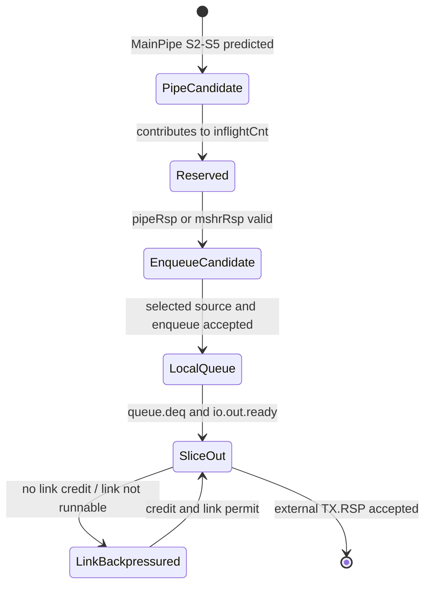
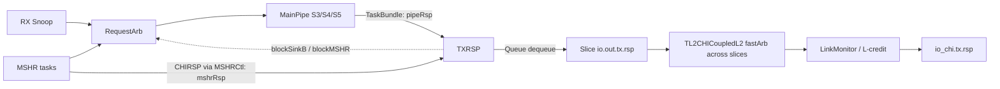
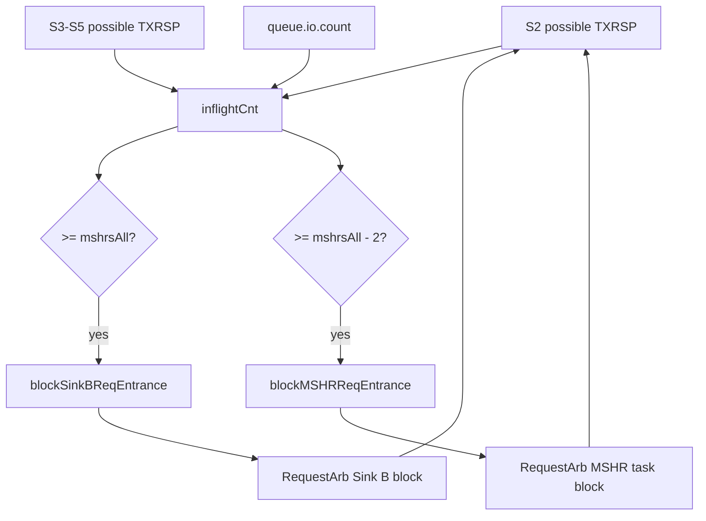

<!--
# 香山昆明湖 V2：CoupledL2 TXRSP 源码分析

> **结论先行。** Kunminghu V2 的 `TXRSP` 是 CHI 模式下 CoupledL2 每个 Slice 的“无数据响应”发送缓冲与入口配额控制单元：它接收 MainPipe 产生的 `TaskBundle` 或 MSHR 已构造好的 `CHIRSP`，以 MainPipe 优先的方式写入一个深度为 `mshrsAll` 的响应队列，再经 Slice、跨 bank 仲裁和 CHI LinkMonitor 发到 `io_chi.tx.rsp`。它不是 HuanCun 的子模块，也不执行 tag/data 查找、地址索引、TLB 翻译或数据传输。最关键的实现策略是：在响应真正入队之前就统计 MainPipe S2--S5 中可能到达 TXRSP 的请求，并在满额前分别阻塞 Sink B 与 MSHR 入口，从而支撑 `pipeRsp.ready := true.B` 这一局部不反压约束。[TXRSP.scala:43](</home/yanyusong/xs-memory-env/XiangShan/coupledL2/src/main/scala/coupledL2/tl2chi/TXRSP.scala:43>)

本文只把用户提供的 Kunminghu V2 源码作为实现事实的依据。香山 Design Doc 仅在第 18 节作逐项对照，且明确标出文档与源码的差异；没有用 Design Doc 补全任何未在源码中证实的行为。
-->

# XiangShan Kunminghu V2: CoupledL2 TXRSP Source Analysis

> **Conclusion first.** In CHI-mode CoupledL2, Kunminghu V2 `TXRSP` is the data-less-response transmit buffer and admission-quota controller in each Slice. It receives a `TaskBundle` from MainPipe or an already-built `CHIRSP` from MSHR, writes a response queue of depth `mshrsAll` with MainPipe priority, and sends the result through Slice, cross-bank arbitration, and CHI LinkMonitor to `io_chi.tx.rsp`. It is not a HuanCun submodule and performs no tag/data lookup, address indexing, TLB translation, or data transfer. Its key mechanism is counting responses that may arrive from MainPipe S2--S5 before they actually enqueue, then separately blocking Sink B and MSHR admission before the queue fills. This supports the local no-backpressure invariant `pipeRsp.ready := true.B`. [TXRSP.scala:43](</home/yanyusong/xs-memory-env/XiangShan/coupledL2/src/main/scala/coupledL2/tl2chi/TXRSP.scala:43>)

This note takes only the user-provided Kunminghu V2 source as implementation evidence. The XiangShan Design Doc is compared item by item only in Section 18, with documented differences; it is not used to fill behavior unproven by source.

<!--
## 1. 范围、版本与证据边界

### 1.1 分析对象

分析对象是 CoupledL2 的 `coupledL2.tl2chi.TXRSP`，不是泛指 CHI 协议中的任意响应通道。它处在 L2 Slice 的下行 CHI 侧：Slice 同时实例化 `TXREQ`、`TXDAT` 与 `TXRSP`，并把后者接到 `mainPipe.io.toTXRSP`、`mshrCtl.io.toTXRSP` 和 `io.out.tx.rsp`。[Slice.scala:47](</home/yanyusong/xs-memory-env/XiangShan/coupledL2/src/main/scala/coupledL2/tl2chi/Slice.scala:47>) [Slice.scala:69](</home/yanyusong/xs-memory-env/XiangShan/coupledL2/src/main/scala/coupledL2/tl2chi/Slice.scala:69>) [Slice.scala:207](</home/yanyusong/xs-memory-env/XiangShan/coupledL2/src/main/scala/coupledL2/tl2chi/Slice.scala:207>)

| 项目 | 本次固定版本/范围 | 用途 |
| --- | --- | --- |
| Kunminghu 源码 | `/home/yanyusong/xs-memory-env/XiangShan`，`kunminghu-v2@e12436c7cba86b195deec24981976d78bc263661` | 顶层选择、配置与集成依据 |
| CoupledL2 子模块 | `coupledL2@fb5469838c8902b6cb33992c0a30ee3d446e4453` | TXRSP、MainPipe、MSHR、CHI 链路实现 |
| utility 子模块 | `utility@2f0743f1f3ee1889049841926fa382cd0b32d8e2` | FastArbiter 的轮转与 ready 语义 |
| HuanCun 子模块 | `huancun@65ef077373ecf398b4cecdea06b65ef9b8d79044` | 排除错误归属，说明非 CHI 分支 |
| 设计文档 | `/home/yanyusong/XiangShan-Design-Doc`，`kunminghu-v2@58d9e2ad11f044cb6f8887d9687d9e110696d1aa` | 仅作第 18 节意图对照 |
| 观察方式 | Scala 源码静态追踪；没有运行 RTL、仿真或 FST | 所有周期波形均标为“源码关系示意”，不是实测波形 |

本次使用的分析 skill 的周同步脚本已执行；其状态显示距上次同步不足七天，因此未重新拉取。源代码工作树中已有与本任务无关的改动，本分析没有修改它们。

### 1.2 名称边界：为什么重点看 CoupledL2，也必须审计 HuanCun

在该配置中，`EnableCHI` 为真时顶层选择 `TL2CHICoupledL2`；为假时才选择 TileLink 版本 `TL2TLCoupledL2`。[L2Top.scala:111](</home/yanyusong/xs-memory-env/XiangShan/src/main/scala/xiangshan/L2Top.scala:111>) 同一配置文件只在 `!EnableCHI` 时生成 HuanCun 的 `L3CacheParamsOpt`，CHI 情形则转为 `OpenLLCParamsOpt`。[Configs.scala:333](</home/yanyusong/xs-memory-env/XiangShan/src/main/scala/top/Configs.scala:333>)

对固定版本的独立 `huancun/src/main/scala` 及其测试源码检索 `TXRSP`、`CHIRSP`、`CHI`、`tx.rsp`、`rx.rsp` 均没有命中；`HuanCun.scala` 导入并构造的是 Rocket Chip TileLink 端口与 Slice。[HuanCun.scala:20](</home/yanyusong/xs-memory-env/XiangShan/huancun/src/main/scala/huancun/HuanCun.scala:20>) [HuanCun.scala:180](</home/yanyusong/xs-memory-env/XiangShan/huancun/src/main/scala/huancun/HuanCun.scala:180>) 因而下文不能写成“TXRSP 发往 HuanCun”：有效运行时路径是 CHI CoupledL2 到 CHI 链路/下游 OpenLLC 或 OpenNCB。CoupledL2 可能复用 HuanCun 的少量参数或元数据类型，这只是编译期依赖，不构成 TXRSP 的运行时通道。[CoupledL2.scala:33](</home/yanyusong/xs-memory-env/XiangShan/coupledL2/src/main/scala/coupledL2/CoupledL2.scala:33>)
-->

## 1. Scope, Version, and Evidence Boundary

### 1.1 Analysis target

The object analyzed is CoupledL2 `coupledL2.tl2chi.TXRSP`, not an arbitrary CHI response channel. It sits on the L2 Slice's downstream CHI side: Slice instantiates `TXREQ`, `TXDAT`, and `TXRSP`, and connects the latter to `mainPipe.io.toTXRSP`, `mshrCtl.io.toTXRSP`, and `io.out.tx.rsp`. [Slice.scala:47](</home/yanyusong/xs-memory-env/XiangShan/coupledL2/src/main/scala/coupledL2/tl2chi/Slice.scala:47>) [Slice.scala:69](</home/yanyusong/xs-memory-env/XiangShan/coupledL2/src/main/scala/coupledL2/tl2chi/Slice.scala:69>) [Slice.scala:207](</home/yanyusong/xs-memory-env/XiangShan/coupledL2/src/main/scala/coupledL2/tl2chi/Slice.scala:207>)

| Item | Fixed version/scope | Use |
| --- | --- | --- |
| Kunminghu source | `/home/yanyusong/xs-memory-env/XiangShan`, `kunminghu-v2@e12436c7cba86b195deec24981976d78bc263661` | Basis for top-level choice, configuration, and integration |
| CoupledL2 submodule | `coupledL2@fb5469838c8902b6cb33992c0a30ee3d446e4453` | TXRSP, MainPipe, MSHR, and CHI-link implementation |
| utility submodule | `utility@2f0743f1f3ee1889049841926fa382cd0b32d8e2` | FastArbiter rotation and ready semantics |
| HuanCun submodule | `huancun@65ef077373ecf398b4cecdea06b65ef9b8d79044` | Excludes an incorrect ownership and identifies the non-CHI branch |
| Design document | `/home/yanyusong/XiangShan-Design-Doc`, `kunminghu-v2@58d9e2ad11f044cb6f8887d9687d9e110696d1aa` | Intent comparison only in Section 18 |
| Observation method | Static Scala-source tracing; no RTL, simulation, or FST run | Any cycle diagram is marked as a source-relationship sketch, not a measured waveform |

The weekly synchronization script required by the analysis skill had already run and found the previous synchronization to be under seven days old, so it did not fetch again. Existing unrelated source-worktree changes were left untouched.

### 1.2 Naming boundary: why CoupledL2 matters and HuanCun must still be audited

With `EnableCHI` true, the top level selects `TL2CHICoupledL2`; only false selects the TileLink `TL2TLCoupledL2`. [L2Top.scala:111](</home/yanyusong/xs-memory-env/XiangShan/src/main/scala/xiangshan/L2Top.scala:111>) The same configuration builds HuanCun `L3CacheParamsOpt` only under `!EnableCHI`; CHI instead uses `OpenLLCParamsOpt`. [Configs.scala:333](</home/yanyusong/xs-memory-env/XiangShan/src/main/scala/top/Configs.scala:333>)

Searches of the fixed `huancun/src/main/scala` and its tests find no `TXRSP`, `CHIRSP`, `CHI`, `tx.rsp`, or `rx.rsp`; `HuanCun.scala` imports and builds Rocket Chip TileLink ports and Slices. [HuanCun.scala:20](</home/yanyusong/xs-memory-env/XiangShan/huancun/src/main/scala/huancun/HuanCun.scala:20>) [HuanCun.scala:180](</home/yanyusong/xs-memory-env/XiangShan/huancun/src/main/scala/huancun/HuanCun.scala:180>) Thus TXRSP must not be described as sending to HuanCun. The active runtime path is CHI CoupledL2 to the CHI link/downstream OpenLLC or OpenNCB. CoupledL2 may reuse a few HuanCun parameter or metadata types, but that is only a compile-time dependency and not a TXRSP runtime channel. [CoupledL2.scala:33](</home/yanyusong/xs-memory-env/XiangShan/coupledL2/src/main/scala/coupledL2/CoupledL2.scala:33>)

<!--
## 2. 源码证据目录与术语

下表是本文每类结论的首要代码落点。后续章节仍会给出紧邻论断的行链接，避免把“模块名相似”当作数据通路证据。

| 主题 | 首要源码证据 | 能直接证实的事实 |
| --- | --- | --- |
| TXRSP 边界与队列 | [TXRSP.scala:32](</home/yanyusong/xs-memory-env/XiangShan/coupledL2/src/main/scala/coupledL2/tl2chi/TXRSP.scala:32>) | 两个输入、一个输出、五级状态观察口、两个入口阻塞信号与一条 CHIRSP Queue |
| Slice 接线 | [Slice.scala:69](</home/yanyusong/xs-memory-env/XiangShan/coupledL2/src/main/scala/coupledL2/tl2chi/Slice.scala:69>) | MainPipe/MSHRCtl 到 TXRSP，以及 TXRSP 到 Slice TX.RSP |
| 产生 TXRSP 的流水线判定 | [MainPipe.scala:647](</home/yanyusong/xs-memory-env/XiangShan/coupledL2/src/main/scala/coupledL2/tl2chi/MainPipe.scala:647>) | 无数据的 Sink B snoop 响应和部分 MSHR probe 响应走 TXRSP；需要数据的路径走 TXDAT |
| MSHR 直接响应 | [MSHR.scala:275](</home/yanyusong/xs-memory-env/XiangShan/coupledL2/src/main/scala/coupledL2/tl2chi/MSHR.scala:275>) | 读/写 CompAck 能直接成为 CHIRSP，不必经过 TaskBundle 转换 |
| 入口反压闭环 | [RequestArb.scala:114](</home/yanyusong/xs-memory-env/XiangShan/coupledL2/src/main/scala/coupledL2/RequestArb.scala:114>) | TXRSP 的阻塞信号确实反馈到 MSHR/Sink B 进入 RequestArb 的路径 |
| 跨 bank 与 CHI 链路 | [TL2CHICoupledL2.scala:150](</home/yanyusong/xs-memory-env/XiangShan/coupledL2/src/main/scala/coupledL2/tl2chi/TL2CHICoupledL2.scala:150>) | 每个 Slice 的 TXRSP 再经顶层仲裁，最终进入 LinkMonitor |

本文采用的三个“接受”术语都遵从对应 `DecoupledIO` 的 `valid && ready` 关系：

| 术语 | 本文含义 | 不能据此推断的内容 |
| --- | --- | --- |
| 入队接受 | `queue.io.enq.valid && queue.io.enq.ready` | Chisel Queue 的同周期出入队、满/空边界指针细节；这些要看库实现或生成 RTL |
| 本地输出接受 | `io.out.valid && io.out.ready` | 已经在 CHI 引脚上发出；后面还有跨 bank 仲裁和 LinkMonitor |
| CHI 链路发送 | LinkMonitor 接受输入并形成 `flitv/flit` | 下游互连或远端已经完成协议事务 |
-->

## 2. Source-Evidence Index and Terms

The following table lists the primary source landing point for each class of conclusion. Later sections retain nearby line links so that similarity of module names is not mistaken for data-path evidence.

| Topic | Primary source evidence | Directly established fact |
| --- | --- | --- |
| TXRSP boundary and queue | [TXRSP.scala:32](</home/yanyusong/xs-memory-env/XiangShan/coupledL2/src/main/scala/coupledL2/tl2chi/TXRSP.scala:32>) | Two inputs, one output, five stage-status observations, two admission blocks, and one CHIRSP Queue |
| Slice wiring | [Slice.scala:69](</home/yanyusong/xs-memory-env/XiangShan/coupledL2/src/main/scala/coupledL2/tl2chi/Slice.scala:69>) | MainPipe/MSHRCtl to TXRSP, then TXRSP to Slice TX.RSP |
| Pipeline decisions that create TXRSP | [MainPipe.scala:647](</home/yanyusong/xs-memory-env/XiangShan/coupledL2/src/main/scala/coupledL2/tl2chi/MainPipe.scala:647>) | Data-less Sink-B snoop responses and some MSHR probe responses use TXRSP; data-bearing paths use TXDAT |
| Direct MSHR response | [MSHR.scala:275](</home/yanyusong/xs-memory-env/XiangShan/coupledL2/src/main/scala/coupledL2/tl2chi/MSHR.scala:275>) | Read/write CompAck can become CHIRSP directly without TaskBundle conversion |
| Admission-backpressure loop | [RequestArb.scala:114](</home/yanyusong/xs-memory-env/XiangShan/coupledL2/src/main/scala/coupledL2/RequestArb.scala:114>) | TXRSP block signals feed back to the MSHR/Sink-B paths entering RequestArb |
| Cross-bank and CHI link | [TL2CHICoupledL2.scala:150](</home/yanyusong/xs-memory-env/XiangShan/coupledL2/src/main/scala/coupledL2/tl2chi/TL2CHICoupledL2.scala:150>) | Each Slice TXRSP is arbitrated at the top level and finally enters LinkMonitor |

The three uses of “accept” in this note all follow the `valid && ready` relationship of their respective `DecoupledIO` interfaces:

| Term | Meaning here | What it does not imply |
| --- | --- | --- |
| Enqueue acceptance | `queue.io.enq.valid && queue.io.enq.ready` | Chisel Queue's same-cycle enqueue/dequeue and full/empty pointer details; those require library implementation or generated RTL |
| Local output acceptance | `io.out.valid && io.out.ready` | That traffic has appeared on CHI pins; cross-bank arbitration and LinkMonitor remain downstream |
| CHI link transmission | LinkMonitor accepts input and produces `flitv/flit` | That the downstream interconnect or remote peer has completed the protocol transaction |

<!--
## 3. 从缓存响应概念到本实现

这里的“响应”不是一次 cache line 回传。`CHIRSP` 的字段是 ID、opcode、response/fwd state、错误码和 trace tag 等控制信息；数据走另一个 `TXDAT` 通道。[Message.scala:555](</home/yanyusong/xs-memory-env/XiangShan/coupledL2/src/main/scala/coupledL2/tl2chi/chi/Message.scala:555>) [Bundle.scala:27](</home/yanyusong/xs-memory-env/XiangShan/coupledL2/src/main/scala/coupledL2/tl2chi/Bundle.scala:27>) 因而 TXRSP 的核心任务是将“已经决定的无数据协议响应”排队和送出，而不是重新执行目录查询或数据阵列读出。

MainPipe 的分类同时给出这一边界：对于普通 Sink B 任务，`fromB && !need_mshr && !hasData` 选 TXRSP；同类任务若 `doRespData` 为真则选 TXDAT。对于来自 MSHR 的任务，`mshr_snpRespX` 选 TXRSP，而数据型 snoop 响应选 TXDAT。[MainPipe.scala:647](</home/yanyusong/xs-memory-env/XiangShan/coupledL2/src/main/scala/coupledL2/tl2chi/MainPipe.scala:647>) [MainPipe.scala:652](</home/yanyusong/xs-memory-env/XiangShan/coupledL2/src/main/scala/coupledL2/tl2chi/MainPipe.scala:652>)

因此可以把 TXRSP 放在下面这个责任链上理解：

1. 上游 MainPipe/MSHR 已经做出响应类别和一致性决定；
2. TXRSP 预留未来会抵达的响应槽位，并把入口压力反馈给 RequestArb；
3. TXRSP 将两类来源收敛成单口 CHIRSP 队列；
4. L2 顶层把多个 Slice 的队列输出收敛成一个 CHI TX.RSP 链路；
5. LinkMonitor 再把内部 Decoupled 流量受链路状态和 L-credit 约束地变成 CHI flit。

这五步分别有明确模块边界，不能把其中任一步归因给 TXRSP 本体。
-->

## 3. From the Cache-Response Concept to This Implementation

“Response” here is not a returned cache line. `CHIRSP` consists of control fields such as IDs, opcode, response/forward state, error code, and trace tag; data uses the separate `TXDAT` channel. [Message.scala:555](</home/yanyusong/xs-memory-env/XiangShan/coupledL2/src/main/scala/coupledL2/tl2chi/chi/Message.scala:555>) [Bundle.scala:27](</home/yanyusong/xs-memory-env/XiangShan/coupledL2/src/main/scala/coupledL2/tl2chi/Bundle.scala:27>) TXRSP's central job is consequently to queue and emit an already-decided data-less protocol response, not to repeat directory lookup or data-array reads.

MainPipe classification establishes the boundary: for a normal Sink-B task, `fromB && !need_mshr && !hasData` selects TXRSP; when the same kind of task has `doRespData`, it selects TXDAT. For MSHR tasks, `mshr_snpRespX` selects TXRSP while data-bearing snoop responses select TXDAT. [MainPipe.scala:647](</home/yanyusong/xs-memory-env/XiangShan/coupledL2/src/main/scala/coupledL2/tl2chi/MainPipe.scala:647>) [MainPipe.scala:652](</home/yanyusong/xs-memory-env/XiangShan/coupledL2/src/main/scala/coupledL2/tl2chi/MainPipe.scala:652>)

TXRSP therefore sits in this responsibility chain:

1. Upstream MainPipe/MSHR has already decided response class and coherence behavior.
2. TXRSP reserves slots for responses that will arrive later and feeds admission pressure back to RequestArb.
3. TXRSP converges the two sources into one CHIRSP Queue.
4. The L2 top level converges all Slice queue outputs into one CHI TX.RSP link.
5. LinkMonitor turns internal Decoupled traffic into CHI flits subject to link state and L-credit.

Each step has a distinct module boundary and must not be attributed wholesale to TXRSP.

<!--
## 4. Kunminghu V2 的有效配置与物理范围

`KunminghuV2Config` 设置 L2 为 1 MiB、inclusive、4 banks，并启用 CHI。[Configs.scala:481](</home/yanyusong/xs-memory-env/XiangShan/src/main/scala/top/Configs.scala:481>) `L2CacheConfig` 的默认相联度为 8，默认 bank 数为 1；Kunminghu V2 的显式 4-bank 覆盖使同一配置下有四个 Slice。[Configs.scala:278](</home/yanyusong/xs-memory-env/XiangShan/src/main/scala/top/Configs.scala:278>)

`L2Param` 默认给出 64 B block、16 个 MSHR，以及 `txSourceReady = false`。[L2Param.scala:69](</home/yanyusong/xs-memory-env/XiangShan/coupledL2/src/main/scala/coupledL2/L2Param.scala:69>) [L2Param.scala:74](</home/yanyusong/xs-memory-env/XiangShan/coupledL2/src/main/scala/coupledL2/L2Param.scala:74>) [L2Param.scala:106](</home/yanyusong/xs-memory-env/XiangShan/coupledL2/src/main/scala/coupledL2/L2Param.scala:106>) TXRSP 用 `mshrsAll` 建队列，CoupledL2 参数将其取自 cache parameter 的 `mshrs`。[TXRSP.scala:47](</home/yanyusong/xs-memory-env/XiangShan/coupledL2/src/main/scala/coupledL2/tl2chi/TXRSP.scala:47>) [CoupledL2.scala:127](</home/yanyusong/xs-memory-env/XiangShan/coupledL2/src/main/scala/coupledL2/CoupledL2.scala:127>)

在该固定配置下，可得到下列**结构性**数值：

| 项目 | 推导 | 结果 | 解释 |
| --- | --- | --- | --- |
| 每 Slice TXRSP Queue 深度 | `entries = mshrsAll = 16` | 16 条 CHIRSP | 直接由实例参数和默认值给出 |
| Slice 数 | Kunminghu V2 的 `banks = 4` | 4 | 每个 bank 一套 Slice/TXRSP |
| 所有本地队列容量之和 | `4 * 16` | 64 条 | 是物理存储上限的加和，不是一个可自由共享的“全局 64 深度队列” |
| 每 bank sets | `1 MiB / (4 * 8 ways * 64 B)` | 512 sets | 仅说明 Slice 的 cache 几何；TXRSP 不直接用 set index |

最后一行特别容易被误读：TXRSP 的 IO 中没有地址、set 或 way 字段，源码也没有目录/DataStorage 端口，所以它不参与上述 512-set 索引计算。[TXRSP.scala:32](</home/yanyusong/xs-memory-env/XiangShan/coupledL2/src/main/scala/coupledL2/tl2chi/TXRSP.scala:32>) 该计算只用于定位它所服务的 L2 Slice 范围。
-->

## 4. Effective Kunminghu V2 Configuration and Physical Scope

`KunminghuV2Config` configures a 1-MiB inclusive L2 with four banks and CHI enabled. [Configs.scala:481](</home/yanyusong/xs-memory-env/XiangShan/src/main/scala/top/Configs.scala:481>) `L2CacheConfig` defaults to eight ways and one bank; the explicit four-bank override gives this configuration four Slices. [Configs.scala:278](</home/yanyusong/xs-memory-env/XiangShan/src/main/scala/top/Configs.scala:278>)

`L2Param` defaults to a 64-B block, 16 MSHRs, and `txSourceReady = false`. [L2Param.scala:69](</home/yanyusong/xs-memory-env/XiangShan/coupledL2/src/main/scala/coupledL2/L2Param.scala:69>) [L2Param.scala:74](</home/yanyusong/xs-memory-env/XiangShan/coupledL2/src/main/scala/coupledL2/L2Param.scala:74>) [L2Param.scala:106](</home/yanyusong/xs-memory-env/XiangShan/coupledL2/src/main/scala/coupledL2/L2Param.scala:106>) TXRSP creates its Queue with `mshrsAll`, derived from cache-parameter `mshrs`. [TXRSP.scala:47](</home/yanyusong/xs-memory-env/XiangShan/coupledL2/src/main/scala/coupledL2/tl2chi/TXRSP.scala:47>) [CoupledL2.scala:127](</home/yanyusong/xs-memory-env/XiangShan/coupledL2/src/main/scala/coupledL2/CoupledL2.scala:127>)

The fixed configuration yields the following **structural** values:

| Item | Derivation | Result | Explanation |
| --- | --- | --- | --- |
| TXRSP Queue depth per Slice | `entries = mshrsAll = 16` | 16 CHIRSPs | Directly from instance parameter and default |
| Number of Slices | `banks = 4` in Kunminghu V2 | 4 | One Slice/TXRSP set per bank |
| Sum of all local queue capacities | `4 * 16` | 64 CHIRSPs | Sum of physical storage limits, not a freely shared global depth-64 Queue |
| Sets per bank | `1 MiB / (4 * 8 ways * 64 B)` | 512 sets | Describes Slice cache geometry only; TXRSP does not use a set index directly |

The last row is easily misread. TXRSP I/O has no address, set, or way field and source shows no Directory/DataStorage port, so it does not participate in the 512-set index calculation. [TXRSP.scala:32](</home/yanyusong/xs-memory-env/XiangShan/coupledL2/src/main/scala/coupledL2/tl2chi/TXRSP.scala:32>) The calculation only identifies the L2 Slice range that TXRSP serves.

<!--
## 5. 模块边界与接口

### 5.1 TXRSP 自身 IO

| 信号 | 方向 | 类型/来源 | 本模块中的用途 |
| --- | --- | --- | --- |
| `pipeRsp` | 输入 | `DecoupledIO[TaskBundle]`，来自 MainPipe | 优先入队；转换成 CHIRSP |
| `mshrRsp` | 输入 | `DecoupledIO[CHIRSP]`，来自 MSHRCtl | 在没有 pipeRsp 且容量允许时入队 |
| `out` | 输出 | `DecoupledIO[CHIRSP]`，去 Slice TX.RSP | 直接连接内部队列 dequeue |
| `pipeStatusVec` | 输入 | 5 个 `ValidIO[PipeStatusWithCHI]` | 统计 S2--S5 中可能到来的 TXRSP |
| `toReqArb` | 输出 | `TXRSPBlockBundle` | 反馈阻塞 Sink B / MSHR 入口 |

上述五项均由 TXRSP 的 IO 定义给出。[TXRSP.scala:32](</home/yanyusong/xs-memory-env/XiangShan/coupledL2/src/main/scala/coupledL2/tl2chi/TXRSP.scala:32>) `Slice` 将前四个接口分别接到 MainPipe、MSHRCtl、状态向量和 Slice 的外部 TX.RSP 端口，并把 `toReqArb` 接回 RequestArb。[Slice.scala:69](</home/yanyusong/xs-memory-env/XiangShan/coupledL2/src/main/scala/coupledL2/tl2chi/Slice.scala:69>) [Slice.scala:102](</home/yanyusong/xs-memory-env/XiangShan/coupledL2/src/main/scala/coupledL2/tl2chi/Slice.scala:102>)

### 5.2 上下游和责任分割

| 模块 | 对 TXRSP 的关系 | 源码可证实的职责 |
| --- | --- | --- |
| RXSNP | 上游间接来源 | 将 CHI snoop 转为 TaskBundle，保存 snoop 的 ID/opcode/forward 信息 |
| RequestArb | 入口控制的接收者 | 接收 TXRSP 的两类阻塞位，决定 Sink B 和 MSHR task 能否进入 |
| MainPipe | `pipeRsp` 生产者 | 在 S3/S4/S5 保持待发任务并在候选中仲裁 |
| MSHRCtl / MSHR | `mshrRsp` 生产者 | 对多个 MSHR 直接 CHIRSP 做仲裁；MSHR 可产生 CompAck |
| TXRSP | 本文对象 | 预留、输入选择、TaskBundle 到 CHIRSP 转换、队列化 |
| TL2CHICoupledL2 | 下游聚合者 | 对所有 Slice 的 TXRSP 做快速仲裁 |
| LinkMonitor | 下游链路适配 | 根据 link state 和 L-credit 向内部 Decoupled 路径施加 ready |

RXSNP 在入 L2 时把 `srcID`、`txnID`、`fwdNID`、`fwdTxnID`、opcode 等放进 TaskBundle。[RXSNP.scala:131](</home/yanyusong/xs-memory-env/XiangShan/coupledL2/src/main/scala/coupledL2/tl2chi/RXSNP.scala:131>) MainPipe 的 S3/S4/S5 TXRSP 候选交给一个 arbiter。[MainPipe.scala:1023](</home/yanyusong/xs-memory-env/XiangShan/coupledL2/src/main/scala/coupledL2/tl2chi/MainPipe.scala:1023>) MSHRCtl 则对多个 MSHR 的直接 TXRSP 口调用 `fastArb`。[MSHRCtl.scala:168](</home/yanyusong/xs-memory-env/XiangShan/coupledL2/src/main/scala/coupledL2/tl2chi/MSHRCtl.scala:168>)
-->

## 5. Module Boundary and Interfaces

### 5.1 TXRSP I/O

| Signal | Direction | Type/source | Role in this module |
| --- | --- | --- | --- |
| `pipeRsp` | Input | `DecoupledIO[TaskBundle]` from MainPipe | Priority enqueue; converts to CHIRSP |
| `mshrRsp` | Input | `DecoupledIO[CHIRSP]` from MSHRCtl | Enqueues when no `pipeRsp` exists and capacity permits |
| `out` | Output | `DecoupledIO[CHIRSP]` to Slice TX.RSP | Directly connected to internal Queue dequeue |
| `pipeStatusVec` | Input | Five `ValidIO[PipeStatusWithCHI]` objects | Counts potential TXRSPs in S2--S5 |
| `toReqArb` | Output | `TXRSPBlockBundle` | Feeds Sink-B/MSHR admission blocks back to RequestArb |

All five are declared by TXRSP I/O. [TXRSP.scala:32](</home/yanyusong/xs-memory-env/XiangShan/coupledL2/src/main/scala/coupledL2/tl2chi/TXRSP.scala:32>) Slice connects the first four to MainPipe, MSHRCtl, the status vector, and the Slice external TX.RSP port, then connects `toReqArb` back to RequestArb. [Slice.scala:69](</home/yanyusong/xs-memory-env/XiangShan/coupledL2/src/main/scala/coupledL2/tl2chi/Slice.scala:69>) [Slice.scala:102](</home/yanyusong/xs-memory-env/XiangShan/coupledL2/src/main/scala/coupledL2/tl2chi/Slice.scala:102>)

### 5.2 Upstream/downstream roles

| Module | Relationship to TXRSP | Source-proven responsibility |
| --- | --- | --- |
| RXSNP | Indirect upstream source | Converts a CHI snoop into TaskBundle and retains snoop ID/opcode/forward information |
| RequestArb | Receiver of admission control | Receives TXRSP's two block bits and decides whether Sink B and MSHR tasks may enter |
| MainPipe | `pipeRsp` producer | Holds pending tasks in S3/S4/S5 and arbitrates candidates |
| MSHRCtl / MSHR | `mshrRsp` producer | Arbitrates direct CHIRSPs from multiple MSHRs; an MSHR can produce CompAck |
| TXRSP | This document's object | Reservation, input selection, TaskBundle-to-CHIRSP conversion, and queueing |
| TL2CHICoupledL2 | Downstream aggregator | Fast-arbitrates TXRSPs from all Slices |
| LinkMonitor | Downstream link adapter | Applies ready to the internal Decoupled path based on link state and L-credit |

RXSNP saves `srcID`, `txnID`, `fwdNID`, `fwdTxnID`, opcode, and related data into TaskBundle upon L2 entry. [RXSNP.scala:131](</home/yanyusong/xs-memory-env/XiangShan/coupledL2/src/main/scala/coupledL2/tl2chi/RXSNP.scala:131>) MainPipe gives S3/S4/S5 TXRSP candidates to an arbiter. [MainPipe.scala:1023](</home/yanyusong/xs-memory-env/XiangShan/coupledL2/src/main/scala/coupledL2/tl2chi/MainPipe.scala:1023>) MSHRCtl calls `fastArb` on direct TXRSP ports of multiple MSHRs. [MSHRCtl.scala:168](</home/yanyusong/xs-memory-env/XiangShan/coupledL2/src/main/scala/coupledL2/tl2chi/MSHRCtl.scala:168>)

<!--
## 6. TXRSP 为什么需要“未来响应”配额

若只看内部 Queue 的当前计数，MainPipe 中已过入口、但还在 S2--S5 的请求会在若干周期后到达 TXRSP；届时由于 `pipeRsp.ready` 被固定为真，模块本身不能再以正常的 Decoupled ready 把它停住。源码因此将“队列已占用”与“管线中可预见的 TXRSP”相加为 `inflightCnt`，并断言其不超过 `mshrsAll`。[TXRSP.scala:53](</home/yanyusong/xs-memory-env/XiangShan/coupledL2/src/main/scala/coupledL2/tl2chi/TXRSP.scala:53>) [TXRSP.scala:63](</home/yanyusong/xs-memory-env/XiangShan/coupledL2/src/main/scala/coupledL2/tl2chi/TXRSP.scala:63>)

源码等价伪代码如下。它保留了 `fromB` 和 `mshrTask` 的来源判别，避免把不可能成为此队列响应的普通流水线任务计入：

```scala
inflightCnt =
  PopCount(S3_to_S5.valid && toTXRSP && (fromB || mshrTask)) +
  PopCount(S2.valid && (if (mshrTask) toTXRSP else fromB)) +
  queue.io.count
```

这是对 [TXRSP.scala:54](</home/yanyusong/xs-memory-env/XiangShan/coupledL2/src/main/scala/coupledL2/tl2chi/TXRSP.scala:54>) 到 [TXRSP.scala:61](</home/yanyusong/xs-memory-env/XiangShan/coupledL2/src/main/scala/coupledL2/tl2chi/TXRSP.scala:61>) 的直接改写。原码自己保留了“可能不精确、导致 false positive back pressure”的 TODO；因此本文把它称为**保守预留**，不把它说成精确的未来入队计数。

满额策略并非对两类入口一视同仁：

| 阈值 | 输出阻塞位 | RequestArb 中的效果 | 可观测意图 |
| --- | --- | --- | --- |
| `inflightCnt >= mshrsAll` | `blockSinkBReqEntrance` | Sink B 被阻塞 | 最后两个槽位仍可服务 MSHR 来源 |
| `inflightCnt >= mshrsAll - 2` | `blockMSHRReqEntrance` | MSHR task 不再进入 | 在达到全满前停止新增 MSHR 入口 |

阈值和两个阻塞位是直接赋值关系。[TXRSP.scala:65](</home/yanyusong/xs-memory-env/XiangShan/coupledL2/src/main/scala/coupledL2/tl2chi/TXRSP.scala:65>) RequestArb 的 MSHR ready 条件显式包含 `!blockMSHRReqEntrance`，Sink B 的 block 条件显式包含 `blockSinkBReqEntrance`。[RequestArb.scala:114](</home/yanyusong/xs-memory-env/XiangShan/coupledL2/src/main/scala/coupledL2/RequestArb.scala:114>) [RequestArb.scala:136](</home/yanyusong/xs-memory-env/XiangShan/coupledL2/src/main/scala/coupledL2/RequestArb.scala:136>) “保留两个槽位是为了什么协议情形”的精确原因没有在源码注释中给出，故只能把“优先保留 MSHR 入口余量”视为从阈值推导出的设计意图，而不是已证实的协议规则。
-->

## 6. Why TXRSP Needs a “Future Response” Quota

Looking only at the current internal Queue count would miss requests that have passed admission but remain in MainPipe S2--S5 and may arrive at TXRSP several cycles later. Because `pipeRsp.ready` is fixed high, the module can no longer stop them through ordinary Decoupled ready at that time. The source therefore adds Queue occupancy and foreseeable pipeline TXRSPs into `inflightCnt` and asserts that it does not exceed `mshrsAll`. [TXRSP.scala:53](</home/yanyusong/xs-memory-env/XiangShan/coupledL2/src/main/scala/coupledL2/tl2chi/TXRSP.scala:53>) [TXRSP.scala:63](</home/yanyusong/xs-memory-env/XiangShan/coupledL2/src/main/scala/coupledL2/tl2chi/TXRSP.scala:63>)

Equivalent source pseudocode is:

```scala
inflightCnt =
  PopCount(S3_to_S5.valid && toTXRSP && (fromB || mshrTask)) +
  PopCount(S2.valid && (if (mshrTask) toTXRSP else fromB)) +
  queue.io.count
```

This is a direct restatement of [TXRSP.scala:54](</home/yanyusong/xs-memory-env/XiangShan/coupledL2/src/main/scala/coupledL2/tl2chi/TXRSP.scala:54>) through [TXRSP.scala:61](</home/yanyusong/xs-memory-env/XiangShan/coupledL2/src/main/scala/coupledL2/tl2chi/TXRSP.scala:61>). The source itself retains a TODO that the count may be imprecise and cause false-positive backpressure. This note therefore calls it **conservative reservation**, not an exact count of future enqueues.

Full conditions are not symmetric between the two admission paths:

| Threshold | Output block bit | RequestArb effect | Observable intent |
| --- | --- | --- | --- |
| `inflightCnt >= mshrsAll` | `blockSinkBReqEntrance` | Blocks Sink B | The last two slots can still serve MSHR-origin traffic |
| `inflightCnt >= mshrsAll - 2` | `blockMSHRReqEntrance` | Stops MSHR tasks entering | Stops new MSHR admission before full occupancy |

The thresholds and two block bits are direct assignments. [TXRSP.scala:65](</home/yanyusong/xs-memory-env/XiangShan/coupledL2/src/main/scala/coupledL2/tl2chi/TXRSP.scala:65>) RequestArb's MSHR-ready condition explicitly includes `!blockMSHRReqEntrance`, while its Sink-B block condition explicitly includes `blockSinkBReqEntrance`. [RequestArb.scala:114](</home/yanyusong/xs-memory-env/XiangShan/coupledL2/src/main/scala/coupledL2/RequestArb.scala:114>) [RequestArb.scala:136](</home/yanyusong/xs-memory-env/XiangShan/coupledL2/src/main/scala/coupledL2/RequestArb.scala:136>) Source comments do not state the exact protocol reason for reserving two slots. “Prefer preserving MSHR admission headroom” is an inference from thresholds, not an established protocol rule.

<!--
## 7. 动态数据流：三种到达 TXRSP 的路径

### 7.1 路径 A：无数据的直接 snoop 响应

RXSNP 先把外部 CHI snoop 打包为 `TaskBundle`；该任务标记为非 MSHR 任务并携带 snoop 关联字段。[RXSNP.scala:131](</home/yanyusong/xs-memory-env/XiangShan/coupledL2/src/main/scala/coupledL2/tl2chi/RXSNP.scala:131>) MainPipe 在 S3 对它判断：满足 `fromB && !need_mshr && !hasData` 时置 `isTXRSP_s3`，并把任务送到 `txrsp_s3`。[MainPipe.scala:647](</home/yanyusong/xs-memory-env/XiangShan/coupledL2/src/main/scala/coupledL2/tl2chi/MainPipe.scala:647>) 随后 S3/S4/S5 候选经 MainPipe 内部 arbiter 成为 `toTXRSP`。[MainPipe.scala:1023](</home/yanyusong/xs-memory-env/XiangShan/coupledL2/src/main/scala/coupledL2/tl2chi/MainPipe.scala:1023>)

到 TXRSP 后，`toCHIRSPBundle` 复制关联 ID、opcode、response/fwd state 和 trace tag，并由 `task.denied` 选择 `NDERR` 或 `OK`。[TXRSP.scala:81](</home/yanyusong/xs-memory-env/XiangShan/coupledL2/src/main/scala/coupledL2/tl2chi/TXRSP.scala:81>) 这条路径没有 data payload。

### 7.2 路径 B：MSHR 产生、仍需经 MainPipe 的 snoop 响应

MSHR 可以把 probe acknowledgement 组织成 MainPipe 任务；当不需数据时它将 `txChannel` 选为 TXRSP，并根据 forward/response-data 决定 `SnpResp`、`SnpRespFwded` 或数据型变体。[MSHR.scala:620](</home/yanyusong/xs-memory-env/XiangShan/coupledL2/src/main/scala/coupledL2/tl2chi/MSHR.scala:620>) MainPipe 对 MSHR 任务以 `mshr_snpRespX` 判定 TXRSP，数据型 `mshr_snpRespDataX` 留给 TXDAT。[MainPipe.scala:647](</home/yanyusong/xs-memory-env/XiangShan/coupledL2/src/main/scala/coupledL2/tl2chi/MainPipe.scala:647>) 因此“来自 MSHR”不等于“一定走 mshrRsp”；它可能先成为 `pipeRsp`。

### 7.3 路径 C：MSHR 直接生成 CompAck

每个 MSHR 还有单独的 `tasks.txrsp`，读/写完成确认的 valid 由 `rcompack_valid` / `wcompack_valid` 生成。[MSHR.scala:275](</home/yanyusong/xs-memory-env/XiangShan/coupledL2/src/main/scala/coupledL2/tl2chi/MSHR.scala:275>) 它在 MSHR 内部直接构造 `CHIRSP`，opcode 为 `CompAck`，再由 MSHRCtl 的 `fastArb` 合并成 TXRSP 的 `mshrRsp`。[MSHR.scala:340](</home/yanyusong/xs-memory-env/XiangShan/coupledL2/src/main/scala/coupledL2/tl2chi/MSHR.scala:340>) [MSHRCtl.scala:168](</home/yanyusong/xs-memory-env/XiangShan/coupledL2/src/main/scala/coupledL2/tl2chi/MSHRCtl.scala:168>)

这条路径绕过 `toCHIRSPBundle`，所以不能把 TaskBundle 的 `denied -> NDERR` 映射外推到它。MSHR 构造代码先将 bundle 置零，再写入 CompAck 所需字段；是否含有其他错误语义必须以该构造路径本身为准。[MSHR.scala:340](</home/yanyusong/xs-memory-env/XiangShan/coupledL2/src/main/scala/coupledL2/tl2chi/MSHR.scala:340>)

MSHR 在自己的 `io.tasks.txrsp.fire` 上立即置位 `s_rcompack`/`s_wcompack`。[MSHR.scala:1039](</home/yanyusong/xs-memory-env/XiangShan/coupledL2/src/main/scala/coupledL2/tl2chi/MSHR.scala:1039>) 该 fire 的边界是“直接 CHIRSP 已被 TXRSP 输入接受”，不是 TXRSP Queue 的 `out.fire`，更不是外部 `io_chi.tx.rsp.flitv`。因此 MSHR 的本地完成推进可以早于物理链路实际发送。

### 7.4 出口路径

TXRSP 的 `out` 是内部 Queue 的 dequeue 直通连接。[TXRSP.scala:71](</home/yanyusong/xs-memory-env/XiangShan/coupledL2/src/main/scala/coupledL2/tl2chi/TXRSP.scala:71>) Slice 将它接到 `io.out.tx.rsp`。[Slice.scala:207](</home/yanyusong/xs-memory-env/XiangShan/coupledL2/src/main/scala/coupledL2/tl2chi/Slice.scala:207>) 因而 TXRSP 的 `out.fire` 只说明本地队列把逻辑响应交给了 Slice 后级，不等同于物理 CHI `flitv` 已发出。之后顶层用一个 `fastArb` 合并所有 Slice 的 TXRSP，LinkMonitor 再把仲裁输出接至外部 `io_chi`。[TL2CHICoupledL2.scala:150](</home/yanyusong/xs-memory-env/XiangShan/coupledL2/src/main/scala/coupledL2/tl2chi/TL2CHICoupledL2.scala:150>) [TL2CHICoupledL2.scala:267](</home/yanyusong/xs-memory-env/XiangShan/coupledL2/src/main/scala/coupledL2/tl2chi/TL2CHICoupledL2.scala:267>)
-->

## 7. Dynamic Data Flow: Three Paths into TXRSP

### 7.1 Path A: direct data-less snoop response

RXSNP first packages an external CHI snoop into `TaskBundle`; the task is non-MSHR and carries snoop-association fields. [RXSNP.scala:131](</home/yanyusong/xs-memory-env/XiangShan/coupledL2/src/main/scala/coupledL2/tl2chi/RXSNP.scala:131>) In S3, MainPipe selects `isTXRSP_s3` and sends it to `txrsp_s3` when `fromB && !need_mshr && !hasData`. [MainPipe.scala:647](</home/yanyusong/xs-memory-env/XiangShan/coupledL2/src/main/scala/coupledL2/tl2chi/MainPipe.scala:647>) Its S3/S4/S5 candidates then go through a MainPipe arbiter to become `toTXRSP`. [MainPipe.scala:1023](</home/yanyusong/xs-memory-env/XiangShan/coupledL2/src/main/scala/coupledL2/tl2chi/MainPipe.scala:1023>)

At TXRSP, `toCHIRSPBundle` copies association IDs, opcode, response/forward state, and trace tag, and selects `NDERR` or `OK` from `task.denied`. [TXRSP.scala:81](</home/yanyusong/xs-memory-env/XiangShan/coupledL2/src/main/scala/coupledL2/tl2chi/TXRSP.scala:81>) This path has no data payload.

### 7.2 Path B: an MSHR-created snoop response that still passes MainPipe

MSHR can package a probe acknowledgement as a MainPipe task. When no data is required, it selects TXRSP with `txChannel` and selects `SnpResp`, `SnpRespFwded`, or data-bearing variants based on forwarding/response-data conditions. [MSHR.scala:620](</home/yanyusong/xs-memory-env/XiangShan/coupledL2/src/main/scala/coupledL2/tl2chi/MSHR.scala:620>) MainPipe uses `mshr_snpRespX` to select TXRSP for an MSHR task, keeping data-bearing `mshr_snpRespDataX` for TXDAT. [MainPipe.scala:647](</home/yanyusong/xs-memory-env/XiangShan/coupledL2/src/main/scala/coupledL2/tl2chi/MainPipe.scala:647>) Thus “from MSHR” does not imply “must use `mshrRsp`”; it can become `pipeRsp` first.

### 7.3 Path C: MSHR directly creates CompAck

Each MSHR also has its own `tasks.txrsp`; read/write completion acknowledgement valid comes from `rcompack_valid` / `wcompack_valid`. [MSHR.scala:275](</home/yanyusong/xs-memory-env/XiangShan/coupledL2/src/main/scala/coupledL2/tl2chi/MSHR.scala:275>) It builds a `CHIRSP` directly in MSHR with opcode `CompAck`, and MSHRCtl's `fastArb` merges it into TXRSP `mshrRsp`. [MSHR.scala:340](</home/yanyusong/xs-memory-env/XiangShan/coupledL2/src/main/scala/coupledL2/tl2chi/MSHR.scala:340>) [MSHRCtl.scala:168](</home/yanyusong/xs-memory-env/XiangShan/coupledL2/src/main/scala/coupledL2/tl2chi/MSHRCtl.scala:168>)

This path bypasses `toCHIRSPBundle`, so TaskBundle's `denied -> NDERR` mapping cannot be applied to it. MSHR construction clears the bundle first and writes the fields required by CompAck; any other error semantics must be determined from that construction path itself. [MSHR.scala:340](</home/yanyusong/xs-memory-env/XiangShan/coupledL2/src/main/scala/coupledL2/tl2chi/MSHR.scala:340>)

MSHR sets `s_rcompack`/`s_wcompack` immediately on its own `io.tasks.txrsp.fire`. [MSHR.scala:1039](</home/yanyusong/xs-memory-env/XiangShan/coupledL2/src/main/scala/coupledL2/tl2chi/MSHR.scala:1039>) That fire means the direct CHIRSP was accepted by the TXRSP input, not TXRSP Queue `out.fire`, and still less external `io_chi.tx.rsp.flitv`. Local MSHR completion can therefore advance before actual physical-link transmission.

### 7.4 Egress path

TXRSP `out` is directly connected to the internal Queue dequeue. [TXRSP.scala:71](</home/yanyusong/xs-memory-env/XiangShan/coupledL2/src/main/scala/coupledL2/tl2chi/TXRSP.scala:71>) Slice connects it to `io.out.tx.rsp`. [Slice.scala:207](</home/yanyusong/xs-memory-env/XiangShan/coupledL2/src/main/scala/coupledL2/tl2chi/Slice.scala:207>) TXRSP `out.fire` thus means only that its local Queue handed the logical response to later Slice logic; it is not equivalent to physical CHI `flitv`. The top level later `fastArb`s all Slice TXRSPs, and LinkMonitor connects that arbitrated output to external `io_chi`. [TL2CHICoupledL2.scala:150](</home/yanyusong/xs-memory-env/XiangShan/coupledL2/src/main/scala/coupledL2/tl2chi/TL2CHICoupledL2.scala:150>) [TL2CHICoupledL2.scala:267](</home/yanyusong/xs-memory-env/XiangShan/coupledL2/src/main/scala/coupledL2/tl2chi/TL2CHICoupledL2.scala:267>)

<!--
## 8. 索引、路由和事务身份

### 8.1 TXRSP 没有 cache index

TXRSP 本身没有 `addr`、`set`、`tag`、`way`、Directory 或 DataStorage 接口；其显式输入是两个响应流和管线状态向量。[TXRSP.scala:32](</home/yanyusong/xs-memory-env/XiangShan/coupledL2/src/main/scala/coupledL2/tl2chi/TXRSP.scala:32>) 所以它不做地址拆分，也不能在此处分析“set 命中/way 替换”。地址已经在 RXSNP/MainPipe/MSHR 的前置流程中使用；例如 RXSNP 从 snoop 地址恢复 TaskBundle 的地址字段。[RXSNP.scala:131](</home/yanyusong/xs-memory-env/XiangShan/coupledL2/src/main/scala/coupledL2/tl2chi/RXSNP.scala:131>)

### 8.2 本模块唯一的“位置”是管线阶段与队列占用

`pipeStatusVec` 的前两个位置被视为 S1/S2，其中 TXRSP 只单独取 S2；后面三个位置代表 S3--S5。对 S3--S5，只有 `toTXRSP && (fromB || mshrTask)` 的有效任务计数；对 S2，MSHR 任务还额外要求 `toTXRSP`，非 MSHR 则按 `fromB` 计数。[TXRSP.scala:53](</home/yanyusong/xs-memory-env/XiangShan/coupledL2/src/main/scala/coupledL2/tl2chi/TXRSP.scala:53>) 这是队列槽位预留的路由判定，不能误称为 cache address index。

### 8.3 事务身份保持

TaskBundle 转 CHIRSP 的路径在**本地队列侧**复制 `tgtID`、`srcID`、`txnID`、`dbID`、`pCrdType`、`chiOpcode`、`resp`、`fwdState`、`traceTag`。[TXRSP.scala:81](</home/yanyusong/xs-memory-env/XiangShan/coupledL2/src/main/scala/coupledL2/tl2chi/TXRSP.scala:81>) 这证明 TXRSP 的转换不重新分配 snoop 的 `txnID`；各字段的 CHIRSP 定义可在消息 bundle 中核对。[Message.scala:555](</home/yanyusong/xs-memory-env/XiangShan/coupledL2/src/main/scala/coupledL2/tl2chi/chi/Message.scala:555>)

但不能把该本地 `srcID` 说成最终 CHI 引脚值。LinkMonitor 在 TX.RSP 的 L-credit/source-ready 适配前调用 `setSrcID(io.in.tx.rsp, io.nodeID)`。[LinkLayer.scala:393](</home/yanyusong/xs-memory-env/XiangShan/coupledL2/src/main/scala/coupledL2/tl2chi/chi/LinkLayer.scala:393>) `setSrcID` 会在 bundle 中名为 `srcID` 的字段强制写入传入的 node ID。[LinkLayer.scala:433](</home/yanyusong/xs-memory-env/XiangShan/coupledL2/src/main/scala/coupledL2/tl2chi/chi/LinkLayer.scala:433>) 因而验证事务身份时应分别观测“TXRSP Queue 内暂存值”和“物理 TX flit 值”。

对直接 CompAck，身份字段由 MSHR 的另一套构造代码写入。[MSHR.scala:340](</home/yanyusong/xs-memory-env/XiangShan/coupledL2/src/main/scala/coupledL2/tl2chi/MSHR.scala:340>) 因而验证时必须按来源分别检查字段，不能只套用 `toCHIRSPBundle` 的映射表。
-->

## 8. Indices, Routing, and Transaction Identity

### 8.1 TXRSP has no cache index

TXRSP itself has no `addr`, `set`, `tag`, `way`, Directory, or DataStorage interface; its explicit inputs are the two response streams and the pipeline-status vector. [TXRSP.scala:32](</home/yanyusong/xs-memory-env/XiangShan/coupledL2/src/main/scala/coupledL2/tl2chi/TXRSP.scala:32>) It performs no address decomposition, so set hits or way replacement cannot be analyzed here. Addresses have already been used by upstream RXSNP/MainPipe/MSHR processing; for example, RXSNP recovers TaskBundle address fields from the snoop address. [RXSNP.scala:131](</home/yanyusong/xs-memory-env/XiangShan/coupledL2/src/main/scala/coupledL2/tl2chi/RXSNP.scala:131>)

### 8.2 The only “position” here is pipeline stage and Queue occupancy

The first two positions of `pipeStatusVec` are treated as S1/S2, with TXRSP taking only S2 individually; its later three positions represent S3--S5. For S3--S5, it counts valid tasks satisfying `toTXRSP && (fromB || mshrTask)`. For S2, an MSHR task additionally requires `toTXRSP`, while a non-MSHR task counts by `fromB`. [TXRSP.scala:53](</home/yanyusong/xs-memory-env/XiangShan/coupledL2/src/main/scala/coupledL2/tl2chi/TXRSP.scala:53>) This is routing for Queue-slot reservation, not a cache-address index.

### 8.3 Preservation of transaction identity

At the **local Queue boundary**, TaskBundle-to-CHIRSP conversion copies `tgtID`, `srcID`, `txnID`, `dbID`, `pCrdType`, `chiOpcode`, `resp`, `fwdState`, and `traceTag`. [TXRSP.scala:81](</home/yanyusong/xs-memory-env/XiangShan/coupledL2/src/main/scala/coupledL2/tl2chi/TXRSP.scala:81>) This shows that conversion does not reallocate snoop `txnID`; CHIRSP field definitions are in the message Bundle. [Message.scala:555](</home/yanyusong/xs-memory-env/XiangShan/coupledL2/src/main/scala/coupledL2/tl2chi/chi/Message.scala:555>)

The local `srcID` must not be described as the final CHI-pin value. Before TX.RSP L-credit/source-ready adaptation, LinkMonitor calls `setSrcID(io.in.tx.rsp, io.nodeID)`. [LinkLayer.scala:393](</home/yanyusong/xs-memory-env/XiangShan/coupledL2/src/main/scala/coupledL2/tl2chi/chi/LinkLayer.scala:393>) `setSrcID` overwrites each Bundle field named `srcID` with the given node ID. [LinkLayer.scala:433](</home/yanyusong/xs-memory-env/XiangShan/coupledL2/src/main/scala/coupledL2/tl2chi/chi/LinkLayer.scala:433>) Verification must therefore inspect separately the TXRSP Queue value and physical TX flit value.

Direct CompAck identity fields come from another MSHR construction path. [MSHR.scala:340](</home/yanyusong/xs-memory-env/XiangShan/coupledL2/src/main/scala/coupledL2/tl2chi/MSHR.scala:340>) Its fields must be checked by source, not by blindly applying the `toCHIRSPBundle` mapping.

<!--
## 9. 核心控制算法

### 9.1 输入选择：不是公平二选一

TXRSP 的输入合并没有调用 Arbiter，而是直接用布尔表达式和 `Mux(pipeRsp.valid, ...)`：

```scala
queue.enq.valid := pipeRsp.valid ||
  (mshrRsp.valid && !noSpaceForSinkBReq && !noSpaceForMSHRReq)
queue.enq.bits  := Mux(pipeRsp.valid, toCHIRSPBundle(pipeRsp.bits), mshrRsp.bits)
pipeRsp.ready   := true.B
mshrRsp.ready   := !pipeRsp.valid &&
  !noSpaceForSinkBReq && !noSpaceForMSHRReq
```

这是 [TXRSP.scala:75](</home/yanyusong/xs-memory-env/XiangShan/coupledL2/src/main/scala/coupledL2/tl2chi/TXRSP.scala:75>) 到 [TXRSP.scala:79](</home/yanyusong/xs-memory-env/XiangShan/coupledL2/src/main/scala/coupledL2/tl2chi/TXRSP.scala:79>) 的直译。Scala 的 `&&` 优先级高于 `||`，所以队列 valid 等价于“pipeRsp.valid，或（mshrRsp.valid 且两种 no-space 均为假）”。

由此得到三个可验证结论：

1. 同一周期两个输入都 valid 时，入队 payload 一定选 `pipeRsp`；
2. 该周期 `mshrRsp.ready` 为假，MSHR 直接响应不被接受；
3. 如果 MainPipe 持续 valid，TXRSP 本体没有跨来源轮转或 age-based 旁路逻辑，MSHR 直接响应的等待可能持续。

第三点是**潜在活性风险**，不是对实际工作负载下一定饥饿的断言：MSHRCtl 内部对多个 MSHR 使用 round-robin FastArbiter，但 pending mask 与轮转掩码只在 `io.out.fire` 时更新。[FastArbiter.scala:35](</home/yanyusong/xs-memory-env/XiangShan/utility/src/main/scala/utility/FastArbiter.scala:35>) [FastArbiter.scala:45](</home/yanyusong/xs-memory-env/XiangShan/utility/src/main/scala/utility/FastArbiter.scala:45>) 因而这一公平性只在它的输出被 TXRSP 接受时才推进。是否会在真实流量下形成长期饥饿，需要仿真或形式化 cover/property 验证。

### 9.2 两层仲裁

| 仲裁位置 | 候选 | 策略/证据 | 影响 |
| --- | --- | --- | --- |
| MainPipe 内部 | S3、S4、S5 的 TXRSP 候选 | 调用标准 `Arbiter`，传入次序为 `[s5, s4, s3]` | 确保一条 MainPipe 出口一次只给 TXRSP 一个任务；标准库精确优先级应以生成 RTL/库版本复核 |
| MSHRCtl 内部 | 所有 MSHR 直接 CHIRSP | `fastArb(mshrs.map(_.io.tasks.txrsp), ...)` | 多个 CompAck 候选收敛为一条 `mshrRsp` |
| TXRSP 输入 | `pipeRsp` 与 `mshrRsp` | 手工 priority mux | MainPipe 优先，非公平 |
| L2 顶层 | 所有 Slice TXRSP | `fastArb(slices.map(_.io.out.tx.rsp), txrsp, ...)` | 一个外部 TXRSP 出口 |

MainPipe 的候选集合和 MSHRCtl 的直接仲裁分别见 [MainPipe.scala:1023](</home/yanyusong/xs-memory-env/XiangShan/coupledL2/src/main/scala/coupledL2/tl2chi/MainPipe.scala:1023>)、[MSHRCtl.scala:168](</home/yanyusong/xs-memory-env/XiangShan/coupledL2/src/main/scala/coupledL2/tl2chi/MSHRCtl.scala:168>)；顶层仲裁见 [TL2CHICoupledL2.scala:150](</home/yanyusong/xs-memory-env/XiangShan/coupledL2/src/main/scala/coupledL2/tl2chi/TL2CHICoupledL2.scala:150>)。不能把 FastArbiter 的轮转性质误套到 TXRSP 的 pipe/MSHR 合并点。

### 9.3 反压闭环

TXRSP 不把 Queue 的 `enq.ready` 直接连到 `pipeRsp.ready`；后者始终为真，且源码有断言要求它始终为真。[TXRSP.scala:43](</home/yanyusong/xs-memory-env/XiangShan/coupledL2/src/main/scala/coupledL2/tl2chi/TXRSP.scala:43>) 该保证依赖第 6 节的保守预留，以及 RequestArb 将阻塞位提前作用于 Sink B 和 MSHR 入口。RequestArb 还暴露了 `sinkB_stall_by_TXRSP` 性能事件，说明这是有意监测的反压原因。[RequestArb.scala:335](</home/yanyusong/xs-memory-env/XiangShan/coupledL2/src/main/scala/coupledL2/RequestArb.scala:335>)

这里有一项必须保留的不确定性：`Queue(..., flow = false)` 的构造参数在源码中明确，但本次没有展开 Chisel Queue 库或生成 RTL。因此“满时同周期 dequeue 是否允许 enqueue”“reset 后指针如何实现”“flow=false 的所有边界时序”都不能只由本文件断言。[TXRSP.scala:47](</home/yanyusong/xs-memory-env/XiangShan/coupledL2/src/main/scala/coupledL2/tl2chi/TXRSP.scala:47>)
-->

## 9. Core Control Algorithm

### 9.1 Input selection: not a fair two-way choice

TXRSP does not call an Arbiter for its two inputs. It uses Boolean expressions and `Mux(pipeRsp.valid, ...)`:

```scala
queue.enq.valid := pipeRsp.valid ||
  (mshrRsp.valid && !noSpaceForSinkBReq && !noSpaceForMSHRReq)
queue.enq.bits  := Mux(pipeRsp.valid, toCHIRSPBundle(pipeRsp.bits), mshrRsp.bits)
pipeRsp.ready   := true.B
mshrRsp.ready   := !pipeRsp.valid &&
  !noSpaceForSinkBReq && !noSpaceForMSHRReq
```

This is a direct rendering of [TXRSP.scala:75](</home/yanyusong/xs-memory-env/XiangShan/coupledL2/src/main/scala/coupledL2/tl2chi/TXRSP.scala:75>) through [TXRSP.scala:79](</home/yanyusong/xs-memory-env/XiangShan/coupledL2/src/main/scala/coupledL2/tl2chi/TXRSP.scala:79>). Because Scala `&&` binds more tightly than `||`, Queue valid means “pipeRsp valid, or mshrRsp valid with both no-space conditions false.”

Three directly verifiable consequences follow:

1. If both inputs are valid in one cycle, the enqueued payload is necessarily `pipeRsp`.
2. In that cycle `mshrRsp.ready` is false, so the direct MSHR response is not accepted.
3. If MainPipe remains continuously valid, the TXRSP body has no cross-source rotation or age-based bypass; a direct MSHR response can wait.

The third is a **potential liveness risk**, not a claim of starvation under every workload. MSHRCtl uses a round-robin FastArbiter among MSHRs, but its pending and rotation masks update only on `io.out.fire`. [FastArbiter.scala:35](</home/yanyusong/xs-memory-env/XiangShan/utility/src/main/scala/utility/FastArbiter.scala:35>) [FastArbiter.scala:45](</home/yanyusong/xs-memory-env/XiangShan/utility/src/main/scala/utility/FastArbiter.scala:45>) That fairness progresses only when TXRSP accepts its output. Long-term starvation under real traffic requires simulation or formal cover/property checking.

### 9.2 Two arbitration layers

| Arbitration point | Candidates | Strategy/evidence | Effect |
| --- | --- | --- | --- |
| Inside MainPipe | S3, S4, S5 TXRSP candidates | Standard `Arbiter`, passed in order `[s5, s4, s3]` | One MainPipe output task per cycle; exact library priority should be checked against generated RTL/library version |
| Inside MSHRCtl | Direct CHIRSPs from all MSHRs | `fastArb(mshrs.map(_.io.tasks.txrsp), ...)` | Converges multiple CompAck candidates into `mshrRsp` |
| TXRSP input | `pipeRsp` and `mshrRsp` | Hand-written priority mux | MainPipe priority; not fair |
| L2 top level | TXRSP from every Slice | `fastArb(slices.map(_.io.out.tx.rsp), txrsp, ...)` | One external TXRSP output |

MainPipe's candidate set and MSHRCtl's direct arbiter are at [MainPipe.scala:1023](</home/yanyusong/xs-memory-env/XiangShan/coupledL2/src/main/scala/coupledL2/tl2chi/MainPipe.scala:1023>) and [MSHRCtl.scala:168](</home/yanyusong/xs-memory-env/XiangShan/coupledL2/src/main/scala/coupledL2/tl2chi/MSHRCtl.scala:168>); top-level arbitration is at [TL2CHICoupledL2.scala:150](</home/yanyusong/xs-memory-env/XiangShan/coupledL2/src/main/scala/coupledL2/tl2chi/TL2CHICoupledL2.scala:150>). FastArbiter rotation must not be incorrectly applied to TXRSP's pipe/MSHR merge point.

### 9.3 Backpressure loop

TXRSP does not connect Queue `enq.ready` directly to `pipeRsp.ready`; `pipeRsp.ready` is permanently high and an assertion requires it. [TXRSP.scala:43](</home/yanyusong/xs-memory-env/XiangShan/coupledL2/src/main/scala/coupledL2/tl2chi/TXRSP.scala:43>) The guarantee relies on conservative reservation from Section 6 and on RequestArb applying the block bits early to Sink-B and MSHR admission. RequestArb exposes a `sinkB_stall_by_TXRSP` performance event, showing that this is an intentionally monitored source of backpressure. [RequestArb.scala:335](</home/yanyusong/xs-memory-env/XiangShan/coupledL2/src/main/scala/coupledL2/RequestArb.scala:335>)

One uncertainty must remain explicit: the source specifies `Queue(..., flow = false)`, but this pass did not expand the Chisel Queue library or generated RTL. Therefore same-cycle dequeue/enqueue at full, reset pointer behavior, and every `flow=false` boundary timing cannot be asserted from this file alone. [TXRSP.scala:47](</home/yanyusong/xs-memory-env/XiangShan/coupledL2/src/main/scala/coupledL2/tl2chi/TXRSP.scala:47>)

<!--
## 10. 状态、存储与更新时机

TXRSP 没有显式 `state` 寄存器、枚举状态机、flush、redirect 或取消输入；可见的存储是一个 `Queue[CHIRSP]`，容量控制则是组合统计 `queue.io.count` 加上管线状态向量。[TXRSP.scala:47](</home/yanyusong/xs-memory-env/XiangShan/coupledL2/src/main/scala/coupledL2/tl2chi/TXRSP.scala:47>) [TXRSP.scala:51](</home/yanyusong/xs-memory-env/XiangShan/coupledL2/src/main/scala/coupledL2/tl2chi/TXRSP.scala:51>)

| 逻辑状态 | 保存位置 | 进入条件 | 离开条件 | 代码证据 |
| --- | --- | --- | --- | --- |
| 未来候选 | MainPipe S2--S5 状态向量 | 任务已经进入流水线且可能发 TXRSP | 被 MainPipe 处理或不再满足分类 | [TXRSP.scala:53](</home/yanyusong/xs-memory-env/XiangShan/coupledL2/src/main/scala/coupledL2/tl2chi/TXRSP.scala:53>) |
| 入队候选 | `pipeRsp/mshrRsp` 组合接口 | 上游 `valid` | enqueue 接受，或上游保持 | [TXRSP.scala:75](</home/yanyusong/xs-memory-env/XiangShan/coupledL2/src/main/scala/coupledL2/tl2chi/TXRSP.scala:75>) |
| 已排队响应 | 内部 `Queue[CHIRSP]` | enqueue 接受 | dequeue 接受 | [TXRSP.scala:47](</home/yanyusong/xs-memory-env/XiangShan/coupledL2/src/main/scala/coupledL2/tl2chi/TXRSP.scala:47>) |
| 已交给 Slice 后级 | `io.out` Decoupled 接口 | `queue.io.deq.valid` | 下游 `ready` | [TXRSP.scala:71](</home/yanyusong/xs-memory-env/XiangShan/coupledL2/src/main/scala/coupledL2/tl2chi/TXRSP.scala:71>) |
| 链路待发/已发 | LinkMonitor 内部而非 TXRSP | 顶层仲裁接受 | link state / L-credit 允许发送 | [LinkLayer.scala:290](</home/yanyusong/xs-memory-env/XiangShan/coupledL2/src/main/scala/coupledL2/tl2chi/chi/LinkLayer.scala:290>) |

为了便于读图，可把这看作一个**概念生命周期**，而不是声称 TXRSP 有如下显式 FSM：

```mermaid
stateDiagram-v2
    [*] -- > PipeCandidate: MainPipe S2-S5 predicted
    PipeCandidate -- > Reserved: contributes to inflightCnt
    Reserved -- > EnqueueCandidate: pipeRsp or mshrRsp valid
    EnqueueCandidate -- > LocalQueue: selected source and enqueue accepted
    LocalQueue -- > SliceOut: queue.deq and io.out.ready
    SliceOut -- > LinkBackpressured: no link credit / link not runnable
    LinkBackpressured -- > SliceOut: credit and link permit
    SliceOut -- > [*]: external TX.RSP accepted
```

图中 `LinkBackpressured` 属于下游链路域，不是 TXRSP 中的状态寄存器；其依据是 LinkMonitor 的 L-credit 适配器只在 credit 非零且不禁发时给内部输入 ready。[LinkLayer.scala:268](</home/yanyusong/xs-memory-env/XiangShan/coupledL2/src/main/scala/coupledL2/tl2chi/chi/LinkLayer.scala:268>) [LinkLayer.scala:290](</home/yanyusong/xs-memory-env/XiangShan/coupledL2/src/main/scala/coupledL2/tl2chi/chi/LinkLayer.scala:290>)
-->

## 10. State, Storage, and Update Timing

TXRSP has no explicit `state` register, enumerated FSM, flush, redirect, or cancel input. The visible storage is a `Queue[CHIRSP]`; capacity control is a combinational sum of `queue.io.count` and the pipeline status vector. [TXRSP.scala:47](</home/yanyusong/xs-memory-env/XiangShan/coupledL2/src/main/scala/coupledL2/tl2chi/TXRSP.scala:47>) [TXRSP.scala:51](</home/yanyusong/xs-memory-env/XiangShan/coupledL2/src/main/scala/coupledL2/tl2chi/TXRSP.scala:51>)

| Logical state | Storage location | Entry condition | Exit condition | Source |
| --- | --- | --- | --- | --- |
| Future candidate | MainPipe S2--S5 status vector | Task is in the pipeline and may emit TXRSP | MainPipe handles it or classification no longer holds | [TXRSP.scala:53](</home/yanyusong/xs-memory-env/XiangShan/coupledL2/src/main/scala/coupledL2/tl2chi/TXRSP.scala:53>) |
| Enqueue candidate | `pipeRsp/mshrRsp` combinational interfaces | Upstream `valid` | Enqueue acceptance, or upstream keeps it valid | [TXRSP.scala:75](</home/yanyusong/xs-memory-env/XiangShan/coupledL2/src/main/scala/coupledL2/tl2chi/TXRSP.scala:75>) |
| Queued response | Internal `Queue[CHIRSP]` | Enqueue accepted | Dequeue accepted | [TXRSP.scala:47](</home/yanyusong/xs-memory-env/XiangShan/coupledL2/src/main/scala/coupledL2/tl2chi/TXRSP.scala:47>) |
| Handed to Slice downstream | `io.out` Decoupled interface | `queue.io.deq.valid` | Downstream `ready` | [TXRSP.scala:71](</home/yanyusong/xs-memory-env/XiangShan/coupledL2/src/main/scala/coupledL2/tl2chi/TXRSP.scala:71>) |
| Pending/already sent on link | Inside LinkMonitor, not TXRSP | Top-level arbiter accepts | Link state/L-credit permits transmission | [LinkLayer.scala:290](</home/yanyusong/xs-memory-env/XiangShan/coupledL2/src/main/scala/coupledL2/tl2chi/chi/LinkLayer.scala:290>) |

For diagrams, this is a **conceptual lifetime**, not an assertion that TXRSP implements this explicit FSM:



`LinkBackpressured` belongs to the downstream link domain, not a TXRSP state register. LinkMonitor gives internal input ready only with nonzero credit and no disable condition. [LinkLayer.scala:268](</home/yanyusong/xs-memory-env/XiangShan/coupledL2/src/main/scala/coupledL2/tl2chi/chi/LinkLayer.scala:268>) [LinkLayer.scala:290](</home/yanyusong/xs-memory-env/XiangShan/coupledL2/src/main/scala/coupledL2/tl2chi/chi/LinkLayer.scala:290>)

<!--
## 11. 流水线、延迟和吞吐

### 11.1 与 MainPipe 的阶段关系

MainPipe 先在 S3 计算 TXRSP/TXDAT/TXREQ/SourceD 分类并要求它们 one-hot，再将任务通过 S4、S5 保持为候选；最后以 `Seq(txrsp_s5, txrsp_s4, txrsp_s3)` 交给 arbiter。[MainPipe.scala:647](</home/yanyusong/xs-memory-env/XiangShan/coupledL2/src/main/scala/coupledL2/tl2chi/MainPipe.scala:647>) [MainPipe.scala:1023](</home/yanyusong/xs-memory-env/XiangShan/coupledL2/src/main/scala/coupledL2/tl2chi/MainPipe.scala:1023>) TXRSP 自己又通过 `pipeStatusVec` 对 S2--S5 提前计数。[TXRSP.scala:53](</home/yanyusong/xs-memory-env/XiangShan/coupledL2/src/main/scala/coupledL2/tl2chi/TXRSP.scala:53>)

| 阶段/位置 | TXRSP 可见作用 | 不能从当前源码固定的结论 |
| --- | --- | --- |
| S2 | 被预留统计；不同来源的判断规则不同 | 一定会产生 TXRSP |
| S3 | 做 `isTXRSP_s3` 分类，建立 `txrsp_s3` | 一定当周期入 TXRSP Queue |
| S4/S5 | 保持/推进 TXRSP 候选 | 固定优先级或固定到达周期 |
| TXRSP Queue | 单口 enqueue/dequeue | 满/空边界的库级同周期行为 |
| 顶层/Link | 再仲裁和信用控制 | 从 MainPipe 起算的固定端到端周期数 |

### 11.2 可证明的上界与不可证明的固定延迟

| 指标 | 源码能支持的结论 |
| --- | --- |
| 每 Slice 入队吞吐 | TXRSP 只有一个 Queue enqueue 口，因此一个 Slice 每周期至多接受一条选中的 CHIRSP；同周期 pipeRsp 与 mshrRsp 不会同时入队。[TXRSP.scala:75](</home/yanyusong/xs-memory-env/XiangShan/coupledL2/src/main/scala/coupledL2/tl2chi/TXRSP.scala:75>) |
| 每 Slice 本地出队吞吐 | 一个 Queue dequeue 口经 `io.out` 输出，ready 允许时逻辑上至多一条/周期。[TXRSP.scala:71](</home/yanyusong/xs-memory-env/XiangShan/coupledL2/src/main/scala/coupledL2/tl2chi/TXRSP.scala:71>) |
| 全 L2 TXRSP 出口吞吐 | 所有 Slice 经过单一 `fastArb` 合并，内部接口每周期最多选择一条到外部 TXRSP 路径。[TL2CHICoupledL2.scala:150](</home/yanyusong/xs-memory-env/XiangShan/coupledL2/src/main/scala/coupledL2/tl2chi/TL2CHICoupledL2.scala:150>) |
| 最终发送吞吐 | 受 LinkMonitor 的 state 与 L-credit 限制；`txSourceReady=false` 的默认配置走 L-credit 适配。[L2Param.scala:106](</home/yanyusong/xs-memory-env/XiangShan/coupledL2/src/main/scala/coupledL2/L2Param.scala:106>) [LinkLayer.scala:290](</home/yanyusong/xs-memory-env/XiangShan/coupledL2/src/main/scala/coupledL2/tl2chi/chi/LinkLayer.scala:290>) |
| 端到端延迟 | **没有固定周期数。** S3/S4/S5 仲裁、队列等待、跨 bank 仲裁、link state 与 credit 都可增加等待。需要波形或 RTL testbench 才能测得特定场景最小/最大值。 |

这也是为何文档中的 WaveDrom 只能表达握手关系，而不能标注“必然 N cycle”。
-->

## 11. Pipeline, Latency, and Throughput

### 11.1 Relationship to MainPipe stages

MainPipe classifies TXRSP/TXDAT/TXREQ/SourceD in S3 and requires those classifications to be one-hot, then holds the task through S4 and S5 as a candidate. Finally it gives `Seq(txrsp_s5, txrsp_s4, txrsp_s3)` to an arbiter. [MainPipe.scala:647](</home/yanyusong/xs-memory-env/XiangShan/coupledL2/src/main/scala/coupledL2/tl2chi/MainPipe.scala:647>) [MainPipe.scala:1023](</home/yanyusong/xs-memory-env/XiangShan/coupledL2/src/main/scala/coupledL2/tl2chi/MainPipe.scala:1023>) TXRSP itself pre-counts S2--S5 through `pipeStatusVec`. [TXRSP.scala:53](</home/yanyusong/xs-memory-env/XiangShan/coupledL2/src/main/scala/coupledL2/tl2chi/TXRSP.scala:53>)

| Stage/location | TXRSP-visible role | What current source cannot fix |
| --- | --- | --- |
| S2 | Included in reservation count; source-class rules differ | That it will definitely produce TXRSP |
| S3 | Computes `isTXRSP_s3` and creates `txrsp_s3` | That it enters TXRSP Queue in the same cycle |
| S4/S5 | Holds/advances a TXRSP candidate | A fixed priority or fixed arrival cycle |
| TXRSP Queue | One enqueue and one dequeue interface | Library-level full/empty same-cycle behavior |
| Top level/link | Additional arbitration and credit control | A fixed end-to-end cycle count from MainPipe |

### 11.2 Provable ceilings and unprovable fixed latency

| Metric | Conclusion supported by source |
| --- | --- |
| Per-Slice enqueue throughput | One Queue enqueue port, so at most one selected CHIRSP per cycle; pipeRsp and mshrRsp cannot both enqueue in one cycle. [TXRSP.scala:75](</home/yanyusong/xs-memory-env/XiangShan/coupledL2/src/main/scala/coupledL2/tl2chi/TXRSP.scala:75>) |
| Per-Slice local dequeue throughput | One Queue dequeue through `io.out`; at most one logical response per cycle when ready. [TXRSP.scala:71](</home/yanyusong/xs-memory-env/XiangShan/coupledL2/src/main/scala/coupledL2/tl2chi/TXRSP.scala:71>) |
| Whole-L2 TXRSP output | All Slices converge through one `fastArb`, so the internal interface selects at most one response per cycle toward external TXRSP. [TL2CHICoupledL2.scala:150](</home/yanyusong/xs-memory-env/XiangShan/coupledL2/src/main/scala/coupledL2/tl2chi/TL2CHICoupledL2.scala:150>) |
| Final send throughput | Limited by LinkMonitor state and L-credit; default `txSourceReady=false` uses L-credit adaptation. [L2Param.scala:106](</home/yanyusong/xs-memory-env/XiangShan/coupledL2/src/main/scala/coupledL2/L2Param.scala:106>) [LinkLayer.scala:290](</home/yanyusong/xs-memory-env/XiangShan/coupledL2/src/main/scala/coupledL2/tl2chi/chi/LinkLayer.scala:290>) |
| End-to-end latency | **No fixed cycle count.** S3/S4/S5 arbitration, Queue wait, cross-bank arbitration, link state, and credit can all add delay; a waveform or RTL testbench is required for scenario-specific min/max values. |

This is why a WaveDrom diagram can express handshake relationships but cannot label a guaranteed N-cycle latency.

<!--
## 12. 关键控制信号与原因

| 信号/条件 | 产生位置 | 直接作用 | 设计理由（事实与推断分开） |
| --- | --- | --- | --- |
| `inflightCnt` | TXRSP | 与 `mshrsAll` 比较 | 事实：队列占用加潜在 S2--S5 响应；推断：提前为不可直接回压的 pipeRsp 预留空间 |
| `blockSinkBReqEntrance` | TXRSP | RequestArb 的 Sink B block | 事实：只在满额时为真；防止继续允许可产生 TXRSP 的 snoop 进入 |
| `blockMSHRReqEntrance` | TXRSP | RequestArb 的 mshrTask ready | 事实：从 `mshrsAll - 2` 起为真；精确“2”的协议动机未被源码解释 |
| `pipeRsp.ready = true` | TXRSP | 不对 MainPipe 出口反压 | 事实：恒真且有 assertion；保证依赖前置配额而非 Queue ready 直连 |
| `mshrRsp.ready` | TXRSP | 接受直接 CompAck 等 MSHR CHIRSP | 仅在 pipeRsp 不 valid 且容量足够时为真，形成 pipe 优先 |
| `queue.io.deq.ready = io.out.ready` | TXRSP | 释放响应槽位 | 将下游阻塞直接传到队列 dequeue |

所有表中“事实”可回溯到 [TXRSP.scala:53](</home/yanyusong/xs-memory-env/XiangShan/coupledL2/src/main/scala/coupledL2/tl2chi/TXRSP.scala:53>)、[TXRSP.scala:65](</home/yanyusong/xs-memory-env/XiangShan/coupledL2/src/main/scala/coupledL2/tl2chi/TXRSP.scala:65>) 和 [TXRSP.scala:71](</home/yanyusong/xs-memory-env/XiangShan/coupledL2/src/main/scala/coupledL2/tl2chi/TXRSP.scala:71>)。这里没有把“MSHR 先阻塞两格”写成 CHI 标准要求，因为当前源码只展示了本实现的阈值。
-->

## 12. Key Control Signals and Rationale

| Signal/condition | Generated at | Direct effect | Design reason (fact versus inference) |
| --- | --- | --- | --- |
| `inflightCnt` | TXRSP | Compared with `mshrsAll` | Fact: Queue occupancy plus possible S2--S5 responses; inference: reserve space early for `pipeRsp`, which cannot be directly backpressured |
| `blockSinkBReqEntrance` | TXRSP | Blocks Sink B in RequestArb | Fact: high only at full threshold; prevents more snoops that can create TXRSP |
| `blockMSHRReqEntrance` | TXRSP | Blocks MSHR-task ready in RequestArb | Fact: high from `mshrsAll - 2`; exact protocol motivation for “2” is unexplained |
| `pipeRsp.ready = true` | TXRSP | Does not backpressure MainPipe output | Fact: constant high with assertion; guarantee relies on admission quota, not Queue ready wiring |
| `mshrRsp.ready` | TXRSP | Accepts direct CompAck and other MSHR CHIRSP | High only when pipeRsp is not valid and capacity is sufficient, creating pipe priority |
| `queue.io.deq.ready = io.out.ready` | TXRSP | Frees a response slot | Propagates downstream blocking to Queue dequeue |

The facts above trace to [TXRSP.scala:53](</home/yanyusong/xs-memory-env/XiangShan/coupledL2/src/main/scala/coupledL2/tl2chi/TXRSP.scala:53>), [TXRSP.scala:65](</home/yanyusong/xs-memory-env/XiangShan/coupledL2/src/main/scala/coupledL2/tl2chi/TXRSP.scala:65>), and [TXRSP.scala:71](</home/yanyusong/xs-memory-env/XiangShan/coupledL2/src/main/scala/coupledL2/tl2chi/TXRSP.scala:71>). The two-slot MSHR reservation is not described here as a CHI-standard requirement because the source exposes only the implementation threshold.

<!--
## 13. 数据路径和跨边界行为

### 13.1 TaskBundle 到 CHIRSP 的字段映射

| CHIRSP 字段 | `pipeRsp` 路径来源 | 处理 |
| --- | --- | --- |
| `tgtID, txnID, dbID, pCrdType` | TaskBundle 对应 CHI 字段 | 在 TXRSP 队列侧逐字段复制 |
| `srcID` | TaskBundle 的暂存字段 | 在 TXRSP 队列侧复制；LinkMonitor 形成物理 TX flit 前改写为本节点 `nodeID` |
| `opcode` | `task.chiOpcode` | 逐字段复制 |
| `resp, fwdState` | TaskBundle 对应字段 | 逐字段复制 |
| `traceTag` | TaskBundle 对应字段 | 逐字段复制 |
| `respErr` | `task.denied` | `denied=true -> NDERR`，否则 `OK` |
| 未显式写入字段 | 新建 CHIRSP | 先整体清零；源码有 `TODO: Finish this` |

这是 `toCHIRSPBundle` 的逐句结果。[TXRSP.scala:81](</home/yanyusong/xs-memory-env/XiangShan/coupledL2/src/main/scala/coupledL2/tl2chi/TXRSP.scala:81>) `RespErr` 的编码中 `OK=00`、`NDERR=11`。[Message.scala:202](</home/yanyusong/xs-memory-env/XiangShan/coupledL2/src/main/scala/coupledL2/tl2chi/chi/Message.scala:202>) `srcID` 的物理发送值还应按 LinkMonitor 的 `setSrcID` 覆盖规则检查。[LinkLayer.scala:433](</home/yanyusong/xs-memory-env/XiangShan/coupledL2/src/main/scala/coupledL2/tl2chi/chi/LinkLayer.scala:433>) 直接 MSHR 路径不经过此函数，必须以 MSHR 的 CHIRSP 构造为准。[MSHR.scala:340](</home/yanyusong/xs-memory-env/XiangShan/coupledL2/src/main/scala/coupledL2/tl2chi/MSHR.scala:340>)

### 13.2 虚拟地址、cache line、MMIO 与其他边界

| 边界 | 源码观察 | 可下的结论 | 不应下的结论 |
| --- | --- | --- | --- |
| 虚拟地址/TLB | TXRSP IO 无虚拟地址或 TLB 接口 | TXRSP 不是地址翻译单元 | 整条 snoop 链路“从不含虚拟地址”；那需要审计更上游端口 |
| cache line 数据 | TXRSP 输出 `CHIRSP`，MainPipe 把需数据路径分给 TXDAT | TXRSP 只承担无 data 的控制响应 | 所有 snoop 都一定无数据 |
| cache index | 无 set/tag/way 与 Directory/DataStorage 接口 | 本模块不做 tag/data 查找或替换 | L2 整体不做这些操作 |
| MMIO/uncache | 顶层 TXRSP 聚合输入仅是 `slices.map(_.io.out.tx.rsp)` | 该 TXRSP 聚合点没有像 TXDAT 那样额外接入 MMIO 源 | 系统从不对 MMIO 产生 CHI RSP；需要更大范围追踪 |
| 原子/异常 | TXRSP 没有特化 atomic/flush/redirect IO | 没有证据表明它处理原子提交或前端重定向 | 原子事务在整个 L2/CHI 系统中不存在 |

前三项分别由 TXRSP IO 和 MainPipe 分类直接支持。[TXRSP.scala:32](</home/yanyusong/xs-memory-env/XiangShan/coupledL2/src/main/scala/coupledL2/tl2chi/TXRSP.scala:32>) [MainPipe.scala:647](</home/yanyusong/xs-memory-env/XiangShan/coupledL2/src/main/scala/coupledL2/tl2chi/MainPipe.scala:647>) 顶层对 TXRSP 的 Slice-only 聚合见 [TL2CHICoupledL2.scala:150](</home/yanyusong/xs-memory-env/XiangShan/coupledL2/src/main/scala/coupledL2/tl2chi/TL2CHICoupledL2.scala:150>)；对应的 TXDAT 聚合存在额外来源，故不能类比到 TXRSP。[TL2CHICoupledL2.scala:156](</home/yanyusong/xs-memory-env/XiangShan/coupledL2/src/main/scala/coupledL2/tl2chi/TL2CHICoupledL2.scala:156>)
-->

## 13. Data Path and Cross-boundary Behavior

### 13.1 TaskBundle-to-CHIRSP field mapping

| CHIRSP field | Source on `pipeRsp` path | Handling |
| --- | --- | --- |
| `tgtID, txnID, dbID, pCrdType` | Corresponding CHI fields in TaskBundle | Copied field by field at the TXRSP Queue side |
| `srcID` | TaskBundle's saved field | Copied at Queue side; LinkMonitor rewrites it to local `nodeID` before physical TX flit |
| `opcode` | `task.chiOpcode` | Copied field by field |
| `resp, fwdState` | Corresponding TaskBundle fields | Copied field by field |
| `traceTag` | Corresponding TaskBundle field | Copied field by field |
| `respErr` | `task.denied` | `denied=true -> NDERR`, otherwise `OK` |
| Fields not explicitly written | New CHIRSP | Entire Bundle is first cleared; source retains `TODO: Finish this` |

This is the line-by-line effect of `toCHIRSPBundle`. [TXRSP.scala:81](</home/yanyusong/xs-memory-env/XiangShan/coupledL2/src/main/scala/coupledL2/tl2chi/TXRSP.scala:81>) `RespErr` encodings are `OK=00` and `NDERR=11`. [Message.scala:202](</home/yanyusong/xs-memory-env/XiangShan/coupledL2/src/main/scala/coupledL2/tl2chi/chi/Message.scala:202>) Physical `srcID` must also be checked against LinkMonitor's `setSrcID` override. [LinkLayer.scala:433](</home/yanyusong/xs-memory-env/XiangShan/coupledL2/src/main/scala/coupledL2/tl2chi/chi/LinkLayer.scala:433>) Direct MSHR traffic bypasses this function and must be checked against MSHR's CHIRSP construction. [MSHR.scala:340](</home/yanyusong/xs-memory-env/XiangShan/coupledL2/src/main/scala/coupledL2/tl2chi/MSHR.scala:340>)

### 13.2 Virtual address, cache line, MMIO, and other boundaries

| Boundary | Source observation | Supported conclusion | Conclusion not supported |
| --- | --- | --- | --- |
| Virtual address/TLB | TXRSP I/O has no virtual-address or TLB interface | TXRSP is not an address-translation unit | The entire snoop path never contains a virtual address; that requires upstream-port auditing |
| Cache-line data | TXRSP emits `CHIRSP`; MainPipe sends data-bearing paths to TXDAT | TXRSP handles only data-less control responses | Every snoop is necessarily data-less |
| Cache index | No set/tag/way or Directory/DataStorage interface | This module does no tag/data lookup or replacement | The whole L2 does not perform those operations |
| MMIO/uncacheable | Top-level TXRSP aggregation is only `slices.map(_.io.out.tx.rsp)` | This aggregation point has no extra MMIO source like TXDAT does | The system never produces CHI RSP for MMIO; that needs broader tracing |
| Atomic/exception | No specialized atomic/flush/redirect I/O | No evidence that TXRSP handles atomic commit or front-end redirect | Atomic transactions do not exist anywhere in L2/CHI |

The first three rows follow directly from TXRSP I/O and MainPipe classification. [TXRSP.scala:32](</home/yanyusong/xs-memory-env/XiangShan/coupledL2/src/main/scala/coupledL2/tl2chi/TXRSP.scala:32>) [MainPipe.scala:647](</home/yanyusong/xs-memory-env/XiangShan/coupledL2/src/main/scala/coupledL2/tl2chi/MainPipe.scala:647>) Top-level Slice-only TXRSP aggregation is at [TL2CHICoupledL2.scala:150](</home/yanyusong/xs-memory-env/XiangShan/coupledL2/src/main/scala/coupledL2/tl2chi/TL2CHICoupledL2.scala:150>); TXDAT has extra sources and cannot be used as an analogy. [TL2CHICoupledL2.scala:156](</home/yanyusong/xs-memory-env/XiangShan/coupledL2/src/main/scala/coupledL2/tl2chi/TL2CHICoupledL2.scala:156>)

<!--
## 14. 错误、调试、性能与复位边界

### 14.1 错误路径

MainPipe 路径把 `chnl_denied_s3` 写入 TXRSP TaskBundle 的 `denied` 字段。[MainPipe.scala:674](</home/yanyusong/xs-memory-env/XiangShan/coupledL2/src/main/scala/coupledL2/tl2chi/MainPipe.scala:674>) TXRSP 仅把这个布尔值编码为 `NDERR/OK`；它没有自己的重试状态机、错误恢复 FIFO 或 Difftest 比较端口。[TXRSP.scala:81](</home/yanyusong/xs-memory-env/XiangShan/coupledL2/src/main/scala/coupledL2/tl2chi/TXRSP.scala:81>) 接收侧的 `RetryAck`、PCrd grant 等控制在 MSHR 的接收/状态推进逻辑处理，不是 TXRSP 的职责。[MSHR.scala:1238](</home/yanyusong/xs-memory-env/XiangShan/coupledL2/src/main/scala/coupledL2/tl2chi/MSHR.scala:1238>) [MSHR.scala:1245](</home/yanyusong/xs-memory-env/XiangShan/coupledL2/src/main/scala/coupledL2/tl2chi/MSHR.scala:1245>)

### 14.2 断言与性能观测

TXRSP 有两条直接安全检查：

1. `pipeRsp.valid` 时必须标记为 `toTXRSP`；
2. `inflightCnt <= mshrsAll`，并要求 `pipeRsp.ready` 恒真。

它们位于 [TXRSP.scala:43](</home/yanyusong/xs-memory-env/XiangShan/coupledL2/src/main/scala/coupledL2/tl2chi/TXRSP.scala:43>) 与 [TXRSP.scala:63](</home/yanyusong/xs-memory-env/XiangShan/coupledL2/src/main/scala/coupledL2/tl2chi/TXRSP.scala:63>)。RequestArb 为 Sink B 被 TXRSP 阻塞提供性能事件，适合在仿真中量化预留策略造成的 backpressure。[RequestArb.scala:335](</home/yanyusong/xs-memory-env/XiangShan/coupledL2/src/main/scala/coupledL2/RequestArb.scala:335>) CHI 测试顶层会记录 `txrspflit`/`flitv`，但这只是链路日志观察点，不能等价为“已有 TXRSP Difftest 覆盖”。[TestTop.scala:166](</home/yanyusong/xs-memory-env/XiangShan/coupledL2/src/test/scala/chi/TestTop.scala:166>)

### 14.3 复位、取消和精确恢复

从 TXRSP 的 IO 和局部实现只能确认：没有显式 `flush`、`redirect`、取消请求或异常恢复端口。[TXRSP.scala:32](</home/yanyusong/xs-memory-env/XiangShan/coupledL2/src/main/scala/coupledL2/tl2chi/TXRSP.scala:32>) Queue 会受模块复位影响是 Chisel 实现惯例，但该库的复位细节和任何同周期边界行为未在本次证据范围内展开，故不能将其写成已审计的逐周期行为。建议在 RTL 级测试中单独验证 reset 后 `out.valid`、队列计数与未完成请求的处理。
-->

## 14. Errors, Debug, Performance, and Reset Boundaries

### 14.1 Error path

The MainPipe path writes `chnl_denied_s3` into the TXRSP TaskBundle `denied` field. [MainPipe.scala:674](</home/yanyusong/xs-memory-env/XiangShan/coupledL2/src/main/scala/coupledL2/tl2chi/MainPipe.scala:674>) TXRSP only encodes this Boolean as `NDERR/OK`; it has no retry state machine, error-recovery FIFO, or Difftest comparison port. [TXRSP.scala:81](</home/yanyusong/xs-memory-env/XiangShan/coupledL2/src/main/scala/coupledL2/tl2chi/TXRSP.scala:81>) Receive-side `RetryAck`, PCrd grants, and related control are handled by MSHR receive/state logic, not TXRSP. [MSHR.scala:1238](</home/yanyusong/xs-memory-env/XiangShan/coupledL2/src/main/scala/coupledL2/tl2chi/MSHR.scala:1238>) [MSHR.scala:1245](</home/yanyusong/xs-memory-env/XiangShan/coupledL2/src/main/scala/coupledL2/tl2chi/MSHR.scala:1245>)

### 14.2 Assertions and performance observations

TXRSP has two direct safety checks:

1. When `pipeRsp.valid`, it must be marked `toTXRSP`.
2. `inflightCnt <= mshrsAll`, and `pipeRsp.ready` must remain high.

They are at [TXRSP.scala:43](</home/yanyusong/xs-memory-env/XiangShan/coupledL2/src/main/scala/coupledL2/tl2chi/TXRSP.scala:43>) and [TXRSP.scala:63](</home/yanyusong/xs-memory-env/XiangShan/coupledL2/src/main/scala/coupledL2/tl2chi/TXRSP.scala:63>). RequestArb exposes a performance event for TXRSP-blocked Sink B, useful for quantifying reservation backpressure in simulation. [RequestArb.scala:335](</home/yanyusong/xs-memory-env/XiangShan/coupledL2/src/main/scala/coupledL2/RequestArb.scala:335>) The CHI test top records `txrspflit`/`flitv`, but that is a link logging observation point, not proof of TXRSP Difftest coverage. [TestTop.scala:166](</home/yanyusong/xs-memory-env/XiangShan/coupledL2/src/test/scala/chi/TestTop.scala:166>)

### 14.3 Reset, cancellation, and precise recovery

From TXRSP I/O and local implementation we can confirm no explicit `flush`, `redirect`, cancellation, or exception-recovery port. [TXRSP.scala:32](</home/yanyusong/xs-memory-env/XiangShan/coupledL2/src/main/scala/coupledL2/tl2chi/TXRSP.scala:32>) A Queue being affected by module reset is a Chisel convention, but this pass did not expand library reset details or same-cycle boundaries, so it must not be written as an audited cycle-precise behavior. A dedicated RTL test should check `out.valid`, Queue count, and unfinished requests across reset.

<!--
## 15. 配置与 CSR 控制

TXRSP 的容量和 CHI 链路模式来自 elaboration-time 参数，而不是处理器运行时 CSR：

| 控制项 | 代码位置 | 生效阶段 | 对 TXRSP 的影响 |
| --- | --- | --- | --- |
| `EnableCHI` | L2Top 的实现分支 | 构建/参数化 | 决定选择 CHI CoupledL2 还是 TileLink CoupledL2 |
| `mshrs` / `mshrsAll` | L2Param 与 CoupledL2 参数 | 构建/参数化 | 决定 TXRSP Queue 深度和两个配额阈值 |
| `txSourceReady` | L2Param | 构建/参数化 | 决定 LinkMonitor 使用 source-ready 或 L-credit 适配路径 |
| 运行时 CSR | TXRSP IO 中不存在 | 不适用 | 没有源码证据表明 CSR 能动态改变 TXRSP 仲裁、深度或阈值 |

对应的 CHI/TileLink 选择见 [L2Top.scala:111](</home/yanyusong/xs-memory-env/XiangShan/src/main/scala/xiangshan/L2Top.scala:111>)，参数默认值见 [L2Param.scala:74](</home/yanyusong/xs-memory-env/XiangShan/coupledL2/src/main/scala/coupledL2/L2Param.scala:74>)、[L2Param.scala:106](</home/yanyusong/xs-memory-env/XiangShan/coupledL2/src/main/scala/coupledL2/L2Param.scala:106>)，TXRSP 的参数使用见 [TXRSP.scala:47](</home/yanyusong/xs-memory-env/XiangShan/coupledL2/src/main/scala/coupledL2/tl2chi/TXRSP.scala:47>)。没有因为“缓存模块通常可由 CSR 控制”而虚构控制寄存器。
-->

## 15. Configuration and CSR Control

TXRSP capacity and CHI-link mode come from elaboration-time parameters, not processor runtime CSRs:

| Control | Code location | Effective stage | Effect on TXRSP |
| --- | --- | --- | --- |
| `EnableCHI` | L2Top implementation branch | Build/parameterization | Selects CHI CoupledL2 or TileLink CoupledL2 |
| `mshrs` / `mshrsAll` | L2Param and CoupledL2 parameters | Build/parameterization | Sets TXRSP Queue depth and two quota thresholds |
| `txSourceReady` | L2Param | Build/parameterization | Chooses source-ready or L-credit adaptation in LinkMonitor |
| Runtime CSR | Absent from TXRSP I/O | Not applicable | No source evidence that CSR can change TXRSP arbitration, depth, or thresholds dynamically |

CHI/TileLink selection is at [L2Top.scala:111](</home/yanyusong/xs-memory-env/XiangShan/src/main/scala/xiangshan/L2Top.scala:111>); parameter defaults are at [L2Param.scala:74](</home/yanyusong/xs-memory-env/XiangShan/coupledL2/src/main/scala/coupledL2/L2Param.scala:74>) and [L2Param.scala:106](</home/yanyusong/xs-memory-env/XiangShan/coupledL2/src/main/scala/coupledL2/L2Param.scala:106>); TXRSP uses them at [TXRSP.scala:47](</home/yanyusong/xs-memory-env/XiangShan/coupledL2/src/main/scala/coupledL2/tl2chi/TXRSP.scala:47>). No control register is invented merely because cache modules often expose CSR controls.

<!--
## 16. 图解

### 16.1 模块和数据通路

```mermaid
flowchart LR
    RXSNP[RX Snoop] -- > ARB[RequestArb]
    MSHR[MSHR tasks] -- > ARB
    ARB -- > MP[MainPipe S3/S4/S5]
    MP -- >|TaskBundle: pipeRsp| RSP[TXRSP]
    MSHR -- >|CHIRSP via MSHRCtl: mshrRsp| RSP
    RSP -- >|Queue dequeue| SLICE[Slice io.out.tx.rsp]
    SLICE -- > BANK[TL2CHICoupledL2 fastArb across slices]
    BANK -- > LINK[LinkMonitor / L-credit]
    LINK -- > CHI[io_chi.tx.rsp]
    RSP -. blockSinkB / blockMSHR .-> ARB
```

图中的 MainPipe、MSHR 和 TXRSP 接线来自 [Slice.scala:69](</home/yanyusong/xs-memory-env/XiangShan/coupledL2/src/main/scala/coupledL2/tl2chi/Slice.scala:69>)；跨 Slice 和 LinkMonitor 两段来自 [TL2CHICoupledL2.scala:150](</home/yanyusong/xs-memory-env/XiangShan/coupledL2/src/main/scala/coupledL2/tl2chi/TL2CHICoupledL2.scala:150>)、[TL2CHICoupledL2.scala:267](</home/yanyusong/xs-memory-env/XiangShan/coupledL2/src/main/scala/coupledL2/tl2chi/TL2CHICoupledL2.scala:267>)。

### 16.2 入口预留与反压

```mermaid
flowchart TB
    S2[S2 possible TXRSP] -- > SUM[inflightCnt]
    S35[S3-S5 possible TXRSP] -- > SUM
    Q[queue.io.count] -- > SUM
    SUM -- > FULL{>= mshrsAll?}
    SUM -- > RESERVE{>= mshrsAll - 2?}
    FULL -- >|yes| B[blockSinkBReqEntrance]
    RESERVE -- >|yes| M[blockMSHRReqEntrance]
    B -- > RB[RequestArb Sink B block]
    M -- > RM[RequestArb MSHR task block]
    RB -- > S2
    RM -- > S2
```

这幅图仅表达组合控制依赖。`inflightCnt` 计算与阈值见 [TXRSP.scala:53](</home/yanyusong/xs-memory-env/XiangShan/coupledL2/src/main/scala/coupledL2/tl2chi/TXRSP.scala:53>)、[TXRSP.scala:65](</home/yanyusong/xs-memory-env/XiangShan/coupledL2/src/main/scala/coupledL2/tl2chi/TXRSP.scala:65>)；RequestArb 的实际消费点见 [RequestArb.scala:114](</home/yanyusong/xs-memory-env/XiangShan/coupledL2/src/main/scala/coupledL2/RequestArb.scala:114>)。

### 16.3 同周期 pipe 优先：源码关系示意

```wavedrom
{
  "signal": [
    { "name": "pipeRsp.valid", "wave": "0110" },
    { "name": "mshrRsp.valid", "wave": "0110" },
    { "name": "pipeRsp.ready", "wave": "1111" },
    { "name": "mshrRsp.ready", "wave": "1001" },
    { "name": "queue.enq.valid", "wave": "0110" }
  ],
  "head": { "text": "Assume noSpaceForSinkBReq=0, noSpaceForMSHRReq=0 and Queue can accept" }
}
```

第 1、2 拍中两个输入同时 valid 时，`pipeRsp.ready` 仍恒为 1，而 `mshrRsp.ready` 为 0；入队 bits 来自 pipeRsp。该图是 [TXRSP.scala:75](</home/yanyusong/xs-memory-env/XiangShan/coupledL2/src/main/scala/coupledL2/tl2chi/TXRSP.scala:75>) 的条件关系示意，不是 FST 波形，也不描述 Queue 满边界。

### 16.4 L-credit 阻塞：源码关系示意

```wavedrom
{
  "signal": [
    { "name": "queue.io.deq.valid", "wave": "01111" },
    { "name": "lcreditPool != 0", "wave": "00011" },
    { "name": "disableFlit", "wave": "11000" },
    { "name": "LinkMonitor input ready", "wave": "00011" },
    { "name": "accepted at LinkMonitor", "wave": "00010" },
    { "name": "out.flitv (registered)", "wave": "00001" }
  ],
  "head": { "text": "Illustrative credit/link-state release; exact cycle alignment requires RTL simulation" }
}
```

默认参数 `txSourceReady=false` 时，L-credit 适配器以“credit pool 非零且不禁发”给内部输入 ready，并用寄存后的 flit valid 驱动输出。[L2Param.scala:106](</home/yanyusong/xs-memory-env/XiangShan/coupledL2/src/main/scala/coupledL2/L2Param.scala:106>) [LinkLayer.scala:290](</home/yanyusong/xs-memory-env/XiangShan/coupledL2/src/main/scala/coupledL2/tl2chi/chi/LinkLayer.scala:290>) [LinkLayer.scala:294](</home/yanyusong/xs-memory-env/XiangShan/coupledL2/src/main/scala/coupledL2/tl2chi/chi/LinkLayer.scala:294>) 上图刻意不声称完整 LinkMonitor 的精确时钟相位。
-->

## 16. Diagrams

### 16.1 Module and data path



MainPipe/MSHR/TXRSP wiring is from [Slice.scala:69](</home/yanyusong/xs-memory-env/XiangShan/coupledL2/src/main/scala/coupledL2/tl2chi/Slice.scala:69>); the cross-Slice and LinkMonitor portions are from [TL2CHICoupledL2.scala:150](</home/yanyusong/xs-memory-env/XiangShan/coupledL2/src/main/scala/coupledL2/tl2chi/TL2CHICoupledL2.scala:150>) and [TL2CHICoupledL2.scala:267](</home/yanyusong/xs-memory-env/XiangShan/coupledL2/src/main/scala/coupledL2/tl2chi/TL2CHICoupledL2.scala:267>).

### 16.2 Admission reservation and backpressure



This diagram shows combinational control dependence only. Count and thresholds are at [TXRSP.scala:53](</home/yanyusong/xs-memory-env/XiangShan/coupledL2/src/main/scala/coupledL2/tl2chi/TXRSP.scala:53>) and [TXRSP.scala:65](</home/yanyusong/xs-memory-env/XiangShan/coupledL2/src/main/scala/coupledL2/tl2chi/TXRSP.scala:65>); RequestArb consumes them at [RequestArb.scala:114](</home/yanyusong/xs-memory-env/XiangShan/coupledL2/src/main/scala/coupledL2/RequestArb.scala:114>).

### 16.3 Same-cycle pipe priority: source-relationship sketch

```wavedrom
{
  "signal": [
    { "name": "pipeRsp.valid", "wave": "0110" },
    { "name": "mshrRsp.valid", "wave": "0110" },
    { "name": "pipeRsp.ready", "wave": "1111" },
    { "name": "mshrRsp.ready", "wave": "1001" },
    { "name": "queue.enq.valid", "wave": "0110" }
  ],
  "head": { "text": "Assume noSpaceForSinkBReq=0, noSpaceForMSHRReq=0 and Queue can accept" }
}
```

When both inputs are valid in cycles 1 and 2, `pipeRsp.ready` remains high while `mshrRsp.ready` is low; enqueue bits come from `pipeRsp`. This is the conditional relationship at [TXRSP.scala:75](</home/yanyusong/xs-memory-env/XiangShan/coupledL2/src/main/scala/coupledL2/tl2chi/TXRSP.scala:75>), not an FST waveform and not Queue-full boundary behavior.

### 16.4 L-credit blocking: source-relationship sketch

```wavedrom
{
  "signal": [
    { "name": "queue.io.deq.valid", "wave": "01111" },
    { "name": "lcreditPool != 0", "wave": "00011" },
    { "name": "disableFlit", "wave": "11000" },
    { "name": "LinkMonitor input ready", "wave": "00011" },
    { "name": "accepted at LinkMonitor", "wave": "00010" },
    { "name": "out.flitv (registered)", "wave": "00001" }
  ],
  "head": { "text": "Illustrative credit/link-state release; exact cycle alignment requires RTL simulation" }
}
```

With default `txSourceReady=false`, the L-credit adapter drives internal input ready when the credit pool is nonzero and flit sending is not disabled, and drives output with registered flit valid. [L2Param.scala:106](</home/yanyusong/xs-memory-env/XiangShan/coupledL2/src/main/scala/coupledL2/L2Param.scala:106>) [LinkLayer.scala:290](</home/yanyusong/xs-memory-env/XiangShan/coupledL2/src/main/scala/coupledL2/tl2chi/chi/LinkLayer.scala:290>) [LinkLayer.scala:294](</home/yanyusong/xs-memory-env/XiangShan/coupledL2/src/main/scala/coupledL2/tl2chi/chi/LinkLayer.scala:294>) The sketch intentionally does not claim exact full-LinkMonitor clock phase.

<!--
## 17. 可验证性边界与未决项

本次产物是源码分析文档，不是已经跑过的功能验证报告。以下项目有明确的后续证据路径，但不能被静态 Scala 阅读替代：

| 未决项 | 为什么当前不能下定论 | 推荐证据 |
| --- | --- | --- |
| Queue 满/空同周期语义 | TXRSP 只给出 `Queue(..., flow = false)` 的使用点，没有 Chisel Queue 库/生成 RTL | 展开对应生成 RTL，写 simultaneous enqueue/dequeue assertion |
| pipe/MSHR 长期公平性 | 合并点是 priority mux；真实流量是否长期持续 pipe valid 未知 | 随机压力测试 + liveness/cover property |
| 精确端到端延迟 | MainPipe、Queue、top FastArbiter、link state 和 credit 都会等待 | 记录同一事务的 `txnID`，在 FST/仿真中量测 |
| reset 时的未完成请求 | 本模块没有显式取消/恢复协议 | 复位前后检查 Queue、`out.valid` 与上游事务状态 |
| HuanCun 路径上的等价物 | HuanCun 是 TileLink 路径，未出现 CHIRSP/TXRSP | 若研究非 CHI L3，应另选 HuanCun 的 TL channel 模块而非复用本文结论 |

这些边界来自 TXRSP 的 Queue 用法、优先级合并和无取消 IO，[TXRSP.scala:32](</home/yanyusong/xs-memory-env/XiangShan/coupledL2/src/main/scala/coupledL2/tl2chi/TXRSP.scala:32>) [TXRSP.scala:47](</home/yanyusong/xs-memory-env/XiangShan/coupledL2/src/main/scala/coupledL2/tl2chi/TXRSP.scala:47>) [TXRSP.scala:75](</home/yanyusong/xs-memory-env/XiangShan/coupledL2/src/main/scala/coupledL2/tl2chi/TXRSP.scala:75>)。表中列出的是验证建议，不是尚未发现的实现错误。
-->

## 17. Verifiability Boundary and Open Items

This artifact is a source-analysis document, not a functional-verification report that has already been run. The following items have clear follow-up evidence paths but cannot be replaced by static Scala reading:

| Open item | Why no conclusion is possible now | Recommended evidence |
| --- | --- | --- |
| Same-cycle Queue full/empty semantics | TXRSP shows only the use site `Queue(..., flow = false)`, not Chisel Queue library/generated RTL | Expand generated RTL and write simultaneous enqueue/dequeue assertions |
| Long-term pipe/MSHR fairness | The merge is a priority mux; actual traffic's sustained pipe valid is unknown | Random stress testing plus liveness/cover property |
| Exact end-to-end latency | MainPipe, Queue, top FastArbiter, link state, and credit can all wait | Record one transaction `txnID` and measure it in FST/simulation |
| Unfinished requests across reset | This module has no explicit cancellation/recovery protocol | Check Queue, `out.valid`, and upstream transaction state before/after reset |
| Equivalent object on HuanCun path | HuanCun is a TileLink path and contains no CHIRSP/TXRSP | For non-CHI L3 research, choose a HuanCun TL-channel module rather than reusing these conclusions |

These boundaries follow from TXRSP Queue use, priority merge, and absent cancellation I/O: [TXRSP.scala:32](</home/yanyusong/xs-memory-env/XiangShan/coupledL2/src/main/scala/coupledL2/tl2chi/TXRSP.scala:32>) [TXRSP.scala:47](</home/yanyusong/xs-memory-env/XiangShan/coupledL2/src/main/scala/coupledL2/tl2chi/TXRSP.scala:47>) [TXRSP.scala:75](</home/yanyusong/xs-memory-env/XiangShan/coupledL2/src/main/scala/coupledL2/tl2chi/TXRSP.scala:75>). The table offers verification recommendations, not implementation defects that were found.

<!--
## 18. Design Doc 与源码对照

以下矩阵把本地 Design Doc 的 `cache/l2cache/downstream/TXRSP.md` 与固定版本源码逐项对照。表中“采纳”仅代表代码也证实该事实，不代表本文照抄文档。

| Design Doc 主题 | 文档表述概括 | 源码核对 | 结论 |
| --- | --- | --- | --- |
| 两类输入 | MainPipe 与 MSHR 共同向 TXRSP 送响应 | `pipeRsp: TaskBundle`、`mshrRsp: CHIRSP` 均在 TXRSP IO 中定义 | 匹配，但源码补充了两者 payload 类型不同。[TXRSP.scala:32](</home/yanyusong/xs-memory-env/XiangShan/coupledL2/src/main/scala/coupledL2/tl2chi/TXRSP.scala:32>) |
| 主流水线优先 | MainPipe 响应优先于 MSHR | `Mux(pipeRsp.valid, ...)` 与 `mshrRsp.ready := !pipeRsp.valid ...` | 匹配；源码还揭示该点没有公平轮转。[TXRSP.scala:75](</home/yanyusong/xs-memory-env/XiangShan/coupledL2/src/main/scala/coupledL2/tl2chi/TXRSP.scala:75>) |
| 缓冲队列 | 以队列平滑响应 | 深度为 `mshrsAll`、`flow=false` 的 CHIRSP Queue | 匹配；库级边界时序尚未由本文展开。[TXRSP.scala:47](</home/yanyusong/xs-memory-env/XiangShan/coupledL2/src/main/scala/coupledL2/tl2chi/TXRSP.scala:47>) |
| 入口流控 | 文档有一处把满额阻塞描述成 “TXREQ” | 代码实际驱动的是 `TXRSPBlockBundle`，并阻塞 Sink B/MSHR 进入 RequestArb | **术语不一致**；应以源码的 TXRSP 归属为准。[TXRSP.scala:26](</home/yanyusong/xs-memory-env/XiangShan/coupledL2/src/main/scala/coupledL2/tl2chi/TXRSP.scala:26>) [TXRSP.md:7](</home/yanyusong/XiangShan-Design-Doc/docs/zh/cache/l2cache/downstream/TXRSP.md:7>) |
| 阈值 | 通过计数避免溢出 | 代码明确是 `mshrsAll` 与 `mshrsAll - 2` 两级阈值，且有“可能 false positive”的 TODO | 文档较粗略；本文采用源码的精确条件和不确定性标记。[TXRSP.scala:53](</home/yanyusong/xs-memory-env/XiangShan/coupledL2/src/main/scala/coupledL2/tl2chi/TXRSP.scala:53>) |
| 下游发送 | 文档讨论发送响应 | 实现还经过跨 bank FastArbiter、LinkMonitor 的 link state/L-credit | 源码提供了文档未展开的端到端背压路径。[TL2CHICoupledL2.scala:150](</home/yanyusong/xs-memory-env/XiangShan/coupledL2/src/main/scala/coupledL2/tl2chi/TL2CHICoupledL2.scala:150>) [LinkLayer.scala:290](</home/yanyusong/xs-memory-env/XiangShan/coupledL2/src/main/scala/coupledL2/tl2chi/chi/LinkLayer.scala:290>) |

Design Doc 本身位于 [TXRSP.md:1](</home/yanyusong/XiangShan-Design-Doc/docs/zh/cache/l2cache/downstream/TXRSP.md:1>)。由表可见，本分析使用它来检查设计意图是否仍与代码一致，而具体阈值、字段映射、输入优先级、链路反压和 HuanCun 归属均来自仓库源码。
-->

## 18. Design Doc versus Source

The following matrix compares the local Design Doc `cache/l2cache/downstream/TXRSP.md` with fixed-version source. “Adopted” means only that source also establishes the fact; it does not mean this note copies the document.

| Design Doc topic | Summary of document wording | Source check | Conclusion |
| --- | --- | --- | --- |
| Two input types | MainPipe and MSHR both send responses to TXRSP | `pipeRsp: TaskBundle` and `mshrRsp: CHIRSP` are both defined in TXRSP I/O | Matches, but source adds that payload types differ. [TXRSP.scala:32](</home/yanyusong/xs-memory-env/XiangShan/coupledL2/src/main/scala/coupledL2/tl2chi/TXRSP.scala:32>) |
| Main-pipeline priority | MainPipe response has priority over MSHR | `Mux(pipeRsp.valid, ...)` plus `mshrRsp.ready := !pipeRsp.valid ...` | Matches; source also reveals no fairness rotation at this point. [TXRSP.scala:75](</home/yanyusong/xs-memory-env/XiangShan/coupledL2/src/main/scala/coupledL2/tl2chi/TXRSP.scala:75>) |
| Buffer queue | A Queue smooths responses | CHIRSP Queue of depth `mshrsAll`, `flow=false` | Matches; library-level boundary timing is not expanded here. [TXRSP.scala:47](</home/yanyusong/xs-memory-env/XiangShan/coupledL2/src/main/scala/coupledL2/tl2chi/TXRSP.scala:47>) |
| Admission flow control | One document passage calls full-occupancy blocking “TXREQ” | Code drives `TXRSPBlockBundle` and blocks Sink B/MSHR entering RequestArb | **Terminology differs**; TXRSP ownership in source is authoritative. [TXRSP.scala:26](</home/yanyusong/xs-memory-env/XiangShan/coupledL2/src/main/scala/coupledL2/tl2chi/TXRSP.scala:26>) [TXRSP.md:7](</home/yanyusong/XiangShan-Design-Doc/docs/zh/cache/l2cache/downstream/TXRSP.md:7>) |
| Thresholds | Counting avoids overflow | Source has two thresholds, `mshrsAll` and `mshrsAll - 2`, plus a TODO about possible false positives | Document is coarser; this note uses precise source conditions and preserves uncertainty. [TXRSP.scala:53](</home/yanyusong/xs-memory-env/XiangShan/coupledL2/src/main/scala/coupledL2/tl2chi/TXRSP.scala:53>) |
| Downstream send | Document discusses response transmission | Implementation additionally passes cross-bank FastArbiter and LinkMonitor link state/L-credit | Source exposes an end-to-end backpressure path absent from the expanded document discussion. [TL2CHICoupledL2.scala:150](</home/yanyusong/xs-memory-env/XiangShan/coupledL2/src/main/scala/coupledL2/tl2chi/TL2CHICoupledL2.scala:150>) [LinkLayer.scala:290](</home/yanyusong/xs-memory-env/XiangShan/coupledL2/src/main/scala/coupledL2/tl2chi/chi/LinkLayer.scala:290>) |

The Design Doc itself is at [TXRSP.md:1](</home/yanyusong/XiangShan-Design-Doc/docs/zh/cache/l2cache/downstream/TXRSP.md:1>). This analysis uses it to check whether design intent still agrees with code; exact thresholds, field mappings, input priority, link backpressure, and HuanCun ownership all come from repository source.

<!--
## 19. 场景化行为映射

| 场景 | 上游条件 | TXRSP 行为 | 下游/系统可观测结果 |
| --- | --- | --- | --- |
| 无数据 snoop hit | Sink B，`!need_mshr && !hasData` | MainPipe 产生 pipeRsp，TXRSP 转为 CHIRSP | 发送 SnpResp 类无数据响应 |
| snoop 需要数据 | Sink B，`doRespData` | MainPipe 选 TXDAT，不进入 TXRSP | TXRSP 队列不应产生该数据响应 |
| MSHR probe 无数据响应 | MSHR Task 标为 `mshr_snpRespX` | 经 MainPipe 成为 pipeRsp | 走与普通 pipeline 相同的转换入口 |
| MSHR CompAck | MSHR 的读/写 CompAck valid | 经 MSHRCtl 成为 mshrRsp | CHIRSP 原样进入 TXRSP Queue |
| pipe 与 MSHR 同拍 | 两者 valid、容量可用 | pipeRsp 入队，mshrRsp ready=0 | MSHR 保持等待 |
| 预留达 14/16 | `mshrsAll=16` 的默认配置 | MSHR 入口先被阻塞 | 留出两个 token；是否减少实际吞吐需计数验证 |
| 预留达 16/16 | 同上 | Sink B 也被阻塞 | RequestArb 的 Sink B stall/perf event 可观察 |
| 链路无 credit 或不在可发状态 | LinkMonitor 不给 ready | Queue 不释放，随后在途计数提高 | 反压最终传到 Sink B/MSHR 入口 |
| 四个 Slice 同时有响应 | 多个 `io.out.tx.rsp.valid` | 顶层 FastArbiter 仅选一路 | 其他 Slice 的本地队列继续持有 |

前四行的类别判定来自 [MainPipe.scala:647](</home/yanyusong/xs-memory-env/XiangShan/coupledL2/src/main/scala/coupledL2/tl2chi/MainPipe.scala:647>) 与 [MSHR.scala:275](</home/yanyusong/xs-memory-env/XiangShan/coupledL2/src/main/scala/coupledL2/tl2chi/MSHR.scala:275>)；中间三行的阈值和仲裁来自 [TXRSP.scala:65](</home/yanyusong/xs-memory-env/XiangShan/coupledL2/src/main/scala/coupledL2/tl2chi/TXRSP.scala:65>)、[TXRSP.scala:75](</home/yanyusong/xs-memory-env/XiangShan/coupledL2/src/main/scala/coupledL2/tl2chi/TXRSP.scala:75>)；最后两行来自 [TL2CHICoupledL2.scala:150](</home/yanyusong/xs-memory-env/XiangShan/coupledL2/src/main/scala/coupledL2/tl2chi/TL2CHICoupledL2.scala:150>) 和 [LinkLayer.scala:290](</home/yanyusong/xs-memory-env/XiangShan/coupledL2/src/main/scala/coupledL2/tl2chi/chi/LinkLayer.scala:290>)。
-->

## 19. Scenario-based Behavior Map

| Scenario | Upstream condition | TXRSP behavior | Downstream/system-observable result |
| --- | --- | --- | --- |
| Data-less snoop hit | Sink B, `!need_mshr && !hasData` | MainPipe creates pipeRsp; TXRSP converts it to CHIRSP | Sends a SnpResp-class data-less response |
| Snoop requires data | Sink B, `doRespData` | MainPipe selects TXDAT and does not enter TXRSP | TXRSP Queue must not produce that data response |
| Data-less MSHR probe response | MSHR Task marked `mshr_snpRespX` | Becomes pipeRsp through MainPipe | Uses the same conversion entry as an ordinary pipeline task |
| MSHR CompAck | MSHR read/write CompAck valid | Becomes mshrRsp through MSHRCtl | CHIRSP enters TXRSP Queue unchanged |
| Pipe and MSHR in same cycle | Both valid and capacity available | pipeRsp enqueues; mshrRsp.ready=0 | MSHR keeps waiting |
| Reservation reaches 14/16 | Default `mshrsAll=16` configuration | MSHR admission blocks first | Leaves two tokens; whether it lowers actual throughput needs count-based verification |
| Reservation reaches 16/16 | Same | Sink B also blocks | RequestArb Sink-B stall/performance event is observable |
| Link has no credit or cannot send | LinkMonitor gives no ready | Queue does not drain; inflight count rises later | Backpressure ultimately reaches Sink-B/MSHR admission |
| All four Slices have responses | Multiple `io.out.tx.rsp.valid` | Top FastArbiter selects only one | Other Slice local Queues keep their contents |

The first four class decisions come from [MainPipe.scala:647](</home/yanyusong/xs-memory-env/XiangShan/coupledL2/src/main/scala/coupledL2/tl2chi/MainPipe.scala:647>) and [MSHR.scala:275](</home/yanyusong/xs-memory-env/XiangShan/coupledL2/src/main/scala/coupledL2/tl2chi/MSHR.scala:275>); the middle threshold/arbitration cases from [TXRSP.scala:65](</home/yanyusong/xs-memory-env/XiangShan/coupledL2/src/main/scala/coupledL2/tl2chi/TXRSP.scala:65>) and [TXRSP.scala:75](</home/yanyusong/xs-memory-env/XiangShan/coupledL2/src/main/scala/coupledL2/tl2chi/TXRSP.scala:75>); the last two from [TL2CHICoupledL2.scala:150](</home/yanyusong/xs-memory-env/XiangShan/coupledL2/src/main/scala/coupledL2/tl2chi/TL2CHICoupledL2.scala:150>) and [LinkLayer.scala:290](</home/yanyusong/xs-memory-env/XiangShan/coupledL2/src/main/scala/coupledL2/tl2chi/chi/LinkLayer.scala:290>).

<!--
## 20. 结论

1. **归属**：TXRSP 属于 `EnableCHI` 分支的 CoupledL2 Slice；HuanCun 是另一条 TileLink/L3 配置路径，不能混称为 TXRSP 的下游。[L2Top.scala:111](</home/yanyusong/xs-memory-env/XiangShan/src/main/scala/xiangshan/L2Top.scala:111>) [HuanCun.scala:20](</home/yanyusong/xs-memory-env/XiangShan/huancun/src/main/scala/huancun/HuanCun.scala:20>)
2. **功能**：它把 MainPipe 的 TaskBundle 与 MSHR 的直接 CHIRSP 收敛为有界响应队列，并承担 `denied -> NDERR/OK` 的 TaskBundle 路径编码。[TXRSP.scala:47](</home/yanyusong/xs-memory-env/XiangShan/coupledL2/src/main/scala/coupledL2/tl2chi/TXRSP.scala:47>) [TXRSP.scala:81](</home/yanyusong/xs-memory-env/XiangShan/coupledL2/src/main/scala/coupledL2/tl2chi/TXRSP.scala:81>)
3. **容量控制**：它用“Queue 占用 + S2--S5 未来候选”实施保守预留；在本文固定的 KunminghuV2Config（L2Param 未覆盖其默认 16 MSHR）下，于 14 阻塞 MSHR 入口、于 16 阻塞 Sink B。[Configs.scala:297](</home/yanyusong/xs-memory-env/XiangShan/src/main/scala/top/Configs.scala:297>) [L2Param.scala:74](</home/yanyusong/xs-memory-env/XiangShan/coupledL2/src/main/scala/coupledL2/L2Param.scala:74>) [TXRSP.scala:65](</home/yanyusong/xs-memory-env/XiangShan/coupledL2/src/main/scala/coupledL2/tl2chi/TXRSP.scala:65>)
4. **仲裁性质**：最终 pipe/MSHR 合并是硬优先级，不是公平仲裁；MSHR 内部和跨 Slice 的 FastArbiter 不能消除此处的潜在等待。[TXRSP.scala:75](</home/yanyusong/xs-memory-env/XiangShan/coupledL2/src/main/scala/coupledL2/tl2chi/TXRSP.scala:75>)
5. **端到端边界**：TXRSP 无地址和数据阵列职责，实际外发仍受跨 bank 仲裁及 LinkMonitor L-credit/link-state 反压影响，且 `out.fire` 不等同于物理 `flitv`；因此不存在可以从 Scala 静态代码可靠给出的固定端到端周期数。[TL2CHICoupledL2.scala:150](</home/yanyusong/xs-memory-env/XiangShan/coupledL2/src/main/scala/coupledL2/tl2chi/TL2CHICoupledL2.scala:150>) [LinkLayer.scala:290](</home/yanyusong/xs-memory-env/XiangShan/coupledL2/src/main/scala/coupledL2/tl2chi/chi/LinkLayer.scala:290>)
6. **身份与完成时机**：队列侧 `srcID` 会在 LinkMonitor 形成物理 TX flit 前改为 `nodeID`；直接 CompAck 的 MSHR 状态则在其输入被 TXRSP 接受时推进，不等待物理发送。[LinkLayer.scala:433](</home/yanyusong/xs-memory-env/XiangShan/coupledL2/src/main/scala/coupledL2/tl2chi/chi/LinkLayer.scala:433>) [MSHR.scala:1039](</home/yanyusong/xs-memory-env/XiangShan/coupledL2/src/main/scala/coupledL2/tl2chi/MSHR.scala:1039>)
-->

## 20. Conclusions

1. **Ownership:** TXRSP belongs to the CoupledL2 Slice under the `EnableCHI` branch. HuanCun is a different TileLink/L3 configuration path and cannot be called TXRSP's downstream. [L2Top.scala:111](</home/yanyusong/xs-memory-env/XiangShan/src/main/scala/xiangshan/L2Top.scala:111>) [HuanCun.scala:20](</home/yanyusong/xs-memory-env/XiangShan/huancun/src/main/scala/huancun/HuanCun.scala:20>)
2. **Function:** It converges MainPipe TaskBundle and direct MSHR CHIRSP traffic into a bounded response Queue and performs TaskBundle-path `denied -> NDERR/OK` encoding. [TXRSP.scala:47](</home/yanyusong/xs-memory-env/XiangShan/coupledL2/src/main/scala/coupledL2/tl2chi/TXRSP.scala:47>) [TXRSP.scala:81](</home/yanyusong/xs-memory-env/XiangShan/coupledL2/src/main/scala/coupledL2/tl2chi/TXRSP.scala:81>)
3. **Capacity control:** It applies conservative reservation as “Queue occupancy + future S2--S5 candidates.” Under the fixed `KunminghuV2Config` here, where L2Param keeps its default 16 MSHRs, MSHR admission blocks at 14 and Sink B blocks at 16. [Configs.scala:297](</home/yanyusong/xs-memory-env/XiangShan/src/main/scala/top/Configs.scala:297>) [L2Param.scala:74](</home/yanyusong/xs-memory-env/XiangShan/coupledL2/src/main/scala/coupledL2/L2Param.scala:74>) [TXRSP.scala:65](</home/yanyusong/xs-memory-env/XiangShan/coupledL2/src/main/scala/coupledL2/tl2chi/TXRSP.scala:65>)
4. **Arbitration property:** The final pipe/MSHR merge is hard priority, not fair arbitration. FastArbiters inside MSHR and across Slices cannot remove the potential wait at this point. [TXRSP.scala:75](</home/yanyusong/xs-memory-env/XiangShan/coupledL2/src/main/scala/coupledL2/tl2chi/TXRSP.scala:75>)
5. **End-to-end boundary:** TXRSP has no address/data-array responsibility. Actual emission remains subject to cross-bank arbitration and LinkMonitor L-credit/link-state backpressure, and `out.fire` is not physical `flitv`; no fixed end-to-end cycle count can be reliably derived from static Scala source. [TL2CHICoupledL2.scala:150](</home/yanyusong/xs-memory-env/XiangShan/coupledL2/src/main/scala/coupledL2/tl2chi/TL2CHICoupledL2.scala:150>) [LinkLayer.scala:290](</home/yanyusong/xs-memory-env/XiangShan/coupledL2/src/main/scala/coupledL2/tl2chi/chi/LinkLayer.scala:290>)
6. **Identity and completion timing:** Queue-side `srcID` changes to `nodeID` before LinkMonitor forms a physical TX flit. For a direct CompAck, MSHR state advances when TXRSP accepts the input rather than waiting for physical send. [LinkLayer.scala:433](</home/yanyusong/xs-memory-env/XiangShan/coupledL2/src/main/scala/coupledL2/tl2chi/chi/LinkLayer.scala:433>) [MSHR.scala:1039](</home/yanyusong/xs-memory-env/XiangShan/coupledL2/src/main/scala/coupledL2/tl2chi/MSHR.scala:1039>)

<!--
## 验证特别注意

以下检查项把当前源码结论转化为可以在 Chisel test、生成 RTL 仿真或 FST 中验证的观察点。它们不是声称本次已经完成的仿真结果。

| ID | 场景/刺激 | 主要断言或覆盖目标 | 证据与判定标准 |
| --- | --- | --- | --- |
| TXRSP-V01 | 阻塞 `io.out.ready`，同时让 S2--S5 连续产生候选 | `inflightCnt <= mshrsAll` 始终成立 | 覆盖 14 和 16 两个阈值；不应触发 TXRSP 内部 overflow assertion。[TXRSP.scala:63](</home/yanyusong/xs-memory-env/XiangShan/coupledL2/src/main/scala/coupledL2/tl2chi/TXRSP.scala:63>) |
| TXRSP-V02 | pipeRsp/mshrRsp 同拍 valid、容量允许 | Queue 入队 payload 来自 pipeRsp，`mshrRsp.ready=0` | 直接检查 priority mux 与 ready 公式。[TXRSP.scala:75](</home/yanyusong/xs-memory-env/XiangShan/coupledL2/src/main/scala/coupledL2/tl2chi/TXRSP.scala:75>) |
| TXRSP-V03 | 在默认 16 MSHR 下逐步占满 | 14 起 block MSHR，16 起 block Sink B | 同时观测 RequestArb 的对应 ready/block 和 `sinkB_stall_by_TXRSP`。[RequestArb.scala:114](</home/yanyusong/xs-memory-env/XiangShan/coupledL2/src/main/scala/coupledL2/RequestArb.scala:114>) |
| TXRSP-V04 | 多个 MSHR 同时产生 CompAck，pipeRsp 空闲 | MSHRCtl FastArbiter 可在下游接受后轮转；每个 MSHR 最终得到服务 | 验证内部公平性，同时单独构造持续 pipeRsp 以暴露跨来源等待风险。[FastArbiter.scala:35](</home/yanyusong/xs-memory-env/XiangShan/utility/src/main/scala/utility/FastArbiter.scala:35>) |
| TXRSP-V05 | 对同一类 snoop 分别设置 `doRespData=0/1` | 无数据时进入 TXRSP；有数据时进入 TXDAT | 检查 CHIRSP 不含数据路径、TXDAT 承担 data response。[MainPipe.scala:647](</home/yanyusong/xs-memory-env/XiangShan/coupledL2/src/main/scala/coupledL2/tl2chi/MainPipe.scala:647>) |
| TXRSP-V06 | 将 link 置 STOP/ACTIVATE 或耗尽 L-credit，再恢复 credit | TXRSP Queue 保持；LinkMonitor 可发后恢复 dequeue | 记录 ready、queue count、flitv，验证没有丢失或重复。[LinkLayer.scala:268](</home/yanyusong/xs-memory-env/XiangShan/coupledL2/src/main/scala/coupledL2/tl2chi/chi/LinkLayer.scala:268>) [LinkLayer.scala:290](</home/yanyusong/xs-memory-env/XiangShan/coupledL2/src/main/scala/coupledL2/tl2chi/chi/LinkLayer.scala:290>) |
| TXRSP-V07 | MainPipe 路径分别置 `denied=0/1` | 输出 `respErr=OK/NDERR` | 与直接 MSHR CompAck 分开检查，不能错误复用转换函数断言。[TXRSP.scala:81](</home/yanyusong/xs-memory-env/XiangShan/coupledL2/src/main/scala/coupledL2/tl2chi/TXRSP.scala:81>) |
| TXRSP-V08 | 四个 Slice 同时有 TXRSP 且 link 可发 | 顶层每周期只接受一路，未选 Slice 保持 valid/payload | 检查跨 bank FastArbiter 选择、物理 flit 的 `srcID=nodeID` 覆盖与其余字段保持。[TL2CHICoupledL2.scala:150](</home/yanyusong/xs-memory-env/XiangShan/coupledL2/src/main/scala/coupledL2/tl2chi/TL2CHICoupledL2.scala:150>) [LinkLayer.scala:433](</home/yanyusong/xs-memory-env/XiangShan/coupledL2/src/main/scala/coupledL2/tl2chi/chi/LinkLayer.scala:433>) |
| TXRSP-V09 | 在 Queue 非空、在途候选存在时复位 | reset 后 `out.valid`、计数、未完成事务的行为符合生成 RTL 约束 | 这是当前静态审计的缺口；不要仅凭 `Queue` 名称假设精确行为。 |
| TXRSP-V10 | 让 MMIO 与 Slice TXDAT/TXRSP 同时活跃 | TXRSP 顶层仅仲裁 Slice 来源；不把 TXDAT 的额外来源误接进来 | 检查 [TL2CHICoupledL2.scala:150](</home/yanyusong/xs-memory-env/XiangShan/coupledL2/src/main/scala/coupledL2/tl2chi/TL2CHICoupledL2.scala:150>) 的聚合边界。 |
-->

## Special Verification Considerations

The following checks translate current source conclusions into observations that can be verified in a Chisel test, generated-RTL simulation, or FST. They are not claims that this pass has run those simulations.

| ID | Scenario/stimulus | Main assertion or coverage target | Evidence and verdict criteria |
| --- | --- | --- | --- |
| TXRSP-V01 | Block `io.out.ready` while S2--S5 continuously generate candidates | `inflightCnt <= mshrsAll` always holds | Cover thresholds 14 and 16; TXRSP internal overflow assertion must not fire. [TXRSP.scala:63](</home/yanyusong/xs-memory-env/XiangShan/coupledL2/src/main/scala/coupledL2/tl2chi/TXRSP.scala:63>) |
| TXRSP-V02 | pipeRsp/mshrRsp valid in same cycle with capacity | Queue payload comes from pipeRsp and `mshrRsp.ready=0` | Check priority mux and ready equation directly. [TXRSP.scala:75](</home/yanyusong/xs-memory-env/XiangShan/coupledL2/src/main/scala/coupledL2/tl2chi/TXRSP.scala:75>) |
| TXRSP-V03 | Gradually fill the default 16-MSHR configuration | Block MSHR from 14 and Sink B from 16 | Observe matching RequestArb ready/block plus `sinkB_stall_by_TXRSP`. [RequestArb.scala:114](</home/yanyusong/xs-memory-env/XiangShan/coupledL2/src/main/scala/coupledL2/RequestArb.scala:114>) |
| TXRSP-V04 | Multiple MSHRs concurrently generate CompAck while pipeRsp is idle | MSHRCtl FastArbiter rotates after downstream acceptance and every MSHR is eventually served | Verify internal fairness; separately sustain pipeRsp to expose cross-source wait risk. [FastArbiter.scala:35](</home/yanyusong/XiangShan/utility/src/main/scala/utility/FastArbiter.scala:35>) |
| TXRSP-V05 | Set `doRespData=0/1` for the same snoop class | Data-less case enters TXRSP; data-bearing case enters TXDAT | Check CHIRSP lacks data path and TXDAT carries data response. [MainPipe.scala:647](</home/yanyusong/xs-memory-env/XiangShan/coupledL2/src/main/scala/coupledL2/tl2chi/MainPipe.scala:647>) |
| TXRSP-V06 | Put link into STOP/ACTIVATE or exhaust L-credit, then restore credit | TXRSP Queue holds and LinkMonitor dequeue resumes once sendable | Record ready, Queue count, and flitv; verify neither loss nor duplication. [LinkLayer.scala:268](</home/yanyusong/xs-memory-env/XiangShan/coupledL2/src/main/scala/coupledL2/tl2chi/chi/LinkLayer.scala:268>) [LinkLayer.scala:290](</home/yanyusong/xs-memory-env/XiangShan/coupledL2/src/main/scala/coupledL2/tl2chi/chi/LinkLayer.scala:290>) |
| TXRSP-V07 | Set `denied=0/1` on MainPipe path | Output `respErr=OK/NDERR` | Check separately from direct MSHR CompAck; do not reuse the conversion-function assertion incorrectly. [TXRSP.scala:81](</home/yanyusong/xs-memory-env/XiangShan/coupledL2/src/main/scala/coupledL2/tl2chi/TXRSP.scala:81>) |
| TXRSP-V08 | Four Slices simultaneously have TXRSP and link can send | Top level accepts one per cycle and unselected Slices hold valid/payload | Check cross-bank FastArbiter selection, physical-flit `srcID=nodeID` override, and other fields stable. [TL2CHICoupledL2.scala:150](</home/yanyusong/xs-memory-env/XiangShan/coupledL2/src/main/scala/coupledL2/tl2chi/TL2CHICoupledL2.scala:150>) [LinkLayer.scala:433](</home/yanyusong/xs-memory-env/XiangShan/coupledL2/src/main/scala/coupledL2/tl2chi/chi/LinkLayer.scala:433>) |
| TXRSP-V09 | Reset with Queue nonempty and in-flight candidates present | Post-reset `out.valid`, count, and unfinished-transaction behavior conform to generated RTL constraints | This is a gap in current static audit; do not assume precise behavior from the name `Queue` alone. |
| TXRSP-V10 | Make MMIO and Slice TXDAT/TXRSP active concurrently | Top-level TXRSP arbitrates Slice sources only and does not pull in TXDAT extra sources | Check the aggregation boundary in [TL2CHICoupledL2.scala:150](</home/yanyusong/xs-memory-env/XiangShan/coupledL2/src/main/scala/coupledL2/tl2chi/TL2CHICoupledL2.scala:150>). |
