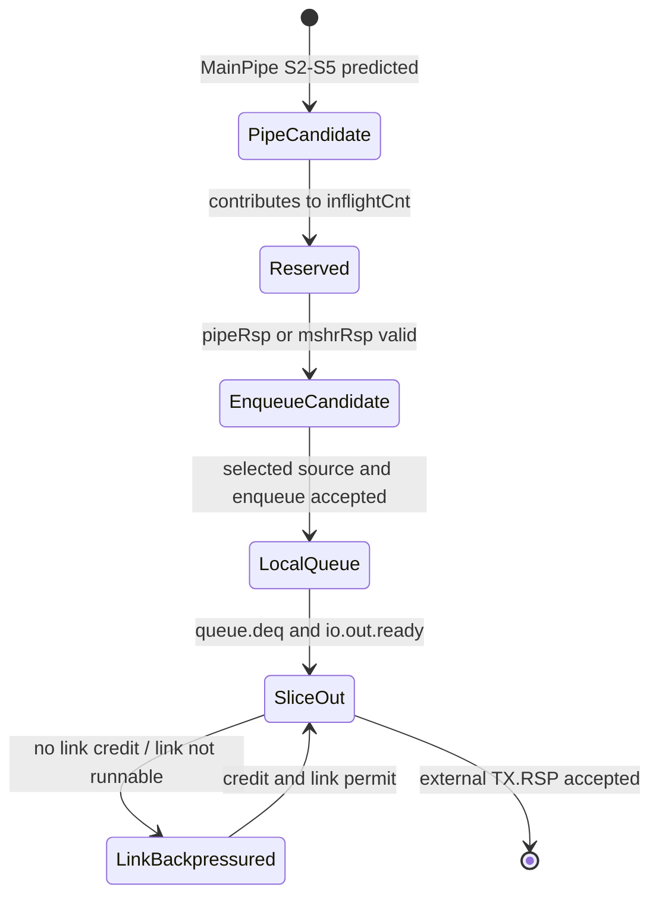
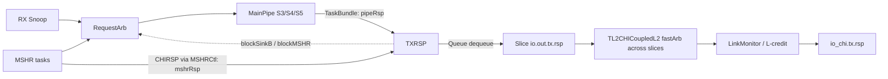
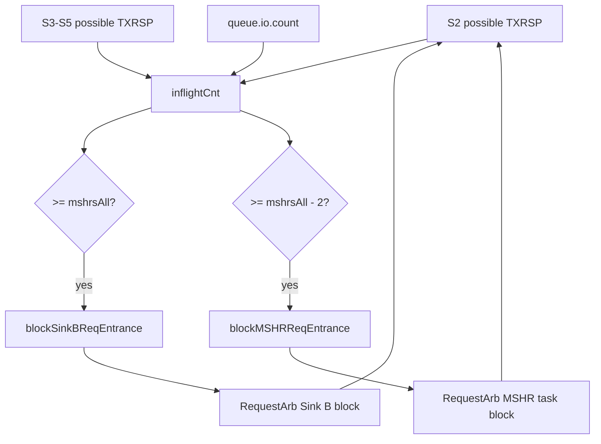

# 香山昆明湖 V2：CoupledL2 TXRSP 源码分析

> **结论先行。** Kunminghu V2 的 `TXRSP` 是 CHI 模式下 CoupledL2 每个 Slice 的“无数据响应”发送缓冲与入口配额控制单元：它接收 MainPipe 产生的 `TaskBundle` 或 MSHR 已构造好的 `CHIRSP`，以 MainPipe 优先的方式写入一个深度为 `mshrsAll` 的响应队列，再经 Slice、跨 bank 仲裁和 CHI LinkMonitor 发到 `io_chi.tx.rsp`。它不是 HuanCun 的子模块，也不执行 tag/data 查找、地址索引、TLB 翻译或数据传输。最关键的实现策略是：在响应真正入队之前就统计 MainPipe S2--S5 中可能到达 TXRSP 的请求，并在满额前分别阻塞 Sink B 与 MSHR 入口，从而支撑 `pipeRsp.ready := true.B` 这一局部不反压约束。[TXRSP.scala:43](</home/yanyusong/xs-memory-env/XiangShan/coupledL2/src/main/scala/coupledL2/tl2chi/TXRSP.scala:43>)

本文只把用户提供的 Kunminghu V2 源码作为实现事实的依据。香山 Design Doc 仅在第 18 节作逐项对照，且明确标出文档与源码的差异；没有用 Design Doc 补全任何未在源码中证实的行为。

## 1. 范围、版本与证据边界

### 1.1 分析对象

分析对象是 CoupledL2 的 `coupledL2.tl2chi.TXRSP`，不是泛指 CHI 协议中的任意响应通道。它处在 L2 Slice 的下行 CHI 侧：Slice 同时实例化 `TXREQ`、`TXDAT` 与 `TXRSP`，并把后者接到 `mainPipe.io.toTXRSP`、`mshrCtl.io.toTXRSP` 和 `io.out.tx.rsp`。[Slice.scala:47](</home/yanyusong/xs-memory-env/XiangShan/coupledL2/src/main/scala/coupledL2/tl2chi/Slice.scala:47>) [Slice.scala:69](</home/yanyusong/xs-memory-env/XiangShan/coupledL2/src/main/scala/coupledL2/tl2chi/Slice.scala:69>) [Slice.scala:207](</home/yanyusong/xs-memory-env/XiangShan/coupledL2/src/main/scala/coupledL2/tl2chi/Slice.scala:207>)

| 项目 | 本次固定版本/范围 | 用途 |
| --- | --- | --- |
| Kunminghu 源码 | `/home/yanyusong/xs-memory-env/XiangShan`，`kunminghu-v2@e12436c7cba86b195deec24981976d78bc263661` | 顶层选择、配置与集成依据 |
| CoupledL2 子模块 | `coupledL2@fb5469838c8902b6cb33992c0a30ee3d446e4453` | TXRSP、MainPipe、MSHR、CHI 链路实现 |
| utility 子模块 | `utility@2f0743f1f3ee1889049841926fa382cd0b32d8e2` | FastArbiter 的轮转与 ready 语义 |
| HuanCun 子模块 | `huancun@65ef077373ecf398b4cecdea06b65ef9b8d79044` | 排除错误归属，说明非 CHI 分支 |
| 设计文档 | `/home/yanyusong/XiangShan-Design-Doc`，`kunminghu-v2@58d9e2ad11f044cb6f8887d9687d9e110696d1aa` | 仅作第 18 节意图对照 |
| 观察方式 | Scala 源码静态追踪；没有运行 RTL、仿真或 FST | 所有周期波形均标为“源码关系示意”，不是实测波形 |

本次使用的分析 skill 的周同步脚本已执行；其状态显示距上次同步不足七天，因此未重新拉取。源代码工作树中已有与本任务无关的改动，本分析没有修改它们。

### 1.2 名称边界：为什么重点看 CoupledL2，也必须审计 HuanCun

在该配置中，`EnableCHI` 为真时顶层选择 `TL2CHICoupledL2`；为假时才选择 TileLink 版本 `TL2TLCoupledL2`。[L2Top.scala:111](</home/yanyusong/xs-memory-env/XiangShan/src/main/scala/xiangshan/L2Top.scala:111>) 同一配置文件只在 `!EnableCHI` 时生成 HuanCun 的 `L3CacheParamsOpt`，CHI 情形则转为 `OpenLLCParamsOpt`。[Configs.scala:333](</home/yanyusong/xs-memory-env/XiangShan/src/main/scala/top/Configs.scala:333>)

对固定版本的独立 `huancun/src/main/scala` 及其测试源码检索 `TXRSP`、`CHIRSP`、`CHI`、`tx.rsp`、`rx.rsp` 均没有命中；`HuanCun.scala` 导入并构造的是 Rocket Chip TileLink 端口与 Slice。[HuanCun.scala:20](</home/yanyusong/xs-memory-env/XiangShan/huancun/src/main/scala/huancun/HuanCun.scala:20>) [HuanCun.scala:180](</home/yanyusong/xs-memory-env/XiangShan/huancun/src/main/scala/huancun/HuanCun.scala:180>) 因而下文不能写成“TXRSP 发往 HuanCun”：有效运行时路径是 CHI CoupledL2 到 CHI 链路/下游 OpenLLC 或 OpenNCB。CoupledL2 可能复用 HuanCun 的少量参数或元数据类型，这只是编译期依赖，不构成 TXRSP 的运行时通道。[CoupledL2.scala:33](</home/yanyusong/xs-memory-env/XiangShan/coupledL2/src/main/scala/coupledL2/CoupledL2.scala:33>)

## 2. 源码证据目录与术语

下表是本文每类结论的首要代码落点。后续章节仍会给出紧邻论断的行链接，避免把“模块名相似”当作数据通路证据。

| 主题 | 首要源码证据 | 能直接证实的事实 |
| --- | --- | --- |
| TXRSP 边界与队列 | [TXRSP.scala:32](</home/yanyusong/xs-memory-env/XiangShan/coupledL2/src/main/scala/coupledL2/tl2chi/TXRSP.scala:32>) | 两个输入、一个输出、五级状态观察口、两个入口阻塞信号与一条 CHIRSP Queue |
| Slice 接线 | [Slice.scala:69](</home/yanyusong/xs-memory-env/XiangShan/coupledL2/src/main/scala/coupledL2/tl2chi/Slice.scala:69>) | MainPipe/MSHRCtl 到 TXRSP，以及 TXRSP 到 Slice TX.RSP |
| 产生 TXRSP 的流水线判定 | [MainPipe.scala:647](</home/yanyusong/xs-memory-env/XiangShan/coupledL2/src/main/scala/coupledL2/tl2chi/MainPipe.scala:647>) | 无数据的 Sink B snoop 响应和部分 MSHR probe 响应走 TXRSP；需要数据的路径走 TXDAT |
| MSHR 直接响应 | [MSHR.scala:275](</home/yanyusong/xs-memory-env/XiangShan/coupledL2/src/main/scala/coupledL2/tl2chi/MSHR.scala:275>) | 读/写 CompAck 能直接成为 CHIRSP，不必经过 TaskBundle 转换 |
| 入口反压闭环 | [RequestArb.scala:114](</home/yanyusong/xs-memory-env/XiangShan/coupledL2/src/main/scala/coupledL2/RequestArb.scala:114>) | TXRSP 的阻塞信号确实反馈到 MSHR/Sink B 进入 RequestArb 的路径 |
| 跨 bank 与 CHI 链路 | [TL2CHICoupledL2.scala:150](</home/yanyusong/xs-memory-env/XiangShan/coupledL2/src/main/scala/coupledL2/tl2chi/TL2CHICoupledL2.scala:150>) | 每个 Slice 的 TXRSP 再经顶层仲裁，最终进入 LinkMonitor |

本文采用的三个“接受”术语都遵从对应 `DecoupledIO` 的 `valid && ready` 关系：

| 术语 | 本文含义 | 不能据此推断的内容 |
| --- | --- | --- |
| 入队接受 | `queue.io.enq.valid && queue.io.enq.ready` | Chisel Queue 的同周期出入队、满/空边界指针细节；这些要看库实现或生成 RTL |
| 本地输出接受 | `io.out.valid && io.out.ready` | 已经在 CHI 引脚上发出；后面还有跨 bank 仲裁和 LinkMonitor |
| CHI 链路发送 | LinkMonitor 接受输入并形成 `flitv/flit` | 下游互连或远端已经完成协议事务 |

## 3. 从缓存响应概念到本实现

这里的“响应”不是一次 cache line 回传。`CHIRSP` 的字段是 ID、opcode、response/fwd state、错误码和 trace tag 等控制信息；数据走另一个 `TXDAT` 通道。[Message.scala:555](</home/yanyusong/xs-memory-env/XiangShan/coupledL2/src/main/scala/coupledL2/tl2chi/chi/Message.scala:555>) [Bundle.scala:27](</home/yanyusong/xs-memory-env/XiangShan/coupledL2/src/main/scala/coupledL2/tl2chi/Bundle.scala:27>) 因而 TXRSP 的核心任务是将“已经决定的无数据协议响应”排队和送出，而不是重新执行目录查询或数据阵列读出。

MainPipe 的分类同时给出这一边界：对于普通 Sink B 任务，`fromB && !need_mshr && !hasData` 选 TXRSP；同类任务若 `doRespData` 为真则选 TXDAT。对于来自 MSHR 的任务，`mshr_snpRespX` 选 TXRSP，而数据型 snoop 响应选 TXDAT。[MainPipe.scala:647](</home/yanyusong/xs-memory-env/XiangShan/coupledL2/src/main/scala/coupledL2/tl2chi/MainPipe.scala:647>) [MainPipe.scala:652](</home/yanyusong/xs-memory-env/XiangShan/coupledL2/src/main/scala/coupledL2/tl2chi/MainPipe.scala:652>)

因此可以把 TXRSP 放在下面这个责任链上理解：

1. 上游 MainPipe/MSHR 已经做出响应类别和一致性决定；
2. TXRSP 预留未来会抵达的响应槽位，并把入口压力反馈给 RequestArb；
3. TXRSP 将两类来源收敛成单口 CHIRSP 队列；
4. L2 顶层把多个 Slice 的队列输出收敛成一个 CHI TX.RSP 链路；
5. LinkMonitor 再把内部 Decoupled 流量受链路状态和 L-credit 约束地变成 CHI flit。

这五步分别有明确模块边界，不能把其中任一步归因给 TXRSP 本体。

## 4. Kunminghu V2 的有效配置与物理范围

`KunminghuV2Config` 设置 L2 为 1 MiB、inclusive、4 banks，并启用 CHI。[Configs.scala:481](</home/yanyusong/xs-memory-env/XiangShan/src/main/scala/top/Configs.scala:481>) `L2CacheConfig` 的默认相联度为 8，默认 bank 数为 1；Kunminghu V2 的显式 4-bank 覆盖使同一配置下有四个 Slice。[Configs.scala:278](</home/yanyusong/xs-memory-env/XiangShan/src/main/scala/top/Configs.scala:278>)

`L2Param` 默认给出 64 B block、16 个 MSHR，以及 `txSourceReady = false`。[L2Param.scala:69](</home/yanyusong/xs-memory-env/XiangShan/coupledL2/src/main/scala/coupledL2/L2Param.scala:69>) [L2Param.scala:74](</home/yanyusong/xs-memory-env/XiangShan/coupledL2/src/main/scala/coupledL2/L2Param.scala:74>) [L2Param.scala:106](</home/yanyusong/xs-memory-env/XiangShan/coupledL2/src/main/scala/coupledL2/L2Param.scala:106>) TXRSP 用 `mshrsAll` 建队列，CoupledL2 参数将其取自 cache parameter 的 `mshrs`。[TXRSP.scala:47](</home/yanyusong/xs-memory-env/XiangShan/coupledL2/src/main/scala/coupledL2/tl2chi/TXRSP.scala:47>) [CoupledL2.scala:127](</home/yanyusong/xs-memory-env/XiangShan/coupledL2/src/main/scala/coupledL2/CoupledL2.scala:127>)

在该固定配置下，可得到下列**结构性**数值：

| 项目 | 推导 | 结果 | 解释 |
| --- | --- | --- | --- |
| 每 Slice TXRSP Queue 深度 | `entries = mshrsAll = 16` | 16 条 CHIRSP | 直接由实例参数和默认值给出 |
| Slice 数 | Kunminghu V2 的 `banks = 4` | 4 | 每个 bank 一套 Slice/TXRSP |
| 所有本地队列容量之和 | `4 * 16` | 64 条 | 是物理存储上限的加和，不是一个可自由共享的“全局 64 深度队列” |
| 每 bank sets | `1 MiB / (4 * 8 ways * 64 B)` | 512 sets | 仅说明 Slice 的 cache 几何；TXRSP 不直接用 set index |

最后一行特别容易被误读：TXRSP 的 IO 中没有地址、set 或 way 字段，源码也没有目录/DataStorage 端口，所以它不参与上述 512-set 索引计算。[TXRSP.scala:32](</home/yanyusong/xs-memory-env/XiangShan/coupledL2/src/main/scala/coupledL2/tl2chi/TXRSP.scala:32>) 该计算只用于定位它所服务的 L2 Slice 范围。

## 5. 模块边界与接口

### 5.1 TXRSP 自身 IO

| 信号 | 方向 | 类型/来源 | 本模块中的用途 |
| --- | --- | --- | --- |
| `pipeRsp` | 输入 | `DecoupledIO[TaskBundle]`，来自 MainPipe | 优先入队；转换成 CHIRSP |
| `mshrRsp` | 输入 | `DecoupledIO[CHIRSP]`，来自 MSHRCtl | 在没有 pipeRsp 且容量允许时入队 |
| `out` | 输出 | `DecoupledIO[CHIRSP]`，去 Slice TX.RSP | 直接连接内部队列 dequeue |
| `pipeStatusVec` | 输入 | 5 个 `ValidIO[PipeStatusWithCHI]` | 统计 S2--S5 中可能到来的 TXRSP |
| `toReqArb` | 输出 | `TXRSPBlockBundle` | 反馈阻塞 Sink B / MSHR 入口 |

上述五项均由 TXRSP 的 IO 定义给出。[TXRSP.scala:32](</home/yanyusong/xs-memory-env/XiangShan/coupledL2/src/main/scala/coupledL2/tl2chi/TXRSP.scala:32>) `Slice` 将前四个接口分别接到 MainPipe、MSHRCtl、状态向量和 Slice 的外部 TX.RSP 端口，并把 `toReqArb` 接回 RequestArb。[Slice.scala:69](</home/yanyusong/xs-memory-env/XiangShan/coupledL2/src/main/scala/coupledL2/tl2chi/Slice.scala:69>) [Slice.scala:102](</home/yanyusong/xs-memory-env/XiangShan/coupledL2/src/main/scala/coupledL2/tl2chi/Slice.scala:102>)

### 5.2 上下游和责任分割

| 模块 | 对 TXRSP 的关系 | 源码可证实的职责 |
| --- | --- | --- |
| RXSNP | 上游间接来源 | 将 CHI snoop 转为 TaskBundle，保存 snoop 的 ID/opcode/forward 信息 |
| RequestArb | 入口控制的接收者 | 接收 TXRSP 的两类阻塞位，决定 Sink B 和 MSHR task 能否进入 |
| MainPipe | `pipeRsp` 生产者 | 在 S3/S4/S5 保持待发任务并在候选中仲裁 |
| MSHRCtl / MSHR | `mshrRsp` 生产者 | 对多个 MSHR 直接 CHIRSP 做仲裁；MSHR 可产生 CompAck |
| TXRSP | 本文对象 | 预留、输入选择、TaskBundle 到 CHIRSP 转换、队列化 |
| TL2CHICoupledL2 | 下游聚合者 | 对所有 Slice 的 TXRSP 做快速仲裁 |
| LinkMonitor | 下游链路适配 | 根据 link state 和 L-credit 向内部 Decoupled 路径施加 ready |

RXSNP 在入 L2 时把 `srcID`、`txnID`、`fwdNID`、`fwdTxnID`、opcode 等放进 TaskBundle。[RXSNP.scala:131](</home/yanyusong/xs-memory-env/XiangShan/coupledL2/src/main/scala/coupledL2/tl2chi/RXSNP.scala:131>) MainPipe 的 S3/S4/S5 TXRSP 候选交给一个 arbiter。[MainPipe.scala:1023](</home/yanyusong/xs-memory-env/XiangShan/coupledL2/src/main/scala/coupledL2/tl2chi/MainPipe.scala:1023>) MSHRCtl 则对多个 MSHR 的直接 TXRSP 口调用 `fastArb`。[MSHRCtl.scala:168](</home/yanyusong/xs-memory-env/XiangShan/coupledL2/src/main/scala/coupledL2/tl2chi/MSHRCtl.scala:168>)

## 6. TXRSP 为什么需要“未来响应”配额

若只看内部 Queue 的当前计数，MainPipe 中已过入口、但还在 S2--S5 的请求会在若干周期后到达 TXRSP；届时由于 `pipeRsp.ready` 被固定为真，模块本身不能再以正常的 Decoupled ready 把它停住。源码因此将“队列已占用”与“管线中可预见的 TXRSP”相加为 `inflightCnt`，并断言其不超过 `mshrsAll`。[TXRSP.scala:53](</home/yanyusong/xs-memory-env/XiangShan/coupledL2/src/main/scala/coupledL2/tl2chi/TXRSP.scala:53>) [TXRSP.scala:63](</home/yanyusong/xs-memory-env/XiangShan/coupledL2/src/main/scala/coupledL2/tl2chi/TXRSP.scala:63>)

源码等价伪代码如下。它保留了 `fromB` 和 `mshrTask` 的来源判别，避免把不可能成为此队列响应的普通流水线任务计入：

```scala
inflightCnt =
  PopCount(S3_to_S5.valid && toTXRSP && (fromB || mshrTask)) +
  PopCount(S2.valid && (if (mshrTask) toTXRSP else fromB)) +
  queue.io.count
```

这是对 [TXRSP.scala:54](</home/yanyusong/xs-memory-env/XiangShan/coupledL2/src/main/scala/coupledL2/tl2chi/TXRSP.scala:54>) 到 [TXRSP.scala:61](</home/yanyusong/xs-memory-env/XiangShan/coupledL2/src/main/scala/coupledL2/tl2chi/TXRSP.scala:61>) 的直接改写。原码自己保留了“可能不精确、导致 false positive back pressure”的 TODO；因此本文把它称为**保守预留**，不把它说成精确的未来入队计数。

满额策略并非对两类入口一视同仁：

| 阈值 | 输出阻塞位 | RequestArb 中的效果 | 可观测意图 |
| --- | --- | --- | --- |
| `inflightCnt >= mshrsAll` | `blockSinkBReqEntrance` | Sink B 被阻塞 | 最后两个槽位仍可服务 MSHR 来源 |
| `inflightCnt >= mshrsAll - 2` | `blockMSHRReqEntrance` | MSHR task 不再进入 | 在达到全满前停止新增 MSHR 入口 |

阈值和两个阻塞位是直接赋值关系。[TXRSP.scala:65](</home/yanyusong/xs-memory-env/XiangShan/coupledL2/src/main/scala/coupledL2/tl2chi/TXRSP.scala:65>) RequestArb 的 MSHR ready 条件显式包含 `!blockMSHRReqEntrance`，Sink B 的 block 条件显式包含 `blockSinkBReqEntrance`。[RequestArb.scala:114](</home/yanyusong/xs-memory-env/XiangShan/coupledL2/src/main/scala/coupledL2/RequestArb.scala:114>) [RequestArb.scala:136](</home/yanyusong/xs-memory-env/XiangShan/coupledL2/src/main/scala/coupledL2/RequestArb.scala:136>) “保留两个槽位是为了什么协议情形”的精确原因没有在源码注释中给出，故只能把“优先保留 MSHR 入口余量”视为从阈值推导出的设计意图，而不是已证实的协议规则。

## 7. 动态数据流：三种到达 TXRSP 的路径

### 7.1 路径 A：无数据的直接 snoop 响应

RXSNP 先把外部 CHI snoop 打包为 `TaskBundle`；该任务标记为非 MSHR 任务并携带 snoop 关联字段。[RXSNP.scala:131](</home/yanyusong/xs-memory-env/XiangShan/coupledL2/src/main/scala/coupledL2/tl2chi/RXSNP.scala:131>) MainPipe 在 S3 对它判断：满足 `fromB && !need_mshr && !hasData` 时置 `isTXRSP_s3`，并把任务送到 `txrsp_s3`。[MainPipe.scala:647](</home/yanyusong/xs-memory-env/XiangShan/coupledL2/src/main/scala/coupledL2/tl2chi/MainPipe.scala:647>) 随后 S3/S4/S5 候选经 MainPipe 内部 arbiter 成为 `toTXRSP`。[MainPipe.scala:1023](</home/yanyusong/xs-memory-env/XiangShan/coupledL2/src/main/scala/coupledL2/tl2chi/MainPipe.scala:1023>)

到 TXRSP 后，`toCHIRSPBundle` 复制关联 ID、opcode、response/fwd state 和 trace tag，并由 `task.denied` 选择 `NDERR` 或 `OK`。[TXRSP.scala:81](</home/yanyusong/xs-memory-env/XiangShan/coupledL2/src/main/scala/coupledL2/tl2chi/TXRSP.scala:81>) 这条路径没有 data payload。

### 7.2 路径 B：MSHR 产生、仍需经 MainPipe 的 snoop 响应

MSHR 可以把 probe acknowledgement 组织成 MainPipe 任务；当不需数据时它将 `txChannel` 选为 TXRSP，并根据 forward/response-data 决定 `SnpResp`、`SnpRespFwded` 或数据型变体。[MSHR.scala:620](</home/yanyusong/xs-memory-env/XiangShan/coupledL2/src/main/scala/coupledL2/tl2chi/MSHR.scala:620>) MainPipe 对 MSHR 任务以 `mshr_snpRespX` 判定 TXRSP，数据型 `mshr_snpRespDataX` 留给 TXDAT。[MainPipe.scala:647](</home/yanyusong/xs-memory-env/XiangShan/coupledL2/src/main/scala/coupledL2/tl2chi/MainPipe.scala:647>) 因此“来自 MSHR”不等于“一定走 mshrRsp”；它可能先成为 `pipeRsp`。

### 7.3 路径 C：MSHR 直接生成 CompAck

每个 MSHR 还有单独的 `tasks.txrsp`，读/写完成确认的 valid 由 `rcompack_valid` / `wcompack_valid` 生成。[MSHR.scala:275](</home/yanyusong/xs-memory-env/XiangShan/coupledL2/src/main/scala/coupledL2/tl2chi/MSHR.scala:275>) 它在 MSHR 内部直接构造 `CHIRSP`，opcode 为 `CompAck`，再由 MSHRCtl 的 `fastArb` 合并成 TXRSP 的 `mshrRsp`。[MSHR.scala:340](</home/yanyusong/xs-memory-env/XiangShan/coupledL2/src/main/scala/coupledL2/tl2chi/MSHR.scala:340>) [MSHRCtl.scala:168](</home/yanyusong/xs-memory-env/XiangShan/coupledL2/src/main/scala/coupledL2/tl2chi/MSHRCtl.scala:168>)

这条路径绕过 `toCHIRSPBundle`，所以不能把 TaskBundle 的 `denied -> NDERR` 映射外推到它。MSHR 构造代码先将 bundle 置零，再写入 CompAck 所需字段；是否含有其他错误语义必须以该构造路径本身为准。[MSHR.scala:340](</home/yanyusong/xs-memory-env/XiangShan/coupledL2/src/main/scala/coupledL2/tl2chi/MSHR.scala:340>)

MSHR 在自己的 `io.tasks.txrsp.fire` 上立即置位 `s_rcompack`/`s_wcompack`。[MSHR.scala:1039](</home/yanyusong/xs-memory-env/XiangShan/coupledL2/src/main/scala/coupledL2/tl2chi/MSHR.scala:1039>) 该 fire 的边界是“直接 CHIRSP 已被 TXRSP 输入接受”，不是 TXRSP Queue 的 `out.fire`，更不是外部 `io_chi.tx.rsp.flitv`。因此 MSHR 的本地完成推进可以早于物理链路实际发送。

### 7.4 出口路径

TXRSP 的 `out` 是内部 Queue 的 dequeue 直通连接。[TXRSP.scala:71](</home/yanyusong/xs-memory-env/XiangShan/coupledL2/src/main/scala/coupledL2/tl2chi/TXRSP.scala:71>) Slice 将它接到 `io.out.tx.rsp`。[Slice.scala:207](</home/yanyusong/xs-memory-env/XiangShan/coupledL2/src/main/scala/coupledL2/tl2chi/Slice.scala:207>) 因而 TXRSP 的 `out.fire` 只说明本地队列把逻辑响应交给了 Slice 后级，不等同于物理 CHI `flitv` 已发出。之后顶层用一个 `fastArb` 合并所有 Slice 的 TXRSP，LinkMonitor 再把仲裁输出接至外部 `io_chi`。[TL2CHICoupledL2.scala:150](</home/yanyusong/xs-memory-env/XiangShan/coupledL2/src/main/scala/coupledL2/tl2chi/TL2CHICoupledL2.scala:150>) [TL2CHICoupledL2.scala:267](</home/yanyusong/xs-memory-env/XiangShan/coupledL2/src/main/scala/coupledL2/tl2chi/TL2CHICoupledL2.scala:267>)

## 8. 索引、路由和事务身份

### 8.1 TXRSP 没有 cache index

TXRSP 本身没有 `addr`、`set`、`tag`、`way`、Directory 或 DataStorage 接口；其显式输入是两个响应流和管线状态向量。[TXRSP.scala:32](</home/yanyusong/xs-memory-env/XiangShan/coupledL2/src/main/scala/coupledL2/tl2chi/TXRSP.scala:32>) 所以它不做地址拆分，也不能在此处分析“set 命中/way 替换”。地址已经在 RXSNP/MainPipe/MSHR 的前置流程中使用；例如 RXSNP 从 snoop 地址恢复 TaskBundle 的地址字段。[RXSNP.scala:131](</home/yanyusong/xs-memory-env/XiangShan/coupledL2/src/main/scala/coupledL2/tl2chi/RXSNP.scala:131>)

### 8.2 本模块唯一的“位置”是管线阶段与队列占用

`pipeStatusVec` 的前两个位置被视为 S1/S2，其中 TXRSP 只单独取 S2；后面三个位置代表 S3--S5。对 S3--S5，只有 `toTXRSP && (fromB || mshrTask)` 的有效任务计数；对 S2，MSHR 任务还额外要求 `toTXRSP`，非 MSHR 则按 `fromB` 计数。[TXRSP.scala:53](</home/yanyusong/xs-memory-env/XiangShan/coupledL2/src/main/scala/coupledL2/tl2chi/TXRSP.scala:53>) 这是队列槽位预留的路由判定，不能误称为 cache address index。

### 8.3 事务身份保持

TaskBundle 转 CHIRSP 的路径在**本地队列侧**复制 `tgtID`、`srcID`、`txnID`、`dbID`、`pCrdType`、`chiOpcode`、`resp`、`fwdState`、`traceTag`。[TXRSP.scala:81](</home/yanyusong/xs-memory-env/XiangShan/coupledL2/src/main/scala/coupledL2/tl2chi/TXRSP.scala:81>) 这证明 TXRSP 的转换不重新分配 snoop 的 `txnID`；各字段的 CHIRSP 定义可在消息 bundle 中核对。[Message.scala:555](</home/yanyusong/xs-memory-env/XiangShan/coupledL2/src/main/scala/coupledL2/tl2chi/chi/Message.scala:555>)

但不能把该本地 `srcID` 说成最终 CHI 引脚值。LinkMonitor 在 TX.RSP 的 L-credit/source-ready 适配前调用 `setSrcID(io.in.tx.rsp, io.nodeID)`。[LinkLayer.scala:393](</home/yanyusong/xs-memory-env/XiangShan/coupledL2/src/main/scala/coupledL2/tl2chi/chi/LinkLayer.scala:393>) `setSrcID` 会在 bundle 中名为 `srcID` 的字段强制写入传入的 node ID。[LinkLayer.scala:433](</home/yanyusong/xs-memory-env/XiangShan/coupledL2/src/main/scala/coupledL2/tl2chi/chi/LinkLayer.scala:433>) 因而验证事务身份时应分别观测“TXRSP Queue 内暂存值”和“物理 TX flit 值”。

对直接 CompAck，身份字段由 MSHR 的另一套构造代码写入。[MSHR.scala:340](</home/yanyusong/xs-memory-env/XiangShan/coupledL2/src/main/scala/coupledL2/tl2chi/MSHR.scala:340>) 因而验证时必须按来源分别检查字段，不能只套用 `toCHIRSPBundle` 的映射表。

## 9. 核心控制算法

### 9.1 输入选择：不是公平二选一

TXRSP 的输入合并没有调用 Arbiter，而是直接用布尔表达式和 `Mux(pipeRsp.valid, ...)`：

```scala
queue.enq.valid := pipeRsp.valid ||
  (mshrRsp.valid && !noSpaceForSinkBReq && !noSpaceForMSHRReq)
queue.enq.bits  := Mux(pipeRsp.valid, toCHIRSPBundle(pipeRsp.bits), mshrRsp.bits)
pipeRsp.ready   := true.B
mshrRsp.ready   := !pipeRsp.valid &&
  !noSpaceForSinkBReq && !noSpaceForMSHRReq
```

这是 [TXRSP.scala:75](</home/yanyusong/xs-memory-env/XiangShan/coupledL2/src/main/scala/coupledL2/tl2chi/TXRSP.scala:75>) 到 [TXRSP.scala:79](</home/yanyusong/xs-memory-env/XiangShan/coupledL2/src/main/scala/coupledL2/tl2chi/TXRSP.scala:79>) 的直译。Scala 的 `&&` 优先级高于 `||`，所以队列 valid 等价于“pipeRsp.valid，或（mshrRsp.valid 且两种 no-space 均为假）”。

由此得到三个可验证结论：

1. 同一周期两个输入都 valid 时，入队 payload 一定选 `pipeRsp`；
2. 该周期 `mshrRsp.ready` 为假，MSHR 直接响应不被接受；
3. 如果 MainPipe 持续 valid，TXRSP 本体没有跨来源轮转或 age-based 旁路逻辑，MSHR 直接响应的等待可能持续。

第三点是**潜在活性风险**，不是对实际工作负载下一定饥饿的断言：MSHRCtl 内部对多个 MSHR 使用 round-robin FastArbiter，但 pending mask 与轮转掩码只在 `io.out.fire` 时更新。[FastArbiter.scala:35](</home/yanyusong/xs-memory-env/XiangShan/utility/src/main/scala/utility/FastArbiter.scala:35>) [FastArbiter.scala:45](</home/yanyusong/xs-memory-env/XiangShan/utility/src/main/scala/utility/FastArbiter.scala:45>) 因而这一公平性只在它的输出被 TXRSP 接受时才推进。是否会在真实流量下形成长期饥饿，需要仿真或形式化 cover/property 验证。

### 9.2 两层仲裁

| 仲裁位置 | 候选 | 策略/证据 | 影响 |
| --- | --- | --- | --- |
| MainPipe 内部 | S3、S4、S5 的 TXRSP 候选 | 调用标准 `Arbiter`，传入次序为 `[s5, s4, s3]` | 确保一条 MainPipe 出口一次只给 TXRSP 一个任务；标准库精确优先级应以生成 RTL/库版本复核 |
| MSHRCtl 内部 | 所有 MSHR 直接 CHIRSP | `fastArb(mshrs.map(_.io.tasks.txrsp), ...)` | 多个 CompAck 候选收敛为一条 `mshrRsp` |
| TXRSP 输入 | `pipeRsp` 与 `mshrRsp` | 手工 priority mux | MainPipe 优先，非公平 |
| L2 顶层 | 所有 Slice TXRSP | `fastArb(slices.map(_.io.out.tx.rsp), txrsp, ...)` | 一个外部 TXRSP 出口 |

MainPipe 的候选集合和 MSHRCtl 的直接仲裁分别见 [MainPipe.scala:1023](</home/yanyusong/xs-memory-env/XiangShan/coupledL2/src/main/scala/coupledL2/tl2chi/MainPipe.scala:1023>)、[MSHRCtl.scala:168](</home/yanyusong/xs-memory-env/XiangShan/coupledL2/src/main/scala/coupledL2/tl2chi/MSHRCtl.scala:168>)；顶层仲裁见 [TL2CHICoupledL2.scala:150](</home/yanyusong/xs-memory-env/XiangShan/coupledL2/src/main/scala/coupledL2/tl2chi/TL2CHICoupledL2.scala:150>)。不能把 FastArbiter 的轮转性质误套到 TXRSP 的 pipe/MSHR 合并点。

### 9.3 反压闭环

TXRSP 不把 Queue 的 `enq.ready` 直接连到 `pipeRsp.ready`；后者始终为真，且源码有断言要求它始终为真。[TXRSP.scala:43](</home/yanyusong/xs-memory-env/XiangShan/coupledL2/src/main/scala/coupledL2/tl2chi/TXRSP.scala:43>) 该保证依赖第 6 节的保守预留，以及 RequestArb 将阻塞位提前作用于 Sink B 和 MSHR 入口。RequestArb 还暴露了 `sinkB_stall_by_TXRSP` 性能事件，说明这是有意监测的反压原因。[RequestArb.scala:335](</home/yanyusong/xs-memory-env/XiangShan/coupledL2/src/main/scala/coupledL2/RequestArb.scala:335>)

这里有一项必须保留的不确定性：`Queue(..., flow = false)` 的构造参数在源码中明确，但本次没有展开 Chisel Queue 库或生成 RTL。因此“满时同周期 dequeue 是否允许 enqueue”“reset 后指针如何实现”“flow=false 的所有边界时序”都不能只由本文件断言。[TXRSP.scala:47](</home/yanyusong/xs-memory-env/XiangShan/coupledL2/src/main/scala/coupledL2/tl2chi/TXRSP.scala:47>)

## 10. 状态、存储与更新时机

TXRSP 没有显式 `state` 寄存器、枚举状态机、flush、redirect 或取消输入；可见的存储是一个 `Queue[CHIRSP]`，容量控制则是组合统计 `queue.io.count` 加上管线状态向量。[TXRSP.scala:47](</home/yanyusong/xs-memory-env/XiangShan/coupledL2/src/main/scala/coupledL2/tl2chi/TXRSP.scala:47>) [TXRSP.scala:51](</home/yanyusong/xs-memory-env/XiangShan/coupledL2/src/main/scala/coupledL2/tl2chi/TXRSP.scala:51>)

| 逻辑状态 | 保存位置 | 进入条件 | 离开条件 | 代码证据 |
| --- | --- | --- | --- | --- |
| 未来候选 | MainPipe S2--S5 状态向量 | 任务已经进入流水线且可能发 TXRSP | 被 MainPipe 处理或不再满足分类 | [TXRSP.scala:53](</home/yanyusong/xs-memory-env/XiangShan/coupledL2/src/main/scala/coupledL2/tl2chi/TXRSP.scala:53>) |
| 入队候选 | `pipeRsp/mshrRsp` 组合接口 | 上游 `valid` | enqueue 接受，或上游保持 | [TXRSP.scala:75](</home/yanyusong/xs-memory-env/XiangShan/coupledL2/src/main/scala/coupledL2/tl2chi/TXRSP.scala:75>) |
| 已排队响应 | 内部 `Queue[CHIRSP]` | enqueue 接受 | dequeue 接受 | [TXRSP.scala:47](</home/yanyusong/xs-memory-env/XiangShan/coupledL2/src/main/scala/coupledL2/tl2chi/TXRSP.scala:47>) |
| 已交给 Slice 后级 | `io.out` Decoupled 接口 | `queue.io.deq.valid` | 下游 `ready` | [TXRSP.scala:71](</home/yanyusong/xs-memory-env/XiangShan/coupledL2/src/main/scala/coupledL2/tl2chi/TXRSP.scala:71>) |
| 链路待发/已发 | LinkMonitor 内部而非 TXRSP | 顶层仲裁接受 | link state / L-credit 允许发送 | [LinkLayer.scala:290](</home/yanyusong/xs-memory-env/XiangShan/coupledL2/src/main/scala/coupledL2/tl2chi/chi/LinkLayer.scala:290>) |

为了便于读图，可把这看作一个**概念生命周期**，而不是声称 TXRSP 有如下显式 FSM：



图中 `LinkBackpressured` 属于下游链路域，不是 TXRSP 中的状态寄存器；其依据是 LinkMonitor 的 L-credit 适配器只在 credit 非零且不禁发时给内部输入 ready。[LinkLayer.scala:268](</home/yanyusong/xs-memory-env/XiangShan/coupledL2/src/main/scala/coupledL2/tl2chi/chi/LinkLayer.scala:268>) [LinkLayer.scala:290](</home/yanyusong/xs-memory-env/XiangShan/coupledL2/src/main/scala/coupledL2/tl2chi/chi/LinkLayer.scala:290>)

## 11. 流水线、延迟和吞吐

### 11.1 与 MainPipe 的阶段关系

MainPipe 先在 S3 计算 TXRSP/TXDAT/TXREQ/SourceD 分类并要求它们 one-hot，再将任务通过 S4、S5 保持为候选；最后以 `Seq(txrsp_s5, txrsp_s4, txrsp_s3)` 交给 arbiter。[MainPipe.scala:647](</home/yanyusong/xs-memory-env/XiangShan/coupledL2/src/main/scala/coupledL2/tl2chi/MainPipe.scala:647>) [MainPipe.scala:1023](</home/yanyusong/xs-memory-env/XiangShan/coupledL2/src/main/scala/coupledL2/tl2chi/MainPipe.scala:1023>) TXRSP 自己又通过 `pipeStatusVec` 对 S2--S5 提前计数。[TXRSP.scala:53](</home/yanyusong/xs-memory-env/XiangShan/coupledL2/src/main/scala/coupledL2/tl2chi/TXRSP.scala:53>)

| 阶段/位置 | TXRSP 可见作用 | 不能从当前源码固定的结论 |
| --- | --- | --- |
| S2 | 被预留统计；不同来源的判断规则不同 | 一定会产生 TXRSP |
| S3 | 做 `isTXRSP_s3` 分类，建立 `txrsp_s3` | 一定当周期入 TXRSP Queue |
| S4/S5 | 保持/推进 TXRSP 候选 | 固定优先级或固定到达周期 |
| TXRSP Queue | 单口 enqueue/dequeue | 满/空边界的库级同周期行为 |
| 顶层/Link | 再仲裁和信用控制 | 从 MainPipe 起算的固定端到端周期数 |

### 11.2 可证明的上界与不可证明的固定延迟

| 指标 | 源码能支持的结论 |
| --- | --- |
| 每 Slice 入队吞吐 | TXRSP 只有一个 Queue enqueue 口，因此一个 Slice 每周期至多接受一条选中的 CHIRSP；同周期 pipeRsp 与 mshrRsp 不会同时入队。[TXRSP.scala:75](</home/yanyusong/xs-memory-env/XiangShan/coupledL2/src/main/scala/coupledL2/tl2chi/TXRSP.scala:75>) |
| 每 Slice 本地出队吞吐 | 一个 Queue dequeue 口经 `io.out` 输出，ready 允许时逻辑上至多一条/周期。[TXRSP.scala:71](</home/yanyusong/xs-memory-env/XiangShan/coupledL2/src/main/scala/coupledL2/tl2chi/TXRSP.scala:71>) |
| 全 L2 TXRSP 出口吞吐 | 所有 Slice 经过单一 `fastArb` 合并，内部接口每周期最多选择一条到外部 TXRSP 路径。[TL2CHICoupledL2.scala:150](</home/yanyusong/xs-memory-env/XiangShan/coupledL2/src/main/scala/coupledL2/tl2chi/TL2CHICoupledL2.scala:150>) |
| 最终发送吞吐 | 受 LinkMonitor 的 state 与 L-credit 限制；`txSourceReady=false` 的默认配置走 L-credit 适配。[L2Param.scala:106](</home/yanyusong/xs-memory-env/XiangShan/coupledL2/src/main/scala/coupledL2/L2Param.scala:106>) [LinkLayer.scala:290](</home/yanyusong/xs-memory-env/XiangShan/coupledL2/src/main/scala/coupledL2/tl2chi/chi/LinkLayer.scala:290>) |
| 端到端延迟 | **没有固定周期数。** S3/S4/S5 仲裁、队列等待、跨 bank 仲裁、link state 与 credit 都可增加等待。需要波形或 RTL testbench 才能测得特定场景最小/最大值。 |

这也是为何文档中的 WaveDrom 只能表达握手关系，而不能标注“必然 N cycle”。

## 12. 关键控制信号与原因

| 信号/条件 | 产生位置 | 直接作用 | 设计理由（事实与推断分开） |
| --- | --- | --- | --- |
| `inflightCnt` | TXRSP | 与 `mshrsAll` 比较 | 事实：队列占用加潜在 S2--S5 响应；推断：提前为不可直接回压的 pipeRsp 预留空间 |
| `blockSinkBReqEntrance` | TXRSP | RequestArb 的 Sink B block | 事实：只在满额时为真；防止继续允许可产生 TXRSP 的 snoop 进入 |
| `blockMSHRReqEntrance` | TXRSP | RequestArb 的 mshrTask ready | 事实：从 `mshrsAll - 2` 起为真；精确“2”的协议动机未被源码解释 |
| `pipeRsp.ready = true` | TXRSP | 不对 MainPipe 出口反压 | 事实：恒真且有 assertion；保证依赖前置配额而非 Queue ready 直连 |
| `mshrRsp.ready` | TXRSP | 接受直接 CompAck 等 MSHR CHIRSP | 仅在 pipeRsp 不 valid 且容量足够时为真，形成 pipe 优先 |
| `queue.io.deq.ready = io.out.ready` | TXRSP | 释放响应槽位 | 将下游阻塞直接传到队列 dequeue |

所有表中“事实”可回溯到 [TXRSP.scala:53](</home/yanyusong/xs-memory-env/XiangShan/coupledL2/src/main/scala/coupledL2/tl2chi/TXRSP.scala:53>)、[TXRSP.scala:65](</home/yanyusong/xs-memory-env/XiangShan/coupledL2/src/main/scala/coupledL2/tl2chi/TXRSP.scala:65>) 和 [TXRSP.scala:71](</home/yanyusong/xs-memory-env/XiangShan/coupledL2/src/main/scala/coupledL2/tl2chi/TXRSP.scala:71>)。这里没有把“MSHR 先阻塞两格”写成 CHI 标准要求，因为当前源码只展示了本实现的阈值。

## 13. 数据路径和跨边界行为

### 13.1 TaskBundle 到 CHIRSP 的字段映射

| CHIRSP 字段 | `pipeRsp` 路径来源 | 处理 |
| --- | --- | --- |
| `tgtID, txnID, dbID, pCrdType` | TaskBundle 对应 CHI 字段 | 在 TXRSP 队列侧逐字段复制 |
| `srcID` | TaskBundle 的暂存字段 | 在 TXRSP 队列侧复制；LinkMonitor 形成物理 TX flit 前改写为本节点 `nodeID` |
| `opcode` | `task.chiOpcode` | 逐字段复制 |
| `resp, fwdState` | TaskBundle 对应字段 | 逐字段复制 |
| `traceTag` | TaskBundle 对应字段 | 逐字段复制 |
| `respErr` | `task.denied` | `denied=true -> NDERR`，否则 `OK` |
| 未显式写入字段 | 新建 CHIRSP | 先整体清零；源码有 `TODO: Finish this` |

这是 `toCHIRSPBundle` 的逐句结果。[TXRSP.scala:81](</home/yanyusong/xs-memory-env/XiangShan/coupledL2/src/main/scala/coupledL2/tl2chi/TXRSP.scala:81>) `RespErr` 的编码中 `OK=00`、`NDERR=11`。[Message.scala:202](</home/yanyusong/xs-memory-env/XiangShan/coupledL2/src/main/scala/coupledL2/tl2chi/chi/Message.scala:202>) `srcID` 的物理发送值还应按 LinkMonitor 的 `setSrcID` 覆盖规则检查。[LinkLayer.scala:433](</home/yanyusong/xs-memory-env/XiangShan/coupledL2/src/main/scala/coupledL2/tl2chi/chi/LinkLayer.scala:433>) 直接 MSHR 路径不经过此函数，必须以 MSHR 的 CHIRSP 构造为准。[MSHR.scala:340](</home/yanyusong/xs-memory-env/XiangShan/coupledL2/src/main/scala/coupledL2/tl2chi/MSHR.scala:340>)

### 13.2 虚拟地址、cache line、MMIO 与其他边界

| 边界 | 源码观察 | 可下的结论 | 不应下的结论 |
| --- | --- | --- | --- |
| 虚拟地址/TLB | TXRSP IO 无虚拟地址或 TLB 接口 | TXRSP 不是地址翻译单元 | 整条 snoop 链路“从不含虚拟地址”；那需要审计更上游端口 |
| cache line 数据 | TXRSP 输出 `CHIRSP`，MainPipe 把需数据路径分给 TXDAT | TXRSP 只承担无 data 的控制响应 | 所有 snoop 都一定无数据 |
| cache index | 无 set/tag/way 与 Directory/DataStorage 接口 | 本模块不做 tag/data 查找或替换 | L2 整体不做这些操作 |
| MMIO/uncache | 顶层 TXRSP 聚合输入仅是 `slices.map(_.io.out.tx.rsp)` | 该 TXRSP 聚合点没有像 TXDAT 那样额外接入 MMIO 源 | 系统从不对 MMIO 产生 CHI RSP；需要更大范围追踪 |
| 原子/异常 | TXRSP 没有特化 atomic/flush/redirect IO | 没有证据表明它处理原子提交或前端重定向 | 原子事务在整个 L2/CHI 系统中不存在 |

前三项分别由 TXRSP IO 和 MainPipe 分类直接支持。[TXRSP.scala:32](</home/yanyusong/xs-memory-env/XiangShan/coupledL2/src/main/scala/coupledL2/tl2chi/TXRSP.scala:32>) [MainPipe.scala:647](</home/yanyusong/xs-memory-env/XiangShan/coupledL2/src/main/scala/coupledL2/tl2chi/MainPipe.scala:647>) 顶层对 TXRSP 的 Slice-only 聚合见 [TL2CHICoupledL2.scala:150](</home/yanyusong/xs-memory-env/XiangShan/coupledL2/src/main/scala/coupledL2/tl2chi/TL2CHICoupledL2.scala:150>)；对应的 TXDAT 聚合存在额外来源，故不能类比到 TXRSP。[TL2CHICoupledL2.scala:156](</home/yanyusong/xs-memory-env/XiangShan/coupledL2/src/main/scala/coupledL2/tl2chi/TL2CHICoupledL2.scala:156>)

## 14. 错误、调试、性能与复位边界

### 14.1 错误路径

MainPipe 路径把 `chnl_denied_s3` 写入 TXRSP TaskBundle 的 `denied` 字段。[MainPipe.scala:674](</home/yanyusong/xs-memory-env/XiangShan/coupledL2/src/main/scala/coupledL2/tl2chi/MainPipe.scala:674>) TXRSP 仅把这个布尔值编码为 `NDERR/OK`；它没有自己的重试状态机、错误恢复 FIFO 或 Difftest 比较端口。[TXRSP.scala:81](</home/yanyusong/xs-memory-env/XiangShan/coupledL2/src/main/scala/coupledL2/tl2chi/TXRSP.scala:81>) 接收侧的 `RetryAck`、PCrd grant 等控制在 MSHR 的接收/状态推进逻辑处理，不是 TXRSP 的职责。[MSHR.scala:1238](</home/yanyusong/xs-memory-env/XiangShan/coupledL2/src/main/scala/coupledL2/tl2chi/MSHR.scala:1238>) [MSHR.scala:1245](</home/yanyusong/xs-memory-env/XiangShan/coupledL2/src/main/scala/coupledL2/tl2chi/MSHR.scala:1245>)

### 14.2 断言与性能观测

TXRSP 有两条直接安全检查：

1. `pipeRsp.valid` 时必须标记为 `toTXRSP`；
2. `inflightCnt <= mshrsAll`，并要求 `pipeRsp.ready` 恒真。

它们位于 [TXRSP.scala:43](</home/yanyusong/xs-memory-env/XiangShan/coupledL2/src/main/scala/coupledL2/tl2chi/TXRSP.scala:43>) 与 [TXRSP.scala:63](</home/yanyusong/xs-memory-env/XiangShan/coupledL2/src/main/scala/coupledL2/tl2chi/TXRSP.scala:63>)。RequestArb 为 Sink B 被 TXRSP 阻塞提供性能事件，适合在仿真中量化预留策略造成的 backpressure。[RequestArb.scala:335](</home/yanyusong/xs-memory-env/XiangShan/coupledL2/src/main/scala/coupledL2/RequestArb.scala:335>) CHI 测试顶层会记录 `txrspflit`/`flitv`，但这只是链路日志观察点，不能等价为“已有 TXRSP Difftest 覆盖”。[TestTop.scala:166](</home/yanyusong/xs-memory-env/XiangShan/coupledL2/src/test/scala/chi/TestTop.scala:166>)

### 14.3 复位、取消和精确恢复

从 TXRSP 的 IO 和局部实现只能确认：没有显式 `flush`、`redirect`、取消请求或异常恢复端口。[TXRSP.scala:32](</home/yanyusong/xs-memory-env/XiangShan/coupledL2/src/main/scala/coupledL2/tl2chi/TXRSP.scala:32>) Queue 会受模块复位影响是 Chisel 实现惯例，但该库的复位细节和任何同周期边界行为未在本次证据范围内展开，故不能将其写成已审计的逐周期行为。建议在 RTL 级测试中单独验证 reset 后 `out.valid`、队列计数与未完成请求的处理。

## 15. 配置与 CSR 控制

TXRSP 的容量和 CHI 链路模式来自 elaboration-time 参数，而不是处理器运行时 CSR：

| 控制项 | 代码位置 | 生效阶段 | 对 TXRSP 的影响 |
| --- | --- | --- | --- |
| `EnableCHI` | L2Top 的实现分支 | 构建/参数化 | 决定选择 CHI CoupledL2 还是 TileLink CoupledL2 |
| `mshrs` / `mshrsAll` | L2Param 与 CoupledL2 参数 | 构建/参数化 | 决定 TXRSP Queue 深度和两个配额阈值 |
| `txSourceReady` | L2Param | 构建/参数化 | 决定 LinkMonitor 使用 source-ready 或 L-credit 适配路径 |
| 运行时 CSR | TXRSP IO 中不存在 | 不适用 | 没有源码证据表明 CSR 能动态改变 TXRSP 仲裁、深度或阈值 |

对应的 CHI/TileLink 选择见 [L2Top.scala:111](</home/yanyusong/xs-memory-env/XiangShan/src/main/scala/xiangshan/L2Top.scala:111>)，参数默认值见 [L2Param.scala:74](</home/yanyusong/xs-memory-env/XiangShan/coupledL2/src/main/scala/coupledL2/L2Param.scala:74>)、[L2Param.scala:106](</home/yanyusong/xs-memory-env/XiangShan/coupledL2/src/main/scala/coupledL2/L2Param.scala:106>)，TXRSP 的参数使用见 [TXRSP.scala:47](</home/yanyusong/xs-memory-env/XiangShan/coupledL2/src/main/scala/coupledL2/tl2chi/TXRSP.scala:47>)。没有因为“缓存模块通常可由 CSR 控制”而虚构控制寄存器。

## 16. 图解

### 16.1 模块和数据通路



图中的 MainPipe、MSHR 和 TXRSP 接线来自 [Slice.scala:69](</home/yanyusong/xs-memory-env/XiangShan/coupledL2/src/main/scala/coupledL2/tl2chi/Slice.scala:69>)；跨 Slice 和 LinkMonitor 两段来自 [TL2CHICoupledL2.scala:150](</home/yanyusong/xs-memory-env/XiangShan/coupledL2/src/main/scala/coupledL2/tl2chi/TL2CHICoupledL2.scala:150>)、[TL2CHICoupledL2.scala:267](</home/yanyusong/xs-memory-env/XiangShan/coupledL2/src/main/scala/coupledL2/tl2chi/TL2CHICoupledL2.scala:267>)。

### 16.2 入口预留与反压



这幅图仅表达组合控制依赖。`inflightCnt` 计算与阈值见 [TXRSP.scala:53](</home/yanyusong/xs-memory-env/XiangShan/coupledL2/src/main/scala/coupledL2/tl2chi/TXRSP.scala:53>)、[TXRSP.scala:65](</home/yanyusong/xs-memory-env/XiangShan/coupledL2/src/main/scala/coupledL2/tl2chi/TXRSP.scala:65>)；RequestArb 的实际消费点见 [RequestArb.scala:114](</home/yanyusong/xs-memory-env/XiangShan/coupledL2/src/main/scala/coupledL2/RequestArb.scala:114>)。

### 16.3 同周期 pipe 优先：源码关系示意

```wavedrom
{
  "signal": [
    { "name": "pipeRsp.valid", "wave": "0110" },
    { "name": "mshrRsp.valid", "wave": "0110" },
    { "name": "pipeRsp.ready", "wave": "1111" },
    { "name": "mshrRsp.ready", "wave": "1001" },
    { "name": "queue.enq.valid", "wave": "0110" }
  ],
  "head": { "text": "Assume noSpaceForSinkBReq=0, noSpaceForMSHRReq=0 and Queue can accept" }
}
```

第 1、2 拍中两个输入同时 valid 时，`pipeRsp.ready` 仍恒为 1，而 `mshrRsp.ready` 为 0；入队 bits 来自 pipeRsp。该图是 [TXRSP.scala:75](</home/yanyusong/xs-memory-env/XiangShan/coupledL2/src/main/scala/coupledL2/tl2chi/TXRSP.scala:75>) 的条件关系示意，不是 FST 波形，也不描述 Queue 满边界。

### 16.4 L-credit 阻塞：源码关系示意

```wavedrom
{
  "signal": [
    { "name": "queue.io.deq.valid", "wave": "01111" },
    { "name": "lcreditPool != 0", "wave": "00011" },
    { "name": "disableFlit", "wave": "11000" },
    { "name": "LinkMonitor input ready", "wave": "00011" },
    { "name": "accepted at LinkMonitor", "wave": "00010" },
    { "name": "out.flitv (registered)", "wave": "00001" }
  ],
  "head": { "text": "Illustrative credit/link-state release; exact cycle alignment requires RTL simulation" }
}
```

默认参数 `txSourceReady=false` 时，L-credit 适配器以“credit pool 非零且不禁发”给内部输入 ready，并用寄存后的 flit valid 驱动输出。[L2Param.scala:106](</home/yanyusong/xs-memory-env/XiangShan/coupledL2/src/main/scala/coupledL2/L2Param.scala:106>) [LinkLayer.scala:290](</home/yanyusong/xs-memory-env/XiangShan/coupledL2/src/main/scala/coupledL2/tl2chi/chi/LinkLayer.scala:290>) [LinkLayer.scala:294](</home/yanyusong/xs-memory-env/XiangShan/coupledL2/src/main/scala/coupledL2/tl2chi/chi/LinkLayer.scala:294>) 上图刻意不声称完整 LinkMonitor 的精确时钟相位。

## 17. 可验证性边界与未决项

本次产物是源码分析文档，不是已经跑过的功能验证报告。以下项目有明确的后续证据路径，但不能被静态 Scala 阅读替代：

| 未决项 | 为什么当前不能下定论 | 推荐证据 |
| --- | --- | --- |
| Queue 满/空同周期语义 | TXRSP 只给出 `Queue(..., flow = false)` 的使用点，没有 Chisel Queue 库/生成 RTL | 展开对应生成 RTL，写 simultaneous enqueue/dequeue assertion |
| pipe/MSHR 长期公平性 | 合并点是 priority mux；真实流量是否长期持续 pipe valid 未知 | 随机压力测试 + liveness/cover property |
| 精确端到端延迟 | MainPipe、Queue、top FastArbiter、link state 和 credit 都会等待 | 记录同一事务的 `txnID`，在 FST/仿真中量测 |
| reset 时的未完成请求 | 本模块没有显式取消/恢复协议 | 复位前后检查 Queue、`out.valid` 与上游事务状态 |
| HuanCun 路径上的等价物 | HuanCun 是 TileLink 路径，未出现 CHIRSP/TXRSP | 若研究非 CHI L3，应另选 HuanCun 的 TL channel 模块而非复用本文结论 |

这些边界来自 TXRSP 的 Queue 用法、优先级合并和无取消 IO，[TXRSP.scala:32](</home/yanyusong/xs-memory-env/XiangShan/coupledL2/src/main/scala/coupledL2/tl2chi/TXRSP.scala:32>) [TXRSP.scala:47](</home/yanyusong/xs-memory-env/XiangShan/coupledL2/src/main/scala/coupledL2/tl2chi/TXRSP.scala:47>) [TXRSP.scala:75](</home/yanyusong/xs-memory-env/XiangShan/coupledL2/src/main/scala/coupledL2/tl2chi/TXRSP.scala:75>)。表中列出的是验证建议，不是尚未发现的实现错误。

## 18. Design Doc 与源码对照

以下矩阵把本地 Design Doc 的 `cache/l2cache/downstream/TXRSP.md` 与固定版本源码逐项对照。表中“采纳”仅代表代码也证实该事实，不代表本文照抄文档。

| Design Doc 主题 | 文档表述概括 | 源码核对 | 结论 |
| --- | --- | --- | --- |
| 两类输入 | MainPipe 与 MSHR 共同向 TXRSP 送响应 | `pipeRsp: TaskBundle`、`mshrRsp: CHIRSP` 均在 TXRSP IO 中定义 | 匹配，但源码补充了两者 payload 类型不同。[TXRSP.scala:32](</home/yanyusong/xs-memory-env/XiangShan/coupledL2/src/main/scala/coupledL2/tl2chi/TXRSP.scala:32>) |
| 主流水线优先 | MainPipe 响应优先于 MSHR | `Mux(pipeRsp.valid, ...)` 与 `mshrRsp.ready := !pipeRsp.valid ...` | 匹配；源码还揭示该点没有公平轮转。[TXRSP.scala:75](</home/yanyusong/xs-memory-env/XiangShan/coupledL2/src/main/scala/coupledL2/tl2chi/TXRSP.scala:75>) |
| 缓冲队列 | 以队列平滑响应 | 深度为 `mshrsAll`、`flow=false` 的 CHIRSP Queue | 匹配；库级边界时序尚未由本文展开。[TXRSP.scala:47](</home/yanyusong/xs-memory-env/XiangShan/coupledL2/src/main/scala/coupledL2/tl2chi/TXRSP.scala:47>) |
| 入口流控 | 文档有一处把满额阻塞描述成 “TXREQ” | 代码实际驱动的是 `TXRSPBlockBundle`，并阻塞 Sink B/MSHR 进入 RequestArb | **术语不一致**；应以源码的 TXRSP 归属为准。[TXRSP.scala:26](</home/yanyusong/xs-memory-env/XiangShan/coupledL2/src/main/scala/coupledL2/tl2chi/TXRSP.scala:26>) [TXRSP.md:7](</home/yanyusong/XiangShan-Design-Doc/docs/zh/cache/l2cache/downstream/TXRSP.md:7>) |
| 阈值 | 通过计数避免溢出 | 代码明确是 `mshrsAll` 与 `mshrsAll - 2` 两级阈值，且有“可能 false positive”的 TODO | 文档较粗略；本文采用源码的精确条件和不确定性标记。[TXRSP.scala:53](</home/yanyusong/xs-memory-env/XiangShan/coupledL2/src/main/scala/coupledL2/tl2chi/TXRSP.scala:53>) |
| 下游发送 | 文档讨论发送响应 | 实现还经过跨 bank FastArbiter、LinkMonitor 的 link state/L-credit | 源码提供了文档未展开的端到端背压路径。[TL2CHICoupledL2.scala:150](</home/yanyusong/xs-memory-env/XiangShan/coupledL2/src/main/scala/coupledL2/tl2chi/TL2CHICoupledL2.scala:150>) [LinkLayer.scala:290](</home/yanyusong/xs-memory-env/XiangShan/coupledL2/src/main/scala/coupledL2/tl2chi/chi/LinkLayer.scala:290>) |

Design Doc 本身位于 [TXRSP.md:1](</home/yanyusong/XiangShan-Design-Doc/docs/zh/cache/l2cache/downstream/TXRSP.md:1>)。由表可见，本分析使用它来检查设计意图是否仍与代码一致，而具体阈值、字段映射、输入优先级、链路反压和 HuanCun 归属均来自仓库源码。

## 19. 场景化行为映射

| 场景 | 上游条件 | TXRSP 行为 | 下游/系统可观测结果 |
| --- | --- | --- | --- |
| 无数据 snoop hit | Sink B，`!need_mshr && !hasData` | MainPipe 产生 pipeRsp，TXRSP 转为 CHIRSP | 发送 SnpResp 类无数据响应 |
| snoop 需要数据 | Sink B，`doRespData` | MainPipe 选 TXDAT，不进入 TXRSP | TXRSP 队列不应产生该数据响应 |
| MSHR probe 无数据响应 | MSHR Task 标为 `mshr_snpRespX` | 经 MainPipe 成为 pipeRsp | 走与普通 pipeline 相同的转换入口 |
| MSHR CompAck | MSHR 的读/写 CompAck valid | 经 MSHRCtl 成为 mshrRsp | CHIRSP 原样进入 TXRSP Queue |
| pipe 与 MSHR 同拍 | 两者 valid、容量可用 | pipeRsp 入队，mshrRsp ready=0 | MSHR 保持等待 |
| 预留达 14/16 | `mshrsAll=16` 的默认配置 | MSHR 入口先被阻塞 | 留出两个 token；是否减少实际吞吐需计数验证 |
| 预留达 16/16 | 同上 | Sink B 也被阻塞 | RequestArb 的 Sink B stall/perf event 可观察 |
| 链路无 credit 或不在可发状态 | LinkMonitor 不给 ready | Queue 不释放，随后在途计数提高 | 反压最终传到 Sink B/MSHR 入口 |
| 四个 Slice 同时有响应 | 多个 `io.out.tx.rsp.valid` | 顶层 FastArbiter 仅选一路 | 其他 Slice 的本地队列继续持有 |

前四行的类别判定来自 [MainPipe.scala:647](</home/yanyusong/xs-memory-env/XiangShan/coupledL2/src/main/scala/coupledL2/tl2chi/MainPipe.scala:647>) 与 [MSHR.scala:275](</home/yanyusong/xs-memory-env/XiangShan/coupledL2/src/main/scala/coupledL2/tl2chi/MSHR.scala:275>)；中间三行的阈值和仲裁来自 [TXRSP.scala:65](</home/yanyusong/xs-memory-env/XiangShan/coupledL2/src/main/scala/coupledL2/tl2chi/TXRSP.scala:65>)、[TXRSP.scala:75](</home/yanyusong/xs-memory-env/XiangShan/coupledL2/src/main/scala/coupledL2/tl2chi/TXRSP.scala:75>)；最后两行来自 [TL2CHICoupledL2.scala:150](</home/yanyusong/xs-memory-env/XiangShan/coupledL2/src/main/scala/coupledL2/tl2chi/TL2CHICoupledL2.scala:150>) 和 [LinkLayer.scala:290](</home/yanyusong/xs-memory-env/XiangShan/coupledL2/src/main/scala/coupledL2/tl2chi/chi/LinkLayer.scala:290>)。

## 20. 结论

1. **归属**：TXRSP 属于 `EnableCHI` 分支的 CoupledL2 Slice；HuanCun 是另一条 TileLink/L3 配置路径，不能混称为 TXRSP 的下游。[L2Top.scala:111](</home/yanyusong/xs-memory-env/XiangShan/src/main/scala/xiangshan/L2Top.scala:111>) [HuanCun.scala:20](</home/yanyusong/xs-memory-env/XiangShan/huancun/src/main/scala/huancun/HuanCun.scala:20>)
2. **功能**：它把 MainPipe 的 TaskBundle 与 MSHR 的直接 CHIRSP 收敛为有界响应队列，并承担 `denied -> NDERR/OK` 的 TaskBundle 路径编码。[TXRSP.scala:47](</home/yanyusong/xs-memory-env/XiangShan/coupledL2/src/main/scala/coupledL2/tl2chi/TXRSP.scala:47>) [TXRSP.scala:81](</home/yanyusong/xs-memory-env/XiangShan/coupledL2/src/main/scala/coupledL2/tl2chi/TXRSP.scala:81>)
3. **容量控制**：它用“Queue 占用 + S2--S5 未来候选”实施保守预留；在本文固定的 KunminghuV2Config（L2Param 未覆盖其默认 16 MSHR）下，于 14 阻塞 MSHR 入口、于 16 阻塞 Sink B。[Configs.scala:297](</home/yanyusong/xs-memory-env/XiangShan/src/main/scala/top/Configs.scala:297>) [L2Param.scala:74](</home/yanyusong/xs-memory-env/XiangShan/coupledL2/src/main/scala/coupledL2/L2Param.scala:74>) [TXRSP.scala:65](</home/yanyusong/xs-memory-env/XiangShan/coupledL2/src/main/scala/coupledL2/tl2chi/TXRSP.scala:65>)
4. **仲裁性质**：最终 pipe/MSHR 合并是硬优先级，不是公平仲裁；MSHR 内部和跨 Slice 的 FastArbiter 不能消除此处的潜在等待。[TXRSP.scala:75](</home/yanyusong/xs-memory-env/XiangShan/coupledL2/src/main/scala/coupledL2/tl2chi/TXRSP.scala:75>)
5. **端到端边界**：TXRSP 无地址和数据阵列职责，实际外发仍受跨 bank 仲裁及 LinkMonitor L-credit/link-state 反压影响，且 `out.fire` 不等同于物理 `flitv`；因此不存在可以从 Scala 静态代码可靠给出的固定端到端周期数。[TL2CHICoupledL2.scala:150](</home/yanyusong/xs-memory-env/XiangShan/coupledL2/src/main/scala/coupledL2/tl2chi/TL2CHICoupledL2.scala:150>) [LinkLayer.scala:290](</home/yanyusong/xs-memory-env/XiangShan/coupledL2/src/main/scala/coupledL2/tl2chi/chi/LinkLayer.scala:290>)
6. **身份与完成时机**：队列侧 `srcID` 会在 LinkMonitor 形成物理 TX flit 前改为 `nodeID`；直接 CompAck 的 MSHR 状态则在其输入被 TXRSP 接受时推进，不等待物理发送。[LinkLayer.scala:433](</home/yanyusong/xs-memory-env/XiangShan/coupledL2/src/main/scala/coupledL2/tl2chi/chi/LinkLayer.scala:433>) [MSHR.scala:1039](</home/yanyusong/xs-memory-env/XiangShan/coupledL2/src/main/scala/coupledL2/tl2chi/MSHR.scala:1039>)

## 验证特别注意

以下检查项把当前源码结论转化为可以在 Chisel test、生成 RTL 仿真或 FST 中验证的观察点。它们不是声称本次已经完成的仿真结果。

| ID | 场景/刺激 | 主要断言或覆盖目标 | 证据与判定标准 |
| --- | --- | --- | --- |
| TXRSP-V01 | 阻塞 `io.out.ready`，同时让 S2--S5 连续产生候选 | `inflightCnt <= mshrsAll` 始终成立 | 覆盖 14 和 16 两个阈值；不应触发 TXRSP 内部 overflow assertion。[TXRSP.scala:63](</home/yanyusong/xs-memory-env/XiangShan/coupledL2/src/main/scala/coupledL2/tl2chi/TXRSP.scala:63>) |
| TXRSP-V02 | pipeRsp/mshrRsp 同拍 valid、容量允许 | Queue 入队 payload 来自 pipeRsp，`mshrRsp.ready=0` | 直接检查 priority mux 与 ready 公式。[TXRSP.scala:75](</home/yanyusong/xs-memory-env/XiangShan/coupledL2/src/main/scala/coupledL2/tl2chi/TXRSP.scala:75>) |
| TXRSP-V03 | 在默认 16 MSHR 下逐步占满 | 14 起 block MSHR，16 起 block Sink B | 同时观测 RequestArb 的对应 ready/block 和 `sinkB_stall_by_TXRSP`。[RequestArb.scala:114](</home/yanyusong/xs-memory-env/XiangShan/coupledL2/src/main/scala/coupledL2/RequestArb.scala:114>) |
| TXRSP-V04 | 多个 MSHR 同时产生 CompAck，pipeRsp 空闲 | MSHRCtl FastArbiter 可在下游接受后轮转；每个 MSHR 最终得到服务 | 验证内部公平性，同时单独构造持续 pipeRsp 以暴露跨来源等待风险。[FastArbiter.scala:35](</home/yanyusong/xs-memory-env/XiangShan/utility/src/main/scala/utility/FastArbiter.scala:35>) |
| TXRSP-V05 | 对同一类 snoop 分别设置 `doRespData=0/1` | 无数据时进入 TXRSP；有数据时进入 TXDAT | 检查 CHIRSP 不含数据路径、TXDAT 承担 data response。[MainPipe.scala:647](</home/yanyusong/xs-memory-env/XiangShan/coupledL2/src/main/scala/coupledL2/tl2chi/MainPipe.scala:647>) |
| TXRSP-V06 | 将 link 置 STOP/ACTIVATE 或耗尽 L-credit，再恢复 credit | TXRSP Queue 保持；LinkMonitor 可发后恢复 dequeue | 记录 ready、queue count、flitv，验证没有丢失或重复。[LinkLayer.scala:268](</home/yanyusong/xs-memory-env/XiangShan/coupledL2/src/main/scala/coupledL2/tl2chi/chi/LinkLayer.scala:268>) [LinkLayer.scala:290](</home/yanyusong/xs-memory-env/XiangShan/coupledL2/src/main/scala/coupledL2/tl2chi/chi/LinkLayer.scala:290>) |
| TXRSP-V07 | MainPipe 路径分别置 `denied=0/1` | 输出 `respErr=OK/NDERR` | 与直接 MSHR CompAck 分开检查，不能错误复用转换函数断言。[TXRSP.scala:81](</home/yanyusong/xs-memory-env/XiangShan/coupledL2/src/main/scala/coupledL2/tl2chi/TXRSP.scala:81>) |
| TXRSP-V08 | 四个 Slice 同时有 TXRSP 且 link 可发 | 顶层每周期只接受一路，未选 Slice 保持 valid/payload | 检查跨 bank FastArbiter 选择、物理 flit 的 `srcID=nodeID` 覆盖与其余字段保持。[TL2CHICoupledL2.scala:150](</home/yanyusong/xs-memory-env/XiangShan/coupledL2/src/main/scala/coupledL2/tl2chi/TL2CHICoupledL2.scala:150>) [LinkLayer.scala:433](</home/yanyusong/xs-memory-env/XiangShan/coupledL2/src/main/scala/coupledL2/tl2chi/chi/LinkLayer.scala:433>) |
| TXRSP-V09 | 在 Queue 非空、在途候选存在时复位 | reset 后 `out.valid`、计数、未完成事务的行为符合生成 RTL 约束 | 这是当前静态审计的缺口；不要仅凭 `Queue` 名称假设精确行为。 |
| TXRSP-V10 | 让 MMIO 与 Slice TXDAT/TXRSP 同时活跃 | TXRSP 顶层仅仲裁 Slice 来源；不把 TXDAT 的额外来源误接进来 | 检查 [TL2CHICoupledL2.scala:150](</home/yanyusong/xs-memory-env/XiangShan/coupledL2/src/main/scala/coupledL2/tl2chi/TL2CHICoupledL2.scala:150>) 的聚合边界。 |
