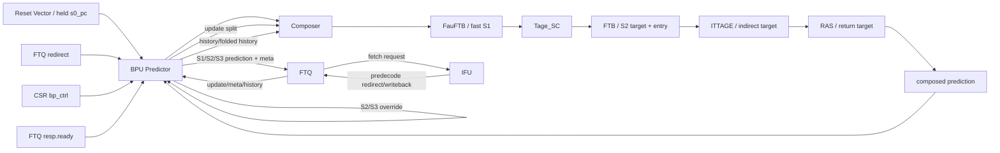
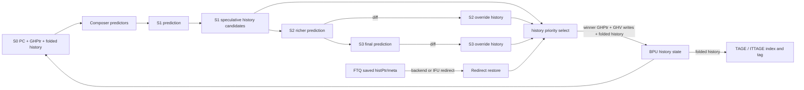

# Frontend BPU 分支预测器深入分析

<!-- regenerated-by-analyze-xiangshan-kunminghu -->
> Regenerated from `OpenXiangShan/XiangShan` branch `kunminghu-v2`, source commit `52262f303fc06daf84cdab7011d59b7df65ce7e8` using the updated Frontend graph/stage rules.


> 官方源码：`https://github.com/OpenXiangShan/XiangShan.git`；分支 `kunminghu-v2`；分析 commit `52262f303fc06daf84cdab7011d59b7df65ce7e8`。论文解释算法原理，源码决定香山的有效参数、流水、更新与恢复。

<!-- frontend-tutorial-generated-by-analyze-xiangshan-kunminghu -->
> 所有实现结论均限定在 `kunminghu-v2` commit `52262f303fc06daf84cdab7011d59b7df65ce7e8`；Design Doc 结论必须回到第 18 节的源码追溯矩阵。

## 1. Scope

本节保留模块职责、分析基线、范围和统一五问，明确本文只以当前源码证据为准。

### 1.1. 统一五问导读
| 问题 | 回答 |
| --- | --- |
| **Who** | `Predictor`/BPU 是所有子预测器、全局历史、下一 PC、redirect 和 FTQ 握手的总控。 |
| **What** | 组织 S0-S3 多级覆盖预测，把 `FauFTB → Tage_SC → FTB → ITTAGE → RAS` 的组合结果变成 FTQ prediction block。 |
| **How** | 早级先追求低延迟，晚级比较方向、CFI、target、fall-through 和 multi-hit；不一致时产生 S2/S3 redirect，并修复历史。 |
| **From what** | 输入来自 reset vector、CSR 控制、FTQ ready、后端 redirect、FTQ commit update。 |
| **To what** | 输出到 FTQ；历史/恢复控制广播到 Composer 中所有预测器；redirect 反馈给 FTQ/IFU/ICache。 |

### 1.2. 分析范围
- Source: OpenXiangShan/XiangShan `kunminghu-v2`, commit `52262f303fc06daf84cdab7011d59b7df65ce7e8`.
- Source root used in citations: `src/main/scala/xiangshan`.
- Files read: [Parameters.scala](https://github.com/OpenXiangShan/XiangShan/blob/kunminghu-v2/src/main/scala/xiangshan/Parameters.scala), [frontend/BPU.scala](https://github.com/OpenXiangShan/XiangShan/blob/kunminghu-v2/src/main/scala/xiangshan/frontend/BPU.scala), [frontend/Composer.scala](https://github.com/OpenXiangShan/XiangShan/blob/kunminghu-v2/src/main/scala/xiangshan/frontend/Composer.scala), [frontend/FTB.scala](https://github.com/OpenXiangShan/XiangShan/blob/kunminghu-v2/src/main/scala/xiangshan/frontend/FTB.scala), [frontend/FauFTB.scala](https://github.com/OpenXiangShan/XiangShan/blob/kunminghu-v2/src/main/scala/xiangshan/frontend/FauFTB.scala), [frontend/Tage.scala](https://github.com/OpenXiangShan/XiangShan/blob/kunminghu-v2/src/main/scala/xiangshan/frontend/Tage.scala), [frontend/SC.scala](https://github.com/OpenXiangShan/XiangShan/blob/kunminghu-v2/src/main/scala/xiangshan/frontend/SC.scala), [frontend/ITTAGE.scala](https://github.com/OpenXiangShan/XiangShan/blob/kunminghu-v2/src/main/scala/xiangshan/frontend/ITTAGE.scala), [frontend/newRAS.scala](https://github.com/OpenXiangShan/XiangShan/blob/kunminghu-v2/src/main/scala/xiangshan/frontend/newRAS.scala), [frontend/Bim.scala](https://github.com/OpenXiangShan/XiangShan/blob/kunminghu-v2/src/main/scala/xiangshan/frontend/Bim.scala).
- Weekly sync: skipped by helper because last sync was 2.24 days old.
- Design docs: local `XiangShan-Design-Doc` checkout was not found under `xiangshanlab_home`; theory context uses local XiangShanLab course docs, effective behavior uses source.

## 2. 关键源码证据

本节直接列出 `BPU / Predictor` 的有效源码入口、关键代码骨架和行为解释，避免只保存文件名或行号。

### 2.1. 源码入口和行号
| 源码文件 | 本文使用它证明什么 | 行号证据 |
| --- | --- | --- |
| `Parameters.scala` | 预测器链配置和 enable 参数 | [Parameters.scala#L124-L143](https://github.com/OpenXiangShan/XiangShan/blob/kunminghu-v2/src/main/scala/xiangshan/Parameters.scala#L124-L143) |
| `frontend/BPU.scala` | S0-S3 valid/ready、预测输出、S2/S3 redirect、后端 redirect 恢复 | [frontend/BPU.scala#L381-L455](https://github.com/OpenXiangShan/XiangShan/blob/kunminghu-v2/src/main/scala/xiangshan/frontend/BPU.scala#L381-L455); [frontend/BPU.scala#L606-L635](https://github.com/OpenXiangShan/XiangShan/blob/kunminghu-v2/src/main/scala/xiangshan/frontend/BPU.scala#L606-L635); [frontend/BPU.scala#L827-L854](https://github.com/OpenXiangShan/XiangShan/blob/kunminghu-v2/src/main/scala/xiangshan/frontend/BPU.scala#L827-L854); [frontend/BPU.scala#L915-L1050](https://github.com/OpenXiangShan/XiangShan/blob/kunminghu-v2/src/main/scala/xiangshan/frontend/BPU.scala#L915-L1050) |
| `frontend/Composer.scala` | 把 FauFTB/TAGE_SC/FTB/ITTAGE/RAS 串成有效预测器链 | [frontend/Composer.scala#L22-L77](https://github.com/OpenXiangShan/XiangShan/blob/kunminghu-v2/src/main/scala/xiangshan/frontend/Composer.scala#L22-L77) |

### 2.2. 核心代码骨架
```scala
val s1_ready = io.bpu_to_ftq.resp.ready && components_ready
val s2_redirect = s2_valid && (takenDiff || targetDiff || lastBrPosOHDiff)
val s3_redirect = s3_valid && (targetDiff || jalrTargetDiff || ftbMultiHit)
io.out := composer.io.out
```

### 2.3. 代码解析
BPU 是前端预测总控：它把 PC/history 送入 Composer，按 S0-S3 保持预测块，比较晚级预测与早级预测差异，必要时生成 S2/S3 redirect，并把最终 prediction block 发给 FTQ。
## 3. Theory-to-Code Mapping

本节把理论概念直接绑定到 `BPU / Predictor` 的源码对象、控制/数据状态和下游消费者。

### 3.1. 理论到代码映射表
| 理论概念 | 代码对象 | 为什么需要它 | 消费者/后续影响 |
| --- | --- | --- | --- |
| 多级预测覆盖 | `s1/s2/s3` valid、`s2_redirect`、`s3_redirect` | 晚级预测发现方向、CFI 或 target 不一致时覆盖早级路径 | FTQ、IFU、ICache flush/recover |
| 全局历史恢复 | global history / folded history redirect update | 错误路径不能继续污染预测历史 | Composer 中所有预测器 |
| 组件化预测器链 | `Composer` components 和 `last_stage_meta` | 各预测器共享 PC/history 但负责不同信息 | FTQ update 和 predictor training |

### 3.2. 阅读顺序
先按第 2 节定位源码对象，再顺着本表检查信号从哪里来、状态在哪里保存、何时更新、谁消费结果。若本篇只引用相邻模块拥有的状态，则以相邻 Frontend 分文档的源码分析为准。
## 4. 论文原则和有效代码


### 4.1. 状态机与论文理论
BPU 没有单一 `Enum` FSM，而由 S0/S1/S2/S3 valid、ready、fire、redirect 和历史指针构成隐式流水状态机。理论上属于 decoupled/elastic instruction fetching：快速预测先维持带宽，较慢但准确的预测在后级覆盖，错误代价由局部 redirect 限制。Design Doc 引用 Reinman 等人的 scalable frontend 与 Perais 等人的 elastic instruction fetching；香山实际覆盖条件以代码比较向量为准。

## 5. Microarchitecture Parameters


### 5.1. 容量与边界补充
- BPU 本身不保存无限 prediction block；FTQ 满时 `io.bpu_to_ftq.resp.ready=0`，S1/S2 前进条件被阻止，payload 必须保持。
- 这属于下游队列 overflow 的反压传播；underflow 表现为没有有效 S0/S1 请求，而不是读取不存在的预测项。
- 子预测器任一 SRAM reset/update 冲突导致 Composer ready 下降，BPU 必须整体停住，防止各预测器 stage 失配。

## 6. 模块边界和接口


### 6.1. Role and Boundary
`Predictor` in [frontend/BPU.scala](https://github.com/OpenXiangShan/XiangShan/blob/kunminghu-v2/src/main/scala/xiangshan/frontend/BPU.scala) owns the frontend prediction pipeline, global history vector, folded-history movement, redirect repair, and the response channel to FTQ. It delegates actual prediction components to `Composer`, whose default component chain is configured in [Parameters.scala](https://github.com/OpenXiangShan/XiangShan/blob/kunminghu-v2/src/main/scala/xiangshan/Parameters.scala): `FauFTB -> Tage_SC -> FTB -> ITTage -> RAS`, with `RAS` output as the final response ([Parameters.scala:124-143](https://github.com/OpenXiangShan/XiangShan/blob/kunminghu-v2/src/main/scala/xiangshan/Parameters.scala#L124-L143)).

[Bim.scala](https://github.com/OpenXiangShan/XiangShan/blob/kunminghu-v2/src/main/scala/xiangshan/frontend/Bim.scala) is not in this chain; its content is commented out and is not effective in this commit.

### 6.2. 控制信号逐项解释：Who / From / To / How / Why
> 下表覆盖本文讲解中出现的查询、流水推进、选择、训练、替换和恢复控制。`为什么存在` 不以信号命名猜测，而以当前 `kunminghu-v2` 数据依赖、资源限制和恢复要求为依据。

| 控制信号 / 状态 | 谁产生 / 从哪里来 | 谁消费 / 到哪里去 | 何时、如何生效 | 为什么存在；缺失会怎样 | 代码证据 |
| --- | --- | --- | --- | --- | --- |
| `io.in.valid / io.in.ready` | FTQ 请求端 | Predictor/Composer | 在所有组件 ready 时接受新 PC。 | 预测器链由多个组件组成，AND-ready 保证同一请求不会只进入部分组件而造成 metadata 错位。 | [frontend/BPU.scala:141-170](https://github.com/OpenXiangShan/XiangShan/blob/kunminghu-v2/src/main/scala/xiangshan/frontend/BPU.scala#L141-L170) |
| `s0_fire` | 输入握手 | PC/历史生成与所有预测组件 | 标记 S0 请求真正被接受。 | valid 可能持续多拍；fire 用来确保 PC、历史和表读只推进一次。 | [frontend/BPU.scala:381-405](https://github.com/OpenXiangShan/XiangShan/blob/kunminghu-v2/src/main/scala/xiangshan/frontend/BPU.scala#L381-L405) |
| `s1_fire` | S1 valid/ready | S1→S2 寄存器和历史更新 | 锁存最快预测结果并允许流水前进。 | 把 uFTB 的早期低延迟结果与后续慢表解耦，既维持吞吐又避免反压时重复推进。 | [frontend/BPU.scala:381-455](https://github.com/OpenXiangShan/XiangShan/blob/kunminghu-v2/src/main/scala/xiangshan/frontend/BPU.scala#L381-L455) |
| `s2_fire` | S2 valid/ready | S2→S3 与 S2 redirect 生成 | 接受 TAGE/FTB 等较完整结果。 | S2 可能推翻 S1；独立 fire 使比较、redirect 和 metadata 只对同一请求生效一次。 | [frontend/BPU.scala:606-725](https://github.com/OpenXiangShan/XiangShan/blob/kunminghu-v2/src/main/scala/xiangshan/frontend/BPU.scala#L606-L725) |
| `s3_fire` | S3 valid/ready | 最终响应、ITTAGE/RAS 修正 | 提交最终预测到 FTQ。 | 最晚组件可修改间接跳转/返回目标；S3 接受边界防止最终目标和 FTQ entry 错配。 | [frontend/BPU.scala:827-854](https://github.com/OpenXiangShan/XiangShan/blob/kunminghu-v2/src/main/scala/xiangshan/frontend/BPU.scala#L827-L854) |
| `s1_valid_dup / s2_valid_dup / s3_valid_dup` | 各级流水寄存器 | 组件重复 ready/valid 扇出 | 保存并复制级间有效位。 | 高扇出控制若直接长连会恶化时序；dup 既改善物理实现，也保证组件看到一致事务身份。 | [frontend/BPU.scala:381-455](https://github.com/OpenXiangShan/XiangShan/blob/kunminghu-v2/src/main/scala/xiangshan/frontend/BPU.scala#L381-L455) |
| `io.out.ready / resp.valid` | FTQ 容量 | BPU 最终输出 | FTQ 满时保持最终 payload，释放后再 fire。 | 预测结果携带 PC、目标、历史和 metadata，不能因 FTQ 反压而丢弃或重算成另一版本。 | [frontend/BPU.scala:425-455](https://github.com/OpenXiangShan/XiangShan/blob/kunminghu-v2/src/main/scala/xiangshan/frontend/BPU.scala#L425-L455) |
| `s2_redirect` | S1/S2 差异比较 | 下一 PC、FTQ/IFU flush | 方向、目标或 CFI 位置改变时进行早修正。 | 快速预测优先换取延迟，S2 redirect 用较准结果修复错误路径；没有它就只能等后端发现。 | [frontend/BPU.scala:698-725](https://github.com/OpenXiangShan/XiangShan/blob/kunminghu-v2/src/main/scala/xiangshan/frontend/BPU.scala#L698-L725) |
| `s3_redirect` | S2/S3 差异比较 | 下一 PC、FTQ/IFU flush | ITTAGE/RAS/多命中等晚结果变化时修正。 | 间接目标和返回目标通常更晚产生，必须有第二级覆盖机制保持前端准确性。 | [frontend/BPU.scala:827-854](https://github.com/OpenXiangShan/XiangShan/blob/kunminghu-v2/src/main/scala/xiangshan/frontend/BPU.scala#L827-L854) |
| `io.redirect / do_redirect` | 后端或 FTQ 恢复 | PC、全局历史、折叠历史 | 后端解析错误时恢复正确目标和历史快照。 | 分支预测状态是投机的；后端 redirect 是最终真值，必须压过前端内部预测并清除错误路径历史。 | [frontend/BPU.scala:915-1050](https://github.com/OpenXiangShan/XiangShan/blob/kunminghu-v2/src/main/scala/xiangshan/frontend/BPU.scala#L915-L1050) |
| `io.update.valid` | FTQ/提交侧 | Composer 中各预测器训练口 | 携带真实分支结果和预测时 metadata。 | 查询阶段只知道猜测，update 把最终结果归因回同一 FTQ entry，使各表可训练且不串项。 | [frontend/BPU.scala:141-170](https://github.com/OpenXiangShan/XiangShan/blob/kunminghu-v2/src/main/scala/xiangshan/frontend/BPU.scala#L141-L170) |
| `last_stage_meta` | 各预测组件 | FTQ 保存并在 update 时反向拆分 | 串联保存 provider、way、counter、RAS 快照等训练信息。 | 仅凭 PC/结果无法重建当时命中的表项；metadata 保证延迟训练更新原预测实例。 | [frontend/Composer.scala:58-77](https://github.com/OpenXiangShan/XiangShan/blob/kunminghu-v2/src/main/scala/xiangshan/frontend/Composer.scala#L58-L77) |

#### 6.2.1. Top-Level Module Connectivity

`Predictor` owns the multi-stage prediction and connects to FTQ through the BPU/FTQ bundles; late predictor differences become redirect or history-repair feedback: [frontend/BPU.scala:381-455](https://github.com/OpenXiangShan/XiangShan/blob/52262f303fc06daf84cdab7011d59b7df65ce7e8/src/main/scala/xiangshan/frontend/BPU.scala#L381-L455), [frontend/BPU.scala:606-635](https://github.com/OpenXiangShan/XiangShan/blob/52262f303fc06daf84cdab7011d59b7df65ce7e8/src/main/scala/xiangshan/frontend/BPU.scala#L606-L635), [frontend/BPU.scala:827-854](https://github.com/OpenXiangShan/XiangShan/blob/52262f303fc06daf84cdab7011d59b7df65ce7e8/src/main/scala/xiangshan/frontend/BPU.scala#L827-L854).


#### 6.2.2. Frontend/Backend Pipeline Stages

The source-proven stage boundary is `F0 -> F1 -> F2 -> F3`: F0 accepts the FTQ request and calculates line indices, F1 registers the fetch block and calculates instruction PCs/cut pointers, F2 waits for ICache responses and performs data cutting/predecode preparation, and F3 expands/qualifies instructions, handles exceptions/MMIO, and drives IBuffer. Evidence: [frontend/IFU.scala:236-305](https://github.com/OpenXiangShan/XiangShan/blob/52262f303fc06daf84cdab7011d59b7df65ce7e8/src/main/scala/xiangshan/frontend/IFU.scala#L236-L305), [frontend/IFU.scala:346-457](https://github.com/OpenXiangShan/XiangShan/blob/52262f303fc06daf84cdab7011d59b7df65ce7e8/src/main/scala/xiangshan/frontend/IFU.scala#L346-L457), [frontend/IFU.scala:542-617](https://github.com/OpenXiangShan/XiangShan/blob/52262f303fc06daf84cdab7011d59b7df65ce7e8/src/main/scala/xiangshan/frontend/IFU.scala#L542-L617). The top-level connections couple FTQ, IFU, ICache, and IBuffer through shared ready/valid conditions: [frontend/Frontend.scala:199-231](https://github.com/OpenXiangShan/XiangShan/blob/52262f303fc06daf84cdab7011d59b7df65ce7e8/src/main/scala/xiangshan/frontend/Frontend.scala#L199-L231).

The backend continuation uses the effective module boundaries rather than inventing cycle names: Decode accepts the instruction packet, Rename creates speculative physical-register mappings, Dispatch allocates downstream resources, Issue/Scheduler selects ready uops, Execute/FU produces results, DataPath/WB carries writeback and wakeup, and ROB/CtrlBlock commits or redirects. Evidence: [backend/decode/DecodeStage.scala:83-120](https://github.com/OpenXiangShan/XiangShan/blob/52262f303fc06daf84cdab7011d59b7df65ce7e8/src/main/scala/xiangshan/backend/decode/DecodeStage.scala#L83-L120), [backend/rename/Rename.scala:40-117](https://github.com/OpenXiangShan/XiangShan/blob/52262f303fc06daf84cdab7011d59b7df65ce7e8/src/main/scala/xiangshan/backend/rename/Rename.scala#L40-L117), [backend/dispatch/NewDispatch.scala:49-176](https://github.com/OpenXiangShan/XiangShan/blob/52262f303fc06daf84cdab7011d59b7df65ce7e8/src/main/scala/xiangshan/backend/dispatch/NewDispatch.scala#L49-L176), [backend/issue/Scheduler.scala:29-180](https://github.com/OpenXiangShan/XiangShan/blob/52262f303fc06daf84cdab7011d59b7df65ce7e8/src/main/scala/xiangshan/backend/issue/Scheduler.scala#L29-L180), [backend/exu/ExeUnit.scala:50-110](https://github.com/OpenXiangShan/XiangShan/blob/52262f303fc06daf84cdab7011d59b7df65ce7e8/src/main/scala/xiangshan/backend/exu/ExeUnit.scala#L50-L110), [backend/datapath/DataPath.scala:25-70](https://github.com/OpenXiangShan/XiangShan/blob/52262f303fc06daf84cdab7011d59b7df65ce7e8/src/main/scala/xiangshan/backend/datapath/DataPath.scala#L25-L70), [backend/rob/Rob.scala:52-145](https://github.com/OpenXiangShan/XiangShan/blob/52262f303fc06daf84cdab7011d59b7df65ce7e8/src/main/scala/xiangshan/backend/rob/Rob.scala#L52-L145), [backend/CtrlBlock.scala:50-110](https://github.com/OpenXiangShan/XiangShan/blob/52262f303fc06daf84cdab7011d59b7df65ce7e8/src/main/scala/xiangshan/backend/CtrlBlock.scala#L50-L110).

```mermaid
flowchart LR
  F0["F0: FTQ req + line indices"] -->|f0_fire| F1["F1: PC + cut pointers"]
  F1 -->|f1_fire| F2["F2: ICache data + exceptions"]
  F2 -->|f2_fire| F3["F3: predecode + MMIO qualification"]
  F3 -->|toIbuffer.fire| Decode["Decode"]
  Decode -->|uop bundle| Rename["Rename"]
  Rename -->|renamed uop| Dispatch["Dispatch"]
  Dispatch -->|ready uop| Issue["Issue"]
  Issue -->|operands| Execute["Execute/FU"]
  Execute -->|result| Writeback["Writeback/Wakeup"]
  Writeback -->|retire candidate| Commit["ROB/Commit"]
  Commit -->|redirect/flush| F0
```



The stage graph keeps chronological forward edges separate from the bundled recovery edge. It must be read together with the module graph below: a stage is not itself a module, and a redirect does not create a fake forward stage.

```waveform-draw
{
  "signal": [
    {
      "name": "clk",
      "wave": "p......."
    },
    {
      "name": "F0.valid",
      "wave": "01...0.."
    },
    {
      "name": "F0.ready",
      "wave": "1..0...."
    },
    {
      "name": "F1.valid",
      "wave": "001..0.."
    },
    {
      "name": "F2.valid",
      "wave": "0001.0.."
    },
    {
      "name": "F3.valid",
      "wave": "00001.0."
    },
    {
      "name": "toIbuffer.fire",
      "wave": "0000010."
    },
    {
      "name": "redirect/flush",
      "wave": "00000010"
    }
  ],
  "config": {
    "hscale": 1
  }
}
```

## 7. 为什么模块存在


把模块放回 Frontend 全链路理解：它解决的是预测带宽、取指正确性、存储层次延迟、投机恢复或上下游速率不匹配中的至少一个问题。

## 8. 有效动态路径


### 8.1. Pipeline and Handshake
`Predictor` has three prediction stages after S0. S0 fires only when predictor components are ready and the S1 slot can accept new work ([frontend/BPU.scala:391-397](https://github.com/OpenXiangShan/XiangShan/blob/kunminghu-v2/src/main/scala/xiangshan/frontend/BPU.scala#L391-L397)). S1 can move to S2 only when S2 is ready and FTQ is ready ([frontend/BPU.scala:398-405](https://github.com/OpenXiangShan/XiangShan/blob/kunminghu-v2/src/main/scala/xiangshan/frontend/BPU.scala#L398-L405)); this ties prediction throughput to `io.bpu_to_ftq.resp.ready`. S2 moves to S3 when S3 is ready ([frontend/BPU.scala:407-414](https://github.com/OpenXiangShan/XiangShan/blob/kunminghu-v2/src/main/scala/xiangshan/frontend/BPU.scala#L407-L414)). S3 consumes itself every cycle while valid ([frontend/BPU.scala:437-447](https://github.com/OpenXiangShan/XiangShan/blob/kunminghu-v2/src/main/scala/xiangshan/frontend/BPU.scala#L437-L447)).

`io.bpu_to_ftq.resp.valid` is asserted for normal S1->S2 output or override redirects from S2/S3 ([frontend/BPU.scala:452-456](https://github.com/OpenXiangShan/XiangShan/blob/kunminghu-v2/src/main/scala/xiangshan/frontend/BPU.scala#L452-L456)). Therefore, the FTQ sees both ordinary prediction blocks and correction events through one response channel.

## 9. Index 和地址/历史计算


地址、PC、折叠历史、tag、set/way、line offset 和 FTQ offset 都必须追到源码表达式；索引冲突、回绕和跨边界情况在算法和验证章节中继续展开。

## 10. 核心算法


### 10.1. Algorithms
#### 10.1.1. Component Composition

`Composer` forwards the common input, fire, redirect, control, and update signals into every component ([frontend/Composer.scala:37-56](https://github.com/OpenXiangShan/XiangShan/blob/kunminghu-v2/src/main/scala/xiangshan/frontend/Composer.scala#L37-L56)). It concatenates each component's `last_stage_meta` into a single FTQ metadata word ([frontend/Composer.scala:35-70](https://github.com/OpenXiangShan/XiangShan/blob/kunminghu-v2/src/main/scala/xiangshan/frontend/Composer.scala#L35-L70)) and splits it in reverse order on update ([frontend/Composer.scala:72-77](https://github.com/OpenXiangShan/XiangShan/blob/kunminghu-v2/src/main/scala/xiangshan/frontend/Composer.scala#L72-L77)). This is why each predictor can train from its own metadata without owning FTQ storage.

#### 10.1.2. Redirect/Override Priority

S2 redirect compares S1's previous prediction against S2's richer prediction: target, last branch position, taken bit, and taken offset ([frontend/BPU.scala:606-635](https://github.com/OpenXiangShan/XiangShan/blob/kunminghu-v2/src/main/scala/xiangshan/frontend/BPU.scala#L606-L635), [frontend/BPU.scala:698-705](https://github.com/OpenXiangShan/XiangShan/blob/kunminghu-v2/src/main/scala/xiangshan/frontend/BPU.scala#L698-L705)). S3 redirect compares real branch-taken masks, targets, JALR target, fall-through error, and FTB multi-hit ([frontend/BPU.scala:827-854](https://github.com/OpenXiangShan/XiangShan/blob/kunminghu-v2/src/main/scala/xiangshan/frontend/BPU.scala#L827-L854)). Backend/FTQ redirect has separate repair logic and writes the redirected target/folded-history/history pointer with higher-priority generator registrations ([frontend/BPU.scala:915-1050](https://github.com/OpenXiangShan/XiangShan/blob/kunminghu-v2/src/main/scala/xiangshan/frontend/BPU.scala#L915-L1050)).

#### 10.1.3. History Update

`ghv` is a circular vector. Prediction stages calculate possible next pointers for `0..numBr` branches and select by `lastBrPosOH` ([frontend/BPU.scala:530-544](https://github.com/OpenXiangShan/XiangShan/blob/kunminghu-v2/src/main/scala/xiangshan/frontend/BPU.scala#L530-L544), [frontend/BPU.scala:639-654](https://github.com/OpenXiangShan/XiangShan/blob/kunminghu-v2/src/main/scala/xiangshan/frontend/BPU.scala#L639-L654), [frontend/BPU.scala:741-756](https://github.com/OpenXiangShan/XiangShan/blob/kunminghu-v2/src/main/scala/xiangshan/frontend/BPU.scala#L741-L756)). Each stage produces write enables/data for the bits it speculatively shifts ([frontend/BPU.scala:561-595](https://github.com/OpenXiangShan/XiangShan/blob/kunminghu-v2/src/main/scala/xiangshan/frontend/BPU.scala#L561-L595), [frontend/BPU.scala:671-725](https://github.com/OpenXiangShan/XiangShan/blob/kunminghu-v2/src/main/scala/xiangshan/frontend/BPU.scala#L671-L725), [frontend/BPU.scala:773-883](https://github.com/OpenXiangShan/XiangShan/blob/kunminghu-v2/src/main/scala/xiangshan/frontend/BPU.scala#L773-L883)). Backend redirect recomputes folded history from the saved `histPtr` and resolved CFI update ([frontend/BPU.scala:939-963](https://github.com/OpenXiangShan/XiangShan/blob/kunminghu-v2/src/main/scala/xiangshan/frontend/BPU.scala#L939-L963)) and writes corrected history bits ([frontend/BPU.scala:964-1050](https://github.com/OpenXiangShan/XiangShan/blob/kunminghu-v2/src/main/scala/xiangshan/frontend/BPU.scala#L964-L1050)).

### 10.2. 算法示例推演
Example input: S0 fetch PC is `0x8000_1000`, current global-history pointer is `H`, and the predictor chain first emits a fast S1 target `0x8000_1040`. One cycle later S2 computes a richer target `0x8000_1080` from FTB/TAGE metadata.

1. Component chain setup: [Parameters.scala:126-143](https://github.com/OpenXiangShan/XiangShan/blob/kunminghu-v2/src/main/scala/xiangshan/Parameters.scala#L126-L143) instantiates `FauFTB`, `Tage_SC`, `FTB`, `ITTage`, and `RAS`, then wires each component's `resp_in(0)` from the previous component. In this example, `FauFTB` creates the early S1 guess, `Tage_SC` may change direction, `FTB` may change target/branch-slot metadata, `ITTAGE` may change indirect target, and `RAS` may change return target.
2. S0/S1 movement: [frontend/BPU.scala:391-405](https://github.com/OpenXiangShan/XiangShan/blob/kunminghu-v2/src/main/scala/xiangshan/frontend/BPU.scala#L391-L405) lets S0 fire only when S1 is ready and components are ready; S1 advances to S2 only if FTQ is ready. If `io.bpu_to_ftq.resp.ready=false`, this exact example stays in S1 and `ftqFullStall` is marked by [frontend/BPU.scala:1090-1156](https://github.com/OpenXiangShan/XiangShan/blob/kunminghu-v2/src/main/scala/xiangshan/frontend/BPU.scala#L1090-L1156).
3. S2 override decision: [frontend/BPU.scala:606-635](https://github.com/OpenXiangShan/XiangShan/blob/kunminghu-v2/src/main/scala/xiangshan/frontend/BPU.scala#L606-L635) builds a comparison vector for target, branch count, direction, and CFI index. [frontend/BPU.scala:698-705](https://github.com/OpenXiangShan/XiangShan/blob/kunminghu-v2/src/main/scala/xiangshan/frontend/BPU.scala#L698-L705) sets `s2_redirect := s2_fire && diff`. With S1 target `0x8000_1040` and S2 target `0x8000_1080`, `targetDiff` is true, so `s2_redirect_dup(0)` is asserted.
4. Next PC/history repair: [frontend/BPU.scala:706-725](https://github.com/OpenXiangShan/XiangShan/blob/kunminghu-v2/src/main/scala/xiangshan/frontend/BPU.scala#L706-L725) registers the S2 target, folded history, and history pointer into the physical priority generators. The output effect is that the next S0 PC becomes `0x8000_1080`, and younger S1 state is flushed through [frontend/BPU.scala:385-390](https://github.com/OpenXiangShan/XiangShan/blob/kunminghu-v2/src/main/scala/xiangshan/frontend/BPU.scala#L385-L390) and [frontend/BPU.scala:416-431](https://github.com/OpenXiangShan/XiangShan/blob/kunminghu-v2/src/main/scala/xiangshan/frontend/BPU.scala#L416-L431).
5. Backend redirect case: if backend later resolves the branch target as `0x8000_10c0`, [frontend/BPU.scala:915-1050](https://github.com/OpenXiangShan/XiangShan/blob/kunminghu-v2/src/main/scala/xiangshan/frontend/BPU.scala#L915-L1050) uses `cfiUpdate.histPtr`, `shift`, and `taken` to recompute folded history and global-history bits. That backend redirect wins over ordinary prediction because it registers `redirect_target`, `redirect_FGHT`, and `redirect_GHPtr` into the same PC/history generators with its own priority slot.

Downstream effect: FTQ receives either a normal prediction block or an override event through `io.bpu_to_ftq.resp` ([frontend/BPU.scala:452-458](https://github.com/OpenXiangShan/XiangShan/blob/kunminghu-v2/src/main/scala/xiangshan/frontend/BPU.scala#L452-L458)). The example changes both `resp.bits.s2.hasRedirect` and the next fetch PC.

### 10.3. 逐流水级算法
| Stage | Inputs | Algorithm and state | Ready/stall | Output | Source lines |
| --- | --- | --- | --- | --- | --- |
| S0 | Generated PC, folded history, global history pointer | Drives `predictors.io.in.bits.s0_pc`, `folded_hist`, `s1_folded_hist`, and `ghist`; `getHist(ptr)` reads `ghv` by circular pointer. | `s0_fire := s1_components_ready && s1_ready`. | Component lookup requests and S1 PC/history registers. | [frontend/BPU.scala:336-369](https://github.com/OpenXiangShan/XiangShan/blob/kunminghu-v2/src/main/scala/xiangshan/frontend/BPU.scala#L336-L369), [frontend/BPU.scala:391-397](https://github.com/OpenXiangShan/XiangShan/blob/kunminghu-v2/src/main/scala/xiangshan/frontend/BPU.scala#L391-L397) |
| S1 | S0 PC/history plus fast predictor outputs | Valid bit is set by S0 fire unless redirect/flush clears it; S1 can update speculative history from S1 prediction. | S1 can advance only when S2 components and FTQ are ready. | S1 prediction may be sent to FTQ and forms previous-pred info for S2 comparison. | [frontend/BPU.scala:416-422](https://github.com/OpenXiangShan/XiangShan/blob/kunminghu-v2/src/main/scala/xiangshan/frontend/BPU.scala#L416-L422), [frontend/BPU.scala:528-595](https://github.com/OpenXiangShan/XiangShan/blob/kunminghu-v2/src/main/scala/xiangshan/frontend/BPU.scala#L528-L595), [frontend/BPU.scala:889-895](https://github.com/OpenXiangShan/XiangShan/blob/kunminghu-v2/src/main/scala/xiangshan/frontend/BPU.scala#L889-L895) |
| S2 | S1 registered PC/history and richer component outputs | Compares S1 previous prediction with S2 prediction; computes S2 predicted history/folded history. | `s2_ready := s2_fire || !s2_valid`; S2 flush comes from S3/backend redirect. | `s2_redirect`, S2 target/history generator entries, FTQ S2 override metadata. | [frontend/BPU.scala:424-435](https://github.com/OpenXiangShan/XiangShan/blob/kunminghu-v2/src/main/scala/xiangshan/frontend/BPU.scala#L424-L435), [frontend/BPU.scala:638-725](https://github.com/OpenXiangShan/XiangShan/blob/kunminghu-v2/src/main/scala/xiangshan/frontend/BPU.scala#L638-L725), [frontend/BPU.scala:897-898](https://github.com/OpenXiangShan/XiangShan/blob/kunminghu-v2/src/main/scala/xiangshan/frontend/BPU.scala#L897-L898) |
| S3 | S2 registered prediction | Compares S3 prediction with previous S2 prediction; detects target, taken-mask, fall-through, and FTB multi-hit differences. | S3 consumes valid every cycle unless flushed by backend redirect. | `s3_redirect`, S3 target/history generator entries, FTQ S3 override metadata. | [frontend/BPU.scala:437-455](https://github.com/OpenXiangShan/XiangShan/blob/kunminghu-v2/src/main/scala/xiangshan/frontend/BPU.scala#L437-L455), [frontend/BPU.scala:740-883](https://github.com/OpenXiangShan/XiangShan/blob/kunminghu-v2/src/main/scala/xiangshan/frontend/BPU.scala#L740-L883), [frontend/BPU.scala:899-903](https://github.com/OpenXiangShan/XiangShan/blob/kunminghu-v2/src/main/scala/xiangshan/frontend/BPU.scala#L899-L903) |
| Update | FTQ update | Sends update to Composer; recomputes update PC with segmented address register; supplies true history from `histPtr`. | Component-local ready can block S1 through Composer. | Predictor table training. | [frontend/BPU.scala:905-913](https://github.com/OpenXiangShan/XiangShan/blob/kunminghu-v2/src/main/scala/xiangshan/frontend/BPU.scala#L905-L913), [frontend/Composer.scala:72-77](https://github.com/OpenXiangShan/XiangShan/blob/kunminghu-v2/src/main/scala/xiangshan/frontend/Composer.scala#L72-L77) |
| Redirect/recovery | FTQ/backend redirect | Reconstructs corrected pointer/folded history from `cfiUpdate`, writes global-history bits, and registers redirect target. | Redirect flushes S1/S2/S3 valid bits. | Next S0 PC/history becomes resolved redirect state. | [frontend/BPU.scala:378-389](https://github.com/OpenXiangShan/XiangShan/blob/kunminghu-v2/src/main/scala/xiangshan/frontend/BPU.scala#L378-L389), [frontend/BPU.scala:915-1075](https://github.com/OpenXiangShan/XiangShan/blob/kunminghu-v2/src/main/scala/xiangshan/frontend/BPU.scala#L915-L1075) |

## 11. 状态和存储结构


把每个表、栈、FIFO、MSHR、uncache entry 和 pipeline register 记录为 `valid/full/empty/ready` 可观察状态，并说明谁写入、谁读取、何时清空以及满/空时谁被反压。

## 12. Pipeline stage 分析


阶段说明只使用源码中的寄存器、valid/ready 和 fire 条件；对 Frontend 使用 F0/F1/F2/F3，对 Backend 使用实际 Decode/Rename/Dispatch/Issue/Execute/Writeback/ROB 边界。

## 13. Control path rationale


### 13.1. Redirect 信号生成
| Signal | Producer and condition | Stage | Repaired state | Consumer/effect | Source lines |
| --- | --- | --- | --- | --- | --- |
| `s2_redirect_dup` | `preds_needs_redirect_vec_dup(previous_s1_pred_info, resp.s2)` detects target, branch-position, taken, or CFI-index mismatch. | S2 | PC, folded history, global-history pointer, history bits. | Flushes younger stage and sends S2 override to FTQ. | [frontend/BPU.scala:606-635](https://github.com/OpenXiangShan/XiangShan/blob/kunminghu-v2/src/main/scala/xiangshan/frontend/BPU.scala#L606-L635), [frontend/BPU.scala:698-725](https://github.com/OpenXiangShan/XiangShan/blob/kunminghu-v2/src/main/scala/xiangshan/frontend/BPU.scala#L698-L725) |
| `s3_redirect_dup` | S3 taken-mask differs from S2, target differs, fall-through error, or FTB multi-hit. | S3 | PC/history generators updated from S3 prediction. | Sends S3 override to FTQ and redirects fetch. | [frontend/BPU.scala:827-854](https://github.com/OpenXiangShan/XiangShan/blob/kunminghu-v2/src/main/scala/xiangshan/frontend/BPU.scala#L827-L854), [frontend/BPU.scala:863-883](https://github.com/OpenXiangShan/XiangShan/blob/kunminghu-v2/src/main/scala/xiangshan/frontend/BPU.scala#L863-L883) |
| Backend/FTQ redirect | `io.ftq_to_bpu.redirect.valid`. | Recovery path | Restores resolved target, folded history, global-history pointer and bits. | Flushes S1/S2/S3 and overrides next S0. | [frontend/BPU.scala:378-389](https://github.com/OpenXiangShan/XiangShan/blob/kunminghu-v2/src/main/scala/xiangshan/frontend/BPU.scala#L378-L389), [frontend/BPU.scala:915-1050](https://github.com/OpenXiangShan/XiangShan/blob/kunminghu-v2/src/main/scala/xiangshan/frontend/BPU.scala#L915-L1050), [frontend/BPU.scala:1060-1075](https://github.com/OpenXiangShan/XiangShan/blob/kunminghu-v2/src/main/scala/xiangshan/frontend/BPU.scala#L1060-L1075) |
| FTQ full stall, not redirect | `!io.bpu_to_ftq.resp.ready`. | S1/S2 boundary | No repair; holds pipeline. | Blocks S1 advance and marks topdown stall. | [frontend/BPU.scala:405](https://github.com/OpenXiangShan/XiangShan/blob/kunminghu-v2/src/main/scala/xiangshan/frontend/BPU.scala#L405), [frontend/BPU.scala:1090-1156](https://github.com/OpenXiangShan/XiangShan/blob/kunminghu-v2/src/main/scala/xiangshan/frontend/BPU.scala#L1090-L1156) |

Example: if S1 predicts target `0x1040` and S2 predicts `0x1080`, `targetDiff` in `preds_needs_redirect_vec_dup` is true, so `s2_redirect_dup(0)` is asserted. The S2 target is registered into `npcGen`, and `s1_flush` becomes true through the flush chain.

## 14. Data path 与跨边界


### 14.1. 跨边界代码解析
BPU 的预测块边界不能替代实际取指边界。对于跨虚拟页的块，BPU 只保存 PC/历史/预测元数据；IFU 必须对第二页重新翻译并重新检查权限，第二片段的 fault 或 flush 会取消旧的预测上下文。对于跨 Cache Line 的块，第一 Line 的预测可以先进入 FTQ，但下一 Line 的 miss/refill 或半指令合并结果可能改变 fall-through、CFI index 或 target，BPU 在 S2/S3 重新比较并通过 `s2_redirect`/`s3_redirect` 收敛，[frontend/BPU.scala:606-635](https://github.com/OpenXiangShan/XiangShan/blob/kunminghu-v2/src/main/scala/xiangshan/frontend/BPU.scala#L606-L635) 和 [frontend/BPU.scala:827-854](https://github.com/OpenXiangShan/XiangShan/blob/kunminghu-v2/src/main/scala/xiangshan/frontend/BPU.scala#L827-L854)。

MMIO/uncache 地址不能因为 BPU 给出 target 就进入普通 ICache 快路径；IFU/InstrUncache 负责 PMA/PBMT 分类、非投机请求、响应等待和 redirect cancel。预测器的恢复只修复历史、RAS 和 FTQ 元数据，不能撤销已产生的 MMIO 副作用。

## 15. 异常、debug、privilege


区分预测错误、replay、page/access/guest fault、MMIO side effect、debug redirect 和架构异常；说明异常产生者、优先级、清理对象、恢复入口和提交可见性。

## 16. CSR 控制


前端分支预测器的使能控制来自 CSR 模块生成的 `CustomCSRCtrlIO.bp_ctrl`，不是各预测器本地私有 CSR。有效链路是：`sbpctl` CSR 字段 -> `io.status.custom.bp_ctrl` -> Backend `frontendCsrCtrl` -> XSCore `frontend.io.csrCtrl` -> Frontend `bpu.io.ctrl` -> BPU 内各子预测器 `io.enable`。

### 16.1. CSR 字段到 BPU 控制信号
| 控制位 | CSR 源字段 | Frontend/BPU 消费者 | 有效作用 | 源码证据 |
| --- | --- | --- | --- | --- |
| `bp_ctrl.ubtbEnable` | `sbpctl.regOut.UBTB_ENABLE` | `ubtb.io.enable` | 允许或关闭 S1 fast uBTB/MicroBtb 查询结果参与预测链；关闭后仍保留 fall-through 基线。 | [NewCSR.scala:1378](https://github.com/OpenXiangShan/XiangShan/blob/kunminghu-v2/src/main/scala/xiangshan/backend/fu/NewCSR/NewCSR.scala#L1378), [Bpu.scala:96](https://github.com/OpenXiangShan/XiangShan/blob/kunminghu-v2/src/main/scala/xiangshan/frontend/bpu/Bpu.scala#L96), [Bpu.scala:105](https://github.com/OpenXiangShan/XiangShan/blob/kunminghu-v2/src/main/scala/xiangshan/frontend/bpu/Bpu.scala#L105) |
| `bp_ctrl.abtbEnable` | `sbpctl.regOut.ABTB_ENABLE` | `abtb.io.enable` | 控制 AheadBtb 目标/属性预测是否参与早期预测。 | [NewCSR.scala:1379](https://github.com/OpenXiangShan/XiangShan/blob/kunminghu-v2/src/main/scala/xiangshan/backend/fu/NewCSR/NewCSR.scala#L1379), [Bpu.scala:97](https://github.com/OpenXiangShan/XiangShan/blob/kunminghu-v2/src/main/scala/xiangshan/frontend/bpu/Bpu.scala#L97), [Bpu.scala:106](https://github.com/OpenXiangShan/XiangShan/blob/kunminghu-v2/src/main/scala/xiangshan/frontend/bpu/Bpu.scala#L106) |
| `bp_ctrl.mbtbEnable` | `sbpctl.regOut.MBTB_ENABLE` | `mbtb.io.enable` | 控制 MainBtb 是否提供主 BTB 命中、直接分支/JAL target 和 fall-through 信息。 | [NewCSR.scala:1380](https://github.com/OpenXiangShan/XiangShan/blob/kunminghu-v2/src/main/scala/xiangshan/backend/fu/NewCSR/NewCSR.scala#L1380), [Bpu.scala:98](https://github.com/OpenXiangShan/XiangShan/blob/kunminghu-v2/src/main/scala/xiangshan/frontend/bpu/Bpu.scala#L98), [Bpu.scala:107](https://github.com/OpenXiangShan/XiangShan/blob/kunminghu-v2/src/main/scala/xiangshan/frontend/bpu/Bpu.scala#L107) |
| `bp_ctrl.tageEnable` | `sbpctl.regOut.TAGE_ENABLE` | `tage.io.enable` | 控制 TAGE 条件分支方向预测是否有效；关闭时不能把 TAGE provider 结果作为方向覆盖依据。 | [NewCSR.scala:1381](https://github.com/OpenXiangShan/XiangShan/blob/kunminghu-v2/src/main/scala/xiangshan/backend/fu/NewCSR/NewCSR.scala#L1381), [Bpu.scala:99](https://github.com/OpenXiangShan/XiangShan/blob/kunminghu-v2/src/main/scala/xiangshan/frontend/bpu/Bpu.scala#L99), [Bpu.scala:108](https://github.com/OpenXiangShan/XiangShan/blob/kunminghu-v2/src/main/scala/xiangshan/frontend/bpu/Bpu.scala#L108) |
| `bp_ctrl.scEnable` | `sbpctl.regOut.SC_ENABLE` | `sc.io.enable` | 控制 statistical corrector 是否修正 TAGE/基础方向结果。 | [NewCSR.scala:1382](https://github.com/OpenXiangShan/XiangShan/blob/kunminghu-v2/src/main/scala/xiangshan/backend/fu/NewCSR/NewCSR.scala#L1382), [Bpu.scala:100](https://github.com/OpenXiangShan/XiangShan/blob/kunminghu-v2/src/main/scala/xiangshan/frontend/bpu/Bpu.scala#L100), [Bpu.scala:109](https://github.com/OpenXiangShan/XiangShan/blob/kunminghu-v2/src/main/scala/xiangshan/frontend/bpu/Bpu.scala#L109) |
| `bp_ctrl.ittageEnable` | `sbpctl.regOut.ITTAGE_ENABLE` | `ittage.io.enable` | 控制间接跳转/JALR target 覆盖预测是否有效。 | [NewCSR.scala:1383](https://github.com/OpenXiangShan/XiangShan/blob/kunminghu-v2/src/main/scala/xiangshan/backend/fu/NewCSR/NewCSR.scala#L1383), [Bpu.scala:101](https://github.com/OpenXiangShan/XiangShan/blob/kunminghu-v2/src/main/scala/xiangshan/frontend/bpu/Bpu.scala#L101), [Bpu.scala:110](https://github.com/OpenXiangShan/XiangShan/blob/kunminghu-v2/src/main/scala/xiangshan/frontend/bpu/Bpu.scala#L110) |
| `bp_ctrl.rasEnable` | `sbpctl.regOut.RAS_ENABLE` | `ras.io.enable` | 控制 return address stack 是否给 RET/JALR 返回目标提供覆盖。 | [NewCSR.scala:1384](https://github.com/OpenXiangShan/XiangShan/blob/kunminghu-v2/src/main/scala/xiangshan/backend/fu/NewCSR/NewCSR.scala#L1384), [Bpu.scala:102](https://github.com/OpenXiangShan/XiangShan/blob/kunminghu-v2/src/main/scala/xiangshan/frontend/bpu/Bpu.scala#L102), [Bpu.scala:111](https://github.com/OpenXiangShan/XiangShan/blob/kunminghu-v2/src/main/scala/xiangshan/frontend/bpu/Bpu.scala#L111) |

### 16.2. 有效代码骨架
```scala
// backend/fu/NewCSR/NewCSR.scala
io.status.custom.bp_ctrl.ubtbEnable   := sbpctl.regOut.UBTB_ENABLE.asBool
io.status.custom.bp_ctrl.abtbEnable   := sbpctl.regOut.ABTB_ENABLE.asBool
io.status.custom.bp_ctrl.mbtbEnable   := sbpctl.regOut.MBTB_ENABLE.asBool
io.status.custom.bp_ctrl.tageEnable   := sbpctl.regOut.TAGE_ENABLE.asBool
io.status.custom.bp_ctrl.scEnable     := sbpctl.regOut.SC_ENABLE.asBool
io.status.custom.bp_ctrl.ittageEnable := sbpctl.regOut.ITTAGE_ENABLE.asBool
io.status.custom.bp_ctrl.rasEnable    := sbpctl.regOut.RAS_ENABLE.asBool

// frontend/Frontend.scala
private val csrCtrl = DelayN(io.csrCtrl, CsrCtrlPortDelay)
bpu.io.ctrl := csrCtrl.bp_ctrl

// frontend/bpu/Bpu.scala
private val ctrl = DelayN(io.ctrl, 2)
fallThrough.io.enable := true.B
utage.io.enable       := true.B
uras.io.enable        := true.B
ubtb.io.enable        := ctrl.ubtbEnable
abtb.io.enable        := ctrl.abtbEnable
mbtb.io.enable        := ctrl.mbtbEnable
tage.io.enable        := ctrl.tageEnable
sc.io.enable          := ctrl.scEnable
ittage.io.enable      := ctrl.ittageEnable
ras.io.enable         := ctrl.rasEnable
```

### 16.3. 代码解析
`BpuCtrl` bundle 明确定义了 `ubtbEnable`、`abtbEnable`、`mbtbEnable`、`tageEnable`、`scEnable`、`ittageEnable`、`rasEnable` 七个 Bool 控制位：[Bundles.scala:179-189](https://github.com/OpenXiangShan/XiangShan/blob/kunminghu-v2/src/main/scala/xiangshan/frontend/bpu/Bundles.scala#L179-L189)。`CustomCSRCtrlIO` 将 `bp_ctrl` 作为 CSR 输出的一部分：[Bundle.scala:586-596](https://github.com/OpenXiangShan/XiangShan/blob/kunminghu-v2/src/main/scala/xiangshan/Bundle.scala#L586-L596)。Backend 把 `csrio.customCtrl` 暴露为 `frontendCsrCtrl`，XSCore 再连到 Frontend：[Backend.scala:526-527](https://github.com/OpenXiangShan/XiangShan/blob/kunminghu-v2/src/main/scala/xiangshan/backend/Backend.scala#L526-L527), [XSCore.scala:138](https://github.com/OpenXiangShan/XiangShan/blob/kunminghu-v2/src/main/scala/xiangshan/XSCore.scala#L138)。Frontend 先用 `CsrCtrlPortDelay` 延迟 CSR 控制，再把 `csrCtrl.bp_ctrl` 送进 BPU：[Frontend.scala:143-153](https://github.com/OpenXiangShan/XiangShan/blob/kunminghu-v2/src/main/scala/xiangshan/frontend/Frontend.scala#L143-L153)。BPU 内部再延迟 2 拍以满足时序，随后分发给各子预测器：[Bpu.scala:89-111](https://github.com/OpenXiangShan/XiangShan/blob/kunminghu-v2/src/main/scala/xiangshan/frontend/bpu/Bpu.scala#L89-L111)。

需要注意两点：第一，`fallThrough` 基线预测器始终 `enable := true.B`，`MicroTage` 和 `MicroRas` 当前也固定使能，源码中 `utageEnable` 仍是注释项，不应写成已由 CSR 控制；第二，在 `EnableConstantin && !FPGAPlatform` 配置下，`constCtrl` 可覆盖 CSR 位，否则直接使用 CSR 位，因此验证时要同时覆盖 Constantin override 和普通 CSR 控制两条路径。

## 17. Diagrams


### 17.1. Diagrams


```waveform-draw
{
  "signal": [
    {
      "name": "clk",
      "wave": "p...."
    },
    {
      "name": "s0_fire",
      "wave": "01010"
    },
    {
      "name": "s1_valid",
      "wave": "00101"
    },
    {
      "name": "ftq_ready",
      "wave": "11101"
    },
    {
      "name": "resp_valid",
      "wave": "00010"
    },
    {
      "name": "redirect",
      "wave": "00010"
    }
  ]
}
```

## 18. 有效行为和 Design Doc 差异


### 18.1. Design Doc to Source Traceability
| Design Doc location | Atomic claim | XiangShan source evidence | Relationship | Status | Discrepancy |
| --- | --- | --- | --- | --- | --- |
| [docs/en/frontend/BPU/index.md:15](https://github.com/OpenXiangShan/XiangShan-Design-Doc/blob/f8e258dc2d9c02c0616764856e1d18feedb91b81/docs/en/frontend/BPU/index.md#L15) | BPU 产生预测块并通过多级流水逐步覆盖预测结果 | [frontend/BPU.scala:381-455](https://github.com/OpenXiangShan/XiangShan/blob/52262f303fc06daf84cdab7011d59b7df65ce7e8/src/main/scala/xiangshan/frontend/BPU.scala#L381-L455) | 预测请求进入组件并形成阶段性 response | **Verified** | 无 |
| [docs/en/frontend/BPU/index.md:17](https://github.com/OpenXiangShan/XiangShan-Design-Doc/blob/f8e258dc2d9c02c0616764856e1d18feedb91b81/docs/en/frontend/BPU/index.md#L17) | 后级预测可以覆盖早期结果并影响 FTQ | [frontend/BPU.scala:606-635](https://github.com/OpenXiangShan/XiangShan/blob/52262f303fc06daf84cdab7011d59b7df65ce7e8/src/main/scala/xiangshan/frontend/BPU.scala#L606-L635) | 阶段比较、覆盖和 redirect 生成 | **Verified** | 无 |
| [docs/en/frontend/BPU/mbtb.md:1](https://github.com/OpenXiangShan/XiangShan-Design-Doc/blob/f8e258dc2d9c02c0616764856e1d18feedb91b81/docs/en/frontend/BPU/mbtb.md#L1) | 组件由 Composer 按配置组装 | [frontend/Composer.scala:22-77](https://github.com/OpenXiangShan/XiangShan/blob/52262f303fc06daf84cdab7011d59b7df65ce7e8/src/main/scala/xiangshan/frontend/Composer.scala#L22-L77) | 参数化 predictor composition | **Partially verified** | Design Doc component names and current configuration are not identical in every build. |

### 18.2. Design Doc Baseline
- Design Doc: `OpenXiangShan/XiangShan-Design-Doc`, branch `kunminghu-v3`, commit `f8e258dc2d9c02c0616764856e1d18feedb91b81`.
- XiangShan source: `OpenXiangShan/XiangShan`, branch `kunminghu-v2`, commit `52262f303fc06daf84cdab7011d59b7df65ce7e8`.
- 设计文档是意图和接口假设；以下矩阵只把能在该源码 commit 的有效 Chisel 中定位到的内容作为实现事实。

### 18.3. Design Doc Line-by-Line Mapping
1. `frontend/BPU.scala:381-455` accepts the frontend request and computes component prediction results; valid/ready controls make the result a pipeline transaction rather than a combinational textbook lookup.
2. `frontend/BPU.scala:606-635` aligns S1/S2/S3 prediction metadata and compares the later result with the earlier one. A mismatch produces redirect information; the consumer is FTQ/frontend control.
3. `frontend/BPU.scala:827-854` applies redirect/flush and clears or repairs speculative predictor context. `frontend/Composer.scala:22-77` is the producer of the configured predictor chain, so module presence must be read with parameters.

### 18.4. Design Doc Discrepancies
- `Partially verified`: the Design Doc presents a conceptual predictor composition; source line evidence verifies the active handshake and recovery path, while exact component selection is parameter-dependent.
- `Version mismatch`: Design Doc baseline is `kunminghu-v3`, source baseline is `kunminghu-v2`; names and stage timing must not be assumed identical.

## 19. 动态场景示例


### 19.1. 示例讲解
FauFTB 在 S1 预测顺序执行；TAGE 在 S2 发现 slot0 taken，FTB 同时给出目标。BPU 比较 S1/S2 的 taken mask、最后 taken 分支和 target，产生 S2 redirect。若 S3 的 ITTAGE 又把 JALR target 改成另一地址，则再产生 S3 redirect；FTQ 只保留最终正确的年轻边界。

### 19.2. 典型场景
| Scenario | Trigger | Code | Winner/effect | Blocked/loser |
| --- | --- | --- | --- | --- |
| FTQ full | `!io.bpu_to_ftq.resp.ready` | [frontend/BPU.scala:405](https://github.com/OpenXiangShan/XiangShan/blob/kunminghu-v2/src/main/scala/xiangshan/frontend/BPU.scala#L405), [frontend/BPU.scala:1093-1156](https://github.com/OpenXiangShan/XiangShan/blob/kunminghu-v2/src/main/scala/xiangshan/frontend/BPU.scala#L1093-L1156) | S1 cannot advance; topdown marks FTQ full stall | New prediction blocks held in earlier stages |
| S2 override | S2 differs from S1 | [frontend/BPU.scala:698-725](https://github.com/OpenXiangShan/XiangShan/blob/kunminghu-v2/src/main/scala/xiangshan/frontend/BPU.scala#L698-L725) | S2 target/history registered as next PC/history | S1 path is flushed by downstream flush chain |
| S3 override | S3 differs from S2 or FTB multi-hit/fall-through error | [frontend/BPU.scala:827-883](https://github.com/OpenXiangShan/XiangShan/blob/kunminghu-v2/src/main/scala/xiangshan/frontend/BPU.scala#L827-L883) | S3 target/history registered | Younger prediction is invalidated |
| Backend redirect | `io.ftq_to_bpu.redirect.valid` | [frontend/BPU.scala:378-389](https://github.com/OpenXiangShan/XiangShan/blob/kunminghu-v2/src/main/scala/xiangshan/frontend/BPU.scala#L378-L389), [frontend/BPU.scala:915-1050](https://github.com/OpenXiangShan/XiangShan/blob/kunminghu-v2/src/main/scala/xiangshan/frontend/BPU.scala#L915-L1050) | Redirect target and resolved history win | S1/S2/S3 valid bits flushed |
| Predictor write/read conflict | Component SRAM write blocks local read ready | e.g. [frontend/Tage.scala:1004-1006](https://github.com/OpenXiangShan/XiangShan/blob/kunminghu-v2/src/main/scala/xiangshan/frontend/Tage.scala#L1004-L1006) | Component ready drops | BPU `s1_ready` drops through Composer |

## 20. 结论


### 20.1. 预测器关系
The effective Kunminghu frontend predictor chain is not a set of independent predictors voting in parallel. [Parameters.scala:124-143](https://github.com/OpenXiangShan/XiangShan/blob/kunminghu-v2/src/main/scala/xiangshan/Parameters.scala#L124-L143) constructs `FauFTB`, `Tage_SC`, `FTB`, `ITTage`, and `RAS`, connects them as `resp_in -> uftb -> tage -> ftb -> ittage -> ras`, and returns `ras.io.out` as the final composed prediction. [Bim.scala](https://github.com/OpenXiangShan/XiangShan/blob/kunminghu-v2/src/main/scala/xiangshan/frontend/Bim.scala) is not part of this chain in this commit; its effective role is replaced by the `TageBTable` base table inside [Tage.scala:143-270](https://github.com/OpenXiangShan/XiangShan/blob/kunminghu-v2/src/main/scala/xiangshan/frontend/Tage.scala#L143-L270).

| Component | Relationship to the chain | What it contributes | How disagreement is handled | Source lines |
| --- | --- | --- | --- | --- |
| `BPU` / `Predictor` | Owns the pipeline, history state, redirect generators, and FTQ response. It does not compute every prediction locally; it drives `Composer`. | Shared PC/history inputs, stage fire/ready, global-history/folded-history repair, and final `io.bpu_to_ftq.resp`. | Compares later-stage composed predictions against earlier predictions and emits S2/S3/backend redirects. | [frontend/BPU.scala:381-455](https://github.com/OpenXiangShan/XiangShan/blob/kunminghu-v2/src/main/scala/xiangshan/frontend/BPU.scala#L381-L455), [frontend/BPU.scala:606-635](https://github.com/OpenXiangShan/XiangShan/blob/kunminghu-v2/src/main/scala/xiangshan/frontend/BPU.scala#L606-L635), [frontend/BPU.scala:698-725](https://github.com/OpenXiangShan/XiangShan/blob/kunminghu-v2/src/main/scala/xiangshan/frontend/BPU.scala#L698-L725), [frontend/BPU.scala:827-854](https://github.com/OpenXiangShan/XiangShan/blob/kunminghu-v2/src/main/scala/xiangshan/frontend/BPU.scala#L827-L854), [frontend/BPU.scala:915-1050](https://github.com/OpenXiangShan/XiangShan/blob/kunminghu-v2/src/main/scala/xiangshan/frontend/BPU.scala#L915-L1050) |
| `Composer` | Broadcasts common inputs/control to every component and gathers the final response from the configured chain. | Shared `s0_pc`, folded history, global history, stage fires, redirect, control, update, and concatenated `last_stage_meta`. | All components see the same redirect/update event; `io.in.ready` is the AND of component readiness, so one blocked predictor stalls the chain. | [frontend/Composer.scala:22-77](https://github.com/OpenXiangShan/XiangShan/blob/kunminghu-v2/src/main/scala/xiangshan/frontend/Composer.scala#L22-L77) |
| `FauFTB` / uFTB | First and fast predictor in the chain. Its output feeds `Tage_SC`, and its entry/hit information also feeds `FTB`. | Early target/fall-through/entry information for fast S1 prediction. | Later `FTB`/`Tage`/`ITTAGE`/`RAS` output can refine it; BPU turns the difference into S2/S3 redirect. | [Parameters.scala:127-139](https://github.com/OpenXiangShan/XiangShan/blob/kunminghu-v2/src/main/scala/xiangshan/Parameters.scala#L127-L139), [frontend/Composer.scala:25-31](https://github.com/OpenXiangShan/XiangShan/blob/kunminghu-v2/src/main/scala/xiangshan/frontend/Composer.scala#L25-L31), [frontend/FauFTB.scala:76-128](https://github.com/OpenXiangShan/XiangShan/blob/kunminghu-v2/src/main/scala/xiangshan/frontend/FauFTB.scala#L76-L128) |
| `Tage_SC` | Receives uFTB output, then updates conditional branch direction before FTB/ITTAGE/RAS see the prediction. | TAGE direction plus SC correction over the base table and tagged tables. | If direction or first-taken branch differs from the fast prediction, BPU S2 comparison observes `takenDiff`/`lastBrPosOHDiff`. | [Parameters.scala:128-140](https://github.com/OpenXiangShan/XiangShan/blob/kunminghu-v2/src/main/scala/xiangshan/Parameters.scala#L128-L140), [frontend/Tage.scala:778-846](https://github.com/OpenXiangShan/XiangShan/blob/kunminghu-v2/src/main/scala/xiangshan/frontend/Tage.scala#L778-L846), [frontend/SC.scala:259-372](https://github.com/OpenXiangShan/XiangShan/blob/kunminghu-v2/src/main/scala/xiangshan/frontend/SC.scala#L259-L372) |
| `FTB` | Receives TAGE-refined prediction and uFTB cached entry/hit information. | Direct branch/JAL target entries, branch-slot metadata, fall-through, multi-hit detection. | Target, CFI slot, fall-through, or multi-hit differences become S2/S3 redirect causes. | [Parameters.scala:126-138](https://github.com/OpenXiangShan/XiangShan/blob/kunminghu-v2/src/main/scala/xiangshan/Parameters.scala#L126-L138), [frontend/FTB.scala:683-811](https://github.com/OpenXiangShan/XiangShan/blob/kunminghu-v2/src/main/scala/xiangshan/frontend/FTB.scala#L683-L811), [frontend/BPU.scala:827-854](https://github.com/OpenXiangShan/XiangShan/blob/kunminghu-v2/src/main/scala/xiangshan/frontend/BPU.scala#L827-L854) |
| `ITTAGE` | Receives FTB output and specializes the JALR/indirect target path. | Indirect target override and ITTAGE metadata for later training. | If the indirect target changes after earlier stages, BPU observes target/JALR target differences and redirects. | [Parameters.scala:130-141](https://github.com/OpenXiangShan/XiangShan/blob/kunminghu-v2/src/main/scala/xiangshan/Parameters.scala#L130-L141), [frontend/ITTAGE.scala:418-470](https://github.com/OpenXiangShan/XiangShan/blob/kunminghu-v2/src/main/scala/xiangshan/frontend/ITTAGE.scala#L418-L470), [frontend/BPU.scala:827-854](https://github.com/OpenXiangShan/XiangShan/blob/kunminghu-v2/src/main/scala/xiangshan/frontend/BPU.scala#L827-L854) |
| `RAS` / `newRAS` | Last component in the chain and therefore the final returned response. | Return target prediction, speculative stack pointer/top metadata, cancel/recovery behavior. | RAS target or cancel effects are reflected in final S3 prediction; backend redirect repairs RAS/history state through shared redirect/update paths. | [Parameters.scala:129-143](https://github.com/OpenXiangShan/XiangShan/blob/kunminghu-v2/src/main/scala/xiangshan/Parameters.scala#L129-L143), [frontend/newRAS.scala:696-706](https://github.com/OpenXiangShan/XiangShan/blob/kunminghu-v2/src/main/scala/xiangshan/frontend/newRAS.scala#L696-L706), [frontend/Composer.scala:37-56](https://github.com/OpenXiangShan/XiangShan/blob/kunminghu-v2/src/main/scala/xiangshan/frontend/Composer.scala#L37-L56) |

Metadata and training are also chained. `Composer` concatenates each component's `last_stage_meta` in chain order ([frontend/Composer.scala:58-70](https://github.com/OpenXiangShan/XiangShan/blob/kunminghu-v2/src/main/scala/xiangshan/frontend/Composer.scala#L58-L70)), FTQ stores that combined metadata ([frontend/NewFtq.scala:637](https://github.com/OpenXiangShan/XiangShan/blob/kunminghu-v2/src/main/scala/xiangshan/frontend/NewFtq.scala#L637)), and update walks components in reverse order to split the metadata back to each predictor ([frontend/Composer.scala:72-77](https://github.com/OpenXiangShan/XiangShan/blob/kunminghu-v2/src/main/scala/xiangshan/frontend/Composer.scala#L72-L77)). This means a single FTQ update can train TAGE counters, FTB entries, ITTAGE target entries, and RAS state with the metadata each component produced during prediction.

Cross-predictor example: suppose uFTB predicts fall-through for PC `0x8000_1000`, but TAGE later marks branch slot 0 taken and FTB supplies target `0x8000_1080`. The chain first carries the uFTB result into `Tage_SC` and `FTB` ([Parameters.scala:136-140](https://github.com/OpenXiangShan/XiangShan/blob/kunminghu-v2/src/main/scala/xiangshan/Parameters.scala#L136-L140)). BPU records the earlier S1 prediction, compares it with the richer S2 composed response, and detects direction/target/CFI-index differences ([frontend/BPU.scala:606-635](https://github.com/OpenXiangShan/XiangShan/blob/kunminghu-v2/src/main/scala/xiangshan/frontend/BPU.scala#L606-L635), [frontend/BPU.scala:698-705](https://github.com/OpenXiangShan/XiangShan/blob/kunminghu-v2/src/main/scala/xiangshan/frontend/BPU.scala#L698-L705)). It then registers the S2 target, folded history, and global-history pointer into the next-PC/history generators ([frontend/BPU.scala:707-725](https://github.com/OpenXiangShan/XiangShan/blob/kunminghu-v2/src/main/scala/xiangshan/frontend/BPU.scala#L707-L725)). If an even later RAS or ITTAGE target differs in S3, the S3 comparison checks branch-taken mask, target, JALR target, fall-through error, and FTB multi-hit before generating `s3_redirect` ([frontend/BPU.scala:827-854](https://github.com/OpenXiangShan/XiangShan/blob/kunminghu-v2/src/main/scala/xiangshan/frontend/BPU.scala#L827-L854)).


## 21. 验证特别注意

本节保留原文的验证矩阵和通用判定原则；验证要求仍以当前 `kunminghu-v2` 有效源码为准。

### 21.1. 验证矩阵与通用判定原则
> 本节依据 `tools/verification-driver/skills` 中的 FSM、冲突、前向进展、索引/哈希、缓存结构、异常/虚拟化和性能瓶颈规则生成。每个期望必须以当前 `kunminghu-v2` 有效 Chisel 为准。

| Verification ID | 风险 / 不变量 | 定向激励 | 期望观察 | Checker / Coverage |
| --- | --- | --- | --- | --- |
| `F_HOLD_BACKPRESSURE` | FTQ full 时 S0-S3 stage skew | 拉低 `io.bpu_to_ftq.resp.ready` 并保持查询 | PC/history/prediction payload 稳定，stage 不误推进；证据 [frontend/BPU.scala:381-455](https://github.com/OpenXiangShan/XiangShan/blob/kunminghu-v2/src/main/scala/xiangshan/frontend/BPU.scala#L381-L455) | Handshake checker；stage-valid scoreboard |
| `C_REDIRECT_REDIRECT` | S2、S3、backend redirect 同窗口竞争 | 构造晚级 target 差异并同拍后端 redirect | 唯一 winner、target 和 history 修复符合优先级；证据 [frontend/BPU.scala:827-883](https://github.com/OpenXiangShan/XiangShan/blob/kunminghu-v2/src/main/scala/xiangshan/frontend/BPU.scala#L827-L883) | Redirect arbiter checker；history recovery checker |
| `F_REQ_AND_FLUSH` | 新预测接受与 flush 同拍 | `resp.fire` 候选同拍施加 redirect | 被 kill block 不进入 FTQ，不更新历史两次 | Flush checker；FTQ allocation scoreboard |
| `BPU_COMPONENT_STALL` | 单个 predictor ready 低导致 Composer 失配 | 制造 TAGE/FTB update-read 冲突 | 所有组件共同停住，meta 拼接顺序不漂移 | Composer ready checker；metadata scoreboard |
| `P_LIVELOCK_REPLAY_LOOP` | 连续 S2/S3 覆盖导致无前进 | 交替制造早晚级方向/target 差异 | 在稳定控制流后有限周期产生可接受 prediction block | Forward-progress checker；redirect-loop cover |
| `PB_BACKPRESSURE_AMPLIFICATION` | FTQ 阻塞向预测器链放大 | 逐步阻塞 FTQ、释放并测量各 stage | 定位反压边界，释放后恢复无陈旧 payload | Performance checker；stall propagation trace |
| `PB_RECOVERY_THROUGHPUT` | redirect 后预测吞吐恢复 | 饱和流中注入 backend redirect | 目标路径首块和稳定吞吐延迟符合流水 | Recovery latency checker；throughput cover |

#### 21.1.1. 通用判定原则

- `valid && !ready` 期间 payload 必须稳定；只有 `fire` 才能推进指针、状态或训练一次。
- flush/redirect/replay 的胜负关系必须按代码优先级检查；错误路径不得提交、写表、训练预测器或暴露异常/数据。
- 资源填满后必须验证可排空；重复冲突、retry 或 redirect 不得形成 deadlock/livelock，并检查低优先级旧请求是否饥饿。
- 环形指针必须覆盖最大值到零的 wrap；表索引必须构造 same-index/different-tag 和同拍 read/write 冲突组。
- 性能覆盖至少记录占用率、反压周期、redirect 恢复延迟、重试次数和恢复后的持续吞吐。

## `bpu-doc.md` 补充：顶层、历史和互联
本节吸收 `bpu-doc.md` 的 BPU 顶层、预测流水、flush/override、训练/提交、PHR/CommonHR 描述，并映射到当前 `kunminghu-v2` 源码。需要注意：`bpu-doc.md` 使用 Kunminghu-v3 术语，例如 `uBTB/aBTB/mBTB/uTAGE/PHR/CommonHR`；本文当前源码链路是 `FauFTB -> Tage_SC -> FTB -> ITTAGE -> RAS`，因此以下按“职责等价”解释，而不把 v3 模块名误写成 v2 有效模块。

### 22.1. v3 术语到当前源码模块的对应

| `bpu-doc.md` 术语 | 当前 `Frontend-*.md` / v2 源码中的对应 | 说明 | 代码证据 |
| --- | --- | --- | --- |
| BPU 顶层 | `Predictor` / `BPU.scala` + `Composer.scala` | 负责 PC 选择、S0-S3 valid/ready、redirect、history、FTQ response 和 update 分发。 | [BPU.scala:381-455](https://github.com/OpenXiangShan/XiangShan/blob/kunminghu-v2/src/main/scala/xiangshan/frontend/BPU.scala#L381-L455), [Composer.scala:22-77](https://github.com/OpenXiangShan/XiangShan/blob/kunminghu-v2/src/main/scala/xiangshan/frontend/Composer.scala#L22-L77) |
| uBTB / 快速 BTB | `FauFTB` | v2 中快速 S1 预测由全相联 uFTB/FauFTB 承担。 | [FauFTB.scala:76-128](https://github.com/OpenXiangShan/XiangShan/blob/kunminghu-v2/src/main/scala/xiangshan/frontend/FauFTB.scala#L76-L128) |
| mBTB / MainBTB | `FTB` | v2 FTB 是较大容量、组相联、S2 使用的 fetch target buffer。 | [FTB.scala:683-811](https://github.com/OpenXiangShan/XiangShan/blob/kunminghu-v2/src/main/scala/xiangshan/frontend/FTB.scala#L683-L811) |
| TAGE + SC | `Tage.scala` + `SC.scala` | TAGE 给条件分支方向 provider/alternate，SC 作为统计修正器在后级修正。 | [Tage.scala:778-846](https://github.com/OpenXiangShan/XiangShan/blob/kunminghu-v2/src/main/scala/xiangshan/frontend/Tage.scala#L778-L846), [SC.scala:259-372](https://github.com/OpenXiangShan/XiangShan/blob/kunminghu-v2/src/main/scala/xiangshan/frontend/SC.scala#L259-L372) |
| ITTAGE | `ITTAGE.scala` | 负责间接跳转/JALR target 覆盖。 | [ITTAGE.scala:418-470](https://github.com/OpenXiangShan/XiangShan/blob/kunminghu-v2/src/main/scala/xiangshan/frontend/ITTAGE.scala#L418-L470) |
| RAS / uRAS | `newRAS.scala` | v2 中 RAS 在 Composer 链尾输出 return target 和恢复 meta。 | [newRAS.scala:696-706](https://github.com/OpenXiangShan/XiangShan/blob/kunminghu-v2/src/main/scala/xiangshan/frontend/newRAS.scala#L696-L706) |
| PHR / CommonHR | BPU 内 global history / folded history / FTQ redirect snapshot | v2 没有按该文档命名的独立 `PHR`、`CommonHR` 模块；相关职责在 BPU 历史维护、Composer meta 和 FTQ redirect SRAM 中实现。 | [BPU.scala:707-725](https://github.com/OpenXiangShan/XiangShan/blob/kunminghu-v2/src/main/scala/xiangshan/frontend/BPU.scala#L707-L725), [BPU.scala:915-1050](https://github.com/OpenXiangShan/XiangShan/blob/kunminghu-v2/src/main/scala/xiangshan/frontend/BPU.scala#L915-L1050), [Composer.scala:58-77](https://github.com/OpenXiangShan/XiangShan/blob/kunminghu-v2/src/main/scala/xiangshan/frontend/Composer.scala#L58-L77) |

### 22.2. 顶层工作机制补充

`bpu-doc.md` 把 BPU 顶层概括为四类职责：预测聚合、流水控制、训练/重定向管理、元数据输出。当前源码中这四类职责可以分别落到以下路径：

1. 预测聚合：`Parameters.scala` 配置 `FauFTB -> Tage_SC -> FTB -> ITTAGE -> RAS`，`Composer` 将上游 `resp_in` 串给下游并返回最终 `out`。这说明当前实现不是多个预测器并行投票，而是统一接口下的链式 refinement。
2. 流水控制：`BPU.scala` 维护 S1/S2/S3 的 `valid/ready/fire`，FTQ ready 和任一组件 ready 都会形成反压；redirect 会清除对应 stage 的 valid。
3. 训练/重定向：FTQ redirect 进入 BPU 后恢复 PC/history/RAS 等投机状态；FTQ update 进入 Composer 后按组件 meta 反向拆分给各 predictor。
4. 元数据输出：每个 predictor 在预测时产生 `last_stage_meta`，Composer 拼接后由 FTQ 保存，训练时再拆回对应组件。

### 22.3. 四级预测流水和覆盖关系

| 阶段 | `bpu-doc.md` 描述 | 当前源码中的有效含义 | 代码证据 |
| --- | --- | --- | --- |
| S0 | 选择 `startPc`、广播 PC/history | BPU 根据保持 PC、S1 target、S2/S3 redirect target、FTQ redirect target 选择下一次查询 PC，并把 history/folded history 给 Composer。 | [BPU.scala:707-725](https://github.com/OpenXiangShan/XiangShan/blob/kunminghu-v2/src/main/scala/xiangshan/frontend/BPU.scala#L707-L725), [BPU.scala:915-1050](https://github.com/OpenXiangShan/XiangShan/blob/kunminghu-v2/src/main/scala/xiangshan/frontend/BPU.scala#L915-L1050) |
| S1 | 快速粗预测，优先保证取指吞吐 | v2 中主要由 `FauFTB` 给出低延迟 entry/target/fall-through 结果，最早送 FTQ。 | [FauFTB.scala:76-128](https://github.com/OpenXiangShan/XiangShan/blob/kunminghu-v2/src/main/scala/xiangshan/frontend/FauFTB.scala#L76-L128), [BPU.scala:381-455](https://github.com/OpenXiangShan/XiangShan/blob/kunminghu-v2/src/main/scala/xiangshan/frontend/BPU.scala#L381-L455) |
| S2 | 中间缓冲和更完整预测 | v2 中 TAGE/FTB 等结果可在 S2 改变 taken mask、CFI slot、target，并生成 S2 redirect。 | [Tage.scala:778-846](https://github.com/OpenXiangShan/XiangShan/blob/kunminghu-v2/src/main/scala/xiangshan/frontend/Tage.scala#L778-L846), [FTB.scala:683-811](https://github.com/OpenXiangShan/XiangShan/blob/kunminghu-v2/src/main/scala/xiangshan/frontend/FTB.scala#L683-L811), [BPU.scala:606-725](https://github.com/OpenXiangShan/XiangShan/blob/kunminghu-v2/src/main/scala/xiangshan/frontend/BPU.scala#L606-L725) |
| S3 | 精确预测、最终覆盖和 meta 输出 | v2 中 SC/ITTAGE/RAS/multi-hit/fall-through error 继续修正，BPU 判断是否 S3 redirect，并把最终 meta 交给 FTQ。 | [SC.scala:259-372](https://github.com/OpenXiangShan/XiangShan/blob/kunminghu-v2/src/main/scala/xiangshan/frontend/SC.scala#L259-L372), [ITTAGE.scala:418-470](https://github.com/OpenXiangShan/XiangShan/blob/kunminghu-v2/src/main/scala/xiangshan/frontend/ITTAGE.scala#L418-L470), [BPU.scala:827-883](https://github.com/OpenXiangShan/XiangShan/blob/kunminghu-v2/src/main/scala/xiangshan/frontend/BPU.scala#L827-L883) |

### 22.4. Flush、Override、Train、Commit

`bpu-doc.md` 的 flush 级联可以用当前 BPU 的三类事件统一理解：外部 FTQ redirect、内部 S2 redirect、内部 S3 redirect。外部 redirect 优先级最高，因为它来自后端或 IFU/FTQ 已确认的错误路径；内部 S2/S3 redirect 是 BPU 自己的 overriding。源码证据是 [BPU.scala:827-883](https://github.com/OpenXiangShan/XiangShan/blob/kunminghu-v2/src/main/scala/xiangshan/frontend/BPU.scala#L827-L883) 和 [BPU.scala:915-1050](https://github.com/OpenXiangShan/XiangShan/blob/kunminghu-v2/src/main/scala/xiangshan/frontend/BPU.scala#L915-L1050)。

训练与 commit 的闭环不在单个预测器内部完成：FTQ 根据 ROB 提交信息选择 prediction block 做 update，读出 PC、FTB entry、redirect/history snapshot 和 predictor meta，再通过 Composer 分发给各子预测器。`Composer` 拼接和拆分 meta 的代码在 [Composer.scala:58-77](https://github.com/OpenXiangShan/XiangShan/blob/kunminghu-v2/src/main/scala/xiangshan/frontend/Composer.scala#L58-L77)。

### 22.5. 模块互联 Mermaid 图



## `Fold History` 算法实现与例子
Folded history 是把很长的全局分支历史压缩成较短的 index/tag hash 输入。TAGE/ITTAGE 的每张表需要不同历史长度和不同压缩宽度；如果每次查询都从完整历史重新 XOR，硬件代价会很高。因此 BPU 维护一组可增量更新的 folded history 寄存器，预测、override 和 redirect 时都必须同步修正。

### 23.1. 源码落点

| 职责 | 源码证据 | 说明 |
| --- | --- | --- |
| BPU 维护全局历史和 folded history | [BPU.scala:530-595](https://github.com/OpenXiangShan/XiangShan/blob/kunminghu-v2/src/main/scala/xiangshan/frontend/BPU.scala#L530-L595), [BPU.scala:638-725](https://github.com/OpenXiangShan/XiangShan/blob/kunminghu-v2/src/main/scala/xiangshan/frontend/BPU.scala#L638-L725), [BPU.scala:740-883](https://github.com/OpenXiangShan/XiangShan/blob/kunminghu-v2/src/main/scala/xiangshan/frontend/BPU.scala#L740-L883) | S1/S2/S3 根据各自预测结果推测更新历史；若晚级 override，需要用晚级预测对应的历史覆盖早级历史。 |
| 后端/FTQ redirect 恢复 folded history | [BPU.scala:939-963](https://github.com/OpenXiangShan/XiangShan/blob/kunminghu-v2/src/main/scala/xiangshan/frontend/BPU.scala#L939-L963), [BPU.scala:964-1050](https://github.com/OpenXiangShan/XiangShan/blob/kunminghu-v2/src/main/scala/xiangshan/frontend/BPU.scala#L964-L1050) | redirect 使用 FTQ 保存的 `histPtr` 和真实 `cfiUpdate` 重建正确路径的 folded history 和 global-history bits。 |
| TAGE 消费 folded history | [Tage.scala:311-340](https://github.com/OpenXiangShan/XiangShan/blob/kunminghu-v2/src/main/scala/xiangshan/frontend/Tage.scala#L311-L340), [Tage.scala:778-846](https://github.com/OpenXiangShan/XiangShan/blob/kunminghu-v2/src/main/scala/xiangshan/frontend/Tage.scala#L778-L846) | TAGE 用 PC 与 folded history 计算 `idx`、`tag`、`alt tag`，再选择 provider/alternate。 |
| ITTAGE 消费 folded history | [ITTAGE.scala:418-470](https://github.com/OpenXiangShan/XiangShan/blob/kunminghu-v2/src/main/scala/xiangshan/frontend/ITTAGE.scala#L418-L470) | ITTAGE 用相同思想为间接跳转目标表生成历史相关索引和 tag。 |

### 23.2. 静态折叠定义

设完整历史长度为 `L`，目标 folded width 为 `W`，完整历史位为 `H[0] ... H[L-1]`，其中 `H[0]` 表示最新进入的分支结果。静态折叠可以定义为：

```text
C[j] = XOR(H[j], H[j + W], H[j + 2W], ...), 0 <= j < W
```

也就是把长历史按 `W` 位切成多段，再按列异或。这样得到的 `C[W-1:0]` 就是给 index/tag hash 使用的短历史。它保留的是长历史的混合特征，不是可逆压缩；多个长历史可能折叠成同一个短值，所以 TAGE 还需要 tag 来降低 alias。

### 23.3. 硬件增量更新算法

每次预测一个分支后，历史等价于整体左移一位：新结果 `in` 进入 `H[0]`，最老的 `out = H[L-1]` 被挤出。为了避免重新 XOR 全部 `L` 位，folded history 用下面的增量更新：

```text
mask = (1 << W) - 1
next = (old << 1) | in
next = next ^ (out << (L % W))
next = (next & mask) ^ (next >> W)
```

含义如下：

- `(old << 1) | in` 对应历史整体移位并加入新 bit。
- `out << (L % W)` 把被移出的最老 bit 从它原本贡献的折叠列中抵消掉。
- `(next & mask) ^ (next >> W)` 把左移后溢出 `W` 位的那一位折回低位，保持循环移位寄存器和静态列 XOR 等价。

若一个 prediction block 内有多条条件分支，BPU 会为 `0..numBr` 个可能 shift 数计算候选历史，再根据最后一条实际参与预测的分支位置选择正确候选。这个选择关系对应 [BPU.scala:530-544](https://github.com/OpenXiangShan/XiangShan/blob/kunminghu-v2/src/main/scala/xiangshan/frontend/BPU.scala#L530-L544)、[BPU.scala:639-654](https://github.com/OpenXiangShan/XiangShan/blob/kunminghu-v2/src/main/scala/xiangshan/frontend/BPU.scala#L639-L654) 和 [BPU.scala:741-756](https://github.com/OpenXiangShan/XiangShan/blob/kunminghu-v2/src/main/scala/xiangshan/frontend/BPU.scala#L741-L756)。

### 23.4. 等价性例子：8-bit 历史折到 3-bit

假设完整历史长度 `L=8`，folded width `W=3`。历史位从新到旧为：

```text
H[0..7] = 0, 1, 1, 0, 1, 0, 1, 1
```

按静态折叠：

```text
C[0] = H[0] ^ H[3] ^ H[6] = 0 ^ 0 ^ 1 = 1
C[1] = H[1] ^ H[4] ^ H[7] = 1 ^ 1 ^ 1 = 1
C[2] = H[2] ^ H[5]        = 1 ^ 0     = 1
C = 0b111
```

现在新分支结果 `in=1` 进入，最老位 `out=H[7]=1` 被移出。用硬件增量公式：

```text
old  = 0b111
next = (old << 1) | in          = 0b1111
next = next ^ (out << (8 % 3))  = 0b1111 ^ 0b0100 = 0b1011
next = (next & 0b111) ^ (next >> 3)
     = 0b011 ^ 0b001
     = 0b010
```

再用静态折叠验证。更新后的历史为：

```text
H'[0..7] = 1, 0, 1, 1, 0, 1, 0, 1
```

静态折叠得到：

```text
C'[0] = H'[0] ^ H'[3] ^ H'[6] = 1 ^ 1 ^ 0 = 0
C'[1] = H'[1] ^ H'[4] ^ H'[7] = 0 ^ 0 ^ 1 = 1
C'[2] = H'[2] ^ H'[5]         = 1 ^ 1     = 0
C' = 0b010
```

增量更新结果和重新静态折叠完全一致。硬件维护 folded history 的价值就在这里：每次只需要移位、少量 XOR 和一个溢出折回，而不需要读完整长历史并重算所有列。

### 23.5. 在 TAGE/ITTAGE 中如何使用

TAGE 不直接把 folded history 当最终预测，而是把它和 PC 混合：

```text
unhashed_idx = pc >> instOffsetBits
idx = low_bits(unhashed_idx ^ idx_folded_history)
tag = low_bits(unhashed_idx ^ tag_folded_history ^ (alt_tag_folded_history << 1))
```

这对应 [Tage.scala:317-325](https://github.com/OpenXiangShan/XiangShan/blob/kunminghu-v2/src/main/scala/xiangshan/frontend/Tage.scala#L317-L325) 和 [Tage.scala:338-340](https://github.com/OpenXiangShan/XiangShan/blob/kunminghu-v2/src/main/scala/xiangshan/frontend/Tage.scala#L338-L340)。同一个 PC 在不同历史路径下会访问不同 index/tag 组合，因此 TAGE 可以区分“同一分支在不同路径上下文下行为不同”的情况。ITTAGE 对间接跳转目标做类似处理：history 决定 provider target 来自哪个上下文。

### 23.6. Redirect 为什么必须恢复 folded history

folded history 是投机状态。若 S1/S2/S3 或后端发现早先预测错了，仅恢复 PC 不够；错误路径上推入的 taken/not-taken 位也会改变 TAGE/ITTAGE 的 index/tag，使之后的查询落到错误表项。BPU 因此在 S2/S3 override 和 FTQ/backend redirect 时同时注册 target、global-history pointer、folded history 和待写历史位，源码路径见 [BPU.scala:698-725](https://github.com/OpenXiangShan/XiangShan/blob/kunminghu-v2/src/main/scala/xiangshan/frontend/BPU.scala#L698-L725)、[BPU.scala:827-883](https://github.com/OpenXiangShan/XiangShan/blob/kunminghu-v2/src/main/scala/xiangshan/frontend/BPU.scala#L827-L883)、[BPU.scala:915-1050](https://github.com/OpenXiangShan/XiangShan/blob/kunminghu-v2/src/main/scala/xiangshan/frontend/BPU.scala#L915-L1050)。

## `History Update` 算法实现与例子
BPU 的历史更新不是 commit 后才发生，而是在预测阶段进行推测更新。原因是后续预测必须立刻看到“当前 prediction block 如果正确”之后的历史；否则连续分支会一直用旧历史查询 TAGE/ITTAGE。实现上需要同时维护两类状态：完整全局历史 `ghv` / 历史指针，以及给 TAGE/ITTAGE index/tag 使用的 folded history。

### 24.1. 源码落点

| 职责 | 源码证据 | 说明 |
| --- | --- | --- |
| 读取环形全局历史 | [BPU.scala:336-369](https://github.com/OpenXiangShan/XiangShan/blob/kunminghu-v2/src/main/scala/xiangshan/frontend/BPU.scala#L336-L369) | BPU 从当前历史指针读取一段全局历史，作为 Composer/TAGE/ITTAGE 的查询上下文。 |
| S1 推测历史更新 | [BPU.scala:530-595](https://github.com/OpenXiangShan/XiangShan/blob/kunminghu-v2/src/main/scala/xiangshan/frontend/BPU.scala#L530-L595) | S1 根据快速预测计算可能 shift 数、下一历史指针和待写历史位。 |
| S2 推测历史更新 / override | [BPU.scala:638-725](https://github.com/OpenXiangShan/XiangShan/blob/kunminghu-v2/src/main/scala/xiangshan/frontend/BPU.scala#L638-L725) | S2 用更准预测重算历史；若与 S1 不同，注册 S2 target/history 并冲刷年轻路径。 |
| S3 推测历史更新 / override | [BPU.scala:740-883](https://github.com/OpenXiangShan/XiangShan/blob/kunminghu-v2/src/main/scala/xiangshan/frontend/BPU.scala#L740-L883) | S3 用最终预测继续修正 history，处理 SC/ITTAGE/RAS/FTB multi-hit 等晚级变化。 |
| 后端/FTQ redirect 恢复 | [BPU.scala:915-1050](https://github.com/OpenXiangShan/XiangShan/blob/kunminghu-v2/src/main/scala/xiangshan/frontend/BPU.scala#L915-L1050) | 后端真实结果到来时，根据 FTQ 保存的 `histPtr`、真实 taken 和分支位置恢复正确历史。 |
| meta 保存与训练回传 | [Composer.scala:58-77](https://github.com/OpenXiangShan/XiangShan/blob/kunminghu-v2/src/main/scala/xiangshan/frontend/Composer.scala#L58-L77) | 预测时的历史相关 meta 被 FTQ 保存，训练/update 时再分发给各 predictor。 |

### 24.2. 全局历史环形缓冲算法

抽象地看，BPU 维护一个长度为 `N` 的环形历史数组 `GHV` 和一个指针 `ptr`。`ptr` 指向“下一次写入最新历史位”的位置，读取历史时从 `ptr` 往回按时间顺序取位。

单个分支的推测更新可以写成：

```text
input : ptr, GHV, taken
write : GHV[ptr] = taken
next  : ptr = (ptr + 1) mod N
```

一个 prediction block 内可能有多条条件分支，因此硬件不会只算一种更新，而是为 `shift = 0..numBr` 预先计算候选：

```text
for shift in 0..numBr:
  candPtr[shift] = (oldPtr + shift) mod N
  candWrites[shift] = first shift branch outcomes in program order

selectedShift = number of conditional branches up to the predicted control-flow end
nextPtr = candPtr[selectedShift]
write candWrites[selectedShift] into GHV
```

其中 `selectedShift` 由预测结果决定：如果预测块没有 taken 分支，就包含整个块内参与历史的条件分支；如果某条分支被预测 taken，则只更新到这条分支为止，后面的分支属于未取到的路径，不能进入历史。源码中 S1/S2/S3 分别计算 `0..numBr` 候选并按最后控制流位置选择，见 [BPU.scala:530-544](https://github.com/OpenXiangShan/XiangShan/blob/kunminghu-v2/src/main/scala/xiangshan/frontend/BPU.scala#L530-L544)、[BPU.scala:639-654](https://github.com/OpenXiangShan/XiangShan/blob/kunminghu-v2/src/main/scala/xiangshan/frontend/BPU.scala#L639-L654)、[BPU.scala:741-756](https://github.com/OpenXiangShan/XiangShan/blob/kunminghu-v2/src/main/scala/xiangshan/frontend/BPU.scala#L741-L756)。

### 24.3. 与 folded history 的同步更新

全局历史写入 `GHV` 后，folded history 也要得到等价更新。若本次 shift 为 `k`，可以理解为连续执行 `k` 次单 bit 更新：

```text
for each new outcome in selected branch outcomes:
  out = oldest bit leaving this folded-history window
  folded = updateFolded(folded, in = new outcome, out = out)
```

`updateFolded` 的公式见上一节 “`Fold History` 算法实现与例子”：

```text
next = (old << 1) | in
next = next ^ (out << (L % W))
next = (next & ((1 << W) - 1)) ^ (next >> W)
```

因此，历史更新的关键不只是“写 taken bit”，而是三件事必须同拍一致：

1. `GHV` 中写入哪些 bit。
2. `GHPtr` 前进多少。
3. 所有 folded history 寄存器按同一批 bit 更新到同一路径上下文。

如果这三者任意一个错拍，TAGE/ITTAGE 的 index/tag 就会和 BPU 保存的完整历史不一致。

### 24.4. S1/S2/S3 override 下的优先级

早级预测先更新历史，晚级预测如果不同，需要覆盖早级历史。可以抽象成优先级写入器：

```text
candidates, low to high priority:
  normal S1 speculative history
  S2 override history
  S3 override history
  FTQ/backend redirect history

winner = highest valid candidate
GHPtr  = winner.ptr
FGH    = winner.foldedHistory
GHV writes = winner.historyWrites
nextPC = winner.target
```

这解释了为什么 S2/S3 redirect 不只是改 PC：它们还要把 `GHPtr`、folded history 和 GHV 写位一起注册。对应代码路径是 [BPU.scala:698-725](https://github.com/OpenXiangShan/XiangShan/blob/kunminghu-v2/src/main/scala/xiangshan/frontend/BPU.scala#L698-L725)、[BPU.scala:827-883](https://github.com/OpenXiangShan/XiangShan/blob/kunminghu-v2/src/main/scala/xiangshan/frontend/BPU.scala#L827-L883)。后端/FTQ redirect 优先级最高，对应 [BPU.scala:915-1050](https://github.com/OpenXiangShan/XiangShan/blob/kunminghu-v2/src/main/scala/xiangshan/frontend/BPU.scala#L915-L1050)。

### 24.5. 示例一：同一预测块内两条条件分支

假设全局历史长度 `N=8`，当前 `ptr=3`，`GHV` 逻辑历史从新到旧为：

```text
oldHist = [1, 0, 1, 1, 0, 0, 1, 0]
```

一个 fetch block 内按程序顺序有两条条件分支：

```text
br0 predicted not-taken = 0
br1 predicted taken     = 1
```

因为 `br1` 是第一个 taken CFI，历史要更新两位，`selectedShift = 2`：

```text
write GHV[3] = 0    // br0
write GHV[4] = 1    // br1
nextPtr = (3 + 2) mod 8 = 5
newHist = [1, 0, 1, 0, 1, 1, 0, 0]  // 从新到旧观察时，br1/br0 成为最新两位
```

若后续 S2 发现其实 `br0` 应该 taken，则 `selectedShift` 变为 1，而且历史只应包含 `br0=1`，不能保留 S1 写入的 `br1=1`：

```text
S2 override:
write GHV[3] = 1    // br0 corrected taken
nextPtr = (3 + 1) mod 8 = 4
correctHist = [1, 1, 0, 1, 1, 0, 0, 1]
```

这个例子说明：override 必须恢复“分支数量”和“分支结果”两件事。只改 target 而不改 history，会让下一次 TAGE 查询误以为已经经过了 `br1`。

### 24.6. 示例二：后端 redirect 恢复

假设某预测块进入 FTQ 时保存了预测前历史指针：

```text
savedHistPtr = 3
oldHist      = [1, 0, 1, 1, 0, 0, 1, 0]
```

BPU 当时预测：

```text
br0 not-taken, br1 taken
```

所以推测历史前进两位。但后端最终解析发现真实情况是：

```text
br0 taken, br1 不在真实路径上
```

FTQ redirect 会携带 `savedHistPtr` 和真实 `cfiUpdate` 返回 BPU。BPU 从 `savedHistPtr` 对应的旧历史快照出发，只重放真实路径上的结果：

```text
restore base = oldHist at savedHistPtr
apply br0 taken = 1
newPtr = (savedHistPtr + 1) mod 8 = 4
```

恢复后，下一次 S0 查询使用 `br0 taken` 之后的 history/folded history，而不是错误路径上的 `br0 not-taken, br1 taken`。这正是 [BPU.scala:939-963](https://github.com/OpenXiangShan/XiangShan/blob/kunminghu-v2/src/main/scala/xiangshan/frontend/BPU.scala#L939-L963) 和 [BPU.scala:964-1050](https://github.com/OpenXiangShan/XiangShan/blob/kunminghu-v2/src/main/scala/xiangshan/frontend/BPU.scala#L964-L1050) 要做的事情。

### 24.7. Mermaid：历史更新与恢复路径


