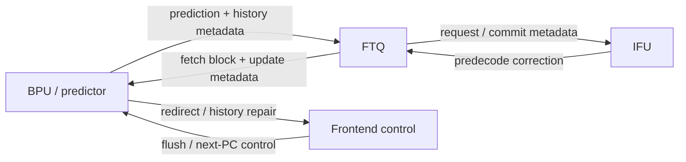
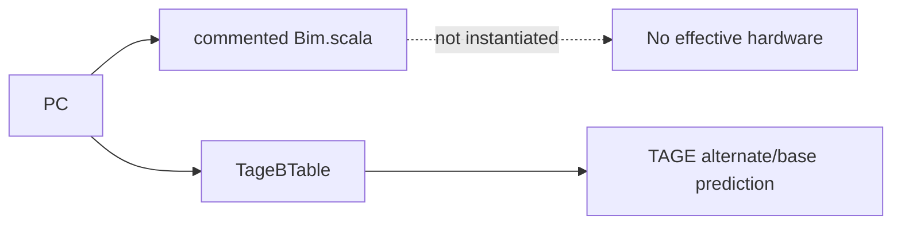

# Frontend Bim 分支预测器深入分析

<!-- regenerated-by-analyze-xiangshan-kunminghu -->
> Regenerated from `OpenXiangShan/XiangShan` branch `kunminghu-v2`, source commit `52262f303fc06daf84cdab7011d59b7df65ce7e8` using the updated Frontend graph/stage rules.


> 官方源码：`https://github.com/OpenXiangShan/XiangShan.git`；分支 `kunminghu-v2`；分析 commit `52262f303fc06daf84cdab7011d59b7df65ce7e8`。论文解释算法原理，源码决定香山的有效参数、流水、更新与恢复。

<!-- frontend-tutorial-generated-by-analyze-xiangshan-kunminghu -->
> 所有实现结论均限定在 `kunminghu-v2` commit `52262f303fc06daf84cdab7011d59b7df65ce7e8`；Design Doc 结论必须回到第 18 节的源码追溯矩阵。

## 1. Scope

本节保留模块职责、分析基线、范围和统一五问，明确本文只以当前源码证据为准。

### 1.1. 统一五问导读
| 问题 | 回答 |
| --- | --- |
| **Who** | 旧 `BIM` 文件描述独立 bimodal 方向预测器；当前有效硬件是 `Tage.scala` 内的 `TageBTable`。 |
| **What** | 以 PC 索引 2-bit 饱和计数器，为 TAGE 提供无 tag 的基础/备用方向。 |
| **How** | S0 计算 bank/index 并读表，S1 选出各分支槽计数器；update 使用 `WrBypass` 解决同地址读后写并做饱和增减。 |
| **From what** | 查询 PC 来自 BPU 公共预测请求；训练来自 FTQ 在分支提交后形成的 `update`。 |
| **To what** | 输出进入 TAGE provider/alternate 选择；结果变化由 BPU 的 S2/S3 比较转换为 redirect。 |

### 1.2. 分析范围
- Source: OpenXiangShan/XiangShan `kunminghu-v2`, commit `52262f303fc06daf84cdab7011d59b7df65ce7e8`.
- Relative source file: [src/main/scala/xiangshan/frontend/Bim.scala](https://github.com/OpenXiangShan/XiangShan/blob/kunminghu-v2/src/main/scala/xiangshan/frontend/Bim.scala).
- Effective status: not effective. The whole file is inside a block comment ([Bim.scala:16-124](https://github.com/OpenXiangShan/XiangShan/blob/kunminghu-v2/src/main/scala/xiangshan/frontend/Bim.scala#L16-L124)), and default predictor construction does not instantiate it ([Parameters.scala:124-143](https://github.com/OpenXiangShan/XiangShan/blob/kunminghu-v2/src/main/scala/xiangshan/Parameters.scala#L124-L143)).

## 2. 关键源码证据

本节直接列出 `Bim / base table` 的有效源码入口、关键代码骨架和行为解释，避免只保存文件名或行号。

### 2.1. 源码入口和行号
| 源码文件 | 本文使用它证明什么 | 行号证据 |
| --- | --- | --- |
| `frontend/Bim.scala` | 历史 bimodal 实现入口；本基线不在有效 Composer 链中直接实例化 | [frontend/Bim.scala](https://github.com/OpenXiangShan/XiangShan/blob/kunminghu-v2/src/main/scala/xiangshan/frontend/Bim.scala) |
| `frontend/Tage.scala` | TAGE base table 作为当前有效的基础方向表 | [frontend/Tage.scala#L143-L270](https://github.com/OpenXiangShan/XiangShan/blob/kunminghu-v2/src/main/scala/xiangshan/frontend/Tage.scala#L143-L270) |
| `Parameters.scala` | 有效预测器链参数不包含独立 Bim 组件 | [Parameters.scala#L124-L143](https://github.com/OpenXiangShan/XiangShan/blob/kunminghu-v2/src/main/scala/xiangshan/Parameters.scala#L124-L143) |

### 2.2. 核心代码骨架
```scala
// 当前有效链路中，基础方向预测由 TAGE 内部 base table 承担
val baseTable = TageBTable(...)
val baseCtr = baseTable.read(s0_pc)
val baseTaken = baseCtr.msb
```

### 2.3. 代码解析
本篇需要区分“Bim 源码存在”和“当前有效实现”。Kunminghu-v2 的有效预测链由 FauFTB、Tage_SC、FTB、ITTAGE、RAS 组成，简单 bimodal 方向信息主要体现在 TAGE base table，而不是独立 Bim 模块投票。
## 3. Theory-to-Code Mapping

本节把理论概念直接绑定到 `Bim / base table` 的源码对象、控制/数据状态和下游消费者。

### 3.1. 理论到代码映射表
| 理论概念 | 代码对象 | 为什么需要它 | 消费者/后续影响 |
| --- | --- | --- | --- |
| 二位饱和计数器 | TAGE base counter | 低成本提供默认方向 | TAGE provider/alternate 选择 |
| 别名冲突 | base table index | 不同 PC 可能落到同一基础方向项 | TAGE tagged table 修正 |
| 非有效模块边界 | `Bim.scala` 与 `Parameters.scala` 链路配置 | 源码存在不等于实例有效 | 总览和 BPU 文档 |

### 3.2. 阅读顺序
先按第 2 节定位源码对象，再顺着本表检查信号从哪里来、状态在哪里保存、何时更新、谁消费结果。若本篇只引用相邻模块拥有的状态，则以相邻 Frontend 分文档的源码分析为准。
## 4. 论文原则和有效代码


### 4.1. 状态机与论文理论
独立 `Bim.scala` 在本 commit 中整体被块注释，因此没有有效 FSM；当前 `TageBTable` 使用“复位扫描 / 可查询 / 更新冲突”隐式生命周期。经典理论来自 James E. Smith 的 *A Study of Branch Prediction Strategies*：2-bit 计数器只有连续相反结果才会跨过强/弱状态边界，减少循环退出一次造成的长期翻转。香山的具体 bank、端口冲突和旁路规则以源码为准。

### 4.2. 算法原理
Bimodal prediction is the classic PC-indexed two-bit saturating-counter method: counter MSB predicts taken/not-taken; update increments on taken and decrements on not-taken, saturating at both ends. MCP search did not return a precise Smith two-bit-counter paper entry; this file therefore states only the standard principle and relies on XiangShan source for code behavior.

## 5. Microarchitecture Parameters


### 5.1. 表容量、冲突与边界
- Bimodal 表没有 FIFO 式 underflow；未命中 tag 的问题也不存在，因为它是无 tag PC-indexed 表，主要风险是 **alias**。
- SRAM reset 扫描期间 `ready` 被压低，避免读到未初始化计数器；单端口 update/read 冲突时响应 valid 被屏蔽。
- `WrBypass` 容量有限，但它不是预测队列；旁路未命中时读取 SRAM 已提交值，不会数组越界。

```waveform-draw
{
  "signal": [
    {
      "name": "clk",
      "wave": "p......"
    },
    {
      "name": "req.valid",
      "wave": "01..0.."
    },
    {
      "name": "req.ready",
      "wave": "10.1..."
    },
    {
      "name": "req.pc",
      "wave": "x=..x..",
      "data": [
        "pc0"
      ]
    },
    {
      "name": "update.valid",
      "wave": "0.10..."
    },
    {
      "name": "s1_resp_valid",
      "wave": "0...10."
    },
    {
      "name": "counter",
      "wave": "x...=x.",
      "data": [
        "2b10"
      ]
    }
  ],
  "config": {
    "hscale": 1
  }
}
```

## 6. 模块边界和接口


### 6.1. 控制信号逐项解释：Who / From / To / How / Why
> 下表覆盖本文讲解中出现的查询、流水推进、选择、训练、替换和恢复控制。`为什么存在` 不以信号命名猜测，而以当前 `kunminghu-v2` 数据依赖、资源限制和恢复要求为依据。

| 控制信号 / 状态 | 谁产生 / 从哪里来 | 谁消费 / 到哪里去 | 何时、如何生效 | 为什么存在；缺失会怎样 | 代码证据 |
| --- | --- | --- | --- | --- | --- |
| `io.req.valid / io.req.ready` | BPU/TAGE 查询流水 | TageBTable SRAM 读口 | 只有握手允许时才启动 PC 索引读取；复位扫描或写冲突时 ready 被压低。 | 无 tag 的基础表每拍都可能被访问，必须有接受边界，否则查询会在 SRAM 不可读时被误认为有效。 | [frontend/Tage.scala:143-215](https://github.com/OpenXiangShan/XiangShan/blob/kunminghu-v2/src/main/scala/xiangshan/frontend/Tage.scala#L143-L215) |
| `io.req.bits.pc` | BPU 公共预测请求 | bank/index 计算 | PC 的块内分支槽位与表索引共同选择 2-bit counter。 | Bim 没有 tag，只能用 PC 建立稳定、低延迟的局部统计基线；没有 PC 就无法区分不同静态分支。 | [frontend/Tage.scala:155-215](https://github.com/OpenXiangShan/XiangShan/blob/kunminghu-v2/src/main/scala/xiangshan/frontend/Tage.scala#L155-L215) |
| `doing_reset / reset_idx` | TageBTable 内部复位控制 | SRAM 写口与 ready | 复位期间逐项写入弱初始值并禁止正常查询。 | SRAM 不能假设上电内容确定；该信号避免未初始化 counter 直接参与预测。 | [frontend/Tage.scala:155-190](https://github.com/OpenXiangShan/XiangShan/blob/kunminghu-v2/src/main/scala/xiangshan/frontend/Tage.scala#L155-L190) |
| `io.update.valid` | FTQ 提交训练 | Bim 更新流水 | 仅有效提交更新才改变 counter；错误路径 update 不应到达。 | 将“查询”与“训练”分离，保证只有已解析、可归因的分支结果修改长期状态。 | [frontend/Tage.scala:217-267](https://github.com/OpenXiangShan/XiangShan/blob/kunminghu-v2/src/main/scala/xiangshan/frontend/Tage.scala#L217-L267) |
| `io.update.bits.mask` | TAGE 更新选择 | 各分支槽 counter 写使能 | 按槽位选择本拍需要训练的 counter。 | 一个 fetch block 可含多个条件分支；mask 防止某一分支的结果污染同块其他槽位。 | [frontend/Tage.scala:217-267](https://github.com/OpenXiangShan/XiangShan/blob/kunminghu-v2/src/main/scala/xiangshan/frontend/Tage.scala#L217-L267) |
| `io.update.bits.taken` | 已解析分支结果 | satUpdate | taken 增计数，not-taken 减计数，并在上下界饱和。 | 方向是真实监督信号；饱和避免循环偶发退出让强预测瞬间翻转。 | [frontend/Tage.scala:217-267](https://github.com/OpenXiangShan/XiangShan/blob/kunminghu-v2/src/main/scala/xiangshan/frontend/Tage.scala#L217-L267) |
| `update_bank_wen / update_bank_idx` | 更新地址译码 | 单端口 bank 写口 | 把逻辑分支槽变换为物理 bank/index 写掩码。 | 多槽位布局与 bank 化 SRAM 需要显式写选择，否则会写错物理 counter 或产生多写冲突。 | [frontend/Tage.scala:217-267](https://github.com/OpenXiangShan/XiangShan/blob/kunminghu-v2/src/main/scala/xiangshan/frontend/Tage.scala#L217-L267) |
| `WrBypass.hit / data` | 待提交写旁路 | 查询响应 counter | 查询与近期写同地址时返回最新 counter，而不是 SRAM 旧值。 | 单端口/流水 SRAM 的写可见性有延迟；旁路消除 read-after-write 陈旧预测。 | [frontend/Tage.scala:224-241](https://github.com/OpenXiangShan/XiangShan/blob/kunminghu-v2/src/main/scala/xiangshan/frontend/Tage.scala#L224-L241) |
| `io.resp.valid` | SRAM 响应与冲突控制 | TAGE provider/alternate 选择 | 只有真实完成的 base-table 读取才能作为 alternate。 | 下游必须区分“预测为 not-taken”和“本拍没有合法预测”，否则 invalid 会被误解释为方向值。 | [frontend/Tage.scala:193-215](https://github.com/OpenXiangShan/XiangShan/blob/kunminghu-v2/src/main/scala/xiangshan/frontend/Tage.scala#L193-L215) |

#### 6.1.1. Top-Level Module Connectivity

This module participates in the predictor chain, but the top-level graph keeps only bundled interfaces. `Frontend.scala` instantiates BPU, FTQ, IFU, IBuffer, ICache, and InstrUncache, while the predictor-specific chain is configured through Composer: [frontend/Frontend.scala:103-109](https://github.com/OpenXiangShan/XiangShan/blob/52262f303fc06daf84cdab7011d59b7df65ce7e8/src/main/scala/xiangshan/frontend/Frontend.scala#L103-L109), [frontend/Composer.scala:22-77](https://github.com/OpenXiangShan/XiangShan/blob/52262f303fc06daf84cdab7011d59b7df65ce7e8/src/main/scala/xiangshan/frontend/Composer.scala#L22-L77).



No module pair has more than three bundled edges. Individual table reads, counters, folded histories, and predictor-local states remain in the module's detailed sections instead of becoming separate graph lines.

#### 6.1.2. Frontend/Backend Pipeline Stages

The source-proven stage boundary is `F0 -> F1 -> F2 -> F3`: F0 accepts the FTQ request and calculates line indices, F1 registers the fetch block and calculates instruction PCs/cut pointers, F2 waits for ICache responses and performs data cutting/predecode preparation, and F3 expands/qualifies instructions, handles exceptions/MMIO, and drives IBuffer. Evidence: [frontend/IFU.scala:236-305](https://github.com/OpenXiangShan/XiangShan/blob/52262f303fc06daf84cdab7011d59b7df65ce7e8/src/main/scala/xiangshan/frontend/IFU.scala#L236-L305), [frontend/IFU.scala:346-457](https://github.com/OpenXiangShan/XiangShan/blob/52262f303fc06daf84cdab7011d59b7df65ce7e8/src/main/scala/xiangshan/frontend/IFU.scala#L346-L457), [frontend/IFU.scala:542-617](https://github.com/OpenXiangShan/XiangShan/blob/52262f303fc06daf84cdab7011d59b7df65ce7e8/src/main/scala/xiangshan/frontend/IFU.scala#L542-L617). The top-level connections couple FTQ, IFU, ICache, and IBuffer through shared ready/valid conditions: [frontend/Frontend.scala:199-231](https://github.com/OpenXiangShan/XiangShan/blob/52262f303fc06daf84cdab7011d59b7df65ce7e8/src/main/scala/xiangshan/frontend/Frontend.scala#L199-L231).

The backend continuation uses the effective module boundaries rather than inventing cycle names: Decode accepts the instruction packet, Rename creates speculative physical-register mappings, Dispatch allocates downstream resources, Issue/Scheduler selects ready uops, Execute/FU produces results, DataPath/WB carries writeback and wakeup, and ROB/CtrlBlock commits or redirects. Evidence: [backend/decode/DecodeStage.scala:83-120](https://github.com/OpenXiangShan/XiangShan/blob/52262f303fc06daf84cdab7011d59b7df65ce7e8/src/main/scala/xiangshan/backend/decode/DecodeStage.scala#L83-L120), [backend/rename/Rename.scala:40-117](https://github.com/OpenXiangShan/XiangShan/blob/52262f303fc06daf84cdab7011d59b7df65ce7e8/src/main/scala/xiangshan/backend/rename/Rename.scala#L40-L117), [backend/dispatch/NewDispatch.scala:49-176](https://github.com/OpenXiangShan/XiangShan/blob/52262f303fc06daf84cdab7011d59b7df65ce7e8/src/main/scala/xiangshan/backend/dispatch/NewDispatch.scala#L49-L176), [backend/issue/Scheduler.scala:29-180](https://github.com/OpenXiangShan/XiangShan/blob/52262f303fc06daf84cdab7011d59b7df65ce7e8/src/main/scala/xiangshan/backend/issue/Scheduler.scala#L29-L180), [backend/exu/ExeUnit.scala:50-110](https://github.com/OpenXiangShan/XiangShan/blob/52262f303fc06daf84cdab7011d59b7df65ce7e8/src/main/scala/xiangshan/backend/exu/ExeUnit.scala#L50-L110), [backend/datapath/DataPath.scala:25-70](https://github.com/OpenXiangShan/XiangShan/blob/52262f303fc06daf84cdab7011d59b7df65ce7e8/src/main/scala/xiangshan/backend/datapath/DataPath.scala#L25-L70), [backend/rob/Rob.scala:52-145](https://github.com/OpenXiangShan/XiangShan/blob/52262f303fc06daf84cdab7011d59b7df65ce7e8/src/main/scala/xiangshan/backend/rob/Rob.scala#L52-L145), [backend/CtrlBlock.scala:50-110](https://github.com/OpenXiangShan/XiangShan/blob/52262f303fc06daf84cdab7011d59b7df65ce7e8/src/main/scala/xiangshan/backend/CtrlBlock.scala#L50-L110).

```mermaid
flowchart LR
  F0["F0: FTQ req + line indices"] -->|f0_fire| F1["F1: PC + cut pointers"]
  F1 -->|f1_fire| F2["F2: ICache data + exceptions"]
  F2 -->|f2_fire| F3["F3: predecode + MMIO qualification"]
  F3 -->|toIbuffer.fire| Decode["Decode"]
  Decode -->|uop bundle| Rename["Rename"]
  Rename -->|renamed uop| Dispatch["Dispatch"]
  Dispatch -->|ready uop| Issue["Issue"]
  Issue -->|operands| Execute["Execute/FU"]
  Execute -->|result| Writeback["Writeback/Wakeup"]
  Writeback -->|retire candidate| Commit["ROB/Commit"]
  Commit -->|redirect/flush| F0
```



The stage graph keeps chronological forward edges separate from the bundled recovery edge. It must be read together with the module graph below: a stage is not itself a module, and a redirect does not create a fake forward stage.

```waveform-draw
{
  "signal": [
    {
      "name": "clk",
      "wave": "p......."
    },
    {
      "name": "F0.valid",
      "wave": "01...0.."
    },
    {
      "name": "F0.ready",
      "wave": "1..0...."
    },
    {
      "name": "F1.valid",
      "wave": "001..0.."
    },
    {
      "name": "F2.valid",
      "wave": "0001.0.."
    },
    {
      "name": "F3.valid",
      "wave": "00001.0."
    },
    {
      "name": "toIbuffer.fire",
      "wave": "0000010."
    },
    {
      "name": "redirect/flush",
      "wave": "00000010"
    }
  ],
  "config": {
    "hscale": 1
  }
}
```

## 7. 为什么模块存在


把模块放回 Frontend 全链路理解：它解决的是预测带宽、取指正确性、存储层次延迟、投机恢复或上下游速率不匹配中的至少一个问题。

## 8. 有效动态路径


按 `valid -> ready -> fire -> register/state update -> consumer` 阅读动态路径，并同时检查正常、阻塞、flush、redirect、replay 和恢复后的 forward progress。

## 9. Index 和地址/历史计算


地址、PC、折叠历史、tag、set/way、line offset 和 FTQ offset 都必须追到源码表达式；索引冲突、回绕和跨边界情况在算法和验证章节中继续展开。

## 10. 核心算法


### 10.1. 算法示例推演
This example is non-effective for the analyzed commit because [Bim.scala](https://github.com/OpenXiangShan/XiangShan/blob/kunminghu-v2/src/main/scala/xiangshan/frontend/Bim.scala) is entirely inside a block comment ([Bim.scala:16-124](https://github.com/OpenXiangShan/XiangShan/blob/kunminghu-v2/src/main/scala/xiangshan/frontend/Bim.scala#L16-L124)) and the default predictor chain instantiates `Tage_SC`, not standalone `BIM` ([Parameters.scala:124-143](https://github.com/OpenXiangShan/XiangShan/blob/kunminghu-v2/src/main/scala/xiangshan/Parameters.scala#L124-L143)). The effective base bimodal behavior is inside `TageBTable` ([Tage.scala:143-270](https://github.com/OpenXiangShan/XiangShan/blob/kunminghu-v2/src/main/scala/xiangshan/frontend/Tage.scala#L143-L270)).

Non-effective standalone BIM example:

1. Lookup input: PC `0x8000_6000` maps through `bimAddr.getIdx(s0_pc_dup(0))` ([Bim.scala:31-45](https://github.com/OpenXiangShan/XiangShan/blob/kunminghu-v2/src/main/scala/xiangshan/frontend/Bim.scala#L31-L45)) to a 2048-row table index. If branch slot 0 counter is `2'b10`, [Bim.scala:54-61](https://github.com/OpenXiangShan/XiangShan/blob/kunminghu-v2/src/main/scala/xiangshan/frontend/Bim.scala#L54-L61) would use counter MSB as taken metadata.
2. Update input: FTQ update says the branch resolved not-taken. [Bim.scala:63-71](https://github.com/OpenXiangShan/XiangShan/blob/kunminghu-v2/src/main/scala/xiangshan/frontend/Bim.scala#L63-L71) would qualify the branch update and build `need_to_update` only for valid FTB branch slots before the first taken branch.
3. Bypass: if the same index was recently written, [Bim.scala:73-85](https://github.com/OpenXiangShan/XiangShan/blob/kunminghu-v2/src/main/scala/xiangshan/frontend/Bim.scala#L73-L85) would use `WrBypass` data instead of stale metadata counters.
4. Saturating update: [Bim.scala:87-99](https://github.com/OpenXiangShan/XiangShan/blob/kunminghu-v2/src/main/scala/xiangshan/frontend/Bim.scala#L87-L99) would compute `satUpdate(2'b10, 2, false) = 2'b01` and write only the updated branch way.

Current effective base-table example:

1. `TageBTable` receives the same PC, computes `bimAddr.getIdx(pc)`, bank mask, and bank index ([Tage.scala:155-205](https://github.com/OpenXiangShan/XiangShan/blob/kunminghu-v2/src/main/scala/xiangshan/frontend/Tage.scala#L155-L205)).
2. It reads 2-bit counters, unshuffles physical branch index to logical branch slot ([Tage.scala:207-215](https://github.com/OpenXiangShan/XiangShan/blob/kunminghu-v2/src/main/scala/xiangshan/frontend/Tage.scala#L207-L215)), and supplies `s1_basecnts` to TAGE provider/alternate selection ([Tage.scala:825-837](https://github.com/OpenXiangShan/XiangShan/blob/kunminghu-v2/src/main/scala/xiangshan/frontend/Tage.scala#L825-L837)).
3. On update, it uses `WrBypass` for same-index RAW behavior ([Tage.scala:224-241](https://github.com/OpenXiangShan/XiangShan/blob/kunminghu-v2/src/main/scala/xiangshan/frontend/Tage.scala#L224-L241)) and applies 2-bit saturating update ([Tage.scala:243-267](https://github.com/OpenXiangShan/XiangShan/blob/kunminghu-v2/src/main/scala/xiangshan/frontend/Tage.scala#L243-L267)).

Downstream effect: standalone `BIM` has no hardware effect in this commit; `TageBTable` affects TAGE's alternate/base prediction through `s1_basecnts` and `s1_altUsed` ([Tage.scala:825-839](https://github.com/OpenXiangShan/XiangShan/blob/kunminghu-v2/src/main/scala/xiangshan/frontend/Tage.scala#L825-L839)).

### 10.2. 逐流水级算法
Standalone `BIM` has no effective stages in this commit because [Bim.scala](https://github.com/OpenXiangShan/XiangShan/blob/kunminghu-v2/src/main/scala/xiangshan/frontend/Bim.scala) is commented out ([Bim.scala:16-124](https://github.com/OpenXiangShan/XiangShan/blob/kunminghu-v2/src/main/scala/xiangshan/frontend/Bim.scala#L16-L124)) and is not instantiated by the default predictor chain ([Parameters.scala:124-143](https://github.com/OpenXiangShan/XiangShan/blob/kunminghu-v2/src/main/scala/xiangshan/Parameters.scala#L124-L143)). The effective bimodal/base behavior is `TageBTable`.

| Stage | Effective replacement | Algorithm and state | Ready/stall | Output | Source lines |
| --- | --- | --- | --- | --- | --- |
| S0 lookup | `TageBTable` | Compute PC index, bank mask, bank index; read selected SRAM bank. | `io.req.ready := !doing_reset`; bank write conflict marks response invalid. | Base-table read request. | [Tage.scala:155-205](https://github.com/OpenXiangShan/XiangShan/blob/kunminghu-v2/src/main/scala/xiangshan/frontend/Tage.scala#L155-L205) |
| S1 response | `TageBTable` | Select bank response, unshuffle physical branch counter to logical slot. | `s1_resp_valid := !s1_resp_invalid_by_conflict`. | `s1_cnt` for TAGE alternate/base. | [Tage.scala:207-215](https://github.com/OpenXiangShan/XiangShan/blob/kunminghu-v2/src/main/scala/xiangshan/frontend/Tage.scala#L207-L215) |
| Update | `TageBTable` | Compute update index/bank; use `WrBypass`; saturating-update 2-bit counters; write masked branch ways. | Single-port write can conflict with later read. | Updated base counters. | [Tage.scala:217-267](https://github.com/OpenXiangShan/XiangShan/blob/kunminghu-v2/src/main/scala/xiangshan/frontend/Tage.scala#L217-L267) |
| Non-effective standalone BIM | Commented [Bim.scala](https://github.com/OpenXiangShan/XiangShan/blob/kunminghu-v2/src/main/scala/xiangshan/frontend/Bim.scala) | Would have S0 PC index, S1 counter read, update with `WrBypass`. | Not elaborated. | No hardware output. | [Bim.scala:31-99](https://github.com/OpenXiangShan/XiangShan/blob/kunminghu-v2/src/main/scala/xiangshan/frontend/Bim.scala#L31-L99) |

## 11. 状态和存储结构


把每个表、栈、FIFO、MSHR、uncache entry 和 pipeline register 记录为 `valid/full/empty/ready` 可观察状态，并说明谁写入、谁读取、何时清空以及满/空时谁被反压。

## 12. Pipeline stage 分析


阶段说明只使用源码中的寄存器、valid/ready 和 fire 条件；对 Frontend 使用 F0/F1/F2/F3，对 Backend 使用实际 Decode/Rename/Dispatch/Issue/Execute/Writeback/ROB 边界。

## 13. Control path rationale


### 13.1. Redirect 信号生成
Standalone `BIM` generates no redirect because it is not effective. The effective `TageBTable` can influence redirect only through TAGE's S2 direction output.

| Redirect influence | Condition | Stage | BPU generation | Source lines |
| --- | --- | --- | --- | --- |
| Base prediction used by TAGE | No tagged provider, or provider is weak and use-alt-on-NA selects alternate. | TAGE S2 | If base direction differs from S1 upstream prediction, BPU asserts S2 redirect. | [Tage.scala:825-846](https://github.com/OpenXiangShan/XiangShan/blob/kunminghu-v2/src/main/scala/xiangshan/frontend/Tage.scala#L825-L846), [frontend/BPU.scala:620-705](https://github.com/OpenXiangShan/XiangShan/blob/kunminghu-v2/src/main/scala/xiangshan/frontend/BPU.scala#L620-L705) |
| Base-table update | Resolved branch updates 2-bit counter. | Update | No immediate redirect; changes future TAGE alternate/base prediction. | [Tage.scala:217-267](https://github.com/OpenXiangShan/XiangShan/blob/kunminghu-v2/src/main/scala/xiangshan/frontend/Tage.scala#L217-L267), [Tage.scala:999-1002](https://github.com/OpenXiangShan/XiangShan/blob/kunminghu-v2/src/main/scala/xiangshan/frontend/Tage.scala#L999-L1002) |
| Standalone BIM path | Commented out. | None | No redirect. | [Bim.scala:16-124](https://github.com/OpenXiangShan/XiangShan/blob/kunminghu-v2/src/main/scala/xiangshan/frontend/Bim.scala#L16-L124) |

Example: `TageBTable` returns base counter `2'b11` and no tagged provider hits. TAGE uses base taken ([Tage.scala:825-837](https://github.com/OpenXiangShan/XiangShan/blob/kunminghu-v2/src/main/scala/xiangshan/frontend/Tage.scala#L825-L837)) and writes S2 `br_taken_mask`. If FauFTB S1 had predicted not-taken, BPU S2 detects `takenDiff` and redirects.

## 14. Data path 与跨边界


### 14.1. 跨边界代码解析
本预测器只产生预测元数据，不直接把跨页、跨 Cache Line 或 MMIO 访问当成一个原子内存事务。对一个取指块跨边界的场景，先由预测链生成块起始 PC、taken mask、target 和 fall-through，再由 IFU/ICache 对每个地址片段分别完成翻译、权限和内存类型判断。BPU 在 S1/S2/S3 比较预测差异并生成 redirect 的规则见 [frontend/BPU.scala:606-635](https://github.com/OpenXiangShan/XiangShan/blob/kunminghu-v2/src/main/scala/xiangshan/frontend/BPU.scala#L606-L635) 和 [frontend/BPU.scala:827-854](https://github.com/OpenXiangShan/XiangShan/blob/kunminghu-v2/src/main/scala/xiangshan/frontend/BPU.scala#L827-L854)；因此第二片段发生 page fault、line miss 或 MMIO 分类变化时，恢复对象是预测历史和 FTQ 上下文，而不是把两片段静默拼接。

最小实例是块尾部剩余半条 32-bit 指令：第一片段可能在当前 Cache Line/页命中，第二片段需要下一 Line 或下一页的独立请求；IFU 保存 `lastHalf`，跨周期合并并在 flush 时清除，[frontend/IFU.scala:915-943](https://github.com/OpenXiangShan/XiangShan/blob/kunminghu-v2/src/main/scala/xiangshan/frontend/IFU.scala#L915-L943)。若第二页或第二 Line 的结果改变 CFI 位置、target 或 fall-through，BPU 的 redirect 比较优先于继续使用旧预测。对 MMIO/uncache 地址，预测器只能提供候选 PC，实际访问必须转入 IFU 的 MMIO FSM，等待翻译、PMP/PMA 和提交约束，不能由预测命中绕过副作用控制。

**边界检查表**

| 边界 | 第一片段 | 第二片段 | 失败/恢复 |
| --- | --- | --- | --- |
| 虚拟页 | 当前页的预测块与历史 | 下一页的独立翻译和权限结果 | page/access/guest fault、flush、重定向 |
| Cache Line | 当前 line 的 tag/数据命中 | 下一 line 的 miss/refill 或独立响应 | target/CFI 不一致时 redirect |
| MMIO/uncache | 预测 PC 与元数据 | IFU/uncache 请求、响应和提交门控 | resend、异常、commit wait 或 cancel |

## 15. 异常、debug、privilege


区分预测错误、replay、page/access/guest fault、MMIO side effect、debug redirect 和架构异常；说明异常产生者、优先级、清理对象、恢复入口和提交可见性。

## 16. CSR 控制


前端分支预测器的使能控制来自 CSR 模块生成的 `CustomCSRCtrlIO.bp_ctrl`，不是各预测器本地私有 CSR。有效链路是：`sbpctl` CSR 字段 -> `io.status.custom.bp_ctrl` -> Backend `frontendCsrCtrl` -> XSCore `frontend.io.csrCtrl` -> Frontend `bpu.io.ctrl` -> BPU 内各子预测器 `io.enable`。

### 16.1. CSR 字段到 BPU 控制信号
| 控制位 | CSR 源字段 | Frontend/BPU 消费者 | 有效作用 | 源码证据 |
| --- | --- | --- | --- | --- |
| `bp_ctrl.ubtbEnable` | `sbpctl.regOut.UBTB_ENABLE` | `ubtb.io.enable` | 允许或关闭 S1 fast uBTB/MicroBtb 查询结果参与预测链；关闭后仍保留 fall-through 基线。 | [NewCSR.scala:1378](https://github.com/OpenXiangShan/XiangShan/blob/kunminghu-v2/src/main/scala/xiangshan/backend/fu/NewCSR/NewCSR.scala#L1378), [Bpu.scala:96](https://github.com/OpenXiangShan/XiangShan/blob/kunminghu-v2/src/main/scala/xiangshan/frontend/bpu/Bpu.scala#L96), [Bpu.scala:105](https://github.com/OpenXiangShan/XiangShan/blob/kunminghu-v2/src/main/scala/xiangshan/frontend/bpu/Bpu.scala#L105) |
| `bp_ctrl.abtbEnable` | `sbpctl.regOut.ABTB_ENABLE` | `abtb.io.enable` | 控制 AheadBtb 目标/属性预测是否参与早期预测。 | [NewCSR.scala:1379](https://github.com/OpenXiangShan/XiangShan/blob/kunminghu-v2/src/main/scala/xiangshan/backend/fu/NewCSR/NewCSR.scala#L1379), [Bpu.scala:97](https://github.com/OpenXiangShan/XiangShan/blob/kunminghu-v2/src/main/scala/xiangshan/frontend/bpu/Bpu.scala#L97), [Bpu.scala:106](https://github.com/OpenXiangShan/XiangShan/blob/kunminghu-v2/src/main/scala/xiangshan/frontend/bpu/Bpu.scala#L106) |
| `bp_ctrl.mbtbEnable` | `sbpctl.regOut.MBTB_ENABLE` | `mbtb.io.enable` | 控制 MainBtb 是否提供主 BTB 命中、直接分支/JAL target 和 fall-through 信息。 | [NewCSR.scala:1380](https://github.com/OpenXiangShan/XiangShan/blob/kunminghu-v2/src/main/scala/xiangshan/backend/fu/NewCSR/NewCSR.scala#L1380), [Bpu.scala:98](https://github.com/OpenXiangShan/XiangShan/blob/kunminghu-v2/src/main/scala/xiangshan/frontend/bpu/Bpu.scala#L98), [Bpu.scala:107](https://github.com/OpenXiangShan/XiangShan/blob/kunminghu-v2/src/main/scala/xiangshan/frontend/bpu/Bpu.scala#L107) |
| `bp_ctrl.tageEnable` | `sbpctl.regOut.TAGE_ENABLE` | `tage.io.enable` | 控制 TAGE 条件分支方向预测是否有效；关闭时不能把 TAGE provider 结果作为方向覆盖依据。 | [NewCSR.scala:1381](https://github.com/OpenXiangShan/XiangShan/blob/kunminghu-v2/src/main/scala/xiangshan/backend/fu/NewCSR/NewCSR.scala#L1381), [Bpu.scala:99](https://github.com/OpenXiangShan/XiangShan/blob/kunminghu-v2/src/main/scala/xiangshan/frontend/bpu/Bpu.scala#L99), [Bpu.scala:108](https://github.com/OpenXiangShan/XiangShan/blob/kunminghu-v2/src/main/scala/xiangshan/frontend/bpu/Bpu.scala#L108) |
| `bp_ctrl.scEnable` | `sbpctl.regOut.SC_ENABLE` | `sc.io.enable` | 控制 statistical corrector 是否修正 TAGE/基础方向结果。 | [NewCSR.scala:1382](https://github.com/OpenXiangShan/XiangShan/blob/kunminghu-v2/src/main/scala/xiangshan/backend/fu/NewCSR/NewCSR.scala#L1382), [Bpu.scala:100](https://github.com/OpenXiangShan/XiangShan/blob/kunminghu-v2/src/main/scala/xiangshan/frontend/bpu/Bpu.scala#L100), [Bpu.scala:109](https://github.com/OpenXiangShan/XiangShan/blob/kunminghu-v2/src/main/scala/xiangshan/frontend/bpu/Bpu.scala#L109) |
| `bp_ctrl.ittageEnable` | `sbpctl.regOut.ITTAGE_ENABLE` | `ittage.io.enable` | 控制间接跳转/JALR target 覆盖预测是否有效。 | [NewCSR.scala:1383](https://github.com/OpenXiangShan/XiangShan/blob/kunminghu-v2/src/main/scala/xiangshan/backend/fu/NewCSR/NewCSR.scala#L1383), [Bpu.scala:101](https://github.com/OpenXiangShan/XiangShan/blob/kunminghu-v2/src/main/scala/xiangshan/frontend/bpu/Bpu.scala#L101), [Bpu.scala:110](https://github.com/OpenXiangShan/XiangShan/blob/kunminghu-v2/src/main/scala/xiangshan/frontend/bpu/Bpu.scala#L110) |
| `bp_ctrl.rasEnable` | `sbpctl.regOut.RAS_ENABLE` | `ras.io.enable` | 控制 return address stack 是否给 RET/JALR 返回目标提供覆盖。 | [NewCSR.scala:1384](https://github.com/OpenXiangShan/XiangShan/blob/kunminghu-v2/src/main/scala/xiangshan/backend/fu/NewCSR/NewCSR.scala#L1384), [Bpu.scala:102](https://github.com/OpenXiangShan/XiangShan/blob/kunminghu-v2/src/main/scala/xiangshan/frontend/bpu/Bpu.scala#L102), [Bpu.scala:111](https://github.com/OpenXiangShan/XiangShan/blob/kunminghu-v2/src/main/scala/xiangshan/frontend/bpu/Bpu.scala#L111) |

### 16.2. 有效代码骨架
```scala
// backend/fu/NewCSR/NewCSR.scala
io.status.custom.bp_ctrl.ubtbEnable   := sbpctl.regOut.UBTB_ENABLE.asBool
io.status.custom.bp_ctrl.abtbEnable   := sbpctl.regOut.ABTB_ENABLE.asBool
io.status.custom.bp_ctrl.mbtbEnable   := sbpctl.regOut.MBTB_ENABLE.asBool
io.status.custom.bp_ctrl.tageEnable   := sbpctl.regOut.TAGE_ENABLE.asBool
io.status.custom.bp_ctrl.scEnable     := sbpctl.regOut.SC_ENABLE.asBool
io.status.custom.bp_ctrl.ittageEnable := sbpctl.regOut.ITTAGE_ENABLE.asBool
io.status.custom.bp_ctrl.rasEnable    := sbpctl.regOut.RAS_ENABLE.asBool

// frontend/Frontend.scala
private val csrCtrl = DelayN(io.csrCtrl, CsrCtrlPortDelay)
bpu.io.ctrl := csrCtrl.bp_ctrl

// frontend/bpu/Bpu.scala
private val ctrl = DelayN(io.ctrl, 2)
fallThrough.io.enable := true.B
utage.io.enable       := true.B
uras.io.enable        := true.B
ubtb.io.enable        := ctrl.ubtbEnable
abtb.io.enable        := ctrl.abtbEnable
mbtb.io.enable        := ctrl.mbtbEnable
tage.io.enable        := ctrl.tageEnable
sc.io.enable          := ctrl.scEnable
ittage.io.enable      := ctrl.ittageEnable
ras.io.enable         := ctrl.rasEnable
```

### 16.3. 代码解析
`BpuCtrl` bundle 明确定义了 `ubtbEnable`、`abtbEnable`、`mbtbEnable`、`tageEnable`、`scEnable`、`ittageEnable`、`rasEnable` 七个 Bool 控制位：[Bundles.scala:179-189](https://github.com/OpenXiangShan/XiangShan/blob/kunminghu-v2/src/main/scala/xiangshan/frontend/bpu/Bundles.scala#L179-L189)。`CustomCSRCtrlIO` 将 `bp_ctrl` 作为 CSR 输出的一部分：[Bundle.scala:586-596](https://github.com/OpenXiangShan/XiangShan/blob/kunminghu-v2/src/main/scala/xiangshan/Bundle.scala#L586-L596)。Backend 把 `csrio.customCtrl` 暴露为 `frontendCsrCtrl`，XSCore 再连到 Frontend：[Backend.scala:526-527](https://github.com/OpenXiangShan/XiangShan/blob/kunminghu-v2/src/main/scala/xiangshan/backend/Backend.scala#L526-L527), [XSCore.scala:138](https://github.com/OpenXiangShan/XiangShan/blob/kunminghu-v2/src/main/scala/xiangshan/XSCore.scala#L138)。Frontend 先用 `CsrCtrlPortDelay` 延迟 CSR 控制，再把 `csrCtrl.bp_ctrl` 送进 BPU：[Frontend.scala:143-153](https://github.com/OpenXiangShan/XiangShan/blob/kunminghu-v2/src/main/scala/xiangshan/frontend/Frontend.scala#L143-L153)。BPU 内部再延迟 2 拍以满足时序，随后分发给各子预测器：[Bpu.scala:89-111](https://github.com/OpenXiangShan/XiangShan/blob/kunminghu-v2/src/main/scala/xiangshan/frontend/bpu/Bpu.scala#L89-L111)。

需要注意两点：第一，`fallThrough` 基线预测器始终 `enable := true.B`，`MicroTage` 和 `MicroRas` 当前也固定使能，源码中 `utageEnable` 仍是注释项，不应写成已由 CSR 控制；第二，在 `EnableConstantin && !FPGAPlatform` 配置下，`constCtrl` 可覆盖 CSR 位，否则直接使用 CSR 位，因此验证时要同时覆盖 Constantin override 和普通 CSR 控制两条路径。

## 17. Diagrams


### 17.1. 结构图


## 18. 有效行为和 Design Doc 差异


### 18.1. Design Doc to Source Traceability
| Design Doc location | Atomic claim | XiangShan source evidence | Relationship | Status | Discrepancy |
| --- | --- | --- | --- | --- | --- |
| [docs/en/frontend/BPU/saturateCounter.md:1](https://github.com/OpenXiangShan/XiangShan-Design-Doc/blob/f8e258dc2d9c02c0616764856e1d18feedb91b81/docs/en/frontend/BPU/saturateCounter.md#L1) | 饱和计数器用有限位宽保存方向状态并在训练时更新 | [frontend/Bim.scala:79-123](https://github.com/OpenXiangShan/XiangShan/blob/52262f303fc06daf84cdab7011d59b7df65ce7e8/src/main/scala/xiangshan/frontend/Bim.scala#L79-L123) | 读取预测位；训练 valid 时更新表项 | **Partially verified** | Design Doc describes the generic counter; this checkout's Bim integration is configuration-dependent. |
| [docs/en/frontend/BPU/mbtb.md:1](https://github.com/OpenXiangShan/XiangShan-Design-Doc/blob/f8e258dc2d9c02c0616764856e1d18feedb91b81/docs/en/frontend/BPU/mbtb.md#L1) | BPU 组合多个预测器并把方向结果送入后续选择 | [frontend/BPU.scala:381-455](https://github.com/OpenXiangShan/XiangShan/blob/52262f303fc06daf84cdab7011d59b7df65ce7e8/src/main/scala/xiangshan/frontend/BPU.scala#L381-L455) | BPU 汇聚 predictor response and forms prediction metadata | **Verified** | Exact Bim table wiring is hidden behind predictor configuration. |
| [docs/en/frontend/BPU/index.md:1](https://github.com/OpenXiangShan/XiangShan-Design-Doc/blob/f8e258dc2d9c02c0616764856e1d18feedb91b81/docs/en/frontend/BPU/index.md#L1) | 错误预测由后级校验触发 redirect/恢复 | [frontend/BPU.scala:606-635](https://github.com/OpenXiangShan/XiangShan/blob/52262f303fc06daf84cdab7011d59b7df65ce7e8/src/main/scala/xiangshan/frontend/BPU.scala#L606-L635) | 比较预测与真实/后级信息并生成 redirect | **Verified** | 无 |

### 18.2. 当前真正生效的替代实现
The current effective TAGE implementation includes its own base bimodal table, `TageBTable`, instead of the old standalone `BIM` module. `TageBTable` uses 2-bit counters, banked SRAM, weak-taken reset, write bypass, and saturating update ([Tage.scala:143-270](https://github.com/OpenXiangShan/XiangShan/blob/kunminghu-v2/src/main/scala/xiangshan/frontend/Tage.scala#L143-L270)). This is the direction baseline used by TAGE provider/alternate selection ([Tage.scala:825-837](https://github.com/OpenXiangShan/XiangShan/blob/kunminghu-v2/src/main/scala/xiangshan/frontend/Tage.scala#L825-L837)).

### 18.3. Design Doc Baseline
- Design Doc: `OpenXiangShan/XiangShan-Design-Doc`, branch `kunminghu-v3`, commit `f8e258dc2d9c02c0616764856e1d18feedb91b81`.
- XiangShan source: `OpenXiangShan/XiangShan`, branch `kunminghu-v2`, commit `52262f303fc06daf84cdab7011d59b7df65ce7e8`.
- 设计文档是意图和接口假设；以下矩阵只把能在该源码 commit 的有效 Chisel 中定位到的内容作为实现事实。

### 18.4. Design Doc Line-by-Line Mapping
1. `frontend/Bim.scala:79-123` first derives the table index and reads the counter; the same block gates writes with training validity and applies the saturating next-state rule. The consumer is the predictor response path, not IFU directly.
2. `frontend/BPU.scala:381-455` receives component predictions and packages direction/target metadata. This is the source-level relationship to the Design Doc's predictor-composition statement; the exact active set depends on parameters.
3. `frontend/BPU.scala:606-635` compares pipeline-stage results and creates redirect metadata. `frontend/BPU.scala:827-854` then propagates the redirect/flush decision to the frontend control path, so a wrong Bim bit is recoverable rather than architecturally visible.

### 18.5. Design Doc Discrepancies
- `Partially verified`: the Design Doc's standalone saturating-counter description is valid, but the active Bim path is selected/configured through the current predictor composition.
- `Not found`: no Design Doc page proves the exact `Bim.scala` table dimensions for this source commit; do not infer them from the generic counter page.

## 19. 动态场景示例


### 19.1. 示例讲解
若某 PC 的计数器为 `10`（弱 taken），一次 not-taken 更新后变成 `01`（弱 not-taken）；下一次相同 PC 查询时，若没有更长历史 tagged provider，TAGE 可使用这个基础方向。若 update 与查询命中同一 SRAM 地址，`WrBypass` 提供最新值，避免读取旧计数器。

### 19.2. Scenario Summary
| Scenario | Effective in current commit? | Explanation |
| --- | --- | --- |
| Standalone BIM lookup | No | [Bim.scala](https://github.com/OpenXiangShan/XiangShan/blob/kunminghu-v2/src/main/scala/xiangshan/frontend/Bim.scala) is commented and not instantiated. |
| Standalone BIM update | No | Same reason. |
| Base bimodal fallback for TAGE | Yes | Implemented by `TageBTable`, source [Tage.scala:143-270](https://github.com/OpenXiangShan/XiangShan/blob/kunminghu-v2/src/main/scala/xiangshan/frontend/Tage.scala#L143-L270). |
| Two-bit counter conflict bypass | Yes, inside TAGE base table | [Tage.scala:224-241](https://github.com/OpenXiangShan/XiangShan/blob/kunminghu-v2/src/main/scala/xiangshan/frontend/Tage.scala#L224-L241) forwards pending updates. |

## 20. 结论


### 20.1. 预测器关系
The effective Kunminghu frontend predictor chain is not a set of independent predictors voting in parallel. [Parameters.scala:124-143](https://github.com/OpenXiangShan/XiangShan/blob/kunminghu-v2/src/main/scala/xiangshan/Parameters.scala#L124-L143) constructs `FauFTB`, `Tage_SC`, `FTB`, `ITTage`, and `RAS`, connects them as `resp_in -> uftb -> tage -> ftb -> ittage -> ras`, and returns `ras.io.out` as the final composed prediction. [Bim.scala](https://github.com/OpenXiangShan/XiangShan/blob/kunminghu-v2/src/main/scala/xiangshan/frontend/Bim.scala) is not part of this chain in this commit; its effective role is replaced by the `TageBTable` base table inside [Tage.scala:143-270](https://github.com/OpenXiangShan/XiangShan/blob/kunminghu-v2/src/main/scala/xiangshan/frontend/Tage.scala#L143-L270).

| Component | Relationship to the chain | What it contributes | How disagreement is handled | Source lines |
| --- | --- | --- | --- | --- |
| `BPU` / `Predictor` | Owns the pipeline, history state, redirect generators, and FTQ response. It does not compute every prediction locally; it drives `Composer`. | Shared PC/history inputs, stage fire/ready, global-history/folded-history repair, and final `io.bpu_to_ftq.resp`. | Compares later-stage composed predictions against earlier predictions and emits S2/S3/backend redirects. | [frontend/BPU.scala:381-455](https://github.com/OpenXiangShan/XiangShan/blob/kunminghu-v2/src/main/scala/xiangshan/frontend/BPU.scala#L381-L455), [frontend/BPU.scala:606-635](https://github.com/OpenXiangShan/XiangShan/blob/kunminghu-v2/src/main/scala/xiangshan/frontend/BPU.scala#L606-L635), [frontend/BPU.scala:698-725](https://github.com/OpenXiangShan/XiangShan/blob/kunminghu-v2/src/main/scala/xiangshan/frontend/BPU.scala#L698-L725), [frontend/BPU.scala:827-854](https://github.com/OpenXiangShan/XiangShan/blob/kunminghu-v2/src/main/scala/xiangshan/frontend/BPU.scala#L827-L854), [frontend/BPU.scala:915-1050](https://github.com/OpenXiangShan/XiangShan/blob/kunminghu-v2/src/main/scala/xiangshan/frontend/BPU.scala#L915-L1050) |
| `Composer` | Broadcasts common inputs/control to every component and gathers the final response from the configured chain. | Shared `s0_pc`, folded history, global history, stage fires, redirect, control, update, and concatenated `last_stage_meta`. | All components see the same redirect/update event; `io.in.ready` is the AND of component readiness, so one blocked predictor stalls the chain. | [frontend/Composer.scala:22-77](https://github.com/OpenXiangShan/XiangShan/blob/kunminghu-v2/src/main/scala/xiangshan/frontend/Composer.scala#L22-L77) |
| `FauFTB` / uFTB | First and fast predictor in the chain. Its output feeds `Tage_SC`, and its entry/hit information also feeds `FTB`. | Early target/fall-through/entry information for fast S1 prediction. | Later `FTB`/`Tage`/`ITTAGE`/`RAS` output can refine it; BPU turns the difference into S2/S3 redirect. | [Parameters.scala:127-139](https://github.com/OpenXiangShan/XiangShan/blob/kunminghu-v2/src/main/scala/xiangshan/Parameters.scala#L127-L139), [frontend/Composer.scala:25-31](https://github.com/OpenXiangShan/XiangShan/blob/kunminghu-v2/src/main/scala/xiangshan/frontend/Composer.scala#L25-L31), [frontend/FauFTB.scala:76-128](https://github.com/OpenXiangShan/XiangShan/blob/kunminghu-v2/src/main/scala/xiangshan/frontend/FauFTB.scala#L76-L128) |
| `Tage_SC` | Receives uFTB output, then updates conditional branch direction before FTB/ITTAGE/RAS see the prediction. | TAGE direction plus SC correction over the base table and tagged tables. | If direction or first-taken branch differs from the fast prediction, BPU S2 comparison observes `takenDiff`/`lastBrPosOHDiff`. | [Parameters.scala:128-140](https://github.com/OpenXiangShan/XiangShan/blob/kunminghu-v2/src/main/scala/xiangshan/Parameters.scala#L128-L140), [frontend/Tage.scala:778-846](https://github.com/OpenXiangShan/XiangShan/blob/kunminghu-v2/src/main/scala/xiangshan/frontend/Tage.scala#L778-L846), [frontend/SC.scala:259-372](https://github.com/OpenXiangShan/XiangShan/blob/kunminghu-v2/src/main/scala/xiangshan/frontend/SC.scala#L259-L372) |
| `FTB` | Receives TAGE-refined prediction and uFTB cached entry/hit information. | Direct branch/JAL target entries, branch-slot metadata, fall-through, multi-hit detection. | Target, CFI slot, fall-through, or multi-hit differences become S2/S3 redirect causes. | [Parameters.scala:126-138](https://github.com/OpenXiangShan/XiangShan/blob/kunminghu-v2/src/main/scala/xiangshan/Parameters.scala#L126-L138), [frontend/FTB.scala:683-811](https://github.com/OpenXiangShan/XiangShan/blob/kunminghu-v2/src/main/scala/xiangshan/frontend/FTB.scala#L683-L811), [frontend/BPU.scala:827-854](https://github.com/OpenXiangShan/XiangShan/blob/kunminghu-v2/src/main/scala/xiangshan/frontend/BPU.scala#L827-L854) |
| `ITTAGE` | Receives FTB output and specializes the JALR/indirect target path. | Indirect target override and ITTAGE metadata for later training. | If the indirect target changes after earlier stages, BPU observes target/JALR target differences and redirects. | [Parameters.scala:130-141](https://github.com/OpenXiangShan/XiangShan/blob/kunminghu-v2/src/main/scala/xiangshan/Parameters.scala#L130-L141), [frontend/ITTAGE.scala:418-470](https://github.com/OpenXiangShan/XiangShan/blob/kunminghu-v2/src/main/scala/xiangshan/frontend/ITTAGE.scala#L418-L470), [frontend/BPU.scala:827-854](https://github.com/OpenXiangShan/XiangShan/blob/kunminghu-v2/src/main/scala/xiangshan/frontend/BPU.scala#L827-L854) |
| `RAS` / `newRAS` | Last component in the chain and therefore the final returned response. | Return target prediction, speculative stack pointer/top metadata, cancel/recovery behavior. | RAS target or cancel effects are reflected in final S3 prediction; backend redirect repairs RAS/history state through shared redirect/update paths. | [Parameters.scala:129-143](https://github.com/OpenXiangShan/XiangShan/blob/kunminghu-v2/src/main/scala/xiangshan/Parameters.scala#L129-L143), [frontend/newRAS.scala:696-706](https://github.com/OpenXiangShan/XiangShan/blob/kunminghu-v2/src/main/scala/xiangshan/frontend/newRAS.scala#L696-L706), [frontend/Composer.scala:37-56](https://github.com/OpenXiangShan/XiangShan/blob/kunminghu-v2/src/main/scala/xiangshan/frontend/Composer.scala#L37-L56) |

Metadata and training are also chained. `Composer` concatenates each component's `last_stage_meta` in chain order ([frontend/Composer.scala:58-70](https://github.com/OpenXiangShan/XiangShan/blob/kunminghu-v2/src/main/scala/xiangshan/frontend/Composer.scala#L58-L70)), FTQ stores that combined metadata ([frontend/NewFtq.scala:637](https://github.com/OpenXiangShan/XiangShan/blob/kunminghu-v2/src/main/scala/xiangshan/frontend/NewFtq.scala#L637)), and update walks components in reverse order to split the metadata back to each predictor ([frontend/Composer.scala:72-77](https://github.com/OpenXiangShan/XiangShan/blob/kunminghu-v2/src/main/scala/xiangshan/frontend/Composer.scala#L72-L77)). This means a single FTQ update can train TAGE counters, FTB entries, ITTAGE target entries, and RAS state with the metadata each component produced during prediction.

Cross-predictor example: suppose uFTB predicts fall-through for PC `0x8000_1000`, but TAGE later marks branch slot 0 taken and FTB supplies target `0x8000_1080`. The chain first carries the uFTB result into `Tage_SC` and `FTB` ([Parameters.scala:136-140](https://github.com/OpenXiangShan/XiangShan/blob/kunminghu-v2/src/main/scala/xiangshan/Parameters.scala#L136-L140)). BPU records the earlier S1 prediction, compares it with the richer S2 composed response, and detects direction/target/CFI-index differences ([frontend/BPU.scala:606-635](https://github.com/OpenXiangShan/XiangShan/blob/kunminghu-v2/src/main/scala/xiangshan/frontend/BPU.scala#L606-L635), [frontend/BPU.scala:698-705](https://github.com/OpenXiangShan/XiangShan/blob/kunminghu-v2/src/main/scala/xiangshan/frontend/BPU.scala#L698-L705)). It then registers the S2 target, folded history, and global-history pointer into the next-PC/history generators ([frontend/BPU.scala:707-725](https://github.com/OpenXiangShan/XiangShan/blob/kunminghu-v2/src/main/scala/xiangshan/frontend/BPU.scala#L707-L725)). If an even later RAS or ITTAGE target differs in S3, the S3 comparison checks branch-taken mask, target, JALR target, fall-through error, and FTB multi-hit before generating `s3_redirect` ([frontend/BPU.scala:827-854](https://github.com/OpenXiangShan/XiangShan/blob/kunminghu-v2/src/main/scala/xiangshan/frontend/BPU.scala#L827-L854)).


## 21. 验证特别注意

本节保留原文的验证矩阵和通用判定原则；验证要求仍以当前 `kunminghu-v2` 有效源码为准。

### 21.1. 验证矩阵与通用判定原则
> 本节依据 `tools/verification-driver/skills` 中的 FSM、冲突、前向进展、索引/哈希、缓存结构、异常/虚拟化和性能瓶颈规则生成。每个期望必须以当前 `kunminghu-v2` 有效 Chisel 为准。

| Verification ID | 风险 / 不变量 | 定向激励 | 期望观察 | Checker / Coverage |
| --- | --- | --- | --- | --- |
| `F_RESET_IDLE` | 复位扫描期间不能输出未初始化预测 | 在 reset 释放前后持续给查询 PC | ready/response valid 与复位状态一致；首个有效计数器/entry 无陈旧值；证据 [frontend/Tage.scala:155-215](https://github.com/OpenXiangShan/XiangShan/blob/kunminghu-v2/src/main/scala/xiangshan/frontend/Tage.scala#L155-L215) | FSM checker；reset/first-request cover |
| `H_SAME_INDEX_DIFF_TAG` | Bim 无 tag，alias 只允许改变方向统计 | 构造两个 PC 映射同 `TageBTable` index | 允许共享 2-bit counter，但计数器必须饱和且不能污染其他 bank/slot | Index checker；counter saturation cross |
| `C_SAME_ENTRY_RW` | lookup 与 update 同拍同 entry | 查询 PC 与提交 update 命中同 index/way | read-old/read-new/旁路/stall 行为与代码一致；证据 [frontend/Tage.scala:217-267](https://github.com/OpenXiangShan/XiangShan/blob/kunminghu-v2/src/main/scala/xiangshan/frontend/Tage.scala#L217-L267) | Storage conflict checker；RAW bypass cover |
| `C_MULTI_WRITE_SAME_ENTRY` | 多个分支槽或更新源写同 entry | 构造同拍多个有效更新候选 | 写掩码、优先级或非法断言符合代码；不能丢失未胜出请求而无 retry | Multi-write checker；onehot/mask cover |
| `F_REQ_AND_FLUSH` | 错误路径 lookup/update 与 redirect 竞争 | 查询或 update valid 同拍施加 redirect/flush | 错误路径不得训练；流水 meta 被清除或恢复到正确 FTQ entry | Flush/replay checker；predictor metadata scoreboard |
| `P_LIVELOCK_REPLAY_LOOP` | 持续端口冲突或 update stall | 连续制造 lookup/write 冲突并周期释放端口 | 在公平条件下查询和更新最终完成，无重复训练 | Forward-progress checker；retry-exit cover |
| `PB_RECOVERY_THROUGHPUT` | 高负载 redirect 后预测带宽不能永久下降 | 饱和查询后注入 redirect，再恢复稳定流 | 无陈旧预测可见，流水在有限周期恢复持续服务 | Performance checker；recovery latency/throughput |

#### 21.1.1. 通用判定原则

- `valid && !ready` 期间 payload 必须稳定；只有 `fire` 才能推进指针、状态或训练一次。
- flush/redirect/replay 的胜负关系必须按代码优先级检查；错误路径不得提交、写表、训练预测器或暴露异常/数据。
- 资源填满后必须验证可排空；重复冲突、retry 或 redirect 不得形成 deadlock/livelock，并检查低优先级旧请求是否饥饿。
- 环形指针必须覆盖最大值到零的 wrap；表索引必须构造 same-index/different-tag 和同拍 read/write 冲突组。
- 性能覆盖至少记录占用率、反压周期、redirect 恢复延迟、重试次数和恢复后的持续吞吐。
