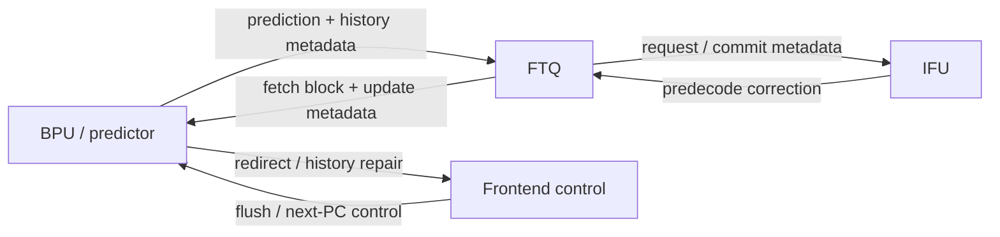
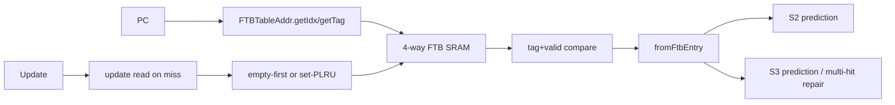
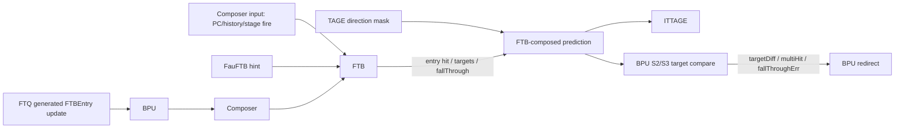

<!-- # Frontend FTB 分支预测器深入分析 -->
# In-Depth Analysis of the Frontend FTB Branch Predictor

<!-- regenerated-by-analyze-xiangshan-kunminghu -->
> Regenerated from `OpenXiangShan/XiangShan` branch `kunminghu-v2`, source commit `52262f303fc06daf84cdab7011d59b7df65ce7e8` using the updated Frontend graph/stage rules.


<!-- > 官方源码：`https://github.com/OpenXiangShan/XiangShan.git`；分支 `kunminghu-v2`；分析 commit `52262f303fc06daf84cdab7011d59b7df65ce7e8`。论文解释算法原理，源码决定香山的有效参数、流水、更新与恢复。 -->
> Official source: `https://github.com/OpenXiangShan/XiangShan.git`; branch `kunminghu-v2`; analysis commit `52262f303fc06daf84cdab7011d59b7df65ce7e8`. Papers explain algorithmic principles, while the source determines XiangShan's effective parameters, pipeline, update behavior, and recovery behavior.

<!-- frontend-tutorial-generated-by-analyze-xiangshan-kunminghu -->
<!-- > 所有实现结论均限定在 `kunminghu-v2` commit `52262f303fc06daf84cdab7011d59b7df65ce7e8`；Design Doc 结论必须回到第 18 节的源码追溯矩阵。 -->
> All implementation conclusions are limited to `kunminghu-v2` commit `52262f303fc06daf84cdab7011d59b7df65ce7e8`; Design Doc claims must be traced through the source traceability matrix in Section 18.

## 1. Scope

<!-- 本节保留模块职责、分析基线、范围和统一五问，明确本文只以当前源码证据为准。 -->
This section records the module responsibilities, analysis baseline, scope, and common five questions, making clear that this document relies only on evidence from the current source.

<!-- ### 1.1. 统一五问导读 -->
### 1.1. Five-Question Guide
<!--
| 问题 | 回答 |
| --- | --- |
| **Who** | `FTB` 是容量更大、信息更完整的 fetch target buffer，位于 TAGE_SC 之后、ITTAGE 之前。 |
| **What** | 以 fetch block 为单位保存条件分支槽、tail jump、target、fall-through、call/ret/JAL/JALR 类型及替换元数据。 |
| **How** | 组相联 tag lookup；多命中用优先选择但标记 `multiHit`；update 时先查旧项，空 way 优先，否则按替换策略分配。 |
| **From what** | 查询 PC、FauFTB 早级 entry/hit、TAGE 修正方向；训练来自 FTQ 保存的旧 FTB entry 与真实提交控制流。 |
| **To what** | 输出完整块预测给 ITTAGE/RAS；target/CFI/fall-through/multi-hit 差异由 BPU 生成 S2/S3 redirect。 |
-->
| Question | Answer |
| --- | --- |
| **Who** | `FTB` is a larger, more information-rich fetch target buffer located after TAGE_SC and before ITTAGE. |
| **What** | It stores conditional-branch slots, the tail jump, targets, fall-through addresses, call/return/JAL/JALR types, and replacement metadata per fetch block. |
| **How** | It performs set-associative tag lookup; on multiple hits it selects by priority and marks `multiHit`; on update it first reads the old entry, prefers an invalid way, and otherwise applies the replacement policy. |
| **From what** | Lookup uses the PC, the early FauFTB entry/hit, and TAGE-corrected direction; training uses the old FTB entry saved in the FTQ and the committed control flow. |
| **To what** | It outputs a complete block prediction to ITTAGE/RAS; BPU turns target, CFI, fall-through, and multi-hit differences into S2/S3 redirects. |

<!-- ### 1.2. 分析范围 -->
### 1.2. Analysis Scope
- Source: OpenXiangShan/XiangShan `kunminghu-v2`, commit `52262f303fc06daf84cdab7011d59b7df65ce7e8`.
- Relative source file: [src/main/scala/xiangshan/frontend/FTB.scala](https://github.com/OpenXiangShan/XiangShan/blob/kunminghu-v2/src/main/scala/xiangshan/frontend/FTB.scala).
- Effective instantiation: [Parameters.scala:126-143](https://github.com/OpenXiangShan/XiangShan/blob/kunminghu-v2/src/main/scala/xiangshan/Parameters.scala#L126-L143).

<!-- ## 2. 关键源码证据 -->
## 2. Key Source Evidence

<!-- 本节直接列出 `FTB` 的有效源码入口、关键代码骨架和行为解释，避免只保存文件名或行号。 -->
This section lists the effective `FTB` source entry points, key code skeleton, and behavioral explanation instead of retaining only filenames or line numbers.

<!-- ### 2.1. 源码入口和行号 -->
### 2.1. Source Entry Points and Line References
<!--
| 源码文件 | 本文使用它证明什么 | 行号证据 |
| --- | --- | --- |
| `frontend/FTB.scala` | FTB tag/valid 命中、多 way 选择、entry 到 full prediction | [frontend/FTB.scala#L683-L811](https://github.com/OpenXiangShan/XiangShan/blob/kunminghu-v2/src/main/scala/xiangshan/frontend/FTB.scala#L683-L811) |
| `frontend/BPU.scala` | FTB multi-hit/fall-through 触发 S3 redirect | [frontend/BPU.scala#L827-L854](https://github.com/OpenXiangShan/XiangShan/blob/kunminghu-v2/src/main/scala/xiangshan/frontend/BPU.scala#L827-L854) |
| `Parameters.scala` | `FtbSize/FtbWays/FtbTagLength/numBr` | [Parameters.scala#L124-L143](https://github.com/OpenXiangShan/XiangShan/blob/kunminghu-v2/src/main/scala/xiangshan/Parameters.scala#L124-L143) |
-->
| Source file | What it establishes here | Line evidence |
| --- | --- | --- |
| `frontend/FTB.scala` | FTB tag/valid hits, multi-way selection, and conversion from an entry to a full prediction | [frontend/FTB.scala#L683-L811](https://github.com/OpenXiangShan/XiangShan/blob/kunminghu-v2/src/main/scala/xiangshan/frontend/FTB.scala#L683-L811) |
| `frontend/BPU.scala` | FTB multi-hit/fall-through conditions that trigger an S3 redirect | [frontend/BPU.scala#L827-L854](https://github.com/OpenXiangShan/XiangShan/blob/kunminghu-v2/src/main/scala/xiangshan/frontend/BPU.scala#L827-L854) |
| `Parameters.scala` | `FtbSize/FtbWays/FtbTagLength/numBr` | [Parameters.scala#L124-L143](https://github.com/OpenXiangShan/XiangShan/blob/kunminghu-v2/src/main/scala/xiangshan/Parameters.scala#L124-L143) |

<!-- ### 2.2. 核心代码骨架 -->
### 2.2. Core Code Skeleton
```scala
val hitVec = ways.map(w => w.valid && w.tag === reqTag)
val multiHit = PopCount(hitVec) > 1.U
val hitEntry = Mux1H(hitVec, ways)
full_pred := fromFtbEntry(hitEntry, multiHit)
```

<!-- ### 2.3. 代码解析 -->
### 2.3. Code Walkthrough
<!-- FTB 保存一个 fetch block 内的 CFI 槽、类型、target 和 fall-through。它把 TAGE 方向信息和块目标信息组合起来，是 IFU false-hit 校验和后续训练的重要对象。 -->
FTB stores CFI slots, types, targets, and fall-through addresses within a fetch block. It combines TAGE direction information with block-target information and is therefore important to IFU false-hit checking and later training.
## 3. Theory-to-Code Mapping

<!-- 本节把理论概念直接绑定到 `FTB` 的源码对象、控制/数据状态和下游消费者。 -->
This section binds theoretical concepts directly to the `FTB` source objects, control/data state, and downstream consumers.

<!-- ### 3.1. 理论到代码映射表 -->
### 3.1. Theory-to-Code Mapping Table
<!--
| 理论概念 | 代码对象 | 为什么需要它 | 消费者/后续影响 |
| --- | --- | --- | --- |
| Fetch Target Buffer | FTB entry: valid/tag/CFI/target/fall-through | 保存块内目标信息 | BPU full_pred、FTQ meta |
| 多路命中 | `hitVec`、`multiHit` | 同一 PC 不应同时命中多个 way | BPU S3 redirect 和验证 multi-hit |
| 替换与训练 | update read / PLRU 或空 entry | miss 或 false-hit 后更新条目 | FTQ commit update |
-->
| Theoretical concept | Code object | Why it is needed | Consumer / downstream effect |
| --- | --- | --- | --- |
| Fetch Target Buffer | FTB entry: valid/tag/CFI/target/fall-through | Stores target information within a block | BPU `full_pred`, FTQ metadata |
| Multiple hits | `hitVec`, `multiHit` | One PC should not hit multiple ways simultaneously | BPU S3 redirect and multi-hit verification |
| Replacement and training | Update read / PLRU or invalid entry | Updates an entry after a miss or false hit | FTQ commit update |

<!-- ### 3.2. 阅读顺序 -->
### 3.2. Reading Order
<!-- 先按第 2 节定位源码对象，再顺着本表检查信号从哪里来、状态在哪里保存、何时更新、谁消费结果。若本篇只引用相邻模块拥有的状态，则以相邻 Frontend 分文档的源码分析为准。 -->
First locate the source objects in Section 2, then use the table to follow each signal's source, state storage, update point, and consumer. When this document references state owned by an adjacent module, defer to that module's frontend source analysis.
<!-- ## 4. 论文原则和有效代码 -->
## 4. Paper Principles and Effective Code


<!-- ### 4.1. 状态机与论文理论 -->
### 4.1. State Machine and Paper Theory
<!-- FTB 使用查询流水、update-read、update-write 和两拍 update stall 的隐式状态机。论文 DOI `10.1117/12.2642006` 强调：与“每个 branch 一个 BTB entry”相比，FTB 按取指块组织多个分支，能限制预测宽度、改善时序，并在块内表达第一个 taken 控制流。香山额外保存训练所需的旧 entry，以便增量修改而不是盲目覆盖。 -->
FTB uses an implicit state machine consisting of the lookup pipeline, update-read, update-write, and a two-cycle update stall. The paper identified by DOI `10.1117/12.2642006` emphasizes that, compared with one BTB entry per branch, organizing multiple branches by fetch block limits prediction width, improves timing, and represents the first taken control flow within a block. XiangShan additionally preserves the old entry needed for training so it can apply incremental updates instead of blindly overwriting the entry.

## 5. Microarchitecture Parameters


### 5.1. Index and Storage
`FTBTableAddr` wraps `TableAddr` and skews the set index by XORing index and tag bits ([FTB.scala:459-463](https://github.com/OpenXiangShan/XiangShan/blob/kunminghu-v2/src/main/scala/xiangshan/frontend/FTB.scala#L459-L463)). `FTBBank` reads either prediction PC or update PC on a single read port ([FTB.scala:516-523](https://github.com/OpenXiangShan/XiangShan/blob/kunminghu-v2/src/main/scala/xiangshan/frontend/FTB.scala#L516-L523)) and asserts that prediction and update read requests are not simultaneous ([FTB.scala:523](https://github.com/OpenXiangShan/XiangShan/blob/kunminghu-v2/src/main/scala/xiangshan/frontend/FTB.scala#L523)). The table is `numSets = FtbSize / FtbWays`, `numWays = FtbWays` ([FTB.scala:28-32](https://github.com/OpenXiangShan/XiangShan/blob/kunminghu-v2/src/main/scala/xiangshan/frontend/FTB.scala#L28-L32), parameter values in [Parameters.scala:100-101](https://github.com/OpenXiangShan/XiangShan/blob/kunminghu-v2/src/main/scala/xiangshan/Parameters.scala#L100-L101)).

On a read, `req_tag` and `req_idx` are registered ([FTB.scala:528-529](https://github.com/OpenXiangShan/XiangShan/blob/kunminghu-v2/src/main/scala/xiangshan/frontend/FTB.scala#L528-L529)), then every way compares tag and entry valid ([FTB.scala:533-538](https://github.com/OpenXiangShan/XiangShan/blob/kunminghu-v2/src/main/scala/xiangshan/frontend/FTB.scala#L533-L538)). Hit way is `OHToUInt(total_hits)` ([FTB.scala:540](https://github.com/OpenXiangShan/XiangShan/blob/kunminghu-v2/src/main/scala/xiangshan/frontend/FTB.scala#L540)). If two ways hit, FTB registers all hits and uses `PriorityMux` to pick one entry for S3 while marking multi-hit ([FTB.scala:547-558](https://github.com/OpenXiangShan/XiangShan/blob/kunminghu-v2/src/main/scala/xiangshan/frontend/FTB.scala#L547-L558), [FTB.scala:676-719](https://github.com/OpenXiangShan/XiangShan/blob/kunminghu-v2/src/main/scala/xiangshan/frontend/FTB.scala#L676-L719)).

<!-- ## 6. 模块边界和接口 -->
## 6. Module Boundaries and Interfaces


### 6.1. Role
`FTB` is the main fetch target buffer. It stores branch slots, tail jump slot, call/return/JALR attributes, partial fall-through address, and strong-bias bits. It enriches prediction in S2/S3 and supplies metadata for later training.

<!-- ### 6.2. 控制信号逐项解释：Who / From / To / How / Why -->
### 6.2. Control Signals: Who / From / To / How / Why
<!-- > 下表覆盖本文讲解中出现的查询、流水推进、选择、训练、替换和恢复控制。`为什么存在` 不以信号命名猜测，而以当前 `kunminghu-v2` 数据依赖、资源限制和恢复要求为依据。 -->
> The table covers lookup, pipeline advance, selection, training, replacement, and recovery control discussed here. Its rationale is based on current `kunminghu-v2` data dependencies, resource constraints, and recovery requirements, not on signal names alone.

<!--
| 控制信号 / 状态 | 谁产生 / 从哪里来 | 谁消费 / 到哪里去 | 何时、如何生效 | 为什么存在；缺失会怎样 | 代码证据 |
| --- | --- | --- | --- | --- | --- |
| `io.in.valid / stage fire` | Composer 上游预测 | FTB 查表流水 | 请求 fire 时锁存 PC、uFTB entry 和方向结果。 | FTB 需要把多源信息绑定为同一 fetch block；fire 防止反压期间 PC 与 uFTB metadata 分离。 | [frontend/FTB.scala:663-719](https://github.com/OpenXiangShan/XiangShan/blob/kunminghu-v2/src/main/scala/xiangshan/frontend/FTB.scala#L663-L719) |
| `s1_idx` | PC set-index 计算 | FTB SRAM 读地址 | 选择组并读取全部 way。 | 组相联 FTB 用有限 SRAM 容量保存直接控制流目标，索引是降低全相联比较成本的必要控制。 | [frontend/FTB.scala:663-719](https://github.com/OpenXiangShan/XiangShan/blob/kunminghu-v2/src/main/scala/xiangshan/frontend/FTB.scala#L663-L719) |
| `s2_hit_oh / s2_hit` | tag/valid 比较 | way 选择与输出有效 | one-hot 选择真实命中 entry。 | 必须同时知道是否命中和命中哪一 way，才能区分默认预测、正确 entry 与异常多命中。 | [frontend/FTB.scala:683-719](https://github.com/OpenXiangShan/XiangShan/blob/kunminghu-v2/src/main/scala/xiangshan/frontend/FTB.scala#L683-L719) |
| `multiHit` | hit 向量 PopCount | BPU redirect/修复 | 检测同组多个相同 tag entry。 | 多命中说明表一致性被破坏；若静默 Mux1H，目标将依赖未定义优先级并难以训练修复。 | [frontend/FTB.scala:694-719](https://github.com/OpenXiangShan/XiangShan/blob/kunminghu-v2/src/main/scala/xiangshan/frontend/FTB.scala#L694-L719) |
| `br_taken_mask` | TAGE/SC 方向输出 | FTB entry 槽位选择 | 决定 entry 中第一个实际 taken CFI。 | FTB 提供多个候选控制流槽位，方向 mask 把“有哪些分支”转化为“本次走哪一个”。 | [frontend/FTB.scala:720-811](https://github.com/OpenXiangShan/XiangShan/blob/kunminghu-v2/src/main/scala/xiangshan/frontend/FTB.scala#L720-L811) |
| `io.update.valid` | FTQ 已解析控制流 | FTB 更新/分配 | 写入真实槽位、目标和 fall-through。 | 取指时目标是预测，提交后才得到可靠控制流结构；update 让表逐步学习代码布局。 | [frontend/FTB.scala:812-878](https://github.com/OpenXiangShan/XiangShan/blob/kunminghu-v2/src/main/scala/xiangshan/frontend/FTB.scala#L812-L878) |
| `update_hit` | update PC tag lookup | 原位更新或 replacement | 区分已有 entry 与新分配。 | 保持同一静态块的 entry 连续性，避免重复 tag 和替换策略失真。 | [frontend/FTB.scala:849-878](https://github.com/OpenXiangShan/XiangShan/blob/kunminghu-v2/src/main/scala/xiangshan/frontend/FTB.scala#L849-L878) |
| `write_way / repl_way` | 命中选择或替换策略 | FTB SRAM 写掩码 | 仅一个 victim/hit way 接受更新。 | 有限组相联资源需要确定驱逐对象；one-hot 写入避免同 set 多副本与多写冲突。 | [frontend/FTB.scala:849-878](https://github.com/OpenXiangShan/XiangShan/blob/kunminghu-v2/src/main/scala/xiangshan/frontend/FTB.scala#L849-L878) |
| `uftb_hit / uftb_entry` | FauFTB | FTB close 优化与输出组合 | 快表已给出可信 entry 时复用/比较，减少重复工作。 | uFTB 与 FTB 保存相近结构，显式提示可缩短关键路径并检测早晚预测差异。 | [frontend/FTB.scala:751-811](https://github.com/OpenXiangShan/XiangShan/blob/kunminghu-v2/src/main/scala/xiangshan/frontend/FTB.scala#L751-L811) |
| `io.out.valid` | FTB 查表完成与组件 enable | ITTAGE/RAS/BPU S2-S3 比较 | 只有合法 entry/默认结果才沿链传递。 | 下游必须将 invalid 与合法 fall-through 区分，否则会把无预测误当成预测不跳。 | [frontend/FTB.scala:683-811](https://github.com/OpenXiangShan/XiangShan/blob/kunminghu-v2/src/main/scala/xiangshan/frontend/FTB.scala#L683-L811) |
-->
| Control signal / state | Producer / source | Consumer / destination | When and how it takes effect | Why it exists; consequence if absent | Source evidence |
| --- | --- | --- | --- | --- | --- |
| `io.in.valid / stage fire` | Upstream prediction from Composer | FTB lookup pipeline | On request `fire`, latches the PC, uFTB entry, and direction result. | FTB must bind multiple sources to one fetch block; `fire` prevents the PC and uFTB metadata from separating under backpressure. | [frontend/FTB.scala:663-719](https://github.com/OpenXiangShan/XiangShan/blob/kunminghu-v2/src/main/scala/xiangshan/frontend/FTB.scala#L663-L719) |
| `s1_idx` | PC set-index calculation | FTB SRAM read address | Selects a set and reads all ways. | A set-associative FTB uses finite SRAM to store direct-control-flow targets; indexing avoids the cost of a fully associative comparison. | [frontend/FTB.scala:663-719](https://github.com/OpenXiangShan/XiangShan/blob/kunminghu-v2/src/main/scala/xiangshan/frontend/FTB.scala#L663-L719) |
| `s2_hit_oh / s2_hit` | Tag/valid comparison | Way selection and output-valid control | A one-hot vector selects the actual hit entry. | The design must know both whether a hit occurred and which way hit, distinguishing the default prediction, a valid entry, and an anomalous multi-hit. | [frontend/FTB.scala:683-719](https://github.com/OpenXiangShan/XiangShan/blob/kunminghu-v2/src/main/scala/xiangshan/frontend/FTB.scala#L683-L719) |
| `multiHit` | PopCount of the hit vector | BPU redirect/repair | Detects multiple entries with the same tag in one set. | Multiple hits indicate broken table consistency; silently applying `Mux1H` would make the target depend on an undefined priority and hinder repair training. | [frontend/FTB.scala:694-719](https://github.com/OpenXiangShan/XiangShan/blob/kunminghu-v2/src/main/scala/xiangshan/frontend/FTB.scala#L694-L719) |
| `br_taken_mask` | TAGE/SC direction output | FTB entry-slot selection | Selects the first actually taken CFI in the entry. | FTB supplies several candidate control-flow slots; the direction mask turns available branches into the branch this prediction follows. | [frontend/FTB.scala:720-811](https://github.com/OpenXiangShan/XiangShan/blob/kunminghu-v2/src/main/scala/xiangshan/frontend/FTB.scala#L720-L811) |
| `io.update.valid` | Resolved control flow from FTQ | FTB update/allocation | Writes the resolved slots, target, and fall-through. | Targets are predictions during fetch; only after commit is the control-flow structure reliable. Update lets the table learn the code layout. | [frontend/FTB.scala:812-878](https://github.com/OpenXiangShan/XiangShan/blob/kunminghu-v2/src/main/scala/xiangshan/frontend/FTB.scala#L812-L878) |
| `update_hit` | Update-PC tag lookup | In-place update or replacement | Distinguishes an existing entry from a new allocation. | It preserves continuity for one static block and avoids duplicate tags or distorted replacement state. | [frontend/FTB.scala:849-878](https://github.com/OpenXiangShan/XiangShan/blob/kunminghu-v2/src/main/scala/xiangshan/frontend/FTB.scala#L849-L878) |
| `write_way / repl_way` | Hit selection or replacement policy | FTB SRAM write mask | Only one victim/hit way accepts the update. | Finite set-associative storage needs a definite eviction target; one-hot writes prevent duplicate copies and multi-write conflicts in one set. | [frontend/FTB.scala:849-878](https://github.com/OpenXiangShan/XiangShan/blob/kunminghu-v2/src/main/scala/xiangshan/frontend/FTB.scala#L849-L878) |
| `uftb_hit / uftb_entry` | FauFTB | FTB close optimization and output composition | Reuses or compares a trusted fast-table entry to reduce duplicate work. | uFTB and FTB store related structures; the explicit hint shortens the critical path and detects early/late prediction differences. | [frontend/FTB.scala:751-811](https://github.com/OpenXiangShan/XiangShan/blob/kunminghu-v2/src/main/scala/xiangshan/frontend/FTB.scala#L751-L811) |
| `io.out.valid` | Completed FTB lookup and component enable | ITTAGE/RAS/BPU S2-S3 comparison | Only a legal entry or default result proceeds along the chain. | Downstream must distinguish invalid from a valid fall-through, or it may treat no prediction as a prediction not-taken. | [frontend/FTB.scala:683-811](https://github.com/OpenXiangShan/XiangShan/blob/kunminghu-v2/src/main/scala/xiangshan/frontend/FTB.scala#L683-L811) |

#### 6.2.1. Top-Level Module Connectivity

This module participates in the predictor chain, but the top-level graph keeps only bundled interfaces. `Frontend.scala` instantiates BPU, FTQ, IFU, IBuffer, ICache, and InstrUncache, while the predictor-specific chain is configured through Composer: [frontend/Frontend.scala:103-109](https://github.com/OpenXiangShan/XiangShan/blob/52262f303fc06daf84cdab7011d59b7df65ce7e8/src/main/scala/xiangshan/frontend/Frontend.scala#L103-L109), [frontend/Composer.scala:22-77](https://github.com/OpenXiangShan/XiangShan/blob/52262f303fc06daf84cdab7011d59b7df65ce7e8/src/main/scala/xiangshan/frontend/Composer.scala#L22-L77).



No module pair has more than three bundled edges. Individual table reads, counters, folded histories, and predictor-local states remain in the module's detailed sections instead of becoming separate graph lines.

#### 6.2.2. Frontend/Backend Pipeline Stages

The source-proven stage boundary is `F0 -> F1 -> F2 -> F3`: F0 accepts the FTQ request and calculates line indices, F1 registers the fetch block and calculates instruction PCs/cut pointers, F2 waits for ICache responses and performs data cutting/predecode preparation, and F3 expands/qualifies instructions, handles exceptions/MMIO, and drives IBuffer. Evidence: [frontend/IFU.scala:236-305](https://github.com/OpenXiangShan/XiangShan/blob/52262f303fc06daf84cdab7011d59b7df65ce7e8/src/main/scala/xiangshan/frontend/IFU.scala#L236-L305), [frontend/IFU.scala:346-457](https://github.com/OpenXiangShan/XiangShan/blob/52262f303fc06daf84cdab7011d59b7df65ce7e8/src/main/scala/xiangshan/frontend/IFU.scala#L346-L457), [frontend/IFU.scala:542-617](https://github.com/OpenXiangShan/XiangShan/blob/52262f303fc06daf84cdab7011d59b7df65ce7e8/src/main/scala/xiangshan/frontend/IFU.scala#L542-L617). The top-level connections couple FTQ, IFU, ICache, and IBuffer through shared ready/valid conditions: [frontend/Frontend.scala:199-231](https://github.com/OpenXiangShan/XiangShan/blob/52262f303fc06daf84cdab7011d59b7df65ce7e8/src/main/scala/xiangshan/frontend/Frontend.scala#L199-L231).

The backend continuation uses the effective module boundaries rather than inventing cycle names: Decode accepts the instruction packet, Rename creates speculative physical-register mappings, Dispatch allocates downstream resources, Issue/Scheduler selects ready uops, Execute/FU produces results, DataPath/WB carries writeback and wakeup, and ROB/CtrlBlock commits or redirects. Evidence: [backend/decode/DecodeStage.scala:83-120](https://github.com/OpenXiangShan/XiangShan/blob/52262f303fc06daf84cdab7011d59b7df65ce7e8/src/main/scala/xiangshan/backend/decode/DecodeStage.scala#L83-L120), [backend/rename/Rename.scala:40-117](https://github.com/OpenXiangShan/XiangShan/blob/52262f303fc06daf84cdab7011d59b7df65ce7e8/src/main/scala/xiangshan/backend/rename/Rename.scala#L40-L117), [backend/dispatch/NewDispatch.scala:49-176](https://github.com/OpenXiangShan/XiangShan/blob/52262f303fc06daf84cdab7011d59b7df65ce7e8/src/main/scala/xiangshan/backend/dispatch/NewDispatch.scala#L49-L176), [backend/issue/Scheduler.scala:29-180](https://github.com/OpenXiangShan/XiangShan/blob/52262f303fc06daf84cdab7011d59b7df65ce7e8/src/main/scala/xiangshan/backend/issue/Scheduler.scala#L29-L180), [backend/exu/ExeUnit.scala:50-110](https://github.com/OpenXiangShan/XiangShan/blob/52262f303fc06daf84cdab7011d59b7df65ce7e8/src/main/scala/xiangshan/backend/exu/ExeUnit.scala#L50-L110), [backend/datapath/DataPath.scala:25-70](https://github.com/OpenXiangShan/XiangShan/blob/52262f303fc06daf84cdab7011d59b7df65ce7e8/src/main/scala/xiangshan/backend/datapath/DataPath.scala#L25-L70), [backend/rob/Rob.scala:52-145](https://github.com/OpenXiangShan/XiangShan/blob/52262f303fc06daf84cdab7011d59b7df65ce7e8/src/main/scala/xiangshan/backend/rob/Rob.scala#L52-L145), [backend/CtrlBlock.scala:50-110](https://github.com/OpenXiangShan/XiangShan/blob/52262f303fc06daf84cdab7011d59b7df65ce7e8/src/main/scala/xiangshan/backend/CtrlBlock.scala#L50-L110).

```mermaid
flowchart LR
  F0["F0: FTQ req + line indices"] -->|f0_fire| F1["F1: PC + cut pointers"]
  F1 -->|f1_fire| F2["F2: ICache data + exceptions"]
  F2 -->|f2_fire| F3["F3: predecode + MMIO qualification"]
  F3 -->|toIbuffer.fire| Decode["Decode"]
  Decode -->|uop bundle| Rename["Rename"]
  Rename -->|renamed uop| Dispatch["Dispatch"]
  Dispatch -->|ready uop| Issue["Issue"]
  Issue -->|operands| Execute["Execute/FU"]
  Execute -->|result| Writeback["Writeback/Wakeup"]
  Writeback -->|retire candidate| Commit["ROB/Commit"]
  Commit -->|redirect/flush| F0
```



The stage graph keeps chronological forward edges separate from the bundled recovery edge. It must be read together with the module graph below: a stage is not itself a module, and a redirect does not create a fake forward stage.

```waveform-draw
{
  "signal": [
    {
      "name": "clk",
      "wave": "p......."
    },
    {
      "name": "F0.valid",
      "wave": "01...0.."
    },
    {
      "name": "F0.ready",
      "wave": "1..0...."
    },
    {
      "name": "F1.valid",
      "wave": "001..0.."
    },
    {
      "name": "F2.valid",
      "wave": "0001.0.."
    },
    {
      "name": "F3.valid",
      "wave": "00001.0."
    },
    {
      "name": "toIbuffer.fire",
      "wave": "0000010."
    },
    {
      "name": "redirect/flush",
      "wave": "00000010"
    }
  ],
  "config": {
    "hscale": 1
  }
}
```

<!-- ## 7. 为什么模块存在 -->
## 7. Why the Module Exists


<!-- 把模块放回 Frontend 全链路理解：它解决的是预测带宽、取指正确性、存储层次延迟、投机恢复或上下游速率不匹配中的至少一个问题。 -->
Place the module back in the full frontend path: it addresses at least one of prediction bandwidth, fetch correctness, memory-hierarchy latency, speculative recovery, or a rate mismatch between adjacent stages.

<!-- ## 8. 有效动态路径 -->
## 8. Effective Dynamic Path


<!-- 按 `valid -> ready -> fire -> register/state update -> consumer` 阅读动态路径，并同时检查正常、阻塞、flush、redirect、replay 和恢复后的 forward progress。 -->
Read the dynamic path as `valid -> ready -> fire -> register/state update -> consumer`, while checking normal operation, blocking, flush, redirect, replay, and forward progress after recovery.

<!-- ## 9. Index 和地址/历史计算 -->
## 9. Index and Address/History Calculations


<!-- 地址、PC、折叠历史、tag、set/way、line offset 和 FTQ offset 都必须追到源码表达式；索引冲突、回绕和跨边界情况在算法和验证章节中继续展开。 -->
Addresses, PCs, folded histories, tags, set/way fields, line offsets, and FTQ offsets must all be traced to source expressions; index conflicts, wraparound, and boundary crossings are developed further in the algorithm and verification sections.

<!-- ## 10. 核心算法 -->
## 10. Core Algorithm


<!-- ### 10.1. 算法示例推演 -->
### 10.1. Algorithm Walkthrough
Example input: prediction PC is `0x8000_2000`; `FtbWays=4`, `FtbTagLength=20`, and `numSets=FtbSize/FtbWays` ([FTB.scala:28-32](https://github.com/OpenXiangShan/XiangShan/blob/kunminghu-v2/src/main/scala/xiangshan/frontend/FTB.scala#L28-L32), [Parameters.scala:100-101](https://github.com/OpenXiangShan/XiangShan/blob/kunminghu-v2/src/main/scala/xiangshan/Parameters.scala#L100-L101)). Assume `ftbAddr.getIdx(pc)` selects set 13 and `getTag(pc)` matches way 2.

1. Index/tag calculation: [FTB.scala:459-463](https://github.com/OpenXiangShan/XiangShan/blob/kunminghu-v2/src/main/scala/xiangshan/frontend/FTB.scala#L459-L463) computes a skewed set index by XORing the normal index with selected tag/index bits. [FTB.scala:516-521](https://github.com/OpenXiangShan/XiangShan/blob/kunminghu-v2/src/main/scala/xiangshan/frontend/FTB.scala#L516-L521) sends that set index to the single-port SRAM read request.
2. Hit detection: [FTB.scala:528-540](https://github.com/OpenXiangShan/XiangShan/blob/kunminghu-v2/src/main/scala/xiangshan/frontend/FTB.scala#L528-L540) registers request tag/index, compares every way's tag and valid bit, and converts the one-hot hit vector to `hit_way`. With only way 2 matching, `hit=true` and `hit_way=2`.
3. Prediction payload: [FTB.scala:780-808](https://github.com/OpenXiangShan/XiangShan/blob/kunminghu-v2/src/main/scala/xiangshan/frontend/FTB.scala#L780-L808) copies upstream response, marks S2/S3 hit, calls `fromFtbEntry`, and reconstructs target/fall-through information. If the entry's branch slot has `tarStat=TAR_FIT` and lower target bits for `0x8000_2040`, `getTargetVec` uses current PC high bits and those lower bits ([FTB.scala:60-117](https://github.com/OpenXiangShan/XiangShan/blob/kunminghu-v2/src/main/scala/xiangshan/frontend/FTB.scala#L60-L117), [FTB.scala:212-260](https://github.com/OpenXiangShan/XiangShan/blob/kunminghu-v2/src/main/scala/xiangshan/frontend/FTB.scala#L212-L260)).
4. Main update hit: if FTQ update metadata says `u_meta.hit=true`, [FTB.scala:842-878](https://github.com/OpenXiangShan/XiangShan/blob/kunminghu-v2/src/main/scala/xiangshan/frontend/FTB.scala#L842-L878) sets `update_now`, writes the resolved entry back to way 2, and does not allocate.
5. Update miss/allocation: if `u_meta.hit=false`, FTB performs an update read, stalls S1 for the read window ([FTB.scala:849-855](https://github.com/OpenXiangShan/XiangShan/blob/kunminghu-v2/src/main/scala/xiangshan/frontend/FTB.scala#L849-L855)), and after two cycles writes either the existing update-hit way or an allocated way. Allocation chooses an invalid way first, otherwise set-PLRU ([FTB.scala:609-622](https://github.com/OpenXiangShan/XiangShan/blob/kunminghu-v2/src/main/scala/xiangshan/frontend/FTB.scala#L609-L622), [FTB.scala:635-657](https://github.com/OpenXiangShan/XiangShan/blob/kunminghu-v2/src/main/scala/xiangshan/frontend/FTB.scala#L635-L657)).
6. Multi-hit example: if way 1 and way 2 both match, [FTB.scala:542-558](https://github.com/OpenXiangShan/XiangShan/blob/kunminghu-v2/src/main/scala/xiangshan/frontend/FTB.scala#L542-L558) selects one by `PriorityMux`, [FTB.scala:676-719](https://github.com/OpenXiangShan/XiangShan/blob/kunminghu-v2/src/main/scala/xiangshan/frontend/FTB.scala#L676-L719) carries `multi_hit`, and BPU S3 redirect logic can repair the target ([frontend/BPU.scala:837-854](https://github.com/OpenXiangShan/XiangShan/blob/kunminghu-v2/src/main/scala/xiangshan/frontend/BPU.scala#L837-L854)).

Downstream effect: `full_pred.hit`, branch slot metadata, `targets`, `fallThroughAddr`, `last_stage_ftb_entry`, and `last_stage_meta` are updated for FTQ and later predictor training ([FTB.scala:799-812](https://github.com/OpenXiangShan/XiangShan/blob/kunminghu-v2/src/main/scala/xiangshan/frontend/FTB.scala#L799-L812)).

<!-- ### 10.2. 逐流水级算法 -->
### 10.2. Per-Stage Algorithm
| Stage | Inputs | Algorithm and state | Ready/stall | Output | Source lines |
| --- | --- | --- | --- | --- | --- |
| S0 read request | `s0_pc_dup(0)`, close-FTB flag | If not closed, compute skewed set index and issue single-port SRAM read. Update read and prediction read are mutually exclusive. | `req_pc.ready` comes from SRAM; update miss can block S1. | SRAM read request. | [FTB.scala:459-463](https://github.com/OpenXiangShan/XiangShan/blob/kunminghu-v2/src/main/scala/xiangshan/frontend/FTB.scala#L459-L463), [FTB.scala:516-527](https://github.com/OpenXiangShan/XiangShan/blob/kunminghu-v2/src/main/scala/xiangshan/frontend/FTB.scala#L516-L527), [FTB.scala:672-674](https://github.com/OpenXiangShan/XiangShan/blob/kunminghu-v2/src/main/scala/xiangshan/frontend/FTB.scala#L672-L674), [FTB.scala:849-855](https://github.com/OpenXiangShan/XiangShan/blob/kunminghu-v2/src/main/scala/xiangshan/frontend/FTB.scala#L849-L855) |
| S1 hit detect | Registered tag/index and SRAM data | Compare every way's tag/valid; compute hit way; register multi-hit evidence. | Multi-hit is tolerated for later redirect; malformed fall-through asserts. | `s1_hit`, `s1_read_resp`, writeWay metadata. | [FTB.scala:528-568](https://github.com/OpenXiangShan/XiangShan/blob/kunminghu-v2/src/main/scala/xiangshan/frontend/FTB.scala#L528-L568), [FTB.scala:705-722](https://github.com/OpenXiangShan/XiangShan/blob/kunminghu-v2/src/main/scala/xiangshan/frontend/FTB.scala#L705-L722) |
| S2 prediction | S1 entry, PC | Select FauFTB entry if FTB reads are closed, else SRAM entry; call `fromFtbEntry`; detect S2 multi-hit/fall-through. | S2 can still be overridden by S3. | S2 `full_pred`, hit, target/fall-through fields. | [FTB.scala:663-719](https://github.com/OpenXiangShan/XiangShan/blob/kunminghu-v2/src/main/scala/xiangshan/frontend/FTB.scala#L663-L719), [FTB.scala:780-797](https://github.com/OpenXiangShan/XiangShan/blob/kunminghu-v2/src/main/scala/xiangshan/frontend/FTB.scala#L780-L797) |
| S3 prediction | S2 registered entry | If multi-hit, use priority-selected entry; recompute S3 prediction and fall-through error. | None local; BPU checks S3 redirect causes. | S3 `full_pred`, `multiHit`, `last_stage_ftb_entry`, `last_stage_meta`. | [FTB.scala:694-719](https://github.com/OpenXiangShan/XiangShan/blob/kunminghu-v2/src/main/scala/xiangshan/frontend/FTB.scala#L694-L719), [FTB.scala:799-812](https://github.com/OpenXiangShan/XiangShan/blob/kunminghu-v2/src/main/scala/xiangshan/frontend/FTB.scala#L799-L812) |
| Update hit | FTQ update metadata hit | Write updated entry to recorded way. | Does not need update read. | Table entry rewritten, replacer touched. | [FTB.scala:842-878](https://github.com/OpenXiangShan/XiangShan/blob/kunminghu-v2/src/main/scala/xiangshan/frontend/FTB.scala#L842-L878) |
| Update miss/allocation | FTQ update metadata miss | Read update PC to see current hit; allocate empty way first, otherwise set-PLRU. | `io.s1_ready` drops during update read and following cycle. | New FTB entry and tag written. | [FTB.scala:609-657](https://github.com/OpenXiangShan/XiangShan/blob/kunminghu-v2/src/main/scala/xiangshan/frontend/FTB.scala#L609-L657), [FTB.scala:849-878](https://github.com/OpenXiangShan/XiangShan/blob/kunminghu-v2/src/main/scala/xiangshan/frontend/FTB.scala#L849-L878) |

<!-- ## 11. 状态和存储结构 -->
## 11. State and Storage Structures


<!-- 把每个表、栈、FIFO、MSHR、uncache entry 和 pipeline register 记录为 `valid/full/empty/ready` 可观察状态，并说明谁写入、谁读取、何时清空以及满/空时谁被反压。 -->
For every table, stack, FIFO, MSHR, uncache entry, and pipeline register, record observable `valid/full/empty/ready` state and explain who writes it, who reads it, when it is cleared, and which side is backpressured when it is full or empty.

<!-- ## 12. Pipeline stage 分析 -->
## 12. Pipeline-Stage Analysis


<!-- 阶段说明只使用源码中的寄存器、valid/ready 和 fire 条件；对 Frontend 使用 F0/F1/F2/F3，对 Backend 使用实际 Decode/Rename/Dispatch/Issue/Execute/Writeback/ROB 边界。 -->
Stage descriptions use only registers and valid/ready/fire conditions present in the source. For the frontend, use F0/F1/F2/F3; for the backend, use the actual Decode/Rename/Dispatch/Issue/Execute/Writeback/ROB boundaries.

## 13. Control path rationale


<!-- ### 13.1. Redirect 信号生成 -->
### 13.1. Redirect Signal Generation
FTB does not own `s2_redirect_dup`/`s3_redirect_dup`, but it supplies the conditions that make BPU assert them.

| Condition | Producer | Redirect stage | BPU condition | Source lines |
| --- | --- | --- | --- | --- |
| S2 target/direction differs from S1 | FTB S2 `full_pred.fromFtbEntry` changes target/slot metadata. | S2 | `preds_needs_redirect_vec_dup` target/branch/taken/CFI diff. | [FTB.scala:780-797](https://github.com/OpenXiangShan/XiangShan/blob/kunminghu-v2/src/main/scala/xiangshan/frontend/FTB.scala#L780-L797), [frontend/BPU.scala:606-705](https://github.com/OpenXiangShan/XiangShan/blob/kunminghu-v2/src/main/scala/xiangshan/frontend/BPU.scala#L606-L705) |
| S3 target differs from previous S2 | FTB S3 recomputes from registered entry. | S3 | `s3_redirect_on_target_dup`. | [FTB.scala:799-808](https://github.com/OpenXiangShan/XiangShan/blob/kunminghu-v2/src/main/scala/xiangshan/frontend/FTB.scala#L799-L808), [frontend/BPU.scala:827-854](https://github.com/OpenXiangShan/XiangShan/blob/kunminghu-v2/src/main/scala/xiangshan/frontend/BPU.scala#L827-L854) |
| FTB multi-hit | `multi_hit` selected by registered hit vector. | S3 | `s3_redirect_on_ftb_multi_hit_dup`. | [FTB.scala:542-558](https://github.com/OpenXiangShan/XiangShan/blob/kunminghu-v2/src/main/scala/xiangshan/frontend/FTB.scala#L542-L558), [frontend/BPU.scala:676-719](https://github.com/OpenXiangShan/XiangShan/blob/kunminghu-v2/src/main/scala/xiangshan/frontend/BPU.scala#L676-L719), [frontend/BPU.scala:837-854](https://github.com/OpenXiangShan/XiangShan/blob/kunminghu-v2/src/main/scala/xiangshan/frontend/BPU.scala#L837-L854) |
| Fall-through error | entry pft/carry inconsistent with current fetch block lower bits. | S2/S3 | `fallThruError` participates in redirect. | [FTB.scala:697-703](https://github.com/OpenXiangShan/XiangShan/blob/kunminghu-v2/src/main/scala/xiangshan/frontend/FTB.scala#L697-L703), [frontend/BPU.scala:807-839](https://github.com/OpenXiangShan/XiangShan/blob/kunminghu-v2/src/main/scala/xiangshan/frontend/BPU.scala#L807-L839), [frontend/BPU.scala:734](https://github.com/OpenXiangShan/XiangShan/blob/kunminghu-v2/src/main/scala/xiangshan/frontend/BPU.scala#L734), [frontend/BPU.scala:837-854](https://github.com/OpenXiangShan/XiangShan/blob/kunminghu-v2/src/main/scala/xiangshan/frontend/BPU.scala#L837-L854) |
| FauFTB/FTB false-hit reopen | `update.false_hit` or `redirectFromIFU`. | Update/recovery | Not a fetch redirect itself; reopens FTB read path to avoid repeated bad fast predictions. | [FTB.scala:754-761](https://github.com/OpenXiangShan/XiangShan/blob/kunminghu-v2/src/main/scala/xiangshan/frontend/FTB.scala#L754-L761) |

Example: if two FTB ways match one PC, `multi_hit` is true. FTB selects one entry with `PriorityMux`, marks `full_pred.multiHit`, and BPU asserts S3 redirect because `s3_redirect_on_ftb_multi_hit_dup` is true.

<!-- ## 14. Data path 与跨边界 -->
## 14. Data Path and Boundary Crossings


<!-- ### 14.1. 跨边界代码解析 -->
### 14.1. Boundary-Crossing Code Walkthrough
<!-- 本预测器只产生预测元数据，不直接把跨页、跨 Cache Line 或 MMIO 访问当成一个原子内存事务。对一个取指块跨边界的场景，先由预测链生成块起始 PC、taken mask、target 和 fall-through，再由 IFU/ICache 对每个地址片段分别完成翻译、权限和内存类型判断。BPU 在 S1/S2/S3 比较预测差异并生成 redirect 的规则见 [frontend/BPU.scala:606-635](https://github.com/OpenXiangShan/XiangShan/blob/kunminghu-v2/src/main/scala/xiangshan/frontend/BPU.scala#L606-L635) 和 [frontend/BPU.scala:827-854](https://github.com/OpenXiangShan/XiangShan/blob/kunminghu-v2/src/main/scala/xiangshan/frontend/BPU.scala#L827-L854)；因此第二片段发生 page fault、line miss 或 MMIO 分类变化时，恢复对象是预测历史和 FTQ 上下文，而不是把两片段静默拼接。 -->
This predictor produces prediction metadata only; it does not treat a page-crossing, cache-line-crossing, or MMIO access as one atomic memory transaction. For a fetch block that crosses a boundary, the predictor chain first generates the block-start PC, taken mask, target, and fall-through; IFU/ICache then translates and checks permissions and memory type for each address fragment independently. The BPU rules for comparing predictions in S1/S2/S3 and generating redirects are in [frontend/BPU.scala:606-635](https://github.com/OpenXiangShan/XiangShan/blob/kunminghu-v2/src/main/scala/xiangshan/frontend/BPU.scala#L606-L635) and [frontend/BPU.scala:827-854](https://github.com/OpenXiangShan/XiangShan/blob/kunminghu-v2/src/main/scala/xiangshan/frontend/BPU.scala#L827-L854). Thus, if the second fragment encounters a page fault, line miss, or changed MMIO classification, recovery restores prediction history and FTQ context rather than silently concatenating the fragments.

<!-- 最小实例是块尾部剩余半条 32-bit 指令：第一片段可能在当前 Cache Line/页命中，第二片段需要下一 Line 或下一页的独立请求；IFU 保存 `lastHalf`，跨周期合并并在 flush 时清除，[frontend/IFU.scala:915-943](https://github.com/OpenXiangShan/XiangShan/blob/kunminghu-v2/src/main/scala/xiangshan/frontend/IFU.scala#L915-L943)。若第二页或第二 Line 的结果改变 CFI 位置、target 或 fall-through，BPU 的 redirect 比较优先于继续使用旧预测。对 MMIO/uncache 地址，预测器只能提供候选 PC，实际访问必须转入 IFU 的 MMIO FSM，等待翻译、PMP/PMA 和提交约束，不能由预测命中绕过副作用控制。 -->
The minimal example is a 32-bit instruction whose lower half remains at the end of a block: the first fragment may hit in the current cache line/page, while the second fragment needs an independent request to the next line/page. IFU stores `lastHalf`, merges it across cycles, and clears it on flush ([frontend/IFU.scala:915-943](https://github.com/OpenXiangShan/XiangShan/blob/kunminghu-v2/src/main/scala/xiangshan/frontend/IFU.scala#L915-L943)). If the second page or line changes the CFI position, target, or fall-through, the BPU redirect comparison takes priority over the old prediction. For MMIO/uncache addresses, the predictor can provide only a candidate PC; the actual access must enter IFU's MMIO FSM and wait for translation, PMP/PMA checks, and commit constraints. A prediction hit cannot bypass side-effect control.

<!-- **边界检查表** -->
**Boundary Checklist**
<!--

| 边界 | 第一片段 | 第二片段 | 失败/恢复 |
| --- | --- | --- | --- |
| 虚拟页 | 当前页的预测块与历史 | 下一页的独立翻译和权限结果 | page/access/guest fault、flush、重定向 |
| Cache Line | 当前 line 的 tag/数据命中 | 下一 line 的 miss/refill 或独立响应 | target/CFI 不一致时 redirect |
| MMIO/uncache | 预测 PC 与元数据 | IFU/uncache 请求、响应和提交门控 | resend、异常、commit wait 或 cancel |
-->
| Boundary | First fragment | Second fragment | Failure / recovery |
| --- | --- | --- | --- |
| Virtual page | Prediction block and history in the current page | Independent translation and permission result for the next page | Page/access/guest fault, flush, redirect |
| Cache line | Tag/data hit in the current line | Miss/refill or independent response from the next line | Redirect when target/CFI differs |
| MMIO/uncache | Predicted PC and metadata | IFU/uncache request, response, and commit gating | Resend, exception, commit wait, or cancel |

<!-- ## 15. 异常、debug、privilege -->
## 15. Exceptions, Debug, and Privilege


<!-- 区分预测错误、replay、page/access/guest fault、MMIO side effect、debug redirect 和架构异常；说明异常产生者、优先级、清理对象、恢复入口和提交可见性。 -->
Distinguish prediction errors, replay, page/access/guest faults, MMIO side effects, debug redirects, and architectural exceptions; identify the producer, priority, cleanup object, recovery entry, and commit visibility for each.

<!-- ## 16. CSR 控制 -->
## 16. CSR Control


<!-- 前端分支预测器的使能控制来自 CSR 模块生成的 `CustomCSRCtrlIO.bp_ctrl`，不是各预测器本地私有 CSR。有效链路是：`sbpctl` CSR 字段 -> `io.status.custom.bp_ctrl` -> Backend `frontendCsrCtrl` -> XSCore `frontend.io.csrCtrl` -> Frontend `bpu.io.ctrl` -> BPU 内各子预测器 `io.enable`。 -->
Branch-predictor enable control comes from the CSR-generated `CustomCSRCtrlIO.bp_ctrl`, not from private CSRs in each predictor. The effective path is `sbpctl` CSR fields -> `io.status.custom.bp_ctrl` -> backend `frontendCsrCtrl` -> `XSCore.frontend.io.csrCtrl` -> frontend `bpu.io.ctrl` -> each BPU subpredictor's `io.enable`.

<!-- ### 16.1. CSR 字段到 BPU 控制信号 -->
### 16.1. CSR Fields to BPU Control Signals
<!--
| 控制位 | CSR 源字段 | Frontend/BPU 消费者 | 有效作用 | 源码证据 |
| --- | --- | --- | --- | --- |
| `bp_ctrl.ubtbEnable` | `sbpctl.regOut.UBTB_ENABLE` | `ubtb.io.enable` | 允许或关闭 S1 fast uBTB/MicroBtb 查询结果参与预测链；关闭后仍保留 fall-through 基线。 | [NewCSR.scala:1378](https://github.com/OpenXiangShan/XiangShan/blob/kunminghu-v2/src/main/scala/xiangshan/backend/fu/NewCSR/NewCSR.scala#L1378), [Bpu.scala:96](https://github.com/OpenXiangShan/XiangShan/blob/kunminghu-v2/src/main/scala/xiangshan/frontend/bpu/Bpu.scala#L96), [Bpu.scala:105](https://github.com/OpenXiangShan/XiangShan/blob/kunminghu-v2/src/main/scala/xiangshan/frontend/bpu/Bpu.scala#L105) |
| `bp_ctrl.abtbEnable` | `sbpctl.regOut.ABTB_ENABLE` | `abtb.io.enable` | 控制 AheadBtb 目标/属性预测是否参与早期预测。 | [NewCSR.scala:1379](https://github.com/OpenXiangShan/XiangShan/blob/kunminghu-v2/src/main/scala/xiangshan/backend/fu/NewCSR/NewCSR.scala#L1379), [Bpu.scala:97](https://github.com/OpenXiangShan/XiangShan/blob/kunminghu-v2/src/main/scala/xiangshan/frontend/bpu/Bpu.scala#L97), [Bpu.scala:106](https://github.com/OpenXiangShan/XiangShan/blob/kunminghu-v2/src/main/scala/xiangshan/frontend/bpu/Bpu.scala#L106) |
| `bp_ctrl.mbtbEnable` | `sbpctl.regOut.MBTB_ENABLE` | `mbtb.io.enable` | 控制 MainBtb 是否提供主 BTB 命中、直接分支/JAL target 和 fall-through 信息。 | [NewCSR.scala:1380](https://github.com/OpenXiangShan/XiangShan/blob/kunminghu-v2/src/main/scala/xiangshan/backend/fu/NewCSR/NewCSR.scala#L1380), [Bpu.scala:98](https://github.com/OpenXiangShan/XiangShan/blob/kunminghu-v2/src/main/scala/xiangshan/frontend/bpu/Bpu.scala#L98), [Bpu.scala:107](https://github.com/OpenXiangShan/XiangShan/blob/kunminghu-v2/src/main/scala/xiangshan/frontend/bpu/Bpu.scala#L107) |
| `bp_ctrl.tageEnable` | `sbpctl.regOut.TAGE_ENABLE` | `tage.io.enable` | 控制 TAGE 条件分支方向预测是否有效；关闭时不能把 TAGE provider 结果作为方向覆盖依据。 | [NewCSR.scala:1381](https://github.com/OpenXiangShan/XiangShan/blob/kunminghu-v2/src/main/scala/xiangshan/backend/fu/NewCSR/NewCSR.scala#L1381), [Bpu.scala:99](https://github.com/OpenXiangShan/XiangShan/blob/kunminghu-v2/src/main/scala/xiangshan/frontend/bpu/Bpu.scala#L99), [Bpu.scala:108](https://github.com/OpenXiangShan/XiangShan/blob/kunminghu-v2/src/main/scala/xiangshan/frontend/bpu/Bpu.scala#L108) |
| `bp_ctrl.scEnable` | `sbpctl.regOut.SC_ENABLE` | `sc.io.enable` | 控制 statistical corrector 是否修正 TAGE/基础方向结果。 | [NewCSR.scala:1382](https://github.com/OpenXiangShan/XiangShan/blob/kunminghu-v2/src/main/scala/xiangshan/backend/fu/NewCSR/NewCSR.scala#L1382), [Bpu.scala:100](https://github.com/OpenXiangShan/XiangShan/blob/kunminghu-v2/src/main/scala/xiangshan/frontend/bpu/Bpu.scala#L100), [Bpu.scala:109](https://github.com/OpenXiangShan/XiangShan/blob/kunminghu-v2/src/main/scala/xiangshan/frontend/bpu/Bpu.scala#L109) |
| `bp_ctrl.ittageEnable` | `sbpctl.regOut.ITTAGE_ENABLE` | `ittage.io.enable` | 控制间接跳转/JALR target 覆盖预测是否有效。 | [NewCSR.scala:1383](https://github.com/OpenXiangShan/XiangShan/blob/kunminghu-v2/src/main/scala/xiangshan/backend/fu/NewCSR/NewCSR.scala#L1383), [Bpu.scala:101](https://github.com/OpenXiangShan/XiangShan/blob/kunminghu-v2/src/main/scala/xiangshan/frontend/bpu/Bpu.scala#L101), [Bpu.scala:110](https://github.com/OpenXiangShan/XiangShan/blob/kunminghu-v2/src/main/scala/xiangshan/frontend/bpu/Bpu.scala#L110) |
| `bp_ctrl.rasEnable` | `sbpctl.regOut.RAS_ENABLE` | `ras.io.enable` | 控制 return address stack 是否给 RET/JALR 返回目标提供覆盖。 | [NewCSR.scala:1384](https://github.com/OpenXiangShan/XiangShan/blob/kunminghu-v2/src/main/scala/xiangshan/backend/fu/NewCSR/NewCSR.scala#L1384), [Bpu.scala:102](https://github.com/OpenXiangShan/XiangShan/blob/kunminghu-v2/src/main/scala/xiangshan/frontend/bpu/Bpu.scala#L102), [Bpu.scala:111](https://github.com/OpenXiangShan/XiangShan/blob/kunminghu-v2/src/main/scala/xiangshan/frontend/bpu/Bpu.scala#L111) |
-->
| Control bit | CSR source field | Frontend/BPU consumer | Effective behavior | Source evidence |
| --- | --- | --- | --- | --- |
| `bp_ctrl.ubtbEnable` | `sbpctl.regOut.UBTB_ENABLE` | `ubtb.io.enable` | Enables or disables S1 fast uBTB/MicroBtb results in the prediction chain; the fall-through baseline remains. | [NewCSR.scala:1378](https://github.com/OpenXiangShan/XiangShan/blob/kunminghu-v2/src/main/scala/xiangshan/backend/fu/NewCSR/NewCSR.scala#L1378), [Bpu.scala:96](https://github.com/OpenXiangShan/XiangShan/blob/kunminghu-v2/src/main/scala/xiangshan/frontend/bpu/Bpu.scala#L96), [Bpu.scala:105](https://github.com/OpenXiangShan/XiangShan/blob/kunminghu-v2/src/main/scala/xiangshan/frontend/bpu/Bpu.scala#L105) |
| `bp_ctrl.abtbEnable` | `sbpctl.regOut.ABTB_ENABLE` | `abtb.io.enable` | Controls whether AheadBtb target/attribute prediction participates in early prediction. | [NewCSR.scala:1379](https://github.com/OpenXiangShan/XiangShan/blob/kunminghu-v2/src/main/scala/xiangshan/backend/fu/NewCSR/NewCSR.scala#L1379), [Bpu.scala:97](https://github.com/OpenXiangShan/XiangShan/blob/kunminghu-v2/src/main/scala/xiangshan/frontend/bpu/Bpu.scala#L97), [Bpu.scala:106](https://github.com/OpenXiangShan/XiangShan/blob/kunminghu-v2/src/main/scala/xiangshan/frontend/bpu/Bpu.scala#L106) |
| `bp_ctrl.mbtbEnable` | `sbpctl.regOut.MBTB_ENABLE` | `mbtb.io.enable` | Controls whether MainBtb supplies main-BTB hits, direct-branch/JAL targets, and fall-through information. | [NewCSR.scala:1380](https://github.com/OpenXiangShan/XiangShan/blob/kunminghu-v2/src/main/scala/xiangshan/backend/fu/NewCSR/NewCSR.scala#L1380), [Bpu.scala:98](https://github.com/OpenXiangShan/XiangShan/blob/kunminghu-v2/src/main/scala/xiangshan/frontend/bpu/Bpu.scala#L98), [Bpu.scala:107](https://github.com/OpenXiangShan/XiangShan/blob/kunminghu-v2/src/main/scala/xiangshan/frontend/bpu/Bpu.scala#L107) |
| `bp_ctrl.tageEnable` | `sbpctl.regOut.TAGE_ENABLE` | `tage.io.enable` | Controls whether TAGE conditional-branch direction prediction is valid; when disabled, TAGE provider output must not override direction. | [NewCSR.scala:1381](https://github.com/OpenXiangShan/XiangShan/blob/kunminghu-v2/src/main/scala/xiangshan/backend/fu/NewCSR/NewCSR.scala#L1381), [Bpu.scala:99](https://github.com/OpenXiangShan/XiangShan/blob/kunminghu-v2/src/main/scala/xiangshan/frontend/bpu/Bpu.scala#L99), [Bpu.scala:108](https://github.com/OpenXiangShan/XiangShan/blob/kunminghu-v2/src/main/scala/xiangshan/frontend/bpu/Bpu.scala#L108) |
| `bp_ctrl.scEnable` | `sbpctl.regOut.SC_ENABLE` | `sc.io.enable` | Controls whether the statistical corrector modifies TAGE/base-direction results. | [NewCSR.scala:1382](https://github.com/OpenXiangShan/XiangShan/blob/kunminghu-v2/src/main/scala/xiangshan/backend/fu/NewCSR/NewCSR.scala#L1382), [Bpu.scala:100](https://github.com/OpenXiangShan/XiangShan/blob/kunminghu-v2/src/main/scala/xiangshan/frontend/bpu/Bpu.scala#L100), [Bpu.scala:109](https://github.com/OpenXiangShan/XiangShan/blob/kunminghu-v2/src/main/scala/xiangshan/frontend/bpu/Bpu.scala#L109) |
| `bp_ctrl.ittageEnable` | `sbpctl.regOut.ITTAGE_ENABLE` | `ittage.io.enable` | Controls whether ITTAGE may override indirect-jump/JALR targets. | [NewCSR.scala:1383](https://github.com/OpenXiangShan/XiangShan/blob/kunminghu-v2/src/main/scala/xiangshan/backend/fu/NewCSR/NewCSR.scala#L1383), [Bpu.scala:101](https://github.com/OpenXiangShan/XiangShan/blob/kunminghu-v2/src/main/scala/xiangshan/frontend/bpu/Bpu.scala#L101), [Bpu.scala:110](https://github.com/OpenXiangShan/XiangShan/blob/kunminghu-v2/src/main/scala/xiangshan/frontend/bpu/Bpu.scala#L110) |
| `bp_ctrl.rasEnable` | `sbpctl.regOut.RAS_ENABLE` | `ras.io.enable` | Controls whether the return-address stack overrides RET/JALR return targets. | [NewCSR.scala:1384](https://github.com/OpenXiangShan/XiangShan/blob/kunminghu-v2/src/main/scala/xiangshan/backend/fu/NewCSR/NewCSR.scala#L1384), [Bpu.scala:102](https://github.com/OpenXiangShan/XiangShan/blob/kunminghu-v2/src/main/scala/xiangshan/frontend/bpu/Bpu.scala#L102), [Bpu.scala:111](https://github.com/OpenXiangShan/XiangShan/blob/kunminghu-v2/src/main/scala/xiangshan/frontend/bpu/Bpu.scala#L111) |

<!-- ### 16.2. 有效代码骨架 -->
### 16.2. Effective Code Skeleton
```scala
// backend/fu/NewCSR/NewCSR.scala
io.status.custom.bp_ctrl.ubtbEnable   := sbpctl.regOut.UBTB_ENABLE.asBool
io.status.custom.bp_ctrl.abtbEnable   := sbpctl.regOut.ABTB_ENABLE.asBool
io.status.custom.bp_ctrl.mbtbEnable   := sbpctl.regOut.MBTB_ENABLE.asBool
io.status.custom.bp_ctrl.tageEnable   := sbpctl.regOut.TAGE_ENABLE.asBool
io.status.custom.bp_ctrl.scEnable     := sbpctl.regOut.SC_ENABLE.asBool
io.status.custom.bp_ctrl.ittageEnable := sbpctl.regOut.ITTAGE_ENABLE.asBool
io.status.custom.bp_ctrl.rasEnable    := sbpctl.regOut.RAS_ENABLE.asBool

// frontend/Frontend.scala
private val csrCtrl = DelayN(io.csrCtrl, CsrCtrlPortDelay)
bpu.io.ctrl := csrCtrl.bp_ctrl

// frontend/bpu/Bpu.scala
private val ctrl = DelayN(io.ctrl, 2)
fallThrough.io.enable := true.B
utage.io.enable       := true.B
uras.io.enable        := true.B
ubtb.io.enable        := ctrl.ubtbEnable
abtb.io.enable        := ctrl.abtbEnable
mbtb.io.enable        := ctrl.mbtbEnable
tage.io.enable        := ctrl.tageEnable
sc.io.enable          := ctrl.scEnable
ittage.io.enable      := ctrl.ittageEnable
ras.io.enable         := ctrl.rasEnable
```

<!-- ### 16.3. 代码解析 -->
### 16.3. Code Walkthrough
<!-- `BpuCtrl` bundle 明确定义了 `ubtbEnable`、`abtbEnable`、`mbtbEnable`、`tageEnable`、`scEnable`、`ittageEnable`、`rasEnable` 七个 Bool 控制位：[Bundles.scala:179-189](https://github.com/OpenXiangShan/XiangShan/blob/kunminghu-v2/src/main/scala/xiangshan/frontend/bpu/Bundles.scala#L179-L189)。`CustomCSRCtrlIO` 将 `bp_ctrl` 作为 CSR 输出的一部分：[Bundle.scala:586-596](https://github.com/OpenXiangShan/XiangShan/blob/kunminghu-v2/src/main/scala/xiangshan/Bundle.scala#L586-L596)。Backend 把 `csrio.customCtrl` 暴露为 `frontendCsrCtrl`，XSCore 再连到 Frontend：[Backend.scala:526-527](https://github.com/OpenXiangShan/XiangShan/blob/kunminghu-v2/src/main/scala/xiangshan/backend/Backend.scala#L526-L527), [XSCore.scala:138](https://github.com/OpenXiangShan/XiangShan/blob/kunminghu-v2/src/main/scala/xiangshan/XSCore.scala#L138)。Frontend 先用 `CsrCtrlPortDelay` 延迟 CSR 控制，再把 `csrCtrl.bp_ctrl` 送进 BPU：[Frontend.scala:143-153](https://github.com/OpenXiangShan/XiangShan/blob/kunminghu-v2/src/main/scala/xiangshan/frontend/Frontend.scala#L143-L153)。BPU 内部再延迟 2 拍以满足时序，随后分发给各子预测器：[Bpu.scala:89-111](https://github.com/OpenXiangShan/XiangShan/blob/kunminghu-v2/src/main/scala/xiangshan/frontend/bpu/Bpu.scala#L89-L111)。 -->
The `BpuCtrl` bundle explicitly defines seven Boolean control bits: `ubtbEnable`, `abtbEnable`, `mbtbEnable`, `tageEnable`, `scEnable`, `ittageEnable`, and `rasEnable` ([Bundles.scala:179-189](https://github.com/OpenXiangShan/XiangShan/blob/kunminghu-v2/src/main/scala/xiangshan/frontend/bpu/Bundles.scala#L179-L189)). `CustomCSRCtrlIO` exposes `bp_ctrl` as part of its CSR output ([Bundle.scala:586-596](https://github.com/OpenXiangShan/XiangShan/blob/kunminghu-v2/src/main/scala/xiangshan/Bundle.scala#L586-L596)). The backend exposes `csrio.customCtrl` as `frontendCsrCtrl`, which XSCore connects to Frontend ([Backend.scala:526-527](https://github.com/OpenXiangShan/XiangShan/blob/kunminghu-v2/src/main/scala/xiangshan/backend/Backend.scala#L526-L527), [XSCore.scala:138](https://github.com/OpenXiangShan/XiangShan/blob/kunminghu-v2/src/main/scala/xiangshan/XSCore.scala#L138)). Frontend first delays CSR control by `CsrCtrlPortDelay`, then sends `csrCtrl.bp_ctrl` into BPU ([Frontend.scala:143-153](https://github.com/OpenXiangShan/XiangShan/blob/kunminghu-v2/src/main/scala/xiangshan/frontend/Frontend.scala#L143-L153)). BPU delays it two more cycles for timing and distributes it to its subpredictors ([Bpu.scala:89-111](https://github.com/OpenXiangShan/XiangShan/blob/kunminghu-v2/src/main/scala/xiangshan/frontend/bpu/Bpu.scala#L89-L111)).

<!-- 需要注意两点：第一，`fallThrough` 基线预测器始终 `enable := true.B`，`MicroTage` 和 `MicroRas` 当前也固定使能，源码中 `utageEnable` 仍是注释项，不应写成已由 CSR 控制；第二，在 `EnableConstantin && !FPGAPlatform` 配置下，`constCtrl` 可覆盖 CSR 位，否则直接使用 CSR 位，因此验证时要同时覆盖 Constantin override 和普通 CSR 控制两条路径。 -->
Two details matter. First, the `fallThrough` baseline predictor is always `enable := true.B`, and `MicroTage` and `MicroRas` are also currently hard-enabled; `utageEnable` remains commented out in the source and must not be described as CSR-controlled. Second, under `EnableConstantin && !FPGAPlatform`, `constCtrl` can override CSR bits; otherwise the CSR bits are used directly. Verification should cover both the Constantin override and ordinary CSR-control paths.

## 17. Diagrams


<!-- ### 17.1. 结构图 -->
### 17.1. Structural Diagram



```waveform-draw
{
  "signal": [
    {
      "name": "clk",
      "wave": "p......."
    },
    {
      "name": "s0_valid",
      "wave": "01..0..."
    },
    {
      "name": "s1_hit",
      "wave": "0.10...."
    },
    {
      "name": "s2_full_pred",
      "wave": "x..=x...",
      "data": [
        "entry0"
      ]
    },
    {
      "name": "multiHit",
      "wave": "0...10.."
    },
    {
      "name": "s3_redirect",
      "wave": "0....10."
    },
    {
      "name": "update.valid",
      "wave": "0......1"
    }
  ],
  "config": {
    "hscale": 1
  }
}
```

<!-- ## 18. 有效行为和 Design Doc 差异 -->
## 18. Effective Behavior and Design Doc Differences


### 18.1. Design Doc to Source Traceability
| Design Doc location | Atomic claim | XiangShan source evidence | Relationship | Status | Discrepancy |
| --- | --- | --- | --- | --- | --- |
| [docs/en/frontend/BPU/mbtb.md:1](https://github.com/OpenXiangShan/XiangShan-Design-Doc/blob/f8e258dc2d9c02c0616764856e1d18feedb91b81/docs/en/frontend/BPU/mbtb.md#L1) | FTB stores branch target/type metadata indexed by fetch block | [frontend/FTB.scala:73-158](https://github.com/OpenXiangShan/XiangShan/blob/52262f303fc06daf84cdab7011d59b7df65ce7e8/src/main/scala/xiangshan/frontend/FTB.scala#L73-L158) | index/read and response formation | **Partially verified** | Exact entry fields are configuration/version sensitive. |
<!-- | [docs/en/frontend/FTQ/index.md:38](https://github.com/OpenXiangShan/XiangShan-Design-Doc/blob/f8e258dc2d9c02c0616764856e1d18feedb91b81/docs/en/frontend/FTQ/index.md#L38) | FTQ receives prediction blocks and later-stage overwrites | [frontend/NewFtq.scala:524-554](https://github.com/OpenXiangShan/XiangShan/blob/52262f303fc06daf84cdab7011d59b7df65ce7e8/src/main/scala/xiangshan/frontend/NewFtq.scala#L524-L554) | BPU-to-FTQ allocation and pointer movement | **Verified** | 无 | -->
| [docs/en/frontend/FTQ/index.md:38](https://github.com/OpenXiangShan/XiangShan-Design-Doc/blob/f8e258dc2d9c02c0616764856e1d18feedb91b81/docs/en/frontend/FTQ/index.md#L38) | FTQ receives prediction blocks and later-stage overwrites | [frontend/NewFtq.scala:524-554](https://github.com/OpenXiangShan/XiangShan/blob/52262f303fc06daf84cdab7011d59b7df65ce7e8/src/main/scala/xiangshan/frontend/NewFtq.scala#L524-L554) | BPU-to-FTQ allocation and pointer movement | **Verified** | None |
<!-- | [docs/en/frontend/BPU/index.md:50](https://github.com/OpenXiangShan/XiangShan-Design-Doc/blob/f8e258dc2d9c02c0616764856e1d18feedb91b81/docs/en/frontend/BPU/index.md#L50) | misprediction/redirect repairs predictor state | [frontend/BPU.scala:827-854](https://github.com/OpenXiangShan/XiangShan/blob/52262f303fc06daf84cdab7011d59b7df65ce7e8/src/main/scala/xiangshan/frontend/BPU.scala#L827-L854) | redirect cleanup and repair | **Verified** | 无 | -->
| [docs/en/frontend/BPU/index.md:50](https://github.com/OpenXiangShan/XiangShan-Design-Doc/blob/f8e258dc2d9c02c0616764856e1d18feedb91b81/docs/en/frontend/BPU/index.md#L50) | misprediction/redirect repairs predictor state | [frontend/BPU.scala:827-854](https://github.com/OpenXiangShan/XiangShan/blob/52262f303fc06daf84cdab7011d59b7df65ce7e8/src/main/scala/xiangshan/frontend/BPU.scala#L827-L854) | redirect cleanup and repair | **Verified** | None |

### 18.2. Design Doc Baseline
- Design Doc: `OpenXiangShan/XiangShan-Design-Doc`, branch `kunminghu-v3`, commit `f8e258dc2d9c02c0616764856e1d18feedb91b81`.
- XiangShan source: `OpenXiangShan/XiangShan`, branch `kunminghu-v2`, commit `52262f303fc06daf84cdab7011d59b7df65ce7e8`.
<!-- - 设计文档是意图和接口假设；以下矩阵只把能在该源码 commit 的有效 Chisel 中定位到的内容作为实现事实。 -->
- The Design Doc expresses intent and interface assumptions; the matrix below treats only content located in effective Chisel at this source commit as implementation fact.

### 18.3. Design Doc Line-by-Line Mapping
1. `frontend/FTB.scala:73-158` calculates lookup fields, reads the FTB entry, and exposes valid/type/target information to the predictor combiner. This establishes the producer side of the Design Doc lookup claim.
2. `frontend/NewFtq.scala:524-554` allocates the corresponding FTQ context and advances the BPU/IFU pointers; later source ranges `882-897` and `936-960` write back prediction/IFU metadata.
3. `frontend/BPU.scala:827-854` consumes redirect and clears stale speculative state. Thus an FTB hit is not a committed control-flow decision; it remains tied to FTQ lifetime and recovery.

### 18.4. Design Doc Discrepancies
- `Partially verified`: the generic `mbtb` page is the nearest Design Doc for FTB storage; exact current FTB fields require the cited Scala source.
- `Version mismatch`: source and Design Doc are intentionally independent baselines.

<!-- ## 19. 动态场景示例 -->
## 19. Dynamic Scenario Examples


<!-- ### 19.1. 示例讲解 -->
### 19.1. Example Walkthrough
<!-- 一个预测块含两个条件分支和尾部 JAL：TAGE 给出方向，FTB 提供三个槽位及 target。若 slot0 taken，则后续槽位在该次预测中被屏蔽；若真实预译码发现 slot0 实际不是 branch，FTQ 标记 false hit，提交 update 时修复该 FTB entry。若两个 way 同时 tag hit，硬件选择一路继续工作但 `multiHit` 触发 redirect/修复，避免长期不确定。 -->
A prediction block contains two conditional branches and a tail JAL: TAGE provides direction, while FTB provides three slots and their targets. If slot 0 is taken, later slots are masked for that prediction. If actual predecode finds that slot 0 is not a branch, FTQ marks a false hit and repairs the FTB entry at commit update. If two ways tag-hit simultaneously, hardware selects one to continue, while `multiHit` triggers redirect/repair to avoid persistent ambiguity.

<!-- ### 19.2. 典型场景 -->
### 19.2. Typical Scenarios
| Scenario | Trigger | Code | Result |
| --- | --- | --- | --- |
| Normal hit | One tag match and `btb_enable` | [FTB.scala:536-540](https://github.com/OpenXiangShan/XiangShan/blob/kunminghu-v2/src/main/scala/xiangshan/frontend/FTB.scala#L536-L540), [FTB.scala:705-718](https://github.com/OpenXiangShan/XiangShan/blob/kunminghu-v2/src/main/scala/xiangshan/frontend/FTB.scala#L705-L718) | S2/S3 `full_pred.hit` is true. |
| FTB miss update | `u_valid && !u_meta.hit` | [FTB.scala:849-878](https://github.com/OpenXiangShan/XiangShan/blob/kunminghu-v2/src/main/scala/xiangshan/frontend/FTB.scala#L849-L878) | S1 ready drops while update read resolves target way. |
| Multi-hit | More than one way matches | [FTB.scala:542-558](https://github.com/OpenXiangShan/XiangShan/blob/kunminghu-v2/src/main/scala/xiangshan/frontend/FTB.scala#L542-L558), [FTB.scala:676-719](https://github.com/OpenXiangShan/XiangShan/blob/kunminghu-v2/src/main/scala/xiangshan/frontend/FTB.scala#L676-L719) | One entry selected; S3 marks multi-hit and BPU can redirect. |
| FauFTB close | Consistent FauFTB and FTB entries for threshold | [FTB.scala:724-741](https://github.com/OpenXiangShan/XiangShan/blob/kunminghu-v2/src/main/scala/xiangshan/frontend/FTB.scala#L724-L741) | Main FTB read closes; FauFTB supplies entry. |
| Reopen | false hit or IFU redirect | [FTB.scala:754-761](https://github.com/OpenXiangShan/XiangShan/blob/kunminghu-v2/src/main/scala/xiangshan/frontend/FTB.scala#L754-L761) | Counter clears and FTB reads resume. |

<!-- ## 20. 结论 -->
## 20. Conclusion


### 20.1. Update and Replacement
FTB uses set-PLRU ([FTB.scala:585](https://github.com/OpenXiangShan/XiangShan/blob/kunminghu-v2/src/main/scala/xiangshan/frontend/FTB.scala#L585)). Allocation policy is: if any way in the set is invalid, choose `PriorityEncoder(~valids)`; otherwise use `replacer.way(idx)` ([FTB.scala:609-622](https://github.com/OpenXiangShan/XiangShan/blob/kunminghu-v2/src/main/scala/xiangshan/frontend/FTB.scala#L609-L622)). Hit updates rewrite the recorded way ([FTB.scala:849-876](https://github.com/OpenXiangShan/XiangShan/blob/kunminghu-v2/src/main/scala/xiangshan/frontend/FTB.scala#L849-L876)). Miss updates first issue an update read, stall S1 for the read cycle, and write two cycles later ([FTB.scala:849-878](https://github.com/OpenXiangShan/XiangShan/blob/kunminghu-v2/src/main/scala/xiangshan/frontend/FTB.scala#L849-L878)).

### 20.2. FauFTB Close Optimization
FTB compares the FauFTB-predicted entry with the FTB SRAM entry. If they agree for `FTBCLOSE_THRESHOLD` consecutive reads, FTB sets `s0_close_ftb_req` and later uses FauFTB's entry instead of reading FTB ([FTB.scala:663-741](https://github.com/OpenXiangShan/XiangShan/blob/kunminghu-v2/src/main/scala/xiangshan/frontend/FTB.scala#L663-L741)). False-hit update or IFU redirect reopens FTB ([FTB.scala:754-761](https://github.com/OpenXiangShan/XiangShan/blob/kunminghu-v2/src/main/scala/xiangshan/frontend/FTB.scala#L754-L761)).

<!-- ### 20.3. 预测器关系 -->
### 20.3. Predictor Relationships
The effective Kunminghu frontend predictor chain is not a set of independent predictors voting in parallel. [Parameters.scala:124-143](https://github.com/OpenXiangShan/XiangShan/blob/kunminghu-v2/src/main/scala/xiangshan/Parameters.scala#L124-L143) constructs `FauFTB`, `Tage_SC`, `FTB`, `ITTage`, and `RAS`, connects them as `resp_in -> uftb -> tage -> ftb -> ittage -> ras`, and returns `ras.io.out` as the final composed prediction. [Bim.scala](https://github.com/OpenXiangShan/XiangShan/blob/kunminghu-v2/src/main/scala/xiangshan/frontend/Bim.scala) is not part of this chain in this commit; its effective role is replaced by the `TageBTable` base table inside [Tage.scala:143-270](https://github.com/OpenXiangShan/XiangShan/blob/kunminghu-v2/src/main/scala/xiangshan/frontend/Tage.scala#L143-L270).

| Component | Relationship to the chain | What it contributes | How disagreement is handled | Source lines |
| --- | --- | --- | --- | --- |
| `BPU` / `Predictor` | Owns the pipeline, history state, redirect generators, and FTQ response. It does not compute every prediction locally; it drives `Composer`. | Shared PC/history inputs, stage fire/ready, global-history/folded-history repair, and final `io.bpu_to_ftq.resp`. | Compares later-stage composed predictions against earlier predictions and emits S2/S3/backend redirects. | [frontend/BPU.scala:381-455](https://github.com/OpenXiangShan/XiangShan/blob/kunminghu-v2/src/main/scala/xiangshan/frontend/BPU.scala#L381-L455), [frontend/BPU.scala:606-635](https://github.com/OpenXiangShan/XiangShan/blob/kunminghu-v2/src/main/scala/xiangshan/frontend/BPU.scala#L606-L635), [frontend/BPU.scala:698-725](https://github.com/OpenXiangShan/XiangShan/blob/kunminghu-v2/src/main/scala/xiangshan/frontend/BPU.scala#L698-L725), [frontend/BPU.scala:827-854](https://github.com/OpenXiangShan/XiangShan/blob/kunminghu-v2/src/main/scala/xiangshan/frontend/BPU.scala#L827-L854), [frontend/BPU.scala:915-1050](https://github.com/OpenXiangShan/XiangShan/blob/kunminghu-v2/src/main/scala/xiangshan/frontend/BPU.scala#L915-L1050) |
| `Composer` | Broadcasts common inputs/control to every component and gathers the final response from the configured chain. | Shared `s0_pc`, folded history, global history, stage fires, redirect, control, update, and concatenated `last_stage_meta`. | All components see the same redirect/update event; `io.in.ready` is the AND of component readiness, so one blocked predictor stalls the chain. | [frontend/Composer.scala:22-77](https://github.com/OpenXiangShan/XiangShan/blob/kunminghu-v2/src/main/scala/xiangshan/frontend/Composer.scala#L22-L77) |
| `FauFTB` / uFTB | First and fast predictor in the chain. Its output feeds `Tage_SC`, and its entry/hit information also feeds `FTB`. | Early target/fall-through/entry information for fast S1 prediction. | Later `FTB`/`Tage`/`ITTAGE`/`RAS` output can refine it; BPU turns the difference into S2/S3 redirect. | [Parameters.scala:127-139](https://github.com/OpenXiangShan/XiangShan/blob/kunminghu-v2/src/main/scala/xiangshan/Parameters.scala#L127-L139), [frontend/Composer.scala:25-31](https://github.com/OpenXiangShan/XiangShan/blob/kunminghu-v2/src/main/scala/xiangshan/frontend/Composer.scala#L25-L31), [frontend/FauFTB.scala:76-128](https://github.com/OpenXiangShan/XiangShan/blob/kunminghu-v2/src/main/scala/xiangshan/frontend/FauFTB.scala#L76-L128) |
| `Tage_SC` | Receives uFTB output, then updates conditional branch direction before FTB/ITTAGE/RAS see the prediction. | TAGE direction plus SC correction over the base table and tagged tables. | If direction or first-taken branch differs from the fast prediction, BPU S2 comparison observes `takenDiff`/`lastBrPosOHDiff`. | [Parameters.scala:128-140](https://github.com/OpenXiangShan/XiangShan/blob/kunminghu-v2/src/main/scala/xiangshan/Parameters.scala#L128-L140), [frontend/Tage.scala:778-846](https://github.com/OpenXiangShan/XiangShan/blob/kunminghu-v2/src/main/scala/xiangshan/frontend/Tage.scala#L778-L846), [frontend/SC.scala:259-372](https://github.com/OpenXiangShan/XiangShan/blob/kunminghu-v2/src/main/scala/xiangshan/frontend/SC.scala#L259-L372) |
| `FTB` | Receives TAGE-refined prediction and uFTB cached entry/hit information. | Direct branch/JAL target entries, branch-slot metadata, fall-through, multi-hit detection. | Target, CFI slot, fall-through, or multi-hit differences become S2/S3 redirect causes. | [Parameters.scala:126-138](https://github.com/OpenXiangShan/XiangShan/blob/kunminghu-v2/src/main/scala/xiangshan/Parameters.scala#L126-L138), [frontend/FTB.scala:683-811](https://github.com/OpenXiangShan/XiangShan/blob/kunminghu-v2/src/main/scala/xiangshan/frontend/FTB.scala#L683-L811), [frontend/BPU.scala:827-854](https://github.com/OpenXiangShan/XiangShan/blob/kunminghu-v2/src/main/scala/xiangshan/frontend/BPU.scala#L827-L854) |
| `ITTAGE` | Receives FTB output and specializes the JALR/indirect target path. | Indirect target override and ITTAGE metadata for later training. | If the indirect target changes after earlier stages, BPU observes target/JALR target differences and redirects. | [Parameters.scala:130-141](https://github.com/OpenXiangShan/XiangShan/blob/kunminghu-v2/src/main/scala/xiangshan/Parameters.scala#L130-L141), [frontend/ITTAGE.scala:418-470](https://github.com/OpenXiangShan/XiangShan/blob/kunminghu-v2/src/main/scala/xiangshan/frontend/ITTAGE.scala#L418-L470), [frontend/BPU.scala:827-854](https://github.com/OpenXiangShan/XiangShan/blob/kunminghu-v2/src/main/scala/xiangshan/frontend/BPU.scala#L827-L854) |
| `RAS` / `newRAS` | Last component in the chain and therefore the final returned response. | Return target prediction, speculative stack pointer/top metadata, cancel/recovery behavior. | RAS target or cancel effects are reflected in final S3 prediction; backend redirect repairs RAS/history state through shared redirect/update paths. | [Parameters.scala:129-143](https://github.com/OpenXiangShan/XiangShan/blob/kunminghu-v2/src/main/scala/xiangshan/Parameters.scala#L129-L143), [frontend/newRAS.scala:696-706](https://github.com/OpenXiangShan/XiangShan/blob/kunminghu-v2/src/main/scala/xiangshan/frontend/newRAS.scala#L696-L706), [frontend/Composer.scala:37-56](https://github.com/OpenXiangShan/XiangShan/blob/kunminghu-v2/src/main/scala/xiangshan/frontend/Composer.scala#L37-L56) |

Metadata and training are also chained. `Composer` concatenates each component's `last_stage_meta` in chain order ([frontend/Composer.scala:58-70](https://github.com/OpenXiangShan/XiangShan/blob/kunminghu-v2/src/main/scala/xiangshan/frontend/Composer.scala#L58-L70)), FTQ stores that combined metadata ([frontend/NewFtq.scala:637](https://github.com/OpenXiangShan/XiangShan/blob/kunminghu-v2/src/main/scala/xiangshan/frontend/NewFtq.scala#L637)), and update walks components in reverse order to split the metadata back to each predictor ([frontend/Composer.scala:72-77](https://github.com/OpenXiangShan/XiangShan/blob/kunminghu-v2/src/main/scala/xiangshan/frontend/Composer.scala#L72-L77)). This means a single FTQ update can train TAGE counters, FTB entries, ITTAGE target entries, and RAS state with the metadata each component produced during prediction.

Cross-predictor example: suppose uFTB predicts fall-through for PC `0x8000_1000`, but TAGE later marks branch slot 0 taken and FTB supplies target `0x8000_1080`. The chain first carries the uFTB result into `Tage_SC` and `FTB` ([Parameters.scala:136-140](https://github.com/OpenXiangShan/XiangShan/blob/kunminghu-v2/src/main/scala/xiangshan/Parameters.scala#L136-L140)). BPU records the earlier S1 prediction, compares it with the richer S2 composed response, and detects direction/target/CFI-index differences ([frontend/BPU.scala:606-635](https://github.com/OpenXiangShan/XiangShan/blob/kunminghu-v2/src/main/scala/xiangshan/frontend/BPU.scala#L606-L635), [frontend/BPU.scala:698-705](https://github.com/OpenXiangShan/XiangShan/blob/kunminghu-v2/src/main/scala/xiangshan/frontend/BPU.scala#L698-L705)). It then registers the S2 target, folded history, and global-history pointer into the next-PC/history generators ([frontend/BPU.scala:707-725](https://github.com/OpenXiangShan/XiangShan/blob/kunminghu-v2/src/main/scala/xiangshan/frontend/BPU.scala#L707-L725)). If an even later RAS or ITTAGE target differs in S3, the S3 comparison checks branch-taken mask, target, JALR target, fall-through error, and FTB multi-hit before generating `s3_redirect` ([frontend/BPU.scala:827-854](https://github.com/OpenXiangShan/XiangShan/blob/kunminghu-v2/src/main/scala/xiangshan/frontend/BPU.scala#L827-L854)).


<!-- ## 21. 验证特别注意 -->
## 21. Verification Notes

<!-- 本节保留原文的验证矩阵和通用判定原则；验证要求仍以当前 `kunminghu-v2` 有效源码为准。 -->
This section preserves the original verification matrix and general decision principles; requirements remain grounded in the effective `kunminghu-v2` source.

<!-- ### 21.1. 验证矩阵与通用判定原则 -->
### 21.1. Verification Matrix and General Decision Principles
<!-- > 本节依据 `tools/verification-driver/skills` 中的 FSM、冲突、前向进展、索引/哈希、缓存结构、异常/虚拟化和性能瓶颈规则生成。每个期望必须以当前 `kunminghu-v2` 有效 Chisel 为准。 -->
> This section follows the FSM, conflict, forward-progress, index/hash, cache-structure, exception/virtualization, and performance-bottleneck rules in `tools/verification-driver/skills`. Every expected result must be grounded in effective Chisel at the current `kunminghu-v2` baseline.

<!--
| Verification ID | 风险 / 不变量 | 定向激励 | 期望观察 | Checker / Coverage |
| --- | --- | --- | --- | --- |
| `F_RESET_IDLE` | 复位扫描期间不能输出未初始化预测 | 在 reset 释放前后持续给查询 PC | ready/response valid 与复位状态一致；首个有效计数器/entry 无陈旧值；证据 [frontend/FTB.scala:663-719](https://github.com/OpenXiangShan/XiangShan/blob/kunminghu-v2/src/main/scala/xiangshan/frontend/FTB.scala#L663-L719) | FSM checker；reset/first-request cover |
| `H_SAME_INDEX_DIFF_TAG` | 索引 alias 不得伪造错误 hit | 按源码 index/hash 构造同 index、不同 tag 的 PC | 有 tag 表只能命中真实 tag；无 tag Bim 允许方向 alias 但不得破坏端口/状态 | Index/hash checker；alias cross |
| `C_SAME_ENTRY_RW` | lookup 与 update 同拍同 entry | 查询 PC 与提交 update 命中同 index/way | read-old/read-new/旁路/stall 行为与代码一致；证据 [frontend/FTB.scala:849-878](https://github.com/OpenXiangShan/XiangShan/blob/kunminghu-v2/src/main/scala/xiangshan/frontend/FTB.scala#L849-L878) | Storage conflict checker；RAW bypass cover |
| `C_MULTI_WRITE_SAME_ENTRY` | 多个分支槽或更新源写同 entry | 构造同拍多个有效更新候选 | 写掩码、优先级或非法断言符合代码；不能丢失未胜出请求而无 retry | Multi-write checker；onehot/mask cover |
| `F_REQ_AND_FLUSH` | 错误路径 lookup/update 与 redirect 竞争 | 查询或 update valid 同拍施加 redirect/flush | 错误路径不得训练；流水 meta 被清除或恢复到正确 FTQ entry | Flush/replay checker；predictor metadata scoreboard |
| `P_LIVELOCK_REPLAY_LOOP` | 持续端口冲突或 update stall | 连续制造 lookup/write 冲突并周期释放端口 | 在公平条件下查询和更新最终完成，无重复训练 | Forward-progress checker；retry-exit cover |
| `PB_RECOVERY_THROUGHPUT` | 高负载 redirect 后预测带宽不能永久下降 | 饱和查询后注入 redirect，再恢复稳定流 | 无陈旧预测可见，流水在有限周期恢复持续服务 | Performance checker；recovery latency/throughput |
| `FTB_MULTI_HIT` | 多个 way 同时 tag hit | 人为建立两个匹配 entry 后查询 | 优先选择与 `multiHit` 标记一致，并触发修复/redirect；证据 [frontend/FTB.scala:694-719](https://github.com/OpenXiangShan/XiangShan/blob/kunminghu-v2/src/main/scala/xiangshan/frontend/FTB.scala#L694-L719) | Multi-hit checker；redirect cover |
| `FTB_FALSE_HIT` | FTB entry 与真实预译码不一致 | 让保存槽类型/target 与 IFU `pdWb` 不同 | FTQ 标记 false hit，错误 entry 不被强化并在 update 修复 | FTB/PreDecode scoreboard；false-hit cover |
-->
| Verification ID | Risk / invariant | Directed stimulus | Expected observation | Checker / coverage |
| --- | --- | --- | --- | --- |
| `F_RESET_IDLE` | Uninitialized predictions must not be output during reset scan | Drive query PCs before and after reset release | Ready/response-valid matches reset state; the first valid counter/entry has no stale value | FSM checker; reset/first-request cover |
| `H_SAME_INDEX_DIFF_TAG` | Index aliasing must not fabricate a false hit | Construct PCs with the same index/hash but different tags | A tagged table hits only the real tag; an untagged Bim may alias direction but must not corrupt ports/state | Index/hash checker; alias cross |
| `C_SAME_ENTRY_RW` | Lookup and update access the same entry in one cycle | Query a PC and commit an update at the same index/way | Read-old/read-new/bypass/stall behavior matches the source | Storage-conflict checker; RAW-bypass cover |
| `C_MULTI_WRITE_SAME_ENTRY` | Multiple branch slots or update sources write one entry | Present multiple valid update candidates in one cycle | Write mask, priority, or illegal assertion matches the source; a losing request cannot disappear without retry | Multi-write checker; one-hot/mask cover |
| `F_REQ_AND_FLUSH` | Wrong-path lookup/update competes with redirect | Assert redirect/flush in the same cycle as lookup or update valid | Wrong-path data is not trained; pipeline metadata is cleared or restored to the correct FTQ entry | Flush/replay checker; predictor-metadata scoreboard |
| `P_LIVELOCK_REPLAY_LOOP` | Persistent port conflict or update stall | Repeatedly create lookup/write conflicts and periodically release the port | Under fair conditions, lookup and update eventually complete without duplicate training | Forward-progress checker; retry-exit cover |
| `PB_RECOVERY_THROUGHPUT` | Prediction bandwidth must recover after a high-load redirect | Saturate lookup, inject a redirect, then restore a stable stream | No stale prediction is visible; the pipeline resumes service within a bounded time | Performance checker; recovery-latency/throughput cover |
| `FTB_MULTI_HIT` | Multiple ways tag-hit simultaneously | Create two matching entries and query them | Priority selection and `multiHit` marking agree, and repair/redirect is triggered | Multi-hit checker; redirect cover |
| `FTB_FALSE_HIT` | FTB entry disagrees with actual predecode | Make saved slot type/target differ from IFU `pdWb` | FTQ marks a false hit; the wrong entry is not reinforced and is repaired on update | FTB/PreDecode scoreboard; false-hit cover |

<!-- #### 21.1.1. 通用判定原则 -->
#### 21.1.1. General Decision Principles

- <!-- `valid && !ready` 期间 payload 必须稳定；只有 `fire` 才能推进指针、状态或训练一次。 -->
- Payload must remain stable while `valid && !ready`; only `fire` may advance a pointer/state or perform one training update.
- <!-- flush/redirect/replay 的胜负关系必须按代码优先级检查；错误路径不得提交、写表、训练预测器或暴露异常/数据。 -->
- Check flush/redirect/replay priority in source order; wrong-path work must not commit, write a table, train a predictor, or expose an exception/data result.
- <!-- 资源填满后必须验证可排空；重复冲突、retry 或 redirect 不得形成 deadlock/livelock，并检查低优先级旧请求是否饥饿。 -->
- After resources fill, verify that they can drain; repeated conflicts, retries, or redirects must not create deadlock/livelock, and starvation of low-priority old requests must be checked.
- <!-- 环形指针必须覆盖最大值到零的 wrap；表索引必须构造 same-index/different-tag 和同拍 read/write 冲突组。 -->
- Ring pointers must cover wraparound from the maximum value to zero; table tests must construct same-index/different-tag and same-cycle read/write conflict groups.
- <!-- 性能覆盖至少记录占用率、反压周期、redirect 恢复延迟、重试次数和恢复后的持续吞吐。 -->
- Performance coverage should record occupancy, backpressure cycles, redirect recovery latency, retry count, and sustained throughput after recovery.

<!-- ## `bpu-doc.md` 补充：MainBTB 到 FTB 的映射 -->
## `bpu-doc.md` Supplement: MainBTB-to-FTB Mapping
<!-- `bpu-doc.md` 中的 `MainBTB/mBTB` 对应当前文档中的 `FTB`。两者共同职责都是保存 fetch block 内控制流指令的位置、属性、目标和 fall-through 信息，并在较晚级修正快速路径。 -->
In `bpu-doc.md`, `MainBTB/mBTB` corresponds to `FTB` in this document. Both store control-flow instruction positions, attributes, targets, and fall-through information within a fetch block, then refine the fast path at a later stage.

<!-- ### 22.1. MainBTB 描述到 FTB 源码的落点 -->
### 22.1. Mapping MainBTB Descriptions to FTB Source

<!--
| `bpu-doc.md` 描述 | 当前 FTB 分析 | 代码证据 |
| --- | --- | --- |
| 大容量 BTB，组相联 SRAM | 当前 FTB 是 4 路组相联 SRAM，预测时读 set、比较 tag、选择 hit way。 | [FTB.scala:683-811](https://github.com/OpenXiangShan/XiangShan/blob/kunminghu-v2/src/main/scala/xiangshan/frontend/FTB.scala#L683-L811) |
| Entry 保存 valid/tag/position/attribute/target/fall-through | 当前 `FTBEntry` 保存多个 slot、分支属性、target/fall-through 所需字段；BPU 用 entry 生成 target 和比较差异。 | [FTB.scala:683-811](https://github.com/OpenXiangShan/XiangShan/blob/kunminghu-v2/src/main/scala/xiangshan/frontend/FTB.scala#L683-L811), [BPU.scala:606-725](https://github.com/OpenXiangShan/XiangShan/blob/kunminghu-v2/src/main/scala/xiangshan/frontend/BPU.scala#L606-L725) |
| 预测流水 S0 读、S1 返回、S2 比较输出 | 当前 FTB 在 S0/S1/S2 之间发读、锁存响应、做 tag hit 和 entry 选择，S2 结果进入 BPU redirect 比较。 | [FTB.scala:683-811](https://github.com/OpenXiangShan/XiangShan/blob/kunminghu-v2/src/main/scala/xiangshan/frontend/FTB.scala#L683-L811), [BPU.scala:606-725](https://github.com/OpenXiangShan/XiangShan/blob/kunminghu-v2/src/main/scala/xiangshan/frontend/BPU.scala#L606-L725) |
| update 分 hit 和 miss-read-before-write | 当前 FTB 文档第 20.1 已说明：预测时 hit 可直接写原 way；预测 miss 需要读当前 set 再决定 hit 或 victim，减少 multi-hit。 | [Composer.scala:72-77](https://github.com/OpenXiangShan/XiangShan/blob/kunminghu-v2/src/main/scala/xiangshan/frontend/Composer.scala#L72-L77), [FTB.scala:683-811](https://github.com/OpenXiangShan/XiangShan/blob/kunminghu-v2/src/main/scala/xiangshan/frontend/FTB.scala#L683-L811) |
| 多命中是结构一致性问题 | 当前 BPU S3 会把 `ftbMultiHit` 纳入 redirect 条件，避免错误 target 沿前端继续传播。 | [BPU.scala:827-854](https://github.com/OpenXiangShan/XiangShan/blob/kunminghu-v2/src/main/scala/xiangshan/frontend/BPU.scala#L827-L854) |

-->
| `bpu-doc.md` description | Corresponding FTB analysis | Source evidence |
| --- | --- | --- |
| Large set-associative BTB SRAM | Current FTB is a four-way set-associative SRAM: prediction reads a set, compares tags, and selects a hit way. | [FTB.scala:683-811](https://github.com/OpenXiangShan/XiangShan/blob/kunminghu-v2/src/main/scala/xiangshan/frontend/FTB.scala#L683-L811) |
| Entry stores valid/tag/position/attribute/target/fall-through | `FTBEntry` stores multiple slots, branch attributes, and fields needed for target/fall-through; BPU derives targets and compares differences from the entry. | [FTB.scala:683-811](https://github.com/OpenXiangShan/XiangShan/blob/kunminghu-v2/src/main/scala/xiangshan/frontend/FTB.scala#L683-L811), [BPU.scala:606-725](https://github.com/OpenXiangShan/XiangShan/blob/kunminghu-v2/src/main/scala/xiangshan/frontend/BPU.scala#L606-L725) |
| Prediction pipeline reads in S0, returns in S1, and compares in S2 | Current FTB issues reads, registers responses, performs tag hit/entry selection across S0/S1/S2, and sends the S2 result to BPU redirect comparison. | [FTB.scala:683-811](https://github.com/OpenXiangShan/XiangShan/blob/kunminghu-v2/src/main/scala/xiangshan/frontend/FTB.scala#L683-L811), [BPU.scala:606-725](https://github.com/OpenXiangShan/XiangShan/blob/kunminghu-v2/src/main/scala/xiangshan/frontend/BPU.scala#L606-L725) |
| Update separates hit from miss-read-before-write | As described in Section 20.1, a prediction hit writes the recorded way directly; a prediction miss reads the set, then chooses a hit or victim to reduce multi-hit risk. | [Composer.scala:72-77](https://github.com/OpenXiangShan/XiangShan/blob/kunminghu-v2/src/main/scala/xiangshan/frontend/Composer.scala#L72-L77), [FTB.scala:683-811](https://github.com/OpenXiangShan/XiangShan/blob/kunminghu-v2/src/main/scala/xiangshan/frontend/FTB.scala#L683-L811) |
| Multiple hits are a structural-consistency problem | BPU S3 includes `ftbMultiHit` in its redirect conditions so an incorrect target does not continue through the frontend. | [BPU.scala:827-854](https://github.com/OpenXiangShan/XiangShan/blob/kunminghu-v2/src/main/scala/xiangshan/frontend/BPU.scala#L827-L854) |

<!-- ### 22.2. 模块互联 Mermaid 图 -->
### 22.2. Module-Interconnect Mermaid Diagram


