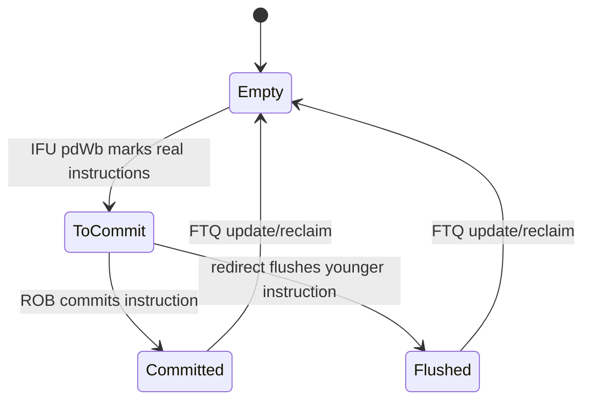
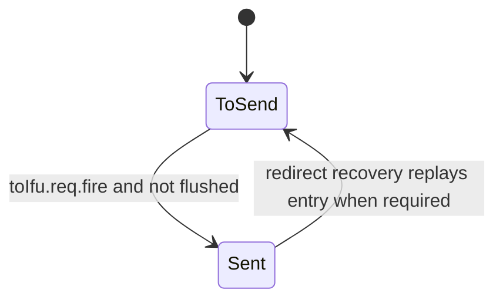
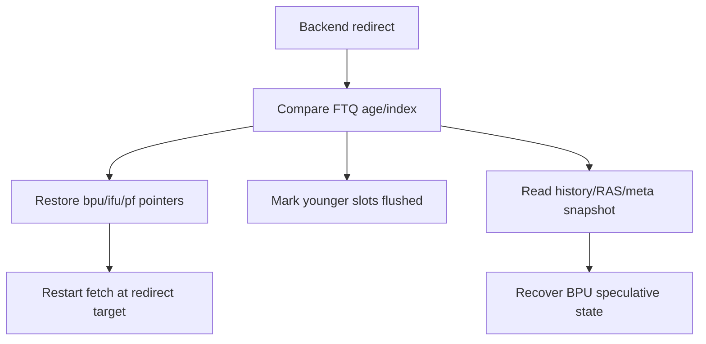
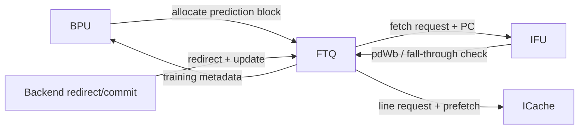
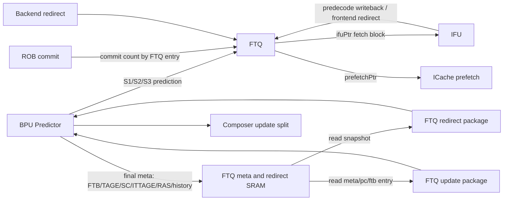

<!-- # Frontend FTQ 分支预测生命周期深入分析 -->
# In-Depth Analysis of the Frontend FTQ Branch-Prediction Lifecycle

<!-- regenerated-by-analyze-xiangshan-kunminghu -->
> Regenerated from `OpenXiangShan/XiangShan` branch `kunminghu-v2`, source commit `52262f303fc06daf84cdab7011d59b7df65ce7e8` using the updated Frontend graph/stage rules.


<!-- > 官方源码：`https://github.com/OpenXiangShan/XiangShan.git`；分支 `kunminghu-v2`；分析 commit `52262f303fc06daf84cdab7011d59b7df65ce7e8`。 -->
> Official source: `https://github.com/OpenXiangShan/XiangShan.git`; branch `kunminghu-v2`; analysis commit `52262f303fc06daf84cdab7011d59b7df65ce7e8`.

<!-- frontend-tutorial-generated-by-analyze-xiangshan-kunminghu -->
<!-- > 所有实现结论均限定在 `kunminghu-v2` commit `52262f303fc06daf84cdab7011d59b7df65ce7e8`；Design Doc 结论必须回到第 18 节的源码追溯矩阵。 -->
> All implementation conclusions are limited to `kunminghu-v2` commit `52262f303fc06daf84cdab7011d59b7df65ce7e8`; Design Doc conclusions must be checked against the source traceability matrix in Section 18.

## 1. Scope

<!-- 本节保留模块职责、分析基线、范围和统一五问，明确本文只以当前源码证据为准。 -->
This section records the module responsibility, analysis baseline, scope, and common five-question guide, and makes clear that this document relies only on evidence in the current source tree.

<!-- ### 1.1. 统一五问导读 -->
### 1.1. Five-Question Guide
<!-- | 问题 | 回答 | -->
| Question | Answer |
| --- | --- |
<!-- | **Who** | FTQ 是 BPU、IFU/ICache、后端提交和预测器训练之间的生命周期中心。 | -->
| **Who** | FTQ is the lifecycle hub between the BPU, IFU/ICache, backend commit, and predictor training. |
<!-- | **What** | 保存 prediction block 的 PC、预测 meta、历史/RAS 快照、预译码和提交状态。 | -->
| **What** | It retains a prediction block's PC, prediction metadata, history/RAS snapshots, predecode information, and commit state. |
<!-- | **How** | 多指针环形队列 + commit/fetch/hit 状态向量；redirect 恢复年轻边界，commit 后生成 predictor update。 | -->
| **How** | It uses a multi-pointer circular queue plus commit/fetch/hit state vectors; redirects restore a younger-age boundary and commit generates predictor updates. |
<!-- | **From what** | 来自 BPU S1-S3 prediction、IFU `pdWb`、后端 commit/redirect。 | -->
| **From what** | Inputs are BPU S1-S3 predictions, IFU `pdWb`, and backend commit/redirect signals. |
<!-- | **To what** | 请求发往 IFU/ICache，PC 信息发往后端，训练和恢复信息返回 BPU。 | -->
| **To what** | Requests go to IFU/ICache, PC information goes to the backend, and training and recovery information returns to the BPU. |

<!-- ### 1.2. 论文与理论边界 -->
### 1.2. Paper and Theory Boundary
<!-- FTQ/IBuffer/ICache 不是单一方向预测算法，但属于解耦前端和控制流交付体系。相关理论包括 scalable/elastic instruction fetching、有限队列反压、非阻塞缓存与 miss-status handling。本文用理论解释“为什么存在”，所有指针、状态机、端口、容量、overflow/underflow 和恢复结论以本 commit 源码为准。 -->
FTQ, IBuffer, and ICache are not a single direction-prediction algorithm, but they belong to a decoupled frontend and control-flow delivery system. Relevant theory includes scalable/elastic instruction fetching, finite-queue backpressure, non-blocking caches, and miss-status handling. Theory explains why the structures exist; all conclusions about pointers, state machines, ports, capacity, overflow/underflow, and recovery are based on the source at this commit.

<!-- ### 1.3. 模块定位：谁、为什么、从哪里来、到哪里去 -->
### 1.3. Module Position: Who, Why, Where From, and Where To
<!-- `Ftq` 是 BPU、IFU/ICache、后端和预测器训练之间的生命周期枢纽，源码位于 [NewFtq.scala](https://github.com/OpenXiangShan/XiangShan/blob/kunminghu-v2/src/main/scala/xiangshan/frontend/NewFtq.scala)。 -->
`Ftq` is the lifecycle hub between the BPU, IFU/ICache, backend, and predictor training. Its source is [NewFtq.scala](https://github.com/OpenXiangShan/XiangShan/blob/kunminghu-v2/src/main/scala/xiangshan/frontend/NewFtq.scala).

<!-- - **上游**：BPU 分阶段预测结果、IFU 预译码写回、后端 commit/redirect。 -->
- **Upstream:** Staged BPU predictions, IFU predecode writeback, and backend commit/redirect signals.
<!-- - **下游**：IFU 取指控制请求、ICache 取指/预取请求、后端 FTQ PC 查询、BPU update 与 redirect recovery。 -->
- **Downstream:** IFU fetch-control requests, ICache fetch/prefetch requests, backend FTQ-PC queries, and BPU update and redirect recovery.
<!-- - **为什么存在**：预测发生得早，提交和训练发生得晚；一个预测块必须在乱序执行期间保持 PC、预测 meta、历史/RAS 快照、预译码和提交状态。 -->
- **Why it exists:** Prediction happens early, whereas commit and training happen late. A prediction block must retain its PC, prediction metadata, history/RAS snapshots, predecode data, and commit state while it is in the out-of-order window.
<!-- - **为什么不能用普通单读单写 FIFO 代替**：FTQ 有多个逻辑消费者指针，并允许 BPU S2/S3 覆盖早期项、IFU 随后写回、后端按 FTQ index 查询和 redirect 恢复。 -->
- **Why an ordinary single-read/single-write FIFO is insufficient:** FTQ has several logical consumer pointers and permits BPU S2/S3 to overwrite early entries, IFU to write back afterward, and the backend to query by FTQ index and recover on redirect.

<!-- 默认 `FtqSize = 64`：[Parameters.scala#L157-L158](https://github.com/OpenXiangShan/XiangShan/blob/kunminghu-v2/src/main/scala/xiangshan/Parameters.scala#L157-L158)。 -->
The default is `FtqSize = 64` ([Parameters.scala#L157-L158](https://github.com/OpenXiangShan/XiangShan/blob/kunminghu-v2/src/main/scala/xiangshan/Parameters.scala#L157-L158)).

<!-- ## 2. 关键源码证据 -->
## 2. Key Source Evidence

<!-- 本节直接列出 `FTQ` 的有效源码入口、关键代码骨架和行为解释，避免只保存文件名或行号。 -->
This section lists the effective source entry points, key code skeleton, and behavioral explanations for `FTQ`, rather than retaining only filenames or line numbers.

<!-- ### 2.1. 源码入口和行号 -->
### 2.1. Source Entry Points and Line References
<!-- | 源码文件 | 本文使用它证明什么 | 行号证据 | -->
| Source file | What it establishes | Line evidence |
| --- | --- | --- |
<!-- | `frontend/NewFtq.scala` | 多指针定义和 entry 生命周期 | [frontend/NewFtq.scala#L524-L540](https://github.com/OpenXiangShan/XiangShan/blob/kunminghu-v2/src/main/scala/xiangshan/frontend/NewFtq.scala#L524-L540); [frontend/NewFtq.scala#L662-L680](https://github.com/OpenXiangShan/XiangShan/blob/kunminghu-v2/src/main/scala/xiangshan/frontend/NewFtq.scala#L662-L680) | -->
| `frontend/NewFtq.scala` | Multi-pointer definitions and the entry lifecycle. | [frontend/NewFtq.scala#L524-L540](https://github.com/OpenXiangShan/XiangShan/blob/kunminghu-v2/src/main/scala/xiangshan/frontend/NewFtq.scala#L524-L540); [frontend/NewFtq.scala#L662-L680](https://github.com/OpenXiangShan/XiangShan/blob/kunminghu-v2/src/main/scala/xiangshan/frontend/NewFtq.scala#L662-L680) |
<!-- | `frontend/NewFtq.scala` | redirect 恢复和年轻项清理 | [frontend/NewFtq.scala#L756-L779](https://github.com/OpenXiangShan/XiangShan/blob/kunminghu-v2/src/main/scala/xiangshan/frontend/NewFtq.scala#L756-L779) | -->
| `frontend/NewFtq.scala` | Redirect recovery and cleanup of younger entries. | [frontend/NewFtq.scala#L756-L779](https://github.com/OpenXiangShan/XiangShan/blob/kunminghu-v2/src/main/scala/xiangshan/frontend/NewFtq.scala#L756-L779) |
<!-- | `Parameters.scala` | `FtqSize = 64` | [Parameters.scala#L147-L158](https://github.com/OpenXiangShan/XiangShan/blob/kunminghu-v2/src/main/scala/xiangshan/Parameters.scala#L147-L158) | -->
| `Parameters.scala` | `FtqSize = 64`. | [Parameters.scala#L147-L158](https://github.com/OpenXiangShan/XiangShan/blob/kunminghu-v2/src/main/scala/xiangshan/Parameters.scala#L147-L158) |

<!-- ### 2.2. 核心代码骨架 -->
### 2.2. Core Code Skeleton
```scala
val bpuPtr = RegInit(0.U.asTypeOf(new FtqPtr))
val ifuPtr = RegInit(0.U.asTypeOf(new FtqPtr))
val commPtr = RegInit(0.U.asTypeOf(new FtqPtr))
val status = RegInit(VecInit(Seq.fill(FtqSize)(c_empty)))
```

<!-- ### 2.3. 代码解析 -->
### 2.3. Code Walkthrough
<!-- FTQ 把早期预测块延长到提交和训练时刻。它不是普通 FIFO，因为 BPU、IFU、ICache、后端 commit 和 update 各有独立进度指针。 -->
FTQ carries an early prediction block forward to the time of commit and training. It is not an ordinary FIFO because the BPU, IFU, ICache, backend commit, and update paths each have independent progress pointers.
<!-- ## 3. Theory-to-Code Mapping -->
## 3. Theory-to-Code Mapping

<!-- 本节把理论概念直接绑定到 `FTQ` 的源码对象、控制/数据状态和下游消费者。 -->
This section binds theoretical concepts directly to `FTQ` source objects, control/data state, and downstream consumers.

<!-- ### 3.1. 理论到代码映射表 -->
### 3.1. Theory-to-Code Mapping Table
<!-- | 理论概念 | 代码对象 | 为什么需要它 | 消费者/后续影响 | -->
| Theory concept | Code object | Why it is needed | Consumer / downstream effect |
| --- | --- | --- | --- |
<!-- | 预测-提交解耦 | bpuPtr/ifuPtr/commPtr/robCommPtr | 预测早发生，训练晚发生 | BPU update 和后端 PC 查询 | -->
| Prediction-commit decoupling | `bpuPtr`/`ifuPtr`/`commPtr`/`robCommPtr` | Prediction happens early and training happens late. | BPU update and backend PC queries |
<!-- | 状态向量 | commit/fetch/hit status | 同一 entry 经历分配、发送、写回、提交/flush | IFU/ICache/Backend | -->
| State vectors | commit/fetch/hit status | The same entry passes through allocation, send, writeback, and commit/flush. | IFU/ICache/backend |
<!-- | redirect 年龄边界 | redirect ptr/offset | 清理年轻项并保留老项精确状态 | BPU history recovery | -->
| Redirect age boundary | redirect pointer/offset | Clears younger entries while preserving precise state for older entries. | BPU history recovery |

<!-- ### 3.2. 阅读顺序 -->
### 3.2. Reading Order
<!-- 先按第 2 节定位源码对象，再顺着本表检查信号从哪里来、状态在哪里保存、何时更新、谁消费结果。若本篇只引用相邻模块拥有的状态，则以相邻 Frontend 分文档的源码分析为准。 -->
First locate source objects through Section 2, then use this table to check signal origin, state location, update timing, and result consumers. When this document cites state owned by an adjacent module, use that Frontend document's source analysis as the authority.
<!-- ## 4. 论文原则和有效代码 -->
## 4. Paper Principles and Effective Code


<!-- FTQ 的有效实现是前端预测块的顺序账本：BPU/Composer 产生 prediction block 后写入 FTQ entry，IFU 按 head 侧请求取指，predecode 和后端 redirect 再回写 hit、fall-through、异常和训练元数据。它把“预测理论”落成可恢复的指针、entry valid、预测 meta 和更新端口，而不是只保存 PC 列表。 -->
The effective FTQ implementation is the frontend's ordered ledger of prediction blocks. BPU/Composer writes a prediction block into an FTQ entry, IFU fetches by the head-side request, and predecode and backend redirects write back hit, fall-through, exception, and training metadata. It turns prediction theory into recoverable pointers, entry validity, prediction metadata, and update ports rather than merely retaining a list of PCs.

## 5. Microarchitecture Parameters


<!-- 先从源码证据读取表深度、队列容量、位宽、端口数和配置开关，再判断它们对吞吐、冲突和恢复延迟的影响；不要用文档中的默认值替代当前 commit 的参数。 -->
First read table depth, queue capacity, bit widths, port counts, and configuration switches from source evidence, then evaluate their impact on throughput, conflicts, and recovery latency. Do not replace the parameters of the current commit with document defaults.

<!-- ## 6. 模块边界和接口 -->
## 6. Module Boundaries and Interfaces


<!-- ### 6.1. 关键接口 -->
### 6.1. Key Interfaces
<!-- | 接口 | 来源 → 去向 | 内容 | 为什么存在 | -->
| Interface | Source -> destination | Contents | Why it exists |
| --- | --- | --- | --- |
<!-- | `fromBpu.resp` | BPU → FTQ | S1/S2/S3 prediction、FTQ index、PC、预测 meta | 分阶段覆盖同一预测块，并在有空间时分配新项 | -->
| `fromBpu.resp` | BPU -> FTQ | S1/S2/S3 prediction, FTQ index, PC, prediction metadata | Overwrites the same prediction block by stage and allocates a new entry when space is available. |
<!-- | `toIfu.req` | FTQ → IFU | `startAddr`、`nextStartAddr`、FTQ ptr、预测范围 | IFU 用它解释 ICache 数据并校验预测 | -->
| `toIfu.req` | FTQ -> IFU | `startAddr`, `nextStartAddr`, FTQ pointer, prediction range | Lets IFU interpret ICache data and validate the prediction. |
<!-- | `toICache.req` | FTQ → ICache | 同一预测块的缓存访问控制 | 取得真实指令数据 | -->
| `toICache.req` | FTQ -> ICache | Cache-access control for the same prediction block | Obtains the actual instruction data. |
<!-- | `toPrefetch` | FTQ → ICache prefetch | 比 IFU 更靠前的预测块地址 | 把未来可能访问的行提前送入 miss 系统 | -->
| `toPrefetch` | FTQ -> ICache prefetch | Prediction-block addresses ahead of IFU | Sends likely future cache lines to the miss system early. |
<!-- | `fromIfu.pdWb` | IFU → FTQ | 真实预译码、错误 offset、JAL target | 校验 FTB 记录并形成训练材料 | -->
| `fromIfu.pdWb` | IFU -> FTQ | Actual predecode, erroneous offset, JAL target | Validates the FTB record and produces training material. |
<!-- | `fromBackend.redirect` | 后端 → FTQ | redirect FTQ ptr/offset、真实目标、原因 | 恢复正确年龄边界和投机历史 | -->
| `fromBackend.redirect` | Backend -> FTQ | Redirect FTQ pointer/offset, actual target, reason | Restores the correct age boundary and speculative history. |
<!-- | `toBpu.update` | FTQ → BPU | 提交后的分支结果和预测 meta | 训练预测器，避免错误路径污染 | -->
| `toBpu.update` | FTQ -> BPU | Post-commit branch outcome and prediction metadata | Trains predictors without wrong-path contamination. |
<!-- | `toBackend` | FTQ → 后端 | PC mem 查询、最新 entry ptr、提交相关信息 | 后端按 FTQ ptr+offset 重建指令 PC 和控制流位置 | -->
| `toBackend` | FTQ -> backend | PC-memory queries, latest entry pointer, and commit-related information | Lets the backend reconstruct the instruction PC and control-flow position from FTQ pointer plus offset. |

<!-- ## 7. 为什么模块存在 -->
## 7. Why the Module Exists


<!-- 把模块放回 Frontend 全链路理解：它解决的是预测带宽、取指正确性、存储层次延迟、投机恢复或上下游速率不匹配中的至少一个问题。 -->
Place the module back in the full frontend path: it addresses at least one of prediction bandwidth, fetch correctness, memory-hierarchy latency, speculative recovery, or rate mismatch between upstream and downstream stages.

<!-- ## 8. 有效动态路径 -->
## 8. Effective Dynamic Paths


<!-- ### 8.1. 从 FTQ 到 IFU/ICache -->
### 8.1. From FTQ to IFU/ICache
<!-- FTQ 根据 `ifuPtr` 读 PC 存储，构造 `toIfuPcBundle`，并检查 BPU S2/S3 flush 是否覆盖当前 index。请求只有在顶层同时确认 IFU 与 ICache ready 后才 fire。这样 FTQ、IFU 和 ICache 对“当前处理哪个 FTQ entry”保持一致。 -->
FTQ reads PC storage using `ifuPtr`, builds `toIfuPcBundle`, and checks whether a BPU S2/S3 flush covers the current index. A request fires only after the top level confirms that both IFU and ICache are ready. This keeps FTQ, IFU, and ICache aligned on which FTQ entry is being processed.

<!-- `entry_fetch_status(ifuPtr)` 只在请求真正 fire 且不应被 BPU flush 时改为 `f_sent`：[NewFtq.scala#L955-L961](https://github.com/OpenXiangShan/XiangShan/blob/kunminghu-v2/src/main/scala/xiangshan/frontend/NewFtq.scala#L955-L961)。因此 `valid` 仅表示“想发送”，`fire` 才表示“IFU 与 ICache 已共同接受”。 -->
`entry_fetch_status(ifuPtr)` changes to `f_sent` only when the request actually fires and is not covered by a BPU flush ([NewFtq.scala#L955-L961](https://github.com/OpenXiangShan/XiangShan/blob/kunminghu-v2/src/main/scala/xiangshan/frontend/NewFtq.scala#L955-L961)). Thus `valid` means only “ready to send,” whereas `fire` means “both IFU and ICache accepted it.”

<!-- ### 8.2. Commit、训练和两拍 FTB 更新节拍 -->
### 8.2. Commit, Training, and the Two-Cycle FTB Update Cadence
<!-- FTQ 等待一个预测块内真实存在的指令全部进入 `committed/flushed` 终态，随后组合： -->
FTQ waits until all real instructions in a prediction block reach the `committed/flushed` terminal state, then combines:

<!-- - 预测时保存的 meta； -->
- Metadata saved at prediction time;
<!-- - IFU 预译码得到的分支/JAL/JALR/call/ret 信息； -->
- Branch/JAL/JALR/call/ret information from IFU predecode;
<!-- - 后端实际 taken、target、mispredict、commit 情况； -->
- Actual taken, target, misprediction, and commit outcomes from the backend;
<!-- - false hit 和 redirect 原因。 -->
- False-hit and redirect causes.

<!-- 再把 update 送到 BPU。FTB update 有显式的 2-bit stall 节拍控制，注释说明是“两周期 stall、三个状态”，并使用 `switch(bpu_ftb_update_stall)`：[NewFtq.scala#L1351-L1438](https://github.com/OpenXiangShan/XiangShan/blob/kunminghu-v2/src/main/scala/xiangshan/frontend/NewFtq.scala#L1351-L1438)。该小状态机存在的原因是预测器 update 端口/存储体时序不能与每拍无限提交等价，FTQ 需要把提交事件整形成预测器可接受的更新节拍。 -->
It then sends the update to the BPU. FTB update uses an explicit two-bit stall cadence; the comment describes “two-cycle stall, three states,” implemented with `switch(bpu_ftb_update_stall)` ([NewFtq.scala#L1351-L1438](https://github.com/OpenXiangShan/XiangShan/blob/kunminghu-v2/src/main/scala/xiangshan/frontend/NewFtq.scala#L1351-L1438)). This small state machine exists because predictor update ports and storage timing cannot accept unlimited per-cycle commits; FTQ reshapes commit events into a cadence the predictor can accept.

<!-- ## 9. Index 和地址/历史计算 -->
## 9. Index and Address/History Computation


<!-- ### 9.1. 示例讲解索引 -->
### 9.1. Example-Driven Index Walkthrough
<!-- 后文的正常路径、阻塞路径、redirect/flush、满空边界和波形段落均给出具体示例；阅读时建议从“一个 prediction block 的正常流动”开始，再对照 overflow/underflow 和恢复场景。 -->
The normal path, blocked path, redirect/flush behavior, full/empty boundaries, and waveform sections below provide concrete examples. Start with the normal flow of one prediction block, then compare it with overflow/underflow and recovery cases.

<!-- ## 10. 核心算法 -->
## 10. Core Algorithm


<!-- 核心算法围绕多指针 entry 生命周期：预测分配 tail，IFU 读取 fetch pointer，predecode/FTB hit 更新 entry，后端提交或 redirect 释放/修复指针。redirect 同时给 BPU history/RAS 恢复边界；满队列时前端预测被反压，空队列时 IFU 不能发出新的有效取指请求。同拍分配、更新、释放要按指针年龄和 valid 位判断谁真正修改同一个 entry。 -->
The core algorithm follows the multi-pointer entry lifecycle: prediction allocates at the tail, IFU reads through the fetch pointer, predecode/FTB hits update the entry, and backend commit or redirect releases or repairs pointers. A redirect also supplies the BPU history/RAS recovery boundary. A full queue backpressures frontend prediction, while an empty queue prevents IFU from issuing a valid fetch request. When allocation, update, and release coincide, pointer age and valid bits determine which operation actually modifies an entry.

<!-- ## 11. 状态和存储结构 -->
## 11. State and Storage Structures


<!-- ### 11.1. 多指针设计 -->
### 11.1. Multi-Pointer Design
<!-- FTQ 维护 `bpuPtr`、`ifuPtr`、`pfPtr`、`ifuWbPtr`、`commPtr`、`robCommPtr` 及其加一副本：[NewFtq.scala#L524-L540](https://github.com/OpenXiangShan/XiangShan/blob/kunminghu-v2/src/main/scala/xiangshan/frontend/NewFtq.scala#L524-L540)。 -->
FTQ maintains `bpuPtr`, `ifuPtr`, `pfPtr`, `ifuWbPtr`, `commPtr`, and `robCommPtr`, together with their incremented copies ([NewFtq.scala#L524-L540](https://github.com/OpenXiangShan/XiangShan/blob/kunminghu-v2/src/main/scala/xiangshan/frontend/NewFtq.scala#L524-L540)).

<!-- | 指针 | 推进事件 | 含义 | -->
| Pointer | Advance event | Meaning |
| --- | --- | --- |
<!-- | `bpuPtr` | 接收一个新的预测块 | 生产边界；下一可分配 FTQ 项 | -->
| `bpuPtr` | Receives a new prediction block | Producer boundary; next allocatable FTQ entry |
<!-- | `ifuPtr` | `toIfu.req.fire` | 已发送到 IFU 的边界 | -->
| `ifuPtr` | `toIfu.req.fire` | Boundary of entries sent to IFU |
<!-- | `pfPtr` | 预取请求被接受 | ICache 预取进度 | -->
| `pfPtr` | Prefetch request accepted | ICache prefetch progress |
<!-- | `ifuWbPtr` | IFU `pdWb.valid` | 真实预译码返回进度 | -->
| `ifuWbPtr` | IFU `pdWb.valid` | Progress of actual predecode writeback |
<!-- | `commPtr` | 当前项所有应提交指令完成并更新 BPU | FTQ 自身回收进度 | -->
| `commPtr` | All instructions that should commit in the current entry complete and update the BPU | FTQ reclamation progress |
<!-- | `robCommPtr` | ROB 提交反馈 | 后端架构提交进度 | -->
| `robCommPtr` | ROB commit feedback | Backend architectural commit progress |

<!-- 这些指针解耦了各阶段的速度。例如 ICache miss 会使 `ifuPtr` 暂停，但 BPU 可以继续填充尚未发送的 FTQ 项；后端阻塞会使 `commPtr` 暂停，但 IFU 仍可在队列容量允许时前进。 -->
These pointers decouple stage rates. For example, an ICache miss can stall `ifuPtr` while the BPU continues filling unsent FTQ entries; backend blocking can stall `commPtr` while IFU continues as long as queue capacity permits.

<!-- ### 11.2. 三组隐式状态机 -->
### 11.2. Three Implicit State Machines
<!-- FTQ 为每个 entry/slot 维护三类状态：[NewFtq.scala#L662-L680](https://github.com/OpenXiangShan/XiangShan/blob/kunminghu-v2/src/main/scala/xiangshan/frontend/NewFtq.scala#L662-L680)。 -->
FTQ maintains three classes of state for each entry/slot ([NewFtq.scala#L662-L680](https://github.com/OpenXiangShan/XiangShan/blob/kunminghu-v2/src/main/scala/xiangshan/frontend/NewFtq.scala#L662-L680)).

<!-- #### 11.2.1. Commit 状态 -->
#### 11.2.1. Commit State



<!-- - `c_empty`：槽位未被真实指令占用。 -->
- `c_empty`: The slot is not occupied by a real instruction.
<!-- - `c_toCommit`：IFU 已确认该 offset 有真实指令，等待后端结局。 -->
- `c_toCommit`: IFU confirmed a real instruction at this offset; waiting for the backend outcome.
<!-- - `c_committed`：ROB 已提交。 -->
- `c_committed`: The ROB committed the instruction.
<!-- - `c_flushed`：被 redirect 冲掉；训练时必须区分“未出现”与“出现但被冲掉”。 -->
- `c_flushed`: The instruction was removed by a redirect; training must distinguish “never appeared” from “appeared but was flushed.”

<!-- IFU 写回时按 `pd.valid` 和 `instrRange` 把槽位置为 `c_toCommit`：[NewFtq.scala#L966-L994](https://github.com/OpenXiangShan/XiangShan/blob/kunminghu-v2/src/main/scala/xiangshan/frontend/NewFtq.scala#L966-L994)。 -->
On writeback, IFU marks the slot `c_toCommit` based on `pd.valid` and `instrRange` ([NewFtq.scala#L966-L994](https://github.com/OpenXiangShan/XiangShan/blob/kunminghu-v2/src/main/scala/xiangshan/frontend/NewFtq.scala#L966-L994)).

<!-- #### 11.2.2. Fetch 状态 -->
#### 11.2.2. Fetch State



<!-- `f_to_send/f_sent` 防止同一项被无条件重复发送，也允许 redirect 后重建正确发送边界：[NewFtq.scala#L675-L676](https://github.com/OpenXiangShan/XiangShan/blob/kunminghu-v2/src/main/scala/xiangshan/frontend/NewFtq.scala#L675-L676)。真正发送后更新状态的逻辑见 [NewFtq.scala#L955-L961](https://github.com/OpenXiangShan/XiangShan/blob/kunminghu-v2/src/main/scala/xiangshan/frontend/NewFtq.scala#L955-L961)。 -->
`f_to_send/f_sent` prevents unconditional duplicate sends and allows the correct send boundary to be rebuilt after a redirect ([NewFtq.scala#L675-L676](https://github.com/OpenXiangShan/XiangShan/blob/kunminghu-v2/src/main/scala/xiangshan/frontend/NewFtq.scala#L675-L676)). The state update after an actual send is shown at [NewFtq.scala#L955-L961](https://github.com/OpenXiangShan/XiangShan/blob/kunminghu-v2/src/main/scala/xiangshan/frontend/NewFtq.scala#L955-L961).

<!-- #### 11.2.3. Prediction hit 状态 -->
#### 11.2.3. Prediction-Hit State

<!-- - `h_not_hit`：预测器没有命中有效 FTB 块。 -->
- `h_not_hit`: The predictor did not hit a valid FTB block.
<!-- - `h_hit`：当前认为 FTB 记录和真实指令一致。 -->
- `h_hit`: The FTB record is currently considered consistent with the real instructions.
<!-- - `h_false_hit`：IFU 发现 fall-through、分支类型、JAL/JALR/call/ret 或 offset 不一致。 -->
- `h_false_hit`: IFU found a fall-through, branch-type, JAL/JALR/call/ret, or offset mismatch.

<!-- IFU 真实预译码与保存的 FTB entry 比较，产生 false hit：[NewFtq.scala#L1002-L1039](https://github.com/OpenXiangShan/XiangShan/blob/kunminghu-v2/src/main/scala/xiangshan/frontend/NewFtq.scala#L1002-L1039)。该状态存在的原因是 **“表命中”不等于“内容正确”**；tag alias、陈旧项或自修改代码都可能让命中的 FTB entry 与真实指令流不一致。 -->
IFU compares actual predecode with the saved FTB entry and produces a false hit ([NewFtq.scala#L1002-L1039](https://github.com/OpenXiangShan/XiangShan/blob/kunminghu-v2/src/main/scala/xiangshan/frontend/NewFtq.scala#L1002-L1039)). This state exists because **a table hit does not imply correct contents**: tag aliasing, stale entries, or self-modifying code can make a hit FTB entry disagree with the real instruction stream.

<!-- ### 11.3. Overflow / underflow / 越界场景 -->
### 11.3. Overflow / Underflow / Boundary Cases
#### 11.3.1. FTQ overflow

<!-- **场景**：后端长期不提交，`commPtr` 不前进；BPU 持续产生预测，`bpuPtr` 追上回收边界。 -->
**Scenario:** The backend fails to commit for a long time, so `commPtr` does not advance; BPU continues producing predictions until `bpuPtr` catches the reclamation boundary.

<!-- **防护**：`new_entry_ready` 决定 `io.fromBpu.resp.ready`：[NewFtq.scala#L590-L590](https://github.com/OpenXiangShan/XiangShan/blob/kunminghu-v2/src/main/scala/xiangshan/frontend/NewFtq.scala#L590-L590)。不 ready 时 BPU 必须保持流水状态，不能覆盖仍在乱序窗口中的 entry。 -->
**Protection:** `new_entry_ready` determines `io.fromBpu.resp.ready` ([NewFtq.scala#L590-L590](https://github.com/OpenXiangShan/XiangShan/blob/kunminghu-v2/src/main/scala/xiangshan/frontend/NewFtq.scala#L590-L590)). When it is not ready, BPU must hold its pipeline state and cannot overwrite an entry that remains in the out-of-order window.

<!-- **为什么不能丢最老项**：最老项可能仍有未提交指令，且其 meta 将用于预测器训练和 redirect 恢复；覆盖会破坏精确控制流。 -->
**Why the oldest entry cannot be dropped:** It may still contain uncommitted instructions, and its metadata is needed for predictor training and redirect recovery. Overwriting it would violate precise control flow.

#### 11.3.2. IFU consumer underflow

<!-- **场景**：`ifuPtr == bpuPtr`，没有新的预测块。 -->
**Scenario:** `ifuPtr == bpuPtr`, so no new prediction block exists.

<!-- **防护**：`toIfu.req.valid` 必须由 entry 的有效/发送状态和指针关系共同产生；没有生产项时不 fire，`ifuPtr` 不递增。 -->
**Protection:** `toIfu.req.valid` must be derived jointly from the entry's valid/send state and the pointer relationship. With no produced entry, it does not fire and `ifuPtr` does not increment.

#### 11.3.3. Commit underflow

<!-- **场景**：`commPtr` 指向尚未由 IFU 识别真实指令、或尚未全部提交的 entry。 -->
**Scenario:** `commPtr` points to an entry whose real instructions have not yet been identified by IFU or have not all committed.

<!-- **防护**：`canCommit` 和 commit-state 向量控制 update/reclaim；不能因为 ROB 某个宽口无 valid 就误认为整个 FTQ entry 已完成。 -->
**Protection:** `canCommit` and the commit-state vector govern update/reclaim. The absence of `valid` on one ROB-wide port must not be mistaken for completion of the entire FTQ entry.

<!-- #### 11.3.4. 回绕 alias -->
#### 11.3.4. Wraparound Aliasing

<!-- 只比较 index 会把相差 64 项的两个逻辑位置误认为相同。`FtqPtr` 继承 `CircularQueuePtr` 并携带 flag：[NewFtq.scala#L49-L63](https://github.com/OpenXiangShan/XiangShan/blob/kunminghu-v2/src/main/scala/xiangshan/frontend/NewFtq.scala#L49-L63)，用于区分同 index 的不同轮次。 -->
Comparing only the index would treat two logical positions separated by 64 entries as identical. `FtqPtr` extends `CircularQueuePtr` and carries a flag ([NewFtq.scala#L49-L63](https://github.com/OpenXiangShan/XiangShan/blob/kunminghu-v2/src/main/scala/xiangshan/frontend/NewFtq.scala#L49-L63)) to distinguish different laps with the same index.

<!-- ## 12. Pipeline stage 分析 -->
## 12. Pipeline-Stage Analysis


<!-- 阶段说明只使用源码中的寄存器、valid/ready 和 fire 条件；对 Frontend 使用 F0/F1/F2/F3，对 Backend 使用实际 Decode/Rename/Dispatch/Issue/Execute/Writeback/ROB 边界。 -->
The stage discussion uses only source-defined registers and valid/ready/fire conditions: F0/F1/F2/F3 for the frontend and the real Decode/Rename/Dispatch/Issue/Execute/Writeback/ROB boundaries for the backend.

## 13. Control path rationale


<!-- ### 13.1. Redirect 恢复 -->
### 13.1. Redirect Recovery


<!-- FTQ 使用带 flag 的 `CircularQueuePtr` 比较环形年龄，避免仅比较 index 在回绕时出错。redirect 的核心不是擦除 RAM，而是： -->
FTQ uses `CircularQueuePtr` with a flag to compare circular ages and avoid errors caused by index-only comparison across wraparound. A redirect is not primarily about erasing RAM; it:

<!-- - 恢复生产/消费边界； -->
- Restores producer/consumer boundaries;
<!-- - 使年轻项状态不可提交、不可训练； -->
- Makes younger-entry state ineligible for commit or training;
<!-- - 向 BPU 提供对应 entry 的历史/RAS 恢复信息； -->
- Supplies BPU with history/RAS recovery information from the corresponding entry;
<!-- - 为 redirect target 建立新的正确路径 entry。 -->
- Establishes a new correct-path entry for the redirect target.

<!-- ## 14. Data path 与跨边界 -->
## 14. Data Path and Boundary Crossings


<!-- ### 14.1. 跨边界代码解析 -->
### 14.1. Cross-Boundary Code Walkthrough
<!-- FTQ 以预测块为生命周期单位，但块内可能包含跨页、跨 Cache Line 或跨 MMIO/uncache 的取指片段。第一片段分配的 FTQ entry 必须保留 PC、预测 metadata 和年龄关系，第二片段的翻译 fault、ICache miss、MMIO wait 或半指令合并结果必须回写同一上下文或由源码明确的关联字段承接，不能新建一个无年龄关系的独立完成记录。`bpuPtr/ifuPtr/pfPtr/ifuWbPtr/commPtr/robCommPtr` 的推进与回收关系见 [frontend/NewFtq.scala:524-554](https://github.com/OpenXiangShan/XiangShan/blob/kunminghu-v2/src/main/scala/xiangshan/frontend/NewFtq.scala#L524-L554)。 -->
FTQ uses a prediction block as its lifecycle unit, but a block may contain fetch fragments that cross a page, cache line, or MMIO/uncache boundary. The FTQ entry allocated for the first fragment must retain its PC, prediction metadata, and age relationship. A translation fault, ICache miss, MMIO wait, or half-instruction merge result for the second fragment must write back to the same context or be carried by source-defined associated fields; it must not create an independent completion record with no age relationship. The advance and reclamation relationships of `bpuPtr/ifuPtr/pfPtr/ifuWbPtr/commPtr/robCommPtr` are shown in [frontend/NewFtq.scala:524-554](https://github.com/OpenXiangShan/XiangShan/blob/kunminghu-v2/src/main/scala/xiangshan/frontend/NewFtq.scala#L524-L554).

<!-- 边界与 redirect 同周期时，优先验证旧 entry 是否被标记无效、指针是否回滚/跳转、第二片段是否禁止写入旧 entry，以及 commit 后的 predictor update 是否仍只使用正确路径 metadata。MMIO/uncache 还必须覆盖 entry 占满、响应乱序和提交门控，避免 FTQ 永久等待。 -->
When a boundary crossing and redirect occur in the same cycle, first verify whether the old entry is invalidated, whether pointers roll back or jump, whether the second fragment is prohibited from writing the old entry, and whether predictor update after commit still uses only correct-path metadata. MMIO/uncache cases must also cover a full entry, out-of-order responses, and commit gating to avoid FTQ waiting permanently.

<!-- ## 15. 异常、debug、privilege -->
## 15. Exceptions, Debug, and Privilege


<!-- ### 15.1. 验证关注点 -->
### 15.1. Verification Focus
<!-- 1. FTQ 刚满时同拍 commit+allocate 是否允许无气泡复用。 -->
1. Whether same-cycle commit plus allocate allows bubble-free reuse when FTQ has just become full.
<!-- 2. BPU S2/S3 redirect 与后端 redirect 同拍时的优先级。 -->
2. Priority when BPU S2/S3 redirect and a backend redirect occur in the same cycle.
<!-- 3. `ifuPtr` 已发送但 IFU `pdWb` 尚未返回时发生 redirect。 -->
3. A redirect after `ifuPtr` has been sent but before IFU `pdWb` returns.
<!-- 4. 指针在 index 63→0 回绕附近的年龄比较。 -->
4. Pointer-age comparison near the index 63-to-0 wraparound.
<!-- 5. 一个预测块中部分指令 committed、部分 flushed 时的 update mask。 -->
5. The update mask when some instructions in a prediction block committed and others were flushed.
<!-- 6. false FTB hit 是否在训练时触发正确的修复/替换，而不是强化错误项。 -->
6. Whether a false FTB hit invokes the correct training-time repair/replacement rather than reinforcing the erroneous entry.
<!-- 7. FTB update stall 期间连续可提交 FTQ 项是否保持顺序且不丢 update。 -->
7. Whether consecutively committable FTQ entries retain order and do not lose updates during an FTB update stall.

#### 15.1.1. Top-Level Module Connectivity

FTQ is the lifetime bridge between prediction, fetch, ICache, backend redirect, and predictor training. Its pointer/status machine and redirect read path are implemented in [frontend/NewFtq.scala:524-554](https://github.com/OpenXiangShan/XiangShan/blob/52262f303fc06daf84cdab7011d59b7df65ce7e8/src/main/scala/xiangshan/frontend/NewFtq.scala#L524-L554) and [frontend/NewFtq.scala:1045-1173](https://github.com/OpenXiangShan/XiangShan/blob/52262f303fc06daf84cdab7011d59b7df65ce7e8/src/main/scala/xiangshan/frontend/NewFtq.scala#L1045-L1173).



#### 15.1.2. Frontend/Backend Pipeline Stages

The source-proven stage boundary is `F0 -> F1 -> F2 -> F3`: F0 accepts the FTQ request and calculates line indices, F1 registers the fetch block and calculates instruction PCs/cut pointers, F2 waits for ICache responses and performs data cutting/predecode preparation, and F3 expands/qualifies instructions, handles exceptions/MMIO, and drives IBuffer. Evidence: [frontend/IFU.scala:236-305](https://github.com/OpenXiangShan/XiangShan/blob/52262f303fc06daf84cdab7011d59b7df65ce7e8/src/main/scala/xiangshan/frontend/IFU.scala#L236-L305), [frontend/IFU.scala:346-457](https://github.com/OpenXiangShan/XiangShan/blob/52262f303fc06daf84cdab7011d59b7df65ce7e8/src/main/scala/xiangshan/frontend/IFU.scala#L346-L457), [frontend/IFU.scala:542-617](https://github.com/OpenXiangShan/XiangShan/blob/52262f303fc06daf84cdab7011d59b7df65ce7e8/src/main/scala/xiangshan/frontend/IFU.scala#L542-L617). The top-level connections couple FTQ, IFU, ICache, and IBuffer through shared ready/valid conditions: [frontend/Frontend.scala:199-231](https://github.com/OpenXiangShan/XiangShan/blob/52262f303fc06daf84cdab7011d59b7df65ce7e8/src/main/scala/xiangshan/frontend/Frontend.scala#L199-L231).

The backend continuation uses the effective module boundaries rather than inventing cycle names: Decode accepts the instruction packet, Rename creates speculative physical-register mappings, Dispatch allocates downstream resources, Issue/Scheduler selects ready uops, Execute/FU produces results, DataPath/WB carries writeback and wakeup, and ROB/CtrlBlock commits or redirects. Evidence: [backend/decode/DecodeStage.scala:83-120](https://github.com/OpenXiangShan/XiangShan/blob/52262f303fc06daf84cdab7011d59b7df65ce7e8/src/main/scala/xiangshan/backend/decode/DecodeStage.scala#L83-L120), [backend/rename/Rename.scala:40-117](https://github.com/OpenXiangShan/XiangShan/blob/52262f303fc06daf84cdab7011d59b7df65ce7e8/src/main/scala/xiangshan/backend/rename/Rename.scala#L40-L117), [backend/dispatch/NewDispatch.scala:49-176](https://github.com/OpenXiangShan/XiangShan/blob/52262f303fc06daf84cdab7011d59b7df65ce7e8/src/main/scala/xiangshan/backend/dispatch/NewDispatch.scala#L49-L176), [backend/issue/Scheduler.scala:29-180](https://github.com/OpenXiangShan/XiangShan/blob/52262f303fc06daf84cdab7011d59b7df65ce7e8/src/main/scala/xiangshan/backend/issue/Scheduler.scala#L29-L180), [backend/exu/ExeUnit.scala:50-110](https://github.com/OpenXiangShan/XiangShan/blob/52262f303fc06daf84cdab7011d59b7df65ce7e8/src/main/scala/xiangshan/backend/exu/ExeUnit.scala#L50-L110), [backend/datapath/DataPath.scala:25-70](https://github.com/OpenXiangShan/XiangShan/blob/52262f303fc06daf84cdab7011d59b7df65ce7e8/src/main/scala/xiangshan/backend/datapath/DataPath.scala#L25-L70), [backend/rob/Rob.scala:52-145](https://github.com/OpenXiangShan/XiangShan/blob/52262f303fc06daf84cdab7011d59b7df65ce7e8/src/main/scala/xiangshan/backend/rob/Rob.scala#L52-L145), [backend/CtrlBlock.scala:50-110](https://github.com/OpenXiangShan/XiangShan/blob/52262f303fc06daf84cdab7011d59b7df65ce7e8/src/main/scala/xiangshan/backend/CtrlBlock.scala#L50-L110).

```mermaid
flowchart LR
  F0["F0: FTQ req + line indices"] -->|f0_fire| F1["F1: PC + cut pointers"]
  F1 -->|f1_fire| F2["F2: ICache data + exceptions"]
  F2 -->|f2_fire| F3["F3: predecode + MMIO qualification"]
  F3 -->|toIbuffer.fire| Decode["Decode"]
  Decode -->|uop bundle| Rename["Rename"]
  Rename -->|renamed uop| Dispatch["Dispatch"]
  Dispatch -->|ready uop| Issue["Issue"]
  Issue -->|operands| Execute["Execute/FU"]
  Execute -->|result| Writeback["Writeback/Wakeup"]
  Writeback -->|retire candidate| Commit["ROB/Commit"]
  Commit -->|redirect/flush| F0
```



The stage graph keeps chronological forward edges separate from the bundled recovery edge. It must be read together with the module graph below: a stage is not itself a module, and a redirect does not create a fake forward stage.

```waveform-draw
{
  "signal": [
    {
      "name": "clk",
      "wave": "p......."
    },
    {
      "name": "F0.valid",
      "wave": "01...0.."
    },
    {
      "name": "F0.ready",
      "wave": "1..0...."
    },
    {
      "name": "F1.valid",
      "wave": "001..0.."
    },
    {
      "name": "F2.valid",
      "wave": "0001.0.."
    },
    {
      "name": "F3.valid",
      "wave": "00001.0."
    },
    {
      "name": "toIbuffer.fire",
      "wave": "0000010."
    },
    {
      "name": "redirect/flush",
      "wave": "00000010"
    }
  ],
  "config": {
    "hscale": 1
  }
}
```

<!-- ## 16. CSR 控制 -->
## 16. CSR Control


<!-- 前端分支预测器的使能控制来自 CSR 模块生成的 `CustomCSRCtrlIO.bp_ctrl`，不是各预测器本地私有 CSR。有效链路是：`sbpctl` CSR 字段 -> `io.status.custom.bp_ctrl` -> Backend `frontendCsrCtrl` -> XSCore `frontend.io.csrCtrl` -> Frontend `bpu.io.ctrl` -> BPU 内各子预测器 `io.enable`。 -->
Frontend branch-predictor enables come from the CSR-generated `CustomCSRCtrlIO.bp_ctrl`, not from private CSRs in each predictor. The effective path is: `sbpctl` CSR fields -> `io.status.custom.bp_ctrl` -> backend `frontendCsrCtrl` -> XSCore `frontend.io.csrCtrl` -> frontend `bpu.io.ctrl` -> each BPU subpredictor's `io.enable`.

<!-- ### 16.1. CSR 字段到 BPU 控制信号 -->
### 16.1. CSR Fields to BPU Control Signals
<!-- | 控制位 | CSR 源字段 | Frontend/BPU 消费者 | 有效作用 | 源码证据 | -->
| Control bit | CSR source field | Frontend/BPU consumer | Effective behavior | Source evidence |
| --- | --- | --- | --- | --- |
<!-- | `bp_ctrl.ubtbEnable` | `sbpctl.regOut.UBTB_ENABLE` | `ubtb.io.enable` | 允许或关闭 S1 fast uBTB/MicroBtb 查询结果参与预测链；关闭后仍保留 fall-through 基线。 | [NewCSR.scala:1378](https://github.com/OpenXiangShan/XiangShan/blob/kunminghu-v2/src/main/scala/xiangshan/backend/fu/NewCSR/NewCSR.scala#L1378), [Bpu.scala:96](https://github.com/OpenXiangShan/XiangShan/blob/kunminghu-v2/src/main/scala/xiangshan/frontend/bpu/Bpu.scala#L96), [Bpu.scala:105](https://github.com/OpenXiangShan/XiangShan/blob/kunminghu-v2/src/main/scala/xiangshan/frontend/bpu/Bpu.scala#L105) | -->
| `bp_ctrl.ubtbEnable` | `sbpctl.regOut.UBTB_ENABLE` | `ubtb.io.enable` | Enables or disables S1 fast uBTB/MicroBtb results in the prediction chain; the fall-through baseline remains when disabled. | [NewCSR.scala:1378](https://github.com/OpenXiangShan/XiangShan/blob/kunminghu-v2/src/main/scala/xiangshan/backend/fu/NewCSR/NewCSR.scala#L1378), [Bpu.scala:96](https://github.com/OpenXiangShan/XiangShan/blob/kunminghu-v2/src/main/scala/xiangshan/frontend/bpu/Bpu.scala#L96), [Bpu.scala:105](https://github.com/OpenXiangShan/XiangShan/blob/kunminghu-v2/src/main/scala/xiangshan/frontend/bpu/Bpu.scala#L105) |
<!-- | `bp_ctrl.abtbEnable` | `sbpctl.regOut.ABTB_ENABLE` | `abtb.io.enable` | 控制 AheadBtb 目标/属性预测是否参与早期预测。 | [NewCSR.scala:1379](https://github.com/OpenXiangShan/XiangShan/blob/kunminghu-v2/src/main/scala/xiangshan/backend/fu/NewCSR/NewCSR.scala#L1379), [Bpu.scala:97](https://github.com/OpenXiangShan/XiangShan/blob/kunminghu-v2/src/main/scala/xiangshan/frontend/bpu/Bpu.scala#L97), [Bpu.scala:106](https://github.com/OpenXiangShan/XiangShan/blob/kunminghu-v2/src/main/scala/xiangshan/frontend/bpu/Bpu.scala#L106) | -->
| `bp_ctrl.abtbEnable` | `sbpctl.regOut.ABTB_ENABLE` | `abtb.io.enable` | Controls whether AheadBtb target/attribute predictions participate in early prediction. | [NewCSR.scala:1379](https://github.com/OpenXiangShan/XiangShan/blob/kunminghu-v2/src/main/scala/xiangshan/backend/fu/NewCSR/NewCSR.scala#L1379), [Bpu.scala:97](https://github.com/OpenXiangShan/XiangShan/blob/kunminghu-v2/src/main/scala/xiangshan/frontend/bpu/Bpu.scala#L97), [Bpu.scala:106](https://github.com/OpenXiangShan/XiangShan/blob/kunminghu-v2/src/main/scala/xiangshan/frontend/bpu/Bpu.scala#L106) |
<!-- | `bp_ctrl.mbtbEnable` | `sbpctl.regOut.MBTB_ENABLE` | `mbtb.io.enable` | 控制 MainBtb 是否提供主 BTB 命中、直接分支/JAL target 和 fall-through 信息。 | [NewCSR.scala:1380](https://github.com/OpenXiangShan/XiangShan/blob/kunminghu-v2/src/main/scala/xiangshan/backend/fu/NewCSR/NewCSR.scala#L1380), [Bpu.scala:98](https://github.com/OpenXiangShan/XiangShan/blob/kunminghu-v2/src/main/scala/xiangshan/frontend/bpu/Bpu.scala#L98), [Bpu.scala:107](https://github.com/OpenXiangShan/XiangShan/blob/kunminghu-v2/src/main/scala/xiangshan/frontend/bpu/Bpu.scala#L107) | -->
| `bp_ctrl.mbtbEnable` | `sbpctl.regOut.MBTB_ENABLE` | `mbtb.io.enable` | Controls whether MainBtb supplies main-BTB hits, direct-branch/JAL targets, and fall-through information. | [NewCSR.scala:1380](https://github.com/OpenXiangShan/XiangShan/blob/kunminghu-v2/src/main/scala/xiangshan/backend/fu/NewCSR/NewCSR.scala#L1380), [Bpu.scala:98](https://github.com/OpenXiangShan/XiangShan/blob/kunminghu-v2/src/main/scala/xiangshan/frontend/bpu/Bpu.scala#L98), [Bpu.scala:107](https://github.com/OpenXiangShan/XiangShan/blob/kunminghu-v2/src/main/scala/xiangshan/frontend/bpu/Bpu.scala#L107) |
<!-- | `bp_ctrl.tageEnable` | `sbpctl.regOut.TAGE_ENABLE` | `tage.io.enable` | 控制 TAGE 条件分支方向预测是否有效；关闭时不能把 TAGE provider 结果作为方向覆盖依据。 | [NewCSR.scala:1381](https://github.com/OpenXiangShan/XiangShan/blob/kunminghu-v2/src/main/scala/xiangshan/backend/fu/NewCSR/NewCSR.scala#L1381), [Bpu.scala:99](https://github.com/OpenXiangShan/XiangShan/blob/kunminghu-v2/src/main/scala/xiangshan/frontend/bpu/Bpu.scala#L99), [Bpu.scala:108](https://github.com/OpenXiangShan/XiangShan/blob/kunminghu-v2/src/main/scala/xiangshan/frontend/bpu/Bpu.scala#L108) | -->
| `bp_ctrl.tageEnable` | `sbpctl.regOut.TAGE_ENABLE` | `tage.io.enable` | Controls whether TAGE conditional-branch direction prediction is active; when disabled, the TAGE provider cannot serve as a direction override. | [NewCSR.scala:1381](https://github.com/OpenXiangShan/XiangShan/blob/kunminghu-v2/src/main/scala/xiangshan/backend/fu/NewCSR/NewCSR.scala#L1381), [Bpu.scala:99](https://github.com/OpenXiangShan/XiangShan/blob/kunminghu-v2/src/main/scala/xiangshan/frontend/bpu/Bpu.scala#L99), [Bpu.scala:108](https://github.com/OpenXiangShan/XiangShan/blob/kunminghu-v2/src/main/scala/xiangshan/frontend/bpu/Bpu.scala#L108) |
<!-- | `bp_ctrl.scEnable` | `sbpctl.regOut.SC_ENABLE` | `sc.io.enable` | 控制 statistical corrector 是否修正 TAGE/基础方向结果。 | [NewCSR.scala:1382](https://github.com/OpenXiangShan/XiangShan/blob/kunminghu-v2/src/main/scala/xiangshan/backend/fu/NewCSR/NewCSR.scala#L1382), [Bpu.scala:100](https://github.com/OpenXiangShan/XiangShan/blob/kunminghu-v2/src/main/scala/xiangshan/frontend/bpu/Bpu.scala#L100), [Bpu.scala:109](https://github.com/OpenXiangShan/XiangShan/blob/kunminghu-v2/src/main/scala/xiangshan/frontend/bpu/Bpu.scala#L109) | -->
| `bp_ctrl.scEnable` | `sbpctl.regOut.SC_ENABLE` | `sc.io.enable` | Controls whether the statistical corrector fixes TAGE/base direction results. | [NewCSR.scala:1382](https://github.com/OpenXiangShan/XiangShan/blob/kunminghu-v2/src/main/scala/xiangshan/backend/fu/NewCSR/NewCSR.scala#L1382), [Bpu.scala:100](https://github.com/OpenXiangShan/XiangShan/blob/kunminghu-v2/src/main/scala/xiangshan/frontend/bpu/Bpu.scala#L100), [Bpu.scala:109](https://github.com/OpenXiangShan/XiangShan/blob/kunminghu-v2/src/main/scala/xiangshan/frontend/bpu/Bpu.scala#L109) |
<!-- | `bp_ctrl.ittageEnable` | `sbpctl.regOut.ITTAGE_ENABLE` | `ittage.io.enable` | 控制间接跳转/JALR target 覆盖预测是否有效。 | [NewCSR.scala:1383](https://github.com/OpenXiangShan/XiangShan/blob/kunminghu-v2/src/main/scala/xiangshan/backend/fu/NewCSR/NewCSR.scala#L1383), [Bpu.scala:101](https://github.com/OpenXiangShan/XiangShan/blob/kunminghu-v2/src/main/scala/xiangshan/frontend/bpu/Bpu.scala#L101), [Bpu.scala:110](https://github.com/OpenXiangShan/XiangShan/blob/kunminghu-v2/src/main/scala/xiangshan/frontend/bpu/Bpu.scala#L110) | -->
| `bp_ctrl.ittageEnable` | `sbpctl.regOut.ITTAGE_ENABLE` | `ittage.io.enable` | Controls whether indirect-jump/JALR target override prediction is active. | [NewCSR.scala:1383](https://github.com/OpenXiangShan/XiangShan/blob/kunminghu-v2/src/main/scala/xiangshan/backend/fu/NewCSR/NewCSR.scala#L1383), [Bpu.scala:101](https://github.com/OpenXiangShan/XiangShan/blob/kunminghu-v2/src/main/scala/xiangshan/frontend/bpu/Bpu.scala#L101), [Bpu.scala:110](https://github.com/OpenXiangShan/XiangShan/blob/kunminghu-v2/src/main/scala/xiangshan/frontend/bpu/Bpu.scala#L110) |
<!-- | `bp_ctrl.rasEnable` | `sbpctl.regOut.RAS_ENABLE` | `ras.io.enable` | 控制 return address stack 是否给 RET/JALR 返回目标提供覆盖。 | [NewCSR.scala:1384](https://github.com/OpenXiangShan/XiangShan/blob/kunminghu-v2/src/main/scala/xiangshan/backend/fu/NewCSR/NewCSR.scala#L1384), [Bpu.scala:102](https://github.com/OpenXiangShan/XiangShan/blob/kunminghu-v2/src/main/scala/xiangshan/frontend/bpu/Bpu.scala#L102), [Bpu.scala:111](https://github.com/OpenXiangShan/XiangShan/blob/kunminghu-v2/src/main/scala/xiangshan/frontend/bpu/Bpu.scala#L111) | -->
| `bp_ctrl.rasEnable` | `sbpctl.regOut.RAS_ENABLE` | `ras.io.enable` | Controls whether the return-address stack overrides RET/JALR return targets. | [NewCSR.scala:1384](https://github.com/OpenXiangShan/XiangShan/blob/kunminghu-v2/src/main/scala/xiangshan/backend/fu/NewCSR/NewCSR.scala#L1384), [Bpu.scala:102](https://github.com/OpenXiangShan/XiangShan/blob/kunminghu-v2/src/main/scala/xiangshan/frontend/bpu/Bpu.scala#L102), [Bpu.scala:111](https://github.com/OpenXiangShan/XiangShan/blob/kunminghu-v2/src/main/scala/xiangshan/frontend/bpu/Bpu.scala#L111) |

<!-- ### 16.2. 有效代码骨架 -->
### 16.2. Effective Code Skeleton
```scala
// backend/fu/NewCSR/NewCSR.scala
io.status.custom.bp_ctrl.ubtbEnable   := sbpctl.regOut.UBTB_ENABLE.asBool
io.status.custom.bp_ctrl.abtbEnable   := sbpctl.regOut.ABTB_ENABLE.asBool
io.status.custom.bp_ctrl.mbtbEnable   := sbpctl.regOut.MBTB_ENABLE.asBool
io.status.custom.bp_ctrl.tageEnable   := sbpctl.regOut.TAGE_ENABLE.asBool
io.status.custom.bp_ctrl.scEnable     := sbpctl.regOut.SC_ENABLE.asBool
io.status.custom.bp_ctrl.ittageEnable := sbpctl.regOut.ITTAGE_ENABLE.asBool
io.status.custom.bp_ctrl.rasEnable    := sbpctl.regOut.RAS_ENABLE.asBool

// frontend/Frontend.scala
private val csrCtrl = DelayN(io.csrCtrl, CsrCtrlPortDelay)
bpu.io.ctrl := csrCtrl.bp_ctrl

// frontend/bpu/Bpu.scala
private val ctrl = DelayN(io.ctrl, 2)
fallThrough.io.enable := true.B
utage.io.enable       := true.B
uras.io.enable        := true.B
ubtb.io.enable        := ctrl.ubtbEnable
abtb.io.enable        := ctrl.abtbEnable
mbtb.io.enable        := ctrl.mbtbEnable
tage.io.enable        := ctrl.tageEnable
sc.io.enable          := ctrl.scEnable
ittage.io.enable      := ctrl.ittageEnable
ras.io.enable         := ctrl.rasEnable
```

<!-- ### 16.3. 代码解析 -->
### 16.3. Code Walkthrough
<!-- `BpuCtrl` bundle 明确定义了 `ubtbEnable`、`abtbEnable`、`mbtbEnable`、`tageEnable`、`scEnable`、`ittageEnable`、`rasEnable` 七个 Bool 控制位：[Bundles.scala:179-189](https://github.com/OpenXiangShan/XiangShan/blob/kunminghu-v2/src/main/scala/xiangshan/frontend/bpu/Bundles.scala#L179-L189)。`CustomCSRCtrlIO` 将 `bp_ctrl` 作为 CSR 输出的一部分：[Bundle.scala:586-596](https://github.com/OpenXiangShan/XiangShan/blob/kunminghu-v2/src/main/scala/xiangshan/Bundle.scala#L586-L596)。Backend 把 `csrio.customCtrl` 暴露为 `frontendCsrCtrl`，XSCore 再连到 Frontend：[Backend.scala:526-527](https://github.com/OpenXiangShan/XiangShan/blob/kunminghu-v2/src/main/scala/xiangshan/backend/Backend.scala#L526-L527), [XSCore.scala:138](https://github.com/OpenXiangShan/XiangShan/blob/kunminghu-v2/src/main/scala/xiangshan/XSCore.scala#L138)。Frontend 先用 `CsrCtrlPortDelay` 延迟 CSR 控制，再把 `csrCtrl.bp_ctrl` 送进 BPU：[Frontend.scala:143-153](https://github.com/OpenXiangShan/XiangShan/blob/kunminghu-v2/src/main/scala/xiangshan/frontend/Frontend.scala#L143-L153)。BPU 内部再延迟 2 拍以满足时序，随后分发给各子预测器：[Bpu.scala:89-111](https://github.com/OpenXiangShan/XiangShan/blob/kunminghu-v2/src/main/scala/xiangshan/frontend/bpu/Bpu.scala#L89-L111)。 -->
The `BpuCtrl` bundle defines seven Bool control bits, `ubtbEnable`, `abtbEnable`, `mbtbEnable`, `tageEnable`, `scEnable`, `ittageEnable`, and `rasEnable` ([Bundles.scala:179-189](https://github.com/OpenXiangShan/XiangShan/blob/kunminghu-v2/src/main/scala/xiangshan/frontend/bpu/Bundles.scala#L179-L189)). `CustomCSRCtrlIO` exposes `bp_ctrl` as part of the CSR output ([Bundle.scala:586-596](https://github.com/OpenXiangShan/XiangShan/blob/kunminghu-v2/src/main/scala/xiangshan/Bundle.scala#L586-L596)). The backend exposes `csrio.customCtrl` as `frontendCsrCtrl`, and XSCore connects it to Frontend ([Backend.scala:526-527](https://github.com/OpenXiangShan/XiangShan/blob/kunminghu-v2/src/main/scala/xiangshan/backend/Backend.scala#L526-L527), [XSCore.scala:138](https://github.com/OpenXiangShan/XiangShan/blob/kunminghu-v2/src/main/scala/xiangshan/XSCore.scala#L138)). Frontend delays CSR control with `CsrCtrlPortDelay` and sends `csrCtrl.bp_ctrl` into BPU ([Frontend.scala:143-153](https://github.com/OpenXiangShan/XiangShan/blob/kunminghu-v2/src/main/scala/xiangshan/frontend/Frontend.scala#L143-L153)). BPU then delays it by two cycles for timing and distributes it to the subpredictors ([Bpu.scala:89-111](https://github.com/OpenXiangShan/XiangShan/blob/kunminghu-v2/src/main/scala/xiangshan/frontend/bpu/Bpu.scala#L89-L111)).

<!-- 需要注意两点：第一，`fallThrough` 基线预测器始终 `enable := true.B`，`MicroTage` 和 `MicroRas` 当前也固定使能，源码中 `utageEnable` 仍是注释项，不应写成已由 CSR 控制；第二，在 `EnableConstantin && !FPGAPlatform` 配置下，`constCtrl` 可覆盖 CSR 位，否则直接使用 CSR 位，因此验证时要同时覆盖 Constantin override 和普通 CSR 控制两条路径。 -->
Two details matter. First, the `fallThrough` baseline predictor always has `enable := true.B`; `MicroTage` and `MicroRas` are also currently hard-wired enabled, and `utageEnable` remains commented out in the source, so it must not be described as CSR-controlled. Second, under `EnableConstantin && !FPGAPlatform`, `constCtrl` can override CSR bits; otherwise the CSR bits are used directly. Verification must cover both the Constantin override and ordinary CSR-control paths.

## 17. Diagrams


<!-- ### 17.1. 典型握手波形 -->
### 17.1. Typical Handshake Waveform
```waveform-draw
{
  "signal": [
    {
      "name": "clk",
      "wave": "p......."
    },
    {
      "name": "BPU.resp.valid",
      "wave": "01....0."
    },
    {
      "name": "FTQ.resp.ready",
      "wave": "10..1..."
    },
    {
      "name": "prediction",
      "wave": "x=....x.",
      "data": [
        "P0"
      ]
    },
    {
      "name": "alloc.fire",
      "wave": "01....0."
    },
    {
      "name": "FTQ.toIfu.valid",
      "wave": "0..1..0."
    },
    {
      "name": "IFU+ICache.ready",
      "wave": "1...01.."
    },
    {
      "name": "toIfu.fire",
      "wave": "0....10."
    }
  ],
  "config": {
    "hscale": 1
  }
}
```

<!-- FTQ 满时 `ready=0`，BPU 的预测 payload 必须稳定；IFU 或 ICache 任一侧阻塞时，`toIfu.valid` 可保持，但只有共同 ready 后才推进 `ifuPtr`。 -->
When FTQ is full, `ready=0` and the BPU prediction payload must remain stable. If either IFU or ICache is blocked, `toIfu.valid` may remain asserted, but `ifuPtr` advances only after both are ready.

<!-- ## 18. 有效行为和 Design Doc 差异 -->
## 18. Effective Behavior and Design-Doc Differences


### 18.1. Design Doc to Source Traceability
| Design Doc location | Atomic claim | XiangShan source evidence | Relationship | Status | Discrepancy |
| --- | --- | --- | --- | --- | --- |
<!-- | [docs/en/frontend/FTQ/index.md:15](https://github.com/OpenXiangShan/XiangShan-Design-Doc/blob/f8e258dc2d9c02c0616764856e1d18feedb91b81/docs/en/frontend/FTQ/index.md#L15) | FTQ is the queue between BPU and IFU | [frontend/NewFtq.scala:524-554](https://github.com/OpenXiangShan/XiangShan/blob/52262f303fc06daf84cdab7011d59b7df65ce7e8/src/main/scala/xiangshan/frontend/NewFtq.scala#L524-L554) | pointer/state allocation and request lifecycle | **Verified** | 无 | -->
| [docs/en/frontend/FTQ/index.md:15](https://github.com/OpenXiangShan/XiangShan-Design-Doc/blob/f8e258dc2d9c02c0616764856e1d18feedb91b81/docs/en/frontend/FTQ/index.md#L15) | FTQ is the queue between BPU and IFU | [frontend/NewFtq.scala:524-554](https://github.com/OpenXiangShan/XiangShan/blob/52262f303fc06daf84cdab7011d59b7df65ce7e8/src/main/scala/xiangshan/frontend/NewFtq.scala#L524-L554) | pointer/state allocation and request lifecycle | **Verified** | None |
| [docs/en/frontend/FTQ/index.md:38](https://github.com/OpenXiangShan/XiangShan-Design-Doc/blob/f8e258dc2d9c02c0616764856e1d18feedb91b81/docs/en/frontend/FTQ/index.md#L38) | later BPU stages overwrite earlier prediction content | [frontend/NewFtq.scala:882-897](https://github.com/OpenXiangShan/XiangShan/blob/52262f303fc06daf84cdab7011d59b7df65ce7e8/src/main/scala/xiangshan/frontend/NewFtq.scala#L882-L897) | prediction metadata writeback | **Partially verified** | Exact overwrite timing depends on current stage/configuration. |
<!-- | [docs/en/frontend/FTQ/index.md:95](https://github.com/OpenXiangShan/XiangShan-Design-Doc/blob/f8e258dc2d9c02c0616764856e1d18feedb91b81/docs/en/frontend/FTQ/index.md#L95) | FTQ issues fetch requests and tracks IFU progress | [frontend/NewFtq.scala:936-960](https://github.com/OpenXiangShan/XiangShan/blob/52262f303fc06daf84cdab7011d59b7df65ce7e8/src/main/scala/xiangshan/frontend/NewFtq.scala#L936-L960) | IFU pointer and request bookkeeping | **Verified** | 无 | -->
| [docs/en/frontend/FTQ/index.md:95](https://github.com/OpenXiangShan/XiangShan-Design-Doc/blob/f8e258dc2d9c02c0616764856e1d18feedb91b81/docs/en/frontend/FTQ/index.md#L95) | FTQ issues fetch requests and tracks IFU progress | [frontend/NewFtq.scala:936-960](https://github.com/OpenXiangShan/XiangShan/blob/52262f303fc06daf84cdab7011d59b7df65ce7e8/src/main/scala/xiangshan/frontend/NewFtq.scala#L936-L960) | IFU pointer and request bookkeeping | **Verified** | None |
<!-- | [docs/en/frontend/FTQ/index.md:137](https://github.com/OpenXiangShan/XiangShan-Design-Doc/blob/f8e258dc2d9c02c0616764856e1d18feedb91b81/docs/en/frontend/FTQ/index.md#L137) | redirect restores pointers/context | [frontend/NewFtq.scala:1045-1173](https://github.com/OpenXiangShan/XiangShan/blob/52262f303fc06daf84cdab7011d59b7df65ce7e8/src/main/scala/xiangshan/frontend/NewFtq.scala#L1045-L1173) | flush/redirect pointer recovery | **Verified** | 无 | -->
| [docs/en/frontend/FTQ/index.md:137](https://github.com/OpenXiangShan/XiangShan-Design-Doc/blob/f8e258dc2d9c02c0616764856e1d18feedb91b81/docs/en/frontend/FTQ/index.md#L137) | redirect restores pointers/context | [frontend/NewFtq.scala:1045-1173](https://github.com/OpenXiangShan/XiangShan/blob/52262f303fc06daf84cdab7011d59b7df65ce7e8/src/main/scala/xiangshan/frontend/NewFtq.scala#L1045-L1173) | flush/redirect pointer recovery | **Verified** | None |

### 18.2. Design-Doc Baseline
- Design Doc: `OpenXiangShan/XiangShan-Design-Doc`, branch `kunminghu-v3`, commit `f8e258dc2d9c02c0616764856e1d18feedb91b81`.
- XiangShan source: `OpenXiangShan/XiangShan`, branch `kunminghu-v2`, commit `52262f303fc06daf84cdab7011d59b7df65ce7e8`.
<!-- - 设计文档是意图和接口假设；以下矩阵只把能在该源码 commit 的有效 Chisel 中定位到的内容作为实现事实。 -->
- The Design Doc describes intent and interface assumptions; the matrix below treats only content locatable in effective Chisel at this source commit as implementation fact.

### 18.3. Design Doc Line-by-Line Mapping
1. `NewFtq.scala:524-554` defines the pointer movement and queue occupancy conditions. `bpuPtr` creates a prediction context; `ifuPtr` and the other pointers observe separate lifecycle milestones.
2. `NewFtq.scala:882-897` writes BPU-derived prediction information into the FTQ entry. The later result is stored in the entry rather than treated as a new unrelated request.
3. `NewFtq.scala:936-960` forms the IFU-facing request and advances IFU bookkeeping only on the corresponding handshake. `1045-1173` handles redirect/flush and pointer recovery, preventing stale entries from reaching IFU.

### 18.4. Design Doc Discrepancies
- `Partially verified`: the Design Doc explains the conceptual overwrite policy; the effective source has several pointer-specific guards that the prose compresses.
- `Version mismatch`: exact pointer width and stage latency differ across v3/v2.

<!-- ## 19. 动态场景示例 -->
## 19. Dynamic Scenario Examples


<!-- 每个场景按 `stimulus -> producer -> transform/state -> consumer -> observation -> recovery` 展开，至少覆盖正常路径、资源阻塞、预测/数据冲突、redirect/flush 和恢复后的前向进展。 -->
Each scenario is expanded as `stimulus -> producer -> transform/state -> consumer -> observation -> recovery`, covering at least the normal path, resource blocking, prediction/data conflicts, redirect/flush, and forward progress after recovery.

<!-- ## 20. 结论 -->
## 20. Conclusion


<!-- ### 20.1. BPU 分阶段覆盖 -->
### 20.1. BPU Stage-by-Stage Override
<!-- BPU 快级先给出预测，慢级 TAGE/FTB/ITTAGE/RAS 后续可能修改方向、目标或 CFI。FTQ 不能为每一级都分配新 entry，而是： -->
The BPU's fast stages provide an initial prediction, while the slower TAGE/FTB/ITTAGE/RAS stages may later change the direction, target, or CFI. FTQ cannot allocate a new entry for every stage; instead it:

<!-- 1. S1 首次分配或写入候选项； -->
1. Allocates or writes the candidate entry for the first time in S1;
<!-- 2. S2/S3 若认为早级结果错误，覆盖同一 FTQ 项的 PC/预测信息； -->
2. Overwrites the PC/prediction information in the same FTQ entry when S2/S3 judge the early result wrong;
<!-- 3. 恢复 `bpuPtr/ifuPtr`，冲掉已经沿早级方向产生的年轻请求； -->
3. Restores `bpuPtr/ifuPtr` and flushes younger requests already generated along the early direction;
<!-- 4. 保留用于训练的最终 meta 和 redirect snapshot。 -->
4. Retains the final metadata and redirect snapshot for training.

<!-- flush 许可由 `allowBpuIn/allowToIfu` 控制，后端 redirect 或 IFU flush 期间阻止不一致的新事务进入：[NewFtq.scala#L503-L521](https://github.com/OpenXiangShan/XiangShan/blob/kunminghu-v2/src/main/scala/xiangshan/frontend/NewFtq.scala#L503-L521)。 -->
Flush admission is controlled by `allowBpuIn/allowToIfu`; inconsistent new transactions are blocked during a backend redirect or IFU flush ([NewFtq.scala#L503-L521](https://github.com/OpenXiangShan/XiangShan/blob/kunminghu-v2/src/main/scala/xiangshan/frontend/NewFtq.scala#L503-L521)).


<!-- ## 21. 验证特别注意 -->
## 21. Verification Notes

<!-- 本节保留原文的验证矩阵和通用判定原则；验证要求仍以当前 `kunminghu-v2` 有效源码为准。 -->
This section retains the original verification matrix and general decision principles; requirements remain based on the effective `kunminghu-v2` source.

<!-- ### 21.1. 验证矩阵与通用判定原则 -->
### 21.1. Verification Matrix and General Decision Principles
<!-- > 本节依据 `tools/verification-driver/skills` 中的 FSM、冲突、前向进展、索引/哈希、缓存结构、异常/虚拟化和性能瓶颈规则生成。每个期望必须以当前 `kunminghu-v2` 有效 Chisel 为准。 -->
> This section follows the FSM, conflict, forward-progress, index/hash, cache-structure, exception/virtualization, and performance-bottleneck rules in `tools/verification-driver/skills`. Every expectation must be based on effective Chisel in the current `kunminghu-v2` source.

<!-- | Verification ID | 风险 / 不变量 | 定向激励 | 期望观察 | Checker / Coverage | -->
| Verification ID | Risk / invariant | Directed stimulus | Expected observation | Checker / coverage |
| --- | --- | --- | --- | --- |
<!-- | `RESOURCE_CONTENTION` | 64-entry FTQ 满后覆盖未提交项 | 停止 commit 并持续 BPU allocate 直到满 | `fromBpu.resp.ready` 拉低，旧 entry 不变；证据 [frontend/NewFtq.scala:524-590](https://github.com/OpenXiangShan/XiangShan/blob/kunminghu-v2/src/main/scala/xiangshan/frontend/NewFtq.scala#L524-L590) | Occupancy checker；full/almost-full cover | -->
| `RESOURCE_CONTENTION` | Overwrite of uncommitted entries after the 64-entry FTQ fills | Stop commit and continue BPU allocation until full | `fromBpu.resp.ready` deasserts and old entries remain unchanged; evidence [frontend/NewFtq.scala:524-590](https://github.com/OpenXiangShan/XiangShan/blob/kunminghu-v2/src/main/scala/xiangshan/frontend/NewFtq.scala#L524-L590) | Occupancy checker; full/almost-full cover |
<!-- | `I_WRAP_PTR` | 多指针在 63→0 回绕时年龄错误 | 分别推进 bpu/ifu/pf/wb/commit 指针跨回绕 | value+flag 年龄、empty/full 和 isAfter 均正确 | Pointer-age checker；all-pointer wrap cross | -->
| `I_WRAP_PTR` | Pointer-age errors when multiple pointers wrap from 63 to 0 | Advance bpu/ifu/pf/wb/commit pointers across wraparound | Value-plus-flag age, empty/full, and `isAfter` are all correct | Pointer-age checker; all-pointer wrap cross |
<!-- | `FTQ_ALLOC_RECLAIM` | 满状态同拍 reclaim+allocate | 最后空位、commit 和 BPU fire 同拍 | 占用不越界，entry 只被合法复用一次 | Occupancy checker；simultaneous enq/deq cover | -->
| `FTQ_ALLOC_RECLAIM` | Same-cycle reclaim and allocation at full occupancy | Make the last slot, commit, and BPU fire coincide | Occupancy stays in range and an entry is legally reused only once | Occupancy checker; simultaneous enq/deq cover |
<!-- | `C_REDIRECT_REDIRECT` | BPU S2/S3 overwrite 与 backend redirect | 三个来源重叠 | 恢复指针、target、status 和历史快照来自唯一 winner | Redirect checker；pointer/history scoreboard | -->
| `C_REDIRECT_REDIRECT` | BPU S2/S3 overwrite competing with a backend redirect | Overlap all three sources | Recovered pointers, target, status, and history snapshot come from one winner | Redirect checker; pointer/history scoreboard |
<!-- | `FTQ_PDW_AFTER_FLUSH` | 被 flush entry 的晚到 `pdWb` | IFU 请求后 redirect，再返回 predecode | 晚响应不得复活 entry 或训练；证据 [frontend/NewFtq.scala:966-1039](https://github.com/OpenXiangShan/XiangShan/blob/kunminghu-v2/src/main/scala/xiangshan/frontend/NewFtq.scala#L966-L1039) | Flush checker；entry-state scoreboard | -->
| `FTQ_PDW_AFTER_FLUSH` | Late `pdWb` for a flushed entry | Redirect after an IFU request, then return predecode | The late response must not revive the entry or train; evidence [frontend/NewFtq.scala:966-1039](https://github.com/OpenXiangShan/XiangShan/blob/kunminghu-v2/src/main/scala/xiangshan/frontend/NewFtq.scala#L966-L1039) | Flush checker; entry-state scoreboard |
<!-- | `FTQ_STATUS_LIFECYCLE` | commit/fetch/hit 状态非法跳转 | 覆盖正常、false-hit、commit、flushed 顺序 | 只发生合法状态转移；证据 [frontend/NewFtq.scala:662-680](https://github.com/OpenXiangShan/XiangShan/blob/kunminghu-v2/src/main/scala/xiangshan/frontend/NewFtq.scala#L662-L680) | FSM/valid-vector checker；transition cover | -->
| `FTQ_STATUS_LIFECYCLE` | Illegal transition in commit/fetch/hit state | Exercise normal, false-hit, commit, and flushed orderings | Only legal transitions occur; evidence [frontend/NewFtq.scala:662-680](https://github.com/OpenXiangShan/XiangShan/blob/kunminghu-v2/src/main/scala/xiangshan/frontend/NewFtq.scala#L662-L680) | FSM/valid-vector checker; transition cover |
<!-- | `P_DEADLOCK_ALL_STALL` | FTQ/IFU/ICache/BPU 全链阻塞 | 阻塞下游后逐一释放 | 队列最终排空且 predictor update 不丢失 | Forward-progress checker；drain cover | -->
| `P_DEADLOCK_ALL_STALL` | Entire FTQ/IFU/ICache/BPU chain blocked | Block downstream, then release stages one by one | Queue eventually drains and no predictor update is lost | Forward-progress checker; drain cover |
<!-- | `PB_BURST_ABSORB_DRAIN` | 突发预测吸收和排空能力 | 突发填满后停止 BPU、开放消费/提交 | 占用曲线达到容量并回到空，无气泡异常 | Performance/occupancy checker | -->
| `PB_BURST_ABSORB_DRAIN` | Ability to absorb and drain a prediction burst | Fill in a burst, stop BPU, and open consumption/commit | Occupancy reaches capacity and returns to empty without anomalous bubbles | Performance/occupancy checker |

<!-- #### 21.1.1. 通用判定原则 -->
#### 21.1.1. General Decision Principles

<!-- - `valid && !ready` 期间 payload 必须稳定；只有 `fire` 才能推进指针、状态或训练一次。 -->
- The payload must remain stable while `valid && !ready`; only `fire` may advance a pointer/state or perform training once.
<!-- - flush/redirect/replay 的胜负关系必须按代码优先级检查；错误路径不得提交、写表、训练预测器或暴露异常/数据。 -->
- Check flush/redirect/replay precedence according to the code; wrong-path work must not commit, write tables, train predictors, or expose exceptions/data.
<!-- - 资源填满后必须验证可排空；重复冲突、retry 或 redirect 不得形成 deadlock/livelock，并检查低优先级旧请求是否饥饿。 -->
- After resources fill, verify that they can drain; repeated conflicts, retries, or redirects must not create deadlock/livelock, and low-priority old requests must not starve.
<!-- - 环形指针必须覆盖最大值到零的 wrap；表索引必须构造 same-index/different-tag 和同拍 read/write 冲突组。 -->
- Circular pointers must cover maximum-to-zero wraparound; table indices must exercise same-index/different-tag and same-cycle read/write conflict groups.
<!-- - 性能覆盖至少记录占用率、反压周期、redirect 恢复延迟、重试次数和恢复后的持续吞吐。 -->
- Performance coverage should record occupancy, backpressure cycles, redirect recovery latency, retry count, and sustained throughput after recovery.

<!-- ## `bpu-doc.md` 补充：BPU 反馈闭环中的 FTQ -->
## `bpu-doc.md` Supplement: FTQ in the BPU Feedback Loop
<!-- `bpu-doc.md` 把 FTQ 描述为 BPU 预测块入队、元数据保存、训练回传和误预测纠正的闭环中心。当前 `kunminghu-v2` 的 FTQ 文档已有多指针和存储体分析，本节把这些描述直接映射到源码证据。 -->
`bpu-doc.md` describes FTQ as the center of the BPU feedback loop for prediction-block enqueueing, metadata storage, training feedback, and misprediction correction. The current `kunminghu-v2` FTQ document already analyzes multiple pointers and storage; this section maps those descriptions directly to source evidence.

<!-- ### 22.1. FTQ 在 BPU 闭环中的职责 -->
### 22.1. FTQ Responsibilities in the BPU Feedback Loop

<!-- | `bpu-doc.md` 描述 | 当前 FTQ 职责 | 代码证据 | -->
| `bpu-doc.md` description | Current FTQ responsibility | Source evidence |
| --- | --- | --- |
<!-- | 接收 S1/S2/S3 prediction block | FTQ 接收 BPU response，在不同 stage redirect 情况下决定新建 entry 或更新已有 entry。 | [BPU.scala:381-455](https://github.com/OpenXiangShan/XiangShan/blob/kunminghu-v2/src/main/scala/xiangshan/frontend/BPU.scala#L381-L455), [BPU.scala:606-725](https://github.com/OpenXiangShan/XiangShan/blob/kunminghu-v2/src/main/scala/xiangshan/frontend/BPU.scala#L606-L725) | -->
| Receive S1/S2/S3 prediction block | FTQ receives the BPU response and decides whether to create or update an entry under each stage's redirect conditions. | [BPU.scala:381-455](https://github.com/OpenXiangShan/XiangShan/blob/kunminghu-v2/src/main/scala/xiangshan/frontend/BPU.scala#L381-L455), [BPU.scala:606-725](https://github.com/OpenXiangShan/XiangShan/blob/kunminghu-v2/src/main/scala/xiangshan/frontend/BPU.scala#L606-L725) |
<!-- | 保存预测时 meta | Composer 将各 predictor `last_stage_meta` 拼接，FTQ 写入 meta SRAM；训练时再读回。 | [Composer.scala:58-77](https://github.com/OpenXiangShan/XiangShan/blob/kunminghu-v2/src/main/scala/xiangshan/frontend/Composer.scala#L58-L77), [NewFtq.scala:637](https://github.com/OpenXiangShan/XiangShan/blob/kunminghu-v2/src/main/scala/xiangshan/frontend/NewFtq.scala#L637) | -->
| Save prediction-time metadata | Composer concatenates each predictor's `last_stage_meta`; FTQ writes it to meta SRAM and reads it back for training. | [Composer.scala:58-77](https://github.com/OpenXiangShan/XiangShan/blob/kunminghu-v2/src/main/scala/xiangshan/frontend/Composer.scala#L58-L77), [NewFtq.scala:637](https://github.com/OpenXiangShan/XiangShan/blob/kunminghu-v2/src/main/scala/xiangshan/frontend/NewFtq.scala#L637) |
<!-- | 保存恢复所需历史 | FTQ redirect SRAM 保存 BPU/RAS/history 快照；后端或 IFU redirect 到来时读出并送回 BPU。 | [BPU.scala:378-389](https://github.com/OpenXiangShan/XiangShan/blob/kunminghu-v2/src/main/scala/xiangshan/frontend/BPU.scala#L378-L389), [BPU.scala:915-1050](https://github.com/OpenXiangShan/XiangShan/blob/kunminghu-v2/src/main/scala/xiangshan/frontend/BPU.scala#L915-L1050) | -->
| Save recovery history | FTQ redirect SRAM stores BPU/RAS/history snapshots; a backend or IFU redirect reads them and sends them back to BPU. | [BPU.scala:378-389](https://github.com/OpenXiangShan/XiangShan/blob/kunminghu-v2/src/main/scala/xiangshan/frontend/BPU.scala#L378-L389), [BPU.scala:915-1050](https://github.com/OpenXiangShan/XiangShan/blob/kunminghu-v2/src/main/scala/xiangshan/frontend/BPU.scala#L915-L1050) |
<!-- | 提交后训练 | FTQ 监听 commit/ROB 进度，在 prediction block 内有效指令提交后组织 update 包返回 BPU/Composer。 | [Composer.scala:72-77](https://github.com/OpenXiangShan/XiangShan/blob/kunminghu-v2/src/main/scala/xiangshan/frontend/Composer.scala#L72-L77) | -->
| Train after commit | FTQ tracks commit/ROB progress and packages an update for BPU/Composer after valid instructions in a prediction block commit. | [Composer.scala:72-77](https://github.com/OpenXiangShan/XiangShan/blob/kunminghu-v2/src/main/scala/xiangshan/frontend/Composer.scala#L72-L77) |
<!-- | 给 IFU/ICache 发取指请求 | FTQ 根据 `ifuPtr/prefetchPtr` 将预测块转换为 IFU demand 和 ICache prefetch。 | 本文件第 8、11、14 节描述 `bpuPtr/prefetchPtr/ifuPtr/ifuWbPtr/commPtr` 的分工。 | -->
| Issue fetch requests to IFU/ICache | FTQ uses `ifuPtr/prefetchPtr` to convert prediction blocks into IFU demand and ICache prefetch. | Sections 8, 11, and 14 of this document describe the roles of `bpuPtr/prefetchPtr/ifuPtr/ifuWbPtr/commPtr`. |

<!-- ### 22.2. 模块互联 Mermaid 图 -->
### 22.2. Module Interconnection Mermaid Diagram


