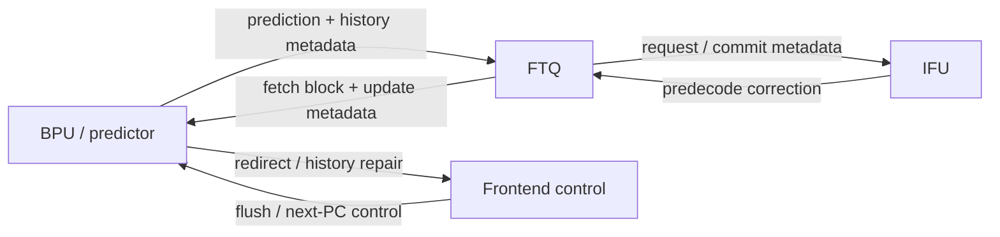
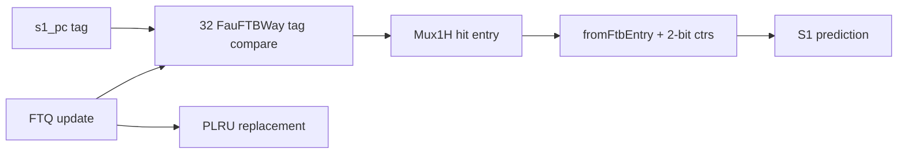
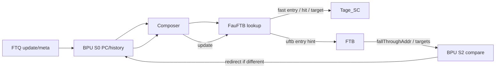

# Frontend FauFTB 分支预测器深入分析

<!-- regenerated-by-analyze-xiangshan-kunminghu -->
> Regenerated from `OpenXiangShan/XiangShan` branch `kunminghu-v2`, source commit `52262f303fc06daf84cdab7011d59b7df65ce7e8` using the updated Frontend graph/stage rules.


> 官方源码：`https://github.com/OpenXiangShan/XiangShan.git`；分支 `kunminghu-v2`；分析 commit `52262f303fc06daf84cdab7011d59b7df65ce7e8`。论文解释算法原理，源码决定香山的有效参数、流水、更新与恢复。

<!-- frontend-tutorial-generated-by-analyze-xiangshan-kunminghu -->
> 所有实现结论均限定在 `kunminghu-v2` commit `52262f303fc06daf84cdab7011d59b7df65ce7e8`；Design Doc 结论必须回到第 18 节的源码追溯矩阵。

## 1. Scope

本节保留模块职责、分析基线、范围和统一五问，明确本文只以当前源码证据为准。

### 1.1. 统一五问导读
> 用户写作 `FeuFTB`，官方源码模块名为 **`FauFTB`**，本文按真实类名分析。

| 问题 | 回答 |
| --- | --- |
| **Who** | `FauFTB` 是预测器链最前面的快速 fetch-target predictor，也常被称作 uFTB/fast FTB。 |
| **What** | 用较小、低延迟的表保存预测块入口、分支槽、target 和 fall-through，尽早给 S1 下一 PC。 |
| **How** | PC 索引并行匹配表项；命中后构造 `FullBranchPrediction`；提交 update 时命中修改、未命中分配，并处理写旁路/替换。 |
| **From what** | 查询来自 BPU S0 PC；训练来自 FTQ commit update；flush/redirect 来自 BPU 公共控制。 |
| **To what** | 输出先进入 TAGE_SC，并把快速表项/命中信息旁送给后级 FTB 复用和校验。 |

### 1.2. 分析范围
- Source: OpenXiangShan/XiangShan `kunminghu-v2`, commit `52262f303fc06daf84cdab7011d59b7df65ce7e8`.
- Relative source file: [src/main/scala/xiangshan/frontend/FauFTB.scala](https://github.com/OpenXiangShan/XiangShan/blob/kunminghu-v2/src/main/scala/xiangshan/frontend/FauFTB.scala).
- Effective instantiation: [Parameters.scala:126-143](https://github.com/OpenXiangShan/XiangShan/blob/kunminghu-v2/src/main/scala/xiangshan/Parameters.scala#L126-L143) instantiates `new FauFTB` as the first component in the default predictor chain.

## 2. 关键源码证据

本节直接列出 `FauFTB / uFTB` 的有效源码入口、关键代码骨架和行为解释，避免只保存文件名或行号。

### 2.1. 源码入口和行号
| 源码文件 | 本文使用它证明什么 | 行号证据 |
| --- | --- | --- |
| `frontend/FauFTB.scala` | 快速目标块预测、entry 命中、输出早级预测 | [frontend/FauFTB.scala#L76-L128](https://github.com/OpenXiangShan/XiangShan/blob/kunminghu-v2/src/main/scala/xiangshan/frontend/FauFTB.scala#L76-L128) |
| `frontend/Composer.scala` | FauFTB 位于有效预测器链首级 | [frontend/Composer.scala#L25-L31](https://github.com/OpenXiangShan/XiangShan/blob/kunminghu-v2/src/main/scala/xiangshan/frontend/Composer.scala#L25-L31) |
| `Parameters.scala` | `UbtbSize = 256` 等容量参数 | [Parameters.scala#L124-L143](https://github.com/OpenXiangShan/XiangShan/blob/kunminghu-v2/src/main/scala/xiangshan/Parameters.scala#L124-L143) |

### 2.2. 核心代码骨架
```scala
val idx = getIdx(s0_pc)
val entry = table.read(idx)
val hit = entry.valid && entry.tag === getTag(s0_pc)
io.out.full_pred := fromFauFtbEntry(entry, hit)
```

### 2.3. 代码解析
FauFTB 负责最早给出候选 fetch block、fall-through 和部分目标信息。它优先追求低延迟，允许后续 TAGE/FTB/ITTAGE/RAS 用更完整信息覆盖。
## 3. Theory-to-Code Mapping

本节把理论概念直接绑定到 `FauFTB / uFTB` 的源码对象、控制/数据状态和下游消费者。

### 3.1. 理论到代码映射表
| 理论概念 | 代码对象 | 为什么需要它 | 消费者/后续影响 |
| --- | --- | --- | --- |
| 快速 BTB/uBTB | index/tag/valid entry | 先给下一取指块，隐藏后续预测器延迟 | TAGE_SC 和 FTB |
| false hit 修复 | entry hit 与后续 FTB/IFU 纠错 | 快速表可能给错目标或类型 | BPU redirect、FTQ training |
| 容量别名 | `UbtbSize`、idx/tag | 同索引不同 tag 需要 miss 或替换 | 更新路径 |

### 3.2. 阅读顺序
先按第 2 节定位源码对象，再顺着本表检查信号从哪里来、状态在哪里保存、何时更新、谁消费结果。若本篇只引用相邻模块拥有的状态，则以相邻 Frontend 分文档的源码分析为准。
## 4. 论文原则和有效代码


### 4.1. 状态机与论文理论
FauFTB 主要是 S0 请求、S1 返回、update 三阶段隐式状态机。理论基础是分级 BTB/FTB：小表低延迟覆盖热点控制流，大表稍晚提供容量和准确率。XiangShan FTB 论文 *A design of fetch target buffer implemented on XiangShan processor*（DOI `10.1117/12.2642006`）解释了按 fetch block 保存多个分支信息为何有利于宽取指和时序；FauFTB 的具体组织以源码为准。

## 5. Microarchitecture Parameters


### 5.1. 表容量、冲突与边界
- FauFTB 是有限表，容量压力表现为 replacement/alias，而不是 FIFO overflow；新 entry 只能覆盖替换策略选择的 way。
- update 与 lookup 冲突时使用 ready/valid 或写旁路保证不读取半更新 entry。
- 多命中/错误 entry 不允许静默强化：后级比较和提交 update 会修复；miss 时输出 fall-through，不存在 underflow 读取。

```waveform-draw
{
  "signal": [
    {
      "name": "clk",
      "wave": "p......"
    },
    {
      "name": "s0_valid",
      "wave": "01..0.."
    },
    {
      "name": "s0_pc",
      "wave": "x=..x..",
      "data": [
        "pc0"
      ]
    },
    {
      "name": "s1_hit",
      "wave": "0.10..."
    },
    {
      "name": "s1_target",
      "wave": "x..=x..",
      "data": [
        "target0"
      ]
    },
    {
      "name": "update.valid",
      "wave": "0....10"
    },
    {
      "name": "redirect",
      "wave": "0......"
    }
  ],
  "config": {
    "hscale": 1
  }
}
```

## 6. 模块边界和接口


### 6.1. Role
`FauFTB` is the fast/uBTB-style target predictor. It produces an S1 prediction from a 32-way register-file-like structure, then passes its hit entry into `FTB` so FTB can close its SRAM read path when FauFTB and FTB stay consistent.

### 6.2. 控制信号逐项解释：Who / From / To / How / Why
> 下表覆盖本文讲解中出现的查询、流水推进、选择、训练、替换和恢复控制。`为什么存在` 不以信号命名猜测，而以当前 `kunminghu-v2` 数据依赖、资源限制和恢复要求为依据。

| 控制信号 / 状态 | 谁产生 / 从哪里来 | 谁消费 / 到哪里去 | 何时、如何生效 | 为什么存在；缺失会怎样 | 代码证据 |
| --- | --- | --- | --- | --- | --- |
| `io.in.valid / s0_fire` | BPU 公共请求 | FauFTB S1 查询 | 接受 PC 后并行比较全部 way。 | uFTB 位于最早级，必须明确哪一拍请求真实进入，避免全相联比较结果跨请求。 | [frontend/FauFTB.scala:76-117](https://github.com/OpenXiangShan/XiangShan/blob/kunminghu-v2/src/main/scala/xiangshan/frontend/FauFTB.scala#L76-L117) |
| `s1_hit_oh` | 各 way tag/valid 比较 | Mux1H 与命中检测 | one-hot 指出匹配的预测 entry。 | 并行查找需要保留具体 way，才能选择正确 FTB entry、方向 counter 和后续训练位置。 | [frontend/FauFTB.scala:92-117](https://github.com/OpenXiangShan/XiangShan/blob/kunminghu-v2/src/main/scala/xiangshan/frontend/FauFTB.scala#L92-L117) |
| `s1_hit` | s1_hit_oh.orR | 快速预测有效控制 | 决定是否用 uFTB entry 覆盖默认顺序流。 | entry 数据本身即使有位模式也不代表有效；hit 把“有匹配”与“未命中”明确分开。 | [frontend/FauFTB.scala:92-128](https://github.com/OpenXiangShan/XiangShan/blob/kunminghu-v2/src/main/scala/xiangshan/frontend/FauFTB.scala#L92-L128) |
| `ctrs(w)(br)(1)` | 每 way/分支槽 2-bit counter | br_taken_mask | 最高位形成快速方向。 | FTB entry 只描述控制流位置/目标，还需要独立方向状态决定条件分支是否 taken。 | [frontend/FauFTB.scala:86-108](https://github.com/OpenXiangShan/XiangShan/blob/kunminghu-v2/src/main/scala/xiangshan/frontend/FauFTB.scala#L86-L108) |
| `io.update.valid` | FTQ 提交更新 | 命中重写、分配和 counter 训练 | 仅真实更新触发表写。 | 避免错误路径和无关提交修改早期预测器；同时将慢速真实信息回灌到最快一级。 | [frontend/FauFTB.scala:139-205](https://github.com/OpenXiangShan/XiangShan/blob/kunminghu-v2/src/main/scala/xiangshan/frontend/FauFTB.scala#L139-L205) |
| `update_hit` | update PC 与现有 way 比较 | 写 way 选择 | 命中时原地更新，未命中时走替换。 | 已有 entry 应保持身份和替换年龄；不区分 hit 会造成重复 entry 或无谓驱逐。 | [frontend/FauFTB.scala:139-180](https://github.com/OpenXiangShan/XiangShan/blob/kunminghu-v2/src/main/scala/xiangshan/frontend/FauFTB.scala#L139-L180) |
| `update_way` | 命中 way 或 PLRU victim | 各 way.write_valid | 唯一选择本拍写入目标。 | 表只有有限 way，必须把 hit-update 与 miss-allocation 统一成 one-hot 写控制，防止多 way 同写。 | [frontend/FauFTB.scala:162-205](https://github.com/OpenXiangShan/XiangShan/blob/kunminghu-v2/src/main/scala/xiangshan/frontend/FauFTB.scala#L162-L205) |
| `write_valid` | update_way 与 update.valid | FauFTBWay 数据/tag/valid | 被选 way 才更新 entry。 | 每个 way 独立存储；显式写使能隔离未选项，避免广播数据污染整个表。 | [frontend/FauFTB.scala:43-74](https://github.com/OpenXiangShan/XiangShan/blob/kunminghu-v2/src/main/scala/xiangshan/frontend/FauFTB.scala#L43-L74) |
| `meta.hit / meta.pred_way` | 预测阶段 | FTQ 与训练阶段 | 记录原预测是否命中以及命中 way。 | 提交时表内容可能已变化；保存原 way 才能判断原预测质量并进行一致更新。 | [frontend/FauFTB.scala:78-84](https://github.com/OpenXiangShan/XiangShan/blob/kunminghu-v2/src/main/scala/xiangshan/frontend/FauFTB.scala#L78-L84) |

#### 6.2.1. Top-Level Module Connectivity

This module participates in the predictor chain, but the top-level graph keeps only bundled interfaces. `Frontend.scala` instantiates BPU, FTQ, IFU, IBuffer, ICache, and InstrUncache, while the predictor-specific chain is configured through Composer: [frontend/Frontend.scala:103-109](https://github.com/OpenXiangShan/XiangShan/blob/52262f303fc06daf84cdab7011d59b7df65ce7e8/src/main/scala/xiangshan/frontend/Frontend.scala#L103-L109), [frontend/Composer.scala:22-77](https://github.com/OpenXiangShan/XiangShan/blob/52262f303fc06daf84cdab7011d59b7df65ce7e8/src/main/scala/xiangshan/frontend/Composer.scala#L22-L77).



No module pair has more than three bundled edges. Individual table reads, counters, folded histories, and predictor-local states remain in the module's detailed sections instead of becoming separate graph lines.

#### 6.2.2. Frontend/Backend Pipeline Stages

The source-proven stage boundary is `F0 -> F1 -> F2 -> F3`: F0 accepts the FTQ request and calculates line indices, F1 registers the fetch block and calculates instruction PCs/cut pointers, F2 waits for ICache responses and performs data cutting/predecode preparation, and F3 expands/qualifies instructions, handles exceptions/MMIO, and drives IBuffer. Evidence: [frontend/IFU.scala:236-305](https://github.com/OpenXiangShan/XiangShan/blob/52262f303fc06daf84cdab7011d59b7df65ce7e8/src/main/scala/xiangshan/frontend/IFU.scala#L236-L305), [frontend/IFU.scala:346-457](https://github.com/OpenXiangShan/XiangShan/blob/52262f303fc06daf84cdab7011d59b7df65ce7e8/src/main/scala/xiangshan/frontend/IFU.scala#L346-L457), [frontend/IFU.scala:542-617](https://github.com/OpenXiangShan/XiangShan/blob/52262f303fc06daf84cdab7011d59b7df65ce7e8/src/main/scala/xiangshan/frontend/IFU.scala#L542-L617). The top-level connections couple FTQ, IFU, ICache, and IBuffer through shared ready/valid conditions: [frontend/Frontend.scala:199-231](https://github.com/OpenXiangShan/XiangShan/blob/52262f303fc06daf84cdab7011d59b7df65ce7e8/src/main/scala/xiangshan/frontend/Frontend.scala#L199-L231).

The backend continuation uses the effective module boundaries rather than inventing cycle names: Decode accepts the instruction packet, Rename creates speculative physical-register mappings, Dispatch allocates downstream resources, Issue/Scheduler selects ready uops, Execute/FU produces results, DataPath/WB carries writeback and wakeup, and ROB/CtrlBlock commits or redirects. Evidence: [backend/decode/DecodeStage.scala:83-120](https://github.com/OpenXiangShan/XiangShan/blob/52262f303fc06daf84cdab7011d59b7df65ce7e8/src/main/scala/xiangshan/backend/decode/DecodeStage.scala#L83-L120), [backend/rename/Rename.scala:40-117](https://github.com/OpenXiangShan/XiangShan/blob/52262f303fc06daf84cdab7011d59b7df65ce7e8/src/main/scala/xiangshan/backend/rename/Rename.scala#L40-L117), [backend/dispatch/NewDispatch.scala:49-176](https://github.com/OpenXiangShan/XiangShan/blob/52262f303fc06daf84cdab7011d59b7df65ce7e8/src/main/scala/xiangshan/backend/dispatch/NewDispatch.scala#L49-L176), [backend/issue/Scheduler.scala:29-180](https://github.com/OpenXiangShan/XiangShan/blob/52262f303fc06daf84cdab7011d59b7df65ce7e8/src/main/scala/xiangshan/backend/issue/Scheduler.scala#L29-L180), [backend/exu/ExeUnit.scala:50-110](https://github.com/OpenXiangShan/XiangShan/blob/52262f303fc06daf84cdab7011d59b7df65ce7e8/src/main/scala/xiangshan/backend/exu/ExeUnit.scala#L50-L110), [backend/datapath/DataPath.scala:25-70](https://github.com/OpenXiangShan/XiangShan/blob/52262f303fc06daf84cdab7011d59b7df65ce7e8/src/main/scala/xiangshan/backend/datapath/DataPath.scala#L25-L70), [backend/rob/Rob.scala:52-145](https://github.com/OpenXiangShan/XiangShan/blob/52262f303fc06daf84cdab7011d59b7df65ce7e8/src/main/scala/xiangshan/backend/rob/Rob.scala#L52-L145), [backend/CtrlBlock.scala:50-110](https://github.com/OpenXiangShan/XiangShan/blob/52262f303fc06daf84cdab7011d59b7df65ce7e8/src/main/scala/xiangshan/backend/CtrlBlock.scala#L50-L110).

```mermaid
flowchart LR
  F0["F0: FTQ req + line indices"] -->|f0_fire| F1["F1: PC + cut pointers"]
  F1 -->|f1_fire| F2["F2: ICache data + exceptions"]
  F2 -->|f2_fire| F3["F3: predecode + MMIO qualification"]
  F3 -->|toIbuffer.fire| Decode["Decode"]
  Decode -->|uop bundle| Rename["Rename"]
  Rename -->|renamed uop| Dispatch["Dispatch"]
  Dispatch -->|ready uop| Issue["Issue"]
  Issue -->|operands| Execute["Execute/FU"]
  Execute -->|result| Writeback["Writeback/Wakeup"]
  Writeback -->|retire candidate| Commit["ROB/Commit"]
  Commit -->|redirect/flush| F0
```



The stage graph keeps chronological forward edges separate from the bundled recovery edge. It must be read together with the module graph below: a stage is not itself a module, and a redirect does not create a fake forward stage.

```waveform-draw
{
  "signal": [
    {
      "name": "clk",
      "wave": "p......."
    },
    {
      "name": "F0.valid",
      "wave": "01...0.."
    },
    {
      "name": "F0.ready",
      "wave": "1..0...."
    },
    {
      "name": "F1.valid",
      "wave": "001..0.."
    },
    {
      "name": "F2.valid",
      "wave": "0001.0.."
    },
    {
      "name": "F3.valid",
      "wave": "00001.0."
    },
    {
      "name": "toIbuffer.fire",
      "wave": "0000010."
    },
    {
      "name": "redirect/flush",
      "wave": "00000010"
    }
  ],
  "config": {
    "hscale": 1
  }
}
```

## 7. 为什么模块存在


### 7.1. Why It Exists
FauFTB gives a fast S1 target/direction guess before the larger FTB SRAM path completes. `FTB` consumes `io.fauftb_entry_in` and can close its own read path after a consistency threshold ([FTB.scala:663-741](https://github.com/OpenXiangShan/XiangShan/blob/kunminghu-v2/src/main/scala/xiangshan/frontend/FTB.scala#L663-L741)), reducing pressure and energy on the main FTB.

## 8. 有效动态路径


### 8.1. Index, Search, and Update
Lookup does not use a set index. Every way compares `getTag(s1_pc_dup(0))`, where `getTag(pc)=pc(tagSize + instOffsetBits - 1, instOffsetBits)` ([FauFTB.scala:38](https://github.com/OpenXiangShan/XiangShan/blob/kunminghu-v2/src/main/scala/xiangshan/frontend/FauFTB.scala#L38), [FauFTB.scala:92-98](https://github.com/OpenXiangShan/XiangShan/blob/kunminghu-v2/src/main/scala/xiangshan/frontend/FauFTB.scala#L92-L98)). The one-hot hit vector selects both the FTB entry and the decoded `FullBranchPrediction` ([FauFTB.scala:99-117](https://github.com/OpenXiangShan/XiangShan/blob/kunminghu-v2/src/main/scala/xiangshan/frontend/FauFTB.scala#L99-L117)). Multiple hits are illegal and trigger `XSError` ([FauFTB.scala:112](https://github.com/OpenXiangShan/XiangShan/blob/kunminghu-v2/src/main/scala/xiangshan/frontend/FauFTB.scala#L112)).

Update is two-stage. S0 captures update valid, PC, metadata, and compares all ways by update tag ([FauFTB.scala:143-160](https://github.com/OpenXiangShan/XiangShan/blob/kunminghu-v2/src/main/scala/xiangshan/frontend/FauFTB.scala#L143-L160)). S1 chooses the hit way if present, otherwise PLRU allocation ([FauFTB.scala:162-170](https://github.com/OpenXiangShan/XiangShan/blob/kunminghu-v2/src/main/scala/xiangshan/frontend/FauFTB.scala#L162-L170)), writes the entry/tag ([FauFTB.scala:171-175](https://github.com/OpenXiangShan/XiangShan/blob/kunminghu-v2/src/main/scala/xiangshan/frontend/FauFTB.scala#L171-L175)), and updates the per-branch counters only for real branch slots that are not strong-bias entries ([FauFTB.scala:156-160](https://github.com/OpenXiangShan/XiangShan/blob/kunminghu-v2/src/main/scala/xiangshan/frontend/FauFTB.scala#L156-L160), [FauFTB.scala:187-198](https://github.com/OpenXiangShan/XiangShan/blob/kunminghu-v2/src/main/scala/xiangshan/frontend/FauFTB.scala#L187-L198)).

## 9. Index 和地址/历史计算


地址、PC、折叠历史、tag、set/way、line offset 和 FTQ offset 都必须追到源码表达式；索引冲突、回绕和跨边界情况在算法和验证章节中继续展开。

## 10. 核心算法


### 10.1. 算法示例推演
Example input: S1 PC is `0x8000_1234`; `instOffsetBits=1`, so `getTag(pc)` uses bits `[16:1]` for the 16-bit tag ([FauFTB.scala:26-39](https://github.com/OpenXiangShan/XiangShan/blob/kunminghu-v2/src/main/scala/xiangshan/frontend/FauFTB.scala#L26-L39)). Assume way 7 has `valid=true`, matching tag, an FTB entry whose first branch slot targets `0x8000_1200`, and its branch counter is `2'b10`.

1. Lookup: every way compares `tag === req_tag && valid` ([FauFTB.scala:56-64](https://github.com/OpenXiangShan/XiangShan/blob/kunminghu-v2/src/main/scala/xiangshan/frontend/FauFTB.scala#L56-L64), [FauFTB.scala:92-99](https://github.com/OpenXiangShan/XiangShan/blob/kunminghu-v2/src/main/scala/xiangshan/frontend/FauFTB.scala#L92-L99)). Only way 7 hits, so `s1_hit_oh=1<<7`, `s1_hit=true`, and `s1_hit_way=7`.
2. Prediction construction: [FauFTB.scala:99-108](https://github.com/OpenXiangShan/XiangShan/blob/kunminghu-v2/src/main/scala/xiangshan/frontend/FauFTB.scala#L99-L108) calls `fromFtbEntry` for every way, then sets `br_taken_mask(i) := c(i)(1) || e.strong_bias(i)`. With counter `2'b10`, MSB is [FauFTB.scala:1](https://github.com/OpenXiangShan/XiangShan/blob/kunminghu-v2/src/main/scala/xiangshan/frontend/FauFTB.scala#L1), so the example predicts taken for that slot.
3. Output: [FauFTB.scala:110-117](https://github.com/OpenXiangShan/XiangShan/blob/kunminghu-v2/src/main/scala/xiangshan/frontend/FauFTB.scala#L110-L117) selects way 7 with `Mux1H`, writes `io.out.s1.full_pred`, and forwards the same entry through `io.fauftb_entry_out` for FTB consistency checking.
4. Update hit: suppose FTQ update later says the branch was not taken. [FauFTB.scala:151-170](https://github.com/OpenXiangShan/XiangShan/blob/kunminghu-v2/src/main/scala/xiangshan/frontend/FauFTB.scala#L151-L170) finds way 7 by update tag and chooses that way instead of PLRU. [FauFTB.scala:187-198](https://github.com/OpenXiangShan/XiangShan/blob/kunminghu-v2/src/main/scala/xiangshan/frontend/FauFTB.scala#L187-L198) applies `satUpdate(2'b10, 2, taken=false)`, producing `2'b01`.
5. Update miss: if no way matches the update tag, [FauFTB.scala:167-170](https://github.com/OpenXiangShan/XiangShan/blob/kunminghu-v2/src/main/scala/xiangshan/frontend/FauFTB.scala#L167-L170) chooses `replacer.way`, writes the new FTB entry, and initializes future behavior through subsequent counter training.

Downstream effect: before update, `full_pred.br_taken_mask` is true in S1; after one not-taken training update, the same branch becomes weak-not-taken in FauFTB, while the main FTB/TAGE stages may still override it in S2/S3.

### 10.2. 逐流水级算法
| Stage | Inputs | Algorithm and state | Ready/stall | Output | Source lines |
| --- | --- | --- | --- | --- | --- |
| S1 lookup | `s1_pc_dup(0)`, `ctrl.ubtb_enable` | All 32 ways compare `getTag(s1_pc)` against registered way tags; each way has `data/tag/valid`. | Inherits base predictor readiness; no SRAM read stall because ways are registers. | `s1_hit`, `s1_hit_way`, selected `FauFTBEntry`, S1 `full_pred`. | [FauFTB.scala:43-74](https://github.com/OpenXiangShan/XiangShan/blob/kunminghu-v2/src/main/scala/xiangshan/frontend/FauFTB.scala#L43-L74), [FauFTB.scala:92-117](https://github.com/OpenXiangShan/XiangShan/blob/kunminghu-v2/src/main/scala/xiangshan/frontend/FauFTB.scala#L92-L117) |
| S1 direction | selected entry and per-way counters | `fromFtbEntry` builds target metadata; each branch direction uses counter MSB or `strong_bias`. | Multiple hits assert error rather than arbitrate. | `br_taken_mask`, `fauftb_entry_out`, `fauftb_entry_hit_out`. | [FauFTB.scala:99-117](https://github.com/OpenXiangShan/XiangShan/blob/kunminghu-v2/src/main/scala/xiangshan/frontend/FauFTB.scala#L99-L117) |
| S2/S3 metadata | S1 hit and hit way | Hit and pred-way are double-registered for update metadata. | None local. | `last_stage_meta` for FTQ update. | [FauFTB.scala:127-132](https://github.com/OpenXiangShan/XiangShan/blob/kunminghu-v2/src/main/scala/xiangshan/frontend/FauFTB.scala#L127-L132) |
| Update S0 | FTQ update PC and metadata | Register update, compute update tag, compare all way tags including write bypass hit. | No read port stall. | `u_s0_hit_oh`, `u_s0_br_update_valids`. | [FauFTB.scala:143-160](https://github.com/OpenXiangShan/XiangShan/blob/kunminghu-v2/src/main/scala/xiangshan/frontend/FauFTB.scala#L143-L160) |
| Update S1 | hit/miss result | Hit rewrites hit way; miss chooses PLRU allocation; writes entry/tag and trains counters. | PLRU touched by prediction and update. | Updated way entry, tag, counter, PLRU state. | [FauFTB.scala:162-205](https://github.com/OpenXiangShan/XiangShan/blob/kunminghu-v2/src/main/scala/xiangshan/frontend/FauFTB.scala#L162-L205) |

## 11. 状态和存储结构


把每个表、栈、FIFO、MSHR、uncache entry 和 pipeline register 记录为 `valid/full/empty/ready` 可观察状态，并说明谁写入、谁读取、何时清空以及满/空时谁被反压。

## 12. Pipeline stage 分析


阶段说明只使用源码中的寄存器、valid/ready 和 fire 条件；对 Frontend 使用 F0/F1/F2/F3，对 Backend 使用实际 Decode/Rename/Dispatch/Issue/Execute/Writeback/ROB 边界。

## 13. Control path rationale


### 13.1. Redirect 信号生成
FauFTB does not directly assert BPU redirect. It influences redirect by producing an early S1 prediction that later stages may override.

| Redirect-like effect | Condition | Stage | Downstream effect | Source lines |
| --- | --- | --- | --- | --- |
| S2 override caused by later predictor | FauFTB S1 target/direction differs from FTB/TAGE S2 result. | BPU S2 | `s2_redirect_dup` redirects to richer target/history. | [FauFTB.scala:114-117](https://github.com/OpenXiangShan/XiangShan/blob/kunminghu-v2/src/main/scala/xiangshan/frontend/FauFTB.scala#L114-L117), [frontend/BPU.scala:606-705](https://github.com/OpenXiangShan/XiangShan/blob/kunminghu-v2/src/main/scala/xiangshan/frontend/BPU.scala#L606-L705) |
| FTB close/reopen interaction | FauFTB entry is forwarded to FTB; FTB may close main FTB reads when consistent, or reopen on false hit/IFU redirect. | FTB S1/S2/update | Can change whether later FTB SRAM result exists, affecting override opportunities. | [FauFTB.scala:116-117](https://github.com/OpenXiangShan/XiangShan/blob/kunminghu-v2/src/main/scala/xiangshan/frontend/FauFTB.scala#L116-L117), [FTB.scala:724-761](https://github.com/OpenXiangShan/XiangShan/blob/kunminghu-v2/src/main/scala/xiangshan/frontend/FTB.scala#L724-L761) |
| Multiple FauFTB hits | `PopCount(s1_hit_oh) > 1`. | S1 | Assertion; no redirect repair path. | [FauFTB.scala:110-112](https://github.com/OpenXiangShan/XiangShan/blob/kunminghu-v2/src/main/scala/xiangshan/frontend/FauFTB.scala#L110-L112) |

Example: FauFTB predicts taken from counter `2'b10`, but TAGE later changes `br_taken_mask` to not-taken. BPU's S2 comparison sees `takenDiff` and generates `s2_redirect_dup` through [frontend/BPU.scala:620-635](https://github.com/OpenXiangShan/XiangShan/blob/kunminghu-v2/src/main/scala/xiangshan/frontend/BPU.scala#L620-L635) and [frontend/BPU.scala:698-705](https://github.com/OpenXiangShan/XiangShan/blob/kunminghu-v2/src/main/scala/xiangshan/frontend/BPU.scala#L698-L705).

## 14. Data path 与跨边界


### 14.1. 跨边界代码解析
本预测器只产生预测元数据，不直接把跨页、跨 Cache Line 或 MMIO 访问当成一个原子内存事务。对一个取指块跨边界的场景，先由预测链生成块起始 PC、taken mask、target 和 fall-through，再由 IFU/ICache 对每个地址片段分别完成翻译、权限和内存类型判断。BPU 在 S1/S2/S3 比较预测差异并生成 redirect 的规则见 [frontend/BPU.scala:606-635](https://github.com/OpenXiangShan/XiangShan/blob/kunminghu-v2/src/main/scala/xiangshan/frontend/BPU.scala#L606-L635) 和 [frontend/BPU.scala:827-854](https://github.com/OpenXiangShan/XiangShan/blob/kunminghu-v2/src/main/scala/xiangshan/frontend/BPU.scala#L827-L854)；因此第二片段发生 page fault、line miss 或 MMIO 分类变化时，恢复对象是预测历史和 FTQ 上下文，而不是把两片段静默拼接。

最小实例是块尾部剩余半条 32-bit 指令：第一片段可能在当前 Cache Line/页命中，第二片段需要下一 Line 或下一页的独立请求；IFU 保存 `lastHalf`，跨周期合并并在 flush 时清除，[frontend/IFU.scala:915-943](https://github.com/OpenXiangShan/XiangShan/blob/kunminghu-v2/src/main/scala/xiangshan/frontend/IFU.scala#L915-L943)。若第二页或第二 Line 的结果改变 CFI 位置、target 或 fall-through，BPU 的 redirect 比较优先于继续使用旧预测。对 MMIO/uncache 地址，预测器只能提供候选 PC，实际访问必须转入 IFU 的 MMIO FSM，等待翻译、PMP/PMA 和提交约束，不能由预测命中绕过副作用控制。

**边界检查表**

| 边界 | 第一片段 | 第二片段 | 失败/恢复 |
| --- | --- | --- | --- |
| 虚拟页 | 当前页的预测块与历史 | 下一页的独立翻译和权限结果 | page/access/guest fault、flush、重定向 |
| Cache Line | 当前 line 的 tag/数据命中 | 下一 line 的 miss/refill 或独立响应 | target/CFI 不一致时 redirect |
| MMIO/uncache | 预测 PC 与元数据 | IFU/uncache 请求、响应和提交门控 | resend、异常、commit wait 或 cancel |

## 15. 异常、debug、privilege


区分预测错误、replay、page/access/guest fault、MMIO side effect、debug redirect 和架构异常；说明异常产生者、优先级、清理对象、恢复入口和提交可见性。

## 16. CSR 控制


前端分支预测器的使能控制来自 CSR 模块生成的 `CustomCSRCtrlIO.bp_ctrl`，不是各预测器本地私有 CSR。有效链路是：`sbpctl` CSR 字段 -> `io.status.custom.bp_ctrl` -> Backend `frontendCsrCtrl` -> XSCore `frontend.io.csrCtrl` -> Frontend `bpu.io.ctrl` -> BPU 内各子预测器 `io.enable`。

### 16.1. CSR 字段到 BPU 控制信号
| 控制位 | CSR 源字段 | Frontend/BPU 消费者 | 有效作用 | 源码证据 |
| --- | --- | --- | --- | --- |
| `bp_ctrl.ubtbEnable` | `sbpctl.regOut.UBTB_ENABLE` | `ubtb.io.enable` | 允许或关闭 S1 fast uBTB/MicroBtb 查询结果参与预测链；关闭后仍保留 fall-through 基线。 | [NewCSR.scala:1378](https://github.com/OpenXiangShan/XiangShan/blob/kunminghu-v2/src/main/scala/xiangshan/backend/fu/NewCSR/NewCSR.scala#L1378), [Bpu.scala:96](https://github.com/OpenXiangShan/XiangShan/blob/kunminghu-v2/src/main/scala/xiangshan/frontend/bpu/Bpu.scala#L96), [Bpu.scala:105](https://github.com/OpenXiangShan/XiangShan/blob/kunminghu-v2/src/main/scala/xiangshan/frontend/bpu/Bpu.scala#L105) |
| `bp_ctrl.abtbEnable` | `sbpctl.regOut.ABTB_ENABLE` | `abtb.io.enable` | 控制 AheadBtb 目标/属性预测是否参与早期预测。 | [NewCSR.scala:1379](https://github.com/OpenXiangShan/XiangShan/blob/kunminghu-v2/src/main/scala/xiangshan/backend/fu/NewCSR/NewCSR.scala#L1379), [Bpu.scala:97](https://github.com/OpenXiangShan/XiangShan/blob/kunminghu-v2/src/main/scala/xiangshan/frontend/bpu/Bpu.scala#L97), [Bpu.scala:106](https://github.com/OpenXiangShan/XiangShan/blob/kunminghu-v2/src/main/scala/xiangshan/frontend/bpu/Bpu.scala#L106) |
| `bp_ctrl.mbtbEnable` | `sbpctl.regOut.MBTB_ENABLE` | `mbtb.io.enable` | 控制 MainBtb 是否提供主 BTB 命中、直接分支/JAL target 和 fall-through 信息。 | [NewCSR.scala:1380](https://github.com/OpenXiangShan/XiangShan/blob/kunminghu-v2/src/main/scala/xiangshan/backend/fu/NewCSR/NewCSR.scala#L1380), [Bpu.scala:98](https://github.com/OpenXiangShan/XiangShan/blob/kunminghu-v2/src/main/scala/xiangshan/frontend/bpu/Bpu.scala#L98), [Bpu.scala:107](https://github.com/OpenXiangShan/XiangShan/blob/kunminghu-v2/src/main/scala/xiangshan/frontend/bpu/Bpu.scala#L107) |
| `bp_ctrl.tageEnable` | `sbpctl.regOut.TAGE_ENABLE` | `tage.io.enable` | 控制 TAGE 条件分支方向预测是否有效；关闭时不能把 TAGE provider 结果作为方向覆盖依据。 | [NewCSR.scala:1381](https://github.com/OpenXiangShan/XiangShan/blob/kunminghu-v2/src/main/scala/xiangshan/backend/fu/NewCSR/NewCSR.scala#L1381), [Bpu.scala:99](https://github.com/OpenXiangShan/XiangShan/blob/kunminghu-v2/src/main/scala/xiangshan/frontend/bpu/Bpu.scala#L99), [Bpu.scala:108](https://github.com/OpenXiangShan/XiangShan/blob/kunminghu-v2/src/main/scala/xiangshan/frontend/bpu/Bpu.scala#L108) |
| `bp_ctrl.scEnable` | `sbpctl.regOut.SC_ENABLE` | `sc.io.enable` | 控制 statistical corrector 是否修正 TAGE/基础方向结果。 | [NewCSR.scala:1382](https://github.com/OpenXiangShan/XiangShan/blob/kunminghu-v2/src/main/scala/xiangshan/backend/fu/NewCSR/NewCSR.scala#L1382), [Bpu.scala:100](https://github.com/OpenXiangShan/XiangShan/blob/kunminghu-v2/src/main/scala/xiangshan/frontend/bpu/Bpu.scala#L100), [Bpu.scala:109](https://github.com/OpenXiangShan/XiangShan/blob/kunminghu-v2/src/main/scala/xiangshan/frontend/bpu/Bpu.scala#L109) |
| `bp_ctrl.ittageEnable` | `sbpctl.regOut.ITTAGE_ENABLE` | `ittage.io.enable` | 控制间接跳转/JALR target 覆盖预测是否有效。 | [NewCSR.scala:1383](https://github.com/OpenXiangShan/XiangShan/blob/kunminghu-v2/src/main/scala/xiangshan/backend/fu/NewCSR/NewCSR.scala#L1383), [Bpu.scala:101](https://github.com/OpenXiangShan/XiangShan/blob/kunminghu-v2/src/main/scala/xiangshan/frontend/bpu/Bpu.scala#L101), [Bpu.scala:110](https://github.com/OpenXiangShan/XiangShan/blob/kunminghu-v2/src/main/scala/xiangshan/frontend/bpu/Bpu.scala#L110) |
| `bp_ctrl.rasEnable` | `sbpctl.regOut.RAS_ENABLE` | `ras.io.enable` | 控制 return address stack 是否给 RET/JALR 返回目标提供覆盖。 | [NewCSR.scala:1384](https://github.com/OpenXiangShan/XiangShan/blob/kunminghu-v2/src/main/scala/xiangshan/backend/fu/NewCSR/NewCSR.scala#L1384), [Bpu.scala:102](https://github.com/OpenXiangShan/XiangShan/blob/kunminghu-v2/src/main/scala/xiangshan/frontend/bpu/Bpu.scala#L102), [Bpu.scala:111](https://github.com/OpenXiangShan/XiangShan/blob/kunminghu-v2/src/main/scala/xiangshan/frontend/bpu/Bpu.scala#L111) |

### 16.2. 有效代码骨架
```scala
// backend/fu/NewCSR/NewCSR.scala
io.status.custom.bp_ctrl.ubtbEnable   := sbpctl.regOut.UBTB_ENABLE.asBool
io.status.custom.bp_ctrl.abtbEnable   := sbpctl.regOut.ABTB_ENABLE.asBool
io.status.custom.bp_ctrl.mbtbEnable   := sbpctl.regOut.MBTB_ENABLE.asBool
io.status.custom.bp_ctrl.tageEnable   := sbpctl.regOut.TAGE_ENABLE.asBool
io.status.custom.bp_ctrl.scEnable     := sbpctl.regOut.SC_ENABLE.asBool
io.status.custom.bp_ctrl.ittageEnable := sbpctl.regOut.ITTAGE_ENABLE.asBool
io.status.custom.bp_ctrl.rasEnable    := sbpctl.regOut.RAS_ENABLE.asBool

// frontend/Frontend.scala
private val csrCtrl = DelayN(io.csrCtrl, CsrCtrlPortDelay)
bpu.io.ctrl := csrCtrl.bp_ctrl

// frontend/bpu/Bpu.scala
private val ctrl = DelayN(io.ctrl, 2)
fallThrough.io.enable := true.B
utage.io.enable       := true.B
uras.io.enable        := true.B
ubtb.io.enable        := ctrl.ubtbEnable
abtb.io.enable        := ctrl.abtbEnable
mbtb.io.enable        := ctrl.mbtbEnable
tage.io.enable        := ctrl.tageEnable
sc.io.enable          := ctrl.scEnable
ittage.io.enable      := ctrl.ittageEnable
ras.io.enable         := ctrl.rasEnable
```

### 16.3. 代码解析
`BpuCtrl` bundle 明确定义了 `ubtbEnable`、`abtbEnable`、`mbtbEnable`、`tageEnable`、`scEnable`、`ittageEnable`、`rasEnable` 七个 Bool 控制位：[Bundles.scala:179-189](https://github.com/OpenXiangShan/XiangShan/blob/kunminghu-v2/src/main/scala/xiangshan/frontend/bpu/Bundles.scala#L179-L189)。`CustomCSRCtrlIO` 将 `bp_ctrl` 作为 CSR 输出的一部分：[Bundle.scala:586-596](https://github.com/OpenXiangShan/XiangShan/blob/kunminghu-v2/src/main/scala/xiangshan/Bundle.scala#L586-L596)。Backend 把 `csrio.customCtrl` 暴露为 `frontendCsrCtrl`，XSCore 再连到 Frontend：[Backend.scala:526-527](https://github.com/OpenXiangShan/XiangShan/blob/kunminghu-v2/src/main/scala/xiangshan/backend/Backend.scala#L526-L527), [XSCore.scala:138](https://github.com/OpenXiangShan/XiangShan/blob/kunminghu-v2/src/main/scala/xiangshan/XSCore.scala#L138)。Frontend 先用 `CsrCtrlPortDelay` 延迟 CSR 控制，再把 `csrCtrl.bp_ctrl` 送进 BPU：[Frontend.scala:143-153](https://github.com/OpenXiangShan/XiangShan/blob/kunminghu-v2/src/main/scala/xiangshan/frontend/Frontend.scala#L143-L153)。BPU 内部再延迟 2 拍以满足时序，随后分发给各子预测器：[Bpu.scala:89-111](https://github.com/OpenXiangShan/XiangShan/blob/kunminghu-v2/src/main/scala/xiangshan/frontend/bpu/Bpu.scala#L89-L111)。

需要注意两点：第一，`fallThrough` 基线预测器始终 `enable := true.B`，`MicroTage` 和 `MicroRas` 当前也固定使能，源码中 `utageEnable` 仍是注释项，不应写成已由 CSR 控制；第二，在 `EnableConstantin && !FPGAPlatform` 配置下，`constCtrl` 可覆盖 CSR 位，否则直接使用 CSR 位，因此验证时要同时覆盖 Constantin override 和普通 CSR 控制两条路径。

## 17. Diagrams


### 17.1. 结构图


## 18. 有效行为和 Design Doc 差异


### 18.1. Design Doc to Source Traceability
| Design Doc location | Atomic claim | XiangShan source evidence | Relationship | Status | Discrepancy |
| --- | --- | --- | --- | --- | --- |
| [docs/en/frontend/BPU/mbtb.md:1](https://github.com/OpenXiangShan/XiangShan-Design-Doc/blob/f8e258dc2d9c02c0616764856e1d18feedb91b81/docs/en/frontend/BPU/mbtb.md#L1) | FTB/auxiliary target structures provide target metadata | [frontend/FauFTB.scala:73-142](https://github.com/OpenXiangShan/XiangShan/blob/52262f303fc06daf84cdab7011d59b7df65ce7e8/src/main/scala/xiangshan/frontend/FauFTB.scala#L73-L142) | lookup response and target metadata generation | **Partially verified** | Exact FauFTB terminology is not a separate Design Doc page. |
| [docs/en/frontend/BPU/index.md:38](https://github.com/OpenXiangShan/XiangShan-Design-Doc/blob/f8e258dc2d9c02c0616764856e1d18feedb91b81/docs/en/frontend/BPU/index.md#L38) | 预测结果进入 FTQ 并可在后级被覆盖 | [frontend/BPU.scala:381-455](https://github.com/OpenXiangShan/XiangShan/blob/52262f303fc06daf84cdab7011d59b7df65ce7e8/src/main/scala/xiangshan/frontend/BPU.scala#L381-L455) | BPU response is consumed by FTQ | **Verified** | 无 |
| [docs/en/frontend/BPU/index.md:50](https://github.com/OpenXiangShan/XiangShan-Design-Doc/blob/f8e258dc2d9c02c0616764856e1d18feedb91b81/docs/en/frontend/BPU/index.md#L50) | redirect 后恢复预测上下文 | [frontend/BPU.scala:827-854](https://github.com/OpenXiangShan/XiangShan/blob/52262f303fc06daf84cdab7011d59b7df65ce7e8/src/main/scala/xiangshan/frontend/BPU.scala#L827-L854) | flush/redirect cleanup | **Verified** | 无 |

### 18.2. Design Doc Baseline
- Design Doc: `OpenXiangShan/XiangShan-Design-Doc`, branch `kunminghu-v3`, commit `f8e258dc2d9c02c0616764856e1d18feedb91b81`.
- XiangShan source: `OpenXiangShan/XiangShan`, branch `kunminghu-v2`, commit `52262f303fc06daf84cdab7011d59b7df65ce7e8`.
- 设计文档是意图和接口假设；以下矩阵只把能在该源码 commit 的有效 Chisel 中定位到的内容作为实现事实。

### 18.3. Design Doc Line-by-Line Mapping
1. `frontend/FauFTB.scala:73-142` forms the lookup address/index, reads the entry, and produces the auxiliary target/valid information. The table result is consumed by the BPU composition path.
2. `frontend/BPU.scala:381-455` registers and merges the component response into prediction metadata; this is the source-backed edge from the Design Doc's FTB family to the BPU result.
3. `frontend/BPU.scala:827-854` handles redirect/flush cleanup. The source proves recovery of speculative metadata, but not any unqualified claim that all Design Doc FTB substructures are active in this build.

### 18.4. Design Doc Discrepancies
- `Not found`: there is no exact `FauFTB` Design Doc page in the selected English frontend set. The nearest `mbtb`/BPU pages are used and explicitly labeled as indirect mapping.
- `Version mismatch`: Design Doc `kunminghu-v3` and source `kunminghu-v2` may differ in FTB composition.

## 19. 动态场景示例


### 19.1. 示例讲解
循环头 PC 连续命中 FauFTB，S1 即得到循环回边 target；若后级 FTB/TAGE 与其一致，不产生覆盖。若新控制流首次出现，FauFTB miss 先走 fall-through，提交后 FTQ update 分配表项，下一次进入该 PC 时即可在早级命中。

### 19.2. 典型场景
| Scenario | Trigger | Code | Result |
| --- | --- | --- | --- |
| Fast hit | Any valid way tag matches S1 PC and `ubtb_enable` is set | [FauFTB.scala:96-117](https://github.com/OpenXiangShan/XiangShan/blob/kunminghu-v2/src/main/scala/xiangshan/frontend/FauFTB.scala#L96-L117) | S1 full prediction and FauFTB entry are emitted. |
| Multiple hit | More than one way matches | [FauFTB.scala:110-112](https://github.com/OpenXiangShan/XiangShan/blob/kunminghu-v2/src/main/scala/xiangshan/frontend/FauFTB.scala#L110-L112) | Hardware error assertion; design assumes unique tags. |
| Update hit | Update tag matches existing way | [FauFTB.scala:151-170](https://github.com/OpenXiangShan/XiangShan/blob/kunminghu-v2/src/main/scala/xiangshan/frontend/FauFTB.scala#L151-L170) | Rewrite same way and touch PLRU. |
| Update miss | No existing way matches | [FauFTB.scala:167-170](https://github.com/OpenXiangShan/XiangShan/blob/kunminghu-v2/src/main/scala/xiangshan/frontend/FauFTB.scala#L167-L170) | Allocate PLRU way. |
| Counter training | Branch valid and not strong bias | [FauFTB.scala:156-160](https://github.com/OpenXiangShan/XiangShan/blob/kunminghu-v2/src/main/scala/xiangshan/frontend/FauFTB.scala#L156-L160), [FauFTB.scala:190-195](https://github.com/OpenXiangShan/XiangShan/blob/kunminghu-v2/src/main/scala/xiangshan/frontend/FauFTB.scala#L190-L195) | 2-bit counter increments/decrements with resolved taken. |

## 20. 结论


### 20.1. 预测器关系
The effective Kunminghu frontend predictor chain is not a set of independent predictors voting in parallel. [Parameters.scala:124-143](https://github.com/OpenXiangShan/XiangShan/blob/kunminghu-v2/src/main/scala/xiangshan/Parameters.scala#L124-L143) constructs `FauFTB`, `Tage_SC`, `FTB`, `ITTage`, and `RAS`, connects them as `resp_in -> uftb -> tage -> ftb -> ittage -> ras`, and returns `ras.io.out` as the final composed prediction. [Bim.scala](https://github.com/OpenXiangShan/XiangShan/blob/kunminghu-v2/src/main/scala/xiangshan/frontend/Bim.scala) is not part of this chain in this commit; its effective role is replaced by the `TageBTable` base table inside [Tage.scala:143-270](https://github.com/OpenXiangShan/XiangShan/blob/kunminghu-v2/src/main/scala/xiangshan/frontend/Tage.scala#L143-L270).

| Component | Relationship to the chain | What it contributes | How disagreement is handled | Source lines |
| --- | --- | --- | --- | --- |
| `BPU` / `Predictor` | Owns the pipeline, history state, redirect generators, and FTQ response. It does not compute every prediction locally; it drives `Composer`. | Shared PC/history inputs, stage fire/ready, global-history/folded-history repair, and final `io.bpu_to_ftq.resp`. | Compares later-stage composed predictions against earlier predictions and emits S2/S3/backend redirects. | [frontend/BPU.scala:381-455](https://github.com/OpenXiangShan/XiangShan/blob/kunminghu-v2/src/main/scala/xiangshan/frontend/BPU.scala#L381-L455), [frontend/BPU.scala:606-635](https://github.com/OpenXiangShan/XiangShan/blob/kunminghu-v2/src/main/scala/xiangshan/frontend/BPU.scala#L606-L635), [frontend/BPU.scala:698-725](https://github.com/OpenXiangShan/XiangShan/blob/kunminghu-v2/src/main/scala/xiangshan/frontend/BPU.scala#L698-L725), [frontend/BPU.scala:827-854](https://github.com/OpenXiangShan/XiangShan/blob/kunminghu-v2/src/main/scala/xiangshan/frontend/BPU.scala#L827-L854), [frontend/BPU.scala:915-1050](https://github.com/OpenXiangShan/XiangShan/blob/kunminghu-v2/src/main/scala/xiangshan/frontend/BPU.scala#L915-L1050) |
| `Composer` | Broadcasts common inputs/control to every component and gathers the final response from the configured chain. | Shared `s0_pc`, folded history, global history, stage fires, redirect, control, update, and concatenated `last_stage_meta`. | All components see the same redirect/update event; `io.in.ready` is the AND of component readiness, so one blocked predictor stalls the chain. | [frontend/Composer.scala:22-77](https://github.com/OpenXiangShan/XiangShan/blob/kunminghu-v2/src/main/scala/xiangshan/frontend/Composer.scala#L22-L77) |
| `FauFTB` / uFTB | First and fast predictor in the chain. Its output feeds `Tage_SC`, and its entry/hit information also feeds `FTB`. | Early target/fall-through/entry information for fast S1 prediction. | Later `FTB`/`Tage`/`ITTAGE`/`RAS` output can refine it; BPU turns the difference into S2/S3 redirect. | [Parameters.scala:127-139](https://github.com/OpenXiangShan/XiangShan/blob/kunminghu-v2/src/main/scala/xiangshan/Parameters.scala#L127-L139), [frontend/Composer.scala:25-31](https://github.com/OpenXiangShan/XiangShan/blob/kunminghu-v2/src/main/scala/xiangshan/frontend/Composer.scala#L25-L31), [frontend/FauFTB.scala:76-128](https://github.com/OpenXiangShan/XiangShan/blob/kunminghu-v2/src/main/scala/xiangshan/frontend/FauFTB.scala#L76-L128) |
| `Tage_SC` | Receives uFTB output, then updates conditional branch direction before FTB/ITTAGE/RAS see the prediction. | TAGE direction plus SC correction over the base table and tagged tables. | If direction or first-taken branch differs from the fast prediction, BPU S2 comparison observes `takenDiff`/`lastBrPosOHDiff`. | [Parameters.scala:128-140](https://github.com/OpenXiangShan/XiangShan/blob/kunminghu-v2/src/main/scala/xiangshan/Parameters.scala#L128-L140), [frontend/Tage.scala:778-846](https://github.com/OpenXiangShan/XiangShan/blob/kunminghu-v2/src/main/scala/xiangshan/frontend/Tage.scala#L778-L846), [frontend/SC.scala:259-372](https://github.com/OpenXiangShan/XiangShan/blob/kunminghu-v2/src/main/scala/xiangshan/frontend/SC.scala#L259-L372) |
| `FTB` | Receives TAGE-refined prediction and uFTB cached entry/hit information. | Direct branch/JAL target entries, branch-slot metadata, fall-through, multi-hit detection. | Target, CFI slot, fall-through, or multi-hit differences become S2/S3 redirect causes. | [Parameters.scala:126-138](https://github.com/OpenXiangShan/XiangShan/blob/kunminghu-v2/src/main/scala/xiangshan/Parameters.scala#L126-L138), [frontend/FTB.scala:683-811](https://github.com/OpenXiangShan/XiangShan/blob/kunminghu-v2/src/main/scala/xiangshan/frontend/FTB.scala#L683-L811), [frontend/BPU.scala:827-854](https://github.com/OpenXiangShan/XiangShan/blob/kunminghu-v2/src/main/scala/xiangshan/frontend/BPU.scala#L827-L854) |
| `ITTAGE` | Receives FTB output and specializes the JALR/indirect target path. | Indirect target override and ITTAGE metadata for later training. | If the indirect target changes after earlier stages, BPU observes target/JALR target differences and redirects. | [Parameters.scala:130-141](https://github.com/OpenXiangShan/XiangShan/blob/kunminghu-v2/src/main/scala/xiangshan/Parameters.scala#L130-L141), [frontend/ITTAGE.scala:418-470](https://github.com/OpenXiangShan/XiangShan/blob/kunminghu-v2/src/main/scala/xiangshan/frontend/ITTAGE.scala#L418-L470), [frontend/BPU.scala:827-854](https://github.com/OpenXiangShan/XiangShan/blob/kunminghu-v2/src/main/scala/xiangshan/frontend/BPU.scala#L827-L854) |
| `RAS` / `newRAS` | Last component in the chain and therefore the final returned response. | Return target prediction, speculative stack pointer/top metadata, cancel/recovery behavior. | RAS target or cancel effects are reflected in final S3 prediction; backend redirect repairs RAS/history state through shared redirect/update paths. | [Parameters.scala:129-143](https://github.com/OpenXiangShan/XiangShan/blob/kunminghu-v2/src/main/scala/xiangshan/Parameters.scala#L129-L143), [frontend/newRAS.scala:696-706](https://github.com/OpenXiangShan/XiangShan/blob/kunminghu-v2/src/main/scala/xiangshan/frontend/newRAS.scala#L696-L706), [frontend/Composer.scala:37-56](https://github.com/OpenXiangShan/XiangShan/blob/kunminghu-v2/src/main/scala/xiangshan/frontend/Composer.scala#L37-L56) |

Metadata and training are also chained. `Composer` concatenates each component's `last_stage_meta` in chain order ([frontend/Composer.scala:58-70](https://github.com/OpenXiangShan/XiangShan/blob/kunminghu-v2/src/main/scala/xiangshan/frontend/Composer.scala#L58-L70)), FTQ stores that combined metadata ([frontend/NewFtq.scala:637](https://github.com/OpenXiangShan/XiangShan/blob/kunminghu-v2/src/main/scala/xiangshan/frontend/NewFtq.scala#L637)), and update walks components in reverse order to split the metadata back to each predictor ([frontend/Composer.scala:72-77](https://github.com/OpenXiangShan/XiangShan/blob/kunminghu-v2/src/main/scala/xiangshan/frontend/Composer.scala#L72-L77)). This means a single FTQ update can train TAGE counters, FTB entries, ITTAGE target entries, and RAS state with the metadata each component produced during prediction.

Cross-predictor example: suppose uFTB predicts fall-through for PC `0x8000_1000`, but TAGE later marks branch slot 0 taken and FTB supplies target `0x8000_1080`. The chain first carries the uFTB result into `Tage_SC` and `FTB` ([Parameters.scala:136-140](https://github.com/OpenXiangShan/XiangShan/blob/kunminghu-v2/src/main/scala/xiangshan/Parameters.scala#L136-L140)). BPU records the earlier S1 prediction, compares it with the richer S2 composed response, and detects direction/target/CFI-index differences ([frontend/BPU.scala:606-635](https://github.com/OpenXiangShan/XiangShan/blob/kunminghu-v2/src/main/scala/xiangshan/frontend/BPU.scala#L606-L635), [frontend/BPU.scala:698-705](https://github.com/OpenXiangShan/XiangShan/blob/kunminghu-v2/src/main/scala/xiangshan/frontend/BPU.scala#L698-L705)). It then registers the S2 target, folded history, and global-history pointer into the next-PC/history generators ([frontend/BPU.scala:707-725](https://github.com/OpenXiangShan/XiangShan/blob/kunminghu-v2/src/main/scala/xiangshan/frontend/BPU.scala#L707-L725)). If an even later RAS or ITTAGE target differs in S3, the S3 comparison checks branch-taken mask, target, JALR target, fall-through error, and FTB multi-hit before generating `s3_redirect` ([frontend/BPU.scala:827-854](https://github.com/OpenXiangShan/XiangShan/blob/kunminghu-v2/src/main/scala/xiangshan/frontend/BPU.scala#L827-L854)).


## 21. 验证特别注意

本节保留原文的验证矩阵和通用判定原则；验证要求仍以当前 `kunminghu-v2` 有效源码为准。

### 21.1. 验证矩阵与通用判定原则
> 本节依据 `tools/verification-driver/skills` 中的 FSM、冲突、前向进展、索引/哈希、缓存结构、异常/虚拟化和性能瓶颈规则生成。每个期望必须以当前 `kunminghu-v2` 有效 Chisel 为准。

| Verification ID | 风险 / 不变量 | 定向激励 | 期望观察 | Checker / Coverage |
| --- | --- | --- | --- | --- |
| `F_RESET_IDLE` | 复位扫描期间不能输出未初始化预测 | 在 reset 释放前后持续给查询 PC | ready/response valid 与复位状态一致；首个有效计数器/entry 无陈旧值；证据 [frontend/FauFTB.scala:76-128](https://github.com/OpenXiangShan/XiangShan/blob/kunminghu-v2/src/main/scala/xiangshan/frontend/FauFTB.scala#L76-L128) | FSM checker；reset/first-request cover |
| `H_SAME_INDEX_DIFF_TAG` | 索引 alias 不得伪造错误 hit | 按源码 index/hash 构造同 index、不同 tag 的 PC | 有 tag 表只能命中真实 tag；无 tag Bim 允许方向 alias 但不得破坏端口/状态 | Index/hash checker；alias cross |
| `C_SAME_ENTRY_RW` | lookup 与 update 同拍同 entry | 查询 PC 与提交 update 命中同 index/way | read-old/read-new/旁路/stall 行为与代码一致；证据 [frontend/FauFTB.scala:139-205](https://github.com/OpenXiangShan/XiangShan/blob/kunminghu-v2/src/main/scala/xiangshan/frontend/FauFTB.scala#L139-L205) | Storage conflict checker；RAW bypass cover |
| `C_MULTI_WRITE_SAME_ENTRY` | 多个分支槽或更新源写同 entry | 构造同拍多个有效更新候选 | 写掩码、优先级或非法断言符合代码；不能丢失未胜出请求而无 retry | Multi-write checker；onehot/mask cover |
| `F_REQ_AND_FLUSH` | 错误路径 lookup/update 与 redirect 竞争 | 查询或 update valid 同拍施加 redirect/flush | 错误路径不得训练；流水 meta 被清除或恢复到正确 FTQ entry | Flush/replay checker；predictor metadata scoreboard |
| `P_LIVELOCK_REPLAY_LOOP` | 持续端口冲突或 update stall | 连续制造 lookup/write 冲突并周期释放端口 | 在公平条件下查询和更新最终完成，无重复训练 | Forward-progress checker；retry-exit cover |
| `PB_RECOVERY_THROUGHPUT` | 高负载 redirect 后预测带宽不能永久下降 | 饱和查询后注入 redirect，再恢复稳定流 | 无陈旧预测可见，流水在有限周期恢复持续服务 | Performance checker；recovery latency/throughput |
| `RESOURCE_CONTENTION` | 有限表容量和替换压力 | 填充同 set/索引候选并持续插入新 block | 只替换代码选择的 entry；命中项、fall-through 与 meta 保持自洽 | Replacement scoreboard；capacity stress |

#### 21.1.1. 通用判定原则

- `valid && !ready` 期间 payload 必须稳定；只有 `fire` 才能推进指针、状态或训练一次。
- flush/redirect/replay 的胜负关系必须按代码优先级检查；错误路径不得提交、写表、训练预测器或暴露异常/数据。
- 资源填满后必须验证可排空；重复冲突、retry 或 redirect 不得形成 deadlock/livelock，并检查低优先级旧请求是否饥饿。
- 环形指针必须覆盖最大值到零的 wrap；表索引必须构造 same-index/different-tag 和同拍 read/write 冲突组。
- 性能覆盖至少记录占用率、反压周期、redirect 恢复延迟、重试次数和恢复后的持续吞吐。

## `bpu-doc.md` 补充：快速路径与 FallThrough
`bpu-doc.md` 中的 `uBTB`、`FallThroughPredictor` 与 “S1 快速路径” 在当前 `kunminghu-v2` 文档中主要落到 `FauFTB` 和 BPU 默认 fall-through 生成逻辑。需要注意：当前有效链路没有单独命名为 `FallThroughPredictor` 的独立模块；fall-through 是预测结构中的默认目标生成路径。

### 22.1. 快速路径职责

| 描述 | 当前实现解释 | 代码证据 |
| --- | --- | --- |
| 低延迟 S1 粗预测 | `FauFTB` 是 Composer 链首个 predictor，用小容量全相联表尽快给出 hit、entry、target/fall-through 相关信息。 | [Parameters.scala:127-139](https://github.com/OpenXiangShan/XiangShan/blob/kunminghu-v2/src/main/scala/xiangshan/Parameters.scala#L127-L139), [Composer.scala:25-31](https://github.com/OpenXiangShan/XiangShan/blob/kunminghu-v2/src/main/scala/xiangshan/frontend/Composer.scala#L25-L31), [FauFTB.scala:76-128](https://github.com/OpenXiangShan/XiangShan/blob/kunminghu-v2/src/main/scala/xiangshan/frontend/FauFTB.scala#L76-L128) |
| 默认 fall-through | 未命中或没有 taken CFI 时，预测目标回到顺序下一块；FTB/FauFTB entry 的 `fallThroughAddr` 参与后级比较。 | [FTB.scala:683-811](https://github.com/OpenXiangShan/XiangShan/blob/kunminghu-v2/src/main/scala/xiangshan/frontend/FTB.scala#L683-L811), [BPU.scala:606-725](https://github.com/OpenXiangShan/XiangShan/blob/kunminghu-v2/src/main/scala/xiangshan/frontend/BPU.scala#L606-L725) |
| 快速预测可被后级覆盖 | FauFTB 只负责尽快启动取指；TAGE/FTB/ITTAGE/RAS 的晚级输出可以通过 S2/S3 redirect 覆盖它。 | [BPU.scala:698-725](https://github.com/OpenXiangShan/XiangShan/blob/kunminghu-v2/src/main/scala/xiangshan/frontend/BPU.scala#L698-L725), [BPU.scala:827-854](https://github.com/OpenXiangShan/XiangShan/blob/kunminghu-v2/src/main/scala/xiangshan/frontend/BPU.scala#L827-L854) |
| 训练/更新不直接等于 override | override 截断错误路径；真正写表来自 FTQ update，经 Composer 分发。 | [Composer.scala:72-77](https://github.com/OpenXiangShan/XiangShan/blob/kunminghu-v2/src/main/scala/xiangshan/frontend/Composer.scala#L72-L77) |

### 22.2. 模块互联 Mermaid 图


