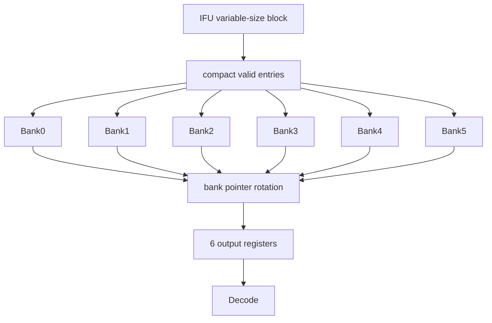
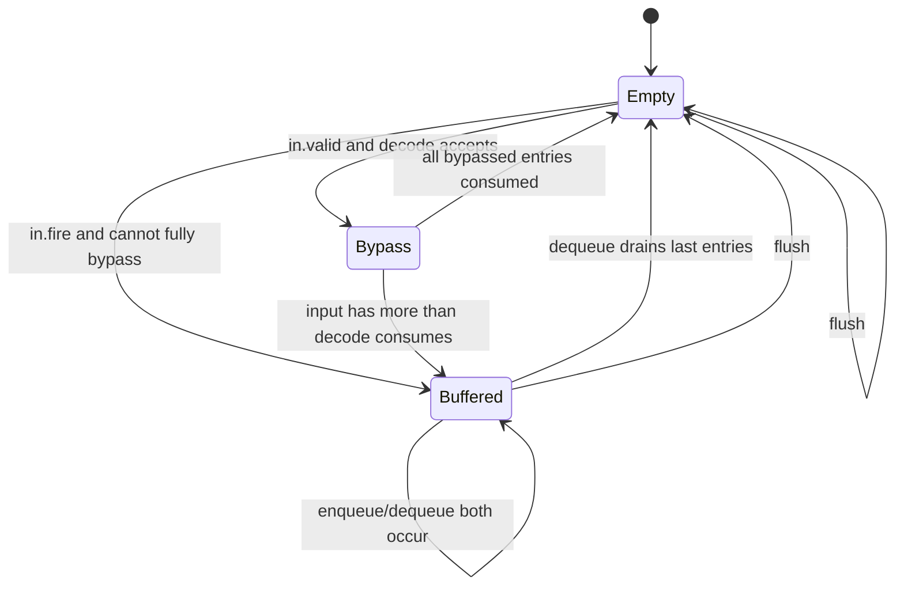
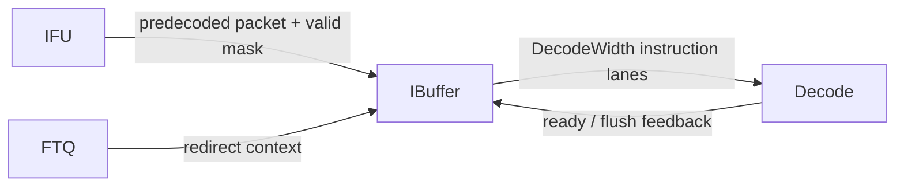

<!-- # Frontend IBuffer 分支预测取指缓冲深入分析 -->
# Frontend IBuffer: In-Depth Analysis of the Branch-Prediction Fetch Buffer

<!-- regenerated-by-analyze-xiangshan-kunminghu -->
> Regenerated from `OpenXiangShan/XiangShan` branch `kunminghu-v2`, source commit `52262f303fc06daf84cdab7011d59b7df65ce7e8` using the updated Frontend graph/stage rules.


<!-- > 官方源码：`https://github.com/OpenXiangShan/XiangShan.git`；分支 `kunminghu-v2`；分析 commit `52262f303fc06daf84cdab7011d59b7df65ce7e8`。 -->
> Official source: `https://github.com/OpenXiangShan/XiangShan.git`; branch `kunminghu-v2`; analysis commit `52262f303fc06daf84cdab7011d59b7df65ce7e8`.

<!-- frontend-tutorial-generated-by-analyze-xiangshan-kunminghu -->
<!-- > 所有实现结论均限定在 `kunminghu-v2` commit `52262f303fc06daf84cdab7011d59b7df65ce7e8`；Design Doc 结论必须回到第 18 节的源码追溯矩阵。 -->
> All implementation conclusions are limited to `kunminghu-v2` commit `52262f303fc06daf84cdab7011d59b7df65ce7e8`; Design Doc conclusions must be checked against the source traceability matrix in Section 18.

## 1. Scope

<!-- 本节保留模块职责、分析基线、范围和统一五问，明确本文只以当前源码证据为准。 -->
This section records the module responsibility, analysis baseline, scope, and common five-question guide, and makes clear that this document relies only on evidence in the current source tree.

<!-- ### 1.1. 统一五问导读 -->
### 1.1. Five-Question Guide
<!-- | 问题 | 回答 | -->
| Question | Answer |
| --- | --- |
<!-- | **Who** | IBuffer 位于 IFU 与 Decode 之间，是预测取指结果的弹性队列。 | -->
| **Who** | `IBuffer` sits between IFU and Decode and is the elastic queue for predicted-fetch results. |
<!-- | **What** | 将最多 `PredictWidth` 个可变有效指令压紧、缓存，并按 `DecodeWidth` 顺序输出。 | -->
| **What** | It compacts and buffers up to `PredictWidth` variably valid instructions, then emits them in order at `DecodeWidth`. |
<!-- | **How** | 48-entry/6-bank 环形存储、旁路、output register 和逐 lane Decoupled 握手。 | -->
| **How** | It uses a 48-entry, six-bank circular store, bypassing, output registers, and per-lane Decoupled handshakes. |
<!-- | **From what** | 来自 IFU 的真实指令、预译码、异常、taken、FTQ ptr/offset。 | -->
| **From what** | Its inputs are real instructions, predecode results, exceptions, taken information, and FTQ pointer/offset information from IFU. |
<!-- | **To what** | 输出 `CtrlFlow` 到 Decode；full/ready 把后端压力反馈给 IFU。 | -->
| **To what** | It emits `CtrlFlow` records to Decode; `full`/`ready` feed backend pressure back to IFU. |

<!-- ### 1.2. 论文与理论边界 -->
### 1.2. Paper and Theory Boundary
<!-- FTQ/IBuffer/ICache 不是单一方向预测算法，但属于解耦前端和控制流交付体系。相关理论包括 scalable/elastic instruction fetching、有限队列反压、非阻塞缓存与 miss-status handling。本文用理论解释“为什么存在”，所有指针、状态机、端口、容量、overflow/underflow 和恢复结论以本 commit 源码为准。 -->
FTQ, IBuffer, and ICache are not a single direction-prediction algorithm, but they belong to a decoupled frontend and control-flow delivery system. Relevant theory includes scalable/elastic instruction fetching, finite-queue backpressure, non-blocking caches, and miss-status handling. Theory explains why the structures exist; all conclusions about pointers, state machines, ports, capacity, overflow/underflow, and recovery are based on the source at this commit.

<!-- ## 2. 关键源码证据 -->
## 2. Key Source Evidence

<!-- 本节直接列出 `IBuffer` 的有效源码入口、关键代码骨架和行为解释，避免只保存文件名或行号。 -->
This section lists effective source entry points, key code skeletons, and behavioral explanations for `IBuffer`, rather than retaining only filenames or line numbers.

<!-- ### 2.1. 源码入口和行号 -->
### 2.1. Source Entry Points and Line References
<!-- | 源码文件 | 本文使用它证明什么 | 行号证据 | -->
| Source file | What it establishes | Line evidence |
| --- | --- | --- |
<!-- | `frontend/IBuffer.scala` | banked FIFO 存储组织和读写端口 | [frontend/IBuffer.scala#L172-L186](https://github.com/OpenXiangShan/XiangShan/blob/kunminghu-v2/src/main/scala/xiangshan/frontend/IBuffer.scala#L172-L186) | -->
| `frontend/IBuffer.scala` | Banked FIFO storage organization and its read/write ports. | [frontend/IBuffer.scala#L172-L186](https://github.com/OpenXiangShan/XiangShan/blob/kunminghu-v2/src/main/scala/xiangshan/frontend/IBuffer.scala#L172-L186) |
<!-- | `frontend/IBuffer.scala` | enq/deq pointer、valid、ready 和 flush | [frontend/IBuffer.scala#L197-L215](https://github.com/OpenXiangShan/XiangShan/blob/kunminghu-v2/src/main/scala/xiangshan/frontend/IBuffer.scala#L197-L215) | -->
| `frontend/IBuffer.scala` | Enqueue/dequeue pointers, `valid`, `ready`, and flush behavior. | [frontend/IBuffer.scala#L197-L215](https://github.com/OpenXiangShan/XiangShan/blob/kunminghu-v2/src/main/scala/xiangshan/frontend/IBuffer.scala#L197-L215) |
<!-- | `frontend/IBuffer.scala` | `IBufNBank >= DecodeWidth` 宽度约束 | [frontend/IBuffer.scala#L164-L180](https://github.com/OpenXiangShan/XiangShan/blob/kunminghu-v2/src/main/scala/xiangshan/frontend/IBuffer.scala#L164-L180) | -->
| `frontend/IBuffer.scala` | The width constraint `IBufNBank >= DecodeWidth`. | [frontend/IBuffer.scala#L164-L180](https://github.com/OpenXiangShan/XiangShan/blob/kunminghu-v2/src/main/scala/xiangshan/frontend/IBuffer.scala#L164-L180) |

<!-- ### 2.2. 核心代码骨架 -->
### 2.2. Core Code Skeleton
```scala
val entries = Reg(Vec(IBufSize, new CtrlFlow))
val enqPtr = RegInit(0.U.asTypeOf(new IBufPtr))
val deqPtr = RegInit(0.U.asTypeOf(new IBufPtr))
io.in.ready := hasFreeEntries
io.out.valid := outputValidVec
```

<!-- ### 2.3. 代码解析 -->
### 2.3. Code Walkthrough
<!-- IBuffer 解耦 IFU 的可变取指结果和 Decode 的固定消费宽度。它用 48-entry/6-bank 环形存储、旁路和 output register 保持年龄顺序。 -->
`IBuffer` decouples IFU's variable fetch result width from Decode's fixed consumption width. Its 48-entry, six-bank circular storage, bypassing, and output registers preserve age order.
## 3. Theory-to-Code Mapping

<!-- 本节把理论概念直接绑定到 `IBuffer` 的源码对象、控制/数据状态和下游消费者。 -->
This section binds theoretical concepts directly to `IBuffer` source objects, control/data state, and downstream consumers.

<!-- ### 3.1. 理论到代码映射表 -->
### 3.1. Theory-to-Code Mapping Table
<!-- | 理论概念 | 代码对象 | 为什么需要它 | 消费者/后续影响 | -->
| Theory concept | Code object | Why it is needed | Consumer / downstream effect |
| --- | --- | --- | --- |
<!-- | 弹性缓冲 | enqPtr/deqPtr/free count | Decode 反压不应立即破坏 IFU 数据 | IFU ready | -->
| Elastic buffering | `enqPtr`/`deqPtr`/free count | Decode backpressure must not immediately invalidate IFU data. | IFU `ready` |
<!-- | 宽度压缩 | valid mask / bank rotation | 取指块有效指令数量可变 | DecodeWidth lanes | -->
| Width compaction | Valid mask / bank rotation | The number of valid instructions in a fetch block varies. | `DecodeWidth` lanes |
<!-- | flush 清理 | flush clears valid/output state | 错误路径指令不能进入后端 | Decode input | -->
| Flush cleanup | Flush clears valid/output state. | Wrong-path instructions must not enter the backend. | Decode input |

<!-- ### 3.2. 阅读顺序 -->
### 3.2. Reading Order
<!-- 先按第 2 节定位源码对象，再顺着本表检查信号从哪里来、状态在哪里保存、何时更新、谁消费结果。若本篇只引用相邻模块拥有的状态，则以相邻 Frontend 分文档的源码分析为准。 -->
First locate source objects through Section 2, then use this table to check signal origin, state location, update timing, and result consumers. When this document cites state owned by an adjacent module, use the source analysis in that Frontend document as the authority.
<!-- ## 4. 论文原则和有效代码 -->
## 4. Paper Principles and Effective Code


<!-- IBuffer 的有效实现是一组显式寄存器数组和 banked 出队选择，而不是抽象 FIFO。源码注释说明大容量队列需要控制读写端口；写入侧把 IFU 送来的可变数量 `CtrlFlow` 压紧到队列 entry，读取侧按 decode lane 需求从不同 bank 取出，flush 时清理 valid 状态，避免错误路径指令进入 Decode。 -->
The effective `IBuffer` implementation is an explicit register array with banked dequeue selection, not an abstract FIFO. Source comments explain that a large queue needs controlled read/write ports: the write side compacts the variable number of `CtrlFlow` records delivered by IFU into queue entries, the read side takes entries from different banks according to decode-lane demand, and flush clears valid state so wrong-path instructions cannot enter Decode.

## 5. Microarchitecture Parameters


<!-- ### 5.1. 存储组织 -->
### 5.1. Storage Organization
<!-- IBuffer 使用原始寄存器数组，而不是直接实例化通用 Queue。源码注释解释：队列很大，读写端口要精确控制；出队像 banked FIFO，每拍每 bank 最多读一个 entry：[IBuffer.scala#L172-L186](https://github.com/OpenXiangShan/XiangShan/blob/kunminghu-v2/src/main/scala/xiangshan/frontend/IBuffer.scala#L172-L186)。 -->
`IBuffer` uses a raw register array rather than directly instantiating a generic `Queue`. The source comments explain that the queue is large and needs precise read/write-port control; dequeue acts as a banked FIFO, with at most one entry read from each bank per cycle: [IBuffer.scala#L172-L186](https://github.com/OpenXiangShan/XiangShan/blob/kunminghu-v2/src/main/scala/xiangshan/frontend/IBuffer.scala#L172-L186).



<!-- 三层指针：

- `IBufPtr`：整个 48-entry 环形队列的位置；
- `IBufBankPtr`：6 个 bank 之间的轮转位置；
- `IBufInBankPtr`：某 bank 内部的深度位置。

类型定义见 [IBuffer.scala#L27-L33](https://github.com/OpenXiangShan/XiangShan/blob/kunminghu-v2/src/main/scala/xiangshan/frontend/IBuffer.scala#L27-L33)。 -->
The design has three levels of pointers:

- `IBufPtr`: a position in the complete 48-entry circular queue;
- `IBufBankPtr`: a rotation position across the six banks;
- `IBufInBankPtr`: a depth position within one bank.

The type definitions are in [IBuffer.scala#L27-L33](https://github.com/OpenXiangShan/XiangShan/blob/kunminghu-v2/src/main/scala/xiangshan/frontend/IBuffer.scala#L27-L33).

<!-- ## 6. 模块边界和接口 -->
## 6. Module Boundary and Interfaces


<!-- ### 6.1. 接口 -->
### 6.1. Interfaces
<!-- | 信号 | 来源 → 去向 | 作用 | -->
| Signal | Source -> destination | Purpose |
| --- | --- | --- |
<!-- | `in` | IFU → IBuffer | 一个取指块的指令、valid/enqEnable、PC、预译码、异常、FTQ ptr/offset | -->
| `in` | IFU -> IBuffer | Instructions, valid/enqueue-enable bits, PC, predecode results, exceptions, and FTQ pointer/offset for one fetch block. |
<!-- | `out[DecodeWidth]` | IBuffer → Decode | 按年龄连续的 `CtrlFlow` | -->
| `out[DecodeWidth]` | IBuffer -> Decode | Age-contiguous `CtrlFlow` records. |
<!-- | `decodeCanAccept` | Decode → IBuffer | 后端整体是否允许本拍接收 | -->
| `decodeCanAccept` | Decode -> IBuffer | Whether the backend as a whole can accept data this cycle. |
<!-- | `flush` | redirect 控制 → IBuffer | 清除所有错误路径 entry、输出寄存器和指针状态 | -->
| `flush` | Redirect control -> IBuffer | Clears every wrong-path entry, output register, and pointer state. |
<!-- | `full` | IBuffer → 性能/上游控制 | 指示没有足够空间；实际正确性反压由 `in.ready` 完成 | -->
| `full` | IBuffer -> performance/upstream control | Indicates insufficient space; `in.ready` provides the actual correctness backpressure. |
<!-- | stall reason signals | Frontend/BPU/后端 → IBuffer 统计 | 把控制 redirect、TAGE/SC/ITTAGE/RAS miss、内存违例分类到输出气泡 | -->
| Stall-reason signals | Frontend/BPU/backend -> IBuffer statistics | Classify control redirects, TAGE/SC/ITTAGE/RAS misses, and memory violations into output bubbles. |

<!-- ## 7. 为什么模块存在 -->
## 7. Why the Module Exists


<!-- ### 7.1. 为什么需要 IBuffer -->
### 7.1. Why IBuffer Is Needed
<!-- IFU 一次可产生最多 `PredictWidth` 个 16-bit 槽位，实际指令数受 RVC、taken 分支和异常影响；Decode 默认每拍接收 `DecodeWidth = 6` 条。若二者直接相连，任何 Decode 停顿都会立即反压整条 ICache/IFU 流水，任何取指块内部数量变化也会形成宽度浪费。

`IBuffer` 用 48-entry、6-bank 队列把“可变批量生产”变成“最多 6 条顺序消费”，源码为 [IBuffer.scala](https://github.com/OpenXiangShan/XiangShan/blob/kunminghu-v2/src/main/scala/xiangshan/frontend/IBuffer.scala)。默认参数见 [Parameters.scala#L147-L150](https://github.com/OpenXiangShan/XiangShan/blob/kunminghu-v2/src/main/scala/xiangshan/Parameters.scala#L147-L150)。 -->
IFU can produce up to `PredictWidth` 16-bit slots at once, while the actual instruction count depends on RVC, taken branches, and exceptions. Decode accepts `DecodeWidth = 6` instructions per cycle by default. A direct connection would let any Decode stall immediately backpressure the whole ICache/IFU pipeline, and a varying instruction count within a fetch block would waste width.

The 48-entry, six-bank `IBuffer` turns variable-batch production into ordered consumption of up to six instructions. Its source is [IBuffer.scala](https://github.com/OpenXiangShan/XiangShan/blob/kunminghu-v2/src/main/scala/xiangshan/frontend/IBuffer.scala); default parameters are in [Parameters.scala#L147-L150](https://github.com/OpenXiangShan/XiangShan/blob/kunminghu-v2/src/main/scala/xiangshan/Parameters.scala#L147-L150).

<!-- ## 8. 有效动态路径 -->
## 8. Effective Dynamic Path


<!-- 按 `valid -> ready -> fire -> register/state update -> consumer` 阅读动态路径，并同时检查正常、阻塞、flush、redirect、replay 和恢复后的 forward progress。 -->
Read the dynamic path as `valid -> ready -> fire -> register/state update -> consumer`, and also check normal operation, stalls, flush, redirect, replay, and forward progress after recovery.

<!-- ## 9. Index 和地址/历史计算 -->
## 9. Index and Address/History Computation


<!-- ### 9.1. 示例讲解索引 -->
### 9.1. Guide to the Examples
<!-- 后文的正常路径、阻塞路径、redirect/flush、满空边界和波形段落均给出具体示例；阅读时建议从“一个 prediction block 的正常流动”开始，再对照 overflow/underflow 和恢复场景。 -->
Later sections provide concrete examples for normal flow, stalls, redirect/flush, full/empty boundaries, and waveforms. Begin with the normal flow of one prediction block, then compare it with overflow/underflow and recovery scenarios.

<!-- ## 10. 核心算法 -->
## 10. Core Algorithm


<!-- 核心算法按 enqueue、compact、bank select、dequeue 四步读：先用 IFU 输入 valid mask 计算本拍写入数量，再更新 tail/valid；decode ready 时按 head 和 lane 数读取连续 entry；当空间不足时拉低 IFU ready 形成反压；redirect/flush 到来时清除队列中年轻路径内容。重点观察 `head/tail` 回绕、bank 冲突和同拍入队/出队时 entry valid 的优先级。 -->
Read the core algorithm in four steps: enqueue, compact, bank select, and dequeue. It first uses the IFU input valid mask to calculate how many entries to write this cycle, then updates tail/valid state. When Decode is ready, it reads consecutive entries by head and lane count. Insufficient space deasserts IFU `ready` to create backpressure, and redirect/flush clears younger-path contents. Pay particular attention to `head`/`tail` wraparound, bank conflicts, and the priority of entry validity during same-cycle enqueue/dequeue.

<!-- ## 11. 状态和存储结构 -->
## 11. State and Storage Structures


<!-- ### 11.1. 隐式状态机 -->
### 11.1. Implicit State Machine


<!-- 它不是单个 `state` 寄存器，而由 `enqPtr/deqPtr`、bank pointers、`outputEntries.valid` 和本拍 `numEnq/numDeq` 共同编码。 -->
This is not encoded in a single `state` register. It is jointly encoded by `enqPtr`/`deqPtr`, bank pointers, `outputEntries.valid`, and this cycle's `numEnq`/`numDeq`.

<!-- ### 11.2. Overflow 分析 -->
### 11.2. Overflow Analysis
<!-- #### 11.2.1. 发生条件 -->
#### 11.2.1. Trigger Condition

<!-- Decode 连续停顿，IFU 仍有新块到达，`enqPtr` 逐渐追上 `deqPtr`。若继续写入会覆盖最老尚未译码指令。 -->
If Decode remains stalled while new IFU blocks arrive, `enqPtr` gradually catches `deqPtr`. Further writes would overwrite the oldest instruction that has not yet been decoded.

<!-- #### 11.2.2. 防护机制 -->
#### 11.2.2. Protection Mechanisms

<!-- 1. 环形指针的 flag 区分同 index 的不同轮次；
2. 根据队列占用和本拍预计 dequeue 计算可接收条数；
3. 空间不足时 `io.in.ready=0`；
4. IFU 保持 `toIbuffer.valid/bits`，直到 fire 或 flush；
5. `io.full` 暴露性能状态，帮助区分前端自身停顿与后端反压。

`require(IBufNBank >= DecodeWidth)` 和整除约束确保 bank 组织不会在设计层面制造“需要同拍从一个 bank 读两项”的结构性 overflow：[IBuffer.scala#L164-L170](https://github.com/OpenXiangShan/XiangShan/blob/kunminghu-v2/src/main/scala/xiangshan/frontend/IBuffer.scala#L164-L170)。 -->
1. The circular-pointer flag distinguishes different wraps at the same index.
2. The accepted count is calculated from queue occupancy and the projected dequeue count for this cycle.
3. `io.in.ready=0` when space is insufficient.
4. IFU holds `toIbuffer.valid/bits` until a fire or flush.
5. `io.full` exposes performance state, helping distinguish frontend stalls from backend backpressure.

The `require(IBufNBank >= DecodeWidth)` constraint and divisibility constraints ensure that the bank organization cannot create a structural overflow that requires reading two items from one bank in the same cycle: [IBuffer.scala#L164-L170](https://github.com/OpenXiangShan/XiangShan/blob/kunminghu-v2/src/main/scala/xiangshan/frontend/IBuffer.scala#L164-L170).

<!-- #### 11.2.3. 同拍 dequeue + enqueue -->
#### 11.2.3. Same-Cycle Dequeue and Enqueue

<!-- 队列即使逻辑上“满”，若本拍确定会 dequeue，也可把释放槽位用于 enqueue，避免不必要气泡。正确实现必须用 next-state/本拍消费量计算，而不是简单 `full ? ready=0`。验证时应专门覆盖“满队列且 Decode 同拍接收”的边界。 -->
Even when the queue is logically full, a slot released by a definite dequeue in the current cycle can be reused for enqueue, avoiding an unnecessary bubble. A correct implementation must calculate from next state or current-cycle consumption rather than simply applying `full ? ready=0`. Verification should explicitly cover a full queue while Decode accepts data in the same cycle.

<!-- ### 11.3. Underflow 分析 -->
### 11.3. Underflow Analysis
<!-- #### 11.3.1. 发生条件 -->
#### 11.3.1. Trigger Condition

<!-- Decode 请求更多指令，但队列和 output register 中实际条数不足。 -->
Decode requests more instructions than are actually present in the queue and output registers.

<!-- #### 11.3.2. 防护机制 -->
#### 11.3.2. Protection Mechanisms

<!-- - 每路 `out(i).valid` 独立表示该 lane 是否有真实指令；
- `ready` 只在 `valid` 为真时形成 `fire`；
- `deqPtr` 只按真实 fire 数推进；
- 空队列只能通过同拍 IFU bypass 产生有效输出；
- 存储数组残留 bits 永远不能绕过 valid 暴露。

因此 underflow 不表现为硬件异常，而表现为后部 lane `valid=0` 和 Decode 获得较少指令。 -->
- Each `out(i).valid` independently indicates whether that lane contains a real instruction.
- `ready` forms a `fire` only when `valid` is true.
- `deqPtr` advances only by the real fire count.
- An empty queue can produce a valid output only through same-cycle IFU bypass.
- Residual bits in the storage array can never bypass `valid` and become visible.

Therefore, underflow is not a hardware exception; it appears as `valid=0` on later lanes and fewer instructions delivered to Decode.

<!-- ### 11.4. Flush -->
### 11.4. Flush
<!-- redirect 到来时，IBuffer 中所有条目都属于尚未译码或尚未进入后端的年轻路径，最安全的策略是整体清空：

- `enqPtr/deqPtr` 恢复空状态；
- bank pointers 重置；
- output entries valid 清零；
- 本拍旁路结果被屏蔽。

数据寄存器不一定清零，正确性依赖 valid/pointer；这比逐 entry 清数据更省面积和切换功耗。 -->
When a redirect arrives, every IBuffer entry belongs to a younger path that has not yet been decoded or entered the backend. The safest policy is to clear the buffer as a whole:

- Restore `enqPtr/deqPtr` to the empty state.
- Reset bank pointers.
- Clear output-entry valid bits.
- Suppress the current cycle's bypass result.

The data registers do not necessarily need to be cleared: correctness relies on valid bits and pointers. This costs less area and switching power than clearing data entry by entry.

<!-- ## 12. Pipeline stage 分析 -->
## 12. Pipeline-Stage Analysis


<!-- 阶段说明只使用源码中的寄存器、valid/ready 和 fire 条件；对 Frontend 使用 F0/F1/F2/F3，对 Backend 使用实际 Decode/Rename/Dispatch/Issue/Execute/Writeback/ROB 边界。 -->
Stage descriptions use only source-level registers and `valid`/`ready`/`fire` conditions. They use F0/F1/F2/F3 for the frontend and the actual Decode/Rename/Dispatch/Issue/Execute/Writeback/ROB boundaries for the backend.

## 13. Control path rationale


<!-- 控制路径按优先级阅读：reset、flush、backend redirect、BPU override、exception、replay 和正常 fire 发生冲突时，必须以源码条件顺序说明胜负关系。 -->
Read the control path in priority order. When reset, flush, backend redirect, BPU override, exception, replay, and normal fire conflict, their outcome must be explained by the source-condition order.

<!-- ## 14. Data path 与跨边界 -->
## 14. Data Path and Cross-Boundary Behavior


<!-- ### 14.1. 跨边界代码解析 -->
### 14.1. Cross-Boundary Code Walkthrough
<!-- IBuffer 接收的是已经过取指/预译码的片段，而不是天然完整的指令。跨 Cache Line 或跨页的 32-bit 指令可能先以半指令或带 `valid` mask 的片段到达，再由 IFU/预译码完成合并；因此要分别检查第一片段入队、第二片段到达、合并后的 PC/异常元数据、以及 redirect/flush 清理。跨边界 fault 不能被第二片段的无效 valid 覆盖。

当边界片段与 MMIO/uncache 请求同时发生时，IBuffer 只应观察到源码定义的 ready/valid 结果；它不能把 side-effect MMIO 当作可投机的普通 ICache 数据。覆盖 empty/one/almost-full/full、同时入队出队、bank conflict、flush 和合并失败后的 backpressure，确保片段不丢失、不重复且年龄顺序保持。 -->
`IBuffer` receives fetched/predecoded fragments rather than intrinsically complete instructions. A 32-bit instruction crossing a cache-line or page boundary may first arrive as a half instruction or a fragment with a `valid` mask, and is subsequently merged by IFU/predecode. Check the first-fragment enqueue, second-fragment arrival, the merged PC/exception metadata, and redirect/flush cleanup separately. A cross-boundary fault must not be masked by an invalid `valid` bit on the second fragment.

When a boundary fragment coincides with an MMIO/uncache request, IBuffer should observe only the source-defined ready/valid result; it cannot treat side-effecting MMIO as speculative ordinary ICache data. Cover empty/one/almost-full/full states, simultaneous enqueue/dequeue, bank conflict, flush, and backpressure after a failed merge to ensure fragments are neither lost nor duplicated and retain age order.

<!-- ## 15. 异常、debug、privilege -->
## 15. Exceptions, Debug, and Privilege


<!-- ### 15.1. 验证关注点
1. 48-entry 空、1 项、47 项、满状态。
2. 满状态同拍 dequeue+enqueue。
3. IFU 一次 16 个半字中混合 RVC/RVI，只压紧真实指令。
4. 空队列旁路 1～6 条以及超过 6 条。
5. 各 Decode lane 不同 ready 模式下的年龄顺序。
6. output register stall 多拍时 payload 稳定。
7. flush 与 enqueue/dequeue/bypass 同拍的优先级。
8. FTQ ptr 在回绕附近仍随每条指令正确保存。 -->
### 15.1. Verification Focus
1. Empty, one-entry, 47-entry, and full states of the 48-entry buffer.
2. Same-cycle dequeue and enqueue while full.
3. Mixed RVC/RVI within 16 IFU halfwords, compacting only real instructions.
4. Empty-queue bypass of one through six instructions and more than six instructions.
5. Age order under different ready patterns across Decode lanes.
6. Payload stability during a multi-cycle output-register stall.
7. Priority of flush against same-cycle enqueue/dequeue/bypass.
8. Correct per-instruction preservation of the FTQ pointer near pointer wraparound.

#### 15.1.1. Top-Level Module Connectivity

IBuffer is the elastic boundary between IFU output and backend decode. Frontend wiring connects IFU directly to IBuffer, while the buffer exposes decoupled outputs and flush behavior: [frontend/Frontend.scala:226-231](https://github.com/OpenXiangShan/XiangShan/blob/52262f303fc06daf84cdab7011d59b7df65ce7e8/src/main/scala/xiangshan/frontend/Frontend.scala#L226-L231), [frontend/IBuffer.scala:1-180](https://github.com/OpenXiangShan/XiangShan/blob/52262f303fc06daf84cdab7011d59b7df65ce7e8/src/main/scala/xiangshan/frontend/IBuffer.scala#L1-L180).



#### 15.1.2. Frontend/Backend Pipeline Stages

The source-proven stage boundary is `F0 -> F1 -> F2 -> F3`: F0 accepts the FTQ request and calculates line indices, F1 registers the fetch block and calculates instruction PCs/cut pointers, F2 waits for ICache responses and performs data cutting/predecode preparation, and F3 expands/qualifies instructions, handles exceptions/MMIO, and drives IBuffer. Evidence: [frontend/IFU.scala:236-305](https://github.com/OpenXiangShan/XiangShan/blob/52262f303fc06daf84cdab7011d59b7df65ce7e8/src/main/scala/xiangshan/frontend/IFU.scala#L236-L305), [frontend/IFU.scala:346-457](https://github.com/OpenXiangShan/XiangShan/blob/52262f303fc06daf84cdab7011d59b7df65ce7e8/src/main/scala/xiangshan/frontend/IFU.scala#L346-L457), [frontend/IFU.scala:542-617](https://github.com/OpenXiangShan/XiangShan/blob/52262f303fc06daf84cdab7011d59b7df65ce7e8/src/main/scala/xiangshan/frontend/IFU.scala#L542-L617). The top-level connections couple FTQ, IFU, ICache, and IBuffer through shared ready/valid conditions: [frontend/Frontend.scala:199-231](https://github.com/OpenXiangShan/XiangShan/blob/52262f303fc06daf84cdab7011d59b7df65ce7e8/src/main/scala/xiangshan/frontend/Frontend.scala#L199-L231).

The backend continuation uses the effective module boundaries rather than inventing cycle names: Decode accepts the instruction packet, Rename creates speculative physical-register mappings, Dispatch allocates downstream resources, Issue/Scheduler selects ready uops, Execute/FU produces results, DataPath/WB carries writeback and wakeup, and ROB/CtrlBlock commits or redirects. Evidence: [backend/decode/DecodeStage.scala:83-120](https://github.com/OpenXiangShan/XiangShan/blob/52262f303fc06daf84cdab7011d59b7df65ce7e8/src/main/scala/xiangshan/backend/decode/DecodeStage.scala#L83-L120), [backend/rename/Rename.scala:40-117](https://github.com/OpenXiangShan/XiangShan/blob/52262f303fc06daf84cdab7011d59b7df65ce7e8/src/main/scala/xiangshan/backend/rename/Rename.scala#L40-L117), [backend/dispatch/NewDispatch.scala:49-176](https://github.com/OpenXiangShan/XiangShan/blob/52262f303fc06daf84cdab7011d59b7df65ce7e8/src/main/scala/xiangshan/backend/dispatch/NewDispatch.scala#L49-L176), [backend/issue/Scheduler.scala:29-180](https://github.com/OpenXiangShan/XiangShan/blob/52262f303fc06daf84cdab7011d59b7df65ce7e8/src/main/scala/xiangshan/backend/issue/Scheduler.scala#L29-L180), [backend/exu/ExeUnit.scala:50-110](https://github.com/OpenXiangShan/XiangShan/blob/52262f303fc06daf84cdab7011d59b7df65ce7e8/src/main/scala/xiangshan/backend/exu/ExeUnit.scala#L50-L110), [backend/datapath/DataPath.scala:25-70](https://github.com/OpenXiangShan/XiangShan/blob/52262f303fc06daf84cdab7011d59b7df65ce7e8/src/main/scala/xiangshan/backend/datapath/DataPath.scala#L25-L70), [backend/rob/Rob.scala:52-145](https://github.com/OpenXiangShan/XiangShan/blob/52262f303fc06daf84cdab7011d59b7df65ce7e8/src/main/scala/xiangshan/backend/rob/Rob.scala#L52-L145), [backend/CtrlBlock.scala:50-110](https://github.com/OpenXiangShan/XiangShan/blob/52262f303fc06daf84cdab7011d59b7df65ce7e8/src/main/scala/xiangshan/backend/CtrlBlock.scala#L50-L110).

```mermaid
flowchart LR
  F0["F0: FTQ req + line indices"] -->|f0_fire| F1["F1: PC + cut pointers"]
  F1 -->|f1_fire| F2["F2: ICache data + exceptions"]
  F2 -->|f2_fire| F3["F3: predecode + MMIO qualification"]
  F3 -->|toIbuffer.fire| Decode["Decode"]
  Decode -->|uop bundle| Rename["Rename"]
  Rename -->|renamed uop| Dispatch["Dispatch"]
  Dispatch -->|ready uop| Issue["Issue"]
  Issue -->|operands| Execute["Execute/FU"]
  Execute -->|result| Writeback["Writeback/Wakeup"]
  Writeback -->|retire candidate| Commit["ROB/Commit"]
  Commit -->|redirect/flush| F0
```



The stage graph keeps chronological forward edges separate from the bundled recovery edge. It must be read together with the module graph below: a stage is not itself a module, and a redirect does not create a fake forward stage.

```waveform-draw
{
  "signal": [
    {
      "name": "clk",
      "wave": "p......."
    },
    {
      "name": "F0.valid",
      "wave": "01...0.."
    },
    {
      "name": "F0.ready",
      "wave": "1..0...."
    },
    {
      "name": "F1.valid",
      "wave": "001..0.."
    },
    {
      "name": "F2.valid",
      "wave": "0001.0.."
    },
    {
      "name": "F3.valid",
      "wave": "00001.0."
    },
    {
      "name": "toIbuffer.fire",
      "wave": "0000010."
    },
    {
      "name": "redirect/flush",
      "wave": "00000010"
    }
  ],
  "config": {
    "hscale": 1
  }
}
```

<!-- ## 16. CSR 控制 -->
## 16. CSR Control


<!-- 前端分支预测器的使能控制来自 CSR 模块生成的 `CustomCSRCtrlIO.bp_ctrl`，不是各预测器本地私有 CSR。有效链路是：`sbpctl` CSR 字段 -> `io.status.custom.bp_ctrl` -> Backend `frontendCsrCtrl` -> XSCore `frontend.io.csrCtrl` -> Frontend `bpu.io.ctrl` -> BPU 内各子预测器 `io.enable`。 -->
Frontend branch-predictor enable control comes from `CustomCSRCtrlIO.bp_ctrl` generated by the CSR module, not from predictor-local private CSRs. The effective path is: `sbpctl` CSR fields -> `io.status.custom.bp_ctrl` -> backend `frontendCsrCtrl` -> XSCore `frontend.io.csrCtrl` -> frontend `bpu.io.ctrl` -> each BPU subpredictor's `io.enable`.

<!-- ### 16.1. CSR 字段到 BPU 控制信号 -->
### 16.1. CSR Fields to BPU Control Signals
<!-- | 控制位 | CSR 源字段 | Frontend/BPU 消费者 | 有效作用 | 源码证据 | -->
| Control bit | CSR source field | Frontend/BPU consumer | Effective function | Source evidence |
| --- | --- | --- | --- | --- |
<!-- | `bp_ctrl.ubtbEnable` | `sbpctl.regOut.UBTB_ENABLE` | `ubtb.io.enable` | 允许或关闭 S1 fast uBTB/MicroBtb 查询结果参与预测链；关闭后仍保留 fall-through 基线。 | [NewCSR.scala:1378](https://github.com/OpenXiangShan/XiangShan/blob/kunminghu-v2/src/main/scala/xiangshan/backend/fu/NewCSR/NewCSR.scala#L1378), [Bpu.scala:96](https://github.com/OpenXiangShan/XiangShan/blob/kunminghu-v2/src/main/scala/xiangshan/frontend/bpu/Bpu.scala#L96), [Bpu.scala:105](https://github.com/OpenXiangShan/XiangShan/blob/kunminghu-v2/src/main/scala/xiangshan/frontend/bpu/Bpu.scala#L105) | -->
| `bp_ctrl.ubtbEnable` | `sbpctl.regOut.UBTB_ENABLE` | `ubtb.io.enable` | Enables or disables participation of S1 fast-uBTB/MicroBtb lookup results in the prediction chain; the fall-through baseline remains when disabled. | [NewCSR.scala:1378](https://github.com/OpenXiangShan/XiangShan/blob/kunminghu-v2/src/main/scala/xiangshan/backend/fu/NewCSR/NewCSR.scala#L1378), [Bpu.scala:96](https://github.com/OpenXiangShan/XiangShan/blob/kunminghu-v2/src/main/scala/xiangshan/frontend/bpu/Bpu.scala#L96), [Bpu.scala:105](https://github.com/OpenXiangShan/XiangShan/blob/kunminghu-v2/src/main/scala/xiangshan/frontend/bpu/Bpu.scala#L105) |
<!-- | `bp_ctrl.abtbEnable` | `sbpctl.regOut.ABTB_ENABLE` | `abtb.io.enable` | 控制 AheadBtb 目标/属性预测是否参与早期预测。 | [NewCSR.scala:1379](https://github.com/OpenXiangShan/XiangShan/blob/kunminghu-v2/src/main/scala/xiangshan/backend/fu/NewCSR/NewCSR.scala#L1379), [Bpu.scala:97](https://github.com/OpenXiangShan/XiangShan/blob/kunminghu-v2/src/main/scala/xiangshan/frontend/bpu/Bpu.scala#L97), [Bpu.scala:106](https://github.com/OpenXiangShan/XiangShan/blob/kunminghu-v2/src/main/scala/xiangshan/frontend/bpu/Bpu.scala#L106) | -->
| `bp_ctrl.abtbEnable` | `sbpctl.regOut.ABTB_ENABLE` | `abtb.io.enable` | Controls whether AheadBtb target/attribute prediction participates in early prediction. | [NewCSR.scala:1379](https://github.com/OpenXiangShan/XiangShan/blob/kunminghu-v2/src/main/scala/xiangshan/backend/fu/NewCSR/NewCSR.scala#L1379), [Bpu.scala:97](https://github.com/OpenXiangShan/XiangShan/blob/kunminghu-v2/src/main/scala/xiangshan/frontend/bpu/Bpu.scala#L97), [Bpu.scala:106](https://github.com/OpenXiangShan/XiangShan/blob/kunminghu-v2/src/main/scala/xiangshan/frontend/bpu/Bpu.scala#L106) |
<!-- | `bp_ctrl.mbtbEnable` | `sbpctl.regOut.MBTB_ENABLE` | `mbtb.io.enable` | 控制 MainBtb 是否提供主 BTB 命中、直接分支/JAL target 和 fall-through 信息。 | [NewCSR.scala:1380](https://github.com/OpenXiangShan/XiangShan/blob/kunminghu-v2/src/main/scala/xiangshan/backend/fu/NewCSR/NewCSR.scala#L1380), [Bpu.scala:98](https://github.com/OpenXiangShan/XiangShan/blob/kunminghu-v2/src/main/scala/xiangshan/frontend/bpu/Bpu.scala#L98), [Bpu.scala:107](https://github.com/OpenXiangShan/XiangShan/blob/kunminghu-v2/src/main/scala/xiangshan/frontend/bpu/Bpu.scala#L107) | -->
| `bp_ctrl.mbtbEnable` | `sbpctl.regOut.MBTB_ENABLE` | `mbtb.io.enable` | Controls whether MainBtb provides primary BTB hits, direct-branch/JAL targets, and fall-through information. | [NewCSR.scala:1380](https://github.com/OpenXiangShan/XiangShan/blob/kunminghu-v2/src/main/scala/xiangshan/backend/fu/NewCSR/NewCSR.scala#L1380), [Bpu.scala:98](https://github.com/OpenXiangShan/XiangShan/blob/kunminghu-v2/src/main/scala/xiangshan/frontend/bpu/Bpu.scala#L98), [Bpu.scala:107](https://github.com/OpenXiangShan/XiangShan/blob/kunminghu-v2/src/main/scala/xiangshan/frontend/bpu/Bpu.scala#L107) |
<!-- | `bp_ctrl.tageEnable` | `sbpctl.regOut.TAGE_ENABLE` | `tage.io.enable` | 控制 TAGE 条件分支方向预测是否有效；关闭时不能把 TAGE provider 结果作为方向覆盖依据。 | [NewCSR.scala:1381](https://github.com/OpenXiangShan/XiangShan/blob/kunminghu-v2/src/main/scala/xiangshan/backend/fu/NewCSR/NewCSR.scala#L1381), [Bpu.scala:99](https://github.com/OpenXiangShan/XiangShan/blob/kunminghu-v2/src/main/scala/xiangshan/frontend/bpu/Bpu.scala#L99), [Bpu.scala:108](https://github.com/OpenXiangShan/XiangShan/blob/kunminghu-v2/src/main/scala/xiangshan/frontend/bpu/Bpu.scala#L108) | -->
| `bp_ctrl.tageEnable` | `sbpctl.regOut.TAGE_ENABLE` | `tage.io.enable` | Controls whether TAGE conditional-branch direction prediction is effective; when disabled, a TAGE provider result cannot serve as the direction-override basis. | [NewCSR.scala:1381](https://github.com/OpenXiangShan/XiangShan/blob/kunminghu-v2/src/main/scala/xiangshan/backend/fu/NewCSR/NewCSR.scala#L1381), [Bpu.scala:99](https://github.com/OpenXiangShan/XiangShan/blob/kunminghu-v2/src/main/scala/xiangshan/frontend/bpu/Bpu.scala#L99), [Bpu.scala:108](https://github.com/OpenXiangShan/XiangShan/blob/kunminghu-v2/src/main/scala/xiangshan/frontend/bpu/Bpu.scala#L108) |
<!-- | `bp_ctrl.scEnable` | `sbpctl.regOut.SC_ENABLE` | `sc.io.enable` | 控制 statistical corrector 是否修正 TAGE/基础方向结果。 | [NewCSR.scala:1382](https://github.com/OpenXiangShan/XiangShan/blob/kunminghu-v2/src/main/scala/xiangshan/backend/fu/NewCSR/NewCSR.scala#L1382), [Bpu.scala:100](https://github.com/OpenXiangShan/XiangShan/blob/kunminghu-v2/src/main/scala/xiangshan/frontend/bpu/Bpu.scala#L100), [Bpu.scala:109](https://github.com/OpenXiangShan/XiangShan/blob/kunminghu-v2/src/main/scala/xiangshan/frontend/bpu/Bpu.scala#L109) | -->
| `bp_ctrl.scEnable` | `sbpctl.regOut.SC_ENABLE` | `sc.io.enable` | Controls whether the statistical corrector revises TAGE/base-direction results. | [NewCSR.scala:1382](https://github.com/OpenXiangShan/XiangShan/blob/kunminghu-v2/src/main/scala/xiangshan/backend/fu/NewCSR/NewCSR.scala#L1382), [Bpu.scala:100](https://github.com/OpenXiangShan/XiangShan/blob/kunminghu-v2/src/main/scala/xiangshan/frontend/bpu/Bpu.scala#L100), [Bpu.scala:109](https://github.com/OpenXiangShan/XiangShan/blob/kunminghu-v2/src/main/scala/xiangshan/frontend/bpu/Bpu.scala#L109) |
<!-- | `bp_ctrl.ittageEnable` | `sbpctl.regOut.ITTAGE_ENABLE` | `ittage.io.enable` | 控制间接跳转/JALR target 覆盖预测是否有效。 | [NewCSR.scala:1383](https://github.com/OpenXiangShan/XiangShan/blob/kunminghu-v2/src/main/scala/xiangshan/backend/fu/NewCSR/NewCSR.scala#L1383), [Bpu.scala:101](https://github.com/OpenXiangShan/XiangShan/blob/kunminghu-v2/src/main/scala/xiangshan/frontend/bpu/Bpu.scala#L101), [Bpu.scala:110](https://github.com/OpenXiangShan/XiangShan/blob/kunminghu-v2/src/main/scala/xiangshan/frontend/bpu/Bpu.scala#L110) | -->
| `bp_ctrl.ittageEnable` | `sbpctl.regOut.ITTAGE_ENABLE` | `ittage.io.enable` | Controls whether indirect-jump/JALR target override prediction is effective. | [NewCSR.scala:1383](https://github.com/OpenXiangShan/XiangShan/blob/kunminghu-v2/src/main/scala/xiangshan/backend/fu/NewCSR/NewCSR.scala#L1383), [Bpu.scala:101](https://github.com/OpenXiangShan/XiangShan/blob/kunminghu-v2/src/main/scala/xiangshan/frontend/bpu/Bpu.scala#L101), [Bpu.scala:110](https://github.com/OpenXiangShan/XiangShan/blob/kunminghu-v2/src/main/scala/xiangshan/frontend/bpu/Bpu.scala#L110) |
<!-- | `bp_ctrl.rasEnable` | `sbpctl.regOut.RAS_ENABLE` | `ras.io.enable` | 控制 return address stack 是否给 RET/JALR 返回目标提供覆盖。 | [NewCSR.scala:1384](https://github.com/OpenXiangShan/XiangShan/blob/kunminghu-v2/src/main/scala/xiangshan/backend/fu/NewCSR/NewCSR.scala#L1384), [Bpu.scala:102](https://github.com/OpenXiangShan/XiangShan/blob/kunminghu-v2/src/main/scala/xiangshan/frontend/bpu/Bpu.scala#L102), [Bpu.scala:111](https://github.com/OpenXiangShan/XiangShan/blob/kunminghu-v2/src/main/scala/xiangshan/frontend/bpu/Bpu.scala#L111) | -->
| `bp_ctrl.rasEnable` | `sbpctl.regOut.RAS_ENABLE` | `ras.io.enable` | Controls whether the return-address stack overrides RET/JALR return targets. | [NewCSR.scala:1384](https://github.com/OpenXiangShan/XiangShan/blob/kunminghu-v2/src/main/scala/xiangshan/backend/fu/NewCSR/NewCSR.scala#L1384), [Bpu.scala:102](https://github.com/OpenXiangShan/XiangShan/blob/kunminghu-v2/src/main/scala/xiangshan/frontend/bpu/Bpu.scala#L102), [Bpu.scala:111](https://github.com/OpenXiangShan/XiangShan/blob/kunminghu-v2/src/main/scala/xiangshan/frontend/bpu/Bpu.scala#L111) |

<!-- ### 16.2. 有效代码骨架 -->
### 16.2. Effective Code Skeleton
```scala
// backend/fu/NewCSR/NewCSR.scala
io.status.custom.bp_ctrl.ubtbEnable   := sbpctl.regOut.UBTB_ENABLE.asBool
io.status.custom.bp_ctrl.abtbEnable   := sbpctl.regOut.ABTB_ENABLE.asBool
io.status.custom.bp_ctrl.mbtbEnable   := sbpctl.regOut.MBTB_ENABLE.asBool
io.status.custom.bp_ctrl.tageEnable   := sbpctl.regOut.TAGE_ENABLE.asBool
io.status.custom.bp_ctrl.scEnable     := sbpctl.regOut.SC_ENABLE.asBool
io.status.custom.bp_ctrl.ittageEnable := sbpctl.regOut.ITTAGE_ENABLE.asBool
io.status.custom.bp_ctrl.rasEnable    := sbpctl.regOut.RAS_ENABLE.asBool

// frontend/Frontend.scala
private val csrCtrl = DelayN(io.csrCtrl, CsrCtrlPortDelay)
bpu.io.ctrl := csrCtrl.bp_ctrl

// frontend/bpu/Bpu.scala
private val ctrl = DelayN(io.ctrl, 2)
fallThrough.io.enable := true.B
utage.io.enable       := true.B
uras.io.enable        := true.B
ubtb.io.enable        := ctrl.ubtbEnable
abtb.io.enable        := ctrl.abtbEnable
mbtb.io.enable        := ctrl.mbtbEnable
tage.io.enable        := ctrl.tageEnable
sc.io.enable          := ctrl.scEnable
ittage.io.enable      := ctrl.ittageEnable
ras.io.enable         := ctrl.rasEnable
```

<!-- ### 16.3. 代码解析 -->
### 16.3. Code Walkthrough
<!-- `BpuCtrl` bundle 明确定义了 `ubtbEnable`、`abtbEnable`、`mbtbEnable`、`tageEnable`、`scEnable`、`ittageEnable`、`rasEnable` 七个 Bool 控制位：[Bundles.scala:179-189](https://github.com/OpenXiangShan/XiangShan/blob/kunminghu-v2/src/main/scala/xiangshan/frontend/bpu/Bundles.scala#L179-L189)。`CustomCSRCtrlIO` 将 `bp_ctrl` 作为 CSR 输出的一部分：[Bundle.scala:586-596](https://github.com/OpenXiangShan/XiangShan/blob/kunminghu-v2/src/main/scala/xiangshan/Bundle.scala#L586-L596)。Backend 把 `csrio.customCtrl` 暴露为 `frontendCsrCtrl`，XSCore 再连到 Frontend：[Backend.scala:526-527](https://github.com/OpenXiangShan/XiangShan/blob/kunminghu-v2/src/main/scala/xiangshan/backend/Backend.scala#L526-L527), [XSCore.scala:138](https://github.com/OpenXiangShan/XiangShan/blob/kunminghu-v2/src/main/scala/xiangshan/XSCore.scala#L138)。Frontend 先用 `CsrCtrlPortDelay` 延迟 CSR 控制，再把 `csrCtrl.bp_ctrl` 送进 BPU：[Frontend.scala:143-153](https://github.com/OpenXiangShan/XiangShan/blob/kunminghu-v2/src/main/scala/xiangshan/frontend/Frontend.scala#L143-L153)。BPU 内部再延迟 2 拍以满足时序，随后分发给各子预测器：[Bpu.scala:89-111](https://github.com/OpenXiangShan/XiangShan/blob/kunminghu-v2/src/main/scala/xiangshan/frontend/bpu/Bpu.scala#L89-L111)。

需要注意两点：第一，`fallThrough` 基线预测器始终 `enable := true.B`，`MicroTage` 和 `MicroRas` 当前也固定使能，源码中 `utageEnable` 仍是注释项，不应写成已由 CSR 控制；第二，在 `EnableConstantin && !FPGAPlatform` 配置下，`constCtrl` 可覆盖 CSR 位，否则直接使用 CSR 位，因此验证时要同时覆盖 Constantin override 和普通 CSR 控制两条路径。 -->
The `BpuCtrl` bundle explicitly defines seven Boolean control bits: `ubtbEnable`, `abtbEnable`, `mbtbEnable`, `tageEnable`, `scEnable`, `ittageEnable`, and `rasEnable`: [Bundles.scala:179-189](https://github.com/OpenXiangShan/XiangShan/blob/kunminghu-v2/src/main/scala/xiangshan/frontend/bpu/Bundles.scala#L179-L189). `CustomCSRCtrlIO` exposes `bp_ctrl` as part of CSR output: [Bundle.scala:586-596](https://github.com/OpenXiangShan/XiangShan/blob/kunminghu-v2/src/main/scala/xiangshan/Bundle.scala#L586-L596). The backend exposes `csrio.customCtrl` as `frontendCsrCtrl`, which XSCore connects to Frontend: [Backend.scala:526-527](https://github.com/OpenXiangShan/XiangShan/blob/kunminghu-v2/src/main/scala/xiangshan/backend/Backend.scala#L526-L527), [XSCore.scala:138](https://github.com/OpenXiangShan/XiangShan/blob/kunminghu-v2/src/main/scala/xiangshan/XSCore.scala#L138). Frontend first delays CSR control with `CsrCtrlPortDelay`, then passes `csrCtrl.bp_ctrl` to BPU: [Frontend.scala:143-153](https://github.com/OpenXiangShan/XiangShan/blob/kunminghu-v2/src/main/scala/xiangshan/frontend/Frontend.scala#L143-L153). BPU delays it by another two cycles for timing before distributing it to subpredictors: [Bpu.scala:89-111](https://github.com/OpenXiangShan/XiangShan/blob/kunminghu-v2/src/main/scala/xiangshan/frontend/bpu/Bpu.scala#L89-L111).

Two qualifications matter. First, the `fallThrough` baseline predictor is always `enable := true.B`; `MicroTage` and `MicroRas` are also currently fixed enabled, and `utageEnable` is still commented out in source, so it must not be described as CSR controlled. Second, under `EnableConstantin && !FPGAPlatform`, `constCtrl` can override CSR bits; otherwise CSR bits are used directly. Verification must cover both the Constantin-override and normal-CSR paths.

## 17. Diagrams


<!-- ### 17.1. 波形 -->
### 17.1. Waveforms
```waveform-draw
{
  "signal": [
    {
      "name": "clk",
      "wave": "p........"
    },
    {
      "name": "IFU.in.valid",
      "wave": "01..0...."
    },
    {
      "name": "IBuf.in.ready",
      "wave": "1........"
    },
    {
      "name": "numEnq",
      "wave": "x=..x....",
      "data": [
        "8"
      ]
    },
    {
      "name": "Decode.ready",
      "wave": "1........"
    },
    {
      "name": "out.valid[5:0]",
      "wave": "0.==.....",
      "data": [
        "6 lanes",
        "2 lanes"
      ]
    },
    {
      "name": "occupancy",
      "wave": "=.=......",
      "data": [
        "0",
        "2",
        "0"
      ]
    }
  ],
  "config": {
    "hscale": 1
  }
}
```

```waveform-draw
{
  "signal": [
    {
      "name": "clk",
      "wave": "p........"
    },
    {
      "name": "IBuf.full",
      "wave": "0.1..0..."
    },
    {
      "name": "IFU.in.valid",
      "wave": "01....0.."
    },
    {
      "name": "IBuf.in.ready",
      "wave": "10...1..."
    },
    {
      "name": "input payload",
      "wave": "x=....x..",
      "data": [
        "block B"
      ]
    },
    {
      "name": "Decode.ready",
      "wave": "0...1...."
    },
    {
      "name": "enqueue.fire",
      "wave": "0....10.."
    }
  ],
  "config": {
    "hscale": 1
  }
}
```

<!-- ## 18. 有效行为和 Design Doc 差异 -->
## 18. Effective Behavior and Design Doc Differences


### 18.1. Design Doc to Source Traceability
| Design Doc location | Atomic claim | XiangShan source evidence | Relationship | Status | Discrepancy |
| --- | --- | --- | --- | --- | --- |
| [docs/en/frontend/IFU/index.md:1](https://github.com/OpenXiangShan/XiangShan-Design-Doc/blob/f8e258dc2d9c02c0616764856e1d18feedb91b81/docs/en/frontend/IFU/index.md#L1) | IFU output is decoupled from downstream decode by an instruction buffer | [frontend/IBuffer.scala:44-45](https://github.com/OpenXiangShan/XiangShan/blob/52262f303fc06daf84cdab7011d59b7df65ce7e8/src/main/scala/xiangshan/frontend/IBuffer.scala#L44-L45) | module definition and interface | **Partially verified** | No exact standalone IBuffer Design Doc page. |
<!-- | [docs/en/frontend/IFU/index.md:20](https://github.com/OpenXiangShan/XiangShan-Design-Doc/blob/f8e258dc2d9c02c0616764856e1d18feedb91b81/docs/en/frontend/IFU/index.md#L20) | buffer absorbs fetch/decode rate mismatch | [frontend/IBuffer.scala:158-180](https://github.com/OpenXiangShan/XiangShan/blob/52262f303fc06daf84cdab7011d59b7df65ce7e8/src/main/scala/xiangshan/frontend/IBuffer.scala#L158-L180) | enqueue/dequeue ready-valid and occupancy | **Verified** | 无 | -->
| [docs/en/frontend/IFU/index.md:20](https://github.com/OpenXiangShan/XiangShan-Design-Doc/blob/f8e258dc2d9c02c0616764856e1d18feedb91b81/docs/en/frontend/IFU/index.md#L20) | buffer absorbs fetch/decode rate mismatch | [frontend/IBuffer.scala:158-180](https://github.com/OpenXiangShan/XiangShan/blob/52262f303fc06daf84cdab7011d59b7df65ce7e8/src/main/scala/xiangshan/frontend/IBuffer.scala#L158-L180) | enqueue/dequeue ready-valid and occupancy | **Verified** | None |
<!-- | [docs/en/frontend/IFU/index.md:25](https://github.com/OpenXiangShan/XiangShan-Design-Doc/blob/f8e258dc2d9c02c0616764856e1d18feedb91b81/docs/en/frontend/IFU/index.md#L25) | flush removes wrong-path buffered instructions | [frontend/IBuffer.scala:331-395](https://github.com/OpenXiangShan/XiangShan/blob/52262f303fc06daf84cdab7011d59b7df65ce7e8/src/main/scala/xiangshan/frontend/IBuffer.scala#L331-L395) | flush and pointer/state cleanup | **Verified** | 无 | -->
| [docs/en/frontend/IFU/index.md:25](https://github.com/OpenXiangShan/XiangShan-Design-Doc/blob/f8e258dc2d9c02c0616764856e1d18feedb91b81/docs/en/frontend/IFU/index.md#L25) | flush removes wrong-path buffered instructions | [frontend/IBuffer.scala:331-395](https://github.com/OpenXiangShan/XiangShan/blob/52262f303fc06daf84cdab7011d59b7df65ce7e8/src/main/scala/xiangshan/frontend/IBuffer.scala#L331-L395) | flush and pointer/state cleanup | **Verified** | None |

### 18.2. Design Doc Baseline
- Design Doc: `OpenXiangShan/XiangShan-Design-Doc`, branch `kunminghu-v3`, commit `f8e258dc2d9c02c0616764856e1d18feedb91b81`.
- XiangShan source: `OpenXiangShan/XiangShan`, branch `kunminghu-v2`, commit `52262f303fc06daf84cdab7011d59b7df65ce7e8`.
<!-- - 设计文档是意图和接口假设；以下矩阵只把能在该源码 commit 的有效 Chisel 中定位到的内容作为实现事实。 -->
- The Design Doc supplies intent and interface assumptions; the following matrix treats only behavior found in effective Chisel at this source commit as implementation fact.

### 18.3. Design Doc Line-by-Line Mapping
1. `IBuffer.scala:44-45` declares the module/interface that receives IFU instruction packets and drives the downstream consumer. Because the Design Doc has no exact IBuffer page, the IFU overview is only an intent-level anchor.
2. `IBuffer.scala:158-180` computes enqueue/dequeue and ready/valid conditions; the queue is the storage transform between IFU producer and decode consumer.
3. `IBuffer.scala:228-245` exposes output/bypass state, while `331-395` invalidates or rewinds state on flush. The source therefore proves wrong-path isolation, not merely a FIFO textbook behavior.

### 18.4. Design Doc Discrepancies
- `Not found`: no exact `docs/en/frontend/IFU/IBuffer.md` exists in the selected Design Doc baseline.
- `Partially verified`: the IFU overview supports the buffer role, but capacity and bypass details come only from source.

<!-- ## 19. 动态场景示例 -->
## 19. Dynamic Scenarios


<!-- 每个场景按 `stimulus -> producer -> transform/state -> consumer -> observation -> recovery` 展开，至少覆盖正常路径、资源阻塞、预测/数据冲突、redirect/flush 和恢复后的前向进展。 -->
Each scenario is organized as `stimulus -> producer -> transform/state -> consumer -> observation -> recovery`, covering at least the normal path, resource stalls, prediction/data conflicts, redirect/flush, and forward progress after recovery.

<!-- ## 20. 结论 -->
## 20. Conclusions


<!-- ### 20.1. 入队算法 -->
### 20.1. Enqueue Algorithm
<!-- IFU 提供 `valid` 与 `enqEnable` 掩码。IBuffer 只把两者允许的真实指令压紧写入连续逻辑位置，而不是为无效半字保留洞。

`enqPtrVec` 为一个取指块内的多个潜在入队位置预先计算环形地址，`numTryEnq` 是本拍尝试写入的真实条数，只有 `io.in.fire` 时才成为 `numEnq`：[IBuffer.scala#L205-L213](https://github.com/OpenXiangShan/XiangShan/blob/kunminghu-v2/src/main/scala/xiangshan/frontend/IBuffer.scala#L205-L213)。

为什么用 `fire`：当队列满时 IFU 会保持同一块；若仅看 `valid` 就推进指针，会重复计数或跳过数据。 -->
IFU supplies `valid` and an `enqEnable` mask. IBuffer compacts only instructions permitted by both into consecutive logical locations instead of retaining holes for invalid halfwords.

`enqPtrVec` precomputes circular addresses for multiple potential enqueue locations in a fetch block. `numTryEnq` is the number of real entries attempted this cycle, and becomes `numEnq` only on `io.in.fire`: [IBuffer.scala#L205-L213](https://github.com/OpenXiangShan/XiangShan/blob/kunminghu-v2/src/main/scala/xiangshan/frontend/IBuffer.scala#L205-L213).

Why use `fire`? IFU holds the same block when the queue is full. Advancing the pointer from `valid` alone would double-count or skip data.

<!-- ### 20.2. 出队算法与 output register -->
### 20.2. Dequeue Algorithm and Output Registers
<!-- IBuffer 每拍最多输出 6 条。由于不同 lane 的 `ready` 和有效条数可能变化，模块先从 banked storage/旁路构造 `deqEntries`，再锁存到 `outputEntries`，确保下游 stall 时每个 `CtrlFlow` 保持稳定。

输出内容不仅有 `inst/pc`，还携带 `ftqPtr/ftqOffset`、预译码、taken、异常、trigger、是否 FTQ entry 最后一条等。`IBufEntry.toCtrlFlow` 的转换入口见 [IBuffer.scala#L87-L109](https://github.com/OpenXiangShan/XiangShan/blob/kunminghu-v2/src/main/scala/xiangshan/frontend/IBuffer.scala#L87-L109)。这些字段让后端能将执行结果重新关联到 FTQ 和预测器训练。 -->
IBuffer emits at most six instructions per cycle. Because each lane's `ready` and the count of valid entries can vary, the module first constructs `deqEntries` from banked storage/bypassing and then latches them into `outputEntries`, keeping every `CtrlFlow` stable when the downstream stalls.

Output includes more than `inst/pc`: it also carries `ftqPtr`/`ftqOffset`, predecode data, taken state, exceptions, trigger information, and whether the instruction is the last in an FTQ entry. `IBufEntry.toCtrlFlow` is defined at [IBuffer.scala#L87-L109](https://github.com/OpenXiangShan/XiangShan/blob/kunminghu-v2/src/main/scala/xiangshan/frontend/IBuffer.scala#L87-L109). These fields let the backend associate execution results back with FTQ and predictor training.

<!-- ### 20.3. 空队列旁路 -->
### 20.3. Empty-Queue Bypass
<!-- 当 `enqPtr === deqPtr` 且 Decode 可接受时，`useBypass` 为真：[IBuffer.scala#L214-L215](https://github.com/OpenXiangShan/XiangShan/blob/kunminghu-v2/src/main/scala/xiangshan/frontend/IBuffer.scala#L214-L215)。新到指令可直接进入输出路径，减少“先写寄存器数组、下一拍再读”的一拍延迟。

旁路仍必须遵守：

- 只有 `io.in.fire` 的指令可见；
- 若 Decode 不 ready，数据进入 output register 或队列保存；
- flush 优先清 valid；
- bypass 条数不能超过 `DecodeWidth`，剩余指令仍写队列。 -->
When `enqPtr === deqPtr` and Decode can accept data, `useBypass` is true: [IBuffer.scala#L214-L215](https://github.com/OpenXiangShan/XiangShan/blob/kunminghu-v2/src/main/scala/xiangshan/frontend/IBuffer.scala#L214-L215). Newly arriving instructions can enter the output path directly, avoiding the one-cycle delay of first writing the register array and reading it on the next cycle.

Bypass must still obey these rules:

- Only instructions on `io.in.fire` are visible.
- If Decode is not ready, data is retained in output registers or the queue.
- Flush takes priority and clears valid state.
- The bypass count cannot exceed `DecodeWidth`; remaining instructions still enter the queue.

<!-- ### 20.4. 信号为什么携带 FTQ ptr/offset -->
### 20.4. Why Signals Carry FTQ Pointer/Offset
<!-- IBuffer 可能让一个 FTQ 预测块跨多个周期进入 Decode，也可能把两个相邻预测块的指令拼在同一拍输出。仅凭 lane 位置无法推回原预测块，所以每条 `IBufEntry` 都保存 `ftqPtr` 和 `ftqOffset`：[IBuffer.scala#L51-L64](https://github.com/OpenXiangShan/XiangShan/blob/kunminghu-v2/src/main/scala/xiangshan/frontend/IBuffer.scala#L51-L64)。后端 redirect、PC 重建、分支结果和提交训练都依赖这一身份。 -->
IBuffer can deliver one FTQ prediction block to Decode over multiple cycles or combine instructions from two adjacent prediction blocks in one output cycle. Lane position alone cannot reconstruct the source prediction block, so every `IBufEntry` retains `ftqPtr` and `ftqOffset`: [IBuffer.scala#L51-L64](https://github.com/OpenXiangShan/XiangShan/blob/kunminghu-v2/src/main/scala/xiangshan/frontend/IBuffer.scala#L51-L64). Backend redirect, PC reconstruction, branch results, and commit training all depend on this identity.


<!-- ## 21. 验证特别注意 -->
## 21. Verification Considerations

<!-- 本节保留原文的验证矩阵和通用判定原则；验证要求仍以当前 `kunminghu-v2` 有效源码为准。 -->
This section retains the original verification matrix and general decision principles. Verification requirements remain constrained by effective source in the current `kunminghu-v2` baseline.

<!-- ### 21.1. 验证矩阵与通用判定原则 -->
### 21.1. Verification Matrix and General Decision Principles
<!-- > 本节依据 `tools/verification-driver/skills` 中的 FSM、冲突、前向进展、索引/哈希、缓存结构、异常/虚拟化和性能瓶颈规则生成。每个期望必须以当前 `kunminghu-v2` 有效 Chisel 为准。 -->
> This section is derived from the FSM, conflict, forward-progress, index/hash, cache-structure, exception/virtualization, and performance-bottleneck rules in `tools/verification-driver/skills`. Every expectation must be checked against effective Chisel in the current `kunminghu-v2` baseline.

<!-- | Verification ID | 风险 / 不变量 | 定向激励 | 期望观察 | Checker / Coverage | -->
| Verification ID | Risk / invariant | Directed stimulus | Expected observation | Checker / coverage |
| --- | --- | --- | --- | --- |
<!-- | `F_FIRST_REQUEST` | 空队列首块旁路读取残留数据 | 空 IBuffer 同拍 IFU valid 和 Decode ready | 只输出真实 enq 项，旁路顺序正确；证据 [frontend/IBuffer.scala:188-215](https://github.com/OpenXiangShan/XiangShan/blob/kunminghu-v2/src/main/scala/xiangshan/frontend/IBuffer.scala#L188-L215) | Handshake/occupancy checker；empty-bypass cover | -->
| `F_FIRST_REQUEST` | Empty-queue first-block bypass reads residual data. | Empty IBuffer with IFU valid and Decode ready in the same cycle. | Emit only real enqueue entries in correct bypass order; evidence: [frontend/IBuffer.scala:188-215](https://github.com/OpenXiangShan/XiangShan/blob/kunminghu-v2/src/main/scala/xiangshan/frontend/IBuffer.scala#L188-L215). | Handshake/occupancy checker; empty-bypass coverage |
<!-- | `F_HOLD_BACKPRESSURE` | Decode stall 时输出 payload 漂移 | 各 lane ready 拉低多拍 | 每个 valid lane 的 CtrlFlow 稳定，deqPtr 不误推进 | Per-lane handshake checker；payload-stability assertion | -->
| `F_HOLD_BACKPRESSURE` | Output payload drifts during a Decode stall. | Deassert each lane's ready for multiple cycles. | Every valid-lane `CtrlFlow` remains stable and `deqPtr` does not advance incorrectly. | Per-lane handshake checker; payload-stability assertion |
<!-- | `RESOURCE_CONTENTION` | 48-entry full 覆盖最老指令 | 停止 Decode、持续 IFU enqueue | `in.ready/full` 正确，entry 不覆盖；证据 [frontend/IBuffer.scala:158-215](https://github.com/OpenXiangShan/XiangShan/blob/kunminghu-v2/src/main/scala/xiangshan/frontend/IBuffer.scala#L158-L215) | Occupancy checker；full/almost-full cover | -->
| `RESOURCE_CONTENTION` | A full 48-entry buffer overwrites the oldest instruction. | Stop Decode while continuously enqueuing from IFU. | `in.ready/full` is correct and no entry is overwritten; evidence: [frontend/IBuffer.scala:158-215](https://github.com/OpenXiangShan/XiangShan/blob/kunminghu-v2/src/main/scala/xiangshan/frontend/IBuffer.scala#L158-L215). | Occupancy checker; full/almost-full coverage |
<!-- | `IBUF_FULL_ENQ_DEQ` | 满状态同拍出入队容量误算 | full 时让 Decode 消费并保持 IFU valid | 合法复用释放槽，计数不超过 48 | Reference-count checker；simultaneous enq/deq cover | -->
| `IBUF_FULL_ENQ_DEQ` | Capacity is miscounted for same-cycle dequeue/enqueue while full. | Let Decode consume while full and retain IFU valid. | A released slot is legally reused and the count never exceeds 48. | Reference-count checker; simultaneous enqueue/dequeue coverage |
<!-- | `I_WRAP_PTR` | enq/deq/bank pointer 回绕破坏年龄 | 不同 numEnq/numDeq 组合跨回绕 | 输出严格按程序年龄，bank rotation 正确 | Pointer-age checker；lane-order cover | -->
| `I_WRAP_PTR` | Enqueue/dequeue/bank pointer wraparound corrupts age. | Cross wraparound with different `numEnq`/`numDeq` combinations. | Output remains strictly in program age order and bank rotation is correct. | Pointer-age checker; lane-order coverage |
<!-- | `F_REQ_AND_FLUSH` | flush 与 enqueue/dequeue/bypass 竞争 | 四类活动同拍 redirect | flush winner 清 valid/指针，错误路径不输出 | Flush checker；priority cross | -->
| `F_REQ_AND_FLUSH` | Flush competes with enqueue/dequeue/bypass. | Assert redirect with all four activities in the same cycle. | The flush winner clears valid/pointers and no wrong-path output appears. | Flush checker; priority cross |
<!-- | `C_BANK_CONFLICT` | 多个读写映射同 bank | 构造最大入队和 6-lane 出队组合 | 端口使用符合 bank 组织，无丢项/乱序 | Bank-access checker；bank cross | -->
| `C_BANK_CONFLICT` | Multiple reads/writes map to one bank. | Construct maximum enqueue and six-lane dequeue combinations. | Port use follows the bank organization without loss or reordering. | Bank-access checker; bank cross |
<!-- | `PB_BACKPRESSURE_AMPLIFICATION` | Decode 阻塞放大到 IFU/FTQ | 逐步填充并测量 ready 链 | 精确识别 full 前吸收量和释放后恢复周期 | Performance checker；occupancy/stall trace | -->
| `PB_BACKPRESSURE_AMPLIFICATION` | Decode blockage amplifies to IFU/FTQ. | Fill progressively and measure the ready chain. | Precisely identify absorption before full and recovery cycles after release. | Performance checker; occupancy/stall trace |

<!-- #### 21.1.1. 通用判定原则 -->
#### 21.1.1. General Decision Principles

<!-- - `valid && !ready` 期间 payload 必须稳定；只有 `fire` 才能推进指针、状态或训练一次。
- flush/redirect/replay 的胜负关系必须按代码优先级检查；错误路径不得提交、写表、训练预测器或暴露异常/数据。
- 资源填满后必须验证可排空；重复冲突、retry 或 redirect 不得形成 deadlock/livelock，并检查低优先级旧请求是否饥饿。
- 环形指针必须覆盖最大值到零的 wrap；表索引必须构造 same-index/different-tag 和同拍 read/write 冲突组。
- 性能覆盖至少记录占用率、反压周期、redirect 恢复延迟、重试次数和恢复后的持续吞吐。 -->
- Payload must remain stable while `valid && !ready`; only `fire` may advance a pointer or state, or perform one training update.
- The winner among flush/redirect/replay events must be checked using source priority; a wrong path must not commit, write a table, train a predictor, or expose exceptions/data.
- Once a resource is full, verify that it can drain. Repeated conflicts, retry, or redirect must not form deadlock/livelock, and low-priority older requests must not starve.
- Circular pointers must cover wrap from maximum to zero. Table-index tests must construct same-index/different-tag and same-cycle read/write-conflict cases.
- Performance coverage must record occupancy, backpressure cycles, redirect-recovery latency, retry count, and sustained throughput after recovery.
