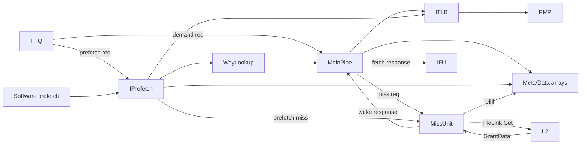
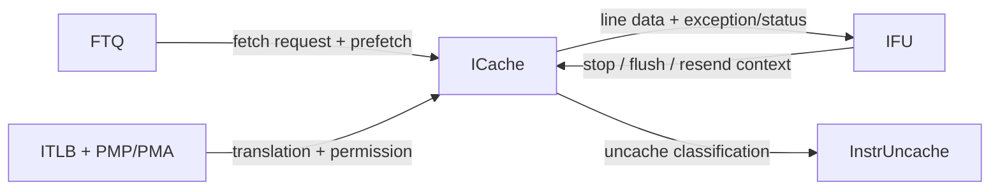
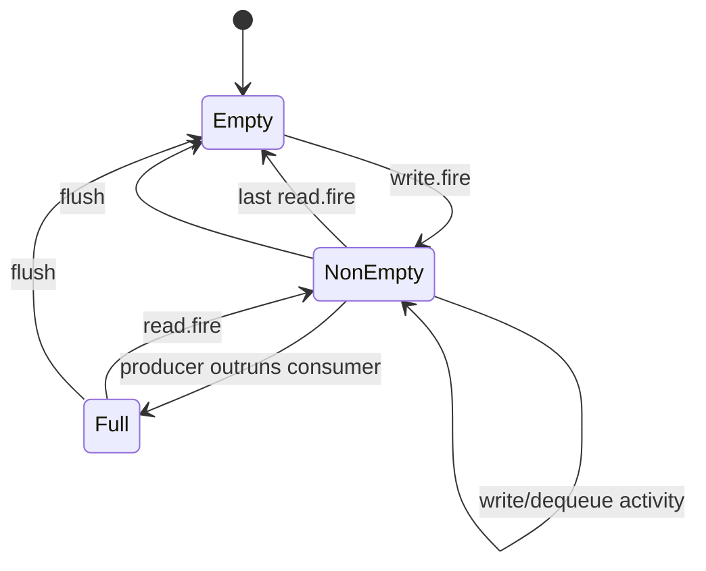
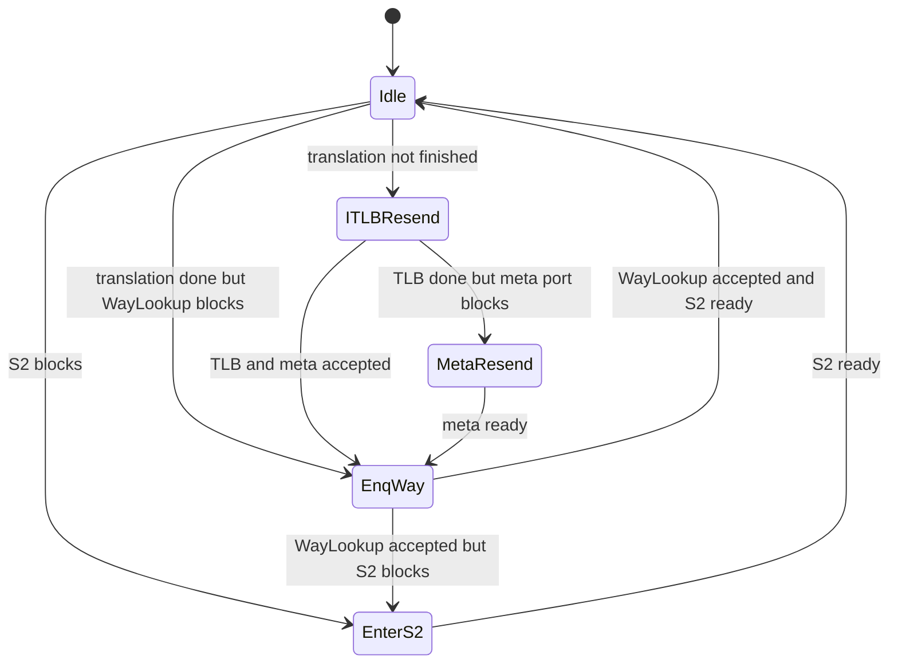
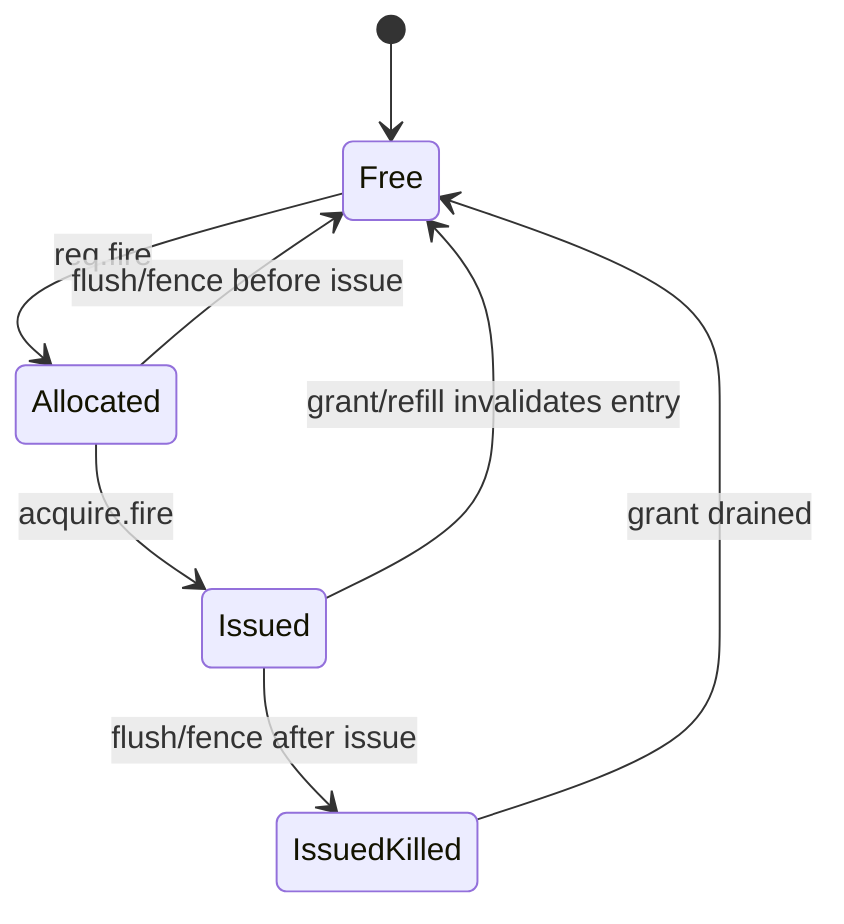
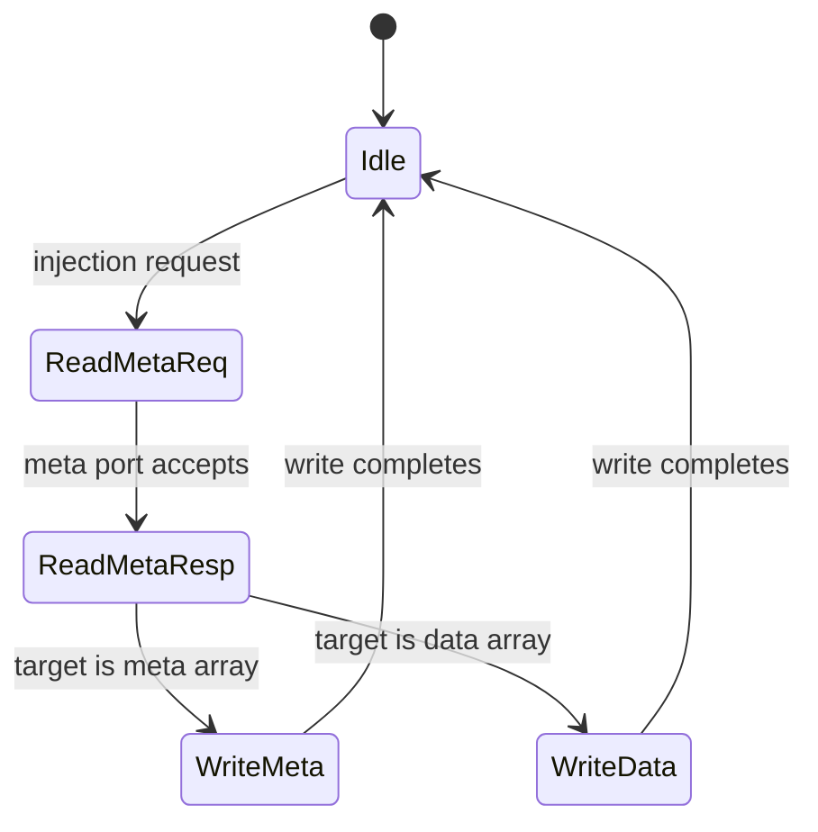

<!-- # Frontend ICache 控制流交付深入分析 -->
# In-Depth Analysis of Frontend ICache Control-Flow Delivery

<!-- regenerated-by-analyze-xiangshan-kunminghu -->
> Regenerated from `OpenXiangShan/XiangShan` branch `kunminghu-v2`, source commit `52262f303fc06daf84cdab7011d59b7df65ce7e8` using the updated Frontend graph/stage rules.


<!-- > 官方源码：`https://github.com/OpenXiangShan/XiangShan.git`；分支 `kunminghu-v2`；分析 commit `52262f303fc06daf84cdab7011d59b7df65ce7e8`。 -->
> Official source: `https://github.com/OpenXiangShan/XiangShan.git`; branch `kunminghu-v2`; analysis commit `52262f303fc06daf84cdab7011d59b7df65ce7e8`.

<!-- frontend-tutorial-generated-by-analyze-xiangshan-kunminghu -->
<!-- > 所有实现结论均限定在 `kunminghu-v2` commit `52262f303fc06daf84cdab7011d59b7df65ce7e8`；Design Doc 结论必须回到第 18 节的源码追溯矩阵。 -->
> All implementation conclusions are limited to `kunminghu-v2` commit `52262f303fc06daf84cdab7011d59b7df65ce7e8`; Design Doc claims must be traced through the source traceability matrix in Section 18.

## 1. Scope

<!-- 本节保留模块职责、分析基线、范围和统一五问，明确本文只以当前源码证据为准。 -->
This section records the module responsibilities, analysis baseline, scope, and common five questions, making clear that the document relies only on evidence from the current source.

<!-- ### 1.1. 统一五问导读 -->
### 1.1. Five-Question Guide
<!--
| 问题 | 回答 |
| --- | --- |
| **Who** | Frontend ICache 由 MainPipe、IPrefetch、WayLookup、MissUnit/MSHR、数组和控制单元组成。 |
| **What** | 为 FTQ prediction block 提供低延迟指令数据，并处理翻译、权限、miss、refill、预取和 fence.i。 |
| **How** | 命中流水与慢路径解耦；WayLookup/FIFO/MSHR 用 ready/valid 和状态位管理有限 outstanding 资源。 |
| **From what** | demand/prefetch 地址来自 FTQ，ITLB/PMP 给出翻译与权限，L2/TileLink 返回 refill。 |
| **To what** | 指令数据和异常到 IFU；miss 请求到 L2；容量反压回 FTQ/预取流水。 |
-->
| Question | Answer |
| --- | --- |
| **Who** | Frontend ICache consists of MainPipe, IPrefetch, WayLookup, MissUnit/MSHRs, arrays, and control logic. |
| **What** | It supplies low-latency instruction data for FTQ prediction blocks and handles translation, permissions, misses, refills, prefetches, and `fence.i`. |
| **How** | The hit pipeline is decoupled from slow paths; WayLookup/FIFO/MSHRs use ready/valid and state bits to manage finite outstanding resources. |
| **From what** | Demand/prefetch addresses come from FTQ, ITLB/PMP supplies translation and permissions, and L2/TileLink returns refills. |
| **To what** | Instruction data and exceptions go to IFU; miss requests go to L2; capacity backpressure returns to FTQ/prefetch pipelines. |

<!-- ### 1.2. 论文与理论边界 -->
### 1.2. Paper and Theory Boundaries
<!-- FTQ/IBuffer/ICache 不是单一方向预测算法，但属于解耦前端和控制流交付体系。相关理论包括 scalable/elastic instruction fetching、有限队列反压、非阻塞缓存与 miss-status handling。本文用理论解释“为什么存在”，所有指针、状态机、端口、容量、overflow/underflow 和恢复结论以本 commit 源码为准。 -->
FTQ, IBuffer, and ICache are not a single direction-prediction algorithm, but they are part of the decoupled frontend and control-flow-delivery system. Relevant theory includes scalable/elastic instruction fetching, finite-queue backpressure, non-blocking caches, and miss-status handling. This document uses theory to explain why the structures exist, while every conclusion about pointers, state machines, ports, capacity, overflow/underflow, and recovery is grounded in this commit's source.

<!-- ### 1.3. 模块定位 -->
### 1.3. Module Positioning
<!-- Frontend ICache 是“取指访问编排器”，不仅包含 tag/data array。顶层 [ICache.scala](https://github.com/OpenXiangShan/XiangShan/blob/kunminghu-v2/src/main/scala/xiangshan/frontend/icache/ICache.scala) 组合： -->
Frontend ICache is a fetch-access orchestrator, not merely a tag/data array. The top-level [ICache.scala](https://github.com/OpenXiangShan/XiangShan/blob/kunminghu-v2/src/main/scala/xiangshan/frontend/icache/ICache.scala) composes:

- <!-- MainPipe：需求取指命中快路径； -->
- MainPipe: fast path for demand-fetch hits.
- <!-- IPrefetch：FTQ/软件预取地址翻译和预取请求； -->
- IPrefetch: translation and prefetch requests for FTQ/software prefetch addresses.
- <!-- WayLookup：保存预取阶段得到的物理 tag/way 信息，供未来 demand fetch 使用； -->
- WayLookup: retains physical tag/way information acquired during prefetch for a later demand fetch.
- <!-- MissUnit/MSHR：需求和预取 miss、TileLink refill； -->
- MissUnit/MSHRs: demand and prefetch misses plus TileLink refill.
- <!-- Meta/Data Array 与替换器； -->
- Meta/data arrays and the replacement policy.
- <!-- CtrlUnit：fence.i、ECC 注入/维护； -->
- CtrlUnit: `fence.i`, ECC injection, and maintenance.
- <!-- 与 ITLB、PMP/PMA、WFI、错误报告的接口。 -->
- Interfaces to ITLB, PMP/PMA, WFI, and error reporting.

<!-- 它的存在原因是：取指命中需要低延迟，miss/refill/预取/维护需要多周期状态。把慢路径放进 MainPipe 会拉长关键路径并让一个 miss 阻塞所有独立请求。 -->
It exists because fetch hits need low latency, while miss/refill/prefetch/maintenance require multi-cycle state. Putting the slow paths in MainPipe would lengthen the critical path and allow one miss to block all independent requests.

<!-- ## 2. 关键源码证据 -->
## 2. Key Source Evidence

<!-- 本节直接列出 `ICache` 的有效源码入口、关键代码骨架和行为解释，避免只 preserving filenames or line numbers. -->
This section directly lists the effective `ICache` source entry points, key code skeleton, and behavioral explanation instead of retaining only filenames or line numbers.

<!-- ### 2.1. 源码入口和行号 -->
### 2.1. Source Entry Points and Line References
<!--
| 源码文件 | 本文使用它证明什么 | 行号证据 |
| --- | --- | --- |
| `frontend/icache/ICache.scala` | 顶层 demand/prefetch/miss/response 连接 | [frontend/icache/ICache.scala#L541-L591](https://github.com/OpenXiangShan/XiangShan/blob/kunminghu-v2/src/main/scala/xiangshan/frontend/icache/ICache.scala#L541-L591) |
| `frontend/icache/ICacheMainPipe.scala` | MainPipe S0-S2 请求、tag/data、hit/miss | [frontend/icache/ICacheMainPipe.scala#L93-L145](https://github.com/OpenXiangShan/XiangShan/blob/kunminghu-v2/src/main/scala/xiangshan/frontend/icache/ICacheMainPipe.scala#L93-L145) |
| `frontend/icache/InstrUncache.scala` | MMIO/uncache 请求响应 FSM | [frontend/icache/InstrUncache.scala#L41-L185](https://github.com/OpenXiangShan/XiangShan/blob/kunminghu-v2/src/main/scala/xiangshan/frontend/icache/InstrUncache.scala#L41-L185) |
-->
| Source file | What it establishes here | Line evidence |
| --- | --- | --- |
| `frontend/icache/ICache.scala` | Top-level demand/prefetch/miss/response wiring | [frontend/icache/ICache.scala#L541-L591](https://github.com/OpenXiangShan/XiangShan/blob/kunminghu-v2/src/main/scala/xiangshan/frontend/icache/ICache.scala#L541-L591) |
| `frontend/icache/ICacheMainPipe.scala` | MainPipe S0-S2 requests, tag/data handling, hits, and misses | [frontend/icache/ICacheMainPipe.scala#L93-L145](https://github.com/OpenXiangShan/XiangShan/blob/kunminghu-v2/src/main/scala/xiangshan/frontend/icache/ICacheMainPipe.scala#L93-L145) |
| `frontend/icache/InstrUncache.scala` | MMIO/uncache request-response FSM | [frontend/icache/InstrUncache.scala#L41-L185](https://github.com/OpenXiangShan/XiangShan/blob/kunminghu-v2/src/main/scala/xiangshan/frontend/icache/InstrUncache.scala#L41-L185) |

<!-- ### 2.2. 核心代码骨架 -->
### 2.2. Core Code Skeleton
```scala
S0: receive fetch vaddr and send ITLB/meta/data request
S1: align translation and array response
S2: decide hit/miss/exception and return line data
Miss/Uncache: allocate entry and wait refill/response
```

<!-- ### 2.3. 代码解析 -->
### 2.3. Code Walkthrough
<!-- ICache 负责把 FTQ demand fetch 转成真实 line 数据和异常状态。cacheable 命中走 MainPipe，miss 进入 MSHR/refill，MMIO/uncache 走 InstrUncache，不能伪装成普通 ICache hit。 -->
ICache converts an FTQ demand fetch into actual line data and exception state. Cacheable hits take MainPipe, misses enter the MSHR/refill path, and MMIO/uncache takes InstrUncache; MMIO/uncache must not be represented as an ordinary ICache hit.
## 3. Theory-to-Code Mapping

<!-- 本节把理论概念直接绑定到 `ICache` 的源码对象、控制/数据状态和下游消费者。 -->
This section binds theoretical concepts directly to `ICache` source objects, control/data state, and downstream consumers.

<!-- ### 3.1. 理论到代码映射表 -->
### 3.1. Theory-to-Code Mapping Table
<!--
| 理论概念 | 代码对象 | 为什么需要它 | 消费者/后续影响 |
| --- | --- | --- | --- |
| 非阻塞取指缓存 | MainPipe + MissUnit/MSHR | 命中快路径与 miss 慢路径分离 | IFU response |
| 跨 cacheline | two-line / PortNumber path | 预测块可能跨行，需要两段响应对齐 | IFU lastHalf/cut |
| MMIO/uncache | InstrUncache entries | 副作用访问需要独立请求和提交门控 | IFU MMIO FSM |
-->
| Theoretical concept | Code object | Why it is needed | Consumer / downstream effect |
| --- | --- | --- | --- |
| Non-blocking instruction cache | MainPipe + MissUnit/MSHRs | Separates the hit fast path from the miss slow path | IFU response |
| Cache-line crossing | Two-line / `PortNumber` path | A prediction block can span lines and needs two response fragments aligned | IFU `lastHalf`/cut |
| MMIO/uncache | InstrUncache entries | Side-effecting access needs a separate request and commit gating | IFU MMIO FSM |

<!-- ### 3.2. 阅读顺序 -->
### 3.2. Reading Order
<!-- 先按第 2 节定位源码对象，再顺着本表检查信号从哪里来、状态在哪里保存、何时更新、谁消费结果。若本篇只引用相邻模块拥有的状态，则以相邻 Frontend 分文档的源码分析为准。 -->
First locate the source objects in Section 2, then use the table to follow where each signal originates, where state is stored, when it is updated, and who consumes the result. When this document references state owned by an adjacent module, defer to that module's frontend source analysis.
<!-- ## 4. 论文原则和有效代码 -->
## 4. Paper Principles and Effective Code


<!-- ICache 的有效代码负责把 IFU 虚拟取指请求拆成 ITLB 翻译、tag/meta/data 访问、miss/refill 或 uncache/MMIO 请求。论文或设计文档中的“取指带宽”必须落到 `ICacheMainPipe`、MSHR、InstrUncache、TLB response 和 refill 写回这些源码对象上；能否继续发请求由 pipeline valid、miss 状态和下游 ready 共同决定。 -->
Effective ICache code decomposes an IFU virtual-fetch request into ITLB translation, tag/meta/data access, a miss/refill path, or an uncache/MMIO request. “Fetch bandwidth” in papers or design documents must be grounded in source objects such as `ICacheMainPipe`, MSHRs, InstrUncache, TLB responses, and refill writes; whether a new request may proceed is jointly determined by pipeline valid, miss state, and downstream ready.

## 5. Microarchitecture Parameters


<!-- 先从源码证据读取表深度、队列容量、位宽、端口数和配置开关，再判断它们对吞吐、冲突和恢复延迟的影响；不要用文档中的默认值替代当前 commit 的参数。 -->
First derive table depth, queue capacity, widths, port counts, and configuration switches from source evidence, then assess their effect on throughput, conflicts, and recovery latency. Do not substitute documentation defaults for the parameters in the current commit.

<!-- ## 6. 模块边界和接口 -->
## 6. Module Boundaries and Interfaces


<!-- ICache 边界包括 IFU 请求/响应、ITLB 请求/响应、L1/L2 refill 通道和 InstrUncache 通道。`instruction page fault` 在翻译/权限检查失败时随响应返回，`instruction access fault` 在物理访问或总线错误路径返回，cacheline 跨界时由 IFU/ICache 协作拆分为多段响应并在后级合并。 -->
ICache boundaries include IFU request/response, ITLB request/response, L1/L2 refill channels, and the InstrUncache channel. An `instruction page fault` returns with the response after translation/permission failure; an `instruction access fault` returns on physical-access or bus-error paths. For a cache-line crossing, IFU and ICache cooperatively split the access into response fragments and merge them downstream.

<!-- ## 7. 为什么模块存在 -->
## 7. Why the Module Exists


<!-- 把模块放回 Frontend 全链路理解：它解决的是预测带宽、取指正确性、存储层次延迟、投机恢复或上下游速率不匹配中的至少一个问题。 -->
Place the module back in the full frontend path: it addresses at least one of prediction bandwidth, fetch correctness, memory-hierarchy latency, speculative recovery, or a rate mismatch between adjacent stages.

<!-- ## 8. 有效动态路径 -->
## 8. Effective Dynamic Path


<!-- 按 `valid -> ready -> fire -> register/state update -> consumer` 阅读动态路径，并同时检查正常、阻塞、flush、redirect、replay 和恢复后的 forward progress。 -->
Read the dynamic path as `valid -> ready -> fire -> register/state update -> consumer`, while checking normal operation, blocking, flush, redirect, replay, and forward progress after recovery.

<!-- ## 9. Index 和地址/历史计算 -->
## 9. Index and Address/History Calculations


<!-- ### 9.1. 示例讲解索引 -->
### 9.1. Example-Reading Guide
<!-- 后文的正常路径、阻塞路径、redirect/flush、满空边界和波形段落均给出具体示例；阅读时建议从“一个 prediction block 的正常流动”开始，再对照 overflow/underflow 和恢复场景。 -->
Later sections provide concrete examples for normal flow, blocked flow, redirect/flush, full/empty boundaries, and waveforms. Start with the normal movement of one prediction block, then compare overflow/underflow and recovery scenarios.

<!-- ## 10. 核心算法 -->
## 10. Core Algorithm


<!-- 核心算法先用 PC 计算 set/bank/line offset，再并行推进 ITLB 与 cache array 访问；tag hit 时选择命中 way 的 data，miss 时分配 MSHR 并等待 refill，uncache/MMIO 时进入 InstrUncache entry 并按 response source 合并回 IFU。flush/redirect 会取消年轻请求或屏蔽响应，不能让旧路径 cacheline 被错误送入 IBuffer。 -->
The core algorithm first derives set/bank/line offset from the PC, then advances ITLB and cache-array accesses in parallel. On a tag hit it selects data from the matching way; on a miss it allocates an MSHR and waits for refill; on uncache/MMIO it enters an InstrUncache entry and merges the response back to IFU by response source. Flush/redirect cancels younger requests or masks responses so an old-path cache line cannot be incorrectly delivered to IBuffer.

<!-- ## 11. 状态和存储结构 -->
## 11. State and Storage Structures


<!-- 把每个表、栈、FIFO、MSHR、uncache entry 和 pipeline register 记录为 `valid/full/empty/ready` 可观察状态，并说明谁写入、谁读取、何时清空以及满/空时谁被反压。 -->
For every table, stack, FIFO, MSHR, uncache entry, and pipeline register, record observable `valid/full/empty/ready` state and explain who writes it, who reads it, when it is cleared, and which side is backpressured when it is full or empty.

<!-- ## 12. Pipeline stage 分析 -->
## 12. Pipeline-Stage Analysis


<!-- 阶段说明只使用源码中的寄存器、valid/ready 和 fire 条件；对 Frontend 使用 F0/F1/F2/F3，对 Backend 使用实际 Decode/Rename/Dispatch/Issue/Execute/Writeback/ROB 边界。 -->
Stage descriptions use only registers and valid/ready/fire conditions present in the source. For the frontend, use F0/F1/F2/F3; for the backend, use the actual Decode/Rename/Dispatch/Issue/Execute/Writeback/ROB boundaries.

## 13. Control path rationale


<!-- 控制路径按优先级阅读：reset、flush、backend redirect、BPU override、exception、replay 和正常 fire 发生冲突时，必须以源码条件顺序说明胜负关系。 -->
Read the control path by priority: when reset, flush, backend redirect, BPU override, exception, replay, and ordinary `fire` conflict, explain the winner in source-condition order.

<!-- ## 14. Data path 与跨边界 -->
## 14. Data Path and Boundary Crossings


<!-- ### 14.1. 全链路 -->
### 14.1. End-to-End Path


<!-- ### 14.2. 跨边界代码解析 -->
### 14.2. Boundary-Crossing Code Walkthrough
<!-- 跨 Cache Line 的取指必须拆成至少两个 line 请求：分别计算 line/set/way/beat，独立判断 hit/miss，并分别占用或合并 MSHR/refill 资源；只有响应顺序、valid mask 和异常元数据都满足条件后才能组装指令流。跨虚拟页还要求第二页独立 ITLB/权限检查，不能沿用第一页的翻译结果。`InstrUncache` 为 MMIO/uncache 建立独立 entry 和 response arbiter，[frontend/icache/InstrUncache.scala:185-229](https://github.com/OpenXiangShan/XiangShan/blob/kunminghu-v2/src/main/scala/xiangshan/frontend/icache/InstrUncache.scala#L185-L229)，因此 MMIO 请求不能污染 ICache tag/data 或绕过提交与响应握手。 -->
A cache-line-crossing fetch must be split into at least two line requests: calculate line/set/way/beat separately, independently decide hit/miss, and separately occupy or merge MSHR/refill resources. The instruction stream may be assembled only after response ordering, valid masks, and exception metadata all meet the required conditions. A virtual-page crossing likewise requires an independent ITLB/permission check for the second page; it cannot reuse translation from the first. `InstrUncache` creates distinct entries and a response arbiter for MMIO/uncache ([frontend/icache/InstrUncache.scala:185-229](https://github.com/OpenXiangShan/XiangShan/blob/kunminghu-v2/src/main/scala/xiangshan/frontend/icache/InstrUncache.scala#L185-L229)), so an MMIO request cannot pollute ICache tag/data or bypass commit and response handshakes.

<!-- 必须覆盖第一 line 命中、第二 line miss，两个 line 同时 miss，MSHR merge/full，第二页 fault，MMIO entry full，以及 boundary response 与 redirect/fence.i/flush 同周期。说明每个 fragment 的 producer/consumer、保持 valid 的状态、失败后的 replay/resend 和最终 forward progress。 -->
Cover a first-line hit/second-line miss, simultaneous two-line misses, MSHR merge/full, second-page fault, full MMIO entries, and a boundary response concurrent with redirect/`fence.i`/flush. For every fragment, identify the producer/consumer, the state retaining valid, replay/resend after failure, and eventual forward progress.

<!-- ## 15. 异常、debug、privilege -->
## 15. Exceptions, Debug, and Privilege

<!-- ICache/ITLB/InstrUncache 这一侧需要把取指异常保持为指令侧 cause，而不是泛化成数据访问错误。课程中统一按 `instruction page fault`、`instruction misalign`（RISC-V cause 名称对应 instruction address misaligned）和 `instruction access fault` 检查：page fault 来自 ITLB 翻译或执行权限，misalign 来自 PC/跨半指令拼接后的地址边界，access fault 来自 PMP/PMA/总线或 uncache 访问失败。异常元数据必须和 line 数据、valid mask、FTQ entry 一起对齐返回 IFU。 -->
On the ICache/ITLB/InstrUncache side, fetch exceptions must remain instruction-side causes rather than being generalized as data-access errors. This course checks `instruction page fault`, `instruction misalign` (the RISC-V cause is instruction-address-misaligned), and `instruction access fault`: page fault comes from ITLB translation or execute permission, misalign from PC/address boundaries after cross-halfword assembly, and access fault from PMP/PMA, bus, or uncache-access failure. Exception metadata must return to IFU aligned with line data, valid mask, and FTQ entry.

<!-- ### 15.1. 验证关注点 -->
### 15.1. Verification Focus
1. <!-- 两个 cacheline：hit/hit、hit/miss、miss/hit、miss/miss。 --> Two cache lines: hit/hit, hit/miss, miss/hit, and miss/miss.
2. <!-- 相同 block 多个 demand/prefetch 请求的 MSHR merge。 --> MSHR merging of several demand/prefetch requests for one block.
3. <!-- MSHR 全满、同拍 Grant 释放并接收新 miss。 --> A full MSHR set with a Grant release and a new miss accepted in the same cycle.
4. <!-- redirect 在 MSHR allocate 前、acquire fire 同拍、issue 后等待 Grant 三个位置。 --> Redirect before MSHR allocation, concurrent with acquire `fire`, and after issue while waiting for Grant.
5. <!-- fence.i 与 refill/meta write 同拍。 --> `fence.i` concurrent with refill/meta write.
6. <!-- WayLookup 空旁路、满、GPF stall、flush。 --> WayLookup empty bypass, full, GPF stall, and flush.
7. <!-- IPrefetch 在 ITLB miss、meta port stall、WayLookup full、S2 stall 的每个状态。 --> Every IPrefetch state under ITLB miss, meta-port stall, WayLookup full, and S2 stall.
8. <!-- demand 优先是否会合理抑制预取，且预取不会反向饿死 demand。 --> Whether demand priority reasonably suppresses prefetch and prefetch cannot in turn starve demand.
9. <!-- WFI 只在所有已 issue MSHR 和 InstrUncache entry 安全后返回。 --> WFI returns only after all issued MSHRs and InstrUncache entries are safe.

#### 15.1.1. Top-Level Module Connectivity

ICache receives FTQ fetch requests, returns line data/status to IFU, and uses shared ITLB/PMP/PMA resources. MMIO/uncache traffic is kept on the InstrUncache path: [frontend/Frontend.scala:172-218](https://github.com/OpenXiangShan/XiangShan/blob/52262f303fc06daf84cdab7011d59b7df65ce7e8/src/main/scala/xiangshan/frontend/Frontend.scala#L172-L218), [frontend/icache/InstrUncache.scala:185-229](https://github.com/OpenXiangShan/XiangShan/blob/52262f303fc06daf84cdab7011d59b7df65ce7e8/src/main/scala/xiangshan/frontend/icache/InstrUncache.scala#L185-L229).



#### 15.1.2. Frontend/Backend Pipeline Stages

The source-proven stage boundary is `F0 -> F1 -> F2 -> F3`: F0 accepts the FTQ request and calculates line indices, F1 registers the fetch block and calculates instruction PCs/cut pointers, F2 waits for ICache responses and performs data cutting/predecode preparation, and F3 expands/qualifies instructions, handles exceptions/MMIO, and drives IBuffer. Evidence: [frontend/IFU.scala:236-305](https://github.com/OpenXiangShan/XiangShan/blob/52262f303fc06daf84cdab7011d59b7df65ce7e8/src/main/scala/xiangshan/frontend/IFU.scala#L236-L305), [frontend/IFU.scala:346-457](https://github.com/OpenXiangShan/XiangShan/blob/52262f303fc06daf84cdab7011d59b7df65ce7e8/src/main/scala/xiangshan/frontend/IFU.scala#L346-L457), [frontend/IFU.scala:542-617](https://github.com/OpenXiangShan/XiangShan/blob/52262f303fc06daf84cdab7011d59b7df65ce7e8/src/main/scala/xiangshan/frontend/IFU.scala#L542-L617). The top-level connections couple FTQ, IFU, ICache, and IBuffer through shared ready/valid conditions: [frontend/Frontend.scala:199-231](https://github.com/OpenXiangShan/XiangShan/blob/52262f303fc06daf84cdab7011d59b7df65ce7e8/src/main/scala/xiangshan/frontend/Frontend.scala#L199-L231).

The backend continuation uses the effective module boundaries rather than inventing cycle names: Decode accepts the instruction packet, Rename creates speculative physical-register mappings, Dispatch allocates downstream resources, Issue/Scheduler selects ready uops, Execute/FU produces results, DataPath/WB carries writeback and wakeup, and ROB/CtrlBlock commits or redirects. Evidence: [backend/decode/DecodeStage.scala:83-120](https://github.com/OpenXiangShan/XiangShan/blob/52262f303fc06daf84cdab7011d59b7df65ce7e8/src/main/scala/xiangshan/backend/decode/DecodeStage.scala#L83-L120), [backend/rename/Rename.scala:40-117](https://github.com/OpenXiangShan/XiangShan/blob/52262f303fc06daf84cdab7011d59b7df65ce7e8/src/main/scala/xiangshan/backend/rename/Rename.scala#L40-L117), [backend/dispatch/NewDispatch.scala:49-176](https://github.com/OpenXiangShan/XiangShan/blob/52262f303fc06daf84cdab7011d59b7df65ce7e8/src/main/scala/xiangshan/backend/dispatch/NewDispatch.scala#L49-L176), [backend/issue/Scheduler.scala:29-180](https://github.com/OpenXiangShan/XiangShan/blob/52262f303fc06daf84cdab7011d59b7df65ce7e8/src/main/scala/xiangshan/backend/issue/Scheduler.scala#L29-L180), [backend/exu/ExeUnit.scala:50-110](https://github.com/OpenXiangShan/XiangShan/blob/52262f303fc06daf84cdab7011d59b7df65ce7e8/src/main/scala/xiangshan/backend/exu/ExeUnit.scala#L50-L110), [backend/datapath/DataPath.scala:25-70](https://github.com/OpenXiangShan/XiangShan/blob/52262f303fc06daf84cdab7011d59b7df65ce7e8/src/main/scala/xiangshan/backend/datapath/DataPath.scala#L25-L70), [backend/rob/Rob.scala:52-145](https://github.com/OpenXiangShan/XiangShan/blob/52262f303fc06daf84cdab7011d59b7df65ce7e8/src/main/scala/xiangshan/backend/rob/Rob.scala#L52-L145), [backend/CtrlBlock.scala:50-110](https://github.com/OpenXiangShan/XiangShan/blob/52262f303fc06daf84cdab7011d59b7df65ce7e8/src/main/scala/xiangshan/backend/CtrlBlock.scala#L50-L110).

```mermaid
flowchart LR
  F0["F0: FTQ req + line indices"] -->|f0_fire| F1["F1: PC + cut pointers"]
  F1 -->|f1_fire| F2["F2: ICache data + exceptions"]
  F2 -->|f2_fire| F3["F3: predecode + MMIO qualification"]
  F3 -->|toIbuffer.fire| Decode["Decode"]
  Decode -->|uop bundle| Rename["Rename"]
  Rename -->|renamed uop| Dispatch["Dispatch"]
  Dispatch -->|ready uop| Issue["Issue"]
  Issue -->|operands| Execute["Execute/FU"]
  Execute -->|result| Writeback["Writeback/Wakeup"]
  Writeback -->|retire candidate| Commit["ROB/Commit"]
  Commit -->|redirect/flush| F0
```



The stage graph keeps chronological forward edges separate from the bundled recovery edge. It must be read together with the module graph below: a stage is not itself a module, and a redirect does not create a fake forward stage.

```waveform-draw
{
  "signal": [
    {
      "name": "clk",
      "wave": "p......."
    },
    {
      "name": "F0.valid",
      "wave": "01...0.."
    },
    {
      "name": "F0.ready",
      "wave": "1..0...."
    },
    {
      "name": "F1.valid",
      "wave": "001..0.."
    },
    {
      "name": "F2.valid",
      "wave": "0001.0.."
    },
    {
      "name": "F3.valid",
      "wave": "00001.0."
    },
    {
      "name": "toIbuffer.fire",
      "wave": "0000010."
    },
    {
      "name": "redirect/flush",
      "wave": "00000010"
    }
  ],
  "config": {
    "hscale": 1
  }
}
```

<!-- ## 16. CSR 控制 -->
## 16. CSR Control


<!-- 前端分支预测器的使能控制来自 CSR 模块生成的 `CustomCSRCtrlIO.bp_ctrl`，不是各预测器本地私有 CSR。有效链路是：`sbpctl` CSR 字段 -> `io.status.custom.bp_ctrl` -> Backend `frontendCsrCtrl` -> XSCore `frontend.io.csrCtrl` -> Frontend `bpu.io.ctrl` -> BPU 内各子预测器 `io.enable`。 -->
Branch-predictor enable control comes from the CSR-generated `CustomCSRCtrlIO.bp_ctrl`, not from private CSRs in each predictor. The effective path is `sbpctl` CSR fields -> `io.status.custom.bp_ctrl` -> backend `frontendCsrCtrl` -> `XSCore.frontend.io.csrCtrl` -> frontend `bpu.io.ctrl` -> each BPU subpredictor's `io.enable`.

<!-- ### 16.1. CSR 字段到 BPU 控制信号 -->
### 16.1. CSR Fields to BPU Control Signals
<!--
| 控制位 | CSR 源字段 | Frontend/BPU 消费者 | 有效作用 | 源码证据 |
| --- | --- | --- | --- | --- |
| `bp_ctrl.ubtbEnable` | `sbpctl.regOut.UBTB_ENABLE` | `ubtb.io.enable` | 允许或关闭 S1 fast uBTB/MicroBtb 查询结果参与预测链；关闭后仍保留 fall-through 基线。 | [NewCSR.scala:1378](https://github.com/OpenXiangShan/XiangShan/blob/kunminghu-v2/src/main/scala/xiangshan/backend/fu/NewCSR/NewCSR.scala#L1378), [Bpu.scala:96](https://github.com/OpenXiangShan/XiangShan/blob/kunminghu-v2/src/main/scala/xiangshan/frontend/bpu/Bpu.scala#L96), [Bpu.scala:105](https://github.com/OpenXiangShan/XiangShan/blob/kunminghu-v2/src/main/scala/xiangshan/frontend/bpu/Bpu.scala#L105) |
| `bp_ctrl.abtbEnable` | `sbpctl.regOut.ABTB_ENABLE` | `abtb.io.enable` | 控制 AheadBtb 目标/属性预测是否参与早期预测。 | [NewCSR.scala:1379](https://github.com/OpenXiangShan/XiangShan/blob/kunminghu-v2/src/main/scala/xiangshan/backend/fu/NewCSR/NewCSR.scala#L1379), [Bpu.scala:97](https://github.com/OpenXiangShan/XiangShan/blob/kunminghu-v2/src/main/scala/xiangshan/frontend/bpu/Bpu.scala#L97), [Bpu.scala:106](https://github.com/OpenXiangShan/XiangShan/blob/kunminghu-v2/src/main/scala/xiangshan/frontend/bpu/Bpu.scala#L106) |
| `bp_ctrl.mbtbEnable` | `sbpctl.regOut.MBTB_ENABLE` | `mbtb.io.enable` | 控制 MainBtb 是否提供主 BTB 命中、直接分支/JAL target 和 fall-through 信息。 | [NewCSR.scala:1380](https://github.com/OpenXiangShan/XiangShan/blob/kunminghu-v2/src/main/scala/xiangshan/backend/fu/NewCSR/NewCSR.scala#L1380), [Bpu.scala:98](https://github.com/OpenXiangShan/XiangShan/blob/kunminghu-v2/src/main/scala/xiangshan/frontend/bpu/Bpu.scala#L98), [Bpu.scala:107](https://github.com/OpenXiangShan/XiangShan/blob/kunminghu-v2/src/main/scala/xiangshan/frontend/bpu/Bpu.scala#L107) |
| `bp_ctrl.tageEnable` | `sbpctl.regOut.TAGE_ENABLE` | `tage.io.enable` | 控制 TAGE 条件分支方向预测是否有效；关闭时不能把 TAGE provider 结果作为方向覆盖依据。 | [NewCSR.scala:1381](https://github.com/OpenXiangShan/XiangShan/blob/kunminghu-v2/src/main/scala/xiangshan/backend/fu/NewCSR/NewCSR.scala#L1381), [Bpu.scala:99](https://github.com/OpenXiangShan/XiangShan/blob/kunminghu-v2/src/main/scala/xiangshan/frontend/bpu/Bpu.scala#L99), [Bpu.scala:108](https://github.com/OpenXiangShan/XiangShan/blob/kunminghu-v2/src/main/scala/xiangshan/frontend/bpu/Bpu.scala#L108) |
| `bp_ctrl.scEnable` | `sbpctl.regOut.SC_ENABLE` | `sc.io.enable` | 控制 statistical corrector 是否修正 TAGE/基础方向结果。 | [NewCSR.scala:1382](https://github.com/OpenXiangShan/XiangShan/blob/kunminghu-v2/src/main/scala/xiangshan/backend/fu/NewCSR/NewCSR.scala#L1382), [Bpu.scala:100](https://github.com/OpenXiangShan/XiangShan/blob/kunminghu-v2/src/main/scala/xiangshan/frontend/bpu/Bpu.scala#L100), [Bpu.scala:109](https://github.com/OpenXiangShan/XiangShan/blob/kunminghu-v2/src/main/scala/xiangshan/frontend/bpu/Bpu.scala#L109) |
| `bp_ctrl.ittageEnable` | `sbpctl.regOut.ITTAGE_ENABLE` | `ittage.io.enable` | 控制间接跳转/JALR target 覆盖预测是否有效。 | [NewCSR.scala:1383](https://github.com/OpenXiangShan/XiangShan/blob/kunminghu-v2/src/main/scala/xiangshan/backend/fu/NewCSR/NewCSR.scala#L1383), [Bpu.scala:101](https://github.com/OpenXiangShan/XiangShan/blob/kunminghu-v2/src/main/scala/xiangshan/frontend/bpu/Bpu.scala#L101), [Bpu.scala:110](https://github.com/OpenXiangShan/XiangShan/blob/kunminghu-v2/src/main/scala/xiangshan/frontend/bpu/Bpu.scala#L110) |
| `bp_ctrl.rasEnable` | `sbpctl.regOut.RAS_ENABLE` | `ras.io.enable` | 控制 return address stack 是否给 RET/JALR 返回目标提供覆盖。 | [NewCSR.scala:1384](https://github.com/OpenXiangShan/XiangShan/blob/kunminghu-v2/src/main/scala/xiangshan/backend/fu/NewCSR/NewCSR.scala#L1384), [Bpu.scala:102](https://github.com/OpenXiangShan/XiangShan/blob/kunminghu-v2/src/main/scala/xiangshan/frontend/bpu/Bpu.scala#L102), [Bpu.scala:111](https://github.com/OpenXiangShan/XiangShan/blob/kunminghu-v2/src/main/scala/xiangshan/frontend/bpu/Bpu.scala#L111) |
-->
| Control bit | CSR source field | Frontend/BPU consumer | Effective behavior | Source evidence |
| --- | --- | --- | --- | --- |
| `bp_ctrl.ubtbEnable` | `sbpctl.regOut.UBTB_ENABLE` | `ubtb.io.enable` | Enables or disables S1 fast uBTB/MicroBtb results in the prediction chain; the fall-through baseline remains. | [NewCSR.scala:1378](https://github.com/OpenXiangShan/XiangShan/blob/kunminghu-v2/src/main/scala/xiangshan/backend/fu/NewCSR/NewCSR.scala#L1378), [Bpu.scala:96](https://github.com/OpenXiangShan/XiangShan/blob/kunminghu-v2/src/main/scala/xiangshan/frontend/bpu/Bpu.scala#L96), [Bpu.scala:105](https://github.com/OpenXiangShan/XiangShan/blob/kunminghu-v2/src/main/scala/xiangshan/frontend/bpu/Bpu.scala#L105) |
| `bp_ctrl.abtbEnable` | `sbpctl.regOut.ABTB_ENABLE` | `abtb.io.enable` | Controls whether AheadBtb target/attribute prediction participates in early prediction. | [NewCSR.scala:1379](https://github.com/OpenXiangShan/XiangShan/blob/kunminghu-v2/src/main/scala/xiangshan/backend/fu/NewCSR/NewCSR.scala#L1379), [Bpu.scala:97](https://github.com/OpenXiangShan/XiangShan/blob/kunminghu-v2/src/main/scala/xiangshan/frontend/bpu/Bpu.scala#L97), [Bpu.scala:106](https://github.com/OpenXiangShan/XiangShan/blob/kunminghu-v2/src/main/scala/xiangshan/frontend/bpu/Bpu.scala#L106) |
| `bp_ctrl.mbtbEnable` | `sbpctl.regOut.MBTB_ENABLE` | `mbtb.io.enable` | Controls whether MainBtb supplies main-BTB hits, direct-branch/JAL targets, and fall-through information. | [NewCSR.scala:1380](https://github.com/OpenXiangShan/XiangShan/blob/kunminghu-v2/src/main/scala/xiangshan/backend/fu/NewCSR/NewCSR.scala#L1380), [Bpu.scala:98](https://github.com/OpenXiangShan/XiangShan/blob/kunminghu-v2/src/main/scala/xiangshan/frontend/bpu/Bpu.scala#L98), [Bpu.scala:107](https://github.com/OpenXiangShan/XiangShan/blob/kunminghu-v2/src/main/scala/xiangshan/frontend/bpu/Bpu.scala#L107) |
| `bp_ctrl.tageEnable` | `sbpctl.regOut.TAGE_ENABLE` | `tage.io.enable` | Controls whether TAGE conditional-branch direction prediction is valid; when disabled, TAGE provider output must not override direction. | [NewCSR.scala:1381](https://github.com/OpenXiangShan/XiangShan/blob/kunminghu-v2/src/main/scala/xiangshan/backend/fu/NewCSR/NewCSR.scala#L1381), [Bpu.scala:99](https://github.com/OpenXiangShan/XiangShan/blob/kunminghu-v2/src/main/scala/xiangshan/frontend/bpu/Bpu.scala#L99), [Bpu.scala:108](https://github.com/OpenXiangShan/XiangShan/blob/kunminghu-v2/src/main/scala/xiangshan/frontend/bpu/Bpu.scala#L108) |
| `bp_ctrl.scEnable` | `sbpctl.regOut.SC_ENABLE` | `sc.io.enable` | Controls whether the statistical corrector modifies TAGE/base-direction results. | [NewCSR.scala:1382](https://github.com/OpenXiangShan/XiangShan/blob/kunminghu-v2/src/main/scala/xiangshan/backend/fu/NewCSR/NewCSR.scala#L1382), [Bpu.scala:100](https://github.com/OpenXiangShan/XiangShan/blob/kunminghu-v2/src/main/scala/xiangshan/frontend/bpu/Bpu.scala#L100), [Bpu.scala:109](https://github.com/OpenXiangShan/XiangShan/blob/kunminghu-v2/src/main/scala/xiangshan/frontend/bpu/Bpu.scala#L109) |
| `bp_ctrl.ittageEnable` | `sbpctl.regOut.ITTAGE_ENABLE` | `ittage.io.enable` | Controls whether ITTAGE may override indirect-jump/JALR targets. | [NewCSR.scala:1383](https://github.com/OpenXiangShan/XiangShan/blob/kunminghu-v2/src/main/scala/xiangshan/backend/fu/NewCSR/NewCSR.scala#L1383), [Bpu.scala:101](https://github.com/OpenXiangShan/XiangShan/blob/kunminghu-v2/src/main/scala/xiangshan/frontend/bpu/Bpu.scala#L101), [Bpu.scala:110](https://github.com/OpenXiangShan/XiangShan/blob/kunminghu-v2/src/main/scala/xiangshan/frontend/bpu/Bpu.scala#L110) |
| `bp_ctrl.rasEnable` | `sbpctl.regOut.RAS_ENABLE` | `ras.io.enable` | Controls whether the return-address stack overrides RET/JALR return targets. | [NewCSR.scala:1384](https://github.com/OpenXiangShan/XiangShan/blob/kunminghu-v2/src/main/scala/xiangshan/backend/fu/NewCSR/NewCSR.scala#L1384), [Bpu.scala:102](https://github.com/OpenXiangShan/XiangShan/blob/kunminghu-v2/src/main/scala/xiangshan/frontend/bpu/Bpu.scala#L102), [Bpu.scala:111](https://github.com/OpenXiangShan/XiangShan/blob/kunminghu-v2/src/main/scala/xiangshan/frontend/bpu/Bpu.scala#L111) |

<!-- ### 16.2. 有效代码骨架 -->
### 16.2. Effective Code Skeleton
```scala
// backend/fu/NewCSR/NewCSR.scala
io.status.custom.bp_ctrl.ubtbEnable   := sbpctl.regOut.UBTB_ENABLE.asBool
io.status.custom.bp_ctrl.abtbEnable   := sbpctl.regOut.ABTB_ENABLE.asBool
io.status.custom.bp_ctrl.mbtbEnable   := sbpctl.regOut.MBTB_ENABLE.asBool
io.status.custom.bp_ctrl.tageEnable   := sbpctl.regOut.TAGE_ENABLE.asBool
io.status.custom.bp_ctrl.scEnable     := sbpctl.regOut.SC_ENABLE.asBool
io.status.custom.bp_ctrl.ittageEnable := sbpctl.regOut.ITTAGE_ENABLE.asBool
io.status.custom.bp_ctrl.rasEnable    := sbpctl.regOut.RAS_ENABLE.asBool

// frontend/Frontend.scala
private val csrCtrl = DelayN(io.csrCtrl, CsrCtrlPortDelay)
bpu.io.ctrl := csrCtrl.bp_ctrl

// frontend/bpu/Bpu.scala
private val ctrl = DelayN(io.ctrl, 2)
fallThrough.io.enable := true.B
utage.io.enable       := true.B
uras.io.enable        := true.B
ubtb.io.enable        := ctrl.ubtbEnable
abtb.io.enable        := ctrl.abtbEnable
mbtb.io.enable        := ctrl.mbtbEnable
tage.io.enable        := ctrl.tageEnable
sc.io.enable          := ctrl.scEnable
ittage.io.enable      := ctrl.ittageEnable
ras.io.enable         := ctrl.rasEnable
```

<!-- ### 16.3. 代码解析 -->
### 16.3. Code Walkthrough
<!-- `BpuCtrl` bundle 明确定义了 `ubtbEnable`、`abtbEnable`、`mbtbEnable`、`tageEnable`、`scEnable`、`ittageEnable`、`rasEnable` 七个 Bool 控制位：[Bundles.scala:179-189](https://github.com/OpenXiangShan/XiangShan/blob/kunminghu-v2/src/main/scala/xiangshan/frontend/bpu/Bundles.scala#L179-L189)。`CustomCSRCtrlIO` 将 `bp_ctrl` 作为 CSR 输出的一部分：[Bundle.scala:586-596](https://github.com/OpenXiangShan/XiangShan/blob/kunminghu-v2/src/main/scala/xiangshan/Bundle.scala#L586-L596)。Backend 把 `csrio.customCtrl` 暴露为 `frontendCsrCtrl`，XSCore 再连到 Frontend：[Backend.scala:526-527](https://github.com/OpenXiangShan/XiangShan/blob/kunminghu-v2/src/main/scala/xiangshan/backend/Backend.scala#L526-L527), [XSCore.scala:138](https://github.com/OpenXiangShan/XiangShan/blob/kunminghu-v2/src/main/scala/xiangshan/XSCore.scala#L138)。Frontend 先用 `CsrCtrlPortDelay` 延迟 CSR 控制，再把 `csrCtrl.bp_ctrl` 送进 BPU：[Frontend.scala:143-153](https://github.com/OpenXiangShan/XiangShan/blob/kunminghu-v2/src/main/scala/xiangshan/frontend/Frontend.scala#L143-L153)。BPU 内部再延迟 2 拍以满足时序，随后分发给各子预测器：[Bpu.scala:89-111](https://github.com/OpenXiangShan/XiangShan/blob/kunminghu-v2/src/main/scala/xiangshan/frontend/bpu/Bpu.scala#L89-L111)。 -->
The `BpuCtrl` bundle defines seven Boolean control bits. `CustomCSRCtrlIO` exposes `bp_ctrl`; the backend and XSCore connect it to Frontend, which delays it before BPU distributes the controls to subpredictors. See [Bundles.scala:179-189](https://github.com/OpenXiangShan/XiangShan/blob/kunminghu-v2/src/main/scala/xiangshan/frontend/bpu/Bundles.scala#L179-L189), [Bundle.scala:586-596](https://github.com/OpenXiangShan/XiangShan/blob/kunminghu-v2/src/main/scala/xiangshan/Bundle.scala#L586-L596), [Backend.scala:526-527](https://github.com/OpenXiangShan/XiangShan/blob/kunminghu-v2/src/main/scala/xiangshan/backend/Backend.scala#L526-L527), [Frontend.scala:143-153](https://github.com/OpenXiangShan/XiangShan/blob/kunminghu-v2/src/main/scala/xiangshan/frontend/Frontend.scala#L143-L153), and [Bpu.scala:89-111](https://github.com/OpenXiangShan/XiangShan/blob/kunminghu-v2/src/main/scala/xiangshan/frontend/bpu/Bpu.scala#L89-L111).

<!-- 需要注意两点：第一，`fallThrough` 基线预测器始终 `enable := true.B`，`MicroTage` 和 `MicroRas` 当前也固定使能，源码中 `utageEnable` 仍是注释项，不应写成已由 CSR 控制；第二，在 `EnableConstantin && !FPGAPlatform` 配置下，`constCtrl` 可覆盖 CSR 位，否则直接使用 CSR 位，因此验证时要同时覆盖 Constantin override 和普通 CSR 控制两条路径。 -->
Two details matter. The `fallThrough` baseline is always enabled, and `MicroTage`/`MicroRas` are hard-enabled; `utageEnable` remains commented out and is not CSR-controlled. Under `EnableConstantin && !FPGAPlatform`, `constCtrl` may override CSR bits; otherwise CSR bits are used directly, so verification must cover both paths.

## 17. Diagrams


<!-- ### 17.1. 波形 -->
### 17.1. Waveforms
<!-- #### 17.1.1. demand miss 与 MSHR 回压 -->
#### 17.1.1. Demand Miss and MSHR Backpressure

```waveform-draw
{
  "signal": [
    {
      "name": "clk",
      "wave": "p........."
    },
    {
      "name": "MainPipe.miss.valid",
      "wave": "01.....0.."
    },
    {
      "name": "MSHR.req.ready",
      "wave": "10..1....."
    },
    {
      "name": "miss payload",
      "wave": "x=.....x..",
      "data": [
        "block A"
      ]
    },
    {
      "name": "MSHR.req.fire",
      "wave": "0...10...."
    },
    {
      "name": "TL.A.valid",
      "wave": "0....1.0.."
    },
    {
      "name": "TL.D.valid",
      "wave": "0.......10"
    }
  ],
  "config": {
    "hscale": 1
  }
}
```

<!-- #### 17.1.2. WayLookup 满 -->
#### 17.1.2. WayLookup Full

```waveform-draw
{
  "signal": [
    {
      "name": "clk",
      "wave": "p......."
    },
    {
      "name": "WayLookup.full",
      "wave": "0.1..0.."
    },
    {
      "name": "prefetch.write.valid",
      "wave": "01....0."
    },
    {
      "name": "prefetch.write.ready",
      "wave": "10..1..."
    },
    {
      "name": "entry",
      "wave": "x=....x.",
      "data": [
        "PF0"
      ]
    },
    {
      "name": "demand.read.fire",
      "wave": "0...10.."
    },
    {
      "name": "write.fire",
      "wave": "0....10."
    }
  ],
  "config": {
    "hscale": 1
  }
}
```

<!-- ## 18. 有效行为和 Design Doc 差异 -->
## 18. Effective Behavior and Design Doc Differences


### 18.1. Design Doc to Source Traceability
| Design Doc location | Atomic claim | XiangShan source evidence | Relationship | Status | Discrepancy |
| --- | --- | --- | --- | --- | --- |
| [docs/en/frontend/ICache/index.md:1](https://github.com/OpenXiangShan/XiangShan-Design-Doc/blob/f8e258dc2d9c02c0616764856e1d18feedb91b81/docs/en/frontend/ICache/index.md#L1) | ICache demand path is separated from lookup/prefetch/miss handling | [frontend/icache/ICache.scala:541-591](https://github.com/OpenXiangShan/XiangShan/blob/52262f303fc06daf84cdab7011d59b7df65ce7e8/src/main/scala/xiangshan/frontend/icache/ICache.scala#L541-L591) | top-level request/response wiring | **Verified** | None |
| [docs/en/frontend/ICache/MainPipe.md:1](https://github.com/OpenXiangShan/XiangShan-Design-Doc/blob/f8e258dc2d9c02c0616764856e1d18feedb91b81/docs/en/frontend/ICache/MainPipe.md#L1) | MainPipe performs demand lookup and drives hit/miss decisions | [frontend/icache/ICache.scala:541-591](https://github.com/OpenXiangShan/XiangShan/blob/52262f303fc06daf84cdab7011d59b7df65ce7e8/src/main/scala/xiangshan/frontend/icache/ICache.scala#L541-L591) | request reaches main pipe and response exits ICache | **Partially verified** | Detailed MainPipe implementation is distributed across source files. |
| [docs/en/frontend/ICache/MissUnit.md:1](https://github.com/OpenXiangShan/XiangShan-Design-Doc/blob/f8e258dc2d9c02c0616764856e1d18feedb91b81/docs/en/frontend/ICache/MissUnit.md#L1) | misses allocate MSHR/refill state and return data | [frontend/icache/ICache.scala:541-591](https://github.com/OpenXiangShan/XiangShan/blob/52262f303fc06daf84cdab7011d59b7df65ce7e8/src/main/scala/xiangshan/frontend/icache/ICache.scala#L541-L591) | miss/refill arbitration at top-level | **Partially verified** | Exact MissUnit lines are in generated submodules in this checkout. |
| [docs/en/frontend/ICache/CtrlUnit.md:16](https://github.com/OpenXiangShan/XiangShan-Design-Doc/blob/f8e258dc2d9c02c0616764856e1d18feedb91b81/docs/en/frontend/ICache/CtrlUnit.md#L16) | MMIO-mapped control registers configure ECC behavior | [frontend/icache/ICache.scala:541-591](https://github.com/OpenXiangShan/XiangShan/blob/52262f303fc06daf84cdab7011d59b7df65ce7e8/src/main/scala/xiangshan/frontend/icache/ICache.scala#L541-L591) | control path is exposed by ICache top-level | **Partially verified** | CtrlUnit implementation is configuration/submodule dependent. |

### 18.2. Design Doc Baseline
- Design Doc: `OpenXiangShan/XiangShan-Design-Doc`, branch `kunminghu-v3`, commit `f8e258dc2d9c02c0616764856e1d18feedb91b81`.
- XiangShan source: `OpenXiangShan/XiangShan`, branch `kunminghu-v2`, commit `52262f303fc06daf84cdab7011d59b7df65ce7e8`.
<!-- - 设计文档是意图和接口假设；以下矩阵只把能在该源码 commit 的有效 Chisel 中定位到的内容作为实现事实。 -->
- The Design Doc expresses intent and interface assumptions; the matrix below treats only content located in effective Chisel at this source commit as implementation fact.

### 18.3. Design Doc Line-by-Line Mapping
1. `icache/ICache.scala:541-591` connects demand requests, prefetch requests, miss/refill responses, and frontend-facing response signals. This is the source-level topological edge shared by the Design Doc's ICache pages.
2. The MainPipe/WayLookup/PrefetchPipe claim is only implementation fact where the top-level connection and valid/ready path reach the corresponding instantiated unit; the cited range proves the boundary, while submodule source must be used for internal timing.
3. `InstrUncache.scala:41-185` is the separate non-cacheable path. Its request/response FSM and cancellation behavior prevent MMIO from being represented as an ordinary ICache hit.

### 18.4. Design Doc Discrepancies
- `Partially verified`: the Design Doc splits ICache into several conceptual pages, while the selected source commit distributes some logic through generated/submodule code.
- `Version mismatch`: v3 Design Doc names and v2 source structure are not assumed identical.

<!-- ## 19. 动态场景示例 -->
## 19. Dynamic Scenario Examples


<!-- 每个场景按 `stimulus -> producer -> transform/state -> consumer -> observation -> recovery` 展开，至少覆盖正常路径、资源阻塞、预测/数据冲突、redirect/flush 和恢复后的前向进展。 -->
Each scenario is expanded as `stimulus -> producer -> transform/state -> consumer -> observation -> recovery`, covering at least the normal path, resource blocking, prediction/data conflict, redirect/flush, and forward progress after recovery.

<!-- ## 20. 结论 -->
## 20. Conclusion


<!-- ### 20.1. Demand MainPipe -->
### 20.1. Demand MainPipe
MainPipe receives an FTQ demand fetch and:

1. <!-- S0 接收虚拟地址和 FTQ index； --> accepts the virtual address and FTQ index in S0;
2. <!-- 并行发 ITLB、meta/data array 读请求； --> issues ITLB and meta/data-array reads in parallel;
3. <!-- S1 对齐翻译和 array 返回，结合 WayLookup 提示； --> aligns translation and array responses in S1 and incorporates WayLookup hints;
4. <!-- S2 判断 tag/way 命中、ECC、异常、双行结果； --> decides tag/way hit, ECC, exception, and two-line results in S2;
5. <!-- 命中则向 IFU 返回，miss 则向 MissUnit 分配/合并 MSHR； --> returns a hit to IFU, or allocates/merges an MSHR through MissUnit on a miss;
6. <!-- refill 后重新唤醒或返回数据。 --> reawakens the request or returns data after refill.

<!-- MainPipe 接口和主体入口见 [ICacheMainPipe.scala#L93-L145](https://github.com/OpenXiangShan/XiangShan/blob/kunminghu-v2/src/main/scala/xiangshan/frontend/icache/ICacheMainPipe.scala#L93-L145)。 -->
The MainPipe interface and main entry are shown in [ICacheMainPipe.scala#L93-L145](https://github.com/OpenXiangShan/XiangShan/blob/kunminghu-v2/src/main/scala/xiangshan/frontend/icache/ICacheMainPipe.scala#L93-L145).

<!-- #### 20.1.1. 为什么双端口/双行 -->
#### 20.1.1. Why Two Ports / Two Lines

<!-- 一个预测块可能从 cacheline 后半部分开始并跨到下一行。ICache 使用 `PortNumber=2` 相关接口并行处理两个行地址，IFU 再根据真实指令范围拼接。若第二行 miss，第一行数据也必须与其状态一起保存，不能把两个行请求当作互不相关的普通 load。 -->
A prediction block may start in the second half of a cache line and cross into the next line. ICache uses the `PortNumber=2` interfaces to process both line addresses in parallel, and IFU concatenates them according to the actual instruction range. If the second line misses, the first line's data must be retained with its state; the two requests cannot be treated as unrelated ordinary loads.

<!-- ### 20.2. WayLookup：预取与需求取指之间的队列 -->
### 20.2. WayLookup: Queue Between Prefetch and Demand Fetch
<!-- IPrefetch 提前做 ITLB、meta lookup，把物理块地址、虚拟 set、waymask 和异常等写入 WayLookup。未来 demand fetch 读取队头，省去部分重复工作或更快定位 way。 -->
IPrefetch performs ITLB and metadata lookup early, then writes the physical block address, virtual set, way mask, and exceptions into WayLookup. A later demand fetch reads the head entry, avoiding repeated work or locating the way faster.

<!-- #### 20.2.1. 环形 FIFO -->
#### 20.2.1. Circular FIFO

<!-- `readPtr/writePtr` 使用 `CircularQueuePtr`；相等为空，同 index、flag 不同为满：[WayLookup.scala#L73-L89](https://github.com/OpenXiangShan/XiangShan/blob/kunminghu-v2/src/main/scala/xiangshan/frontend/icache/WayLookup.scala#L73-L89)。 -->
`readPtr/writePtr` use `CircularQueuePtr`: equal pointers mean empty, while equal indices with different flags mean full ([WayLookup.scala#L73-L89](https://github.com/OpenXiangShan/XiangShan/blob/kunminghu-v2/src/main/scala/xiangshan/frontend/icache/WayLookup.scala#L73-L89)).



#### 20.2.2. Overflow

<!-- `io.write.ready := !full && !gpf_stall`：[WayLookup.scala#L173-L183](https://github.com/OpenXiangShan/XiangShan/blob/kunminghu-v2/src/main/scala/xiangshan/frontend/icache/WayLookup.scala#L173-L183)。满时 IPrefetch 停在 `m_enqWay`，不会覆盖尚未被 demand fetch 消费的提示。若 GPF entry 仍待安全读取，也暂停写入，避免异常元数据与普通 entry 次序错位。 -->
`io.write.ready := !full && !gpf_stall` ([WayLookup.scala#L173-L183](https://github.com/OpenXiangShan/XiangShan/blob/kunminghu-v2/src/main/scala/xiangshan/frontend/icache/WayLookup.scala#L173-L183)). When full, IPrefetch stops in `m_enqWay` and does not overwrite a hint that demand fetch has not consumed. It also pauses writes while a GPF entry awaits safe access, preserving exception metadata order relative to ordinary entries.

<!-- #### 20.2.3. underflow 与 bypass -->
#### 20.2.3. Underflow and Bypass

<!-- 空时 `read.valid=false`，但若同拍有 write，可直接 bypass 给 read，减少一拍延迟：[WayLookup.scala#L150-L160](https://github.com/OpenXiangShan/XiangShan/blob/kunminghu-v2/src/main/scala/xiangshan/frontend/icache/WayLookup.scala#L150-L160)。没有 write 时不能读取数组残留值。 -->
When empty, `read.valid=false`; if a write occurs in the same cycle, the new entry can bypass directly to the read and save one cycle ([WayLookup.scala#L150-L160](https://github.com/OpenXiangShan/XiangShan/blob/kunminghu-v2/src/main/scala/xiangshan/frontend/icache/WayLookup.scala#L150-L160)). Without a write, stale array contents must not be read.

<!-- ### 20.3. IPrefetch 五状态 FSM -->
### 20.3. Five-State IPrefetch FSM
<!-- 状态定义见 [IPrefetch.scala#L137-L144](https://github.com/OpenXiangShan/XiangShan/blob/kunminghu-v2/src/main/scala/xiangshan/frontend/icache/IPrefetch.scala#L137-L144)，转换见 [IPrefetch.scala#L417-L470](https://github.com/OpenXiangShan/XiangShan/blob/kunminghu-v2/src/main/scala/xiangshan/frontend/icache/IPrefetch.scala#L417-L470)。 -->
State definitions are in [IPrefetch.scala#L137-L144](https://github.com/OpenXiangShan/XiangShan/blob/kunminghu-v2/src/main/scala/xiangshan/frontend/icache/IPrefetch.scala#L137-L144), and transitions are in [IPrefetch.scala#L417-L470](https://github.com/OpenXiangShan/XiangShan/blob/kunminghu-v2/src/main/scala/xiangshan/frontend/icache/IPrefetch.scala#L417-L470).



<!-- 该 FSM 把三个独立反压点串起来：ITLB miss/replay、meta array 端口、WayLookup/S2。没有它，某个端口未接受时可能重复发送其他已接受请求，导致 meta、TLB 和队列 entry 不再对应同一预取地址。 -->
This FSM chains three independent backpressure points: ITLB miss/replay, the metadata-array port, and WayLookup/S2. Without it, accepting one port while another stalls could resend already accepted work, causing metadata, TLB state, and queue entries to refer to different prefetch addresses.

<!-- flush 时 `next_state := m_idle`，并清除等待翻译 latch：[IPrefetch.scala#L459-L470](https://github.com/OpenXiangShan/XiangShan/blob/kunminghu-v2/src/main/scala/xiangshan/frontend/icache/IPrefetch.scala#L459-L470)。 -->
On flush, `next_state := m_idle` and the translation-wait latch is cleared ([IPrefetch.scala#L459-L470](https://github.com/OpenXiangShan/XiangShan/blob/kunminghu-v2/src/main/scala/xiangshan/frontend/icache/IPrefetch.scala#L459-L470)).

<!-- ### 20.4. MissUnit 与 MSHR -->
### 20.4. MissUnit and MSHRs
<!-- 每个 `ICacheMSHR` 用四类状态寄存器表达生命周期：[ICacheMissUnit.scala#L113-L126](https://github.com/OpenXiangShan/XiangShan/blob/kunminghu-v2/src/main/scala/xiangshan/frontend/icache/ICacheMissUnit.scala#L113-L126)。 -->
Each `ICacheMSHR` expresses its lifecycle with four classes of state registers ([ICacheMissUnit.scala#L113-L126](https://github.com/OpenXiangShan/XiangShan/blob/kunminghu-v2/src/main/scala/xiangshan/frontend/icache/ICacheMissUnit.scala#L113-L126)).

<!-- | 寄存器 | 含义 |
| --- | --- |
| `valid` | entry 已分配，保存 block address/set |
| `issue` | TileLink Get 已 fire，必须等待对应 Grant |
| `flush` | 错误路径 demand 不再需要响应，但总线事务可能仍在途 |
| `fencei` | fence.i 后该请求不能作为正常 ICache 数据可见 |
-->
| Register | Meaning |
| --- | --- |
| `valid` | Entry is allocated and stores block address/set. |
| `issue` | TileLink Get has fired and the matching Grant must be awaited. |
| `flush` | Wrong-path demand no longer needs a response, although the bus transaction may still be in flight. |
| `fencei` | After `fence.i`, the request cannot become visible as ordinary ICache data. |



<!-- #### 20.4.1. 分配与 overflow -->
#### 20.4.1. Allocation and Overflow

<!-- entry 只有 `!valid && !flush && !fencei` 时 `req.ready`：[ICacheMissUnit.scala#L149-L158](https://github.com/OpenXiangShan/XiangShan/blob/kunminghu-v2/src/main/scala/xiangshan/frontend/icache/ICacheMissUnit.scala#L149-L158)。所有 MSHR valid 时，MissUnit 无法接受新 miss，MainPipe/IPrefetch 被反压。这就是非阻塞缓存的 MSHR overflow：不是数组越界，而是 outstanding miss 容量耗尽。 -->
`req.ready` is asserted only when an entry is `!valid && !flush && !fencei` ([ICacheMissUnit.scala#L149-L158](https://github.com/OpenXiangShan/XiangShan/blob/kunminghu-v2/src/main/scala/xiangshan/frontend/icache/ICacheMissUnit.scala#L149-L158)). When all MSHRs are valid, MissUnit cannot accept a new miss and backpressures MainPipe/IPrefetch. This is MSHR overflow in a non-blocking cache: not an array overrun, but exhaustion of outstanding-miss capacity.

<!-- #### 20.4.2. 命中已有 MSHR / merge -->
#### 20.4.2. Hit an Existing MSHR / Merge

<!-- `lookUps` 用 block physical address 和 virtual set 匹配有效 MSHR：[ICacheMissUnit.scala#L127-L134](https://github.com/OpenXiangShan/XiangShan/blob/kunminghu-v2/src/main/scala/xiangshan/frontend/icache/ICacheMissUnit.scala#L127-L134)。相同 block 的后续请求不应再分配新 entry/重复发 Get，而应等待已有 refill 或走命中已有 MSHR 的处理路径。 -->
`lookUps` matches valid MSHRs by block physical address and virtual set ([ICacheMissUnit.scala#L127-L134](https://github.com/OpenXiangShan/XiangShan/blob/kunminghu-v2/src/main/scala/xiangshan/frontend/icache/ICacheMissUnit.scala#L127-L134)). A later request for the same block must not allocate another entry or issue another Get; it waits for the existing refill or follows the existing-MSHR hit path.

<!-- #### 20.4.3. flush 后为什么不能立刻释放已 issue MSHR -->
#### 20.4.3. Why an Issued MSHR Cannot Be Released Immediately on Flush

<!-- TileLink Get 一旦 fire，未来 Grant 必然携带该 source ID 返回。若 flush 立刻把 entry 分配给另一个地址，旧 Grant 会写入新请求的 entry，造成严重数据污染。因此代码只在 `!issue` 时由 flush/fence 直接清 `valid`；已 issue entry 保留到响应完成：[ICacheMissUnit.scala#L140-L180](https://github.com/OpenXiangShan/XiangShan/blob/kunminghu-v2/src/main/scala/xiangshan/frontend/icache/ICacheMissUnit.scala#L140-L180)。 -->
Once a TileLink Get fires, its future Grant returns with the same source ID. If flush immediately reallocates the entry to another address, the old Grant can write into the new request's entry and corrupt data. Therefore the code clears `valid` directly on flush/fence only when `!issue`; an issued entry remains until the response completes ([ICacheMissUnit.scala#L140-L180](https://github.com/OpenXiangShan/XiangShan/blob/kunminghu-v2/src/main/scala/xiangshan/frontend/icache/ICacheMissUnit.scala#L140-L180)).

<!-- #### 20.4.4. 仲裁 -->
#### 20.4.4. Arbitration

<!-- MissUnit 注释明确 demand fetch 优先于 prefetch，fetch MSHR 中低 index 优先：[ICacheMissUnit.scala#L218-L229](https://github.com/OpenXiangShan/XiangShan/blob/kunminghu-v2/src/main/scala/xiangshan/frontend/icache/ICacheMissUnit.scala#L218-L229)。原因是预取只优化未来延迟，不能饿死当前阻塞 IFU 的 demand miss。 -->
MissUnit comments make demand fetch higher priority than prefetch, with lower-index fetch MSHRs preferred ([ICacheMissUnit.scala#L218-L229](https://github.com/OpenXiangShan/XiangShan/blob/kunminghu-v2/src/main/scala/xiangshan/frontend/icache/ICacheMissUnit.scala#L218-L229)). Prefetch optimizes future latency and must not starve a demand miss currently blocking IFU.

<!-- ### 20.5. 通用 FIFOReg -->
### 20.5. Generic FIFOReg
<!-- ICache 内部还提供寄存器 FIFO。`empty/full` 同样由双指针 flag 编码，`deq.valid := !empty`、`enq.ready := !full`；若同拍 dequeue ready，可允许满队列 enqueue，复用释放槽位：[FIFO.scala#L41-L79](https://github.com/OpenXiangShan/XiangShan/blob/kunminghu-v2/src/main/scala/xiangshan/frontend/icache/FIFO.scala#L41-L79)。 -->
ICache also provides a register FIFO. `empty/full` use two-pointer flag encoding, `deq.valid := !empty`, and `enq.ready := !full`; when dequeue is ready in the same cycle, a full queue may enqueue by reusing the released slot ([FIFO.scala#L41-L79](https://github.com/OpenXiangShan/XiangShan/blob/kunminghu-v2/src/main/scala/xiangshan/frontend/icache/FIFO.scala#L41-L79)).

<!-- 这段代码展示了队列边界的标准原则： -->
This code demonstrates standard queue-boundary rules:

<!-- - overflow 由 `ready` 阻止； -->
- Overflow is blocked by `ready`;
<!-- - underflow 由 `valid` 阻止； -->
- underflow is blocked by `valid`;
<!-- - 同拍 enq/deq 按 next capacity 处理； -->
- same-cycle enq/deq uses next capacity;
<!-- - flush 同时恢复两个指针为空，而非逐项清数据。 -->
- flush restores both pointers to empty instead of clearing entries one by one.

### 20.6. InstrUncache entries
<!-- 不可缓存取指由独立 `InstrUncache` 处理，避免 MMIO/side-effect 访问污染 ICache。顶层建立 `nMMIOs` 个 `InstrMMIOEntry`，按空闲 entry 分配，并用 response arbiter 汇聚：[InstrUncache.scala#L185-L229](https://github.com/OpenXiangShan/XiangShan/blob/kunminghu-v2/src/main/scala/xiangshan/frontend/icache/InstrUncache.scala#L185-L229)。 -->
Non-cacheable instruction fetches use the independent `InstrUncache` path so MMIO/side-effect accesses do not pollute ICache. The top level creates `nMMIOs` `InstrMMIOEntry` entries, allocates idle entries, and aggregates responses with an arbiter ([InstrUncache.scala#L185-L229](https://github.com/OpenXiangShan/XiangShan/blob/kunminghu-v2/src/main/scala/xiangshan/frontend/icache/InstrUncache.scala#L185-L229)).

<!-- - overflow：所有 entry busy 时 `req_ready=false`，IFU MMIO FSM 停在 send 状态。 -->
- Overflow: when every entry is busy, `req_ready=false` and the IFU MMIO FSM remains in the send state.
<!-- - underflow：无 entry response valid 时 arbiter 不产生输出。 -->
- Underflow: when no entry has a valid response, the arbiter produces no output.
<!-- - source ID：总线 Grant 根据 `source` 返回对应 entry，防止多个 outstanding MMIO 响应串线。 -->
- Source ID: the bus Grant returns to the entry selected by `source`, preventing multiple outstanding MMIO responses from crossing.

### 20.7. ECC/CtrlUnit FSM
<!-- ICache 控制单元用 5 态 FSM 执行 ECC 注入/维护：[ICacheCtrlUnit.scala#L155-L210](https://github.com/OpenXiangShan/XiangShan/blob/kunminghu-v2/src/main/scala/xiangshan/frontend/icache/ICacheCtrlUnit.scala#L155-L210)。 -->
The ICache control unit uses a five-state FSM for ECC injection and maintenance ([ICacheCtrlUnit.scala#L155-L210](https://github.com/OpenXiangShan/XiangShan/blob/kunminghu-v2/src/main/scala/xiangshan/frontend/icache/ICacheCtrlUnit.scala#L155-L210)).



<!-- 读后写分开是因为注入通常要先取得当前 code/data，再翻转目标 bit；维护端口还要与 demand/prefetch/refill 仲裁，不能用一个组合周期完成。 -->
Read and write are separate because injection first reads the current code/data and then flips the target bit. The maintenance port must also arbitrate with demand, prefetch, and refill traffic, so it cannot complete in a single combinational cycle.

<!-- ### 20.8. fence.i、redirect 与 WFI -->
### 20.8. fence.i, Redirect, and WFI
<!-- - **redirect/flush**：取消错误路径的 pipeline valid 和未 issue miss；已 issue MSHR 继续 drain，总线结果不对错误路径可见。 -->
- **redirect/flush**: cancel wrong-path pipeline valid bits and unissued misses; issued MSHRs continue to drain, and bus results are not exposed to the wrong path.
<!-- - **fence.i**：使旧指令缓存内容和在途 refill 不再作为 fence 后取指结果使用；需要协调 array invalidation、MSHR 和流水 flush。 -->
- **fence.i**: prevents old instruction-cache contents and in-flight refills from being used as post-fence fetch results; array invalidation, MSHRs, and pipeline flush must be coordinated.
<!-- - **WFI**：只有 ICache 与 InstrUncache 都没有必须等待的 outstanding response 时才报告 safe。MSHR 的 `wfiSafe := !(valid && issue)`：[ICacheMissUnit.scala#L189-L190](https://github.com/OpenXiangShan/XiangShan/blob/kunminghu-v2/src/main/scala/xiangshan/frontend/icache/ICacheMissUnit.scala#L189-L190)。 -->
- **WFI**: reports safe only when ICache and InstrUncache have no required outstanding response. The MSHR condition is `wfiSafe := !(valid && issue)` ([ICacheMissUnit.scala#L189-L190](https://github.com/OpenXiangShan/XiangShan/blob/kunminghu-v2/src/main/scala/xiangshan/frontend/icache/ICacheMissUnit.scala#L189-L190)).


<!-- ## 21. 验证特别注意 -->
## 21. Verification Notes

<!-- 本节保留原文的验证矩阵和通用判定原则；验证要求仍以当前 `kunminghu-v2` 有效源码为准。 -->
This section preserves the source verification matrix and general decision rules; requirements remain grounded in the effective `kunminghu-v2` source.

<!-- ### 21.1. 验证矩阵与通用判定原则 -->
### 21.1. Verification Matrix and General Decision Rules
<!-- > 本节依据 `tools/verification-driver/skills` 中的 FSM、冲突、前向进展、索引/哈希、缓存结构、异常/虚拟化和性能瓶颈规则生成。每个期望必须以当前 `kunminghu-v2` 有效 Chisel 为准。 -->
> This section is generated from the FSM, conflict, forward-progress, index/hash, cache-structure, exception/virtualization, and performance-bottleneck rules in `tools/verification-driver/skills`. Every expectation must be checked against effective `kunminghu-v2` Chisel.

<!-- | Verification ID | 风险 / 不变量 | 定向激励 | 期望观察 | Checker / Coverage |
| --- | --- | --- | --- | --- |
| `CACHE_HIT` | 双行命中数据/way 选择错误 | 覆盖 hit/hit 和跨行取指 | 两路 tag/data/异常与 IFU block 对齐 | Cache hit scoreboard；two-line cross |
| `CACHE_MISS_INVALID` | invalid line 被误判 hit | 访问 invalid set/way | 产生 miss、合法 MSHR 请求，无陈旧数据 | Tag/valid checker；miss cover |
| `H_SAME_INDEX_DIFF_TAG` | 同 set 不同 tag alias | 构造同 index 冲突地址 | miss/replace 选择和旧 line 可见性正确 | Index/tag checker；set-conflict cover |
| `CACHE_MSHR_MERGE` | 同 block 重复分配 | 两请求命中同在途 block | 只保留一个底层 Get，后续请求 merge/wait；证据 [frontend/icache/ICacheMissUnit.scala:127-158](https://github.com/OpenXiangShan/XiangShan/blob/kunminghu-v2/src/main/scala/xiangshan/frontend/icache/ICacheMissUnit.scala#L127-L158) | MSHR scoreboard；merge cover |
| `CACHE_MSHR_FULL` | MSHR 满仍接受新 miss | 占满所有 MSHR 后再发 miss | ready 反压且不覆盖 source/entry，释放后可前进 | Occupancy/forward-progress checker |
| `CACHE_ARRAY_RW_CONFLICT` | refill 写与 demand/meta 读同 set/way | 精确构造同拍数组冲突 | read-old/read-new/bypass/stall 符合仲裁 | Array conflict checker |
| `CACHE_FR_MISS` | redirect/fence.i 后旧 Grant 安装陈旧 line | Get issue 后 flush，再返回 Grant 并 reload | 已 issue MSHR 安全 drain，旧结果不可见；证据 [frontend/icache/ICacheMissUnit.scala:140-190](https://github.com/OpenXiangShan/XiangShan/blob/kunminghu-v2/src/main/scala/xiangshan/frontend/icache/ICacheMissUnit.scala#L140-L190) | Flush+reload checker；source routing checker |
| `C_TLB_REFILL_INVALIDATE` | ITLB refill 与 sfence/context switch | 翻译 miss 在途时切换 ASID/VMID/权限 | 旧 translation/permission 不用于新请求 | TLB/context isolation checker |
| `E_MEM_PAGE_ACCESS` | 取指 page fault 与 access fault 优先级 | 同一 fetch 同时制造翻译和 PMP/PMA deny | exception cause、PC/tval/gpa 和优先级正确 | Architecture exception scoreboard |
| `P_DEADLOCK_ALL_STALL` | WayLookup/MSHR/ITLB/总线全阻塞 | 填满并阻塞各 sink 后逐一释放 | 所有在途请求最终 drain，WFI safe 最终成立 | Forward-progress/WFI checker |
| `P_STARVE_OLD_LOW_NEW_HIGH` | prefetch 或低优先请求饥饿 | 持续 demand 并保留旧 prefetch | 按代码优先级验证是否最终服务及性能影响 | Arbiter/fairness checker；starvation cover |
-->
| Verification ID | Risk / invariant | Directed stimulus | Expected observation | Checker / coverage |
| --- | --- | --- | --- | --- |
| `CACHE_HIT` | Incorrect two-line hit data or way selection | Cover hit/hit and cross-line fetches | Both tag/data/exception lanes align with the IFU block | Cache-hit scoreboard; two-line cross |
| `CACHE_MISS_INVALID` | An invalid line is falsely treated as a hit | Access an invalid set/way | A miss and legal MSHR request occur; no stale data is returned | Tag/valid checker; miss cover |
| `H_SAME_INDEX_DIFF_TAG` | Same-set, different-tag alias | Construct conflicting addresses with the same index | Miss/replace selection and old-line visibility are correct | Index/tag checker; set-conflict cover |
| `CACHE_MSHR_MERGE` | Duplicate allocation for the same block | Two requests hit the same in-flight block | Only one underlying Get remains; the later request merges/waits; evidence [frontend/icache/ICacheMissUnit.scala:127-158](https://github.com/OpenXiangShan/XiangShan/blob/kunminghu-v2/src/main/scala/xiangshan/frontend/icache/ICacheMissUnit.scala#L127-L158) | MSHR scoreboard; merge cover |
| `CACHE_MSHR_FULL` | A new miss is accepted while MSHRs are full | Fill every MSHR, then issue another miss | Ready backpressure prevents source/entry overwrite and progress resumes after release | Occupancy/forward-progress checker |
| `CACHE_ARRAY_RW_CONFLICT` | Refill write conflicts with demand/meta read at the same set/way | Construct an exact same-cycle array conflict | Read-old/read-new, bypass, or stall follows arbitration | Array-conflict checker |
| `CACHE_FR_MISS` | A stale line is installed by an old Grant after redirect/fence.i | Issue Get, flush, then return Grant and reload | Issued MSHR drains safely and the old result is not visible; evidence [frontend/icache/ICacheMissUnit.scala:140-190](https://github.com/OpenXiangShan/XiangShan/blob/kunminghu-v2/src/main/scala/xiangshan/frontend/icache/ICacheMissUnit.scala#L140-L190) | Flush+reload checker; source-routing checker |
| `C_TLB_REFILL_INVALIDATE` | ITLB refill races with sfence/context switch | Switch ASID/VMID/permissions while a translation miss is in flight | The old translation/permission is not used for the new request | TLB/context-isolation checker |
| `E_MEM_PAGE_ACCESS` | Instruction page-fault versus access-fault priority | Cause translation and PMP/PMA denial on one fetch | Exception cause, PC/tval/gpa, and priority are correct | Architectural-exception scoreboard |
| `P_DEADLOCK_ALL_STALL` | WayLookup/MSHR/ITLB/bus are all blocked | Fill and block each sink, then release them one by one | All in-flight requests drain and WFI eventually becomes safe | Forward-progress/WFI checker |
| `P_STARVE_OLD_LOW_NEW_HIGH` | Prefetch or low-priority request starvation | Sustain demand while retaining an old prefetch | Verify eventual service and performance impact under code priority | Arbiter/fairness checker; starvation cover |

<!-- #### 21.1.1. 通用判定原则 -->
#### 21.1.1. General Decision Rules

<!-- - `valid && !ready` 期间 payload 必须稳定；只有 `fire` 才能推进指针、状态或训练一次。 -->
- The payload must remain stable while `valid && !ready`; only `fire` may advance a pointer/state or perform one training update.
<!-- - flush/redirect/replay 的胜负关系必须按代码优先级检查；错误路径不得提交、写表、训练预测器或暴露异常/数据。 -->
- Check flush/redirect/replay precedence according to the code; a wrong path must not commit, write tables, train predictors, or expose exceptions/data.
<!-- - 资源填满后必须验证可排空；重复冲突、retry 或 redirect 不得形成 deadlock/livelock，并检查低优先级旧请求是否饥饿。 -->
- After resources fill, verify that they can drain; repeated conflicts, retries, or redirects must not create deadlock/livelock, and starvation of old low-priority requests must be checked.
<!-- - 环形指针必须覆盖最大值到零的 wrap；表索引必须构造 same-index/different-tag 和同拍 read/write 冲突组。 -->
- Circular pointers must cover wraparound from the maximum value to zero; table indices must include same-index/different-tag and same-cycle read/write conflict groups.
<!-- - 性能覆盖至少记录占用率、反压周期、redirect 恢复延迟、重试次数和恢复后的持续吞吐。 -->
- Performance coverage should record occupancy, backpressure cycles, redirect recovery latency, retry count, and sustained throughput after recovery.
