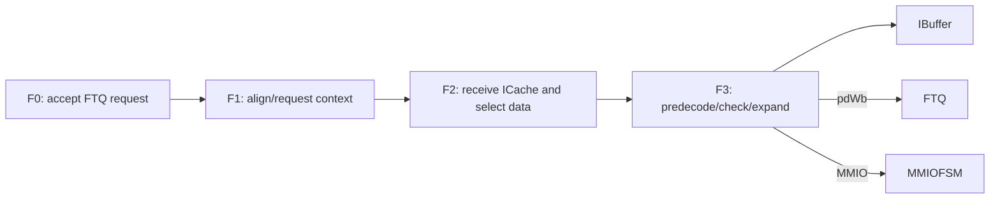
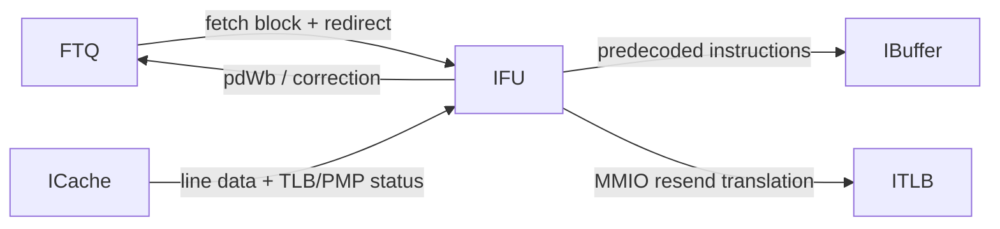
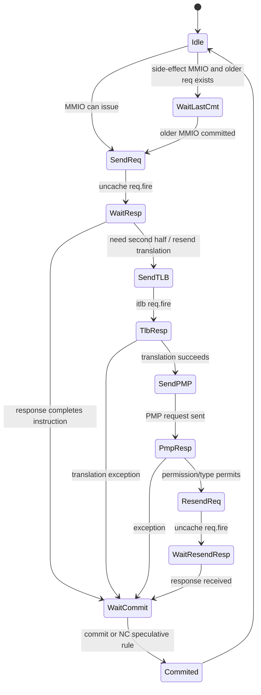

<!-- # 香山 Kunminghu-v2 IFU 与预译码深入解析 -->
# XiangShan Kunminghu-v2 IFU and Predecode Deep Dive

<!-- regenerated-by-analyze-xiangshan-kunminghu -->
> Regenerated from `OpenXiangShan/XiangShan` branch `kunminghu-v2`, source commit `52262f303fc06daf84cdab7011d59b7df65ce7e8` using the updated Frontend graph/stage rules.

<!-- frontend-tutorial-generated-by-analyze-xiangshan-kunminghu -->
<!-- > 所有实现结论均限定在 `kunminghu-v2` commit `52262f303fc06daf84cdab7011d59b7df65ce7e8`；Design Doc 结论必须回到第 18 节的源码追溯矩阵。 -->
> All implementation conclusions are limited to `kunminghu-v2` commit `52262f303fc06daf84cdab7011d59b7df65ce7e8`; Design Doc claims must be traced back to the source matrix in Section 18.

## 1. Scope

<!-- 本节保留模块职责、分析基线、范围和统一五问，明确本文只以当前源码证据为准。 -->
This section records the module responsibilities, analysis baseline, scope, and common five questions; this document relies only on evidence from the current source.

<!-- ### 1.1. 模块职责 -->
### 1.1. Module responsibilities
<!-- `NewIFU` 位于 FTQ/ICache 与 IBuffer 之间，源码为 [IFU.scala](https://github.com/OpenXiangShan/XiangShan/blob/kunminghu-v2/src/main/scala/xiangshan/frontend/IFU.scala)。它不是单纯“从 ICache 拿数据”，而是前端正确性收敛点： -->
`NewIFU` sits between FTQ/ICache and IBuffer; see [IFU.scala](https://github.com/OpenXiangShan/XiangShan/blob/kunminghu-v2/src/main/scala/xiangshan/frontend/IFU.scala). It is not merely a data fetcher; it is the frontend correctness convergence point:

<!-- - 接收 FTQ 的预测块 PC、范围和预测目标； -->
- Accept the predicted block PC, range, and target from FTQ;
<!-- - 接收 ICache 的真实指令数据、命中和异常； -->
- Accept instruction data, hit status, and exceptions from ICache;
<!-- - 处理跨 cacheline、跨页、RVC 半指令和最后半条 32-bit 指令； -->
- Handle cache-line/page crossings, RVC half-instructions, and the final half of a 32-bit instruction;
<!-- - 对指令做预译码，识别 branch/JAL/JALR/call/ret； -->
- Predecode instructions and identify branch/JAL/JALR/call/ret;
<!-- - 校验预测方向、目标和指令类型； -->
- Check predicted direction, target, and instruction type;
<!-- - cacheable 取指走流水快路径，MMIO/uncache 取指走显式 FSM； -->
- Use the pipelined fast path for cacheable fetches and an explicit FSM for MMIO/uncache fetches;
<!-- - 向 IBuffer 输出真实指令，向 FTQ 写回预译码和纠错信息。 -->
- Emit real instructions to IBuffer and write predecode/correction information back to FTQ.

<!-- ## 2. 关键源码证据 -->
## 2. Key source evidence

<!-- 本节直接列出 `IFU / PreDecode` 的有效源码入口、关键代码骨架和行为解释，避免只保存文件名或行号。 -->
This section lists the effective `IFU / PreDecode` source entry points, code skeletons, and behavioral explanations rather than only filenames or line numbers.

<!-- ### 2.1. 源码入口和行号 -->
<!-- ### 2.1. 源码入口和行号 -->
### 2.1. Source entry points and line evidence
<!-- | 源码文件 | 本文使用它证明什么 | 行号证据 | -->
| Source file | What it proves here | Line evidence |
| --- | --- | --- |
<!-- | `frontend/IFU.scala` | F0-F3 请求、切分、预译码、异常路径 | [frontend/IFU.scala#L236-L305](https://github.com/OpenXiangShan/XiangShan/blob/kunminghu-v2/src/main/scala/xiangshan/frontend/IFU.scala#L236-L305); [frontend/IFU.scala#L346-L457](https://github.com/OpenXiangShan/XiangShan/blob/kunminghu-v2/src/main/scala/xiangshan/frontend/IFU.scala#L346-L457); [frontend/IFU.scala#L542-L617](https://github.com/OpenXiangShan/XiangShan/blob/kunminghu-v2/src/main/scala/xiangshan/frontend/IFU.scala#L542-L617) | -->
| `frontend/IFU.scala` | F0-F3 requests, cutting, predecode, and exception paths | [frontend/IFU.scala#L236-L305](https://github.com/OpenXiangShan/XiangShan/blob/kunminghu-v2/src/main/scala/xiangshan/frontend/IFU.scala#L236-L305); [frontend/IFU.scala#L346-L457](https://github.com/OpenXiangShan/XiangShan/blob/kunminghu-v2/src/main/scala/xiangshan/frontend/IFU.scala#L346-L457); [frontend/IFU.scala#L542-L617](https://github.com/OpenXiangShan/XiangShan/blob/kunminghu-v2/src/main/scala/xiangshan/frontend/IFU.scala#L542-L617) |
<!-- | `frontend/IFU.scala` | MMIO/uncache 12 态 FSM、lastHalf 跨行拼接 | [frontend/IFU.scala#L655-L675](https://github.com/OpenXiangShan/XiangShan/blob/kunminghu-v2/src/main/scala/xiangshan/frontend/IFU.scala#L655-L675); [frontend/IFU.scala#L915-L943](https://github.com/OpenXiangShan/XiangShan/blob/kunminghu-v2/src/main/scala/xiangshan/frontend/IFU.scala#L915-L943) | -->
| `frontend/IFU.scala` | 12-state MMIO/uncache FSM and lastHalf cross-line assembly | [frontend/IFU.scala#L655-L675](https://github.com/OpenXiangShan/XiangShan/blob/kunminghu-v2/src/main/scala/xiangshan/frontend/IFU.scala#L655-L675); [frontend/IFU.scala#L915-L943](https://github.com/OpenXiangShan/XiangShan/blob/kunminghu-v2/src/main/scala/xiangshan/frontend/IFU.scala#L915-L943) |
<!-- | `frontend/PreDecode.scala` | 前端预译码入口 | [frontend/PreDecode.scala](https://github.com/OpenXiangShan/XiangShan/blob/kunminghu-v2/src/main/scala/xiangshan/frontend/PreDecode.scala) | -->
| `frontend/PreDecode.scala` | Frontend predecode entry point | [frontend/PreDecode.scala](https://github.com/OpenXiangShan/XiangShan/blob/kunminghu-v2/src/main/scala/xiangshan/frontend/PreDecode.scala) |

<!-- ### 2.2. 核心代码骨架 -->
### 2.2. Core code skeleton
```scala
F0: accept FTQ request and line address
F1: register PC and cut pointers
F2: receive ICache data/exception
F3: expand RVC, predecode CFI, send to IBuffer/pdWb
```

<!-- ### 2.3. 代码解析 -->
### 2.3. Code analysis
<!-- IFU 是取指正确性收敛点：它把 FTQ 控制信息和 ICache 数据重新对齐，处理 RVC、跨 cacheline、跨页、MMIO/uncache、异常和 false-hit 校验。 -->
IFU is the fetch-correctness convergence point: it realigns FTQ control information with ICache data and handles RVC, cache-line/page crossings, MMIO/uncache, exceptions, and false-hit checks.
## 3. Theory-to-Code Mapping

<!-- 本节把理论概念直接绑定到 `IFU / PreDecode` 的源码对象、控制/数据状态和下游消费者。 -->
This section binds theoretical concepts directly to `IFU / PreDecode` source objects, control/data state, and downstream consumers.

<!-- ### 3.1. 理论到代码映射表 -->
### 3.1. Theory-to-code mapping
<!--
### 3.1. 理论到代码映射表
| 理论概念 | 代码对象 | 为什么需要它 | 消费者/后续影响 |
| 真实指令重建 | F2/F3 cut/expand/predecode | 缓存行不是天然等于指令边界 | IBuffer CtrlFlow |
| 预测校验 | pdWb / false-hit / target check | FTB 预测必须被真实指令修正 | FTQ hit status 和 BPU training |
| 取指异常 | instruction page fault / misalign / access fault | 异常随取指包到后端可见 | IBuffer/Backend exception scoreboard |
-->
| Theory concept | Code object | Why it is needed | Consumer/follow-on effect |
| --- | --- | --- | --- |
| Real instruction reconstruction | F2/F3 cut/expand/predecode | A cache line is not inherently an instruction boundary | IBuffer CtrlFlow |
| Prediction checking | pdWb / false-hit / target check | FTB predictions must be corrected by real instructions | FTQ hit status and BPU training |
| Fetch exceptions | instruction page fault / misalign / access fault | Exceptions remain visible to the backend with the fetch packet | IBuffer/Backend exception scoreboard |

<!-- ### 3.2. 阅读顺序 -->
### 3.2. Reading order
<!-- 先按第 2 节定位源码对象，再顺着本表检查信号从哪里来、状态在哪里保存、何时更新、谁消费结果。若本篇只引用相邻模块拥有的状态，则以相邻 Frontend 分文档的源码分析为准。 -->
Use Section 2 to locate source objects, then follow this table to check signal origins, state storage, update timing, and consumers. When this document cites state owned by an adjacent module, use that module's dedicated Frontend analysis as the authority.
<!-- ## 4. 论文原则和有效代码 -->
## 4. Paper principles and effective code


<!-- IFU 的有效代码不是论文级预测算法，而是把 BPU 给出的 `FtqToIfuRequest` 变成 ICache/InstrUncache 请求，并在 F2/F3 对返回字节流执行裁剪、拼接和预译码。关键证据是 `IFU.scala` 的 IFU 主模块、取指流水寄存器、predecode 写回和异常打包路径；读代码时先看 `io.fromFtq` 到 `io.toICache` 的请求形成，再看 `io.toIbuffer` 的 `CtrlFlow` 输出。 -->
The effective IFU code is not a paper-level prediction algorithm. It turns the BPU's `FtqToIfuRequest` into ICache/InstrUncache requests and cuts, assembles, and predecodes returned byte streams in F2/F3. Key evidence is the IFU top module, fetch pipeline registers, predecode writeback, and exception-packing paths in `IFU.scala`; read request formation from `io.fromFtq` to `io.toICache` first, then the `CtrlFlow` output at `io.toIbuffer`.

## 5. Microarchitecture Parameters


<!-- 先从源码证据读取表深度、队列容量、位宽、端口数和配置开关，再判断它们对吞吐、冲突和恢复延迟的影响；不要用文档中的默认值替代当前 commit 的参数。 -->
Read table depths, queue capacities, widths, port counts, and configuration switches from source evidence before judging their effects on throughput, conflicts, and recovery latency; do not substitute document defaults for parameters in the current commit.

<!-- ## 6. 模块边界和接口 -->
## 6. Module boundaries and interfaces


<!-- IFU 边界由三组真实接口限定：上游 FTQ 发送取指 PC、预测块边界和 redirect 信息；下游 ICache/InstrUncache 返回指令字节和取指异常；后级 IBuffer 消费已经对齐、预译码并带异常位的控制流。`instruction page fault` 来自 ITLB/ICache 侧权限检查，`instruction access fault` 来自取指访问错误，`instruction misalign` 则在分支/跳转目标或取指块边界校验中形成并随 `exceptionVec` 进入后端可见路径。 -->
The IFU boundary is defined by three real interfaces: upstream FTQ sends fetch PCs, predicted block bounds, and redirects; downstream ICache/InstrUncache returns instruction bytes and fetch exceptions; IBuffer consumes aligned, predecoded control flow with exception bits. `instruction page fault` comes from ITLB/ICache permission checks, `instruction access fault` from fetch access errors, and `instruction misalign` is formed during branch/jump-target or fetch-block-boundary checks and exposed to the backend through `exceptionVec`.

<!-- ## 7. 为什么模块存在 -->
## 7. Why the module exists


<!-- 把模块放回 Frontend 全链路理解：它解决的是预测带宽、取指正确性、存储层次延迟、投机恢复或上下游速率不匹配中的至少一个问题。 -->
Viewed in the complete Frontend chain, the module addresses at least one of prediction bandwidth, fetch correctness, memory-hierarchy latency, speculative recovery, or upstream/downstream rate mismatch.

<!-- ## 8. 有效动态路径 -->
## 8. Effective dynamic path


<!-- 按 `valid -> ready -> fire -> register/state update -> consumer` 阅读动态路径，并同时检查正常、阻塞、flush、redirect、replay 和恢复后的 forward progress。 -->
Read the dynamic path as `valid -> ready -> fire -> register/state update -> consumer`, checking normal operation, blocking, flush, redirect, replay, and forward progress after recovery.

<!-- ## 9. Index 和地址/历史计算 -->
## 9. Index and address/history computation


<!-- 地址、PC、折叠历史、tag、set/way、line offset 和 FTQ offset 都必须追到源码表达式；索引冲突、回绕和跨边界情况在算法和验证章节中继续展开。 -->
Addresses, PCs, folded history, tags, sets/ways, line offsets, and FTQ offsets must all be traced to source expressions; index conflicts, wraparound, and boundary crossings are expanded in the algorithm and verification sections.

<!-- ## 10. 核心算法 -->
## 10. Core algorithm


<!-- 核心算法是“预测块到真实指令流”的重建：F0/F1 发起取指，F2 接收 cacheline 或 uncache 响应，跨行时用 last-half 状态保存前半段，F3 根据预测块 start/end、RVC 半字边界和 predecode 结果生成 IBuffer 可接收的 `CtrlFlow`。阻塞时保持流水 payload，flush/redirect 时清除年轻路径；异常位与对应 PC 一起进入输出，避免只重定向 PC 而丢失取指 fault 原因。 -->
The core algorithm reconstructs a real instruction stream from a predicted block: F0/F1 initiate fetch, F2 receives cache-line or uncache responses, last-half state retains a leading fragment across lines, and F3 uses predicted start/end, RVC half-word boundaries, and predecode results to produce an IBuffer-ready `CtrlFlow`. Pipeline payload is held during stalls and younger paths are cleared on flush/redirect; exception bits travel with the corresponding PC so redirecting only the PC cannot lose the fetch-fault cause.

<!-- ## 11. 状态和存储结构 -->
## 11. State and storage structures


<!-- ### 11.1. Buffer/queue overflow 与 underflow -->
### 11.1. Buffer/queue overflow and underflow
<!--
### 11.1. Buffer/queue overflow 与 underflow
| 结构 | overflow 防护 | underflow 防护 |
| F0-F3 pipeline register | 下游不 ready 时上游 ready 拉低，不覆盖 valid payload | valid=false 时不消费 bits；flush 清 valid |
| last-half buffer | 旧 half 未合并时禁止错误覆盖；flush 清 valid | `valid` 控制是否参与拼接 |
| MMIO context | FSM 同时只处理当前 F3 MMIO 上下文；新请求不能跨状态覆盖 | 只有相应 wait 状态接收 response/commit |
| InstrUncache response | entry/source id 关联请求与响应 | 无有效 entry 不产生响应 valid |
-->
| Structure | Overflow protection | Underflow protection |
| --- | --- | --- |
| F0-F3 pipeline register | When downstream is not ready, upstream ready is deasserted so valid payload is not overwritten | Do not consume bits when valid is false; flush clears valid |
| last-half buffer | Do not incorrectly overwrite an unmerged old half; flush clears valid | `valid` controls whether the half participates in assembly |
| MMIO context | The FSM processes only the current F3 MMIO context; a new request cannot overwrite it across states | Only the matching wait state accepts response/commit |
| InstrUncache response | The entry/source ID associates requests with responses | No response valid is generated without a valid entry |

<!-- ## 12. Pipeline stage 分析 -->
## 12. Pipeline-stage analysis


<!-- ### 12.1. 流水阶段 -->
### 12.1. Pipeline stages
<!-- IFU 使用 `f0/f1/f2/f3` valid/ready/flush 形成隐式状态机，而不是为 cacheable 路径定义一个大 FSM。 -->
IFU uses `f0/f1/f2/f3` valid/ready/flush signals to form an implicit state machine rather than defining one large FSM for the cacheable path.



<!-- #### 12.1.1. F0：接受 FTQ 请求 -->
#### 12.1.1. F0: accept an FTQ request

<!-- 只有顶层确认 IFU 与 ICache 同时 ready，FTQ 请求才 fire。F0 锁存 `ftqIdx/startAddr/nextStartAddr/ftqOffset` 等控制信息，为后续 ICache response 提供上下文。 -->
The FTQ request fires only when the top level confirms that IFU and ICache are both ready. F0 captures control information such as `ftqIdx/startAddr/nextStartAddr/ftqOffset` to provide context for later ICache responses.

<!-- #### 12.1.2. F1：地址和跨行准备 -->
#### 12.1.2. F1: address and cross-line preparation

<!-- 根据预测块起始地址判断是否可能跨 cacheline，生成两路数据选择、指令起始半字位置和异常传播信息。此阶段还接收 BPU 晚级 flush；若当前 FTQ index 已被更老 redirect 覆盖，valid 被清除。 -->
Using the predicted-block start address, F1 determines whether a cache-line crossing is possible and generates two-way data selection, the starting instruction half-word position, and exception-propagation information. It also receives late BPU flushes; valid is cleared when an older redirect has overwritten the current FTQ index.

<!-- #### 12.1.3. F2：组合 ICache 返回 -->
#### 12.1.3. F2: combine ICache returns

<!-- 选择命中的 way/bank 数据，拼接跨行结果，把 ICache/TLB/PMP 异常与 FTQ 控制信息对齐。若 ICache 尚未返回或下游 F3 阻塞，F2 valid/payload 必须保持。 -->
F2 selects hit way/bank data, assembles cross-line results, and aligns ICache/TLB/PMP exceptions with FTQ control information. Its valid/payload must be held when ICache has not returned or F3 is blocked.

<!-- #### 12.1.4. F3：预译码和输出 -->
#### 12.1.4. F3: predecode and output

<!-- F3 执行： -->
F3 performs:

<!-- - 16/32 位指令边界识别与 RVC 扩展； -->
- 16/32-bit instruction-boundary recognition and RVC expansion;
<!-- - 真实指令有效范围生成； -->
- generation of the valid range of real instructions;
<!-- - branch/JAL/JALR/call/ret 识别； -->
- branch/JAL/JALR/call/ret recognition;
<!-- - 预测 target/taken/CFI 校验； -->
- checking of predicted target/taken/CFI;
<!-- - frontend trigger； -->
- frontend trigger;
<!-- - 异常编码和跨页修正； -->
- exception encoding and cross-page correction;
<!-- - 生成 `FetchToIBuffer`。 -->
- generation of `FetchToIBuffer`.

<!-- 最终输出见 [IFU.scala#L953-L980](https://github.com/OpenXiangShan/XiangShan/blob/kunminghu-v2/src/main/scala/xiangshan/frontend/IFU.scala#L953-L980)。`enqEnable` 是预测范围与真实指令有效性的交集，不是原始 cacheline byte enable。 -->
The final output is shown at [IFU.scala#L953-L980](https://github.com/OpenXiangShan/XiangShan/blob/kunminghu-v2/src/main/scala/xiangshan/frontend/IFU.scala#L953-L980). `enqEnable` is the intersection of the predicted range and the real-instruction valid range, not the original cache-line byte enable.

## 13. Control path rationale


<!-- 控制路径按优先级阅读：reset、flush、backend redirect、BPU override、exception、replay 和正常 fire 发生冲突时，必须以源码条件顺序说明胜负关系。 -->
Read the control path by priority: when reset, flush, backend redirect, BPU override, exception, replay, and normal fire conflict, explain the winner using the source-condition order.

<!-- ## 14. Data path 与跨边界 -->
## 14. Data path and boundary crossings


<!-- ### 14.1. 跨边界代码解析 -->
### 14.1. Cross-boundary code analysis
<!-- IFU 是跨边界正确性收敛点。取指块跨页时，第二页必须重新发 ITLB/PMP/PMA 请求并独立产生 page/access/guest fault；跨 Cache Line 时，第一行数据与第二行数据分别返回，末尾 32-bit 指令通过 `lastHalf` 保存、合并和 flush 清理，[frontend/IFU.scala:915-943](https://github.com/OpenXiangShan/XiangShan/blob/kunminghu-v2/src/main/scala/xiangshan/frontend/IFU.scala#L915-L943)。MMIO/uncache 则绕过普通 ICache 快路径，经过显式 FSM、重新翻译/权限检查、响应等待和提交门控，[frontend/IFU.scala:655-846](https://github.com/OpenXiangShan/XiangShan/blob/kunminghu-v2/src/main/scala/xiangshan/frontend/IFU.scala#L655-L846)。 -->
IFU is the correctness convergence point for boundary crossings. When a fetch block crosses a page, the second page must issue independent ITLB/PMP/PMA requests and can produce its own page/access/guest fault. Across a cache line, the two lines return separately; the final 32-bit instruction is retained, merged, and cleared on flush through `lastHalf`, as shown at [frontend/IFU.scala:915-943](https://github.com/OpenXiangShan/XiangShan/blob/kunminghu-v2/src/main/scala/xiangshan/frontend/IFU.scala#L915-L943). MMIO/uncache bypasses the normal ICache fast path and uses an explicit FSM with retranslation/permission checks, response waiting, and commit gating, [frontend/IFU.scala:655-846](https://github.com/OpenXiangShan/XiangShan/blob/kunminghu-v2/src/main/scala/xiangshan/frontend/IFU.scala#L655-L846).

<!-- 组合场景必须按“地址切分 → 每片段翻译/属性检查 → cache/uncache 路由 → 响应组装 → 预译码校验 → redirect/flush/retry”说明，特别覆盖跨页 32-bit MMIO 指令、第二片段 fault、第一片段返回后发生 redirect，以及 FSM wait 状态的释放条件。 -->
Explain combined cases as “address slicing -> per-segment translation/attribute checks -> cache/uncache routing -> response assembly -> predecode checking -> redirect/flush/retry,” especially covering a cross-page 32-bit MMIO instruction, a fault in the second segment, a redirect after the first segment returns, and the release conditions of FSM wait states.

<!-- ## 15. 异常、debug、privilege -->
## 15. Exceptions, debug, and privilege


<!-- ### 15.1. 验证关注点 -->
### 15.1. Verification focus
<!-- 1. RVC/非 RVC 混合且预测块跨 cacheline。 -->
1. Mixed RVC/non-RVC instructions with a predicted block crossing a cache line.
<!-- 2. 最后半条 buffer 与 redirect 同拍。 -->
2. The last-half buffer and a redirect in the same cycle.
<!-- 3. IBuffer 满时 F3 payload 稳定。 -->
3. F3 payload stability when IBuffer is full.
<!-- 4. ICache response 与 BPU S3 flush 同拍的优先级。 -->
4. Priority when an ICache response and BPU S3 flush coincide.
<!-- 5. MMIO 第一次访问后、第二次 ITLB/PMP 期间发生 sfence/redirect。 -->
5. An sfence/redirect after the first MMIO access and during the second ITLB/PMP operation.
<!-- 6. PBMT `nc` 允许的投机规则与 side-effect MMIO 的等待提交规则。 -->
6. PBMT `nc` speculative rules and commit-wait rules for side-effect MMIO.
<!-- 7. 预译码发现 JAL target、JALR/ret 类型、branch offset 错误时 `pdWb` 内容。 -->
7. `pdWb` contents when predecode detects a JAL target, JALR/ret type, or branch-offset error.

#### 15.1.1. Top-Level Module Connectivity

IFU is the correctness convergence point: FTQ supplies the fetch block, ICache supplies data/status, and IFU emits predecoded instructions to IBuffer while returning predecode correction to FTQ: [frontend/Frontend.scala:199-231](https://github.com/OpenXiangShan/XiangShan/blob/52262f303fc06daf84cdab7011d59b7df65ce7e8/src/main/scala/xiangshan/frontend/Frontend.scala#L199-L231), [frontend/IFU.scala:241-263](https://github.com/OpenXiangShan/XiangShan/blob/52262f303fc06daf84cdab7011d59b7df65ce7e8/src/main/scala/xiangshan/frontend/IFU.scala#L241-L263), [frontend/IFU.scala:953-969](https://github.com/OpenXiangShan/XiangShan/blob/52262f303fc06daf84cdab7011d59b7df65ce7e8/src/main/scala/xiangshan/frontend/IFU.scala#L953-L969).



#### 15.1.2. Frontend/Backend Pipeline Stages

The source-proven stage boundary is `F0 -> F1 -> F2 -> F3`: F0 accepts the FTQ request and calculates line indices, F1 registers the fetch block and calculates instruction PCs/cut pointers, F2 waits for ICache responses and performs data cutting/predecode preparation, and F3 expands/qualifies instructions, handles exceptions/MMIO, and drives IBuffer. Evidence: [frontend/IFU.scala:236-305](https://github.com/OpenXiangShan/XiangShan/blob/52262f303fc06daf84cdab7011d59b7df65ce7e8/src/main/scala/xiangshan/frontend/IFU.scala#L236-L305), [frontend/IFU.scala:346-457](https://github.com/OpenXiangShan/XiangShan/blob/52262f303fc06daf84cdab7011d59b7df65ce7e8/src/main/scala/xiangshan/frontend/IFU.scala#L346-L457), [frontend/IFU.scala:542-617](https://github.com/OpenXiangShan/XiangShan/blob/52262f303fc06daf84cdab7011d59b7df65ce7e8/src/main/scala/xiangshan/frontend/IFU.scala#L542-L617). The top-level connections couple FTQ, IFU, ICache, and IBuffer through shared ready/valid conditions: [frontend/Frontend.scala:199-231](https://github.com/OpenXiangShan/XiangShan/blob/52262f303fc06daf84cdab7011d59b7df65ce7e8/src/main/scala/xiangshan/frontend/Frontend.scala#L199-L231).

The backend continuation uses the effective module boundaries rather than inventing cycle names: Decode accepts the instruction packet, Rename creates speculative physical-register mappings, Dispatch allocates downstream resources, Issue/Scheduler selects ready uops, Execute/FU produces results, DataPath/WB carries writeback and wakeup, and ROB/CtrlBlock commits or redirects. Evidence: [backend/decode/DecodeStage.scala:83-120](https://github.com/OpenXiangShan/XiangShan/blob/52262f303fc06daf84cdab7011d59b7df65ce7e8/src/main/scala/xiangshan/backend/decode/DecodeStage.scala#L83-L120), [backend/rename/Rename.scala:40-117](https://github.com/OpenXiangShan/XiangShan/blob/52262f303fc06daf84cdab7011d59b7df65ce7e8/src/main/scala/xiangshan/backend/rename/Rename.scala#L40-L117), [backend/dispatch/NewDispatch.scala:49-176](https://github.com/OpenXiangShan/XiangShan/blob/52262f303fc06daf84cdab7011d59b7df65ce7e8/src/main/scala/xiangshan/backend/dispatch/NewDispatch.scala#L49-L176), [backend/issue/Scheduler.scala:29-180](https://github.com/OpenXiangShan/XiangShan/blob/52262f303fc06daf84cdab7011d59b7df65ce7e8/src/main/scala/xiangshan/backend/issue/Scheduler.scala#L29-L180), [backend/exu/ExeUnit.scala:50-110](https://github.com/OpenXiangShan/XiangShan/blob/52262f303fc06daf84cdab7011d59b7df65ce7e8/src/main/scala/xiangshan/backend/exu/ExeUnit.scala#L50-L110), [backend/datapath/DataPath.scala:25-70](https://github.com/OpenXiangShan/XiangShan/blob/52262f303fc06daf84cdab7011d59b7df65ce7e8/src/main/scala/xiangshan/backend/datapath/DataPath.scala#L25-L70), [backend/rob/Rob.scala:52-145](https://github.com/OpenXiangShan/XiangShan/blob/52262f303fc06daf84cdab7011d59b7df65ce7e8/src/main/scala/xiangshan/backend/rob/Rob.scala#L52-L145), [backend/CtrlBlock.scala:50-110](https://github.com/OpenXiangShan/XiangShan/blob/52262f303fc06daf84cdab7011d59b7df65ce7e8/src/main/scala/xiangshan/backend/CtrlBlock.scala#L50-L110).

```mermaid
flowchart LR
  F0["F0: FTQ req + line indices"] -->|f0_fire| F1["F1: PC + cut pointers"]
  F1 -->|f1_fire| F2["F2: ICache data + exceptions"]
  F2 -->|f2_fire| F3["F3: predecode + MMIO qualification"]
  F3 -->|toIbuffer.fire| Decode["Decode"]
  Decode -->|uop bundle| Rename["Rename"]
  Rename -->|renamed uop| Dispatch["Dispatch"]
  Dispatch -->|ready uop| Issue["Issue"]
  Issue -->|operands| Execute["Execute/FU"]
  Execute -->|result| Writeback["Writeback/Wakeup"]
  Writeback -->|retire candidate| Commit["ROB/Commit"]
  Commit -->|redirect/flush| F0
```



The stage graph keeps chronological forward edges separate from the bundled recovery edge. It must be read together with the module graph below: a stage is not itself a module, and a redirect does not create a fake forward stage.

```waveform-draw
{
  "signal": [
    {
      "name": "clk",
      "wave": "p......."
    },
    {
      "name": "F0.valid",
      "wave": "01...0.."
    },
    {
      "name": "F0.ready",
      "wave": "1..0...."
    },
    {
      "name": "F1.valid",
      "wave": "001..0.."
    },
    {
      "name": "F2.valid",
      "wave": "0001.0.."
    },
    {
      "name": "F3.valid",
      "wave": "00001.0."
    },
    {
      "name": "toIbuffer.fire",
      "wave": "0000010."
    },
    {
      "name": "redirect/flush",
      "wave": "00000010"
    }
  ],
  "config": {
    "hscale": 1
  }
}
```

<!-- ## 16. CSR 控制 -->
## 16. CSR control


<!-- 前端分支预测器的使能控制来自 CSR 模块生成的 `CustomCSRCtrlIO.bp_ctrl`，不是各预测器本地私有 CSR。有效链路是：`sbpctl` CSR 字段 -> `io.status.custom.bp_ctrl` -> Backend `frontendCsrCtrl` -> XSCore `frontend.io.csrCtrl` -> Frontend `bpu.io.ctrl` -> BPU 内各子预测器 `io.enable`。 -->
Frontend branch-predictor enable control comes from `CustomCSRCtrlIO.bp_ctrl`, which the CSR module generates, rather than from predictor-local private CSRs. The effective chain is: `sbpctl` CSR fields -> `io.status.custom.bp_ctrl` -> Backend `frontendCsrCtrl` -> XSCore `frontend.io.csrCtrl` -> Frontend `bpu.io.ctrl` -> each BPU subpredictor's `io.enable`.

<!-- ### 16.1. CSR 字段到 BPU 控制信号 -->
### 16.1. CSR fields to BPU control signals
<!-- ### 16.1. CSR 字段到 BPU 控制信号
| 控制位 | CSR 源字段 | Frontend/BPU 消费者 | 有效作用 | 源码证据 |
-->
| Control bit | CSR source field | Frontend/BPU consumer | Effective behavior | Source evidence |
| --- | --- | --- | --- | --- |
<!-- | `bp_ctrl.ubtbEnable` | `sbpctl.regOut.UBTB_ENABLE` | `ubtb.io.enable` | 允许或关闭 S1 fast uBTB/MicroBtb 查询结果参与预测链；关闭后仍保留 fall-through 基线。 | [NewCSR.scala:1378](https://github.com/OpenXiangShan/XiangShan/blob/kunminghu-v2/src/main/scala/xiangshan/backend/fu/NewCSR/NewCSR.scala#L1378), [Bpu.scala:96](https://github.com/OpenXiangShan/XiangShan/blob/kunminghu-v2/src/main/scala/xiangshan/frontend/bpu/Bpu.scala#L96), [Bpu.scala:105](https://github.com/OpenXiangShan/XiangShan/blob/kunminghu-v2/src/main/scala/xiangshan/frontend/bpu/Bpu.scala#L105) | -->
| `bp_ctrl.ubtbEnable` | `sbpctl.regOut.UBTB_ENABLE` | `ubtb.io.enable` | Enables/disables S1 fast uBTB/MicroBtb lookup results in the prediction chain; the fall-through baseline remains when disabled. | [NewCSR.scala:1378](https://github.com/OpenXiangShan/XiangShan/blob/kunminghu-v2/src/main/scala/xiangshan/backend/fu/NewCSR/NewCSR.scala#L1378), [Bpu.scala:96](https://github.com/OpenXiangShan/XiangShan/blob/kunminghu-v2/src/main/scala/xiangshan/frontend/bpu/Bpu.scala#L96), [Bpu.scala:105](https://github.com/OpenXiangShan/XiangShan/blob/kunminghu-v2/src/main/scala/xiangshan/frontend/bpu/Bpu.scala#L105) |
<!-- | `bp_ctrl.abtbEnable` | `sbpctl.regOut.ABTB_ENABLE` | `abtb.io.enable` | 控制 AheadBtb 目标/属性预测是否参与早期预测。 | [NewCSR.scala:1379](https://github.com/OpenXiangShan/XiangShan/blob/kunminghu-v2/src/main/scala/xiangshan/backend/fu/NewCSR/NewCSR.scala#L1379), [Bpu.scala:97](https://github.com/OpenXiangShan/XiangShan/blob/kunminghu-v2/src/main/scala/xiangshan/frontend/bpu/Bpu.scala#L97), [Bpu.scala:106](https://github.com/OpenXiangShan/XiangShan/blob/kunminghu-v2/src/main/scala/xiangshan/frontend/bpu/Bpu.scala#L106) | -->
| `bp_ctrl.abtbEnable` | `sbpctl.regOut.ABTB_ENABLE` | `abtb.io.enable` | Controls whether AheadBtb target/attribute predictions participate in early prediction. | [NewCSR.scala:1379](https://github.com/OpenXiangShan/XiangShan/blob/kunminghu-v2/src/main/scala/xiangshan/backend/fu/NewCSR/NewCSR.scala#L1379), [Bpu.scala:97](https://github.com/OpenXiangShan/XiangShan/blob/kunminghu-v2/src/main/scala/xiangshan/frontend/bpu/Bpu.scala#L97), [Bpu.scala:106](https://github.com/OpenXiangShan/XiangShan/blob/kunminghu-v2/src/main/scala/xiangshan/frontend/bpu/Bpu.scala#L106) |
<!-- | `bp_ctrl.mbtbEnable` | `sbpctl.regOut.MBTB_ENABLE` | `mbtb.io.enable` | 控制 MainBtb 是否提供主 BTB 命中、直接分支/JAL target 和 fall-through 信息。 | [NewCSR.scala:1380](https://github.com/OpenXiangShan/XiangShan/blob/kunminghu-v2/src/main/scala/xiangshan/backend/fu/NewCSR/NewCSR.scala#L1380), [Bpu.scala:98](https://github.com/OpenXiangShan/XiangShan/blob/kunminghu-v2/src/main/scala/xiangshan/frontend/bpu/Bpu.scala#L98), [Bpu.scala:107](https://github.com/OpenXiangShan/XiangShan/blob/kunminghu-v2/src/main/scala/xiangshan/frontend/bpu/Bpu.scala#L107) | -->
| `bp_ctrl.mbtbEnable` | `sbpctl.regOut.MBTB_ENABLE` | `mbtb.io.enable` | Controls whether MainBtb provides the primary BTB hit, direct-branch/JAL target, and fall-through information. | [NewCSR.scala:1380](https://github.com/OpenXiangShan/XiangShan/blob/kunminghu-v2/src/main/scala/xiangshan/backend/fu/NewCSR/NewCSR.scala#L1380), [Bpu.scala:98](https://github.com/OpenXiangShan/XiangShan/blob/kunminghu-v2/src/main/scala/xiangshan/frontend/bpu/Bpu.scala#L98), [Bpu.scala:107](https://github.com/OpenXiangShan/XiangShan/blob/kunminghu-v2/src/main/scala/xiangshan/frontend/bpu/Bpu.scala#L107) |
<!-- | `bp_ctrl.tageEnable` | `sbpctl.regOut.TAGE_ENABLE` | `tage.io.enable` | 控制 TAGE 条件分支方向预测是否有效；关闭时不能把 TAGE provider 结果作为方向覆盖依据。 | [NewCSR.scala:1381](https://github.com/OpenXiangShan/XiangShan/blob/kunminghu-v2/src/main/scala/xiangshan/backend/fu/NewCSR/NewCSR.scala#L1381), [Bpu.scala:99](https://github.com/OpenXiangShan/XiangShan/blob/kunminghu-v2/src/main/scala/xiangshan/frontend/bpu/Bpu.scala#L99), [Bpu.scala:108](https://github.com/OpenXiangShan/XiangShan/blob/kunminghu-v2/src/main/scala/xiangshan/frontend/bpu/Bpu.scala#L108) | -->
| `bp_ctrl.tageEnable` | `sbpctl.regOut.TAGE_ENABLE` | `tage.io.enable` | Controls whether TAGE conditional-branch direction prediction is active; when disabled, the TAGE provider result cannot override direction. | [NewCSR.scala:1381](https://github.com/OpenXiangShan/XiangShan/blob/kunminghu-v2/src/main/scala/xiangshan/backend/fu/NewCSR/NewCSR.scala#L1381), [Bpu.scala:99](https://github.com/OpenXiangShan/XiangShan/blob/kunminghu-v2/src/main/scala/xiangshan/frontend/bpu/Bpu.scala#L99), [Bpu.scala:108](https://github.com/OpenXiangShan/XiangShan/blob/kunminghu-v2/src/main/scala/xiangshan/frontend/bpu/Bpu.scala#L108) |
<!-- | `bp_ctrl.scEnable` | `sbpctl.regOut.SC_ENABLE` | `sc.io.enable` | 控制 statistical corrector 是否修正 TAGE/基础方向结果。 | [NewCSR.scala:1382](https://github.com/OpenXiangShan/XiangShan/blob/kunminghu-v2/src/main/scala/xiangshan/backend/fu/NewCSR/NewCSR.scala#L1382), [Bpu.scala:100](https://github.com/OpenXiangShan/XiangShan/blob/kunminghu-v2/src/main/scala/xiangshan/frontend/bpu/Bpu.scala#L100), [Bpu.scala:109](https://github.com/OpenXiangShan/XiangShan/blob/kunminghu-v2/src/main/scala/xiangshan/frontend/bpu/Bpu.scala#L109) | -->
| `bp_ctrl.scEnable` | `sbpctl.regOut.SC_ENABLE` | `sc.io.enable` | Controls whether the statistical corrector corrects TAGE/base direction results. | [NewCSR.scala:1382](https://github.com/OpenXiangShan/XiangShan/blob/kunminghu-v2/src/main/scala/xiangshan/backend/fu/NewCSR/NewCSR.scala#L1382), [Bpu.scala:100](https://github.com/OpenXiangShan/XiangShan/blob/kunminghu-v2/src/main/scala/xiangshan/frontend/bpu/Bpu.scala#L100), [Bpu.scala:109](https://github.com/OpenXiangShan/XiangShan/blob/kunminghu-v2/src/main/scala/xiangshan/frontend/bpu/Bpu.scala#L109) |
<!-- | `bp_ctrl.ittageEnable` | `sbpctl.regOut.ITTAGE_ENABLE` | `ittage.io.enable` | 控制间接跳转/JALR target 覆盖预测是否有效。 | [NewCSR.scala:1383](https://github.com/OpenXiangShan/XiangShan/blob/kunminghu-v2/src/main/scala/xiangshan/backend/fu/NewCSR/NewCSR.scala#L1383), [Bpu.scala:101](https://github.com/OpenXiangShan/XiangShan/blob/kunminghu-v2/src/main/scala/xiangshan/frontend/bpu/Bpu.scala#L101), [Bpu.scala:110](https://github.com/OpenXiangShan/XiangShan/blob/kunminghu-v2/src/main/scala/xiangshan/frontend/bpu/Bpu.scala#L110) | -->
| `bp_ctrl.ittageEnable` | `sbpctl.regOut.ITTAGE_ENABLE` | `ittage.io.enable` | Controls whether indirect-jump/JALR target override prediction is active. | [NewCSR.scala:1383](https://github.com/OpenXiangShan/XiangShan/blob/kunminghu-v2/src/main/scala/xiangshan/backend/fu/NewCSR/NewCSR.scala#L1383), [Bpu.scala:101](https://github.com/OpenXiangShan/XiangShan/blob/kunminghu-v2/src/main/scala/xiangshan/frontend/bpu/Bpu.scala#L101), [Bpu.scala:110](https://github.com/OpenXiangShan/XiangShan/blob/kunminghu-v2/src/main/scala/xiangshan/frontend/bpu/Bpu.scala#L110) |
<!-- | `bp_ctrl.rasEnable` | `sbpctl.regOut.RAS_ENABLE` | `ras.io.enable` | 控制 return address stack 是否给 RET/JALR 返回目标提供覆盖。 | [NewCSR.scala:1384](https://github.com/OpenXiangShan/XiangShan/blob/kunminghu-v2/src/main/scala/xiangshan/backend/fu/NewCSR/NewCSR.scala#L1384), [Bpu.scala:102](https://github.com/OpenXiangShan/XiangShan/blob/kunminghu-v2/src/main/scala/xiangshan/frontend/bpu/Bpu.scala#L102), [Bpu.scala:111](https://github.com/OpenXiangShan/XiangShan/blob/kunminghu-v2/src/main/scala/xiangshan/frontend/bpu/Bpu.scala#L111) | -->
| `bp_ctrl.rasEnable` | `sbpctl.regOut.RAS_ENABLE` | `ras.io.enable` | Controls whether the return-address stack provides an override target for RET/JALR. | [NewCSR.scala:1384](https://github.com/OpenXiangShan/XiangShan/blob/kunminghu-v2/src/main/scala/xiangshan/backend/fu/NewCSR/NewCSR.scala#L1384), [Bpu.scala:102](https://github.com/OpenXiangShan/XiangShan/blob/kunminghu-v2/src/main/scala/xiangshan/frontend/bpu/Bpu.scala#L102), [Bpu.scala:111](https://github.com/OpenXiangShan/XiangShan/blob/kunminghu-v2/src/main/scala/xiangshan/frontend/bpu/Bpu.scala#L111) |

<!-- ### 16.2. 有效代码骨架 -->
### 16.2. Effective code skeleton
```scala
// backend/fu/NewCSR/NewCSR.scala
io.status.custom.bp_ctrl.ubtbEnable   := sbpctl.regOut.UBTB_ENABLE.asBool
io.status.custom.bp_ctrl.abtbEnable   := sbpctl.regOut.ABTB_ENABLE.asBool
io.status.custom.bp_ctrl.mbtbEnable   := sbpctl.regOut.MBTB_ENABLE.asBool
io.status.custom.bp_ctrl.tageEnable   := sbpctl.regOut.TAGE_ENABLE.asBool
io.status.custom.bp_ctrl.scEnable     := sbpctl.regOut.SC_ENABLE.asBool
io.status.custom.bp_ctrl.ittageEnable := sbpctl.regOut.ITTAGE_ENABLE.asBool
io.status.custom.bp_ctrl.rasEnable    := sbpctl.regOut.RAS_ENABLE.asBool

// frontend/Frontend.scala
private val csrCtrl = DelayN(io.csrCtrl, CsrCtrlPortDelay)
bpu.io.ctrl := csrCtrl.bp_ctrl

// frontend/bpu/Bpu.scala
private val ctrl = DelayN(io.ctrl, 2)
fallThrough.io.enable := true.B
utage.io.enable       := true.B
uras.io.enable        := true.B
ubtb.io.enable        := ctrl.ubtbEnable
abtb.io.enable        := ctrl.abtbEnable
mbtb.io.enable        := ctrl.mbtbEnable
tage.io.enable        := ctrl.tageEnable
sc.io.enable          := ctrl.scEnable
ittage.io.enable      := ctrl.ittageEnable
ras.io.enable         := ctrl.rasEnable
```

<!-- ### 16.3. 代码解析 -->
### 16.3. Code analysis
<!-- `BpuCtrl` bundle 明确定义了 `ubtbEnable`、`abtbEnable`、`mbtbEnable`、`tageEnable`、`scEnable`、`ittageEnable`、`rasEnable` 七个 Bool 控制位：[Bundles.scala:179-189](https://github.com/OpenXiangShan/XiangShan/blob/kunminghu-v2/src/main/scala/xiangshan/frontend/bpu/Bundles.scala#L179-L189)。`CustomCSRCtrlIO` 将 `bp_ctrl` 作为 CSR 输出的一部分：[Bundle.scala:586-596](https://github.com/OpenXiangShan/XiangShan/blob/kunminghu-v2/src/main/scala/xiangshan/Bundle.scala#L586-L596)。Backend 把 `csrio.customCtrl` 暴露为 `frontendCsrCtrl`，XSCore 再连到 Frontend：[Backend.scala:526-527](https://github.com/OpenXiangShan/XiangShan/blob/kunminghu-v2/src/main/scala/xiangshan/backend/Backend.scala#L526-L527), [XSCore.scala:138](https://github.com/OpenXiangShan/XiangShan/blob/kunminghu-v2/src/main/scala/xiangshan/XSCore.scala#L138)。Frontend 先用 `CsrCtrlPortDelay` 延迟 CSR 控制，再把 `csrCtrl.bp_ctrl` 送进 BPU：[Frontend.scala:143-153](https://github.com/OpenXiangShan/XiangShan/blob/kunminghu-v2/src/main/scala/xiangshan/frontend/Frontend.scala#L143-L153)。BPU 内部再延迟 2 拍以满足时序，随后分发给各子预测器：[Bpu.scala:89-111](https://github.com/OpenXiangShan/XiangShan/blob/kunminghu-v2/src/main/scala/xiangshan/frontend/bpu/Bpu.scala#L89-L111)。 -->
The `BpuCtrl` bundle defines seven Bool controls, `ubtbEnable`, `abtbEnable`, `mbtbEnable`, `tageEnable`, `scEnable`, `ittageEnable`, and `rasEnable`, at [Bundles.scala:179-189](https://github.com/OpenXiangShan/XiangShan/blob/kunminghu-v2/src/main/scala/xiangshan/frontend/bpu/Bundles.scala#L179-L189). `CustomCSRCtrlIO` exposes `bp_ctrl` as part of CSR output at [Bundle.scala:586-596](https://github.com/OpenXiangShan/XiangShan/blob/kunminghu-v2/src/main/scala/xiangshan/Bundle.scala#L586-L596). Backend exposes `csrio.customCtrl` as `frontendCsrCtrl`, and XSCore connects it to Frontend at [Backend.scala:526-527](https://github.com/OpenXiangShan/XiangShan/blob/kunminghu-v2/src/main/scala/xiangshan/backend/Backend.scala#L526-L527) and [XSCore.scala:138](https://github.com/OpenXiangShan/XiangShan/blob/kunminghu-v2/src/main/scala/xiangshan/XSCore.scala#L138). Frontend delays CSR control with `CsrCtrlPortDelay` and sends `csrCtrl.bp_ctrl` into BPU at [Frontend.scala:143-153](https://github.com/OpenXiangShan/XiangShan/blob/kunminghu-v2/src/main/scala/xiangshan/frontend/Frontend.scala#L143-L153). BPU delays it by two cycles for timing and distributes it to subpredictors at [Bpu.scala:89-111](https://github.com/OpenXiangShan/XiangShan/blob/kunminghu-v2/src/main/scala/xiangshan/frontend/bpu/Bpu.scala#L89-L111).

<!-- 需要注意两点：第一，`fallThrough` 基线预测器始终 `enable := true.B`，`MicroTage` 和 `MicroRas` 当前也固定使能，源码中 `utageEnable` 仍是注释项，不应写成已由 CSR 控制；第二，在 `EnableConstantin && !FPGAPlatform` 配置下，`constCtrl` 可覆盖 CSR 位，否则直接使用 CSR 位，因此验证时要同时覆盖 Constantin override 和普通 CSR 控制两条路径。 -->
Two points matter. First, the `fallThrough` baseline always has `enable := true.B`; `MicroTage` and `MicroRas` are also currently forced on, and `utageEnable` remains commented out in the source, so it should not be described as CSR-controlled. Second, under `EnableConstantin && !FPGAPlatform`, `constCtrl` can override CSR bits; otherwise the CSR bits are used directly. Verification must cover both Constantin override and ordinary CSR-control paths.

## 17. Diagrams


<!-- 图示应围绕 IFU 的有效数据通路展开：`FTQ request -> ICache/InstrUncache request -> F2 response register -> cut/expand/predecode -> IBuffer enqueue`。验证观察点是 F2/F3 valid 保持、flush 清除、跨 cacheline 拼接、MMIO/uncache 等待、以及 `instruction page fault` / `instruction access fault` / `instruction misalign` 是否随同一条 `CtrlFlow` 到达后级。 -->
Diagrams should center on the effective IFU data path: `FTQ request -> ICache/InstrUncache request -> F2 response register -> cut/expand/predecode -> IBuffer enqueue`. Verification points are F2/F3 valid holding, flush clearing, cross-line assembly, MMIO/uncache waiting, and whether `instruction page fault` / `instruction access fault` / `instruction misalign` reach the downstream stage with the same `CtrlFlow`.

<!-- ## 18. 有效行为和 Design Doc 差异 -->
## 18. Effective behavior and Design Doc differences


### 18.1. Design Doc to Source Traceability
| Design Doc location | Atomic claim | XiangShan source evidence | Relationship | Status | Discrepancy |
| --- | --- | --- | --- | --- | --- |
<!-- | [docs/en/frontend/IFU/index.md:15](https://github.com/OpenXiangShan/XiangShan-Design-Doc/blob/f8e258dc2d9c02c0616764856e1d18feedb91b81/docs/en/frontend/IFU/index.md#L15) | IFU receives FTQ/ICache data and produces instruction packets | [frontend/IFU.scala:236-305](https://github.com/OpenXiangShan/XiangShan/blob/52262f303fc06daf84cdab7011d59b7df65ce7e8/src/main/scala/xiangshan/frontend/IFU.scala#L236-L305) | stage-0 request acceptance and state | **Verified** | 无 | -->
| [docs/en/frontend/IFU/index.md:15](https://github.com/OpenXiangShan/XiangShan-Design-Doc/blob/f8e258dc2d9c02c0616764856e1d18feedb91b81/docs/en/frontend/IFU/index.md#L15) | IFU receives FTQ/ICache data and produces instruction packets | [frontend/IFU.scala:236-305](https://github.com/OpenXiangShan/XiangShan/blob/52262f303fc06daf84cdab7011d59b7df65ce7e8/src/main/scala/xiangshan/frontend/IFU.scala#L236-L305) | stage-0 request acceptance and state | **Verified** | None |
<!-- | [docs/en/frontend/IFU/PreDecoder.md:1](https://github.com/OpenXiangShan/XiangShan-Design-Doc/blob/f8e258dc2d9c02c0616764856e1d18feedb91b81/docs/en/frontend/IFU/PreDecoder.md#L1) | predecode identifies instruction boundaries and control-flow metadata | [frontend/IFU.scala:346-457](https://github.com/OpenXiangShan/XiangShan/blob/52262f303fc06daf84cdab7011d59b7df65ce7e8/src/main/scala/xiangshan/frontend/IFU.scala#L346-L457) | cut/predecode transform | **Verified** | 无 | -->
| [docs/en/frontend/IFU/PreDecoder.md:1](https://github.com/OpenXiangShan/XiangShan-Design-Doc/blob/f8e258dc2d9c02c0616764856e1d18feedb91b81/docs/en/frontend/IFU/PreDecoder.md#L1) | predecode identifies instruction boundaries and control-flow metadata | [frontend/IFU.scala:346-457](https://github.com/OpenXiangShan/XiangShan/blob/52262f303fc06daf84cdab7011d59b7df65ce7e8/src/main/scala/xiangshan/frontend/IFU.scala#L346-L457) | cut/predecode transform | **Verified** | None |
<!-- | [docs/en/frontend/IFU/index.md:90](https://github.com/OpenXiangShan/XiangShan-Design-Doc/blob/f8e258dc2d9c02c0616764856e1d18feedb91b81/docs/en/frontend/IFU/index.md#L90) | MMIO/uncache fetch uses a separate FSM | [frontend/IFU.scala:542-617](https://github.com/OpenXiangShan/XiangShan/blob/52262f303fc06daf84cdab7011d59b7df65ce7e8/src/main/scala/xiangshan/frontend/IFU.scala#L542-L617) | uncache request/response control | **Verified** | 无 | -->
| [docs/en/frontend/IFU/index.md:90](https://github.com/OpenXiangShan/XiangShan-Design-Doc/blob/f8e258dc2d9c02c0616764856e1d18feedb91b81/docs/en/frontend/IFU/index.md#L90) | MMIO/uncache fetch uses a separate FSM | [frontend/IFU.scala:542-617](https://github.com/OpenXiangShan/XiangShan/blob/52262f303fc06daf84cdab7011d59b7df65ce7e8/src/main/scala/xiangshan/frontend/IFU.scala#L542-L617) | uncache request/response control | **Verified** | None |
| [docs/en/frontend/IFU/index.md:106](https://github.com/OpenXiangShan/XiangShan-Design-Doc/blob/f8e258dc2d9c02c0616764856e1d18feedb91b81/docs/en/frontend/IFU/index.md#L106) | last half instruction is retained across fetch responses | [frontend/IFU.scala:730-760](https://github.com/OpenXiangShan/XiangShan/blob/52262f303fc06daf84cdab7011d59b7df65ce7e8/src/main/scala/xiangshan/frontend/IFU.scala#L730-L760) | carry/merge and flush state | **Partially verified** | exact line numbers for half-instruction cleanup vary within the v2 file. |

### 18.2. Design Doc Baseline
- Design Doc: `OpenXiangShan/XiangShan-Design-Doc`, branch `kunminghu-v3`, commit `f8e258dc2d9c02c0616764856e1d18feedb91b81`.
- XiangShan source: `OpenXiangShan/XiangShan`, branch `kunminghu-v2`, commit `52262f303fc06daf84cdab7011d59b7df65ce7e8`.
<!-- - 设计文档是意图和接口假设；以下矩阵只把能在该源码 commit 的有效 Chisel 中定位到的内容作为实现事实。 -->
- The Design Doc expresses intent and interface assumptions; the matrix below treats only content locatable in effective Chisel for this source commit as implementation fact.

### 18.3. Design Doc Line-by-Line Mapping
1. `IFU.scala:236-305` accepts FTQ request fields and establishes the first pipeline registers; valid/ready and flush gates determine whether the request advances.
2. `IFU.scala:346-457` cuts the returned instruction block, computes instruction boundaries, and emits predecode/control-flow metadata. The consumer is the prediction-check and IBuffer path.
3. `IFU.scala:542-617` selects and advances the non-cacheable/MMIO FSM. The request is not allowed to masquerade as an ICache hit; response and exception state remain explicit.
4. `IFU.scala:730-760` carries the final half-instruction/fragment state between responses, while the surrounding flush logic clears stale carry state. This is the source proof for cross-line assembly.

### 18.4. Design Doc Discrepancies
- `Partially verified`: the Design Doc describes predecode and IFU at a conceptual stage level; source proves the actual state/handshake and has additional exception/flush guards.
- `Version mismatch`: Design Doc v3 and source v2 stage labels should not be conflated.

<!-- ## 19. 动态场景示例 -->
## 19. Dynamic scenario examples


<!-- ### 19.1. 典型场景 -->
### 19.1. Typical scenarios
<!-- #### 19.1.1. 场景 A：普通 ICache 命中 -->
#### 19.1.1. Scenario A: ordinary ICache hit

<!-- FTQ 请求 fire → ICache 返回两个端口的命中数据 → F2 选择并拼接 → F3 预译码 → IBuffer 接收 → `pdWb` 返回 FTQ。没有显式 FSM 跳转，状态由流水 valid 推进。 -->
The FTQ request fires -> ICache returns hit data from two ports -> F2 selects and assembles it -> F3 predecodes it -> IBuffer accepts it -> `pdWb` returns to FTQ. There is no explicit FSM transition; pipeline valid signals advance the state.

<!-- #### 19.1.2. 场景 B：FTB false hit -->
#### 19.1.2. Scenario B: FTB false hit

<!-- FTB 预测某 offset 为 branch，真实指令是 ALU。F3 预译码发现类型不符，`pdWb` 标出错误；FTQ 将 entry hit 状态改为 `h_false_hit`，触发正确 fall-through，并在提交训练时修复/替换 FTB 项。 -->
FTB predicts a branch at an offset but the real instruction is an ALU operation. F3 predecode detects the type mismatch and marks the error in `pdWb`; FTQ changes the entry-hit state to `h_false_hit`, takes the correct fall-through, and repairs or replaces the FTB entry during commit-time training.

<!-- #### 19.1.3. 场景 C：跨页 32-bit MMIO 指令 -->
#### 19.1.3. Scenario C: cross-page 32-bit MMIO instruction

<!-- 第一次 uncache 只得到低 16 位 → 保存 half 与 resend vaddr → ITLB 重翻译下一页 → PMP/PMA 检查 → 第二次 uncache → 拼成 32-bit 指令 → 等待提交条件 → 送 IBuffer。任何阶段发生更老 redirect 都回 idle，旧结果不可见。 -->
The first uncache access returns only the low 16 bits -> retain the half and resend virtual address -> retranslate the next page through ITLB -> check PMP/PMA -> perform a second uncache access -> assemble a 32-bit instruction -> wait for the commit condition -> send it to IBuffer. An older redirect at any stage returns to idle and makes the old result invisible.

<!-- ## 20. 结论 -->
## 20. Conclusion


<!-- ### 20.1. 上下游信号 -->
### 20.1. Upstream and downstream signals
<!--
| 信号 | 来源 → 去向 | 为什么存在 |
| `ftqInter.fromFtq.req` | FTQ → IFU | 给出 FTQ index、PC、预测范围、下一块地址；没有它无法把缓存行切成正确指令块 |
| `icacheInter.resp` | ICache → IFU | 返回最多两个 cacheline/bank 的数据、异常与 hit 信息 |
| `iTLBInter` | IFU ↔ ITLB | MMIO 跨页/半指令重取时重新翻译；正常 cacheable 路径主要由 ICache 发 ITLB 请求 |
| `pmp` | IFU ↔ PMP/PMA | MMIO resend 地址需要重新检查执行权限与内存属性 |
| `toUncache/fromUncache` | IFU ↔ InstrUncache | 对不可缓存指令地址发单独总线事务 |
| `toIbuffer` | IFU → IBuffer | 输出扩展后指令、预译码、异常、FTQ ptr/offset、taken 信息 |
| `pdWb` | IFU → FTQ | 用真实指令修正 FTB/预测范围，并保存提交训练所需信息 |
| `mmioCommitRead` | 后端/FTQ → IFU | side-effect MMIO 取指需等到足够老或提交，防止错误路径产生不可撤销访问 |
-->
| Signal | Source -> destination | Why it exists |
| --- | --- | --- |
<!-- | `ftqInter.fromFtq.req` | FTQ → IFU | 给出 FTQ index、PC、预测范围、下一块地址；没有它无法把缓存行切成正确指令块 | -->
| `ftqInter.fromFtq.req` | FTQ -> IFU | Provides the FTQ index, PC, predicted range, and next-block address; without it, a cache line cannot be cut into the correct instruction block |
<!-- | `icacheInter.resp` | ICache → IFU | 返回最多两个 cacheline/bank 的数据、异常与 hit 信息 | -->
| `icacheInter.resp` | ICache -> IFU | Returns data, exceptions, and hit information for up to two cache lines/banks |
<!-- | `iTLBInter` | IFU ↔ ITLB | MMIO 跨页/半指令重取时重新翻译；正常 cacheable 路径主要由 ICache 发 ITLB 请求 | -->
| `iTLBInter` | IFU <-> ITLB | Retranslates cross-page MMIO/half-instruction refetches; ICache issues ITLB requests for the normal cacheable path |
<!-- | `pmp` | IFU ↔ PMP/PMA | MMIO resend 地址需要重新检查执行权限与内存属性 | -->
| `pmp` | IFU <-> PMP/PMA | The MMIO resend address must be checked again for execute permission and memory attributes |
<!-- | `toUncache/fromUncache` | IFU ↔ InstrUncache | 对不可缓存指令地址发单独总线事务 | -->
| `toUncache/fromUncache` | IFU <-> InstrUncache | Issues a separate bus transaction for a non-cacheable instruction address |
<!-- | `toIbuffer` | IFU → IBuffer | 输出扩展后指令、预译码、异常、FTQ ptr/offset、taken 信息 | -->
| `toIbuffer` | IFU -> IBuffer | Emits expanded instructions, predecode, exceptions, FTQ ptr/offset, and taken information |
<!-- | `pdWb` | IFU → FTQ | 用真实指令修正 FTB/预测范围，并保存提交训练所需信息 | -->
| `pdWb` | IFU -> FTQ | Uses real instructions to correct the FTB/predicted range and preserves information needed for commit-time training |
<!-- | `mmioCommitRead` | 后端/FTQ → IFU | side-effect MMIO 取指需等到足够老或提交，防止错误路径产生不可撤销访问 | -->
| `mmioCommitRead` | Backend/FTQ -> IFU | A side-effect MMIO fetch must wait until it is sufficiently old or committed, preventing an irreversible wrong-path access |

<!-- ### 20.2. PreDecode 为什么存在 -->
### 20.2. Why PreDecode exists
<!-- 后端完整译码发生得更晚，但前端必须立刻知道一条指令是否改变控制流，否则无法判断预测块在哪里结束、FTB 内容是否正确、下一 PC 是否需要修正。 -->
Complete backend decode occurs later, but the frontend must immediately know whether an instruction changes control flow; otherwise it cannot determine where a predicted block ends, whether the FTB contents are correct, or whether the next PC must be corrected.

<!-- `PreDecodeInfo` 只提取前端所需的少量属性：RVC、branch、JAL、JALR、call、ret 等。源码入口为 [PreDecode.scala](https://github.com/OpenXiangShan/XiangShan/blob/kunminghu-v2/src/main/scala/xiangshan/frontend/PreDecode.scala)。 -->
`PreDecodeInfo` extracts only the properties required by the frontend: RVC, branch, JAL, JALR, call, ret, and so on. Its source entry point is [PreDecode.scala](https://github.com/OpenXiangShan/XiangShan/blob/kunminghu-v2/src/main/scala/xiangshan/frontend/PreDecode.scala).

<!-- 预译码信号的去向有两条： -->
Predecode signals have two destinations:

<!-- 1. 进入 IBuffer，随后随指令到 Decode，避免后端重新推导部分前端属性； -->
1. They enter IBuffer and then travel with the instructions to Decode, avoiding backend rederivation of some frontend properties.
<!-- 2. 写回 FTQ，与预测时保存的 FTB entry 比较，为 false hit、redirect 和未来训练提供真实标签。 -->
2. They are written back to FTQ and compared with the FTB entry saved at prediction time, supplying real labels for false hits, redirects, and future training.

<!-- ### 20.3. 预测校验 -->
### 20.3. Prediction checking
<!-- IFU 检查的不只是“方向对不对”，还包括： -->
IFU checks more than whether the direction is correct. It also checks:

<!-- - FTB 说某 offset 是 branch，但真实指令不是 branch； -->
- FTB says an offset is a branch, but the real instruction is not a branch;
<!-- - FTB 说 tail 是 JAL/JALR/call/ret，但真实类型不同； -->
- FTB says the tail is JAL/JALR/call/ret, but the real type differs;
<!-- - 预测 taken 的 offset 超出真实指令范围； -->
- the predicted taken offset exceeds the real instruction range;
<!-- - JAL 立即数计算出的 target 与预测 target 不同； -->
- the target calculated from the JAL immediate differs from the predicted target;
<!-- - fall-through 地址因 RVC 长度或跨行边界而错误； -->
- the fall-through address is wrong because of RVC length or a cross-line boundary;
<!-- - 最后一条 32-bit 指令只有前半部分，需要下一预测块补齐。 -->
- the last 32-bit instruction has only its first half and needs completion from the next predicted block.

<!-- 校验结果经 `pdWb` 返回 FTQ，FTQ 再决定 false hit、前端 redirect 和 BPU 训练。这种分层避免 IFU 直接修改预测器表，保持训练按提交顺序进行。 -->
Checking results return to FTQ through `pdWb`; FTQ then decides false hits, frontend redirects, and BPU training. This layering prevents IFU from directly modifying predictor tables and keeps training in commit order.

<!-- ### 20.4. 最后半条指令 buffer -->
### 20.4. Last-half instruction buffer
<!-- 当预测块末尾只拿到一条 32-bit 指令的低 16 位时，IFU 保存 `f3_lastHalf`，等待下一块的高 16 位。相关 valid 在 flush 或成功消费时清除：[IFU.scala#L915-L943](https://github.com/OpenXiangShan/XiangShan/blob/kunminghu-v2/src/main/scala/xiangshan/frontend/IFU.scala#L915-L943)。 -->
When only the low 16 bits of a 32-bit instruction are available at the end of a predicted block, IFU retains `f3_lastHalf` while awaiting the high 16 bits from the next block. Its valid bit is cleared on flush or successful consumption: [IFU.scala#L915-L943](https://github.com/OpenXiangShan/XiangShan/blob/kunminghu-v2/src/main/scala/xiangshan/frontend/IFU.scala#L915-L943).

#### 20.4.1. overflow/underflow

<!-- - 这是单项 buffer，不允许在旧 half 尚未合并时无条件覆盖；流水控制和 `f3_lastHalf_disable` 防止重复使用。 -->
- This is a single-entry buffer and must not be unconditionally overwritten before an old half is merged; pipeline control and `f3_lastHalf_disable` prevent reuse.
<!-- - underflow 时 `f3_lastHalf.valid=false`，拼接逻辑必须使用当前块正常指令，而不能读取残留 bits。 -->
- On underflow, `f3_lastHalf.valid=false`; assembly logic must use normal instructions from the current block rather than residual bits.
<!-- - redirect/flush 清除 valid，旧路径保存的半指令即使数据寄存器仍有值也不可见。 -->
- Redirect/flush clears valid, so a half-instruction saved on an old path is invisible even if its data register still has a value.

<!-- ### 20.5. MMIO / Uncache 12 状态 FSM -->
### 20.5. MMIO / Uncache 12-state FSM
<!-- IFU 的显式状态定义见 [IFU.scala#L655-L675](https://github.com/OpenXiangShan/XiangShan/blob/kunminghu-v2/src/main/scala/xiangshan/frontend/IFU.scala#L655-L675)，转换主体见 [IFU.scala#L731-L846](https://github.com/OpenXiangShan/XiangShan/blob/kunminghu-v2/src/main/scala/xiangshan/frontend/IFU.scala#L731-L846)。 -->
The IFU explicit state definitions are at [IFU.scala#L655-L675](https://github.com/OpenXiangShan/XiangShan/blob/kunminghu-v2/src/main/scala/xiangshan/frontend/IFU.scala#L655-L675), and the transition body is at [IFU.scala#L731-L846](https://github.com/OpenXiangShan/XiangShan/blob/kunminghu-v2/src/main/scala/xiangshan/frontend/IFU.scala#L731-L846).



<!-- #### 20.5.1. 各状态为什么存在 -->
#### 20.5.1. Why each state exists
<!--
| 状态 | 原因 |
| `m_waitLastCmt` | side-effect 区域不能让年轻错误路径请求越过更老未决 MMIO |
| `m_sendReq/m_waitResp` | Decoupled 请求和总线响应不是同拍，必须保存 outstanding 上下文 |
| `m_sendTLB/m_tlbResp` | 跨页或重取第二半指令时，虚拟地址需要重新翻译 |
| `m_sendPMP/m_pmpResp` | 新物理地址必须重新做执行权限和内存属性检查 |
| `m_resendReq/m_waitResendResp` | 第一次返回不足以组成完整指令时发第二次 uncache 访问 |
| `m_waitCommit` | 已拿到数据也不代表可立即让错误路径 MMIO 指令可见 |
| `m_commited` | 给 `toIbuffer` 一个稳定的“可以交付”状态，再清理上下文 |
-->

| State | Reason |
| --- | --- |
| `m_waitLastCmt` | A side-effect region cannot allow a younger wrong-path request to bypass older pending MMIO |
| `m_sendReq/m_waitResp` | A Decoupled request and bus response are not in the same cycle, so outstanding context must be retained |
| `m_sendTLB/m_tlbResp` | A virtual address must be translated again across a page or when refetching the second half-instruction |
| `m_sendPMP/m_pmpResp` | The new physical address needs fresh execute-permission and memory-attribute checks |
| `m_resendReq/m_waitResendResp` | A second uncache access is issued when the first return cannot form a complete instruction |
| `m_waitCommit` | Having the data does not mean a wrong-path MMIO instruction can become visible immediately |
| `m_commited` | Gives `toIbuffer` a stable deliverable state before context cleanup |

<!-- 状态机在 older redirect 或自身 flush 时回到 idle 并清除保存状态：[IFU.scala#L848-L859](https://github.com/OpenXiangShan/XiangShan/blob/kunminghu-v2/src/main/scala/xiangshan/frontend/IFU.scala#L848-L859)。已经发出的底层事务由 InstrUncache entry 继续接收响应；IFU 丢弃错误路径结果，而不是让总线事务失去接收者。 -->
The state machine returns to idle and clears retained state on an older redirect or its own flush: [IFU.scala#L848-L859](https://github.com/OpenXiangShan/XiangShan/blob/kunminghu-v2/src/main/scala/xiangshan/frontend/IFU.scala#L848-L859). An issued underlying transaction continues to receive its response through the InstrUncache entry; IFU drops the wrong-path result instead of leaving the bus transaction without a receiver.

### 20.6. IFU→IBuffer backpressure
<!-- `io.toIbuffer.valid` 在 F3 结果准备好且未 flush 时置位；若 IBuffer `ready=0`，F3 必须保持所有 bits。`fire` 后才允许更新最后半条状态、性能计数和向后续请求让路。 -->
`io.toIbuffer.valid` is asserted when the F3 result is ready and not flushed. If IBuffer has `ready=0`, F3 must hold every bit. Only after `fire` may it update last-half state and performance counters or make way for later requests.

```waveform-draw
{
  "signal": [
    {
      "name": "clk",
      "wave": "p......."
    },
    {
      "name": "F3.valid",
      "wave": "01....0."
    },
    {
      "name": "IBuffer.ready",
      "wave": "10..1..."
    },
    {
      "name": "FetchToIBuffer",
      "wave": "x=....x.",
      "data": [
        "block0"
      ]
    },
    {
      "name": "fire",
      "wave": "0...10.."
    },
    {
      "name": "pdWb.valid",
      "wave": "0....10."
    }
  ],
  "config": {
    "hscale": 1
  }
}
```


<!-- ## 21. 验证特别注意 -->
## 21. Special verification considerations

<!-- 本节保留原文的验证矩阵和通用判定原则；验证要求仍以当前 `kunminghu-v2` 有效源码为准。 -->
This section retains the original verification matrix and general decision principles; verification requirements remain governed by the effective source in the current `kunminghu-v2` revision.

<!-- ### 21.1. 验证矩阵与通用判定原则 -->
### 21.1. Verification matrix and general decision principles
<!-- > 本节依据 `tools/verification-driver/skills` 中的 FSM、冲突、前向进展、索引/哈希、缓存结构、异常/虚拟化和性能瓶颈规则生成。每个期望必须以当前 `kunminghu-v2` 有效 Chisel 为准。 -->
> This section is derived from the FSM, conflict, forward-progress, index/hash, cache-structure, exception/virtualization, and performance-bottleneck rules in `tools/verification-driver/skills`. Every expectation must be checked against effective Chisel in the current `kunminghu-v2` revision.

<!--
| Verification ID | 风险 / 不变量 | 定向激励 | 期望观察 | Checker / Coverage |
| `F_HOLD_BACKPRESSURE` | IBuffer 不 ready 时 F3 payload 漂移 | 保持 `toIbuffer.valid`、拉低 ready | 指令、PC、pd、异常、FTQ ptr 稳定；证据 [frontend/IFU.scala:953-980](https://github.com/OpenXiangShan/XiangShan/blob/kunminghu-v2/src/main/scala/xiangshan/frontend/IFU.scala#L953-L980) | Handshake checker；payload stability |
| `F_REQ_AND_FLUSH` | F3 输出/`pdWb` 与 redirect 竞争 | 输出候选同拍 older redirect | 错误路径不入 IBuffer、不写回有效训练 | Flush checker；FTQ/IBuffer scoreboard |
| `IFU_LAST_HALF` | 跨块 32-bit 半指令覆盖/下溢 | 覆盖保存、合并、flush 和无 half 四种情况 | `f3_lastHalf.valid` 生命周期正确；证据 [frontend/IFU.scala:915-943](https://github.com/OpenXiangShan/XiangShan/blob/kunminghu-v2/src/main/scala/xiangshan/frontend/IFU.scala#L915-L943) | Single-entry buffer checker |
| `FSM_MMIO_ALL_TRANS` | 12 态 MMIO FSM 非法跳转 | 覆盖普通、跨页、TLB fault、PMP fault、resend、commit | 只走合法状态和 wait hold；证据 [frontend/IFU.scala:655-846](https://github.com/OpenXiangShan/XiangShan/blob/kunminghu-v2/src/main/scala/xiangshan/frontend/IFU.scala#L655-L846) | FSM transition checker；state coverage |
| `F_RESP_AND_REPLAY` | uncache response 与 resend/retranslation 竞争 | 第一半响应后同时触发 replay/flush | 只产生一次合法下一动作和最终指令 | Replay checker；response scoreboard |
| `E_MEM_PAGE_ACCESS` | instruction page/access/guest fault 合并优先级 | 跨页并同时制造 ITLB/PMP 异常 | IBuffer exceptionType 和后端可见元数据正确 | Architecture exception scoreboard |
| `CTX_VM_SWITCH` | MMIO/跨页在途时 VMID/权限切换 | FSM busy 时切换 guest/host translation context | 旧翻译/权限/响应被 flush、标记或重检 | Context isolation checker |
| `P_DEADLOCK_ALL_STALL` | MMIO FSM 等待链死锁 | 分别阻塞 uncache、ITLB、PMP、commit 后释放 | 每个 wait state 可退出并最终回 idle | Forward-progress checker；wait-state exit cover |
-->

| Verification ID | Risk / invariant | Targeted stimulus | Expected observation | Checker / Coverage |
| --- | --- | --- | --- | --- |
| `F_HOLD_BACKPRESSURE` | F3 payload changes while IBuffer is not ready | Hold `toIbuffer.valid` and deassert ready | Instruction, PC, pd, exception, and FTQ ptr stay stable; evidence [frontend/IFU.scala:953-980](https://github.com/OpenXiangShan/XiangShan/blob/kunminghu-v2/src/main/scala/xiangshan/frontend/IFU.scala#L953-L980) | Handshake checker; payload stability |
| `F_REQ_AND_FLUSH` | F3 output/`pdWb` competes with a redirect | Present a candidate output with an older redirect in the same cycle | A wrong-path result does not enter IBuffer or write valid training | Flush checker; FTQ/IBuffer scoreboard |
| `IFU_LAST_HALF` | Cross-block 32-bit half-instruction overwrite/underflow | Cover retain, merge, flush, and no-half cases | `f3_lastHalf.valid` has the correct lifecycle; evidence [frontend/IFU.scala:915-943](https://github.com/OpenXiangShan/XiangShan/blob/kunminghu-v2/src/main/scala/xiangshan/frontend/IFU.scala#L915-L943) | Single-entry buffer checker |
| `FSM_MMIO_ALL_TRANS` | Illegal transition in the 12-state MMIO FSM | Cover ordinary, cross-page, TLB fault, PMP fault, resend, and commit | Takes only legal states and holds in wait states; evidence [frontend/IFU.scala:655-846](https://github.com/OpenXiangShan/XiangShan/blob/kunminghu-v2/src/main/scala/xiangshan/frontend/IFU.scala#L655-L846) | FSM transition checker; state coverage |
| `F_RESP_AND_REPLAY` | Uncache response competes with resend/retranslation | Trigger replay/flush together after the first-half response | Produces exactly one legal next action and final instruction | Replay checker; response scoreboard |
| `E_MEM_PAGE_ACCESS` | Priority of merged instruction page/access/guest faults | Cross a page and create ITLB/PMP exceptions concurrently | IBuffer exceptionType and backend-visible metadata are correct | Architecture exception scoreboard |
| `CTX_VM_SWITCH` | VMID/permission switch during in-flight MMIO/cross-page activity | Switch guest/host translation context while FSM is busy | Old translation/permission/response is flushed, marked, or rechecked | Context isolation checker |
| `P_DEADLOCK_ALL_STALL` | Deadlock in the MMIO FSM wait chain | Block uncache, ITLB, PMP, and commit separately, then release each | Every wait state can exit and eventually returns to idle | Forward-progress checker; wait-state exit cover |

<!-- #### 21.1.1. 通用判定原则 -->
#### 21.1.1. General decision principles

<!-- - `valid && !ready` 期间 payload 必须稳定；只有 `fire` 才能推进指针、状态或训练一次。 -->
- During `valid && !ready`, payload must remain stable; only `fire` may advance a pointer/state or perform one training update.
<!-- - flush/redirect/replay 的胜负关系必须按代码优先级检查；错误路径不得提交、写表、训练预测器或暴露异常/数据。 -->
- Resolve flush/redirect/replay conflicts using code priority; wrong paths must not commit, update tables, train predictors, or expose exceptions/data.
<!-- - 资源填满后必须验证可排空；重复冲突、retry 或 redirect 不得形成 deadlock/livelock，并检查低优先级旧请求是否饥饿。 -->
- After resources are full, verify that they can drain; repeated conflicts, retry, or redirect must not form deadlock/livelock, and old low-priority requests must not starve.
<!-- - 环形指针必须覆盖最大值到零的 wrap；表索引必须构造 same-index/different-tag 和同拍 read/write 冲突组。 -->
- Ring pointers must cover the wrap from maximum value to zero; table indices must exercise same-index/different-tag and same-cycle read/write conflict sets.
<!-- - 性能覆盖至少记录占用率、反压周期、redirect 恢复延迟、重试次数和恢复后的持续吞吐。 -->
- Performance coverage must record at least occupancy, backpressure cycles, redirect-recovery latency, retry count, and sustained throughput after recovery.
