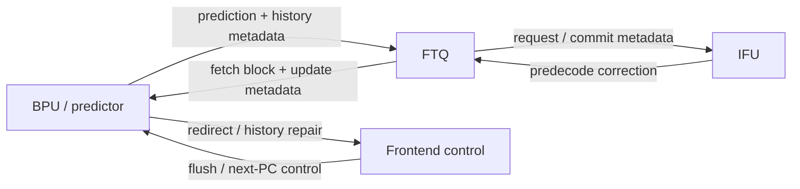
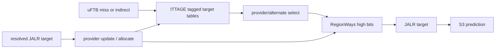
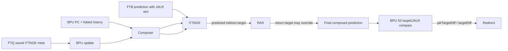

<!-- # Frontend ITTAGE 分支预测器深入分析 -->
# Frontend ITTAGE Indirect-Target Predictor Deep Dive

<!-- regenerated-by-analyze-xiangshan-kunminghu -->
> Regenerated from `OpenXiangShan/XiangShan` branch `kunminghu-v2`, source commit `52262f303fc06daf84cdab7011d59b7df65ce7e8` using the updated Frontend graph/stage rules.


<!-- > 官方源码：`https://github.com/OpenXiangShan/XiangShan.git`；分支 `kunminghu-v2`；分析 commit `52262f303fc06daf84cdab7011d59b7df65ce7e8`。论文解释算法原理，源码决定香山的有效参数、流水、更新与恢复。 -->
> Official source: `https://github.com/OpenXiangShan/XiangShan.git`, branch `kunminghu-v2`, analysis commit `52262f303fc06daf84cdab7011d59b7df65ce7e8`. Papers explain the algorithmic principles; the source determines XiangShan's effective parameters, pipeline, update, and recovery behavior.

<!-- frontend-tutorial-generated-by-analyze-xiangshan-kunminghu -->
<!-- > 所有实现结论均限定在 `kunminghu-v2` commit `52262f303fc06daf84cdab7011d59b7df65ce7e8`；Design Doc 结论必须回到第 18 节的源码追溯矩阵。 -->
> All implementation conclusions are limited to `kunminghu-v2` commit `52262f303fc06daf84cdab7011d59b7df65ce7e8`; Design Doc claims must be checked against the source traceability matrix in Section 18.

## 1. Scope

<!-- 本节保留模块职责、分析基线、范围和统一五问，明确本文只以当前源码证据为准。 -->
This section states the module responsibility, analysis baseline, scope, and common five questions; all claims use evidence from the current source only.

<!-- ### 1.1. 统一五问导读 -->
### 1.1. Five-Question Overview
<!-- | 问题 | 回答 |
| --- | --- |
| **Who** | `ITTAGE` 是针对 JALR/间接分支 target 的 tagged geometric-history predictor。 |
| **What** | 对同一间接分支可能跳向多个目标的情况，用不同长度路径/分支历史选择 target provider。 |
| **How** | 多张带 tag 的历史表并行查询；最长匹配项为 provider，较短匹配为 alternate；target 误预测时更新 provider 并在更长历史表分配。 |
| **From what** | PC、全局/路径历史和 FTB 标出的 JALR 槽位来自 BPU/上游预测；真实 target 与 update meta 来自 FTQ/后端提交。 |
| **To what** | 覆盖 FTB 的 JALR target，再交给 RAS；target 差异由 BPU S3 redirect。 |
-->
| Question | Answer |
| --- | --- |
| **Who** | `ITTAGE` is a tagged geometric-history predictor for JALR/indirect-branch targets. |
| **What** | It selects a target provider using path/branch histories of different lengths when one indirect branch can jump to multiple targets. |
| **How** | Several tagged history tables are queried in parallel; the longest match is the provider and a shorter match is the alternate; a target misprediction trains the provider and allocates in a longer-history table. |
| **From what** | PC, global/path history, and the JALR slot marked by FTB come from BPU/upstream prediction; the real target and update metadata come from FTQ/backend commit. |
| **To what** | It overrides the FTB JALR target and then feeds RAS; target differences generate a BPU S3 redirect. |

<!-- ### 1.2. 分析范围 -->
### 1.2. Analysis Scope
- Source: OpenXiangShan/XiangShan `kunminghu-v2`, commit `52262f303fc06daf84cdab7011d59b7df65ce7e8`.
- Relative source file: [src/main/scala/xiangshan/frontend/ITTAGE.scala](https://github.com/OpenXiangShan/XiangShan/blob/kunminghu-v2/src/main/scala/xiangshan/frontend/ITTAGE.scala).
- Effective instantiation: [Parameters.scala:130-143](https://github.com/OpenXiangShan/XiangShan/blob/kunminghu-v2/src/main/scala/xiangshan/Parameters.scala#L130-L143).

<!-- ## 2. 关键源码证据 -->
## 2. Key Source Evidence

<!-- 本节直接列出 `ITTAGE` 的有效源码入口、关键代码骨架和行为解释，避免只保存文件名或行号。 -->
This section lists effective `ITTAGE` source entry points, a code skeleton, and behavioral interpretation instead of only filenames or line numbers.

<!-- ### 2.1. 源码入口和行号 -->
### 2.1. Source Entry Points and Line References
<!-- | 源码文件 | 本文使用它证明什么 | 行号证据 |
| --- | --- | --- |
| `frontend/ITTAGE.scala` | 间接目标表 lookup、provider 和 target 输出 | [frontend/ITTAGE.scala#L418-L470](https://github.com/OpenXiangShan/XiangShan/blob/kunminghu-v2/src/main/scala/xiangshan/frontend/ITTAGE.scala#L418-L470) |
| `frontend/BPU.scala` | JALR target 差异触发 S3 redirect | [frontend/BPU.scala#L827-L854](https://github.com/OpenXiangShan/XiangShan/blob/kunminghu-v2/src/main/scala/xiangshan/frontend/BPU.scala#L827-L854) |
| `Parameters.scala` | `ITTageTableInfos` 容量、历史长度、tag 位宽 | [Parameters.scala#L124-L143](https://github.com/OpenXiangShan/XiangShan/blob/kunminghu-v2/src/main/scala/xiangshan/Parameters.scala#L124-L143) |
-->
| Source file | What it establishes | Line evidence |
| --- | --- | --- |
| `frontend/ITTAGE.scala` | Indirect-target table lookup, provider selection, and target output | [frontend/ITTAGE.scala#L418-L470](https://github.com/OpenXiangShan/XiangShan/blob/kunminghu-v2/src/main/scala/xiangshan/frontend/ITTAGE.scala#L418-L470) |
| `frontend/BPU.scala` | A JALR-target difference triggers an S3 redirect | [frontend/BPU.scala#L827-L854](https://github.com/OpenXiangShan/XiangShan/blob/kunminghu-v2/src/main/scala/xiangshan/frontend/BPU.scala#L827-L854) |
| `Parameters.scala` | `ITTageTableInfos` capacity, history lengths, and tag widths | [Parameters.scala#L124-L143](https://github.com/OpenXiangShan/XiangShan/blob/kunminghu-v2/src/main/scala/xiangshan/Parameters.scala#L124-L143) |

<!-- ### 2.2. 核心代码骨架 -->
### 2.2. Core Code Skeleton
```scala
val idx = hash(jalrPc, foldedHist)
val hit = entry.valid && entry.tag === tag
val providerTarget = selectProvider(hitVec, targetVec)
full_pred.jalr_target := providerTarget
```

<!-- ### 2.3. 代码解析 -->
### 2.3. Code Walkthrough
<!-- ITTAGE 把 TAGE 的 tagged-history 思路用于间接跳转目标预测。它重点修正 JALR target，而不是普通条件分支方向。 -->
ITTAGE applies TAGE's tagged-history approach to indirect-target prediction. Its purpose is to correct JALR targets, not ordinary conditional-branch direction.
## 3. Theory-to-Code Mapping

<!-- 本节把理论概念直接绑定到 `ITTAGE` 的源码对象、控制/数据状态和下游消费者。 -->
This section binds theoretical concepts directly to `ITTAGE` source objects, control/data state, and downstream consumers.

<!-- ### 3.1. 理论到代码映射表 -->
### 3.1. Theory-to-Code Mapping
<!-- | 理论概念 | 代码对象 | 为什么需要它 | 消费者/后续影响 |
| --- | --- | --- | --- |
| 间接跳转多目标 | JALR PC + folded history | 同一 JALR 指令可能有多个动态目标 | BPU full_pred.jalr_target |
| target provider | tag hit / target entry | 选择最长历史命中的目标 | S3 redirect comparison |
| 目标训练 | FTQ update meta | 真实 JALR target 回写表项 | ITTAGE table update |
-->
| Theoretical concept | Code object | Why it is needed | Consumer / downstream effect |
| --- | --- | --- | --- |
| Multiple indirect targets | JALR PC + folded history | One JALR may have multiple dynamic targets | `BPU.full_pred.jalr_target` |
| Target provider | Tag hit / target entry | Selects the target with the longest matching history | S3 redirect comparison |
| Target training | FTQ update metadata | Writes the resolved JALR target back to an entry | ITTAGE table update |

<!-- ### 3.2. 阅读顺序 -->
### 3.2. Reading Order
<!-- 先按第 2 节定位源码对象，再顺着本表检查信号从哪里来、状态在哪里保存、何时更新、谁消费结果。若本篇只引用相邻模块拥有的状态，则以相邻 Frontend 分文档的源码分析为准。 -->
First locate source objects in Section 2, then use this table to follow each signal's origin, state storage, update point, and consumer. When state belongs to an adjacent module, defer to that module's frontend analysis.
<!-- ## 4. 论文原则和有效代码 -->
## 4. Paper Principles and Effective Code


<!-- ### 4.1. 状态机与论文理论 -->
### 4.1. State Machine and Paper Theory
<!-- ITTAGE 没有单一 FSM，使用查询 S0-S3、provider/alternate metadata、update/allocate 和 useful-bit aging 的 entry 生命周期。源码引用 André Seznec 的 *A 64-Kbytes ITTAGE indirect branch predictor*（JWAC-2, 2011）：把 TAGE 的 tagged geometric history 思路从方向预测扩展到 target 预测，用较长历史区分同一 JALR 在不同调用/路径上下文中的目标。 -->
ITTAGE has no single monolithic FSM. An entry progresses through S0-S3 lookup, provider/alternate metadata capture, update/allocation, and useful-bit aging. The source cites André Seznec's *A 64-Kbytes ITTAGE indirect branch predictor* (JWAC-2, 2011), which extends TAGE's tagged geometric-history idea from direction prediction to target prediction so longer histories distinguish one JALR across call/path contexts.

<!-- ### 4.2. 论文理论背景 -->
### 4.2. Paper Background
The source cites Andre Seznec, `A 64-Kbytes ITTAGE indirect branch predictor` ([ITTAGE.scala:18-23](https://github.com/OpenXiangShan/XiangShan/blob/kunminghu-v2/src/main/scala/xiangshan/frontend/ITTAGE.scala#L18-L23)). MCP search for ITTAGE returned related geometric-history branch prediction papers but not a richer direct result; this analysis therefore uses the source-cited paper as the primary algorithm context. Principle: use TAGE-like tagged history tables to predict indirect branch targets, with provider/alternate target selection and allocation on target misprediction.

<!-- ### 4.3. 论文原理深入讲解 -->
### 4.3. Detailed Paper Principles
<!-- #### 4.3.1. 原始论文与问题定义 -->
#### 4.3.1. Original Paper and Problem Definition

<!-- 香山源码直接引用 André Seznec, *A 64-Kbytes ITTAGE indirect branch predictor*（JILP/JWAC-CBP 2011，HAL `hal-00639041`，见 [frontend/ITTAGE.scala:18-23](https://github.com/OpenXiangShan/XiangShan/blob/kunminghu-v2/src/main/scala/xiangshan/frontend/ITTAGE.scala#L18-L23)）。ITTAGE 解决的不是条件分支 taken/not-taken，而是 **同一条间接跳转指令在不同上下文下可能跳到多个 target**。普通 BTB 以 PC 保存单一 target，面对虚函数调用、解释器 dispatch 或 switch lowering 时会频繁被最后一次目标覆盖。 -->
The source directly cites André Seznec's *A 64-Kbytes ITTAGE indirect branch predictor* (JILP/JWAC-CBP 2011, HAL `hal-00639041`; see [frontend/ITTAGE.scala:18-23](https://github.com/OpenXiangShan/XiangShan/blob/kunminghu-v2/src/main/scala/xiangshan/frontend/ITTAGE.scala#L18-L23)). ITTAGE does not predict conditional taken/not-taken; it predicts cases where **one indirect instruction reaches multiple targets under different contexts**. A conventional PC-indexed BTB stores one target and is repeatedly overwritten by the most recent target in virtual dispatch, interpreters, or lowered switches.

<!-- #### 4.3.2. 从 TAGE 到 ITTAGE -->
#### 4.3.2. From TAGE to ITTAGE

<!-- ITTAGE 保留 TAGE 的“多种几何历史长度 + tagged provider”框架，但 entry 的主要预测值从方向 counter 变成 target。查询时，PC 与 folded history 并行访问多张表；最长 tag 命中项提供 target，次长命中项提供 alternate target。counter 表示该 target 在此上下文中的可信度，useful 表示该 entry 是否比 alternate 更有独占贡献。香山参数包括 2-bit confidence、1-bit useful，以及 target offset/region 压缩（[frontend/ITTAGE.scala:39-63](https://github.com/OpenXiangShan/XiangShan/blob/kunminghu-v2/src/main/scala/xiangshan/frontend/ITTAGE.scala#L39-L63)）。 -->
ITTAGE retains TAGE's “multiple geometric history lengths plus tagged provider” framework, but an entry predicts a target rather than a direction counter. PC and folded history query several tables in parallel; the longest tag match supplies the target and the next-longest match supplies the alternate. The counter represents target confidence in that context, while `useful` records whether the entry contributes beyond the alternate. XiangShan uses 2-bit confidence, 1-bit useful, and target offset/region compression ([frontend/ITTAGE.scala:39-63](https://github.com/OpenXiangShan/XiangShan/blob/kunminghu-v2/src/main/scala/xiangshan/frontend/ITTAGE.scala#L39-L63)).

<!-- #### 4.3.3. 为什么仍然需要 Alternate -->
#### 4.3.3. Why an Alternate Is Still Needed

<!-- 新分配 entry 通常只见过一次目标误预测，立即完全信任可能过拟合。ITTAGE 因而在 provider 低置信时保留 alternate，并用 `use_alt_on_na` 学习选择策略。若 provider 与 alternate target 相同，即使 provider 命中也没有独占价值；若 provider 正确而 alternate 错，才应提高 useful。这与 TAGE 的方向选择相同，但比较对象变成完整 target。 -->
A newly allocated entry may have seen only one target misprediction, so trusting it immediately can overfit. ITTAGE retains the alternate when the provider is weak and learns the choice with `use_alt_on_na`. A provider that equals the alternate has no exclusive value even when it hits; `useful` should rise only when the provider is correct and the alternate is wrong. This mirrors TAGE direction selection, but compares complete targets.

<!-- #### 4.3.4. Target 压缩为什么存在 -->
#### 4.3.4. Why Targets Are Compressed

<!-- 在每个 entry 中保存完整虚拟地址代价很高。香山把 target 拆成低位 offset 和高位 region，`usePCRegion` 表示高位可直接复用当前 PC region，否则通过 region pointer 读取高位（[frontend/ITTAGE.scala:77-110](https://github.com/OpenXiangShan/XiangShan/blob/kunminghu-v2/src/main/scala/xiangshan/frontend/ITTAGE.scala#L77-L110)）。这些控制位的存在是为了在容量和可重建性之间折中；region 无效时不能把随机高位拼成合法目标。 -->
Storing a complete virtual address in every entry is expensive. XiangShan splits a target into a low offset and a high region; `usePCRegion` reuses the current PC region, otherwise a region pointer supplies the high bits ([frontend/ITTAGE.scala:77-110](https://github.com/OpenXiangShan/XiangShan/blob/kunminghu-v2/src/main/scala/xiangshan/frontend/ITTAGE.scala#L77-L110)). These controls trade capacity for reconstructability; an invalid region must never be combined with random high bits to form a target.

<!-- #### 4.3.5. 训练示例 -->
#### 4.3.5. Training Example

<!-- 同一 JALR PC `P` 在历史 `H0` 下跳到 `T0`，在历史 `H1` 下跳到 `T1`。短历史表可能只能记住最近 target，而长历史表可用更早路径区分 `H0/H1`。当 FTB 给出 `T0`、ITTAGE 长历史 provider 给出 `T1` 时，S3 覆盖目标并触发前端 redirect。若执行确认 `T1`，provider confidence/useful 增强；若仍错，则在更长历史、`u=0` 的候选中分配。香山的最终覆盖与 metadata 生成见 [frontend/ITTAGE.scala:418-470](https://github.com/OpenXiangShan/XiangShan/blob/kunminghu-v2/src/main/scala/xiangshan/frontend/ITTAGE.scala#L418-L470)，训练和分配以该文件后续 update 逻辑为准。 -->
For one JALR PC `P`, history `H0` may reach `T0` while `H1` reaches `T1`. A short-history table may retain only the latest target, whereas a long-history table can distinguish `H0/H1`. If FTB supplies `T0` but the long-history ITTAGE provider supplies `T1`, S3 overrides the target and redirects the frontend. When execution confirms `T1`, provider confidence/useful increases; if it remains wrong, a longer-history candidate with `u=0` is allocated. Final override and metadata generation are shown at [frontend/ITTAGE.scala:418-470](https://github.com/OpenXiangShan/XiangShan/blob/kunminghu-v2/src/main/scala/xiangshan/frontend/ITTAGE.scala#L418-L470); later update logic defines training/allocation.

<!-- #### 4.3.6. 与论文的实现差异边界 -->
#### 4.3.6. Boundary Between Paper and Implementation

<!-- 论文说明算法，香山决定表规模、流水级、bank 冲突、region 编码和与 FTB/BPU 的组合方式。不能因为名称叫 ITTAGE 就假设其容量仍为论文标题的 64 KB；有效容量必须由 `ITTageTableInfos` 和当前参数计算。 -->
The paper defines the algorithm family; XiangShan determines table size, pipeline stages, bank conflicts, region encoding, and composition with FTB/BPU. The name ITTAGE does not imply the paper's 64-KB capacity; effective capacity must be computed from `ITTageTableInfos` and the current parameters.

## 5. Microarchitecture Parameters


<!-- ### 5.1. 表容量、分配与边界 -->
### 5.1. Table Capacity, Allocation, and Boundaries
<!-- - tagged tables 是固定容量；误预测分配若找不到 `u=0` 的候选 entry，会跳过或等待 useful aging，而不能越界写表。 -->
- Tagged tables have fixed capacity; if a misprediction finds no `u=0` candidate, allocation skips or waits for useful aging instead of writing out of bounds.
<!-- - 无 provider 命中时使用 FTB/alternate target，不存在从空表读取未定义 target 的 underflow。 -->
- Without a provider hit, ITTAGE uses the FTB/alternate target; it never reads an undefined target from an empty table.
<!-- - update 与 lookup 的 SRAM 端口冲突通过 ready/valid 和 metadata 延迟处理，确保 provider index/tag 与 target 对齐。 -->
- SRAM update/lookup conflicts are handled with ready/valid control and delayed metadata so provider index/tag remain aligned with the target.

```waveform-draw
{
  "signal": [
    {
      "name": "clk",
      "wave": "p......."
    },
    {
      "name": "s0_valid",
      "wave": "01..0..."
    },
    {
      "name": "s1_match",
      "wave": "0.10...."
    },
    {
      "name": "provider",
      "wave": "x..=x...",
      "data": [
        "T2"
      ]
    },
    {
      "name": "jalr_target",
      "wave": "x...=x..",
      "data": [
        "targetB"
      ]
    },
    {
      "name": "s3_redirect",
      "wave": "0....10."
    },
    {
      "name": "update.valid",
      "wave": "0......1"
    }
  ],
  "config": {
    "hscale": 1
  }
}
```

<!-- ## 6. 模块边界和接口 -->
## 6. Module Boundaries and Interfaces


<!-- ### 6.1. 控制信号逐项解释：Who / From / To / How / Why -->
### 6.1. Control Signals: Who / From / To / How / Why
<!-- > 下表覆盖本文讲解中出现的查询、流水推进、选择、训练、替换和恢复控制。`为什么存在` 不以信号命名猜测，而以当前 `kunminghu-v2` 数据依赖、资源限制和恢复要求为依据。 -->
> The table covers lookup, pipeline advance, selection, training, replacement, and recovery controls discussed here. The rationale follows current `kunminghu-v2` data dependencies, resource limits, and recovery requirements rather than signal names alone.

<!-- | 控制信号 / 状态 | 谁产生 / 从哪里来 | 谁消费 / 到哪里去 | 何时、如何生效 | 为什么存在；缺失会怎样 | 代码证据 |
| --- | --- | --- | --- | --- | --- |
| `io.in.valid / stage fire` | FTB 输出与 BPU 请求 | ITTAGE 表查询流水 | 仅接受含同一 PC/历史/FTB 预测的事务。 | 间接目标修正比早期 FTB 更晚，fire 保证它覆盖的是同一 fetch block 而非相邻请求。 | [frontend/ITTAGE.scala:418-470](https://github.com/OpenXiangShan/XiangShan/blob/kunminghu-v2/src/main/scala/xiangshan/frontend/ITTAGE.scala#L418-L470) |
| `io.ctrl.ittage_enable` | CSR/BPU 控制 | ITTAGE 输出选择 | 关闭时旁路上游预测，不让 ITTAGE 覆盖目标。 | 提供 bring-up、性能对比和故障隔离能力；无 enable 时表中陈旧状态会始终影响前端。 | [frontend/ITTAGE.scala:418-470](https://github.com/OpenXiangShan/XiangShan/blob/kunminghu-v2/src/main/scala/xiangshan/frontend/ITTAGE.scala#L418-L470) |
| `s1_idx / s1_tag` | PC 与 folded history | 各历史表 SRAM | 为不同历史长度生成查询地址和 tag。 | 同一 JALR PC 可有多个目标，必须加入历史上下文，并用 tag 抑制 hash alias。 | [frontend/ITTAGE.scala:180-260](https://github.com/OpenXiangShan/XiangShan/blob/kunminghu-v2/src/main/scala/xiangshan/frontend/ITTAGE.scala#L180-L260) |
| `s2_hit_vec` | 各表 valid/tag 比较 | provider/alternate 选择 | 记录哪些历史表匹配。 | 需要同时保留多层匹配，才能让最长历史 provider 与次长 alternate 共存。 | [frontend/ITTAGE.scala:418-470](https://github.com/OpenXiangShan/XiangShan/blob/kunminghu-v2/src/main/scala/xiangshan/frontend/ITTAGE.scala#L418-L470) |
| `provider / alt_provider` | 命中优先选择 | 目标和 confidence 选择 | 最长匹配表提供主目标，较短匹配提供备用目标。 | 长历史通常更专门但可能刚分配且不稳定；alternate 为低置信 provider 提供退路。 | [frontend/ITTAGE.scala:418-470](https://github.com/OpenXiangShan/XiangShan/blob/kunminghu-v2/src/main/scala/xiangshan/frontend/ITTAGE.scala#L418-L470) |
| `use_alt_on_na` | 饱和学习计数器 | 最终目标 mux | provider 新分配/低置信时选择 alternate。 | 新 entry 的少量样本可能过拟合；该控制让硬件学习何时信任更成熟的短历史。 | [frontend/ITTAGE.scala:470-560](https://github.com/OpenXiangShan/XiangShan/blob/kunminghu-v2/src/main/scala/xiangshan/frontend/ITTAGE.scala#L470-L560) |
| `region_valid / usePCRegion` | target 压缩编码 | 目标重建 | 选择 PC 高位或 region table 高位与 offset 拼接。 | 完整虚拟地址存储昂贵；显式 region 有效/选择位让压缩目标仍可无歧义恢复。 | [frontend/ITTAGE.scala:77-110](https://github.com/OpenXiangShan/XiangShan/blob/kunminghu-v2/src/main/scala/xiangshan/frontend/ITTAGE.scala#L77-L110) |
| `allocates` | 目标误预测与 provider 位置 | 更长历史表写使能 | 只在候选 useful=0 的长历史表分配新目标。 | 误预测说明现有上下文不足；向更长历史分配提供更细分类，同时避免覆盖仍有价值 entry。 | [frontend/ITTAGE.scala:500-590](https://github.com/OpenXiangShan/XiangShan/blob/kunminghu-v2/src/main/scala/xiangshan/frontend/ITTAGE.scala#L500-L590) |
| `io.update.valid` | FTQ/提交的 JALR 结果 | provider counter、u bit、target/region | 用真实目标训练原 provider 或分配项。 | 间接目标只能在执行后确认；延迟 update 是学习真实 target 且隔离错误路径的必要条件。 | [frontend/ITTAGE.scala:470-600](https://github.com/OpenXiangShan/XiangShan/blob/kunminghu-v2/src/main/scala/xiangshan/frontend/ITTAGE.scala#L470-L600) |
| `reset_u / tick` | 分配失败统计 | 所有 useful bit | 周期性清老化 u bit。 | 若 useful 永不衰减，表被旧工作集占满后新模式永远无法分配，形成容量饥饿。 | [frontend/ITTAGE.scala:500-600](https://github.com/OpenXiangShan/XiangShan/blob/kunminghu-v2/src/main/scala/xiangshan/frontend/ITTAGE.scala#L500-L600) |
| `last_stage_meta` | provider/alternate/way/counter | FTQ 保存与 update | 把预测时选择信息带到训练。 | 提交时重新查询可能得到不同 entry；metadata 防止更新错表、错 way 或错 confidence。 | [frontend/ITTAGE.scala:418-470](https://github.com/OpenXiangShan/XiangShan/blob/kunminghu-v2/src/main/scala/xiangshan/frontend/ITTAGE.scala#L418-L470) |
-->
| Control signal / state | Producer / source | Consumer / destination | When and how it takes effect | Why it exists; consequence if absent | Source evidence |
| --- | --- | --- | --- | --- | --- |
| `io.in.valid / stage fire` | FTB output and BPU request | ITTAGE lookup pipeline | Accepts only a transaction carrying the same PC/history/FTB prediction. | Indirect-target correction is later than FTB; fire binds it to the same fetch block rather than an adjacent request. | [frontend/ITTAGE.scala:418-470](https://github.com/OpenXiangShan/XiangShan/blob/kunminghu-v2/src/main/scala/xiangshan/frontend/ITTAGE.scala#L418-L470) |
| `io.ctrl.ittage_enable` | CSR/BPU control | ITTAGE output selection | When disabled, bypasses upstream prediction and prevents ITTAGE from overriding the target. | Enables bring-up, performance comparison, and fault isolation; without it stale table state would always affect fetch. | [frontend/ITTAGE.scala:418-470](https://github.com/OpenXiangShan/XiangShan/blob/kunminghu-v2/src/main/scala/xiangshan/frontend/ITTAGE.scala#L418-L470) |
| `s1_idx / s1_tag` | PC and folded history | History-table SRAMs | Generates an address/tag for each history length. | One JALR PC can have multiple targets; history context plus tags suppress hash aliasing. | [frontend/ITTAGE.scala:180-260](https://github.com/OpenXiangShan/XiangShan/blob/kunminghu-v2/src/main/scala/xiangshan/frontend/ITTAGE.scala#L180-L260) |
| `s2_hit_vec` | Valid/tag comparisons in each table | Provider/alternate selection | Records which history tables match. | Keeping multiple matches allows the longest-history provider and next-longest alternate to coexist. | [frontend/ITTAGE.scala:418-470](https://github.com/OpenXiangShan/XiangShan/blob/kunminghu-v2/src/main/scala/xiangshan/frontend/ITTAGE.scala#L418-L470) |
| `provider / alt_provider` | Priority selection among hits | Target and confidence selection | Longest match supplies the main target; a shorter match supplies the fallback. | Long history is specialized but may be newly allocated and unstable; alternate provides a fallback for a weak provider. | [frontend/ITTAGE.scala:418-470](https://github.com/OpenXiangShan/XiangShan/blob/kunminghu-v2/src/main/scala/xiangshan/frontend/ITTAGE.scala#L418-L470) |
| `use_alt_on_na` | Saturating learning counter | Final target mux | Selects alternate when the provider is newly allocated or low confidence. | Few samples can overfit a new entry; this control learns when a mature short history is safer. | [frontend/ITTAGE.scala:470-560](https://github.com/OpenXiangShan/XiangShan/blob/kunminghu-v2/src/main/scala/xiangshan/frontend/ITTAGE.scala#L470-L560) |
| `region_valid / usePCRegion` | Compressed-target encoding | Target reconstruction | Selects PC high bits or region-table high bits to concatenate with the offset. | Full virtual addresses are expensive; explicit validity/selection bits reconstruct compressed targets unambiguously. | [frontend/ITTAGE.scala:77-110](https://github.com/OpenXiangShan/XiangShan/blob/kunminghu-v2/src/main/scala/xiangshan/frontend/ITTAGE.scala#L77-L110) |
| `allocates` | Target misprediction and provider position | Longer-history table write enable | Allocates only in longer tables with a `useful=0` candidate. | A misprediction indicates insufficient context; longer history refines classification without evicting valuable entries. | [frontend/ITTAGE.scala:500-590](https://github.com/OpenXiangShan/XiangShan/blob/kunminghu-v2/src/main/scala/xiangshan/frontend/ITTAGE.scala#L500-L590) |
| `io.update.valid` | Committed JALR result from FTQ/backend | Provider counter, useful bit, target/region | Trains the original provider or allocation using the resolved target. | The target is known only after execution; delayed update learns the real target and isolates wrong-path work. | [frontend/ITTAGE.scala:470-600](https://github.com/OpenXiangShan/XiangShan/blob/kunminghu-v2/src/main/scala/xiangshan/frontend/ITTAGE.scala#L470-L600) |
| `reset_u / tick` | Allocation-failure statistics | All useful bits | Periodically clears/ages useful bits. | Without decay, an old working set can fill the table and starve new patterns. | [frontend/ITTAGE.scala:500-600](https://github.com/OpenXiangShan/XiangShan/blob/kunminghu-v2/src/main/scala/xiangshan/frontend/ITTAGE.scala#L500-L600) |
| `last_stage_meta` | Provider/alternate/way/counter snapshot | FTQ storage and update | Carries prediction-time selection into training. | Re-querying at commit may find a different entry; metadata prevents updating the wrong table, way, or confidence. | [frontend/ITTAGE.scala:418-470](https://github.com/OpenXiangShan/XiangShan/blob/kunminghu-v2/src/main/scala/xiangshan/frontend/ITTAGE.scala#L418-L470) |

#### 6.1.1. Top-Level Module Connectivity

This module participates in the predictor chain, but the top-level graph keeps only bundled interfaces. `Frontend.scala` instantiates BPU, FTQ, IFU, IBuffer, ICache, and InstrUncache, while the predictor-specific chain is configured through Composer: [frontend/Frontend.scala:103-109](https://github.com/OpenXiangShan/XiangShan/blob/52262f303fc06daf84cdab7011d59b7df65ce7e8/src/main/scala/xiangshan/frontend/Frontend.scala#L103-L109), [frontend/Composer.scala:22-77](https://github.com/OpenXiangShan/XiangShan/blob/52262f303fc06daf84cdab7011d59b7df65ce7e8/src/main/scala/xiangshan/frontend/Composer.scala#L22-L77).



No module pair has more than three bundled edges. Individual table reads, counters, folded histories, and predictor-local states remain in the module's detailed sections instead of becoming separate graph lines.

#### 6.1.2. Frontend/Backend Pipeline Stages

The source-proven stage boundary is `F0 -> F1 -> F2 -> F3`: F0 accepts the FTQ request and calculates line indices, F1 registers the fetch block and calculates instruction PCs/cut pointers, F2 waits for ICache responses and performs data cutting/predecode preparation, and F3 expands/qualifies instructions, handles exceptions/MMIO, and drives IBuffer. Evidence: [frontend/IFU.scala:236-305](https://github.com/OpenXiangShan/XiangShan/blob/52262f303fc06daf84cdab7011d59b7df65ce7e8/src/main/scala/xiangshan/frontend/IFU.scala#L236-L305), [frontend/IFU.scala:346-457](https://github.com/OpenXiangShan/XiangShan/blob/52262f303fc06daf84cdab7011d59b7df65ce7e8/src/main/scala/xiangshan/frontend/IFU.scala#L346-L457), [frontend/IFU.scala:542-617](https://github.com/OpenXiangShan/XiangShan/blob/52262f303fc06daf84cdab7011d59b7df65ce7e8/src/main/scala/xiangshan/frontend/IFU.scala#L542-L617). The top-level connections couple FTQ, IFU, ICache, and IBuffer through shared ready/valid conditions: [frontend/Frontend.scala:199-231](https://github.com/OpenXiangShan/XiangShan/blob/52262f303fc06daf84cdab7011d59b7df65ce7e8/src/main/scala/xiangshan/frontend/Frontend.scala#L199-L231).

The backend continuation uses the effective module boundaries rather than inventing cycle names: Decode accepts the instruction packet, Rename creates speculative physical-register mappings, Dispatch allocates downstream resources, Issue/Scheduler selects ready uops, Execute/FU produces results, DataPath/WB carries writeback and wakeup, and ROB/CtrlBlock commits or redirects. Evidence: [backend/decode/DecodeStage.scala:83-120](https://github.com/OpenXiangShan/XiangShan/blob/52262f303fc06daf84cdab7011d59b7df65ce7e8/src/main/scala/xiangshan/backend/decode/DecodeStage.scala#L83-L120), [backend/rename/Rename.scala:40-117](https://github.com/OpenXiangShan/XiangShan/blob/52262f303fc06daf84cdab7011d59b7df65ce7e8/src/main/scala/xiangshan/backend/rename/Rename.scala#L40-L117), [backend/dispatch/NewDispatch.scala:49-176](https://github.com/OpenXiangShan/XiangShan/blob/52262f303fc06daf84cdab7011d59b7df65ce7e8/src/main/scala/xiangshan/backend/dispatch/NewDispatch.scala#L49-L176), [backend/issue/Scheduler.scala:29-180](https://github.com/OpenXiangShan/XiangShan/blob/52262f303fc06daf84cdab7011d59b7df65ce7e8/src/main/scala/xiangshan/backend/issue/Scheduler.scala#L29-L180), [backend/exu/ExeUnit.scala:50-110](https://github.com/OpenXiangShan/XiangShan/blob/52262f303fc06daf84cdab7011d59b7df65ce7e8/src/main/scala/xiangshan/backend/exu/ExeUnit.scala#L50-L110), [backend/datapath/DataPath.scala:25-70](https://github.com/OpenXiangShan/XiangShan/blob/52262f303fc06daf84cdab7011d59b7df65ce7e8/src/main/scala/xiangshan/backend/datapath/DataPath.scala#L25-L70), [backend/rob/Rob.scala:52-145](https://github.com/OpenXiangShan/XiangShan/blob/52262f303fc06daf84cdab7011d59b7df65ce7e8/src/main/scala/xiangshan/backend/rob/Rob.scala#L52-L145), [backend/CtrlBlock.scala:50-110](https://github.com/OpenXiangShan/XiangShan/blob/52262f303fc06daf84cdab7011d59b7df65ce7e8/src/main/scala/xiangshan/backend/CtrlBlock.scala#L50-L110).

```mermaid
flowchart LR
  F0["F0: FTQ req + line indices"] -->|f0_fire| F1["F1: PC + cut pointers"]
  F1 -->|f1_fire| F2["F2: ICache data + exceptions"]
  F2 -->|f2_fire| F3["F3: predecode + MMIO qualification"]
  F3 -->|toIbuffer.fire| Decode["Decode"]
  Decode -->|uop bundle| Rename["Rename"]
  Rename -->|renamed uop| Dispatch["Dispatch"]
  Dispatch -->|ready uop| Issue["Issue"]
  Issue -->|operands| Execute["Execute/FU"]
  Execute -->|result| Writeback["Writeback/Wakeup"]
  Writeback -->|retire candidate| Commit["ROB/Commit"]
  Commit -->|redirect/flush| F0
```



The stage graph keeps chronological forward edges separate from the bundled recovery edge. It must be read together with the module graph below: a stage is not itself a module, and a redirect does not create a fake forward stage.

```waveform-draw
{
  "signal": [
    {
      "name": "clk",
      "wave": "p......."
    },
    {
      "name": "F0.valid",
      "wave": "01...0.."
    },
    {
      "name": "F0.ready",
      "wave": "1..0...."
    },
    {
      "name": "F1.valid",
      "wave": "001..0.."
    },
    {
      "name": "F2.valid",
      "wave": "0001.0.."
    },
    {
      "name": "F3.valid",
      "wave": "00001.0."
    },
    {
      "name": "toIbuffer.fire",
      "wave": "0000010."
    },
    {
      "name": "redirect/flush",
      "wave": "00000010"
    }
  ],
  "config": {
    "hscale": 1
  }
}
```

<!-- ## 7. 为什么模块存在 -->
## 7. Why the Module Exists


<!-- 把模块放回 Frontend 全链路理解：它解决的是预测带宽、取指正确性、存储层次延迟、投机恢复或上下游速率不匹配中的至少一个问题。 -->
Viewed in the complete frontend, this module addresses at least one of prediction bandwidth, fetch correctness, memory-hierarchy latency, speculative recovery, or producer/consumer rate mismatch.

<!-- ## 8. 有效动态路径 -->
## 8. Effective Dynamic Path


### 8.1. Lookup Algorithm
ITTAGE computes `unhashed_idx = pc >> instOffsetBits` ([ITTAGE.scala:258-263](https://github.com/OpenXiangShan/XiangShan/blob/kunminghu-v2/src/main/scala/xiangshan/frontend/ITTAGE.scala#L258-L263)). Each table folds global history into index and tag; if history length is zero, only PC bits are used ([ITTAGE.scala:231-243](https://github.com/OpenXiangShan/XiangShan/blob/kunminghu-v2/src/main/scala/xiangshan/frontend/ITTAGE.scala#L231-L243)). A read hit requires entry valid and tag match, and is suppressed when there is a same-cycle read/write conflict ([ITTAGE.scala:290-299](https://github.com/OpenXiangShan/XiangShan/blob/kunminghu-v2/src/main/scala/xiangshan/frontend/ITTAGE.scala#L290-L299)).

The module only fires table requests when the fast path suggests an indirect branch is relevant: uFTB miss while FTB is open, or uFTB has an indirect JALR ([ITTAGE.scala:433-437](https://github.com/OpenXiangShan/XiangShan/blob/kunminghu-v2/src/main/scala/xiangshan/frontend/ITTAGE.scala#L433-L437), [ITTAGE.scala:539-544](https://github.com/OpenXiangShan/XiangShan/blob/kunminghu-v2/src/main/scala/xiangshan/frontend/ITTAGE.scala#L539-L544)). Provider and alternate are selected from reversed table order ([ITTAGE.scala:552-570](https://github.com/OpenXiangShan/XiangShan/blob/kunminghu-v2/src/main/scala/xiangshan/frontend/ITTAGE.scala#L552-L570)), so longer-history hits take priority.

Targets are stored as offset plus region pointer. If the region pointer is valid and not marked `usePCRegion`, target high bits come from `RegionWays`; otherwise the current PC region is used ([ITTAGE.scala:572-585](https://github.com/OpenXiangShan/XiangShan/blob/kunminghu-v2/src/main/scala/xiangshan/frontend/ITTAGE.scala#L572-L585)). Provider target, alternate target, or base FTB JALR target is selected by provider/alt availability and provider counter zero state ([ITTAGE.scala:596-600](https://github.com/OpenXiangShan/XiangShan/blob/kunminghu-v2/src/main/scala/xiangshan/frontend/ITTAGE.scala#L596-L600)). The selected target overwrites `jalr_target` in S3 ([ITTAGE.scala:613-617](https://github.com/OpenXiangShan/XiangShan/blob/kunminghu-v2/src/main/scala/xiangshan/frontend/ITTAGE.scala#L613-L617)).

### 8.2. Update Algorithm
Only non-return JALR updates that match the FTB tail slot train ITTAGE ([ITTAGE.scala:517-520](https://github.com/OpenXiangShan/XiangShan/blob/kunminghu-v2/src/main/scala/xiangshan/frontend/ITTAGE.scala#L517-L520)). Existing provider entries update correctness, useful bit, counter, and target offset ([ITTAGE.scala:670-698](https://github.com/OpenXiangShan/XiangShan/blob/kunminghu-v2/src/main/scala/xiangshan/frontend/ITTAGE.scala#L670-L698)). If the provider was null and alternate was used incorrectly, the alternate is also updated ([ITTAGE.scala:672-683](https://github.com/OpenXiangShan/XiangShan/blob/kunminghu-v2/src/main/scala/xiangshan/frontend/ITTAGE.scala#L672-L683)). On target misprediction, ITTAGE allocates the saved candidate unless the provider was correct but unconfident ([ITTAGE.scala:709-724](https://github.com/OpenXiangShan/XiangShan/blob/kunminghu-v2/src/main/scala/xiangshan/frontend/ITTAGE.scala#L709-L724)). Tick saturation resets useful bits ([ITTAGE.scala:730-733](https://github.com/OpenXiangShan/XiangShan/blob/kunminghu-v2/src/main/scala/xiangshan/frontend/ITTAGE.scala#L730-L733)).

<!-- ## 9. Index 和地址/历史计算 -->
## 9. Index and Address/History Computation


<!-- 地址、PC、折叠历史、tag、set/way、line offset 和 FTQ offset 都必须追到源码表达式；索引冲突、回绕和跨边界情况在算法和验证章节中继续展开。 -->
Addresses, PCs, folded histories, tags, sets/ways, line offsets, and FTQ offsets must be traced to source expressions; index conflicts, wraparound, and boundary crossings are expanded in the algorithm and verification sections.

<!-- ## 10. 核心算法 -->
## 10. Core Algorithm


<!-- ### 10.1. 算法示例推演 -->
### 10.1. Algorithm Example Walkthrough
Example input: fetch block contains a taken non-return JALR at tail slot. uFTB hit says the block has an indirect JALR, so `s1_isIndirect=true`. The base FTB target is `0x8000_4000`. ITTAGE table 3 hits with target offset `0x12345`, region pointer 5, and region table entry 5 contains region high bits for `0x9000_0000`.

1. Access gate: [ITTAGE.scala:433-437](https://github.com/OpenXiangShan/XiangShan/blob/kunminghu-v2/src/main/scala/xiangshan/frontend/ITTAGE.scala#L433-L437) sets `s1_isIndirect` when uFTB missed while FTB is open or uFTB reports an indirect JALR. [ITTAGE.scala:539-544](https://github.com/OpenXiangShan/XiangShan/blob/kunminghu-v2/src/main/scala/xiangshan/frontend/ITTAGE.scala#L539-L544) only fires table requests under that condition.
2. Index/tag: each table computes `unhashed_idx = pc >> instOffsetBits` and folds history into index/tag ([ITTAGE.scala:231-243](https://github.com/OpenXiangShan/XiangShan/blob/kunminghu-v2/src/main/scala/xiangshan/frontend/ITTAGE.scala#L231-L243), [ITTAGE.scala:258-266](https://github.com/OpenXiangShan/XiangShan/blob/kunminghu-v2/src/main/scala/xiangshan/frontend/ITTAGE.scala#L258-L266)).
3. Provider select: [ITTAGE.scala:552-570](https://github.com/OpenXiangShan/XiangShan/blob/kunminghu-v2/src/main/scala/xiangshan/frontend/ITTAGE.scala#L552-L570) wraps each valid table response and uses `ParallelSelectTwo(inputRes.reverse)`. Table 3 wins as provider; a lower table may become alternate.
4. Target reconstruction: [ITTAGE.scala:572-585](https://github.com/OpenXiangShan/XiangShan/blob/kunminghu-v2/src/main/scala/xiangshan/frontend/ITTAGE.scala#L572-L585) reads `RegionWays` by the stored pointer. Since pointer 5 is valid and `usePCRegion=false`, the target becomes `Cat(region[5], offset)=0x9001_2345` in representative form. If the region entry missed, current PC region would be used instead.
5. Output: [ITTAGE.scala:596-600](https://github.com/OpenXiangShan/XiangShan/blob/kunminghu-v2/src/main/scala/xiangshan/frontend/ITTAGE.scala#L596-L600) selects provider target unless provider counter is null and alternate exists. [ITTAGE.scala:613-617](https://github.com/OpenXiangShan/XiangShan/blob/kunminghu-v2/src/main/scala/xiangshan/frontend/ITTAGE.scala#L613-L617) writes this selected target into `fp.jalr_target` for S3.
6. Update: if backend resolves actual target `0x9001_2350`, [ITTAGE.scala:517-520](https://github.com/OpenXiangShan/XiangShan/blob/kunminghu-v2/src/main/scala/xiangshan/frontend/ITTAGE.scala#L517-L520) qualifies the update because it is a non-return JALR in the FTB tail slot. [ITTAGE.scala:670-698](https://github.com/OpenXiangShan/XiangShan/blob/kunminghu-v2/src/main/scala/xiangshan/frontend/ITTAGE.scala#L670-L698) updates provider correctness/useful/target state. Since target differs, [ITTAGE.scala:709-724](https://github.com/OpenXiangShan/XiangShan/blob/kunminghu-v2/src/main/scala/xiangshan/frontend/ITTAGE.scala#L709-L724) allocates the saved candidate unless the provider was correct-but-unconfident.

Downstream effect: the example changes the JALR target from FTB base `0x8000_4000` to ITTAGE target `0x9001_2345`; if this differs from previous S2 target, BPU S3 redirect repairs next PC ([frontend/BPU.scala:827-854](https://github.com/OpenXiangShan/XiangShan/blob/kunminghu-v2/src/main/scala/xiangshan/frontend/BPU.scala#L827-L854)).

<!-- ### 10.2. 逐流水级算法 -->
### 10.2. Per-Stage Algorithm
| Stage | Inputs | Algorithm and state | Ready/stall | Output | Source lines |
| --- | --- | --- | --- | --- | --- |
| S1 gate/request | uFTB/FTB info, S1 PC/folded history | Access only when uFTB missed while FTB open or uFTB reports indirect JALR; each table computes history-folded index/tag. | `io.s1_ready` is all ITTAGE table ready. | ITTAGE table read requests. | [ITTAGE.scala:433-437](https://github.com/OpenXiangShan/XiangShan/blob/kunminghu-v2/src/main/scala/xiangshan/frontend/ITTAGE.scala#L433-L437), [ITTAGE.scala:539-544](https://github.com/OpenXiangShan/XiangShan/blob/kunminghu-v2/src/main/scala/xiangshan/frontend/ITTAGE.scala#L539-L544), [ITTAGE.scala:750-752](https://github.com/OpenXiangShan/XiangShan/blob/kunminghu-v2/src/main/scala/xiangshan/frontend/ITTAGE.scala#L750-L752) |
| Table S0/S1 | table-local PC/history | Table computes index/tag, reads SRAM, suppresses hit on read/write conflict. | Single-port SRAM write can block readiness. | `resp.valid`, counter, useful, target offset. | [ITTAGE.scala:231-299](https://github.com/OpenXiangShan/XiangShan/blob/kunminghu-v2/src/main/scala/xiangshan/frontend/ITTAGE.scala#L231-L299), [ITTAGE.scala:337-359](https://github.com/OpenXiangShan/XiangShan/blob/kunminghu-v2/src/main/scala/xiangshan/frontend/ITTAGE.scala#L337-L359) |
| S2 provider/target | table responses, base FTB JALR target, region table | Select provider/alternate, read target region pointers, reconstruct provider/alt targets, choose provider/alt/base target. | None local. | `s2_tageTarget`, provider metadata. | [ITTAGE.scala:552-610](https://github.com/OpenXiangShan/XiangShan/blob/kunminghu-v2/src/main/scala/xiangshan/frontend/ITTAGE.scala#L552-L610) |
| S3 target output | registered S2 target | Write selected target into every `full_pred.jalr_target`. | Can trigger BPU S3 target redirect. | S3 JALR target and ITTAGE meta. | [ITTAGE.scala:613-629](https://github.com/OpenXiangShan/XiangShan/blob/kunminghu-v2/src/main/scala/xiangshan/frontend/ITTAGE.scala#L613-L629) |
| Update | resolved non-return JALR | Update provider/alt, allocate on target mispred, write region table for target high bits, reset useful on pressure. | Writes can conflict with later reads. | Updated ITTAGE entries and region table. | [ITTAGE.scala:642-748](https://github.com/OpenXiangShan/XiangShan/blob/kunminghu-v2/src/main/scala/xiangshan/frontend/ITTAGE.scala#L642-L748) |

<!-- ## 11. 状态和存储结构 -->
## 11. State and Storage Structures


<!-- 把每个表、栈、FIFO、MSHR、uncache entry 和 pipeline register 记录为 `valid/full/empty/ready` 可观察状态，并说明谁写入、谁读取、何时清空以及满/空时谁被反压。 -->
Record every table, stack, FIFO, MSHR, uncache entry, and pipeline register as observable `valid/full/empty/ready` state, including its writer, reader, clear point, and backpressure behavior when full or empty.

<!-- ## 12. Pipeline stage 分析 -->
## 12. Pipeline Stage Analysis


<!-- 阶段说明只使用源码中的寄存器、valid/ready 和 fire 条件；对 Frontend 使用 F0/F1/F2/F3，对 Backend 使用实际 Decode/Rename/Dispatch/Issue/Execute/Writeback/ROB 边界。 -->
Stage descriptions use only source registers and valid/ready/fire conditions: F0/F1/F2/F3 for the frontend, and the actual Decode/Rename/Dispatch/Issue/Execute/Writeback/ROB boundaries for the backend.

## 13. Control path rationale


<!-- ### 13.1. Redirect 信号生成 -->
### 13.1. Redirect Signal Generation
ITTAGE changes indirect target, so its primary redirect influence is BPU S3 target comparison.

| Redirect influence | Condition | Stage | BPU generation | Source lines |
| --- | --- | --- | --- | --- |
| JALR target override | ITTAGE provider/alternate target differs from FTB base target. | S3 | `s3_redirect_on_target_dup` or `s3_redirect_on_jalr_target_dup` becomes true. | [ITTAGE.scala:596-617](https://github.com/OpenXiangShan/XiangShan/blob/kunminghu-v2/src/main/scala/xiangshan/frontend/ITTAGE.scala#L596-L617), [frontend/BPU.scala:833-854](https://github.com/OpenXiangShan/XiangShan/blob/kunminghu-v2/src/main/scala/xiangshan/frontend/BPU.scala#L833-L854) |
| ITTAGE not used | `s1_isIndirect=false`. | S1 | No ITTAGE target change, so no ITTAGE-caused redirect. | [ITTAGE.scala:433-437](https://github.com/OpenXiangShan/XiangShan/blob/kunminghu-v2/src/main/scala/xiangshan/frontend/ITTAGE.scala#L433-L437), [ITTAGE.scala:755-756](https://github.com/OpenXiangShan/XiangShan/blob/kunminghu-v2/src/main/scala/xiangshan/frontend/ITTAGE.scala#L755-L756) |
| Read/write conflict | table read suppressed during update conflict. | Table S1 | Provider may be absent; base target remains, possibly avoiding or delaying redirect. | [ITTAGE.scala:292-299](https://github.com/OpenXiangShan/XiangShan/blob/kunminghu-v2/src/main/scala/xiangshan/frontend/ITTAGE.scala#L292-L299), [ITTAGE.scala:367-370](https://github.com/OpenXiangShan/XiangShan/blob/kunminghu-v2/src/main/scala/xiangshan/frontend/ITTAGE.scala#L367-L370) |
| Update allocation | resolved target mispred and allocation valid. | Update | No immediate redirect; future JALR target prediction changes. | [ITTAGE.scala:709-748](https://github.com/OpenXiangShan/XiangShan/blob/kunminghu-v2/src/main/scala/xiangshan/frontend/ITTAGE.scala#L709-L748) |

Example: FTB base JALR target is `0x8000_4000`, but ITTAGE provider reconstructs `0x9001_2345`. S3 writes the latter into `jalr_target`; BPU compares S3 target with previous S2 target and asserts S3 redirect.

<!-- ## 14. Data path 与跨边界 -->
## 14. Data Path and Boundary Crossings


<!-- ### 14.1. 跨边界代码解析 -->
### 14.1. Boundary-Crossing Walkthrough
<!-- 本预测器只产生预测元数据，不直接把跨页、跨 Cache Line 或 MMIO 访问当成一个原子内存事务。对一个取指块跨边界的场景，先由预测链生成块起始 PC、taken mask、target 和 fall-through，再由 IFU/ICache 对每个地址片段分别完成翻译、权限和内存类型判断。BPU 在 S1/S2/S3 比较预测差异并生成 redirect 的规则见 [frontend/BPU.scala:606-635](https://github.com/OpenXiangShan/XiangShan/blob/kunminghu-v2/src/main/scala/xiangshan/frontend/BPU.scala#L606-L635) 和 [frontend/BPU.scala:827-854](https://github.com/OpenXiangShan/XiangShan/blob/kunminghu-v2/src/main/scala/xiangshan/frontend/BPU.scala#L827-L854)；因此第二片段发生 page fault、line miss 或 MMIO 分类变化时，恢复对象是预测历史和 FTQ 上下文，而不是把两片段静默拼接。 -->
This predictor emits metadata rather than treating a page-crossing, cache-line-crossing, or MMIO access as one atomic transaction. For a crossing fetch block, the predictor chain first produces the block PC, taken mask, target, and fall-through; IFU/ICache then translate and check permissions/memory type for each fragment. BPU compares stages S1/S2/S3 and generates redirects ([frontend/BPU.scala:606-635](https://github.com/OpenXiangShan/XiangShan/blob/kunminghu-v2/src/main/scala/xiangshan/frontend/BPU.scala#L606-L635), [frontend/BPU.scala:827-854](https://github.com/OpenXiangShan/XiangShan/blob/kunminghu-v2/src/main/scala/xiangshan/frontend/BPU.scala#L827-L854)). A fault, line miss, or MMIO reclassification in the second fragment therefore restores prediction history and FTQ context instead of silently concatenating fragments.

<!-- 最小实例是块尾部剩余半条 32-bit 指令：第一片段可能在当前 Cache Line/页命中，第二片段需要下一 Line 或下一页的独立请求；IFU 保存 `lastHalf`，跨周期合并并在 flush 时清除，[frontend/IFU.scala:915-943](https://github.com/OpenXiangShan/XiangShan/blob/kunminghu-v2/src/main/scala/xiangshan/frontend/IFU.scala#L915-L943)。若第二页或第二 Line 的结果改变 CFI 位置、target 或 fall-through，BPU 的 redirect 比较优先于继续使用旧预测。对 MMIO/uncache 地址，预测器只能提供候选 PC，实际访问必须转入 IFU 的 MMIO FSM，等待翻译、PMP/PMA 和提交约束，不能由预测命中绕过副作用控制。 -->
The minimal example is a 32-bit instruction split at the block tail: the first fragment may hit in the current line/page while the second needs an independent request. IFU stores `lastHalf`, merges it across cycles, and clears it on flush ([frontend/IFU.scala:915-943](https://github.com/OpenXiangShan/XiangShan/blob/kunminghu-v2/src/main/scala/xiangshan/frontend/IFU.scala#L915-L943)). If the second fragment changes the CFI position, target, or fall-through, BPU redirect comparison takes precedence over the old prediction. MMIO/uncache addresses enter IFU's MMIO FSM for translation, PMP/PMA, and commit gating; a predictor hit cannot bypass side-effect control.

<!-- **边界检查表** -->
**Boundary Check Table**

<!-- | 边界 | 第一片段 | 第二片段 | 失败/恢复 |
| --- | --- | --- | --- |
| 虚拟页 | 当前页的预测块与历史 | 下一页的独立翻译和权限结果 | page/access/guest fault、flush、重定向 |
| Cache Line | 当前 line 的 tag/数据命中 | 下一 line 的 miss/refill 或独立响应 | target/CFI 不一致时 redirect |
| MMIO/uncache | 预测 PC 与元数据 | IFU/uncache 请求、响应和提交门控 | resend、异常、commit wait 或 cancel |
-->
| Boundary | First fragment | Second fragment | Failure / recovery |
| --- | --- | --- | --- |
| Virtual page | Current-page fetch block and history | Independent translation and permission result for next page | Page/access/guest fault, flush, redirect |
| Cache line | Current-line tag/data hit | Next-line miss/refill or independent response | Redirect on target/CFI mismatch |
| MMIO/uncache | Predicted PC and metadata | IFU/uncache request, response, and commit gating | Resend, exception, commit wait, or cancel |

<!-- ## 15. 异常、debug、privilege -->
## 15. Exceptions, Debug, and Privilege


<!-- 区分预测错误、replay、page/access/guest fault、MMIO side effect、debug redirect 和架构异常；说明异常产生者、优先级、清理对象、恢复入口和提交可见性。 -->
Distinguish prediction errors, replay, page/access/guest faults, MMIO side effects, debug redirects, and architectural exceptions; identify the producer, priority, cleanup object, recovery entry, and commit visibility for each.

<!-- ## 16. CSR 控制 -->
## 16. CSR Control


<!-- 前端分支预测器的使能控制来自 CSR 模块生成的 `CustomCSRCtrlIO.bp_ctrl`，不是各预测器本地私有 CSR。有效链路是：`sbpctl` CSR 字段 -> `io.status.custom.bp_ctrl` -> Backend `frontendCsrCtrl` -> XSCore `frontend.io.csrCtrl` -> Frontend `bpu.io.ctrl` -> BPU 内各子预测器 `io.enable`。 -->
Frontend predictor enables come from the CSR-generated `CustomCSRCtrlIO.bp_ctrl`, not private CSRs in each predictor. The effective path is `sbpctl` CSR fields -> `io.status.custom.bp_ctrl` -> backend `frontendCsrCtrl` -> XSCore `frontend.io.csrCtrl` -> frontend `bpu.io.ctrl` -> each BPU sub-predictor's `io.enable`.

<!-- ### 16.1. CSR 字段到 BPU 控制信号 -->
### 16.1. CSR Fields to BPU Control Signals
<!-- | 控制位 | CSR 源字段 | Frontend/BPU 消费者 | 有效作用 | 源码证据 |
| --- | --- | --- | --- | --- |
| `bp_ctrl.ubtbEnable` | `sbpctl.regOut.UBTB_ENABLE` | `ubtb.io.enable` | 允许或关闭 S1 fast uBTB/MicroBtb 查询结果参与预测链；关闭后仍保留 fall-through 基线。 | [NewCSR.scala:1378](https://github.com/OpenXiangShan/XiangShan/blob/kunminghu-v2/src/main/scala/xiangshan/backend/fu/NewCSR/NewCSR.scala#L1378), [Bpu.scala:96](https://github.com/OpenXiangShan/XiangShan/blob/kunminghu-v2/src/main/scala/xiangshan/frontend/bpu/Bpu.scala#L96), [Bpu.scala:105](https://github.com/OpenXiangShan/XiangShan/blob/kunminghu-v2/src/main/scala/xiangshan/frontend/bpu/Bpu.scala#L105) |
| `bp_ctrl.abtbEnable` | `sbpctl.regOut.ABTB_ENABLE` | `abtb.io.enable` | 控制 AheadBtb 目标/属性预测是否参与早期预测。 | [NewCSR.scala:1379](https://github.com/OpenXiangShan/XiangShan/blob/kunminghu-v2/src/main/scala/xiangshan/backend/fu/NewCSR/NewCSR.scala#L1379), [Bpu.scala:97](https://github.com/OpenXiangShan/XiangShan/blob/kunminghu-v2/src/main/scala/xiangshan/frontend/bpu/Bpu.scala#L97), [Bpu.scala:106](https://github.com/OpenXiangShan/XiangShan/blob/kunminghu-v2/src/main/scala/xiangshan/frontend/bpu/Bpu.scala#L106) |
| `bp_ctrl.mbtbEnable` | `sbpctl.regOut.MBTB_ENABLE` | `mbtb.io.enable` | 控制 MainBtb 是否提供主 BTB 命中、直接分支/JAL target 和 fall-through 信息。 | [NewCSR.scala:1380](https://github.com/OpenXiangShan/XiangShan/blob/kunminghu-v2/src/main/scala/xiangshan/backend/fu/NewCSR/NewCSR.scala#L1380), [Bpu.scala:98](https://github.com/OpenXiangShan/XiangShan/blob/kunminghu-v2/src/main/scala/xiangshan/frontend/bpu/Bpu.scala#L98), [Bpu.scala:107](https://github.com/OpenXiangShan/XiangShan/blob/kunminghu-v2/src/main/scala/xiangshan/frontend/bpu/Bpu.scala#L107) |
| `bp_ctrl.tageEnable` | `sbpctl.regOut.TAGE_ENABLE` | `tage.io.enable` | 控制 TAGE 条件分支方向预测是否有效；关闭时不能把 TAGE provider 结果作为方向覆盖依据。 | [NewCSR.scala:1381](https://github.com/OpenXiangShan/XiangShan/blob/kunminghu-v2/src/main/scala/xiangshan/backend/fu/NewCSR/NewCSR.scala#L1381), [Bpu.scala:99](https://github.com/OpenXiangShan/XiangShan/blob/kunminghu-v2/src/main/scala/xiangshan/frontend/bpu/Bpu.scala#L99), [Bpu.scala:108](https://github.com/OpenXiangShan/XiangShan/blob/kunminghu-v2/src/main/scala/xiangshan/frontend/bpu/Bpu.scala#L108) |
| `bp_ctrl.scEnable` | `sbpctl.regOut.SC_ENABLE` | `sc.io.enable` | 控制 statistical corrector 是否修正 TAGE/基础方向结果。 | [NewCSR.scala:1382](https://github.com/OpenXiangShan/XiangShan/blob/kunminghu-v2/src/main/scala/xiangshan/backend/fu/NewCSR/NewCSR.scala#L1382), [Bpu.scala:100](https://github.com/OpenXiangShan/XiangShan/blob/kunminghu-v2/src/main/scala/xiangshan/frontend/bpu/Bpu.scala#L100), [Bpu.scala:109](https://github.com/OpenXiangShan/XiangShan/blob/kunminghu-v2/src/main/scala/xiangshan/frontend/bpu/Bpu.scala#L109) |
| `bp_ctrl.ittageEnable` | `sbpctl.regOut.ITTAGE_ENABLE` | `ittage.io.enable` | 控制间接跳转/JALR target 覆盖预测是否有效。 | [NewCSR.scala:1383](https://github.com/OpenXiangShan/XiangShan/blob/kunminghu-v2/src/main/scala/xiangshan/backend/fu/NewCSR/NewCSR.scala#L1383), [Bpu.scala:101](https://github.com/OpenXiangShan/XiangShan/blob/kunminghu-v2/src/main/scala/xiangshan/frontend/bpu/Bpu.scala#L101), [Bpu.scala:110](https://github.com/OpenXiangShan/XiangShan/blob/kunminghu-v2/src/main/scala/xiangshan/frontend/bpu/Bpu.scala#L110) |
| `bp_ctrl.rasEnable` | `sbpctl.regOut.RAS_ENABLE` | `ras.io.enable` | 控制 return address stack 是否给 RET/JALR 返回目标提供覆盖。 | [NewCSR.scala:1384](https://github.com/OpenXiangShan/XiangShan/blob/kunminghu-v2/src/main/scala/xiangshan/backend/fu/NewCSR/NewCSR.scala#L1384), [Bpu.scala:102](https://github.com/OpenXiangShan/XiangShan/blob/kunminghu-v2/src/main/scala/xiangshan/frontend/bpu/Bpu.scala#L102), [Bpu.scala:111](https://github.com/OpenXiangShan/XiangShan/blob/kunminghu-v2/src/main/scala/xiangshan/frontend/bpu/Bpu.scala#L111) |
-->
| Control bit | CSR source field | Frontend/BPU consumer | Effective role | Source evidence |
| --- | --- | --- | --- | --- |
| `bp_ctrl.ubtbEnable` | `sbpctl.regOut.UBTB_ENABLE` | `ubtb.io.enable` | Enables or disables S1 fast-uBTB/MicroBtb results; fall-through remains the baseline when disabled. | [NewCSR.scala:1378](https://github.com/OpenXiangShan/XiangShan/blob/kunminghu-v2/src/main/scala/xiangshan/backend/fu/NewCSR/NewCSR.scala#L1378), [Bpu.scala:96](https://github.com/OpenXiangShan/XiangShan/blob/kunminghu-v2/src/main/scala/xiangshan/frontend/bpu/Bpu.scala#L96), [Bpu.scala:105](https://github.com/OpenXiangShan/XiangShan/blob/kunminghu-v2/src/main/scala/xiangshan/frontend/bpu/Bpu.scala#L105) |
| `bp_ctrl.abtbEnable` | `sbpctl.regOut.ABTB_ENABLE` | `abtb.io.enable` | Controls whether AheadBtb target/attribute prediction participates in early prediction. | [NewCSR.scala:1379](https://github.com/OpenXiangShan/XiangShan/blob/kunminghu-v2/src/main/scala/xiangshan/backend/fu/NewCSR/NewCSR.scala#L1379), [Bpu.scala:97](https://github.com/OpenXiangShan/XiangShan/blob/kunminghu-v2/src/main/scala/xiangshan/frontend/bpu/Bpu.scala#L97), [Bpu.scala:106](https://github.com/OpenXiangShan/XiangShan/blob/kunminghu-v2/src/main/scala/xiangshan/frontend/bpu/Bpu.scala#L106) |
| `bp_ctrl.mbtbEnable` | `sbpctl.regOut.MBTB_ENABLE` | `mbtb.io.enable` | Controls MainBtb hits, direct branch/JAL targets, and fall-through information. | [NewCSR.scala:1380](https://github.com/OpenXiangShan/XiangShan/blob/kunminghu-v2/src/main/scala/xiangshan/backend/fu/NewCSR/NewCSR.scala#L1380), [Bpu.scala:98](https://github.com/OpenXiangShan/XiangShan/blob/kunminghu-v2/src/main/scala/xiangshan/frontend/bpu/Bpu.scala#L98), [Bpu.scala:107](https://github.com/OpenXiangShan/XiangShan/blob/kunminghu-v2/src/main/scala/xiangshan/frontend/bpu/Bpu.scala#L107) |
| `bp_ctrl.tageEnable` | `sbpctl.regOut.TAGE_ENABLE` | `tage.io.enable` | Enables TAGE conditional direction prediction; a disabled TAGE cannot override direction. | [NewCSR.scala:1381](https://github.com/OpenXiangShan/XiangShan/blob/kunminghu-v2/src/main/scala/xiangshan/backend/fu/NewCSR/NewCSR.scala#L1381), [Bpu.scala:99](https://github.com/OpenXiangShan/XiangShan/blob/kunminghu-v2/src/main/scala/xiangshan/frontend/bpu/Bpu.scala#L99), [Bpu.scala:108](https://github.com/OpenXiangShan/XiangShan/blob/kunminghu-v2/src/main/scala/xiangshan/frontend/bpu/Bpu.scala#L108) |
| `bp_ctrl.scEnable` | `sbpctl.regOut.SC_ENABLE` | `sc.io.enable` | Controls statistical correction of TAGE/base direction. | [NewCSR.scala:1382](https://github.com/OpenXiangShan/XiangShan/blob/kunminghu-v2/src/main/scala/xiangshan/backend/fu/NewCSR/NewCSR.scala#L1382), [Bpu.scala:100](https://github.com/OpenXiangShan/XiangShan/blob/kunminghu-v2/src/main/scala/xiangshan/frontend/bpu/Bpu.scala#L100), [Bpu.scala:109](https://github.com/OpenXiangShan/XiangShan/blob/kunminghu-v2/src/main/scala/xiangshan/frontend/bpu/Bpu.scala#L109) |
| `bp_ctrl.ittageEnable` | `sbpctl.regOut.ITTAGE_ENABLE` | `ittage.io.enable` | Controls indirect/JALR target override prediction. | [NewCSR.scala:1383](https://github.com/OpenXiangShan/XiangShan/blob/kunminghu-v2/src/main/scala/xiangshan/backend/fu/NewCSR/NewCSR.scala#L1383), [Bpu.scala:101](https://github.com/OpenXiangShan/XiangShan/blob/kunminghu-v2/src/main/scala/xiangshan/frontend/bpu/Bpu.scala#L101), [Bpu.scala:110](https://github.com/OpenXiangShan/XiangShan/blob/kunminghu-v2/src/main/scala/xiangshan/frontend/bpu/Bpu.scala#L110) |
| `bp_ctrl.rasEnable` | `sbpctl.regOut.RAS_ENABLE` | `ras.io.enable` | Controls whether RAS overrides RET/JALR return targets. | [NewCSR.scala:1384](https://github.com/OpenXiangShan/XiangShan/blob/kunminghu-v2/src/main/scala/xiangshan/backend/fu/NewCSR/NewCSR.scala#L1384), [Bpu.scala:102](https://github.com/OpenXiangShan/XiangShan/blob/kunminghu-v2/src/main/scala/xiangshan/frontend/bpu/Bpu.scala#L102), [Bpu.scala:111](https://github.com/OpenXiangShan/XiangShan/blob/kunminghu-v2/src/main/scala/xiangshan/frontend/bpu/Bpu.scala#L111) |

<!-- ### 16.2. 有效代码骨架 -->
### 16.2. Effective Code Skeleton
```scala
// backend/fu/NewCSR/NewCSR.scala
io.status.custom.bp_ctrl.ubtbEnable   := sbpctl.regOut.UBTB_ENABLE.asBool
io.status.custom.bp_ctrl.abtbEnable   := sbpctl.regOut.ABTB_ENABLE.asBool
io.status.custom.bp_ctrl.mbtbEnable   := sbpctl.regOut.MBTB_ENABLE.asBool
io.status.custom.bp_ctrl.tageEnable   := sbpctl.regOut.TAGE_ENABLE.asBool
io.status.custom.bp_ctrl.scEnable     := sbpctl.regOut.SC_ENABLE.asBool
io.status.custom.bp_ctrl.ittageEnable := sbpctl.regOut.ITTAGE_ENABLE.asBool
io.status.custom.bp_ctrl.rasEnable    := sbpctl.regOut.RAS_ENABLE.asBool

// frontend/Frontend.scala
private val csrCtrl = DelayN(io.csrCtrl, CsrCtrlPortDelay)
bpu.io.ctrl := csrCtrl.bp_ctrl

// frontend/bpu/Bpu.scala
private val ctrl = DelayN(io.ctrl, 2)
fallThrough.io.enable := true.B
utage.io.enable       := true.B
uras.io.enable        := true.B
ubtb.io.enable        := ctrl.ubtbEnable
abtb.io.enable        := ctrl.abtbEnable
mbtb.io.enable        := ctrl.mbtbEnable
tage.io.enable        := ctrl.tageEnable
sc.io.enable          := ctrl.scEnable
ittage.io.enable      := ctrl.ittageEnable
ras.io.enable         := ctrl.rasEnable
```

<!-- ### 16.3. 代码解析 -->
### 16.3. Code Walkthrough
<!--
`BpuCtrl` bundle 明确定义了 `ubtbEnable`、`abtbEnable`、`mbtbEnable`、`tageEnable`、`scEnable`、`ittageEnable`、`rasEnable` 七个 Bool 控制位：[Bundles.scala:179-189](https://github.com/OpenXiangShan/XiangShan/blob/kunminghu-v2/src/main/scala/xiangshan/frontend/bpu/Bundles.scala#L179-L189)。`CustomCSRCtrlIO` 将 `bp_ctrl` 作为 CSR 输出的一部分：[Bundle.scala:586-596](https://github.com/OpenXiangShan/XiangShan/blob/kunminghu-v2/src/main/scala/xiangshan/Bundle.scala#L586-L596)。Backend 把 `csrio.customCtrl` 暴露为 `frontendCsrCtrl`，XSCore 再连到 Frontend：[Backend.scala:526-527](https://github.com/OpenXiangShan/XiangShan/blob/kunminghu-v2/src/main/scala/xiangshan/backend/Backend.scala#L526-L527), [XSCore.scala:138](https://github.com/OpenXiangShan/XiangShan/blob/kunminghu-v2/src/main/scala/xiangshan/XSCore.scala#L138)。Frontend 先用 `CsrCtrlPortDelay` 延迟 CSR 控制，再把 `csrCtrl.bp_ctrl` 送进 BPU：[Frontend.scala:143-153](https://github.com/OpenXiangShan/XiangShan/blob/kunminghu-v2/src/main/scala/xiangshan/frontend/Frontend.scala#L143-L153)。BPU 内部再延迟 2 拍以满足时序，随后分发给各子预测器：[Bpu.scala:89-111](https://github.com/OpenXiangShan/XiangShan/blob/kunminghu-v2/src/main/scala/xiangshan/frontend/bpu/Bpu.scala#L89-L111)。

需要注意两点：第一，`fallThrough` 基线预测器始终 `enable := true.B`，`MicroTage` 和 `MicroRas` 当前也固定使能，源码中 `utageEnable` 仍是注释项，不应写成已由 CSR 控制；第二，在 `EnableConstantin && !FPGAPlatform` 配置下，`constCtrl` 可覆盖 CSR 位，否则直接使用 CSR 位，因此验证时要同时覆盖 Constantin override 和普通 CSR 控制两条路径。
Two details matter: `fallThrough` is always enabled, and `MicroTage`/`MicroRas` are currently hard-enabled; `utageEnable` remains commented in the source and must not be described as CSR-controlled. Under `EnableConstantin && !FPGAPlatform`, `constCtrl` may override CSR bits; otherwise the CSR bits are used directly, so verification must cover both paths.

-->
`BpuCtrl` defines seven Boolean enable fields. `CustomCSRCtrlIO` exports them through CSR, Backend and XSCore forward them to Frontend, `CsrCtrlPortDelay` delays them, and BPU adds a two-cycle delay before distributing each field to the predictors. `fallThrough`, `MicroTage`, and `MicroRas` are hard-enabled in this source, while `utageEnable` is not CSR-controlled. Under `EnableConstantin && !FPGAPlatform`, `constCtrl` can override CSR bits; verification must cover both override and ordinary CSR paths.

## 17. Diagrams


<!-- ### 17.1. 结构图 -->
### 17.1. Structure Diagram


<!-- ## 18. 有效行为和 Design Doc 差异 -->
## 18. Effective Behavior and Design Doc Differences


### 18.1. Design Doc to Source Traceability
| Design Doc location | Atomic claim | XiangShan source evidence | Relationship | Status | Discrepancy |
| --- | --- | --- | --- | --- | --- |
| [docs/en/frontend/BPU/ittage.md:1](https://github.com/OpenXiangShan/XiangShan-Design-Doc/blob/f8e258dc2d9c02c0616764856e1d18feedb91b81/docs/en/frontend/BPU/ittage.md#L1) | ITTAGE uses tagged history tables for indirect targets | [frontend/ITTAGE.scala:83-177](https://github.com/OpenXiangShan/XiangShan/blob/52262f303fc06daf84cdab7011d59b7df65ce7e8/src/main/scala/xiangshan/frontend/ITTAGE.scala#L83-L177) | index/tag/history lookup | **Verified** | None |
| [docs/en/frontend/BPU/ittage.md:1](https://github.com/OpenXiangShan/XiangShan-Design-Doc/blob/f8e258dc2d9c02c0616764856e1d18feedb91b81/docs/en/frontend/BPU/ittage.md#L1) | provider/alternate result is selected and carried with prediction metadata | [frontend/ITTAGE.scala:230-318](https://github.com/OpenXiangShan/XiangShan/blob/52262f303fc06daf84cdab7011d59b7df65ce7e8/src/main/scala/xiangshan/frontend/ITTAGE.scala#L230-L318) | hit selection and response packaging | **Partially verified** | Exact provider terminology is compressed in the Design Doc. |
| [docs/en/frontend/BPU/index.md:50](https://github.com/OpenXiangShan/XiangShan-Design-Doc/blob/f8e258dc2d9c02c0616764856e1d18feedb91b81/docs/en/frontend/BPU/index.md#L50) | redirect/flush cancels stale speculative prediction | [frontend/BPU.scala:827-854](https://github.com/OpenXiangShan/XiangShan/blob/52262f303fc06daf84cdab7011d59b7df65ce7e8/src/main/scala/xiangshan/frontend/BPU.scala#L827-L854) | recovery consumer | **Verified** | None |

### 18.2. Design Doc Baseline
- Design Doc: `OpenXiangShan/XiangShan-Design-Doc`, branch `kunminghu-v3`, commit `f8e258dc2d9c02c0616764856e1d18feedb91b81`.
- XiangShan source: `OpenXiangShan/XiangShan`, branch `kunminghu-v2`, commit `52262f303fc06daf84cdab7011d59b7df65ce7e8`.
<!-- - 设计文档是意图和接口假设；以下矩阵只把能在该源码 commit 的有效 Chisel 中定位到的内容作为实现事实。 -->
- The Design Doc expresses intent and interface assumptions; the matrix treats only content located in effective Chisel at this source commit as implementation fact.

### 18.3. Design Doc Line-by-Line Mapping
1. `ITTAGE.scala:83-177` derives folded-history/index/tag values and reads the table entries. These lines are the producer side of the Design Doc's tagged-history claim.
2. `ITTAGE.scala:230-318` checks hits, chooses the effective target, and emits valid/metadata. The consumer is the BPU pipeline, which can still override the result later.
3. `BPU.scala:827-854` clears stale context on redirect/flush. Therefore ITTAGE state is speculative predictor state and is not an architectural target commitment.

### 18.4. Design Doc Discrepancies
- `Partially verified`: Design Doc terminology such as provider/alternate is mapped to source selection logic, but not every prose optimization is a separately named signal.
- `Version mismatch`: source baseline is v2 while Design Doc baseline is v3.

<!-- ## 19. 动态场景示例 -->
## 19. Dynamic Scenario Examples


<!-- ### 19.1. 示例讲解 -->
### 19.1. Scenario Walkthrough
<!-- 虚函数调用点 PC 固定，但对象类型 A/B 导致两个 target。短历史表容易混淆；长历史表若捕获到之前的类型检查分支模式，可命中不同 tag 并给出正确 target。若 provider target 错，提交 update 降低其置信/有用度并尝试在更长历史表分配新 target；下次相同上下文由新 provider 命中。 -->
The virtual-call PC is fixed, but object types A/B produce two targets. Short-history tables can alias; a long-history table that captures the preceding type-check pattern can hit different tags and return the right target. If the provider is wrong, the committed update lowers its confidence/usefulness and attempts allocation in a longer table; the next identical context can hit the new provider.

<!-- ### 19.2. 典型场景 -->
### 19.2. Typical Scenarios
| Scenario | Trigger | Code | Result |
| --- | --- | --- | --- |
| uFTB says no indirect | uFTB hit and no indirect | [ITTAGE.scala:433-437](https://github.com/OpenXiangShan/XiangShan/blob/kunminghu-v2/src/main/scala/xiangshan/frontend/ITTAGE.scala#L433-L437), [ITTAGE.scala:755-756](https://github.com/OpenXiangShan/XiangShan/blob/kunminghu-v2/src/main/scala/xiangshan/frontend/ITTAGE.scala#L755-L756) | ITTAGE table access is closed. |
| Provider hit | One or more tables hit | [ITTAGE.scala:552-600](https://github.com/OpenXiangShan/XiangShan/blob/kunminghu-v2/src/main/scala/xiangshan/frontend/ITTAGE.scala#L552-L600) | Longest provider target selected. |
| Provider null with alternate | provider counter zero and alt exists | [ITTAGE.scala:570-600](https://github.com/OpenXiangShan/XiangShan/blob/kunminghu-v2/src/main/scala/xiangshan/frontend/ITTAGE.scala#L570-L600) | Alternate target selected. |
| Target region miss | Region pointer invalid or `usePCRegion` | [ITTAGE.scala:575-585](https://github.com/OpenXiangShan/XiangShan/blob/kunminghu-v2/src/main/scala/xiangshan/frontend/ITTAGE.scala#L575-L585) | Current PC region reconstructs target high bits. |
| Target mispredict | resolved target differs and allocation candidate valid | [ITTAGE.scala:709-724](https://github.com/OpenXiangShan/XiangShan/blob/kunminghu-v2/src/main/scala/xiangshan/frontend/ITTAGE.scala#L709-L724) | New table entry allocated. |

<!-- ## 20. 结论 -->
## 20. Conclusion


<!-- ### 20.1. 预测器关系 -->
### 20.1. Predictor Relationships
The effective Kunminghu frontend predictor chain is not a set of independent predictors voting in parallel. [Parameters.scala:124-143](https://github.com/OpenXiangShan/XiangShan/blob/kunminghu-v2/src/main/scala/xiangshan/Parameters.scala#L124-L143) constructs `FauFTB`, `Tage_SC`, `FTB`, `ITTage`, and `RAS`, connects them as `resp_in -> uftb -> tage -> ftb -> ittage -> ras`, and returns `ras.io.out` as the final composed prediction. [Bim.scala](https://github.com/OpenXiangShan/XiangShan/blob/kunminghu-v2/src/main/scala/xiangshan/frontend/Bim.scala) is not part of this chain in this commit; its effective role is replaced by the `TageBTable` base table inside [Tage.scala:143-270](https://github.com/OpenXiangShan/XiangShan/blob/kunminghu-v2/src/main/scala/xiangshan/frontend/Tage.scala#L143-L270).

| Component | Relationship to the chain | What it contributes | How disagreement is handled | Source lines |
| --- | --- | --- | --- | --- |
| `BPU` / `Predictor` | Owns the pipeline, history state, redirect generators, and FTQ response. It does not compute every prediction locally; it drives `Composer`. | Shared PC/history inputs, stage fire/ready, global-history/folded-history repair, and final `io.bpu_to_ftq.resp`. | Compares later-stage composed predictions against earlier predictions and emits S2/S3/backend redirects. | [frontend/BPU.scala:381-455](https://github.com/OpenXiangShan/XiangShan/blob/kunminghu-v2/src/main/scala/xiangshan/frontend/BPU.scala#L381-L455), [frontend/BPU.scala:606-635](https://github.com/OpenXiangShan/XiangShan/blob/kunminghu-v2/src/main/scala/xiangshan/frontend/BPU.scala#L606-L635), [frontend/BPU.scala:698-725](https://github.com/OpenXiangShan/XiangShan/blob/kunminghu-v2/src/main/scala/xiangshan/frontend/BPU.scala#L698-L725), [frontend/BPU.scala:827-854](https://github.com/OpenXiangShan/XiangShan/blob/kunminghu-v2/src/main/scala/xiangshan/frontend/BPU.scala#L827-L854), [frontend/BPU.scala:915-1050](https://github.com/OpenXiangShan/XiangShan/blob/kunminghu-v2/src/main/scala/xiangshan/frontend/BPU.scala#L915-L1050) |
| `Composer` | Broadcasts common inputs/control to every component and gathers the final response from the configured chain. | Shared `s0_pc`, folded history, global history, stage fires, redirect, control, update, and concatenated `last_stage_meta`. | All components see the same redirect/update event; `io.in.ready` is the AND of component readiness, so one blocked predictor stalls the chain. | [frontend/Composer.scala:22-77](https://github.com/OpenXiangShan/XiangShan/blob/kunminghu-v2/src/main/scala/xiangshan/frontend/Composer.scala#L22-L77) |
| `FauFTB` / uFTB | First and fast predictor in the chain. Its output feeds `Tage_SC`, and its entry/hit information also feeds `FTB`. | Early target/fall-through/entry information for fast S1 prediction. | Later `FTB`/`Tage`/`ITTAGE`/`RAS` output can refine it; BPU turns the difference into S2/S3 redirect. | [Parameters.scala:127-139](https://github.com/OpenXiangShan/XiangShan/blob/kunminghu-v2/src/main/scala/xiangshan/Parameters.scala#L127-L139), [frontend/Composer.scala:25-31](https://github.com/OpenXiangShan/XiangShan/blob/kunminghu-v2/src/main/scala/xiangshan/frontend/Composer.scala#L25-L31), [frontend/FauFTB.scala:76-128](https://github.com/OpenXiangShan/XiangShan/blob/kunminghu-v2/src/main/scala/xiangshan/frontend/FauFTB.scala#L76-L128) |
| `Tage_SC` | Receives uFTB output, then updates conditional branch direction before FTB/ITTAGE/RAS see the prediction. | TAGE direction plus SC correction over the base table and tagged tables. | If direction or first-taken branch differs from the fast prediction, BPU S2 comparison observes `takenDiff`/`lastBrPosOHDiff`. | [Parameters.scala:128-140](https://github.com/OpenXiangShan/XiangShan/blob/kunminghu-v2/src/main/scala/xiangshan/Parameters.scala#L128-L140), [frontend/Tage.scala:778-846](https://github.com/OpenXiangShan/XiangShan/blob/kunminghu-v2/src/main/scala/xiangshan/frontend/Tage.scala#L778-L846), [frontend/SC.scala:259-372](https://github.com/OpenXiangShan/XiangShan/blob/kunminghu-v2/src/main/scala/xiangshan/frontend/SC.scala#L259-L372) |
| `FTB` | Receives TAGE-refined prediction and uFTB cached entry/hit information. | Direct branch/JAL target entries, branch-slot metadata, fall-through, multi-hit detection. | Target, CFI slot, fall-through, or multi-hit differences become S2/S3 redirect causes. | [Parameters.scala:126-138](https://github.com/OpenXiangShan/XiangShan/blob/kunminghu-v2/src/main/scala/xiangshan/Parameters.scala#L126-L138), [frontend/FTB.scala:683-811](https://github.com/OpenXiangShan/XiangShan/blob/kunminghu-v2/src/main/scala/xiangshan/frontend/FTB.scala#L683-L811), [frontend/BPU.scala:827-854](https://github.com/OpenXiangShan/XiangShan/blob/kunminghu-v2/src/main/scala/xiangshan/frontend/BPU.scala#L827-L854) |
| `ITTAGE` | Receives FTB output and specializes the JALR/indirect target path. | Indirect target override and ITTAGE metadata for later training. | If the indirect target changes after earlier stages, BPU observes target/JALR target differences and redirects. | [Parameters.scala:130-141](https://github.com/OpenXiangShan/XiangShan/blob/kunminghu-v2/src/main/scala/xiangshan/Parameters.scala#L130-L141), [frontend/ITTAGE.scala:418-470](https://github.com/OpenXiangShan/XiangShan/blob/kunminghu-v2/src/main/scala/xiangshan/frontend/ITTAGE.scala#L418-L470), [frontend/BPU.scala:827-854](https://github.com/OpenXiangShan/XiangShan/blob/kunminghu-v2/src/main/scala/xiangshan/frontend/BPU.scala#L827-L854) |
| `RAS` / `newRAS` | Last component in the chain and therefore the final returned response. | Return target prediction, speculative stack pointer/top metadata, cancel/recovery behavior. | RAS target or cancel effects are reflected in final S3 prediction; backend redirect repairs RAS/history state through shared redirect/update paths. | [Parameters.scala:129-143](https://github.com/OpenXiangShan/XiangShan/blob/kunminghu-v2/src/main/scala/xiangshan/Parameters.scala#L129-L143), [frontend/newRAS.scala:696-706](https://github.com/OpenXiangShan/XiangShan/blob/kunminghu-v2/src/main/scala/xiangshan/frontend/newRAS.scala#L696-L706), [frontend/Composer.scala:37-56](https://github.com/OpenXiangShan/XiangShan/blob/kunminghu-v2/src/main/scala/xiangshan/frontend/Composer.scala#L37-L56) |

Metadata and training are also chained. `Composer` concatenates each component's `last_stage_meta` in chain order ([frontend/Composer.scala:58-70](https://github.com/OpenXiangShan/XiangShan/blob/kunminghu-v2/src/main/scala/xiangshan/frontend/Composer.scala#L58-L70)), FTQ stores that combined metadata ([frontend/NewFtq.scala:637](https://github.com/OpenXiangShan/XiangShan/blob/kunminghu-v2/src/main/scala/xiangshan/frontend/NewFtq.scala#L637)), and update walks components in reverse order to split the metadata back to each predictor ([frontend/Composer.scala:72-77](https://github.com/OpenXiangShan/XiangShan/blob/kunminghu-v2/src/main/scala/xiangshan/frontend/Composer.scala#L72-L77)). This means a single FTQ update can train TAGE counters, FTB entries, ITTAGE target entries, and RAS state with the metadata each component produced during prediction.

Cross-predictor example: suppose uFTB predicts fall-through for PC `0x8000_1000`, but TAGE later marks branch slot 0 taken and FTB supplies target `0x8000_1080`. The chain first carries the uFTB result into `Tage_SC` and `FTB` ([Parameters.scala:136-140](https://github.com/OpenXiangShan/XiangShan/blob/kunminghu-v2/src/main/scala/xiangshan/Parameters.scala#L136-L140)). BPU records the earlier S1 prediction, compares it with the richer S2 composed response, and detects direction/target/CFI-index differences ([frontend/BPU.scala:606-635](https://github.com/OpenXiangShan/XiangShan/blob/kunminghu-v2/src/main/scala/xiangshan/frontend/BPU.scala#L606-L635), [frontend/BPU.scala:698-705](https://github.com/OpenXiangShan/XiangShan/blob/kunminghu-v2/src/main/scala/xiangshan/frontend/BPU.scala#L698-L705)). It then registers the S2 target, folded history, and global-history pointer into the next-PC/history generators ([frontend/BPU.scala:707-725](https://github.com/OpenXiangShan/XiangShan/blob/kunminghu-v2/src/main/scala/xiangshan/frontend/BPU.scala#L707-L725)). If an even later RAS or ITTAGE target differs in S3, the S3 comparison checks branch-taken mask, target, JALR target, fall-through error, and FTB multi-hit before generating `s3_redirect` ([frontend/BPU.scala:827-854](https://github.com/OpenXiangShan/XiangShan/blob/kunminghu-v2/src/main/scala/xiangshan/frontend/BPU.scala#L827-L854)).


<!-- ## 21. 验证特别注意 -->
## 21. Verification Notes

<!-- 本节保留原文的验证矩阵和通用判定原则；验证要求仍以当前 `kunminghu-v2` 有效源码为准。 -->
This section preserves the verification matrix and general decision rules; requirements remain grounded in effective `kunminghu-v2` source.

<!-- ### 21.1. 验证矩阵与通用判定原则 -->
### 21.1. Verification Matrix and General Decision Rules
<!-- > 本节依据 `tools/verification-driver/skills` 中的 FSM、冲突、前向进展、索引/哈希、缓存结构、异常/虚拟化和性能瓶颈规则生成。每个期望必须以当前 `kunminghu-v2` 有效 Chisel 为准。 -->
> This section is generated from the FSM, conflict, forward-progress, index/hash, cache-structure, exception/virtualization, and performance-bottleneck rules in `tools/verification-driver/skills`. Check every expectation against effective `kunminghu-v2` Chisel.

<!-- | Verification ID | 风险 / 不变量 | 定向激励 | 期望观察 | Checker / Coverage |
| --- | --- | --- | --- | --- |
| `F_RESET_IDLE` | 复位扫描期间不能输出未初始化预测 | 在 reset 释放前后持续给查询 PC | ready/response valid 与复位状态一致；首个有效计数器/entry 无陈旧值；证据 [frontend/ITTAGE.scala:311-410](https://github.com/OpenXiangShan/XiangShan/blob/kunminghu-v2/src/main/scala/xiangshan/frontend/ITTAGE.scala#L311-L410) | FSM checker；reset/first-request cover |
| `H_SAME_INDEX_DIFF_TAG` | 索引 alias 不得伪造错误 hit | 按源码 index/hash 构造同 index、不同 tag 的 PC | 有 tag 表只能命中真实 tag；无 tag Bim 允许方向 alias 但不得破坏端口/状态 | Index/hash checker；alias cross |
| `C_SAME_ENTRY_RW` | lookup 与 update 同拍同 entry | 查询 PC 与提交 update 命中同 index/way | read-old/read-new/旁路/stall 行为与代码一致；证据 [frontend/ITTAGE.scala:552-610](https://github.com/OpenXiangShan/XiangShan/blob/kunminghu-v2/src/main/scala/xiangshan/frontend/ITTAGE.scala#L552-L610) | Storage conflict checker；RAW bypass cover |
| `C_MULTI_WRITE_SAME_ENTRY` | 多个分支槽或更新源写同 entry | 构造同拍多个有效更新候选 | 写掩码、优先级或非法断言符合代码；不能丢失未胜出请求而无 retry | Multi-write checker；onehot/mask cover |
| `F_REQ_AND_FLUSH` | 错误路径 lookup/update 与 redirect 竞争 | 查询或 update valid 同拍施加 redirect/flush | 错误路径不得训练；流水 meta 被清除或恢复到正确 FTQ entry | Flush/replay checker；predictor metadata scoreboard |
| `P_LIVELOCK_REPLAY_LOOP` | 持续端口冲突或 update stall | 连续制造 lookup/write 冲突并周期释放端口 | 在公平条件下查询和更新最终完成，无重复训练 | Forward-progress checker；retry-exit cover |
| `PB_RECOVERY_THROUGHPUT` | 高负载 redirect 后预测带宽不能永久下降 | 饱和查询后注入 redirect，再恢复稳定流 | 无陈旧预测可见，流水在有限周期恢复持续服务 | Performance checker；recovery latency/throughput |
| `ITTAGE_TARGET_PROVIDER` | provider target/alternate target 串线 | 同一 JALR PC 用不同历史产生多个真实 target | provider index/tag/meta 对应同一上下文，S3 target 正确 | Indirect-target scoreboard；history-target cross |
| `ITTAGE_ALLOC_FULL` | 目标误预测但无可替换 entry | 填满更长历史候选并触发 target mispredict | 不越界写表；useful aging/分配失败行为符合代码 | Allocation checker；candidate-full cover |
-->
| Verification ID | Risk / invariant | Directed stimulus | Expected observation | Checker / coverage |
| --- | --- | --- | --- | --- |
| `F_RESET_IDLE` | No uninitialized prediction during reset scan | Supply a lookup PC before and after reset release | Ready/response valid matches reset; the first valid entry has no stale state | FSM checker; reset/first-request cover |
| `H_SAME_INDEX_DIFF_TAG` | Index alias must not fabricate a false hit | Construct same-index/different-tag PCs from source hash logic | A tagged table hits only the real tag; tagless direction aliasing cannot corrupt state | Index/hash checker; alias cross |
| `C_SAME_ENTRY_RW` | Lookup and update touch one entry in one cycle | Make query and committed update hit the same index/way | Read-old/read-new/bypass/stall behavior matches code | Storage-conflict checker; RAW-bypass cover |
| `C_MULTI_WRITE_SAME_ENTRY` | Multiple slots or update sources write one entry | Create multiple valid update candidates in one cycle | Mask/priority/assertion matches code; losing work is not silently dropped | Multi-write checker; one-hot/mask cover |
| `F_REQ_AND_FLUSH` | Wrong-path lookup/update competes with redirect | Assert redirect/flush with lookup or update valid | Wrong-path work does not train; metadata clears or returns to the correct FTQ entry | Flush/replay checker; metadata scoreboard |
| `P_LIVELOCK_REPLAY_LOOP` | Persistent port conflict or update stall | Repeatedly create lookup/write conflicts and periodically free the port | Under fairness, lookup/update complete without duplicate training | Forward-progress checker; retry-exit cover |
| `PB_RECOVERY_THROUGHPUT` | Prediction bandwidth must recover after heavy redirect | Inject redirect after saturated lookup traffic, then restore a steady stream | No stale prediction is visible; service resumes within bounded cycles | Performance checker; recovery latency/throughput |
| `ITTAGE_TARGET_PROVIDER` | Provider and alternate targets cross contexts | Use one JALR PC with different histories and resolved targets | Provider index/tag/meta match the context and S3 target is correct | Indirect-target scoreboard; history-target cross |
| `ITTAGE_ALLOC_FULL` | Misprediction has no replaceable entry | Fill longer-history candidates and trigger target misprediction | No out-of-bounds write; useful aging/allocation failure follows code | Allocation checker; candidate-full cover |

<!-- #### 21.1.1. 通用判定原则 -->
#### 21.1.1. General Decision Rules

<!-- - `valid && !ready` 期间 payload 必须稳定；只有 `fire` 才能推进指针、状态或训练一次。 -->
- The payload remains stable while `valid && !ready`; only `fire` may advance a pointer/state or perform one training update.
<!-- - flush/redirect/replay 的胜负关系必须按代码优先级检查；错误路径不得提交、写表、训练预测器或暴露异常/数据。 -->
- Check flush/redirect/replay precedence in source; wrong-path work must not commit, write tables, train predictors, or expose exceptions/data.
<!-- - 资源填满后必须验证可排空；重复冲突、retry 或 redirect 不得形成 deadlock/livelock，并检查低优先级旧请求是否饥饿。 -->
- After resources fill, verify they drain; repeated conflicts, retries, or redirects must not deadlock/livelock, and low-priority requests must not starve.
<!-- - 环形指针必须覆盖最大值到零的 wrap；表索引必须构造 same-index/different-tag 和同拍 read/write 冲突组。 -->
- Cover circular-pointer wraparound and same-index/different-tag plus same-cycle read/write conflicts.
<!-- - 性能覆盖至少记录占用率、反压周期、redirect 恢复延迟、重试次数和恢复后的持续吞吐。 -->
- Record occupancy, backpressure cycles, redirect recovery latency, retries, and sustained post-recovery throughput.

<!-- ## `bpu-doc.md` 补充：ITTAGE 间接目标预测 -->
## `bpu-doc.md` Supplement: ITTAGE Indirect-Target Prediction
<!-- `bpu-doc.md` 的 ITTAGE 章节强调：ITTAGE 使用 TAGE-like 多历史表预测间接跳转目标，输出 provider/alternate target 和训练 meta。当前 `kunminghu-v2` 中 ITTAGE 同样位于 FTB 之后、RAS 之前，负责 JALR/间接目标覆盖。 -->
The ITTAGE chapter of `bpu-doc.md` describes TAGE-like multi-history tables that predict indirect targets and emit provider/alternate targets plus training metadata. In `kunminghu-v2`, ITTAGE likewise sits after FTB and before RAS, covering JALR/indirect targets.

<!-- ### 22.1. ITTAGE 工作机制补充 -->
### 22.1. ITTAGE Mechanism Supplement

<!-- | 描述 | 当前源码依据与解释 |
| --- | --- |
| 输入依赖 PC、folded history 和上游 FTB/JALR 信息 | ITTAGE 从 Composer 接收公共 PC/history 与上游 composed prediction，只在存在间接跳转语义时改写 JALR target。证据：[Parameters.scala:130-141](https://github.com/OpenXiangShan/XiangShan/blob/kunminghu-v2/src/main/scala/xiangshan/Parameters.scala#L130-L141)、[ITTAGE.scala:418-470](https://github.com/OpenXiangShan/XiangShan/blob/kunminghu-v2/src/main/scala/xiangshan/frontend/ITTAGE.scala#L418-L470)。 |
| provider / alternate target | ITTAGE 从多个历史表中选择目标 provider；若 target 与上游 FTB/RAS 前结果不同，则最终由 BPU 的 S3 比较发现。证据：[ITTAGE.scala:418-470](https://github.com/OpenXiangShan/XiangShan/blob/kunminghu-v2/src/main/scala/xiangshan/frontend/ITTAGE.scala#L418-L470)、[BPU.scala:827-854](https://github.com/OpenXiangShan/XiangShan/blob/kunminghu-v2/src/main/scala/xiangshan/frontend/BPU.scala#L827-L854)。 |
| meta 与训练 | provider、alternate、分配候选等预测现场信息通过 Composer meta 进入 FTQ，commit update 时再返回 ITTAGE。证据：[Composer.scala:58-77](https://github.com/OpenXiangShan/XiangShan/blob/kunminghu-v2/src/main/scala/xiangshan/frontend/Composer.scala#L58-L77)。 |
| 与 RAS 的关系 | ITTAGE 预测普通 JALR/间接跳转；若是 return，链尾 RAS 拥有更高语义优先级，可覆盖 return target。证据：[Parameters.scala:130-143](https://github.com/OpenXiangShan/XiangShan/blob/kunminghu-v2/src/main/scala/xiangshan/Parameters.scala#L130-L143)、[newRAS.scala:696-706](https://github.com/OpenXiangShan/XiangShan/blob/kunminghu-v2/src/main/scala/xiangshan/frontend/newRAS.scala#L696-L706)。 |
-->
| Description | Current source interpretation |
| --- | --- |
| Input depends on PC, folded history, and upstream FTB/JALR information | Composer supplies common PC/history and the upstream composed prediction; ITTAGE rewrites `jalr_target` only when indirect semantics are present. Evidence: [Parameters.scala:130-141](https://github.com/OpenXiangShan/XiangShan/blob/kunminghu-v2/src/main/scala/xiangshan/Parameters.scala#L130-L141), [ITTAGE.scala:418-470](https://github.com/OpenXiangShan/XiangShan/blob/kunminghu-v2/src/main/scala/xiangshan/frontend/ITTAGE.scala#L418-L470). |
| Provider / alternate target | ITTAGE chooses a target provider across history tables; BPU S3 detects differences from the upstream FTB/RAS result. Evidence: [ITTAGE.scala:418-470](https://github.com/OpenXiangShan/XiangShan/blob/kunminghu-v2/src/main/scala/xiangshan/frontend/ITTAGE.scala#L418-L470), [BPU.scala:827-854](https://github.com/OpenXiangShan/XiangShan/blob/kunminghu-v2/src/main/scala/xiangshan/frontend/BPU.scala#L827-L854). |
| Metadata and training | Provider, alternate, and allocation-candidate context travels through Composer metadata into FTQ and returns on commit update. Evidence: [Composer.scala:58-77](https://github.com/OpenXiangShan/XiangShan/blob/kunminghu-v2/src/main/scala/xiangshan/frontend/Composer.scala#L58-L77). |
| Relationship to RAS | ITTAGE predicts ordinary JALR/indirect branches; for returns, the chain-tail RAS has semantic priority and can override the return target. Evidence: [Parameters.scala:130-143](https://github.com/OpenXiangShan/XiangShan/blob/kunminghu-v2/src/main/scala/xiangshan/Parameters.scala#L130-L143), [newRAS.scala:696-706](https://github.com/OpenXiangShan/XiangShan/blob/kunminghu-v2/src/main/scala/xiangshan/frontend/newRAS.scala#L696-L706). |

<!-- ### 22.2. 模块互联 Mermaid 图 -->
### 22.2. Module Connectivity Mermaid Diagram



<!-- ## `Fold History` 在 ITTAGE 中的使用 -->
## Use of `Fold History` in ITTAGE
<!-- ITTAGE 和 TAGE 一样依赖 folded history，只是预测对象从条件分支方向变成间接跳转/JALR target。完整 folded history 增量更新公式和例子见 `Frontend-BPU.md` 的 “`Fold History` 算法实现与例子” 小节。 -->
Like TAGE, ITTAGE relies on folded history, but predicts indirect/JALR targets rather than conditional direction. The complete incremental folded-history formula and examples are in the “`Fold History` algorithm and examples” section of `Frontend-BPU.md`.

<!-- ### 23.1. ITTAGE 侧使用方式 -->
### 23.1. ITTAGE-Side Uses

<!-- | 用途 | 实现含义 | 代码证据 |
| --- | --- | --- |
| 区分同一 JALR 的不同调用上下文 | 同一个间接跳转 PC 可能因调用路径不同跳到不同 target；folded history 让 ITTAGE 表项按路径上下文区分。 | [ITTAGE.scala:418-470](https://github.com/OpenXiangShan/XiangShan/blob/kunminghu-v2/src/main/scala/xiangshan/frontend/ITTAGE.scala#L418-L470) |
| provider target 选择 | 多个历史表命中时选择 provider/alternate target；最终 target 进入 BPU S3 比较。 | [ITTAGE.scala:418-470](https://github.com/OpenXiangShan/XiangShan/blob/kunminghu-v2/src/main/scala/xiangshan/frontend/ITTAGE.scala#L418-L470), [BPU.scala:827-854](https://github.com/OpenXiangShan/XiangShan/blob/kunminghu-v2/src/main/scala/xiangshan/frontend/BPU.scala#L827-L854) |
| redirect 恢复 | 如果 folded history 未随 redirect 恢复，ITTAGE 会在错误路径上下文中选择 target provider。 | [BPU.scala:915-1050](https://github.com/OpenXiangShan/XiangShan/blob/kunminghu-v2/src/main/scala/xiangshan/frontend/BPU.scala#L915-L1050) |
-->
| Use | Implementation meaning | Source evidence |
| --- | --- | --- |
| Distinguish call contexts for one JALR | One indirect PC may reach different targets on different call paths; folded history separates table entries by path context. | [ITTAGE.scala:418-470](https://github.com/OpenXiangShan/XiangShan/blob/kunminghu-v2/src/main/scala/xiangshan/frontend/ITTAGE.scala#L418-L470) |
| Provider-target selection | When several history tables hit, choose provider/alternate; the final target enters BPU S3 comparison. | [ITTAGE.scala:418-470](https://github.com/OpenXiangShan/XiangShan/blob/kunminghu-v2/src/main/scala/xiangshan/frontend/ITTAGE.scala#L418-L470), [BPU.scala:827-854](https://github.com/OpenXiangShan/XiangShan/blob/kunminghu-v2/src/main/scala/xiangshan/frontend/BPU.scala#L827-L854) |
| Redirect recovery | If folded history is not restored with redirect, ITTAGE selects a provider using wrong-path context. | [BPU.scala:915-1050](https://github.com/OpenXiangShan/XiangShan/blob/kunminghu-v2/src/main/scala/xiangshan/frontend/BPU.scala#L915-L1050) |

<!-- 例子：虚函数调用点的 JALR PC 相同，但路径 A 的 folded history 指向 target `implA`，路径 B 指向 target `implB`。FTB 只能提供较基础的 JALR 信息，ITTAGE 用 folded history 选择路径相关 target；若 target 与上游预测不同，BPU 通过 S3 redirect 覆盖。 -->
Example: a virtual-call JALR has the same PC, but path A's folded history selects `implA` and path B's selects `implB`. FTB supplies only basic JALR information; ITTAGE uses folded history to select the path-specific target, and BPU overrides the upstream target with an S3 redirect when they differ.
