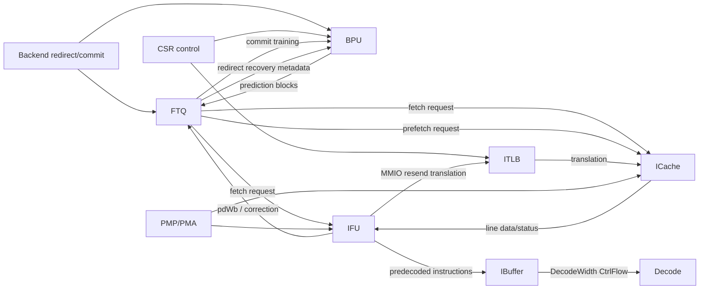
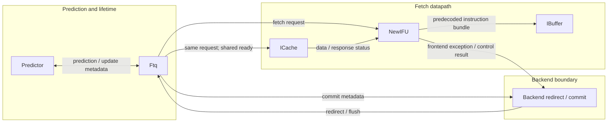

<!-- # 香山 Kunminghu-v2 Frontend 总览与全链路信号解析 -->
# XiangShan Kunminghu-v2 Frontend Overview and End-to-End Signal Analysis

<!-- regenerated-by-analyze-xiangshan-kunminghu -->
> Regenerated from `OpenXiangShan/XiangShan` branch `kunminghu-v2`, source commit `52262f303fc06daf84cdab7011d59b7df65ce7e8` using the updated Frontend graph/stage rules.

<!-- frontend-tutorial-generated-by-analyze-xiangshan-kunminghu -->
<!-- > 所有实现结论均限定在 `kunminghu-v2` commit `52262f303fc06daf84cdab7011d59b7df65ce7e8`；Design Doc 结论必须回到第 18 节的源码追溯矩阵。 -->
> All implementation conclusions are scoped to `kunminghu-v2` commit `52262f303fc06daf84cdab7011d59b7df65ce7e8`; conclusions drawn from the Design Doc must be traced back to the source traceability matrix in Section 18.

## 1. Scope

<!-- 本节保留模块职责、分析基线、范围和统一五问，明确本文只以当前源码证据为准。 -->
This section retains the module responsibilities, analysis baseline, scope, and common five questions, and makes clear that this document relies only on evidence from the current source.

<!--
### 1.1. 分析基线与阅读方法
- 源码仓库：`OpenXiangShan/XiangShan`
- 分支：`kunminghu-v2`
- 分析 commit：`52262f303fc06daf84cdab7011d59b7df65ce7e8`
- 源码根目录：`src/main/scala/xiangshan/frontend`
- 设计文档参考：`OpenXiangShan/XiangShan-Design-Doc`，本次读取 commit `f8e258dc2d9c02c0616764856e1d18feedb91b81`
-->
### 1.1. Analysis Baseline and Reading Method
- Source repository: `OpenXiangShan/XiangShan`
- Branch: `kunminghu-v2`
- Analysis commit: `52262f303fc06daf84cdab7011d59b7df65ce7e8`
- Source root: `src/main/scala/xiangshan/frontend`
- Design-document reference: `OpenXiangShan/XiangShan-Design-Doc`, read at commit `f8e258dc2d9c02c0616764856e1d18feedb91b81`

<!-- 本文对每个模块回答五个问题：**谁（who）产生或消费信号、为什么（why）需要模块/信号、如何（how）实现、从哪里来（from what）、到哪里去（to what）**。代码链接固定指向 `kunminghu-v2`，行号用于定位本次 commit；若分支以后继续演进，行号可能漂移，应优先按分析 commit 复核。 -->
For every module, this document answers five questions: **who** produces or consumes a signal, **why** the module or signal is needed, **how** it is implemented, **from what** it originates, and **to what** it flows. Code links are pinned to `kunminghu-v2`; line numbers locate this commit. If the branch evolves later, line numbers can drift, so verify against the analysis commit first.

<!-- ## 2. 关键源码证据 -->
## 2. Key Source Evidence

<!-- 本节直接列出 `Frontend full chain` 的有效源码入口、关键代码骨架和行为解释，避免只保存文件名或行号。 -->
This section directly lists the effective source entry points, key code skeleton, and behavioral explanation for the `Frontend full chain`, rather than retaining only filenames or line numbers.

<!--
### 2.1. 源码入口和行号
| 源码文件 | 本文使用它证明什么 | 行号证据 |
| --- | --- | --- |
| `frontend/Frontend.scala` | Predictor/FTQ/IFU/IBuffer 实例化和顶层连接 | [frontend/Frontend.scala#L103-L109](https://github.com/OpenXiangShan/XiangShan/blob/kunminghu-v2/src/main/scala/xiangshan/frontend/Frontend.scala#L103-L109); [frontend/Frontend.scala#L199-L231](https://github.com/OpenXiangShan/XiangShan/blob/kunminghu-v2/src/main/scala/xiangshan/frontend/Frontend.scala#L199-L231) |
| `frontend/IFU.scala` | F0-F3 取指和预译码阶段 | [frontend/IFU.scala#L236-L617](https://github.com/OpenXiangShan/XiangShan/blob/kunminghu-v2/src/main/scala/xiangshan/frontend/IFU.scala#L236-L617) |
| `frontend/BPU.scala / NewFtq.scala` | 预测、生命周期和 redirect 恢复 | [frontend/BPU.scala#L381-L455](https://github.com/OpenXiangShan/XiangShan/blob/kunminghu-v2/src/main/scala/xiangshan/frontend/BPU.scala#L381-L455); [frontend/NewFtq.scala#L524-L540](https://github.com/OpenXiangShan/XiangShan/blob/kunminghu-v2/src/main/scala/xiangshan/frontend/NewFtq.scala#L524-L540) |
-->
### 2.1. Source Entry Points and Line References
| Source file | What it proves here | Line evidence |
| --- | --- | --- |
| `frontend/Frontend.scala` | Predictor/FTQ/IFU/IBuffer instantiation and top-level connectivity | [frontend/Frontend.scala#L103-L109](https://github.com/OpenXiangShan/XiangShan/blob/kunminghu-v2/src/main/scala/xiangshan/frontend/Frontend.scala#L103-L109); [frontend/Frontend.scala#L199-L231](https://github.com/OpenXiangShan/XiangShan/blob/kunminghu-v2/src/main/scala/xiangshan/frontend/Frontend.scala#L199-L231) |
| `frontend/IFU.scala` | F0-F3 fetch and predecode stages | [frontend/IFU.scala#L236-L617](https://github.com/OpenXiangShan/XiangShan/blob/kunminghu-v2/src/main/scala/xiangshan/frontend/IFU.scala#L236-L617) |
| `frontend/BPU.scala / NewFtq.scala` | Prediction, lifetime management, and redirect recovery | [frontend/BPU.scala#L381-L455](https://github.com/OpenXiangShan/XiangShan/blob/kunminghu-v2/src/main/scala/xiangshan/frontend/BPU.scala#L381-L455); [frontend/NewFtq.scala#L524-L540](https://github.com/OpenXiangShan/XiangShan/blob/kunminghu-v2/src/main/scala/xiangshan/frontend/NewFtq.scala#L524-L540) |

<!-- ### 2.2. 核心代码骨架 -->
### 2.2. Core Code Skeleton
```scala
Predictor -> FTQ: prediction block and metadata
FTQ -> IFU/ICache: same fetch request with shared ready
ICache -> IFU: line data and exception status
IFU -> IBuffer -> Decode: predecoded CtrlFlow
Backend -> FTQ/BPU: commit, update, redirect recovery
```

<!--
### 2.3. 代码解析
总览文档描述 Frontend 闭环，不把细节重复塞在一处。关键事实是 BPU 预测、FTQ 延长生命周期、ICache/IFU 取回真实指令、IBuffer 解耦输出、后端反馈训练与恢复。
-->
### 2.3. Code Walkthrough
The overview describes the Frontend closed loop without duplicating each detail in one place. The key facts are BPU prediction, FTQ lifetime extension, ICache/IFU retrieval of real instructions, IBuffer output decoupling, and backend feedback for training and recovery.
## 3. Theory-to-Code Mapping

<!-- 本节把理论概念直接绑定到 `Frontend full chain` 的源码对象、控制/数据状态和下游消费者。 -->
This section binds theoretical concepts directly to the source objects, control/data state, and downstream consumers in the `Frontend full chain`.

<!--
### 3.1. 理论到代码映射表
| 理论概念 | 代码对象 | 为什么需要它 | 消费者/后续影响 |
| --- | --- | --- | --- |
| 前端闭环 | BPU -> FTQ -> IFU/ICache -> IBuffer -> Backend feedback | 预测和真实执行之间需要生命周期桥接 | 所有 Frontend 分文档 |
| 共享 ready | FTQ to IFU/ICache ready conjunction | 控制请求和缓存请求必须对应同一 FTQ 项 | IFU/ICache |
| 异常和恢复 | instruction page/access/misalign + redirect | 错误路径清理和架构异常不能混同 | Backend/FTQ/BPU |
-->
### 3.1. Theory-to-Code Mapping Table
| Theory concept | Code object | Why it is needed | Consumer / downstream effect |
| --- | --- | --- | --- |
| Frontend closed loop | BPU -> FTQ -> IFU/ICache -> IBuffer -> Backend feedback | A lifecycle bridge is needed between prediction and actual execution. | All Frontend subdocuments |
| Shared ready | Conjunction of FTQ-to-IFU and FTQ-to-ICache ready | The control request and cache request must correspond to the same FTQ entry. | IFU/ICache |
| Exceptions and recovery | Instruction page/access/misalignment faults plus redirect | Wrong-path cleanup must not be conflated with architectural exceptions. | Backend/FTQ/BPU |

<!--
### 3.2. 阅读顺序
先按第 2 节定位源码对象，再顺着本表检查信号从哪里来、状态在哪里保存、何时更新、谁消费结果。若本篇只引用相邻模块拥有的状态，则以相邻 Frontend 分文档的源码分析为准。
## 4. 论文原则和有效代码

本节只记录能落到分文档和源码证据的算法原则；论文用于解释方向，不能替代当前 `kunminghu-v2` 的有效实现。

### 4.1. 原理到实现的边界
前端总览不直接把论文算法等同为有效实现，而是把论文概念映射到分文档里的可见代码：
- `TAGE`、`SC`、`ITTAGE`、`RAS` 的论文原理用于解释预测器为什么采用折叠历史、统计校正和栈恢复，但有效参数、流水和训练时序必须回到 [Frontend-BPU.md](/nfs/home/yuanmiaomiao/XiangShanLab/xiangshan-course/docs/课程体系4：实现篇-香山高性能处理器微架构优化/中级-高性能香山处理器代码深入解析/Frontend-BPU.md) 及对应预测器文档。
- `FTQ` 的生命周期和状态机体现“预测与提交分离”的实现约束，细节见 [Frontend-FTQ.md](/nfs/home/yuanmiaomiao/XiangShanLab/xiangshan-course/docs/课程体系4：实现篇-香山高性能处理器微架构优化/中级-高性能香山处理器代码深入解析/Frontend-FTQ.md)。
- `IFU`、`ICache`、`InstrUncache` 体现“取指正确性收敛”和“跨边界分解请求”的实现约束，细节见 [Frontend-IFU-and-Predecode-Deep-Dive.md](/nfs/home/yuanmiaomiao/XiangShanLab/xiangshan-course/docs/课程体系4：实现篇-香山高性能处理器微架构优化/中级-高性能香山处理器代码深入解析/Frontend-IFU-and-Predecode-Deep-Dive.md) 与 [Frontend-ICache.md](/nfs/home/yuanmiaomiao/XiangShanLab/xiangshan-course/docs/课程体系4：实现篇-香山高性能处理器微架构优化/中级-高性能香山处理器代码深入解析/Frontend-ICache.md)。
- `IBuffer` 的 banked FIFO、旁路和 output register 说明“前端与后端节奏解耦”的实现方式，细节见 [Frontend-IBuffer.md](/nfs/home/yuanmiaomiao/XiangShanLab/xiangshan-course/docs/课程体系4：实现篇-香山高性能处理器微架构优化/中级-高性能香山处理器代码深入解析/Frontend-IBuffer.md)。
-->
### 3.2. Reading Order
First locate source objects through Section 2, then use this table to check where each signal originates, where its state is stored, when it updates, and who consumes the result. When this document only cites state owned by an adjacent module, use the source analysis in the corresponding Frontend subdocument as the authority.

## 4. Paper Principles and Effective Code

This section records only algorithmic principles that can be tied to subdocuments and source evidence. Papers explain the direction of a design; they do not replace the effective implementation in the current `kunminghu-v2` source.

### 4.1. Boundary Between Principles and Implementation
The Frontend overview does not equate paper algorithms directly with the effective implementation. It maps paper concepts to visible code in the subdocuments:
- The papers behind `TAGE`, `SC`, `ITTAGE`, and `RAS` explain folded history, statistical correction, and stack recovery, but effective parameters, pipelines, and training timing must be taken from [Frontend-BPU.md](Frontend-BPU.md) and the corresponding predictor documents.
- The FTQ lifecycle and state machine embody the implementation constraint that prediction and retirement are separated; see [Frontend-FTQ.md](Frontend-FTQ.md).
- `IFU`, `ICache`, and `InstrUncache` embody correctness convergence for instruction fetch and decomposition of requests across boundaries; see [Frontend-IFU-and-Predecode-Deep-Dive.md](Frontend-IFU-and-Predecode-Deep-Dive.md) and [Frontend-ICache.md](Frontend-ICache.md).
- The IBuffer's banked FIFO, bypass, and output register implement decoupling between frontend and backend cadence; see [Frontend-IBuffer.md](Frontend-IBuffer.md).
## 5. Microarchitecture Parameters

<!-- 先从源码证据读取表深度、队列容量、位宽、端口数和配置开关，再判断它们对吞吐、冲突和恢复延迟的影响；不要用文档中的默认值替代当前 commit 的参数。 -->
Read table depth, queue capacity, bit width, port count, and configuration switches from source evidence first; then assess their effect on throughput, conflicts, and recovery latency. Do not substitute a document default for the parameter at the current commit.

<!--
### 5.1. 参数总表
| 参数 | 当前基线值/形态 | 所属前端结构 | 对行为的直接影响 | 源码证据 |
| --- | --- | --- | --- | --- |
| `FetchWidth` | `8` | IFU/ICache 取指块 | 决定一次取指块可覆盖的 16-bit 槽位上限；后续 `PredictWidth` 相关表述应回到取指块宽度和 IFU/IBuffer bundle 位宽核对。 | [Parameters.scala#L124-L147](https://github.com/OpenXiangShan/XiangShan/blob/kunminghu-v2/src/main/scala/xiangshan/Parameters.scala#L124-L147) |
| `FetchWidth` 与 `PredictWidth` 关系 | `FetchWidth` 是本参数段能直接在 `XSCoreParameters` 中定位的宽度；`PredictWidth` 在课程文字中表示 IFU 输出压缩前的取指槽位宽度，不在本段另造数值。 | IFU -> IBuffer | 防止把未核对的 `PredictWidth` 当成独立默认值；需要精确 lane 数时沿 IFU/IBuffer bundle 定义继续追线。 | [IFU.scala#L953-L969](https://github.com/OpenXiangShan/XiangShan/blob/kunminghu-v2/src/main/scala/xiangshan/frontend/IFU.scala#L953-L969), [IBuffer.scala#L172-L186](https://github.com/OpenXiangShan/XiangShan/blob/kunminghu-v2/src/main/scala/xiangshan/frontend/IBuffer.scala#L172-L186) |
| `FtqSize` | `64` | FTQ 环形生命周期队列 | 限制最多在途 prediction block 数；满时拉低 BPU -> FTQ ready，阻止覆盖未提交项。 | [Parameters.scala#L147-L158](https://github.com/OpenXiangShan/XiangShan/blob/kunminghu-v2/src/main/scala/xiangshan/Parameters.scala#L147-L158), [NewFtq.scala#L524-L540](https://github.com/OpenXiangShan/XiangShan/blob/kunminghu-v2/src/main/scala/xiangshan/frontend/NewFtq.scala#L524-L540) |
| `IBufSize` | `48` | IBuffer 存储深度 | 决定 IFU 和 Decode 之间可吸收的指令数；满时反压 IFU F3。 | [Parameters.scala#L147-L150](https://github.com/OpenXiangShan/XiangShan/blob/kunminghu-v2/src/main/scala/xiangshan/Parameters.scala#L147-L150), [IBuffer.scala#L197-L215](https://github.com/OpenXiangShan/XiangShan/blob/kunminghu-v2/src/main/scala/xiangshan/frontend/IBuffer.scala#L197-L215) |
| `IBufNBank` | `6` | IBuffer bank 数 | 决定每拍按 bank 轮转读取的并行度；必须满足 bank 数不小于 decode 消费宽度。 | [Parameters.scala#L147-L150](https://github.com/OpenXiangShan/XiangShan/blob/kunminghu-v2/src/main/scala/xiangshan/Parameters.scala#L147-L150), [IBuffer.scala#L164-L180](https://github.com/OpenXiangShan/XiangShan/blob/kunminghu-v2/src/main/scala/xiangshan/frontend/IBuffer.scala#L164-L180) |
| `DecodeWidth` | `6` | IBuffer -> Decode 输出 | 决定后端每拍最多消费的 `CtrlFlow` 数；和 `IBufNBank = 6` 一起限定 IBuffer 出队带宽。 | [Parameters.scala#L147-L150](https://github.com/OpenXiangShan/XiangShan/blob/kunminghu-v2/src/main/scala/xiangshan/Parameters.scala#L147-L150) |
| `EnableBPU / EnableBPD / EnableRAS / EnableSC / EnableFauFTB` | `true / true / true / true / true` | 预测器链配置 | 决定有效链路包含 BPU、方向预测、RAS、统计校正和 FauFTB；不要把禁用配置下的行为写成本基线事实。 | [Parameters.scala#L124-L147](https://github.com/OpenXiangShan/XiangShan/blob/kunminghu-v2/src/main/scala/xiangshan/Parameters.scala#L124-L147) |
| `UbtbSize` | `256` | FauFTB/uFTB 快速目标表 | 限制早级快速预测表容量，影响冷启动和同索引别名冲突概率。 | [Parameters.scala#L124-L147](https://github.com/OpenXiangShan/XiangShan/blob/kunminghu-v2/src/main/scala/xiangshan/Parameters.scala#L124-L147) |
| `FtbSize / FtbWays / FtbTagLength` | `2048 / 4 / 20` | FTB 直接目标和块元数据表 | 决定 FTB set/way/tag 匹配空间；影响 multi-hit、false-hit、替换和同索引不同 tag 场景。 | [Parameters.scala#L124-L147](https://github.com/OpenXiangShan/XiangShan/blob/kunminghu-v2/src/main/scala/xiangshan/Parameters.scala#L124-L147), [FTB.scala#L683-L811](https://github.com/OpenXiangShan/XiangShan/blob/kunminghu-v2/src/main/scala/xiangshan/frontend/FTB.scala#L683-L811) |
| `numBr` | `2` | FTB/BPU 分支槽 | 限制单个预测块内可显式编码和比较的条件分支槽数量。 | [Parameters.scala#L124-L147](https://github.com/OpenXiangShan/XiangShan/blob/kunminghu-v2/src/main/scala/xiangshan/Parameters.scala#L124-L147) |
| `RasSize / RasSpecSize / RasCtrSize` | `16 / 32 / 3` | RAS 与投机 RAS | 决定可保存的返回地址深度、投机快照容量和重复计数范围；直接影响 call/ret 嵌套、overflow、redirect 恢复测试。 | [Parameters.scala#L124-L147](https://github.com/OpenXiangShan/XiangShan/blob/kunminghu-v2/src/main/scala/xiangshan/Parameters.scala#L124-L147), [newRAS.scala#L696-L706](https://github.com/OpenXiangShan/XiangShan/blob/kunminghu-v2/src/main/scala/xiangshan/frontend/newRAS.scala#L696-L706) |
| `TageTableInfos` | `[(4096,8,8), (4096,13,8), (4096,32,8), (4096,119,8)]` | TAGE tagged tables | 每项为 `(sets, history length, tag bits)`；决定长历史方向预测的索引/标签/别名空间。 | [Parameters.scala#L124-L147](https://github.com/OpenXiangShan/XiangShan/blob/kunminghu-v2/src/main/scala/xiangshan/Parameters.scala#L124-L147), [Tage.scala#L778-L846](https://github.com/OpenXiangShan/XiangShan/blob/kunminghu-v2/src/main/scala/xiangshan/frontend/Tage.scala#L778-L846) |
| `ITTageTableInfos` | `[(256,4,9), (256,8,9), (512,13,9), (512,16,9), (512,32,9)]` | ITTAGE 间接目标表 | 每项为 `(sets, history length, tag bits)`；决定 JALR/间接跳转目标预测的历史覆盖和别名空间。 | [Parameters.scala#L124-L147](https://github.com/OpenXiangShan/XiangShan/blob/kunminghu-v2/src/main/scala/xiangshan/Parameters.scala#L124-L147), [ITTAGE.scala#L418-L470](https://github.com/OpenXiangShan/XiangShan/blob/kunminghu-v2/src/main/scala/xiangshan/frontend/ITTAGE.scala#L418-L470) |
| `SCNRows / SCNTables / SCCtrBits / SCHistLens` | `512 / 4 / 6 / [0, 4, 10, 16]` | Statistical Corrector | 决定 SC 校正表行数、表数、计数器位宽和历史长度集合；影响 TAGE 结果被翻转或保留的条件。 | [Parameters.scala#L124-L147](https://github.com/OpenXiangShan/XiangShan/blob/kunminghu-v2/src/main/scala/xiangshan/Parameters.scala#L124-L147), [SC.scala#L259-L372](https://github.com/OpenXiangShan/XiangShan/blob/kunminghu-v2/src/main/scala/xiangshan/frontend/SC.scala#L259-L372) |
| `CacheLineSize` | `512 bit` | ICache/IFU cacheline 拼接 | 决定跨 cacheline 取指边界；一个预测块跨行时需要两段 hit/miss、MSHR/refill 和异常元数据分别对齐后合并。 | [Parameters.scala#L124-L147](https://github.com/OpenXiangShan/XiangShan/blob/kunminghu-v2/src/main/scala/xiangshan/Parameters.scala#L124-L147), [IFU.scala#L730-L760](https://github.com/OpenXiangShan/XiangShan/blob/kunminghu-v2/src/main/scala/xiangshan/frontend/IFU.scala#L730-L760) |
-->
### 5.1. Parameter Summary
| Parameter | Current baseline value / form | Frontend structure | Direct behavioral effect | Source evidence |
| --- | --- | --- | --- | --- |
| `FetchWidth` | `8` | IFU/ICache fetch block | Caps the number of 16-bit slots one fetch block can cover. Claims involving `PredictWidth` must be checked against fetch-block width and IFU/IBuffer bundle widths. | [Parameters.scala#L124-L147](https://github.com/OpenXiangShan/XiangShan/blob/kunminghu-v2/src/main/scala/xiangshan/Parameters.scala#L124-L147) |
| Relationship between `FetchWidth` and `PredictWidth` | `FetchWidth` is the width directly located in `XSCoreParameters` in this parameter section. Course prose uses `PredictWidth` for the fetch-slot width before IFU output compression; this section does not invent a separate value. | IFU -> IBuffer | Prevents an unverified `PredictWidth` from being treated as an independent default. For an exact lane count, continue tracing the IFU/IBuffer bundle definitions. | [IFU.scala#L953-L969](https://github.com/OpenXiangShan/XiangShan/blob/kunminghu-v2/src/main/scala/xiangshan/frontend/IFU.scala#L953-L969), [IBuffer.scala#L172-L186](https://github.com/OpenXiangShan/XiangShan/blob/kunminghu-v2/src/main/scala/xiangshan/frontend/IBuffer.scala#L172-L186) |
| `FtqSize` | `64` | FTQ circular lifetime queue | Limits the number of in-flight prediction blocks; when full, it lowers BPU-to-FTQ ready to prevent overwriting unretired entries. | [Parameters.scala#L147-L158](https://github.com/OpenXiangShan/XiangShan/blob/kunminghu-v2/src/main/scala/xiangshan/Parameters.scala#L147-L158), [NewFtq.scala#L524-L540](https://github.com/OpenXiangShan/XiangShan/blob/kunminghu-v2/src/main/scala/xiangshan/frontend/NewFtq.scala#L524-L540) |
| `IBufSize` | `48` | IBuffer storage depth | Determines how many instructions can be absorbed between IFU and Decode; when full it backpressures IFU F3. | [Parameters.scala#L147-L150](https://github.com/OpenXiangShan/XiangShan/blob/kunminghu-v2/src/main/scala/xiangshan/Parameters.scala#L147-L150), [IBuffer.scala#L197-L215](https://github.com/OpenXiangShan/XiangShan/blob/kunminghu-v2/src/main/scala/xiangshan/frontend/IBuffer.scala#L197-L215) |
| `IBufNBank` | `6` | Number of IBuffer banks | Determines the parallelism of bank-rotated reads per cycle; the bank count must be no smaller than the Decode consumption width. | [Parameters.scala#L147-L150](https://github.com/OpenXiangShan/XiangShan/blob/kunminghu-v2/src/main/scala/xiangshan/Parameters.scala#L147-L150), [IBuffer.scala#L164-L180](https://github.com/OpenXiangShan/XiangShan/blob/kunminghu-v2/src/main/scala/xiangshan/frontend/IBuffer.scala#L164-L180) |
| `DecodeWidth` | `6` | IBuffer -> Decode output | Sets the maximum number of `CtrlFlow` records the backend consumes per cycle; together with `IBufNBank = 6`, it bounds IBuffer dequeue bandwidth. | [Parameters.scala#L147-L150](https://github.com/OpenXiangShan/XiangShan/blob/kunminghu-v2/src/main/scala/xiangshan/Parameters.scala#L147-L150) |
| `EnableBPU / EnableBPD / EnableRAS / EnableSC / EnableFauFTB` | `true / true / true / true / true` | Predictor-chain configuration | Makes BPU, direction prediction, RAS, statistical correction, and FauFTB part of the effective chain; behavior under disabled configurations is not a fact of this baseline. | [Parameters.scala#L124-L147](https://github.com/OpenXiangShan/XiangShan/blob/kunminghu-v2/src/main/scala/xiangshan/Parameters.scala#L124-L147) |
| `UbtbSize` | `256` | FauFTB/uFTB fast target table | Bounds the capacity of the early fast prediction table, affecting cold-start behavior and same-index aliasing probability. | [Parameters.scala#L124-L147](https://github.com/OpenXiangShan/XiangShan/blob/kunminghu-v2/src/main/scala/xiangshan/Parameters.scala#L124-L147) |
| `FtbSize / FtbWays / FtbTagLength` | `2048 / 4 / 20` | FTB direct-target and block-metadata table | Determines the FTB set/way/tag match space and affects multi-hit, false-hit, replacement, and same-index/different-tag cases. | [Parameters.scala#L124-L147](https://github.com/OpenXiangShan/XiangShan/blob/kunminghu-v2/src/main/scala/xiangshan/Parameters.scala#L124-L147), [FTB.scala#L683-L811](https://github.com/OpenXiangShan/XiangShan/blob/kunminghu-v2/src/main/scala/xiangshan/frontend/FTB.scala#L683-L811) |
| `numBr` | `2` | FTB/BPU branch slots | Limits the number of conditional-branch slots that can be explicitly encoded and compared within one prediction block. | [Parameters.scala#L124-L147](https://github.com/OpenXiangShan/XiangShan/blob/kunminghu-v2/src/main/scala/xiangshan/Parameters.scala#L124-L147) |
| `RasSize / RasSpecSize / RasCtrSize` | `16 / 32 / 3` | RAS and speculative RAS | Determine return-address depth, speculative snapshot capacity, and repeat-count range; directly affect call/return nesting, overflow, and redirect-recovery tests. | [Parameters.scala#L124-L147](https://github.com/OpenXiangShan/XiangShan/blob/kunminghu-v2/src/main/scala/xiangshan/Parameters.scala#L124-L147), [newRAS.scala#L696-L706](https://github.com/OpenXiangShan/XiangShan/blob/kunminghu-v2/src/main/scala/xiangshan/frontend/newRAS.scala#L696-L706) |
| `TageTableInfos` | `[(4096,8,8), (4096,13,8), (4096,32,8), (4096,119,8)]` | TAGE tagged tables | Each item is `(sets, history length, tag bits)` and determines the index, tag, and aliasing space for long-history direction prediction. | [Parameters.scala#L124-L147](https://github.com/OpenXiangShan/XiangShan/blob/kunminghu-v2/src/main/scala/xiangshan/Parameters.scala#L124-L147), [Tage.scala#L778-L846](https://github.com/OpenXiangShan/XiangShan/blob/kunminghu-v2/src/main/scala/xiangshan/frontend/Tage.scala#L778-L846) |
| `ITTageTableInfos` | `[(256,4,9), (256,8,9), (512,13,9), (512,16,9), (512,32,9)]` | ITTAGE indirect-target tables | Each item is `(sets, history length, tag bits)` and determines history coverage and aliasing space for JALR/indirect-target prediction. | [Parameters.scala#L124-L147](https://github.com/OpenXiangShan/XiangShan/blob/kunminghu-v2/src/main/scala/xiangshan/Parameters.scala#L124-L147), [ITTAGE.scala#L418-L470](https://github.com/OpenXiangShan/XiangShan/blob/kunminghu-v2/src/main/scala/xiangshan/frontend/ITTAGE.scala#L418-L470) |
| `SCNRows / SCNTables / SCCtrBits / SCHistLens` | `512 / 4 / 6 / [0, 4, 10, 16]` | Statistical Corrector | Determine the number of SC correction-table rows and tables, counter width, and history-length set; these affect when a TAGE result is flipped or retained. | [Parameters.scala#L124-L147](https://github.com/OpenXiangShan/XiangShan/blob/kunminghu-v2/src/main/scala/xiangshan/Parameters.scala#L124-L147), [SC.scala#L259-L372](https://github.com/OpenXiangShan/XiangShan/blob/kunminghu-v2/src/main/scala/xiangshan/frontend/SC.scala#L259-L372) |
| `CacheLineSize` | `512 bit` | ICache/IFU cache-line joining | Defines the instruction-fetch boundary across cache lines. A prediction block spanning lines needs two hit/miss paths, MSHR/refill handling, and exception metadata aligned independently before merging. | [Parameters.scala#L124-L147](https://github.com/OpenXiangShan/XiangShan/blob/kunminghu-v2/src/main/scala/xiangshan/Parameters.scala#L124-L147), [IFU.scala#L730-L760](https://github.com/OpenXiangShan/XiangShan/blob/kunminghu-v2/src/main/scala/xiangshan/frontend/IFU.scala#L730-L760) |

<!--
### 5.2. 参数读取顺序
1. 先读 `XSCoreParameters` 中的容量、宽度和开关。
2. 再到具体模块确认派生宽度、valid mask、entry 指针和 ready/valid 使用方式。
3. 最后把参数落到场景：FTQ full、IBuffer bank 冲突、FTB 同索引不同 tag、TAGE/ITTAGE 别名、RAS overflow、跨 cacheline 和 redirect 恢复。
-->
### 5.2. Parameter Reading Order
1. Read capacities, widths, and switches in `XSCoreParameters` first.
2. Then inspect the concrete modules for derived widths, valid masks, entry pointers, and ready/valid use.
3. Finally, apply the parameters to scenarios: FTQ full, IBuffer bank conflict, FTB same-index/different-tag, TAGE/ITTAGE aliasing, RAS overflow, cache-line crossings, and redirect recovery.

<!-- ## 6. 模块边界和接口 -->
## 6. Module Boundaries and Interfaces


<!--
### 6.1. 关键接口信号：从哪里来、到哪里去、为什么存在
| 信号/接口 | 来源 | 去向 | 作用和存在原因 |
| --- | --- | --- | --- |
| `bpu_to_ftq.resp` | BPU | FTQ | 携带分阶段预测块；FTQ `ready` 是预测流水的容量反馈 |
| `ftq.toIfu.req` | FTQ | IFU | 携带 PC、FTQ index、预测范围和下一地址；IFU 需要这些信息解释 ICache 返回数据 |
| `ftq.toICache.req` | FTQ | ICache | 发起同一预测块的缓存访问；与 IFU 请求共同握手避免失配 |
| `icache.fetch.resp` | ICache | IFU | 返回双 bank/双 cacheline 数据、异常和命中信息 |
| `ifu.toIbuffer` | IFU | IBuffer | 真实指令、预译码、异常、预测 taken、FTQ 位置 |
| `ifu.pdWb` | IFU | FTQ | 用真实指令校验 FTB/方向/目标，记录 false hit 和训练素材 |
| `backend.toFtq.redirect` | 执行/提交侧 | FTQ，再传播到 BPU/IFU/ICache/IBuffer | 清除错误路径并恢复投机历史 |
| `ftq.update` | FTQ | BPU 子预测器 | 只在控制流结局足够稳定后训练，避免错误路径污染表项 |
| `decodeCanAccept` | Decode | IBuffer | 表示后端本拍是否能接收；防止 IBuffer 出队后数据丢失 |
| `full`/`ready` | IBuffer/FTQ/WayLookup/MSHR | 上游 | 有限容量的反压信号；不是性能提示，而是正确性约束 |
-->
### 6.1. Key Interface Signals: Source, Destination, and Rationale
| Signal / interface | Source | Destination | Purpose and reason for existence |
| --- | --- | --- | --- |
| `bpu_to_ftq.resp` | BPU | FTQ | Carries staged prediction blocks; FTQ `ready` provides capacity feedback to the prediction pipeline. |
| `ftq.toIfu.req` | FTQ | IFU | Carries PC, FTQ index, predicted range, and next address; IFU needs it to interpret ICache return data. |
| `ftq.toICache.req` | FTQ | ICache | Initiates cache access for the same prediction block; it handshakes with the IFU request to prevent mismatch. |
| `icache.fetch.resp` | ICache | IFU | Returns dual-bank/dual-cache-line data, exceptions, and hit information. |
| `ifu.toIbuffer` | IFU | IBuffer | Carries real instructions, predecode result, exception state, predicted taken state, and FTQ location. |
| `ifu.pdWb` | IFU | FTQ | Checks FTB/direction/target against real instructions and records false hits and training material. |
| `backend.toFtq.redirect` | Execution/retirement side | FTQ, then BPU/IFU/ICache/IBuffer | Clears the wrong path and restores speculative history. |
| `ftq.update` | FTQ | BPU subpredictors | Trains only after the control-flow outcome is sufficiently stable, avoiding wrong-path table pollution. |
| `decodeCanAccept` | Decode | IBuffer | States whether the backend can accept data this cycle, preventing loss after an IBuffer dequeue. |
| `full`/`ready` | IBuffer/FTQ/WayLookup/MSHR | Upstream | Backpressure for finite capacity; it is a correctness constraint, not merely a performance indication. |

<!-- ## 7. 为什么模块存在 -->
## 7. Why the Modules Exist


<!-- 把模块放回 Frontend 全链路理解：它解决的是预测带宽、取指正确性、存储层次延迟、投机恢复或上下游速率不匹配中的至少一个问题。 -->
Place each module back in the full Frontend chain: it resolves at least one of prediction bandwidth, fetch correctness, memory-hierarchy latency, speculative recovery, or upstream/downstream rate mismatch.

<!-- ## 8. 有效动态路径 -->
## 8. Effective Dynamic Paths


<!-- 按 `valid -> ready -> fire -> register/state update -> consumer` 阅读动态路径，并同时检查正常、阻塞、flush、redirect、replay 和恢复后的 forward progress。 -->
Read dynamic paths as `valid -> ready -> fire -> register/state update -> consumer`, checking normal operation, stalls, flush, redirect, replay, and forward progress after recovery.

<!-- ## 9. Index 和地址/历史计算 -->
## 9. Index and Address/History Calculation


<!-- 地址、PC、折叠历史、tag、set/way、line offset 和 FTQ offset 都必须追到源码表达式；索引冲突、回绕和跨边界情况在算法和验证章节中继续展开。 -->
Every address, PC, folded history, tag, set/way, line offset, and FTQ offset must be traced to its source expression. Index collisions, wraparound, and boundary crossings are expanded in the algorithm and verification sections.

<!-- ## 10. 核心算法 -->
## 10. Core Algorithms

<!-- 核心算法按 prediction block 的生命周期组织：预测、分配、取指、校验、缓冲、提交训练和 redirect 恢复。 -->
The core algorithms are organized around the lifetime of a prediction block: prediction, allocation, fetch, checking, buffering, retirement-time training, and redirect recovery.

<!--
### 10.1. 前端总算法
前端总算法不是单一模块的内部公式，而是一个跨模块流水：
1. `BPU` 先产生早级 prediction block 和 history/meta，见 [Frontend-BPU.md](/nfs/home/yuanmiaomiao/XiangShanLab/xiangshan-course/docs/课程体系4：实现篇-香山高性能处理器微架构优化/中级-高性能香山处理器代码深入解析/Frontend-BPU.md)。
2. `FTQ` 把 prediction block 保存成可追踪到提交的生命周期条目，见 [Frontend-FTQ.md](/nfs/home/yuanmiaomiao/XiangShanLab/xiangshan-course/docs/课程体系4：实现篇-香山高性能处理器微架构优化/中级-高性能香山处理器代码深入解析/Frontend-FTQ.md)。
3. `ICache/ITLB/InstrUncache` 和 `IFU` 把预测块分解成真实指令片段、异常和跨边界请求，见 [Frontend-ICache.md](/nfs/home/yuanmiaomiao/XiangShanLab/xiangshan-course/docs/课程体系4：实现篇-香山高性能处理器微架构优化/中级-高性能香山处理器代码深入解析/Frontend-ICache.md) 与 [Frontend-IFU-and-Predecode-Deep-Dive.md](/nfs/home/yuanmiaomiao/XiangShanLab/xiangshan-course/docs/课程体系4：实现篇-香山高性能处理器微架构优化/中级-高性能香山处理器代码深入解析/Frontend-IFU-and-Predecode-Deep-Dive.md)。
4. `IBuffer` 用 banked queue 和 output register 吸收 IFU 与 Decode 的宽度差，见 [Frontend-IBuffer.md](/nfs/home/yuanmiaomiao/XiangShanLab/xiangshan-course/docs/课程体系4：实现篇-香山高性能处理器微架构优化/中级-高性能香山处理器代码深入解析/Frontend-IBuffer.md)。
5. 后端 redirect、commit 和训练反馈再返回 FTQ/BPU，闭合一个预测块的生命周期，见 [Frontend-BPU.md](/nfs/home/yuanmiaomiao/XiangShanLab/xiangshan-course/docs/课程体系4：实现篇-香山高性能处理器微架构优化/中级-高性能香山处理器代码深入解析/Frontend-BPU.md) 和 [Frontend-FTQ.md](/nfs/home/yuanmiaomiao/XiangShanLab/xiangshan-course/docs/课程体系4：实现篇-香山高性能处理器微架构优化/中级-高性能香山处理器代码深入解析/Frontend-FTQ.md)。
-->
### 10.1. Overall Frontend Algorithm
The overall Frontend algorithm is not an internal formula of one module, but a cross-module pipeline:
1. `BPU` first produces an early prediction block and history/meta; see [Frontend-BPU.md](Frontend-BPU.md).
2. `FTQ` saves the prediction block as a lifetime entry traceable through retirement; see [Frontend-FTQ.md](Frontend-FTQ.md).
3. `ICache`/`ITLB`/`InstrUncache` and `IFU` decompose the prediction block into real instruction fragments, exceptions, and boundary-crossing requests; see [Frontend-ICache.md](Frontend-ICache.md) and [Frontend-IFU-and-Predecode-Deep-Dive.md](Frontend-IFU-and-Predecode-Deep-Dive.md).
4. `IBuffer` absorbs the IFU-to-Decode width difference with its banked queue and output register; see [Frontend-IBuffer.md](Frontend-IBuffer.md).
5. Backend redirect, retirement, and training feedback return to FTQ/BPU to close the lifetime of a prediction block; see [Frontend-BPU.md](Frontend-BPU.md) and [Frontend-FTQ.md](Frontend-FTQ.md).

<!--
### 10.2. 关键分支与责任分配
| 处理环节 | 主要职责 | 深入文档 |
| --- | --- | --- |
| 早级预测 | 给出下一块 PC、taken/target 和 meta | [Frontend-BPU.md](/nfs/home/yuanmiaomiao/XiangShanLab/xiangshan-course/docs/课程体系4：实现篇-香山高性能处理器微架构优化/中级-高性能香山处理器代码深入解析/Frontend-BPU.md) |
| 块生命周期 | 保存 PC、历史、训练和恢复状态 | [Frontend-FTQ.md](/nfs/home/yuanmiaomiao/XiangShanLab/xiangshan-course/docs/课程体系4：实现篇-香山高性能处理器微架构优化/中级-高性能香山处理器代码深入解析/Frontend-FTQ.md) |
| 真实取指与校验 | 处理 cacheable / MMIO 取指、预译码和异常 | [Frontend-IFU-and-Predecode-Deep-Dive.md](/nfs/home/yuanmiaomiao/XiangShanLab/xiangshan-course/docs/课程体系4：实现篇-香山高性能处理器微架构优化/中级-高性能香山处理器代码深入解析/Frontend-IFU-and-Predecode-Deep-Dive.md), [Frontend-ICache.md](/nfs/home/yuanmiaomiao/XiangShanLab/xiangshan-course/docs/课程体系4：实现篇-香山高性能处理器微架构优化/中级-高性能香山处理器代码深入解析/Frontend-ICache.md) |
| 弹性输出 | 吸收前后端节奏差并按年龄顺序输出 | [Frontend-IBuffer.md](/nfs/home/yuanmiaomiao/XiangShanLab/xiangshan-course/docs/课程体系4：实现篇-香山高性能处理器微架构优化/中级-高性能香山处理器代码深入解析/Frontend-IBuffer.md) |
-->
### 10.2. Key Paths and Responsibility Allocation
| Processing step | Main responsibility | Detailed document |
| --- | --- | --- |
| Early prediction | Provides the next-block PC, taken/target, and metadata. | [Frontend-BPU.md](Frontend-BPU.md) |
| Block lifetime | Stores PC, history, training, and recovery state. | [Frontend-FTQ.md](Frontend-FTQ.md) |
| Real fetch and checking | Handles cacheable/MMIO fetch, predecode, and exceptions. | [Frontend-IFU-and-Predecode-Deep-Dive.md](Frontend-IFU-and-Predecode-Deep-Dive.md), [Frontend-ICache.md](Frontend-ICache.md) |
| Elastic output | Absorbs frontend/backend cadence differences and outputs in age order. | [Frontend-IBuffer.md](Frontend-IBuffer.md) |
<!-- ## 11. 状态和存储结构 -->
## 11. State and Storage Structures


<!--
### 11.1. 控制流：redirect、flush 和训练为什么分开
#### 11.1.1. 三种时间尺度

- **BPU 晚级覆盖早级预测**：仍在前端内部，通常只冲掉年轻 FTQ 项和对应 IFU/ICache 请求。
- **IFU 预译码纠错**：真实指令类型或目标与 FTB 记录不一致，IFU 写回 `pdWb`，FTQ 标记 false hit 并触发修正。
- **后端 redirect**：执行阶段发现方向/目标错误、内存违例、异常或特权状态变化，必须恢复到精确控制流。
-->
### 11.1. Control Flow: Why Redirect, Flush, and Training Are Separate
#### 11.1.1. Three Time Scales

- **Late BPU override of an early prediction**: This remains inside the Frontend and normally flushes only younger FTQ entries and their IFU/ICache requests.
- **IFU predecode correction**: When the real instruction type or target differs from the FTB record, IFU writes back `pdWb`, FTQ marks a false hit, and correction is triggered.
- **Backend redirect**: If execution discovers a direction/target error, memory violation, exception, or privilege-state change, it must restore the precise control flow.

<!-- Frontend 顶层从后端 redirect 派生 flush 原因，用于 IBuffer 的 top-down stall 分类：[Frontend.scala#L111-L118](https://github.com/OpenXiangShan/XiangShan/blob/kunminghu-v2/src/main/scala/xiangshan/frontend/Frontend.scala#L111-L118)。这些分类信号不负责“实现 flush”，而是解释气泡为什么出现，便于性能定位。 -->
The Frontend top level derives flush reasons from backend redirects for IBuffer top-down stall classification: [Frontend.scala#L111-L118](https://github.com/OpenXiangShan/XiangShan/blob/kunminghu-v2/src/main/scala/xiangshan/frontend/Frontend.scala#L111-L118). These classification signals do not implement the flush; they explain why bubbles appear and support performance diagnosis.

<!--
#### 11.1.2. 为什么 FTQ 是恢复中心

FTQ 同时知道：

- 某个预测块的 PC 和下一块 PC；
- 预测时使用的全局历史、RAS、各预测器 meta；
- IFU 真实预译码结果；
- 后端提交/redirect 对应的 FTQ index 和 offset。

因此 FTQ 能判断“哪些项更年轻”、恢复各读写指针、向 BPU 返回恢复快照，并在提交时训练预测器。若把这些信息只放在 BPU，BPU 不知道乱序窗口中哪一项最终提交；若只放在后端，前端晚级覆盖和 IFU 纠错会付出更长反馈延迟。
-->
#### 11.1.2. Why FTQ Is the Recovery Center

FTQ knows all of the following at once:

- The PC and next-block PC for a prediction block.
- The global history, RAS state, and per-predictor metadata used at prediction time.
- The real predecode result from IFU.
- The FTQ index and offset associated with backend retirement or redirect.

Therefore FTQ can determine which entries are younger, restore read/write pointers, return a recovery snapshot to BPU, and train predictors at retirement. If this information lived only in BPU, BPU would not know which entry in the out-of-order window ultimately retired. If it lived only in the backend, late frontend overrides and IFU correction would incur longer feedback latency.

<!--
### 11.2. 状态机总表
Frontend 不只有显式 `Enum` FSM。FTQ、BPU 流水和 IBuffer 更多使用 **指针 + valid/status 向量** 表示隐式状态机。

| 模块 | 状态形式 | 关键状态/生命周期 | 代码 |
| --- | --- | --- | --- |
| BPU | S0/S1/S2/S3 valid、redirect 条件 | 请求进入、晚级覆盖、FTQ full 保持、redirect 恢复 | [BPU.scala#L383-L455](https://github.com/OpenXiangShan/XiangShan/blob/kunminghu-v2/src/main/scala/xiangshan/frontend/BPU.scala#L383-L455) |
| FTQ | 多指针 + 三组状态向量 | `c_empty/c_toCommit/c_committed/c_flushed`、`f_to_send/f_sent`、`h_not_hit/h_false_hit/h_hit` | [NewFtq.scala#L662-L680](https://github.com/OpenXiangShan/XiangShan/blob/kunminghu-v2/src/main/scala/xiangshan/frontend/NewFtq.scala#L662-L680) |
| IFU | F0-F3 valid + 12 态 MMIO FSM | cacheable 快路径；MMIO 请求、等待响应、重翻译、PMP、等待提交 | [IFU.scala#L655-L675](https://github.com/OpenXiangShan/XiangShan/blob/kunminghu-v2/src/main/scala/xiangshan/frontend/IFU.scala#L655-L675) |
| IBuffer | `enqPtr/deqPtr` + output valid | 空、旁路、正常入队、正常出队、flush | [IBuffer.scala#L197-L215](https://github.com/OpenXiangShan/XiangShan/blob/kunminghu-v2/src/main/scala/xiangshan/frontend/IBuffer.scala#L197-L215) |
| ICache MainPipe | S0-S2 valid/ready | meta/data 读、命中判断、miss 请求、响应 | [ICacheMainPipe.scala#L125-L190](https://github.com/OpenXiangShan/XiangShan/blob/kunminghu-v2/src/main/scala/xiangshan/frontend/icache/ICacheMainPipe.scala#L125-L190) |
| ICache MSHR | `valid/issue/flush/fencei` | 空闲、已分配未发出、已发出等待 refill、被 flush 但等待总线完成 | [ICacheMissUnit.scala#L113-L190](https://github.com/OpenXiangShan/XiangShan/blob/kunminghu-v2/src/main/scala/xiangshan/frontend/icache/ICacheMissUnit.scala#L113-L190) |
| IPrefetch | 5 态 FSM | idle、ITLB resend、meta resend、WayLookup 入队、等待 S2 | [IPrefetch.scala#L137-L144](https://github.com/OpenXiangShan/XiangShan/blob/kunminghu-v2/src/main/scala/xiangshan/frontend/icache/IPrefetch.scala#L137-L144) |
| ICache ECC 控制 | 5 态 FSM | idle、读 meta 请求/响应、写 meta、写 data | [ICacheCtrlUnit.scala#L155-L210](https://github.com/OpenXiangShan/XiangShan/blob/kunminghu-v2/src/main/scala/xiangshan/frontend/icache/ICacheCtrlUnit.scala#L155-L210) |
-->
### 11.2. State-Machine Summary
Frontend has more than explicit `Enum` FSMs. FTQ, the BPU pipeline, and IBuffer more often represent implicit state machines with **pointers plus valid/status vectors**.

| Module | State form | Key state / lifetime | Code |
| --- | --- | --- | --- |
| BPU | S0/S1/S2/S3 valid and redirect conditions | Request entry, late override, FTQ-full hold, and redirect recovery | [BPU.scala#L383-L455](https://github.com/OpenXiangShan/XiangShan/blob/kunminghu-v2/src/main/scala/xiangshan/frontend/BPU.scala#L383-L455) |
| FTQ | Multiple pointers plus three status-vector groups | `c_empty/c_toCommit/c_committed/c_flushed`, `f_to_send/f_sent`, and `h_not_hit/h_false_hit/h_hit` | [NewFtq.scala#L662-L680](https://github.com/OpenXiangShan/XiangShan/blob/kunminghu-v2/src/main/scala/xiangshan/frontend/NewFtq.scala#L662-L680) |
| IFU | F0-F3 valid plus a 12-state MMIO FSM | Cacheable fast path; MMIO request, response wait, retranslations, PMP, and retirement wait | [IFU.scala#L655-L675](https://github.com/OpenXiangShan/XiangShan/blob/kunminghu-v2/src/main/scala/xiangshan/frontend/IFU.scala#L655-L675) |
| IBuffer | `enqPtr/deqPtr` plus output valid | Empty, bypass, normal enqueue/dequeue, and flush | [IBuffer.scala#L197-L215](https://github.com/OpenXiangShan/XiangShan/blob/kunminghu-v2/src/main/scala/xiangshan/frontend/IBuffer.scala#L197-L215) |
| ICache MainPipe | S0-S2 valid/ready | Meta/data read, hit check, miss request, and response | [ICacheMainPipe.scala#L125-L190](https://github.com/OpenXiangShan/XiangShan/blob/kunminghu-v2/src/main/scala/xiangshan/frontend/icache/ICacheMainPipe.scala#L125-L190) |
| ICache MSHR | `valid/issue/flush/fencei` | Idle, allocated-not-issued, issued-waiting-for-refill, and flushed-but-waiting-for-bus completion | [ICacheMissUnit.scala#L113-L190](https://github.com/OpenXiangShan/XiangShan/blob/kunminghu-v2/src/main/scala/xiangshan/frontend/icache/ICacheMissUnit.scala#L113-L190) |
| IPrefetch | Five-state FSM | Idle, ITLB resend, meta resend, WayLookup enqueue, and S2 wait | [IPrefetch.scala#L137-L144](https://github.com/OpenXiangShan/XiangShan/blob/kunminghu-v2/src/main/scala/xiangshan/frontend/icache/IPrefetch.scala#L137-L144) |
| ICache ECC control | Five-state FSM | Idle, meta read request/response, meta write, and data write | [ICacheCtrlUnit.scala#L155-L210](https://github.com/OpenXiangShan/XiangShan/blob/kunminghu-v2/src/main/scala/xiangshan/frontend/icache/ICacheCtrlUnit.scala#L155-L210) |

<!--
### 11.3. Stack / Buffer / Queue overflow 与 underflow 总表
#### 11.3.1. FTQ

- 默认 `FtqSize = 64`：[Parameters.scala#L147-L158](https://github.com/OpenXiangShan/XiangShan/blob/kunminghu-v2/src/main/scala/xiangshan/Parameters.scala#L147-L158)。
- `bpuPtr` 是生产端，`commPtr/robCommPtr` 是回收端，`ifuPtr/pfPtr/ifuWbPtr` 是不同消费者的进度指针：[NewFtq.scala#L524-L540](https://github.com/OpenXiangShan/XiangShan/blob/kunminghu-v2/src/main/scala/xiangshan/frontend/NewFtq.scala#L524-L540)。
- **overflow 防护**：FTQ 没有可分配项时拉低 `io.fromBpu.resp.ready`，BPU 保持当前预测流水，不覆盖未提交项。
- **underflow 防护**：只有对应状态允许且指针未追上生产端时才向 IFU、预取和提交侧发请求；空队列不会凭空递增消费者指针。
- redirect 不是“清空整个数组”，而是恢复指针并改写年轻项状态；旧数据可留在存储体中，但 valid/status 使其不可见。
-->
### 11.3. Stack/Buffer/Queue Overflow and Underflow Summary
#### 11.3.1. FTQ

- The default `FtqSize` is `64`: [Parameters.scala#L147-L158](https://github.com/OpenXiangShan/XiangShan/blob/kunminghu-v2/src/main/scala/xiangshan/Parameters.scala#L147-L158).
- `bpuPtr` is the producer pointer; `commPtr/robCommPtr` are reclamation pointers; `ifuPtr/pfPtr/ifuWbPtr` track progress for different consumers: [NewFtq.scala#L524-L540](https://github.com/OpenXiangShan/XiangShan/blob/kunminghu-v2/src/main/scala/xiangshan/frontend/NewFtq.scala#L524-L540).
- **Overflow protection**: When FTQ has no allocatable entry, it lowers `io.fromBpu.resp.ready`; BPU holds its current prediction pipeline and does not overwrite unretired entries.
- **Underflow protection**: Requests are sent to IFU, prefetch, and the retirement side only when the corresponding status permits and the pointer has not caught the producer. An empty queue cannot advance a consumer pointer spontaneously.
- A redirect does not clear the entire array. It restores pointers and rewrites younger-entry state; old data can remain in storage but valid/status makes it invisible.

<!--
#### 11.3.2. IBuffer

- 默认 `IBufSize = 48`、`IBufNBank = 6`、`DecodeWidth = 6`：[Parameters.scala#L147-L150](https://github.com/OpenXiangShan/XiangShan/blob/kunminghu-v2/src/main/scala/xiangshan/Parameters.scala#L147-L150)。
- **overflow 防护**：根据 `enqPtr`、`deqPtr` 和本拍预计出队数计算可用槽位；空间不足时拉低 `io.in.ready`，IFU F3 保持 payload。
- **underflow 防护**：输出 `valid` 只来自旁路项、队列已有项或已锁存 output entry；Decode 的 `ready` 不能使空项出队。
- `require(IBufNBank >= DecodeWidth)` 保证每拍最多从不同 bank 顺序读出 6 项，[IBuffer.scala#L164-L180](https://github.com/OpenXiangShan/XiangShan/blob/kunminghu-v2/src/main/scala/xiangshan/frontend/IBuffer.scala#L164-L180)。
-->
#### 11.3.2. IBuffer

- Defaults are `IBufSize = 48`, `IBufNBank = 6`, and `DecodeWidth = 6`: [Parameters.scala#L147-L150](https://github.com/OpenXiangShan/XiangShan/blob/kunminghu-v2/src/main/scala/xiangshan/Parameters.scala#L147-L150).
- **Overflow protection**: Available slots are calculated from `enqPtr`, `deqPtr`, and the number expected to dequeue this cycle. If space is insufficient, `io.in.ready` is lowered and IFU F3 holds its payload.
- **Underflow protection**: Output `valid` arises only from a bypass entry, an existing queue entry, or a latched output entry. Decode `ready` cannot dequeue an empty entry.
- `require(IBufNBank >= DecodeWidth)` guarantees that at most six entries can be read in order from different banks per cycle: [IBuffer.scala#L164-L180](https://github.com/OpenXiangShan/XiangShan/blob/kunminghu-v2/src/main/scala/xiangshan/frontend/IBuffer.scala#L164-L180).

<!--
#### 11.3.3. RAS

RAS 是真正的 stack。调用压栈、返回弹栈在投机路径上发生，redirect 必须恢复栈顶/计数/重复计数快照。overflow 时不能覆盖后仍假装深层返回地址存在；underflow 时不能读取未定义栈项。Kunminghu-v2 使用可恢复的 RAS 状态和计数信息，详见 `Frontend-RAS.md`，源码入口为 [RAS.scala](https://github.com/OpenXiangShan/XiangShan/blob/kunminghu-v2/src/main/scala/xiangshan/frontend/RAS.scala) 与 [newRAS.scala](https://github.com/OpenXiangShan/XiangShan/blob/kunminghu-v2/src/main/scala/xiangshan/frontend/newRAS.scala)。理论补充可参考 Park 与 Lee 的 *Repairing return address stack for buffer overflow protection*，DOI `10.1145/977091.977139`；论文说明 overflow 后为何需要修复机制，香山是否采用论文的具体结构仍以源码为准。
-->
#### 11.3.3. RAS

RAS is a real stack. Calls push and returns pop along the speculative path; redirect must restore snapshots of the stack top, count, and repeat count. On overflow, the design cannot overwrite an entry while pretending a deeper return address still exists; on underflow, it cannot read an undefined stack entry. Kunminghu-v2 uses recoverable RAS state and count information; see `Frontend-RAS.md`, with source entry points in [RAS.scala](https://github.com/OpenXiangShan/XiangShan/blob/kunminghu-v2/src/main/scala/xiangshan/frontend/RAS.scala) and [newRAS.scala](https://github.com/OpenXiangShan/XiangShan/blob/kunminghu-v2/src/main/scala/xiangshan/frontend/newRAS.scala). For theory, see Park and Lee, *Repairing return address stack for buffer overflow protection*, DOI `10.1145/977091.977139`; the paper explains why a repair mechanism is needed after overflow, while the source decides whether XiangShan uses its specific structure.

<!--
#### 11.3.4. WayLookup FIFO

`readPtr == writePtr` 表示空，同 value 且 flag 不同表示满：[WayLookup.scala#L73-L89](https://github.com/OpenXiangShan/XiangShan/blob/kunminghu-v2/src/main/scala/xiangshan/frontend/icache/WayLookup.scala#L73-L89)。

- overflow：`io.write.ready := !full && !gpf_stall`，满时或 GPF 项尚未安全消费时拒绝写入，[WayLookup.scala#L173-L183](https://github.com/OpenXiangShan/XiangShan/blob/kunminghu-v2/src/main/scala/xiangshan/frontend/icache/WayLookup.scala#L173-L183)。
- underflow：`io.read.valid := !empty || io.write.valid`；空时只有同拍写入旁路才允许读，[WayLookup.scala#L150-L160](https://github.com/OpenXiangShan/XiangShan/blob/kunminghu-v2/src/main/scala/xiangshan/frontend/icache/WayLookup.scala#L150-L160)。
-->
#### 11.3.4. WayLookup FIFO

`readPtr == writePtr` means empty; equal values with different flags mean full: [WayLookup.scala#L73-L89](https://github.com/OpenXiangShan/XiangShan/blob/kunminghu-v2/src/main/scala/xiangshan/frontend/icache/WayLookup.scala#L73-L89).

- Overflow: `io.write.ready := !full && !gpf_stall`; writes are rejected when full or when a GPF entry has not yet been safely consumed: [WayLookup.scala#L173-L183](https://github.com/OpenXiangShan/XiangShan/blob/kunminghu-v2/src/main/scala/xiangshan/frontend/icache/WayLookup.scala#L173-L183).
- Underflow: `io.read.valid := !empty || io.write.valid`; when empty, a read is permitted only through same-cycle write bypass: [WayLookup.scala#L150-L160](https://github.com/OpenXiangShan/XiangShan/blob/kunminghu-v2/src/main/scala/xiangshan/frontend/icache/WayLookup.scala#L150-L160).

<!--
#### 11.3.5. ICache MSHR / InstrUncache entries

- ICache MSHR entry 以 `valid` 表示占用，只有 `!valid` 才 `req.ready`：[ICacheMissUnit.scala#L149-L158](https://github.com/OpenXiangShan/XiangShan/blob/kunminghu-v2/src/main/scala/xiangshan/frontend/icache/ICacheMissUnit.scala#L149-L158)。所有可用 entry 用尽时，MissUnit 通过 `ready` 对 MainPipe 反压，这是 MSHR overflow 防护。
- MSHR 不会在 `flush/fencei` 后立即丢弃已经发到总线的事务；`valid && issue` 仍保留到 grant 完成，避免总线响应找不到 owner。
- InstrUncache 有固定 `nMMIOs` entry，分配器只选择 ready entry；全部占用时请求端不 ready。响应经 arbiter 汇聚，空 entry 不会产生 `resp.valid`。
-->
#### 11.3.5. ICache MSHR / InstrUncache Entries

- An ICache MSHR entry uses `valid` to represent occupancy; only `!valid` enables `req.ready`: [ICacheMissUnit.scala#L149-L158](https://github.com/OpenXiangShan/XiangShan/blob/kunminghu-v2/src/main/scala/xiangshan/frontend/icache/ICacheMissUnit.scala#L149-L158). When every available entry is exhausted, MissUnit backpressures MainPipe through `ready`; this is MSHR overflow protection.
- MSHR does not immediately discard a transaction already sent to the bus after `flush/fencei`; `valid && issue` remains set until the grant completes, so a bus response always has an owner.
- InstrUncache has a fixed number of `nMMIOs` entries. The allocator selects only a ready entry; when all are occupied, the request side is not ready. Responses converge through an arbiter, and an empty entry cannot produce `resp.valid`.

<!--
## 12. Pipeline stage 分析


阶段说明只使用源码中的寄存器、valid/ready 和 fire 条件；对 Frontend 使用 F0/F1/F2/F3，对 Backend 使用实际 Decode/Rename/Dispatch/Issue/Execute/Writeback/ROB 边界。
-->
## 12. Pipeline Stage Analysis

The stage description uses only registers, valid/ready, and fire conditions present in the source. It uses F0/F1/F2/F3 for the Frontend and the actual Decode/Rename/Dispatch/Issue/Execute/Writeback/ROB boundaries for the Backend.

## 13. Control Path Rationale

<!-- 控制路径按优先级阅读：reset、flush、backend redirect、BPU override、exception、replay 和正常 fire 发生冲突时，必须以源码条件顺序说明胜负关系。 -->
Read the control path by priority: when reset, flush, backend redirect, BPU override, exception, replay, and normal fire conflict, the source condition order determines which action wins.

## 14. Data Path and Boundary Crossings


<!-- ### 14.1. 顶层模块和全链路 -->
### 14.1. Top-Level Modules and Full Chain


<!-- 顶层对 FTQ→IFU 与 FTQ→ICache 的 `ready` 做了联动：只有 IFU 和 ICache 都能接收，同一个 FTQ 请求才被允许前进，[Frontend.scala#L199-L218](https://github.com/OpenXiangShan/XiangShan/blob/kunminghu-v2/src/main/scala/xiangshan/frontend/Frontend.scala#L199-L218)。该信号存在的原因是 **IFU 的控制信息和 ICache 的数据访问必须对应同一个 FTQ 项**；如果只让一侧前进，会形成“控制请求已消费、缓存请求未消费”或相反的半事务。 -->
At the top level, `ready` for FTQ-to-IFU and FTQ-to-ICache is coupled: a single FTQ request advances only when both IFU and ICache can accept it, [Frontend.scala#L199-L218](https://github.com/OpenXiangShan/XiangShan/blob/kunminghu-v2/src/main/scala/xiangshan/frontend/Frontend.scala#L199-L218). The reason is that **IFU control information and ICache data access must refer to the same FTQ entry**; advancing only one side would create a half-transaction in which the control request was consumed but the cache request was not, or vice versa.

<!--
### 14.2. 跨边界代码解析
Frontend 的边界处理链是：BPU 产生预测块 → FTQ 保存块生命周期 → ICache/ITLB 对各页和各 Cache Line 分别处理 → IFU 合并片段并做预译码校验 → IBuffer 以 ready/valid 解耦 → redirect/flush 回收错误路径。跨页必须重新翻译和检查权限；跨 Cache Line 必须分别处理 hit/miss、refill/MSHR 和响应组装；MMIO/uncache 必须走独立请求/响应及提交门控，不能让预测或 ICache 命中掩盖副作用。

全链路至少覆盖三类组合：跨页且第二页 fault、第一 line hit/第二 line miss、以及跨页 MMIO 指令在请求后遇到 redirect 或 VM/权限上下文切换。对每类组合，列出 fragment 的 valid/ready/fire、占用的 FTQ/ICache/MSHR/uncache 资源、异常优先级、清理路径和 forward-progress 条件。
-->
### 14.2. Boundary-Crossing Code Walkthrough
The Frontend boundary chain is: BPU produces a prediction block -> FTQ stores its lifetime -> ICache/ITLB process each page and cache line independently -> IFU merges fragments and checks predecode -> IBuffer decouples with ready/valid -> redirect/flush reclaims the wrong path. A page crossing requires retranslation and permission checks; a cache-line crossing requires independent hit/miss, refill/MSHR, and response assembly; MMIO/uncache must use independent request/response and retirement gating so prediction or an ICache hit cannot hide side effects.

The full chain must cover at least three combinations: a page crossing with a fault on the second page, a hit on the first line and miss on the second, and a cross-page MMIO instruction encountering redirect or a VM/permission-context switch after its request. For each combination, list fragment valid/ready/fire, occupied FTQ/ICache/MSHR/uncache resources, exception priority, cleanup path, and forward-progress conditions.

<!--
## 15. 异常、debug、privilege


区分预测错误、replay、page/access/guest fault、MMIO side effect、debug redirect 和架构异常；说明异常产生者、优先级、清理对象、恢复入口和提交可见性。
-->
## 15. Exceptions, Debug, and Privilege

Distinguish prediction errors, replay, page/access/guest faults, MMIO side effects, debug redirects, and architectural exceptions. For each, identify the producer, priority, cleanup target, recovery entry point, and retirement visibility.

<!--
## 16. CSR 控制


前端分支预测器的使能控制来自 CSR 模块生成的 `CustomCSRCtrlIO.bp_ctrl`，不是各预测器本地私有 CSR。有效链路是：`sbpctl` CSR 字段 -> `io.status.custom.bp_ctrl` -> Backend `frontendCsrCtrl` -> XSCore `frontend.io.csrCtrl` -> Frontend `bpu.io.ctrl` -> BPU 内各子预测器 `io.enable`。
-->
## 16. CSR Control

Enable control for frontend branch predictors comes from `CustomCSRCtrlIO.bp_ctrl`, generated by the CSR module, rather than from a private CSR local to each predictor. The effective path is: `sbpctl` CSR fields -> `io.status.custom.bp_ctrl` -> backend `frontendCsrCtrl` -> XSCore `frontend.io.csrCtrl` -> Frontend `bpu.io.ctrl` -> each BPU subpredictor's `io.enable`.

<!--
### 16.1. CSR 字段到 BPU 控制信号
| 控制位 | CSR 源字段 | Frontend/BPU 消费者 | 有效作用 | 源码证据 |
| --- | --- | --- | --- | --- |
| `bp_ctrl.ubtbEnable` | `sbpctl.regOut.UBTB_ENABLE` | `ubtb.io.enable` | 允许或关闭 S1 fast uBTB/MicroBtb 查询结果参与预测链；关闭后仍保留 fall-through 基线。 | [NewCSR.scala:1378](https://github.com/OpenXiangShan/XiangShan/blob/kunminghu-v2/src/main/scala/xiangshan/backend/fu/NewCSR/NewCSR.scala#L1378), [Bpu.scala:96](https://github.com/OpenXiangShan/XiangShan/blob/kunminghu-v2/src/main/scala/xiangshan/frontend/bpu/Bpu.scala#L96), [Bpu.scala:105](https://github.com/OpenXiangShan/XiangShan/blob/kunminghu-v2/src/main/scala/xiangshan/frontend/bpu/Bpu.scala#L105) |
| `bp_ctrl.abtbEnable` | `sbpctl.regOut.ABTB_ENABLE` | `abtb.io.enable` | 控制 AheadBtb 目标/属性预测是否参与早期预测。 | [NewCSR.scala:1379](https://github.com/OpenXiangShan/XiangShan/blob/kunminghu-v2/src/main/scala/xiangshan/backend/fu/NewCSR/NewCSR.scala#L1379), [Bpu.scala:97](https://github.com/OpenXiangShan/XiangShan/blob/kunminghu-v2/src/main/scala/xiangshan/frontend/bpu/Bpu.scala#L97), [Bpu.scala:106](https://github.com/OpenXiangShan/XiangShan/blob/kunminghu-v2/src/main/scala/xiangshan/frontend/bpu/Bpu.scala#L106) |
| `bp_ctrl.mbtbEnable` | `sbpctl.regOut.MBTB_ENABLE` | `mbtb.io.enable` | 控制 MainBtb 是否提供主 BTB 命中、直接分支/JAL target 和 fall-through 信息。 | [NewCSR.scala:1380](https://github.com/OpenXiangShan/XiangShan/blob/kunminghu-v2/src/main/scala/xiangshan/backend/fu/NewCSR/NewCSR.scala#L1380), [Bpu.scala:98](https://github.com/OpenXiangShan/XiangShan/blob/kunminghu-v2/src/main/scala/xiangshan/frontend/bpu/Bpu.scala#L98), [Bpu.scala:107](https://github.com/OpenXiangShan/XiangShan/blob/kunminghu-v2/src/main/scala/xiangshan/frontend/bpu/Bpu.scala#L107) |
| `bp_ctrl.tageEnable` | `sbpctl.regOut.TAGE_ENABLE` | `tage.io.enable` | 控制 TAGE 条件分支方向预测是否有效；关闭时不能把 TAGE provider 结果作为方向覆盖依据。 | [NewCSR.scala:1381](https://github.com/OpenXiangShan/XiangShan/blob/kunminghu-v2/src/main/scala/xiangshan/backend/fu/NewCSR/NewCSR.scala#L1381), [Bpu.scala:99](https://github.com/OpenXiangShan/XiangShan/blob/kunminghu-v2/src/main/scala/xiangshan/frontend/bpu/Bpu.scala#L99), [Bpu.scala:108](https://github.com/OpenXiangShan/XiangShan/blob/kunminghu-v2/src/main/scala/xiangshan/frontend/bpu/Bpu.scala#L108) |
| `bp_ctrl.scEnable` | `sbpctl.regOut.SC_ENABLE` | `sc.io.enable` | 控制 statistical corrector 是否修正 TAGE/基础方向结果。 | [NewCSR.scala:1382](https://github.com/OpenXiangShan/XiangShan/blob/kunminghu-v2/src/main/scala/xiangshan/backend/fu/NewCSR/NewCSR.scala#L1382), [Bpu.scala:100](https://github.com/OpenXiangShan/XiangShan/blob/kunminghu-v2/src/main/scala/xiangshan/frontend/bpu/Bpu.scala#L100), [Bpu.scala:109](https://github.com/OpenXiangShan/XiangShan/blob/kunminghu-v2/src/main/scala/xiangshan/frontend/bpu/Bpu.scala#L109) |
| `bp_ctrl.ittageEnable` | `sbpctl.regOut.ITTAGE_ENABLE` | `ittage.io.enable` | 控制间接跳转/JALR target 覆盖预测是否有效。 | [NewCSR.scala:1383](https://github.com/OpenXiangShan/XiangShan/blob/kunminghu-v2/src/main/scala/xiangshan/backend/fu/NewCSR/NewCSR.scala#L1383), [Bpu.scala:101](https://github.com/OpenXiangShan/XiangShan/blob/kunminghu-v2/src/main/scala/xiangshan/frontend/bpu/Bpu.scala#L101), [Bpu.scala:110](https://github.com/OpenXiangShan/XiangShan/blob/kunminghu-v2/src/main/scala/xiangshan/frontend/bpu/Bpu.scala#L110) |
| `bp_ctrl.rasEnable` | `sbpctl.regOut.RAS_ENABLE` | `ras.io.enable` | 控制 return address stack 是否给 RET/JALR 返回目标提供覆盖。 | [NewCSR.scala:1384](https://github.com/OpenXiangShan/XiangShan/blob/kunminghu-v2/src/main/scala/xiangshan/backend/fu/NewCSR/NewCSR.scala#L1384), [Bpu.scala:102](https://github.com/OpenXiangShan/XiangShan/blob/kunminghu-v2/src/main/scala/xiangshan/frontend/bpu/Bpu.scala#L102), [Bpu.scala:111](https://github.com/OpenXiangShan/XiangShan/blob/kunminghu-v2/src/main/scala/xiangshan/frontend/bpu/Bpu.scala#L111) |
-->
### 16.1. CSR Fields to BPU Control Signals
| Control bit | CSR source field | Frontend/BPU consumer | Effective action | Source evidence |
| --- | --- | --- | --- | --- |
| `bp_ctrl.ubtbEnable` | `sbpctl.regOut.UBTB_ENABLE` | `ubtb.io.enable` | Enables or disables S1 fast uBTB/MicroBtb query results in the prediction chain; fall-through baseline remains when disabled. | [NewCSR.scala:1378](https://github.com/OpenXiangShan/XiangShan/blob/kunminghu-v2/src/main/scala/xiangshan/backend/fu/NewCSR/NewCSR.scala#L1378), [Bpu.scala:96](https://github.com/OpenXiangShan/XiangShan/blob/kunminghu-v2/src/main/scala/xiangshan/frontend/bpu/Bpu.scala#L96), [Bpu.scala:105](https://github.com/OpenXiangShan/XiangShan/blob/kunminghu-v2/src/main/scala/xiangshan/frontend/bpu/Bpu.scala#L105) |
| `bp_ctrl.abtbEnable` | `sbpctl.regOut.ABTB_ENABLE` | `abtb.io.enable` | Controls whether AheadBtb target/attribute prediction participates in early prediction. | [NewCSR.scala:1379](https://github.com/OpenXiangShan/XiangShan/blob/kunminghu-v2/src/main/scala/xiangshan/backend/fu/NewCSR/NewCSR.scala#L1379), [Bpu.scala:97](https://github.com/OpenXiangShan/XiangShan/blob/kunminghu-v2/src/main/scala/xiangshan/frontend/bpu/Bpu.scala#L97), [Bpu.scala:106](https://github.com/OpenXiangShan/XiangShan/blob/kunminghu-v2/src/main/scala/xiangshan/frontend/bpu/Bpu.scala#L106) |
| `bp_ctrl.mbtbEnable` | `sbpctl.regOut.MBTB_ENABLE` | `mbtb.io.enable` | Controls whether MainBtb supplies the main-BTB hit, direct-branch/JAL target, and fall-through information. | [NewCSR.scala:1380](https://github.com/OpenXiangShan/XiangShan/blob/kunminghu-v2/src/main/scala/xiangshan/backend/fu/NewCSR/NewCSR.scala#L1380), [Bpu.scala:98](https://github.com/OpenXiangShan/XiangShan/blob/kunminghu-v2/src/main/scala/xiangshan/frontend/bpu/Bpu.scala#L98), [Bpu.scala:107](https://github.com/OpenXiangShan/XiangShan/blob/kunminghu-v2/src/main/scala/xiangshan/frontend/bpu/Bpu.scala#L107) |
| `bp_ctrl.tageEnable` | `sbpctl.regOut.TAGE_ENABLE` | `tage.io.enable` | Controls whether TAGE conditional-branch direction prediction is effective; when disabled, a TAGE provider cannot override direction. | [NewCSR.scala:1381](https://github.com/OpenXiangShan/XiangShan/blob/kunminghu-v2/src/main/scala/xiangshan/backend/fu/NewCSR/NewCSR.scala#L1381), [Bpu.scala:99](https://github.com/OpenXiangShan/XiangShan/blob/kunminghu-v2/src/main/scala/xiangshan/frontend/bpu/Bpu.scala#L99), [Bpu.scala:108](https://github.com/OpenXiangShan/XiangShan/blob/kunminghu-v2/src/main/scala/xiangshan/frontend/bpu/Bpu.scala#L108) |
| `bp_ctrl.scEnable` | `sbpctl.regOut.SC_ENABLE` | `sc.io.enable` | Controls whether the statistical corrector adjusts the TAGE/base direction result. | [NewCSR.scala:1382](https://github.com/OpenXiangShan/XiangShan/blob/kunminghu-v2/src/main/scala/xiangshan/backend/fu/NewCSR/NewCSR.scala#L1382), [Bpu.scala:100](https://github.com/OpenXiangShan/XiangShan/blob/kunminghu-v2/src/main/scala/xiangshan/frontend/bpu/Bpu.scala#L100), [Bpu.scala:109](https://github.com/OpenXiangShan/XiangShan/blob/kunminghu-v2/src/main/scala/xiangshan/frontend/bpu/Bpu.scala#L109) |
| `bp_ctrl.ittageEnable` | `sbpctl.regOut.ITTAGE_ENABLE` | `ittage.io.enable` | Controls whether ITTAGE can override indirect-branch/JALR target prediction. | [NewCSR.scala:1383](https://github.com/OpenXiangShan/XiangShan/blob/kunminghu-v2/src/main/scala/xiangshan/backend/fu/NewCSR/NewCSR.scala#L1383), [Bpu.scala:101](https://github.com/OpenXiangShan/XiangShan/blob/kunminghu-v2/src/main/scala/xiangshan/frontend/bpu/Bpu.scala#L101), [Bpu.scala:110](https://github.com/OpenXiangShan/XiangShan/blob/kunminghu-v2/src/main/scala/xiangshan/frontend/bpu/Bpu.scala#L110) |
| `bp_ctrl.rasEnable` | `sbpctl.regOut.RAS_ENABLE` | `ras.io.enable` | Controls whether the return-address stack supplies an override for RET/JALR return targets. | [NewCSR.scala:1384](https://github.com/OpenXiangShan/XiangShan/blob/kunminghu-v2/src/main/scala/xiangshan/backend/fu/NewCSR/NewCSR.scala#L1384), [Bpu.scala:102](https://github.com/OpenXiangShan/XiangShan/blob/kunminghu-v2/src/main/scala/xiangshan/frontend/bpu/Bpu.scala#L102), [Bpu.scala:111](https://github.com/OpenXiangShan/XiangShan/blob/kunminghu-v2/src/main/scala/xiangshan/frontend/bpu/Bpu.scala#L111) |

<!-- ### 16.2. 有效代码骨架 -->
### 16.2. Effective Code Skeleton
```scala
// backend/fu/NewCSR/NewCSR.scala
io.status.custom.bp_ctrl.ubtbEnable   := sbpctl.regOut.UBTB_ENABLE.asBool
io.status.custom.bp_ctrl.abtbEnable   := sbpctl.regOut.ABTB_ENABLE.asBool
io.status.custom.bp_ctrl.mbtbEnable   := sbpctl.regOut.MBTB_ENABLE.asBool
io.status.custom.bp_ctrl.tageEnable   := sbpctl.regOut.TAGE_ENABLE.asBool
io.status.custom.bp_ctrl.scEnable     := sbpctl.regOut.SC_ENABLE.asBool
io.status.custom.bp_ctrl.ittageEnable := sbpctl.regOut.ITTAGE_ENABLE.asBool
io.status.custom.bp_ctrl.rasEnable    := sbpctl.regOut.RAS_ENABLE.asBool

// frontend/Frontend.scala
private val csrCtrl = DelayN(io.csrCtrl, CsrCtrlPortDelay)
bpu.io.ctrl := csrCtrl.bp_ctrl

// frontend/bpu/Bpu.scala
private val ctrl = DelayN(io.ctrl, 2)
fallThrough.io.enable := true.B
utage.io.enable       := true.B
uras.io.enable        := true.B
ubtb.io.enable        := ctrl.ubtbEnable
abtb.io.enable        := ctrl.abtbEnable
mbtb.io.enable        := ctrl.mbtbEnable
tage.io.enable        := ctrl.tageEnable
sc.io.enable          := ctrl.scEnable
ittage.io.enable      := ctrl.ittageEnable
ras.io.enable         := ctrl.rasEnable
```

<!--
### 16.3. 代码解析
`BpuCtrl` bundle 明确定义了 `ubtbEnable`、`abtbEnable`、`mbtbEnable`、`tageEnable`、`scEnable`、`ittageEnable`、`rasEnable` 七个 Bool 控制位：[Bundles.scala:179-189](https://github.com/OpenXiangShan/XiangShan/blob/kunminghu-v2/src/main/scala/xiangshan/frontend/bpu/Bundles.scala#L179-L189)。`CustomCSRCtrlIO` 将 `bp_ctrl` 作为 CSR 输出的一部分：[Bundle.scala:586-596](https://github.com/OpenXiangShan/XiangShan/blob/kunminghu-v2/src/main/scala/xiangshan/Bundle.scala#L586-L596)。Backend 把 `csrio.customCtrl` 暴露为 `frontendCsrCtrl`，XSCore 再连到 Frontend：[Backend.scala:526-527](https://github.com/OpenXiangShan/XiangShan/blob/kunminghu-v2/src/main/scala/xiangshan/backend/Backend.scala#L526-L527), [XSCore.scala:138](https://github.com/OpenXiangShan/XiangShan/blob/kunminghu-v2/src/main/scala/xiangshan/XSCore.scala#L138)。Frontend 先用 `CsrCtrlPortDelay` 延迟 CSR 控制，再把 `csrCtrl.bp_ctrl` 送进 BPU：[Frontend.scala:143-153](https://github.com/OpenXiangShan/XiangShan/blob/kunminghu-v2/src/main/scala/xiangshan/frontend/Frontend.scala#L143-L153)。BPU 内部再延迟 2 拍以满足时序，随后分发给各子预测器：[Bpu.scala:89-111](https://github.com/OpenXiangShan/XiangShan/blob/kunminghu-v2/src/main/scala/xiangshan/frontend/bpu/Bpu.scala#L89-L111)。

需要注意两点：第一，`fallThrough` 基线预测器始终 `enable := true.B`，`MicroTage` 和 `MicroRas` 当前也固定使能，源码中 `utageEnable` 仍是注释项，不应写成已由 CSR 控制；第二，在 `EnableConstantin && !FPGAPlatform` 配置下，`constCtrl` 可覆盖 CSR 位，否则直接使用 CSR 位，因此验证时要同时覆盖 Constantin override 和普通 CSR 控制两条路径。
-->
### 16.3. Code Walkthrough
The `BpuCtrl` bundle defines seven Bool control bits, `ubtbEnable`, `abtbEnable`, `mbtbEnable`, `tageEnable`, `scEnable`, `ittageEnable`, and `rasEnable`: [Bundles.scala:179-189](https://github.com/OpenXiangShan/XiangShan/blob/kunminghu-v2/src/main/scala/xiangshan/frontend/bpu/Bundles.scala#L179-L189). `CustomCSRCtrlIO` exposes `bp_ctrl` as part of the CSR output: [Bundle.scala:586-596](https://github.com/OpenXiangShan/XiangShan/blob/kunminghu-v2/src/main/scala/xiangshan/Bundle.scala#L586-L596). The backend exposes `csrio.customCtrl` as `frontendCsrCtrl`, and XSCore connects it to Frontend: [Backend.scala:526-527](https://github.com/OpenXiangShan/XiangShan/blob/kunminghu-v2/src/main/scala/xiangshan/backend/Backend.scala#L526-L527), [XSCore.scala:138](https://github.com/OpenXiangShan/XiangShan/blob/kunminghu-v2/src/main/scala/xiangshan/XSCore.scala#L138). Frontend first delays the CSR control with `CsrCtrlPortDelay`, then sends `csrCtrl.bp_ctrl` into BPU: [Frontend.scala:143-153](https://github.com/OpenXiangShan/XiangShan/blob/kunminghu-v2/src/main/scala/xiangshan/frontend/Frontend.scala#L143-L153). BPU delays it by another two cycles for timing, then distributes it to the subpredictors: [Bpu.scala:89-111](https://github.com/OpenXiangShan/XiangShan/blob/kunminghu-v2/src/main/scala/xiangshan/frontend/bpu/Bpu.scala#L89-L111).

Two details matter. First, the `fallThrough` baseline predictor always has `enable := true.B`; `MicroTage` and `MicroRas` are also currently fixed enabled, while `utageEnable` remains commented out and must not be described as CSR-controlled. Second, under `EnableConstantin && !FPGAPlatform`, `constCtrl` can override the CSR bits; otherwise the CSR bits are used directly. Verification must therefore cover both the Constantin override and the ordinary CSR-control paths.

## 17. Diagrams


<!-- ### 17.1. 正常、阻塞和恢复波形 -->
### 17.1. Normal, Blocked, and Recovery Waveforms
```waveform-draw
{
  "signal": [
    {
      "name": "clk",
      "wave": "p......."
    },
    {
      "name": "BPU.resp.valid",
      "wave": "01...0.."
    },
    {
      "name": "FTQ.resp.ready",
      "wave": "1......."
    },
    {
      "name": "FTQ.toIfu.valid",
      "wave": "0.1..0.."
    },
    {
      "name": "IFU.ready",
      "wave": "1......."
    },
    {
      "name": "ICache.req.ready",
      "wave": "1......."
    },
    {
      "name": "ICache.resp.valid",
      "wave": "0...1.0."
    },
    {
      "name": "IFU.toIbuffer.valid",
      "wave": "0.....10"
    },
    {
      "name": "IBuffer.in.ready",
      "wave": "1......."
    }
  ],
  "config": {
    "hscale": 1
  }
}
```

```waveform-draw
{
  "signal": [
    {
      "name": "clk",
      "wave": "p......."
    },
    {
      "name": "IFU.toIbuffer.valid",
      "wave": "01....0."
    },
    {
      "name": "IBuffer.in.ready",
      "wave": "1.0..1.."
    },
    {
      "name": "payload",
      "wave": "x=....x.",
      "data": [
        "fetch-block-A"
      ]
    },
    {
      "name": "backend.redirect",
      "wave": "0...10.."
    },
    {
      "name": "frontend.flush",
      "wave": "0....10."
    }
  ],
  "config": {
    "hscale": 1
  }
}
```

<!-- 第二个波形强调：当 IBuffer 满而 `ready=0` 时，IFU 必须保持 `valid` 和 payload；若随后 redirect 到来，flush 优先使错误路径 payload 失效，而不是在 ready 恢复后错误入队。 -->
The second waveform emphasizes that when IBuffer is full and `ready=0`, IFU must hold `valid` and the payload. If a redirect arrives afterward, flush must invalidate the wrong-path payload before ready recovers, rather than allowing it to be enqueued incorrectly.

<!-- ## 18. 有效行为和 Design Doc 差异 -->
## 18. Effective Behavior and Design Doc Differences


### 18.1. Design Doc to Source Traceability
| Design Doc location | Atomic claim | XiangShan source evidence | Relationship | Status | Discrepancy |
| --- | --- | --- | --- | --- | --- |
| [docs/en/frontend/BPU/index.md:15](https://github.com/OpenXiangShan/XiangShan-Design-Doc/blob/f8e258dc2d9c02c0616764856e1d18feedb91b81/docs/en/frontend/BPU/index.md#L15) | BPU is the prediction producer | [frontend/Frontend.scala:103-109](https://github.com/OpenXiangShan/XiangShan/blob/52262f303fc06daf84cdab7011d59b7df65ce7e8/src/main/scala/xiangshan/frontend/Frontend.scala#L103-L109) | Frontend instantiation | **Verified** | <!-- 无 --> None |
| [docs/en/frontend/FTQ/index.md:15](https://github.com/OpenXiangShan/XiangShan-Design-Doc/blob/f8e258dc2d9c02c0616764856e1d18feedb91b81/docs/en/frontend/FTQ/index.md#L15) | FTQ carries prediction-block lifetime to IFU | [frontend/Frontend.scala:199-231](https://github.com/OpenXiangShan/XiangShan/blob/52262f303fc06daf84cdab7011d59b7df65ce7e8/src/main/scala/xiangshan/frontend/Frontend.scala#L199-L231) | top-level signal connections | **Verified** | <!-- 无 --> None |
| [docs/en/frontend/IFU/index.md:15](https://github.com/OpenXiangShan/XiangShan-Design-Doc/blob/f8e258dc2d9c02c0616764856e1d18feedb91b81/docs/en/frontend/IFU/index.md#L15) | IFU transforms ICache data into IBuffer packets | [frontend/IFU.scala:236-617](https://github.com/OpenXiangShan/XiangShan/blob/52262f303fc06daf84cdab7011d59b7df65ce7e8/src/main/scala/xiangshan/frontend/IFU.scala#L236-L617) | F0-F3 data/control path | **Verified** | stage names are source-derived in this document. |
| [docs/en/frontend/ICache/index.md:1](https://github.com/OpenXiangShan/XiangShan-Design-Doc/blob/f8e258dc2d9c02c0616764856e1d18feedb91b81/docs/en/frontend/ICache/index.md#L1) | ICache and uncache paths are distinct | [frontend/icache/InstrUncache.scala:41-185](https://github.com/OpenXiangShan/XiangShan/blob/52262f303fc06daf84cdab7011d59b7df65ce7e8/src/main/scala/xiangshan/frontend/icache/InstrUncache.scala#L41-L185) | MMIO/uncache side path | **Verified** | <!-- 无 --> None |

### 18.2. Design Doc Baseline
- Design Doc: `OpenXiangShan/XiangShan-Design-Doc`, branch `kunminghu-v3`, commit `f8e258dc2d9c02c0616764856e1d18feedb91b81`.
- XiangShan source: `OpenXiangShan/XiangShan`, branch `kunminghu-v2`, commit `52262f303fc06daf84cdab7011d59b7df65ce7e8`.
<!-- - 设计文档是意图和接口假设；以下矩阵只把能在该源码 commit 的有效 Chisel 中定位到的内容作为实现事实。 -->
- The Design Doc expresses intent and interface assumptions; the matrix below treats as implementation facts only items that can be located in effective Chisel at this source commit.

### 18.3. Design Doc Line-by-Line Mapping
1. `Frontend.scala:103-109` instantiates the frontend building blocks; this proves module presence, not every Design Doc figure edge.
2. `Frontend.scala:199-231` connects BPU/FTQ/IFU/ICache/IBuffer interfaces. Each edge is a ready/valid or control/data bundle and is the source basis for the end-to-end graph.
3. `IFU.scala:236-617` implements the request, response, cut, predecode, and exception stages. `InstrUncache.scala:41-185` is a separate MMIO/uncache FSM and therefore forms a side path with different ordering/commit rules.
4. Backend continuation is source-mapped in the document's stage graph: Decode, Rename, Dispatch, Issue, Execute, Writeback, and ROB/Commit are separate effective modules; no Design Doc frontend figure is used as proof for their internal timing.

### 18.4. Design Doc Discrepancies
- `Partially verified`: Design Doc overview figures are conceptual; source proves the instantiated modules and signal bundles, while exact cycle labels are derived from valid/register logic.
- `Version mismatch`: branch baselines differ; all conclusions are scoped to the cited commits.

<!--
## 19. 动态场景示例


每个场景按 `stimulus -> producer -> transform/state -> consumer -> observation -> recovery` 展开，至少覆盖正常路径、资源阻塞、预测/数据冲突、redirect/flush 和恢复后的前向进展。
-->
## 19. Dynamic Scenario Examples

Expand every scenario as `stimulus -> producer -> transform/state -> consumer -> observation -> recovery`, covering at least the normal path, resource blocking, prediction/data conflicts, redirect/flush, and forward progress after recovery.

<!--
## 20. 结论


### 20.1. Frontend 为什么要拆成这些模块
高性能乱序处理器不能等“上一条指令执行完”再取下一条指令。Frontend 必须提前猜测控制流、并行访问地址翻译与指令缓存、把可变数量的取指结果整形成后端固定宽度输入，同时保存足够的投机状态以便预测错误后恢复。

Kunminghu-v2 顶层直接实例化 `Predictor`、`Ftq`、`NewIFU`、`IBuffer`，并通过独立的 `ICache`、`InstrUncache`、ITLB、PMP/PMA 检查器完成取指：[Frontend.scala#L103-L109](https://github.com/OpenXiangShan/XiangShan/blob/kunminghu-v2/src/main/scala/xiangshan/frontend/Frontend.scala#L103-L109)。这种划分解决五类互相冲突的需求：

1. **BPU 要快**：尽早给出下一取指块 PC，即使晚级预测器随后覆盖早级结果。
2. **FTQ 要长寿命保存信息**：预测发生在前端，训练发生在提交后，中间要跨越完整乱序窗口。
3. **IFU 要做正确性收敛**：预测器只猜控制流，IFU 用真实指令比特做预译码、跨页/跨行处理和预测校验。
4. **ICache 要隐藏存储层次延迟**：命中流水与 miss refill、预取、维护请求分开，避免慢路径阻塞快路径组合逻辑。
5. **IBuffer 要解耦宽度和节奏**：取指一次最多产生 `PredictWidth` 个 16-bit 槽位，而译码每拍只消费 `DecodeWidth` 条指令。

课程中的“流水化提高吞吐”“超标量要求每拍提供多条指令”“投机执行需要错误恢复”可以解释上述总体动机；TAGE、ITTAGE、统计校正器、FTB、RAS 的表结构、历史折叠、分配和恢复算法则需要结合预测器论文与真实代码，不能只从通用课程概念推出。
-->
## 20. Conclusion

### 20.1. Why the Frontend Is Split into These Modules
A high-performance out-of-order processor cannot wait for the previous instruction to finish before fetching the next one. The Frontend must predict control flow early, access address translation and the instruction cache in parallel, reshape a variable number of fetch results into fixed-width backend input, and retain enough speculative state to recover after a misprediction.

At the Kunminghu-v2 top level, `Predictor`, `Ftq`, `NewIFU`, and `IBuffer` are instantiated directly, while instruction fetch is completed through independent `ICache`, `InstrUncache`, ITLB, and PMP/PMA checkers: [Frontend.scala#L103-L109](https://github.com/OpenXiangShan/XiangShan/blob/kunminghu-v2/src/main/scala/xiangshan/frontend/Frontend.scala#L103-L109). This partition resolves five competing requirements:

1. **BPU must be fast**: provide the next fetch-block PC early, even if a later predictor subsequently overrides the early result.
2. **FTQ must retain information for a long lifetime**: prediction occurs in the Frontend, training occurs after retirement, and the interval spans the full out-of-order window.
3. **IFU must converge on correctness**: predictors only guess control flow; IFU uses real instruction bits for predecode, page/line crossing, and prediction checks.
4. **ICache must hide memory-hierarchy latency**: hit pipeline, miss refill, prefetch, and maintenance requests are separated so slow paths do not block fast-path combinational logic.
5. **IBuffer must decouple width and cadence**: one fetch can produce at most `PredictWidth` 16-bit slots, while Decode consumes only `DecodeWidth` instructions per cycle.

Course principles such as pipelining for throughput, superscalar issue of multiple instructions per cycle, and speculative execution requiring recovery explain the overall motivation. The table structures, history folding, allocation, and recovery algorithms of TAGE, ITTAGE, the statistical corrector, FTB, and RAS must instead be understood from predictor papers and real code; they cannot be derived from generic course concepts alone.

<!--
### 20.2. 主数据流：一条预测块怎样到达译码
| 阶段 | 谁产生 | 关键内容 | 谁消费 | 为什么存在 |
| --- | --- | --- | --- | --- |
| BPU S0-S3 | `Predictor` | `startAddr`、`nextStartAddr`、分支方向、CFI、历史/RAS/预测器 meta | FTQ | 在真实指令返回前保持取指带宽，并允许慢预测器覆盖快预测器 |
| FTQ 分配 | `Ftq` | FTQ index、PC、预测命中状态、训练元数据 | IFU、ICache、后端、未来 BPU update | 把短期预测转为可追踪到提交的队列项 |
| ICache/ITLB | `ICache`、`TLB` | 物理地址、way 命中、指令数据、异常/PBMT；取指异常按 `instruction page fault`、`instruction misalign`（instruction address misaligned）和 `instruction access fault` 分类 | IFU | 取得真实指令比特并完成访问权限检查 |
| IFU F0-F3 | `NewIFU` | 对齐、RVC 扩展、预译码、预测校验、异常、FTQ offset | IBuffer、FTQ | 将缓存行数据还原为指令流，并修正错误预测 |
| IBuffer | `IBuffer` | `CtrlFlow`，按年龄顺序输出 | Decode | 吸收 IFU/Decode 速率差与宽度差 |
| Decode | 后端译码入口 | 固定 `DecodeWidth` 路握手 | Rename 等后端阶段 | 进入乱序执行核心 |

IFU 向 IBuffer 发送的有效掩码由真实预译码结果和预测范围共同决定，[IFU.scala#L953-L969](https://github.com/OpenXiangShan/XiangShan/blob/kunminghu-v2/src/main/scala/xiangshan/frontend/IFU.scala#L953-L969)。因此，`FetchToIBuffer.valid` 不是“缓存返回了多少半字”的简单复制，而是经过边界、控制流、异常、RVC 合法性和错误预测修正后的最终入队集合。
-->
### 20.2. Main Data Flow: How a Prediction Block Reaches Decode
| Stage | Producer | Key contents | Consumer | Why it exists |
| --- | --- | --- | --- | --- |
| BPU S0-S3 | `Predictor` | `startAddr`, `nextStartAddr`, branch direction, CFI, history/RAS/predictor metadata | FTQ | Maintains fetch bandwidth before real instructions return and allows a slower predictor to override a faster one. |
| FTQ allocation | `Ftq` | FTQ index, PC, prediction-hit status, and training metadata | IFU, ICache, backend, future BPU update | Converts a short-lived prediction into a queue entry traceable through retirement. |
| ICache/ITLB | `ICache`, `TLB` | Physical address, way hit, instruction data, exception/PBMT; fetch exceptions are classified as `instruction page fault`, `instruction misalign` (instruction address misaligned), and `instruction access fault` | IFU | Obtains real instruction bits and checks access permissions. |
| IFU F0-F3 | `NewIFU` | Alignment, RVC expansion, predecode, prediction check, exceptions, and FTQ offset | IBuffer, FTQ | Reconstructs an instruction stream from cache-line data and corrects wrong predictions. |
| IBuffer | `IBuffer` | `CtrlFlow` emitted in age order | Decode | Absorbs IFU/Decode rate and width differences. |
| Decode | Backend decode entry | Fixed `DecodeWidth`-lane handshake | Rename and later backend stages | Enters the out-of-order execution core. |

The valid mask sent from IFU to IBuffer is determined jointly by real predecode results and the predicted range, [IFU.scala#L953-L969](https://github.com/OpenXiangShan/XiangShan/blob/kunminghu-v2/src/main/scala/xiangshan/frontend/IFU.scala#L953-L969). Therefore, `FetchToIBuffer.valid` is not a simple copy of how many halfwords the cache returned; it is the final enqueue set after boundary, control-flow, exception, RVC-validity, and wrong-prediction correction.

<!--
### 20.3. 预测器算法与论文—代码边界
| 预测器 | 原理来源 | XiangShan 实现入口 | 在链路中的角色 |
| --- | --- | --- | --- |
| FauFTB | 多分支/目标块预测思想；FTB 论文 *A design of fetch target buffer implemented on XiangShan processor*，DOI `10.1117/12.2642006` | [FauFTB.scala](https://github.com/OpenXiangShan/XiangShan/blob/kunminghu-v2/src/main/scala/xiangshan/frontend/FauFTB.scala) | 快速给出候选块和方向 |
| TAGE | Seznec, *A new case for the TAGE branch predictor*，DOI `10.1145/2155620.2155635` | [Tage.scala](https://github.com/OpenXiangShan/XiangShan/blob/kunminghu-v2/src/main/scala/xiangshan/frontend/Tage.scala) | 用几何增长历史长度的 tagged tables 预测条件分支 |
| SC | TAGE+统计校正相关研究；Michaud, DOI `10.1145/3226098` 说明 TAGE 仍可被统计校正补强 | [SC.scala](https://github.com/OpenXiangShan/XiangShan/blob/kunminghu-v2/src/main/scala/xiangshan/frontend/SC.scala) | 在 TAGE 结果上做置信度/相关性修正 |
| FTB | XiangShan FTB 论文 DOI `10.1117/12.2642006` | [FTB.scala](https://github.com/OpenXiangShan/XiangShan/blob/kunminghu-v2/src/main/scala/xiangshan/frontend/FTB.scala) | 保存预测块内分支槽、跳转类型、目标和 fall-through |
| ITTAGE | Seznec, *A 64-Kbytes ITTAGE indirect branch predictor*（JWAC-2, 2011） | [ITTAGE.scala](https://github.com/OpenXiangShan/XiangShan/blob/kunminghu-v2/src/main/scala/xiangshan/frontend/ITTAGE.scala) | 对多目标间接跳转用 tagged history 选择目标 |
| RAS | 经典 return-address stack；overflow 修复论文 DOI `10.1145/977091.977139` | [RAS.scala](https://github.com/OpenXiangShan/XiangShan/blob/kunminghu-v2/src/main/scala/xiangshan/frontend/RAS.scala) | call push、ret pop，提供高精度返回目标 |
-->
### 20.3. Predictor Algorithms and the Paper-to-Code Boundary
| Predictor | Principle source | XiangShan implementation entry | Role in the chain |
| --- | --- | --- | --- |
| FauFTB | Multi-branch/target-block prediction; FTB paper *A design of fetch target buffer implemented on XiangShan processor*, DOI `10.1117/12.2642006` | [FauFTB.scala](https://github.com/OpenXiangShan/XiangShan/blob/kunminghu-v2/src/main/scala/xiangshan/frontend/FauFTB.scala) | Quickly supplies a candidate block and direction. |
| TAGE | Seznec, *A new case for the TAGE branch predictor*, DOI `10.1145/2155620.2155635` | [Tage.scala](https://github.com/OpenXiangShan/XiangShan/blob/kunminghu-v2/src/main/scala/xiangshan/frontend/Tage.scala) | Predicts conditional branches with geometrically increasing history-length tagged tables. |
| SC | TAGE plus statistical-correction research; Michaud, DOI `10.1145/3226098`, shows that TAGE can be strengthened by statistical correction. | [SC.scala](https://github.com/OpenXiangShan/XiangShan/blob/kunminghu-v2/src/main/scala/xiangshan/frontend/SC.scala) | Corrects confidence/correlation on top of the TAGE result. |
| FTB | XiangShan FTB paper, DOI `10.1117/12.2642006` | [FTB.scala](https://github.com/OpenXiangShan/XiangShan/blob/kunminghu-v2/src/main/scala/xiangshan/frontend/FTB.scala) | Stores branch slots, jump types, targets, and fall-through within a prediction block. |
| ITTAGE | Seznec, *A 64-Kbytes ITTAGE indirect branch predictor* (JWAC-2, 2011) | [ITTAGE.scala](https://github.com/OpenXiangShan/XiangShan/blob/kunminghu-v2/src/main/scala/xiangshan/frontend/ITTAGE.scala) | Selects targets for multi-target indirect branches with tagged history. |
| RAS | Classic return-address stack; overflow-repair paper DOI `10.1145/977091.977139` | [RAS.scala](https://github.com/OpenXiangShan/XiangShan/blob/kunminghu-v2/src/main/scala/xiangshan/frontend/RAS.scala) | Pushes on calls, pops on returns, and supplies precise return targets. |

<!-- 论文解释算法为什么有效；源码决定香山究竟使用多少表、历史长度、端口、更新时序、替换策略和恢复状态。不能把论文参数直接当成 Kunminghu-v2 参数。 -->
Papers explain why an algorithm works; source decides how many tables, history lengths, ports, update timing, replacement policy, and recovery states XiangShan actually uses. Paper parameters must not be treated as Kunminghu-v2 parameters.

<!-- ### 20.4. 分模块深入文档 -->
### 20.4. Detailed Module Documents
- `Frontend-FTQ.md`
- `Frontend-IFU-and-Predecode-Deep-Dive.md`
- `Frontend-IBuffer.md`
- `Frontend-ICache.md`
- Existing predictor documents: `Frontend-BPU.md`, `Frontend-FauFTB.md`, `Frontend-Tage.md`, `Frontend-SC.md`, `Frontend-FTB.md`, `Frontend-ITTAGE.md`, `Frontend-RAS.md`, `Frontend-Bim.md`

<!--
### 20.5. 结论
Kunminghu-v2 Frontend 的核心不是“一个分支预测器加一个 ICache”，而是一个由 **预测覆盖、FTQ 生命周期、缓存/翻译并行访问、IFU 正确性收敛、IBuffer 弹性解耦、redirect 恢复** 组成的闭环。每个 `valid/ready` 都对应有限资源或跨模块原子性，每个 status/pointer 都在编码某个预测块的年龄和生命周期。分析性能问题时，应先判断瓶颈属于预测错误、FTQ 容量、ITLB/ICache miss、WayLookup/MSHR 资源、IFU MMIO/跨页慢路径，还是 IBuffer/Decode 反压，而不能只观察“前端没出指令”这一最终现象。
-->
### 20.5. Conclusion
The Kunminghu-v2 Frontend is not merely “a branch predictor plus an ICache”; it is a closed loop composed of **prediction override, FTQ lifetime, parallel cache/translation access, IFU correctness convergence, elastic IBuffer decoupling, and redirect recovery**. Every `valid/ready` corresponds to finite resources or cross-module atomicity, and every status/pointer encodes the age and lifetime of a prediction block. When analyzing performance, first determine whether the bottleneck is prediction error, FTQ capacity, an ITLB/ICache miss, WayLookup/MSHR resources, an IFU MMIO/page-crossing slow path, or IBuffer/Decode backpressure, rather than observing only the final symptom that “the Frontend emitted no instruction.”

#### 20.5.1. Top-Level Module Connectivity

<!-- 本图只描述 `Frontend.scala` 中可以直接确认的模块级连接，不重复上文的概念性全链路图，也不把 ITLB、PMP/PMA、CSR 或 MMIO 内部路径伪装成 `Frontend` 顶层直接连线。顶层实例位于 [frontend/Frontend.scala:103-109](https://github.com/OpenXiangShan/XiangShan/blob/52262f303fc06daf84cdab7011d59b7df65ce7e8/src/main/scala/xiangshan/frontend/Frontend.scala#L103-L109)，实际连接位于 [frontend/Frontend.scala:199-231](https://github.com/OpenXiangShan/XiangShan/blob/52262f303fc06daf84cdab7011d59b7df65ce7e8/src/main/scala/xiangshan/frontend/Frontend.scala#L199-L231)。每条边都是合并后的接口 bundle，避免把同一事务拆成多条重复连线。 -->
This diagram describes only module-level connections directly confirmed in `Frontend.scala`. It does not repeat the conceptual end-to-end graph above or disguise internal ITLB, PMP/PMA, CSR, or MMIO paths as direct top-level `Frontend` connections. Top-level instances are at [frontend/Frontend.scala:103-109](https://github.com/OpenXiangShan/XiangShan/blob/52262f303fc06daf84cdab7011d59b7df65ce7e8/src/main/scala/xiangshan/frontend/Frontend.scala#L103-L109), and actual connections are at [frontend/Frontend.scala:199-231](https://github.com/OpenXiangShan/XiangShan/blob/52262f303fc06daf84cdab7011d59b7df65ce7e8/src/main/scala/xiangshan/frontend/Frontend.scala#L199-L231). Each edge is a merged interface bundle, avoiding multiple duplicate edges for one transaction.



<!-- 图中 `FTQ -> IFU` 与 `FTQ -> ICache` 不是两个独立的取指事务：源码把两侧 `ready` 做与运算，只有 IFU 和 ICache 同时可接收时 FTQ 请求才前进，[frontend/Frontend.scala:199-218](https://github.com/OpenXiangShan/XiangShan/blob/52262f303fc06daf84cdab7011d59b7df65ce7e8/src/main/scala/xiangshan/frontend/Frontend.scala#L199-L218)。`ICache -> IFU` 是真实指令数据/响应状态通路，`IFU -> IBuffer` 是预译码后的指令包通路，[frontend/Frontend.scala:213-227](https://github.com/OpenXiangShan/XiangShan/blob/52262f303fc06daf84cdab7011d59b7df65ce7e8/src/main/scala/xiangshan/frontend/Frontend.scala#L213-L227)。后端只通过 FTQ 的 `fromBackend/toBackend` 和 IFU 的 `toBackend` 进入前端边界，[frontend/Frontend.scala:229-231](https://github.com/OpenXiangShan/XiangShan/blob/52262f303fc06daf84cdab7011d59b7df65ce7e8/src/main/scala/xiangshan/frontend/Frontend.scala#L229-L231)；因此图中不再额外画 `Backend -> BPU` 或 `Backend -> IFU` 的重复恢复边，恢复信息先由顶层 FTQ 接口承接，再由 FTQ/BPU 协同处理。 -->
In the diagram, `FTQ -> IFU` and `FTQ -> ICache` are not independent fetch transactions: the source ANDs the two `ready` signals, so an FTQ request advances only when IFU and ICache can accept it together, [frontend/Frontend.scala:199-218](https://github.com/OpenXiangShan/XiangShan/blob/52262f303fc06daf84cdab7011d59b7df65ce7e8/src/main/scala/xiangshan/frontend/Frontend.scala#L199-L218). `ICache -> IFU` carries real instruction data and response status, while `IFU -> IBuffer` carries the predecoded instruction bundle, [frontend/Frontend.scala:213-227](https://github.com/OpenXiangShan/XiangShan/blob/52262f303fc06daf84cdab7011d59b7df65ce7e8/src/main/scala/xiangshan/frontend/Frontend.scala#L213-L227). The backend enters the Frontend boundary only through FTQ `fromBackend/toBackend` and IFU `toBackend`, [frontend/Frontend.scala:229-231](https://github.com/OpenXiangShan/XiangShan/blob/52262f303fc06daf84cdab7011d59b7df65ce7e8/src/main/scala/xiangshan/frontend/Frontend.scala#L229-L231). Therefore the diagram does not add duplicate `Backend -> BPU` or `Backend -> IFU` recovery edges; the top-level FTQ interface first receives recovery information, then FTQ/BPU coordinate its handling.

<!-- 翻译、PMP/PMA、Cache miss/refill 和 MMIO/uncache FSM 是 `ICache`/`IFU` 的内部子路径，不作为本图的顶层模块边；它们的跨页、跨 Cache Line 和跨 MMIO 细节见下方“跨边界代码解析”。 -->
Translation, PMP/PMA, cache miss/refill, and the MMIO/uncache FSM are internal `ICache`/`IFU` paths, not top-level module edges in this diagram. Their page-crossing, cache-line-crossing, and MMIO-crossing details are covered above in “Boundary-Crossing Code Walkthrough.”

#### 20.5.2. Frontend/Backend Pipeline Stages

The source-proven stage boundary is `F0 -> F1 -> F2 -> F3`: F0 accepts the FTQ request and calculates line indices, F1 registers the fetch block and calculates instruction PCs/cut pointers, F2 waits for ICache responses and performs data cutting/predecode preparation, and F3 expands/qualifies instructions, handles exceptions/MMIO, and drives IBuffer. Evidence: [frontend/IFU.scala:236-305](https://github.com/OpenXiangShan/XiangShan/blob/52262f303fc06daf84cdab7011d59b7df65ce7e8/src/main/scala/xiangshan/frontend/IFU.scala#L236-L305), [frontend/IFU.scala:346-457](https://github.com/OpenXiangShan/XiangShan/blob/52262f303fc06daf84cdab7011d59b7df65ce7e8/src/main/scala/xiangshan/frontend/IFU.scala#L346-L457), [frontend/IFU.scala:542-617](https://github.com/OpenXiangShan/XiangShan/blob/52262f303fc06daf84cdab7011d59b7df65ce7e8/src/main/scala/xiangshan/frontend/IFU.scala#L542-L617). The top-level connections couple FTQ, IFU, ICache, and IBuffer through shared ready/valid conditions: [frontend/Frontend.scala:199-231](https://github.com/OpenXiangShan/XiangShan/blob/52262f303fc06daf84cdab7011d59b7df65ce7e8/src/main/scala/xiangshan/frontend/Frontend.scala#L199-L231).

The backend continuation uses the effective module boundaries rather than inventing cycle names: Decode accepts the instruction packet, Rename creates speculative physical-register mappings, Dispatch allocates downstream resources, Issue/Scheduler selects ready uops, Execute/FU produces results, DataPath/WB carries writeback and wakeup, and ROB/CtrlBlock commits or redirects. Evidence: [backend/decode/DecodeStage.scala:83-120](https://github.com/OpenXiangShan/XiangShan/blob/52262f303fc06daf84cdab7011d59b7df65ce7e8/src/main/scala/xiangshan/backend/decode/DecodeStage.scala#L83-L120), [backend/rename/Rename.scala:40-117](https://github.com/OpenXiangShan/XiangShan/blob/52262f303fc06daf84cdab7011d59b7df65ce7e8/src/main/scala/xiangshan/backend/rename/Rename.scala#L40-L117), [backend/dispatch/NewDispatch.scala:49-176](https://github.com/OpenXiangShan/XiangShan/blob/52262f303fc06daf84cdab7011d59b7df65ce7e8/src/main/scala/xiangshan/backend/dispatch/NewDispatch.scala#L49-L176), [backend/issue/Scheduler.scala:29-180](https://github.com/OpenXiangShan/XiangShan/blob/52262f303fc06daf84cdab7011d59b7df65ce7e8/src/main/scala/xiangshan/backend/issue/Scheduler.scala#L29-L180), [backend/exu/ExeUnit.scala:50-110](https://github.com/OpenXiangShan/XiangShan/blob/52262f303fc06daf84cdab7011d59b7df65ce7e8/src/main/scala/xiangshan/backend/exu/ExeUnit.scala#L50-L110), [backend/datapath/DataPath.scala:25-70](https://github.com/OpenXiangShan/XiangShan/blob/52262f303fc06daf84cdab7011d59b7df65ce7e8/src/main/scala/xiangshan/backend/datapath/DataPath.scala#L25-L70), [backend/rob/Rob.scala:52-145](https://github.com/OpenXiangShan/XiangShan/blob/52262f303fc06daf84cdab7011d59b7df65ce7e8/src/main/scala/xiangshan/backend/rob/Rob.scala#L52-L145), [backend/CtrlBlock.scala:50-110](https://github.com/OpenXiangShan/XiangShan/blob/52262f303fc06daf84cdab7011d59b7df65ce7e8/src/main/scala/xiangshan/backend/CtrlBlock.scala#L50-L110).

```mermaid
flowchart LR
  F0["F0: FTQ req + line indices"] -->|f0_fire| F1["F1: PC + cut pointers"]
  F1 -->|f1_fire| F2["F2: ICache data + exceptions"]
  F2 -->|f2_fire| F3["F3: predecode + MMIO qualification"]
  F3 -->|toIbuffer.fire| Decode["Decode"]
  Decode -->|uop bundle| Rename["Rename"]
  Rename -->|renamed uop| Dispatch["Dispatch"]
  Dispatch -->|ready uop| Issue["Issue"]
  Issue -->|operands| Execute["Execute/FU"]
  Execute -->|result| Writeback["Writeback/Wakeup"]
  Writeback -->|retire candidate| Commit["ROB/Commit"]
  Commit -->|redirect/flush| F0
```



The stage graph keeps chronological forward edges separate from the bundled recovery edge. It must be read together with the module graph below: a stage is not itself a module, and a redirect does not create a fake forward stage.

```waveform-draw
{
  "signal": [
    {
      "name": "clk",
      "wave": "p......."
    },
    {
      "name": "F0.valid",
      "wave": "01...0.."
    },
    {
      "name": "F0.ready",
      "wave": "1..0...."
    },
    {
      "name": "F1.valid",
      "wave": "001..0.."
    },
    {
      "name": "F2.valid",
      "wave": "0001.0.."
    },
    {
      "name": "F3.valid",
      "wave": "00001.0."
    },
    {
      "name": "toIbuffer.fire",
      "wave": "0000010."
    },
    {
      "name": "redirect/flush",
      "wave": "00000010"
    }
  ],
  "config": {
    "hscale": 1
  }
}
```


<!--
## 21. 验证特别注意

本节保留原文的验证矩阵和通用判定原则；验证要求仍以当前 `kunminghu-v2` 有效源码为准。

### 21.1. 验证矩阵与通用判定原则
> 本节依据 `tools/verification-driver/skills` 中的 FSM、冲突、前向进展、索引/哈希、缓存结构、异常/虚拟化和性能瓶颈规则生成。每个期望必须以当前 `kunminghu-v2` 有效 Chisel 为准。

| Verification ID | 风险 / 不变量 | 定向激励 | 期望观察 | Checker / Coverage |
| --- | --- | --- | --- | --- |
| `F_HOLD_BACKPRESSURE` | BPU→FTQ→IFU→IBuffer 任一反压边界丢失 payload | 逐级拉低 FTQ、ICache、IBuffer ready | 每一级只在 fire 时推进，顶层连接不产生组合接受漏洞；证据 [frontend/Frontend.scala:199-220](https://github.com/OpenXiangShan/XiangShan/blob/kunminghu-v2/src/main/scala/xiangshan/frontend/Frontend.scala#L199-L220) | End-to-end handshake checker；payload scoreboard |
| `RESOURCE_CONTENTION` | FTQ、ICache、IBuffer 同时满导致全链阻塞 | 饱和预测和取指并填满三个结构 | 模块实例和资源边界保持一致，停止新请求且已接受事务可 drain；证据 [frontend/Frontend.scala:103-109](https://github.com/OpenXiangShan/XiangShan/blob/kunminghu-v2/src/main/scala/xiangshan/frontend/Frontend.scala#L103-L109) | Cross-module occupancy checker |
| `I_WRAP_PTR` | FTQ 多指针回绕破坏 BPU/IFU/commit 年龄关系 | 推进全部 FTQ 指针跨最大值并夹入回收 | `bpuPtr/ifuPtr/pfPtr/ifuWbPtr/commPtr/robCommPtr` 顺序正确；证据 [frontend/NewFtq.scala:524-554](https://github.com/OpenXiangShan/XiangShan/blob/kunminghu-v2/src/main/scala/xiangshan/frontend/NewFtq.scala#L524-L554) | Pointer-age checker；all-pointer cross |
| `C_REDIRECT_REDIRECT` | BPU S2/S3 与后端 redirect 竞争 | 同拍或连续拍触发多级 redirect | 唯一恢复目标驱动 FTQ/IFU/prefetch，较年轻路径不可见；证据 [frontend/NewFtq.scala:756-779](https://github.com/OpenXiangShan/XiangShan/blob/kunminghu-v2/src/main/scala/xiangshan/frontend/NewFtq.scala#L756-L779) | Redirect-priority checker；recovery scoreboard |
| `CTX_VM_SWITCH` | sfence/CSR 延迟与在途取指上下文错配 | FTQ/ICache/ITLB 有请求时切换地址空间和权限 | ITLB、PMP 与取指请求使用一致上下文，旧权限不泄漏；证据 [frontend/Frontend.scala:120-179](https://github.com/OpenXiangShan/XiangShan/blob/kunminghu-v2/src/main/scala/xiangshan/frontend/Frontend.scala#L120-L179) | Context-isolation/exception checker |
| `P_DEADLOCK_ALL_STALL` | 预测、翻译、缓存和后端消费形成等待环 | 阻塞所有 sink 后按不同顺序释放 | 最老请求最终完成或被 redirect 唯一取消，所有结构可回空 | Forward-progress checker；drain cover |
| `PB_RECOVERY_THROUGHPUT` | redirect 或 miss 后前端吞吐永久下降 | 饱和流中交替注入分支误预测、ITLB/ICache miss | FTQ 重新允许 BPU 输入并恢复 IFU 推进；证据 [frontend/NewFtq.scala:590-599](https://github.com/OpenXiangShan/XiangShan/blob/kunminghu-v2/src/main/scala/xiangshan/frontend/NewFtq.scala#L590-L599) | Performance checker；recovery latency/IPC |

#### 21.1.1. 通用判定原则

- `valid && !ready` 期间 payload 必须稳定；只有 `fire` 才能推进指针、状态或训练一次。
- flush/redirect/replay 的胜负关系必须按代码优先级检查；错误路径不得提交、写表、训练预测器或暴露异常/数据。
- 资源填满后必须验证可排空；重复冲突、retry 或 redirect 不得形成 deadlock/livelock，并检查低优先级旧请求是否饥饿。
- 环形指针必须覆盖最大值到零的 wrap；表索引必须构造 same-index/different-tag 和同拍 read/write 冲突组。
- 性能覆盖至少记录占用率、反压周期、redirect 恢复延迟、重试次数和恢复后的持续吞吐。
-->
## 21. Verification Notes

This section retains the original verification matrix and general decision rules; requirements remain scoped to effective `kunminghu-v2` source.

### 21.1. Verification Matrix and General Decision Rules
> This section was generated from the FSM, conflict, forward-progress, index/hash, cache-structure, exception/virtualization, and performance-bottleneck rules in `tools/verification-driver/skills`. Every expectation must be checked against effective Chisel in the current `kunminghu-v2` source.

| Verification ID | Risk / invariant | Directed stimulus | Expected observation | Checker / coverage |
| --- | --- | --- | --- | --- |
| `F_HOLD_BACKPRESSURE` | Payload lost at any BPU->FTQ->IFU->IBuffer backpressure boundary | Lower FTQ, ICache, and IBuffer ready one level at a time. | Each level advances only on fire; top-level connections have no combinational acceptance hole. Evidence: [frontend/Frontend.scala:199-220](https://github.com/OpenXiangShan/XiangShan/blob/kunminghu-v2/src/main/scala/xiangshan/frontend/Frontend.scala#L199-L220). | End-to-end handshake checker; payload scoreboard |
| `RESOURCE_CONTENTION` | FTQ, ICache, and IBuffer all full, blocking the whole chain | Saturate prediction and fetch until all three structures are full. | Module instances and resource boundaries remain consistent; new requests stop while accepted transactions drain. Evidence: [frontend/Frontend.scala:103-109](https://github.com/OpenXiangShan/XiangShan/blob/kunminghu-v2/src/main/scala/xiangshan/frontend/Frontend.scala#L103-L109). | Cross-module occupancy checker |
| `I_WRAP_PTR` | FTQ pointer wrap breaks BPU/IFU/retirement age ordering | Advance every FTQ pointer across its maximum and inject reclamation. | `bpuPtr/ifuPtr/pfPtr/ifuWbPtr/commPtr/robCommPtr` remain correctly ordered. Evidence: [frontend/NewFtq.scala:524-554](https://github.com/OpenXiangShan/XiangShan/blob/kunminghu-v2/src/main/scala/xiangshan/frontend/NewFtq.scala#L524-L554). | Pointer-age checker; all-pointer cross |
| `C_REDIRECT_REDIRECT` | BPU S2/S3 redirects race with a backend redirect | Trigger multiple redirects in the same or consecutive cycles. | One recovery target drives FTQ/IFU/prefetch, and younger paths become invisible. Evidence: [frontend/NewFtq.scala:756-779](https://github.com/OpenXiangShan/XiangShan/blob/kunminghu-v2/src/main/scala/xiangshan/frontend/NewFtq.scala#L756-L779). | Redirect-priority checker; recovery scoreboard |
| `CTX_VM_SWITCH` | Delayed sfence/CSR state mismatches in-flight fetch context | Switch address space and permissions while FTQ/ICache/ITLB requests are in flight. | ITLB, PMP, and fetch requests use one consistent context; old permissions do not leak. Evidence: [frontend/Frontend.scala:120-179](https://github.com/OpenXiangShan/XiangShan/blob/kunminghu-v2/src/main/scala/xiangshan/frontend/Frontend.scala#L120-L179). | Context-isolation/exception checker |
| `P_DEADLOCK_ALL_STALL` | Prediction, translation, cache, and backend consumption form a wait cycle | Block every sink, then release them in different orders. | The oldest request eventually completes or is uniquely cancelled by redirect, and every structure can drain to empty. | Forward-progress checker; drain cover |
| `PB_RECOVERY_THROUGHPUT` | Frontend throughput remains degraded after redirect or miss | Alternate branch mispredictions with ITLB/ICache misses in a saturated stream. | FTQ re-enables BPU input and IFU resumes; evidence: [frontend/NewFtq.scala:590-599](https://github.com/OpenXiangShan/XiangShan/blob/kunminghu-v2/src/main/scala/xiangshan/frontend/NewFtq.scala#L590-L599). | Performance checker; recovery latency/IPC |

#### 21.1.1. General Decision Rules

- During `valid && !ready`, the payload must remain stable; only `fire` may advance a pointer or state, or perform training, once.
- Check flush/redirect/replay priority in source order. Wrong-path data must not retire, write tables, train predictors, or expose exceptions/data.
- After resources fill, verify that they can drain. Repeated conflicts, retries, or redirects must not create deadlock/livelock, and low-priority old requests must not starve.
- Circular pointers must cover maximum-to-zero wraparound; table indices must construct same-index/different-tag and same-cycle read/write conflict groups.
- Performance coverage must record occupancy, backpressure cycles, redirect-recovery latency, retry count, and sustained throughput after recovery.
