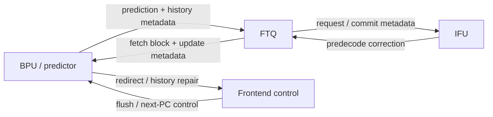
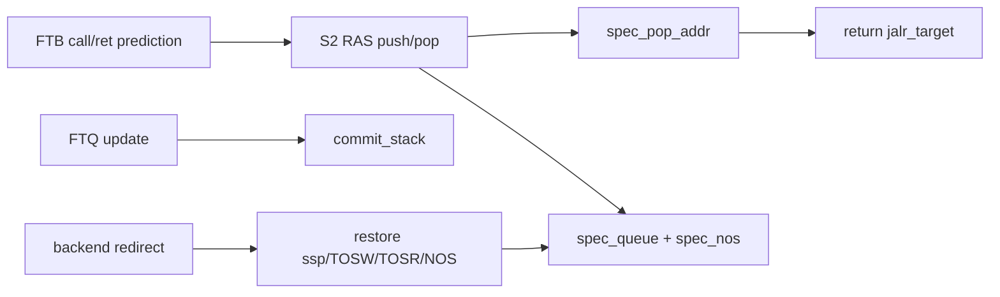
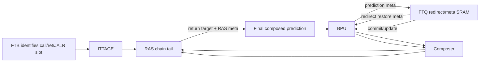

<!-- # Frontend RAS 分支预测器深入分析 -->
# In-Depth Analysis of the Frontend RAS Branch Predictor

<!-- regenerated-by-analyze-xiangshan-kunminghu -->
> Regenerated from `OpenXiangShan/XiangShan` branch `kunminghu-v2`, source commit `52262f303fc06daf84cdab7011d59b7df65ce7e8` using the updated Frontend graph/stage rules.


<!-- > 官方源码：`https://github.com/OpenXiangShan/XiangShan.git`；分支 `kunminghu-v2`；分析 commit `52262f303fc06daf84cdab7011d59b7df65ce7e8`。论文解释算法原理，源码决定香山的有效参数、流水、更新与恢复。 -->
> Official source: `https://github.com/OpenXiangShan/XiangShan.git`; branch `kunminghu-v2`; analysis commit `52262f303fc06daf84cdab7011d59b7df65ce7e8`. Papers explain the algorithmic principles, while the source determines XiangShan's effective parameters, pipeline, update, and recovery behavior.

<!-- frontend-tutorial-generated-by-analyze-xiangshan-kunminghu -->
<!-- > 所有实现结论均限定在 `kunminghu-v2` commit `52262f303fc06daf84cdab7011d59b7df65ce7e8`；Design Doc 结论必须回到第 18 节的源码追溯矩阵。 -->
> All implementation conclusions are limited to `kunminghu-v2` commit `52262f303fc06daf84cdab7011d59b7df65ce7e8`; Design Doc conclusions must be checked against the source traceability matrix in Section 18.

## 1. Scope

<!-- 本节保留模块职责、分析基线、范围和统一五问，明确本文只以当前源码证据为准。 -->
This section records the module responsibility, analysis baseline, scope, and common five-question guide, and makes clear that this document relies only on evidence in the current source tree.

<!-- ### 1.1. 统一五问导读 -->
### 1.1. Five-Question Guide
<!-- | 问题 | 回答 | -->
| Question | Answer |
| --- | --- |
<!-- | **Who** | `RAS`/`newRAS` 是预测器链最后一级，专门预测 return 的 JALR target。 | -->
| **Who** | `RAS`/`newRAS` is the final component in the predictor chain and specializes in return JALR-target prediction. |
<!-- | **What** | 保存 call 的 fall-through return address，并维护投机栈、提交栈、重复计数和 redirect 快照。 | -->
| **What** | It stores call fall-through return addresses and maintains speculative and committed stacks, repetition counters, and redirect snapshots. |
<!-- | **How** | taken call 做 speculative push，taken ret 做 pop；S3 cancel 恢复快照并补做漏掉的 push/pop；提交更新 architectural/commit stack。 | -->
| **How** | A taken call performs a speculative push and a taken return performs a pop; S3 cancel restores the snapshot and applies any missed push/pop, while commit updates the architectural/committed stack. |
<!-- | **From what** | call/ret 类型来自 FTB/预译码，push 地址来自 call fall-through，恢复/提交 meta 来自 FTQ。 | -->
| **From what** | Call/return classification comes from FTB/predecode, push addresses come from call fall-through, and recovery/commit metadata comes from FTQ. |
<!-- | **To what** | return target 覆盖普通 JALR target，作为组合预测最终输出；栈快照写入 FTQ 供 redirect 恢复。 | -->
| **To what** | The return target overrides the ordinary JALR target as the final composed prediction; stack snapshots are written to FTQ for redirect recovery. |

<!-- ### 1.2. 分析范围 -->
### 1.2. Analysis Scope
- Source: OpenXiangShan/XiangShan `kunminghu-v2`, commit `52262f303fc06daf84cdab7011d59b7df65ce7e8`.
- Effective relative source file: [src/main/scala/xiangshan/frontend/newRAS.scala](https://github.com/OpenXiangShan/XiangShan/blob/kunminghu-v2/src/main/scala/xiangshan/frontend/newRAS.scala).
- Historical/non-effective file: [src/main/scala/xiangshan/frontend/RAS.scala](https://github.com/OpenXiangShan/XiangShan/blob/kunminghu-v2/src/main/scala/xiangshan/frontend/RAS.scala) is commented out from line 16 onward and does not define effective code in this commit.

<!-- ## 2. 关键源码证据 -->
## 2. Key Source Evidence

<!-- 本节直接列出 `RAS / newRAS` 的有效源码入口、关键代码骨架和行为解释，避免只保存文件名或行号。 -->
This section lists the effective source entry points, key code skeleton, and behavioral explanations for `RAS / newRAS`, rather than retaining only filenames or line numbers.

<!-- ### 2.1. 源码入口和行号 -->
### 2.1. Source Entry Points and Line References
<!-- | 源码文件 | 本文使用它证明什么 | 行号证据 | -->
| Source file | What it establishes | Line evidence |
| --- | --- | --- |
<!-- | `frontend/newRAS.scala` | push/pop/cancel/recovery 输出和最终预测 | [frontend/newRAS.scala#L696-L706](https://github.com/OpenXiangShan/XiangShan/blob/kunminghu-v2/src/main/scala/xiangshan/frontend/newRAS.scala#L696-L706) | -->
| `frontend/newRAS.scala` | Push/pop/cancel/recovery outputs and the final prediction. | [frontend/newRAS.scala#L696-L706](https://github.com/OpenXiangShan/XiangShan/blob/kunminghu-v2/src/main/scala/xiangshan/frontend/newRAS.scala#L696-L706) |
<!-- | `frontend/Composer.scala` | RAS 位于预测器链末级 | [frontend/Composer.scala#L37-L56](https://github.com/OpenXiangShan/XiangShan/blob/kunminghu-v2/src/main/scala/xiangshan/frontend/Composer.scala#L37-L56) | -->
| `frontend/Composer.scala` | RAS's position as the final predictor-chain component. | [frontend/Composer.scala#L37-L56](https://github.com/OpenXiangShan/XiangShan/blob/kunminghu-v2/src/main/scala/xiangshan/frontend/Composer.scala#L37-L56) |
| `Parameters.scala` | `RasSize/RasSpecSize/RasCtrSize` | [Parameters.scala#L124-L143](https://github.com/OpenXiangShan/XiangShan/blob/kunminghu-v2/src/main/scala/xiangshan/Parameters.scala#L124-L143) |

<!-- ### 2.2. 核心代码骨架 -->
### 2.2. Core Code Skeleton
```scala
when (isCall) { stack(pushPtr) := returnAddr; pushPtr := pushPtr + 1.U }
when (isRet)  { target := stack(popPtr); popPtr := popPtr - 1.U }
when (redirect.valid) { restore(snapshot) }
io.out := rasCorrectedPrediction
```

<!-- ### 2.3. 代码解析 -->
### 2.3. Code Walkthrough
<!-- RAS 用栈预测 return target。call 在投机路径压栈，ret 弹栈；redirect 或取消时必须恢复栈顶、指针和重复计数，避免错误路径 return 污染后续预测。 -->
RAS predicts return targets with a stack. Calls push on the speculative path and returns pop; redirect or cancel must restore the top, pointers, and repetition counters so wrong-path returns do not contaminate later predictions.
## 3. Theory-to-Code Mapping

<!-- 本节把理论概念直接绑定到 `RAS / newRAS` 的源码对象、控制/数据状态和下游消费者。 -->
This section binds theoretical concepts directly to `RAS / newRAS` source objects, control/data state, and downstream consumers.

<!-- ### 3.1. 理论到代码映射表 -->
### 3.1. Theory-to-Code Mapping Table
<!-- | 理论概念 | 代码对象 | 为什么需要它 | 消费者/后续影响 | -->
| Theory concept | Code object | Why it is needed | Consumer / downstream effect |
| --- | --- | --- | --- |
<!-- | 调用/返回匹配 | call push / ret pop | 返回目标通常等于 call 后继 PC | BPU final prediction | -->
| Call/return matching | call push / ret pop | A return target is normally the PC following the call. | BPU final prediction |
<!-- | 投机恢复 | snapshot/spec queue/cancel | 错误路径 push/pop 必须撤销 | redirect recovery | -->
| Speculative recovery | snapshot/spec queue/cancel | Wrong-path pushes and pops must be undone. | Redirect recovery |
<!-- | overflow/underflow | `RasSize`、ptr、valid/count | 递归和空栈场景需要定义行为 | 验证矩阵 | -->
| Overflow/underflow | `RasSize`, pointers, valid/count | Recursive and empty-stack cases require defined behavior. | Verification matrix |

<!-- ### 3.2. 阅读顺序 -->
### 3.2. Reading Order
<!-- 先按第 2 节定位源码对象，再顺着本表检查信号从哪里来、状态在哪里保存、何时更新、谁消费结果。若本篇只引用相邻模块拥有的状态，则以相邻 Frontend 分文档的源码分析为准。 -->
First locate source objects through Section 2, then use this table to check signal origin, state location, update timing, and result consumers. When this document cites state owned by an adjacent module, use that Frontend document's source analysis as the authority.
<!-- ## 4. 论文原则和有效代码 -->
## 4. Paper Principles and Effective Code


<!-- ### 4.1. 状态机与论文理论 -->
### 4.1. State Machine and Paper Theory
<!-- RAS 用指针、计数和 valid 表示隐式 stack 状态机：normal push/pop、S3 cancel repair、backend redirect repair、commit consolidation、near-overflow gating。Skadron 等人的 return-address-stack repair 论文（DOI `10.1109/MICRO.1998.742787`）讨论投机路径污染后的恢复；Park/Lee 的 overflow repair 论文（DOI `10.1145/977091.977139`）说明有限深度栈溢出后不能简单继续覆盖而不修复。 -->
RAS represents an implicit stack state machine with pointers, counters, and valid bits: normal push/pop, S3 cancel repair, backend redirect repair, commit consolidation, and near-overflow gating. Skadron's return-address-stack repair paper (DOI `10.1109/MICRO.1998.742787`) discusses recovery from speculative-path contamination; Park and Lee's overflow-repair paper (DOI `10.1145/977091.977139`) shows that a finite-depth stack cannot simply keep overwriting entries after overflow without repair.

<!-- ### 4.2. 论文理论背景 -->
### 4.2. Paper and Theory Background
[newRAS.scala](https://github.com/OpenXiangShan/XiangShan/blob/kunminghu-v2/src/main/scala/xiangshan/frontend/newRAS.scala) cites Skadron et al., `Improving prediction for procedure returns with return-address-stack repair mechanisms` and a persistent-stack return-address predictor paper ([newRAS.scala:18-26](https://github.com/OpenXiangShan/XiangShan/blob/kunminghu-v2/src/main/scala/xiangshan/frontend/newRAS.scala#L18-L26)). MCP search also found the Skadron MICRO paper DOI `10.1109/MICRO.1998.742787`. Principle: predict returns by a stack of call fall-through addresses, and repair speculative stack state after mispredicted-path execution.

<!-- ### 4.3. 论文原理深入讲解 -->
### 4.3. Detailed Paper Principles
<!-- #### 4.3.1. 论文问题：为什么普通硬件栈仍会错 -->
#### 4.3.1. Why an Ordinary Hardware Stack Still Mis-predicts

<!-- Skadron 等人的 *Improving Prediction for Procedure Returns with Return-Address-Stack Repair Mechanisms*（MICRO 1998，DOI `10.1109/MICRO.1998.742787`）指出：RAS 对正常 call/return 很准，但会被错误路径上的 call/return、有限深度 overflow，以及非标准控制流破坏。Vandierendonck、Seznec 的 *Speculative Return Address Stack Management Revisited*（TACO 2008，DOI `10.1145/1455650.1455654`）进一步强调 overflow 与 wrong-path top overwrite 是主要剩余误预测来源，并讨论 corruption detection/backup。 -->
Skadron et al.'s *Improving Prediction for Procedure Returns with Return-Address-Stack Repair Mechanisms* (MICRO 1998, DOI `10.1109/MICRO.1998.742787`) notes that RAS is highly accurate for normal calls/returns but can be corrupted by wrong-path calls/returns, finite-depth overflow, and nonstandard control flow. Vandierendonck and Seznec's *Speculative Return Address Stack Management Revisited* (TACO 2008, DOI `10.1145/1455650.1455654`) further identifies overflow and wrong-path top overwrites as major residual misprediction sources and discusses corruption detection and backup.

<!-- #### 4.3.2. 基本算法 -->
#### 4.3.2. Basic Algorithm

<!-- 遇到 call 时，把 call 的 fall-through 地址 push；遇到 return 时，用 top 作为 target 并 pop。这个算法利用了程序调用/返回的 LIFO 语义，避免普通 BTB 在多个调用者共享同一 return PC 时只能记住一个 target。 -->
On a call, push the call's fall-through address; on a return, use the top as the target and pop it. This exploits the LIFO semantics of calls and returns and avoids the limitation that an ordinary BTB can remember only one target when multiple callers share a return PC.

<!-- #### 4.3.3. 为什么需要投机状态与提交状态分离 -->
#### 4.3.3. Why Speculative and Committed State Must Be Separate

<!-- 预测发生在取指，远早于指令提交，所以 RAS 必须投机 push/pop 才能连续预测深层调用。但错误路径随时会被 redirect；若所有状态只有一份，错误路径可能覆盖正确 top，flush 后无法恢复。香山因此把 `commit_stack` 与 `spec_queue` 分开，并维护 `ssp/sctr/TOSR/TOSW/BOS`（[frontend/newRAS.scala:155-226](https://github.com/OpenXiangShan/XiangShan/blob/kunminghu-v2/src/main/scala/xiangshan/frontend/newRAS.scala#L155-L226)）：提交栈是可靠基线，投机队列提供前端低延迟更新。 -->
Prediction occurs during fetch, far before instruction commit, so RAS must speculatively push/pop to keep predicting nested calls. A wrong path can be redirected at any time; with only one copy of state, it could overwrite the correct top and leave no way to recover after a flush. XiangShan therefore separates `commit_stack` and `spec_queue` and maintains `ssp/sctr/TOSR/TOSW/BOS` ([frontend/newRAS.scala:155-226](https://github.com/OpenXiangShan/XiangShan/blob/kunminghu-v2/src/main/scala/xiangshan/frontend/newRAS.scala#L155-L226)): the committed stack is the reliable baseline, while the speculative queue enables low-latency frontend updates.

<!-- #### 4.3.4. Repair 的论文含义与香山映射 -->
#### 4.3.4. Meaning of Repair and XiangShan Mapping

<!-- repair 不是简单“把指针减一”，而是恢复预测时完整快照：top 读写位置、投机深度、递归计数和 committed/speculative 边界；随后还要把已解析的真实 call/return 动作重新施加。香山在预测 metadata 中保存恢复信息（[frontend/newRAS.scala:38-88](https://github.com/OpenXiangShan/XiangShan/blob/kunminghu-v2/src/main/scala/xiangshan/frontend/newRAS.scala#L38-L88)），后端 redirect 时恢复并重放真实 CFI（[frontend/newRAS.scala:567-592](https://github.com/OpenXiangShan/XiangShan/blob/kunminghu-v2/src/main/scala/xiangshan/frontend/newRAS.scala#L567-L592)）。S2/S3 cancel 则是更早的局部修复，用于晚级发现早级 CFI 类型判断错误。 -->
Repair is not simply “decrement the pointer”; it restores the complete prediction-time snapshot: top read/write positions, speculative depth, recursion counter, and committed/speculative boundary, then reapplies resolved real call/return actions. XiangShan stores recovery information in prediction metadata ([frontend/newRAS.scala:38-88](https://github.com/OpenXiangShan/XiangShan/blob/kunminghu-v2/src/main/scala/xiangshan/frontend/newRAS.scala#L38-L88)), restores it on a backend redirect, and replays the real CFI ([frontend/newRAS.scala:567-592](https://github.com/OpenXiangShan/XiangShan/blob/kunminghu-v2/src/main/scala/xiangshan/frontend/newRAS.scala#L567-L592)). S2/S3 cancel provides earlier local repair when a later stage discovers that an earlier stage classified the CFI type incorrectly.

<!-- #### 4.3.5. Overflow、Underflow 与递归 -->
#### 4.3.5. Overflow, Underflow, and Recursion

<!-- 有限 RAS 不能无限 push。near-overflow 控制用于避免覆盖仍可能恢复的投机项；空栈 return 也不能把无效 top 当目标。递归调用常产生相同返回地址，香山用 `sctr`/entry counter 压缩重复 top，既节省容量又要求 counter 做饱和、下溢保护。验证时必须覆盖空 pop、满前 push、环形指针 wrap、push/pop/cancel/redirect/commit 同拍。 -->
A finite RAS cannot push indefinitely. Near-overflow control prevents overwriting speculative entries that may still be needed for recovery, and an empty-stack return must not use an invalid top as its target. Recursive calls often produce the same return address; XiangShan uses `sctr`/an entry counter to compress repeated tops, saving capacity while requiring saturation and underflow protection. Verification must cover empty pops, pushes just before full, circular-pointer wraparound, and same-cycle push/pop/cancel/redirect/commit events.

<!-- #### 4.3.6. 示例 -->
#### 4.3.6. Example

<!-- 正确路径执行 `call A → call B → ret B`，投机栈依次为 `[RA_A] → [RA_A, RA_B] → [RA_A]`。若在 B 内误预测到一条错误路径 `call C`，栈临时变为 `[RA_A, RA_B, RA_C]`。后端发现误预测后，redirect metadata 必须把 top 恢复到 `RA_B` 对应快照，再根据真实已解析 CFI 重放；仅清除取指队列而不修 RAS，会让下一条 `ret B` 错跳到 `RA_C`。 -->
On the correct path, `call A -> call B -> ret B` changes the speculative stack as `[RA_A] -> [RA_A, RA_B] -> [RA_A]`. If a wrong-path `call C` is predicted inside B, the stack temporarily becomes `[RA_A, RA_B, RA_C]`. After the backend detects the misprediction, redirect metadata must restore the snapshot whose top is `RA_B` and replay the real resolved CFI. Flushing only the fetch queue without repairing RAS would make the next `ret B` misdirect to `RA_C`.

## 5. Microarchitecture Parameters


<!-- 先从源码证据读取表深度、队列容量、位宽、端口数和配置开关，再判断它们对吞吐、冲突和恢复延迟的影响；不要用文档中的默认值替代当前 commit 的参数。 -->
First read table depth, queue capacity, bit widths, port counts, and configuration switches from source evidence, then evaluate their impact on throughput, conflicts, and recovery latency. Do not replace the parameters of the current commit with document defaults.

<!-- ## 6. 模块边界和接口 -->
## 6. Module Boundaries and Interfaces


<!-- ### 6.1. 控制信号逐项解释：Who / From / To / How / Why -->
### 6.1. Control Signals: Who / From / To / How / Why
<!-- > 下表覆盖本文讲解中出现的查询、流水推进、选择、训练、替换和恢复控制。`为什么存在` 不以信号命名猜测，而以当前 `kunminghu-v2` 数据依赖、资源限制和恢复要求为依据。 -->
> The table covers query, pipeline-progress, selection, training, replacement, and recovery controls discussed in this document. `Why it exists` is grounded in `kunminghu-v2` data dependencies, resource limits, and recovery requirements rather than inferred from signal names.

<!-- | 控制信号 / 状态 | 谁产生 / 从哪里来 | 谁消费 / 到哪里去 | 何时、如何生效 | 为什么存在；缺失会怎样 | 代码证据 | -->
| Control signal / state | Producer / source | Consumer / destination | When and how it takes effect | Why it exists; consequence if absent | Source evidence |
| --- | --- | --- | --- | --- | --- |
<!-- | `specPush` | 预测到 call | spec_queue、ssp/sctr、TOS | 把 call 的 fall-through 地址推入投机栈。 | return 的目标就是最近未返回 call 的下一条地址；预测阶段必须立即推入，才能预测嵌套调用。 | [frontend/newRAS.scala:432-481](https://github.com/OpenXiangShan/XiangShan/blob/kunminghu-v2/src/main/scala/xiangshan/frontend/newRAS.scala#L432-L481) | -->
| `specPush` | Predicted call | spec_queue, ssp/sctr, TOS | Pushes the call fall-through address onto the speculative stack. | A return targets the address after the most recent unmatched call; the push must happen during prediction to support nested calls. | [frontend/newRAS.scala:432-481](https://github.com/OpenXiangShan/XiangShan/blob/kunminghu-v2/src/main/scala/xiangshan/frontend/newRAS.scala#L432-L481) |
<!-- | `specPop` | 预测到 return | 投机栈指针与 top 读取 | 弹出当前 top 并暴露下一层。 | 连续 return 需要每次前移栈状态；不 pop 会反复预测同一返回地址。 | [frontend/newRAS.scala:432-481](https://github.com/OpenXiangShan/XiangShan/blob/kunminghu-v2/src/main/scala/xiangshan/frontend/newRAS.scala#L432-L481) | -->
| `specPop` | Predicted return | Speculative-stack pointer and top read | Pops the current top and exposes the next level. | Consecutive returns must advance stack state each time; without a pop, the same return address would be predicted repeatedly. | [frontend/newRAS.scala:432-481](https://github.com/OpenXiangShan/XiangShan/blob/kunminghu-v2/src/main/scala/xiangshan/frontend/newRAS.scala#L432-L481) |
<!-- | `s2_cancel` | S2 发现早期 call/ret 判断错误 | 投机 push/pop 修复 | 撤销较早级错误栈动作。 | CFI 类型可能在更晚级才确定；cancel 防止错误 call/ret 在后端 redirect 前长期污染 RAS。 | [frontend/newRAS.scala:607-706](https://github.com/OpenXiangShan/XiangShan/blob/kunminghu-v2/src/main/scala/xiangshan/frontend/newRAS.scala#L607-L706) | -->
| `s2_cancel` | S2 discovers an incorrect early call/return classification | Speculative push/pop repair | Cancels the erroneous action from an earlier stage. | CFI type may be determined only later; cancel prevents a wrong call/return from contaminating RAS before backend redirect. | [frontend/newRAS.scala:607-706](https://github.com/OpenXiangShan/XiangShan/blob/kunminghu-v2/src/main/scala/xiangshan/frontend/newRAS.scala#L607-L706) |
<!-- | `s3_cancel` | S3 最终预测差异 | 投机栈修复 | 撤销 S2 后仍被 ITTAGE/RAS 最终结果否定的动作。 | 多级覆盖流水需要与每一级预测一致的撤销点，否则栈深度会多推或多弹一次。 | [frontend/newRAS.scala:607-706](https://github.com/OpenXiangShan/XiangShan/blob/kunminghu-v2/src/main/scala/xiangshan/frontend/newRAS.scala#L607-L706) | -->
| `s3_cancel` | Final S3 prediction differs | Speculative-stack repair | Cancels an S2 action rejected by the final ITTAGE/RAS result. | Multi-stage overrides need a cancellation point for each prediction stage; otherwise stack depth can be pushed or popped one time too many. | [frontend/newRAS.scala:607-706](https://github.com/OpenXiangShan/XiangShan/blob/kunminghu-v2/src/main/scala/xiangshan/frontend/newRAS.scala#L607-L706) |
<!-- | `commit_push_valid` | FTQ/提交确认 call | commit_stack | 把已提交返回地址写入非投机栈。 | 投机状态可被 flush；commit 栈提供不会随错误路径丢失的恢复基线。 | [frontend/newRAS.scala:511-565](https://github.com/OpenXiangShan/XiangShan/blob/kunminghu-v2/src/main/scala/xiangshan/frontend/newRAS.scala#L511-L565) | -->
| `commit_push_valid` | FTQ/commit confirms a call | commit_stack | Writes the committed return address into the non-speculative stack. | Speculative state can be flushed; the committed stack provides a recovery baseline that wrong-path execution cannot erase. | [frontend/newRAS.scala:511-565](https://github.com/OpenXiangShan/XiangShan/blob/kunminghu-v2/src/main/scala/xiangshan/frontend/newRAS.scala#L511-L565) |
<!-- | `commit_pop_valid` | FTQ/提交确认 return | commit_stack/BOS | 释放已完成调用层级。 | 若只投机 pop 而不更新提交状态，长期执行后恢复基线会与架构调用深度脱节。 | [frontend/newRAS.scala:511-565](https://github.com/OpenXiangShan/XiangShan/blob/kunminghu-v2/src/main/scala/xiangshan/frontend/newRAS.scala#L511-L565) | -->
| `commit_pop_valid` | FTQ/commit confirms a return | commit_stack/BOS | Releases the completed call level. | If only the speculative stack is popped, the recovery baseline eventually diverges from architectural call depth. | [frontend/newRAS.scala:511-565](https://github.com/OpenXiangShan/XiangShan/blob/kunminghu-v2/src/main/scala/xiangshan/frontend/newRAS.scala#L511-L565) |
<!-- | `ssp / sctr` | 投机 push/pop 与恢复逻辑 | spec_queue 索引和递归计数 | 定位投机 top，并压缩相同返回地址的递归深度。 | 有限队列需要显式指针；递归程序重复相同返回地址，计数可避免浪费多个完全相同 entry。 | [frontend/newRAS.scala:155-226](https://github.com/OpenXiangShan/XiangShan/blob/kunminghu-v2/src/main/scala/xiangshan/frontend/newRAS.scala#L155-L226) | -->
| `ssp / sctr` | Speculative push/pop and recovery logic | spec_queue index and recursion counter | Locates the speculative top and compresses recursion depth for identical return addresses. | The finite queue needs explicit pointers; a counter avoids wasting entries on repeated identical addresses. | [frontend/newRAS.scala:155-226](https://github.com/OpenXiangShan/XiangShan/blob/kunminghu-v2/src/main/scala/xiangshan/frontend/newRAS.scala#L155-L226) |
<!-- | `TOSR / TOSW / BOS` | 投机/提交状态机 | top 读取、写入和范围判断 | 分别跟踪读 top、写 top 和提交边界。 | 读写 top 与 committed/speculative 边界并非总相同，分离指针可支持旁路、恢复和队列环绕。 | [frontend/newRAS.scala:155-226](https://github.com/OpenXiangShan/XiangShan/blob/kunminghu-v2/src/main/scala/xiangshan/frontend/newRAS.scala#L155-L226) | -->
| `TOSR / TOSW / BOS` | Speculative/committed state machine | Top read, write, and range checks | Tracks the read top, write top, and committed boundary separately. | Read/write tops do not always coincide with committed/speculative boundaries; separate pointers support bypassing, recovery, and queue wraparound. | [frontend/newRAS.scala:155-226](https://github.com/OpenXiangShan/XiangShan/blob/kunminghu-v2/src/main/scala/xiangshan/frontend/newRAS.scala#L155-L226) |
<!-- | `TOSRinRange` | 指针范围比较 | getTop 数据源选择 | 决定 top 来自 spec_queue 还是 commit_stack。 | 投机队列容量有限且会环绕；范围控制防止从错误存储层读取陈旧返回地址。 | [frontend/newRAS.scala:175-226](https://github.com/OpenXiangShan/XiangShan/blob/kunminghu-v2/src/main/scala/xiangshan/frontend/newRAS.scala#L175-L226) | -->
| `TOSRinRange` | Pointer-range comparison | getTop data-source selection | Selects whether the top comes from spec_queue or commit_stack. | The speculative queue is finite and wraps; range control prevents reading a stale return address from the wrong storage layer. | [frontend/newRAS.scala:175-226](https://github.com/OpenXiangShan/XiangShan/blob/kunminghu-v2/src/main/scala/xiangshan/frontend/newRAS.scala#L175-L226) |
<!-- | `near_overflow` | ssp/BOS 距离和队列容量 | push 接受/修复策略 | 接近满时限制或改变投机 push。 | RAS 是有限 stack/queue；若无近满控制，新 push 会覆盖仍需恢复的旧 entry。 | [frontend/newRAS.scala:432-481](https://github.com/OpenXiangShan/XiangShan/blob/kunminghu-v2/src/main/scala/xiangshan/frontend/newRAS.scala#L432-L481) | -->
| `near_overflow` | ssp/BOS distance and queue capacity | Push admission/repair policy | Limits or changes speculative pushes near full occupancy. | RAS is a finite stack/queue; without near-full control, a new push could overwrite an entry still needed for recovery. | [frontend/newRAS.scala:432-481](https://github.com/OpenXiangShan/XiangShan/blob/kunminghu-v2/src/main/scala/xiangshan/frontend/newRAS.scala#L432-L481) |
<!-- | `io.redirect / redirect_meta` | 后端真实 CFI 与 FTQ 保存快照 | ssp/sctr/TOS/BOS | 恢复预测前快照并重放已解析 call/ret 的真实动作。 | 错误路径会执行任意 call/ret 序列；仅 flush 指令不够，必须精确恢复栈内部状态。 | [frontend/newRAS.scala:567-592](https://github.com/OpenXiangShan/XiangShan/blob/kunminghu-v2/src/main/scala/xiangshan/frontend/newRAS.scala#L567-L592) | -->
| `io.redirect / redirect_meta` | Backend-resolved CFI and FTQ-saved snapshot | ssp/sctr/TOS/BOS | Restores the pre-prediction snapshot and replays the resolved real call/return action. | Wrong-path execution may contain arbitrary call/return sequences; flushing instructions alone is insufficient, so internal stack state must be repaired precisely. | [frontend/newRAS.scala:567-592](https://github.com/OpenXiangShan/XiangShan/blob/kunminghu-v2/src/main/scala/xiangshan/frontend/newRAS.scala#L567-L592) |
<!-- | `last_stage_meta` | 预测时 RAS 指针/top 快照 | FTQ 保存与 redirect/update | 携带恢复投机栈所需状态。 | 返回地址本身不足以重建递归计数、读写 top 和边界；metadata 是精确修复的检查点。 | [frontend/newRAS.scala:38-88](https://github.com/OpenXiangShan/XiangShan/blob/kunminghu-v2/src/main/scala/xiangshan/frontend/newRAS.scala#L38-L88) | -->
| `last_stage_meta` | Prediction-time RAS pointer/top snapshot | FTQ storage and redirect/update | Carries the state required to restore the speculative stack. | A return address alone cannot reconstruct recursion count, read/write tops, or boundaries; metadata is the precise repair checkpoint. | [frontend/newRAS.scala:38-88](https://github.com/OpenXiangShan/XiangShan/blob/kunminghu-v2/src/main/scala/xiangshan/frontend/newRAS.scala#L38-L88) |

#### 6.1.1. Top-Level Module Connectivity

This module participates in the predictor chain, but the top-level graph keeps only bundled interfaces. `Frontend.scala` instantiates BPU, FTQ, IFU, IBuffer, ICache, and InstrUncache, while the predictor-specific chain is configured through Composer: [frontend/Frontend.scala:103-109](https://github.com/OpenXiangShan/XiangShan/blob/52262f303fc06daf84cdab7011d59b7df65ce7e8/src/main/scala/xiangshan/frontend/Frontend.scala#L103-L109), [frontend/Composer.scala:22-77](https://github.com/OpenXiangShan/XiangShan/blob/52262f303fc06daf84cdab7011d59b7df65ce7e8/src/main/scala/xiangshan/frontend/Composer.scala#L22-L77).



No module pair has more than three bundled edges. Individual table reads, counters, folded histories, and predictor-local states remain in the module's detailed sections instead of becoming separate graph lines.

#### 6.1.2. Frontend/Backend Pipeline Stages

The source-proven stage boundary is `F0 -> F1 -> F2 -> F3`: F0 accepts the FTQ request and calculates line indices, F1 registers the fetch block and calculates instruction PCs/cut pointers, F2 waits for ICache responses and performs data cutting/predecode preparation, and F3 expands/qualifies instructions, handles exceptions/MMIO, and drives IBuffer. Evidence: [frontend/IFU.scala:236-305](https://github.com/OpenXiangShan/XiangShan/blob/52262f303fc06daf84cdab7011d59b7df65ce7e8/src/main/scala/xiangshan/frontend/IFU.scala#L236-L305), [frontend/IFU.scala:346-457](https://github.com/OpenXiangShan/XiangShan/blob/52262f303fc06daf84cdab7011d59b7df65ce7e8/src/main/scala/xiangshan/frontend/IFU.scala#L346-L457), [frontend/IFU.scala:542-617](https://github.com/OpenXiangShan/XiangShan/blob/52262f303fc06daf84cdab7011d59b7df65ce7e8/src/main/scala/xiangshan/frontend/IFU.scala#L542-L617). The top-level connections couple FTQ, IFU, ICache, and IBuffer through shared ready/valid conditions: [frontend/Frontend.scala:199-231](https://github.com/OpenXiangShan/XiangShan/blob/52262f303fc06daf84cdab7011d59b7df65ce7e8/src/main/scala/xiangshan/frontend/Frontend.scala#L199-L231).

The backend continuation uses the effective module boundaries rather than inventing cycle names: Decode accepts the instruction packet, Rename creates speculative physical-register mappings, Dispatch allocates downstream resources, Issue/Scheduler selects ready uops, Execute/FU produces results, DataPath/WB carries writeback and wakeup, and ROB/CtrlBlock commits or redirects. Evidence: [backend/decode/DecodeStage.scala:83-120](https://github.com/OpenXiangShan/XiangShan/blob/52262f303fc06daf84cdab7011d59b7df65ce7e8/src/main/scala/xiangshan/backend/decode/DecodeStage.scala#L83-L120), [backend/rename/Rename.scala:40-117](https://github.com/OpenXiangShan/XiangShan/blob/52262f303fc06daf84cdab7011d59b7df65ce7e8/src/main/scala/xiangshan/backend/rename/Rename.scala#L40-L117), [backend/dispatch/NewDispatch.scala:49-176](https://github.com/OpenXiangShan/XiangShan/blob/52262f303fc06daf84cdab7011d59b7df65ce7e8/src/main/scala/xiangshan/backend/dispatch/NewDispatch.scala#L49-L176), [backend/issue/Scheduler.scala:29-180](https://github.com/OpenXiangShan/XiangShan/blob/52262f303fc06daf84cdab7011d59b7df65ce7e8/src/main/scala/xiangshan/backend/issue/Scheduler.scala#L29-L180), [backend/exu/ExeUnit.scala:50-110](https://github.com/OpenXiangShan/XiangShan/blob/52262f303fc06daf84cdab7011d59b7df65ce7e8/src/main/scala/xiangshan/backend/exu/ExeUnit.scala#L50-L110), [backend/datapath/DataPath.scala:25-70](https://github.com/OpenXiangShan/XiangShan/blob/52262f303fc06daf84cdab7011d59b7df65ce7e8/src/main/scala/xiangshan/backend/datapath/DataPath.scala#L25-L70), [backend/rob/Rob.scala:52-145](https://github.com/OpenXiangShan/XiangShan/blob/52262f303fc06daf84cdab7011d59b7df65ce7e8/src/main/scala/xiangshan/backend/rob/Rob.scala#L52-L145), [backend/CtrlBlock.scala:50-110](https://github.com/OpenXiangShan/XiangShan/blob/52262f303fc06daf84cdab7011d59b7df65ce7e8/src/main/scala/xiangshan/backend/CtrlBlock.scala#L50-L110).

```mermaid
flowchart LR
  F0["F0: FTQ req + line indices"] -->|f0_fire| F1["F1: PC + cut pointers"]
  F1 -->|f1_fire| F2["F2: ICache data + exceptions"]
  F2 -->|f2_fire| F3["F3: predecode + MMIO qualification"]
  F3 -->|toIbuffer.fire| Decode["Decode"]
  Decode -->|uop bundle| Rename["Rename"]
  Rename -->|renamed uop| Dispatch["Dispatch"]
  Dispatch -->|ready uop| Issue["Issue"]
  Issue -->|operands| Execute["Execute/FU"]
  Execute -->|result| Writeback["Writeback/Wakeup"]
  Writeback -->|retire candidate| Commit["ROB/Commit"]
  Commit -->|redirect/flush| F0
```



The stage graph keeps chronological forward edges separate from the bundled recovery edge. It must be read together with the module graph below: a stage is not itself a module, and a redirect does not create a fake forward stage.

```waveform-draw
{
  "signal": [
    {
      "name": "clk",
      "wave": "p......."
    },
    {
      "name": "F0.valid",
      "wave": "01...0.."
    },
    {
      "name": "F0.ready",
      "wave": "1..0...."
    },
    {
      "name": "F1.valid",
      "wave": "001..0.."
    },
    {
      "name": "F2.valid",
      "wave": "0001.0.."
    },
    {
      "name": "F3.valid",
      "wave": "00001.0."
    },
    {
      "name": "toIbuffer.fire",
      "wave": "0000010."
    },
    {
      "name": "redirect/flush",
      "wave": "00000010"
    }
  ],
  "config": {
    "hscale": 1
  }
}
```

<!-- ## 7. 为什么模块存在 -->
## 7. Why the Module Exists


<!-- 把模块放回 Frontend 全链路理解：它解决的是预测带宽、取指正确性、存储层次延迟、投机恢复或上下游速率不匹配中的至少一个问题。 -->
Place the module back in the full frontend path: it addresses at least one of prediction bandwidth, fetch correctness, memory-hierarchy latency, speculative recovery, or rate mismatch between upstream and downstream stages.

<!-- ## 8. 有效动态路径 -->
## 8. Effective Dynamic Paths


### 8.1. Prediction Path
RAS observes the incoming FTB prediction in S2. If the taken CFI is a call, it speculatively pushes fall-through address; if it is a return, it speculatively pops ([newRAS.scala:607-622](https://github.com/OpenXiangShan/XiangShan/blob/kunminghu-v2/src/main/scala/xiangshan/frontend/newRAS.scala#L607-L622)). For return prediction, `stack.spec_pop_addr` overwrites `jalr_target` in S2 when `ras_enable` is true ([newRAS.scala:626-641](https://github.com/OpenXiangShan/XiangShan/blob/kunminghu-v2/src/main/scala/xiangshan/frontend/newRAS.scala#L626-L641)). The same target is carried to S3 and can override S3 JALR target ([newRAS.scala:650-671](https://github.com/OpenXiangShan/XiangShan/blob/kunminghu-v2/src/main/scala/xiangshan/frontend/newRAS.scala#L650-L671)).

If S3 discovers that S2 missed a push or pop, `s3_cancel` restores the S2 metadata and applies the missing operation ([newRAS.scala:673-691](https://github.com/OpenXiangShan/XiangShan/blob/kunminghu-v2/src/main/scala/xiangshan/frontend/newRAS.scala#L673-L691), [newRAS.scala:494-508](https://github.com/OpenXiangShan/XiangShan/blob/kunminghu-v2/src/main/scala/xiangshan/frontend/newRAS.scala#L494-L508)). This prevents RAS corruption when FTB/TAGE later changes which CFI is actually taken.

### 8.2. Commit and Redirect Repair
On backend/FTQ redirect, RAS restores saved metadata (`ssp`, `sctr`, `TOSW`, `TOSR`, `NOS`) and redoes the resolved call or return operation if needed ([newRAS.scala:708-727](https://github.com/OpenXiangShan/XiangShan/blob/kunminghu-v2/src/main/scala/xiangshan/frontend/newRAS.scala#L708-L727), [newRAS.scala:567-592](https://github.com/OpenXiangShan/XiangShan/blob/kunminghu-v2/src/main/scala/xiangshan/frontend/newRAS.scala#L567-L592)). At update/commit time, committed pushes and pops update `commit_stack` and `nsp`, using saved `TOSW/ssp` metadata to align speculative and committed state ([newRAS.scala:728-752](https://github.com/OpenXiangShan/XiangShan/blob/kunminghu-v2/src/main/scala/xiangshan/frontend/newRAS.scala#L728-L752), [newRAS.scala:511-565](https://github.com/OpenXiangShan/XiangShan/blob/kunminghu-v2/src/main/scala/xiangshan/frontend/newRAS.scala#L511-L565)).

<!-- ## 9. Index 和地址/历史计算 -->
## 9. Index and Address/History Computation


<!-- 地址、PC、折叠历史、tag、set/way、line offset 和 FTQ offset 都必须追到源码表达式；索引冲突、回绕和跨边界情况在算法和验证章节中继续展开。 -->
Addresses, PCs, folded history, tags, set/way values, line offsets, and FTQ offsets must all be traced to source expressions; index conflicts, wraparound, and boundary crossings are developed further in the algorithm and verification sections.

<!-- ## 10. 核心算法 -->
## 10. Core Algorithm


<!-- ### 10.1. 算法示例推演 -->
### 10.1. Worked Algorithm Example
Example input: `RasSize=16`, `RasSpecSize=32`; committed top return address is `0x8000_5004`, `ssp=3`, `sctr=0`, and speculative queue is empty. The fetch block first predicts a taken call at `0x8000_5000`, then later a taken return.

1. Call push: [newRAS.scala:607-622](https://github.com/OpenXiangShan/XiangShan/blob/kunminghu-v2/src/main/scala/xiangshan/frontend/newRAS.scala#L607-L622) detects `hit_taken_on_call` in S2 and computes push address as fall-through plus possible RVI-call fixup. If fall-through is `0x8000_5004`, `stack.spec_push_valid` is asserted unless near overflow.
2. Spec stack update: [newRAS.scala:432-453](https://github.com/OpenXiangShan/XiangShan/blob/kunminghu-v2/src/main/scala/xiangshan/frontend/newRAS.scala#L432-L453) runs `specPush`. Because the current top return address differs from `0x8000_5004`, it writes a new speculative entry at `TOSW`, moves `TOSR := TOSW`, increments `TOSW`, and increments `ssp`.
3. Return prediction: when a later block has `hit_taken_on_ret`, [newRAS.scala:626-641](https://github.com/OpenXiangShan/XiangShan/blob/kunminghu-v2/src/main/scala/xiangshan/frontend/newRAS.scala#L626-L641) replaces `jalr_target` with `stack.spec_pop_addr`. `getTop` selects bypass/speculative/committed top in that order ([newRAS.scala:175-226](https://github.com/OpenXiangShan/XiangShan/blob/kunminghu-v2/src/main/scala/xiangshan/frontend/newRAS.scala#L175-L226)), so the just-pushed `0x8000_5004` can be predicted even before commit.
4. Spec pop: [newRAS.scala:454-481](https://github.com/OpenXiangShan/XiangShan/blob/kunminghu-v2/src/main/scala/xiangshan/frontend/newRAS.scala#L454-L481) decrements `sctr` if nested-call counter is nonzero, otherwise moves to `NOS` or committed stack. The predicted return consumes the top speculative entry.
5. S3 correction: if S2 thought the CFI was not a return but S3 says it is, `s3_cancel` is true ([newRAS.scala:673-691](https://github.com/OpenXiangShan/XiangShan/blob/kunminghu-v2/src/main/scala/xiangshan/frontend/newRAS.scala#L673-L691)). [newRAS.scala:494-508](https://github.com/OpenXiangShan/XiangShan/blob/kunminghu-v2/src/main/scala/xiangshan/frontend/newRAS.scala#L494-L508) restores S2 metadata and applies the missed pop or push.
6. Backend redirect: if backend resolves a return misprediction, [newRAS.scala:708-727](https://github.com/OpenXiangShan/XiangShan/blob/kunminghu-v2/src/main/scala/xiangshan/frontend/newRAS.scala#L708-L727) restores saved `ssp/sctr/TOSW/TOSR/NOS` metadata and redoes the resolved call/ret operation through [newRAS.scala:567-592](https://github.com/OpenXiangShan/XiangShan/blob/kunminghu-v2/src/main/scala/xiangshan/frontend/newRAS.scala#L567-L592).
7. Commit update: once FTQ update commits the call, [newRAS.scala:728-752](https://github.com/OpenXiangShan/XiangShan/blob/kunminghu-v2/src/main/scala/xiangshan/frontend/newRAS.scala#L728-L752) drives `commit_push_valid`; [newRAS.scala:511-565](https://github.com/OpenXiangShan/XiangShan/blob/kunminghu-v2/src/main/scala/xiangshan/frontend/newRAS.scala#L511-L565) updates `commit_stack` and `nsp`, retiring speculative state into committed RAS state.

Downstream effect: for the return block, `full_pred.jalr_target` is replaced by `0x8000_5004`, and `last_stage_spec_info` carries RAS metadata for later redirect repair ([newRAS.scala:696-706](https://github.com/OpenXiangShan/XiangShan/blob/kunminghu-v2/src/main/scala/xiangshan/frontend/newRAS.scala#L696-L706)).

<!-- ### 10.2. 逐流水级算法 -->
### 10.2. Stage-by-Stage Algorithm
| Stage | Inputs | Algorithm and state | Ready/stall | Output | Source lines |
| --- | --- | --- | --- | --- | --- |
| S2 call/ret detect | S2 FTB/ITTAGE prediction | Detect hit-taken call/return, compute call fall-through push address, gate push/pop on near-overflow. | Near overflow disables speculative push/pop. | `spec_push_valid`, `spec_pop_valid`, `spec_push_addr`. | [newRAS.scala:607-622](https://github.com/OpenXiangShan/XiangShan/blob/kunminghu-v2/src/main/scala/xiangshan/frontend/newRAS.scala#L607-L622) |
| Stack combinational/top | `ssp/sctr/TOSR/TOSW/BOS`, bypass state | `getTop` chooses write-bypass, speculative queue, or commit stack; `getTopNos` selects next older speculative pointer. | No ready/valid; pointer range controls source. | `spec_pop_addr` for return target. | [newRAS.scala:175-226](https://github.com/OpenXiangShan/XiangShan/blob/kunminghu-v2/src/main/scala/xiangshan/frontend/newRAS.scala#L175-L226), [newRAS.scala:254-260](https://github.com/OpenXiangShan/XiangShan/blob/kunminghu-v2/src/main/scala/xiangshan/frontend/newRAS.scala#L254-L260) |
| S2 target output | return prediction and RAS enable | If S2 is return and RAS enabled, overwrite `jalr_target`; update `targets.last` for JALR. | None local. | S2 return target. | [newRAS.scala:626-641](https://github.com/OpenXiangShan/XiangShan/blob/kunminghu-v2/src/main/scala/xiangshan/frontend/newRAS.scala#L626-L641) |
| S3 correction | registered S2 RAS action and S3 true call/ret classification | Detect missed push/pop and restore S2 metadata before applying missing action. | `s3_cancel` gated by near-overflow. | Corrected RAS speculative state and S3 return target. | [newRAS.scala:650-691](https://github.com/OpenXiangShan/XiangShan/blob/kunminghu-v2/src/main/scala/xiangshan/frontend/newRAS.scala#L650-L691), [newRAS.scala:494-508](https://github.com/OpenXiangShan/XiangShan/blob/kunminghu-v2/src/main/scala/xiangshan/frontend/newRAS.scala#L494-L508) |
| Redirect recovery | backend/FTQ redirect cfi metadata | Restore saved `ssp/sctr/TOSW/TOSR/NOS`; redo resolved call or ret if redirect CFI is call/ret. | Recovery is gated by pointer ordering or not near-overflow. | Repaired RAS speculative state. | [newRAS.scala:708-727](https://github.com/OpenXiangShan/XiangShan/blob/kunminghu-v2/src/main/scala/xiangshan/frontend/newRAS.scala#L708-L727), [newRAS.scala:567-592](https://github.com/OpenXiangShan/XiangShan/blob/kunminghu-v2/src/main/scala/xiangshan/frontend/newRAS.scala#L567-L592) |
| Commit update | FTQ update | Commit call pushes and ret pops update `commit_stack` and `nsp`; `BOS` advances. | Commit metadata mismatch forces `nsp` alignment. | Committed RAS state. | [newRAS.scala:511-565](https://github.com/OpenXiangShan/XiangShan/blob/kunminghu-v2/src/main/scala/xiangshan/frontend/newRAS.scala#L511-L565), [newRAS.scala:728-752](https://github.com/OpenXiangShan/XiangShan/blob/kunminghu-v2/src/main/scala/xiangshan/frontend/newRAS.scala#L728-L752) |

<!-- ## 11. 状态和存储结构 -->
## 11. State and Storage Structure


### 11.1. Storage Model
`commit_stack` has `RasSize` entries and represents committed return-address state ([newRAS.scala:155](https://github.com/OpenXiangShan/XiangShan/blob/kunminghu-v2/src/main/scala/xiangshan/frontend/newRAS.scala#L155)). `spec_queue` has `RasSpecSize` entries and records speculative pushes ([newRAS.scala:156](https://github.com/OpenXiangShan/XiangShan/blob/kunminghu-v2/src/main/scala/xiangshan/frontend/newRAS.scala#L156)). `spec_nos` links each speculative entry to the next older top ([newRAS.scala:157](https://github.com/OpenXiangShan/XiangShan/blob/kunminghu-v2/src/main/scala/xiangshan/frontend/newRAS.scala#L157)). Pointers `TOSR`, `TOSW`, `BOS` delimit readable top, write pointer, and bottom of speculative queue ([newRAS.scala:162-168](https://github.com/OpenXiangShan/XiangShan/blob/kunminghu-v2/src/main/scala/xiangshan/frontend/newRAS.scala#L162-L168)).

Repeated calls to the same return address are compressed using `ctr`; push increments `ctr` when the top return address matches and counter is not saturated, otherwise it allocates a new logical stack layer ([newRAS.scala:262-273](https://github.com/OpenXiangShan/XiangShan/blob/kunminghu-v2/src/main/scala/xiangshan/frontend/newRAS.scala#L262-L273), [newRAS.scala:432-449](https://github.com/OpenXiangShan/XiangShan/blob/kunminghu-v2/src/main/scala/xiangshan/frontend/newRAS.scala#L432-L449)). Pop decrements `ctr` first; when zero, it moves to `NOS` or committed stack ([newRAS.scala:454-481](https://github.com/OpenXiangShan/XiangShan/blob/kunminghu-v2/src/main/scala/xiangshan/frontend/newRAS.scala#L454-L481)).

<!-- ## 12. Pipeline stage 分析 -->
## 12. Pipeline Stage Analysis


<!-- 阶段说明只使用源码中的寄存器、valid/ready 和 fire 条件；对 Frontend 使用 F0/F1/F2/F3，对 Backend 使用实际 Decode/Rename/Dispatch/Issue/Execute/Writeback/ROB 边界。 -->
The stage description uses only registers and valid/ready/fire conditions present in the source. It uses F0/F1/F2/F3 for the frontend and the actual Decode/Rename/Dispatch/Issue/Execute/Writeback/ROB boundaries for the backend.

## 13. Control path rationale


<!-- ### 13.1. Redirect 信号生成 -->
### 13.1. Redirect Signal Generation
RAS has predictor-local cancel/recovery and also influences BPU-level target redirect.

| Signal/effect | Producer and condition | Stage | Repaired state | Consumer/effect | Source lines |
| --- | --- | --- | --- | --- | --- |
| `s3_cancel` | S2 push/pop decision differs from S3 true call/ret. | S3 | Restores `TOSR/TOSW/ssp/sctr` and applies missed push/pop. | RAS stack state repaired; can change S3 target. | [newRAS.scala:673-691](https://github.com/OpenXiangShan/XiangShan/blob/kunminghu-v2/src/main/scala/xiangshan/frontend/newRAS.scala#L673-L691), [newRAS.scala:494-508](https://github.com/OpenXiangShan/XiangShan/blob/kunminghu-v2/src/main/scala/xiangshan/frontend/newRAS.scala#L494-L508) |
| Backend RAS recovery | redirect level 0 CFI is call or return. | Recovery | Restores saved metadata and redoes call/ret effect. | Future return predictions use repaired stack. | [newRAS.scala:708-727](https://github.com/OpenXiangShan/XiangShan/blob/kunminghu-v2/src/main/scala/xiangshan/frontend/newRAS.scala#L708-L727), [newRAS.scala:567-592](https://github.com/OpenXiangShan/XiangShan/blob/kunminghu-v2/src/main/scala/xiangshan/frontend/newRAS.scala#L567-L592) |
| BPU target redirect influenced by RAS | RAS return target differs from previous target. | S2/S3 | BPU PC/history, not RAS metadata, is redirected by BPU. | `s2_redirect` or `s3_redirect_on_target`. | [newRAS.scala:626-671](https://github.com/OpenXiangShan/XiangShan/blob/kunminghu-v2/src/main/scala/xiangshan/frontend/newRAS.scala#L626-L671), [frontend/BPU.scala:606-705](https://github.com/OpenXiangShan/XiangShan/blob/kunminghu-v2/src/main/scala/xiangshan/frontend/BPU.scala#L606-L705), [frontend/BPU.scala:827-854](https://github.com/OpenXiangShan/XiangShan/blob/kunminghu-v2/src/main/scala/xiangshan/frontend/BPU.scala#L827-L854) |
| Near-overflow suppression | speculative queue near overflow. | S2/S3 | Avoids unsafe speculative pointer movement. | May reduce RAS-caused target changes. | [newRAS.scala:594-601](https://github.com/OpenXiangShan/XiangShan/blob/kunminghu-v2/src/main/scala/xiangshan/frontend/newRAS.scala#L594-L601), [newRAS.scala:615-616](https://github.com/OpenXiangShan/XiangShan/blob/kunminghu-v2/src/main/scala/xiangshan/frontend/newRAS.scala#L615-L616), [newRAS.scala:684](https://github.com/OpenXiangShan/XiangShan/blob/kunminghu-v2/src/main/scala/xiangshan/frontend/newRAS.scala#L684) |

Example: S2 did not pop because FTB had not identified a return, but S3 identifies `hit_taken_on_ret`. `s3_cancel` restores S2 metadata, applies `specPop`, and S3 target can differ from previous S2 target, which BPU then redirects through S3 target comparison.

<!-- ## 14. Data path 与跨边界 -->
## 14. Data Path and Boundary Crossings


<!-- ### 14.1. 跨边界代码解析 -->
### 14.1. Boundary-Crossing Code Walkthrough
<!-- 本预测器只产生预测元数据，不直接把跨页、跨 Cache Line 或 MMIO 访问当成一个原子内存事务。对一个取指块跨边界的场景，先由预测链生成块起始 PC、taken mask、target 和 fall-through，再由 IFU/ICache 对每个地址片段分别完成翻译、权限和内存类型判断。BPU 在 S1/S2/S3 比较预测差异并生成 redirect 的规则见 [frontend/BPU.scala:606-635](https://github.com/OpenXiangShan/XiangShan/blob/kunminghu-v2/src/main/scala/xiangshan/frontend/BPU.scala#L606-L635) 和 [frontend/BPU.scala:827-854](https://github.com/OpenXiangShan/XiangShan/blob/kunminghu-v2/src/main/scala/xiangshan/frontend/BPU.scala#L827-L854)；因此第二片段发生 page fault、line miss 或 MMIO 分类变化时，恢复对象是预测历史和 FTQ 上下文，而不是把两片段静默拼接。 -->
This predictor produces only prediction metadata; it does not treat a page-crossing, cache-line-crossing, or MMIO access as one atomic memory transaction. For a fetch block that crosses a boundary, the prediction chain first produces the block-start PC, taken mask, target, and fall-through; IFU/ICache then performs translation, permission, and memory-type checks independently for each address fragment. The BPU rules for comparing predictions and generating redirects in S1/S2/S3 are shown at [frontend/BPU.scala:606-635](https://github.com/OpenXiangShan/XiangShan/blob/kunminghu-v2/src/main/scala/xiangshan/frontend/BPU.scala#L606-L635) and [frontend/BPU.scala:827-854](https://github.com/OpenXiangShan/XiangShan/blob/kunminghu-v2/src/main/scala/xiangshan/frontend/BPU.scala#L827-L854). Thus, if the second fragment encounters a page fault, line miss, or MMIO classification change, recovery targets prediction history and FTQ context rather than silently concatenating the fragments.

<!-- 最小实例是块尾部剩余半条 32-bit 指令：第一片段可能在当前 Cache Line/页命中，第二片段需要下一 Line 或下一页的独立请求；IFU 保存 `lastHalf`，跨周期合并并在 flush 时清除，[frontend/IFU.scala:915-943](https://github.com/OpenXiangShan/XiangShan/blob/kunminghu-v2/src/main/scala/xiangshan/frontend/IFU.scala#L915-L943)。若第二页或第二 Line 的结果改变 CFI 位置、target 或 fall-through，BPU 的 redirect 比较优先于继续使用旧预测。对 MMIO/uncache 地址，预测器只能提供候选 PC，实际访问必须转入 IFU 的 MMIO FSM，等待翻译、PMP/PMA 和提交约束，不能由预测命中绕过副作用控制。 -->
The minimal example is a 32-bit instruction split at the end of a block: the first fragment may hit in the current cache line/page, while the second needs an independent request to the next line/page. IFU stores `lastHalf`, merges the fragments across cycles, and clears it on flush ([frontend/IFU.scala:915-943](https://github.com/OpenXiangShan/XiangShan/blob/kunminghu-v2/src/main/scala/xiangshan/frontend/IFU.scala#L915-L943)). If the second page or line changes the CFI position, target, or fall-through, the BPU redirect comparison takes precedence over continuing with the old prediction. For MMIO/uncacheable addresses, the predictor can provide only a candidate PC; the actual access must enter IFU's MMIO FSM and wait for translation, PMP/PMA, and commit constraints. A prediction hit cannot bypass side-effect controls.

<!-- **边界检查表** -->
**Boundary Check Table**

<!-- | 边界 | 第一片段 | 第二片段 | 失败/恢复 | -->
| Boundary | First fragment | Second fragment | Failure / recovery |
| --- | --- | --- | --- |
<!-- | 虚拟页 | 当前页的预测块与历史 | 下一页的独立翻译和权限结果 | page/access/guest fault、flush、重定向 | -->
| Virtual page | Prediction block and history for the current page | Independent translation and permission result for the next page | Page/access/guest fault, flush, or redirect |
<!-- | Cache Line | 当前 line 的 tag/数据命中 | 下一 line 的 miss/refill 或独立响应 | target/CFI 不一致时 redirect | -->
| Cache line | Tag/data hit in the current line | Miss/refill or independent response for the next line | Redirect when target/CFI differs |
<!-- | MMIO/uncache | 预测 PC 与元数据 | IFU/uncache 请求、响应和提交门控 | resend、异常、commit wait 或 cancel | -->
| MMIO/uncacheable | Predicted PC and metadata | IFU/uncacheable request, response, and commit gating | Resend, exception, commit wait, or cancel |

<!-- ## 15. 异常、debug、privilege -->
## 15. Exceptions, Debug, and Privilege


<!-- 区分预测错误、replay、page/access/guest fault、MMIO side effect、debug redirect 和架构异常；说明异常产生者、优先级、清理对象、恢复入口和提交可见性。 -->
Distinguish prediction errors, replay, page/access/guest faults, MMIO side effects, debug redirects, and architectural exceptions; identify the producer, priority, cleanup target, recovery entry, and commit visibility for each.

<!-- ## 16. CSR 控制 -->
## 16. CSR Control


<!-- 前端分支预测器的使能控制来自 CSR 模块生成的 `CustomCSRCtrlIO.bp_ctrl`，不是各预测器本地私有 CSR。有效链路是：`sbpctl` CSR 字段 -> `io.status.custom.bp_ctrl` -> Backend `frontendCsrCtrl` -> XSCore `frontend.io.csrCtrl` -> Frontend `bpu.io.ctrl` -> BPU 内各子预测器 `io.enable`。 -->
Frontend branch-predictor enable controls come from the CSR module's `CustomCSRCtrlIO.bp_ctrl`, not from private CSRs in each predictor. The effective path is: `sbpctl` CSR fields -> `io.status.custom.bp_ctrl` -> backend `frontendCsrCtrl` -> XSCore `frontend.io.csrCtrl` -> frontend `bpu.io.ctrl` -> each BPU subpredictor's `io.enable`.

<!-- ### 16.1. CSR 字段到 BPU 控制信号 -->
### 16.1. CSR Fields to BPU Control Signals
<!-- | 控制位 | CSR 源字段 | Frontend/BPU 消费者 | 有效作用 | 源码证据 | -->
| Control bit | CSR source field | Frontend/BPU consumer | Effective behavior | Source evidence |
| --- | --- | --- | --- | --- |
<!-- | `bp_ctrl.ubtbEnable` | `sbpctl.regOut.UBTB_ENABLE` | `ubtb.io.enable` | 允许或关闭 S1 fast uBTB/MicroBtb 查询结果参与预测链；关闭后仍保留 fall-through 基线。 | [NewCSR.scala:1378](https://github.com/OpenXiangShan/XiangShan/blob/kunminghu-v2/src/main/scala/xiangshan/backend/fu/NewCSR/NewCSR.scala#L1378), [Bpu.scala:96](https://github.com/OpenXiangShan/XiangShan/blob/kunminghu-v2/src/main/scala/xiangshan/frontend/bpu/Bpu.scala#L96), [Bpu.scala:105](https://github.com/OpenXiangShan/XiangShan/blob/kunminghu-v2/src/main/scala/xiangshan/frontend/bpu/Bpu.scala#L105) | -->
| `bp_ctrl.ubtbEnable` | `sbpctl.regOut.UBTB_ENABLE` | `ubtb.io.enable` | Enables or disables the S1 fast uBTB/MicroBtb result in the prediction chain; fall-through remains the baseline when disabled. | [NewCSR.scala:1378](https://github.com/OpenXiangShan/XiangShan/blob/kunminghu-v2/src/main/scala/xiangshan/backend/fu/NewCSR/NewCSR.scala#L1378), [Bpu.scala:96](https://github.com/OpenXiangShan/XiangShan/blob/kunminghu-v2/src/main/scala/xiangshan/frontend/bpu/Bpu.scala#L96), [Bpu.scala:105](https://github.com/OpenXiangShan/XiangShan/blob/kunminghu-v2/src/main/scala/xiangshan/frontend/bpu/Bpu.scala#L105) |
<!-- | `bp_ctrl.abtbEnable` | `sbpctl.regOut.ABTB_ENABLE` | `abtb.io.enable` | 控制 AheadBtb 目标/属性预测是否参与早期预测。 | [NewCSR.scala:1379](https://github.com/OpenXiangShan/XiangShan/blob/kunminghu-v2/src/main/scala/xiangshan/backend/fu/NewCSR/NewCSR.scala#L1379), [Bpu.scala:97](https://github.com/OpenXiangShan/XiangShan/blob/kunminghu-v2/src/main/scala/xiangshan/frontend/bpu/Bpu.scala#L97), [Bpu.scala:106](https://github.com/OpenXiangShan/XiangShan/blob/kunminghu-v2/src/main/scala/xiangshan/frontend/bpu/Bpu.scala#L106) | -->
| `bp_ctrl.abtbEnable` | `sbpctl.regOut.ABTB_ENABLE` | `abtb.io.enable` | Controls whether AheadBtb target/attribute prediction participates in early prediction. | [NewCSR.scala:1379](https://github.com/OpenXiangShan/XiangShan/blob/kunminghu-v2/src/main/scala/xiangshan/backend/fu/NewCSR/NewCSR.scala#L1379), [Bpu.scala:97](https://github.com/OpenXiangShan/XiangShan/blob/kunminghu-v2/src/main/scala/xiangshan/frontend/bpu/Bpu.scala#L97), [Bpu.scala:106](https://github.com/OpenXiangShan/XiangShan/blob/kunminghu-v2/src/main/scala/xiangshan/frontend/bpu/Bpu.scala#L106) |
<!-- | `bp_ctrl.mbtbEnable` | `sbpctl.regOut.MBTB_ENABLE` | `mbtb.io.enable` | 控制 MainBtb 是否提供主 BTB 命中、直接分支/JAL target 和 fall-through 信息。 | [NewCSR.scala:1380](https://github.com/OpenXiangShan/XiangShan/blob/kunminghu-v2/src/main/scala/xiangshan/backend/fu/NewCSR/NewCSR.scala#L1380), [Bpu.scala:98](https://github.com/OpenXiangShan/XiangShan/blob/kunminghu-v2/src/main/scala/xiangshan/frontend/bpu/Bpu.scala#L98), [Bpu.scala:107](https://github.com/OpenXiangShan/XiangShan/blob/kunminghu-v2/src/main/scala/xiangshan/frontend/bpu/Bpu.scala#L107) | -->
| `bp_ctrl.mbtbEnable` | `sbpctl.regOut.MBTB_ENABLE` | `mbtb.io.enable` | Controls whether MainBtb provides main-BTB hits, direct-branch/JAL targets, and fall-through information. | [NewCSR.scala:1380](https://github.com/OpenXiangShan/XiangShan/blob/kunminghu-v2/src/main/scala/xiangshan/backend/fu/NewCSR/NewCSR.scala#L1380), [Bpu.scala:98](https://github.com/OpenXiangShan/XiangShan/blob/kunminghu-v2/src/main/scala/xiangshan/frontend/bpu/Bpu.scala#L98), [Bpu.scala:107](https://github.com/OpenXiangShan/XiangShan/blob/kunminghu-v2/src/main/scala/xiangshan/frontend/bpu/Bpu.scala#L107) |
<!-- | `bp_ctrl.tageEnable` | `sbpctl.regOut.TAGE_ENABLE` | `tage.io.enable` | 控制 TAGE 条件分支方向预测是否有效；关闭时不能把 TAGE provider 结果作为方向覆盖依据。 | [NewCSR.scala:1381](https://github.com/OpenXiangShan/XiangShan/blob/kunminghu-v2/src/main/scala/xiangshan/backend/fu/NewCSR/NewCSR.scala#L1381), [Bpu.scala:99](https://github.com/OpenXiangShan/XiangShan/blob/kunminghu-v2/src/main/scala/xiangshan/frontend/bpu/Bpu.scala#L99), [Bpu.scala:108](https://github.com/OpenXiangShan/XiangShan/blob/kunminghu-v2/src/main/scala/xiangshan/frontend/bpu/Bpu.scala#L108) | -->
| `bp_ctrl.tageEnable` | `sbpctl.regOut.TAGE_ENABLE` | `tage.io.enable` | Controls TAGE conditional-branch direction prediction; when disabled, a TAGE provider result must not override direction. | [NewCSR.scala:1381](https://github.com/OpenXiangShan/XiangShan/blob/kunminghu-v2/src/main/scala/xiangshan/backend/fu/NewCSR/NewCSR.scala#L1381), [Bpu.scala:99](https://github.com/OpenXiangShan/XiangShan/blob/kunminghu-v2/src/main/scala/xiangshan/frontend/bpu/Bpu.scala#L99), [Bpu.scala:108](https://github.com/OpenXiangShan/XiangShan/blob/kunminghu-v2/src/main/scala/xiangshan/frontend/bpu/Bpu.scala#L108) |
<!-- | `bp_ctrl.scEnable` | `sbpctl.regOut.SC_ENABLE` | `sc.io.enable` | 控制 statistical corrector 是否修正 TAGE/基础方向结果。 | [NewCSR.scala:1382](https://github.com/OpenXiangShan/XiangShan/blob/kunminghu-v2/src/main/scala/xiangshan/backend/fu/NewCSR/NewCSR.scala#L1382), [Bpu.scala:100](https://github.com/OpenXiangShan/XiangShan/blob/kunminghu-v2/src/main/scala/xiangshan/frontend/bpu/Bpu.scala#L100), [Bpu.scala:109](https://github.com/OpenXiangShan/XiangShan/blob/kunminghu-v2/src/main/scala/xiangshan/frontend/bpu/Bpu.scala#L109) | -->
| `bp_ctrl.scEnable` | `sbpctl.regOut.SC_ENABLE` | `sc.io.enable` | Controls whether the statistical corrector adjusts TAGE/base direction results. | [NewCSR.scala:1382](https://github.com/OpenXiangShan/XiangShan/blob/kunminghu-v2/src/main/scala/xiangshan/backend/fu/NewCSR/NewCSR.scala#L1382), [Bpu.scala:100](https://github.com/OpenXiangShan/XiangShan/blob/kunminghu-v2/src/main/scala/xiangshan/frontend/bpu/Bpu.scala#L100), [Bpu.scala:109](https://github.com/OpenXiangShan/XiangShan/blob/kunminghu-v2/src/main/scala/xiangshan/frontend/bpu/Bpu.scala#L109) |
<!-- | `bp_ctrl.ittageEnable` | `sbpctl.regOut.ITTAGE_ENABLE` | `ittage.io.enable` | 控制间接跳转/JALR target 覆盖预测是否有效。 | [NewCSR.scala:1383](https://github.com/OpenXiangShan/XiangShan/blob/kunminghu-v2/src/main/scala/xiangshan/backend/fu/NewCSR/NewCSR.scala#L1383), [Bpu.scala:101](https://github.com/OpenXiangShan/XiangShan/blob/kunminghu-v2/src/main/scala/xiangshan/frontend/bpu/Bpu.scala#L101), [Bpu.scala:110](https://github.com/OpenXiangShan/XiangShan/blob/kunminghu-v2/src/main/scala/xiangshan/frontend/bpu/Bpu.scala#L110) | -->
| `bp_ctrl.ittageEnable` | `sbpctl.regOut.ITTAGE_ENABLE` | `ittage.io.enable` | Controls whether ITTAGE indirect/JALR target override prediction is enabled. | [NewCSR.scala:1383](https://github.com/OpenXiangShan/XiangShan/blob/kunminghu-v2/src/main/scala/xiangshan/backend/fu/NewCSR/NewCSR.scala#L1383), [Bpu.scala:101](https://github.com/OpenXiangShan/XiangShan/blob/kunminghu-v2/src/main/scala/xiangshan/frontend/bpu/Bpu.scala#L101), [Bpu.scala:110](https://github.com/OpenXiangShan/XiangShan/blob/kunminghu-v2/src/main/scala/xiangshan/frontend/bpu/Bpu.scala#L110) |
<!-- | `bp_ctrl.rasEnable` | `sbpctl.regOut.RAS_ENABLE` | `ras.io.enable` | 控制 return address stack 是否给 RET/JALR 返回目标提供覆盖。 | [NewCSR.scala:1384](https://github.com/OpenXiangShan/XiangShan/blob/kunminghu-v2/src/main/scala/xiangshan/backend/fu/NewCSR/NewCSR.scala#L1384), [Bpu.scala:102](https://github.com/OpenXiangShan/XiangShan/blob/kunminghu-v2/src/main/scala/xiangshan/frontend/bpu/Bpu.scala#L102), [Bpu.scala:111](https://github.com/OpenXiangShan/XiangShan/blob/kunminghu-v2/src/main/scala/xiangshan/frontend/bpu/Bpu.scala#L111) | -->
| `bp_ctrl.rasEnable` | `sbpctl.regOut.RAS_ENABLE` | `ras.io.enable` | Controls whether the return-address stack supplies an override for RET/JALR return targets. | [NewCSR.scala:1384](https://github.com/OpenXiangShan/XiangShan/blob/kunminghu-v2/src/main/scala/xiangshan/backend/fu/NewCSR/NewCSR.scala#L1384), [Bpu.scala:102](https://github.com/OpenXiangShan/XiangShan/blob/kunminghu-v2/src/main/scala/xiangshan/frontend/bpu/Bpu.scala#L102), [Bpu.scala:111](https://github.com/OpenXiangShan/XiangShan/blob/kunminghu-v2/src/main/scala/xiangshan/frontend/bpu/Bpu.scala#L111) |

<!-- ### 16.2. 有效代码骨架 -->
### 16.2. Effective Code Skeleton
```scala
// backend/fu/NewCSR/NewCSR.scala
io.status.custom.bp_ctrl.ubtbEnable   := sbpctl.regOut.UBTB_ENABLE.asBool
io.status.custom.bp_ctrl.abtbEnable   := sbpctl.regOut.ABTB_ENABLE.asBool
io.status.custom.bp_ctrl.mbtbEnable   := sbpctl.regOut.MBTB_ENABLE.asBool
io.status.custom.bp_ctrl.tageEnable   := sbpctl.regOut.TAGE_ENABLE.asBool
io.status.custom.bp_ctrl.scEnable     := sbpctl.regOut.SC_ENABLE.asBool
io.status.custom.bp_ctrl.ittageEnable := sbpctl.regOut.ITTAGE_ENABLE.asBool
io.status.custom.bp_ctrl.rasEnable    := sbpctl.regOut.RAS_ENABLE.asBool

// frontend/Frontend.scala
private val csrCtrl = DelayN(io.csrCtrl, CsrCtrlPortDelay)
bpu.io.ctrl := csrCtrl.bp_ctrl

// frontend/bpu/Bpu.scala
private val ctrl = DelayN(io.ctrl, 2)
fallThrough.io.enable := true.B
utage.io.enable       := true.B
uras.io.enable        := true.B
ubtb.io.enable        := ctrl.ubtbEnable
abtb.io.enable        := ctrl.abtbEnable
mbtb.io.enable        := ctrl.mbtbEnable
tage.io.enable        := ctrl.tageEnable
sc.io.enable          := ctrl.scEnable
ittage.io.enable      := ctrl.ittageEnable
ras.io.enable         := ctrl.rasEnable
```

<!-- ### 16.3. 代码解析 -->
### 16.3. Code Walkthrough
<!-- `BpuCtrl` bundle 明确定义了 `ubtbEnable`、`abtbEnable`、`mbtbEnable`、`tageEnable`、`scEnable`、`ittageEnable`、`rasEnable` 七个 Bool 控制位：[Bundles.scala:179-189](https://github.com/OpenXiangShan/XiangShan/blob/kunminghu-v2/src/main/scala/xiangshan/frontend/bpu/Bundles.scala#L179-L189)。`CustomCSRCtrlIO` 将 `bp_ctrl` 作为 CSR 输出的一部分：[Bundle.scala:586-596](https://github.com/OpenXiangShan/XiangShan/blob/kunminghu-v2/src/main/scala/xiangshan/Bundle.scala#L586-L596)。Backend 把 `csrio.customCtrl` 暴露为 `frontendCsrCtrl`，XSCore 再连到 Frontend：[Backend.scala:526-527](https://github.com/OpenXiangShan/XiangShan/blob/kunminghu-v2/src/main/scala/xiangshan/backend/Backend.scala#L526-L527), [XSCore.scala:138](https://github.com/OpenXiangShan/XiangShan/blob/kunminghu-v2/src/main/scala/xiangshan/XSCore.scala#L138)。Frontend 先用 `CsrCtrlPortDelay` 延迟 CSR 控制，再把 `csrCtrl.bp_ctrl` 送进 BPU：[Frontend.scala:143-153](https://github.com/OpenXiangShan/XiangShan/blob/kunminghu-v2/src/main/scala/xiangshan/frontend/Frontend.scala#L143-L153)。BPU 内部再延迟 2 拍以满足时序，随后分发给各子预测器：[Bpu.scala:89-111](https://github.com/OpenXiangShan/XiangShan/blob/kunminghu-v2/src/main/scala/xiangshan/frontend/bpu/Bpu.scala#L89-L111)。 -->
`BpuCtrl` defines seven Bool control bits: `ubtbEnable`, `abtbEnable`, `mbtbEnable`, `tageEnable`, `scEnable`, `ittageEnable`, and `rasEnable` ([Bundles.scala:179-189](https://github.com/OpenXiangShan/XiangShan/blob/kunminghu-v2/src/main/scala/xiangshan/frontend/bpu/Bundles.scala#L179-L189)). `CustomCSRCtrlIO` exposes `bp_ctrl` as part of the CSR output ([Bundle.scala:586-596](https://github.com/OpenXiangShan/XiangShan/blob/kunminghu-v2/src/main/scala/xiangshan/Bundle.scala#L586-L596)). Backend exposes `csrio.customCtrl` as `frontendCsrCtrl`, and XSCore connects it to Frontend ([Backend.scala:526-527](https://github.com/OpenXiangShan/XiangShan/blob/kunminghu-v2/src/main/scala/xiangshan/backend/Backend.scala#L526-L527), [XSCore.scala:138](https://github.com/OpenXiangShan/XiangShan/blob/kunminghu-v2/src/main/scala/xiangshan/XSCore.scala#L138)). Frontend first delays the CSR control with `CsrCtrlPortDelay`, then sends `csrCtrl.bp_ctrl` to BPU ([Frontend.scala:143-153](https://github.com/OpenXiangShan/XiangShan/blob/kunminghu-v2/src/main/scala/xiangshan/frontend/Frontend.scala#L143-L153)). BPU delays it by another two cycles for timing and distributes it to the subpredictors ([Bpu.scala:89-111](https://github.com/OpenXiangShan/XiangShan/blob/kunminghu-v2/src/main/scala/xiangshan/frontend/bpu/Bpu.scala#L89-L111)).

<!-- 需要注意两点：第一，`fallThrough` 基线预测器始终 `enable := true.B`，`MicroTage` 和 `MicroRas` 当前也固定使能，源码中 `utageEnable` 仍是注释项，不应写成已由 CSR 控制；第二，在 `EnableConstantin && !FPGAPlatform` 配置下，`constCtrl` 可覆盖 CSR 位，否则直接使用 CSR 位，因此验证时要同时覆盖 Constantin override 和普通 CSR 控制两条路径。 -->
Two details matter. First, the `fallThrough` baseline predictor is always `enable := true.B`; `MicroTage` and `MicroRas` are also hard-wired enabled, and `utageEnable` remains commented out in the source, so it must not be described as CSR-controlled. Second, under `EnableConstantin && !FPGAPlatform`, `constCtrl` can override CSR bits; otherwise the CSR bits are used directly. Verification must cover both the Constantin override and ordinary CSR-control paths.

## 17. Diagrams


<!-- ### 17.1. 结构图 -->
### 17.1. Structure Diagram



```waveform-draw
{
  "signal": [
    {
      "name": "clk",
      "wave": "p........"
    },
    {
      "name": "s2_spec_push",
      "wave": "01..0...."
    },
    {
      "name": "spec_push_addr",
      "wave": "x=..x....",
      "data": [
        "retA"
      ]
    },
    {
      "name": "s2_spec_pop",
      "wave": "0...10..."
    },
    {
      "name": "spec_pop_addr",
      "wave": "x....=x..",
      "data": [
        "retA"
      ]
    },
    {
      "name": "s3_cancel",
      "wave": "0.....10."
    },
    {
      "name": "redirect_valid",
      "wave": "0.......1"
    }
  ],
  "config": {
    "hscale": 1
  }
}
```

<!-- ## 18. 有效行为和 Design Doc 差异 -->
## 18. Effective Behavior and Design-Doc Differences


### 18.1. Design Doc to Source Traceability
| Design Doc location | Atomic claim | XiangShan source evidence | Relationship | Status | Discrepancy |
| --- | --- | --- | --- | --- | --- |
<!-- | [docs/en/frontend/BPU/ras.md:1](https://github.com/OpenXiangShan/XiangShan-Design-Doc/blob/f8e258dc2d9c02c0616764856e1d18feedb91b81/docs/en/frontend/BPU/ras.md#L1) | RAS stores return PCs in a bounded stack | [frontend/RAS.scala:73-147](https://github.com/OpenXiangShan/XiangShan/blob/52262f303fc06daf84cdab7011d59b7df65ce7e8/src/main/scala/xiangshan/frontend/RAS.scala#L73-L147) | push/pop/read and stack state | **Verified** | 无 | -->
| [docs/en/frontend/BPU/ras.md:1](https://github.com/OpenXiangShan/XiangShan-Design-Doc/blob/f8e258dc2d9c02c0616764856e1d18feedb91b81/docs/en/frontend/BPU/ras.md#L1) | RAS stores return PCs in a bounded stack | [frontend/RAS.scala:73-147](https://github.com/OpenXiangShan/XiangShan/blob/52262f303fc06daf84cdab7011d59b7df65ce7e8/src/main/scala/xiangshan/frontend/RAS.scala#L73-L147) | push/pop/read and stack state | **Verified** | None |
| [docs/en/frontend/BPU/ras.md:1](https://github.com/OpenXiangShan/XiangShan-Design-Doc/blob/f8e258dc2d9c02c0616764856e1d18feedb91b81/docs/en/frontend/BPU/ras.md#L1) | call/return classification controls stack actions | [frontend/RAS.scala:151-205](https://github.com/OpenXiangShan/XiangShan/blob/52262f303fc06daf84cdab7011d59b7df65ce7e8/src/main/scala/xiangshan/frontend/RAS.scala#L151-L205) | instruction metadata drives update | **Partially verified** | classification arrives from configured predictor metadata. |
<!-- | [docs/en/frontend/BPU/index.md:50](https://github.com/OpenXiangShan/XiangShan-Design-Doc/blob/f8e258dc2d9c02c0616764856e1d18feedb91b81/docs/en/frontend/BPU/index.md#L50) | redirect repairs speculative RAS state | [frontend/BPU.scala:827-854](https://github.com/OpenXiangShan/XiangShan/blob/52262f303fc06daf84cdab7011d59b7df65ce7e8/src/main/scala/xiangshan/frontend/BPU.scala#L827-L854) | redirect cleanup path | **Verified** | 无 | -->
| [docs/en/frontend/BPU/index.md:50](https://github.com/OpenXiangShan/XiangShan-Design-Doc/blob/f8e258dc2d9c02c0616764856e1d18feedb91b81/docs/en/frontend/BPU/index.md#L50) | redirect repairs speculative RAS state | [frontend/BPU.scala:827-854](https://github.com/OpenXiangShan/XiangShan/blob/52262f303fc06daf84cdab7011d59b7df65ce7e8/src/main/scala/xiangshan/frontend/BPU.scala#L827-L854) | redirect cleanup path | **Verified** | None |

### 18.2. Design Doc Baseline
- Design Doc: `OpenXiangShan/XiangShan-Design-Doc`, branch `kunminghu-v3`, commit `f8e258dc2d9c02c0616764856e1d18feedb91b81`.
- XiangShan source: `OpenXiangShan/XiangShan`, branch `kunminghu-v2`, commit `52262f303fc06daf84cdab7011d59b7df65ce7e8`.
<!-- - 设计文档是意图和接口假设；以下矩阵只把能在该源码 commit 的有效 Chisel 中定位到的内容作为实现事实。 -->
- The Design Doc describes intent and interface assumptions; the matrix below treats only content locatable in effective Chisel at this source commit as implementation fact.

### 18.3. Design Doc Line-by-Line Mapping
1. `RAS.scala:73-147` reads the current top entry and updates stack pointers/storage for push/pop events. The state is local to prediction and is consumed by the target-generation path.
2. `RAS.scala:151-205` gates stack actions using call/return and valid metadata; a normal fetch without a classified control-flow instruction does not mutate the stack.
3. `BPU.scala:827-854` handles redirect/flush repair. This is why a speculative return prediction can be discarded without changing architectural state.

### 18.4. Design Doc Discrepancies
- `Partially verified`: Design Doc describes abstract call/return semantics; exact classification and update timing are source/configuration dependent.
- `Version mismatch`: v3/v2 branch difference remains explicit.

<!-- ## 19. 动态场景示例 -->
## 19. Dynamic Scenario Examples


<!-- ### 19.1. 示例讲解 -->
### 19.1. Example Walkthrough
<!-- 递归函数连续 call 同一 return address 时，香山可用 entry 内计数压缩重复地址，而非每次都占新提交栈槽。若错误路径先 push 再 redirect，FTQ 保存的 `ssp/TOSR/TOSW/NOS` 恢复栈；若 spec queue 接近满，`spec_near_overflow` 阻止继续投机 push/pop，避免覆盖仍需恢复的记录。 -->
When a recursive function issues repeated calls with the same return address, XiangShan can compress the duplicate address with an entry counter instead of consuming a new committed-stack slot each time. If a wrong path pushes before redirect, the FTQ-saved `ssp/TOSR/TOSW/NOS` state restores the stack; when the speculative queue is nearly full, `spec_near_overflow` blocks further speculative push/pop to avoid overwriting records still needed for recovery.

<!-- ### 19.2. 典型场景 -->
### 19.2. Typical Scenarios
| Scenario | Trigger | Code | Result |
| --- | --- | --- | --- |
| Return prediction | S2 hit-taken return and RAS enabled | [newRAS.scala:626-641](https://github.com/OpenXiangShan/XiangShan/blob/kunminghu-v2/src/main/scala/xiangshan/frontend/newRAS.scala#L626-L641) | `jalr_target` becomes RAS top. |
| Speculative call | S2 hit-taken call | [newRAS.scala:613-621](https://github.com/OpenXiangShan/XiangShan/blob/kunminghu-v2/src/main/scala/xiangshan/frontend/newRAS.scala#L613-L621), [newRAS.scala:432-453](https://github.com/OpenXiangShan/XiangShan/blob/kunminghu-v2/src/main/scala/xiangshan/frontend/newRAS.scala#L432-L453) | Fall-through address pushed unless near overflow. |
| S3 correction | S2 push/pop differs from S3 | [newRAS.scala:673-691](https://github.com/OpenXiangShan/XiangShan/blob/kunminghu-v2/src/main/scala/xiangshan/frontend/newRAS.scala#L673-L691), [newRAS.scala:494-508](https://github.com/OpenXiangShan/XiangShan/blob/kunminghu-v2/src/main/scala/xiangshan/frontend/newRAS.scala#L494-L508) | Restore S2 metadata and apply missing push/pop. |
| Backend redirect | redirect level 0 call/ret | [newRAS.scala:708-727](https://github.com/OpenXiangShan/XiangShan/blob/kunminghu-v2/src/main/scala/xiangshan/frontend/newRAS.scala#L708-L727), [newRAS.scala:567-592](https://github.com/OpenXiangShan/XiangShan/blob/kunminghu-v2/src/main/scala/xiangshan/frontend/newRAS.scala#L567-L592) | Restore saved RAS metadata and redo resolved operation. |
| Spec queue near overflow | `distanceBetween(TOSW,BOS) > rasSpecSize-2` | [newRAS.scala:594-601](https://github.com/OpenXiangShan/XiangShan/blob/kunminghu-v2/src/main/scala/xiangshan/frontend/newRAS.scala#L594-L601) | Spec push/pop gated to avoid queue overflow. |

<!-- ## 20. 结论 -->
## 20. Conclusion


<!-- ### 20.1. 预测器关系 -->
### 20.1. Predictor Relationships
The effective Kunminghu frontend predictor chain is not a set of independent predictors voting in parallel. [Parameters.scala:124-143](https://github.com/OpenXiangShan/XiangShan/blob/kunminghu-v2/src/main/scala/xiangshan/Parameters.scala#L124-L143) constructs `FauFTB`, `Tage_SC`, `FTB`, `ITTage`, and `RAS`, connects them as `resp_in -> uftb -> tage -> ftb -> ittage -> ras`, and returns `ras.io.out` as the final composed prediction. [Bim.scala](https://github.com/OpenXiangShan/XiangShan/blob/kunminghu-v2/src/main/scala/xiangshan/frontend/Bim.scala) is not part of this chain in this commit; its effective role is replaced by the `TageBTable` base table inside [Tage.scala:143-270](https://github.com/OpenXiangShan/XiangShan/blob/kunminghu-v2/src/main/scala/xiangshan/frontend/Tage.scala#L143-L270).

| Component | Relationship to the chain | What it contributes | How disagreement is handled | Source lines |
| --- | --- | --- | --- | --- |
| `BPU` / `Predictor` | Owns the pipeline, history state, redirect generators, and FTQ response. It does not compute every prediction locally; it drives `Composer`. | Shared PC/history inputs, stage fire/ready, global-history/folded-history repair, and final `io.bpu_to_ftq.resp`. | Compares later-stage composed predictions against earlier predictions and emits S2/S3/backend redirects. | [frontend/BPU.scala:381-455](https://github.com/OpenXiangShan/XiangShan/blob/kunminghu-v2/src/main/scala/xiangshan/frontend/BPU.scala#L381-L455), [frontend/BPU.scala:606-635](https://github.com/OpenXiangShan/XiangShan/blob/kunminghu-v2/src/main/scala/xiangshan/frontend/BPU.scala#L606-L635), [frontend/BPU.scala:698-725](https://github.com/OpenXiangShan/XiangShan/blob/kunminghu-v2/src/main/scala/xiangshan/frontend/BPU.scala#L698-L725), [frontend/BPU.scala:827-854](https://github.com/OpenXiangShan/XiangShan/blob/kunminghu-v2/src/main/scala/xiangshan/frontend/BPU.scala#L827-L854), [frontend/BPU.scala:915-1050](https://github.com/OpenXiangShan/XiangShan/blob/kunminghu-v2/src/main/scala/xiangshan/frontend/BPU.scala#L915-L1050) |
| `Composer` | Broadcasts common inputs/control to every component and gathers the final response from the configured chain. | Shared `s0_pc`, folded history, global history, stage fires, redirect, control, update, and concatenated `last_stage_meta`. | All components see the same redirect/update event; `io.in.ready` is the AND of component readiness, so one blocked predictor stalls the chain. | [frontend/Composer.scala:22-77](https://github.com/OpenXiangShan/XiangShan/blob/kunminghu-v2/src/main/scala/xiangshan/frontend/Composer.scala#L22-L77) |
| `FauFTB` / uFTB | First and fast predictor in the chain. Its output feeds `Tage_SC`, and its entry/hit information also feeds `FTB`. | Early target/fall-through/entry information for fast S1 prediction. | Later `FTB`/`Tage`/`ITTAGE`/`RAS` output can refine it; BPU turns the difference into S2/S3 redirect. | [Parameters.scala:127-139](https://github.com/OpenXiangShan/XiangShan/blob/kunminghu-v2/src/main/scala/xiangshan/Parameters.scala#L127-L139), [frontend/Composer.scala:25-31](https://github.com/OpenXiangShan/XiangShan/blob/kunminghu-v2/src/main/scala/xiangshan/frontend/Composer.scala#L25-L31), [frontend/FauFTB.scala:76-128](https://github.com/OpenXiangShan/XiangShan/blob/kunminghu-v2/src/main/scala/xiangshan/frontend/FauFTB.scala#L76-L128) |
| `Tage_SC` | Receives uFTB output, then updates conditional branch direction before FTB/ITTAGE/RAS see the prediction. | TAGE direction plus SC correction over the base table and tagged tables. | If direction or first-taken branch differs from the fast prediction, BPU S2 comparison observes `takenDiff`/`lastBrPosOHDiff`. | [Parameters.scala:128-140](https://github.com/OpenXiangShan/XiangShan/blob/kunminghu-v2/src/main/scala/xiangshan/Parameters.scala#L128-L140), [frontend/Tage.scala:778-846](https://github.com/OpenXiangShan/XiangShan/blob/kunminghu-v2/src/main/scala/xiangshan/frontend/Tage.scala#L778-L846), [frontend/SC.scala:259-372](https://github.com/OpenXiangShan/XiangShan/blob/kunminghu-v2/src/main/scala/xiangshan/frontend/SC.scala#L259-L372) |
| `FTB` | Receives TAGE-refined prediction and uFTB cached entry/hit information. | Direct branch/JAL target entries, branch-slot metadata, fall-through, multi-hit detection. | Target, CFI slot, fall-through, or multi-hit differences become S2/S3 redirect causes. | [Parameters.scala:126-138](https://github.com/OpenXiangShan/XiangShan/blob/kunminghu-v2/src/main/scala/xiangshan/Parameters.scala#L126-L138), [frontend/FTB.scala:683-811](https://github.com/OpenXiangShan/XiangShan/blob/kunminghu-v2/src/main/scala/xiangshan/frontend/FTB.scala#L683-L811), [frontend/BPU.scala:827-854](https://github.com/OpenXiangShan/XiangShan/blob/kunminghu-v2/src/main/scala/xiangshan/frontend/BPU.scala#L827-L854) |
| `ITTAGE` | Receives FTB output and specializes the JALR/indirect target path. | Indirect target override and ITTAGE metadata for later training. | If the indirect target changes after earlier stages, BPU observes target/JALR target differences and redirects. | [Parameters.scala:130-141](https://github.com/OpenXiangShan/XiangShan/blob/kunminghu-v2/src/main/scala/xiangshan/Parameters.scala#L130-L141), [frontend/ITTAGE.scala:418-470](https://github.com/OpenXiangShan/XiangShan/blob/kunminghu-v2/src/main/scala/xiangshan/frontend/ITTAGE.scala#L418-L470), [frontend/BPU.scala:827-854](https://github.com/OpenXiangShan/XiangShan/blob/kunminghu-v2/src/main/scala/xiangshan/frontend/BPU.scala#L827-L854) |
| `RAS` / `newRAS` | Last component in the chain and therefore the final returned response. | Return target prediction, speculative stack pointer/top metadata, cancel/recovery behavior. | RAS target or cancel effects are reflected in final S3 prediction; backend redirect repairs RAS/history state through shared redirect/update paths. | [Parameters.scala:129-143](https://github.com/OpenXiangShan/XiangShan/blob/kunminghu-v2/src/main/scala/xiangshan/Parameters.scala#L129-L143), [frontend/newRAS.scala:696-706](https://github.com/OpenXiangShan/XiangShan/blob/kunminghu-v2/src/main/scala/xiangshan/frontend/newRAS.scala#L696-L706), [frontend/Composer.scala:37-56](https://github.com/OpenXiangShan/XiangShan/blob/kunminghu-v2/src/main/scala/xiangshan/frontend/Composer.scala#L37-L56) |

Metadata and training are also chained. `Composer` concatenates each component's `last_stage_meta` in chain order ([frontend/Composer.scala:58-70](https://github.com/OpenXiangShan/XiangShan/blob/kunminghu-v2/src/main/scala/xiangshan/frontend/Composer.scala#L58-L70)), FTQ stores that combined metadata ([frontend/NewFtq.scala:637](https://github.com/OpenXiangShan/XiangShan/blob/kunminghu-v2/src/main/scala/xiangshan/frontend/NewFtq.scala#L637)), and update walks components in reverse order to split the metadata back to each predictor ([frontend/Composer.scala:72-77](https://github.com/OpenXiangShan/XiangShan/blob/kunminghu-v2/src/main/scala/xiangshan/frontend/Composer.scala#L72-L77)). This means a single FTQ update can train TAGE counters, FTB entries, ITTAGE target entries, and RAS state with the metadata each component produced during prediction.

Cross-predictor example: suppose uFTB predicts fall-through for PC `0x8000_1000`, but TAGE later marks branch slot 0 taken and FTB supplies target `0x8000_1080`. The chain first carries the uFTB result into `Tage_SC` and `FTB` ([Parameters.scala:136-140](https://github.com/OpenXiangShan/XiangShan/blob/kunminghu-v2/src/main/scala/xiangshan/Parameters.scala#L136-L140)). BPU records the earlier S1 prediction, compares it with the richer S2 composed response, and detects direction/target/CFI-index differences ([frontend/BPU.scala:606-635](https://github.com/OpenXiangShan/XiangShan/blob/kunminghu-v2/src/main/scala/xiangshan/frontend/BPU.scala#L606-L635), [frontend/BPU.scala:698-705](https://github.com/OpenXiangShan/XiangShan/blob/kunminghu-v2/src/main/scala/xiangshan/frontend/BPU.scala#L698-L705)). It then registers the S2 target, folded history, and global-history pointer into the next-PC/history generators ([frontend/BPU.scala:707-725](https://github.com/OpenXiangShan/XiangShan/blob/kunminghu-v2/src/main/scala/xiangshan/frontend/BPU.scala#L707-L725)). If an even later RAS or ITTAGE target differs in S3, the S3 comparison checks branch-taken mask, target, JALR target, fall-through error, and FTB multi-hit before generating `s3_redirect` ([frontend/BPU.scala:827-854](https://github.com/OpenXiangShan/XiangShan/blob/kunminghu-v2/src/main/scala/xiangshan/frontend/BPU.scala#L827-L854)).


<!-- ## 21. 验证特别注意 -->
## 21. Verification Notes

<!-- 本节保留原文的验证矩阵和通用判定原则；验证要求仍以当前 `kunminghu-v2` 有效源码为准。 -->
This section retains the original verification matrix and general decision principles; requirements remain based on effective `kunminghu-v2` source.

<!-- ### 21.1. 验证矩阵与通用判定原则 -->
### 21.1. Verification Matrix and General Decision Principles
<!-- > 本节依据 `tools/verification-driver/skills` 中的 FSM、冲突、前向进展、索引/哈希、缓存结构、异常/虚拟化和性能瓶颈规则生成。每个期望必须以当前 `kunminghu-v2` 有效 Chisel 为准。 -->
> This section follows the FSM, conflict, forward-progress, index/hash, cache-structure, exception/virtualization, and performance-bottleneck rules in `tools/verification-driver/skills`. Every expectation must be based on effective Chisel in the current `kunminghu-v2` source.

<!-- | Verification ID | 风险 / 不变量 | 定向激励 | 期望观察 | Checker / Coverage | -->
| Verification ID | Risk / invariant | Directed stimulus | Expected observation | Checker / coverage |
| --- | --- | --- | --- | --- |
<!-- | `RAS_EMPTY_POP` | 空栈 return 读取未定义地址 | 复位后立即预测 ret | underflow 行为与 valid/meta 规则一致，不泄露残留 top | RAS model checker；empty-pop cover | -->
| `RAS_EMPTY_POP` | Empty-stack return reads an undefined address | Predict a return immediately after reset | Underflow behavior matches valid/metadata rules and does not expose a stale top | RAS model checker; empty-pop cover |
<!-- | `RESOURCE_CONTENTION` | spec queue near overflow 覆盖恢复记录 | 连续 call/ret 使 TOSW 接近 BOS | `spec_near_overflow` 门控 push/pop；证据 [frontend/newRAS.scala:594-617](https://github.com/OpenXiangShan/XiangShan/blob/kunminghu-v2/src/main/scala/xiangshan/frontend/newRAS.scala#L594-L617) | Occupancy checker；near-overflow cover | -->
| `RESOURCE_CONTENTION` | Spec-queue near overflow overwrites recovery records | Issue consecutive calls/returns until TOSW approaches BOS | `spec_near_overflow` gates push/pop; evidence [frontend/newRAS.scala:594-617](https://github.com/OpenXiangShan/XiangShan/blob/kunminghu-v2/src/main/scala/xiangshan/frontend/newRAS.scala#L594-L617) | Occupancy checker; near-overflow cover |
<!-- | `RAS_RECURSION_CTR` | 递归相同返回地址计数 wrap | 同地址 push 到 ctr min/max 并 pop | 计数饱和/递减和 nsp 变化符合代码；证据 [frontend/newRAS.scala:511-565](https://github.com/OpenXiangShan/XiangShan/blob/kunminghu-v2/src/main/scala/xiangshan/frontend/newRAS.scala#L511-L565) | Counter/stack model checker | -->
| `RAS_RECURSION_CTR` | Counter wrap for recursive identical return addresses | Push the same address through counter min/max, then pop | Counter saturation/decrement and `nsp` movement match the code; evidence [frontend/newRAS.scala:511-565](https://github.com/OpenXiangShan/XiangShan/blob/kunminghu-v2/src/main/scala/xiangshan/frontend/newRAS.scala#L511-L565) | Counter/stack model checker |
<!-- | `I_WRAP_PTR` | TOSR/TOSW/ssp/nsp 回绕 | push/pop 跨所有指针边界 | spec/commit top 和 NOS 一致，无年龄反转 | Pointer-age checker；all-pointer wrap | -->
| `I_WRAP_PTR` | TOSR/TOSW/ssp/nsp wraparound | Push/pop across every pointer boundary | Speculative/committed tops and NOS remain consistent with no age inversion | Pointer-age checker; all-pointer wrap |
<!-- | `RAS_S3_CANCEL` | S3 cancel 后漏做/多做 push-pop | S2 推测与 S3 实际类型相反 | 恢复 meta 后只补做 missed operation；证据 [frontend/newRAS.scala:494-508](https://github.com/OpenXiangShan/XiangShan/blob/kunminghu-v2/src/main/scala/xiangshan/frontend/newRAS.scala#L494-L508) | History/RAS recovery checker | -->
| `RAS_S3_CANCEL` | Missed or duplicated push/pop after S3 cancel | Make S2 speculation disagree with S3's actual type | After metadata restoration, apply only the missed operation; evidence [frontend/newRAS.scala:494-508](https://github.com/OpenXiangShan/XiangShan/blob/kunminghu-v2/src/main/scala/xiangshan/frontend/newRAS.scala#L494-L508) | History/RAS recovery checker |
<!-- | `C_REDIRECT_REDIRECT` | S3 cancel 与 backend redirect/commit 重叠 | 同窗口注入三类事件 | 最终 stack 与唯一正确路径快照一致 | Redirect-priority checker；stack scoreboard | -->
| `C_REDIRECT_REDIRECT` | S3 cancel overlaps backend redirect/commit | Inject all three events in one window | Final stack matches the snapshot of the unique correct path | Redirect-priority checker; stack scoreboard |
<!-- | `C_SAME_ENTRY_RW` | commit/spec 同拍访问相同 stack entry | 构造同 index push/pop/commit | 读写/旁路结果和优先级符合代码 | Storage conflict checker | -->
| `C_SAME_ENTRY_RW` | Commit and speculation access the same stack entry in one cycle | Construct same-index push/pop/commit | Read/write and bypass results and priority match the code | Storage conflict checker |
<!-- | `PB_RECOVERY_THROUGHPUT` | 深递归 redirect 后持续 ret 性能 | 填充栈后 redirect，再连续 return | 无永久错位，返回目标和吞吐恢复 | Performance/RAS target checker | -->
| `PB_RECOVERY_THROUGHPUT` | Sustained return performance after a deep-recursion redirect | Fill the stack, redirect, then issue consecutive returns | No permanent misalignment; return targets and throughput recover | Performance/RAS target checker |

<!-- #### 21.1.1. 通用判定原则 -->
#### 21.1.1. General Decision Principles

<!-- - `valid && !ready` 期间 payload 必须稳定；只有 `fire` 才能推进指针、状态或训练一次。 -->
- The payload must remain stable while `valid && !ready`; only `fire` may advance a pointer/state or perform training once.
<!-- - flush/redirect/replay 的胜负关系必须按代码优先级检查；错误路径不得提交、写表、训练预测器或暴露异常/数据。 -->
- Check flush/redirect/replay precedence according to the code; wrong-path work must not commit, write tables, train predictors, or expose exceptions/data.
<!-- - 资源填满后必须验证可排空；重复冲突、retry 或 redirect 不得形成 deadlock/livelock，并检查低优先级旧请求是否饥饿。 -->
- After resources fill, verify that they can drain; repeated conflicts, retries, or redirects must not create deadlock/livelock, and low-priority old requests must not starve.
<!-- - 环形指针必须覆盖最大值到零的 wrap；表索引必须构造 same-index/different-tag 和同拍 read/write 冲突组。 -->
- Circular pointers must cover maximum-to-zero wraparound; table indices must exercise same-index/different-tag and same-cycle read/write conflict groups.
<!-- - 性能覆盖至少记录占用率、反压周期、redirect 恢复延迟、重试次数和恢复后的持续吞吐。 -->
- Performance coverage should record occupancy, backpressure cycles, redirect recovery latency, retry count, and sustained throughput after recovery.

<!-- ## `bpu-doc.md` 补充：RAS/uRAS 与恢复 -->
## `bpu-doc.md` Supplement: RAS/uRAS and Recovery
<!-- `bpu-doc.md` 区分主 RAS 与 uRAS，强调 call/return 的栈语义、override/redirect 恢复、commit 固化和 meta 快照。当前 `kunminghu-v2` 的 `newRAS.scala` 使用提交栈与推测队列完成同类职责，并位于 Composer 链尾。 -->
`bpu-doc.md` distinguishes the main RAS from uRAS and emphasizes call/return stack semantics, override/redirect recovery, commit consolidation, and metadata snapshots. In the current `kunminghu-v2`, `newRAS.scala` provides the same responsibilities with a committed stack and speculative queue at the tail of the Composer chain.

<!-- ### 22.1. RAS 工作机制补充 -->
### 22.1. Supplementary RAS Operation

<!-- | 描述 | 当前源码依据与解释 | -->
| Description | Current source basis and explanation |
| --- | --- |
<!-- | Call/Return 适合栈结构 | call 压入返回地址，return 读取栈顶目标；递归可用计数或等价状态压缩。当前 RAS 文档第 11 节已把提交栈、推测队列和 RASEntry 区分开。证据：[newRAS.scala:696-706](https://github.com/OpenXiangShan/XiangShan/blob/kunminghu-v2/src/main/scala/xiangshan/frontend/newRAS.scala#L696-L706)。 | -->
| Call/Return fits a stack structure | A call pushes a return address and a return reads the top target; recursion can be compressed with a counter or equivalent state. Section 11 of this RAS document distinguishes the committed stack, speculative queue, and `RASEntry`. Evidence: [newRAS.scala:696-706](https://github.com/OpenXiangShan/XiangShan/blob/kunminghu-v2/src/main/scala/xiangshan/frontend/newRAS.scala#L696-L706). |
<!-- | 推测状态需要随预测保存 | 预测阶段保存 TOS/NOS/ssp 等内部 meta，S3 后经 Composer 写入 FTQ，用于后续 redirect 恢复。证据：[Composer.scala:58-77](https://github.com/OpenXiangShan/XiangShan/blob/kunminghu-v2/src/main/scala/xiangshan/frontend/Composer.scala#L58-L77)。 | -->
| Speculative state must be saved with the prediction | Prediction saves internal metadata such as TOS/NOS/ssp; after S3, Composer writes it to FTQ for later redirect recovery. Evidence: [Composer.scala:58-77](https://github.com/OpenXiangShan/XiangShan/blob/kunminghu-v2/src/main/scala/xiangshan/frontend/Composer.scala#L58-L77). |
<!-- | redirect 恢复 | 后端/FTQ redirect 到来时，BPU 和 RAS 都必须回到被误预测分支之前的推测状态，再从正确 PC 继续预测。证据：[BPU.scala:915-1050](https://github.com/OpenXiangShan/XiangShan/blob/kunminghu-v2/src/main/scala/xiangshan/frontend/BPU.scala#L915-L1050)、[newRAS.scala:696-706](https://github.com/OpenXiangShan/XiangShan/blob/kunminghu-v2/src/main/scala/xiangshan/frontend/newRAS.scala#L696-L706)。 | -->
| Redirect recovery | On a backend/FTQ redirect, both BPU and RAS must return to the speculative state before the mispredicted branch and continue from the correct PC. Evidence: [BPU.scala:915-1050](https://github.com/OpenXiangShan/XiangShan/blob/kunminghu-v2/src/main/scala/xiangshan/frontend/BPU.scala#L915-L1050), [newRAS.scala:696-706](https://github.com/OpenXiangShan/XiangShan/blob/kunminghu-v2/src/main/scala/xiangshan/frontend/newRAS.scala#L696-L706). |
<!-- | RAS 位于最终 target 仲裁末端 | 当前链路中 RAS 是最后一个 predictor，return target 可以覆盖 ITTAGE/FTB 的普通 JALR 目标。证据：[Parameters.scala:129-143](https://github.com/OpenXiangShan/XiangShan/blob/kunminghu-v2/src/main/scala/xiangshan/Parameters.scala#L129-L143)、[Composer.scala:37-56](https://github.com/OpenXiangShan/XiangShan/blob/kunminghu-v2/src/main/scala/xiangshan/frontend/Composer.scala#L37-L56)。 | -->
| RAS is at the end of final-target arbitration | In the current chain, RAS is the last predictor, so its return target can override an ordinary JALR target from ITTAGE/FTB. Evidence: [Parameters.scala:129-143](https://github.com/OpenXiangShan/XiangShan/blob/kunminghu-v2/src/main/scala/xiangshan/Parameters.scala#L129-L143), [Composer.scala:37-56](https://github.com/OpenXiangShan/XiangShan/blob/kunminghu-v2/src/main/scala/xiangshan/frontend/Composer.scala#L37-L56). |

<!-- ### 22.2. 模块互联 Mermaid 图 -->
### 22.2. Module Interconnection Mermaid Diagram


