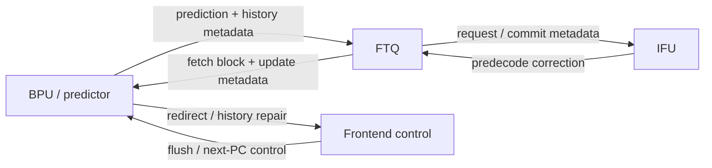
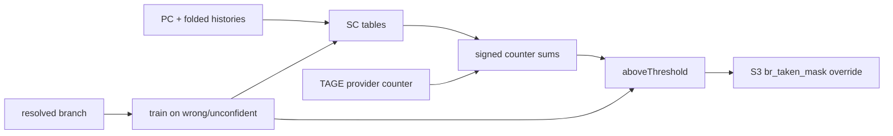
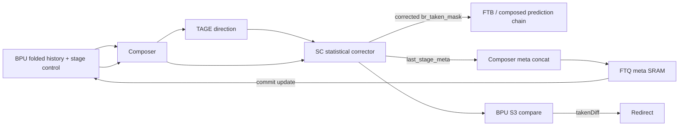

<!-- # Frontend SC 分支预测器深入分析 -->
# In-Depth Analysis of the Frontend SC Branch Predictor

<!-- regenerated-by-analyze-xiangshan-kunminghu -->
> Regenerated from `OpenXiangShan/XiangShan` branch `kunminghu-v2`, source commit `52262f303fc06daf84cdab7011d59b7df65ce7e8` using the updated Frontend graph/stage rules.


<!-- > 官方源码：`https://github.com/OpenXiangShan/XiangShan.git`；分支 `kunminghu-v2`；分析 commit `52262f303fc06daf84cdab7011d59b7df65ce7e8`。论文解释算法原理，源码决定香山的有效参数、流水、更新与恢复。 -->
> Official source: `https://github.com/OpenXiangShan/XiangShan.git`; branch `kunminghu-v2`; analysis commit `52262f303fc06daf84cdab7011d59b7df65ce7e8`. Papers explain the algorithmic principles, while the source determines XiangShan's effective parameters, pipeline, update, and recovery behavior.

<!-- frontend-tutorial-generated-by-analyze-xiangshan-kunminghu -->
<!-- > 所有实现结论均限定在 `kunminghu-v2` commit `52262f303fc06daf84cdab7011d59b7df65ce7e8`；Design Doc 结论必须回到第 18 节的源码追溯矩阵。 -->
> All implementation conclusions are limited to `kunminghu-v2` commit `52262f303fc06daf84cdab7011d59b7df65ce7e8`; Design Doc conclusions must be checked against the source traceability matrix in Section 18.

## 1. Scope

<!-- 本节保留模块职责、分析基线、范围和统一五问，明确本文只以当前源码证据为准。 -->
This section records the module responsibility, analysis baseline, scope, and common five-question guide, and makes clear that this document relies only on evidence in the current source tree.

<!-- ### 1.1. 统一五问导读 -->
### 1.1. Five-Question Guide
<!-- | 问题 | 回答 | -->
| Question | Answer |
| --- | --- |
<!-- | **Who** | `SC` 是 TAGE 后的 statistical corrector，由 `Tage_SC` 组合模块驱动。 | -->
| **Who** | `SC` is the statistical corrector after TAGE, driven by the `Tage_SC` composed module. |
<!-- | **What** | 汇总多组历史/PC 相关有符号计数器，在 TAGE 不够可靠时翻转或确认其方向。 | -->
| **What** | It aggregates signed counters indexed by multiple history/PC features and flips or confirms TAGE's direction when TAGE is insufficiently reliable. |
<!-- | **How** | 多表读出后形成加权和，与动态阈值比较；训练只在 SC 有价值或置信不足时更新计数器和阈值。 | -->
| **How** | It forms a weighted sum from multiple table reads and compares it with a dynamic threshold; training updates counters and thresholds only when SC is useful or insufficiently confident. |
<!-- | **From what** | 输入包括 TAGE 原始方向/置信、PC、不同历史折叠；训练来自已提交真实方向和预测 meta。 | -->
| **From what** | Inputs include TAGE's raw direction/confidence, the PC, and several folded histories; training comes from the committed outcome and prediction metadata. |
<!-- | **To what** | 修正后的条件分支方向写回组合 prediction，后续 FTB/ITTAGE/RAS 使用；差异由 BPU redirect。 | -->
| **To what** | The corrected conditional-branch direction is written into the composed prediction for FTB/ITTAGE/RAS; differences are converted into BPU redirects. |

<!-- ### 1.2. 分析范围 -->
### 1.2. Analysis Scope
- Source: OpenXiangShan/XiangShan `kunminghu-v2`, commit `52262f303fc06daf84cdab7011d59b7df65ce7e8`.
- Relative source file: [src/main/scala/xiangshan/frontend/SC.scala](https://github.com/OpenXiangShan/XiangShan/blob/kunminghu-v2/src/main/scala/xiangshan/frontend/SC.scala).
- Effective instantiation: mixed into `Tage_SC` through `class Tage_SC extends Tage with HasSC` ([Tage.scala:1096](https://github.com/OpenXiangShan/XiangShan/blob/kunminghu-v2/src/main/scala/xiangshan/frontend/Tage.scala#L1096)).

<!-- ## 2. 关键源码证据 -->
## 2. Key Source Evidence

<!-- 本节直接列出 `SC` 的有效源码入口、关键代码骨架和行为解释，避免只保存文件名或行号。 -->
This section lists the effective source entry points, key code skeleton, and behavioral explanations for `SC`, rather than retaining only filenames or line numbers.

<!-- ### 2.1. 源码入口和行号 -->
### 2.1. Source Entry Points and Line References
<!-- | 源码文件 | 本文使用它证明什么 | 行号证据 | -->
| Source file | What it establishes | Line evidence |
| --- | --- | --- |
<!-- | `frontend/SC.scala` | 统计校正器求和、阈值、方向修正 | [frontend/SC.scala#L259-L372](https://github.com/OpenXiangShan/XiangShan/blob/kunminghu-v2/src/main/scala/xiangshan/frontend/SC.scala#L259-L372) | -->
| `frontend/SC.scala` | Statistical-corrector sum, threshold, and direction correction. | [frontend/SC.scala#L259-L372](https://github.com/OpenXiangShan/XiangShan/blob/kunminghu-v2/src/main/scala/xiangshan/frontend/SC.scala#L259-L372) |
<!-- | `frontend/Tage.scala` | TAGE_SC 组合关系 | [frontend/Tage.scala#L778-L846](https://github.com/OpenXiangShan/XiangShan/blob/kunminghu-v2/src/main/scala/xiangshan/frontend/Tage.scala#L778-L846) | -->
| `frontend/Tage.scala` | TAGE_SC composition. | [frontend/Tage.scala#L778-L846](https://github.com/OpenXiangShan/XiangShan/blob/kunminghu-v2/src/main/scala/xiangshan/frontend/Tage.scala#L778-L846) |
| `Parameters.scala` | `SCNRows/SCNTables/SCCtrBits/SCHistLens` | [Parameters.scala#L124-L143](https://github.com/OpenXiangShan/XiangShan/blob/kunminghu-v2/src/main/scala/xiangshan/Parameters.scala#L124-L143) |

<!-- ### 2.2. 核心代码骨架 -->
### 2.2. Core Code Skeleton
```scala
val sum = tageScore + scTables.map(_.read(idx).signed).reduce(_ + _)
val confident = abs(sum) > threshold
val scTaken = sum >= 0.S
val finalTaken = Mux(confident, scTaken, tageTaken)
```

<!-- ### 2.3. 代码解析 -->
### 2.3. Code Walkthrough
<!-- SC 不替代 TAGE 的表结构，而是在 TAGE 方向结果上叠加多个相关性计数器的加权和，只在置信度满足条件时翻转或确认方向。 -->
SC does not replace TAGE's table structure. It adds a weighted sum of correlation counters to the TAGE direction and flips or confirms that direction only when the confidence conditions are met.
## 3. Theory-to-Code Mapping

<!-- 本节把理论概念直接绑定到 `SC` 的源码对象、控制/数据状态和下游消费者。 -->
This section binds theoretical concepts directly to `SC` source objects, control/data state, and downstream consumers.

<!-- ### 3.1. 理论到代码映射表 -->
### 3.1. Theory-to-Code Mapping Table
<!-- | 理论概念 | 代码对象 | 为什么需要它 | 消费者/后续影响 | -->
| Theory concept | Code object | Why it is needed | Consumer / downstream effect |
| --- | --- | --- | --- |
<!-- | 统计校正 | SC tables signed counters / sum | 捕捉 TAGE provider 没覆盖的相关性 | TAGE_SC 输出 | -->
| Statistical correction | SC table signed counters / sum | Captures correlations not covered by the TAGE provider. | TAGE_SC output |
<!-- | 阈值控制 | sum/threshold/confidence | 防止低置信 SC 无条件覆盖 TAGE | BPU S2/S3 comparison | -->
| Threshold control | sum/threshold/confidence | Prevents low-confidence SC from unconditionally overriding TAGE. | BPU S2/S3 comparison |
<!-- | 选择性训练 | update only on useful/mispredict cases | 减少噪声训练 | FTQ update | -->
| Selective training | update only on useful/mispredict cases | Reduces noisy training. | FTQ update |

<!-- ### 3.2. 阅读顺序 -->
### 3.2. Reading Order
<!-- 先按第 2 节定位源码对象，再顺着本表检查信号从哪里来、状态在哪里保存、何时更新、谁消费结果。若本篇只引用相邻模块拥有的状态，则以相邻 Frontend 分文档的源码分析为准。 -->
First locate source objects through Section 2, then use this table to check signal origin, state location, update timing, and result consumers. When this document cites state owned by an adjacent module, use that Frontend document's source analysis as the authority.
<!-- ## 4. 论文原则和有效代码 -->
## 4. Paper Principles and Effective Code


<!-- ### 4.1. 状态机与论文理论 -->
### 4.1. State Machine and Paper Theory
<!-- SC 以 S0-S3 pipeline valid 和 update 条件构成隐式状态机。O-GEHL（DOI `10.1145/1080695.1070003`）展示了多张几何历史表计数器求和与动态阈值思想；Michaud 的 DOI `10.1145/3226098` 明确指出 TAGE 仍可能被使用相同输入信息的统计校正器显著补强。香山的表组、求和位宽和阈值更新以 `SC.scala` 为准。 -->
SC forms an implicit state machine from S0-S3 pipeline-valid and update conditions. O-GEHL (DOI `10.1145/1080695.1070003`) presents summation across geometric-history table counters and dynamic thresholds; Michaud (DOI `10.1145/3226098`) explicitly shows that TAGE can be substantially strengthened by a statistical corrector using the same input information. XiangShan's table groups, sum widths, and threshold updates are defined by `SC.scala`.

<!-- ### 4.2. 论文理论背景 -->
### 4.2. Theoretical Background from the Papers
[SC.scala](https://github.com/OpenXiangShan/XiangShan/blob/kunminghu-v2/src/main/scala/xiangshan/frontend/SC.scala) cites `Tage-sc-l branch predictors` and `Tage-sc-l branch predictors again` ([SC.scala:17-25](https://github.com/OpenXiangShan/XiangShan/blob/kunminghu-v2/src/main/scala/xiangshan/frontend/SC.scala#L17-L25)). MCP search also found `An Alternative TAGE-like Conditional Branch Predictor`, whose abstract states that TAGE can be complemented by a statistical corrector. The principle is to sum signed counters from several history-indexed tables and override TAGE only when the sum is confident enough.

<!-- ### 4.3. 论文原理深入讲解 -->
### 4.3. Detailed Paper Principles
<!-- #### 4.3.1. 原始论文 -->
#### 4.3.1. Original Papers

<!-- 源码引用 André Seznec 的 *TAGE-SC-L Branch Predictors*（CBP 2014，HAL `hal-01086920`）和 *TAGE-SC-L Branch Predictors Again*（CBP 2016，HAL `hal-01354253`），见 [frontend/SC.scala:17-25](https://github.com/OpenXiangShan/XiangShan/blob/kunminghu-v2/src/main/scala/xiangshan/frontend/SC.scala#L17-L25)。SC 是 Statistical Corrector：它不替代 TAGE，而是在 TAGE 难以表达的残余模式上做有条件修正。 -->
The source cites André Seznec's *TAGE-SC-L Branch Predictors* (CBP 2014, HAL `hal-01086920`) and *TAGE-SC-L Branch Predictors Again* (CBP 2016, HAL `hal-01354253`); see [frontend/SC.scala:17-25](https://github.com/OpenXiangShan/XiangShan/blob/kunminghu-v2/src/main/scala/xiangshan/frontend/SC.scala#L17-L25). SC is a Statistical Corrector: it does not replace TAGE, but conditionally corrects residual patterns that TAGE represents poorly.

<!-- #### 4.3.2. 为什么 TAGE 后面还需要 SC -->
#### 4.3.2. Why SC Follows TAGE

<!-- TAGE 采用“最长 tag 命中 provider”，本质上是选择一个最具体上下文。某些分支却同时受多种弱相关因素影响，例如几段不同长度历史、局部模式或路径 hash；任何单个 provider 都不够强，但多个弱证据相加后方向明确。SC 使用类似 GEHL/感知器的思想：从多张表读取有符号 counter，把它们与 TAGE 方向偏置相加，`sum >= 0` 预测 taken，绝对值表示统计置信度。 -->
TAGE selects the provider with the longest matching tag, effectively choosing the most specific context. Some branches are influenced by several weak correlations, such as histories of different lengths, local patterns, or path hashes. No single provider is strong enough, but the combined evidence has a clear direction. SC follows a GEHL/perceptron-like idea: it reads signed counters from several tables, adds them to a TAGE direction bias, predicts taken when `sum >= 0`, and uses the absolute value as statistical confidence.

<!-- #### 4.3.3. 为什么不能无条件覆盖 TAGE -->
#### 4.3.3. Why SC Must Not Unconditionally Override TAGE

<!-- 统计表没有完整 tag，alias 噪声比 TAGE 大。若 `sum` 接近零，翻转强 TAGE 预测通常弊大于利。因此 TAGE-SC-L 使用阈值和 TAGE 置信度约束修正：TAGE 弱或 SC 证据足够强时才覆盖。香山把最终 `s3_pred` 有条件写回 `br_taken_mask`（[frontend/SC.scala:365-373](https://github.com/OpenXiangShan/XiangShan/blob/kunminghu-v2/src/main/scala/xiangshan/frontend/SC.scala#L365-L373)），从而让 BPU 对 S2/S3 方向差异生成 redirect。 -->
Statistical tables do not carry complete tags, so aliasing noise is higher than in TAGE. When `sum` is near zero, flipping a strong TAGE prediction is usually harmful. TAGE-SC-L therefore constrains correction with a threshold and TAGE confidence: SC overrides only when TAGE is weak or the SC evidence is strong enough. XiangShan conditionally writes final `s3_pred` back to `br_taken_mask` ([frontend/SC.scala:365-373](https://github.com/OpenXiangShan/XiangShan/blob/kunminghu-v2/src/main/scala/xiangshan/frontend/SC.scala#L365-L373)), allowing BPU to generate a redirect for an S2/S3 direction difference.

<!-- #### 4.3.4. 选择性训练 -->
#### 4.3.4. Selective Training

<!-- SC 通常在最终误预测或预测不够自信时训练。原因有三点：减少 SRAM 写带宽；避免已经稳定的分支被 alias 反复扰动；把学习能力集中到 TAGE 的困难样本。香山 update 区间明确按 mispred/unconfident 条件更新有符号 counter（[frontend/SC.scala:376-448](https://github.com/OpenXiangShan/XiangShan/blob/kunminghu-v2/src/main/scala/xiangshan/frontend/SC.scala#L376-L448)）。counter 饱和是必要的，否则长期同向样本会溢出后反号。 -->
SC is normally trained after a final misprediction or when the prediction lacks confidence. This reduces SRAM write bandwidth, prevents stable branches from being repeatedly disturbed by aliasing, and focuses learning capacity on TAGE's difficult samples. XiangShan's update region explicitly updates signed counters under misprediction/unconfidence conditions ([frontend/SC.scala:376-448](https://github.com/OpenXiangShan/XiangShan/blob/kunminghu-v2/src/main/scala/xiangshan/frontend/SC.scala#L376-L448)). Counter saturation is essential; otherwise long runs of same-direction samples could overflow and change sign.

<!-- #### 4.3.5. 数值示例 -->
#### 4.3.5. Numerical Example

<!-- 假设 TAGE 给出弱 not-taken，可把它视作负偏置；四组 SC counter 分别贡献 `+3、+2、-1、+2`，总和变为正且超过阈值，SC 将最终方向改为 taken。若总和只有 `+1`，则证据太弱，保留 TAGE。执行后若真实 taken，相关正向 counter 增强；若真实 not-taken，则反向更新。该例说明 `sc_sum`、`threshold`、`tage_unconf` 和 `sc_enable` 都是算法不可缺少的控制，而不是普通数据字段。 -->
Assume TAGE gives a weak not-taken prediction, treated as a negative bias. Four SC counters contribute `+3`, `+2`, `-1`, and `+2`; the sum becomes positive and exceeds the threshold, so SC changes the final direction to taken. If the sum is only `+1`, the evidence is too weak and TAGE is retained. After execution, a real taken outcome strengthens the relevant positive counters; a not-taken outcome updates them in the opposite direction. This example shows that `sc_sum`, `threshold`, `tage_unconf`, and `sc_enable` are essential algorithmic controls, not ordinary data fields.

<!-- #### 4.3.6. 香山实现边界 -->
#### 4.3.6. XiangShan Implementation Boundary

<!-- 论文中的 SC-L 可能包含更多局部/全局历史族、动态阈值和循环预测器；香山当前文件中的表数、bank 数、counter 位宽、输入特征和更新条件才是有效实现。文档只把“有符号多表求和、受控覆盖、选择性训练”映射为共同原理，不声称逐参数复刻竞赛配置。 -->
SC-L in the papers may include more local/global history families, dynamic thresholds, and loop predictors. The effective implementation is defined by the current XiangShan file's table count, bank count, counter width, input features, and update conditions. This document maps only signed multi-table summation, controlled override, and selective training to the shared principles; it does not claim a parameter-for-parameter reproduction of a competition configuration.

## 5. Microarchitecture Parameters


<!-- ### 5.1. 表容量、求和与边界 -->
### 5.1. Table Capacity, Summation, and Boundaries
<!-- - SC 表固定容量，主要风险是不同 PC/历史 alias；计数器采用饱和更新，不会数值 overflow/underflow 回绕。 -->
- SC tables have fixed capacity, so the main risk is aliasing among different PCs/histories; saturating counter updates prevent numeric overflow/underflow wraparound.
<!-- - 动态阈值同样有位宽/饱和边界；达到上下界后保持，避免阈值回绕改变训练方向。 -->
- Dynamic thresholds also have width and saturation boundaries; they hold at the limits so threshold wraparound cannot change the training direction.
<!-- - 无有效 SC 响应或访问冲突时保留 TAGE 方向，不能用未定义求和覆盖主预测器。 -->
- When no valid SC response is available or an access conflicts, retain the TAGE direction; an undefined sum must not override the primary predictor.

```waveform-draw
{
  "signal": [
    {
      "name": "clk",
      "wave": "p......."
    },
    {
      "name": "tage_valid",
      "wave": "01..0..."
    },
    {
      "name": "tage_taken",
      "wave": "0=.....x",
      "data": [
        "1"
      ]
    },
    {
      "name": "sc_sum",
      "wave": "x..=x...",
      "data": [
        "negative"
      ]
    },
    {
      "name": "sc_override",
      "wave": "0...10.."
    },
    {
      "name": "final_taken",
      "wave": "0....=x.",
      "data": [
        "0"
      ]
    },
    {
      "name": "update.valid",
      "wave": "0......1"
    }
  ],
  "config": {
    "hscale": 1
  }
}
```

<!-- ## 6. 模块边界和接口 -->
## 6. Module Boundaries and Interfaces


<!-- ### 6.1. 控制信号逐项解释：Who / From / To / How / Why -->
### 6.1. Control Signals: Who / From / To / How / Why
<!-- > 下表覆盖本文讲解中出现的查询、流水推进、选择、训练、替换和恢复控制。`为什么存在` 不以信号命名猜测，而以当前 `kunminghu-v2` 数据依赖、资源限制和恢复要求为依据。 -->
> The table covers query, pipeline-progress, selection, training, replacement, and recovery controls discussed in this document. `Why it exists` is grounded in `kunminghu-v2` data dependencies, resource limits, and recovery requirements rather than inferred from signal names.

<!-- | 控制信号 / 状态 | 谁产生 / 从哪里来 | 谁消费 / 到哪里去 | 何时、如何生效 | 为什么存在；缺失会怎样 | 代码证据 | -->
| Control signal / state | Producer / source | Consumer / destination | When and how it takes effect | Why it exists; consequence if absent | Source evidence |
| --- | --- | --- | --- | --- | --- |
<!-- | `io.in.valid / stage fire` | TAGE 输出与公共请求 | SC 多表读取和求和 | 将 PC、历史与对应 TAGE 结果锁存为同一事务。 | SC 是后置修正器，若与 TAGE provider 不对齐，正确的统计和也会修正错误分支实例。 | [frontend/SC.scala:259-320](https://github.com/OpenXiangShan/XiangShan/blob/kunminghu-v2/src/main/scala/xiangshan/frontend/SC.scala#L259-L320) | -->
| `io.in.valid / stage fire` | TAGE output and common request | SC multi-table reads and summation | Latches the PC, history, and matching TAGE result as one transaction. | SC is a post-corrector; if it is misaligned with the TAGE provider, a correct statistical sum can correct the wrong branch instance. | [frontend/SC.scala:259-320](https://github.com/OpenXiangShan/XiangShan/blob/kunminghu-v2/src/main/scala/xiangshan/frontend/SC.scala#L259-L320) |
<!-- | `io.ctrl.sc_enable` | CSR/BPU 控制 | 最终修正 mux | 关闭时保留 TAGE 原预测。 | SC 增加面积、功耗和晚级延迟；enable 支持独立验证与在异常状态下安全旁路。 | [frontend/SC.scala:365-373](https://github.com/OpenXiangShan/XiangShan/blob/kunminghu-v2/src/main/scala/xiangshan/frontend/SC.scala#L365-L373) | -->
| `io.ctrl.sc_enable` | CSR/BPU control | Final correction mux | Retains the original TAGE prediction when disabled. | SC adds area, power, and late-stage latency; enable supports independent validation and safe bypass in exceptional states. | [frontend/SC.scala:365-373](https://github.com/OpenXiangShan/XiangShan/blob/kunminghu-v2/src/main/scala/xiangshan/frontend/SC.scala#L365-L373) |
<!-- | `tage_pred / tage_unconf` | TAGE provider 结果 | SC 是否允许覆盖 | 把 TAGE 方向与置信度作为修正基线。 | SC 目标是纠正 TAGE 的残余错误而非无条件替代；强 TAGE 预测应受到保护。 | [frontend/SC.scala:320-373](https://github.com/OpenXiangShan/XiangShan/blob/kunminghu-v2/src/main/scala/xiangshan/frontend/SC.scala#L320-L373) | -->
| `tage_pred / tage_unconf` | TAGE provider result | Whether SC may override | Uses TAGE direction and confidence as the correction baseline. | SC corrects residual TAGE errors rather than replacing TAGE unconditionally; strong TAGE predictions must be protected. | [frontend/SC.scala:320-373](https://github.com/OpenXiangShan/XiangShan/blob/kunminghu-v2/src/main/scala/xiangshan/frontend/SC.scala#L320-L373) |
<!-- | `sc_ctrs` | 多个历史/特征表读口 | 加法树 | 读取有符号局部贡献。 | 单个统计表只能表达一种相关性；多表贡献允许短/长历史和不同 hash 共同投票。 | [frontend/SC.scala:51-69](https://github.com/OpenXiangShan/XiangShan/blob/kunminghu-v2/src/main/scala/xiangshan/frontend/SC.scala#L51-L69) | -->
| `sc_ctrs` | Read ports of multiple history/feature tables | Adder tree | Reads signed local contributions. | A single statistical table expresses only one correlation; multiple tables let short/long histories and different hashes vote together. | [frontend/SC.scala:51-69](https://github.com/OpenXiangShan/XiangShan/blob/kunminghu-v2/src/main/scala/xiangshan/frontend/SC.scala#L51-L69) |
<!-- | `sc_sum` | TAGE bias 与有符号 counter 求和 | 方向/置信判断 | 和的符号给方向，绝对值表示统计证据强度。 | 把多个弱相关特征累加可纠正单个 provider 的系统性盲点。 | [frontend/SC.scala:320-365](https://github.com/OpenXiangShan/XiangShan/blob/kunminghu-v2/src/main/scala/xiangshan/frontend/SC.scala#L320-L365) | -->
| `sc_sum` | TAGE bias plus signed-counter sum | Direction/confidence decision | The sum sign gives direction and its absolute value gives statistical evidence strength. | Accumulating weakly correlated features can correct a single provider's systematic blind spots. | [frontend/SC.scala:320-365](https://github.com/OpenXiangShan/XiangShan/blob/kunminghu-v2/src/main/scala/xiangshan/frontend/SC.scala#L320-L365) |
<!-- | `threshold` | SC 参数/阈值状态 | sc_enable 判定 | 只有统计证据超过阈值或满足代码条件才翻转。 | 低幅度和容易受 alias 噪声影响；阈值防止 SC 对本来正确的 TAGE 频繁抖动。 | [frontend/SC.scala:320-373](https://github.com/OpenXiangShan/XiangShan/blob/kunminghu-v2/src/main/scala/xiangshan/frontend/SC.scala#L320-L373) | -->
| `threshold` | SC parameter/threshold state | sc_enable decision | Flips only when statistical evidence exceeds the threshold or satisfies the code's condition. | Low-amplitude evidence is vulnerable to alias noise; the threshold prevents SC from repeatedly toggling an otherwise correct TAGE prediction. | [frontend/SC.scala:320-373](https://github.com/OpenXiangShan/XiangShan/blob/kunminghu-v2/src/main/scala/xiangshan/frontend/SC.scala#L320-L373) |
<!-- | `s3_pred` | sc_sum 符号与使能逻辑 | fp.br_taken_mask | 在 S3 有条件覆盖 TAGE 方向。 | 显式最终预测信号让 BPU 能比较 S2/S3 差异并在修正发生时产生 redirect。 | [frontend/SC.scala:365-373](https://github.com/OpenXiangShan/XiangShan/blob/kunminghu-v2/src/main/scala/xiangshan/frontend/SC.scala#L365-L373) | -->
| `s3_pred` | sc_sum sign and enable logic | fp.br_taken_mask | Conditionally overrides the TAGE direction in S3. | An explicit final prediction lets BPU compare S2/S3 and generate a redirect when correction occurs. | [frontend/SC.scala:365-373](https://github.com/OpenXiangShan/XiangShan/blob/kunminghu-v2/src/main/scala/xiangshan/frontend/SC.scala#L365-L373) |
<!-- | `io.update.valid` | FTQ 提交结果与 SC metadata | 各 SC counter 更新 | 只训练原预测使用的表项。 | 统计修正器 alias 较强，必须用提交真值和原索引 metadata 控制更新，避免错误路径强化噪声。 | [frontend/SC.scala:376-448](https://github.com/OpenXiangShan/XiangShan/blob/kunminghu-v2/src/main/scala/xiangshan/frontend/SC.scala#L376-L448) | -->
| `io.update.valid` | FTQ commit result and SC metadata | Each SC counter update | Trains only the entries used by the original prediction. | The statistical corrector aliases heavily; committed truth and original-index metadata must control updates so wrong-path noise is not reinforced. | [frontend/SC.scala:376-448](https://github.com/OpenXiangShan/XiangShan/blob/kunminghu-v2/src/main/scala/xiangshan/frontend/SC.scala#L376-L448) |
<!-- | `mispred OR unconf` | TAGE/SC 正误与置信判断 | 训练使能 | 错误或低置信时更新，稳定正确时减少扰动。 | 选择性训练把写带宽与学习能力用于困难样本，降低已学会分支的过训练和 alias。 | [frontend/SC.scala:376-448](https://github.com/OpenXiangShan/XiangShan/blob/kunminghu-v2/src/main/scala/xiangshan/frontend/SC.scala#L376-L448) | -->
| `mispred OR unconf` | TAGE/SC correctness and confidence decision | Training enable | Updates on errors or low confidence and reduces disturbance when predictions are stably correct. | Selective training spends write bandwidth and learning capacity on difficult samples, reducing overtraining and aliasing on learned branches. | [frontend/SC.scala:376-448](https://github.com/OpenXiangShan/XiangShan/blob/kunminghu-v2/src/main/scala/xiangshan/frontend/SC.scala#L376-L448) |
<!-- | `table_wen / update_mask` | 训练条件与分支槽 mask | banked SC SRAM | 只写目标分支槽和目标 bank。 | 一个 fetch block 可含多分支且 SRAM 端口有限，精确写 mask 防止跨槽污染和多写冲突。 | [frontend/SC.scala:376-448](https://github.com/OpenXiangShan/XiangShan/blob/kunminghu-v2/src/main/scala/xiangshan/frontend/SC.scala#L376-L448) | -->
| `table_wen / update_mask` | Training condition and branch-slot mask | Banked SC SRAM | Writes only the target branch slot and target bank. | A fetch block can contain multiple branches and SRAM ports are limited; a precise write mask prevents cross-slot contamination and multiple-write conflicts. | [frontend/SC.scala:376-448](https://github.com/OpenXiangShan/XiangShan/blob/kunminghu-v2/src/main/scala/xiangshan/frontend/SC.scala#L376-L448) |

#### 6.1.1. Top-Level Module Connectivity

This module participates in the predictor chain, but the top-level graph keeps only bundled interfaces. `Frontend.scala` instantiates BPU, FTQ, IFU, IBuffer, ICache, and InstrUncache, while the predictor-specific chain is configured through Composer: [frontend/Frontend.scala:103-109](https://github.com/OpenXiangShan/XiangShan/blob/52262f303fc06daf84cdab7011d59b7df65ce7e8/src/main/scala/xiangshan/frontend/Frontend.scala#L103-L109), [frontend/Composer.scala:22-77](https://github.com/OpenXiangShan/XiangShan/blob/52262f303fc06daf84cdab7011d59b7df65ce7e8/src/main/scala/xiangshan/frontend/Composer.scala#L22-L77).



No module pair has more than three bundled edges. Individual table reads, counters, folded histories, and predictor-local states remain in the module's detailed sections instead of becoming separate graph lines.

#### 6.1.2. Frontend/Backend Pipeline Stages

The source-proven stage boundary is `F0 -> F1 -> F2 -> F3`: F0 accepts the FTQ request and calculates line indices, F1 registers the fetch block and calculates instruction PCs/cut pointers, F2 waits for ICache responses and performs data cutting/predecode preparation, and F3 expands/qualifies instructions, handles exceptions/MMIO, and drives IBuffer. Evidence: [frontend/IFU.scala:236-305](https://github.com/OpenXiangShan/XiangShan/blob/52262f303fc06daf84cdab7011d59b7df65ce7e8/src/main/scala/xiangshan/frontend/IFU.scala#L236-L305), [frontend/IFU.scala:346-457](https://github.com/OpenXiangShan/XiangShan/blob/52262f303fc06daf84cdab7011d59b7df65ce7e8/src/main/scala/xiangshan/frontend/IFU.scala#L346-L457), [frontend/IFU.scala:542-617](https://github.com/OpenXiangShan/XiangShan/blob/52262f303fc06daf84cdab7011d59b7df65ce7e8/src/main/scala/xiangshan/frontend/IFU.scala#L542-L617). The top-level connections couple FTQ, IFU, ICache, and IBuffer through shared ready/valid conditions: [frontend/Frontend.scala:199-231](https://github.com/OpenXiangShan/XiangShan/blob/52262f303fc06daf84cdab7011d59b7df65ce7e8/src/main/scala/xiangshan/frontend/Frontend.scala#L199-L231).

The backend continuation uses the effective module boundaries rather than inventing cycle names: Decode accepts the instruction packet, Rename creates speculative physical-register mappings, Dispatch allocates downstream resources, Issue/Scheduler selects ready uops, Execute/FU produces results, DataPath/WB carries writeback and wakeup, and ROB/CtrlBlock commits or redirects. Evidence: [backend/decode/DecodeStage.scala:83-120](https://github.com/OpenXiangShan/XiangShan/blob/52262f303fc06daf84cdab7011d59b7df65ce7e8/src/main/scala/xiangshan/backend/decode/DecodeStage.scala#L83-L120), [backend/rename/Rename.scala:40-117](https://github.com/OpenXiangShan/XiangShan/blob/52262f303fc06daf84cdab7011d59b7df65ce7e8/src/main/scala/xiangshan/backend/rename/Rename.scala#L40-L117), [backend/dispatch/NewDispatch.scala:49-176](https://github.com/OpenXiangShan/XiangShan/blob/52262f303fc06daf84cdab7011d59b7df65ce7e8/src/main/scala/xiangshan/backend/dispatch/NewDispatch.scala#L49-L176), [backend/issue/Scheduler.scala:29-180](https://github.com/OpenXiangShan/XiangShan/blob/52262f303fc06daf84cdab7011d59b7df65ce7e8/src/main/scala/xiangshan/backend/issue/Scheduler.scala#L29-L180), [backend/exu/ExeUnit.scala:50-110](https://github.com/OpenXiangShan/XiangShan/blob/52262f303fc06daf84cdab7011d59b7df65ce7e8/src/main/scala/xiangshan/backend/exu/ExeUnit.scala#L50-L110), [backend/datapath/DataPath.scala:25-70](https://github.com/OpenXiangShan/XiangShan/blob/52262f303fc06daf84cdab7011d59b7df65ce7e8/src/main/scala/xiangshan/backend/datapath/DataPath.scala#L25-L70), [backend/rob/Rob.scala:52-145](https://github.com/OpenXiangShan/XiangShan/blob/52262f303fc06daf84cdab7011d59b7df65ce7e8/src/main/scala/xiangshan/backend/rob/Rob.scala#L52-L145), [backend/CtrlBlock.scala:50-110](https://github.com/OpenXiangShan/XiangShan/blob/52262f303fc06daf84cdab7011d59b7df65ce7e8/src/main/scala/xiangshan/backend/CtrlBlock.scala#L50-L110).

```mermaid
flowchart LR
  F0["F0: FTQ req + line indices"] -->|f0_fire| F1["F1: PC + cut pointers"]
  F1 -->|f1_fire| F2["F2: ICache data + exceptions"]
  F2 -->|f2_fire| F3["F3: predecode + MMIO qualification"]
  F3 -->|toIbuffer.fire| Decode["Decode"]
  Decode -->|uop bundle| Rename["Rename"]
  Rename -->|renamed uop| Dispatch["Dispatch"]
  Dispatch -->|ready uop| Issue["Issue"]
  Issue -->|operands| Execute["Execute/FU"]
  Execute -->|result| Writeback["Writeback/Wakeup"]
  Writeback -->|retire candidate| Commit["ROB/Commit"]
  Commit -->|redirect/flush| F0
```



The stage graph keeps chronological forward edges separate from the bundled recovery edge. It must be read together with the module graph below: a stage is not itself a module, and a redirect does not create a fake forward stage.

```waveform-draw
{
  "signal": [
    {
      "name": "clk",
      "wave": "p......."
    },
    {
      "name": "F0.valid",
      "wave": "01...0.."
    },
    {
      "name": "F0.ready",
      "wave": "1..0...."
    },
    {
      "name": "F1.valid",
      "wave": "001..0.."
    },
    {
      "name": "F2.valid",
      "wave": "0001.0.."
    },
    {
      "name": "F3.valid",
      "wave": "00001.0."
    },
    {
      "name": "toIbuffer.fire",
      "wave": "0000010."
    },
    {
      "name": "redirect/flush",
      "wave": "00000010"
    }
  ],
  "config": {
    "hscale": 1
  }
}
```

<!-- ## 7. 为什么模块存在 -->
## 7. Why the Module Exists


<!-- 把模块放回 Frontend 全链路理解：它解决的是预测带宽、取指正确性、存储层次延迟、投机恢复或上下游速率不匹配中的至少一个问题。 -->
Place the module back in the full frontend path: it addresses at least one of prediction bandwidth, fetch correctness, memory-hierarchy latency, speculative recovery, or rate mismatch between upstream and downstream stages.

<!-- ## 8. 有效动态路径 -->
## 8. Effective Dynamic Paths


### 8.1. Lookup Algorithm
Each SC table computes index as `(pc >> instOffsetBits) ^ folded_history` for nonzero history lengths, otherwise PC bits only ([SC.scala:104-111](https://github.com/OpenXiangShan/XiangShan/blob/kunminghu-v2/src/main/scala/xiangshan/frontend/SC.scala#L104-L111)). The table is split into two banks ([SC.scala:41-44](https://github.com/OpenXiangShan/XiangShan/blob/kunminghu-v2/src/main/scala/xiangshan/frontend/SC.scala#L41-L44), [SC.scala:80-94](https://github.com/OpenXiangShan/XiangShan/blob/kunminghu-v2/src/main/scala/xiangshan/frontend/SC.scala#L80-L94)). Read data is grouped into two counters per branch slot, one for each TAGE prediction polarity, then unshuffled using TAGE's physical/logical branch-index mapping ([SC.scala:133-143](https://github.com/OpenXiangShan/XiangShan/blob/kunminghu-v2/src/main/scala/xiangshan/frontend/SC.scala#L133-L143)).

In `HasSC`, all SC table counters are centered and summed ([SC.scala:311-323](https://github.com/OpenXiangShan/XiangShan/blob/kunminghu-v2/src/main/scala/xiangshan/frontend/SC.scala#L311-L323)). TAGE provider counter is also centered with higher weight ([SC.scala:313-327](https://github.com/OpenXiangShan/XiangShan/blob/kunminghu-v2/src/main/scala/xiangshan/frontend/SC.scala#L313-L327)). SC computes two possible predictions and checks whether the SC sum plus provider confidence exceeds the dynamic threshold ([SC.scala:284-330](https://github.com/OpenXiangShan/XiangShan/blob/kunminghu-v2/src/main/scala/xiangshan/frontend/SC.scala#L284-L330)). If TAGE provided a tagged prediction and the relevant sum is above threshold, SC uses the SC prediction; otherwise it keeps TAGE ([SC.scala:336-338](https://github.com/OpenXiangShan/XiangShan/blob/kunminghu-v2/src/main/scala/xiangshan/frontend/SC.scala#L336-L338)).

### 8.2. Update Algorithm
SC trains when the resolved branch is valid and TAGE had a provider ([SC.scala:376-410](https://github.com/OpenXiangShan/XiangShan/blob/kunminghu-v2/src/main/scala/xiangshan/frontend/SC.scala#L376-L410)). It updates all SC tables if SC was wrong or if the sum was not above threshold ([SC.scala:405-409](https://github.com/OpenXiangShan/XiangShan/blob/kunminghu-v2/src/main/scala/xiangshan/frontend/SC.scala#L405-L409)). The threshold is adjusted when SC and TAGE disagree near the current threshold window ([SC.scala:401-403](https://github.com/OpenXiangShan/XiangShan/blob/kunminghu-v2/src/main/scala/xiangshan/frontend/SC.scala#L401-L403)). Table writes carry old counters from metadata and use signed saturating update ([SC.scala:113](https://github.com/OpenXiangShan/XiangShan/blob/kunminghu-v2/src/main/scala/xiangshan/frontend/SC.scala#L113), [SC.scala:183-195](https://github.com/OpenXiangShan/XiangShan/blob/kunminghu-v2/src/main/scala/xiangshan/frontend/SC.scala#L183-L195), [SC.scala:437-448](https://github.com/OpenXiangShan/XiangShan/blob/kunminghu-v2/src/main/scala/xiangshan/frontend/SC.scala#L437-L448)).

<!-- ## 9. Index 和地址/历史计算 -->
## 9. Index and Address/History Computation


<!-- 地址、PC、折叠历史、tag、set/way、line offset 和 FTQ offset 都必须追到源码表达式；索引冲突、回绕和跨边界情况在算法和验证章节中继续展开。 -->
Addresses, PCs, folded history, tags, set/way values, line offsets, and FTQ offsets must all be traced to source expressions; index conflicts, wraparound, and boundary crossings are developed further in the algorithm and verification sections.

<!-- ## 10. 核心算法 -->
## 10. Core Algorithm


<!-- ### 10.1. 算法示例推演 -->
### 10.1. Worked Algorithm Example
Example input: TAGE provider predicts not-taken for branch slot 0, but SC tables return signed counters whose centered sum is strongly positive. Let `s2_tageTakens_dup(3)(0)=false`, SC table centered sum `scSum=+48`, provider centered contribution `tagePvdr=-8`, and threshold `thres=20`.

1. Table index: each SC table computes `(pc >> instOffsetBits) ^ folded_history` for nonzero history lengths ([SC.scala:100-111](https://github.com/OpenXiangShan/XiangShan/blob/kunminghu-v2/src/main/scala/xiangshan/frontend/SC.scala#L100-L111)) and reads the selected bank ([SC.scala:115-143](https://github.com/OpenXiangShan/XiangShan/blob/kunminghu-v2/src/main/scala/xiangshan/frontend/SC.scala#L115-L143)).
2. Counter selection: SC stores two counters per branch slot, selected by the TAGE direction. [SC.scala:135-143](https://github.com/OpenXiangShan/XiangShan/blob/kunminghu-v2/src/main/scala/xiangshan/frontend/SC.scala#L135-L143) unshuffles physical branch slots, and [SC.scala:332-334](https://github.com/OpenXiangShan/XiangShan/blob/kunminghu-v2/src/main/scala/xiangshan/frontend/SC.scala#L332-L334) chooses `s2_scCtrs` using `s2_tageTakens_dup(3)(w)`. In this example, the not-taken-side counters are selected.
3. Sum and confidence: [SC.scala:311-330](https://github.com/OpenXiangShan/XiangShan/blob/kunminghu-v2/src/main/scala/xiangshan/frontend/SC.scala#L311-L330) centers counters, sums them, adds centered provider confidence, and calls `aboveThreshold`. With total `+40`, `aboveThreshold=true` and `s2_scPreds=true`.
4. Override: [SC.scala:336-338](https://github.com/OpenXiangShan/XiangShan/blob/kunminghu-v2/src/main/scala/xiangshan/frontend/SC.scala#L336-L338) chooses SC prediction because TAGE provided and SC is above threshold. [SC.scala:365-373](https://github.com/OpenXiangShan/XiangShan/blob/kunminghu-v2/src/main/scala/xiangshan/frontend/SC.scala#L365-L373) writes `fp.br_taken_mask(0) := true` when `sc_enable` is true.
5. Training: if the branch resolves taken, SC was correct and TAGE was wrong. [SC.scala:388-410](https://github.com/OpenXiangShan/XiangShan/blob/kunminghu-v2/src/main/scala/xiangshan/frontend/SC.scala#L388-L410) sees `updateValids(0)` and provider valid; because `scPred == taken` and sum was confident, SC table counters may not need broad update, but performance counters mark `sc_corr_tage_misp` ([SC.scala:398-399](https://github.com/OpenXiangShan/XiangShan/blob/kunminghu-v2/src/main/scala/xiangshan/frontend/SC.scala#L398-L399)). If SC had been wrong or unconfident, [SC.scala:405-409](https://github.com/OpenXiangShan/XiangShan/blob/kunminghu-v2/src/main/scala/xiangshan/frontend/SC.scala#L405-L409) would set all `scUpdateMask(0)` bits and train every SC table.
6. Threshold adaptation: if SC and TAGE disagree near the threshold window, [SC.scala:401-403](https://github.com/OpenXiangShan/XiangShan/blob/kunminghu-v2/src/main/scala/xiangshan/frontend/SC.scala#L401-L403) updates the per-bank threshold with `SCThreshold.update` ([SC.scala:226-247](https://github.com/OpenXiangShan/XiangShan/blob/kunminghu-v2/src/main/scala/xiangshan/frontend/SC.scala#L226-L247)).

Downstream effect: the example changes S3 `br_taken_mask(0)` from TAGE's not-taken to SC's taken, potentially causing BPU S3 override if S2 predicted the old direction ([frontend/BPU.scala:827-854](https://github.com/OpenXiangShan/XiangShan/blob/kunminghu-v2/src/main/scala/xiangshan/frontend/BPU.scala#L827-L854)).

<!-- ### 10.2. 逐流水级算法 -->
### 10.2. Stage-by-Stage Algorithm
| Stage | Inputs | Algorithm and state | Ready/stall | Output | Source lines |
| --- | --- | --- | --- | --- | --- |
| S0 table request | `s0_pc_dup(3)`, folded history | Each SC table computes PC/history index and bank mask. | Bank write conflict can invalidate response. | SC SRAM read requests. | [SC.scala:100-131](https://github.com/OpenXiangShan/XiangShan/blob/kunminghu-v2/src/main/scala/xiangshan/frontend/SC.scala#L100-L131), [SC.scala:259-274](https://github.com/OpenXiangShan/XiangShan/blob/kunminghu-v2/src/main/scala/xiangshan/frontend/SC.scala#L259-L274) |
| S1 table response | signed counter SRAM data | Select bank response, group two counters per branch, unshuffle physical/logical branch slots. | Conflict returns zeroed counters. | `s1_scResps`. | [SC.scala:133-145](https://github.com/OpenXiangShan/XiangShan/blob/kunminghu-v2/src/main/scala/xiangshan/frontend/SC.scala#L133-L145), [SC.scala:292-300](https://github.com/OpenXiangShan/XiangShan/blob/kunminghu-v2/src/main/scala/xiangshan/frontend/SC.scala#L292-L300) |
| S2 sum/correct | SC counters, TAGE provider counter, TAGE direction | Center counters, sum all SC tables, add provider-centered value, test dynamic threshold, choose SC or TAGE prediction. | None local. | `s2_pred`, SC confidence/disagree flags. | [SC.scala:311-338](https://github.com/OpenXiangShan/XiangShan/blob/kunminghu-v2/src/main/scala/xiangshan/frontend/SC.scala#L311-L338) |
| S3 prediction | registered S2 SC decision | If `sc_enable`, override `fp.br_taken_mask(w)` with SC result. | Can trigger BPU S3 redirect if it differs from S2. | S3 corrected direction. | [SC.scala:339-373](https://github.com/OpenXiangShan/XiangShan/blob/kunminghu-v2/src/main/scala/xiangshan/frontend/SC.scala#L339-L373) |
| Update | saved SC meta and resolved branch | Update threshold near boundary; update all SC tables when SC wrong or unconfident. | SC table writes can conflict with later reads. | Updated signed counters and thresholds. | [SC.scala:376-448](https://github.com/OpenXiangShan/XiangShan/blob/kunminghu-v2/src/main/scala/xiangshan/frontend/SC.scala#L376-L448) |

<!-- ## 11. 状态和存储结构 -->
## 11. State and Storage Structure


<!-- 把每个表、栈、FIFO、MSHR、uncache entry 和 pipeline register 记录为 `valid/full/empty/ready` 可观察状态，并说明谁写入、谁读取、何时清空以及满/空时谁被反压。 -->
Record every table, stack, FIFO, MSHR, uncache entry, and pipeline register as an observable `valid/full/empty/ready` state, and identify who writes it, who reads it, when it is cleared, and who is backpressured when it is full or empty.

<!-- ## 12. Pipeline stage 分析 -->
## 12. Pipeline Stage Analysis


<!-- 阶段说明只使用源码中的寄存器、valid/ready 和 fire 条件；对 Frontend 使用 F0/F1/F2/F3，对 Backend 使用实际 Decode/Rename/Dispatch/Issue/Execute/Writeback/ROB 边界。 -->
The stage description uses only registers and valid/ready/fire conditions present in the source. It uses F0/F1/F2/F3 for the frontend and the actual Decode/Rename/Dispatch/Issue/Execute/Writeback/ROB boundaries for the backend.

## 13. Control path rationale


<!-- ### 13.1. Redirect 信号生成 -->
### 13.1. Redirect Signal Generation
SC influences redirect one stage later than TAGE: it writes final direction in S3, so BPU's S3 redirect logic observes the difference from previous S2 prediction.

| Redirect influence | Condition | Stage | BPU generation | Source lines |
| --- | --- | --- | --- | --- |
| SC overrides TAGE | TAGE provided, SC sum above threshold, `sc_enable`. | S3 | S3 real taken mask differs from previous S2 mask. | [SC.scala:336-373](https://github.com/OpenXiangShan/XiangShan/blob/kunminghu-v2/src/main/scala/xiangshan/frontend/SC.scala#L336-L373), [frontend/BPU.scala:827-854](https://github.com/OpenXiangShan/XiangShan/blob/kunminghu-v2/src/main/scala/xiangshan/frontend/BPU.scala#L827-L854) |
| SC unconfident | Sum below threshold. | S2/S3 | No SC direction override; no SC-caused redirect. | [SC.scala:336-338](https://github.com/OpenXiangShan/XiangShan/blob/kunminghu-v2/src/main/scala/xiangshan/frontend/SC.scala#L336-L338), [SC.scala:348-357](https://github.com/OpenXiangShan/XiangShan/blob/kunminghu-v2/src/main/scala/xiangshan/frontend/SC.scala#L348-L357) |
| Threshold/table update | SC wrong or unconfident at update. | Update | No immediate redirect; changes future S3 corrections. | [SC.scala:401-448](https://github.com/OpenXiangShan/XiangShan/blob/kunminghu-v2/src/main/scala/xiangshan/frontend/SC.scala#L401-L448) |
| SC table conflict | SC SRAM read/write conflict. | S1 | Counter response is zeroed; may change confidence and later redirect indirectly. | [SC.scala:115-145](https://github.com/OpenXiangShan/XiangShan/blob/kunminghu-v2/src/main/scala/xiangshan/frontend/SC.scala#L115-L145) |

Example: TAGE S2 predicted not-taken, SC S3 confidently predicts taken. `fp.br_taken_mask` is overwritten in [SC.scala:365-373](https://github.com/OpenXiangShan/XiangShan/blob/kunminghu-v2/src/main/scala/xiangshan/frontend/SC.scala#L365-L373), BPU sees `s3_redirect_on_br_taken_dup=true`, and S3 redirect repairs PC/history.

<!-- ## 14. Data path 与跨边界 -->
## 14. Data Path and Boundary Crossings


<!-- ### 14.1. 跨边界代码解析 -->
### 14.1. Boundary-Crossing Code Walkthrough
<!-- 本预测器只产生预测元数据，不直接把跨页、跨 Cache Line 或 MMIO 访问当成一个原子内存事务。对一个取指块跨边界的场景，先由预测链生成块起始 PC、taken mask、target 和 fall-through，再由 IFU/ICache 对每个地址片段分别完成翻译、权限和内存类型判断。BPU 在 S1/S2/S3 比较预测差异并生成 redirect 的规则见 [frontend/BPU.scala:606-635](https://github.com/OpenXiangShan/XiangShan/blob/kunminghu-v2/src/main/scala/xiangshan/frontend/BPU.scala#L606-L635) 和 [frontend/BPU.scala:827-854](https://github.com/OpenXiangShan/XiangShan/blob/kunminghu-v2/src/main/scala/xiangshan/frontend/BPU.scala#L827-L854)；因此第二片段发生 page fault、line miss 或 MMIO 分类变化时，恢复对象是预测历史和 FTQ 上下文，而不是把两片段静默拼接。 -->
This predictor produces only prediction metadata; it does not treat a page-crossing, cache-line-crossing, or MMIO access as one atomic memory transaction. For a fetch block that crosses a boundary, the prediction chain first produces the block-start PC, taken mask, target, and fall-through; IFU/ICache then performs translation, permission, and memory-type checks independently for each address fragment. The BPU rules for comparing predictions and generating redirects in S1/S2/S3 are shown at [frontend/BPU.scala:606-635](https://github.com/OpenXiangShan/XiangShan/blob/kunminghu-v2/src/main/scala/xiangshan/frontend/BPU.scala#L606-L635) and [frontend/BPU.scala:827-854](https://github.com/OpenXiangShan/XiangShan/blob/kunminghu-v2/src/main/scala/xiangshan/frontend/BPU.scala#L827-L854). Thus, if the second fragment encounters a page fault, line miss, or MMIO classification change, recovery targets prediction history and FTQ context rather than silently concatenating the fragments.

<!-- 最小实例是块尾部剩余半条 32-bit 指令：第一片段可能在当前 Cache Line/页命中，第二片段需要下一 Line 或下一页的独立请求；IFU 保存 `lastHalf`，跨周期合并并在 flush 时清除，[frontend/IFU.scala:915-943](https://github.com/OpenXiangShan/XiangShan/blob/kunminghu-v2/src/main/scala/xiangshan/frontend/IFU.scala#L915-L943)。若第二页或第二 Line 的结果改变 CFI 位置、target 或 fall-through，BPU 的 redirect 比较优先于继续使用旧预测。对 MMIO/uncache 地址，预测器只能提供候选 PC，实际访问必须转入 IFU 的 MMIO FSM，等待翻译、PMP/PMA 和提交约束，不能由预测命中绕过副作用控制。 -->
The minimal example is a 32-bit instruction split at the end of a block: the first fragment may hit in the current cache line/page, while the second needs an independent request to the next line/page. IFU stores `lastHalf`, merges the fragments across cycles, and clears it on flush ([frontend/IFU.scala:915-943](https://github.com/OpenXiangShan/XiangShan/blob/kunminghu-v2/src/main/scala/xiangshan/frontend/IFU.scala#L915-L943)). If the second page or line changes the CFI position, target, or fall-through, the BPU redirect comparison takes precedence over continuing with the old prediction. For MMIO/uncacheable addresses, the predictor can provide only a candidate PC; the actual access must enter IFU's MMIO FSM and wait for translation, PMP/PMA, and commit constraints. A prediction hit cannot bypass side-effect controls.

<!-- **边界检查表** -->
**Boundary Check Table**

<!-- | 边界 | 第一片段 | 第二片段 | 失败/恢复 | -->
| Boundary | First fragment | Second fragment | Failure / recovery |
| --- | --- | --- | --- |
<!-- | 虚拟页 | 当前页的预测块与历史 | 下一页的独立翻译和权限结果 | page/access/guest fault、flush、重定向 | -->
| Virtual page | Prediction block and history for the current page | Independent translation and permission result for the next page | Page/access/guest fault, flush, or redirect |
<!-- | Cache Line | 当前 line 的 tag/数据命中 | 下一 line 的 miss/refill 或独立响应 | target/CFI 不一致时 redirect | -->
| Cache line | Tag/data hit in the current line | Miss/refill or independent response for the next line | Redirect when target/CFI differs |
<!-- | MMIO/uncache | 预测 PC 与元数据 | IFU/uncache 请求、响应和提交门控 | resend、异常、commit wait 或 cancel | -->
| MMIO/uncacheable | Predicted PC and metadata | IFU/uncacheable request, response, and commit gating | Resend, exception, commit wait, or cancel |

<!-- ## 15. 异常、debug、privilege -->
## 15. Exceptions, Debug, and Privilege


<!-- 区分预测错误、replay、page/access/guest fault、MMIO side effect、debug redirect 和架构异常；说明异常产生者、优先级、清理对象、恢复入口和提交可见性。 -->
Distinguish prediction errors, replay, page/access/guest faults, MMIO side effects, debug redirects, and architectural exceptions; identify the producer, priority, cleanup target, recovery entry, and commit visibility for each.

<!-- ## 16. CSR 控制 -->
## 16. CSR Control


<!-- 前端分支预测器的使能控制来自 CSR 模块生成的 `CustomCSRCtrlIO.bp_ctrl`，不是各预测器本地私有 CSR。有效链路是：`sbpctl` CSR 字段 -> `io.status.custom.bp_ctrl` -> Backend `frontendCsrCtrl` -> XSCore `frontend.io.csrCtrl` -> Frontend `bpu.io.ctrl` -> BPU 内各子预测器 `io.enable`。 -->
Frontend branch-predictor enable controls come from the CSR module's `CustomCSRCtrlIO.bp_ctrl`, not from private CSRs in each predictor. The effective path is: `sbpctl` CSR fields -> `io.status.custom.bp_ctrl` -> backend `frontendCsrCtrl` -> XSCore `frontend.io.csrCtrl` -> frontend `bpu.io.ctrl` -> each BPU subpredictor's `io.enable`.

<!-- ### 16.1. CSR 字段到 BPU 控制信号 -->
### 16.1. CSR Fields to BPU Control Signals
<!-- | 控制位 | CSR 源字段 | Frontend/BPU 消费者 | 有效作用 | 源码证据 | -->
| Control bit | CSR source field | Frontend/BPU consumer | Effective behavior | Source evidence |
| --- | --- | --- | --- | --- |
<!-- | `bp_ctrl.ubtbEnable` | `sbpctl.regOut.UBTB_ENABLE` | `ubtb.io.enable` | 允许或关闭 S1 fast uBTB/MicroBtb 查询结果参与预测链；关闭后仍保留 fall-through 基线。 | [NewCSR.scala:1378](https://github.com/OpenXiangShan/XiangShan/blob/kunminghu-v2/src/main/scala/xiangshan/backend/fu/NewCSR/NewCSR.scala#L1378), [Bpu.scala:96](https://github.com/OpenXiangShan/XiangShan/blob/kunminghu-v2/src/main/scala/xiangshan/frontend/bpu/Bpu.scala#L96), [Bpu.scala:105](https://github.com/OpenXiangShan/XiangShan/blob/kunminghu-v2/src/main/scala/xiangshan/frontend/bpu/Bpu.scala#L105) | -->
| `bp_ctrl.ubtbEnable` | `sbpctl.regOut.UBTB_ENABLE` | `ubtb.io.enable` | Enables or disables the S1 fast uBTB/MicroBtb result in the prediction chain; fall-through remains the baseline when disabled. | [NewCSR.scala:1378](https://github.com/OpenXiangShan/XiangShan/blob/kunminghu-v2/src/main/scala/xiangshan/backend/fu/NewCSR/NewCSR.scala#L1378), [Bpu.scala:96](https://github.com/OpenXiangShan/XiangShan/blob/kunminghu-v2/src/main/scala/xiangshan/frontend/bpu/Bpu.scala#L96), [Bpu.scala:105](https://github.com/OpenXiangShan/XiangShan/blob/kunminghu-v2/src/main/scala/xiangshan/frontend/bpu/Bpu.scala#L105) |
<!-- | `bp_ctrl.abtbEnable` | `sbpctl.regOut.ABTB_ENABLE` | `abtb.io.enable` | 控制 AheadBtb 目标/属性预测是否参与早期预测。 | [NewCSR.scala:1379](https://github.com/OpenXiangShan/XiangShan/blob/kunminghu-v2/src/main/scala/xiangshan/backend/fu/NewCSR/NewCSR.scala#L1379), [Bpu.scala:97](https://github.com/OpenXiangShan/XiangShan/blob/kunminghu-v2/src/main/scala/xiangshan/frontend/bpu/Bpu.scala#L97), [Bpu.scala:106](https://github.com/OpenXiangShan/XiangShan/blob/kunminghu-v2/src/main/scala/xiangshan/frontend/bpu/Bpu.scala#L106) | -->
| `bp_ctrl.abtbEnable` | `sbpctl.regOut.ABTB_ENABLE` | `abtb.io.enable` | Controls whether AheadBtb target/attribute prediction participates in early prediction. | [NewCSR.scala:1379](https://github.com/OpenXiangShan/XiangShan/blob/kunminghu-v2/src/main/scala/xiangshan/backend/fu/NewCSR/NewCSR.scala#L1379), [Bpu.scala:97](https://github.com/OpenXiangShan/XiangShan/blob/kunminghu-v2/src/main/scala/xiangshan/frontend/bpu/Bpu.scala#L97), [Bpu.scala:106](https://github.com/OpenXiangShan/XiangShan/blob/kunminghu-v2/src/main/scala/xiangshan/frontend/bpu/Bpu.scala#L106) |
<!-- | `bp_ctrl.mbtbEnable` | `sbpctl.regOut.MBTB_ENABLE` | `mbtb.io.enable` | 控制 MainBtb 是否提供主 BTB 命中、直接分支/JAL target 和 fall-through 信息。 | [NewCSR.scala:1380](https://github.com/OpenXiangShan/XiangShan/blob/kunminghu-v2/src/main/scala/xiangshan/backend/fu/NewCSR/NewCSR.scala#L1380), [Bpu.scala:98](https://github.com/OpenXiangShan/XiangShan/blob/kunminghu-v2/src/main/scala/xiangshan/frontend/bpu/Bpu.scala#L98), [Bpu.scala:107](https://github.com/OpenXiangShan/XiangShan/blob/kunminghu-v2/src/main/scala/xiangshan/frontend/bpu/Bpu.scala#L107) | -->
| `bp_ctrl.mbtbEnable` | `sbpctl.regOut.MBTB_ENABLE` | `mbtb.io.enable` | Controls whether MainBtb provides main-BTB hits, direct-branch/JAL targets, and fall-through information. | [NewCSR.scala:1380](https://github.com/OpenXiangShan/XiangShan/blob/kunminghu-v2/src/main/scala/xiangshan/backend/fu/NewCSR/NewCSR.scala#L1380), [Bpu.scala:98](https://github.com/OpenXiangShan/XiangShan/blob/kunminghu-v2/src/main/scala/xiangshan/frontend/bpu/Bpu.scala#L98), [Bpu.scala:107](https://github.com/OpenXiangShan/XiangShan/blob/kunminghu-v2/src/main/scala/xiangshan/frontend/bpu/Bpu.scala#L107) |
<!-- | `bp_ctrl.tageEnable` | `sbpctl.regOut.TAGE_ENABLE` | `tage.io.enable` | 控制 TAGE 条件分支方向预测是否有效；关闭时不能把 TAGE provider 结果作为方向覆盖依据。 | [NewCSR.scala:1381](https://github.com/OpenXiangShan/XiangShan/blob/kunminghu-v2/src/main/scala/xiangshan/backend/fu/NewCSR/NewCSR.scala#L1381), [Bpu.scala:99](https://github.com/OpenXiangShan/XiangShan/blob/kunminghu-v2/src/main/scala/xiangshan/frontend/bpu/Bpu.scala#L99), [Bpu.scala:108](https://github.com/OpenXiangShan/XiangShan/blob/kunminghu-v2/src/main/scala/xiangshan/frontend/bpu/Bpu.scala#L108) | -->
| `bp_ctrl.tageEnable` | `sbpctl.regOut.TAGE_ENABLE` | `tage.io.enable` | Controls TAGE conditional-branch direction prediction; when disabled, a TAGE provider result must not override direction. | [NewCSR.scala:1381](https://github.com/OpenXiangShan/XiangShan/blob/kunminghu-v2/src/main/scala/xiangshan/backend/fu/NewCSR/NewCSR.scala#L1381), [Bpu.scala:99](https://github.com/OpenXiangShan/XiangShan/blob/kunminghu-v2/src/main/scala/xiangshan/frontend/bpu/Bpu.scala#L99), [Bpu.scala:108](https://github.com/OpenXiangShan/XiangShan/blob/kunminghu-v2/src/main/scala/xiangshan/frontend/bpu/Bpu.scala#L108) |
<!-- | `bp_ctrl.scEnable` | `sbpctl.regOut.SC_ENABLE` | `sc.io.enable` | 控制 statistical corrector 是否修正 TAGE/基础方向结果。 | [NewCSR.scala:1382](https://github.com/OpenXiangShan/XiangShan/blob/kunminghu-v2/src/main/scala/xiangshan/backend/fu/NewCSR/NewCSR.scala#L1382), [Bpu.scala:100](https://github.com/OpenXiangShan/XiangShan/blob/kunminghu-v2/src/main/scala/xiangshan/frontend/bpu/Bpu.scala#L100), [Bpu.scala:109](https://github.com/OpenXiangShan/XiangShan/blob/kunminghu-v2/src/main/scala/xiangshan/frontend/bpu/Bpu.scala#L109) | -->
| `bp_ctrl.scEnable` | `sbpctl.regOut.SC_ENABLE` | `sc.io.enable` | Controls whether the statistical corrector adjusts TAGE/base direction results. | [NewCSR.scala:1382](https://github.com/OpenXiangShan/XiangShan/blob/kunminghu-v2/src/main/scala/xiangshan/backend/fu/NewCSR/NewCSR.scala#L1382), [Bpu.scala:100](https://github.com/OpenXiangShan/XiangShan/blob/kunminghu-v2/src/main/scala/xiangshan/frontend/bpu/Bpu.scala#L100), [Bpu.scala:109](https://github.com/OpenXiangShan/XiangShan/blob/kunminghu-v2/src/main/scala/xiangshan/frontend/bpu/Bpu.scala#L109) |
<!-- | `bp_ctrl.ittageEnable` | `sbpctl.regOut.ITTAGE_ENABLE` | `ittage.io.enable` | 控制间接跳转/JALR target 覆盖预测是否有效。 | [NewCSR.scala:1383](https://github.com/OpenXiangShan/XiangShan/blob/kunminghu-v2/src/main/scala/xiangshan/backend/fu/NewCSR/NewCSR.scala#L1383), [Bpu.scala:101](https://github.com/OpenXiangShan/XiangShan/blob/kunminghu-v2/src/main/scala/xiangshan/frontend/bpu/Bpu.scala#L101), [Bpu.scala:110](https://github.com/OpenXiangShan/XiangShan/blob/kunminghu-v2/src/main/scala/xiangshan/frontend/bpu/Bpu.scala#L110) | -->
| `bp_ctrl.ittageEnable` | `sbpctl.regOut.ITTAGE_ENABLE` | `ittage.io.enable` | Controls whether ITTAGE indirect/JALR target override prediction is enabled. | [NewCSR.scala:1383](https://github.com/OpenXiangShan/XiangShan/blob/kunminghu-v2/src/main/scala/xiangshan/backend/fu/NewCSR/NewCSR.scala#L1383), [Bpu.scala:101](https://github.com/OpenXiangShan/XiangShan/blob/kunminghu-v2/src/main/scala/xiangshan/frontend/bpu/Bpu.scala#L101), [Bpu.scala:110](https://github.com/OpenXiangShan/XiangShan/blob/kunminghu-v2/src/main/scala/xiangshan/frontend/bpu/Bpu.scala#L110) |
<!-- | `bp_ctrl.rasEnable` | `sbpctl.regOut.RAS_ENABLE` | `ras.io.enable` | 控制 return address stack 是否给 RET/JALR 返回目标提供覆盖。 | [NewCSR.scala:1384](https://github.com/OpenXiangShan/XiangShan/blob/kunminghu-v2/src/main/scala/xiangshan/backend/fu/NewCSR/NewCSR.scala#L1384), [Bpu.scala:102](https://github.com/OpenXiangShan/XiangShan/blob/kunminghu-v2/src/main/scala/xiangshan/frontend/bpu/Bpu.scala#L102), [Bpu.scala:111](https://github.com/OpenXiangShan/XiangShan/blob/kunminghu-v2/src/main/scala/xiangshan/frontend/bpu/Bpu.scala#L111) | -->
| `bp_ctrl.rasEnable` | `sbpctl.regOut.RAS_ENABLE` | `ras.io.enable` | Controls whether the return-address stack supplies an override for RET/JALR return targets. | [NewCSR.scala:1384](https://github.com/OpenXiangShan/XiangShan/blob/kunminghu-v2/src/main/scala/xiangshan/backend/fu/NewCSR/NewCSR.scala#L1384), [Bpu.scala:102](https://github.com/OpenXiangShan/XiangShan/blob/kunminghu-v2/src/main/scala/xiangshan/frontend/bpu/Bpu.scala#L102), [Bpu.scala:111](https://github.com/OpenXiangShan/XiangShan/blob/kunminghu-v2/src/main/scala/xiangshan/frontend/bpu/Bpu.scala#L111) |

<!-- ### 16.2. 有效代码骨架 -->
### 16.2. Effective Code Skeleton
```scala
// backend/fu/NewCSR/NewCSR.scala
io.status.custom.bp_ctrl.ubtbEnable   := sbpctl.regOut.UBTB_ENABLE.asBool
io.status.custom.bp_ctrl.abtbEnable   := sbpctl.regOut.ABTB_ENABLE.asBool
io.status.custom.bp_ctrl.mbtbEnable   := sbpctl.regOut.MBTB_ENABLE.asBool
io.status.custom.bp_ctrl.tageEnable   := sbpctl.regOut.TAGE_ENABLE.asBool
io.status.custom.bp_ctrl.scEnable     := sbpctl.regOut.SC_ENABLE.asBool
io.status.custom.bp_ctrl.ittageEnable := sbpctl.regOut.ITTAGE_ENABLE.asBool
io.status.custom.bp_ctrl.rasEnable    := sbpctl.regOut.RAS_ENABLE.asBool

// frontend/Frontend.scala
private val csrCtrl = DelayN(io.csrCtrl, CsrCtrlPortDelay)
bpu.io.ctrl := csrCtrl.bp_ctrl

// frontend/bpu/Bpu.scala
private val ctrl = DelayN(io.ctrl, 2)
fallThrough.io.enable := true.B
utage.io.enable       := true.B
uras.io.enable        := true.B
ubtb.io.enable        := ctrl.ubtbEnable
abtb.io.enable        := ctrl.abtbEnable
mbtb.io.enable        := ctrl.mbtbEnable
tage.io.enable        := ctrl.tageEnable
sc.io.enable          := ctrl.scEnable
ittage.io.enable      := ctrl.ittageEnable
ras.io.enable         := ctrl.rasEnable
```

<!-- ### 16.3. 代码解析 -->
### 16.3. Code Walkthrough
<!-- `BpuCtrl` bundle 明确定义了 `ubtbEnable`、`abtbEnable`、`mbtbEnable`、`tageEnable`、`scEnable`、`ittageEnable`、`rasEnable` 七个 Bool 控制位：[Bundles.scala:179-189](https://github.com/OpenXiangShan/XiangShan/blob/kunminghu-v2/src/main/scala/xiangshan/frontend/bpu/Bundles.scala#L179-L189)。`CustomCSRCtrlIO` 将 `bp_ctrl` 作为 CSR 输出的一部分：[Bundle.scala:586-596](https://github.com/OpenXiangShan/XiangShan/blob/kunminghu-v2/src/main/scala/xiangshan/Bundle.scala#L586-L596)。Backend 把 `csrio.customCtrl` 暴露为 `frontendCsrCtrl`，XSCore 再连到 Frontend：[Backend.scala:526-527](https://github.com/OpenXiangShan/XiangShan/blob/kunminghu-v2/src/main/scala/xiangshan/backend/Backend.scala#L526-L527), [XSCore.scala:138](https://github.com/OpenXiangShan/XiangShan/blob/kunminghu-v2/src/main/scala/xiangshan/XSCore.scala#L138)。Frontend 先用 `CsrCtrlPortDelay` 延迟 CSR 控制，再把 `csrCtrl.bp_ctrl` 送进 BPU：[Frontend.scala:143-153](https://github.com/OpenXiangShan/XiangShan/blob/kunminghu-v2/src/main/scala/xiangshan/frontend/Frontend.scala#L143-L153)。BPU 内部再延迟 2 拍以满足时序，随后分发给各子预测器：[Bpu.scala:89-111](https://github.com/OpenXiangShan/XiangShan/blob/kunminghu-v2/src/main/scala/xiangshan/frontend/bpu/Bpu.scala#L89-L111)。 -->
`BpuCtrl` defines seven Bool control bits: `ubtbEnable`, `abtbEnable`, `mbtbEnable`, `tageEnable`, `scEnable`, `ittageEnable`, and `rasEnable` ([Bundles.scala:179-189](https://github.com/OpenXiangShan/XiangShan/blob/kunminghu-v2/src/main/scala/xiangshan/frontend/bpu/Bundles.scala#L179-L189)). `CustomCSRCtrlIO` exposes `bp_ctrl` as part of the CSR output ([Bundle.scala:586-596](https://github.com/OpenXiangShan/XiangShan/blob/kunminghu-v2/src/main/scala/xiangshan/Bundle.scala#L586-L596)). Backend exposes `csrio.customCtrl` as `frontendCsrCtrl`, and XSCore connects it to Frontend ([Backend.scala:526-527](https://github.com/OpenXiangShan/XiangShan/blob/kunminghu-v2/src/main/scala/xiangshan/backend/Backend.scala#L526-L527), [XSCore.scala:138](https://github.com/OpenXiangShan/XiangShan/blob/kunminghu-v2/src/main/scala/xiangshan/XSCore.scala#L138)). Frontend first delays the CSR control with `CsrCtrlPortDelay`, then sends `csrCtrl.bp_ctrl` to BPU ([Frontend.scala:143-153](https://github.com/OpenXiangShan/XiangShan/blob/kunminghu-v2/src/main/scala/xiangshan/frontend/Frontend.scala#L143-L153)). BPU delays it by another two cycles for timing and distributes it to the subpredictors ([Bpu.scala:89-111](https://github.com/OpenXiangShan/XiangShan/blob/kunminghu-v2/src/main/scala/xiangshan/frontend/bpu/Bpu.scala#L89-L111)).

<!-- 需要注意两点：第一，`fallThrough` 基线预测器始终 `enable := true.B`，`MicroTage` 和 `MicroRas` 当前也固定使能，源码中 `utageEnable` 仍是注释项，不应写成已由 CSR 控制；第二，在 `EnableConstantin && !FPGAPlatform` 配置下，`constCtrl` 可覆盖 CSR 位，否则直接使用 CSR 位，因此验证时要同时覆盖 Constantin override 和普通 CSR 控制两条路径。 -->
Two details matter. First, the `fallThrough` baseline predictor is always `enable := true.B`; `MicroTage` and `MicroRas` are also hard-wired enabled, and `utageEnable` remains commented out in the source, so it must not be described as CSR-controlled. Second, under `EnableConstantin && !FPGAPlatform`, `constCtrl` can override CSR bits; otherwise the CSR bits are used directly. Verification must cover both the Constantin override and ordinary CSR-control paths.

## 17. Diagrams


<!-- ### 17.1. 结构图 -->
### 17.1. Structural Diagram


<!-- ## 18. 有效行为和 Design Doc 差异 -->
## 18. Effective Behavior and Design-Doc Differences


### 18.1. Design Doc to Source Traceability
| Design Doc location | Atomic claim | XiangShan source evidence | Relationship | Status | Discrepancy |
| --- | --- | --- | --- | --- | --- |
<!-- | [docs/en/frontend/BPU/sc.md:1](https://github.com/OpenXiangShan/XiangShan-Design-Doc/blob/f8e258dc2d9c02c0616764856e1d18feedb91b81/docs/en/frontend/BPU/sc.md#L1) | SC combines component prediction signals to correct bias | [frontend/SC.scala:78-154](https://github.com/OpenXiangShan/XiangShan/blob/52262f303fc06daf84cdab7011d59b7df65ce7e8/src/main/scala/xiangshan/frontend/SC.scala#L78-L154) | feature/index/read and score generation | **Verified** | 无 | -->
| [docs/en/frontend/BPU/sc.md:1](https://github.com/OpenXiangShan/XiangShan-Design-Doc/blob/f8e258dc2d9c02c0616764856e1d18feedb91b81/docs/en/frontend/BPU/sc.md#L1) | SC combines component prediction signals to correct bias | [frontend/SC.scala:78-154](https://github.com/OpenXiangShan/XiangShan/blob/52262f303fc06daf84cdab7011d59b7df65ce7e8/src/main/scala/xiangshan/frontend/SC.scala#L78-L154) | feature/index/read and score generation | **Verified** | None |
| [docs/en/frontend/BPU/sc.md:1](https://github.com/OpenXiangShan/XiangShan-Design-Doc/blob/f8e258dc2d9c02c0616764856e1d18feedb91b81/docs/en/frontend/BPU/sc.md#L1) | SC state is trained after resolved branch outcome | [frontend/SC.scala:171-238](https://github.com/OpenXiangShan/XiangShan/blob/52262f303fc06daf84cdab7011d59b7df65ce7e8/src/main/scala/xiangshan/frontend/SC.scala#L171-L238) | training valid and counter update | **Partially verified** | exact training timing depends on current BPU wiring. |
<!-- | [docs/en/frontend/BPU/index.md:50](https://github.com/OpenXiangShan/XiangShan-Design-Doc/blob/f8e258dc2d9c02c0616764856e1d18feedb91b81/docs/en/frontend/BPU/index.md#L50) | later correction can trigger redirect | [frontend/BPU.scala:606-635](https://github.com/OpenXiangShan/XiangShan/blob/52262f303fc06daf84cdab7011d59b7df65ce7e8/src/main/scala/xiangshan/frontend/BPU.scala#L606-L635) | BPU consumes SC result in comparison path | **Verified** | 无 | -->
| [docs/en/frontend/BPU/index.md:50](https://github.com/OpenXiangShan/XiangShan-Design-Doc/blob/f8e258dc2d9c02c0616764856e1d18feedb91b81/docs/en/frontend/BPU/index.md#L50) | later correction can trigger redirect | [frontend/BPU.scala:606-635](https://github.com/OpenXiangShan/XiangShan/blob/52262f303fc06daf84cdab7011d59b7df65ce7e8/src/main/scala/xiangshan/frontend/BPU.scala#L606-L635) | BPU consumes SC result in comparison path | **Verified** | None |

### 18.2. Design Doc Baseline
- Design Doc: `OpenXiangShan/XiangShan-Design-Doc`, branch `kunminghu-v3`, commit `f8e258dc2d9c02c0616764856e1d18feedb91b81`.
- XiangShan source: `OpenXiangShan/XiangShan`, branch `kunminghu-v2`, commit `52262f303fc06daf84cdab7011d59b7df65ce7e8`.
<!-- - 设计文档是意图和接口假设；以下矩阵只把能在该源码 commit 的有效 Chisel 中定位到的内容作为实现事实。 -->
- The Design Doc describes intent and interface assumptions; the matrix below treats only content locatable in effective Chisel at this source commit as implementation fact.

### 18.3. Design Doc Line-by-Line Mapping
1. `SC.scala:78-154` forms indices/features and reads SC tables; the response is a signed/threshold-like correction candidate.
2. `SC.scala:171-238` gates updates with resolved outcome/training validity and writes the next counter state. The write is not on the speculative fetch fast path.
3. `BPU.scala:606-635` consumes the effective direction after component comparison and creates redirect metadata when it disagrees with the later result.

### 18.4. Design Doc Discrepancies
- `Partially verified`: the Design Doc's correction terminology maps to source score/threshold logic, but exact table count and timing are not universal.
- `Version mismatch`: Design Doc v3 versus source v2.

<!-- ## 19. 动态场景示例 -->
## 19. Dynamic Scenario Examples


<!-- ### 19.1. 示例讲解 -->
### 19.1. Example Walkthrough
<!-- TAGE provider 弱 taken，但多个 SC 分量对当前 PC+历史给出负贡献，总和越过 not-taken 阈值，于是 SC 翻转结果。若真实结果确为 not-taken，SC 计数器被强化；若翻转错误，则反向训练并调整阈值，减少未来在低收益区域过度覆盖 TAGE。 -->
The TAGE provider predicts weakly taken, but several SC components make negative contributions for the current PC and history, pushing the sum past the not-taken threshold and causing SC to flip the result. If the actual outcome is not-taken, the SC counters are reinforced; if the flip is wrong, they are trained in the opposite direction and the threshold is adjusted to reduce future low-value overrides of TAGE.

<!-- ### 19.2. 典型场景 -->
### 19.2. Typical Scenarios
| Scenario | Trigger | Code | Result |
| --- | --- | --- | --- |
| Confident correction | SC sum above threshold and differs from TAGE | [SC.scala:336-373](https://github.com/OpenXiangShan/XiangShan/blob/kunminghu-v2/src/main/scala/xiangshan/frontend/SC.scala#L336-L373) | S3 direction is overwritten by SC. |
| Unconfident SC | Sum below threshold | [SC.scala:336-338](https://github.com/OpenXiangShan/XiangShan/blob/kunminghu-v2/src/main/scala/xiangshan/frontend/SC.scala#L336-L338), [SC.scala:393-409](https://github.com/OpenXiangShan/XiangShan/blob/kunminghu-v2/src/main/scala/xiangshan/frontend/SC.scala#L393-L409) | TAGE direction remains; SC still trains if needed. |
| SC wrong | `scPred =/= taken` | [SC.scala:405-408](https://github.com/OpenXiangShan/XiangShan/blob/kunminghu-v2/src/main/scala/xiangshan/frontend/SC.scala#L405-L408) | All SC tables for that branch update. |
| Threshold adaptation | SC/TAGE disagree near threshold | [SC.scala:401-403](https://github.com/OpenXiangShan/XiangShan/blob/kunminghu-v2/src/main/scala/xiangshan/frontend/SC.scala#L401-L403) | Per-bank threshold moves by 2 through saturating counter. |
| SRAM read/write conflict | same bank write during read | [SC.scala:115-143](https://github.com/OpenXiangShan/XiangShan/blob/kunminghu-v2/src/main/scala/xiangshan/frontend/SC.scala#L115-L143), [SC.scala:145](https://github.com/OpenXiangShan/XiangShan/blob/kunminghu-v2/src/main/scala/xiangshan/frontend/SC.scala#L145) | Response counters are zeroed on conflict. |

<!-- ## 20. 结论 -->
## 20. Conclusion


<!-- ### 20.1. 预测器关系 -->
### 20.1. Predictor Relationships
The effective Kunminghu frontend predictor chain is not a set of independent predictors voting in parallel. [Parameters.scala:124-143](https://github.com/OpenXiangShan/XiangShan/blob/kunminghu-v2/src/main/scala/xiangshan/Parameters.scala#L124-L143) constructs `FauFTB`, `Tage_SC`, `FTB`, `ITTage`, and `RAS`, connects them as `resp_in -> uftb -> tage -> ftb -> ittage -> ras`, and returns `ras.io.out` as the final composed prediction. [Bim.scala](https://github.com/OpenXiangShan/XiangShan/blob/kunminghu-v2/src/main/scala/xiangshan/frontend/Bim.scala) is not part of this chain in this commit; its effective role is replaced by the `TageBTable` base table inside [Tage.scala:143-270](https://github.com/OpenXiangShan/XiangShan/blob/kunminghu-v2/src/main/scala/xiangshan/frontend/Tage.scala#L143-L270).

| Component | Relationship to the chain | What it contributes | How disagreement is handled | Source lines |
| --- | --- | --- | --- | --- |
| `BPU` / `Predictor` | Owns the pipeline, history state, redirect generators, and FTQ response. It does not compute every prediction locally; it drives `Composer`. | Shared PC/history inputs, stage fire/ready, global-history/folded-history repair, and final `io.bpu_to_ftq.resp`. | Compares later-stage composed predictions against earlier predictions and emits S2/S3/backend redirects. | [frontend/BPU.scala:381-455](https://github.com/OpenXiangShan/XiangShan/blob/kunminghu-v2/src/main/scala/xiangshan/frontend/BPU.scala#L381-L455), [frontend/BPU.scala:606-635](https://github.com/OpenXiangShan/XiangShan/blob/kunminghu-v2/src/main/scala/xiangshan/frontend/BPU.scala#L606-L635), [frontend/BPU.scala:698-725](https://github.com/OpenXiangShan/XiangShan/blob/kunminghu-v2/src/main/scala/xiangshan/frontend/BPU.scala#L698-L725), [frontend/BPU.scala:827-854](https://github.com/OpenXiangShan/XiangShan/blob/kunminghu-v2/src/main/scala/xiangshan/frontend/BPU.scala#L827-L854), [frontend/BPU.scala:915-1050](https://github.com/OpenXiangShan/XiangShan/blob/kunminghu-v2/src/main/scala/xiangshan/frontend/BPU.scala#L915-L1050) |
| `Composer` | Broadcasts common inputs/control to every component and gathers the final response from the configured chain. | Shared `s0_pc`, folded history, global history, stage fires, redirect, control, update, and concatenated `last_stage_meta`. | All components see the same redirect/update event; `io.in.ready` is the AND of component readiness, so one blocked predictor stalls the chain. | [frontend/Composer.scala:22-77](https://github.com/OpenXiangShan/XiangShan/blob/kunminghu-v2/src/main/scala/xiangshan/frontend/Composer.scala#L22-L77) |
| `FauFTB` / uFTB | First and fast predictor in the chain. Its output feeds `Tage_SC`, and its entry/hit information also feeds `FTB`. | Early target/fall-through/entry information for fast S1 prediction. | Later `FTB`/`Tage`/`ITTAGE`/`RAS` output can refine it; BPU turns the difference into S2/S3 redirect. | [Parameters.scala:127-139](https://github.com/OpenXiangShan/XiangShan/blob/kunminghu-v2/src/main/scala/xiangshan/Parameters.scala#L127-L139), [frontend/Composer.scala:25-31](https://github.com/OpenXiangShan/XiangShan/blob/kunminghu-v2/src/main/scala/xiangshan/frontend/Composer.scala#L25-L31), [frontend/FauFTB.scala:76-128](https://github.com/OpenXiangShan/XiangShan/blob/kunminghu-v2/src/main/scala/xiangshan/frontend/FauFTB.scala#L76-L128) |
| `Tage_SC` | Receives uFTB output, then updates conditional branch direction before FTB/ITTAGE/RAS see the prediction. | TAGE direction plus SC correction over the base table and tagged tables. | If direction or first-taken branch differs from the fast prediction, BPU S2 comparison observes `takenDiff`/`lastBrPosOHDiff`. | [Parameters.scala:128-140](https://github.com/OpenXiangShan/XiangShan/blob/kunminghu-v2/src/main/scala/xiangshan/Parameters.scala#L128-L140), [frontend/Tage.scala:778-846](https://github.com/OpenXiangShan/XiangShan/blob/kunminghu-v2/src/main/scala/xiangshan/frontend/Tage.scala#L778-L846), [frontend/SC.scala:259-372](https://github.com/OpenXiangShan/XiangShan/blob/kunminghu-v2/src/main/scala/xiangshan/frontend/SC.scala#L259-L372) |
| `FTB` | Receives TAGE-refined prediction and uFTB cached entry/hit information. | Direct branch/JAL target entries, branch-slot metadata, fall-through, multi-hit detection. | Target, CFI slot, fall-through, or multi-hit differences become S2/S3 redirect causes. | [Parameters.scala:126-138](https://github.com/OpenXiangShan/XiangShan/blob/kunminghu-v2/src/main/scala/xiangshan/Parameters.scala#L126-L138), [frontend/FTB.scala:683-811](https://github.com/OpenXiangShan/XiangShan/blob/kunminghu-v2/src/main/scala/xiangshan/frontend/FTB.scala#L683-L811), [frontend/BPU.scala:827-854](https://github.com/OpenXiangShan/XiangShan/blob/kunminghu-v2/src/main/scala/xiangshan/frontend/BPU.scala#L827-L854) |
| `ITTAGE` | Receives FTB output and specializes the JALR/indirect target path. | Indirect target override and ITTAGE metadata for later training. | If the indirect target changes after earlier stages, BPU observes target/JALR target differences and redirects. | [Parameters.scala:130-141](https://github.com/OpenXiangShan/XiangShan/blob/kunminghu-v2/src/main/scala/xiangshan/Parameters.scala#L130-L141), [frontend/ITTAGE.scala:418-470](https://github.com/OpenXiangShan/XiangShan/blob/kunminghu-v2/src/main/scala/xiangshan/frontend/ITTAGE.scala#L418-L470), [frontend/BPU.scala:827-854](https://github.com/OpenXiangShan/XiangShan/blob/kunminghu-v2/src/main/scala/xiangshan/frontend/BPU.scala#L827-L854) |
| `RAS` / `newRAS` | Last component in the chain and therefore the final returned response. | Return target prediction, speculative stack pointer/top metadata, cancel/recovery behavior. | RAS target or cancel effects are reflected in final S3 prediction; backend redirect repairs RAS/history state through shared redirect/update paths. | [Parameters.scala:129-143](https://github.com/OpenXiangShan/XiangShan/blob/kunminghu-v2/src/main/scala/xiangshan/Parameters.scala#L129-L143), [frontend/newRAS.scala:696-706](https://github.com/OpenXiangShan/XiangShan/blob/kunminghu-v2/src/main/scala/xiangshan/frontend/newRAS.scala#L696-L706), [frontend/Composer.scala:37-56](https://github.com/OpenXiangShan/XiangShan/blob/kunminghu-v2/src/main/scala/xiangshan/frontend/Composer.scala#L37-L56) |

Metadata and training are also chained. `Composer` concatenates each component's `last_stage_meta` in chain order ([frontend/Composer.scala:58-70](https://github.com/OpenXiangShan/XiangShan/blob/kunminghu-v2/src/main/scala/xiangshan/frontend/Composer.scala#L58-L70)), FTQ stores that combined metadata ([frontend/NewFtq.scala:637](https://github.com/OpenXiangShan/XiangShan/blob/kunminghu-v2/src/main/scala/xiangshan/frontend/NewFtq.scala#L637)), and update walks components in reverse order to split the metadata back to each predictor ([frontend/Composer.scala:72-77](https://github.com/OpenXiangShan/XiangShan/blob/kunminghu-v2/src/main/scala/xiangshan/frontend/Composer.scala#L72-L77)). This means a single FTQ update can train TAGE counters, FTB entries, ITTAGE target entries, and RAS state with the metadata each component produced during prediction.

Cross-predictor example: suppose uFTB predicts fall-through for PC `0x8000_1000`, but TAGE later marks branch slot 0 taken and FTB supplies target `0x8000_1080`. The chain first carries the uFTB result into `Tage_SC` and `FTB` ([Parameters.scala:136-140](https://github.com/OpenXiangShan/XiangShan/blob/kunminghu-v2/src/main/scala/xiangshan/Parameters.scala#L136-L140)). BPU records the earlier S1 prediction, compares it with the richer S2 composed response, and detects direction/target/CFI-index differences ([frontend/BPU.scala:606-635](https://github.com/OpenXiangShan/XiangShan/blob/kunminghu-v2/src/main/scala/xiangshan/frontend/BPU.scala#L606-L635), [frontend/BPU.scala:698-705](https://github.com/OpenXiangShan/XiangShan/blob/kunminghu-v2/src/main/scala/xiangshan/frontend/BPU.scala#L698-L705)). It then registers the S2 target, folded history, and global-history pointer into the next-PC/history generators ([frontend/BPU.scala:707-725](https://github.com/OpenXiangShan/XiangShan/blob/kunminghu-v2/src/main/scala/xiangshan/frontend/BPU.scala#L707-L725)). If an even later RAS or ITTAGE target differs in S3, the S3 comparison checks branch-taken mask, target, JALR target, fall-through error, and FTB multi-hit before generating `s3_redirect` ([frontend/BPU.scala:827-854](https://github.com/OpenXiangShan/XiangShan/blob/kunminghu-v2/src/main/scala/xiangshan/frontend/BPU.scala#L827-L854)).


<!-- ## 21. 验证特别注意 -->
## 21. Verification Notes

<!-- 本节保留原文的验证矩阵和通用判定原则；验证要求仍以当前 `kunminghu-v2` 有效源码为准。 -->
This section retains the original verification matrix and general decision principles; requirements remain based on effective `kunminghu-v2` source.

<!-- ### 21.1. 验证矩阵与通用判定原则 -->
### 21.1. Verification Matrix and General Decision Principles
<!-- > 本节依据 `tools/verification-driver/skills` 中的 FSM、冲突、前向进展、索引/哈希、缓存结构、异常/虚拟化和性能瓶颈规则生成。每个期望必须以当前 `kunminghu-v2` 有效 Chisel 为准。 -->
> This section follows the FSM, conflict, forward-progress, index/hash, cache-structure, exception/virtualization, and performance-bottleneck rules in `tools/verification-driver/skills`. Every expectation must be based on effective Chisel in the current `kunminghu-v2` source.

<!-- | Verification ID | 风险 / 不变量 | 定向激励 | 期望观察 | Checker / Coverage | -->
| Verification ID | Risk / invariant | Directed stimulus | Expected observation | Checker / coverage |
| --- | --- | --- | --- | --- |
<!-- | `F_RESET_IDLE` | 复位扫描期间不能输出未初始化预测 | 在 reset 释放前后持续给查询 PC | ready/response valid 与复位状态一致；首个有效计数器/entry 无陈旧值；证据 [frontend/SC.scala:259-372](https://github.com/OpenXiangShan/XiangShan/blob/kunminghu-v2/src/main/scala/xiangshan/frontend/SC.scala#L259-L372) | FSM checker；reset/first-request cover | -->
| `F_RESET_IDLE` | Reset scanning must not output uninitialized predictions | Keep presenting query PCs before and after reset release | ready/response valid matches reset state; the first valid counter/entry has no stale value; evidence [frontend/SC.scala:259-372](https://github.com/OpenXiangShan/XiangShan/blob/kunminghu-v2/src/main/scala/xiangshan/frontend/SC.scala#L259-L372) | FSM checker; reset/first-request cover |
<!-- | `H_SAME_INDEX_DIFF_TAG` | 索引 alias 不得伪造错误 hit | 按源码 index/hash 构造同 index、不同 tag 的 PC | 有 tag 表只能命中真实 tag；无 tag Bim 允许方向 alias 但不得破坏端口/状态 | Index/hash checker；alias cross | -->
| `H_SAME_INDEX_DIFF_TAG` | Index aliasing must not fabricate a wrong hit | Construct same-index/different-tag PCs from the source index/hash | Tagged tables may hit only the real tag; direction aliasing in the untagged Bim path must not break ports/state | Index/hash checker; alias cross |
<!-- | `C_SAME_ENTRY_RW` | lookup 与 update 同拍同 entry | 查询 PC 与提交 update 命中同 index/way | read-old/read-new/旁路/stall 行为与代码一致；证据 [frontend/SC.scala:376-448](https://github.com/OpenXiangShan/XiangShan/blob/kunminghu-v2/src/main/scala/xiangshan/frontend/SC.scala#L376-L448) | Storage conflict checker；RAW bypass cover | -->
| `C_SAME_ENTRY_RW` | Lookup and update access the same entry in one cycle | Make query PC and committed update hit the same index/way | Read-old/read-new, bypass, and stall behavior matches the code; evidence [frontend/SC.scala:376-448](https://github.com/OpenXiangShan/XiangShan/blob/kunminghu-v2/src/main/scala/xiangshan/frontend/SC.scala#L376-L448) | Storage conflict checker; RAW bypass cover |
<!-- | `C_MULTI_WRITE_SAME_ENTRY` | 多个分支槽或更新源写同 entry | 构造同拍多个有效更新候选 | 写掩码、优先级或非法断言符合代码；不能丢失未胜出请求而无 retry | Multi-write checker；onehot/mask cover | -->
| `C_MULTI_WRITE_SAME_ENTRY` | Multiple branch slots or update sources write one entry | Construct multiple valid update candidates in one cycle | Write mask, priority, or illegal assertion matches the code; a losing request cannot disappear without retry | Multi-write checker; onehot/mask cover |
<!-- | `F_REQ_AND_FLUSH` | 错误路径 lookup/update 与 redirect 竞争 | 查询或 update valid 同拍施加 redirect/flush | 错误路径不得训练；流水 meta 被清除或恢复到正确 FTQ entry | Flush/replay checker；predictor metadata scoreboard | -->
| `F_REQ_AND_FLUSH` | Wrong-path lookup/update competes with redirect | Assert redirect/flush in the same cycle as a valid query or update | Wrong-path work must not train; pipeline metadata is cleared or restored to the correct FTQ entry | Flush/replay checker; predictor-metadata scoreboard |
<!-- | `P_LIVELOCK_REPLAY_LOOP` | 持续端口冲突或 update stall | 连续制造 lookup/write 冲突并周期释放端口 | 在公平条件下查询和更新最终完成，无重复训练 | Forward-progress checker；retry-exit cover | -->
| `P_LIVELOCK_REPLAY_LOOP` | Persistent port conflict or update stall | Continuously create lookup/write conflicts and periodically release the port | Under fairness, lookup and update eventually complete without duplicate training | Forward-progress checker; retry-exit cover |
<!-- | `PB_RECOVERY_THROUGHPUT` | 高负载 redirect 后预测带宽不能永久下降 | 饱和查询后注入 redirect，再恢复稳定流 | 无陈旧预测可见，流水在有限周期恢复持续服务 | Performance checker；recovery latency/throughput | -->
| `PB_RECOVERY_THROUGHPUT` | Prediction bandwidth must not remain degraded after a high-load redirect | Saturate lookups, inject a redirect, then restore a steady stream | No stale prediction is visible and service recovers within a finite number of cycles | Performance checker; recovery latency/throughput |
<!-- | `SC_THRESHOLD_EDGE` | 求和或动态阈值数值回绕 | 驱动 counter/threshold 到 min、max 及边界两侧 | 饱和而不 wrap；override 仅在代码阈值条件成立 | Arithmetic saturation checker；threshold cross | -->
| `SC_THRESHOLD_EDGE` | Numeric wraparound in the sum or dynamic threshold | Drive counters/threshold to min, max, and both sides of the boundary | Values saturate without wrapping; override occurs only under the code's threshold condition | Arithmetic saturation checker; threshold cross |
<!-- | `SC_OVERRIDE_TAGE` | SC 错误覆盖 TAGE | TAGE 与 SC 正负求和组合全覆盖 | 最终方向、override 标志和训练条件一致 | TAGE-SC scoreboard；override outcome cross | -->
| `SC_OVERRIDE_TAGE` | SC incorrectly overrides TAGE | Cover all positive/negative TAGE and SC sum combinations | Final direction, override flag, and training condition agree | TAGE-SC scoreboard; override outcome cross |

<!-- #### 21.1.1. 通用判定原则 -->
#### 21.1.1. General Decision Principles

<!-- - `valid && !ready` 期间 payload 必须稳定；只有 `fire` 才能推进指针、状态或训练一次。 -->
- The payload must remain stable while `valid && !ready`; only `fire` may advance a pointer/state or perform training once.
<!-- - flush/redirect/replay 的胜负关系必须按代码优先级检查；错误路径不得提交、写表、训练预测器或暴露异常/数据。 -->
- Check flush/redirect/replay precedence according to the code; wrong-path work must not commit, write tables, train predictors, or expose exceptions/data.
<!-- - 资源填满后必须验证可排空；重复冲突、retry 或 redirect 不得形成 deadlock/livelock，并检查低优先级旧请求是否饥饿。 -->
- After resources fill, verify that they can drain; repeated conflicts, retries, or redirects must not create deadlock/livelock, and low-priority old requests must not starve.
<!-- - 环形指针必须覆盖最大值到零的 wrap；表索引必须构造 same-index/different-tag 和同拍 read/write 冲突组。 -->
- Circular pointers must cover maximum-to-zero wraparound; table indices must exercise same-index/different-tag and same-cycle read/write conflict groups.
<!-- - 性能覆盖至少记录占用率、反压周期、redirect 恢复延迟、重试次数和恢复后的持续吞吐。 -->
- Performance coverage should record occupancy, backpressure cycles, redirect recovery latency, retry count, and sustained throughput after recovery.

<!-- ## `bpu-doc.md` 补充：SC 统计修正器 -->
## `bpu-doc.md` Supplement: SC Statistical Corrector
<!-- `bpu-doc.md` 把 SC 描述为 TAGE 之后的统计修正器：它不独立发现分支目标，而是根据多张带历史特征的统计表对 TAGE 方向结果做加权/阈值修正。这个描述与当前 `Frontend-SC.md` 的源码定位一致。 -->
`bpu-doc.md` describes SC as the statistical corrector after TAGE: it does not discover branch targets independently, but applies weighted/threshold correction to TAGE direction using several history-featured statistical tables. This matches the source mapping in the current `Frontend-SC.md`.

<!-- ### 22.1. SC 工作机制补充 -->
### 22.1. Supplementary SC Operation

<!-- | 描述 | 当前源码依据与解释 | -->
| Description | Current source basis and explanation |
| --- | --- |
<!-- | 位于 TAGE 之后 | 默认链路中 `Tage_SC` 是一个组合预测器，TAGE 结果先产生方向基础，SC 在后级修正方向。证据：[Parameters.scala:128-140](https://github.com/OpenXiangShan/XiangShan/blob/kunminghu-v2/src/main/scala/xiangshan/Parameters.scala#L128-L140)、[SC.scala:259-372](https://github.com/OpenXiangShan/XiangShan/blob/kunminghu-v2/src/main/scala/xiangshan/frontend/SC.scala#L259-L372)。 | -->
| After TAGE | In the default chain, `Tage_SC` is a composed predictor: TAGE first establishes the direction baseline and SC corrects it later. Evidence: [Parameters.scala:128-140](https://github.com/OpenXiangShan/XiangShan/blob/kunminghu-v2/src/main/scala/xiangshan/Parameters.scala#L128-L140), [SC.scala:259-372](https://github.com/OpenXiangShan/XiangShan/blob/kunminghu-v2/src/main/scala/xiangshan/frontend/SC.scala#L259-L372). |
<!-- | 多表统计加权 | SC 读取多个统计表响应，经过求和树和阈值比较决定是否反转/修正 TAGE 方向。证据：[SC.scala:259-372](https://github.com/OpenXiangShan/XiangShan/blob/kunminghu-v2/src/main/scala/xiangshan/frontend/SC.scala#L259-L372)。 | -->
| Multi-table statistical weighting | SC reads responses from multiple statistical tables, then uses an adder tree and threshold comparison to decide whether to reverse/correct TAGE direction. Evidence: [SC.scala:259-372](https://github.com/OpenXiangShan/XiangShan/blob/kunminghu-v2/src/main/scala/xiangshan/frontend/SC.scala#L259-L372). |
<!-- | meta 保存训练上下文 | SC 需要保存预测时各表响应、最终是否使用 SC、阈值/置信相关信息，否则 commit 后无法还原训练现场。证据：[Composer.scala:58-77](https://github.com/OpenXiangShan/XiangShan/blob/kunminghu-v2/src/main/scala/xiangshan/frontend/Composer.scala#L58-L77)。 | -->
| Metadata stores training context | SC must save per-table responses, whether SC was ultimately used, and threshold/confidence information from prediction; otherwise the training context cannot be reconstructed after commit. Evidence: [Composer.scala:58-77](https://github.com/OpenXiangShan/XiangShan/blob/kunminghu-v2/src/main/scala/xiangshan/frontend/Composer.scala#L58-L77). |
<!-- | redirect 影响 | SC 自身不直接面对 IFU；其结果改变 composed prediction 后，由 BPU S3 比较转成 redirect。证据：[BPU.scala:827-854](https://github.com/OpenXiangShan/XiangShan/blob/kunminghu-v2/src/main/scala/xiangshan/frontend/BPU.scala#L827-L854)。 | -->
| Redirect impact | SC does not directly interface with IFU; after its result changes the composed prediction, BPU's S3 comparison converts the difference into a redirect. Evidence: [BPU.scala:827-854](https://github.com/OpenXiangShan/XiangShan/blob/kunminghu-v2/src/main/scala/xiangshan/frontend/BPU.scala#L827-L854). |

<!-- ### 22.2. 模块互联 Mermaid 图 -->
### 22.2. Module Interconnection Mermaid Diagram


