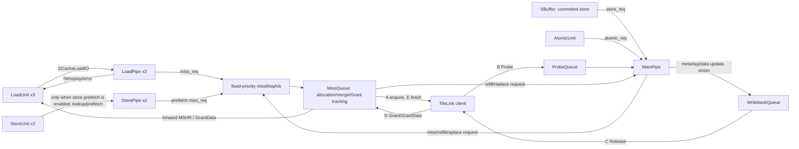
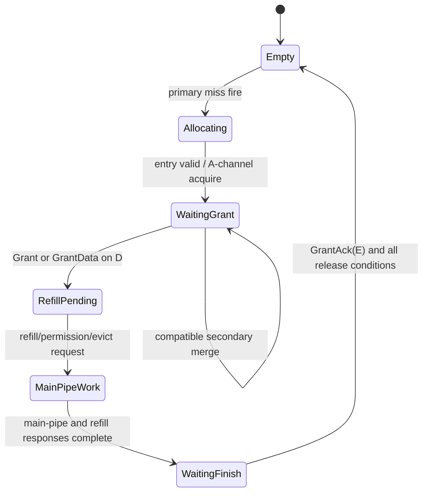

<!--
# 香山昆明湖 V2：访存单元 DCache 源码分析

> **结论先行。** 昆明湖 V2 的 L1 DCache 是一个由三个投机 LoadPipe、结构上存在的两个 StorePipe、一个 MainPipe、MissQueue、ProbeQueue 和 WritebackQueue 组成的、以 TileLink 为一致性边界的非阻塞缓存。以 `KunminghuV2Config` 为配置口径，它是 **64 KiB、4 路、256 组、64 B cache line、8 个 64-bit bank、16 个 miss entry**。快速 load hit 在 DCache 内按 `s0 → s1 → s2` 前进；在 `s2` 产生 LSU 响应。真正的已提交 store 不经 StorePipe 写阵列，而是从 SBuffer 送入 MainPipe。标准 KmhV2 的 store-prefetch 开关为关，故 StorePipe 的 tag/meta/miss 预取路径在这个口径下不生效。miss、权限升级、refill、probe、替换和回写均由 MainPipe/MissQueue/WBQ 共同完成。

本文只陈述下列源码基线中可以逐项定位的事实；没有把未生成的 RTL、未采集的波形或缺失的设计文档当成已验证结论。
-->

# XiangShan Kunminghu V2: DCache Source-Code Analysis for the Memory Subsystem

> **Conclusion first.** The Kunminghu V2 L1 DCache is a non-blocking cache bounded by TileLink coherence. It consists of three speculative LoadPipes, two structurally present StorePipes, one MainPipe, MissQueue, ProbeQueue, and WritebackQueue. Under `KunminghuV2Config`, it is **64 KiB, 4-way, 256-set, with 64-B cache lines, eight 64-bit banks, and 16 miss entries**. A fast load hit advances through DCache as `s0 -> s1 -> s2`, producing an LSU response in `s2`. A truly committed store does not write the array through StorePipe; it is sent from SBuffer to MainPipe. Standard KmhV2 disables store prefetch, so StorePipe's tag/meta/miss prefetch path is inactive under this configuration. MainPipe, MissQueue, and WBQ jointly handle misses, permission upgrades, refills, probes, replacement, and writeback.

This document states only facts traceable item by item in the source baseline below. It does not treat ungenerated RTL, uncaptured waveforms, or missing design documentation as verified conclusions.

<!--
## 1. 范围、版本与证据边界

| 项目 | 本文口径 |
|---|---|
| 被分析模块 | `xiangshan.cache.dcache.DCache`，以及其 LSU、MainPipe、MissQueue、Probe/WB 和 TileLink 相邻接口 |
| 源码目录 | `/home/yanyusong/xs-memory-env/XiangShan` |
| 源码基线 | 分支 `kunminghu-v2`，提交 `e12436c7cba86b195deec24981976d78bc263661` |
| 配置口径 | `KunminghuV2Config`；它叠加 `DefaultConfig`，而非 `KunminghuV2MinimalConfig` |
| 工作区状态 | 源码树已有 `difftest` 修改和 `src/main/resources/aia/` 未跟踪内容；本文未修改它们 |
| 设计文档基线 | 本地 `/home/yanyusong/XiangShanLab/XiangShan-Design-Doc` 不存在，因此**未查阅，也不把任何设计文档描述用作实现证据** |
| 波形基线 | 本次未生成仿真/FST。文中的 WaveDrom 是从 valid/ready/寄存器关系推导的时序示意，不是实测波形 |
| 上游边界 | LoadUnit、StoreUnit、SBuffer、AtomicUnit、LSQ、DTLB/PMP 与 MemBlock 的连接 |
| 下游边界 | DCache 的 TileLink A/B/C/D/E 通道，止于 L1D 与 L2/一致性互连的接口，不展开 L2/XSCache 内部 |

`MemBlock` 同时例化 `DCacheWrapper`、`Uncache` 与 L1D→L2 buffer；XSTile 再把 DCache client 接到 L2，而 data MMIO 使用独立的 `uncache_port`。此外 Wrapper 只有在 `dcacheParametersOpt.nonEmpty` 时例化真实 DCache，空配置才走 `FakeDCache`，而本文的 `KunminghuV2Config` 有显式 DCache 参数，故分析对象是前者。 [`MemBlock.scala:257-290`](</home/yanyusong/xs-memory-env/XiangShan/src/main/scala/xiangshan/mem/MemBlock.scala:257>) [`XSTile.scala:35-100`](</home/yanyusong/xs-memory-env/XiangShan/src/main/scala/xiangshan/XSTile.scala:35>) [`DCacheWrapper.scala:1782-1817`](</home/yanyusong/xs-memory-env/XiangShan/src/main/scala/xiangshan/cache/dcache/DCacheWrapper.scala:1782>)

### 1.1 Design Doc 与源码追溯矩阵

| ID | 设计文档命题 | Design Doc 证据 | 实现证据 | 结论 |
|---|---|---|---|---|
| D0 | DCache 的宏观设计约束 | 本地 checkout 缺失，未查阅 | 不适用 | 不从设计文档推断实现 |
| C1 | 昆明湖 V2 配置下的容量与路数 | 不适用 | [`Configs.scala:258`](</home/yanyusong/xs-memory-env/XiangShan/src/main/scala/top/Configs.scala:258>)、[`Configs.scala:460`](</home/yanyusong/xs-memory-env/XiangShan/src/main/scala/top/Configs.scala:460>)、[`Configs.scala:481`](</home/yanyusong/xs-memory-env/XiangShan/src/main/scala/top/Configs.scala:481>) | 已由源码确认 |
| C2 | 阵列、管线与 miss 处理划分 | 不适用 | [`DCacheWrapper.scala:1019`](</home/yanyusong/xs-memory-env/XiangShan/src/main/scala/xiangshan/cache/dcache/DCacheWrapper.scala:1019>)、[`DCacheWrapper.scala:1043`](</home/yanyusong/xs-memory-env/XiangShan/src/main/scala/xiangshan/cache/dcache/DCacheWrapper.scala:1043>) | 已由源码确认 |
| C3 | LSU 与 TileLink 的双向交互 | 不适用 | [`MemBlock.scala:880`](</home/yanyusong/xs-memory-env/XiangShan/src/main/scala/xiangshan/mem/MemBlock.scala:880>)、[`DCacheWrapper.scala:1550`](</home/yanyusong/xs-memory-env/XiangShan/src/main/scala/xiangshan/cache/dcache/DCacheWrapper.scala:1550>) | 已由源码确认 |
-->

## 1. Scope, Version, and Evidence Boundary

| Item | Basis used in this document |
|---|---|
| Analyzed module | `xiangshan.cache.dcache.DCache`, plus its neighboring LSU, MainPipe, MissQueue, Probe/WB, and TileLink interfaces |
| Source directory | `/home/yanyusong/xs-memory-env/XiangShan` |
| Source baseline | Branch `kunminghu-v2`, commit `e12436c7cba86b195deec24981976d78bc263661` |
| Configuration basis | `KunminghuV2Config`; it layers on `DefaultConfig`, not `KunminghuV2MinimalConfig` |
| Worktree state | The source tree already contained `difftest` modifications and untracked `src/main/resources/aia/` content; this document did not modify them |
| Design-document baseline | Local `/home/yanyusong/XiangShanLab/XiangShan-Design-Doc` is absent, so it was **not consulted and no design-document description is used as implementation evidence** |
| Waveform baseline | No simulation/FST was generated in this work. The WaveDrom diagrams derive from valid/ready/register relationships and are timing illustrations, not measured waveforms |
| Upstream boundary | Connections to LoadUnit, StoreUnit, SBuffer, AtomicUnit, LSQ, DTLB/PMP, and MemBlock |
| Downstream boundary | DCache TileLink A/B/C/D/E channels, stopping at the L1D-to-L2/coherence-interconnect interface rather than expanding L2/XSCache internals |

`MemBlock` instantiates `DCacheWrapper`, `Uncache`, and an L1D-to-L2 buffer. XSTile then connects the DCache client to L2, while data MMIO uses the independent `uncache_port`. In addition, Wrapper instantiates the real DCache only when `dcacheParametersOpt.nonEmpty`; an empty configuration uses `FakeDCache`. `KunminghuV2Config` has explicit DCache parameters, so this analysis concerns the real DCache. [`MemBlock.scala:257-290`](</home/yanyusong/xs-memory-env/XiangShan/src/main/scala/xiangshan/mem/MemBlock.scala:257>) [`XSTile.scala:35-100`](</home/yanyusong/xs-memory-env/XiangShan/src/main/scala/xiangshan/XSTile.scala:35>) [`DCacheWrapper.scala:1782-1817`](</home/yanyusong/xs-memory-env/XiangShan/src/main/scala/xiangshan/cache/dcache/DCacheWrapper.scala:1782>)

### 1.1 Design-Document and Source Traceability Matrix

| ID | Design-document proposition | Design-document evidence | Implementation evidence | Conclusion |
|---|---|---|---|---|
| D0 | DCache macro-design constraints | Local checkout is missing and was not consulted | Not applicable | Do not infer implementation from design documentation |
| C1 | Capacity and associativity under Kunminghu V2 configuration | Not applicable | [`Configs.scala:258`](</home/yanyusong/xs-memory-env/XiangShan/src/main/scala/top/Configs.scala:258>), [`Configs.scala:460`](</home/yanyusong/xs-memory-env/XiangShan/src/main/scala/top/Configs.scala:460>), [`Configs.scala:481`](</home/yanyusong/xs-memory-env/XiangShan/src/main/scala/top/Configs.scala:481>) | Confirmed by source |
| C2 | Division of arrays, pipelines, and miss processing | Not applicable | [`DCacheWrapper.scala:1019`](</home/yanyusong/xs-memory-env/XiangShan/src/main/scala/xiangshan/cache/dcache/DCacheWrapper.scala:1019>), [`DCacheWrapper.scala:1043`](</home/yanyusong/xs-memory-env/XiangShan/src/main/scala/xiangshan/cache/dcache/DCacheWrapper.scala:1043>) | Confirmed by source |
| C3 | Bidirectional LSU/TileLink interaction | Not applicable | [`MemBlock.scala:880`](</home/yanyusong/xs-memory-env/XiangShan/src/main/scala/xiangshan/mem/MemBlock.scala:880>), [`DCacheWrapper.scala:1550`](</home/yanyusong/xs-memory-env/XiangShan/src/main/scala/xiangshan/cache/dcache/DCacheWrapper.scala:1550>) | Confirmed by source |

<!--
## 2. 配置、容量与地址切片
-->

## 2. Configuration, Capacity, and Address Slicing

<!--
`KunminghuV2Config` 继承 `DefaultConfig`，后者调用 `WithNKBL1D(64, ways = 4)`；`WithNKBL1D` 按 `n * 1024 / ways / 64` 计算 sets，并设定 16 miss、8 probe、18 release entry 和 tag/data SECDED ECC。故本文主配置是：
-->

`KunminghuV2Config` extends `DefaultConfig`, which calls `WithNKBL1D(64, ways = 4)`. `WithNKBL1D` computes the number of sets as `n * 1024 / ways / 64` and configures 16 miss entries, 8 probe entries, 18 release entries, and tag/data SECDED ECC. The primary configuration is therefore:

\[
\text{sets}=64\times1024/(4\times64)=256,\qquad
\text{capacity}=256\times4\times64\text{ B}=64\text{ KiB}.
\]

<!--
`KunminghuV2MinimalConfig` 明确改成 `WithNKBL1D(32, ways = 4)`，因此不能把它的 32 KiB 参数混入本文结论。[`Configs.scala:258-275`](</home/yanyusong/xs-memory-env/XiangShan/src/main/scala/top/Configs.scala:258>) [`Configs.scala:460-490`](</home/yanyusong/xs-memory-env/XiangShan/src/main/scala/top/Configs.scala:460>)

| 量 | 值 | 源码依据与含义 |
|---|---:|---|
| line | 64 B | `DCacheParameters.blockBytes` 默认 64；配置公式也以 64 为 line 大小。[`DCacheWrapper.scala:39-64`](</home/yanyusong/xs-memory-env/XiangShan/src/main/scala/xiangshan/cache/dcache/DCacheWrapper.scala:39>) |
| TileLink refill | 2 × 32 B beat | L1 bus 为 256 bit，64 B line 的 refill 是两个 beat，不是 8 个 64-bit bus beat。[`Parameters.scala:879`](</home/yanyusong/xs-memory-env/XiangShan/src/main/scala/xiangshan/Parameters.scala:879>) [`L1Cache.scala:67-97`](</home/yanyusong/xs-memory-env/XiangShan/src/main/scala/xiangshan/cache/L1Cache.scala:67>) |
| ways / sets | 4 / 256 | 配置推导，如上 |
| bank | 8 | `DCacheBanks = 8`，每行被切为 8 个 bank。[`DCacheWrapper.scala:126-155`](</home/yanyusong/xs-memory-env/XiangShan/src/main/scala/xiangshan/cache/dcache/DCacheWrapper.scala:126>) |
| 单 bank SRAM row | 64 bit = 8 B | `DCacheSRAMRowBits = 64` 且有 `require`。[`DCacheWrapper.scala:131-139`](</home/yanyusong/xs-memory-env/XiangShan/src/main/scala/xiangshan/cache/dcache/DCacheWrapper.scala:131>) |
| Load / Store issue 端口 | 3 / 2 | 参数 `LoadPipelineWidth=3`、`StorePipelineWidth=2`。[`Parameters.scala:214-226`](</home/yanyusong/xs-memory-env/XiangShan/src/main/scala/xiangshan/Parameters.scala:214>) |
| Miss / Probe / Release 队列配置 | 16 / 8 / 18 | `WithNKBL1D` 的显式参数；它们不是“每周期吞吐量”。[`Configs.scala:265-273`](</home/yanyusong/xs-memory-env/XiangShan/src/main/scala/top/Configs.scala:265>) |
| 替换策略 | `setplru` | 配置给出，运行时由 `ReplacementPolicy.fromString` 建立。[`Configs.scala:267`](</home/yanyusong/xs-memory-env/XiangShan/src/main/scala/top/Configs.scala:267>) [`DCacheWrapper.scala:1674-1711`](</home/yanyusong/xs-memory-env/XiangShan/src/main/scala/xiangshan/cache/dcache/DCacheWrapper.scala:1674>) |

### 2.1 地址字段：VIPT 索引与 alias 的关键细节

在本配置下，bank offset 是 3，set offset 是 6，above-index offset 是 14；因此 bank 选择为地址 `[5:3]`、set 选择为 `[13:6]`。由于页内索引只到 bit 11，`DCacheTagOffset` 被限定为 `min(14, 12)=12`。通用 L1Cache 参数也明确把物理 tag 定义为 `paddr >> pgUntagBits`，其中 `pgUntagBits=min(untagBits,12)`。
-->

`KunminghuV2MinimalConfig` explicitly changes to `WithNKBL1D(32, ways = 4)`, so its 32-KiB parameters must not be mixed into this document's conclusions. [`Configs.scala:258-275`](</home/yanyusong/xs-memory-env/XiangShan/src/main/scala/top/Configs.scala:258>) [`Configs.scala:460-490`](</home/yanyusong/xs-memory-env/XiangShan/src/main/scala/top/Configs.scala:460>)

| Quantity | Value | Source basis and meaning |
|---|---:|---|
| Line | 64 B | `DCacheParameters.blockBytes` defaults to 64, and the configuration formula also uses 64 as the line size. [`DCacheWrapper.scala:39-64`](</home/yanyusong/xs-memory-env/XiangShan/src/main/scala/xiangshan/cache/dcache/DCacheWrapper.scala:39>) |
| TileLink refill | 2 x 32-B beats | The L1 bus is 256 bits, so a 64-B line refill is two beats, not eight 64-bit bus beats. [`Parameters.scala:879`](</home/yanyusong/xs-memory-env/XiangShan/src/main/scala/xiangshan/Parameters.scala:879>) [`L1Cache.scala:67-97`](</home/yanyusong/xs-memory-env/XiangShan/src/main/scala/xiangshan/cache/L1Cache.scala:67>) |
| Ways / sets | 4 / 256 | Configuration-derived as above |
| Banks | 8 | `DCacheBanks = 8`; each line is split into eight banks. [`DCacheWrapper.scala:126-155`](</home/yanyusong/xs-memory-env/XiangShan/src/main/scala/xiangshan/cache/dcache/DCacheWrapper.scala:126>) |
| Single-bank SRAM row | 64 bits = 8 B | `DCacheSRAMRowBits = 64` is enforced with `require`. [`DCacheWrapper.scala:131-139`](</home/yanyusong/xs-memory-env/XiangShan/src/main/scala/xiangshan/cache/dcache/DCacheWrapper.scala:131>) |
| Load / Store issue ports | 3 / 2 | Parameters `LoadPipelineWidth=3` and `StorePipelineWidth=2`. [`Parameters.scala:214-226`](</home/yanyusong/xs-memory-env/XiangShan/src/main/scala/xiangshan/Parameters.scala:214>) |
| Miss / Probe / Release queue configuration | 16 / 8 / 18 | Explicit `WithNKBL1D` parameters; they are not per-cycle throughput. [`Configs.scala:265-273`](</home/yanyusong/xs-memory-env/XiangShan/src/main/scala/top/Configs.scala:265>) |
| Replacement policy | `setplru` | Given by configuration and constructed at run time by `ReplacementPolicy.fromString`. [`Configs.scala:267`](</home/yanyusong/xs-memory-env/XiangShan/src/main/scala/top/Configs.scala:267>) [`DCacheWrapper.scala:1674-1711`](</home/yanyusong/xs-memory-env/XiangShan/src/main/scala/xiangshan/cache/dcache/DCacheWrapper.scala:1674>) |

### 2.1 Address Fields: VIPT Indexing and Critical Alias Details

In this configuration, the bank offset is 3, set offset 6, and above-index offset 14. Bank selection is therefore address `[5:3]` and set selection `[13:6]`. Because page-local indexing ends at bit 11, `DCacheTagOffset` is constrained to `min(14, 12)=12`. Generic L1Cache parameters likewise define the physical tag as `paddr >> pgUntagBits`, where `pgUntagBits=min(untagBits,12)`.

```text
Virtual address (DCache first-cycle index)
  ... | alias / above-index | set[13:6] | bank[5:3] | byte[2:0]
Physical address (s1 tag comparison)
  ... |                 physical tag (paddr >> 12) | low 12 bits
```

<!--
这不是“tag 从 bit 14 开始”的简单 PIPT 解释：set 的高两位可能越出 4 KiB 页内索引，代码为此提供 `get_alias`/`is_alias_match`，并在接收 TileLink Probe 时重建携带 alias 的虚拟地址片段。由此可知该实现显式处理 VIPT 别名信息；不能仅凭物理地址 `[13:6]` 推断所有 lookup 行为。[`DCacheWrapper.scala:146-156`](</home/yanyusong/xs-memory-env/XiangShan/src/main/scala/xiangshan/cache/dcache/DCacheWrapper.scala:146>) [`DCacheWrapper.scala:213-260`](</home/yanyusong/xs-memory-env/XiangShan/src/main/scala/xiangshan/cache/dcache/DCacheWrapper.scala:213>) [`L1Cache.scala:46-87`](</home/yanyusong/xs-memory-env/XiangShan/src/main/scala/xiangshan/cache/L1Cache.scala:46>) [`DCacheWrapper.scala:1556-1568`](</home/yanyusong/xs-memory-env/XiangShan/src/main/scala/xiangshan/cache/dcache/DCacheWrapper.scala:1556>)

## 3. 顶层组成、数据去向与责任划分
-->

This is not the simple PIPT interpretation that "the tag begins at bit 14." The high two set bits can extend beyond the 4-KiB page-local index. The code provides `get_alias`/`is_alias_match` and reconstructs a virtual-address fragment carrying the alias when receiving a TileLink Probe. The implementation therefore explicitly handles VIPT alias information; physical address `[13:6]` alone cannot determine every lookup behavior. [`DCacheWrapper.scala:146-156`](</home/yanyusong/xs-memory-env/XiangShan/src/main/scala/xiangshan/cache/dcache/DCacheWrapper.scala:146>) [`DCacheWrapper.scala:213-260`](</home/yanyusong/xs-memory-env/XiangShan/src/main/scala/xiangshan/cache/dcache/DCacheWrapper.scala:213>) [`L1Cache.scala:46-87`](</home/yanyusong/xs-memory-env/XiangShan/src/main/scala/xiangshan/cache/L1Cache.scala:46>) [`DCacheWrapper.scala:1556-1568`](</home/yanyusong/xs-memory-env/XiangShan/src/main/scala/xiangshan/cache/dcache/DCacheWrapper.scala:1556>)

<!--
## 3. 顶层组成、数据去向与责任划分
-->

## 3. Top-Level Composition, Data Flow, and Responsibility Partitioning



<!--
**为什么这样分工：** speculative load 需要低延迟 tag/data lookup，所以单独走 3 条 LoadPipe；store 的“地址已发射”与“已提交数据真正写入 cache”必须分离，故 StorePipe 只作 lookup/prefetch，而 SBuffer 的提交 store 由 MainPipe 统一序列化；refill/probe/替换都可能改 tag/meta/data，必须由 MainPipe 统一成为写入所有者。这个分工在顶层实例、端口连接和唯一 data/tag write 仲裁中都有直接证据。[`DCacheWrapper.scala:1043-1049`](</home/yanyusong/xs-memory-env/XiangShan/src/main/scala/xiangshan/cache/dcache/DCacheWrapper.scala:1043>) [`DCacheWrapper.scala:1293-1321`](</home/yanyusong/xs-memory-env/XiangShan/src/main/scala/xiangshan/cache/dcache/DCacheWrapper.scala:1293>) [`MemBlock.scala:1247-1273`](</home/yanyusong/xs-memory-env/XiangShan/src/main/scala/xiangshan/mem/MemBlock.scala:1247>) [`MemBlock.scala:1763-1767`](</home/yanyusong/xs-memory-env/XiangShan/src/main/scala/xiangshan/mem/MemBlock.scala:1763>)

### 3.1 `who / why / how / from / to` 接口表

| 谁（from） | 为什么 | 怎样（握手/关键字段） | 到（to） | 结果 |
|---|---|---|---|---|
| LoadUnit | 投机读取或软/硬预取 | `DCacheLoadIO.req`，`fire=valid&&ready`；s0 带 vaddr，s1 提供物理地址副本与 kill | LoadPipe | hit 返回数据；miss 发往 MQ；资源冲突转 replay |
| StoreUnit | 发射阶段的 store 地址检查与可选 store prefetch | `DCacheStoreIO` 经过 StorePipe；**KmhV2 默认该开关关闭** | StorePipe | 启用时产生 lookup/预取状态；不会在此路径写 data array |
| SBuffer | 已提交 store 的 cache 更新 | `io.lsu.store.req <> mainPipe.io.store_req` | MainPipe | 读改写、权限获取、最终写 data/meta |
| AtomicUnit | AMO/LR/SC 的串行 cache 操作 | `atomic_req` | MainPipe | 可能 hit、miss、写回或 reservation 更新 |
| MainPipe/LoadPipe/StorePipe | 请求 MSHR | `miss_req` 先进入固定优先级 TreeArbiter，再进 MissQueue | MissQueue | 一拍最多一个仲裁输出；可分配或合并 |
| MissQueue | 对下取数/权限、结束 Grant | TileLink A/E | L2/一致性互连 | refill、权限状态、TL error 回传 |
| L2/一致性互连 | Probe、GrantData、ReleaseAck | TileLink B/D | ProbeQueue/MissQueue/WBQ | 失效/降级、数据回填、写回完成 |
| WritebackQueue | eviction/probe 后下行 release | TileLink C | L2/一致性互连 | `release` 延迟一拍通知 LSQ |

顶层 `DCacheToLsuIO` 也把这些边界显式列为 `load`、`sta`、SBuffer store、atomics、release、D forward 和 MSHR forward；其定义是避免把“LSQ 的 generic request”误认作具体阵列访问的关键证据。[`DCacheWrapper.scala:819-855`](</home/yanyusong/xs-memory-env/XiangShan/src/main/scala/xiangshan/cache/dcache/DCacheWrapper.scala:819>)

## 4. 存储体、所有权与同址风险
-->

**Why responsibilities are divided this way:** speculative loads need low-latency tag/data lookup, so they use three dedicated LoadPipes. A store's issued address and the actual cache write of committed data must be separate, so StorePipe performs only lookup/prefetch while committed stores from SBuffer are serialized by MainPipe. Refills, probes, and replacement can all modify tag/meta/data, so MainPipe must be the unified write owner. Top-level instances, port wiring, and unique data/tag-write arbitration directly support this division. [`DCacheWrapper.scala:1043-1049`](</home/yanyusong/xs-memory-env/XiangShan/src/main/scala/xiangshan/cache/dcache/DCacheWrapper.scala:1043>) [`DCacheWrapper.scala:1293-1321`](</home/yanyusong/xs-memory-env/XiangShan/src/main/scala/xiangshan/cache/dcache/DCacheWrapper.scala:1293>) [`MemBlock.scala:1247-1273`](</home/yanyusong/xs-memory-env/XiangShan/src/main/scala/xiangshan/mem/MemBlock.scala:1247>) [`MemBlock.scala:1763-1767`](</home/yanyusong/xs-memory-env/XiangShan/src/main/scala/xiangshan/mem/MemBlock.scala:1763>)

### 3.1 `who / why / how / from / to` Interface Table

| Who (from) | Why | How (handshake/key fields) | To | Result |
|---|---|---|---|---|
| LoadUnit | Speculative read or software/hardware prefetch | `DCacheLoadIO.req`, `fire=valid&&ready`; s0 carries vaddr and s1 supplies a physical-address copy and kill | LoadPipe | Hit returns data; miss goes to MQ; resource conflicts replay |
| StoreUnit | Store-address checking at issue and optional store prefetch | `DCacheStoreIO` passes through StorePipe; **KmhV2 disables this switch by default** | StorePipe | When enabled, creates lookup/prefetch state; does not write the data array on this path |
| SBuffer | Cache update for a committed store | `io.lsu.store.req <> mainPipe.io.store_req` | MainPipe | Read-modify-write, permission acquisition, final data/meta write |
| AtomicUnit | Serialized cache operations for AMO/LR/SC | `atomic_req` | MainPipe | May hit, miss, write back, or update reservation state |
| MainPipe/LoadPipe/StorePipe | Request an MSHR | `miss_req` first enters a fixed-priority TreeArbiter, then MissQueue | MissQueue | At most one arbitrated output per cycle; can allocate or merge |
| MissQueue | Fetch data/permission downstream and finish Grant | TileLink A/E | L2/coherence interconnect | Refill, permission state, and TL-error return |
| L2/coherence interconnect | Probe, GrantData, ReleaseAck | TileLink B/D | ProbeQueue/MissQueue/WBQ | Invalidate/downgrade, refill, and writeback completion |
| WritebackQueue | Downstream release after eviction/probe | TileLink C | L2/coherence interconnect | `release` notifies LSQ one cycle later |

Top-level `DCacheToLsuIO` also lists these boundaries explicitly as `load`, `sta`, SBuffer store, atomics, release, D forward, and MSHR forward. Its definition is key evidence against mistaking an LSQ generic request for a concrete array access. [`DCacheWrapper.scala:819-855`](</home/yanyusong/xs-memory-env/XiangShan/src/main/scala/xiangshan/cache/dcache/DCacheWrapper.scala:819>)

<!--
## 4. 存储体、所有权与同址风险
-->

## 4. Storage Arrays, Ownership, and Same-Address Risks

<!--
| 存储体 | 读者 | 写者 | 保存的信息 | 关键风险与代码处理 |
|---|---|---|---|---|
| `DuplicatedTagArray` | LoadPipe、StorePipe、MainPipe | MainPipe | 每 way tag/ECC；多读端口靠 duplication | `tag_write_intend` 时普通 tag read `ready=0`，写由 MainPipe 单输入仲裁；不把 tag 写与读并发假设为无冲突。[`DCacheWrapper.scala:1234-1296`](</home/yanyusong/xs-memory-env/XiangShan/src/main/scala/xiangshan/cache/dcache/DCacheWrapper.scala:1234>) |
| `L1CohMetaArray` | LoadPipe/MainPipe/可能 StorePipe | MainPipe | coherence metadata / 有效性 | MetaArray 的同 index 写有 bypass；这是 **meta** 的旁路事实，不应外推为 data array 同等旁路。[`DCacheWrapper.scala:1019-1024`](</home/yanyusong/xs-memory-env/XiangShan/src/main/scala/xiangshan/cache/dcache/DCacheWrapper.scala:1019>) [`AsynchronousMetaArray.scala:60-125`](</home/yanyusong/xs-memory-env/XiangShan/src/main/scala/xiangshan/cache/dcache/meta/AsynchronousMetaArray.scala:60>) |
| error/prefetch/access extra meta | 同上（部分不向 StorePipe 暴露） | MainPipe 和 load 消费后的 flag 更新 | TL error、prefetch source、access flag | 从 DCacheWrapper 的端口映射可见读写端口数量/来源；具体同周期多写优先级应以生成 RTL/波形再确认。[`DCacheWrapper.scala:1131-1225`](</home/yanyusong/xs-memory-env/XiangShan/src/main/scala/xiangshan/cache/dcache/DCacheWrapper.scala:1131>) |
| `BankedDataArray` | 3 个 LoadPipe 和 MainPipe 的整行读 | MainPipe | 8 bank × 64-bit 的 data/ECC | read/write 或 readline 冲突会压低 read `ready`；read/read 同 bank 冲突则可先 fire、由阵列屏蔽未选端并以延迟 `bank_conflict_slow` 通知 LoadPipe replay。[`BankedDataArray.scala:691-779`](</home/yanyusong/xs-memory-env/XiangShan/src/main/scala/xiangshan/cache/dcache/data/BankedDataArray.scala:691>) |
| replacement state | LoadPipe/MainPipe/StorePipe 查询 | 各类 `replace_access` 更新 | set-PLRU 状态 | 选择在 wrapper 集中调用 `replacer.way/access`。[`DCacheWrapper.scala:1674-1711`](</home/yanyusong/xs-memory-env/XiangShan/src/main/scala/xiangshan/cache/dcache/DCacheWrapper.scala:1674>) |

`BankedDataArray` 对 128-bit load 会把单 bank one-hot 与下一 bank 合并；因此一条 128-bit 请求可能占两个相邻 bank。它的实现有针对 read/read、read/write 和 `readline` 的冲突检查：read/read 冲突不是常规 ready/valid 背压，而是被选中的读实际访问 SRAM、其余读在下一拍获得 `bank_conflict_slow` 并重放；“选最老请求”的具体年龄比较由 `selcetOldestPort` 的实现决定，本文不在未逐字段验证该年龄编码前，把它简化为“端口 0 永远获胜”。[`LoadPipe.scala:139-147`](</home/yanyusong/xs-memory-env/XiangShan/src/main/scala/xiangshan/cache/dcache/loadpipe/LoadPipe.scala:139>) [`BankedDataArray.scala:725-779`](</home/yanyusong/xs-memory-env/XiangShan/src/main/scala/xiangshan/cache/dcache/data/BankedDataArray.scala:725>)

当前参数默认 `dwpuParam.enWPU=false`，Wrapper 因而选用这里讨论的 `BankedDataArray` 而非 `SramedDataArray`。本次静态审阅未在 data SRAM 路径发现与 MetaArray 同等的显式同址 RAW bypass；应依赖 ready/conflict/replay 控制并在 RTL/波形中确认同 bank、同 set、同 way 读写。 [`Parameters.scala:255-265`](</home/yanyusong/xs-memory-env/XiangShan/src/main/scala/xiangshan/Parameters.scala:255>) [`DCacheWrapper.scala:1019-1024`](</home/yanyusong/xs-memory-env/XiangShan/src/main/scala/xiangshan/cache/dcache/DCacheWrapper.scala:1019>) [`BankedDataArray.scala:758-779`](</home/yanyusong/xs-memory-env/XiangShan/src/main/scala/xiangshan/cache/dcache/data/BankedDataArray.scala:758>)

## 5. 三条访问管线
-->

| Storage structure | Readers | Writer | Stored information | Critical risk and code handling |
|---|---|---|---|---|
| `DuplicatedTagArray` | LoadPipe, StorePipe, MainPipe | MainPipe | Per-way tag/ECC; duplicated for multiple read ports | When `tag_write_intend` is asserted, ordinary tag read has `ready=0`; MainPipe arbitrates writes through one input. Do not assume concurrent tag reads/writes are conflict-free. [`DCacheWrapper.scala:1234-1296`](</home/yanyusong/xs-memory-env/XiangShan/src/main/scala/xiangshan/cache/dcache/DCacheWrapper.scala:1234>) |
| `L1CohMetaArray` | LoadPipe/MainPipe/possibly StorePipe | MainPipe | Coherence metadata/validity | Same-index writes have a MetaArray bypass. That fact applies to **meta**, not necessarily to the data array. [`DCacheWrapper.scala:1019-1024`](</home/yanyusong/xs-memory-env/XiangShan/src/main/scala/xiangshan/cache/dcache/DCacheWrapper.scala:1019>) [`AsynchronousMetaArray.scala:60-125`](</home/yanyusong/xs-memory-env/XiangShan/src/main/scala/xiangshan/cache/dcache/meta/AsynchronousMetaArray.scala:60>) |
| Error/prefetch/access extra meta | Same (some are not exposed to StorePipe) | MainPipe plus flag updates after load consumption | TL error, prefetch source, access flag | DCacheWrapper port maps reveal port counts/sources; same-cycle multiwrite priority requires generated RTL/waveform confirmation. [`DCacheWrapper.scala:1131-1225`](</home/yanyusong/xs-memory-env/XiangShan/src/main/scala/xiangshan/cache/dcache/DCacheWrapper.scala:1131>) |
| `BankedDataArray` | Whole-line reads from three LoadPipes and MainPipe | MainPipe | Eight banks x 64-bit data/ECC | Read/write or readline conflicts lower read `ready`; a read/read same-bank conflict can fire first, masks unselected ports in the array, and signals delayed `bank_conflict_slow` to make LoadPipe replay. [`BankedDataArray.scala:691-779`](</home/yanyusong/xs-memory-env/XiangShan/src/main/scala/xiangshan/cache/dcache/data/BankedDataArray.scala:691>) |
| Replacement state | Queried by LoadPipe/MainPipe/StorePipe | Updated by various `replace_access` operations | Set-PLRU state | The wrapper centrally calls `replacer.way/access`. [`DCacheWrapper.scala:1674-1711`](</home/yanyusong/xs-memory-env/XiangShan/src/main/scala/xiangshan/cache/dcache/DCacheWrapper.scala:1674>) |

For a 128-bit load, `BankedDataArray` combines a one-hot single-bank mask with the following bank, so one request can occupy two adjacent banks. It checks read/read, read/write, and `readline` conflicts. A read/read conflict is not normal ready/valid backpressure: the selected read accesses SRAM while the others receive `bank_conflict_slow` in the next cycle and replay. The exact age comparison for selecting the oldest request comes from `selcetOldestPort`; until its age encoding is field-by-field verified, it must not be simplified to "port 0 always wins." [`LoadPipe.scala:139-147`](</home/yanyusong/xs-memory-env/XiangShan/src/main/scala/xiangshan/cache/dcache/loadpipe/LoadPipe.scala:139>) [`BankedDataArray.scala:725-779`](</home/yanyusong/xs-memory-env/XiangShan/src/main/scala/xiangshan/cache/dcache/data/BankedDataArray.scala:725>)

The current parameter defaults `dwpuParam.enWPU=false`, so Wrapper selects the `BankedDataArray` discussed here rather than `SramedDataArray`. This static review found no explicit same-address RAW bypass equivalent to MetaArray's on the data-SRAM path. Control should rely on ready/conflict/replay and confirm same-bank, same-set, same-way read/write behavior in RTL/waveforms. [`Parameters.scala:255-265`](</home/yanyusong/xs-memory-env/XiangShan/src/main/scala/xiangshan/Parameters.scala:255>) [`DCacheWrapper.scala:1019-1024`](</home/yanyusong/xs-memory-env/XiangShan/src/main/scala/xiangshan/cache/dcache/DCacheWrapper.scala:1019>) [`BankedDataArray.scala:758-779`](</home/yanyusong/xs-memory-env/XiangShan/src/main/scala/xiangshan/cache/dcache/data/BankedDataArray.scala:758>)

<!--
## 5. 三条访问管线
-->

## 5. Three Access Pipelines

<!--
### 5.1 LoadPipe：s0/s1/s2/s3

| 阶段 | `valid` 的来源/保持 | 做什么 | 关键 `ready/fire`、kill 与去向 |
|---|---|---|---|
| s0 | `s0_valid = lsu.req.fire` | 接受 speculative load/prefetch；发 meta/tag read；按 `[5:3]` 生成 bank mask | 正常路径 `req.ready = meta.ready && tag.ready && s1_ready`；`nack` 时可以直接接受。仅在 `req.fire && !nack` 时发 lookup。[`LoadPipe.scala:119-147`](</home/yanyusong/xs-memory-env/XiangShan/src/main/scala/xiangshan/cache/dcache/loadpipe/LoadPipe.scala:119>) |
| s1 | `s0_fire` 置位，`s1_fire` 清除 | 用 LSU 在这一拍提供的 paddr 副本比较 tag；检查 coherence permission；对 hit 发 banked data read | `s1_ready=!s1_valid||s1_fire`。`s1_kill_data_read` 抑制 data read；DCache 用 paddr 作 tag compare，而 data 访问仍带经更新的 vaddr/bank 信息。[`LoadPipe.scala:179-199`](</home/yanyusong/xs-memory-env/XiangShan/src/main/scala/xiangshan/cache/dcache/loadpipe/LoadPipe.scala:179>) [`LoadPipe.scala:222-320`](</home/yanyusong/xs-memory-env/XiangShan/src/main/scala/xiangshan/cache/dcache/loadpipe/LoadPipe.scala:222>) |
| s2 | `s1_fire` 时寄存；`lsu.resp.fire` 清除 | 组合/寄存 hit、miss、data、TL/meta error；向 MQ 发 miss request；给 LSU `resp` | `s2_ready=true`，但 `s2_valid` 会保持到 LSU `resp.fire`。MQ 未 ready、banked data read 未 ready、WBQ 冲突或上游 nack 使 `s2_nack` 成立。miss 被 MQ 接受且未取消时，LSU 得到“已处理”的 miss，而非立即 replay。[`LoadPipe.scala:327-402`](</home/yanyusong/xs-memory-env/XiangShan/src/main/scala/xiangshan/cache/dcache/loadpipe/LoadPipe.scala:327>) [`LoadPipe.scala:415-531`](</home/yanyusong/xs-memory-env/XiangShan/src/main/scala/xiangshan/cache/dcache/loadpipe/LoadPipe.scala:415>) |
| s3 | s2 成功响应后延迟信息 | 延迟数据/ECC/TL error、replacement access、prefetch/access flag 更新 | 错误以比 hit 数据更晚的路径报告；需求 load 消费 prefetch line 时清 prefetch flag。[`LoadPipe.scala:538-599`](</home/yanyusong/xs-memory-env/XiangShan/src/main/scala/xiangshan/cache/dcache/loadpipe/LoadPipe.scala:538>) |

下面是 s0 的真实握手核心。它说明 `valid` 本身不等于接受，必须同时满足 `ready`：
-->

### 5.1 LoadPipe: s0/s1/s2/s3

| Stage | Source/retention of `valid` | Work | Key `ready/fire`, kill, and destination behavior |
|---|---|---|---|
| s0 | `s0_valid = lsu.req.fire` | Accepts a speculative load/prefetch; launches meta/tag reads; forms bank mask from `[5:3]` | Normal path is `req.ready = meta.ready && tag.ready && s1_ready`; `nack` can accept directly. Lookup is issued only on `req.fire && !nack`. [`LoadPipe.scala:119-147`](</home/yanyusong/xs-memory-env/XiangShan/src/main/scala/xiangshan/cache/dcache/loadpipe/LoadPipe.scala:119>) |
| s1 | Set by `s0_fire`, cleared by `s1_fire` | Compares tag with the paddr copy supplied by LSU in this cycle; checks coherence permission; sends a banked-data read for a hit | `s1_ready=!s1_valid||s1_fire`. `s1_kill_data_read` suppresses the data read. DCache uses paddr for tag comparison while the data access carries updated vaddr/bank information. [`LoadPipe.scala:179-199`](</home/yanyusong/xs-memory-env/XiangShan/src/main/scala/xiangshan/cache/dcache/loadpipe/LoadPipe.scala:179>) [`LoadPipe.scala:222-320`](</home/yanyusong/xs-memory-env/XiangShan/src/main/scala/xiangshan/cache/dcache/loadpipe/LoadPipe.scala:222>) |
| s2 | Registered on `s1_fire`, cleared by `lsu.resp.fire` | Combines/registers hit, miss, data, TL/meta error; requests a miss from MQ; drives LSU `resp` | `s2_ready=true`, but `s2_valid` remains until LSU `resp.fire`. MQ not-ready, banked-data-read not-ready, WBQ conflict, or upstream nack form `s2_nack`. When MQ accepts an uncancelled miss, LSU receives a handled miss rather than immediate replay. [`LoadPipe.scala:327-402`](</home/yanyusong/xs-memory-env/XiangShan/src/main/scala/xiangshan/cache/dcache/loadpipe/LoadPipe.scala:327>) [`LoadPipe.scala:415-531`](</home/yanyusong/xs-memory-env/XiangShan/src/main/scala/xiangshan/cache/dcache/loadpipe/LoadPipe.scala:415>) |
| s3 | Delayed information after a successful s2 response | Delayed data/ECC/TL error, replacement access, prefetch/access-flag updates | Errors use a later path than hit data; a demand load consuming a prefetched line clears the prefetch flag. [`LoadPipe.scala:538-599`](</home/yanyusong/xs-memory-env/XiangShan/src/main/scala/xiangshan/cache/dcache/loadpipe/LoadPipe.scala:538>) |

The following is the actual s0 handshake core. It shows that `valid` alone is not acceptance; `ready` must also hold:

```scala
io.lsu.req.ready := (!io.nack && not_nacked_ready) || (io.nack && nacked_ready)
io.meta_read.valid := io.lsu.req.fire && !io.nack
io.tag_read.valid := io.lsu.req.fire && !io.nack
val s0_valid = io.lsu.req.fire
```

<!--
源码：[`LoadPipe.scala:132-140`](</home/yanyusong/xs-memory-env/XiangShan/src/main/scala/xiangshan/cache/dcache/loadpipe/LoadPipe.scala:132>)。

Wrapper 在真实 DCache 连接中把各 LoadPipe 的 `nack` 固定为 false，因此本配置不会借 `nack` 分支绕过 meta/tag；实际 s0 接受依赖 meta/tag/s1 的 ready。LoadPipe 在 s2 直接驱动 LSU response，并有 LSU 必须 ready 的断言，所以接口没有额外 response FIFO 用来无限期缓存结果。 [`DCacheWrapper.scala:1381-1393`](</home/yanyusong/xs-memory-env/XiangShan/src/main/scala/xiangshan/cache/dcache/DCacheWrapper.scala:1381>) [`LoadPipe.scala:520-531`](</home/yanyusong/xs-memory-env/XiangShan/src/main/scala/xiangshan/cache/dcache/loadpipe/LoadPipe.scala:520>)

**load miss 的两种结果必须区分：**

1. 若 MQ ready 且该请求未被取消/未被 WBQ 阻断，`miss_req.fire` 代表 DCache 将该候选传入 allocation/merge 流程；LoadUnit 后续依据 `handled/mshr_id/forward` 等通路等待数据，不应把它标作“资源 replay”。
2. 对真正未命中的请求，`s2_nack_no_mshr`、WBQ conflict、上游 nack 或 cancel 会使 `resp.replay` 成立；read/read bank 冲突以独立的 `bank_conflict_slow` 直接要求 replay。不要把 `s2_nack` 在所有 hit 情形下都等价为 replay：源码的 replay 表达式对这一部分以 `resp.miss` 为门控。

### 5.2 StorePipe：可选查找/预取，不是 committed store 写入点
-->

Source: [`LoadPipe.scala:132-140`](</home/yanyusong/xs-memory-env/XiangShan/src/main/scala/xiangshan/cache/dcache/loadpipe/LoadPipe.scala:132>).

In the real DCache wiring, Wrapper fixes each LoadPipe `nack` to false. This configuration cannot use the `nack` branch to bypass meta/tag; actual s0 acceptance depends on meta/tag/s1 ready. LoadPipe drives the LSU response directly in s2 and asserts that LSU must be ready, so the interface has no extra response FIFO to retain results indefinitely. [`DCacheWrapper.scala:1381-1393`](</home/yanyusong/xs-memory-env/XiangShan/src/main/scala/xiangshan/cache/dcache/DCacheWrapper.scala:1381>) [`LoadPipe.scala:520-531`](</home/yanyusong/xs-memory-env/XiangShan/src/main/scala/xiangshan/cache/dcache/loadpipe/LoadPipe.scala:520>)

**Two load-miss outcomes must be distinguished:**

1. If MQ is ready and the request is neither cancelled nor blocked by WBQ, `miss_req.fire` means that DCache passes the candidate into allocation/merge. LoadUnit then awaits data through paths such as `handled/mshr_id/forward`; it must not be labeled as a resource replay.
2. For a true miss, `s2_nack_no_mshr`, WBQ conflict, upstream nack, or cancel makes `resp.replay` true. A read/read bank conflict separately requires replay through `bank_conflict_slow`. `s2_nack` is not equivalent to replay for every hit: the source's replay expression gates this part with `resp.miss`.

<!--
### 5.2 StorePipe：可选查找/预取，不是 committed store 写入点
-->

### 5.2 StorePipe: Optional Lookup/Prefetch, Not the Committed-Store Write Point

<!--
StorePipe 的 s0 发 meta/tag lookup，s1 判定 hit/permission，s2 汇报 hit/miss，并在 `EnableStorePrefetchAtIssue` 条件下把 store-prefetch 的未命中转换为 `M_PFW` miss request。它没有向 `BankedDataArray` 产生 committed store data write；真正的数据修改由 SBuffer → MainPipe 完成。

这里需要把“代码存在”与“当前 KmhV2 生效”分开：默认 `EnableStorePrefetchAtIssue/AtCommit/SPB/SMS` 都为 false，故 `StorePrefetchL1Enabled=false`；wrapper 把 StorePipe 的 meta/tag read 和 miss request ready 强制为 false。下面的阶段表是该可选路径的结构说明，不可把它写成标准配置下每条 store 都会执行的流水。 [`Parameters.scala:246-250`](</home/yanyusong/xs-memory-env/XiangShan/src/main/scala/xiangshan/Parameters.scala:246>) [`DCacheWrapper.scala:999-1010`](</home/yanyusong/xs-memory-env/XiangShan/src/main/scala/xiangshan/cache/dcache/DCacheWrapper.scala:999>) [`DCacheWrapper.scala:1147-1155`](</home/yanyusong/xs-memory-env/XiangShan/src/main/scala/xiangshan/cache/dcache/DCacheWrapper.scala:1147>) [`DCacheWrapper.scala:1250-1255`](</home/yanyusong/xs-memory-env/XiangShan/src/main/scala/xiangshan/cache/dcache/DCacheWrapper.scala:1250>) [`DCacheWrapper.scala:1489-1496`](</home/yanyusong/xs-memory-env/XiangShan/src/main/scala/xiangshan/cache/dcache/DCacheWrapper.scala:1489>)

| 阶段 | 行为 | 必须避免的误读 |
|---|---|---|
| s0 | `req.valid` 驱动 meta/tag 读；两者 ready 共同控制接受 | 这只是 store-address/预取侧 lookup |
| s1 | tag 比较与 coherence permission 检查 | 命中不等于已对 data array 写入 |
| s2 | 产生 hit/miss 结果；可选 L1 store-prefetch 形成 `M_PFW` | 只有预取请求会从这条管线送 MQ；实际 store 被 SBuffer 提交后送 MainPipe |

源码：[`StorePipe.scala:91-195`](</home/yanyusong/xs-memory-env/XiangShan/src/main/scala/xiangshan/cache/dcache/storepipe/StorePipe.scala:91>) [`DCacheWrapper.scala:1585-1592`](</home/yanyusong/xs-memory-env/XiangShan/src/main/scala/xiangshan/cache/dcache/DCacheWrapper.scala:1585>) [`MemBlock.scala:1763-1767`](</home/yanyusong/xs-memory-env/XiangShan/src/main/scala/xiangshan/mem/MemBlock.scala:1763>)。

### 5.3 MainPipe：唯一的 cache-line 修改主线

MainPipe 接收 ProbeQueue、MissQueue refill、SBuffer store 和 AtomicUnit。普通 Chisel `Arbiter` 的端口顺序在源码中固定为：**Probe > refill > store > atomic**。它在 s1 做 tag/meta/必要的整行 data read，在 s2 决定 hit/miss、替换或是否能进入 MQ/s3，在 s3 等待 data/meta/tag/WBQ 等输出资源可用后真正更新 data/meta/tag 或发 writeback。

| MainPipe 阶段 | 关键状态/资源 | 后续动作 |
|---|---|---|
| s0 | 选择四类输入，并以 s1/s2/s3 的 set conflict 和 store 等待计数控制接受 | 发 meta/tag lookup，必要时准备整行 data read |
| s1 | 记录请求、读取 line；确定 set/way 和数据需求 | 把 hit、replacement、permission 相关信息带到 s2 |
| s2 | 计算 hit、BtoT/replace、refill 是否具备、是否可进 MQ 或 s3 | `mq.ready`/WBQ block/replace block 会改变去向或造成 replay |
| s3 | 合并 store/AMO/refill 数据，写 data/meta/tag，必要时把 victim/probe 发给 WBQ | 只有所需下游 ready 时 `s3_fire`，否则保持 valid |

源码中 s3 的进度条件直接把 `data_write.ready`、`meta_write.ready`、`tag_write.ready`、`wb.ready` 编入 `s3_can_go`，所以不能只以“s2 hit”推断更新已完成。[`MainPipe.scala:219-323`](</home/yanyusong/xs-memory-env/XiangShan/src/main/scala/xiangshan/cache/dcache/mainpipe/MainPipe.scala:219>) [`MainPipe.scala:472-519`](</home/yanyusong/xs-memory-env/XiangShan/src/main/scala/xiangshan/cache/dcache/mainpipe/MainPipe.scala:472>) [`MainPipe.scala:742-855`](</home/yanyusong/xs-memory-env/XiangShan/src/main/scala/xiangshan/cache/dcache/mainpipe/MainPipe.scala:742>) [`MainPipe.scala:906-1014`](</home/yanyusong/xs-memory-env/XiangShan/src/main/scala/xiangshan/cache/dcache/mainpipe/MainPipe.scala:906>)

MainPipe 对同 set 的在飞 s1/s2/s3 请求做冲突检查，而不是只按 way 判冲突；这是为了不让同 set 的 meta/tag/data 更新重叠。SBuffer store 除了要避开更高优先级 source，还受 `storeWaitCycles`/`StoreWaitThreshold` 与 `force_write` 的反饥饿控制。缺失 line 需要 eviction 时，s3 才是 data/meta/tag 真实写入与 WB 产生的位置。 [`MainPipe.scala:223-275`](</home/yanyusong/xs-memory-env/XiangShan/src/main/scala/xiangshan/cache/dcache/mainpipe/MainPipe.scala:223>) [`MainPipe.scala:321-324`](</home/yanyusong/xs-memory-env/XiangShan/src/main/scala/xiangshan/cache/dcache/mainpipe/MainPipe.scala:321>) [`MainPipe.scala:461-488`](</home/yanyusong/xs-memory-env/XiangShan/src/main/scala/xiangshan/cache/dcache/mainpipe/MainPipe.scala:461>) [`MainPipe.scala:963-1005`](</home/yanyusong/xs-memory-env/XiangShan/src/main/scala/xiangshan/cache/dcache/mainpipe/MainPipe.scala:963>)

## 6. MissQueue、refill、probe 与回写
-->

StorePipe s0 launches meta/tag lookup, s1 determines hit/permission, and s2 reports hit/miss. With `EnableStorePrefetchAtIssue`, it turns a store-prefetch miss into an `M_PFW` miss request. It does not create a committed-store data write to `BankedDataArray`; actual data modification runs through SBuffer -> MainPipe.

The existence of code must be separated from what is active in current KmhV2. By default, `EnableStorePrefetchAtIssue/AtCommit/SPB/SMS` are all false, making `StorePrefetchL1Enabled=false`; Wrapper forces StorePipe meta/tag-read and miss-request ready low. The following stage table describes the optional path's structure, not a pipeline that every store executes in the standard configuration. [`Parameters.scala:246-250`](</home/yanyusong/xs-memory-env/XiangShan/src/main/scala/xiangshan/Parameters.scala:246>) [`DCacheWrapper.scala:999-1010`](</home/yanyusong/xs-memory-env/XiangShan/src/main/scala/xiangshan/cache/dcache/DCacheWrapper.scala:999>) [`DCacheWrapper.scala:1147-1155`](</home/yanyusong/xs-memory-env/XiangShan/src/main/scala/xiangshan/cache/dcache/DCacheWrapper.scala:1147>) [`DCacheWrapper.scala:1250-1255`](</home/yanyusong/xs-memory-env/XiangShan/src/main/scala/xiangshan/cache/dcache/DCacheWrapper.scala:1250>) [`DCacheWrapper.scala:1489-1496`](</home/yanyusong/xs-memory-env/XiangShan/src/main/scala/xiangshan/cache/dcache/DCacheWrapper.scala:1489>)

| Stage | Behavior | Misreading to avoid |
|---|---|---|
| s0 | `req.valid` drives meta/tag reads; both ready signals control acceptance | This is only store-address/prefetch-side lookup |
| s1 | Tag comparison and coherence-permission check | A hit does not mean the data array has been written |
| s2 | Forms hit/miss; optional L1 store prefetch forms `M_PFW` | Only a prefetch request goes to MQ from this pipeline; a real store reaches MainPipe after SBuffer commits it |

Source: [`StorePipe.scala:91-195`](</home/yanyusong/xs-memory-env/XiangShan/src/main/scala/xiangshan/cache/dcache/storepipe/StorePipe.scala:91>) [`DCacheWrapper.scala:1585-1592`](</home/yanyusong/xs-memory-env/XiangShan/src/main/scala/xiangshan/cache/dcache/DCacheWrapper.scala:1585>) [`MemBlock.scala:1763-1767`](</home/yanyusong/xs-memory-env/XiangShan/src/main/scala/xiangshan/mem/MemBlock.scala:1763>).

### 5.3 MainPipe: The Only Mainline for Cache-Line Modification

MainPipe accepts ProbeQueue, MissQueue refills, SBuffer stores, and AtomicUnit requests. The regular Chisel `Arbiter` has a source-fixed port order: **Probe > refill > store > atomic**. It performs tag/meta and, when necessary, whole-line data reads in s1; decides hit/miss, replacement, or ability to enter MQ/s3 in s2; and actually updates data/meta/tag or issues writeback in s3 after downstream data/meta/tag/WBQ resources become available.

| MainPipe stage | Key state/resources | Following action |
|---|---|---|
| s0 | Selects four input classes; accepts under s1/s2/s3 set conflicts and the store-wait count | Starts meta/tag lookup and prepares a whole-line data read when needed |
| s1 | Records the request, reads the line, determines set/way and data needs | Carries hit, replacement, and permission information to s2 |
| s2 | Computes hit, BtoT/replacement, refill availability, and ability to enter MQ or s3 | `mq.ready`, WBQ block, or replacement block changes the destination or causes replay |
| s3 | Merges store/AMO/refill data, writes data/meta/tag, and sends victim/probe to WBQ when required | `s3_fire` occurs only when all required downstream resources are ready; otherwise valid remains held |

The source directly incorporates `data_write.ready`, `meta_write.ready`, `tag_write.ready`, and `wb.ready` in `s3_can_go`; an s2 hit alone cannot establish that the update is complete. [`MainPipe.scala:219-323`](</home/yanyusong/xs-memory-env/XiangShan/src/main/scala/xiangshan/cache/dcache/mainpipe/MainPipe.scala:219>) [`MainPipe.scala:472-519`](</home/yanyusong/xs-memory-env/XiangShan/src/main/scala/xiangshan/cache/dcache/mainpipe/MainPipe.scala:472>) [`MainPipe.scala:742-855`](</home/yanyusong/xs-memory-env/XiangShan/src/main/scala/xiangshan/cache/dcache/mainpipe/MainPipe.scala:742>) [`MainPipe.scala:906-1014`](</home/yanyusong/xs-memory-env/XiangShan/src/main/scala/xiangshan/cache/dcache/mainpipe/MainPipe.scala:906>)

MainPipe checks conflicts among in-flight s1/s2/s3 requests of the same set, rather than checking only by way, to prevent overlapping meta/tag/data updates to that set. In addition to yielding to higher-priority sources, an SBuffer store is controlled by the `storeWaitCycles`/`StoreWaitThreshold` and `force_write` anti-starvation mechanisms. When a missing line needs eviction, s3 is where the real data/meta/tag write and WB creation occur. [`MainPipe.scala:223-275`](</home/yanyusong/xs-memory-env/XiangShan/src/main/scala/xiangshan/cache/dcache/mainpipe/MainPipe.scala:223>) [`MainPipe.scala:321-324`](</home/yanyusong/xs-memory-env/XiangShan/src/main/scala/xiangshan/cache/dcache/mainpipe/MainPipe.scala:321>) [`MainPipe.scala:461-488`](</home/yanyusong/xs-memory-env/XiangShan/src/main/scala/xiangshan/cache/dcache/mainpipe/MainPipe.scala:461>) [`MainPipe.scala:963-1005`](</home/yanyusong/xs-memory-env/XiangShan/src/main/scala/xiangshan/cache/dcache/mainpipe/MainPipe.scala:963>)

<!--
## 6. MissQueue、refill、probe 与回写
-->

## 6. MissQueue, Refill, Probe, and Writeback

<!--
### 6.1 MissQueue 的可观察生命周期

MissQueue 有 16 个 entry（本配置）。它接收 MainPipe、各 LoadPipe、可选 StorePipe/Hybrid 的 `miss_req`；请求会先经过 `miss_req_pipe_reg`，再在后续拍完成 alloc/merge。成功分配时建立 primary miss，在已存在兼容 entry 时合并 secondary miss，并对外发 TileLink Acquire，在 D channel 收 Grant/GrantData，在 E channel确认完成，最后等待 mainpipe/refill 相关响应后释放 entry。
-->

### 6.1 Observable MissQueue Lifecycle

MissQueue has 16 entries in this configuration. It accepts `miss_req` from MainPipe, each LoadPipe, and optional StorePipe/Hybrid. A request first passes through `miss_req_pipe_reg` and completes allocation/merge in a later cycle. A successful allocation establishes a primary miss; a compatible existing entry merges a secondary miss. MQ sends a TileLink Acquire, receives Grant/GrantData on D, acknowledges completion on E, and finally frees the entry after the relevant MainPipe/refill responses.



<!--
这是依据 `req_valid`、allocation/merge、Grant 处理和 `release_entry` 条件画出的状态抽象，并非源码中一个同名 enum。它的价值在于区分“entry 已分配”、“line 已收到”和“cache array 已更新”三个不同完成点。`io.req.ready` 表示 MQ 接受候选；pipe-reg 真正写 alloc/merge 还要求 `!cancel && !wbq_block_miss_req`，因此 `fire` 与“必然新建 MSHR”不能在 cancel/WBQ 冲突情形下画等号。 [`MissQueue.scala:529-697`](</home/yanyusong/xs-memory-env/XiangShan/src/main/scala/xiangshan/cache/dcache/mainpipe/MissQueue.scala:529>) [`MissQueue.scala:1061-1115`](</home/yanyusong/xs-memory-env/XiangShan/src/main/scala/xiangshan/cache/dcache/mainpipe/MissQueue.scala:1061>) [`MissQueue.scala:1134-1200`](</home/yanyusong/xs-memory-env/XiangShan/src/main/scala/xiangshan/cache/dcache/mainpipe/MissQueue.scala:1134>) [`MissQueue.scala:1248-1338`](</home/yanyusong/xs-memory-env/XiangShan/src/main/scala/xiangshan/cache/dcache/mainpipe/MissQueue.scala:1248>)

### 6.2 仲裁优先级和背压

`TreeArbiter` 的 `ArbiterCtrl` 使用输入序号的固定优先级；DCache 给 MainPipe miss port 编号 0、LoadPipe 从 1 开始，且注释也声明“lower indices”优先。因此：
-->

This state abstraction derives from `req_valid`, allocation/merge, Grant handling, and `release_entry` conditions; it is not a source enum with the same name. It distinguishes three completion points: entry allocated, line received, and cache array updated. `io.req.ready` means that MQ accepts a candidate; the pipe register still requires `!cancel && !wbq_block_miss_req` to actually write allocation/merge, so `fire` cannot be equated with mandatory new-MSHR creation under cancel/WBQ conflict. [`MissQueue.scala:529-697`](</home/yanyusong/xs-memory-env/XiangShan/src/main/scala/xiangshan/cache/dcache/mainpipe/MissQueue.scala:529>) [`MissQueue.scala:1061-1115`](</home/yanyusong/xs-memory-env/XiangShan/src/main/scala/xiangshan/cache/dcache/mainpipe/MissQueue.scala:1061>) [`MissQueue.scala:1134-1200`](</home/yanyusong/xs-memory-env/XiangShan/src/main/scala/xiangshan/cache/dcache/mainpipe/MissQueue.scala:1134>) [`MissQueue.scala:1248-1338`](</home/yanyusong/xs-memory-env/XiangShan/src/main/scala/xiangshan/cache/dcache/mainpipe/MissQueue.scala:1248>)

### 6.2 Arbitration Priority and Backpressure

`ArbiterCtrl` in `TreeArbiter` uses fixed priority by input index. DCache assigns MainPipe miss port index 0 and begins LoadPipe at 1; the comment also states that lower indices win. Therefore:

```text
MainPipe miss  >  LoadPipe0  >  LoadPipe1  >  LoadPipe2  >  StorePipe/Hybrid (if enabled by this configuration)
```

<!--
同一周期输出只有一个 `missReqArb.io.out`，故三个 load 端口的“3 路”不代表“3 个新 MSHR 可在同周期分配”。`MissReadyGen` 同样按这个顺序提前产生 `ready`，以避免 ready 链拖慢时序。软件/硬件预取与普通 load 也共用相应的 load-side miss 资源，低置信度预取端口的优先级更低在 MemBlock 有显式注释。 [`DCacheWrapper.scala:857-901`](</home/yanyusong/xs-memory-env/XiangShan/src/main/scala/xiangshan/cache/dcache/DCacheWrapper.scala:857>) [`DCacheWrapper.scala:917-941`](</home/yanyusong/xs-memory-env/XiangShan/src/main/scala/xiangshan/cache/dcache/DCacheWrapper.scala:917>) [`DCacheWrapper.scala:1475-1538`](</home/yanyusong/xs-memory-env/XiangShan/src/main/scala/xiangshan/cache/dcache/DCacheWrapper.scala:1475>) [`MemBlock.scala:572-590`](</home/yanyusong/xs-memory-env/XiangShan/src/main/scala/xiangshan/mem/MemBlock.scala:572>)

合并也不是“同一 block 一定 merge”：pipe-reg 和已分配 entry 都检查 block 与 alias，store-to-store 合并被禁止；已分配 entry 的可 merge 窗口比 pipe-reg 更窄。对 `nMaxPrefetchEntry`，配置静态值为 6，而 MissQueue 中还有一个可由 Constantin 覆盖的保留数量记录；未做实际 elaboration 时，应把“实际预取占用上限”列为待验证项，而不是固定写成 6。 [`MissQueue.scala:179-243`](</home/yanyusong/xs-memory-env/XiangShan/src/main/scala/xiangshan/cache/dcache/mainpipe/MissQueue.scala:179>) [`MissQueue.scala:729-807`](</home/yanyusong/xs-memory-env/XiangShan/src/main/scala/xiangshan/cache/dcache/mainpipe/MissQueue.scala:729>) [`MissQueue.scala:1168-1211`](</home/yanyusong/xs-memory-env/XiangShan/src/main/scala/xiangshan/cache/dcache/mainpipe/MissQueue.scala:1168>)

### 6.3 TileLink 通道、Probe 与 LSQ 通知
-->

Only one `missReqArb.io.out` can be emitted in a cycle, so three load ports do not mean that three new MSHRs can be allocated in that cycle. `MissReadyGen` produces `ready` in the same order to avoid a long ready chain. Software/hardware prefetches and ordinary loads also share corresponding load-side miss resources; MemBlock explicitly comments that lower-confidence prefetch ports have lower priority. [`DCacheWrapper.scala:857-901`](</home/yanyusong/xs-memory-env/XiangShan/src/main/scala/xiangshan/cache/dcache/DCacheWrapper.scala:857>) [`DCacheWrapper.scala:917-941`](</home/yanyusong/xs-memory-env/XiangShan/src/main/scala/xiangshan/cache/dcache/DCacheWrapper.scala:917>) [`DCacheWrapper.scala:1475-1538`](</home/yanyusong/xs-memory-env/XiangShan/src/main/scala/xiangshan/cache/dcache/DCacheWrapper.scala:1475>) [`MemBlock.scala:572-590`](</home/yanyusong/xs-memory-env/XiangShan/src/main/scala/xiangshan/mem/MemBlock.scala:572>)

Merge is not "the same block always merges." Both pipe-reg and allocated entries check block and alias, store-to-store merge is prohibited, and allocated entries have a narrower merge window than pipe-reg. `nMaxPrefetchEntry` has configured static value 6, while MissQueue also holds a reservation count that Constantin can override. Without actual elaboration, the effective prefetch-occupancy limit is a verification item rather than a fixed 6. [`MissQueue.scala:179-243`](</home/yanyusong/xs-memory-env/XiangShan/src/main/scala/xiangshan/cache/dcache/mainpipe/MissQueue.scala:179>) [`MissQueue.scala:729-807`](</home/yanyusong/xs-memory-env/XiangShan/src/main/scala/xiangshan/cache/dcache/mainpipe/MissQueue.scala:729>) [`MissQueue.scala:1168-1211`](</home/yanyusong/xs-memory-env/XiangShan/src/main/scala/xiangshan/cache/dcache/mainpipe/MissQueue.scala:1168>)

<!--
### 6.3 TileLink 通道、Probe 与 LSQ 通知
-->

### 6.3 TileLink Channels, Probe, and LSQ Notification

<!--
| 通道/接口 | 连线 | 作用 | 背压/特殊点 |
|---|---|---|---|
| A | `bus.a <> missQueue.io.mem_acquire` | miss/权限请求下行 | 由 MQ 出队控制 |
| E | `bus.e <> missQueue.io.mem_finish` | Grant acknowledgement | 与 entry 生命周期关联 |
| B | `bus.b` → MQ probe blocker → ProbeQueue | coherence probe 入站 | `block_decoupled` 在 `probe.block` 时同时压低 sink.valid 与 source.ready；不是只丢弃 valid。 |
| C | `bus.c <> wb.io.mem_release` | eviction/probe 的 release/writeback | WBQ 吸收 MainPipe 写回，降低 MainPipe 停顿 |
| D | Grant/GrantData/CBOAck → MQ；ReleaseAck → WBQ | 回填、权限、回写应答 | 非预期 opcode 在 fire 时断言；load 的 TL-D forward 只在 Grant/GrantData 时有效。 |
| LSU release | `RegNext(wb.req.fire)` | 给 LoadQueue 的 line release 提示 | 代码注释警告此延迟对 load-load violation 与时序敏感。 |

证据：[`DCacheWrapper.scala:1544-1642`](</home/yanyusong/xs-memory-env/XiangShan/src/main/scala/xiangshan/cache/dcache/DCacheWrapper.scala:1544>) [`DCacheWrapper.scala:1729-1733`](</home/yanyusong/xs-memory-env/XiangShan/src/main/scala/xiangshan/cache/dcache/DCacheWrapper.scala:1729>) [`MemBlock.scala:1505-1529`](</home/yanyusong/xs-memory-env/XiangShan/src/main/scala/xiangshan/mem/MemBlock.scala:1505>)。

ProbeQueue 以 8 个 entry 暂存 B-channel probe，entry 从 invalid → pipe request → wait response；同 block probe 不在队内合并。WritebackQueue 以 18 个 entry 保存 probe/replacement 的 C-channel 工作；由于本配置每 line 两个 32 B beat，带 data 的 release 按剩余 beat 逐个发出，而多个 WB entry 的 C channel 使用 round-robin。WBQ 的同地址 block conflict 同时会反馈到 LoadPipe/MainPipe/MQ 的 miss request 检查。 [`Probe.scala:61-216`](</home/yanyusong/xs-memory-env/XiangShan/src/main/scala/xiangshan/cache/dcache/mainpipe/Probe.scala:61>) [`WritebackQueue.scala:140-294`](</home/yanyusong/xs-memory-env/XiangShan/src/main/scala/xiangshan/cache/dcache/mainpipe/WritebackQueue.scala:140>) [`WritebackQueue.scala:322-388`](</home/yanyusong/xs-memory-env/XiangShan/src/main/scala/xiangshan/cache/dcache/mainpipe/WritebackQueue.scala:322>)

## 7. 指令类别与跨边界路径
-->

| Channel/interface | Connection | Purpose | Backpressure/special point |
|---|---|---|---|
| A | `bus.a <> missQueue.io.mem_acquire` | Downstream miss/permission request | Controlled by MQ dequeue |
| E | `bus.e <> missQueue.io.mem_finish` | Grant acknowledgement | Tied to entry lifetime |
| B | `bus.b` -> MQ probe blocker -> ProbeQueue | Inbound coherence probe | When `probe.block`, `block_decoupled` lowers both sink.valid and source.ready; it does not merely discard valid. |
| C | `bus.c <> wb.io.mem_release` | Release/writeback for eviction/probe | WBQ absorbs MainPipe writeback to reduce MainPipe stalls |
| D | Grant/GrantData/CBOAck -> MQ; ReleaseAck -> WBQ | Refill, permission, and writeback responses | Unexpected opcode is asserted on fire; load TL-D forwarding is valid only for Grant/GrantData. |
| LSU release | `RegNext(wb.req.fire)` | Cache-line release notification to LoadQueue | Source comment warns that this delay is sensitive to load-load violations and timing. |

Evidence: [`DCacheWrapper.scala:1544-1642`](</home/yanyusong/xs-memory-env/XiangShan/src/main/scala/xiangshan/cache/dcache/DCacheWrapper.scala:1544>) [`DCacheWrapper.scala:1729-1733`](</home/yanyusong/xs-memory-env/XiangShan/src/main/scala/xiangshan/cache/dcache/DCacheWrapper.scala:1729>) [`MemBlock.scala:1505-1529`](</home/yanyusong/xs-memory-env/XiangShan/src/main/scala/xiangshan/mem/MemBlock.scala:1505>).

ProbeQueue buffers B-channel probes in eight entries, each moving from invalid to pipe request to response wait; probes for the same block are not merged within the queue. WritebackQueue holds C-channel probe/replacement work in 18 entries. Because a line comprises two 32-B beats in this configuration, a data-bearing release sends its remaining beats one at a time, while multiple WB entries use round-robin C-channel arbitration. A same-address WBQ block conflict also feeds back into miss-request checks in LoadPipe/MainPipe/MQ. [`Probe.scala:61-216`](</home/yanyusong/xs-memory-env/XiangShan/src/main/scala/xiangshan/cache/dcache/mainpipe/Probe.scala:61>) [`WritebackQueue.scala:140-294`](</home/yanyusong/xs-memory-env/XiangShan/src/main/scala/xiangshan/cache/dcache/mainpipe/WritebackQueue.scala:140>) [`WritebackQueue.scala:322-388`](</home/yanyusong/xs-memory-env/XiangShan/src/main/scala/xiangshan/cache/dcache/mainpipe/WritebackQueue.scala:322>)

<!--
## 7. 指令类别与跨边界路径
-->

## 7. Instruction Classes and Cross-Boundary Paths

<!--
| 访问类别 | 入 DCache 的路径 | DCache 内部动作 | 不入/绕开 DCache 的条件 |
|---|---|---|---|
| 标量/向量 cached load | LoadUnit → `DCacheLoadIO` → LoadPipe | tag/meta/data lookup；hit 返回，miss 入 MQ | LoadUnit 的 DTLB/PMP、异常、redirect kill 可在 s1/s2 取消；见下节 |
| 128-bit load | 同上，`is128Req/load128Req` | 两相邻 bank mask、组合 128-bit data | 该字段仅说明 bank 跨越；跨 cache-line 的完整拆分由 LoadMisalignBuffer/LoadUnit 上层处理，本文未把它当作 LoadPipe 内部保证 |
| store address / store prefetch | StoreUnit → StorePipe | lookup/可选 `M_PFW` prefetch | 不写 committed data array；标准 KmhV2 中 StorePipe 预取开关关闭 |
| committed store | LSQ → SBuffer → MainPipe | hit 合并写；miss/权限问题通过 MQ 后 refill/写入 | 由 SBuffer 提交时序、flush 决定 |
| AMO/LR/SC | AtomicUnit → MainPipe | 可读改写、reservation/权限处理、可能 WB/MQ | MainPipe 在另一路串行处理；AMO 的 PMP 支持有源码 TODO，不作“完全验证”的延伸结论。[`MemBlock.scala:1819-1826`](</home/yanyusong/xs-memory-env/XiangShan/src/main/scala/xiangshan/mem/MemBlock.scala:1819>) |
| 软件/硬件 DCache prefetch | LoadPipe 接受 `M_PFR/M_PFW` 或 StorePipe 产生 M_PFW | 与 demand 共用阵列和 miss 仲裁；prefetch flag/source 写入 | instruction prefetch (`prf_i`) 在 LoadUnit 前就被排除出 DCache request |
| CMO | `io.cmoOpReq/Resp` 接入 MissQueue | 与 miss/cmo 资源协调 | 具体 CMO opcode 与 cache-control 细节不在本文声称范围 |
| MMIO/uncache/NC load | LoadUnit/LSQ → `Uncache` | 不作为 cached DCache load 完成 | MemBlock 单独实例化 `Uncache`；LoadUnit 由 PBMT/PMP/mmio 条件识别 `s2_uncache`，且 DCache 对总线地址有 PmemRange 断言。 |

对 CBO，cacheable clean/flush/inval 会先 drain SBuffer，再由 `cmoOpReq` 送入 MissQueue；cacheable CBO.ZERO 则作为 `wline` 经 SBuffer 写入 DCache。PREFETCH.I 则在 LoadUnit 的 DCache request 条件中被排除并改送前端。 [`StoreQueue.scala:991-1040`](</home/yanyusong/xs-memory-env/XiangShan/src/main/scala/xiangshan/mem/lsqueue/StoreQueue.scala:991>) [`StoreUnit.scala:122-160`](</home/yanyusong/xs-memory-env/XiangShan/src/main/scala/xiangshan/mem/pipeline/StoreUnit.scala:122>) [`LoadUnit.scala:406-423`](</home/yanyusong/xs-memory-env/XiangShan/src/main/scala/xiangshan/mem/pipeline/LoadUnit.scala:406>) [`LoadUnit.scala:888-890`](</home/yanyusong/xs-memory-env/XiangShan/src/main/scala/xiangshan/mem/pipeline/LoadUnit.scala:888>)

LoadUnit 在 s0 把非 `prf_i`、非 NC-data 请求送 DCache，s1 将 DTLB 物理地址副本和 `s1_kill` 送给 DCache；s2 根据 PBMT/PMP/MMIO 判定 uncache，并明确要求对于应有 DCache 响应的请求不能“丢响应”。因此“DCache 只处理普通 DRAM cacheable 路径”是顶层结构与断言共同支持的结论，而非凭命名猜测。 [`LoadUnit.scala:401-423`](</home/yanyusong/xs-memory-env/XiangShan/src/main/scala/xiangshan/mem/pipeline/LoadUnit.scala:401>) [`LoadUnit.scala:907-960`](</home/yanyusong/xs-memory-env/XiangShan/src/main/scala/xiangshan/mem/pipeline/LoadUnit.scala:907>) [`LoadUnit.scala:1200-1320`](</home/yanyusong/xs-memory-env/XiangShan/src/main/scala/xiangshan/mem/pipeline/LoadUnit.scala:1200>) [`MemBlock.scala:257-290`](</home/yanyusong/xs-memory-env/XiangShan/src/main/scala/xiangshan/mem/MemBlock.scala:257>) [`DCacheWrapper.scala:1715-1725`](</home/yanyusong/xs-memory-env/XiangShan/src/main/scala/xiangshan/cache/dcache/DCacheWrapper.scala:1715>)

## 8. 异常、redirect、ECC 与 Difftest 的责任边界
-->

| Access class | Path into DCache | Internal DCache action | Condition that does not enter/bypasses DCache |
|---|---|---|---|
| Scalar/vector cached load | LoadUnit -> `DCacheLoadIO` -> LoadPipe | Tag/meta/data lookup; hit returns, miss enters MQ | LoadUnit DTLB/PMP, exception, and redirect kill can cancel it in s1/s2; see next section |
| 128-bit load | Same path, `is128Req/load128Req` | Two adjacent-bank masks and assembled 128-bit data | This field only describes bank crossing; full cross-cache-line splitting is handled above by LoadMisalignBuffer/LoadUnit, not guaranteed inside LoadPipe |
| Store address / store prefetch | StoreUnit -> StorePipe | Lookup/optional `M_PFW` prefetch | Does not write committed data array; standard KmhV2 disables StorePipe prefetch |
| Committed store | LSQ -> SBuffer -> MainPipe | Merged write on hit; refill/write after MQ on miss/permission issue | Determined by SBuffer commit timing and flush |
| AMO/LR/SC | AtomicUnit -> MainPipe | Read-modify-write, reservation/permission processing, possible WB/MQ | MainPipe serializes a separate path; source has a PMP-support TODO for AMO, so no claim of complete verification. [`MemBlock.scala:1819-1826`](</home/yanyusong/xs-memory-env/XiangShan/src/main/scala/xiangshan/mem/MemBlock.scala:1819>) |
| Software/hardware DCache prefetch | LoadPipe accepts `M_PFR/M_PFW` or StorePipe generates `M_PFW` | Shares arrays and miss arbitration with demand; writes prefetch flag/source | Instruction prefetch (`prf_i`) is excluded before the LoadUnit DCache request |
| CMO | `io.cmoOpReq/Resp` connects to MissQueue | Coordinates miss/CMO resources | Specific CMO opcodes and cache-control details are outside this document's claimed scope |
| MMIO/uncache/NC load | LoadUnit/LSQ -> `Uncache` | Does not complete as a cached DCache load | MemBlock separately instantiates `Uncache`; LoadUnit identifies `s2_uncache` from PBMT/PMP/MMIO conditions, and DCache asserts PmemRange for bus addresses. |

For CBO, cacheable clean/flush/inval first drain SBuffer and then send `cmoOpReq` to MissQueue; cacheable CBO.ZERO writes DCache as `wline` through SBuffer. PREFETCH.I is excluded by the LoadUnit DCache-request condition and sent to the frontend. [`StoreQueue.scala:991-1040`](</home/yanyusong/xs-memory-env/XiangShan/src/main/scala/xiangshan/mem/lsqueue/StoreQueue.scala:991>) [`StoreUnit.scala:122-160`](</home/yanyusong/xs-memory-env/XiangShan/src/main/scala/xiangshan/mem/pipeline/StoreUnit.scala:122>) [`LoadUnit.scala:406-423`](</home/yanyusong/xs-memory-env/XiangShan/src/main/scala/xiangshan/mem/pipeline/LoadUnit.scala:406>) [`LoadUnit.scala:888-890`](</home/yanyusong/xs-memory-env/XiangShan/src/main/scala/xiangshan/mem/pipeline/LoadUnit.scala:888>)

In s0, LoadUnit sends non-`prf_i`, non-NC-data requests to DCache; in s1 it sends the DTLB physical-address copy and `s1_kill`; in s2 it decides uncache from PBMT/PMP/MMIO and explicitly requires that a request expecting a DCache response cannot lose it. "DCache handles only ordinary DRAM-cacheable paths" is therefore supported by both top-level structure and assertions, rather than inferred from naming. [`LoadUnit.scala:401-423`](</home/yanyusong/xs-memory-env/XiangShan/src/main/scala/xiangshan/mem/pipeline/LoadUnit.scala:401>) [`LoadUnit.scala:907-960`](</home/yanyusong/xs-memory-env/XiangShan/src/main/scala/xiangshan/mem/pipeline/LoadUnit.scala:907>) [`LoadUnit.scala:1200-1320`](</home/yanyusong/xs-memory-env/XiangShan/src/main/scala/xiangshan/mem/pipeline/LoadUnit.scala:1200>) [`MemBlock.scala:257-290`](</home/yanyusong/xs-memory-env/XiangShan/src/main/scala/xiangshan/mem/MemBlock.scala:257>) [`DCacheWrapper.scala:1715-1725`](</home/yanyusong/xs-memory-env/XiangShan/src/main/scala/xiangshan/cache/dcache/DCacheWrapper.scala:1715>)

<!--
## 8. 异常、redirect、ECC 与 Difftest 的责任边界
-->

## 8. Responsibility Boundaries for Exceptions, Redirect, ECC, and Difftest

<!--
| 事件 | 产生/判定位置 | 对 DCache 的动作 | 架构可见结果 |
|---|---|---|---|
| DTLB miss、page/access fault、misalign、redirect | LoadUnit s1/s2 | `s1_kill`/`s1_kill_data_read`/`s2_kill` 取消 DCache 后续 data read、s2 响应或无效化在途请求 | LoadUnit 保留/生成异常与 replay；DCache 不能把 kill 后的 request 当成功命中 |
| tag/data ECC | LoadPipe/MainPipe/array | tag check、delayed error，MainPipe 将 error meta 写入/转出 | `dcache.io.error` 经 MemBlock 延迟并由 CSR gate；load 路径也可将 delayed TL/ECC 变成异常 |
| TL denied/corrupt | MissQueue 捕获、extra error meta/LoadUnit 消费 | 伴随 refill/response 延迟传播 | LoadUnit s3 将 denied 映射 access fault，corrupt 映射 hardware error（受其条件限制） |
| MMIO/PMP | LoadUnit/PMP | `s2_actually_uncache` 令 cached DCache 路径不应作为结果使用 | 转 Uncache 或生成 access fault，而不是普通 DCache hit/miss |
| Difftest | MQ refill、SBuffer hit/store、Uncache MM store、AMO/LRSC、部分 CBO 的事件 | 提供观测/对照信息 | 不能单凭任一 Difftest record 证明某条指令已经架构提交；需结合 ROB/LSQ/写回证据 |

例如，LoadUnit 显式把 `s1_kill || s1_dly_err || s1_tlb_miss || s1_exception || s1_misalign_kill` 传给 `io.dcache.s1_kill`，并在 s2 对应的 DCache response 设置了“不得丢失”的断言。错误从 DCache 的 `error` 接口到 MemBlock 又经过延迟与 CSR `cache_error_enable` gate。Difftest 方面，MQ 的 `DiffRefillEvent` 只在 refill 完成并有数据时出现；SBuffer/Uncache/Atomic 还有各自的语义事件，故不能把其中任一个当成整条访存的唯一完成标志。 [`LoadUnit.scala:953-963`](</home/yanyusong/xs-memory-env/XiangShan/src/main/scala/xiangshan/mem/pipeline/LoadUnit.scala:953>) [`LoadUnit.scala:1306-1317`](</home/yanyusong/xs-memory-env/XiangShan/src/main/scala/xiangshan/mem/pipeline/LoadUnit.scala:1306>) [`LoadUnit.scala:1638-1640`](</home/yanyusong/xs-memory-env/XiangShan/src/main/scala/xiangshan/mem/pipeline/LoadUnit.scala:1638>) [`MemBlock.scala:410-418`](</home/yanyusong/xs-memory-env/XiangShan/src/main/scala/xiangshan/mem/MemBlock.scala:410>) [`MissQueue.scala:1306-1315`](</home/yanyusong/xs-memory-env/XiangShan/src/main/scala/xiangshan/cache/dcache/mainpipe/MissQueue.scala:1306>) [`Sbuffer.scala:766-778`](</home/yanyusong/xs-memory-env/XiangShan/src/main/scala/xiangshan/mem/sbuffer/Sbuffer.scala:766>) [`AtomicsUnit.scala:540-559`](</home/yanyusong/xs-memory-env/XiangShan/src/main/scala/xiangshan/mem/pipeline/AtomicsUnit.scala:540>)

## 9. 时延、吞吐与冲突：哪些能从源码精确说，哪些不能

### 9.1 最佳 hit 时序（源代码推导，不是 FST 实测）

当 meta/tag/data 均 ready、没有 kill、没有 bank/WBQ/MQ 冲突，且 LSU 在响应拍 ready 时：

```json
{
  "signal": [
    {"name":"clk","wave":"p....."},
    {"name":"ldu.req.valid","wave":"01...."},
    {"name":"dcache.req.ready","wave":"01...."},
    {"name":"s0 fire","wave":"01...."},
    {"name":"s1_valid / tag-match","wave":"0.1..."},
    {"name":"s2_valid / ldu.resp.valid","wave":"0..1.."},
    {"name":"ldu.resp.ready","wave":"0..1.."},
    {"name":"s3 delayed-error stage","wave":"0...1."}
  ]
}
```

在该理想模型中，s0 在周期 N 接受请求，s1 在 N+1 进行 tag/permission/data-read，s2 在 N+2 给出 DCache response；数据/ECC 的延迟报告再到 N+3 的 s3 路径。这个结论来自 s1/s2 的 `RegInit/RegEnable` 和 `s2_valid` 生命周期，不宣称系统从发射到寄存器写回只有两拍，因为 TLB、forward、LSQ、写回仲裁等都在 DCache 外部。 [`LoadPipe.scala:179-199`](</home/yanyusong/xs-memory-env/XiangShan/src/main/scala/xiangshan/cache/dcache/loadpipe/LoadPipe.scala:179>) [`LoadPipe.scala:327-356`](</home/yanyusong/xs-memory-env/XiangShan/src/main/scala/xiangshan/cache/dcache/loadpipe/LoadPipe.scala:327>) [`LoadPipe.scala:538-599`](</home/yanyusong/xs-memory-env/XiangShan/src/main/scala/xiangshan/cache/dcache/loadpipe/LoadPipe.scala:538>)

### 9.2 吞吐上限与实际限制

| 观察点 | 可由源码确认的结论 | 不能据此声称的结论 |
|---|---|---|
| 前端 load 端口 | 有 3 条 LoadPipe | 任意周期必然完成 3 个 load；bank、tag 写、LSU/array ready 都会压缩吞吐 |
| bank | 8 个 bank，64-bit row；128-bit 可能占相邻两 bank | 任意不同地址都不冲突；read/write 或 readline 组合会挡住 read ready，而 read/read 同 bank 走延迟 `bank_conflict_slow` + replay |
| 新 miss | `missReqArb` 每周期一个输出，低 index 固定优先 | 16 MSHR 等于每周期能接收 16 miss；16 是并发驻留容量 |
| store | 结构上有 2 条 StorePipe，而 committed store 由一个 MainPipe 主线处理；标准 KmhV2 store-prefetch 关闭 | 每周期必然完成 2 个 store data update |
| tag 写 | 仅 MainPipe 接入 tag write，且 `tag_write_intend` 阻止普通读 | tag 写后所有 load 的总时延固定增加一拍；需要波形/综合时序量化 |

下图展示一个 read/read data-bank 冲突引发的慢冲突 replay。该读在 s1 仍可 fire，不能误画成普通 `ready=0` 背压，也不能误画成“真正 cache miss 已经被接受”：

```json
{
  "signal": [
    {"name":"clk","wave":"p......."},
    {"name":"ldu.req.fire","wave":"01......"},
    {"name":"s1 banked_data_read.fire","wave":"0.1....."},
    {"name":"bank_conflict_slow","wave":"0..1...."},
    {"name":"ldu.resp.valid","wave":"0..1...."},
    {"name":"ldu.resp.replay","wave":"0..1...."},
    {"name":"retry request","wave":"0....1.."}
  ]
}
```

## 10. 验证特别注意

下表把应在仿真/形式验证中观察的信号条件写成可执行的检查点。`fire` 始终应按 `valid && ready` 定义，不能只看 valid。

| ID | 场景 | 激励/前置条件 | 应观察的性质 | 主要信号/源码锚点 |
|---|---|---|---|---|
| V1 | reset 后空闲 | 复位释放，不送请求 | meta 初值为无效；MQ 不应把未分配 entry 当有效 miss | `L1CohMetaArray` reset、`MissEntry.req_valid` |
| V2 | 单条 load hit | cache 预置有效 tag/meta/data；所有 ready=1 | s0 fire 后 s1 tag hit、s2 response；不出现 `miss_req.valid` 或 replay | LoadPipe s0–s2 |
| V3 | 同 bank read 冲突 | 两条 load 落同 bank、不同 set，并与 data read 时间重叠 | 两个请求可在 s1 read fire；被选外端应出现延迟 `bank_conflict_slow`，LSU 得到 replay 而非错误数据 | `BankedDataArray` conflict、LoadPipe `bank_conflict_slow` |
| V4 | tag write 与 lookup | 让 MainPipe 处于 refill/miss 的 `tag_write_intend` | LoadPipe（及开了 store-prefetch 时的 StorePipe）tag read `ready=0`，请求保持直到合法 fire | `DCacheWrapper.scala:1234-1296` |
| V5 | MSHR 满与合并 | 充满 16 个不同 block，再发新 miss；另发同 block secondary miss | 新不同块请求被 nack/replay；兼容同块请求走 merge，不能错误重复分配 | MissQueue alloc/merge/full |
| V6 | Probe 阻塞 | 令 MQ 的 `probe.block=1` 且 B.valid=1 | `block_decoupled` 同时抑制 B 的有效传递和 ready；解除后 probe 仅处理一次 | `DCacheWrapper.scala:1556-1577` |
| V7 | store 提交路径 | 发 store address 后再令 SBuffer 提交 | StorePipe 不应直接写 data array；MainPipe s3 才有 `data_write.valid` | StorePipe、SBuffer→MainPipe、MainPipe s3 |
| V8 | DTLB/PMP/redirect kill | 在 load s1/s2 注入 page fault、PMP deny 或 redirect | `s1_kill/s2_kill` 抑制不该产生的 data access/架构成功响应；异常由 LoadUnit 写回 | LoadUnit s1/s2 |
| V9 | refill error | D channel 注入 denied/corrupt 或 data/tag ECC 注入 | error meta 与 delayed error 的 source/opType 一致，LoadUnit 只按规定映射异常 | LoadPipe s3、MainPipe error、LoadUnit s3 |
| V10 | 进展性 | 长期有 A/D/C/E 通道背压与一个待回写 victim | MainPipe s3 在所需 ready 未到时保持状态；资源恢复后完成，不重复写 line/重复 release | MainPipe `s3_valid/s3_fire`、WBQ、MQ |
| V11 | 同 entry 多个 extra-meta 写 | 两个 LoadPipe 与 MainPipe 同周期命中相同 idx/way 的 prefetch/access 更新 | 验证功能优先级、不会丢失/错写 flag；源码仅有碰撞观测，未见明确功能仲裁 | `DCacheWrapper.scala:1211-1225` |
| V12 | cancel/WBQ 与 MQ fire | 给出可 `req.fire` 但带 cancel 或 WBQ block 的 miss 候选 | 不把该 fire 当作 MSHR 已分配；检查 pipe-reg 的 alloc/merge guard 与 LoadPipe replay 一致 | `MissQueue.scala:1061-1115`、LoadPipe s2 |

## 11. 尚未由本次静态源码审阅闭合的问题

1. **真实时延与每周期吞吐**需要针对所选 `KunminghuV2Config` 生成 RTL，并采集 FST；本文只给出了 valid/ready 寄存器关系的最佳路径示意。
2. **`BankedDataArray.selcetOldestPort` 的精确年龄编码和所有 RR/RW 边界条件**应在独立的阵列专题中逐行/波形验证；本文只使用其已明确暴露的冲突与 ready 语义。
3. **标量跨界已有静态证据，但 vector 仍未闭合。** Load/Store MisalignBuffer 最多拆为两笔对齐访问；跨页 store 有第二页 paddr 通路，跨页 load 有高页异常覆盖。若拆分子访问为 MMIO/NC，硬件不合并 uncache 跨界访问而改为 misaligned exception。DCache 的 128-bit 相邻 bank 支持不能替代这一上层路径；vector MMIO 仍有源码 TODO/不支持标记。 [`MemBlock.scala:435-437`](</home/yanyusong/xs-memory-env/XiangShan/src/main/scala/xiangshan/mem/MemBlock.scala:435>) [`LoadMisalignBuffer.scala:41-47`](</home/yanyusong/xs-memory-env/XiangShan/src/main/scala/xiangshan/mem/lsqueue/LoadMisalignBuffer.scala:41>) [`LoadMisalignBuffer.scala:522-529`](</home/yanyusong/xs-memory-env/XiangShan/src/main/scala/xiangshan/mem/lsqueue/LoadMisalignBuffer.scala:522>) [`StoreMisalignBuffer.scala:227-246`](</home/yanyusong/xs-memory-env/XiangShan/src/main/scala/xiangshan/mem/lsqueue/StoreMisalignBuffer.scala:227>) [`StoreMisalignBuffer.scala:542-573`](</home/yanyusong/xs-memory-env/XiangShan/src/main/scala/xiangshan/mem/lsqueue/StoreMisalignBuffer.scala:542>) [`LoadUnit.scala:1859-1863`](</home/yanyusong/xs-memory-env/XiangShan/src/main/scala/xiangshan/mem/pipeline/LoadUnit.scala:1859>)
4. **CMO、prefetcher、WPU 和所有 hybrid/vector 变体**受编译/配置开关影响。本文只确认它们与 DCache 的端口/仲裁位置，不把未启用的选择路径写成当前固定行为。
5. **预取 entry 上限**存在配置静态值 `nMaxPrefetchEntry=6` 与 MissQueue 可由 Constantin 覆盖的保留数量两层口径；需用实际 elaboration/CSR 配置确认有效值。
6. **通用 backend redirect/flush 不会直接清空 MSHR**是本次所查 DCache 管线接口的观察；CMO、WFI、cancel 与在飞事务的精确组合需要专门的随机验证，而不能把 redirect 当“取消一切未命中”。

## 12. 阅读源码的建议顺序

1. 从 [`MemBlock.scala`](</home/yanyusong/xs-memory-env/XiangShan/src/main/scala/xiangshan/mem/MemBlock.scala:257>) 看 DCache、Uncache、LSU/SBuffer/Atomic 的真正接线；
2. 再看 [`DCacheWrapper.scala`](</home/yanyusong/xs-memory-env/XiangShan/src/main/scala/xiangshan/cache/dcache/DCacheWrapper.scala:975>)，确认阵列、管线、仲裁与 TileLink；
3. 顺着 [`LoadPipe.scala`](</home/yanyusong/xs-memory-env/XiangShan/src/main/scala/xiangshan/cache/dcache/loadpipe/LoadPipe.scala:119>) 看快路径的 valid/ready/fire；
4. 对 store 的“发射/提交”分离，同时看 [`StorePipe.scala`](</home/yanyusong/xs-memory-env/XiangShan/src/main/scala/xiangshan/cache/dcache/storepipe/StorePipe.scala:91>)、[`MainPipe.scala`](</home/yanyusong/xs-memory-env/XiangShan/src/main/scala/xiangshan/cache/dcache/mainpipe/MainPipe.scala:219>) 和 [`Sbuffer.scala`](</home/yanyusong/xs-memory-env/XiangShan/src/main/scala/xiangshan/mem/sbuffer/Sbuffer.scala:1>)；
5. 最后以 [`MissQueue.scala`](</home/yanyusong/xs-memory-env/XiangShan/src/main/scala/xiangshan/cache/dcache/mainpipe/MissQueue.scala:1>)、ProbeQueue/WBQ 跟踪“miss 已接收 → Grant 到达 → MainPipe 回填 → entry 释放”的完整生命周期。
-->

| Event | Origin/decision point | Action toward DCache | Architecturally visible result |
|---|---|---|---|
| DTLB miss, page/access fault, misalignment, redirect | LoadUnit s1/s2 | `s1_kill`/`s1_kill_data_read`/`s2_kill` cancel later DCache data reads, s2 response, or invalidate in-flight requests | LoadUnit preserves/generates exception and replay; DCache must not treat a killed request as a successful hit |
| Tag/data ECC | LoadPipe/MainPipe/array | Tag check and delayed error; MainPipe writes/exports error metadata | `dcache.io.error` is delayed through MemBlock and CSR-gated; the load path can also turn delayed TL/ECC into an exception |
| TL denied/corrupt | Captured by MissQueue, extra error metadata consumed by LoadUnit | Propagates with refill/response delay | LoadUnit s3 maps denied to access fault and corrupt to hardware error subject to its conditions |
| MMIO/PMP | LoadUnit/PMP | `s2_actually_uncache` prevents use of the cached-DCache path as a result | Transfer to Uncache or produce access fault rather than a normal DCache hit/miss |
| Difftest | Events for MQ refill, SBuffer hit/store, Uncache MM store, AMO/LRSC, and some CBO operations | Provides observation/comparison information | A Difftest record alone does not prove an instruction has architecturally committed; combine ROB/LSQ/writeback evidence |

For example, LoadUnit sends `s1_kill || s1_dly_err || s1_tlb_miss || s1_exception || s1_misalign_kill` to `io.dcache.s1_kill` and asserts that corresponding DCache responses cannot be lost in s2. Errors from DCache `error` traverse MemBlock delay and the CSR `cache_error_enable` gate. For Difftest, MQ `DiffRefillEvent` appears only when a refill completes with data; SBuffer, Uncache, and Atomic have their own semantic events, so no one of them is a unique completion mark for an entire memory access. [`LoadUnit.scala:953-963`](</home/yanyusong/xs-memory-env/XiangShan/src/main/scala/xiangshan/mem/pipeline/LoadUnit.scala:953>) [`LoadUnit.scala:1306-1317`](</home/yanyusong/xs-memory-env/XiangShan/src/main/scala/xiangshan/mem/pipeline/LoadUnit.scala:1306>) [`LoadUnit.scala:1638-1640`](</home/yanyusong/xs-memory-env/XiangShan/src/main/scala/xiangshan/mem/pipeline/LoadUnit.scala:1638>) [`MemBlock.scala:410-418`](</home/yanyusong/xs-memory-env/XiangShan/src/main/scala/xiangshan/mem/MemBlock.scala:410>) [`MissQueue.scala:1306-1315`](</home/yanyusong/xs-memory-env/XiangShan/src/main/scala/xiangshan/cache/dcache/mainpipe/MissQueue.scala:1306>) [`Sbuffer.scala:766-778`](</home/yanyusong/xs-memory-env/XiangShan/src/main/scala/xiangshan/mem/sbuffer/Sbuffer.scala:766>) [`AtomicsUnit.scala:540-559`](</home/yanyusong/xs-memory-env/XiangShan/src/main/scala/xiangshan/mem/pipeline/AtomicsUnit.scala:540>)

## 9. Latency, Throughput, and Conflicts: What Source Can and Cannot Establish

### 9.1 Best-Case Hit Timing (Source-Derived, Not FST-Measured)

When meta/tag/data are all ready, there is no kill or bank/WBQ/MQ conflict, and LSU is ready in the response cycle, the registered pipeline gives the following best-path relationship: s0 accepts at cycle N, s1 performs tag/permission/data read at N+1, and s2 produces the DCache response at N+2. Delayed data/ECC reporting follows through s3 at N+3. This follows the `RegInit/RegEnable` boundaries and `s2_valid` lifetime in s1/s2. It does not claim a two-cycle whole-system issue-to-register-writeback latency because TLB, forwarding, LSQ, and writeback arbitration are outside DCache. [`LoadPipe.scala:179-199`](</home/yanyusong/xs-memory-env/XiangShan/src/main/scala/xiangshan/cache/dcache/loadpipe/LoadPipe.scala:179>) [`LoadPipe.scala:327-356`](</home/yanyusong/xs-memory-env/XiangShan/src/main/scala/xiangshan/cache/dcache/loadpipe/LoadPipe.scala:327>) [`LoadPipe.scala:538-599`](</home/yanyusong/xs-memory-env/XiangShan/src/main/scala/xiangshan/cache/dcache/loadpipe/LoadPipe.scala:538>)

### 9.2 Throughput Limits and Practical Constraints

| Observation | Source-confirmed conclusion | Claim not justified by this |
|---|---|---|
| Frontend load ports | Three LoadPipes exist | Three loads necessarily finish in every cycle; banks, tag writes, LSU/array ready can reduce throughput |
| Banks | Eight banks with 64-bit rows; a 128-bit request can occupy adjacent banks | Any different addresses are conflict-free; read/write or readline can block read ready, while same-bank read/read takes delayed `bank_conflict_slow` plus replay |
| New miss | `missReqArb` has one output per cycle with fixed lower-index priority | Sixteen MSHRs accept sixteen misses per cycle; 16 is residency capacity |
| Store | Two StorePipes structurally exist, but committed store follows one MainPipe mainline; standard KmhV2 disables store prefetch | Two store-data updates necessarily finish per cycle |
| Tag write | Only MainPipe reaches tag write, and `tag_write_intend` blocks ordinary reads | A tag write adds a fixed one-cycle latency to all loads; waveform/synthesis timing is required |

A read/read data-bank conflict is a slow-conflict replay: its s1 read can still fire, so it is neither normal `ready=0` backpressure nor evidence that a true cache miss has been accepted.

## 10. Verification Considerations

The following checks should be observed in simulation/formal verification. Always define `fire` as `valid && ready`, never from valid alone.

| ID | Scenario | Stimulus/precondition | Property to observe | Main signal/source anchor |
|---|---|---|---|---|
| V1 | Idle after reset | Release reset without requests | Meta initializes invalid; MQ must not treat an unallocated entry as a valid miss | `L1CohMetaArray` reset, `MissEntry.req_valid` |
| V2 | One load hit | Preload valid tag/meta/data; all ready=1 | After s0 fire, s1 tag hit and s2 response; no `miss_req.valid` or replay | LoadPipe s0-s2 |
| V3 | Same-bank read conflict | Two loads use the same bank, different sets, with overlapping data-read timing | Both can s1-read fire; unselected port sees delayed `bank_conflict_slow`, with LSU replay rather than incorrect data | `BankedDataArray` conflict, LoadPipe `bank_conflict_slow` |
| V4 | Tag write and lookup | Put MainPipe in refill/miss `tag_write_intend` | LoadPipe, and StorePipe if store prefetch is enabled, tag-read `ready=0`; request waits for legal fire | `DCacheWrapper.scala:1234-1296` |
| V5 | MSHR full and merge | Fill 16 distinct blocks and issue a new miss; issue a same-block secondary miss | New distinct block nacks/replays; compatible same-block request merges without duplicate allocation | MissQueue alloc/merge/full |
| V6 | Probe blocking | Set MQ `probe.block=1` with B.valid=1 | `block_decoupled` suppresses both B valid transfer and ready; probe processes only once after release | `DCacheWrapper.scala:1556-1577` |
| V7 | Store commit path | Issue store address then commit through SBuffer | StorePipe does not directly write data array; only MainPipe s3 has `data_write.valid` | StorePipe, SBuffer -> MainPipe, MainPipe s3 |
| V8 | DTLB/PMP/redirect kill | Inject page fault, PMP deny, or redirect in load s1/s2 | `s1_kill/s2_kill` suppress inappropriate data access/architectural success response; LoadUnit writes exception | LoadUnit s1/s2 |
| V9 | Refill error | Inject D-channel denied/corrupt or data/tag ECC | Error metadata and delayed-error source/opType agree; LoadUnit maps exception only as specified | LoadPipe s3, MainPipe error, LoadUnit s3 |
| V10 | Forward progress | Sustain A/D/C/E backpressure with one writeback victim pending | MainPipe s3 holds state until required ready; completes after recovery without duplicate line write/release | MainPipe `s3_valid/s3_fire`, WBQ, MQ |
| V11 | Multiple extra-meta writes to one entry | Two LoadPipes and MainPipe update prefetch/access for same idx/way in one cycle | Validate functional priority and no lost/misdirected flag; source exposes collision observation but no clear functional arbitration | `DCacheWrapper.scala:1211-1225` |
| V12 | Cancel/WBQ and MQ fire | Provide a miss candidate that can `req.fire` with cancel or WBQ block | Do not regard fire as MSHR allocated; compare pipe-reg alloc/merge guards with LoadPipe replay | `MissQueue.scala:1061-1115`, LoadPipe s2 |

## 11. Questions Not Closed by This Static Source Review

1. **Actual latency and per-cycle throughput** require RTL generation and FST capture for the chosen `KunminghuV2Config`; this document gives only best-path valid/ready register relationships.
2. **The exact age encoding and all RR/RW boundary conditions of `BankedDataArray.selcetOldestPort`** need a line-by-line/waveform array-focused review; this document uses only its exposed conflict and ready semantics.
3. **Scalar crossing has static evidence, but vector behavior remains unclosed.** Load/Store MisalignBuffer splits into at most two aligned accesses. Cross-page store has a second-page paddr path, while cross-page load has high-page exception override. If a split subaccess is MMIO/NC, hardware raises a misaligned exception instead of merging an uncache cross-boundary access. DCache's adjacent-bank 128-bit support cannot replace this upper-level path; vector MMIO still has source TODO/unsupported markers. [`MemBlock.scala:435-437`](</home/yanyusong/xs-memory-env/XiangShan/src/main/scala/xiangshan/mem/MemBlock.scala:435>) [`LoadMisalignBuffer.scala:41-47`](</home/yanyusong/xs-memory-env/XiangShan/src/main/scala/xiangshan/mem/lsqueue/LoadMisalignBuffer.scala:41>) [`LoadMisalignBuffer.scala:522-529`](</home/yanyusong/xs-memory-env/XiangShan/src/main/scala/xiangshan/mem/lsqueue/LoadMisalignBuffer.scala:522>) [`StoreMisalignBuffer.scala:227-246`](</home/yanyusong/xs-memory-env/XiangShan/src/main/scala/xiangshan/mem/lsqueue/StoreMisalignBuffer.scala:227>) [`StoreMisalignBuffer.scala:542-573`](</home/yanyusong/xs-memory-env/XiangShan/src/main/scala/xiangshan/mem/lsqueue/StoreMisalignBuffer.scala:542>) [`LoadUnit.scala:1859-1863`](</home/yanyusong/xs-memory-env/XiangShan/src/main/scala/xiangshan/mem/pipeline/LoadUnit.scala:1859>)
4. **CMO, prefetcher, WPU, and all hybrid/vector variants** depend on build/configuration switches. This document confirms their ports/arbitration positions but does not present unselected paths as current fixed behavior.
5. **The prefetch-entry limit** has the static configuration value `nMaxPrefetchEntry=6` plus a MissQueue reservation count that Constantin can override; actual elaboration/CSR configuration must establish the effective value.
6. **A generic backend redirect/flush does not directly clear MSHRs** is an observation of the DCache pipeline interfaces reviewed here. The exact interaction among CMO, WFI, cancel, and in-flight transactions requires targeted random verification; redirect must not be treated as "cancel every miss."

## 12. Recommended Source-Reading Order

1. Begin with [`MemBlock.scala`](</home/yanyusong/xs-memory-env/XiangShan/src/main/scala/xiangshan/mem/MemBlock.scala:257>) to find actual DCache, Uncache, LSU/SBuffer/Atomic wiring.
2. Then read [`DCacheWrapper.scala`](</home/yanyusong/xs-memory-env/XiangShan/src/main/scala/xiangshan/cache/dcache/DCacheWrapper.scala:975>) to establish arrays, pipelines, arbitration, and TileLink.
3. Follow [`LoadPipe.scala`](</home/yanyusong/xs-memory-env/XiangShan/src/main/scala/xiangshan/cache/dcache/loadpipe/LoadPipe.scala:119>) for fast-path valid/ready/fire.
4. For the store issue/commit split, read [`StorePipe.scala`](</home/yanyusong/xs-memory-env/XiangShan/src/main/scala/xiangshan/cache/dcache/storepipe/StorePipe.scala:91>), [`MainPipe.scala`](</home/yanyusong/xs-memory-env/XiangShan/src/main/scala/xiangshan/cache/dcache/mainpipe/MainPipe.scala:219>), and [`Sbuffer.scala`](</home/yanyusong/xs-memory-env/XiangShan/src/main/scala/xiangshan/mem/sbuffer/Sbuffer.scala:1>) together.
5. Finally, use [`MissQueue.scala`](</home/yanyusong/xs-memory-env/XiangShan/src/main/scala/xiangshan/cache/dcache/mainpipe/MissQueue.scala:1>), ProbeQueue, and WBQ to trace the full lifecycle: miss accepted -> Grant arrives -> MainPipe refills -> entry frees.
