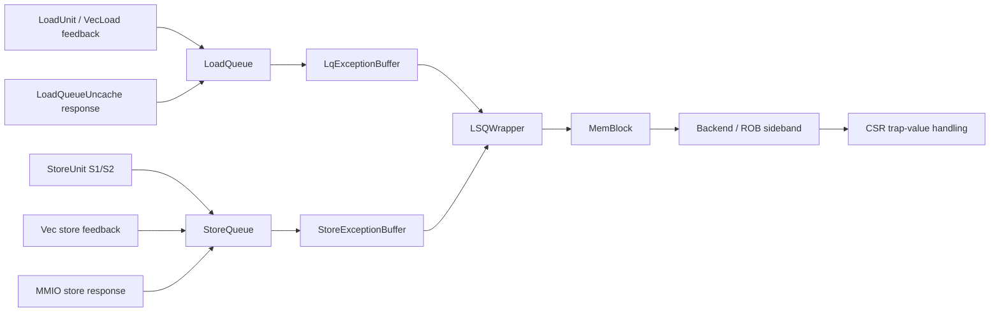
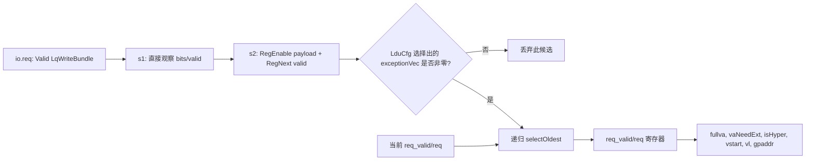
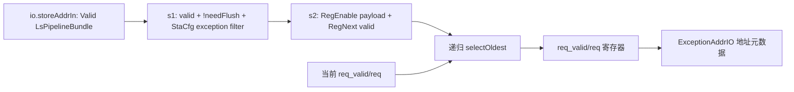
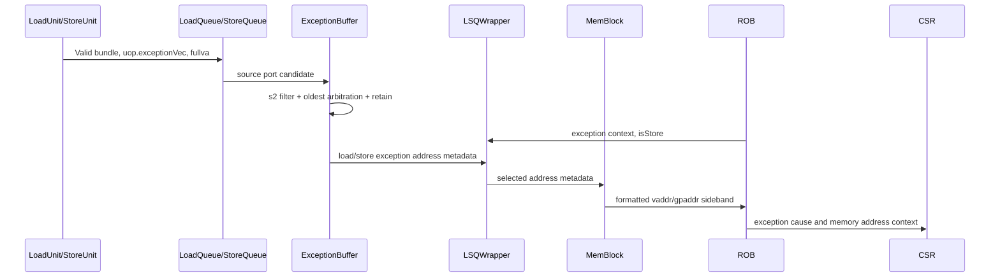

# 1. LoadStore-ExceptionBuffer：Kunminghu-v2 访存异常地址缓冲源码解析

## 1.1. 阅读范围

本文只分析 Kunminghu-v2 访存单元中承接异常**地址与附加地址属性**的两个实现：

| 名称 | 实现位置 | 本文中的含义 |
| --- | --- | --- |
| `LqExceptionBuffer` | [LoadExceptionBuffer.scala:35](/home/yanyusong/xs-memory-env/XiangShan/src/main/scala/xiangshan/mem/lsqueue/LoadExceptionBuffer.scala:35) | 负载、向量负载反馈和 load-MMIO 响应异常的地址候选归并器 |
| `StoreExceptionBuffer` | [StoreQueue.scala:73](/home/yanyusong/xs-memory-env/XiangShan/src/main/scala/xiangshan/mem/lsqueue/StoreQueue.scala:73) | 标量/向量存储以及 store-MMIO 响应异常的地址候选归并器 |

这里的 “ExceptionBuffer” 不是产生异常原因、决定 ROB 提交，或执行 trap 的模块。它只在多个访存来源同时给出异常时，保留最老且尚未被 `redirect` 冲刷的候选，把异常地址相关元数据送到 LSQ/MemBlock。异常原因仍随 `uop.exceptionVec` 进入 ROB/CSR 链路。

## 1.2. 源码基线和可复现性

| 项目 | 记录 |
| --- | --- |
| RTL 检出目录 | `/home/yanyusong/xs-memory-env/XiangShan` |
| 分支 | `kunminghu-v2` |
| commit | `e12436c7cba86b195deec24981976d78bc263661` |
| commit 主题 | `fix(Store): prevent rdataptr from advancing out of order (#6353)` |
| 检出状态 | `difftest` 有已修改内容，`src/main/resources/aia/` 未跟踪；本文没有改动该检出 |
| 课程/理论参照 | [14_LoadStore.md:2814](/home/yanyusong/XiangShanLab/xiangshan-course/docs/xiangshan-microarchitecture/Beginner_Implementation_and_Principles_of_the_High_Performance_Xiangshan_Processor/14_LoadStore.md:2814)、[13_ROB.md:14](/home/yanyusong/XiangShanLab/xiangshan-course/docs/4-xiangshan-microarchitecture-analysis/2-xiangshan-design-document/13_ROB.md:14) |
| XiangShan-Design-Doc | 本机未发现独立 `XiangShan-Design-Doc` 检出，本文不以网络副本替代；所有实现结论以该 commit 的 RTL 为准 |

文中 “源码证实” 是对上述 commit 的静态结论；“推导” 会显式标注，不把课程文字或一般微架构常识写成 RTL 行为。

## 2. 先给结论

1. 两个模块都是一个 `req_valid` 加一个 `req` 寄存器组成的**单槽最老候选保持器**，不是有深度、`ready`、满空状态或逐项出队的队列。
2. 每拍可观察多个来源的 `Valid` 候选，但递归二叉选择器只留下 ROB 年龄最老者；未被选中的较年轻候选既不会进入额外槽位，也不会得到反压。
3. 保留项会与新候选再次比较：新候选更老时替换，当前保持项更老时继续保留；`redirect` 使错误路径候选失效。
4. `exceptionAddr` 没有独立的 `valid`。它是由 ROB 异常时序驱动的旁带地址；LSQWrapper 用延迟一拍的 `isStore` 在 load/store 两个地址输出之间选择。
5. ExceptionBuffer 不编码 cache set/way、物理地址访问、MMIO 请求或异常 cause 优先级。它输出 `fullva`、扩展/虚拟化和向量/访客物理地址元数据；MemBlock/CSR 在后续阶段构造最终 `tval` 类地址。

## 3. 理论概念到源码映射

课程材料将 LQ 异常地址缓冲描述为支持精确异常的地址保存机制，而 ROB 章节说明异常在按序提交边界上被处理。这些是理解目标；下表给出能够在当前 RTL 直接落地的对应关系。

| 理论概念 | 当前实现证据 | 结论边界 |
| --- | --- | --- |
| 精确异常需要最老异常指令的地址 | 两实现均按 `robIdx`，同 ROB 再按 `uopIdx` 选最老 [LoadExceptionBuffer.scala:67](/home/yanyusong/xs-memory-env/XiangShan/src/main/scala/xiangshan/mem/lsqueue/LoadExceptionBuffer.scala:67)、[StoreQueue.scala:108](/home/yanyusong/xs-memory-env/XiangShan/src/main/scala/xiangshan/mem/lsqueue/StoreQueue.scala:108) | 证明地址候选的年龄排序；不等同于这里决定 trap cause |
| ROB 按序发现/提交异常 | ROB 在头部异常条件满足时产生 exception/flush [Rob.scala:555](/home/yanyusong/xs-memory-env/XiangShan/src/main/scala/xiangshan/backend/rob/Rob.scala:555)、[Rob.scala:635](/home/yanyusong/xs-memory-env/XiangShan/src/main/scala/xiangshan/backend/rob/Rob.scala:635) | ExceptionBuffer 不直接连接为 ROB exception valid 的来源 |
| 访存异常地址用于 CSR 的 trap value | MemBlock 组装 LSQ 地址，送往后端；CSR 根据 memory exception 输入更新 trap-value [MemBlock.scala:1983](/home/yanyusong/xs-memory-env/XiangShan/src/main/scala/xiangshan/mem/MemBlock.scala:1983)、[CSR.scala:1363](/home/yanyusong/xs-memory-env/XiangShan/src/main/scala/xiangshan/backend/fu/CSR.scala:1363) | 地址与 cause 是两条相关但不同的路径 |
| 课程中 LQ ExceptionBuffer 的介绍 | [14_LoadStore.md:2814](/home/yanyusong/XiangShanLab/xiangshan-course/docs/xiangshan-microarchitecture/Beginner_Implementation_and_Principles_of_the_High_Performance_Xiangshan_Processor/14_LoadStore.md:2814) | 仅作概念参照，不能代替本 commit 的端口和时序证据 |

## 4. 实现位置和实例关系



`LoadQueue` 实例化自己的缓冲并把 `exceptionAddr` 直接连出 [LoadQueue.scala:214](/home/yanyusong/xs-memory-env/XiangShan/src/main/scala/xiangshan/mem/lsqueue/LoadQueue.scala:214)、[LoadQueue.scala:290](/home/yanyusong/xs-memory-env/XiangShan/src/main/scala/xiangshan/mem/lsqueue/LoadQueue.scala:290)。`StoreQueue` 在其内部实例化 Store 版本并转接同名输出 [StoreQueue.scala:228](/home/yanyusong/xs-memory-env/XiangShan/src/main/scala/xiangshan/mem/lsqueue/StoreQueue.scala:228)、[StoreQueue.scala:1451](/home/yanyusong/xs-memory-env/XiangShan/src/main/scala/xiangshan/mem/lsqueue/StoreQueue.scala:1451)。二者由 `LSQWrapper` 汇合。

## 5. 参数化端口和静态资源

当前默认参数为 `LoadPipelineWidth = 3`、`StorePipelineWidth = 2`、`VecLoadPipelineWidth = 2`、`VecStorePipelineWidth = 2` [Parameters.scala:214](/home/yanyusong/xs-memory-env/XiangShan/src/main/scala/xiangshan/Parameters.scala:214)。据此得到的是**配置展开后的端口数**，而不是运行期可变容量。

| 模块 | 公式 | 当前默认值 | 端口划分 |
| --- | --- | ---: | --- |
| `LqExceptionBuffer` | `LoadPipelineWidth + VecLoadPipelineWidth + 1` | 6 | 3 标量负载 + 2 向量负载反馈 + 1 load-MMIO non-data error |
| `StoreExceptionBuffer` | `StorePipelineWidth * 2 + VecStorePipelineWidth + 1` | 7 | 2 个标量 S1（非 AF）+ 2 个标量 S2 AF + 2 向量存储 + 1 SoC non-data error |

Store 端口分区在源码注释中有直接说明 [StoreQueue.scala:74](/home/yanyusong/xs-memory-env/XiangShan/src/main/scala/xiangshan/mem/lsqueue/StoreQueue.scala:74)。Load 的最后一端口同样由类内注释标明为 MMIO 总线 non-data error [LoadExceptionBuffer.scala:35](/home/yanyusong/xs-memory-env/XiangShan/src/main/scala/xiangshan/mem/lsqueue/LoadExceptionBuffer.scala:35)。

## 6. 接口契约：谁提供、为什么提供、如何到达

| 缓冲 | From | 输入条件 | 缓冲内动作 | To | 消费含义 |
| --- | --- | --- | --- | --- | --- |
| Load | `LoadQueue.io.ldu.ldin` | 标量 `valid && !isvec` | s1 取包，s2 延迟并以 `LduCfg` 筛 exception bit | `LoadQueue.io.exceptionAddr` | 供 LSQWrapper 在 load 异常时选择地址 |
| Load | 向量 load feedback | `valid && feedback(FLUSH)` | 写入 `fullva/gpaddr/robIdx/uopIdx/vstart/vl` 等 | 同上 | 向量异常地址信息 |
| Load | `LoadQueueUncache` | uncache 响应写回异常 | 进入最后一端口 | 同上 | load-MMIO `denied/corrupt` 类错误的地址 |
| Store | 标量 `storeAddrIn` | S1 产生的非 AF 异常，或延后一拍的 S2 AF | 以 `StaCfg` 过滤，s2 延迟 | `StoreQueue.io.exceptionAddr` | 供 LSQWrapper 在 store 异常时选择地址 |
| Store | 向量 store feedback | `valid && feedback(FLUSH)` | 同样保留完整 `LsPipelineBundle` | 同上 | 向量存储异常地址信息 |
| Store | MMIO store 写回 | `io.mmioStout.fire`，再由 `StaCfg` 过滤 | 进入最后一端口 | 同上 | MMIO store access fault/hardware error 地址 |

Load 的标量、向量和 uncache 三类接入可以在 [LoadQueue.scala:263](/home/yanyusong/xs-memory-env/XiangShan/src/main/scala/xiangshan/mem/lsqueue/LoadQueue.scala:263)、[LoadQueue.scala:269](/home/yanyusong/xs-memory-env/XiangShan/src/main/scala/xiangshan/mem/lsqueue/LoadQueue.scala:269)、[LoadQueue.scala:285](/home/yanyusong/xs-memory-env/XiangShan/src/main/scala/xiangshan/mem/lsqueue/LoadQueue.scala:285) 看到。Store 的标量 S1/S2 回填、向量和 MMIO 来源分别见 [StoreQueue.scala:507](/home/yanyusong/xs-memory-env/XiangShan/src/main/scala/xiangshan/mem/lsqueue/StoreQueue.scala:507)、[StoreQueue.scala:565](/home/yanyusong/xs-memory-env/XiangShan/src/main/scala/xiangshan/mem/lsqueue/StoreQueue.scala:565)、[StoreQueue.scala:232](/home/yanyusong/xs-memory-env/XiangShan/src/main/scala/xiangshan/mem/lsqueue/StoreQueue.scala:232)、[StoreQueue.scala:1098](/home/yanyusong/xs-memory-env/XiangShan/src/main/scala/xiangshan/mem/lsqueue/StoreQueue.scala:1098)。

### 6.1. 它是 Valid-only 旁带接口

两个输入都是 `Flipped(Valid(...))`，输出 `ExceptionAddrIO` 中没有 `valid`，没有 `ready`，也没有 `fire`。最小实现骨架如下：

```scala
val req_valid = RegInit(false.B)
val req = Reg(new LqWriteBundle)
val s1_req = VecInit(io.req.map(_.bits))
val s1_valid = VecInit(io.req.map(x => x.valid))
```

以上来自 [LoadExceptionBuffer.scala:38](/home/yanyusong/xs-memory-env/XiangShan/src/main/scala/xiangshan/mem/lsqueue/LoadExceptionBuffer.scala:38)。这意味着上游不能借 `ready=0` 得到“未接收”的反馈；下游也不是通过读取并弹出一项来消费它。地址有效的上下文来自 ROB 的异常/提交时序，而不是 `exceptionAddr` 本身携带的握手。

## 7. 两条数据路径的阶段划分

### 7.1. Load 路径



Load 在 s2 对两个时点的 `redirect` 做过滤：保存的包既不能需要冲刷 `RegNext(io.redirect)`，也不能需要冲刷当前 `io.redirect` [LoadExceptionBuffer.scala:52](/home/yanyusong/xs-memory-env/XiangShan/src/main/scala/xiangshan/mem/lsqueue/LoadExceptionBuffer.scala:52)。然后仅当 `ExceptionNO.selectByFu(..., LduCfg)` 非零才成为候选 [LoadExceptionBuffer.scala:60](/home/yanyusong/xs-memory-env/XiangShan/src/main/scala/xiangshan/mem/lsqueue/LoadExceptionBuffer.scala:60)。

### 7.2. Store 路径



Store 在 s1 就把 `valid`、当前 `redirect` 和 `StaCfg` exception filter 合在一起 [StoreQueue.scala:91](/home/yanyusong/xs-memory-env/XiangShan/src/main/scala/xiangshan/mem/lsqueue/StoreQueue.scala:91)，s2 再延迟一拍并复查当前 redirect [StoreQueue.scala:96](/home/yanyusong/xs-memory-env/XiangShan/src/main/scala/xiangshan/mem/lsqueue/StoreQueue.scala:96)。这两个版本的 redirect 检查位置不完全对称；这是源码结构事实，本文不进一步臆测其设计动机。

## 8. “最老”怎样定义

两个实现的二元比较完全同构：若两个输入均有效，`isAfter(a.robIdx, b.robIdx)` 为真就选 `b`；若 ROB 指针相同，则较小 `uopIdx` 胜出。

```scala
val oldest = Mux(valid(0) && valid(1),
  Mux(isAfter(bits(0).uop.robIdx, bits(1).uop.robIdx) ||
    (bits(0).uop.robIdx === bits(1).uop.robIdx &&
      bits(0).uop.uopIdx > bits(1).uop.uopIdx), res(1), res(0)),
  Mux(valid(0) && !valid(1), res(0), res(1)))
```

代码见 [LoadExceptionBuffer.scala:67](/home/yanyusong/xs-memory-env/XiangShan/src/main/scala/xiangshan/mem/lsqueue/LoadExceptionBuffer.scala:67)。`RobPtr` 是带回绕 flag 的 circular pointer；其比较关系由 `CircularQueuePtr` 定义 [CircularQueuePtr.scala:65](/home/yanyusong/xs-memory-env/XiangShan/utility/src/main/scala/utility/CircularQueuePtr.scala:65)。因此不能把 `robIdx` 当作普通无回绕的整数比较。

对于 6 或 7 个端口，`selectOldest` 递归地把候选分成左右两半，各自产生局部最老项，再二元归并 [LoadExceptionBuffer.scala:82](/home/yanyusong/xs-memory-env/XiangShan/src/main/scala/xiangshan/mem/lsqueue/LoadExceptionBuffer.scala:82)。这是组合仲裁树，而不是年龄排序后的多项队列。

## 9. 单槽保持状态与覆盖规则

两种缓冲均只有如下状态：

| 状态元素 | 复位 | 写入条件 | 失效条件 | 对外可见 |
| --- | --- | --- | --- | --- |
| `req_valid` | `false` | `selectOldest` 的结果有效 | 当前 `req.uop.robIdx.needFlush(io.redirect)` 为真，且没有更合适候选 | 仅用于内部选择和 perf 计数 |
| `req` | 未复位 | `reqSel` 每拍写入 | `req_valid` 失效后其中比特可视作无意义 | `fullva` 等字段持续接到 `exceptionAddr` |

关键逻辑是把“当前已保留项”追加到新 s2 候选后再次仲裁：

```scala
val reqValid = req_valid && !req.uop.robIdx.needFlush(io.redirect)
val reqSel = selectOldest(s2_enqueue :+ reqValid, s2_req :+ req)
req_valid := reqSel._1(0)
req := reqSel._2(0)
```

见 [LoadExceptionBuffer.scala:89](/home/yanyusong/xs-memory-env/XiangShan/src/main/scala/xiangshan/mem/lsqueue/LoadExceptionBuffer.scala:89) 与 [StoreQueue.scala:130](/home/yanyusong/xs-memory-env/XiangShan/src/main/scala/xiangshan/mem/lsqueue/StoreQueue.scala:130)。它直接给出四种可验证结果：

| 新 s2 候选与当前保持项 | 结果 |
| --- | --- |
| 无新候选，当前项未被冲刷 | 保持当前项 |
| 新项更老 | 新项覆盖当前项 |
| 当前项更老 | 当前项继续保留 |
| 当前项被 redirect 冲刷且无有效新项 | `req_valid` 变为 0 |

重要限制：同拍出现的较年轻候选不被选择后不会另存。因该模块不提供反压，这一行为只能被称作“为精确异常地址保留最老候选”，不能称作“接收并排队所有异常”。

## 10. 异常过滤、cause 与地址的职责划分

### 10.1. ExceptionBuffer 只做 FU 可见异常过滤

`ExceptionNO.selectByFu(x.uop.exceptionVec, LduCfg/StaCfg).asUInt.orR` 的意思是：仅把该功能单元配置中可见的异常位的 OR 结果作为候选条件 [package.scala:942](/home/yanyusong/xs-memory-env/XiangShan/src/main/scala/xiangshan/package.scala:942)。它不从多个异常位中挑选最终 cause，也不产生新的 exception bit。

LoadUnit 和 StoreUnit 各自在执行/TLB/缓存或写回路径构造并携带 `uop.exceptionVec`，例如 load 的 LSQ 写回包来自 s3 输出 [LoadUnit.scala:1582](/home/yanyusong/xs-memory-env/XiangShan/src/main/scala/xiangshan/mem/pipeline/LoadUnit.scala:1582)，store 的地址异常由 S1/S2 进入 `storeAddrIn` [StoreQueue.scala:507](/home/yanyusong/xs-memory-env/XiangShan/src/main/scala/xiangshan/mem/lsqueue/StoreQueue.scala:507)。

### 10.2. 最终 cause 仍在 ROB/CSR 处理

ROB 维护异常写回与头部异常判断 [Rob.scala:140](/home/yanyusong/xs-memory-env/XiangShan/src/main/scala/xiangshan/backend/rob/Rob.scala:140)、[Rob.scala:555](/home/yanyusong/xs-memory-env/XiangShan/src/main/scala/xiangshan/backend/rob/Rob.scala:555)。CSR 用 `ExceptionNO.priorities.foldRight` 对异常集合选择常规 cause [CSR.scala:1296](/home/yanyusong/xs-memory-env/XiangShan/src/main/scala/xiangshan/backend/fu/CSR.scala:1296)，优先级表定义在 [package.scala:890](/home/yanyusong/xs-memory-env/XiangShan/src/main/scala/xiangshan/package.scala:890)。

所以以下说法是错误的：

* “ExceptionBuffer 决定 page fault 与 access fault 的优先级。”
* “ExceptionBuffer 发出 ROB exception valid。”
* “ExceptionBuffer 在 trap 时清空并出队。”

它保存的是正确年龄候选的地址载荷；ROB/CSR 以不同状态和时序处理 architectural exception。

## 11. 输出字段和地址语义

两个模块均把保留包的字段直接驱动为：

| `ExceptionAddrIO` 字段 | 来源 | 后续用途 |
| --- | --- | --- |
| `vaddr` | `req.fullva` | 作为异常虚拟地址输入 MemBlock |
| `vaNeedExt` | `req.vaNeedExt` | 指示是否按当前地址转换模式扩展 |
| `isHyper` | `req.isHyper` | 帮助决定虚拟化/Hyper 情形 |
| `vstart`、`vl` | `req.uop.vpu` | 向量异常附加上下文 |
| `gpaddr` | `req.gpaddr` | guest physical address 旁带值 |
| `isForVSnonLeafPTE` | 请求包 | VS non-leaf PTE 特殊处理旁带值 |

直接连线见 [LoadExceptionBuffer.scala:95](/home/yanyusong/xs-memory-env/XiangShan/src/main/scala/xiangshan/mem/lsqueue/LoadExceptionBuffer.scala:95) 和 [StoreQueue.scala:136](/home/yanyusong/xs-memory-env/XiangShan/src/main/scala/xiangshan/mem/lsqueue/StoreQueue.scala:136)。输出没有 PC 字段，也没有物理 cache 位置；虽然保留的完整 bundle 内含 `uop`，该模块向下游显式导出的只是上表字段。

## 12. LSQWrapper 与 MemBlock：从 load/store 地址到最终异常地址

`LSQWrapper` 以 `RegNext(io.exceptionAddr.isStore)` 选择 LoadQueue 或 StoreQueue 输出：

```scala
io.exceptionAddr.vaddr := Mux(RegNext(io.exceptionAddr.isStore),
  storeQueue.io.exceptionAddr.vaddr, loadQueue.io.exceptionAddr.vaddr)
```

完整字段选择见 [LSQWrapper.scala:251](/home/yanyusong/xs-memory-env/XiangShan/src/main/scala/xiangshan/mem/lsqueue/LSQWrapper.scala:251)。`isStore` 从 MemBlock 的 `ooo_to_mem.isStoreException` 接入 LSQ [MemBlock.scala:1861](/home/yanyusong/xs-memory-env/XiangShan/src/main/scala/xiangshan/mem/MemBlock.scala:1861)，后者由后端 ROB 的 commit type 推导 [Backend.scala:838](/home/yanyusong/xs-memory-env/XiangShan/src/main/scala/xiangshan/backend/Backend.scala:838)。

LSQWrapper 源码将这一时序说明为：s0 commit，s1 exception find，s2 exception triggered，s3 指针和新地址更新，异常触发后的下一拍使用地址 [LSQWrapper.scala:245](/home/yanyusong/xs-memory-env/XiangShan/src/main/scala/xiangshan/mem/lsqueue/LSQWrapper.scala:245)。这是整个 ROB/LSQ 地址使用协议的注释，不应误读成 ExceptionBuffer 自身“固定 s0--s3 延迟”。

MemBlock 对地址来源有优先级：atomics、misalign overwrite、vSegment，最后才是 `lsq.io.exceptionAddr.vaddr` [MemBlock.scala:1904](/home/yanyusong/xs-memory-env/XiangShan/src/main/scala/xiangshan/mem/MemBlock.scala:1904)。然后 `GenExceptionVa` 按 Bare/Sv39/Sv48/Sv39x4/Sv48x4 与 `vaNeedExt` 构造地址，再寄存到 `io.mem_to_ooo.lsqio.vaddr` [MemBlock.scala:1925](/home/yanyusong/xs-memory-env/XiangShan/src/main/scala/xiangshan/mem/MemBlock.scala:1925)、[MemBlock.scala:1983](/home/yanyusong/xs-memory-env/XiangShan/src/main/scala/xiangshan/mem/MemBlock.scala:1983)。

## 13. 时序、吞吐和可观测波形

### 13.1. 可以从源码断言的时序

* 输入 payload 经 `RegEnable`，valid 经 `RegNext`，因此从输入被观察到进入 s2 候选至少跨一个寄存器边界。
* s2 候选与已保持的 `req` 组合仲裁，仲裁结果在 `req_valid/req` 寄存器中更新。
* 地址输出直接取 `req`，而 load/store 选择和 MemBlock 地址生成还有各自寄存器与 ROB 时序。
* 访存异常的完整 architectural latency 不是该模块能单独固定的常数：它还取决于 TLB/cache/MMIO 响应、ROB 到头、redirect 与 CSR 状态。

### 13.2. 吞吐边界

一拍最多可同时观察 6 个 load 或 7 个 store 来源（默认配置）；它们可以一起参与组合仲裁。**保持能力却只有一个候选**。因此下面的 “1” 表示单槽状态的最终选择能力，而非正常 load/store datapath 的发射吞吐。

| 指标 | Load | Store |
| --- | ---: | ---: |
| 当前配置同时观察端口 | 6 | 7 |
| 异常候选寄存槽 | 1 | 1 |
| `ready` 反压通道 | 0 | 0 |
| 同拍保留的候选数 | 至多 1 | 至多 1 |

### 13.3. Valid-only 波形示意

下图表示关系而非从 FST 实测得到的周期。`req_valid` 在 s2 候选仲裁结果写入寄存器后才变高；不存在 `ready` 波形。

```wavedrom
{ "signal": [
  { "name": "clk",             "wave": "p...." },
  { "name": "io.req[0].valid", "wave": "01000" },
  { "name": "s2_valid[0]",     "wave": "00100" },
  { "name": "s2_enqueue[0]",   "wave": "00100" },
  { "name": "req_valid",       "wave": "00010" },
  { "name": "redirect.valid",  "wave": "00000" }
], "config": { "hscale": 1 } }
```

若 `redirect.valid` 对应候选的 `robIdx.needFlush` 为真，s2 候选或当前保持项会失效；不能把上图中的 `req_valid` 高电平当作独立的 “地址已被消费” 握手。

## 14. Redirect、错误路径与状态安全

`RobPtr.needFlush` 由 redirect 的 ROB 指针和 flush 条件定义 [RobBundles.scala:204](/home/yanyusong/xs-memory-env/XiangShan/src/main/scala/xiangshan/backend/rob/RobBundles.scala:204)。两个 ExceptionBuffer 都在当前保持项进入下一轮仲裁前计算：

```scala
val reqValid = req_valid && !req.uop.robIdx.needFlush(io.redirect)
```

故已保留但位于被冲刷路径上的候选不会继续作为地址源。Load 版本还在 s2 额外检查延迟 redirect；Store 版本在 s1 和 s2 以其自身的检查位置过滤。`req` 本体未复位不是未初始化可见性问题，因为 `req_valid` 在复位为 0，且地址是否被采用受更外层的 ROB 异常协议约束。

需要注意的边界是：源码没有以 `clear` 或 `deq` 表示 “trap 消费后释放”。这里的自然生命周期是 “保留 -> 保留/被更老者替换 -> redirect 失效”，而不是 FIFO 出队生命周期。

## 15. 跨页、跨 cache line 与 MMIO 边界

### 15.1. 跨页 / 非对齐

ExceptionBuffer 不做访问拆分、第二页翻译或 PPN 拼接，只保存执行路径已经给出的 `fullva` 等字段。MemBlock 的确有 `misalignBufExceptionOverwrite` 优先级输入 [MemBlock.scala:1871](/home/yanyusong/xs-memory-env/XiangShan/src/main/scala/xiangshan/mem/MemBlock.scala:1871)，但当前 commit 的两个 MisalignBuffer 都将 `overwriteExpBuf.valid` 硬连为 `false.B`：[LoadMisalignBuffer.scala:641](/home/yanyusong/xs-memory-env/XiangShan/src/main/scala/xiangshan/mem/lsqueue/LoadMisalignBuffer.scala:641)、[StoreMisalignBuffer.scala:669](/home/yanyusong/xs-memory-env/XiangShan/src/main/scala/xiangshan/mem/lsqueue/StoreMisalignBuffer.scala:669)。

所以 “非对齐跨页地址覆盖 ExceptionBuffer” 在此版本是能找到的潜在支路，但有效输出被关闭，不能描述为运行中的行为。真正生效的 LSQ 地址候选仍来自 Load/Store ExceptionBuffer，除非 atomics 或 vSegment 更高优先级来源生效。

### 15.2. 跨 cache line

本模块没有 cache-line offset、set、way、bank、tag 比较或 paddr 请求端口。跨 line 的访问、cache miss/replay/分块处理属于 LoadUnit、StoreUnit、MisalignBuffer 和 DCache/Uncache 路径；不能把它归因给 ExceptionBuffer。这里仅保存最终需要报告的虚拟地址元数据。

### 15.3. MMIO / 非数据错误

Load 的末端口来自 `LoadQueueUncache.io.exception` [LoadQueue.scala:285](/home/yanyusong/xs-memory-env/XiangShan/src/main/scala/xiangshan/mem/lsqueue/LoadQueue.scala:285)。`LoadQueueUncache` 自身是有状态的请求/响应条目，响应阶段捕获 `denied/corrupt`，写回时形成 exception vector [LoadQueueUncache.scala:114](/home/yanyusong/xs-memory-env/XiangShan/src/main/scala/xiangshan/mem/lsqueue/LoadQueueUncache.scala:114)、[LoadQueueUncache.scala:205](/home/yanyusong/xs-memory-env/XiangShan/src/main/scala/xiangshan/mem/lsqueue/LoadQueueUncache.scala:205)。这与单槽 ExceptionBuffer 的职责不同。

Store 的 MMIO 路径在响应 `denied` 时置 store access fault，在 `corrupt && !denied` 时置 hardware error [StoreQueue.scala:873](/home/yanyusong/xs-memory-env/XiangShan/src/main/scala/xiangshan/mem/lsqueue/StoreQueue.scala:873)，并在 `mmioStout.fire` 时送到最后一个 ExceptionBuffer 端口 [StoreQueue.scala:1056](/home/yanyusong/xs-memory-env/XiangShan/src/main/scala/xiangshan/mem/lsqueue/StoreQueue.scala:1056)、[StoreQueue.scala:1098](/home/yanyusong/xs-memory-env/XiangShan/src/main/scala/xiangshan/mem/lsqueue/StoreQueue.scala:1098)。

## 16. CSR、特权和虚拟化相关信息

Buffer 传递的 `vaNeedExt`、`isHyper`、`gpaddr` 与 `isForVSnonLeafPTE` 说明它不是简单的 XLEN 地址寄存器。MemBlock 使用 CSR/TLB 中的 `satp`、`vsatp`、`hgatp` 和权限/虚拟化状态决定如何扩展 `fullva` [MemBlock.scala:1925](/home/yanyusong/xs-memory-env/XiangShan/src/main/scala/xiangshan/mem/MemBlock.scala:1925)。

CSR 一侧接收 memory exception 地址与 GPA 旁带输入 [CSR.scala:108](/home/yanyusong/xs-memory-env/XiangShan/src/main/scala/xiangshan/backend/fu/CSR.scala:108)，在 trap 处理部分依据异常和特权状态更新 `mtval/stval/vstval` 与可能的 `mtval2/htval` [CSR.scala:1363](/home/yanyusong/xs-memory-env/XiangShan/src/main/scala/xiangshan/backend/fu/CSR.scala:1363)。因此：

* Buffer 输出的 `vaddr` 不是已经最终格式化的 CSR trap value；
* Buffer 不自行读取 CSR，也不决定 trap 应写哪个 CSR；
* `isHyper` 与 GPA 是为了让后继逻辑保留虚拟化语义，而非本模块执行二阶段地址翻译。

## 17. 调试、性能计数和 Difftest 覆盖

Load 版本有一个性能计数事件：`XSPerfAccumulate("exception", !RegNext(req_valid) && req_valid)` [LoadExceptionBuffer.scala:103](/home/yanyusong/xs-memory-env/XiangShan/src/main/scala/xiangshan/mem/lsqueue/LoadExceptionBuffer.scala:103)。它记录的是 `req_valid` 的上升沿，不能简单解释为系统中所有 load exception 的计数，也不能拿它与 architectural trap 数一一对应。Store 版本在其类定义范围内没有对称的同名计数器。

| 观察点 | 是否直接覆盖 ExceptionBuffer | 作用 |
| --- | --- | --- |
| `LqExceptionBuffer` perf `exception` | 部分，且仅 load | 观察新保留地址候选的出现 |
| ROB `DiffInstrCommit` | 否 | architectural 提交序列 [Rob.scala:1543](/home/yanyusong/xs-memory-env/XiangShan/src/main/scala/xiangshan/backend/rob/Rob.scala:1543) |
| ROB `DiffLoadEvent` | 否 | 已提交 load 事件，非缓冲内部状态 [Rob.scala:1585](/home/yanyusong/xs-memory-env/XiangShan/src/main/scala/xiangshan/backend/rob/Rob.scala:1585) |
| ROB `DiffTrapEvent` | 否 | trap 可见事件 [Rob.scala:1604](/home/yanyusong/xs-memory-env/XiangShan/src/main/scala/xiangshan/backend/rob/Rob.scala:1604) |
| CSR `DiffArchEvent` | 否 | CSR exception 可见时的体系结构事件 [CSR.scala:1565](/home/yanyusong/xs-memory-env/XiangShan/src/main/scala/xiangshan/backend/fu/CSR.scala:1565) |

当前源码没有直接名为 “ExceptionBuffer difftest event” 的参考模型比较点。调试时应把微架构层的 `req_valid/req.robIdx/fullva` 与提交层的 ROB exception、CSR/Difftest trap 分开观察；前者可在错误路径上出现后被 flush，后者才是体系结构可见结果。

## 18. 端到端时序图



这里 `R -> W` 与 `EB -> W` 是协作关系而非一个普通 request/response 对：ROB 给出“何时、哪类访存异常”语境，ExceptionBuffer 提供相应年龄项的地址。若 redirect 在候选被采用前将其冲刷，EB 内部筛选保证其不继续作为保留项。

## 19. 场景矩阵

| 场景 | 输入/条件 | ExceptionBuffer 行为 | 需要观测的后继点 |
| --- | --- | --- | --- |
| 普通无异常 load/store | `Valid` 但 FU 选择后的 exceptionVec 为 0 | 不成为 s2 候选 | 无新的 `req_valid` 上升沿 |
| 同拍多源异常 | 多个 s2 端口有效 | 二叉树只留下最老 `robIdx/uopIdx` | `req.robIdx/uopIdx` 与输入年龄关系 |
| 新候选比当前旧 | 两者有效，当前保持项更老 | 保持当前项 | `req` 不应被更年轻候选覆盖 |
| 新候选比当前老 | 两者有效，新项更老 | 替换为新项 | `req.fullva` 与新项一致 |
| 错误路径候选 | `needFlush(redirect)` | 在 s1/s2/保留重仲裁相应检查点失效 | `req_valid` 不应继续代表该 ROB 项 |
| 标量 load late error | LoadUnit 写 `ldin` | LQ 标量端口经 `LduCfg` 筛选 | `LqExceptionBuffer.req` |
| 向量 load/store | feedback 为 `FLUSH` | 进入 vector 专用端口，携带 `vstart/vl` | `exceptionAddr.vstart/vl` |
| load MMIO 错误 | Uncache 响应生成 exception | load 最后一端口参与年龄仲裁 | `LoadQueueUncache` 状态、LQ `req` |
| store MMIO denied/corrupt | `mmioStout.fire` 且 cause 对 StaCfg 可见 | store 最后一端口参与仲裁 | `StoreQueue` 写回和 `req.fullva` |
| 非对齐跨页覆盖 | MisalignBuffer 计算候选 | 当前版本 `overwriteExpBuf.valid=false`，不作为有效覆盖 | 应确认该 valid 保持 0 |

## 20. 源码检查和建议断言

以下断言/波形检查适用于仿真调试，前两条与当前 RTL 的组合选择直接对应：

```scala
// 伪断言：同拍两个有效异常候选，输出不得选择更年轻者。
assert(!(candA && candB && older(A, B)) || selected.robIdx === A.robIdx)

// 伪断言：被 redirect 冲刷的保留项不能在下一轮作为 reqValid 留下。
assert(!(req_valid && req.uop.robIdx.needFlush(redirect)) || !reqValid)

// 波形重点：同时显示 s2_enqueue[*]、req_valid、req.robIdx、req.uopIdx、redirect。
```

真实 Chisel 断言应使用项目已有的 pointer 比较/helper，而不是把 `robIdx` 转成普通整数。对于定位地址错误，还应同时显示 `fullva`、`vaNeedExt`、`isHyper`、`gpaddr` 和外部 `isStoreException`；只看 `exceptionVec` 无法判定 LSQ 选择的是哪一侧地址。

## 21. 与设计文档的可追溯性和未决项

| 主题 | 设计文档状态 | 源码位置 | 本文处理 |
| --- | --- | --- | --- |
| ExceptionBuffer 具体端口、阶段和仲裁 | 未查阅独立 Design-Doc（本机缺失） | `LoadExceptionBuffer.scala`、`StoreQueue.scala` | 仅以 RTL 下结论 |
| 精确异常的概念背景 | 使用课程材料 | `14_LoadStore.md`、`13_ROB.md` | 作为理论定位，不覆盖 RTL 细节 |
| Load/store 地址选择时序 | 未见单独设计文档 | `LSQWrapper.scala:245` | 采用源码注释并明确其范围 |
| 跨页 overwrite | 未见单独设计文档 | MisalignBuffer `valid := false.B` | 标为当前版本未激活支路 |

尚不能从 ExceptionBuffer 源码单独回答的问题包括：具体程序在何拍触发某个 TLB/cache 异常、ROB 将其何时提升为 architectural trap、以及是否有特定配置改变 `LduCfg/StaCfg` 的异常集合。这些需要结合具体配置、波形和上游执行单元状态，而不是由该单槽地址归并器推断。

## 22. 验证特别注意

1. 对每个异常用例以 `robIdx + uopIdx` 跟踪，而不是只按 PC；同一 PC 可有多次投机实例。
2. 不要从 `Valid` 单独推断 `fire`，这里没有 `ready`。记录输入 valid、s2 valid、`s2_enqueue`、`req_valid` 和 redirect 的关系。
3. 对同时异常用例检查赢家确实最老；对较年轻落选项，不要期待 FIFO 排队或反压。
4. 对 redirect 用例检查当前保持项和延迟 s2 项均不泄漏到后续 exception address。
5. 对向量用例检查 `vstart/vl`；对虚拟化用例检查 `vaNeedExt/isHyper/gpaddr/isForVSnonLeafPTE` 连同 CSR 输出。
6. 对 MMIO 错误从 Uncache/StoreQueue 响应一路跟到最后端口；不能只在 ExceptionBuffer 输入侧假设总线错误已经被正确形成。
7. 对非对齐跨页相关波形，先确认 `overwriteExpBuf.valid` 的硬连 0；否则会把未激活实现支路误报为真实地址覆盖。

## 23. 总结

Kunminghu-v2 的 Load/Store ExceptionBuffer 是访存异常地址的**年龄仲裁与单槽保持点**。它通过 `robIdx`、`uopIdx` 在多条 load/store、向量和 MMIO 反馈中选取最老异常候选，以 redirect 去除错误路径，并将虚拟地址、扩展、虚拟化和向量元数据传到 LSQWrapper/MemBlock。它不承担异常 cause 优先级、ROB 提交、CSR 写入或缓存事务管理。理解这一职责边界，才能在出现 trap 地址错误时同时检查上游异常产生、缓冲年龄选择、ROB 的 load/store 选择和 MemBlock/CSR 的地址格式化，而不会把问题错误归结为一个传统 FIFO 队列。
