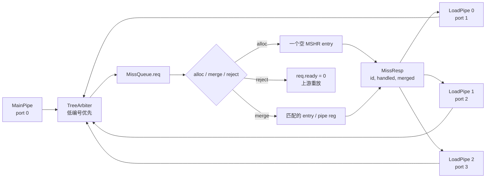
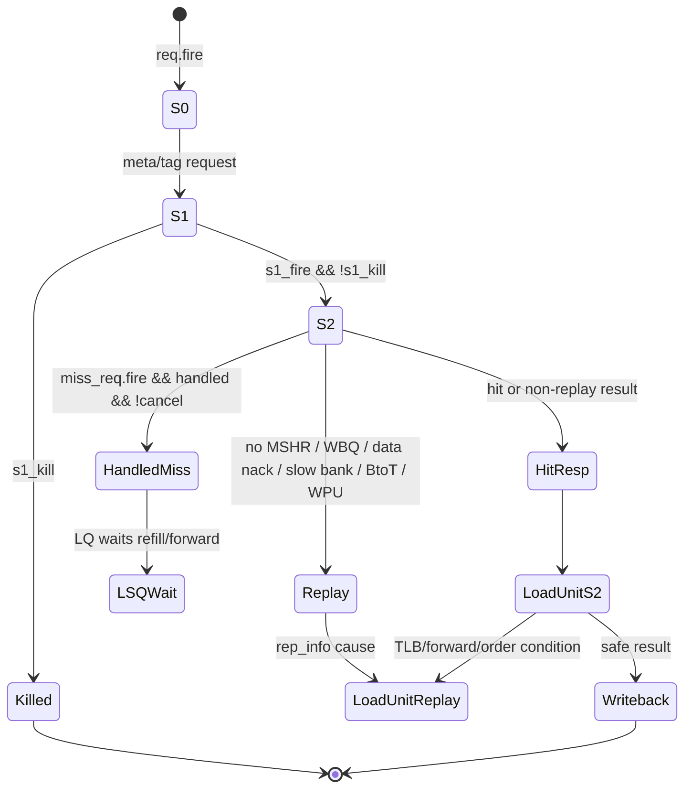

# LoadStore-LoadPipe：Kunminghu V2 DCache LoadPipe 源码分析

> 本文的行为结论只来自用户指定的 Kunminghu V2 源码 checkout。课程材料仅用于解释术语和组织章节，不用于替代源码证据。
>
> 结论先行：`LoadPipe` 是每条标量 load 通路上的 L1 DCache 读流水，负责并行发起 meta/tag 读取、以 DTLB 回送的物理地址作 tag/权限判断、驱动 banked data SRAM、向 MissQueue 申请/合并 miss，并在 S2 返回 hit/miss/replay。它**不**拥有 DTLB、PMP、LoadQueue、最终整数写回或 rollback；这些由相连的 `LoadUnit`、LSQ 和 `MemBlock` 承担。

## 0. 范围、版本与证据边界

### 0.1 本文回答什么

本文追踪普通标量 load（以及由同一入口承载的 DCache 软件预取）的如下闭环：

```text
issueLda[i] -> LoadUnit S0/S1 -> DCache.LoadPipe[i] S0/S1/S2/S3
           -> meta/tag/data bank 或 MissQueue -> LoadUnit S2/S3
           -> LSQ 更新、写回或 replay/rollback
```

重点是 `LoadPipe.scala`，但只有把它放在 `LoadUnit`、`DCacheWrapper`、`BankedDataArray` 和 `MissQueue` 的真实连线中，`valid/ready/fire`、kill、miss 和 replay 的意义才不会被误读。

| 项目 | 固定基线 / 处理方式 |
|---|---|
| 源码 checkout | `/home/yanyusong/xs-memory-env/XiangShan` |
| 分支与提交 | `kunminghu-v2` @ `e12436c7cba86b195deec24981976d78bc263661` |
| 远端身份 | `git@github.com:OpenXiangShan/XiangShan`；本文仍以本地 pinned commit 为准 |
| 主要模块 | [LoadPipe.scala](/home/yanyusong/xs-memory-env/XiangShan/src/main/scala/xiangshan/cache/dcache/loadpipe/LoadPipe.scala:34)、[DCacheWrapper.scala](/home/yanyusong/xs-memory-env/XiangShan/src/main/scala/xiangshan/cache/dcache/DCacheWrapper.scala:1017)、[LoadUnit.scala](/home/yanyusong/xs-memory-env/XiangShan/src/main/scala/xiangshan/mem/pipeline/LoadUnit.scala:112)、[BankedDataArray.scala](/home/yanyusong/xs-memory-env/XiangShan/src/main/scala/xiangshan/cache/dcache/data/BankedDataArray.scala:660)、[MissQueue.scala](/home/yanyusong/xs-memory-env/XiangShan/src/main/scala/xiangshan/cache/dcache/mainpipe/MissQueue.scala:1059) |
| 工作树说明 | checkout 原本已有 `difftest` 修改和 `src/main/resources/aia/` 未跟踪内容；未触碰。本文涉及的 Scala 文件以该 commit 的内容为证据。 |
| 官方 Design Doc | 本机未发现 skill 约定的 `XiangShan-Design-Doc` checkout；因此 **Design Doc baseline: unavailable / not consulted**。不把课程文档冒充为正式设计文档。 |
| skill 同步 | 已按 skill 运行保守周同步检查，因状态文件显示距上次不足 7 天而跳过；没有执行 reset、clean 或 pull。 |

符号约定：

- **已验证**：后附本地源码链接，表达的是本提交可见的 RTL/Chisel 行为。
- **推导**：由已验证逻辑做的直接计算，会写出前提。
- **待确认**：需要实际 elaboration、生成 RTL 或波形，不能由此处源码唯一确定。

### 0.2 官方设计文档与课程材料的可追溯性

| ID | 文档 / 来源 | 这一分析中可用的内容 | 与本提交的关系 | 结论状态 |
|---|---|---|---|---|
| D0 | 官方 XiangShan Design Doc | 本机缺失，未读取 | 无 | 不可用；不据此下结论 |
| C0 | 课程的 load/store 总览 | 解释 LoadUnit、DCache、MissQueue、replay 的课堂语境 | 不同材料可能指向别的版本 | 仅背景，不作代码证据 |
| S0 | 本地 `kunminghu-v2` 源码 | 所有端口、阶段、仲裁、异常与边界行为 | 固定到上述 commit | 本文唯一行为证据 |

课程中常见的“load 四级流水”“非阻塞 cache”“结构冲突”和“投机回放”概念，在本文分别落到 `s0/s1/s2/s3`、MissQueue、bank conflict、`resp.bits.replay`/LSQ replay 的代码上；不会把课程中的固定周期图当作本实现的固定 latency 承诺。

### 0.3 证据索引

| 主题 | 关键源码证据 | 已验证结论 |
|---|---|---|
| 实例化与端口数 | [Parameters.scala:214](/home/yanyusong/xs-memory-env/XiangShan/src/main/scala/xiangshan/Parameters.scala:214)、[DCacheWrapper.scala:1043](/home/yanyusong/xs-memory-env/XiangShan/src/main/scala/xiangshan/cache/dcache/DCacheWrapper.scala:1043) | 源码默认 `LoadPipelineWidth = 3`，Wrapper 按该宽度实例化 `LoadPipe(i)`。 |
| LoadUnit 到 DCache | [MemBlock.scala:853](/home/yanyusong/xs-memory-env/XiangShan/src/main/scala/xiangshan/mem/MemBlock.scala:853)、[MemBlock.scala:880](/home/yanyusong/xs-memory-env/XiangShan/src/main/scala/xiangshan/mem/MemBlock.scala:880) | `LoadUnit(i).io.dcache <> dcache.io.lsu.load(i)`，普通路径同 index 对接。 |
| S0 发起读取 | [LoadPipe.scala:119](/home/yanyusong/xs-memory-env/XiangShan/src/main/scala/xiangshan/cache/dcache/loadpipe/LoadPipe.scala:119) | `req.fire` 同拍驱动 meta/tag read；S0 用 vaddr 求 bank one-hot。 |
| S1 命中与 data read | [LoadPipe.scala:179](/home/yanyusong/xs-memory-env/XiangShan/src/main/scala/xiangshan/cache/dcache/loadpipe/LoadPipe.scala:179)、[LoadPipe.scala:305](/home/yanyusong/xs-memory-env/XiangShan/src/main/scala/xiangshan/cache/dcache/loadpipe/LoadPipe.scala:305) | 用 DTLB duplicate paddr 作 tag/权限判断，命中路径驱动 data bank read。 |
| S2 miss/replay | [LoadPipe.scala:387](/home/yanyusong/xs-memory-env/XiangShan/src/main/scala/xiangshan/cache/dcache/loadpipe/LoadPipe.scala:387)、[LoadPipe.scala:433](/home/yanyusong/xs-memory-env/XiangShan/src/main/scala/xiangshan/cache/dcache/loadpipe/LoadPipe.scala:433) | 无 MSHR、WBQ/data bank 冲突、取消、WPU/BtoT 等因素进入响应或 miss 路径。 |
| S3 错误/flag 更新 | [LoadPipe.scala:538](/home/yanyusong/xs-memory-env/XiangShan/src/main/scala/xiangshan/cache/dcache/loadpipe/LoadPipe.scala:538)、[LoadPipe.scala:573](/home/yanyusong/xs-memory-env/XiangShan/src/main/scala/xiangshan/cache/dcache/loadpipe/LoadPipe.scala:573) | ECC/TL delayed sideband、replacement access、access/prefetch flag 在此阶段生成。 |
| data SRAM 冲突 | [BankedDataArray.scala:703](/home/yanyusong/xs-memory-env/XiangShan/src/main/scala/xiangshan/cache/dcache/data/BankedDataArray.scala:703)、[BankedDataArray.scala:725](/home/yanyusong/xs-memory-env/XiangShan/src/main/scala/xiangshan/cache/dcache/data/BankedDataArray.scala:725) | 读写、readline、read-read bank 冲突被显式检测；read-read 选最老 LQ 请求。 |
| MSHR 分配/合并 | [MissQueue.scala:1076](/home/yanyusong/xs-memory-env/XiangShan/src/main/scala/xiangshan/cache/dcache/mainpipe/MissQueue.scala:1076) | 请求只会 alloc、merge 或 reject 之一；`handled/merged` 回送给 LoadPipe。 |
| flush/uncache 边界 | [LoadUnit.scala:957](/home/yanyusong/xs-memory-env/XiangShan/src/main/scala/xiangshan/mem/pipeline/LoadUnit.scala:957)、[LoadUnit.scala:1523](/home/yanyusong/xs-memory-env/XiangShan/src/main/scala/xiangshan/mem/pipeline/LoadUnit.scala:1523) | S1 kill 不装入 LoadPipe S2；S2 kill 是取消 miss 请求而非清 S2 valid。 |

## 1. 模块定位、职责和真实连线

### 1.1 Who / Why / How / From / To

| 模块 | Who（谁拥有） | Why（为什么存在） | How（如何工作） | From / To（边界） |
|---|---|---|---|---|
| `LoadUnit(i)` | LSU/MemBlock | 接收 issue、做地址生成、DTLB/PMP/forward/replay/写回协调 | S0–S3 保存 uop 与地址，S2 汇合 DCache、PMP 和 forwarding 结果 | `issueLda[i]`、DTLB、PMP、LSQ ↔ `DCacheLoadIO` |
| `LoadPipe(i)` | DCache | 以低延迟读取 L1D，并把未命中转交非阻塞 miss 机制 | S0 meta/tag，S1 compare+data request，S2 immediate resp/miss，S3 delayed error/metadata | From `DCacheLoadIO`；To arrays、MissQueue、WBQ conflict check、LoadUnit response |
| `DCacheWrapper` | DCache | 实例化 3 条 load pipe 并连接共享 arrays 与仲裁器 | 端口静态分配、tag write 时挡住 tag read、汇聚 miss req | `io.lsu.load(i)` ↔ `LoadPipe(i)` ↔ `MissQueue` |
| `BankedDataArray` | DCache | 让多个 load port 访问 8 个单端口 data bank | 选择 bank、检查 RR/RW/readline 冲突、输出慢冲突与 fast-wakeup disable | From `LoadPipe.banked_data_read`；To `banked_data_resp` |
| `MissQueue` | DCache | 对 cache miss 分配/合并 MSHR、向 L2 发事务并向 load forward | 计算 alloc/merge/reject、返回 `id/handled/merged` | From arbited `MissReq`；To TileLink/MainPipe/LoadUnit forward |
| LSQ / `LoadQueueUncache` | LSU | 保持 load 生命周期、慢回放、MMIO/NC 与内存序检查 | 接收 LoadUnit S3 `ldin`，不是 LoadPipe 的内部状态 | From `LoadUnit`；To replay、uncache、ROB/rollback |

### 1.2 端到端数据与控制图

```mermaid
flowchart LR
  Issue[issueLda[i]] --> LU0[LoadUnit S0\n选源、VA、DTLB req]
  LU0 --> DTLB[DTLB / PMP]
  DTLB --> LU1[LoadUnit S1\n两份 paddr duplicate]
  LU0 --> LP0[LoadPipe S0\nmeta/tag request]
  LU1 --> LP1[LoadPipe S1\ntag/coh compare\ndata-bank request]
  LP0 --> Meta[Meta / Tag / flag arrays]
  LP1 --> Data[BankedDataArray\n8 banks]
  LP1 --> LP2[LoadPipe S2\nresp / MissReq]
  Data --> LP2
  LP2 -->|hit/miss/replay| LU2[LoadUnit S2\nPMP、forward、replay 分类]
  LP2 -->|miss_req| Arb[低编号优先仲裁]
  Arb --> MQ[MissQueue / MSHR]
  MQ --> L2[L2 / TileLink]
  MQ -->|forward_mshr| LU2
  LU2 --> LU3[LoadUnit S3\nLSQ 更新、writeback/rollback]
  LU3 --> LSQ[LSQ / Replay / Uncache]
  LU3 --> WB[整数/向量写回]
```

`MemBlock` 把每个 `LoadUnit(i)` 的 DCache IO 直接连到 `dcache.io.lsu.load(i)`，见 [MemBlock.scala:880](/home/yanyusong/xs-memory-env/XiangShan/src/main/scala/xiangshan/mem/MemBlock.scala:880)。Wrapper 再把该端口接至同 index 的 `ldu(i)`，见 [DCacheWrapper.scala:1377](/home/yanyusong/xs-memory-env/XiangShan/src/main/scala/xiangshan/cache/dcache/DCacheWrapper.scala:1377)。因此“每条 scalar load pipeline”是静态端口映射，不是 3 个 LoadUnit 先经一个共享 request arbiter。

例外必须保留：当 `vSegmentFlag` 置位，`MemBlock` 会令普通 LoadUnit 的 DCache `req.ready := false`，并让 segment unit 接管 port 0 的 request 和 S1/S2 sideband；不能把 port 0 写成永远只服务普通 scalar load。[MemBlock.scala:892](/home/yanyusong/xs-memory-env/XiangShan/src/main/scala/xiangshan/mem/MemBlock.scala:892)

### 1.3 `DCacheLoadIO` 的阶段契约

`DCacheLoadIO` 除 `req/resp` 外还携带 `s1_paddr_dup_lsu`、`s1_paddr_dup_dcache`、`s1_kill`、`s1_kill_data_read`、`s2_kill`、PC、128-bit 标志以及 fast-wakeup/冲突等 sideband；接口定义见 [DCacheWrapper.scala:632](/home/yanyusong/xs-memory-env/XiangShan/src/main/scala/xiangshan/cache/dcache/DCacheWrapper.scala:632)。这解释了一个容易混淆的事实：

1. LoadPipe S0 已收到虚拟地址 request 时，DTLB 仍在并行工作；
2. LoadPipe S1 使用 LoadUnit 回送的 paddr duplicate；
3. LoadPipe S2 返回的是 DCache 局部结果；真正“该指令能否写回/是否应回放”的最终判定仍在 LoadUnit S2/S3。

LoadUnit S0 的来源优先级、DTLB request 与普通 scalar issue ready 都在 [LoadUnit.scala:290](/home/yanyusong/xs-memory-env/XiangShan/src/main/scala/xiangshan/mem/pipeline/LoadUnit.scala:290)、[LoadUnit.scala:383](/home/yanyusong/xs-memory-env/XiangShan/src/main/scala/xiangshan/mem/pipeline/LoadUnit.scala:383)、[LoadUnit.scala:831](/home/yanyusong/xs-memory-env/XiangShan/src/main/scala/xiangshan/mem/pipeline/LoadUnit.scala:831)。这也是为什么本文不能把 LoadPipe 单独描述成完整的“load execution unit”。

### 1.4 指令/请求分类

LoadPipe 在 S0 明确断言只接受 `M_XRD`、`M_PFR`、`M_PFW`；也就是说普通读与 DCache 软件预取共享入口。[LoadPipe.scala:144](/home/yanyusong/xs-memory-env/XiangShan/src/main/scala/xiangshan/cache/dcache/loadpipe/LoadPipe.scala:144)

| 类别 | 是否由本 LoadPipe 承载 | 代码可见差异 | 不应误写成 |
|---|---|---|---|
| 普通 scalar load (`M_XRD`) | 是 | 走 tag/data、可发 miss、S2 回传数据 | 固定无冲突单周期 load |
| DCache 软件预取 (`M_PFR/M_PFW`) | 是 | `instrtype === DCACHE_PREFETCH_SOURCE` 时抑制 data-bank read，并生成独立 prefetch 统计 | 普通 load 一定读取并写回寄存器 |
| store / AMO | 否 | 由 `StorePipe` / `MainPipe` 等其他路径处理 | LoadPipe 的子类型 |
| MMIO / NC 返回 | 不作为最终 uncached 事务处理 | LoadUnit S2 识别后走 `LoadQueueUncache` | LoadPipe S0 的硬旁路 |

注意 `cmd` 与 `instrtype/source` 是不同字段：断言限制的是 `cmd`，而 `s1_is_prefetch` 判断的是 `instrtype`。因此不能只看到 `M_PFR/M_PFW` 就跳过这两个字段的实际值。[LoadPipe.scala:185](/home/yanyusong/xs-memory-env/XiangShan/src/main/scala/xiangshan/cache/dcache/loadpipe/LoadPipe.scala:185)

## 2. 参数、地址索引和存储体

### 2.1 代码默认参数与计算

下表是**该源码中可见的默认值**，不是某次 Chipyard/elaboration 输出的保证；若使用外部配置覆盖这些 case-class 参数，应以 elaborated 参数重新计算。

| 参数 | 源码值 | 推导 / 含义 |
|---|---:|---|
| `LoadPipelineWidth` | 3 | 三条 LoadPipe，见 [Parameters.scala:214](/home/yanyusong/xs-memory-env/XiangShan/src/main/scala/xiangshan/Parameters.scala:214)。 |
| `nSets` | 128 | `DCacheParameters` 默认，见 [DCacheWrapper.scala:39](/home/yanyusong/xs-memory-env/XiangShan/src/main/scala/xiangshan/cache/dcache/DCacheWrapper.scala:39)。 |
| `nWays` | 8 | 同上。 |
| `blockBytes` | 64 B | 同上。 |
| `rowBits` | 64 bit | 每 bank SRAM row 为 8 B。 |
| `DCacheBanks` | 8 | 硬编码，见 [DCacheWrapper.scala:126](/home/yanyusong/xs-memory-env/XiangShan/src/main/scala/xiangshan/cache/dcache/DCacheWrapper.scala:126)。 |
| `nMissEntries` | 16 | `XSCoreParameters` 的 DCache 默认覆盖，见 [Parameters.scala:330](/home/yanyusong/xs-memory-env/XiangShan/src/main/scala/xiangshan/Parameters.scala:330)。 |
| D-WPU | `enWPU = false` | 有效 data array 是 `BankedDataArray`，不是 `SramedDataArray`，见 [Parameters.scala:260](/home/yanyusong/xs-memory-env/XiangShan/src/main/scala/xiangshan/Parameters.scala:260) 与 [DCacheWrapper.scala:1019](/home/yanyusong/xs-memory-env/XiangShan/src/main/scala/xiangshan/cache/dcache/DCacheWrapper.scala:1019)。 |

由 `128 sets × 8 ways × 64 B/block` 得到 64 KiB。这里特意不沿用 [DCacheWrapper.scala:88](/home/yanyusong/xs-memory-env/XiangShan/src/main/scala/xiangshan/cache/dcache/DCacheWrapper.scala:88) 的“64 sets / 32K”注释：它与同文件的实际默认 `nSets = 128` 不一致，应视为过时注释，而不是本基线的参数证据。

以这些默认值计算：

```text
rowBytes = 64 / 8 = 8 B                  -> bank offset = log2(8) = 3
banks    = 8                             -> bank bits   = VA/PA[5:3]
sets     = 128                           -> set bits    = VA/PA[12:6]
block    = 64 B                          -> block offset = [5:0]
untagBits = log2(64) + log2(128) = 13
pgUntagBits = min(13, 12) = 12           -> get_phy_tag(paddr) = paddr >> 12
```

这些公式来自 [L1Cache.scala:46](/home/yanyusong/xs-memory-env/XiangShan/src/main/scala/xiangshan/cache/L1Cache.scala:46)、[L1Cache.scala:81](/home/yanyusong/xs-memory-env/XiangShan/src/main/scala/xiangshan/cache/L1Cache.scala:81) 和 [DCacheWrapper.scala:148](/home/yanyusong/xs-memory-env/XiangShan/src/main/scala/xiangshan/cache/dcache/DCacheWrapper.scala:148)。`get_idx(addr)` 取 `[untagBits-1:blockOffBits]`，即上述默认下的 `[12:6]`。

`nSets × blockBytes = 8192 B > 4 KiB`，参数代码会产生 `aliasBitsOpt`，并注释需要处理 cache alias。[DCacheWrapper.scala:60](/home/yanyusong/xs-memory-env/XiangShan/src/main/scala/xiangshan/cache/dcache/DCacheWrapper.scala:60) 本文仅据此确认“该默认规模有虚实索引别名处理需求”；具体 alias 编码/下级缓存协议在 LoadPipe 之外，未在此推断。

### 2.2 S0 virtual index 与 S1 physical tag

LoadPipe S0 的 meta/tag read 都用 `get_idx(io.lsu.req.bits.vaddr)`；S1 则以 `get_tag(s1_paddr_dup_dcache)` 比较 tag，并额外以 `_lsu` duplicate 生成 LSU 一侧 hit 结果。[LoadPipe.scala:163](/home/yanyusong/xs-memory-env/XiangShan/src/main/scala/xiangshan/cache/dcache/loadpipe/LoadPipe.scala:163)、[LoadPipe.scala:223](/home/yanyusong/xs-memory-env/XiangShan/src/main/scala/xiangshan/cache/dcache/loadpipe/LoadPipe.scala:223)

这在代码层面可准确表述为“**虚拟地址索引，物理地址 tag compare**”；至于是否要把整个设计命名为 VIPT，仍应结合 alias 与 tag-array 其他路径验证，本文不扩大命名。

S1 的 data-bank 地址也不是把整条 VA 替换为 PA，而是保留 S0 request 的高位、仅拼入 paddr 的 block-offset 低位：

```scala
val s1_vaddr_update = Cat(s1_req.vaddr(VAddrBits - 1, blockOffBits),
                          io.lsu.s1_paddr_dup_lsu(blockOffBits - 1, 0))
val s1_vaddr = Mux(s1_load128Req,
                   Cat(s1_vaddr_update(VAddrBits - 1, 4), 0.U(4.W)),
                   s1_vaddr_update)
```

源码见 [LoadPipe.scala:181](/home/yanyusong/xs-memory-env/XiangShan/src/main/scala/xiangshan/cache/dcache/loadpipe/LoadPipe.scala:181)。两份 paddr 的来源是 LoadUnit S1 的 DTLB response，[LoadUnit.scala:941](/home/yanyusong/xs-memory-env/XiangShan/src/main/scala/xiangshan/mem/pipeline/LoadUnit.scala:941)。

### 2.3 LoadPipe 触及的存储体

| 存储体 | 创建/端口 | LoadPipe 读写行为 | reset / 冲突注意 |
|---|---|---|---|
| coherence meta | `L1CohMetaArray(readPorts = LoadPipelineWidth + 1, writePorts = 1)` | S0 读全部 way，S1 选命中 meta 并做 `onAccess(cmd)` | 写端来自 MainPipe；read 由 Decoupled ready 约束。 |
| duplicated tag | `DuplicatedTagArray` | S0 读全 way，S1 compare paddr tag | MainPipe tag write intent 会令 load tag-read `ready` 为低。 |
| error/prefetch/access meta | 额外 flag arrays | S1 读 error/prefetch/access；S3 更新 access/clear prefetch | flag array 有多个 write ports；相同 idx/way 的精确定义需看 array 实现/波形。 |
| banked data | 默认有效 `BankedDataArray` | S1 给 `addr/addr_dup/way_en/bankMask`，S2 取两段 raw data | 8 个单端口 SRAM，显式处理 RR/RW/readline 冲突。 |
| MissQueue entries | `Seq.fill(cfg.nMissEntries)` | S2 发送 `MissReq`、接收 `MissResp` | 16 个默认 entry；alloc/merge/reject 互斥。 |
| LoadPipe pipeline regs | `s1_valid/s2_valid` 与 request/address/way regs | 在阶段间保存控制和数据 | `s1_valid`、`s2_valid` 均 `RegInit(false.B)`；S3 是 `RegNext(s2_valid)`。 |

创建与连接证据见 [DCacheWrapper.scala:1017](/home/yanyusong/xs-memory-env/XiangShan/src/main/scala/xiangshan/cache/dcache/DCacheWrapper.scala:1017)、[DCacheWrapper.scala:1108](/home/yanyusong/xs-memory-env/XiangShan/src/main/scala/xiangshan/cache/dcache/DCacheWrapper.scala:1108)、[DCacheWrapper.scala:1211](/home/yanyusong/xs-memory-env/XiangShan/src/main/scala/xiangshan/cache/dcache/DCacheWrapper.scala:1211)。data SRAM 的 `shouldReset = false`、`singlePort = true`，并有“外部控制不允许同拍 read/write”的注释，见 [BankedDataArray.scala:163](/home/yanyusong/xs-memory-env/XiangShan/src/main/scala/xiangshan/cache/dcache/data/BankedDataArray.scala:163)。所以 reset 后不能把 data SRAM 内容假定为零；必须由 valid/meta/coherence 状态保证不把无效数据当作命中数据。

### 2.4 同拍读写、bank 冲突与优先级

1. **tag 写冲突。** `tag_write_intend = mainPipe.io.tag_write_intend` 时，每条 LoadPipe 的 tag read `ready := !tag_write_intend`；这会反压 S0 request。[DCacheWrapper.scala:1234](/home/yanyusong/xs-memory-env/XiangShan/src/main/scala/xiangshan/cache/dcache/DCacheWrapper.scala:1234)
2. **data 读写冲突。** 有写入且同 div/bank 时，`io.read(i).ready` 会因 `wr_bank_conflict(i)` 为低；该结果随后形成 S2 的 data nack 或 slow conflict。[BankedDataArray.scala:758](/home/yanyusong/xs-memory-env/XiangShan/src/main/scala/xiangshan/cache/dcache/data/BankedDataArray.scala:758)
3. **多个 load 读同 bank。** RR 条件要求同 div、bank mask 重叠、但 set 不同；冲突请求中由 `LqPtr` 选最老者保留，其余被标成 `rr_bank_conflict_oldest` 并在下一拍报告 slow conflict。[BankedDataArray.scala:725](/home/yanyusong/xs-memory-env/XiangShan/src/main/scala/xiangshan/cache/dcache/data/BankedDataArray.scala:725)、[BankedDataArray.scala:339](/home/yanyusong/xs-memory-env/XiangShan/src/main/scala/xiangshan/cache/dcache/data/BankedDataArray.scala:339)
4. **fast wakeup。** 冲突尚未在 S2 成为 replay 前，`disable_ld_fast_wakeup` 已经因为 write/readline/较早 port RR conflict 拉高；这避免把可能重放的 load 当作可靠早唤醒。[BankedDataArray.scala:769](/home/yanyusong/xs-memory-env/XiangShan/src/main/scala/xiangshan/cache/dcache/data/BankedDataArray.scala:769)
5. **flag 多写。** Wrapper 只记录 `ldu(0)` 与 `ldu(1)` 同 idx/way 更新 prefetch flag 的 perf 事件，并未在此文件给出“最后写者”语义。该类碰撞列入验证项，不凭端口数量猜测结果。[DCacheWrapper.scala:1217](/home/yanyusong/xs-memory-env/XiangShan/src/main/scala/xiangshan/cache/dcache/DCacheWrapper.scala:1217)

## 3. LoadPipe 的四级流水与握手

### 3.1 阶段总表

| 阶段 | 输入与 `fire` | 关键寄存/存储访问 | 输出 / 退出条件 | kill/阻塞点 |
|---|---|---|---|---|
| S0 | `io.lsu.req.fire` | 同拍发 meta/tag read；按 VA 生成 64b/128b bank mask | `s0_fire = s0_valid && s1_ready` | 需 meta ready、tag ready、S1 ready；当前集成 `io.nack=false`。 |
| S1 | `s1_valid && s2_ready` | 保存 S0 req；取 tag/meta；用 paddr compare/coherence 权限；发 data-bank read | `s1_fire` 把 request/control 推到 S2 | `io.lsu.s1_kill` 阻止 S2 valid；`s1_kill_data_read` 只取消 data read。 |
| S2 | `s2_valid`（内部 `s2_ready=true`） | 取 bank raw data；计算 miss/nack/merge/cancel | `io.lsu.resp.valid = s2_valid`；可发 `MissReq` | 无 MSHR、WBQ、data ready、bank slow conflict、WPU、BtoT 影响 replay。 |
| S3 | `RegNext(s2_valid)` | 延迟 ECC/TL error、replacement/access/prefetch flag | delayed sideband、BEU error、replacement update | 不直接产生 LoadUnit 写回；由 LoadUnit S3 消费。 |

### 3.2 S0：接受 request 并启动 tag/meta 读取

正常集成下 `io.nack` 被 Wrapper 固定为 `false.B`，[DCacheWrapper.scala:1387](/home/yanyusong/xs-memory-env/XiangShan/src/main/scala/xiangshan/cache/dcache/DCacheWrapper.scala:1387)。因此可达的 S0 ready 主要是：

```scala
val not_nacked_ready = io.meta_read.ready && io.tag_read.ready && s1_ready
io.lsu.req.ready := (!io.nack && not_nacked_ready) || (io.nack && true.B)
io.meta_read.valid := io.lsu.req.fire && !io.nack
io.tag_read.valid  := io.lsu.req.fire && !io.nack
```

见 [LoadPipe.scala:119](/home/yanyusong/xs-memory-env/XiangShan/src/main/scala/xiangshan/cache/dcache/loadpipe/LoadPipe.scala:119)。这里的 `req.fire` 是唯一可靠的接受事件；不能从 `req.valid` 推断 tag/meta 已被发出。

128-bit request 会把 vaddr 低 4 bit 对齐，并把单 bank one-hot 扩为相邻两个 bank mask：

```scala
val s0_bank_oh_64  = UIntToOH(addr_to_dcache_bank(s0_vaddr))
val s0_bank_oh_128 = (s0_bank_oh_64 << 1.U).asUInt | s0_bank_oh_64.asUInt
val s0_bank_oh     = Mux(s0_load128Req, s0_bank_oh_128, s0_bank_oh_64)
```

见 [LoadPipe.scala:137](/home/yanyusong/xs-memory-env/XiangShan/src/main/scala/xiangshan/cache/dcache/loadpipe/LoadPipe.scala:137)。它证明的是“相邻 bank”访问；**没有**在 LoadPipe 内看到跨 cache-line 拆分状态机，见第 6 节。

### 3.3 S1：tag/coherence 判断与 data-bank request

`s1_valid` 是 `RegInit(false.B)`；S0 fire 置位，S1 fire 清除，且 `s1_ready = !s1_valid || s1_fire`。[LoadPipe.scala:179](/home/yanyusong/xs-memory-env/XiangShan/src/main/scala/xiangshan/cache/dcache/loadpipe/LoadPipe.scala:179)

S1 hit 不是单纯“tag 相等”：

```scala
val s1_tag_match_dup_dc = ParallelORR(s1_tag_match_way_dup_dc)
val (s1_has_permission, s1_shrink_perm, s1_new_hit_coh) =
  s1_hit_coh.onAccess(s1_req.cmd)
val s1_hit = s1_tag_match_dup_dc && s1_has_permission &&
             s1_hit_coh === s1_new_hit_coh
```

见 [LoadPipe.scala:275](/home/yanyusong/xs-memory-env/XiangShan/src/main/scala/xiangshan/cache/dcache/loadpipe/LoadPipe.scala:275)、[LoadPipe.scala:305](/home/yanyusong/xs-memory-env/XiangShan/src/main/scala/xiangshan/cache/dcache/loadpipe/LoadPipe.scala:305)。同一 request 若有两个 way tag match，会触发 assertion；这为 tag-array/valid-coherence 一致性提供了 checker。[LoadPipe.scala:277](/home/yanyusong/xs-memory-env/XiangShan/src/main/scala/xiangshan/cache/dcache/loadpipe/LoadPipe.scala:277)

只有非 prefetch、未被 `s1_kill_data_read` 杀掉的 S1 fire 才发 data read：

```scala
io.banked_data_read.valid := s1_fire && !s1_nack && !s1_is_prefetch &&
                             !io.lsu.s1_kill_data_read
io.banked_data_read.bits.way_en   := s1_pred_tag_match_way_dup_dc
io.banked_data_read.bits.bankMask := s1_bank_oh
```

见 [LoadPipe.scala:309](/home/yanyusong/xs-memory-env/XiangShan/src/main/scala/xiangshan/cache/dcache/loadpipe/LoadPipe.scala:309)。因此“预取不读 data bank”是这里由 `instrtype` 表达的局部事实，而不是所有 `M_PFR/M_PFW` 的字符串式推断。

### 3.4 S1 kill 与 S2 valid 的精确边界

LoadUnit 把以下信号汇成 `dcache.s1_kill`：本级 redirect/late kill、DTLB miss、已有异常、delayed error、跨 16B 非对齐 kill；而 `s1_kill_data_read` 只对应其中的 misalign data-read 取消。[LoadUnit.scala:939](/home/yanyusong/xs-memory-env/XiangShan/src/main/scala/xiangshan/mem/pipeline/LoadUnit.scala:939)、[LoadUnit.scala:1059](/home/yanyusong/xs-memory-env/XiangShan/src/main/scala/xiangshan/mem/pipeline/LoadUnit.scala:1059)

LoadPipe 的后果很明确：

```scala
when (s1_fire) {
  s2_valid := !io.lsu.s1_kill
}.elsewhen(io.lsu.resp.fire) {
  s2_valid := false.B
}
```

见 [LoadPipe.scala:327](/home/yanyusong/xs-memory-env/XiangShan/src/main/scala/xiangshan/cache/dcache/loadpipe/LoadPipe.scala:327)。所以 S1 kill 是“不要把这一请求装入 LoadPipe S2”；它与后文的 `s2_kill` 不能混写。

### 3.5 S2：data、MissReq 与 immediate response

S2 没有内部 backpressure：`s2_ready := true.B`，`s2_fire := s2_valid`。[LoadPipe.scala:342](/home/yanyusong/xs-memory-env/XiangShan/src/main/scala/xiangshan/cache/dcache/loadpipe/LoadPipe.scala:342) 对外 response 也断言 downstream 应始终 ready。[LoadPipe.scala:520](/home/yanyusong/xs-memory-env/XiangShan/src/main/scala/xiangshan/cache/dcache/loadpipe/LoadPipe.scala:520)

data path 把两个 bank 的 raw data 拼成 128 bit：

```scala
val s2_data128bit = Cat(io.banked_data_resp(1).raw_data,
                         io.banked_data_resp(0).raw_data)
resp.bits.data := s2_data128bit
```

见 [LoadPipe.scala:417](/home/yanyusong/xs-memory-env/XiangShan/src/main/scala/xiangshan/cache/dcache/loadpipe/LoadPipe.scala:417)。真正的 byte select、符号/零扩展以及 D/ MSHR/LSQ/SBuffer forwarding 的优先级在 LoadUnit S2/S3，而非 LoadPipe；可见 forwarding merge 代码在 [LoadUnit.scala:1387](/home/yanyusong/xs-memory-env/XiangShan/src/main/scala/xiangshan/mem/pipeline/LoadUnit.scala:1387)。

S2 向 MissQueue 发送 block 对齐地址，且 cancel 为一个明确字段：

```scala
io.miss_req.bits.addr   := get_block_addr(s2_paddr)
io.miss_req.bits.cancel := io.lsu.s2_kill || s2_tag_error || s2_btot_occupy_fail
io.miss_req.bits.lqIdx  := io.lsu.req.bits.lqIdx
```

见 [LoadPipe.scala:433](/home/yanyusong/xs-memory-env/XiangShan/src/main/scala/xiangshan/cache/dcache/loadpipe/LoadPipe.scala:433)。最后一行使用的是 live `io.lsu.req.bits.lqIdx`，而非显式的 `s2_req.lqIdx`；本文不在静态阅读时判定对错，但验证时应以 `debug_robIdx` 与 `lqIdx` 连续追踪，确认多 request 情形没有身份错配。

### 3.6 S3：延迟错误和 replacement/flag sideband

S3 由 `s3_valid = RegNext(s2_valid)` 驱动，产生 data/tag/TL error 的 delayed sideband、BEU error、replacement access 及 access/prefetch flag 更新。[LoadPipe.scala:538](/home/yanyusong/xs-memory-env/XiangShan/src/main/scala/xiangshan/cache/dcache/loadpipe/LoadPipe.scala:538)

这意味着 `io.lsu.resp.valid` 的主响应在 S2，但 `error_delayed`、`data_delayed`、`replacementUpdated` 等是 S3 对齐的 companion 字段。LoadUnit S3 正是在该时域消费 delayed error 和 replacement 信息。[LoadUnit.scala:1558](/home/yanyusong/xs-memory-env/XiangShan/src/main/scala/xiangshan/mem/pipeline/LoadUnit.scala:1558)、[LoadUnit.scala:1595](/home/yanyusong/xs-memory-env/XiangShan/src/main/scala/xiangshan/mem/pipeline/LoadUnit.scala:1595) 因而波形检查不能只把所有 `resp.bits.*` 当成与 S2 `resp.valid` 同拍的单一事务字段。

### 3.7 正常 hit 的握手波形（示意，不宣称固定全机周期）

```wavedrom
{"signal":[{"name":"clk","wave":"p....."},{"name":"lsu.req.valid","wave":"010..."},{"name":"lsu.req.ready","wave":"1....."},{"name":"lsu.req.fire","wave":"010..."},{"name":"meta/tag read.valid","wave":"010..."},{"name":"s1_valid","wave":"0.10.."},{"name":"banked_data_read.valid","wave":"0.010."},{"name":"s2_valid","wave":"0..10."},{"name":"lsu.resp.valid","wave":"0..10."},{"name":"s3_valid (delayed sideband)","wave":"0...10"}]}
```

图表达的仅是源码中的寄存阶段关系：request fire 触发 S0 arrays；S1 触发 data read；S2 产生 immediate response；S3 产生 delayed sideband。DTLB、PMP、forwarding、仲裁和 replay 都可改变某条指令从 issue 到最终 writeback 的实际间隔。

## 4. 命中、未命中、仲裁与回放

### 4.1 三个容易混淆的“miss”概念

| 名称 | 代码条件 | 语义 | 不能等同于 |
|---|---|---|---|
| `s1_hit` | tag match 且有 coherence permission 且 coh 不变 | 可直接作为 L1 hit 使用 | 仅 tag match |
| `s1_will_send_miss_req` | `s1_valid && !s1_nack && !s1_hit` | 要向 MissQueue 发 request，可能是 tag miss 或 permission/upgrade 情况 | 仅“tag 不存在” |
| `resp.bits.real_miss/miss` | `!s2_real_way_en.orR` | 代码把它定义成“没有 real tag-match way” | 所有会发 `MissReq` 的请求 |

前两项见 [LoadPipe.scala:305](/home/yanyusong/xs-memory-env/XiangShan/src/main/scala/xiangshan/cache/dcache/loadpipe/LoadPipe.scala:305)，第三项见 [LoadPipe.scala:452](/home/yanyusong/xs-memory-env/XiangShan/src/main/scala/xiangshan/cache/dcache/loadpipe/LoadPipe.scala:452)。尤其是已有 tag 但权限不足的 coherence upgrade：它满足“发 MissReq”，却未必让 `real_miss` 为真。该路径上 nack/replay 的组合应以实际波形确认，不能把 `resp.bits.miss` 直接用作“所有 cache transaction 未命中”的同义词。

### 4.2 MissQueue 仲裁、alloc 与 merge

Wrapper 的 miss request 仲裁按低编号优先：port 0 是 MainPipe，`LoadPipe(w)` 是 `w+1`，然后才是其他可选端口；`TreeArbiter` 的左侧/低编号优先逻辑和 `MissReadyGen` 的“前面 valid 即压制后面 ready”均可见于 [DCacheWrapper.scala:857](/home/yanyusong/xs-memory-env/XiangShan/src/main/scala/xiangshan/cache/dcache/DCacheWrapper.scala:857)、[DCacheWrapper.scala:917](/home/yanyusong/xs-memory-env/XiangShan/src/main/scala/xiangshan/cache/dcache/DCacheWrapper.scala:917)。实际接线在 [DCacheWrapper.scala:1474](/home/yanyusong/xs-memory-env/XiangShan/src/main/scala/xiangshan/cache/dcache/DCacheWrapper.scala:1474)。



MissQueue 的组合逻辑为 `alloc = !reject && !merge && primary_ready`、`accept = alloc || merge`，并断言一条 request 不会被多个 MSHR 处理。[MissQueue.scala:1076](/home/yanyusong/xs-memory-env/XiangShan/src/main/scala/xiangshan/cache/dcache/mainpipe/MissQueue.scala:1076)、[MissQueue.scala:1094](/home/yanyusong/xs-memory-env/XiangShan/src/main/scala/xiangshan/cache/dcache/mainpipe/MissQueue.scala:1094) `MissResp.handled` 表示已由新 entry 或 merge 承接，`merged` 表示合并到已有 transaction；字段定义见 [MissQueue.scala:132](/home/yanyusong/xs-memory-env/XiangShan/src/main/scala/xiangshan/cache/dcache/mainpipe/MissQueue.scala:132)。

### 4.3 S2 nack 与 replay 的精确公式

LoadPipe 定义的 nack 来源是：

```scala
val s2_nack_no_mshr      = s2_miss_req_valid_dup && !io.miss_req.ready
val s2_nack_wbq_conflict = s2_miss_req_valid_dup && io.wbq_block_miss_req
val s2_nack_data         = RegEnable(!io.banked_data_read.ready, s1_fire)
val s2_nack = s2_nack_hit || s2_nack_no_mshr || s2_nack_data || s2_nack_wbq_conflict
```

见 [LoadPipe.scala:387](/home/yanyusong/xs-memory-env/XiangShan/src/main/scala/xiangshan/cache/dcache/loadpipe/LoadPipe.scala:387)。其中 `s2_nack_hit` 在 wrapper 的当前集成是不可达的，因为 `io.nack := false.B`；不应把它当作本默认路径的动态 retry 机制。

最终 replay 条件为：

```scala
resp.bits.replay :=
  (resp.bits.miss && (s2_nack || io.miss_req.bits.cancel)) ||
  io.bank_conflict_slow || s2_wpu_pred_fail || s2_btot_occupy_fail
```

见 [LoadPipe.scala:466](/home/yanyusong/xs-memory-env/XiangShan/src/main/scala/xiangshan/cache/dcache/loadpipe/LoadPipe.scala:466)。`dwpuParameters.enWPU = false` 的默认配置下，WPU response 被固定无效，[DCacheWrapper.scala:1369](/home/yanyusong/xs-memory-env/XiangShan/src/main/scala/xiangshan/cache/dcache/DCacheWrapper.scala:1369)，所以 WPU-fail 分支应被列为配置可达性检查，而不是本默认波形的首要原因。

| 触发 | LoadPipe 局部结果 | LoadUnit/下游应做什么 | 证据 |
|---|---|---|---|
| tag+permission hit、data bank 可读 | `replay=0`，返回 data | LoadUnit S2 仍与 forwarding/PMP 合并；安全时 S3 writeback | [LoadPipe.scala:415](/home/yanyusong/xs-memory-env/XiangShan/src/main/scala/xiangshan/cache/dcache/loadpipe/LoadPipe.scala:415) |
| tag miss 且 MSHR accept | `handled=1`，通常不要求立即 replay | 指令可留在 LQ 等 refill/forward | [LoadPipe.scala:477](/home/yanyusong/xs-memory-env/XiangShan/src/main/scala/xiangshan/cache/dcache/loadpipe/LoadPipe.scala:477) |
| MSHR 无 ready | `s2_nack_no_mshr` | `s2_mq_nack` 进入 LoadUnit replay 分类 | [LoadPipe.scala:395](/home/yanyusong/xs-memory-env/XiangShan/src/main/scala/xiangshan/cache/dcache/loadpipe/LoadPipe.scala:395) |
| WBQ 同 block 冲突 | `s2_nack_wbq_conflict` / cancel 保护 | 不让 miss 与 writeback 同地址错序；上游按 replay 分类 | [LoadPipe.scala:396](/home/yanyusong/xs-memory-env/XiangShan/src/main/scala/xiangshan/cache/dcache/loadpipe/LoadPipe.scala:396) |
| bank data read 被拒绝或慢冲突 | data nack 或 `bank_conflict_slow` | disable fast wakeup，并产生 replay/fast replay 条件 | [BankedDataArray.scala:767](/home/yanyusong/xs-memory-env/XiangShan/src/main/scala/xiangshan/cache/dcache/data/BankedDataArray.scala:767) |
| BtoT occupy fail / tag ECC / S2 kill | `MissReq.cancel=1` | 不分配新的 miss；是否进入 replay 由上述公式和 LoadUnit 组合决定 | [LoadPipe.scala:442](/home/yanyusong/xs-memory-env/XiangShan/src/main/scala/xiangshan/cache/dcache/loadpipe/LoadPipe.scala:442) |

### 4.4 LoadUnit 对 DCache 结果的二次分类

LoadUnit S2 从 DCache response 取 `miss`、`s2_mq_nack`、`s2_bank_conflict`、`s2_wpu_pred_fail`，但会在 TL-D 或 MSHR forwarding 已提供数据、或 full forwarding 时屏蔽某些 DCache 结果。[LoadUnit.scala:1254](/home/yanyusong/xs-memory-env/XiangShan/src/main/scala/xiangshan/mem/pipeline/LoadUnit.scala:1254)

它把 TLB miss、DCache MQ nack、DCache miss、bank conflict、WPU fail、RAR/RAW nack、forward failure 等分别写入 `rep_info`。[LoadUnit.scala:1423](/home/yanyusong/xs-memory-env/XiangShan/src/main/scala/xiangshan/mem/pipeline/LoadUnit.scala:1423) 因此文档和波形都应保留原因位，而不要只观察一个泛化的 `replay`。

## 5. kill、flush、异常与架构可见性

### 5.1 S1 kill、S2 cancel、LoadUnit redirect 的区别

| 机制 | 产生位置 | 在 LoadPipe 中的效果 | 是否等于“本条 load 已从架构上消失” |
|---|---|---|---|
| `dcache.s1_kill` | LoadUnit S1：redirect、DTLB miss、异常、delayed error、跨 16B misalign 等 | S1 fire 时 `s2_valid := false` | 否；例如 DTLB miss 仍要由 LoadUnit 形成 replay 状态。 |
| `dcache.s1_kill_data_read` | LoadUnit S1 的跨 16B misalign 情况 | 仅禁止 banked data read | 否，控制信息仍能进入后续 LoadUnit 路径。 |
| `dcache.s2_kill` | LoadUnit S2：PMP fault、uncache、redirect 等 | 仅并入 `MissReq.cancel` | **不是**清除 LoadPipe `s2_valid`。 |
| `robIdx.needFlush(redirect)` | LoadUnit S1/S2/S3、LSQ/MAB | 按处于的阶段清 valid、抑制 writeback 或触发清理 | 是对投机 uop 的恢复协议，跨多个模块。 |

最关键的反例是：

```scala
// LoadUnit S2
io.dcache.s2_kill := s2_pmp.ld || s2_pmp.st || s2_actually_uncache || s2_kill

// LoadPipe S2
io.miss_req.bits.cancel := io.lsu.s2_kill || s2_tag_error || s2_btot_occupy_fail
```

分别见 [LoadUnit.scala:1523](/home/yanyusong/xs-memory-env/XiangShan/src/main/scala/xiangshan/mem/pipeline/LoadUnit.scala:1523) 和 [LoadPipe.scala:433](/home/yanyusong/xs-memory-env/XiangShan/src/main/scala/xiangshan/cache/dcache/loadpipe/LoadPipe.scala:433)。因此准确措辞是“阻止/取消 MissQueue 分配”，而不是“`s2_kill` 直接杀掉 LoadPipe S2”。

### 5.2 异常与 ECC 的分工

| 类别 | 先由谁发现 | LoadPipe 的角色 | 最终可见处理 |
|---|---|---|---|
| DTLB page/guest-page/access fault | LoadUnit S1 的 TLB response | 通过 `s1_kill` 阻止 DCache S2 正常访问 | LoadUnit 保留异常/replay 语义，S3 写回 exception。 |
| PMP/PMA/MMIO/NC | LoadUnit S2 | `s2_kill` cancel miss；LoadPipe 不是 uncache state machine | LoadUnit/LoadQueueUncache 处理 uncached transaction。 |
| tag/data ECC、TL denied/corrupt | LoadPipe S3 | 产生 `error_delayed`、`tl_error_delayed`、BEU error | LoadUnit S3 将其映射进 access fault/hardware error。 |
| store-load / load-load 违规 | LSQ/LoadUnit | LoadPipe 提供地址/缓存结果，不负责选 oldest redirect | LoadUnit S3 / MemBlock 产生并汇聚 rollback。 |

LoadPipe S3 将 tag/data/L2 error 送往 BEU，[LoadPipe.scala:562](/home/yanyusong/xs-memory-env/XiangShan/src/main/scala/xiangshan/cache/dcache/loadpipe/LoadPipe.scala:562)。LoadUnit S3 把 delayed TL error 映射为 load access fault/hardware error，[LoadUnit.scala:1634](/home/yanyusong/xs-memory-env/XiangShan/src/main/scala/xiangshan/mem/pipeline/LoadUnit.scala:1634)。所以“DCache 读到 data”不自动代表该 load 可架构提交。

### 5.3 回放与恢复状态图



这是控制关系图，不把 `HandledMiss` 描述为“立即有结果”：它表示 MissQueue 已接管 transaction，LoadQueue 之后可等待 refill 或 MSHR forward。

### 5.4 Difftest 与可观测性覆盖

在本 pinned `LoadPipe.scala` 上检索 `DiffTest|difftest` 没有直接命中；因此不能声称 LoadPipe 自身发出 Difftest event。它有的是 ChiselDB trace 与 perf counter：`LoadTrace`、`LoadTraceMiss`、`LoadPfMshr` 以及 `load_replay`、`load_replay_for_dcache_no_mshr`、`load_replay_for_dcache_conflict` 等。[LoadPipe.scala:616](/home/yanyusong/xs-memory-env/XiangShan/src/main/scala/xiangshan/cache/dcache/loadpipe/LoadPipe.scala:616)、[LoadPipe.scala:642](/home/yanyusong/xs-memory-env/XiangShan/src/main/scala/xiangshan/cache/dcache/loadpipe/LoadPipe.scala:642)

| 观察目标 | 可用信号/记录 | 适合验证 |
|---|---|---|
| 一条需求 load 的身份 | `debug_robIdx`、`lqIdx`、`LoadTrace` | 不同 port/replay 后是否错配。 |
| miss 生命周期 | `MissReq.addr`、`MissResp.id/handled/merged`、`LoadTraceMiss` | alloc/merge/reject 和 refill forward。 |
| bank 结构冲突 | `bank_conflict_slow`、`disable_ld_fast_wakeup`、BankConflict table | 端口竞争与 replay 原因。 |
| 异常 | `error_delayed`、`tl_error_delayed`、LoadUnit exceptionVec | delayed sideband 是否对齐 S3。 |

架构级 Difftest/提交一致性应在 LoadUnit、LSQ、writeback/ROB 边界另行关联；此处没有把“没有本文件 direct Difftest”错误扩大为“整个 load 路径没有 Difftest”。

## 6. 跨页、跨 cache line、非对齐和 MMIO/NC 边界

### 6.1 非对齐与跨 16B / cache line

LoadPipe 没有跨 cache-line FSM。它只知道单/双相邻 bank：128-bit 时 bank 1 是 bank 0 加一，[BankedDataArray.scala:703](/home/yanyusong/xs-memory-env/XiangShan/src/main/scala/xiangshan/cache/dcache/data/BankedDataArray.scala:703)，S2 的 miss 地址也只有一个 `get_block_addr(s2_paddr)`。[LoadPipe.scala:433](/home/yanyusong/xs-memory-env/XiangShan/src/main/scala/xiangshan/cache/dcache/loadpipe/LoadPipe.scala:433)

普通标量未对齐 load 如果跨 16 B，LoadUnit S1 设置 `s1_misalign_kill`，抑制 LoadPipe S2/data read；随后 LoadUnit S3 将请求送入 `LoadMisalignBuffer`。[LoadUnit.scala:939](/home/yanyusong/xs-memory-env/XiangShan/src/main/scala/xiangshan/mem/pipeline/LoadUnit.scala:939)、[LoadUnit.scala:1589](/home/yanyusong/xs-memory-env/XiangShan/src/main/scala/xiangshan/mem/pipeline/LoadUnit.scala:1589)

`LoadMisalignBuffer` 的状态机明确将该访问拆为最多两个对齐子 load：`s_split -> s_req -> s_resp`，并维护两个 `splitLoadReqs`。[LoadMisalignBuffer.scala:165](/home/yanyusong/xs-memory-env/XiangShan/src/main/scala/xiangshan/mem/lsqueue/LoadMisalignBuffer.scala:165)、[LoadMisalignBuffer.scala:314](/home/yanyusong/xs-memory-env/XiangShan/src/main/scala/xiangshan/mem/lsqueue/LoadMisalignBuffer.scala:314)

因此：

- 若两个子请求落在不同 cache line，它们是两笔独立的 LoadPipe/MissQueue 访问；不能写成“LoadPipe 内部合并两条 cache line”。
- 若高半落入下一虚页且产生异常，buffer 特意保留/覆盖异常地址信息；源码有跨页特殊情形的注释和处理。[LoadMisalignBuffer.scala:625](/home/yanyusong/xs-memory-env/XiangShan/src/main/scala/xiangshan/mem/lsqueue/LoadMisalignBuffer.scala:625)
- 任意一半变成 exception 或 MMIO/NC，buffer 不继续等待另一半合并，而转写回异常/非对齐处理路径。[LoadMisalignBuffer.scala:192](/home/yanyusong/xs-memory-env/XiangShan/src/main/scala/xiangshan/mem/lsqueue/LoadMisalignBuffer.scala:192)、[LoadMisalignBuffer.scala:522](/home/yanyusong/xs-memory-env/XiangShan/src/main/scala/xiangshan/mem/lsqueue/LoadMisalignBuffer.scala:522)

对于向量或其他 `is128Req` 组合，是否有额外的跨线限制应在该配置的 RTL/波形中验证；不能仅从 `bank0 + 1` 推出完整跨线语义。

### 6.2 虚拟页与别名边界

LoadUnit S0 同时发 DTLB request 与 DCache request；S1 把 DTLB 的 `paddr/fullva/gpaddr/pbmt/excp` 装入阶段 bundle。[LoadUnit.scala:903](/home/yanyusong/xs-memory-env/XiangShan/src/main/scala/xiangshan/mem/pipeline/LoadUnit.scala:903)、[LoadUnit.scala:1009](/home/yanyusong/xs-memory-env/XiangShan/src/main/scala/xiangshan/mem/pipeline/LoadUnit.scala:1009)

LoadPipe 的责任止于虚拟 index/物理 tag 和 S1 kill：它不保存跨页拆分状态，也不自行决定 page fault 的架构写回。跨页测试至少应覆盖：低半命中/高半 page fault、低半 miss/高半 redirect、以及 alias bit 不同但物理 block 相同的请求。

### 6.3 MMIO / NC：不是 LoadPipe 的“完全旁路”

LoadUnit S2 用 PBMT、PMP、已有 `nc/mmio` 标志判断 `s2_actually_uncache` / `s2_uncache`。[LoadUnit.scala:1206](/home/yanyusong/xs-memory-env/XiangShan/src/main/scala/xiangshan/mem/pipeline/LoadUnit.scala:1206) 此时把 `dcache.s2_kill` 拉高；如第 5 节所述，这只会取消 LoadPipe 的 `MissReq`，不直接清掉 LoadPipe S2。

LoadUnit 同时声明 uncache 不应期待普通 DCache response：

```scala
val s2_dcache_should_resp =
  !(s2_in.tlbMiss || s2_exception || s2_in.delayedLoadError || s2_uncache || s2_prf)
assert(!(s2_valid && (s2_dcache_should_resp && !io.dcache.resp.valid)))
```

见 [LoadUnit.scala:1309](/home/yanyusong/xs-memory-env/XiangShan/src/main/scala/xiangshan/mem/pipeline/LoadUnit.scala:1309)。真正的 uncached request/response/writeback 由 `LoadQueueUncache` 处理：MMIO path 与 NC path 分流，MMIO 请求优先，NC 用 round-robin arbiter。[LoadQueueUncache.scala:386](/home/yanyusong/xs-memory-env/XiangShan/src/main/scala/xiangshan/mem/lsqueue/LoadQueueUncache.scala:386)、[LoadQueueUncache.scala:438](/home/yanyusong/xs-memory-env/XiangShan/src/main/scala/xiangshan/mem/lsqueue/LoadQueueUncache.scala:438)

所以严谨的时序描述是：**地址属性在 S2 才充分可信；此前可能已经发起 DCache 前段活动，但后续 MSHR 分配被 cancel，最终 uncached transaction 由 LSQ/UncacheBuffer 接管。**

## 7. 时延、吞吐与可验证的性能边界

### 7.1 不给出未经波形证实的固定周期

从 LoadPipe 内部寄存关系可见，理想路径的命名阶段是 S0 request/meta-tag、S1 compare/data-read、S2 response、S3 delayed sideband。但全 load 的 issue-to-writeback 还受以下因素影响：LoadUnit 选源、DTLB、PMP、tag-write intent、bank 冲突、MSHR/WBQ、forwarding、LSQ replay、redirect、uncache 和 writeback ready。

因此本文不把“L1 hit = N cycle”写成源码已证实事实。可证实的仅是：

- LoadPipe S0 接受条件是 `meta_read.ready && tag_read.ready && s1_ready`；
- S1/S2 间没有额外内部停顿（`s2_ready=true`）；
- S2 response 要求下游 ready；
- LoadUnit S3 仍可能因 `ldout.ready` 或 kill 决定何时离开。

最后一点可见 [LoadUnit.scala:1576](/home/yanyusong/xs-memory-env/XiangShan/src/main/scala/xiangshan/mem/pipeline/LoadUnit.scala:1576)。

### 7.2 吞吐上限与实际约束

| 层次 | 静态能力 / 限制 | 说明 |
|---|---|---|
| LoadPipe 数量 | 默认 3 | 可同时有三条端口级 request，但不是“三条必然完成”。 |
| meta/tag | per-load read ports，tag write 可挡住 read | tag write intent 时 S0 反压。 |
| data SRAM | 8 banks、每 bank 单端口 | RR/RW/readline 竞争会拒绝/重放一部分请求。 |
| MissQueue | 默认 16 entry | 还受同 block merge/reject、WBQ conflict 和仲裁顺序影响。 |
| LoadUnit issue | priority mux | replay/misalign/prefetch 等高优先级源可压住普通 issue。 |

性能检查应同时统计 `load_req`、`load_hit`、`load_miss`、每类 replay、data-array RR/RW conflict 和 MSHR occupancy，避免只用 IPC 或一个 miss counter 解释瓶颈。[LoadPipe.scala:642](/home/yanyusong/xs-memory-env/XiangShan/src/main/scala/xiangshan/cache/dcache/loadpipe/LoadPipe.scala:642)、[BankedDataArray.scala:769](/home/yanyusong/xs-memory-env/XiangShan/src/main/scala/xiangshan/cache/dcache/data/BankedDataArray.scala:769)

### 7.3 冲突/重放波形（示意）

```wavedrom
{"signal":[{"name":"clk","wave":"p......"},{"name":"L0 data_read.valid","wave":"010...."},{"name":"L1 data_read.valid","wave":"010...."},{"name":"overlap bank conflict","wave":"010...."},{"name":"L1 disable_fast_wakeup","wave":"010...."},{"name":"L1 bank_conflict_slow","wave":"0.10..."},{"name":"L1 resp.valid","wave":"0..10.."},{"name":"L1 resp.replay","wave":"0..10.."},{"name":"LoadUnit replay cause","wave":"0...10."}]}
```

该图只展示“本拍检测冲突、下一拍报 slow conflict、S2 response 带 replay、再由 LoadUnit 生成原因”的相对关系。选中哪一条 port 取决于 `LqPtr` 的 oldest 选择，必须在带实际 lqIdx 的波形中检查。

## 8. 验证特别注意

| ID | 风险 / 场景 | 刺激 | 必看信号与 checker | 期望（源码可证实） |
|---|---|---|---|---|
| V1 | reset 后假命中 | reset 后立即发不同 set/way load | `s1_valid/s2_valid`、meta coherence valid、SRAM reset | pipeline valid 从 0 起；data SRAM 无 reset，不得以其内容判断 hit。 |
| V2 | tag 写与读同拍 | MainPipe tag write intent 与 LoadPipe req 同拍 | `tag_write_intend`、`tag_read.ready`、`req.fire` | tag read ready 变低，S0 不应错误 fire。 |
| V3 | 三端口 RR bank 冲突 | 三条 load，构造相同 div、重叠 bank mask、不同 set 和不同 LQ 年龄 | `rr_bank_conflict`、selected port、`bank_conflict_slow`、`lqIdx` | 最老冲突请求获选；其它请求下一拍出现 slow conflict/replay。 |
| V4 | data RW/readline 冲突 | MainPipe data write 或 readline 与 load bank read 同拍 | `wr_bank_conflict`、`read.ready`、`disable_ld_fast_wakeup` | read 被拒绝或 fast wakeup 禁用；不得把 SRAM 同拍行为假定为 bypass。 |
| V5 | MSHR full/merge/reject | 填满 16 entry，再对相同/不同 block 发 load | `miss_req.ready`、`MissResp.handled/merged/id`、`s2_nack_no_mshr` | 相同可合并者 merge；不可受理者使上游按 nack/replay 处理。 |
| V6 | WBQ 同 block 冲突 | WBQ 正在处理与 load miss 相同 block | `wbq_block_miss_req`、`MissReq.cancel`、`s2_mq_nack` | 新 miss 不应被错误分配；原因可追踪到 WBQ。 |
| V7 | DTLB miss / PMP fault / redirect | 三种情况分别在 S1/S2/S3 注入 | `dcache.s1_kill`、`s2_kill`、`s2_valid`、ROB needFlush | S1 kill 不装入 LoadPipe S2；S2 kill cancel MissReq 而不等同清 S2 valid；redirect 不产生错误写回。 |
| V8 | 权限 upgrade 与 `real_miss` | tag 命中但 `onAccess` 无权限的请求 | `s1_tag_match`、`s1_hit`、`will_send_miss_req`、`real_miss`、`replay` | 验证“发 MissReq”与 `real_miss` 不同的组合没有遗漏恢复路径。 |
| V9 | 跨 16B/跨页非对齐 | 例如低半最后字节、高半进入下一页并 fault | `s1_misalign_kill`、MAB state、两笔 `splitLoadReq`、exception VA | MAB 拆两笔；任一半异常/uncache 不错误合并数据；redirect 清 state。 |
| V10 | MMIO/NC late classification | S0 已发 DCache request，S2 判为 PMA/PBMT uncache | `s2_actually_uncache`、`dcache.s2_kill`、`MissReq.cancel`、UncacheBuffer req | 不分配新的 DCache miss；uncache 在 LSQ buffer 路径完成。 |
| V11 | delayed ECC 对齐 | tag/data ECC 或 TL denied/corrupt | `s3_valid`、`error_delayed`、`tl_error_delayed`、LoadUnit S3 exception | 错误在 delayed sideband 时域被消费，不能丢失或错配到下一条 load。 |
| V12 | port 0 被 segment 抢占 | `vSegmentFlag` 与普通 LDU0 request 同时出现 | LDU0 `req.ready`、segment req/sideband | 普通 LDU0 被反压，segment 接管，身份和 response 不串线。 |

建议最小 assertion/scoreboard 策略：以 `debug_robIdx + lqIdx + paddr block` 三元组追踪每笔 request，记录 `req.fire -> tag/data -> resp -> miss handled/merge 或 replay -> LoadUnit S3`；不要只按 PC 或单个 `valid` 关联。对于回放，记录原因位集合而非只记录“曾经 replay”。

## 9. 已证实结论、未知项和阅读清单

### 9.1 已证实

- 默认源码中有三条 LoadPipe，LoadUnit/DCache 以同 index 静态对接；port 0 在 segment 执行时可被抢占。
- LoadPipe S0 用 vaddr 发 tag/meta 读取；S1 用 DTLB duplicate paddr compare tag，并以 coherence permission 定义真正 hit。
- 默认参数下 data array 是 8-bank 单端口 `BankedDataArray`；bank 冲突不是抽象注释，而是有 explicit ready、slow-conflict 和 fast-wakeup disable 逻辑。
- LoadPipe 的 S2 response 与 MissQueue 接管是不同结果：`handled` 表示 MSHR 已承接，`replay` 则由 nack/cancel/冲突等组合决定。
- `dcache.s1_kill` 阻止 S2 装入；`dcache.s2_kill` 只并入 MissReq cancel。两者不可合并成一个“flush”。
- LoadPipe 不处理完整 MMIO/NC、跨行拆分或最终 writeback；这些工作在 LoadUnit/LoadMisalignBuffer/LoadQueueUncache/LSQ 完成。

### 9.2 不能仅由本次静态阅读定论的项

- 特定 elaborated configuration 是否覆盖默认 `nSets/nWays/blockBytes`，以及生成 SRAM 的同地址读写语义；需参数 dump/RTL/波形。
- tag-hit 但 coherence permission upgrade 时，`real_miss`、nack、MSHR ready 和 replay 的所有组合时序；应做 V8 波形检查。
- 128-bit/向量 request 在 cache-line 边界的全部合法性与 bank index wrap 行为；LoadPipe 本身未给出跨线 FSM。
- 多个 prefetch/access flag write port 同 idx/way 时的最终存储语义；Wrapper 可观察到碰撞但此文件未定义最后写者。
- 从 issue 到 architectural writeback 的绝对周期数；源码显示阶段边界和可能阻塞，不足以承诺固定 latency。

### 9.3 后续阅读顺序

若要从 LoadPipe 继续向“整条 load 指令”的可验证行为扩展，建议按下面顺序阅读：

1. [LoadUnit.scala](/home/yanyusong/xs-memory-env/XiangShan/src/main/scala/xiangshan/mem/pipeline/LoadUnit.scala:290)：选源、DTLB/PMP、forward/replay、S3 writeback；
2. [BankedDataArray.scala](/home/yanyusong/xs-memory-env/XiangShan/src/main/scala/xiangshan/cache/dcache/data/BankedDataArray.scala:660)：bank 仲裁和 SRAM 时序；
3. [MissQueue.scala](/home/yanyusong/xs-memory-env/XiangShan/src/main/scala/xiangshan/cache/dcache/mainpipe/MissQueue.scala:1059)：MSHR 分配/合并/refill forward；
4. [LoadMisalignBuffer.scala](/home/yanyusong/xs-memory-env/XiangShan/src/main/scala/xiangshan/mem/lsqueue/LoadMisalignBuffer.scala:165)：跨 16B/跨页拆分；
5. [LoadQueueUncache.scala](/home/yanyusong/xs-memory-env/XiangShan/src/main/scala/xiangshan/mem/lsqueue/LoadQueueUncache.scala:386)：MMIO/NC、response 和 rollback。
