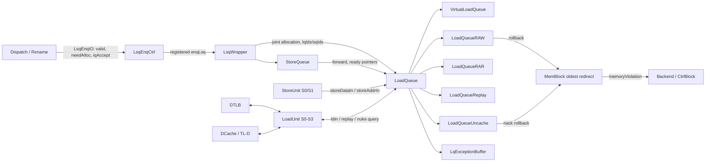
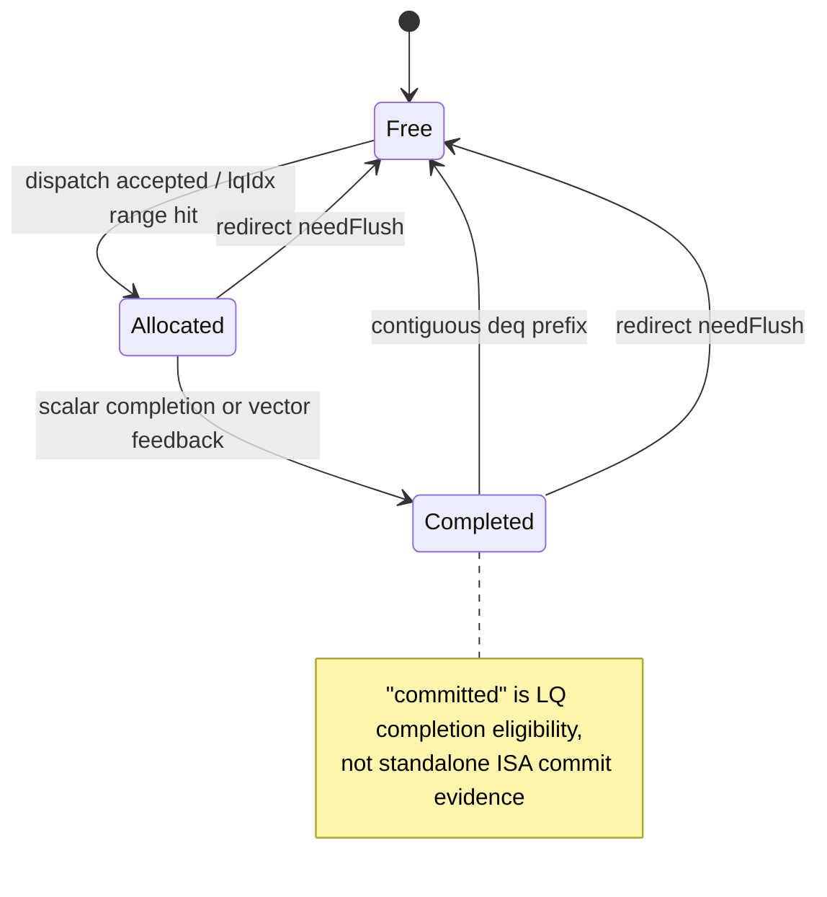
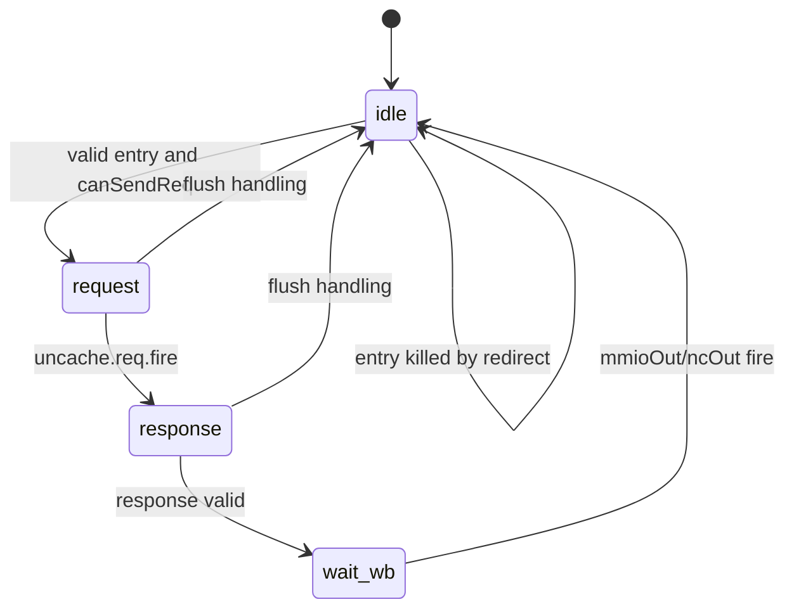
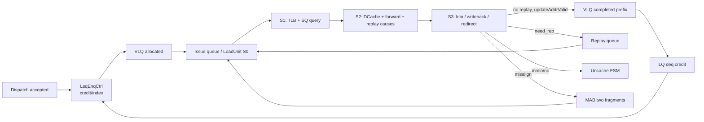
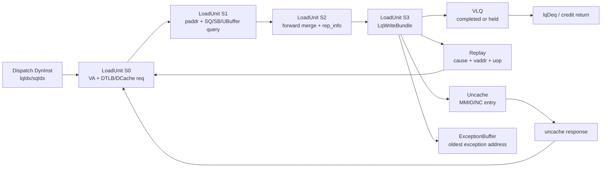

# 香山昆明湖 V2 LoadQueue 源码分析

> 结论先行：昆明湖 V2 的 `LoadQueue` 不是“保存 load 的一个 FIFO”。顶层把虚拟生命周期队列、RAW/RAR 检查表、Replay 队列、uncache 队列和异常地址缓冲组合在一起。真正控制 dispatch 资源的是 `VirtualLoadQueue` 与 `StoreQueue` 的联合可接受条件；RAW/RAR 满不会直接把 `lqFull` 拉高，而是让相应检查请求的 `ready` 变低，令 LoadUnit 走 replay。本文所有“实际行为”均以给定本地 V2 源码为准。

## 1. 范围与证据

```text
Branch/path:
  kunminghu-v2 / /home/yanyusong/xs-memory-env/XiangShan
Source commit:
  e12436c7cba86b195deec24981976d78bc263661
Design Doc baseline:
  not consulted；/home/yanyusong/XiangShanLab/XiangShan-Design-Doc 在本环境不存在
XiangShan source baseline:
  https://github.com/OpenXiangShan/XiangShan.git, branch kunminghu-v2, commit e12436c7...
Comparison:
  no
Files/modules read:
  Parameters.scala, BackendParams.scala, MemBlock.scala, LoadUnit.scala,
  LSQWrapper.scala, LoadQueue.scala, VirtualLoadQueue.scala, LoadQueueRAW.scala,
  LoadQueueRAR.scala, LoadQueueReplay.scala, LoadQueueUncache.scala,
  LoadExceptionBuffer.scala, LoadMisalignBuffer.scala, LoadQueueData.scala,
  FreeList.scala, StoreQueue.scala, DCacheWrapper.scala, TLB.scala, Rob.scala
Theory/course/design docs read:
  14_LoadStore.md；本目录 README；skill 的 memory/queue/exception/difftest/
  cross-boundary/verification 参考资料
Effective instantiation path:
  MemBlock -> LsqWrapper -> LoadQueue -> {VirtualLoadQueue, RAW, RAR,
  Replay, Uncache, LqExceptionBuffer}
Subsystem:
  Backend memory block / LSQ / scalar and vector load pipeline
Special paths covered:
  load/store ordering, replay, redirect, exception, TLB/DCache/uncache,
  16B misalignment, page/cache-line/MMIO boundary, queue capacity, difftest
```

- 本文按用户明确给出的本地源码路径分析。源码工作树本来就有与本任务无关的 `difftest` 修改和未跟踪 `src/main/resources/aia/`；本文引用的 LoadQueue 相关 Scala 文件没有未提交 diff，未修改源码。
- 已按 skill 运行 weekly sync；本次结果为“距上次同步不足 7 天，跳过”。课程仓库也保留原有未跟踪内容，未做 pull、清理或覆盖。
- 证据等级：**[代码]** 表示该 commit 中的实例化/连接/状态更新已追到；**[课程意图]** 是课程材料对设计动机的说明；**[推断/待验证]** 明确标出，不能作为已证实的时序或功能。
- 当前目录已有的 `memory/mdp-ref.md` 标题写明 KunMingHu v3、提交也不同；它和 `Mem-MDP.md` 只可作背景，**不能**作为本文 V2 行为证据。

## 2. 关键源码证据

| 主题 | V2 源码证据 | 短 Chisel 片段 | 证明的事实 |
| --- | --- | --- | --- |
| 容量与端口 | [Parameters.scala:167–175](</home/yanyusong/xs-memory-env/XiangShan/src/main/scala/xiangshan/Parameters.scala:167>)、[214–216](</home/yanyusong/xs-memory-env/XiangShan/src/main/scala/xiangshan/Parameters.scala:214>) | `VirtualLoadQueueSize = 72` | VLQ=72、RAR=72、RAW=32、Replay=72、uncache=16；标量 LoadUnit=3、StoreUnit=2。 |
| LQ 的组成 | [LoadQueue.scala:214–219](</home/yanyusong/xs-memory-env/XiangShan/src/main/scala/xiangshan/mem/lsqueue/LoadQueue.scala:214>) | `Module(new LoadQueueRAW)` | 顶层明确实例化 RAR、RAW、Replay、VLQ、异常缓冲、uncache 缓冲；因此不能把任一子表单独等同于完整 LQ。 |
| Dispatch 联合准入 | [LSQWrapper.scala:155–184](</home/yanyusong/xs-memory-env/XiangShan/src/main/scala/xiangshan/mem/lsqueue/LSQWrapper.scala:155>) | `lq.canAccept && sq.canAccept` | LSQ 对 dispatch 的 `canAccept` 是 LQ 和 SQ 的合取；同槽的 `lqIdx/sqIdx` 被交叉补全。 |
| VLQ 生命周期 | [VirtualLoadQueue.scala:69–73](</home/yanyusong/xs-memory-env/XiangShan/src/main/scala/xiangshan/mem/lsqueue/VirtualLoadQueue.scala:69>)、[93–201](</home/yanyusong/xs-memory-env/XiangShan/src/main/scala/xiangshan/mem/lsqueue/VirtualLoadQueue.scala:93>) | `allocated / committed / enqPtrExt` | VLQ 才持有 LQ 分配、完成、连续出队、环形指针和 redirect cancel 的主要状态。 |
| RAW 检测 | [LoadQueueRAW.scala:76–122](</home/yanyusong/xs-memory-env/XiangShan/src/main/scala/xiangshan/mem/lsqueue/LoadQueueRAW.scala:76>)、[211–362](</home/yanyusong/xs-memory-env/XiangShan/src/main/scala/xiangshan/mem/lsqueue/LoadQueueRAW.scala:211>) | `hasAddrInvalidStore` | 只为仍可能被旧 Store 地址未就绪影响的 load 建表；Store 地址到达时做地址/掩码/年龄检查并选最老违例。 |
| RAR 检测 | [LoadQueueRAR.scala:95–109](</home/yanyusong/xs-memory-env/XiangShan/src/main/scala/xiangshan/mem/lsqueue/LoadQueueRAR.scala:95>)、[224–268](</home/yanyusong/xs-memory-env/XiangShan/src/main/scala/xiangshan/mem/lsqueue/LoadQueueRAR.scala:224>) | `released(i)` | RAR 保存待 release load 的部分物理地址；release 与源码 ROB 年龄谓词共同决定 `rep_frm_fetch`。 |
| Replay | [LoadQueueReplay.scala:218–270](</home/yanyusong/xs-memory-env/XiangShan/src/main/scala/xiangshan/mem/lsqueue/LoadQueueReplay.scala:218>)、[491–730](</home/yanyusong/xs-memory-env/XiangShan/src/main/scala/xiangshan/mem/lsqueue/LoadQueueReplay.scala:491>) | `scheduled(enqIndex) := false.B` | 记录 replay 原因和阻塞条件，选 oldest 后经读地址、构造 `LsPipelineBundle`，再回送到 LoadUnit。 |
| LoadUnit 写回 LQ | [LoadUnit.scala:1582–1631](</home/yanyusong/xs-memory-env/XiangShan/src/main/scala/xiangshan/mem/pipeline/LoadUnit.scala:1582>) | `io.lsq.ldin.valid := ...` | S3 将结果、异常、地址有效位、重放原因写入 LQ；非对齐路径被单独送入 MAB。 |
| 全局恢复 | [MemBlock.scala:1424–1443](</home/yanyusong/xs-memory-env/XiangShan/src/main/scala/xiangshan/mem/MemBlock.scala:1424>) | `selectOldestRedirect` | LDU、Hybrid、RAW nuke 和 uncache nack 多个恢复源竞争时，MemBlock 按 ROB 年龄只输出最老 redirect。 |
| 架构可见事件 | [Rob.scala:1533–1595](</home/yanyusong/xs-memory-env/XiangShan/src/main/scala/xiangshan/backend/rob/Rob.scala:1533>) | `DiffInstrCommit / DiffLoadEvent` | LQ 内部 allocate、replay、flush 本身不是 Difftest load event；事件在 ROB commit 才产生。 |

下面这个顶层片段是整篇分析的边界依据：

```scala
val loadQueueRAR     = Module(new LoadQueueRAR)
val loadQueueRAW     = Module(new LoadQueueRAW)
val loadQueueReplay  = Module(new LoadQueueReplay)
val virtualLoadQueue = Module(new VirtualLoadQueue)
val exceptionBuffer  = Module(new LqExceptionBuffer)
val uncacheBuffer    = Module(new LoadQueueUncache)
```

以上是 [LoadQueue.scala:214–219](</home/yanyusong/xs-memory-env/XiangShan/src/main/scala/xiangshan/mem/lsqueue/LoadQueue.scala:214>) 的原始结构，不是概念图。

## 3. 理论、课程意图与有效代码

| 层次 | 本文采用的内容 | 不能越界的结论 |
| --- | --- | --- |
| 理论 | LSQ 允许 load 在未知旧 Store 地址时推测执行，再用地址比较、重放/redirect 保证 memory ordering；队列需在 redirect、异常、资源满时保持年龄关系。 | 这解释“为何有 RAW/RAR/Replay”，但不自动给出昆明湖的容量、端口或固定周期。 |
| 课程意图 | [14_LoadStore.md:311–397](</home/yanyusong/XiangShanLab/xiangshan-course/docs/xiangshan-microarchitecture/Beginner_Implementation_and_Principles_of_the_High_Performance_Xiangshan_Processor/14_LoadStore.md:311>) 将 LQ 介绍为多个协作结构，并说明 LQ/SQ 的联合分配与恢复。 | 课程文字必须回到本 commit 的连接、寄存器和参数确认。 |
| 有效 V2 代码 | `LoadQueue` 的实例化/连线、VLQ 的 `allocated/committed`、RAW/RAR 的 CAM 表、Replay 的 FreeList、LoadUnit S0–S3 与 MemBlock oldest redirect。 | 只有这些已实例化并有有效连线的 V2 实体被称为“实际行为”。 |

### 3.1 课程意图到 V2 源码的可追溯矩阵

本环境没有可读取的本地 Design Doc，因此没有把任何 Design Doc 句子伪装成行为结论；下表是**课程材料**到源码的映射，而非 Design Doc 的替代品。

| ID | 课程材料的原子主张 | V2 源码/关系 | 状态 |
| --- | --- | --- | --- |
| C1 | LQ 是多个协作子结构，而非单一 FIFO。 | [LoadQueue.scala:214–345](</home/yanyusong/xs-memory-env/XiangShan/src/main/scala/xiangshan/mem/lsqueue/LoadQueue.scala:214>) 同时实例化并连接六类子模块。 | Verified |
| C2 | LQ/SQ 分配必须共同成功，并相互提供索引。 | [LSQWrapper.scala:158–184](</home/yanyusong/xs-memory-env/XiangShan/src/main/scala/xiangshan/mem/lsqueue/LSQWrapper.scala:158>) 的合取 `canAccept` 和交叉 `lqIdx/sqIdx`。 | Verified |
| C3 | VLQ 管理生命周期、提交顺序和容量。 | [VirtualLoadQueue.scala:69–282](</home/yanyusong/xs-memory-env/XiangShan/src/main/scala/xiangshan/mem/lsqueue/VirtualLoadQueue.scala:69>) 的数组、指针、连续 deq、redirect clear。 | Verified |
| C4 | RAW 只跟踪可能被未解析旧 Store 影响的 load。 | [LoadQueueRAW.scala:115–205](</home/yanyusong/xs-memory-env/XiangShan/src/main/scala/xiangshan/mem/lsqueue/LoadQueueRAW.scala:115>) 以 `stAddrReadySqPtr` 判定、按需 FreeList 分配和释放。 | Verified |
| C5 | RAW 选择最老违例并发恢复。 | [LoadQueueRAW.scala:211–362](</home/yanyusong/xs-memory-env/XiangShan/src/main/scala/xiangshan/mem/lsqueue/LoadQueueRAW.scala:211>) 的 CAM、掩码、ROB 比较和选择树；[MemBlock.scala:1424–1443](</home/yanyusong/xs-memory-env/XiangShan/src/main/scala/xiangshan/mem/MemBlock.scala:1424>) 再全局仲裁。 | Verified |
| C6 | RAR 通过 release 与 load-load 年龄检查决定是否从取指处恢复。 | [LoadQueueRAR.scala:224–266](</home/yanyusong/xs-memory-env/XiangShan/src/main/scala/xiangshan/mem/lsqueue/LoadQueueRAR.scala:224>) 产生 `rep_frm_fetch`；[LoadUnit.scala:1606–1685](</home/yanyusong/xs-memory-env/XiangShan/src/main/scala/xiangshan/mem/pipeline/LoadUnit.scala:1606>) 消费并形成 `flushAfter`。 | Verified |
| C7 | replay 按原因等待不同事件。 | [LoadQueueReplay.scala:275–370](</home/yanyusong/xs-memory-env/XiangShan/src/main/scala/xiangshan/mem/lsqueue/LoadQueueReplay.scala:275>)、[635–719](</home/yanyusong/xs-memory-env/XiangShan/src/main/scala/xiangshan/mem/lsqueue/LoadQueueReplay.scala:635>) 存储 cause、Store/TLB/TL-D 依赖。 | Verified |
| C8 | MMIO 要受 ROB 次序约束，NC 走特殊路径。 | [LoadQueueUncache.scala:122–161](</home/yanyusong/xs-memory-env/XiangShan/src/main/scala/xiangshan/mem/lsqueue/LoadQueueUncache.scala:122>) 的 `pendingPtr` 门控和 FSM。 | Verified |
| C9 | 当前目录的 V3 MDP 文档描述的参数/时序可直接用于 V2 LQ。 | `memory/mdp-ref.md` 自身标注 V3/不同 commit，且本文未追到其所列 V3 `NewLoadUnit` 路径。 | Version mismatch；排除为 V2 证据 |
| C10 | 非对齐的跨页异常地址覆盖一定有效。 | [LoadMisalignBuffer.scala:625–645](</home/yanyusong/xs-memory-env/XiangShan/src/main/scala/xiangshan/mem/lsqueue/LoadMisalignBuffer.scala:625>) 计算候选覆盖信息，但本 commit 将 `overwriteExpBuf.valid := false.B`。 | Partial；不可宣称该覆盖通路已启用 |

### 3.2 设计文档差异与版本风险

- **Design Doc 缺失**：不存在本地可核验基线，因此本文把它列为 `not consulted`，而非根据记忆补写所谓“设计要求”。
- **V3 文档混入风险**：`mdp-ref.md`、`Mem-MDP.md` 中的 `NewLoadUnit`、7-bit 索引或波形 ns 值与本文 V2 源码不是同一基线。它们可帮助理解“预测 + 检测 + replay”的理论，但不能证明本节 V2 接口。
- **内部 `committed` 的命名风险**：VLQ 在 LoadUnit S3 无 replay 且地址有效时置位 `committed`，随后连续释放 LQ entry；这是一项**队列内完成/可出队状态**，不能单凭名字把它等同为 ROB 的 ISA commit。真正的架构可见提交仍需以 ROB/Difftest 路径为准。

## 4. 模块契约：Who / Why / How / From / To

| 实体 | Who | Why | How | From what | To what |
| --- | --- | --- | --- | --- | --- |
| `LsqEnqCtrl + LsqWrapper` | 前者维护 dispatch 侧指针/余量，后者把请求送入 LQ/SQ。 | 防止 LQ 有空但 SQ 无空位时出现“只分到一半”。 | `canAccept` 由两队列合取；请求延一拍送内层 LSQ；每槽填入对方返回索引。 | Dispatch 的 `ValidIO[DynInst]`、`needAlloc(0/1)`、`iqAccept`。 | `LoadQueue.enq`、`StoreQueue.enq`，以及 dispatch 侧 `LSIdx`。 |
| `VirtualLoadQueue` | LQ 的主生命周期所有者。 | 让不同执行完成时间的 load 仍按 LQ/ROB 年龄连续释放。 | 环形 `enqPtrExt/deqPtr`、`allocated/committed` 位和 redirect cancel 计数。 | Dispatch 分配、LDU S3 `ldin`、vector feedback、redirect。 | `lqFull/lqDeq/lqCancelCnt/ldWbPtr`，供 dispatch、RAR/Replay 和 LSQ 控制使用。 |
| `LoadQueueRAW` | Store S1 驱动检测；LDU S1 发 query；MemBlock 消费 rollback。 | 检出 younger load 越过地址尚未知的 older Store。 | 部分物理地址 + byte mask CAM；按 ROB 年龄选择最老候选；输出 `flush` redirect。 | `storeIn`、`stAddrReadySqPtr`、LDU `stld_nuke_query`。 | `rollback`、LDU 的 query `ready`、Replay 的 `rawFull`。 |
| `LoadQueueRAR` | DCache `release` 更新表项；LDU 发 query。 | 处理代码定义的 load-to-load/release 时序风险。 | 记录待 release load 的部分 paddr、`released` 位；满足该表 ROB 谓词的同址 query 得 `rep_frm_fetch`。 | `release`、`ldWbPtr`、`ldld_nuke_query`。 | LoadUnit S3 的 `flushAfter` 路径，及 Replay `rarFull` 输入。 |
| `LoadQueueReplay` | LDU S3 写入，内部调度器选择，LDU S0 接收。 | 将暂时不可完成的访问按原因等待并重发，而非把流水线永久堵住。 | FreeList + cause/blocking/scheduled/VAddr storage；年龄选择、两级寄存器、`Decoupled` replay 输出。 | `LqWriteBundle.rep_info`、Store ready、TL-D、TLB/L2 hints、ROB deq。 | `io.replay(i)` 到 LoadUnit，或释放 entry/redirect 清除。 |
| `LoadQueueUncache` | LDU S3 写入；LSQWrapper 与 StoreQueue 共享总线。 | 将 NC/MMIO 与 cacheable 流水分开，并保证 MMIO 仅在可见次序点发出。 | 每 entry FSM；NC 可发，MMIO 要匹配 `pendingPtr`；LQ/SQ 仲裁和 `is2lq` 回送。 | `ldin`、ROB pending pointer、uncache req/resp、redirect。 | `ldout/ncOut`、异常缓冲、uncache rollback。 |
| `LqExceptionBuffer` | LoadQueue 收集，MemBlock/ROB 消费异常地址。 | 多个 scalar/vector/MMIO 异常同到时仍输出最老者。 | 一拍过滤 redirect 后递归按 `robIdx/uopIdx` 选 oldest，并保存一项。 | scalar `ldin`、vector feedback、uncache error。 | `exceptionAddr` 及上层异常选择。 |

## 5. 顶层连接、接口与握手

### 5.1 Top-Level Module Connectivity（有效层次与主要边）



图中每条边均有源码连接：LQ 子模块 wiring 见 [LoadQueue.scala:223–345](</home/yanyusong/xs-memory-env/XiangShan/src/main/scala/xiangshan/mem/lsqueue/LoadQueue.scala:223>)，LQ/SQ wrapper wiring 见 [LSQWrapper.scala:171–243](</home/yanyusong/xs-memory-env/XiangShan/src/main/scala/xiangshan/mem/lsqueue/LSQWrapper.scala:171>)，LoadUnit 与 DTLB/DCache 的接口见 [LoadUnit.scala:383–423](</home/yanyusong/xs-memory-env/XiangShan/src/main/scala/xiangshan/mem/pipeline/LoadUnit.scala:383>)。

### 5.2 关键接口表

| 边 | 协议与 payload | 生产者 → 消费者 | 允许前进/阻塞条件 | 不应误读成 |
| --- | --- | --- | --- | --- |
| Dispatch → `LsqEnqCtrl` | `ValidIO[DynInst]` + `needAlloc(2b)` + `iqAccept`，不是每槽 `Decoupled`。 | Dispatch → 控制器 | 全局 `io.enq.canAccept` 是寄存后的 LQ/SQ 余量和 redirect 恢复条件；实际发送 `do_enq = valid && !redirect && canAccept`。 | 不能把 `req.valid` 单独当作已分配的 `fire`。 |
| `LsqWrapper` → LQ/SQ | `needAlloc(i)(0)` 是 LQ、`needAlloc(i)(1)` 是 SQ；`resp` 含两个索引。 | Wrapper → 两队列 | `loadQueue.canAccept && storeQueue.canAccept`。 | 不能因为 `lqCanAccept` 为 1 就认为 Store/AMO 一定可接收。 |
| LoadUnit S1 → RAW/RAR | `LoadNukeQueryIO`；req 为 `Decoupled`，resp 有 `valid/rep_frm_fetch`，还有 `revoke`。 | LDU → RAW/RAR | 表项需要分配时，FreeList `canAllocate` 决定 req.ready；不需建表时 ready=1。 | RAR/RAW full 不是 dispatch `lqFull`。 |
| LoadUnit S3 → LQ | `Decoupled[LqWriteBundle]`：paddr/vaddr、mask、exception、`updateAddrValid`、`rep_info` 等。 | LDU → VLQ/Replay/Uncache/异常旁路 | VLQ 对其 `ready := true`；Replay 也设 `ready := true` 并以 overflow assert 约束容量。 | `ldin.valid` 不等同架构 writeback；它是微架构结果/重放信息扇出。 |
| StoreUnit → LQ | `Valid[LsPipelineBundle]` address（S1）和 `Valid[MemExuOutput]` data（S0）。 | STU → RAW/Replay | 非 `ready` 回压接口；消费者以寄存器/CAM 时序使用。 | 不能假定它是“Store 已提交”。 |
| `LoadQueueReplay` → LDU S0 | `Decoupled[LsPipelineBundle]`。 | Replay → LoadUnit | replay 请求必须等 LoadUnit 的 `ready`；其在 LDU S0 与其他来源按优先级竞争。 | 不能把入队 replay 立即等同于下一周期已发到 DCache。 |
| redirect / release | `Valid[Redirect]`、`Valid[Release]`，无 ready。 | Backend/DCache → LQ 子结构 | 每个拥有状态的子模块显式过滤 `needFlush` 或 clear。 | 不能因没有 ready 就忽略跨周期恢复序列。 |

### 5.3 联合分配的实际握手

[LSQWrapper.scala:155–184](</home/yanyusong/xs-memory-env/XiangShan/src/main/scala/xiangshan/mem/lsqueue/LSQWrapper.scala:155>) 的关键逻辑如下：

```scala
io.enq.canAccept := loadQueue.io.enq.canAccept && storeQueue.io.enq.canAccept
loadQueue.io.enq.req(i).valid := io.enq.needAlloc(i)(0) && io.enq.req(i).valid
storeQueue.io.enq.req(i).valid := io.enq.needAlloc(i)(1) && io.enq.req(i).valid
loadQueue.io.enq.req(i).bits.sqIdx := storeQueue.io.enq.resp(i)
storeQueue.io.enq.req(i).bits.lqIdx := loadQueue.io.enq.resp(i)
```

进一步地，[LsqEnqCtrl 的实现：LSQWrapper.scala:403–431](</home/yanyusong/xs-memory-env/XiangShan/src/main/scala/xiangshan/mem/lsqueue/LSQWrapper.scala:403>) 使用 `RegNext` 产生 `canAccept`，再把 `do_enq` 延一拍送给内层 LSQ。故一个正确的观察点是：

1. dispatch 仅在自己看到 `canAccept` 时把本拍 bundle 视作可接收；
2. `LsqEnqCtrl` 计算负载/存储元素数和返回的预测索引；
3. 下一拍内层 `LsqWrapper` 获得已锁定的 `lqIdx/sqIdx`；
4. LQ 与 SQ 各自按 `needAlloc` 接收自身条目。

这是一条“组合资格 + 寄存器控制/数据交接”的路径，不是一根单拍 `valid && ready` 总线。验证中必须将 dispatch 的接受语义与 `enqLsq.valid` 的内部延迟区分开。

## 6. 参数、索引与容量

### 6.1 本 commit 的参数

| 参数/派生量 | 值或表达式 | 直接影响 | 证据 |
| --- | --- | --- | --- |
| `RenameWidth / LSQEnqWidth` | 6 / `RenameWidth` | 一个 dispatch bundle 的最大 LSQ 槽数。 | [Parameters.scala:149–151](</home/yanyusong/xs-memory-env/XiangShan/src/main/scala/xiangshan/Parameters.scala:149>)、[783–785](</home/yanyusong/xs-memory-env/XiangShan/src/main/scala/xiangshan/Parameters.scala:783>) |
| `LSQLdEnqWidth` | `min(RenameWidth, numLoadDp) = 6` | VLQ 的保留容量、LQ dispatch 最大预留数。 | `numLoadDp` 定义在 [BackendParams.scala:132](</home/yanyusong/xs-memory-env/XiangShan/src/main/scala/xiangshan/backend/BackendParams.scala:132>)；默认 LDU0/1/2 各 `numEnq=2` 见 [Parameters.scala:479–486](</home/yanyusong/xs-memory-env/XiangShan/src/main/scala/xiangshan/Parameters.scala:479>)。 |
| `LoadPipelineWidth` | 3 | LDU S0–S3、RAW/RAR 查询口和 Replay 输出口数。 | [Parameters.scala:214](</home/yanyusong/xs-memory-env/XiangShan/src/main/scala/xiangshan/Parameters.scala:214>) |
| `VirtualLoadQueueSize` | 72 | VLQ 的环形 entry 数。 | [Parameters.scala:167](</home/yanyusong/xs-memory-env/XiangShan/src/main/scala/xiangshan/Parameters.scala:167>) |
| `LoadQueueRARSize / RAWSize / ReplaySize` | 72 / 32 / 72 | 三个辅助表的独立容量。 | [Parameters.scala:168–171](</home/yanyusong/xs-memory-env/XiangShan/src/main/scala/xiangshan/Parameters.scala:168>) |
| `LoadUncacheBufferSize` | 16 | uncache load entry 数。 | [Parameters.scala:172](</home/yanyusong/xs-memory-env/XiangShan/src/main/scala/xiangshan/Parameters.scala:172>) |
| `LoadQueueNWriteBanks` | 8 | RAR/RAW/Replay 地址类表的多写 bank 组织。 | [Parameters.scala:173](</home/yanyusong/xs-memory-env/XiangShan/src/main/scala/xiangshan/Parameters.scala:173>) |
| `RollbackGroupSize` | 8 | RAW 最老候选选择树的分组粒度。 | [Parameters.scala:170](</home/yanyusong/xs-memory-env/XiangShan/src/main/scala/xiangshan/Parameters.scala:170>)、[790–791](</home/yanyusong/xs-memory-env/XiangShan/src/main/scala/xiangshan/Parameters.scala:790>) |
| `CommitWidth` | 8 | VLQ 一次可观察/推进的连续 deq 最大步长。 | [Parameters.scala:151–152](</home/yanyusong/xs-memory-env/XiangShan/src/main/scala/xiangshan/Parameters.scala:151>)、[VirtualLoadQueue.scala:134–153](</home/yanyusong/xs-memory-env/XiangShan/src/main/scala/xiangshan/mem/lsqueue/VirtualLoadQueue.scala:134>) |

本表使用的默认核心参数与 `KunminghuV2Config` 的直接配置关系也已核对：该类组合 `DefaultConfig` 并附加 L2/CHI 配置，类体中没有单独覆写上述 LQ 核心参数 [Configs.scala:460–485](</home/yanyusong/xs-memory-env/XiangShan/src/main/scala/top/Configs.scala:460>)。若后续用 `KunminghuV2MinimalConfig` 或其他参数 override elaboration，必须重新计算表中派生宽度。

**关键区分**：`LSQLdEnqWidth=6` 是 dispatch/分配宽度，`LoadPipelineWidth=3` 是标量执行流水数。两者不能互换。因此“每拍最多 6 个 LQ 元素预留”不等价于“每拍有 6 个标量 load 能完成 DCache 访问”。

### 6.2 `lqIdx`、`sqIdx` 与指针

| 索引/指针 | 来源与 wrap | 分配/更新 | 消费者 | 冲突/恢复 |
| --- | --- | --- | --- | --- |
| `LqPtr / lqIdx` | `LqPtr` 是以 `VirtualLoadQueueSize` 为环长度的 circular pointer；含 value/flag 语义。 | `LsqEnqCtrl` 先给 dispatch 预测 index，VLQ 按 `enqPtrExt + prefix offset` 重新校验并返回 `resp`。 | LoadUnit、VLQ、RAR、Replay、RAW 的 uop 元数据。 | redirect 两级延迟后按 `redirectCancelCount` 回退；同拍错误 index 有 `XSError`。 |
| `SqPtr / sqIdx` | StoreQueue 的环指针。 | LsqEnqCtrl 与 StoreQueue 分配；同一 DynInst 的 `sqIdx` 写回 LQ 的 request bits。 | RAW 的“旧 Store 地址是否 ready”判断、SQ forwarding。 | redirect 后 LsqEnqCtrl 用 `sqCancelCnt` 修正；不能假定 `sqIdx` 指向已提交 store。 |
| `enqPtrExt` | VLQ 保存 `LSQEnqWidth` 个扩展 pointer。 | 正常时加全部有效 `numLsElem`；redirect 恢复时减 cancel count。 | 给 dispatch `lqIdx`，并与 `deqPtr` 计算 `validCount`。 | 若将要落在 deq 之后，代码以 `deqPtrNext+i` 防止 enqueue 指针落后。 |
| `deqPtr / ldWbPtr` | VLQ 环形 deq 指针。 | 仅最前方连续 `allocated && committed` entry 可推进；`ldWbPtr` 输出为当前 deq。 | RAR 判断 older load 是否还没写完；LsqEnqCtrl 资源回收。 | redirect 本拍被 cancel 的 entry 从 deq mask 排除。 |
| Replay `schedIndex` | Replay FreeList slot，replay 再执行时携带。 | 新 replay 从 FreeList 分配；重放后若不再需 replay 则释放，否则清 `scheduled`。 | LoadQueueReplay 二次更新同一个表项。 | redirect 清该 slot；不是 LQ dispatch index。 |

`LqPtr` 的循环和 occupancy 算法在 [LoadQueue.scala:37–49](</home/yanyusong/xs-memory-env/XiangShan/src/main/scala/xiangshan/mem/lsqueue/LoadQueue.scala:37>)、[CircularQueuePtr.scala:23–59](</home/yanyusong/xs-memory-env/XiangShan/utility/src/main/scala/utility/CircularQueuePtr.scala:23>) 与 [94–118](</home/yanyusong/xs-memory-env/XiangShan/utility/src/main/scala/utility/CircularQueuePtr.scala:94>)。72 不是二次幂，故验证必须覆盖 value wrap 与 flag 翻转，不能只测低位自然溢出。

VLQ 的容量检查不是简单 `validCount == 72`：

```scala
val validCount = distanceBetween(enqPtrExt(0), deqPtr)
val allowEnqueue = validCount <= (VirtualLoadQueueSize - LSQLdEnqWidth).U
io.enq.canAccept := allowEnqueue
io.lqFull := !allowEnqueue
```

见 [VirtualLoadQueue.scala:93–95、167、279–282](</home/yanyusong/xs-memory-env/XiangShan/src/main/scala/xiangshan/mem/lsqueue/VirtualLoadQueue.scala:93>)。在默认参数下，已有 occupancy 不超过 66 才接受一个最多 6-element 的 load dispatch bundle；接受后 occupancy 可以达到 72。该保留策略防止宽 bundle 被部分接收，而不是把物理深度改成 66。

### 6.3 三种“满”必须分开看

| 信号 | 来源 | 影响 | 不影响 |
| --- | --- | --- | --- |
| `lqFull` | 只接 `VirtualLoadQueue.io.lqFull`。 | LQ dispatch 的资源可接受条件。 | 不直接 OR RAR、RAW、Replay 的满。 |
| `lq_rep_full` | `LoadQueueReplay.io.lqFull`。 | 对 LDU/replay 和性能观察是重要饱和信号。 | 不是 VLQ dispatch backpressure。 |
| `rarFull/rawFull` | RAR/RAW FreeList empty，送入 Replay。 | 当需建辅助表而无 slot 时，对应 query `ready=0`；LDU 形成 `C_RAR/C_RAW` replay。 | 不会单独把 `LoadQueue.io.lqFull` 拉高。 |

实际连接见 [LoadQueue.scala:248–258](</home/yanyusong/xs-memory-env/XiangShan/src/main/scala/xiangshan/mem/lsqueue/LoadQueue.scala:248>)、[319–355](</home/yanyusong/xs-memory-env/XiangShan/src/main/scala/xiangshan/mem/lsqueue/LoadQueue.scala:319>)，LDU 将 query non-ready 转成 RAR/RAW cause 的代码见 [LoadUnit.scala:1276–1280](</home/yanyusong/xs-memory-env/XiangShan/src/main/scala/xiangshan/mem/pipeline/LoadUnit.scala:1276>)。

## 7. VirtualLoadQueue：状态、更新与顺序释放

### 7.1 存储与生命周期

| 状态/存储 | reset | 写入/更新 | 清除 | 读者/用途 |
| --- | --- | --- | --- |
| `allocated(72)` | 全 0。 | dispatch 命中 entry 边界时置 1。 | 连续 deq、redirect `needCancel` 时置 0。 | `deqLookup`、容量/Perf、vector completion。 |
| `robIdx/uopIdx/isvec` | payload 寄存器；`isvec` reset 为 0。 | 由接受的 `DynInst` 写入。 | 不要求清 payload；`allocated=0` 使旧 payload 不可见。 | 年龄比较、vector feedback、exception/debug。 |
| `committed` | 未显式 reset；每次分配明确写 0。 | scalar：LDU S3 有 `valid && !need_rep && updateAddrValid && !isvec`；vector：匹配 feedback 时。 | entry 出队或下次分配覆盖。 | 只允许连续 completed entry 释放。 |
| `debug_mmio/debug_paddr` | mmio=0、paddr=0。 | scalar LDU S3 成功路径写入。 | 下一次 entry 分配时清初值。 | debug/ROB 相关信息。 |
| `enqPtrExt/deqPtr` | pointer 复位为 0。 | 正常分配加元素数；deq 以延迟 `commitCount` 推进。 | redirect 用 cancel count 修复，而不是逐个物理移动 payload。 | capacity、`lqIdx`、`lqDeq`、`ldWbPtr`。 |

数组定义与分配写入在 [VirtualLoadQueue.scala:61–85、172–201](</home/yanyusong/xs-memory-env/XiangShan/src/main/scala/xiangshan/mem/lsqueue/VirtualLoadQueue.scala:61>)；completion 与清除在 [203–276](</home/yanyusong/xs-memory-env/XiangShan/src/main/scala/xiangshan/mem/lsqueue/VirtualLoadQueue.scala:203>)。

### 7.2 dispatch 写入和 redirect 恢复

每个 dispatch 槽的 `numLsElem` 可以大于一（例如 vector flow）。VLQ 以 `validVLoadOffset` 做前缀和，故同一个 `DynInst` 能覆盖连续多个 LQ entry；遍历所有 72 个物理 entry，使用边界/flag 判断该 entry 是否落入某槽的 `[lqIdx, lqIdx+numLsElem)` 区间。命中时用 `ParallelPriorityMux` 选择该槽的 payload 写入 [VirtualLoadQueue.scala:112–123、168–192](</home/yanyusong/xs-memory-env/XiangShan/src/main/scala/xiangshan/mem/lsqueue/VirtualLoadQueue.scala:112>)。

redirect 的关键不是“收到 redirect 立即把所有指针重置”，而是分阶段：

1. 本拍从已有 `allocated` 计算 `needCancel`，同时数出进入 dispatch 但应被 flush 的 element；
2. `lastCycleRedirect`/`lastLastCycleRedirect` 保存两级时序，`redirectCancelCount` 在上一周期取消数可用后寄存；
3. `lastLastCycleRedirect.valid` 时，`enqPtrExtNextVec := enqPtrExt - redirectCancelCount`；
4. 取消 entry 的 `allocated` 清零，deq 的 mask 也排除本 redirect 周期被取消的项。

对应实现在 [VirtualLoadQueue.scala:90–131](</home/yanyusong/xs-memory-env/XiangShan/src/main/scala/xiangshan/mem/lsqueue/VirtualLoadQueue.scala:90>) 与 [230–236](</home/yanyusong/xs-memory-env/XiangShan/src/main/scala/xiangshan/mem/lsqueue/VirtualLoadQueue.scala:230>)。代码还断言 `lastCycleRedirect.valid && enqNumber != 0` 不可发生；这是波形和形式验证应直接覆盖的契约。

### 7.3 连续释放而非任意完成即释放

```scala
val deqLookup = VecInit(deqLookupVec.map(ptr =>
  allocated(ptr.value) && committed(ptr.value) && ptr =/= enqPtrExt(0)))
val commitCount = PopCount(PriorityEncoderOH(~deqCountMask) - 1.U)
io.lqDeq := GatedRegNext(lastCommitCount)
```

见 [VirtualLoadQueue.scala:134–159](</home/yanyusong/xs-memory-env/XiangShan/src/main/scala/xiangshan/mem/lsqueue/VirtualLoadQueue.scala:134>)。这说明只有从 `deqPtr` 开始的一段连续 ready/committed prefix 才能释放；一个更年轻 load 即使早完成，也不能跨过尚未完成的旧 entry。`lqDeq` 又经过寄存器延迟，LsqEnqCtrl 以它回收 dispatch 侧 credit。

### 7.4 VLQ 状态图



这个状态图描述 [VirtualLoadQueue.scala:172–276](</home/yanyusong/xs-memory-env/XiangShan/src/main/scala/xiangshan/mem/lsqueue/VirtualLoadQueue.scala:172>) 已实现的状态位转换；真正 ROB commit/Difftest 另见第 16 节。

## 8. 辅助表的存储、FreeList 与同拍冲突

### 8.1 FreeList 不是抽象“空位计数器”

RAR、RAW 和 Replay 都用 `FreeList`，但配置不同：

| 所有者 | 深度 | alloc width / free width | `enablePreAlloc` | 含义 |
| --- | ---: | --- | --- | --- |
| RAR | 72 | 3 / 4 | false | `allocateSlot` 由当前 head + offset 得到。 |
| RAW | 32 | 3 / 4 | true | 可分配 slot 使用预分配路径。 |
| Replay | 72 | 3 / 4 | true | 首次 replay 分配，重复 replay 用保留 `schedIndex`。 |

定义见 [LoadQueueRAR.scala:115–122](</home/yanyusong/xs-memory-env/XiangShan/src/main/scala/xiangshan/mem/lsqueue/LoadQueueRAR.scala:115>)、[LoadQueueRAW.scala:106–113](</home/yanyusong/xs-memory-env/XiangShan/src/main/scala/xiangshan/mem/lsqueue/LoadQueueRAW.scala:106>) 和 [LoadQueueReplay.scala:255–270](</home/yanyusong/xs-memory-env/XiangShan/src/main/scala/xiangshan/mem/lsqueue/LoadQueueReplay.scala:255>)。共用实现的 reset/分配/回收细节在 [FreeList.scala:43–132](</home/yanyusong/xs-memory-env/XiangShan/src/main/scala/xiangshan/mem/lsqueue/FreeList.scala:43>)：

- reset 生成 `freeList = 0..N-1`，head 为 `(flag=0,value=0)`，tail 为 `(flag=1,value=0)`，空闲数为 N；
- 分配按照 head FIFO 取 slot，多个端口用 prefix offset 取得不同 slot；
- 回收先把 `freeMask` 按 residue 分组，每组用 `PriorityEncoderOH` 每拍入队至多一个；同组的其余请求不会凭空丢失，而是继续保留到后续周期；
- `empty` 表示 free slot=0，`validCount` 可用于 occupancy/性能，但不能替代实际 `canAllocate(offset)` 资格。

### 8.2 地址/掩码存储和 CAM

`LqRawDataModule` 是 `Reg(Vec)` 而不是自动绕过的 SRAM。其读为 `RegEnable(data(raddr), ren)`，写在配置的 `numWDelay` 后执行；同一 entry 两个写端口同时命中有硬断言 [LoadQueueData.scala:62–132](</home/yanyusong/xs-memory-env/XiangShan/src/main/scala/xiangshan/mem/lsqueue/LoadQueueData.scala:62>)。因此：

| 风险点 | 有效代码行为 | 验证结论 |
| --- | --- | --- |
| 同 address 双写 | `XSError` 禁止两个 write ports 写同一 entry。 | 必须用 assertion/cover 验证，不应假设“后端口覆盖前端口”。 |
| 同拍读写 | 没有显式 read-after-write bypass。 | 读到旧/新寄存器值的精确时序要以 elaborated Verilog/波形为准；文档不宣称实现了旁路。 |
| bank 组织 | `UIntToOH(waddr)` 按连续 entry 区间切 bank；72/8 时每 bank 9 entry，32/8 时每 bank 4 entry。 | 不要把它误画成按低位 index 的交织 bank。 |
| RAW CAM | `LqPAddrModule` 启用 cache-line 条件，`LqMaskModule` 进一步要求 byte mask overlap。 | 地址相等并不自动表示违例；还需 mask、年龄、valid、未 flush 等条件。 |
| RAR CAM | RAR 保存 16-bit XOR-fold partial paddr，关闭 cache-line check。 | hash/signature 别名最多造成额外 replay 的风险；代码未在该表中再做 full PAddr 比较，需以形式/性能测试确认影响。 |

地址与 release 匹配的具体规则在 [LoadQueueData.scala:136–205](</home/yanyusong/xs-memory-env/XiangShan/src/main/scala/xiangshan/mem/lsqueue/LoadQueueData.scala:136>)，mask overlap 在 [210–240](</home/yanyusong/xs-memory-env/XiangShan/src/main/scala/xiangshan/mem/lsqueue/LoadQueueData.scala:210>)。这些 CAM 只服务 ordering/release 检查；它们**不是** cache-line split request 的实现，跨 line 请求问题见第 14 节。

### 8.3 子表满时的真实回压

RAR/RAW 的 query 只有在该 load **需要建表**时才使用 FreeList `canAllocate(offset)`；不需要建表时，代码强制 `ready=true`：

```scala
val canAccept = freeList.io.canAllocate(offset)
enq.ready := Mux(needEnqueue(w), canAccept, true.B)
```

RAR 对应 [LoadQueueRAR.scala:146–183](</home/yanyusong/xs-memory-env/XiangShan/src/main/scala/xiangshan/mem/lsqueue/LoadQueueRAR.scala:146>)，RAW 对应 [LoadQueueRAW.scala:128–168](</home/yanyusong/xs-memory-env/XiangShan/src/main/scala/xiangshan/mem/lsqueue/LoadQueueRAW.scala:128>)。这解释了一个看似反直觉但很重要的行为：辅助表满不会禁止后续所有 load issue；只有会触发该项 tracking 的 load 被 nack，并由 LDU 把它转化为 replay。

## 9. LoadQueueRAR 与 LoadQueueRAW：检测、清除和恢复

### 9.1 RAR：按代码定义的 load-load/release 检查

RAR 的状态为 `allocated / uop / partial-PAddr / released` [LoadQueueRAR.scala:84–109](</home/yanyusong/xs-memory-env/XiangShan/src/main/scala/xiangshan/mem/lsqueue/LoadQueueRAR.scala:84>)。它的 paddr signature 由多个物理地址 bit XOR 压缩成 16 位 [52–82](</home/yanyusong/xs-memory-env/XiangShan/src/main/scala/xiangshan/mem/lsqueue/LoadQueueRAR.scala:52>)，因此以下规则应按源码本身理解：

1. LDU query valid 且其 `lqIdx` 在 `ldWbPtr` 之后、未被 redirect 杀掉时，`needEnqueue` 为真；RAR 从 FreeList 取 entry，写 uop 与 partial paddr [134–183](</home/yanyusong/xs-memory-env/XiangShan/src/main/scala/xiangshan/mem/lsqueue/LoadQueueRAR.scala:134>)。
2. 新项的 `released` 在 `is_nc`，或 `data_valid` 且当前/前一拍 DCache release 同 line 时置位；随后 release CAM 命中也置位 [124–132](</home/yanyusong/xs-memory-env/XiangShan/src/main/scala/xiangshan/mem/lsqueue/LoadQueueRAR.scala:124>)、[176–182](</home/yanyusong/xs-memory-env/XiangShan/src/main/scala/xiangshan/mem/lsqueue/LoadQueueRAR.scala:176>)、[253–266](</home/yanyusong/xs-memory-env/XiangShan/src/main/scala/xiangshan/mem/lsqueue/LoadQueueRAR.scala:253>)。
3. query resp 的 valid 是 `RegNext(query.req.valid)`；match 条件是 `allocated && partial-address match && isAfter(stored.robIdx, query.robIdx) && released`，然后 `ParallelORR` 生成 `rep_frm_fetch` [224–250](</home/yanyusong/xs-memory-env/XiangShan/src/main/scala/xiangshan/mem/lsqueue/LoadQueueRAR.scala:224>)。
4. 因上述 `isAfter(stored, query)` 是代码的精确年龄谓词，本文不把它简化成未经核验的“普通 older-load 检查”。它描述的是当前 query 与已记录另一 load 的 release 顺序关系。
5. 当 `ldWbPtr` 越过 entry 的 `lqIdx`、entry 被 redirect，或 LDU S3 的 `revoke` 命中上拍的被接受项，RAR 释放该项 [190–223](</home/yanyusong/xs-memory-env/XiangShan/src/main/scala/xiangshan/mem/lsqueue/LoadQueueRAR.scala:190>)。

RAR 的 `rep_frm_fetch` 在 LoadUnit S3 与 `csrCtrl.ldld_vio_check_enable` 相与，后者决定是否形成 `s3_flushPipe`；rollback level 为 `flushAfter` [LoadUnit.scala:1606–1612](</home/yanyusong/xs-memory-env/XiangShan/src/main/scala/xiangshan/mem/pipeline/LoadUnit.scala:1606>)、[1672–1685](</home/yanyusong/xs-memory-env/XiangShan/src/main/scala/xiangshan/mem/pipeline/LoadUnit.scala:1672>)。这使它与 RAW 的 `flush` redirect 区分开。

### 9.2 RAW：只记录仍有未知旧 Store 地址的 load

RAW 保存 `allocated/uop/24-bit partial paddr/mask/datavalid`，PAddr CAM 开启 `enableCacheLineCheck=true`，并有两个 Store pipeline CAM 端口 [LoadQueueRAW.scala:57–113](</home/yanyusong/xs-memory-env/XiangShan/src/main/scala/xiangshan/mem/lsqueue/LoadQueueRAW.scala:57>)。它的入队条件是：

```scala
val allAddrCheck = io.stIssuePtr === io.stAddrReadySqPtr
val hasAddrInvalidStore = ... Mux(!allAddrCheck,
  isBefore(io.stAddrReadySqPtr, sqIdx), false.B)
val needEnqueue = query.valid && hasAddrInvalidStore && !cancelEnqueue
```

即 [LoadQueueRAW.scala:115–122](</home/yanyusong/xs-memory-env/XiangShan/src/main/scala/xiangshan/mem/lsqueue/LoadQueueRAW.scala:115>)：所有 Store 地址均 ready 时不需 RAW entry；否则只有 `sqIdx` 落在地址 ready pointer 之后的 load 才被跟踪。分配同时写 entry、partial paddr、mask、uop 和 `datavalid` [128–168](</home/yanyusong/xs-memory-env/XiangShan/src/main/scala/xiangshan/mem/lsqueue/LoadQueueRAW.scala:128>)。

清除有三条独立来源：

| 触发 | 条件 | 后果 |
| --- | --- | --- |
| Store 地址追上 | `!isBefore(stAddrReadySqPtr, uop(i).sqIdx)` 或所有地址已 ready。 | 该 load 不再受“未知旧 Store 地址”威胁，free entry。 |
| redirect | `uop(i).robIdx.needFlush(io.redirect)`。 | 清 `allocated` 并 FreeList 回收。 |
| LDU revoke | S3 出现异常、replay 或非对齐等时，revoke 上拍成功分配项。 | 删除临时 tracking entry，避免错误路径污染。 |

实现见 [LoadQueueRAW.scala:175–208](</home/yanyusong/xs-memory-env/XiangShan/src/main/scala/xiangshan/mem/lsqueue/LoadQueueRAW.scala:175>) 和 [LoadUnit.scala:1691–1693](</home/yanyusong/xs-memory-env/XiangShan/src/main/scala/xiangshan/mem/pipeline/LoadUnit.scala:1691>)。

### 9.3 RAW CAM 与最老违例选择

Store S1 的 `storeIn` 才触发实际检测，而不是 generic LSQ allocation。选择链路在 [LoadQueueRAW.scala:211–362](</home/yanyusong/xs-memory-env/XiangShan/src/main/scala/xiangshan/mem/lsqueue/LoadQueueRAW.scala:211>)：

1. Store paddr/mask 送 PAddr 与 Mask CAM；
2. 候选项必须为 `allocated`、Store 有效、load 比 Store 更新、`datavalid`、未被 redirect flush，且地址/byte mask 相交；
3. `selectPartialOldest` 递归按 `robIdx` 选择每组最老 candidate；
4. 分组结果经过寄存器延迟构造该 Store port 的 redirect，level 是 `RedirectLevel.flush`。

在默认 RAW=32、`RollbackGroupSize=8` 下，源码的 `TotalSelectCycles = ceil(log2Ceil(32)/log2Ceil(8))+1 = 3` [LoadQueueRAW.scala:241–287](</home/yanyusong/xs-memory-env/XiangShan/src/main/scala/xiangshan/mem/lsqueue/LoadQueueRAW.scala:241>)。这是 RAW 内选择树的结构周期数；它不是从 dispatch 到架构恢复的总延迟。多个 Store port 的 rollback 随后还要经过 MemBlock 的 oldest redirect 仲裁。

### 9.4 RAW/RAR 与 LDU 的握手后果

LoadUnit S2 将 RAR/RAW `query.req.valid && !query.req.ready` 分别编码进 `rar_nack/raw_nack`，与 TLB miss、forward fail、DCache replay/miss、bank conflict 等一起放入 `rep_info` [LoadUnit.scala:1254–1280](</home/yanyusong/xs-memory-env/XiangShan/src/main/scala/xiangshan/mem/pipeline/LoadUnit.scala:1254>)、[1423–1447](</home/yanyusong/xs-memory-env/XiangShan/src/main/scala/xiangshan/mem/pipeline/LoadUnit.scala:1423>)。S3 使用 `PriorityEncoderOH` 从多原因中选一个给 Replay [1614–1631](</home/yanyusong/xs-memory-env/XiangShan/src/main/scala/xiangshan/mem/pipeline/LoadUnit.scala:1614>)。

因此，辅助表容量不足的效果是“使该执行尝试变为可重试”，而不是直接挤占 VLQ 的 dispatch credit。这是第 6.3 节“满信号分层”在执行侧的因果闭环。

## 10. LoadQueueReplay：原因、阻塞解除、调度和进展

### 10.1 每个 replay entry 保存什么

Replay 队列的有效状态不仅是 `allocated`。它还持有：

| 字段组 | 作用 | 后续消费者 |
| --- | --- | --- |
| `uop / VAddr / vecReplay` | 保留一次重新执行需要的指令、地址和 vector 元数据。 | 读地址后的 `replay_req`。 |
| `cause / blocking / strict` | 表明重放原因、是否仍要等待、MA 是否采用 strict 等待。 | unblock 判断、top-down 分类。 |
| `blockSqIdx` | MA/FF 所等待的 Store 地址/数据位置。 | Store pointer/vector ready 解除阻塞。 |
| `missMSHRId / replayCarry / dataLastBeat` | DCache miss 的返回/last-beat 信息。 | TL-D 与 L2 hint 相关路径。 |
| `tlbHintId` | TLB miss 的重新选择标识。 | `tlb_hint` 命中或 `replay_all`。 |
| `scheduled` | 表项已被选择但还未完成一次 `replay.fire`。 | 防止同一个 entry 被重复发射。 |

定义和 storage 配置见 [LoadQueueReplay.scala:218–270](</home/yanyusong/xs-memory-env/XiangShan/src/main/scala/xiangshan/mem/lsqueue/LoadQueueReplay.scala:218>)。它使用 72 项、3 读/3 写 VAddr 模块、8 写 bank、写延迟 2；这些参数也说明“queue 深度=72”并不意味着所有读写在同一拍无条件完成。

### 10.2 原因与解除阻塞

V2 定义的 replay cause 顺序为 `C_MA, C_TM, C_FF, C_DR, C_DM, C_WF, C_BC, C_RAR, C_RAW, C_NK, C_MF`；源码注释特别警告改变顺序可能造成 deadlock [LoadQueueReplay.scala:37–75](</home/yanyusong/xs-memory-env/XiangShan/src/main/scala/xiangshan/mem/lsqueue/LoadQueueReplay.scala:37>)。其原因分流如下：

| cause | 何时记录 | `blocking` 解除/保持的有效条件 | 证据 |
| --- | --- | --- | --- |
| `C_MA` | Store-load 地址歧义，保存 `addr_inv_sq_idx` 和 `loadWaitStrict`。 | Store 地址 ready pointer/vector 达到对应 `blockSqIdx`；strict 走更保守条件。 | [LoadQueueReplay.scala:293–370](</home/yanyusong/xs-memory-env/XiangShan/src/main/scala/xiangshan/mem/lsqueue/LoadQueueReplay.scala:293>)、[699–703](</home/yanyusong/xs-memory-env/XiangShan/src/main/scala/xiangshan/mem/lsqueue/LoadQueueReplay.scala:699>) |
| `C_TM` | TLB miss。 | 对应 `tlb_hint.id` 返回或 `replay_all`；若 `tlb_full` 等待。 | [LoadQueueReplay.scala:685–690](</home/yanyusong/xs-memory-env/XiangShan/src/main/scala/xiangshan/mem/lsqueue/LoadQueueReplay.scala:685>) |
| `C_FF` | Store forwarding data 尚未完整。 | Store data ready pointer/vector 越过 `data_inv_sq_idx`。 | [LoadQueueReplay.scala:293–370](</home/yanyusong/xs-memory-env/XiangShan/src/main/scala/xiangshan/mem/lsqueue/LoadQueueReplay.scala:293>)、[705–708](</home/yanyusong/xs-memory-env/XiangShan/src/main/scala/xiangshan/mem/lsqueue/LoadQueueReplay.scala:705>) |
| `C_DM` | DCache miss 且请求已由 MSHR 处理。 | 同 MSHR ID 的 `tl_d_channel` 当前/前一拍到达，或已经 full-forward。 | [LoadQueueReplay.scala:692–697](</home/yanyusong/xs-memory-env/XiangShan/src/main/scala/xiangshan/mem/lsqueue/LoadQueueReplay.scala:692>) |
| `C_RAR/C_RAW` | 辅助表 query 被 nack。 | 对应辅助表不再满或相关写回/Store pointer 前进。 | [LoadQueueReplay.scala:293–370](</home/yanyusong/xs-memory-env/XiangShan/src/main/scala/xiangshan/mem/lsqueue/LoadQueueReplay.scala:293>) |
| `C_BC/C_NK/C_DR/C_WF` | bank conflict、nuke/调度、DCache replay、WPU 预测失败等。 | 入队时直接 `blocking := false`，可在后续调度尝试。 | [LoadQueueReplay.scala:671–683](</home/yanyusong/xs-memory-env/XiangShan/src/main/scala/xiangshan/mem/lsqueue/LoadQueueReplay.scala:671>) |
| `C_MF` | ROB/前端进展相关的补充重放原因。 | 使用 `robDeqPtr` 等进展信号。 | [LoadQueueReplay.scala:293–370](</home/yanyusong/xs-memory-env/XiangShan/src/main/scala/xiangshan/mem/lsqueue/LoadQueueReplay.scala:293>) |

这里的 `C_DM` 不表示“DCache refill 直接写进 LQ”。顶层的 direct refill 连线在 V2 中是注释状态；有效路径是 Replay 保存 MSHR ID，TL-D forward 到来后重新给 LDU 发 `replay_req` [LoadQueue.scala:323–335](</home/yanyusong/xs-memory-env/XiangShan/src/main/scala/xiangshan/mem/lsqueue/LoadQueue.scala:323>)、[LoadQueueReplay.scala:561–569](</home/yanyusong/xs-memory-env/XiangShan/src/main/scala/xiangshan/mem/lsqueue/LoadQueueReplay.scala:561>)、[DCacheWrapper.scala:1544–1547](</home/yanyusong/xs-memory-env/XiangShan/src/main/scala/xiangshan/cache/dcache/DCacheWrapper.scala:1544>)。

### 10.3 分配、再次执行与释放

首次进入 Replay 的条件是 `needReplay` 且 `!isLoadReplay`。重新执行的 input 保留 `schedIndex`，因此不是再从 FreeList 取第二个 entry：

```scala
val enqIndex = Mux(enq.bits.isLoadReplay,
  enq.bits.schedIndex, freeList.io.allocateSlot(offset))
enq.ready := true.B
...
when (enq.valid && enq.bits.isLoadReplay) {
  when (!needReplay(w)) { allocated(schedIndex) := false.B }
  .otherwise { scheduled(schedIndex) := false.B }
}
```

见 [LoadQueueReplay.scala:617–730](</home/yanyusong/xs-memory-env/XiangShan/src/main/scala/xiangshan/mem/lsqueue/LoadQueueReplay.scala:617>)。同时，源码以 assertion 要求“有新 `ldin` 时至少能分配一个 slot”，而不是通过 `ready=0` 正常回压 [604–610](</home/yanyusong/xs-memory-env/XiangShan/src/main/scala/xiangshan/mem/lsqueue/LoadQueueReplay.scala:604>)。这给验证提出了两层目标：既要测 overflow assertion 不触发，也要测 `lq_rep_full` 的系统级恢复是否最终降低 occupancy。

### 10.4 oldest 选择和三段式发射

选择过程分为两个概念阶段和一个地址读取阶段：

1. s0 将 entry 按 `index % LoadPipelineWidth` 分给三个 replay 端口，结合 L2 hint、近 `ldWbPtr` 项、cause priority 与 `AgeDetector` 选 one-hot oldest [LoadQueueReplay.scala:390–488](</home/yanyusong/xs-memory-env/XiangShan/src/main/scala/xiangshan/mem/lsqueue/LoadQueueReplay.scala:390>)；
2. 被选项在 `s0_can_go` 时置 `scheduled`，并把 index 寄存为 `s1_oldestSel`；
3. s1 读取 VAddr，s2 从寄存的 uop/cause/VAddr 构造 `LsPipelineBundle`，令 `isLoadReplay=true`，再经 `Decoupled` 输出 [491–573](</home/yanyusong/xs-memory-env/XiangShan/src/main/scala/xiangshan/mem/lsqueue/LoadQueueReplay.scala:491>)。

默认 `EnableHybridUnitReplay=true` 时，三个 `replay_req(i)` 分别直接接三个 LoadUnit；否则端口 1/2 还会经过 RRArbiter [575–588](</home/yanyusong/xs-memory-env/XiangShan/src/main/scala/xiangshan/mem/lsqueue/LoadQueueReplay.scala:575>)。此外存在 16-cycle cooldown counter，故“Replay 有条目”并不保证每拍都能发射。

## 11. LoadUnit S0–S3：从 issue 到 LQ 回写

### 11.1 各流水级的真实输入、工作和退出条件

| 级 | 输入/选择 | 主要工作 | 输出和握手 | flush/replay 相关证据 |
| --- | --- | --- | --- | --- |
| S0 | MAB split、super replay、fast replay、LSQ replay、prefetch、vector/int issue、MMIO、NC、L2L forward 等来源按优先级选择。 | 计算/选择 VA，做对齐与 16B-cross 检查；对需要翻译者发 DTLB；对 cacheable request 在 DCache ready 时发读。 | `dcache.req` 携带 `lqIdx`；`tlb.req` 携带 `vaddr/fullva/size/lqIdx/robIdx`。 | [LoadUnit.scala:291–423](</home/yanyusong/xs-memory-env/XiangShan/src/main/scala/xiangshan/mem/pipeline/LoadUnit.scala:291>)、[692–836](</home/yanyusong/xs-memory-env/XiangShan/src/main/scala/xiangshan/mem/pipeline/LoadUnit.scala:692>) |
| S1 | S0 的寄存结果与 TLB response。 | 将 TLB paddr、PBMT、fault/guest fault/access fault 与 DCache/SQ 前递查询关联；检查请求 index。 | 对 DCache 发 paddr/kill；向 LSQ、SBuffer、UBuffer 发前递查询。 | [LoadUnit.scala:929–1036](</home/yanyusong/xs-memory-env/XiangShan/src/main/scala/xiangshan/mem/pipeline/LoadUnit.scala:929>) |
| S2 | S1/DCache/forward response。 | 判定 cacheable/NC/MMIO、PMP/PBMT/异常；合并前递 mask/data；收集 replay cause。 | `s2_out.rep_info` 包含 MA/TM/FF/DR/DM/BC/WF/RAR/RAW/nuke、MSHR ID、TLB ID。 | [LoadUnit.scala:1202–1450](</home/yanyusong/xs-memory-env/XiangShan/src/main/scala/xiangshan/mem/pipeline/LoadUnit.scala:1202>) |
| S3 | s2 寄存结果。 | 写普通 load output，或把 LQ 信息/重放原因写 `lsq.ldin`；需要从取指处恢复时产生 redirect。 | `s3_ready = !s3_valid || s3_kill || io.ldout.ready`；`lsq.ldin.valid` 在可进入 LSQ 时置位。 | [LoadUnit.scala:1537–1711](</home/yanyusong/xs-memory-env/XiangShan/src/main/scala/xiangshan/mem/pipeline/LoadUnit.scala:1537>) |

S0 的“16B cross”是一个常见误读点：`s0_rs_cross16Bytes` 比较的是 VA bit 4（16B 区域），不是 DCache line boundary [LoadUnit.scala:711–734](</home/yanyusong/xs-memory-env/XiangShan/src/main/scala/xiangshan/mem/pipeline/LoadUnit.scala:711>)。cache line 在本配置下是 64B，二者在第 14 节严格分开。

### 11.2 S0：请求的发出条件

```scala
io.tlb.req.valid := s0_tlb_valid
io.tlb.req.bits.memidx.idx := s0_sel_src.uop.lqIdx.value
io.dcache.req.valid := s0_valid && !s0_sel_src.prf_i && !s0_nc_with_data
io.dcache.req.bits.lqIdx := s0_sel_src.uop.lqIdx
```

见 [LoadUnit.scala:383–423](</home/yanyusong/xs-memory-env/XiangShan/src/main/scala/xiangshan/mem/pipeline/LoadUnit.scala:383>)。`s0_valid` 对多数 cacheable 来源要求 `io.dcache.req.ready`，而 MAB/NC/MMIO 有单独的 source/ready 条件；因此 DCache 端口争用会在 S0 形成真实 backpressure，不能从“LQ 有 slot”推导“本拍一定进入 DCache”。

### 11.3 S2：前递优先级和 replay 信息

S2 对每个 byte 的数据选择是：

```scala
Mux(io.lsq.forward.forwardMask(i), io.lsq.forward.forwardData(i),
  Mux(s2_nc_with_data, io.ubuffer.forwardData(i),
    io.sbuffer.forwardData(i)))
```

即 LSQ/StoreQueue forwarding 优先，其次 uncache buffer（仅 NC-with-data 条件），再是 StoreBuffer [LoadUnit.scala:1393–1399](</home/yanyusong/xs-memory-env/XiangShan/src/main/scala/xiangshan/mem/pipeline/LoadUnit.scala:1393>)。这是一项 byte-lane 优先级，不可简化为“某个队列整体优先”。

S2 还把每种失败原因置入 `rep_info`：

```scala
s2_out.rep_info.mem_amb      := s2_mem_amb && s2_troublem
s2_out.rep_info.tlb_miss     := s2_tlb_miss && s2_troublem
s2_out.rep_info.fwd_fail     := s2_fwd_fail && s2_troublem
s2_out.rep_info.dcache_miss  := s2_dcache_miss && s2_troublem
s2_out.rep_info.rar_nack     := s2_rar_nack && s2_troublem
s2_out.rep_info.raw_nack     := s2_raw_nack && s2_troublem
```

完整字段在 [LoadUnit.scala:1423–1447](</home/yanyusong/xs-memory-env/XiangShan/src/main/scala/xiangshan/mem/pipeline/LoadUnit.scala:1423>)。相同 S2 周期可能出现多个 cause，但 S3 会用 priority encoder 压成一次 replay 的主 cause；验证不能只观察一个 cause 位而忽略其余位。

### 11.4 S3：LQ 更新、MAB 与 rollback

```scala
val s3_can_enter_lsq_valid = s3_valid && ... && !s3_in.feedbacked
io.lsq.ldin.valid := s3_can_enter_lsq_valid
io.lsq.ldin.bits.updateAddrValid :=
  !s3_mis_align && (!s3_frm_mabuf || s3_in.isFinalSplit) || s3_exception
val s3_revoke = s3_exception || io.lsq.ldin.bits.rep_info.need_rep || s3_mis_align || ...
```

来源为 [LoadUnit.scala:1582–1605](</home/yanyusong/xs-memory-env/XiangShan/src/main/scala/xiangshan/mem/pipeline/LoadUnit.scala:1582>) 和 [1691–1693](</home/yanyusong/xs-memory-env/XiangShan/src/main/scala/xiangshan/mem/pipeline/LoadUnit.scala:1691>)。因此：

- 普通命中可同时产生 `ldout` 与 LQ S3 状态更新；
- replay/misalign/exception 仍会把足够的 metadata 送给 LQ 子模块，但不应使 VLQ 误置 `committed`；
- `s3_rep_frm_fetch`、`s3_flushPipe` 或 MAB 的强制恢复会使 `io.rollback.valid`；`flush` 与 `flushAfter` 由具体原因选择 [LoadUnit.scala:1672–1685](</home/yanyusong/xs-memory-env/XiangShan/src/main/scala/xiangshan/mem/pipeline/LoadUnit.scala:1672>)；
- scalar 慢反馈的 `hit` 用 `!need_rep || io.lsq.ldin.ready`，这和 Replay 的“不正常 ready backpressure、依赖 assertion”的实现相关 [LoadUnit.scala:1698–1711](</home/yanyusong/xs-memory-env/XiangShan/src/main/scala/xiangshan/mem/pipeline/LoadUnit.scala:1698>)。

## 12. Uncache/MMIO、异常缓冲与非对齐 Load

### 12.1 LoadQueueUncache：entry 级 FSM 与 ROB 可见性

`LoadQueueUncache` 有 16 entry [Parameters.scala:172](</home/yanyusong/xs-memory-env/XiangShan/src/main/scala/xiangshan/Parameters.scala:172>)。每个 `UncacheEntry` 保存请求、slave ID 和 flush 信息，拥有如下状态：

| 状态 | 进入 | 请求/响应动作 | 退出 |
| --- | --- | --- | --- |
| `s_idle` | reset 或上次写回完成。 | 接受有效 entry；若发现 needFlush 则不发外部事务。 | 有可发请求 → `s_req`。 |
| `s_req` | 请求准备好。 | 仅在 `canSendReq` 时对 uncache 端口发 `req`。 | `req.fire` → `s_resp`。 |
| `s_resp` | 已发 request。 | 等待 uncache response；可因 flush 转等待/结束。 | `resp.valid` → `s_wait` 或写回路径。 |
| `s_wait` | response 已到，等待上游 writeback 可接收。 | 向 `mmioOut`/`ncOut` 输出结果或异常。 | 输出 fire 或 flush → `s_idle`。 |

状态机和 flush 处理在 [LoadQueueUncache.scala:63–161](</home/yanyusong/xs-memory-env/XiangShan/src/main/scala/xiangshan/mem/lsqueue/LoadQueueUncache.scala:63>)。最关键的发请求资格为：

```scala
val canSendReq = req_valid && !needFlush &&
  Mux(req.nc, true.B, pendingld && req.uop.robIdx === pendingPtr)
```

见 [LoadQueueUncache.scala:122–127](</home/yanyusong/xs-memory-env/XiangShan/src/main/scala/xiangshan/mem/lsqueue/LoadQueueUncache.scala:122>)。它给出精确语义：

- **NC**（`req.nc`）不等 `pendingPtr`，可以直接向外发；
- **MMIO** 必须同时有 ROB 的 `pendingMMIOld`/`pendingld` 许可且指令正是 `pendingPtr`，所以错误路径或尚未到 ROB 可见次序点的 MMIO 不会仅因进入 LQ 而产生副作用；
- redirect/flush 的优先级仍须在 FSM 内过滤，不能把上述 predicate 当作唯一保护。

响应中的 bus `denied/corrupt` 被转换为 load 异常，并通过 `exception` 端口送 LQ 异常缓冲 [LoadQueueUncache.scala:188–241](</home/yanyusong/xs-memory-env/XiangShan/src/main/scala/xiangshan/mem/lsqueue/LoadQueueUncache.scala:188>)。当 entry 无法分配时，uncache 模块会选最老 load 发 flush rollback [528–591](</home/yanyusong/xs-memory-env/XiangShan/src/main/scala/xiangshan/mem/lsqueue/LoadQueueUncache.scala:528>)，这与“Replay queue 容量不足 assert”是不同的饱和恢复策略。

### 12.2 LQ/SQ 共用 uncache 端口

`LsqWrapper` 在 `s_idle/s_load/s_store` 状态机中仲裁 load 和 store uncache request：

```scala
val selectLq = (loadReq && !storeReq) ||
  (loadReq && storeReq && load.robIdx < store.robIdx)
...
when (io.uncache.resp.bits.is2lq) {
  io.uncache.resp <> loadQueue.io.uncache.resp
}
```

见 [LSQWrapper.scala:265–329](</home/yanyusong/xs-memory-env/XiangShan/src/main/scala/xiangshan/mem/lsqueue/LSQWrapper.scala:265>)。同拍 LQ/SQ 都有请求时，较老 ROB 的 LQ request 赢；response 由 `is2lq` 回送。该 wrapper 还断言 load/store response 不能同时有效。故“uncache buffer 有 16 项”不代表总线可以同时有 16 个普通 MMIO transaction。



这是 [LoadQueueUncache.scala:63–161](</home/yanyusong/xs-memory-env/XiangShan/src/main/scala/xiangshan/mem/lsqueue/LoadQueueUncache.scala:63>) 的 entry 生命周期图；外层 LQ/SQ 仲裁则是独立的 [LSQWrapper.scala:265–329](</home/yanyusong/xs-memory-env/XiangShan/src/main/scala/xiangshan/mem/lsqueue/LSQWrapper.scala:265>) FSM。

### 12.3 异常地址：谁保存、谁选择最老

LoadQueue 顶层把三类来源接入 `LqExceptionBuffer`：

- scalar LDU `ldin`；
- vector feedback 的 flush；
- uncache 的非数据/总线错误。

连接见 [LoadQueue.scala:263–290](</home/yanyusong/xs-memory-env/XiangShan/src/main/scala/xiangshan/mem/lsqueue/LoadQueue.scala:263>)。`LqExceptionBuffer` 有 `LoadPipelineWidth + VecLoadPipelineWidth + 1` 个输入，先延一拍，过滤当前和前拍 redirect，再对“新异常 + 已保存异常”按 `robIdx`，同 ROB 再按 `uopIdx` 选择最老 [LoadExceptionBuffer.scala:35–101](</home/yanyusong/xs-memory-env/XiangShan/src/main/scala/xiangshan/mem/lsqueue/LoadExceptionBuffer.scala:35>)。

这是一项异常地址仲裁，不是“把所有 exception 放进深队列”。如果连续出现不同异常，单保存项的更新/覆盖顺序应通过 oldest invariant 验证；上层 LQ/SQ 异常地址最终还在 [LSQWrapper.scala:245–257](</home/yanyusong/xs-memory-env/XiangShan/src/main/scala/xiangshan/mem/lsqueue/LSQWrapper.scala:245>) 按延迟的 `isStore` 选择。

### 12.4 LoadMisalignBuffer：跨 16B 的两请求顺序机

MAB 属于 MemBlock 的特殊旁路，而非 VLQ entry 中的一个 bit。其结论如下：

| 项 | 有效 V2 行为 | 证据 |
| --- | --- | --- |
| 并发度 | 只有一个 `req_valid`，多 LDU input 以 priority 只接受一个；`loadMisalignFull := req_valid`。 | [LoadMisalignBuffer.scala:143–163](</home/yanyusong/xs-memory-env/XiangShan/src/main/scala/xiangshan/mem/lsqueue/LoadMisalignBuffer.scala:143>) |
| 最大片段数 | `maxSplitNum=2`，且有 `require(maxSplitNum == 2)`。 | [39–47](</home/yanyusong/xs-memory-env/XiangShan/src/main/scala/xiangshan/mem/lsqueue/LoadMisalignBuffer.scala:39>) |
| split 单位 | `cross16BytesBoundary` 比较 `vaddr` 与 `vaddr+size-1` 的 bit 4。 | [292–320](</home/yanyusong/xs-memory-env/XiangShan/src/main/scala/xiangshan/mem/lsqueue/LoadMisalignBuffer.scala:292>) |
| 发射与合并 | `unSentLoads` 和 `curPtr` 逐个送 `splitLoadReq`；两项完成后按 shift/width 合并数据。 | [504–557](</home/yanyusong/xs-memory-env/XiangShan/src/main/scala/xiangshan/mem/lsqueue/LoadMisalignBuffer.scala:504>) |
| replay/flush | fragment replay 保持在 `s_req/s_resp`；`robIdx.needFlush` 立即回 idle 并清临时状态。 | [207–289](</home/yanyusong/xs-memory-env/XiangShan/src/main/scala/xiangshan/mem/lsqueue/LoadMisalignBuffer.scala:207>)、[610–623](</home/yanyusong/xs-memory-env/XiangShan/src/main/scala/xiangshan/mem/lsqueue/LoadMisalignBuffer.scala:610>) |
| NC/MMIO fragment | 任一 fragment 是 uncache 或异常时，不做普通拼接；NC/MMIO 非对齐转为软件 `loadAddrMisaligned` 异常。 | [213–239](</home/yanyusong/xs-memory-env/XiangShan/src/main/scala/xiangshan/mem/lsqueue/LoadMisalignBuffer.scala:213>)、[522–530](</home/yanyusong/xs-memory-env/XiangShan/src/main/scala/xiangshan/mem/lsqueue/LoadMisalignBuffer.scala:522>) |

LoadUnit S3 只有 `s3_mis_align && !s3_frm_mabuf` 才将初始访问送 MAB，且 `updateAddrValid` 在最终 split（或异常）才可成立 [LoadUnit.scala:1589–1601](</home/yanyusong/xs-memory-env/XiangShan/src/main/scala/xiangshan/mem/pipeline/LoadUnit.scala:1589>)。所以 MAB 必须和 VLQ completion/replay 一起观察，不能把第一片的 LDU result 当作完整 load 已完成。

MAB 对“第二个 page 发生 fault”计算了候选异常地址信息，但当前源码把 `io.overwriteExpBuf.valid := false.B`；因而本文只确认它**计算**该候选，不确认其已经覆盖异常地址 [LoadMisalignBuffer.scala:625–645](</home/yanyusong/xs-memory-env/XiangShan/src/main/scala/xiangshan/mem/lsqueue/LoadMisalignBuffer.scala:625>)。

## 13. MemBlock、DTLB、DCache 与全局 redirect

### 13.1 MemBlock 是 LQ 的系统级边界

`LoadQueue` 不直接对 Backend 产生唯一的恢复信号。`MemBlock` 连接 LDU、LsqWrapper、DCache、TLB、MAB 和 Store path：

- LDU issue/redirect 与 DCache、LSQ/SBuffer/Uncache 前递、RAR/RAW query 的端到端 wiring 在 [MemBlock.scala:850–1033](</home/yanyusong/xs-memory-env/XiangShan/src/main/scala/xiangshan/mem/MemBlock.scala:850>)；
- LoadUnit 的 `ldin`、raw data、NC output、MAB split request/response 都由 MemBlock 在 [991–1029](</home/yanyusong/xs-memory-env/XiangShan/src/main/scala/xiangshan/mem/MemBlock.scala:991>) 接回；
- VSegment 活跃时会让相应 LDU DCache `ready` 变低，是系统级资源争用，而不是 LQ 内部 full [892–907](</home/yanyusong/xs-memory-env/XiangShan/src/main/scala/xiangshan/mem/MemBlock.scala:892>)。

因此，任意“LoadQueue 的吞吐”描述都必须同时说明 DCache ready、TLB、LDU source arbitration 和 replay 的影响。

### 13.2 TLB/DCache 请求和返回

| 路径 | V2 有效连接 | 对 LQ 的意义 |
| --- | --- | --- |
| DTLB request | LoadUnit S0 发送 `vaddr/fullva/size/memidx(lqIdx)/robIdx` [LoadUnit.scala:383–405](</home/yanyusong/xs-memory-env/XiangShan/src/main/scala/xiangshan/mem/pipeline/LoadUnit.scala:383>)。 | 使 LQ entry 与译址 response 可按 `lqIdx` 对应，TLB fault/miss 后写入 `rep_info`/exception metadata。 |
| DTLB response | S1 捕获 miss/hit、paddr/gpaddr/PBMT，再将 fault 相关字段流向 S2/S3 [LoadUnit.scala:929–1036](</home/yanyusong/xs-memory-env/XiangShan/src/main/scala/xiangshan/mem/pipeline/LoadUnit.scala:929>)。 | `C_TM` 进入 Replay；异常由 LQ exception buffer 按年龄管理。 |
| DCache request | S0 `dcache.req` 带 `mask`、`lqIdx`、rob debug、replay carry [LoadUnit.scala:406–423](</home/yanyusong/xs-memory-env/XiangShan/src/main/scala/xiangshan/mem/pipeline/LoadUnit.scala:406>)。 | 命中/冲突/miss 等影响 S2 `rep_info`。 |
| DCache miss 回来 | DCache block 默认 64B [DCacheWrapper.scala:53](</home/yanyusong/xs-memory-env/XiangShan/src/main/scala/xiangshan/cache/dcache/DCacheWrapper.scala:53>)；MissQueue/MSHR 路径从 DCache 返回 TL-D forward 给 LDU [1475–1545](</home/yanyusong/xs-memory-env/XiangShan/src/main/scala/xiangshan/cache/dcache/DCacheWrapper.scala:1475>)。 | Replay 保存 MSHR ID；matching `tl_d_channel` 解除/重发，不应描述为“refill 直接写 LQ”。 |
| DCache release | `release` 经 MemBlock/LSQ 转接给 LoadQueueRAR [LoadQueue.scala:223–230](</home/yanyusong/xs-memory-env/XiangShan/src/main/scala/xiangshan/mem/lsqueue/LoadQueue.scala:223>)。 | 更新 RAR `released`，参与 release 顺序检查。 |

MemBlock 创建 DTLB 时用 `TLBNonBlock(LduCnt + HyuCnt + 1, 2, ...)`，并向它广播 sfence/csr/redirect/ROB pending pointer [MemBlock.scala:687–713](</home/yanyusong/xs-memory-env/XiangShan/src/main/scala/xiangshan/mem/MemBlock.scala:687>)。TLB 本身有 `fullva` 的 split-load 跨页处理 [TLB.scala:397–410](</home/yanyusong/xs-memory-env/XiangShan/src/main/scala/xiangshan/cache/mmu/TLB.scala:397>)，它和 MAB 的 16B split 是两个不同层次。

### 13.3 全局 oldest redirect 仲裁

RAW 每个 Store pipeline port 都可能产生 `rollback`；LoadUnit 也可能产生 `flush/flushAfter`，uncache entry 满可能生成 nack rollback。MemBlock 将这些 memory redirect source 汇总并选择最老：

```scala
val allRedirect = ...
val redirect = selectOldestRedirect(allRedirect)
io.memoryViolation := Mux1H(...)
```

实现在 [MemBlock.scala:1424–1443](</home/yanyusong/xs-memory-env/XiangShan/src/main/scala/xiangshan/mem/MemBlock.scala:1424>)。下游经 [Backend.scala:262](</home/yanyusong/xs-memory-env/XiangShan/src/main/scala/xiangshan/backend/Backend.scala:262>) 与 [CtrlBlock.scala:213、315–329](</home/yanyusong/xs-memory-env/XiangShan/src/main/scala/xiangshan/backend/CtrlBlock.scala:213>) 汇入 redirect generator。

这有两个明确后果：

1. RAW 内“每个 Store port 选最老 load”不等于全系统同时可以提交多个 flush；系统级只应采用最老 memory redirect。
2. verification 必须构造 LDU RAR/RAW、uncache nack、Store RAW rollback 同拍的情形，检查 winner 的 ROB 年龄和 loser 是否随后被 redirect 清除，而不是仅检查每个局部模块 `valid`。

### 13.4 DCache refill 注释线的边界

`LoadQueue.scala` 和 `DCacheWrapper.scala` 中存在被注释的 `refill` 直连痕迹 [LoadQueue.scala:187–188](</home/yanyusong/xs-memory-env/XiangShan/src/main/scala/xiangshan/mem/lsqueue/LoadQueue.scala:187>)、[DCacheWrapper.scala:1547](</home/yanyusong/xs-memory-env/XiangShan/src/main/scala/xiangshan/cache/dcache/DCacheWrapper.scala:1547>)。这并非说 load miss 没有恢复路径；有效实现是 `LoadQueueReplay` 依据 cause/MSHR ID/`tl_d_channel` 重新提交 LoadUnit。分析或波形命名时，应优先观察 `replay`、`mshrid`、`forward_tlDchannel`，而不是搜索一个已注释的 `refill -> LQ` port。

## 14. 跨边界代码解析

本节只陈述当前 V2 源码已经证明的跨界行为；没有明确 request split/merge 连线的地方标为 Partial，而不是用一般缓存知识补齐。

| 边界 | 触发与地址/索引 | 已证实的路径 | 异常、取消与可见性 | 未证实/验证重点 |
| --- | --- | --- | --- | --- |
| **虚拟页** | LoadUnit S0 同时携带 `vaddr` 和 `fullva` 到 DTLB；MAB 两片各带 `fullva`。 | TLB 用 `fullva` 处理 split load 跨页、给出 paddr/gpaddr；每个 split 仍经 LDU/DTLB 处理 [LoadUnit.scala:383–405](</home/yanyusong/xs-memory-env/XiangShan/src/main/scala/xiangshan/mem/pipeline/LoadUnit.scala:383>)、[TLB.scala:397–410](</home/yanyusong/xs-memory-env/XiangShan/src/main/scala/xiangshan/cache/mmu/TLB.scala:397>)、[LoadMisalignBuffer.scala:510–520](</home/yanyusong/xs-memory-env/XiangShan/src/main/scala/xiangshan/mem/lsqueue/LoadMisalignBuffer.scala:510>)。 | fragment fault 进入 MAB/LQ exception path；redirect 清 MAB/Replay/VLQ 相应状态。 | MAB 计算 second-page exception 的覆盖地址但 `overwriteExpBuf.valid=0`，故当前有效的异常 vaddr 覆盖机制为 Partial，需波形验证。 |
| **16B 访问片段** | `(vaddr+size-1)[4] != vaddr[4]`。 | MAB 固定至多拆两项，逐项发出并 merge；它是标量非对齐处理的真实 split 点 [LoadMisalignBuffer.scala:39–47](</home/yanyusong/xs-memory-env/XiangShan/src/main/scala/xiangshan/mem/lsqueue/LoadMisalignBuffer.scala:39>)、[292–320](</home/yanyusong/xs-memory-env/XiangShan/src/main/scala/xiangshan/mem/lsqueue/LoadMisalignBuffer.scala:292>)。 | 未最终 fragment 前 `updateAddrValid` 不应使 VLQ completion；NC/MMIO fragment 转 `loadAddrMisaligned`。 | 需要测两片各自 TLB miss/replay、第一片成功第二片 fault、redirect 落在片间。 |
| **64B cache line** | DCache block 默认 64B；物理 line 比较也用于 RAW CAM/release。 | DCache/MissQueue/MSHR 处理 cache request；RAW `enableCacheLineCheck` 只影响 ordering CAM，RAR release 比较 line [DCacheWrapper.scala:53](</home/yanyusong/xs-memory-env/XiangShan/src/main/scala/xiangshan/cache/dcache/DCacheWrapper.scala:53>)、[LoadQueueData.scala:149–181](</home/yanyusong/xs-memory-env/XiangShan/src/main/scala/xiangshan/mem/lsqueue/LoadQueueData.scala:149>)。 | miss 用 Replay + MSHR/TL-D forward 恢复；错误路径不会产生 ROB commit event。 | **未找到 LQ 内按 64B 自动拆 request 的实现**。不可将 16B MAB split 或 CAM line match 误写成 cache-line splitter；跨 line 的 DCache/MissQueue 行为需独立波形。 |
| **MMIO/uncache** | S2 根据 TLB/PMP/PBMT 得到 `mmio/nc`；S3 将元数据送 `LoadQueueUncache`。 | NC 可发；MMIO 必须 `pendingld && robIdx==pendingPtr`。LQ/SQ 共享端口时按较老 ROB 仲裁，`is2lq` 回应 [LoadUnit.scala:1202–1253](</home/yanyusong/xs-memory-env/XiangShan/src/main/scala/xiangshan/mem/pipeline/LoadUnit.scala:1202>)、[LoadQueueUncache.scala:122–161](</home/yanyusong/xs-memory-env/XiangShan/src/main/scala/xiangshan/mem/lsqueue/LoadQueueUncache.scala:122>)、[LSQWrapper.scala:265–329](</home/yanyusong/xs-memory-env/XiangShan/src/main/scala/xiangshan/mem/lsqueue/LSQWrapper.scala:265>)。 | FSM 在 redirect/flush 下取消或压制外部副作用；denied/corrupt 走 exception buffer；非对齐 NC/MMIO 转软件 misalign exception。 | 覆盖 MMIO 在/不在 ROB head、req 已 fire 后 redirect、load/store 同拍请求、16-entry 满和 response routing。 |

### 14.1 不要混淆的三个地址粒度

| 粒度 | 谁使用 | 作用 | 不是 |
| --- | --- | --- | --- |
| 16B | LoadUnit `s0_rs_cross16Bytes` 与 MAB。 | 硬件非对齐分片与数据 merge。 | DCache line 大小。 |
| 64B（本配置 DCache block） | DCache/MissQueue/MSHR、RAW/RAR release line 比较。 | cache line hit/miss/refill 和部分 CAM 粗匹配。 | LQ 内请求必然拆分单位。 |
| 页 | DTLB `vaddr/fullva`。 | translation、PMP/PBMT、page/access/guest fault。 | 仅依赖 VA 低位的 16B 边界检查。 |

这一分层是避免把一段“看起来像地址跨界”的代码误归因给 LQ 的关键。对于 cache-line crossing，当前结论是：LQ 负责保存/重放/ordering 元数据，DCache/MAB/TLB 分别负责不同的访问边界；完整的 transaction 切分数量不能在未展开 DCache 请求波形前断言。

## 15. 时序、流水与吞吐：哪些是已知，哪些不能假定

### 15.1 路径级时序表

| 路径/类别 | 开始事件 | 结束事件 | 代码可证明的固定结构 | 可变因素 | 吞吐/瓶颈证据 |
| --- | --- | --- | --- | --- | --- |
| Dispatch 分配 | dispatch `req.valid` 且上层接受 `canAccept`。 | 内层 `enqLsq.valid` 送到 LQ/SQ。 | `LsqEnqCtrl` 的 `canAccept` 和 `do_enq` 均有 `RegNext`，内部交接有寄存。 | IQ accept、LQ/SQ credit、redirect t2/t3 recovery、`numLsElem`。 | 最多 6 个 load 元素预留；若 LQ/SQ 任一不足则整个 bundle 不接。 [LSQWrapper.scala:403–431](</home/yanyusong/xs-memory-env/XiangShan/src/main/scala/xiangshan/mem/lsqueue/LSQWrapper.scala:403>) |
| 普通 L1 hit | LoadUnit S0 source 选中。 | S3 `ldout`/`lsq.ldin`。 | 真实 S0、S1、S2、S3 寄存流水级存在。 | DCache `ready`、TLB 命中、forward、bank conflict、writeback ready。 | 三条 LDU pipe 是上界；源码不证明任意 workload 每拍均三条完成。 |
| RAR query | LDU S1/S2 query valid。 | `query.resp.valid`。 | RAR response 是 `RegNext(query.req.valid)`，即有显式一拍响应寄存。 | 是否需分配 entry、FreeList 空、release/redirect 重叠。 | 三个 query port。 [LoadQueueRAR.scala:235–250](</home/yanyusong/xs-memory-env/XiangShan/src/main/scala/xiangshan/mem/lsqueue/LoadQueueRAR.scala:235>) |
| RAW 检测 | Store S1 `storeIn.valid`。 | RAW rollback 产生。 | 选择树参数化；默认 RAW=32、group=8 时 `TotalSelectCycles=3`。 | 候选数、redirect filter、全局 oldest 仲裁。 | 两个 Store pipeline 检测口，但全局 redirect 仍只采最老。 |
| Replay | LDU S3 `need_rep` 入队。 | Replay `fire` 被 LDU S0 接收。 | s0 选择、s1 VAddr read、s2 `replay_req` 的三段结构。 | cause unblock、AgeDetector、coldown、LoadUnit `ready`、redirect。 | 最多三个逻辑 replay 输出；不等于稳定 II=1。 |
| VLQ 连续释放 | `committed` prefix 存在。 | `lqDeq`/credit 回收。 | 最多 `CommitWidth=8`；`commitCount`、`lastCommitCount`、`lqDeq` 都有寄存关系。 | 最老 entry 未完成、redirect cancellation。 | 只有连续 prefix 可释放，空洞可阻塞更年轻已完成项。 |
| MAB 非对齐 | S3 交给 MAB。 | 两片完成并合并/写回。 | single active request，最多两个 fragment，状态机显式串行。 | 两次 TLB/DCache、fragment replay/fault、writeback ready。 | MAB 满会回压/产生 misalign replay，不能与普通 LDU 吞吐并列。 |
| MMIO/NC | LDU S3 写 uncache entry。 | uncache response 与 `ldout/ncOut` fire。 | entry FSM 和 LQ/SQ 外层 pending FSM。 | ROB head 许可（MMIO）、外设响应、redirect、仲裁。 | 16 entry 是排队容量，不是 16 个并发 MMIO bus request。 |

### 15.2 Backend Pipeline Stages（后端流水图）



图是已证实的阶段/连接关系；箭头长度**不是**周期刻度。LoadUnit 的实际 source arbitration 和 stage registers 见 [LoadUnit.scala:291–423](</home/yanyusong/xs-memory-env/XiangShan/src/main/scala/xiangshan/mem/pipeline/LoadUnit.scala:291>)、[1532–1711](</home/yanyusong/xs-memory-env/XiangShan/src/main/scala/xiangshan/mem/pipeline/LoadUnit.scala:1532>)，LQ 的 completion/deq 见 [VirtualLoadQueue.scala:134–159](</home/yanyusong/xs-memory-env/XiangShan/src/main/scala/xiangshan/mem/lsqueue/VirtualLoadQueue.scala:134>)。

### 15.3 能给出的吞吐结论

- **可证实上界**：默认三个 LDU pipeline、三个 RAR/RAW query port、三条直连 Replay port，dispatch 最多预留六个 load element，VLQ 连续 deq 最大宽度八。
- **不可证实的单一延迟**：从 dispatch 到 commit 的精确 cycle 不应写死。TLB miss、DCache miss、bank conflict、SQ data invalid、RAR/RAW nack、MAB、MMIO 和 `ldout.ready` 都可改变路径。
- **进展风险**：Replay 的 cause priority、blocking 解除和 cooldown 决定能否重发；辅助表 FreeList、VLQ prefix 和 uncache ROB 门控决定资源能否回收。所有三类都需要 forward-progress coverage。

## 16. 异常、权限、架构可见性与 Difftest

### 16.1 异常/权限在何处产生和传播

| 类别 | 产生/编码位置 | LQ 相关传播 | 架构可见边界 |
| --- | --- | --- | --- |
| TLB miss | S1 检测，S2 置 `rep_info.tlb_miss`。 | Replay `C_TM` 等 TLB hint；不是立即 trap。 | TLB miss 消除后可重发，不产生 commit exception。 |
| page/access/guest fault | TLB/S1/S2 带入 `uop.exceptionVec`、`gpaddr`、`isHyper`、`fullva`。 | S3 `ldin` → `LqExceptionBuffer`，最老异常地址被选择。 | ROB/异常处理决定 trap，LQ 不自行提交 ISA trap。 |
| PMP/PBMT/NC/MMIO | S2 依据 TLB/PMP/PBMT 判定 `mmio/nc`。 | 进入 Uncache，MMIO 受 `pendingPtr` 约束。 | 外设副作用只能在有效 MMIO request fire 后发生。 |
| DCache delayed error | S3 在 `cache_error_enable` 下编码 access/hardware error。 | exception 元数据随 `ldin`。 | 由 ROB 选择为可见 exception。 |
| misalignment | S0/S3 分类；必要时 MAB 拆分。 | 普通 nonalign 可经 MAB；uncache fragment 变 `loadAddrMisaligned`。 | 最终异常地址要以有效 MAB/LQ exception path 为准。 |
| RAR load-load 保护 | `ldld_vio_check_enable` gate `s3_flushPipe`。 | 可能引发 `flushAfter` redirect。 | 是 speculative recovery，不是架构 exception。 |

源代码对应 [LoadUnit.scala:1022–1036](</home/yanyusong/xs-memory-env/XiangShan/src/main/scala/xiangshan/mem/pipeline/LoadUnit.scala:1022>)、[1202–1253](</home/yanyusong/xs-memory-env/XiangShan/src/main/scala/xiangshan/mem/pipeline/LoadUnit.scala:1202>)、[1606–1649](</home/yanyusong/xs-memory-env/XiangShan/src/main/scala/xiangshan/mem/pipeline/LoadUnit.scala:1606>)，以及第 12 节的 exception/uncache 证据。

### 16.2 Difftest Signal Coverage

在本次直接读到的 `LoadQueue.scala`、`VirtualLoadQueue.scala`、RAW/RAR/Replay/Uncache/MAB 文件中，没有把内部 slot 直接导出为 `DiffTest` event 的代码。该结果符合架构边界：

- [Rob.scala:1533–1595](</home/yanyusong/xs-memory-env/XiangShan/src/main/scala/xiangshan/backend/rob/Rob.scala:1533>) 只在 ROB commit 产生 `DiffInstrCommit` 与 `DiffLoadEvent`；
- `DiffLoadEvent` 的 paddr 来自 ROB 保存的 EXU debug 输出，而非“某个 LQ entry 被 allocate/replay”的即时状态；
- 被 redirect 的 LQ entry 应由 VLQ/Replay/RAW/RAR 的 `needFlush` 清除，因而不应生成 commit Difftest load event。

因此波形/仿真应把 microarchitectural coverage 与 Difftest 分开：

| 覆盖层 | 应观测的信号/事件 | 成功标准 |
| --- | --- | --- |
| LQ 内部 | `allocated/committed`、`lqFull/lqDeq/lqCancelCnt`、`needCancel`、FreeList 计数、`rep_info`。 | 重放/redirect 后无幽灵 entry、指针年龄正确、最终可前进。 |
| 总线/缓存 | `dcache.req/resp`、`tl_d_channel`、uncache `req/resp`、`release`。 | MSHR 唤醒一致、MMIO 只在有 ROB 许可时 fire、错误 response 进入异常路径。 |
| 架构 | ROB `DiffInstrCommit/DiffLoadEvent` 与 trap/redirect。 | 正确路径只 commit 一次；错误路径/被 flush load 无 commit event。 |

这也是为何不能用“看见 `ldin.valid`”替代“load 已被 Difftest 观察到”。

## 17. 接口图、数据图与握手时序图

### 17.1 Top-Level Module Connectivity

第 5.1 节的 `flowchart LR` 已给出顶层模块连接。其应作为源码阅读的起点：先确认 `LsqWrapper -> LoadQueue` 的联合资源边界，再分别进入 VLQ、RAW、RAR、Replay、Uncache 和异常缓冲。不要把图中的一条边理解为自动原子事务；具体 `Valid/Decoupled/ready` 的资格见第 5.2 节。

### 17.2 Backend Pipeline Stages and Data Path

第 15.2 节的图给出真实 Backend memory chain。下面用 payload 角度重画一次数据流，特别标明同一 `LqWriteBundle` 的扇出：



这是 [LoadQueue.scala:247–345](</home/yanyusong/xs-memory-env/XiangShan/src/main/scala/xiangshan/mem/lsqueue/LoadQueue.scala:247>) 和 [LoadUnit.scala:1582–1711](</home/yanyusong/xs-memory-env/XiangShan/src/main/scala/xiangshan/mem/pipeline/LoadUnit.scala:1582>) 的数据关系。`LqWriteBundle` 是多个消费者的 source；不要把任何一个 consumer（例如 Replay）理解为唯一的“出队”。

### 17.3 空闲 L1-hit 路径的示意 WaveDrom

下面是**教学性示意**，不是从仿真 FST 抽取的固定 cycle 承诺：它展示 dispatch 内部交接、一次无冲突的 LDU S0–S3 和 VLQ 状态可见先后。实际 issue、TLB/DCache ready 和 response 会拉伸或重排时间轴。

```waveform-draw
{
  "signal": [
    {"name": "clk", "wave": "p........"},
    {"name": "dispatch.req.valid", "wave": "010000000"},
    {"name": "lsq.canAccept", "wave": "011111111"},
    {"name": "enqLsq.valid", "wave": "001000000"},
    {"name": "vlq.allocated(A)", "wave": "000100000"},
    {"name": "ldu.s0.fire(A)", "wave": "000010000"},
    {"name": "ldu.s1.valid(A)", "wave": "000001000"},
    {"name": "ldu.s2.valid(A)", "wave": "000000100"},
    {"name": "ldu.s3.lsq.ldin.valid(A)", "wave": "000000010"},
    {"name": "vlq.committed(A)", "wave": "000000001"}
  ]
}
```

与图对应的有效代码是 `LsqEnqCtrl` 的注册交接 [LSQWrapper.scala:403–431](</home/yanyusong/xs-memory-env/XiangShan/src/main/scala/xiangshan/mem/lsqueue/LSQWrapper.scala:403>)、LoadUnit S3 `ldin` [LoadUnit.scala:1582–1605](</home/yanyusong/xs-memory-env/XiangShan/src/main/scala/xiangshan/mem/pipeline/LoadUnit.scala:1582>)、VLQ `committed` 更新 [VirtualLoadQueue.scala:247–263](</home/yanyusong/xs-memory-env/XiangShan/src/main/scala/xiangshan/mem/lsqueue/VirtualLoadQueue.scala:247>)。在 VS Code 中应使用已配置的 Markdown/WaveDrom 预览检查 JSON 与渲染；若波形和 elaborated RTL 观察不同，应以 RTL/FST 为准并更新该示意。

## 18. 算法与场景矩阵

### 18.1 核心算法清单

| 算法 | Owner | 输入/状态 | 选择/优先级 | 输出 | 边界证据 |
| --- | --- | --- | --- | --- | --- |
| 联合分配 | LsqEnqCtrl + LsqWrapper | dispatch valid、`needAlloc`、LQ/SQ credit、`iqAccept`。 | 两队列 `canAccept` 合取；按 slot 的 load/store prefix count 计算 index。 | 注册后 `enqLsq`，带 `lqIdx/sqIdx`。 | [LSQWrapper.scala:155–184、355–431](</home/yanyusong/xs-memory-env/XiangShan/src/main/scala/xiangshan/mem/lsqueue/LSQWrapper.scala:155>) |
| VLQ range allocate | VLQ | `lqIdx/numLsElem`、`enqPtrExt`、`needAlloc`。 | 每个 physical entry 对多个范围命中用 `ParallelPriorityMux`。 | `allocated/robIdx/uopIdx/isvec`，返回/校验 `lqIdx`。 | [VirtualLoadQueue.scala:161–201](</home/yanyusong/xs-memory-env/XiangShan/src/main/scala/xiangshan/mem/lsqueue/VirtualLoadQueue.scala:161>) |
| 连续完成释放 | VLQ | `allocated/committed`、`deqPtr`。 | `PriorityEncoderOH` 只数最前连续 1。 | `lqDeq/deqPtr/ldWbPtr`。 | [VirtualLoadQueue.scala:134–159](</home/yanyusong/xs-memory-env/XiangShan/src/main/scala/xiangshan/mem/lsqueue/VirtualLoadQueue.scala:134>) |
| RAW violation | RAW | Store S1 paddr/mask，RAW CAM entry，ROB/flush。 | 地址 + mask + 年龄 + valid；按组递归选 oldest。 | 每 Store port `flush` redirect。 | [LoadQueueRAW.scala:211–362](</home/yanyusong/xs-memory-env/XiangShan/src/main/scala/xiangshan/mem/lsqueue/LoadQueueRAW.scala:211>) |
| RAR release check | RAR | LDU query、partial paddr、`released`、ROB age。 | 全表 mask OR 成 `rep_frm_fetch`。 | 一拍延迟 query resp，S3 `flushAfter`。 | [LoadQueueRAR.scala:224–266](</home/yanyusong/xs-memory-env/XiangShan/src/main/scala/xiangshan/mem/lsqueue/LoadQueueRAR.scala:224>) |
| Replay oldest scheduling | Replay | `allocated/blocking/scheduled`、cause、hint、age matrix。 | L2 hint/near head/priority + AgeDetector；每 port one-hot。 | `replay_req` 到 LDU。 | [LoadQueueReplay.scala:390–573](</home/yanyusong/xs-memory-env/XiangShan/src/main/scala/xiangshan/mem/lsqueue/LoadQueueReplay.scala:390>) |
| Uncache issue | Uncache entry + wrapper | `req.nc`、ROB `pendingPtr`、LQ/SQ request。 | NC bypass head gate；MMIO exact ROB head；LQ/SQ 同拍时较老 ROB 赢。 | uncache req/resp、writeback/exception。 | [LoadQueueUncache.scala:122–161](</home/yanyusong/xs-memory-env/XiangShan/src/main/scala/xiangshan/mem/lsqueue/LoadQueueUncache.scala:122>)、[LSQWrapper.scala:265–329](</home/yanyusong/xs-memory-env/XiangShan/src/main/scala/xiangshan/mem/lsqueue/LSQWrapper.scala:265>) |
| global redirect | MemBlock | LDU/hybrid/RAW/uncache redirects。 | `selectOldestRedirect`。 | `memoryViolation` 到 Backend/CtrlBlock。 | [MemBlock.scala:1424–1443](</home/yanyusong/xs-memory-env/XiangShan/src/main/scala/xiangshan/mem/MemBlock.scala:1424>) |

### 18.2 场景矩阵

| 场景 | 触发 | winner/loser 或状态更新 | retry/redirect | 最终消费者 | 必须观察的证据 |
| --- | --- | --- | --- | --- | --- |
| reset 后首个 load | 各数组刚 reset，dispatch first valid。 | VLQ 分配新 entry 并清 `committed`；FreeList 从初始 head 分 slot。 | 无 replay 时 S3 后可作为 prefix deq。 | LDU writeback、LsqEnqCtrl credit。 | 无陈旧 payload/valid、索引为首个 slot。 |
| LQ/SQ 其一容量不足 | `lqCanAccept=0` 或 `sqCanAccept=0`。 | global `canAccept=0`，不能只给 LQ 或 SQ 分配。 | dispatch 继续等待。 | dispatch/IQ。 | `lqIdx/sqIdx` 不出现半分配。 |
| VLQ 满/接近满 | occupancy 超过 `72-6` 保留阈值。 | `lqFull=1`，但现有 LDU/Replay 子表状态仍独立。 | 连续 completion/deq 后解除。 | dispatch backpressure。 | wrap、credit 归还、无 deadlock。 |
| RAW 真违例 | younger load 先执行，older Store S1 地址/掩码随后命中。 | RAW 每 Store port 选 oldest load，MemBlock 再选全局 oldest。 | `flush` redirect，所有需 flush entry 清除。 | Backend redirect generator。 | 同拍多个 store/load/RAR source 的年龄正确。 |
| RAR release 关系 | RAR query 命中 `released` entry 和源码年龄 predicate。 | `rep_frm_fetch`；CSR gate 允许时 `flushAfter`。 | 从取指恢复。 | LoadUnit rollback → MemBlock。 | release/query/revoke 同拍无幽灵 entry。 |
| TLB miss | S2 `C_TM`。 | Replay 保存 TLB hint ID/blocked。 | hint/replay-all 后重新发 LDU。 | DTLB/Replay/LDU。 | replay 不早发、不永远阻塞。 |
| DCache miss | `C_DM` 与 MSHR ID。 | Replay 等 `tl_d_channel`/forward。 | 重新发射，不走注释 refill port。 | DCache → LDU。 | matching MSHR ID、错误 path 不 commit。 |
| Store forward data 不齐 | `C_FF`。 | Replay 保存 data-invalid `sqIdx`。 | Store data ready 后 retry。 | SQ forwarding/LoadUnit。 | byte-lane mask/priority正确。 |
| 跨 16B 非对齐 | S3 MAB request。 | single MAB entry，两个 fragment 串行。 | fragment replay/fault 或 merge/writeback。 | MAB/LDU/exception。 | first/second fragment、cancel/merge。 |
| MMIO 等 ROB head | `mmio` entry not pending pointer。 | `canSendReq=0`，不发总线。 | ROB head 后发；redirect 取消。 | uncache bus/ROB。 | 无错误路径外设副作用。 |
| 同拍多 redirect 源 | LDU/RAW/uncache 都 valid。 | MemBlock oldest winner。 | loser 被 winner flush 或后续处理。 | CtrlBlock redirect。 | `selectOldestRedirect` 年龄/唯一性。 |

## 19. 动态操作示例

### 19.1 正常 scalar L1-hit：从 dispatch 到架构可见

以一个单元素 scalar load A 为例，且假设 LQ/SQ 有 credit、TLB hit、DCache hit、无 forwarding/replay：

1. Dispatch 把 A 以 `ValidIO` 交给 `LsqEnqCtrl`。只有 LQ/SQ 的联合 `canAccept` 为真时，控制器才把 A 的 `do_enq` 锁存；该控制路径随后把带 `lqIdx/sqIdx` 的 entry 发给内层 LsqWrapper [LSQWrapper.scala:403–431](</home/yanyusong/xs-memory-env/XiangShan/src/main/scala/xiangshan/mem/lsqueue/LSQWrapper.scala:403>)。
2. VLQ 将 A 的范围写入 `allocated/robIdx/uopIdx/isvec/committed=0`；这时 A 占用了一个 LQ 生命周期 entry，但还没有“提交” [VirtualLoadQueue.scala:172–201](</home/yanyusong/xs-memory-env/XiangShan/src/main/scala/xiangshan/mem/lsqueue/VirtualLoadQueue.scala:172>)。
3. 选中 A 的 LoadUnit S0 发 DTLB 和 DCache request，payload 中持续携带 `lqIdx`；S1 得到翻译并查询 SQ/SBuffer/UBuffer；S2 得到 DCache/forward data，所有 `rep_info` cause 为 0 [LoadUnit.scala:383–423](</home/yanyusong/xs-memory-env/XiangShan/src/main/scala/xiangshan/mem/pipeline/LoadUnit.scala:383>)、[1393–1447](</home/yanyusong/xs-memory-env/XiangShan/src/main/scala/xiangshan/mem/pipeline/LoadUnit.scala:1393>)。
4. S3 产生 `ldout`（普通写回）以及 `lsq.ldin`。因为 `!need_rep && updateAddrValid && !isvec`，VLQ 对 A 置内部 `committed` [LoadUnit.scala:1582–1605](</home/yanyusong/xs-memory-env/XiangShan/src/main/scala/xiangshan/mem/pipeline/LoadUnit.scala:1582>)、[VirtualLoadQueue.scala:247–263](</home/yanyusong/xs-memory-env/XiangShan/src/main/scala/xiangshan/mem/lsqueue/VirtualLoadQueue.scala:247>)。
5. 若 A 正处于 `deqPtr` 的连续完成前缀，VLQ 释放该 entry，输出 `lqDeq`，LsqEnqCtrl 回收 credit [VirtualLoadQueue.scala:134–159](</home/yanyusong/xs-memory-env/XiangShan/src/main/scala/xiangshan/mem/lsqueue/VirtualLoadQueue.scala:134>)。
6. A 只有在 ROB 最终 commit 时才会生成 `DiffInstrCommit/DiffLoadEvent`。所以时间上可能先看到 `ldout`、再看到 LQ deq、最后看到 ROB/Difftest commit；三者不是同一事件。

### 19.2 RAW 违例：投机执行、检测、最老恢复和重试

考虑 older Store S 的地址尚未 ready，而 younger Load L 已经发射：

1. L 在 LDU query 时，`stAddrReadySqPtr` 落后于 L 的 `sqIdx`，RAW 对 L 分配 entry，记录 paddr/mask/uop/datavalid [LoadQueueRAW.scala:115–168](</home/yanyusong/xs-memory-env/XiangShan/src/main/scala/xiangshan/mem/lsqueue/LoadQueueRAW.scala:115>)。
2. L 可先走 DCache/forward path，因而这是性能导向的推测，而非一开始保守等待所有 Store。
3. 当 S 到 Store S1，RAW 用 S 的 paddr/mask CAM 检索受影响 load。只有地址、byte mask、年龄、`datavalid`、flush 条件均满足才是 candidate；选择树挑出**最老** candidate [LoadQueueRAW.scala:289–362](</home/yanyusong/xs-memory-env/XiangShan/src/main/scala/xiangshan/mem/lsqueue/LoadQueueRAW.scala:289>)。
4. RAW 的 `flush` redirect 与其他 memory redirect 一起由 MemBlock 选全局最老者。若另一个更老的 source 同拍存在，RAW 的本地 winner 不一定是系统 winner [MemBlock.scala:1424–1443](</home/yanyusong/xs-memory-env/XiangShan/src/main/scala/xiangshan/mem/MemBlock.scala:1424>)。
5. winner redirect 后，VLQ、RAW、RAR、Replay、MAB/uncache 各自按 `needFlush` 清错误路径状态；VLQ 的 enqueue pointer 还需两级 cancel count 恢复。L 被重新取指/分配/执行，直到不再存在相同 ordering 风险。

### 19.3 一个被阻塞而非 flush 的例子：TLB miss replay

若 LDU S2 的主 cause 是 `C_TM`：

1. S3 把 `rep_info`、TLB hint ID、VAddr 写入 Replay，不将它作为正常 VLQ completion；
2. Replay entry `blocking` 保持到匹配 `tlb_hint` 或 `replay_all`，再经 oldest scheduler 回送 LDU；
3. 新的 LDU 尝试若成功且 `needReplay=0`，Replay 用原 `schedIndex` 释放 entry；否则只清 `scheduled` 并继续等待/选择；
4. 全程没有理由生成 memory-order `flush`，除非另一个独立恢复源被检测到。

这与 RAW 的正确性恢复、MMIO 的 ROB-head 等待和 MAB 的两片串行是三种不同的“暂时不能完成”语义。

## 20. 结论与开放验证点

已在 `kunminghu-v2@e12436c7cba86b195deec24981976d78bc263661` 确认的结论：

- LoadQueue 是 `VirtualLoadQueue + RAW + RAR + Replay + Uncache + ExceptionBuffer` 的组合器。VLQ 主持分配、完成前缀、deq、容量与 redirect 指针恢复。
- Dispatch 资源准入是 LQ/SQ 的联合条件；默认有六个 load allocation reservation slot、三条标量 LDU pipeline、72 个 VLQ entry、32 个 RAW entry、72 个 RAR/Replay entry、16 个 uncache entry。
- `lqFull`、`lq_rep_full`、`rarFull/rawFull` 的反压语义不同。只有 VLQ 满直接阻碍 dispatch；辅助表满会通过 LDU query non-ready 形成 replay。
- RAW 在 Store S1 地址到达时做地址/掩码/年龄 CAM，局部选最老 load，再由 MemBlock 在所有 memory redirect source 中选全局最老。RAR 的 release 查询有独立的 `rep_frm_fetch/flushAfter` 路径。
- 重放不是单一 FIFO：每项带 cause、阻塞依赖与 `schedIndex`，会等待 Store/TLB/MSHR/ROB 等不同事件，然后从 LDU S0 再执行。
- MMIO/NC、异常、非对齐、跨页和 cache line 不能混为一条路径：MMIO 有 ROB gate；MAB 是跨 16B 的至多两片状态机；TLB 处理 `fullva` 跨页；LQ CAM 的 cache-line 比较不等于 cache-line request split。
- Difftest 的 load 可见性在 ROB commit，而不在 LQ allocate、`ldin`、replay 或 deq。

仍需依靠 elaborated RTL、FST 波形或定向测试关闭的开放项：

1. `LqRawDataModule` 同拍读写在目标综合/仿真中的精确 read-old/read-new 观察；
2. MAB 第二页 exception address override 因 `overwriteExpBuf.valid=0` 所留下的有效行为；
3. cache-line crossing 在 DCache/MissQueue 中究竟拆成何种 transaction，及其与 MAB 16B split 的交互；
4. RAR 16-bit partial paddr signature 在实际压力下的 alias/replay 代价；
5. 多重 redirect、queue wrap、辅助表满、uncache response 与 Difftest commit 的时序关系。

## 验证特别注意

| ID | 不变量 | 定向 stimulus | 预期观察 | checker / coverage | 源码证据 |
| --- | --- | --- | --- | --- | --- |
| `LQ_RESET_FIRST_ALLOC` | reset 后所有 entry 只有在本次分配后才可被视为有效，首项 `committed=0`。 | reset release 后立即 dispatch 单个和多元素 load。 | `allocated` 从 0 到 1；旧 payload 不影响 deq/exception；FreeList slot 唯一。 | Reset + storage-valid assertion，cover first allocation。 | [VirtualLoadQueue.scala:69–73、172–192](</home/yanyusong/xs-memory-env/XiangShan/src/main/scala/xiangshan/mem/lsqueue/VirtualLoadQueue.scala:69>) |
| `LQ_JOINT_ALLOC` | LQ/SQ 不得半分配。 | 同拍 load、store、AMO/混合 `needAlloc`，并使任一队列临界满。 | `canAccept=0` 时无内层 `do_enq`；接受时 `lqIdx/sqIdx` 都有效且唯一。 | Handshake + allocation scoreboarding。 | [LSQWrapper.scala:155–184、403–431](</home/yanyusong/xs-memory-env/XiangShan/src/main/scala/xiangshan/mem/lsqueue/LSQWrapper.scala:155>) |
| `VLQ_WRAP_REDIRECT` | 非二次幂 72 项环指针的 value/flag/occupancy 在 wrap 与 redirect 后保持年龄关系。 | fill/drain 到 wrap；redirect 与 dispatch/commit 接近或重叠。 | `enqPtrExt/deqPtr` 不倒退越过 live entry；`lqCancelCnt` 恰为 flush 元素数。 | Pointer-age assertion + cover wrap。 | [CircularQueuePtr.scala:23–118](</home/yanyusong/xs-memory-env/XiangShan/utility/src/main/scala/utility/CircularQueuePtr.scala:23>)、[VirtualLoadQueue.scala:90–131](</home/yanyusong/xs-memory-env/XiangShan/src/main/scala/xiangshan/mem/lsqueue/VirtualLoadQueue.scala:90>) |
| `VLQ_PREFIX_DEQ` | 只能释放从 `deqPtr` 开始的连续 completed prefix。 | 让较年轻 A 完成、较老 B 延迟，再令 B 完成；加入 canceled entry。 | A 不跨 B deq；B 完成后连续数一次性上升；cancel 不阻塞前缀。 | Occupancy + ordered-dequeue property。 | [VirtualLoadQueue.scala:134–159、203–213](</home/yanyusong/xs-memory-env/XiangShan/src/main/scala/xiangshan/mem/lsqueue/VirtualLoadQueue.scala:134>) |
| `RAR_RELEASE_QUERY_REVOKE` | RAR 的 release/query/revoke/redirect 重叠不能产生幽灵 `rep_frm_fetch`。 | 同线 release、三个 query、其中一个 S3 revoke，插入 redirect。 | response valid 与 request 对齐一拍；被 revoke/flush entry 不命中；CSR disable 时无 `flushAfter`。 | Flush-replay assertion + CAM scoreboarding。 | [LoadQueueRAR.scala:134–266](</home/yanyusong/xs-memory-env/XiangShan/src/main/scala/xiangshan/mem/lsqueue/LoadQueueRAR.scala:134>)、[LoadUnit.scala:1606–1685](</home/yanyusong/xs-memory-env/XiangShan/src/main/scala/xiangshan/mem/pipeline/LoadUnit.scala:1606>) |
| `RAW_MULTI_ENQ_CAM_OLDEST` | RAW 只跟踪地址未 ready 的 Store 窗口，命中时选最老合法 load。 | 三个 LDU query、两个 Store S1 同拍，制造 address 相同/不同和 byte mask 部分重叠。 | FreeList offset 不重复；仅 address+mask+age+datavalid 合法者参选；rollback 指向最老。 | Storage-conflict + oldest-selection reference model。 | [LoadQueueRAW.scala:115–168、211–362](</home/yanyusong/xs-memory-env/XiangShan/src/main/scala/xiangshan/mem/lsqueue/LoadQueueRAW.scala:115>) |
| `RAW_REDIRECT_PRIORITY` | RAW 本地多个 rollback 与其他 memory redirect 只产生一个全局 oldest winner。 | 两 Store port hit，再叠加 LDU/uncache redirect。 | `memoryViolation` 的 ROB 最老；其余源被 redirect 清除或后续消失。 | Global age arbitration assertion。 | [MemBlock.scala:1424–1443](</home/yanyusong/xs-memory-env/XiangShan/src/main/scala/xiangshan/mem/MemBlock.scala:1424>) |
| `REPLAY_CAUSE_PROGRESS` | 每种 cause 只在正确唤醒条件后再发；非 flush entry 最终可 progress。 | 分别注入 MA/TM/FF/DM/RAR/RAW，再给 Store/TLB/TL-D/FreeList 解锁事件。 | `blocking` 从 1 到 0 的原因正确；`scheduled` 不重复；最终 fire 或被 redirect。 | Forward-progress cover + cause-specific assertions。 | [LoadQueueReplay.scala:293–370、491–730](</home/yanyusong/xs-memory-env/XiangShan/src/main/scala/xiangshan/mem/lsqueue/LoadQueueReplay.scala:293>) |
| `REPLAY_CAPACITY_ASSERT` | Replay 正常入口不靠 `ready=0` 丢弃/阻塞新的 LDU 结果。 | 用连续 miss/replay 填满 72 entry。 | overflow assertion 不触发；系统应经资源恢复 drain，而不是静默覆盖。 | Assertion hit=0 + occupancy high-water coverage。 | [LoadQueueReplay.scala:604–633](</home/yanyusong/xs-memory-env/XiangShan/src/main/scala/xiangshan/mem/lsqueue/LoadQueueReplay.scala:604>) |
| `FWD_BYTE_PRIORITY` | 每 byte 的 LSQ/SQ、UBuffer、SBuffer 数据优先级和 mask 一致。 | 三来源对不同 byte lane/同一 lane 同时 valid，包含 data-invalid Store。 | select 顺序为 LSQ/SQ > NC UBuffer > SBuffer；FF cause 与数据缺口对应。 | Byte-lane scoreboard。 | [LoadUnit.scala:1393–1447](</home/yanyusong/xs-memory-env/XiangShan/src/main/scala/xiangshan/mem/pipeline/LoadUnit.scala:1393>) |
| `UNCACHE_MMIO_COMMIT_FLUSH` | MMIO 未到 `pendingPtr` 不得发总线；NC/MMIO response 在 redirect 下不泄漏副作用。 | MMIO 位于/不位于 ROB head，req fire 前后插 redirect；混入 NC 和 Store uncache。 | MMIO `canSendReq=0` 直到许可；响应按 `is2lq` 回送；错误 response 进 exception。 | Handshake + side-effect exclusion checker。 | [LoadQueueUncache.scala:122–241](</home/yanyusong/xs-memory-env/XiangShan/src/main/scala/xiangshan/mem/lsqueue/LoadQueueUncache.scala:122>)、[LSQWrapper.scala:265–329](</home/yanyusong/xs-memory-env/XiangShan/src/main/scala/xiangshan/mem/lsqueue/LSQWrapper.scala:265>) |
| `MISALIGN_16B_PAGE_BOUNDARY` | 两 fragment 的翻译、replay、异常、merge 与 cancel 保持同一 ROB/uop 归属。 | 访问 16B 边界和跨页地址，例如第一片 hit、第二片 fault/miss/NC。 | 至多两片；NC/MMIO 片触发 software misalign；第二页异常覆盖行为按当前 `valid=0` 预期而非假设。 | Fragment scoreboard + architecture-exception cover。 | [LoadMisalignBuffer.scala:292–557、610–645](</home/yanyusong/xs-memory-env/XiangShan/src/main/scala/xiangshan/mem/lsqueue/LoadMisalignBuffer.scala:292>) |
| `CACHELINE_NOT_CAM_SPLIT` | cache line CAM 匹配不得被错误当作 request split/merge。 | 跨 64B line 的对齐/非对齐 load，叠加 RAW line match。 | 观察真实 DCache/MissQueue transaction；LQ CAM 只影响 ordering。 | Cross-boundary waveform review。 | [DCacheWrapper.scala:53](</home/yanyusong/xs-memory-env/XiangShan/src/main/scala/xiangshan/cache/dcache/DCacheWrapper.scala:53>)、[LoadQueueData.scala:149–181](</home/yanyusong/xs-memory-env/XiangShan/src/main/scala/xiangshan/mem/lsqueue/LoadQueueData.scala:149>) |
| `EXCEPTION_OLDEST` | 多源异常只将最老 `robIdx/uopIdx` 地址导出。 | 同拍 scalar/vector/uncache exception、随后 redirect。 | `exceptionAddr` 对应最老存活项，flush 后不引用 killed entry。 | Age-order assertion。 | [LoadExceptionBuffer.scala:47–101](</home/yanyusong/xs-memory-env/XiangShan/src/main/scala/xiangshan/mem/lsqueue/LoadExceptionBuffer.scala:47>) |
| `DIFFTEST_NO_FLUSH_EVENT` | 被 redirect/replay 的错误路径 load 绝不产生 commit `DiffLoadEvent`。 | RAW/RAR/uncache redirect 后让错误路径达到原本写回点。 | 只有重执行并 ROB commit 的正确 load 产生一条 event。 | Architectural commit scoreboard。 | [Rob.scala:1533–1595](</home/yanyusong/xs-memory-env/XiangShan/src/main/scala/xiangshan/backend/rob/Rob.scala:1533>) |
| `LQ_CAPACITY_RECOVERY` | fill/drain 后各 full/credit 信号最终恢复，系统无 livelock。 | 分别打满 VLQ、RAR、RAW、Replay、uncache，再逐步给完成/Store/TLB/TL-D/ROB 事件。 | `lqFull`、query-ready、`lq_rep_full`、uncache entry 都能有对应解除路径。 | Forward-progress + high-water coverage。 | 第 6.3、10、12 节引用的实现。 |
