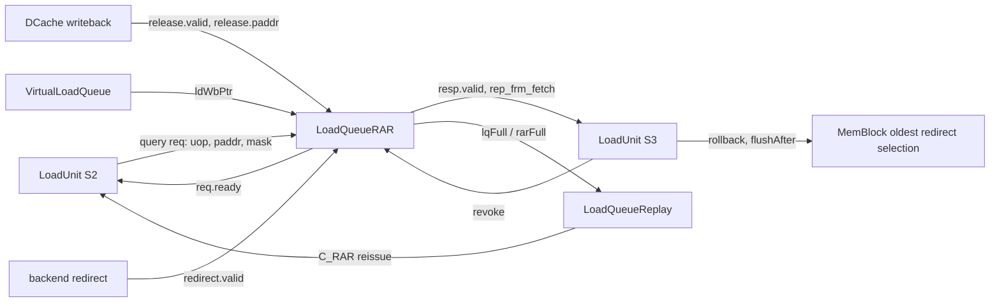
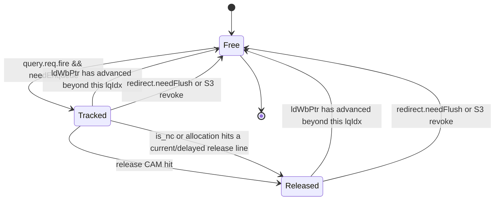

<!--
# Kunminghu V2 LoadQueueRAR 源码分析

## 1. 分析范围与基线

本文分析 Kunminghu V2 访存子系统中的 `LoadQueueRAR`。它位于 Load Queue 内部，接收 Load Unit 的 load-load nuke 查询、DCache 写回路径给出的 release 提示、重定向和 VLQ 的退休指针，并在命中时把恢复信息送回 Load Unit。

| 项目 | 本文采用的基线 |
| --- | --- |
| 源码目录 | `/home/yanyusong/xs-memory-env/XiangShan` |
| 分支 | `kunminghu-v2` |
| 源码提交 | `e12436c7cba86b195deec24981976d78bc263661` |
| 提交时间 | `2026-08-14T09:36:34+08:00` |
| 直接分析对象 | [LoadQueueRAR.scala](/home/yanyusong/xs-memory-env/XiangShan/src/main/scala/xiangshan/mem/lsqueue/LoadQueueRAR.scala:29) |
| 设计文档基线 | D0：`/home/yanyusong/XiangShanLab/XiangShan-Design-Doc` 在本次分析环境中不存在，本文没有将未获得的设计文档结论写成实现事实。 |
| 课程材料 | [14_LoadStore.md](/home/yanyusong/XiangShanLab/xiangshan-course/docs/xiangshan-microarchitecture/Beginner_Implementation_and_Principles_of_the_High_Performance_Xiangshan_Processor/14_LoadStore.md:1) 与 [scalar-load.md](/home/yanyusong/XiangShanLab/xiangshan-course/docs/5-xiangshan-scenarios-analysis/scenarios-analysis/instructions-lifecycle/scalar-load/scalar-load.md:1) 仅用于术语背景；其中引用的源码版本不等于本节提交。 |

分析开始前已按 `xiangshan-code-analyzer` 的每周同步流程检查；同步状态显示距离上次同步不足七天，因此未重复拉取。源码工作树存在与本文无关的 `difftest` 修改和 `src/main/resources/aia/` 未跟踪内容，本文只读分析，没有修改该工作树。

### 1.1 名称与责任边界

这里的 `RAR` 不能直接按寄存器依赖中的经典 Read-After-Read 概念理解。源码中的实现是一个**面向 speculative load-load 顺序检查的临时记录表**：

1. 一个仍在 VLQ 退休边界之后的 load，在满足条件时把其 `uop` 和压缩后的物理地址写入 RAR。
2. DCache 写回路径的 `release` 使相同地址签名的表项变为可检查状态。
3. 一个更老的 load 发起查询；若命中一个更年轻、仍分配且已 release 的记录，RAR 返回 `rep_frm_fetch`。
4. Load Unit 在 S3 将该结果与 CSR 使能合并，产生 `flushAfter` 级别的回滚；RAR 本身不直接产生架构异常。

因此，RAR 的重点不是保存某条指令已经读过什么，而是在 DCache release 与乱序 load 的交错中，发现需要重新执行/恢复的 load-load 情形。

## 2. 源码追踪矩阵

| 模块 | 在路径中的职责 | 关键源码证据 |
| --- | --- | --- |
| `LoadQueueRAR` | 维护 RAR 表项、地址 CAM、release 标志、分配/释放及 query 响应 | [LoadQueueRAR.scala:35](/home/yanyusong/xs-memory-env/XiangShan/src/main/scala/xiangshan/mem/lsqueue/LoadQueueRAR.scala:35) |
| `LoadQueue` | 实例化 RAR，并把 Load Unit、DCache release、VLQ 指针和 Replay Queue 连接到它 | [LoadQueue.scala:214](/home/yanyusong/xs-memory-env/XiangShan/src/main/scala/xiangshan/mem/lsqueue/LoadQueue.scala:214) |
| `LoadUnit` | 在实际 S2 驱动 query，在 S3 消费结果，给 RAR 发送 revoke，并产生 rollback | [LoadUnit.scala:1361](/home/yanyusong/xs-memory-env/XiangShan/src/main/scala/xiangshan/backend/fu/LoadUnit.scala:1361) |
| `LoadNukeQueryIO` | 定义 `Decoupled` query 请求、`Valid` 响应及 revoke 的协议 | [Bundles.scala:232](/home/yanyusong/xs-memory-env/XiangShan/src/main/scala/xiangshan/mem/Bundles.scala:232) |
| `VirtualLoadQueue` | 产生连续已完成/已提交前缀对应的 `ldWbPtr`，供 RAR 判断表项生命周期 | [VirtualLoadQueue.scala:134](/home/yanyusong/xs-memory-env/XiangShan/src/main/scala/xiangshan/mem/lsqueue/VirtualLoadQueue.scala:134) |
| `FreeList` | 提供最多三路分配、四路回收和 `empty`/`validCount` | [FreeList.scala:25](/home/yanyusong/xs-memory-env/XiangShan/src/main/scala/xiangshan/mem/lsqueue/FreeList.scala:25) |
| `LqPAddrModule` | 保存压缩地址，提供 release/query 使用的 CAM 匹配掩码 | [LoadQueueData.scala:136](/home/yanyusong/xs-memory-env/XiangShan/src/main/scala/xiangshan/mem/lsqueue/LoadQueueData.scala:136) |
| `DCacheWrapper` | 向 LSU 发出带物理地址的 `release` 提示 | [DCacheWrapper.scala:1619](/home/yanyusong/xs-memory-env/XiangShan/src/main/scala/xiangshan/cache/dcache/DCacheWrapper.scala:1619) |
| `LoadQueueReplay` | 在 RAR 满时阻塞 `C_RAR` 原因的重放，并在安全条件下解除阻塞 | [LoadQueueReplay.scala:338](/home/yanyusong/xs-memory-env/XiangShan/src/main/scala/xiangshan/mem/lsqueue/LoadQueueReplay.scala:338) |
| `MemBlock` | 汇聚 Load Unit rollback，选择最老的访存恢复请求送往后端 | [MemBlock.scala:1424](/home/yanyusong/xs-memory-env/XiangShan/src/main/scala/xiangshan/mem/MemBlock.scala:1424) |
| `NewCSR` | 把 `smblockctl` 的控制字段送到 MemBlock/Load Unit | [NewCSR.scala:1371](/home/yanyusong/xs-memory-env/XiangShan/src/main/scala/xiangshan/backend/ctrlblock/csr/NewCSR.scala:1371) |

### 2.1 理论概念到本实现的映射

| 理论概念 | 本实现中的对象 | 可以从源码确认的事实 | 不应超出源码推断的部分 |
| --- | --- | --- | --- |
| 投机 load 顺序检查 | `LoadQueueRAR` 的 query 与 `rep_frm_fetch` | RAR 对更年轻、已 release、地址签名相同的记录求 OR | 压缩签名碰撞的微架构处置策略没有在本模块中二次确认 |
| 队列分配与回收 | `FreeList`、`allocated`、`ldWbPtr` | 可分配槽位耗尽时 RAR 报满；退休指针、redirect、revoke 会回收记录 | 不能把 RAR 满等同于整个 Load Queue 或 dispatch 阶段满 |
| 环形年龄比较 | `LqPtr`、`RobPtr`、`isAfter`/`isBefore` | 比较带有环形指针 flag 语义，适用于 72 项的非二次幂队列 | 具体一次仿真的 wrap 时序需波形验证 |
| Decoupled 背压 | `query.req.valid/ready` | 需要记录的请求在 RAR 无空位时被 backpressure | `resp.valid` 从 `req.valid` 寄存而来，不是从 `req.fire` 寄存；其不接受周期的消费者行为需专门验证 |
| 恢复而非 trap | `s3_flushPipe`、`rollback` | RAR 命中可触发 `flushAfter` 回滚，且 S3 exception 会抑制 rollback | RAR 没有自己的异常码、CSR trap 或 Difftest 架构事件 |

-->

# Kunminghu V2 LoadQueueRAR Source-Code Analysis

## 1. Scope and Baseline

This document analyzes `LoadQueueRAR` in the Kunminghu V2 memory subsystem. It resides inside the Load Queue, receives load-load nuke queries from the Load Unit, `release` notifications from the DCache writeback path, redirects, and the VLQ retirement pointer, and returns recovery information to the Load Unit on a match.

| Item | Baseline used in this document |
| --- | --- |
| Source directory | `/home/yanyusong/xs-memory-env/XiangShan` |
| Branch | `kunminghu-v2` |
| Source commit | `e12436c7cba86b195deec24981976d78bc263661` |
| Commit time | `2026-08-14T09:36:34+08:00` |
| Directly analyzed object | [LoadQueueRAR.scala](/home/yanyusong/xs-memory-env/XiangShan/src/main/scala/xiangshan/mem/lsqueue/LoadQueueRAR.scala:29) |
| Design-document baseline | D0: `/home/yanyusong/XiangShanLab/XiangShan-Design-Doc` was absent from this analysis environment, so this document does not present unavailable design-document conclusions as implementation facts. |
| Course material | [14_LoadStore.md](/home/yanyusong/XiangShanLab/xiangshan-course/docs/xiangshan-microarchitecture/Beginner_Implementation_and_Principles_of_the_High_Performance_Xiangshan_Processor/14_LoadStore.md:1) and [scalar-load.md](/home/yanyusong/XiangShanLab/xiangshan-course/docs/5-xiangshan-scenarios-analysis/scenarios-analysis/instructions-lifecycle/scalar-load/scalar-load.md:1) are used only for terminology; the source versions cited there are not necessarily this section's commit. |

Before analysis, the `xiangshan-code-analyzer` weekly synchronization procedure was checked. The last synchronization was less than seven days earlier, so no additional fetch was performed. The source worktree had unrelated `difftest` modifications and untracked `src/main/resources/aia/` content; this document is based on read-only analysis and did not change that worktree.

### 1.1 Naming and Responsibility Boundaries

`RAR` here must not be understood solely as the conventional register-dependence Read-After-Read relation. The source implements a **temporary record table for speculative load-load ordering checks**:

1. A load that remains after the VLQ retirement boundary writes its `uop` and compressed physical address into RAR when the required conditions hold.
2. A `release` on the DCache writeback path makes entries with the same address signature eligible for checking.
3. An older load issues a query; if it matches a younger, still allocated, and released record, RAR returns `rep_frm_fetch`.
4. In S3, the Load Unit combines that result with CSR enablement and produces a `flushAfter`-level rollback; RAR does not directly produce an architectural exception.

RAR therefore does not primarily remember what an instruction has read. It detects load-load cases that need re-execution or recovery when DCache releases and out-of-order loads interleave.

## 2. Source-Traceability Matrix

| Module | Responsibility on the path | Key source evidence |
| --- | --- | --- |
| `LoadQueueRAR` | Maintains RAR entries, the address CAM, release flags, allocation/freeing, and query responses | [LoadQueueRAR.scala:35](/home/yanyusong/xs-memory-env/XiangShan/src/main/scala/xiangshan/mem/lsqueue/LoadQueueRAR.scala:35) |
| `LoadQueue` | Instantiates RAR and connects the Load Unit, DCache releases, VLQ pointer, and Replay Queue to it | [LoadQueue.scala:214](/home/yanyusong/xs-memory-env/XiangShan/src/main/scala/xiangshan/mem/lsqueue/LoadQueue.scala:214) |
| `LoadUnit` | Drives queries in the implemented S2 stage, consumes results in S3, sends RAR revokes, and produces rollbacks | [LoadUnit.scala:1361](/home/yanyusong/xs-memory-env/XiangShan/src/main/scala/xiangshan/backend/fu/LoadUnit.scala:1361) |
| `LoadNukeQueryIO` | Defines the `Decoupled` query request, `Valid` response, and revoke protocol | [Bundles.scala:232](/home/yanyusong/xs-memory-env/XiangShan/src/main/scala/xiangshan/mem/Bundles.scala:232) |
| `VirtualLoadQueue` | Produces `ldWbPtr` for the contiguous completed/committed prefix, which RAR uses to determine entry lifetime | [VirtualLoadQueue.scala:134](/home/yanyusong/xs-memory-env/XiangShan/src/main/scala/xiangshan/mem/lsqueue/VirtualLoadQueue.scala:134) |
| `FreeList` | Provides up to three allocations, four frees, and `empty`/`validCount` | [FreeList.scala:25](/home/yanyusong/xs-memory-env/XiangShan/src/main/scala/xiangshan/mem/lsqueue/FreeList.scala:25) |
| `LqPAddrModule` | Stores compressed addresses and provides CAM match masks for releases and queries | [LoadQueueData.scala:136](/home/yanyusong/xs-memory-env/XiangShan/src/main/scala/xiangshan/mem/lsqueue/LoadQueueData.scala:136) |
| `DCacheWrapper` | Sends a physical-address-bearing `release` notification to the LSU | [DCacheWrapper.scala:1619](/home/yanyusong/xs-memory-env/XiangShan/src/main/scala/xiangshan/cache/dcache/DCacheWrapper.scala:1619) |
| `LoadQueueReplay` | Blocks replays with cause `C_RAR` when RAR is full and unblocks them under safe conditions | [LoadQueueReplay.scala:338](/home/yanyusong/xs-memory-env/XiangShan/src/main/scala/xiangshan/mem/lsqueue/LoadQueueReplay.scala:338) |
| `MemBlock` | Collects Load Unit rollbacks and selects the oldest memory-recovery request for the backend | [MemBlock.scala:1424](/home/yanyusong/xs-memory-env/XiangShan/src/main/scala/xiangshan/mem/MemBlock.scala:1424) |
| `NewCSR` | Sends the control fields of `smblockctl` to MemBlock and the Load Unit | [NewCSR.scala:1371](/home/yanyusong/xs-memory-env/XiangShan/src/main/scala/xiangshan/backend/ctrlblock/csr/NewCSR.scala:1371) |

### 2.1 Mapping Theoretical Concepts to This Implementation

| Theoretical concept | Object in this implementation | Fact confirmed by source | Inference that must not exceed the source |
| --- | --- | --- | --- |
| Speculative load ordering check | `LoadQueueRAR` queries and `rep_frm_fetch` | RAR ORs records that are younger, released, and have the same address signature | The microarchitectural treatment of compressed-signature collisions is not reconfirmed in this module |
| Queue allocation and reclamation | `FreeList`, `allocated`, and `ldWbPtr` | RAR reports full when allocatable slots are exhausted; the retirement pointer, redirects, and revokes reclaim records | RAR-full must not be equated with a full Load Queue or a full dispatch stage |
| Circular age comparison | `LqPtr`, `RobPtr`, and `isAfter`/`isBefore` | Comparisons carry circular-pointer flag semantics and apply to the 72-entry non-power-of-two queue | Wrap timing in a concrete simulation requires waveform validation |
| Decoupled backpressure | `query.req.valid/ready` | Requests that need tracking are backpressured when RAR has no free slot | `resp.valid` is registered from `req.valid`, not `req.fire`; consumer behavior during non-acceptance cycles requires focused validation |
| Recovery rather than a trap | `s3_flushPipe` and `rollback` | An RAR match can trigger a `flushAfter` rollback, and an S3 exception suppresses rollback | RAR has no exception code, CSR trap, or Difftest architectural event of its own |

<!--
## 3. 系统位置：Who、Why、How、From、To
-->

## 3. System Placement: Who, Why, How, From, and To

<!--
### 3.1 Who：谁驱动、谁消费

`LoadQueue` 创建 RAR 后，把每个 Load Pipeline 的 `ldld_nuke_query` 直接连接到对应 query 端口：
-->

### 3.1 Who: Drivers and Consumers

After creating RAR, `LoadQueue` directly connects each Load Pipeline's `ldld_nuke_query` to its corresponding query port:

```scala
loadQueueRAR.io.redirect <> io.redirect
loadQueueRAR.io.release <> io.release
loadQueueRAR.io.ldWbPtr <> virtualLoadQueue.io.ldWbPtr
for (w <- 0 until LoadPipelineWidth) {
  loadQueueRAR.io.query(w).req <> io.ldu(w).ldld_nuke_query.req
  io.ldu(w).ldld_nuke_query.resp <> loadQueueRAR.io.query(w).resp
  loadQueueRAR.io.query(w).revoke <> io.ldu(w).ldld_nuke_query.revoke
}
```

<!--
以上连接来自 [LoadQueue.scala:223](/home/yanyusong/xs-memory-env/XiangShan/src/main/scala/xiangshan/mem/lsqueue/LoadQueue.scala:223)。默认参数下 `LoadPipelineWidth = 3`，所以 RAR 有三路并行 query/写入端口；这是源码默认参数，而不是本次运行仿真已确认的 elaboration 值，见 [Parameters.scala:167](/home/yanyusong/xs-memory-env/XiangShan/src/main/scala/xiangshan/Parameters.scala:167) 和 [Parameters.scala:214](/home/yanyusong/xs-memory-env/XiangShan/src/main/scala/xiangshan/Parameters.scala:214)。

### 3.2 Why：为什么需要这个表

Load 可以在 DCache、TLB、Data Array 和回放路径并行推进，较老 load 的观察与较年轻 load 的观察不总能在同一个周期决定。RAR 把一段尚未越过 VLQ 退休前缀的 load 保存下来，等待 DCache release 所代表的可见性/检查窗口；随后由较老 load 的 query 检查是否需要恢复。

这个机制的资源压力也被显式暴露：若 `FreeList` 无空闲项，RAR 只对需要入表的 request 拉低 `ready`。Load Unit 将此转换为 `rar_nack`，重放队列以 `C_RAR` 原因保存该 load。它并不使 `LoadQueue.io.lqFull` 变为真，因为后者仍来自 `VirtualLoadQueue`，见 [LoadQueue.scala:252](/home/yanyusong/xs-memory-env/XiangShan/src/main/scala/xiangshan/mem/lsqueue/LoadQueue.scala:252)。

### 3.3 How：端到端数据流
-->

The wiring is from [LoadQueue.scala:223](/home/yanyusong/xs-memory-env/XiangShan/src/main/scala/xiangshan/mem/lsqueue/LoadQueue.scala:223). With the default `LoadPipelineWidth = 3`, RAR has three parallel query/write ports. This is a default source parameter, not an elaboration value confirmed by this simulation; see [Parameters.scala:167](/home/yanyusong/xs-memory-env/XiangShan/src/main/scala/xiangshan/Parameters.scala:167) and [Parameters.scala:214](/home/yanyusong/xs-memory-env/XiangShan/src/main/scala/xiangshan/Parameters.scala:214).

### 3.2 Why: Why This Table Is Needed

Loads can progress concurrently through DCache, TLB, Data Array, and replay paths, so observations by an older and a younger load cannot always be decided in the same cycle. RAR retains loads that have not crossed the VLQ retirement prefix, waits for the visibility/checking window represented by a DCache release, and lets an older load query whether recovery is necessary.

The resource pressure is explicit: when `FreeList` has no free entry, RAR lowers `ready` only for requests that need an entry. The Load Unit converts this into `rar_nack`, and the replay queue retains the load with cause `C_RAR`. It does not make `LoadQueue.io.lqFull` true, because that signal still originates from `VirtualLoadQueue`; see [LoadQueue.scala:252](/home/yanyusong/xs-memory-env/XiangShan/src/main/scala/xiangshan/mem/lsqueue/LoadQueue.scala:252).

<!--
### 3.3 How：端到端数据流
-->

### 3.3 How: End-to-End Data Flow



<!--
链路上的时序角色如下。

| 方向 | 信号/数据 | 协议和时序 | 作用 |
| --- | --- | --- | --- |
| Load Unit S2 -> RAR | `query.req` | `Decoupled`；真正占用表项以 `valid && ready && needEnqueue` 为条件 | 查询并在需要时插入当前 load |
| RAR -> Load Unit S2 | `query.req.ready` | 组合地依赖 `needEnqueue` 和 FreeList 分配能力 | 只对需要跟踪的请求施加 RAR 背压 |
| RAR -> Load Unit S3 | `query.resp` | `Valid`，命中掩码在 RAR 中寄存 | 返回是否出现潜在 load-load 恢复条件 |
| DCache -> RAR | `release` | `Valid(new Release)`，没有 ready | 用 release 的 `paddr` 标记已有记录可参与检查 |
| VLQ -> RAR | `ldWbPtr` | 指针状态，非握手 | 释放已到连续退休前缀之前的 RAR 项 |
| Load Unit S3 -> RAR | `revoke` | 布尔脉冲，与前一周期获接收的端口索引配对 | 撤销已经进入异常、重放等路径的刚接收项 |
| RAR -> Replay Queue | `lqFull` | 电平信号 | 阻塞 `C_RAR` 重放项，避免在 RAR 无槽位时反复注入 |

`LoadNukeQueryIO` 的注释写着请求应在 load S1 发出，但当前实际驱动在 `LoadUnit` 的 S2 逻辑中：`s2_valid`、`s2_paddr` 和 `s2_out.uop` 被赋给 `ldld_nuke_query.req`，见 [LoadUnit.scala:1361](/home/yanyusong/xs-memory-env/XiangShan/src/main/scala/xiangshan/backend/fu/LoadUnit.scala:1361)。本文以可执行连接为准，并把该注释/实现阶段差异作为维护注意项。

## 4. 参数、存储与地址表示
-->

The timing roles along the path are as follows.

| Direction | Signal/data | Protocol and timing | Function |
| --- | --- | --- | --- |
| Load Unit S2 -> RAR | `query.req` | `Decoupled`; an entry is actually consumed only when `valid && ready && needEnqueue` | Queries and, when needed, inserts the current load |
| RAR -> Load Unit S2 | `query.req.ready` | Combinationally depends on `needEnqueue` and FreeList allocation capacity | Applies RAR backpressure only to requests that need tracking |
| RAR -> Load Unit S3 | `query.resp` | `Valid`; RAR registers the match mask | Reports whether a potential load-load recovery condition exists |
| DCache -> RAR | `release` | `Valid(new Release)`, with no ready | Uses the release's `paddr` to make existing records eligible for checking |
| VLQ -> RAR | `ldWbPtr` | Pointer state, not a handshake | Frees RAR entries at or before the contiguous retirement prefix |
| Load Unit S3 -> RAR | `revoke` | Boolean pulse paired with the port index accepted in the previous cycle | Revokes a just-accepted entry that has entered an exception, replay, or similar path |
| RAR -> Replay Queue | `lqFull` | Level signal | Blocks `C_RAR` replay entries to avoid repeatedly injecting them while RAR has no slot |

The comment on `LoadNukeQueryIO` says that requests should issue in load S1, but the implemented driver is in `LoadUnit` S2: `s2_valid`, `s2_paddr`, and `s2_out.uop` are assigned to `ldld_nuke_query.req`; see [LoadUnit.scala:1361](/home/yanyusong/xs-memory-env/XiangShan/src/main/scala/xiangshan/backend/fu/LoadUnit.scala:1361). This document follows executable wiring and records the comment/implementation stage mismatch as a maintenance concern.

<!--
## 4. 参数、存储与地址表示
-->

## 4. Parameters, Storage, and Address Representation

<!--
### 4.1 默认容量与端口

`LoadQueueRAR` 的重要结构如下：
-->

### 4.1 Default Capacity and Ports

The key structures of `LoadQueueRAR` are as follows:

```scala
val allocated = RegInit(VecInit(Seq.fill(RARSize)(false.B)))
val uop = Reg(Vec(RARSize, new DynInst))
val paddrModule = Module(new LqPAddrModule(
  UInt(PartialPAddrBits.W), RARSize, LoadPipelineWidth,
  LoadPipelineWidth, LoadQueueNWriteBanks, 1,
  LoadPipelineWidth, enableCacheLineCheck = false, 0))
val released = RegInit(VecInit(Seq.fill(RARSize)(false.B)))
val freeList = Module(new FreeList(RARSize, LoadPipelineWidth, CommitWidth,
  enablePreAlloc = false))
```

<!--
摘自 [LoadQueueRAR.scala:84](/home/yanyusong/xs-memory-env/XiangShan/src/main/scala/xiangshan/mem/lsqueue/LoadQueueRAR.scala:84)。当前默认源码给出 `LoadQueueRARSize = 72`、`LoadQueueNWriteBanks = 8`、`CommitWidth = 4`，见 [Parameters.scala:167](/home/yanyusong/xs-memory-env/XiangShan/src/main/scala/xiangshan/Parameters.scala:167)；实际 SoC 配置可覆盖这些值，不能把它们写成所有仿真配置的已验证常数。

| 状态/模块 | 宽度或容量 | 保存的内容 | 生命周期意义 |
| --- | --- | --- | --- |
| `allocated` | `RARSize` 位 | 槽位是否有效 | 所有匹配和释放均以它为前提 |
| `uop` | `RARSize` 个 `DynInst` | 至少使用其中的 `robIdx`、`lqIdx` | 进行 ROB 年龄过滤、LQ 退休判断和 redirect flush 判断 |
| `paddrModule` | 72 项，3 读、3 写、3 CAM 端口 | 16 位压缩物理地址签名 | 用于 release/query 的候选匹配 |
| `released` | `RARSize` 位 | 该项是否经历过相关 release/特殊初始条件 | 只有置位项能形成 RAR 命中 |
| `freeList` | 72 项，3 分配、4 回收 | 空闲槽位次序 | `empty` 代表无空闲槽，不是“RAR 没有有效项” |

### 4.2 部分物理地址签名

RAR 不保存完整物理地址。`genPartialPAddr` 固定 `PartialPAddrStride = 6`、`PartialPAddrBits = 16`，其中低 5 位和高 11 位分别由若干物理地址位 XOR 折叠得到，见 [LoadQueueRAR.scala:52](/home/yanyusong/xs-memory-env/XiangShan/src/main/scala/xiangshan/mem/lsqueue/LoadQueueRAR.scala:52)。可抽象为：
-->

This excerpt is from [LoadQueueRAR.scala:84](/home/yanyusong/xs-memory-env/XiangShan/src/main/scala/xiangshan/mem/lsqueue/LoadQueueRAR.scala:84). The current default source specifies `LoadQueueRARSize = 72`, `LoadQueueNWriteBanks = 8`, and `CommitWidth = 4`; see [Parameters.scala:167](/home/yanyusong/xs-memory-env/XiangShan/src/main/scala/xiangshan/Parameters.scala:167). An actual SoC configuration can override these values, so they must not be presented as verified constants for every simulation configuration.

| State/module | Width or capacity | Stored information | Lifetime significance |
| --- | --- | --- | --- |
| `allocated` | `RARSize` bits | Whether the slot is valid | It gates all matching and freeing |
| `uop` | `RARSize` `DynInst` values | At minimum its `robIdx` and `lqIdx` are used | Supports ROB-age filtering, LQ retirement decisions, and redirect-flush decisions |
| `paddrModule` | 72 entries, 3 reads, 3 writes, 3 CAM ports | 16-bit compressed physical-address signatures | Candidate matching for releases and queries |
| `released` | `RARSize` bits | Whether the entry has seen the relevant release or a special initial condition | Only set entries can form an RAR match |
| `freeList` | 72 entries, 3 allocations, 4 frees | Ordering of free slots | `empty` means no free slot, not that RAR has no valid entry |

### 4.2 Partial Physical-Address Signature

RAR does not retain complete physical addresses. `genPartialPAddr` fixes `PartialPAddrStride = 6` and `PartialPAddrBits = 16`; it XOR-folds selected physical-address bits into a low five-bit and high eleven-bit portion, respectively; see [LoadQueueRAR.scala:52](/home/yanyusong/xs-memory-env/XiangShan/src/main/scala/xiangshan/mem/lsqueue/LoadQueueRAR.scala:52). It can be abstracted as follows:

```text
low[i]  = paddr[6+i] xor paddr[15-i]                 (i = 0..4)
high[i] = paddr[6+i] xor paddr[17+i] xor
          paddr[28+i] xor paddr[39+i]               (i = 0..10; out-of-range bits do not participate)
signature = Cat(high, low)
```

<!--
这意味着以下边界必须明确：

- 低 6 位没有进入签名，符合 cache-line 粒度检查的意图，但 RAR 并未在本模块保留完整地址作二次比较。
- `LqPAddrModule` 在 `enableCacheLineCheck = false` 时以存储数据与 query/release 数据的相等性生成匹配掩码，见 [LoadQueueData.scala:157](/home/yanyusong/xs-memory-env/XiangShan/src/main/scala/xiangshan/mem/lsqueue/LoadQueueData.scala:157)。这里比较的是上述 16 位签名。
- 因而“签名相同”是源码能保证的条件，不等价于“完整物理地址绝对相同”。压缩碰撞能否由后续路径过滤，不能从 `LoadQueueRAR` 单独证明，应列入定向验证。

入表瞬间设置 `released` 时，代码另外使用完整 `paddr(PAddrBits - 1, DCacheLineOffset)` 比较当前/延迟一个周期的 release 地址线号，见 [LoadQueueRAR.scala:172](/home/yanyusong/xs-memory-env/XiangShan/src/main/scala/xiangshan/mem/lsqueue/LoadQueueRAR.scala:172)。这和随后 CAM 使用签名的事实应同时保留，不能混为同一种精度。

### 4.3 环形指针

`LqPtr` 是基于 `VirtualLoadQueueSize` 的环形队列指针，含 value 与 flag；`isAfter`/`isBefore` 使用 flag 考虑绕回，见 [CircularQueuePtr.scala:23](/home/yanyusong/xs-memory-env/XiangShan/src/main/scala/xiangshan/mem/lsqueue/CircularQueuePtr.scala:23) 和 [CircularQueuePtr.scala:92](/home/yanyusong/xs-memory-env/XiangShan/src/main/scala/xiangshan/mem/lsqueue/CircularQueuePtr.scala:92)。RAR 的 72 项不是二次幂，不能用普通无符号数大小关系替代这些帮助函数。

## 5. 隐式状态机与核心算法

源码没有 `Enum` 型 FSM；`allocated`、`released`、地址/`uop` 数据和 FreeList 共同构成隐式生命周期。
-->

The following boundaries must be kept explicit:

- The low six bits do not enter the signature, consistent with cache-line-granularity checking, but RAR does not retain a complete address in this module for a second comparison.
- With `enableCacheLineCheck = false`, `LqPAddrModule` generates a match mask by comparing stored data with query/release data; see [LoadQueueData.scala:157](/home/yanyusong/xs-memory-env/XiangShan/src/main/scala/xiangshan/mem/lsqueue/LoadQueueData.scala:157). The comparison is of the 16-bit signature above.
- Equal signatures are therefore guaranteed by the source, but they are not equivalent to complete physical-address equality. Whether later logic filters compressed collisions cannot be proved from `LoadQueueRAR` alone and belongs in directed validation.

When it sets `released` as an entry is allocated, the code additionally compares the complete `paddr(PAddrBits - 1, DCacheLineOffset)` address-line value against the current and one-cycle-delayed release address lines; see [LoadQueueRAR.scala:172](/home/yanyusong/xs-memory-env/XiangShan/src/main/scala/xiangshan/mem/lsqueue/LoadQueueRAR.scala:172). This fact and the subsequent signature-based CAM must be retained together and not treated as equivalent precision.

### 4.3 Circular Pointers

`LqPtr` is a circular queue pointer based on `VirtualLoadQueueSize`, with value and flag fields. `isAfter`/`isBefore` use the flag to account for wraparound; see [CircularQueuePtr.scala:23](/home/yanyusong/xs-memory-env/XiangShan/src/main/scala/xiangshan/mem/lsqueue/CircularQueuePtr.scala:23) and [CircularQueuePtr.scala:92](/home/yanyusong/xs-memory-env/XiangShan/src/main/scala/xiangshan/mem/lsqueue/CircularQueuePtr.scala:92). RAR has 72 non-power-of-two entries, so normal unsigned comparisons cannot replace these helpers.

<!--
## 5. 隐式状态机与核心算法

源码没有 `Enum` 型 FSM；`allocated`、`released`、地址/`uop` 数据和 FreeList 共同构成隐式生命周期。
-->

## 5. Implicit State Machine and Core Algorithms

The source has no `Enum`-style FSM. `allocated`, `released`, address/`uop` data, and FreeList together form its implicit lifecycle.



<!--
`released` 在普通释放时只会从 false 变为 true；离开 `allocated` 状态时并没有专门清零，但所有使用处都以 `allocated(i)` 为门控，下一次重新分配同一槽时会重写该位。这个细节说明波形检查应同时观察 `allocated` 和 `released`，而不能只看后者。

### 5.1 入表、背压与三端口分配

对每个 query 端口，RAR 先计算：
-->

During normal release, `released` can only change from false to true. It is not explicitly cleared when an entry leaves the `allocated` state, but every use is gated by `allocated(i)` and a new allocation of the same slot overwrites the bit. Waveform inspection must therefore observe both `allocated` and `released`, not the latter alone.

### 5.1 Enqueue, Backpressure, and Three-Port Allocation

For each query port, RAR first computes:

```scala
val canEnqueue = io.query(w).req.valid
val cancelEnqueue = io.query(w).req.bits.uop.robIdx.needFlush(io.redirect)
val hasNotWritebackedLoad = isAfter(io.query(w).req.bits.uop.lqIdx, io.ldWbPtr)
val needEnqueue = canEnqueue && hasNotWritebackedLoad && !cancelEnqueue
```

<!--
见 [LoadQueueRAR.scala:134](/home/yanyusong/xs-memory-env/XiangShan/src/main/scala/xiangshan/mem/lsqueue/LoadQueueRAR.scala:134)。含义是：只有尚在 `ldWbPtr` 之后、未被 redirect 冲掉的 load 才必须申请 RAR 槽位。若不需要入表，`ready` 强制为 true，不会因 RAR 满而阻塞。

Load Unit 发起该 request 还存在一个参数相关分支：当 `LoadQueueRARSize == VirtualLoadQueueSize` 时，当前代码以 `s2_valid && !s2_prf && !s2_in.isFrmMisAlignBuf` 驱动 valid；否则才额外使用 `s2_can_query`，见 [LoadUnit.scala:1361](/home/yanyusong/xs-memory-env/XiangShan/src/main/scala/xiangshan/backend/fu/LoadUnit.scala:1361)。默认源码中两者均为 72，因此本基线落在前一分支。它说明不能仅由 `s2_troublem` 或一般 load replay 条件反推出 RAR query 是否必然发出；具体参数化配置需要重新阅读该分支。

对于同一周期的多端口，端口 `w` 用此前端口的 `needEnqueue` 前缀和作为分配 offset：
-->

See [LoadQueueRAR.scala:134](/home/yanyusong/xs-memory-env/XiangShan/src/main/scala/xiangshan/mem/lsqueue/LoadQueueRAR.scala:134). Only a load that remains after `ldWbPtr` and is not flushed by a redirect must request an RAR slot. If no entry is required, `ready` is forced high and RAR-full cannot block the request.

The Load Unit has another parameter-dependent branch when issuing this request. When `LoadQueueRARSize == VirtualLoadQueueSize`, current code drives valid with `s2_valid && !s2_prf && !s2_in.isFrmMisAlignBuf`; otherwise it additionally uses `s2_can_query`; see [LoadUnit.scala:1361](/home/yanyusong/xs-memory-env/XiangShan/src/main/scala/xiangshan/backend/fu/LoadUnit.scala:1361). Both sizes are 72 in the default source, so this baseline uses the former branch. An RAR query must not be inferred solely from `s2_troublem` or generic load-replay conditions; parameterized configurations require re-reading this branch.

For multiple ports in one cycle, port `w` uses the prefix sum of preceding `needEnqueue` values as its allocation offset:

```scala
val offset = PopCount(needEnqueue.take(w))
val canAccept = freeList.io.canAllocate(offset)
val enqIndex = freeList.io.allocateSlot(offset)
io.query(w).req.ready := Mux(needEnqueue, canAccept, true.B)
```

<!--
见 [LoadQueueRAR.scala:146](/home/yanyusong/xs-memory-env/XiangShan/src/main/scala/xiangshan/mem/lsqueue/LoadQueueRAR.scala:146)。因此，低编号端口所需的槽位会先占用 offset；每端口的 `ready` 由自己的 offset 是否有槽决定。此处不能只看 `freeList.io.empty` 来解释每一路 ready，边界周期的三路组合需要验证。

在 `needEnqueue && ready` 时，模块写 `allocated`、`uop`、压缩地址及 `released`。`XSError` 断言该索引不应原本已分配，见 [LoadQueueRAR.scala:157](/home/yanyusong/xs-memory-env/XiangShan/src/main/scala/xiangshan/mem/lsqueue/LoadQueueRAR.scala:157)。`LqPAddrModule` 也断言同周期不应有两个写端口写同一地址，见 [LoadQueueData.scala:127](/home/yanyusong/xs-memory-env/XiangShan/src/main/scala/xiangshan/mem/lsqueue/LoadQueueData.scala:127)。

### 5.2 release 的两条路径

RAR 将 DCache `release` 延迟一拍，以便与地址存储写时序对齐：
-->

See [LoadQueueRAR.scala:146](/home/yanyusong/xs-memory-env/XiangShan/src/main/scala/xiangshan/mem/lsqueue/LoadQueueRAR.scala:146). Required slots for lower-numbered ports consume lower offsets first; each port's `ready` depends on whether its own offset has a slot. `freeList.io.empty` alone cannot explain every port's ready value, and the three-port boundary combination needs validation.

At `needEnqueue && ready`, the module writes `allocated`, `uop`, the compressed address, and `released`. `XSError` asserts that the selected index was not already allocated; see [LoadQueueRAR.scala:157](/home/yanyusong/xs-memory-env/XiangShan/src/main/scala/xiangshan/mem/lsqueue/LoadQueueRAR.scala:157). `LqPAddrModule` also asserts that two write ports do not write the same address in one cycle; see [LoadQueueData.scala:127](/home/yanyusong/xs-memory-env/XiangShan/src/main/scala/xiangshan/mem/lsqueue/LoadQueueData.scala:127).

### 5.2 Two Paths to `release`

RAR delays the DCache `release` by one cycle to align it with the address-storage write timing:

```scala
val release1Cycle = io.release
val release2Cycle = RegEnable(io.release, io.release.valid)
release2Cycle.valid := RegNext(io.release.valid)
```

<!--
见 [LoadQueueRAR.scala:124](/home/yanyusong/xs-memory-env/XiangShan/src/main/scala/xiangshan/mem/lsqueue/LoadQueueRAR.scala:124)。随后有两条使表项变为 released 的路径：

1. **入表同周期路径**：对非缓存 (`is_nc`) 直接置位；或者当 load 有有效数据且地址线等于当前/延迟 release 的地址线时置位。[LoadQueueRAR.scala:170](/home/yanyusong/xs-memory-env/XiangShan/src/main/scala/xiangshan/mem/lsqueue/LoadQueueRAR.scala:170)
2. **已存在表项路径**：release 地址签名进入 CAM，`RegNext(releaseMmask && allocated && release.valid)` 后置 `released(i)`。[LoadQueueRAR.scala:253](/home/yanyusong/xs-memory-env/XiangShan/src/main/scala/xiangshan/mem/lsqueue/LoadQueueRAR.scala:253)

源码紧邻入表逻辑的一条注释说 NC request 不应有 RAR，但实际代码对 `is_nc` 把 `released` 置为 true；而 `LoadUnit` 确实把 `s2_nc_with_data` 送入该字段，见 [LoadUnit.scala:1377](/home/yanyusong/xs-memory-env/XiangShan/src/main/scala/xiangshan/backend/fu/LoadUnit.scala:1377)。这是代码与注释的可见不一致。本文据实现描述行为，但不把它扩展为完整 MMIO 语义结论。

### 5.3 CAM 查询与年龄过滤

针对每个 query 端口，匹配条件为：
-->

See [LoadQueueRAR.scala:124](/home/yanyusong/xs-memory-env/XiangShan/src/main/scala/xiangshan/mem/lsqueue/LoadQueueRAR.scala:124). There are then two paths that make an entry released:

1. **Same-cycle allocation path:** assert it directly for non-cacheable (`is_nc`) access, or when the load has valid data and its address line equals a current or delayed release address line. [LoadQueueRAR.scala:170](/home/yanyusong/xs-memory-env/XiangShan/src/main/scala/xiangshan/mem/lsqueue/LoadQueueRAR.scala:170)
2. **Existing-entry path:** feed the release address signature into the CAM and then set `released(i)` from `RegNext(releaseMmask && allocated && release.valid)`. [LoadQueueRAR.scala:253](/home/yanyusong/xs-memory-env/XiangShan/src/main/scala/xiangshan/mem/lsqueue/LoadQueueRAR.scala:253)

A source comment adjacent to the allocation logic says that an NC request should not have RAR, but the actual code sets `released` for `is_nc`; `LoadUnit` does pass `s2_nc_with_data` to that field, see [LoadUnit.scala:1377](/home/yanyusong/xs-memory-env/XiangShan/src/main/scala/xiangshan/backend/fu/LoadUnit.scala:1377). This is a visible code/comment mismatch. The behavior here follows the implementation without extending it to a complete MMIO-semantic conclusion.

### 5.3 CAM Query and Age Filtering

For each query port, the match condition is:

```scala
matchMaskReg(i) := allocated(i) &&
  paddrModule.io.releaseViolationMmask(w)(i) &&
  robIdxMask(i) &&
  released(i)

robIdxMask(i) := isAfter(uop(i).robIdx, io.query(w).req.bits.uop.robIdx)
```

<!--
见 [LoadQueueRAR.scala:224](/home/yanyusong/xs-memory-env/XiangShan/src/main/scala/xiangshan/mem/lsqueue/LoadQueueRAR.scala:224)。`isAfter(stored.robIdx, query.robIdx)` 表明被记录的是**比查询 load 更年轻**的指令。每个端口对所有候选项做 `ParallelORR(matchMask)`，因此输出只回答“是否至少有一个候选命中”，不携带获胜表项编号，也没有在 RAR 内部做最年轻/最老优先选择。

响应逻辑是：
-->

See [LoadQueueRAR.scala:224](/home/yanyusong/xs-memory-env/XiangShan/src/main/scala/xiangshan/mem/lsqueue/LoadQueueRAR.scala:224). `isAfter(stored.robIdx, query.robIdx)` means that the recorded instruction is **younger than the querying load**. Each port applies `ParallelORR(matchMask)` across all candidates, so the output answers only whether at least one candidate matches. It carries no winning-entry index, and RAR does not choose a youngest or oldest match internally.

The response logic is:

```scala
io.query(w).resp.valid := RegNext(io.query(w).req.valid)
matchMask := RegEnable(matchMaskReg, io.query(w).req.valid)
io.query(w).resp.bits.rep_frm_fetch := ParallelORR(matchMask)
```

<!--
见 [LoadQueueRAR.scala:240](/home/yanyusong/xs-memory-env/XiangShan/src/main/scala/xiangshan/mem/lsqueue/LoadQueueRAR.scala:240)。正常接受路径中，这是 query 到 response 的一个寄存阶段；但是 response 的 valid 源于 `req.valid`，不是 `req.fire`。当需要入表但 `ready=0` 时，Load Unit 同时产生 `s2_rar_nack`，见 [LoadUnit.scala:1240](/home/yanyusong/xs-memory-env/XiangShan/src/main/scala/xiangshan/backend/fu/LoadUnit.scala:1240)。两者在该边界周期的组合是否会对下游产生额外可见行为，不能仅凭代码风格定性为 bug，应使用专门波形/断言验证。

### 5.4 回收：退休、redirect 与 revoke

RAR 不因 release 而回收槽位。它通过以下三种原因清除 `allocated`：
-->

See [LoadQueueRAR.scala:240](/home/yanyusong/xs-memory-env/XiangShan/src/main/scala/xiangshan/mem/lsqueue/LoadQueueRAR.scala:240). On the normal acceptance path this is one registered stage from query to response. However, response valid is sourced from `req.valid`, not `req.fire`. When an entry is needed but `ready = 0`, the Load Unit simultaneously produces `s2_rar_nack`; see [LoadUnit.scala:1240](/home/yanyusong/xs-memory-env/XiangShan/src/main/scala/xiangshan/backend/fu/LoadUnit.scala:1240). Whether the combination has additional downstream-visible behavior in that boundary cycle cannot be classified as a bug from coding style alone and needs dedicated waveform/assertion validation.

### 5.4 Reclamation: Retirement, Redirect, and Revoke

RAR does not free a slot because of a release. It clears `allocated` for the following three reasons:

```scala
val deqNotBlock = !isBefore(io.ldWbPtr, uop(i).lqIdx)
val needFlush = uop(i).robIdx.needFlush(io.redirect)
when (allocated(i) && (deqNotBlock || needFlush)) { ... }

val revokeValid = io.query(w).revoke && lastCanAccept(w)
when (allocated(revokeIndex) && revokeValid) { ... }
```

<!--
见 [LoadQueueRAR.scala:190](/home/yanyusong/xs-memory-env/XiangShan/src/main/scala/xiangshan/mem/lsqueue/LoadQueueRAR.scala:190)。`lastCanAccept` 和 `lastAllocIndex` 是被门控寄存的前一拍接受结果，因此 S3 revoke 对应的是此前成功入表的端口/槽位，而非当前周期重新猜测的槽位。

`ldWbPtr` 的来源不是任意 writeback 脉冲：VLQ 对已分配、已提交且连续的前缀求数量，然后按该数量推进 `deqPtr` 并输出为 `ldWbPtr`，见 [VirtualLoadQueue.scala:134](/home/yanyusong/xs-memory-env/XiangShan/src/main/scala/xiangshan/mem/lsqueue/VirtualLoadQueue.scala:134)。所以应将它理解为“连续完成/可退休边界”，而不是单条 load 在某级流水线的简单写回标志。

### 5.5 满状态与 C_RAR 重放的前进性

RAR 的满状态直接来自 FreeList：
-->

See [LoadQueueRAR.scala:190](/home/yanyusong/xs-memory-env/XiangShan/src/main/scala/xiangshan/mem/lsqueue/LoadQueueRAR.scala:190). `lastCanAccept` and `lastAllocIndex` are gated registers holding the previous cycle's acceptance result. Consequently, an S3 revoke identifies the port/slot that was successfully allocated earlier, rather than guessing a slot again in the current cycle.

`ldWbPtr` is not generated by an arbitrary writeback pulse. VLQ counts the allocated, committed, contiguous prefix, advances `deqPtr` by that count, and outputs the result as `ldWbPtr`; see [VirtualLoadQueue.scala:134](/home/yanyusong/xs-memory-env/XiangShan/src/main/scala/xiangshan/mem/lsqueue/VirtualLoadQueue.scala:134). It should therefore be understood as a contiguous completion/retirement boundary, not as a simple writeback flag for one load at one pipeline stage.

### 5.5 Full State and Forward Progress of `C_RAR` Replay

RAR's full state comes directly from FreeList:

```scala
io.lqFull := freeList.io.empty
val allowEnqueue = freeList.io.validCount <= RARSize - LoadPipelineWidth
QueuePerf(..., !allowEnqueue)
```

<!--
见 [LoadQueueRAR.scala:268](/home/yanyusong/xs-memory-env/XiangShan/src/main/scala/xiangshan/mem/lsqueue/LoadQueueRAR.scala:268)。`allowEnqueue` 仅用于性能统计；真正的 `ready` 使用 `canAllocate(offset)`，不能把 `allowEnqueue` 当成 admission 控制。

被 RAR 拒绝的 load 会在 Load Unit 中得到 `rar_nack`，经 `ldin.rep_info` 进入 replay 路径。`LoadQueueReplay` 对 `C_RAR` 原因保持阻塞，直到 RAR 不再满，或者该项的 `lqIdx` 已不在 `ldWbPtr` 之后：
-->

See [LoadQueueRAR.scala:268](/home/yanyusong/xs-memory-env/XiangShan/src/main/scala/xiangshan/mem/lsqueue/LoadQueueRAR.scala:268). `allowEnqueue` is used only for performance statistics; the actual `ready` uses `canAllocate(offset)`, so `allowEnqueue` must not be treated as admission control.

A load rejected by RAR receives `rar_nack` in the Load Unit and enters the replay path through `ldin.rep_info`. `LoadQueueReplay` keeps a `C_RAR` entry blocked until RAR is no longer full or its `lqIdx` is no longer after `ldWbPtr`:

```scala
blocking(i) := Mux((!io.rarFull ||
  !isAfter(uop(i).lqIdx, io.ldWbPtr)), false.B, blocking(i))
```

<!--
见 [LoadQueueReplay.scala:338](/home/yanyusong/xs-memory-env/XiangShan/src/main/scala/xiangshan/mem/lsqueue/LoadQueueReplay.scala:338)。这条旁路是避免 RAR 满时无意义反复发射的关键前进性条件。

## 6. 周期级时序与吞吐量
-->

See [LoadQueueReplay.scala:338](/home/yanyusong/xs-memory-env/XiangShan/src/main/scala/xiangshan/mem/lsqueue/LoadQueueReplay.scala:338). This bypass is the key forward-progress condition that prevents pointless repeated issue while RAR is full.

## 6. Cycle-Level Timing and Throughput

<!--
### 6.1 正常命中路径

下图是由寄存器边界推导的**示意图**，不是仿真采样波形。它表示一个可接受 query 在 S2 进入 RAR 后，下一周期 response 与该 load 的 S3 检查对齐的关系；`s3_flushPipe` 还受 CSR 使能门控。
-->

### 6.1 Normal Hit Path

The following is an **illustration** inferred from register boundaries, not a simulation-sampled waveform. It shows that, after an accepted query enters RAR in S2, the response aligns with that load's S3 check in the next cycle; `s3_flushPipe` is additionally gated by CSR enablement.

```waveform-draw
{
  "signal": [
    { "name": "clk", "wave": "p......" },
    { "name": "query.req.valid", "wave": "0100000" },
    { "name": "query.req.ready", "wave": "0111111" },
    { "name": "query.req.fire", "wave": "0010000" },
    { "name": "matched entry released", "wave": "0011111" },
    { "name": "query.resp.valid", "wave": "0001000" },
    { "name": "query.resp.rep_frm_fetch", "wave": "0001000" },
    { "name": "s3_flushPipe", "wave": "0001000" },
    { "name": "rollback.valid", "wave": "0001000" }
  ],
  "config": { "hscale": 1 }
}
```

<!--
`LoadUnit` 的实际消费点如下：
-->

`LoadUnit` consumes the result at the following point:

```scala
val s3_ldld_rep_inst = io.lsq.ldld_nuke_query.resp.valid &&
  io.lsq.ldld_nuke_query.resp.bits.rep_frm_fetch &&
  GatedValidRegNext(io.csrCtrl.ldld_vio_check_enable)
s3_flushPipe := s3_ldld_rep_inst
```

<!--
见 [LoadUnit.scala:1606](/home/yanyusong/xs-memory-env/XiangShan/src/main/scala/xiangshan/backend/fu/LoadUnit.scala:1606)。命中后 `s3_flushPipe` 进入 rollback 判定；该 rollback 的 level 在 RAR 情况下为 `flushAfter`，见 [LoadUnit.scala:1672](/home/yanyusong/xs-memory-env/XiangShan/src/main/scala/xiangshan/backend/fu/LoadUnit.scala:1672)。`Redirect.flushAfter` 的 level 为 0，语义是不冲掉发起恢复的指令自身，而冲掉更年轻指令，见 [package.scala:179](/home/yanyusong/xs-memory-env/XiangShan/src/main/scala/xiangshan/package.scala:179) 和 [RobBundles.scala:204](/home/yanyusong/xs-memory-env/XiangShan/src/main/scala/xiangshan/backend/rob/RobBundles.scala:204)。

### 6.2 NACK 路径和吞吐边界

当 RAR 无足够槽位且 request 需要入表时，`req.ready=0`，Load Unit 在 S2 形成 `s2_rar_nack`；随后将其写入 `s2_out.rep_info.rar_nack`，见 [LoadUnit.scala:1240](/home/yanyusong/xs-memory-env/XiangShan/src/main/scala/xiangshan/backend/fu/LoadUnit.scala:1240) 和 [LoadUnit.scala:1410](/home/yanyusong/xs-memory-env/XiangShan/src/main/scala/xiangshan/backend/fu/LoadUnit.scala:1410)。该 load 经常规 `ldin` 通道抵达 LSQ/Replay，而不是由 RAR 私自重新发射。

可以从结构上得出的吞吐界限是：

| 项目 | 源码可确认的上限/条件 | 解释 |
| --- | --- | --- |
| query/写端口 | `LoadPipelineWidth`，默认 3 | 同一周期最多有三路查询与候选写入 |
| FreeList 回收选择 | `CommitWidth`，默认 4 | 多余 free bit 通过内部寄存保留，不表示同周期可立刻重用 |
| RAR 成功入表 | 每端口 `needEnqueue && ready` | 不是全部 `valid` 都消耗槽位 |
| RAR query response | 正常接受模型下一寄存阶段 | `resp.valid` 的有效条件仍需覆盖 non-fire 边界 |
| end-to-end load 延迟 | 不能由 RAR 固定给出 | 还取决于 TLB、DCache、S3、replay、CSR 和 MemBlock redirect 仲裁 |

`FreeList` 的 `empty` 实际表示 `freeSlotCnt == 0`，也就是**没有空闲槽**，见 [FreeList.scala:107](/home/yanyusong/xs-memory-env/XiangShan/src/main/scala/xiangshan/mem/lsqueue/FreeList.scala:107)。FreeList 把回收请求先选择并寄存后写入环形表，当前源码未显示一条“同周期 free 立即给当前 allocation 使用”的直通路径；边界吞吐应以仿真或形式性质确认。

## 7. 从 DCache release 到后端恢复的边界
-->

See [LoadUnit.scala:1606](/home/yanyusong/xs-memory-env/XiangShan/src/main/scala/xiangshan/backend/fu/LoadUnit.scala:1606). On a match, `s3_flushPipe` enters rollback selection; the rollback level is `flushAfter` for RAR, see [LoadUnit.scala:1672](/home/yanyusong/xs-memory-env/XiangShan/src/main/scala/xiangshan/backend/fu/LoadUnit.scala:1672). `Redirect.flushAfter` has level 0: it does not flush the instruction initiating recovery but does flush younger instructions; see [package.scala:179](/home/yanyusong/xs-memory-env/XiangShan/src/main/scala/xiangshan/package.scala:179) and [RobBundles.scala:204](/home/yanyusong/xs-memory-env/XiangShan/src/main/scala/xiangshan/backend/rob/RobBundles.scala:204).

### 6.2 NACK Path and Throughput Boundaries

When RAR lacks a sufficient slot and the request needs an entry, `req.ready = 0` and the Load Unit forms `s2_rar_nack` in S2. It then writes that into `s2_out.rep_info.rar_nack`; see [LoadUnit.scala:1240](/home/yanyusong/xs-memory-env/XiangShan/src/main/scala/xiangshan/backend/fu/LoadUnit.scala:1240) and [LoadUnit.scala:1410](/home/yanyusong/xs-memory-env/XiangShan/src/main/scala/xiangshan/backend/fu/LoadUnit.scala:1410). The load reaches LSQ/Replay through the normal `ldin` channel; RAR does not reissue it independently.

The structural throughput bounds are:

| Item | Source-confirmed bound/condition | Explanation |
| --- | --- | --- |
| Query/write ports | `LoadPipelineWidth`, default 3 | At most three queries and candidate writes in one cycle |
| FreeList reclamation selection | `CommitWidth`, default 4 | Excess free bits are retained by internal registers; they do not imply immediate same-cycle reuse |
| Successful RAR insertion | `needEnqueue && ready` per port | Not every `valid` consumes a slot |
| RAR query response | Next registered stage in the normal acceptance model | The valid condition of `resp.valid` must still cover the non-fire boundary |
| End-to-end load latency | Not fixed by RAR | It also depends on TLB, DCache, S3, replay, CSR, and MemBlock redirect arbitration |

`FreeList.empty` actually means `freeSlotCnt == 0`, i.e. **no free slot**; see [FreeList.scala:107](/home/yanyusong/xs-memory-env/XiangShan/src/main/scala/xiangshan/mem/lsqueue/FreeList.scala:107). FreeList selects and registers reclamation requests before writing them to its circular table. The source does not show a bypass that makes a same-cycle free immediately available to the current allocation, so boundary throughput requires simulation or formal-property confirmation.

<!--
## 7. 从 DCache release 到后端恢复的边界
-->

## 7. Boundary from DCache `release` to Backend Recovery

<!--
### 7.1 release 来源

`DCacheWrapper` 把写回请求 fire 后的地址寄存一拍并作为 `io.lsu.release` 发出：
-->

### 7.1 Source of `release`

`DCacheWrapper` registers the address for one cycle after a writeback request fires and sends it as `io.lsu.release`:

```scala
io.lsu.release.valid := RegNext(wb.io.req.fire)
io.lsu.release.bits.paddr := RegEnable(wb.io.req.bits.addr, wb.io.req.fire)
```

<!--
见 [DCacheWrapper.scala:1619](/home/yanyusong/xs-memory-env/XiangShan/src/main/scala/xiangshan/cache/dcache/DCacheWrapper.scala:1619)。`MemBlock` 将该 release 接到 `LsqWrapper`，再到 `LoadQueue`/RAR，见 [MemBlock.scala:1505](/home/yanyusong/xs-memory-env/XiangShan/src/main/scala/xiangshan/mem/MemBlock.scala:1505) 和 [LSQWrapper.scala:226](/home/yanyusong/xs-memory-env/XiangShan/src/main/scala/xiangshan/mem/LSQWrapper.scala:226)。RAR 没有这个 `Valid` 信号的 ready，也不请求 DCache 重发 release。

### 7.2 恢复出口

RAR 只把结果返回 Load Unit；它不直接连到 ROB。Load Unit 形成 `rollback` 后，`MemBlock` 将所有 Load Unit rollback、Hybrid Unit rollback 及 LSQ 的 nack/nuke 合并，并按 `robIdx` 选最老者，见 [MemBlock.scala:1424](/home/yanyusong/xs-memory-env/XiangShan/src/main/scala/xiangshan/mem/MemBlock.scala:1424)。因此，RAR 命中到实际后端恢复之间还存在一个全局最老 redirect 仲裁边界。

## 8. 跨边界分析：页、cache line 与 MMIO
-->

See [DCacheWrapper.scala:1619](/home/yanyusong/xs-memory-env/XiangShan/src/main/scala/xiangshan/cache/dcache/DCacheWrapper.scala:1619). `MemBlock` connects this release to `LsqWrapper` and then `LoadQueue`/RAR; see [MemBlock.scala:1505](/home/yanyusong/xs-memory-env/XiangShan/src/main/scala/xiangshan/mem/MemBlock.scala:1505) and [LSQWrapper.scala:226](/home/yanyusong/xs-memory-env/XiangShan/src/main/scala/xiangshan/mem/LSQWrapper.scala:226). RAR has no ready for this `Valid` signal and does not request DCache to retransmit a release.

### 7.2 Recovery Exit

RAR returns results only to the Load Unit and has no direct ROB connection. Once the Load Unit forms `rollback`, `MemBlock` combines all Load Unit rollbacks, Hybrid Unit rollbacks, and LSQ nack/nuke requests and selects the oldest by `robIdx`; see [MemBlock.scala:1424](/home/yanyusong/xs-memory-env/XiangShan/src/main/scala/xiangshan/mem/MemBlock.scala:1424). An RAR match consequently crosses global oldest-redirect arbitration before it produces actual backend recovery.

<!--
## 8. 跨边界分析：页、cache line 与 MMIO
-->

## 8. Cross-Boundary Analysis: Pages, Cache Lines, and MMIO

<!--
| 边界 | RAR 实际拥有的输入/状态 | 从源码能确认的处理 | 明确不在 RAR 内的责任 |
| --- | --- | --- | --- |
| 虚拟页/TLB | 输入仅见 `paddr`、`uop`、`mask`，没有 VA、ASID、TLB refill 接口 | RAR 在已获得物理地址后做签名和年龄过滤 | 页表遍历、TLB miss、页权限/访问异常由 Load Unit/TLB 路径处理；RAR 不做页内/跨页拆分 |
| DCache line | 入表时使用 `DCacheLineOffset` 以上的完整地址线比较；后续 CAM 使用 16 位签名 | 接收 DCache writeback release，标记 `released` | RAR 不发 cache request，不分配 MSHR，不合并访存，也不负责跨 line 访问拆分 |
| MMIO/uncache | 接收 `is_nc` 字段 | 入表路径对 `is_nc` 直接把 `released` 置位 | RAR 没有 MMIO side-effect FSM、设备访问接口或异常生成；具体 uncache 路径应追踪 `LoadQueueUncache`/Load Unit |

Load Unit 的 S2 逻辑将 `s2_nc_with_data` 赋给 request 的 `is_nc`，这是跨到 RAR 的唯一直接证据之一，见 [LoadUnit.scala:1372](/home/yanyusong/xs-memory-env/XiangShan/src/main/scala/xiangshan/backend/fu/LoadUnit.scala:1372)。不能因为 RAR 接到该 bit，就声称它实现了 MMIO 顺序或不可重试语义。

默认 DCache block size 在参数中为 64B，见 [DCacheWrapper.scala:40](/home/yanyusong/xs-memory-env/XiangShan/src/main/scala/xiangshan/cache/dcache/DCacheWrapper.scala:40)，但该值同样属于默认配置而非本次仿真测得值。跨 line、跨页、非缓存访问应在有实际用例时以完整 Load Unit、TLB、DCache 波形继续验证。

## 9. 异常、CSR、架构可见性与 Difftest
-->

| Boundary | Inputs/state RAR actually owns | Source-confirmed handling | Responsibility explicitly outside RAR |
| --- | --- | --- | --- |
| Virtual page/TLB | Inputs include only `paddr`, `uop`, and `mask`; no VA, ASID, or TLB-refill interface | Performs signature and age filtering after a physical address is available | Page-table walks, TLB misses, and page-permission/access exceptions belong to the Load Unit/TLB path; RAR does not split within or across pages |
| DCache line | Uses a complete address-line comparison above `DCacheLineOffset` at allocation and a 16-bit signature in the later CAM | Receives DCache writeback releases and marks `released` | Does not issue cache requests, allocate MSHRs, merge accesses, or split cross-line accesses |
| MMIO/uncache | Receives `is_nc` | Sets `released` directly for `is_nc` on the allocation path | Has no MMIO side-effect FSM, device-access interface, or exception generation; follow `LoadQueueUncache`/Load Unit for the concrete uncache path |

Load Unit S2 assigns `s2_nc_with_data` to the request's `is_nc`, one of the few direct pieces of evidence that reaches RAR; see [LoadUnit.scala:1372](/home/yanyusong/xs-memory-env/XiangShan/src/main/scala/xiangshan/backend/fu/LoadUnit.scala:1372). Receiving that bit does not establish that RAR implements MMIO ordering or non-retry semantics.

The default DCache block size is 64B; see [DCacheWrapper.scala:40](/home/yanyusong/xs-memory-env/XiangShan/src/main/scala/xiangshan/cache/dcache/DCacheWrapper.scala:40). It remains a default configuration value rather than a measured simulation result. Cross-line, cross-page, and non-cacheable accesses need validation with full Load Unit, TLB, and DCache waveforms when concrete test cases are available.

<!--
## 9. 异常、CSR、架构可见性与 Difftest
-->

## 9. Exceptions, CSR, Architectural Visibility, and Difftest

<!--
### 9.1 异常与 revoke

RAR 没有 exception bundle、cause 编码或 trap 输出。Load Unit 的 S3 在产生 rollback 时显式要求 `!s3_exception`：
-->

### 9.1 Exceptions and Revoke

RAR has no exception bundle, cause encoding, or trap output. Load Unit S3 explicitly requires `!s3_exception` when producing rollback:

```scala
io.rollback.valid := s3_valid &&
  (s3_rep_frm_fetch || s3_flushPipe || s3_frm_mis_flush) && !s3_exception
```

<!--
见 [LoadUnit.scala:1672](/home/yanyusong/xs-memory-env/XiangShan/src/main/scala/xiangshan/backend/fu/LoadUnit.scala:1672)。同一阶段会把异常、需重放、misalign 等情形编码为 `s3_revoke`，并送回 RAR，见 [LoadUnit.scala:1691](/home/yanyusong/xs-memory-env/XiangShan/src/main/scala/xiangshan/backend/fu/LoadUnit.scala:1691)。所以 RAR 的记录在这类路径中被撤销，而不会作为一条单独的架构异常提交。

### 9.2 CSR 门控

RAR 命中本身并不必然造成恢复。Load Unit 用 `io.csrCtrl.ldld_vio_check_enable` 的门控结果参与 `s3_ldld_rep_inst`，见 [LoadUnit.scala:1606](/home/yanyusong/xs-memory-env/XiangShan/src/main/scala/xiangshan/backend/fu/LoadUnit.scala:1606)。MemBlock 先对 CSR 控制延迟两拍，再接到各 Load Unit，见 [MemBlock.scala:410](/home/yanyusong/xs-memory-env/XiangShan/src/main/scala/xiangshan/mem/MemBlock.scala:410) 和 [MemBlock.scala:932](/home/yanyusong/xs-memory-env/XiangShan/src/main/scala/xiangshan/mem/MemBlock.scala:932)。`NewCSR` 的控制字段来自 `smblockctl`，见 [NewCSR.scala:1371](/home/yanyusong/xs-memory-env/XiangShan/src/main/scala/xiangshan/backend/ctrlblock/csr/NewCSR.scala:1371)。

本文只确认动态门控链路存在；没有在本次环境中执行 CSR reset/configuration 仿真，故不宣称该使能位的上电默认值或软件策略。

### 9.3 Difftest 边界

在 `LoadQueueRAR.scala`、`LoadQueue.scala` 和相关 `LoadUnit` RAR 信号范围内，没有看到 RAR 专属 Difftest 事件、提交字段或架构状态导出。RAR 的 `rep_frm_fetch` 只能间接影响微架构 rollback，最终是否对架构可见由后续重新执行和提交决定。故本模块适合用波形、断言和差分运行后的提交一致性共同验证，而不应期待存在一个“RAR 命中”对应的直接 Difftest 波形字段。

## 10. 关键实现细节与风险清单
-->

See [LoadUnit.scala:1672](/home/yanyusong/xs-memory-env/XiangShan/src/main/scala/xiangshan/backend/fu/LoadUnit.scala:1672). The same stage encodes exceptions, required replays, misalignment, and similar cases as `s3_revoke` and sends it back to RAR; see [LoadUnit.scala:1691](/home/yanyusong/xs-memory-env/XiangShan/src/main/scala/xiangshan/backend/fu/LoadUnit.scala:1691). RAR records are therefore revoked on such paths rather than committed as a separate architectural exception.

### 9.2 CSR Gating

An RAR match does not necessarily cause recovery. The Load Unit gates `s3_ldld_rep_inst` with `io.csrCtrl.ldld_vio_check_enable`; see [LoadUnit.scala:1606](/home/yanyusong/xs-memory-env/XiangShan/src/main/scala/xiangshan/backend/fu/LoadUnit.scala:1606). MemBlock delays CSR control by two cycles before sending it to each Load Unit; see [MemBlock.scala:410](/home/yanyusong/xs-memory-env/XiangShan/src/main/scala/xiangshan/mem/MemBlock.scala:410) and [MemBlock.scala:932](/home/yanyusong/xs-memory-env/XiangShan/src/main/scala/xiangshan/mem/MemBlock.scala:932). `NewCSR` obtains the control field from `smblockctl`; see [NewCSR.scala:1371](/home/yanyusong/xs-memory-env/XiangShan/src/main/scala/xiangshan/backend/ctrlblock/csr/NewCSR.scala:1371).

This document confirms only that the dynamic gating path exists. No CSR reset/configuration simulation was run in this environment, so it does not claim a power-on default or software policy for the enable bit.

### 9.3 Difftest Boundary

No RAR-specific Difftest event, commit field, or architectural-state export appears within the `LoadQueueRAR.scala`, `LoadQueue.scala`, and related `LoadUnit` RAR-signal scope. `rep_frm_fetch` can only indirectly influence microarchitectural rollback; architectural visibility depends on subsequent re-execution and commit. This module is therefore suited to joint validation with waveforms, assertions, and commit consistency after differential runs, rather than expecting a direct Difftest waveform field for an RAR match.

<!--
## 10. 关键实现细节与风险清单
-->

## 10. Key Implementation Details and Risk Checklist

<!--
| 主题 | 代码事实 | 分析/维护注意点 |
| --- | --- | --- |
| 地址别名 | CAM 比较 16 位压缩签名 | 不能把命中自动表述为完整 paddr 相等；需构造签名碰撞覆盖 |
| response valid | `RegNext(req.valid)` | 对 `ready=0` 的 request，需要确认 response 与 replay/flush 不会错误耦合 |
| release 延迟 | 有 current 和 delayed release 窗口 | 查询、入表、release 同周期的边界尤需波形验证 |
| 满状态 | `lqFull = freeList.empty` | 这是 RAR 无空槽，不是全局 Load Queue full；顶层 `io.lqFull` 仍由 VLQ 驱动 |
| 回收条件 | `ldWbPtr`、redirect、revoke | `release` 不释放表项；观察到 release 后容量仍不变是预期行为 |
| `released` 清理 | free 时未显式清零 | `allocated` 是使用门控；复用槽位时的覆盖关系必须在验证中观察 |
| 注释/实现差异 | Bundle 注释称 S1；代码在 S2 发 query | 分析和后续修改应以当前连接为准，并更新/解释陈旧注释 |
| NC 注释/实现差异 | 注释说 NC 不应有 RAR，代码对 `is_nc` 置 released | 需要定向测试或设计澄清，不能仅依据注释删改逻辑 |
| 未使用中间量 | `releaseVioMask` 被声明但未参与后续行为 | 可作为后续代码清理审查点，不表示当前功能缺失 |

## 11. 验证特别注意

以下项目是从上述可执行源码关系推导的定向验证点。它们不是“已经通过”的测试结果；本次工作未运行 RTL 仿真或 FST 抽波。
-->

| Topic | Code fact | Analysis/maintenance concern |
| --- | --- | --- |
| Address aliasing | CAM compares 16-bit compressed signatures | A match must not automatically be described as complete `paddr` equality; include signature-collision coverage |
| Response valid | `RegNext(req.valid)` | For a request with `ready = 0`, verify that response does not couple incorrectly to replay/flush |
| Release delay | Current and delayed release windows exist | Query/allocation/release same-cycle boundaries particularly need waveform validation |
| Full state | `lqFull = freeList.empty` | This means RAR has no free slot, not that the global Load Queue is full; top-level `io.lqFull` is still driven by VLQ |
| Reclamation conditions | `ldWbPtr`, redirect, revoke | `release` does not free an entry; unchanged capacity after release is expected |
| Clearing `released` | It is not explicitly cleared on free | `allocated` gates use; slot-reuse overwrite relationships must be observed in validation |
| Comment/implementation mismatch | Bundle comment says S1; code queries in S2 | Analysis and future changes should follow current wiring and update/explain stale comments |
| NC comment/implementation mismatch | A comment says NC should not have RAR, but code sets `released` for `is_nc` | Requires directed test or design clarification; do not remove logic based solely on the comment |
| Unused intermediate | `releaseVioMask` is declared but not subsequently used | A possible follow-up code-cleanup review point, not evidence of a current functional gap |

<!--
## 11. 验证特别注意

以下项目是从上述可执行源码关系推导的定向验证点。它们不是“已经通过”的测试结果；本次工作未运行 RTL 仿真或 FST 抽波。
-->

## 11. Verification Considerations

The following directed verification points are derived from the executable source relationships above. They are not test results that have already passed; no RTL simulation or FST extraction was run in this work.

<!--
| ID | 场景与激励 | 必看信号/断言 | 预期性质 |
| --- | --- | --- | --- |
| `RAR_RESET_FIRST` | reset 后发起第一条需要入表的 load | `allocated`、`released`、`freeList.validCount`、`req.ready` | 所有槽起始空闲；第一条请求可按正常协议获接受 |
| `RAR_THREE_PORT_PREFIX_FULL` | 接近 72 项满时同周期发三路 `needEnqueue` | 三路 `canAllocate(offset)`、`allocateSlot`、`req.ready`、`s2_rar_nack` | 低端口按 prefix offset 优先；没有重复写地址或已分配槽 |
| `RAR_RELEASE_ENQ_WINDOW` | 同一地址线的 release 与新 query 分别处于当前拍、延迟一拍 | `release1Cycle`、`release2Cycle`、新项 `released` | 新入表项能覆盖两个 release 窗口，且不会错误标记其他地址线 |
| `RAR_CAM_AGE_SIGNATURE` | 构造同签名的 older/younger 表项，分别控制 `released` | `releaseViolationMmask`、`robIdxMask`、`matchMask`、`rep_frm_fetch` | 只有已分配、已 release、且比 query 更年轻的项可以触发；多命中只需 OR 输出 |
| `RAR_SIGNATURE_ALIAS` | 构造完整 paddr 不同但 16 位 signature 相同的地址 | 原始 paddr、`genPartialPAddr`、response、最终 rollback | 明确记录实现可见的候选命中行为，并确认系统级恢复是否可接受 |
| `RAR_REQ_NACK_RESP_ALIGN` | RAR 满且 S2 request 仍 `valid` | `req.valid/ready/fire`、`resp.valid`、`rar_nack`、`s3_flushPipe` | 覆盖 `resp.valid = RegNext(req.valid)` 而非 fire 的边界，确认不会形成幽灵恢复 |
| `RAR_REVOKE_REDIRECT_RELEASE_RACE` | 入表后的下一拍同时施加 S3 revoke、redirect 或 release | `lastCanAccept`、`lastAllocIndex`、`allocated`、`released`、FreeList free | 撤销/冲刷不遗留可匹配幽灵项，后续复用不破坏 FreeList |
| `RAR_REPLAY_PROGRESS` | 填满 RAR 后发起可重放 load，再制造一个可回收项 | `rarFull`、`C_RAR blocking`、`ldWbPtr`、重发 valid | `C_RAR` 在有槽或 LQ 指针越过时解除阻塞，系统能继续前进 |
| `RAR_CSR_GATE` | 保持相同 RAR 命中，分别关闭/开启 `ldld_vio_check_enable` | `resp.rep_frm_fetch`、`s3_ldld_rep_inst`、`rollback.valid` | RAR 命中保持可观察，但只有 CSR 使能时形成该恢复原因 |
| `RAR_POINTER_WRAP` | 让 72 项 LQ/ROB 指针跨越 flag 绕回边界 | `isAfter/isBefore`、`deqNotBlock`、`needFlush` | 回收和年龄过滤应沿环形语义工作，不能按裸 value 比较 |
| `RAR_PAGE_LINE_NC` | 分别施加跨页、跨 line、uncache/MMIO 类 load | Load Unit 异常/uncache 信号、RAR `is_nc`、revoke | 确认 RAR 只承担其输入范围内的记录/恢复，不吞没异常或设备路径 |

建议波形层次至少包含：`LoadUnit` S2/S3 的 `ldld_nuke_query`、`LoadQueueRAR.allocated/released`、`paddrModule` 的 CAM 掩码、`VirtualLoadQueue.ldWbPtr`、`LoadQueueReplay.blocking`、`DCacheWrapper.io.lsu.release` 和 `MemBlock.io.mem_to_ooo.memoryViolation`。观察时应按稳定 `robIdx` 与 `lqIdx` 关联，而不是只按 PC，因为回放后同一 PC 可能多次出现。

## 12. 结论

`LoadQueueRAR` 是一个 72 项默认容量、三路并行 query 的投机 load-load 检查记录表。其正确性依赖四个相互独立但必须对齐的维度：

1. 用环形 `lqIdx` 和 `robIdx` 做的生命周期/年龄判断；
2. DCache release 与当前/延迟窗口对 `released` 的标记；
3. 基于 16 位压缩物理地址签名的 CAM 候选匹配；
4. Load Unit S3 的 CSR 门控、revoke 与 `flushAfter` 恢复出口。

RAR 满并不是整个 Load Queue 满，而是通过 `rar_nack -> C_RAR replay -> rarFull/ldWbPtr` 形成受控的回放和前进路径。最需要在仿真中确认的边界是压缩地址别名、non-fire response valid、release/入表重叠以及 redirect/revoke/回收并发；这些均已列入“验证特别注意”。
-->

| ID | Scenario and stimulus | Signals/assertions to inspect | Expected property |
| --- | --- | --- | --- |
| `RAR_RESET_FIRST` | Issue the first load requiring insertion after reset | `allocated`, `released`, `freeList.validCount`, `req.ready` | All slots start free; the first request is accepted by the normal protocol |
| `RAR_THREE_PORT_PREFIX_FULL` | Near 72-entry full, issue three `needEnqueue` requests in one cycle | Three `canAllocate(offset)`, `allocateSlot`, `req.ready`, `s2_rar_nack` signals | Lower ports receive prefix-offset priority; no duplicate address write or allocated slot |
| `RAR_RELEASE_ENQ_WINDOW` | Put a release and a new query for the same address line in the current and delayed cycles | `release1Cycle`, `release2Cycle`, new-entry `released` | A newly inserted entry covers both release windows without marking other address lines |
| `RAR_CAM_AGE_SIGNATURE` | Create same-signature older/younger entries and independently control `released` | `releaseViolationMmask`, `robIdxMask`, `matchMask`, `rep_frm_fetch` | Only allocated, released entries younger than the query can trigger; multiple matches need only OR output |
| `RAR_SIGNATURE_ALIAS` | Create different complete `paddr` values with the same 16-bit signature | Original `paddr`, `genPartialPAddr`, response, final rollback | Record implementation-visible candidate matching and establish whether system recovery is acceptable |
| `RAR_REQ_NACK_RESP_ALIGN` | RAR is full while the S2 request remains `valid` | `req.valid/ready/fire`, `resp.valid`, `rar_nack`, `s3_flushPipe` | Covers the `resp.valid = RegNext(req.valid)`, rather than fire, boundary and rules out a ghost recovery |
| `RAR_REVOKE_REDIRECT_RELEASE_RACE` | In the cycle after allocation, simultaneously apply S3 revoke, redirect, or release | `lastCanAccept`, `lastAllocIndex`, `allocated`, `released`, FreeList free | Revoke/flush leaves no matchable ghost entry, and later reuse preserves FreeList integrity |
| `RAR_REPLAY_PROGRESS` | Fill RAR, issue a replayable load, then create a reclaimable entry | `rarFull`, `C_RAR blocking`, `ldWbPtr`, reissue valid | `C_RAR` unblocks when a slot exists or the LQ pointer passes it, allowing forward progress |
| `RAR_CSR_GATE` | Preserve the same RAR match while disabling/enabling `ldld_vio_check_enable` | `resp.rep_frm_fetch`, `s3_ldld_rep_inst`, `rollback.valid` | The match stays observable, but becomes a recovery cause only with CSR enablement |
| `RAR_POINTER_WRAP` | Let 72-entry LQ/ROB pointers cross a flag-wrap boundary | `isAfter/isBefore`, `deqNotBlock`, `needFlush` | Reclamation and age filtering follow circular semantics rather than raw-value comparison |
| `RAR_PAGE_LINE_NC` | Apply cross-page, cross-line, and uncache/MMIO-class loads separately | Load Unit exception/uncache signals, RAR `is_nc`, revoke | RAR records/recovers only within its input scope and does not absorb exception or device paths |

Recommended waveform hierarchy includes `LoadUnit` S2/S3 `ldld_nuke_query`, `LoadQueueRAR.allocated/released`, `paddrModule` CAM masks, `VirtualLoadQueue.ldWbPtr`, `LoadQueueReplay.blocking`, `DCacheWrapper.io.lsu.release`, and `MemBlock.io.mem_to_ooo.memoryViolation`. Correlate observations by stable `robIdx` and `lqIdx`, not PC alone, because the same PC can appear multiple times after replay.

<!--
## 12. 结论

`LoadQueueRAR` 是一个 72 项默认容量、三路并行 query 的投机 load-load 检查记录表。其正确性依赖四个相互独立但必须对齐的维度：

1. 用环形 `lqIdx` 和 `robIdx` 做的生命周期/年龄判断；
2. DCache release 与当前/延迟窗口对 `released` 的标记；
3. 基于 16 位压缩物理地址签名的 CAM 候选匹配；
4. Load Unit S3 的 CSR 门控、revoke 与 `flushAfter` 恢复出口。

RAR 满并不是整个 Load Queue 满，而是通过 `rar_nack -> C_RAR replay -> rarFull/ldWbPtr` 形成受控的回放和前进路径。最需要在仿真中确认的边界是压缩地址别名、non-fire response valid、release/入表重叠以及 redirect/revoke/回收并发；这些均已列入“验证特别注意”。
-->

## 12. Conclusion

`LoadQueueRAR` is a speculative load-load checking record table with a default capacity of 72 entries and three parallel query ports. Its correctness depends on four independent but aligned dimensions:

1. Lifecycle and age decisions using circular `lqIdx` and `robIdx` values.
2. Marking `released` from DCache release and current/delayed windows.
3. CAM candidate matching based on a compressed 16-bit physical-address signature.
4. CSR gating, revoke, and the `flushAfter` recovery exit in Load Unit S3.

RAR-full is not whole-Load-Queue-full. It creates a controlled replay and forward-progress path through `rar_nack -> C_RAR replay -> rarFull/ldWbPtr`. The boundaries most in need of simulation confirmation are compressed-address aliasing, non-fire response valid, release/allocation overlap, and concurrent redirect/revoke/reclamation; all are included in the verification considerations above.
