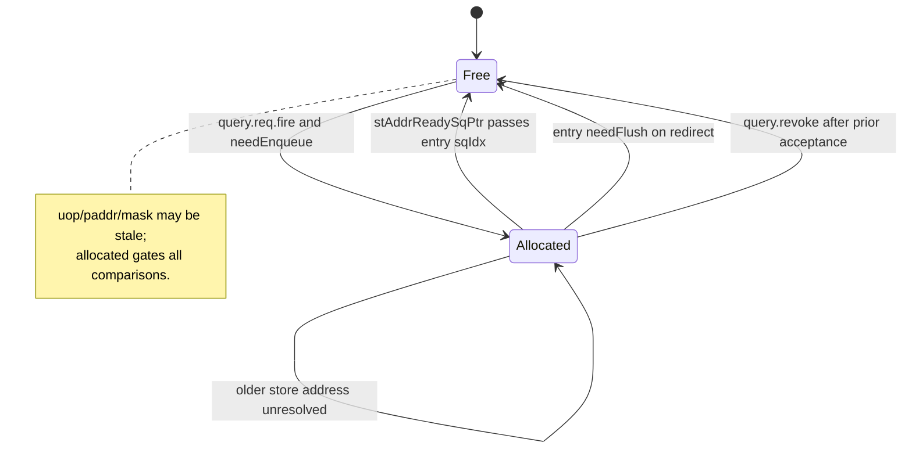
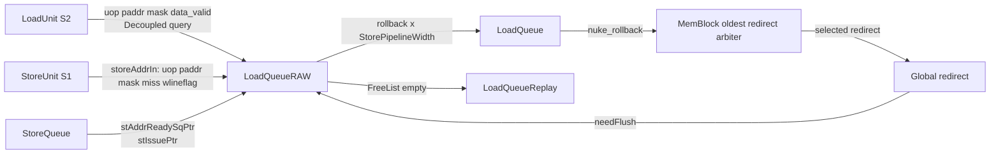
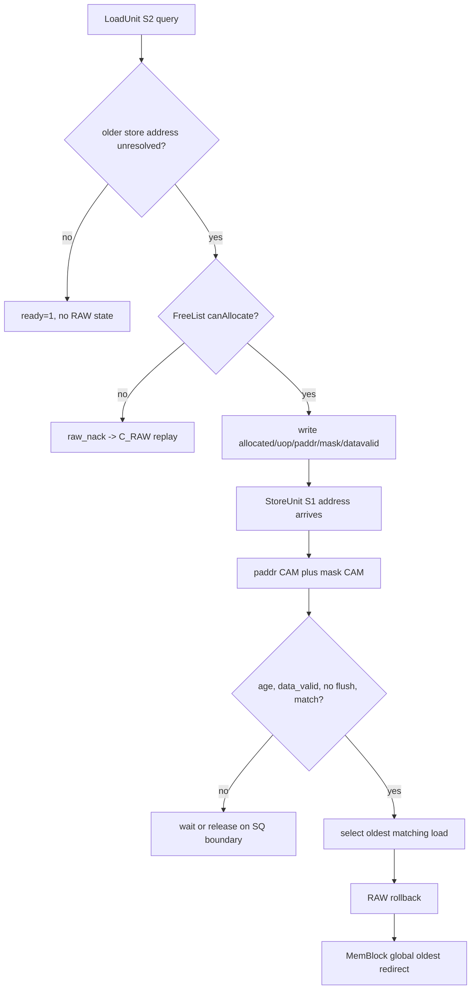
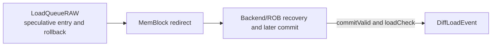

# 香山昆明湖 V2 LoadQueueRAW 源码分析

`LoadQueueRAW` 不是保存全部 load 的主 Load Queue，也不是寄存器依赖意义上的 RAW 检测器。它是一个短生命周期 CAM 表：当 load 已越过地址/数据阶段、而更老 store 的地址尚未就绪时，保存该 load 的 uop、物理地址片段和 byte mask；当 store 地址后来到达时，检测 store-load memory ordering violation，选择最老的违规 load 并发出 flush 级 redirect。默认配置下，它有 32 项、3 个 load query 端口和 2 个 store compare/rollback 端口。

## 1. 分析范围

### 1.1. 对象和边界

| 项目 | 本文覆盖 | 明确不覆盖 |
| --- | --- | --- |
| 目标模块 | `xiangshan.mem.lsqueue.LoadQueueRAW` 及其有效实例化/连线 | 未实例化的实验代码或仅凭名称的推测 |
| 问题类型 | 更老 store 地址后到达时发现的 load-store 内存顺序违规 | 整数寄存器 RAW、rename scoreboard、store-to-load forwarding 算法 |
| 路径起点 | LoadUnit S2 的 `stld_nuke_query` 和 StoreUnit S1 经 LSQ 送入的 `storeAddrIn` | rename/dispatch 前端细节 |
| 路径终点 | RAW 的 `rollback` 进入 MemBlock 全局 oldest-redirect 仲裁 | redirect 之后 frontend/ROB 的所有精确恢复实现 |

### 1.2. 可复现源码基线

| 项目 | 记录 |
| --- | --- |
| XiangShan 源码根目录 | `/home/yanyusong/xs-memory-env/XiangShan` |
| 分支 | `kunminghu-v2` |
| 提交 | `e12436c7cba86b195deec24981976d78bc263661`，`fix(Store): prevent rdataptr from advancing out of order (#6353)` |
| 分析日期 | 2026-08-17，Asia/Shanghai |
| 每周同步 | 按 skill 的 `weekly_sync.py` 检查，距上次同步不足 7 天，脚本按策略未强制更新 |
| Design Doc 基线 | 本地 `/home/yanyusong/XiangShan-Design-Doc` 不存在；本文没有把任何 Design Doc 推断当作实现事实 |
| 源码工作区 | 分析开始时已有 `difftest` 修改和 `src/main/resources/aia/` 未跟踪内容；本文没有改动该源码工作区 |

### 1.3. 术语

课程中的通用 RAW 是读操作依赖更早写操作的结果；这里的 RAW 是更具体的 memory ordering 问题：load 已继续执行，而更老 store 的地址尚未知道，之后发现二者地址和掩码冲突。它使用 `robIdx`、`sqIdx`、物理地址和 mask，不读取物理寄存器重命名表。通用理论背景见 [Dependency_Between_Instructions.md:24](</home/yanyusong/XiangShanLab/xiangshan-course/docs/4-xiangshan-microarchitecture-analysis/1-superscalar-basic-knowledge/4_Dependency_Between_Instructions.md:24>)；本文以下“RAW”均指 `LoadQueueRAW` 的 memory RAW。

## 2. 关键源码证据

| 文件 | 有效证据 | 对本分析的作用 |
| --- | --- | --- |
| [LoadQueueRAW.scala:32](</home/yanyusong/xs-memory-env/XiangShan/src/main/scala/xiangshan/mem/lsqueue/LoadQueueRAW.scala:32>) | IO、entry 状态、CAM、选择树和 redirect | 核心行为的唯一 RTL/Chisel 依据 |
| [LoadQueue.scala:214](</home/yanyusong/xs-memory-env/XiangShan/src/main/scala/xiangshan/mem/lsqueue/LoadQueue.scala:214>) | 同时实例化 RAR、RAW、Replay、VirtualLoadQueue 等 | 证明 RAW 是 LQ 的专用辅助表 |
| [LoadQueue.scala:235](</home/yanyusong/xs-memory-env/XiangShan/src/main/scala/xiangshan/mem/lsqueue/LoadQueue.scala:235>) | RAW 与 LoadUnit、StoreQueue、StoreUnit、redirect 的实际连线 | 确认 IO 的真实生产者和消费者 |
| [LSQWrapper.scala:160](</home/yanyusong/xs-memory-env/XiangShan/src/main/scala/xiangshan/mem/lsqueue/LSQWrapper.scala:160>) | LQ/SQ 联动分配 | 区分主 LQ 分配和 RAW entry 分配 |
| [LoadUnit.scala:1276](</home/yanyusong/xs-memory-env/XiangShan/src/main/scala/xiangshan/mem/pipeline/LoadUnit.scala:1276>) | S2 query 的 `raw_nack` | 证明 RAW 满时形成 replay，而非静默放行 |
| [StoreUnit.scala:378](</home/yanyusong/xs-memory-env/XiangShan/src/main/scala/xiangshan/mem/pipeline/StoreUnit.scala:378>) | Store S1 的 `io.lsq` paddr/mask 输出 | `storeIn` 的实际来源 |
| [LoadQueueData.scala:32](</home/yanyusong/xs-memory-env/XiangShan/src/main/scala/xiangshan/mem/lsqueue/LoadQueueData.scala:32>) | banked address/mask CAM 数据结构 | 存储、写延迟和同地址多写断言 |
| [FreeList.scala:25](</home/yanyusong/xs-memory-env/XiangShan/src/main/scala/xiangshan/mem/lsqueue/FreeList.scala:25>) | 分配、释放、empty、预分配 | RAW 的容量和 backpressure 根源 |
| [MemBlock.scala:1432](</home/yanyusong/xs-memory-env/XiangShan/src/main/scala/xiangshan/mem/MemBlock.scala:1432>) | 多个 rollback 源的全局最老选择 | RAW 不是全局恢复优先级的最终所有者 |
| [LoadQueueReplay.scala:293](</home/yanyusong/xs-memory-env/XiangShan/src/main/scala/xiangshan/mem/lsqueue/LoadQueueReplay.scala:293>) | `C_RAW` 的阻塞/唤醒条件 | RAW 资源不足的 forward-progress 链 |
| [LoadMisalignBuffer.scala:296](</home/yanyusong/xs-memory-env/XiangShan/src/main/scala/xiangshan/mem/lsqueue/LoadMisalignBuffer.scala:296>) | 跨 16B load 分裂 | RAW 与 misalign/cross-boundary 路径的边界 |
| [LoadQueueUncache.scala:122](</home/yanyusong/xs-memory-env/XiangShan/src/main/scala/xiangshan/mem/lsqueue/LoadQueueUncache.scala:122>) | MMIO/NC 排序和状态机 | RAW 不拥有 uncache/MMIO 副作用 |
| [Rob.scala:1583](</home/yanyusong/xs-memory-env/XiangShan/src/main/scala/xiangshan/backend/rob/Rob.scala:1583>) | 提交侧 `DiffLoadEvent` | RAW rollback 不是架构可见 Difftest 事件 |

## 3. 理论到代码映射

### 3.1. 通用相关与本模块特化

| 理论概念 | 本模块中的具体化 | 有效源码 |
| --- | --- | --- |
| 更早写必须对更晚读可见 | 更老 store 的地址未知时，不能仅凭“尚未看到冲突”断言 load 安全 | [LoadQueueRAW.scala:115](</home/yanyusong/xs-memory-env/XiangShan/src/main/scala/xiangshan/mem/lsqueue/LoadQueueRAW.scala:115>) |
| 乱序执行需要检测/恢复 | store 地址到达后以 CAM 检查，命中时生成 flush redirect | [LoadQueueRAW.scala:289](</home/yanyusong/xs-memory-env/XiangShan/src/main/scala/xiangshan/mem/lsqueue/LoadQueueRAW.scala:289>)、[LoadQueueRAW.scala:326](</home/yanyusong/xs-memory-env/XiangShan/src/main/scala/xiangshan/mem/lsqueue/LoadQueueRAW.scala:326>) |
| 多个冲突必须保持程序顺序 | 以 `robIdx` 年龄从候选中选最老 load | [LoadQueueRAW.scala:241](</home/yanyusong/xs-memory-env/XiangShan/src/main/scala/xiangshan/mem/lsqueue/LoadQueueRAW.scala:241>) |
| 资源不足必须施加背压或重试 | entry 不足时 `ready=0`，LoadUnit 产生 `C_RAW` replay | [LoadQueueRAW.scala:133](</home/yanyusong/xs-memory-env/XiangShan/src/main/scala/xiangshan/mem/lsqueue/LoadQueueRAW.scala:133>)、[LoadUnit.scala:1431](</home/yanyusong/xs-memory-env/XiangShan/src/main/scala/xiangshan/mem/pipeline/LoadUnit.scala:1431>) |

### 3.2. 不可替换的代码事实

教材的 RAW 术语无法替代下面这些代码事实：RAW entry 只在 `hasAddrInvalidStore` 时建立；地址相同仍要满足 byte mask、年龄、`data_valid`、未被 redirect 清除等条件；最终 recovery 还要被 MemBlock 与其他 redirect 源仲裁。任何只写“发现 RAW 就 replay”的概括都遗漏了实际 valid/ready/fire、CAM 和年龄控制。

## 4. 理论、Design Doc 与有效实现

### 4.1. 证据层次

| 层次 | 本次可确认的内容 | 使用规则 |
| --- | --- | --- |
| 课程理论 | RAW 的问题类型和乱序恢复的必要性 | 只作为解释背景 |
| Design Doc | 本地检出缺失，未查阅 | 不以“设计意图”补充任何行为 |
| Kunminghu V2 Scala/Chisel | 信号、条件、寄存器、端口宽度、redirect 字段、连线 | 所有行为性结论以这层行号为准 |

### 4.2. 可追溯性矩阵

| ID | 问题或意图 | 状态 | 代码映射 | 结论 |
| --- | --- | --- | --- | --- |
| T0 | 通用 RAW 防止读到过早值 | 课程理论 | [Dependency_Between_Instructions.md:24](</home/yanyusong/XiangShanLab/xiangshan-course/docs/4-xiangshan-microarchitecture-analysis/1-superscalar-basic-knowledge/4_Dependency_Between_Instructions.md:24>) | 仅背景，不等同于实现规格 |
| D0 | RAW 的 Design Doc 原始意图 | 未查阅 | 本地目录不存在 | 不作推断 |
| C0 | 只给未知老 store 前的 load 建表 | 源码已确认 | [LoadQueueRAW.scala:115](</home/yanyusong/xs-memory-env/XiangShan/src/main/scala/xiangshan/mem/lsqueue/LoadQueueRAW.scala:115>) | `needEnqueue` 精确编码该过滤 |
| C1 | 命中时选最老违规 load | 源码已确认 | [LoadQueueRAW.scala:241](</home/yanyusong/xs-memory-env/XiangShan/src/main/scala/xiangshan/mem/lsqueue/LoadQueueRAW.scala:241>) | 每个 store 端口独立选择 |
| C2 | RAW 满时不得遗漏相关 load | 源码已确认 | [LoadQueueReplay.scala:293](</home/yanyusong/xs-memory-env/XiangShan/src/main/scala/xiangshan/mem/lsqueue/LoadQueueReplay.scala:293>) | 以 replay 等待资源/地址边界推进 |

## 5. 微架构参数

### 5.1. 默认规模

| 参数 | 默认值 | 含义 |
| --- | ---: | --- |
| `LoadQueueRAWSize` | 32 | 32 个需要观察未知老 store 的 load entry；参数要求为 2 的幂 |
| `LoadPipelineWidth` | 3 | 每周期最多 3 个 RAW query 端口 |
| `StorePipelineWidth` | 2 | 每周期最多 2 个 store CAM 比较/rollback 端口 |
| `RollbackGroupSize` | 8 | 选择树每组的候选数 |
| `LoadQueueReplaySize` | 72 | `C_RAW` replay 容器大小，不是 RAW 表大小 |
| `StoreQueueSize` | 56 | `sqIdx` 年龄域的队列容量，不等于 RAW entry 数 |

参数定义见 [Parameters.scala:167](</home/yanyusong/xs-memory-env/XiangShan/src/main/scala/xiangshan/Parameters.scala:167>) 和 [Parameters.scala:214](</home/yanyusong/xs-memory-env/XiangShan/src/main/scala/xiangshan/Parameters.scala:214>)。因此“32/3/2”是当前基线的配置事实，不应写成香山所有配置的不可变常数。

### 5.2. 参数化选择时间

`RAWlgSelectGroupSize` 和 `RAWTotalDelayCycles` 的参数定义在 [Parameters.scala:789](</home/yanyusong/xs-memory-env/XiangShan/src/main/scala/xiangshan/Parameters.scala:789>)。RAW 内的选择树以 `ceil(log2Ceil(LoadQueueRAWSize) / log2Ceil(RollbackGroupSize)) + 1` 形成 `TotalSelectCycles`，见 [LoadQueueRAW.scala:241](</home/yanyusong/xs-memory-env/XiangShan/src/main/scala/xiangshan/mem/lsqueue/LoadQueueRAW.scala:241>)。默认 32 项和 8 项一组时树的 `TotalSelectCycles=3`，StoreUnit 的 `RAWTotalDelayCycles=1`。这是源码可推出的内部选择/对齐参数，不是 dispatch 到 commit 的固定时延；`GatedValidRegNext`、StoreUnit 流水、DCache 状态和全局 redirect 仲裁都需要波形确认。

## 6. 模块边界和接口

### 6.1. 位于 LoadQueue 内部的专用表

`LoadQueue` 在同一层实例化 `LoadQueueRAR`、`LoadQueueRAW`、`LoadQueueReplay`、VirtualLoadQueue、异常缓冲和 uncache 缓冲，见 [LoadQueue.scala:214](</home/yanyusong/xs-memory-env/XiangShan/src/main/scala/xiangshan/mem/lsqueue/LoadQueue.scala:214>)。它不分配主 `lqIdx`，该分配属于 LSQWrapper 的 LQ/SQ 联动逻辑，[LSQWrapper.scala:160](</home/yanyusong/xs-memory-env/XiangShan/src/main/scala/xiangshan/mem/lsqueue/LSQWrapper.scala:160>)。

### 6.2. IO 的真实生产者和消费者

| 信号 | 数量/协议 | 生产者 -> 消费者 | 语义 |
| --- | --- | --- | --- |
| `query.req` | 3 个 `Decoupled` | LoadUnit S2 -> RAW | 申请对未知老 store 地址的观察；带 uop/paddr/mask/data_valid/is_nc |
| `query.req.ready` | 3 个 | RAW -> LoadUnit S2 | 不需建表时直接为真；需建表时由 FreeList 决定 |
| `query.resp` | 3 个 `Valid` | RAW -> LoadUnit | 仅把上周期 `req.valid` 延迟并置 `rep_frm_fetch=false`，不是 violation 响应 |
| `query.revoke` | 3 个 | LoadUnit S3 -> RAW | 回收先前已接受、但随后异常/replay/misalign 作废的 entry |
| `storeIn` | 2 个 `Valid` | StoreUnit S1 -> RAW | store 的 uop/paddr/mask/miss/wlineflag 等 |
| `stAddrReadySqPtr` / `stIssuePtr` | pointer | StoreQueue -> RAW | 标示已地址检查与待检查 store 的边界 |
| `redirect` | `Valid[Redirect]` | 全局恢复网络 -> RAW | 清除被更老恢复覆盖的 entry |
| `rollback` | 2 个 `Valid[Redirect]` | RAW -> LoadQueue -> MemBlock | RAW 本地发现的违规恢复请求 |
| `lqFull` | bit | RAW -> Replay | RAW FreeList empty，非主 LoadQueue 的 full |

IO 定义见 [LoadQueueRAW.scala:38](</home/yanyusong/xs-memory-env/XiangShan/src/main/scala/xiangshan/mem/lsqueue/LoadQueueRAW.scala:38>)，实际 Chisel 连线见 [LoadQueue.scala:235](</home/yanyusong/xs-memory-env/XiangShan/src/main/scala/xiangshan/mem/lsqueue/LoadQueue.scala:235>)。

### 6.3. `lqFull` 的两种语义

RAW 的 `io.lqFull := freeList.io.empty`，见 [LoadQueueRAW.scala:206](</home/yanyusong/xs-memory-env/XiangShan/src/main/scala/xiangshan/mem/lsqueue/LoadQueueRAW.scala:206>)。主 LoadQueue 对外的 `io.lqFull` 则由 VirtualLoadQueue 的容量逻辑驱动，[LoadQueue.scala:248](</home/yanyusong/xs-memory-env/XiangShan/src/main/scala/xiangshan/mem/lsqueue/LoadQueue.scala:248>)。调试时把两者混为一谈会误把 RAW 观察资源压力诊断成 dispatch/LQ 满。

## 7. 模块为何存在

### 7.1. 地址未知窗口

关键代码用 StoreQueue 两个指针定义风险窗口：

```scala
val allAddrCheck = io.stIssuePtr === io.stAddrReadySqPtr
val hasAddrInvalidStore = io.query(w).req.bits.uop.sqIdx
  .isBefore(io.stAddrReadySqPtr) && !allAddrCheck
val needEnqueue = io.query(w).req.valid && hasAddrInvalidStore && !cancelEnqueue
```

见 [LoadQueueRAW.scala:115](</home/yanyusong/xs-memory-env/XiangShan/src/main/scala/xiangshan/mem/lsqueue/LoadQueueRAW.scala:115>)。当两个指针相等，源码认为相关 store 的地址均已检查，load 不需要 RAW 表；否则，只有处在 `stAddrReadySqPtr` 之前的 load 才有更老未知地址 store，因而需要建立观察项。

### 7.2. 节省 CAM 容量而不牺牲正确性

该筛选避免让每个 load 都占用 CAM。正确性不是由“表永远足够”保证，而是由 backpressure 保证：风险 load 无 slot 时不能 `fire`，会成为 replay。RAW 因此把空间优化和保守性结合在同一条 `ready` 链上。

## 8. 动态路径

### 8.1. 正常观察和自然释放

1. LoadUnit S2 在 `s2_can_query` 时发 `stld_nuke_query.req`，载荷包含已经得到的 paddr、mask、uop 和 `data_valid`。
2. RAW 用 `sqIdx` 与 StoreQueue 地址就绪边界计算 `needEnqueue`。
3. 不需要观察时，`ready=1` 且不写 RAW；需要观察且 FreeList 可分配时，`fire` 写入 entry。
4. `stAddrReadySqPtr` 通过该 entry 的 `sqIdx` 后，`deqNotBlock` 释放 entry；这说明它等待的更老 store 地址已处理。
5. 如果 S3 发现异常、replay 或 misalign，LoadUnit 发 `revoke`，RAW 依据上拍接受的 slot 回收 entry。

LoadUnit 的 S2 query/data-valid 代码见 [LoadUnit.scala:1334](</home/yanyusong/xs-memory-env/XiangShan/src/main/scala/xiangshan/mem/pipeline/LoadUnit.scala:1334>)，RAW 的释放和 revoke 关联见 [LoadQueueRAW.scala:175](</home/yanyusong/xs-memory-env/XiangShan/src/main/scala/xiangshan/mem/lsqueue/LoadQueueRAW.scala:175>)、[LoadQueueRAW.scala:193](</home/yanyusong/xs-memory-env/XiangShan/src/main/scala/xiangshan/mem/lsqueue/LoadQueueRAW.scala:193>)。

### 8.2. 违规恢复路径

1. 更年轻 load 在未知老 store 地址窗口内建立 RAW entry。
2. 更老 store 在 StoreUnit S1 有效且地址到达 `storeIn`。
3. paddr CAM、cache-line 模式和 mask CAM 形成命中；`allocated`、ROB 年龄、`datavalid`、redirect 门控形成合法候选。
4. 每个 store 端口的选择树挑出最老 load，构造 `RedirectLevel.flush`。
5. `rollback` 进入 MemBlock，与 LoadUnit/replay/nack 等恢复源比较，只有全局最老 redirect 被广播。
6. 广播 redirect 回到 RAW，杀死被覆盖 entry；恢复后的 load 需要由外部流水重新执行并最终提交。

Store 来源见 [StoreUnit.scala:378](</home/yanyusong/xs-memory-env/XiangShan/src/main/scala/xiangshan/mem/pipeline/StoreUnit.scala:378>)，CAM 条件见 [LoadQueueRAW.scala:289](</home/yanyusong/xs-memory-env/XiangShan/src/main/scala/xiangshan/mem/lsqueue/LoadQueueRAW.scala:289>)，全局仲裁见 [MemBlock.scala:1432](</home/yanyusong/xs-memory-env/XiangShan/src/main/scala/xiangshan/mem/MemBlock.scala:1432>)。

### 8.3. 容量拒绝和 replay 路径

`needEnqueue=1` 而 `canAllocate=0` 时，RAW 将该 query 的 `ready=0`。LoadUnit 在同一 S2 定义 `s2_raw_nack = req.valid && !req.ready`，再把它写入 `rep_info.raw_nack`，[LoadUnit.scala:1276](</home/yanyusong/xs-memory-env/XiangShan/src/main/scala/xiangshan/mem/pipeline/LoadUnit.scala:1276>)、[LoadUnit.scala:1431](</home/yanyusong/xs-memory-env/XiangShan/src/main/scala/xiangshan/mem/pipeline/LoadUnit.scala:1431>)。Replay 原因 `C_RAW=8`，[LoadQueueReplay.scala:60](</home/yanyusong/xs-memory-env/XiangShan/src/main/scala/xiangshan/mem/lsqueue/LoadQueueReplay.scala:60>)；其阻塞会在 RAW 不再 full，或该 load 已不再落在未就绪 store 地址窗口中时解除，[LoadQueueReplay.scala:293](</home/yanyusong/xs-memory-env/XiangShan/src/main/scala/xiangshan/mem/lsqueue/LoadQueueReplay.scala:293>)。

## 9. 索引、地址与历史计算

### 9.1. 环形年龄计算

`sqIdx` 和 `robIdx` 不能只做无符号数比较。`CircularQueuePtr` 将 flag/value 一并编码回绕，并定义 `isBefore`/`isAfter`，见 [CircularQueuePtr.scala:65](</home/yanyusong/xs-memory-env/XiangShan/utility/src/main/scala/utility/CircularQueuePtr.scala:65>)。RAW 用它判定未知 store 窗口、load 是否年轻于 store、以及释放边界；pointer wrap 是功能正确性条件而不是性能细节。

### 9.2. 部分物理地址

RAW 记录 `paddr[DCacheVWordOffset + 23 : DCacheVWordOffset]`，即从 DCache virtual-word 偏移开始的 24 位片段，[LoadQueueRAW.scala:57](</home/yanyusong/xs-memory-env/XiangShan/src/main/scala/xiangshan/mem/lsqueue/LoadQueueRAW.scala:57>)。这里的 `DCacheVWordOffset` 是配置参数，本文不把它虚构为固定字节数。

### 9.3. 分配索引

同周期第 `w` 个 load 使用 `PopCount(needEnqueue.take(w))` 作为 FreeList 的预分配 offset，见 [LoadQueueRAW.scala:126](</home/yanyusong/xs-memory-env/XiangShan/src/main/scala/xiangshan/mem/lsqueue/LoadQueueRAW.scala:126>)。FreeList 以环形 head/tail 和 `enablePreAlloc=true` 给出 `canAllocate`/`allocateSlot`，[FreeList.scala:107](</home/yanyusong/xs-memory-env/XiangShan/src/main/scala/xiangshan/mem/lsqueue/FreeList.scala:107>)；多端口分配是否唯一必须在波形/断言中验证，不能从单个端口的 `valid` 推断。

## 10. 核心算法

### 10.1. 建表与接收算法

```scala
val offset = PopCount(needEnqueue.take(w))
val canAccept = freeList.io.canAllocate(offset)
io.query(w).req.ready := Mux(needEnqueue, canAccept, true.B)
when (needEnqueue && io.query(w).req.ready) {
  allocated(enqIndex) := true.B
  // write uop, partial paddr, mask, data_valid
}
```

有效代码见 [LoadQueueRAW.scala:126](</home/yanyusong/xs-memory-env/XiangShan/src/main/scala/xiangshan/mem/lsqueue/LoadQueueRAW.scala:126>)。因此 entry 的唯一可信接受条件是 `query.req.fire`；`query.req.valid` 单独为真既可能表示无需建表，也可能表示因满而被拒绝。

### 10.2. 地址、line 和 byte-mask 算法

`LqPAddrModule` 在 `enableCacheLineCheck=true` 下将普通比较和 `wlineflag` 的 line 比较分开，[LoadQueueData.scala:135](</home/yanyusong/xs-memory-env/XiangShan/src/main/scala/xiangshan/mem/lsqueue/LoadQueueData.scala:135>)。StoreUnit 的 `wlineflag` 来自 CBO-all 语义，[StoreUnit.scala:252](</home/yanyusong/xs-memory-env/XiangShan/src/main/scala/xiangshan/mem/pipeline/StoreUnit.scala:252>)。地址命中仍需 `(storeMask & loadMask).orR`，即 byte mask 有交集，[LoadQueueData.scala:209](</home/yanyusong/xs-memory-env/XiangShan/src/main/scala/xiangshan/mem/lsqueue/LoadQueueData.scala:209>)。

### 10.3. 候选和最老选择算法

每个 store 端口对每个 entry 的候选可概括为：

```text
allocated[j]
&& storeIn[i].valid
&& load_uop[j].robIdx isAfter storeIn[i].uop.robIdx
&& datavalid[j]
&& !load_uop[j].robIdx.needFlush(redirect)
&& paddr_match[i][j]
&& mask_overlap[i][j]
```

源码使用 `addrMaskMatch && entryNeedCheck`，[LoadQueueRAW.scala:289](</home/yanyusong/xs-memory-env/XiangShan/src/main/scala/xiangshan/mem/lsqueue/LoadQueueRAW.scala:289>)、[LoadQueueRAW.scala:319](</home/yanyusong/xs-memory-env/XiangShan/src/main/scala/xiangshan/mem/lsqueue/LoadQueueRAW.scala:319>)。分组选择器比较两个 candidate 的 `robIdx`，保留更老者，[LoadQueueRAW.scala:241](</home/yanyusong/xs-memory-env/XiangShan/src/main/scala/xiangshan/mem/lsqueue/LoadQueueRAW.scala:241>)。`storeIn.bits.miss` 不属于上述 CAM 候选，而是在最终 rollback valid 处用延迟的 `!miss` 门控，[LoadQueueRAW.scala:326](</home/yanyusong/xs-memory-env/XiangShan/src/main/scala/xiangshan/mem/lsqueue/LoadQueueRAW.scala:326>)。

### 10.4. Redirect 构造

RAW 的 redirect 载入选中 load 的 `robIdx`、FTQ、PC 和 debug checkpoint，载入 store 的 FTQ 信息，设置 `level=RedirectLevel.flush` 和 `satpFlush=false`，[LoadQueueRAW.scala:340](</home/yanyusong/xs-memory-env/XiangShan/src/main/scala/xiangshan/mem/lsqueue/LoadQueueRAW.scala:340>)。源码注释提到以 `robIdx-1` 使违规 load 自身 flush，但构造代码未在 RAW 本体显式减一；精确恢复边界必须再看 Redirect 消费端或 FST，本文不把注释扩展为未经证实的字段计算。

## 11. 状态与存储

### 11.1. 每项状态

| 状态 | 规模 | 写入 | 有效使用条件 |
| --- | --- | --- | --- |
| `allocated` | 32 bit | `needEnqueue && ready` | 所有 CAM candidate 的第一层门控 |
| `uop` | 32 项 | 同上 | 年龄、redirect 载荷和释放判断 |
| `paddrModule` | 32 项，3 写/2 CAM 端口 | 同上 | partial-paddr 或 line 匹配 |
| `maskModule` | 32 项，3 写/2 CAM 端口 | 同上 | byte-mask overlap |
| `datavalid` | 32 bit | 同上，来自 query `data_valid` | 表示可参与 violation 的数据资格 |
| FreeList | 32 slot | allocation/free | 生成 slot、empty/backpressure |

定义在 [LoadQueueRAW.scala:76](</home/yanyusong/xs-memory-env/XiangShan/src/main/scala/xiangshan/mem/lsqueue/LoadQueueRAW.scala:76>)。`uop`、地址和 mask RAM 不逐项 reset，`allocated` 和 `datavalid` reset 为零；因此空项的陈旧数据必须永远由 `allocated` 屏蔽。

### 11.2. 状态转换



正常释放使用 `deqNotBlock`，redirect 清理使用 `uop.robIdx.needFlush`，见 [LoadQueueRAW.scala:175](</home/yanyusong/xs-memory-env/XiangShan/src/main/scala/xiangshan/mem/lsqueue/LoadQueueRAW.scala:175>)。`revoke` 使用 `lastCanAccept` 和 `lastAllocIndex` 对上拍接受的 slot 回收，[LoadQueueRAW.scala:193](</home/yanyusong/xs-memory-env/XiangShan/src/main/scala/xiangshan/mem/lsqueue/LoadQueueRAW.scala:193>)。

### 11.3. 存储冲突边界

`LqRawDataModule` 用 bank 选择和延迟写入实现多写端口，并断言两个写端口不能写同一 entry，[LoadQueueData.scala:79](</home/yanyusong/xs-memory-env/XiangShan/src/main/scala/xiangshan/mem/lsqueue/LoadQueueData.scala:79>)。模块接口没有声明同地址 read/write 的架构性 read-old/read-new/bypass 语义；刚分配 entry 与 store CAM 同拍的极限情况必须由 elaborated RTL/FST 验证。

## 12. 流水级、延迟和吞吐

| 位置 | 源码已确认的事件 | RAW 的关系 | 延迟/吞吐结论 |
| --- | --- | --- | --- |
| LoadUnit S0/S1 | DCache 请求、TLB/地址流水 | RAW 不直接发 cache 请求 | cache hit/miss 不是 RAW 固定时延 |
| LoadUnit S2 | `s2_can_query` 时发 query；`!ready` 形成 raw nack | 建表入口 | 最多 3 个 query 端口，但受 ready 限制 |
| LoadUnit S3 | LQ 更新，异常/replay/misalign 时 revoke | 回收刚建 entry | S3 以后精确恢复不由 RAW 实现 |
| StoreUnit S1 | 形成 paddr/mask，`io.lsq.valid` | store CAM 输入 | 最多 2 个 store 端口 |
| RAW selection | CAM 后分组选择和 `DelayN` 对齐 | 本地 violation 输出 | 默认选择参数为 3，但非端到端固定周期 |
| MemBlock | 合并所有 recovery 源 | 最终消费者 | RAW 本地胜出仍可能输给更老全局 redirect |

LoadUnit 的 DCache request 在 [LoadUnit.scala:406](</home/yanyusong/xs-memory-env/XiangShan/src/main/scala/xiangshan/mem/pipeline/LoadUnit.scala:406>)，DCache LoadPipe 的 S0/S1/S2 边界在 [LoadPipe.scala:119](</home/yanyusong/xs-memory-env/XiangShan/src/main/scala/xiangshan/cache/dcache/loadpipe/LoadPipe.scala:119>)、[LoadPipe.scala:175](</home/yanyusong/xs-memory-env/XiangShan/src/main/scala/xiangshan/cache/dcache/loadpipe/LoadPipe.scala:175>)、[LoadPipe.scala:323](</home/yanyusong/xs-memory-env/XiangShan/src/main/scala/xiangshan/cache/dcache/loadpipe/LoadPipe.scala:323>)。当所有 valid/ready 条件都满足时，端口上限是每周期 3 个 query、2 个 store compare；FreeList、DCache/TLB、StoreUnit 输入和 redirect 会降低实际稳态吞吐。

## 13. 控制路径理由

| 控制信号 | 生产者 | 消费者 | 作用与不变量 |
| --- | --- | --- | --- |
| `needEnqueue` | RAW 的 SQ pointer/redirect 逻辑 | FreeList、entry 写入 | 只有风险 load 占用 entry |
| `query.req.ready` | RAW FreeList | LoadUnit S2 | `needEnqueue=0` 时为真；需要 entry 时必须表示资源可用 |
| `query.req.fire` | valid 与 ready | RAW 状态写入 | 唯一能证明实际 allocation 的握手 |
| `cancelEnqueue` | redirect 与 load ROB 年龄 | entry 写入 | 被更老恢复杀死的 load 不得新建 entry |
| `query.revoke` | LoadUnit S3 | RAW | 取消先前 accept、随后作废的 entry |
| `entryNeedCheck` | entry、store、年龄、data_valid、redirect | CAM/selector | 防止空项、年轻 store、无数据或已杀死 load 触发 rollback |
| `rollback.valid` | selector 和 delayed non-miss store | MemBlock | CAM hit 本身不等于最终 valid redirect |

`query.resp.valid := RegNext(query.req.valid)` 且 `rep_frm_fetch=false`，[LoadQueueRAW.scala:170](</home/yanyusong/xs-memory-env/XiangShan/src/main/scala/xiangshan/mem/lsqueue/LoadQueueRAW.scala:170>)。该 `Valid` 通道没有携带 CAM 命中或 rollback 确认；容量控制必须看 request 的 ready/fire 和 `s2_raw_nack`，不能把 `query.resp.valid` 当作接受证据。

## 14. 数据路径和跨边界代码解析

### 14.1. RAW 数据路径本体

`LoadUnit S2 -> RAW entry -> StoreUnit S1 CAM -> selector -> rollback -> MemBlock` 是 RAW 的有效数据链。RAW 只消费已经形成的 paddr/mask，并不发 DCache request、分配 MSHR、接收 refill 或合并跨界响应。DCache LoadPipe 才会计算 set/bank、发 block-address miss request 和处理 nack，[LoadPipe.scala:343](</home/yanyusong/xs-memory-env/XiangShan/src/main/scala/xiangshan/cache/dcache/loadpipe/LoadPipe.scala:343>)、[LoadPipe.scala:387](</home/yanyusong/xs-memory-env/XiangShan/src/main/scala/xiangshan/cache/dcache/loadpipe/LoadPipe.scala:387>)、[LoadPipe.scala:433](</home/yanyusong/xs-memory-env/XiangShan/src/main/scala/xiangshan/cache/dcache/loadpipe/LoadPipe.scala:433>)。

### 14.2. 虚拟页边界：具体 misalign 子请求

对于跨 16B 的非对齐 load，`LoadMisalignBuffer` 以 `highAddress(4) =/= req.vaddr(4)` 检测边界，生成 `lowAddrLoad` 和 `highAddrLoad`，并保留每片的 `fullva`，[LoadMisalignBuffer.scala:292](</home/yanyusong/xs-memory-env/XiangShan/src/main/scala/xiangshan/mem/lsqueue/LoadMisalignBuffer.scala:292>)、[LoadMisalignBuffer.scala:314](</home/yanyusong/xs-memory-env/XiangShan/src/main/scala/xiangshan/mem/lsqueue/LoadMisalignBuffer.scala:314>)。这两个子请求经 `splitLoadReq` 回送一个 LoadUnit，[MemBlock.scala:1021](</home/yanyusong/xs-memory-env/XiangShan/src/main/scala/xiangshan/mem/MemBlock.scala:1021>)，所以每片重走 LoadUnit 的地址翻译/权限/DCache 路径；LoadUnit 对来自 MAB 的输入保持 `fullva`，[LoadUnit.scala:1011](</home/yanyusong/xs-memory-env/XiangShan/src/main/scala/xiangshan/mem/pipeline/LoadUnit.scala:1011>)。

RAW 对这些子请求的边界是明确的：`stld_nuke_query.req.valid` 排除 `isFrmMisAlignBuf`，[LoadUnit.scala:1380](</home/yanyusong/xs-memory-env/XiangShan/src/main/scala/xiangshan/mem/pipeline/LoadUnit.scala:1380>)。因此不能把跨页/跨 16B 子请求当作普通 RAW entry 的原子扩展。MAB 收集 `splitLoadResp`，用 shift/truncate 合并低高片段，[LoadMisalignBuffer.scala:522](</home/yanyusong/xs-memory-env/XiangShan/src/main/scala/xiangshan/mem/lsqueue/LoadMisalignBuffer.scala:522>)、[LoadMisalignBuffer.scala:543](</home/yanyusong/xs-memory-env/XiangShan/src/main/scala/xiangshan/mem/lsqueue/LoadMisalignBuffer.scala:543>)。若任一片有异常或落入 uncache/MMIO，MAB 进入 writeback/异常路径，[LoadMisalignBuffer.scala:213](</home/yanyusong/xs-memory-env/XiangShan/src/main/scala/xiangshan/mem/lsqueue/LoadMisalignBuffer.scala:213>)；跨页第二片的详细 TLB exception 优先级需要针对 RTL/FST 验证，不能由 RAW 推断。

### 14.3. cache-line 边界：RAW 比较与 DCache 请求分工

RAW 的 `wlineflag` 只把地址 CAM 从低地址精确比较放宽到 cache-line 命中；byte mask 仍必须满足 overlap。因此 CBO-all store 能作为整条 line 的地址冲突来源，但 RAW 不拆分 line，也不管理 refill beat。真正的 DCache 行请求由 `get_block_addr(s2_paddr)` 驱动 `miss_req`，[LoadPipe.scala:433](</home/yanyusong/xs-memory-env/XiangShan/src/main/scala/xiangshan/cache/dcache/loadpipe/LoadPipe.scala:433>)；若 MSHR 不可分配或 bank/WBQ 冲突，LoadPipe 报 nack，[LoadPipe.scala:391](</home/yanyusong/xs-memory-env/XiangShan/src/main/scala/xiangshan/cache/dcache/loadpipe/LoadPipe.scala:391>)。本模块分析能确认 RAW 不是 MSHR/beat/response merge 的所有者，不能虚构它对 line refill 的时序。

### 14.4. MMIO/uncache 边界：不可由 RAW 替代

`LoadNukeQueryReqBundle` 带有 `is_nc`，[Bundles.scala:247](</home/yanyusong/xs-memory-env/XiangShan/src/main/scala/xiangshan/mem/Bundles.scala:247>)，但 `LoadQueueRAW.scala` 的实现没有读取该字段。非缓存访问的真实状态机在 `LoadQueueUncache`：普通 MMIO load 只有在 `pendingMMIOld` 且 ROB pointer 匹配时才允许发起，NC 则走 `req.nc` 的单独许可，[LoadQueueUncache.scala:122](</home/yanyusong/xs-memory-env/XiangShan/src/main/scala/xiangshan/mem/lsqueue/LoadQueueUncache.scala:122>)。状态 `s_idle/s_req/s_resp/s_wait` 遇到 `needFlush` 会取消/回到 idle，[LoadQueueUncache.scala:128](</home/yanyusong/xs-memory-env/XiangShan/src/main/scala/xiangshan/mem/lsqueue/LoadQueueUncache.scala:128>)，请求使用 paddr/vaddr/mask，[LoadQueueUncache.scala:173](</home/yanyusong/xs-memory-env/XiangShan/src/main/scala/xiangshan/mem/lsqueue/LoadQueueUncache.scala:173>)。

所以 MMIO 顺序、副作用、提交前许可、response/error 和 forward progress 是 UncacheBuffer 的职责；RAW 既不分配 uncache entry，也不能把 speculative CAM 结果当作 MMIO 执行许可。对跨 16B 请求，MAB 一旦任一片返回 uncache/MMIO，会转入异常/写回处理，[LoadMisalignBuffer.scala:213](</home/yanyusong/xs-memory-env/XiangShan/src/main/scala/xiangshan/mem/lsqueue/LoadMisalignBuffer.scala:213>)。

## 15. 异常、调试和特权行为

### 15.1. 异常和恢复责任边界

RAW 没有 page fault、access fault、PMP、TLB 或 interrupt 输出端口。LoadUnit S3 在异常、replay、misalign 等使先前 query 作废时置 `revoke`，[LoadUnit.scala:1668](</home/yanyusong/xs-memory-env/XiangShan/src/main/scala/xiangshan/mem/pipeline/LoadUnit.scala:1668>)；RAW 对外只发 memory-order `RedirectLevel.flush`，[LoadQueueRAW.scala:340](</home/yanyusong/xs-memory-env/XiangShan/src/main/scala/xiangshan/mem/lsqueue/LoadQueueRAW.scala:340>)。这不是“异常和 flush 相同”，而是 RAW 只处理后者，前者由上游 LoadUnit/LSQ 异常链拥有。

### 15.2. Debug 和 Difftest

RAW 的 redirect 包含 selected load 的 `debugInfo` checkpoint，[LoadQueueRAW.scala:340](</home/yanyusong/xs-memory-env/XiangShan/src/main/scala/xiangshan/mem/lsqueue/LoadQueueRAW.scala:340>)。但在 RAW 文件中没有直接 Difftest 实例；ROB 在 `commitValid && isCommit && loadCheck` 时产生 `DiffLoadEvent`，[Rob.scala:1583](</home/yanyusong/xs-memory-env/XiangShan/src/main/scala/xiangshan/backend/rob/Rob.scala:1583>)。所以 RAW entry 和 rollback 属于推测态微结构状态，只有恢复后成功提交的 load 才可能映射到架构可见的 Difftest load event。

### 15.3. 特权和虚拟化边界

RAW 只保存 paddr 片段和 DynInst 所需字段，不保存 ASID、VMID、CSR 或 TLB permission 状态。LoadUnit 在翻译/权限/DCache 相关流水之后形成 query，[LoadUnit.scala:953](</home/yanyusong/xs-memory-env/XiangShan/src/main/scala/xiangshan/mem/pipeline/LoadUnit.scala:953>)。因此 privilege/virtualization 语义必须由 LoadUnit、TLB、PMP/IOPMP 和 Uncache 路径验证；RAW 不应被解释为第二套翻译或权限检查器。

## 16. CSR 控制

### 16.1. 没有直接 CSR 接口

`LoadQueueRAWIO` 的全部直接输入是 redirect、LoadUnit query、StoreUnit 地址输入和 StoreQueue 指针，[LoadQueueRAW.scala:38](</home/yanyusong/xs-memory-env/XiangShan/src/main/scala/xiangshan/mem/lsqueue/LoadQueueRAW.scala:38>)。源码中没有 `csr`、`satp`、ASID、privilege mode 或独立 enable CSR 字段，因此本模块没有可单独开关的 CSR 控制链。

### 16.2. 间接影响的正确边界

CSR/特权配置可通过 TLB 翻译、权限异常、uncache 属性或全局 redirect 间接影响 LoadUnit 输入；当这些使 S3 load 作废时，`query.revoke` 回收 RAW entry。本文没有找到可证明“某个 CSR 直接改变 RAW CAM 或选择优先级”的 Chisel 连接，故不把这种关系写成设计结论。

## 17. 图表

### 17.1. 模块连通图



### 17.2. 数据和控制图



### 17.3. Difftest 可见性图



### 17.4. query 接受示意

以下波形是按源码寄存器边界绘制的概念图，不是特定 FST 的实测结果。

```waveform-draw
{
  "signal": [
    {"name": "clk", "wave": "p......"},
    {"name": "query.req.valid", "wave": "010...."},
    {"name": "needEnqueue", "wave": "010...."},
    {"name": "query.req.ready", "wave": "011...."},
    {"name": "query.req.fire", "wave": "0.10..."},
    {"name": "allocated[slot]", "wave": "0.1...."},
    {"name": "storeIn.valid", "wave": "0...10."},
    {"name": "rollback.valid", "wave": "0......"}
  ],
  "config": {"hscale": 1}
}
```

### 17.5. 容量拒绝示意

```waveform-draw
{
  "signal": [
    {"name": "clk", "wave": "p......."},
    {"name": "query.req.valid", "wave": "011....."},
    {"name": "needEnqueue", "wave": "011....."},
    {"name": "freeList.canAllocate", "wave": "001....."},
    {"name": "query.req.ready", "wave": "001....."},
    {"name": "s2_raw_nack", "wave": "010....."},
    {"name": "rep_info.raw_nack", "wave": "0.10...."},
    {"name": "replay cause C_RAW", "wave": "0..10..."}
  ],
  "config": {"hscale": 1}
}
```

## 18. Design Doc 与源码差异

### 18.1. 不能标为“已确认”的内容

| 开放项 | 已有源码证据 | 仍需要的证据 |
| --- | --- | --- |
| redirect 精确 flush 边界 | RAW 填入 load `robIdx` 和 `RedirectLevel.flush` | Redirect 消费端源码或 FST，确认注释中的 `robIdx-1` 语义 |
| 参数化选择的可见延迟 | 默认树参数可推得 3 | 当前配置 elaboration/FST，确认 `GatedValidRegNext` 与 `DelayN` 相位 |
| reset 后第一拍可分配性 | FreeList 使用寄存器式 pre-allocation | reset release 后的 query valid/ready 波形 |
| same-entry read/write | RAM 有 delayed write 和多写断言 | 生成 RTL/综合 RAM 语义或定向仿真 |
| CBO line compare 的实际访问效果 | RAW 支持 `wlineflag` line hit | Store/CBO/Load FST 和 DCache 配置 |

### 18.2. 必须避免的错误简化

| 错误说法 | 代码事实 |
| --- | --- |
| 每个 load 都进入 RAW | 只有 `hasAddrInvalidStore` 为真的 risk load 才 `needEnqueue` |
| RAW full 等于主 LQ full | RAW `lqFull` 来自自身 FreeList empty，主 LQ full 来自 VirtualLoadQueue |
| 地址相同必然 rollback | 还需 mask、ROB 年龄、`datavalid`、未 flush 和 non-miss store 门控 |
| raw_nack 就是 violation redirect | raw nack 是 replay 原因，不是 store-load 违规恢复 |
| RAW 管理 MMIO/翻译/DCache refill | 它们分别由 Uncache、LoadUnit/TLB、DCache/MissQueue 路径承担 |

## 19. 动态场景、竞争和恢复

| 场景 | 起因 | RAW 内的状态/仲裁 | 对外效果 |
| --- | --- | --- | --- |
| 不需观察的普通 load | `stIssuePtr == stAddrReadySqPtr` | `needEnqueue=0`，ready 直接为真 | 不占 RAW slot |
| 有风险 load 且有空 slot | 未知老 store 地址窗口 | 分配唯一 FreeList slot，写 paddr/mask/uop/data_valid | 等待 store 地址或指针推进 |
| 有风险 load 且满 | `canAllocate=0` | 不 `fire`，不写 entry | `s2_raw_nack -> C_RAW replay` |
| 同拍多 load | 最多 3 个端口都需 entry | `PopCount` offset 为端口分配排序 | 必须验证 slot 唯一性和 loser backpressure |
| 同拍两 store 命中 | 两个 StoreUnit S1 port 同时有效 | 各自 CAM/selector 可产生 rollback | MemBlock 在全恢复源中选最老 |
| redirect 与 entry | 更老恢复到达 | `needFlush` 清理，`cancelEnqueue` 阻止新建 | killed load 不能再次触发 CAM |
| S3 作废与新 query | 异常/replay/misalign | `lastCanAccept/lastAllocIndex` 回收上拍 accept | 无容量泄漏、无错删相邻 entry |

同 entry 多写并没有定义“最后写者获胜”的正常功能：`LqRawDataModule` 以断言禁止它，[LoadQueueData.scala:79](</home/yanyusong/xs-memory-env/XiangShan/src/main/scala/xiangshan/mem/lsqueue/LoadQueueData.scala:79>)。全局 redirect 也不是 RAW 内部 arbiter 的结果，必须观察 MemBlock 的 oldest selection，[MemBlock.scala:1432](</home/yanyusong/xs-memory-env/XiangShan/src/main/scala/xiangshan/mem/MemBlock.scala:1432>)。

## 20. 结论

LoadQueueRAW 用“只记录有风险的 load”换取小而并行的 memory-order CAM：LoadUnit S2 仅在更老 store 地址未就绪时申请 entry；StoreUnit S1 地址到达后以部分 paddr、cache-line 模式和 byte mask 匹配 live entry；每个 store 端口选择最老违规 load，并把本地 flush redirect 交给 MemBlock 做全局仲裁。`allocated`、`datavalid`、ROB/SQ 环形年龄、FreeList 和 redirect/revoke 共同决定 entry 的正确生命周期。

静态源码确认了端口、条件、容量、选择和恢复出口；Design Doc 缺失、redirect 消费端边界、参数化选择相位和 RAM 同拍语义仍需要当前配置的 RTL/FST。最重要的调试区分是：RAW `lqFull` 不等于主 LQ 满，`valid` 不等于 allocation，`query.resp` 不等于 violation 确认，RAW rollback 也不等于直接可见的 Difftest 事件。

## 21. 验证特别注意

| Verification ID | Risk / invariant | Directed stimulus | Expected observation | Required checker / coverage | 有效源码证据 |
| --- | --- | --- | --- | --- | --- |
| F_RESET_IDLE | reset 后所有 entry 不可比较，空项陈旧 payload 不可见 | 保持/释放 reset 后发第一个 risk load | `allocated=0`、`datavalid=0`；仅 fire 后目标 slot 可见 | Occupancy checker；F_RESET_IDLE/F_FIRST_REQUEST cover | [LoadQueueRAW.scala:76](</home/yanyusong/xs-memory-env/XiangShan/src/main/scala/xiangshan/mem/lsqueue/LoadQueueRAW.scala:76>) |
| F_FIRST_REQUEST | 不需观察的 load 不得占 slot | `stIssuePtr==stAddrReadySqPtr` 后发合法 query | `needEnqueue=0`、ready=1、allocated 向量不变 | Handshake checker + allocation scoreboard | [LoadQueueRAW.scala:115](</home/yanyusong/xs-memory-env/XiangShan/src/main/scala/xiangshan/mem/lsqueue/LoadQueueRAW.scala:115>) |
| F_HOLD_BACKPRESSURE | 满表时风险 query 不得被错误接受 | 填满 32 slot，保持 `req.valid=1` 且需 entry | `ready=0`、无写入、`s2_raw_nack=1` | Handshake checker；RESOURCE_CONTENTION cover | [LoadQueueRAW.scala:133](</home/yanyusong/xs-memory-env/XiangShan/src/main/scala/xiangshan/mem/lsqueue/LoadQueueRAW.scala:133>)、[LoadUnit.scala:1276](</home/yanyusong/xs-memory-env/XiangShan/src/main/scala/xiangshan/mem/pipeline/LoadUnit.scala:1276>) |
| F_REQ_AND_FLUSH | 同拍 accept 与更老 redirect 不得留下 killed entry | risk query 与覆盖该 uop 的 redirect 同拍 | `cancelEnqueue` 阻止新写；已分配 killed entry 被 free | Flush/replay checker；F_REQ_AND_FLUSH cross | [LoadQueueRAW.scala:115](</home/yanyusong/xs-memory-env/XiangShan/src/main/scala/xiangshan/mem/lsqueue/LoadQueueRAW.scala:115>)、[LoadQueueRAW.scala:175](</home/yanyusong/xs-memory-env/XiangShan/src/main/scala/xiangshan/mem/lsqueue/LoadQueueRAW.scala:175>) |
| F_RESP_AND_REPLAY | capacity nack 只能形成一次 replay，不能同时伪完成 | `req.valid && !ready`，随后释放 slot | `raw_nack` 写入 `rep_info`，`C_RAW` 等待后重试一次 | Flush/replay checker；P_LIVELOCK_REPLAY_LOOP cover | [LoadUnit.scala:1431](</home/yanyusong/xs-memory-env/XiangShan/src/main/scala/xiangshan/mem/pipeline/LoadUnit.scala:1431>)、[LoadQueueReplay.scala:293](</home/yanyusong/xs-memory-env/XiangShan/src/main/scala/xiangshan/mem/lsqueue/LoadQueueReplay.scala:293>) |
| C_SAME_ENTRY_RW | 同地址读写语义不得假设 | 新 entry 写入时让 store CAM 比较同一 slot | 结果必须与 elaborated RAM 的实际行为一致；不能依文档猜测 bypass | Storage conflict checker；C_SAME_ENTRY_RW cover | [LoadQueueData.scala:79](</home/yanyusong/xs-memory-env/XiangShan/src/main/scala/xiangshan/mem/lsqueue/LoadQueueData.scala:79>) |
| C_MULTI_WRITE_SAME_ENTRY | 两个 write port 不得写同一 entry | 三端口并发 `needEnqueue`，故意驱动相同 slot 的验证模型 | 源码断言触发或 slot 分配保证互异；不可依赖优先级覆盖 | Storage conflict checker；C_MULTI_WRITE_SAME_ENTRY cover | [LoadQueueData.scala:79](</home/yanyusong/xs-memory-env/XiangShan/src/main/scala/xiangshan/mem/lsqueue/LoadQueueData.scala:79>) |
| C_BANK_CONFLICT | address/mask CAM bank/port 压力不应丢请求 | 同拍 3 query、2 store compare，覆盖相同 bank/不同 bank | 端口、backpressure 和 assertion 符合模块声明 | Storage conflict checker；C_BANK_CONFLICT cover | [LoadQueueRAW.scala:76](</home/yanyusong/xs-memory-env/XiangShan/src/main/scala/xiangshan/mem/lsqueue/LoadQueueRAW.scala:76>)、[LoadQueueData.scala:32](</home/yanyusong/xs-memory-env/XiangShan/src/main/scala/xiangshan/mem/lsqueue/LoadQueueData.scala:32>) |
| C_REDIRECT_REDIRECT | 多个 recovery 源只选择一个最老目标 | 同拍 RAW、LDU 和 nack rollback，有不同 `robIdx` | `oldestRedirect` 是年龄最老 valid 项；loser 不可抢占 | Arbiter checker；C_REDIRECT_REDIRECT cover | [MemBlock.scala:1432](</home/yanyusong/xs-memory-env/XiangShan/src/main/scala/xiangshan/mem/MemBlock.scala:1432>) |
| I_WRAP_PTR | SQ/ROB 回绕不能反转年龄/释放顺序 | 把 pointer 推到 max 后回绕，构造相邻老/新 load/store | `isBefore/isAfter`、`deqNotBlock`、selector 年龄均保持正确 | Pointer-age checker；I_WRAP_PTR cover | [CircularQueuePtr.scala:65](</home/yanyusong/xs-memory-env/XiangShan/utility/src/main/scala/utility/CircularQueuePtr.scala:65>)、[LoadQueueRAW.scala:175](</home/yanyusong/xs-memory-env/XiangShan/src/main/scala/xiangshan/mem/lsqueue/LoadQueueRAW.scala:175>) |
| H_SAME_INDEX_DIFF_TAG | partial paddr/line compare 不得将不同地址当成同一风险 | 同 RAW slot history 下产生相同低 index、不同 paddr 的 store/load | `addrMaskMatch=0`，无 rollback；line mode 只在 `wlineflag` 时放宽 | Address/mask scoreboard；H_SAME_INDEX_DIFF_TAG cover | [LoadQueueData.scala:135](</home/yanyusong/xs-memory-env/XiangShan/src/main/scala/xiangshan/mem/lsqueue/LoadQueueData.scala:135>) |
| PB_RECOVERY_THROUGHPUT | 长时间满表、释放后必须可继续接受/重试 | 填满 RAW，推进 `stAddrReadySqPtr` 或 flush 后连续发 query | FreeList 从 empty 恢复，replay 退出，新的 risk load 可 fire | Forward-progress checker；PB_RECOVERY_THROUGHPUT cover | [LoadQueueRAW.scala:206](</home/yanyusong/xs-memory-env/XiangShan/src/main/scala/xiangshan/mem/lsqueue/LoadQueueRAW.scala:206>)、[LoadQueueReplay.scala:293](</home/yanyusong/xs-memory-env/XiangShan/src/main/scala/xiangshan/mem/lsqueue/LoadQueueReplay.scala:293>) |
| X_BOUNDARY_MISALIGN | MAB 子请求不能错误进入普通 RAW query | 跨 16B/页的非对齐 load，观察低高片 | `isFrmMisAlignBuf` 时 RAW query valid 为 0；响应由 MAB 合并或异常路径接管 | Context/exception scoreboard；cross-boundary coverage | [LoadMisalignBuffer.scala:314](</home/yanyusong/xs-memory-env/XiangShan/src/main/scala/xiangshan/mem/lsqueue/LoadMisalignBuffer.scala:314>)、[LoadUnit.scala:1380](</home/yanyusong/xs-memory-env/XiangShan/src/main/scala/xiangshan/mem/pipeline/LoadUnit.scala:1380>) |
| X_BOUNDARY_MMIO | MMIO 不得被 RAW speculative entry 当作执行许可 | 构造 `is_nc`/MMIO load 与 redirect、ROB pending pointer | 普通 MMIO 只在 pending head 发出；flush 取消 uncache state | Flush/replay + architecture exception checker | [LoadQueueUncache.scala:122](</home/yanyusong/xs-memory-env/XiangShan/src/main/scala/xiangshan/mem/lsqueue/LoadQueueUncache.scala:122>)、[LoadQueueUncache.scala:128](</home/yanyusong/xs-memory-env/XiangShan/src/main/scala/xiangshan/mem/lsqueue/LoadQueueUncache.scala:128>) |
| D_DIFFTEST | 推测 rollback 不得被当作架构提交事件 | 制造 RAW violation，恢复后让 load 重执行并提交 | RAW 内无 Diff event；只有提交 load 有 `DiffLoadEvent` | Difftest commit-vs-speculation scoreboard | [LoadQueueRAW.scala:326](</home/yanyusong/xs-memory-env/XiangShan/src/main/scala/xiangshan/mem/lsqueue/LoadQueueRAW.scala:326>)、[Rob.scala:1583](</home/yanyusong/xs-memory-env/XiangShan/src/main/scala/xiangshan/backend/rob/Rob.scala:1583>) |
