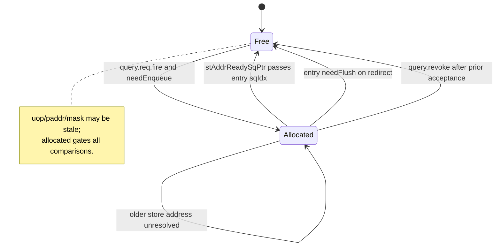
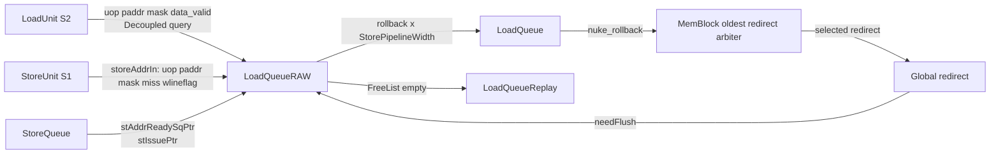
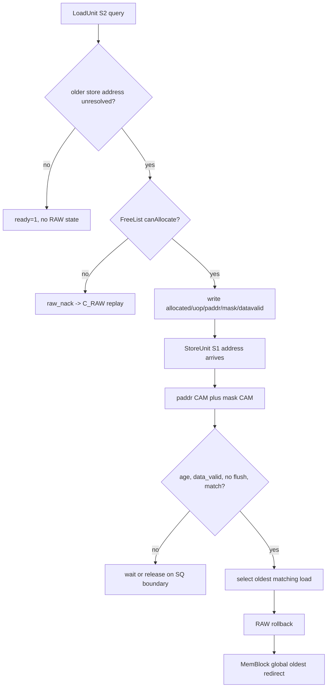
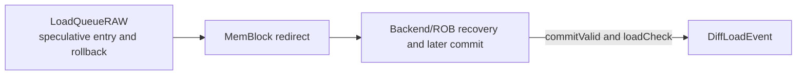

<!-- # 香山昆明湖 V2 LoadQueueRAW 源码分析 -->
# XiangShan Kunminghu V2 LoadQueueRAW Source-Code Analysis

<!-- `LoadQueueRAW` 不是保存全部 load 的主 Load Queue，也不是寄存器依赖意义上的 RAW 检测器。它是一个短生命周期 CAM 表：当 load 已越过地址/数据阶段、而更老 store 的地址尚未就绪时，保存该 load 的 uop、物理地址片段和 byte mask；当 store 地址后来到达时，检测 store-load memory ordering violation，选择最老的违规 load 并发出 flush 级 redirect。默认配置下，它有 32 项、3 个 load query 端口和 2 个 store compare/rollback 端口。 -->
`LoadQueueRAW` is neither the primary Load Queue that retains every load nor a RAW detector for register dependencies. It is a short-lived CAM table: after a load has passed its address/data stage while an older store address is still unresolved, it retains the load's uop, partial physical address, and byte mask. When the store address later arrives, it detects a store-load memory-ordering violation, selects the oldest violating load, and emits a flush-level redirect. In the default configuration, it has 32 entries, three load-query ports, and two store-compare/rollback ports.

<!-- ## 1. 分析范围 -->
## 1. Scope of Analysis

<!-- ### 1.1. 对象和边界 -->
### 1.1. Subject and Boundaries

<!-- | 项目 | 本文覆盖 | 明确不覆盖 | -->
| Item | Covered Here | Explicitly Excluded |
| --- | --- | --- |
<!-- | 目标模块 | `xiangshan.mem.lsqueue.LoadQueueRAW` 及其有效实例化/连线 | 未实例化的实验代码或仅凭名称的推测 | -->
| Target module | `xiangshan.mem.lsqueue.LoadQueueRAW` and its effective instantiation/wiring | Uninstantiated experimental code or inferences based only on names |
<!-- | 问题类型 | 更老 store 地址后到达时发现的 load-store 内存顺序违规 | 整数寄存器 RAW、rename scoreboard、store-to-load forwarding 算法 | -->
| Problem class | Load-store memory-ordering violations discovered when an older store address arrives later | Integer-register RAW, rename scoreboarding, and store-to-load forwarding algorithms |
<!-- | 路径起点 | LoadUnit S2 的 `stld_nuke_query` 和 StoreUnit S1 经 LSQ 送入的 `storeAddrIn` | rename/dispatch 前端细节 | -->
| Path origin | `stld_nuke_query` at LoadUnit S2 and `storeAddrIn` delivered by StoreUnit S1 through the LSQ | Front-end rename/dispatch details |
<!-- | 路径终点 | RAW 的 `rollback` 进入 MemBlock 全局 oldest-redirect 仲裁 | redirect 之后 frontend/ROB 的所有精确恢复实现 | -->
| Path destination | RAW `rollback` entering MemBlock's global oldest-redirect arbitration | All precise frontend/ROB recovery implementation after redirect |

<!-- ### 1.2. 可复现源码基线 -->
### 1.2. Reproducible Source Baseline

<!-- | 项目 | 记录 | -->
| Item | Record |
| --- | --- |
<!-- | XiangShan 源码根目录 | `/home/yanyusong/xs-memory-env/XiangShan` | -->
| XiangShan source root | `/home/yanyusong/xs-memory-env/XiangShan` |
<!-- | 分支 | `kunminghu-v2` | -->
| Branch | `kunminghu-v2` |
<!-- | 提交 | `e12436c7cba86b195deec24981976d78bc263661`，`fix(Store): prevent rdataptr from advancing out of order (#6353)` | -->
| Commit | `e12436c7cba86b195deec24981976d78bc263661`, `fix(Store): prevent rdataptr from advancing out of order (#6353)` |
<!-- | 分析日期 | 2026-08-17，Asia/Shanghai | -->
| Analysis date | 2026-08-17, Asia/Shanghai |
<!-- | 每周同步 | 按 skill 的 `weekly_sync.py` 检查，距上次同步不足 7 天，脚本按策略未强制更新 | -->
| Weekly synchronization | Checked with the skill's `weekly_sync.py`; fewer than seven days had elapsed since the last synchronization, so the script did not force an update by policy |
<!-- | Design Doc 基线 | 本地 `/home/yanyusong/XiangShan-Design-Doc` 不存在；本文没有把任何 Design Doc 推断当作实现事实 | -->
| Design Doc baseline | Local `/home/yanyusong/XiangShan-Design-Doc` is absent; this document does not treat any Design Doc inference as an implementation fact |
<!-- | 源码工作区 | 分析开始时已有 `difftest` 修改和 `src/main/resources/aia/` 未跟踪内容；本文没有改动该源码工作区 | -->
| Source worktree | It already contained `difftest` modifications and untracked `src/main/resources/aia/` content when the analysis began; this document did not modify that source worktree |

<!-- ### 1.3. 术语 -->
### 1.3. Terminology

<!-- 课程中的通用 RAW 是读操作依赖更早写操作的结果；这里的 RAW 是更具体的 memory ordering 问题：load 已继续执行，而更老 store 的地址尚未知道，之后发现二者地址和掩码冲突。它使用 `robIdx`、`sqIdx`、物理地址和 mask，不读取物理寄存器重命名表。通用理论背景见 [Dependency_Between_Instructions.md:24](</home/yanyusong/XiangShanLab/xiangshan-course/docs/4-xiangshan-microarchitecture-analysis/1-superscalar-basic-knowledge/4_Dependency_Between_Instructions.md:24>)；本文以下“RAW”均指 `LoadQueueRAW` 的 memory RAW。 -->
The generic RAW in the course denotes a read that depends on the result of an earlier write. RAW here is the more specific memory-ordering problem in which a load continues executing while an older store address is unknown, and their addresses and masks are later found to conflict. It uses `robIdx`, `sqIdx`, physical addresses, and masks; it does not read the physical-register rename table. See [Dependency_Between_Instructions.md:24](</home/yanyusong/XiangShanLab/xiangshan-course/docs/4-xiangshan-microarchitecture-analysis/1-superscalar-basic-knowledge/4_Dependency_Between_Instructions.md:24>) for generic theoretical background. Hereafter, "RAW" means the memory RAW handled by `LoadQueueRAW`.

<!-- ## 2. 关键源码证据 -->
## 2. Key Source Evidence

<!-- | 文件 | 有效证据 | 对本分析的作用 | -->
| File | Effective Evidence | Role in This Analysis |
| --- | --- | --- |
<!-- | [LoadQueueRAW.scala:32](</home/yanyusong/xs-memory-env/XiangShan/src/main/scala/xiangshan/mem/lsqueue/LoadQueueRAW.scala:32>) | IO、entry 状态、CAM、选择树和 redirect | 核心行为的唯一 RTL/Chisel 依据 | -->
| [LoadQueueRAW.scala:32](</home/yanyusong/xs-memory-env/XiangShan/src/main/scala/xiangshan/mem/lsqueue/LoadQueueRAW.scala:32>) | IO, entry state, CAM, selection tree, and redirect | The sole RTL/Chisel basis for core behavior |
<!-- | [LoadQueue.scala:214](</home/yanyusong/xs-memory-env/XiangShan/src/main/scala/xiangshan/mem/lsqueue/LoadQueue.scala:214>) | 同时实例化 RAR、RAW、Replay、VirtualLoadQueue 等 | 证明 RAW 是 LQ 的专用辅助表 | -->
| [LoadQueue.scala:214](</home/yanyusong/xs-memory-env/XiangShan/src/main/scala/xiangshan/mem/lsqueue/LoadQueue.scala:214>) | Concurrently instantiates RAR, RAW, Replay, VirtualLoadQueue, and others | Shows that RAW is a dedicated auxiliary table of the LQ |
<!-- | [LoadQueue.scala:235](</home/yanyusong/xs-memory-env/XiangShan/src/main/scala/xiangshan/mem/lsqueue/LoadQueue.scala:235>) | RAW 与 LoadUnit、StoreQueue、StoreUnit、redirect 的实际连线 | 确认 IO 的真实生产者和消费者 | -->
| [LoadQueue.scala:235](</home/yanyusong/xs-memory-env/XiangShan/src/main/scala/xiangshan/mem/lsqueue/LoadQueue.scala:235>) | Actual wiring of RAW to LoadUnit, StoreQueue, StoreUnit, and redirect | Establishes the real IO producers and consumers |
<!-- | [LSQWrapper.scala:160](</home/yanyusong/xs-memory-env/XiangShan/src/main/scala/xiangshan/mem/lsqueue/LSQWrapper.scala:160>) | LQ/SQ 联动分配 | 区分主 LQ 分配和 RAW entry 分配 | -->
| [LSQWrapper.scala:160](</home/yanyusong/xs-memory-env/XiangShan/src/main/scala/xiangshan/mem/lsqueue/LSQWrapper.scala:160>) | Coupled LQ/SQ allocation | Distinguishes primary-LQ allocation from RAW-entry allocation |
<!-- | [LoadUnit.scala:1276](</home/yanyusong/xs-memory-env/XiangShan/src/main/scala/xiangshan/mem/pipeline/LoadUnit.scala:1276>) | S2 query 的 `raw_nack` | 证明 RAW 满时形成 replay，而非静默放行 | -->
| [LoadUnit.scala:1276](</home/yanyusong/xs-memory-env/XiangShan/src/main/scala/xiangshan/mem/pipeline/LoadUnit.scala:1276>) | `raw_nack` for the S2 query | Shows that a full RAW produces replay rather than silently admitting the request |
<!-- | [StoreUnit.scala:378](</home/yanyusong/xs-memory-env/XiangShan/src/main/scala/xiangshan/mem/pipeline/StoreUnit.scala:378>) | Store S1 的 `io.lsq` paddr/mask 输出 | `storeIn` 的实际来源 | -->
| [StoreUnit.scala:378](</home/yanyusong/xs-memory-env/XiangShan/src/main/scala/xiangshan/mem/pipeline/StoreUnit.scala:378>) | `io.lsq` paddr/mask output from Store S1 | The actual source of `storeIn` |
<!-- | [LoadQueueData.scala:32](</home/yanyusong/xs-memory-env/XiangShan/src/main/scala/xiangshan/mem/lsqueue/LoadQueueData.scala:32>) | banked address/mask CAM 数据结构 | 存储、写延迟和同地址多写断言 | -->
| [LoadQueueData.scala:32](</home/yanyusong/xs-memory-env/XiangShan/src/main/scala/xiangshan/mem/lsqueue/LoadQueueData.scala:32>) | Banked address/mask CAM data structures | Storage, write latency, and same-address multiwrite assertions |
<!-- | [FreeList.scala:25](</home/yanyusong/xs-memory-env/XiangShan/src/main/scala/xiangshan/mem/lsqueue/FreeList.scala:25>) | 分配、释放、empty、预分配 | RAW 的容量和 backpressure 根源 | -->
| [FreeList.scala:25](</home/yanyusong/xs-memory-env/XiangShan/src/main/scala/xiangshan/mem/lsqueue/FreeList.scala:25>) | Allocation, release, empty, and preallocation | The source of RAW capacity limits and backpressure |
<!-- | [MemBlock.scala:1432](</home/yanyusong/xs-memory-env/XiangShan/src/main/scala/xiangshan/mem/MemBlock.scala:1432>) | 多个 rollback 源的全局最老选择 | RAW 不是全局恢复优先级的最终所有者 | -->
| [MemBlock.scala:1432](</home/yanyusong/xs-memory-env/XiangShan/src/main/scala/xiangshan/mem/MemBlock.scala:1432>) | Global oldest selection across multiple rollback sources | RAW is not the final owner of global recovery priority |
<!-- | [LoadQueueReplay.scala:293](</home/yanyusong/xs-memory-env/XiangShan/src/main/scala/xiangshan/mem/lsqueue/LoadQueueReplay.scala:293>) | `C_RAW` 的阻塞/唤醒条件 | RAW 资源不足的 forward-progress 链 | -->
| [LoadQueueReplay.scala:293](</home/yanyusong/xs-memory-env/XiangShan/src/main/scala/xiangshan/mem/lsqueue/LoadQueueReplay.scala:293>) | Blocking/wakeup conditions for `C_RAW` | The forward-progress chain for RAW resource exhaustion |
<!-- | [LoadMisalignBuffer.scala:296](</home/yanyusong/xs-memory-env/XiangShan/src/main/scala/xiangshan/mem/lsqueue/LoadMisalignBuffer.scala:296>) | 跨 16B load 分裂 | RAW 与 misalign/cross-boundary 路径的边界 | -->
| [LoadMisalignBuffer.scala:296](</home/yanyusong/xs-memory-env/XiangShan/src/main/scala/xiangshan/mem/lsqueue/LoadMisalignBuffer.scala:296>) | Splitting of a load crossing 16 B | Boundary between RAW and misaligned/cross-boundary paths |
<!-- | [LoadQueueUncache.scala:122](</home/yanyusong/xs-memory-env/XiangShan/src/main/scala/xiangshan/mem/lsqueue/LoadQueueUncache.scala:122>) | MMIO/NC 排序和状态机 | RAW 不拥有 uncache/MMIO 副作用 | -->
| [LoadQueueUncache.scala:122](</home/yanyusong/xs-memory-env/XiangShan/src/main/scala/xiangshan/mem/lsqueue/LoadQueueUncache.scala:122>) | MMIO/NC ordering and state machine | RAW does not own uncache/MMIO side effects |
<!-- | [Rob.scala:1583](</home/yanyusong/xs-memory-env/XiangShan/src/main/scala/xiangshan/backend/rob/Rob.scala:1583>) | 提交侧 `DiffLoadEvent` | RAW rollback 不是架构可见 Difftest 事件 | -->
| [Rob.scala:1583](</home/yanyusong/xs-memory-env/XiangShan/src/main/scala/xiangshan/backend/rob/Rob.scala:1583>) | Commit-side `DiffLoadEvent` | A RAW rollback is not an architecturally visible Difftest event |

<!-- ## 3. 理论到代码映射 -->
## 3. Mapping Theory to Code

<!-- ### 3.1. 通用相关与本模块特化 -->
### 3.1. Generic Dependence and Module-Specific Form

<!-- | 理论概念 | 本模块中的具体化 | 有效源码 | -->
| Theoretical Concept | Concrete Form in This Module | Effective Source |
| --- | --- | --- |
<!-- | 更早写必须对更晚读可见 | 更老 store 的地址未知时，不能仅凭“尚未看到冲突”断言 load 安全 | [LoadQueueRAW.scala:115](</home/yanyusong/xs-memory-env/XiangShan/src/main/scala/xiangshan/mem/lsqueue/LoadQueueRAW.scala:115>) | -->
| An earlier write must be visible to a later read | While an older store address is unknown, the absence of an observed conflict cannot establish that a load is safe | [LoadQueueRAW.scala:115](</home/yanyusong/xs-memory-env/XiangShan/src/main/scala/xiangshan/mem/lsqueue/LoadQueueRAW.scala:115>) |
<!-- | 乱序执行需要检测/恢复 | store 地址到达后以 CAM 检查，命中时生成 flush redirect | [LoadQueueRAW.scala:289](</home/yanyusong/xs-memory-env/XiangShan/src/main/scala/xiangshan/mem/lsqueue/LoadQueueRAW.scala:289>)、[LoadQueueRAW.scala:326](</home/yanyusong/xs-memory-env/XiangShan/src/main/scala/xiangshan/mem/lsqueue/LoadQueueRAW.scala:326>) | -->
| Out-of-order execution requires detection/recovery | Perform a CAM check when the store address arrives and generate a flush redirect on a match | [LoadQueueRAW.scala:289](</home/yanyusong/xs-memory-env/XiangShan/src/main/scala/xiangshan/mem/lsqueue/LoadQueueRAW.scala:289>), [LoadQueueRAW.scala:326](</home/yanyusong/xs-memory-env/XiangShan/src/main/scala/xiangshan/mem/lsqueue/LoadQueueRAW.scala:326>) |
<!-- | 多个冲突必须保持程序顺序 | 以 `robIdx` 年龄从候选中选最老 load | [LoadQueueRAW.scala:241](</home/yanyusong/xs-memory-env/XiangShan/src/main/scala/xiangshan/mem/lsqueue/LoadQueueRAW.scala:241>) | -->
| Multiple conflicts must preserve program order | Select the oldest load among candidates by `robIdx` age | [LoadQueueRAW.scala:241](</home/yanyusong/xs-memory-env/XiangShan/src/main/scala/xiangshan/mem/lsqueue/LoadQueueRAW.scala:241>) |
<!-- | 资源不足必须施加背压或重试 | entry 不足时 `ready=0`，LoadUnit 产生 `C_RAW` replay | [LoadQueueRAW.scala:133](</home/yanyusong/xs-memory-env/XiangShan/src/main/scala/xiangshan/mem/lsqueue/LoadQueueRAW.scala:133>)、[LoadUnit.scala:1431](</home/yanyusong/xs-memory-env/XiangShan/src/main/scala/xiangshan/mem/pipeline/LoadUnit.scala:1431>) | -->
| Resource exhaustion must impose backpressure or retry | With too few entries, `ready=0` and LoadUnit produces a `C_RAW` replay | [LoadQueueRAW.scala:133](</home/yanyusong/xs-memory-env/XiangShan/src/main/scala/xiangshan/mem/lsqueue/LoadQueueRAW.scala:133>), [LoadUnit.scala:1431](</home/yanyusong/xs-memory-env/XiangShan/src/main/scala/xiangshan/mem/pipeline/LoadUnit.scala:1431>) |

<!-- ### 3.2. 不可替换的代码事实 -->
### 3.2. Non-Substitutable Code Facts

<!-- 教材的 RAW 术语无法替代下面这些代码事实：RAW entry 只在 `hasAddrInvalidStore` 时建立；地址相同仍要满足 byte mask、年龄、`data_valid`、未被 redirect 清除等条件；最终 recovery 还要被 MemBlock 与其他 redirect 源仲裁。任何只写“发现 RAW 就 replay”的概括都遗漏了实际 valid/ready/fire、CAM 和年龄控制。 -->
The textbook notion of RAW cannot substitute for the following code facts: a RAW entry is created only when `hasAddrInvalidStore`; equal addresses must also satisfy byte-mask, age, `data_valid`, and not-flushed conditions; and final recovery is arbitrated by MemBlock against other redirect sources. Any summary that merely says "replay when RAW is detected" omits the actual valid/ready/fire protocol, CAM logic, and age control.

<!-- ## 4. 理论、Design Doc 与有效实现 -->
## 4. Theory, Design Doc, and Effective Implementation

<!-- ### 4.1. 证据层次 -->
### 4.1. Evidence Levels

<!-- | 层次 | 本次可确认的内容 | 使用规则 | -->
| Level | What Can Be Confirmed Here | Rule of Use |
| --- | --- | --- |
<!-- | 课程理论 | RAW 的问题类型和乱序恢复的必要性 | 只作为解释背景 | -->
| Course theory | The class of RAW problem and the need for out-of-order recovery | Use only as explanatory background |
<!-- | Design Doc | 本地检出缺失，未查阅 | 不以“设计意图”补充任何行为 | -->
| Design Doc | The local checkout is absent and was not consulted | Do not supplement behavior with claimed "design intent" |
<!-- | Kunminghu V2 Scala/Chisel | 信号、条件、寄存器、端口宽度、redirect 字段、连线 | 所有行为性结论以这层行号为准 | -->
| Kunminghu V2 Scala/Chisel | Signals, conditions, registers, port widths, redirect fields, and wiring | All behavioral conclusions are grounded in line references at this level |

<!-- ### 4.2. 可追溯性矩阵 -->
### 4.2. Traceability Matrix

<!-- | ID | 问题或意图 | 状态 | 代码映射 | 结论 | -->
| ID | Issue or Intent | Status | Code Mapping | Conclusion |
| --- | --- | --- | --- | --- |
<!-- | T0 | 通用 RAW 防止读到过早值 | 课程理论 | [Dependency_Between_Instructions.md:24](</home/yanyusong/XiangShanLab/xiangshan-course/docs/4-xiangshan-microarchitecture-analysis/1-superscalar-basic-knowledge/4_Dependency_Between_Instructions.md:24>) | 仅背景，不等同于实现规格 | -->
| T0 | Generic RAW prevents a read from seeing an earlier value | Course theory | [Dependency_Between_Instructions.md:24](</home/yanyusong/XiangShanLab/xiangshan-course/docs/4-xiangshan-microarchitecture-analysis/1-superscalar-basic-knowledge/4_Dependency_Between_Instructions.md:24>) | Background only; not an implementation specification |
<!-- | D0 | RAW 的 Design Doc 原始意图 | 未查阅 | 本地目录不存在 | 不作推断 | -->
| D0 | Original Design Doc intent for RAW | Not consulted | Local directory absent | No inference |
<!-- | C0 | 只给未知老 store 前的 load 建表 | 源码已确认 | [LoadQueueRAW.scala:115](</home/yanyusong/xs-memory-env/XiangShan/src/main/scala/xiangshan/mem/lsqueue/LoadQueueRAW.scala:115>) | `needEnqueue` 精确编码该过滤 | -->
| C0 | Track only loads preceding an unknown older store | Confirmed by source | [LoadQueueRAW.scala:115](</home/yanyusong/xs-memory-env/XiangShan/src/main/scala/xiangshan/mem/lsqueue/LoadQueueRAW.scala:115>) | `needEnqueue` encodes this filter exactly |
<!-- | C1 | 命中时选最老违规 load | 源码已确认 | [LoadQueueRAW.scala:241](</home/yanyusong/xs-memory-env/XiangShan/src/main/scala/xiangshan/mem/lsqueue/LoadQueueRAW.scala:241>) | 每个 store 端口独立选择 | -->
| C1 | Select the oldest violating load on a match | Confirmed by source | [LoadQueueRAW.scala:241](</home/yanyusong/xs-memory-env/XiangShan/src/main/scala/xiangshan/mem/lsqueue/LoadQueueRAW.scala:241>) | Each store port selects independently |
<!-- | C2 | RAW 满时不得遗漏相关 load | 源码已确认 | [LoadQueueReplay.scala:293](</home/yanyusong/xs-memory-env/XiangShan/src/main/scala/xiangshan/mem/lsqueue/LoadQueueReplay.scala:293>) | 以 replay 等待资源/地址边界推进 | -->
| C2 | A full RAW must not lose a relevant load | Confirmed by source | [LoadQueueReplay.scala:293](</home/yanyusong/xs-memory-env/XiangShan/src/main/scala/xiangshan/mem/lsqueue/LoadQueueReplay.scala:293>) | Progress resumes through replay when resource/address boundaries permit |

<!-- ## 5. 微架构参数 -->
## 5. Microarchitectural Parameters

<!-- ### 5.1. 默认规模 -->
### 5.1. Default Dimensions

<!-- | 参数 | 默认值 | 含义 | -->
| Parameter | Default Value | Meaning |
| --- | ---: | --- |
<!-- | `LoadQueueRAWSize` | 32 | 32 个需要观察未知老 store 的 load entry；参数要求为 2 的幂 | -->
| `LoadQueueRAWSize` | 32 | 32 load entries that must observe unknown older stores; the parameter must be a power of two |
<!-- | `LoadPipelineWidth` | 3 | 每周期最多 3 个 RAW query 端口 | -->
| `LoadPipelineWidth` | 3 | At most three RAW query ports per cycle |
<!-- | `StorePipelineWidth` | 2 | 每周期最多 2 个 store CAM 比较/rollback 端口 | -->
| `StorePipelineWidth` | 2 | At most two store CAM-comparison/rollback ports per cycle |
<!-- | `RollbackGroupSize` | 8 | 选择树每组的候选数 | -->
| `RollbackGroupSize` | 8 | Candidate count per selection-tree group |
<!-- | `LoadQueueReplaySize` | 72 | `C_RAW` replay 容器大小，不是 RAW 表大小 | -->
| `LoadQueueReplaySize` | 72 | Size of the `C_RAW` replay container, not the RAW table |
<!-- | `StoreQueueSize` | 56 | `sqIdx` 年龄域的队列容量，不等于 RAW entry 数 | -->
| `StoreQueueSize` | 56 | Queue capacity of the `sqIdx` age domain, not the number of RAW entries |

<!-- 参数定义见 [Parameters.scala:167](</home/yanyusong/xs-memory-env/XiangShan/src/main/scala/xiangshan/Parameters.scala:167>) 和 [Parameters.scala:214](</home/yanyusong/xs-memory-env/XiangShan/src/main/scala/xiangshan/Parameters.scala:214>)。因此“32/3/2”是当前基线的配置事实，不应写成香山所有配置的不可变常数。 -->
The parameters are defined in [Parameters.scala:167](</home/yanyusong/xs-memory-env/XiangShan/src/main/scala/xiangshan/Parameters.scala:167>) and [Parameters.scala:214](</home/yanyusong/xs-memory-env/XiangShan/src/main/scala/xiangshan/Parameters.scala:214>). Thus, "32/3/2" is a configuration fact for the current baseline, not an invariant constant across all XiangShan configurations.

<!-- ### 5.2. 参数化选择时间 -->
### 5.2. Parameterized Selection Timing

<!-- `RAWlgSelectGroupSize` 和 `RAWTotalDelayCycles` 的参数定义在 [Parameters.scala:789](</home/yanyusong/xs-memory-env/XiangShan/src/main/scala/xiangshan/Parameters.scala:789>)。RAW 内的选择树以 `ceil(log2Ceil(LoadQueueRAWSize) / log2Ceil(RollbackGroupSize)) + 1` 形成 `TotalSelectCycles`，见 [LoadQueueRAW.scala:241](</home/yanyusong/xs-memory-env/XiangShan/src/main/scala/xiangshan/mem/lsqueue/LoadQueueRAW.scala:241>)。默认 32 项和 8 项一组时树的 `TotalSelectCycles=3`，StoreUnit 的 `RAWTotalDelayCycles=1`。这是源码可推出的内部选择/对齐参数，不是 dispatch 到 commit 的固定时延；`GatedValidRegNext`、StoreUnit 流水、DCache 状态和全局 redirect 仲裁都需要波形确认。 -->
`RAWlgSelectGroupSize` and `RAWTotalDelayCycles` are defined in [Parameters.scala:789](</home/yanyusong/xs-memory-env/XiangShan/src/main/scala/xiangshan/Parameters.scala:789>). The RAW selection tree derives `TotalSelectCycles` as `ceil(log2Ceil(LoadQueueRAWSize) / log2Ceil(RollbackGroupSize)) + 1`; see [LoadQueueRAW.scala:241](</home/yanyusong/xs-memory-env/XiangShan/src/main/scala/xiangshan/mem/lsqueue/LoadQueueRAW.scala:241>). With the default 32 entries and eight entries per group, the tree has `TotalSelectCycles=3`, while StoreUnit has `RAWTotalDelayCycles=1`. These are source-derived internal selection/alignment parameters, not a fixed dispatch-to-commit latency; waveform evidence is still required for `GatedValidRegNext`, the StoreUnit pipeline, DCache state, and global redirect arbitration.

<!-- ## 6. 模块边界和接口 -->
## 6. Module Boundaries and Interfaces

<!-- ### 6.1. 位于 LoadQueue 内部的专用表 -->
### 6.1. Dedicated Table Inside LoadQueue

<!-- `LoadQueue` 在同一层实例化 `LoadQueueRAR`、`LoadQueueRAW`、`LoadQueueReplay`、VirtualLoadQueue、异常缓冲和 uncache 缓冲，见 [LoadQueue.scala:214](</home/yanyusong/xs-memory-env/XiangShan/src/main/scala/xiangshan/mem/lsqueue/LoadQueue.scala:214>)。它不分配主 `lqIdx`，该分配属于 LSQWrapper 的 LQ/SQ 联动逻辑，[LSQWrapper.scala:160](</home/yanyusong/xs-memory-env/XiangShan/src/main/scala/xiangshan/mem/lsqueue/LSQWrapper.scala:160>)。 -->
`LoadQueue` instantiates `LoadQueueRAR`, `LoadQueueRAW`, `LoadQueueReplay`, VirtualLoadQueue, an exception buffer, and an uncache buffer at the same level; see [LoadQueue.scala:214](</home/yanyusong/xs-memory-env/XiangShan/src/main/scala/xiangshan/mem/lsqueue/LoadQueue.scala:214>). It does not allocate the primary `lqIdx`; that allocation belongs to the coupled LQ/SQ logic in LSQWrapper, [LSQWrapper.scala:160](</home/yanyusong/xs-memory-env/XiangShan/src/main/scala/xiangshan/mem/lsqueue/LSQWrapper.scala:160>).

<!-- ### 6.2. IO 的真实生产者和消费者 -->
### 6.2. Actual IO Producers and Consumers

<!-- | 信号 | 数量/协议 | 生产者 -> 消费者 | 语义 | -->
| Signal | Count/Protocol | Producer -> Consumer | Meaning |
| --- | --- | --- | --- |
<!-- | `query.req` | 3 个 `Decoupled` | LoadUnit S2 -> RAW | 申请对未知老 store 地址的观察；带 uop/paddr/mask/data_valid/is_nc | -->
| `query.req` | Three `Decoupled` interfaces | LoadUnit S2 -> RAW | Requests observation of unknown older store addresses; carries uop/paddr/mask/data_valid/is_nc |
<!-- | `query.req.ready` | 3 个 | RAW -> LoadUnit S2 | 不需建表时直接为真；需建表时由 FreeList 决定 | -->
| `query.req.ready` | Three | RAW -> LoadUnit S2 | True directly when no table entry is needed; otherwise determined by FreeList |
<!-- | `query.resp` | 3 个 `Valid` | RAW -> LoadUnit | 仅把上周期 `req.valid` 延迟并置 `rep_frm_fetch=false`，不是 violation 响应 | -->
| `query.resp` | Three `Valid` interfaces | RAW -> LoadUnit | Only delays the prior-cycle `req.valid` and sets `rep_frm_fetch=false`; it is not a violation response |
<!-- | `query.revoke` | 3 个 | LoadUnit S3 -> RAW | 回收先前已接受、但随后异常/replay/misalign 作废的 entry | -->
| `query.revoke` | Three | LoadUnit S3 -> RAW | Reclaims an entry accepted earlier but subsequently invalidated by an exception/replay/misalignment |
<!-- | `storeIn` | 2 个 `Valid` | StoreUnit S1 -> RAW | store 的 uop/paddr/mask/miss/wlineflag 等 | -->
| `storeIn` | Two `Valid` interfaces | StoreUnit S1 -> RAW | Store uop/paddr/mask/miss/wlineflag and related fields |
<!-- | `stAddrReadySqPtr` / `stIssuePtr` | pointer | StoreQueue -> RAW | 标示已地址检查与待检查 store 的边界 | -->
| `stAddrReadySqPtr` / `stIssuePtr` | Pointer | StoreQueue -> RAW | Delimit address-checked and address-unchecked stores |
<!-- | `redirect` | `Valid[Redirect]` | 全局恢复网络 -> RAW | 清除被更老恢复覆盖的 entry | -->
| `redirect` | `Valid[Redirect]` | Global recovery network -> RAW | Clears entries covered by an older recovery |
<!-- | `rollback` | 2 个 `Valid[Redirect]` | RAW -> LoadQueue -> MemBlock | RAW 本地发现的违规恢复请求 | -->
| `rollback` | Two `Valid[Redirect]` interfaces | RAW -> LoadQueue -> MemBlock | Violation-recovery requests detected locally by RAW |
<!-- | `lqFull` | bit | RAW -> Replay | RAW FreeList empty，非主 LoadQueue 的 full | -->
| `lqFull` | Bit | RAW -> Replay | RAW FreeList empty, not primary LoadQueue full |

<!-- IO 定义见 [LoadQueueRAW.scala:38](</home/yanyusong/xs-memory-env/XiangShan/src/main/scala/xiangshan/mem/lsqueue/LoadQueueRAW.scala:38>)，实际 Chisel 连线见 [LoadQueue.scala:235](</home/yanyusong/xs-memory-env/XiangShan/src/main/scala/xiangshan/mem/lsqueue/LoadQueue.scala:235>)。 -->
The IO is defined in [LoadQueueRAW.scala:38](</home/yanyusong/xs-memory-env/XiangShan/src/main/scala/xiangshan/mem/lsqueue/LoadQueueRAW.scala:38>), and the actual Chisel wiring is in [LoadQueue.scala:235](</home/yanyusong/xs-memory-env/XiangShan/src/main/scala/xiangshan/mem/lsqueue/LoadQueue.scala:235>).

<!-- ### 6.3. `lqFull` 的两种语义 -->
### 6.3. Two Meanings of `lqFull`

<!-- RAW 的 `io.lqFull := freeList.io.empty`，见 [LoadQueueRAW.scala:206](</home/yanyusong/xs-memory-env/XiangShan/src/main/scala/xiangshan/mem/lsqueue/LoadQueueRAW.scala:206>)。主 LoadQueue 对外的 `io.lqFull` 则由 VirtualLoadQueue 的容量逻辑驱动，[LoadQueue.scala:248](</home/yanyusong/xs-memory-env/XiangShan/src/main/scala/xiangshan/mem/lsqueue/LoadQueue.scala:248>)。调试时把两者混为一谈会误把 RAW 观察资源压力诊断成 dispatch/LQ 满。 -->
RAW sets `io.lqFull := freeList.io.empty`; see [LoadQueueRAW.scala:206](</home/yanyusong/xs-memory-env/XiangShan/src/main/scala/xiangshan/mem/lsqueue/LoadQueueRAW.scala:206>). The primary Load Queue's externally visible `io.lqFull` is instead driven by VirtualLoadQueue capacity logic, [LoadQueue.scala:248](</home/yanyusong/xs-memory-env/XiangShan/src/main/scala/xiangshan/mem/lsqueue/LoadQueue.scala:248>). Conflating them during debugging misdiagnoses RAW observation-resource pressure as a full dispatch/LQ.

<!-- ## 7. 模块为何存在 -->
## 7. Why the Module Exists

<!-- ### 7.1. 地址未知窗口 -->
### 7.1. Unknown-Address Window

<!-- 关键代码用 StoreQueue 两个指针定义风险窗口： -->
The key code uses two StoreQueue pointers to define the risk window:

```scala
val allAddrCheck = io.stIssuePtr === io.stAddrReadySqPtr
val hasAddrInvalidStore = io.query(w).req.bits.uop.sqIdx
  .isBefore(io.stAddrReadySqPtr) && !allAddrCheck
val needEnqueue = io.query(w).req.valid && hasAddrInvalidStore && !cancelEnqueue
```

<!-- 见 [LoadQueueRAW.scala:115](</home/yanyusong/xs-memory-env/XiangShan/src/main/scala/xiangshan/mem/lsqueue/LoadQueueRAW.scala:115>)。当两个指针相等，源码认为相关 store 的地址均已检查，load 不需要 RAW 表；否则，只有处在 `stAddrReadySqPtr` 之前的 load 才有更老未知地址 store，因而需要建立观察项。 -->
See [LoadQueueRAW.scala:115](</home/yanyusong/xs-memory-env/XiangShan/src/main/scala/xiangshan/mem/lsqueue/LoadQueueRAW.scala:115>). When the pointers are equal, the source considers all relevant store addresses checked and the load needs no RAW table. Otherwise, only a load before `stAddrReadySqPtr` has an older store with an unknown address and therefore needs an observation entry.

<!-- ### 7.2. 节省 CAM 容量而不牺牲正确性 -->
### 7.2. Saving CAM Capacity Without Sacrificing Correctness

<!-- 该筛选避免让每个 load 都占用 CAM。正确性不是由“表永远足够”保证，而是由 backpressure 保证：风险 load 无 slot 时不能 `fire`，会成为 replay。RAW 因此把空间优化和保守性结合在同一条 `ready` 链上。 -->
This filtering prevents every load from consuming CAM capacity. Correctness is guaranteed not by assuming the table is always large enough, but by backpressure: a risk load with no slot cannot `fire` and becomes a replay. RAW therefore combines space optimization and conservatism in the same `ready` chain.

<!-- ## 8. 动态路径 -->
## 8. Dynamic Paths

<!-- ### 8.1. 正常观察和自然释放 -->
### 8.1. Normal Observation and Natural Release

<!-- 1. LoadUnit S2 在 `s2_can_query` 时发 `stld_nuke_query.req`，载荷包含已经得到的 paddr、mask、uop 和 `data_valid`。 -->
1. At `s2_can_query`, LoadUnit S2 sends `stld_nuke_query.req`, carrying the resolved paddr, mask, uop, and `data_valid`.
<!-- 2. RAW 用 `sqIdx` 与 StoreQueue 地址就绪边界计算 `needEnqueue`。 -->
2. RAW computes `needEnqueue` from `sqIdx` and the StoreQueue address-ready boundary.
<!-- 3. 不需要观察时，`ready=1` 且不写 RAW；需要观察且 FreeList 可分配时，`fire` 写入 entry。 -->
3. When observation is unnecessary, `ready=1` and RAW does not write; when observation is needed and FreeList can allocate, `fire` writes an entry.
<!-- 4. `stAddrReadySqPtr` 通过该 entry 的 `sqIdx` 后，`deqNotBlock` 释放 entry；这说明它等待的更老 store 地址已处理。 -->
4. Once `stAddrReadySqPtr` passes the entry's `sqIdx`, `deqNotBlock` releases the entry, meaning the older store address it was waiting on has been handled.
<!-- 5. 如果 S3 发现异常、replay 或 misalign，LoadUnit 发 `revoke`，RAW 依据上拍接受的 slot 回收 entry。 -->
5. If S3 finds an exception, replay, or misalignment, LoadUnit sends `revoke`, and RAW reclaims the entry using the slot accepted in the prior cycle.

<!-- LoadUnit 的 S2 query/data-valid 代码见 [LoadUnit.scala:1334](</home/yanyusong/xs-memory-env/XiangShan/src/main/scala/xiangshan/mem/pipeline/LoadUnit.scala:1334>)，RAW 的释放和 revoke 关联见 [LoadQueueRAW.scala:175](</home/yanyusong/xs-memory-env/XiangShan/src/main/scala/xiangshan/mem/lsqueue/LoadQueueRAW.scala:175>)、[LoadQueueRAW.scala:193](</home/yanyusong/xs-memory-env/XiangShan/src/main/scala/xiangshan/mem/lsqueue/LoadQueueRAW.scala:193>)。 -->
LoadUnit S2 query/data-valid code is in [LoadUnit.scala:1334](</home/yanyusong/xs-memory-env/XiangShan/src/main/scala/xiangshan/mem/pipeline/LoadUnit.scala:1334>); RAW release and revoke connections are in [LoadQueueRAW.scala:175](</home/yanyusong/xs-memory-env/XiangShan/src/main/scala/xiangshan/mem/lsqueue/LoadQueueRAW.scala:175>) and [LoadQueueRAW.scala:193](</home/yanyusong/xs-memory-env/XiangShan/src/main/scala/xiangshan/mem/lsqueue/LoadQueueRAW.scala:193>).

<!-- ### 8.2. 违规恢复路径 -->
### 8.2. Violation-Recovery Path

<!-- 1. 更年轻 load 在未知老 store 地址窗口内建立 RAW entry。 -->
1. A younger load creates a RAW entry inside the unknown-older-store-address window.
<!-- 2. 更老 store 在 StoreUnit S1 有效且地址到达 `storeIn`。 -->
2. The older store becomes valid in StoreUnit S1 and its address arrives on `storeIn`.
<!-- 3. paddr CAM、cache-line 模式和 mask CAM 形成命中；`allocated`、ROB 年龄、`datavalid`、redirect 门控形成合法候选。 -->
3. The paddr CAM, cache-line mode, and mask CAM form a match; `allocated`, ROB age, `datavalid`, and redirect gating establish legal candidates.
<!-- 4. 每个 store 端口的选择树挑出最老 load，构造 `RedirectLevel.flush`。 -->
4. The selection tree for each store port chooses the oldest load and constructs `RedirectLevel.flush`.
<!-- 5. `rollback` 进入 MemBlock，与 LoadUnit/replay/nack 等恢复源比较，只有全局最老 redirect 被广播。 -->
5. `rollback` enters MemBlock, competes with recovery sources such as LoadUnit/replay/nack, and only the globally oldest redirect is broadcast.
<!-- 6. 广播 redirect 回到 RAW，杀死被覆盖 entry；恢复后的 load 需要由外部流水重新执行并最终提交。 -->
6. The broadcast redirect returns to RAW and kills covered entries; the recovered load must be re-executed by the external pipeline and eventually committed.

<!-- Store 来源见 [StoreUnit.scala:378](</home/yanyusong/xs-memory-env/XiangShan/src/main/scala/xiangshan/mem/pipeline/StoreUnit.scala:378>)，CAM 条件见 [LoadQueueRAW.scala:289](</home/yanyusong/xs-memory-env/XiangShan/src/main/scala/xiangshan/mem/lsqueue/LoadQueueRAW.scala:289>)，全局仲裁见 [MemBlock.scala:1432](</home/yanyusong/xs-memory-env/XiangShan/src/main/scala/xiangshan/mem/MemBlock.scala:1432>)。 -->
The store source is in [StoreUnit.scala:378](</home/yanyusong/xs-memory-env/XiangShan/src/main/scala/xiangshan/mem/pipeline/StoreUnit.scala:378>), the CAM condition is in [LoadQueueRAW.scala:289](</home/yanyusong/xs-memory-env/XiangShan/src/main/scala/xiangshan/mem/lsqueue/LoadQueueRAW.scala:289>), and global arbitration is in [MemBlock.scala:1432](</home/yanyusong/xs-memory-env/XiangShan/src/main/scala/xiangshan/mem/MemBlock.scala:1432>).

<!-- ### 8.3. 容量拒绝和 replay 路径 -->
### 8.3. Capacity Rejection and Replay Path

<!-- `needEnqueue=1` 而 `canAllocate=0` 时，RAW 将该 query 的 `ready=0`。LoadUnit 在同一 S2 定义 `s2_raw_nack = req.valid && !req.ready`，再把它写入 `rep_info.raw_nack`，[LoadUnit.scala:1276](</home/yanyusong/xs-memory-env/XiangShan/src/main/scala/xiangshan/mem/pipeline/LoadUnit.scala:1276>)、[LoadUnit.scala:1431](</home/yanyusong/xs-memory-env/XiangShan/src/main/scala/xiangshan/mem/pipeline/LoadUnit.scala:1431>)。Replay 原因 `C_RAW=8`，[LoadQueueReplay.scala:60](</home/yanyusong/xs-memory-env/XiangShan/src/main/scala/xiangshan/mem/lsqueue/LoadQueueReplay.scala:60>)；其阻塞会在 RAW 不再 full，或该 load 已不再落在未就绪 store 地址窗口中时解除，[LoadQueueReplay.scala:293](</home/yanyusong/xs-memory-env/XiangShan/src/main/scala/xiangshan/mem/lsqueue/LoadQueueReplay.scala:293>)。 -->
When `needEnqueue=1` and `canAllocate=0`, RAW drives the query's `ready=0`. In the same S2 stage, LoadUnit defines `s2_raw_nack = req.valid && !req.ready` and writes it to `rep_info.raw_nack`; see [LoadUnit.scala:1276](</home/yanyusong/xs-memory-env/XiangShan/src/main/scala/xiangshan/mem/pipeline/LoadUnit.scala:1276>) and [LoadUnit.scala:1431](</home/yanyusong/xs-memory-env/XiangShan/src/main/scala/xiangshan/mem/pipeline/LoadUnit.scala:1431>). The replay cause is `C_RAW=8`, [LoadQueueReplay.scala:60](</home/yanyusong/xs-memory-env/XiangShan/src/main/scala/xiangshan/mem/lsqueue/LoadQueueReplay.scala:60>); its blocking clears when RAW is no longer full or the load no longer lies in the unresolved-store-address window, [LoadQueueReplay.scala:293](</home/yanyusong/xs-memory-env/XiangShan/src/main/scala/xiangshan/mem/lsqueue/LoadQueueReplay.scala:293>).

<!-- ## 9. 索引、地址与历史计算 -->
## 9. Indices, Addresses, and Age Computation

<!-- ### 9.1. 环形年龄计算 -->
### 9.1. Circular Age Computation

<!-- `sqIdx` 和 `robIdx` 不能只做无符号数比较。`CircularQueuePtr` 将 flag/value 一并编码回绕，并定义 `isBefore`/`isAfter`，见 [CircularQueuePtr.scala:65](</home/yanyusong/xs-memory-env/XiangShan/utility/src/main/scala/utility/CircularQueuePtr.scala:65>)。RAW 用它判定未知 store 窗口、load 是否年轻于 store、以及释放边界；pointer wrap 是功能正确性条件而不是性能细节。 -->
`sqIdx` and `robIdx` cannot be compared as unsigned numbers alone. `CircularQueuePtr` encodes wraparound with flag/value and defines `isBefore`/`isAfter`; see [CircularQueuePtr.scala:65](</home/yanyusong/xs-memory-env/XiangShan/utility/src/main/scala/utility/CircularQueuePtr.scala:65>). RAW uses it to determine the unknown-store window, whether a load is younger than a store, and release boundaries; pointer wrap is a functional-correctness condition, not a performance detail.

<!-- ### 9.2. 部分物理地址 -->
### 9.2. Partial Physical Address

<!-- RAW 记录 `paddr[DCacheVWordOffset + 23 : DCacheVWordOffset]`，即从 DCache virtual-word 偏移开始的 24 位片段，[LoadQueueRAW.scala:57](</home/yanyusong/xs-memory-env/XiangShan/src/main/scala/xiangshan/mem/lsqueue/LoadQueueRAW.scala:57>)。这里的 `DCacheVWordOffset` 是配置参数，本文不把它虚构为固定字节数。 -->
RAW records `paddr[DCacheVWordOffset + 23 : DCacheVWordOffset]`, a 24-bit slice beginning at the DCache virtual-word offset; see [LoadQueueRAW.scala:57](</home/yanyusong/xs-memory-env/XiangShan/src/main/scala/xiangshan/mem/lsqueue/LoadQueueRAW.scala:57>). `DCacheVWordOffset` is a configuration parameter, so this document does not invent a fixed byte count for it.

<!-- ### 9.3. 分配索引 -->
### 9.3. Allocation Indices

<!-- 同周期第 `w` 个 load 使用 `PopCount(needEnqueue.take(w))` 作为 FreeList 的预分配 offset，见 [LoadQueueRAW.scala:126](</home/yanyusong/xs-memory-env/XiangShan/src/main/scala/xiangshan/mem/lsqueue/LoadQueueRAW.scala:126>)。FreeList 以环形 head/tail 和 `enablePreAlloc=true` 给出 `canAllocate`/`allocateSlot`，[FreeList.scala:107](</home/yanyusong/xs-memory-env/XiangShan/src/main/scala/xiangshan/mem/lsqueue/FreeList.scala:107>)；多端口分配是否唯一必须在波形/断言中验证，不能从单个端口的 `valid` 推断。 -->
The `w`th load in a cycle uses `PopCount(needEnqueue.take(w))` as its FreeList preallocation offset; see [LoadQueueRAW.scala:126](</home/yanyusong/xs-memory-env/XiangShan/src/main/scala/xiangshan/mem/lsqueue/LoadQueueRAW.scala:126>). FreeList uses circular head/tail pointers and `enablePreAlloc=true` to provide `canAllocate`/`allocateSlot`, [FreeList.scala:107](</home/yanyusong/xs-memory-env/XiangShan/src/main/scala/xiangshan/mem/lsqueue/FreeList.scala:107>); waveform/assertion evidence is required to prove multiport allocation uniqueness, which cannot be inferred from a single port's `valid`.

<!-- ## 10. 核心算法 -->
## 10. Core Algorithms

<!-- ### 10.1. 建表与接收算法 -->
### 10.1. Table-Creation and Acceptance Algorithm

```scala
val offset = PopCount(needEnqueue.take(w))
val canAccept = freeList.io.canAllocate(offset)
io.query(w).req.ready := Mux(needEnqueue, canAccept, true.B)
when (needEnqueue && io.query(w).req.ready) {
  allocated(enqIndex) := true.B
  // write uop, partial paddr, mask, data_valid
}
```

<!-- 有效代码见 [LoadQueueRAW.scala:126](</home/yanyusong/xs-memory-env/XiangShan/src/main/scala/xiangshan/mem/lsqueue/LoadQueueRAW.scala:126>)。因此 entry 的唯一可信接受条件是 `query.req.fire`；`query.req.valid` 单独为真既可能表示无需建表，也可能表示因满而被拒绝。 -->
The effective code is in [LoadQueueRAW.scala:126](</home/yanyusong/xs-memory-env/XiangShan/src/main/scala/xiangshan/mem/lsqueue/LoadQueueRAW.scala:126>). Thus, the only trustworthy acceptance condition for an entry is `query.req.fire`; `query.req.valid` alone may mean either that no entry is needed or that the request was rejected because RAW is full.

<!-- ### 10.2. 地址、line 和 byte-mask 算法 -->
### 10.2. Address, Line, and Byte-Mask Algorithm

<!-- `LqPAddrModule` 在 `enableCacheLineCheck=true` 下将普通比较和 `wlineflag` 的 line 比较分开，[LoadQueueData.scala:135](</home/yanyusong/xs-memory-env/XiangShan/src/main/scala/xiangshan/mem/lsqueue/LoadQueueData.scala:135>)。StoreUnit 的 `wlineflag` 来自 CBO-all 语义，[StoreUnit.scala:252](</home/yanyusong/xs-memory-env/XiangShan/src/main/scala/xiangshan/mem/pipeline/StoreUnit.scala:252>)。地址命中仍需 `(storeMask & loadMask).orR`，即 byte mask 有交集，[LoadQueueData.scala:209](</home/yanyusong/xs-memory-env/XiangShan/src/main/scala/xiangshan/mem/lsqueue/LoadQueueData.scala:209>)。 -->
With `enableCacheLineCheck=true`, `LqPAddrModule` separates ordinary comparison from `wlineflag` line comparison; see [LoadQueueData.scala:135](</home/yanyusong/xs-memory-env/XiangShan/src/main/scala/xiangshan/mem/lsqueue/LoadQueueData.scala:135>). StoreUnit's `wlineflag` comes from CBO-all semantics, [StoreUnit.scala:252](</home/yanyusong/xs-memory-env/XiangShan/src/main/scala/xiangshan/mem/pipeline/StoreUnit.scala:252>). An address match still requires `(storeMask & loadMask).orR`, namely overlap of the byte masks, [LoadQueueData.scala:209](</home/yanyusong/xs-memory-env/XiangShan/src/main/scala/xiangshan/mem/lsqueue/LoadQueueData.scala:209>).

<!-- ### 10.3. 候选和最老选择算法 -->
### 10.3. Candidate and Oldest-Selection Algorithm

<!-- 每个 store 端口对每个 entry 的候选可概括为： -->
The candidate for each entry at each store port can be summarized as:

```text
allocated[j]
&& storeIn[i].valid
&& load_uop[j].robIdx isAfter storeIn[i].uop.robIdx
&& datavalid[j]
&& !load_uop[j].robIdx.needFlush(redirect)
&& paddr_match[i][j]
&& mask_overlap[i][j]
```

<!-- 源码使用 `addrMaskMatch && entryNeedCheck`，[LoadQueueRAW.scala:289](</home/yanyusong/xs-memory-env/XiangShan/src/main/scala/xiangshan/mem/lsqueue/LoadQueueRAW.scala:289>)、[LoadQueueRAW.scala:319](</home/yanyusong/xs-memory-env/XiangShan/src/main/scala/xiangshan/mem/lsqueue/LoadQueueRAW.scala:319>)。分组选择器比较两个 candidate 的 `robIdx`，保留更老者，[LoadQueueRAW.scala:241](</home/yanyusong/xs-memory-env/XiangShan/src/main/scala/xiangshan/mem/lsqueue/LoadQueueRAW.scala:241>)。`storeIn.bits.miss` 不属于上述 CAM 候选，而是在最终 rollback valid 处用延迟的 `!miss` 门控，[LoadQueueRAW.scala:326](</home/yanyusong/xs-memory-env/XiangShan/src/main/scala/xiangshan/mem/lsqueue/LoadQueueRAW.scala:326>)。 -->
The source uses `addrMaskMatch && entryNeedCheck`; see [LoadQueueRAW.scala:289](</home/yanyusong/xs-memory-env/XiangShan/src/main/scala/xiangshan/mem/lsqueue/LoadQueueRAW.scala:289>) and [LoadQueueRAW.scala:319](</home/yanyusong/xs-memory-env/XiangShan/src/main/scala/xiangshan/mem/lsqueue/LoadQueueRAW.scala:319>). The grouped selector compares the `robIdx` of two candidates and retains the older one, [LoadQueueRAW.scala:241](</home/yanyusong/xs-memory-env/XiangShan/src/main/scala/xiangshan/mem/lsqueue/LoadQueueRAW.scala:241>). `storeIn.bits.miss` is not part of the preceding CAM candidate; it gates final rollback validity with delayed `!miss`, [LoadQueueRAW.scala:326](</home/yanyusong/xs-memory-env/XiangShan/src/main/scala/xiangshan/mem/lsqueue/LoadQueueRAW.scala:326>).

<!-- ### 10.4. Redirect 构造 -->
### 10.4. Redirect Construction

<!-- RAW 的 redirect 载入选中 load 的 `robIdx`、FTQ、PC 和 debug checkpoint，载入 store 的 FTQ 信息，设置 `level=RedirectLevel.flush` 和 `satpFlush=false`，[LoadQueueRAW.scala:340](</home/yanyusong/xs-memory-env/XiangShan/src/main/scala/xiangshan/mem/lsqueue/LoadQueueRAW.scala:340>)。源码注释提到以 `robIdx-1` 使违规 load 自身 flush，但构造代码未在 RAW 本体显式减一；精确恢复边界必须再看 Redirect 消费端或 FST，本文不把注释扩展为未经证实的字段计算。 -->
RAW's redirect carries the selected load's `robIdx`, FTQ, PC, and debug checkpoint, carries store FTQ information, and sets `level=RedirectLevel.flush` and `satpFlush=false`; see [LoadQueueRAW.scala:340](</home/yanyusong/xs-memory-env/XiangShan/src/main/scala/xiangshan/mem/lsqueue/LoadQueueRAW.scala:340>). A source comment mentions `robIdx-1` so that the violating load itself is flushed, but the construction code does not explicitly subtract one in RAW. The precise recovery boundary requires the Redirect consumer or an FST; this document does not turn the comment into unproven field computation.

<!-- ## 11. 状态与存储 -->
## 11. State and Storage

<!-- ### 11.1. 每项状态 -->
### 11.1. State Per Entry

<!-- | 状态 | 规模 | 写入 | 有效使用条件 | -->
| State | Size | Write | Valid-Use Condition |
| --- | --- | --- | --- |
<!-- | `allocated` | 32 bit | `needEnqueue && ready` | 所有 CAM candidate 的第一层门控 | -->
| `allocated` | 32 bits | `needEnqueue && ready` | First-level gate for every CAM candidate |
<!-- | `uop` | 32 项 | 同上 | 年龄、redirect 载荷和释放判断 | -->
| `uop` | 32 entries | Same as above | Age, redirect payload, and release decisions |
<!-- | `paddrModule` | 32 项，3 写/2 CAM 端口 | 同上 | partial-paddr 或 line 匹配 | -->
| `paddrModule` | 32 entries, three write/two CAM ports | Same as above | Partial-paddr or line match |
<!-- | `maskModule` | 32 项，3 写/2 CAM 端口 | 同上 | byte-mask overlap | -->
| `maskModule` | 32 entries, three write/two CAM ports | Same as above | Byte-mask overlap |
<!-- | `datavalid` | 32 bit | 同上，来自 query `data_valid` | 表示可参与 violation 的数据资格 | -->
| `datavalid` | 32 bits | Same as above, from query `data_valid` | Marks data eligible to participate in a violation |
<!-- | FreeList | 32 slot | allocation/free | 生成 slot、empty/backpressure | -->
| FreeList | 32 slots | Allocation/free | Produces slots, empty status, and backpressure |

<!-- 定义在 [LoadQueueRAW.scala:76](</home/yanyusong/xs-memory-env/XiangShan/src/main/scala/xiangshan/mem/lsqueue/LoadQueueRAW.scala:76>)。`uop`、地址和 mask RAM 不逐项 reset，`allocated` 和 `datavalid` reset 为零；因此空项的陈旧数据必须永远由 `allocated` 屏蔽。 -->
These are defined in [LoadQueueRAW.scala:76](</home/yanyusong/xs-memory-env/XiangShan/src/main/scala/xiangshan/mem/lsqueue/LoadQueueRAW.scala:76>). The `uop`, address, and mask RAMs are not reset entry by entry, while `allocated` and `datavalid` reset to zero; stale payload in a free entry must therefore always be masked by `allocated`.

<!-- ### 11.2. 状态转换 -->
### 11.2. State Transitions



<!-- 正常释放使用 `deqNotBlock`，redirect 清理使用 `uop.robIdx.needFlush`，见 [LoadQueueRAW.scala:175](</home/yanyusong/xs-memory-env/XiangShan/src/main/scala/xiangshan/mem/lsqueue/LoadQueueRAW.scala:175>)。`revoke` 使用 `lastCanAccept` 和 `lastAllocIndex` 对上拍接受的 slot 回收，[LoadQueueRAW.scala:193](</home/yanyusong/xs-memory-env/XiangShan/src/main/scala/xiangshan/mem/lsqueue/LoadQueueRAW.scala:193>)。 -->
Normal release uses `deqNotBlock`, while redirect cleanup uses `uop.robIdx.needFlush`; see [LoadQueueRAW.scala:175](</home/yanyusong/xs-memory-env/XiangShan/src/main/scala/xiangshan/mem/lsqueue/LoadQueueRAW.scala:175>). `revoke` reclaims a slot accepted in the prior cycle using `lastCanAccept` and `lastAllocIndex`, [LoadQueueRAW.scala:193](</home/yanyusong/xs-memory-env/XiangShan/src/main/scala/xiangshan/mem/lsqueue/LoadQueueRAW.scala:193>).

<!-- ### 11.3. 存储冲突边界 -->
### 11.3. Storage-Conflict Boundary

<!-- `LqRawDataModule` 用 bank 选择和延迟写入实现多写端口，并断言两个写端口不能写同一 entry，[LoadQueueData.scala:79](</home/yanyusong/xs-memory-env/XiangShan/src/main/scala/xiangshan/mem/lsqueue/LoadQueueData.scala:79>)。模块接口没有声明同地址 read/write 的架构性 read-old/read-new/bypass 语义；刚分配 entry 与 store CAM 同拍的极限情况必须由 elaborated RTL/FST 验证。 -->
`LqRawDataModule` implements multiwrite ports with bank selection and delayed writes, and asserts that two write ports cannot target the same entry; see [LoadQueueData.scala:79](</home/yanyusong/xs-memory-env/XiangShan/src/main/scala/xiangshan/mem/lsqueue/LoadQueueData.scala:79>). Its interface declares no architectural same-address read/write read-old, read-new, or bypass semantics; the corner case of a newly allocated entry and store CAM in the same cycle needs elaborated RTL/FST validation.

<!-- ## 12. 流水级、延迟和吞吐 -->
## 12. Pipeline Stages, Latency, and Throughput

<!-- | 位置 | 源码已确认的事件 | RAW 的关系 | 延迟/吞吐结论 | -->
| Location | Source-Confirmed Event | Relation to RAW | Latency/Throughput Conclusion |
| --- | --- | --- | --- |
<!-- | LoadUnit S0/S1 | DCache 请求、TLB/地址流水 | RAW 不直接发 cache 请求 | cache hit/miss 不是 RAW 固定时延 | -->
| LoadUnit S0/S1 | DCache request and TLB/address pipeline | RAW does not directly issue cache requests | Cache hit/miss is not a fixed RAW latency |
<!-- | LoadUnit S2 | `s2_can_query` 时发 query；`!ready` 形成 raw nack | 建表入口 | 最多 3 个 query 端口，但受 ready 限制 | -->
| LoadUnit S2 | Issues a query at `s2_can_query`; `!ready` forms raw nack | Table-creation entry point | At most three query ports, subject to ready |
<!-- | LoadUnit S3 | LQ 更新，异常/replay/misalign 时 revoke | 回收刚建 entry | S3 以后精确恢复不由 RAW 实现 | -->
| LoadUnit S3 | LQ update; revoke on exception/replay/misalignment | Reclaims a newly created entry | Precise recovery after S3 is not implemented by RAW |
<!-- | StoreUnit S1 | 形成 paddr/mask，`io.lsq.valid` | store CAM 输入 | 最多 2 个 store 端口 | -->
| StoreUnit S1 | Forms paddr/mask, `io.lsq.valid` | Store CAM input | At most two store ports |
<!-- | RAW selection | CAM 后分组选择和 `DelayN` 对齐 | 本地 violation 输出 | 默认选择参数为 3，但非端到端固定周期 | -->
| RAW selection | Grouped selection after CAM and `DelayN` alignment | Local violation output | Default selection parameter is three, not a fixed end-to-end cycle count |
<!-- | MemBlock | 合并所有 recovery 源 | 最终消费者 | RAW 本地胜出仍可能输给更老全局 redirect | -->
| MemBlock | Merges all recovery sources | Final consumer | A locally winning RAW candidate may still lose to an older global redirect |

<!-- LoadUnit 的 DCache request 在 [LoadUnit.scala:406](</home/yanyusong/xs-memory-env/XiangShan/src/main/scala/xiangshan/mem/pipeline/LoadUnit.scala:406>)，DCache LoadPipe 的 S0/S1/S2 边界在 [LoadPipe.scala:119](</home/yanyusong/xs-memory-env/XiangShan/src/main/scala/xiangshan/cache/dcache/loadpipe/LoadPipe.scala:119>)、[LoadPipe.scala:175](</home/yanyusong/xs-memory-env/XiangShan/src/main/scala/xiangshan/cache/dcache/loadpipe/LoadPipe.scala:175>)、[LoadPipe.scala:323](</home/yanyusong/xs-memory-env/XiangShan/src/main/scala/xiangshan/cache/dcache/loadpipe/LoadPipe.scala:323>)。当所有 valid/ready 条件都满足时，端口上限是每周期 3 个 query、2 个 store compare；FreeList、DCache/TLB、StoreUnit 输入和 redirect 会降低实际稳态吞吐。 -->
LoadUnit's DCache request is at [LoadUnit.scala:406](</home/yanyusong/xs-memory-env/XiangShan/src/main/scala/xiangshan/mem/pipeline/LoadUnit.scala:406>), and DCache LoadPipe S0/S1/S2 boundaries are at [LoadPipe.scala:119](</home/yanyusong/xs-memory-env/XiangShan/src/main/scala/xiangshan/cache/dcache/loadpipe/LoadPipe.scala:119>), [LoadPipe.scala:175](</home/yanyusong/xs-memory-env/XiangShan/src/main/scala/xiangshan/cache/dcache/loadpipe/LoadPipe.scala:175>), and [LoadPipe.scala:323](</home/yanyusong/xs-memory-env/XiangShan/src/main/scala/xiangshan/cache/dcache/loadpipe/LoadPipe.scala:323>). With all valid/ready conditions met, port limits are three queries and two store comparisons per cycle; FreeList, DCache/TLB, StoreUnit input, and redirect reduce actual steady-state throughput.

<!-- ## 13. 控制路径理由 -->
## 13. Control-Path Rationale

<!-- | 控制信号 | 生产者 | 消费者 | 作用与不变量 | -->
| Control Signal | Producer | Consumer | Role and Invariant |
| --- | --- | --- | --- |
<!-- | `needEnqueue` | RAW 的 SQ pointer/redirect 逻辑 | FreeList、entry 写入 | 只有风险 load 占用 entry | -->
| `needEnqueue` | RAW SQ-pointer/redirect logic | FreeList and entry writes | Only risk loads occupy entries |
<!-- | `query.req.ready` | RAW FreeList | LoadUnit S2 | `needEnqueue=0` 时为真；需要 entry 时必须表示资源可用 | -->
| `query.req.ready` | RAW FreeList | LoadUnit S2 | True when `needEnqueue=0`; when an entry is needed, it must denote resource availability |
<!-- | `query.req.fire` | valid 与 ready | RAW 状态写入 | 唯一能证明实际 allocation 的握手 | -->
| `query.req.fire` | Valid and ready | RAW state writes | The only handshake that proves actual allocation |
<!-- | `cancelEnqueue` | redirect 与 load ROB 年龄 | entry 写入 | 被更老恢复杀死的 load 不得新建 entry | -->
| `cancelEnqueue` | Redirect and load ROB age | Entry writes | A load killed by older recovery must not create an entry |
<!-- | `query.revoke` | LoadUnit S3 | RAW | 取消先前 accept、随后作废的 entry | -->
| `query.revoke` | LoadUnit S3 | RAW | Cancels an entry accepted earlier and invalidated later |
<!-- | `entryNeedCheck` | entry、store、年龄、data_valid、redirect | CAM/selector | 防止空项、年轻 store、无数据或已杀死 load 触发 rollback | -->
| `entryNeedCheck` | Entry, store, age, data_valid, redirect | CAM/selector | Prevents free entries, younger stores, data-invalid loads, or killed loads from causing rollback |
<!-- | `rollback.valid` | selector 和 delayed non-miss store | MemBlock | CAM hit 本身不等于最终 valid redirect | -->
| `rollback.valid` | Selector and delayed non-miss store | MemBlock | A CAM hit alone is not a final valid redirect |

<!-- `query.resp.valid := RegNext(query.req.valid)` 且 `rep_frm_fetch=false`，[LoadQueueRAW.scala:170](</home/yanyusong/xs-memory-env/XiangShan/src/main/scala/xiangshan/mem/lsqueue/LoadQueueRAW.scala:170>)。该 `Valid` 通道没有携带 CAM 命中或 rollback 确认；容量控制必须看 request 的 ready/fire 和 `s2_raw_nack`，不能把 `query.resp.valid` 当作接受证据。 -->
`query.resp.valid := RegNext(query.req.valid)` and `rep_frm_fetch=false`; see [LoadQueueRAW.scala:170](</home/yanyusong/xs-memory-env/XiangShan/src/main/scala/xiangshan/mem/lsqueue/LoadQueueRAW.scala:170>). This `Valid` channel carries neither CAM-hit nor rollback confirmation. Capacity control must be determined from request ready/fire and `s2_raw_nack`, not from `query.resp.valid` as proof of acceptance.

<!-- ## 14. 数据路径和跨边界代码解析 -->
## 14. Data Path and Cross-Boundary Code Analysis

<!-- ### 14.1. RAW 数据路径本体 -->
### 14.1. RAW Data Path Itself

<!-- `LoadUnit S2 -> RAW entry -> StoreUnit S1 CAM -> selector -> rollback -> MemBlock` 是 RAW 的有效数据链。RAW 只消费已经形成的 paddr/mask，并不发 DCache request、分配 MSHR、接收 refill 或合并跨界响应。DCache LoadPipe 才会计算 set/bank、发 block-address miss request 和处理 nack，[LoadPipe.scala:343](</home/yanyusong/xs-memory-env/XiangShan/src/main/scala/xiangshan/cache/dcache/loadpipe/LoadPipe.scala:343>)、[LoadPipe.scala:387](</home/yanyusong/xs-memory-env/XiangShan/src/main/scala/xiangshan/cache/dcache/loadpipe/LoadPipe.scala:387>)、[LoadPipe.scala:433](</home/yanyusong/xs-memory-env/XiangShan/src/main/scala/xiangshan/cache/dcache/loadpipe/LoadPipe.scala:433>)。 -->
`LoadUnit S2 -> RAW entry -> StoreUnit S1 CAM -> selector -> rollback -> MemBlock` is RAW's effective data chain. RAW consumes only already-formed paddr/mask; it does not issue DCache requests, allocate MSHRs, receive refills, or merge cross-boundary responses. DCache LoadPipe computes set/bank, issues block-address miss requests, and handles nacks; see [LoadPipe.scala:343](</home/yanyusong/xs-memory-env/XiangShan/src/main/scala/xiangshan/cache/dcache/loadpipe/LoadPipe.scala:343>), [LoadPipe.scala:387](</home/yanyusong/xs-memory-env/XiangShan/src/main/scala/xiangshan/cache/dcache/loadpipe/LoadPipe.scala:387>), and [LoadPipe.scala:433](</home/yanyusong/xs-memory-env/XiangShan/src/main/scala/xiangshan/cache/dcache/loadpipe/LoadPipe.scala:433>).

<!-- ### 14.2. 虚拟页边界：具体 misalign 子请求 -->
### 14.2. Virtual-Page Boundary: Concrete Misaligned Child Requests

<!-- 对于跨 16B 的非对齐 load，`LoadMisalignBuffer` 以 `highAddress(4) =/= req.vaddr(4)` 检测边界，生成 `lowAddrLoad` 和 `highAddrLoad`，并保留每片的 `fullva`，[LoadMisalignBuffer.scala:292](</home/yanyusong/xs-memory-env/XiangShan/src/main/scala/xiangshan/mem/lsqueue/LoadMisalignBuffer.scala:292>)、[LoadMisalignBuffer.scala:314](</home/yanyusong/xs-memory-env/XiangShan/src/main/scala/xiangshan/mem/lsqueue/LoadMisalignBuffer.scala:314>)。这两个子请求经 `splitLoadReq` 回送一个 LoadUnit，[MemBlock.scala:1021](</home/yanyusong/xs-memory-env/XiangShan/src/main/scala/xiangshan/mem/MemBlock.scala:1021>)，所以每片重走 LoadUnit 的地址翻译/权限/DCache 路径；LoadUnit 对来自 MAB 的输入保持 `fullva`，[LoadUnit.scala:1011](</home/yanyusong/xs-memory-env/XiangShan/src/main/scala/xiangshan/mem/pipeline/LoadUnit.scala:1011>)。 -->
For a misaligned load crossing 16 B, `LoadMisalignBuffer` detects the boundary with `highAddress(4) =/= req.vaddr(4)`, generates `lowAddrLoad` and `highAddrLoad`, and retains `fullva` for each fragment; see [LoadMisalignBuffer.scala:292](</home/yanyusong/xs-memory-env/XiangShan/src/main/scala/xiangshan/mem/lsqueue/LoadMisalignBuffer.scala:292>) and [LoadMisalignBuffer.scala:314](</home/yanyusong/xs-memory-env/XiangShan/src/main/scala/xiangshan/mem/lsqueue/LoadMisalignBuffer.scala:314>). The two child requests return through `splitLoadReq` to one LoadUnit, [MemBlock.scala:1021](</home/yanyusong/xs-memory-env/XiangShan/src/main/scala/xiangshan/mem/MemBlock.scala:1021>), so each repeats the LoadUnit address-translation/permission/DCache path; LoadUnit preserves `fullva` for MAB input, [LoadUnit.scala:1011](</home/yanyusong/xs-memory-env/XiangShan/src/main/scala/xiangshan/mem/pipeline/LoadUnit.scala:1011>).

<!-- RAW 对这些子请求的边界是明确的：`stld_nuke_query.req.valid` 排除 `isFrmMisAlignBuf`，[LoadUnit.scala:1380](</home/yanyusong/xs-memory-env/XiangShan/src/main/scala/xiangshan/mem/pipeline/LoadUnit.scala:1380>)。因此不能把跨页/跨 16B 子请求当作普通 RAW entry 的原子扩展。MAB 收集 `splitLoadResp`，用 shift/truncate 合并低高片段，[LoadMisalignBuffer.scala:522](</home/yanyusong/xs-memory-env/XiangShan/src/main/scala/xiangshan/mem/lsqueue/LoadMisalignBuffer.scala:522>)、[LoadMisalignBuffer.scala:543](</home/yanyusong/xs-memory-env/XiangShan/src/main/scala/xiangshan/mem/lsqueue/LoadMisalignBuffer.scala:543>)。若任一片有异常或落入 uncache/MMIO，MAB 进入 writeback/异常路径，[LoadMisalignBuffer.scala:213](</home/yanyusong/xs-memory-env/XiangShan/src/main/scala/xiangshan/mem/lsqueue/LoadMisalignBuffer.scala:213>)；跨页第二片的详细 TLB exception 优先级需要针对 RTL/FST 验证，不能由 RAW 推断。 -->
The RAW boundary for these child requests is explicit: `stld_nuke_query.req.valid` excludes `isFrmMisAlignBuf`, [LoadUnit.scala:1380](</home/yanyusong/xs-memory-env/XiangShan/src/main/scala/xiangshan/mem/pipeline/LoadUnit.scala:1380>). Cross-page/cross-16-B child requests therefore cannot be treated as an atomic extension of a normal RAW entry. MAB collects `splitLoadResp` and merges lower/upper fragments with shift/truncate, [LoadMisalignBuffer.scala:522](</home/yanyusong/xs-memory-env/XiangShan/src/main/scala/xiangshan/mem/lsqueue/LoadMisalignBuffer.scala:522>) and [LoadMisalignBuffer.scala:543](</home/yanyusong/xs-memory-env/XiangShan/src/main/scala/xiangshan/mem/lsqueue/LoadMisalignBuffer.scala:543>). If either fragment has an exception or becomes uncache/MMIO, MAB enters the writeback/exception path, [LoadMisalignBuffer.scala:213](</home/yanyusong/xs-memory-env/XiangShan/src/main/scala/xiangshan/mem/lsqueue/LoadMisalignBuffer.scala:213>); detailed TLB-exception priority for the second cross-page fragment needs RTL/FST validation and cannot be inferred from RAW.

<!-- ### 14.3. cache-line 边界：RAW 比较与 DCache 请求分工 -->
### 14.3. Cache-Line Boundary: RAW Comparison vs. DCache Requests

<!-- RAW 的 `wlineflag` 只把地址 CAM 从低地址精确比较放宽到 cache-line 命中；byte mask 仍必须满足 overlap。因此 CBO-all store 能作为整条 line 的地址冲突来源，但 RAW 不拆分 line，也不管理 refill beat。真正的 DCache 行请求由 `get_block_addr(s2_paddr)` 驱动 `miss_req`，[LoadPipe.scala:433](</home/yanyusong/xs-memory-env/XiangShan/src/main/scala/xiangshan/cache/dcache/loadpipe/LoadPipe.scala:433>)；若 MSHR 不可分配或 bank/WBQ 冲突，LoadPipe 报 nack，[LoadPipe.scala:391](</home/yanyusong/xs-memory-env/XiangShan/src/main/scala/xiangshan/cache/dcache/loadpipe/LoadPipe.scala:391>)。本模块分析能确认 RAW 不是 MSHR/beat/response merge 的所有者，不能虚构它对 line refill 的时序。 -->
RAW's `wlineflag` relaxes the address CAM from low-address exact comparison to cache-line matching; the byte mask must still overlap. A CBO-all store can therefore be an address-conflict source for an entire line, but RAW neither splits lines nor manages refill beats. The actual DCache line request drives `miss_req` from `get_block_addr(s2_paddr)`, [LoadPipe.scala:433](</home/yanyusong/xs-memory-env/XiangShan/src/main/scala/xiangshan/cache/dcache/loadpipe/LoadPipe.scala:433>); if an MSHR cannot be allocated or a bank/WBQ conflict occurs, LoadPipe reports a nack, [LoadPipe.scala:391](</home/yanyusong/xs-memory-env/XiangShan/src/main/scala/xiangshan/cache/dcache/loadpipe/LoadPipe.scala:391>). This analysis establishes that RAW does not own MSHRs, beats, or response merging, so it cannot claim line-refill timing.

<!-- ### 14.4. MMIO/uncache 边界：不可由 RAW 替代 -->
### 14.4. MMIO/Uncache Boundary: Not Replaced by RAW

<!-- `LoadNukeQueryReqBundle` 带有 `is_nc`，[Bundles.scala:247](</home/yanyusong/xs-memory-env/XiangShan/src/main/scala/xiangshan/mem/Bundles.scala:247>)，但 `LoadQueueRAW.scala` 的实现没有读取该字段。非缓存访问的真实状态机在 `LoadQueueUncache`：普通 MMIO load 只有在 `pendingMMIOld` 且 ROB pointer 匹配时才允许发起，NC 则走 `req.nc` 的单独许可，[LoadQueueUncache.scala:122](</home/yanyusong/xs-memory-env/XiangShan/src/main/scala/xiangshan/mem/lsqueue/LoadQueueUncache.scala:122>)。状态 `s_idle/s_req/s_resp/s_wait` 遇到 `needFlush` 会取消/回到 idle，[LoadQueueUncache.scala:128](</home/yanyusong/xs-memory-env/XiangShan/src/main/scala/xiangshan/mem/lsqueue/LoadQueueUncache.scala:128>)，请求使用 paddr/vaddr/mask，[LoadQueueUncache.scala:173](</home/yanyusong/xs-memory-env/XiangShan/src/main/scala/xiangshan/mem/lsqueue/LoadQueueUncache.scala:173>)。 -->
`LoadNukeQueryReqBundle` carries `is_nc`, [Bundles.scala:247](</home/yanyusong/xs-memory-env/XiangShan/src/main/scala/xiangshan/mem/Bundles.scala:247>), but `LoadQueueRAW.scala` does not read this field. The actual non-cache access state machine is `LoadQueueUncache`: an ordinary MMIO load may issue only when `pendingMMIOld` and the ROB pointer match, while NC uses the separate permission in `req.nc`, [LoadQueueUncache.scala:122](</home/yanyusong/xs-memory-env/XiangShan/src/main/scala/xiangshan/mem/lsqueue/LoadQueueUncache.scala:122>). States `s_idle/s_req/s_resp/s_wait` cancel and return to idle on `needFlush`, [LoadQueueUncache.scala:128](</home/yanyusong/xs-memory-env/XiangShan/src/main/scala/xiangshan/mem/lsqueue/LoadQueueUncache.scala:128>), and requests use paddr/vaddr/mask, [LoadQueueUncache.scala:173](</home/yanyusong/xs-memory-env/XiangShan/src/main/scala/xiangshan/mem/lsqueue/LoadQueueUncache.scala:173>).

<!-- 所以 MMIO 顺序、副作用、提交前许可、response/error 和 forward progress 是 UncacheBuffer 的职责；RAW 既不分配 uncache entry，也不能把 speculative CAM 结果当作 MMIO 执行许可。对跨 16B 请求，MAB 一旦任一片返回 uncache/MMIO，会转入异常/写回处理，[LoadMisalignBuffer.scala:213](</home/yanyusong/xs-memory-env/XiangShan/src/main/scala/xiangshan/mem/lsqueue/LoadMisalignBuffer.scala:213>)。 -->
MMIO ordering, side effects, pre-commit permission, response/error handling, and forward progress belong to UncacheBuffer. RAW neither allocates an uncache entry nor treats a speculative CAM result as MMIO execution permission. For a request crossing 16 B, MAB enters exception/writeback handling as soon as either fragment returns uncache/MMIO, [LoadMisalignBuffer.scala:213](</home/yanyusong/xs-memory-env/XiangShan/src/main/scala/xiangshan/mem/lsqueue/LoadMisalignBuffer.scala:213>).

<!-- ## 15. 异常、调试和特权行为 -->
## 15. Exceptions, Debug, and Privileged Behavior

<!-- ### 15.1. 异常和恢复责任边界 -->
### 15.1. Exception and Recovery Responsibility Boundary

<!-- RAW 没有 page fault、access fault、PMP、TLB 或 interrupt 输出端口。LoadUnit S3 在异常、replay、misalign 等使先前 query 作废时置 `revoke`，[LoadUnit.scala:1668](</home/yanyusong/xs-memory-env/XiangShan/src/main/scala/xiangshan/mem/pipeline/LoadUnit.scala:1668>)；RAW 对外只发 memory-order `RedirectLevel.flush`，[LoadQueueRAW.scala:340](</home/yanyusong/xs-memory-env/XiangShan/src/main/scala/xiangshan/mem/lsqueue/LoadQueueRAW.scala:340>)。这不是“异常和 flush 相同”，而是 RAW 只处理后者，前者由上游 LoadUnit/LSQ 异常链拥有。 -->
RAW has no page-fault, access-fault, PMP, TLB, or interrupt output port. LoadUnit S3 asserts `revoke` when an exception, replay, or misalignment invalidates a prior query, [LoadUnit.scala:1668](</home/yanyusong/xs-memory-env/XiangShan/src/main/scala/xiangshan/mem/pipeline/LoadUnit.scala:1668>); RAW emits only a memory-order `RedirectLevel.flush`, [LoadQueueRAW.scala:340](</home/yanyusong/xs-memory-env/XiangShan/src/main/scala/xiangshan/mem/lsqueue/LoadQueueRAW.scala:340>). This does not mean exceptions and flushes are identical: RAW handles only the latter, while the upstream LoadUnit/LSQ exception chain owns the former.

<!-- ### 15.2. Debug 和 Difftest -->
### 15.2. Debug and Difftest

<!-- RAW 的 redirect 包含 selected load 的 `debugInfo` checkpoint，[LoadQueueRAW.scala:340](</home/yanyusong/xs-memory-env/XiangShan/src/main/scala/xiangshan/mem/lsqueue/LoadQueueRAW.scala:340>)。但在 RAW 文件中没有直接 Difftest 实例；ROB 在 `commitValid && isCommit && loadCheck` 时产生 `DiffLoadEvent`，[Rob.scala:1583](</home/yanyusong/xs-memory-env/XiangShan/src/main/scala/xiangshan/backend/rob/Rob.scala:1583>)。所以 RAW entry 和 rollback 属于推测态微结构状态，只有恢复后成功提交的 load 才可能映射到架构可见的 Difftest load event。 -->
RAW's redirect includes the selected load's `debugInfo` checkpoint, [LoadQueueRAW.scala:340](</home/yanyusong/xs-memory-env/XiangShan/src/main/scala/xiangshan/mem/lsqueue/LoadQueueRAW.scala:340>). The RAW file has no direct Difftest instance; ROB generates `DiffLoadEvent` when `commitValid && isCommit && loadCheck`, [Rob.scala:1583](</home/yanyusong/xs-memory-env/XiangShan/src/main/scala/xiangshan/backend/rob/Rob.scala:1583>). RAW entries and rollback are therefore speculative microarchitectural state; only a load that successfully commits after recovery can map to an architecturally visible Difftest load event.

<!-- ### 15.3. 特权和虚拟化边界 -->
### 15.3. Privilege and Virtualization Boundary

<!-- RAW 只保存 paddr 片段和 DynInst 所需字段，不保存 ASID、VMID、CSR 或 TLB permission 状态。LoadUnit 在翻译/权限/DCache 相关流水之后形成 query，[LoadUnit.scala:953](</home/yanyusong/xs-memory-env/XiangShan/src/main/scala/xiangshan/mem/pipeline/LoadUnit.scala:953>)。因此 privilege/virtualization 语义必须由 LoadUnit、TLB、PMP/IOPMP 和 Uncache 路径验证；RAW 不应被解释为第二套翻译或权限检查器。 -->
RAW stores only a paddr fragment and DynInst-required fields; it does not store ASID, VMID, CSR, or TLB-permission state. LoadUnit forms the query after its translation/permission/DCache pipeline, [LoadUnit.scala:953](</home/yanyusong/xs-memory-env/XiangShan/src/main/scala/xiangshan/mem/pipeline/LoadUnit.scala:953>). Privilege and virtualization semantics must therefore be verified through LoadUnit, TLB, PMP/IOPMP, and Uncache paths; RAW must not be interpreted as a second translation or permission checker.

<!-- ## 16. CSR 控制 -->
## 16. CSR Control

<!-- ### 16.1. 没有直接 CSR 接口 -->
### 16.1. No Direct CSR Interface

<!-- `LoadQueueRAWIO` 的全部直接输入是 redirect、LoadUnit query、StoreUnit 地址输入和 StoreQueue 指针，[LoadQueueRAW.scala:38](</home/yanyusong/xs-memory-env/XiangShan/src/main/scala/xiangshan/mem/lsqueue/LoadQueueRAW.scala:38>)。源码中没有 `csr`、`satp`、ASID、privilege mode 或独立 enable CSR 字段，因此本模块没有可单独开关的 CSR 控制链。 -->
All direct inputs of `LoadQueueRAWIO` are redirect, the LoadUnit query, StoreUnit address input, and StoreQueue pointers; see [LoadQueueRAW.scala:38](</home/yanyusong/xs-memory-env/XiangShan/src/main/scala/xiangshan/mem/lsqueue/LoadQueueRAW.scala:38>). The source has no `csr`, `satp`, ASID, privilege-mode, or independent enable CSR field, so this module has no separately switchable CSR control path.

<!-- ### 16.2. 间接影响的正确边界 -->
### 16.2. Correct Boundary of Indirect Effects

<!-- CSR/特权配置可通过 TLB 翻译、权限异常、uncache 属性或全局 redirect 间接影响 LoadUnit 输入；当这些使 S3 load 作废时，`query.revoke` 回收 RAW entry。本文没有找到可证明“某个 CSR 直接改变 RAW CAM 或选择优先级”的 Chisel 连接，故不把这种关系写成设计结论。 -->
CSR/privilege settings can indirectly affect LoadUnit inputs through TLB translation, permission exceptions, uncache attributes, or global redirect; when these invalidate an S3 load, `query.revoke` reclaims the RAW entry. This document found no Chisel connection proving that a CSR directly changes RAW CAM behavior or selection priority, so it does not state such a relationship as a design conclusion.

<!-- ## 17. 图表 -->
## 17. Diagrams

<!-- ### 17.1. 模块连通图 -->
### 17.1. Module Connectivity Diagram



<!-- ### 17.2. 数据和控制图 -->
### 17.2. Data and Control Diagram



<!-- ### 17.3. Difftest 可见性图 -->
### 17.3. Difftest Visibility Diagram



<!-- ### 17.4. query 接受示意 -->
### 17.4. Query-Acceptance Illustration

<!-- 以下波形是按源码寄存器边界绘制的概念图，不是特定 FST 的实测结果。 -->
The following waveform is a conceptual diagram drawn from source-code register boundaries, not a measurement from a specific FST.

```waveform-draw
{
  "signal": [
    {"name": "clk", "wave": "p......"},
    {"name": "query.req.valid", "wave": "010...."},
    {"name": "needEnqueue", "wave": "010...."},
    {"name": "query.req.ready", "wave": "011...."},
    {"name": "query.req.fire", "wave": "0.10..."},
    {"name": "allocated[slot]", "wave": "0.1...."},
    {"name": "storeIn.valid", "wave": "0...10."},
    {"name": "rollback.valid", "wave": "0......"}
  ],
  "config": {"hscale": 1}
}
```

<!-- ### 17.5. 容量拒绝示意 -->
### 17.5. Capacity-Rejection Illustration

```waveform-draw
{
  "signal": [
    {"name": "clk", "wave": "p......."},
    {"name": "query.req.valid", "wave": "011....."},
    {"name": "needEnqueue", "wave": "011....."},
    {"name": "freeList.canAllocate", "wave": "001....."},
    {"name": "query.req.ready", "wave": "001....."},
    {"name": "s2_raw_nack", "wave": "010....."},
    {"name": "rep_info.raw_nack", "wave": "0.10...."},
    {"name": "replay cause C_RAW", "wave": "0..10..."}
  ],
  "config": {"hscale": 1}
}
```

<!-- ## 18. Design Doc 与源码差异 -->
## 18. Design Doc and Source-Code Differences

<!-- ### 18.1. 不能标为“已确认”的内容 -->
### 18.1. Content That Cannot Be Marked "Confirmed"

<!-- | 开放项 | 已有源码证据 | 仍需要的证据 | -->
| Open Item | Existing Source Evidence | Further Evidence Needed |
| --- | --- | --- |
<!-- | redirect 精确 flush 边界 | RAW 填入 load `robIdx` 和 `RedirectLevel.flush` | Redirect 消费端源码或 FST，确认注释中的 `robIdx-1` 语义 | -->
| Exact redirect flush boundary | RAW fills load `robIdx` and `RedirectLevel.flush` | Redirect-consumer source or an FST to confirm the `robIdx-1` semantics mentioned in a comment |
<!-- | 参数化选择的可见延迟 | 默认树参数可推得 3 | 当前配置 elaboration/FST，确认 `GatedValidRegNext` 与 `DelayN` 相位 | -->
| Visible latency of parameterized selection | Default tree parameters derive three | Current-configuration elaboration/FST to confirm `GatedValidRegNext` and `DelayN` phases |
<!-- | reset 后第一拍可分配性 | FreeList 使用寄存器式 pre-allocation | reset release 后的 query valid/ready 波形 | -->
| First-cycle allocatability after reset | FreeList uses registered preallocation | Query valid/ready waveform after reset release |
<!-- | same-entry read/write | RAM 有 delayed write 和多写断言 | 生成 RTL/综合 RAM 语义或定向仿真 | -->
| Same-entry read/write | RAM has delayed writes and multiwrite assertions | Generated-RTL/synthesized-RAM semantics or directed simulation |
<!-- | CBO line compare 的实际访问效果 | RAW 支持 `wlineflag` line hit | Store/CBO/Load FST 和 DCache 配置 | -->
| Actual access effect of CBO line comparison | RAW supports `wlineflag` line hits | Store/CBO/Load FST and DCache configuration |

<!-- ### 18.2. 必须避免的错误简化 -->
### 18.2. Incorrect Simplifications to Avoid

<!-- | 错误说法 | 代码事实 | -->
| Incorrect Claim | Code Fact |
| --- | --- |
<!-- | 每个 load 都进入 RAW | 只有 `hasAddrInvalidStore` 为真的 risk load 才 `needEnqueue` | -->
| Every load enters RAW | Only a risk load with `hasAddrInvalidStore` true has `needEnqueue` |
<!-- | RAW full 等于主 LQ full | RAW `lqFull` 来自自身 FreeList empty，主 LQ full 来自 VirtualLoadQueue | -->
| RAW full equals primary LQ full | RAW `lqFull` comes from its FreeList empty state; primary-LQ full comes from VirtualLoadQueue |
<!-- | 地址相同必然 rollback | 还需 mask、ROB 年龄、`datavalid`、未 flush 和 non-miss store 门控 | -->
| Equal addresses necessarily rollback | Mask, ROB age, `datavalid`, not-flushed, and non-miss-store gating are also required |
<!-- | raw_nack 就是 violation redirect | raw nack 是 replay 原因，不是 store-load 违规恢复 | -->
| raw_nack is a violation redirect | raw nack is a replay cause, not store-load violation recovery |
<!-- | RAW 管理 MMIO/翻译/DCache refill | 它们分别由 Uncache、LoadUnit/TLB、DCache/MissQueue 路径承担 | -->
| RAW manages MMIO/translation/DCache refill | These are owned by Uncache, LoadUnit/TLB, and DCache/MissQueue paths respectively |

<!-- ## 19. 动态场景、竞争和恢复 -->
## 19. Dynamic Scenarios, Contention, and Recovery

<!-- | 场景 | 起因 | RAW 内的状态/仲裁 | 对外效果 | -->
| Scenario | Cause | State/Arbitration in RAW | External Effect |
| --- | --- | --- | --- |
<!-- | 不需观察的普通 load | `stIssuePtr == stAddrReadySqPtr` | `needEnqueue=0`，ready 直接为真 | 不占 RAW slot | -->
| Ordinary load requiring no observation | `stIssuePtr == stAddrReadySqPtr` | `needEnqueue=0`; ready is directly true | Consumes no RAW slot |
<!-- | 有风险 load 且有空 slot | 未知老 store 地址窗口 | 分配唯一 FreeList slot，写 paddr/mask/uop/data_valid | 等待 store 地址或指针推进 | -->
| Risk load with a free slot | Unknown older-store-address window | Allocates a unique FreeList slot and writes paddr/mask/uop/data_valid | Waits for the store address or pointer advance |
<!-- | 有风险 load 且满 | `canAllocate=0` | 不 `fire`，不写 entry | `s2_raw_nack -> C_RAW replay` | -->
| Risk load when full | `canAllocate=0` | Does not `fire` or write an entry | `s2_raw_nack -> C_RAW replay` |
<!-- | 同拍多 load | 最多 3 个端口都需 entry | `PopCount` offset 为端口分配排序 | 必须验证 slot 唯一性和 loser backpressure | -->
| Multiple loads in one cycle | Up to three ports all need entries | `PopCount` offset orders per-port allocation | Slot uniqueness and loser backpressure require verification |
<!-- | 同拍两 store 命中 | 两个 StoreUnit S1 port 同时有效 | 各自 CAM/selector 可产生 rollback | MemBlock 在全恢复源中选最老 | -->
| Two store matches in one cycle | Two StoreUnit S1 ports are valid together | Each CAM/selector can produce rollback | MemBlock selects the oldest of all recovery sources |
<!-- | redirect 与 entry | 更老恢复到达 | `needFlush` 清理，`cancelEnqueue` 阻止新建 | killed load 不能再次触发 CAM | -->
| Redirect and entry | An older recovery arrives | `needFlush` clears; `cancelEnqueue` prevents creation | A killed load cannot trigger CAM again |
<!-- | S3 作废与新 query | 异常/replay/misalign | `lastCanAccept/lastAllocIndex` 回收上拍 accept | 无容量泄漏、无错删相邻 entry | -->
| S3 invalidation and new query | Exception/replay/misalignment | `lastCanAccept/lastAllocIndex` reclaims the prior-cycle acceptance | No capacity leak or erroneous deletion of an adjacent entry |

<!-- 同 entry 多写并没有定义“最后写者获胜”的正常功能：`LqRawDataModule` 以断言禁止它，[LoadQueueData.scala:79](</home/yanyusong/xs-memory-env/XiangShan/src/main/scala/xiangshan/mem/lsqueue/LoadQueueData.scala:79>)。全局 redirect 也不是 RAW 内部 arbiter 的结果，必须观察 MemBlock 的 oldest selection，[MemBlock.scala:1432](</home/yanyusong/xs-memory-env/XiangShan/src/main/scala/xiangshan/mem/MemBlock.scala:1432>)。 -->
Same-entry multiwrite has no defined normal "last writer wins" behavior: `LqRawDataModule` prohibits it with an assertion, [LoadQueueData.scala:79](</home/yanyusong/xs-memory-env/XiangShan/src/main/scala/xiangshan/mem/lsqueue/LoadQueueData.scala:79>). A global redirect is likewise not the result of a RAW-internal arbiter; MemBlock's oldest selection must be observed, [MemBlock.scala:1432](</home/yanyusong/xs-memory-env/XiangShan/src/main/scala/xiangshan/mem/MemBlock.scala:1432>).

<!-- ## 20. 结论 -->
## 20. Conclusion

<!-- LoadQueueRAW 用“只记录有风险的 load”换取小而并行的 memory-order CAM：LoadUnit S2 仅在更老 store 地址未就绪时申请 entry；StoreUnit S1 地址到达后以部分 paddr、cache-line 模式和 byte mask 匹配 live entry；每个 store 端口选择最老违规 load，并把本地 flush redirect 交给 MemBlock 做全局仲裁。`allocated`、`datavalid`、ROB/SQ 环形年龄、FreeList 和 redirect/revoke 共同决定 entry 的正确生命周期。 -->
LoadQueueRAW obtains a small, parallel memory-order CAM by recording only risk loads: LoadUnit S2 requests an entry only while an older store address is unresolved; after the StoreUnit S1 address arrives, partial paddr, cache-line mode, and byte mask match live entries; each store port selects the oldest violating load and sends its local flush redirect to MemBlock for global arbitration. `allocated`, `datavalid`, circular ROB/SQ age, FreeList, and redirect/revoke together determine each entry's correct lifetime.

<!-- 静态源码确认了端口、条件、容量、选择和恢复出口；Design Doc 缺失、redirect 消费端边界、参数化选择相位和 RAM 同拍语义仍需要当前配置的 RTL/FST。最重要的调试区分是：RAW `lqFull` 不等于主 LQ 满，`valid` 不等于 allocation，`query.resp` 不等于 violation 确认，RAW rollback 也不等于直接可见的 Difftest 事件。 -->
Static source confirms ports, conditions, capacity, selection, and the recovery outlet. The missing Design Doc, redirect-consumer boundary, parameterized-selection phase, and same-cycle RAM semantics still require RTL/FST for the current configuration. The most important debugging distinctions are that RAW `lqFull` is not primary-LQ full, `valid` is not allocation, `query.resp` is not violation confirmation, and RAW rollback is not a directly visible Difftest event.

<!-- ## 21. 验证特别注意 -->
## 21. Verification Considerations

<!-- | Verification ID | Risk / invariant | Directed stimulus | Expected observation | Required checker / coverage | 有效源码证据 | -->
| Verification ID | Risk / Invariant | Directed Stimulus | Expected Observation | Required Checker / Coverage | Effective Source Evidence |
| --- | --- | --- | --- | --- | --- |
<!-- | F_RESET_IDLE | reset 后所有 entry 不可比较，空项陈旧 payload 不可见 | 保持/释放 reset 后发第一个 risk load | `allocated=0`、`datavalid=0`；仅 fire 后目标 slot 可见 | Occupancy checker；F_RESET_IDLE/F_FIRST_REQUEST cover | [LoadQueueRAW.scala:76](</home/yanyusong/xs-memory-env/XiangShan/src/main/scala/xiangshan/mem/lsqueue/LoadQueueRAW.scala:76>) | -->
| F_RESET_IDLE | No entry is comparable after reset; stale payload in a free entry is invisible | Hold/release reset, then issue the first risk load | `allocated=0`, `datavalid=0`; target slot is visible only after fire | Occupancy checker; F_RESET_IDLE/F_FIRST_REQUEST cover | [LoadQueueRAW.scala:76](</home/yanyusong/xs-memory-env/XiangShan/src/main/scala/xiangshan/mem/lsqueue/LoadQueueRAW.scala:76>) |
<!-- | F_FIRST_REQUEST | 不需观察的 load 不得占 slot | `stIssuePtr==stAddrReadySqPtr` 后发合法 query | `needEnqueue=0`、ready=1、allocated 向量不变 | Handshake checker + allocation scoreboard | [LoadQueueRAW.scala:115](</home/yanyusong/xs-memory-env/XiangShan/src/main/scala/xiangshan/mem/lsqueue/LoadQueueRAW.scala:115>) | -->
| F_FIRST_REQUEST | A load requiring no observation must not consume a slot | Issue a legal query after `stIssuePtr==stAddrReadySqPtr` | `needEnqueue=0`, ready=1, allocated vector unchanged | Handshake checker + allocation scoreboard | [LoadQueueRAW.scala:115](</home/yanyusong/xs-memory-env/XiangShan/src/main/scala/xiangshan/mem/lsqueue/LoadQueueRAW.scala:115>) |
<!-- | F_HOLD_BACKPRESSURE | 满表时风险 query 不得被错误接受 | 填满 32 slot，保持 `req.valid=1` 且需 entry | `ready=0`、无写入、`s2_raw_nack=1` | Handshake checker；RESOURCE_CONTENTION cover | [LoadQueueRAW.scala:133](</home/yanyusong/xs-memory-env/XiangShan/src/main/scala/xiangshan/mem/lsqueue/LoadQueueRAW.scala:133>)、[LoadUnit.scala:1276](</home/yanyusong/xs-memory-env/XiangShan/src/main/scala/xiangshan/mem/pipeline/LoadUnit.scala:1276>) | -->
| F_HOLD_BACKPRESSURE | A risk query must not be incorrectly accepted while the table is full | Fill 32 slots; hold `req.valid=1` with an entry required | `ready=0`, no write, `s2_raw_nack=1` | Handshake checker; RESOURCE_CONTENTION cover | [LoadQueueRAW.scala:133](</home/yanyusong/xs-memory-env/XiangShan/src/main/scala/xiangshan/mem/lsqueue/LoadQueueRAW.scala:133>), [LoadUnit.scala:1276](</home/yanyusong/xs-memory-env/XiangShan/src/main/scala/xiangshan/mem/pipeline/LoadUnit.scala:1276>) |
<!-- | F_REQ_AND_FLUSH | 同拍 accept 与更老 redirect 不得留下 killed entry | risk query 与覆盖该 uop 的 redirect 同拍 | `cancelEnqueue` 阻止新写；已分配 killed entry 被 free | Flush/replay checker；F_REQ_AND_FLUSH cross | [LoadQueueRAW.scala:115](</home/yanyusong/xs-memory-env/XiangShan/src/main/scala/xiangshan/mem/lsqueue/LoadQueueRAW.scala:115>)、[LoadQueueRAW.scala:175](</home/yanyusong/xs-memory-env/XiangShan/src/main/scala/xiangshan/mem/lsqueue/LoadQueueRAW.scala:175>) | -->
| F_REQ_AND_FLUSH | Same-cycle acceptance and older redirect must not leave a killed entry | Risk query and a redirect covering its uop in the same cycle | `cancelEnqueue` prevents a new write; an allocated killed entry is freed | Flush/replay checker; F_REQ_AND_FLUSH cross | [LoadQueueRAW.scala:115](</home/yanyusong/xs-memory-env/XiangShan/src/main/scala/xiangshan/mem/lsqueue/LoadQueueRAW.scala:115>), [LoadQueueRAW.scala:175](</home/yanyusong/xs-memory-env/XiangShan/src/main/scala/xiangshan/mem/lsqueue/LoadQueueRAW.scala:175>) |
<!-- | F_RESP_AND_REPLAY | capacity nack 只能形成一次 replay，不能同时伪完成 | `req.valid && !ready`，随后释放 slot | `raw_nack` 写入 `rep_info`，`C_RAW` 等待后重试一次 | Flush/replay checker；P_LIVELOCK_REPLAY_LOOP cover | [LoadUnit.scala:1431](</home/yanyusong/xs-memory-env/XiangShan/src/main/scala/xiangshan/mem/pipeline/LoadUnit.scala:1431>)、[LoadQueueReplay.scala:293](</home/yanyusong/xs-memory-env/XiangShan/src/main/scala/xiangshan/mem/lsqueue/LoadQueueReplay.scala:293>) | -->
| F_RESP_AND_REPLAY | A capacity nack can create only one replay, not a simultaneous false completion | `req.valid && !ready`, then free a slot | `raw_nack` is written to `rep_info`; `C_RAW` retries once after waiting | Flush/replay checker; P_LIVELOCK_REPLAY_LOOP cover | [LoadUnit.scala:1431](</home/yanyusong/xs-memory-env/XiangShan/src/main/scala/xiangshan/mem/pipeline/LoadUnit.scala:1431>), [LoadQueueReplay.scala:293](</home/yanyusong/xs-memory-env/XiangShan/src/main/scala/xiangshan/mem/lsqueue/LoadQueueReplay.scala:293>) |
<!-- | C_SAME_ENTRY_RW | 同地址读写语义不得假设 | 新 entry 写入时让 store CAM 比较同一 slot | 结果必须与 elaborated RAM 的实际行为一致；不能依文档猜测 bypass | Storage conflict checker；C_SAME_ENTRY_RW cover | [LoadQueueData.scala:79](</home/yanyusong/xs-memory-env/XiangShan/src/main/scala/xiangshan/mem/lsqueue/LoadQueueData.scala:79>) | -->
| C_SAME_ENTRY_RW | Same-address read/write semantics must not be assumed | Compare the same slot with store CAM while a new entry is written | Result must match elaborated RAM behavior; do not infer bypass from documentation | Storage conflict checker; C_SAME_ENTRY_RW cover | [LoadQueueData.scala:79](</home/yanyusong/xs-memory-env/XiangShan/src/main/scala/xiangshan/mem/lsqueue/LoadQueueData.scala:79>) |
<!-- | C_MULTI_WRITE_SAME_ENTRY | 两个 write port 不得写同一 entry | 三端口并发 `needEnqueue`，故意驱动相同 slot 的验证模型 | 源码断言触发或 slot 分配保证互异；不可依赖优先级覆盖 | Storage conflict checker；C_MULTI_WRITE_SAME_ENTRY cover | [LoadQueueData.scala:79](</home/yanyusong/xs-memory-env/XiangShan/src/main/scala/xiangshan/mem/lsqueue/LoadQueueData.scala:79>) | -->
| C_MULTI_WRITE_SAME_ENTRY | Two write ports must not write the same entry | Three concurrent `needEnqueue` inputs; deliberately drive the verification model to the same slot | Source assertion fires or slot allocation guarantees distinctness; no priority overwrite may be assumed | Storage conflict checker; C_MULTI_WRITE_SAME_ENTRY cover | [LoadQueueData.scala:79](</home/yanyusong/xs-memory-env/XiangShan/src/main/scala/xiangshan/mem/lsqueue/LoadQueueData.scala:79>) |
<!-- | C_BANK_CONFLICT | address/mask CAM bank/port 压力不应丢请求 | 同拍 3 query、2 store compare，覆盖相同 bank/不同 bank | 端口、backpressure 和 assertion 符合模块声明 | Storage conflict checker；C_BANK_CONFLICT cover | [LoadQueueRAW.scala:76](</home/yanyusong/xs-memory-env/XiangShan/src/main/scala/xiangshan/mem/lsqueue/LoadQueueRAW.scala:76>)、[LoadQueueData.scala:32](</home/yanyusong/xs-memory-env/XiangShan/src/main/scala/xiangshan/mem/lsqueue/LoadQueueData.scala:32>) | -->
| C_BANK_CONFLICT | Address/mask CAM bank/port pressure must not lose requests | Three queries and two store comparisons in one cycle, covering same/different banks | Ports, backpressure, and assertions conform to the module declaration | Storage conflict checker; C_BANK_CONFLICT cover | [LoadQueueRAW.scala:76](</home/yanyusong/xs-memory-env/XiangShan/src/main/scala/xiangshan/mem/lsqueue/LoadQueueRAW.scala:76>), [LoadQueueData.scala:32](</home/yanyusong/xs-memory-env/XiangShan/src/main/scala/xiangshan/mem/lsqueue/LoadQueueData.scala:32>) |
<!-- | C_REDIRECT_REDIRECT | 多个 recovery 源只选择一个最老目标 | 同拍 RAW、LDU 和 nack rollback，有不同 `robIdx` | `oldestRedirect` 是年龄最老 valid 项；loser 不可抢占 | Arbiter checker；C_REDIRECT_REDIRECT cover | [MemBlock.scala:1432](</home/yanyusong/xs-memory-env/XiangShan/src/main/scala/xiangshan/mem/MemBlock.scala:1432>) | -->
| C_REDIRECT_REDIRECT | Multiple recovery sources select only one oldest target | RAW, LDU, and nack rollback in one cycle with different `robIdx` | `oldestRedirect` is the oldest valid entry by age; a loser cannot preempt | Arbiter checker; C_REDIRECT_REDIRECT cover | [MemBlock.scala:1432](</home/yanyusong/xs-memory-env/XiangShan/src/main/scala/xiangshan/mem/MemBlock.scala:1432>) |
<!-- | I_WRAP_PTR | SQ/ROB 回绕不能反转年龄/释放顺序 | 把 pointer 推到 max 后回绕，构造相邻老/新 load/store | `isBefore/isAfter`、`deqNotBlock`、selector 年龄均保持正确 | Pointer-age checker；I_WRAP_PTR cover | [CircularQueuePtr.scala:65](</home/yanyusong/xs-memory-env/XiangShan/utility/src/main/scala/utility/CircularQueuePtr.scala:65>)、[LoadQueueRAW.scala:175](</home/yanyusong/xs-memory-env/XiangShan/src/main/scala/xiangshan/mem/lsqueue/LoadQueueRAW.scala:175>) | -->
| I_WRAP_PTR | SQ/ROB wraparound must not reverse age/release order | Advance a pointer to max then wrap it, creating adjacent old/new loads/stores | `isBefore/isAfter`, `deqNotBlock`, and selector age remain correct | Pointer-age checker; I_WRAP_PTR cover | [CircularQueuePtr.scala:65](</home/yanyusong/xs-memory-env/XiangShan/utility/src/main/scala/utility/CircularQueuePtr.scala:65>), [LoadQueueRAW.scala:175](</home/yanyusong/xs-memory-env/XiangShan/src/main/scala/xiangshan/mem/lsqueue/LoadQueueRAW.scala:175>) |
<!-- | H_SAME_INDEX_DIFF_TAG | partial paddr/line compare 不得将不同地址当成同一风险 | 同 RAW slot history 下产生相同低 index、不同 paddr 的 store/load | `addrMaskMatch=0`，无 rollback；line mode 只在 `wlineflag` 时放宽 | Address/mask scoreboard；H_SAME_INDEX_DIFF_TAG cover | [LoadQueueData.scala:135](</home/yanyusong/xs-memory-env/XiangShan/src/main/scala/xiangshan/mem/lsqueue/LoadQueueData.scala:135>) | -->
| H_SAME_INDEX_DIFF_TAG | Partial-paddr/line comparison must not classify different addresses as the same risk | Under one RAW-slot history, produce store/load pairs with the same low index and different paddr | `addrMaskMatch=0`, no rollback; line mode relaxes only for `wlineflag` | Address/mask scoreboard; H_SAME_INDEX_DIFF_TAG cover | [LoadQueueData.scala:135](</home/yanyusong/xs-memory-env/XiangShan/src/main/scala/xiangshan/mem/lsqueue/LoadQueueData.scala:135>) |
<!-- | PB_RECOVERY_THROUGHPUT | 长时间满表、释放后必须可继续接受/重试 | 填满 RAW，推进 `stAddrReadySqPtr` 或 flush 后连续发 query | FreeList 从 empty 恢复，replay 退出，新的 risk load 可 fire | Forward-progress checker；PB_RECOVERY_THROUGHPUT cover | [LoadQueueRAW.scala:206](</home/yanyusong/xs-memory-env/XiangShan/src/main/scala/xiangshan/mem/lsqueue/LoadQueueRAW.scala:206>)、[LoadQueueReplay.scala:293](</home/yanyusong/xs-memory-env/XiangShan/src/main/scala/xiangshan/mem/lsqueue/LoadQueueReplay.scala:293>) | -->
| PB_RECOVERY_THROUGHPUT | After a long full condition, release must permit further acceptance/retry | Fill RAW, advance `stAddrReadySqPtr` or flush, then issue queries continuously | FreeList recovers from empty, replay exits, and a new risk load can fire | Forward-progress checker; PB_RECOVERY_THROUGHPUT cover | [LoadQueueRAW.scala:206](</home/yanyusong/xs-memory-env/XiangShan/src/main/scala/xiangshan/mem/lsqueue/LoadQueueRAW.scala:206>), [LoadQueueReplay.scala:293](</home/yanyusong/xs-memory-env/XiangShan/src/main/scala/xiangshan/mem/lsqueue/LoadQueueReplay.scala:293>) |
<!-- | X_BOUNDARY_MISALIGN | MAB 子请求不能错误进入普通 RAW query | 跨 16B/页的非对齐 load，观察低高片 | `isFrmMisAlignBuf` 时 RAW query valid 为 0；响应由 MAB 合并或异常路径接管 | Context/exception scoreboard；cross-boundary coverage | [LoadMisalignBuffer.scala:314](</home/yanyusong/xs-memory-env/XiangShan/src/main/scala/xiangshan/mem/lsqueue/LoadMisalignBuffer.scala:314>)、[LoadUnit.scala:1380](</home/yanyusong/xs-memory-env/XiangShan/src/main/scala/xiangshan/mem/pipeline/LoadUnit.scala:1380>) | -->
| X_BOUNDARY_MISALIGN | An MAB child request must not enter an ordinary RAW query | Misaligned load crossing 16 B/page; observe lower and upper fragments | RAW query valid is 0 when `isFrmMisAlignBuf`; response is handled by MAB merge or exception path | Context/exception scoreboard; cross-boundary coverage | [LoadMisalignBuffer.scala:314](</home/yanyusong/xs-memory-env/XiangShan/src/main/scala/xiangshan/mem/lsqueue/LoadMisalignBuffer.scala:314>), [LoadUnit.scala:1380](</home/yanyusong/xs-memory-env/XiangShan/src/main/scala/xiangshan/mem/pipeline/LoadUnit.scala:1380>) |
<!-- | X_BOUNDARY_MMIO | MMIO 不得被 RAW speculative entry 当作执行许可 | 构造 `is_nc`/MMIO load 与 redirect、ROB pending pointer | 普通 MMIO 只在 pending head 发出；flush 取消 uncache state | Flush/replay + architecture exception checker | [LoadQueueUncache.scala:122](</home/yanyusong/xs-memory-env/XiangShan/src/main/scala/xiangshan/mem/lsqueue/LoadQueueUncache.scala:122>)、[LoadQueueUncache.scala:128](</home/yanyusong/xs-memory-env/XiangShan/src/main/scala/xiangshan/mem/lsqueue/LoadQueueUncache.scala:128>) | -->
| X_BOUNDARY_MMIO | MMIO must not use a RAW speculative entry as execution permission | Construct an `is_nc`/MMIO load with redirect and ROB pending pointer | Ordinary MMIO issues only at the pending head; flush cancels uncache state | Flush/replay + architecture-exception checker | [LoadQueueUncache.scala:122](</home/yanyusong/xs-memory-env/XiangShan/src/main/scala/xiangshan/mem/lsqueue/LoadQueueUncache.scala:122>), [LoadQueueUncache.scala:128](</home/yanyusong/xs-memory-env/XiangShan/src/main/scala/xiangshan/mem/lsqueue/LoadQueueUncache.scala:128>) |
<!-- | D_DIFFTEST | 推测 rollback 不得被当作架构提交事件 | 制造 RAW violation，恢复后让 load 重执行并提交 | RAW 内无 Diff event；只有提交 load 有 `DiffLoadEvent` | Difftest commit-vs-speculation scoreboard | [LoadQueueRAW.scala:326](</home/yanyusong/xs-memory-env/XiangShan/src/main/scala/xiangshan/mem/lsqueue/LoadQueueRAW.scala:326>)、[Rob.scala:1583](</home/yanyusong/xs-memory-env/XiangShan/src/main/scala/xiangshan/backend/rob/Rob.scala:1583>) | -->
| D_DIFFTEST | A speculative rollback must not be treated as an architectural commit event | Create a RAW violation, then re-execute and commit the load after recovery | No Diff event exists within RAW; only a committed load has `DiffLoadEvent` | Difftest commit-vs-speculation scoreboard | [LoadQueueRAW.scala:326](</home/yanyusong/xs-memory-env/XiangShan/src/main/scala/xiangshan/mem/lsqueue/LoadQueueRAW.scala:326>), [Rob.scala:1583](</home/yanyusong/xs-memory-env/XiangShan/src/main/scala/xiangshan/backend/rob/Rob.scala:1583>) |
