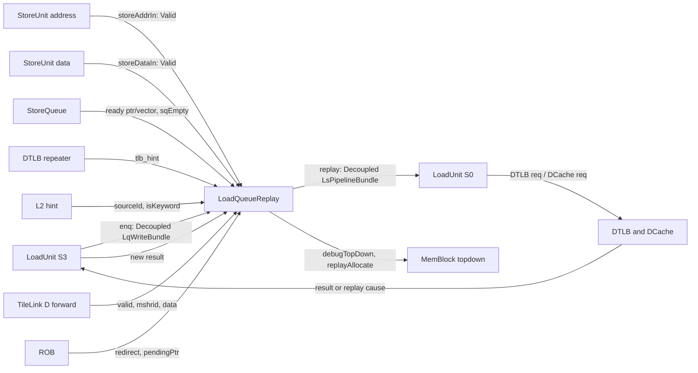
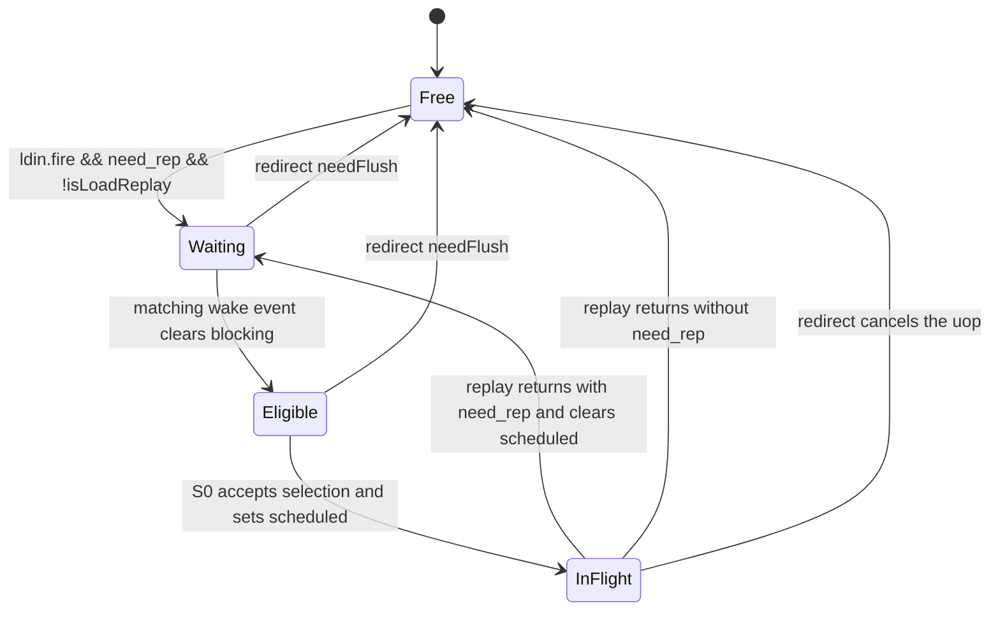
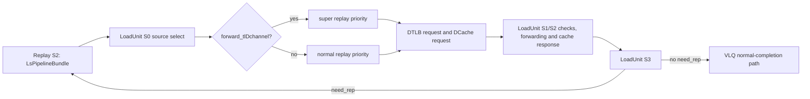

# 香山昆明湖 V2 LoadQueueReplay 源码分析

> 结论先行：`LoadQueueReplay` 是 LoadUnit S3 结果路径旁的一张 **72-entry、三端口重发等待表**，不是 VirtualLoadQueue 的替代品，也不直接完成架构提交。它把带有 `rep_info.need_rep` 的 load 保留为 `allocated` entry，按重放原因等待 Store 地址/数据、TLB hint、TL-D refill、RAR/RAW 空位或 ROB 推进，再按 `LQ age + cause priority + L2 hint` 选择，构造 `LsPipelineBundle` 回送 LoadUnit S0。一次回送后，LoadUnit 可再次报告重放或完成；前者复用同一 `schedIndex`，后者才释放该 replay entry。所有下述“实际行为”以给定本地 Kunminghu V2 源码为准。

## 1. 范围、基线与证据

```text
Analyzed checkout:
  /home/yanyusong/xs-memory-env/XiangShan
Branch / commit:
  kunminghu-v2 / e12436c7cba86b195deec24981976d78bc263661
Primary module:
  xiangshan.mem.LoadQueueReplay
Primary source:
  src/main/scala/xiangshan/mem/lsqueue/LoadQueueReplay.scala
Effective integration path:
  MemBlock -> LoadQueue -> LoadQueueReplay -> LoadUnit
Course output:
  LoadStore-LoadQueueReplay.md
Design Doc baseline:
  not consulted; no local XiangShan-Design-Doc checkout was present
Weekly-sync result:
  skill script ran; skipped because the last successful sync was under 7 days old
```

- 本文严格使用当前目录 `skills/analyze-xiangshan-kunminghu/` 的分析流程，并只引用上述 checkout 中的 Chisel/Scala 实现。
- 源码工作树原有 `difftest` 修改与未跟踪的 `src/main/resources/aia/`；本次没有修改源码，也不把它们当成本文行为证据。
- **[代码]** 表示已追到该 commit 的实例化、连线或状态更新；**[课程]** 只说明理论背景；**[待验证]** 表示需要 elaborated RTL、FST 或定向仿真，不能当作已证实行为。
- `LoadQueueReplay` 的分析边界是“标量/向量 load 的排队重发”。DCache 的 MSHR/refill FSM、DTLB 的内部替换、ROB 的完整提交逻辑和外部总线事务不是本模块的所有物；本文只追到它们与 replay 的交点。

### 1.1. 已读的有效源码

| 主题 | 代码证据 | 本文据此确认的事实 |
| --- | --- | --- |
| 参数 | [Parameters.scala:151, 167-175](</home/yanyusong/xs-memory-env/XiangShan/src/main/scala/xiangshan/Parameters.scala:151>) | 默认 `CommitWidth=8`，VLQ/RAR/Replay 均为 72，RAW 为 32，uncache 为 16，SQ 为 56，Replay 地址表使用 8 个写 bank。 |
| 聚合与连线 | [LoadQueue.scala:214-219, 319-345](</home/yanyusong/xs-memory-env/XiangShan/src/main/scala/xiangshan/mem/lsqueue/LoadQueue.scala:214>) | `LoadQueue` 同时实例化 VLQ、RAR、RAW、Replay、异常和 uncache 子结构，并将 LoadUnit/StoreUnit/TL-D/SQ 指针实际接到 Replay。 |
| 重放输入定义 | [LoadUnit.scala:41-78](</home/yanyusong/xs-memory-env/XiangShan/src/main/scala/xiangshan/mem/pipeline/LoadUnit.scala:41>) | `rep_info` 含 cause 向量、MSHR/TLB ID、Store SQ 指针、`full_fwd`、`last_beat` 和 `need_rep`。 |
| Replay 表、选择和流水 | [LoadQueueReplay.scala:170-270, 372-599](</home/yanyusong/xs-memory-env/XiangShan/src/main/scala/xiangshan/mem/lsqueue/LoadQueueReplay.scala:170>) | Replay 自己持有 entry 状态、FreeList、AgeDetector、两级寄存器和 `Decoupled` 回送端口。 |
| 分配/释放 | [LoadQueueReplay.scala:604-759](</home/yanyusong/xs-memory-env/XiangShan/src/main/scala/xiangshan/mem/lsqueue/LoadQueueReplay.scala:604>) | 输入不反压；首发重放分配 FreeList，重发使用原 `schedIndex`，成功/redirect 才释放。 |
| 地址数组和冲突断言 | [LoadQueueData.scala:32-133](</home/yanyusong/xs-memory-env/XiangShan/src/main/scala/xiangshan/mem/lsqueue/LoadQueueData.scala:32>) | 读口是 `RegEnable` 的寄存器读；多写同一地址有 assertion，源码未见同址读写 bypass。 |
| 输出竞争与重译 | [LoadUnit.scala:290-420, 529-558, 838-846](</home/yanyusong/xs-memory-env/XiangShan/src/main/scala/xiangshan/mem/pipeline/LoadUnit.scala:290>) | Replay 回到 LoadUnit S0 后与其他来源仲裁；普通 replay 会再次发 DTLB 请求，不应被误称为“永远使用旧翻译”。 |
| 架构提交/Difftest | [Rob.scala:1504-1595](</home/yanyusong/xs-memory-env/XiangShan/src/main/scala/xiangshan/backend/rob/Rob.scala:1504>) | `DiffInstrCommit`/`DiffLoadEvent` 由 ROB commit 产生，Replay entry 的分配、阻塞和释放本身不是直接 Difftest 事件。 |

### 1.2. 理论到有效实现的映射

| 概念 | 课程背景 | Kunminghu V2 的落点 | 边界 |
| --- | --- | --- | --- |
| 结构冒险 | [Structural_Hazards_vs_Data_Hazards_vs_Control_Hazards.md](</home/yanyusong/XiangShanLab/xiangshan-course/docs/4-xiangshan-microarchitecture-analysis/1-superscalar-basic-knowledge/3_Structural_Hazards_vs_Data_Hazards_vs_Control_Hazards.md) 中的端口/队列资源竞争。 | `freeList.io.empty`、RAR/RAW full、LoadUnit source priority、DCache `ready`。 | 课程解释“为什么重放”；实际准入和时序以源码为准。 |
| 内存相关与推测 | [Dependency_Between_Instructions.md](</home/yanyusong/XiangShanLab/xiangshan-course/docs/4-xiangshan-microarchitecture-analysis/1-superscalar-basic-knowledge/4_Dependency_Between_Instructions.md) 中 load/store 地址和数据相关。 | `C_MA` 等待 Store 地址，`C_FF` 等待 Store 数据，RAW/RAR 满则延后重试。 | `LoadQueueReplay` 只保存“需重试”的 load，不完成 RAW/RAR 的 CAM 检测。 |
| 动态调度/年龄 | [Tomosulo_vs_ScoreBoard.md](</home/yanyusong/XiangShanLab/xiangshan-course/docs/4-xiangshan-microarchitecture-analysis/1-superscalar-basic-knowledge/7_Tomosulo_vs_ScoreBoard.md) 中的 ready/select 问题。 | `blocking` 是 readiness，`scheduled` 防止同一 entry 重复发，`AgeDetector` 与 `ldWbPtr` 倾向旧 load。 | 它不是通用 reservation station；重放原因的优先级会覆盖纯年龄选择。 |
| 精确状态 | [13_ROB.md](</home/yanyusong/XiangShanLab/xiangshan-course/docs/4-xiangshan-microarchitecture-analysis/2-xiangshan-design-document/13_ROB.md) 的 commit/redirect 背景。 | 每个 replay entry 留 `uop.robIdx`，redirect 用 `needFlush` 清 entry；ROB 仍拥有架构提交与 Difftest。 | Replay 表的 `allocated` 不是 ROB valid，也不是 ISA commit。 |

## 2. 模块角色、边界与连接

### 2.1. Who / Why / How / From / To

| 项目 | 结论 |
| --- | --- |
| Who | `LoadQueueReplay`，由 `LoadQueue` 实例化；每个 `LoadUnit` 通过同号 `io.replay(i)` 接收回送。 |
| Why | 将暂时不具备正确执行条件的 load 脱离普通发射路径，等待已知唤醒事件，减少无效反复访问 DTLB/DCache，同时保留重放身份。 |
| How | 以 entry 记录 `uop`、虚拟地址、cause、阻塞状态及依赖 ID；按 hint/high/low、LQ 旧者和 AgeDetector 选择；S0/S1/S2 形成重试 bundle。 |
| From | LoadUnit S3 的 `LqWriteBundle`，Store address/data ready 信息，SQ ready 指针，TL-D forward，TLB/L2 hint，ROB redirect/dequeue pointer。 |
| To | `LoadUnit.io.replay`；其后在 LoadUnit S0 重新争用 DTLB 和 DCache，最终由 S3 再次写入 LQ 或正常完成。 |

### 2.2. 有效层次与接口图



`LoadQueue` 的实际连接不是概念图：

```scala
loadQueueReplay.io.enq         <> io.ldu.ldin
loadQueueReplay.io.storeAddrIn <> io.sta.storeAddrIn
loadQueueReplay.io.storeDataIn <> io.std.storeDataIn
loadQueueReplay.io.replay      <> io.replay
loadQueueReplay.io.tl_d_channel <> io.tl_d_channel
loadQueueReplay.io.ldWbPtr     <> virtualLoadQueue.io.ldWbPtr
```

以上来自 [LoadQueue.scala:319-338](</home/yanyusong/xs-memory-env/XiangShan/src/main/scala/xiangshan/mem/lsqueue/LoadQueue.scala:319>)；MemBlock 再把每条 `lsq.io.replay(i)` 接到对应 LoadUnit 的 `io.replay`，见 [MemBlock.scala:921-1025](</home/yanyusong/xs-memory-env/XiangShan/src/main/scala/xiangshan/mem/MemBlock.scala:921>)。

### 2.3. 关键端口与握手语义

| 接口 | 来源 -> 去向 | 有效资格 | 关键 payload / 作用 | 容易误读之处 |
| --- | --- | --- | --- | --- |
| `io.enq(i)` | LoadUnit S3 -> Replay | `valid && !needFlush && rep_info.need_rep` 才进入/更新 entry；模块把 `ready := true`。 | `uop`、`vaddr`、`rep_info`、向量元数据、`handledByMSHR`、`schedIndex`。 | `enq.valid` 不是“必然新分配”；重发可能复用旧 entry，redirect 的输入会被过滤。 |
| `io.replay(i)` | Replay -> LoadUnit S0 | `replay_req.valid && io.replay.ready`。 | `LsPipelineBundle`，包含保存的 vaddr/uop、MSHR、`schedIndex`、`isLoadReplay=true`。 | 输出 valid 不代表已经请求 DCache；LoadUnit 仍要参与源优先级和 DCache ready 仲裁。 |
| `storeAddrIn` | STA S1 -> Replay | `valid && !miss && sqIdx match`。 | 使 `C_MA` 对应 entry 的地址等待解除。 | 这是 Valid 通知，不是 Store commit。 |
| `storeDataIn` | STD S0 -> Replay | `valid && sqIdx match`。 | 使 `C_FF` 对应 entry 的数据等待解除。 | 同样不是写入 cache 的完成通知。 |
| `tl_d_channel` | DCache/TL-D -> Replay | `valid && mshrid match`。 | 消除 `C_DM` 的阻塞；LoadUnit 可把该 replay 视为 cache-miss-forward 路径。 | 该端口没有 ready，Replay 不拥有 TileLink D 通道流控。 |
| `l2_hint` / `tlb_hint` | L2 / DTLB -> Replay | hint `valid`，并匹配 source ID 或 TLB ID，或 `replay_all`。 | 早唤醒 miss，或解除 TLB miss 等待。 | hint 是选择/唤醒提示，不等同“访问已经完成”。 |
| `redirect` | Backend -> Replay | `uop.robIdx.needFlush(redirect)`。 | 清除错误路径 entry 并归还 FreeList。 | 无 ready 的 Valid 控制仍会与 S0/S1/S2 在飞事务相互作用。 |

## 3. 参数、状态与索引

### 3.1. 容量和派生宽度

| 量 | 本基线值/表达式 | 影响 |
| --- | --- | --- |
| `LoadQueueReplaySize` | 72 | Replay entry 深度。 |
| `LoadPipelineWidth` | 3 | `enq`、`replay`、地址表读写端口数；最多三个 lane。 |
| `StorePipelineWidth` | 2 | 同拍 Store address/data 观察端口数。 |
| `LoadQueueNWriteBanks` | 8 | `LqVAddrModule` 的地址写 bank 数。 |
| 每个 replay lane 的条纹候选数 | `72 / 3 = 24` | `getRemBits` 把 entry `3*k + lane` 分给各 lane 的 AgeDetector。 |
| FreeList | `size=72, allocWidth=3, freeWidth=4, enablePreAlloc=true` | 最多三项分配请求；释放按四个 stripe 处理。 |

参数定义见 [Parameters.scala:167-175](</home/yanyusong/xs-memory-env/XiangShan/src/main/scala/xiangshan/Parameters.scala:167>)，派生 accessor 见 [Parameters.scala:782-815](</home/yanyusong/xs-memory-env/XiangShan/src/main/scala/xiangshan/Parameters.scala:782>)，Replay 的构造参数见 [LoadQueueReplay.scala:228-270](</home/yanyusong/xs-memory-env/XiangShan/src/main/scala/xiangshan/mem/lsqueue/LoadQueueReplay.scala:228>)。

### 3.2. 存储结构和生命周期所有权

| 结构 | 所有者/复位 | 写入、保持与清除 | 读取/消费 | 设计目的 |
| --- | --- | --- | --- | --- |
| `allocated[72]` | Replay；复位全 0。 | 新重放置 1；普通回送完成或 redirect 置 0；vector commit/flush 时只做错误检查，不在此处释放。 | selection、TL-D/Store 唤醒、topdown、FreeList 回收。 | entry 的有效位。 |
| `scheduled[72]` | Replay；复位全 0。 | S0 接住候选后置 1；LoadUnit 再报告 `need_rep` 时置 0；新 entry 初始化为 0。 | selection 排除已发而未返回的 entry。 | 防止同一条目重复发射。 |
| `uop[72]`、`vecReplay[72]` | Replay；有效性由 `allocated` 保护。 | 接收 `enq` 时覆盖。 | redirect 比较、年龄、payload 重建。 | 保持重试的身份和向量元数据。 |
| `vaddrModule` | `LqVAddrModule`；72 entry、3R/3W、8 bank、写延迟参数 2。 | `enq` 使用 `enqIndex` 写 vaddr；S1 用 `ren/raddr` 读。 | S2 输出 `bits.vaddr`。 | 保存重试所需虚拟地址。 |
| `cause/blocking/strict/blockSqIdx` | Replay；控制位复位为 0。 | `cause` 从 `rep_info` 复制；先置 `blocking=true`，再按 cause 重写；MA/FF 写等待的 SQ 指针。 | 等待条件、优先级、topdown。 | 将“为什么不能现在发”转成可观察的状态。 |
| `missMSHRId/tlbHintId/replayCarry/...` | Replay。 | 新结果更新；MSHR ID 只在 `handledByMSHR` 时写。 | TL-D/TLB hint 匹配，或重建回送 bundle。 | 把异步唤醒与原始访问绑定。 |
| `FreeList` | 独立模块；head/tail 初始化为全空队列。 | 首次 `needEnqueue && !isLoadReplay` 分配；成功、redirect 通过 `freeMaskVec` 释放。 | 提供 `allocateSlot`、`canAllocate`、`empty`、`validCount`。 | Entry 复用与 full 指示。 |

FreeList 的空/满语义不能只看名字。其 `empty` 来自可用槽数为零；当 `LoadQueueReplay` 把 `lqFull := freeList.io.empty` 时，才向外报告 replay 满。FreeList 初始化、预分配、释放 stripe 和读写表项见 [FreeList.scala:43-130](</home/yanyusong/xs-memory-env/XiangShan/src/main/scala/xiangshan/mem/lsqueue/FreeList.scala:43>)。

### 3.3. 索引如何计算

1. **首次写入。** 对第 `w` 个输入 lane，`offset = PopCount(newEnqueue.take(w))`，然后从 `freeList.allocateSlot(offset)` 取槽；故同拍多个新重放用此前有效 lane 数消除重复分配。
2. **回送重试。** 若 `enq.bits.isLoadReplay`，`enqIndex = schedIndex`，不申请 FreeList。这维持同一 load 的 replay identity。
3. **按 lane 条纹选择。** `getRemBits` 将物理 entry 映射为 `entry = 3 * group + rem`。每个 rem 的 AgeDetector 面对 24 个候选，再还原为 72-bit one-hot。
4. **LQ 旧者偏置。** `ldWbPtr + 0..3` 的 load 可在 AgeDetector 之前得到优先选择；此逻辑按 `uop(i).lqIdx` 比较，不是按 FreeList allocation order。

核心实现位于 [LoadQueueReplay.scala:372-488](</home/yanyusong/xs-memory-env/XiangShan/src/main/scala/xiangshan/mem/lsqueue/LoadQueueReplay.scala:372>) 与 [LoadQueueReplay.scala:617-668](</home/yanyusong/xs-memory-env/XiangShan/src/main/scala/xiangshan/mem/lsqueue/LoadQueueReplay.scala:617>)：

```scala
val offset = PopCount(newEnqueue.take(w))
val enqIndex = Mux(enq.bits.isLoadReplay,
  enq.bits.schedIndex, freeList.io.allocateSlot(offset))
enqIndexOH(w) := UIntToOH(enqIndex)
```

### 3.4. 地址数组的端口冲突边界

`LqRawDataModule` 的读数据是 `RegEnable(data(raddr), ren)`，不是显式组合 bypass；写端口按 bank 延迟后合并，且对任意两个写口断言不能同址：

```scala
io.rdata(i) := RegEnable(data(io.raddr(i)), io.ren(i))
assert(!(io.wen(i) && io.wen(j) && io.waddr(i) === io.waddr(j)))
```

代码见 [LoadQueueData.scala:71-132](</home/yanyusong/xs-memory-env/XiangShan/src/main/scala/xiangshan/mem/lsqueue/LoadQueueData.scala:71>)。因此：

- **[代码]** 新 entry 的多 lane 槽号由 offset 区分，地址模块也有同址多写 assertion。
- **[待验证]** 同拍“同一 entry 的 S1 读地址”和“重发结果的写地址”发生时，软件源中没有专用 forwarding 规则；需要看生成 RTL/read-during-write 语义或波形，不能武断称为 read-first 或 write-first。
- **[待验证]** 两个 `isLoadReplay` lane 若错误携带相同 `schedIndex`，Replay 本层未见专门 assertion；地址模块的断言会在两者都写时暴露冲突。这是应加入定向 checker 的接口契约风险。

## 4. 重放原因与阻塞唤醒

### 4.1. Cause 编码及优先级

`LoadReplayCauses` 明确规定“编码越小优先级越高”，并警告改动优先级可能造成死锁，见 [LoadQueueReplay.scala:37-75](</home/yanyusong/xs-memory-env/XiangShan/src/main/scala/xiangshan/mem/lsqueue/LoadQueueReplay.scala:37>)。`need_rep` 是整个 cause 向量的 OR，见 [LoadUnit.scala:57-77](</home/yanyusong/xs-memory-env/XiangShan/src/main/scala/xiangshan/mem/pipeline/LoadUnit.scala:57>)。

| 编码 | 别名 | 入队后的阻塞/立即可发规则 | 解除条件 | 来源边界 |
| --- | --- | --- | --- | --- |
| 0 `C_MA` | `mem_amb` | 默认阻塞；记录 `addr_inv_sq_idx` 和 `loadWaitStrict`。 | 对应 Store 地址 ready、同拍 STA 地址有效，或 SQ 为空。严格时不能只靠 ready vector。 | LoadUnit 给出具体 SQ 指针；Replay 不重新做冲突 CAM。 |
| 1 `C_TM` | `tlb_miss` | 赋值为 `!tlb_full && !matching_hint`。 | `tlb_hint.resp.valid` 且 `replay_all` 或 ID 匹配。 | DTLB hint 交由 MemBlock 接到 Replay。 |
| 2 `C_FF` | `fwd_fail` | 默认阻塞；记录 `data_inv_sq_idx`。 | 对应 Store 数据 ready、同拍 STD 数据有效，或 SQ 为空。 | 等的是数据可转发条件，不是 cache response。 |
| 3 `C_DR` | `dcache_rep` | 入队时强制 `blocking=false`。 | 无额外 waiter。 | 可在下一轮参与选择。 |
| 4 `C_DM` | `dcache_miss` | 仅 `handledByMSHR` 时以 `!full_fwd` 和当前/上一拍 TL-D 匹配结果确定阻塞。 | 匹配 MSHR 的 TL-D valid，或 L2 hint 早唤醒。 | MSHR/refill 所有权在 DCache；Replay 只保存 ID。 |
| 5 `C_WF` | `wpu_fail` | 入队时强制不阻塞。 | 无额外 waiter。 | 重试资格立即建立。 |
| 6 `C_BC` | `bank_conflict` | 入队时强制不阻塞。 | 无额外 waiter。 | DCache bank 冲突后的再尝试。 |
| 7 `C_RAR` | `rar_nack` | 默认阻塞。 | `!rarFull`，或该 load 不再晚于 `ldWbPtr`。 | RAR 表仍由 `LoadQueueRAR` 所有。 |
| 8 `C_RAW` | `raw_nack` | 默认阻塞。 | `!rawFull`，或该 SQ index 不再晚于 `stAddrReadySqPtr`。 | RAW 表仍由 `LoadQueueRAW` 所有。 |
| 9 `C_NK` | `nuke` | 入队时强制不阻塞。 | 无额外 waiter。 | 真正 redirect 的选择不由本表发出。 |
| 10 `C_MF` | `misalign_nack` | 默认阻塞。 | `uop.robIdx` 不再晚于 `robDeqPtr`。 | 非对齐 buffer 满/退回的等待策略。 |

阻塞更新的精确 Chisel 位于 [LoadQueueReplay.scala:306-369](</home/yanyusong/xs-memory-env/XiangShan/src/main/scala/xiangshan/mem/lsqueue/LoadQueueReplay.scala:306>)，首次覆盖规则位于 [LoadQueueReplay.scala:671-717](</home/yanyusong/xs-memory-env/XiangShan/src/main/scala/xiangshan/mem/lsqueue/LoadQueueReplay.scala:671>)。

### 4.2. 一个必须保留的源码事实

`io.loadMisalignFull` 与 `io.tlbReplayDelayCycleCtrl` 都在 Replay 的 IO 中声明并从 `LoadQueue` 连入，但在此版本 `LoadQueueReplay.scala` 后续没有消费者。不要把这些端口的存在写成“Replay 用它们直接阻塞/延迟选择”。与 `C_MF` 相关、实际可见的解除条件是 `robDeqPtr` 比较；`C_MF` 的产生需回到 LoadUnit/MisalignBuffer 路径确认。

## 5. Entry 状态机、分配与释放

### 5.1. 隐式状态机

源中没有 `Enum` 状态机；真正的状态由 `allocated`、`blocking`、`scheduled` 与 S1/S2 valid 组合编码。下图是解释模型，不是额外硬件状态：



| 状态解释 | 组合条件 | 为什么需要它 | 典型离开条件 |
| --- | --- | --- | --- |
| Free | `allocated=0` | FreeList 槽可重新使用。 | 新的首次 replay 申请该槽。 |
| Waiting | `allocated=1, blocking=1, scheduled=0` | 防止在依赖事件到达前浪费 LoadUnit/DCache 带宽。 | Store/TLB/TL-D/RAR/RAW/ROB 事件解除阻塞。 |
| Eligible | `allocated=1, blocking=0, scheduled=0` | 允许进入竞争选择。 | S0 选择后置 `scheduled=1`。 |
| InFlight | `allocated=1, scheduled=1`，且 S1/S2 或输出可能持有该条目。 | 直到 LoadUnit 接收并返回结果前避免重复送同一 entry。 | 返回仍需 replay 则重新 eligible；否则释放；redirect 清除。 |

### 5.2. 分配、回送与同拍优先级

`LoadQueueReplay` 不对输入反压：

```scala
assert(freeList.io.canAllocate.reduce(_ || _) ||
  !io.enq.map(_.valid).reduce(_ || _), "LoadQueueReplay Overflow")
enq.ready := true.B
```

见 [LoadQueueReplay.scala:607-627](</home/yanyusong/xs-memory-env/XiangShan/src/main/scala/xiangshan/mem/lsqueue/LoadQueueReplay.scala:607>)。其含义是设计假设 Replay 深度与 VLQ 同量级，正常系统不会把它填爆；它不是“满时安全 backpressure”。验证应把 assertion 当作系统容量不变量。

| 输入情形 | `isLoadReplay` | `need_rep` | FreeList/entry 行为 |
| --- | ---:| ---:| --- |
| 初次失败 | 0 | 1 | 分配新 slot，写全部元数据，`allocated=1`，`scheduled=0`。 |
| 正常完成从 S3 回来 | 1 | 0 | 不重新分配；`allocated(schedIndex)=0`，设置 `freeMaskVec`。 |
| 再次失败 | 1 | 1 | 不重新分配；用原 `schedIndex` 覆盖原因/数据，`scheduled=0`，等待下一轮。 |
| 无 replay 的 S3 结果 | 0 | 0 | `needEnqueue=0`，Replay 表不建 entry；VLQ/uncache/异常等各自消费。 |
| redirect 中的输入 | 任意 | 任意 | `cancelEnq` 使 `needEnqueue=0`；已有匹配 entry 在后段被清除归还。 |

一个重要的 Chisel 顺序事实是：同一回送结果先可能更新 `allocated/scheduled/cause`，随后 `when (enq.valid && isLoadReplay)` 再决定“释放”或“清 `scheduled`”。若一个 entry 同拍还命中 redirect，源码后面的 redirect clear 也会写 `allocated=false` 与 free mask。本文不把这种赋值顺序简化成“所有事件完全独立”；应在 RTL 仿真中覆盖交叠情况。

### 5.3. 释放与 vector feedback 的特殊性

- 标量 replay 回送且 `!need_rep` 是正常释放路径，见 [LoadQueueReplay.scala:721-730](</home/yanyusong/xs-memory-env/XiangShan/src/main/scala/xiangshan/mem/lsqueue/LoadQueueReplay.scala:721>)。
- redirect 使用 `uop(i).robIdx.needFlush(io.redirect)`，把 `allocated` 清零并置 `freeMaskVec(i)`，见 [LoadQueueReplay.scala:750-759](</home/yanyusong/xs-memory-env/XiangShan/src/main/scala/xiangshan/mem/lsqueue/LoadQueueReplay.scala:750>)。
- vector feedback 对同一 `robIdx/uopIdx` 的“commit 或 flush 时仍有 replay entry”触发 `XSError`，而不是在本模块中隐式释放，见 [LoadQueueReplay.scala:733-748](</home/yanyusong/xs-memory-env/XiangShan/src/main/scala/xiangshan/mem/lsqueue/LoadQueueReplay.scala:733>)。这说明该版本把 vector replay 完结视为上游不变量，不能把 feedback 当作第三条回收通路。

## 6. 选择、仲裁与三段流水

### 6.1. 候选优先级

候选先满足 `allocated && !scheduled && !blocking`，然后每条纹的全局优先级为：

1. 与本拍 `l2_hint` 匹配且 beat 合适的 `C_DM`；
2. `C_DM` 或 `C_FF` 的高优先级重放；
3. 其他 cause 的低优先级重放；
4. 在上述候选中优先 `ldWbPtr + 0..3` 匹配的较旧 LQ 条目；
5. 若仍无法由 LQ 顺序打破，使用条纹内部的 `AgeDetector`。

关键代码在 [LoadQueueReplay.scala:401-488](</home/yanyusong/xs-memory-env/XiangShan/src/main/scala/xiangshan/mem/lsqueue/LoadQueueReplay.scala:401>)：

```scala
val hasHigherPriority = cause(i)(C_DM) || cause(i)(C_FF)
allocated(i) && !scheduled(i) && !blocking(i) && hasHigherPriority

Mux(hintValid, hintMask,
  Mux(highMask.orR, highMask, lowerMask))
```

`AgeDetector` 保存上三角年龄矩阵，free/deq 清行列，新 enq 相对先前端口建立年龄，最后只输出一个 one-hot 最老 ready 候选，见 [LoadQueueReplay.scala:93-166](</home/yanyusong/xs-memory-env/XiangShan/src/main/scala/xiangshan/mem/lsqueue/LoadQueueReplay.scala:93>)。它提升公平性，但不是无条件公平保证：L2 hint 和高优先 cause 可持续抢占低优 cause；源码没有给出有界等待证明。

### 6.2. L2 hint 与 TL-D 的两种 miss 唤醒

对于 `C_DM`：

- **L2 hint 早唤醒**：若 `sourceId` 匹配，entry 当前仍阻塞且未 scheduled，先把 `blocking=false`；根据 `isKeyword` 和保存的 `last_beat` 选择首/次 beat，意图是在随后 TL-D 数据到来时让 LoadUnit 命中 D-channel 或 MSHR。
- **TL-D 唤醒**：`io.tl_d_channel.valid && mshrid==missMSHRId(i)` 清阻塞；`DcacheToLduForwardIO` 实际由 TileLink D 的 `valid/data/source/denied/corrupt` 投影而来。

L2 hint 逻辑见 [LoadQueueReplay.scala:401-422](</home/yanyusong/xs-memory-env/XiangShan/src/main/scala/xiangshan/mem/lsqueue/LoadQueueReplay.scala:401>)，TL-D payload/forward helper 见 [DCacheWrapper.scala:686-744](</home/yanyusong/xs-memory-env/XiangShan/src/main/scala/xiangshan/cache/dcache/DCacheWrapper.scala:686>)。Replay 自己没有 AXI AW/W/B/AR/R 接口，直接观察的是 DCache 给 LDU/Replay 的 TileLink-D 派生通知。

### 6.3. S0/S1/S2 的数据与控制

| 阶段 | 主要状态/寄存器 | 资格与停顿 | 输出/副作用 | 证据 |
| --- | --- | --- | --- | --- |
| S0 选择 | `s0_oldestSel` | 需 candidate；`s0_can_go` 依赖 S1 可前进，或持有 uop 已被 redirect。 | 选中时将对应 `scheduled=true`，把 one-hot 转为 index 捕获到 S1。 | [LoadQueueReplay.scala:504-517](</home/yanyusong/xs-memory-env/XiangShan/src/main/scala/xiangshan/mem/lsqueue/LoadQueueReplay.scala:504>) |
| S1 地址读 | `s1_oldestSel` | `s1_can_go = replayCanFire && (!s2.valid || replay_req.fire) || s2_cancelReplay`。 | `vaddrModule.ren/raddr`，并取 uop/cause/MSHR/元数据到 S2 寄存器。 | [LoadQueueReplay.scala:518-540](</home/yanyusong/xs-memory-env/XiangShan/src/main/scala/xiangshan/mem/lsqueue/LoadQueueReplay.scala:518>) |
| S2 回送 | `s2_oldestSel` 与 `replay_req` | `valid` 等于 S2 entry valid；若下游 `ready=0` 则 payload 保持。 | 组装 `LsPipelineBundle`，`isLoadReplay=true`，带回 `schedIndex`，并按 `C_DM` 设置 `forward_tlDchannel`。 | [LoadQueueReplay.scala:541-573](</home/yanyusong/xs-memory-env/XiangShan/src/main/scala/xiangshan/mem/lsqueue/LoadQueueReplay.scala:541>) |

`EnableHybridUnitReplay` 的默认 `Constantin` 初值是 true：true 时三条 `replay_req` 直连三条 `io.replay`；false 时 lane 1/2 经过 2:1 RR arbiter，lane 2 对外禁用，见 [LoadQueueReplay.scala:575-588](</home/yanyusong/xs-memory-env/XiangShan/src/main/scala/xiangshan/mem/lsqueue/LoadQueueReplay.scala:575>)。因此“每周期三条”只能称为默认配置下的结构上限，不能无条件当作所有构建的吞吐承诺。

### 6.4. 冷却与 backpressure 示例

连续回送会更新每 lane `coldCounter`；当其达到动态 `ColdDownThreshold`（初值 12，且必须小于 16）时，`replayCanFire` 变 false，直到计数过程恢复可发区间。该机制限制连续回送压力，详见 [LoadQueueReplay.scala:491-500, 589-598](</home/yanyusong/xs-memory-env/XiangShan/src/main/scala/xiangshan/mem/lsqueue/LoadQueueReplay.scala:491>)。由于 Constantin 可改阈值、下游也会 backpressure，源码不能导出固定“每 N 拍”端到端延迟。

下面是一个符号化握手图，展示寄存器阶段和 `valid/ready/fire` 的因果关系；它不是 FST 实测波形：

```waveform-draw
{
  "signal": [
    {"name": "clk", "wave": "p....."},
    {"name": "s0_oldestSel(i).valid", "wave": "01...."},
    {"name": "s1_oldestSel(i).valid", "wave": "0.1..."},
    {"name": "s2_oldestSel(i).valid", "wave": "0..1.."},
    {"name": "replay_req(i).valid", "wave": "0..1.."},
    {"name": "io.replay(i).ready", "wave": "1....."},
    {"name": "io.replay(i).fire", "wave": "0..10."}
  ],
  "config": {"hscale": 1}
}
```

## 7. 回到 LoadUnit：重译、DCache 与再次结果

### 7.1. LoadUnit S0 的 source priority

回送不是直通 DCache。LoadUnit S0 的源顺序把 `io.replay && forward_tlDchannel` 放在普通 replay 之前（cache-miss super replay），普通 replay 仍与 MAB、fast replay、prefetch、vector/int issue、MMIO/NC 等竞争。并且当 replay 的 LQ index 晚于当前普通 issue 的 LQ index 时，`s0_rep_stall` 会限制普通 replay，见 [LoadUnit.scala:290-370](</home/yanyusong/xs-memory-env/XiangShan/src/main/scala/xiangshan/mem/pipeline/LoadUnit.scala:290>)。



### 7.2. 普通 replay 会重新走 DTLB

`fromNormalReplaySource` 将 `isFirstIssue=false`、`ld_rep=true`，但没有把它标成 `fast_rep`；LoadUnit 的 `s0_tlb_no_query` 只排除硬件 prefetch、`fast_rep`、MMIO 和 NC，不排除 `super_rep_idx` 或 `lsq_rep_idx`。`s0_tlb_valid` 也显式包含这两种 replay：

```scala
val s0_tlb_no_query = s0_hw_prf_select || s0_sel_src.prf_i ||
  s0_src_select_vec(fast_rep_idx) || s0_src_select_vec(mmio_idx) ||
  s0_src_select_vec(nc_idx)

s0_tlb_valid := s0_src_valid_vec(super_rep_idx) ||
  s0_src_valid_vec(lsq_rep_idx) || ...
```

证据见 [LoadUnit.scala:338-404](</home/yanyusong/xs-memory-env/XiangShan/src/main/scala/xiangshan/mem/pipeline/LoadUnit.scala:338>) 和 [LoadUnit.scala:529-558](</home/yanyusong/xs-memory-env/XiangShan/src/main/scala/xiangshan/mem/pipeline/LoadUnit.scala:529>)。因此 `C_TM` 等到 hint 后的回送仍可执行新的翻译检查；本文不把 hint 解释为绕过权限或地址翻译。

### 7.3. LoadUnit 对 Replay 的 ready

`io.replay.ready` 需要 `s0_can_go`、DCache req ready，并满足 source 优先级/`s0_rep_stall` 条件；带 TL-D forward 的 super replay 可直接越过普通 replay 的限制：

```scala
io.replay.ready := s0_can_go && io.dcache.req.ready &&
  (s0_src_ready_vec(lsq_rep_idx) && !s0_rep_stall ||
   s0_src_select_vec(super_rep_idx))
```

见 [LoadUnit.scala:838-846](</home/yanyusong/xs-memory-env/XiangShan/src/main/scala/xiangshan/mem/pipeline/LoadUnit.scala:838>)。所以 Replay S2 的 valid 可被下游 hold；`scheduled` 在这期间阻止相同 entry 再次入选。

## 8. 正常、重放、恢复与边界场景

| 场景 | 触发与资源 | Replay 状态变化 | 下游效果 | 代码证据 |
| --- | --- | --- | --- | --- |
| DCache bank conflict / replay / WPU fail | `C_BC/C_DR/C_WF`。 | 入队后 `blocking=false`，可下一轮参与选择。 | 回送普通 LoadUnit replay；仍受 DCache ready/优先级限制。 | [LoadQueueReplay.scala:675-683](</home/yanyusong/xs-memory-env/XiangShan/src/main/scala/xiangshan/mem/lsqueue/LoadQueueReplay.scala:675>) |
| Store 地址未决 | `C_MA`，带 `addr_inv_sq_idx`。 | `blocking` 直到地址 ready、同拍 STA 命中或 SQ 空。`strict` 会限制 ready-vector 快路径。 | 防止在可能违反 store-load 次序时过早重试。 | [LoadQueueReplay.scala:306-343, 699-703](</home/yanyusong/xs-memory-env/XiangShan/src/main/scala/xiangshan/mem/lsqueue/LoadQueueReplay.scala:306>) |
| 转发数据未决 | `C_FF`，带 `data_inv_sq_idx`。 | 等 Store data ready/同拍 STD/SQ empty。 | 重新尝试 store-to-load forwarding。 | [LoadQueueReplay.scala:318-353, 705-708](</home/yanyusong/xs-memory-env/XiangShan/src/main/scala/xiangshan/mem/lsqueue/LoadQueueReplay.scala:318>) |
| TLB miss/replay | `C_TM` 和 TLB ID。 | hint 回应 ID 匹配或 `replay_all` 才解除。 | 重新经过 LoadUnit 的 DTLB request。 | [LoadQueueReplay.scala:344-349, 685-690](</home/yanyusong/xs-memory-env/XiangShan/src/main/scala/xiangshan/mem/lsqueue/LoadQueueReplay.scala:344>) |
| DCache miss | `C_DM` 且处理给 MSHR。 | 保存 MSHR ID；TL-D 或 L2 hint 清 block，hint/高优策略优先回送。 | `forward_tlDchannel=true`，LoadUnit 把它当 super replay source。 | [LoadQueueReplay.scala:401-444, 692-697, 561-569](</home/yanyusong/xs-memory-env/XiangShan/src/main/scala/xiangshan/mem/lsqueue/LoadQueueReplay.scala:401>) |
| RAR/RAW 队列暂满 | `C_RAR/C_RAW`。 | 分别等表不满，或 LQ/SQ 指针越过该 load/store。 | 再次向相应检查队列提交 query。 | [LoadQueueReplay.scala:358-365](</home/yanyusong/xs-memory-env/XiangShan/src/main/scala/xiangshan/mem/lsqueue/LoadQueueReplay.scala:358>) |
| 非对齐 buffer 饱和 | `C_MF`。 | 等待 ROB dequeue pointer 到达/超过该 uop。 | 返回后再走 LoadUnit/Misalign path。 | [LoadQueueReplay.scala:366-369](</home/yanyusong/xs-memory-env/XiangShan/src/main/scala/xiangshan/mem/lsqueue/LoadQueueReplay.scala:366>) |
| 错路径/异常 redirect | `uop.robIdx.needFlush(redirect)`。 | 输入不建 entry；已有 entry 清 `allocated` 并 FreeList free。 | S1/S2 对同一 uop 会 cancel，避免向错误路径发请求。 | [LoadQueueReplay.scala:277-283, 504-525, 750-759](</home/yanyusong/xs-memory-env/XiangShan/src/main/scala/xiangshan/mem/lsqueue/LoadQueueReplay.scala:277>) |
| 回送成功 | `isLoadReplay=1 && need_rep=0`。 | 释放原 `schedIndex`。 | VLQ 才可在 LoadUnit 正常结果路径将该 load 标记为可连续出队。 | [LoadQueueReplay.scala:721-730](</home/yanyusong/xs-memory-env/XiangShan/src/main/scala/xiangshan/mem/lsqueue/LoadQueueReplay.scala:721>)、[VirtualLoadQueue.scala:247-282](</home/yanyusong/xs-memory-env/XiangShan/src/main/scala/xiangshan/mem/lsqueue/VirtualLoadQueue.scala:247>) |

### 8.1. Redirect 的符号时序

```waveform-draw
{
  "signal": [
    {"name": "clk", "wave": "p...."},
    {"name": "io.redirect.valid", "wave": "001.."},
    {"name": "needCancel(entry k)", "wave": "0.1.."},
    {"name": "allocated(k)", "wave": "1..0."},
    {"name": "freeMaskVec(k)", "wave": "0.1.."},
    {"name": "freeList.io.free(k)", "wave": "0..1."}
  ],
  "config": {"hscale": 1}
}
```

这是状态更新关系图，不声称波形的绝对周期：`needCancel` 与 `freeMaskVec` 是组合/写使能语义，FreeList 内部释放再有自己的寄存器和 stripe 时序。准确波形应以具体配置的 FST/RTL 为准。

## 9. 地址边界、异常、MMIO 与总线边界

### 9.1. 虚拟页与权限

Replay 表只保存 `vaddr`，没有保存一个“可永远复用”的 paddr。普通 replay 重新进入 LoadUnit S0 的 DTLB 请求路径，DTLB 和 PMP 的接口也在 MemBlock -> LoadUnit 上连接，见 [MemBlock.scala:925-948](</home/yanyusong/xs-memory-env/XiangShan/src/main/scala/xiangshan/mem/MemBlock.scala:925>)。因此：

- **[代码]** TLB replay 的重新发射会再参与翻译/权限检查。
- **[待验证]** 一个跨页的非对齐访问在两个 split 子请求中是否一定得到两个独立 TLB 事务，不能仅由 Replay 表推出；需追踪 `LoadMisalignBuffer` 生成的每个 `LsPipelineBundle` 和波形。
- `LoadQueueReplay` 无 CSR、AIA、IOPMP 或中断端口；权限/异常判断在 LoadUnit/DTLB/PMP 路径，不能误归属给本表。

### 9.2. 非对齐与 16B 边界

真正的拆分属于 `LoadMisalignBuffer`，不是 Replay。它以 `highAddress = opSize - 1 + vaddr(4,0)` 判断是否跨 16B 边界，并以 `maxSplitNum=2` 将访问拆成两份；任何 split 子请求出现异常或 uncache 时，路径转入 writeback，并注释为交给软件 `loadAddrMisaligned` 异常处理，见 [LoadMisalignBuffer.scala:143-239, 292-326](</home/yanyusong/xs-memory-env/XiangShan/src/main/scala/xiangshan/mem/lsqueue/LoadMisalignBuffer.scala:143>)。

`LoadQueueReplay` 对 S2 回送 bundle 显式清掉 `loadAddrMisaligned` exception bit，见 [LoadQueueReplay.scala:546-570](</home/yanyusong/xs-memory-env/XiangShan/src/main/scala/xiangshan/mem/lsqueue/LoadQueueReplay.scala:546>)。这只说明它把普通重放重新送回 LoadUnit；不应解释为 Replay 自己执行了 split/merge 或吞掉了所有非对齐异常。

### 9.3. Cache-line / refill 边界

- Replay 的 `C_DM` 关联 `mshr_id` 与 `last_beat`，L2 hint 根据 `isKeyword` 选择首/次 beat；目的在于恰当的 TL-D 数据拍到来前后提前调度。
- `DcacheToLduForwardIO.forward` 最终以请求 MSHR ID、物理地址和 `last` 选择 128-bit forward 数据，见 [DCacheWrapper.scala:715-744](</home/yanyusong/xs-memory-env/XiangShan/src/main/scala/xiangshan/cache/dcache/DCacheWrapper.scala:715>)。
- **[待验证]** Replay 本身没有 cache-line split FSM，不能从其 `last_beat` 推断任意跨 cache-line load 的全流程。具体分段、MSHR merge 和 refill 顺序属于 DCache/MisalignBuffer，应使用生成 RTL 或波形逐地址确认。

### 9.4. MMIO / NC 与外部错误

在 LoadUnit 已把访问判为 MMIO 或 NC 后，`LoadQueueUncache` 只接收“无 redirect、无异常、无 replay 且是 mmio/nc”的 S3 结果：

```scala
s2_enqueue(w) := s2_valid(w) && !s2_has_exception(w) &&
  !s2_need_replay(w) && (s2_req(w).mmio || s2_req(w).nc)
```

见 [LoadQueueUncache.scala:336-383](</home/yanyusong/xs-memory-env/XiangShan/src/main/scala/xiangshan/mem/lsqueue/LoadQueueUncache.scala:336>)。该结论是 **Replay 不是 MMIO/NC 正常事务载体**，不是“MMIO 永不重放”。若在判定前已有可重试条件，LoadUnit 的因果与优先级仍需单独观察。

Uncache entry 的显式 FSM 为 `s_idle/s_req/s_resp/s_wait`；MMIO 需要 `pendingMMIOld && robIdx==pendingPtr`，NC 则可直接发；redirect 可能立即或等 response 后 flush。`denied` 映射 `loadAccessFault`，`corrupt && !denied` 映射 `hardwareError`，见 [LoadQueueUncache.scala:63-161, 173-241](</home/yanyusong/xs-memory-env/XiangShan/src/main/scala/xiangshan/mem/lsqueue/LoadQueueUncache.scala:63>)。

## 10. 时延、吞吐与性能可观测性

### 10.1. 时延分类

| 路径 | 可由源码确认的阶段 | 时延性质 | 不能承诺的数字 |
| --- | --- | --- | --- |
| 首次重放入表 | LoadUnit S3 -> Replay `enq` 写状态/地址。 | 受源端 S3 和写阵列实现影响；`enq.ready=true` 不代表无存储时序。 | 固定“1 cycle 完成”。 |
| 已解阻 entry -> replay 输出 | Replay selection S0 -> S1 地址读 -> S2 `Decoupled` 输出。 | 结构上有两级选择/读地址寄存器边界；若下游 ready 高可连续推进。 | 绝对 2/3 拍，因 `RegEnable`、配置和停顿需要 elaboration。 |
| replay 输出 -> DCache 请求 | LoadUnit S0 source select -> DTLB/DCache req。 | `io.replay.ready` 同时受 `s0_can_go`、DCache ready 和优先级影响。 | 一拍必到 DCache。 |
| TLB miss / cache miss | 等 TLB hint 或 TL-D/L2 hint，再重试。 | 明显变量时延。 | 固定 refill 周期或固定总线延迟。 |
| 成功回送 -> 架构提交 | S3 正常结果 -> VLQ 连续可出队 -> ROB commit。 | 需同时满足 LQ 连续前缀和 ROB commit 资格。 | Replay release 就等于 commit。 |

### 10.2. 吞吐上限与瓶颈

- 默认配置有 3 个 replay 输入、3 个 selection lane、3 个输出 lane；在 `EnableHybridUnitReplay=true`、候选分属可用条纹、DCache ready、LoadUnit priority 允许、无 cooldown 时，结构上最多可尝试每拍回送 3 条。
- 这不是无条件稳态吞吐：所有三个 lane 都要穿过 LoadUnit S0 source priority；普通 replay 还会被 `s0_rep_stall`、普通 issue、MAB、fast replay、预取等影响。
- `ColdDownThreshold`、FreeList 容量、TLB/Store/DCache 的唤醒速度和下游 ready 都会降低有效吞吐。源码没有给“最坏延迟”或“公平等待上界”。
- 输入端“永远 ready”把过载检测放在 assertion 上，因此队列深度关系是系统不变量，而不是按协议自然回压。

### 10.3. 内建计数与调试输出

Replay 提供 `enq/deq/deq_block/replay_full` 以及 MA/TM/NK/RAR/RAW/BC/DR/FF/DM、hint wake 等 `XSPerfAccumulate` 项，见 [LoadQueueReplay.scala:807-855](</home/yanyusong/xs-memory-env/XiangShan/src/main/scala/xiangshan/mem/lsqueue/LoadQueueReplay.scala:807>)。`debugTopDown` 用 `debug_vaddr` 匹配 ROB head virtual address 并归类 TLB、violation、MSHR/other replay，`replayAllocate` 是任意 entry allocated 的 OR。这些是调试/性能可观测量，不是 Difftest 架构状态。

## 11. Difftest、异常、调试与架构状态

### 11.1. Difftest 覆盖矩阵

| 信号/状态 | 直接生产者 | valid/时机 | 架构意义 | Replay 的关系 |
| --- | --- | --- | --- | --- |
| `DiffInstrCommit` | ROB。 | `commitValid(i) && isCommit`。 | 已提交指令、寄存器写回、PC/指令等架构可见状态。 | Replay 等待/重发时不会直接产生该事件。 |
| `DiffLoadEvent` | ROB。 | `EnableDifftest` 下、commit 的 load/AMO/vector load 且非 skip。 | 已提交 load 的 paddr、op type、load/atomic 属性。 | 只有最终能走到 ROB commit 的 load 才可见。 |
| Replay `allocated/cause/blocking/scheduled` | `LoadQueueReplay`。 | 微架构任意周期。 | 无 ISA 直接对应。 | 没有 `difftest` import 或 `DifftestModule` 实例。 |
| `debugTopDown/replayAllocate/XSPerf` | Replay/MemBlock。 | 性能统计/调试条件。 | 分析性能停顿。 | 可辅助排查，但不能拿来与参考模型比对架构结果。 |
| exception/trap | LoadUnit/LQ exception buffer/ROB。 | 随异常选择和提交路径。 | 精确异常由 ROB 边界可见。 | Replay 的 redirect cancel 只清微架构状态。 |

ROB 绑定 Difftest 的精确条件、`lqIdx`/`sqIdx` metadata 和 `DiffLoadEvent.paddr` 赋值见 [Rob.scala:1533-1595](</home/yanyusong/xs-memory-env/XiangShan/src/main/scala/xiangshan/backend/rob/Rob.scala:1533>)。因此验证 Replay 时应同时做两层检查：Difftest 保障最终架构正确性；本地 assertion/coverage 保障“没有饥饿、错误复用或错误路径访问”等微架构正确性。

### 11.2. 异常、中断、权限与 debug 边界

- Replay 输出清除的是重发 bundle 中的 `loadAddrMisaligned` 位；真正异常 buffer 位于 `LoadQueue`，其输入来自 LoadUnit S3、vector feedback 和 uncache error，见 [LoadQueue.scala:260-290](</home/yanyusong/xs-memory-env/XiangShan/src/main/scala/xiangshan/mem/lsqueue/LoadQueue.scala:260>)。
- 该模块没有 interrupt、AIA、CSR、IOPMP 或 AXI channel 端口；任何关于这些主题的结论都必须追至 LoadUnit/DTLB/PMP/总线模块，不能因它在 memory subsystem 内就赋予它这些职责。
- Debug 路径基于 `robHeadVaddr` 与 entry 的 `debug_vaddr`，若多个 entry 同址则选较老 ROB，见 [LoadQueueReplay.scala:763-807](</home/yanyusong/xs-memory-env/XiangShan/src/main/scala/xiangshan/mem/lsqueue/LoadQueueReplay.scala:763>)。它不改变 data replay 的仲裁。

## 12. 验证特别注意

| 验证 ID | 风险/不变量 | 定向 stimulus | 期望观察 | checker / coverage | 源码锚点 |
| --- | --- | --- | --- | --- |
| RPL-01 | Reset 后不可发幽灵 entry。 | reset 后保持所有输入 invalid，再激励单次新 replay。 | `allocated/scheduled/blocking=0` 起步；首次 entry 只在有效 replay 后出现。 | `allocated.orR==0` reset assertion；首次事务 cover。 | [LoadQueueReplay.scala:228-244](</home/yanyusong/xs-memory-env/XiangShan/src/main/scala/xiangshan/mem/lsqueue/LoadQueueReplay.scala:228>) |
| RPL-02 | 72 深度假设不能被输入 overflow 掩盖。 | 施压 fill replay 表，同时令 LDU S3 连续 valid。 | 达到无可分配 slot 时 assertion，而非静默吞掉。 | `LoadQueueReplay Overflow` assertion cover/fail。 | [LoadQueueReplay.scala:607-609](</home/yanyusong/xs-memory-env/XiangShan/src/main/scala/xiangshan/mem/lsqueue/LoadQueueReplay.scala:607>) |
| RPL-03 | 同拍 2/3 个首次 entry 必须不同 index。 | 三个 lane 同拍 `isLoadReplay=0, need_rep=1`。 | `allocateSlot(offset)` 对应不同 entry，地址数组多写 assertion 不触发。 | pairwise `enqIndex` unique；地址模块 assertion。 | [LoadQueueReplay.scala:623-668](</home/yanyusong/xs-memory-env/XiangShan/src/main/scala/xiangshan/mem/lsqueue/LoadQueueReplay.scala:623>) |
| RPL-04 | 同一 `schedIndex` 不得被多 lane 非法重写。 | 人为构造两个 replay 回送带同 `schedIndex`。 | 若同拍都写地址，`LqRawDataModule` assertion 报错；接口层应拒绝该情况。 | SVA unique `schedIndex` 或 negative test。 | [LoadQueueData.scala:127-131](</home/yanyusong/xs-memory-env/XiangShan/src/main/scala/xiangshan/mem/lsqueue/LoadQueueData.scala:127>) |
| RPL-05 | MA/FF 不可在依赖 Store 未 ready 时提前发。 | 分别保持 addr/data pointer 未越过，随后给同拍 STA/STD valid。 | 前者直到地址事件、后者直到数据事件清 `blocking`。 | per-cause cover + `blocking -> !selected`。 | [LoadQueueReplay.scala:306-353](</home/yanyusong/xs-memory-env/XiangShan/src/main/scala/xiangshan/mem/lsqueue/LoadQueueReplay.scala:306>) |
| RPL-06 | TM 只接受匹配 hint 或 replay_all。 | 发送不同 TLB ID，再发送匹配 ID 和 `replay_all`。 | 不匹配不解阻；两种匹配情形都解阻。 | ID cross coverage。 | [LoadQueueReplay.scala:344-349](</home/yanyusong/xs-memory-env/XiangShan/src/main/scala/xiangshan/mem/lsqueue/LoadQueueReplay.scala:344>) |
| RPL-07 | DM 的 L2 hint/beat 选择和 TL-D ID 必须正确。 | 变化 `isKeyword/last_beat`，并产生匹配/不匹配 MSHR TL-D。 | 仅匹配的 hint/TL-D 唤醒；优先候选遵守 beat mask。 | MSHR/beat/hint cross。 | [LoadQueueReplay.scala:401-422](</home/yanyusong/xs-memory-env/XiangShan/src/main/scala/xiangshan/mem/lsqueue/LoadQueueReplay.scala:401>) |
| RPL-08 | backpressure 时 payload 保持、entry 不重复发。 | 把 `io.replay.ready` 拉低多个拍。 | S2 `valid/bits` 保持；对应 `scheduled=1`，无第二次选择。 | stable-payload assertion；`deq_block` counter cover。 | [LoadQueueReplay.scala:518-573, 811-825](</home/yanyusong/xs-memory-env/XiangShan/src/main/scala/xiangshan/mem/lsqueue/LoadQueueReplay.scala:518>) |
| RPL-09 | redirect 和在飞 replay 不得访问错误路径。 | S0/S1/S2 任一阶段对 uop 施加 redirect。 | cancel 允许前级前进，entry free；下游不应接受错路径请求。 | phase x redirect coverage；free mask check。 | [LoadQueueReplay.scala:504-525, 750-759](</home/yanyusong/xs-memory-env/XiangShan/src/main/scala/xiangshan/mem/lsqueue/LoadQueueReplay.scala:504>) |
| RPL-10 | 高优/hint 不应永久饿死低优。 | 持续生成 DM/FF 与一个低优 old entry。 | 无源码给出有界保证；测试应统计其最终发射或暴露饥饿。 | liveness cover/timeout；按 cause 性能计数。 | [LoadQueueReplay.scala:424-488](</home/yanyusong/xs-memory-env/XiangShan/src/main/scala/xiangshan/mem/lsqueue/LoadQueueReplay.scala:424>) |
| RPL-11 | C_MF 的实际等待依据不是 unused 输入端口。 | 令 misalign full 和 `robDeqPtr` 分别变化。 | 只以 `robDeqPtr` 越过为本模块 unblock 依据。 | unused-port lint + C_MF cover。 | [LoadQueueReplay.scala:209, 366-369](</home/yanyusong/xs-memory-env/XiangShan/src/main/scala/xiangshan/mem/lsqueue/LoadQueueReplay.scala:209>) |
| RPL-12 | 架构结果与微架构重放分离。 | 对同一 load 制造多次 replay 后完成/commit。 | replay 计数增加，但仅 ROB commit 时出现 DiffLoadEvent。 | replay-to-ROB correlation scoreboard。 | [Rob.scala:1543-1595](</home/yanyusong/xs-memory-env/XiangShan/src/main/scala/xiangshan/backend/rob/Rob.scala:1543>) |

## 13. 结论与待验证项

1. `LoadQueueReplay` 的核心正确性来自“保存 identity + cause-specific wait + 单次 scheduled + 回送复用 index”；它和 VLQ 的连续完成/释放、RAW/RAR 的检测、DCache 的 MSHR 机制共同构成完整 load recovery。
2. cause 编码优先级是死锁敏感的结构性约束，不能把它当作普通 perf 顺序随意改动。
3. 普通 replay 会重新参与 DTLB/DCache 路径；`C_DM` 的特殊高优/forward 只说明它能利用 TL-D 时序，不说明可以跳过地址/权限验证。
4. `lqFull` 是 Replay FreeList 无可用槽；输入端不回压，overflow assertion 依赖“Replay 与 VLQ 容量匹配”的系统假设。
5. `loadMisalignFull`、`tlbReplayDelayCycleCtrl` 在本模块源中未被消费；若规格希望它们改变 replay 行为，应从 elaborated RTL 或后续提交确认，不能凭端口名断言功能已生效。
6. 仍需 FST/仿真验证的高风险点是：同址读写阵列语义、同 `schedIndex` 多回送、L2 hint 与 TL-D 交叠、持续高优 cause 下的低优饥饿，以及跨页/跨 cache-line 非对齐访问的完整时序。

## 14. 源码索引

| 文件 | 角色 |
| --- | --- |
| [LoadQueueReplay.scala](</home/yanyusong/xs-memory-env/XiangShan/src/main/scala/xiangshan/mem/lsqueue/LoadQueueReplay.scala) | 本文主模块：cause、entry、选择、流水、分配、释放、perf/topdown。 |
| [LoadQueue.scala](</home/yanyusong/xs-memory-env/XiangShan/src/main/scala/xiangshan/mem/lsqueue/LoadQueue.scala) | 聚合器和实际 wiring。 |
| [LoadUnit.scala](</home/yanyusong/xs-memory-env/XiangShan/src/main/scala/xiangshan/mem/pipeline/LoadUnit.scala) | `rep_info`、S0 source select、DTLB/DCache req、LDU->LQ 返回。 |
| [FreeList.scala](</home/yanyusong/xs-memory-env/XiangShan/src/main/scala/xiangshan/mem/lsqueue/FreeList.scala) | Replay entry 分配和释放实现。 |
| [LoadQueueData.scala](</home/yanyusong/xs-memory-env/XiangShan/src/main/scala/xiangshan/mem/lsqueue/LoadQueueData.scala) | VAddr 数组寄存器读、bank 写和冲突 assertion。 |
| [VirtualLoadQueue.scala](</home/yanyusong/xs-memory-env/XiangShan/src/main/scala/xiangshan/mem/lsqueue/VirtualLoadQueue.scala) | 正常完成后的 `committed` 前缀与 LQ 生命周期。 |
| [LoadMisalignBuffer.scala](</home/yanyusong/xs-memory-env/XiangShan/src/main/scala/xiangshan/mem/lsqueue/LoadMisalignBuffer.scala) | 非对齐拆分/合并和 C_MF 的外围上下文。 |
| [LoadQueueUncache.scala](</home/yanyusong/xs-memory-env/XiangShan/src/main/scala/xiangshan/mem/lsqueue/LoadQueueUncache.scala) | MMIO/NC 分流、ROB 次序门控、外部错误映射。 |
| [DCacheWrapper.scala](</home/yanyusong/xs-memory-env/XiangShan/src/main/scala/xiangshan/cache/dcache/DCacheWrapper.scala) | TL-D 到 LDU/Replay 的 forward payload 语义。 |
| [Rob.scala](</home/yanyusong/xs-memory-env/XiangShan/src/main/scala/xiangshan/backend/rob/Rob.scala) | 架构 commit 与 Difftest load event 的真实发射点。 |
